# Lesson 01：C++ Basics, Input, Output & Data Types C++ 初識、輸入輸出與資料型別

> 這堂課的重點：理解 C++ 程式的基本結構，學會使用 `cout` 輸出、使用 `cin` 輸入，並建立變數、常數及常見資料型別。完成本章後，你應該可以獨立撰寫簡單的互動式 C++ 程式。

把程式想像成一台自動販賣機：你投入硬幣、按下按鈕，機器依照規則處理，最後送出飲料。

C++ 程式也是一樣：

> 輸入資料 → 執行規則 → 輸出結果

---

## Section I. 今天要做什麼？

1. 認識程式的輸入、處理與輸出。
2. 認識 C++ 原始程式檔的 `.cpp` 副檔名。
3. 建立第一個 C++ 程式。
4. 認識 `#include <iostream>`。
5. 認識 `using namespace std;`。
6. 認識 `int main()`。
7. 認識大括號 `{ }`。
8. 認識分號 `;`。
9. 使用 `cout` 輸出文字。
10. 使用 `cout` 輸出整數與小數。
11. 使用 `cout` 輸出運算結果。
12. 使用多個 `<<` 串接輸出內容。
13. 使用 `\n` 換行。
14. 使用 `endl` 換行。
15. 比較 `\n` 與 `endl`。
16. 使用 `cin` 讀取整數。
17. 使用 `cin` 讀取小數。
18. 使用 `cin` 讀取單字。
19. 一次輸入多筆資料。
20. 理解 `cin` 會依照資料型別讀取資料。
21. 認識 `cin >>` 遇到空格時停止的限制。
22. 初步認識 `getline()`。
23. 使用 `//` 撰寫單行註解。
24. 使用 `/* */` 撰寫多行註解。
25. 認識變數的用途。
26. 使用資料型別、名稱與初始值建立變數。
27. 輸出變數內容。
28. 修改變數內容。
29. 避免在同一範圍重複定義同名變數。
30. 理解未初始化區域變數的風險。
31. 使用 `const` 建立常數。
32. 使用 `constexpr` 建立編譯期間常數。
33. 比較 `const`、`constexpr` 與 `#define`。
34. 認識 C++ 關鍵字。
35. 認識識別字。
36. 遵守變數命名規則。
37. 理解 C++ 名稱區分大小寫。
38. 使用清楚且一致的命名方式。
39. 認識整數型別。
40. 認識浮點數型別。
41. 使用科學記號。
42. 認識 `char`。
43. 分辨單引號與雙引號。
44. 將字元轉成整數編碼。
45. 認識 `bool`。
46. 理解 `true` 與 `false` 的輸出。
47. 使用 `sizeof` 查詢型別大小。
48. 理解型別大小可能因系統而不同。
49. 完成多個輸入輸出小程式。
50. 找出並修正常見語法錯誤。
51. 完成概念檢查、程式閱讀及實作題。

---

## Section II. 今天的學習方式

1. 先把每個程式分成：
   ```text
   Input → Process → Output
   ```
2. 每次看到新的程式，先找：
   - 標頭檔
   - `main()`
   - 變數
   - 輸入
   - 處理
   - 輸出
3. 文字使用雙引號：
   ```cpp
   "Hello"
   ```
4. 單一字元使用單引號：
   ```cpp
   'A'
   ```
5. 變數建立時標出：
   ```text
   型別、名稱、初始值
   ```
6. 輸入題先確認變數型別是否符合輸入資料。
7. 每次使用 `cin >>` 時，思考輸入中是否可能包含空格。
8. 每次使用整數型別時，確認資料是否包含小數。
9. 不硬背型別實際大小，使用 `sizeof` 在目前環境確認。
10. 完整範例使用：
    ```text
    clang++ -std=c++17 -Wall -Wextra -Werror
    ```
    檢查。

---

## Section III. 核心語法對照

| 語法 | 用途 |
| --- | --- |
| `#include <iostream>` | 載入標準輸入輸出功能 |
| `#include <string>` | 載入 `string` |
| `using namespace std;` | 允許直接使用 `cout`、`cin`、`string` |
| `int main()` | 程式開始執行的位置 |
| `cout << 內容;` | 輸出內容 |
| `cin >> 變數;` | 讀取輸入 |
| `\n` | 換行 |
| `endl` | 換行並刷新輸出緩衝區 |
| `//` | 單行註解 |
| `/* */` | 多行註解 |
| `資料型別 名稱 = 初始值;` | 建立並初始化變數 |
| `const` | 建立不能修改的常數 |
| `constexpr` | 建立可在編譯期間確定的常數 |
| `int` | 整數 |
| `float` | 單精度浮點數 |
| `double` | 雙精度浮點數 |
| `char` | 單一字元 |
| `bool` | 真或假 |
| `string` | 一段文字 |
| `sizeof(...)` | 查詢位元組大小 |
| `static_cast<int>(ch)` | 將字元轉成整數編碼 |

---

# Part A：C++ 程式的基本概念

## Section IV. Input、Process、Output

程式通常包含三個步驟：

| 步驟 | 名稱 | 說明 |
| --- | --- | --- |
| 1 | 輸入 Input | 使用者提供資料，例如名字、年齡或成績 |
| 2 | 處理 Process | 程式依照規則進行計算或判斷 |
| 3 | 輸出 Output | 將結果顯示在終端機或執行畫面 |

<p align="center">
  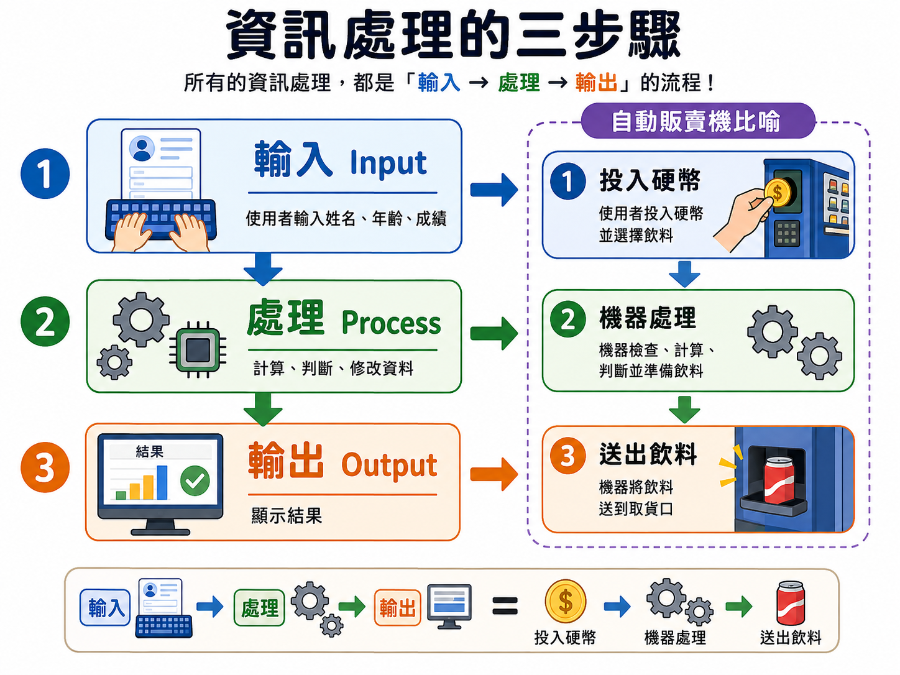
</p>

### 生活例子

點飲料時：

```text
告訴店員品項、甜度與冰量
→ 店員製作
→ 取得飲料
```

對應：

```text
輸入
→ 處理
→ 輸出
```

---

## Section V. 建立與執行 C++ 程式

通常包含四個步驟：

1. 建立專案。
2. 建立程式檔案。
3. 撰寫程式碼。
4. 編譯並執行。

C++ 原始程式檔常用：

```text
.cpp
```

例如：

```text
main.cpp
```

---

## Section VI. 編譯流程

```text
原始程式碼
→ 編譯器
→ 可執行程式
→ 執行結果
```

<p align="center">
  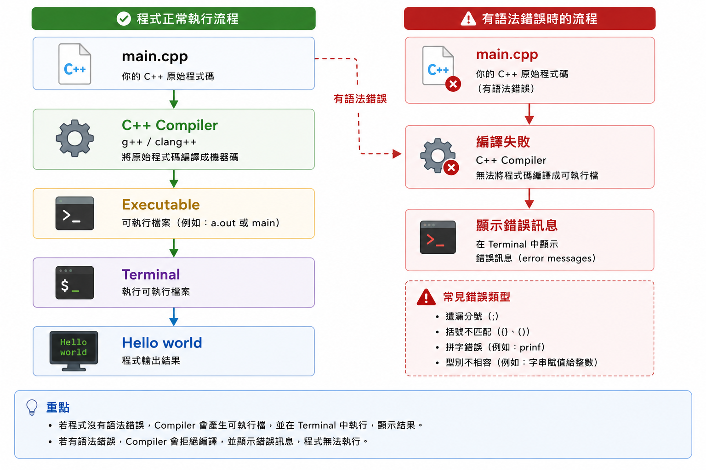
</p>

若程式中有語法錯誤：

```text
編譯失敗
→ 顯示錯誤訊息
→ 無法建立正常執行檔
```

---

## Section VII. 第一個 C++ 程式

```cpp
#include <iostream>
using namespace std;

int main() {
    cout << "Hello world" << '\n';

    return 0;
}
```

<p align="center">
  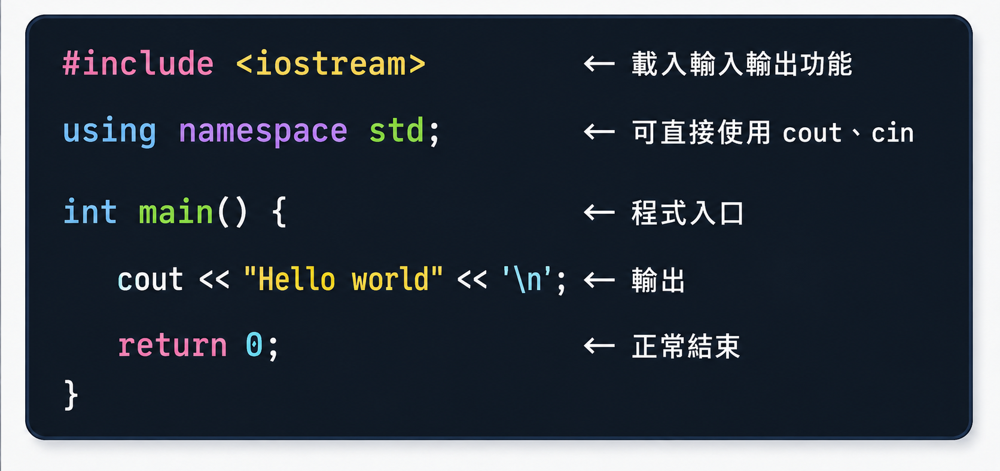
</p>

輸出：

```text
Hello world
```

---

## Section VIII. 程式結構說明

| 程式碼 | 用途 |
| --- | --- |
| `#include <iostream>` | 載入標準輸入輸出功能 |
| `using namespace std;` | 讓程式可直接使用 `cout`、`cin` |
| `int main()` | 程式開始執行的位置 |
| `{ }` | 包住一段程式碼 |
| `cout` | 將內容輸出到終端機 |
| `return 0;` | 表示程式正常結束 |
| `;` | 表示敘述結束 |

> 本教材前期使用 `using namespace std;` 以降低初學閱讀負擔。較大型專案通常使用 `std::cout`、`std::cin` 等完整名稱，以減少名稱衝突。

---

## Section IX. `system("pause")` 提醒

```cpp
system("pause");
```

只適用於部分 Windows 環境，不是標準 C++ 寫法。

跨平台教材通常不建議使用。

---

# Part B：輸出 `cout`

## Section X. 基本語法

```cpp
cout << 輸出內容;
```

<p align="center">
  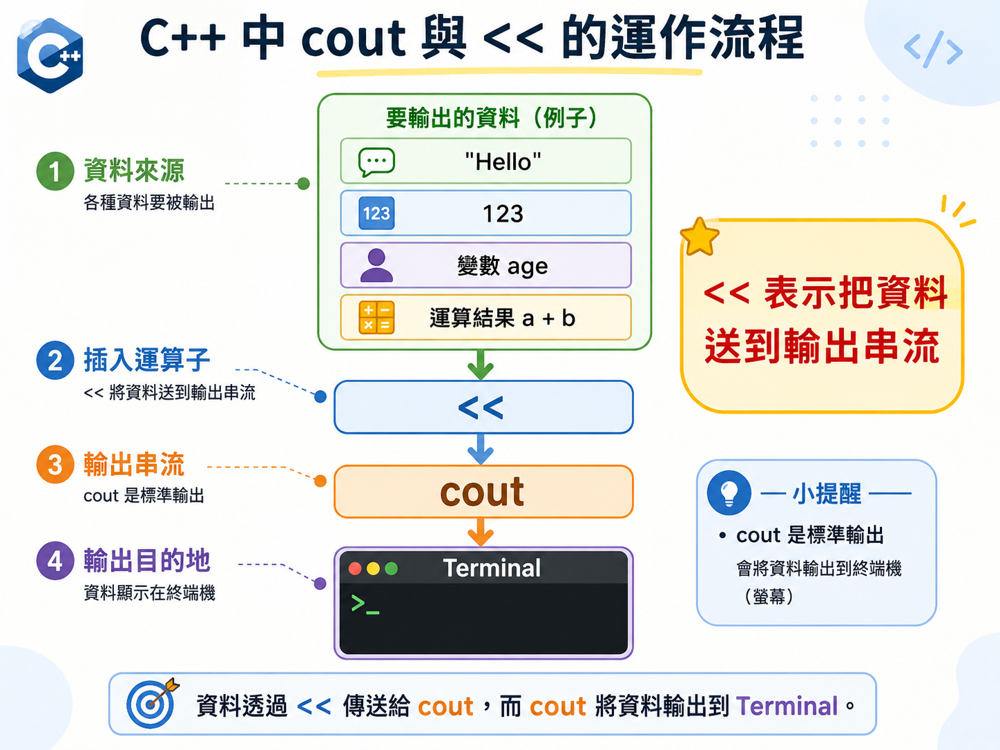
</p>

---

## Section XI. 輸出文字

文字使用雙引號：

```cpp
cout << "Hello world";
cout << "早安";
```

雙引號表示：

```text
這是一段文字
不是變數名稱
也不是指令
```

---

## Section XII. 輸出數字

```cpp
cout << 123;
cout << 3.14;
```

數字不需要雙引號。

---

## Section XIII. 輸出運算結果

```cpp
cout << 123 + 456;
cout << 10 * 5;
```

輸出：

```text
57950
```

兩個結果會連在一起，因為中間沒有空格或換行。

---

## Section XIV. 串接多個輸出內容

```cpp
cout << 123 << " " << "早安";
```

輸出：

```text
123 早安
```

---

## Section XV. 使用 `\n`

```cpp
cout << "第一行\n";
cout << "第二行\n";
```

輸出：

```text
第一行
第二行
```

也可以：

```cpp
cout << "蘋果\n香蕉\n西瓜\n";
```

---

## Section XVI. 使用 `endl`

```cpp
cout << "第一行" << endl;
cout << "第二行" << endl;
```

`endl` 會：

1. 換行。
2. 刷新輸出緩衝區。

一般輸出通常優先使用：

```cpp
'\n'
```

---

## Section XVII. `cout` 常見錯誤

### 錯誤 1：文字沒有雙引號

```cpp
cout << Hello;
```

C++ 會把 `Hello` 當成名稱。

正確：

```cpp
cout << "Hello";
```

### 錯誤 2：忘記分號

```cpp
cout << "Hello"
```

正確：

```cpp
cout << "Hello";
```

---

# Part C：輸入 `cin`

## Section XVIII. 基本語法

```cpp
cin >> 變數名稱;
```

<p align="center">
  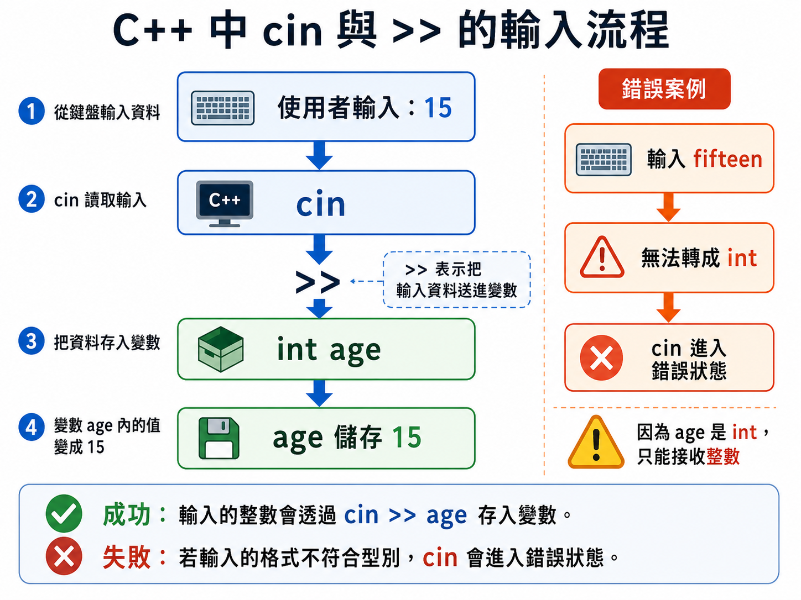
</p>

程式會等待使用者輸入，並將資料存入變數。

---

## Section XIX. 輸入整數

```cpp
#include <iostream>
using namespace std;

int main() {
    int age;

    cout << "請輸入你的年齡：";
    cin >> age;

    cout << "你的年齡是 " << age << " 歲。\n";

    return 0;
}
```

可能輸入：

```text
15
```

輸出：

```text
你的年齡是 15 歲。
```

---

## Section XX. 輸入文字

```cpp
#include <iostream>
#include <string>
using namespace std;

int main() {
    string name;

    cout << "請輸入你的名字：";
    cin >> name;

    cout << "Hello, " << name << "!\n";

    return 0;
}
```

使用 `string` 前需要：

```cpp
#include <string>
```

---

## Section XXI. 一次輸入多筆資料

```cpp
int age;
double height;

cout << "請輸入年齡與身高：";
cin >> age >> height;
```

輸入：

```text
15 168.5
```

資料分配：

```text
15
→ age

168.5
→ height
```

---

## Section XXII. `cin` 與資料型別

```cpp
int age;
cin >> age;
```

預期整數。

```cpp
double height;
cin >> height;
```

可以讀取小數。

若整數變數收到：

```text
fifteen
```

`cin` 無法正常轉成整數，會進入錯誤狀態。

---

## Section XXIII. `cin >>` 與空格

```cpp
string name;
cin >> name;
```

輸入：

```text
Wang Xiao Ming
```

通常只讀到：

```text
Wang
```

因為 `cin >>` 遇到空白會停止。

---

## Section XXIV. `getline()`

需要讀取包含空格的完整文字時，可以使用：

```cpp
string fullName;
getline(cin, fullName);
```

`getline()` 會在後續字串章節進一步介紹。

<p align="center">
  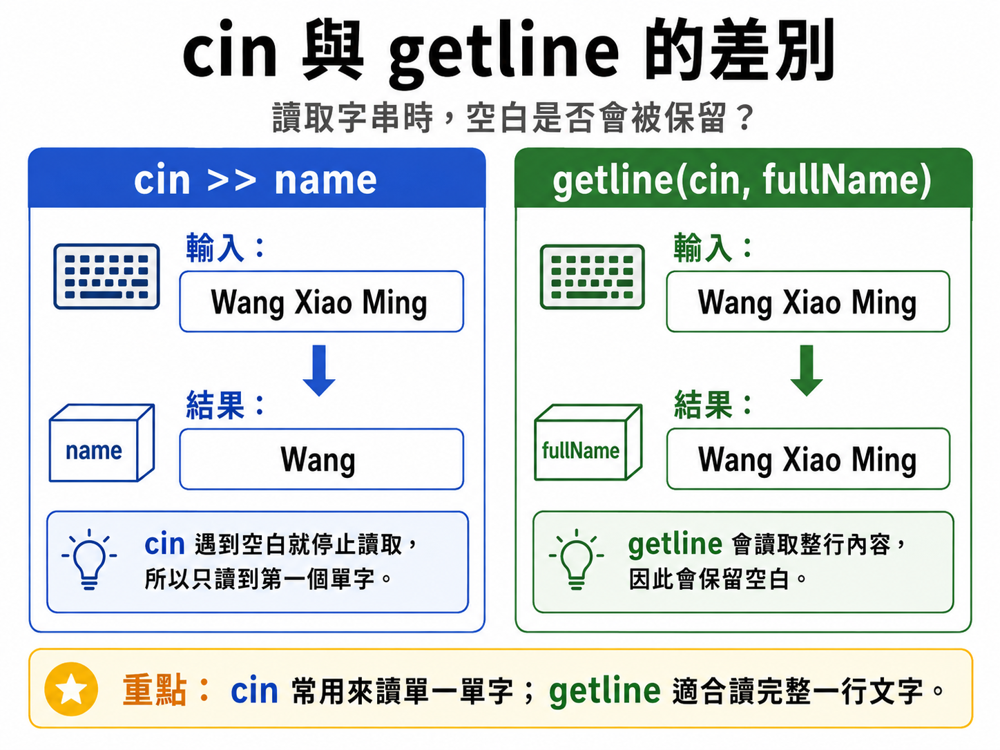
</p>

---

# Part D：註解 Comments

## Section XXV. 單行註解

```cpp
// 儲存學生人數
int studentCount = 30;

int score = 95;  // 儲存學生分數
```

單行註解從：

```text
//
```

開始，直到該行結束。

---

## Section XXVI. 多行註解

```cpp
/*
計算兩個整數的總和，
再將結果輸出。
*/
int a = 10;
int b = 20;

cout << a + b << '\n';
```

---

## Section XXVII. 註解的用途

註解應解釋：

- 程式目的
- 設計原因
- 特殊限制
- 不容易理解的規則

不需要把每一行程式重新翻譯一次。

---

# Part E：變數 Variables

## Section XXVIII. 變數是有名稱的資料盒子

基本語法：

```cpp
資料型別 變數名稱 = 初始值;
```

<p align="center">
  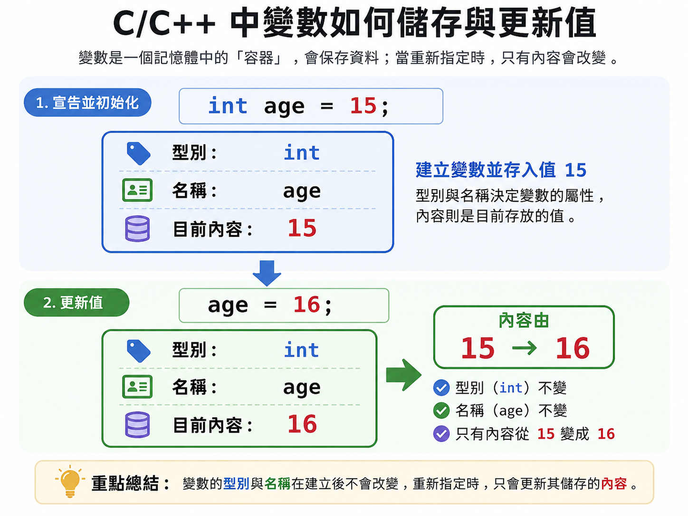
</p>

例如：

```cpp
int age = 15;
```

---

## Section XXIX. 宣告拆解

```cpp
int age = 15;
```

| 部分 | 說明 |
| --- | --- |
| `int` | 資料型別 |
| `age` | 變數名稱 |
| `15` | 初始值 |
| `=` | 將右邊資料指定給左邊變數 |
| `;` | 敘述結束 |

---

## Section XXX. 輸出變數

```cpp
int age = 15;

cout << age << '\n';
```

輸出：

```text
15
```

文字和變數一起輸出：

```cpp
cout << "年齡：" << age << '\n';
```

---

## Section XXXI. 修改變數

```cpp
int score = 80;

score = 95;

cout << score << '\n';
```

輸出：

```text
95
```

重新指定時不需要再次寫型別。

正確：

```cpp
int score = 80;
score = 95;
```

---

## Section XXXII. 重複定義

錯誤：

```cpp
int score = 80;
int score = 95;
```

在同一個範圍中不能重複定義同名變數。

---

## Section XXXIII. 建議初始化

建議：

```cpp
int score = 0;
```

不建議直接讀取未初始化區域變數：

```cpp
int score;
cout << score << '\n';
```

未初始化區域變數可能包含不確定資料。

---

# Part F：常數 Constants

## Section XXXIV. 使用 `const`

```cpp
const int MONTHS_PER_YEAR = 12;
```

完整範例：

```cpp
#include <iostream>
using namespace std;

int main() {
    const int MONTHS_PER_YEAR = 12;

    cout << "一年有 "
         << MONTHS_PER_YEAR
         << " 個月。\n";

    return 0;
}
```

---

## Section XXXV. 常數不能重新指定

```cpp
const int MONTHS_PER_YEAR = 12;

/* MONTHS_PER_YEAR = 24; */
```

建立後不能修改。

---

## Section XXXVI. 使用 `constexpr`

```cpp
constexpr int DAYS_PER_WEEK = 7;
```

初學時可理解成：

```text
明確表示可在編譯期間確定的固定常數
```

---

## Section XXXVII. `#define`

```cpp
#define DAYS_PER_WEEK 7
```

現代 C++ 通常較建議：

```cpp
constexpr int DAYS_PER_WEEK = 7;
```

因為 `const` 與 `constexpr`：

- 有明確型別
- 編譯器較容易檢查
- 較符合 C++ 型別系統

<p align="center">
  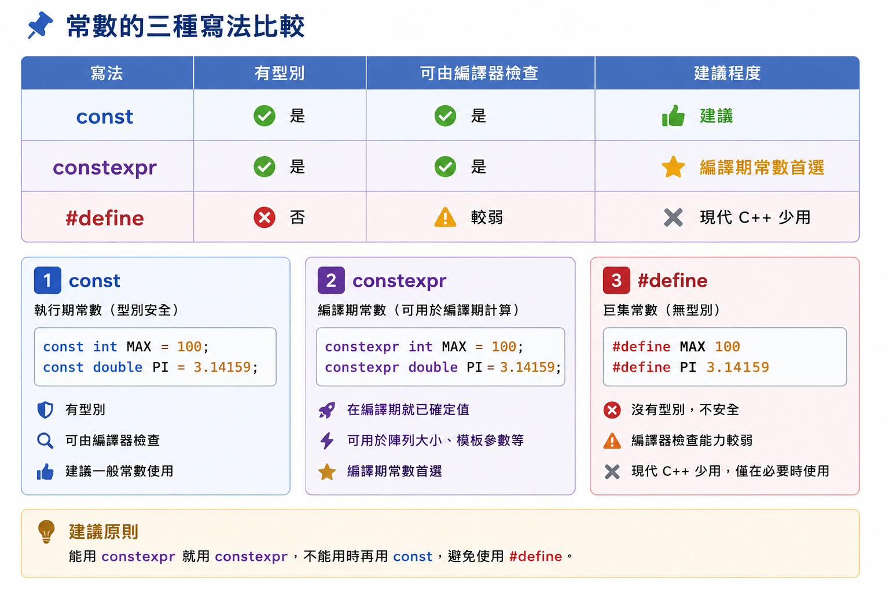
</p>

---

# Part G：關鍵字與識別字

## Section XXXVIII. 關鍵字 Keywords

C++ 保留單字，例如：

```cpp
int
double
if
else
for
while
return
class
const
```

不能作為自訂變數名稱。

錯誤：

```cpp
int return = 10;
```

---

## Section XXXIX. 識別字 Identifiers

識別字是程式設計者建立的名稱，可用於：

- 變數
- 常數
- 函式
- 類別

---

## Section XL. 命名規則

1. 不能使用 C++ 關鍵字。
2. 只能使用英文字母、數字與底線 `_`。
3. 第一個字元不能是數字。
4. 名稱區分大小寫。

合法：

```cpp
age
studentScore
student_score
_score
score2
```

不合法：

```cpp
2score
student-score
class
```

---

## Section XLI. 大小寫不同

```cpp
int score = 90;
int Score = 80;
int SCORE = 70;
```

三者是不同變數。

---

## Section XLII. 命名建議

不建議：

```cpp
int x = 30;
```

較清楚：

```cpp
int studentCount = 30;
```

常見命名方式：

```cpp
int studentCount;   // camelCase
int student_count;  // snake_case
```

同一專案應盡量一致。

---

# Part H：資料型別 Data Types

<p align="center">
  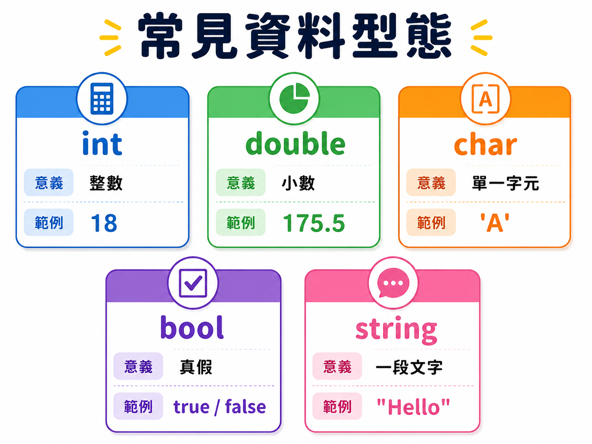
</p>

## Section XLIII. 資料型別影響什麼？

資料型別會影響：

- 可儲存的資料種類
- 記憶體空間
- 數值範圍
- 可執行的運算

例如：

```cpp
int age = 18;
double height = 175.5;
char grade = 'A';
```

<p align="center">
  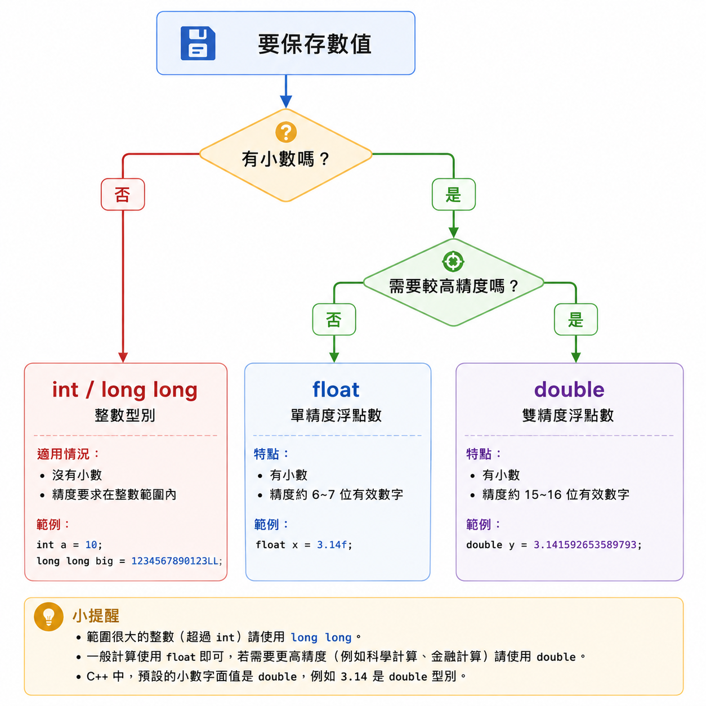
</p>

---

## Section XLIV. 整數型別

```cpp
short smallNumber = 100;
int studentCount = 30;
long population = 23000000;
long long worldPopulation = 8000000000LL;
```

| 型別 | 常見大小 | 說明 |
| --- | ---: | --- |
| `short` | 2 位元組 | 較小範圍整數 |
| `int` | 4 位元組 | 最常使用的整數型別 |
| `long` | 4 或 8 位元組 | 大小依平台而定 |
| `long long` | 8 位元組 | 較大範圍整數 |

實際大小依：

- 作業系統
- 處理器架構
- 編譯器

而不同。

---

## Section XLV. 浮點數型別

```cpp
float temperature = 36.5f;
double height = 168.75;
```

| 型別 | 常見大小 | 約略有效位數 |
| --- | ---: | ---: |
| `float` | 4 位元組 | 約 6～7 位十進位有效數字 |
| `double` | 8 位元組 | 約 15～16 位十進位有效數字 |

小數常值預設為 `double`。

```cpp
float value1 = 3.14f;
double value2 = 3.14;
```

---

## Section XLVI. 科學記號

```cpp
double number1 = 3e2;
double number2 = 3e-2;
```

輸出：

```text
300
0.03
```

---

## Section XLVII. 字元型別 `char`

```cpp
char grade = 'A';
```

規則：

```text
單一字元 → 單引號
一段文字 → 雙引號
```

正確：

```cpp
char grade = 'A';
cout << "Hello";
```

錯誤：

```cpp
char grade = "A";
```

<p align="center">
  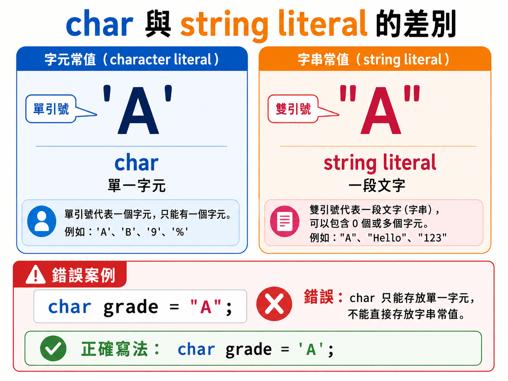
</p>

---

## Section XLVIII. 字元編碼

```cpp
char ch = 'a';

cout << ch << '\n';
cout << static_cast<int>(ch) << '\n';
```

輸出：

```text
a
97
```

傳統 ASCII：

| 字元 | 編碼 |
| --- | ---: |
| `'A'` | 65 |
| `'a'` | 97 |
| `'0'` | 48 |

> 中文字在 UTF-8 中通常需要多個位元組，不能假設一個中文字只使用一個 `char`。

---

## Section XLIX. 布林型別 `bool`

```cpp
bool isStudent = true;
bool isRaining = false;
```

主要值：

```cpp
true
false
```

直接輸出：

```cpp
cout << true << '\n';
cout << false << '\n';
```

通常顯示：

```text
1
0
```

---

# Part I：`sizeof`

## Section L. 基本語法

```cpp
sizeof(資料型別)
sizeof(變數)
```

結果單位是：

```text
byte 位元組
```

<p align="center">
  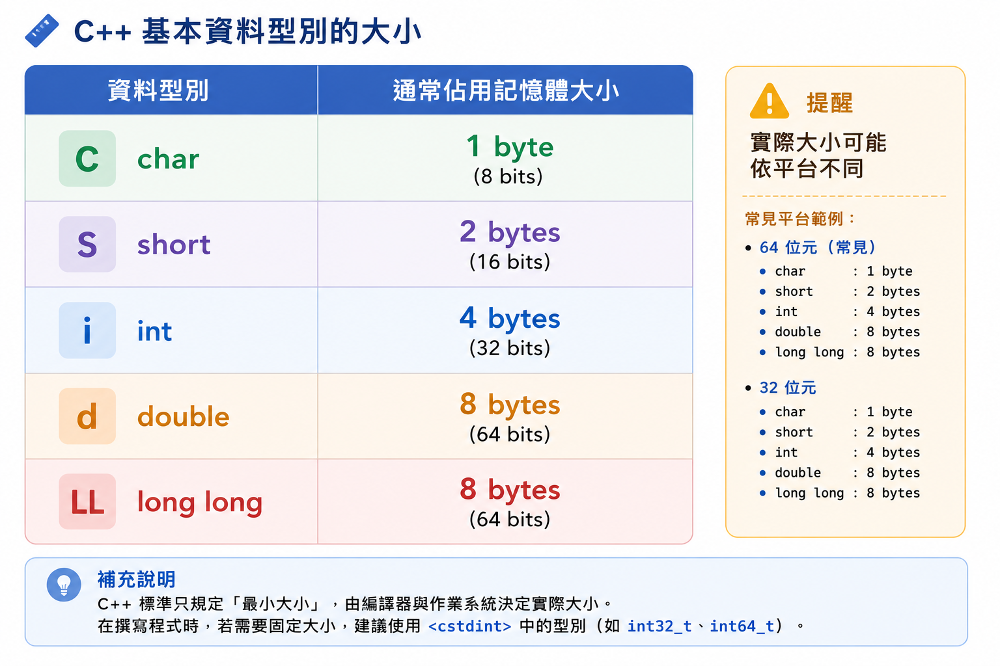
</p>

---

## Section LI. 完整範例

```cpp
#include <iostream>
using namespace std;

int main() {
    cout << "short："
         << sizeof(short)
         << " 位元組\n";

    cout << "int："
         << sizeof(int)
         << " 位元組\n";

    cout << "long："
         << sizeof(long)
         << " 位元組\n";

    cout << "long long："
         << sizeof(long long)
         << " 位元組\n";

    cout << "float："
         << sizeof(float)
         << " 位元組\n";

    cout << "double："
         << sizeof(double)
         << " 位元組\n";

    cout << "char："
         << sizeof(char)
         << " 位元組\n";

    return 0;
}
```

---

## Section LII. 可能結果

```text
short：2 位元組
int：4 位元組
long：8 位元組
long long：8 位元組
float：4 位元組
double：8 位元組
char：1 位元組
```

不同電腦結果可能不同。

---

## Section LIII. 整數型別大小關係

通常符合：

```text
sizeof(short)
<= sizeof(int)
<= sizeof(long)
<= sizeof(long long)
```

---

# Part J：完整小範例

## Section LIV. 輸入名字並問候

```cpp
#include <iostream>
#include <string>
using namespace std;

int main() {
    string name;

    cout << "請輸入你的名字：";
    cin >> name;

    cout << "Hello, " << name << "!\n";

    return 0;
}
```

---

## Section LV. 輸入年齡並計算明年年齡

```cpp
#include <iostream>
using namespace std;

int main() {
    int age;

    cout << "請輸入你的年齡：";
    cin >> age;

    cout << "你明年會是 "
         << age + 1
         << " 歲。\n";

    return 0;
}
```

---

## Section LVI. 輸入兩個整數並計算總和

```cpp
#include <iostream>
using namespace std;

int main() {
    int number1;
    int number2;

    cout << "請輸入兩個整數：";
    cin >> number1 >> number2;

    cout << "總和："
         << number1 + number2
         << '\n';

    return 0;
}
```

---

## Section LVII. 商品名稱、價格與數量

```cpp
#include <iostream>
#include <string>
using namespace std;

int main() {
    string productName;
    double price;
    int quantity;

    cout << "請輸入商品名稱：";
    cin >> productName;

    cout << "請輸入商品價格：";
    cin >> price;

    cout << "請輸入購買數量：";
    cin >> quantity;

    cout << "商品：" << productName << '\n';
    cout << "單價：" << price << '\n';
    cout << "數量：" << quantity << '\n';
    cout << "總價：" << price * quantity << '\n';

    return 0;
}
```

---

## Section LVIII. 字元與 ASCII 編碼

```cpp
#include <iostream>
using namespace std;

int main() {
    char ch;

    cout << "請輸入一個英文字元：";
    cin >> ch;

    cout << "字元：" << ch << '\n';
    cout << "ASCII 編碼："
         << static_cast<int>(ch)
         << '\n';

    return 0;
}
```

---

# Part K：快速概念檢查

## Section LIX. 選擇題與簡答

### Q1. C++ 原始程式檔常使用什麼副檔名？

<details>
<summary>查看答案</summary>

```text
.cpp
```

</details>

---

### Q2. C++ 程式通常從哪個函式開始執行？

<details>
<summary>查看答案</summary>

```cpp
main()
```

</details>

---

### Q3. `cout` 的用途是什麼？

<details>
<summary>查看答案</summary>

將資料輸出到終端機或執行畫面。

</details>

---

### Q4. `cin` 的用途是什麼？

<details>
<summary>查看答案</summary>

讀取使用者輸入並保存到變數。

</details>

---

### Q5. 文字與單一字元分別使用什麼符號？

<details>
<summary>查看答案</summary>

- 文字：雙引號 `" "`
- 單一字元：單引號 `' '`

</details>

---

### Q6. `\n` 與 `endl` 都能做什麼？

<details>
<summary>查看答案</summary>

都能換行；`endl` 另外會刷新輸出緩衝區。

</details>

---

### Q7. `cin >> name` 讀取文字時遇到空格會怎樣？

<details>
<summary>查看答案</summary>

通常會停止讀取，只保存空格前的內容。

</details>

---

### Q8. 要讀取包含空格的完整文字可使用什麼？

<details>
<summary>查看答案</summary>

```cpp
getline()
```

</details>

---

### Q9. 變數的基本語法是什麼？

<details>
<summary>查看答案</summary>

```cpp
資料型別 變數名稱 = 初始值;
```

</details>

---

### Q10. `const` 變數建立後可以重新指定嗎？

<details>
<summary>查看答案</summary>

不可以。

</details>

---

### Q11. C++ 關鍵字可以作為變數名稱嗎？

<details>
<summary>查看答案</summary>

不可以。

</details>

---

### Q12. `score` 與 `Score` 是同一個名稱嗎？

<details>
<summary>查看答案</summary>

不是，C++ 區分大小寫。

</details>

---

### Q13. `int` 適合保存小數嗎？

<details>
<summary>查看答案</summary>

不適合，`int` 用來保存整數。

</details>

---

### Q14. 小數常值 `3.14` 預設是什麼型別？

<details>
<summary>查看答案</summary>

```cpp
double
```

</details>

---

### Q15. `float` 常值通常使用什麼後綴？

<details>
<summary>查看答案</summary>

```cpp
f
```

例如：

```cpp
3.14f
```

</details>

---

### Q16. `char grade = "A";` 為什麼錯誤？

<details>
<summary>查看答案</summary>

`"A"` 是字串，不是單一字元。應寫：

```cpp
char grade = 'A';
```

</details>

---

### Q17. `bool` 的主要值是什麼？

<details>
<summary>查看答案</summary>

```cpp
true
false
```

</details>

---

### Q18. `sizeof` 的結果單位是什麼？

<details>
<summary>查看答案</summary>

位元組 byte。

</details>

---

# Part L：程式閱讀練習

## Section LX. 判斷程式結果

### 題目 1

```cpp
cout << 10 << 20;
```

<details>
<summary>查看答案</summary>

```text
1020
```

中間沒有空格。

</details>

---

### 題目 2

```cpp
cout << 10 + 20 << '\n';
```

<details>
<summary>查看答案</summary>

```text
30
```

</details>

---

### 題目 3

```cpp
int score = 80;
score = 95;

cout << score;
```

<details>
<summary>查看答案</summary>

```text
95
```

</details>

---

### 題目 4

```cpp
char ch = 'A';

cout << static_cast<int>(ch);
```

<details>
<summary>查看答案</summary>

在 ASCII 編碼中輸出：

```text
65
```

</details>

---

### 題目 5

```cpp
bool value = false;

cout << value;
```

<details>
<summary>查看答案</summary>

通常輸出：

```text
0
```

</details>

---

### 題目 6

```cpp
double number = 3e2;

cout << number;
```

<details>
<summary>查看答案</summary>

```text
300
```

</details>

---

### 題目 7

```cpp
string name;
cin >> name;
```

輸入：

```text
Wang Xiao Ming
```

<details>
<summary>查看答案</summary>

`name` 通常只保存：

```text
Wang
```

</details>

---

### 題目 8

```cpp
int age = 15;
int age = 16;
```

<details>
<summary>查看答案</summary>

同一範圍重複定義同名變數，會造成編譯錯誤。

</details>

---

### 題目 9

```cpp
const int DAYS = 7;
DAYS = 8;
```

<details>
<summary>查看答案</summary>

常數不能修改，會造成編譯錯誤。

</details>

---

### 題目 10

```cpp
cout << sizeof(char);
```

<details>
<summary>查看答案</summary>

依 C++ 規則：

```text
1
```

</details>

---

# Part M：實作練習

## Section LXI. 實作檢測題

### TODO 1：輸出姓名

輸出自己的姓名。

---

### TODO 2：分三行輸出

依序輸出：

```text
C++
is
fun
```

---

### TODO 3：姓名與年齡

在同一行輸出姓名與年齡，中間留一個空格。

---

### TODO 4：建立 `score`

建立：

```cpp
int score = 95;
```

並輸出。

---

### TODO 5：建立一週天數常數

建立：

```cpp
constexpr int DAYS_PER_WEEK = 7;
```

並輸出：

```text
一週有 7 天
```

---

### TODO 6：輸入名字

讓使用者輸入名字，再輸出：

```text
Hello, 名字!
```

---

### TODO 7：輸入兩個整數

輸出兩數總和。

---

### TODO 8：商品總價

輸入商品價格與數量，輸出總價。

---

### TODO 9：`float` 與 `double`

分別使用 `float` 與 `double` 保存 `3.14` 並輸出。

---

### TODO 10：字元編碼

輸入一個英文字元，輸出其整數編碼。

---

### TODO 11：型別大小

使用 `sizeof` 輸出：

```text
int
double
char
```

的大小。

---

### TODO 12：修正程式

修正：

```cpp
#include <iostream>
using namespace std

int main() {
    int age = 15
    cout << "Age: " age << endl;
    return 0;
}
```

---

### TODO 13：輸入年齡與身高

一次輸入：

```text
年齡 身高
```

再分兩行輸出。

---

### TODO 14：輸入名字與分數

輸入單字形式名字與整數分數，再輸出完整句子。

---

### TODO 15：科學記號

建立：

```cpp
double large = 3e6;
double small = 3e-6;
```

並輸出。

---

# Part N：常見錯誤提醒

## Section LXII. 常見錯誤

### 錯誤 1：忘記分號

```cpp
int age = 15
```

---

### 錯誤 2：文字沒有雙引號

```cpp
cout << Hello;
```

---

### 錯誤 3：字元使用雙引號

```cpp
char grade = "A";
```

---

### 錯誤 4：使用未定義變數

```cpp
cout << score;
```

---

### 錯誤 5：重複定義同名變數

```cpp
int age = 15;
int age = 16;
```

---

### 錯誤 6：輸入資料型別不符

```cpp
int age;
cin >> age;
```

輸入：

```text
fifteen
```

無法正常轉成整數。

---

### 錯誤 7：忘記載入 `<string>`

使用：

```cpp
string name;
```

前應加入：

```cpp
#include <string>
```

---

### 錯誤 8：使用 `cin >>` 讀取完整姓名

遇到空格會停止。

---

### 錯誤 9：直接輸出未初始化區域變數

```cpp
int score;
cout << score;
```

內容不確定。

---

### 錯誤 10：修改 `const`

```cpp
const int DAYS = 7;
DAYS = 8;
```

---

### 錯誤 11：使用關鍵字命名

```cpp
int return = 10;
```

---

### 錯誤 12：名稱以數字開頭

```cpp
int 2score = 90;
```

---

### 錯誤 13：混淆 `=` 與數學等號概念

```cpp
score = 95;
```

表示將右側資料指定給左側變數。

---

### 錯誤 14：假設所有電腦的型別大小相同

應使用：

```cpp
sizeof(...)
```

確認。

---

### 錯誤 15：假設一個中文字只使用一個 `char`

UTF-8 中文字通常需要多個位元組。

---

### 錯誤 16：所有換行都使用 `endl`

一般情況使用 `\n` 即可。

---

### 錯誤 17：在跨平台教材使用 `system("pause")`

它不是標準 C++。

---

### 錯誤 18：`cout` 串接時漏掉 `<<`

```cpp
cout << "Age: " age;
```

應寫：

```cpp
cout << "Age: " << age;
```

---

# Part O：Mermaid 流程圖

## Section LXIII. 基本流程圖

### 1. 程式輸入處理輸出

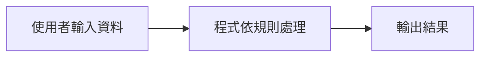
```mermaid
flowchart LR
    A[使用者輸入資料] --> B[程式依規則處理]
    B --> C[輸出結果]
```

---

### 2. C++ 編譯流程

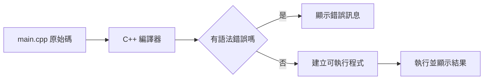
```mermaid
flowchart LR
    A[main.cpp 原始碼] --> B[C++ 編譯器]
    B --> C{有語法錯誤嗎}
    C -- 是 --> D[顯示錯誤訊息]
    C -- 否 --> E[建立可執行程式]
    E --> F[執行並顯示結果]
```

---

### 3. `cin` 輸入流程

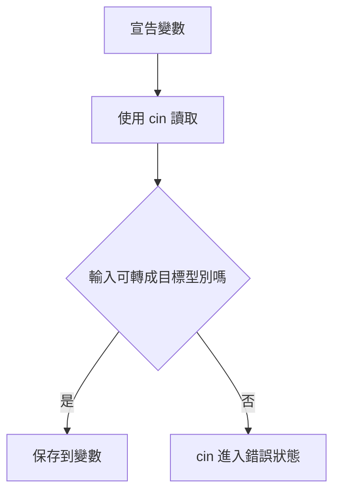
```mermaid
flowchart TD
    A[宣告變數] --> B[使用 cin 讀取]
    B --> C{輸入可轉成目標型別嗎}
    C -- 是 --> D[保存到變數]
    C -- 否 --> E[cin 進入錯誤狀態]
```

---

### 4. 變數流程

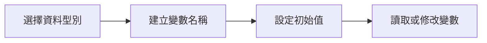
```mermaid
flowchart LR
    A[選擇資料型別] --> B[建立變數名稱]
    B --> C[設定初始值]
    C --> D[讀取或修改變數]
```

---

### 5. 字元與字串判斷

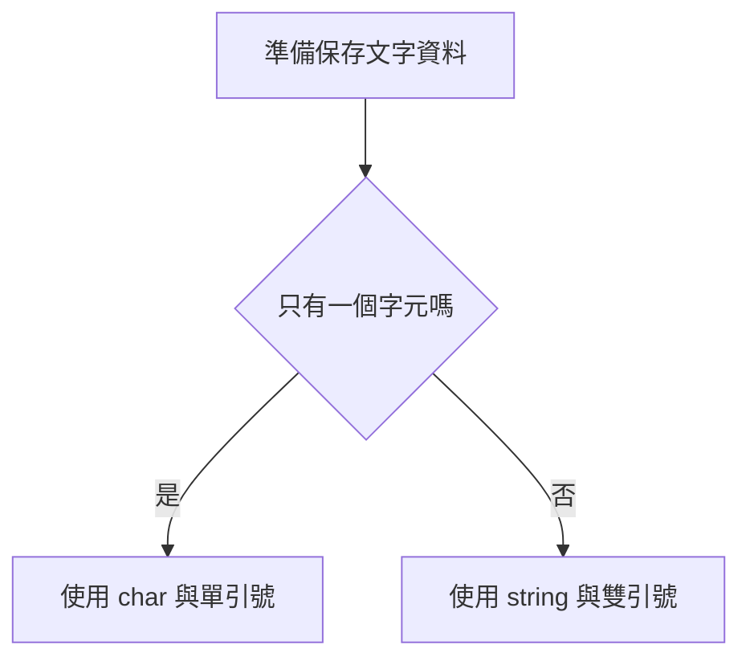
```mermaid
flowchart TD
    A[準備保存文字資料] --> B{只有一個字元嗎}
    B -- 是 --> C[使用 char 與單引號]
    B -- 否 --> D[使用 string 與雙引號]
```

---

### 6. 選擇數值型別

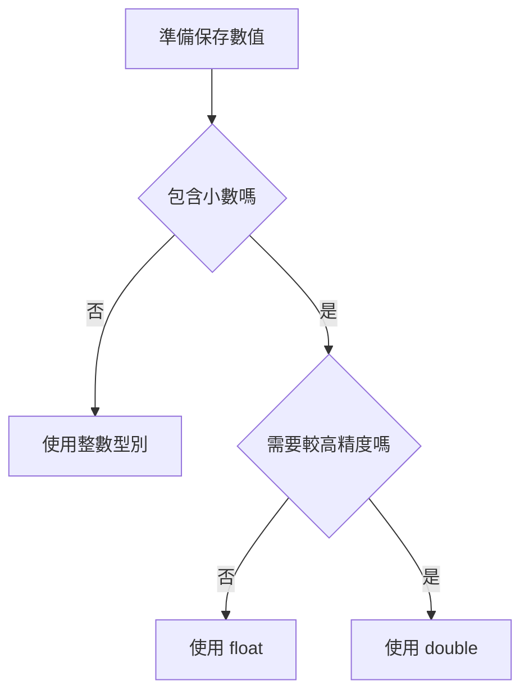
```mermaid
flowchart TD
    A[準備保存數值] --> B{包含小數嗎}
    B -- 否 --> C[使用整數型別]
    B -- 是 --> D{需要較高精度嗎}
    D -- 否 --> E[使用 float]
    D -- 是 --> F[使用 double]
```

---

### 7. 常數選擇

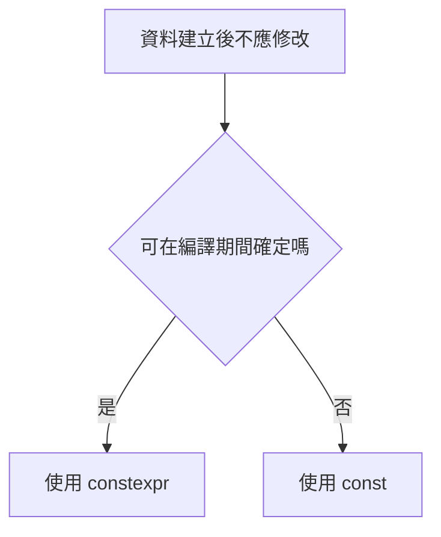
```mermaid
flowchart TD
    A[資料建立後不應修改] --> B{可在編譯期間確定嗎}
    B -- 是 --> C[使用 constexpr]
    B -- 否 --> D[使用 const]
```

---

# 本章完成標準

完成本章後，你應該能做到：

1. 說明 Input、Process、Output。
2. 建立 `.cpp` 原始程式檔。
3. 說明 C++ 程式的編譯流程。
4. 撰寫基本 `main()` 函式。
5. 使用 `#include <iostream>`。
6. 使用 `cout` 輸出文字。
7. 使用 `cout` 輸出數值。
8. 使用 `cout` 輸出運算結果。
9. 使用多個 `<<` 串接內容。
10. 使用 `\n` 換行。
11. 說明 `endl` 與 `\n` 的差異。
12. 使用 `cin` 輸入整數。
13. 使用 `cin` 輸入小數。
14. 使用 `cin` 輸入單字。
15. 一次輸入多筆資料。
16. 說明 `cin >>` 遇到空格的限制。
17. 初步使用 `getline()`。
18. 撰寫單行註解。
19. 撰寫多行註解。
20. 建立並初始化變數。
21. 輸出變數內容。
22. 修改變數內容。
23. 避免重複定義同名變數。
24. 避免讀取未初始化區域變數。
25. 使用 `const`。
26. 使用 `constexpr`。
27. 說明 `#define` 與型別常數的差異。
28. 分辨關鍵字與識別字。
29. 遵守識別字命名規則。
30. 說明 C++ 名稱區分大小寫。
31. 選擇清楚的變數名稱。
32. 使用 `short`、`int`、`long`、`long long`。
33. 使用 `float` 與 `double`。
34. 使用科學記號。
35. 使用 `char` 保存單一字元。
36. 分辨單引號與雙引號。
37. 使用 `static_cast<int>()` 取得字元編碼。
38. 使用 `bool` 保存真或假。
39. 使用 `sizeof` 查詢型別大小。
40. 說明型別大小可能因系統而不同。
41. 完成基本互動式 C++ 程式。
42. 找出並修正常見語法錯誤。

---

# 隱藏答案區

> Answer hidden — try it first.

<details>
<summary>TODO 1 答案</summary>

```cpp
#include <iostream>
using namespace std;

int main() {
    cout << "小明\n";

    return 0;
}
```

</details>

<details>
<summary>TODO 2 答案</summary>

```cpp
#include <iostream>
using namespace std;

int main() {
    cout << "C++\n";
    cout << "is\n";
    cout << "fun\n";

    return 0;
}
```

</details>

<details>
<summary>TODO 3 答案</summary>

```cpp
#include <iostream>
using namespace std;

int main() {
    cout << "小明" << " " << 15 << '\n';

    return 0;
}
```

</details>

<details>
<summary>TODO 4 答案</summary>

```cpp
#include <iostream>
using namespace std;

int main() {
    int score = 95;

    cout << score << '\n';

    return 0;
}
```

</details>

<details>
<summary>TODO 5 答案</summary>

```cpp
#include <iostream>
using namespace std;

int main() {
    constexpr int DAYS_PER_WEEK = 7;

    cout << "一週有 "
         << DAYS_PER_WEEK
         << " 天。\n";

    return 0;
}
```

</details>

<details>
<summary>TODO 6 答案</summary>

```cpp
#include <iostream>
#include <string>
using namespace std;

int main() {
    string name;

    cout << "請輸入名字：";
    cin >> name;

    cout << "Hello, " << name << "!\n";

    return 0;
}
```

</details>

<details>
<summary>TODO 7 答案</summary>

```cpp
#include <iostream>
using namespace std;

int main() {
    int number1;
    int number2;

    cout << "請輸入兩個整數：";
    cin >> number1 >> number2;

    cout << number1 + number2 << '\n';

    return 0;
}
```

</details>

<details>
<summary>TODO 8 答案</summary>

```cpp
#include <iostream>
using namespace std;

int main() {
    double price;
    int quantity;

    cout << "請輸入商品價格：";
    cin >> price;

    cout << "請輸入購買數量：";
    cin >> quantity;

    cout << "總價："
         << price * quantity
         << '\n';

    return 0;
}
```

</details>

<details>
<summary>TODO 9 答案</summary>

```cpp
#include <iostream>
using namespace std;

int main() {
    float number1 = 3.14f;
    double number2 = 3.14;

    cout << number1 << '\n';
    cout << number2 << '\n';

    return 0;
}
```

</details>

<details>
<summary>TODO 10 答案</summary>

```cpp
#include <iostream>
using namespace std;

int main() {
    char ch;

    cout << "請輸入一個英文字元：";
    cin >> ch;

    cout << static_cast<int>(ch) << '\n';

    return 0;
}
```

</details>

<details>
<summary>TODO 11 答案</summary>

```cpp
#include <iostream>
using namespace std;

int main() {
    cout << "int："
         << sizeof(int)
         << " 位元組\n";

    cout << "double："
         << sizeof(double)
         << " 位元組\n";

    cout << "char："
         << sizeof(char)
         << " 位元組\n";

    return 0;
}
```

</details>

<details>
<summary>TODO 12 答案</summary>

```cpp
#include <iostream>
using namespace std;

int main() {
    int age = 15;

    cout << "Age: " << age << endl;

    return 0;
}
```

修正內容：

1. `using namespace std` 後面補上分號。
2. `int age = 15` 後面補上分號。
3. `"Age: "` 與 `age` 之間補上 `<<`。

</details>
