# Lesson 02：Your First C++ Program 第一個 C++ 程式

> 這堂課的重點：建立第一個 `.cpp` 程式，理解 `#include <iostream>`、`using namespace std;`、`int main()`、大括號、分號、`cout` 與 `return 0;` 的用途。接著使用 `cout` 輸出文字、數字與運算結果，並學會使用 `\n`、`endl` 和註解。

---

## Section I. 今天要做什麼？

1. 認識 C++ 原始程式檔。
2. 使用 `.cpp` 作為副檔名。
3. 建立 `main.cpp`。
4. 認識建立與執行程式的四個步驟。
5. 撰寫第一個 `Hello world` 程式。
6. 認識 `#include <iostream>`。
7. 認識 `using namespace std;`。
8. 認識 `int main()`。
9. 認識大括號 `{ }`。
10. 認識分號 `;`。
11. 認識 `return 0;`。
12. 使用 `cout` 輸出文字。
13. 使用 `cout` 輸出整數與小數。
14. 使用 `cout` 輸出運算結果。
15. 使用多個 `<<` 串接輸出。
16. 主動加入空格。
17. 使用 `\n` 換行。
18. 使用 `endl` 換行。
19. 比較 `\n` 與 `endl`。
20. 理解 C++ 程式需要先編譯。
21. 理解語法錯誤會造成編譯失敗。
22. 認識單行註解 `//`。
23. 認識多行註解 `/* */`。
24. 找出缺少雙引號的錯誤。
25. 找出缺少分號的錯誤。
26. 理解 `system("pause")` 不是標準 C++。
27. 完成概念檢查、程式閱讀與實作練習。

---

## Section II. 今天的學習方式

1. 閱讀程式時先找出：
   - 標頭檔
   - `main()`
   - 輸出敘述
   - `return`
2. 將大括號視為一段程式碼的範圍。
3. 每個完整敘述結尾檢查是否有分號。
4. 文字內容檢查是否放在雙引號中。
5. 閱讀 `cout` 時，由左向右追蹤每一個 `<<`。
6. 預測輸出時標出空格與換行。
7. 編譯錯誤題同時檢查錯誤行與上一行。
8. 註解應說明程式目的或原因。
9. 本章不提前加入 `cin` 與變數輸入。
10. 完整合法範例使用嚴格 C++17 選項檢查。

<p align="center">
  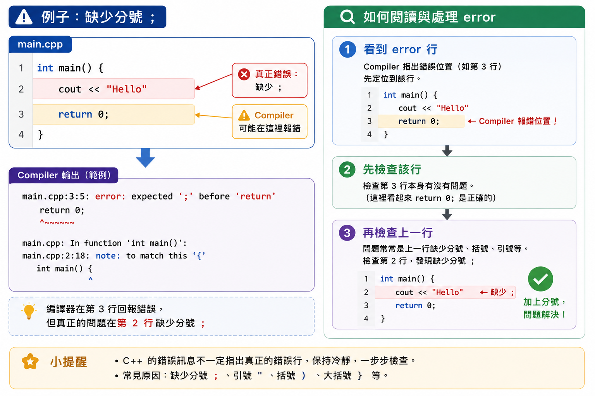
</p>

---

## Section III. 核心語法對照

| 語法 | 用途 |
| --- | --- |
| `main.cpp` | 常見的 C++ 原始程式檔名 |
| `#include <iostream>` | 載入標準輸入輸出功能 |
| `using namespace std;` | 允許直接使用 `cout` 與 `endl` |
| `int main()` | 程式開始執行的位置 |
| `{ }` | 包住一段程式碼 |
| `cout << 內容;` | 將內容輸出到終端機 |
| `<<` | 將右側內容送入輸出串流 |
| `"文字"` | 表示一段文字 |
| `'\n'` | 一個換行字元 |
| `endl` | 換行並刷新輸出緩衝區 |
| `return 0;` | 表示程式正常結束 |
| `;` | 表示敘述結束 |
| `//` | 單行註解 |
| `/* */` | 多行註解 |

---

# Part A：建立第一個 C++ 程式

## Section IV. 建立與執行程式的步驟

建立並執行一個 C++ 程式，通常分為：

1. 建立專案。
2. 建立程式檔案。
3. 撰寫程式碼。
4. 編譯並執行程式。

<p align="center">
  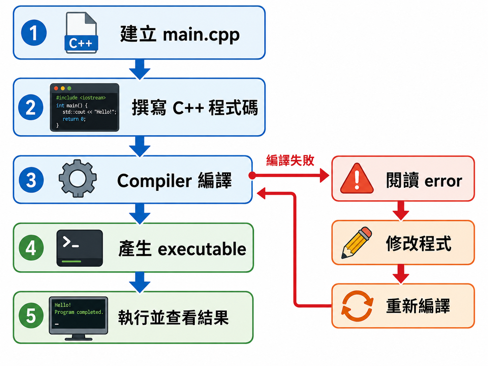
</p>

---

## Section V. C++ 原始程式檔

C++ 原始程式檔通常使用：

```text
.cpp
```

例如：

```text
main.cpp
```

---

## Section VI. 第一個程式

```cpp
// VALIDATE
#include <iostream>
using namespace std;

int main() {
    cout << "Hello world" << '\n';

    return 0;
}
```

<p align="center">
  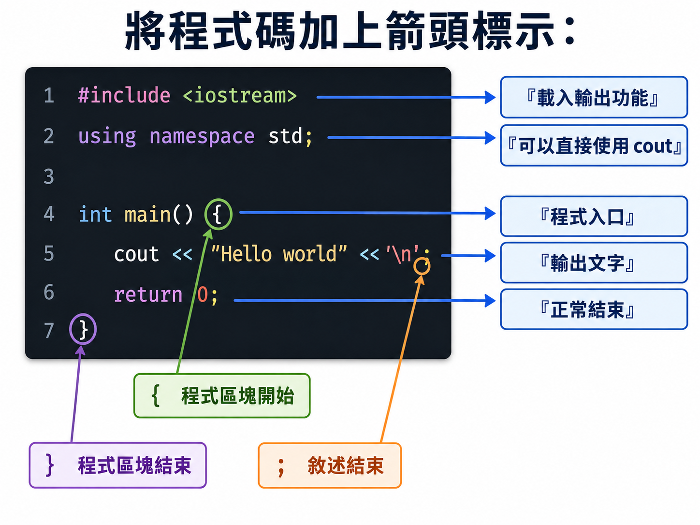
</p>

執行結果：

```text
Hello world
```

---

## Section VII. 執行順序

```text
載入輸出功能
→ 進入 main()
→ 輸出 Hello world
→ 正常結束
```

<p align="center">
  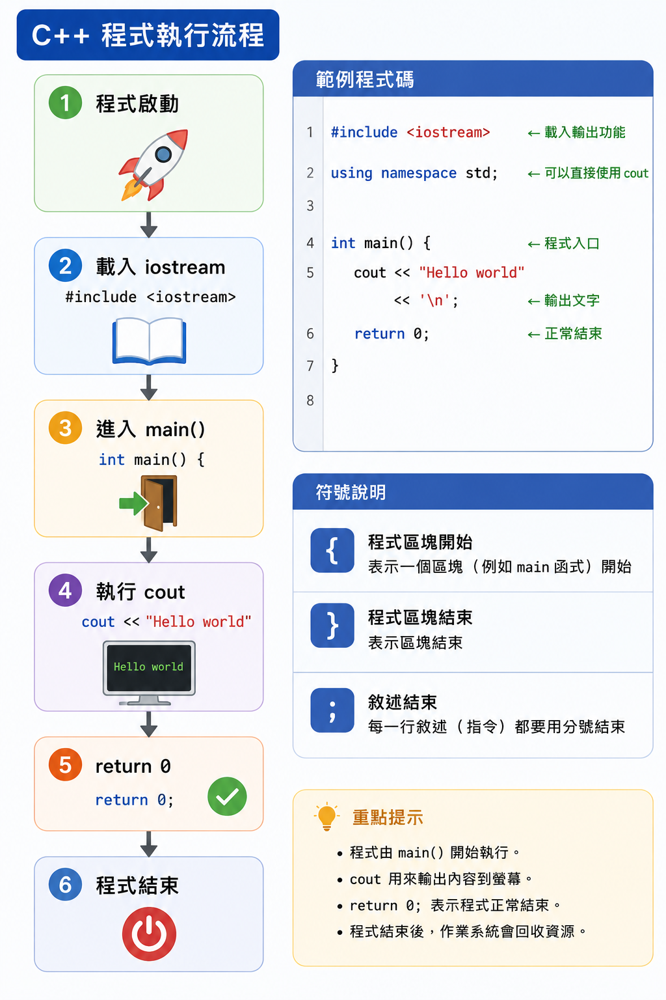
</p>

---

# Part B：程式結構

## Section VIII. `#include <iostream>`

```cpp
#include <iostream>
```

用途：

```text
載入 C++ 的標準輸入與輸出功能
```

本章使用的：

```cpp
cout
endl
```

都來自標準輸入輸出工具。

`#include` 是前置處理指令，行尾不加分號。

---

## Section IX. `using namespace std;`

```cpp
using namespace std;
```

加入後，可以直接使用：

```cpp
cout
endl
```

不用寫：

```cpp
std::cout
std::endl
```

本教材前期使用 `using namespace std;`，方便初學者閱讀。較大型專案通常使用完整名稱，以減少名稱衝突。

---

## Section X. 不使用 `using namespace std;`

```cpp
// VALIDATE
#include <iostream>

int main() {
    std::cout << "Hello world" << '\n';

    return 0;
}
```

<p align="center">
  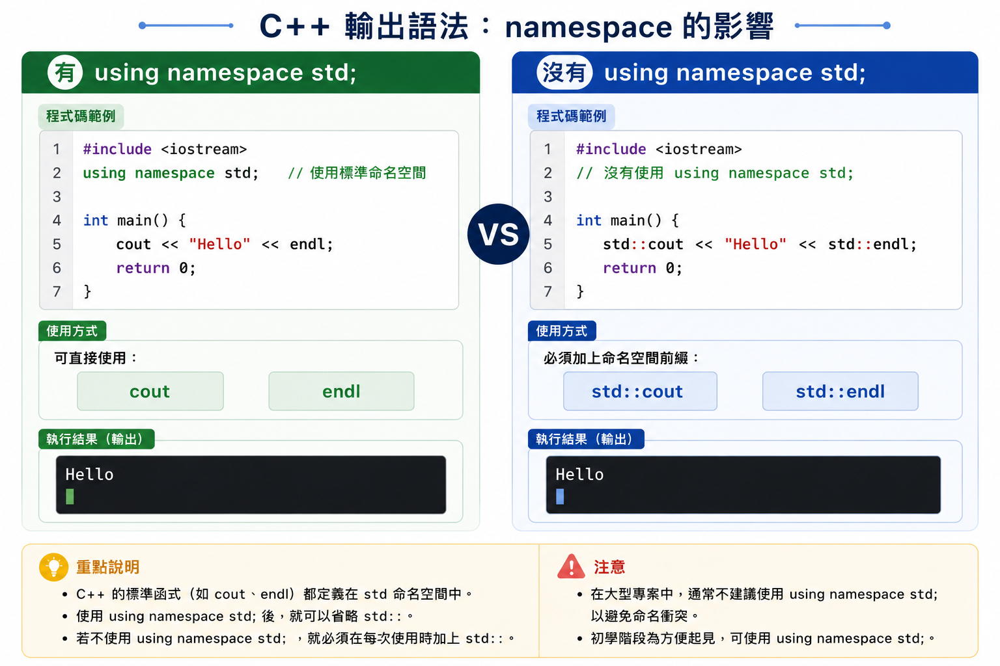
</p>

---

## Section XI. `int main()`

```cpp
int main()
```

表示：

```text
main 是一個函式
程式從 main 開始執行
main 回傳一個 int
```

本章先記住：

> 可執行的 C++ 程式需要一個 `main()` 作為開始位置。

---

## Section XII. 大括號 `{ }`

```cpp
int main() {
    cout << "Hello world" << '\n';

    return 0;
}
```

左大括號：

```cpp
{
```

表示程式區塊開始。

右大括號：

```cpp
}
```

表示程式區塊結束。

<p align="center">
  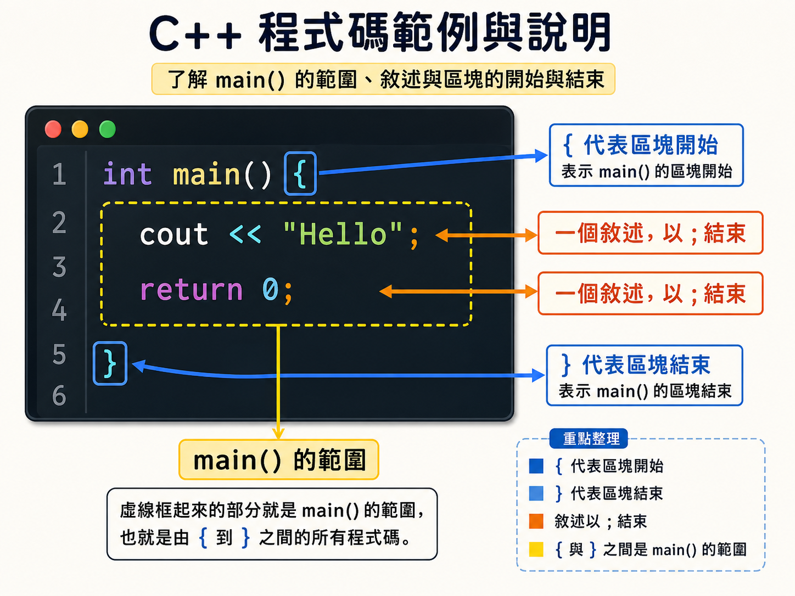
</p>

---

## Section XIII. 分號 `;`

```cpp
cout << "Hello world";
return 0;
```

分號表示：

```text
一個敘述結束
```

錯誤：

```cpp
cout << "Hello world"
```

正確：

```cpp
cout << "Hello world";
```

---

## Section XIV. `return 0;`

```cpp
return 0;
```

在本章中表示：

```text
main() 正常結束
```

---

## Section XV. 第一個程式逐行閱讀

```cpp
#include <iostream>
using namespace std;

int main() {
    cout << "Hello world" << '\n';

    return 0;
}
```

| 程式碼 | 用途 |
| --- | --- |
| `#include <iostream>` | 載入標準輸入輸出功能 |
| `using namespace std;` | 允許直接使用標準工具名稱 |
| `int main()` | 程式開始執行的位置 |
| `{` | `main()` 程式區塊開始 |
| `cout << ...;` | 輸出內容 |
| `return 0;` | 表示正常結束 |
| `}` | `main()` 程式區塊結束 |

---

# Part C：編譯與執行

## Section XVI. 編譯流程

C++ 程式通常需要先經過編譯：

```text
原始程式碼
→ 編譯器
→ 可執行程式
→ 執行結果
```

若程式碼正確：

```text
編譯成功
→ 建立可執行程式
→ 可以執行
```

若程式碼有語法錯誤：

```text
編譯失敗
→ 顯示錯誤訊息
→ 無法正常建立程式
```

<p align="center">
  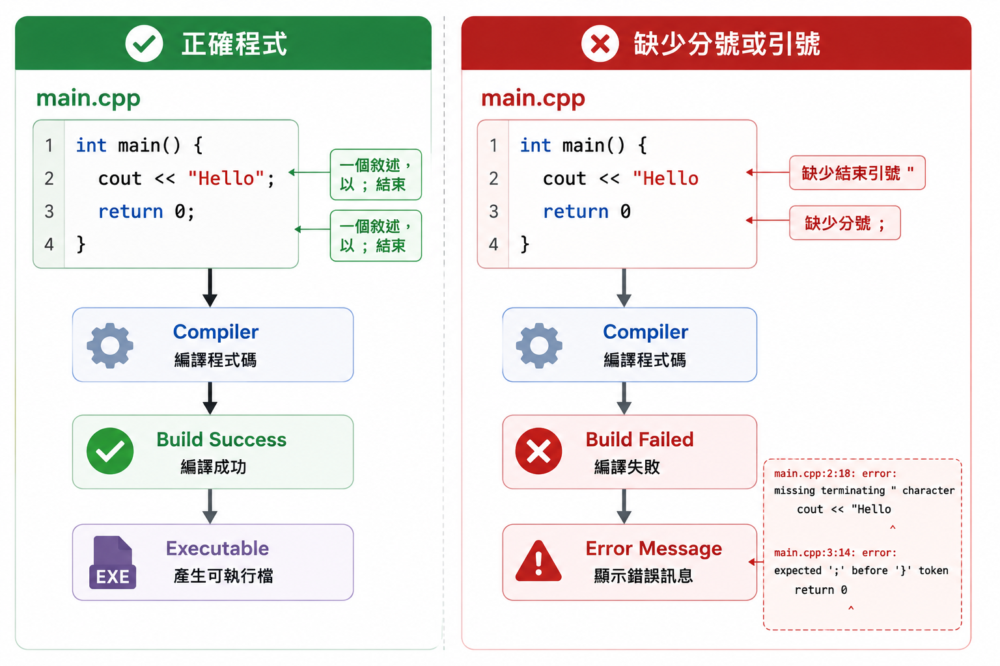
</p>

---

## Section XVII. 缺少分號

錯誤：

```cpp
#include <iostream>
using namespace std;

int main() {
    cout << "Hello world"

    return 0;
}
```

`cout` 敘述後缺少：

```cpp
;
```

---

## Section XVIII. 缺少雙引號

錯誤：

```cpp
#include <iostream>
using namespace std;

int main() {
    cout << Hello << '\n';

    return 0;
}
```

C++ 會把：

```cpp
Hello
```

當成名稱，而不是文字。

正確：

```cpp
cout << "Hello" << '\n';
```

---

## Section XIX. 錯誤可能顯示在下一行

若上一行缺少分號：

```cpp
cout << "Hello"
return 0;
```

編譯器可能在 `return` 附近顯示錯誤。

因此檢查時要看：

```text
錯誤行
上一行
```

---

## Section XX. `system("pause")`

```cpp
system("pause");
```

只適用於部分 Windows 環境，而且不是標準 C++ 寫法。

一般教材與跨平台程式不建議使用。

---

# Part D：使用 `cout` 輸出

## Section XXI. 基本語法

```cpp
cout << 輸出內容;
```

<p align="center">
  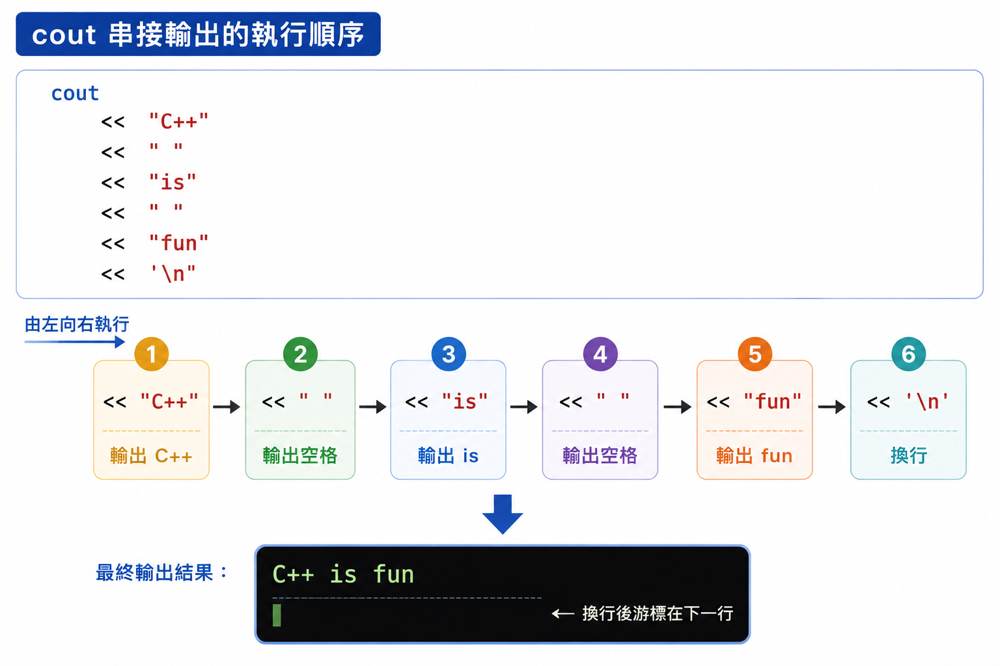
</p>

`cout` 會把內容顯示在終端機或執行畫面。

---

## Section XXII. 輸出文字

文字要放在雙引號中：

```cpp
cout << "Hello world";
cout << "早安";
```

雙引號表示：

```text
這是一段文字
不是名稱或指令
```

---

### 1. 完整範例

```cpp
// VALIDATE
#include <iostream>
using namespace std;

int main() {
    cout << "Welcome to C++!" << '\n';

    return 0;
}
```

輸出：

```text
Welcome to C++!
```

---

## Section XXIII. 輸出數字

數字不需要雙引號：

```cpp
cout << 123;
cout << 3.14;
```

---

### 2. 完整範例

```cpp
// VALIDATE
#include <iostream>
using namespace std;

int main() {
    cout << 123 << '\n';
    cout << 3.14 << '\n';

    return 0;
}
```

輸出：

```text
123
3.14
```

---

## Section XXIV. 輸出運算結果

```cpp
cout << 123 + 456;
cout << 10 * 5;
```

C++ 會先計算，再輸出。

若沒有空格或換行，結果會連在一起：

```text
57950
```

因為：

```text
123 + 456 → 579
10 × 5     → 50
```

---

### 3. 加入換行

```cpp
// VALIDATE
#include <iostream>
using namespace std;

int main() {
    cout << 123 + 456 << '\n';
    cout << 10 * 5 << '\n';

    return 0;
}
```

輸出：

```text
579
50
```

---

## Section XXV. 一次輸出多個內容

```cpp
cout << 123 << " " << "早安";
```

輸出：

```text
123 早安
```

由左向右閱讀：

```text
輸出 123
→ 輸出一個空格
→ 輸出早安
```

---

### 4. 完整範例

```cpp
// VALIDATE
#include <iostream>
using namespace std;

int main() {
    cout << "C++" << " " << "is" << " " << "fun" << '\n';

    return 0;
}
```

輸出：

```text
C++ is fun
```

---

## Section XXVI. `cout` 不會自動加空格

```cpp
cout << 10 << 20;
```

輸出：

```text
1020
```

需要空格時，要自己加入：

```cpp
cout << 10 << " " << 20;
```

---

## Section XXVII. `cout` 不會自動換行

```cpp
cout << "Hello";
cout << "World";
```

輸出：

```text
HelloWorld
```

需要換行時，必須主動加入換行符號。

<p align="center">
  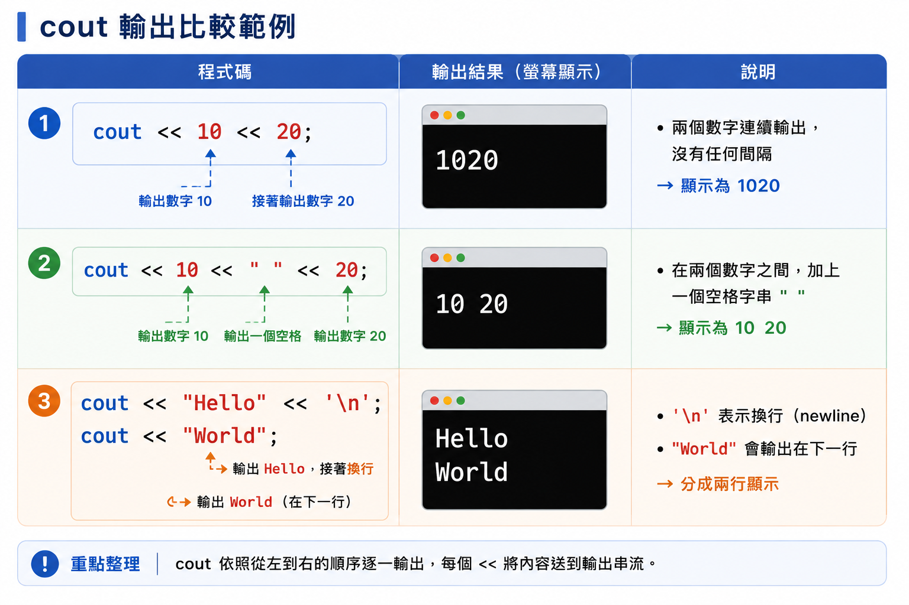
</p>

---

# Part E：換行

## Section XXVIII. 使用 `\n`

```cpp
cout << "第一行\n";
cout << "第二行\n";
```

輸出：

```text
第一行
第二行
```

---

## Section XXIX. 同一段文字中的多個換行

```cpp
cout << "蘋果\n香蕉\n西瓜\n";
```

輸出：

```text
蘋果
香蕉
西瓜
```

---

## Section XXX. `'\n'` 與 `"\n"`

兩者都能輸出換行：

```cpp
cout << "Hello" << '\n';
cout << "Hello" << "\n";
```

其中：

```cpp
'\n'
```

是一個換行字元。

```cpp
"\n"
```

是一段只包含換行的文字。

本教材常用：

```cpp
'\n'
```

---

## Section XXXI. 使用 `endl`

```cpp
cout << "第一行" << endl;
cout << "第二行" << endl;
```

`endl` 會：

1. 換行。
2. 刷新輸出緩衝區。

---

## Section XXXII. `\n` 與 `endl`

| 寫法 | 換行 | 刷新輸出緩衝區 |
| --- | --- | --- |
| `'\n'` | 是 | 不一定立即刷新 |
| `endl` | 是 | 會刷新 |

<p align="center">
  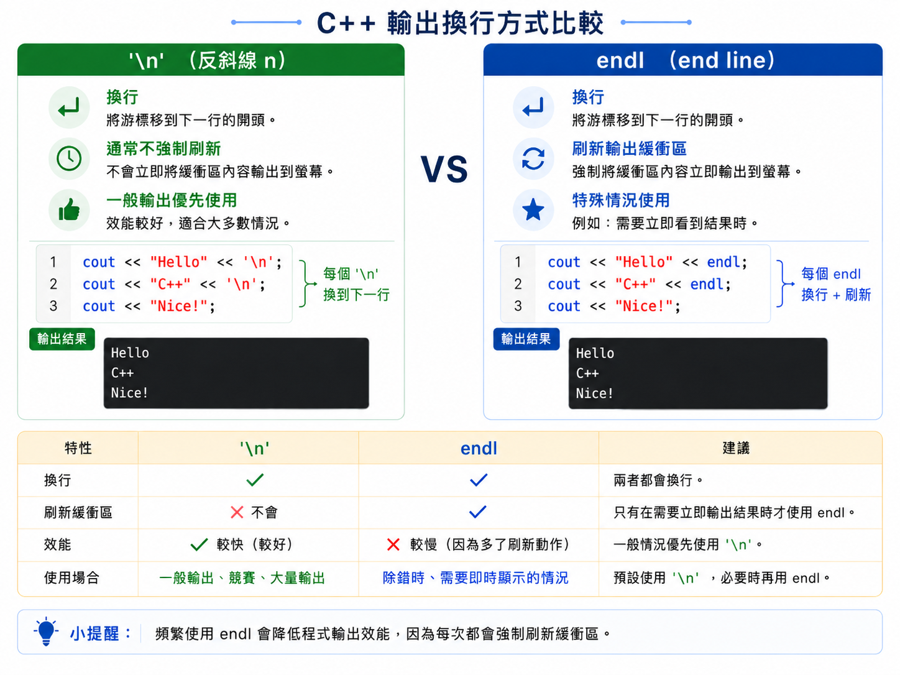
</p>

一般輸出通常優先使用：

```cpp
'\n'
```

---

### 5. 完整比較範例

```cpp
// VALIDATE
#include <iostream>
using namespace std;

int main() {
    cout << "Line 1" << '\n';
    cout << "Line 2" << endl;
    cout << "Line 3\n";

    return 0;
}
```

輸出：

```text
Line 1
Line 2
Line 3
```

---

# Part F：註解 Comments

## Section XXXIII. 什麼是註解？

註解是在程式碼中加入的說明。

編譯器會忽略註解內容，因此註解不會成為輸出。

---

## Section XXXIV. 單行註解

單行註解使用：

```cpp
//
```

例如：

```cpp
// 輸出歡迎訊息
cout << "Welcome!" << '\n';
```

也可以放在一行程式末尾：

```cpp
cout << "Welcome!" << '\n';  // 顯示歡迎訊息
```

---

## Section XXXV. 多行註解

多行註解使用：

```cpp
/*
內容
*/
```

例如：

```cpp
/*
這個程式會輸出兩行文字。
第一行是 Hello，第二行是 C++。
*/
cout << "Hello\n";
cout << "C++\n";
```

<p align="center">
  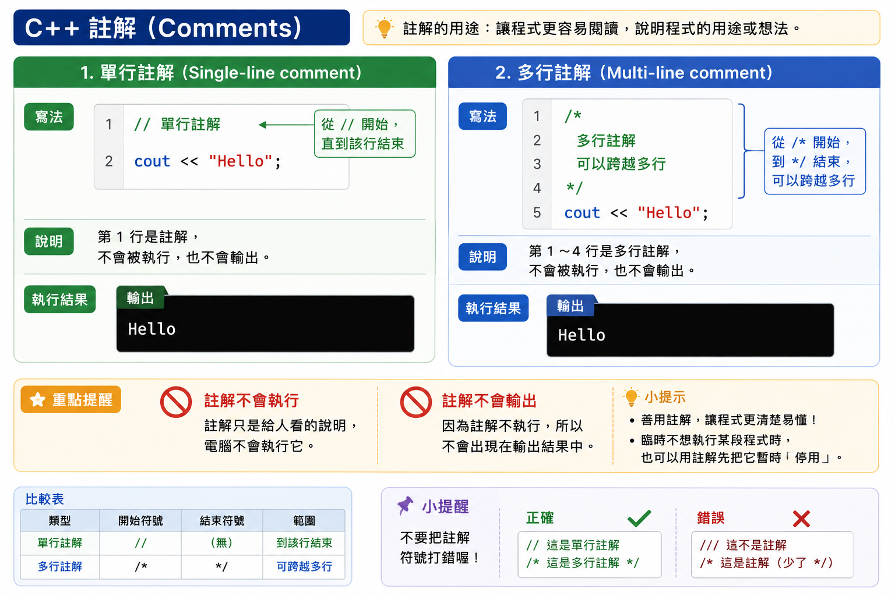
</p>

---

## Section XXXVI. 註解的用途

註解適合說明：

- 程式目的
- 設計原因
- 特殊限制
- 不容易理解的部分

不需要把每一行程式重新翻譯一次。

---

### 6. 完整註解範例

```cpp
// VALIDATE
#include <iostream>
using namespace std;

/*
第一個 C++ 輸出練習：
依序輸出三種水果。
*/
int main() {
    // 每個水果各佔一行
    cout << "Apple\n";
    cout << "Banana\n";
    cout << "Watermelon\n";

    return 0;
}
```

---

# Part G：快速概念檢查

## Section XXXVII. 選擇題與簡答

### Q1. C++ 原始程式檔通常使用什麼副檔名？

<details>
<summary>查看答案</summary>

```text
.cpp
```

</details>

---

### Q2. 程式通常從哪個函式開始執行？

<details>
<summary>查看答案</summary>

```cpp
main()
```

</details>

---

### Q3. `#include <iostream>` 的用途是什麼？

<details>
<summary>查看答案</summary>

載入 C++ 標準輸入與輸出功能。

</details>

---

### Q4. `cout` 的用途是什麼？

<details>
<summary>查看答案</summary>

將內容輸出到終端機或執行畫面。

</details>

---

### Q5. 為什麼文字要使用雙引號？

<details>
<summary>查看答案</summary>

雙引號表示其中內容是一段文字，而不是程式名稱。

</details>

---

### Q6. 分號表示什麼？

<details>
<summary>查看答案</summary>

表示一個敘述結束。

</details>

---

### Q7. 大括號有什麼用途？

<details>
<summary>查看答案</summary>

包住一段程式碼，例如 `main()` 的程式區塊。

</details>

---

### Q8. `return 0;` 表示什麼？

<details>
<summary>查看答案</summary>

表示 `main()` 正常結束。

</details>

---

### Q9. `cout << 10 << 20;` 會自動加入空格嗎？

<details>
<summary>查看答案</summary>

不會，輸出為：

```text
1020
```

</details>

---

### Q10. `\n` 的用途是什麼？

<details>
<summary>查看答案</summary>

換行。

</details>

---

### Q11. `endl` 除了換行還會做什麼？

<details>
<summary>查看答案</summary>

刷新輸出緩衝區。

</details>

---

### Q12. 一般輸出通常優先使用哪一種換行方式？

<details>
<summary>查看答案</summary>

通常優先使用：

```cpp
'\n'
```

</details>

---

### Q13. 單行註解使用什麼符號？

<details>
<summary>查看答案</summary>

```cpp
//
```

</details>

---

### Q14. 多行註解使用什麼符號？

<details>
<summary>查看答案</summary>

```cpp
/* */
```

</details>

---

### Q15. 註解會被輸出嗎？

<details>
<summary>查看答案</summary>

不會，編譯器會忽略註解。

</details>

---

### Q16. 語法錯誤可能造成什麼結果？

<details>
<summary>查看答案</summary>

編譯失敗，無法正常建立可執行程式。

</details>

---

### Q17. `system("pause")` 是標準 C++ 嗎？

<details>
<summary>查看答案</summary>

不是，而且只適用於部分 Windows 環境。

</details>

---

### Q18. 不使用 `using namespace std;` 時，`cout` 可以怎麼寫？

<details>
<summary>查看答案</summary>

```cpp
std::cout
```

</details>

---

# Part H：程式閱讀練習

## Section XXXVIII. 預測輸出與判斷錯誤

### 題目 1

```cpp
cout << "Hello";
cout << "World";
```

<details>
<summary>查看答案</summary>

```text
HelloWorld
```

</details>

---

### 題目 2

```cpp
cout << "Hello" << " " << "World";
```

<details>
<summary>查看答案</summary>

```text
Hello World
```

</details>

---

### 題目 3

```cpp
cout << 10 + 20 << '\n';
```

<details>
<summary>查看答案</summary>

```text
30
```

</details>

---

### 題目 4

```cpp
cout << 10 << 20 << '\n';
```

<details>
<summary>查看答案</summary>

```text
1020
```

</details>

---

### 題目 5

```cpp
cout << "A\nB\nC\n";
```

<details>
<summary>查看答案</summary>

```text
A
B
C
```

</details>

---

### 題目 6

```cpp
cout << Hello << '\n';
```

<details>
<summary>查看答案</summary>

若沒有定義 `Hello`，程式會編譯失敗。若要輸出文字：

```cpp
cout << "Hello" << '\n';
```

</details>

---

### 題目 7

```cpp
cout << "Hello"
return 0;
```

<details>
<summary>查看答案</summary>

`cout` 敘述後缺少分號。

</details>

---

### 題目 8

```cpp
cout << "First" << endl;
cout << "Second" << '\n';
```

<details>
<summary>查看答案</summary>

```text
First
Second
```

</details>

---

### 題目 9

```cpp
// cout << "A";
cout << "B";
```

<details>
<summary>查看答案</summary>

```text
B
```

</details>

---

### 題目 10

```cpp
/*
cout << "A";
cout << "B";
*/
cout << "C";
```

<details>
<summary>查看答案</summary>

```text
C
```

</details>

---

# Part I：實作練習

## Section XXXIX. 實作檢測題

### TODO 1：第一個程式

輸出：

```text
Hello world
```

---

### TODO 2：輸出自己的名字

輸出自己的姓名並換行。

---

### TODO 3：三行文字

輸出：

```text
C++
is
fun
```

---

### TODO 4：同一行輸出

使用多個 `<<` 輸出：

```text
C++ is fun
```

---

### TODO 5：輸出兩個數字

輸出：

```text
10 20
```

中間要有一個空格。

---

### TODO 6：加法結果

直接計算並輸出：

```text
123 + 456
```

---

### TODO 7：乘法結果

直接計算並輸出：

```text
10 × 5
```

---

### TODO 8：水果清單

使用一個 `cout` 敘述輸出：

```text
Apple
Banana
Watermelon
```

---

### TODO 9：比較換行

第一行使用 `'\n'`，第二行使用 `endl`。

---

### TODO 10：單行註解

在輸出敘述上方加入單行註解。

---

### TODO 11：多行註解

在 `main()` 上方加入多行註解。

---

### TODO 12：修正雙引號

修正：

```cpp
cout << Welcome to C++;
```

---

### TODO 13：修正分號

修正：

```cpp
cout << "Hello"
return 0;
```

---

### TODO 14：完整名稱

不使用 `using namespace std;`，改用 `std::cout`。

---

### TODO 15：自我介紹版面

輸出：

```text
Name: Amy
Course: C++
Message: Hello!
```

---

# Part J：常見錯誤提醒

<p align="center">
  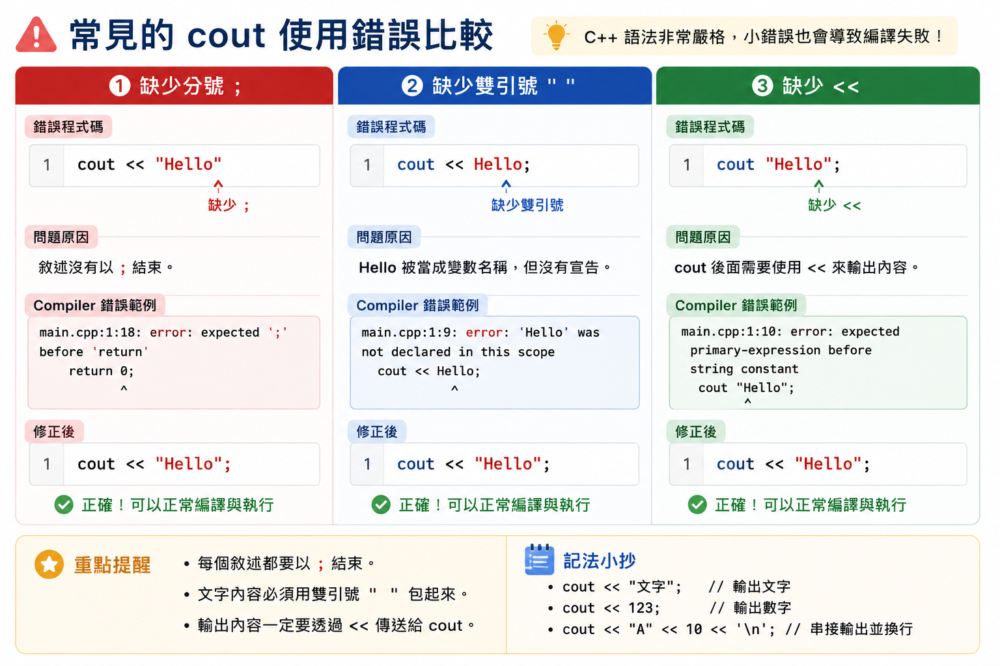
</p>

## Section XL. 常見錯誤

### 錯誤 1：檔案不是 `.cpp`

C++ 原始程式通常使用：

```text
.cpp
```

---

### 錯誤 2：忘記 `<iostream>`

使用 `cout` 前需要：

```cpp
#include <iostream>
```

---

### 錯誤 3：缺少 `main()`

可執行程式需要開始位置。

---

### 錯誤 4：大括號不成對

左大括號需要對應右大括號。

---

### 錯誤 5：忘記分號

```cpp
cout << "Hello"
```

---

### 錯誤 6：文字沒有雙引號

```cpp
cout << Hello;
```

---

### 錯誤 7：漏掉 `<<`

錯誤：

```cpp
cout "Hello";
```

正確：

```cpp
cout << "Hello";
```

---

### 錯誤 8：以為 `cout` 自動加空格

```cpp
cout << 10 << 20;
```

輸出：

```text
1020
```

---

### 錯誤 9：以為 `cout` 自動換行

需要主動加入 `'\n'` 或 `endl`。

---

### 錯誤 10：每一行都使用 `endl`

一般輸出通常使用 `'\n'` 即可。

---

### 錯誤 11：註解符號寫錯

單行使用 `//`，多行使用 `/* */`。

---

### 錯誤 12：多行註解沒有結束

必須使用：

```cpp
*/
```

結束。

---

### 錯誤 13：把要執行的程式註解掉

被註解的程式不會執行。

---

### 錯誤 14：只看錯誤行

上一行缺少分號時，錯誤可能顯示在下一行附近。

---

### 錯誤 15：使用 `system("pause")`

它不是標準 C++。

---

### 錯誤 16：忽略 `return 0;`

本教材保留它，讓正常結束位置清楚。

---

### 錯誤 17：在 `#include` 後加分號

正確：

```cpp
#include <iostream>
```

---

### 錯誤 18：混淆 `std::cout` 與 `cout`

沒有 `using namespace std;` 時，需要使用 `std::cout`。

---

# Part K：Mermaid 流程圖

## Section XLI. 第一個程式流程

### 1. 建立並執行程式

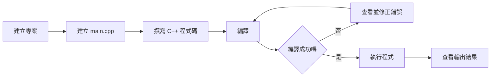
```mermaid
flowchart LR
    A[建立專案] --> B[建立 main.cpp]
    B --> C[撰寫 C++ 程式碼]
    C --> D[編譯]
    D --> E{編譯成功嗎}
    E -- 否 --> F[查看並修正錯誤]
    F --> D
    E -- 是 --> G[執行程式]
    G --> H[查看輸出結果]
```

---

### 2. 第一個程式執行順序

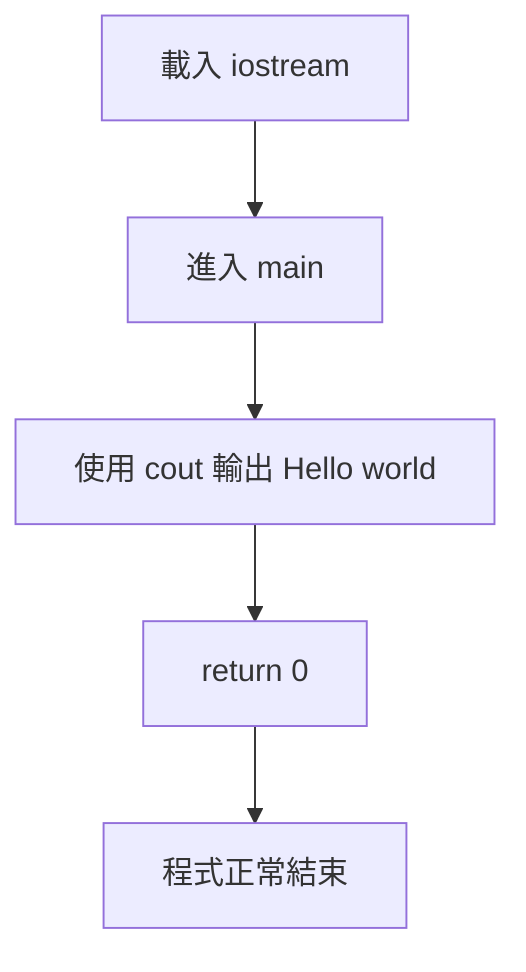
```mermaid
flowchart TD
    A[載入 iostream] --> B[進入 main]
    B --> C[使用 cout 輸出 Hello world]
    C --> D[return 0]
    D --> E[程式正常結束]
```

---

### 3. `cout` 串接輸出

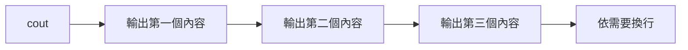
```mermaid
flowchart LR
    A[cout] --> B[輸出第一個內容]
    B --> C[輸出第二個內容]
    C --> D[輸出第三個內容]
    D --> E[依需要換行]
```

---

### 4. 編譯錯誤檢查

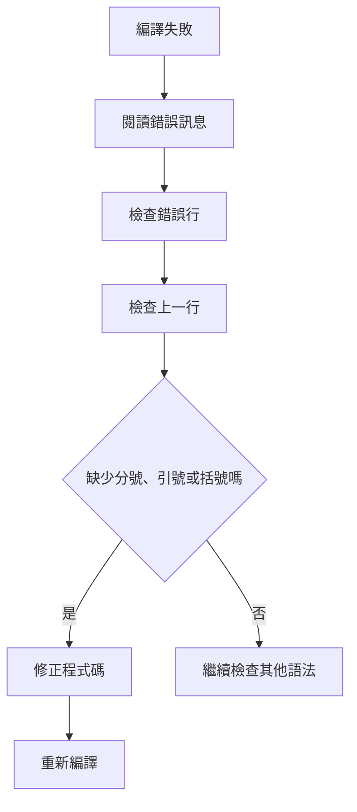
```mermaid
flowchart TD
    A[編譯失敗] --> B[閱讀錯誤訊息]
    B --> C[檢查錯誤行]
    C --> D[檢查上一行]
    D --> E{缺少分號、引號或括號嗎}
    E -- 是 --> F[修正程式碼]
    F --> G[重新編譯]
    E -- 否 --> H[繼續檢查其他語法]
```

---

### 5. 選擇換行方式

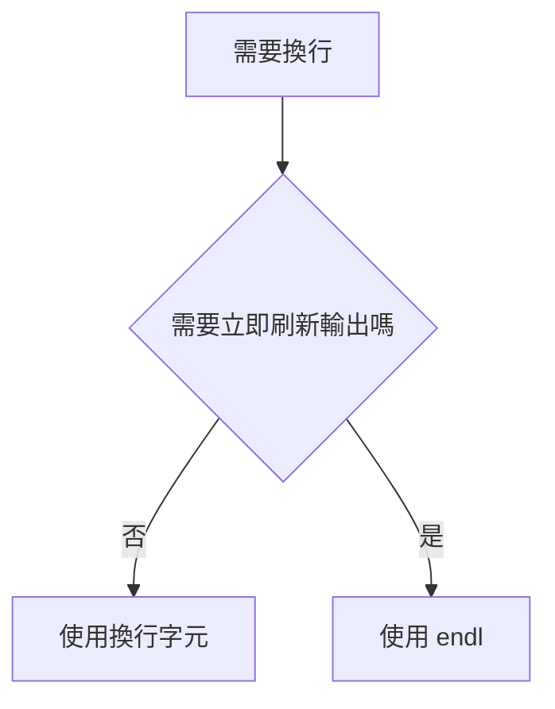
```mermaid
flowchart TD
    A[需要換行] --> B{需要立即刷新輸出嗎}
    B -- 否 --> C[使用換行字元]
    B -- 是 --> D[使用 endl]
```

---

### 6. 選擇註解方式

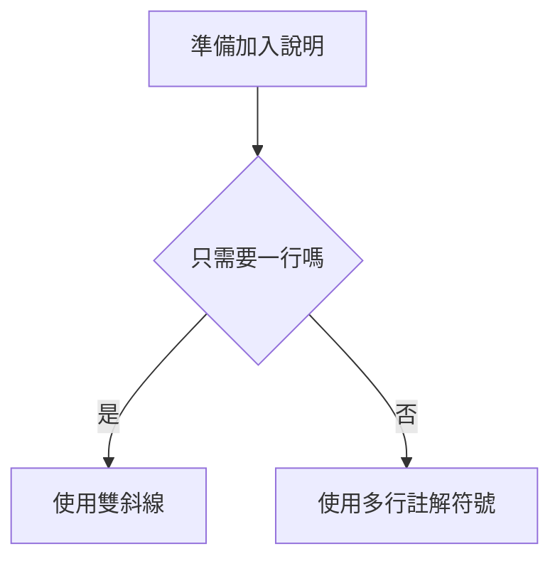
```mermaid
flowchart TD
    A[準備加入說明] --> B{只需要一行嗎}
    B -- 是 --> C[使用雙斜線]
    B -- 否 --> D[使用多行註解符號]
```

---

# 本章完成標準

完成本章後，你應該能做到：

1. 說明 `.cpp` 是常見的 C++ 原始程式副檔名。
2. 建立 `main.cpp`。
3. 說明建立、編譯與執行流程。
4. 撰寫 `Hello world` 程式。
5. 使用 `#include <iostream>`。
6. 說明 `using namespace std;`。
7. 使用 `int main()`。
8. 使用成對大括號。
9. 在敘述結尾使用分號。
10. 使用 `return 0;`。
11. 使用 `cout` 輸出文字。
12. 使用 `cout` 輸出整數與小數。
13. 使用 `cout` 輸出運算結果。
14. 使用多個 `<<`。
15. 主動加入空格。
16. 使用 `\n` 換行。
17. 使用 `endl` 換行。
18. 說明 `\n` 與 `endl` 的差異。
19. 預測沒有空格或換行時的輸出。
20. 說明 C++ 程式需要編譯。
21. 說明語法錯誤會造成編譯失敗。
22. 檢查錯誤行與上一行。
23. 使用單行註解。
24. 使用多行註解。
25. 撰寫有意義的註解。
26. 找出缺少雙引號的錯誤。
27. 找出缺少分號的錯誤。
28. 找出缺少 `<<` 的錯誤。
29. 避免依賴 `system("pause")`。
30. 使用 `std::cout` 撰寫不含 `using namespace std;` 的程式。

---

# 隱藏答案區

> Answer hidden — try it first.

<details>
<summary>TODO 1 答案</summary>

```cpp
#include <iostream>
using namespace std;

int main() {
    cout << "Hello world" << '\n';

    return 0;
}
```

</details>

<details>
<summary>TODO 2 答案</summary>

```cpp
#include <iostream>
using namespace std;

int main() {
    cout << "Amy" << '\n';

    return 0;
}
```

</details>

<details>
<summary>TODO 3 答案</summary>

```cpp
#include <iostream>
using namespace std;

int main() {
    cout << "C++\n";
    cout << "is\n";
    cout << "fun\n";

    return 0;
}
```

</details>

<details>
<summary>TODO 4 答案</summary>

```cpp
#include <iostream>
using namespace std;

int main() {
    cout << "C++" << " " << "is" << " " << "fun" << '\n';

    return 0;
}
```

</details>

<details>
<summary>TODO 5 答案</summary>

```cpp
#include <iostream>
using namespace std;

int main() {
    cout << 10 << " " << 20 << '\n';

    return 0;
}
```

</details>

<details>
<summary>TODO 6 答案</summary>

```cpp
#include <iostream>
using namespace std;

int main() {
    cout << 123 + 456 << '\n';

    return 0;
}
```

</details>

<details>
<summary>TODO 7 答案</summary>

```cpp
#include <iostream>
using namespace std;

int main() {
    cout << 10 * 5 << '\n';

    return 0;
}
```

</details>

<details>
<summary>TODO 8 答案</summary>

```cpp
#include <iostream>
using namespace std;

int main() {
    cout << "Apple\nBanana\nWatermelon\n";

    return 0;
}
```

</details>

<details>
<summary>TODO 9 答案</summary>

```cpp
#include <iostream>
using namespace std;

int main() {
    cout << "First line" << '\n';
    cout << "Second line" << endl;

    return 0;
}
```

</details>

<details>
<summary>TODO 10 答案</summary>

```cpp
#include <iostream>
using namespace std;

int main() {
    // 輸出課程名稱
    cout << "C++" << '\n';

    return 0;
}
```

</details>

<details>
<summary>TODO 11 答案</summary>

```cpp
#include <iostream>
using namespace std;

/*
這個程式會輸出兩行文字：
Hello 和 C++。
*/
int main() {
    cout << "Hello\n";
    cout << "C++\n";

    return 0;
}
```

</details>

<details>
<summary>TODO 12 答案</summary>

```cpp
cout << "Welcome to C++";
```

</details>

<details>
<summary>TODO 13 答案</summary>

```cpp
cout << "Hello";
return 0;
```

</details>

<details>
<summary>TODO 14 答案</summary>

```cpp
#include <iostream>

int main() {
    std::cout << "Hello world" << '\n';

    return 0;
}
```

</details>

<details>
<summary>TODO 15 答案</summary>

```cpp
#include <iostream>
using namespace std;

int main() {
    cout << "Name: Amy\n";
    cout << "Course: C++\n";
    cout << "Message: Hello!\n";

    return 0;
}
```

</details>
