# Lesson 03：Variables, Input and Output 變數與輸入輸出

> 這堂課的重點：使用變數保存資料，透過 `cin` 接收鍵盤輸入，再使用 `cout` 顯示結果，完成第一批「輸入 → 處理 → 輸出」的互動式 C++ 程式。你也會分辨宣告、初始化、賦值與重新賦值，並學習基本的變數命名規則。

> 本章先以 `int` 整數作為主要練習型別，並使用 `string` 保存單字、使用 `double` 示範小數輸入。各資料型別的大小、範圍與型別轉換會留到下一章整理。

---

## Section I. 今天要做什麼？

1. 理解程式的輸入、處理與輸出。
2. 認識變數可以保存資料。
3. 將變數想成具有名稱的資料盒子。
4. 宣告 `int` 整數變數。
5. 分辨資料型別與變數名稱。
6. 分辨宣告、初始化、賦值與重新賦值。
7. 使用 `=` 將右邊的值存入左邊變數。
8. 由右往左理解賦值敘述。
9. 輸出變數內容。
10. 在固定文字中插入變數內容。
11. 一次宣告多個同型別變數。
12. 避免讀取未初始化區域變數。
13. 使用 `cin` 讀取整數。
14. 理解輸入資料會被保存到指定變數。
15. 顯示提示文字後等待使用者輸入。
16. 使用 `cin` 連續讀取多筆資料。
17. 使用同一行輸入兩個整數。
18. 完成輸入兩個整數並計算總和。
19. 完成輸入三個整數並計算總和。
20. 使用結果變數保存計算結果。
21. 直接在 `cout` 中輸出運算結果。
22. 追蹤每一行執行後的變數內容。
23. 使用暫存變數交換兩個整數。
24. 理解舊值被覆蓋前為什麼需要先保存。
25. 使用 `string` 保存單字。
26. 加入 `<string>` 標頭檔。
27. 使用 `cin >> name` 讀取一個單字。
28. 認識 `cin >>` 遇到空白停止的限制。
29. 初步使用 `getline()` 讀取包含空格的整行文字。
30. 使用 `double` 示範小數輸入。
31. 理解 `cin` 會依照變數型別解析輸入。
32. 認識輸入型別不符合時可能失敗。
33. 本章先假設使用者輸入符合要求。
34. 認識 C++ 關鍵字不能作為變數名稱。
35. 認識識別字。
36. 遵守變數命名規則。
37. 理解變數名稱區分大小寫。
38. 使用清楚、有意義的變數名稱。
39. 比較 `camelCase` 與 `snake_case`。
40. 避免在同一範圍重複定義同名變數。
41. 完成商品名稱、價格與數量的小程式。
42. 找出使用尚未宣告變數的錯誤。
43. 找出把賦值方向寫反的錯誤。
44. 找出輸入順序與變數順序不一致的錯誤。
45. 使用概念檢查、程式閱讀與實作題整合本章。

---

## Section II. 今天的學習方式

1. 每個互動式程式先分成：
   ```text
   Input → Process → Output
   ```
2. 每看到一個變數，都標出：
   ```text
   型別、名稱、目前內容
   ```
3. 每個範例先預測變數內容，再閱讀答案。
4. 遇到賦值敘述時，由右往左閱讀：
   ```text
   先計算右邊
   → 再存入左邊
   ```
5. 每次輸入後，確認資料進入哪一個變數。
6. 多筆輸入時，逐一對照輸入順序與變數順序。
7. 使用表格記錄每一行執行後的變數值。
8. 交換數值時使用：
   ```text
   先保存 → 再覆蓋 → 最後取回
   ```
9. 使用 `cin >>` 讀文字時，先判斷資料是否可能包含空格。
10. 本章的輸入題先假設輸入格式正確；完整錯誤狀態處理留到後續課程。
11. 修改程式時一次只改一小部分，再重新編譯。
12. 完整且應合法的程式使用嚴格 C++17 選項檢查。

---

## Section III. 核心語法對照

| 語法 | 用途 |
| --- | --- |
| `int number;` | 宣告一個整數變數 |
| `int number = 10;` | 宣告並初始化變數 |
| `number = 20;` | 將新值指定給既有變數 |
| `cout << number;` | 輸出變數內容 |
| `cin >> number;` | 讀取輸入並保存到變數 |
| `cin >> first >> second;` | 依序讀取兩筆資料 |
| `sum = first + second;` | 計算後將結果存入 `sum` |
| `string name;` | 建立字串變數 |
| `cin >> name;` | 讀取一個不含空白的單字 |
| `getline(cin, fullName);` | 讀取一整行文字 |
| `double height;` | 建立可保存小數的變數 |
| `#include <string>` | 載入 `string` |
| `=` | 賦值運算子 |
| `//` | 單行註解 |

---

# Part A：輸入、處理與輸出

## Section IV. 程式的三個基本步驟

互動式程式通常包含：

| 步驟 | 名稱 | 說明 |
| --- | --- | --- |
| 1 | Input 輸入 | 使用者提供資料 |
| 2 | Process 處理 | 程式依規則計算或修改資料 |
| 3 | Output 輸出 | 程式顯示結果 |


<p align="center">
  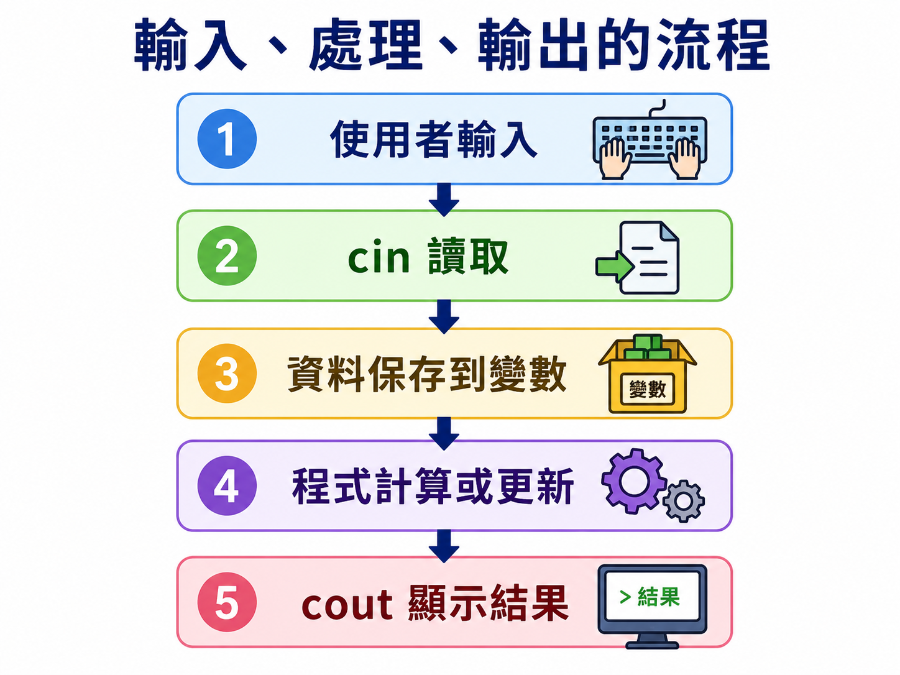
</p>---

## Section V. 生活例子

點飲料時：

```text
告訴店員品項、甜度與冰量
→ 店員依照規則製作
→ 取得飲料
```

對應程式：

```text
輸入資料
→ 處理資料
→ 輸出結果
```

---

## Section VI. 第一個互動式程式

```cpp
// VALIDATE
#include <iostream>
using namespace std;

int main() {
    int age;

    cout << "請輸入你的年齡：";
    cin >> age;

    cout << "你的年齡是 "
         << age
         << " 歲。\n";

    return 0;
}
```

<p align="center">
  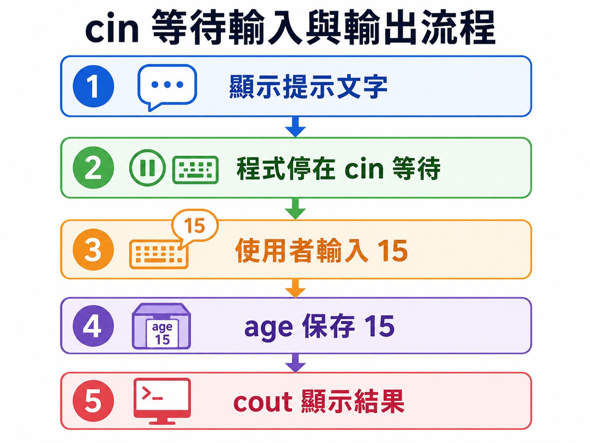
</p>

可能的執行畫面：

```text
請輸入你的年齡：15
你的年齡是 15 歲。
```

---

## Section VII. 分析工作流程

```text
Input
cin >> age;

Process
本例沒有額外計算，資料直接保存於 age

Output
cout << age;
```

程式不是停止不動，而是在：

```cpp
cin >> age;
```

等待使用者輸入並按下 Enter。

---

# Part B：變數 Variables

## Section VIII. 什麼是變數？

變數可以想成一個有標籤的資料盒子：

```text
┌──────────────┐
│ 名稱：score  │
│ 型別：int    │
│ 內容：90     │
└──────────────┘
```

<p align="center">
  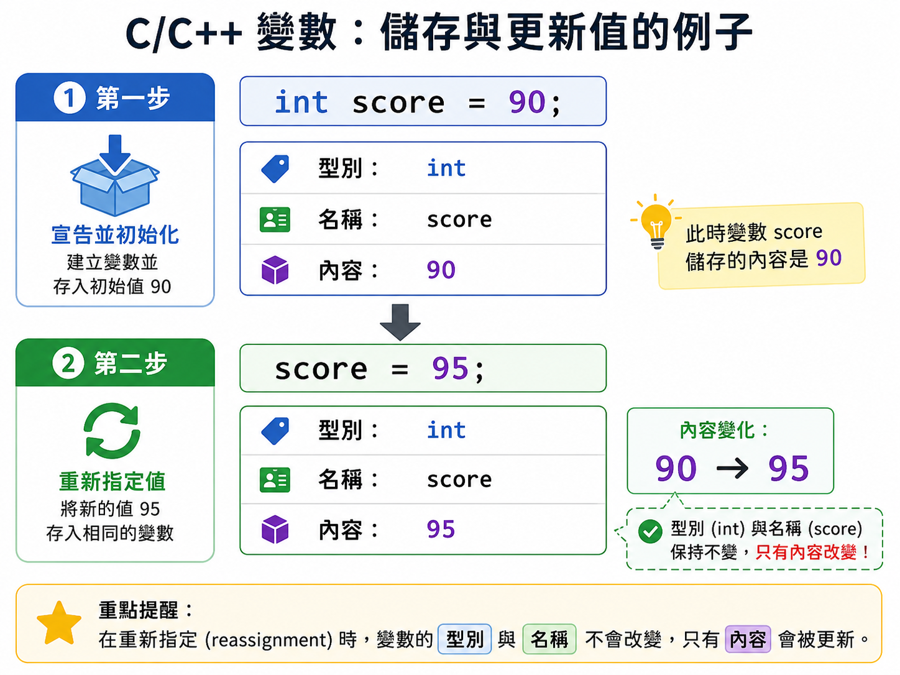
</p>

- 變數名稱用來找到這個盒子。
- 資料型別限制它準備保存哪一類資料。
- 變數內容可以在程式執行期間改變。

---

## Section IX. 宣告一個整數變數

```cpp
int number;
```

| 部分 | 用途 |
| --- | --- |
| `int` | 表示準備保存整數 |
| `number` | 變數名稱 |
| `;` | 宣告敘述結束 |

這一行建立了變數，但沒有主動指定第一個值。

---

## Section X. 初始化

```cpp
int number = 10;
```

這叫做初始化：

```text
建立 number
→ 同時放入第一個值 10
```

---

## Section XI. 宣告後再賦值

```cpp
int number;
number = 10;
```

步驟：

```text
先建立 number
→ 再把 10 存入 number
```

---

## Section XII. 重新賦值

```cpp
int score = 80;
score = 95;
```

第二行執行後：

```text
score = 95
```

原本的 `80` 被新值覆蓋。

重新賦值時不需要再次寫出資料型別。

---

## Section XIII. 四個名詞比較

| 名稱 | 範例 | 意義 |
| --- | --- | --- |
| 宣告 Declaration | `int number;` | 建立變數 |
| 初始化 Initialization | `int number = 10;` | 建立時放入第一個值 |
| 賦值 Assignment | `number = 10;` | 將右邊的值存入既有變數 |
| 重新賦值 Reassignment | `number = 25;` | 以新值覆蓋舊值 |


<p align="center">
  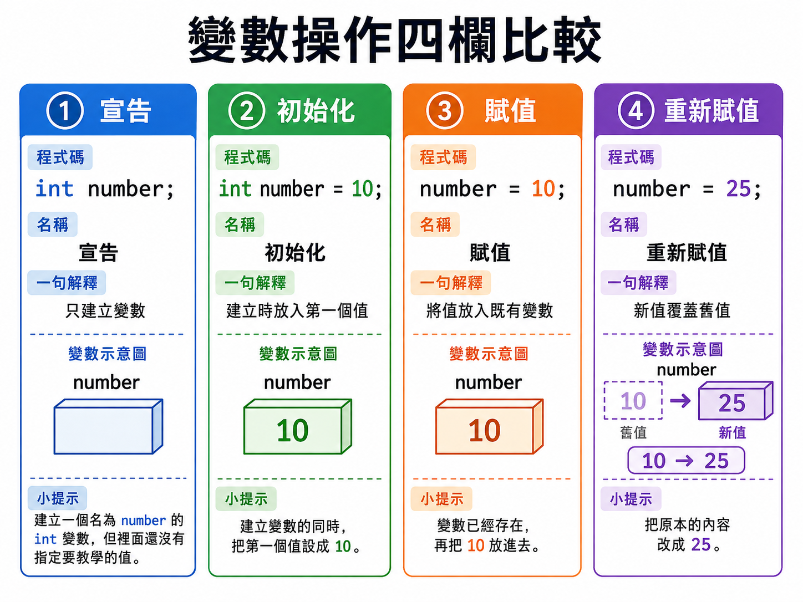
</p>---

## Section XIV. 賦值不是數學等式

```cpp
number = 10;
```

不是在詢問：

```text
number 是否等於 10？
```

它表示：

```text
將右邊的 10
存入左邊的 number
```

---

## Section XV. 由右往左閱讀

```cpp
sum = first + second;
```

閱讀順序：

1. 取得 `first`。
2. 取得 `second`。
3. 計算 `first + second`。
4. 將結果存入 `sum`。


<p align="center">
  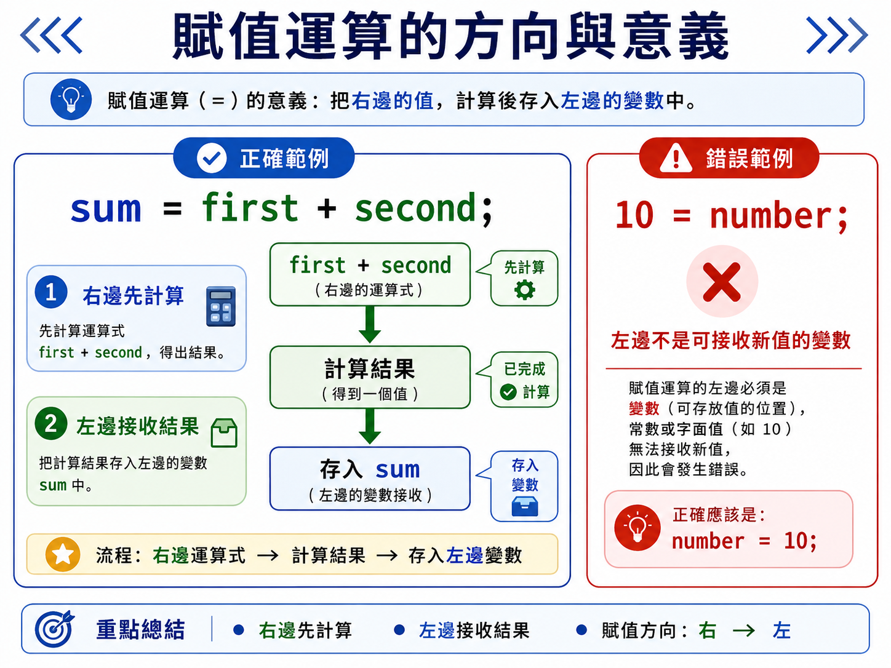
</p>
假設：

```text
first = 3
second = 5
```

執行後：

```text
sum = 8
```

`first` 與 `second` 不會因此改變。

---

## Section XVI. 輸出變數

```cpp
// VALIDATE
#include <iostream>
using namespace std;

int main() {
    int score = 95;

    cout << score << '\n';
    cout << "Score: " << score << '\n';

    return 0;
}
```

輸出：

```text
95
Score: 95
```

沒有雙引號的：

```cpp
score
```

表示讀取變數內容。

有雙引號的：

```cpp
"score"
```

只是一段固定文字。

---

## Section XVII. 一次宣告多個同型別變數

可以分開：

```cpp
int first;
int second;
int sum;
```

也可以寫在同一行：

```cpp
int first, second, sum;
```

兩種方式都建立三個 `int` 變數。

初學時，分開宣告通常更容易加入說明與追蹤。

---

## Section XVIII. 未初始化變數

不建議：

```cpp
int score;
cout << score << '\n';
```

區域變數若尚未取得確定值，就不應讀取。

建議：

```cpp
int score = 0;
```

或先透過輸入取得值：

```cpp
int score;
cin >> score;
```

---

## Section XIX. 重複定義

錯誤：

```cpp
int score = 80;
int score = 95;
```

同一範圍中不能重複定義同名變數。

正確：

```cpp
int score = 80;
score = 95;
```

---

# Part C：變數名稱與識別字

## Section XX. 什麼是識別字？

識別字是程式設計者建立的名稱，例如：

- 變數名稱
- 函式名稱
- 類別名稱

本章主要使用變數名稱。

---

## Section XXI. C++ 關鍵字

C++ 保留一些具有特殊用途的單字，例如：

```cpp
int
double
if
else
for
while
return
class
const
```

不能把它們作為自訂變數名稱。

錯誤：

```cpp
int return = 10;
```

---

## Section XXII. 命名規則

變數名稱：

1. 不能使用 C++ 關鍵字。
2. 可使用英文字母、數字與底線 `_`。
3. 第一個字元不能是數字。
4. 名稱區分大小寫。

合法：

```cpp
age
studentScore
student_score
_score
score2
```

不合法：

```cpp
2score
student-score
class
```

---

## Section XXIII. 大小寫不同

```cpp
int score = 90;
int Score = 80;
int SCORE = 70;
```

這是三個不同的變數。

---

## Section XXIV. 使用有意義的名稱

不清楚：

```cpp
int x = 30;
```

較清楚：

```cpp
int studentCount = 30;
```

名稱應讓讀者大致知道資料用途。

---

## Section XXV. 常見命名風格

### camelCase

```cpp
studentCount
totalScore
productPrice
```

### snake_case

```cpp
student_count
total_score
product_price
```

同一個專案應保持一致。

---

# Part D：使用 `cin` 讀取資料

## Section XXVI. 基本語法

```cpp
cin >> 變數名稱;
```

<p align="center">
  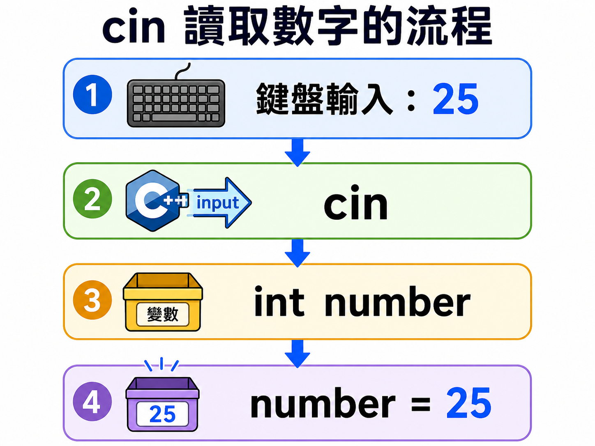
</p>

例如：

```cpp
int number;
cin >> number;
```

程式會：

```text
等待輸入
→ 將整數保存到 number
```

---

## Section XXVII. 輸入一個整數

```cpp
// VALIDATE
#include <iostream>
using namespace std;

int main() {
    int number;

    cout << "Please enter an integer: ";
    cin >> number;

    cout << "You entered "
         << number
         << ".\n";

    return 0;
}
```

執行流程：

```text
建立 number
→ 顯示提示
→ 等待使用者輸入
→ 將資料保存到 number
→ 輸出 number
```

---

## Section XXVIII. 顯示提示後等待輸入

```cpp
cout << "Input: ";
cin >> number;
```

畫面停在提示後時，程式可能正在等待你：

1. 輸入資料。
2. 按下 Enter。

---

## Section XXIX. 一次讀取多筆資料

```cpp
int first;
int second;

cin >> first >> second;
```

若輸入：

```text
3 5
```

資料分配：

```text
3 → first
5 → second
```

---

## Section XXX. 輸入順序很重要

```cpp
cin >> first >> second;
```

輸入：

```text
10 20
```

結果：

```text
first = 10
second = 20
```

若改成：

```cpp
cin >> second >> first;
```

同樣輸入會得到：

```text
second = 10
first = 20
```

<p align="center">
  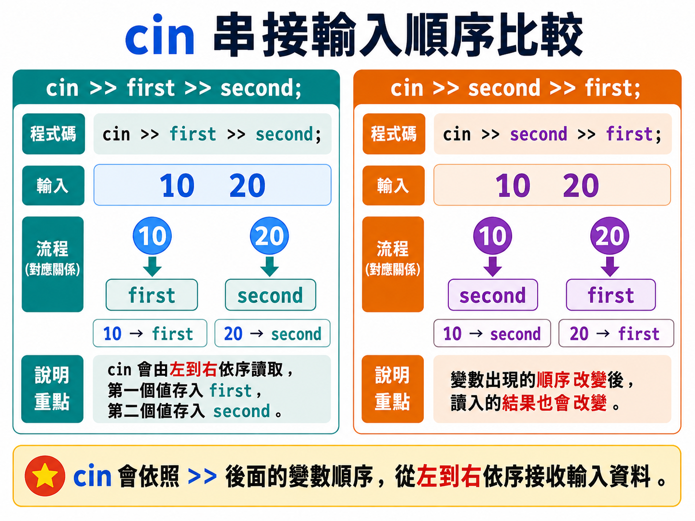
</p>

---

## Section XXXI. 兩個整數相加

```cpp
// VALIDATE
#include <iostream>
using namespace std;

int main() {
    int first;
    int second;
    int sum;

    cout << "請輸入兩個整數：";
    cin >> first >> second;

    sum = first + second;

    cout << first
         << " + "
         << second
         << " = "
         << sum
         << '\n';

    return 0;
}
```

輸入：

```text
15 27
```

輸出：

```text
15 + 27 = 42
```

---

## Section XXXII. 不使用結果變數

也可以直接：

```cpp
cout << first + second << '\n';
```

使用 `sum` 的好處：

- 可重複使用結果。
- 追蹤程式時更清楚。
- 可為中間結果取有意義的名稱。

簡短程式可直接輸出，複雜程式通常會保存中間結果。

---

## Section XXXIII. 三個整數總和

```cpp
// VALIDATE
#include <iostream>
using namespace std;

int main() {
    int first;
    int second;
    int third;
    int total;

    cout << "請輸入三個整數：";
    cin >> first >> second >> third;

    total = first + second + third;

    cout << "Total: " << total << '\n';

    return 0;
}
```

---

# Part E：追蹤變數內容

## Section XXXIV. 逐行追蹤

觀察：

```cpp
int number = 10;
number = 25;
number = number + 5;
```

追蹤表：

| 執行後 | `number` |
| --- | ---: |
| `int number = 10;` | 10 |
| `number = 25;` | 25 |
| `number = number + 5;` | 30 |

---

## Section XXXV. `number = number + 5`

這不是矛盾的數學等式。

程式執行順序：

```text
先讀取舊的 number
→ 計算舊值 + 5
→ 將結果寫回 number
```

假設原本：

```text
number = 25
```

執行後：

```text
number = 30
```

<p align="center">
  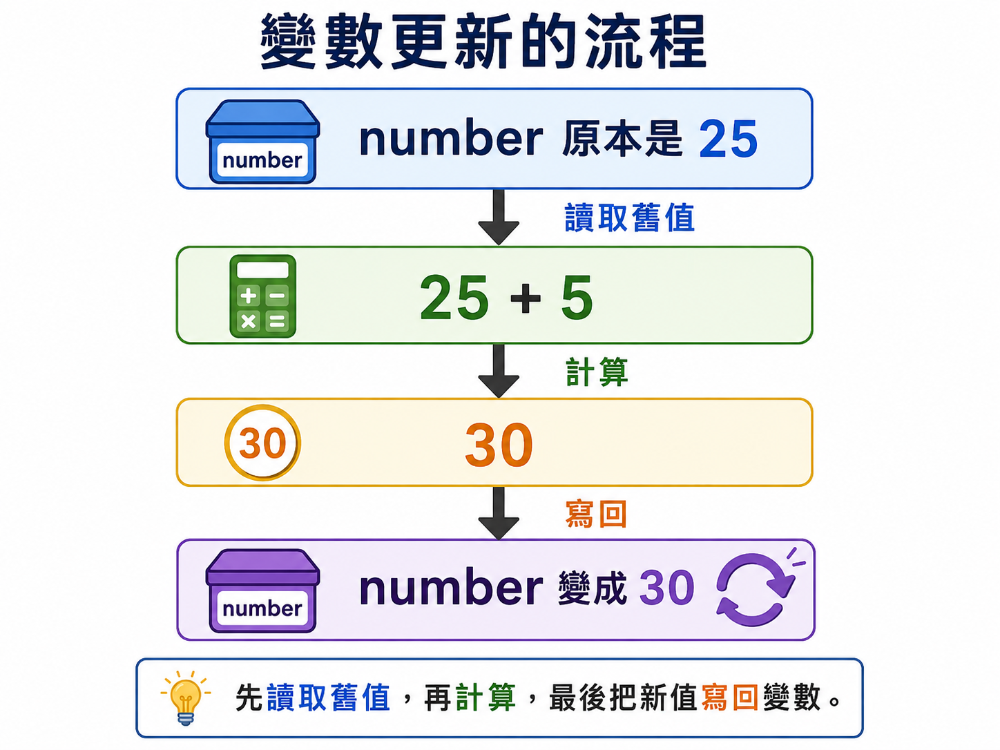
</p>

---

## Section XXXVI. 多變數追蹤

```cpp
int first = 3;
int second = 5;
int sum = first + second;

first = 10;
```

| 執行後 | `first` | `second` | `sum` |
| --- | ---: | ---: | ---: |
| 初始化前三個變數 | 3 | 5 | 8 |
| `first = 10;` | 10 | 5 | 8 |

`sum` 不會自動重新計算。

它只保存當時算出的 `8`。

若需要更新：

```cpp
sum = first + second;
```

---

# Part F：交換兩個變數

## Section XXXVII. 錯誤交換方式

已知：

```cpp
int first = 2;
int second = 7;
```

若寫：

```cpp
first = second;
second = first;
```

第一行後：

```text
first = 7
second = 7
```

原本的 `2` 已經遺失。

第二行只能再把 `7` 存入 `second`。

---

## Section XXXVIII. 使用暫存變數

```cpp
int temp = first;
first = second;
second = temp;
```

<p align="center">
  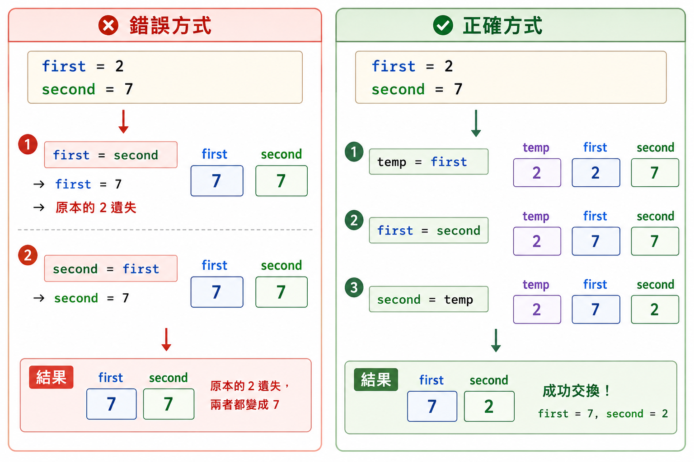
</p>

記憶方式：

```text
先保存
→ 再覆蓋
→ 最後取回
```

---

## Section XXXIX. 完整交換程式

```cpp
// VALIDATE
#include <iostream>
using namespace std;

int main() {
    int first;
    int second;
    int temp;

    cout << "請輸入兩個整數：";
    cin >> first >> second;

    temp = first;
    first = second;
    second = temp;

    cout << "First: " << first << '\n';
    cout << "Second: " << second << '\n';

    return 0;
}
```

輸入：

```text
2 7
```

輸出：

```text
First: 7
Second: 2
```

---

## Section XL. 交換追蹤表

初始：

```text
first = 2
second = 7
```

| 執行後 | `temp` | `first` | `second` |
| --- | ---: | ---: | ---: |
| 初始狀態 | 未設定 | 2 | 7 |
| `temp = first;` | 2 | 2 | 7 |
| `first = second;` | 2 | 7 | 7 |
| `second = temp;` | 2 | 7 | 2 |

---

# Part G：輸入文字

## Section XLI. 使用 `string`

```cpp
#include <string>
```

建立字串變數：

```cpp
string name;
```

`string` 可用來保存一段文字。

---

## Section XLII. 使用 `cin >>` 讀取單字

```cpp
// VALIDATE
#include <iostream>
#include <string>
using namespace std;

int main() {
    string name;

    cout << "請輸入你的名字：";
    cin >> name;

    cout << "Hello, " << name << "!\n";

    return 0;
}
```

若輸入：

```text
Amy
```

輸出：

```text
Hello, Amy!
```

---

## Section XLIII. 空白限制

```cpp
string name;
cin >> name;
```

若輸入：

```text
Wang Xiao Ming
```

`name` 通常只會取得：

```text
Wang
```

因為格式化輸入運算子 `>>` 會以空白分隔資料。

---

## Section XLIV. 使用 `getline()`

需要讀取一整行文字時：

```cpp
getline(cin, fullName);
```

完整獨立範例：

```cpp
// VALIDATE
#include <iostream>
#include <string>
using namespace std;

int main() {
    string fullName;

    cout << "請輸入完整姓名：";
    getline(cin, fullName);

    cout << "Hello, " << fullName << "!\n";

    return 0;
}
```

<p align="center">
  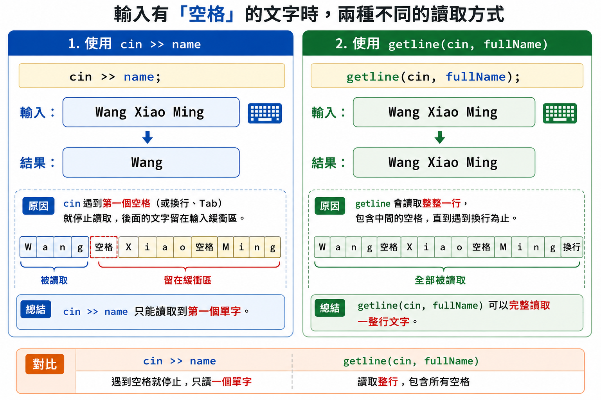
</p>

若輸入：

```text
Wang Xiao Ming
```

`fullName` 可以保存整行文字。

> 本章只介紹獨立使用 `getline()`。把 `cin >>` 和 `getline()` 接在一起時，輸入緩衝區會有額外注意事項，將在字串與輸入處理章節進一步說明。

---

# Part H：輸入小數與多種資料

## Section XLV. 使用 `double`

```cpp
double height;
cin >> height;
```

若輸入：

```text
168.5
```

`height` 可以保存小數值。

詳細的浮點型別差異會在下一章介紹。

---

## Section XLVI. 年齡與身高

```cpp
// VALIDATE
#include <iostream>
using namespace std;

int main() {
    int age;
    double height;

    cout << "請輸入年齡與身高：";
    cin >> age >> height;

    cout << "年齡：" << age << '\n';
    cout << "身高：" << height << '\n';

    return 0;
}
```

輸入：

```text
15 168.5
```

資料分配：

```text
15    → age
168.5 → height
```

---

## Section XLVII. 商品資料

```cpp
// VALIDATE
#include <iostream>
#include <string>
using namespace std;

int main() {
    string productName;
    double price;
    int quantity;

    cout << "請輸入商品名稱：";
    cin >> productName;

    cout << "請輸入商品價格：";
    cin >> price;

    cout << "請輸入購買數量：";
    cin >> quantity;

    cout << "商品：" << productName << '\n';
    cout << "單價：" << price << '\n';
    cout << "數量：" << quantity << '\n';
    cout << "總價：" << price * quantity << '\n';

    return 0;
}
```

本例中的商品名稱只能直接讀取一個不含空白的單字。

---

## Section XLVIII. `cin` 會依照型別讀取

```cpp
int age;
double height;
string name;
```

對應：

```text
age    → 預期整數
height → 可以包含小數
name   → 讀取文字
```

若程式要求整數，但輸入：

```text
fifteen
```

`cin` 無法將它正常保存到 `int`。

本章練習先假設使用者輸入符合題目要求。

<p align="center">
  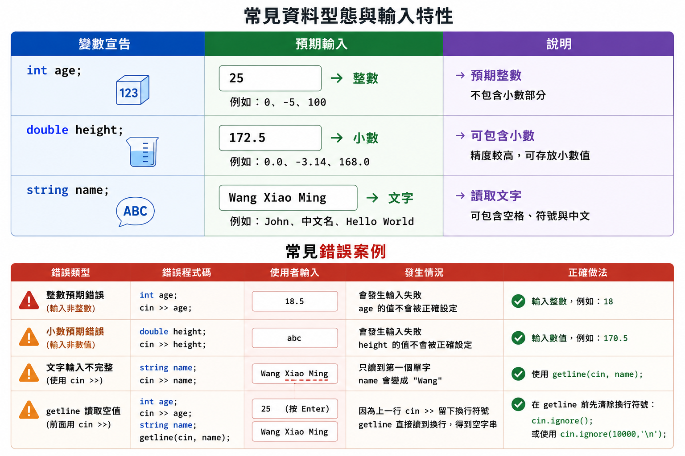
</p>

---

# Part I：快速概念檢查

## Section XLIX. 選擇題與簡答

### Q1. 變數可以用來做什麼？

<details>
<summary>查看答案</summary>

使用名稱保存資料，並可在程式執行期間讀取或更新內容。

</details>

---

### Q2. `int number;` 是宣告還是初始化？

<details>
<summary>查看答案</summary>

只有宣告，沒有主動指定第一個值。

</details>

---

### Q3. `int number = 10;` 是什麼？

<details>
<summary>查看答案</summary>

宣告並初始化。

</details>

---

### Q4. `number = 25;` 表示什麼？

<details>
<summary>查看答案</summary>

將右邊的 `25` 存入既有變數 `number`。

</details>

---

### Q5. 賦值敘述應從哪一邊開始理解？

<details>
<summary>查看答案</summary>

先計算右邊，再將結果存入左邊。

</details>

---

### Q6. 可以在變數尚未取得確定值前輸出它嗎？

<details>
<summary>查看答案</summary>

不應該。區域變數尚未初始化時，其內容不確定。

</details>

---

### Q7. `cin >> age;` 的用途是什麼？

<details>
<summary>查看答案</summary>

讀取一筆輸入，並保存到 `age`。

</details>

---

### Q8. `cin >> first >> second;` 會如何分配輸入？

<details>
<summary>查看答案</summary>

第一筆資料存入 `first`，第二筆資料存入 `second`。

</details>

---

### Q9. `sum = first + second;` 會修改 `first` 與 `second` 嗎？

<details>
<summary>查看答案</summary>

不會，只會讀取它們的值並將結果存入 `sum`。

</details>

---

### Q10. 為什麼交換兩個值需要暫存變數？

<details>
<summary>查看答案</summary>

避免第一個舊值在覆蓋後遺失。

</details>

---

### Q11. 使用 `string` 前需要哪個標頭檔？

<details>
<summary>查看答案</summary>

```cpp
#include <string>
```

</details>

---

### Q12. `cin >> name` 能直接讀取包含空格的完整姓名嗎？

<details>
<summary>查看答案</summary>

通常不能，它會在空白處停止。

</details>

---

### Q13. 讀取整行文字可使用什麼？

<details>
<summary>查看答案</summary>

```cpp
getline(cin, variable);
```

</details>

---

### Q14. C++ 關鍵字可以作為變數名稱嗎？

<details>
<summary>查看答案</summary>

不可以。

</details>

---

### Q15. `score` 與 `Score` 是同一個變數嗎？

<details>
<summary>查看答案</summary>

不是，C++ 名稱區分大小寫。

</details>

---

### Q16. `2score` 是合法名稱嗎？

<details>
<summary>查看答案</summary>

不是，名稱不能以數字開始。

</details>

---

### Q17. `student-score` 是合法名稱嗎？

<details>
<summary>查看答案</summary>

不是，連字號 `-` 會被視為運算子。

</details>

---

### Q18. 本章如何處理錯誤輸入？

<details>
<summary>查看答案</summary>

本章先假設輸入符合題目要求；完整錯誤狀態處理留到後續課程。

</details>

---

# Part J：程式閱讀練習

## Section L. 追蹤變數與輸入

### 題目 1

```cpp
int score = 80;
score = 95;

cout << score;
```

<details>
<summary>查看答案</summary>

```text
95
```

</details>

---

### 題目 2

```cpp
int number = 10;
number = number + 5;

cout << number;
```

<details>
<summary>查看答案</summary>

```text
15
```

</details>

---

### 題目 3

```cpp
int first = 3;
int second = 5;
int sum = first + second;

first = 10;

cout << sum;
```

<details>
<summary>查看答案</summary>

```text
8
```

`sum` 不會自動重新計算。

</details>

---

### 題目 4

```cpp
int first;
int second;

cin >> first >> second;
```

輸入：

```text
7 2
```

<details>
<summary>查看答案</summary>

```text
first = 7
second = 2
```

</details>

---

### 題目 5

```cpp
int first = 2;
int second = 7;

first = second;
second = first;
```

<details>
<summary>查看答案</summary>

```text
first = 7
second = 7
```

原本的 `2` 已遺失。

</details>

---

### 題目 6

```cpp
int first = 2;
int second = 7;
int temp = first;

first = second;
second = temp;
```

<details>
<summary>查看答案</summary>

```text
first = 7
second = 2
```

</details>

---

### 題目 7

```cpp
string name;
cin >> name;
```

輸入：

```text
Wang Xiao Ming
```

<details>
<summary>查看答案</summary>

`name` 通常只保存：

```text
Wang
```

</details>

---

### 題目 8

```cpp
double height;
cin >> height;
```

輸入：

```text
168.5
```

<details>
<summary>查看答案</summary>

`height` 保存 `168.5`。

</details>

---

### 題目 9

```cpp
int age = 15;
int age = 16;
```

<details>
<summary>查看答案</summary>

同一範圍重複定義同名變數，會編譯失敗。

</details>

---

### 題目 10

```cpp
number = 10;
```

但前面沒有宣告 `number`。

<details>
<summary>查看答案</summary>

編譯器不知道 `number` 是什麼，因此會編譯失敗。

</details>

---

# Part K：實作練習

## Section LI. 實作檢測題

### TODO 1：建立並輸出變數

建立：

```cpp
int score = 95;
```

再輸出它。

---

### TODO 2：重新賦值

建立 `score = 80`，再改成 `95` 並輸出。

---

### TODO 3：輸入年齡

讓使用者輸入年齡，再顯示：

```text
Age: 15
```

---

### TODO 4：明年年齡

輸入年齡，再輸出明年的年齡。

---

### TODO 5：兩數總和

輸入兩個整數，顯示完整算式：

```text
15 + 27 = 42
```

---

### TODO 6：三個分數總和

輸入三個整數分數，顯示總分。

---

### TODO 7：兩數乘積

輸入兩個整數，使用結果變數保存乘積，再輸出。

---

### TODO 8：交換兩個整數

使用暫存變數交換兩個輸入值。

---

### TODO 9：輸入單字名字

使用 `string` 和 `cin >>` 讀取名字，再輸出問候語。

---

### TODO 10：輸入完整姓名

使用 `getline()` 讀取包含空格的姓名。

---

### TODO 11：年齡與身高

在同一行輸入整數年齡與小數身高，再分行輸出。

---

### TODO 12：商品總價

輸入商品單字名稱、單價與數量，輸出總價。

---

### TODO 13：追蹤更新

建立：

```cpp
int number = 10;
```

依序加上 `5`、乘以 `2`，每一步都輸出結果。

---

### TODO 14：修正重複定義

修正：

```cpp
int score = 80;
int score = 95;
```

---

### TODO 15：修正交換程式

修正：

```cpp
first = second;
second = first;
```

使兩個舊值可以真正交換。

---

# Part L：課後小練習

## Section LII. 延伸練習

### 練習 1：學生資料

輸入：

```text
student_id
class_number
```

輸出：

```text
Student ID: 12345
Class: 8
```

---

### 練習 2：長方形資料

輸入長與寬，計算並輸出面積。

---

### 練習 3：三次更新

建立一個整數變數，依序用三個不同的新值覆蓋，輸出每次更新後的內容。

---

### 練習 4：座位交換

輸入兩位學生的座位號碼，交換後輸出。

---

### 練習 5：個人資料

使用 `getline()` 讀取完整姓名，再使用 `cin` 讀取年齡的混合輸入問題先保留，等後續字串輸入處理章節再完成。

---

# Part M：常見錯誤提醒

## Section LIII. 常見錯誤

### 錯誤 1：變數尚未宣告

```cpp
number = 10;
```

前面必須先建立 `number`。

---

### 錯誤 2：讀取未初始化變數

```cpp
int number;
cout << number;
```

不應依賴不確定內容。

---

### 錯誤 3：同一範圍重複定義

```cpp
int score = 80;
int score = 95;
```

---

### 錯誤 4：重新賦值時再次寫型別

若變數已存在，只需：

```cpp
score = 95;
```

---

### 錯誤 5：將賦值方向寫反

```cpp
10 = number;
```

左側必須是可以接收新值的變數。

---

### 錯誤 6：以為 `=` 是比較是否相等

本章的 `=` 用來賦值。

---

### 錯誤 7：以為結果變數會自動更新

改變 `first` 後，先前算出的 `sum` 不會自動重新計算。

---

### 錯誤 8：輸入順序寫錯

```cpp
cin >> second >> first;
```

會依此順序保存資料。

---

### 錯誤 9：使用錯誤交換方式

```cpp
first = second;
second = first;
```

會遺失其中一個舊值。

---

### 錯誤 10：忘記加入 `<string>`

使用 `string` 前應加入：

```cpp
#include <string>
```

---

### 錯誤 11：以為 `cin >> name` 會讀取整行

它通常在空白處停止。

---

### 錯誤 12：在本章混合 `cin >>` 與 `getline()` 卻忽略剩餘換行

此組合需要額外處理，留待後續章節。

---

### 錯誤 13：輸入資料型別不符合

向 `int` 輸入不可轉換的文字會使輸入失敗。

---

### 錯誤 14：名稱以數字開始

```cpp
int 2score;
```

不合法。

---

### 錯誤 15：名稱包含連字號

```cpp
int student-score;
```

連字號會被視為減法運算子。

---

### 錯誤 16：使用 C++ 關鍵字命名

```cpp
int return;
```

不合法。

---

### 錯誤 17：混淆大小寫

```cpp
score
Score
```

是不同名稱。

---

### 錯誤 18：使用過度簡短的名稱

除非用途非常清楚，否則 `a`、`b`、`x` 可能降低可讀性。

---

# Part N：Mermaid 流程圖

## Section LIV. 變數與輸入輸出流程

### 1. Input、Process、Output

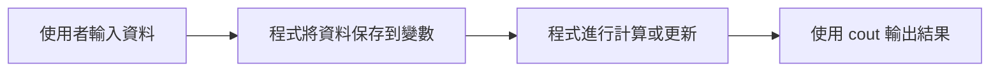

---

### 2. 建立變數

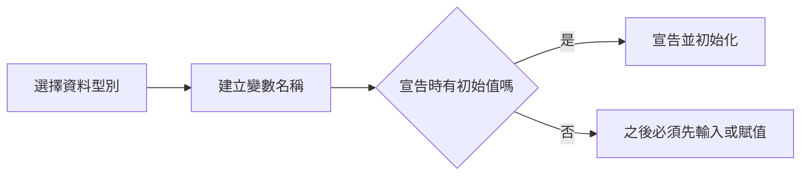

---

### 3. 賦值流程

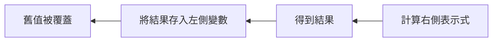

---

### 4. `cin` 輸入流程

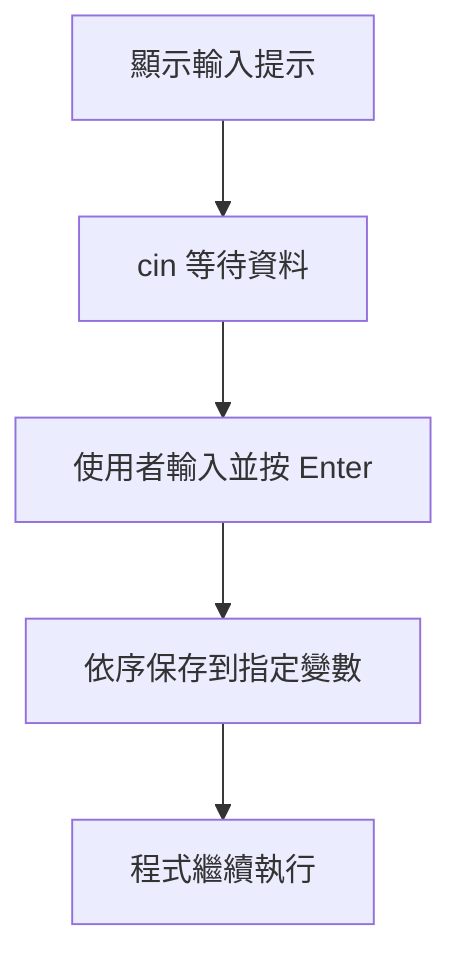

---

### 5. 交換兩個值

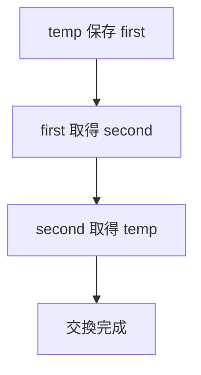

---

### 6. 選擇文字輸入方式

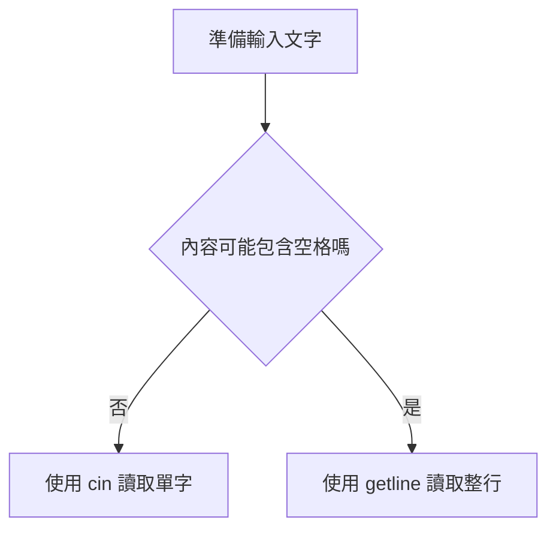

---

### 7. 變數命名檢查

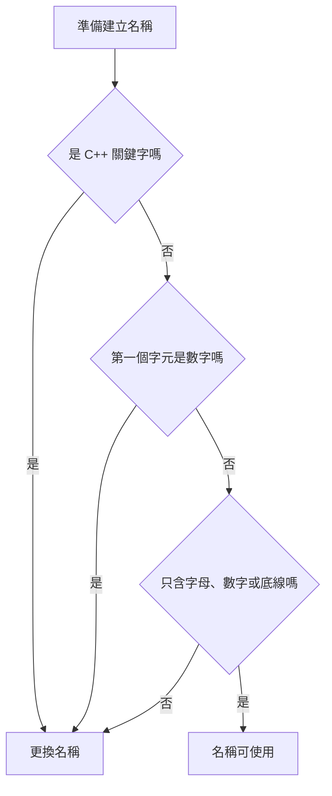

---

# 本章完成標準

完成本章後，你應該能做到：

1. 說明 Input、Process、Output。
2. 說明變數的用途。
3. 宣告 `int` 變數。
4. 分辨資料型別與變數名稱。
5. 分辨宣告、初始化、賦值與重新賦值。
6. 由右往左理解賦值。
7. 輸出變數內容。
8. 將固定文字與變數串接輸出。
9. 一次宣告多個同型別變數。
10. 避免讀取未初始化區域變數。
11. 避免重複定義同名變數。
12. 使用 `cin` 輸入整數。
13. 顯示輸入提示。
14. 一次讀取多筆資料。
15. 對照輸入順序與變數順序。
16. 使用結果變數保存計算結果。
17. 輸入兩個整數並計算總和。
18. 輸入三個整數並計算總和。
19. 使用表格追蹤變數內容。
20. 理解結果變數不會自動更新。
21. 使用暫存變數交換兩個值。
22. 說明錯誤交換方式為何遺失資料。
23. 使用 `string` 保存文字。
24. 加入 `<string>`。
25. 使用 `cin >>` 讀取單字。
26. 說明 `cin >>` 的空白限制。
27. 初步使用 `getline()`。
28. 使用 `double` 示範小數輸入。
29. 說明 `cin` 會依照型別解析輸入。
30. 說明本章先假設輸入格式正確。
31. 分辨關鍵字與識別字。
32. 遵守變數命名規則。
33. 說明名稱區分大小寫。
34. 使用有意義且一致的名稱。
35. 找出尚未宣告變數的錯誤。
36. 找出賦值方向錯誤。
37. 找出輸入順序錯誤。
38. 完成基本互動式 C++ 程式。

---

# 隱藏答案區

> Answer hidden — try it first.

<details>
<summary>TODO 1 答案</summary>

```cpp
#include <iostream>
using namespace std;

int main() {
    int score = 95;

    cout << score << '\n';

    return 0;
}
```

</details>

<details>
<summary>TODO 2 答案</summary>

```cpp
#include <iostream>
using namespace std;

int main() {
    int score = 80;

    score = 95;

    cout << score << '\n';

    return 0;
}
```

</details>

<details>
<summary>TODO 3 答案</summary>

```cpp
#include <iostream>
using namespace std;

int main() {
    int age;

    cout << "請輸入年齡：";
    cin >> age;

    cout << "Age: " << age << '\n';

    return 0;
}
```

</details>

<details>
<summary>TODO 4 答案</summary>

```cpp
#include <iostream>
using namespace std;

int main() {
    int age;

    cout << "請輸入年齡：";
    cin >> age;

    cout << "Next year: "
         << age + 1
         << '\n';

    return 0;
}
```

</details>

<details>
<summary>TODO 5 答案</summary>

```cpp
#include <iostream>
using namespace std;

int main() {
    int first;
    int second;
    int sum;

    cin >> first >> second;

    sum = first + second;

    cout << first
         << " + "
         << second
         << " = "
         << sum
         << '\n';

    return 0;
}
```

</details>

<details>
<summary>TODO 6 答案</summary>

```cpp
#include <iostream>
using namespace std;

int main() {
    int first;
    int second;
    int third;
    int total;

    cin >> first >> second >> third;

    total = first + second + third;

    cout << "Total score: "
         << total
         << '\n';

    return 0;
}
```

</details>

<details>
<summary>TODO 7 答案</summary>

```cpp
#include <iostream>
using namespace std;

int main() {
    int first;
    int second;
    int product;

    cin >> first >> second;

    product = first * second;

    cout << product << '\n';

    return 0;
}
```

</details>

<details>
<summary>TODO 8 答案</summary>

```cpp
#include <iostream>
using namespace std;

int main() {
    int first;
    int second;
    int temp;

    cin >> first >> second;

    temp = first;
    first = second;
    second = temp;

    cout << first << " " << second << '\n';

    return 0;
}
```

</details>

<details>
<summary>TODO 9 答案</summary>

```cpp
#include <iostream>
#include <string>
using namespace std;

int main() {
    string name;

    cout << "請輸入名字：";
    cin >> name;

    cout << "Hello, " << name << "!\n";

    return 0;
}
```

</details>

<details>
<summary>TODO 10 答案</summary>

```cpp
#include <iostream>
#include <string>
using namespace std;

int main() {
    string fullName;

    cout << "請輸入完整姓名：";
    getline(cin, fullName);

    cout << "Hello, "
         << fullName
         << "!\n";

    return 0;
}
```

</details>

<details>
<summary>TODO 11 答案</summary>

```cpp
#include <iostream>
using namespace std;

int main() {
    int age;
    double height;

    cin >> age >> height;

    cout << "Age: " << age << '\n';
    cout << "Height: " << height << '\n';

    return 0;
}
```

</details>

<details>
<summary>TODO 12 答案</summary>

```cpp
#include <iostream>
#include <string>
using namespace std;

int main() {
    string productName;
    double price;
    int quantity;

    cin >> productName >> price >> quantity;

    cout << "Product: "
         << productName
         << '\n';

    cout << "Total: "
         << price * quantity
         << '\n';

    return 0;
}
```

</details>

<details>
<summary>TODO 13 答案</summary>

```cpp
#include <iostream>
using namespace std;

int main() {
    int number = 10;

    number = number + 5;
    cout << number << '\n';

    number = number * 2;
    cout << number << '\n';

    return 0;
}
```

</details>

<details>
<summary>TODO 14 答案</summary>

```cpp
int score = 80;
score = 95;
```

</details>

<details>
<summary>TODO 15 答案</summary>

```cpp
int temp = first;
first = second;
second = temp;
```

</details>
