# Lesson 04：Data Types and Type Conversions 資料型別與型別轉換

> 這堂課的重點：理解資料型別會決定變數可以保存什麼資料、需要多少記憶體，以及資料在轉換時可能發生什麼變化。本章會介紹整數、浮點數、字元、布林值、常數與 `sizeof`，再學習隱性轉換、`static_cast` 和大括號初始化的窄化檢查。

> 本章的資料型別、常見大小、科學記號、字元編碼、`bool`、`sizeof`、`const` 與 `constexpr` 依照原始 C++ 入門講義整理。原講義只以 `static_cast<int>(ch)` 示範明確轉型；更完整的一般型別轉換規則會標示為「教材補充」。

---

## Section I. 今天要做什麼？

1. 理解資料型別的用途。
2. 說明型別會影響可保存的資料種類。
3. 說明型別會影響記憶體大小。
4. 說明型別會影響可表示範圍。
5. 說明型別會影響可執行的運算。
6. 認識整數型別。
7. 使用 `short`。
8. 使用 `int`。
9. 使用 `long`。
10. 使用 `long long`。
11. 理解不同整數型別的大小可能不同。
12. 理解 `long` 的大小依平台而定。
13. 使用 `LL` 後綴建立 `long long` 字面常數。
14. 認識浮點數型別。
15. 使用 `float`。
16. 使用 `double`。
17. 理解小數常值預設為 `double`。
18. 使用 `f` 後綴建立 `float` 字面常數。
19. 比較 `float` 與 `double` 的常見精度。
20. 使用科學記號 `e` 或 `E`。
21. 將 `3e2` 解讀成 `300`。
22. 將 `3e-2` 解讀成 `0.03`。
23. 認識字元型別 `char`。
24. 使用單引號表示單一字元。
25. 分辨單引號與雙引號。
26. 使用 `static_cast<int>()` 查看字元編碼。
27. 理解 ASCII 編碼表中的常見字元。
28. 理解中文字通常不能用單一 `char` 完整表示。
29. 認識布林型別 `bool`。
30. 使用 `true` 與 `false`。
31. 理解 `bool` 直接輸出時通常顯示 `1` 或 `0`。
32. 使用 `boolalpha` 顯示 `true` 與 `false`。
33. 使用 `sizeof` 查詢型別大小。
34. 使用 `sizeof` 查詢變數大小。
35. 理解 `sizeof` 的單位是位元組。
36. 理解 `sizeof(char)` 一定是 `1`。
37. 理解一個位元組不一定等於教材口語中的固定數量概念。
38. 比較整數型別的大小關係。
39. 使用 `const` 建立不能重新賦值的具名常數。
40. 使用 `constexpr` 建立編譯期間常數。
41. 比較普通變數、`const` 與 `constexpr`。
42. 理解現代 C++ 通常優先使用具型別常數，而不是 `#define`。
43. 認識型別轉換。
44. 分辨隱性轉換與明確轉換。
45. 將整數轉成浮點數。
46. 將浮點數轉成整數。
47. 理解浮點數轉整數會捨去小數部分。
48. 使用 `static_cast<int>()` 明確轉成整數。
49. 使用 `static_cast<double>()` 明確轉成浮點數。
50. 理解轉型不會修改原變數。
51. 認識窄化轉換。
52. 理解較精確型別轉成較不精確型別可能遺失資料。
53. 使用大括號初始化檢查部分窄化轉換。
54. 比較 `int value = 3.14;` 與 `int value{3.14};`。
55. 理解超出目標型別範圍的轉換有風險。
56. 選擇適合資料用途的型別。
57. 避免依賴特定平台的型別大小。
58. 完成概念檢查、程式閱讀與實作練習。

---

## Section II. 今天的學習方式

1. 每看到一個變數，標出：
   ```text
   型別、名稱、值
   ```
2. 先判斷資料是否含有小數。
3. 再判斷是否只需要真或假。
4. 再判斷是否只保存單一字元。
5. 不直接背誦所有平台的型別大小，使用 `sizeof` 驗證。
6. 遇到字面常數時，檢查是否有：
   - `f`
   - `LL`
   - 科學記號 `e`
7. 遇到型別轉換時寫出：
   ```text
   來源型別 → 目標型別
   ```
8. 轉換前先問：
   - 會不會失去小數？
   - 會不會超出範圍？
   - 會不會降低精度？
9. 使用 `static_cast` 時，把目標型別寫清楚。
10. 使用大括號初始化時，留意編譯器是否拒絕窄化。
11. 錯誤範例只用來分析，不會作為應成功編譯的完整程式。
12. 完整合法範例使用嚴格 C++17 選項檢查。

---

## Section III. 核心語法對照

| 語法 | 用途 |
| --- | --- |
| `short value = 10;` | 建立較小範圍的整數變數 |
| `int value = 10;` | 建立一般整數變數 |
| `long value = 10L;` | 建立 `long` 整數 |
| `long long value = 10LL;` | 建立 `long long` 整數 |
| `float value = 3.14f;` | 建立單精度浮點數 |
| `double value = 3.14;` | 建立雙精度浮點數 |
| `double value = 3e2;` | 使用科學記號 |
| `char grade = 'A';` | 保存單一字元 |
| `bool ready = true;` | 保存真或假 |
| `const int DAYS = 7;` | 建立不能重新賦值的常數 |
| `constexpr int DAYS = 7;` | 建立編譯期間常數 |
| `sizeof(int)` | 查詢型別大小 |
| `sizeof(variable)` | 查詢變數型別所佔大小 |
| `static_cast<int>(value)` | 明確轉成 `int` |
| `static_cast<double>(value)` | 明確轉成 `double` |
| `int value{10};` | 使用大括號初始化 |
| `boolalpha` | 將布林值顯示為文字 |

---

# Part A：資料型別的用途

## Section IV. 什麼是資料型別？

資料型別告訴 C++：

```text
這一塊資料準備保存什麼
應如何解讀這些資料
可以進行哪些運算
```

例如：

```cpp
int age = 18;
double height = 175.5;
char grade = 'A';
bool passed = true;
```

---

## Section V. 型別影響哪些事情？

資料型別會影響：

1. 可以保存的資料種類。
2. 需要的記憶體空間。
3. 可以表示的數值範圍。
4. 數值精度。
5. 可以使用的運算方式。
6. 輸入與輸出時的解讀方式。

---

## Section VI. 選擇型別的第一步

可以先問：

```text
資料是否包含小數？
```

- 不包含小數：考慮整數型別。
- 包含小數：考慮浮點數型別。

再問：

```text
資料是否只有真或假？
```

- 是：使用 `bool`。

再問：

```text
資料是否只有一個字元？
```

- 是：使用 `char`。

<p align="center">
  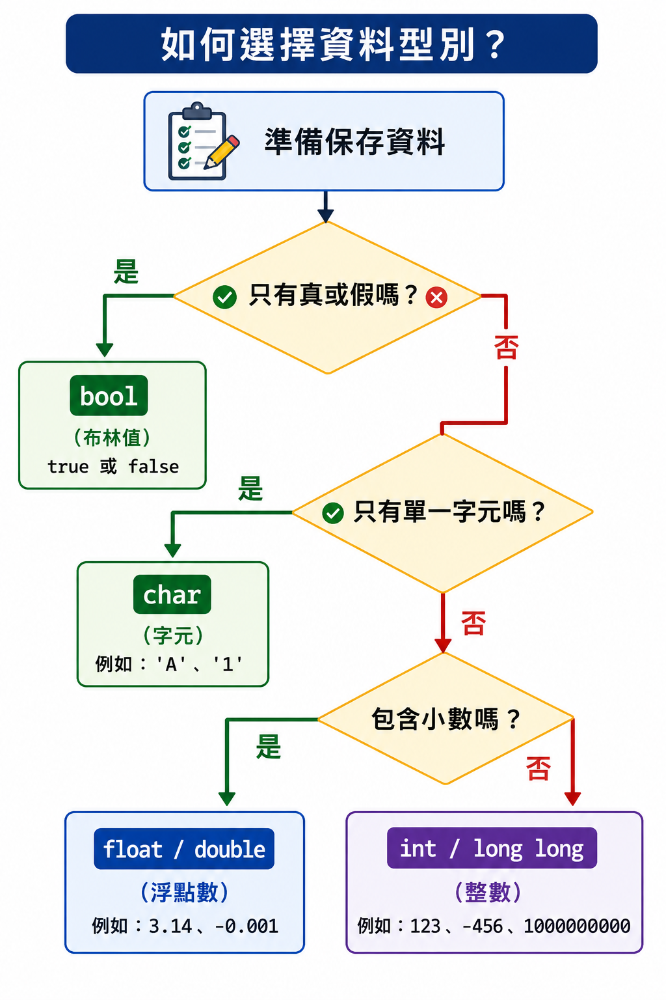
</p>

---

# Part B：整數型別

## Section VII. 整數是什麼？

整數不包含小數部分，例如：

```text
-10
0
25
1000
```

C++ 常見整數型別：

```cpp
short
int
long
long long
```

---

## Section VIII. 整數型別範例

```cpp
// VALIDATE
#include <iostream>
using namespace std;

int main() {
    short smallNumber = 100;
    int studentCount = 30;
    long population = 23000000L;
    long long worldPopulation = 8000000000LL;

    cout << smallNumber << '\n';
    cout << studentCount << '\n';
    cout << population << '\n';
    cout << worldPopulation << '\n';

    return 0;
}
```

---

## Section IX. 常見大小

| 型別 | 常見大小 | 一般用途 |
| --- | ---: | --- |
| `short` | 2 位元組 | 較小範圍整數 |
| `int` | 4 位元組 | 最常使用的整數型別 |
| `long` | 4 或 8 位元組 | 大小依平台而定 |
| `long long` | 8 位元組 | 較大範圍整數 |


<p align="center">
  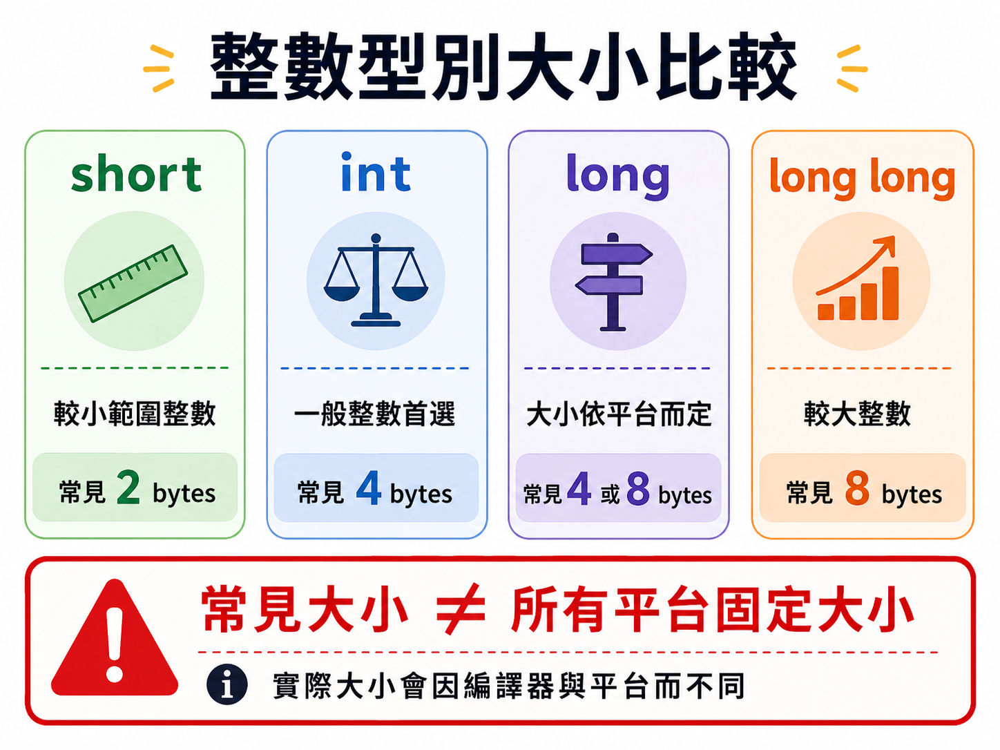
</p>> 表格中的大小是常見情況，不是所有電腦都固定相同。應使用 `sizeof` 檢查目前環境。

---

## Section X. 為什麼一般先選 `int`？

對大多數普通整數資料：

```cpp
int studentCount = 30;
int score = 95;
int age = 15;
```

`int` 通常最自然，也最容易閱讀。

不需要只因為數值目前很小，就一定改用 `short`。

---

## Section XI. `long` 的大小不固定

在不同平台：

```text
sizeof(long)
```

可能不同。

因此不應只看到 `long` 就假設它一定是八位元組。

---

## Section XII. 整數字面常數後綴

```cpp
long population = 23000000L;
long long worldPopulation = 8000000000LL;
```

後綴：

| 後綴 | 意義 |
| --- | --- |
| `L` | `long` |
| `LL` | `long long` |

本章不要求每個整數都加後綴；當常值很大或希望明確指定型別時，後綴可以幫助表達意圖。

---

# Part C：浮點數型別

## Section XIII. 浮點數是什麼？

浮點數可保存包含小數部分的數值，例如：

```text
3.14
36.5
168.75
-0.25
```

常見型別：

```cpp
float
double
```

---

## Section XIV. `float` 與 `double`

```cpp
float temperature = 36.5f;
double height = 168.75;
```

| 型別 | 常見大小 | 約略十進位有效位數 |
| --- | ---: | ---: |
| `float` | 4 位元組 | 約 6～7 位 |
| `double` | 8 位元組 | 約 15～16 位 |


<p align="center">
  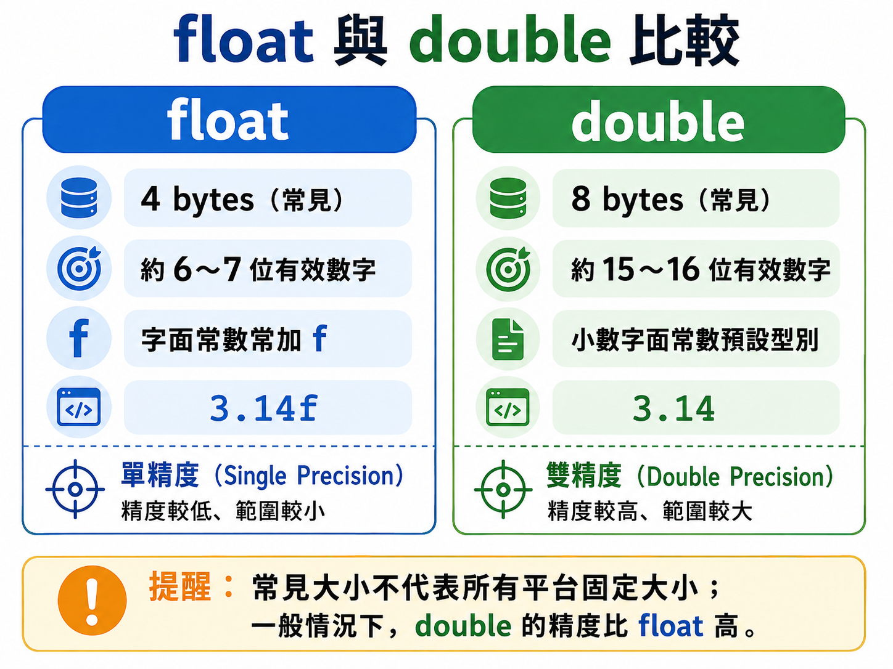
</p>---

## Section XV. 小數常值預設是 `double`

```cpp
double first = 3.14;
float second = 3.14f;
```

沒有後綴的：

```cpp
3.14
```

預設為 `double`。

加上：

```cpp
f
```

可明確表示 `float`：

```cpp
3.14f
```

---

## Section XVI. 完整浮點數範例

```cpp
// VALIDATE
#include <iostream>
using namespace std;

int main() {
    float temperature = 36.5f;
    double height = 168.75;

    cout << "Temperature: "
         << temperature
         << '\n';

    cout << "Height: "
         << height
         << '\n';

    return 0;
}
```

---

## Section XVII. 精度不是顯示的小數位數

`float` 與 `double` 的精度，指的是能可靠表示的有效數字數量，不只是畫面顯示幾位小數。

例如：

```text
1234567
1.234567
0.0001234567
```

都涉及有效數字概念。

輸出格式控制會在後續章節介紹。

---

## Section XVIII. 浮點數通常是近似值

許多十進位小數無法以二進位浮點數精確表示。

因此：

```cpp
double value = 0.1;
```

在記憶體中的表示可能只是非常接近 `0.1`。

這不表示 C++ 計算錯誤，而是浮點表示方式的限制。

---

# Part D：科學記號

## Section XIX. 使用 `e` 或 `E`

```cpp
double number1 = 3e2;
double number2 = 3e-2;
```

可以讀成：

```text
3 × 10²
3 × 10⁻²
```

<p align="center">
  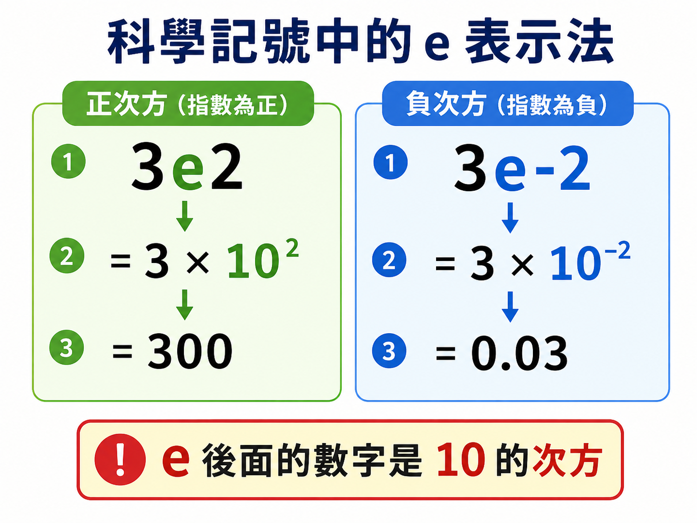
</p>

---

## Section XX. 科學記號範例

```cpp
// VALIDATE
#include <iostream>
using namespace std;

int main() {
    double number1 = 3e2;
    double number2 = 3e-2;
    double number3 = 1.5E3;

    cout << number1 << '\n';
    cout << number2 << '\n';
    cout << number3 << '\n';

    return 0;
}
```

輸出：

```text
300
0.03
1500
```

---

## Section XXI. 科學記號不是乘法運算式

```cpp
3e2
```

是一個浮點字面常數。

它不是變數 `e2`，也不需要寫成：

```cpp
3 * 10 * 10
```

---

# Part E：字元型別 `char`

## Section XXII. 保存單一字元

```cpp
char grade = 'A';
```

`char` 用來保存一個字元值。

---

## Section XXIII. 單引號與雙引號

| 寫法 | 意義 |
| --- | --- |
| `'A'` | 單一字元 |
| `"A"` | 一段文字／字串 |
| `'\n'` | 一個換行字元 |
| `"\n"` | 含有換行的字串 |


<p align="center">
  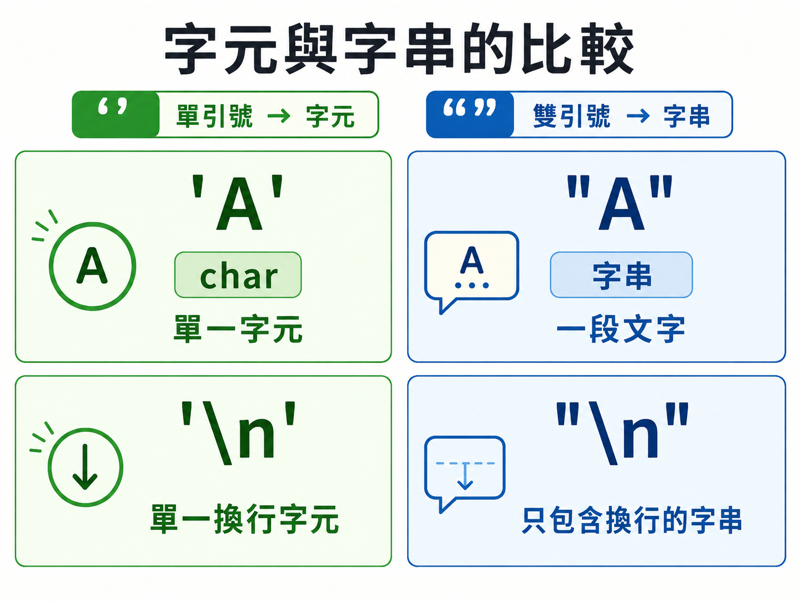
</p>錯誤：

```cpp
char grade = "A";
```

正確：

```cpp
char grade = 'A';
```

---

## Section XXIV. 輸出字元

```cpp
// VALIDATE
#include <iostream>
using namespace std;

int main() {
    char grade = 'A';

    cout << "Grade: "
         << grade
         << '\n';

    return 0;
}
```

---

## Section XXV. 字元也有整數編碼

傳統 ASCII 中：

| 字元 | 編碼 |
| --- | ---: |
| `'A'` | 65 |
| `'a'` | 97 |
| `'0'` | 48 |

使用：

```cpp
static_cast<int>(ch)
```

可以把字元值明確轉成整數後輸出。

---

## Section XXVI. 查看字元編碼

```cpp
// VALIDATE
#include <iostream>
using namespace std;

int main() {
    char ch = 'a';

    cout << ch << '\n';
    cout << static_cast<int>(ch) << '\n';

    return 0;
}
```

<p align="center">
  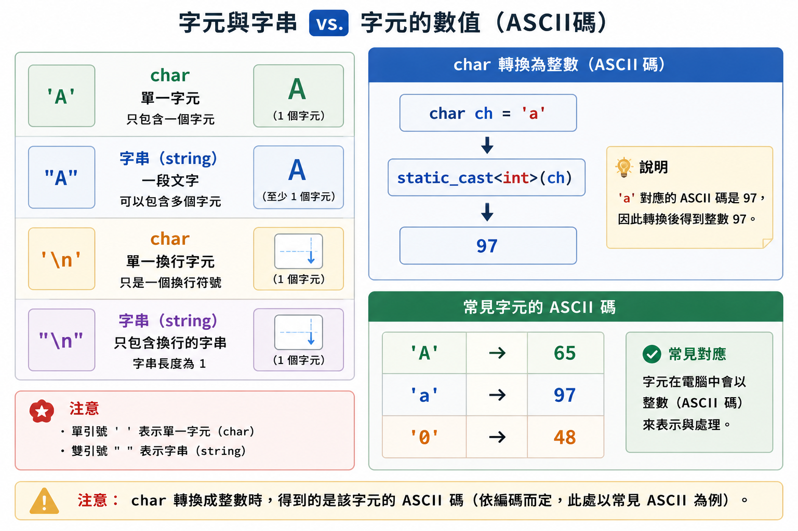
</p>

在 ASCII 系統中輸出：

```text
a
97
```

---

## Section XXVII. 中文字與 `char`

`char` 適合：

- 單一英文字元
- 傳統單位元組編碼字元
- 位元組資料

UTF-8 中的中文字通常需要多個位元組。

因此不能假設：

```text
一個中文字 = 一個 char
```

更完整的文字編碼問題會留到字串章節。

---

# Part F：布林型別 `bool`

## Section XXVIII. 真與假

```cpp
bool isStudent = true;
bool isRaining = false;
```

`bool` 的主要值：

```cpp
true
false
```

---

## Section XXIX. 直接輸出 `bool`

```cpp
// VALIDATE
#include <iostream>
using namespace std;

int main() {
    bool isStudent = true;
    bool isRaining = false;

    cout << isStudent << '\n';
    cout << isRaining << '\n';

    return 0;
}
```

通常輸出：

```text
1
0
```

---

## Section XXX. 使用 `boolalpha`

教材補充：

```cpp
// VALIDATE
#include <iostream>
using namespace std;

int main() {
    bool isStudent = true;
    bool isRaining = false;

    cout << boolalpha;
    cout << isStudent << '\n';
    cout << isRaining << '\n';

    return 0;
}
```

輸出：

```text
true
false
```

<p align="center">
  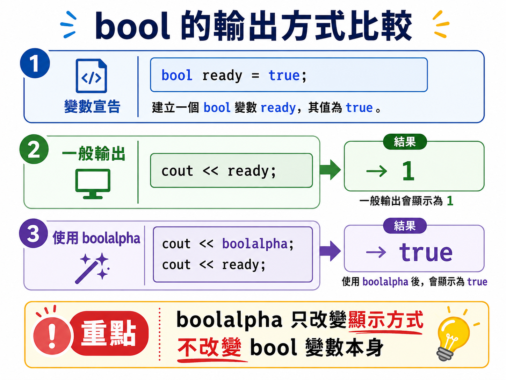
</p>

`boolalpha` 只改變輸出顯示方式，不會改變變數中的布林值。

---

# Part G：`sizeof`

## Section XXXI. 查詢型別大小

基本語法：

```cpp
sizeof(資料型別)
```

例如：

```cpp
sizeof(int)
sizeof(double)
```

結果單位是：

```text
byte 位元組
```

---

## Section XXXII. 查詢變數大小

```cpp
int age = 15;

cout << sizeof(age);
```

結果等同目前環境中的：

```cpp
sizeof(int)
```

因為 `age` 的型別是 `int`。

---

## Section XXXIII. 完整 `sizeof` 範例

```cpp
// VALIDATE
#include <iostream>
using namespace std;

int main() {
    cout << "short: "
         << sizeof(short)
         << " bytes\n";

    cout << "int: "
         << sizeof(int)
         << " bytes\n";

    cout << "long: "
         << sizeof(long)
         << " bytes\n";

    cout << "long long: "
         << sizeof(long long)
         << " bytes\n";

    cout << "float: "
         << sizeof(float)
         << " bytes\n";

    cout << "double: "
         << sizeof(double)
         << " bytes\n";

    cout << "char: "
         << sizeof(char)
         << " byte\n";

    cout << "bool: "
         << sizeof(bool)
         << " bytes\n";

    return 0;
}
```

---

## Section XXXIV. 結果可能不同

可能結果：

```text
short: 2 bytes
int: 4 bytes
long: 8 bytes
long long: 8 bytes
float: 4 bytes
double: 8 bytes
char: 1 byte
bool: 1 byte
```

<p align="center">
  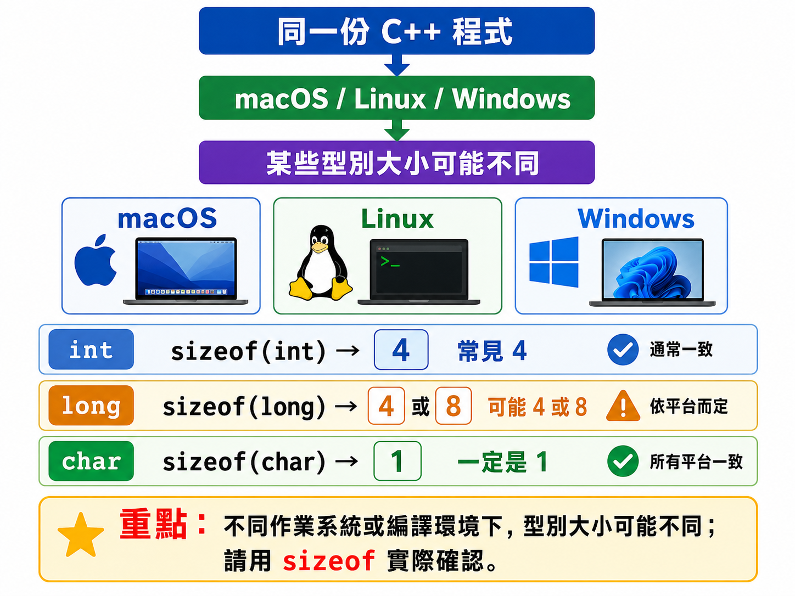
</p>

但不同電腦可能不同。

---

## Section XXXV. `sizeof(char)` 的特殊性

C++ 規定：

```cpp
sizeof(char)
```

一定是：

```text
1
```

這裡的 `1` 表示一個 C++ 位元組。

其他型別的大小都以這個單位計算。

---

## Section XXXVI. 整數大小關係

整數型別通常符合：

```text
sizeof(short)
<= sizeof(int)
<= sizeof(long)
<= sizeof(long long)
```

這不表示相鄰型別一定大小不同。

例如某個平台可能有：

```text
sizeof(long) == sizeof(long long)
```

---

# Part H：具型別常數

## Section XXXVII. 使用 `const`

```cpp
const int MONTHS_PER_YEAR = 12;
```

表示：

```text
MONTHS_PER_YEAR 是 int
建立後不能重新賦值
```

---

## Section XXXVIII. `const` 完整範例

```cpp
// VALIDATE
#include <iostream>
using namespace std;

int main() {
    const int MONTHS_PER_YEAR = 12;

    cout << "一年有 "
         << MONTHS_PER_YEAR
         << " 個月。\n";

    return 0;
}
```

錯誤：

```cpp
const int MONTHS_PER_YEAR = 12;

/* MONTHS_PER_YEAR = 24; */
```

---

## Section XXXIX. 使用 `constexpr`

```cpp
constexpr int DAYS_PER_WEEK = 7;
```

初學時可以理解為：

```text
這個值可以在編譯期間確定
而且建立後不能修改
```

---

## Section XL. `const` 與 `constexpr`

| 宣告 | 主要概念 |
| --- | --- |
| `int value = 10;` | 普通可修改變數 |
| `const int value = 10;` | 建立後不能透過該名稱重新賦值 |
| `constexpr int value = 10;` | 編譯期間可確定的常數 |


<p align="center">
  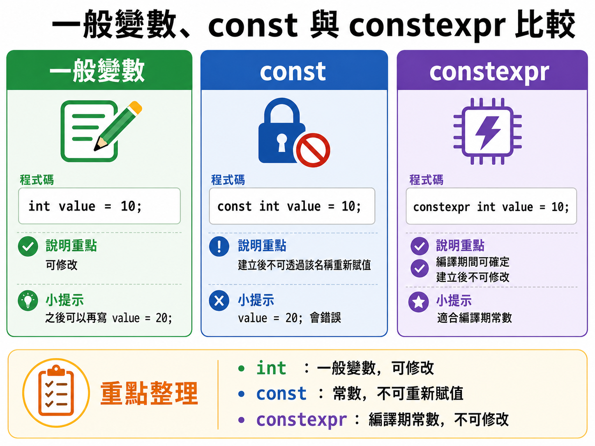
</p>---

## Section XLI. 為什麼通常不優先用 `#define`？

原始講義列出：

```cpp
#define DAYS_PER_WEEK 7
```

現代 C++ 通常更偏好：

```cpp
constexpr int DAYS_PER_WEEK = 7;
```

原因：

- 有明確資料型別。
- 編譯器較容易檢查。
- 遵守一般名稱與作用域規則。
- 除錯時資訊通常更清楚。

---

# Part I：型別轉換概念

## Section XLII. 什麼是型別轉換？

型別轉換表示：

```text
將一個型別的值
轉成另一個型別可以表示的值
```

例如：

```text
int → double
double → int
char → int
```

---

## Section XLIII. 兩種轉換方式

### 隱性轉換 Implicit Conversion

編譯器依照程式情境自動轉換：

```cpp
int count = 3;
double value = count;
```

`count` 的整數值會轉成 `double`。

### 明確轉換 Explicit Conversion

程式設計者明確寫出目標型別：

```cpp
double value = 3.8;
int result = static_cast<int>(value);
```

<p align="center">
  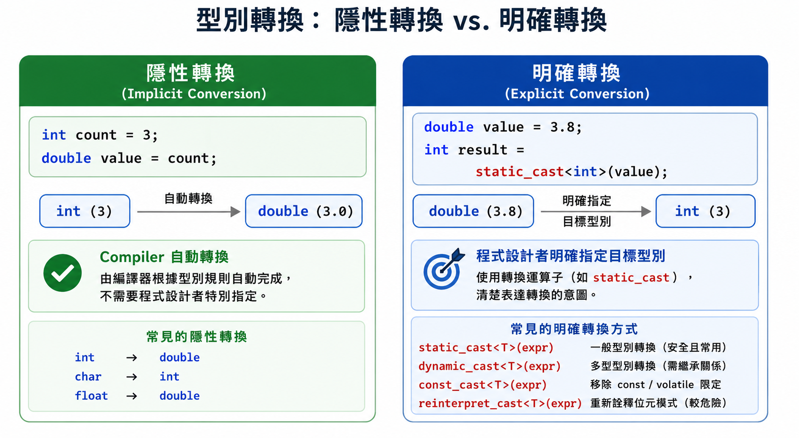
</p>

---

## Section XLIV. 為什麼需要理解轉換？

轉換可能：

- 保留完整資料。
- 捨去小數部分。
- 降低精度。
- 改變顯示方式。
- 超出目標型別可表示範圍。

因此不能只看程式能否編譯。

---

# Part J：隱性數值轉換

## Section XLV. 整數轉浮點數

```cpp
int count = 3;
double value = count;
```

結果概念上：

```text
count = 3
value = 3.0
```

---

## Section XLVI. 完整範例

```cpp
// VALIDATE
#include <iostream>
using namespace std;

int main() {
    int count = 3;
    double value = count;

    cout << count << '\n';
    cout << value << '\n';

    return 0;
}
```

預設輸出可能都是：

```text
3
3
```

雖然顯示相同，兩個變數型別仍不同。

---

## Section XLVII. 浮點數轉整數

```cpp
double price = 19.95;
int whole = price;
```

轉換後：

```text
whole = 19
```

小數部分會向零方向捨去，不是四捨五入。

---

## Section XLVIII. 負數的情況

```cpp
double value = -3.9;
int result = value;
```

結果為：

```text
-3
```

<p align="center">
  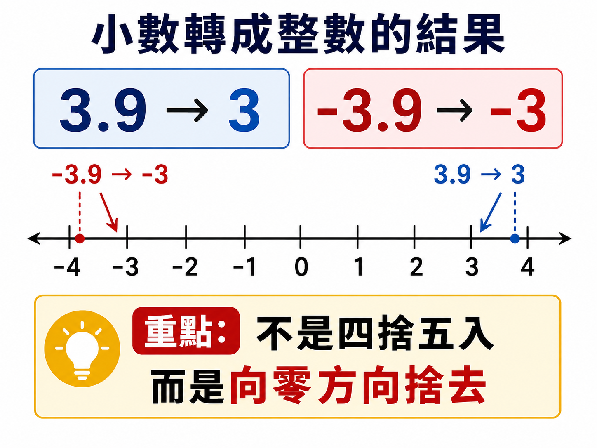
</p>

因為是向零方向捨去。

---

## Section XLIX. 精度降低

```cpp
double precise = 1.23456789012345;
float lessPrecise = precise;
```

`float` 通常能保存的有效位數較少，因此可能損失部分精度。

---

# Part K：使用 `static_cast`

## Section L. 基本語法

```cpp
static_cast<目標型別>(值)
```

例如：

```cpp
static_cast<int>(3.9)
static_cast<double>(5)
```

---

## Section LI. 明確浮點數轉整數

```cpp
// VALIDATE
#include <iostream>
using namespace std;

int main() {
    double value = 3.9;
    int result = static_cast<int>(value);

    cout << result << '\n';

    return 0;
}
```

輸出：

```text
3
```

---

## Section LII. 明確整數轉浮點數

```cpp
// VALIDATE
#include <iostream>
using namespace std;

int main() {
    int total = 7;
    int count = 2;

    double average =
        static_cast<double>(total) / count;

    cout << average << '\n';

    return 0;
}
```

輸出：

```text
3.5
```

`static_cast<double>(total)` 讓除法使用浮點數計算。

整數除法的詳細規則會在下一章「運算子與表示式」說明。

---

## Section LIII. 轉換不會修改原變數

```cpp
double value = 8.75;
int whole = static_cast<int>(value);
```

執行後：

```text
value = 8.75
whole = 8
```

`value` 本身沒有被改成整數。

---

## Section LIV. 字元轉整數

原始講義使用：

```cpp
char ch = 'a';

cout << static_cast<int>(ch);
```

這是同一種 `static_cast` 語法。

它將字元值轉成對應整數值，以便顯示編碼。

---

# Part L：窄化轉換

## Section LV. 什麼是窄化？

教材補充：

若轉換可能失去資料，可稱為窄化轉換，例如：

```text
double → int
double → float
long long → short
```

---

## Section LVI. 可能失去什麼？

### 小數部分

```cpp
3.9 → 3
```

### 精度

```text
double → float
```

### 可表示範圍

很大的整數轉成較小整數型別時，目標型別可能無法完整表示。

---

## Section LVII. 傳統初始化可能允許窄化

```cpp
double price = 19.95;
int whole = price;
```

編譯器可能允許，但 `whole` 只保存：

```text
19
```

使用嚴格警告選項可以幫助發現部分風險，但不能取代程式設計者理解轉換。

---

## Section LVIII. 大括號初始化的檢查

```cpp
int value{10};
double price{19.95};
```

大括號初始化會拒絕部分明顯的窄化轉換。

錯誤概念：

```cpp
int value{3.14};
```

因為 `3.14` 不能在不失去小數的情況下保存成 `int`。

---

## Section LIX. 比較兩種寫法

可能編譯但遺失小數：

```cpp
int first = 3.14;
```

會被大括號初始化拒絕：

```cpp
int second{3.14};
```

<p align="center">
  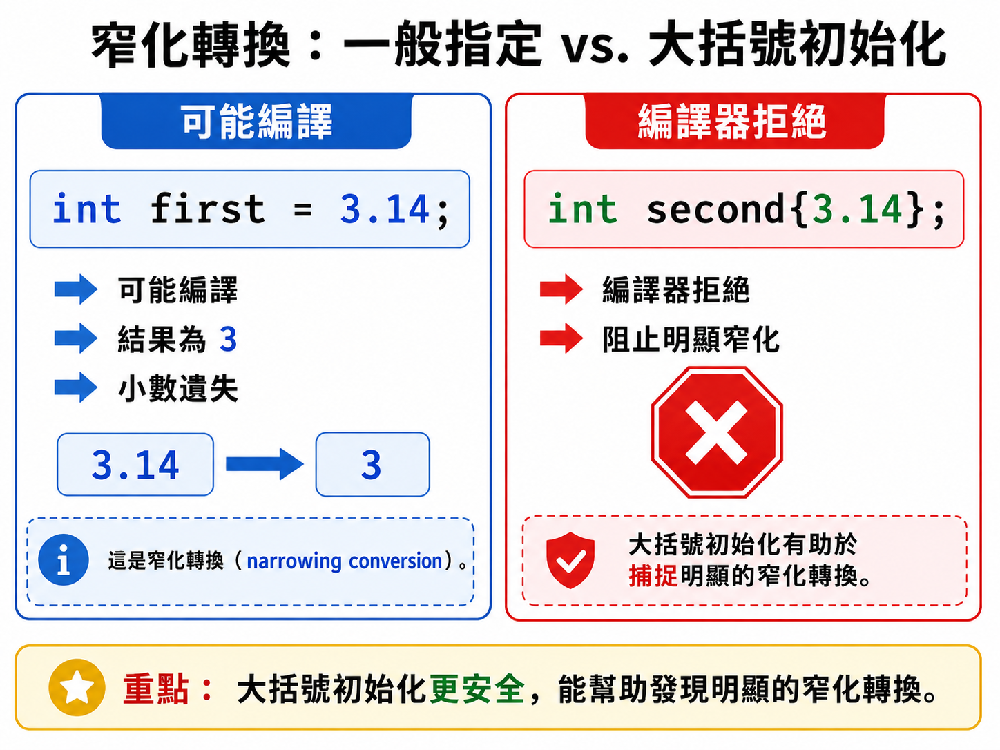
</p>

大括號不是所有轉換問題的完整解決方案，但能攔截部分明顯窄化。

---

# Part M：選擇合適型別

## Section LX. 年齡

```cpp
int age = 15;
```

通常不需要小數。

---

## Section LXI. 身高

```cpp
double height = 168.5;
```

可能包含小數。

---

## Section LXII. 成績等級

```cpp
char grade = 'A';
```

只需要單一字元。

---

## Section LXIII. 是否通過

```cpp
bool passed = true;
```

只有真或假。

---

## Section LXIV. 世界人口

```cpp
long long worldPopulation = 8000000000LL;
```

普通 `int` 可能不足以保存如此大的值。

---

## Section LXV. 不要只為節省幾個位元組選型別

對初學的一般變數：

```cpp
int score;
```

通常比為小數值刻意使用：

```cpp
short score;
```

更自然。

型別選擇應考慮：

- 資料用途
- 可表示範圍
- 精度
- 與函式介面的相容性
- 可讀性

---

# Part N：快速概念檢查

## Section LXVI. 選擇題與簡答

### Q1. 資料型別會影響哪些事情？

<details>
<summary>查看答案</summary>

資料種類、記憶體大小、可表示範圍、精度及可進行的運算。

</details>

---

### Q2. 一般整數最常使用哪個型別？

<details>
<summary>查看答案</summary>

```cpp
int
```

</details>

---

### Q3. `long` 在所有平台都一定是八位元組嗎？

<details>
<summary>查看答案</summary>

不是，大小依平台與編譯器而定。

</details>

---

### Q4. `8000000000LL` 中的 `LL` 表示什麼？

<details>
<summary>查看答案</summary>

這個整數字面常數使用 `long long` 型別。

</details>

---

### Q5. 沒有後綴的小數常值預設是哪個型別？

<details>
<summary>查看答案</summary>

```cpp
double
```

</details>

---

### Q6. `3.14f` 中的 `f` 表示什麼？

<details>
<summary>查看答案</summary>

這個小數字面常數使用 `float` 型別。

</details>

---

### Q7. `3e2` 的值是多少？

<details>
<summary>查看答案</summary>

```text
300
```

</details>

---

### Q8. `3e-2` 的值是多少？

<details>
<summary>查看答案</summary>

```text
0.03
```

</details>

---

### Q9. 單一字元使用單引號還是雙引號？

<details>
<summary>查看答案</summary>

單引號：

```cpp
'A'
```

</details>

---

### Q10. `"A"` 與 `'A'` 相同嗎？

<details>
<summary>查看答案</summary>

不同。`"A"` 是字串，`'A'` 是單一字元。

</details>

---

### Q11. `bool` 的主要值是什麼？

<details>
<summary>查看答案</summary>

```cpp
true
false
```

</details>

---

### Q12. `sizeof` 的結果單位是什麼？

<details>
<summary>查看答案</summary>

位元組。

</details>

---

### Q13. `sizeof(char)` 是多少？

<details>
<summary>查看答案</summary>

依 C++ 定義一定是：

```text
1
```

</details>

---

### Q14. `const` 變數可以重新賦值嗎？

<details>
<summary>查看答案</summary>

不可以。

</details>

---

### Q15. `constexpr` 初步表示什麼？

<details>
<summary>查看答案</summary>

值可在編譯期間確定的常數。

</details>

---

### Q16. `double` 轉成 `int` 時，小數部分如何處理？

<details>
<summary>查看答案</summary>

向零方向捨去。

</details>

---

### Q17. `static_cast<int>(3.9)` 的結果是什麼？

<details>
<summary>查看答案</summary>

```text
3
```

</details>

---

### Q18. `static_cast` 會修改原變數嗎？

<details>
<summary>查看答案</summary>

不會，它產生轉換後的值。

</details>

---

### Q19. `int value{3.14};` 為什麼會失敗？

<details>
<summary>查看答案</summary>

大括號初始化拒絕從 `double` 到 `int` 的明顯窄化轉換。

</details>

---

### Q20. 浮點數一定能精確保存所有十進位小數嗎？

<details>
<summary>查看答案</summary>

不一定，許多十進位小數只能近似表示。

</details>

---

# Part O：程式閱讀練習

## Section LXVII. 預測型別與結果

### 題目 1

```cpp
int value = 10;
double result = value;
```

<details>
<summary>查看答案</summary>

`value` 是 `int`，其值隱性轉成 `double` 後存入 `result`。`result` 概念上是 `10.0`。

</details>

---

### 題目 2

```cpp
double value = 7.9;
int result = value;
```

<details>
<summary>查看答案</summary>

```text
result = 7
```

小數部分被捨去。

</details>

---

### 題目 3

```cpp
double value = -7.9;
int result = static_cast<int>(value);
```

<details>
<summary>查看答案</summary>

```text
result = -7
```

向零方向捨去。

</details>

---

### 題目 4

```cpp
char ch = 'A';
cout << static_cast<int>(ch);
```

<details>
<summary>查看答案</summary>

在 ASCII 系統中通常輸出：

```text
65
```

</details>

---

### 題目 5

```cpp
bool ready = true;
cout << ready;
```

<details>
<summary>查看答案</summary>

通常輸出：

```text
1
```

</details>

---

### 題目 6

```cpp
cout << boolalpha << false;
```

<details>
<summary>查看答案</summary>

```text
false
```

</details>

---

### 題目 7

```cpp
float first = 3.14f;
double second = 3.14;
```

<details>
<summary>查看答案</summary>

`first` 是 `float`，`second` 是 `double`。

</details>

---

### 題目 8

```cpp
double number = 1.5e3;
cout << number;
```

<details>
<summary>查看答案</summary>

```text
1500
```

</details>

---

### 題目 9

```cpp
const int DAYS = 7;
DAYS = 8;
```

<details>
<summary>查看答案</summary>

常數不能重新賦值，會造成編譯錯誤。

</details>

---

### 題目 10

```cpp
int value{3.14};
```

<details>
<summary>查看答案</summary>

因為是窄化轉換，大括號初始化會拒絕，程式無法通過編譯。

</details>

---

### 題目 11

```cpp
int total = 7;
int count = 2;
double average = total / count;
```

<details>
<summary>查看答案</summary>

右邊先執行整數除法，結果為 `3`，再轉成 `double`，因此 `average` 為 `3.0`。

</details>

---

### 題目 12

```cpp
int total = 7;
int count = 2;

double average =
    static_cast<double>(total) / count;
```

<details>
<summary>查看答案</summary>

先把 `total` 轉成 `double`，因此執行浮點除法，`average` 為 `3.5`。

</details>

---

# Part P：實作練習

## Section LXVIII. 實作檢測題

### TODO 1：整數型別

建立 `short`、`int`、`long` 與 `long long` 變數並輸出。

---

### TODO 2：浮點數型別

分別使用 `float` 與 `double` 保存 `3.14`。

---

### TODO 3：科學記號

建立：

```cpp
double large = 3e6;
double small = 3e-6;
```

並輸出。

---

### TODO 4：字元與編碼

輸入一個英文字元，輸出字元及整數編碼。

---

### TODO 5：布林輸出

建立兩個 `bool`，先以 `1`／`0` 輸出，再使用 `boolalpha` 輸出。

---

### TODO 6：型別大小

輸出：

```text
short
int
long
long long
float
double
char
bool
```

的 `sizeof`。

---

### TODO 7：變數大小

建立一個 `double price`，使用 `sizeof(price)` 查詢大小。

---

### TODO 8：具型別常數

建立：

```cpp
constexpr int DAYS_PER_WEEK = 7;
const double PI = 3.14159;
```

並輸出。

---

### TODO 9：整數轉浮點數

將 `int count = 5` 轉成 `double` 並保存。

---

### TODO 10：浮點數轉整數

將 `double price = 19.95` 使用 `static_cast<int>()` 轉成整數。

---

### TODO 11：平均值

輸入兩個整數，使用 `static_cast<double>()` 計算真正的小數平均值。

---

### TODO 12：比較兩種除法

同時輸出：

```cpp
total / count
static_cast<double>(total) / count
```

比較結果。

---

### TODO 13：修正字元錯誤

修正：

```cpp
char grade = "A";
```

---

### TODO 14：修正窄化

分析：

```cpp
int value{3.14};
```

再選擇合適型別或明確轉型。

---

### TODO 15：選擇型別

為以下資料選擇型別：

```text
年齡
身高
是否登入
班級代號字母
世界人口
```

並建立變數。

---

# Part Q：課後小練習

## Section LXIX. 延伸練習

### 練習 1：溫度紀錄

使用 `float` 與 `double` 分別保存同一個較長小數，觀察輸出。

---

### 練習 2：字元表

輸出 `'A'`、`'a'`、`'0'` 的整數編碼。

---

### 練習 3：型別大小報告

將目前電腦的型別大小整理成表格。

---

### 練習 4：秒數轉分鐘

輸入整數秒數，使用 `static_cast<double>()` 算出分鐘數。

---

### 練習 5：窄化案例分析

對以下轉換說明可能遺失什麼：

```text
double → int
double → float
long long → short
```

---

# Part R：常見錯誤提醒

## Section LXX. 常見錯誤

### 錯誤 1：以為所有平台型別大小相同

應使用 `sizeof` 檢查目前環境。

---

### 錯誤 2：假設 `long` 一定是八位元組

`long` 可能是四或八位元組。

---

### 錯誤 3：大整數沒有適合型別

非常大的整數可能超出普通 `int` 範圍。

---

### 錯誤 4：將小數保存到 `int`

```cpp
int price = 19.95;
```

小數部分會遺失。

---

### 錯誤 5：忘記 `float` 後綴

```cpp
float value = 3.14;
```

來源字面常數是 `double`，再轉成 `float`。

較明確：

```cpp
float value = 3.14f;
```

---

### 錯誤 6：混淆單引號與雙引號

```cpp
char grade = "A";
```

應使用：

```cpp
char grade = 'A';
```

---

### 錯誤 7：假設一個中文字只需要一個 `char`

UTF-8 中文字通常由多個位元組組成。

---

### 錯誤 8：以為 `bool` 預設輸出文字

通常預設顯示 `1` 或 `0`。

---

### 錯誤 9：把 `sizeof` 結果當成位元

`sizeof` 的單位是位元組，不是 bit。

---

### 錯誤 10：修改 `const`

```cpp
const int DAYS = 7;
DAYS = 8;
```

不合法。

---

### 錯誤 11：把 `#define` 當成具型別變數

巨集取代不具備與 `constexpr` 相同的型別與作用域行為。

---

### 錯誤 12：以為浮點轉整數會四捨五入

實際是向零方向捨去小數部分。

---

### 錯誤 13：沒有注意隱性轉換

```cpp
int result = 3.9;
```

程式可能編譯，但資料已經改變。

---

### 錯誤 14：以為 `static_cast` 不會遺失資料

明確寫出轉型只表示意圖清楚，不代表轉換沒有資料損失。

---

### 錯誤 15：以為轉型會修改原變數

轉型通常產生新的轉換後值。

---

### 錯誤 16：整數除法後才轉成 `double`

```cpp
double average = total / count;
```

若兩邊都是整數，除法已先捨去小數。

---

### 錯誤 17：以為大括號能阻止所有風險

大括號可拒絕部分窄化，但仍需理解型別範圍與精度。

---

### 錯誤 18：為了節省空間過度使用較小型別

型別選擇也要考慮可讀性、介面與運算便利性。

---

# Part S：Mermaid 流程圖

## Section LXXI. 型別選擇與轉換流程

### 1. 選擇基本型別

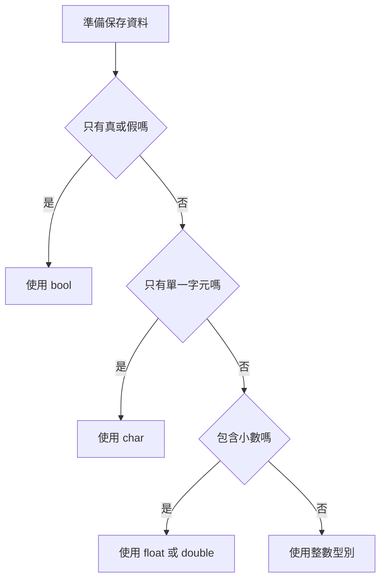
```mermaid
flowchart TD
    A[準備保存資料] --> B{只有真或假嗎}
    B -- 是 --> C[使用 bool]
    B -- 否 --> D{只有單一字元嗎}
    D -- 是 --> E[使用 char]
    D -- 否 --> F{包含小數嗎}
    F -- 是 --> G[使用 float 或 double]
    F -- 否 --> H[使用整數型別]
```

---

### 2. 選擇浮點型別

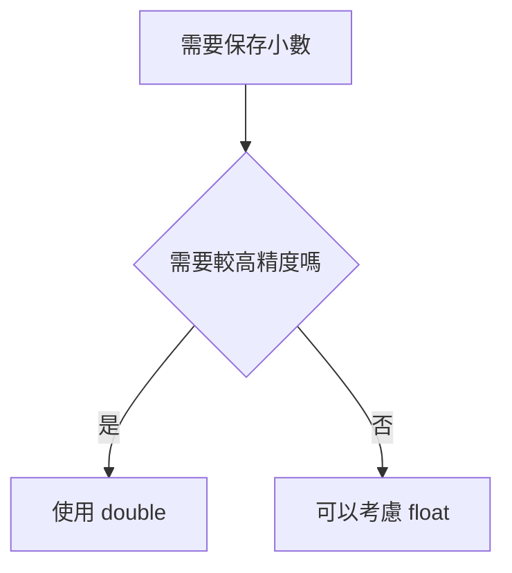
```mermaid
flowchart TD
    A[需要保存小數] --> B{需要較高精度嗎}
    B -- 是 --> C[使用 double]
    B -- 否 --> D[可以考慮 float]
```

---

### 3. 型別大小檢查


```mermaid
flowchart LR
    A[選擇型別] --> B[使用 sizeof]
    B --> C[取得目前平台位元組大小]
    C --> D[不要只依賴常見表格]
```

---

### 4. 型別轉換判斷

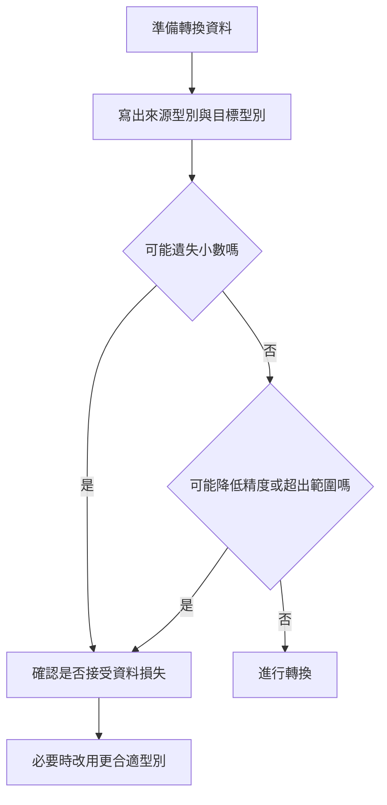
```mermaid
flowchart TD
    A[準備轉換資料] --> B[寫出來源型別與目標型別]
    B --> C{可能遺失小數嗎}
    C -- 是 --> D[確認是否接受資料損失]
    C -- 否 --> E{可能降低精度或超出範圍嗎}
    E -- 是 --> D
    E -- 否 --> F[進行轉換]
    D --> G[必要時改用更合適型別]
```

---

### 5. `static_cast` 流程

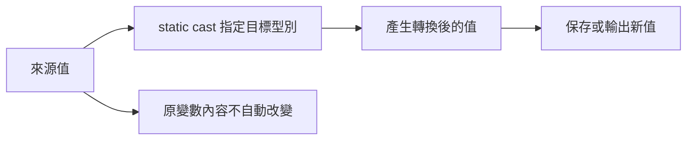
```mermaid
flowchart LR
    A[來源值] --> B[static cast 指定目標型別]
    B --> C[產生轉換後的值]
    C --> D[保存或輸出新值]
    A --> E[原變數內容不自動改變]
```

---

### 6. 大括號初始化

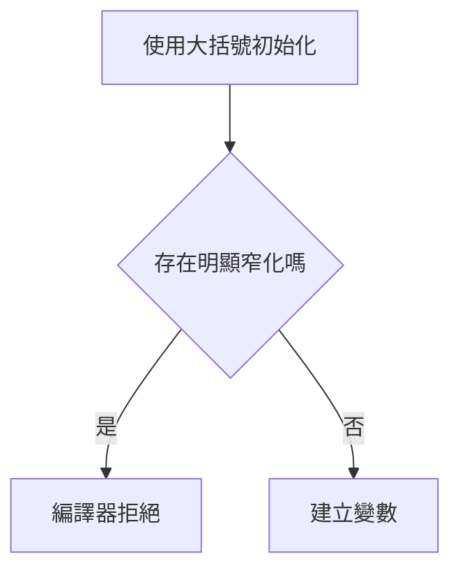
```mermaid
flowchart TD
    A[使用大括號初始化] --> B{存在明顯窄化嗎}
    B -- 是 --> C[編譯器拒絕]
    B -- 否 --> D[建立變數]
```

---

### 7. 字元編碼

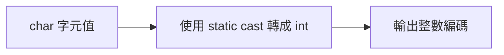
```mermaid
flowchart LR
    A[char 字元值] --> B[使用 static cast 轉成 int]
    B --> C[輸出整數編碼]
```

---

# 本章完成標準

完成本章後，你應該能做到：

1. 說明資料型別的用途。
2. 說明型別影響資料種類、大小、範圍與運算。
3. 使用 `short`、`int`、`long` 與 `long long`。
4. 說明整數型別大小依平台而定。
5. 使用 `L` 與 `LL` 整數後綴。
6. 使用 `float` 與 `double`。
7. 說明小數常值預設是 `double`。
8. 使用 `f` 後綴建立 `float` 常值。
9. 比較 `float` 與 `double` 的常見精度。
10. 使用 `e` 或 `E` 科學記號。
11. 使用 `char` 保存單一字元。
12. 分辨單引號與雙引號。
13. 使用 `static_cast<int>()` 查看字元編碼。
14. 說明 UTF-8 中文字通常不只佔一個 `char`。
15. 使用 `bool` 保存真或假。
16. 說明布林值預設輸出為 `1` 或 `0`。
17. 使用 `boolalpha`。
18. 使用 `sizeof` 查詢型別大小。
19. 使用 `sizeof` 查詢變數大小。
20. 說明 `sizeof` 結果以位元組為單位。
21. 說明 `sizeof(char) == 1`。
22. 避免假設所有平台型別大小相同。
23. 使用 `const` 建立具型別常數。
24. 使用 `constexpr` 建立編譯期間常數。
25. 說明現代 C++ 通常偏好具型別常數。
26. 分辨隱性轉換與明確轉換。
27. 說明整數轉浮點數的基本結果。
28. 說明浮點數轉整數會捨去小數部分。
29. 使用 `static_cast<int>()`。
30. 使用 `static_cast<double>()`。
31. 說明轉型通常不修改原變數。
32. 說明窄化可能遺失小數、精度或範圍。
33. 使用大括號初始化攔截部分窄化。
34. 比較整數除法與轉型後的浮點除法。
35. 依照資料用途選擇合適型別。
36. 找出常見型別與轉換錯誤。

---

# 隱藏答案區

> Answer hidden — try it first.

<details>
<summary>TODO 1 答案</summary>

```cpp
#include <iostream>
using namespace std;

int main() {
    short first = 10;
    int second = 20;
    long third = 30L;
    long long fourth = 40LL;

    cout << first << '\n';
    cout << second << '\n';
    cout << third << '\n';
    cout << fourth << '\n';

    return 0;
}
```

</details>

<details>
<summary>TODO 2 答案</summary>

```cpp
#include <iostream>
using namespace std;

int main() {
    float first = 3.14f;
    double second = 3.14;

    cout << first << '\n';
    cout << second << '\n';

    return 0;
}
```

</details>

<details>
<summary>TODO 3 答案</summary>

```cpp
#include <iostream>
using namespace std;

int main() {
    double large = 3e6;
    double small = 3e-6;

    cout << large << '\n';
    cout << small << '\n';

    return 0;
}
```

</details>

<details>
<summary>TODO 4 答案</summary>

```cpp
#include <iostream>
using namespace std;

int main() {
    char ch;

    cin >> ch;

    cout << ch << '\n';
    cout << static_cast<int>(ch) << '\n';

    return 0;
}
```

</details>

<details>
<summary>TODO 5 答案</summary>

```cpp
#include <iostream>
using namespace std;

int main() {
    bool first = true;
    bool second = false;

    cout << first << " " << second << '\n';

    cout << boolalpha;
    cout << first << " " << second << '\n';

    return 0;
}
```

</details>

<details>
<summary>TODO 6 答案</summary>

```cpp
#include <iostream>
using namespace std;

int main() {
    cout << sizeof(short) << '\n';
    cout << sizeof(int) << '\n';
    cout << sizeof(long) << '\n';
    cout << sizeof(long long) << '\n';
    cout << sizeof(float) << '\n';
    cout << sizeof(double) << '\n';
    cout << sizeof(char) << '\n';
    cout << sizeof(bool) << '\n';

    return 0;
}
```

</details>

<details>
<summary>TODO 7 答案</summary>

```cpp
#include <iostream>
using namespace std;

int main() {
    double price = 99.5;

    cout << sizeof(price) << '\n';

    return 0;
}
```

</details>

<details>
<summary>TODO 8 答案</summary>

```cpp
#include <iostream>
using namespace std;

int main() {
    constexpr int DAYS_PER_WEEK = 7;
    const double PI = 3.14159;

    cout << DAYS_PER_WEEK << '\n';
    cout << PI << '\n';

    return 0;
}
```

</details>

<details>
<summary>TODO 9 答案</summary>

```cpp
#include <iostream>
using namespace std;

int main() {
    int count = 5;
    double converted =
        static_cast<double>(count);

    cout << converted << '\n';

    return 0;
}
```

</details>

<details>
<summary>TODO 10 答案</summary>

```cpp
#include <iostream>
using namespace std;

int main() {
    double price = 19.95;
    int whole =
        static_cast<int>(price);

    cout << whole << '\n';

    return 0;
}
```

</details>

<details>
<summary>TODO 11 答案</summary>

```cpp
#include <iostream>
using namespace std;

int main() {
    int first;
    int second;

    cin >> first >> second;

    double average =
        static_cast<double>(first + second) / 2;

    cout << average << '\n';

    return 0;
}
```

</details>

<details>
<summary>TODO 12 答案</summary>

```cpp
#include <iostream>
using namespace std;

int main() {
    int total = 7;
    int count = 2;

    cout << total / count << '\n';

    cout << static_cast<double>(total) / count
         << '\n';

    return 0;
}
```

</details>

<details>
<summary>TODO 13 答案</summary>

```cpp
char grade = 'A';
```

</details>

<details>
<summary>TODO 14 答案</summary>

保留小數：

```cpp
double value{3.14};
```

明確接受捨去小數：

```cpp
int value{
    static_cast<int>(3.14)
};
```

</details>

<details>
<summary>TODO 15 答案</summary>

```cpp
int age = 15;
double height = 168.5;
bool loggedIn = true;
char classCode = 'A';
long long worldPopulation = 8000000000LL;
```

</details>
