# Lesson 05：Operators and Expressions 運算子與表示式

> 這堂課的重點：使用運算子組合資料，建立可以計算、比較與判斷的表示式。你會學習算術運算、整數與浮點除法、餘數、賦值、複合賦值、遞增遞減、關係運算、邏輯運算、短路求值，以及運算子的優先順序。

> 本章先建立「產生布林結果」的能力，但不完整介紹 `if` 程式流程。下一章會把本章的比較與邏輯表示式放入 `if` 條件判斷。

---

## Section I. 今天要做什麼？

1. 認識運算子 operator。
2. 認識運算元 operand。
3. 認識表示式 expression。
4. 分辨值、運算子與完整表示式。
5. 使用 `+` 執行加法。
6. 使用 `-` 執行減法。
7. 使用 `*` 執行乘法。
8. 使用 `/` 執行除法。
9. 使用 `%` 計算整數餘數。
10. 理解整數除法。
11. 理解浮點數除法。
12. 比較 `7 / 2` 與 `7.0 / 2`。
13. 使用 `static_cast<double>()` 改變除法型態。
14. 理解除數不能為零。
15. 理解 `%` 只適用於整數型別。
16. 使用餘數判斷奇數與偶數。
17. 使用餘數取得個位數。
18. 使用括號控制計算順序。
19. 認識運算子的優先順序。
20. 理解乘除餘數通常先於加減。
21. 理解同優先順序通常由左向右結合。
22. 使用 `=` 進行賦值。
23. 分辨賦值與初始化。
24. 理解賦值表示式也會產生值。
25. 使用 `+=`。
26. 使用 `-=`.
27. 使用 `*=`.
28. 使用 `/=`.
29. 使用 `%=`.
30. 將複合賦值改寫成一般賦值。
31. 使用前置遞增 `++value`。
32. 使用後置遞增 `value++`。
33. 使用前置遞減 `--value`。
34. 使用後置遞減 `value--`。
35. 比較前置與後置遞增的結果。
36. 避免在複雜表示式中過度使用 `++` 或 `--`。
37. 使用一元正號 `+value`。
38. 使用一元負號 `-value`。
39. 認識關係運算子。
40. 使用 `==` 比較是否相等。
41. 使用 `!=` 比較是否不相等。
42. 使用 `<`、`>`、`<=`、`>=`。
43. 理解關係表示式結果是 `bool`。
44. 分辨 `=` 與 `==`。
45. 避免數學式連鎖比較。
46. 正確表示範圍條件。
47. 使用邏輯 AND `&&`。
48. 使用邏輯 OR `||`。
49. 使用邏輯 NOT `!`。
50. 建立複合條件。
51. 使用括號增加條件可讀性。
52. 理解 `&&` 的短路求值。
53. 理解 `||` 的短路求值。
54. 使用短路求值避免不安全運算。
55. 理解非零數值在布林情境中視為 `true`。
56. 理解零在布林情境中視為 `false`。
57. 認識條件運算子 `?:`。
58. 使用 `?:` 在兩個值中選擇一個。
59. 理解條件運算子是表示式。
60. 認識型別轉換會影響表示式結果。
61. 追蹤混合型別算術。
62. 使用 `auto` 觀察編譯器推導結果型別。
63. 理解 `auto` 不會讓型別消失。
64. 避免依賴難以閱讀的優先順序。
65. 使用概念檢查、程式閱讀與實作題整合本章。

---

## Section II. 今天的學習方式

1. 每個表示式先標出：
   ```text
   運算元、運算子、結果
   ```
2. 遇到 `/` 時，先檢查左右兩側型別。
3. 遇到 `%` 時，確認兩側都是整數型別。
4. 遇到混合型別運算時，先判斷哪一側會被轉換。
5. 遇到賦值時，由右往左閱讀。
6. 遇到多個運算子時：
   - 先看括號
   - 再看優先順序
   - 最後看結合方向
7. 關係表示式先預測 `true` 或 `false`。
8. 邏輯表示式分段計算：
   ```text
   左條件 → 右條件 → 組合結果
   ```
9. 短路求值題要判斷右側是否真的執行。
10. `++` 與 `--` 題先分辨前置或後置。
11. 不在同一個複雜表示式中多次修改同一變數。
12. 完整合法範例使用嚴格 C++17 選項檢查。

---

## Section III. 核心運算子對照

| 類別 | 運算子 | 用途 |
| --- | --- | --- |
| 算術 | `+` | 加法 |
| 算術 | `-` | 減法或一元負號 |
| 算術 | `*` | 乘法 |
| 算術 | `/` | 除法 |
| 算術 | `%` | 整數餘數 |
| 賦值 | `=` | 將右側結果存入左側 |
| 複合賦值 | `+= -= *= /= %=` | 計算後寫回原變數 |
| 遞增遞減 | `++ --` | 增加或減少 1 |
| 關係 | `== != < > <= >=` | 比較兩個值 |
| 邏輯 | `&&` | 兩邊都為真 |
| 邏輯 | `||` | 至少一邊為真 |
| 邏輯 | `!` | 反轉真假 |
| 條件 | `?:` | 依條件選擇兩個值之一 |
| 分組 | `( )` | 控制計算順序 |

---

# Part A：運算子、運算元與表示式

## Section IV. 什麼是運算子？

運算子是告訴程式要進行哪一種操作的符號。

例如：

```cpp
3 + 5
```

其中：

```text
3、5 → 運算元
+    → 運算子
3+5  → 表示式
8    → 表示式結果
```

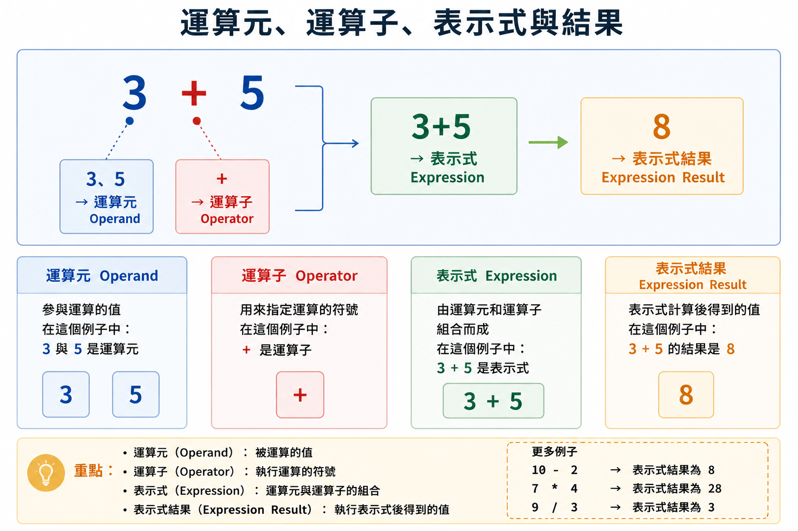

---

## Section V. 表示式會產生值

```cpp
10 + 20
```

產生：

```text
30
```

```cpp
5 > 3
```

產生：

```text
true
```

```cpp
number = 10
```

會把 `10` 存入 `number`，同時整個賦值表示式也具有值。

---

## Section VI. 表示式可以組合

```cpp
(3 + 5) * 2
```

內層：

```text
3 + 5 → 8
```

外層：

```text
8 * 2 → 16
```

較小的表示式可以成為較大表示式的運算元。

---

# Part B：算術運算

## Section VII. 五個基本算術運算子

```cpp
a + b
a - b
a * b
a / b
a % b
```

其中 `%` 是整數餘數運算子。

---

## Section VIII. 完整算術範例

```cpp
// VALIDATE
#include <iostream>
using namespace std;

int main() {
    int first = 17;
    int second = 5;

    cout << first + second << '\n';
    cout << first - second << '\n';
    cout << first * second << '\n';
    cout << first / second << '\n';
    cout << first % second << '\n';

    return 0;
}
```

輸出：

```text
22
12
85
3
2
```

---

## Section IX. 一元正號與負號

```cpp
int number = 5;

cout << +number << '\n';
cout << -number << '\n';
```

結果：

```text
5
-5
```

一元負號不一定修改原變數：

```cpp
int number = 5;
int opposite = -number;
```

執行後：

```text
number = 5
opposite = -5
```

---

# Part C：整數除法與浮點除法

## Section X. 整數除法

```cpp
7 / 2
```

左右兩邊都是整數，因此執行整數除法：

```text
7 ÷ 2 = 3 餘 1
```

表示式結果：

```text
3
```

小數部分不會保留。

---

## Section XI. 浮點數除法

```cpp
7.0 / 2
```

其中一側是 `double`，另一側會轉成相容浮點型別。

結果：

```text
3.5
```

---

## Section XII. 比較兩種除法

```cpp
// VALIDATE
#include <iostream>
using namespace std;

int main() {
    cout << 7 / 2 << '\n';
    cout << 7.0 / 2 << '\n';
    cout << 7 / 2.0 << '\n';

    return 0;
}
```

輸出：

```text
3
3.5
3.5
```

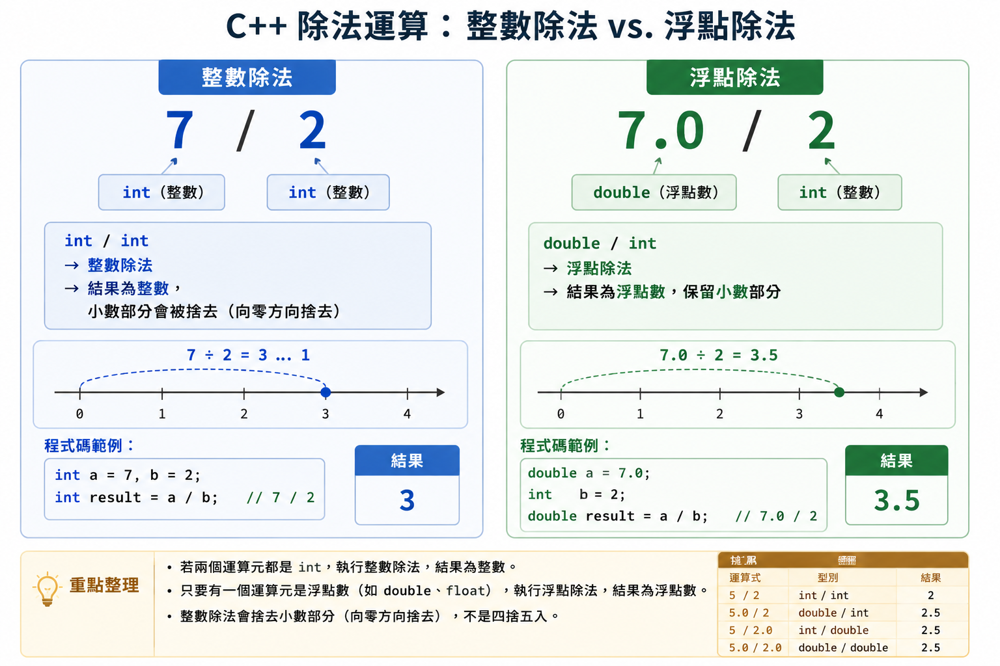

---

## Section XIII. 使用 `static_cast<double>()`

```cpp
int total = 7;
int count = 2;

double average =
    static_cast<double>(total) / count;
```

結果：

```text
3.5
```

只要在除法前先把其中一側轉成浮點數，就會執行浮點除法。

---

## Section XIV. 錯誤的轉換位置

```cpp
double average =
    static_cast<double>(total / count);
```

若：

```text
total = 7
count = 2
```

執行順序：

```text
total / count → 3
static_cast<double>(3) → 3.0
```

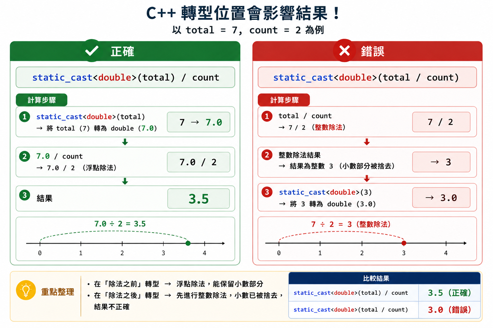

已經遺失的小數不會恢復。

---

## Section XV. 完整平均值範例

```cpp
// VALIDATE
#include <iostream>
using namespace std;

int main() {
    int first;
    int second;

    cout << "請輸入兩個整數：";
    cin >> first >> second;

    double average =
        static_cast<double>(first + second) / 2;

    cout << "Average: "
         << average
         << '\n';

    return 0;
}
```

---

## Section XVI. 除數不能為零

```cpp
10 / 0
```

不合法。

整數除以零會造成未定義行為，程式可能崩潰或產生其他不可依賴結果。

輸入除數時，應先確認它不是零。

完整條件判斷會在下一章介紹。

---

# Part D：餘數 `%`

## Section XVII. 餘數的概念

```cpp
17 % 5
```

因為：

```text
17 = 5 × 3 + 2
```

所以：

```text
17 % 5 = 2
```

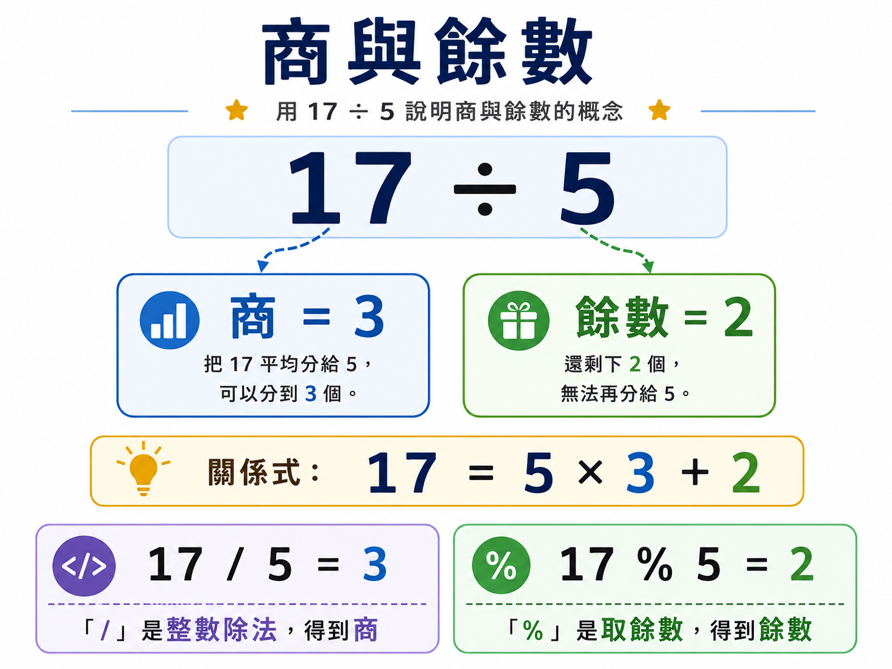

---

## Section XVIII. `%` 只用於整數

合法：

```cpp
17 % 5
```

不合法：

```cpp
/* 17.5 % 5.0 */
```

浮點數餘數需要其他標準函式，不使用 `%`。

---

## Section XIX. 判斷奇偶

```cpp
number % 2
```

- 結果為 `0`：偶數。
- 結果不為 `0`：奇數。

```cpp
bool isEven = number % 2 == 0;
```

---

## Section XX. 取得個位數

對非負整數：

```cpp
number % 10
```

可取得個位數。

例如：

```text
347 % 10 = 7
```

---

## Section XXI. 取得最後兩位

```cpp
number % 100
```

例如：

```text
347 % 100 = 47
```

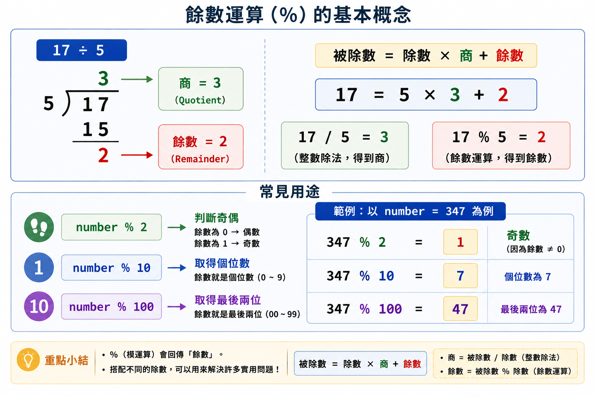

---

## Section XXII. 完整餘數範例

```cpp
// VALIDATE
#include <iostream>
using namespace std;

int main() {
    int number = 347;

    cout << "Last digit: "
         << number % 10
         << '\n';

    cout << "Last two digits: "
         << number % 100
         << '\n';

    cout << boolalpha;
    cout << "Is even: "
         << (number % 2 == 0)
         << '\n';

    return 0;
}
```

---

# Part E：優先順序與括號

## Section XXIII. 為什麼需要優先順序？

```cpp
2 + 3 * 4
```

若全部由左到右：

```text
(2 + 3) × 4 = 20
```

但 C++ 會先做乘法：

```text
2 + (3 × 4) = 14
```

---

## Section XXIV. 基本優先順序

本章常用運算子的簡化順序：

1. `( )`
2. 一元運算：`!`、一元 `+`、一元 `-`、前置 `++`、前置 `--`
3. `*`、`/`、`%`
4. `+`、`-`
5. `<`、`<=`、`>`、`>=`
6. `==`、`!=`
7. `&&`
8. `||`
9. `?:`
10. `=`、`+=`、`-=` 等賦值

> 不需要一次背完全部 C++ 運算子表。遇到不確定或可讀性不佳時，使用括號。

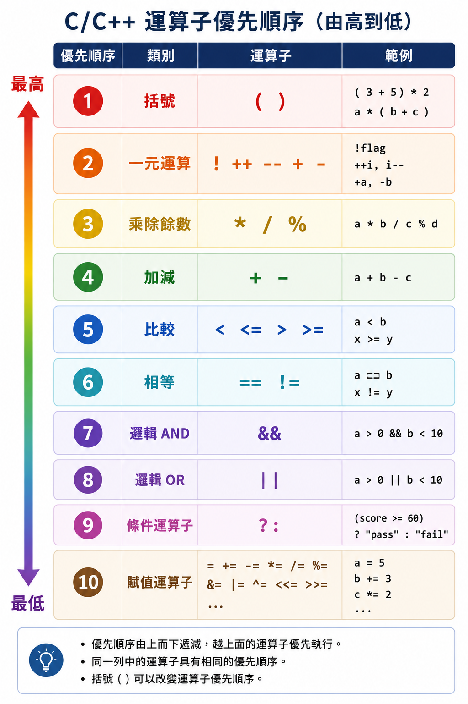

---

## Section XXV. 括號改變順序

```cpp
(2 + 3) * 4
```

先計算：

```text
2 + 3 → 5
```

再計算：

```text
5 * 4 → 20
```

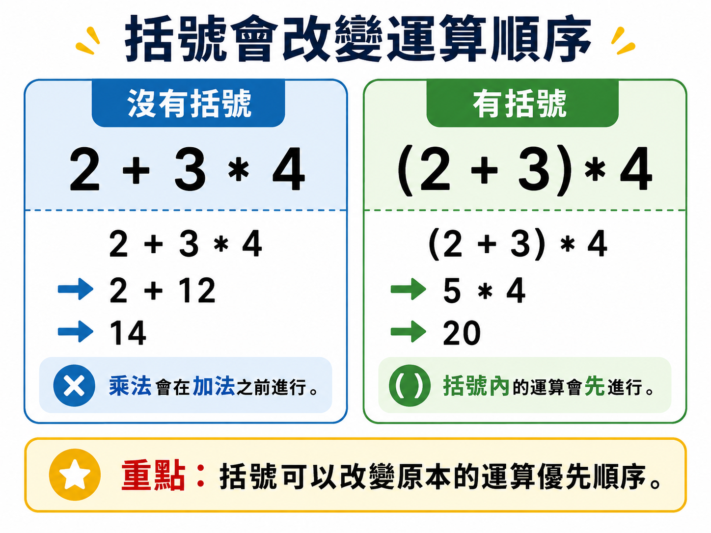

---

## Section XXVI. 同優先順序的結合方向

```cpp
20 / 5 * 2
```

`/` 與 `*` 優先順序相同，通常由左向右：

```text
20 / 5 → 4
4 * 2  → 8
```

不是：

```text
20 / (5 * 2) → 2
```

---

## Section XXVII. 減法也由左向右

```cpp
10 - 3 - 2
```

等價於：

```cpp
(10 - 3) - 2
```

結果：

```text
5
```

---

## Section XXVIII. 使用括號增加可讀性

即使沒有括號也能得到正確結果：

```cpp
price * quantity + shippingFee
```

若加入分組：

```cpp
(price * quantity) + shippingFee
```

讀者更容易看懂。

括號不只用來改變結果，也可用來表達意圖。

---

## Section XXIX. 優先順序完整範例

```cpp
// VALIDATE
#include <iostream>
using namespace std;

int main() {
    cout << 2 + 3 * 4 << '\n';
    cout << (2 + 3) * 4 << '\n';
    cout << 20 / 5 * 2 << '\n';
    cout << 20 / (5 * 2) << '\n';

    return 0;
}
```

輸出：

```text
14
20
8
2
```

---

# Part F：賦值運算

## Section XXX. 基本賦值

```cpp
number = 10;
```

表示：

```text
將右側的 10
存入左側的 number
```

---

## Section XXXI. 賦值方向

合法：

```cpp
number = 10;
```

不合法：

```cpp
/* 10 = number; */
```

左側必須是可以接收新值的物件。

---

## Section XXXII. 右側可以是表示式

```cpp
sum = first + second;
```

```cpp
area = width * height;
```

```cpp
average =
    static_cast<double>(total) / count;
```

先算右側，再存入左側。

---

## Section XXXIII. 賦值表示式也有值

```cpp
int first;
int second;

first = second = 10;
```

賦值通常由右向左結合：

```text
second = 10
→ 整個表示式的值為 10
→ first = 10
```

結果：

```text
first = 10
second = 10
```

---

## Section XXXIV. 鏈式賦值的限制

```cpp
first = second = 10;
```

雖然合法，但不應把複雜運算塞進鏈式賦值。

清楚寫法：

```cpp
second = 10;
first = second;
```

更容易逐行追蹤。

---

# Part G：複合賦值

## Section XXXV. `+=`

```cpp
score += 5;
```

等價於基本概念：

```cpp
score = score + 5;
```

---

## Section XXXVI. 常見複合賦值

| 寫法 | 基本概念 |
| --- | --- |
| `value += amount;` | `value = value + amount;` |
| `value -= amount;` | `value = value - amount;` |
| `value *= amount;` | `value = value * amount;` |
| `value /= amount;` | `value = value / amount;` |
| `value %= amount;` | `value = value % amount;` |

---

## Section XXXVII. 完整複合賦值範例

```cpp
// VALIDATE
#include <iostream>
using namespace std;

int main() {
    int value = 20;

    value += 5;
    cout << value << '\n';

    value -= 3;
    cout << value << '\n';

    value *= 2;
    cout << value << '\n';

    value /= 4;
    cout << value << '\n';

    value %= 5;
    cout << value << '\n';

    return 0;
}
```

追蹤：

| 步驟 | `value` |
| --- | ---: |
| 初始 | 20 |
| `+= 5` | 25 |
| `-= 3` | 22 |
| `*= 2` | 44 |
| `/= 4` | 11 |
| `%= 5` | 1 |


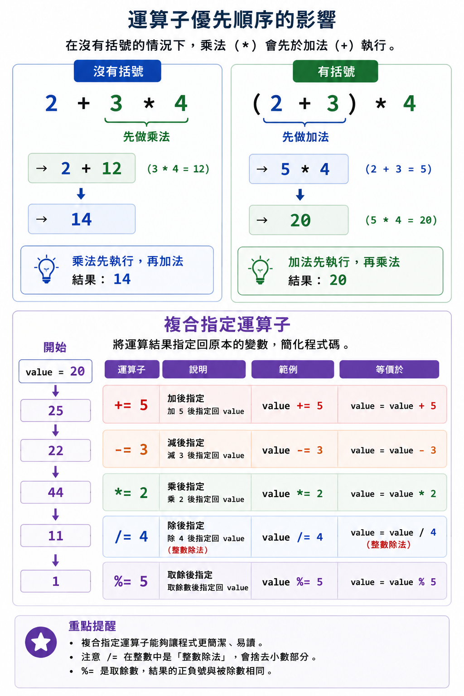

---

## Section XXXVIII. 複合賦值仍受型別影響

```cpp
int value = 7;
value /= 2;
```

結果：

```text
value = 3
```

因為 `value` 是 `int`，執行整數除法後寫回。

---

# Part H：遞增與遞減

## Section XXXIX. 增加或減少 1

```cpp
++number;
number++;
--number;
number--;
```

都會修改 `number`。

---

## Section XL. 單獨成行時

```cpp
int number = 5;

number++;
++number;
```

執行後：

```text
number = 7
```

若 `++` 單獨成為一個敘述，前置與後置最後都增加 1。

---

## Section XLI. 前置遞增

```cpp
int number = 5;
int result = ++number;
```

順序：

```text
先將 number 增加到 6
→ 表示式結果為 6
→ result = 6
```

結果：

```text
number = 6
result = 6
```

---

## Section XLII. 後置遞增

```cpp
int number = 5;
int result = number++;
```

順序：

```text
先使用舊值 5 作為表示式結果
→ result = 5
→ 再將 number 增加到 6
```

結果：

```text
number = 6
result = 5
```

---

## Section XLIII. 完整前置與後置比較

```cpp
// VALIDATE
#include <iostream>
using namespace std;

int main() {
    int first = 5;
    int firstResult = ++first;

    int second = 5;
    int secondResult = second++;

    cout << first << " "
         << firstResult << '\n';

    cout << second << " "
         << secondResult << '\n';

    return 0;
}
```

輸出：

```text
6 6
6 5
```

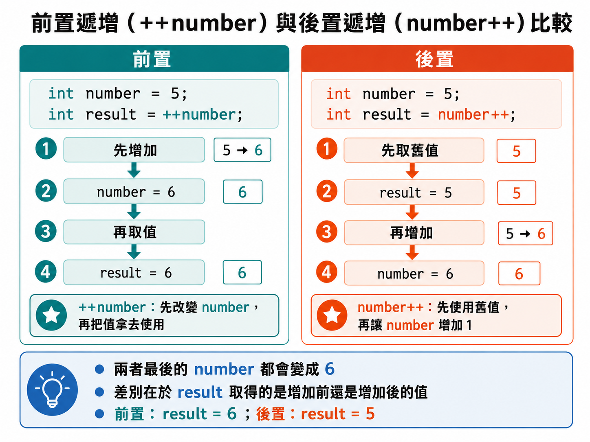

---

## Section XLIV. 遞減同樣適用

```cpp
int first = 5;
int result1 = --first;
```

```text
first = 4
result1 = 4
```

```cpp
int second = 5;
int result2 = second--;
```

```text
second = 4
result2 = 5
```

---

## Section XLV. 初學建議

若只想增加 1：

```cpp
++number;
```

若只想減少 1：

```cpp
--number;
```

不要在同一行加入太多副作用：

```cpp
// 不建議作為初學風格
result = number++ + ++number;
```

即使某些寫法在特定標準中有明確規則，也很難閱讀與維護。

---

# Part I：關係運算

## Section XLVI. 關係運算子的結果

關係運算式結果是：

```cpp
bool
```

也就是：

```cpp
true
false
```

---

## Section XLVII. 六個關係運算子

| 運算子 | 意義 |
| --- | --- |
| `==` | 等於 |
| `!=` | 不等於 |
| `<` | 小於 |
| `>` | 大於 |
| `<=` | 小於或等於 |
| `>=` | 大於或等於 |

---

## Section XLVIII. 完整比較範例

```cpp
// VALIDATE
#include <iostream>
using namespace std;

int main() {
    int first = 10;
    int second = 20;

    cout << boolalpha;
    cout << (first == second) << '\n';
    cout << (first != second) << '\n';
    cout << (first < second) << '\n';
    cout << (first > second) << '\n';
    cout << (first <= second) << '\n';
    cout << (first >= second) << '\n';

    return 0;
}
```

輸出：

```text
false
true
true
false
true
false
```

---

## Section XLIX. `=` 與 `==`

```cpp
number = 10;
```

用途：

```text
賦值
```

```cpp
number == 10
```

用途：

```text
比較是否相等
```

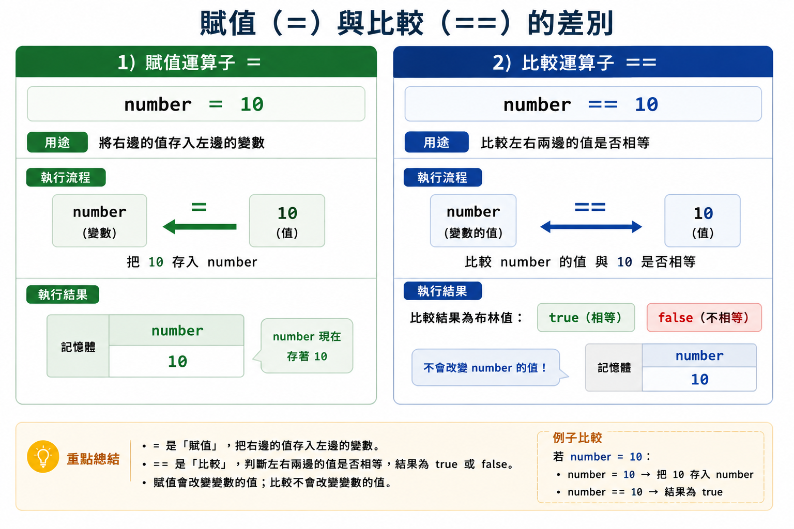

這兩個運算子不能混淆。

---

## Section L. 直接保存比較結果

```cpp
int score = 75;
bool passed = score >= 60;
```

結果：

```text
passed = true
```

---

## Section LI. 連鎖比較錯誤

數學可能寫：

```text
0 < age < 120
```

C++ 不應直接照寫：

```cpp
0 < age < 120
```

C++ 會先算：

```cpp
0 < age
```

得到 `true` 或 `false`，再把布林值和 `120` 比較。

---

## Section LII. 正確範圍條件

```cpp
0 < age && age < 120
```

或包含端點：

```cpp
0 <= age && age <= 120
```

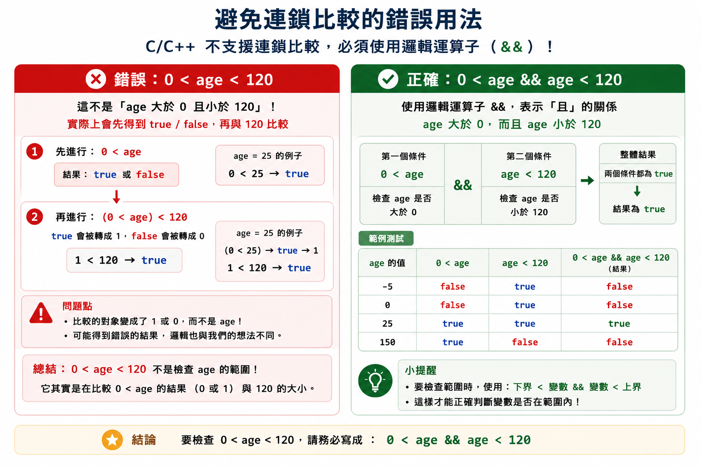

---

# Part J：邏輯運算

## Section LIII. 邏輯 AND `&&`

```cpp
condition1 && condition2
```

只有兩邊都為 `true`，結果才是 `true`。

| 左側 | 右側 | 結果 |
| --- | --- | --- |
| `false` | `false` | `false` |
| `false` | `true` | `false` |
| `true` | `false` | `false` |
| `true` | `true` | `true` |

---

## Section LIV. 邏輯 OR `||`

```cpp
condition1 || condition2
```

只要至少一邊為 `true`，結果就是 `true`。

| 左側 | 右側 | 結果 |
| --- | --- | --- |
| `false` | `false` | `false` |
| `false` | `true` | `true` |
| `true` | `false` | `true` |
| `true` | `true` | `true` |

---

## Section LV. 邏輯 NOT `!`

```cpp
!condition
```

反轉真假：

```text
!true  → false
!false → true
```

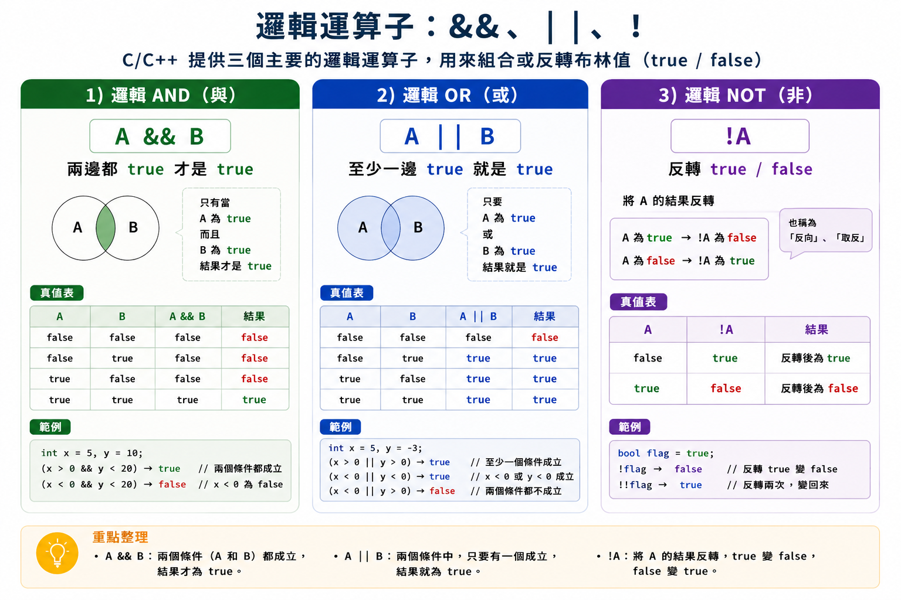

---

## Section LVI. 範圍條件

```cpp
int age = 15;

bool valid =
    age >= 0 && age <= 120;
```

兩個條件：

```text
age >= 0
age <= 120
```

必須同時成立。

---

## Section LVII. 多個可接受值

```cpp
char answer = 'Y';

bool accepted =
    answer == 'Y' || answer == 'y';
```

只要是大寫或小寫 `Y`，結果就是 `true`。

---

## Section LVIII. 完整邏輯範例

```cpp
// VALIDATE
#include <iostream>
using namespace std;

int main() {
    int age = 15;
    char answer = 'Y';

    bool validAge =
        age >= 0 && age <= 120;

    bool accepted =
        answer == 'Y' || answer == 'y';

    cout << boolalpha;
    cout << validAge << '\n';
    cout << accepted << '\n';
    cout << !accepted << '\n';

    return 0;
}
```

---

## Section LIX. 邏輯運算優先順序

通常：

```text
關係比較
→ 相等比較
→ &&
→ ||
```

例如：

```cpp
age >= 0 && age <= 120
```

等價於：

```cpp
(age >= 0) && (age <= 120)
```

仍建議使用括號讓結構更清楚。

---

# Part K：短路求值

## Section LX. `&&` 的短路

```cpp
left && right
```

若 `left` 已經是 `false`，整體一定是 `false`。

因此 `right` 不會執行。

---

## Section LXI. `||` 的短路

```cpp
left || right
```

若 `left` 已經是 `true`，整體一定是 `true`。

因此 `right` 不會執行。

---

## Section LXII. 避免除以零

```cpp
divisor != 0 &&
number / divisor > 2
```

若 `divisor == 0`：

```text
左側為 false
→ 右側不執行
→ 避免整數除以零
```

順序不能任意交換。

危險：

```cpp
number / divisor > 2 &&
divisor != 0
```

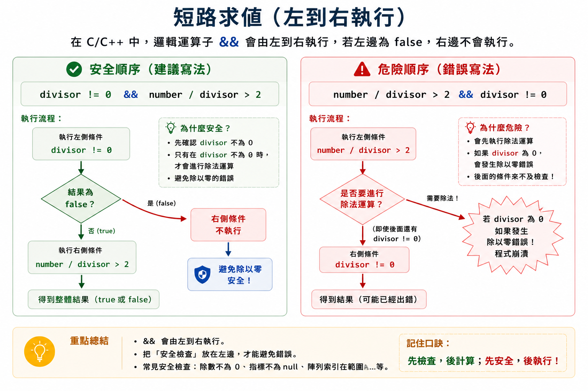

除法會先發生。

---

## Section LXIII. 完整短路範例

```cpp
// VALIDATE
#include <iostream>
using namespace std;

int main() {
    int number = 20;
    int divisor = 0;

    bool safeAndLarge =
        divisor != 0 &&
        number / divisor > 2;

    cout << boolalpha
         << safeAndLarge
         << '\n';

    return 0;
}
```

輸出：

```text
false
```

右側除法不會執行。

---

## Section LXIV. 使用副作用觀察短路

```cpp
// VALIDATE
#include <iostream>
using namespace std;

int main() {
    int count = 0;

    bool first =
        false && (++count > 0);

    cout << first << " "
         << count << '\n';

    bool second =
        true || (++count > 0);

    cout << second << " "
         << count << '\n';

    return 0;
}
```

輸出：

```text
0 0
1 0
```

兩次右側都沒有執行，所以 `count` 維持 `0`。

---

# Part L：數值與布林情境

## Section LXV. 零與非零

在需要布林值的情境中：

```text
0     → false
非零值 → true
```

例如：

```cpp
bool first = 0;
bool second = 5;
bool third = -3;
```

結果：

```text
first  = false
second = true
third  = true
```

---

## Section LXVI. 建議明確比較

雖然可以：

```cpp
if (count) {
    // ...
}
```

初學階段在需要清楚表達時，可以寫：

```cpp
count != 0
```

但完整 `if` 語法會在下一章介紹。

---

# Part M：條件運算子 `?:`

## Section LXVII. 基本語法

```cpp
condition ? value_if_true : value_if_false
```

它是一個表示式，會在兩個值中選擇一個。

---

## Section LXVIII. 簡單範例

```cpp
int first = 10;
int second = 20;

int maximum =
    first > second ? first : second;
```

若 `first > second` 為 `true`，選 `first`；否則選 `second`。

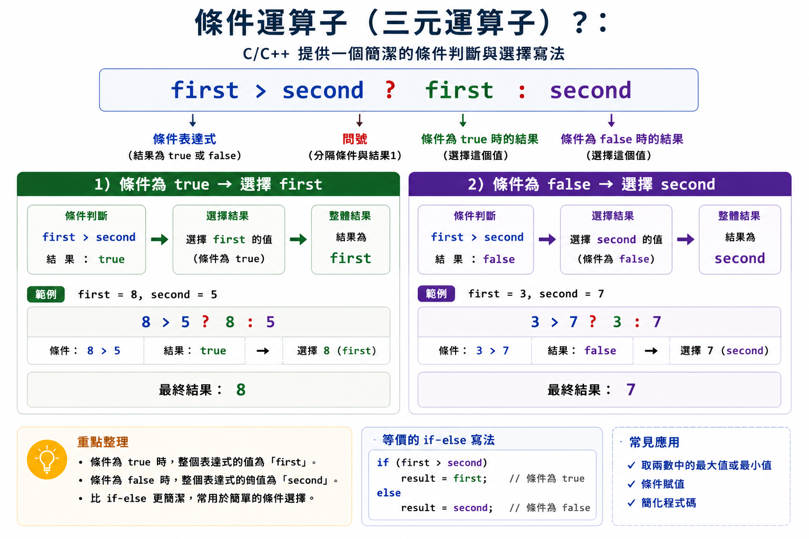

---

## Section LXIX. 完整條件運算子範例

```cpp
// VALIDATE
#include <iostream>
using namespace std;

int main() {
    int first = 10;
    int second = 20;

    int maximum =
        first > second ? first : second;

    cout << maximum << '\n';

    return 0;
}
```

輸出：

```text
20
```

---

## Section LXX. 不要巢狀太深

可讀性不佳：

```cpp
result =
    first > second
        ? first > third ? first : third
        : second > third ? second : third;
```

複雜條件通常更適合使用清楚的 `if` 結構。

---

# Part N：混合型別表示式

## Section LXXI. 整數與浮點數一起運算

```cpp
int count = 3;
double price = 2.5;

double total = count * price;
```

`count` 會轉成相容的浮點型別後參與運算。

結果：

```text
7.5
```

---

## Section LXXII. 結果型別很重要

```cpp
int total = 7;
int count = 2;

double average = total / count;
```

右側先得到整數 `3`，再轉成 `double`。

因此：

```text
average = 3.0
```

---

## Section LXXIII. 使用 `auto`

教材補充：

```cpp
auto first = 10;
auto second = 3.14;
auto third = first + second;
```

編譯器推導：

```text
first  → int
second → double
third  → double
```

`auto` 不表示沒有型別，只是讓編譯器依初始化式推導型別。

---

## Section LXXIV. 完整 `auto` 範例

```cpp
// VALIDATE
#include <iostream>
#include <type_traits>
using namespace std;

int main() {
    auto first = 10;
    auto second = 3.14;
    auto third = first + second;

    cout << boolalpha;
    cout << is_same_v<decltype(first), int>
         << '\n';

    cout << is_same_v<decltype(second), double>
         << '\n';

    cout << is_same_v<decltype(third), double>
         << '\n';

    return 0;
}
```

本例只用來觀察型別推導；`decltype` 與型別特徵會在進階章節再深入。

---

# Part O：快速概念檢查

## Section LXXV. 選擇題與簡答

### Q1. `3 + 5` 中，運算子是什麼？

<details>
<summary>查看答案</summary>

```cpp
+
```

</details>

---

### Q2. `3 + 5` 的運算元是什麼？

<details>
<summary>查看答案</summary>

```text
3 和 5
```

</details>

---

### Q3. `7 / 2` 的結果是什麼？

<details>
<summary>查看答案</summary>

```text
3
```

因為兩側都是整數。

</details>

---

### Q4. `7.0 / 2` 的結果是什麼？

<details>
<summary>查看答案</summary>

```text
3.5
```

</details>

---

### Q5. `17 % 5` 的結果是什麼？

<details>
<summary>查看答案</summary>

```text
2
```

</details>

---

### Q6. `%` 可以直接用於 `double` 嗎？

<details>
<summary>查看答案</summary>

不可以，`%` 適用於整數型別。

</details>

---

### Q7. `2 + 3 * 4` 的結果是什麼？

<details>
<summary>查看答案</summary>

```text
14
```

乘法先執行。

</details>

---

### Q8. `(2 + 3) * 4` 的結果是什麼？

<details>
<summary>查看答案</summary>

```text
20
```

</details>

---

### Q9. `score += 5` 的基本概念是什麼？

<details>
<summary>查看答案</summary>

```cpp
score = score + 5;
```

</details>

---

### Q10. `number++` 與 `++number` 單獨成行時，最後都做什麼？

<details>
<summary>查看答案</summary>

都將 `number` 增加 `1`。

</details>

---

### Q11. 前置遞增的表示式結果使用新值還是舊值？

<details>
<summary>查看答案</summary>

新值。

</details>

---

### Q12. 後置遞增的表示式結果使用新值還是舊值？

<details>
<summary>查看答案</summary>

舊值，之後變數才增加。

</details>

---

### Q13. `=` 與 `==` 的差異是什麼？

<details>
<summary>查看答案</summary>

- `=`：賦值。
- `==`：比較是否相等。

</details>

---

### Q14. 關係運算的結果型別是什麼？

<details>
<summary>查看答案</summary>

```cpp
bool
```

</details>

---

### Q15. 如何正確表示 `age` 在 0 到 120 之間？

<details>
<summary>查看答案</summary>

```cpp
age >= 0 && age <= 120
```

</details>

---

### Q16. `&&` 何時為 `true`？

<details>
<summary>查看答案</summary>

兩側條件都為 `true` 時。

</details>

---

### Q17. `||` 何時為 `false`？

<details>
<summary>查看答案</summary>

兩側條件都為 `false` 時。

</details>

---

### Q18. `!true` 的結果是什麼？

<details>
<summary>查看答案</summary>

```text
false
```

</details>

---

### Q19. `false && right` 會執行 `right` 嗎？

<details>
<summary>查看答案</summary>

不會，因為發生短路求值。

</details>

---

### Q20. `true || right` 會執行 `right` 嗎？

<details>
<summary>查看答案</summary>

不會。

</details>

---

### Q21. `condition ? first : second` 是敘述還是表示式？

<details>
<summary>查看答案</summary>

表示式，會產生 `first` 或 `second` 其中一個值。

</details>

---

### Q22. `auto` 會讓變數沒有型別嗎？

<details>
<summary>查看答案</summary>

不會，編譯器仍會推導出確定型別。

</details>

---

# Part P：程式閱讀練習

## Section LXXVI. 預測結果

### 題目 1

```cpp
cout << 11 / 4;
```

<details>
<summary>查看答案</summary>

```text
2
```

</details>

---

### 題目 2

```cpp
cout << 11.0 / 4;
```

<details>
<summary>查看答案</summary>

```text
2.75
```

</details>

---

### 題目 3

```cpp
cout << 23 % 10;
```

<details>
<summary>查看答案</summary>

```text
3
```

</details>

---

### 題目 4

```cpp
int value = 10;
value += 5;
value *= 2;

cout << value;
```

<details>
<summary>查看答案</summary>

```text
30
```

</details>

---

### 題目 5

```cpp
int number = 5;
int result = ++number;
```

<details>
<summary>查看答案</summary>

```text
number = 6
result = 6
```

</details>

---

### 題目 6

```cpp
int number = 5;
int result = number++;
```

<details>
<summary>查看答案</summary>

```text
number = 6
result = 5
```

</details>

---

### 題目 7

```cpp
cout << boolalpha
     << (10 != 20);
```

<details>
<summary>查看答案</summary>

```text
true
```

</details>

---

### 題目 8

```cpp
int age = 15;

cout << boolalpha
     << (age >= 0 && age <= 120);
```

<details>
<summary>查看答案</summary>

```text
true
```

</details>

---

### 題目 9

```cpp
char answer = 'n';

cout << boolalpha
     << (answer == 'Y' || answer == 'y');
```

<details>
<summary>查看答案</summary>

```text
false
```

</details>

---

### 題目 10

```cpp
int count = 0;

bool result =
    false && (++count > 0);
```

<details>
<summary>查看答案</summary>

```text
result = false
count = 0
```

右側沒有執行。

</details>

---

### 題目 11

```cpp
int first = 8;
int second = 3;

int maximum =
    first > second ? first : second;
```

<details>
<summary>查看答案</summary>

```text
maximum = 8
```

</details>

---

### 題目 12

```cpp
int total = 7;
int count = 2;

double average =
    static_cast<double>(total / count);
```

<details>
<summary>查看答案</summary>

```text
average = 3.0
```

整數除法已經先完成。

</details>

---

### 題目 13

```cpp
int total = 7;
int count = 2;

double average =
    static_cast<double>(total) / count;
```

<details>
<summary>查看答案</summary>

```text
average = 3.5
```

</details>

---

### 題目 14

```cpp
cout << 10 - 3 - 2;
```

<details>
<summary>查看答案</summary>

```text
5
```

等價於：

```cpp
(10 - 3) - 2
```

</details>

---

### 題目 15

```cpp
cout << (0 < 50 < 10);
```

<details>
<summary>查看答案</summary>

先計算：

```cpp
0 < 50
```

得到 `true`，再把 `true` 轉成數值 `1` 與 `10` 比較：

```cpp
1 < 10
```

因此結果為 `true`。

這不是數學中的連鎖比較語意。

</details>

---

# Part Q：實作練習

## Section LXXVII. 實作檢測題

### TODO 1：五種算術運算

輸入兩個整數，輸出：

```text
加法
減法
乘法
整數除法
餘數
```

第二個整數假設不為零。

---

### TODO 2：真正平均值

輸入兩個整數，使用 `static_cast<double>()` 計算小數平均值。

---

### TODO 3：商與餘數

輸入被除數與除數，輸出整數商與餘數。

---

### TODO 4：個位數

輸入非負整數，輸出個位數。

---

### TODO 5：最後兩位

輸入非負整數，輸出最後兩位數。

---

### TODO 6：複合賦值追蹤

建立 `value = 10`，依序執行：

```cpp
value += 5;
value *= 3;
value -= 4;
value /= 2;
```

每一步都輸出。

---

### TODO 7：前置與後置遞增

以兩個初始值相同的變數，分別示範前置與後置遞增。

---

### TODO 8：六種比較

輸入兩個整數，使用 `boolalpha` 輸出六種關係比較結果。

---

### TODO 9：合法年齡

輸入年齡，建立：

```cpp
bool validAge
```

判斷是否在 `0` 到 `120` 之間。

---

### TODO 10：接受大小寫答案

輸入一個字元，判斷是否為 `'Y'` 或 `'y'`。

---

### TODO 11：安全除法條件

輸入 `number` 與 `divisor`，建立：

```cpp
bool safeAndLarge
```

判斷除數不為零，而且商大於 `2`。

---

### TODO 12：兩數最大值

使用條件運算子 `?:` 選出兩個整數中的較大值。

---

### TODO 13：奇偶布林值

輸入整數，建立：

```cpp
bool isEven
```

並輸出 `true` 或 `false`。

---

### TODO 14：優先順序比較

分別輸出：

```cpp
2 + 3 * 4
(2 + 3) * 4
20 / 5 * 2
20 / (5 * 2)
```

---

### TODO 15：修正連鎖比較

將：

```cpp
0 <= score <= 100
```

改成正確的 C++ 條件。

---

# Part R：課後小練習

## Section LXXVIII. 延伸練習

### 練習 1：秒數拆解

輸入總秒數，使用 `/` 與 `%` 拆成分鐘和剩餘秒數。

---

### 練習 2：三位數拆解

輸入三位非負整數，輸出百位、十位與個位。

---

### 練習 3：價格更新

輸入整數價格，依序加上固定費用、乘上數量，再輸出結果。

---

### 練習 4：座標範圍

輸入 `x` 與 `y`，建立布林表示式，判斷兩者是否都位於 `0` 到 `100`。

---

### 練習 5：閏年條件預備

查找閏年的數學條件，先只建立布林表示式，不使用 `if`。完整應用留到條件判斷章節。

---

# Part S：常見錯誤提醒

## Section LXXIX. 常見錯誤

### 錯誤 1：以為整數除法會保留小數

```cpp
7 / 2
```

結果是 `3`。

---

### 錯誤 2：除法完成後才轉型

```cpp
static_cast<double>(total / count)
```

無法恢復已遺失的小數。

---

### 錯誤 3：除以零

整數除以零不能使用。

---

### 錯誤 4：對浮點數使用 `%`

`%` 只適用於整數型別。

---

### 錯誤 5：忽略負數餘數的符號

負數 `%` 的結果需要依 C++ 的整數除法規則理解，不應直接套用只適合非負數的位數拆解方法。

---

### 錯誤 6：誤判優先順序

```cpp
2 + 3 * 4
```

乘法先執行。

---

### 錯誤 7：只依賴記憶，不使用括號

若表達式難讀，加入括號。

---

### 錯誤 8：混淆 `=` 與 `==`

- `=` 賦值。
- `==` 比較。

---

### 錯誤 9：左側不是可賦值物件

```cpp
10 = number;
```

不合法。

---

### 錯誤 10：忘記複合賦值受型別影響

```cpp
int value = 7;
value /= 2;
```

結果是 `3`。

---

### 錯誤 11：混淆前置與後置遞增

前置使用新值，後置表示式使用舊值。

---

### 錯誤 12：在複雜表示式中多次修改同一變數

即使能編譯，也可能難以理解或產生未定義／非預期行為。

---

### 錯誤 13：使用數學連鎖比較

```cpp
0 <= score <= 100
```

不是正確範圍條件。

---

### 錯誤 14：將 `&&` 與 `||` 混淆

範圍通常需要 `&&`；多個可接受選項通常使用 `||`。

---

### 錯誤 15：忽略短路順序

安全檢查應放在可能危險運算之前。

---

### 錯誤 16：以為 `!value` 是把數字變負數

`!` 是邏輯 NOT，不是一元負號。

---

### 錯誤 17：過度使用條件運算子

複雜巢狀 `?:` 會降低可讀性。

---

### 錯誤 18：以為 `auto` 表示動態型別

`auto` 仍會在編譯時推導出確定型別。

---

# Part T：Mermaid 流程圖

## Section LXXX. 運算與表示式流程

### 1. 算術表示式

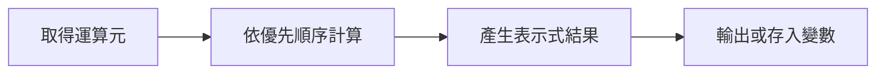
```mermaid
flowchart LR
    A[取得運算元] --> B[依優先順序計算]
    B --> C[產生表示式結果]
    C --> D[輸出或存入變數]
```

---

### 2. 除法型別判斷

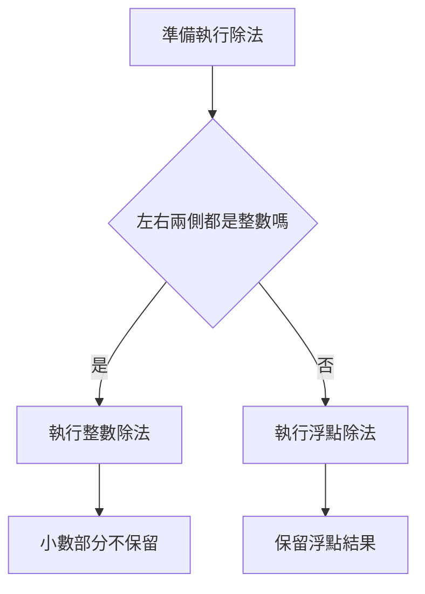
```mermaid
flowchart TD
    A[準備執行除法] --> B{左右兩側都是整數嗎}
    B -- 是 --> C[執行整數除法]
    B -- 否 --> D[執行浮點除法]
    C --> E[小數部分不保留]
    D --> F[保留浮點結果]
```

---

### 3. 餘數應用

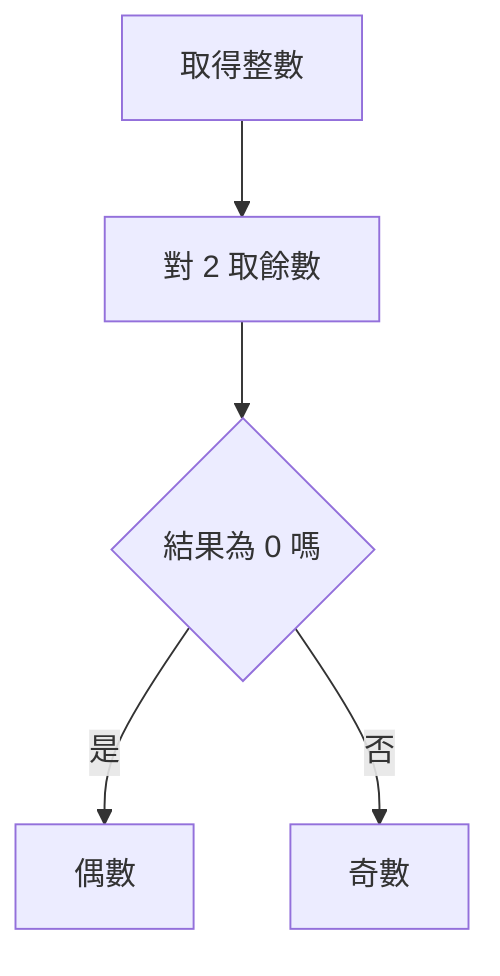
```mermaid
flowchart TD
    A[取得整數] --> B[對 2 取餘數]
    B --> C{結果為 0 嗎}
    C -- 是 --> D[偶數]
    C -- 否 --> E[奇數]
```

---

### 4. 賦值流程


```mermaid
flowchart RL
    A[計算右側表示式] --> B[取得結果]
    B --> C[將結果寫入左側變數]
    C --> D[舊值被覆蓋]
```

---

### 5. 前置與後置遞增

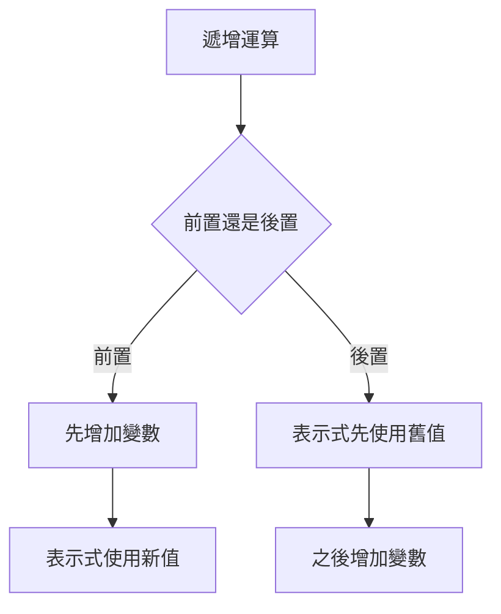
```mermaid
flowchart TD
    A[遞增運算] --> B{前置還是後置}
    B -- 前置 --> C[先增加變數]
    C --> D[表示式使用新值]
    B -- 後置 --> E[表示式先使用舊值]
    E --> F[之後增加變數]
```

---

### 6. 邏輯 AND 短路

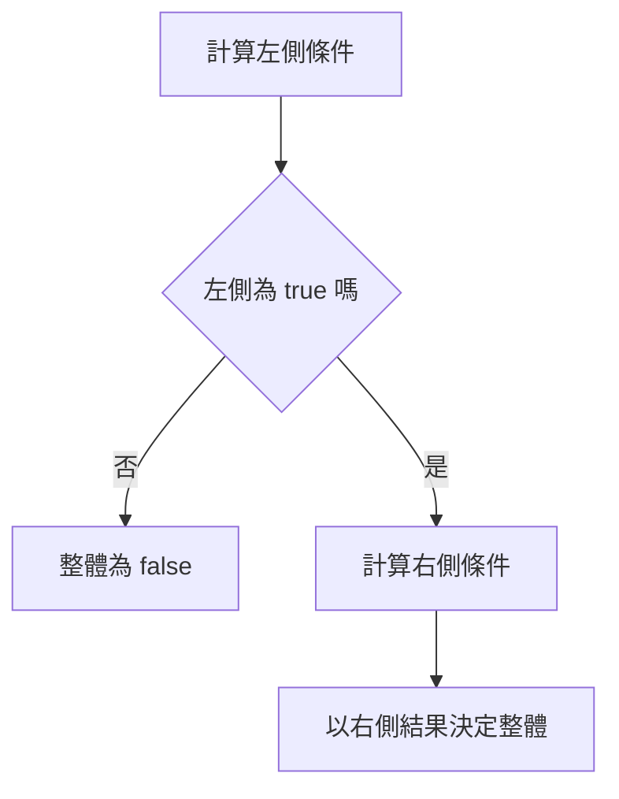
```mermaid
flowchart TD
    A[計算左側條件] --> B{左側為 true 嗎}
    B -- 否 --> C[整體為 false]
    B -- 是 --> D[計算右側條件]
    D --> E[以右側結果決定整體]
```

---

### 7. 邏輯 OR 短路


```mermaid
flowchart TD
    A[計算左側條件] --> B{左側為 true 嗎}
    B -- 是 --> C[整體為 true]
    B -- 否 --> D[計算右側條件]
    D --> E[以右側結果決定整體]
```

---

### 8. 條件運算子

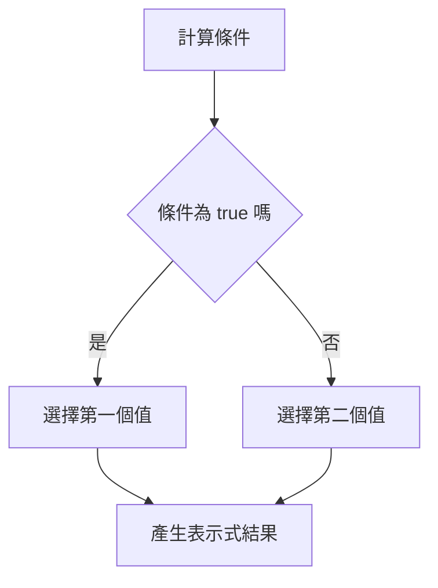
```mermaid
flowchart TD
    A[計算條件] --> B{條件為 true 嗎}
    B -- 是 --> C[選擇第一個值]
    B -- 否 --> D[選擇第二個值]
    C --> E[產生表示式結果]
    D --> E
```

---

# 本章完成標準

完成本章後，你應該能做到：

1. 分辨運算子、運算元與表示式。
2. 說明表示式會產生值。
3. 使用 `+`、`-`、`*`、`/`、`%`。
4. 說明整數除法不保留小數。
5. 說明浮點除法會保留浮點結果。
6. 使用 `static_cast<double>()` 改變除法型態。
7. 避免在除法後才進行轉型。
8. 避免整數除以零。
9. 使用 `%` 計算整數餘數。
10. 使用餘數判斷奇偶。
11. 使用餘數取得末位數字。
12. 使用括號控制計算順序。
13. 說明乘除餘數通常先於加減。
14. 說明同優先順序的左結合。
15. 使用 `=` 進行賦值。
16. 由右往左理解賦值。
17. 使用鏈式賦值並理解其結果。
18. 使用 `+=`、`-=`、`*=`、`/=`、`%=`.
19. 說明複合賦值仍受變數型別影響。
20. 使用前置與後置遞增。
21. 使用前置與後置遞減。
22. 分辨前置與後置表示式結果。
23. 避免複雜副作用表示式。
24. 使用六個關係運算子。
25. 說明關係表示式結果是 `bool`。
26. 分辨 `=` 與 `==`。
27. 避免數學連鎖比較。
28. 使用 `&&` 建立範圍條件。
29. 使用 `||` 表示多個可接受選項。
30. 使用 `!` 反轉布林值。
31. 說明 `&&` 的短路求值。
32. 說明 `||` 的短路求值。
33. 使用短路求值避免除以零。
34. 說明零與非零的布林轉換。
35. 使用條件運算子 `?:`。
36. 避免過度巢狀條件運算子。
37. 分析混合型別表示式。
38. 使用 `auto` 觀察型別推導。
39. 使用括號提升可讀性。
40. 找出常見運算子與表示式錯誤。

---

# 隱藏答案區

> Answer hidden — try it first.

<details>
<summary>TODO 1 答案</summary>

```cpp
#include <iostream>
using namespace std;

int main() {
    int first;
    int second;

    cin >> first >> second;

    cout << first + second << '\n';
    cout << first - second << '\n';
    cout << first * second << '\n';
    cout << first / second << '\n';
    cout << first % second << '\n';

    return 0;
}
```

</details>

<details>
<summary>TODO 2 答案</summary>

```cpp
#include <iostream>
using namespace std;

int main() {
    int first;
    int second;

    cin >> first >> second;

    double average =
        static_cast<double>(first + second) / 2;

    cout << average << '\n';

    return 0;
}
```

</details>

<details>
<summary>TODO 3 答案</summary>

```cpp
#include <iostream>
using namespace std;

int main() {
    int dividend;
    int divisor;

    cin >> dividend >> divisor;

    cout << "Quotient: "
         << dividend / divisor
         << '\n';

    cout << "Remainder: "
         << dividend % divisor
         << '\n';

    return 0;
}
```

</details>

<details>
<summary>TODO 4 答案</summary>

```cpp
#include <iostream>
using namespace std;

int main() {
    int number;

    cin >> number;

    cout << number % 10 << '\n';

    return 0;
}
```

</details>

<details>
<summary>TODO 5 答案</summary>

```cpp
#include <iostream>
using namespace std;

int main() {
    int number;

    cin >> number;

    cout << number % 100 << '\n';

    return 0;
}
```

</details>

<details>
<summary>TODO 6 答案</summary>

```cpp
#include <iostream>
using namespace std;

int main() {
    int value = 10;

    value += 5;
    cout << value << '\n';

    value *= 3;
    cout << value << '\n';

    value -= 4;
    cout << value << '\n';

    value /= 2;
    cout << value << '\n';

    return 0;
}
```

</details>

<details>
<summary>TODO 7 答案</summary>

```cpp
#include <iostream>
using namespace std;

int main() {
    int first = 5;
    int firstResult = ++first;

    int second = 5;
    int secondResult = second++;

    cout << first << " "
         << firstResult << '\n';

    cout << second << " "
         << secondResult << '\n';

    return 0;
}
```

</details>

<details>
<summary>TODO 8 答案</summary>

```cpp
#include <iostream>
using namespace std;

int main() {
    int first;
    int second;

    cin >> first >> second;

    cout << boolalpha;
    cout << (first == second) << '\n';
    cout << (first != second) << '\n';
    cout << (first < second) << '\n';
    cout << (first > second) << '\n';
    cout << (first <= second) << '\n';
    cout << (first >= second) << '\n';

    return 0;
}
```

</details>

<details>
<summary>TODO 9 答案</summary>

```cpp
#include <iostream>
using namespace std;

int main() {
    int age;

    cin >> age;

    bool validAge =
        age >= 0 && age <= 120;

    cout << boolalpha
         << validAge
         << '\n';

    return 0;
}
```

</details>

<details>
<summary>TODO 10 答案</summary>

```cpp
#include <iostream>
using namespace std;

int main() {
    char answer;

    cin >> answer;

    bool accepted =
        answer == 'Y' || answer == 'y';

    cout << boolalpha
         << accepted
         << '\n';

    return 0;
}
```

</details>

<details>
<summary>TODO 11 答案</summary>

```cpp
#include <iostream>
using namespace std;

int main() {
    int number;
    int divisor;

    cin >> number >> divisor;

    bool safeAndLarge =
        divisor != 0 &&
        number / divisor > 2;

    cout << boolalpha
         << safeAndLarge
         << '\n';

    return 0;
}
```

</details>

<details>
<summary>TODO 12 答案</summary>

```cpp
#include <iostream>
using namespace std;

int main() {
    int first;
    int second;

    cin >> first >> second;

    int maximum =
        first > second ? first : second;

    cout << maximum << '\n';

    return 0;
}
```

</details>

<details>
<summary>TODO 13 答案</summary>

```cpp
#include <iostream>
using namespace std;

int main() {
    int number;

    cin >> number;

    bool isEven =
        number % 2 == 0;

    cout << boolalpha
         << isEven
         << '\n';

    return 0;
}
```

</details>

<details>
<summary>TODO 14 答案</summary>

```cpp
#include <iostream>
using namespace std;

int main() {
    cout << 2 + 3 * 4 << '\n';
    cout << (2 + 3) * 4 << '\n';
    cout << 20 / 5 * 2 << '\n';
    cout << 20 / (5 * 2) << '\n';

    return 0;
}
```

</details>

<details>
<summary>TODO 15 答案</summary>

```cpp
score >= 0 && score <= 100
```

</details>
