# Lesson 06：Conditional Execution with `if` 使用 `if` 進行條件判斷

> 這堂課的重點：讓程式只在特定條件成立時執行某段程式碼。你會把上一章的關係與邏輯表示式放進 `if`，學習單一分支判斷、獨立條件、範圍檢查、輸入驗證與巢狀 `if`。

> 本章只介紹 `if`。`else`、`else if` 與 `switch` 會在下一章完整整理。

---

## Section I. 今天要做什麼？

1. 認識程式流程控制。
2. 理解程式預設由上往下執行。
3. 認識條件式執行。
4. 使用 `if` 建立單一分支。
5. 理解 `if` 後面需要布林條件。
6. 使用關係表示式作為條件。
7. 使用布林變數作為條件。
8. 理解條件為 `true` 時執行區塊。
9. 理解條件為 `false` 時跳過區塊。
10. 使用大括號建立 `if` 程式區塊。
11. 理解大括號不需要分號。
12. 理解 `if (...)` 後面通常不加分號。
13. 使用 `==` 判斷相等。
14. 使用 `!=` 判斷不相等。
15. 使用 `<`、`>`、`<=`、`>=`。
16. 分辨 `=` 與 `==`。
17. 使用 `&&` 建立範圍條件。
18. 使用 `||` 表示多個可接受值。
19. 使用 `!` 反轉條件。
20. 使用括號提升條件可讀性。
21. 輸入整數後判斷是否為正數。
22. 判斷是否為負數。
23. 判斷是否為零。
24. 使用三個獨立 `if` 處理三種互斥情況。
25. 理解獨立 `if` 會各自檢查。
26. 判斷奇數與偶數。
27. 判斷分數是否及格。
28. 判斷是否達到滿額折扣門檻。
29. 判斷年齡是否位於合法範圍。
30. 判斷輸入字元是否為 `'Y'` 或 `'y'`。
31. 判斷數字是否落在指定區間。
32. 判斷數字是否在區間外。
33. 使用短路求值保護除法。
34. 先確認除數不為零。
35. 使用 `if` 檢查輸入條件。
36. 使用 `if` 顯示錯誤訊息。
37. 使用巢狀 `if`。
38. 理解內層 `if` 只有在外層成立時才檢查。
39. 使用巢狀 `if` 分段驗證資料。
40. 比較巢狀 `if` 與 `&&`。
41. 判斷三角形邊長是否全部為正。
42. 判斷三邊是否符合三角形不等式。
43. 判斷正三角形。
44. 判斷等腰三角形。
45. 判斷直角三角形。
46. 使用布林變數保存複雜條件。
47. 為條件取有意義的名稱。
48. 避免重複撰寫相同表示式。
49. 理解縮排不會取代大括號。
50. 避免只靠縮排判斷程式區塊。
51. 避免在條件後誤加分號。
52. 避免使用數學連鎖比較。
53. 避免使用未初始化變數作為條件。
54. 避免在條件中加入不必要副作用。
55. 使用概念檢查、程式閱讀與實作題整合本章。

---

## Section II. 今天的學習方式

1. 先把程式分成：
   ```text
   一定執行
   → 檢查條件
   → 可能執行
   → 繼續往下
   ```
2. 每個 `if` 都先回答：
   ```text
   條件是什麼？
   條件何時為 true？
   條件為 false 時跳過什麼？
   ```
3. 將條件單獨寫成 `bool` 變數，先檢查結果。
4. 使用流程圖表示是否進入 `if` 區塊。
5. 範圍條件拆成兩個比較，再用 `&&` 組合。
6. 多個可接受選項拆成多個相等比較，再用 `||` 組合。
7. 使用三個獨立 `if` 時，逐一檢查每一個條件。
8. 巢狀 `if` 題先判斷外層，再判斷內層。
9. 程式閱讀題記錄每個 `if` 是否執行。
10. 不使用 `else` 解答本章題目。
11. 完整合法範例使用嚴格 C++17 選項檢查。
12. 錯誤範例只用於分析，不作為可執行範例。

---

## Section III. 核心語法對照

| 語法 | 用途 |
| --- | --- |
| `if (condition) { ... }` | 條件成立時執行區塊 |
| `if (value > 0) { ... }` | 判斷正數 |
| `if (value == 0) { ... }` | 判斷等於零 |
| `if (score >= 60) { ... }` | 判斷達到門檻 |
| `if (age >= 0 && age <= 120) { ... }` | 判斷範圍 |
| `if (answer == 'Y' || answer == 'y') { ... }` | 接受多個值 |
| `if (!ready) { ... }` | 條件反轉 |
| `bool valid = condition;` | 保存條件結果 |
| `if (valid) { ... }` | 使用布林變數 |
| `if (outer) { if (inner) { ... } }` | 巢狀條件 |

---

# Part A：程式流程與 `if`

## Section IV. 預設流程

沒有條件判斷時，程式通常由上往下執行：

```cpp
cout << "A\n";
cout << "B\n";
cout << "C\n";
```

輸出：

```text
A
B
C
```

每一行都會執行。

---

## Section V. 條件式執行

加入 `if` 後，某些程式碼只會在條件成立時執行：

```cpp
if (condition) {
    statement;
}
```

流程：

```text
檢查 condition
→ true：執行區塊
→ false：跳過區塊
→ 繼續執行後面的程式
```


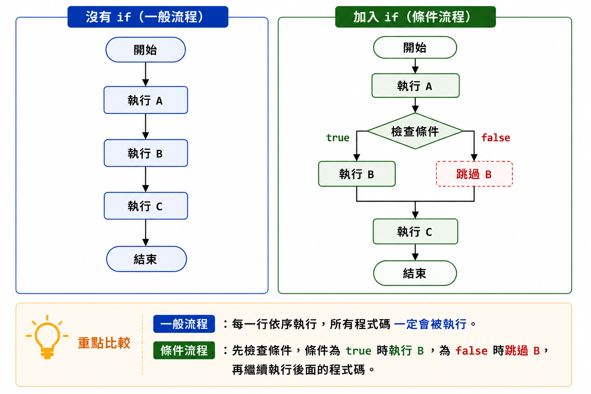


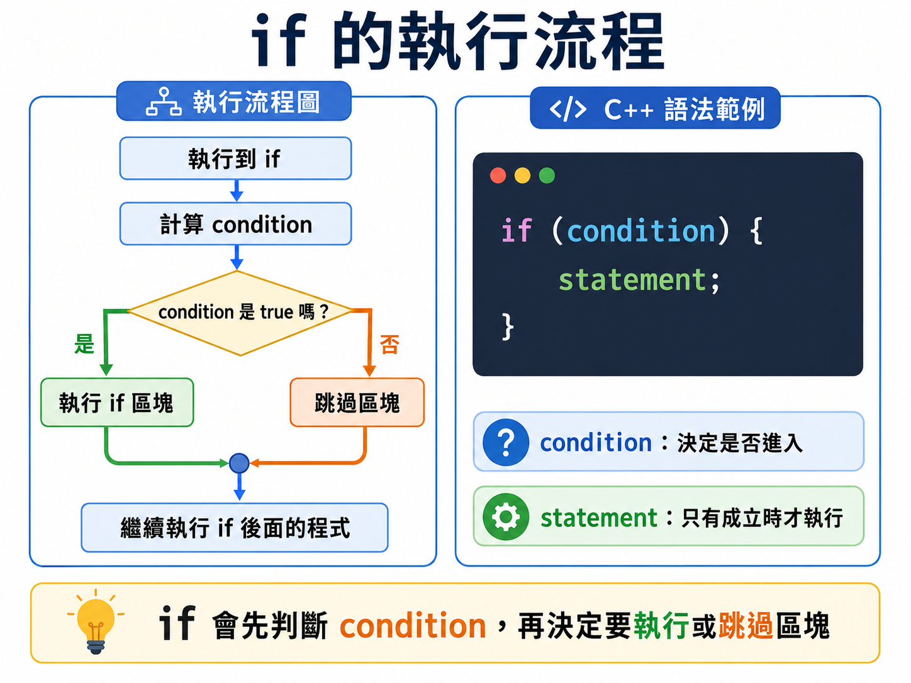

---

## Section VI. 第一個 `if`

```cpp
// VALIDATE
#include <iostream>
using namespace std;

int main() {
    int score = 75;

    if (score >= 60) {
        cout << "Pass\n";
    }

    cout << "Program finished.\n";

    return 0;
}
```

輸出：

```text
Pass
Program finished.
```

---

## Section VII. 條件不成立

```cpp
// VALIDATE
#include <iostream>
using namespace std;

int main() {
    int score = 40;

    if (score >= 60) {
        cout << "Pass\n";
    }

    cout << "Program finished.\n";

    return 0;
}
```

輸出：

```text
Program finished.
```

`Pass` 被跳過，但後面的程式仍然執行。


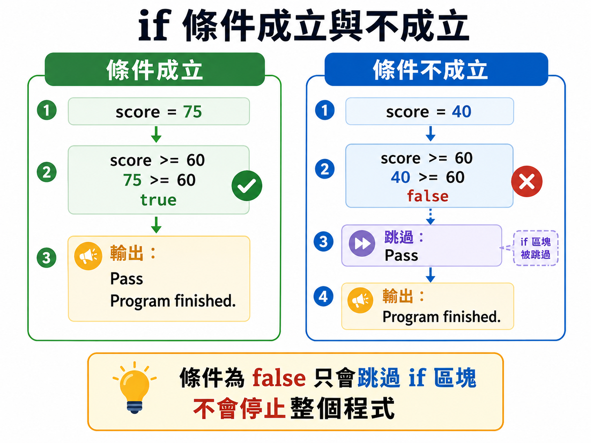

---

## Section VIII. `if` 的三個部分

```cpp
if (score >= 60) {
    cout << "Pass\n";
}
```

| 部分 | 說明 |
| --- | --- |
| `if` | C++ 關鍵字 |
| `(score >= 60)` | 布林條件 |
| `{ ... }` | 條件成立時執行的區塊 |


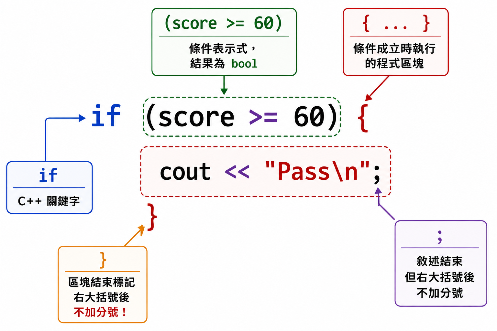

---

## Section IX. 大括號

```cpp
if (score >= 60) {
    cout << "Pass\n";
    cout << "You reached the requirement.\n";
}
```

兩行都屬於 `if` 區塊。

條件為 `false` 時，兩行都會被跳過。


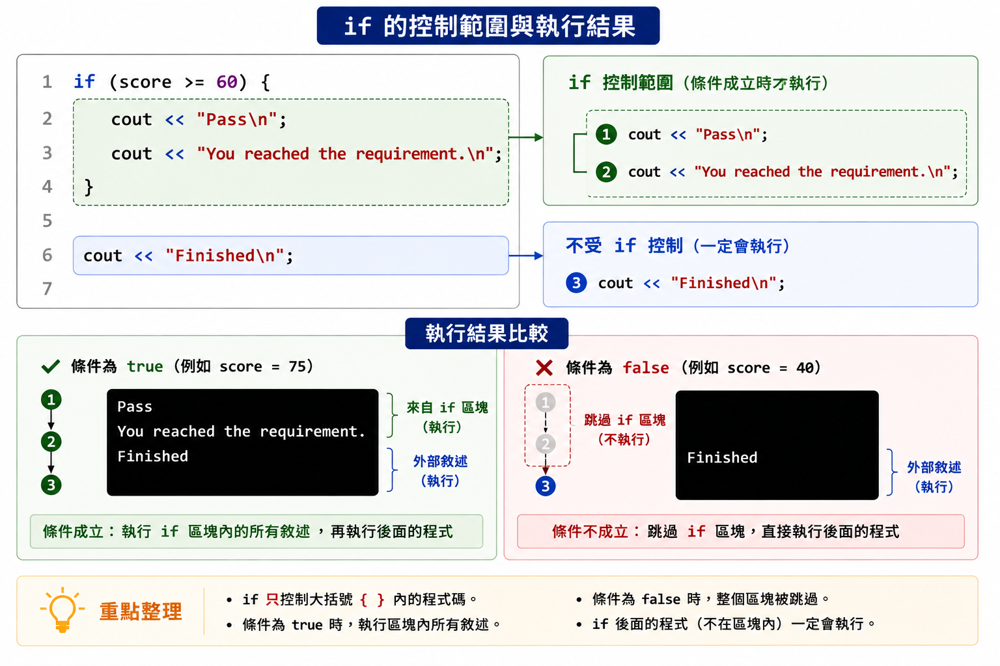

---

## Section X. `if` 後不要加分號

錯誤：

```cpp
if (score >= 60); {
    cout << "Pass\n";
}
```

分號會形成一個空敘述，後面的大括號區塊不再受到 `if` 控制。

正確：

```cpp
if (score >= 60) {
    cout << "Pass\n";
}
```


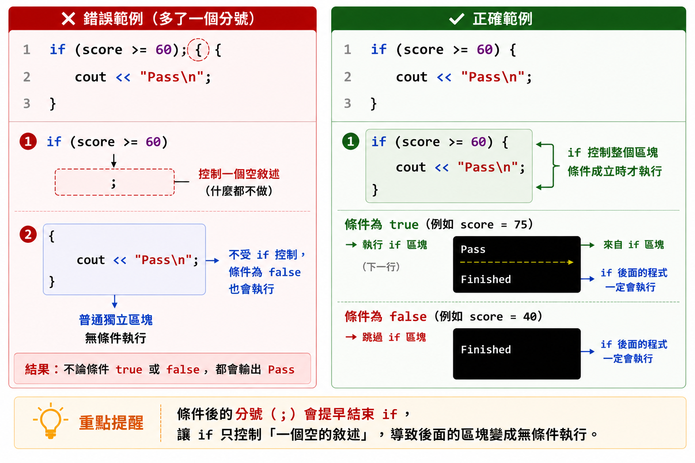

---

# Part B：使用比較條件

## Section XI. 判斷正數

```cpp
if (number > 0) {
    cout << "Positive\n";
}
```

只有 `number` 大於零時才輸出。

---

## Section XII. 判斷負數

```cpp
if (number < 0) {
    cout << "Negative\n";
}
```

---

## Section XIII. 判斷零

```cpp
if (number == 0) {
    cout << "Zero\n";
}
```

注意：

```cpp
==
```

是比較。

```cpp
=
```

是賦值。

---

## Section XIV. 三個獨立 `if`

```cpp
// VALIDATE
#include <iostream>
using namespace std;

int main() {
    int number;

    cout << "請輸入整數：";
    cin >> number;

    if (number > 0) {
        cout << "Positive\n";
    }

    if (number < 0) {
        cout << "Negative\n";
    }

    if (number == 0) {
        cout << "Zero\n";
    }

    return 0;
}
```

三個 `if` 會各自檢查。

對任何整數，這三個條件中剛好只有一個成立。


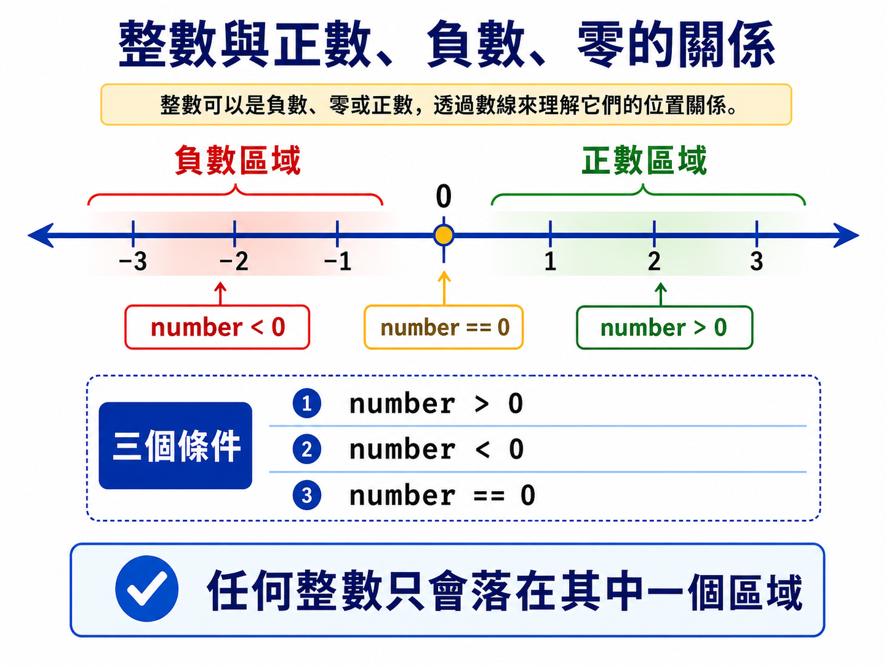


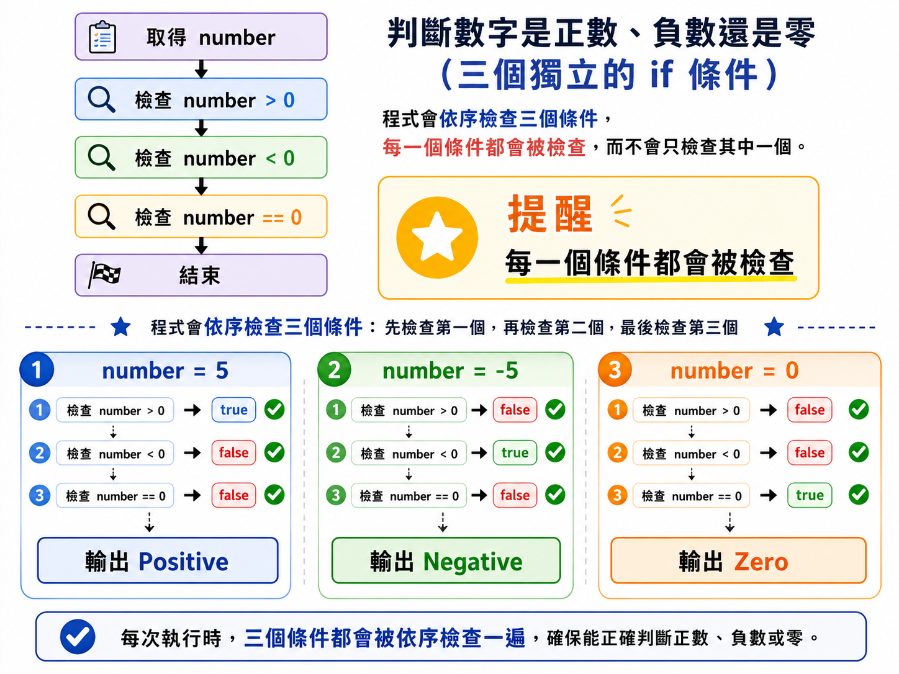

---

## Section XV. 獨立 `if` 不會自動停止

```cpp
int number = 10;

if (number > 0) {
    cout << "A\n";
}

if (number > 5) {
    cout << "B\n";
}
```

兩個條件都成立，因此輸出：

```text
A
B
```

第一個 `if` 執行後，第二個仍會繼續檢查。


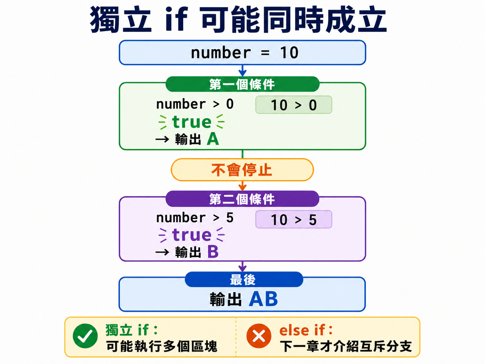

---

# Part C：布林變數作為條件

## Section XVI. 直接使用 `bool`

```cpp
bool ready = true;

if (ready) {
    cout << "Ready\n";
}
```

不需要寫：

```cpp
if (ready == true)
```

直接使用 `ready` 已經很清楚。

---

## Section XVII. 反轉布林條件

```cpp
bool ready = false;

if (!ready) {
    cout << "Not ready\n";
}
```

`!ready` 表示：

```text
ready 不是 true
```


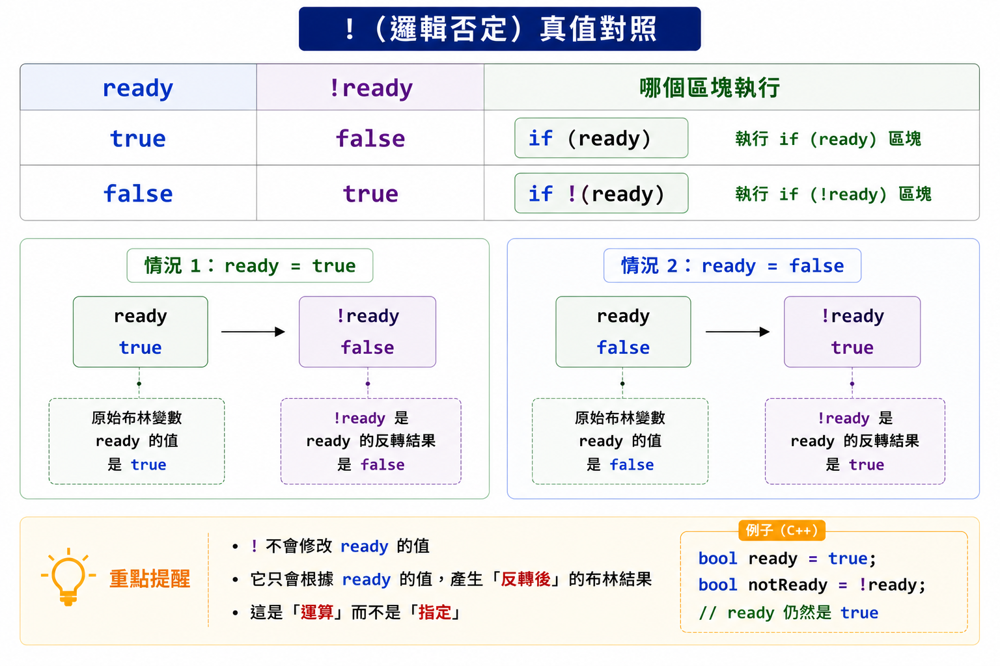

---

## Section XVIII. 為複雜條件命名

```cpp
int score = 75;
bool passed = score >= 60;

if (passed) {
    cout << "Pass\n";
}
```

好處：

- 條件意義更清楚。
- 可重複使用。
- 更容易除錯。


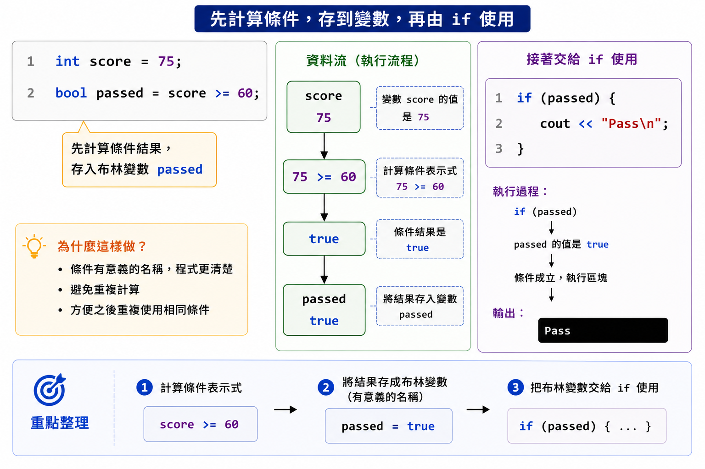

---

## Section XIX. 完整布林變數範例

```cpp
// VALIDATE
#include <iostream>
using namespace std;

int main() {
    int score;

    cout << "請輸入分數：";
    cin >> score;

    bool passed = score >= 60;

    cout << boolalpha;
    cout << "passed = "
         << passed
         << '\n';

    if (passed) {
        cout << "Congratulations!\n";
    }

    return 0;
}
```

---

# Part D：範圍條件

## Section XX. 合法年齡

```cpp
age >= 0 && age <= 120
```

分成：

```text
age >= 0
age <= 120
```

兩個條件都成立才是合法年齡。


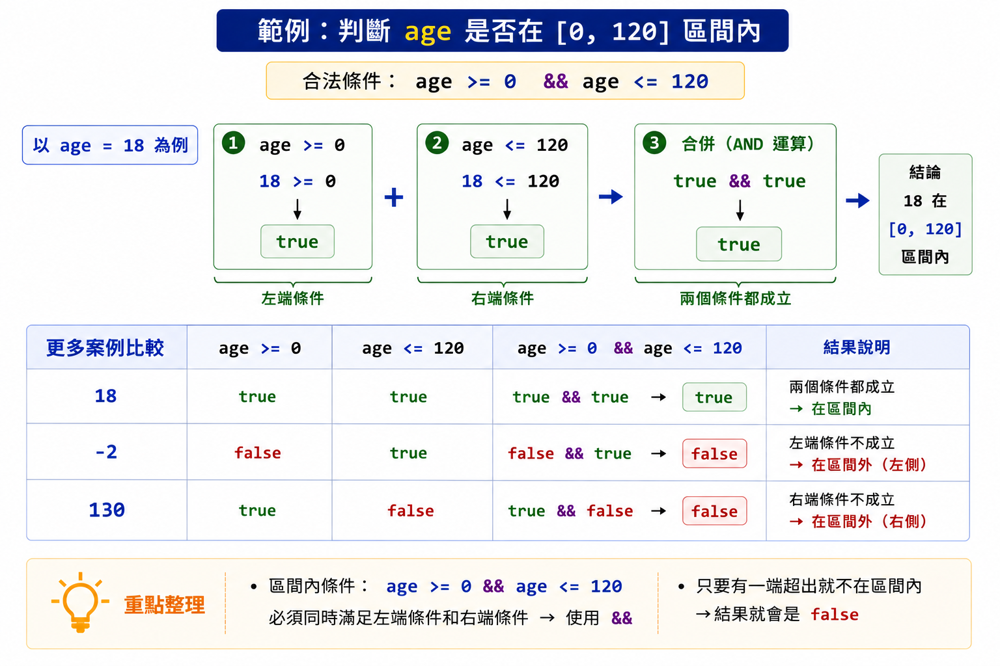

---

## Section XXI. 完整範圍範例

```cpp
// VALIDATE
#include <iostream>
using namespace std;

int main() {
    int age;

    cout << "請輸入年齡：";
    cin >> age;

    bool validAge =
        age >= 0 && age <= 120;

    if (validAge) {
        cout << "Valid age\n";
    }

    return 0;
}
```

輸入不在範圍內時，本章版本只是不輸出 `Valid age`。

下一章會使用 `else` 顯示替代訊息。

---

## Section XXII. 區間外

```cpp
score < 0 || score > 100
```

只要低於 `0` 或高於 `100`，就位於合法區間外。

```cpp
if (score < 0 || score > 100) {
    cout << "Invalid score\n";
}
```


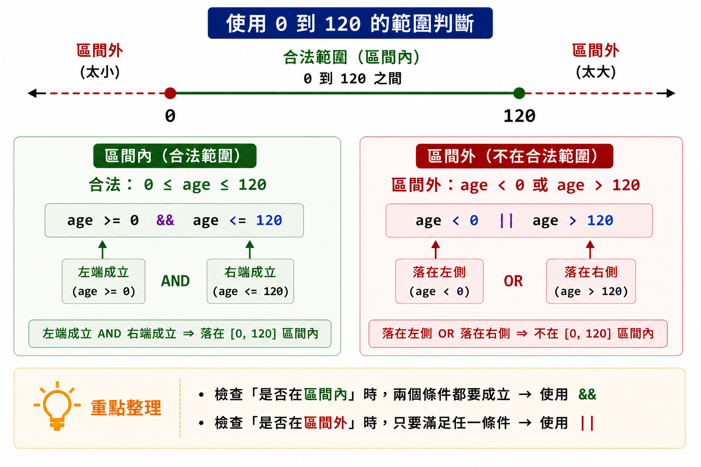

---

## Section XXIII. 接受多個字元

```cpp
answer == 'Y' || answer == 'y'
```

錯誤：

```cpp
answer == 'Y' || 'y'
```

`'y'` 本身是非零字元值，會被視為 `true`，造成條件幾乎總是成立。


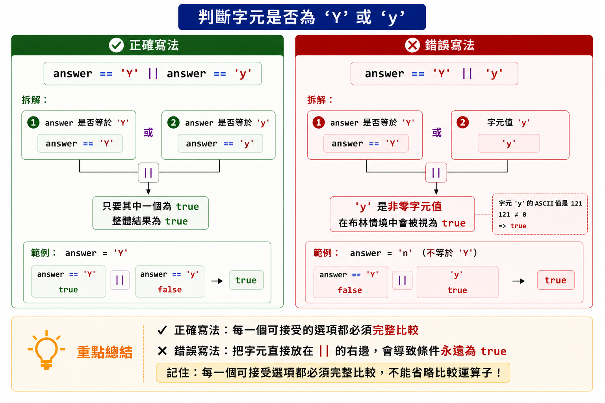

---

## Section XXIV. 完整字元條件

```cpp
// VALIDATE
#include <iostream>
using namespace std;

int main() {
    char answer;

    cout << "Continue? (Y/y): ";
    cin >> answer;

    if (answer == 'Y' || answer == 'y') {
        cout << "Continue\n";
    }

    return 0;
}
```

---

## Section XXV. 不要使用數學連鎖比較

錯誤：

```cpp
0 <= score <= 100
```

正確：

```cpp
score >= 0 && score <= 100
```


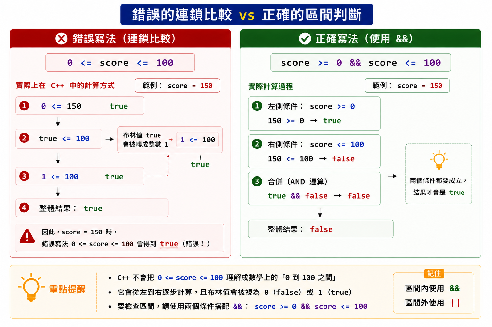

---

# Part E：常見單一條件應用

## Section XXVI. 奇偶判斷

```cpp
if (number % 2 == 0) {
    cout << "Even\n";
}
```

若餘數為 `0`，代表可被 `2` 整除。


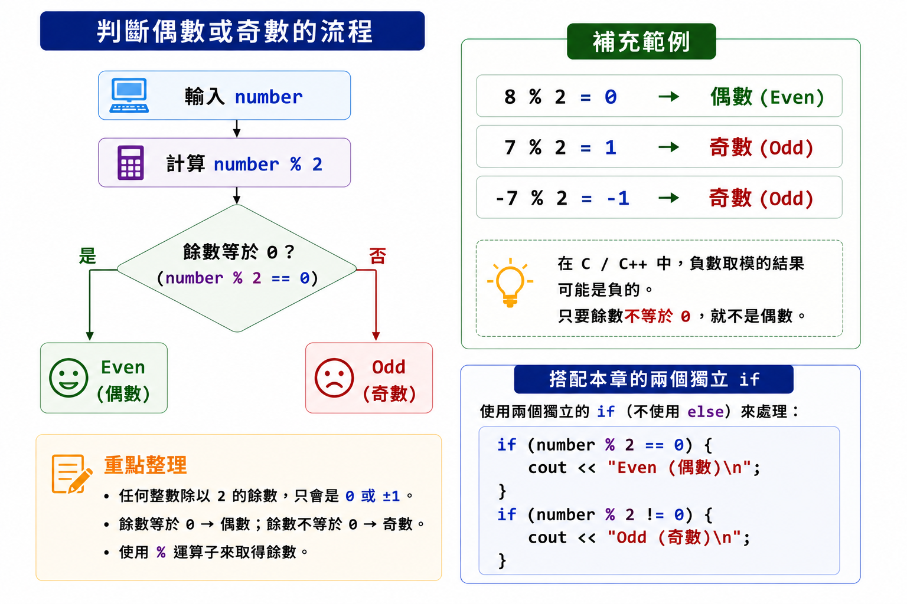

---

## Section XXVII. 奇數判斷

```cpp
if (number % 2 != 0) {
    cout << "Odd\n";
}
```

---

## Section XXVIII. 完整奇偶程式

```cpp
// VALIDATE
#include <iostream>
using namespace std;

int main() {
    int number;

    cout << "請輸入整數：";
    cin >> number;

    if (number % 2 == 0) {
        cout << "Even\n";
    }

    if (number % 2 != 0) {
        cout << "Odd\n";
    }

    return 0;
}
```

---

## Section XXIX. 及格判斷

```cpp
if (score >= 60) {
    cout << "Pass\n";
}
```

這是一個門檻條件：

```text
達到或超過 60
```

---

## Section XXX. 滿額折扣資格

```cpp
if (amount >= 1000) {
    cout << "Discount available\n";
}
```

本章只判斷是否符合資格。

真正計算折扣後金額可以使用：

```cpp
double finalAmount = amount;

if (amount >= 1000) {
    finalAmount = amount * 0.9;
}
```

---

## Section XXXI. 完整折扣程式

```cpp
// VALIDATE
#include <iostream>
using namespace std;

int main() {
    double amount;

    cout << "請輸入消費金額：";
    cin >> amount;

    double finalAmount = amount;

    if (amount >= 1000.0) {
        finalAmount = amount * 0.9;
        cout << "10% discount applied.\n";
    }

    cout << "Final amount: "
         << finalAmount
         << '\n';

    return 0;
}
```


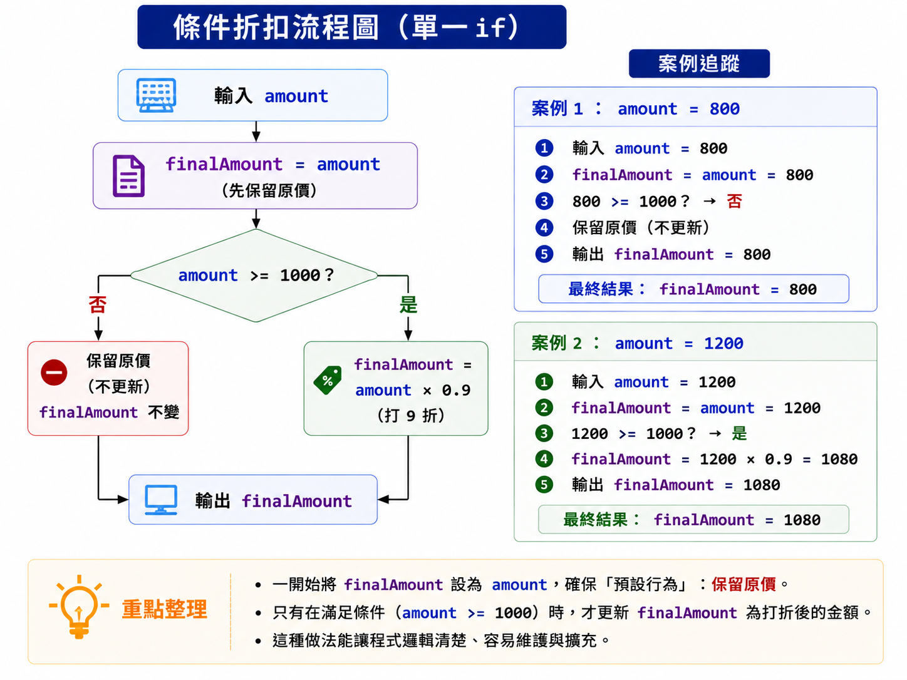

---

# Part F：短路求值與安全條件

## Section XXXII. 先檢查除數

```cpp
divisor != 0 &&
number / divisor > 2
```

如果 `divisor == 0`：

```text
左側為 false
→ 右側不執行
→ 不會進行整數除以零
```

---

## Section XXXIII. 安全除法判斷

```cpp
// VALIDATE
#include <iostream>
using namespace std;

int main() {
    int number;
    int divisor;

    cout << "請輸入被除數與除數：";
    cin >> number >> divisor;

    if (
        divisor != 0 &&
        number / divisor > 2
    ) {
        cout << "Safe and quotient is greater than 2.\n";
    }

    return 0;
}
```


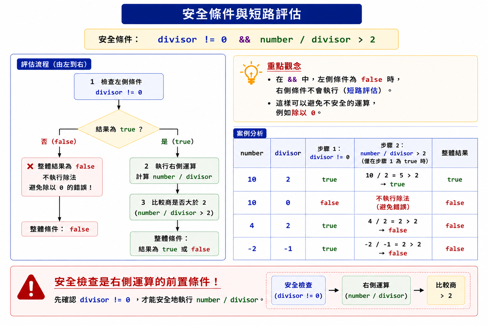

---

## Section XXXIV. 條件順序不能交換

危險：

```cpp
number / divisor > 2 &&
divisor != 0
```

除法會先執行。

安全檢查必須放在前面：

```cpp
divisor != 0 &&
number / divisor > 2
```


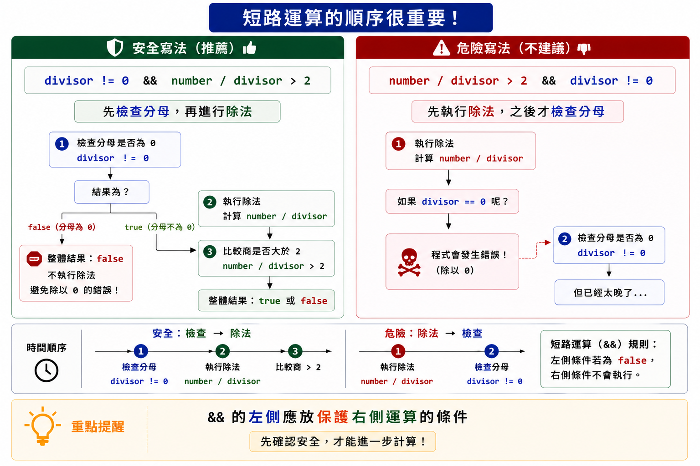

---

## Section XXXV. 使用獨立 `if` 顯示錯誤

```cpp
if (divisor == 0) {
    cout << "Divisor cannot be zero.\n";
}
```

本章可以同時寫：

```cpp
if (divisor != 0) {
    cout << number / divisor << '\n';
}
```

這是兩個獨立條件。


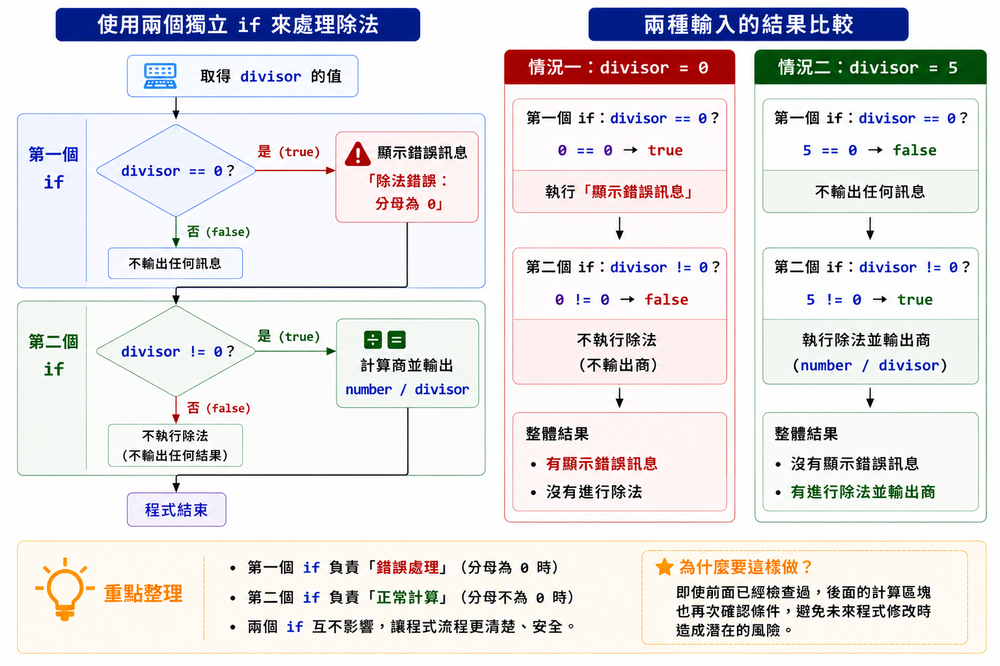

---

## Section XXXVI. 完整安全除法

```cpp
// VALIDATE
#include <iostream>
using namespace std;

int main() {
    int number;
    int divisor;

    cout << "請輸入被除數與除數：";
    cin >> number >> divisor;

    if (divisor == 0) {
        cout << "Divisor cannot be zero.\n";
    }

    if (divisor != 0) {
        cout << "Quotient: "
             << number / divisor
             << '\n';
    }

    return 0;
}
```

---

# Part G：巢狀 `if`

## Section XXXVII. 什麼是巢狀 `if`？

`if` 區塊內還可以再放另一個 `if`：

```cpp
if (outerCondition) {
    if (innerCondition) {
        statement;
    }
}
```

內層條件只有在外層成立時才會檢查。


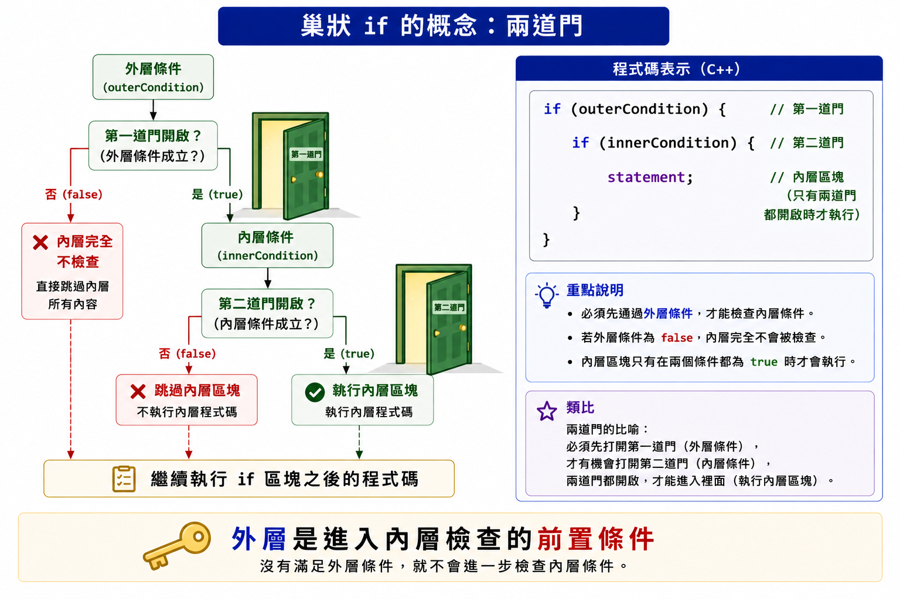

---

## Section XXXVIII. 分段驗證

```cpp
if (score >= 0) {
    if (score <= 100) {
        cout << "Valid score\n";
    }
}
```

流程：

1. 先確認不低於 `0`。
2. 外層成立後，才確認不高於 `100`。
3. 兩層都成立才輸出。

---

## Section XXXIX. 巢狀 `if` 與 `&&`

這兩種寫法在此例意義相近：

```cpp
if (score >= 0) {
    if (score <= 100) {
        cout << "Valid score\n";
    }
}
```

```cpp
if (score >= 0 && score <= 100) {
    cout << "Valid score\n";
}
```

簡單條件通常使用 `&&` 更直接。

巢狀 `if` 適合：

- 內層檢查只在外層成立後才有意義。
- 每一層有不同處理工作。
- 想明確分段驗證。


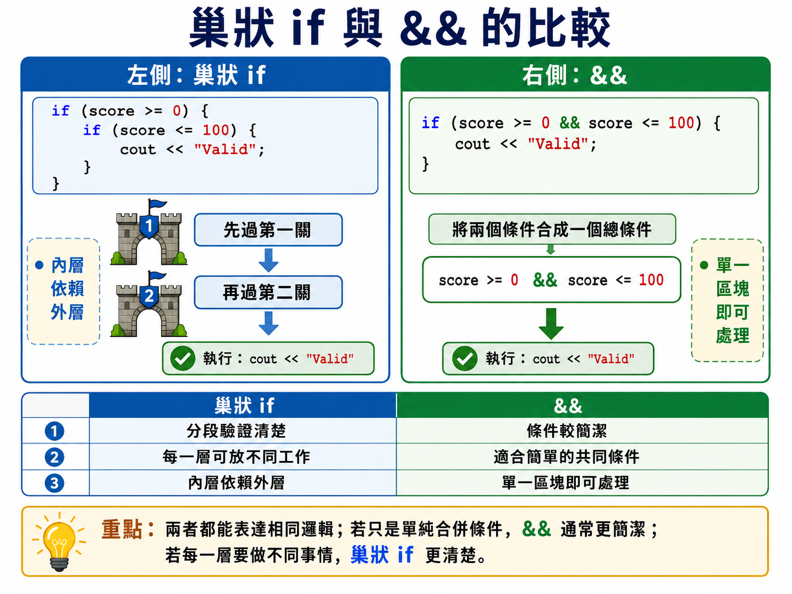

---

## Section XL. 巢狀安全計算

```cpp
// VALIDATE
#include <iostream>
using namespace std;

int main() {
    int number;
    int divisor;

    cin >> number >> divisor;

    if (divisor != 0) {
        int quotient = number / divisor;

        if (quotient > 2) {
            cout << "Quotient is greater than 2.\n";
        }
    }

    return 0;
}
```

只有除數合法時才建立並檢查 `quotient`。

---

# Part H：三角形條件練習

## Section XLI. 三邊必須為正

```cpp
bool positiveSides =
    a > 0 && b > 0 && c > 0;
```


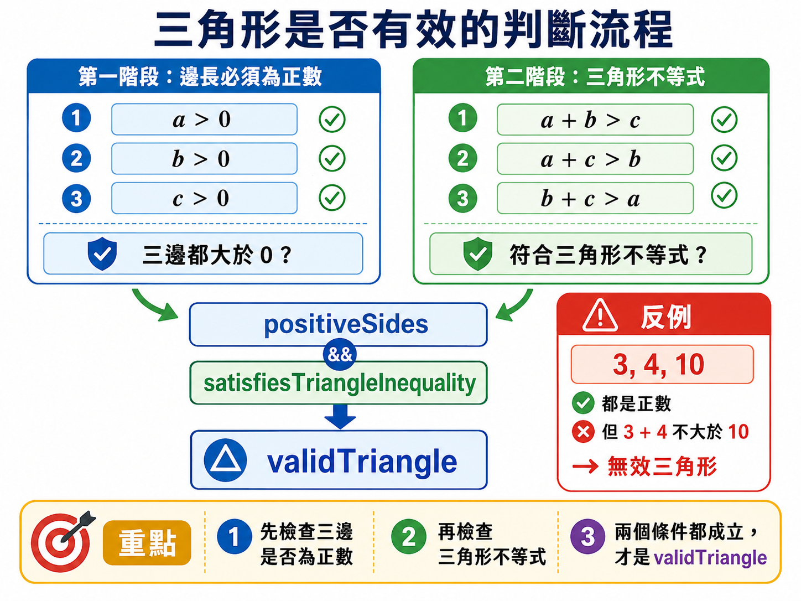

---

## Section XLII. 三角形不等式

三邊可以形成三角形，需要：

```text
a + b > c
a + c > b
b + c > a
```

C++ 表示式：

```cpp
bool satisfiesTriangleInequality =
    a + b > c &&
    a + c > b &&
    b + c > a;
```


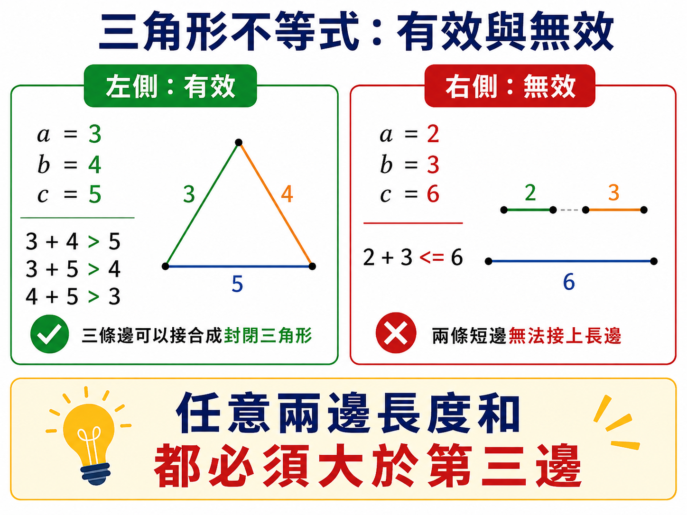

---

## Section XLIII. 完整三角形有效性

```cpp
// VALIDATE
#include <iostream>
using namespace std;

int main() {
    int a;
    int b;
    int c;

    cout << "請輸入三個邊長：";
    cin >> a >> b >> c;

    bool positiveSides =
        a > 0 && b > 0 && c > 0;

    bool satisfiesTriangleInequality =
        a + b > c &&
        a + c > b &&
        b + c > a;

    bool validTriangle =
        positiveSides &&
        satisfiesTriangleInequality;

    if (validTriangle) {
        cout << "Valid triangle\n";
    }

    return 0;
}
```

---

## Section XLIV. 正三角形

```cpp
a == b && b == c
```

三邊全部相等。

```cpp
if (
    validTriangle &&
    a == b &&
    b == c
) {
    cout << "Equilateral triangle\n";
}
```

---

## Section XLV. 等腰三角形

至少兩邊相等：

```cpp
a == b || a == c || b == c
```

```cpp
if (
    validTriangle &&
    (
        a == b ||
        a == c ||
        b == c
    )
) {
    cout << "Isosceles triangle\n";
}
```

正三角形也符合「至少兩邊相等」，因此使用獨立 `if` 時，正三角形可能同時輸出正三角形與等腰三角形。

這正好展示：

> 獨立 `if` 會各自判斷，不會自動互斥。

下一章會使用 `else if` 處理互斥分類。


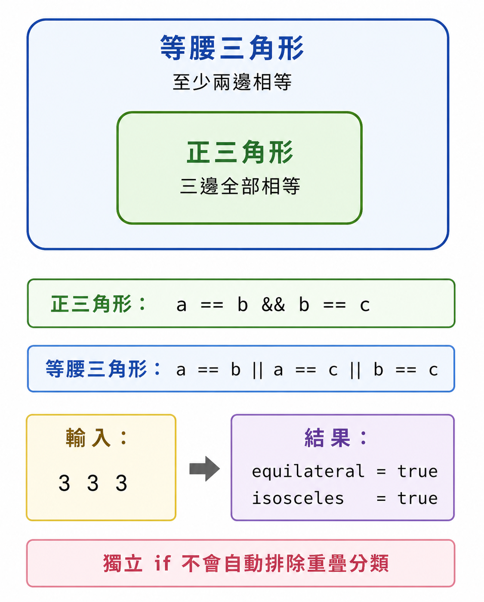

---

## Section XLVI. 直角三角形

不先排序時，可以檢查三種可能：

```cpp
a * a + b * b == c * c ||
a * a + c * c == b * b ||
b * b + c * c == a * a
```

完整條件：

```cpp
bool rightTriangle =
    validTriangle &&
    (
        a * a + b * b == c * c ||
        a * a + c * c == b * b ||
        b * b + c * c == a * a
    );
```


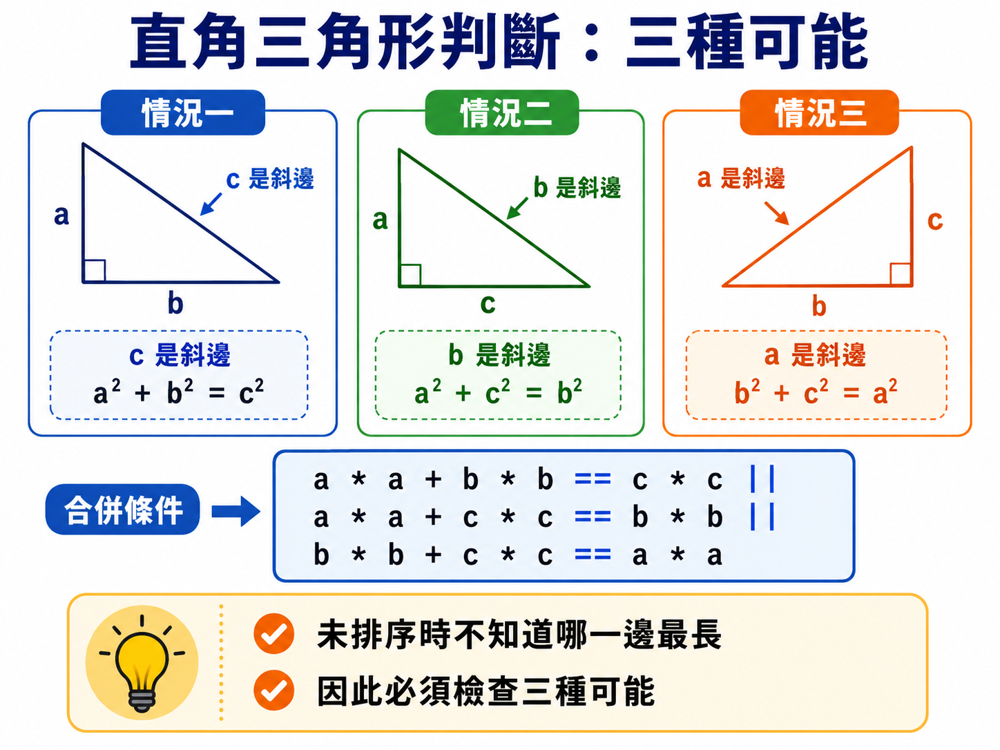

---

## Section XLVII. 完整類型判斷

```cpp
// VALIDATE
#include <iostream>
using namespace std;

int main() {
    int a;
    int b;
    int c;

    cin >> a >> b >> c;

    bool positiveSides =
        a > 0 && b > 0 && c > 0;

    bool validTriangle =
        positiveSides &&
        a + b > c &&
        a + c > b &&
        b + c > a;

    bool equilateral =
        validTriangle &&
        a == b &&
        b == c;

    bool isosceles =
        validTriangle &&
        (
            a == b ||
            a == c ||
            b == c
        );

    bool rightTriangle =
        validTriangle &&
        (
            a * a + b * b == c * c ||
            a * a + c * c == b * b ||
            b * b + c * c == a * a
        );

    if (validTriangle) {
        cout << "Valid triangle\n";
    }

    if (equilateral) {
        cout << "Equilateral triangle\n";
    }

    if (isosceles) {
        cout << "Isosceles triangle\n";
    }

    if (rightTriangle) {
        cout << "Right triangle\n";
    }

    return 0;
}
```


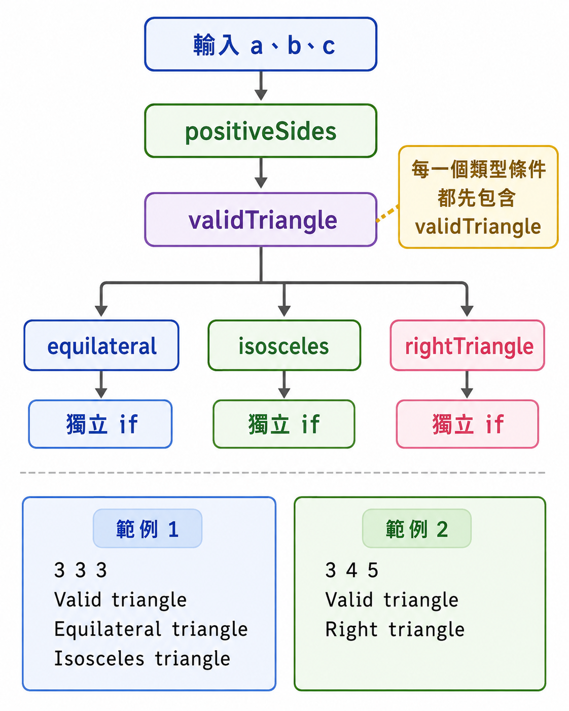

---

# Part I：程式區塊與縮排

## Section XLVIII. 縮排提升可讀性

建議：

```cpp
if (score >= 60) {
    cout << "Pass\n";
}
```

不建議：

```cpp
if (score >= 60) {
cout << "Pass\n";
}
```

縮排讓程式區塊更容易辨認。

---

## Section XLIX. 縮排不影響實際範圍

```cpp
if (score >= 60)
    cout << "Pass\n";
    cout << "Finished\n";
```

實際只有第一個 `cout` 受到 `if` 控制。

第二行永遠執行。

因此本教材建議永遠使用大括號：

```cpp
if (score >= 60) {
    cout << "Pass\n";
    cout << "Finished\n";
}
```


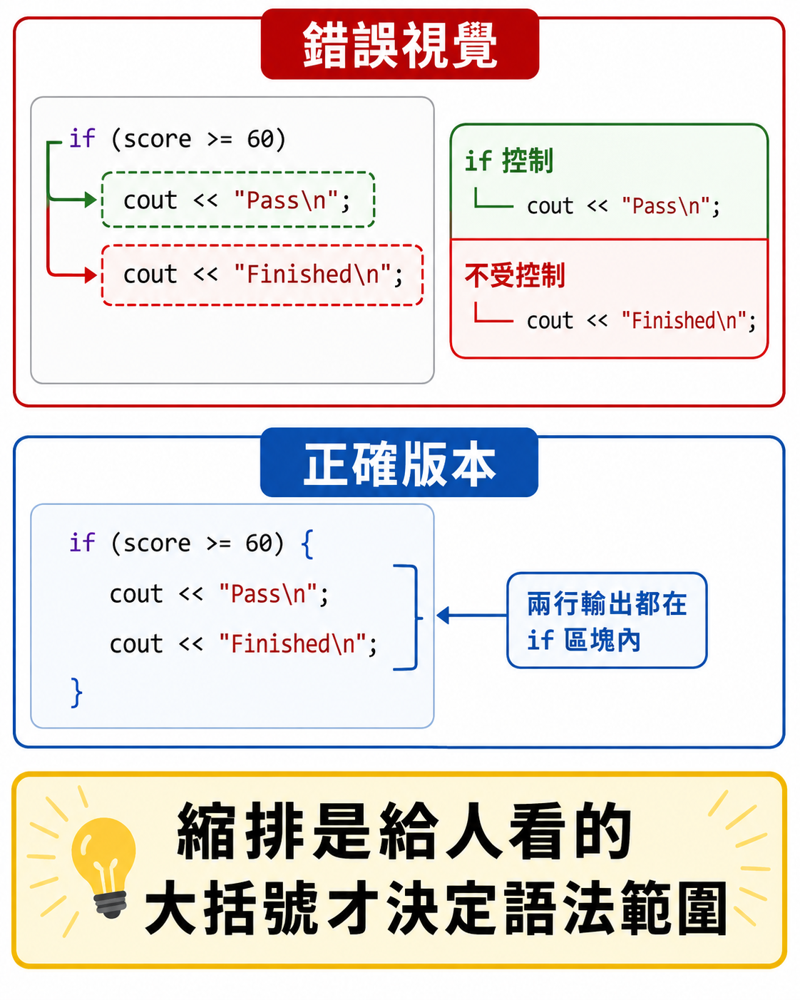

---

## Section L. 即使只有一行也使用大括號

可寫：

```cpp
if (score >= 60)
    cout << "Pass\n";
```

但建議：

```cpp
if (score >= 60) {
    cout << "Pass\n";
}
```

好處：

- 日後增加程式碼較安全。
- 不容易因縮排誤判。
- 風格一致。


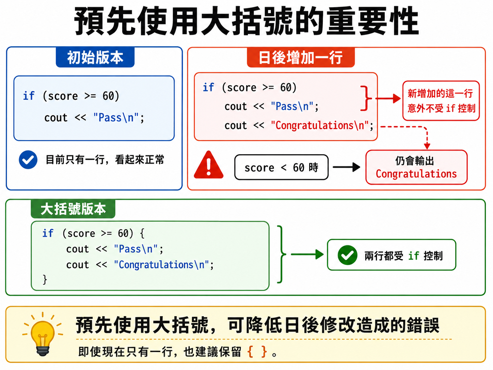


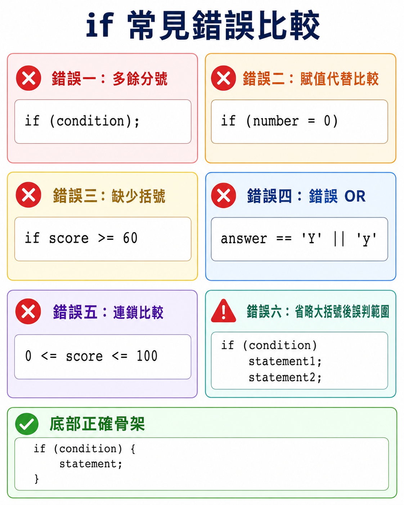

---

# Part J：快速概念檢查

## Section LI. 選擇題與簡答

### Q1. `if` 的用途是什麼？

<details>
<summary>查看答案</summary>

只在條件為 `true` 時執行指定程式區塊。

</details>

---

### Q2. 條件為 `false` 時會怎樣？

<details>
<summary>查看答案</summary>

跳過 `if` 區塊，繼續執行後面的程式。

</details>

---

### Q3. `if` 條件的結果型別通常是什麼？

<details>
<summary>查看答案</summary>

```cpp
bool
```

</details>

---

### Q4. `score = 60` 與 `score == 60` 有何差異？

<details>
<summary>查看答案</summary>

- `score = 60`：賦值。
- `score == 60`：比較是否等於 `60`。

</details>

---

### Q5. `if (score >= 60);` 有什麼問題？

<details>
<summary>查看答案</summary>

分號形成空敘述，後面的區塊不再受到 `if` 控制。

</details>

---

### Q6. 大括號後需要加分號嗎？

<details>
<summary>查看答案</summary>

一般 `if` 程式區塊的右大括號後不需要分號。

</details>

---

### Q7. 三個獨立 `if` 會如何執行？

<details>
<summary>查看答案</summary>

每個條件都會各自檢查。

</details>

---

### Q8. `age >= 0 && age <= 120` 表示什麼？

<details>
<summary>查看答案</summary>

`age` 同時不低於 `0` 且不高於 `120`。

</details>

---

### Q9. 如何判斷分數在合法區間外？

<details>
<summary>查看答案</summary>

```cpp
score < 0 || score > 100
```

</details>

---

### Q10. 如何接受 `'Y'` 或 `'y'`？

<details>
<summary>查看答案</summary>

```cpp
answer == 'Y' || answer == 'y'
```

</details>

---

### Q11. `answer == 'Y' || 'y'` 正確嗎？

<details>
<summary>查看答案</summary>

不正確。每個選項都必須完整比較。

</details>

---

### Q12. 為什麼不能寫 `0 <= score <= 100`？

<details>
<summary>查看答案</summary>

C++ 會先完成第一個比較，再把布林結果與 `100` 比較，不具數學連鎖比較語意。

</details>

---

### Q13. 如何判斷偶數？

<details>
<summary>查看答案</summary>

```cpp
number % 2 == 0
```

</details>

---

### Q14. 如何判斷奇數？

<details>
<summary>查看答案</summary>

```cpp
number % 2 != 0
```

</details>

---

### Q15. `if (ready)` 是否需要改成 `if (ready == true)`？

<details>
<summary>查看答案</summary>

不需要，直接使用布林變數更簡潔。

</details>

---

### Q16. `if (!ready)` 表示什麼？

<details>
<summary>查看答案</summary>

`ready` 為 `false` 時條件成立。

</details>

---

### Q17. 巢狀 `if` 的內層何時才會檢查？

<details>
<summary>查看答案</summary>

外層條件成立後。

</details>

---

### Q18. 為什麼短路條件要先檢查除數？

<details>
<summary>查看答案</summary>

若除數為零，右側除法不會執行，可以避免不安全運算。

</details>

---

### Q19. 正三角形也算等腰三角形嗎？

<details>
<summary>查看答案</summary>

依「至少兩邊相等」的定義，是。因此使用獨立 `if` 時可能同時輸出兩種類型。

</details>

---

### Q20. 縮排可以取代大括號嗎？

<details>
<summary>查看答案</summary>

不可以。縮排只影響閱讀，大括號才決定程式區塊。

</details>

---

# Part K：程式閱讀練習

## Section LII. 判斷哪些區塊會執行

### 題目 1

```cpp
int number = 5;

if (number > 0) {
    cout << "A";
}

cout << "B";
```

<details>
<summary>查看答案</summary>

```text
AB
```

</details>

---

### 題目 2

```cpp
int number = -5;

if (number > 0) {
    cout << "A";
}

cout << "B";
```

<details>
<summary>查看答案</summary>

```text
B
```

</details>

---

### 題目 3

```cpp
int number = 10;

if (number > 0) {
    cout << "A";
}

if (number > 5) {
    cout << "B";
}
```

<details>
<summary>查看答案</summary>

```text
AB
```

兩個獨立條件都成立。

</details>

---

### 題目 4

```cpp
int number = 0;

if (number > 0) {
    cout << "Positive";
}

if (number < 0) {
    cout << "Negative";
}

if (number == 0) {
    cout << "Zero";
}
```

<details>
<summary>查看答案</summary>

```text
Zero
```

</details>

---

### 題目 5

```cpp
int score = 60;

if (score >= 60) {
    cout << "Pass";
}
```

<details>
<summary>查看答案</summary>

```text
Pass
```

因為使用 `>=`。

</details>

---

### 題目 6

```cpp
int age = 130;

if (age >= 0 && age <= 120) {
    cout << "Valid";
}
```

<details>
<summary>查看答案</summary>

沒有輸出。

</details>

---

### 題目 7

```cpp
char answer = 'y';

if (answer == 'Y' || answer == 'y') {
    cout << "Accepted";
}
```

<details>
<summary>查看答案</summary>

```text
Accepted
```

</details>

---

### 題目 8

```cpp
int number = 7;

if (number % 2 == 0) {
    cout << "Even";
}

if (number % 2 != 0) {
    cout << "Odd";
}
```

<details>
<summary>查看答案</summary>

```text
Odd
```

</details>

---

### 題目 9

```cpp
bool ready = false;

if (!ready) {
    cout << "Wait";
}
```

<details>
<summary>查看答案</summary>

```text
Wait
```

</details>

---

### 題目 10

```cpp
int divisor = 0;
int number = 10;

if (
    divisor != 0 &&
    number / divisor > 2
) {
    cout << "A";
}
```

<details>
<summary>查看答案</summary>

沒有輸出，而且右側除法不會執行。

</details>

---

### 題目 11

```cpp
int score = 80;

if (score >= 0) {
    if (score <= 100) {
        cout << "Valid";
    }
}
```

<details>
<summary>查看答案</summary>

```text
Valid
```

</details>

---

### 題目 12

```cpp
int score = -5;

if (score >= 0) {
    if (score <= 100) {
        cout << "Valid";
    }
}
```

<details>
<summary>查看答案</summary>

沒有輸出，內層不會檢查。

</details>

---

### 題目 13

```cpp
int score = 40;

if (score >= 60); {
    cout << "Pass";
}
```

<details>
<summary>查看答案</summary>

會輸出：

```text
Pass
```

因為分號結束了 `if`，後面的區塊無條件執行。

</details>

---

### 題目 14

```cpp
int a = 3;
int b = 3;
int c = 3;

bool equilateral =
    a == b && b == c;

bool isosceles =
    a == b || a == c || b == c;

if (equilateral) {
    cout << "E";
}

if (isosceles) {
    cout << "I";
}
```

<details>
<summary>查看答案</summary>

```text
EI
```

兩個布林條件都為 `true`。

</details>

---

### 題目 15

```cpp
int score = 150;

if (0 <= score <= 100) {
    cout << "Valid";
}
```

<details>
<summary>查看答案</summary>

很可能仍輸出 `Valid`。

因為：

```cpp
0 <= score
```

先得到 `true`，再將 `true` 轉為 `1`，接著比較：

```cpp
1 <= 100
```

結果仍為 `true`。

</details>

---

# Part L：實作練習

## Section LIII. 實作檢測題

### TODO 1：正數判斷

輸入整數；若大於零，輸出：

```text
Positive
```

---

### TODO 2：負數與零

使用兩個獨立 `if`，分別判斷負數與零。

---

### TODO 3：三種符號

使用三個獨立 `if`，輸出：

```text
Positive
Negative
Zero
```

其中一種。

---

### TODO 4：奇偶判斷

使用兩個獨立 `if` 輸出 `Even` 或 `Odd`。

---

### TODO 5：及格判斷

輸入分數，達到 `60` 時輸出 `Pass`。

---

### TODO 6：合法分數

分數位於 `0` 到 `100` 時輸出 `Valid score`。

---

### TODO 7：非法分數

分數低於 `0` 或高於 `100` 時輸出 `Invalid score`。

---

### TODO 8：大小寫回答

輸入字元，若為 `'Y'` 或 `'y'`，輸出 `Accepted`。

---

### TODO 9：滿額折扣

輸入消費金額，達到 `1000` 時將金額乘以 `0.9`。

---

### TODO 10：安全除法

輸入兩個整數；除數為零時顯示錯誤，非零時顯示整數商。只能使用獨立 `if`。

---

### TODO 11：巢狀分數驗證

先檢查分數不低於 `0`，再檢查不高於 `100`。

---

### TODO 12：正三角形

輸入三邊，先確認是有效三角形，再判斷三邊是否相等。

---

### TODO 13：等腰三角形

輸入三邊，判斷有效三角形且至少兩邊相等。

---

### TODO 14：直角三角形

輸入三邊，不排序，檢查三種平方關係。

---

### TODO 15：數字範圍

輸入整數，若介於 `10` 到 `99`，輸出 `Two-digit positive number`。

---

# Part M：課後小練習

## Section LIV. 延伸練習

### 練習 1：倍數

輸入整數，判斷是否為 `3` 的倍數及 `5` 的倍數。使用兩個獨立 `if`。

---

### 練習 2：座標軸

輸入 `x` 與 `y`；若 `x == 0`，輸出位於 y 軸；若 `y == 0`，輸出位於 x 軸。

---

### 練習 3：密碼長度預備

使用整數保存密碼長度；若介於 `8` 到 `20`，輸出長度合格。

---

### 練習 4：溫度警告

低於 `0` 顯示結冰警告；高於 `35` 顯示高溫警告。使用兩個獨立 `if`。

---

### 練習 5：閏年布林條件

建立閏年條件並放入 `if`。只輸出閏年成立的訊息，不使用 `else`。

---

# Part N：常見錯誤提醒

## Section LV. 常見錯誤

### 錯誤 1：條件後誤加分號

```cpp
if (condition);
```

---

### 錯誤 2：使用 `=` 代替 `==`

```cpp
if (number = 0)
```

這是賦值，不是比較。

---

### 錯誤 3：缺少括號

```cpp
if score >= 60
```

條件需要放在圓括號中。

---

### 錯誤 4：大括號不成對

每個 `{` 必須有對應的 `}`。

---

### 錯誤 5：只靠縮排判斷範圍

縮排不會改變語法結構。

---

### 錯誤 6：省略大括號後加入第二行

只有第一個敘述受到 `if` 控制。

---

### 錯誤 7：數學連鎖比較

```cpp
0 <= score <= 100
```

不具數學語意。

---

### 錯誤 8：錯誤 OR 寫法

```cpp
answer == 'Y' || 'y'
```

每個選項都要完整比較。

---

### 錯誤 9：將 `&&` 與 `||` 混淆

合法範圍通常需要兩端同時成立，因此使用 `&&`。

---

### 錯誤 10：短路安全條件順序錯誤

危險運算前要先放安全檢查。

---

### 錯誤 11：以為第一個 `if` 成立後其他 `if` 不再檢查

獨立 `if` 會各自執行。

---

### 錯誤 12：以為互斥情況一定只輸出一次

若條件設計重疊，可能輸出多個結果。

---

### 錯誤 13：正三角形同時符合等腰條件

使用獨立 `if` 時可能同時輸出。

---

### 錯誤 14：未先驗證三角形有效性

邊長分類前應先確認正值與三角形不等式。

---

### 錯誤 15：使用未初始化變數作為條件

條件結果不可依賴不確定值。

---

### 錯誤 16：條件中加入過多副作用

例如同時修改多個變數，會降低可讀性。

---

### 錯誤 17：把 `if` 當成會重複執行

`if` 只檢查一次，不是迴圈。

---

### 錯誤 18：期待條件不成立時自動顯示另一段內容

單一 `if` 沒有替代分支；`else` 會在下一章介紹。

---

# Part O：Mermaid 流程圖

## Section LVI. `if` 流程圖

### 1. 基本 `if`

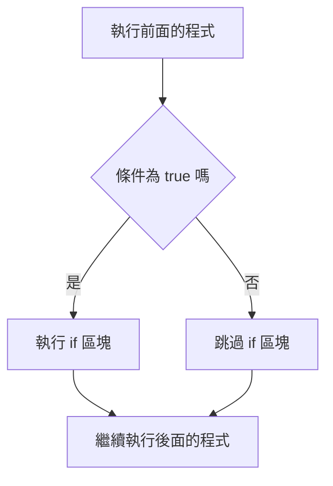
```mermaid
flowchart TD
    A[執行前面的程式] --> B{條件為 true 嗎}
    B -- 是 --> C[執行 if 區塊]
    B -- 否 --> D[跳過 if 區塊]
    C --> E[繼續執行後面的程式]
    D --> E
```

---

### 2. 三個獨立 `if`

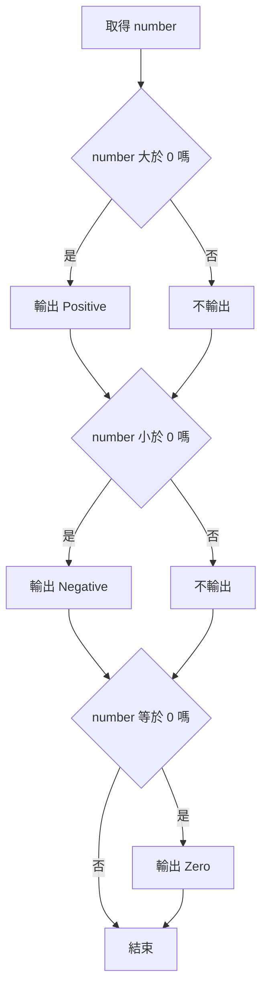
```mermaid
flowchart TD
    A[取得 number] --> B{number 大於 0 嗎}
    B -- 是 --> C[輸出 Positive]
    B -- 否 --> D[不輸出]
    C --> E{number 小於 0 嗎}
    D --> E
    E -- 是 --> F[輸出 Negative]
    E -- 否 --> G[不輸出]
    F --> H{number 等於 0 嗎}
    G --> H
    H -- 是 --> I[輸出 Zero]
    H -- 否 --> J[結束]
    I --> J
```

---

### 3. 範圍判斷

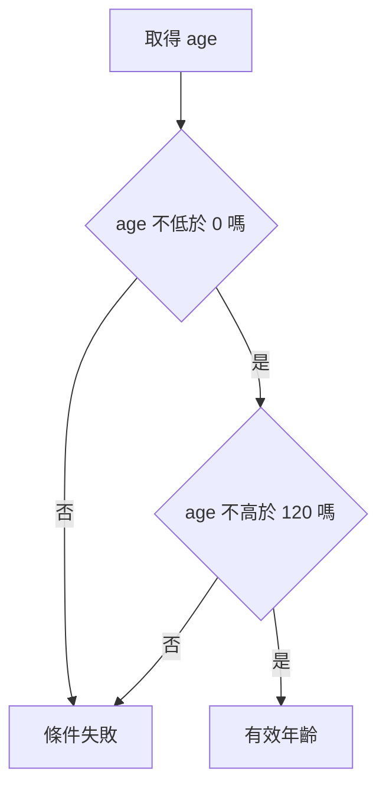
```mermaid
flowchart TD
    A[取得 age] --> B{age 不低於 0 嗎}
    B -- 否 --> E[條件失敗]
    B -- 是 --> C{age 不高於 120 嗎}
    C -- 是 --> D[有效年齡]
    C -- 否 --> E
```

---

### 4. 短路安全除法

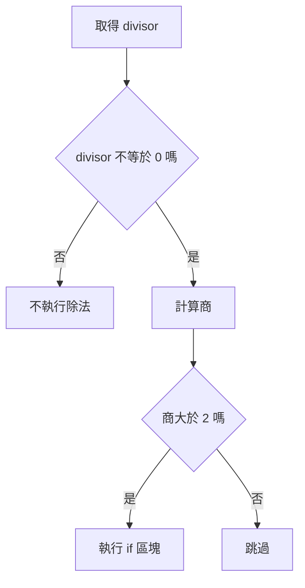
```mermaid
flowchart TD
    A[取得 divisor] --> B{divisor 不等於 0 嗎}
    B -- 否 --> C[不執行除法]
    B -- 是 --> D[計算商]
    D --> E{商大於 2 嗎}
    E -- 是 --> F[執行 if 區塊]
    E -- 否 --> G[跳過]
```

---

### 5. 巢狀 `if`

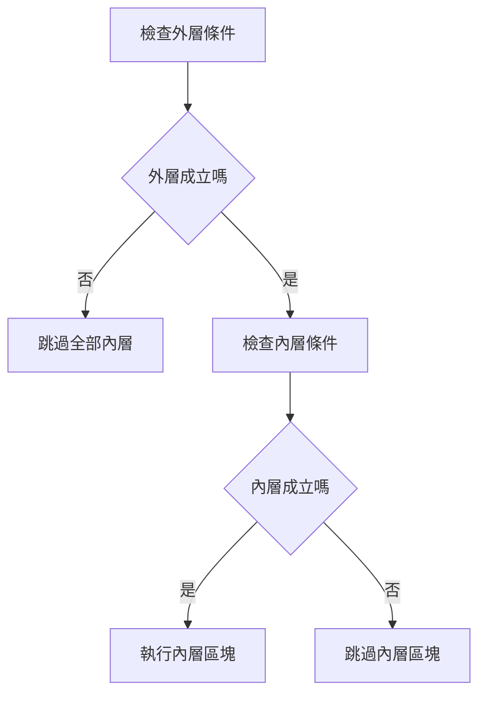
```mermaid
flowchart TD
    A[檢查外層條件] --> B{外層成立嗎}
    B -- 否 --> E[跳過全部內層]
    B -- 是 --> C[檢查內層條件]
    C --> D{內層成立嗎}
    D -- 是 --> F[執行內層區塊]
    D -- 否 --> G[跳過內層區塊]
```

---

### 6. 三角形有效性

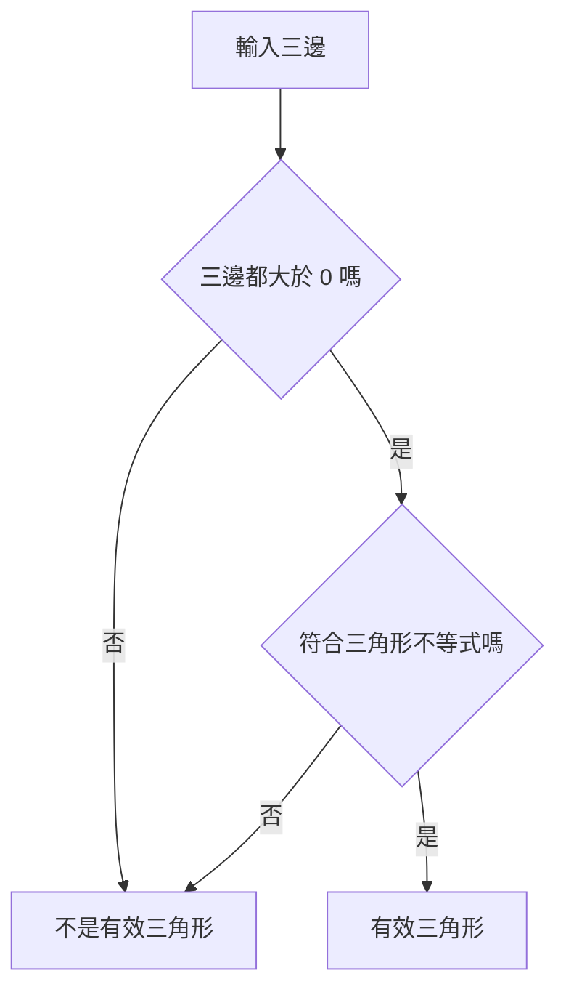
```mermaid
flowchart TD
    A[輸入三邊] --> B{三邊都大於 0 嗎}
    B -- 否 --> E[不是有效三角形]
    B -- 是 --> C{符合三角形不等式嗎}
    C -- 否 --> E
    C -- 是 --> D[有效三角形]
```

---

### 7. 等腰判斷

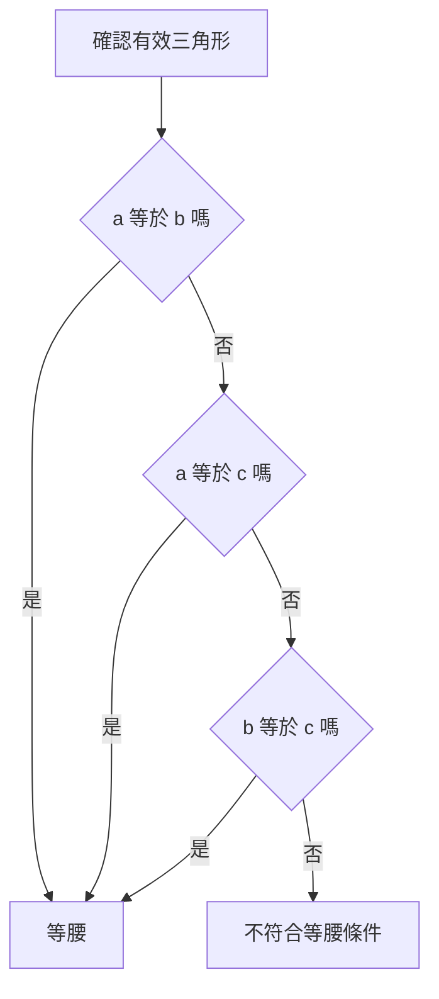
```mermaid
flowchart TD
    A[確認有效三角形] --> B{a 等於 b 嗎}
    B -- 是 --> F[等腰]
    B -- 否 --> C{a 等於 c 嗎}
    C -- 是 --> F
    C -- 否 --> D{b 等於 c 嗎}
    D -- 是 --> F
    D -- 否 --> E[不符合等腰條件]
```

---

### 8. `if` 程式閱讀

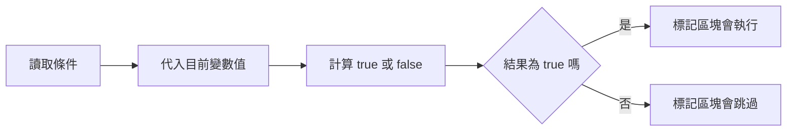
```mermaid
flowchart LR
    A[讀取條件] --> B[代入目前變數值]
    B --> C[計算 true 或 false]
    C --> D{結果為 true 嗎}
    D -- 是 --> E[標記區塊會執行]
    D -- 否 --> F[標記區塊會跳過]
```

---

# 本章完成標準

完成本章後，你應該能做到：

1. 說明程式預設由上往下執行。
2. 說明條件式執行的用途。
3. 撰寫基本 `if`。
4. 說明條件為 `true` 或 `false` 時的流程。
5. 使用大括號建立條件區塊。
6. 避免在條件後誤加分號。
7. 使用六個關係運算子建立條件。
8. 分辨 `=` 與 `==`。
9. 使用布林變數作為條件。
10. 使用 `!` 反轉布林值。
11. 判斷正數、負數與零。
12. 使用多個獨立 `if`。
13. 說明獨立 `if` 會各自檢查。
14. 判斷奇數與偶數。
15. 判斷是否達到及格門檻。
16. 判斷是否達到折扣門檻。
17. 使用 `&&` 建立合法範圍。
18. 使用 `||` 建立區間外條件。
19. 正確接受多個字元選項。
20. 避免數學連鎖比較。
21. 使用有意義的布林變數名稱。
22. 使用短路求值保護危險運算。
23. 將安全檢查放在危險運算之前。
24. 使用獨立 `if` 處理除數零與非零。
25. 撰寫巢狀 `if`。
26. 說明內層條件的執行時機。
27. 比較巢狀 `if` 與 `&&`。
28. 驗證三角形邊長為正。
29. 驗證三角形不等式。
30. 判斷正三角形。
31. 判斷等腰三角形。
32. 判斷直角三角形。
33. 說明條件重疊會產生多個輸出。
34. 使用縮排提升可讀性。
35. 說明縮排不能取代大括號。
36. 即使只有一行也使用大括號。
37. 避免未初始化條件。
38. 避免條件中的不必要副作用。
39. 說明 `if` 不是迴圈。
40. 說明替代分支將由下一章的 `else` 處理。

---

# 隱藏答案區

> Answer hidden — try it first.

<details>
<summary>TODO 1 答案</summary>

```cpp
#include <iostream>
using namespace std;

int main() {
    int number;

    cin >> number;

    if (number > 0) {
        cout << "Positive\n";
    }

    return 0;
}
```

</details>

<details>
<summary>TODO 2 答案</summary>

```cpp
#include <iostream>
using namespace std;

int main() {
    int number;

    cin >> number;

    if (number < 0) {
        cout << "Negative\n";
    }

    if (number == 0) {
        cout << "Zero\n";
    }

    return 0;
}
```

</details>

<details>
<summary>TODO 3 答案</summary>

```cpp
#include <iostream>
using namespace std;

int main() {
    int number;

    cin >> number;

    if (number > 0) {
        cout << "Positive\n";
    }

    if (number < 0) {
        cout << "Negative\n";
    }

    if (number == 0) {
        cout << "Zero\n";
    }

    return 0;
}
```

</details>

<details>
<summary>TODO 4 答案</summary>

```cpp
#include <iostream>
using namespace std;

int main() {
    int number;

    cin >> number;

    if (number % 2 == 0) {
        cout << "Even\n";
    }

    if (number % 2 != 0) {
        cout << "Odd\n";
    }

    return 0;
}
```

</details>

<details>
<summary>TODO 5 答案</summary>

```cpp
#include <iostream>
using namespace std;

int main() {
    int score;

    cin >> score;

    if (score >= 60) {
        cout << "Pass\n";
    }

    return 0;
}
```

</details>

<details>
<summary>TODO 6 答案</summary>

```cpp
#include <iostream>
using namespace std;

int main() {
    int score;

    cin >> score;

    if (score >= 0 && score <= 100) {
        cout << "Valid score\n";
    }

    return 0;
}
```

</details>

<details>
<summary>TODO 7 答案</summary>

```cpp
#include <iostream>
using namespace std;

int main() {
    int score;

    cin >> score;

    if (score < 0 || score > 100) {
        cout << "Invalid score\n";
    }

    return 0;
}
```

</details>

<details>
<summary>TODO 8 答案</summary>

```cpp
#include <iostream>
using namespace std;

int main() {
    char answer;

    cin >> answer;

    if (answer == 'Y' || answer == 'y') {
        cout << "Accepted\n";
    }

    return 0;
}
```

</details>

<details>
<summary>TODO 9 答案</summary>

```cpp
#include <iostream>
using namespace std;

int main() {
    double amount;

    cin >> amount;

    if (amount >= 1000.0) {
        amount *= 0.9;
    }

    cout << amount << '\n';

    return 0;
}
```

</details>

<details>
<summary>TODO 10 答案</summary>

```cpp
#include <iostream>
using namespace std;

int main() {
    int number;
    int divisor;

    cin >> number >> divisor;

    if (divisor == 0) {
        cout << "Divisor cannot be zero.\n";
    }

    if (divisor != 0) {
        cout << number / divisor << '\n';
    }

    return 0;
}
```

</details>

<details>
<summary>TODO 11 答案</summary>

```cpp
#include <iostream>
using namespace std;

int main() {
    int score;

    cin >> score;

    if (score >= 0) {
        if (score <= 100) {
            cout << "Valid score\n";
        }
    }

    return 0;
}
```

</details>

<details>
<summary>TODO 12 答案</summary>

```cpp
#include <iostream>
using namespace std;

int main() {
    int a;
    int b;
    int c;

    cin >> a >> b >> c;

    bool validTriangle =
        a > 0 &&
        b > 0 &&
        c > 0 &&
        a + b > c &&
        a + c > b &&
        b + c > a;

    if (
        validTriangle &&
        a == b &&
        b == c
    ) {
        cout << "Equilateral triangle\n";
    }

    return 0;
}
```

</details>

<details>
<summary>TODO 13 答案</summary>

```cpp
#include <iostream>
using namespace std;

int main() {
    int a;
    int b;
    int c;

    cin >> a >> b >> c;

    bool validTriangle =
        a > 0 &&
        b > 0 &&
        c > 0 &&
        a + b > c &&
        a + c > b &&
        b + c > a;

    bool isosceles =
        a == b ||
        a == c ||
        b == c;

    if (validTriangle && isosceles) {
        cout << "Isosceles triangle\n";
    }

    return 0;
}
```

</details>

<details>
<summary>TODO 14 答案</summary>

```cpp
#include <iostream>
using namespace std;

int main() {
    int a;
    int b;
    int c;

    cin >> a >> b >> c;

    bool validTriangle =
        a > 0 &&
        b > 0 &&
        c > 0 &&
        a + b > c &&
        a + c > b &&
        b + c > a;

    bool rightTriangle =
        a * a + b * b == c * c ||
        a * a + c * c == b * b ||
        b * b + c * c == a * a;

    if (validTriangle && rightTriangle) {
        cout << "Right triangle\n";
    }

    return 0;
}
```

</details>

<details>
<summary>TODO 15 答案</summary>

```cpp
#include <iostream>
using namespace std;

int main() {
    int number;

    cin >> number;

    if (number >= 10 && number <= 99) {
        cout << "Two-digit positive number\n";
    }

    return 0;
}
```

</details>
