# Lesson 07：`if-else`, `else if`, and `switch` 二選一與多分支判斷

> 這堂課的重點：讓程式在多個選項中選擇一條執行路徑。你會學習 `if-else` 的二選一、`else if` 的多分支判斷，以及適合處理固定離散選項的 `switch`。

> 本章延續上一章的條件表示式。迴圈會從下一章開始。

---

## Section I. 今天要做什麼？

1. 使用 `if-else` 建立二選一流程。
2. 理解 `if` 與 `else` 只會執行其中一個。
3. 判斷奇數與偶數。
4. 判斷及格與不及格。
5. 判斷兩數大小。
6. 使用 `else if` 建立多分支。
7. 理解 `else if` 由上往下檢查。
8. 理解第一個成立的分支執行後會跳過剩餘分支。
9. 使用最後的 `else` 處理所有剩餘情況。
10. 建立正數、負數與零的分類。
11. 建立成績等第。
12. 正確安排門檻條件順序。
13. 比較獨立 `if` 與 `else if`。
14. 理解互斥分類適合 `else if`。
15. 理解可同時成立的標籤適合獨立 `if`。
16. 使用巢狀 `if-else`。
17. 理解 `else` 會與最近未配對的 `if` 配對。
18. 使用大括號避免 dangling `else`。
19. 使用 `else if` 建立四則運算。
20. 處理除數為零。
21. 使用 `switch`。
22. 使用 `case`。
23. 使用 `break`。
24. 使用 `default`。
25. 理解 fall-through。
26. 使用多個 `case` 共用同一段程式。
27. 使用 `[[fallthrough]]` 表示刻意向下執行。
28. 理解 `switch` 適合整數、字元與列舉。
29. 理解 `switch` 不能直接比較 `string`。
30. 理解 `switch` 不適合範圍條件。
31. 使用 `switch` 建立選單。
32. 使用 `switch` 建立星期查詢。
33. 使用 `switch` 建立月份天數查詢。
34. 在 `case` 中宣告變數時使用大括號。
35. 使用 `enum class` 搭配 `switch`。
36. 避免重複 `case`。
37. 避免忘記 `break`。
38. 完成概念檢查、程式閱讀與實作練習。

---

## Section II. 今天的學習方式

1. 先列出所有可能情況。
2. 判斷情況是否互斥。
3. 互斥範圍分類使用 `if-else if-else`。
4. 固定離散選項考慮 `switch`。
5. 多個條件可能同時成立時使用獨立 `if`。
6. `else if` 題由上往下模擬。
7. 找到第一個 `true` 後停止檢查。
8. `switch` 題先找符合的 `case`。
9. 再檢查是否遇到 `break`。
10. 沒有 `break` 時繼續往下執行。
11. 所有分支都使用大括號。
12. 完整合法範例使用嚴格 C++17 選項檢查。

---

## Section III. 核心語法對照

| 語法 | 用途 |
| --- | --- |
| `if (condition) { ... }` | 條件成立時執行 |
| `else { ... }` | 前面條件不成立時執行 |
| `else if (condition) { ... }` | 檢查另一個條件 |
| `switch (value)` | 依固定值選擇分支 |
| `case value:` | 對應某個固定值 |
| `break;` | 離開目前 `switch` |
| `default:` | 沒有任何 `case` 符合時執行 |
| `[[fallthrough]];` | 明確表示刻意繼續下一個 `case` |
| `enum class` | 建立具型別的固定選項 |

---

# Part A：`if-else` 二選一

## Section IV. 基本語法

```cpp
if (condition) {
    // 條件成立
} else {
    // 條件不成立
}
```

一次判斷只會執行其中一個區塊。


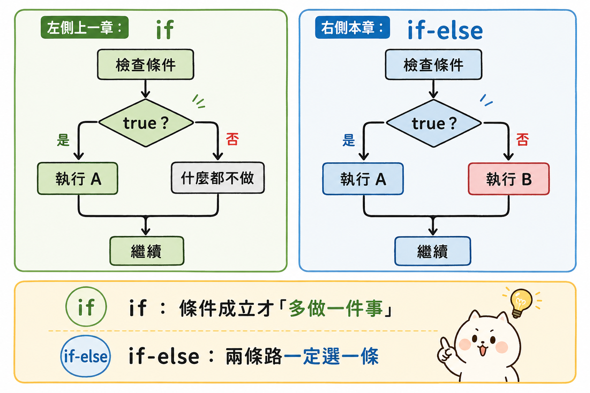

---

## Section V. 及格與不及格

```cpp
// VALIDATE
#include <iostream>
using namespace std;

int main() {
    int score;
    cin >> score;

    if (score >= 60) {
        cout << "Pass\n";
    } else {
        cout << "Fail\n";
    }

    return 0;
}
```


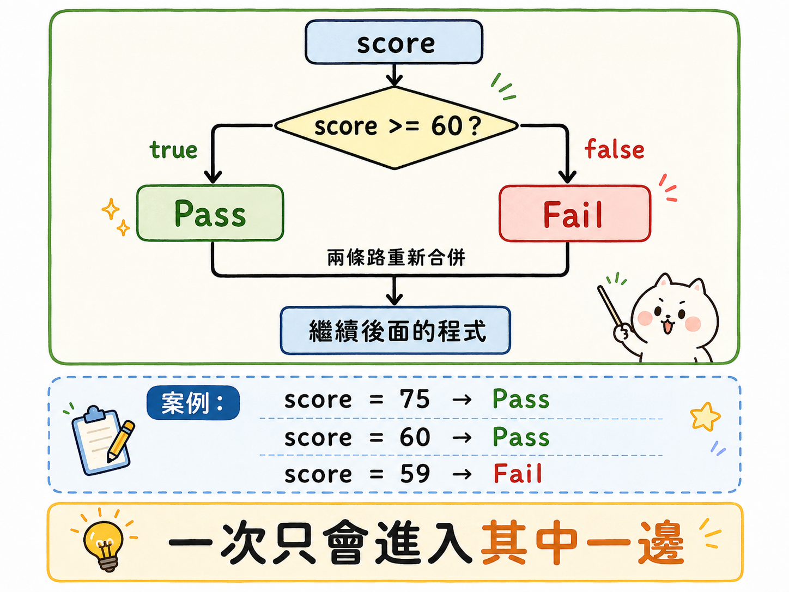

---

## Section VI. 奇數與偶數

```cpp
// VALIDATE
#include <iostream>
using namespace std;

int main() {
    int number;
    cin >> number;

    if (number % 2 == 0) {
        cout << "Even\n";
    } else {
        cout << "Odd\n";
    }

    return 0;
}
```


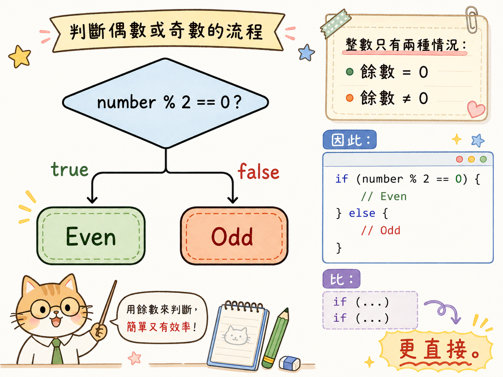

---

## Section VII. `else` 是剩餘情況

```cpp
if (number > 0) {
    cout << "Positive\n";
} else {
    cout << "Not positive\n";
}
```

`else` 同時包含：

```text
number == 0
number < 0
```

所以不能把訊息直接寫成 `Negative`。


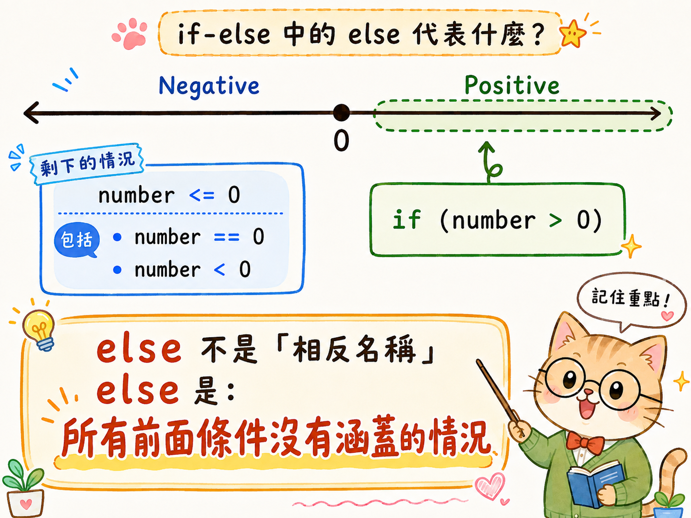

---

## Section VIII. 兩數比較

```cpp
if (first > second) {
    cout << "First is larger.\n";
} else {
    cout << "First is not larger.\n";
}
```

`else` 包含小於與相等。

---

# Part B：多分支 `else if`

## Section IX. 正數、負數與零

```cpp
// VALIDATE
#include <iostream>
using namespace std;

int main() {
    int number;
    cin >> number;

    if (number > 0) {
        cout << "Positive\n";
    } else if (number < 0) {
        cout << "Negative\n";
    } else {
        cout << "Zero\n";
    }

    return 0;
}
```


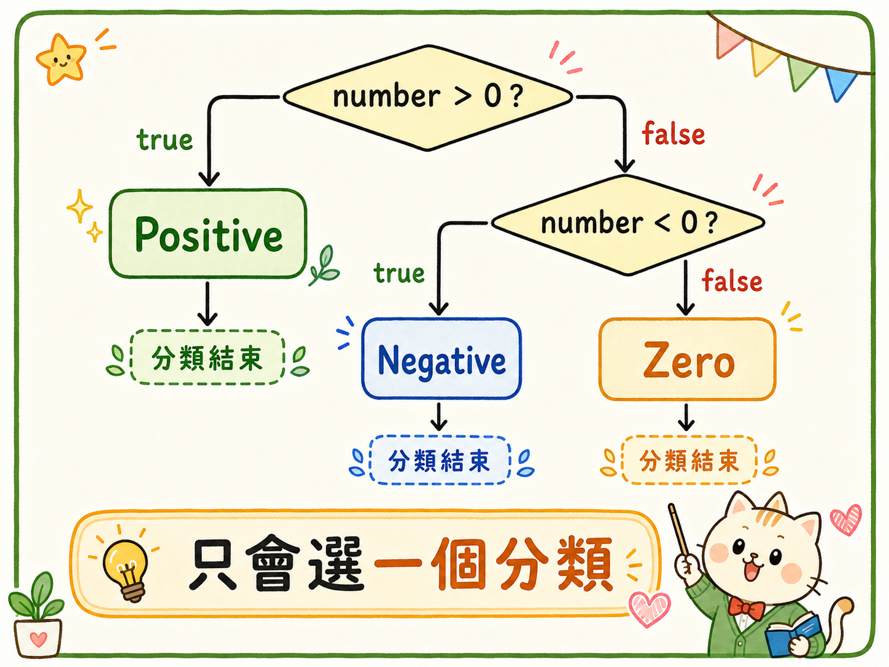

---

## Section X. 檢查順序

```text
第一個條件
→ false 才檢查第二個
→ 再 false 才檢查第三個
→ 全部 false 才進入 else
```

第一個成立的分支執行後，剩餘分支不再檢查。


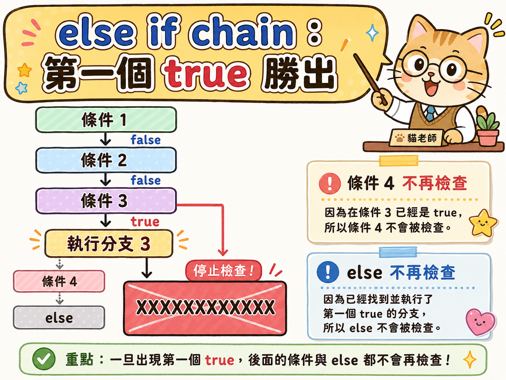

---

## Section XI. 成績等第

```cpp
if (score >= 90) {
    cout << "A\n";
} else if (score >= 80) {
    cout << "B\n";
} else if (score >= 70) {
    cout << "C\n";
} else if (score >= 60) {
    cout << "D\n";
} else {
    cout << "F\n";
}
```


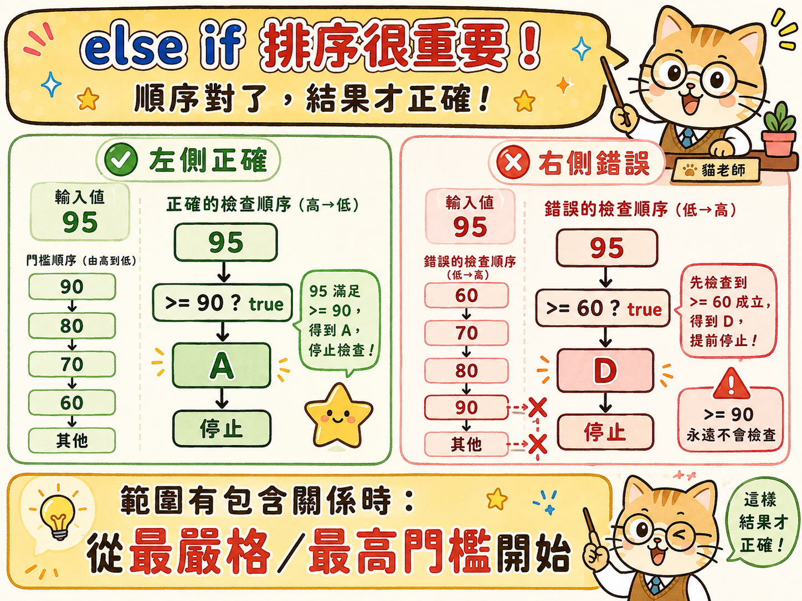

---

## Section XII. 為什麼由高到低？

若先寫：

```cpp
if (score >= 60) {
    cout << "D\n";
}
```

`95` 也符合 `score >= 60`，會先進入較低門檻，後面的 `A` 不再檢查。

---

## Section XIII. 完整等第程式

```cpp
// VALIDATE
#include <iostream>
using namespace std;

int main() {
    int score;
    cin >> score;

    if (score < 0 || score > 100) {
        cout << "Invalid score\n";
    } else if (score >= 90) {
        cout << "A\n";
    } else if (score >= 80) {
        cout << "B\n";
    } else if (score >= 70) {
        cout << "C\n";
    } else if (score >= 60) {
        cout << "D\n";
    } else {
        cout << "F\n";
    }

    return 0;
}
```


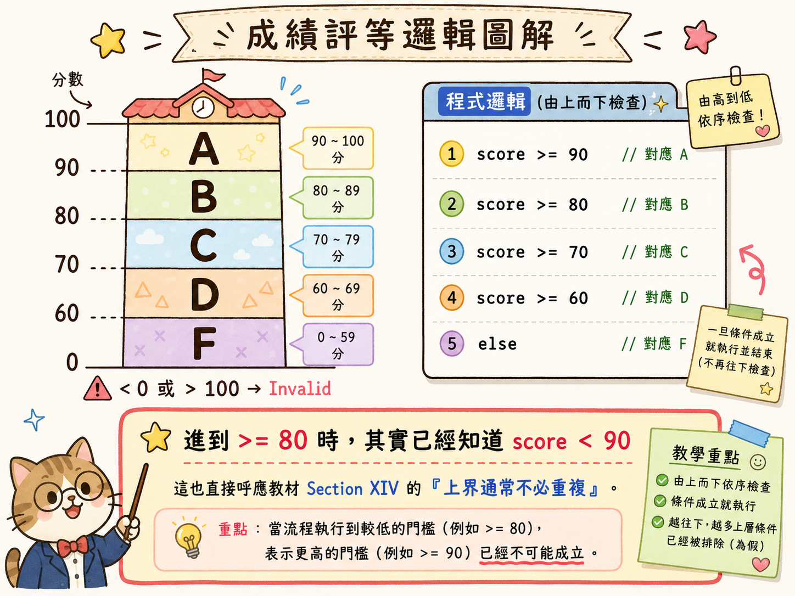

---

## Section XIV. 上界通常不必重複

進入：

```cpp
else if (score >= 80)
```

時，程式已經知道：

```text
score < 90
```

所以不必重複寫：

```cpp
score >= 80 && score < 90
```

---

# Part C：獨立 `if` 與 `else if`

## Section XV. 可同時成立

```cpp
if (number % 3 == 0) {
    cout << "Multiple of 3\n";
}

if (number % 5 == 0) {
    cout << "Multiple of 5\n";
}
```

`15` 會輸出兩個結果。

---

## Section XVI. 只選一個分類

```cpp
if (number % 3 == 0) {
    cout << "Multiple of 3\n";
} else if (number % 5 == 0) {
    cout << "Multiple of 5\n";
}
```

`15` 只會輸出第一個結果。

---

## Section XVII. 選擇原則

| 情況 | 建議 |
| --- | --- |
| 多個條件可同時成立 | 多個獨立 `if` |
| 只需要一個分類 | `if-else if-else` |
| 只有二選一 | `if-else` |


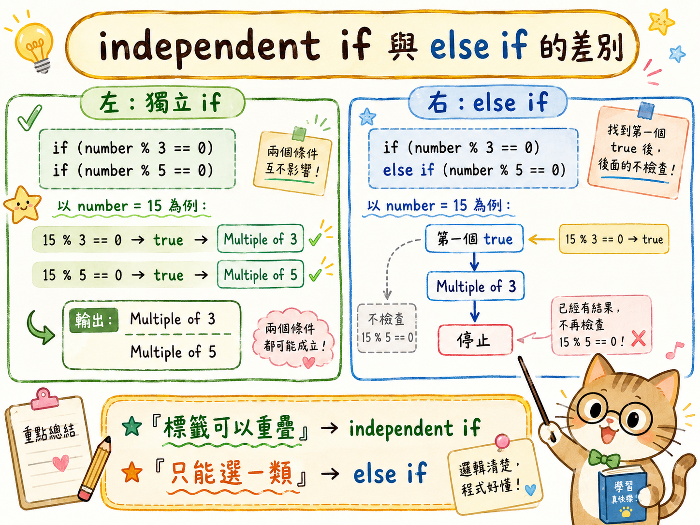

---

# Part D：找最大值

## Section XVIII. 兩數最大值

```cpp
// VALIDATE
#include <iostream>
using namespace std;

int main() {
    int first;
    int second;
    cin >> first >> second;

    int maximum;

    if (first > second) {
        maximum = first;
    } else {
        maximum = second;
    }

    cout << maximum << '\n';

    return 0;
}
```

---

## Section XIX. 兩數完整分類

```cpp
if (first > second) {
    cout << "First is larger.\n";
} else if (first < second) {
    cout << "Second is larger.\n";
} else {
    cout << "Equal\n";
}
```

---

## Section XX. 三數最大值

```cpp
// VALIDATE
#include <iostream>
using namespace std;

int main() {
    int first;
    int second;
    int third;
    cin >> first >> second >> third;

    int maximum = first;

    if (second > maximum) {
        maximum = second;
    }

    if (third > maximum) {
        maximum = third;
    }

    cout << maximum << '\n';

    return 0;
}
```

這裡使用兩個獨立 `if`，因為每一步都要檢查是否需要更新目前最大值。


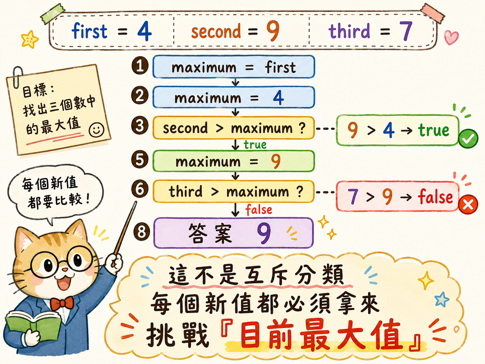

---

# Part E：巢狀 `if-else`

## Section XXI. 基本結構

```cpp
if (outerCondition) {
    if (innerCondition) {
        // 兩個條件都成立
    } else {
        // 外層成立，內層不成立
    }
} else {
    // 外層不成立
}
```


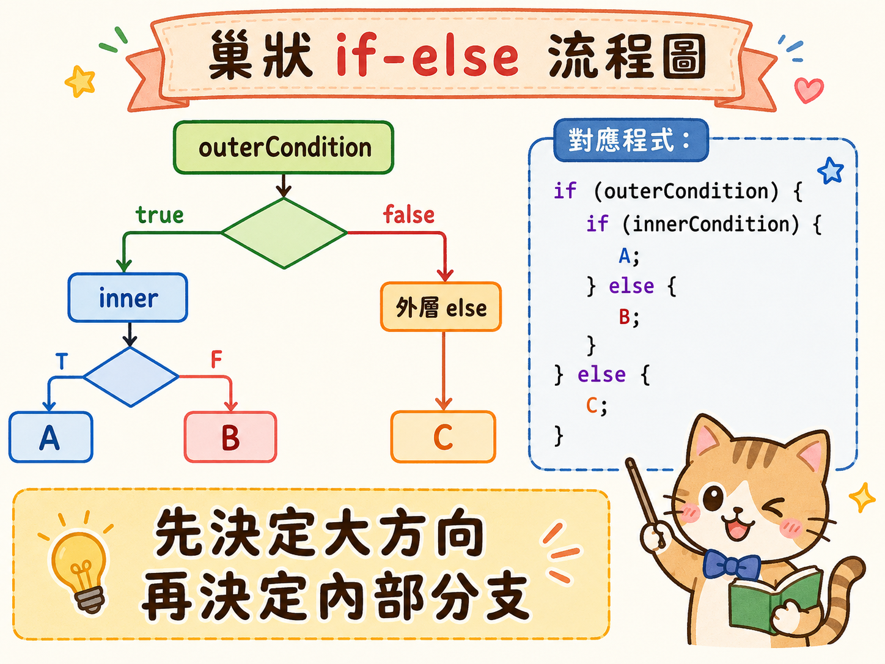

---

## Section XXII. dangling `else`

沒有大括號時：

```cpp
if (firstCondition)
    if (secondCondition)
        cout << "A\n";
    else
        cout << "B\n";
```

`else` 會和最近未配對的 `if (secondCondition)` 配對。

建議一律使用大括號。


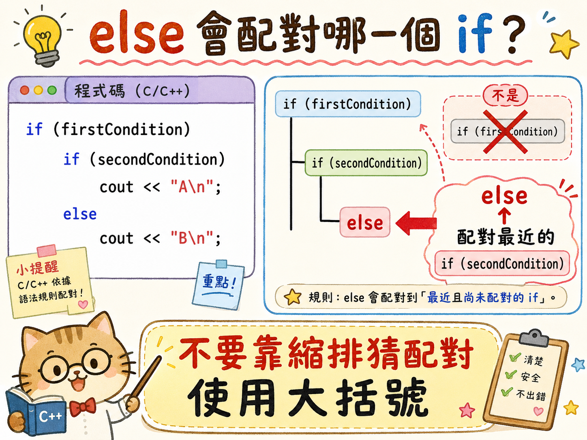

---

## Section XXIII. 清楚寫法

```cpp
if (firstCondition) {
    if (secondCondition) {
        cout << "A\n";
    } else {
        cout << "B\n";
    }
}
```


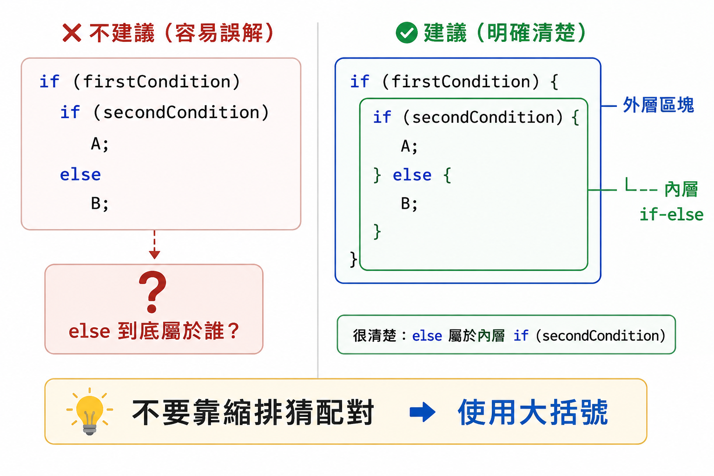

---

# Part F：`else if` 四則運算

## Section XXIV. 計算器

```cpp
// VALIDATE
#include <iostream>
using namespace std;

int main() {
    double first;
    char operation;
    double second;

    cin >> first >> operation >> second;

    if (operation == '+') {
        cout << first + second << '\n';
    } else if (operation == '-') {
        cout << first - second << '\n';
    } else if (operation == '*') {
        cout << first * second << '\n';
    } else if (operation == '/') {
        if (second == 0.0) {
            cout << "Cannot divide by zero.\n";
        } else {
            cout << first / second << '\n';
        }
    } else {
        cout << "Unknown operation.\n";
    }

    return 0;
}
```


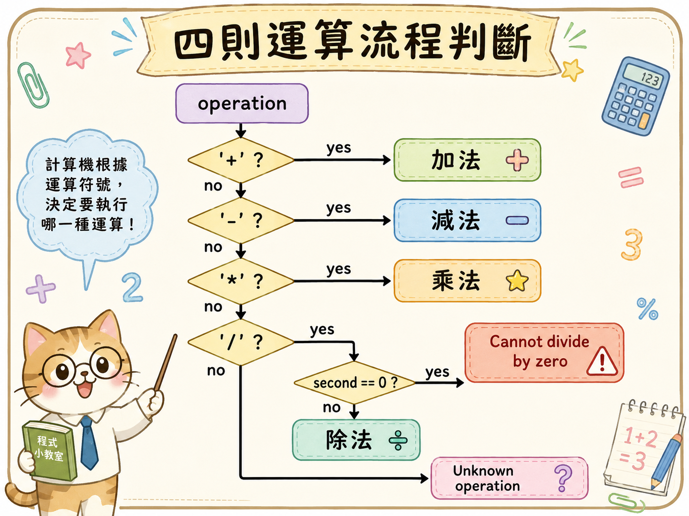

---

## Section XXV. 為什麼除法需要巢狀判斷？

先判斷：

```text
operation 是否為 '/'
```

進入除法分支後，再判斷：

```text
second 是否為 0
```


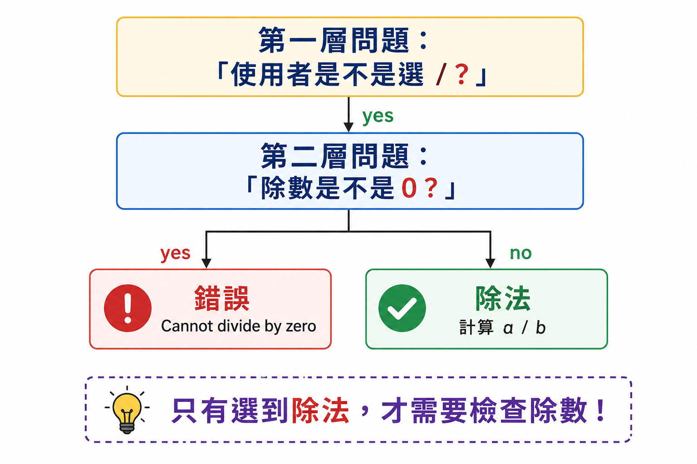

---

# Part G：`switch` 基礎

## Section XXVI. 何時使用 `switch`？

當程式一直比較同一個值是否等於多個固定選項：

```text
1、2、3
'+', '-', '*', '/'
```

可考慮 `switch`。


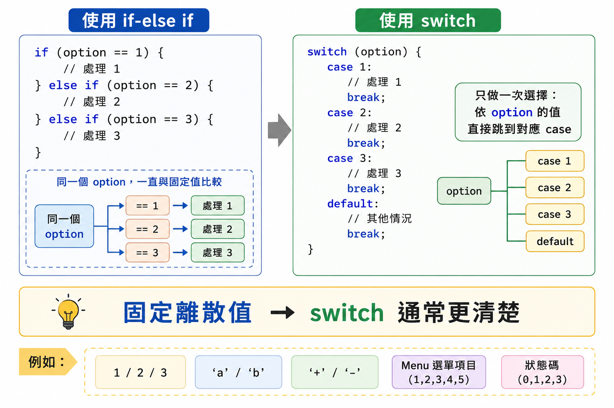

---

## Section XXVII. 基本語法

```cpp
switch (value) {
    case 1:
        statements;
        break;

    case 2:
        statements;
        break;

    default:
        statements;
        break;
}
```


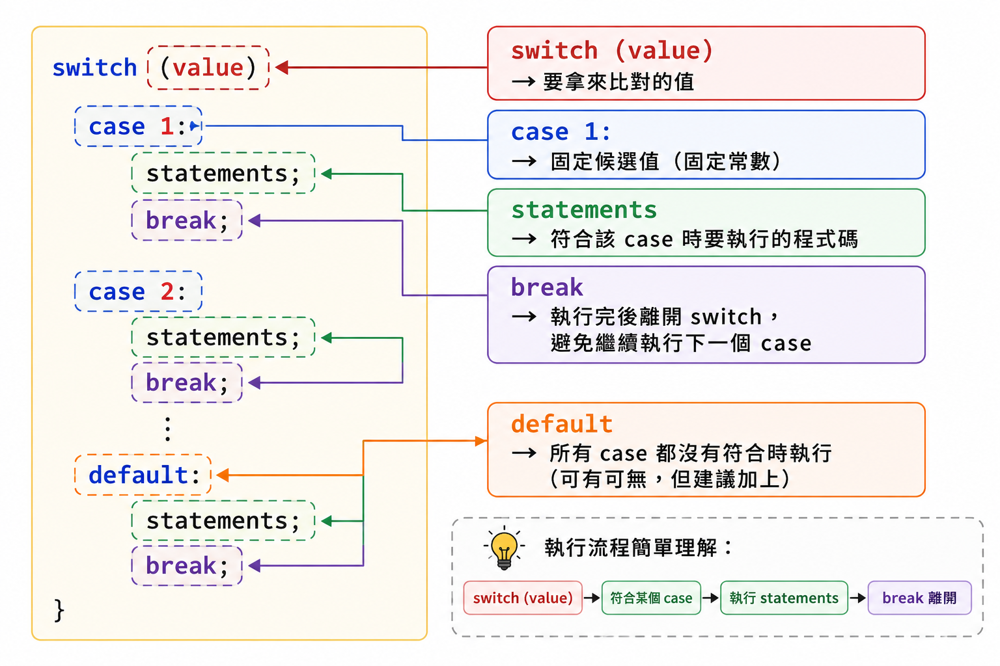

---

## Section XXVIII. 執行流程

1. 計算 `switch` 中的值。
2. 尋找相等的 `case`。
3. 從符合的 `case` 開始執行。
4. 遇到 `break` 離開。
5. 沒有符合項目時執行 `default`。


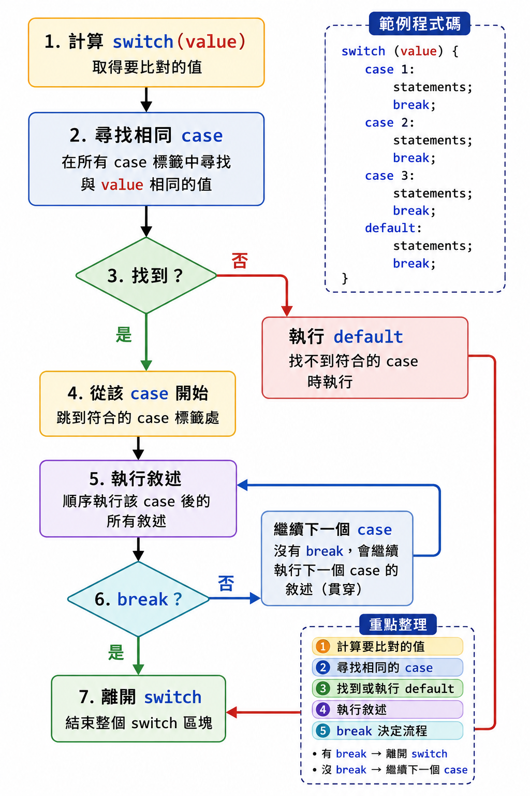

---

## Section XXIX. 星期查詢

```cpp
// VALIDATE
#include <iostream>
using namespace std;

int main() {
    int day;
    cin >> day;

    switch (day) {
        case 1:
            cout << "Monday\n";
            break;
        case 2:
            cout << "Tuesday\n";
            break;
        case 3:
            cout << "Wednesday\n";
            break;
        case 4:
            cout << "Thursday\n";
            break;
        case 5:
            cout << "Friday\n";
            break;
        case 6:
            cout << "Saturday\n";
            break;
        case 7:
            cout << "Sunday\n";
            break;
        default:
            cout << "Invalid day\n";
            break;
    }

    return 0;
}
```


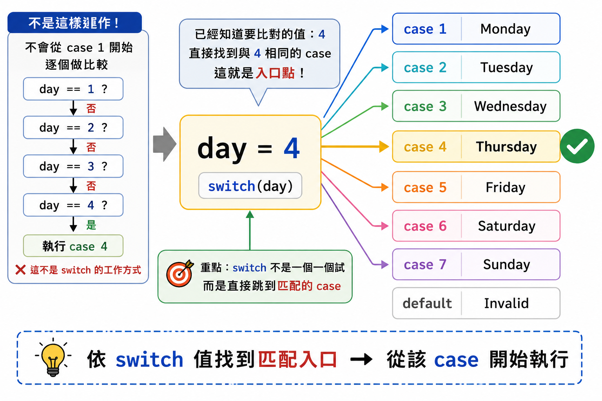

---

# Part H：`break` 與 fall-through

## Section XXX. 忘記 `break`

```cpp
switch (value) {
    case 1:
        cout << "A\n";

    case 2:
        cout << "B\n";
        break;
}
```

若 `value == 1`，輸出：

```text
A
B
```


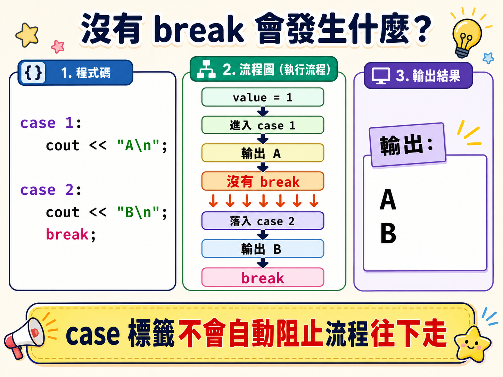

---

## Section XXXI. fall-through

從符合的 `case` 繼續執行下一個 `case`，稱為 fall-through。

它可能是：

- 忘記 `break`。
- 刻意共用處理。


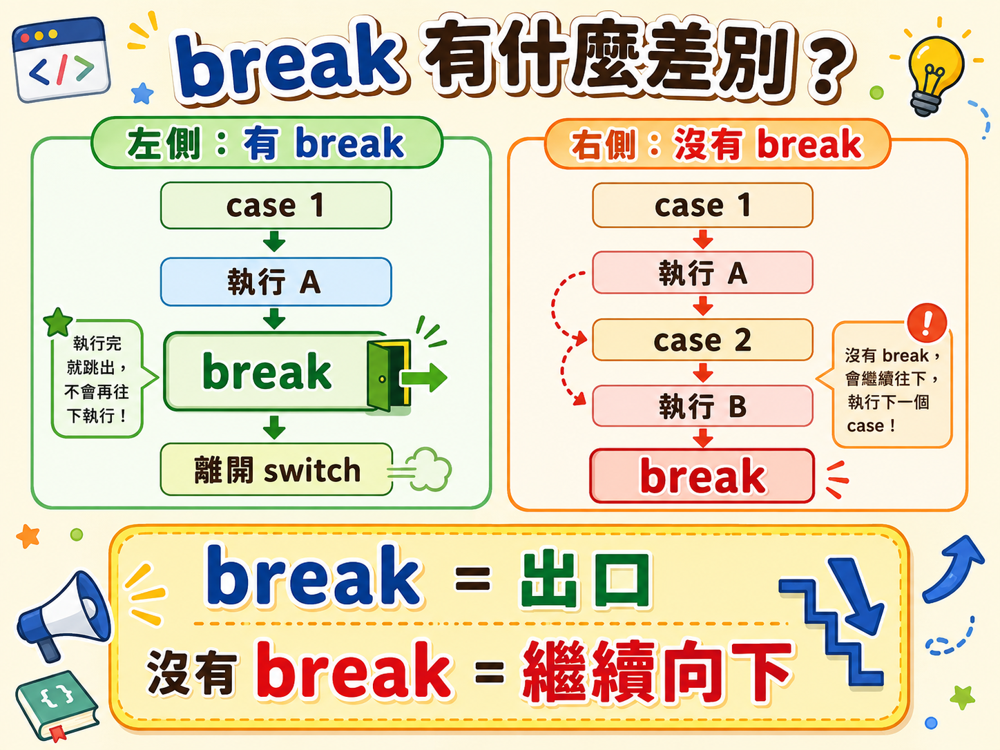

---

## Section XXXII. 多個 `case` 共用程式

```cpp
switch (month) {
    case 4:
    case 6:
    case 9:
    case 11:
        cout << "30 days\n";
        break;
}
```


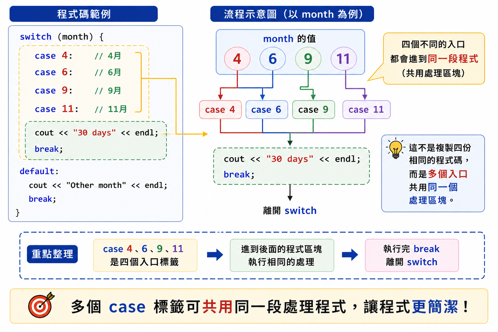

---

## Section XXXIII. `[[fallthrough]]`

C++17 可以明確標示刻意 fall-through：

```cpp
case 1:
    cout << "Basic\n";
    [[fallthrough]];

case 2:
    cout << "Standard\n";
    break;
```


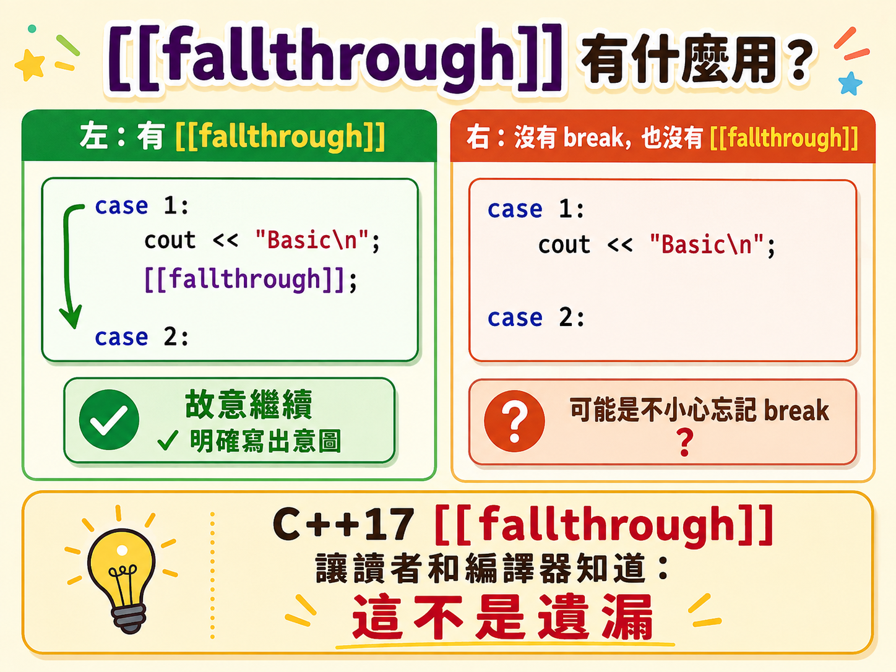

---

## Section XXXIV. 完整 fall-through 範例

```cpp
// VALIDATE
#include <iostream>
using namespace std;

int main() {
    int level;
    cin >> level;

    switch (level) {
        case 1:
            cout << "Basic access\n";
            [[fallthrough]];

        case 2:
            cout << "Standard access\n";
            [[fallthrough]];

        case 3:
            cout << "Advanced access\n";
            break;

        default:
            cout << "Invalid level\n";
            break;
    }

    return 0;
}
```

---

# Part I：`switch` 的限制

## Section XXXV. 適合的型別

`switch` 通常可使用：

- 整數型別
- `char`
- 列舉型別

---

## Section XXXVI. 不能直接比較 `string`

不合法概念：

```cpp
string command;

switch (command) {
    // ...
}
```

字串使用：

```cpp
if (command == "start") {
    // ...
} else if (command == "stop") {
    // ...
}
```

---

## Section XXXVII. 不適合範圍

`switch` 適合：

```text
option == 1
option == 2
```

不適合：

```text
score >= 90
score >= 80
```

範圍應使用 `else if`。


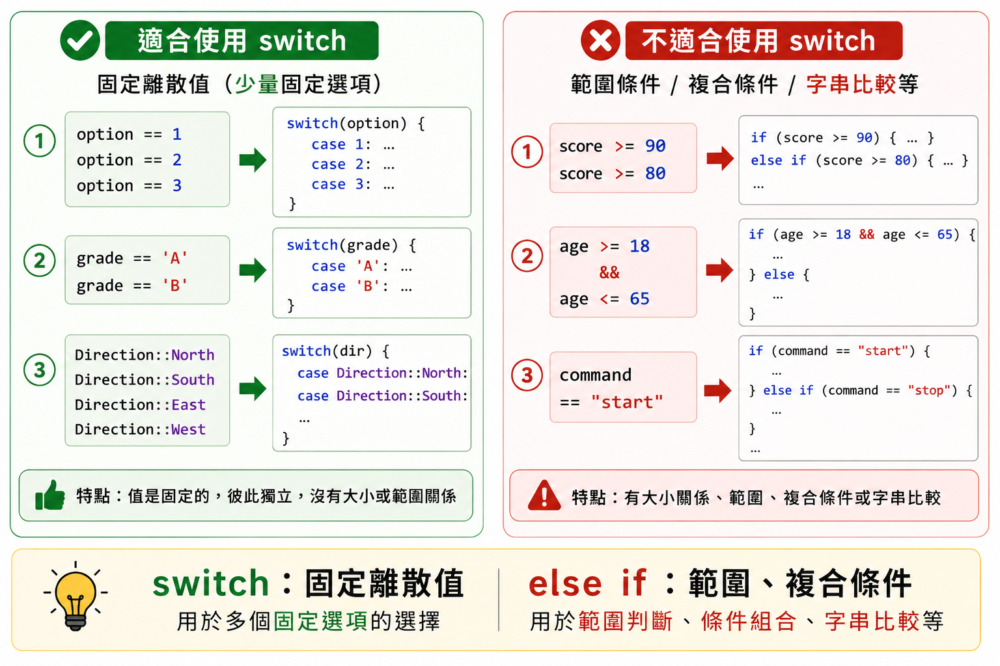

---

## Section XXXVIII. `case` 必須是常數

合法：

```cpp
case 1:
case 'A':
```

一般區域變數不能直接當作 `case` 值。

---

## Section XXXIX. 不可重複 `case`

同一 `switch` 中：

```cpp
case 1:
case 1:
```

會造成編譯錯誤。

---

# Part J：`switch` 計算器

## Section XL. 完整程式

```cpp
// VALIDATE
#include <iostream>
using namespace std;

int main() {
    double first;
    char operation;
    double second;

    cin >> first >> operation >> second;

    switch (operation) {
        case '+':
            cout << first + second << '\n';
            break;

        case '-':
            cout << first - second << '\n';
            break;

        case '*':
            cout << first * second << '\n';
            break;

        case '/':
            if (second == 0.0) {
                cout << "Cannot divide by zero.\n";
            } else {
                cout << first / second << '\n';
            }
            break;

        default:
            cout << "Unknown operation.\n";
            break;
    }

    return 0;
}
```

`switch` 內仍然可以使用 `if-else`。


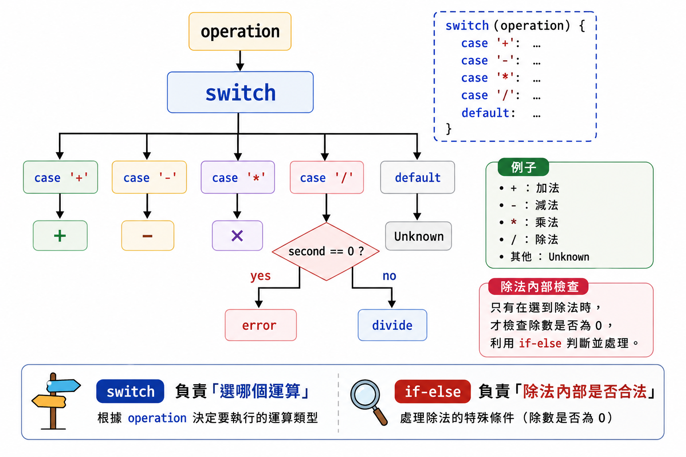

---

# Part K：`case` 中的區域變數

## Section XLI. 為什麼使用大括號？

若要在 `case` 中建立變數，建議建立獨立區域：

```cpp
case 1: {
    int value = 10;
    cout << value << '\n';
    break;
}
```

避免控制流程跳過變數初始化。


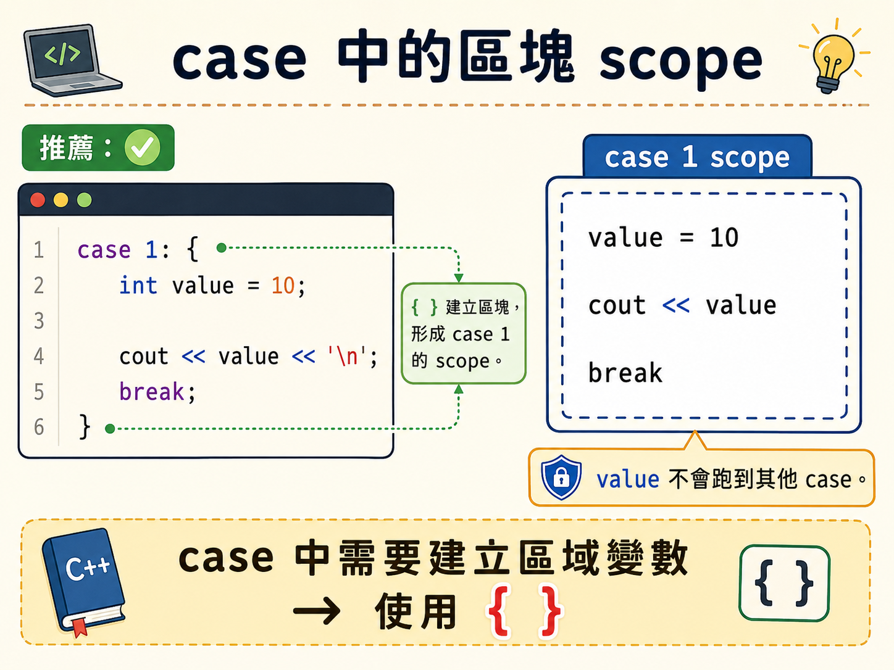

---

## Section XLII. 完整範例

```cpp
// VALIDATE
#include <iostream>
using namespace std;

int main() {
    int option;
    cin >> option;

    switch (option) {
        case 1: {
            int value = 10;
            cout << value << '\n';
            break;
        }

        case 2: {
            int value = 20;
            cout << value << '\n';
            break;
        }

        default: {
            cout << "Invalid option\n";
            break;
        }
    }

    return 0;
}
```

---

# Part L：月份天數

## Section XLIII. 完整程式

```cpp
// VALIDATE
#include <iostream>
using namespace std;

int main() {
    int month;
    cin >> month;

    switch (month) {
        case 1:
        case 3:
        case 5:
        case 7:
        case 8:
        case 10:
        case 12:
            cout << "31 days\n";
            break;

        case 4:
        case 6:
        case 9:
        case 11:
            cout << "30 days\n";
            break;

        case 2:
            cout << "28 days\n";
            break;

        default:
            cout << "Invalid month\n";
            break;
    }

    return 0;
}
```

本章先固定二月為 28 天；閏年可作為延伸練習。


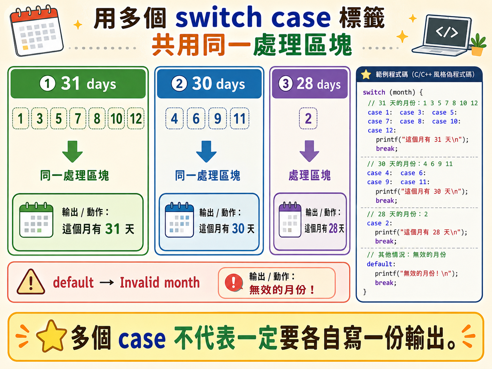

---

# Part M：`enum class` 與 `switch`

## Section XLIV. 列舉選項

```cpp
enum class Direction {
    North,
    South,
    East,
    West
};
```

比用沒有說明的數字更清楚。

---

## Section XLV. 完整範例

```cpp
// VALIDATE
#include <iostream>
using namespace std;

enum class Direction {
    North,
    South,
    East,
    West
};

int main() {
    Direction direction = Direction::East;

    switch (direction) {
        case Direction::North:
            cout << "Move north\n";
            break;
        case Direction::South:
            cout << "Move south\n";
            break;
        case Direction::East:
            cout << "Move east\n";
            break;
        case Direction::West:
            cout << "Move west\n";
            break;
    }

    return 0;
}
```


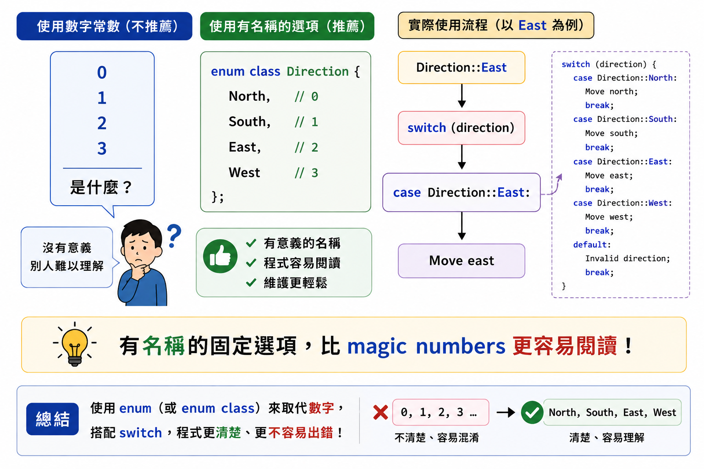

---

# Part N：如何選擇分支結構？

## Section XLVI. 選擇表

| 問題類型 | 建議 |
| --- | --- |
| 條件成立才額外執行 | `if` |
| 二選一 | `if-else` |
| 多個範圍或複合條件 | `else if` |
| 多個固定離散值 | `switch` |
| 多個條件可同時成立 | 獨立 `if` |


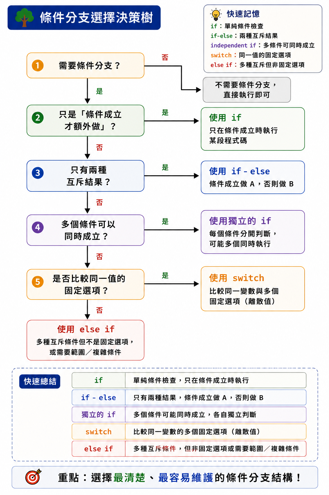

---

# Part O：快速概念檢查

## Section XLVII. 選擇題與簡答

### Q1. `if-else` 的兩個區塊會同時執行嗎？

<details><summary>查看答案</summary>

不會，只會執行其中一個。

</details>

### Q2. `else` 需要條件嗎？

<details><summary>查看答案</summary>

不需要，它處理前面條件不成立的剩餘情況。

</details>

### Q3. `else if` 如何檢查？

<details><summary>查看答案</summary>

由上往下檢查，第一個成立後跳過剩餘分支。

</details>

### Q4. 成績門檻為什麼通常由高到低？

<details><summary>查看答案</summary>

避免高分先符合較低門檻。

</details>

### Q5. 多個條件可同時成立時用什麼？

<details><summary>查看答案</summary>

多個獨立 `if`。

</details>

### Q6. 互斥分類用什麼？

<details><summary>查看答案</summary>

`if-else if-else`。

</details>

### Q7. `else` 會和哪個 `if` 配對？

<details><summary>查看答案</summary>

最近且尚未配對的 `if`。

</details>

### Q8. `switch` 適合範圍條件嗎？

<details><summary>查看答案</summary>

不適合。

</details>

### Q9. `switch` 可以直接比較 `string` 嗎？

<details><summary>查看答案</summary>

不可以。

</details>

### Q10. `break` 的用途是什麼？

<details><summary>查看答案</summary>

離開目前 `switch`。

</details>

### Q11. 忘記 `break` 會怎樣？

<details><summary>查看答案</summary>

繼續執行後續 `case`。

</details>

### Q12. `default` 何時執行？

<details><summary>查看答案</summary>

沒有任何 `case` 符合時。

</details>

### Q13. 多個 `case` 可以共用程式嗎？

<details><summary>查看答案</summary>

可以。

</details>

### Q14. `case` 值可以是一般變數嗎？

<details><summary>查看答案</summary>

一般不可以，需要編譯期間常數。

</details>

### Q15. 同一 `switch` 可以有重複 `case` 嗎？

<details><summary>查看答案</summary>

不可以。

</details>

### Q16. `switch` 中可以使用 `if` 嗎？

<details><summary>查看答案</summary>

可以。

</details>

### Q17. `[[fallthrough]];` 表示什麼？

<details><summary>查看答案</summary>

刻意繼續執行下一個 `case`。

</details>

### Q18. 為什麼 `case` 中常用大括號？

<details><summary>查看答案</summary>

建立獨立作用域，避免初始化被跳過。

</details>

---

# Part P：程式閱讀練習

## Section XLVIII. 預測輸出

### 題目 1

```cpp
int number = 8;

if (number % 2 == 0) {
    cout << "E";
} else {
    cout << "O";
}
```

<details><summary>查看答案</summary>

```text
E
```

</details>

### 題目 2

```cpp
int number = 0;

if (number > 0) {
    cout << "Positive";
} else {
    cout << "Not positive";
}
```

<details><summary>查看答案</summary>

```text
Not positive
```

</details>

### 題目 3

```cpp
int score = 95;

if (score >= 60) {
    cout << "D";
} else if (score >= 90) {
    cout << "A";
}
```

<details><summary>查看答案</summary>

```text
D
```

</details>

### 題目 4

```cpp
int value = 15;

if (value % 3 == 0) {
    cout << "A";
}

if (value % 5 == 0) {
    cout << "B";
}
```

<details><summary>查看答案</summary>

```text
AB
```

</details>

### 題目 5

```cpp
int value = 15;

if (value % 3 == 0) {
    cout << "A";
} else if (value % 5 == 0) {
    cout << "B";
}
```

<details><summary>查看答案</summary>

```text
A
```

</details>

### 題目 6

```cpp
int option = 2;

switch (option) {
    case 1:
        cout << "A";
        break;
    case 2:
        cout << "B";
        break;
    default:
        cout << "C";
        break;
}
```

<details><summary>查看答案</summary>

```text
B
```

</details>

### 題目 7

```cpp
int option = 1;

switch (option) {
    case 1:
        cout << "A";
    case 2:
        cout << "B";
        break;
}
```

<details><summary>查看答案</summary>

```text
AB
```

</details>

### 題目 8

```cpp
int month = 6;

switch (month) {
    case 4:
    case 6:
    case 9:
    case 11:
        cout << "30";
        break;
    default:
        cout << "Other";
        break;
}
```

<details><summary>查看答案</summary>

```text
30
```

</details>

### 題目 9

```cpp
int level = 2;

switch (level) {
    case 1:
        cout << "A";
        [[fallthrough]];
    case 2:
        cout << "B";
        [[fallthrough]];
    case 3:
        cout << "C";
        break;
}
```

<details><summary>查看答案</summary>

```text
BC
```

</details>

### 題目 10

```cpp
int first = 10;
int second = 10;

if (first > second) {
    cout << "First";
} else if (first < second) {
    cout << "Second";
} else {
    cout << "Equal";
}
```

<details><summary>查看答案</summary>

```text
Equal
```

</details>

---

# Part Q：實作練習

## Section XLIX. 實作檢測題

### TODO 1：奇偶二選一

輸入整數，使用 `if-else` 輸出 `Even` 或 `Odd`。

### TODO 2：及格判斷

輸入分數，輸出 `Pass` 或 `Fail`。

### TODO 3：正負零

使用 `if-else if-else` 分類正數、負數與零。

### TODO 4：兩數完整比較

輸出第一個較大、第二個較大或相等。

### TODO 5：兩數最大值

使用變數 `maximum` 保存較大值。

### TODO 6：三數最大值

先假設第一個最大，再使用兩個獨立 `if` 更新。

### TODO 7：成績等第

輸出 `A`、`B`、`C`、`D` 或 `F`，並處理非法分數。

### TODO 8：三角形分類

只輸出 `Equilateral`、`Isosceles`、`Scalene` 或無效三角形。

### TODO 9：`else if` 計算器

支援 `+ - * /`。

### TODO 10：`switch` 計算器

將 TODO 9 改用 `switch`。

### TODO 11：星期查詢

輸入 `1–7`，輸出星期名稱。

### TODO 12：月份天數

輸入月份，輸出天數。

### TODO 13：選單

建立 `Start`、`Settings`、`Exit` 選單。

### TODO 14：共用 `case`

讓 `'a'` 與 `'A'` 共用一段，`'b'` 與 `'B'` 共用一段。

### TODO 15：列舉方向

建立 `enum class Direction` 並使用 `switch`。

---

# Part R：常見錯誤提醒

## Section L. 常見錯誤

1. `else` 單獨存在。
2. 在 `if` 與 `else` 之間插入其他敘述。
3. 成績門檻由低到高。
4. 互斥分類使用多個獨立 `if`。
5. 可同時成立的標籤卻使用 `else if`。
6. 忘記 dangling `else` 規則。
7. 使用 `switch` 判斷範圍。
8. 對 `string` 使用 `switch`。
9. 忘記 `break`。
10. 不理解 fall-through。
11. 刻意 fall-through 卻沒有標示。
12. 重複 `case`。
13. `case` 使用一般變數。
14. 沒有 `default` 處理無效輸入。
15. `case` 中宣告變數卻沒有建立作用域。
16. 除法分支未檢查零。
17. 過度巢狀。
18. 假設 `default` 一定必須放最後。


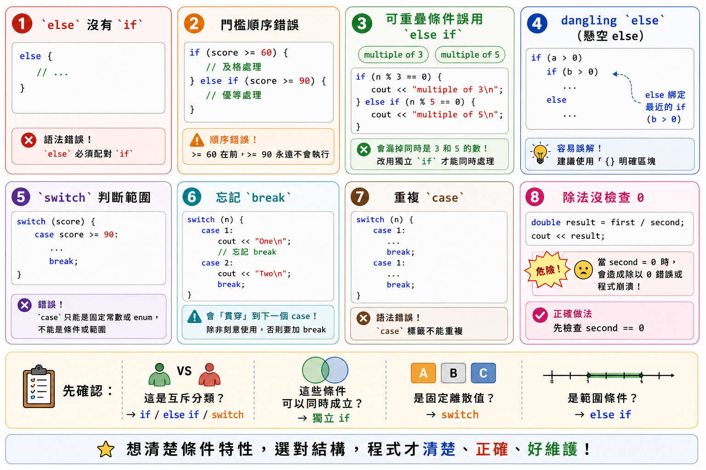

---

# Part S：Mermaid 流程圖

## Section LI. 分支流程圖

### 1. `if-else`

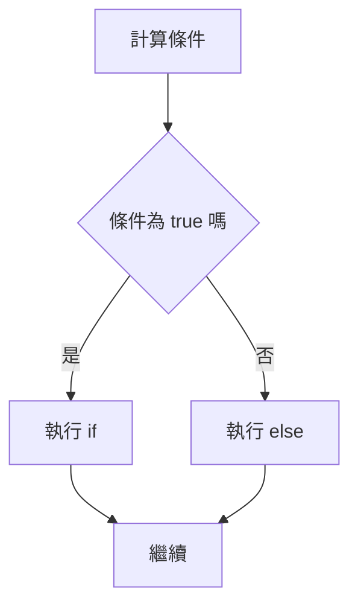
```mermaid
flowchart TD
    A[計算條件] --> B{條件為 true 嗎}
    B -- 是 --> C[執行 if]
    B -- 否 --> D[執行 else]
    C --> E[繼續]
    D --> E
```

### 2. `else if`

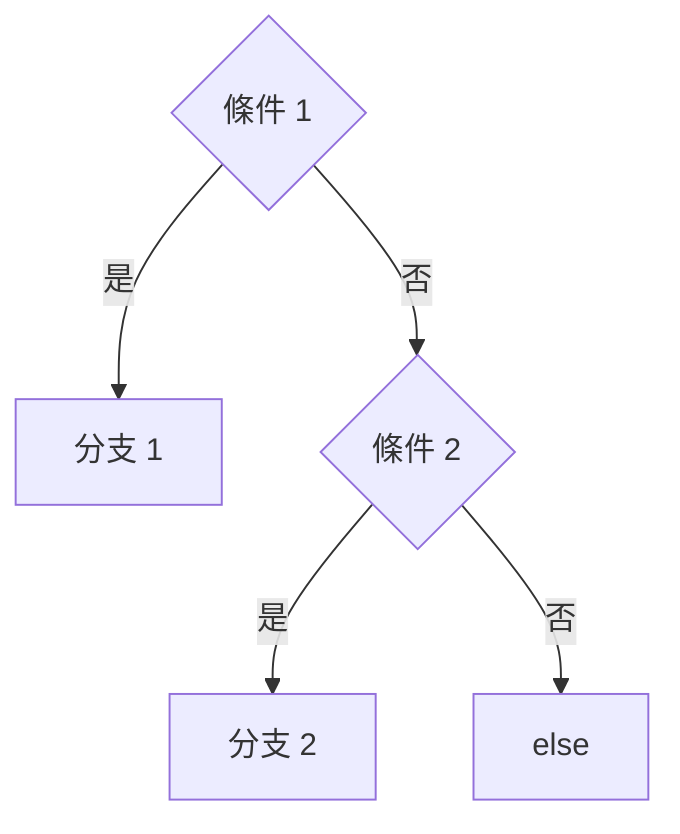
```mermaid
flowchart TD
    A{條件 1} -- 是 --> B[分支 1]
    A -- 否 --> C{條件 2}
    C -- 是 --> D[分支 2]
    C -- 否 --> E[else]
```

### 3. 結構選擇

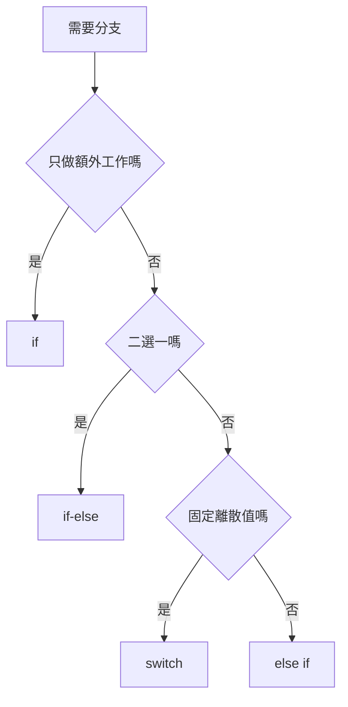
```mermaid
flowchart TD
    A[需要分支] --> B{只做額外工作嗎}
    B -- 是 --> C[if]
    B -- 否 --> D{二選一嗎}
    D -- 是 --> E[if-else]
    D -- 否 --> F{固定離散值嗎}
    F -- 是 --> G[switch]
    F -- 否 --> H[else if]
```

### 4. `switch`

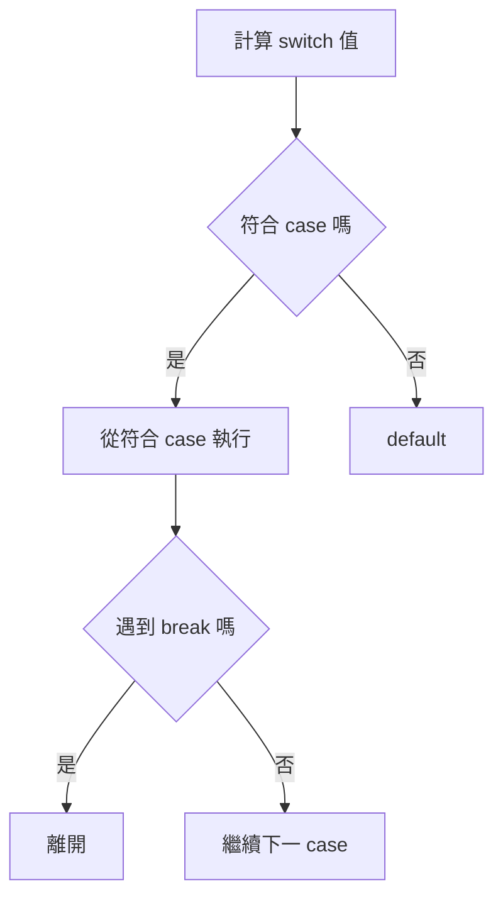
```mermaid
flowchart TD
    A[計算 switch 值] --> B{符合 case 嗎}
    B -- 是 --> C[從符合 case 執行]
    B -- 否 --> D[default]
    C --> E{遇到 break 嗎}
    E -- 是 --> F[離開]
    E -- 否 --> G[繼續下一 case]
```

### 5. fall-through

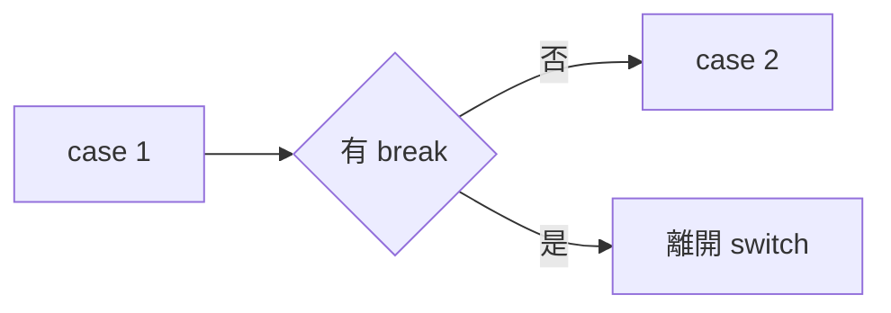
```mermaid
flowchart LR
    A[case 1] --> B{有 break}
    B -- 否 --> C[case 2]
    B -- 是 --> D[離開 switch]
```

### 6. 計算器

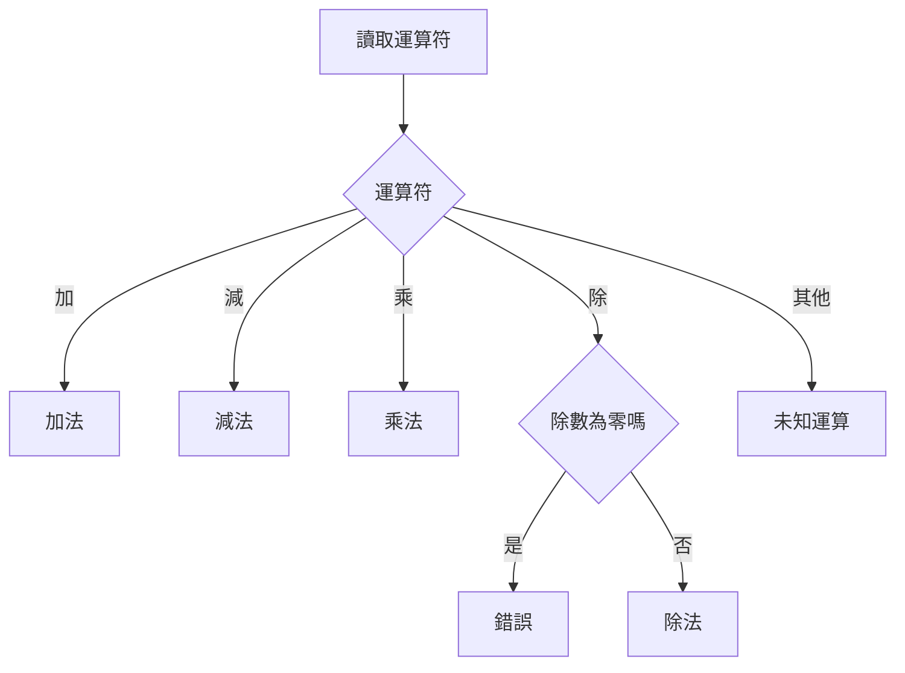
```mermaid
flowchart TD
    A[讀取運算符] --> B{運算符}
    B -- 加 --> C[加法]
    B -- 減 --> D[減法]
    B -- 乘 --> E[乘法]
    B -- 除 --> F{除數為零嗎}
    F -- 是 --> G[錯誤]
    F -- 否 --> H[除法]
    B -- 其他 --> I[未知運算]
```

---

# 本章完成標準

完成本章後，你應該能做到：

1. 撰寫 `if-else`。
2. 說明二選一流程。
3. 判斷奇偶。
4. 判斷及格與不及格。
5. 使用 `else if`。
6. 說明由上往下檢查。
7. 正確排列門檻。
8. 建立正負零分類。
9. 建立成績等第。
10. 比較獨立 `if` 與 `else if`。
11. 判斷何時條件可同時成立。
12. 比較兩個數。
13. 找出三數最大值。
14. 撰寫巢狀 `if-else`。
15. 說明 dangling `else`。
16. 使用大括號消除歧義。
17. 建立 `else if` 計算器。
18. 檢查除數為零。
19. 撰寫 `switch`。
20. 使用 `case`。
21. 使用 `break`。
22. 使用 `default`。
23. 說明 fall-through。
24. 使用多個 `case` 共用程式。
25. 使用 `[[fallthrough]]`。
26. 說明 `switch` 適合的型別。
27. 說明 `switch` 不直接支援 `string`。
28. 說明 `switch` 不適合範圍。
29. 避免重複 `case`。
30. 在 `case` 中建立作用域。
31. 使用 `switch` 建立星期查詢。
32. 使用 `switch` 建立月份查詢。
33. 使用 `enum class`。
34. 依題型選擇適合分支結構。

---

# 隱藏答案區

> Answer hidden — try it first.

<details><summary>TODO 1 答案</summary>

```cpp
#include <iostream>
using namespace std;

int main() {
    int number;
    cin >> number;

    if (number % 2 == 0) {
        cout << "Even\n";
    } else {
        cout << "Odd\n";
    }

    return 0;
}
```

</details>

<details><summary>TODO 2 答案</summary>

```cpp
#include <iostream>
using namespace std;

int main() {
    int score;
    cin >> score;

    if (score >= 60) {
        cout << "Pass\n";
    } else {
        cout << "Fail\n";
    }

    return 0;
}
```

</details>

<details><summary>TODO 3 答案</summary>

```cpp
#include <iostream>
using namespace std;

int main() {
    int number;
    cin >> number;

    if (number > 0) {
        cout << "Positive\n";
    } else if (number < 0) {
        cout << "Negative\n";
    } else {
        cout << "Zero\n";
    }

    return 0;
}
```

</details>

<details><summary>TODO 4 答案</summary>

```cpp
#include <iostream>
using namespace std;

int main() {
    int first;
    int second;
    cin >> first >> second;

    if (first > second) {
        cout << "First is larger.\n";
    } else if (first < second) {
        cout << "Second is larger.\n";
    } else {
        cout << "Equal\n";
    }

    return 0;
}
```

</details>

<details><summary>TODO 5 答案</summary>

```cpp
int maximum;

if (first > second) {
    maximum = first;
} else {
    maximum = second;
}
```

</details>

<details><summary>TODO 6 答案</summary>

```cpp
int maximum = first;

if (second > maximum) {
    maximum = second;
}

if (third > maximum) {
    maximum = third;
}
```

</details>

<details><summary>TODO 7 答案</summary>

```cpp
if (score < 0 || score > 100) {
    cout << "Invalid\n";
} else if (score >= 90) {
    cout << "A\n";
} else if (score >= 80) {
    cout << "B\n";
} else if (score >= 70) {
    cout << "C\n";
} else if (score >= 60) {
    cout << "D\n";
} else {
    cout << "F\n";
}
```

</details>

<details><summary>TODO 8 答案</summary>

```cpp
bool valid =
    a > 0 && b > 0 && c > 0 &&
    a + b > c &&
    a + c > b &&
    b + c > a;

if (!valid) {
    cout << "Invalid triangle\n";
} else if (a == b && b == c) {
    cout << "Equilateral\n";
} else if (a == b || a == c || b == c) {
    cout << "Isosceles\n";
} else {
    cout << "Scalene\n";
}
```

</details>

<details><summary>TODO 9 答案</summary>

```cpp
if (operation == '+') {
    cout << first + second << '\n';
} else if (operation == '-') {
    cout << first - second << '\n';
} else if (operation == '*') {
    cout << first * second << '\n';
} else if (operation == '/') {
    if (second == 0.0) {
        cout << "Cannot divide by zero.\n";
    } else {
        cout << first / second << '\n';
    }
} else {
    cout << "Unknown operation.\n";
}
```

</details>

<details><summary>TODO 10 答案</summary>

```cpp
switch (operation) {
    case '+':
        cout << first + second << '\n';
        break;
    case '-':
        cout << first - second << '\n';
        break;
    case '*':
        cout << first * second << '\n';
        break;
    case '/':
        if (second == 0.0) {
            cout << "Cannot divide by zero.\n";
        } else {
            cout << first / second << '\n';
        }
        break;
    default:
        cout << "Unknown operation.\n";
        break;
}
```

</details>

<details><summary>TODO 11 答案</summary>

使用本章「星期查詢」完整程式。

</details>

<details><summary>TODO 12 答案</summary>

使用本章「月份天數」完整程式。

</details>

<details><summary>TODO 13 答案</summary>

```cpp
switch (option) {
    case 1:
        cout << "Starting...\n";
        break;
    case 2:
        cout << "Settings\n";
        break;
    case 3:
        cout << "Exit\n";
        break;
    default:
        cout << "Invalid option\n";
        break;
}
```

</details>

<details><summary>TODO 14 答案</summary>

```cpp
switch (choice) {
    case 'a':
    case 'A':
        cout << "Option A\n";
        break;
    case 'b':
    case 'B':
        cout << "Option B\n";
        break;
    default:
        cout << "Unknown\n";
        break;
}
```

</details>

<details><summary>TODO 15 答案</summary>

```cpp
enum class Direction {
    North,
    South,
    East,
    West
};
```

再使用本章 `enum class` 範例中的 `switch`。

</details>
