# Lesson 08：`while` and `do-while` Loops `while` 與 `do-while` 迴圈

> 這堂課的重點：讓程式重複執行某段程式碼，直到條件不再成立。你會學習 `while` 的「先判斷、後執行」，以及 `do-while` 的「先執行一次、再判斷」。

> 本章集中在條件型迴圈、輸入次數不確定的問題、哨兵值、驗證輸入與重複選單。計次型 `for` 迴圈會在下一章整理。

---

## Section I. 今天要做什麼？

1. 認識迴圈 loop。
2. 理解迴圈可以重複執行程式區塊。
3. 認識迴圈條件。
4. 使用 `while`。
5. 理解 `while` 先檢查條件。
6. 理解條件為 `true` 時執行區塊。
7. 理解條件為 `false` 時離開迴圈。
8. 理解 `while` 可能一次都不執行。
9. 建立計數器 counter。
10. 更新計數器。
11. 使用 `++` 增加計數器。
12. 使用 `--` 減少計數器。
13. 使用 `while` 從 1 數到 5。
14. 使用 `while` 倒數。
15. 使用不同步長更新。
16. 輸出偶數序列。
17. 輸出等差序列。
18. 認識累加器 accumulator。
19. 使用累加器計算總和。
20. 計算 1 到 n 的總和。
21. 同時使用計數器與累加器。
22. 追蹤每輪迴圈的變數值。
23. 理解初始化、條件、主體與更新。
24. 避免忘記更新條件變數。
25. 避免無窮迴圈。
26. 使用哨兵值 sentinel。
27. 輸入不定個數整數。
28. 使用特定值結束輸入。
29. 計算不定個數正整數總和。
30. 計算不定個數資料的平均值。
31. 避免除以零。
32. 分辨有效資料數量與所有輸入次數。
33. 使用 `while (cin >> value)` 讀到 EOF。
34. 理解輸入串流可作為條件。
35. 比較哨兵值與 EOF。
36. 使用 `while` 驗證輸入。
37. 讓使用者重新輸入非法資料。
38. 驗證分數範圍。
39. 驗證除數不為零。
40. 使用巢狀 `while` 的初步概念。
41. 認識 `do-while`。
42. 理解 `do-while` 至少執行一次。
43. 理解 `do-while` 在尾端檢查條件。
44. 注意 `while (condition);` 末尾需要分號。
45. 使用 `do-while` 驗證輸入。
46. 使用 `do-while` 重複顯示選單。
47. 比較 `while` 與 `do-while`。
48. 判斷何時需要至少執行一次。
49. 使用布林變數控制迴圈。
50. 使用 `while (true)` 建立明確無窮迴圈。
51. 認識 `break` 可提前離開迴圈。
52. 認識 `continue` 可跳過本輪剩餘部分。
53. 理解 `break` 與條件結束的差異。
54. 理解 `continue` 前仍需注意更新。
55. 使用 `break` 建立輸入終止點。
56. 使用 `continue` 忽略不合格資料。
57. 避免條件永遠為真。
58. 避免條件一開始就為假。
59. 避免使用未初始化變數作為條件。
60. 避免在條件後誤加分號。
61. 避免把 `if` 當成迴圈。
62. 避免把 `while` 當成只執行一次。
63. 完成概念檢查、程式閱讀與實作練習。

---

## Section II. 今天的學習方式

1. 每個迴圈先找出四個部分：
   ```text
   初始化
   條件
   迴圈主體
   更新
   ```
2. 每輪都建立追蹤表。
3. 在表格中記錄：
   - 進入迴圈前的值
   - 條件結果
   - 本輪輸出
   - 更新後的值
4. 先判斷第一次條件是否成立。
5. 再判斷條件何時會變成 `false`。
6. 哨兵迴圈先找出：
   ```text
   哪一個值代表結束？
   結束值是否應納入計算？
   ```
7. 平均值題同時追蹤：
   ```text
   total
   count
   ```
8. `do-while` 題先記住主體會先執行一次。
9. 無窮迴圈題先找出離開點。
10. 使用 `continue` 時，確認更新不會被跳過。
11. 本章中的完整程式使用 C++17 嚴格警告選項檢查。
12. 錯誤範例只供分析，不作為合法完整程式。

---

## Section III. 核心語法對照

| 語法 | 用途 |
| --- | --- |
| `while (condition) { ... }` | 條件成立時重複執行 |
| `do { ... } while (condition);` | 先執行一次，再判斷是否重複 |
| `++counter;` | 計數器增加 1 |
| `--counter;` | 計數器減少 1 |
| `total += value;` | 將資料累加到總和 |
| `while (value != sentinel)` | 使用哨兵值控制 |
| `while (cin >> value)` | 讀取成功時持續執行 |
| `while (true)` | 建立明確無窮迴圈 |
| `break;` | 立即離開目前迴圈 |
| `continue;` | 跳過本輪剩餘程式 |
| `bool running = true;` | 使用布林變數控制迴圈 |

---

# Part A：什麼是迴圈？

## Section IV. 重複執行

若要輸出五次：

```cpp
cout << "Hello\n";
cout << "Hello\n";
cout << "Hello\n";
cout << "Hello\n";
cout << "Hello\n";
```

可以改用迴圈，避免重複撰寫相同程式。

---

## Section V. 迴圈的基本概念

迴圈包含：

```text
檢查條件
→ 執行程式區塊
→ 更新狀態
→ 再次檢查條件
```

只要條件維持 `true`，迴圈就繼續。


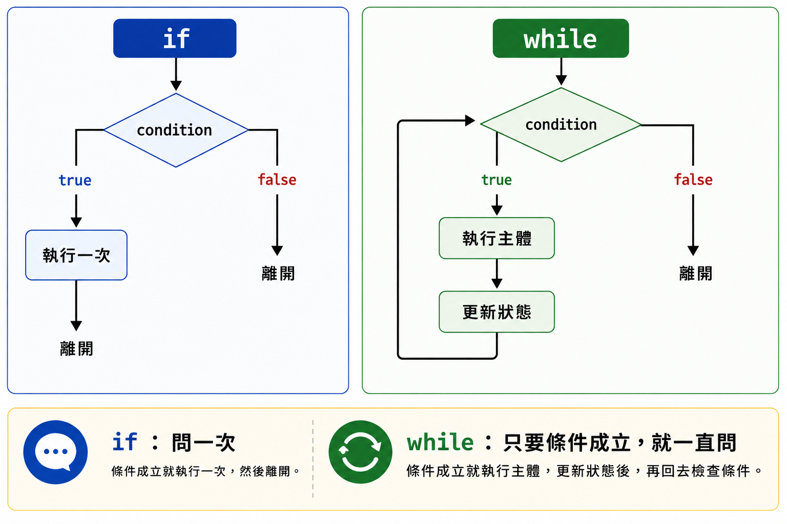

---

## Section VI. `while` 基本語法

```cpp
while (condition) {
    statements;
}
```

流程：

```text
先檢查 condition
→ true：執行區塊
→ 回到條件
→ false：離開迴圈
```


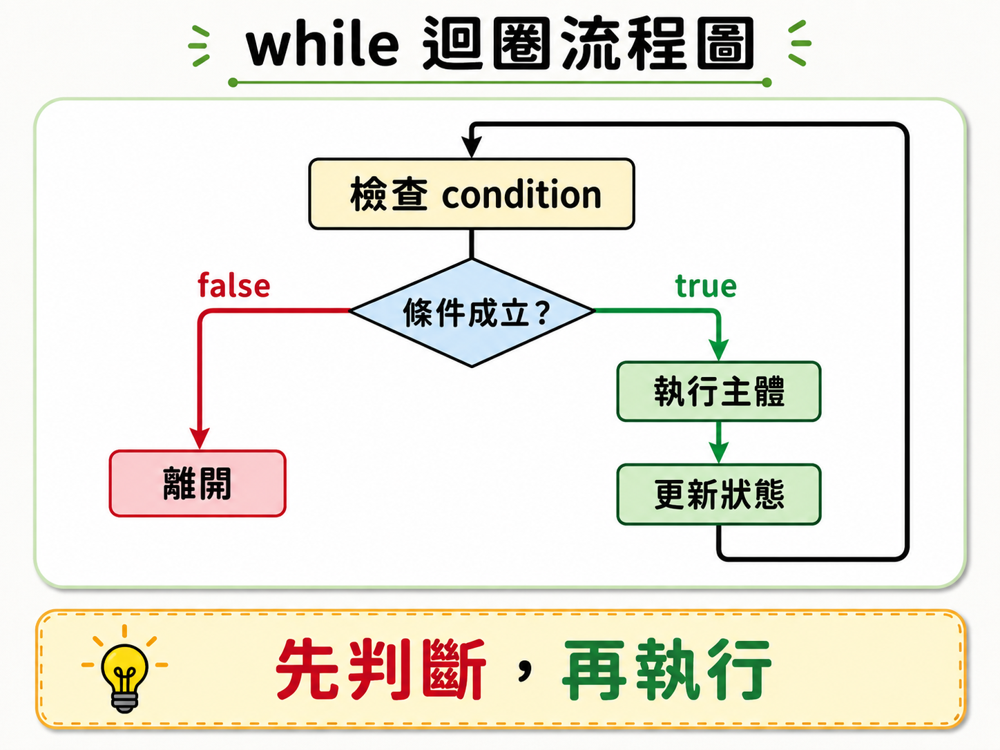

---

# Part B：第一個 `while`

## Section VII. 從 1 數到 5

```cpp
// VALIDATE
#include <iostream>
using namespace std;

int main() {
    int number = 1;

    while (number <= 5) {
        cout << number << '\n';
        ++number;
    }

    return 0;
}
```

輸出：

```text
1
2
3
4
5
```

---

## Section VIII. 四個部分

```cpp
int number = 1;          // 初始化

while (number <= 5) {    // 條件
    cout << number;      // 主體
    ++number;            // 更新
}
```


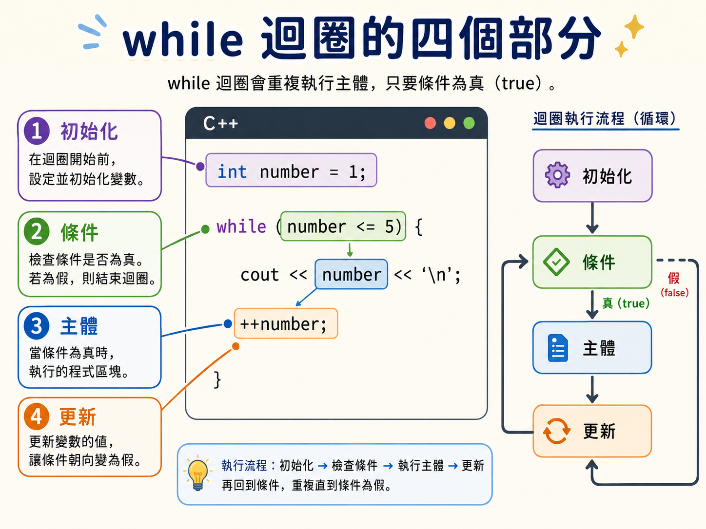

---

## Section IX. 第一次檢查

初始：

```text
number = 1
```

條件：

```cpp
number <= 5
```

結果：

```text
true
```

所以進入第一輪。

---

## Section X. 離開時機

當：

```text
number = 6
```

條件：

```cpp
6 <= 5
```

結果為 `false`，因此離開迴圈。

---

## Section XI. 追蹤表

| 檢查時的 `number` | 條件 `number <= 5` | 輸出 | 更新後 |
| ---: | --- | ---: | ---: |
| 1 | `true` | 1 | 2 |
| 2 | `true` | 2 | 3 |
| 3 | `true` | 3 | 4 |
| 4 | `true` | 4 | 5 |
| 5 | `true` | 5 | 6 |
| 6 | `false` | 無 | 結束 |


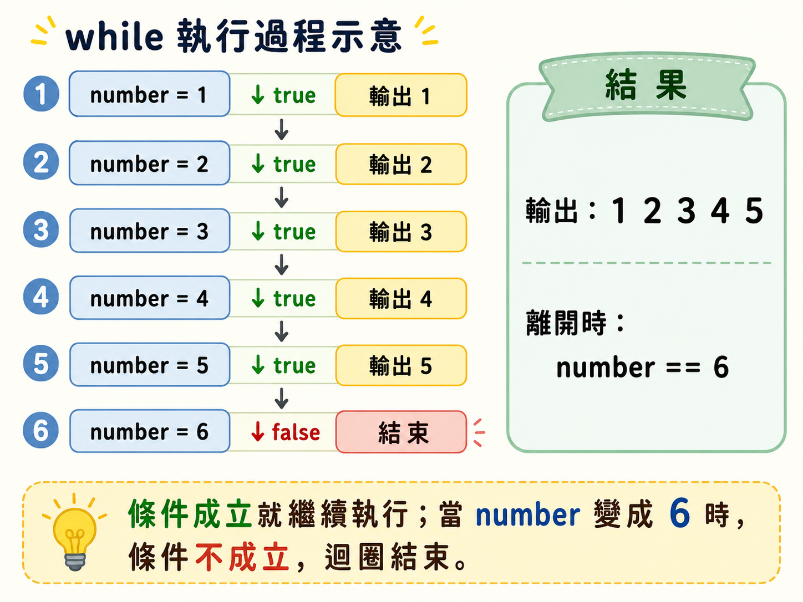

---

# Part C：`while` 可能一次都不執行

## Section XII. 初始條件為假

```cpp
int number = 10;

while (number <= 5) {
    cout << number << '\n';
    ++number;
}
```

第一次檢查：

```text
10 <= 5 → false
```

迴圈主體一次都不執行。

---

## Section XIII. 為什麼？

`while` 的特色是：

```text
先判斷
後執行
```

因此它適合：

```text
可能不需要執行任何一次
```

的情況。


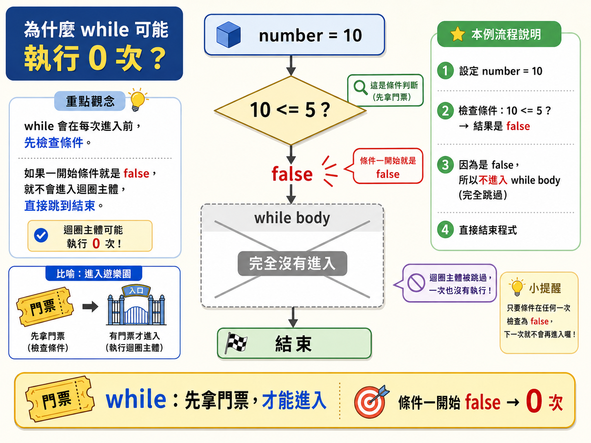

---

# Part D：倒數與不同步長

## Section XIV. 倒數

```cpp
// VALIDATE
#include <iostream>
using namespace std;

int main() {
    int number = 5;

    while (number >= 1) {
        cout << number << '\n';
        --number;
    }

    cout << "Go!\n";

    return 0;
}
```


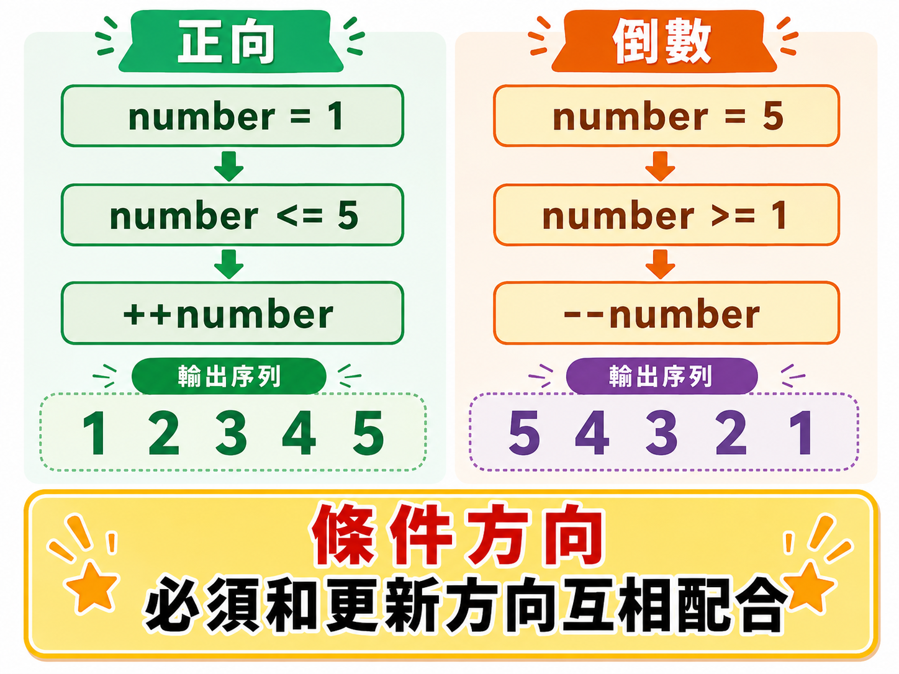

---

## Section XV. 輸出偶數

```cpp
int number = 2;

while (number <= 10) {
    cout << number << '\n';
    number += 2;
}
```

輸出：

```text
2
4
6
8
10
```

---

## Section XVI. 等差序列

```cpp
int number = 3;

while (number <= 15) {
    cout << number << '\n';
    number += 3;
}
```

輸出：

```text
3
6
9
12
15
```

更新不一定只能是 `++`。

---

# Part E：計數器與累加器

## Section XVII. 計數器 Counter

計數器用來記錄次數：

```cpp
int count = 0;

++count;
```

每遇到一筆符合條件的資料，就增加一次。


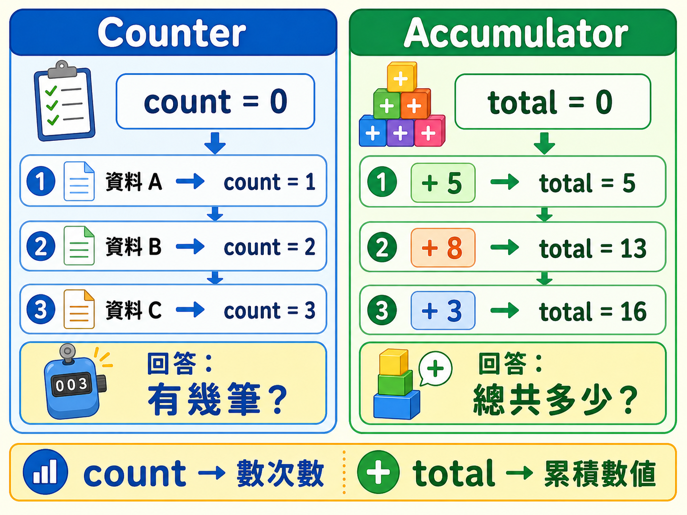

---

## Section XVIII. 累加器 Accumulator

累加器用來保存總和：

```cpp
int total = 0;

total += value;
```

---

## Section XIX. 1 到 5 的總和

```cpp
// VALIDATE
#include <iostream>
using namespace std;

int main() {
    int number = 1;
    int total = 0;

    while (number <= 5) {
        total += number;
        ++number;
    }

    cout << total << '\n';

    return 0;
}
```

輸出：

```text
15
```

---

## Section XX. 追蹤總和

| `number` | 執行前 `total` | `total += number` 後 |
| ---: | ---: | ---: |
| 1 | 0 | 1 |
| 2 | 1 | 3 |
| 3 | 3 | 6 |
| 4 | 6 | 10 |
| 5 | 10 | 15 |


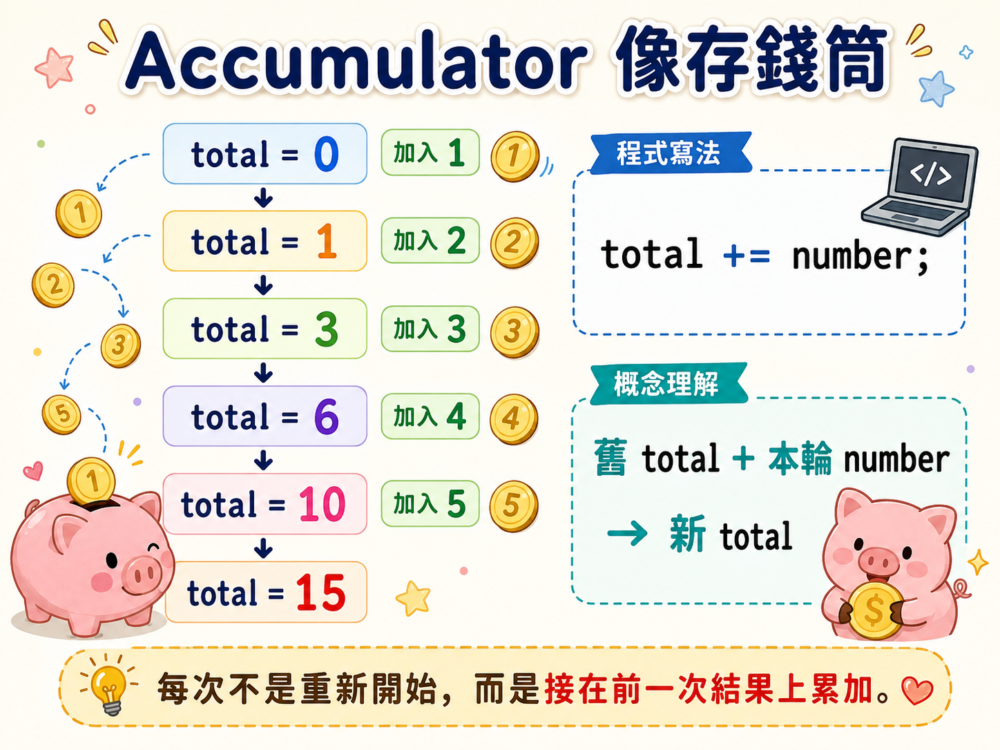

---

## Section XXI. 1 到 n 的總和

```cpp
// VALIDATE
#include <iostream>
using namespace std;

int main() {
    int n;
    cin >> n;

    int number = 1;
    long long total = 0;

    while (number <= n) {
        total += number;
        ++number;
    }

    cout << total << '\n';

    return 0;
}
```

若 `n < 1`，迴圈不執行，`total` 維持 `0`。

---

# Part F：常見無窮迴圈

## Section XXII. 忘記更新

錯誤：

```cpp
int number = 1;

while (number <= 5) {
    cout << number << '\n';
}
```

`number` 永遠是 `1`。

條件永遠為 `true`，形成無窮迴圈。


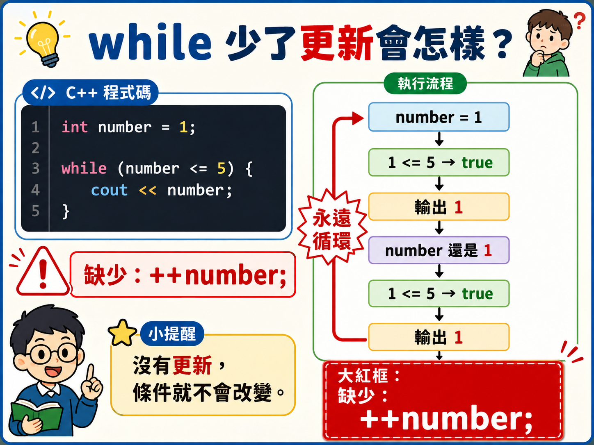

---

## Section XXIII. 更新方向錯誤

錯誤：

```cpp
int number = 1;

while (number <= 5) {
    cout << number << '\n';
    --number;
}
```

`number` 越來越小，仍然永遠 `<= 5`。

---

## Section XXIV. 條件變數錯誤

```cpp
int number = 1;
int other = 0;

while (number <= 5) {
    cout << number << '\n';
    ++other;
}
```

條件檢查 `number`，但更新的是 `other`。


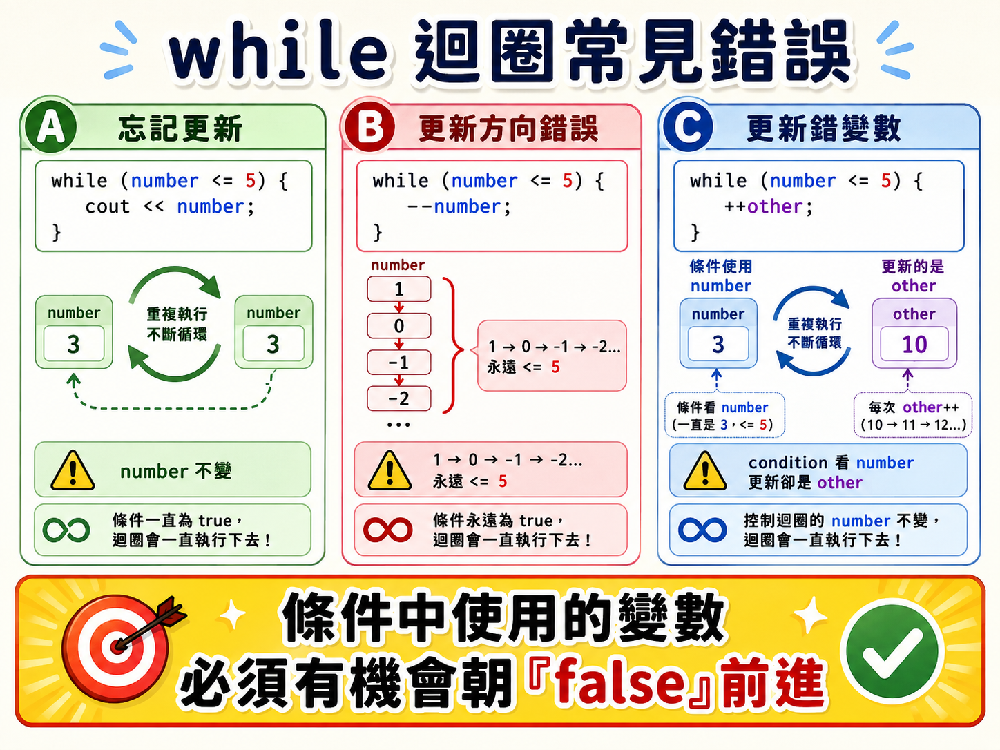

---

## Section XXV. 條件後誤加分號

錯誤：

```cpp
while (number <= 5); {
    cout << number << '\n';
    ++number;
}
```

分號形成空迴圈。

若條件保持為真，程式會卡在空迴圈中。


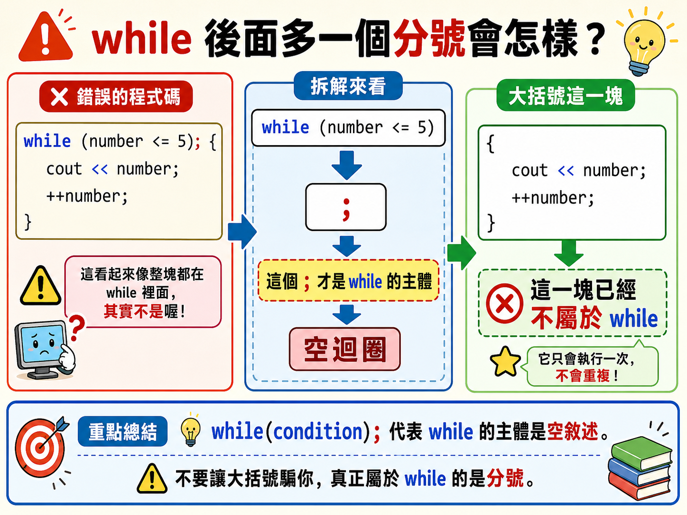

---

# Part G：哨兵值 Sentinel

## Section XXVI. 什麼是哨兵值？

哨兵值是特殊輸入，用來表示：

```text
停止輸入
結束迴圈
```

例如：

```text
輸入 -1 表示結束
```


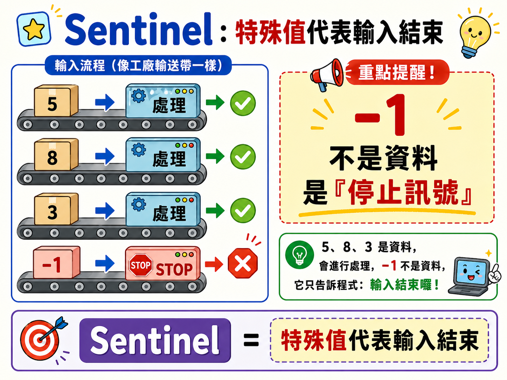

---

## Section XXVII. 哨兵值不應納入計算

若 `-1` 只是結束訊號，就不應加到總和中。

正確流程：

```text
先輸入
→ 檢查是否為 -1
→ 不是 -1 才處理
```


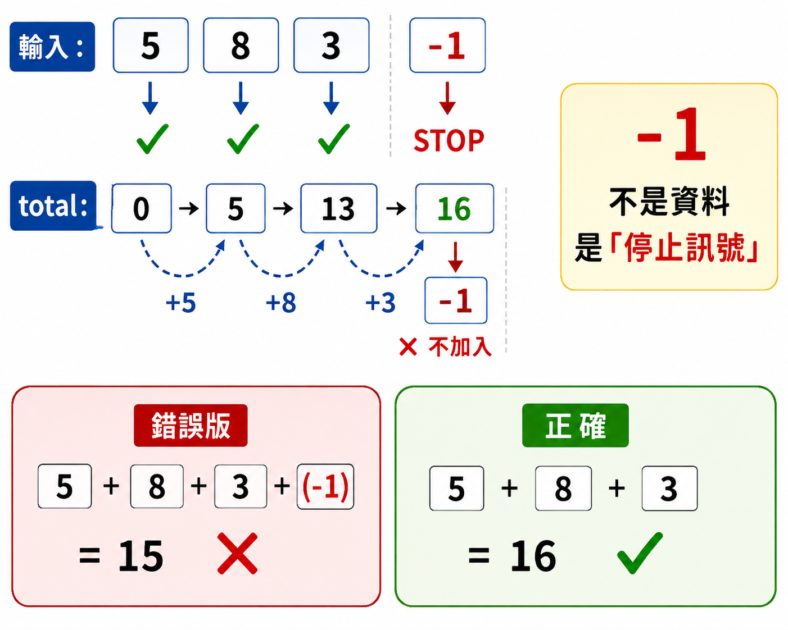

---

## Section XXVIII. 不定個數整數總和

```cpp
// VALIDATE
#include <iostream>
using namespace std;

int main() {
    int value;
    long long total = 0;

    cout << "輸入整數，-1 結束：";
    cin >> value;

    while (value != -1) {
        total += value;
        cin >> value;
    }

    cout << "Total: "
         << total
         << '\n';

    return 0;
}
```

---

## Section XXIX. 為什麼輸入兩次？

第一次輸入在迴圈前：

```cpp
cin >> value;
```

用來準備第一次條件檢查。

迴圈尾端再次輸入：

```cpp
cin >> value;
```

用來準備下一輪。

這種方式稱為 priming read。


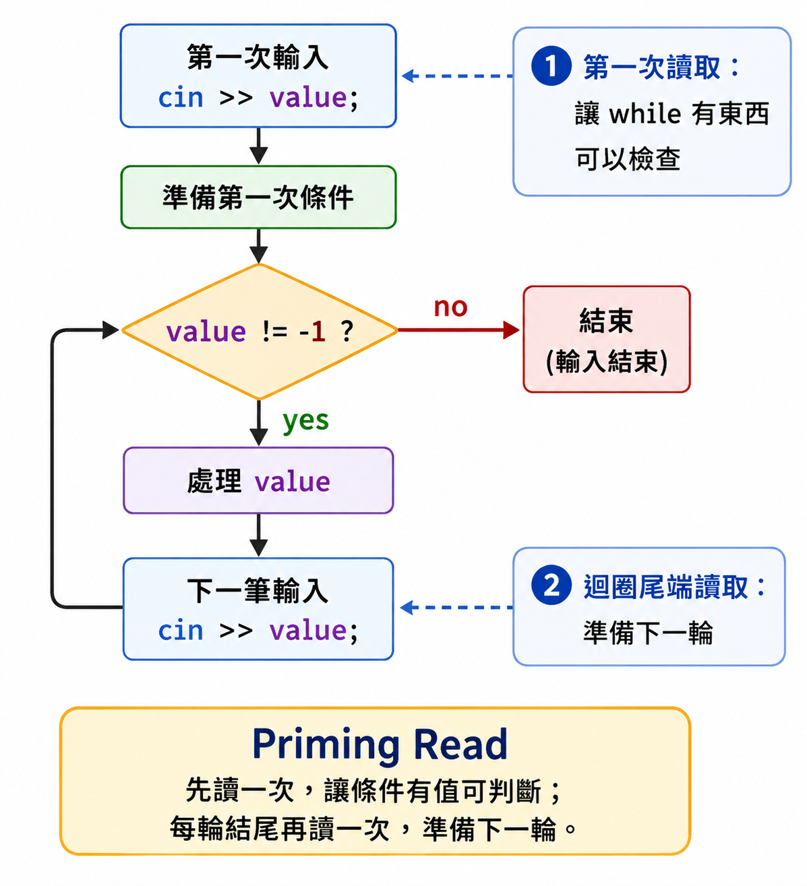

---

## Section XXX. 哨兵追蹤

輸入：

```text
5 8 3 -1
```

| `value` | 是否等於 -1 | 是否加入 `total` |
| ---: | --- | --- |
| 5 | 否 | 是 |
| 8 | 否 | 是 |
| 3 | 否 | 是 |
| -1 | 是 | 否，結束 |

---

# Part H：不定個數平均值

## Section XXXI. 需要兩個變數

平均值：

```text
總和 ÷ 資料數量
```

因此需要：

```cpp
long long total = 0;
int count = 0;
```


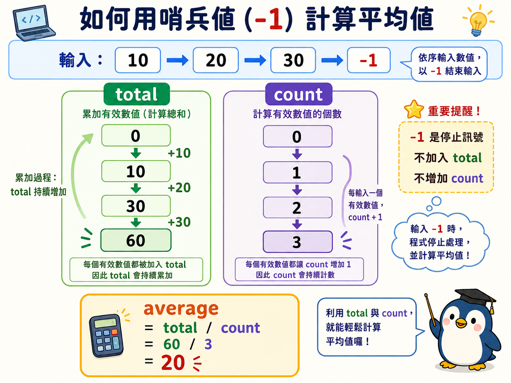

---

## Section XXXII. 完整平均值程式

```cpp
// VALIDATE
#include <iostream>
using namespace std;

int main() {
    int value;
    long long total = 0;
    int count = 0;

    cout << "輸入非負整數，-1 結束：";
    cin >> value;

    while (value != -1) {
        total += value;
        ++count;

        cin >> value;
    }

    if (count == 0) {
        cout << "No data\n";
    } else {
        double average =
            static_cast<double>(total) / count;

        cout << "Average: "
             << average
             << '\n';
    }

    return 0;
}
```

---

## Section XXXIII. 為什麼檢查 `count == 0`？

如果第一筆就是：

```text
-1
```

沒有任何有效資料：

```text
count = 0
```

不能計算：

```text
total / 0
```


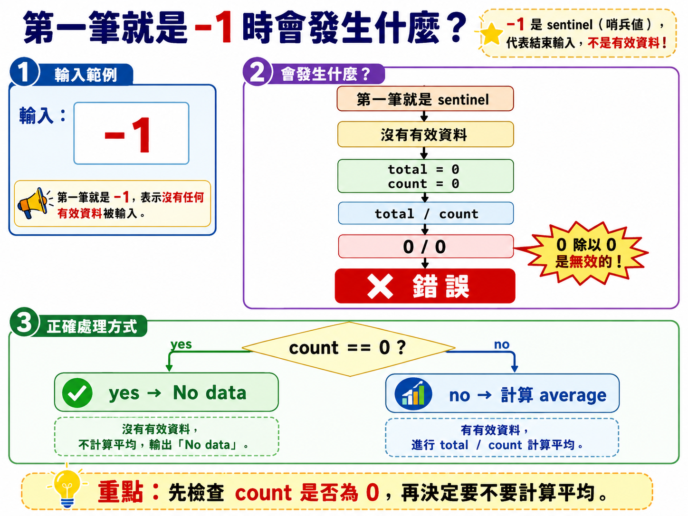

---

## Section XXXIV. 計數的是有效資料

哨兵值：

```text
-1
```

不應增加 `count`。

`count` 只記錄真正納入平均值的資料數量。

---

# Part I：讀到 EOF

## Section XXXV. `while (cin >> value)`

C++ 可以把輸入操作本身放在條件中：

```cpp
while (cin >> value) {
    // 處理 value
}
```

只要讀取成功，條件就成立。


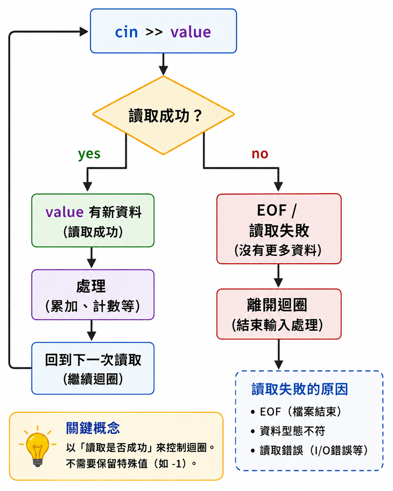

---

## Section XXXVI. 完整 EOF 總和

```cpp
// VALIDATE
#include <iostream>
using namespace std;

int main() {
    int value;
    long long total = 0;

    while (cin >> value) {
        total += value;
    }

    cout << total << '\n';

    return 0;
}
```

輸入結束或讀取失敗時，迴圈停止。

---

## Section XXXVII. 哨兵值與 EOF

| 方法 | 結束方式 |
| --- | --- |
| 哨兵值 | 輸入特定值，如 `-1` |
| EOF | 輸入資料流結束 |
| 讀取失敗 | 輸入型別不符合 |


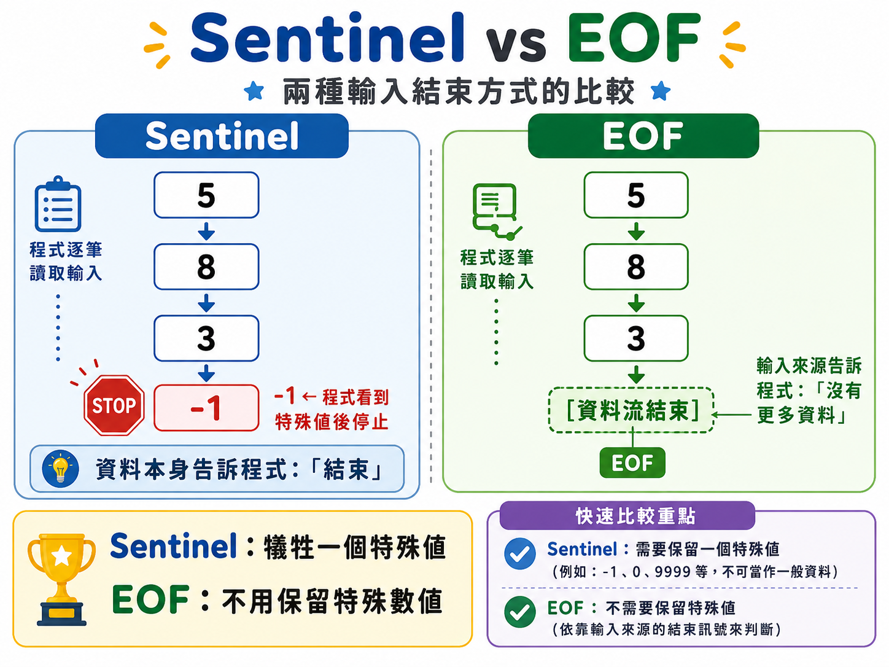

---

## Section XXXVIII. 何時使用 EOF？

適合：

- 線上評測讀到檔案結尾
- 不知道資料筆數
- 輸入來源是檔案或管線
- 不希望犧牲某個數值作為哨兵

---

# Part J：使用 `while` 驗證輸入

## Section XXXIX. 範圍驗證

目標：

```text
分數必須介於 0 到 100
```

只要非法，就繼續要求輸入。

---

## Section XL. 完整分數驗證

```cpp
// VALIDATE
#include <iostream>
using namespace std;

int main() {
    int score;

    cout << "請輸入 0 到 100：";
    cin >> score;

    while (score < 0 || score > 100) {
        cout << "Invalid. Please enter again: ";
        cin >> score;
    }

    cout << "Accepted: "
         << score
         << '\n';

    return 0;
}
```

---

## Section XLI. 驗證流程

```text
先輸入一次
→ 檢查是否非法
→ 非法：重新輸入
→ 再次檢查
→ 合法：離開迴圈
```


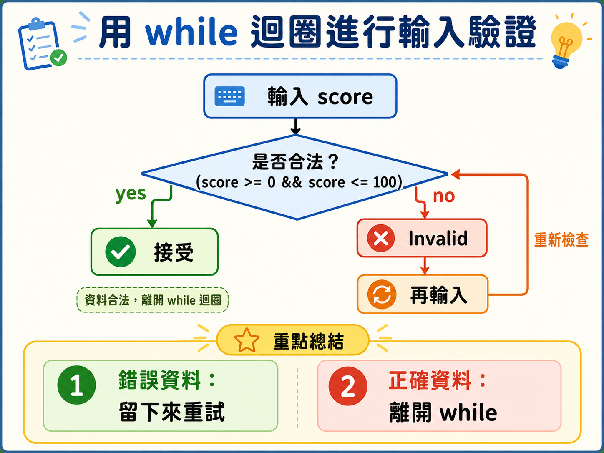

---

## Section XLII. 驗證非零除數

```cpp
// VALIDATE
#include <iostream>
using namespace std;

int main() {
    int number;
    int divisor;

    cout << "請輸入被除數：";
    cin >> number;

    cout << "請輸入非零除數：";
    cin >> divisor;

    while (divisor == 0) {
        cout << "Divisor cannot be zero. Enter again: ";
        cin >> divisor;
    }

    cout << number / divisor << '\n';

    return 0;
}
```

---

# Part K：`do-while`

## Section XLIII. 基本語法

```cpp
do {
    statements;
} while (condition);
```

注意最後：

```cpp
;
```

是必要的。


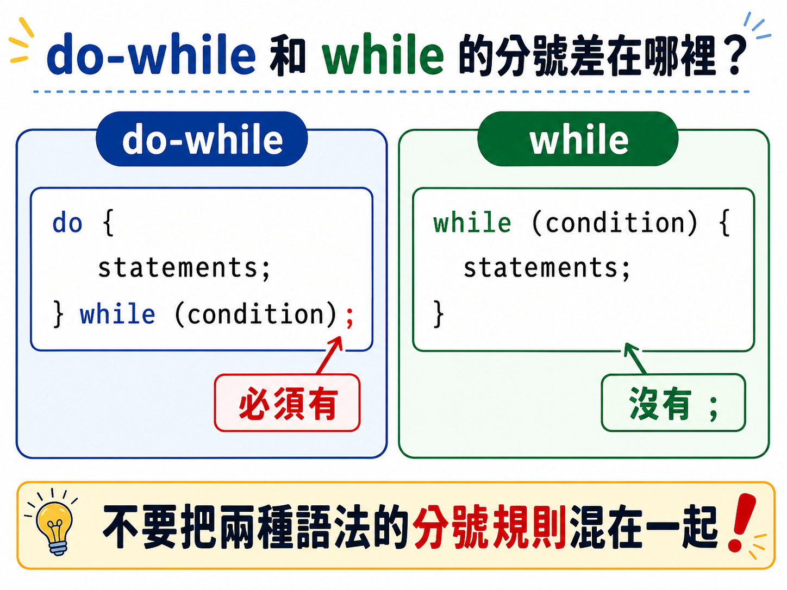

---

## Section XLIV. 執行順序

```text
先執行主體
→ 再檢查條件
→ true：重複
→ false：離開
```

---

## Section XLV. 至少執行一次

```cpp
int number = 10;

do {
    cout << number << '\n';
    ++number;
} while (number <= 5);
```

雖然第一次條件就會是 `false`，仍會先輸出一次：

```text
10
```


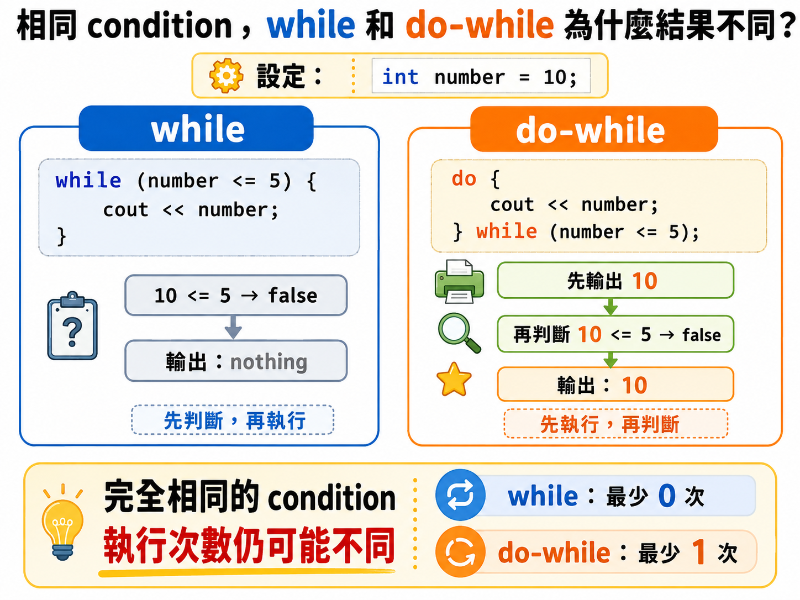

---

## Section XLVI. 完整 `do-while` 範例

```cpp
// VALIDATE
#include <iostream>
using namespace std;

int main() {
    int number = 1;

    do {
        cout << number << '\n';
        ++number;
    } while (number <= 5);

    return 0;
}
```

輸出：

```text
1
2
3
4
5
```

---

## Section XLVII. `while` 與 `do-while` 比較

| 特性 | `while` | `do-while` |
| --- | --- | --- |
| 條件位置 | 開頭 | 結尾 |
| 判斷時機 | 主體之前 | 主體之後 |
| 最少執行次數 | 0 次 | 1 次 |
| 常見用途 | 可能完全不執行 | 選單、輸入驗證 |


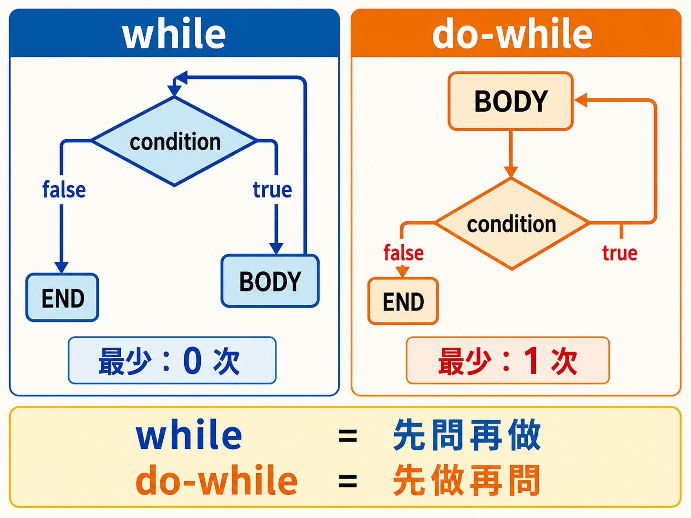

---

# Part L：使用 `do-while` 驗證

## Section XLVIII. 分數驗證

```cpp
// VALIDATE
#include <iostream>
using namespace std;

int main() {
    int score;

    do {
        cout << "請輸入 0 到 100：";
        cin >> score;
    } while (score < 0 || score > 100);

    cout << "Accepted: "
         << score
         << '\n';

    return 0;
}
```

---

## Section XLIX. 為什麼適合？

輸入動作至少需要執行一次：

```text
先詢問
→ 再判斷是否合法
```

這正符合 `do-while` 的結構。

---

# Part M：重複選單

## Section L. 基本選單

選單通常需要：

```text
先顯示一次
→ 使用者選擇
→ 處理
→ 判斷是否繼續
```

因此適合 `do-while`。


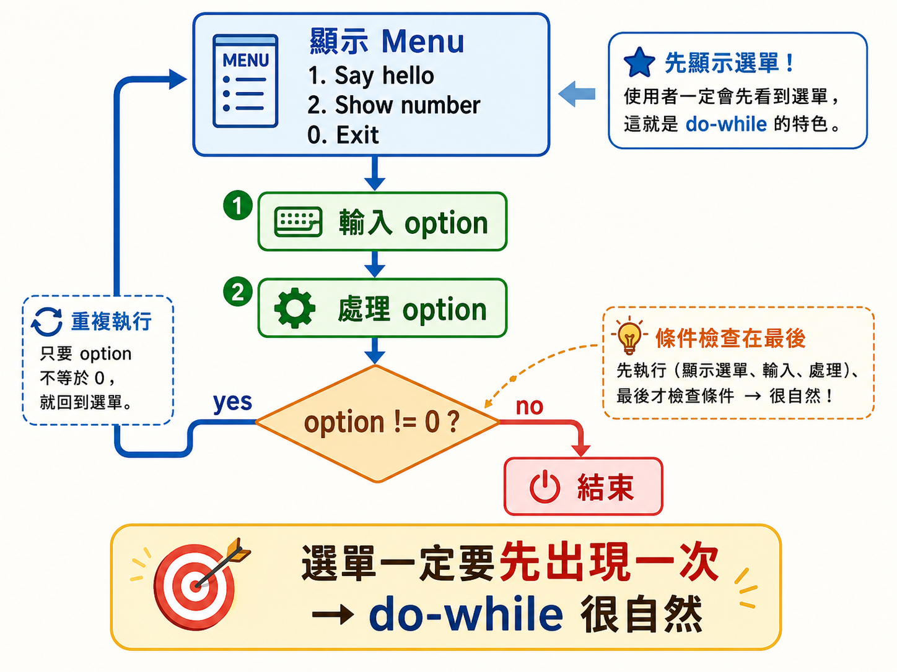

---

## Section LI. 完整選單程式

```cpp
// VALIDATE
#include <iostream>
using namespace std;

int main() {
    int option;

    do {
        cout << "1. Say hello\n";
        cout << "2. Show number\n";
        cout << "0. Exit\n";
        cout << "Option: ";

        cin >> option;

        switch (option) {
            case 1:
                cout << "Hello!\n";
                break;

            case 2:
                cout << "42\n";
                break;

            case 0:
                cout << "Goodbye!\n";
                break;

            default:
                cout << "Invalid option\n";
                break;
        }
    } while (option != 0);

    return 0;
}
```

---

## Section LII. 結束條件

```cpp
while (option != 0);
```

只要選項不是 `0`，選單就再次顯示。

---

# Part N：布林變數控制

## Section LIII. `running`

```cpp
bool running = true;

while (running) {
    // ...
}
```

當需要結束時：

```cpp
running = false;
```

---

## Section LIV. 完整布林控制範例

```cpp
// VALIDATE
#include <iostream>
using namespace std;

int main() {
    bool running = true;
    int option;

    while (running) {
        cout << "1. Continue\n";
        cout << "0. Exit\n";
        cin >> option;

        if (option == 0) {
            running = false;
        }

        if (option == 1) {
            cout << "Continuing...\n";
        }
    }

    return 0;
}
```

---

## Section LV. 好處

布林變數可把條件意義寫清楚：

```text
while (running)
while (connected)
while (hasMoreData)
```

比不具說明的數字更容易閱讀。


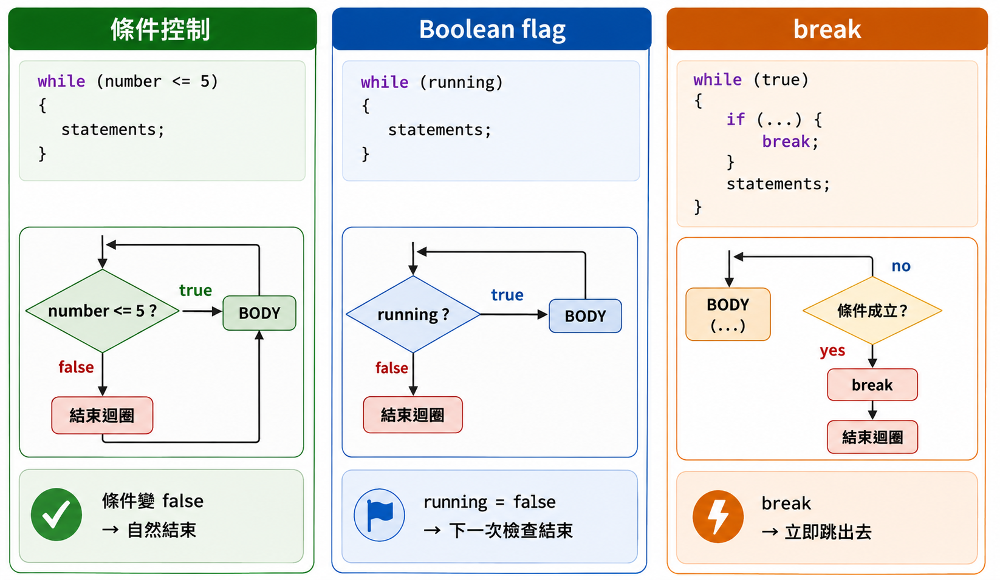

---

# Part O：`while (true)` 與 `break`

## Section LVI. 明確無窮迴圈

```cpp
while (true) {
    // 重複
}
```

條件永遠為真。

必須有其他方式離開，例如：

```cpp
break;
```

---

## Section LVII. 使用 `break` 結束輸入

```cpp
// VALIDATE
#include <iostream>
using namespace std;

int main() {
    long long total = 0;

    while (true) {
        int value;
        cin >> value;

        if (value == -1) {
            break;
        }

        total += value;
    }

    cout << total << '\n';

    return 0;
}
```


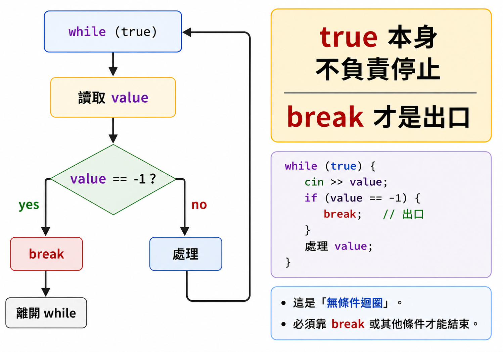

---

## Section LVIII. 與傳統哨兵寫法比較

傳統：

```cpp
cin >> value;

while (value != -1) {
    total += value;
    cin >> value;
}
```

`while (true)`：

```cpp
while (true) {
    cin >> value;

    if (value == -1) {
        break;
    }

    total += value;
}
```

兩種都可使用。


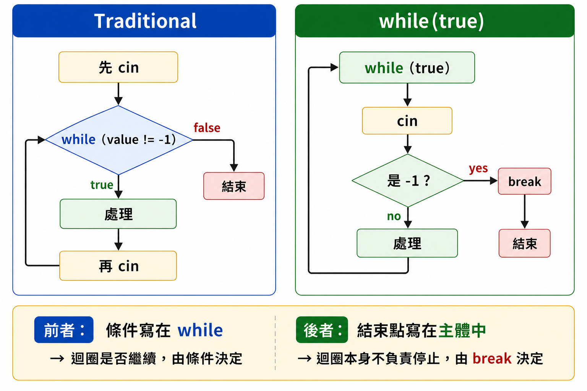

---

## Section LIX. 何時適合 `while (true)`？

適合：

- 結束條件出現在主體中間
- 每輪先取得資料，再判斷是否結束
- 多個位置可能需要提前離開

但應讓離開條件清楚可見。

---

# Part P：`continue`

## Section LX. 跳過本輪剩餘程式

```cpp
continue;
```

會：

```text
跳過本輪後面的程式
→ 回到下一次條件檢查
```


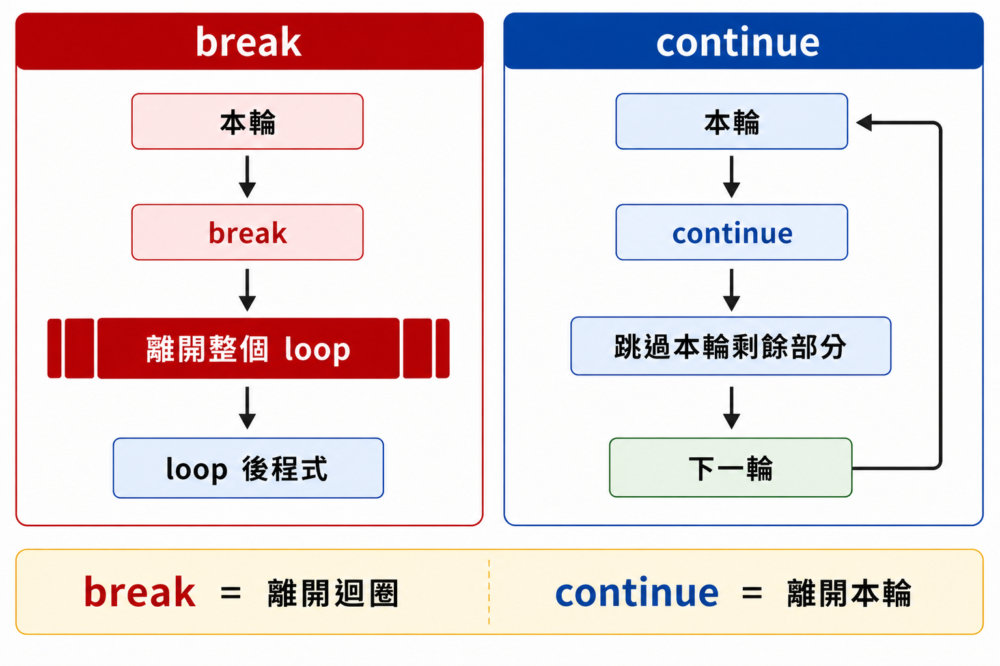

---

## Section LXI. 忽略負數

```cpp
// VALIDATE
#include <iostream>
using namespace std;

int main() {
    int count = 0;
    long long total = 0;

    while (count < 5) {
        int value;
        cin >> value;

        ++count;

        if (value < 0) {
            continue;
        }

        total += value;
    }

    cout << total << '\n';

    return 0;
}
```

輸入五個整數，但只累加非負值。


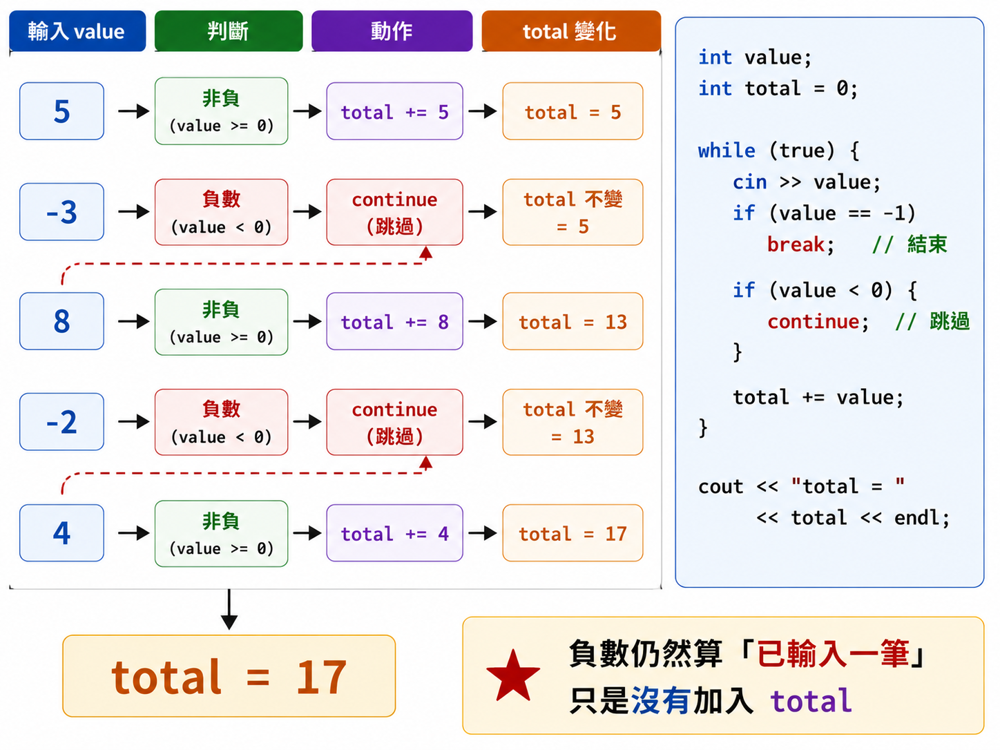

---

## Section LXII. `continue` 與更新

危險：

```cpp
int number = 0;

while (number < 5) {
    if (number == 2) {
        continue;
    }

    ++number;
}
```

當 `number == 2` 時，`++number` 被跳過，形成無窮迴圈。


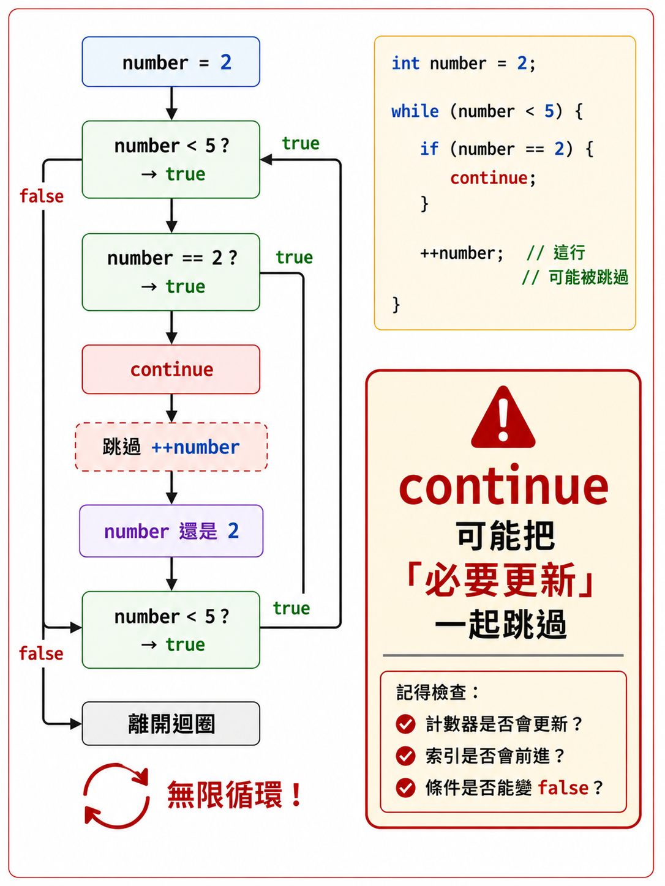

---

## Section LXIII. 修正方式

先更新：

```cpp
int number = 0;

while (number < 5) {
    ++number;

    if (number == 2) {
        continue;
    }

    cout << number << '\n';
}
```

或在 `continue` 前更新。

---

# Part Q：巢狀 `while` 初步

## Section LXIV. 迴圈內還有迴圈

```cpp
while (outerCondition) {
    while (innerCondition) {
        // ...
    }
}
```

外層每執行一次，內層可以完整重複多次。

---

## Section LXV. 簡單座標輸出

```cpp
// VALIDATE
#include <iostream>
using namespace std;

int main() {
    int row = 1;

    while (row <= 2) {
        int column = 1;

        while (column <= 3) {
            cout << "("
                 << row
                 << ", "
                 << column
                 << ")\n";

            ++column;
        }

        ++row;
    }

    return 0;
}
```

輸出六組座標。


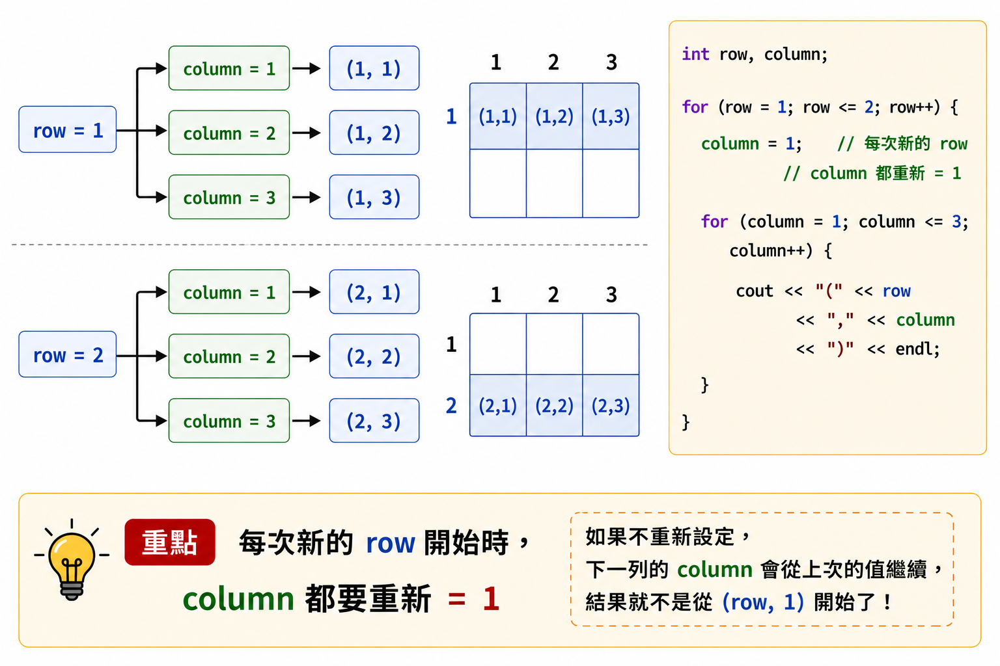

---

## Section LXVI. 內層初始化位置

```cpp
int column = 1;
```

必須放在外層迴圈內，讓每一列開始時重新從第一欄計算。

完整巢狀迴圈與圖形題會在後續章節進一步整理。


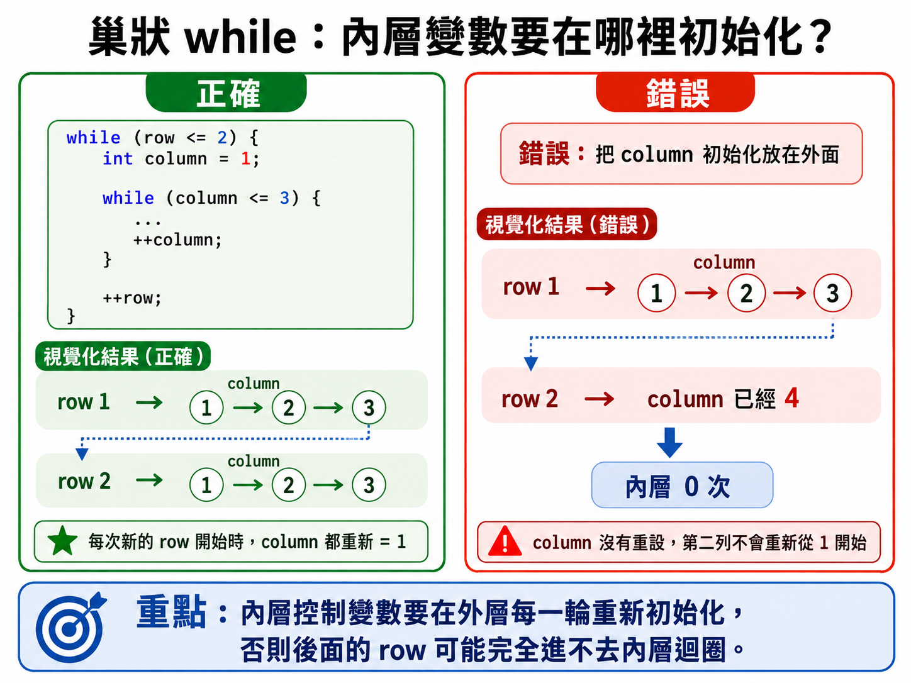

---

# Part R：快速概念檢查

## Section LXVII. 選擇題與簡答

### Q1. `while` 何時檢查條件？

<details><summary>查看答案</summary>

每次執行迴圈主體之前。

</details>

### Q2. `while` 最少可能執行幾次？

<details><summary>查看答案</summary>

0 次。

</details>

### Q3. `do-while` 最少執行幾次？

<details><summary>查看答案</summary>

1 次。

</details>

### Q4. `do-while` 最後需要分號嗎？

<details><summary>查看答案</summary>

需要：

```cpp
} while (condition);
```

</details>

### Q5. 計數器的用途是什麼？

<details><summary>查看答案</summary>

記錄執行次數或符合條件的資料數量。

</details>

### Q6. 累加器的用途是什麼？

<details><summary>查看答案</summary>

保存逐步累積的總和。

</details>

### Q7. 為什麼迴圈通常需要更新？

<details><summary>查看答案</summary>

讓條件最終有機會變成 `false`。

</details>

### Q8. 忘記更新可能造成什麼？

<details><summary>查看答案</summary>

無窮迴圈。

</details>

### Q9. 什麼是哨兵值？

<details><summary>查看答案</summary>

用來表示輸入結束的特殊值。

</details>

### Q10. 哨兵值應加入總和嗎？

<details><summary>查看答案</summary>

若只代表結束，不應加入。

</details>

### Q11. 平均值需要追蹤哪兩項？

<details><summary>查看答案</summary>

總和 `total` 與資料數量 `count`。

</details>

### Q12. 為什麼計算平均前要檢查 `count`？

<details><summary>查看答案</summary>

避免除以零。

</details>

### Q13. `while (cin >> value)` 何時持續？

<details><summary>查看答案</summary>

輸入成功時持續。

</details>

### Q14. `break` 做什麼？

<details><summary>查看答案</summary>

立即離開目前迴圈。

</details>

### Q15. `continue` 做什麼？

<details><summary>查看答案</summary>

跳過本輪剩餘程式，進入下一次條件檢查。

</details>

### Q16. `continue` 有什麼常見風險？

<details><summary>查看答案</summary>

可能跳過更新，使條件永遠不改變。

</details>

### Q17. `while (true)` 一定是錯誤嗎？

<details><summary>查看答案</summary>

不一定，但必須有清楚可達的離開方式。

</details>

### Q18. 輸入驗證何時適合 `do-while`？

<details><summary>查看答案</summary>

必須先要求輸入一次，再判斷是否合法時。

</details>

### Q19. 選單為什麼常使用 `do-while`？

<details><summary>查看答案</summary>

選單至少要先顯示一次。

</details>

### Q20. `if` 與 `while` 的主要差異是什麼？

<details><summary>查看答案</summary>

`if` 檢查一次；`while` 在條件成立時重複檢查與執行。

</details>

---

# Part S：程式閱讀練習

## Section LXVIII. 預測輸出與次數

### 題目 1

```cpp
int number = 1;

while (number <= 3) {
    cout << number;
    ++number;
}
```

<details><summary>查看答案</summary>

```text
123
```

</details>

### 題目 2

```cpp
int number = 5;

while (number < 5) {
    cout << number;
}
```

<details><summary>查看答案</summary>

沒有輸出，迴圈執行 0 次。

</details>

### 題目 3

```cpp
int number = 3;

do {
    cout << number;
} while (number < 3);
```

<details><summary>查看答案</summary>

```text
3
```

主體先執行一次。

</details>

### 題目 4

```cpp
int number = 1;
int total = 0;

while (number <= 4) {
    total += number;
    ++number;
}

cout << total;
```

<details><summary>查看答案</summary>

```text
10
```

</details>

### 題目 5

```cpp
int number = 2;

while (number <= 8) {
    cout << number << " ";
    number += 2;
}
```

<details><summary>查看答案</summary>

```text
2 4 6 8 
```

</details>

### 題目 6

```cpp
int number = 1;

while (number <= 3) {
    cout << number;
}
```

<details><summary>查看答案</summary>

無窮輸出 `1`，因為 `number` 沒有更新。

</details>

### 題目 7

```cpp
int number = 3;

while (number >= 1) {
    cout << number;
    --number;
}
```

<details><summary>查看答案</summary>

```text
321
```

</details>

### 題目 8

```cpp
int count = 0;

while (count < 3) {
    ++count;

    if (count == 2) {
        continue;
    }

    cout << count;
}
```

<details><summary>查看答案</summary>

```text
13
```

</details>

### 題目 9

```cpp
int value = 5;
int total = 0;

while (value != -1) {
    total += value;
    value = -1;
}

cout << total;
```

<details><summary>查看答案</summary>

```text
5
```

</details>

### 題目 10

```cpp
int count = 0;

while (true) {
    ++count;

    if (count == 3) {
        break;
    }
}

cout << count;
```

<details><summary>查看答案</summary>

```text
3
```

</details>

### 題目 11

```cpp
int number = 0;

do {
    ++number;
} while (number < 3);

cout << number;
```

<details><summary>查看答案</summary>

```text
3
```

</details>

### 題目 12

```cpp
int row = 1;

while (row <= 2) {
    int column = 1;

    while (column <= 2) {
        cout << row << column << " ";
        ++column;
    }

    ++row;
}
```

<details><summary>查看答案</summary>

```text
11 12 21 22 
```

</details>

---

# Part T：實作練習

## Section LXIX. 實作檢測題

### TODO 1：從 1 數到 n

輸入 `n`，使用 `while` 輸出 `1` 到 `n`。

### TODO 2：倒數

輸入正整數，倒數到 `1`，最後輸出 `Go!`。

### TODO 3：偶數序列

輸出 `2` 到 `20` 的所有偶數。

### TODO 4：1 到 n 的總和

使用累加器計算總和。

### TODO 5：不定個數總和

輸入整數，以 `-1` 結束，不把 `-1` 加入總和。

### TODO 6：不定個數平均

以 `-1` 結束，輸出平均值；沒有資料時輸出 `No data`。

### TODO 7：讀到 EOF

使用 `while (cin >> value)` 計算全部輸入總和。

### TODO 8：驗證分數

使用 `while` 讓使用者重輸入，直到分數介於 `0` 和 `100`。

### TODO 9：驗證非零除數

讓使用者重新輸入，直到除數不為零。

### TODO 10：`do-while` 分數驗證

將 TODO 8 改成 `do-while`。

### TODO 11：重複選單

建立選單，輸入 `0` 時結束。

### TODO 12：布林控制

使用 `bool running` 控制程式是否繼續。

### TODO 13：`while (true)` 哨兵

使用 `break` 在輸入 `-1` 時離開。

### TODO 14：忽略負數

輸入五個整數，使用 `continue` 只累加非負數。

### TODO 15：座標輸出

使用巢狀 `while` 輸出兩列三欄座標。

---

# Part U：課後小練習

## Section LXX. 延伸練習

### 練習 1：數字位數

輸入正整數，使用 `while` 計算十進位位數。

### 練習 2：反轉數字

輸入非負整數，使用 `% 10` 與 `/ 10` 反轉數字。

### 練習 3：最大輸入值

持續輸入非負整數，以 `-1` 結束，找出最大值。

### 練習 4：猜數字

設定固定答案，使用 `while` 讓使用者猜到正確為止。

### 練習 5：登入次數

最多允許三次輸入密碼，成功或次數用完時結束。

---

# Part V：常見錯誤提醒

## Section LXXI. 常見錯誤

1. 忘記初始化條件變數。
2. 忘記更新條件變數。
3. 更新方向與條件方向相反。
4. 更新了錯誤變數。
5. 在 `while` 條件後誤加分號。
6. 條件一開始就為假，卻期待執行一次。
7. 把哨兵值加入總和。
8. 忘記在每輪讀取下一筆資料。
9. 計算平均值時忘記 `count`。
10. `count == 0` 時仍進行除法。
11. 把所有輸入次數當作有效資料數量。
12. 混淆 EOF 與哨兵值。
13. `do-while` 尾端忘記分號。
14. `do-while` 條件寫反。
15. `while (true)` 沒有可達的 `break`。
16. `continue` 跳過更新。
17. 巢狀迴圈的內層變數沒有重新初始化。
18. 把 `if` 當成會重複執行。
19. 使用未初始化資料作為條件。
20. 迴圈條件過度複雜，難以確認終止。


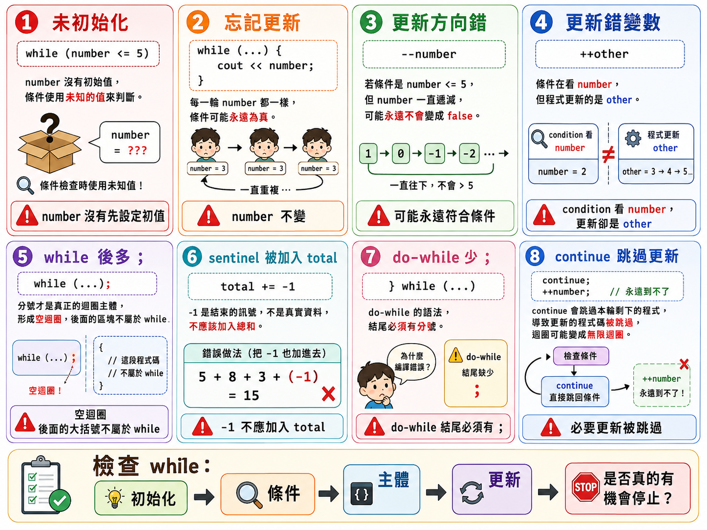

---

# Part W：Mermaid 流程圖

## Section LXXII. 迴圈流程圖

### 1. 基本 `while`

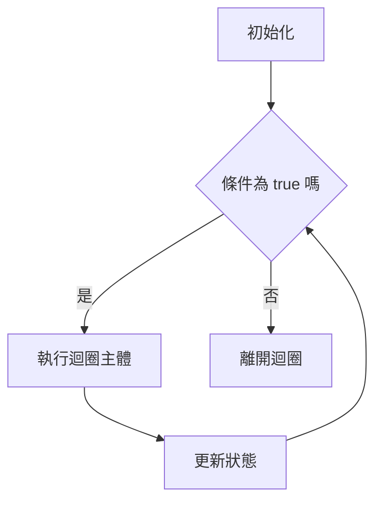
```mermaid
flowchart TD
    A[初始化] --> B{條件為 true 嗎}
    B -- 是 --> C[執行迴圈主體]
    C --> D[更新狀態]
    D --> B
    B -- 否 --> E[離開迴圈]
```

### 2. 計數器

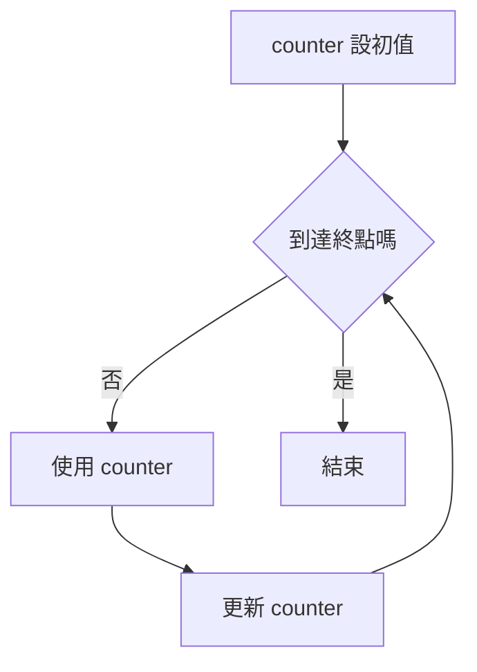
```mermaid
flowchart TD
    A[counter 設初值] --> B{到達終點嗎}
    B -- 否 --> C[使用 counter]
    C --> D[更新 counter]
    D --> B
    B -- 是 --> E[結束]
```

### 3. 哨兵值

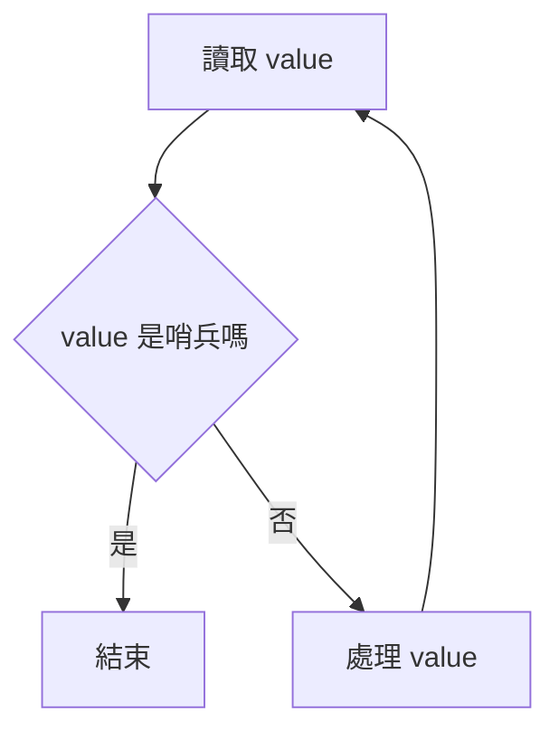
```mermaid
flowchart TD
    A[讀取 value] --> B{value 是哨兵嗎}
    B -- 是 --> E[結束]
    B -- 否 --> C[處理 value]
    C --> A
```

### 4. 平均值

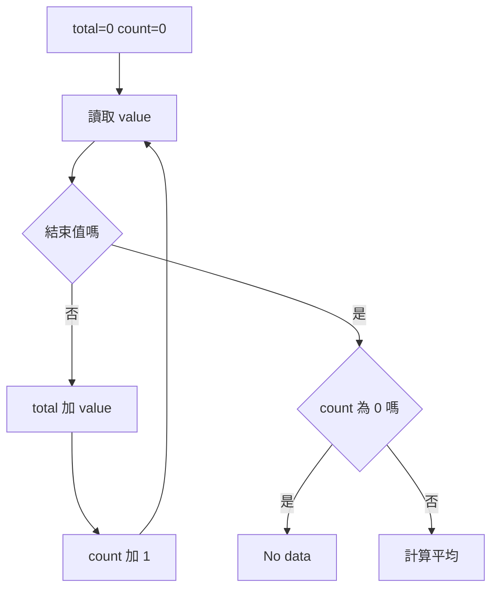
```mermaid
flowchart TD
    A[total=0 count=0] --> B[讀取 value]
    B --> C{結束值嗎}
    C -- 否 --> D[total 加 value]
    D --> E[count 加 1]
    E --> B
    C -- 是 --> F{count 為 0 嗎}
    F -- 是 --> G[No data]
    F -- 否 --> H[計算平均]
```

### 5. 輸入驗證

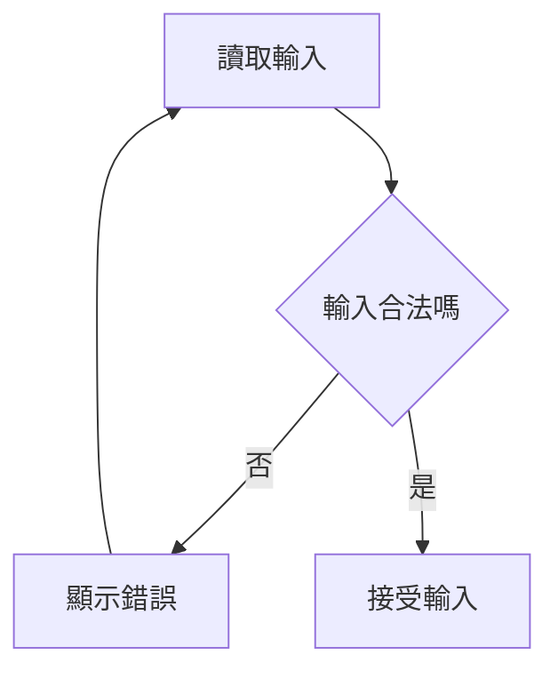
```mermaid
flowchart TD
    A[讀取輸入] --> B{輸入合法嗎}
    B -- 否 --> C[顯示錯誤]
    C --> A
    B -- 是 --> D[接受輸入]
```

### 6. `do-while`

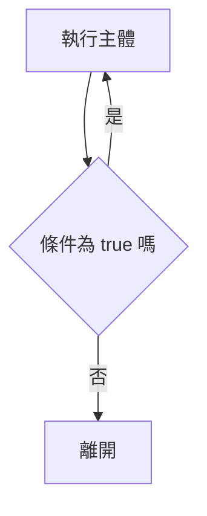
```mermaid
flowchart TD
    A[執行主體] --> B{條件為 true 嗎}
    B -- 是 --> A
    B -- 否 --> C[離開]
```

### 7. `break`

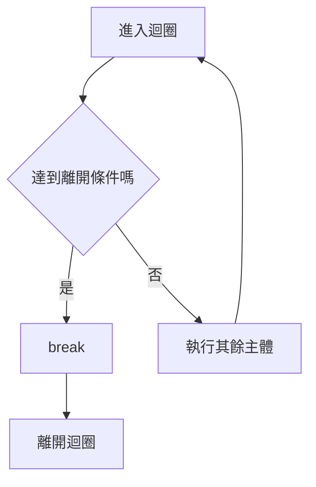
```mermaid
flowchart TD
    A[進入迴圈] --> B{達到離開條件嗎}
    B -- 是 --> C[break]
    C --> D[離開迴圈]
    B -- 否 --> E[執行其餘主體]
    E --> A
```

### 8. `continue`

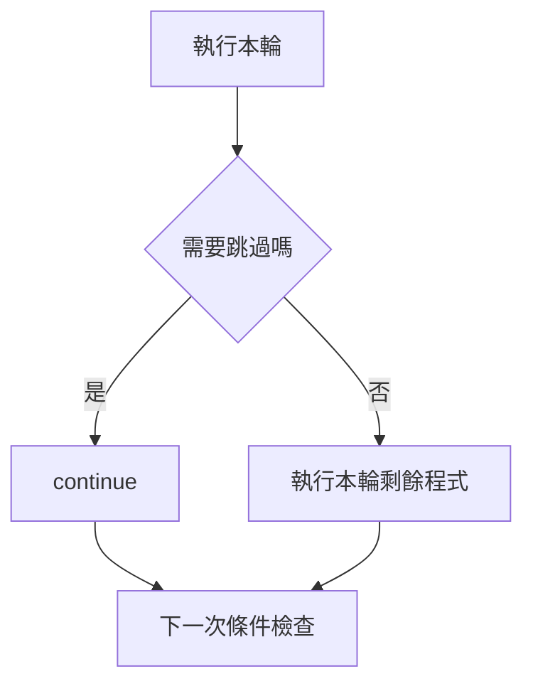
```mermaid
flowchart TD
    A[執行本輪] --> B{需要跳過嗎}
    B -- 是 --> C[continue]
    C --> D[下一次條件檢查]
    B -- 否 --> E[執行本輪剩餘程式]
    E --> D
```

---

# 本章完成標準

完成本章後，你應該能做到：

1. 說明迴圈的用途。
2. 撰寫基本 `while`。
3. 說明 `while` 先判斷後執行。
4. 說明 `while` 可能執行 0 次。
5. 找出初始化、條件、主體與更新。
6. 使用計數器。
7. 使用累加器。
8. 輸出遞增與遞減序列。
9. 使用不同步長。
10. 計算 1 到 n 的總和。
11. 使用追蹤表分析迴圈。
12. 找出無窮迴圈原因。
13. 使用哨兵值。
14. 避免把哨兵加入計算。
15. 計算不定個數資料總和。
16. 計算不定個數資料平均。
17. 避免平均值除以零。
18. 使用 `while (cin >> value)`。
19. 比較哨兵與 EOF。
20. 使用 `while` 驗證輸入。
21. 驗證分數範圍。
22. 驗證除數不為零。
23. 撰寫 `do-while`。
24. 說明 `do-while` 至少執行一次。
25. 記得 `do-while` 尾端分號。
26. 使用 `do-while` 驗證輸入。
27. 使用 `do-while` 建立重複選單。
28. 比較 `while` 與 `do-while`。
29. 使用布林變數控制迴圈。
30. 使用 `while (true)`。
31. 使用 `break` 離開迴圈。
32. 使用 `continue` 跳過本輪。
33. 避免 `continue` 跳過更新。
34. 撰寫簡單巢狀 `while`。
35. 重新初始化內層迴圈變數。
36. 找出常見迴圈錯誤。

---

# 隱藏答案區

> Answer hidden — try it first.

<details><summary>TODO 1 答案</summary>

```cpp
#include <iostream>
using namespace std;

int main() {
    int n;
    cin >> n;

    int number = 1;

    while (number <= n) {
        cout << number << '\n';
        ++number;
    }

    return 0;
}
```

</details>

<details><summary>TODO 2 答案</summary>

```cpp
#include <iostream>
using namespace std;

int main() {
    int number;
    cin >> number;

    while (number >= 1) {
        cout << number << '\n';
        --number;
    }

    cout << "Go!\n";

    return 0;
}
```

</details>

<details><summary>TODO 3 答案</summary>

```cpp
int number = 2;

while (number <= 20) {
    cout << number << '\n';
    number += 2;
}
```

</details>

<details><summary>TODO 4 答案</summary>

```cpp
long long total = 0;
int number = 1;

while (number <= n) {
    total += number;
    ++number;
}
```

</details>

<details><summary>TODO 5 答案</summary>

```cpp
long long total = 0;
int value;

cin >> value;

while (value != -1) {
    total += value;
    cin >> value;
}
```

</details>

<details><summary>TODO 6 答案</summary>

```cpp
long long total = 0;
int count = 0;
int value;

cin >> value;

while (value != -1) {
    total += value;
    ++count;
    cin >> value;
}

if (count == 0) {
    cout << "No data\n";
} else {
    cout << static_cast<double>(total) / count
         << '\n';
}
```

</details>

<details><summary>TODO 7 答案</summary>

```cpp
int value;
long long total = 0;

while (cin >> value) {
    total += value;
}

cout << total << '\n';
```

</details>

<details><summary>TODO 8 答案</summary>

```cpp
int score;
cin >> score;

while (score < 0 || score > 100) {
    cin >> score;
}
```

</details>

<details><summary>TODO 9 答案</summary>

```cpp
int divisor;
cin >> divisor;

while (divisor == 0) {
    cin >> divisor;
}
```

</details>

<details><summary>TODO 10 答案</summary>

```cpp
int score;

do {
    cin >> score;
} while (score < 0 || score > 100);
```

</details>

<details><summary>TODO 11 答案</summary>

```cpp
int option;

do {
    cout << "1. Continue\n";
    cout << "0. Exit\n";
    cin >> option;
} while (option != 0);
```

</details>

<details><summary>TODO 12 答案</summary>

```cpp
bool running = true;

while (running) {
    int option;
    cin >> option;

    if (option == 0) {
        running = false;
    }
}
```

</details>

<details><summary>TODO 13 答案</summary>

```cpp
while (true) {
    int value;
    cin >> value;

    if (value == -1) {
        break;
    }

    total += value;
}
```

</details>

<details><summary>TODO 14 答案</summary>

```cpp
int count = 0;
long long total = 0;

while (count < 5) {
    int value;
    cin >> value;
    ++count;

    if (value < 0) {
        continue;
    }

    total += value;
}
```

</details>

<details><summary>TODO 15 答案</summary>

```cpp
int row = 1;

while (row <= 2) {
    int column = 1;

    while (column <= 3) {
        cout << "("
             << row
             << ", "
             << column
             << ")\n";

        ++column;
    }

    ++row;
}
```

</details>
