# Lesson 09：`for` and Range-Based `for` Loops `for` 與範圍型 `for` 迴圈

> 這堂課的重點：使用 `for` 處理「已知要重複幾次」的問題，並使用 range-based `for` 依序走訪字串或集合中的每個元素。

> 本章會比較 `for` 與 `while`，介紹計數、倒數、不同步長、固定次數輸入、累加、`break`、`continue`、迴圈變數作用域，以及 C++11 起提供的 range-based `for`。完整巢狀迴圈、九九乘法表與文字圖形會放在下一章。

---

## Section I. 今天要做什麼？

1. 複習 `while` 的四個部分。
2. 認識計次型迴圈。
3. 使用傳統 `for`。
4. 理解 `for` 的初始化區。
5. 理解 `for` 的條件區。
6. 理解 `for` 的更新區。
7. 理解 `for` 的迴圈主體。
8. 將 `for` 轉寫成 `while`。
9. 將簡單 `while` 轉寫成 `for`。
10. 使用 `for` 從 1 數到 5。
11. 使用 `for` 從 0 開始計數。
12. 使用 `<` 建立固定次數迴圈。
13. 使用 `<=` 包含終點。
14. 分辨「執行次數」與「最後一個數字」。
15. 避免 off-by-one error。
16. 使用 `for` 倒數。
17. 使用 `--` 更新。
18. 使用不同步長。
19. 輸出偶數序列。
20. 輸出奇數序列。
21. 輸出等差數列。
22. 使用 `for` 計算 1 到 n 的總和。
23. 使用 `for` 計算固定筆數資料總和。
24. 使用 `for` 計算固定筆數平均值。
25. 使用計數器表示目前第幾筆資料。
26. 使用 `long long` 保存較大總和。
27. 使用 `static_cast<double>()` 計算平均值。
28. 使用 `for` 計算階乘。
29. 理解階乘從 `1` 開始累乘。
30. 使用 `for` 計算次方。
31. 使用 `for` 計算某數的倍數。
32. 使用 `for` 判斷固定範圍內的條件。
33. 使用 `break` 提前離開。
34. 使用 `continue` 跳過本輪。
35. 理解 `for` 中 `continue` 後仍會執行更新區。
36. 使用 `for (;;)` 建立無窮迴圈。
37. 理解三個控制區都可以省略。
38. 避免在條件後誤加分號。
39. 避免忘記更新。
40. 避免更新方向錯誤。
41. 理解迴圈變數的作用域。
42. 理解在 `for` 初始化區宣告的變數通常只存在於迴圈內。
43. 理解迴圈結束後變數不可直接使用。
44. 認識多個初始化與更新表示式。
45. 避免為了縮短程式而降低可讀性。
46. 認識 range-based `for`。
47. 理解 range-based `for` 依序取得每個元素。
48. 使用 range-based `for` 走訪字串。
49. 使用 range-based `for` 走訪固定陣列。
50. 使用 range-based `for` 計算總和。
51. 使用 `auto` 推導元素型別。
52. 理解 `auto` 仍有確定型別。
53. 分辨以值取得與以參考取得。
54. 理解 `for (int value : values)` 取得副本。
55. 使用 `for (int& value : values)` 修改原元素。
56. 使用 `const int&` 唯讀走訪。
57. 使用 `const auto&` 唯讀走訪較複雜元素。
58. 理解 range-based `for` 預設不直接提供索引。
59. 判斷何時使用傳統 `for`。
60. 判斷何時使用 range-based `for`。
61. 避免在 range-based `for` 中修改副本卻期待原資料改變。
62. 避免在走訪期間改變容器結構。
63. 使用概念檢查、程式閱讀與實作題整合本章。

---

## Section II. 今天的學習方式

1. 每個傳統 `for` 都拆成：
   ```text
   初始化
   條件
   主體
   更新
   ```
2. 先預測第一次迴圈變數的值。
3. 再預測最後一次會進入主體的值。
4. 最後計算總執行次數。
5. 將不確定的 `for` 改寫成 `while` 幫助理解。
6. 使用追蹤表記錄每一輪：
   - 條件檢查時的值
   - 輸出
   - 更新後的值
7. 看到 `<` 與 `<=` 時特別檢查終點。
8. range-based `for` 先回答：
   ```text
   每一輪取得的是值、副本，還是原元素的參考？
   ```
9. 需要索引時優先考慮傳統 `for`。
10. 只需要每個元素時優先考慮 range-based `for`。
11. 巢狀迴圈只做概念預告，不展開圖形題。
12. 完整合法範例使用嚴格 C++17 選項檢查。

---

## Section III. 核心語法對照

| 語法 | 用途 |
| --- | --- |
| `for (int i = 0; i < n; ++i)` | 重複 `n` 次 |
| `for (int i = 1; i <= n; ++i)` | 從 1 走到 n |
| `for (int i = n; i >= 1; --i)` | 從 n 倒數到 1 |
| `for (int i = 0; i <= n; i += 2)` | 以 2 為步長 |
| `for (;;)` | 無窮迴圈 |
| `break;` | 提前離開迴圈 |
| `continue;` | 跳過本輪剩餘程式 |
| `for (char ch : text)` | 依序取得字串字元 |
| `for (int value : values)` | 取得每個元素的副本 |
| `for (int& value : values)` | 取得可修改的元素參考 |
| `for (const int& value : values)` | 唯讀參考 |
| `for (const auto& value : values)` | 自動推導唯讀參考型別 |

---

# Part A：為什麼需要 `for`？

## Section IV. 使用 `while` 計數

```cpp
int count = 0;

while (count < 5) {
    cout << count << '\n';
    ++count;
}
```

初始化、條件與更新分散在不同位置。

---

## Section V. 使用 `for` 集中控制

```cpp
for (int count = 0; count < 5; ++count) {
    cout << count << '\n';
}
```

三個控制部分集中在同一行：

```text
int count = 0
count < 5
++count
```


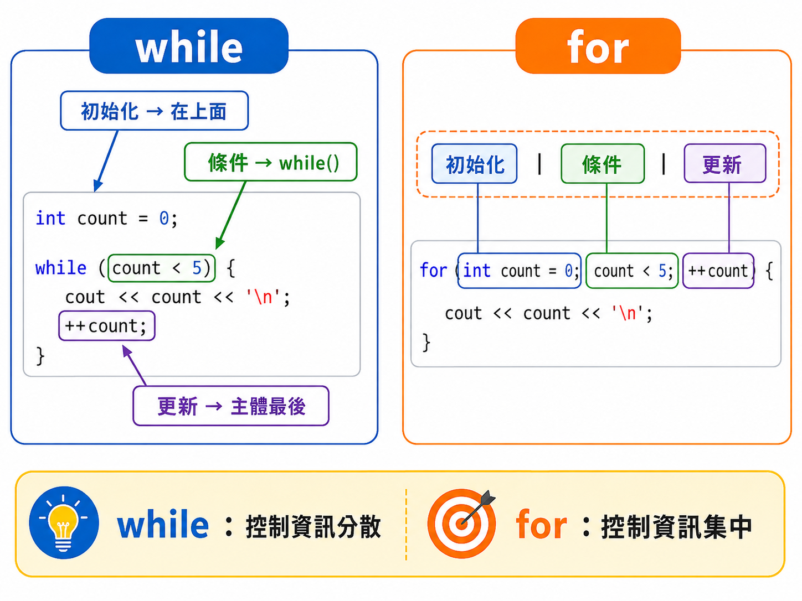

---

## Section VI. `for` 的四個部分

```cpp
for (初始化; 條件; 更新) {
    迴圈主體;
}
```

執行順序：

```text
初始化一次
→ 檢查條件
→ 執行主體
→ 執行更新
→ 回到條件
```


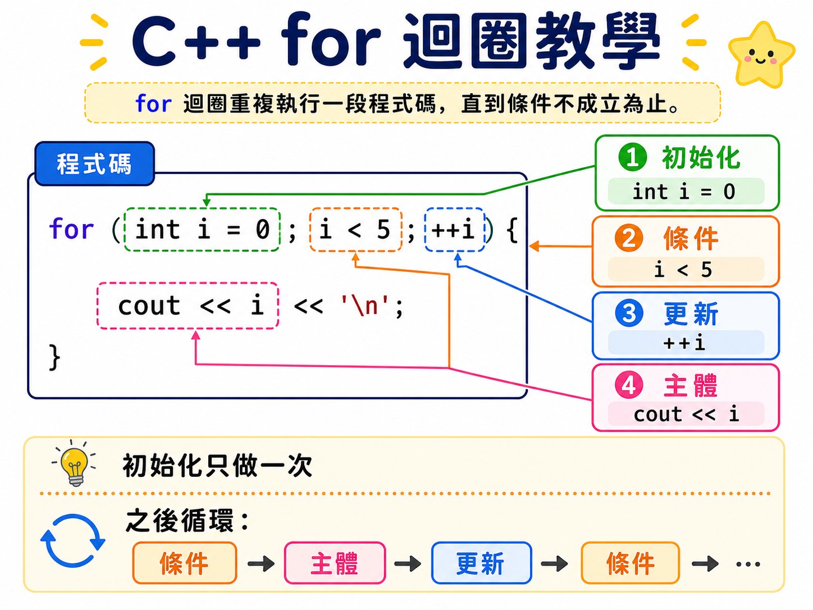

---

# Part B：第一個 `for`

## Section VII. 從 1 數到 5

```cpp
// VALIDATE
#include <iostream>
using namespace std;

int main() {
    for (int number = 1; number <= 5; ++number) {
        cout << number << '\n';
    }

    return 0;
}
```

輸出：

```text
1
2
3
4
5
```

---

## Section VIII. 執行順序

```cpp
for (int number = 1; number <= 5; ++number)
```

依序表示：

1. `number` 從 `1` 開始。
2. 只要 `number <= 5` 就進入迴圈。
3. 每輪結束後執行 `++number`。


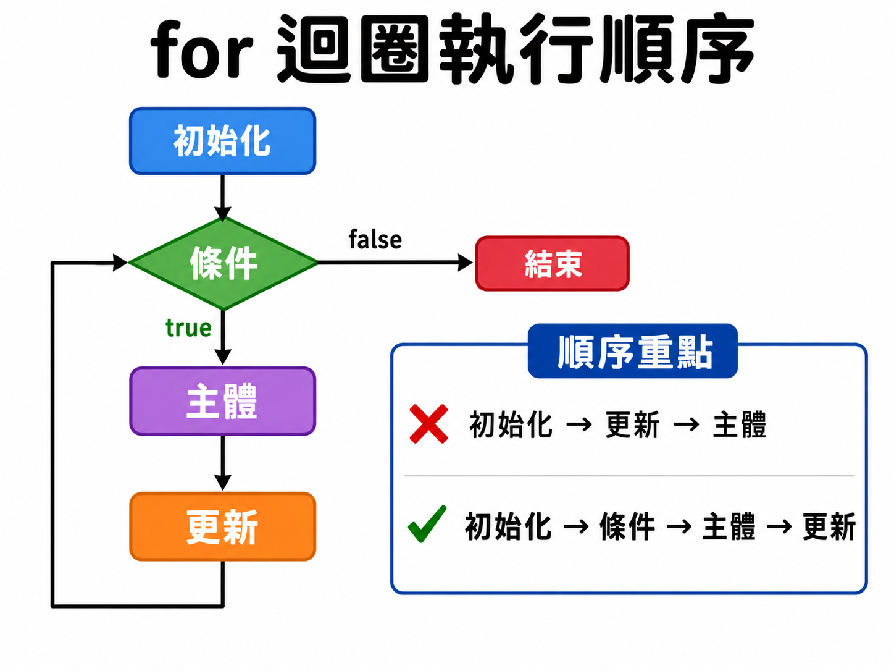

---

## Section IX. 追蹤表

| 條件檢查時 `number` | `number <= 5` | 輸出 | 更新後 |
| ---: | --- | ---: | ---: |
| 1 | `true` | 1 | 2 |
| 2 | `true` | 2 | 3 |
| 3 | `true` | 3 | 4 |
| 4 | `true` | 4 | 5 |
| 5 | `true` | 5 | 6 |
| 6 | `false` | 無 | 結束 |

---

## Section X. 初始化只執行一次

```cpp
int number = 1
```

只會在迴圈開始前執行一次。

它不會在每一輪重新變回 `1`。

---

# Part C：固定執行次數

## Section XI. 從 0 開始

```cpp
for (int i = 0; i < 5; ++i) {
    cout << i << '\n';
}
```

輸出：

```text
0
1
2
3
4
```

雖然最後數字是 `4`，但總共執行 `5` 次。

---

## Section XII. 為什麼常使用 `i < n`？

```cpp
for (int i = 0; i < n; ++i)
```

當 `n = 5`：

```text
i = 0, 1, 2, 3, 4
```

剛好執行五次。

這種形式很適合之後的索引走訪。


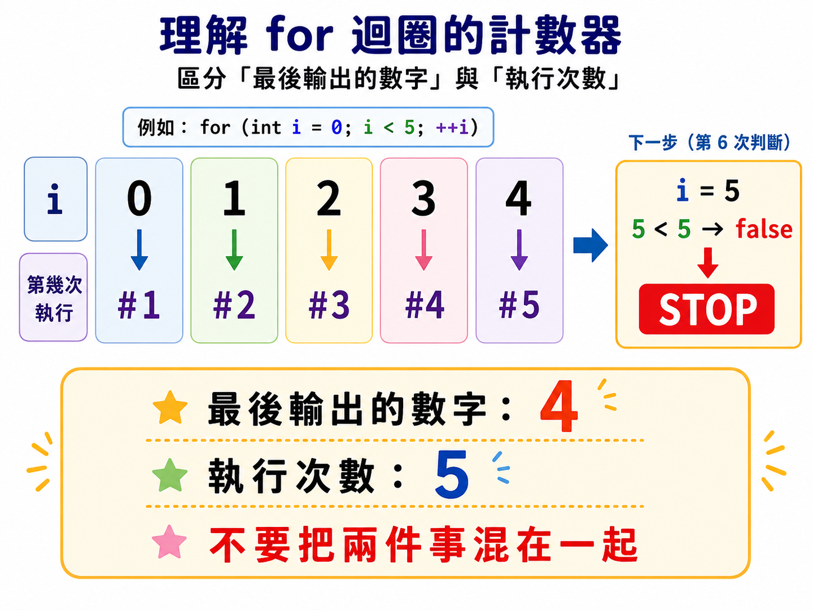

---

## Section XIII. `<` 與 `<=`

```cpp
for (int i = 0; i < 5; ++i)
```

執行：

```text
0 到 4
```

```cpp
for (int i = 0; i <= 5; ++i)
```

執行：

```text
0 到 5
```

第二個會多執行一次。

---

## Section XIV. Off-by-one error

Off-by-one error 是：

```text
多執行一次
或少執行一次
```

常見原因：

- 把 `<` 寫成 `<=`
- 起點應為 `0` 卻寫成 `1`
- 終點包含與不包含判斷錯誤


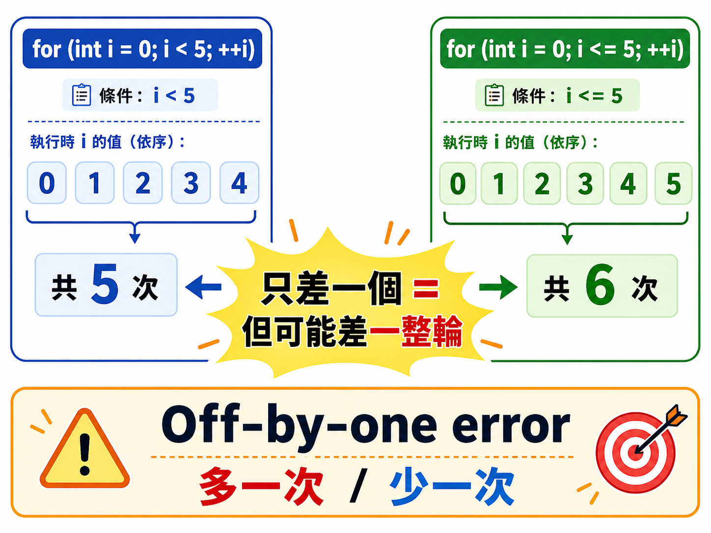

---

## Section XV. 執行 n 次

```cpp
// VALIDATE
#include <iostream>
using namespace std;

int main() {
    int n;
    cin >> n;

    for (int count = 0; count < n; ++count) {
        cout << "Hello\n";
    }

    return 0;
}
```

若 `n <= 0`，迴圈執行 0 次。

---

# Part D：將 `for` 改寫成 `while`

## Section XVI. 原本的 `for`

```cpp
for (int i = 0; i < 5; ++i) {
    cout << i << '\n';
}
```

---

## Section XVII. 等價概念的 `while`

```cpp
int i = 0;

while (i < 5) {
    cout << i << '\n';
    ++i;
}
```

對照：

| `for` 部分 | `while` 位置 |
| --- | --- |
| 初始化 | 迴圈前 |
| 條件 | `while (...)` |
| 更新 | 主體尾端 |


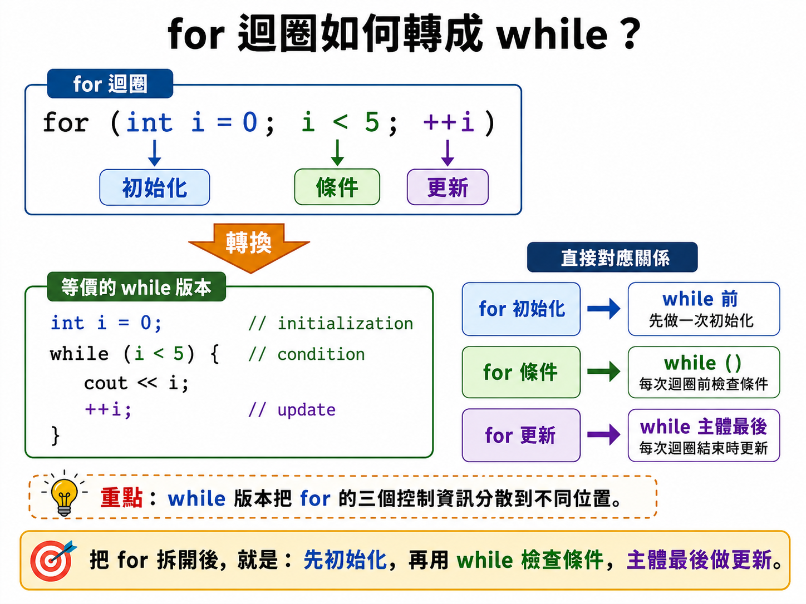

---

## Section XVIII. 如何選擇？

使用 `for`：

```text
重複次數或計數方式清楚
```

使用 `while`：

```text
結束時間取決於條件或輸入
```

兩者都能表達許多相同問題，但可讀性不同。


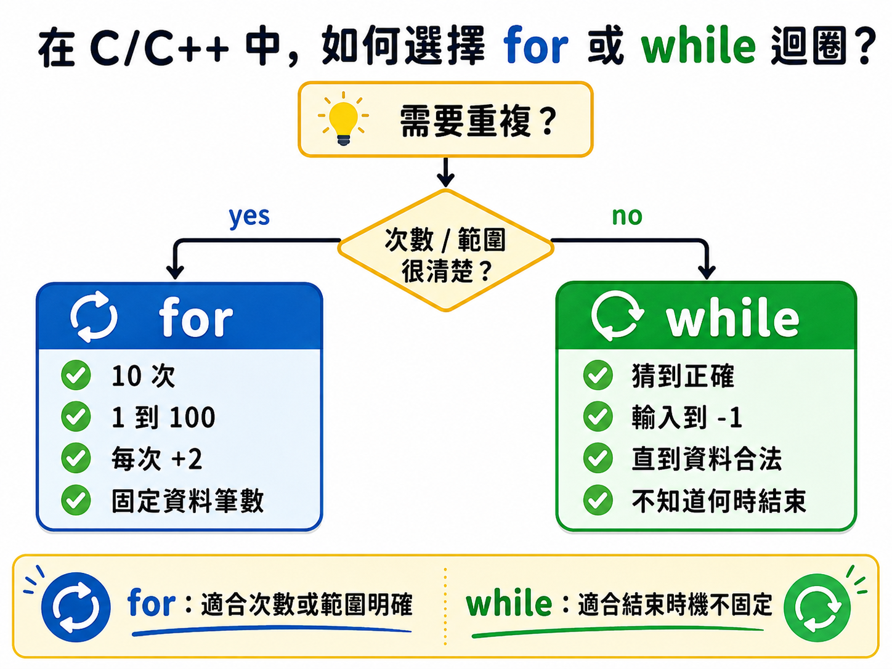

---

# Part E：倒數與不同步長

## Section XIX. 倒數

```cpp
// VALIDATE
#include <iostream>
using namespace std;

int main() {
    for (int number = 5; number >= 1; --number) {
        cout << number << '\n';
    }

    cout << "Go!\n";

    return 0;
}
```

---

## Section XX. 從 n 倒數

```cpp
for (int number = n; number >= 1; --number) {
    cout << number << '\n';
}
```

本例使用有號整數 `int`。

若使用無號型別倒數，條件設計需要格外小心。

---

## Section XXI. 偶數序列

```cpp
for (int number = 2; number <= 20; number += 2) {
    cout << number << '\n';
}
```

---

## Section XXII. 奇數序列

```cpp
for (int number = 1; number <= 19; number += 2) {
    cout << number << '\n';
}
```

---

## Section XXIII. 自訂步長

```cpp
for (int number = 3; number <= 15; number += 3) {
    cout << number << '\n';
}
```

輸出：

```text
3
6
9
12
15
```


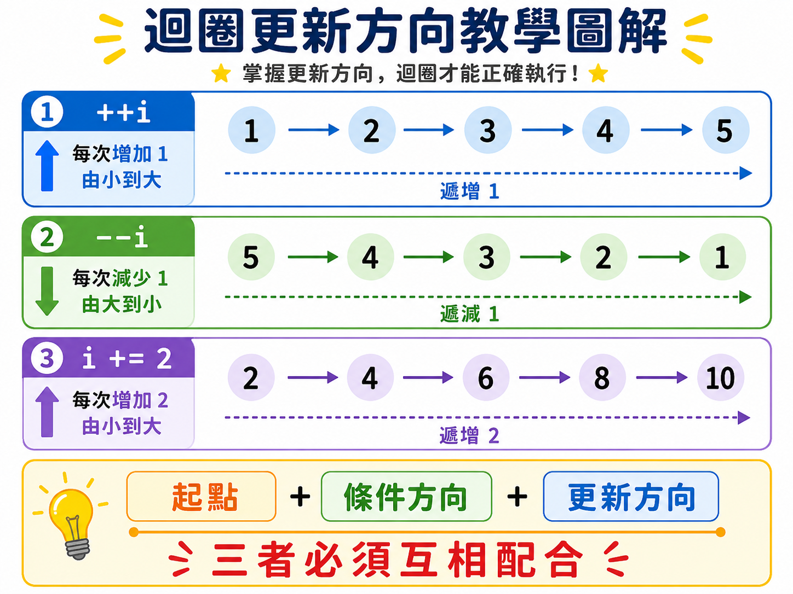

---

# Part F：累加與平均

## Section XXIV. 1 到 n 的總和

```cpp
// VALIDATE
#include <iostream>
using namespace std;

int main() {
    int n;
    cin >> n;

    long long total = 0;

    for (int number = 1; number <= n; ++number) {
        total += number;
    }

    cout << total << '\n';

    return 0;
}
```

---

## Section XXV. 為什麼 `total` 在迴圈外？

錯誤概念：

```cpp
for (...) {
    long long total = 0;
    total += number;
}
```

每一輪都會重新建立 `total = 0`，無法保存前幾輪結果。

正確：

```cpp
long long total = 0;

for (...) {
    total += number;
}
```


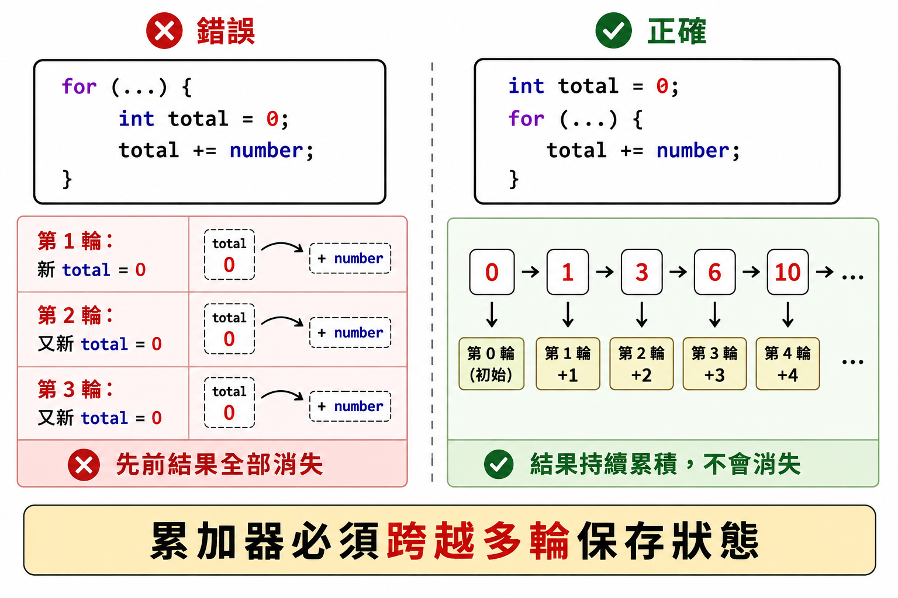

---

## Section XXVI. 固定筆數輸入

```cpp
// VALIDATE
#include <iostream>
using namespace std;

int main() {
    int dataCount;
    cin >> dataCount;

    long long total = 0;

    for (int index = 1; index <= dataCount; ++index) {
        int value;

        cout << "Value "
             << index
             << ": ";

        cin >> value;
        total += value;
    }

    cout << "Total: "
         << total
         << '\n';

    return 0;
}
```

---

## Section XXVII. 固定筆數平均值

```cpp
// VALIDATE
#include <iostream>
using namespace std;

int main() {
    int dataCount;
    cin >> dataCount;

    if (dataCount <= 0) {
        cout << "No data\n";
        return 0;
    }

    long long total = 0;

    for (int index = 0; index < dataCount; ++index) {
        int value;
        cin >> value;
        total += value;
    }

    double average =
        static_cast<double>(total) / dataCount;

    cout << average << '\n';

    return 0;
}
```

---

# Part G：階乘與重複乘法

## Section XXVIII. 階乘

非負整數 `n` 的階乘：

```text
n! = 1 × 2 × 3 × ... × n
```

特殊情況：

```text
0! = 1
```

---

## Section XXIX. 為什麼從 1 開始？

累乘器必須初始化為：

```cpp
long long result = 1;
```

若從 `0` 開始：

```text
任何數 × 0 = 0
```

結果會永遠是 `0`。


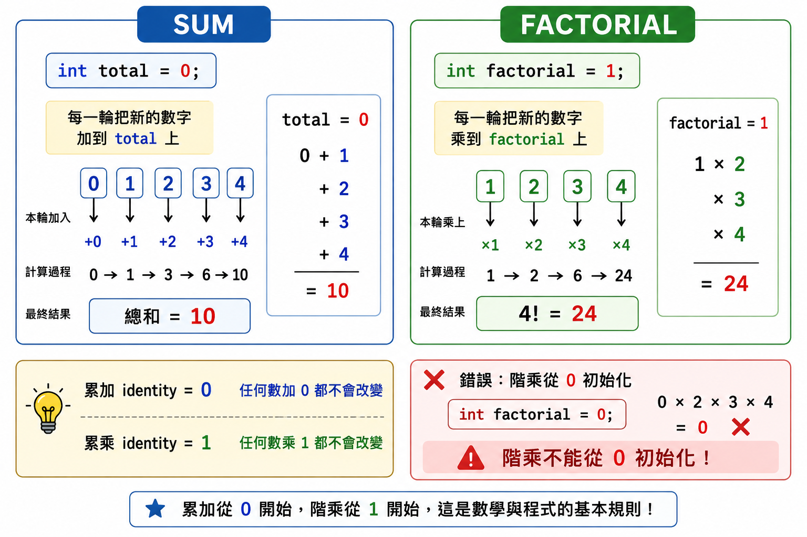

---

## Section XXX. 完整階乘程式

```cpp
// VALIDATE
#include <iostream>
using namespace std;

int main() {
    int n;
    cin >> n;

    if (n < 0) {
        cout << "Factorial is not defined for negative integers.\n";
        return 0;
    }

    long long factorial = 1;

    for (int number = 2; number <= n; ++number) {
        factorial *= number;
    }

    cout << factorial << '\n';

    return 0;
}
```

> `long long` 也只能保存有限範圍。較大的階乘仍會溢位。

---

## Section XXXI. 使用迴圈計算整數次方

```cpp
// VALIDATE
#include <iostream>
using namespace std;

int main() {
    long long base;
    int exponent;

    cin >> base >> exponent;

    if (exponent < 0) {
        cout << "This example requires a non-negative exponent.\n";
        return 0;
    }

    long long result = 1;

    for (int count = 0; count < exponent; ++count) {
        result *= base;
    }

    cout << result << '\n';

    return 0;
}
```

---

# Part H：`break`

## Section XXXII. 提前離開

```cpp
for (int number = 1; number <= 10; ++number) {
    if (number == 5) {
        break;
    }

    cout << number << '\n';
}
```

輸出：

```text
1
2
3
4
```

---

## Section XXXIII. 找到目標後停止

```cpp
// VALIDATE
#include <iostream>
using namespace std;

int main() {
    int target;
    cin >> target;

    bool found = false;

    for (int number = 1; number <= 100; ++number) {
        if (number == target) {
            found = true;
            break;
        }
    }

    cout << boolalpha
         << found
         << '\n';

    return 0;
}
```

---

## Section XXXIV. `break` 只離開目前迴圈

若未來使用巢狀迴圈：

```text
break 只會離開最內層目前所在的迴圈
```

完整巢狀迴圈會在下一章說明。


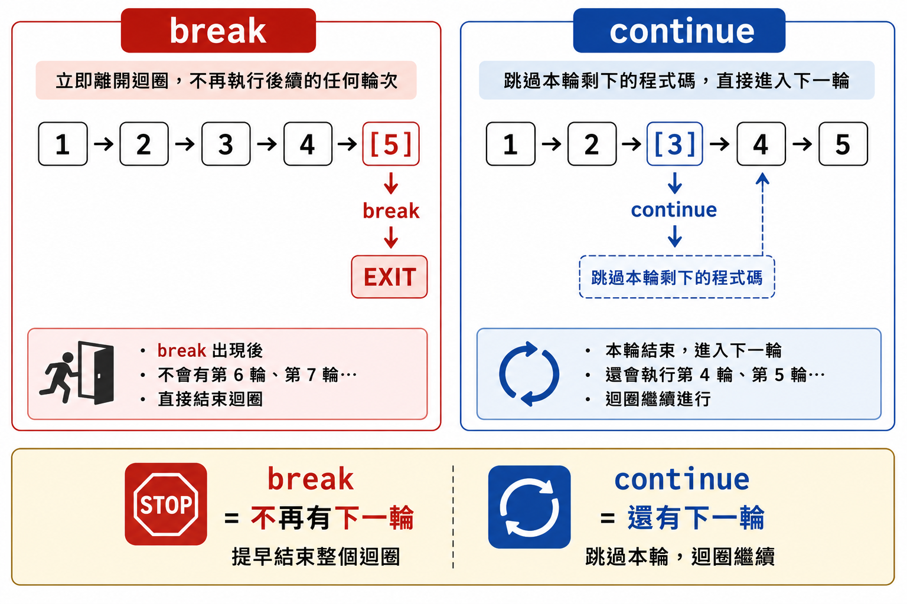

---

# Part I：`continue`

## Section XXXV. 跳過本輪

```cpp
for (int number = 1; number <= 5; ++number) {
    if (number == 3) {
        continue;
    }

    cout << number << '\n';
}
```

輸出：

```text
1
2
4
5
```

---

## Section XXXVI. `for` 中的更新仍會執行

遇到 `continue` 時：

```text
跳過本輪剩餘主體
→ 執行更新區
→ 再檢查條件
```

因此：

```cpp
for (int i = 0; i < 5; ++i)
```

中的 `++i` 不會因 `continue` 而永久被跳過。


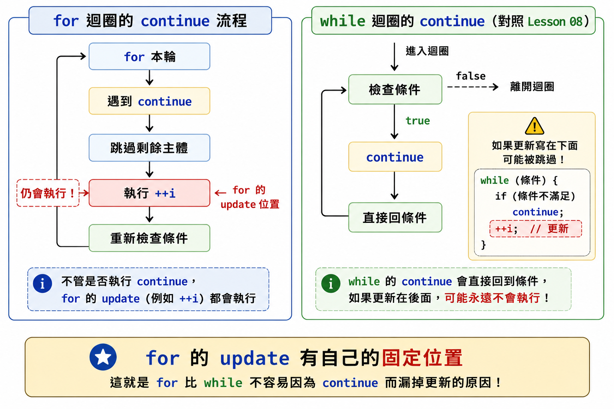

---

## Section XXXVII. 只輸出奇數

```cpp
// VALIDATE
#include <iostream>
using namespace std;

int main() {
    for (int number = 1; number <= 10; ++number) {
        if (number % 2 == 0) {
            continue;
        }

        cout << number << '\n';
    }

    return 0;
}
```

---

# Part J：省略控制區

## Section XXXVIII. 三個區域都可省略

```cpp
for (;;) {
    // 無窮迴圈
}
```

等價概念：

```cpp
while (true) {
    // 無窮迴圈
}
```


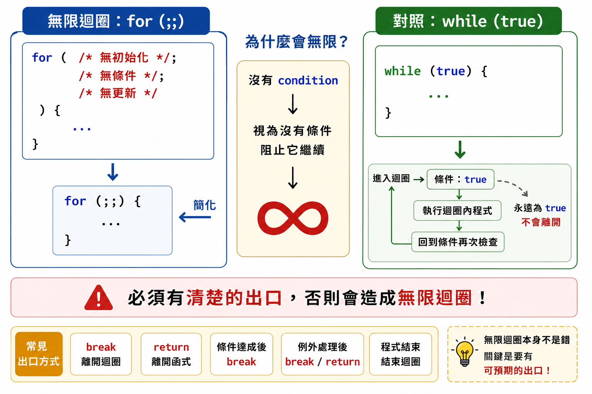

---

## Section XXXIX. 使用 `break` 離開

```cpp
// VALIDATE
#include <iostream>
using namespace std;

int main() {
    int count = 0;

    for (;;) {
        ++count;

        if (count == 3) {
            break;
        }
    }

    cout << count << '\n';

    return 0;
}
```

---

## Section XL. 只省略部分區域

```cpp
int i = 0;

for (; i < 5; ++i) {
    cout << i << '\n';
}
```

初始化在外面。

也可以：

```cpp
for (int i = 0; i < 5;) {
    cout << i << '\n';
    ++i;
}
```

但若三個部分本來很清楚，通常保留完整形式較容易閱讀。

---

# Part K：迴圈變數作用域

## Section XLI. 迴圈內宣告

```cpp
for (int i = 0; i < 5; ++i) {
    cout << i << '\n';
}
```

`i` 通常只存在於：

```text
for 的控制區與迴圈主體
```

---

## Section XLII. 迴圈結束後

錯誤概念：

```cpp
for (int i = 0; i < 5; ++i) {
    cout << i << '\n';
}

/* cout << i; */
```

迴圈結束後，`i` 已離開作用域。

---

## Section XLIII. 需要迴圈後使用時

可以先在外面宣告：

```cpp
int i = 0;

for (; i < 5; ++i) {
    cout << i << '\n';
}

cout << "After: "
     << i
     << '\n';
```

但不要只為了方便而擴大不必要的作用域。


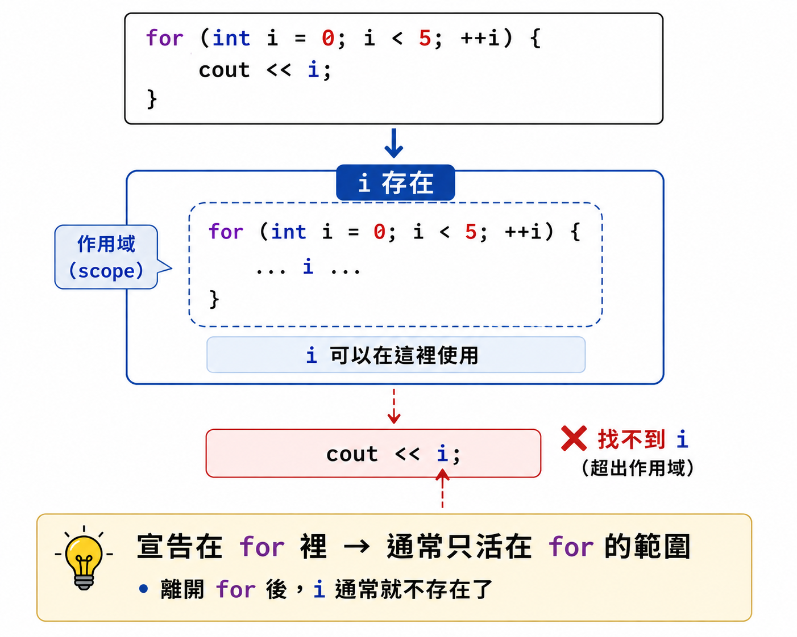

---

# Part L：多個初始化與更新

## Section XLIV. 逗號分隔

```cpp
for (
    int left = 0, right = 10;
    left < right;
    ++left, --right
) {
    cout << left
         << " "
         << right
         << '\n';
}
```

初始化區與更新區可包含多個表示式。

---

## Section XLV. 可讀性優先

雖然合法，不代表一定應使用。

若一行包含太多狀態：

```text
閱讀與除錯會變困難
```

初學時通常保持一個主要迴圈變數最清楚。

---

# Part M：Range-Based `for`

## Section XLVI. 基本語法

C++11 起可使用：

```cpp
for (元素宣告 : 可走訪資料) {
    程式主體;
}
```

讀作：

```text
對資料中的每一個元素
依序執行一次
```


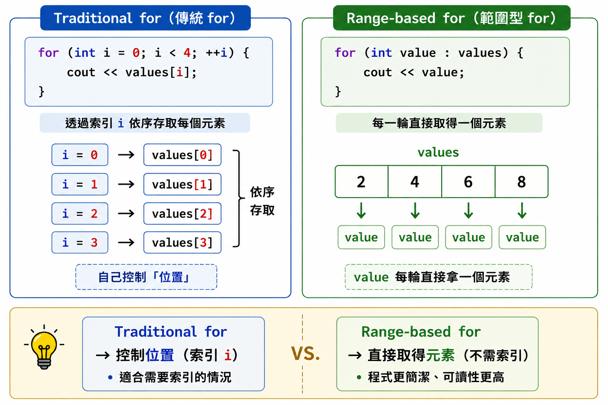

---

## Section XLVII. 走訪字串

```cpp
// VALIDATE
#include <iostream>
#include <string>
using namespace std;

int main() {
    string word = "Code";

    for (char ch : word) {
        cout << ch << '\n';
    }

    return 0;
}
```

輸出：

```text
C
o
d
e
```


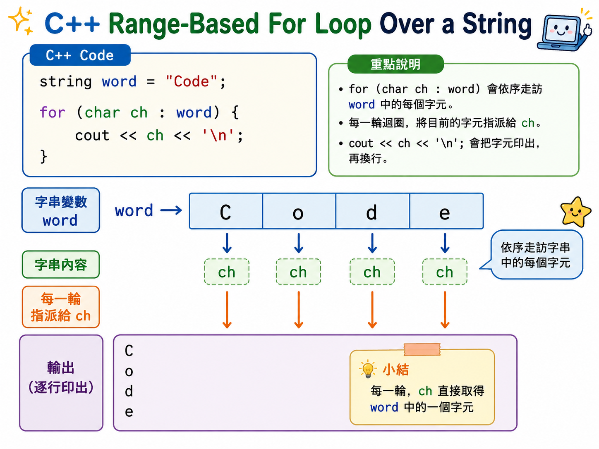

---

## Section XLVIII. 走訪固定陣列

```cpp
// VALIDATE
#include <iostream>
using namespace std;

int main() {
    int values[] = {2, 4, 6, 8};

    for (int value : values) {
        cout << value << '\n';
    }

    return 0;
}
```

> 本章只把陣列視為一組可依序走訪的值。陣列宣告、索引與記憶體配置會在後續章節完整說明。

---

## Section XLIX. 不需要手動控制索引

傳統 `for`：

```cpp
for (int i = 0; i < 4; ++i) {
    cout << values[i] << '\n';
}
```

range-based `for`：

```cpp
for (int value : values) {
    cout << value << '\n';
}
```

若只需要每個元素，range-based `for` 通常更簡潔。

---

# Part N：以值走訪

## Section L. 取得副本

```cpp
for (int value : values) {
    value *= 2;
}
```

`value` 是每個元素的副本。

修改 `value` 不會修改原陣列。

---

## Section LI. 完整副本範例

```cpp
// VALIDATE
#include <iostream>
using namespace std;

int main() {
    int values[] = {1, 2, 3};

    for (int value : values) {
        value *= 10;
        cout << value << " ";
    }

    cout << '\n';

    for (int value : values) {
        cout << value << " ";
    }

    cout << '\n';

    return 0;
}
```

輸出：

```text
10 20 30
1 2 3
```


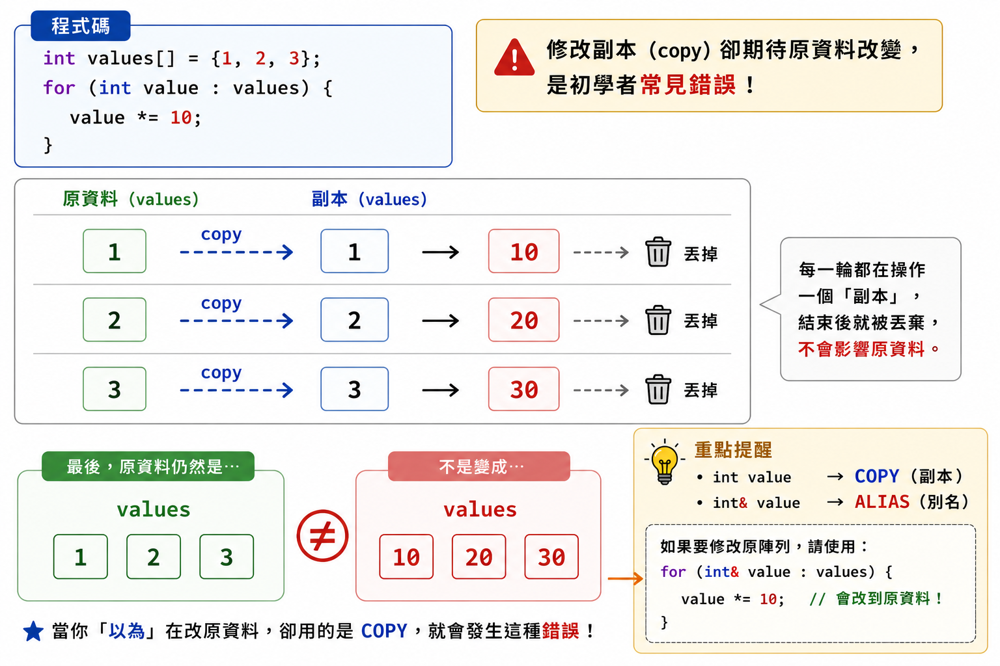

---

## Section LII. 何時使用值？

適合：

- 元素型別很小，例如 `int`、`char`
- 只讀取元素
- 希望取得獨立副本


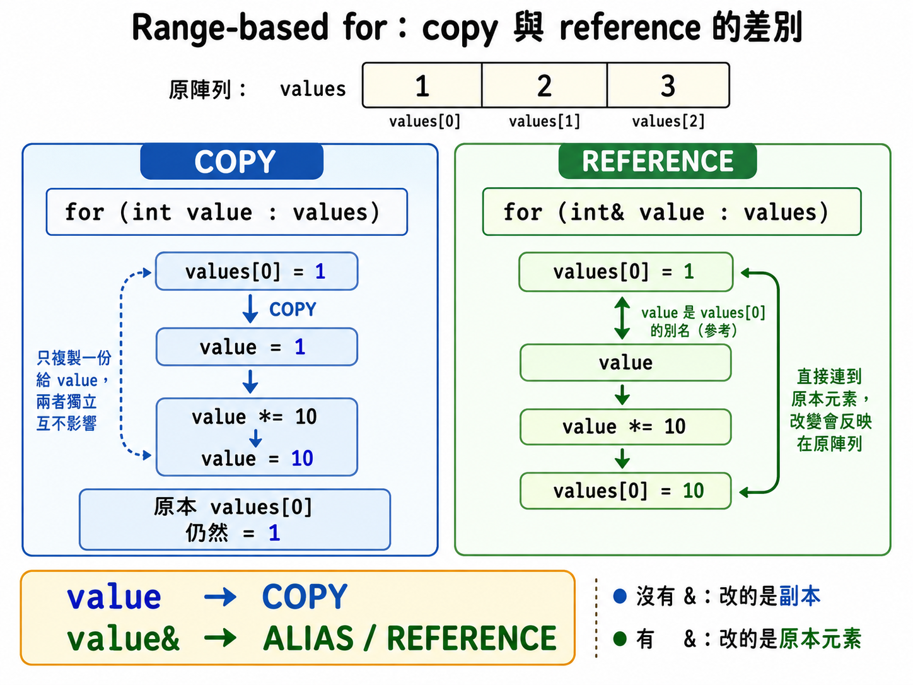

---

# Part O：以參考走訪

## Section LIII. 修改原元素

```cpp
for (int& value : values) {
    value *= 2;
}
```

`value` 是原元素的參考。

修改 `value` 會修改集合中的元素。

---

## Section LIV. 完整修改範例

```cpp
// VALIDATE
#include <iostream>
using namespace std;

int main() {
    int values[] = {1, 2, 3};

    for (int& value : values) {
        value *= 2;
    }

    for (int value : values) {
        cout << value << " ";
    }

    cout << '\n';

    return 0;
}
```

輸出：

```text
2 4 6
```

---

## Section LV. 唯讀參考

```cpp
for (const int& value : values) {
    cout << value << '\n';
}
```

表示：

```text
直接參考原元素
但不能透過 value 修改
```

---

## Section LVI. `const auto&`

```cpp
for (const auto& value : values) {
    cout << value << '\n';
}
```

好處：

- 不需要重複寫元素型別
- 不建立不必要副本
- 保證不修改元素

對大型或複雜元素是常見寫法。

---

# Part P：使用 `auto`

## Section LVII. 自動推導元素型別

```cpp
for (auto value : values) {
    cout << value << '\n';
}
```

若 `values` 元素為 `int`：

```text
value 的型別會推導為 int
```

---

## Section LVIII. `auto` 不代表沒有型別

`auto` 表示：

```text
由編譯器依照元素推導確定型別
```

它不是動態型別。

---

## Section LIX. 常見形式比較

| 寫法 | 意義 |
| --- | --- |
| `auto value` | 元素副本 |
| `auto& value` | 可修改原元素 |
| `const auto& value` | 唯讀原元素 |
| `const auto value` | 唯讀副本，通常較少需要 |


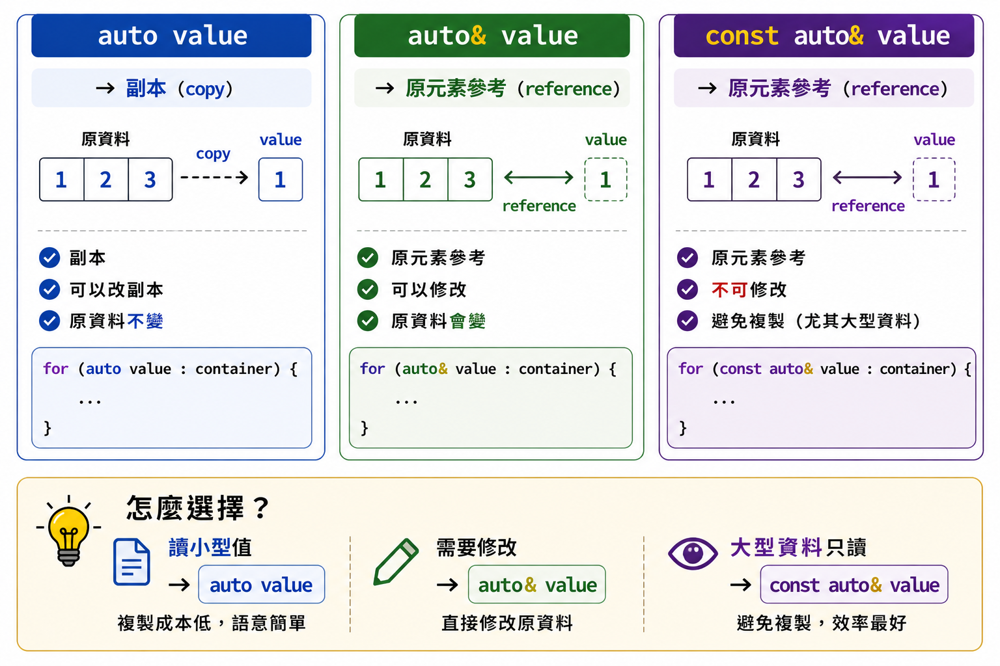

---

# Part Q：Range-Based `for` 的總和與統計

## Section LX. 計算總和

```cpp
// VALIDATE
#include <iostream>
using namespace std;

int main() {
    int values[] = {5, 8, 3, 10};

    int total = 0;

    for (int value : values) {
        total += value;
    }

    cout << total << '\n';

    return 0;
}
```

---

## Section LXI. 計算符合條件的數量

```cpp
// VALIDATE
#include <iostream>
using namespace std;

int main() {
    int values[] = {3, 8, 11, 14, 20};

    int evenCount = 0;

    for (int value : values) {
        if (value % 2 == 0) {
            ++evenCount;
        }
    }

    cout << evenCount << '\n';

    return 0;
}
```

---

## Section LXII. 走訪字串統計

```cpp
// VALIDATE
#include <iostream>
#include <string>
using namespace std;

int main() {
    string text = "Programming";

    int vowelCount = 0;

    for (char ch : text) {
        if (
            ch == 'a' ||
            ch == 'e' ||
            ch == 'i' ||
            ch == 'o' ||
            ch == 'u' ||
            ch == 'A' ||
            ch == 'E' ||
            ch == 'I' ||
            ch == 'O' ||
            ch == 'U'
        ) {
            ++vowelCount;
        }
    }

    cout << vowelCount << '\n';

    return 0;
}
```

---

# Part R：索引與元素

## Section LXIII. Range-Based `for` 不直接提供索引

```cpp
for (int value : values) {
    cout << value << '\n';
}
```

每輪取得元素，但沒有直接取得：

```text
0、1、2、3...
```


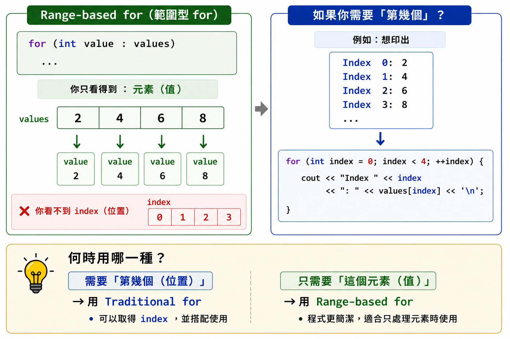

---

## Section LXIV. 需要索引時

使用傳統 `for`：

```cpp
for (int index = 0; index < 4; ++index) {
    cout << "Index "
         << index
         << ": "
         << values[index]
         << '\n';
}
```

索引與陣列大小的完整安全寫法會在陣列章節說明。

---

## Section LXV. 選擇方式

使用 range-based `for`：

```text
只在意每個元素
```

使用傳統 `for`：

```text
需要索引
需要跳著走
需要倒序
需要控制特定範圍
```


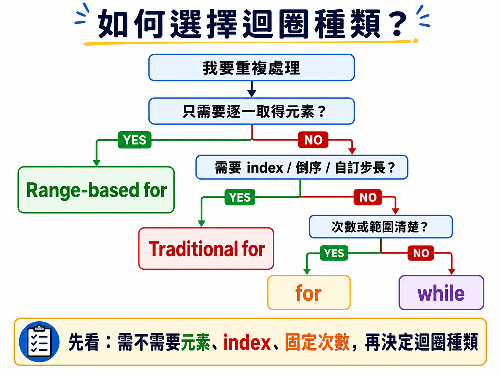

---

# Part S：常見錯誤

## Section LXVI. `for` 後誤加分號

錯誤：

```cpp
for (int i = 0; i < 5; ++i); {
    cout << "Hello\n";
}
```

分號形成空迴圈。

後面的區塊只執行一次，而且不受 `for` 控制。

---

## Section LXVII. 更新方向錯誤

錯誤：

```cpp
for (int i = 0; i < 5; --i) {
    cout << i << '\n';
}
```

`i` 越來越小，仍持續 `< 5`，形成無窮迴圈。


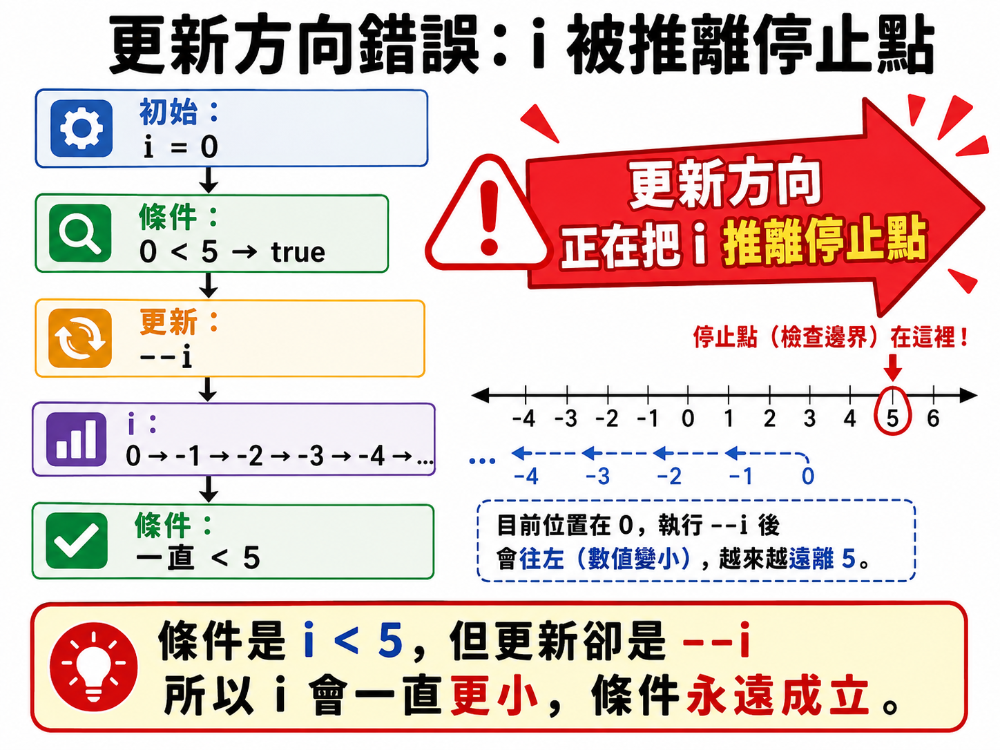

---

## Section LXVIII. 錯誤終點

想輸出 `1` 到 `5`：

```cpp
for (int i = 1; i < 5; ++i)
```

只會輸出到 `4`。

若要包含 `5`：

```cpp
for (int i = 1; i <= 5; ++i)
```

---

## Section LXIX. 無號倒數風險

不建議初學時寫：

```cpp
for (unsigned int i = 5; i >= 0; --i) {
    // ...
}
```

無號整數不會變成負數。

當 `i` 從 `0` 再減一，會繞到非常大的值，條件仍可能成立。

倒數初學範例使用 `int` 較清楚。

---

## Section LXX. 修改副本

```cpp
for (int value : values) {
    value = 0;
}
```

不會清空原陣列。

需要：

```cpp
for (int& value : values) {
    value = 0;
}
```

---

## Section LXXI. 走訪時改變集合結構

對某些容器而言，在 range-based `for` 中加入或移除元素，可能使目前走訪失效。

本章原則：

```text
走訪期間不要改變集合的結構
```

修改既有元素內容與改變元素數量是不同概念。

---

# Part T：快速概念檢查

## Section LXXII. 選擇題與簡答

### Q1. `for` 的三個控制區是什麼？

<details><summary>查看答案</summary>

初始化、條件與更新。

</details>

### Q2. 初始化區執行幾次？

<details><summary>查看答案</summary>

通常只執行一次。

</details>

### Q3. `for (int i = 0; i < 5; ++i)` 執行幾次？

<details><summary>查看答案</summary>

5 次。

</details>

### Q4. 上題的 `i` 依序是多少？

<details><summary>查看答案</summary>

```text
0、1、2、3、4
```

</details>

### Q5. `i < 5` 與 `i <= 5` 有何差異？

<details><summary>查看答案</summary>

`<= 5` 會包含 `5`，通常多執行一次。

</details>

### Q6. 什麼是 off-by-one error？

<details><summary>查看答案</summary>

迴圈比預期多執行或少執行一次。

</details>

### Q7. 倒數通常使用什麼更新？

<details><summary>查看答案</summary>

```cpp
--i
```

</details>

### Q8. 累加器為什麼通常宣告在迴圈外？

<details><summary>查看答案</summary>

才能保留前幾輪累積的結果。

</details>

### Q9. 階乘累乘器為什麼從 1 開始？

<details><summary>查看答案</summary>

若從 0 開始，結果會一直是 0。

</details>

### Q10. `break` 做什麼？

<details><summary>查看答案</summary>

立即離開目前迴圈。

</details>

### Q11. `continue` 做什麼？

<details><summary>查看答案</summary>

跳過本輪主體剩餘程式。

</details>

### Q12. 在傳統 `for` 中遇到 `continue`，更新區會執行嗎？

<details><summary>查看答案</summary>

會。

</details>

### Q13. `for (;;)` 表示什麼？

<details><summary>查看答案</summary>

無窮迴圈。

</details>

### Q14. 在 `for` 初始化區宣告的變數通常可在迴圈後使用嗎？

<details><summary>查看答案</summary>

不可以，它通常只存在於迴圈範圍。

</details>

### Q15. Range-based `for` 的用途是什麼？

<details><summary>查看答案</summary>

依序取得可走訪資料中的每個元素。

</details>

### Q16. `for (int value : values)` 中的 `value` 是什麼？

<details><summary>查看答案</summary>

每個元素的副本。

</details>

### Q17. 如何修改原元素？

<details><summary>查看答案</summary>

使用參考：

```cpp
for (int& value : values)
```

</details>

### Q18. `const auto&` 有什麼用途？

<details><summary>查看答案</summary>

以唯讀參考走訪，避免複製並防止修改元素。

</details>

### Q19. Range-based `for` 會直接提供索引嗎？

<details><summary>查看答案</summary>

不會。

</details>

### Q20. 需要索引時應考慮哪種迴圈？

<details><summary>查看答案</summary>

傳統 `for`。

</details>

---

# Part U：程式閱讀練習

## Section LXXIII. 預測輸出與次數

### 題目 1

```cpp
for (int i = 0; i < 3; ++i) {
    cout << i;
}
```

<details><summary>查看答案</summary>

```text
012
```

</details>

### 題目 2

```cpp
for (int i = 1; i <= 3; ++i) {
    cout << i;
}
```

<details><summary>查看答案</summary>

```text
123
```

</details>

### 題目 3

```cpp
for (int i = 5; i >= 1; --i) {
    cout << i;
}
```

<details><summary>查看答案</summary>

```text
54321
```

</details>

### 題目 4

```cpp
for (int i = 0; i <= 6; i += 2) {
    cout << i << " ";
}
```

<details><summary>查看答案</summary>

```text
0 2 4 6 
```

</details>

### 題目 5

```cpp
int total = 0;

for (int i = 1; i <= 4; ++i) {
    total += i;
}

cout << total;
```

<details><summary>查看答案</summary>

```text
10
```

</details>

### 題目 6

```cpp
for (int i = 0; i < 5; ++i) {
    if (i == 2) {
        break;
    }

    cout << i;
}
```

<details><summary>查看答案</summary>

```text
01
```

</details>

### 題目 7

```cpp
for (int i = 0; i < 5; ++i) {
    if (i == 2) {
        continue;
    }

    cout << i;
}
```

<details><summary>查看答案</summary>

```text
0134
```

</details>

### 題目 8

```cpp
int values[] = {2, 4, 6};

for (int value : values) {
    cout << value;
}
```

<details><summary>查看答案</summary>

```text
246
```

</details>

### 題目 9

```cpp
int values[] = {1, 2, 3};

for (int value : values) {
    value *= 10;
}

for (int value : values) {
    cout << value;
}
```

<details><summary>查看答案</summary>

```text
123
```

第一次修改的是副本。

</details>

### 題目 10

```cpp
int values[] = {1, 2, 3};

for (int& value : values) {
    value *= 10;
}

for (int value : values) {
    cout << value << " ";
}
```

<details><summary>查看答案</summary>

```text
10 20 30 
```

</details>

### 題目 11

```cpp
string word = "Hi";

for (char ch : word) {
    cout << ch << ch;
}
```

<details><summary>查看答案</summary>

```text
HHii
```

</details>

### 題目 12

```cpp
for (int i = 1; i < 1; ++i) {
    cout << i;
}
```

<details><summary>查看答案</summary>

沒有輸出，執行 0 次。

</details>

---

# Part V：實作練習

## Section LXXIV. 實作檢測題

### TODO 1：從 1 數到 n

輸入 `n`，使用 `for` 輸出 `1` 到 `n`。

### TODO 2：執行 n 次

輸入 `n`，輸出 `Hello` 共 `n` 次。

### TODO 3：倒數

輸入正整數，倒數到 `1`，最後輸出 `Go!`。

### TODO 4：偶數

輸出 `2` 到 `20` 的偶數。

### TODO 5：1 到 n 的總和

使用 `long long` 累加。

### TODO 6：固定筆數平均

先輸入資料筆數，再輸入資料並計算平均值。

### TODO 7：階乘

輸入非負整數並計算階乘。

### TODO 8：整數次方

輸入底數與非負指數，以重複乘法計算。

### TODO 9：`break`

從 `1` 搜尋到 `100`，找到目標時停止。

### TODO 10：`continue`

輸出 `1` 到 `20` 中不能被 `3` 整除的數。

### TODO 11：走訪字串

輸入一個單字，逐行輸出每個字元。

### TODO 12：Range-based 總和

對固定整數陣列使用 range-based `for` 計算總和。

### TODO 13：修改原元素

將固定陣列中的每個數乘以 `2`。

### TODO 14：統計偶數

使用 range-based `for` 計算陣列中偶數數量。

### TODO 15：母音數量

使用 range-based `for` 計算單字中的母音數量。

---

# Part W：課後小練習

## Section LXXV. 延伸練習

### 練習 1：等差數列

輸入起點、終點與步長，輸出序列。假設步長為正。

### 練習 2：平方表

輸出 `1` 到 `n` 每個整數及其平方。

### 練習 3：固定筆數最大值

先輸入資料筆數，再找出最大值。

### 練習 4：字元分類

使用 range-based `for` 統計單字中的大寫字母、小寫字母與數字。

### 練習 5：清空陣列

使用參考型 range-based `for` 將所有元素改成 `0`。

---

# Part X：常見錯誤提醒

## Section LXXVI. 常見錯誤

1. 在 `for` 條件後誤加分號。
2. 把 `<` 與 `<=` 混淆。
3. 起點錯誤造成少一次或多一次。
4. 更新方向和條件方向相反。
5. 忘記更新。
6. 更新了錯誤變數。
7. 累加器宣告在迴圈內。
8. 平均值資料筆數為 0。
9. 階乘累乘器從 0 開始。
10. 大數總和或階乘發生溢位。
11. `break` 放在錯誤位置。
12. 誤以為 `continue` 會離開整個迴圈。
13. `for (;;)` 沒有可達的 `break`。
14. 在迴圈後使用已離開作用域的變數。
15. 使用無號整數寫 `i >= 0` 倒數。
16. range-based `for` 修改副本卻期待原資料改變。
17. 不需要修改時仍使用非常寬鬆的非 const 參考。
18. 需要索引卻使用 range-based `for` 後手動建立混亂計數器。
19. 走訪期間改變集合結構。
20. 為了縮短程式，把太多控制寫在同一行。


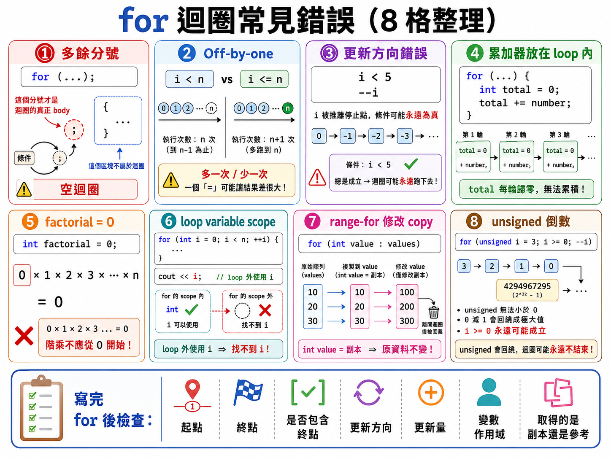

---

# Part Y：Mermaid 流程圖

## Section LXXVII. `for` 與 range-based `for` 流程圖

### 1. 傳統 `for`

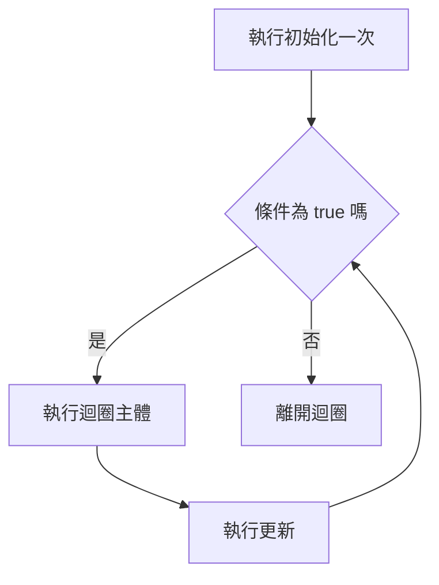
```mermaid
flowchart TD
    A[執行初始化一次] --> B{條件為 true 嗎}
    B -- 是 --> C[執行迴圈主體]
    C --> D[執行更新]
    D --> B
    B -- 否 --> E[離開迴圈]
```

### 2. 固定次數

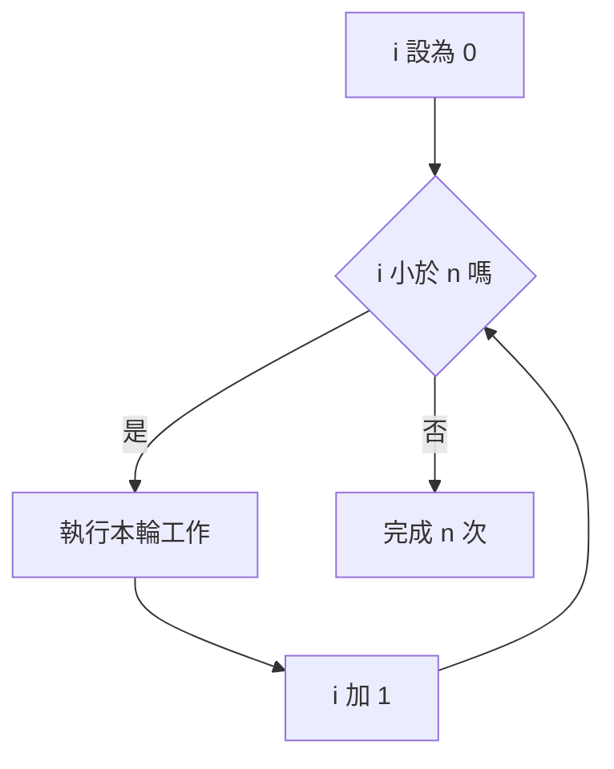
```mermaid
flowchart TD
    A[i 設為 0] --> B{i 小於 n 嗎}
    B -- 是 --> C[執行本輪工作]
    C --> D[i 加 1]
    D --> B
    B -- 否 --> E[完成 n 次]
```

### 3. 累加

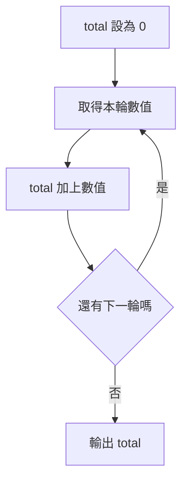
```mermaid
flowchart TD
    A[total 設為 0] --> B[取得本輪數值]
    B --> C[total 加上數值]
    C --> D{還有下一輪嗎}
    D -- 是 --> B
    D -- 否 --> E[輸出 total]
```

### 4. `break`

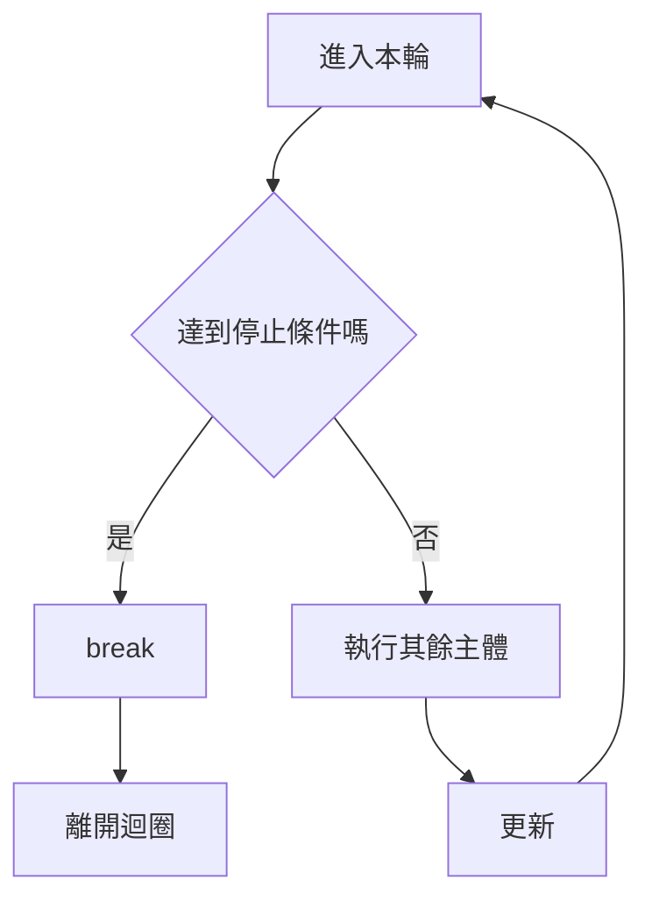
```mermaid
flowchart TD
    A[進入本輪] --> B{達到停止條件嗎}
    B -- 是 --> C[break]
    C --> D[離開迴圈]
    B -- 否 --> E[執行其餘主體]
    E --> F[更新]
    F --> A
```

### 5. `continue`

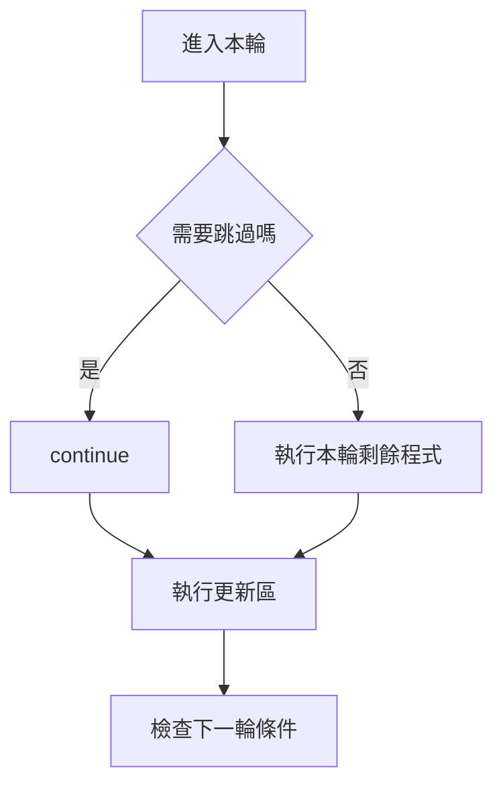
```mermaid
flowchart TD
    A[進入本輪] --> B{需要跳過嗎}
    B -- 是 --> C[continue]
    B -- 否 --> D[執行本輪剩餘程式]
    C --> E[執行更新區]
    D --> E
    E --> F[檢查下一輪條件]
```

### 6. Range-based `for`

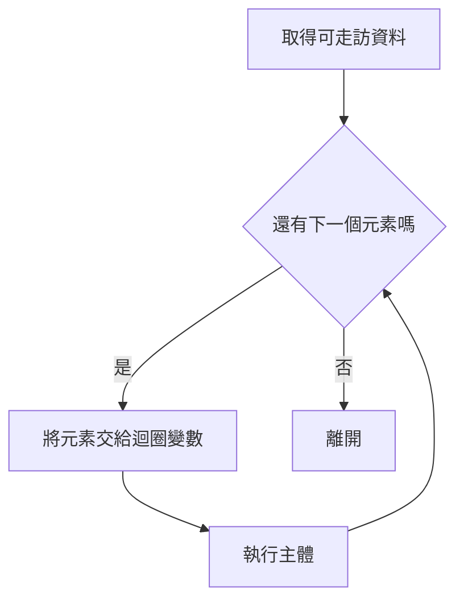
```mermaid
flowchart TD
    A[取得可走訪資料] --> B{還有下一個元素嗎}
    B -- 是 --> C[將元素交給迴圈變數]
    C --> D[執行主體]
    D --> B
    B -- 否 --> E[離開]
```

### 7. 值與參考

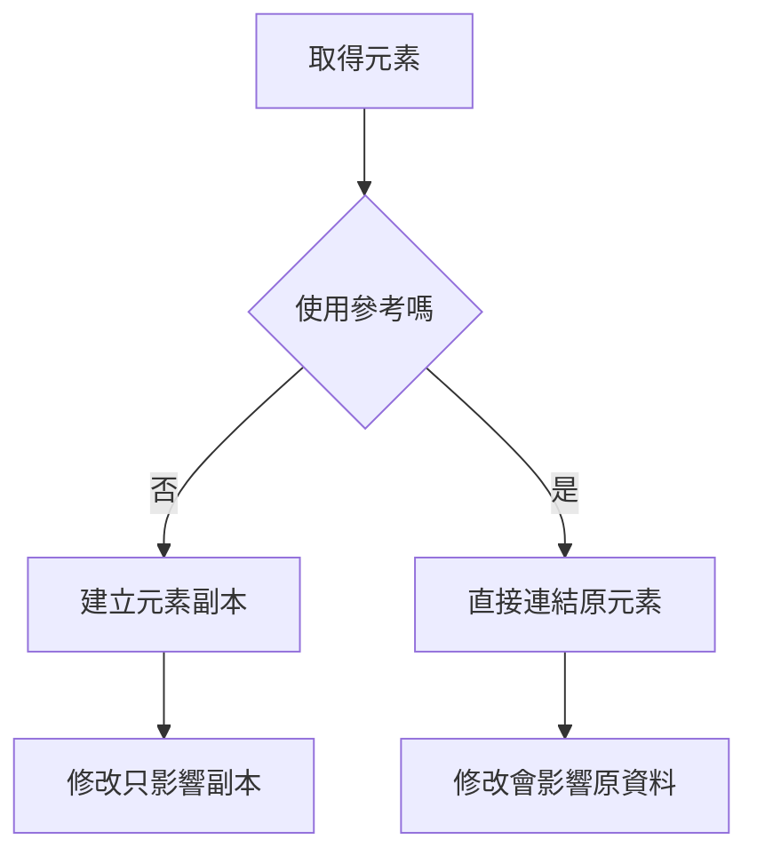
```mermaid
flowchart TD
    A[取得元素] --> B{使用參考嗎}
    B -- 否 --> C[建立元素副本]
    C --> D[修改只影響副本]
    B -- 是 --> E[直接連結原元素]
    E --> F[修改會影響原資料]
```

### 8. 選擇迴圈

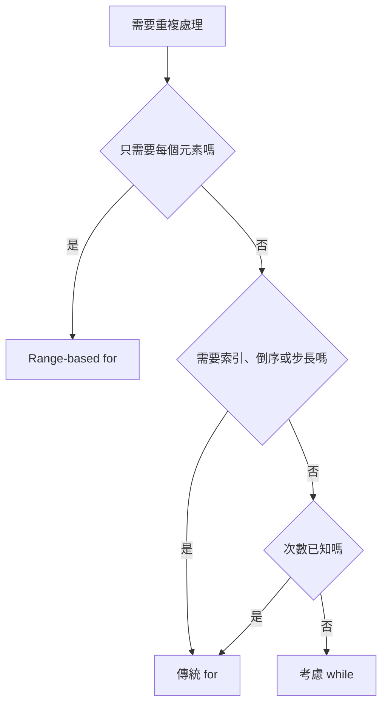
```mermaid
flowchart TD
    A[需要重複處理] --> B{只需要每個元素嗎}
    B -- 是 --> C[Range-based for]
    B -- 否 --> D{需要索引、倒序或步長嗎}
    D -- 是 --> E[傳統 for]
    D -- 否 --> F{次數已知嗎}
    F -- 是 --> E
    F -- 否 --> G[考慮 while]
```

---

# 本章完成標準

完成本章後，你應該能做到：

1. 說明計次型迴圈的用途。
2. 撰寫基本傳統 `for`。
3. 找出初始化、條件、主體與更新。
4. 說明初始化只執行一次。
5. 說明每輪的執行順序。
6. 將 `for` 改寫成 `while`。
7. 判斷何時使用 `for` 或 `while`。
8. 使用 `i = 0; i < n` 執行 n 次。
9. 分辨 `<` 與 `<=`。
10. 找出 off-by-one error。
11. 使用 `for` 倒數。
12. 使用不同步長。
13. 輸出偶數與奇數序列。
14. 使用累加器。
15. 計算 1 到 n 的總和。
16. 計算固定筆數資料總和。
17. 計算固定筆數平均值。
18. 使用 `long long` 保存較大結果。
19. 計算階乘。
20. 計算非負整數次方。
21. 使用 `break`。
22. 使用 `continue`。
23. 說明 `continue` 後更新區仍會執行。
24. 使用 `for (;;)`。
25. 說明迴圈變數作用域。
26. 避免在迴圈外使用區域變數。
27. 認識多個初始化與更新表示式。
28. 撰寫 range-based `for`。
29. 走訪字串。
30. 走訪固定陣列。
31. 使用 range-based `for` 計算總和。
32. 使用 `auto` 推導元素型別。
33. 分辨值、副本與參考。
34. 使用參考修改原元素。
35. 使用 `const auto&` 唯讀走訪。
36. 說明 range-based `for` 不直接提供索引。
37. 依需求選擇傳統或 range-based `for`。
38. 找出常見 `for` 與 range-based `for` 錯誤。

---

# 隱藏答案區

> Answer hidden — try it first.

<details><summary>TODO 1 答案</summary>

```cpp
#include <iostream>
using namespace std;

int main() {
    int n;
    cin >> n;

    for (int number = 1; number <= n; ++number) {
        cout << number << '\n';
    }

    return 0;
}
```

</details>

<details><summary>TODO 2 答案</summary>

```cpp
for (int count = 0; count < n; ++count) {
    cout << "Hello\n";
}
```

</details>

<details><summary>TODO 3 答案</summary>

```cpp
for (int number = n; number >= 1; --number) {
    cout << number << '\n';
}

cout << "Go!\n";
```

</details>

<details><summary>TODO 4 答案</summary>

```cpp
for (int number = 2; number <= 20; number += 2) {
    cout << number << '\n';
}
```

</details>

<details><summary>TODO 5 答案</summary>

```cpp
long long total = 0;

for (int number = 1; number <= n; ++number) {
    total += number;
}
```

</details>

<details><summary>TODO 6 答案</summary>

```cpp
int dataCount;
cin >> dataCount;

if (dataCount <= 0) {
    cout << "No data\n";
} else {
    long long total = 0;

    for (int index = 0; index < dataCount; ++index) {
        int value;
        cin >> value;
        total += value;
    }

    cout << static_cast<double>(total) / dataCount
         << '\n';
}
```

</details>

<details><summary>TODO 7 答案</summary>

```cpp
long long factorial = 1;

for (int number = 2; number <= n; ++number) {
    factorial *= number;
}
```

</details>

<details><summary>TODO 8 答案</summary>

```cpp
long long result = 1;

for (int count = 0; count < exponent; ++count) {
    result *= base;
}
```

</details>

<details><summary>TODO 9 答案</summary>

```cpp
bool found = false;

for (int number = 1; number <= 100; ++number) {
    if (number == target) {
        found = true;
        break;
    }
}
```

</details>

<details><summary>TODO 10 答案</summary>

```cpp
for (int number = 1; number <= 20; ++number) {
    if (number % 3 == 0) {
        continue;
    }

    cout << number << '\n';
}
```

</details>

<details><summary>TODO 11 答案</summary>

```cpp
string word;
cin >> word;

for (char ch : word) {
    cout << ch << '\n';
}
```

</details>

<details><summary>TODO 12 答案</summary>

```cpp
int values[] = {5, 8, 3, 10};
int total = 0;

for (int value : values) {
    total += value;
}
```

</details>

<details><summary>TODO 13 答案</summary>

```cpp
int values[] = {1, 2, 3, 4};

for (int& value : values) {
    value *= 2;
}
```

</details>

<details><summary>TODO 14 答案</summary>

```cpp
int evenCount = 0;

for (int value : values) {
    if (value % 2 == 0) {
        ++evenCount;
    }
}
```

</details>

<details><summary>TODO 15 答案</summary>

```cpp
int vowelCount = 0;

for (char ch : word) {
    if (
        ch == 'a' ||
        ch == 'e' ||
        ch == 'i' ||
        ch == 'o' ||
        ch == 'u' ||
        ch == 'A' ||
        ch == 'E' ||
        ch == 'I' ||
        ch == 'O' ||
        ch == 'U'
    ) {
        ++vowelCount;
    }
}
```

</details>
