# Lesson 10：Nested Loops 巢狀迴圈

> 這堂課的重點：在一個迴圈中再放入另一個迴圈，處理「列與欄」、「每一組要重複多次」、「所有可能組合」等問題。你會學習外層與內層迴圈的執行關係，並用巢狀迴圈完成九九乘法表、文字矩形、空心矩形、三角形與簡易整數方程式搜尋。

> 本章主要使用傳統 `for` 迴圈。`while` 與 `do-while` 也可以形成巢狀迴圈，但圖形與固定範圍問題使用 `for` 通常較清楚。陣列與二維陣列會在後續章節完整介紹。

---

## Section I. 今天要做什麼？

1. 認識巢狀迴圈 nested loops。
2. 理解外層迴圈 outer loop。
3. 理解內層迴圈 inner loop。
4. 理解外層每執行一輪，內層會完整執行。
5. 使用追蹤表分析雙層迴圈。
6. 計算巢狀迴圈的總執行次數。
7. 理解固定次數巢狀迴圈的乘法關係。
8. 輸出列與欄座標。
9. 使用外層控制列。
10. 使用內層控制欄。
11. 在每列結束時輸出換行。
12. 使用巢狀 `for` 輸出矩形。
13. 使用使用者輸入的高度與寬度。
14. 輸出數字矩形。
15. 輸出座標矩形。
16. 製作九九乘法表。
17. 製作指定範圍乘法表。
18. 使用對齊格式改善輸出。
19. 初步使用 `<iomanip>` 與 `setw()`。
20. 繪製實心長方形。
21. 繪製空心長方形。
22. 判斷邊界位置。
23. 使用 `row == 1` 判斷上邊界。
24. 使用 `row == height` 判斷下邊界。
25. 使用 `column == 1` 判斷左邊界。
26. 使用 `column == width` 判斷右邊界。
27. 使用邏輯 OR 組合邊界條件。
28. 繪製左下直角三角形。
29. 繪製倒立左下直角三角形。
30. 繪製靠右三角形。
31. 分辨空白數量與符號數量。
32. 使用兩個內層迴圈完成靠右圖形。
33. 使用座標法繪圖。
34. 將每個輸出位置想成 `(row, column)`。
35. 用條件決定輸出符號或空白。
36. 繪製主對角線。
37. 繪製反對角線。
38. 繪製 X 形。
39. 繪製十字形。
40. 使用巢狀迴圈列出所有數字組合。
41. 列出兩個範圍的笛卡兒積。
42. 使用巢狀迴圈搜尋整數解。
43. 求簡易二元整數方程式。
44. 依照限制縮小搜尋範圍。
45. 計算找到的解數量。
46. 使用布林變數記錄是否找到解。
47. 理解 `break` 只離開最內層迴圈。
48. 使用旗標離開多層迴圈。
49. 使用函式與 `return` 提前結束搜尋的概念。
50. 理解 `continue` 只影響目前所在的迴圈。
51. 在內層迴圈使用 `continue` 跳過某些位置。
52. 使用不規則內層範圍。
53. 理解三角形內層次數會隨外層改變。
54. 計算三角形迴圈的總執行次數。
55. 認識時間複雜度的初步概念。
56. 分辨固定大小與依輸入大小成長的巢狀迴圈。
57. 避免重複使用錯誤的迴圈變數。
58. 避免忘記重新初始化內層變數。
59. 避免把換行放在錯誤位置。
60. 避免在內層誤更新外層變數。
61. 避免誤以為 `break` 會離開全部迴圈。
62. 避免輸出過大的圖形。
63. 使用概念檢查、程式閱讀與實作題整合本章。

---

## Section II. 今天的學習方式

1. 每個巢狀迴圈先標出：
   ```text
   外層變數
   內層變數
   外層範圍
   內層範圍
   ```
2. 將外層想成：
   ```text
   第幾列
   第幾組
   第一個選項
   ```
3. 將內層想成：
   ```text
   第幾欄
   組內第幾次
   第二個選項
   ```
4. 每次外層進入新一輪時，確認內層是否重新從起點開始。
5. 圖形題先建立表格：
   ```text
   row
   column
   應輸出什麼
   ```
6. 靠右圖形先拆成：
   ```text
   空白
   符號
   ```
7. 座標法先寫出條件，再放入迴圈。
8. 搜尋所有組合時，先決定每個變數的合法範圍。
9. `break` 題要標記它位於哪一層迴圈。
10. 計算總次數時，先判斷內層是否每輪固定。
11. 完整合法範例使用嚴格 C++17 選項檢查。
12. 錯誤範例只供分析，不作為合法完整程式。

---

## Section III. 核心語法對照

| 語法 | 用途 |
| --- | --- |
| `for (...) { for (...) { ... } }` | 建立雙層迴圈 |
| `row` | 常用來表示列 |
| `column` | 常用來表示欄 |
| `cout << '\n';` | 一列結束後換行 |
| `row == 1` | 上邊界 |
| `row == height` | 下邊界 |
| `column == 1` | 左邊界 |
| `column == width` | 右邊界 |
| `column <= row` | 左下直角三角形 |
| `column <= size - row + 1` | 倒立三角形 |
| `column < size - row + 1` | 靠右圖形的空白區 |
| `column == row` | 主對角線 |
| `row + column == size + 1` | 反對角線 |
| `break;` | 離開目前最內層迴圈 |
| `continue;` | 跳過目前迴圈本輪剩餘程式 |
| `setw(width)` | 設定下一個輸出欄位寬度 |

---

# Part A：什麼是巢狀迴圈？

## Section IV. 基本結構

```cpp
for (外層初始化; 外層條件; 外層更新) {
    for (內層初始化; 內層條件; 內層更新) {
        程式主體;
    }
}
```


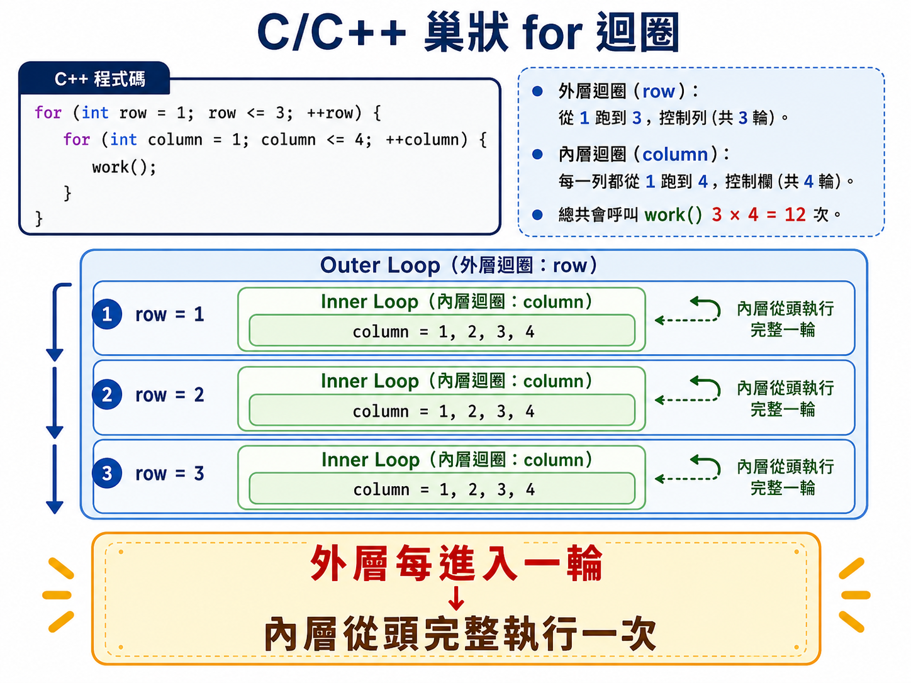

---

## Section V. 外層與內層

```cpp
for (int row = 1; row <= 3; ++row) {
    for (int column = 1; column <= 4; ++column) {
        cout << row << " " << column << '\n';
    }
}
```

- `row` 控制外層。
- `column` 控制內層。
- 每一個 `row` 都會搭配所有 `column`。

---

## Section VI. 執行順序

當：

```text
row = 1
```

內層會執行：

```text
column = 1, 2, 3, 4
```

接著外層更新：

```text
row = 2
```

內層重新從：

```text
column = 1
```

開始。


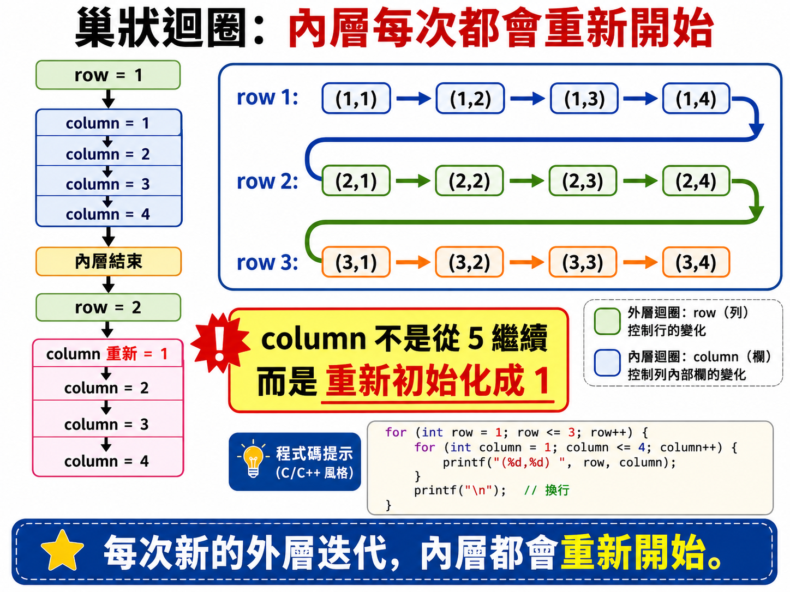

---

## Section VII. 完整座標範例

```cpp
// VALIDATE
#include <iostream>
using namespace std;

int main() {
    for (int row = 1; row <= 2; ++row) {
        for (int column = 1; column <= 3; ++column) {
            cout << "("
                 << row
                 << ", "
                 << column
                 << ")\n";
        }
    }

    return 0;
}
```

輸出：

```text
(1, 1)
(1, 2)
(1, 3)
(2, 1)
(2, 2)
(2, 3)
```

---

## Section VIII. 追蹤表

| 外層 `row` | 內層 `column` | 輸出 |
| ---: | ---: | --- |
| 1 | 1 | `(1, 1)` |
| 1 | 2 | `(1, 2)` |
| 1 | 3 | `(1, 3)` |
| 2 | 1 | `(2, 1)` |
| 2 | 2 | `(2, 2)` |
| 2 | 3 | `(2, 3)` |


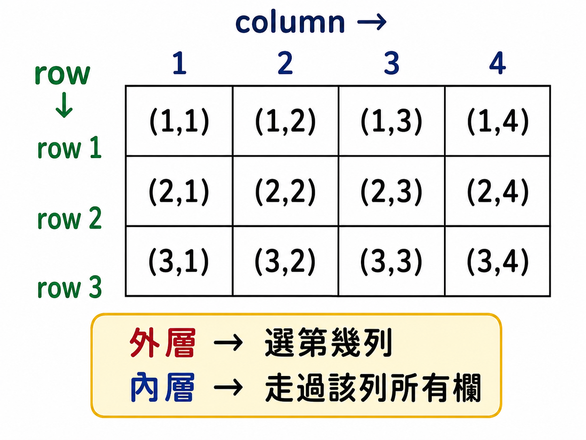

---

# Part B：計算總執行次數

## Section IX. 固定內層次數

```cpp
for (int row = 0; row < 3; ++row) {
    for (int column = 0; column < 4; ++column) {
        ++count;
    }
}
```

外層：

```text
3 次
```

每一輪內層：

```text
4 次
```

總次數：

```text
3 × 4 = 12
```


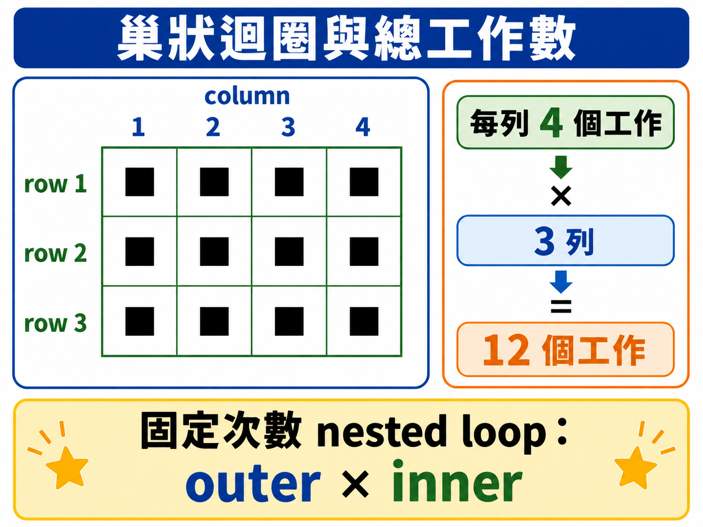

---

## Section X. 三層迴圈

```cpp
for (int a = 0; a < 2; ++a) {
    for (int b = 0; b < 3; ++b) {
        for (int c = 0; c < 4; ++c) {
            ++count;
        }
    }
}
```

總次數：

```text
2 × 3 × 4 = 24
```

---

## Section XI. 內層次數不固定

```cpp
for (int row = 1; row <= 4; ++row) {
    for (int column = 1; column <= row; ++column) {
        ++count;
    }
}
```

內層次數：

```text
1 + 2 + 3 + 4 = 10
```

不能直接用：

```text
4 × 4
```

因為每列的內層次數不同。


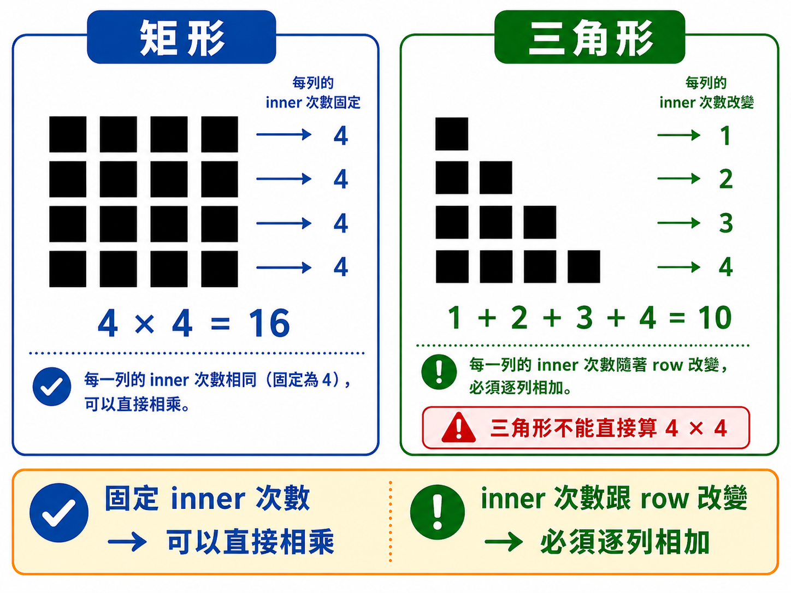

---

# Part C：矩形輸出

## Section XII. 實心矩形

```cpp
// VALIDATE
#include <iostream>
using namespace std;

int main() {
    int height = 3;
    int width = 5;

    for (int row = 1; row <= height; ++row) {
        for (int column = 1; column <= width; ++column) {
            cout << '*';
        }

        cout << '\n';
    }

    return 0;
}
```

輸出：

```text
*****
*****
*****
```

---

## Section XIII. 外層控制列

```cpp
for (int row = 1; row <= height; ++row)
```

決定總共有幾列。

---

## Section XIV. 內層控制欄

```cpp
for (int column = 1; column <= width; ++column)
```

決定每列輸出幾個符號。

---

## Section XV. 換行的位置

正確：

```cpp
for (每一列) {
    for (每一欄) {
        cout << '*';
    }

    cout << '\n';
}
```

換行放在內層迴圈結束後，代表：

```text
一整列完成
→ 換到下一列
```


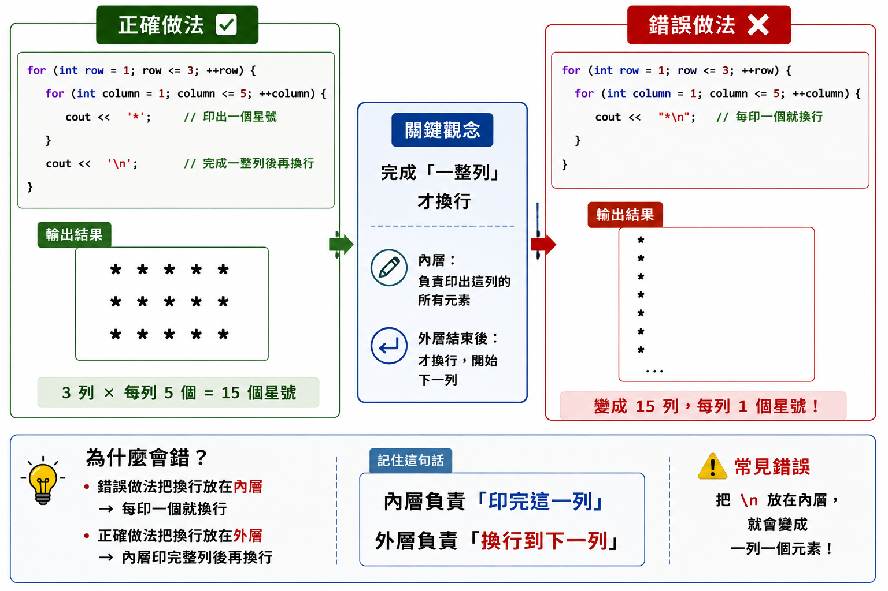

---

## Section XVI. 使用輸入控制大小

```cpp
// VALIDATE
#include <iostream>
using namespace std;

int main() {
    int height;
    int width;

    cin >> height >> width;

    if (height <= 0 || width <= 0) {
        cout << "Invalid size\n";
        return 0;
    }

    for (int row = 1; row <= height; ++row) {
        for (int column = 1; column <= width; ++column) {
            cout << '#';
        }

        cout << '\n';
    }

    return 0;
}
```

---

# Part D：數字與座標矩形

## Section XVII. 每列輸出列號

```cpp
// VALIDATE
#include <iostream>
using namespace std;

int main() {
    for (int row = 1; row <= 4; ++row) {
        for (int column = 1; column <= 5; ++column) {
            cout << row;
        }

        cout << '\n';
    }

    return 0;
}
```

輸出：

```text
11111
22222
33333
44444
```

---

## Section XVIII. 每欄輸出欄號

```cpp
// VALIDATE
#include <iostream>
using namespace std;

int main() {
    for (int row = 1; row <= 3; ++row) {
        for (int column = 1; column <= 5; ++column) {
            cout << column;
        }

        cout << '\n';
    }

    return 0;
}
```

輸出：

```text
12345
12345
12345
```


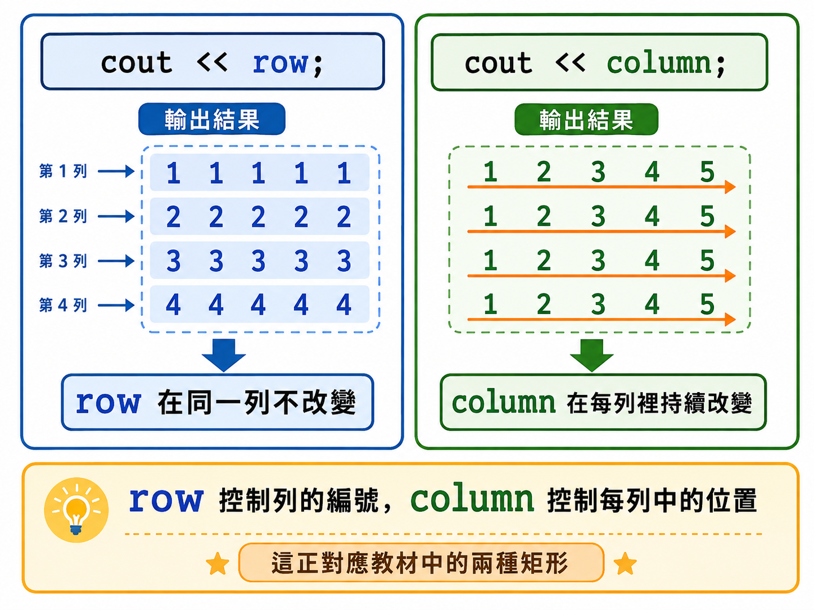

---

## Section XIX. 輸出座標表

```cpp
// VALIDATE
#include <iostream>
using namespace std;

int main() {
    for (int row = 1; row <= 2; ++row) {
        for (int column = 1; column <= 3; ++column) {
            cout << "["
                 << row
                 << ","
                 << column
                 << "] ";
        }

        cout << '\n';
    }

    return 0;
}
```

---

# Part E：九九乘法表

## Section XX. 每一個乘法組合

```cpp
row * column
```

可將：

```text
row
```

想成被乘數，將：

```text
column
```

想成乘數。

---

## Section XXI. 完整九九乘法表

```cpp
// VALIDATE
#include <iomanip>
#include <iostream>
using namespace std;

int main() {
    for (int first = 1; first <= 9; ++first) {
        for (int second = 1; second <= 9; ++second) {
            cout << first
                 << " x "
                 << second
                 << " = "
                 << setw(2)
                 << first * second
                 << "   ";
        }

        cout << '\n';
    }

    return 0;
}
```


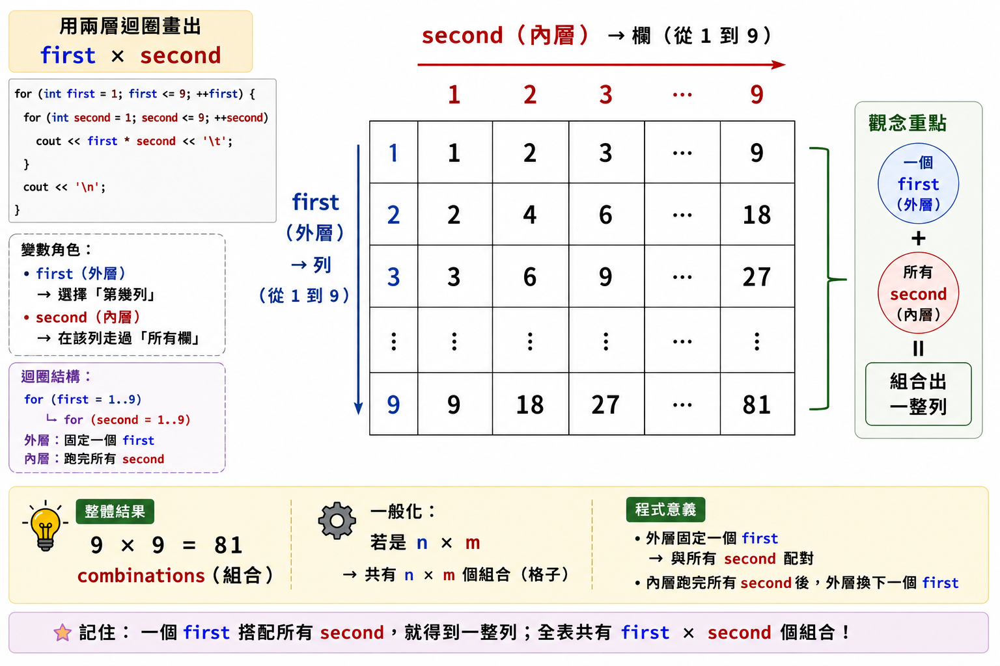

---

## Section XXII. `setw()`

需要：

```cpp
#include <iomanip>
```

```cpp
setw(2)
```

表示下一個輸出值至少使用兩個字元寬度。

它只影響緊接著的下一個輸出項目。


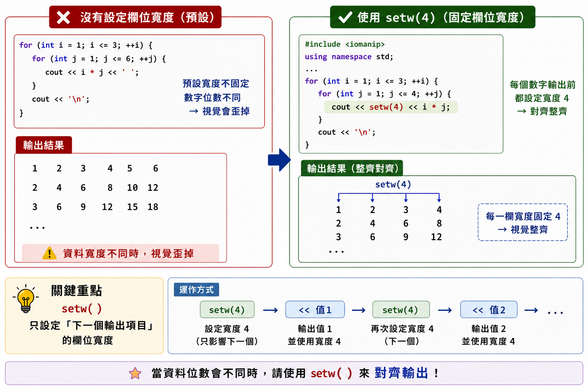

---

## Section XXIII. 傳統排列方式

也可以讓每一欄代表一個固定乘數：

```cpp
for (int multiplier = 1; multiplier <= 9; ++multiplier) {
    for (int number = 1; number <= 9; ++number) {
        cout << number
             << " x "
             << multiplier
             << " = "
             << setw(2)
             << number * multiplier
             << "   ";
    }

    cout << '\n';
}
```

只要排列一致，兩種方向都可使用。

---

## Section XXIV. 指定範圍乘法表

```cpp
// VALIDATE
#include <iomanip>
#include <iostream>
using namespace std;

int main() {
    int maximum;
    cin >> maximum;

    if (maximum < 1 || maximum > 20) {
        cout << "Maximum must be from 1 to 20.\n";
        return 0;
    }

    for (int row = 1; row <= maximum; ++row) {
        for (int column = 1; column <= maximum; ++column) {
            cout << setw(4)
                 << row * column;
        }

        cout << '\n';
    }

    return 0;
}
```

---

# Part F：空心矩形

## Section XXV. 哪些位置是邊界？

一個位置位於邊界，只要符合其中一項：

```text
第一列
最後一列
第一欄
最後一欄
```

---

## Section XXVI. 邊界條件

```cpp
bool isBorder =
    row == 1 ||
    row == height ||
    column == 1 ||
    column == width;
```


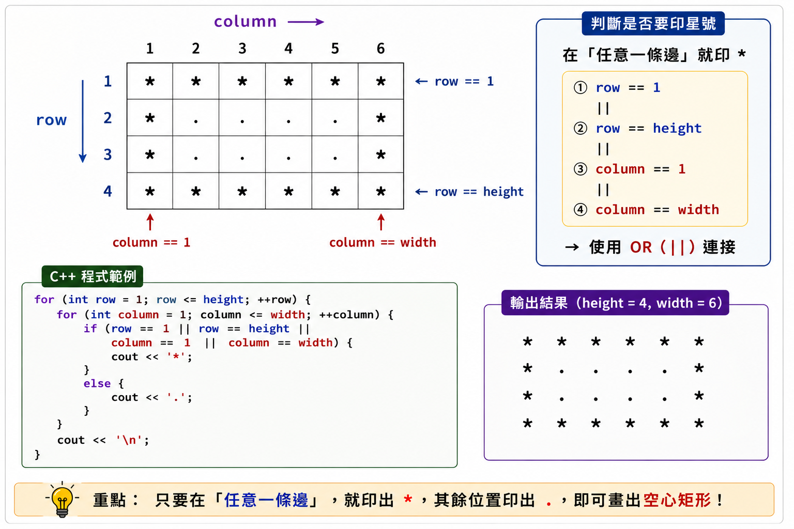

---

## Section XXVII. 完整空心矩形

```cpp
// VALIDATE
#include <iostream>
using namespace std;

int main() {
    int height = 5;
    int width = 8;

    for (int row = 1; row <= height; ++row) {
        for (int column = 1; column <= width; ++column) {
            bool isBorder =
                row == 1 ||
                row == height ||
                column == 1 ||
                column == width;

            if (isBorder) {
                cout << '*';
            } else {
                cout << ' ';
            }
        }

        cout << '\n';
    }

    return 0;
}
```

輸出：

```text
********
*      *
*      *
*      *
********
```

---

## Section XXVIII. 高度或寬度為 1

若：

```text
height = 1
```

所有位置都符合：

```cpp
row == 1
```

因此整列都是邊界。

若：

```text
width = 1
```

所有位置都符合左邊界與右邊界。

---

# Part G：左下直角三角形

## Section XXIX. 圖形

大小為 `5`：

```text
*
**
***
****
*****
```

每一列的星號數量等於列號。

---

## Section XXX. 內層條件

```cpp
column <= row
```

當：

```text
row = 3
```

內層：

```text
column = 1, 2, 3
```

所以輸出三個星號。


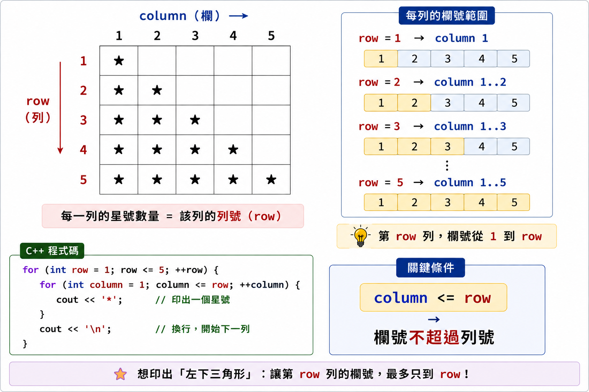

---

## Section XXXI. 完整程式

```cpp
// VALIDATE
#include <iostream>
using namespace std;

int main() {
    int size;
    cin >> size;

    if (size <= 0) {
        cout << "Invalid size\n";
        return 0;
    }

    for (int row = 1; row <= size; ++row) {
        for (int column = 1; column <= row; ++column) {
            cout << '*';
        }

        cout << '\n';
    }

    return 0;
}
```

---

## Section XXXII. 總星號數量

大小為 `n`：

```text
1 + 2 + 3 + ... + n
```

這不是 `n × n`。

例如 `n = 5`：

```text
1 + 2 + 3 + 4 + 5 = 15
```

---

# Part H：倒立三角形

## Section XXXIII. 圖形

大小為 `5`：

```text
*****
****
***
**
*
```

---

## Section XXXIV. 每列星號數

第 `row` 列：

```text
size - row + 1
```

當：

```text
size = 5
row = 2
```

星號數：

```text
5 - 2 + 1 = 4
```

---

## Section XXXV. 完整程式

```cpp
// VALIDATE
#include <iostream>
using namespace std;

int main() {
    int size;
    cin >> size;

    for (int row = 1; row <= size; ++row) {
        int starCount =
            size - row + 1;

        for (
            int column = 1;
            column <= starCount;
            ++column
        ) {
            cout << '*';
        }

        cout << '\n';
    }

    return 0;
}
```

---

# Part I：靠右三角形

## Section XXXVI. 圖形

大小為 `5`：

```text
    *
   **
  ***
 ****
*****
```

每列分成：

```text
前面的空白
後面的星號
```

---

## Section XXXVII. 空白數量

第 `row` 列：

```text
size - row
```

---

## Section XXXVIII. 星號數量

第 `row` 列：

```text
row
```

---

## Section XXXIX. 使用兩個內層迴圈

```cpp
// VALIDATE
#include <iostream>
using namespace std;

int main() {
    int size;
    cin >> size;

    for (int row = 1; row <= size; ++row) {
        int spaceCount =
            size - row;

        for (
            int space = 1;
            space <= spaceCount;
            ++space
        ) {
            cout << ' ';
        }

        for (int star = 1; star <= row; ++star) {
            cout << '*';
        }

        cout << '\n';
    }

    return 0;
}
```

---

## Section XL. 為什麼需要兩個內層迴圈？

第一個內層迴圈負責：

```text
空白
```

第二個內層迴圈負責：

```text
星號
```

兩段合起來形成一列。


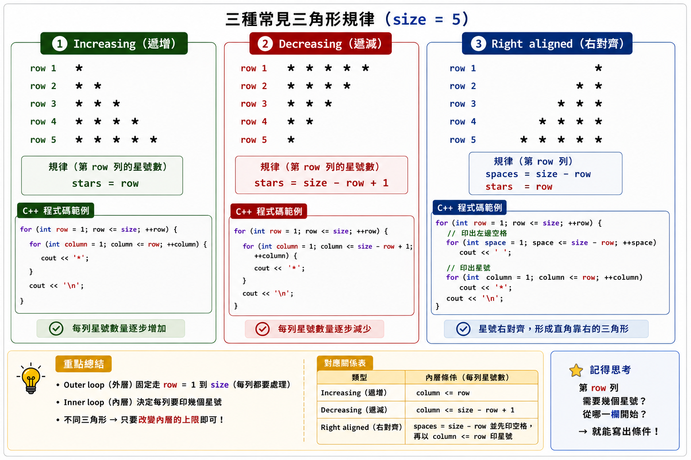


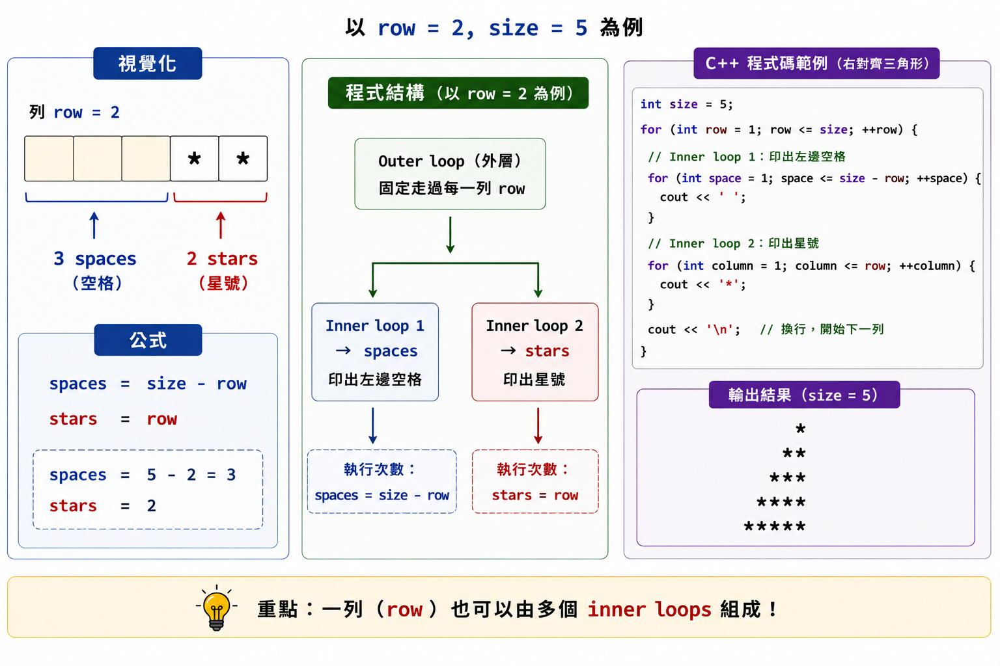

---

# Part J：座標法繪圖

## Section XLI. 把畫布想成座標

對每一個位置：

```text
(row, column)
```

判斷：

```text
這個位置應輸出符號還是空白？
```


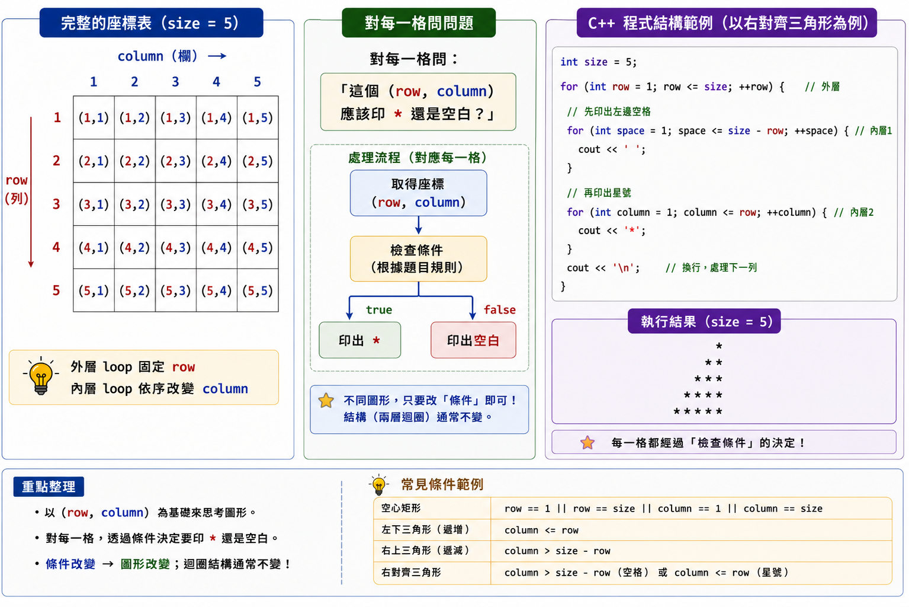

---

## Section XLII. 主對角線

大小為 `5`：

```text
*    
 *   
  *  
   * 
    *
```

主對角線條件：

```cpp
row == column
```

---

## Section XLIII. 主對角線程式

```cpp
// VALIDATE
#include <iostream>
using namespace std;

int main() {
    int size;
    cin >> size;

    for (int row = 1; row <= size; ++row) {
        for (int column = 1; column <= size; ++column) {
            if (row == column) {
                cout << '*';
            } else {
                cout << ' ';
            }
        }

        cout << '\n';
    }

    return 0;
}
```

---

## Section XLIV. 反對角線

大小為 `5` 時，反對角線位置：

```text
(1, 5)
(2, 4)
(3, 3)
(4, 2)
(5, 1)
```

每一組都符合：

```text
row + column = 6
```

一般大小為 `size`：

```cpp
row + column == size + 1
```


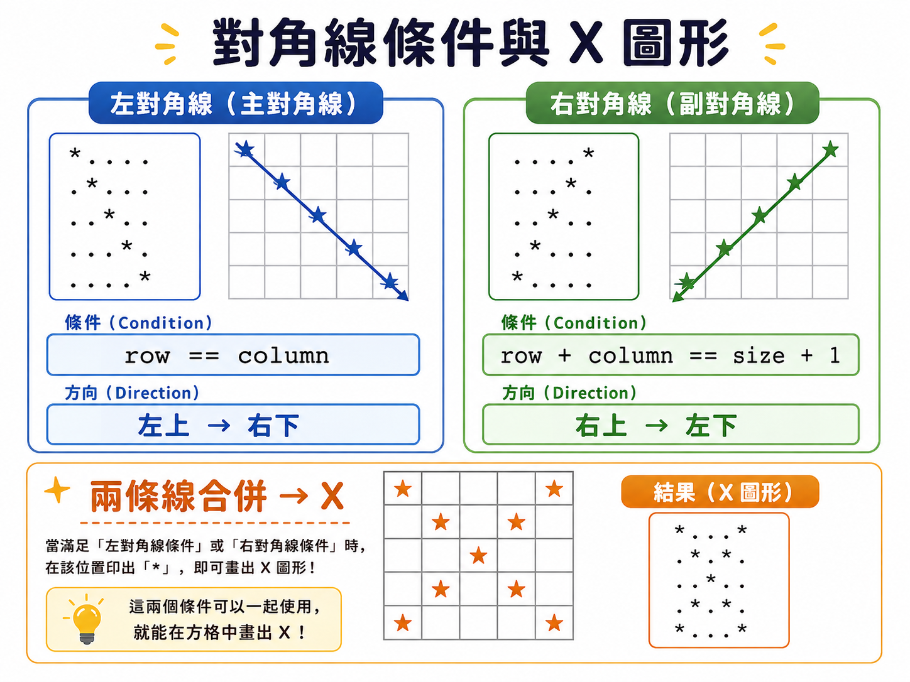

---

## Section XLV. X 形

條件：

```cpp
row == column ||
row + column == size + 1
```


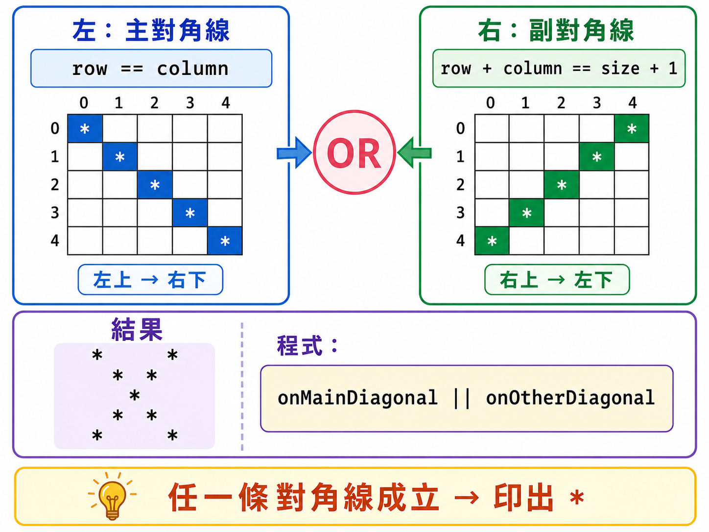

---

## Section XLVI. 完整 X 形程式

```cpp
// VALIDATE
#include <iostream>
using namespace std;

int main() {
    int size;
    cin >> size;

    for (int row = 1; row <= size; ++row) {
        for (int column = 1; column <= size; ++column) {
            bool onMainDiagonal =
                row == column;

            bool onOtherDiagonal =
                row + column == size + 1;

            if (onMainDiagonal || onOtherDiagonal) {
                cout << '*';
            } else {
                cout << ' ';
            }
        }

        cout << '\n';
    }

    return 0;
}
```

---

## Section XLVII. 十字形

大小為奇數時，可以使用中央列與中央欄：

```cpp
int center = size / 2 + 1;

bool onCross =
    row == center ||
    column == center;
```

---

## Section XLVIII. 完整十字形程式

```cpp
// VALIDATE
#include <iostream>
using namespace std;

int main() {
    int size;
    cin >> size;

    if (size <= 0 || size % 2 == 0) {
        cout << "Size must be a positive odd number.\n";
        return 0;
    }

    int center =
        size / 2 + 1;

    for (int row = 1; row <= size; ++row) {
        for (int column = 1; column <= size; ++column) {
            bool onCross =
                row == center ||
                column == center;

            if (onCross) {
                cout << '*';
            } else {
                cout << ' ';
            }
        }

        cout << '\n';
    }

    return 0;
}
```

---

# Part K：列出所有組合

## Section XLIX. 兩個範圍的所有配對

```cpp
for (int first = 1; first <= 3; ++first) {
    for (int second = 1; second <= 2; ++second) {
        cout << first
             << " "
             << second
             << '\n';
    }
}
```

輸出：

```text
1 1
1 2
2 1
2 2
3 1
3 2
```

---

## Section L. 笛卡兒積概念

若第一組有 `3` 個選項，第二組有 `2` 個選項：

```text
總組合數 = 3 × 2 = 6
```

巢狀迴圈可以列出所有配對。


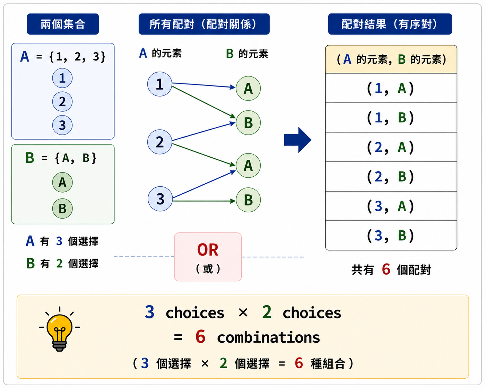

---

## Section LI. 三位密碼組合

```cpp
// VALIDATE
#include <iostream>
using namespace std;

int main() {
    for (int first = 0; first <= 2; ++first) {
        for (int second = 0; second <= 2; ++second) {
            for (int third = 0; third <= 2; ++third) {
                cout << first
                     << second
                     << third
                     << '\n';
            }
        }
    }

    return 0;
}
```

總組合數：

```text
3 × 3 × 3 = 27
```

---

# Part L：搜尋簡易整數方程式

## Section LII. 問題

找出範圍內所有：

```text
x + y = 10
```

的非負整數解。

---

## Section LIII. 搜尋範圍

因為要求非負整數，而且總和是 `10`：

```text
x 可以從 0 到 10
y 可以從 0 到 10
```

---

## Section LIV. 完整搜尋程式

```cpp
// VALIDATE
#include <iostream>
using namespace std;

int main() {
    int solutionCount = 0;

    for (int x = 0; x <= 10; ++x) {
        for (int y = 0; y <= 10; ++y) {
            if (x + y == 10) {
                cout << "x = "
                     << x
                     << ", y = "
                     << y
                     << '\n';

                ++solutionCount;
            }
        }
    }

    cout << "Solutions: "
         << solutionCount
         << '\n';

    return 0;
}
```


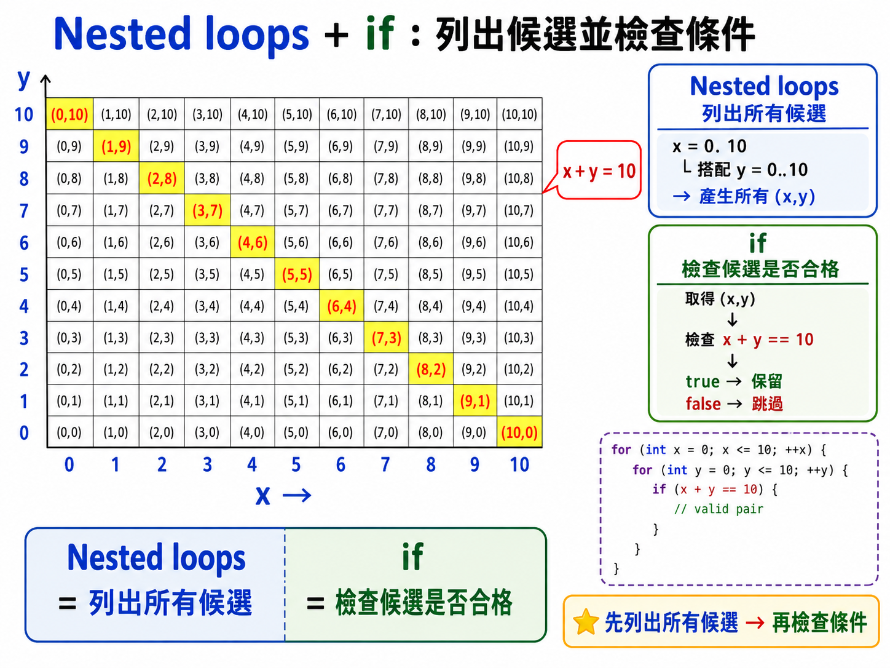

---

## Section LV. 更有效率的範圍

已知：

```text
y = 10 - x
```

其實可以不用雙層搜尋。

但本章使用巢狀迴圈，是為了練習：

```text
列出所有候選組合
→ 檢查條件
```

---

## Section LVI. 兩個限制

找：

```text
2x + 3y = 18
```

且：

```text
x >= 0
y >= 0
```

可以搜尋合理範圍。

---

## Section LVII. 完整方程式搜尋

```cpp
// VALIDATE
#include <iostream>
using namespace std;

int main() {
    bool found = false;

    for (int x = 0; x <= 9; ++x) {
        for (int y = 0; y <= 6; ++y) {
            if (2 * x + 3 * y == 18) {
                cout << "x = "
                     << x
                     << ", y = "
                     << y
                     << '\n';

                found = true;
            }
        }
    }

    if (!found) {
        cout << "No solution\n";
    }

    return 0;
}
```

---

# Part M：`break` 在巢狀迴圈中

## Section LVIII. 只離開內層

```cpp
for (int row = 1; row <= 3; ++row) {
    for (int column = 1; column <= 5; ++column) {
        if (column == 3) {
            break;
        }

        cout << row
             << ","
             << column
             << '\n';
    }
}
```

每一列的內層在 `column == 3` 時停止。

外層仍會繼續下一列。


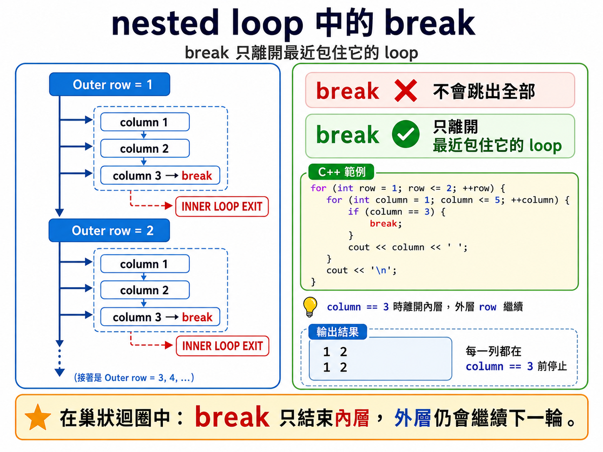

---

## Section LIX. 完整示範

```cpp
// VALIDATE
#include <iostream>
using namespace std;

int main() {
    for (int row = 1; row <= 3; ++row) {
        for (int column = 1; column <= 5; ++column) {
            if (column == 3) {
                break;
            }

            cout << "("
                 << row
                 << ", "
                 << column
                 << ")\n";
        }
    }

    return 0;
}
```

輸出：

```text
(1, 1)
(1, 2)
(2, 1)
(2, 2)
(3, 1)
(3, 2)
```

---

## Section LX. 使用旗標離開兩層

```cpp
bool found = false;

for (...) {
    for (...) {
        if (condition) {
            found = true;
            break;
        }
    }

    if (found) {
        break;
    }
}
```

內層先 `break`，外層再檢查旗標並 `break`。


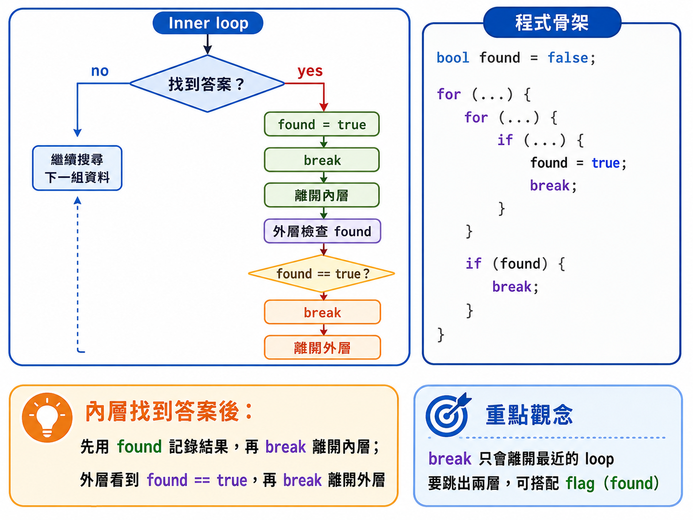

---

## Section LXI. 找到第一組解後停止

```cpp
// VALIDATE
#include <iostream>
using namespace std;

int main() {
    bool found = false;

    for (int x = 0; x <= 10; ++x) {
        for (int y = 0; y <= 10; ++y) {
            if (x + y == 10) {
                cout << "First solution: "
                     << x
                     << " "
                     << y
                     << '\n';

                found = true;
                break;
            }
        }

        if (found) {
            break;
        }
    }

    return 0;
}
```

---

## Section LXII. 使用函式提前結束

後續函式章節可以把搜尋放入函式：

```cpp
bool findSolution() {
    for (...) {
        for (...) {
            if (condition) {
                return true;
            }
        }
    }

    return false;
}
```

`return` 可以直接離開整個函式，不只離開內層迴圈。

---

# Part N：`continue` 在巢狀迴圈中

## Section LXIII. 只影響所在迴圈

若 `continue` 位於內層：

```text
跳到內層下一輪
```

不會直接跳到外層下一輪。


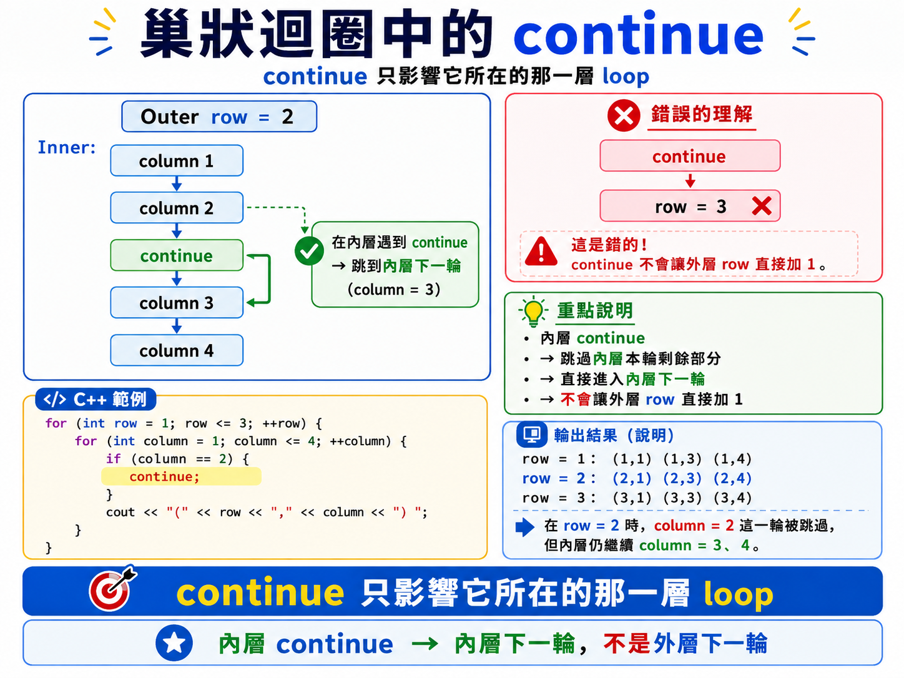

---

## Section LXIV. 跳過對角線位置

```cpp
// VALIDATE
#include <iostream>
using namespace std;

int main() {
    for (int row = 1; row <= 4; ++row) {
        for (int column = 1; column <= 4; ++column) {
            if (row == column) {
                continue;
            }

            cout << "("
                 << row
                 << ","
                 << column
                 << ") ";
        }

        cout << '\n';
    }

    return 0;
}
```

主對角線位置不輸出座標。

---

## Section LXV. 圖形中通常用 `if-else` 更清楚

例如 X 形：

```cpp
if (onDiagonal) {
    cout << '*';
} else {
    cout << ' ';
}
```

若用 `continue`，要確保每個位置仍輸出正確寬度。

圖形題中少輸出一個空白，就可能破壞形狀。

---

# Part O：時間複雜度初步

## Section LXVI. 固定範圍

```cpp
for (int row = 0; row < 9; ++row) {
    for (int column = 0; column < 9; ++column) {
        // ...
    }
}
```

總執行次數固定為：

```text
81
```

與使用者輸入大小無關。

---

## Section LXVII. 輸入大小 n

```cpp
for (int row = 0; row < n; ++row) {
    for (int column = 0; column < n; ++column) {
        // ...
    }
}
```

大約執行：

```text
n × n = n²
```


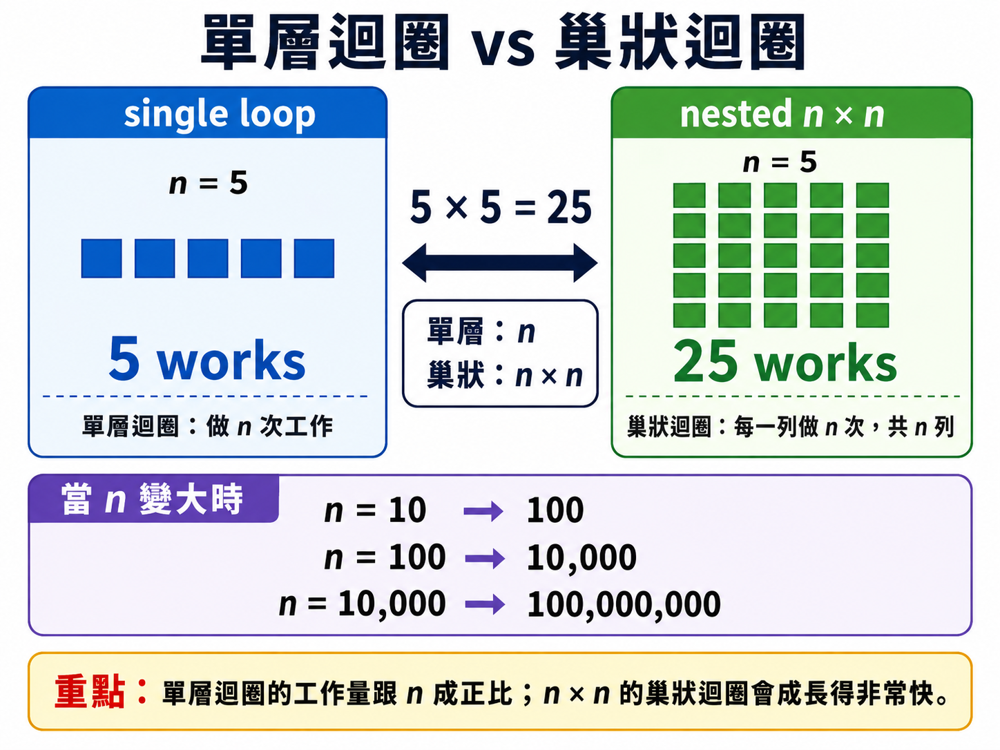

---

## Section LXVIII. 三角形迴圈

```cpp
for (int row = 1; row <= n; ++row) {
    for (int column = 1; column <= row; ++column) {
        // ...
    }
}
```

執行次數：

```text
1 + 2 + ... + n
```

大約也是與：

```text
n²
```

同一成長等級，但實際約為一半。

本章只建立直覺，不要求正式複雜度證明。


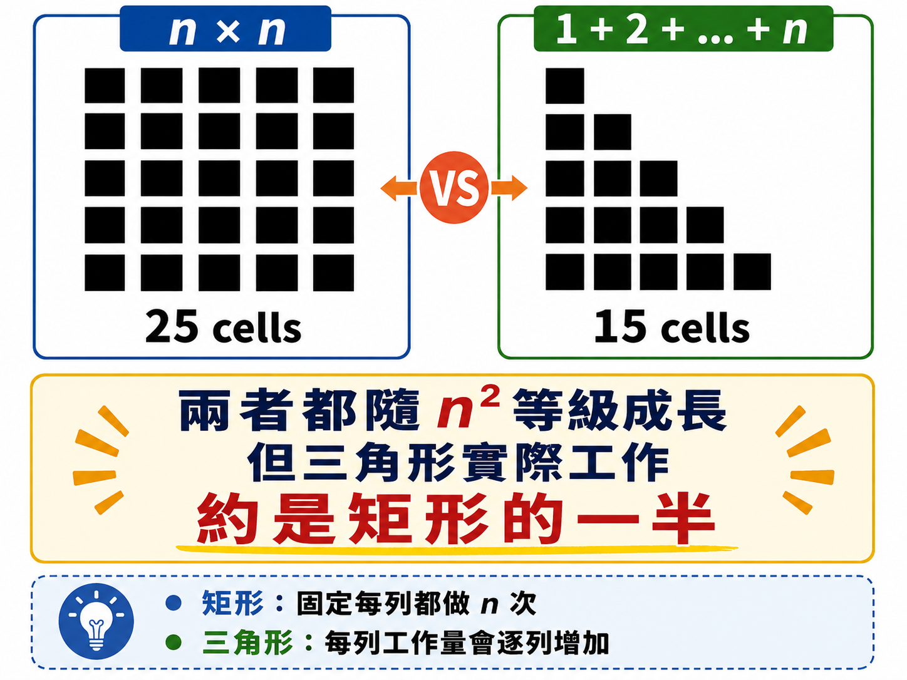

---

## Section LXIX. 為什麼要注意？

若：

```text
n = 10
```

`n² = 100`。

若：

```text
n = 10000
```

`n² = 100000000`。

巢狀迴圈可能很快產生大量工作或輸出。

---

# Part P：快速概念檢查

## Section LXX. 選擇題與簡答

### Q1. 外層每執行一輪，內層會怎樣？

<details><summary>查看答案</summary>

內層通常會從初始化開始完整執行。

</details>

### Q2. 外層 3 次、內層每次 4 次，主體共執行幾次？

<details><summary>查看答案</summary>

```text
3 × 4 = 12
```

</details>

### Q3. 圖形題中外層通常控制什麼？

<details><summary>查看答案</summary>

列。

</details>

### Q4. 內層通常控制什麼？

<details><summary>查看答案</summary>

欄或一列中的輸出次數。

</details>

### Q5. 換行通常放在哪裡？

<details><summary>查看答案</summary>

內層迴圈結束後、外層迴圈主體內。

</details>

### Q6. 高 3、寬 5 的實心矩形共有幾個符號？

<details><summary>查看答案</summary>

```text
3 × 5 = 15
```

</details>

### Q7. 空心矩形的邊界條件有哪些？

<details><summary>查看答案</summary>

第一列、最後一列、第一欄或最後一欄。

</details>

### Q8. 左下三角形第 `row` 列輸出幾個星號？

<details><summary>查看答案</summary>

`row` 個。

</details>

### Q9. 倒立三角形第 `row` 列星號數是多少？

<details><summary>查看答案</summary>

```cpp
size - row + 1
```

</details>

### Q10. 靠右三角形第 `row` 列空白數是多少？

<details><summary>查看答案</summary>

```cpp
size - row
```

</details>

### Q11. 主對角線條件是什麼？

<details><summary>查看答案</summary>

```cpp
row == column
```

</details>

### Q12. 反對角線條件是什麼？

<details><summary>查看答案</summary>

```cpp
row + column == size + 1
```

</details>

### Q13. X 形使用哪些條件？

<details><summary>查看答案</summary>

主對角線或反對角線。

</details>

### Q14. `break` 在內層會離開外層嗎？

<details><summary>查看答案</summary>

不會，只離開目前最內層迴圈。

</details>

### Q15. 如何離開兩層迴圈？

<details><summary>查看答案</summary>

可以使用旗標讓內層與外層各自 `break`，或將搜尋放入函式後使用 `return`。

</details>

### Q16. 內層的 `continue` 影響哪一層？

<details><summary>查看答案</summary>

影響目前所在的內層迴圈。

</details>

### Q17. 三角形內層次數固定嗎？

<details><summary>查看答案</summary>

不固定，通常會依 `row` 改變。

</details>

### Q18. 雙層 `n × n` 迴圈大約執行幾次？

<details><summary>查看答案</summary>

約 `n²` 次。

</details>

### Q19. 為什麼不能輸出過大的文字圖形？

<details><summary>查看答案</summary>

可能產生大量運算與終端輸出，使程式非常慢。

</details>

### Q20. 巢狀迴圈只能使用 `for` 嗎？

<details><summary>查看答案</summary>

不是，`while`、`do-while` 與不同迴圈類型也能互相巢狀。

</details>

---

# Part Q：程式閱讀練習

## Section LXXI. 預測輸出與次數

### 題目 1

```cpp
for (int row = 1; row <= 2; ++row) {
    for (int column = 1; column <= 3; ++column) {
        cout << row << column << " ";
    }
}
```

<details><summary>查看答案</summary>

```text
11 12 13 21 22 23 
```

</details>

### 題目 2

```cpp
for (int row = 1; row <= 3; ++row) {
    for (int column = 1; column <= 2; ++column) {
        cout << '*';
    }

    cout << '\n';
}
```

<details><summary>查看答案</summary>

```text
**
**
**
```

</details>

### 題目 3

```cpp
for (int row = 1; row <= 3; ++row) {
    for (int column = 1; column <= row; ++column) {
        cout << '*';
    }

    cout << '\n';
}
```

<details><summary>查看答案</summary>

```text
*
**
***
```

</details>

### 題目 4

```cpp
int count = 0;

for (int row = 0; row < 4; ++row) {
    for (int column = 0; column < 5; ++column) {
        ++count;
    }
}

cout << count;
```

<details><summary>查看答案</summary>

```text
20
```

</details>

### 題目 5

```cpp
int count = 0;

for (int row = 1; row <= 4; ++row) {
    for (int column = 1; column <= row; ++column) {
        ++count;
    }
}

cout << count;
```

<details><summary>查看答案</summary>

```text
10
```

</details>

### 題目 6

```cpp
for (int row = 1; row <= 2; ++row) {
    for (int column = 1; column <= 4; ++column) {
        if (column == 3) {
            break;
        }

        cout << column;
    }
}
```

<details><summary>查看答案</summary>

```text
1212
```

每一輪外層都重新執行內層。

</details>

### 題目 7

```cpp
for (int row = 1; row <= 3; ++row) {
    for (int column = 1; column <= 3; ++column) {
        if (row == column) {
            cout << '*';
        } else {
            cout << '.';
        }
    }

    cout << '\n';
}
```

<details><summary>查看答案</summary>

```text
*..
.*.
..*
```

</details>

### 題目 8

```cpp
for (int row = 1; row <= 3; ++row) {
    for (int column = 1; column <= 3; ++column) {
        if (row + column == 4) {
            cout << '*';
        } else {
            cout << '.';
        }
    }

    cout << '\n';
}
```

<details><summary>查看答案</summary>

```text
..*
.*.
*..
```

</details>

### 題目 9

```cpp
for (int first = 1; first <= 2; ++first) {
    for (int second = 1; second <= 2; ++second) {
        cout << first + second << " ";
    }
}
```

<details><summary>查看答案</summary>

```text
2 3 3 4 
```

</details>

### 題目 10

```cpp
for (int row = 1; row <= 3; ++row) {
    for (int column = 1; column <= 3; ++column) {
        if (column == 2) {
            continue;
        }

        cout << column;
    }

    cout << '\n';
}
```

<details><summary>查看答案</summary>

```text
13
13
13
```

</details>

### 題目 11

```cpp
for (int row = 1; row <= 2; ++row) {
    for (int column = 1; column <= 2; ++row) {
        cout << row << column;
    }
}
```

<details><summary>查看答案</summary>

這段有嚴重錯誤：內層更新的是 `row`，`column` 不會改變，流程不符合預期，可能造成無窮迴圈或異常輸出。

</details>

### 題目 12

```cpp
for (int row = 1; row <= 3; ++row) {
    for (int column = 1; column <= 3; ++column) {
        cout << '*';
        cout << '\n';
    }
}
```

<details><summary>查看答案</summary>

每一個星號後都換行，共輸出 9 列單一星號，而不是 3 × 3 矩形。

</details>

---

# Part R：實作練習

## Section LXXII. 實作檢測題

### TODO 1：座標表

輸入列數與欄數，輸出所有 `(row, column)`。

### TODO 2：實心矩形

輸入高度、寬度與一個字元，輸出實心矩形。

### TODO 3：列號矩形

每列重複輸出自己的列號。

### TODO 4：九九乘法表

輸出完整 `1 × 1` 到 `9 × 9`。

### TODO 5：指定大小乘法表

輸入 `n`，輸出 `1` 到 `n` 的乘法表。

### TODO 6：空心矩形

輸入高度與寬度，輸出空心矩形。

### TODO 7：左下三角形

輸入大小，輸出遞增星號三角形。

### TODO 8：倒立三角形

輸入大小，輸出遞減星號三角形。

### TODO 9：靠右三角形

輸入大小，輸出靠右對齊三角形。

### TODO 10：主對角線

輸入大小，使用 `*` 繪製主對角線。

### TODO 11：X 形

輸入大小，繪製兩條對角線。

### TODO 12：十字形

輸入正奇數，繪製中央列與中央欄。

### TODO 13：所有數字組合

輸入兩個上限，列出所有 `(first, second)` 組合。

### TODO 14：整數方程式

找出 `x + y = target` 的所有非負整數解。

### TODO 15：第一組解

使用旗標與兩個 `break`，找到第一組符合條件的解後停止。

---

# Part S：課後小練習

## Section LXXIII. 延伸練習

### 練習 1：棋盤圖案

輸入大小，交替輸出 `#` 與 `.`：

```text
#.#.
.#.#
#.#.
.#.#
```

提示：

```cpp
(row + column) % 2
```

### 練習 2：空心正方形加對角線

同時輸出邊界與主對角線。

### 練習 3：菱形上半部

使用空白與星號完成菱形的上半部。

### 練習 4：三元整數方程式

搜尋：

```text
x + y + z = target
```

的非負整數解。

### 練習 5：最小乘積組合

在指定範圍內搜尋符合條件的組合，並記錄最小乘積。

---

# Part T：常見錯誤提醒

## Section LXXIV. 常見錯誤

1. 內層沒有重新從起點開始。
2. 將內層變數宣告在錯誤位置。
3. 在內層更新外層變數。
4. 在外層更新內層變數。
5. 條件使用錯誤的迴圈變數。
6. 換行放在內層迴圈中。
7. 忘記在每列完成後換行。
8. 實心矩形的高度與寬度寫反。
9. 邊界條件使用 `&&` 而不是 `||`。
10. 空心矩形內部也輸出符號。
11. 三角形內層固定成 `size`，導致輸出矩形。
12. 倒立三角形公式少了 `+ 1`。
13. 靠右三角形的空白與星號數量相反。
14. 主對角線寫成 `row + column == size + 1`。
15. 反對角線寫成 `row == column`。
16. `break` 只離開內層，卻期待全部停止。
17. 旗標設為 `true` 後忘記在外層檢查。
18. `continue` 導致某些位置完全沒有輸出，破壞圖形寬度。
19. 搜尋範圍太大，產生不必要工作。
20. 搜尋範圍太小，遺漏合法解。
21. 使用 `int` 計算非常大的平方或乘積而溢位。
22. 輸出尺寸沒有驗證，終端產生大量文字。
23. 把固定次數乘法套用到不規則內層。
24. 三層以上巢狀時變數名稱不清楚。
25. 為了縮短程式而把所有邏輯塞進單一條件。

---

# Part U：Mermaid 流程圖

## Section LXXV. 巢狀迴圈流程圖

### 1. 基本雙層迴圈

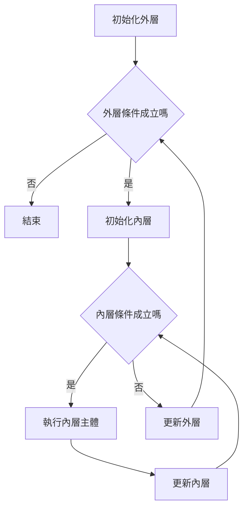
```mermaid
flowchart TD
    A[初始化外層] --> B{外層條件成立嗎}
    B -- 否 --> H[結束]
    B -- 是 --> C[初始化內層]
    C --> D{內層條件成立嗎}
    D -- 是 --> E[執行內層主體]
    E --> F[更新內層]
    F --> D
    D -- 否 --> G[更新外層]
    G --> B
```

### 2. 矩形

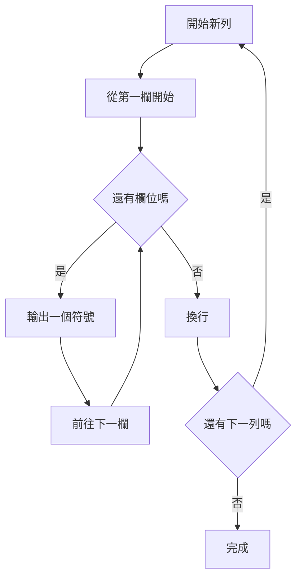
```mermaid
flowchart TD
    A[開始新列] --> B[從第一欄開始]
    B --> C{還有欄位嗎}
    C -- 是 --> D[輸出一個符號]
    D --> E[前往下一欄]
    E --> C
    C -- 否 --> F[換行]
    F --> G{還有下一列嗎}
    G -- 是 --> A
    G -- 否 --> H[完成]
```

### 3. 空心矩形

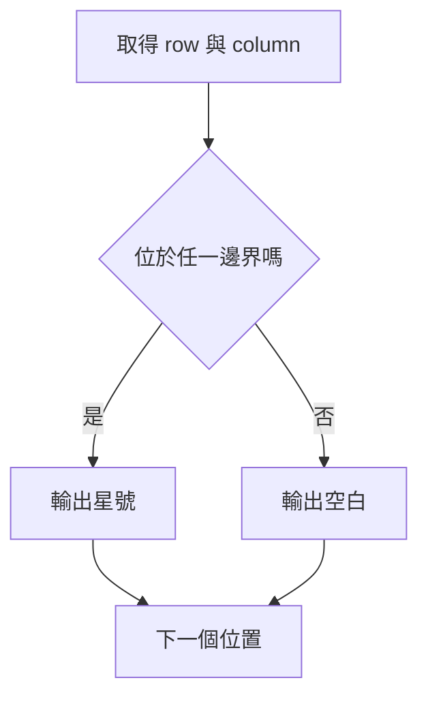
```mermaid
flowchart TD
    A[取得 row 與 column] --> B{位於任一邊界嗎}
    B -- 是 --> C[輸出星號]
    B -- 否 --> D[輸出空白]
    C --> E[下一個位置]
    D --> E
```

### 4. 左下三角形

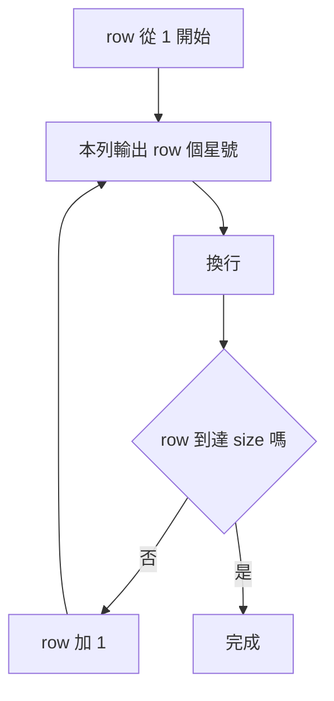
```mermaid
flowchart TD
    A[row 從 1 開始] --> B[本列輸出 row 個星號]
    B --> C[換行]
    C --> D{row 到達 size 嗎}
    D -- 否 --> E[row 加 1]
    E --> B
    D -- 是 --> F[完成]
```

### 5. 座標法

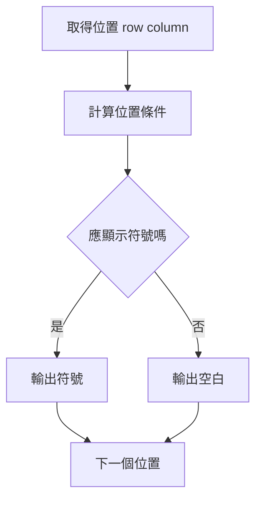
```mermaid
flowchart TD
    A[取得位置 row column] --> B[計算位置條件]
    B --> C{應顯示符號嗎}
    C -- 是 --> D[輸出符號]
    C -- 否 --> E[輸出空白]
    D --> F[下一個位置]
    E --> F
```

### 6. 所有組合搜尋

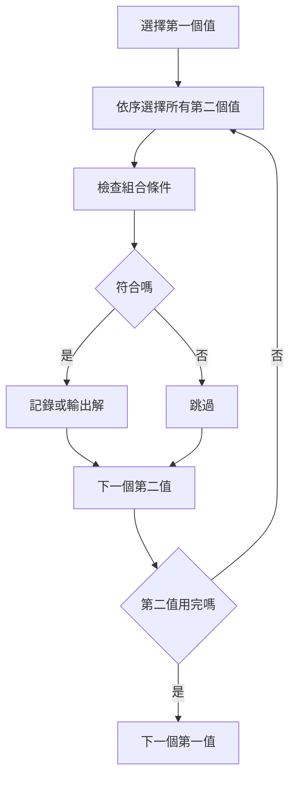
```mermaid
flowchart TD
    A[選擇第一個值] --> B[依序選擇所有第二個值]
    B --> C[檢查組合條件]
    C --> D{符合嗎}
    D -- 是 --> E[記錄或輸出解]
    D -- 否 --> F[跳過]
    E --> G[下一個第二值]
    F --> G
    G --> H{第二值用完嗎}
    H -- 否 --> B
    H -- 是 --> I[下一個第一值]
```

### 7. 離開兩層迴圈

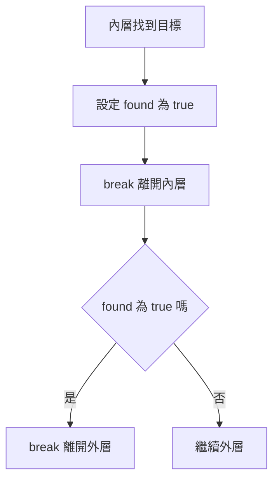
```mermaid
flowchart TD
    A[內層找到目標] --> B[設定 found 為 true]
    B --> C[break 離開內層]
    C --> D{found 為 true 嗎}
    D -- 是 --> E[break 離開外層]
    D -- 否 --> F[繼續外層]
```

### 8. 執行次數

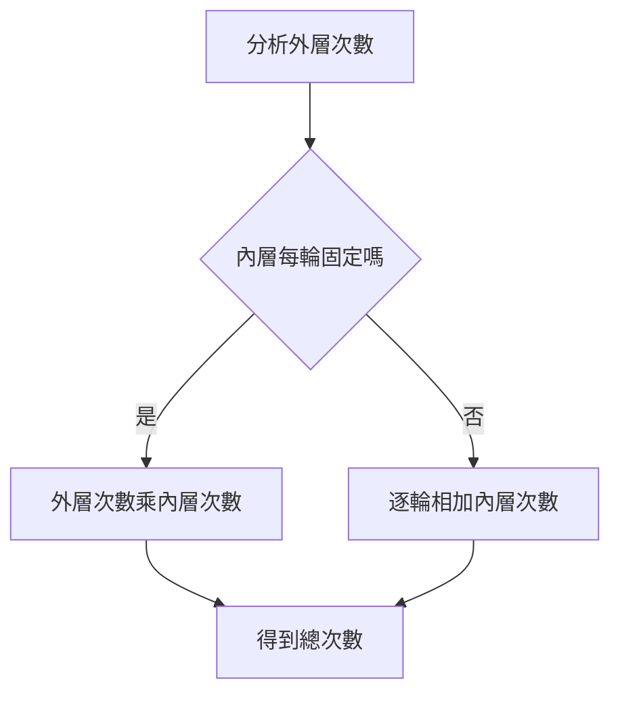
```mermaid
flowchart TD
    A[分析外層次數] --> B{內層每輪固定嗎}
    B -- 是 --> C[外層次數乘內層次數]
    B -- 否 --> D[逐輪相加內層次數]
    C --> E[得到總次數]
    D --> E
```

---

# 本章完成標準

完成本章後，你應該能做到：

1. 說明巢狀迴圈的用途。
2. 分辨外層與內層迴圈。
3. 說明外層每輪會重新執行內層。
4. 使用追蹤表分析雙層迴圈。
5. 計算固定次數雙層迴圈總次數。
6. 計算不規則內層的總次數。
7. 使用巢狀迴圈輸出座標。
8. 使用外層控制列。
9. 使用內層控制欄。
10. 將換行放在正確位置。
11. 輸出實心矩形。
12. 使用輸入控制矩形大小。
13. 輸出列號與欄號矩形。
14. 建立九九乘法表。
15. 使用 `setw()` 對齊輸出。
16. 建立指定大小乘法表。
17. 建立空心矩形。
18. 使用 OR 組合邊界條件。
19. 建立左下直角三角形。
20. 建立倒立三角形。
21. 建立靠右三角形。
22. 分別計算空白與符號數量。
23. 使用座標法繪圖。
24. 繪製主對角線。
25. 繪製反對角線。
26. 繪製 X 形。
27. 繪製十字形。
28. 列出所有數字配對。
29. 使用三層迴圈列出三元組合。
30. 搜尋簡易整數方程式的所有解。
31. 計算解的數量。
32. 使用布林變數記錄是否找到解。
33. 說明內層 `break` 只離開內層。
34. 使用旗標離開兩層迴圈。
35. 說明函式 `return` 可結束整個搜尋。
36. 使用內層 `continue`。
37. 說明 `continue` 只影響目前迴圈。
38. 初步分析 `n × n` 巢狀迴圈。
39. 避免輸出過大圖形。
40. 找出常見巢狀迴圈錯誤。

---

# 隱藏答案區

> Answer hidden — try it first.

<details><summary>TODO 1 答案</summary>

```cpp
#include <iostream>
using namespace std;

int main() {
    int height;
    int width;
    cin >> height >> width;

    for (int row = 1; row <= height; ++row) {
        for (int column = 1; column <= width; ++column) {
            cout << "("
                 << row
                 << ", "
                 << column
                 << ")\n";
        }
    }

    return 0;
}
```

</details>

<details><summary>TODO 2 答案</summary>

```cpp
int height;
int width;
char symbol;

cin >> height >> width >> symbol;

for (int row = 1; row <= height; ++row) {
    for (int column = 1; column <= width; ++column) {
        cout << symbol;
    }

    cout << '\n';
}
```

</details>

<details><summary>TODO 3 答案</summary>

```cpp
for (int row = 1; row <= height; ++row) {
    for (int column = 1; column <= width; ++column) {
        cout << row;
    }

    cout << '\n';
}
```

</details>

<details><summary>TODO 4 答案</summary>

```cpp
for (int first = 1; first <= 9; ++first) {
    for (int second = 1; second <= 9; ++second) {
        cout << first
             << " x "
             << second
             << " = "
             << first * second
             << '\n';
    }
}
```

</details>

<details><summary>TODO 5 答案</summary>

```cpp
for (int row = 1; row <= n; ++row) {
    for (int column = 1; column <= n; ++column) {
        cout << row * column << " ";
    }

    cout << '\n';
}
```

</details>

<details><summary>TODO 6 答案</summary>

```cpp
for (int row = 1; row <= height; ++row) {
    for (int column = 1; column <= width; ++column) {
        bool isBorder =
            row == 1 ||
            row == height ||
            column == 1 ||
            column == width;

        if (isBorder) {
            cout << '*';
        } else {
            cout << ' ';
        }
    }

    cout << '\n';
}
```

</details>

<details><summary>TODO 7 答案</summary>

```cpp
for (int row = 1; row <= size; ++row) {
    for (int star = 1; star <= row; ++star) {
        cout << '*';
    }

    cout << '\n';
}
```

</details>

<details><summary>TODO 8 答案</summary>

```cpp
for (int row = 1; row <= size; ++row) {
    int starCount =
        size - row + 1;

    for (int star = 1; star <= starCount; ++star) {
        cout << '*';
    }

    cout << '\n';
}
```

</details>

<details><summary>TODO 9 答案</summary>

```cpp
for (int row = 1; row <= size; ++row) {
    for (int space = 1; space <= size - row; ++space) {
        cout << ' ';
    }

    for (int star = 1; star <= row; ++star) {
        cout << '*';
    }

    cout << '\n';
}
```

</details>

<details><summary>TODO 10 答案</summary>

```cpp
for (int row = 1; row <= size; ++row) {
    for (int column = 1; column <= size; ++column) {
        if (row == column) {
            cout << '*';
        } else {
            cout << ' ';
        }
    }

    cout << '\n';
}
```

</details>

<details><summary>TODO 11 答案</summary>

```cpp
for (int row = 1; row <= size; ++row) {
    for (int column = 1; column <= size; ++column) {
        bool onDiagonal =
            row == column ||
            row + column == size + 1;

        if (onDiagonal) {
            cout << '*';
        } else {
            cout << ' ';
        }
    }

    cout << '\n';
}
```

</details>

<details><summary>TODO 12 答案</summary>

```cpp
int center =
    size / 2 + 1;

for (int row = 1; row <= size; ++row) {
    for (int column = 1; column <= size; ++column) {
        if (row == center || column == center) {
            cout << '*';
        } else {
            cout << ' ';
        }
    }

    cout << '\n';
}
```

</details>

<details><summary>TODO 13 答案</summary>

```cpp
for (int first = 0; first <= firstMaximum; ++first) {
    for (
        int second = 0;
        second <= secondMaximum;
        ++second
    ) {
        cout << "("
             << first
             << ", "
             << second
             << ")\n";
    }
}
```

</details>

<details><summary>TODO 14 答案</summary>

```cpp
int solutionCount = 0;

for (int x = 0; x <= target; ++x) {
    for (int y = 0; y <= target; ++y) {
        if (x + y == target) {
            cout << x
                 << " "
                 << y
                 << '\n';

            ++solutionCount;
        }
    }
}
```

</details>

<details><summary>TODO 15 答案</summary>

```cpp
bool found = false;

for (int x = 0; x <= target; ++x) {
    for (int y = 0; y <= target; ++y) {
        if (x + y == target) {
            cout << x
                 << " "
                 << y
                 << '\n';

            found = true;
            break;
        }
    }

    if (found) {
        break;
    }
}
```

</details>
