# Lesson 11：Loop Problem-Solving Practice 迴圈解題練習

> 這堂課的重點：把前面學過的 `while`、`do-while`、`for`、巢狀迴圈、條件判斷、累加器、計數器、`break` 與 `continue` 組合起來，解決常見的基礎程式題。

> 本章刻意不使用自訂函式、陣列與進階資料結構。目標是練習如何從題目敘述找出「要重複什麼」、「何時停止」、「需要記錄哪些狀態」，再把想法翻譯成迴圈。

---

## Section I. 今天要做什麼？

1. 將題目敘述拆成輸入、處理與輸出。
2. 找出題目中的重複工作。
3. 判斷應使用 `for` 或 `while`。
4. 判斷是否需要巢狀迴圈。
5. 找出迴圈的起點。
6. 找出迴圈的終點。
7. 找出更新方式。
8. 找出需要保存的狀態。
9. 使用計數器記錄符合條件的數量。
10. 使用累加器記錄總和。
11. 使用變數記錄最大值。
12. 使用變數記錄最小值。
13. 使用布林旗標記錄是否找到答案。
14. 使用 `break` 提前停止搜尋。
15. 使用 `continue` 跳過不需要處理的資料。
16. 列出正整數的所有因數。
17. 計算因數數量。
18. 計算因數總和。
19. 判斷質數。
20. 找出範圍內所有質數。
21. 統計範圍內質數數量。
22. 判斷完全數。
23. 使用試除法。
24. 將質數檢查範圍縮小到平方根概念。
25. 計算最大公因數。
26. 使用列舉法求最大公因數。
27. 使用輾轉相除法求最大公因數。
28. 計算最小公倍數。
29. 使用最大公因數計算最小公倍數。
30. 避免先乘法造成不必要溢位。
31. 使用 `% 10` 取得個位數。
32. 使用 `/ 10` 移除個位數。
33. 計算整數位數。
34. 計算各位數字總和。
35. 計算各位數字乘積。
36. 反轉整數。
37. 判斷回文數。
38. 計算某個數字出現次數。
39. 找出最大位數。
40. 找出最小位數。
41. 處理輸入 `0` 的特殊情況。
42. 使用固定次數輸入處理資料。
43. 計算多筆資料總和。
44. 找出多筆資料最大值。
45. 找出多筆資料最小值。
46. 同時計算最大值與最小值。
47. 計算正數、負數與零的數量。
48. 忽略不符合條件的資料。
49. 使用哨兵值處理不定筆數資料。
50. 找出不定筆數資料最大值。
51. 正確初始化第一筆有效資料。
52. 使用窮舉搜尋答案。
53. 解有範圍的韓信點兵問題。
54. 找出第一個符合條件的數字。
55. 找出範圍內所有符合條件的數字。
56. 統計符合條件的數量。
57. 找出符合條件的最小值。
58. 找出符合條件的最大值。
59. 使用多個餘數條件。
60. 解簡易二元整數方程式。
61. 使用巢狀迴圈列舉所有候選解。
62. 縮小候選範圍。
63. 比較暴力搜尋與數學化簡。
64. 使用輸出追蹤除錯。
65. 避免 off-by-one error。
66. 避免錯誤初始化最大值與最小值。
67. 避免將哨兵值納入計算。
68. 避免質數判斷提前結論。
69. 避免 `break` 放錯層級。
70. 避免數字反轉時遺失原值。
71. 完成概念檢查、程式閱讀與綜合實作題。

---

## Section II. 解題五步驟

### Step 1：確認輸入與輸出

先寫成：

```text
輸入：
輸出：
```

例如「輸入正整數，輸出所有因數」：

```text
輸入：正整數 n
輸出：所有可以整除 n 的正整數
```

---

### Step 2：找出候選範圍

因數題：

```text
候選值從 1 到 n
```

質數題：

```text
候選除數從 2 開始
```

韓信點兵：

```text
候選答案在題目指定範圍內
```

---

### Step 3：找出條件

因數：

```cpp
n % candidate == 0
```

質數的反例：

```cpp
n % divisor == 0
```

韓信點兵：

```cpp
number % 3 == 2 &&
number % 5 == 3 &&
number % 7 == 2
```

---

### Step 4：決定要記錄什麼

常見狀態：

| 需求 | 變數 |
| --- | --- |
| 數量 | `count` |
| 總和 | `total` |
| 最大值 | `maximum` |
| 最小值 | `minimum` |
| 是否找到 | `found` |
| 反轉結果 | `reversed` |
| 原始值備份 | `original` |

---

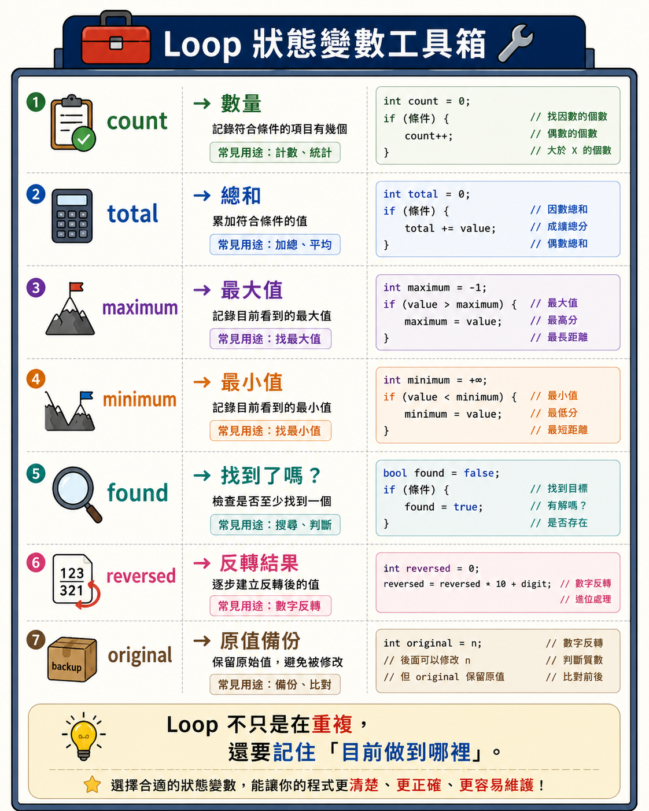

### Step 5：檢查特殊情況

常見特殊情況：

- `n <= 0`
- 沒有任何資料
- 第一筆就是哨兵值
- 輸入為 `0`
- 沒有找到答案
- 乘法可能溢位
- 除數為零

---

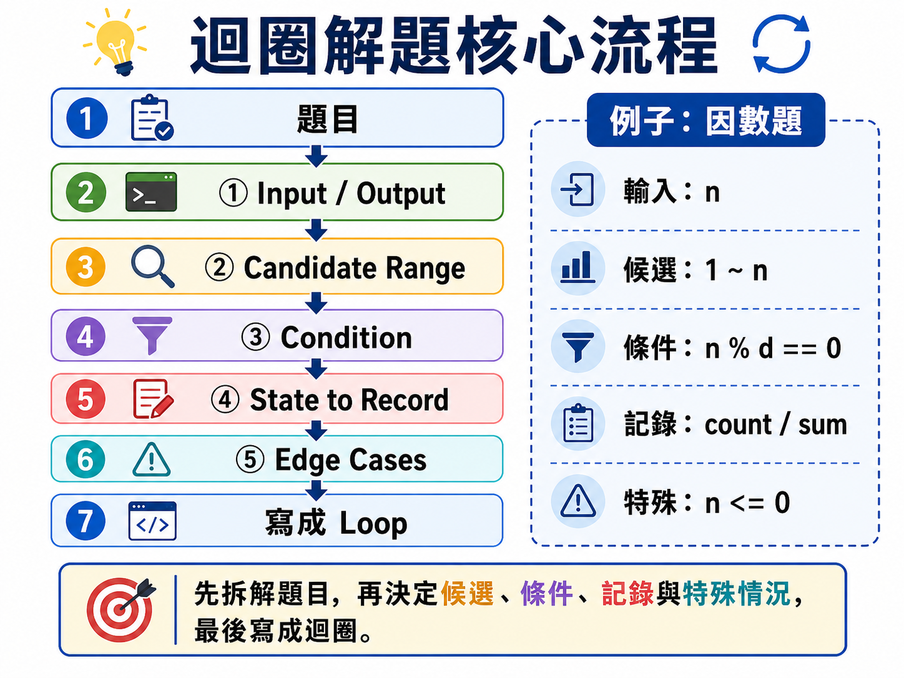

## Section III. 如何選擇迴圈？

| 題型 | 建議 |
| --- | --- |
| 已知從 1 檢查到 n | `for` |
| 已知要輸入固定筆數 | `for` |
| 不知道輸入幾筆 | `while` |
| 需要先輸入再判斷 | `do-while` 或 priming read |
| 處理每一位數字直到數字為 0 | `while` |
| 列舉兩個變數所有組合 | 巢狀 `for` |
| 找到第一個答案就停止 | `break` |
| 跳過不合法資料 | `continue` |

---

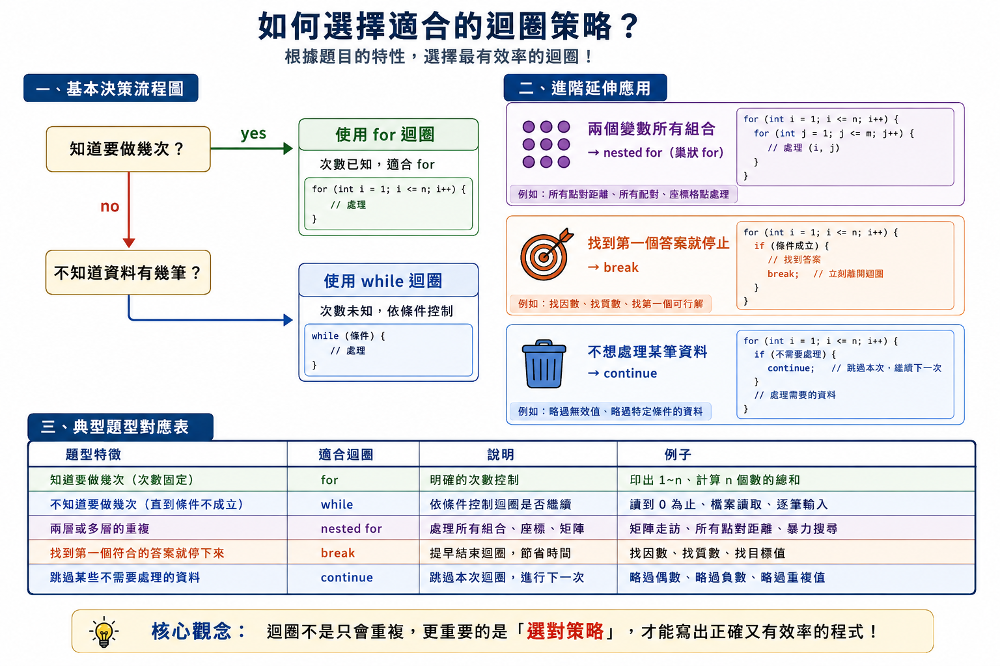

# Part A：因數問題

## Section IV. 什麼是因數？

若：

```text
n % divisor == 0
```

表示 `divisor` 可以整除 `n`，因此是 `n` 的因數。

例如 `12` 的正因數：

```text
1, 2, 3, 4, 6, 12
```

---

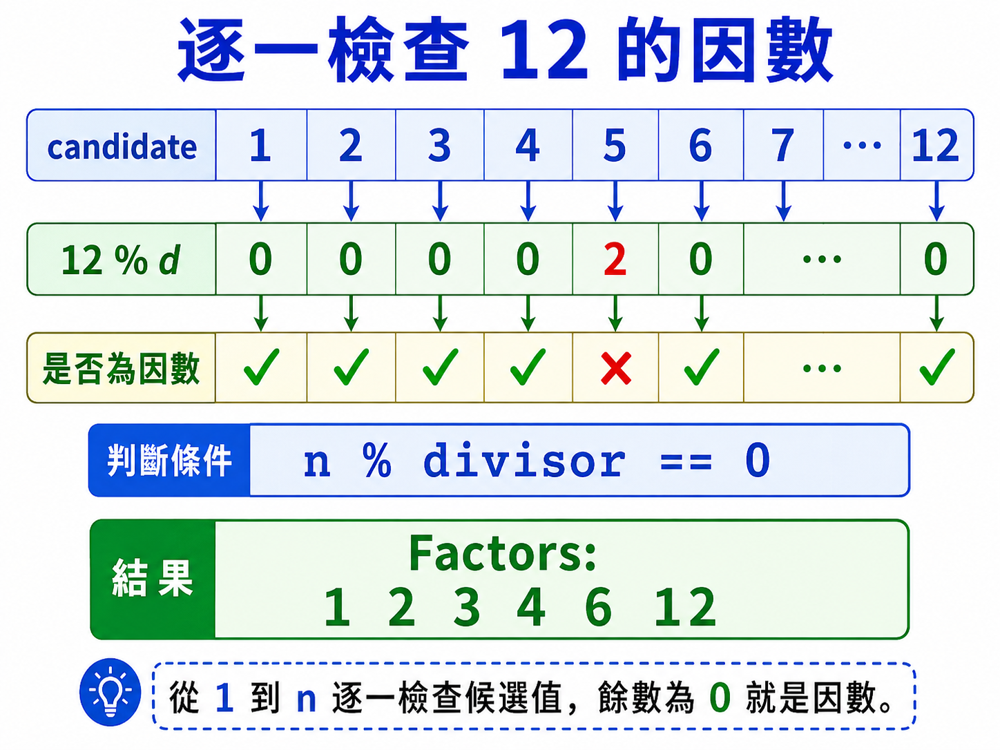

## Section V. 列出所有因數

```cpp
// VALIDATE
#include <iostream>
using namespace std;

int main() {
    int n;
    cin >> n;

    if (n <= 0) {
        cout << "Please enter a positive integer.\n";
        return 0;
    }

    for (int divisor = 1; divisor <= n; ++divisor) {
        if (n % divisor == 0) {
            cout << divisor << '\n';
        }
    }

    return 0;
}
```

---

## Section VI. 計算因數數量

```cpp
// VALIDATE
#include <iostream>
using namespace std;

int main() {
    int n;
    cin >> n;

    int factorCount = 0;

    for (int divisor = 1; divisor <= n; ++divisor) {
        if (n % divisor == 0) {
            ++factorCount;
        }
    }

    cout << factorCount << '\n';

    return 0;
}
```

---

## Section VII. 因數總和

```cpp
long long factorSum = 0;

for (int divisor = 1; divisor <= n; ++divisor) {
    if (n % divisor == 0) {
        factorSum += divisor;
    }
}
```

---

## Section VIII. 因數配對

若：

```text
divisor × quotient = n
```

則兩者通常成對出現。

例如 `36`：

```text
1 × 36
2 × 18
3 × 12
4 × 9
6 × 6
```

因此可以只檢查：

```cpp
divisor * divisor <= n
```

但要注意平方數中間的因數不能重複計算。

---

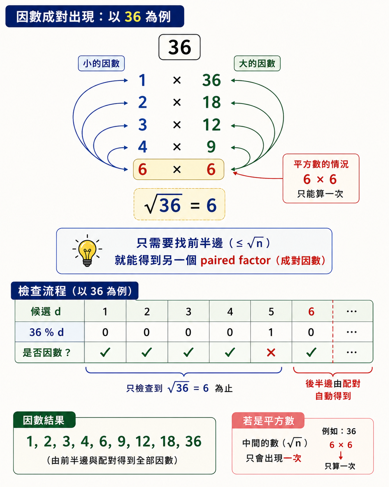

## Section IX. 使用因數配對計數

```cpp
// VALIDATE
#include <iostream>
using namespace std;

int main() {
    int n;
    cin >> n;

    if (n <= 0) {
        cout << "Invalid input\n";
        return 0;
    }

    int factorCount = 0;

    for (
        int divisor = 1;
        divisor <= n / divisor;
        ++divisor
    ) {
        if (n % divisor == 0) {
            int pairedFactor = n / divisor;

            if (divisor == pairedFactor) {
                ++factorCount;
            } else {
                factorCount += 2;
            }
        }
    }

    cout << factorCount << '\n';

    return 0;
}
```

使用：

```cpp
divisor <= n / divisor
```

可避免 `divisor * divisor` 可能溢位。

---

# Part B：質數

## Section X. 質數定義

質數是：

```text
大於 1
而且正因數只有 1 與自己
```

因此：

```text
0、1、負數都不是質數
```

---

## Section XI. 基本質數判斷

```cpp
// VALIDATE
#include <iostream>
using namespace std;

int main() {
    int n;
    cin >> n;

    bool isPrime = n >= 2;

    for (int divisor = 2; divisor < n; ++divisor) {
        if (n % divisor == 0) {
            isPrime = false;
            break;
        }
    }

    cout << boolalpha
         << isPrime
         << '\n';

    return 0;
}
```

---

## Section XII. 為什麼使用旗標？

初始假設：

```cpp
bool isPrime = n >= 2;
```

若找到一個非 1、非自己的因數：

```cpp
isPrime = false;
```

---

## Section XIII. 找到因數就停止

一旦發現：

```cpp
n % divisor == 0
```

已經確定不是質數，不需要繼續測試。

因此使用：

```cpp
break;
```

---

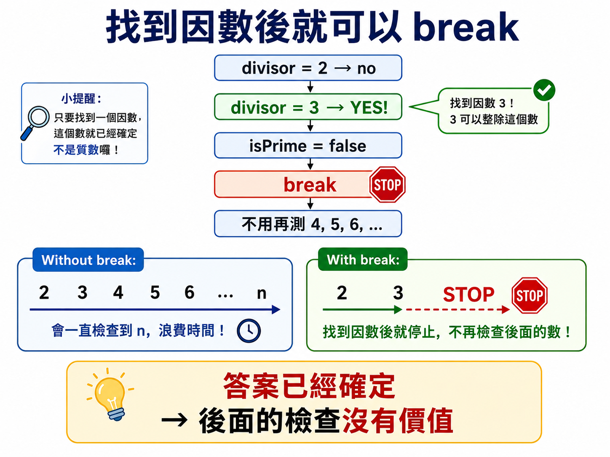

## Section XIV. 縮小檢查範圍

如果 `n` 有一個大於平方根的因數，就一定有一個小於平方根的配對因數。

因此只要檢查：

```cpp
divisor <= n / divisor
```

---

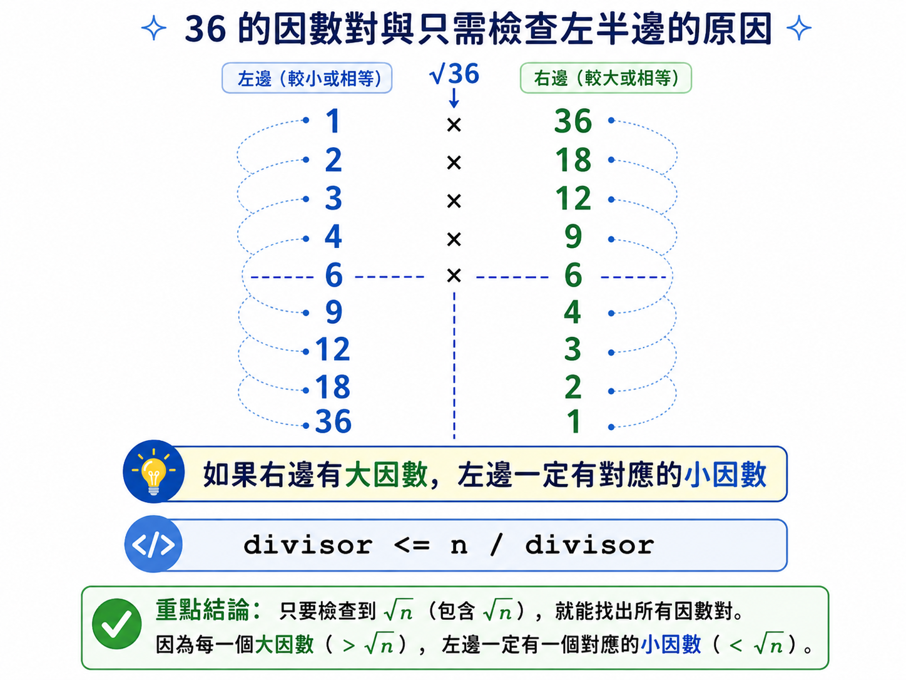

## Section XV. 改良質數判斷

```cpp
// VALIDATE
#include <iostream>
using namespace std;

int main() {
    int n;
    cin >> n;

    bool isPrime = n >= 2;

    for (
        int divisor = 2;
        isPrime && divisor <= n / divisor;
        ++divisor
    ) {
        if (n % divisor == 0) {
            isPrime = false;
        }
    }

    if (isPrime) {
        cout << "Prime\n";
    } else {
        cout << "Not prime\n";
    }

    return 0;
}
```

---

## Section XVI. 列出範圍內所有質數

```cpp
// VALIDATE
#include <iostream>
using namespace std;

int main() {
    int limit;
    cin >> limit;

    for (int candidate = 2; candidate <= limit; ++candidate) {
        bool isPrime = true;

        for (
            int divisor = 2;
            divisor <= candidate / divisor;
            ++divisor
        ) {
            if (candidate % divisor == 0) {
                isPrime = false;
                break;
            }
        }

        if (isPrime) {
            cout << candidate << '\n';
        }
    }

    return 0;
}
```

---

## Section XVII. 為什麼每個候選數都要重設旗標？

錯誤：

```cpp
bool isPrime = true;

for (每個 candidate) {
    // ...
}
```

若某次變成 `false`，後續候選數可能永遠保持 `false`。

正確：

```cpp
for (每個 candidate) {
    bool isPrime = true;
}
```

---

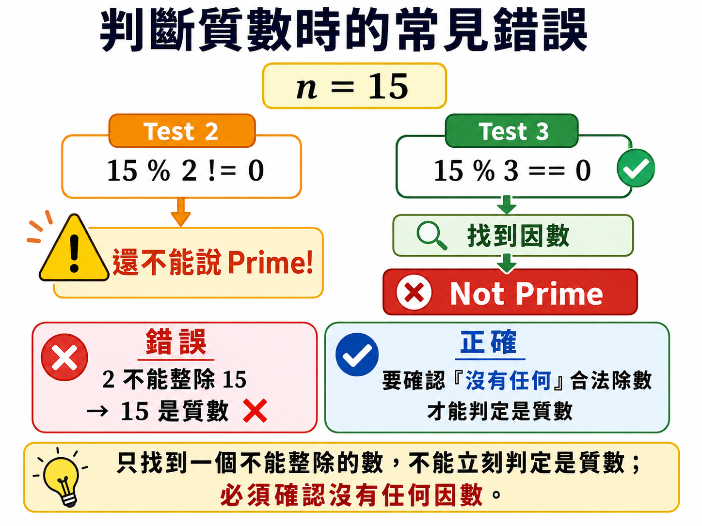

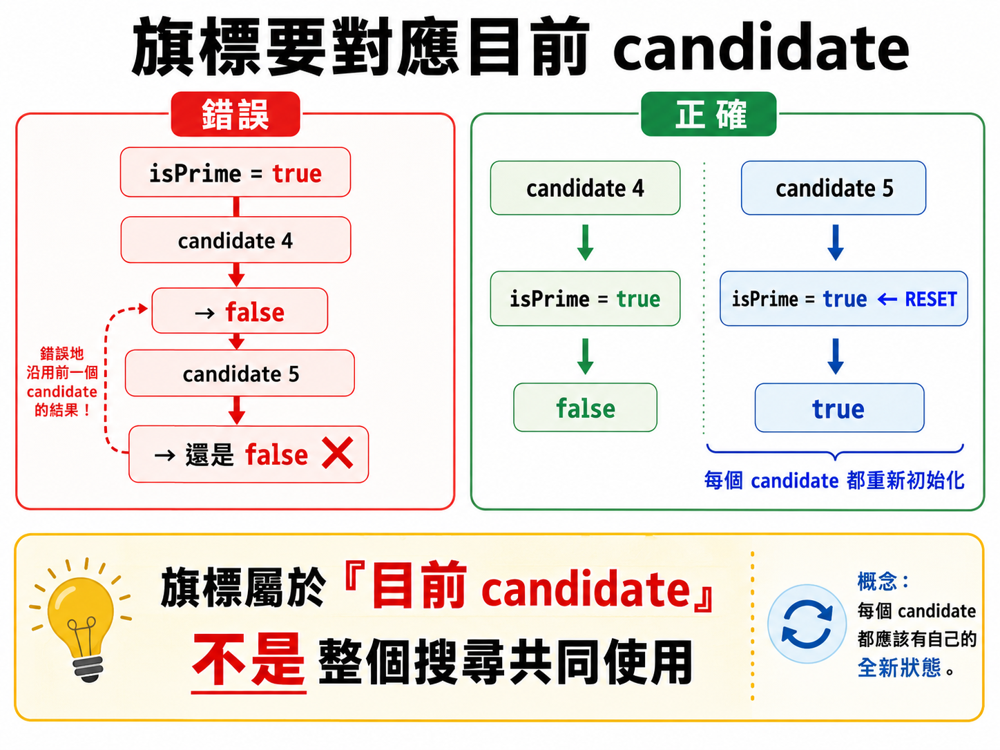

# Part C：完全數

## Section XVIII. 完全數定義

若一個正整數等於它的真因數總和，就稱為完全數。

真因數：

```text
不包含自己本身的正因數
```

例如：

```text
6 的真因數：1、2、3
1 + 2 + 3 = 6
```

所以 `6` 是完全數。

---

## Section XIX. 完全數判斷

```cpp
// VALIDATE
#include <iostream>
using namespace std;

int main() {
    int n;
    cin >> n;

    long long properFactorSum = 0;

    for (int divisor = 1; divisor < n; ++divisor) {
        if (n % divisor == 0) {
            properFactorSum += divisor;
        }
    }

    if (n > 1 && properFactorSum == n) {
        cout << "Perfect number\n";
    } else {
        cout << "Not a perfect number\n";
    }

    return 0;
}
```

---

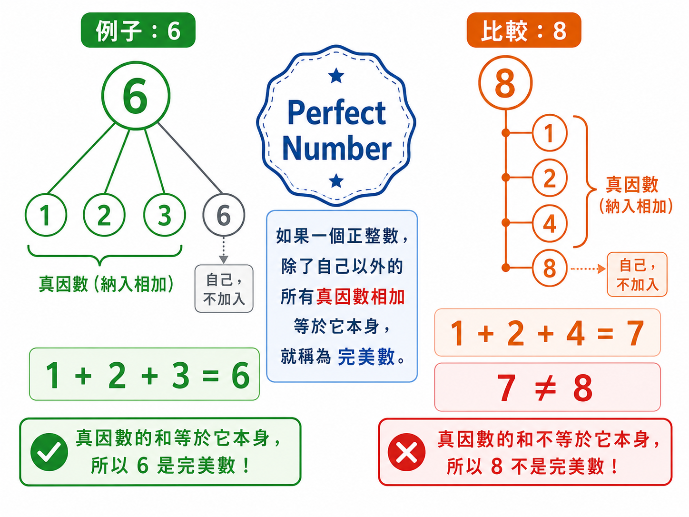

# Part D：最大公因數

## Section XX. 列舉法

兩個正整數的共同因數中，最大的就是最大公因數。

---

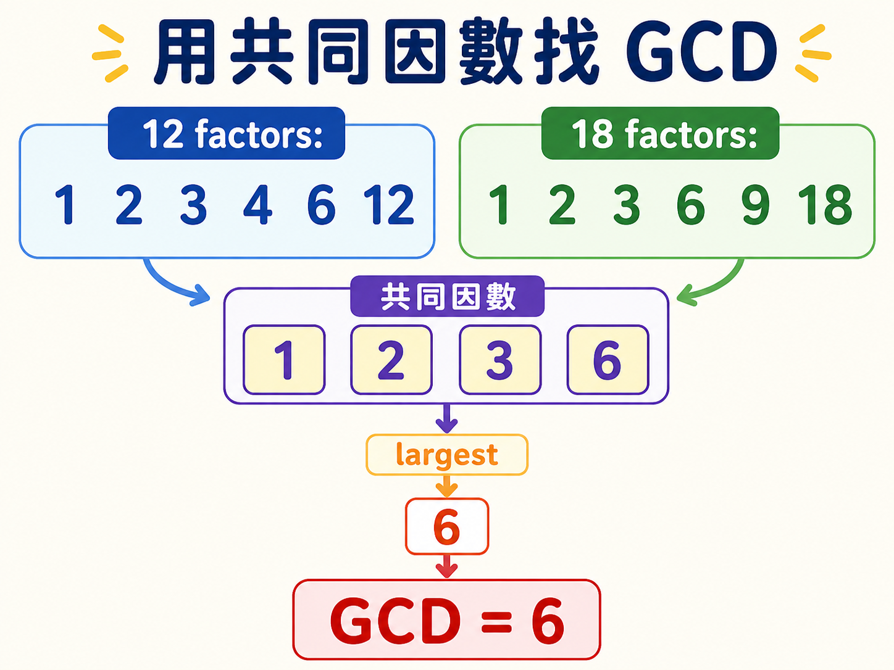

## Section XXI. 基本列舉法

```cpp
// VALIDATE
#include <iostream>
using namespace std;

int main() {
    int first;
    int second;
    cin >> first >> second;

    if (first < 0) {
        first = -first;
    }

    if (second < 0) {
        second = -second;
    }

    int limit =
        first < second ? first : second;

    int gcd = 0;

    for (int divisor = 1; divisor <= limit; ++divisor) {
        if (
            first % divisor == 0 &&
            second % divisor == 0
        ) {
            gcd = divisor;
        }
    }

    cout << gcd << '\n';

    return 0;
}
```

若兩數都是 `0`，本程式輸出 `0` 作為教材約定；數學上 `gcd(0, 0)` 通常不定義。

---

## Section XXII. 輾轉相除法

核心關係：

```text
gcd(a, b) = gcd(b, a % b)
```

持續更新，直到：

```text
b == 0
```

此時 `a` 是最大公因數。

---

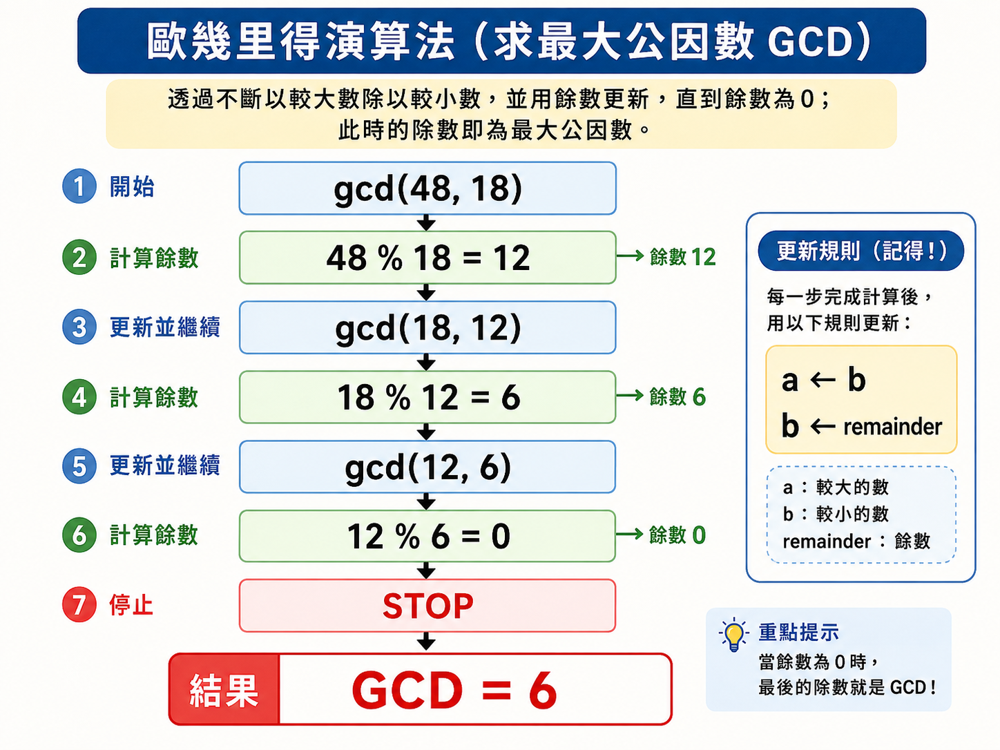

## Section XXIII. 完整輾轉相除法

```cpp
// VALIDATE
#include <iostream>
using namespace std;

int main() {
    long long a;
    long long b;

    cin >> a >> b;

    if (a < 0) {
        a = -a;
    }

    if (b < 0) {
        b = -b;
    }

    while (b != 0) {
        long long remainder =
            a % b;

        a = b;
        b = remainder;
    }

    cout << a << '\n';

    return 0;
}
```

---

## Section XXIV. 追蹤例子

求：

```text
gcd(48, 18)
```

| `a` | `b` | `a % b` |
| ---: | ---: | ---: |
| 48 | 18 | 12 |
| 18 | 12 | 6 |
| 12 | 6 | 0 |

結果：

```text
6
```

---

# Part E：最小公倍數

## Section XXV. 基本關係

對非零整數：

```text
lcm(a, b) = |a / gcd(a, b) × b|
```

先除後乘可降低中間乘積溢位風險。

---

## Section XXVI. 完整最小公倍數

```cpp
// VALIDATE
#include <iostream>
using namespace std;

int main() {
    long long first;
    long long second;

    cin >> first >> second;

    long long a = first;
    long long b = second;

    if (a < 0) {
        a = -a;
    }

    if (b < 0) {
        b = -b;
    }

    long long gcdA = a;
    long long gcdB = b;

    while (gcdB != 0) {
        long long remainder =
            gcdA % gcdB;

        gcdA = gcdB;
        gcdB = remainder;
    }

    if (a == 0 || b == 0) {
        cout << 0 << '\n';
    } else {
        long long lcm =
            (a / gcdA) * b;

        cout << lcm << '\n';
    }

    return 0;
}
```

---

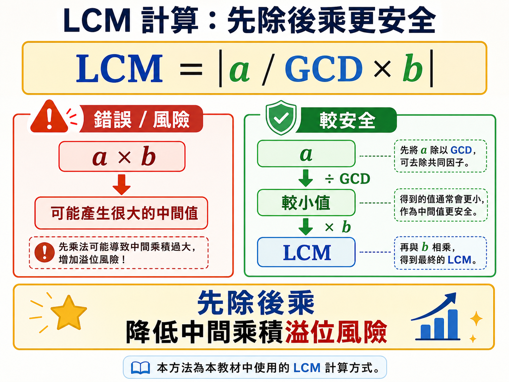

# Part F：處理每一位數字

## Section XXVII. 取得個位數

```cpp
int digit = number % 10;
```

例如：

```text
347 % 10 = 7
```

---

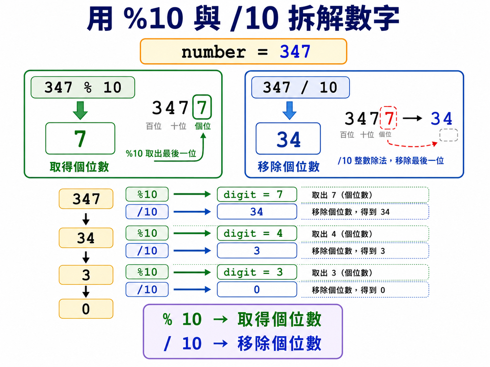

## Section XXVIII. 移除個位數

```cpp
number /= 10;
```

例如：

```text
347 / 10 = 34
```

整數除法會去除小數部分。

---

## Section XXIX. 基本位數處理模式

```cpp
while (number > 0) {
    int digit =
        number % 10;

    // 處理 digit

    number /= 10;
}
```

處理順序是：

```text
從個位數往最高位
```

---

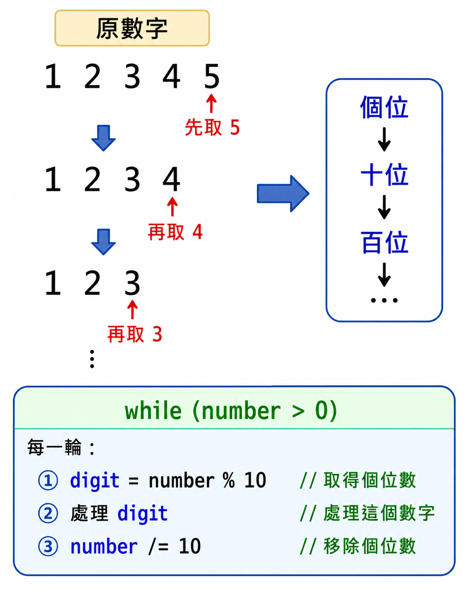

## Section XXX. 計算位數

```cpp
// VALIDATE
#include <iostream>
using namespace std;

int main() {
    long long number;
    cin >> number;

    if (number < 0) {
        number = -number;
    }

    int digitCount = 0;

    if (number == 0) {
        digitCount = 1;
    } else {
        while (number > 0) {
            ++digitCount;
            number /= 10;
        }
    }

    cout << digitCount << '\n';

    return 0;
}
```

---

## Section XXXI. 為什麼 `0` 是特殊情況？

若直接：

```cpp
while (number > 0)
```

而 `number == 0`，迴圈執行 0 次。

但數字 `0` 有一位，所以要另外處理。

---

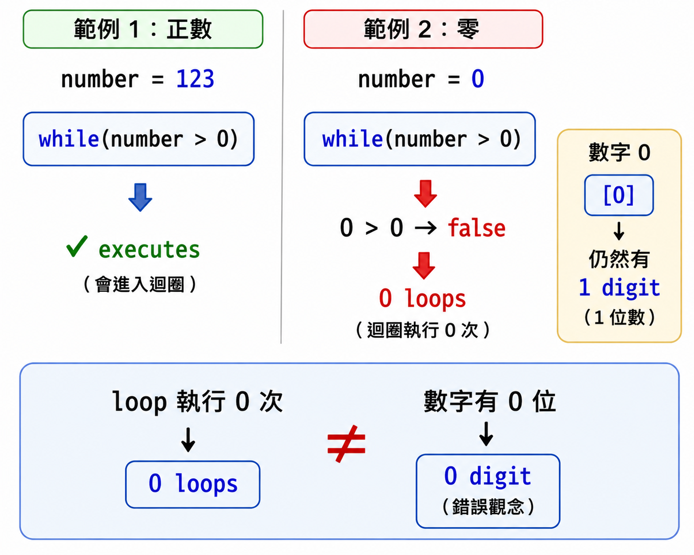

## Section XXXII. 各位數字總和

```cpp
// VALIDATE
#include <iostream>
using namespace std;

int main() {
    long long number;
    cin >> number;

    if (number < 0) {
        number = -number;
    }

    int digitSum = 0;

    while (number > 0) {
        int digit =
            static_cast<int>(number % 10);

        digitSum += digit;
        number /= 10;
    }

    cout << digitSum << '\n';

    return 0;
}
```

對 `0`，各位數字總和仍為 `0`，不需要額外調整。

---

## Section XXXIII. 各位數字乘積

要注意初始值：

```cpp
long long product = 1;
```

但輸入 `0` 時，數字本身只有一位 `0`，乘積應為 `0`。

---

## Section XXXIV. 完整位數乘積

```cpp
// VALIDATE
#include <iostream>
using namespace std;

int main() {
    long long number;
    cin >> number;

    if (number < 0) {
        number = -number;
    }

    long long product;

    if (number == 0) {
        product = 0;
    } else {
        product = 1;

        while (number > 0) {
            product *= number % 10;
            number /= 10;
        }
    }

    cout << product << '\n';

    return 0;
}
```

---

# Part G：反轉與回文數

## Section XXXV. 反轉公式

每取得一個新數字：

```cpp
reversed =
    reversed * 10 + digit;
```

例如反轉 `123`：

```text
0 → 3 → 32 → 321
```

---

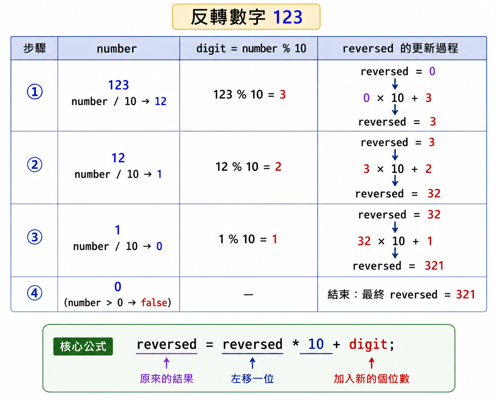

## Section XXXVI. 完整反轉程式

```cpp
// VALIDATE
#include <iostream>
using namespace std;

int main() {
    long long number;
    cin >> number;

    bool negative =
        number < 0;

    if (negative) {
        number = -number;
    }

    long long reversed = 0;

    while (number > 0) {
        long long digit =
            number % 10;

        reversed =
            reversed * 10 + digit;

        number /= 10;
    }

    if (negative) {
        reversed = -reversed;
    }

    cout << reversed << '\n';

    return 0;
}
```

---

## Section XXXVII. 前導零會消失

反轉：

```text
1200
```

得到：

```text
21
```

因為整數不保存前導零。

---

## Section XXXVIII. 回文數

若正整數正著讀與反著讀相同，就是回文數。

例如：

```text
121
1331
7
```

---

## Section XXXIX. 保存原始值

反轉過程會修改 `number`：

```cpp
number /= 10;
```

因此要先保存：

```cpp
long long original = number;
```

---

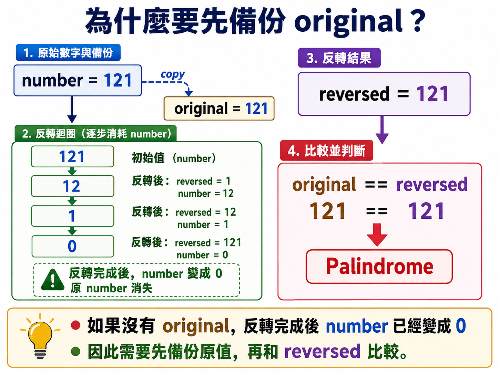

## Section XL. 完整回文判斷

```cpp
// VALIDATE
#include <iostream>
using namespace std;

int main() {
    long long number;
    cin >> number;

    if (number < 0) {
        cout << "Not palindrome\n";
        return 0;
    }

    long long original =
        number;

    long long reversed = 0;

    while (number > 0) {
        reversed =
            reversed * 10 +
            number % 10;

        number /= 10;
    }

    if (original == reversed) {
        cout << "Palindrome\n";
    } else {
        cout << "Not palindrome\n";
    }

    return 0;
}
```

`0` 會得到 `original == reversed == 0`，因此被判定為回文數。

---

# Part H：數字出現次數與最大位數

## Section XLI. 計算某個數字出現次數

例如：

```text
number = 100505
targetDigit = 5
```

結果：

```text
2 次
```

---

## Section XLII. 完整計數程式

```cpp
// VALIDATE
#include <iostream>
using namespace std;

int main() {
    long long number;
    int targetDigit;

    cin >> number >> targetDigit;

    if (
        targetDigit < 0 ||
        targetDigit > 9
    ) {
        cout << "Invalid digit\n";
        return 0;
    }

    if (number < 0) {
        number = -number;
    }

    int count = 0;

    if (number == 0 && targetDigit == 0) {
        count = 1;
    }

    while (number > 0) {
        int digit =
            static_cast<int>(number % 10);

        if (digit == targetDigit) {
            ++count;
        }

        number /= 10;
    }

    cout << count << '\n';

    return 0;
}
```

---

## Section XLIII. 找出最大位數

所有十進位位數介於：

```text
0 到 9
```

可以初始化：

```cpp
int maximumDigit = 0;
```

每輪：

```cpp
if (digit > maximumDigit) {
    maximumDigit = digit;
}
```

---

## Section XLIV. 找出最小位數

不可一律初始化：

```cpp
int minimumDigit = 0;
```

因為除非數字包含 `0`，其他位數都不會小於 `0`。

可初始化為：

```cpp
int minimumDigit = 9;
```

或使用第一個取得的位數。

---

# Part I：固定筆數資料

## Section XLV. 固定筆數總和

```cpp
long long total = 0;

for (int index = 0; index < dataCount; ++index) {
    int value;
    cin >> value;
    total += value;
}
```

---

## Section XLVI. 最大值初始化

錯誤：

```cpp
int maximum = 0;
```

若所有輸入都是負數，例如：

```text
-8 -3 -10
```

結果會錯誤保留 `0`。

---

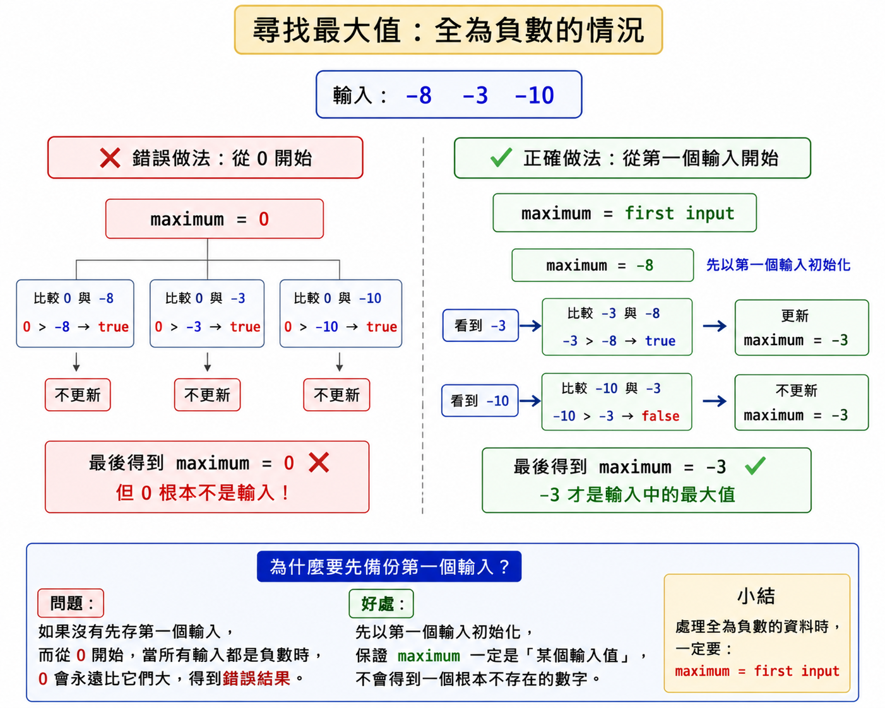

## Section XLVII. 使用第一筆資料初始化

```cpp
int maximum;
cin >> maximum;

for (int index = 1; index < dataCount; ++index) {
    int value;
    cin >> value;

    if (value > maximum) {
        maximum = value;
    }
}
```

---

## Section XLVIII. 完整最大最小值

```cpp
// VALIDATE
#include <iostream>
using namespace std;

int main() {
    int dataCount;
    cin >> dataCount;

    if (dataCount <= 0) {
        cout << "No data\n";
        return 0;
    }

    int firstValue;
    cin >> firstValue;

    int maximum = firstValue;
    int minimum = firstValue;

    for (int index = 1; index < dataCount; ++index) {
        int value;
        cin >> value;

        if (value > maximum) {
            maximum = value;
        }

        if (value < minimum) {
            minimum = value;
        }
    }

    cout << "Maximum: "
         << maximum
         << '\n';

    cout << "Minimum: "
         << minimum
         << '\n';

    return 0;
}
```

---

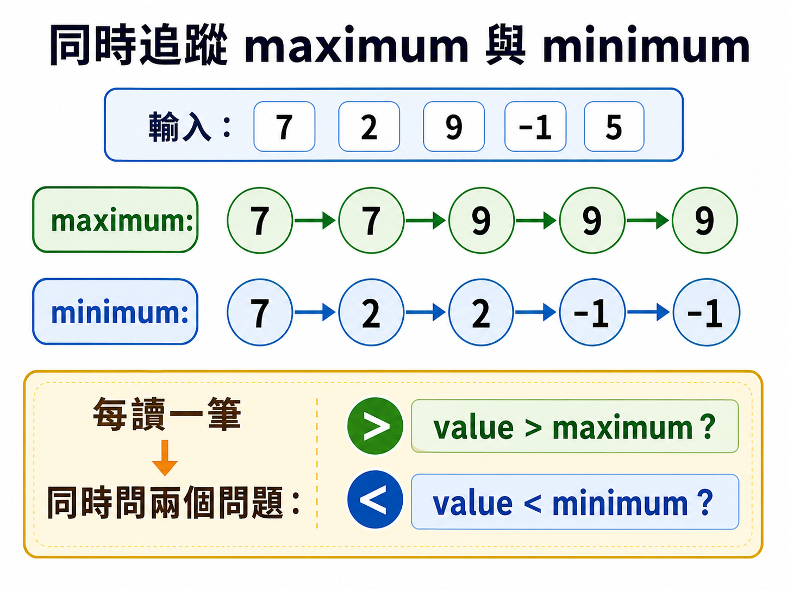

## Section XLIX. 分類統計

```cpp
int positiveCount = 0;
int negativeCount = 0;
int zeroCount = 0;
```

每筆資料使用 `if-else if-else` 分類。

---

## Section L. 完整正負零統計

```cpp
// VALIDATE
#include <iostream>
using namespace std;

int main() {
    int dataCount;
    cin >> dataCount;

    int positiveCount = 0;
    int negativeCount = 0;
    int zeroCount = 0;

    for (int index = 0; index < dataCount; ++index) {
        int value;
        cin >> value;

        if (value > 0) {
            ++positiveCount;
        } else if (value < 0) {
            ++negativeCount;
        } else {
            ++zeroCount;
        }
    }

    cout << positiveCount << '\n';
    cout << negativeCount << '\n';
    cout << zeroCount << '\n';

    return 0;
}
```

---

# Part J：不定筆數最大值

## Section LI. 哨兵問題

例如：

```text
持續輸入整數
輸入 -1 結束
找出所有非負輸入中的最大值
```

不能把 `-1` 當成資料。

---

## Section LII. 為什麼不能先設 `maximum = 0`？

若合法資料允許負數，初始化為 `0` 可能錯誤。

更通用的方法：

```text
找到第一筆有效資料時初始化 maximum
```

---

## Section LIII. 使用 `hasData`

```cpp
bool hasData = false;
int maximum = 0;
```

第一次有效資料：

```cpp
if (!hasData) {
    maximum = value;
    hasData = true;
}
```

之後再比較。

---

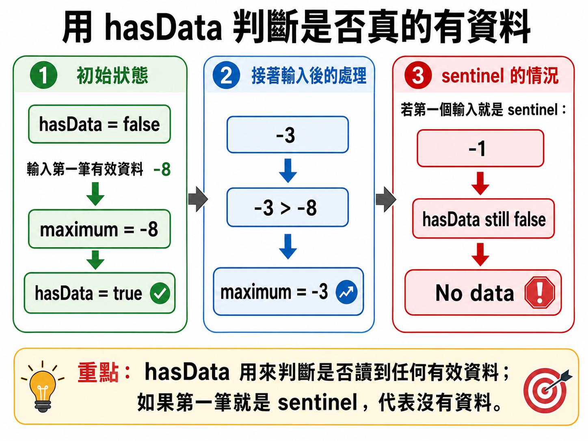

## Section LIV. 完整不定筆數最大值

```cpp
// VALIDATE
#include <iostream>
using namespace std;

int main() {
    int value;
    bool hasData = false;
    int maximum = 0;

    while (cin >> value && value != -1) {
        if (!hasData) {
            maximum = value;
            hasData = true;
        } else if (value > maximum) {
            maximum = value;
        }
    }

    if (hasData) {
        cout << maximum << '\n';
    } else {
        cout << "No data\n";
    }

    return 0;
}
```

本例假設 `-1` 不能作為一般資料。

---

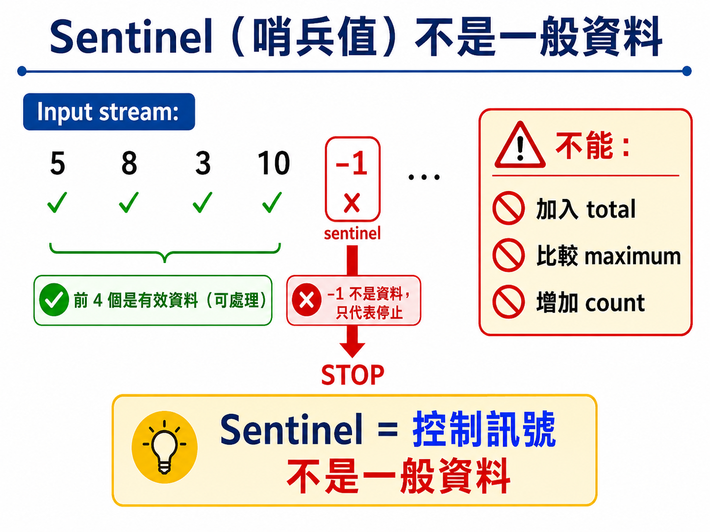

# Part K：韓信點兵

## Section LV. 問題形式

尋找一個整數，符合多個餘數條件：

```text
除以 3 餘 2
除以 5 餘 3
除以 7 餘 2
```

C++ 條件：

```cpp
number % 3 == 2 &&
number % 5 == 3 &&
number % 7 == 2
```

---

## Section LVI. 找出範圍內第一個答案

```cpp
// VALIDATE
#include <iostream>
using namespace std;

int main() {
    int lowerBound;
    int upperBound;

    cin >> lowerBound >> upperBound;

    bool found = false;

    for (
        int number = lowerBound;
        number <= upperBound;
        ++number
    ) {
        if (
            number % 3 == 2 &&
            number % 5 == 3 &&
            number % 7 == 2
        ) {
            cout << number << '\n';
            found = true;
            break;
        }
    }

    if (!found) {
        cout << "No solution\n";
    }

    return 0;
}
```

---

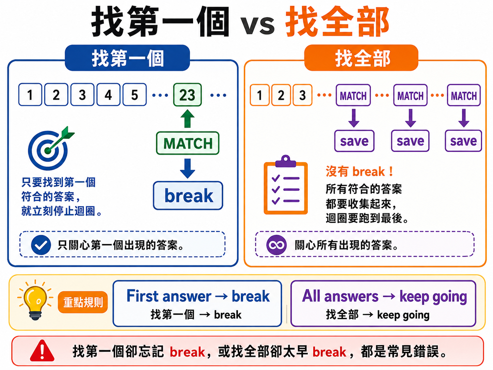

## Section LVII. 找出所有答案

移除：

```cpp
break;
```

每次符合就輸出並增加計數器。

---

## Section LVIII. 統計答案數量

```cpp
int solutionCount = 0;

for (...) {
    if (condition) {
        ++solutionCount;
    }
}
```

---

## Section LIX. 加入次數限制

題目可能要求：

```text
找出前 k 個符合條件的數
```

每找到一個：

```cpp
++solutionCount;
```

當：

```cpp
solutionCount == k
```

使用 `break`。

---

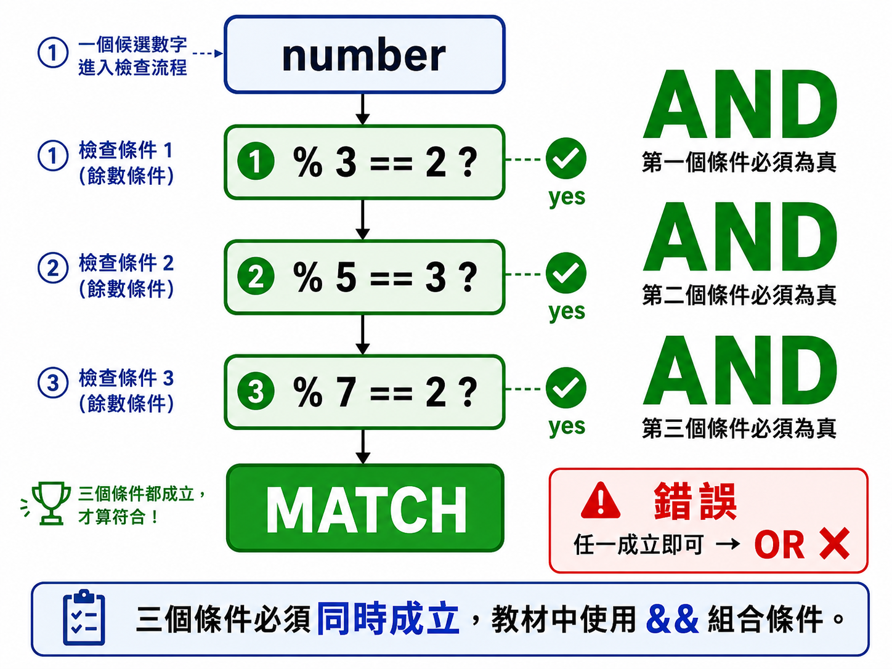

# Part L：有範圍的整數方程式

## Section LX. 二元方程式

例如：

```text
3x + 5y = 40
```

且：

```text
x、y 都是 0 到 20 的整數
```

---

## Section LXI. 巢狀搜尋

```cpp
// VALIDATE
#include <iostream>
using namespace std;

int main() {
    int solutionCount = 0;

    for (int x = 0; x <= 20; ++x) {
        for (int y = 0; y <= 20; ++y) {
            if (3 * x + 5 * y == 40) {
                cout << "x = "
                     << x
                     << ", y = "
                     << y
                     << '\n';

                ++solutionCount;
            }
        }
    }

    cout << "Count: "
         << solutionCount
         << '\n';

    return 0;
}
```

---

## Section LXII. 縮小範圍

因為：

```text
3x <= 40
```

所以：

```text
x <= 13
```

因為：

```text
5y <= 40
```

所以：

```text
y <= 8
```

較小範圍可減少不必要檢查。

---

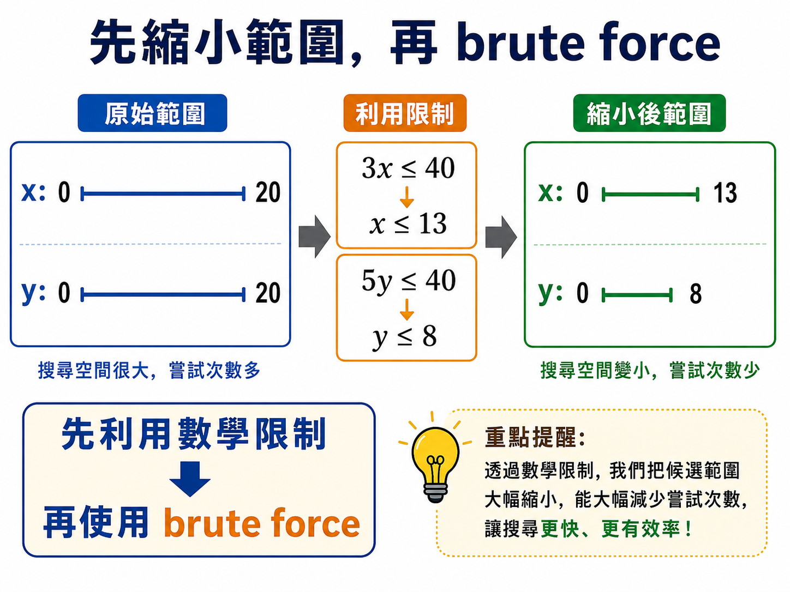

## Section LXIII. 暴力搜尋的用途

暴力搜尋適合：

- 範圍不大
- 條件容易檢查
- 想列出全部解
- 尚未找到更直接的數學方法

但範圍很大時，效率可能不足。

---

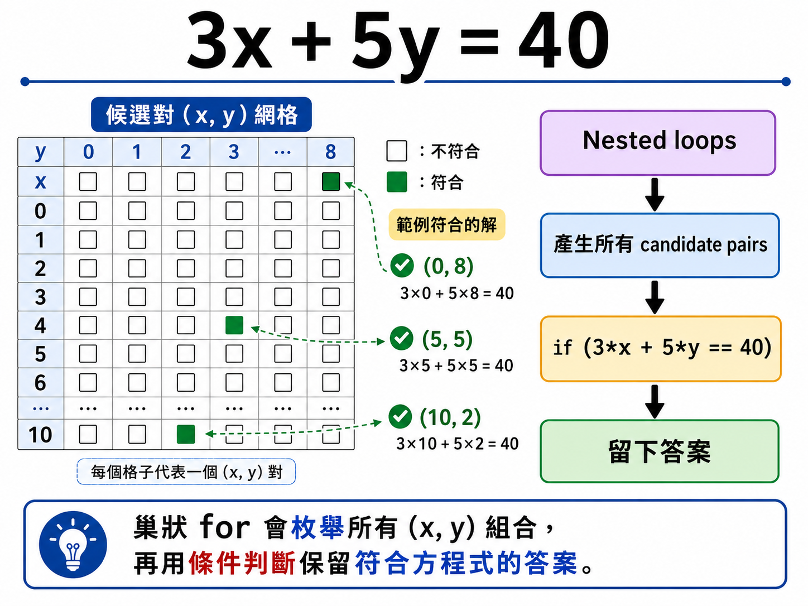

# Part M：除錯與追蹤

## Section LXIV. 暫時輸出候選值

找不到答案時，可以暫時加入：

```cpp
cout << "candidate = "
     << candidate
     << '\n';
```

確認迴圈是否有走到預期範圍。

---

## Section LXV. 暫時輸出狀態

質數判斷：

```cpp
cout << "Testing divisor "
     << divisor
     << '\n';
```

位數處理：

```cpp
cout << "digit = "
     << digit
     << ", number = "
     << number
     << '\n';
```

完成除錯後應移除不需要的輸出。

---

## Section LXVI. 手動追蹤表

反轉 `123`：

| `number` | `digit` | 更新前 `reversed` | 更新後 |
| ---: | ---: | ---: | ---: |
| 123 | 3 | 0 | 3 |
| 12 | 2 | 3 | 32 |
| 1 | 1 | 32 | 321 |

---

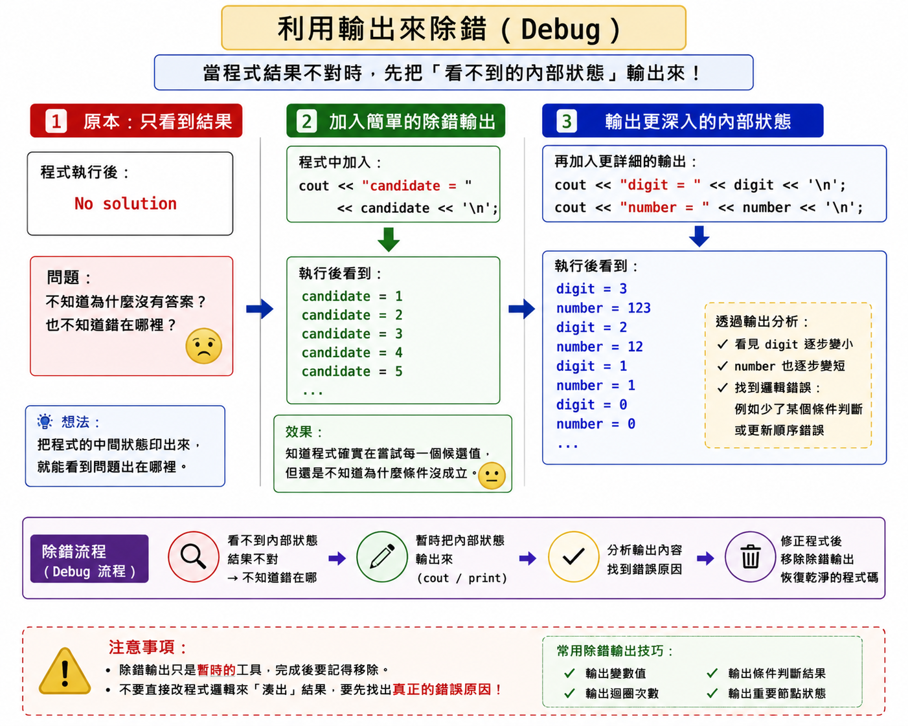

# Part N：快速概念檢查

## Section LXVII. 選擇題與簡答

### Q1. 如何判斷 `d` 是 `n` 的因數？

<details><summary>查看答案</summary>

```cpp
n % d == 0
```

</details>

### Q2. 質數最小是多少？

<details><summary>查看答案</summary>

```text
2
```

</details>

### Q3. 為什麼 1 不是質數？

<details><summary>查看答案</summary>

因為質數必須有兩個不同的正因數：1 與自己；1 只有一個正因數。

</details>

### Q4. 找到質數的非平凡因數後可以做什麼？

<details><summary>查看答案</summary>

將旗標設為 `false` 並使用 `break`。

</details>

### Q5. 為什麼質數只需要檢查到平方根附近？

<details><summary>查看答案</summary>

因數成對出現；若存在較大的因數，就會有對應的較小因數。

</details>

### Q6. 完全數的總和是否包含自己？

<details><summary>查看答案</summary>

不包含自己，只計算真因數。

</details>

### Q7. 輾轉相除法何時停止？

<details><summary>查看答案</summary>

第二個數變成 0 時。

</details>

### Q8. `number % 10` 取得什麼？

<details><summary>查看答案</summary>

個位數。

</details>

### Q9. `number /= 10` 做什麼？

<details><summary>查看答案</summary>

移除個位數。

</details>

### Q10. 數字 0 有幾位？

<details><summary>查看答案</summary>

1 位。

</details>

### Q11. 反轉公式是什麼？

<details><summary>查看答案</summary>

```cpp
reversed = reversed * 10 + digit;
```

</details>

### Q12. 回文判斷為什麼要保存原值？

<details><summary>查看答案</summary>

因為位數處理會逐步修改原變數。

</details>

### Q13. 找最大值為什麼不一定能初始化為 0？

<details><summary>查看答案</summary>

若所有資料都是負數，0 並不是輸入資料，會得到錯誤答案。

</details>

### Q14. 固定筆數最大值最安全的初始方式是什麼？

<details><summary>查看答案</summary>

用第一筆資料初始化。

</details>

### Q15. 不定筆數且可能沒有資料時，可使用什麼？

<details><summary>查看答案</summary>

布林旗標，例如 `hasData`。

</details>

### Q16. 找到第一個符合條件的答案後用什麼停止？

<details><summary>查看答案</summary>

```cpp
break;
```

</details>

### Q17. 找全部答案時應使用 `break` 嗎？

<details><summary>查看答案</summary>

不應在找到第一個答案後立即 `break`。

</details>

### Q18. 二元整數方程式通常使用什麼迴圈？

<details><summary>查看答案</summary>

巢狀迴圈。

</details>

### Q19. 暴力搜尋最重要的第一步是什麼？

<details><summary>查看答案</summary>

確定完整且合理的候選範圍。

</details>

### Q20. 為什麼要縮小搜尋範圍？

<details><summary>查看答案</summary>

減少不必要的候選檢查，提高效率。

</details>

---

# Part O：程式閱讀練習

## Section LXVIII. 預測結果

### 題目 1

```cpp
int n = 12;
int count = 0;

for (int d = 1; d <= n; ++d) {
    if (n % d == 0) {
        ++count;
    }
}

cout << count;
```

<details><summary>查看答案</summary>

```text
6
```

因數為 `1、2、3、4、6、12`。

</details>

### 題目 2

```cpp
int n = 7;
bool isPrime = n >= 2;

for (int d = 2; d < n; ++d) {
    if (n % d == 0) {
        isPrime = false;
        break;
    }
}

cout << boolalpha << isPrime;
```

<details><summary>查看答案</summary>

```text
true
```

</details>

### 題目 3

```cpp
int n = 1;
bool isPrime = n >= 2;

cout << boolalpha << isPrime;
```

<details><summary>查看答案</summary>

```text
false
```

</details>

### 題目 4

```cpp
int number = 1234;
int sum = 0;

while (number > 0) {
    sum += number % 10;
    number /= 10;
}

cout << sum;
```

<details><summary>查看答案</summary>

```text
10
```

</details>

### 題目 5

```cpp
int number = 120;
int reversed = 0;

while (number > 0) {
    reversed =
        reversed * 10 +
        number % 10;

    number /= 10;
}

cout << reversed;
```

<details><summary>查看答案</summary>

```text
21
```

</details>

### 題目 6

```cpp
int number = 0;
int count = 0;

while (number > 0) {
    ++count;
    number /= 10;
}

cout << count;
```

<details><summary>查看答案</summary>

```text
0
```

這表示程式忘記處理數字 `0` 有一位的特殊情況。

</details>

### 題目 7

```cpp
int maximum = 0;
int values[] = {-5, -2, -9};

for (int value : values) {
    if (value > maximum) {
        maximum = value;
    }
}

cout << maximum;
```

<details><summary>查看答案</summary>

```text
0
```

但這是錯誤答案，因為最大輸入應為 `-2`。

</details>

### 題目 8

```cpp
int a = 48;
int b = 18;

while (b != 0) {
    int remainder = a % b;
    a = b;
    b = remainder;
}

cout << a;
```

<details><summary>查看答案</summary>

```text
6
```

</details>

### 題目 9

```cpp
int count = 0;

for (int number = 1; number <= 20; ++number) {
    if (
        number % 3 == 1 &&
        number % 4 == 1
    ) {
        ++count;
    }
}

cout << count;
```

<details><summary>查看答案</summary>

符合的是 `1、13`，因此輸出：

```text
2
```

</details>

### 題目 10

```cpp
int solutionCount = 0;

for (int x = 0; x <= 3; ++x) {
    for (int y = 0; y <= 3; ++y) {
        if (x + y == 3) {
            ++solutionCount;
        }
    }
}

cout << solutionCount;
```

<details><summary>查看答案</summary>

```text
4
```

解為 `(0,3)、(1,2)、(2,1)、(3,0)`。

</details>

### 題目 11

```cpp
int number = 1005;
int zeroCount = 0;

while (number > 0) {
    if (number % 10 == 0) {
        ++zeroCount;
    }

    number /= 10;
}

cout << zeroCount;
```

<details><summary>查看答案</summary>

```text
2
```

</details>

### 題目 12

```cpp
bool found = false;

for (int number = 1; number <= 100; ++number) {
    if (number % 7 == 0) {
        cout << number;
        found = true;
        break;
    }
}

cout << boolalpha << found;
```

<details><summary>查看答案</summary>

```text
7true
```

中間沒有空格或換行。

</details>

---

# Part P：實作練習

## Section LXIX. 實作檢測題

### TODO 1：所有因數

輸入正整數，輸出所有正因數。

### TODO 2：因數數量與總和

同時計算因數數量及因數總和。

### TODO 3：質數判斷

使用 `bool isPrime` 與 `break`。

### TODO 4：範圍內質數

輸入 `n`，輸出 `2` 到 `n` 的所有質數。

### TODO 5：完全數

判斷輸入是否為完全數。

### TODO 6：最大公因數

使用輾轉相除法。

### TODO 7：最小公倍數

先求最大公因數，再求最小公倍數。

### TODO 8：位數與位數總和

輸出十進位位數及各位數字總和。

### TODO 9：數字反轉

輸入整數，輸出反轉結果。

### TODO 10：回文數

判斷非負整數是否為回文數。

### TODO 11：指定數字出現次數

輸入整數與 `0–9` 的目標數字，輸出出現次數。

### TODO 12：固定筆數最大最小值

先輸入資料筆數，再輸出最大值與最小值。

### TODO 13：正負零統計

輸入固定筆數整數，統計正數、負數與零。

### TODO 14：韓信點兵

在指定範圍內找出第一個符合三個餘數條件的數。

### TODO 15：二元整數方程式

列出 `3x + 5y = target` 的所有非負整數解。

---

# Part Q：挑戰題

## Section LXX. 進階練習

### Challenge 1：範圍內完全數

輸入上限，輸出所有完全數。

### Challenge 2：質因數分解

輸入大於 1 的整數，重複除以目前因數，輸出完整質因數分解。

例如：

```text
60 = 2 × 2 × 3 × 5
```

### Challenge 3：阿姆斯壯數

判斷三位數是否等於各位數字立方和。

### Challenge 4：數字根

重複計算各位數字總和，直到只剩一位數。

### Challenge 5：前三個韓信點兵答案

找出指定範圍內前三個符合條件的答案；不足三個時輸出實際找到數量。

### Challenge 6：最接近目標的組合

在指定範圍內搜尋 `(x, y)`，使 `3x + 5y` 最接近目標值。

---

# Part R：常見錯誤提醒

## Section LXXI. 常見錯誤

1. 因數迴圈漏掉 `n` 本身。
2. 因數條件將 `% == 0` 寫反。
3. 將 1 判斷為質數。
4. 找到一個不能整除的數就立刻判定為質數。
5. 每個候選質數沒有重新設定 `isPrime`。
6. 質數內層迴圈範圍錯誤。
7. 完全數總和包含自己。
8. 最大公因數列舉上限超出較小值。
9. 輾轉相除法更新順序錯誤。
10. 最小公倍數先直接做 `a * b`，增加溢位風險。
11. 位數處理忘記 `number /= 10`。
12. 輸入 `0` 時位數被算成 0。
13. 位數乘積初始值設為 0。
14. 反轉公式漏掉 `* 10`。
15. 回文判斷沒有保存原始值。
16. 負數符號處理不一致。
17. 計算數字 `0` 出現次數時漏掉輸入值本身為 0。
18. 最大值初始化為 0，無法處理全負數。
19. 最小值初始化為 0，無法處理全正數。
20. 固定筆數為 0 時仍讀取第一筆。
21. 哨兵值被加入總和或比較。
22. 沒有資料時仍輸出未定義最大值。
23. 找第一個答案卻忘記 `break`。
24. 找所有答案卻太早 `break`。
25. 韓信點兵的多個條件使用 `||` 而不是 `&&`。
26. 巢狀搜尋中 `break` 只離開內層。
27. 整數方程式搜尋範圍太小而漏解。
28. 搜尋範圍過大造成不必要工作。
29. 暫時除錯輸出忘記移除。
30. 沒有檢查溢位風險。

---

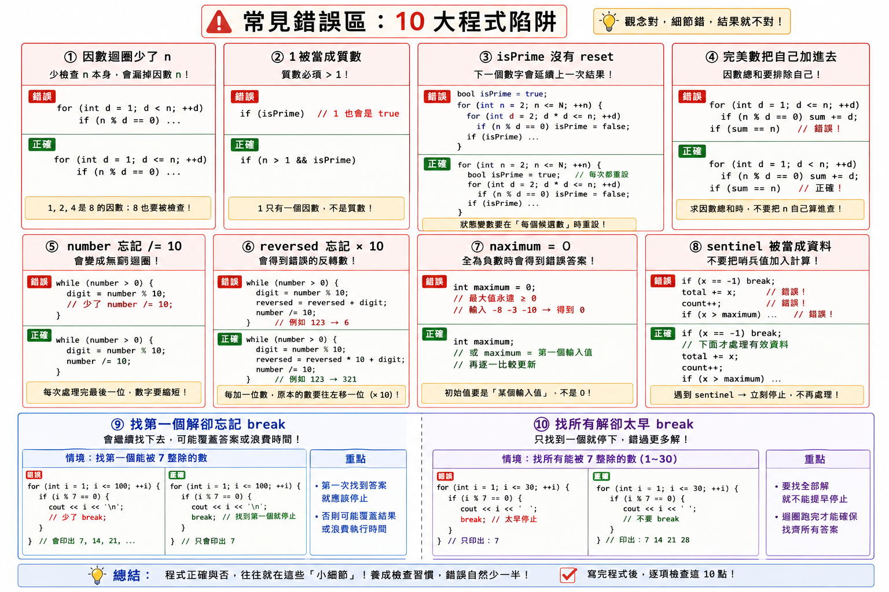

# Part S：Mermaid 流程圖

## Section LXXII. 解題流程圖

### 1. 一般迴圈解題

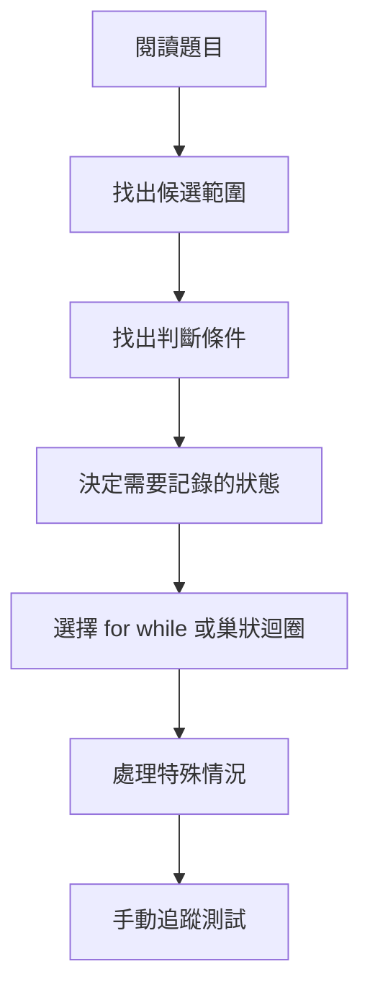
```mermaid
flowchart TD
    A[閱讀題目] --> B[找出候選範圍]
    B --> C[找出判斷條件]
    C --> D[決定需要記錄的狀態]
    D --> E[選擇 for while 或巢狀迴圈]
    E --> F[處理特殊情況]
    F --> G[手動追蹤測試]
```

### 2. 因數搜尋

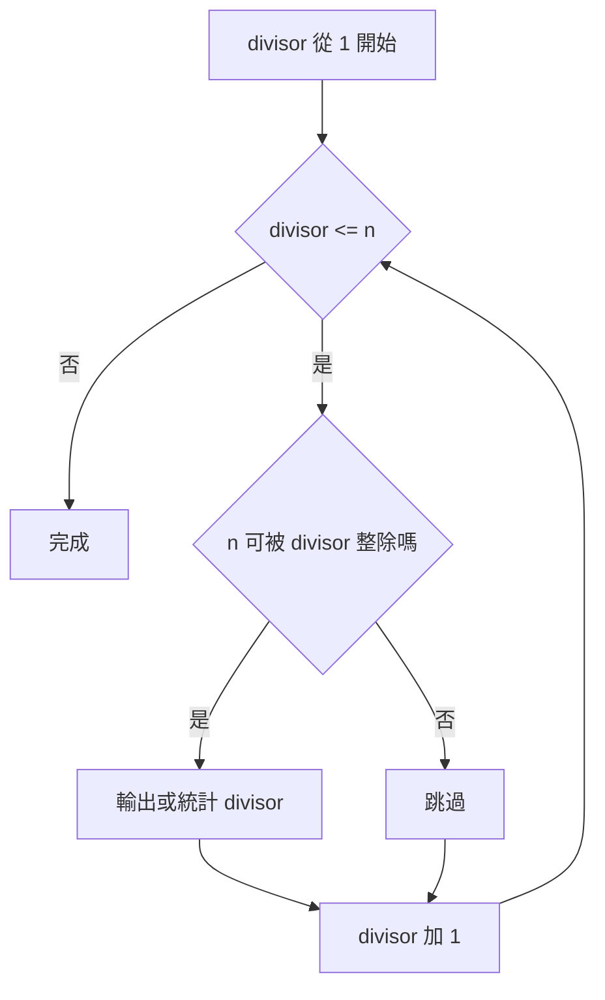
```mermaid
flowchart TD
    A[divisor 從 1 開始] --> B{divisor <= n}
    B -- 否 --> E[完成]
    B -- 是 --> C{n 可被 divisor 整除嗎}
    C -- 是 --> D[輸出或統計 divisor]
    C -- 否 --> F[跳過]
    D --> G[divisor 加 1]
    F --> G
    G --> B
```

### 3. 質數判斷

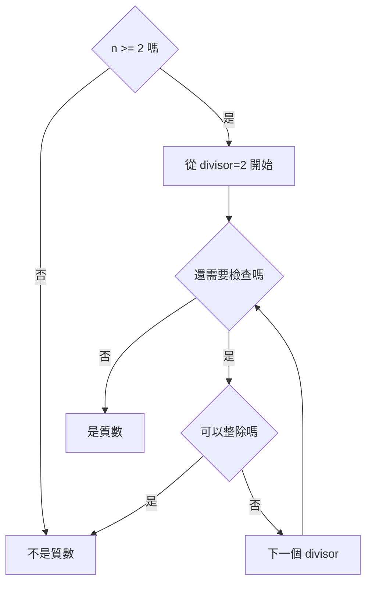
```mermaid
flowchart TD
    A{n >= 2 嗎} -- 否 --> B[不是質數]
    A -- 是 --> C[從 divisor=2 開始]
    C --> D{還需要檢查嗎}
    D -- 否 --> E[是質數]
    D -- 是 --> F{可以整除嗎}
    F -- 是 --> B
    F -- 否 --> G[下一個 divisor]
    G --> D
```

### 4. 輾轉相除法

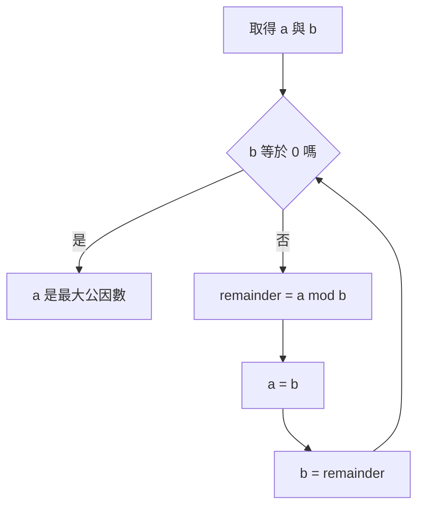
```mermaid
flowchart TD
    A[取得 a 與 b] --> B{b 等於 0 嗎}
    B -- 是 --> C[a 是最大公因數]
    B -- 否 --> D[remainder = a mod b]
    D --> E[a = b]
    E --> F[b = remainder]
    F --> B
```

### 5. 位數處理

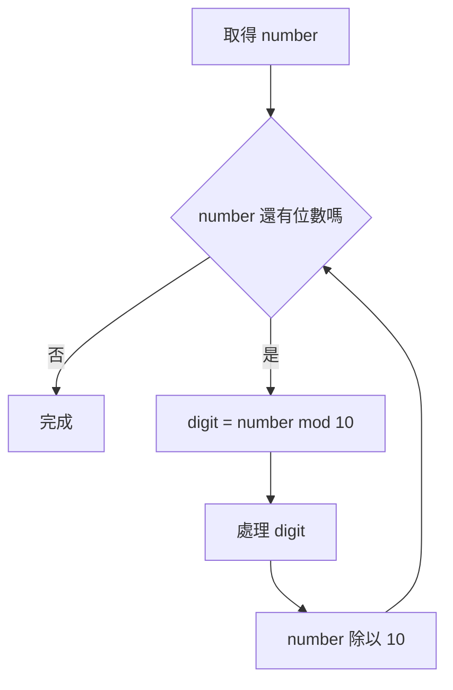
```mermaid
flowchart TD
    A[取得 number] --> B{number 還有位數嗎}
    B -- 否 --> E[完成]
    B -- 是 --> C[digit = number mod 10]
    C --> D[處理 digit]
    D --> F[number 除以 10]
    F --> B
```

### 6. 最大值

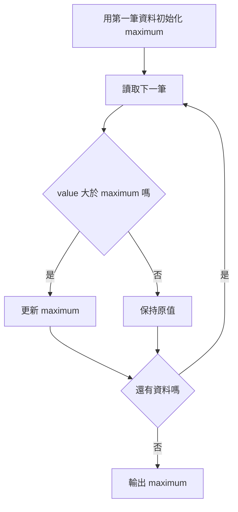
```mermaid
flowchart TD
    A[用第一筆資料初始化 maximum] --> B[讀取下一筆]
    B --> C{value 大於 maximum 嗎}
    C -- 是 --> D[更新 maximum]
    C -- 否 --> E[保持原值]
    D --> F{還有資料嗎}
    E --> F
    F -- 是 --> B
    F -- 否 --> G[輸出 maximum]
```

### 7. 找第一個答案

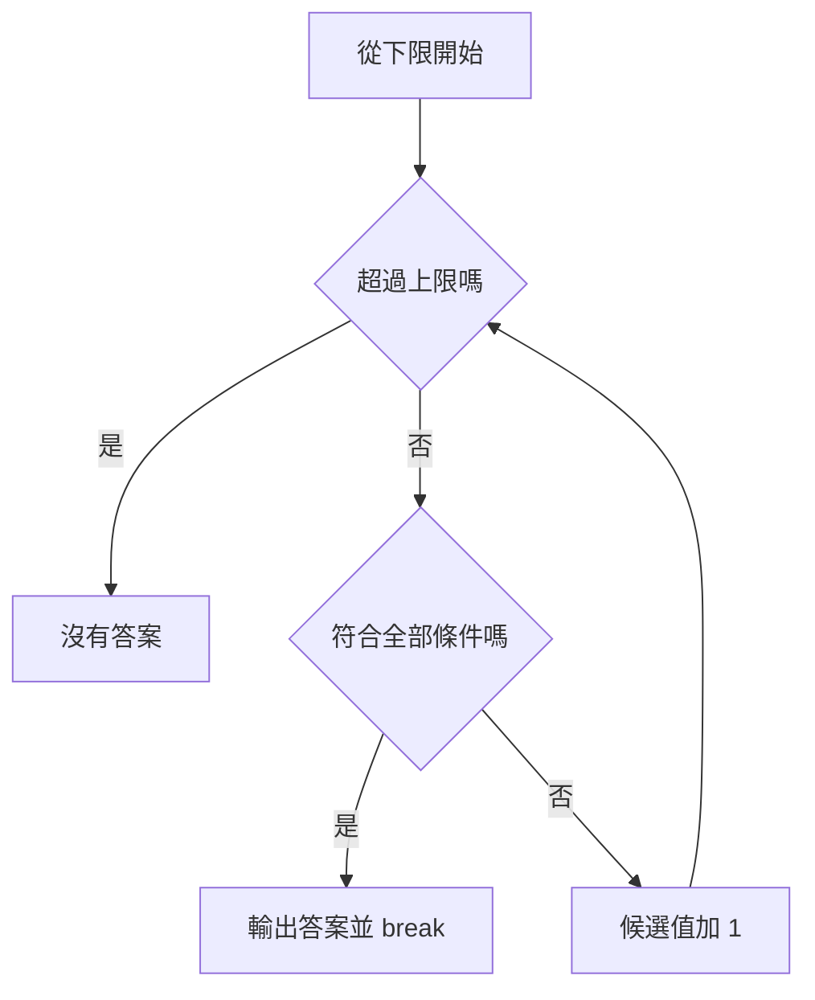
```mermaid
flowchart TD
    A[從下限開始] --> B{超過上限嗎}
    B -- 是 --> C[沒有答案]
    B -- 否 --> D{符合全部條件嗎}
    D -- 是 --> E[輸出答案並 break]
    D -- 否 --> F[候選值加 1]
    F --> B
```

### 8. 二元方程式搜尋

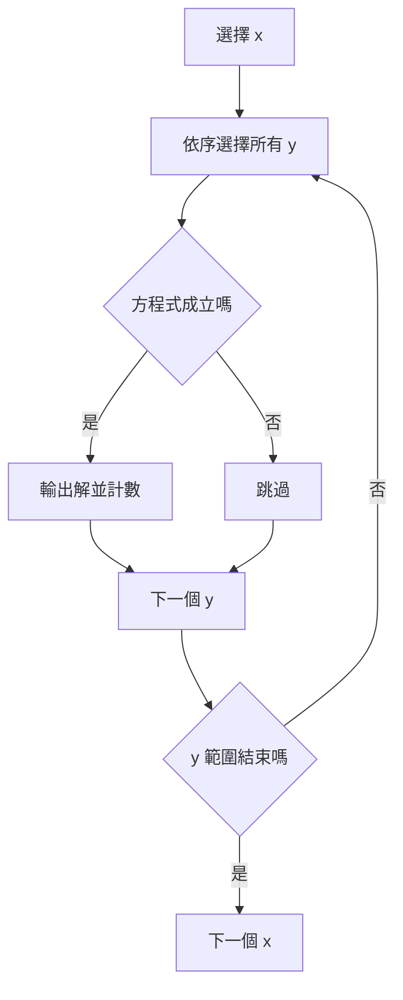
```mermaid
flowchart TD
    A[選擇 x] --> B[依序選擇所有 y]
    B --> C{方程式成立嗎}
    C -- 是 --> D[輸出解並計數]
    C -- 否 --> E[跳過]
    D --> F[下一個 y]
    E --> F
    F --> G{y 範圍結束嗎}
    G -- 否 --> B
    G -- 是 --> H[下一個 x]
```

---

# 本章完成標準

完成本章後，你應該能做到：

1. 將題目拆成輸入、處理與輸出。
2. 找出候選範圍。
3. 找出重複條件。
4. 選擇合適的迴圈。
5. 使用計數器與累加器。
6. 使用最大值與最小值變數。
7. 使用布林旗標。
8. 列出所有正因數。
9. 計算因數數量。
10. 計算因數總和。
11. 判斷質數。
12. 使用 `break` 提前停止質數檢查。
13. 將質數檢查縮小到平方根附近。
14. 列出範圍內所有質數。
15. 判斷完全數。
16. 使用列舉法求最大公因數。
17. 使用輾轉相除法。
18. 使用最大公因數計算最小公倍數。
19. 使用 `% 10` 取得個位數。
20. 使用 `/ 10` 移除個位數。
21. 計算位數。
22. 正確處理數字 0。
23. 計算各位數字總和與乘積。
24. 反轉整數。
25. 判斷回文數。
26. 計算指定數字出現次數。
27. 找出最大與最小位數。
28. 處理固定筆數資料。
29. 用第一筆資料初始化最大最小值。
30. 統計正數、負數與零。
31. 處理不定筆數資料。
32. 使用 `hasData` 處理空資料。
33. 解有範圍的韓信點兵。
34. 找第一個、全部或前 k 個答案。
35. 使用巢狀迴圈解二元整數方程式。
36. 縮小搜尋範圍。
37. 使用追蹤輸出除錯。
38. 找出常見迴圈解題錯誤。

---

# 隱藏答案區

> Answer hidden — try it first.

<details><summary>TODO 1 答案</summary>

```cpp
for (int divisor = 1; divisor <= n; ++divisor) {
    if (n % divisor == 0) {
        cout << divisor << '\n';
    }
}
```

</details>

<details><summary>TODO 2 答案</summary>

```cpp
int factorCount = 0;
long long factorSum = 0;

for (int divisor = 1; divisor <= n; ++divisor) {
    if (n % divisor == 0) {
        ++factorCount;
        factorSum += divisor;
    }
}
```

</details>

<details><summary>TODO 3 答案</summary>

```cpp
bool isPrime = n >= 2;

for (
    int divisor = 2;
    isPrime && divisor <= n / divisor;
    ++divisor
) {
    if (n % divisor == 0) {
        isPrime = false;
    }
}
```

</details>

<details><summary>TODO 4 答案</summary>

```cpp
for (int candidate = 2; candidate <= n; ++candidate) {
    bool isPrime = true;

    for (
        int divisor = 2;
        divisor <= candidate / divisor;
        ++divisor
    ) {
        if (candidate % divisor == 0) {
            isPrime = false;
            break;
        }
    }

    if (isPrime) {
        cout << candidate << '\n';
    }
}
```

</details>

<details><summary>TODO 5 答案</summary>

```cpp
long long properFactorSum = 0;

for (int divisor = 1; divisor < n; ++divisor) {
    if (n % divisor == 0) {
        properFactorSum += divisor;
    }
}

bool isPerfect =
    n > 1 &&
    properFactorSum == n;
```

</details>

<details><summary>TODO 6 答案</summary>

```cpp
while (b != 0) {
    long long remainder =
        a % b;

    a = b;
    b = remainder;
}
```

</details>

<details><summary>TODO 7 答案</summary>

```cpp
if (first == 0 || second == 0) {
    lcm = 0;
} else {
    lcm =
        (absoluteFirst / gcd) *
        absoluteSecond;
}
```

</details>

<details><summary>TODO 8 答案</summary>

```cpp
int digitCount = 0;
int digitSum = 0;

if (number == 0) {
    digitCount = 1;
}

while (number > 0) {
    digitSum += number % 10;
    ++digitCount;
    number /= 10;
}
```

</details>

<details><summary>TODO 9 答案</summary>

```cpp
long long reversed = 0;

while (number > 0) {
    reversed =
        reversed * 10 +
        number % 10;

    number /= 10;
}
```

</details>

<details><summary>TODO 10 答案</summary>

```cpp
long long original = number;
long long reversed = 0;

while (number > 0) {
    reversed =
        reversed * 10 +
        number % 10;

    number /= 10;
}

bool isPalindrome =
    original == reversed;
```

</details>

<details><summary>TODO 11 答案</summary>

```cpp
int count = 0;

if (number == 0 && targetDigit == 0) {
    count = 1;
}

while (number > 0) {
    if (number % 10 == targetDigit) {
        ++count;
    }

    number /= 10;
}
```

</details>

<details><summary>TODO 12 答案</summary>

```cpp
int firstValue;
cin >> firstValue;

int maximum = firstValue;
int minimum = firstValue;

for (int index = 1; index < dataCount; ++index) {
    int value;
    cin >> value;

    if (value > maximum) {
        maximum = value;
    }

    if (value < minimum) {
        minimum = value;
    }
}
```

</details>

<details><summary>TODO 13 答案</summary>

```cpp
int positiveCount = 0;
int negativeCount = 0;
int zeroCount = 0;

for (int index = 0; index < dataCount; ++index) {
    int value;
    cin >> value;

    if (value > 0) {
        ++positiveCount;
    } else if (value < 0) {
        ++negativeCount;
    } else {
        ++zeroCount;
    }
}
```

</details>

<details><summary>TODO 14 答案</summary>

```cpp
bool found = false;

for (
    int number = lowerBound;
    number <= upperBound;
    ++number
) {
    if (
        number % 3 == 2 &&
        number % 5 == 3 &&
        number % 7 == 2
    ) {
        cout << number << '\n';
        found = true;
        break;
    }
}

if (!found) {
    cout << "No solution\n";
}
```

</details>

<details><summary>TODO 15 答案</summary>

```cpp
int solutionCount = 0;

for (int x = 0; 3 * x <= target; ++x) {
    for (int y = 0; 5 * y <= target; ++y) {
        if (3 * x + 5 * y == target) {
            cout << x
                 << " "
                 << y
                 << '\n';

            ++solutionCount;
        }
    }
}
```

</details>
