# Lesson 12：Functions 函式

> 這堂課的重點：把一段具有明確工作的程式碼整理成「函式」，讓程式可以重複使用、分工、測試與閱讀。你會學習函式的定義與呼叫、參數、回傳值、`void`、函式宣告、區域變數、作用域、傳值呼叫、提前 `return`，並把前面學過的條件判斷與迴圈整理成可重複使用的函式。

> 本章主要使用 C++17 的一般函式。先建立「輸入 → 處理 → 回傳結果」的清楚觀念；參考參數、函式多載、遞迴、lambda、類別成員函式與模板會在後續章節或進階內容再完整介紹。

---

## Section I. 今天要做什麼？

1. 認識函式 function。
2. 理解函式可以將大型問題拆成小工作。
3. 分辨函式定義 definition 與函式呼叫 call。
4. 認識回傳型態 return type。
5. 認識函式名稱 function name。
6. 認識參數 parameter。
7. 認識函式主體 function body。
8. 使用無參數函式。
9. 使用有參數函式。
10. 使用一個參數。
11. 使用多個參數。
12. 理解引數 argument 與參數 parameter 的差異。
13. 使用 `return` 回傳數值。
14. 使用 `int` 回傳整數。
15. 使用 `double` 回傳小數。
16. 使用 `bool` 回傳真假。
17. 使用 `char` 回傳字元。
18. 認識 `void` 函式。
19. 理解 `void` 函式不需要回傳資料值。
20. 在 `main()` 中呼叫自訂函式。
21. 將函式的回傳值指定給變數。
22. 將函式呼叫直接放入輸出表示式。
23. 將函式呼叫放入條件判斷。
24. 將函式呼叫放入另一個函式的引數。
25. 認識函式宣告 function declaration。
26. 認識函式原型 function prototype。
27. 理解函式定義順序。
28. 在 `main()` 前宣告、後方定義函式。
29. 理解區域變數 local variable。
30. 理解不同函式具有不同作用域。
31. 避免在函式外使用區域變數。
32. 理解參數也是函式內的區域名稱。
33. 理解傳值呼叫 pass by value。
34. 理解修改參數通常不會修改呼叫端變數。
35. 使用函式做輸入驗證。
36. 使用 early return 提前離開函式。
37. 使用 `bool` 函式表示「是否符合條件」。
38. 建立 `isEven()`。
39. 建立 `isPositive()`。
40. 建立 `isInRange()`。
41. 建立 `maxOfTwo()`。
42. 建立 `minOfTwo()`。
43. 建立 `absoluteValue()`。
44. 建立 `square()`。
45. 建立 `power()`。
46. 建立 `sumFromOneToN()`。
47. 建立計數函式。
48. 在函式內使用 `for`。
49. 在函式內使用 `while`。
50. 在函式內使用巢狀迴圈。
51. 將圖形輸出整理成函式。
52. 將搜尋問題整理成函式。
53. 使用 `return` 直接離開多層迴圈所在的函式。
54. 讓一個函式呼叫另一個函式。
55. 避免函式只是在複製貼上程式碼。
56. 避免忽略回傳值。
57. 避免回傳型態與實際資料不一致。
58. 避免所有邏輯都塞在 `main()`。
59. 使用概念檢查與程式閱讀分析函式。
60. 使用實作題把舊題目重新函式化。

---

## Section II. 今天的學習方式

1. 看到一個函式時，先標出：
   ```text
   回傳型態
   函式名稱
   參數
   函式主體
   ```
2. 呼叫函式前先問：
   ```text
   我需要提供什麼資料？
   ```
3. 呼叫函式後再問：
   ```text
   它會回傳什麼？
   ```
4. 若函式只負責「做一件事」而不需要提供結果，可以考慮 `void`。
5. 若函式需要回答一個問題，例如「是不是偶數」，優先考慮 `bool`。
6. 若函式要計算數字，回傳型態要符合結果可能的資料型態。
7. 寫函式前先用一句話描述工作：
   ```text
   這個函式負責 ______。
   ```
8. 一個函式最好有清楚、單一的主要責任。
9. 能用回傳值表達結果時，不要依賴不必要的全域變數。
10. 函式內的變數先視為只在函式內有效。
11. `return` 題要確認：
    ```text
    回傳什麼？
    何時離開函式？
    ```
12. 完整合法範例使用嚴格 C++17 選項檢查。

---

## Section III. 核心語法對照

| 語法 | 用途 |
| --- | --- |
| `int add(int a, int b)` | 定義回傳 `int` 的函式 |
| `void printLine()` | 定義不回傳資料值的函式 |
| `add(3, 5)` | 呼叫函式 |
| `return value;` | 回傳資料並結束函式 |
| `return;` | 在 `void` 函式中直接結束 |
| `bool isEven(int number)` | 建立真假判斷函式 |
| `int square(int number);` | 函式宣告／原型 |
| `int number` | 參數 parameter |
| `square(5)` 中的 `5` | 引數 argument |
| `int result = square(5);` | 接住函式回傳值 |
| `if (isEven(number))` | 將函式結果當條件 |
| `cout << square(5);` | 直接輸出函式結果 |

---

# Part A：什麼是函式？

## Section IV. 函式的基本概念

函式可以想成一個小型工具：

```text
輸入資料
↓
執行特定工作
↓
產生結果
```

例如：

```text
輸入兩個整數
↓
相加
↓
回傳總和
```

可以寫成：

```cpp
int add(int first, int second) {
    return first + second;
}
```

---

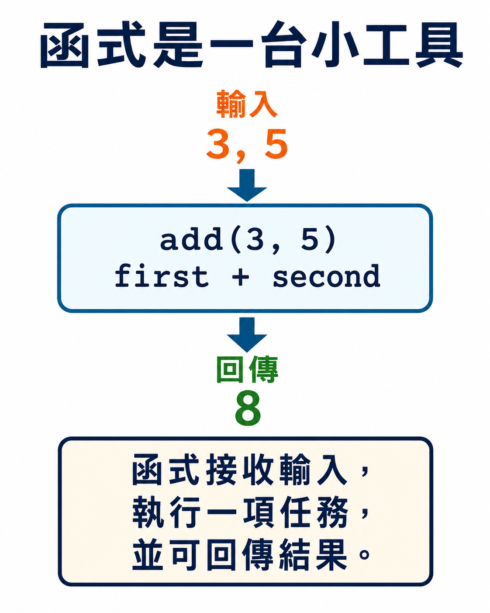

## Section V. 為什麼需要函式？

沒有函式時，大量程式可能都放在：

```cpp
int main() {
    // 很多很多程式碼
}
```

問題會逐漸變成：

```text
main() 太長
重複程式碼很多
難以閱讀
難以測試
難以修改
```

使用函式後，可以拆成：

```text
讀取資料
計算
驗證
輸出
搜尋
```

每一項由不同函式負責。

---

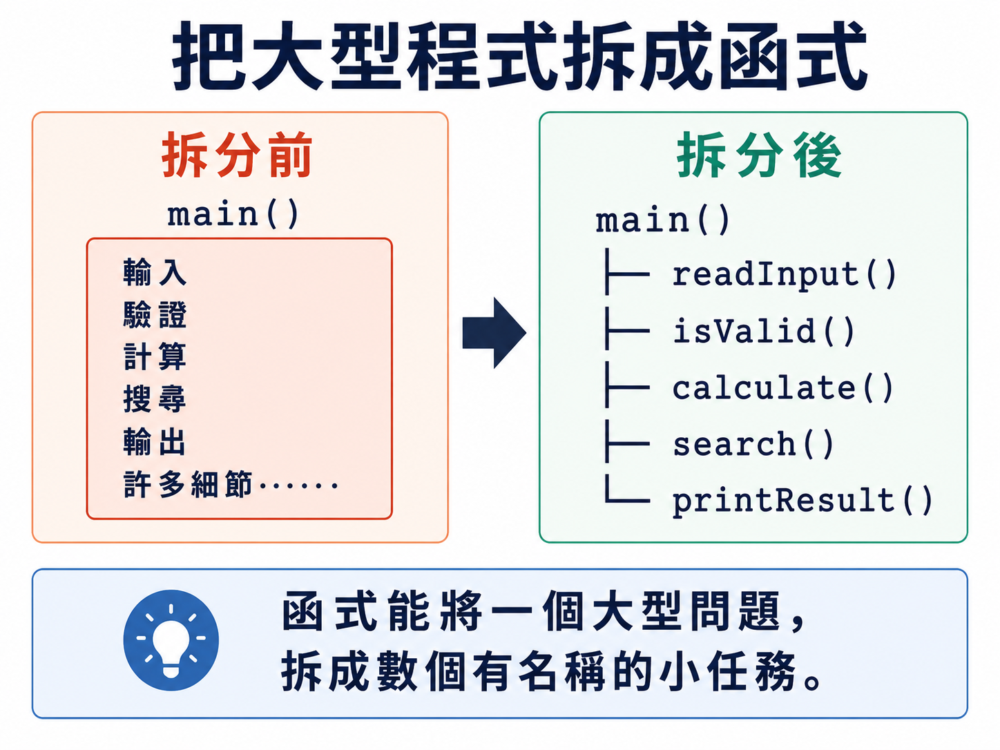

## Section VI. 第一個自訂函式

```cpp
// VALIDATE
#include <iostream>
using namespace std;

void sayHello() {
    cout << "Hello\n";
}

int main() {
    sayHello();

    return 0;
}
```

執行順序：

```text
進入 main()
↓
呼叫 sayHello()
↓
進入 sayHello()
↓
輸出 Hello
↓
sayHello() 結束
↓
回到 main()
```

---

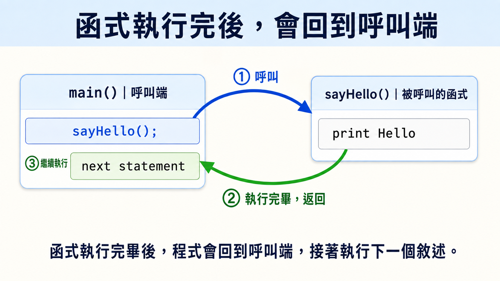

## Section VII. 定義與呼叫

函式定義：

```cpp
void sayHello() {
    cout << "Hello\n";
}
```

函式呼叫：

```cpp
sayHello();
```

不要把兩者混在一起。

---

# Part B：函式的四個主要部分

## Section VIII. 函式骨架

```cpp
回傳型態 函式名稱(參數) {
    函式主體
}
```

例如：

```cpp
int square(int number) {
    return number * number;
}
```

---

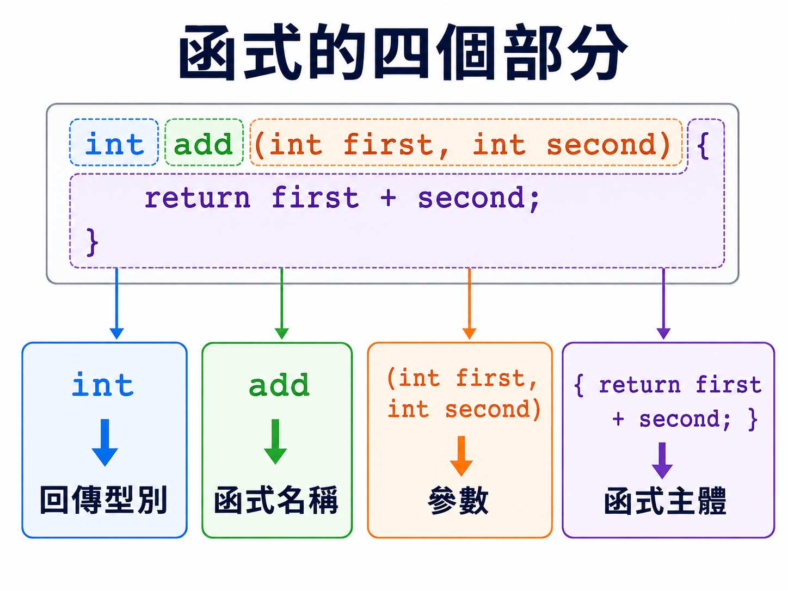

## Section IX. 回傳型態

這裡：

```cpp
int square(int number)
```

最前面的：

```cpp
int
```

表示此函式會回傳一個整數。

---

## Section X. 函式名稱

```cpp
square
```

是函式名稱。

名稱應能表示工作。

較清楚：

```cpp
calculateArea
isEven
printMenu
findMaximum
```

較不清楚：

```cpp
doIt
thing
abc
f1
```

---

## Section XI. 參數

```cpp
int square(int number)
```

其中：

```cpp
int number
```

是參數。

它代表呼叫函式時要提供一個整數。

---

## Section XII. 函式主體

```cpp
{
    return number * number;
}
```

大括號內是函式真正執行的程式。

---

# Part C：沒有參數的函式

## Section XIII. 重複呼叫

```cpp
// VALIDATE
#include <iostream>
using namespace std;

void printSeparator() {
    cout << "----------\n";
}

int main() {
    printSeparator();
    cout << "Section A\n";
    printSeparator();
    cout << "Section B\n";
    printSeparator();

    return 0;
}
```

同一個函式可以呼叫很多次。

---

## Section XIV. 函式呼叫要加括號

正確：

```cpp
printSeparator();
```

不是：

```cpp
printSeparator;
```

括號代表：

```text
執行這個函式
```

---

## Section XV. `void` 的意思

```cpp
void printSeparator()
```

`void` 表示：

```text
這個函式不提供一個資料值給呼叫端
```

它仍然可以：

```text
輸出
判斷
迴圈
呼叫其他函式
```

只是沒有像 `int` 函式那樣回傳一個整數結果。

---

# Part D：有參數的函式

## Section XVI. 一個參數

```cpp
// VALIDATE
#include <iostream>
using namespace std;

void printNumber(int number) {
    cout << "Number: "
         << number
         << '\n';
}

int main() {
    printNumber(10);
    printNumber(25);
    printNumber(-3);

    return 0;
}
```

每次呼叫可以提供不同資料。

---

## Section XVII. 引數與參數

函式定義：

```cpp
void printNumber(int number)
```

這裡的：

```cpp
number
```

稱為參數 parameter。

函式呼叫：

```cpp
printNumber(25);
```

這裡的：

```cpp
25
```

稱為引數 argument。

---

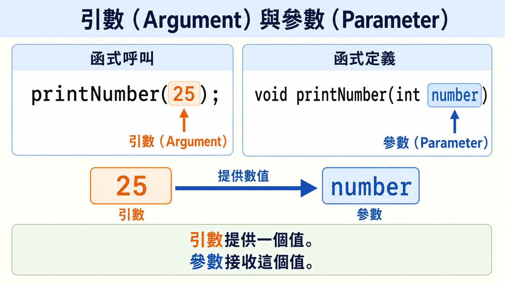

## Section XVIII. 引數可以是變數

```cpp
int score = 80;

printNumber(score);
```

也可以是表示式：

```cpp
printNumber(10 + 5);
```

---

## Section XIX. 多個參數

```cpp
// VALIDATE
#include <iostream>
using namespace std;

void printPoint(int x, int y) {
    cout << "("
         << x
         << ", "
         << y
         << ")\n";
}

int main() {
    printPoint(3, 5);
    printPoint(10, 2);

    return 0;
}
```

---

## Section XX. 參數順序很重要

如果定義：

```cpp
void printPoint(int x, int y)
```

呼叫：

```cpp
printPoint(3, 5);
```

代表：

```text
x = 3
y = 5
```

順序不能任意交換。

---

# Part E：有回傳值的函式

## Section XXI. `return`

```cpp
int square(int number) {
    return number * number;
}
```

若：

```cpp
square(5)
```

函式會得到：

```text
25
```

並將 `25` 回傳給呼叫的位置。

---

## Section XXII. 接住回傳值

```cpp
// VALIDATE
#include <iostream>
using namespace std;

int square(int number) {
    return number * number;
}

int main() {
    int result =
        square(6);

    cout << result
         << '\n';

    return 0;
}
```

輸出：

```text
36
```

---

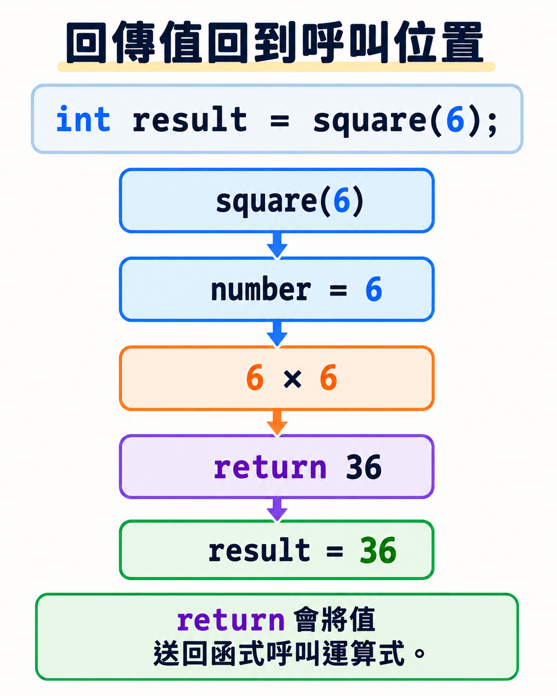

## Section XXIII. 直接輸出回傳值

也可以：

```cpp
cout << square(6) << '\n';
```

不一定要先建立變數。

---

## Section XXIV. 回傳值可以參與運算

```cpp
int total =
    square(3) + square(4);
```

等價概念：

```text
9 + 16
```

所以：

```text
total = 25
```

---

## Section XXV. 兩個參數的回傳函式

```cpp
// VALIDATE
#include <iostream>
using namespace std;

int add(int first, int second) {
    return first + second;
}

int main() {
    int answer =
        add(7, 9);

    cout << answer
         << '\n';

    return 0;
}
```

---

# Part F：不同回傳型態

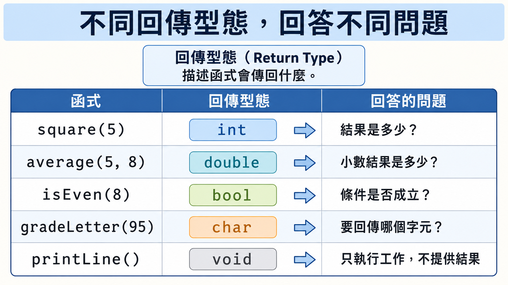


## Section XXVI. 回傳 `double`

```cpp
// VALIDATE
#include <iostream>
using namespace std;

double average(double first, double second) {
    return (first + second) / 2.0;
}

int main() {
    cout << average(5.0, 8.0)
         << '\n';

    return 0;
}
```

---

## Section XXVII. 回傳 `bool`

```cpp
bool isEven(int number) {
    return number % 2 == 0;
}
```

若：

```cpp
isEven(8)
```

回傳：

```text
true
```

若：

```cpp
isEven(7)
```

回傳：

```text
false
```

---

## Section XXVIII. `bool` 函式直接放入 `if`

```cpp
// VALIDATE
#include <iostream>
using namespace std;

bool isEven(int number) {
    return number % 2 == 0;
}

int main() {
    int number;
    cin >> number;

    if (isEven(number)) {
        cout << "Even\n";
    }

    return 0;
}
```

不需要寫成：

```cpp
if (isEven(number) == true)
```

雖然可以執行，但通常：

```cpp
if (isEven(number))
```

更清楚。

---

## Section XXIX. 回傳 `char`

```cpp
char gradeLetter(int score) {
    if (score >= 90) {
        return 'A';
    }

    return 'B';
}
```

回傳型態必須能表示函式要提供的結果。

---

# Part G：函式宣告與定義順序

## Section XXX. 為什麼順序會有問題？

這樣：

```cpp
int main() {
    cout << square(5);
}

int square(int number) {
    return number * number;
}
```

若前面沒有宣告，編譯器在看到：

```cpp
square(5)
```

時還不知道 `square` 是什麼。

---

## Section XXXI. 方法一：先定義函式

```cpp
// VALIDATE
#include <iostream>
using namespace std;

int square(int number) {
    return number * number;
}

int main() {
    cout << square(5)
         << '\n';

    return 0;
}
```

---

## Section XXXII. 方法二：使用函式原型

```cpp
// VALIDATE
#include <iostream>
using namespace std;

int square(int number);

int main() {
    cout << square(5)
         << '\n';

    return 0;
}

int square(int number) {
    return number * number;
}
```

---

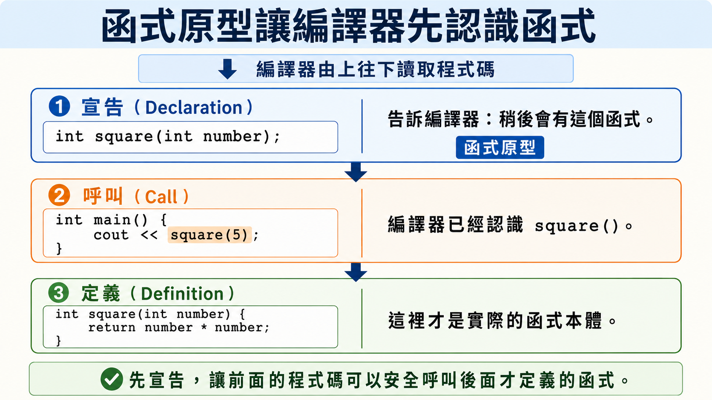

## Section XXXIII. 函式原型

```cpp
int square(int number);
```

最後有：

```text
;
```

它只是在告訴編譯器：

```text
之後會有一個叫 square 的函式
接收一個 int
回傳一個 int
```

---

## Section XXXIV. 宣告與定義必須一致

宣告：

```cpp
int add(int first, int second);
```

定義也應相符：

```cpp
int add(int first, int second) {
    return first + second;
}
```

不能宣告成：

```cpp
double add(int first, int second);
```

卻定義為：

```cpp
int add(int first, int second)
```

---

# Part H：區域變數與作用域

## Section XXXV. 函式內的變數

```cpp
int square(int number) {
    int result =
        number * number;

    return result;
}
```

`result` 是區域變數。

它主要只存在於：

```text
square() 的大括號範圍內
```

---

## Section XXXVI. 不同函式可以有同名區域變數

```cpp
// VALIDATE
#include <iostream>
using namespace std;

void firstFunction() {
    int value = 10;
    cout << value << '\n';
}

void secondFunction() {
    int value = 20;
    cout << value << '\n';
}

int main() {
    firstFunction();
    secondFunction();

    return 0;
}
```

兩個 `value` 是不同變數。

---

## Section XXXVII. `main()` 看不到其他函式的區域變數

錯誤概念：

```cpp
void createNumber() {
    int number = 10;
}

int main() {
    cout << number;
}
```

`number` 不在 `main()` 的作用域內。

---

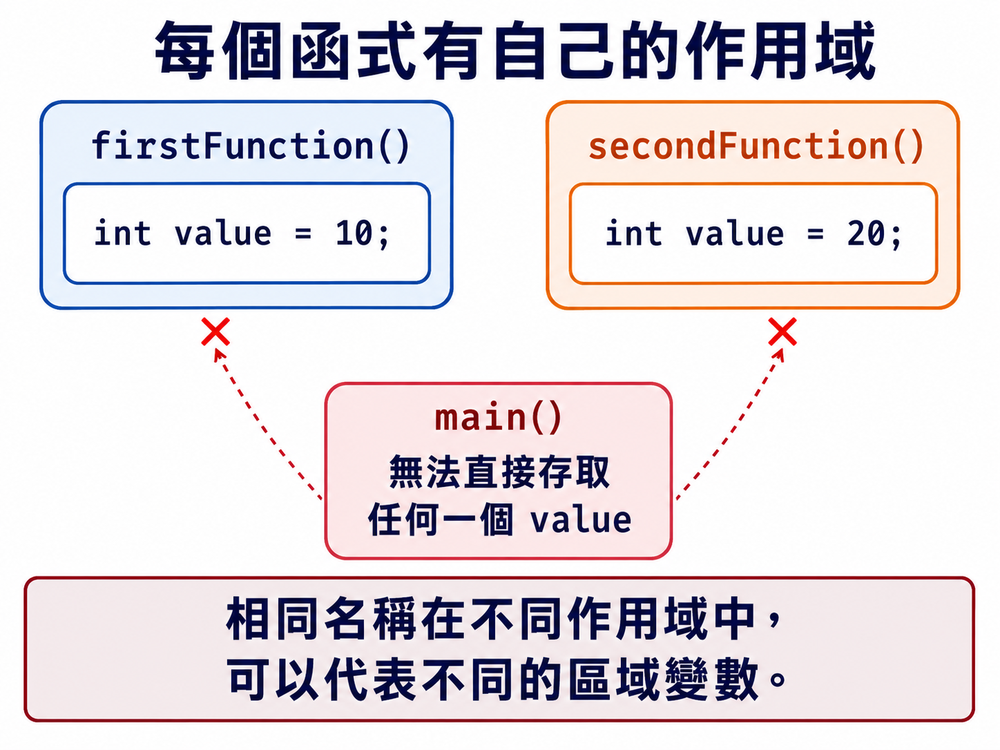

## Section XXXVIII. 參數也是區域名稱

```cpp
int square(int number)
```

`number` 只在這個函式內代表該參數。

另一個函式也可以使用：

```cpp
bool isEven(int number)
```

兩者互不衝突。

---

# Part I：傳值呼叫 Pass by Value

## Section XXXIX. 參數通常取得一份值

```cpp
// VALIDATE
#include <iostream>
using namespace std;

void changeNumber(int number) {
    number = 100;
}

int main() {
    int value = 5;

    changeNumber(value);

    cout << value
         << '\n';

    return 0;
}
```

輸出：

```text
5
```

---

## Section XL. 為什麼不是 100？

呼叫：

```cpp
changeNumber(value);
```

可以先想成：

```text
把 value 現在的值 5
交給函式參數 number
```

函式修改的是自己的：

```cpp
number
```

不是直接修改 `main()` 中的：

```cpp
value
```

---

## Section XLI. 這是傳值呼叫

本章先使用：

```text
pass by value
```

概念：

```text
呼叫端的值
↓
複製給參數
↓
函式處理自己的參數
```

參考參數會在後續內容再介紹。

---

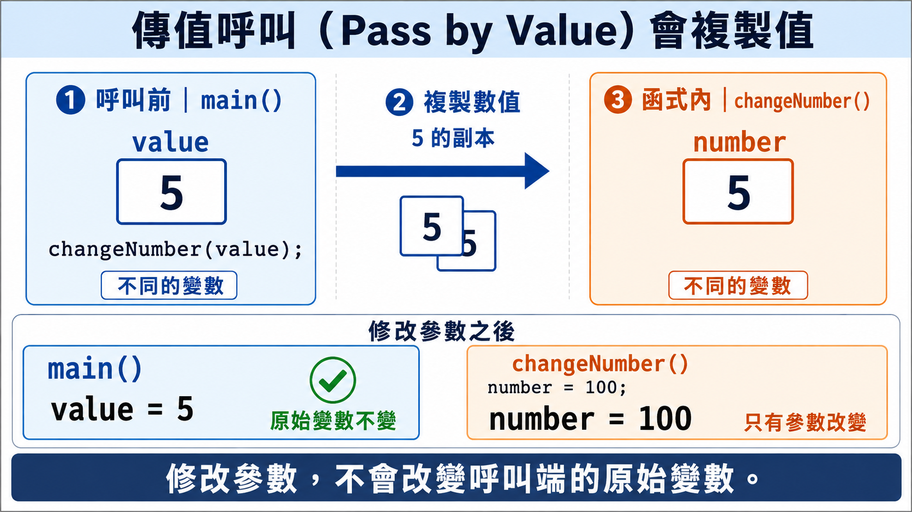

# Part J：Early Return 提前結束函式

## Section XLII. `return` 不只負責提供結果

一旦執行：

```cpp
return value;
```

函式就會立即結束。

後面的程式不會再執行。

---

## Section XLIII. 使用 early return 驗證資料

```cpp
// VALIDATE
#include <iostream>
using namespace std;

bool isValidScore(int score) {
    if (score < 0) {
        return false;
    }

    if (score > 100) {
        return false;
    }

    return true;
}

int main() {
    int score;
    cin >> score;

    if (isValidScore(score)) {
        cout << "Valid\n";
    } else {
        cout << "Invalid\n";
    }

    return 0;
}
```

---

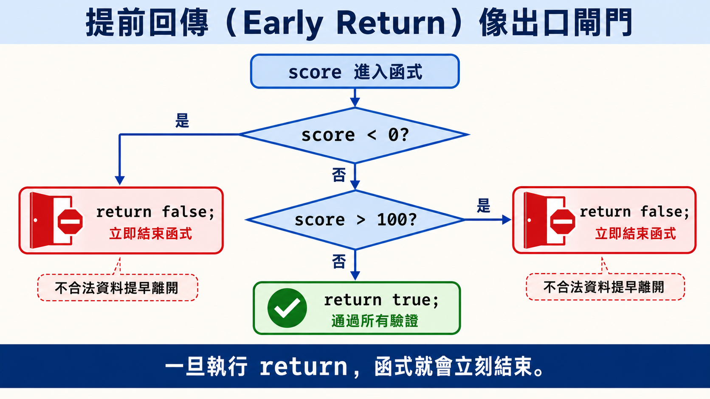

## Section XLIV. 為什麼 early return 很清楚？

不需要把所有條件塞成：

```cpp
return score >= 0 && score <= 100;
```

簡單條件時兩種都可以。

但複雜驗證時：

```text
發現錯誤
→ 立刻 return
```

通常比較容易追蹤。

---

## Section XLV. `void` 也可以提前 `return`

```cpp
// VALIDATE
#include <iostream>
using namespace std;

void printPositive(int number) {
    if (number <= 0) {
        return;
    }

    cout << number
         << '\n';
}

int main() {
    printPositive(-3);
    printPositive(8);

    return 0;
}
```

`return;` 沒有資料值，只表示：

```text
立即離開這個 void 函式
```

---

# Part K：建立判斷函式

## Section XLVI. `isPositive()`

```cpp
bool isPositive(int number) {
    return number > 0;
}
```

函式名稱用：

```text
is...
```

常適合表示真假問題。

---

## Section XLVII. `isInRange()`

```cpp
// VALIDATE
#include <iostream>
using namespace std;

bool isInRange(
    int number,
    int minimum,
    int maximum
) {
    return
        number >= minimum &&
        number <= maximum;
}

int main() {
    cout << boolalpha
         << isInRange(7, 1, 10)
         << '\n';

    return 0;
}
```

---

## Section XLVIII. `maxOfTwo()`

```cpp
int maxOfTwo(int first, int second) {
    if (first >= second) {
        return first;
    }

    return second;
}
```

---

## Section XLIX. `absoluteValue()`

```cpp
int absoluteValue(int number) {
    if (number < 0) {
        return -number;
    }

    return number;
}
```

---

# Part L：在函式中使用迴圈

## Section L. `sumFromOneToN()`

```cpp
// VALIDATE
#include <iostream>
using namespace std;

long long sumFromOneToN(int n) {
    long long total = 0;

    for (int number = 1; number <= n; ++number) {
        total += number;
    }

    return total;
}

int main() {
    int n;
    cin >> n;

    cout << sumFromOneToN(n)
         << '\n';

    return 0;
}
```

---

## Section LI. 函式裡可以使用任何已學語法

函式內可以有：

```text
變數
if
else
for
while
do-while
break
continue
巢狀迴圈
```

函式不是另一種完全不同的程式語言。

它只是把程式碼組織成一個可以呼叫的單位。

---

## Section LII. 計算某個範圍中的偶數數量

```cpp
// VALIDATE
#include <iostream>
using namespace std;

int countEven(int start, int end) {
    int count = 0;

    for (int number = start; number <= end; ++number) {
        if (number % 2 == 0) {
            ++count;
        }
    }

    return count;
}

int main() {
    cout << countEven(1, 10)
         << '\n';

    return 0;
}
```

---

## Section LIII. `power()` 的基本版本

```cpp
// VALIDATE
#include <iostream>
using namespace std;

long long power(int base, int exponent) {
    long long result = 1;

    for (int count = 0; count < exponent; ++count) {
        result *= base;
    }

    return result;
}

int main() {
    cout << power(2, 10)
         << '\n';

    return 0;
}
```

本例假設：

```text
exponent >= 0
```

---

# Part M：函式與巢狀迴圈

## Section LIV. 將矩形輸出整理成函式

```cpp
// VALIDATE
#include <iostream>
using namespace std;

void printRectangle(
    int height,
    int width,
    char symbol
) {
    for (int row = 1; row <= height; ++row) {
        for (int column = 1; column <= width; ++column) {
            cout << symbol;
        }

        cout << '\n';
    }
}

int main() {
    printRectangle(3, 5, '#');

    return 0;
}
```

---

## Section LV. `main()` 變得更像流程表

沒有函式時：

```text
main()
包含所有細節
```

有函式後：

```cpp
int main() {
    printRectangle(3, 5, '#');
    return 0;
}
```

`main()` 直接說明：

```text
我要做什麼
```

而細節放在函式內。

---

## Section LVI. 搜尋第一組解

前一章中，離開多層迴圈需要旗標。

放進函式後，可以利用：

```cpp
return
```

直接離開整個函式。

---

## Section LVII. 使用 `return` 離開雙層搜尋

```cpp
// VALIDATE
#include <iostream>
using namespace std;

bool findSolution(int target) {
    for (int x = 0; x <= target; ++x) {
        for (int y = 0; y <= target; ++y) {
            if (x + y == target) {
                cout << x
                     << " "
                     << y
                     << '\n';

                return true;
            }
        }
    }

    return false;
}

int main() {
    if (!findSolution(10)) {
        cout << "No solution\n";
    }

    return 0;
}
```

一旦找到解：

```cpp
return true;
```

會直接：

```text
離開內層迴圈
離開外層迴圈
離開 findSolution()
```

---

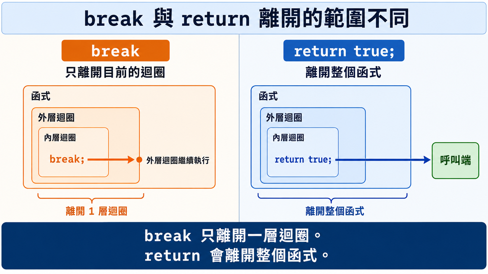

# Part N：函式呼叫另一個函式

## Section LVIII. 分工

```cpp
bool isEven(int number) {
    return number % 2 == 0;
}
```

另一個函式可以使用：

```cpp
int countEven(int start, int end) {
    int count = 0;

    for (int number = start; number <= end; ++number) {
        if (isEven(number)) {
            ++count;
        }
    }

    return count;
}
```

---

## Section LIX. 完整範例

```cpp
// VALIDATE
#include <iostream>
using namespace std;

bool isEven(int number) {
    return number % 2 == 0;
}

int countEven(int start, int end) {
    int count = 0;

    for (int number = start; number <= end; ++number) {
        if (isEven(number)) {
            ++count;
        }
    }

    return count;
}

int main() {
    cout << countEven(1, 100)
         << '\n';

    return 0;
}
```

---

## Section LX. 函式呼叫鏈

執行：

```cpp
countEven(1, 100)
```

過程中會多次呼叫：

```cpp
isEven(number)
```

可以想成：

```text
main()
↓
countEven()
↓
isEven()
```

函式可以互相合作。

---

# Part O：函式設計原則

## Section LXI. 一個函式做一件主要工作

較清楚：

```text
readScore()
isValidScore()
calculateAverage()
printResult()
```

較難維護：

```text
doEverything()
```

裡面同時：

```text
讀輸入
驗證
排序
計算
輸出
畫圖
搜尋
```

---

## Section LXII. 函式名稱要描述行為

若回傳真假：

```text
isEven
isValid
hasSolution
canMove
```

若計算數值：

```text
calculateArea
findMaximum
countEven
sumRange
```

若執行輸出：

```text
printMenu
printRectangle
showResult
```

---

## Section LXIII. 避免不必要的全域變數

較不理想：

```cpp
int number;

int square() {
    return number * number;
}
```

較清楚：

```cpp
int square(int number) {
    return number * number;
}
```

資料透過參數進入函式，使資料來源更明確。

---

## Section LXIV. 回傳值比隱藏副作用更容易理解

較清楚：

```cpp
int square(int number) {
    return number * number;
}
```

呼叫端：

```cpp
int result = square(5);
```

一眼就能看出：

```text
square 產生一個結果
```

---

# Part P：快速概念檢查

## Section LXV. 選擇題與簡答

### Q1. 函式的主要用途之一是什麼？

<details><summary>查看答案</summary>

將程式拆成具有明確工作的可重複使用單位。

</details>

### Q2. 下面哪一個是函式呼叫？

```cpp
square(5);
```

還是：

```cpp
int square(int number)
```

<details><summary>查看答案</summary>

```cpp
square(5);
```

</details>

### Q3. `void` 表示什麼？

<details><summary>查看答案</summary>

函式不回傳一個資料值給呼叫端。

</details>

### Q4. `int square(int number)` 的回傳型態是什麼？

<details><summary>查看答案</summary>

`int`。

</details>

### Q5. `number` 是什麼？

<details><summary>查看答案</summary>

參數 parameter。

</details>

### Q6. `square(7)` 中的 `7` 是什麼？

<details><summary>查看答案</summary>

引數 argument。

</details>

### Q7. `return` 執行後，函式還會繼續執行後面的程式嗎？

<details><summary>查看答案</summary>

不會，函式會立即結束。

</details>

### Q8. `bool isEven(int number)` 適合回答哪一類問題？

<details><summary>查看答案</summary>

真假問題，例如一個整數是否為偶數。

</details>

### Q9. 函式原型最後需要什麼？

<details><summary>查看答案</summary>

分號 `;`。

</details>

### Q10. 區域變數通常能在其他函式直接使用嗎？

<details><summary>查看答案</summary>

不能，它只在自己的作用域中有效。

</details>

### Q11. 傳值呼叫中，修改參數通常會改變呼叫端變數嗎？

<details><summary>查看答案</summary>

不會，參數取得的是值的複本。

</details>

### Q12. `void` 函式可以使用 `return;` 嗎？

<details><summary>查看答案</summary>

可以，用來提前離開函式。

</details>

### Q13. 函式中可以使用迴圈嗎？

<details><summary>查看答案</summary>

可以。

</details>

### Q14. 函式中可以呼叫另一個函式嗎？

<details><summary>查看答案</summary>

可以。

</details>

### Q15. 為什麼函式名稱 `isEven` 通常比 `f1` 好？

<details><summary>查看答案</summary>

因為名稱直接說明函式工作，程式較容易閱讀。

</details>

### Q16. `int add(int a, int b)` 需要幾個引數？

<details><summary>查看答案</summary>

兩個。

</details>

### Q17. `return first + second;` 做了哪兩件事？

<details><summary>查看答案</summary>

產生回傳值，並結束目前函式。

</details>

### Q18. 若函式在 `main()` 後才定義，可以怎麼處理？

<details><summary>查看答案</summary>

在 `main()` 前先寫函式宣告／函式原型。

</details>

### Q19. `main()` 本身是不是函式？

<details><summary>查看答案</summary>

是，`main()` 是程式的入口函式。

</details>

### Q20. 找到目標後，在搜尋函式中 `return true;` 可以直接離開巢狀迴圈嗎？

<details><summary>查看答案</summary>

可以，因為它會直接離開整個函式。

</details>

---

# Part Q：程式閱讀練習

## Section LXVI. 預測結果與找錯

### 題目 1

```cpp
int square(int number) {
    return number * number;
}

cout << square(4);
```

<details><summary>查看答案</summary>

```text
16
```

</details>

### 題目 2

```cpp
int add(int a, int b) {
    return a + b;
}

cout << add(2, 3) * 2;
```

<details><summary>查看答案</summary>

```text
10
```

</details>

### 題目 3

```cpp
bool isPositive(int number) {
    return number > 0;
}

cout << boolalpha
     << isPositive(-5);
```

<details><summary>查看答案</summary>

```text
false
```

</details>

### 題目 4

```cpp
void show(int value) {
    cout << value << " ";
}

show(3);
show(7);
```

<details><summary>查看答案</summary>

```text
3 7 
```

</details>

### 題目 5

```cpp
int mystery(int number) {
    if (number < 0) {
        return -number;
    }

    return number;
}

cout << mystery(-8);
```

<details><summary>查看答案</summary>

```text
8
```

</details>

### 題目 6

```cpp
void change(int number) {
    number = 99;
}

int value = 5;
change(value);
cout << value;
```

<details><summary>查看答案</summary>

```text
5
```

因為本章使用的是傳值呼叫。

</details>

### 題目 7

```cpp
int sumTo(int n) {
    int total = 0;

    for (int i = 1; i <= n; ++i) {
        total += i;
    }

    return total;
}

cout << sumTo(4);
```

<details><summary>查看答案</summary>

```text
10
```

</details>

### 題目 8

```cpp
int test(int number) {
    return number * 2;

    cout << "Hello";
}
```

<details><summary>查看答案</summary>

`return` 之後的 `cout` 不會執行。

</details>

### 題目 9

```cpp
int first() {
    int value = 10;
    return value;
}

int second() {
    int value = 20;
    return value;
}

cout << first() + second();
```

<details><summary>查看答案</summary>

```text
30
```

兩個 `value` 屬於不同作用域。

</details>

### 題目 10

```cpp
bool isEven(int number) {
    return number % 2 == 0;
}

if (isEven(12)) {
    cout << "A";
}
```

<details><summary>查看答案</summary>

```text
A
```

</details>

### 題目 11

```cpp
int add(int a, int b);

int main() {
    cout << add(2, 5);
}

int add(int a, int b) {
    return a + b;
}
```

<details><summary>查看答案</summary>

函式原型已在前面宣告，因此 `main()` 可以呼叫後方才定義的 `add()`。

</details>

### 題目 12

```cpp
int add(int a, int b) {
    cout << a + b;
}
```

<details><summary>查看答案</summary>

函式宣告回傳 `int`，卻沒有在所有正常路徑回傳整數。應加入：

```cpp
return a + b;
```

若只想輸出，則應重新設計為 `void`。

</details>

### 題目 13

```cpp
void printValue(int value) {
    return value;
}
```

<details><summary>查看答案</summary>

錯誤。`void` 函式不能用 `return value;` 回傳資料值。

</details>

### 題目 14

```cpp
int square(int number);

int square(double number) {
    return number * number;
}
```

<details><summary>查看答案</summary>

宣告與定義不一致。前者參數是 `int`，後者參數是 `double`，代表不同函式簽名。

</details>

### 題目 15

```cpp
bool findTarget(int target) {
    for (int row = 0; row < 5; ++row) {
        for (int column = 0; column < 5; ++column) {
            if (row + column == target) {
                return true;
            }
        }
    }

    return false;
}
```

<details><summary>查看答案</summary>

一旦找到符合條件的位置，`return true;` 會直接離開整個 `findTarget()`，不需要兩個 `break`。

</details>

---

# Part R：實作練習

## Section LXVII. 實作檢測題

### TODO 1：`square()`

建立：

```cpp
int square(int number)
```

回傳整數平方。

### TODO 2：`add()`

建立接收兩個整數的函式，回傳總和。

### TODO 3：`maxOfTwo()`

建立函式回傳兩個整數中的較大值。

### TODO 4：`absoluteValue()`

建立整數絕對值函式。

### TODO 5：`isEven()`

建立回傳 `bool` 的偶數判斷函式。

### TODO 6：`isInRange()`

接收：

```text
number
minimum
maximum
```

判斷 `number` 是否位於閉區間中。

### TODO 7：`sumFromOneToN()`

輸入 `n`，使用函式回傳：

```text
1 + 2 + ... + n
```

### TODO 8：`countMultiple()`

建立函式：

```cpp
int countMultiple(int start, int end, int divisor)
```

計算區間內可被 `divisor` 整除的整數數量。

### TODO 9：`power()`

不用 `pow()`，使用迴圈建立：

```cpp
long long power(int base, int exponent)
```

本題假設 `exponent >= 0`。

### TODO 10：`printLine()`

建立：

```cpp
void printLine(int length, char symbol)
```

輸出指定長度的一列符號。

### TODO 11：`printRectangle()`

建立：

```cpp
void printRectangle(
    int height,
    int width,
    char symbol
)
```

輸出實心矩形。

### TODO 12：`isPrime()`

建立：

```cpp
bool isPrime(int number)
```

判斷整數是否為質數。

提示：小於 `2` 不是質數。

### TODO 13：區間質數數量

先使用：

```cpp
isPrime()
```

再建立：

```cpp
int countPrimes(int start, int end)
```

不要重複撰寫質數判斷邏輯。

### TODO 14：第一組整數解

建立：

```cpp
bool findFirstSolution(int target)
```

搜尋第一組：

```text
x + y = target
```

的非負整數解，找到後立即 `return true`。

### TODO 15：成績分類

建立：

```cpp
char getGrade(int score)
```

規則：

```text
90–100 → A
80–89  → B
70–79  → C
60–69  → D
0–59   → F
```

並另外建立：

```cpp
bool isValidScore(int score)
```

不要把合法範圍檢查全部塞進 `main()`。

---

# Part S：課後小練習

## Section LXVIII. 延伸練習

### 練習 1：三個數最大值

建立：

```cpp
int maxOfThree(int a, int b, int c)
```

可以考慮重複使用：

```cpp
maxOfTwo()
```

### 練習 2：最大公因數

建立：

```cpp
int gcd(int first, int second)
```

可使用迴圈完成。

### 練習 3：數字位數

建立：

```cpp
int digitCount(int number)
```

計算整數有幾位。

### 練習 4：反轉正整數

建立：

```cpp
int reverseNumber(int number)
```

例如：

```text
1234 → 4321
```

### 練習 5：完全數檢查

建立：

```cpp
bool isPerfectNumber(int number)
```

判斷一個正整數是否等於其正因數（不含自己）總和。

---

# Part T：常見錯誤提醒

## Section LXIX. 常見錯誤

1. 定義函式後忘記在 `main()` 呼叫。
2. 呼叫函式時忘記括號。
3. 函式原型忘記分號。
4. 函式在使用後才定義，又沒有先宣告。
5. 宣告與定義的回傳型態不一致。
6. 宣告與定義的參數型態不一致。
7. 呼叫時引數數量錯誤。
8. 呼叫時引數順序錯誤。
9. 把 parameter 與 argument 混為同一個位置概念。
10. `int` 函式忘記回傳值。
11. `double` 計算卻不小心使用不適合的整數運算。
12. `void` 函式使用 `return value;`。
13. 在 `return` 後面放重要程式，卻期待它執行。
14. 忽略函式的回傳值。
15. 誤以為傳值參數修改後會改變呼叫端變數。
16. 嘗試在其他函式直接使用區域變數。
17. 建立過多不必要的全域變數。
18. 函式名稱過短，無法表示用途。
19. 一個函式同時處理太多不相關工作。
20. 只為了「用了函式」而把一行簡單程式拆得過度零碎。
21. `bool` 函式中回傳 `1`、`0` 雖可轉換，但降低可讀性。
22. `isEven()` 內又輸出結果，使「判斷」與「顯示」責任混在一起。
23. 搜尋函式找到答案後只 `break` 內層，卻忘記可直接 `return`。
24. `return` 的值與函式名稱代表的意義不一致。
25. 看到重複程式碼卻只複製貼上，不考慮抽成函式。

---

# Part U：Mermaid 流程圖

## Section LXX. 函式流程圖

### 1. 基本函式呼叫

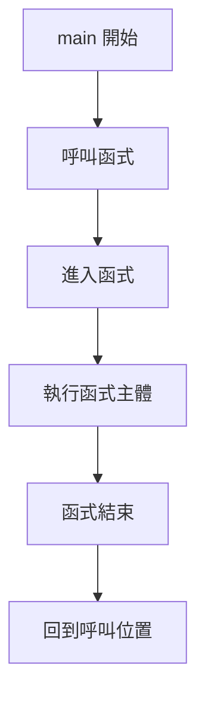
```mermaid
flowchart TD
    A[main 開始] --> B[呼叫函式]
    B --> C[進入函式]
    C --> D[執行函式主體]
    D --> E[函式結束]
    E --> F[回到呼叫位置]
```

### 2. 有回傳值的函式

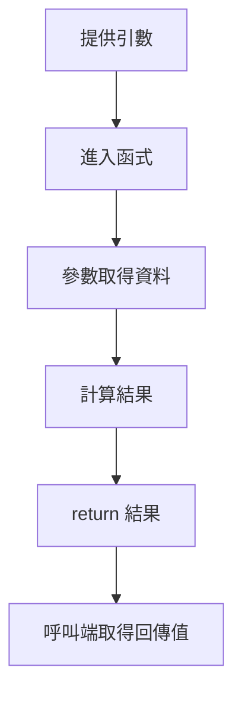
```mermaid
flowchart TD
    A[提供引數] --> B[進入函式]
    B --> C[參數取得資料]
    C --> D[計算結果]
    D --> E[return 結果]
    E --> F[呼叫端取得回傳值]
```

### 3. `bool` 判斷函式

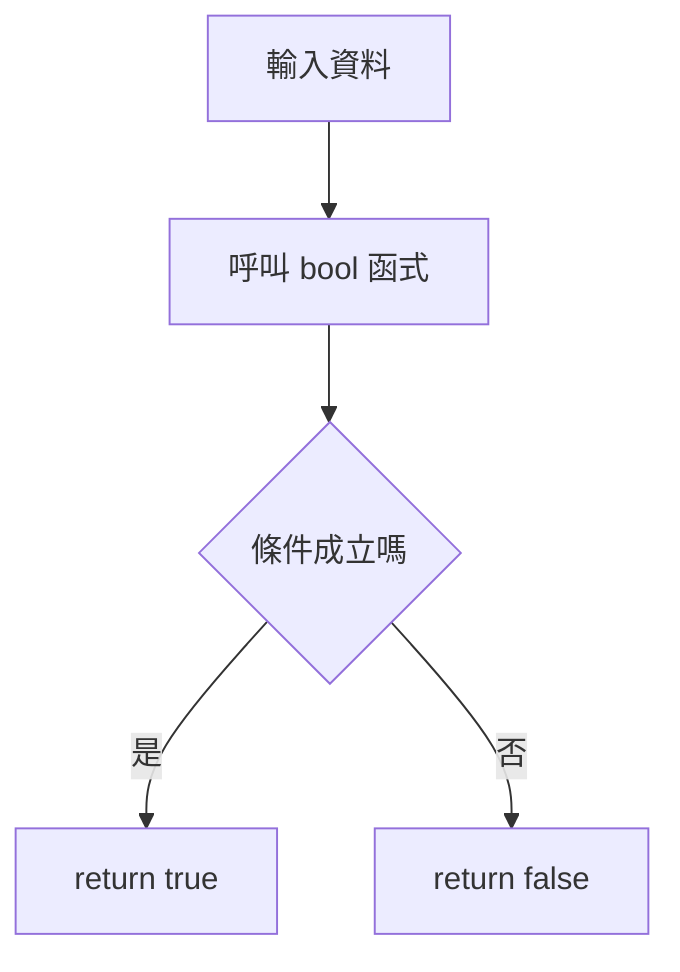
```mermaid
flowchart TD
    A[輸入資料] --> B[呼叫 bool 函式]
    B --> C{條件成立嗎}
    C -- 是 --> D[return true]
    C -- 否 --> E[return false]
```

### 4. Early return

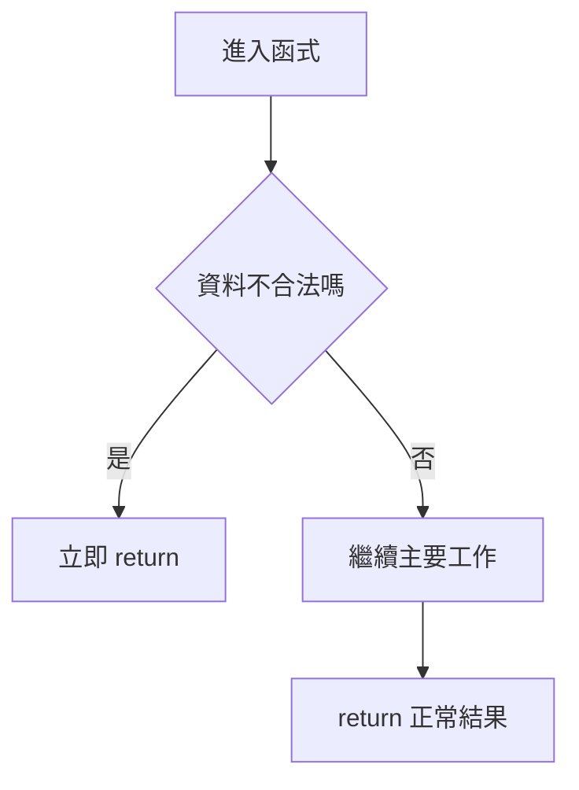
```mermaid
flowchart TD
    A[進入函式] --> B{資料不合法嗎}
    B -- 是 --> C[立即 return]
    B -- 否 --> D[繼續主要工作]
    D --> E[return 正常結果]
```

### 5. 傳值呼叫

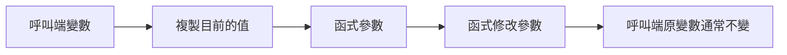
```mermaid
flowchart LR
    A[呼叫端變數] --> B[複製目前的值]
    B --> C[函式參數]
    C --> D[函式修改參數]
    D --> E[呼叫端原變數通常不變]
```

### 6. 函式呼叫另一個函式

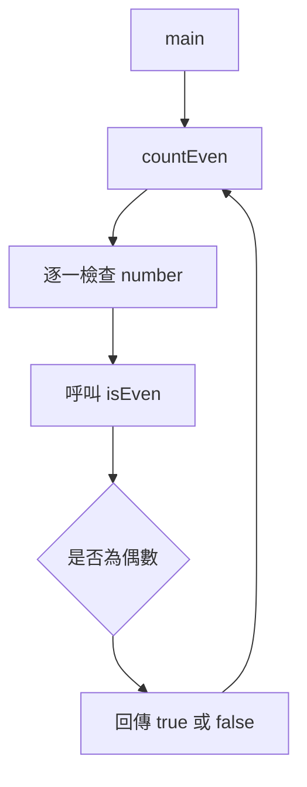
```mermaid
flowchart TD
    A[main] --> B[countEven]
    B --> C[逐一檢查 number]
    C --> D[呼叫 isEven]
    D --> E{是否為偶數}
    E --> F[回傳 true 或 false]
    F --> B
```

### 7. 搜尋函式中的 `return`

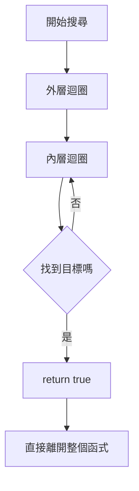
```mermaid
flowchart TD
    A[開始搜尋] --> B[外層迴圈]
    B --> C[內層迴圈]
    C --> D{找到目標嗎}
    D -- 否 --> C
    D -- 是 --> E[return true]
    E --> F[直接離開整個函式]
```

### 8. 函式設計

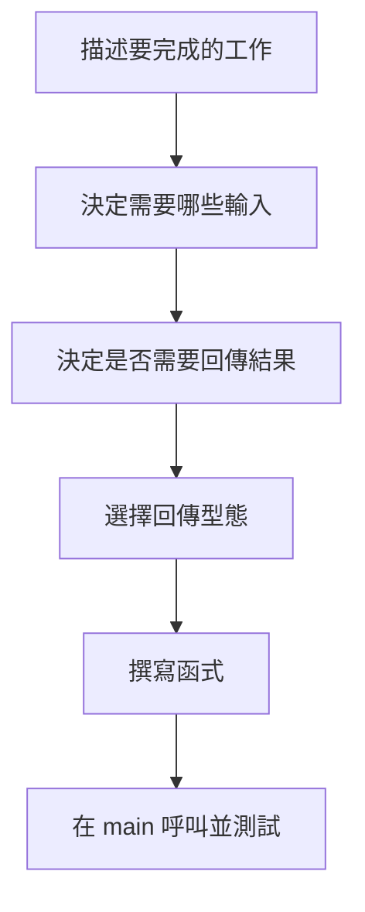
```mermaid
flowchart TD
    A[描述要完成的工作] --> B[決定需要哪些輸入]
    B --> C[決定是否需要回傳結果]
    C --> D[選擇回傳型態]
    D --> E[撰寫函式]
    E --> F[在 main 呼叫並測試]
```

---

# 本章完成標準

完成本章後，你應該能做到：

1. 說明函式的用途。
2. 分辨函式定義與函式呼叫。
3. 找出函式的回傳型態。
4. 找出函式名稱。
5. 找出參數。
6. 說明 argument 與 parameter 的差異。
7. 建立無參數 `void` 函式。
8. 建立有參數 `void` 函式。
9. 建立回傳 `int` 的函式。
10. 建立回傳 `double` 的函式。
11. 建立回傳 `bool` 的函式。
12. 使用 `return` 回傳結果。
13. 說明 `return` 會結束函式。
14. 將函式回傳值存入變數。
15. 將函式呼叫放入算術表示式。
16. 將 `bool` 函式放入 `if`。
17. 使用一個參數。
18. 使用多個參數。
19. 按正確順序提供引數。
20. 使用函式原型。
21. 說明函式原型為什麼需要分號。
22. 讓宣告與定義保持一致。
23. 說明區域變數作用域。
24. 說明參數也是區域名稱。
25. 說明傳值呼叫的基本概念。
26. 預測修改參數後呼叫端變數是否改變。
27. 使用 early return。
28. 在 `void` 函式中使用 `return;`。
29. 建立 `isEven()`。
30. 建立 `isInRange()`。
31. 建立 `maxOfTwo()`。
32. 建立 `absoluteValue()`。
33. 在函式內使用 `for`。
34. 建立 `sumFromOneToN()`。
35. 建立 `countEven()`。
36. 建立基本 `power()`。
37. 將矩形輸出整理成函式。
38. 使用函式處理巢狀迴圈。
39. 使用 `return` 離開整個搜尋函式。
40. 讓函式互相呼叫。
41. 選擇具有意義的函式名稱。
42. 避免過多全域變數。
43. 避免忽略回傳值。
44. 避免回傳型態錯誤。
45. 找出常見函式程式錯誤。

---

# 隱藏答案區

> Answer hidden — try it first.

<details><summary>TODO 1 答案</summary>

```cpp
int square(int number) {
    return number * number;
}
```

</details>

<details><summary>TODO 2 答案</summary>

```cpp
int add(int first, int second) {
    return first + second;
}
```

</details>

<details><summary>TODO 3 答案</summary>

```cpp
int maxOfTwo(int first, int second) {
    if (first >= second) {
        return first;
    }

    return second;
}
```

</details>

<details><summary>TODO 4 答案</summary>

```cpp
int absoluteValue(int number) {
    if (number < 0) {
        return -number;
    }

    return number;
}
```

</details>

<details><summary>TODO 5 答案</summary>

```cpp
bool isEven(int number) {
    return number % 2 == 0;
}
```

</details>

<details><summary>TODO 6 答案</summary>

```cpp
bool isInRange(
    int number,
    int minimum,
    int maximum
) {
    return
        number >= minimum &&
        number <= maximum;
}
```

</details>

<details><summary>TODO 7 答案</summary>

```cpp
long long sumFromOneToN(int n) {
    long long total = 0;

    for (int number = 1; number <= n; ++number) {
        total += number;
    }

    return total;
}
```

</details>

<details><summary>TODO 8 答案</summary>

```cpp
int countMultiple(
    int start,
    int end,
    int divisor
) {
    int count = 0;

    if (divisor == 0) {
        return 0;
    }

    for (int number = start; number <= end; ++number) {
        if (number % divisor == 0) {
            ++count;
        }
    }

    return count;
}
```

</details>

<details><summary>TODO 9 答案</summary>

```cpp
long long power(int base, int exponent) {
    long long result = 1;

    for (int count = 0; count < exponent; ++count) {
        result *= base;
    }

    return result;
}
```

</details>

<details><summary>TODO 10 答案</summary>

```cpp
void printLine(int length, char symbol) {
    for (int count = 0; count < length; ++count) {
        cout << symbol;
    }

    cout << '\n';
}
```

</details>

<details><summary>TODO 11 答案</summary>

```cpp
void printRectangle(
    int height,
    int width,
    char symbol
) {
    for (int row = 1; row <= height; ++row) {
        for (int column = 1; column <= width; ++column) {
            cout << symbol;
        }

        cout << '\n';
    }
}
```

</details>

<details><summary>TODO 12 答案</summary>

```cpp
bool isPrime(int number) {
    if (number < 2) {
        return false;
    }

    for (int divisor = 2; divisor * divisor <= number; ++divisor) {
        if (number % divisor == 0) {
            return false;
        }
    }

    return true;
}
```

</details>

<details><summary>TODO 13 答案</summary>

```cpp
int countPrimes(int start, int end) {
    int count = 0;

    for (int number = start; number <= end; ++number) {
        if (isPrime(number)) {
            ++count;
        }
    }

    return count;
}
```

</details>

<details><summary>TODO 14 答案</summary>

```cpp
bool findFirstSolution(int target) {
    if (target < 0) {
        return false;
    }

    for (int x = 0; x <= target; ++x) {
        for (int y = 0; y <= target; ++y) {
            if (x + y == target) {
                cout << x
                     << " "
                     << y
                     << '\n';

                return true;
            }
        }
    }

    return false;
}
```

</details>

<details><summary>TODO 15 答案</summary>

```cpp
bool isValidScore(int score) {
    return score >= 0 && score <= 100;
}

char getGrade(int score) {
    if (score >= 90) {
        return 'A';
    }

    if (score >= 80) {
        return 'B';
    }

    if (score >= 70) {
        return 'C';
    }

    if (score >= 60) {
        return 'D';
    }

    return 'F';
}
```

</details>
