# Lesson 13：Function Overloading and Default Arguments 函式多載與預設參數

> 這堂課的重點：深入理解 C++ 如何讓多個函式共用同一個名稱，以及呼叫函式時，編譯器如何根據引數數量與型別選擇最適合的版本。你也會學習預設引數的宣告規則、使用時機，以及多載與預設引數同時存在時可能產生的歧義。

> 第 12 章已介紹函式多載與預設引數的基本語法。本章會進一步分析多載集合、函式簽章、型別轉換優先順序、參考多載、歧義呼叫、`static_cast` 消除歧義，以及良好的介面設計方式。

---

## Section I. 今天要做什麼？

1. 複習函式宣告、定義與呼叫。
2. 複習參數與引數。
3. 認識函式多載 function overloading。
4. 理解多個函式可以共用名稱。
5. 理解多載版本必須具有不同參數列表。
6. 使用不同參數數量建立多載。
7. 使用不同參數型別建立多載。
8. 使用不同參數順序建立多載。
9. 理解參數名稱不影響多載。
10. 理解只改回傳型別不能多載。
11. 理解頂層 `const` 不形成不同的傳值多載。
12. 分辨 `int` 與 `const int` 傳值參數。
13. 使用參考與 `const` 參考建立多載。
14. 理解左值 lvalue 的初步概念。
15. 理解一般變數可以綁定到非 `const` 參考。
16. 理解常數與暫時值只能綁定到 `const` 參考。
17. 認識多載集合 overload set。
18. 理解編譯器會收集同名候選函式。
19. 理解候選函式 candidate function。
20. 理解可行函式 viable function。
21. 理解最佳可行函式 best viable function。
22. 使用精確型別符合。
23. 理解整數提升 integer promotion。
24. 理解浮點提升 floating-point promotion。
25. 理解一般標準型別轉換。
26. 以簡化規則比較多載優先順序。
27. 理解精確符合通常優於提升。
28. 理解提升通常優於一般轉換。
29. 使用字面常數的型別判斷多載。
30. 分辨整數字面常數與浮點字面常數。
31. 分辨 `2.5` 與 `2.5f`。
32. 分辨字元字面常數與整數。
33. 理解 `char` 可能提升成 `int`。
34. 理解 `short` 通常提升成 `int`。
35. 使用 `static_cast` 指定想要的版本。
36. 認識多載歧義 ambiguous call。
37. 找出兩個版本同樣合適的情況。
38. 避免過度依賴隱性轉換。
39. 使用明確型別讓呼叫意圖清楚。
40. 認識預設引數 default argument。
41. 理解預設引數在呼叫時補上。
42. 理解預設引數不是函式內的特殊變數。
43. 理解預設引數通常寫在函式宣告中。
44. 避免在宣告與定義重複指定預設值。
45. 理解預設引數必須由右向左連續提供。
46. 省略最右側引數。
47. 同時省略多個右側引數。
48. 理解不能只省略中間引數。
49. 理解預設引數不屬於函式簽章。
50. 理解使用預設引數不會建立新的函式。
51. 使用常數作為預設值。
52. 使用常數表示式作為預設值。
53. 理解預設引數表示式在每次呼叫時求值。
54. 使用函式呼叫作為預設引數的概念。
55. 認識多載與預設引數的互動。
56. 避免兩個多載在省略引數後同時可行。
57. 找出 `function(int)` 與 `function(int, int = 0)` 的歧義。
58. 使用不同名稱改善過度複雜的多載集合。
59. 比較多載與預設引數的用途。
60. 判斷何時使用多載。
61. 判斷何時使用預設引數。
62. 判斷何時拆成不同函式名稱。
63. 使用多載處理 `int` 與 `double`。
64. 使用多載處理不同參數數量。
65. 使用預設引數設計輸出函式。
66. 使用多載建立不同形狀面積函式。
67. 使用預設引數建立文字線條函式。
68. 使用 `const string&` 避免字串複製。
69. 使用函式指標取得特定多載版本的概念。
70. 使用 `static_cast` 指定函式指標型別。
71. 避免多載版本執行完全不同的工作。
72. 維持相同函式名稱的語意一致。
73. 避免太多相近數值型別造成歧義。
74. 避免 `bool`、`char` 與整數多載過度混合。
75. 避免混合多載、預設引數與大量隱性轉換。
76. 使用概念檢查、程式閱讀與實作題整合本章。

---

## Section II. 今天的學習方式

1. 每一組多載先列出完整宣告：
   ```cpp
   function(int);
   function(double);
   function(int, int);
   ```
2. 每個呼叫先判斷引數的實際型別。
3. 再找出：
   ```text
   哪些函式是候選？
   哪些函式可以接收這些引數？
   哪個版本需要最少或最好的轉換？
   ```
4. 使用簡化優先順序：
   ```text
   精確符合
   → 型別提升
   → 一般標準轉換
   ```
5. 遇到歧義時，不猜測編譯器會選哪個版本。
6. 歧義呼叫應修改設計或使用明確轉型。
7. 預設引數題先補出完整呼叫。
8. 例如：
   ```cpp
   drawLine(5);
   ```
   先改寫成：
   ```cpp
   drawLine(5, '*');
   ```
9. 多載加預設引數時，列出省略後的所有可行版本。
10. 所有合法完整程式使用嚴格 C++17 選項檢查。
11. 歧義與編譯錯誤範例只用於分析。
12. 本章不使用函式模板取代多載；模板會在進階教材處理。

---

## Section III. 核心語法對照

| 語法 | 用途 |
| --- | --- |
| `void show(int value);` | `int` 版本 |
| `void show(double value);` | `double` 版本 |
| `void show(int a, int b);` | 不同參數數量 |
| `void process(int& value);` | 可修改左值參考版本 |
| `void process(const int& value);` | 唯讀參考版本 |
| `void draw(int length, char symbol = '*');` | 使用預設引數 |
| `void configure(int level = 1, bool enabled = true);` | 多個右側預設值 |
| `static_cast<double>(value)` | 明確指定型別 |
| `static_cast<void (*)(int)>(show)` | 指定多載函式指標版本 |
| `int function(int);` | 回傳型別不參與多載選擇 |
| `void example(int);` | 與 `void example(const int);` 相同簽章 |
| `void test(int);` + `void test(int, int = 0);` | 呼叫 `test(5)` 時會歧義 |

---

# Part A：什麼是函式多載？

## Section IV. 相同名稱，不同參數列表

```cpp
void show(int value) {
    cout << "Integer: "
         << value
         << '\n';
}

void show(double value) {
    cout << "Double: "
         << value
         << '\n';
}
```

兩個函式都叫：

```text
show
```

但參數型別不同。

---

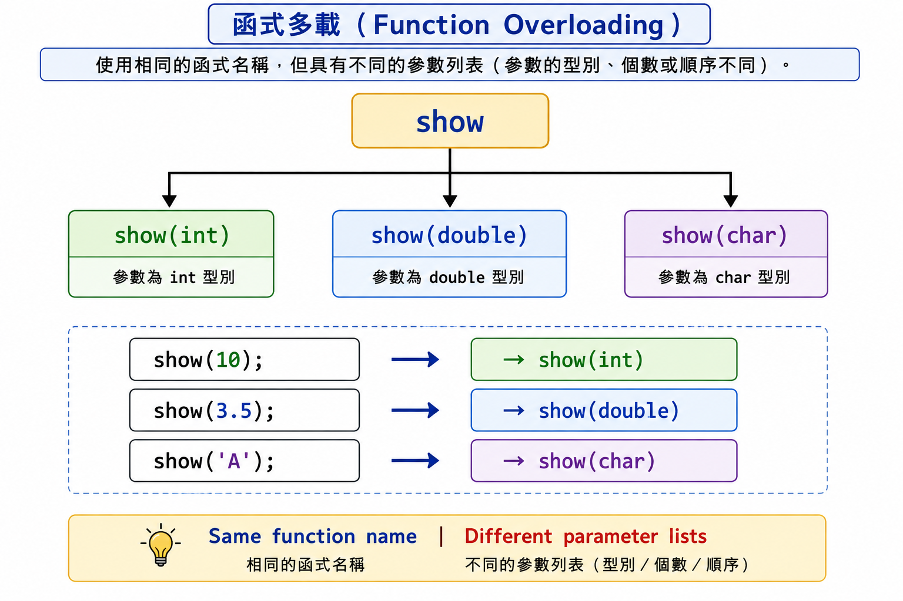

## Section V. 完整基本多載範例

```cpp
// VALIDATE
#include <iostream>
using namespace std;

void show(int value) {
    cout << "Integer: "
         << value
         << '\n';
}

void show(double value) {
    cout << "Double: "
         << value
         << '\n';
}

int main() {
    show(10);
    show(3.5);

    return 0;
}
```

輸出：

```text
Integer: 10
Double: 3.5
```

---

## Section VI. 呼叫時選擇版本

```cpp
show(10);
```

引數 `10` 是 `int`，因此選擇：

```cpp
show(int)
```

```cpp
show(3.5);
```

引數 `3.5` 是 `double`，因此選擇：

```cpp
show(double)
```

---

## Section VII. 多載集合

同一作用域中的同名函式形成多載集合：

```cpp
show(int)
show(double)
show(char)
```

呼叫：

```cpp
show(argument);
```

編譯器會從集合中選擇最佳版本。

---

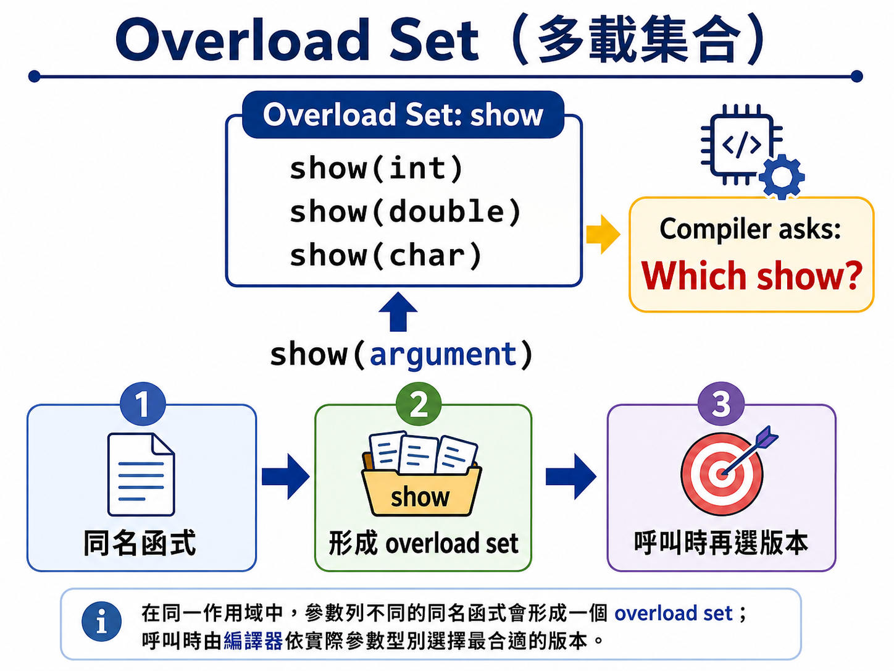

# Part B：哪些差異可以形成多載？

## Section VIII. 不同參數數量

```cpp
int maximum(int first, int second);

int maximum(
    int first,
    int second,
    int third
);
```

這是合法多載。

---

## Section IX. 完整不同數量範例

```cpp
// VALIDATE
#include <iostream>
using namespace std;

int maximum(int first, int second) {
    return
        first > second
            ? first
            : second;
}

int maximum(
    int first,
    int second,
    int third
) {
    return
        maximum(
            maximum(first, second),
            third
        );
}

int main() {
    cout << maximum(3, 8)
         << '\n';

    cout << maximum(3, 8, 5)
         << '\n';

    return 0;
}
```

---

## Section X. 不同參數型別

```cpp
int absoluteValue(int value);
double absoluteValue(double value);
```

合法，因為參數型別不同。

---

## Section XI. 不同參數順序

```cpp
void describe(int count, double value);
void describe(double value, int count);
```

這也是合法多載。

但若參數意義不清楚，呼叫可能難以閱讀。

---

## Section XII. 完整順序多載範例

```cpp
// VALIDATE
#include <iostream>
using namespace std;

void repeat(int count, char symbol) {
    for (int index = 0; index < count; ++index) {
        cout << symbol;
    }

    cout << '\n';
}

void repeat(char symbol, int count) {
    repeat(count, symbol);
}

int main() {
    repeat(5, '*');
    repeat('#', 3);

    return 0;
}
```

---

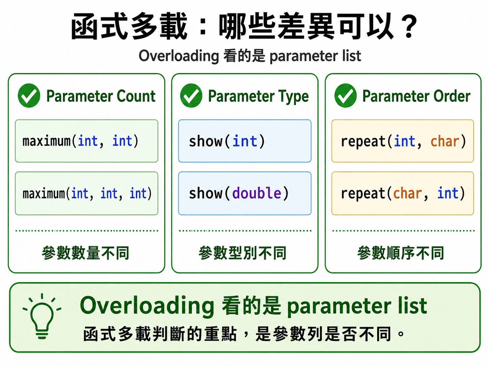

# Part C：哪些差異不能形成多載？

## Section XIII. 參數名稱不影響簽章

以下兩個宣告代表同一種函式：

```cpp
int add(int first, int second);
int add(int a, int b);
```

參數名稱只是函式內部使用的名稱。

---

## Section XIV. 只改回傳型別不可以

不合法：

```cpp
int convert(int value);
double convert(int value);
```

呼叫：

```cpp
convert(10);
```

引數只能告訴編譯器參數是 `int`，無法根據使用者期待的回傳型別選擇版本。

---

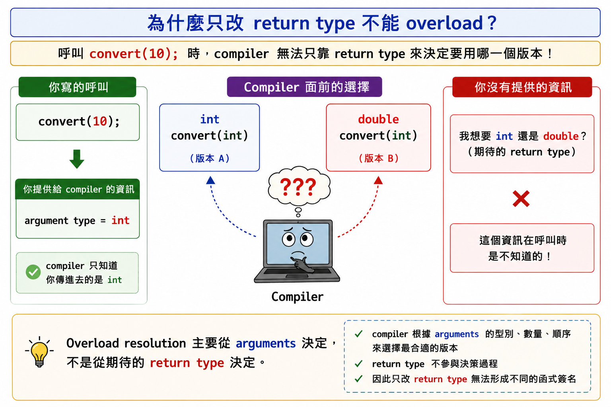

## Section XV. 頂層 `const` 不形成傳值多載

以下兩個宣告視為相同：

```cpp
void process(int value);
void process(const int value);
```

因為傳值時，呼叫者的資料會被複製。

`const` 只限制函式內是否能修改這份副本。

---

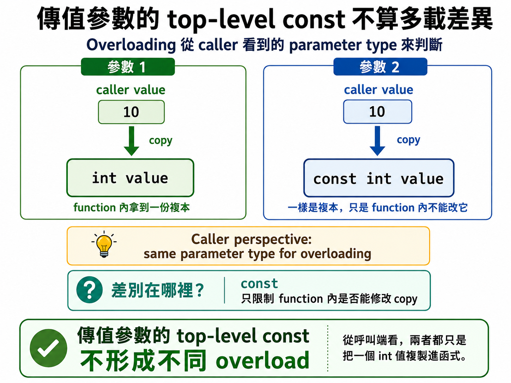

## Section XVI. 錯誤概念

```cpp
/* 不可同時定義：

void process(int value) {
}

void process(const int value) {
}

*/
```

這不是兩個不同多載，而是重複定義相同函式。

---

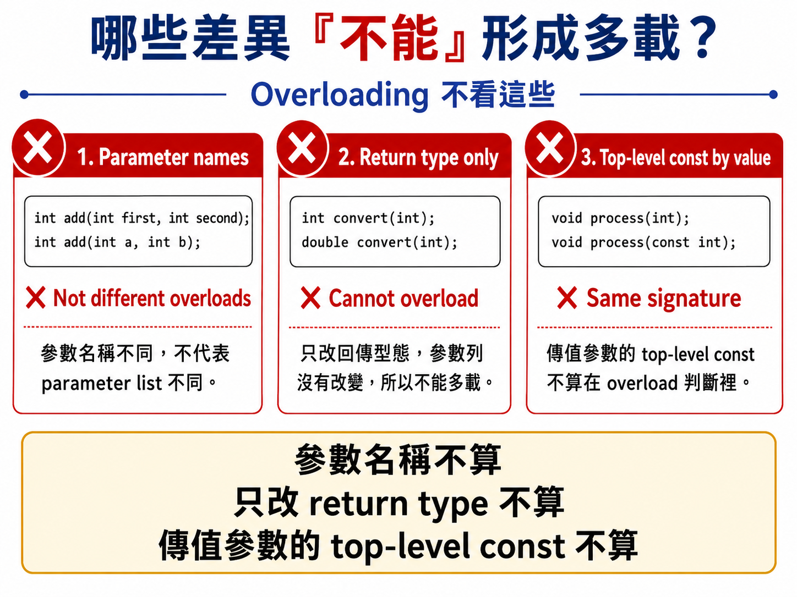

# Part D：參考與 `const` 參考多載

## Section XVII. 合法參考多載

```cpp
void process(int& value);
void process(const int& value);
```

兩者不同：

- `int&`：可修改的一般左值。
- `const int&`：唯讀，可接收常數或暫時值。

---

## Section XVIII. 完整參考多載範例

```cpp
// VALIDATE
#include <iostream>
using namespace std;

void inspect(int& value) {
    cout << "Mutable lvalue: "
         << value
         << '\n';
}

void inspect(const int& value) {
    cout << "Const or temporary: "
         << value
         << '\n';
}

int main() {
    int number = 10;
    const int constantNumber = 20;

    inspect(number);
    inspect(constantNumber);
    inspect(30);

    return 0;
}
```

---

## Section XIX. 呼叫選擇

```cpp
int number = 10;
inspect(number);
```

一般可修改變數最適合：

```cpp
inspect(int&)
```

```cpp
const int number = 10;
inspect(number);
```

只能選：

```cpp
inspect(const int&)
```

暫時值：

```cpp
inspect(30);
```

也會選：

```cpp
inspect(const int&)
```

---

## Section XX. 左值初步概念

一般具名變數：

```cpp
int number = 10;
```

表達式：

```cpp
number
```

通常是左值，代表一個有持續身分與儲存位置的物件。

字面常數：

```cpp
10
```

是暫時值，不能綁定到一般非 `const` 左值參考。

---

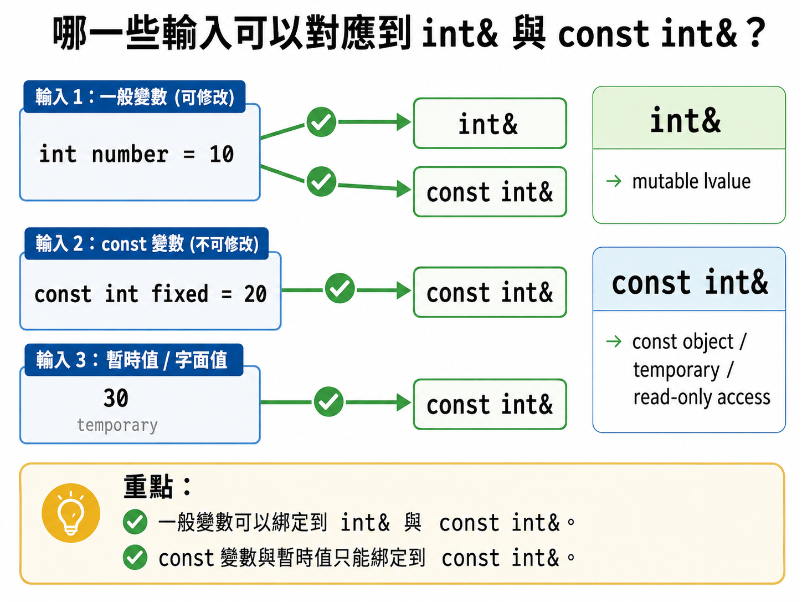

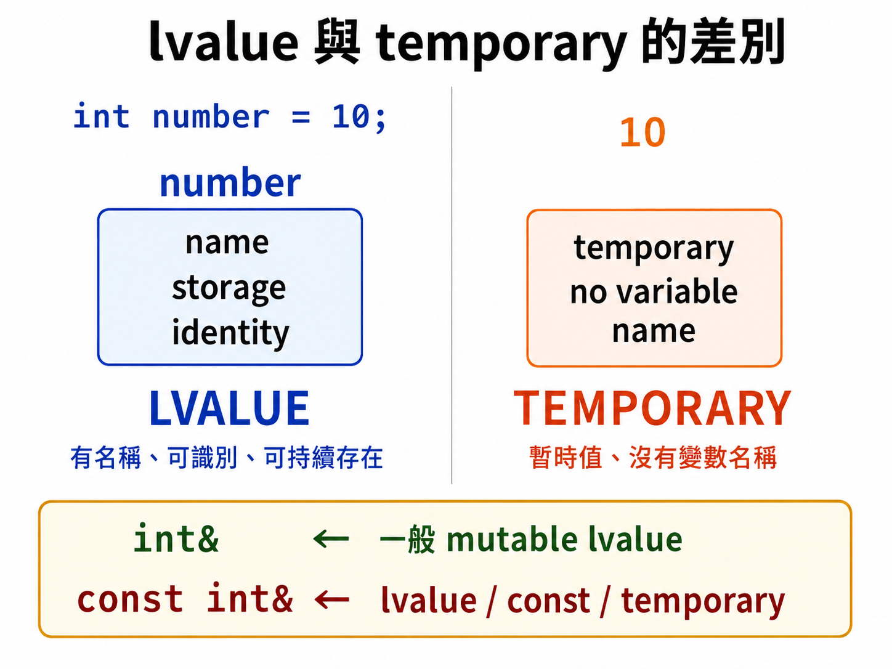

# Part E：多載解析的基本流程

## Section XXI. 第一步：候選函式

編譯器先找出目前可見的同名函式：

```cpp
show(int)
show(double)
show(char)
```

---

## Section XXII. 第二步：可行函式

函式必須：

- 引數數量可對應。
- 每個引數能轉換成參數型別。
- 參考綁定規則合法。
- 缺少的引數有預設值。

---

## Section XXIII. 第三步：最佳版本

若多個函式都可行，編譯器比較每個引數所需的轉換品質。

本章使用簡化順序：

```text
精確符合
優於
型別提升
優於
一般標準轉換
```

---

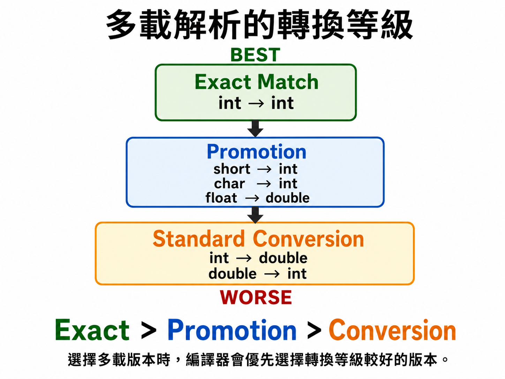

## Section XXIV. 精確符合

```cpp
void show(int);
void show(double);
```

```cpp
show(10);
```

`10` 是 `int`，因此 `show(int)` 是精確符合。

---

## Section XXV. 型別提升

常見提升：

```text
char → int
short → int
float → double
```

提升通常比一般轉換更優先。

---

## Section XXVI. 一般標準轉換

例如：

```text
int → double
double → int
int → char
```

這些通常比精確符合或提升排名低。

---

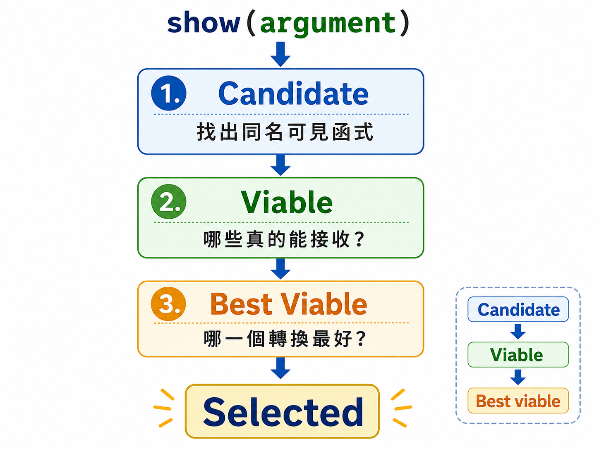

# Part F：整數與浮點多載

## Section XXVII. 字面常數型別

| 寫法 | 常見型別 |
| --- | --- |
| `10` | `int` |
| `10L` | `long` |
| `10LL` | `long long` |
| `2.5` | `double` |
| `2.5f` | `float` |
| `'A'` | `char` |
| `true` | `bool` |

---

## Section XXVIII. `float` 與 `double`

```cpp
void show(float value);
void show(double value);
```

```cpp
show(2.5);
```

選擇：

```cpp
show(double)
```

因為 `2.5` 預設是 `double`。

```cpp
show(2.5f);
```

選擇：

```cpp
show(float)
```

---

## Section XXIX. 完整浮點多載範例

```cpp
// VALIDATE
#include <iostream>
using namespace std;

void show(float value) {
    cout << "float: "
         << value
         << '\n';
}

void show(double value) {
    cout << "double: "
         << value
         << '\n';
}

int main() {
    show(2.5f);
    show(2.5);

    return 0;
}
```

---

## Section XXX. `char` 與 `int`

```cpp
void show(char value);
void show(int value);
```

```cpp
show('A');
```

選擇 `char` 精確版本。

```cpp
show(65);
```

選擇 `int` 精確版本。

---

## Section XXXI. 完整字元多載範例

```cpp
// VALIDATE
#include <iostream>
using namespace std;

void show(char value) {
    cout << "Character: "
         << value
         << '\n';
}

void show(int value) {
    cout << "Integer: "
         << value
         << '\n';
}

int main() {
    show('A');
    show(65);

    return 0;
}
```

---

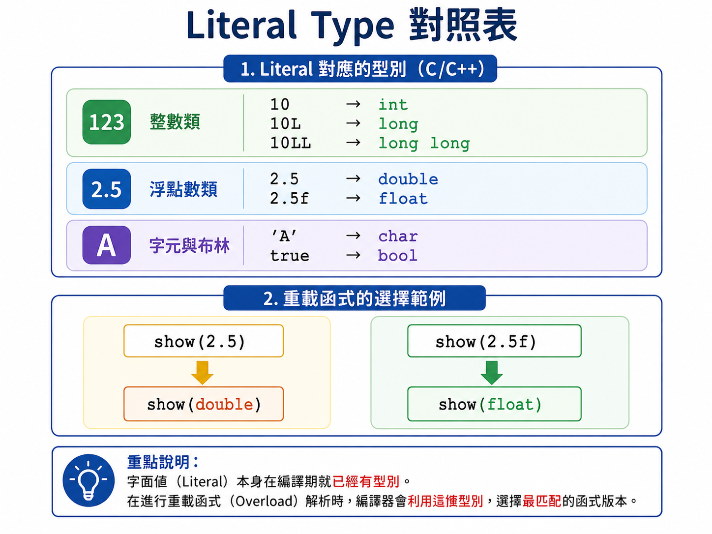

# Part G：型別提升

## Section XXXII. `short` 通常提升為 `int`

假設：

```cpp
void display(int value);
void display(double value);
```

```cpp
short number = 5;
display(number);
```

`short → int` 是整數提升。

`short → double` 是一般轉換。

所以通常選：

```cpp
display(int)
```

---

## Section XXXIII. 完整提升範例

```cpp
// VALIDATE
#include <iostream>
using namespace std;

void display(int value) {
    cout << "int: "
         << value
         << '\n';
}

void display(double value) {
    cout << "double: "
         << value
         << '\n';
}

int main() {
    short number = 5;
    display(number);

    return 0;
}
```

---

## Section XXXIV. `float` 提升為 `double`

若只有：

```cpp
void display(double);
void display(int);
```

`float` 引數通常會優先提升為 `double`，而不是轉成 `int`。

---

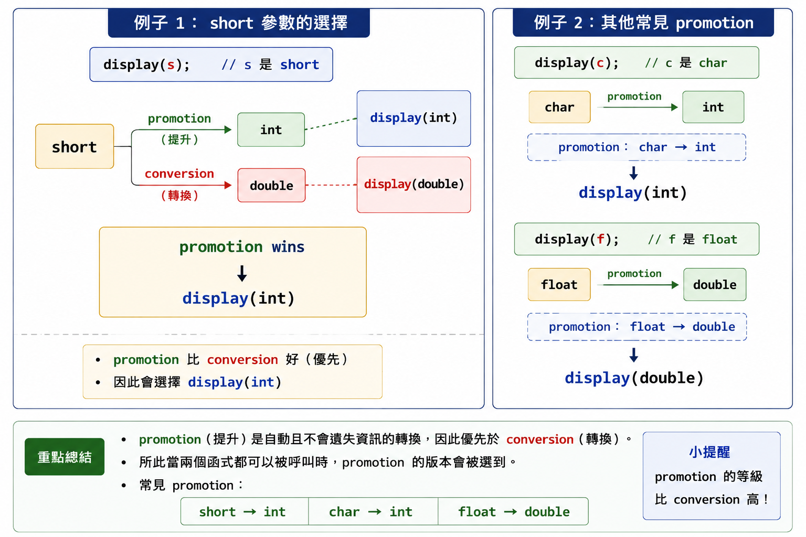

# Part H：歧義呼叫

## Section XXXV. 什麼是歧義？

當兩個或更多可行函式同樣合適，編譯器無法選擇唯一最佳版本。

結果：

```text
編譯錯誤
```

---

## Section XXXVI. 常見歧義例子

```cpp
void process(long value);
void process(double value);
```

呼叫：

```cpp
process(10);
```

`int → long` 與 `int → double` 都屬一般標準轉換。

編譯器可能無法選出更好的版本。

---

## Section XXXVII. 使用明確型別消除歧義

```cpp
process(static_cast<long>(10));
```

或：

```cpp
process(static_cast<double>(10));
```

---

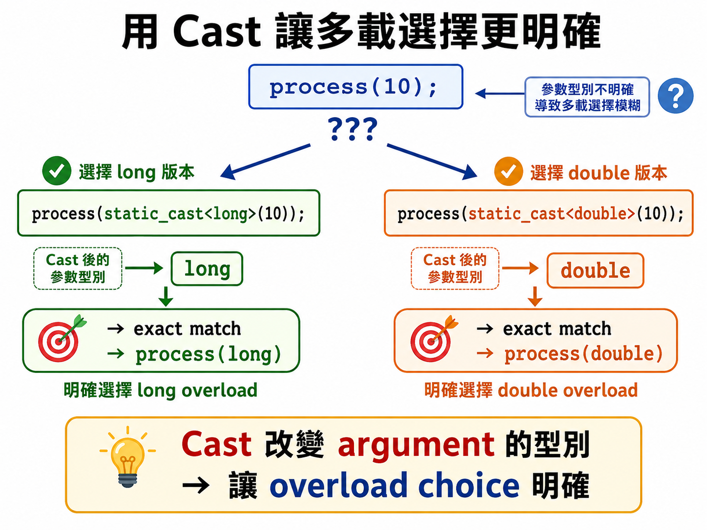

## Section XXXVIII. 完整明確轉型範例

```cpp
// VALIDATE
#include <iostream>
using namespace std;

void process(long value) {
    cout << "long: "
         << value
         << '\n';
}

void process(double value) {
    cout << "double: "
         << value
         << '\n';
}

int main() {
    process(
        static_cast<long>(10)
    );

    process(
        static_cast<double>(10)
    );

    return 0;
}
```

---

## Section XXXIX. 最佳做法

若呼叫者經常需要 `static_cast` 才能選擇版本，可能表示：

- 多載集合太複雜。
- 參數型別太相近。
- 函式名稱應拆開。
- 介面設計不夠清楚。

---

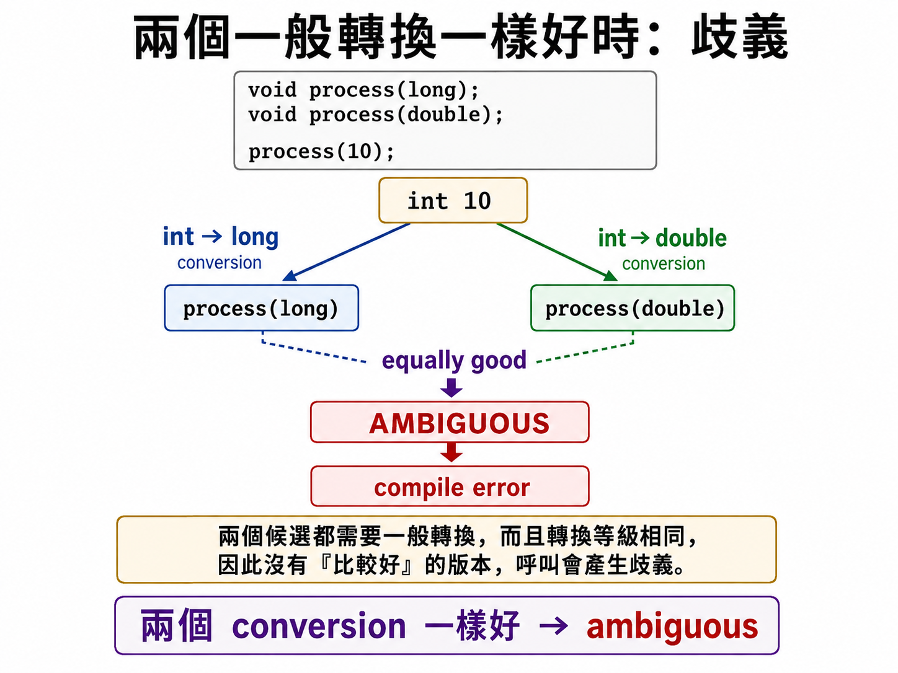

# Part I：預設引數

## Section XL. 基本宣告

```cpp
void drawLine(
    int length,
    char symbol = '*'
);
```

呼叫：

```cpp
drawLine(5);
```

編譯器會視為：

```cpp
drawLine(5, '*');
```

---

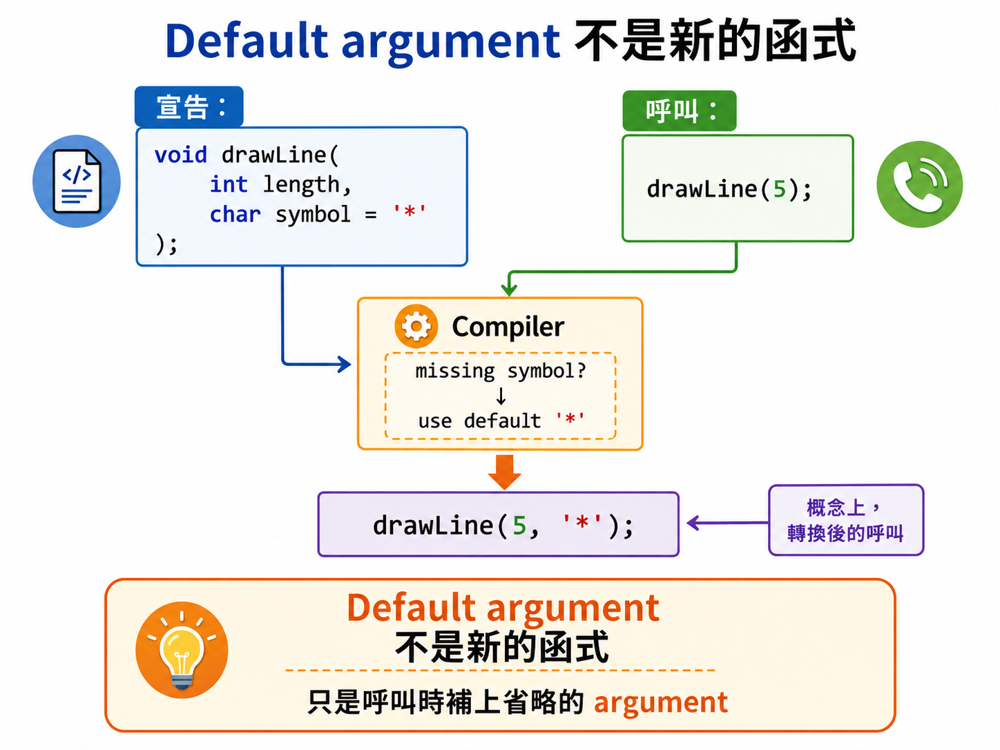

## Section XLI. 完整預設引數範例

```cpp
// VALIDATE
#include <iostream>
using namespace std;

void drawLine(
    int length,
    char symbol = '*'
);

int main() {
    drawLine(5);
    drawLine(3, '#');

    return 0;
}

void drawLine(
    int length,
    char symbol
) {
    for (int count = 0; count < length; ++count) {
        cout << symbol;
    }

    cout << '\n';
}
```

---

## Section XLII. 預設值通常放在宣告

宣告：

```cpp
void drawLine(
    int length,
    char symbol = '*'
);
```

定義：

```cpp
void drawLine(
    int length,
    char symbol
) {
    // ...
}
```

不要在兩處重複預設值。

---

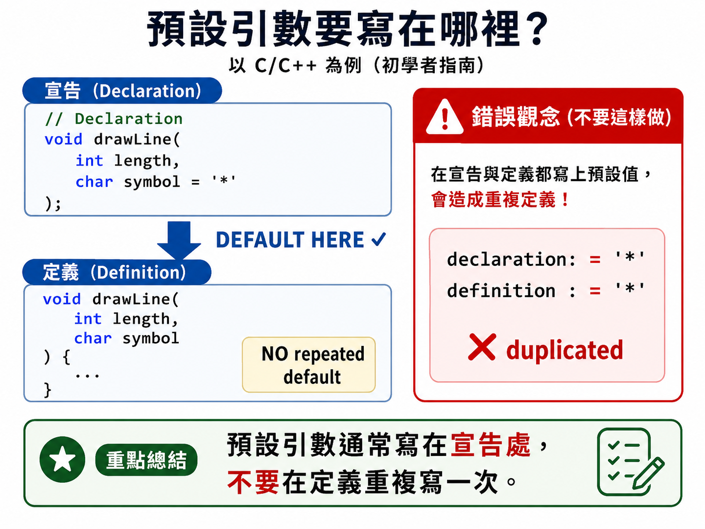

## Section XLIII. 預設值不是新的多載

```cpp
void drawLine(
    int length,
    char symbol = '*'
);
```

仍然只有一個函式：

```cpp
drawLine(int, char)
```

它只是允許呼叫者省略第二個引數。

---

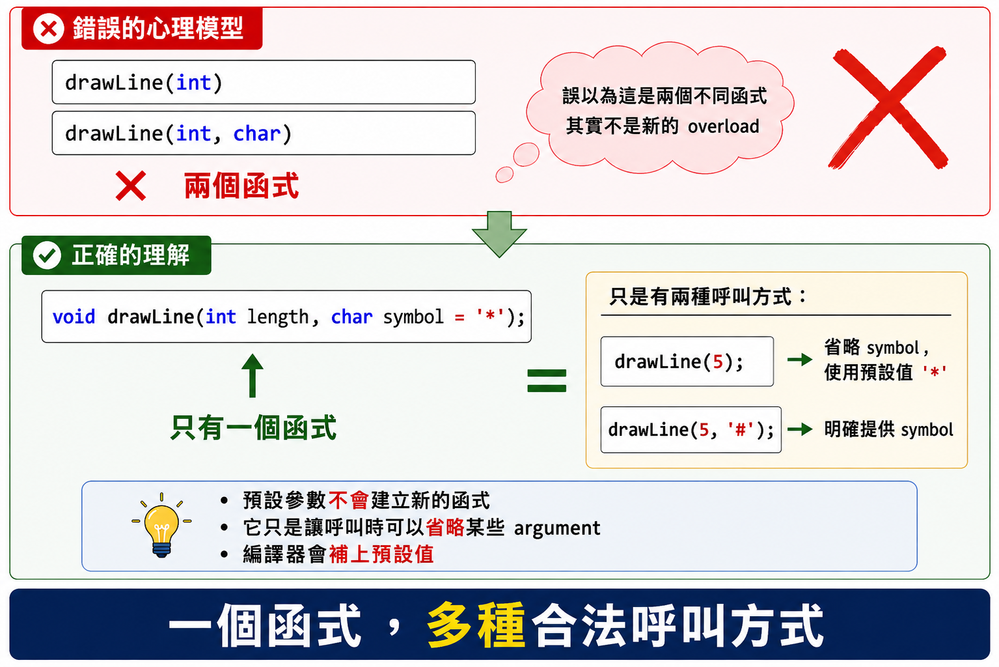

# Part J：多個預設引數

## Section XLIV. 合法排列

```cpp
void configure(
    int level,
    bool enabled = true,
    char mode = 'A'
);
```

可以呼叫：

```cpp
configure(2);
configure(2, false);
configure(2, false, 'B');
```

---

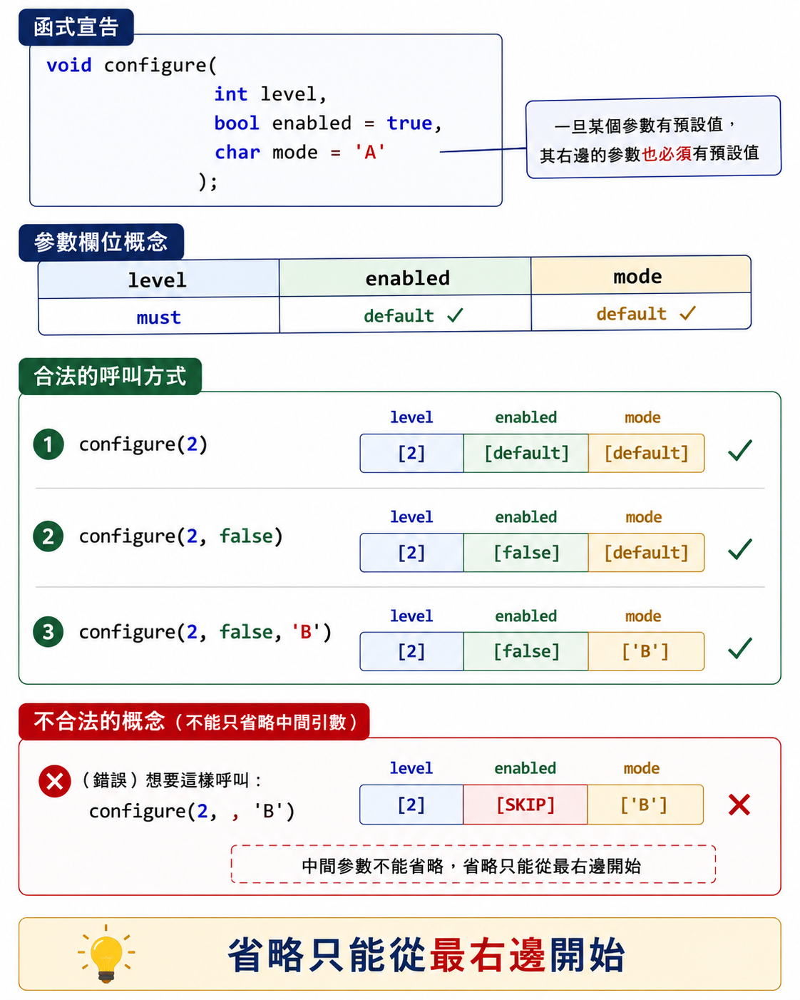

## Section XLV. 不可省略中間引數

不能直接表示：

```text
使用 level
省略 enabled
但指定 mode
```

一般位置引數必須依順序提供。

若要指定 `mode`，也必須先提供 `enabled`。

---

## Section XLVI. 完整多個預設值範例

```cpp
// VALIDATE
#include <iostream>
using namespace std;

void configure(
    int level,
    bool enabled = true,
    char mode = 'A'
);

int main() {
    cout << boolalpha;

    configure(1);
    configure(2, false);
    configure(3, true, 'B');

    return 0;
}

void configure(
    int level,
    bool enabled,
    char mode
) {
    cout << "level="
         << level
         << ", enabled="
         << enabled
         << ", mode="
         << mode
         << '\n';
}
```

---

## Section XLVII. 預設參數必須位於右側

合法：

```cpp
void example(
    int first,
    int second = 10,
    int third = 20
);
```

不合法：

```cpp
/* void example(
    int first = 1,
    int second,
    int third = 3
); */
```

一旦某個參數有預設值，右側參數也必須有預設值。

---

# Part K：預設引數的求值

## Section XLVIII. 每次呼叫時使用

預設引數不是在函式定義時只計算一次。

每次省略該引數時，都會使用預設表示式。

---

## Section XLIX. 函式呼叫作為預設值

```cpp
int nextId();

void createItem(
    int id = nextId()
);
```

每次呼叫：

```cpp
createItem();
```

都會呼叫 `nextId()` 取得預設值。

---

## Section L. 完整動態預設值範例

```cpp
// VALIDATE
#include <iostream>
using namespace std;

int nextId() {
    static int id = 0;

    ++id;
    return id;
}

void createItem(
    int id = nextId()
) {
    cout << "Item "
         << id
         << '\n';
}

int main() {
    createItem();
    createItem();
    createItem(100);

    return 0;
}
```

輸出：

```text
Item 1
Item 2
Item 100
```

> `static` 區域變數會保留前一次呼叫後的值。它的完整生命週期與用途會在後續章節進一步說明。

---

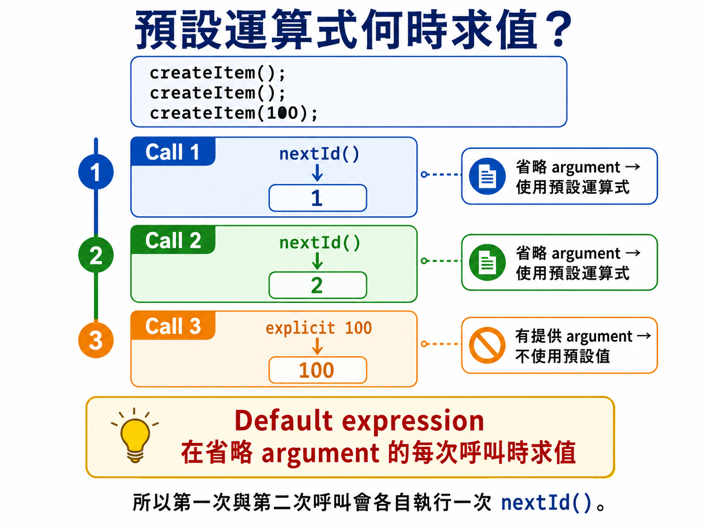

# Part L：多載與預設引數的衝突

## Section LI. 危險組合

```cpp
void show(int value);

void show(
    int value,
    int width = 0
);
```

呼叫：

```cpp
show(10);
```

兩個版本都可行：

```text
show(int)
show(int, int = 0)
```

因此呼叫歧義。

---

## Section LII. 不要設計成可重疊

不建議：

```cpp
void print(int value);
void print(int value, bool newline = true);
```

建議選擇其中一種：

```cpp
void print(int value, bool newline = true);
```

或使用清楚不同名稱：

```cpp
void print(int value);
void printWithOptions(int value, bool newline);
```

---

## Section LIII. 另一種重疊

```cpp
void calculate(double value);

void calculate(
    int value,
    int scale = 1
);
```

不同呼叫可能涉及：

- 精確符合
- 隱性轉換
- 預設引數
- 多個可行版本

雖然某些呼叫仍可解析，但介面理解成本提高。

---

## Section LIV. 設計原則

多載與預設引數同時使用時：

1. 列出每個可能的實際呼叫參數數量。
2. 確保每一種常見呼叫只有一個明顯版本。
3. 避免依賴細微型別轉換排名。
4. 避免一個引數數量對應多個版本。
5. 必要時改用不同函式名稱。

---

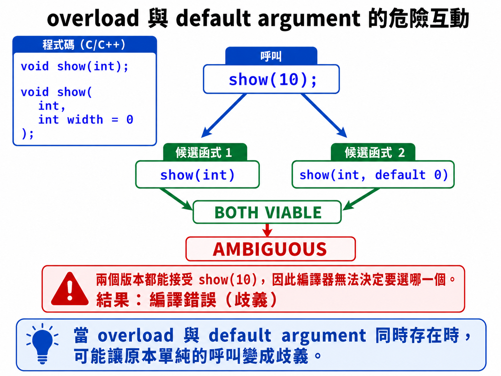

# Part M：多載與預設引數的選擇

## Section LV. 使用多載

適合：

```text
相同概念
但輸入型別或輸入形狀不同
```

例如：

```cpp
maximum(int, int)
maximum(double, double)
```

---

## Section LVI. 使用預設引數

適合：

```text
同一個函式
其中部分選項有常見預設值
```

例如：

```cpp
drawLine(length, symbol = '*')
```

---

## Section LVII. 使用不同名稱

適合：

```text
行為本質不同
或多載版本容易產生歧義
```

例如：

```cpp
parseInteger(...)
parseFloatingPoint(...)
```

可能比全部叫：

```cpp
parse(...)
```

更清楚。

---

## Section LVIII. 比較表

| 問題 | 建議 |
| --- | --- |
| 相同概念，不同型別 | 多載 |
| 相同概念，不同參數數量 | 多載 |
| 選項有常用預設值 | 預設引數 |
| 行為不同 | 不同函式名稱 |
| 多載與預設值造成重疊 | 重新設計 |
| 呼叫經常需要轉型 | 簡化介面 |

---

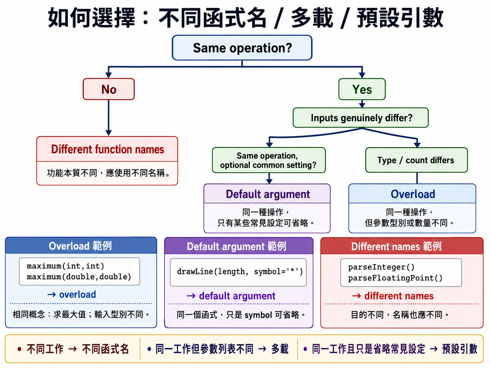

# Part N：面積函式多載

## Section LIX. 正方形與長方形

```cpp
double area(double side);

double area(
    double width,
    double height
);
```

相同概念：

```text
計算面積
```

輸入數量不同。

---

## Section LX. 完整面積多載範例

```cpp
// VALIDATE
#include <iostream>
using namespace std;

double area(double side) {
    return side * side;
}

double area(
    double width,
    double height
) {
    return width * height;
}

int main() {
    cout << area(5.0)
         << '\n';

    cout << area(5.0, 3.0)
         << '\n';

    return 0;
}
```

---

## Section LXI. 多載語意應一致

兩個 `area()` 都應：

```text
接收尺寸
回傳面積
```

不應讓其中一個版本突然：

- 輸出文字
- 修改全域狀態
- 回傳周長
- 讀取鍵盤輸入

---

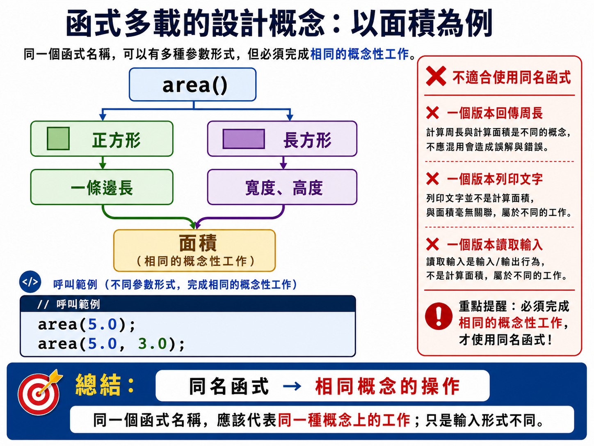

# Part O：字串與數值多載

## Section LXII. 不同資料表示

可以建立：

```cpp
void printValue(int value);
void printValue(double value);
void printValue(const string& value);
```

它們都表示：

```text
顯示一個值
```

---

## Section LXIII. 完整多型別顯示範例

```cpp
// VALIDATE
#include <iostream>
#include <string>
using namespace std;

void printValue(int value) {
    cout << "int: "
         << value
         << '\n';
}

void printValue(double value) {
    cout << "double: "
         << value
         << '\n';
}

void printValue(
    const string& value
) {
    cout << "string: "
         << value
         << '\n';
}

int main() {
    printValue(10);
    printValue(2.5);

    string text =
        "C++";

    printValue(text);

    return 0;
}
```

---

## Section LXIV. 字串字面常數注意事項

呼叫：

```cpp
printValue("C++");
```

`"C++"` 的型別不是 `string`，而是字元陣列。

它可以轉換成 `string`，但若多載集合中還有：

```cpp
printValue(const char*)
```

編譯器通常會優先選更直接符合的 `const char*` 版本。

初學時避免加入過多非常接近的字串多載。

---

# Part P：函式指標與多載

## Section LXV. 多載名稱本身不一定唯一

假設：

```cpp
void show(int);
void show(double);
```

單獨寫：

```cpp
show
```

代表一個多載集合，不一定能直接決定是哪個函式。

---

## Section LXVI. 由函式指標型別決定

```cpp
void (*functionPointer)(int) =
    show;
```

指標型別要求：

```cpp
void(int)
```

因此選擇 `show(int)`。

---

## Section LXVII. 完整函式指標範例

```cpp
// VALIDATE
#include <iostream>
using namespace std;

void show(int value) {
    cout << "int: "
         << value
         << '\n';
}

void show(double value) {
    cout << "double: "
         << value
         << '\n';
}

int main() {
    void (*showInteger)(int) =
        static_cast<void (*)(int)>(
            show
        );

    void (*showDouble)(double) =
        static_cast<void (*)(double)>(
            show
        );

    showInteger(10);
    showDouble(2.5);

    return 0;
}
```

> 函式指標的完整語法與應用會在進階章節說明。本例只展示多載名稱需要目標型別才能確定版本。

---

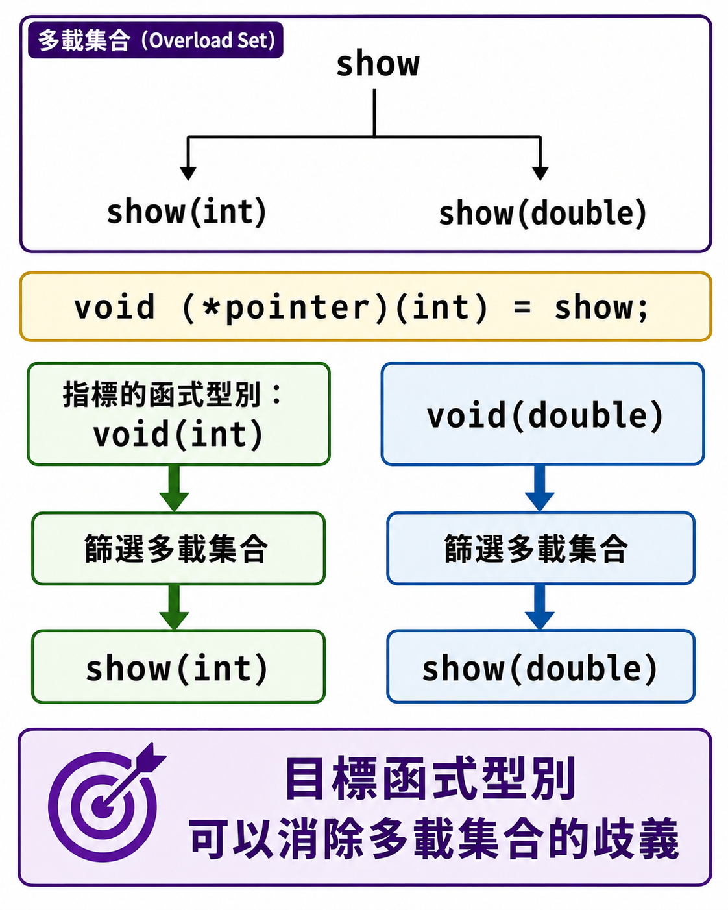

# Part Q：避免過度多載

## Section LXVIII. 太多數值版本

例如同時建立：

```cpp
process(bool)
process(char)
process(short)
process(int)
process(long)
process(float)
process(double)
```

可能造成：

- 字面常數選擇不直覺。
- 隱性轉換規則難以判斷。
- 呼叫容易歧義。
- 維護成本增加。

---

## Section LXIX. 保留真正需要的版本

只建立實際有不同處理需求的版本。

若所有版本程式碼幾乎相同，之後可以考慮：

- 統一使用一個型別。
- 明確轉型。
- 使用函式模板。
- 使用不同資料模型。

---

## Section LXX. `bool` 特別容易造成意外轉換

許多數值可以轉換成 `bool`：

```text
0 → false
非 0 → true
```

因此：

```cpp
process(bool)
```

與數值多載一起存在時，可能增加理解成本。

不要只為了方便而建立沒有必要的 `bool` 多載。

---

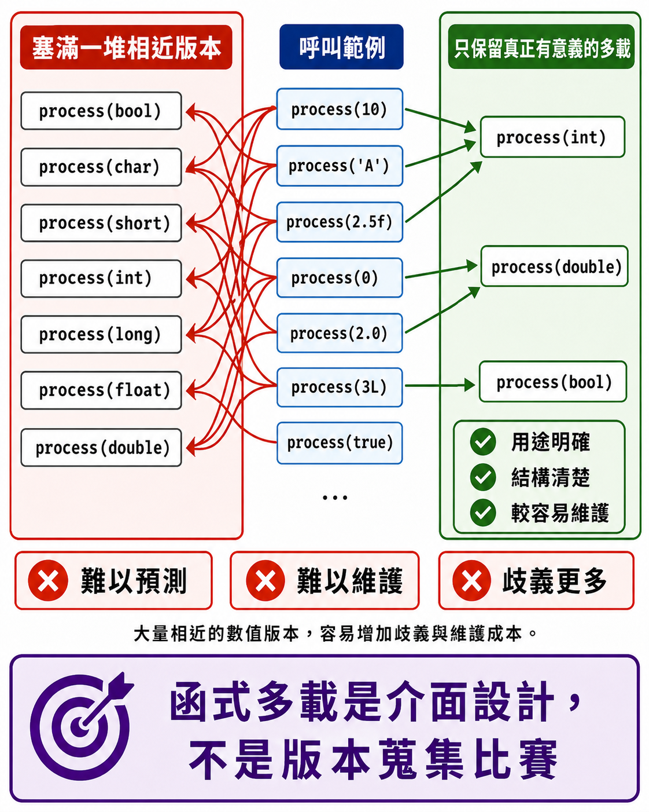

# Part R：快速概念檢查

## Section LXXI. 選擇題與簡答

### Q1. 什麼是函式多載？

<details><summary>查看答案</summary>

在同一作用域中，讓多個函式共用名稱，但具有不同參數列表。

</details>

### Q2. 參數名稱不同可以形成多載嗎？

<details><summary>查看答案</summary>

不可以。

</details>

### Q3. 只改回傳型別可以形成多載嗎？

<details><summary>查看答案</summary>

不可以。

</details>

### Q4. `void f(int)` 與 `void f(const int)` 是不同多載嗎？

<details><summary>查看答案</summary>

不是。傳值參數的頂層 `const` 不形成不同簽章。

</details>

### Q5. `void f(int&)` 與 `void f(const int&)` 可以多載嗎？

<details><summary>查看答案</summary>

可以。

</details>

### Q6. 一般可修改變數會優先綁定哪個版本？

<details><summary>查看答案</summary>

通常優先綁定 `T&`，而不是 `const T&`。

</details>

### Q7. 暫時值可以綁定到一般 `int&` 嗎？

<details><summary>查看答案</summary>

不可以，但可以綁定到 `const int&`。

</details>

### Q8. 多載解析的簡化優先順序是什麼？

<details><summary>查看答案</summary>

精確符合、型別提升、一般標準轉換。

</details>

### Q9. `2.5` 的常見型別是什麼？

<details><summary>查看答案</summary>

`double`。

</details>

### Q10. `2.5f` 的型別是什麼？

<details><summary>查看答案</summary>

`float`。

</details>

### Q11. `short` 通常可提升成什麼？

<details><summary>查看答案</summary>

`int`。

</details>

### Q12. 什麼是歧義呼叫？

<details><summary>查看答案</summary>

有多個同樣合適的可行函式，編譯器無法選出唯一最佳版本。

</details>

### Q13. 如何明確指定想要的型別版本？

<details><summary>查看答案</summary>

可以使用 `static_cast`，或直接使用正確型別的變數或字面常數。

</details>

### Q14. 預設引數會建立新的函式嗎？

<details><summary>查看答案</summary>

不會。

</details>

### Q15. 預設引數通常放在哪裡？

<details><summary>查看答案</summary>

函式宣告中。

</details>

### Q16. 有預設值的參數為什麼要靠右排列？

<details><summary>查看答案</summary>

呼叫時只能從最右側開始省略引數。

</details>

### Q17. 可以省略第二個引數但提供第三個引數嗎？

<details><summary>查看答案</summary>

一般位置引數語法不可以。

</details>

### Q18. `f(int)` 與 `f(int, int = 0)` 可以安全共存嗎？

<details><summary>查看答案</summary>

呼叫 `f(5)` 時會歧義，因此不應如此設計。

</details>

### Q19. 何時適合使用預設引數？

<details><summary>查看答案</summary>

同一個操作的某些選項有自然且常用的預設值時。

</details>

### Q20. 何時應使用不同函式名稱？

<details><summary>查看答案</summary>

行為本質不同，或多載集合容易造成歧義與誤解時。

</details>

---

# Part S：程式閱讀練習

## Section LXXII. 預測選擇的版本

### 題目 1

```cpp
void show(int value) {
    cout << "I";
}

void show(double value) {
    cout << "D";
}

show(10);
```

<details><summary>查看答案</summary>

```text
I
```

`10` 是 `int`。

</details>

### 題目 2

```cpp
void show(float value) {
    cout << "F";
}

void show(double value) {
    cout << "D";
}

show(2.5);
```

<details><summary>查看答案</summary>

```text
D
```

`2.5` 是 `double`。

</details>

### 題目 3

```cpp
void show(float value) {
    cout << "F";
}

void show(double value) {
    cout << "D";
}

show(2.5f);
```

<details><summary>查看答案</summary>

```text
F
```

</details>

### 題目 4

```cpp
void show(char value) {
    cout << "C";
}

void show(int value) {
    cout << "I";
}

show('A');
show(65);
```

<details><summary>查看答案</summary>

```text
CI
```

</details>

### 題目 5

```cpp
void inspect(int& value) {
    cout << "M";
}

void inspect(const int& value) {
    cout << "C";
}

int number = 5;
const int fixed = 6;

inspect(number);
inspect(fixed);
inspect(7);
```

<details><summary>查看答案</summary>

```text
MCC
```

</details>

### 題目 6

```cpp
void draw(
    int length,
    char symbol = '*'
) {
    cout << length << symbol;
}

draw(3);
```

<details><summary>查看答案</summary>

```text
3*
```

</details>

### 題目 7

```cpp
void configure(
    int level,
    bool enabled = true,
    char mode = 'A'
) {
    cout << boolalpha
         << level
         << enabled
         << mode;
}

configure(2, false);
```

<details><summary>查看答案</summary>

```text
2falseA
```

</details>

### 題目 8

```cpp
int maximum(int a, int b) {
    return a > b ? a : b;
}

int maximum(int a, int b, int c) {
    return maximum(maximum(a, b), c);
}

cout << maximum(2, 8, 5);
```

<details><summary>查看答案</summary>

```text
8
```

</details>

### 題目 9

```cpp
void process(long value) {
    cout << "L";
}

void process(double value) {
    cout << "D";
}

/* process(10); */
```

<details><summary>查看答案</summary>

這個呼叫可能歧義，因為 `int → long` 與 `int → double` 都是一般標準轉換。

</details>

### 題目 10

```cpp
void test(int value) {
    cout << "A";
}

void test(
    int value,
    int extra = 0
) {
    cout << "B";
}

/* test(5); */
```

<details><summary>查看答案</summary>

歧義。兩個版本都可以接收一個 `int` 引數。

</details>

### 題目 11

```cpp
void output(int value) {
    cout << "I";
}

void output(double value) {
    cout << "D";
}

short number = 4;
output(number);
```

<details><summary>查看答案</summary>

```text
I
```

`short → int` 是整數提升。

</details>

### 題目 12

```cpp
int nextValue() {
    static int value = 0;
    return ++value;
}

void show(int value = nextValue()) {
    cout << value;
}

show();
show();
show(9);
```

<details><summary>查看答案</summary>

```text
129
```

預設表示式在每次省略引數時求值。

</details>

---

# Part T：實作練習

## Section LXXIII. 實作檢測題

### TODO 1：數值顯示多載

建立：

```cpp
void show(int value)
void show(double value)
```

讓輸出標示目前版本。

### TODO 2：三種型別

再加入：

```cpp
void show(char value)
```

測試整數、浮點數與字元字面常數。

### TODO 3：兩數與三數最大值

建立兩個 `maximum()` 多載。

### TODO 4：不同參數順序

建立：

```cpp
repeat(int count, char symbol)
repeat(char symbol, int count)
```

第二個版本呼叫第一個版本。

### TODO 5：面積多載

建立：

```cpp
area(side)
area(width, height)
```

### TODO 6：傳值頂層 `const`

解釋為什麼不能同時定義：

```cpp
process(int)
process(const int)
```

### TODO 7：參考多載

建立：

```cpp
inspect(int&)
inspect(const int&)
```

測試一般變數、常數與字面常數。

### TODO 8：浮點字面常數

建立 `float` 與 `double` 多載，測試 `2.5f` 和 `2.5`。

### TODO 9：明確轉型

建立 `long` 與 `double` 多載，使用 `static_cast` 明確呼叫兩個版本。

### TODO 10：線條預設符號

建立：

```cpp
drawLine(int length, char symbol = '*')
```

### TODO 11：多個預設引數

建立：

```cpp
configure(
    int level,
    bool enabled = true,
    char mode = 'A'
)
```

測試三種不同引數數量。

### TODO 12：動態預設值

建立一個每次回傳新編號的函式，作為另一函式的預設引數。

### TODO 13：找出歧義

分析：

```cpp
print(int)
print(int, bool = true)
```

並重新設計成不歧義的介面。

### TODO 14：多型別輸出

為 `int`、`double` 與 `const string&` 建立 `printValue()`。

### TODO 15：函式指標指定多載

使用函式指標分別指向：

```cpp
show(int)
show(double)
```

---

# Part U：課後小練習

## Section LXXIV. 延伸練習

### 練習 1：距離函式

建立：

```cpp
distance(x)
distance(x1, x2)
```

第一個計算到原點距離，第二個計算兩點的一維距離。

### 練習 2：格式化價格

建立：

```cpp
showPrice(double value, int decimalPlaces = 2)
```

使用 `<iomanip>` 控制小數位數。

### 練習 3：警告訊息

建立：

```cpp
showWarning(const string& message, char border = '!')
```

### 練習 4：範圍檢查多載

建立整數與浮點版本：

```cpp
isInRange(value, minimum, maximum)
```

### 練習 5：重新設計歧義介面

給定多個數值型別多載，減少版本數量並讓呼叫意圖更明確。

---

# Part V：常見錯誤提醒

## Section LXXV. 常見錯誤

1. 以為參數名稱不同就能多載。
2. 只改回傳型別。
3. 將傳值參數的頂層 `const` 當成不同簽章。
4. 函式宣告與定義的參數列表不一致。
5. 多載版本的語意完全不同。
6. 建立太多相近的整數型別版本。
7. 建立太多相近的浮點型別版本。
8. 沒有判斷字面常數的實際型別。
9. 忘記 `2.5` 是 `double`。
10. 忘記 `2.5f` 才是 `float`。
11. 忘記字元字面常數是 `char`。
12. 不了解 `short` 通常提升成 `int`。
13. 認為編譯器會隨意挑選歧義版本。
14. 依賴危險或不清楚的隱性轉換。
15. 使用過多 `static_cast` 才能正常呼叫。
16. 暫時值傳給非 `const` 左值參考。
17. 以為 `const T&` 可以修改原資料。
18. 預設引數沒有從右側開始。
19. 想省略中間引數。
20. 在宣告與定義重複指定預設值。
21. 以為預設引數會建立另一個函式。
22. 以為預設值只在程式啟動時計算一次。
23. 多載和預設引數提供相同有效引數數量。
24. 建立 `f(int)` 與 `f(int, int = 0)`。
25. `bool` 多載吸收非零數值造成意外。
26. 多載集合中加入過多可隱性轉換的版本。
27. 函式指標沒有提供目標型別。
28. 字串字面常數在 `string` 與 `const char*` 多載間選擇不如預期。
29. 為了展示語法而建立難以維護的介面。
30. 沒有測試邊界型別與省略引數的呼叫。

---

# Part W：Mermaid 流程圖

## Section LXXVI. 多載與預設引數流程圖

### 1. 多載解析

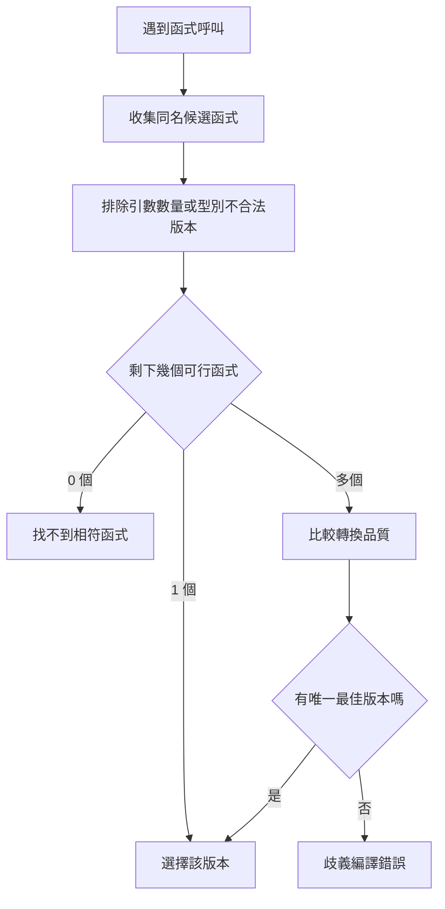
```mermaid
flowchart TD
    A[遇到函式呼叫] --> B[收集同名候選函式]
    B --> C[排除引數數量或型別不合法版本]
    C --> D{剩下幾個可行函式}
    D -- 0 個 --> E[找不到相符函式]
    D -- 1 個 --> F[選擇該版本]
    D -- 多個 --> G[比較轉換品質]
    G --> H{有唯一最佳版本嗎}
    H -- 是 --> F
    H -- 否 --> I[歧義編譯錯誤]
```

### 2. 轉換優先順序

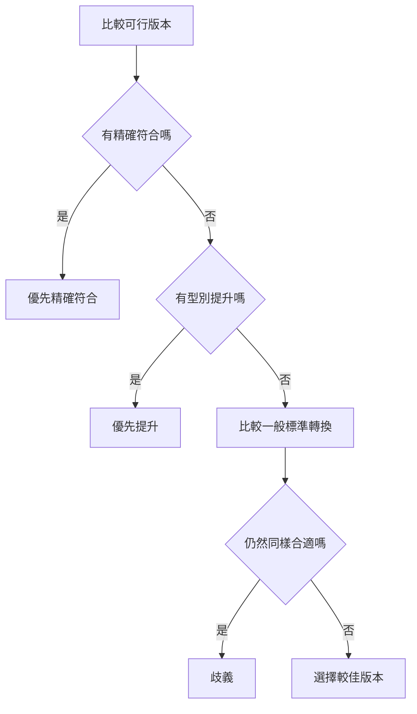
```mermaid
flowchart TD
    A[比較可行版本] --> B{有精確符合嗎}
    B -- 是 --> C[優先精確符合]
    B -- 否 --> D{有型別提升嗎}
    D -- 是 --> E[優先提升]
    D -- 否 --> F[比較一般標準轉換]
    F --> G{仍然同樣合適嗎}
    G -- 是 --> H[歧義]
    G -- 否 --> I[選擇較佳版本]
```

### 3. 預設引數

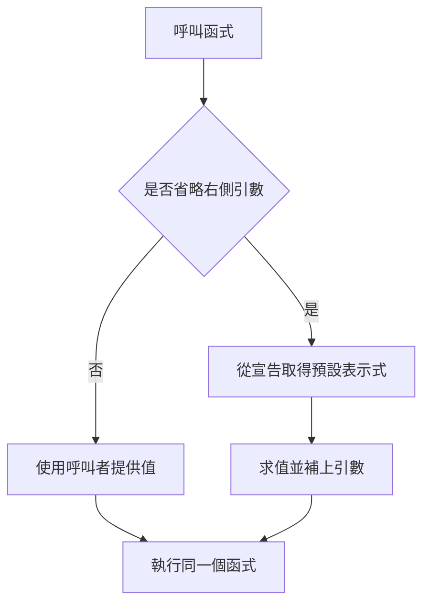
```mermaid
flowchart TD
    A[呼叫函式] --> B{是否省略右側引數}
    B -- 否 --> C[使用呼叫者提供值]
    B -- 是 --> D[從宣告取得預設表示式]
    D --> E[求值並補上引數]
    C --> F[執行同一個函式]
    E --> F
```

### 4. 參考多載

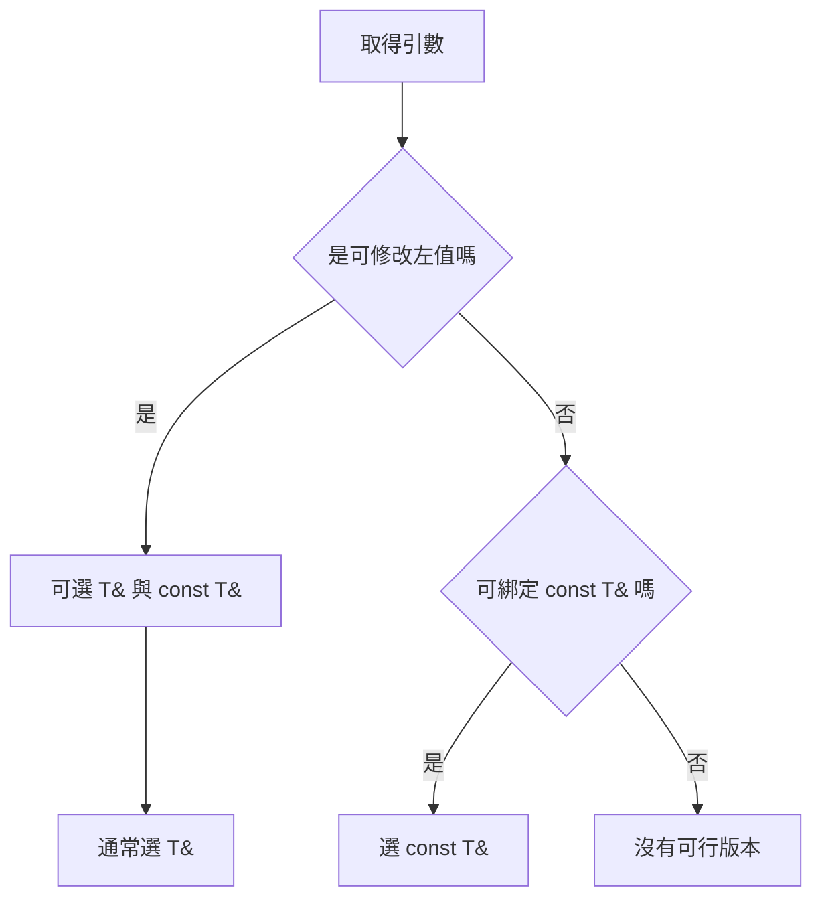
```mermaid
flowchart TD
    A[取得引數] --> B{是可修改左值嗎}
    B -- 是 --> C[可選 T& 與 const T&]
    C --> D[通常選 T&]
    B -- 否 --> E{可綁定 const T& 嗎}
    E -- 是 --> F[選 const T&]
    E -- 否 --> G[沒有可行版本]
```

### 5. 多載與預設值衝突

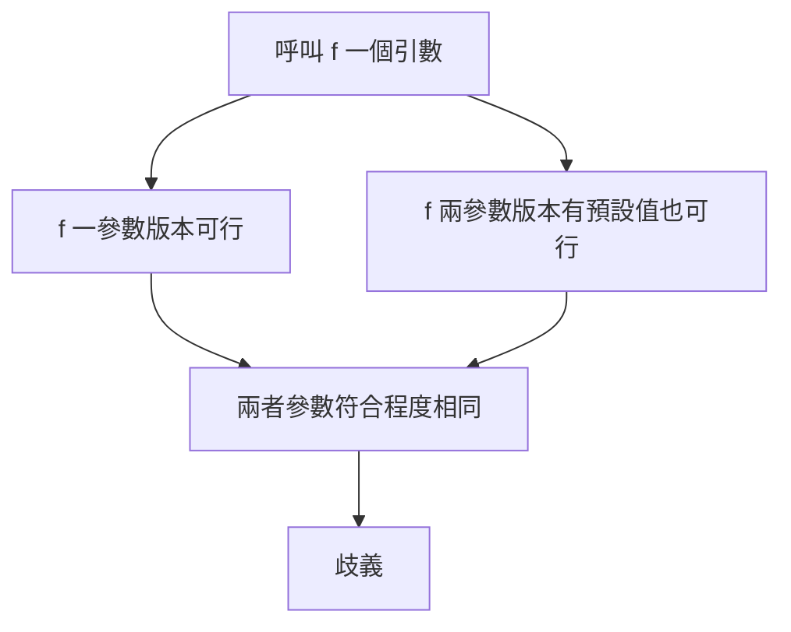
```mermaid
flowchart TD
    A[呼叫 f 一個引數] --> B[f 一參數版本可行]
    A --> C[f 兩參數版本有預設值也可行]
    B --> D[兩者參數符合程度相同]
    C --> D
    D --> E[歧義]
```

### 6. 選擇介面方式

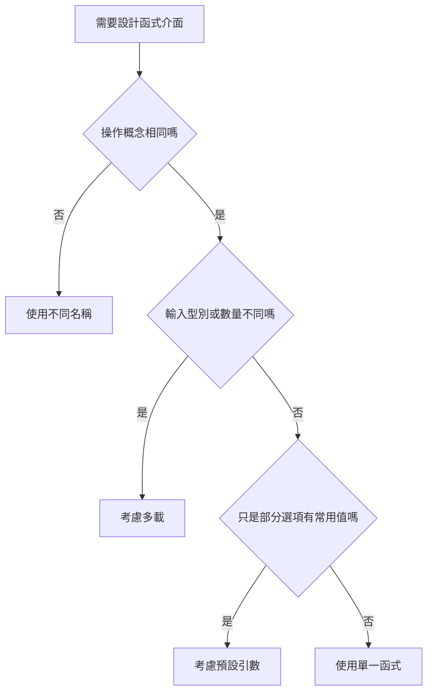
```mermaid
flowchart TD
    A[需要設計函式介面] --> B{操作概念相同嗎}
    B -- 否 --> C[使用不同名稱]
    B -- 是 --> D{輸入型別或數量不同嗎}
    D -- 是 --> E[考慮多載]
    D -- 否 --> F{只是部分選項有常用值嗎}
    F -- 是 --> G[考慮預設引數]
    F -- 否 --> H[使用單一函式]
```

### 7. 消除歧義

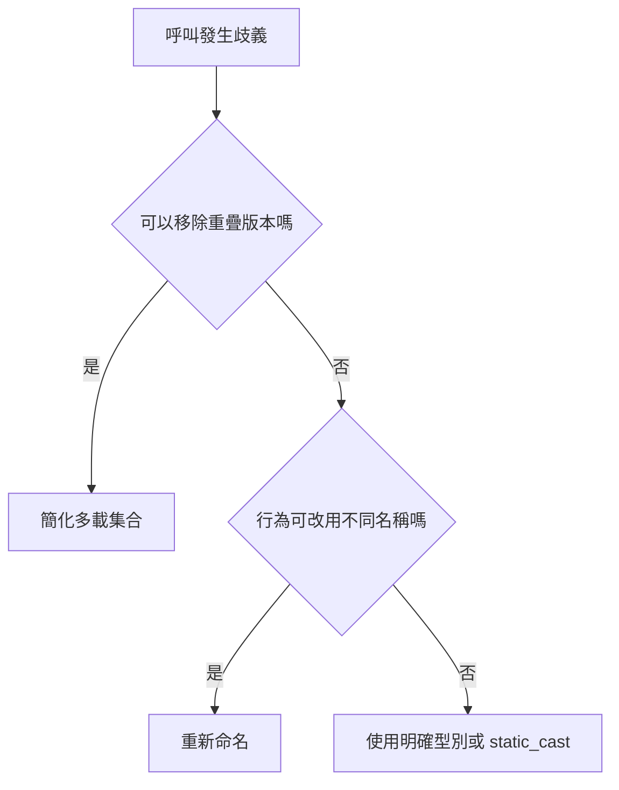
```mermaid
flowchart TD
    A[呼叫發生歧義] --> B{可以移除重疊版本嗎}
    B -- 是 --> C[簡化多載集合]
    B -- 否 --> D{行為可改用不同名稱嗎}
    D -- 是 --> E[重新命名]
    D -- 否 --> F[使用明確型別或 static_cast]
```

### 8. 預設引數排列

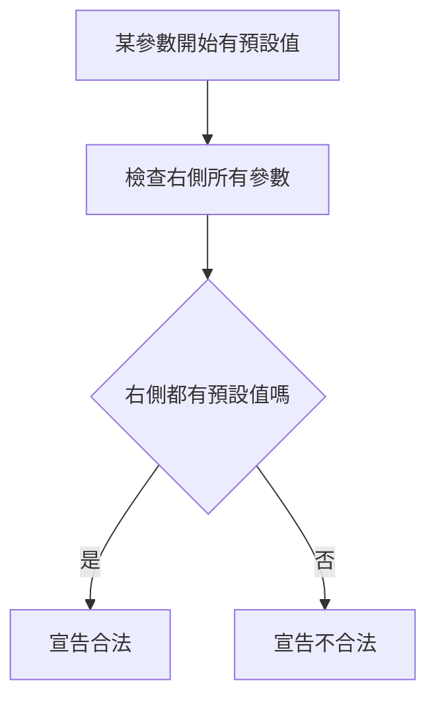
```mermaid
flowchart TD
    A[某參數開始有預設值] --> B[檢查右側所有參數]
    B --> C{右側都有預設值嗎}
    C -- 是 --> D[宣告合法]
    C -- 否 --> E[宣告不合法]
```

---

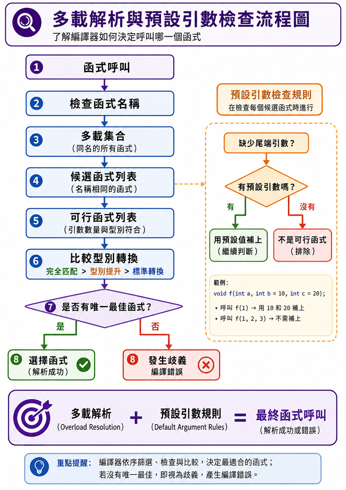

# 本章完成標準

完成本章後，你應該能做到：

1. 說明函式多載。
2. 建立不同參數數量的多載。
3. 建立不同參數型別的多載。
4. 建立不同參數順序的多載。
5. 說明參數名稱不影響簽章。
6. 說明只改回傳型別不能多載。
7. 說明傳值頂層 `const` 不形成多載。
8. 建立 `T&` 與 `const T&` 多載。
9. 判斷一般變數、常數與暫時值的參考綁定。
10. 說明多載集合。
11. 分辨候選函式與可行函式。
12. 說明最佳可行函式。
13. 使用精確型別符合。
14. 說明整數與浮點提升。
15. 分辨精確符合、提升與一般轉換。
16. 判斷常見字面常數型別。
17. 分辨 `2.5` 與 `2.5f`。
18. 判斷 `char`、`short` 的常見多載選擇。
19. 找出歧義呼叫。
20. 使用 `static_cast` 消除歧義。
21. 撰寫預設引數。
22. 將預設值放在函式宣告。
23. 避免重複指定預設值。
24. 將有預設值的參數放在右側。
25. 使用一個或多個預設引數。
26. 說明不能省略中間引數。
27. 說明預設引數不建立新函式。
28. 說明預設表示式在呼叫時求值。
29. 找出多載與預設引數的重疊。
30. 避免 `f(int)` 與 `f(int, int = 0)`。
31. 判斷何時使用多載。
32. 判斷何時使用預設引數。
33. 判斷何時使用不同名稱。
34. 建立面積函式多載。
35. 建立多型別輸出函式。
36. 使用 `const string&`。
37. 使用目標函式指標型別選擇多載版本。
38. 避免過度多載。
39. 維持多載版本的語意一致。
40. 找出常見多載與預設引數錯誤。

---

# 隱藏答案區

> Answer hidden — try it first.

<details><summary>TODO 1 答案</summary>

```cpp
void show(int value) {
    cout << "int: "
         << value
         << '\n';
}

void show(double value) {
    cout << "double: "
         << value
         << '\n';
}
```

</details>

<details><summary>TODO 2 答案</summary>

```cpp
void show(char value) {
    cout << "char: "
         << value
         << '\n';
}
```

測試：

```cpp
show(10);
show(2.5);
show('A');
```

</details>

<details><summary>TODO 3 答案</summary>

```cpp
int maximum(int first, int second) {
    return first > second ? first : second;
}

int maximum(
    int first,
    int second,
    int third
) {
    return maximum(
        maximum(first, second),
        third
    );
}
```

</details>

<details><summary>TODO 4 答案</summary>

```cpp
void repeat(int count, char symbol) {
    for (int index = 0; index < count; ++index) {
        cout << symbol;
    }

    cout << '\n';
}

void repeat(char symbol, int count) {
    repeat(count, symbol);
}
```

</details>

<details><summary>TODO 5 答案</summary>

```cpp
double area(double side) {
    return side * side;
}

double area(
    double width,
    double height
) {
    return width * height;
}
```

</details>

<details><summary>TODO 6 答案</summary>

傳值時參數是副本：

```cpp
void process(int value);
```

與：

```cpp
void process(const int value);
```

在呼叫介面上相同。`const` 只限制函式內是否能修改副本，因此不能形成兩個不同多載。

</details>

<details><summary>TODO 7 答案</summary>

```cpp
void inspect(int& value) {
    cout << "mutable\n";
}

void inspect(const int& value) {
    cout << "const or temporary\n";
}
```

</details>

<details><summary>TODO 8 答案</summary>

```cpp
void show(float value) {
    cout << "float\n";
}

void show(double value) {
    cout << "double\n";
}
```

呼叫：

```cpp
show(2.5f);
show(2.5);
```

</details>

<details><summary>TODO 9 答案</summary>

```cpp
process(
    static_cast<long>(10)
);

process(
    static_cast<double>(10)
);
```

</details>

<details><summary>TODO 10 答案</summary>

宣告：

```cpp
void drawLine(
    int length,
    char symbol = '*'
);
```

定義：

```cpp
void drawLine(
    int length,
    char symbol
) {
    for (int count = 0; count < length; ++count) {
        cout << symbol;
    }

    cout << '\n';
}
```

</details>

<details><summary>TODO 11 答案</summary>

```cpp
void configure(
    int level,
    bool enabled = true,
    char mode = 'A'
);
```

呼叫：

```cpp
configure(1);
configure(2, false);
configure(3, true, 'B');
```

</details>

<details><summary>TODO 12 答案</summary>

```cpp
int nextId() {
    static int id = 0;
    return ++id;
}

void createItem(
    int id = nextId()
) {
    cout << id << '\n';
}
```

</details>

<details><summary>TODO 13 答案</summary>

原設計：

```cpp
print(int)
print(int, bool = true)
```

呼叫 `print(5)` 歧義。

可只保留：

```cpp
void print(
    int value,
    bool newline = true
);
```

或重新命名第二個版本：

```cpp
void print(int value);
void printWithOptions(
    int value,
    bool newline
);
```

</details>

<details><summary>TODO 14 答案</summary>

```cpp
void printValue(int value) {
    cout << value << '\n';
}

void printValue(double value) {
    cout << value << '\n';
}

void printValue(
    const string& value
) {
    cout << value << '\n';
}
```

</details>

<details><summary>TODO 15 答案</summary>

```cpp
void (*showInteger)(int) =
    static_cast<void (*)(int)>(
        show
    );

void (*showDouble)(double) =
    static_cast<void (*)(double)>(
        show
    );
```

</details>
