# Lesson 14：References and `const` 參考與 `const`

> 這堂課的重點：理解 C++ 的參考是既有物件的別名，並學習如何使用 `const` 表達「這份資料不應被修改」。你會進一步掌握傳參考、`const` 參考、暫時值綁定、`auto&`、`const auto&`、回傳參考、生命週期與懸空參考。

> 第 12 章已介紹傳值、傳參考與 `const` 參考的基本用法。本章會從「參考本身是什麼」開始，深入分析參考初始化、別名效果、不可重新綁定、`const` 的位置與意義、參考回傳，以及如何維持 const-correctness。右值參考、移動語意與 `std::move` 不在本章範圍內。

---

## Section I. 今天要做什麼？

1. 複習傳值與傳參考。
2. 認識參考 reference。
3. 理解參考是既有物件的別名。
4. 使用 `&` 宣告左值參考。
5. 理解參考必須在宣告時初始化。
6. 理解一般參考不能沒有綁定目標。
7. 理解參考不是另一份獨立資料。
8. 透過參考讀取原物件。
9. 透過參考修改原物件。
10. 比較原變數與參考的位址。
11. 理解參考與原物件代表同一儲存位置。
12. 理解參考不能重新綁定到另一個物件。
13. 分辨「重新賦值」與「重新綁定」。
14. 使用多個參考指向同一物件。
15. 理解別名 aliasing。
16. 理解別名可能讓修改來源不明確。
17. 使用參考參數修改呼叫者資料。
18. 使用參考參數避免複製。
19. 使用輸出參數 output parameter。
20. 比較回傳值與輸出參數。
21. 使用 `const` 變數。
22. 理解 `const` 物件初始化後不可修改。
23. 理解 `const` 變數仍然有值與型別。
24. 使用具名常數取代魔術數字。
25. 分辨 `const` 與 `constexpr` 的基本用途。
26. 使用 `const` 參考。
27. 理解 `const T&` 是唯讀別名。
28. 理解不能透過 `const` 參考修改物件。
29. 理解原物件若不是 `const`，仍可透過其他名稱修改。
30. 理解 `const` 參考可綁定到一般物件。
31. 理解 `const` 參考可綁定到 `const` 物件。
32. 理解 `const` 參考可綁定到暫時值。
33. 理解非 `const` 左值參考不能綁定到暫時值。
34. 理解非 `const` 左值參考不能綁定到 `const` 物件。
35. 使用 `const string&` 避免字串複製。
36. 判斷小型型別何時直接傳值。
37. 判斷大型唯讀資料何時傳 `const` 參考。
38. 判斷需要修改原物件時何時傳一般參考。
39. 認識 const-correctness。
40. 讓不應修改資料的函式介面使用 `const`。
41. 避免把唯讀資料傳給可修改參考。
42. 使用 `auto` 取得副本。
43. 使用 `auto&` 保留參考。
44. 使用 `const auto&` 建立唯讀參考。
45. 理解 `auto` 通常會移除參考性質。
46. 使用 range-based `for` 的值版本。
47. 使用 range-based `for` 的參考版本。
48. 使用 range-based `for` 的 `const` 參考版本。
49. 理解修改副本不會修改原集合。
50. 使用參考修改原集合元素。
51. 認識回傳參考。
52. 使用 `T& function()` 回傳可修改別名。
53. 使用 `const T& function()` 回傳唯讀別名。
54. 理解回傳參考不會建立新物件。
55. 理解回傳參考要求被參考物件仍然存在。
56. 避免回傳區域變數的參考。
57. 認識懸空參考 dangling reference。
58. 理解區域變數在函式結束時被銷毀。
59. 安全回傳參考參數。
60. 安全回傳全域或靜態物件參考的基本概念。
61. 理解回傳參考可能暴露內部狀態。
62. 使用 `const` 回傳參考限制修改。
63. 認識參考作為函式回傳值時的賦值效果。
64. 理解 `getValue() = 10` 只有在回傳非 `const` 參考時才可能成立。
65. 使用參考多載的基本概念。
66. 分辨 `T&` 與 `const T&` 多載。
67. 理解一般變數優先符合 `T&`。
68. 理解常數與暫時值使用 `const T&`。
69. 理解頂層 `const` 與參考中的 `const` 不同。
70. 避免使用 `const_cast` 破壞 const-correctness。
71. 認識參考生命週期。
72. 分辨物件生命週期與參考變數作用域。
73. 理解參考離開作用域不會銷毀原物件。
74. 理解原物件先銷毀會使參考失效。
75. 使用清楚名稱表達是否修改參數。
76. 避免過多可修改參考參數。
77. 讓函式回傳主要結果。
78. 將多個輸出參數保留給真正需要的情況。
79. 使用概念檢查、程式閱讀與實作題整合本章。

---

## Section II. 今天的學習方式

1. 每個參考宣告先找出：
   ```text
   參考型別
   參考名稱
   綁定的原物件
   是否可修改
   ```
2. 遇到：
   ```cpp
   int& alias = value;
   ```
   先讀成：
   ```text
   alias 是 value 的另一個名稱
   ```
3. 看到賦值：
   ```cpp
   alias = other;
   ```
   不要解讀成重新綁定，而要解讀成：
   ```text
   將 other 的值寫入 alias 所代表的原物件
   ```
4. `const` 題先問：
   ```text
   哪一個名稱不能用來修改資料？
   原物件本身是否為 const？
   ```
5. 函式參數題先分類：
   ```text
   T
   T&
   const T&
   ```
6. 回傳參考題一定檢查：
   ```text
   被參考物件在函式結束後是否仍存在？
   ```
7. `auto` 題要確認：
   ```text
   是副本、參考，還是 const 參考？
   ```
8. range-based `for` 題要確認修改是否作用在原元素。
9. 所有合法完整程式使用嚴格 C++17 選項檢查。
10. 懸空參考範例只供分析，不執行。
11. 本章不使用右值參考 `T&&`。
12. 本章不使用 `std::move`。

---

## Section III. 核心語法對照

| 語法 | 用途 |
| --- | --- |
| `int& reference = value;` | 建立可修改參考 |
| `const int& reference = value;` | 建立唯讀參考 |
| `const int value = 10;` | 建立不可修改的整數 |
| `void change(int& value)` | 修改呼叫者變數 |
| `void show(const string& text)` | 唯讀且避免複製 |
| `auto copy = value;` | 建立副本 |
| `auto& reference = value;` | 保留參考 |
| `const auto& reference = value;` | 建立唯讀參考 |
| `for (int value : values)` | 每輪取得副本 |
| `for (int& value : values)` | 每輪取得可修改參考 |
| `for (const int& value : values)` | 每輪取得唯讀參考 |
| `int& getValue()` | 回傳可修改參考 |
| `const int& getValue()` | 回傳唯讀參考 |
| `return parameter;` | 可安全回傳仍存在物件的參考 |
| `constexpr int SIZE = 10;` | 編譯期間常數 |

---

# Part A：參考是別名

## Section IV. 第一個參考

```cpp
int value = 10;
int& alias = value;
```

`alias` 不是另一個獨立整數。

它是：

```text
value 的另一個名稱
```

---

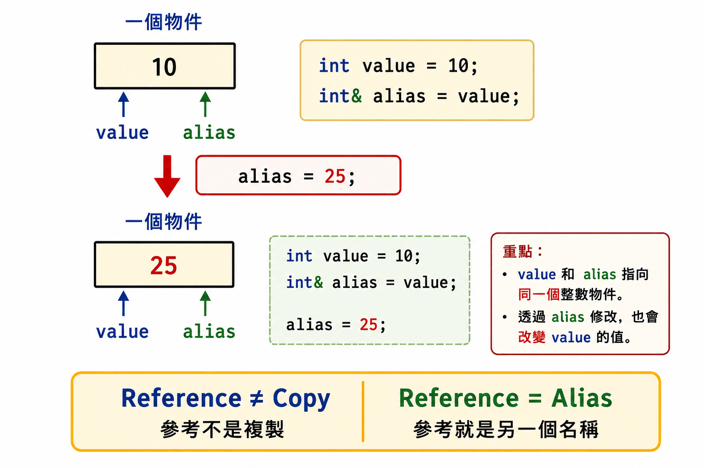

## Section V. 完整基本範例

```cpp
// VALIDATE
#include <iostream>
using namespace std;

int main() {
    int value = 10;
    int& alias = value;

    cout << value << '\n';
    cout << alias << '\n';

    alias = 25;

    cout << value << '\n';
    cout << alias << '\n';

    return 0;
}
```

輸出：

```text
10
10
25
25
```

---

## Section VI. 為什麼兩者一起改變？

```cpp
alias = 25;
```

不是只修改 `alias` 的獨立副本。

它等同於透過另一個名稱修改：

```cpp
value = 25;
```

---

## Section VII. 參考宣告中的 `&`

```cpp
int& alias = value;
```

這裡的 `&` 表示：

```text
alias 的型別是 int 的左值參考
```

它不是此處的取址運算。

---

# Part B：參考必須初始化

## Section VIII. 宣告時綁定

合法：

```cpp
int value = 10;
int& alias = value;
```

不合法概念：

```cpp
/* int& alias; */
```

一般左值參考必須立刻綁定到有效物件。

---

## Section IX. 為什麼不能是空參考？

參考被設計成：

```text
某個既有物件的別名
```

若沒有目標物件，就沒有可以代表的資料。

---

## Section X. 參考不是指標

本章先記住：

- 參考必須綁定物件。
- 一般參考不能表示「沒有物件」。
- 參考使用方式和一般變數相似。
- 參考不能重新綁定。

指標會在後續章節完整說明。

---

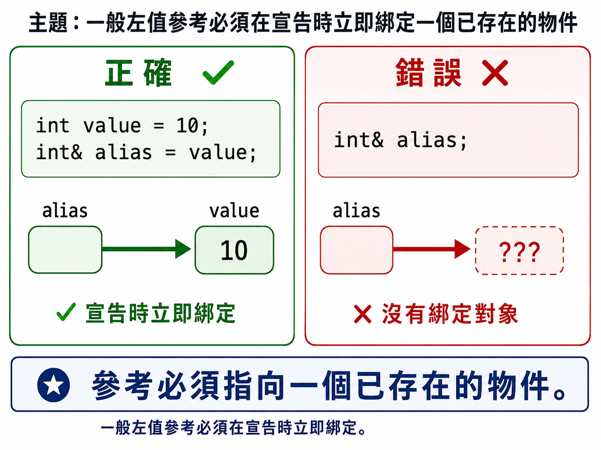

# Part C：參考不能重新綁定

## Section XI. 常見誤解

```cpp
int first = 10;
int second = 20;

int& alias = first;
alias = second;
```

最後不是讓 `alias` 改為參考 `second`。

而是：

```text
把 second 的值 20
寫入 alias 所代表的 first
```

---

## Section XII. 完整重新賦值範例

```cpp
// VALIDATE
#include <iostream>
using namespace std;

int main() {
    int first = 10;
    int second = 20;

    int& alias = first;

    alias = second;

    cout << "first: "
         << first
         << '\n';

    cout << "second: "
         << second
         << '\n';

    return 0;
}
```

輸出：

```text
first: 20
second: 20
```

`alias` 仍然是 `first` 的別名。

---

## Section XIII. 賦值與綁定

綁定只發生在參考初始化：

```cpp
int& alias = first;
```

之後：

```cpp
alias = second;
```

是一般整數賦值，不是參考重新綁定。

---

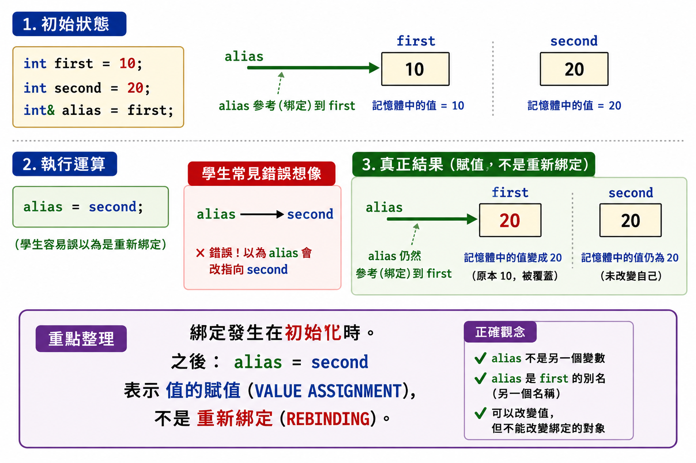

# Part D：參考與位址

## Section XIV. 相同物件

```cpp
int value = 10;
int& alias = value;
```

取兩者位址：

```cpp
&value
&alias
```

會得到相同物件的位址。

---

## Section XV. 完整位址比較

```cpp
// VALIDATE
#include <iostream>
using namespace std;

int main() {
    int value = 10;
    int& alias = value;

    cout << boolalpha
         << (&value == &alias)
         << '\n';

    return 0;
}
```

輸出：

```text
true
```

---

## Section XVI. 注意兩種 `&`

```cpp
int& alias = value;
```

是參考型別。

```cpp
&value
```

是取址運算，取得物件位址。

相同符號會依位置有不同用途。

---

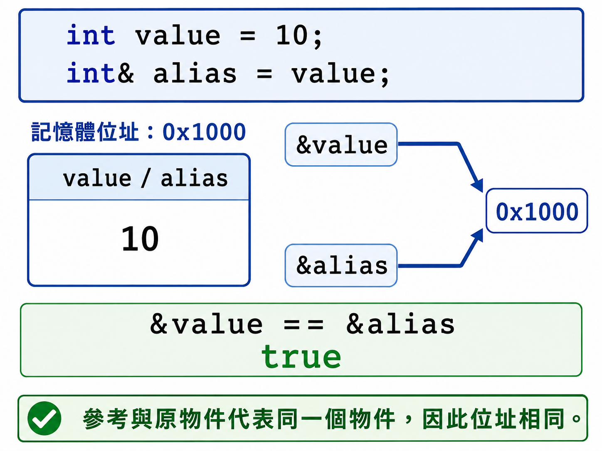

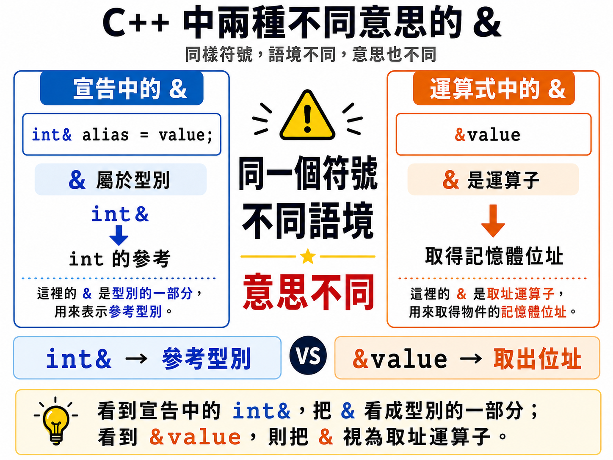

# Part E：多個別名

## Section XVII. 多個參考指向同一物件

```cpp
int value = 10;

int& firstAlias = value;
int& secondAlias = value;
```

三個名稱都代表同一個整數。

---

## Section XVIII. 完整多別名範例

```cpp
// VALIDATE
#include <iostream>
using namespace std;

int main() {
    int value = 10;

    int& firstAlias = value;
    int& secondAlias = value;

    firstAlias += 5;
    secondAlias *= 2;

    cout << value << '\n';

    return 0;
}
```

計算：

```text
10 + 5 = 15
15 × 2 = 30
```

輸出：

```text
30
```

---

## Section XIX. Aliasing

多個名稱代表同一物件，稱為 aliasing。

好處：

- 可以讓函式直接操作呼叫者資料。
- 可以避免大型物件複製。

風險：

- 修改來源可能不容易追蹤。
- 多個函式可能同時改變同一資料。
- 過度使用會降低可讀性。

---

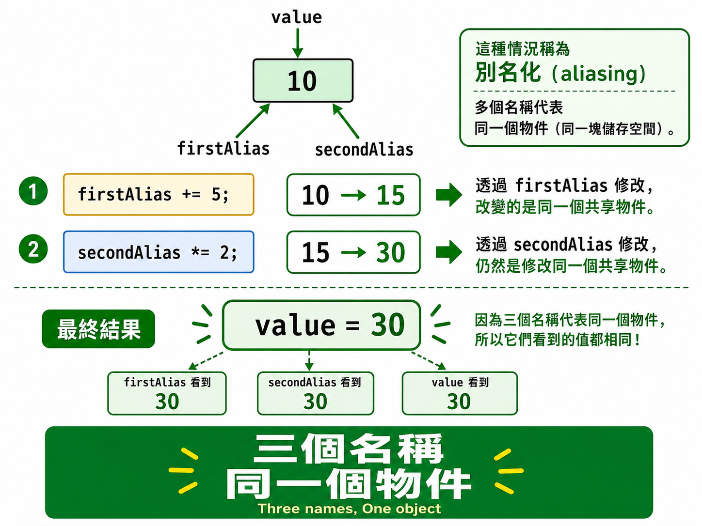

# Part F：傳值與傳參考

## Section XX. 傳值

```cpp
void increase(int value) {
    ++value;
}
```

函式取得副本。

---

## Section XXI. 傳參考

```cpp
void increase(int& value) {
    ++value;
}
```

函式操作原變數。

---

## Section XXII. 完整比較

```cpp
// VALIDATE
#include <iostream>
using namespace std;

void increaseCopy(int value) {
    ++value;

    cout << "Copy inside function: "
         << value
         << '\n';
}

void increaseOriginal(int& value) {
    ++value;
}

int main() {
    int number = 10;

    increaseCopy(number);

    cout << number << '\n';

    increaseOriginal(number);

    cout << number << '\n';

    return 0;
}
```

輸出：

```text
10
11
```

---

## Section XXIII. 參考參數的意義

```cpp
void increaseOriginal(int& value)
```

呼叫：

```cpp
increaseOriginal(number);
```

參數 `value` 成為 `number` 的別名。

---

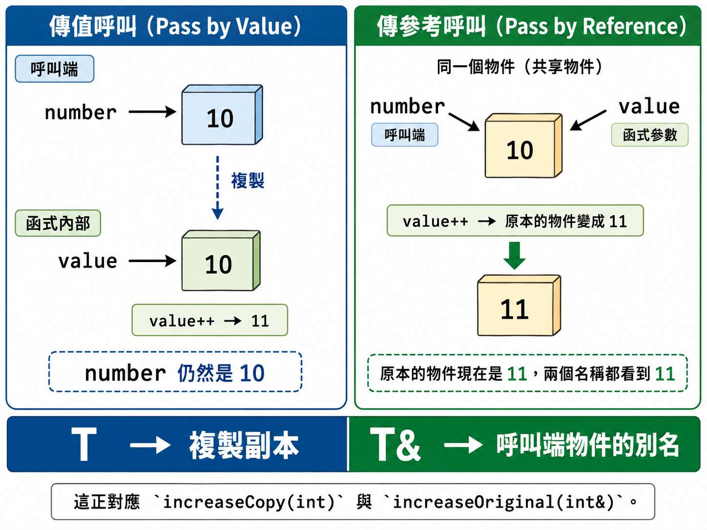

# Part G：輸出參數

## Section XXIV. 透過參考提供多個結果

函式只能直接 `return` 一個主要值。

若需要同時提供多個結果，可以使用參考參數：

```cpp
void divide(
    int dividend,
    int divisor,
    int& quotient,
    int& remainder
);
```

---

## Section XXV. 完整輸出參數範例

```cpp
// VALIDATE
#include <iostream>
using namespace std;

bool divide(
    int dividend,
    int divisor,
    int& quotient,
    int& remainder
) {
    if (divisor == 0) {
        return false;
    }

    quotient =
        dividend / divisor;

    remainder =
        dividend % divisor;

    return true;
}

int main() {
    int quotient = 0;
    int remainder = 0;

    bool success =
        divide(
            17,
            5,
            quotient,
            remainder
        );

    if (success) {
        cout << quotient
             << " "
             << remainder
             << '\n';
    }

    return 0;
}
```

---

## Section XXVI. 回傳值與輸出參數

本例：

```text
return bool
```

表示操作是否成功。

參考參數：

```text
quotient
remainder
```

提供計算結果。

---

## Section XXVII. 不要過度使用輸出參數

若只有一個自然結果：

```cpp
int square(int value)
```

通常直接回傳比：

```cpp
void square(int value, int& result)
```

更清楚。

---

# Part H：`const` 變數

## Section XXVIII. 基本語法

```cpp
const int DAYS_IN_WEEK = 7;
```

初始化後不能再透過該名稱修改。

---

## Section XXIX. 完整 `const` 範例

```cpp
// VALIDATE
#include <iostream>
using namespace std;

int main() {
    const int daysInWeek = 7;

    cout << daysInWeek
         << '\n';

    return 0;
}
```

不合法概念：

```cpp
/* daysInWeek = 8; */
```

---

## Section XXX. `const` 必須初始化

```cpp
const int value = 10;
```

通常必須在宣告時提供值。

不合法概念：

```cpp
/* const int value; */
```

因為之後不能再進行一般賦值完成初始化。

---

## Section XXXI. 具名常數

不清楚：

```cpp
if (score >= 60) {
    // ...
}
```

較清楚：

```cpp
const int passingScore = 60;

if (score >= passingScore) {
    // ...
}
```

---

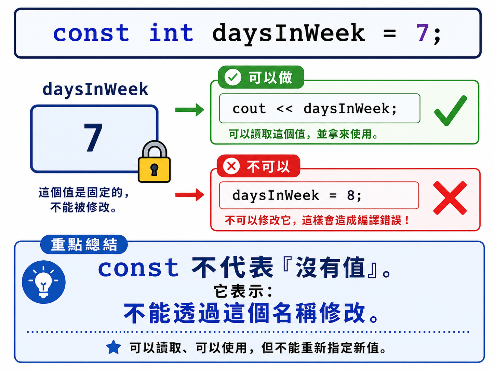

# Part I：`const` 與 `constexpr`

## Section XXXII. `const`

表示：

```text
透過這個名稱不可修改
```

它的值可能在執行期間才取得：

```cpp
int input;
cin >> input;

const int value = input;
```

---

## Section XXXIII. `constexpr`

表示值應可在編譯期間確定：

```cpp
constexpr int daysInWeek = 7;
```

---

## Section XXXIV. 完整比較

```cpp
// VALIDATE
#include <iostream>
using namespace std;

int main() {
    constexpr int daysInWeek = 7;

    int weeks;
    cin >> weeks;

    const int totalDays =
        weeks * daysInWeek;

    cout << totalDays << '\n';

    return 0;
}
```

- `daysInWeek` 是編譯期間常數。
- `totalDays` 依使用者輸入決定，但初始化後不可修改。

---

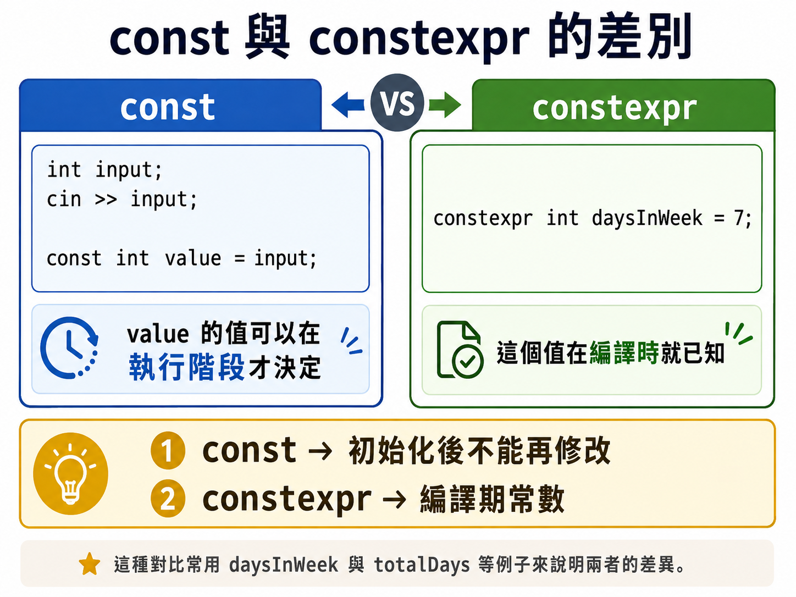

# Part J：`const` 參考

## Section XXXV. 唯讀別名

```cpp
int value = 10;
const int& view = value;
```

`view` 是 `value` 的別名，但不能透過 `view` 修改。

---

## Section XXXVI. 完整唯讀參考範例

```cpp
// VALIDATE
#include <iostream>
using namespace std;

int main() {
    int value = 10;
    const int& view = value;

    cout << view << '\n';

    value = 25;

    cout << view << '\n';

    return 0;
}
```

輸出：

```text
10
25
```

---

## Section XXXVII. 為什麼 `view` 仍會看到新值？

`view` 不是副本。

它仍然參考 `value`。

只是：

```text
不能透過 view 修改
```

原物件可透過其他非 `const` 名稱修改。

---

## Section XXXVIII. 不合法修改

```cpp
const int& view = value;

/* view = 20; */
```

編譯器會阻止透過 `view` 修改。

---

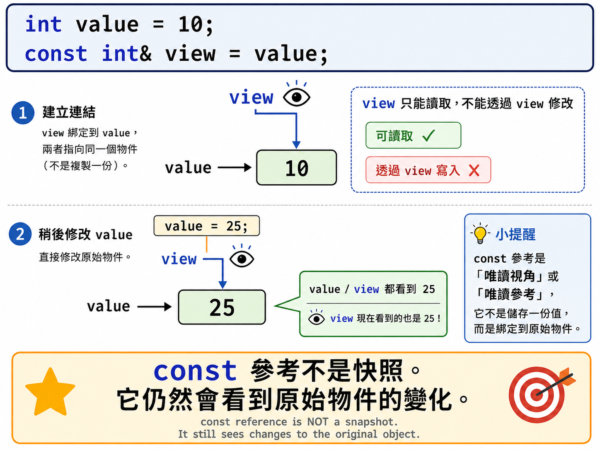

# Part K：`const` 物件與參考綁定

## Section XXXIX. 一般參考不能綁定 `const` 物件

不合法：

```cpp
const int value = 10;

/* int& reference = value; */
```

否則可以透過 `reference` 修改原本宣告為 `const` 的物件，破壞限制。

---

## Section XL. `const` 參考可以綁定

合法：

```cpp
const int value = 10;
const int& reference = value;
```

---

## Section XLI. 一般物件也可綁定 `const` 參考

```cpp
int value = 10;
const int& reference = value;
```

這表示：

```text
原物件不是 const
但這條參考提供唯讀視角
```

---

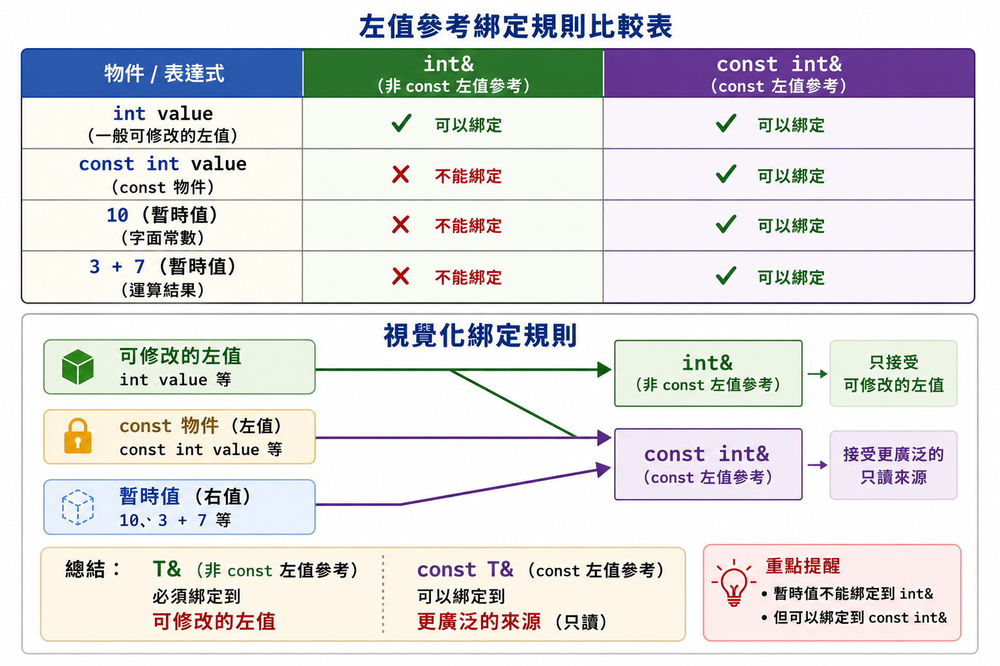

# Part L：暫時值與 `const` 參考

## Section XLII. 暫時值

例如：

```cpp
10
3 + 5
string("Hello")
```

這些表示式可能產生暫時物件。

---

## Section XLIII. 非 `const` 左值參考不能綁定暫時值

不合法：

```cpp
/* int& reference = 10; */
```

一般非 `const` 左值參考需要可修改且具穩定身分的左值。

---

## Section XLIV. `const` 參考可以綁定暫時值

合法：

```cpp
const int& reference = 10;
```

暫時值的生命週期會延長到此區域參考的生命週期結束。

---

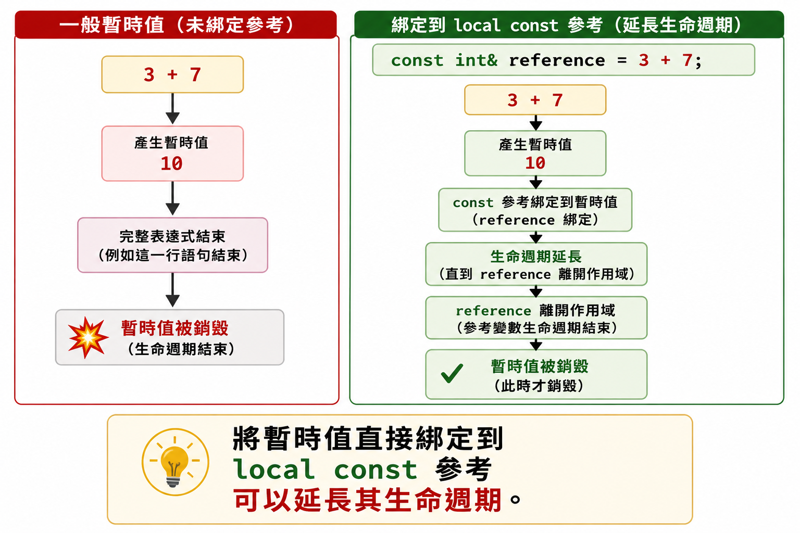

## Section XLV. 完整暫時值範例

```cpp
// VALIDATE
#include <iostream>
using namespace std;

int main() {
    const int& reference =
        3 + 7;

    cout << reference
         << '\n';

    return 0;
}
```

輸出：

```text
10
```

---

## Section XLVI. 函式參數中的暫時值

```cpp
void show(
    const string& text
);
```

可以呼叫：

```cpp
show("Hello");
```

字串字面常數可轉換成暫時 `string`，再綁定到 `const string&`。

---

# Part M：參數傳遞選擇

## Section XLVII. 小型資料

通常直接傳值：

```cpp
int
double
char
bool
```

例如：

```cpp
int square(int value);
```

---

## Section XLVIII. 需要修改呼叫者

使用一般參考：

```cpp
void normalize(int& value);
```

函式名稱與文件應清楚表達會修改資料。

---

## Section XLIX. 大型唯讀資料

使用 `const` 參考：

```cpp
void showText(
    const string& text
);
```

避免複製，並表達不修改。

---

## Section L. 選擇表

| 需求 | 建議 |
| --- | --- |
| 小型資料，只讀 | `T` |
| 小型資料，要修改原值 | `T&` |
| 大型資料，只讀 | `const T&` |
| 大型資料，要修改原值 | `T&` |
| 需要獨立副本 | `T` |
| 要接收暫時值且唯讀 | `const T&` |

---

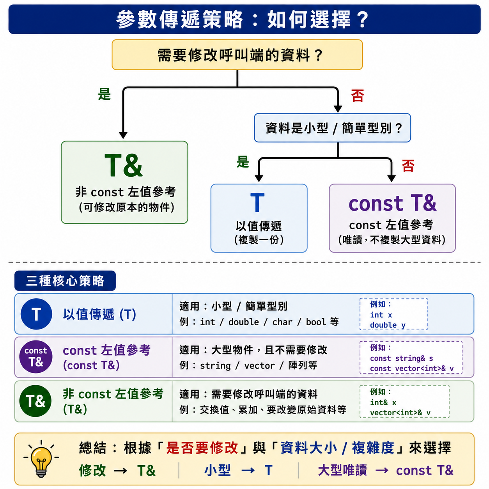

# Part N：`const string&`

## Section LI. 傳值版本

```cpp
void showText(string text)
```

會建立字串副本。

---

## Section LII. `const` 參考版本

```cpp
void showText(
    const string& text
)
```

不複製完整字串，且函式不能透過 `text` 修改。

---

## Section LIII. 完整字串範例

```cpp
// VALIDATE
#include <iostream>
#include <string>
using namespace std;

void showText(
    const string& text
) {
    cout << text
         << '\n';
}

int main() {
    string message =
        "Reference and const";

    showText(message);
    showText("Temporary string");

    return 0;
}
```

---

## Section LIV. 不代表永遠都用 `const&`

對 `int`：

```cpp
void show(int value)
```

通常已經足夠清楚與有效率。

不要機械式地把所有參數都改成 `const T&`。

---

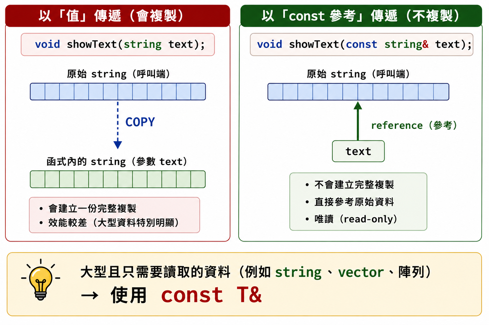

# Part O：Const-Correctness

## Section LV. 什麼是 const-correctness？

介面清楚表達：

```text
哪些資料可以修改
哪些資料只能讀取
```

例如：

```cpp
void print(
    const string& text
);
```

名稱與型別都表示函式不修改文字。

---

## Section LVI. 好處

- 防止意外修改。
- 讓呼叫者更容易理解。
- 允許傳入 `const` 物件。
- 讓編譯器協助檢查。
- 降低函式副作用。
- 改善大型程式可維護性。

---

## Section LVII. 可修改參考應有理由

```cpp
void process(string& text);
```

看到 `string&` 時，呼叫者應預期：

```text
text 可能被修改
```

若實際不修改，應改成：

```cpp
const string&
```

---

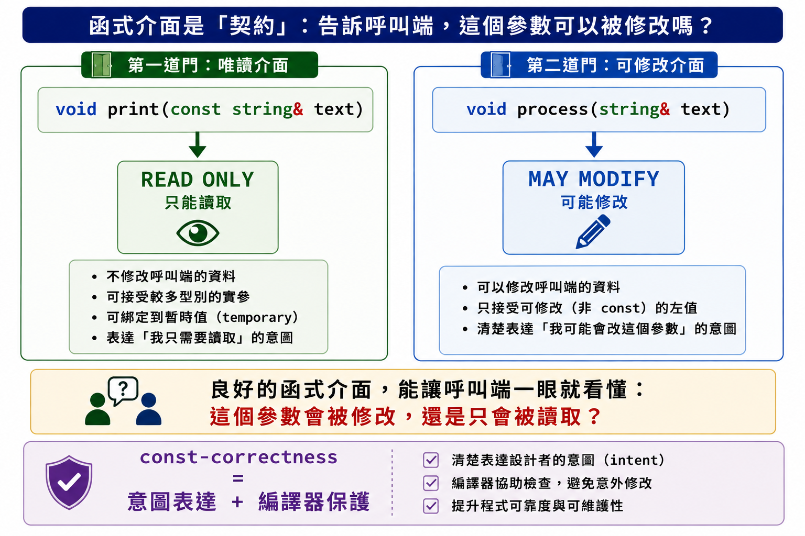

# Part P：`auto` 與參考

## Section LVIII. `auto` 通常建立副本

```cpp
int value = 10;
int& reference = value;

auto copy = reference;
```

`copy` 的型別通常是：

```cpp
int
```

不是 `int&`。

---

## Section LIX. `auto&` 保留參考

```cpp
auto& alias = reference;
```

`alias` 仍然參考原物件。

---

## Section LX. `const auto&`

```cpp
const auto& view = value;
```

由編譯器推導型別，建立唯讀參考。

---

## Section LXI. 完整 `auto` 比較

```cpp
// VALIDATE
#include <iostream>
using namespace std;

int main() {
    int value = 10;
    int& reference = value;

    auto copy = reference;
    auto& alias = reference;
    const auto& view = value;

    copy = 20;
    alias = 30;

    cout << "value: "
         << value
         << '\n';

    cout << "copy: "
         << copy
         << '\n';

    cout << "view: "
         << view
         << '\n';

    return 0;
}
```

輸出：

```text
value: 30
copy: 20
view: 30
```

---

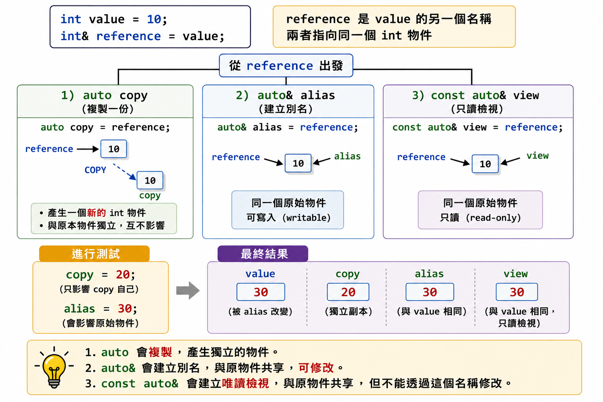

# Part Q：Range-Based `for` 與參考

## Section LXII. 以值走訪

```cpp
for (int value : values) {
    value *= 2;
}
```

修改副本，不修改原元素。

---

## Section LXIII. 以參考走訪

```cpp
for (int& value : values) {
    value *= 2;
}
```

修改原元素。

---

## Section LXIV. 以 `const` 參考走訪

```cpp
for (const int& value : values) {
    cout << value << '\n';
}
```

唯讀，不複製元素。

---

## Section LXV. 完整比較

```cpp
// VALIDATE
#include <iostream>
using namespace std;

int main() {
    int values[] = {1, 2, 3};

    for (int value : values) {
        value *= 10;

        cout << "Copy: "
             << value
             << '\n';
    }

    for (int& value : values) {
        value *= 2;
    }

    for (const int& value : values) {
        cout << value << " ";
    }

    cout << '\n';

    return 0;
}
```

輸出：

```text
2 4 6
```

第一個迴圈只修改副本。

第二個迴圈修改原陣列。

---

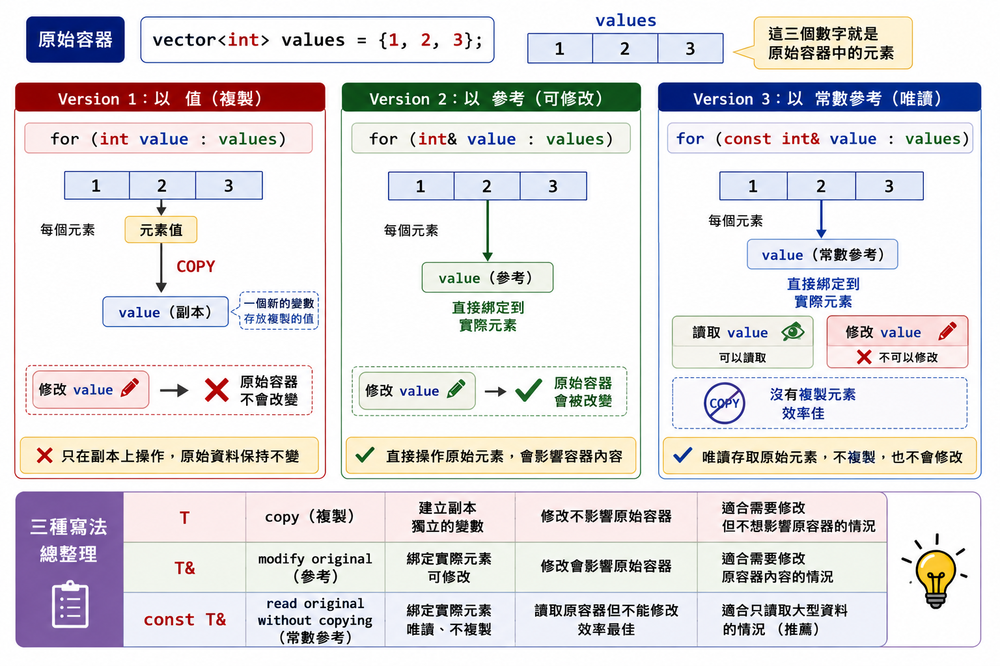

# Part R：回傳參考

## Section LXVI. 基本語法

```cpp
int& getValue() {
    return someExistingInteger;
}
```

回傳的不是整數副本，而是既有整數的別名。

---

## Section LXVII. 回傳參考參數

```cpp
int& larger(
    int& first,
    int& second
) {
    if (first > second) {
        return first;
    }

    return second;
}
```

`first` 與 `second` 都是呼叫者物件的參考。

函式結束後，原物件仍然存在。

---

## Section LXVIII. 完整回傳參考範例

```cpp
// VALIDATE
#include <iostream>
using namespace std;

int& larger(
    int& first,
    int& second
) {
    if (first > second) {
        return first;
    }

    return second;
}

int main() {
    int first = 10;
    int second = 20;

    int& result =
        larger(first, second);

    result = 100;

    cout << first << '\n';
    cout << second << '\n';

    return 0;
}
```

輸出：

```text
10
100
```

---

## Section LXIX. 回傳參考可出現在賦值左側

```cpp
larger(first, second) = 100;
```

因為函式回傳可修改參考，結果代表實際物件。

---

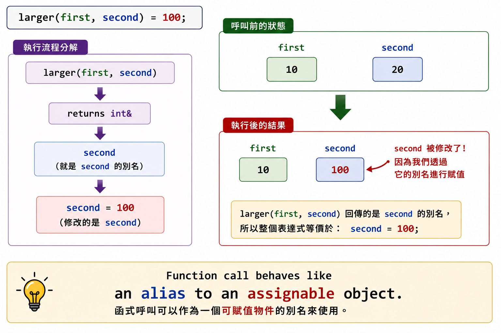

## Section LXX. 風險

呼叫者可以透過回傳參考修改物件。

因此回傳非 `const` 參考會暴露可修改狀態。

只有在這正是介面設計目的時才使用。

---

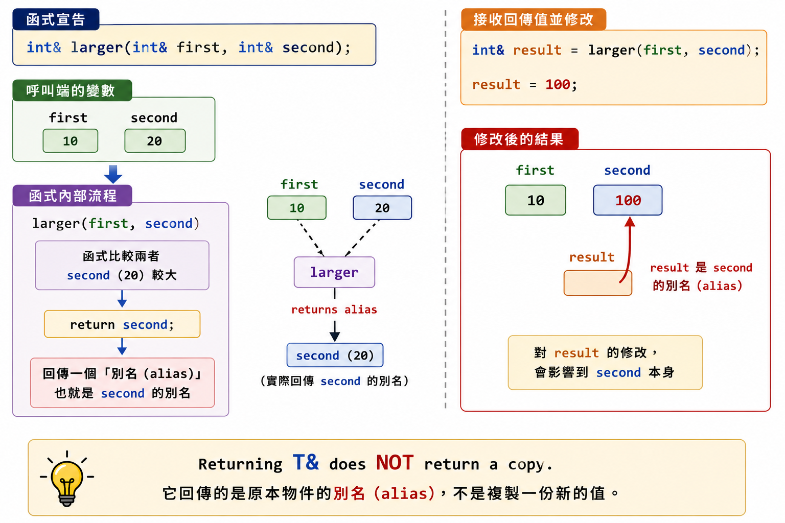

# Part S：回傳 `const` 參考

## Section LXXI. 唯讀回傳

```cpp
const int& larger(
    const int& first,
    const int& second
)
```

呼叫者可以讀取結果，但不能透過結果修改原物件。

---

## Section LXXII. 完整唯讀回傳範例

```cpp
// VALIDATE
#include <iostream>
using namespace std;

const int& larger(
    const int& first,
    const int& second
) {
    if (first > second) {
        return first;
    }

    return second;
}

int main() {
    int first = 10;
    int second = 20;

    const int& result =
        larger(first, second);

    cout << result << '\n';

    return 0;
}
```

---

## Section LXXIII. 注意暫時值

呼叫：

```cpp
larger(10, 20)
```

若函式回傳其中一個參數的參考，函式呼叫結束後暫時值生命週期可能結束。

將該參考保存並在後續使用，可能形成懸空參考。

因此回傳參考函式的呼叫條件必須清楚。

---

# Part T：懸空參考

## Section LXXIV. 區域變數生命週期

```cpp
int& badFunction() {
    int localValue = 10;
    return localValue;
}
```

函式結束時：

```text
localValue 被銷毀
```

回傳的參考不再指向有效物件。

---

## Section LXXV. 不合法設計

```cpp
/* 危險，不要使用：

int& badFunction() {
    int localValue = 10;
    return localValue;
}

*/
```

這會產生懸空參考。

即使編譯器只提供警告，使用結果也是未定義行為。

---

## Section LXXVI. 安全來源

回傳參考通常必須來自仍然存在的物件，例如：

- 呼叫者傳入的參考參數。
- 全域物件。
- `static` 區域物件。
- 壽命由其他物件管理的成員。

本章只完整使用參考參數作為安全示範。

---

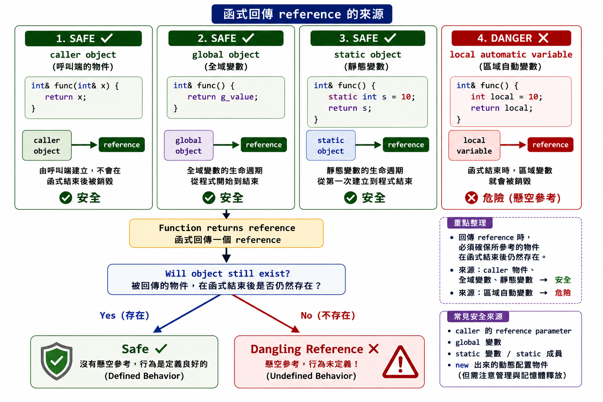

## Section LXXVII. 回傳值通常更安全

若不需要別名語意：

```cpp
int larger(int first, int second)
```

直接回傳值通常更簡單安全。

對小型型別，複製成本也很低。

---

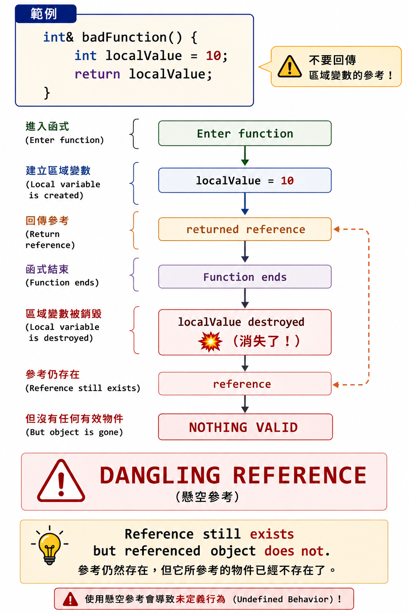

# Part U：參考生命週期與作用域

## Section LXXVIII. 參考離開作用域

```cpp
int value = 10;

{
    int& alias = value;
    alias = 20;
}
```

內層區塊結束後：

```text
alias 名稱消失
value 仍然存在
```

---

## Section LXXIX. 完整作用域範例

```cpp
// VALIDATE
#include <iostream>
using namespace std;

int main() {
    int value = 10;

    {
        int& alias = value;
        alias = 25;
    }

    cout << value << '\n';

    return 0;
}
```

輸出：

```text
25
```

---

## Section LXXX. 原物件先結束

若參考仍被保存，但原物件已被銷毀，參考會失效。

因此必須同時考慮：

```text
參考名稱的作用域
被參考物件的生命週期
```

---

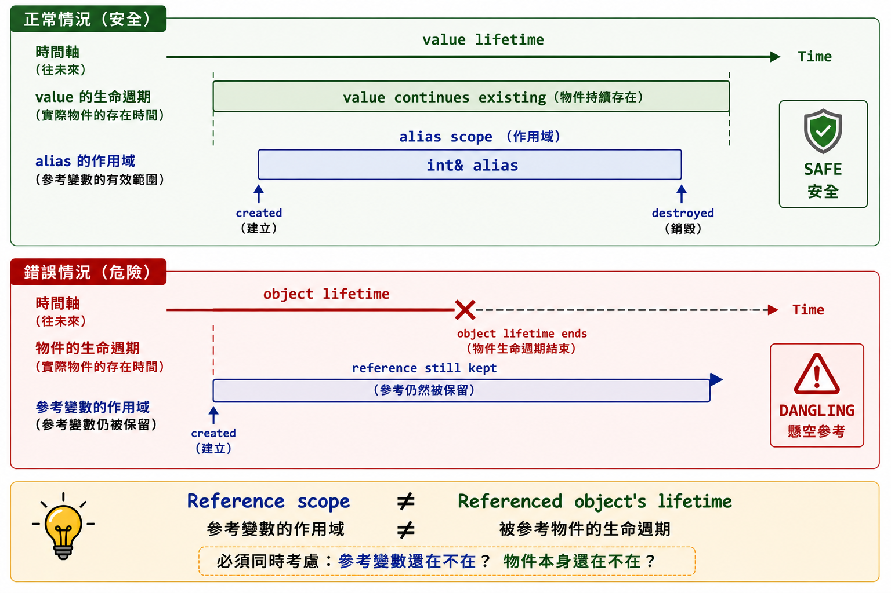

# Part V：參考多載

## Section LXXXI. 一般參考與 `const` 參考

```cpp
void inspect(int& value);
void inspect(const int& value);
```

合法多載。

---

## Section LXXXII. 完整多載範例

```cpp
// VALIDATE
#include <iostream>
using namespace std;

void inspect(int& value) {
    cout << "Mutable: "
         << value
         << '\n';
}

void inspect(const int& value) {
    cout << "Read-only: "
         << value
         << '\n';
}

int main() {
    int value = 10;
    const int constantValue = 20;

    inspect(value);
    inspect(constantValue);
    inspect(30);

    return 0;
}
```

---

## Section LXXXIII. 選擇規則

一般變數：

```cpp
inspect(value);
```

通常選擇：

```cpp
inspect(int&)
```

`const` 變數與暫時值：

```cpp
inspect(constantValue);
inspect(30);
```

選擇：

```cpp
inspect(const int&)
```

---

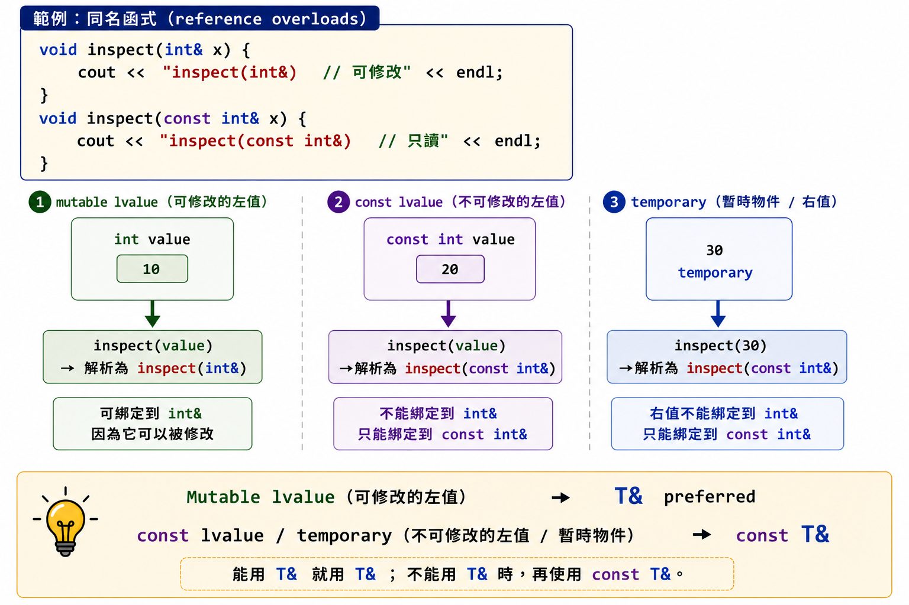

# Part W：頂層 `const` 與低層 `const` 初步

## Section LXXXIV. 傳值的頂層 `const`

```cpp
void process(int value);
void process(const int value);
```

呼叫介面相同。

`const` 只限制函式內的副本。

---

## Section LXXXV. 參考中的 `const`

```cpp
void process(int& value);
void process(const int& value);
```

介面不同，因為：

```text
一個可修改原物件
一個只能唯讀
```

---

## Section LXXXVI. 本章記憶方式

```text
T
    取得副本

T&
    取得可修改原物件的別名

const T&
    取得唯讀別名
```

指標中的不同 `const` 位置會在指標章節進一步說明。

---

# Part X：避免 `const_cast`

## Section LXXXVII. 什麼是 `const_cast`？

C++ 提供：

```cpp
const_cast
```

可以在特定情況調整 `const` 性質。

但初學階段不應用它繞過正常的 `const` 限制。

---

## Section LXXXVIII. 風險

若原物件本身真的宣告為 `const`，強行修改可能造成未定義行為。

即使原物件不是 `const`，大量使用 `const_cast` 也通常表示介面設計有問題。

---

## Section LXXXIX. 本章原則

```text
若函式需要修改資料
就正確使用 T&

若函式不應修改資料
就使用 const T&

不要先宣告成 const 再強行移除
```

---

# Part Y：介面設計原則

## Section XC. 優先回傳主要結果

較清楚：

```cpp
int square(int value);
```

較不自然：

```cpp
void square(
    int value,
    int& result
);
```

---

## Section XCI. 可修改參考要清楚

```cpp
void sortValues(
    int& first,
    int& second
);
```

函式名稱應讓呼叫者知道資料會被修改。

---

## Section XCII. `const` 參考表達承諾

```cpp
void printReport(
    const string& report
);
```

表示函式承諾不透過參數修改報告。

---

## Section XCIII. 避免過多輸出參數

大量參考參數：

```cpp
void calculate(
    int input,
    int& first,
    int& second,
    int& third,
    bool& success
);
```

呼叫與維護都會變得困難。

未來可以考慮結構或其他回傳方式。

---

# Part Z：快速概念檢查

## Section XCIV. 選擇題與簡答

### Q1. 參考是什麼？

<details><summary>查看答案</summary>

既有物件的別名。

</details>

### Q2. 一般左值參考必須初始化嗎？

<details><summary>查看答案</summary>

必須在宣告時綁定有效物件。

</details>

### Q3. 參考可以重新綁定嗎？

<details><summary>查看答案</summary>

一般參考綁定後不能重新綁定到另一個物件。

</details>

### Q4. `alias = other;` 會重新綁定嗎？

<details><summary>查看答案</summary>

不會，它會把 `other` 的值賦給 `alias` 所代表的原物件。

</details>

### Q5. 原變數與其參考的位址相同嗎？

<details><summary>查看答案</summary>

是，它們代表同一物件。

</details>

### Q6. 傳值會修改原變數嗎？

<details><summary>查看答案</summary>

不會，函式取得副本。

</details>

### Q7. 傳參考會修改原變數嗎？

<details><summary>查看答案</summary>

可以，參數是原變數的別名。

</details>

### Q8. `const` 變數可以重新賦值嗎？

<details><summary>查看答案</summary>

不可以。

</details>

### Q9. `const int&` 是什麼？

<details><summary>查看答案</summary>

整數物件的唯讀參考。

</details>

### Q10. `const` 參考是副本嗎？

<details><summary>查看答案</summary>

不是，它仍然是別名。

</details>

### Q11. 原物件不是 `const` 時，能否透過其他名稱修改？

<details><summary>查看答案</summary>

可以，`const` 參考只限制透過該參考修改。

</details>

### Q12. 非 `const` 左值參考可以綁定到暫時值嗎？

<details><summary>查看答案</summary>

不可以。

</details>

### Q13. `const` 參考可以綁定到暫時值嗎？

<details><summary>查看答案</summary>

可以。

</details>

### Q14. 大型唯讀資料通常如何傳遞？

<details><summary>查看答案</summary>

使用 `const T&`。

</details>

### Q15. `auto copy = reference;` 通常得到什麼？

<details><summary>查看答案</summary>

得到一份值的副本，而不是參考。

</details>

### Q16. 如何讓 `auto` 保留參考？

<details><summary>查看答案</summary>

使用：

```cpp
auto&
```

</details>

### Q17. Range-based `for` 如何修改原元素？

<details><summary>查看答案</summary>

使用參考：

```cpp
for (auto& value : values)
```

</details>

### Q18. 回傳區域變數參考安全嗎？

<details><summary>查看答案</summary>

不安全，函式結束後區域變數被銷毀，會形成懸空參考。

</details>

### Q19. 回傳非 `const` 參考有什麼風險？

<details><summary>查看答案</summary>

呼叫者可能透過回傳結果修改內部物件。

</details>

### Q20. Const-correctness 的目的是什麼？

<details><summary>查看答案</summary>

清楚表達哪些資料可修改、哪些資料只能讀取，並讓編譯器協助防止錯誤。

</details>

---

# Part AA：程式閱讀練習

## Section XCV. 預測結果

### 題目 1

```cpp
int value = 10;
int& alias = value;

alias = 20;

cout << value;
```

<details><summary>查看答案</summary>

```text
20
```

</details>

### 題目 2

```cpp
int first = 10;
int second = 30;

int& alias = first;
alias = second;

cout << first << " "
     << second;
```

<details><summary>查看答案</summary>

```text
30 30
```

`alias` 沒有重新綁定。

</details>

### 題目 3

```cpp
int value = 5;
const int& view = value;

value = 8;

cout << view;
```

<details><summary>查看答案</summary>

```text
8
```

</details>

### 題目 4

```cpp
void change(int value) {
    value = 100;
}

int number = 5;
change(number);

cout << number;
```

<details><summary>查看答案</summary>

```text
5
```

</details>

### 題目 5

```cpp
void change(int& value) {
    value = 100;
}

int number = 5;
change(number);

cout << number;
```

<details><summary>查看答案</summary>

```text
100
```

</details>

### 題目 6

```cpp
int value = 10;
int& first = value;
int& second = value;

first += 5;
second *= 2;

cout << value;
```

<details><summary>查看答案</summary>

```text
30
```

</details>

### 題目 7

```cpp
int value = 10;
int& reference = value;

auto copy = reference;
auto& alias = reference;

copy = 20;
alias = 30;

cout << value << " "
     << copy;
```

<details><summary>查看答案</summary>

```text
30 20
```

</details>

### 題目 8

```cpp
int values[] = {1, 2, 3};

for (int value : values) {
    value *= 10;
}

cout << values[0];
```

<details><summary>查看答案</summary>

```text
1
```

迴圈變數是副本。

</details>

### 題目 9

```cpp
int values[] = {1, 2, 3};

for (int& value : values) {
    value *= 10;
}

cout << values[0];
```

<details><summary>查看答案</summary>

```text
10
```

</details>

### 題目 10

```cpp
int& select(
    int& first,
    int& second
) {
    return
        first > second
            ? first
            : second;
}

int a = 3;
int b = 7;

select(a, b) = 100;

cout << a << " "
     << b;
```

<details><summary>查看答案</summary>

```text
3 100
```

</details>

### 題目 11

```cpp
void inspect(int& value) {
    cout << "M";
}

void inspect(const int& value) {
    cout << "C";
}

int number = 5;
const int fixed = 6;

inspect(number);
inspect(fixed);
inspect(7);
```

<details><summary>查看答案</summary>

```text
MCC
```

</details>

### 題目 12

```cpp
int value = 10;

{
    int& alias = value;
    alias = 25;
}

cout << value;
```

<details><summary>查看答案</summary>

```text
25
```

參考名稱離開作用域不會銷毀原物件。

</details>

---

# Part AB：實作練習

## Section XCVI. 實作檢測題

### TODO 1：建立別名

建立整數與參考，透過參考修改原變數。

### TODO 2：證明相同位址

輸出原變數與參考的位址比較結果。

### TODO 3：不能重新綁定

建立兩個整數與一個參考，使用賦值證明參考仍綁定第一個整數。

### TODO 4：增加函式

建立：

```cpp
void increase(int& value)
```

### TODO 5：限制範圍

建立：

```cpp
void clamp(
    int& value,
    int minimum,
    int maximum
)
```

讓值保持在指定範圍。

### TODO 6：除法輸出參數

建立函式，以參考回傳商與餘數，以 `bool` 表示是否成功。

### TODO 7：具名常數

使用 `constexpr` 建立一週天數，計算指定週數的總天數。

### TODO 8：唯讀參考

建立 `const int&`，修改原變數後觀察參考讀到的新值。

### TODO 9：字串唯讀傳遞

建立：

```cpp
void showText(const string& text)
```

### TODO 10：`auto` 比較

建立 `auto` 副本、`auto&` 參考與 `const auto&` 唯讀參考。

### TODO 11：Range-based 修改

使用 `int&` 將陣列所有元素乘以 `2`。

### TODO 12：Range-based 唯讀

使用 `const auto&` 輸出所有元素。

### TODO 13：回傳較大值參考

建立：

```cpp
int& larger(int& first, int& second)
```

並透過回傳結果修改較大值。

### TODO 14：回傳唯讀參考

建立：

```cpp
const int& smaller(
    const int& first,
    const int& second
)
```

### TODO 15：參考多載

建立：

```cpp
inspect(int&)
inspect(const int&)
```

測試一般變數、`const` 變數與字面常數。

---

# Part AC：課後小練習

## Section XCVII. 延伸練習

### 練習 1：排序兩個值

建立：

```cpp
void sortTwo(int& first, int& second)
```

確保 `first <= second`。

### 練習 2：同時求最小最大

建立函式，使用兩個參考輸出最小值與最大值。

### 練習 3：字串轉大寫

建立會修改原字串的：

```cpp
void toUpperCase(string& text)
```

### 練習 4：尋找第一個偶數

對固定陣列找出第一個偶數，思考是否應回傳參考，以及找不到時如何設計。

### 練習 5：介面重構

將包含五個輸出參考參數的函式重新設計，說明哪些結果應直接回傳，哪些應保留參考。

---

# Part AD：常見錯誤提醒

## Section XCVIII. 常見錯誤

1. 宣告參考但沒有初始化。
2. 以為參考可以是空的。
3. 以為參考可以重新綁定。
4. 把 `alias = other` 當成重新綁定。
5. 忘記參考與原變數代表同一物件。
6. 傳值函式中修改副本卻期待原值改變。
7. 不需要修改卻使用非 `const` 參考。
8. 需要修改卻忘記 `&`。
9. `const` 變數沒有初始化。
10. 嘗試重新賦值給 `const` 變數。
11. 將 `const` 物件綁定到非 `const` 參考。
12. 將暫時值綁定到非 `const` 左值參考。
13. 以為 `const` 參考是副本。
14. 以為原物件不能透過其他名稱修改。
15. 對所有小型參數都使用 `const T&`。
16. 對大型唯讀資料使用傳值造成不必要複製。
17. `auto` 建立副本卻期待保留參考。
18. Range-based `for` 使用值版本卻期待修改原元素。
19. 回傳區域變數參考。
20. 保存指向已銷毀暫時值的參考。
21. 回傳非 `const` 參考而意外暴露內部資料。
22. 把參考的作用域與原物件生命週期混為一談。
23. 參考離開作用域時誤以為原物件被銷毀。
24. 使用過多輸出參數降低可讀性。
25. 使用參考參數但函式名稱未表達修改行為。
26. 使用 `const_cast` 繞過正常型別設計。
27. 誤把宣告中的 `&` 與取址運算混為一談。
28. 對參考多載的選擇規則理解錯誤。
29. 將暫時值傳入會回傳參考的函式後保存結果。
30. 為小型結果使用回傳參考而增加生命週期風險。

---

# Part AE：Mermaid 流程圖

## Section XCIX. 參考與 `const` 流程圖

### 1. 建立參考

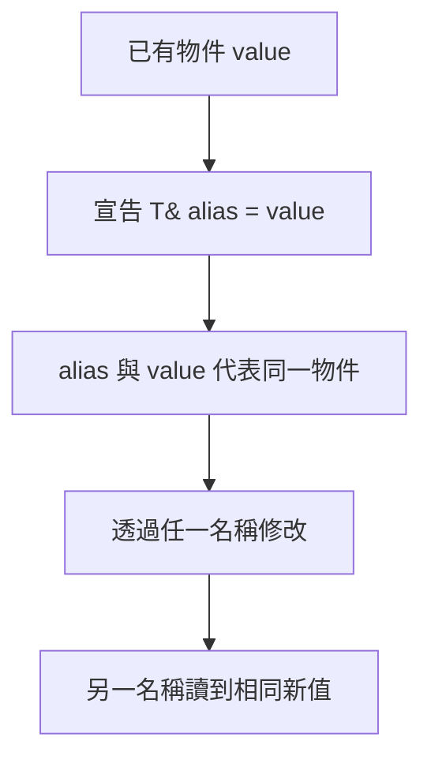
```mermaid
flowchart TD
    A[已有物件 value] --> B[宣告 T& alias = value]
    B --> C[alias 與 value 代表同一物件]
    C --> D[透過任一名稱修改]
    D --> E[另一名稱讀到相同新值]
```

### 2. 傳值與傳參考

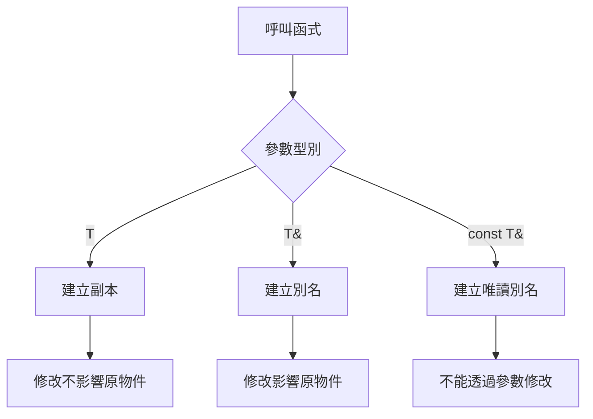
```mermaid
flowchart TD
    A[呼叫函式] --> B{參數型別}
    B -- T --> C[建立副本]
    C --> D[修改不影響原物件]
    B -- T& --> E[建立別名]
    E --> F[修改影響原物件]
    B -- const T& --> G[建立唯讀別名]
    G --> H[不能透過參數修改]
```

### 3. `const` 參考綁定

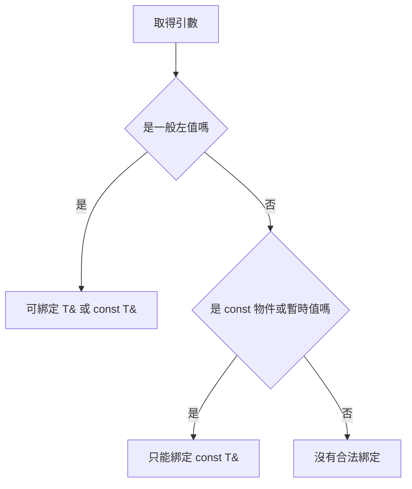
```mermaid
flowchart TD
    A[取得引數] --> B{是一般左值嗎}
    B -- 是 --> C[可綁定 T& 或 const T&]
    B -- 否 --> D{是 const 物件或暫時值嗎}
    D -- 是 --> E[只能綁定 const T&]
    D -- 否 --> F[沒有合法綁定]
```

### 4. `auto` 推導

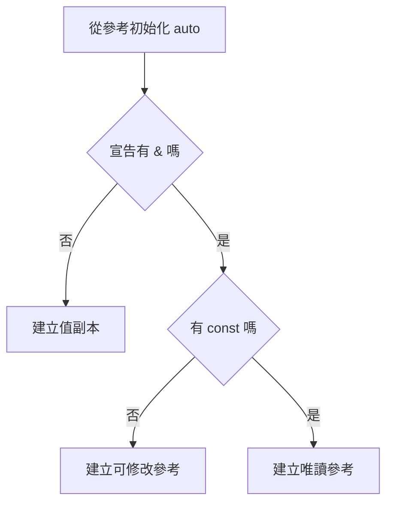
```mermaid
flowchart TD
    A[從參考初始化 auto] --> B{宣告有 & 嗎}
    B -- 否 --> C[建立值副本]
    B -- 是 --> D{有 const 嗎}
    D -- 否 --> E[建立可修改參考]
    D -- 是 --> F[建立唯讀參考]
```

### 5. Range-Based `for`

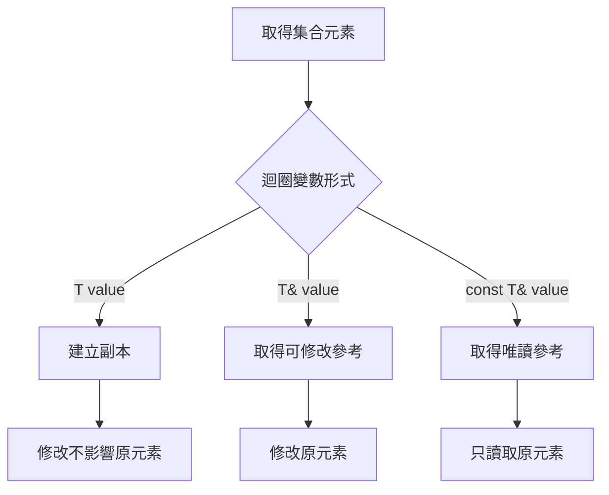
```mermaid
flowchart TD
    A[取得集合元素] --> B{迴圈變數形式}
    B -- T value --> C[建立副本]
    C --> D[修改不影響原元素]
    B -- T& value --> E[取得可修改參考]
    E --> F[修改原元素]
    B -- const T& value --> G[取得唯讀參考]
    G --> H[只讀取原元素]
```

### 6. 回傳參考安全檢查

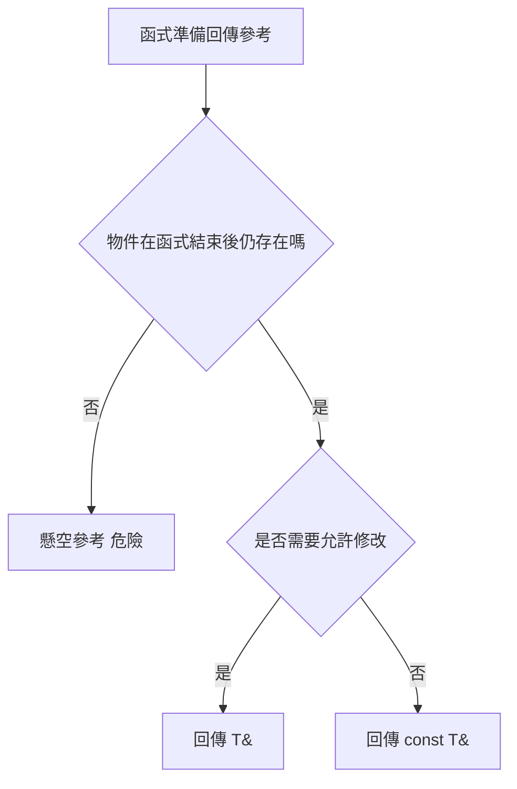
```mermaid
flowchart TD
    A[函式準備回傳參考] --> B{物件在函式結束後仍存在嗎}
    B -- 否 --> C[懸空參考 危險]
    B -- 是 --> D{是否需要允許修改}
    D -- 是 --> E[回傳 T&]
    D -- 否 --> F[回傳 const T&]
```

### 7. 參數方式選擇

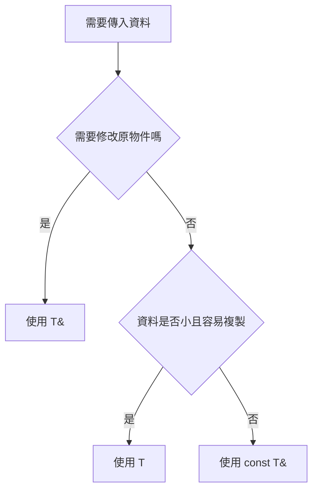
```mermaid
flowchart TD
    A[需要傳入資料] --> B{需要修改原物件嗎}
    B -- 是 --> C[使用 T&]
    B -- 否 --> D{資料是否小且容易複製}
    D -- 是 --> E[使用 T]
    D -- 否 --> F[使用 const T&]
```

### 8. 生命週期

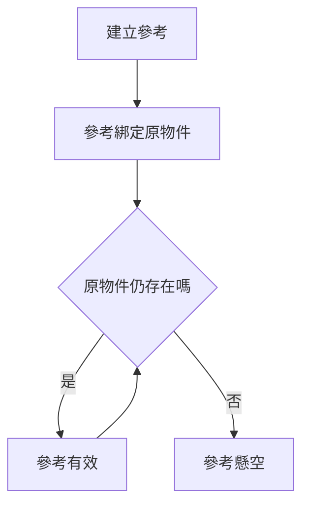
```mermaid
flowchart TD
    A[建立參考] --> B[參考綁定原物件]
    B --> C{原物件仍存在嗎}
    C -- 是 --> D[參考有效]
    C -- 否 --> E[參考懸空]
    D --> C
```

---

# 本章完成標準

完成本章後，你應該能做到：

1. 說明參考是既有物件的別名。
2. 使用 `T&` 宣告參考。
3. 在宣告時初始化參考。
4. 說明參考不能重新綁定。
5. 分辨重新賦值與重新綁定。
6. 透過參考修改原物件。
7. 比較參考與原物件位址。
8. 使用多個參考指向同一物件。
9. 說明 aliasing。
10. 比較傳值與傳參考。
11. 使用參考參數修改呼叫者資料。
12. 使用輸出參數提供多個結果。
13. 判斷何時應直接回傳結果。
14. 建立 `const` 變數。
15. 使用具名常數。
16. 分辨 `const` 與 `constexpr` 的基本用途。
17. 建立 `const T&`。
18. 說明 `const` 參考是唯讀別名。
19. 說明原物件仍可透過其他名稱修改。
20. 將一般物件綁定到 `const` 參考。
21. 將 `const` 物件綁定到 `const` 參考。
22. 將暫時值綁定到 `const` 參考。
23. 說明非 `const` 左值參考的綁定限制。
24. 使用 `const string&`。
25. 判斷傳值、一般參考與 `const` 參考的使用時機。
26. 說明 const-correctness。
27. 使用 `auto` 建立副本。
28. 使用 `auto&` 保留參考。
29. 使用 `const auto&` 建立唯讀參考。
30. 使用 range-based `for` 的值、參考與 `const` 參考版本。
31. 使用參考修改集合元素。
32. 建立回傳參考函式。
33. 透過回傳參考修改原物件。
34. 建立回傳 `const` 參考函式。
35. 說明回傳參考的生命週期要求。
36. 避免回傳區域變數參考。
37. 說明懸空參考。
38. 建立 `T&` 與 `const T&` 多載。
39. 避免濫用 `const_cast`。
40. 找出常見參考與 `const` 錯誤。

---

# 隱藏答案區

> Answer hidden — try it first.

<details><summary>TODO 1 答案</summary>

```cpp
int value = 10;
int& alias = value;

alias = 20;

cout << value << '\n';
```

</details>

<details><summary>TODO 2 答案</summary>

```cpp
int value = 10;
int& alias = value;

cout << boolalpha
     << (&value == &alias)
     << '\n';
```

</details>

<details><summary>TODO 3 答案</summary>

```cpp
int first = 10;
int second = 20;

int& alias = first;
alias = second;

cout << first << '\n';
cout << second << '\n';
```

兩者都輸出 `20`，但參考仍綁定 `first`。

</details>

<details><summary>TODO 4 答案</summary>

```cpp
void increase(int& value) {
    ++value;
}
```

</details>

<details><summary>TODO 5 答案</summary>

```cpp
void clamp(
    int& value,
    int minimum,
    int maximum
) {
    if (value < minimum) {
        value = minimum;
    } else if (value > maximum) {
        value = maximum;
    }
}
```

</details>

<details><summary>TODO 6 答案</summary>

```cpp
bool divide(
    int dividend,
    int divisor,
    int& quotient,
    int& remainder
) {
    if (divisor == 0) {
        return false;
    }

    quotient =
        dividend / divisor;

    remainder =
        dividend % divisor;

    return true;
}
```

</details>

<details><summary>TODO 7 答案</summary>

```cpp
constexpr int daysInWeek = 7;

int weeks;
cin >> weeks;

const int totalDays =
    weeks * daysInWeek;
```

</details>

<details><summary>TODO 8 答案</summary>

```cpp
int value = 10;
const int& view = value;

value = 25;

cout << view << '\n';
```

</details>

<details><summary>TODO 9 答案</summary>

```cpp
void showText(
    const string& text
) {
    cout << text << '\n';
}
```

</details>

<details><summary>TODO 10 答案</summary>

```cpp
int value = 10;
int& originalReference = value;

auto copy = originalReference;
auto& alias = originalReference;
const auto& view = value;
```

</details>

<details><summary>TODO 11 答案</summary>

```cpp
for (int& value : values) {
    value *= 2;
}
```

</details>

<details><summary>TODO 12 答案</summary>

```cpp
for (const auto& value : values) {
    cout << value << '\n';
}
```

</details>

<details><summary>TODO 13 答案</summary>

```cpp
int& larger(
    int& first,
    int& second
) {
    if (first > second) {
        return first;
    }

    return second;
}
```

</details>

<details><summary>TODO 14 答案</summary>

```cpp
const int& smaller(
    const int& first,
    const int& second
) {
    if (first < second) {
        return first;
    }

    return second;
}
```

呼叫時應確保被參考物件在使用結果期間仍然存在。

</details>

<details><summary>TODO 15 答案</summary>

```cpp
void inspect(int& value) {
    cout << "Mutable\n";
}

void inspect(const int& value) {
    cout << "Read-only\n";
}
```

</details>

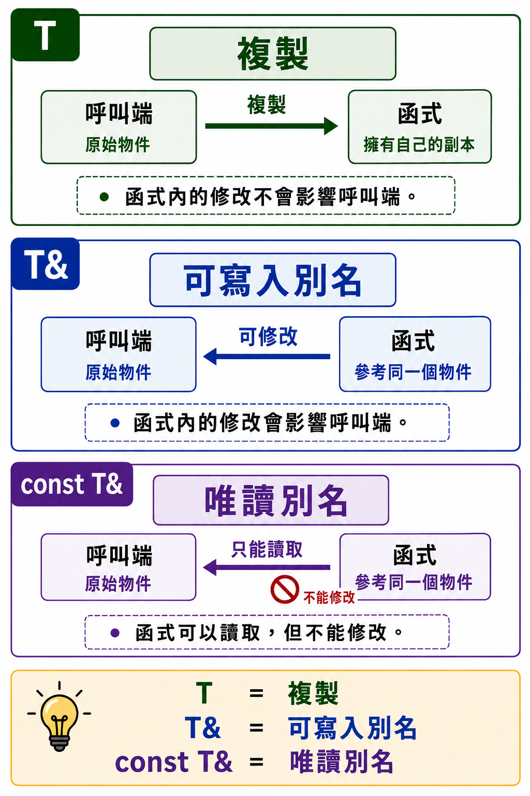
