# Lesson 15：Scope and Lifetime 作用域與生命週期

> 這堂課的重點：分清楚「名稱在哪裡可以使用」與「物件在記憶體中存在多久」。作用域 scope 管理名稱的可見範圍；生命週期 lifetime 管理物件從建立到銷毀的期間。兩者彼此相關，但不是同一件事。

> 本章會介紹區塊作用域、函式作用域、迴圈作用域、命名空間作用域、全域名稱、變數遮蔽、作用域解析運算子 `::`、自動儲存期、靜態儲存期、`static` 區域變數、暫時物件、參考與生命週期，以及懸空參考。動態配置物件的完整管理會留到後續動態記憶體章節。

---

## Section I. 今天要做什麼？

1. 認識作用域 scope。
2. 認識生命週期 lifetime。
3. 分辨作用域與生命週期。
4. 理解名稱可見不代表物件一定仍存在。
5. 理解物件仍存在不代表所有名稱都仍可見。
6. 認識宣告 declaration。
7. 認識定義 definition。
8. 理解名稱通常從宣告點之後開始可見。
9. 認識區塊 block。
10. 理解大括號建立區塊作用域。
11. 使用區域變數 local variable。
12. 理解區域變數只在所在區塊及其內層可見。
13. 理解內層區塊可讀取外層名稱。
14. 理解外層區塊不能讀取內層名稱。
15. 認識巢狀作用域。
16. 理解 `if` 區塊中的變數。
17. 理解 `else` 區塊中的變數。
18. 理解 `switch` 中使用大括號建立獨立區域。
19. 理解 `for` 初始化變數的作用域。
20. 理解 range-based `for` 迴圈變數的作用域。
21. 理解 `while` 主體中的區域變數。
22. 理解每次進入區塊都可能重新建立區域變數。
23. 認識函式作用域。
24. 理解函式參數是區域名稱。
25. 理解不同函式可以使用相同區域變數名稱。
26. 理解每次函式呼叫都有自己的參數與區域變數。
27. 認識命名空間作用域 namespace scope。
28. 認識全域名稱 global name。
29. 理解宣告在所有函式外的名稱。
30. 使用命名空間整理名稱。
31. 使用作用域解析運算子 `::`。
32. 使用 `namespaceName::name`。
33. 使用 `::name` 表示全域名稱。
34. 認識名稱遮蔽 shadowing。
35. 理解內層同名名稱會遮蔽外層名稱。
36. 理解遮蔽不會刪除外層物件。
37. 使用 `-Wshadow` 找出可疑遮蔽。
38. 避免不必要的同名變數。
39. 認識變數生命週期的開始。
40. 認識變數生命週期的結束。
41. 理解初始化通常代表物件生命週期開始。
42. 理解離開區塊時自動物件生命週期結束。
43. 認識自動儲存期 automatic storage duration。
44. 理解一般區域變數通常具有自動儲存期。
45. 理解參數通常具有自動儲存期。
46. 理解每次函式呼叫都建立新的區域物件。
47. 理解函式結束後區域物件被銷毀。
48. 認識靜態儲存期 static storage duration。
49. 理解全域物件通常具有靜態儲存期。
50. 理解命名空間作用域物件通常具有靜態儲存期。
51. 使用 `static` 區域變數。
52. 理解 `static` 區域變數只初始化一次。
53. 理解 `static` 區域變數在函式呼叫間保留值。
54. 理解 `static` 區域名稱的作用域仍然是區域。
55. 分辨「區域作用域」與「靜態生命週期」。
56. 使用 `static` 建立呼叫計數器。
57. 使用 `static` 建立流水編號。
58. 認識全域變數的風險。
59. 理解全域狀態增加函式耦合。
60. 優先使用參數與回傳值傳遞資料。
61. 使用 `constexpr` 或 `const` 建立具名常數。
62. 認識初始化順序的基本概念。
63. 理解區域變數依執行到宣告位置時初始化。
64. 理解同一區塊中的物件通常依宣告順序建立。
65. 理解離開區塊時通常以相反順序銷毀。
66. 認識暫時物件 temporary object。
67. 理解暫時物件通常存活到完整表示式結束。
68. 理解 `const` 參考可延長某些暫時物件生命週期。
69. 分辨暫時物件生命週期與參考作用域。
70. 理解參考不是物件所有者。
71. 理解參考不會讓一般被參考物件自動延長生命週期。
72. 認識懸空參考 dangling reference。
73. 避免回傳區域變數參考。
74. 避免保存指向已銷毀區域物件的參考。
75. 理解安全回傳值。
76. 理解回傳區域物件的值通常是安全的。
77. 理解安全回傳參考參數的條件。
78. 理解回傳靜態物件參考的基本概念。
79. 理解回傳非 `const` 參考會暴露可修改狀態。
80. 使用 `const` 回傳參考限制修改。
81. 認識 `if` 初始化敘述的作用域。
82. 認識 `switch` 初始化敘述的作用域。
83. 理解初始化變數在整個條件結構中可見。
84. 認識 `static` 在命名空間作用域的基本概念。
85. 認識內部連結 internal linkage 的概念。
86. 使用匿名命名空間整理檔案內部名稱。
87. 理解標頭檔與多個來源檔案的基本作用域問題。
88. 避免在標頭檔直接定義可修改全域變數。
89. 認識 `extern` 宣告的基本概念。
90. 分辨作用域、儲存期與連結。
91. 認識動態儲存期的概念預告。
92. 理解動態物件不由一般區塊結束自動銷毀。
93. 理解完整動態管理會在後續章節學習。
94. 使用概念檢查、程式閱讀與實作題整合本章。

---

## Section II. 今天的學習方式

1. 每個變數先回答三個問題：
   ```text
   名稱在哪裡可見？
   物件何時建立？
   物件何時銷毀？
   ```
2. 看到大括號時，標出區塊邊界。
3. 看到同名變數時，先判斷目前所在的最內層作用域。
4. 作用域題只追蹤「名稱可否使用」。
5. 生命週期題追蹤「物件是否仍存在」。
6. `static` 區域變數要分開記錄：
   ```text
   名稱：只在函式內可見
   物件：整個程式期間持續存在
   ```
7. 參考題一定檢查被參考物件是否仍存在。
8. 回傳參考題一定確認來源不是即將銷毀的區域物件。
9. 暫時物件題先找完整表示式的結尾分號。
10. 遮蔽題不要只看名稱，要找最近的宣告。
11. 所有合法完整程式使用嚴格 C++17 選項檢查。
12. 會產生未定義行為的範例只供分析，不執行。

---

## Section III. 核心術語對照

| 術語 | 意義 |
| --- | --- |
| Scope 作用域 | 名稱可以被程式使用的範圍 |
| Lifetime 生命週期 | 物件從建立到銷毀的期間 |
| Block scope 區塊作用域 | 一對大括號建立的可見範圍 |
| Local variable 區域變數 | 宣告在函式或區塊內的變數 |
| Global name 全域名稱 | 宣告在所有函式外的名稱 |
| Namespace scope 命名空間作用域 | 位於命名空間中的名稱範圍 |
| Shadowing 遮蔽 | 內層同名名稱暫時隱藏外層名稱 |
| Automatic storage duration 自動儲存期 | 進入區塊建立、離開區塊銷毀 |
| Static storage duration 靜態儲存期 | 通常從程式開始到程式結束存在 |
| Temporary object 暫時物件 | 表示式計算過程中產生的短期物件 |
| Dangling reference 懸空參考 | 參考指向已不存在的物件 |
| Linkage 連結 | 同一名稱是否能跨作用域或來源檔代表同一實體 |
| `::` | 作用域解析運算子 |
| `static` local | 區域作用域、靜態儲存期 |
| `constexpr` | 可在編譯期間求值的常數宣告 |

---

# Part A：作用域與生命週期不是同一件事

## Section IV. 作用域管理名稱

```cpp
{
    int value = 10;
    cout << value << '\n';
}
```

名稱 `value` 只在這一對大括號內可見。

---

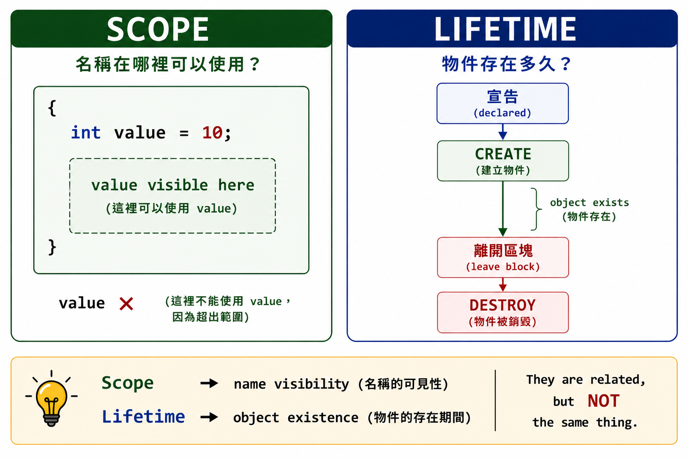

## Section V. 生命週期管理物件

一般區域變數：

```text
執行到宣告位置
→ 建立並初始化
→ 使用
→ 離開區塊
→ 銷毀
```

---

## Section VI. 比較表

| 問題 | 屬於 |
| --- | --- |
| 這裡能不能寫 `value`？ | 作用域 |
| `value` 所代表的物件還存在嗎？ | 生命週期 |
| 內層同名變數會用哪一個？ | 作用域 |
| 函式結束後區域變數是否仍存在？ | 生命週期 |
| `static` 區域變數能否在其他函式直接使用？ | 作用域 |
| `static` 區域變數是否保留前次值？ | 生命週期 |

---

## Section VII. 關鍵差異

`static` 區域變數最能說明兩者不同：

```cpp
void example() {
    static int count = 0;
}
```

- 名稱 `count` 只在 `example()` 中可見。
- 物件卻持續存在到程式結束。

---

# Part B：區塊作用域

## Section VIII. 大括號建立區塊

```cpp
{
    int value = 10;
}
```

`value` 的作用域從宣告點開始，到右大括號結束。

---

## Section IX. 完整區塊範例

```cpp
// VALIDATE
#include <iostream>
using namespace std;

int main() {
    int outerValue = 10;

    {
        int innerValue = 20;

        cout << outerValue
             << " "
             << innerValue
             << '\n';
    }

    cout << outerValue
         << '\n';

    return 0;
}
```

`innerValue` 離開內層區塊後不可再使用。

---

## Section X. 內層可以看見外層

```cpp
int outerValue = 10;

{
    cout << outerValue;
}
```

內層作用域通常可以存取外層已宣告的名稱。

---

## Section XI. 外層看不見內層

```cpp
{
    int innerValue = 20;
}

/* cout << innerValue; */
```

離開區塊後，名稱不再可見，而且一般區域物件也已銷毀。

---

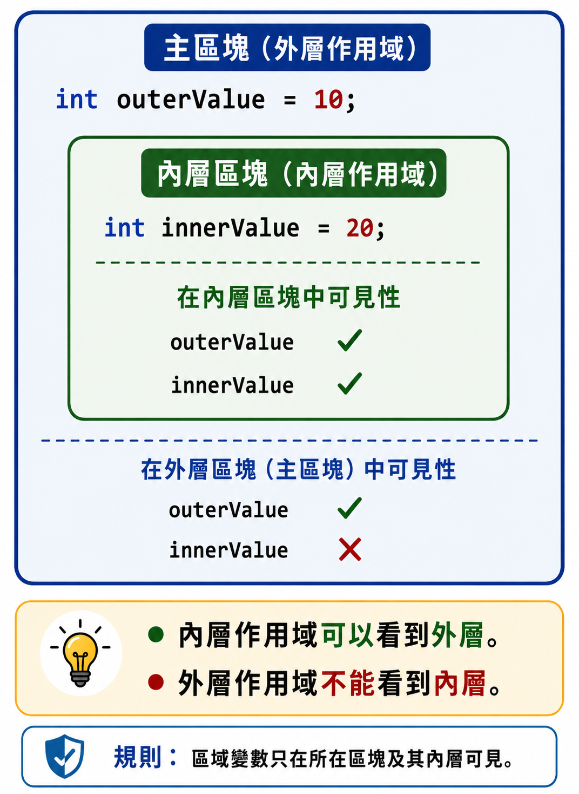

# Part C：名稱從宣告點開始可見

## Section XII. 宣告之前不能使用

不合法概念：

```cpp
/* cout << value; */
int value = 10;
```

名稱通常要等宣告出現後才進入作用域。

---

## Section XIII. 同一區塊中的宣告點

```cpp
int first = 10;
int second = first + 5;
```

`first` 已經宣告，因此可以用來初始化 `second`。

---

## Section XIV. 自我初始化問題

危險概念：

```cpp
int value = value;
```

右側名稱可能指向正在宣告但尚未正確初始化的物件，結果不是想要的「使用外層值」。

應避免使用相同名稱造成混淆。

---

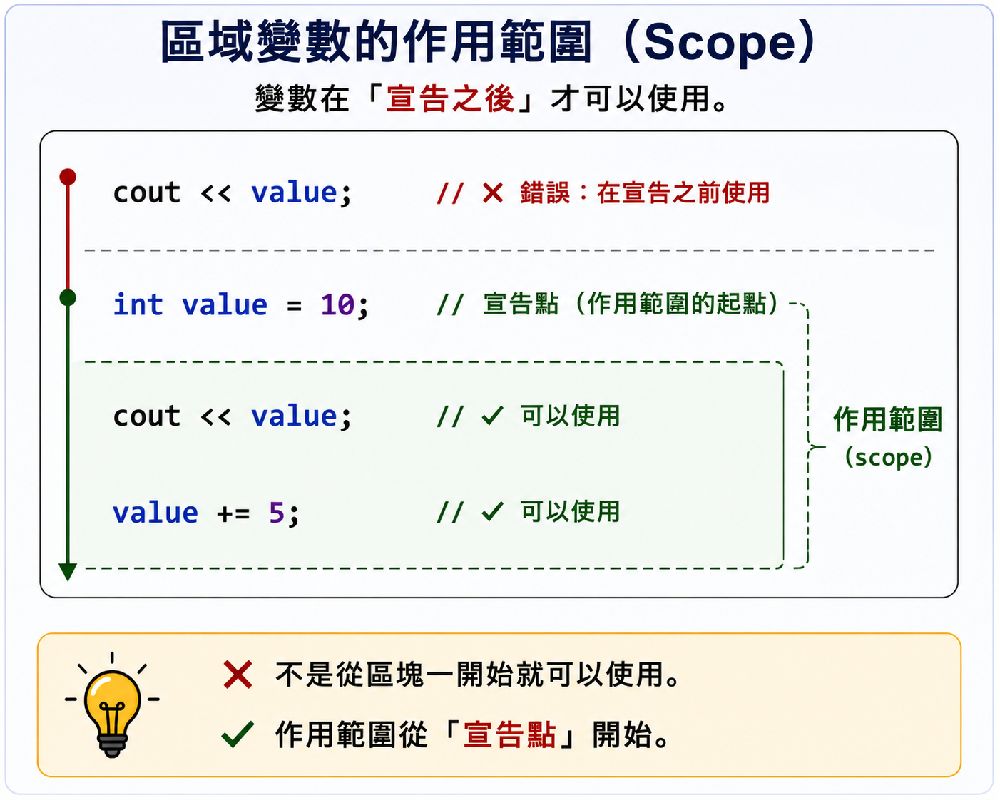

# Part D：`if` 與 `else` 的作用域

## Section XV. `if` 區塊

```cpp
if (condition) {
    int result = 10;
}
```

`result` 只在 `if` 區塊內可見。

---

## Section XVI. `if` 與 `else` 是不同區塊

```cpp
if (condition) {
    int value = 10;
} else {
    int value = 20;
}
```

兩個 `value` 是不同物件。

---

## Section XVII. 完整分支範例

```cpp
// VALIDATE
#include <iostream>
using namespace std;

int main() {
    int number;
    cin >> number;

    if (number >= 0) {
        int absoluteValue = number;

        cout << absoluteValue
             << '\n';
    } else {
        int absoluteValue = -number;

        cout << absoluteValue
             << '\n';
    }

    return 0;
}
```

兩個 `absoluteValue` 位於不同區塊，不會同時存在。

---

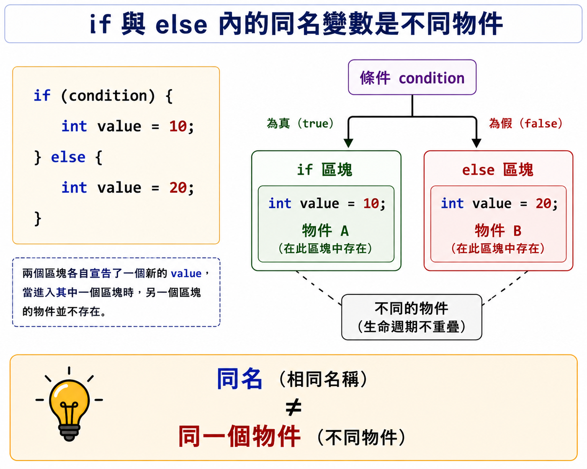

# Part E：`for` 迴圈變數的作用域

## Section XVIII. 初始化區宣告

```cpp
for (int index = 0; index < 5; ++index) {
    cout << index << '\n';
}
```

`index` 可見於：

- 條件區
- 更新區
- 迴圈主體

---

## Section XIX. 迴圈結束後

不合法概念：

```cpp
for (int index = 0; index < 5; ++index) {
    cout << index;
}

/* cout << index; */
```

`index` 已離開作用域。

---

## Section XX. 完整 `for` 作用域範例

```cpp
// VALIDATE
#include <iostream>
using namespace std;

int main() {
    for (int index = 0; index < 3; ++index) {
        int square =
            index * index;

        cout << square
             << '\n';
    }

    return 0;
}
```

每一輪都會建立新的 `square` 物件，並在該輪主體結束時銷毀。

---

## Section XXI. Range-Based `for`

```cpp
for (int value : values) {
    // value 只在本輪迴圈主體內使用
}
```

每輪的 `value` 都是該輪迴圈變數。

---

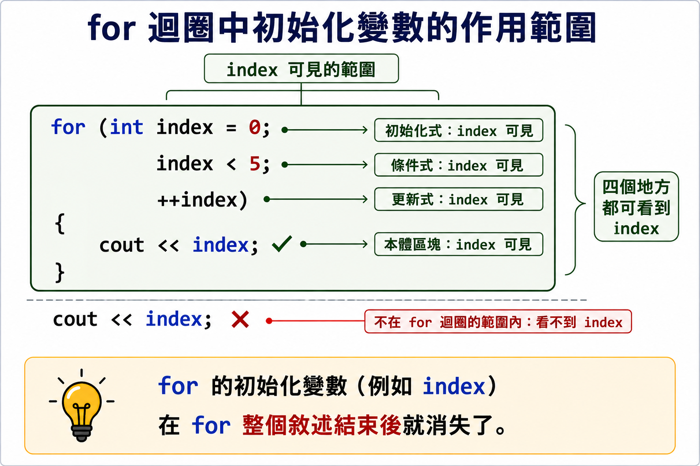

# Part F：`while` 中的區域變數

## Section XXII. 每輪重新建立

```cpp
int count = 0;

while (count < 3) {
    int value =
        count * 10;

    cout << value << '\n';
    ++count;
}
```

每次進入主體：

```text
建立新的 value
→ 使用
→ 離開本輪主體
→ 銷毀
```

---

## Section XXIII. 完整每輪生命週期範例

```cpp
// VALIDATE
#include <iostream>
using namespace std;

int main() {
    int count = 0;

    while (count < 3) {
        int value =
            count * 10;

        cout << value
             << '\n';

        ++count;
    }

    return 0;
}
```

---

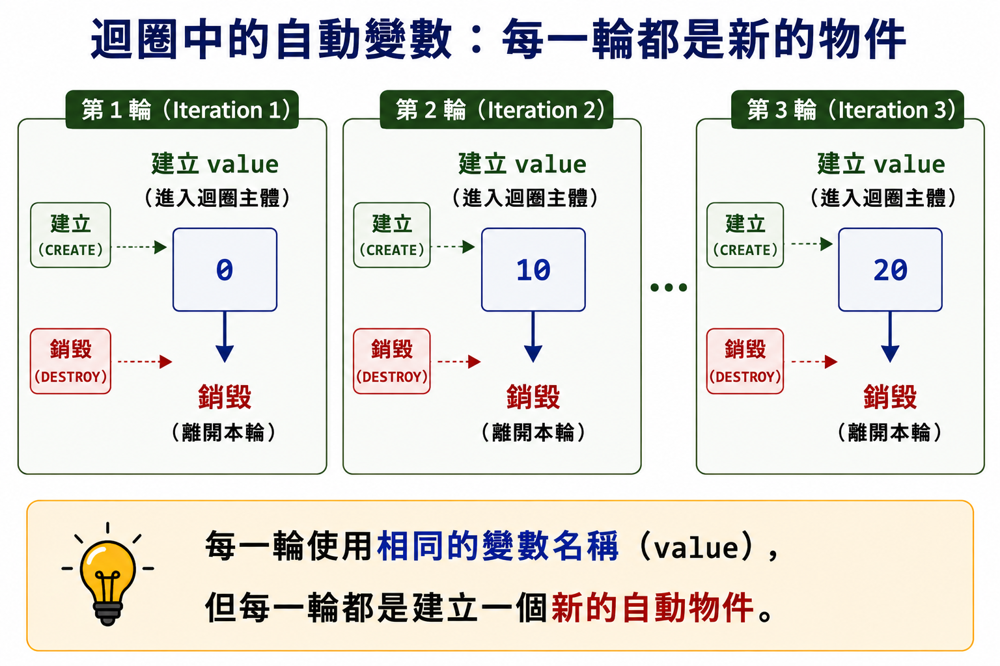

# Part G：函式作用域

## Section XXIV. 參數是區域名稱

```cpp
int square(int number) {
    return number * number;
}
```

`number` 只在 `square()` 函式內可見。

---

## Section XXV. 不同函式可以重複名稱

```cpp
void first(int value) {
    cout << value;
}

void second(int value) {
    cout << value;
}
```

兩個 `value` 位於不同函式作用域。

---

## Section XXVI. 每次呼叫都有自己的物件

```cpp
int addOne(int value) {
    ++value;
    return value;
}
```

每次呼叫都建立新的參數 `value`。

---

## Section XXVII. 完整函式區域範例

```cpp
// VALIDATE
#include <iostream>
using namespace std;

int addOne(int value) {
    int result =
        value + 1;

    return result;
}

int main() {
    cout << addOne(5)
         << '\n';

    cout << addOne(10)
         << '\n';

    return 0;
}
```

兩次呼叫的 `value` 與 `result` 是不同物件。

---

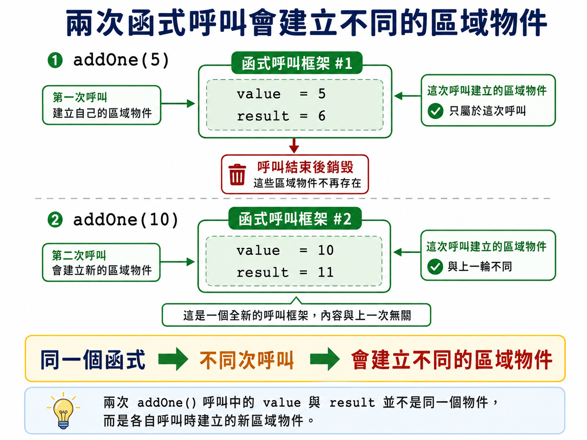

# Part H：命名空間作用域

## Section XXVIII. 命名空間

```cpp
namespace School {
    const int passingScore = 60;
}
```

名稱完整寫法：

```cpp
School::passingScore
```

---

## Section XXIX. 完整命名空間範例

```cpp
// VALIDATE
#include <iostream>
using namespace std;

namespace School {
    constexpr int passingScore = 60;

    bool isPassing(int score) {
        return
            score >= passingScore;
    }
}

int main() {
    int score;
    cin >> score;

    cout << boolalpha
         << School::isPassing(score)
         << '\n';

    return 0;
}
```

---

## Section XXX. 命名空間的用途

- 避免名稱衝突。
- 將相關函式與常數分組。
- 讓名稱來源清楚。
- 支援大型專案拆分。

---

## Section XXXI. `std::`

標準函式庫名稱位於：

```cpp
std
```

命名空間中，例如：

```cpp
std::cout
std::string
std::vector
```

---

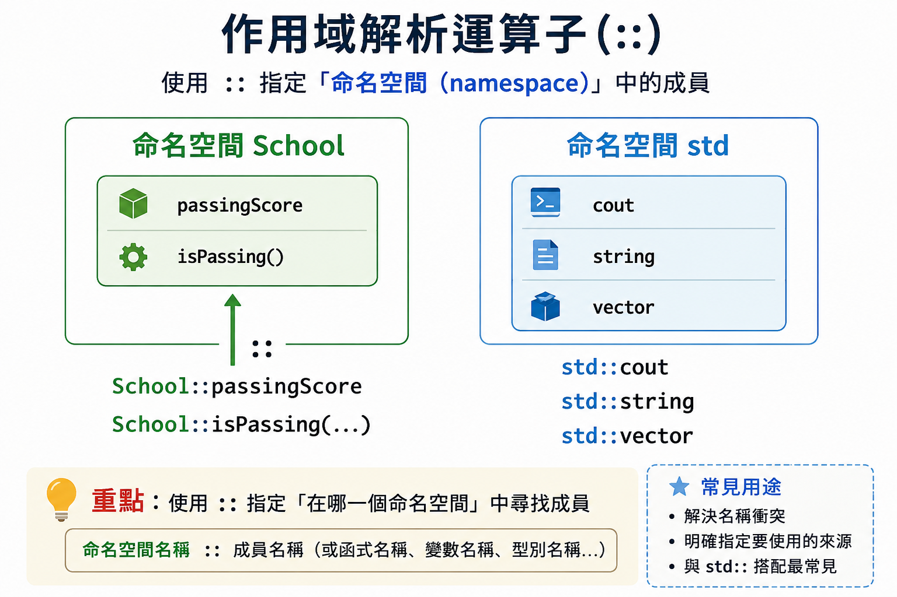

# Part I：全域名稱

## Section XXXII. 宣告在所有函式外

```cpp
int globalCount = 0;
```

名稱可在後續適當位置的函式中使用。

物件通常具有靜態儲存期。

---

## Section XXXIII. 完整全域狀態範例

```cpp
// VALIDATE
#include <iostream>
using namespace std;

int globalCount = 0;

void recordCall() {
    ++globalCount;
}

int main() {
    recordCall();
    recordCall();

    cout << globalCount
         << '\n';

    return 0;
}
```

輸出：

```text
2
```

---

## Section XXXIV. 全域變數的風險

任何可存取它的函式都可能修改：

```cpp
globalCount
```

因此：

- 修改來源不易追蹤。
- 函式依賴隱藏狀態。
- 測試較困難。
- 多個模組容易互相影響。

---

## Section XXXV. 優先使用資料流

較清楚：

```cpp
int recordCall(int count) {
    return count + 1;
}
```

或將狀態交給物件管理。

初學階段應少用可修改全域變數。

---

# Part J：作用域解析運算子 `::`

## Section XXXVI. 命名空間名稱

```cpp
School::passingScore
```

`::` 指定從 `School` 命名空間尋找名稱。

---

## Section XXXVII. 全域名稱

若區域名稱遮蔽全域名稱：

```cpp
int value = 10;

int main() {
    int value = 20;

    cout << value;
    cout << ::value;
}
```

- `value`：最內層區域名稱。
- `::value`：全域名稱。

---

## Section XXXVIII. 不建議依賴同名

雖然 `::` 可以存取全域名稱，但更好的方式通常是：

- 使用不同且有意義的名稱。
- 將常數放入命名空間。
- 避免可修改全域狀態。
- 啟用 `-Wshadow`。

---

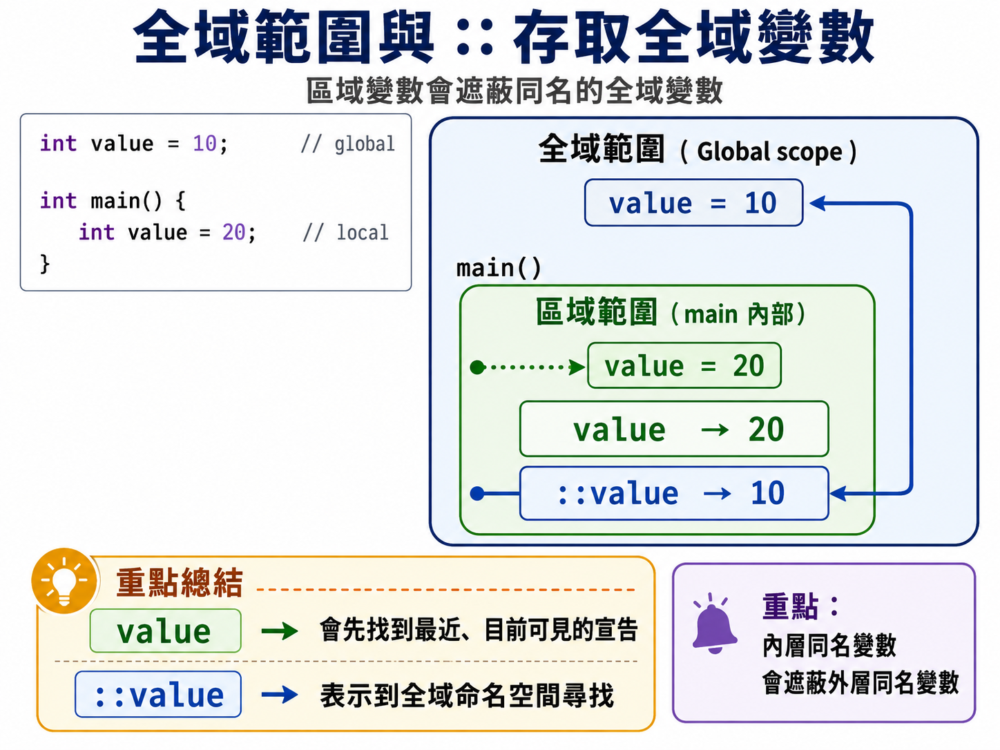

# Part K：變數遮蔽 Shadowing

## Section XXXIX. 內層同名變數

```cpp
int value = 10;

{
    int value = 20;
    cout << value;
}
```

內層 `value` 遮蔽外層 `value`。

---

## Section XL. 外層物件仍存在

遮蔽只影響名稱查找：

```text
外層物件沒有被銷毀
只是直接寫 value 時會找到內層名稱
```

離開內層區塊後，外層名稱再次可見。

---

## Section XLI. 參數遮蔽全域名稱

```cpp
int total = 100;

void show(int total) {
    cout << total;
}
```

函式內的 `total` 參數遮蔽全域 `total`。

---

## Section XLII. 為什麼應避免？

遮蔽可能造成：

- 讀錯變數。
- 初始化時誤用自己。
- 修改錯誤物件。
- 除錯困難。
- 重構時產生隱性錯誤。

建議使用：

```text
globalTotal
localTotal
inputTotal
```

等更清楚名稱。

---

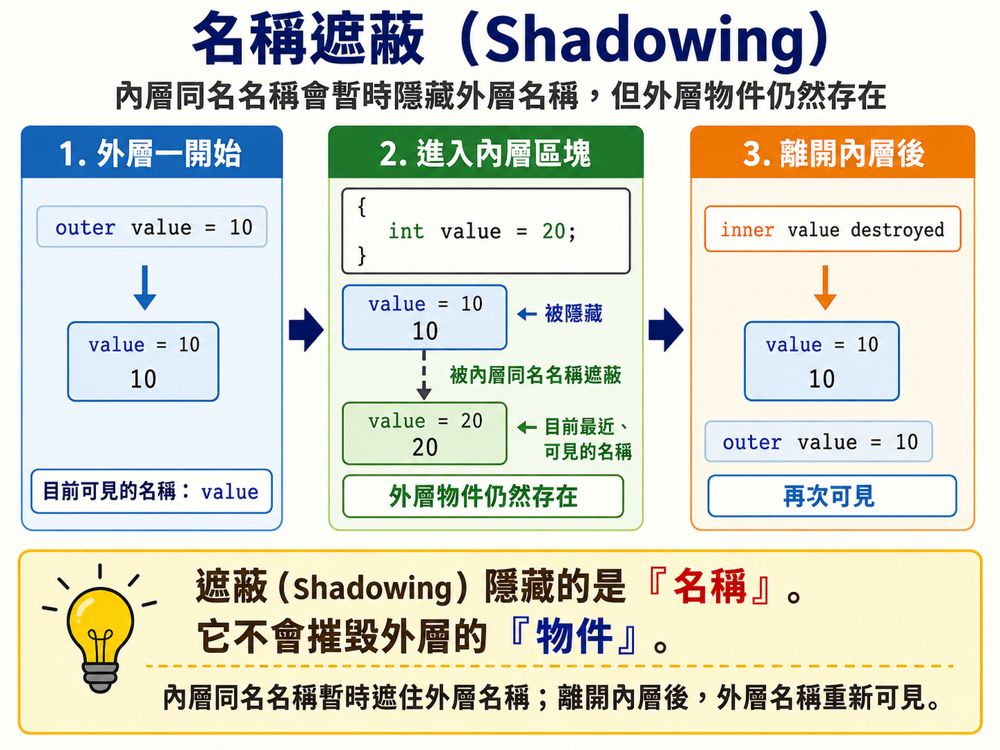

# Part L：自動儲存期

## Section XLIII. 一般區域變數

```cpp
void example() {
    int value = 10;
}
```

`value` 通常具有自動儲存期。

---

## Section XLIV. 建立與銷毀

```text
進入函式
→ 執行到宣告
→ 建立 value
→ 函式結束
→ 銷毀 value
```

---

## Section XLV. 完整重設範例

```cpp
// VALIDATE
#include <iostream>
using namespace std;

void showLocalValue() {
    int count = 0;

    ++count;

    cout << count
         << '\n';
}

int main() {
    showLocalValue();
    showLocalValue();
    showLocalValue();

    return 0;
}
```

輸出：

```text
1
1
1
```

每次呼叫都建立新的 `count`。

---

## Section XLVI. 參數生命週期

函式參數通常：

```text
呼叫時建立
函式執行期間存在
函式結束時銷毀
```

傳參考參數本身的參考名稱會結束，但呼叫者物件未必銷毀。

---

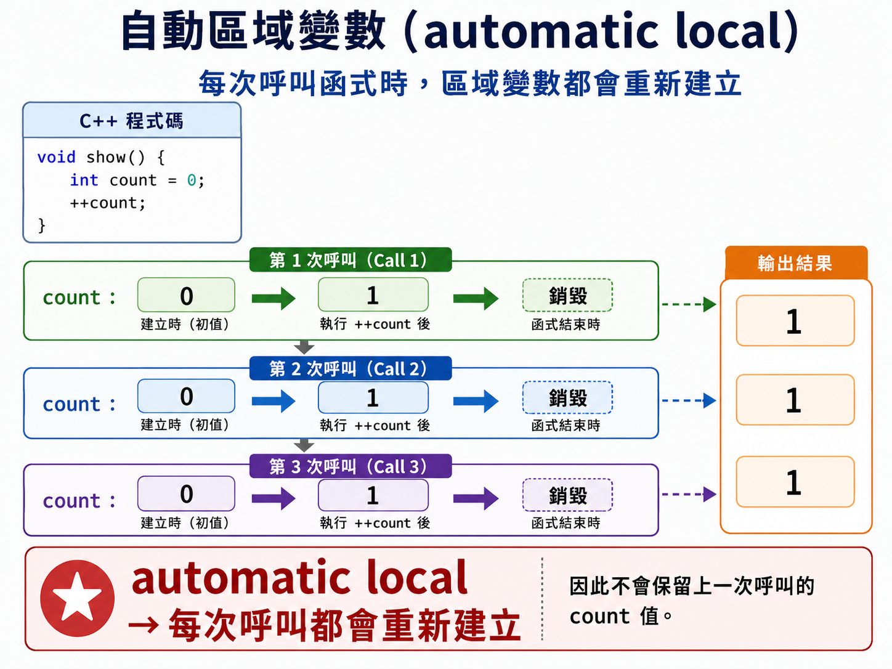

# Part M：靜態儲存期

## Section XLVII. 全域物件

全域變數通常：

```text
程式開始前後完成初始化
→ 整個程式期間存在
→ 程式結束時銷毀
```

---

## Section XLVIII. `static` 區域變數

```cpp
void example() {
    static int count = 0;
}
```

名稱仍然只在函式內可見，但物件持續存在。

---

## Section XLIX. 完整 `static` 計數器

```cpp
// VALIDATE
#include <iostream>
using namespace std;

void showCallNumber() {
    static int callCount = 0;

    ++callCount;

    cout << callCount
         << '\n';
}

int main() {
    showCallNumber();
    showCallNumber();
    showCallNumber();

    return 0;
}
```

輸出：

```text
1
2
3
```

---

## Section L. 只初始化一次

```cpp
static int callCount = 0;
```

初始化只在第一次控制流程到達宣告時執行一次。

後續呼叫沿用原值。

---

## Section LI. 區域作用域，靜態生命週期

| 屬性 | `callCount` |
| --- | --- |
| 名稱可見範圍 | `showCallNumber()` 內 |
| 物件存在時間 | 幾乎整個程式期間 |
| 初始化次數 | 1 次 |
| 是否保留前次值 | 是 |

---

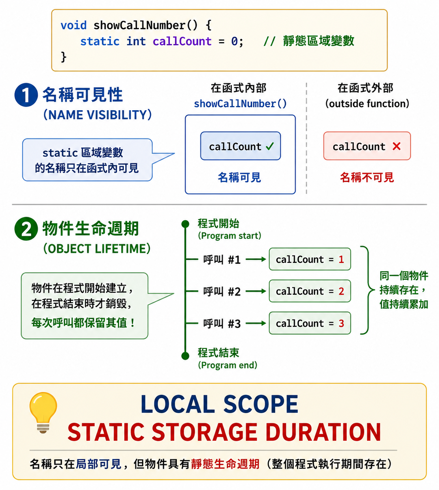

# Part N：自動變數與 `static` 變數比較

## Section LII. 完整比較

```cpp
// VALIDATE
#include <iostream>
using namespace std;

void compareStorage() {
    int automaticCount = 0;
    static int staticCount = 0;

    ++automaticCount;
    ++staticCount;

    cout << automaticCount
         << " "
         << staticCount
         << '\n';
}

int main() {
    compareStorage();
    compareStorage();
    compareStorage();

    return 0;
}
```

輸出：

```text
1 1
1 2
1 3
```

---

## Section LIII. 使用情境

`static` 區域變數可用於：

- 呼叫次數。
- 流水編號。
- 快取已計算結果的基本概念。
- 函式內部持久狀態。

但它仍然是共享狀態，應謹慎使用。

---

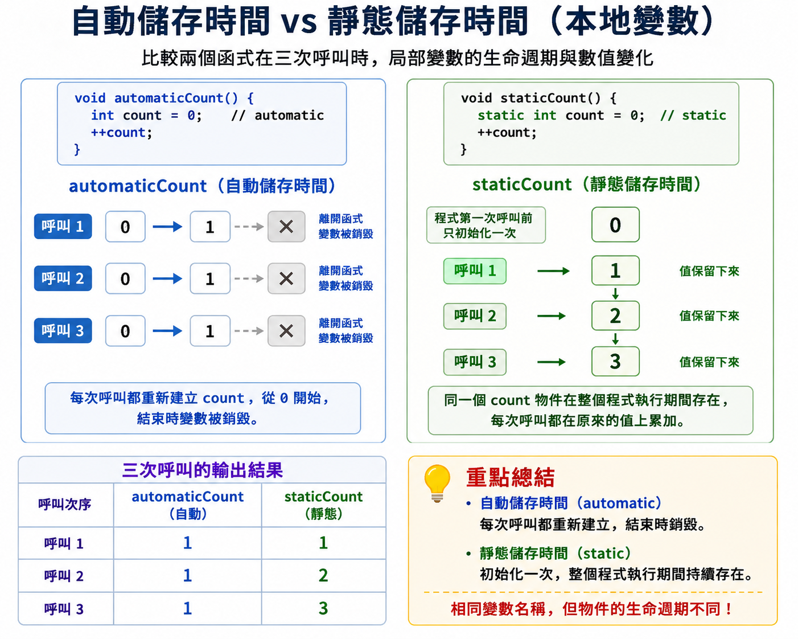

# Part O：流水編號

## Section LIV. 建立 ID

```cpp
int nextId() {
    static int currentId = 0;

    ++currentId;
    return currentId;
}
```

---

## Section LV. 完整流水編號程式

```cpp
// VALIDATE
#include <iostream>
using namespace std;

int nextId() {
    static int currentId = 0;

    ++currentId;
    return currentId;
}

int main() {
    cout << nextId()
         << '\n';

    cout << nextId()
         << '\n';

    cout << nextId()
         << '\n';

    return 0;
}
```

---

## Section LVI. 限制

此設計隱藏了一個會改變的狀態。

在大型程式中可能需要考慮：

- 測試時如何重設。
- 多執行緒安全。
- 多個編號來源。
- 程式重新啟動後是否保留。

本章只學習生命週期概念。

---

# Part P：初始化與銷毀順序

## Section LVII. 區域物件建立順序

同一區塊：

```cpp
int first = 1;
int second = 2;
int third = 3;
```

通常依宣告順序建立：

```text
first
second
third
```

---

## Section LVIII. 銷毀順序

離開區塊時通常反向：

```text
third
second
first
```

對基本型別不容易觀察，但對未來的類別物件與資源管理很重要。

---

## Section LIX. 為什麼要知道？

後續學習類別時，建構函式與解構函式會讓建立和銷毀順序清楚可見。

這也是 C++ 以作用域管理資源的重要基礎。

---

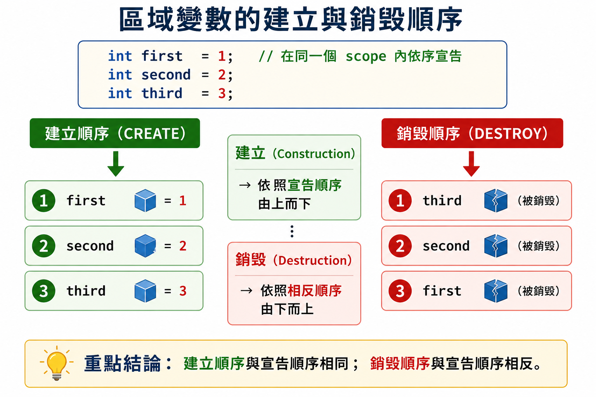

# Part Q：`if` 初始化敘述

## Section LX. C++17 寫法

```cpp
if (int value = readValue(); value >= 0) {
    // ...
} else {
    // ...
}
```

`value` 可見於：

- `if` 條件
- `if` 區塊
- `else` 區塊

離開整個 `if-else` 後失去作用域。

---

## Section LXI. 完整 `if` 初始化範例

```cpp
// VALIDATE
#include <iostream>
using namespace std;

int readValue() {
    int value;
    cin >> value;

    return value;
}

int main() {
    if (
        int value = readValue();
        value >= 0
    ) {
        cout << "Non-negative: "
             << value
             << '\n';
    } else {
        cout << "Negative: "
             << value
             << '\n';
    }

    return 0;
}
```

---

## Section LXII. 好處

- 限制變數作用域。
- 讓名稱只存在於需要的位置。
- 避免污染後續程式。
- 將取得資料與判斷放在一起。

---

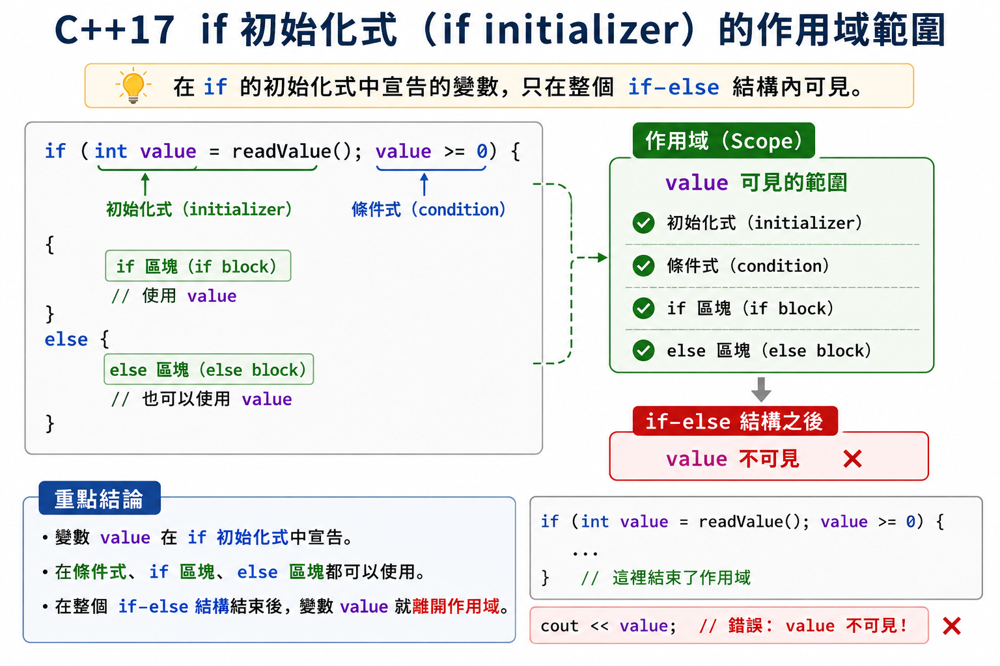

# Part R：`switch` 初始化敘述

## Section LXIII. C++17 寫法

```cpp
switch (int option = readOption(); option) {
    case 1:
        // ...
        break;
}
```

`option` 在整個 `switch` 中可見。

---

## Section LXIV. 完整 `switch` 初始化範例

```cpp
// VALIDATE
#include <iostream>
using namespace std;

int readOption() {
    int option;
    cin >> option;

    return option;
}

int main() {
    switch (
        int option = readOption();
        option
    ) {
        case 1:
            cout << "Start\n";
            break;

        case 2:
            cout << "Stop\n";
            break;

        default:
            cout << "Unknown\n";
            break;
    }

    return 0;
}
```

---

# Part S：暫時物件

## Section LXV. 什麼是暫時物件？

表示式可能產生沒有具名變數的短期物件：

```cpp
string("Hello")
```

```cpp
first + second
```

---

## Section LXVI. 完整表示式

暫時物件通常存活到完整表示式結束。

完整表示式常以分號結束：

```cpp
showText(
    string("Hello")
);
```

暫時字串通常在函式呼叫完成後銷毀。

---

## Section LXVII. `const` 參考延長生命週期

```cpp
const string& message =
    string("Hello");
```

直接綁定到區域 `const` 參考時，該暫時物件的生命週期可延長到參考作用域結束。

---

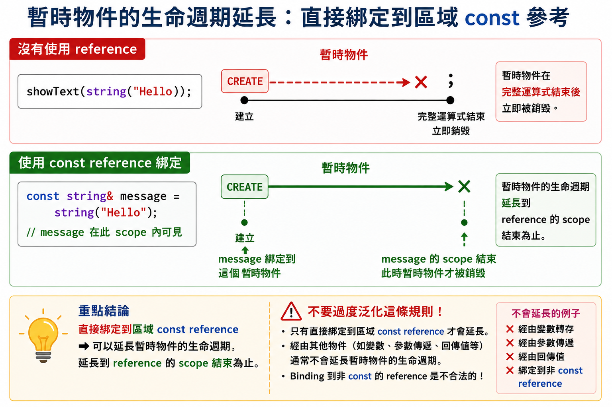

## Section LXVIII. 完整暫時字串範例

```cpp
// VALIDATE
#include <iostream>
#include <string>
using namespace std;

int main() {
    const string& message =
        string("Hello") +
        ", lifetime!";

    cout << message
         << '\n';

    return 0;
}
```

---

## Section LXIX. 不要過度延伸規則

不是所有透過函式傳遞、成員存取或回傳參考的情況都會安全延長生命週期。

初學時記住：

```text
區域 const 參考直接綁定暫時值
通常可延長到該參考作用域結束
```

其他複雜情況要逐案分析。

---

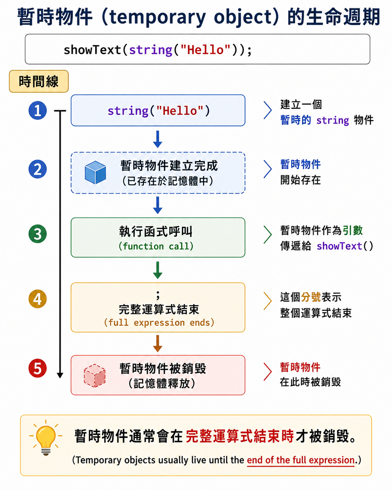

# Part T：參考不擁有物件

## Section LXX. 參考只是別名

```cpp
int value = 10;
int& alias = value;
```

`alias` 不負責建立或延長 `value` 的一般生命週期。

---

## Section LXXI. 參考離開作用域

```cpp
int value = 10;

{
    int& alias = value;
    alias = 20;
}
```

`alias` 消失，但 `value` 仍存在。

---

## Section LXXII. 原物件先消失

若參考被保存得比原物件更久：

```text
原物件銷毀
→ 參考仍存在
→ 參考變成懸空
```

使用懸空參考是未定義行為。

---

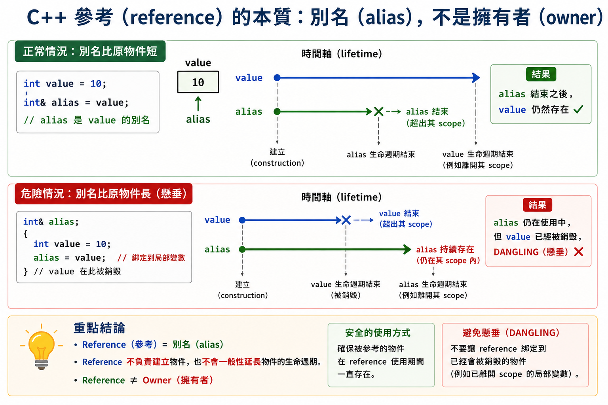

# Part U：回傳區域變數

## Section LXXIII. 回傳值是安全的

```cpp
int makeValue() {
    int localValue = 10;
    return localValue;
}
```

回傳的是值。

呼叫者取得自己的結果物件。

---

## Section LXXIV. 完整安全回傳值

```cpp
// VALIDATE
#include <iostream>
using namespace std;

int makeValue() {
    int localValue = 10;

    return localValue;
}

int main() {
    int result =
        makeValue();

    cout << result
         << '\n';

    return 0;
}
```

---

## Section LXXV. 回傳區域參考不安全

危險：

```cpp
/* 不要使用：

int& makeReference() {
    int localValue = 10;
    return localValue;
}

*/
```

函式結束時 `localValue` 被銷毀，回傳參考立即懸空。

---

## Section LXXVI. 回傳區域指標也有同類問題

後續學習指標時也要避免：

```text
回傳指向已銷毀區域物件的位址
```

核心問題不是語法，而是被指向物件的生命週期已結束。

---

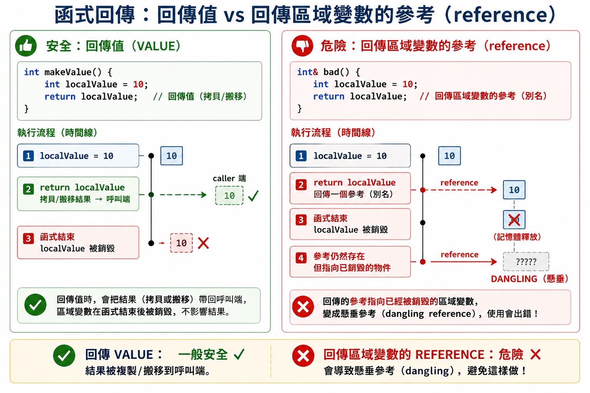

# Part V：安全回傳參考

## Section LXXVII. 回傳參考參數

```cpp
int& larger(
    int& first,
    int& second
) {
    return
        first > second
            ? first
            : second;
}
```

只要呼叫者的物件仍存在，回傳參考就可以有效。

---

## Section LXXVIII. 完整安全參考回傳

```cpp
// VALIDATE
#include <iostream>
using namespace std;

int& larger(
    int& first,
    int& second
) {
    if (first > second) {
        return first;
    }

    return second;
}

int main() {
    int first = 10;
    int second = 20;

    larger(first, second) =
        100;

    cout << first
         << " "
         << second
         << '\n';

    return 0;
}
```

---

## Section LXXIX. 回傳靜態物件參考

```cpp
int& sharedCounter() {
    static int count = 0;

    return count;
}
```

靜態物件在函式結束後仍存在，因此參考不會立刻懸空。

---

## Section LXXX. 完整靜態參考範例

```cpp
// VALIDATE
#include <iostream>
using namespace std;

int& sharedCounter() {
    static int count = 0;

    return count;
}

int main() {
    ++sharedCounter();
    ++sharedCounter();

    cout << sharedCounter()
         << '\n';

    return 0;
}
```

輸出：

```text
2
```

---

## Section LXXXI. 介面風險

回傳非 `const` 參考讓呼叫者可直接修改內部狀態。

若只允許讀取，可以回傳：

```cpp
const int&
```

或直接回傳值。

---

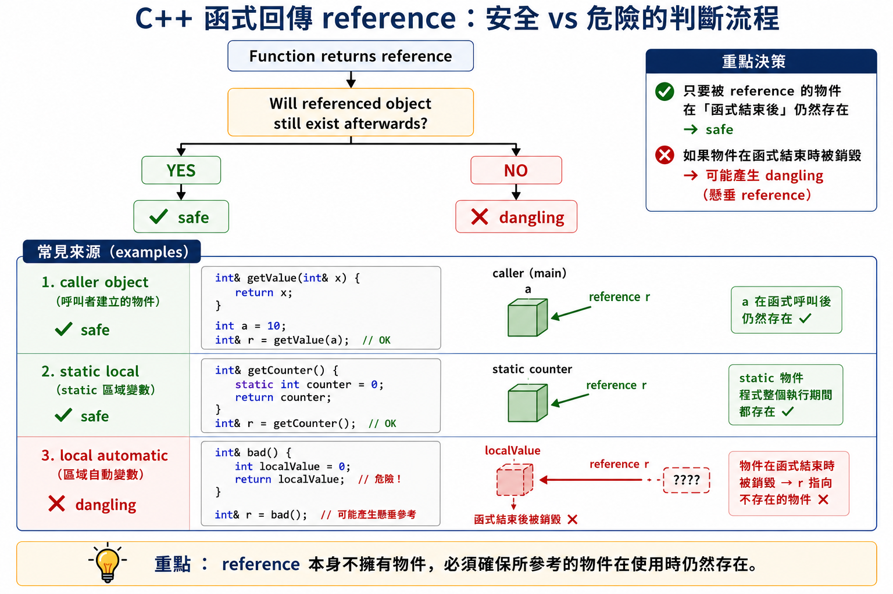

# Part W：生命週期與參考參數

## Section LXXXII. 函式不自動延長呼叫者物件生命週期

```cpp
void storeReference(
    const string& text
);
```

參數在呼叫期間有效，不代表函式可以安全把參考保存到呼叫結束後。

---

## Section LXXXIII. 危險概念

若函式把參考保存到全域位置，而呼叫者傳入區域或暫時物件：

```text
呼叫結束
→ 原物件可能銷毀
→ 保存的參考失效
```

因此保存參考需要非常清楚的所有權與生命週期設計。

---

## Section LXXXIV. 本章原則

```text
const T& 參數
通常只在函式呼叫期間使用

不要默默把參考保存到更長生命週期的位置
```

---

# Part X：匿名命名空間

## Section LXXXV. 檔案內部名稱

```cpp
namespace {
    int helperValue = 0;
}
```

匿名命名空間中的名稱通常只在目前來源檔案內部使用。

---

## Section LXXXVI. 完整匿名命名空間範例

```cpp
// VALIDATE
#include <iostream>
using namespace std;

namespace {
    constexpr int adjustment = 5;

    int adjust(int value) {
        return
            value + adjustment;
    }
}

int main() {
    cout << adjust(10)
         << '\n';

    return 0;
}
```

---

## Section LXXXVII. 何時使用？

適合將只供目前 `.cpp` 檔案使用的：

- 輔助函式
- 常數
- 內部資料

限制在檔案內部。

---

# Part Y：`static` 與內部連結初步

## Section LXXXVIII. 命名空間作用域的 `static`

舊式寫法：

```cpp
static int helperValue = 0;
```

位於命名空間作用域時，通常讓名稱具有內部連結，只供目前來源檔案使用。

現代 C++ 常優先使用匿名命名空間整理內部名稱。

---

## Section LXXXIX. 不要混淆兩種 `static`

| 位置 | 主要效果 |
| --- | --- |
| 函式內 `static` 區域變數 | 保留值，具有靜態儲存期 |
| 命名空間作用域 `static` | 名稱通常限制在目前來源檔案 |

相同關鍵字在不同位置有不同作用。

---

# Part Z：`extern` 基本概念

## Section XC. 跨來源檔案宣告

假設某個來源檔定義：

```cpp
int sharedValue = 10;
```

另一個來源檔可使用宣告：

```cpp
extern int sharedValue;
```

表示物件定義位於其他位置。

---

## Section XCI. 宣告與定義

```cpp
extern int sharedValue;
```

通常是宣告，不建立新的物件定義。

```cpp
int sharedValue = 10;
```

是定義。

---

## Section XCII. 初學原則

- 不要在標頭檔直接定義可修改全域變數。
- 共享名稱要有清楚單一定義。
- 常數可考慮 `inline constexpr`，但完整多檔案設計會在專案結構教材處理。
- 優先減少跨檔案可修改全域狀態。

---

# Part AA：作用域、儲存期與連結

## Section XCIII. 三個不同問題

| 概念 | 問題 |
| --- | --- |
| Scope | 這個名稱在哪裡可以使用？ |
| Storage duration | 這個物件存在多久？ |
| Linkage | 不同位置的同名宣告是否代表同一實體？ |

---

## Section XCIV. 範例

```cpp
static int count = 0;
```

若位於函式內：

- 作用域：函式區域。
- 儲存期：靜態。
- 連結：區域名稱通常沒有連結。

---

## Section XCV. 全域變數

```cpp
int globalValue = 10;
```

通常：

- 作用域：命名空間作用域。
- 儲存期：靜態。
- 連結：可能具有外部連結。

完整標準規則比本章更細，本章先建立三者分離的觀念。

---

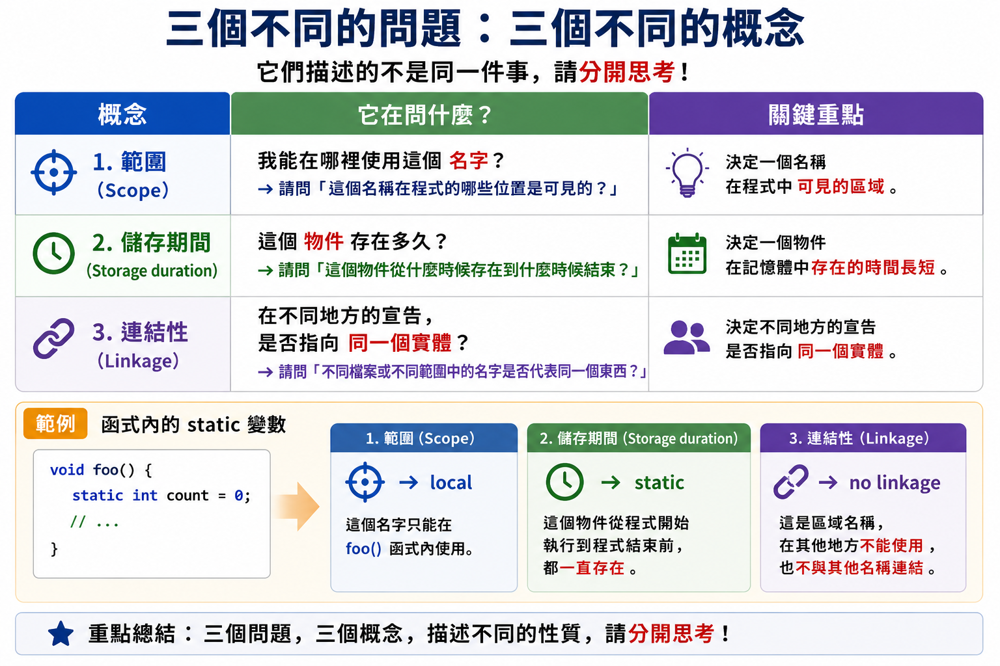

# Part AB：動態儲存期預告

## Section XCVI. 不由區塊自動控制

動態建立的物件通常：

```text
建立時間由程式決定
銷毀時間也由程式或資源管理物件決定
```

它不一定在離開目前區塊時立刻銷毀。

---

## Section XCVII. 後續內容

後續動態記憶體章節會介紹：

- `new`
- `delete`
- 記憶體洩漏
- 懸空指標
- 智慧指標
- RAII

本章不提前使用這些語法。

---

# Part AC：快速概念檢查

## Section XCVIII. 選擇題與簡答

### Q1. 什麼是作用域？

<details><summary>查看答案</summary>

名稱可以被程式使用的範圍。

</details>

### Q2. 什麼是生命週期？

<details><summary>查看答案</summary>

物件從建立到銷毀的期間。

</details>

### Q3. 作用域與生命週期相同嗎？

<details><summary>查看答案</summary>

不同。作用域管理名稱可見性；生命週期管理物件是否存在。

</details>

### Q4. 區域變數何時進入作用域？

<details><summary>查看答案</summary>

通常從宣告點之後開始。

</details>

### Q5. 內層區塊可以使用外層變數嗎？

<details><summary>查看答案</summary>

通常可以，只要外層名稱已宣告且未被遮蔽。

</details>

### Q6. 外層區塊可以使用已結束內層區塊的變數嗎？

<details><summary>查看答案</summary>

不可以。

</details>

### Q7. `for` 初始化區的變數在迴圈後可見嗎？

<details><summary>查看答案</summary>

通常不可見。

</details>

### Q8. 什麼是變數遮蔽？

<details><summary>查看答案</summary>

內層同名名稱暫時隱藏外層名稱。

</details>

### Q9. 遮蔽會銷毀外層物件嗎？

<details><summary>查看答案</summary>

不會，只影響名稱查找。

</details>

### Q10. 一般區域變數通常有什麼儲存期？

<details><summary>查看答案</summary>

自動儲存期。

</details>

### Q11. `static` 區域變數初始化幾次？

<details><summary>查看答案</summary>

通常只初始化一次。

</details>

### Q12. `static` 區域變數的名稱在哪裡可見？

<details><summary>查看答案</summary>

只在其所在區域或函式內可見。

</details>

### Q13. `static` 區域變數會保留前次呼叫的值嗎？

<details><summary>查看答案</summary>

會。

</details>

### Q14. 回傳區域變數的值安全嗎？

<details><summary>查看答案</summary>

通常安全，呼叫者取得結果值。

</details>

### Q15. 回傳區域變數的參考安全嗎？

<details><summary>查看答案</summary>

不安全，區域物件在函式結束時被銷毀。

</details>

### Q16. 什麼是懸空參考？

<details><summary>查看答案</summary>

指向已不存在物件的參考。

</details>

### Q17. `const` 參考可延長所有暫時值生命週期嗎？

<details><summary>查看答案</summary>

不能如此概括。區域 `const` 參考直接綁定暫時值是常見安全情況，其他情況需個別分析。

</details>

### Q18. `::name` 表示什麼？

<details><summary>查看答案</summary>

從全域命名空間尋找 `name`。

</details>

### Q19. 匿名命名空間有什麼用途？

<details><summary>查看答案</summary>

將輔助名稱限制在目前來源檔案內。

</details>

### Q20. 作用域、儲存期與連結是否為同一概念？

<details><summary>查看答案</summary>

不是，三者回答不同問題。

</details>

---

# Part AD：程式閱讀練習

## Section XCIX. 預測結果與合法性

### 題目 1

```cpp
int value = 10;

{
    int inner = 20;
    cout << value + inner;
}
```

<details><summary>查看答案</summary>

```text
30
```

內層可見外層 `value`。

</details>

### 題目 2

```cpp
{
    int value = 10;
}

/* cout << value; */
```

<details><summary>查看答案</summary>

區塊外不能使用 `value`，程式無法編譯。

</details>

### 題目 3

```cpp
for (int index = 0; index < 3; ++index) {
    cout << index;
}

/* cout << index; */
```

<details><summary>查看答案</summary>

迴圈內輸出：

```text
012
```

迴圈後使用 `index` 不合法。

</details>

### 題目 4

```cpp
void show() {
    int count = 0;
    ++count;
    cout << count;
}

show();
show();
```

<details><summary>查看答案</summary>

```text
11
```

每次呼叫重新建立 `count`。

</details>

### 題目 5

```cpp
void show() {
    static int count = 0;
    ++count;
    cout << count;
}

show();
show();
```

<details><summary>查看答案</summary>

```text
12
```

</details>

### 題目 6

```cpp
int value = 10;

{
    int value = 20;
    cout << value;
}

cout << value;
```

<details><summary>查看答案</summary>

```text
2010
```

內層名稱暫時遮蔽外層名稱。

</details>

### 題目 7

```cpp
int makeValue() {
    int value = 15;
    return value;
}

cout << makeValue();
```

<details><summary>查看答案</summary>

```text
15
```

回傳值安全。

</details>

### 題目 8

```cpp
int& bad() {
    int value = 15;
    return value;
}
```

<details><summary>查看答案</summary>

危險。函式結束後 `value` 被銷毀，回傳參考懸空。

</details>

### 題目 9

```cpp
int& counter() {
    static int value = 0;
    return value;
}

++counter();
++counter();

cout << counter();
```

<details><summary>查看答案</summary>

```text
2
```

</details>

### 題目 10

```cpp
int value = 10;

{
    int& alias = value;
    alias = 30;
}

cout << value;
```

<details><summary>查看答案</summary>

```text
30
```

參考名稱消失不會銷毀原物件。

</details>

### 題目 11

```cpp
const string& text =
    string("A") + "B";

cout << text;
```

<details><summary>查看答案</summary>

```text
AB
```

區域 `const` 參考直接綁定結果暫時字串，生命週期延長到參考作用域結束。

</details>

### 題目 12

```cpp
if (int value = 5; value > 0) {
    cout << value;
} else {
    cout << value;
}

/* cout << value; */
```

<details><summary>查看答案</summary>

輸出：

```text
5
```

`value` 在整個 `if-else` 中可見，但離開後不可使用。

</details>

---

# Part AE：實作練習

## Section C. 實作檢測題

### TODO 1：區塊作用域

建立外層變數與內層變數，在內層同時輸出兩者，離開內層後只輸出外層變數。

### TODO 2：`if` 區域變數

在 `if` 與 `else` 中分別建立同名但不同的區域變數。

### TODO 3：`for` 作用域

使用 `for` 初始化變數輸出 `0–4`，並說明為什麼迴圈後不能使用該名稱。

### TODO 4：每輪區域物件

在 `while` 主體內建立變數，讓它每輪依計數器重新初始化。

### TODO 5：函式區域變數

建立函式，每次呼叫都讓自動區域計數器從 `0` 開始。

### TODO 6：`static` 呼叫計數器

將 TODO 5 改成 `static`，讓結果依序輸出 `1、2、3`。

### TODO 7：流水編號

建立：

```cpp
int nextId()
```

使用 `static` 回傳遞增編號。

### TODO 8：命名空間

建立 `MathConstants` 命名空間，放入 `constexpr double pi`。

### TODO 9：避免遮蔽

將一段內外層同名變數程式重新命名，使 `-Wshadow` 不產生警告。

### TODO 10：`if` 初始化

使用 C++17 `if` 初始化敘述讀取整數並判斷正負。

### TODO 11：安全回傳值

建立函式，在函式內計算結果後以值回傳。

### TODO 12：安全回傳參考

建立：

```cpp
int& larger(int& first, int& second)
```

### TODO 13：靜態物件參考

建立回傳 `static int` 參考的 `counter()`，並透過回傳值增加計數。

### TODO 14：暫時物件生命週期

使用區域 `const string&` 綁定字串組合表示式並輸出結果。

### TODO 15：匿名命名空間

將只供目前來源檔使用的常數與輔助函式放入匿名命名空間。

---

# Part AF：課後小練習

## Section CI. 延伸練習

### 練習 1：函式呼叫追蹤

建立三個函式，分別輸出進入與離開訊息，追蹤區域變數建立位置。

### 練習 2：多個靜態狀態

建立兩個不同函式，各自擁有自己的 `static` 計數器，觀察兩者互不共用。

### 練習 3：重構全域變數

將依賴可修改全域計數器的程式，改成使用參數與回傳值。

### 練習 4：生命週期錯誤分析

找出一段保存區域變數參考的錯誤程式，說明參考何時開始懸空。

### 練習 5：多檔案設計草圖

規劃一個 `.hpp` 與 `.cpp`，指出哪些是宣告、哪些是定義，以及哪些名稱只應存在於 `.cpp` 內部。

---

# Part AG：常見錯誤提醒

## Section CII. 常見錯誤

1. 混淆作用域與生命週期。
2. 在宣告前使用名稱。
3. 在區塊外使用區域變數。
4. 在迴圈後使用初始化區變數。
5. 認為每輪迴圈使用同一個自動區域物件。
6. 忘記參數也是區域變數。
7. 不必要地重複使用相同變數名稱。
8. 變數遮蔽造成讀取錯誤。
9. 自我初始化同名變數。
10. 關閉或忽略 `-Wshadow` 警告。
11. 過度使用可修改全域變數。
12. 以為全域名稱與全域物件生命週期完全等同於所有情況。
13. 認為 `static` 區域名稱在函式外也可見。
14. 以為 `static` 區域變數每次呼叫重新初始化。
15. 使用 `static` 隱藏過多函式狀態。
16. 忘記區域自動變數在函式結束時銷毀。
17. 回傳區域變數參考。
18. 回傳區域變數位址。
19. 保存比原物件活得更久的參考。
20. 認為參考會自動延長所有物件生命週期。
21. 過度概括 `const` 參考的暫時值延長規則。
22. 把暫時物件參考保存到呼叫結束後。
23. 回傳非 `const` 參考而暴露內部狀態。
24. 認為參考離開作用域會銷毀原物件。
25. 混淆函式內 `static` 與命名空間作用域 `static`。
26. 在標頭檔定義可修改全域變數。
27. 多個來源檔重複定義同一全域物件。
28. 混淆宣告與定義。
29. 混淆作用域、儲存期與連結。
30. 在尚未學習完整資源管理前手動建立長生命週期動態狀態。

---

# Part AH：Mermaid 流程圖

## Section CIII. 作用域與生命週期流程圖

### 1. 區塊作用域

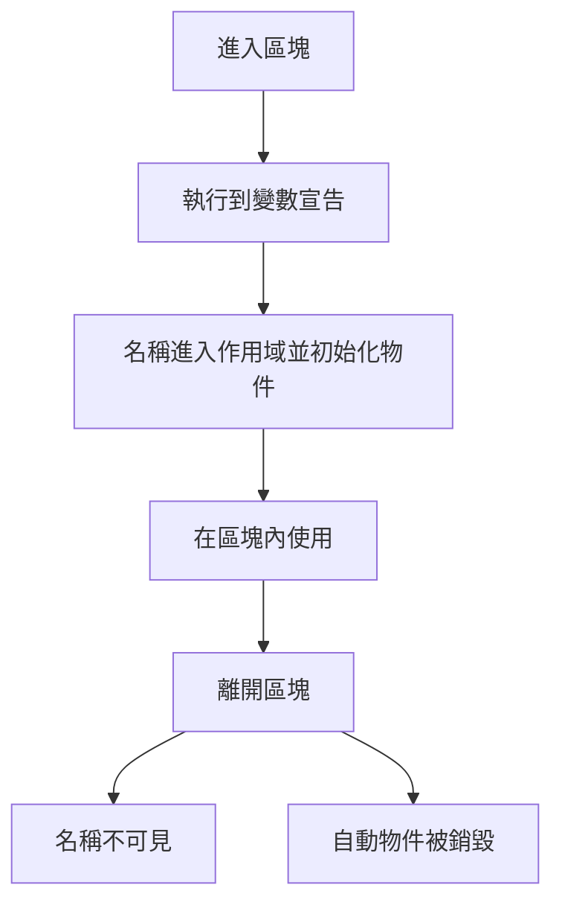
```mermaid
flowchart TD
    A[進入區塊] --> B[執行到變數宣告]
    B --> C[名稱進入作用域並初始化物件]
    C --> D[在區塊內使用]
    D --> E[離開區塊]
    E --> F[名稱不可見]
    E --> G[自動物件被銷毀]
```

### 2. 作用域與生命週期

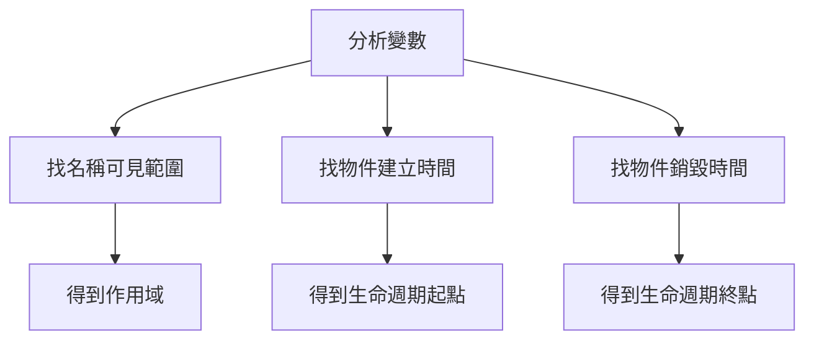
```mermaid
flowchart TD
    A[分析變數] --> B[找名稱可見範圍]
    A --> C[找物件建立時間]
    A --> D[找物件銷毀時間]
    B --> E[得到作用域]
    C --> F[得到生命週期起點]
    D --> G[得到生命週期終點]
```

### 3. 變數遮蔽

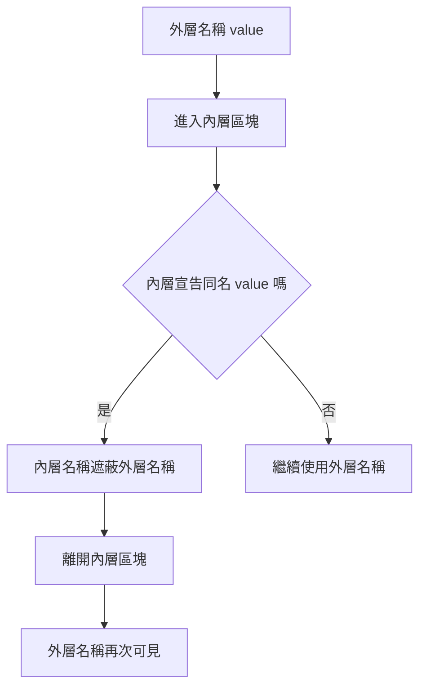
```mermaid
flowchart TD
    A[外層名稱 value] --> B[進入內層區塊]
    B --> C{內層宣告同名 value 嗎}
    C -- 是 --> D[內層名稱遮蔽外層名稱]
    C -- 否 --> E[繼續使用外層名稱]
    D --> F[離開內層區塊]
    F --> G[外層名稱再次可見]
```

### 4. 自動與靜態區域變數

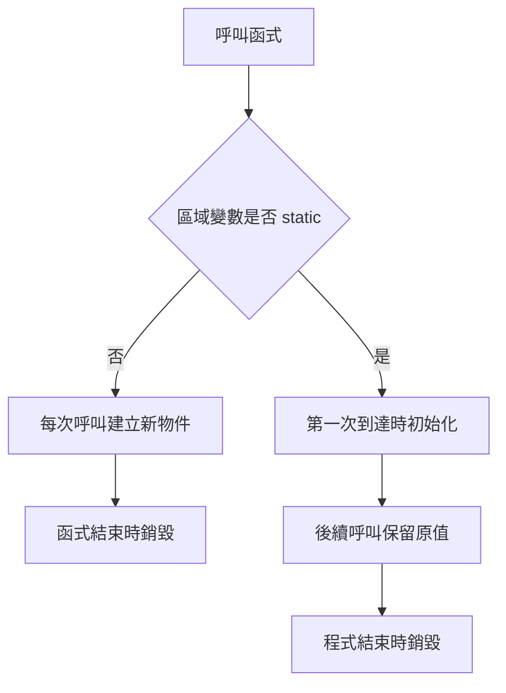
```mermaid
flowchart TD
    A[呼叫函式] --> B{區域變數是否 static}
    B -- 否 --> C[每次呼叫建立新物件]
    C --> D[函式結束時銷毀]
    B -- 是 --> E[第一次到達時初始化]
    E --> F[後續呼叫保留原值]
    F --> G[程式結束時銷毀]
```

### 5. 回傳參考安全檢查

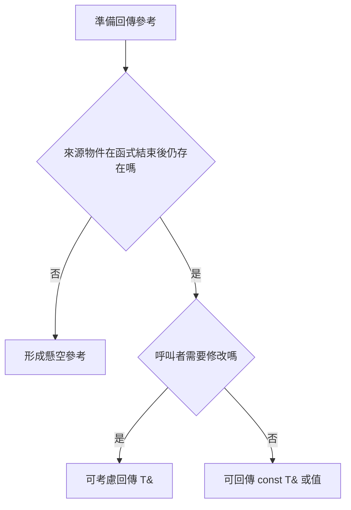
```mermaid
flowchart TD
    A[準備回傳參考] --> B{來源物件在函式結束後仍存在嗎}
    B -- 否 --> C[形成懸空參考]
    B -- 是 --> D{呼叫者需要修改嗎}
    D -- 是 --> E[可考慮回傳 T&]
    D -- 否 --> F[可回傳 const T& 或值]
```

### 6. 暫時物件

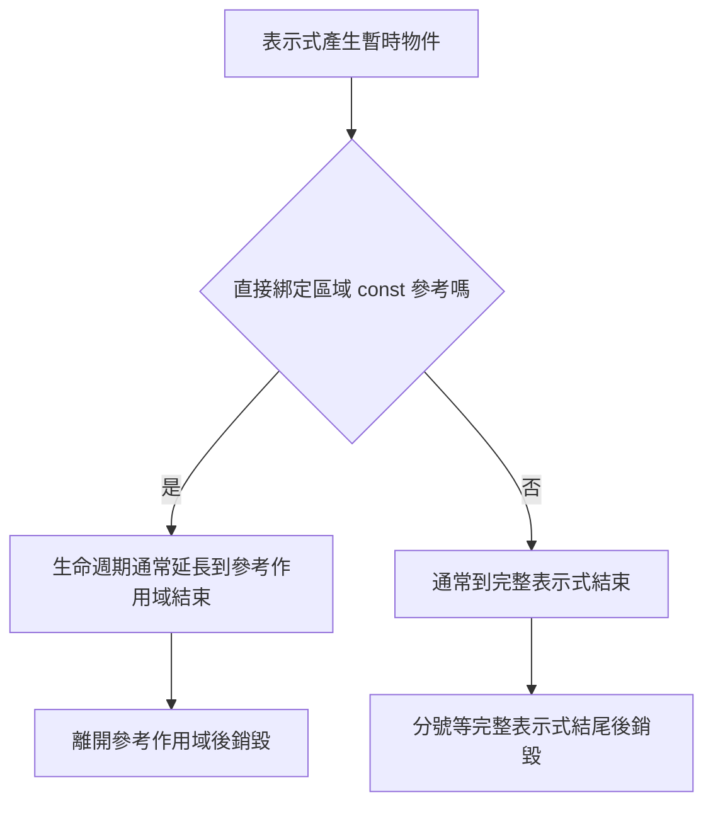
```mermaid
flowchart TD
    A[表示式產生暫時物件] --> B{直接綁定區域 const 參考嗎}
    B -- 是 --> C[生命週期通常延長到參考作用域結束]
    B -- 否 --> D[通常到完整表示式結束]
    C --> E[離開參考作用域後銷毀]
    D --> F[分號等完整表示式結尾後銷毀]
```

### 7. 名稱查找

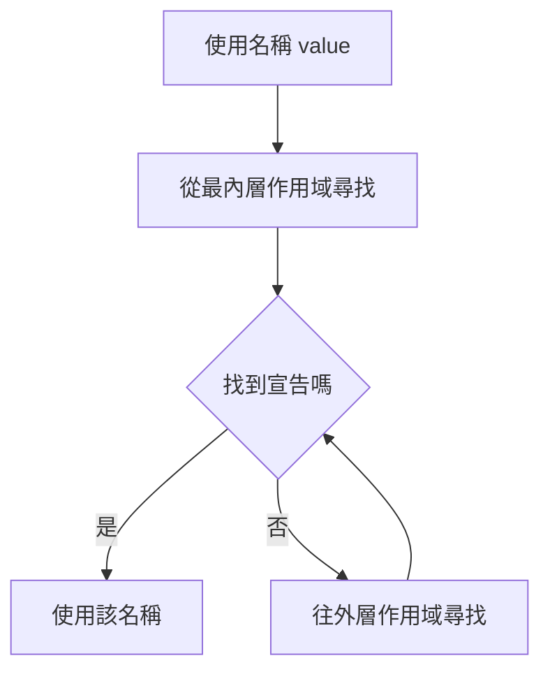
```mermaid
flowchart TD
    A[使用名稱 value] --> B[從最內層作用域尋找]
    B --> C{找到宣告嗎}
    C -- 是 --> D[使用該名稱]
    C -- 否 --> E[往外層作用域尋找]
    E --> C
```

### 8. 三個概念

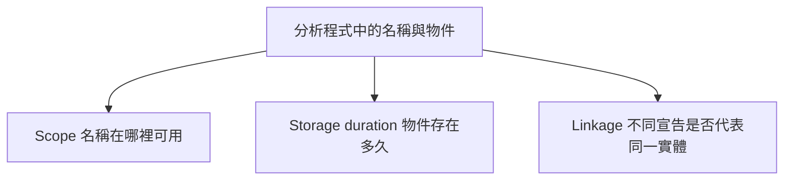
```mermaid
flowchart TD
    A[分析程式中的名稱與物件] --> B[Scope 名稱在哪裡可用]
    A --> C[Storage duration 物件存在多久]
    A --> D[Linkage 不同宣告是否代表同一實體]
```

---

# 本章完成標準

完成本章後，你應該能做到：

1. 說明作用域的用途。
2. 說明生命週期的用途。
3. 分辨作用域與生命週期。
4. 找出名稱開始可見的位置。
5. 使用區塊作用域。
6. 說明內層可見外層名稱。
7. 說明外層不可使用已結束內層名稱。
8. 分析 `if` 與 `else` 的區域變數。
9. 分析 `for` 初始化變數作用域。
10. 分析每輪迴圈區域物件生命週期。
11. 說明參數是區域變數。
12. 說明每次函式呼叫都有獨立區域物件。
13. 使用命名空間作用域。
14. 使用 `namespaceName::name`。
15. 說明全域名稱。
16. 說明可修改全域狀態的風險。
17. 說明名稱遮蔽。
18. 避免不必要遮蔽。
19. 使用 `-Wshadow`。
20. 說明自動儲存期。
21. 說明靜態儲存期。
22. 建立 `static` 區域變數。
23. 說明 `static` 區域名稱與物件生命週期的差異。
24. 建立函式呼叫計數器。
25. 建立流水編號。
26. 說明區域物件建立與銷毀順序。
27. 使用 C++17 `if` 初始化敘述。
28. 使用 C++17 `switch` 初始化敘述。
29. 說明暫時物件。
30. 說明完整表示式。
31. 說明區域 `const` 參考的暫時值生命週期延長。
32. 說明參考不擁有物件。
33. 說明懸空參考。
34. 安全回傳區域物件的值。
35. 避免回傳區域物件參考。
36. 安全回傳參考參數。
37. 理解回傳靜態物件參考。
38. 使用匿名命名空間。
39. 初步分辨作用域、儲存期與連結。
40. 找出常見作用域與生命週期錯誤。

---

# 隱藏答案區

> Answer hidden — try it first.

<details><summary>TODO 1 答案</summary>

```cpp
int outerValue = 10;

{
    int innerValue = 20;

    cout << outerValue
         << " "
         << innerValue
         << '\n';
}

cout << outerValue
     << '\n';
```

</details>

<details><summary>TODO 2 答案</summary>

```cpp
if (condition) {
    int result = 10;
    cout << result << '\n';
} else {
    int result = 20;
    cout << result << '\n';
}
```

兩個 `result` 是不同物件。

</details>

<details><summary>TODO 3 答案</summary>

```cpp
for (int index = 0; index < 5; ++index) {
    cout << index << '\n';
}
```

`index` 的作用域包含 `for` 控制區與主體，離開迴圈後結束。

</details>

<details><summary>TODO 4 答案</summary>

```cpp
int count = 0;

while (count < 3) {
    int value =
        count * 10;

    cout << value << '\n';

    ++count;
}
```

</details>

<details><summary>TODO 5 答案</summary>

```cpp
void showCount() {
    int count = 0;

    ++count;

    cout << count
         << '\n';
}
```

每次呼叫輸出 `1`。

</details>

<details><summary>TODO 6 答案</summary>

```cpp
void showCount() {
    static int count = 0;

    ++count;

    cout << count
         << '\n';
}
```

</details>

<details><summary>TODO 7 答案</summary>

```cpp
int nextId() {
    static int currentId = 0;

    ++currentId;

    return currentId;
}
```

</details>

<details><summary>TODO 8 答案</summary>

```cpp
namespace MathConstants {
    constexpr double pi =
        3.141592653589793;
}
```

使用：

```cpp
cout << MathConstants::pi;
```

</details>

<details><summary>TODO 9 答案</summary>

避免：

```cpp
int value = 10;

{
    int value = 20;
}
```

可改成：

```cpp
int outerValue = 10;

{
    int innerValue = 20;
}
```

</details>

<details><summary>TODO 10 答案</summary>

```cpp
if (
    int value = readValue();
    value >= 0
) {
    cout << "Non-negative\n";
} else {
    cout << "Negative\n";
}
```

</details>

<details><summary>TODO 11 答案</summary>

```cpp
int calculateResult(int value) {
    int result =
        value * value + 1;

    return result;
}
```

</details>

<details><summary>TODO 12 答案</summary>

```cpp
int& larger(
    int& first,
    int& second
) {
    if (first > second) {
        return first;
    }

    return second;
}
```

</details>

<details><summary>TODO 13 答案</summary>

```cpp
int& counter() {
    static int value = 0;

    return value;
}
```

使用：

```cpp
++counter();
++counter();

cout << counter();
```

</details>

<details><summary>TODO 14 答案</summary>

```cpp
const string& message =
    string("Hello") +
    " world";

cout << message << '\n';
```

</details>

<details><summary>TODO 15 答案</summary>

```cpp
namespace {
    constexpr int adjustment = 5;

    int adjust(int value) {
        return value + adjustment;
    }
}
```

</details>

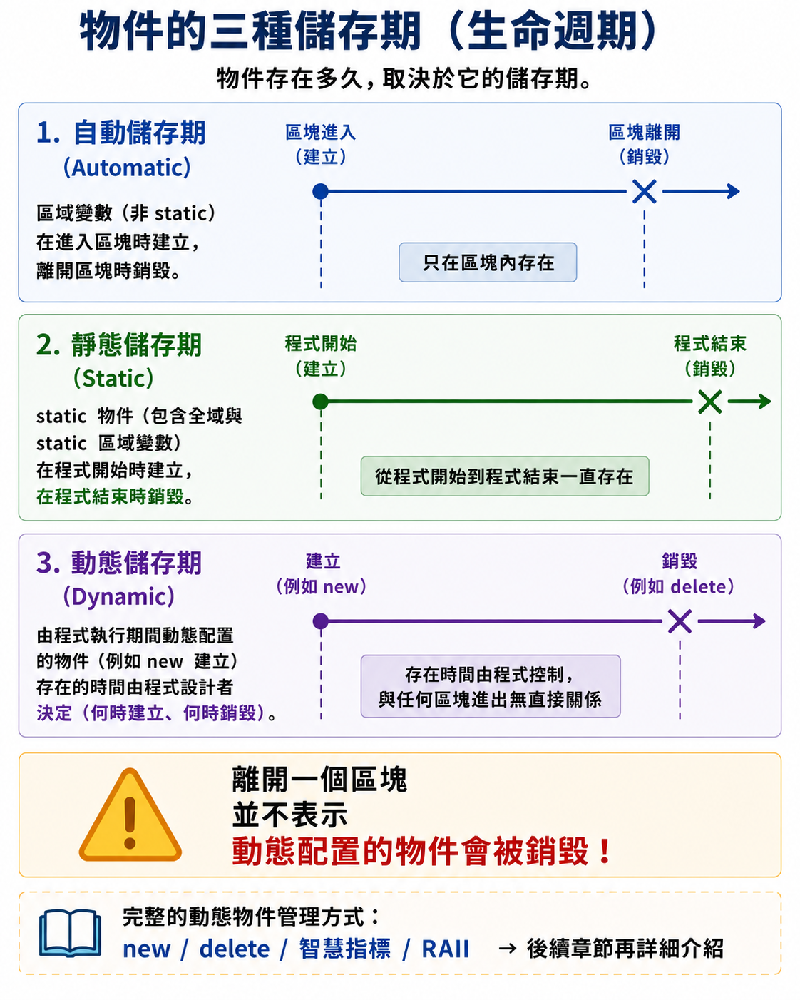
