# Lesson 16：Arrays and `std::array` 陣列與 `std::array`

> 這堂課的重點：使用固定大小的連續資料集合。你會學習傳統 C-style array 的宣告、初始化、索引、走訪、大小與界線風險，並比較現代 C++ 的 `std::array` 如何提供更安全、可複製、可比較且更容易傳入函式的固定大小容器。

> 本章只處理「大小在編譯時已知」的固定大小資料。需要執行期間改變長度的容器會在後續 `std::vector` 章節介紹；指標算術與陣列退化的完整原理也會留到指標章節。

---

## Section I. 今天要做什麼？

1. 認識陣列 array。
2. 理解陣列保存多個相同型別元素。
3. 理解陣列大小固定。
4. 理解陣列元素連續排列。
5. 認識元素 element。
6. 認識索引 index。
7. 理解索引從 `0` 開始。
8. 宣告傳統陣列。
9. 指定陣列元素數量。
10. 使用初始化列表。
11. 讓編譯器推導陣列大小。
12. 部分初始化陣列。
13. 將所有元素初始化為零。
14. 理解未初始化區域陣列可能包含不確定值。
15. 讀取陣列元素。
16. 修改陣列元素。
17. 使用索引表示式。
18. 計算最後一個合法索引。
19. 避免索引超出範圍。
20. 理解越界存取是未定義行為。
21. 使用 `for` 依索引走訪陣列。
22. 使用 `std::size_t` 作為索引型別。
23. 使用 range-based `for` 走訪陣列。
24. 分辨值走訪與參考走訪。
25. 使用 `const` 參考唯讀走訪。
26. 計算陣列總和。
27. 計算陣列平均值。
28. 找出最大值。
29. 找出最小值。
30. 計算符合條件的元素數量。
31. 修改所有陣列元素。
32. 將每個元素乘以固定倍率。
33. 反向走訪陣列。
34. 正確處理無號索引倒數。
35. 使用 `sizeof` 計算傳統陣列元素數量。
36. 理解 `sizeof(array) / sizeof(array[0])`。
37. 使用 C++17 `std::size()`。
38. 理解陣列傳入函式後大小資訊可能遺失。
39. 傳入傳統陣列時另外提供元素數量。
40. 使用 `const` 保護唯讀陣列參數。
41. 理解傳統陣列不能直接賦值。
42. 理解傳統陣列不能直接整體複製。
43. 使用迴圈複製傳統陣列。
44. 使用迴圈比較傳統陣列。
45. 認識字元陣列是陣列的一種。
46. 避免把字元陣列內容誤當成一般整數陣列。
47. 認識 `std::array`。
48. 加入 `<array>` 標頭。
49. 宣告 `std::array<T, N>`。
50. 使用初始化列表初始化 `std::array`。
51. 使用 `.size()` 取得大小。
52. 使用 `[]` 存取元素。
53. 使用 `.at()` 進行有檢查的存取。
54. 理解 `.at()` 越界會丟出例外。
55. 使用 `.front()` 取得第一個元素。
56. 使用 `.back()` 取得最後一個元素。
57. 使用 `.fill()` 填入相同值。
58. 使用 `.swap()` 交換兩個陣列內容。
59. 直接複製 `std::array`。
60. 直接賦值 `std::array`。
61. 直接比較 `std::array`。
62. 使用 range-based `for` 走訪 `std::array`。
63. 使用 `auto&` 修改元素。
64. 使用 `const auto&` 唯讀走訪。
65. 將 `std::array` 以 `const` 參考傳入函式。
66. 將 `std::array` 以一般參考傳入函式。
67. 理解 `std::array` 的大小是型別的一部分。
68. 理解 `std::array<int, 3>` 與 `std::array<int, 4>` 是不同型別。
69. 使用固定大小函式參數。
70. 認識函式模板可處理不同大小的概念。
71. 不在本章深入函式模板語法。
72. 比較傳統陣列與 `std::array`。
73. 判斷何時使用傳統陣列。
74. 判斷何時優先使用 `std::array`。
75. 理解固定大小容器與動態大小容器的差異。
76. 認識二維陣列的基本概念預告。
77. 避免空陣列相關設計問題。
78. 理解 `std::array<T, 0>` 合法但沒有 `front()` 與 `back()` 可用。
79. 使用概念檢查、程式閱讀與實作題整合本章。

---

## Section II. 今天的學習方式

1. 每個陣列先標出：
   ```text
   元素型別
   元素數量
   合法索引範圍
   ```
2. 大小為 `N` 的陣列合法索引是：
   ```text
   0 到 N - 1
   ```
3. 每次使用索引前先問：
   ```text
   index < size 嗎？
   ```
4. 傳統陣列題先分辨：
   ```text
   陣列仍在原作用域？
   還是已經傳入函式？
   ```
5. 傳入函式時不要假設仍能從參數取得完整大小。
6. Range-based `for` 題先判斷：
   ```text
   副本
   可修改參考
   唯讀參考
   ```
7. `std::array` 題先確認大小 `N` 是型別的一部分。
8. 使用 `[]` 時由程式設計者負責界線。
9. 使用 `.at()` 時容器會檢查界線。
10. 反向索引題避免直接寫無號索引 `>= 0`。
11. 所有合法完整程式使用嚴格 C++17 選項檢查。
12. 越界與未初始化範例只供分析，不執行。

---

## Section III. 核心語法對照

| 語法 | 用途 |
| --- | --- |
| `int values[5];` | 宣告 5 個整數的傳統陣列 |
| `int values[5]{};` | 將所有元素初始化為 0 |
| `int values[] = {1, 2, 3};` | 由初始化列表推導大小 |
| `values[0]` | 第一個元素 |
| `values[size - 1]` | 最後一個元素 |
| `sizeof(values) / sizeof(values[0])` | 在原陣列作用域計算元素數量 |
| `std::size(values)` | C++17 取得傳統陣列大小 |
| `for (int value : values)` | 以值走訪 |
| `for (int& value : values)` | 以參考修改原元素 |
| `for (const int& value : values)` | 唯讀走訪 |
| `std::array<int, 5> values{};` | 宣告 `std::array` |
| `values.size()` | 取得元素數量 |
| `values.at(index)` | 有界線檢查的存取 |
| `values.front()` | 第一個元素 |
| `values.back()` | 最後一個元素 |
| `values.fill(0)` | 將所有元素設成相同值 |
| `first.swap(second)` | 交換兩個相同型別陣列內容 |
| `const std::array<int, 5>& values` | 唯讀函式參數 |
| `std::array<int, 5>& values` | 可修改函式參數 |

---

# Part A：什麼是陣列？

## Section IV. 多個相同型別資料

若要保存五個分數，可以寫：

```cpp
int score1;
int score2;
int score3;
int score4;
int score5;
```

但資料數量增加後，管理會變得困難。

陣列可將它們整理成：

```cpp
int scores[5];
```

---

## Section V. 元素與索引

大小為 `5`：

```text
scores[0]
scores[1]
scores[2]
scores[3]
scores[4]
```

合法索引：

```text
0 到 4
```

不存在合法的：

```text
scores[5]
```

---


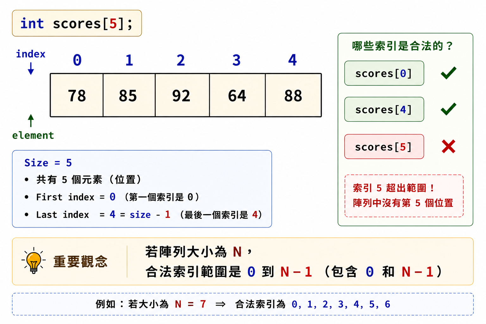


## Section VI. 為什麼從 0 開始？

C++ 陣列使用從零開始的索引。

大小為 `N` 時：

```text
第一個索引 = 0
最後索引 = N - 1
```

---


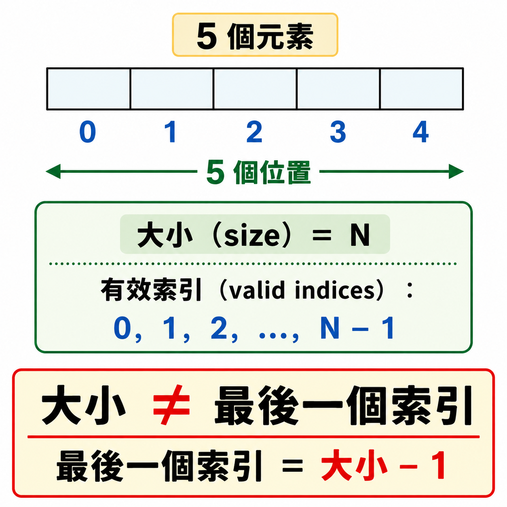


# Part B：宣告與初始化傳統陣列

## Section VII. 只宣告

```cpp
int values[5];
```

若是一般區域陣列且沒有初始化，元素可能具有不確定值。

不要在賦值前直接讀取。

---

## Section VIII. 初始化列表

```cpp
int values[5] = {
    10,
    20,
    30,
    40,
    50
};
```

---

## Section IX. 完整初始化範例

```cpp
// VALIDATE
#include <iostream>
using namespace std;

int main() {
    int values[5] = {
        10,
        20,
        30,
        40,
        50
    };

    cout << values[0]
         << '\n';

    cout << values[4]
         << '\n';

    return 0;
}
```

---

## Section X. 由初始化列表推導大小

```cpp
int values[] = {
    10,
    20,
    30
};
```

編譯器推導大小為 `3`。

---

## Section XI. 部分初始化

```cpp
int values[5] = {
    10,
    20
};
```

結果：

```text
10
20
0
0
0
```

未列出的元素會進行零初始化。

---

## Section XII. 全部初始化為零

```cpp
int values[5]{};
```

或：

```cpp
int values[5] = {};
```

所有元素都為 `0`。

---


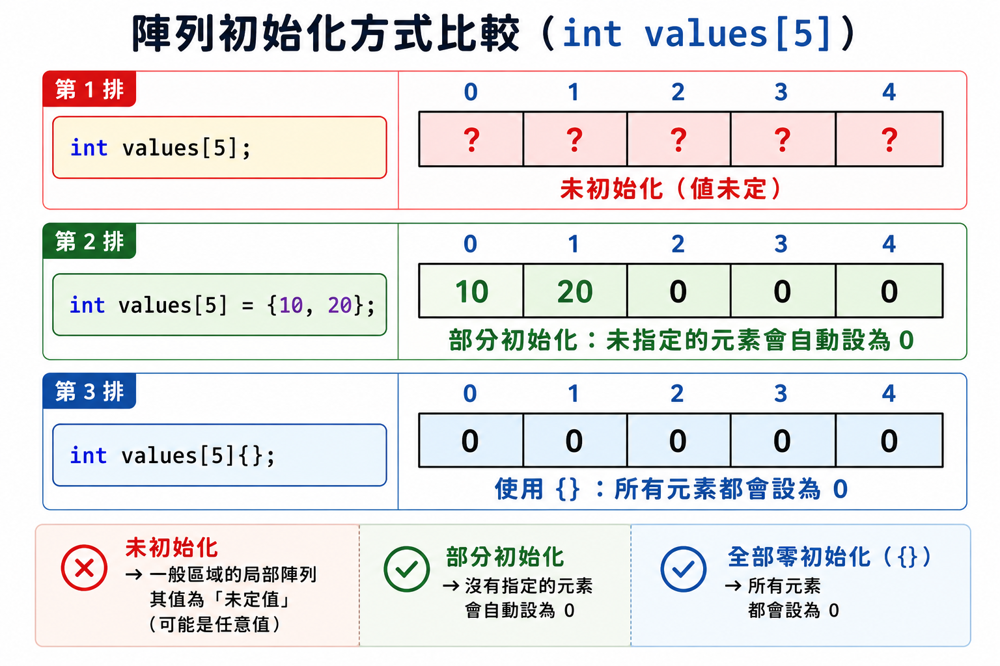


## Section XIII. 完整零初始化範例

```cpp
// VALIDATE
#include <iostream>
using namespace std;

int main() {
    int values[5]{};

    for (int value : values) {
        cout << value
             << " ";
    }

    cout << '\n';

    return 0;
}
```

---

# Part C：讀取與修改元素

## Section XIV. 讀取元素

```cpp
int first =
    values[0];
```

---

## Section XV. 修改元素

```cpp
values[2] = 100;
```

會修改第三個元素。

---

## Section XVI. 完整修改範例

```cpp
// VALIDATE
#include <iostream>
using namespace std;

int main() {
    int values[] = {
        5,
        10,
        15
    };

    values[1] = 99;

    cout << values[0]
         << " "
         << values[1]
         << " "
         << values[2]
         << '\n';

    return 0;
}
```

輸出：

```text
5 99 15
```

---

## Section XVII. 索引可以是表示式

```cpp
int index = 2;

cout << values[index];
```

也可以：

```cpp
cout << values[index + 1];
```

前提是結果仍位於合法範圍。

---

# Part D：越界存取

## Section XVIII. 錯誤索引

大小為 `5`：

```cpp
int values[5]{};
```

不合法：

```cpp
/* values[5] = 10; */
```

因為最後合法索引是 `4`。

---

## Section XIX. 未定義行為

傳統陣列的 `[]` 不會自動檢查界線。

越界可能造成：

- 讀到垃圾值。
- 修改其他變數。
- 程式崩潰。
- 看似正常但結果錯誤。
- 安全漏洞。

---


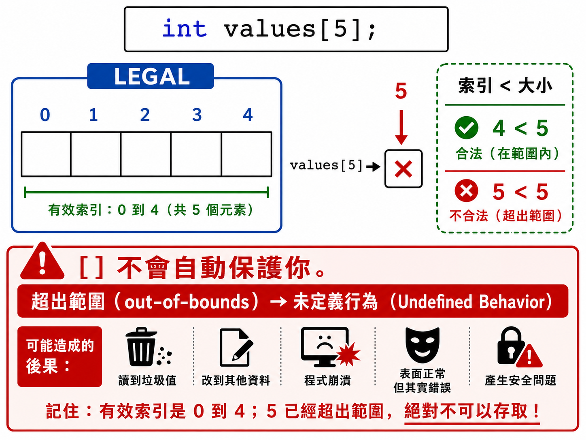


## Section XX. 正確條件

若大小為 `size`：

```cpp
index >= 0 &&
index < size
```

若索引型別是 `std::size_t`，它不會小於 `0`，只需檢查：

```cpp
index < size
```

---

# Part E：使用索引走訪

## Section XXI. 基本 `for`

```cpp
for (int index = 0; index < 5; ++index) {
    cout << values[index]
         << '\n';
}
```

---

## Section XXII. 使用 `std::size_t`

容器大小通常使用無號型別：

```cpp
std::size_t
```

例如：

```cpp
for (
    std::size_t index = 0;
    index < size;
    ++index
) {
    // ...
}
```

---

## Section XXIII. 完整索引走訪

```cpp
// VALIDATE
#include <cstddef>
#include <iostream>
using namespace std;

int main() {
    int values[] = {
        4,
        8,
        12,
        16
    };

    constexpr size_t size =
        sizeof(values) /
        sizeof(values[0]);

    for (
        size_t index = 0;
        index < size;
        ++index
    ) {
        cout << "Index "
             << index
             << ": "
             << values[index]
             << '\n';
    }

    return 0;
}
```

---

# Part F：Range-Based `for`

## Section XXIV. 以值走訪

```cpp
for (int value : values) {
    cout << value;
}
```

每輪 `value` 是元素副本。

---

## Section XXV. 以參考走訪

```cpp
for (int& value : values) {
    value *= 2;
}
```

修改原元素。

---

## Section XXVI. 唯讀參考

```cpp
for (const int& value : values) {
    cout << value;
}
```

不複製元素，也不允許透過 `value` 修改。

---

## Section XXVII. 完整比較

```cpp
// VALIDATE
#include <iostream>
using namespace std;

int main() {
    int values[] = {
        1,
        2,
        3
    };

    for (int value : values) {
        value *= 10;

        cout << "Copy: "
             << value
             << '\n';
    }

    for (int& value : values) {
        value *= 2;
    }

    for (const int& value : values) {
        cout << value
             << " ";
    }

    cout << '\n';

    return 0;
}
```

最後輸出：

```text
2 4 6
```

---


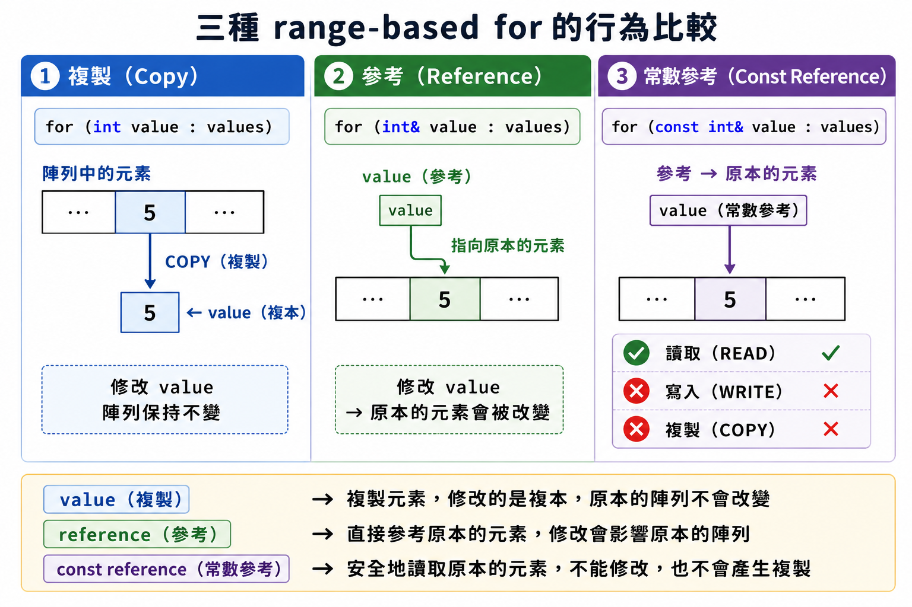


# Part G：計算總和與平均

## Section XXVIII. 總和

```cpp
long long total = 0;

for (int value : values) {
    total += value;
}
```

---

## Section XXIX. 平均值

```cpp
double average =
    static_cast<double>(total) /
    size;
```

必須確保元素數量不為 `0`。

傳統內建陣列大小必須大於 `0`。

---

## Section XXX. 完整統計範例

```cpp
// VALIDATE
#include <cstddef>
#include <iostream>
using namespace std;

int main() {
    int values[] = {
        5,
        8,
        12,
        15
    };

    constexpr size_t size =
        sizeof(values) /
        sizeof(values[0]);

    long long total = 0;

    for (int value : values) {
        total += value;
    }

    double average =
        static_cast<double>(total) /
        static_cast<double>(size);

    cout << "Total: "
         << total
         << '\n';

    cout << "Average: "
         << average
         << '\n';

    return 0;
}
```

---


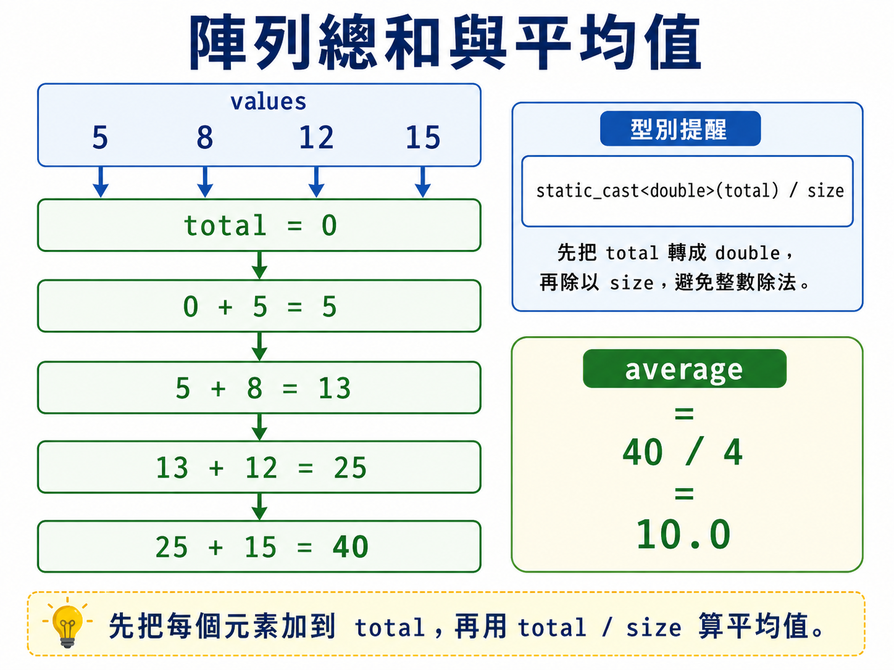


# Part H：最大值與最小值

## Section XXXI. 使用第一個元素初始化

```cpp
int maximum = values[0];
int minimum = values[0];
```

不要隨意初始化為 `0`，否則全負數或全正數資料可能出錯。

---

## Section XXXII. 完整最大最小值

```cpp
// VALIDATE
#include <iostream>
using namespace std;

int main() {
    int values[] = {
        -5,
        12,
        3,
        -9,
        8
    };

    int maximum = values[0];
    int minimum = values[0];

    for (int value : values) {
        if (value > maximum) {
            maximum = value;
        }

        if (value < minimum) {
            minimum = value;
        }
    }

    cout << "Maximum: "
         << maximum
         << '\n';

    cout << "Minimum: "
         << minimum
         << '\n';

    return 0;
}
```

---

# Part I：條件統計與修改

## Section XXXIII. 統計偶數

```cpp
int evenCount = 0;

for (int value : values) {
    if (value % 2 == 0) {
        ++evenCount;
    }
}
```

---

## Section XXXIV. 將所有元素加一

```cpp
for (int& value : values) {
    ++value;
}
```

---

## Section XXXV. 完整修改範例

```cpp
// VALIDATE
#include <iostream>
using namespace std;

int main() {
    int values[] = {
        2,
        4,
        6,
        8
    };

    for (int& value : values) {
        value =
            value * 3;
    }

    for (const int& value : values) {
        cout << value
             << " ";
    }

    cout << '\n';

    return 0;
}
```

---

# Part J：反向走訪

## Section XXXVI. 使用無號索引的風險

錯誤概念：

```cpp
for (
    size_t index = size - 1;
    index >= 0;
    --index
) {
    // ...
}
```

`size_t` 是無號型別，不會小於 `0`。

可能形成無窮迴圈。

---

## Section XXXVII. 安全寫法

```cpp
for (size_t index = size; index > 0; --index) {
    cout << values[index - 1];
}
```

`index` 表示尚未處理的元素數量。

---

## Section XXXVIII. 完整反向走訪

```cpp
// VALIDATE
#include <cstddef>
#include <iostream>
using namespace std;

int main() {
    int values[] = {
        10,
        20,
        30,
        40
    };

    constexpr size_t size =
        sizeof(values) /
        sizeof(values[0]);

    for (
        size_t index = size;
        index > 0;
        --index
    ) {
        cout << values[index - 1]
             << " ";
    }

    cout << '\n';

    return 0;
}
```

---


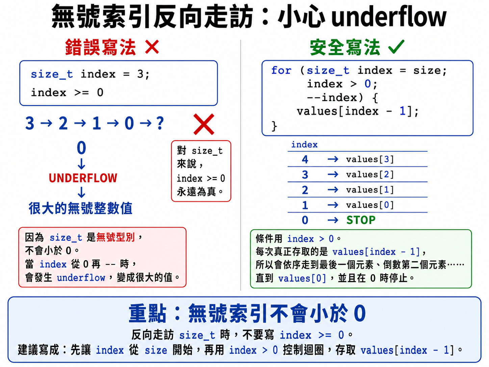


# Part K：取得傳統陣列大小

## Section XXXIX. 使用 `sizeof`

```cpp
sizeof(values)
```

取得整個陣列所占位元組數。

```cpp
sizeof(values[0])
```

取得一個元素所占位元組數。

---

## Section XL. 元素數量公式

```cpp
sizeof(values) /
sizeof(values[0])
```

例如整個陣列 `20` bytes，每個元素 `4` bytes：

```text
20 / 4 = 5
```

---


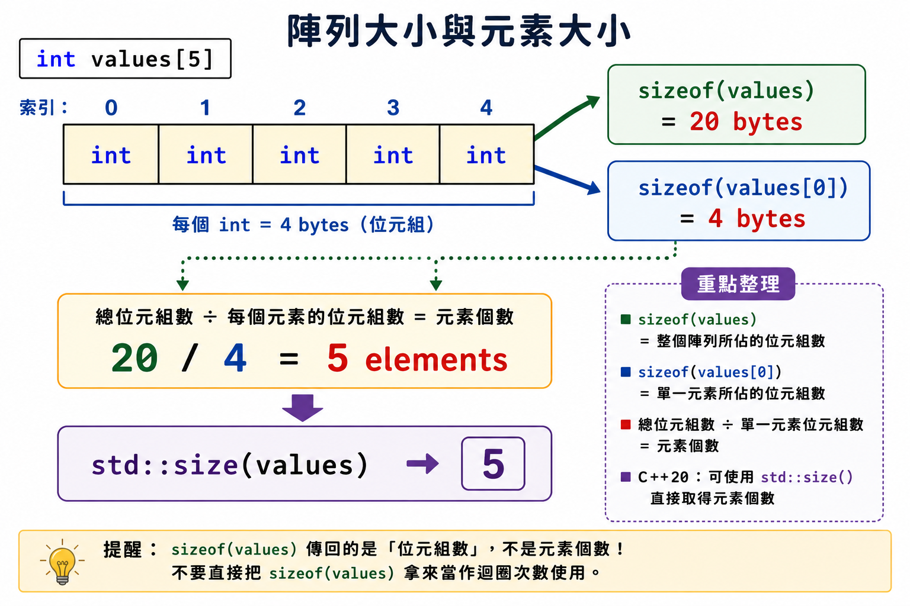


## Section XLI. C++17 `std::size`

加入：

```cpp
#include <iterator>
```

可以：

```cpp
std::size(values)
```

---

## Section XLII. 完整 `std::size` 範例

```cpp
// VALIDATE
#include <iostream>
#include <iterator>
using namespace std;

int main() {
    int values[] = {
        1,
        2,
        3,
        4,
        5
    };

    cout << std::size(values)
         << '\n';

    return 0;
}
```

---

## Section XLIII. 重要限制

大小公式只在名稱仍代表完整陣列時可靠。

傳入一般函式參數後，傳統陣列通常不再保留完整陣列型別資訊。

---

# Part L：傳統陣列傳入函式

## Section XLIV. 常見參數形式

```cpp
void showValues(
    const int values[],
    size_t size
);
```

呼叫者必須另外提供大小。

---

## Section XLV. 為什麼要另外提供大小？

傳統陣列傳入函式後，參數不會自動知道原陣列有幾個元素。

因此：

```cpp
values
```

與：

```cpp
size
```

必須一起傳入。

完整原因會在指標章節說明。

---


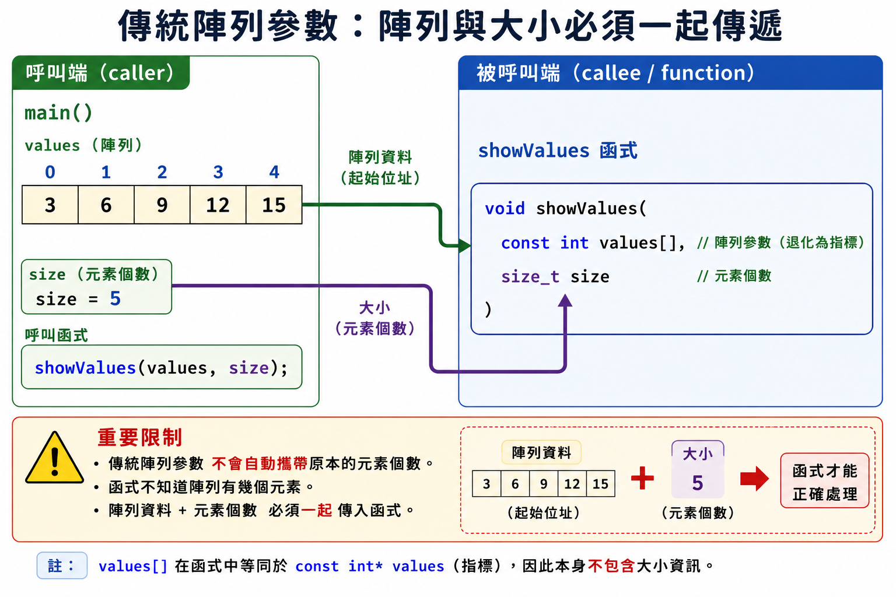


## Section XLVI. 完整唯讀函式

```cpp
// VALIDATE
#include <cstddef>
#include <iostream>
using namespace std;

void showValues(
    const int values[],
    size_t size
) {
    for (
        size_t index = 0;
        index < size;
        ++index
    ) {
        cout << values[index]
             << " ";
    }

    cout << '\n';
}

int main() {
    int values[] = {
        3,
        6,
        9
    };

    constexpr size_t size =
        sizeof(values) /
        sizeof(values[0]);

    showValues(values, size);

    return 0;
}
```

---

## Section XLVII. 可修改函式

```cpp
void doubleValues(
    int values[],
    size_t size
) {
    for (
        size_t index = 0;
        index < size;
        ++index
    ) {
        values[index] *= 2;
    }
}
```

函式會修改呼叫者的陣列元素。

---

## Section XLVIII. 完整修改函式

```cpp
// VALIDATE
#include <cstddef>
#include <iostream>
using namespace std;

void doubleValues(
    int values[],
    size_t size
) {
    for (
        size_t index = 0;
        index < size;
        ++index
    ) {
        values[index] *= 2;
    }
}

int main() {
    int values[] = {
        2,
        4,
        6
    };

    constexpr size_t size =
        sizeof(values) /
        sizeof(values[0]);

    doubleValues(values, size);

    for (int value : values) {
        cout << value
             << " ";
    }

    cout << '\n';

    return 0;
}
```

---

# Part M：傳統陣列的整體操作限制

## Section XLIX. 不能直接賦值

不合法概念：

```cpp
int first[3] = {1, 2, 3};
int second[3] = {4, 5, 6};

/* first = second; */
```

傳統陣列不能使用一般賦值運算子整體複製。

---


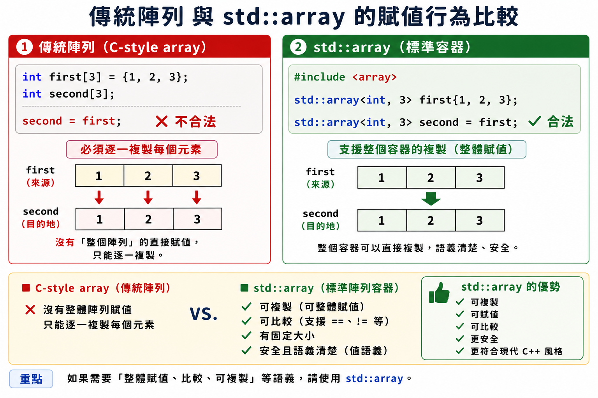


## Section L. 使用迴圈複製

```cpp
for (
    size_t index = 0;
    index < size;
    ++index
) {
    destination[index] =
        source[index];
}
```

---

## Section LI. 完整複製範例

```cpp
// VALIDATE
#include <cstddef>
#include <iostream>
using namespace std;

int main() {
    int source[] = {
        1,
        2,
        3
    };

    int destination[3]{};

    constexpr size_t size =
        sizeof(source) /
        sizeof(source[0]);

    for (
        size_t index = 0;
        index < size;
        ++index
    ) {
        destination[index] =
            source[index];
    }

    for (int value : destination) {
        cout << value
             << " ";
    }

    cout << '\n';

    return 0;
}
```

---

## Section LII. 不能直接比較內容

```cpp
/* if (first == second) */
```

對傳統陣列不能用一般 `==` 比較所有元素內容。

需要逐項比較。

---

## Section LIII. 逐項比較

```cpp
bool equal = true;

for (
    size_t index = 0;
    index < size;
    ++index
) {
    if (first[index] != second[index]) {
        equal = false;
        break;
    }
}
```

---

# Part N：認識 `std::array`

## Section LIV. 標準函式庫固定大小容器

加入：

```cpp
#include <array>
```

宣告：

```cpp
std::array<int, 5> values;
```

---

## Section LV. 型別與大小

```cpp
std::array<int, 5>
```

表示：

```text
元素型別：int
元素數量：5
```

大小是型別的一部分。

---


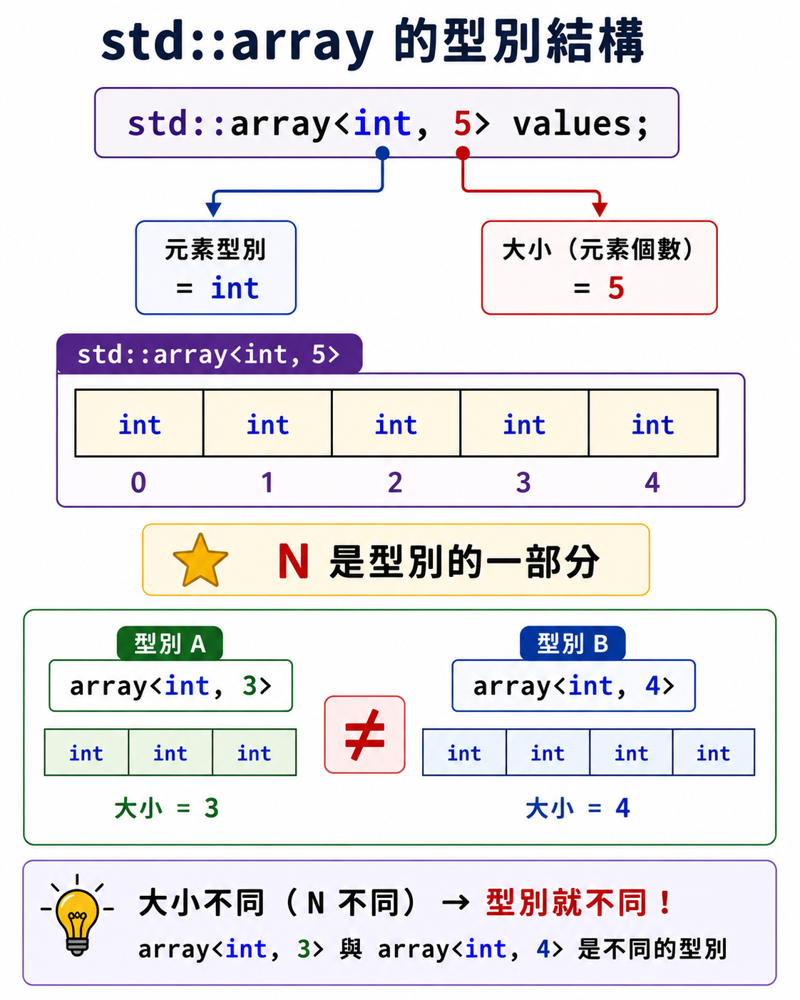


## Section LVI. 初始化

```cpp
std::array<int, 5> values = {
    10,
    20,
    30,
    40,
    50
};
```

也可寫：

```cpp
std::array<int, 5> values{
    10,
    20,
    30,
    40,
    50
};
```

---

## Section LVII. 完整第一個 `std::array`

```cpp
// VALIDATE
#include <array>
#include <iostream>
using namespace std;

int main() {
    array<int, 5> values{
        10,
        20,
        30,
        40,
        50
    };

    cout << values[0]
         << '\n';

    cout << values[4]
         << '\n';

    return 0;
}
```

---

# Part O：`std::array` 的大小與索引

## Section LVIII. `.size()`

```cpp
values.size()
```

回傳元素數量。

---

## Section LIX. 使用索引走訪

```cpp
for (
    size_t index = 0;
    index < values.size();
    ++index
) {
    cout << values[index];
}
```

---

## Section LX. 完整走訪範例

```cpp
// VALIDATE
#include <array>
#include <cstddef>
#include <iostream>
using namespace std;

int main() {
    array<int, 4> values{
        5,
        10,
        15,
        20
    };

    for (
        size_t index = 0;
        index < values.size();
        ++index
    ) {
        cout << "Index "
             << index
             << ": "
             << values[index]
             << '\n';
    }

    return 0;
}
```

---

# Part P：`[]` 與 `.at()`

## Section LXI. `[]`

```cpp
values[index]
```

通常不進行執行期間界線檢查。

速度直接，但程式設計者要保證索引合法。

---

## Section LXII. `.at()`

```cpp
values.at(index)
```

會檢查界線。

越界時會丟出：

```cpp
std::out_of_range
```

---


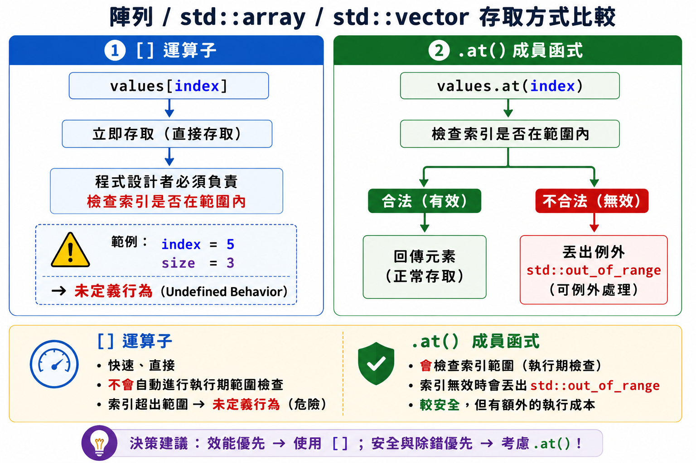


## Section LXIII. 完整 `.at()` 範例

```cpp
// VALIDATE
#include <array>
#include <cstddef>
#include <iostream>
#include <stdexcept>
using namespace std;

int main() {
    array<int, 3> values{
        10,
        20,
        30
    };

    size_t index;
    cin >> index;

    try {
        cout << values.at(index)
             << '\n';
    } catch (
        const out_of_range&
    ) {
        cout << "Index out of range\n";
    }

    return 0;
}
```

---

## Section LXIV. 如何選擇？

| 情況 | 建議 |
| --- | --- |
| 索引已由安全迴圈保證 | `[]` |
| 索引來自使用者輸入 | 可考慮 `.at()` |
| 開發與除錯 | `.at()` 更容易發現錯誤 |
| 效能關鍵且界線已證明 | `[]` |

---

# Part Q：`.front()` 與 `.back()`

## Section LXV. 第一個元素

```cpp
values.front()
```

等同於非空陣列的：

```cpp
values[0]
```

---

## Section LXVI. 最後一個元素

```cpp
values.back()
```

等同於非空陣列的：

```cpp
values[values.size() - 1]
```

---

## Section LXVII. 完整範例

```cpp
// VALIDATE
#include <array>
#include <iostream>
using namespace std;

int main() {
    array<int, 4> values{
        7,
        14,
        21,
        28
    };

    cout << values.front()
         << '\n';

    cout << values.back()
         << '\n';

    values.front() = 100;
    values.back() = 200;

    cout << values.front()
         << " "
         << values.back()
         << '\n';

    return 0;
}
```

---

## Section LXVIII. 空 `std::array`

```cpp
std::array<int, 0> values{};
```

是合法型別。

但不能使用：

```cpp
values.front()
values.back()
```

因為沒有元素。

---

# Part R：`.fill()`

## Section LXIX. 填入相同值

```cpp
values.fill(0);
```

將所有元素設成 `0`。

---


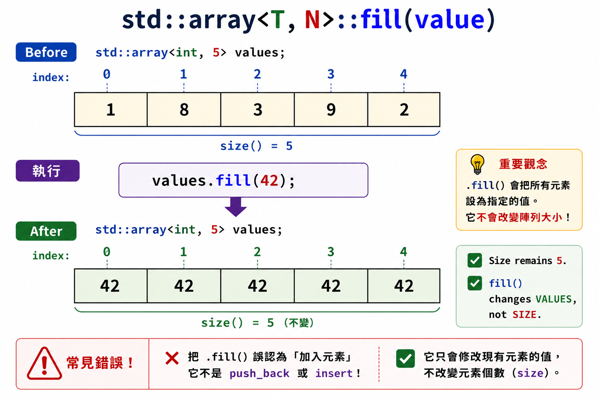


## Section LXX. 完整 `.fill()` 範例

```cpp
// VALIDATE
#include <array>
#include <iostream>
using namespace std;

int main() {
    array<int, 5> values{};

    values.fill(42);

    for (const int& value : values) {
        cout << value
             << " ";
    }

    cout << '\n';

    return 0;
}
```

輸出：

```text
42 42 42 42 42
```

---

# Part S：複製與賦值 `std::array`

## Section LXXI. 直接複製

```cpp
array<int, 3> first{
    1,
    2,
    3
};

array<int, 3> second =
    first;
```

---

## Section LXXII. 直接賦值

```cpp
second = first;
```

會逐元素複製內容。

---

## Section LXXIII. 完整複製範例

```cpp
// VALIDATE
#include <array>
#include <iostream>
using namespace std;

int main() {
    array<int, 3> first{
        1,
        2,
        3
    };

    array<int, 3> second =
        first;

    second[0] = 100;

    for (int value : first) {
        cout << value
             << " ";
    }

    cout << '\n';

    for (int value : second) {
        cout << value
             << " ";
    }

    cout << '\n';

    return 0;
}
```

兩個陣列是獨立物件。

---

# Part T：比較 `std::array`

## Section LXXIV. 直接比較內容

```cpp
first == second
```

會依序比較所有元素。

---

## Section LXXV. 完整比較範例

```cpp
// VALIDATE
#include <array>
#include <iostream>
using namespace std;

int main() {
    array<int, 3> first{
        1,
        2,
        3
    };

    array<int, 3> second{
        1,
        2,
        3
    };

    array<int, 3> third{
        1,
        2,
        4
    };

    cout << boolalpha;

    cout << (first == second)
         << '\n';

    cout << (first == third)
         << '\n';

    return 0;
}
```

---

## Section LXXVI. 字典順序比較

C++17 中 `std::array` 也可使用：

```cpp
<
>
<=
>=
```

比較方式類似字典順序：

```text
從第一個不同元素決定結果
```

---

# Part U：`.swap()`

## Section LXXVII. 交換內容

```cpp
first.swap(second);
```

兩個陣列必須具有相同型別：

```text
相同元素型別
相同元素數量
```

---

## Section LXXVIII. 完整交換範例

```cpp
// VALIDATE
#include <array>
#include <iostream>
using namespace std;

int main() {
    array<int, 3> first{
        1,
        2,
        3
    };

    array<int, 3> second{
        7,
        8,
        9
    };

    first.swap(second);

    for (int value : first) {
        cout << value
             << " ";
    }

    cout << '\n';

    for (int value : second) {
        cout << value
             << " ";
    }

    cout << '\n';

    return 0;
}
```

---


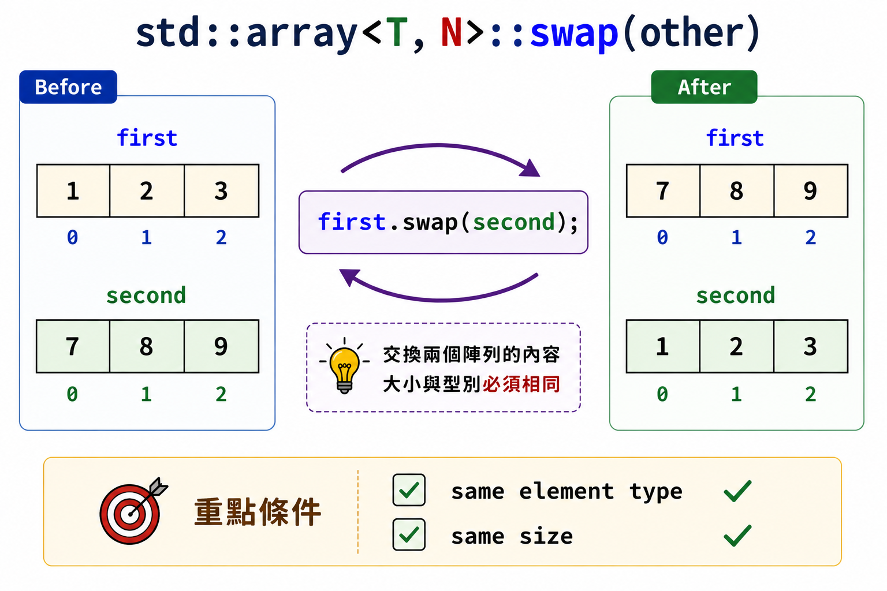


# Part V：`std::array` 與 Range-Based `for`

## Section LXXIX. 修改所有元素

```cpp
for (auto& value : values) {
    value *= 2;
}
```

---

## Section LXXX. 唯讀走訪

```cpp
for (const auto& value : values) {
    cout << value;
}
```

---

## Section LXXXI. 完整範例

```cpp
// VALIDATE
#include <array>
#include <iostream>
using namespace std;

int main() {
    array<int, 4> values{
        1,
        3,
        5,
        7
    };

    for (auto& value : values) {
        value += 1;
    }

    for (const auto& value : values) {
        cout << value
             << " ";
    }

    cout << '\n';

    return 0;
}
```

---

# Part W：將 `std::array` 傳入函式

## Section LXXXII. 唯讀參數

```cpp
void showValues(
    const array<int, 5>& values
)
```

- 不複製陣列。
- 函式不能修改元素。
- `.size()` 仍然可用。

---

## Section LXXXIII. 完整唯讀函式

```cpp
// VALIDATE
#include <array>
#include <iostream>
using namespace std;

void showValues(
    const array<int, 5>& values
) {
    for (const int& value : values) {
        cout << value
             << " ";
    }

    cout << '\n';
}

int main() {
    array<int, 5> values{
        2,
        4,
        6,
        8,
        10
    };

    showValues(values);

    return 0;
}
```

---

## Section LXXXIV. 可修改參數

```cpp
void doubleValues(
    array<int, 5>& values
)
```

函式可以直接修改元素。

---

## Section LXXXV. 完整修改函式

```cpp
// VALIDATE
#include <array>
#include <iostream>
using namespace std;

void doubleValues(
    array<int, 5>& values
) {
    for (int& value : values) {
        value *= 2;
    }
}

int main() {
    array<int, 5> values{
        1,
        2,
        3,
        4,
        5
    };

    doubleValues(values);

    for (int value : values) {
        cout << value
             << " ";
    }

    cout << '\n';

    return 0;
}
```

---

# Part X：大小是型別的一部分

## Section LXXXVI. 不同型別

```cpp
array<int, 3>
```

與：

```cpp
array<int, 4>
```

是不同型別。

---

## Section LXXXVII. 函式參數限制

函式：

```cpp
void show(
    const array<int, 3>& values
);
```

不能直接接收：

```cpp
array<int, 4>
```

---

## Section LXXXVIII. 如何處理不同大小？

可使用函式模板：

```cpp
template <size_t N>
void show(
    const array<int, N>& values
);
```

但函式模板語法會在進階章節完整介紹。

本章練習使用明確固定大小。

---

# Part Y：傳統陣列與 `std::array` 比較

## Section LXXXIX. 比較表

| 功能 | 傳統陣列 | `std::array` |
| --- | --- | --- |
| 固定大小 | 是 | 是 |
| 連續儲存 | 是 | 是 |
| Range-based `for` | 支援 | 支援 |
| `.size()` | 不支援 | 支援 |
| `.at()` | 不支援 | 支援 |
| `.front()` / `.back()` | 不支援 | 支援 |
| `.fill()` | 不支援 | 支援 |
| 直接複製 | 不支援 | 支援 |
| 直接賦值 | 不支援 | 支援 |
| 直接比較 | 不支援 | 支援 |
| 傳入函式保留型別與大小 | 通常不保留 | 保留 |
| 與 C API 相容性 | 較直接 | 可透過 `.data()`，後續介紹 |

---


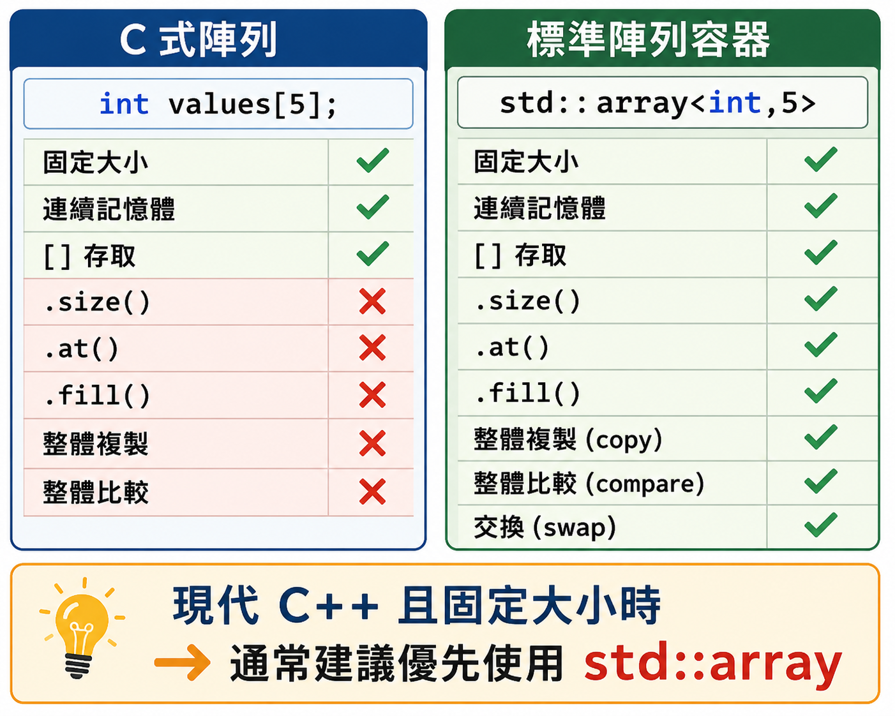


## Section XC. 何時使用傳統陣列？

- 維護既有 C 或 C++ 程式。
- 與要求傳統陣列或指標的 API 互動。
- 學習底層陣列與指標關係。
- 某些非常底層的資料結構。

---

## Section XCI. 何時優先使用 `std::array`？

固定大小且使用現代 C++ 時，通常優先：

```cpp
std::array
```

因為：

- 介面完整。
- 可複製與賦值。
- 可比較。
- 大小可直接取得。
- 函式參數較清楚。
- 更容易搭配標準演算法。

---

# Part Z：固定大小與動態大小

## Section XCII. 固定大小

```cpp
array<int, 5>
```

元素數量在編譯時已知，執行期間不能改成 `6`。

---

## Section XCIII. 動態大小

若資料數量要依輸入改變，例如：

```text
使用者輸入 n
建立 n 個元素
之後可能繼續增加
```

後續應學習：

```cpp
std::vector
```

不要使用非標準的變長陣列語法：

```cpp
/* int values[n]; */
```

標準 C++ 不支援以一般執行期間變數作為內建陣列大小。

---

# Part AA：二維陣列預告

## Section XCIV. 陣列中的陣列

```cpp
int grid[3][4]{};
```

可想成：

```text
3 列
每列 4 個整數
```

---

## Section XCV. `std::array` 二維形式

```cpp
array<
    array<int, 4>,
    3
> grid{};
```

完整二維走訪、列欄索引與矩陣操作會在後續二維陣列章節介紹。

---

# Part AB：快速概念檢查

## Section XCVI. 選擇題與簡答

### Q1. 大小為 5 的陣列合法索引是什麼？

<details><summary>查看答案</summary>

```text
0、1、2、3、4
```

</details>

### Q2. 最後一個合法索引如何表示？

<details><summary>查看答案</summary>

```text
size - 1
```

</details>

### Q3. 傳統陣列越界會自動丟出例外嗎？

<details><summary>查看答案</summary>

不會，可能造成未定義行為。

</details>

### Q4. `int values[5]{};` 會如何初始化？

<details><summary>查看答案</summary>

所有元素初始化為 `0`。

</details>

### Q5. `int values[5] = {1, 2};` 的後三個元素是什麼？

<details><summary>查看答案</summary>

都是 `0`。

</details>

### Q6. Range-based `for` 的 `int value` 會修改原元素嗎？

<details><summary>查看答案</summary>

不會，它是副本。

</details>

### Q7. 如何修改原元素？

<details><summary>查看答案</summary>

使用：

```cpp
int& value
```

或：

```cpp
auto& value
```

</details>

### Q8. 傳統陣列如何在原作用域取得大小？

<details><summary>查看答案</summary>

可使用：

```cpp
sizeof(values) / sizeof(values[0])
```

或 C++17：

```cpp
std::size(values)
```

</details>

### Q9. 傳統陣列傳入函式後，函式會自動知道大小嗎？

<details><summary>查看答案</summary>

通常不會，需要另外傳入元素數量。

</details>

### Q10. 傳統陣列可以直接用 `=` 複製嗎？

<details><summary>查看答案</summary>

不可以。

</details>

### Q11. `std::array` 需要哪個標頭？

<details><summary>查看答案</summary>

```cpp
#include <array>
```

</details>

### Q12. `std::array<int, 5>` 的 `5` 代表什麼？

<details><summary>查看答案</summary>

元素數量，而且是型別的一部分。

</details>

### Q13. `.at()` 與 `[]` 的主要差異是什麼？

<details><summary>查看答案</summary>

`.at()` 會進行界線檢查；`[]` 通常不會。

</details>

### Q14. `.front()` 可用於空 `std::array` 嗎？

<details><summary>查看答案</summary>

不可以，空陣列沒有第一個元素。

</details>

### Q15. `.fill(7)` 做什麼？

<details><summary>查看答案</summary>

將所有元素設成 `7`。

</details>

### Q16. `std::array` 可以直接複製與賦值嗎？

<details><summary>查看答案</summary>

可以，只要型別相同。

</details>

### Q17. `std::array` 可以直接使用 `==` 比較嗎？

<details><summary>查看答案</summary>

可以，會逐元素比較。

</details>

### Q18. `std::array<int, 3>` 與 `std::array<int, 4>` 是相同型別嗎？

<details><summary>查看答案</summary>

不是。

</details>

### Q19. 固定大小現代 C++ 容器通常優先使用什麼？

<details><summary>查看答案</summary>

```cpp
std::array
```

</details>

### Q20. 執行期間需要改變元素數量時應學習什麼？

<details><summary>查看答案</summary>

```cpp
std::vector
```

</details>

---

# Part AC：程式閱讀練習

## Section XCVII. 預測結果與錯誤

### 題目 1

```cpp
int values[] = {10, 20, 30};

cout << values[0]
     << values[2];
```

<details><summary>查看答案</summary>

```text
1030
```

沒有空格。

</details>

### 題目 2

```cpp
int values[5] = {1, 2};

cout << values[2]
     << values[4];
```

<details><summary>查看答案</summary>

```text
00
```

未列出的元素為 `0`。

</details>

### 題目 3

```cpp
int values[] = {1, 2, 3};

for (int value : values) {
    value *= 10;
}

cout << values[0];
```

<details><summary>查看答案</summary>

```text
1
```

修改的是副本。

</details>

### 題目 4

```cpp
int values[] = {1, 2, 3};

for (int& value : values) {
    value *= 10;
}

cout << values[0];
```

<details><summary>查看答案</summary>

```text
10
```

</details>

### 題目 5

```cpp
int values[] = {4, 8, 12};

cout <<
    sizeof(values) /
    sizeof(values[0]);
```

<details><summary>查看答案</summary>

```text
3
```

</details>

### 題目 6

```cpp
int values[3]{};

/* values[3] = 10; */
```

<details><summary>查看答案</summary>

索引 `3` 越界。合法索引只有 `0–2`。

</details>

### 題目 7

```cpp
array<int, 3> values{
    1,
    2,
    3
};

cout << values.size();
```

<details><summary>查看答案</summary>

```text
3
```

</details>

### 題目 8

```cpp
array<int, 3> values{
    1,
    2,
    3
};

values.fill(9);

cout << values[1];
```

<details><summary>查看答案</summary>

```text
9
```

</details>

### 題目 9

```cpp
array<int, 3> first{
    1,
    2,
    3
};

array<int, 3> second =
    first;

second[0] = 99;

cout << first[0]
     << " "
     << second[0];
```

<details><summary>查看答案</summary>

```text
1 99
```

兩個陣列是獨立物件。

</details>

### 題目 10

```cpp
array<int, 3> first{
    1,
    2,
    3
};

array<int, 3> second{
    1,
    2,
    3
};

cout << boolalpha
     << (first == second);
```

<details><summary>查看答案</summary>

```text
true
```

</details>

### 題目 11

```cpp
array<int, 0> values{};

/* cout << values.front(); */
```

<details><summary>查看答案</summary>

空陣列沒有第一個元素，不能呼叫 `.front()`。

</details>

### 題目 12

```cpp
array<int, 3> values{
    10,
    20,
    30
};

for (
    size_t index = values.size();
    index > 0;
    --index
) {
    cout << values[index - 1];
}
```

<details><summary>查看答案</summary>

```text
302010
```

</details>

---

# Part AD：實作練習

## Section XCVIII. 實作檢測題

### TODO 1：基本傳統陣列

建立包含五個整數的傳統陣列，輸出第一個與最後一個元素。

### TODO 2：輸入五個分數

使用索引迴圈讀入五個分數，再依原順序輸出。

### TODO 3：總和與平均

計算固定陣列的總和與平均值。

### TODO 4：最大最小值

找出陣列最大值與最小值。

### TODO 5：偶數數量

統計陣列中偶數元素數量。

### TODO 6：修改所有元素

使用參考型 range-based `for` 將所有元素乘以 `2`。

### TODO 7：反向輸出

使用安全無號索引寫法反向輸出陣列。

### TODO 8：傳統陣列函式

建立：

```cpp
void showValues(
    const int values[],
    size_t size
)
```

### TODO 9：複製傳統陣列

使用迴圈將來源陣列複製到目的陣列。

### TODO 10：第一個 `std::array`

建立 `std::array<int, 5>`，使用 `.size()` 與 range-based `for`。

### TODO 11：安全索引

從使用者讀取索引，使用 `.at()` 並處理越界例外。

### TODO 12：`.fill()`

建立大小為 `8` 的 `std::array`，將所有元素填入 `-1`。

### TODO 13：複製與比較

複製一個 `std::array`，修改副本，再比較兩者是否相同。

### TODO 14：交換內容

建立兩個相同型別 `std::array`，使用 `.swap()`。

### TODO 15：函式修改 `std::array`

建立：

```cpp
void addOne(
    std::array<int, 5>& values
)
```

將所有元素加一。

---

# Part AE：課後小練習

## Section XCIX. 延伸練習

### 練習 1：成績等級統計

使用固定陣列統計 A、B、C、D、F 的人數。

### 練習 2：第一個符合條件的位置

找出第一個大於指定目標的元素索引；找不到時輸出 `Not found`。

### 練習 3：左右交換

將固定陣列內容反轉，不使用額外完整陣列。

### 練習 4：陣列是否遞增

判斷元素是否為嚴格遞增。

### 練習 5：傳統陣列改寫

將一段使用傳統陣列的程式改寫成 `std::array`，列出可以刪除的大小參數與手動複製程式。

---

# Part AF：常見錯誤提醒

## Section C. 常見錯誤

1. 忘記索引從 `0` 開始。
2. 使用 `size` 作為最後索引。
3. 將合法條件寫成 `index <= size`。
4. 傳統陣列越界。
5. 以為 `[]` 會自動檢查範圍。
6. 讀取未初始化區域陣列元素。
7. 忘記部分初始化會將剩餘元素設為 0。
8. Range-based `for` 使用副本卻期待修改原元素。
9. 不需要修改卻使用非 `const` 參考。
10. 使用 `int` 索引與 `.size()` 的無號型別混合造成警告。
11. 使用 `size_t index >= 0` 反向迴圈。
12. 反向走訪時發生 `index - 1` 下溢。
13. 在函式參數內使用 `sizeof(values)` 期待取得原陣列大小。
14. 忘記傳統陣列函式需要大小參數。
15. 傳入錯誤大小，導致函式越界。
16. 嘗試直接賦值傳統陣列。
17. 嘗試直接比較傳統陣列內容。
18. 手動複製時來源與目的大小不同。
19. 忘記包含 `<array>`。
20. `std::array` 宣告的元素數量錯誤。
21. 將 `std::array<int, 3>` 傳給要求 `std::array<int, 4>` 的函式。
22. 對空 `std::array` 使用 `.front()` 或 `.back()`。
23. 認為 `.at()` 越界只回傳特殊值。
24. 沒有處理 `.at()` 的例外。
25. `.fill()` 被誤認為加入新元素。
26. 認為 `std::array` 可以改變大小。
27. 使用非標準變長陣列 `int values[n]`。
28. 固定大小問題卻過早使用手動動態記憶體。
29. 大型陣列以值傳入函式造成不必要複製。
30. 未依需求選擇傳統陣列、`std::array` 或未來的 `std::vector`。

---

# Part AG：Mermaid 流程圖

## Section CI. 陣列流程圖

### 1. 索引檢查

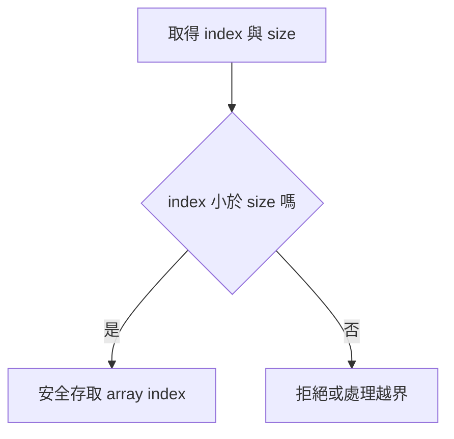
```mermaid
flowchart TD
    A[取得 index 與 size] --> B{index 小於 size 嗎}
    B -- 是 --> C[安全存取 array index]
    B -- 否 --> D[拒絕或處理越界]
```

### 2. 索引走訪

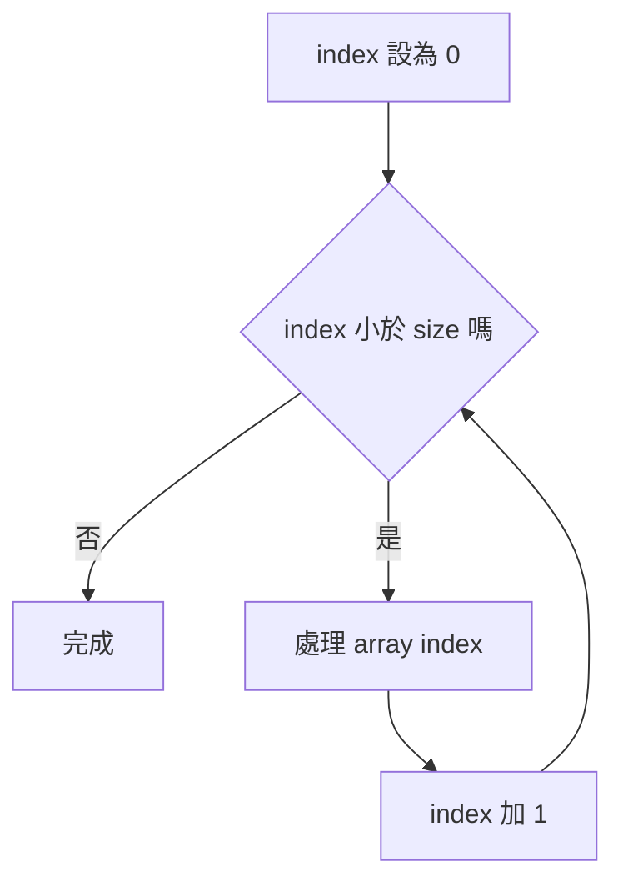
```mermaid
flowchart TD
    A[index 設為 0] --> B{index 小於 size 嗎}
    B -- 否 --> E[完成]
    B -- 是 --> C[處理 array index]
    C --> D[index 加 1]
    D --> B
```

### 3. Range-Based `for`

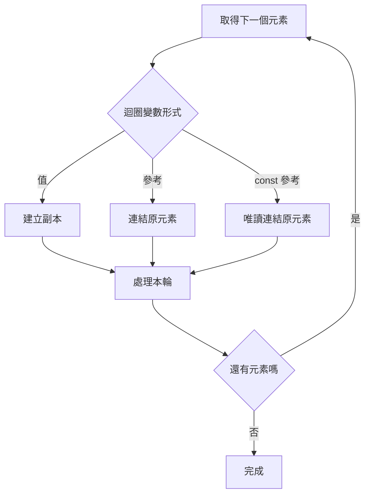
```mermaid
flowchart TD
    A[取得下一個元素] --> B{迴圈變數形式}
    B -- 值 --> C[建立副本]
    B -- 參考 --> D[連結原元素]
    B -- const 參考 --> E[唯讀連結原元素]
    C --> F[處理本輪]
    D --> F
    E --> F
    F --> G{還有元素嗎}
    G -- 是 --> A
    G -- 否 --> H[完成]
```

### 4. 最大最小值

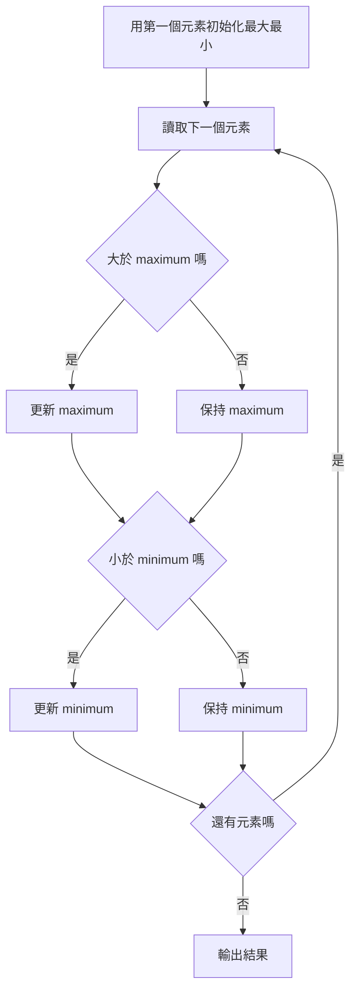
```mermaid
flowchart TD
    A[用第一個元素初始化最大最小] --> B[讀取下一個元素]
    B --> C{大於 maximum 嗎}
    C -- 是 --> D[更新 maximum]
    C -- 否 --> E[保持 maximum]
    D --> F{小於 minimum 嗎}
    E --> F
    F -- 是 --> G[更新 minimum]
    F -- 否 --> H[保持 minimum]
    G --> I{還有元素嗎}
    H --> I
    I -- 是 --> B
    I -- 否 --> J[輸出結果]
```

### 5. 傳統陣列傳入函式

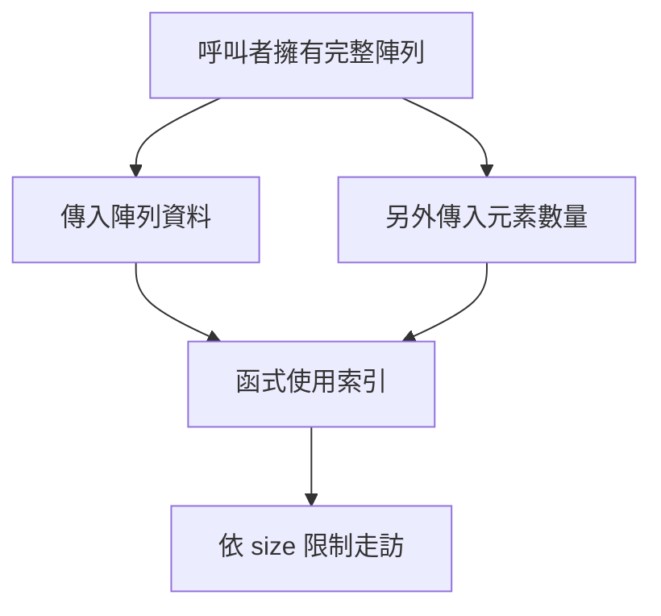
```mermaid
flowchart TD
    A[呼叫者擁有完整陣列] --> B[傳入陣列資料]
    A --> C[另外傳入元素數量]
    B --> D[函式使用索引]
    C --> D
    D --> E[依 size 限制走訪]
```

### 6. `std::array` 存取

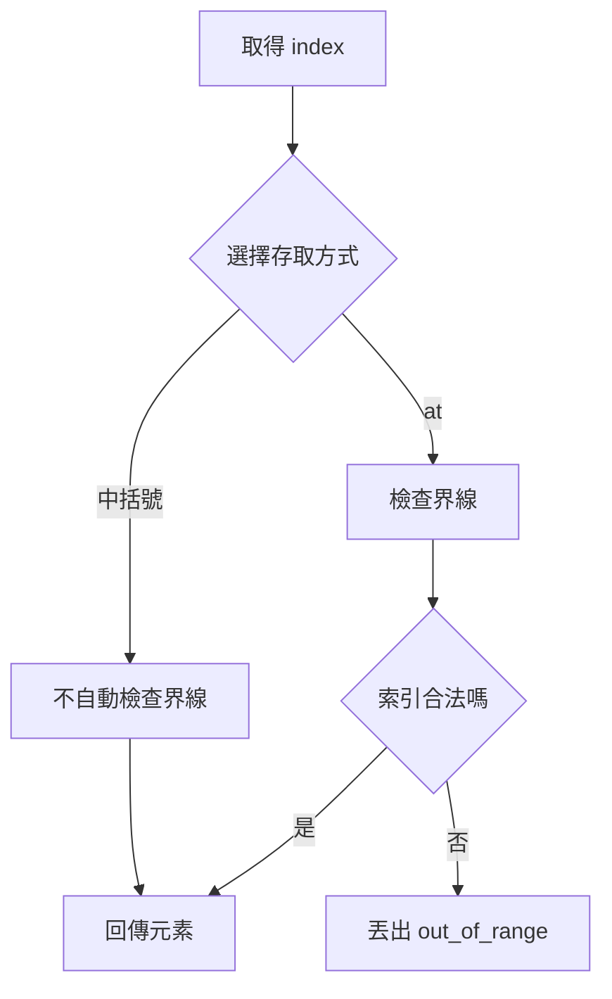
```mermaid
flowchart TD
    A[取得 index] --> B{選擇存取方式}
    B -- 中括號 --> C[不自動檢查界線]
    B -- at --> D[檢查界線]
    D --> E{索引合法嗎}
    E -- 是 --> F[回傳元素]
    E -- 否 --> G[丟出 out_of_range]
    C --> F
```

### 7. 選擇容器

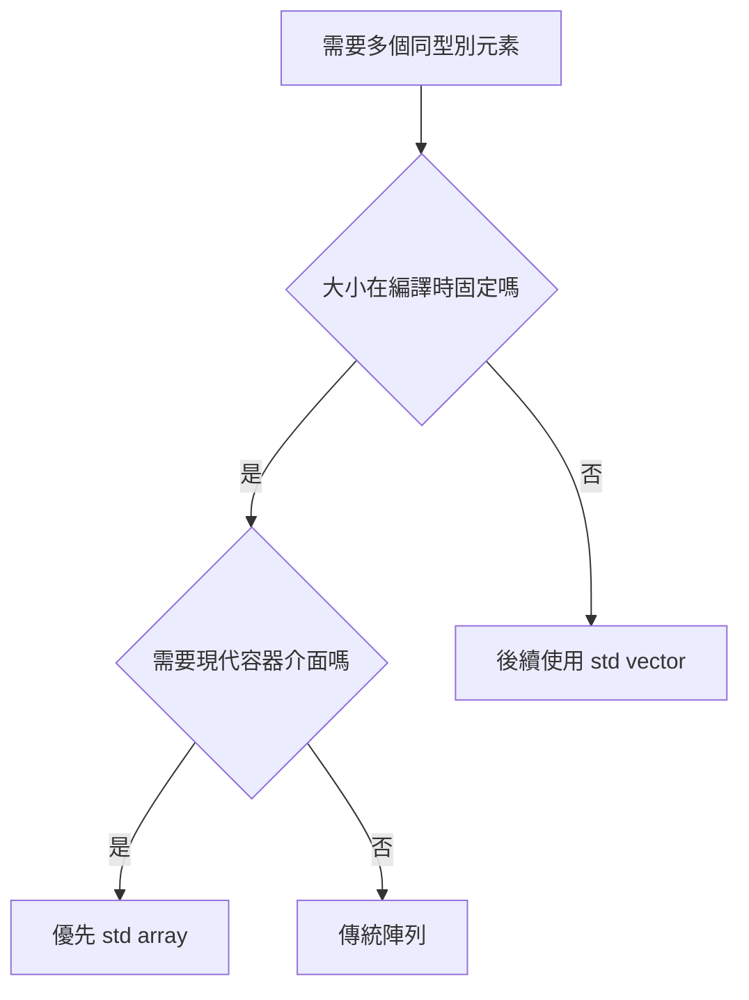
```mermaid
flowchart TD
    A[需要多個同型別元素] --> B{大小在編譯時固定嗎}
    B -- 是 --> C{需要現代容器介面嗎}
    C -- 是 --> D[優先 std array]
    C -- 否 --> E[傳統陣列]
    B -- 否 --> F[後續使用 std vector]
```

### 8. 傳統陣列與 `std::array`

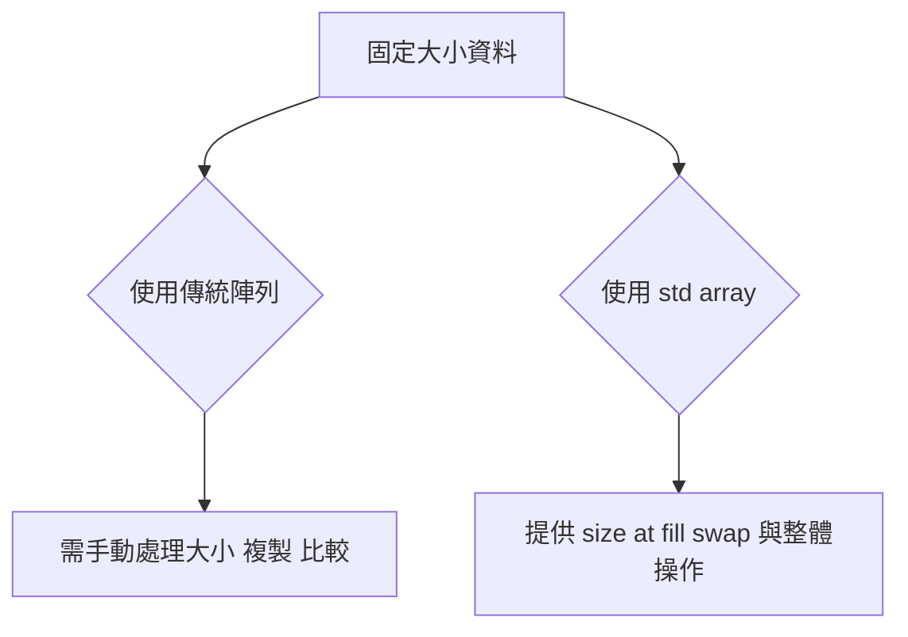
```mermaid
flowchart TD
    A[固定大小資料] --> B{使用傳統陣列}
    A --> C{使用 std array}
    B --> D[需手動處理大小 複製 比較]
    C --> E[提供 size at fill swap 與整體操作]
```

---

# 本章完成標準

完成本章後，你應該能做到：

1. 說明陣列的用途。
2. 宣告固定大小傳統陣列。
3. 使用初始化列表。
4. 讓編譯器推導傳統陣列大小。
5. 使用零初始化。
6. 說明未初始化元素的風險。
7. 使用從 0 開始的索引。
8. 計算最後合法索引。
9. 避免越界存取。
10. 使用索引 `for` 走訪。
11. 使用 `std::size_t`。
12. 使用 range-based `for`。
13. 分辨值、參考與 `const` 參考走訪。
14. 計算總和與平均值。
15. 找出最大值與最小值。
16. 統計符合條件的元素。
17. 修改所有元素。
18. 安全反向走訪。
19. 使用 `sizeof` 計算傳統陣列大小。
20. 使用 C++17 `std::size()`。
21. 說明傳統陣列傳入函式後大小資訊可能遺失。
22. 另外傳入元素數量。
23. 使用 `const` 傳統陣列參數。
24. 使用迴圈複製傳統陣列。
25. 使用迴圈比較傳統陣列。
26. 宣告 `std::array<T, N>`。
27. 使用 `.size()`。
28. 使用 `[]` 與 `.at()`。
29. 處理 `.at()` 的越界例外。
30. 使用 `.front()` 與 `.back()`。
31. 使用 `.fill()`。
32. 使用 `.swap()`。
33. 直接複製與賦值 `std::array`。
34. 直接比較 `std::array`。
35. 將 `std::array` 以 `const` 參考傳入函式。
36. 將 `std::array` 以一般參考傳入函式。
37. 說明大小是 `std::array` 型別的一部分。
38. 比較傳統陣列與 `std::array`。
39. 判斷固定大小與動態大小需求。
40. 找出常見陣列錯誤。

---

# 隱藏答案區

> Answer hidden — try it first.

<details><summary>TODO 1 答案</summary>

```cpp
int values[5] = {
    10,
    20,
    30,
    40,
    50
};

cout << values[0]
     << '\n';

cout << values[4]
     << '\n';
```

</details>

<details><summary>TODO 2 答案</summary>

```cpp
int scores[5]{};

for (size_t index = 0; index < 5; ++index) {
    cin >> scores[index];
}

for (size_t index = 0; index < 5; ++index) {
    cout << scores[index]
         << '\n';
}
```

</details>

<details><summary>TODO 3 答案</summary>

```cpp
long long total = 0;

for (int value : values) {
    total += value;
}

double average =
    static_cast<double>(total) /
    static_cast<double>(
        std::size(values)
    );
```

</details>

<details><summary>TODO 4 答案</summary>

```cpp
int maximum = values[0];
int minimum = values[0];

for (int value : values) {
    if (value > maximum) {
        maximum = value;
    }

    if (value < minimum) {
        minimum = value;
    }
}
```

</details>

<details><summary>TODO 5 答案</summary>

```cpp
int evenCount = 0;

for (int value : values) {
    if (value % 2 == 0) {
        ++evenCount;
    }
}
```

</details>

<details><summary>TODO 6 答案</summary>

```cpp
for (int& value : values) {
    value *= 2;
}
```

</details>

<details><summary>TODO 7 答案</summary>

```cpp
for (
    size_t index = size;
    index > 0;
    --index
) {
    cout << values[index - 1]
         << '\n';
}
```

</details>

<details><summary>TODO 8 答案</summary>

```cpp
void showValues(
    const int values[],
    size_t size
) {
    for (
        size_t index = 0;
        index < size;
        ++index
    ) {
        cout << values[index]
             << '\n';
    }
}
```

</details>

<details><summary>TODO 9 答案</summary>

```cpp
for (
    size_t index = 0;
    index < size;
    ++index
) {
    destination[index] =
        source[index];
}
```

</details>

<details><summary>TODO 10 答案</summary>

```cpp
array<int, 5> values{
    1,
    2,
    3,
    4,
    5
};

cout << values.size()
     << '\n';

for (int value : values) {
    cout << value
         << '\n';
}
```

</details>

<details><summary>TODO 11 答案</summary>

```cpp
size_t index;
cin >> index;

try {
    cout << values.at(index)
         << '\n';
} catch (
    const out_of_range&
) {
    cout << "Index out of range\n";
}
```

</details>

<details><summary>TODO 12 答案</summary>

```cpp
array<int, 8> values{};

values.fill(-1);
```

</details>

<details><summary>TODO 13 答案</summary>

```cpp
array<int, 3> first{
    1,
    2,
    3
};

array<int, 3> second =
    first;

second[0] = 100;

cout << boolalpha
     << (first == second)
     << '\n';
```

</details>

<details><summary>TODO 14 答案</summary>

```cpp
array<int, 3> first{
    1,
    2,
    3
};

array<int, 3> second{
    7,
    8,
    9
};

first.swap(second);
```

</details>

<details><summary>TODO 15 答案</summary>

```cpp
void addOne(
    array<int, 5>& values
) {
    for (int& value : values) {
        ++value;
    }
}
```

</details>
