# Lesson 17：`std::string` Strings `std::string` 字串

> 這堂課的重點：使用 C++ 標準函式庫的 `std::string` 儲存與處理文字。你會學習建立字串、取得長度、索引字元、讀取整行文字、串接、比較、搜尋、擷取子字串、插入、刪除、取代、逐字元分析，以及字串與數值之間的基本轉換。

> 本章主要使用 `std::string`，不以傳統 `char` 陣列作為主要工具。C-style 字串、字元陣列、指標與字串字面常數的底層關係會在後續指標與字串章節整理。

---

## Section I. 今天要做什麼？

1. 認識字串 string。
2. 理解字串是字元序列。
3. 認識 `std::string`。
4. 加入 `<string>` 標頭。
5. 宣告空字串。
6. 使用字串字面常數初始化。
7. 使用另一個字串初始化。
8. 建立重複字元字串。
9. 理解字串長度。
10. 使用 `.size()`。
11. 使用 `.length()`。
12. 理解 `.size()` 與 `.length()` 等價。
13. 使用 `.empty()` 判斷空字串。
14. 使用 `.clear()` 清空字串。
15. 理解字串索引從 `0` 開始。
16. 使用 `[]` 存取字元。
17. 使用 `.at()` 存取字元。
18. 理解 `.at()` 會檢查界線。
19. 使用 `.front()` 取得第一個字元。
20. 使用 `.back()` 取得最後一個字元。
21. 避免對空字串使用 `.front()` 與 `.back()`。
22. 修改字串中的字元。
23. 使用索引迴圈走訪字串。
24. 使用 range-based `for` 走訪字串。
25. 分辨以值取得字元與以參考取得字元。
26. 使用 `const char&` 唯讀走訪。
27. 使用 `char&` 修改原字串。
28. 使用 `cin >> text` 讀取單一單字。
29. 理解 `operator>>` 遇到空白停止。
30. 使用 `getline()` 讀取整行。
31. 理解 `getline()` 保留行內空白。
32. 處理 `cin >>` 與 `getline()` 混用。
33. 使用 `std::ws` 跳過前導空白。
34. 使用 `cin.ignore()` 清除換行。
35. 避免誤吃掉有效輸入。
36. 使用 `+` 串接字串。
37. 使用 `+=` 附加內容。
38. 使用 `.append()`。
39. 使用 `.push_back()` 加入單一字元。
40. 使用 `.pop_back()` 移除最後字元。
41. 避免對空字串使用 `.pop_back()`。
42. 使用 `.insert()` 插入文字。
43. 使用 `.erase()` 刪除文字。
44. 使用 `.replace()` 取代文字。
45. 使用 `.substr()` 擷取子字串。
46. 理解起點與長度。
47. 理解 `.substr(position)` 取得到結尾。
48. 使用 `.find()` 搜尋。
49. 理解搜尋結果型別 `std::string::size_type`。
50. 理解 `std::string::npos`。
51. 判斷是否找到文字。
52. 指定搜尋起點。
53. 使用 `.rfind()` 從後方搜尋。
54. 搜尋單一字元。
55. 搜尋子字串。
56. 計算子字串出現次數。
57. 避免搜尋空字串造成意外迴圈。
58. 比較兩個字串是否相等。
59. 使用 `==` 與 `!=`。
60. 使用 `<`、`>` 進行字典順序比較。
61. 理解字典順序依字元編碼比較。
62. 理解大寫與小寫通常排序不同。
63. 使用 `.compare()`。
64. 判斷字串前綴。
65. 判斷字串後綴。
66. 在 C++17 手動實作 starts-with。
67. 在 C++17 手動實作 ends-with。
68. 認識 C++20 `starts_with()` 與 `ends_with()`。
69. 本章程式保持 C++17 相容。
70. 計算字元出現次數。
71. 計算母音數量。
72. 計算數字字元數量。
73. 計算空白字元數量。
74. 使用 `<cctype>`。
75. 使用 `std::isdigit()`。
76. 使用 `std::isalpha()`。
77. 使用 `std::isspace()`。
78. 使用 `std::islower()`。
79. 使用 `std::isupper()`。
80. 使用 `std::tolower()`。
81. 使用 `std::toupper()`。
82. 正確轉型為 `unsigned char`。
83. 避免直接將負值 `char` 傳入 `<cctype>` 函式。
84. 將字串轉為大寫。
85. 將字串轉為小寫。
86. 切換字母大小寫。
87. 移除指定字元。
88. 移除所有空白。
89. 壓縮連續空白。
90. 反轉字串。
91. 判斷回文字串。
92. 忽略大小寫判斷回文。
93. 忽略非字母數字判斷回文。
94. 使用雙索引向中間比較。
95. 使用 `.resize()` 改變字串長度。
96. 理解縮短會刪除尾端字元。
97. 理解加長會加入指定填充值。
98. 使用 `.reserve()` 預留容量。
99. 分辨 `.size()` 與 `.capacity()`。
100. 理解容量不等於字串長度。
101. 使用 `.shrink_to_fit()` 的概念。
102. 避免依賴容量的精確值。
103. 使用 `.data()` 與 `.c_str()` 的基本概念。
104. 理解 C++17 中 `.data()` 可提供可修改字元資料。
105. 不在本章直接以指標修改字串內容。
106. 將字串以 `const std::string&` 傳入函式。
107. 將字串以 `std::string&` 傳入函式。
108. 以值回傳字串。
109. 理解回傳區域字串的值是安全的。
110. 避免回傳區域字串參考。
111. 使用 `std::to_string()`。
112. 使用 `std::stoi()`。
113. 使用 `std::stol()`。
114. 使用 `std::stoll()`。
115. 使用 `std::stof()`。
116. 使用 `std::stod()`。
117. 處理 `std::invalid_argument`。
118. 處理 `std::out_of_range`。
119. 理解轉換可能只讀取字串前半部。
120. 使用 `position` 取得停止位置。
121. 驗證整個字串都是合法數字。
122. 處理前後空白。
123. 建立簡單 trim 函式。
124. 建立文字分析函式。
125. 建立名稱格式化函式。
126. 比較 `std::string` 與字元陣列。
127. 判斷何時使用 `std::string`。
128. 認識 `std::string_view` 的概念預告。
129. 不在本章保存 `string_view` 指向短生命週期字串。
130. 使用概念檢查、程式閱讀與實作題整合本章。

---

## Section II. 今天的學習方式

1. 每個字串先標出：
   ```text
   內容
   長度
   合法索引
   是否可能為空
   ```
2. 長度為 `N` 時，合法索引是：
   ```text
   0 到 N - 1
   ```
3. 使用 `.front()`、`.back()`、`.pop_back()` 前先檢查：
   ```cpp
   !text.empty()
   ```
4. 使用 `.find()` 時先檢查：
   ```cpp
   position != string::npos
   ```
5. 使用 `.substr()` 時先確認起點不超過 `.size()`。
6. 混用 `cin >>` 與 `getline()` 時先處理殘留換行。
7. `<cctype>` 函式使用：
   ```cpp
   static_cast<unsigned char>(ch)
   ```
8. 修改字串要使用：
   ```cpp
   char&
   ```
9. 唯讀函式參數通常使用：
   ```cpp
   const string&
   ```
10. 需要回傳新文字時通常直接回傳 `string`。
11. 數字轉換題要處理例外與未完全轉換的字元。
12. 所有合法完整程式使用嚴格 C++17 選項檢查。

---

## Section III. 核心語法對照

| 語法 | 用途 |
| --- | --- |
| `std::string text;` | 建立空字串 |
| `std::string text = "Hello";` | 以文字初始化 |
| `std::string text(5, '*');` | 建立 5 個 `*` |
| `text.size()` | 取得字元數量 |
| `text.length()` | 取得字元數量 |
| `text.empty()` | 判斷是否為空 |
| `text.clear()` | 清空內容 |
| `text[index]` | 不檢查界線的字元存取 |
| `text.at(index)` | 有界線檢查的字元存取 |
| `text.front()` | 第一個字元 |
| `text.back()` | 最後一個字元 |
| `getline(cin, text)` | 讀取整行 |
| `getline(cin >> ws, text)` | 跳過前導空白後讀取整行 |
| `first + second` | 串接字串 |
| `text += other` | 附加文字 |
| `text.push_back(ch)` | 加入一個字元 |
| `text.pop_back()` | 移除最後字元 |
| `text.substr(pos, count)` | 擷取子字串 |
| `text.find(target)` | 從前方搜尋 |
| `text.rfind(target)` | 從後方搜尋 |
| `string::npos` | 找不到的位置值 |
| `text.insert(pos, value)` | 插入文字 |
| `text.erase(pos, count)` | 刪除文字 |
| `text.replace(pos, count, value)` | 取代文字 |
| `text.resize(newSize, fill)` | 調整長度 |
| `text.reserve(capacity)` | 預留容量 |
| `to_string(value)` | 數值轉字串 |
| `stoi(text)` | 字串轉 `int` |
| `stod(text)` | 字串轉 `double` |

---

# Part A：第一個 `std::string`

## Section IV. 加入標頭

```cpp
#include <string>
```

完整名稱：

```cpp
std::string
```

若教材使用：

```cpp
using namespace std;
```

可直接寫：

```cpp
string
```

---

## Section V. 建立空字串

```cpp
string text;
```

初始內容：

```text
空
```

長度：

```text
0
```

---

## Section VI. 使用文字初始化

```cpp
string text =
    "Hello";
```

---

## Section VII. 完整基本範例

```cpp
// VALIDATE
#include <iostream>
#include <string>
using namespace std;

int main() {
    string message =
        "Hello, C++!";

    cout << message
         << '\n';

    return 0;
}
```

---


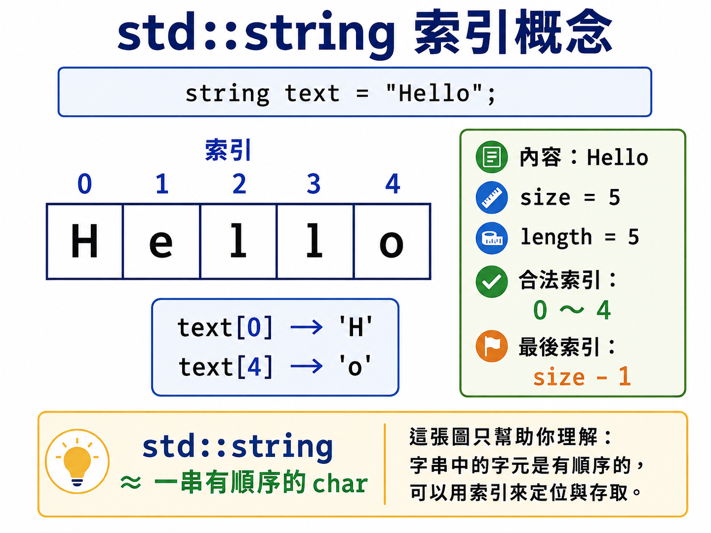


## Section VIII. 建立重複字元

```cpp
string line(
    10,
    '*'
);
```

結果：

```text
**********
```

---

## Section IX. 完整重複字元範例

```cpp
// VALIDATE
#include <iostream>
#include <string>
using namespace std;

int main() {
    string line(
        10,
        '='
    );

    cout << line
         << '\n';

    return 0;
}
```

---

# Part B：長度與空字串

## Section X. `.size()`

```cpp
text.size()
```

回傳字元數量。

回傳型別通常是：

```cpp
string::size_type
```

---

## Section XI. `.length()`

```cpp
text.length()
```

對 `std::string` 而言，和 `.size()` 意義相同。

---

## Section XII. 完整長度範例

```cpp
// VALIDATE
#include <iostream>
#include <string>
using namespace std;

int main() {
    string text =
        "Programming";

    cout << text.size()
         << '\n';

    cout << text.length()
         << '\n';

    return 0;
}
```

兩者都輸出：

```text
11
```

---

## Section XIII. `.empty()`

```cpp
if (text.empty()) {
    cout << "Empty\n";
}
```

通常比：

```cpp
text.size() == 0
```

更直接表達意圖。

---

## Section XIV. `.clear()`

```cpp
text.clear();
```

清除所有字元。

之後：

```cpp
text.empty()
```

為 `true`。

---

## Section XV. 完整空字串範例

```cpp
// VALIDATE
#include <iostream>
#include <string>
using namespace std;

int main() {
    string text =
        "Temporary text";

    cout << boolalpha
         << text.empty()
         << '\n';

    text.clear();

    cout << text.size()
         << '\n';

    cout << text.empty()
         << '\n';

    return 0;
}
```

---

# Part C：索引字元

## Section XVI. 從 0 開始

```cpp
string text =
    "Code";
```

| 索引 | 字元 |
| ---: | --- |
| 0 | `C` |
| 1 | `o` |
| 2 | `d` |
| 3 | `e` |

---

## Section XVII. 使用 `[]`

```cpp
cout << text[0];
```

輸出：

```text
C
```

---

## Section XVIII. 修改字元

```cpp
text[0] = 'N';
```

原本：

```text
Code
```

變成：

```text
Node
```

---

## Section XIX. 完整索引範例

```cpp
// VALIDATE
#include <iostream>
#include <string>
using namespace std;

int main() {
    string text =
        "Code";

    cout << text[0]
         << '\n';

    text[0] = 'N';

    cout << text
         << '\n';

    return 0;
}
```

---

# Part D：`.at()`、`.front()` 與 `.back()`

## Section XX. `.at()`

```cpp
text.at(index)
```

會檢查索引。

越界時丟出：

```cpp
std::out_of_range
```

---


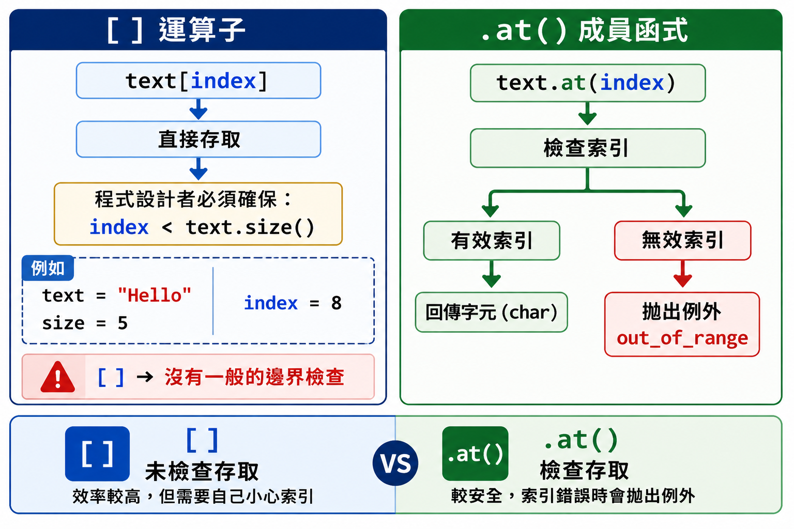


## Section XXI. 完整 `.at()` 範例

```cpp
// VALIDATE
#include <iostream>
#include <stdexcept>
#include <string>
using namespace std;

int main() {
    string text =
        "Hello";

    string::size_type index;
    cin >> index;

    try {
        cout << text.at(index)
             << '\n';
    } catch (
        const out_of_range&
    ) {
        cout << "Index out of range\n";
    }

    return 0;
}
```

---

## Section XXII. `.front()`

```cpp
text.front()
```

取得第一個字元。

---

## Section XXIII. `.back()`

```cpp
text.back()
```

取得最後一個字元。

---

## Section XXIV. 空字串風險

對空字串使用：

```cpp
text.front()
text.back()
```

是不安全的。

應先：

```cpp
if (!text.empty()) {
    // ...
}
```

---


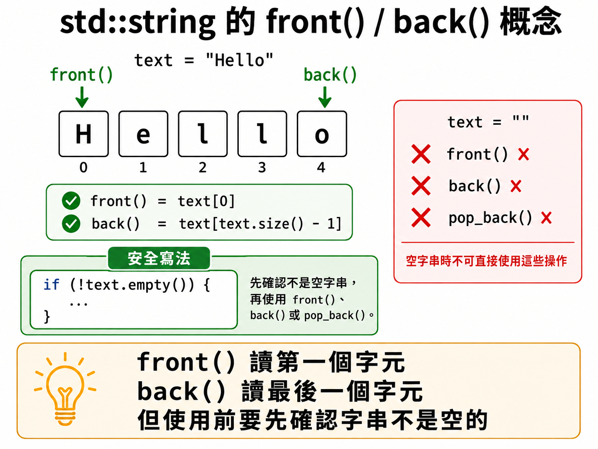


## Section XXV. 完整首尾字元範例

```cpp
// VALIDATE
#include <iostream>
#include <string>
using namespace std;

int main() {
    string text;
    getline(cin, text);

    if (text.empty()) {
        cout << "Empty string\n";
    } else {
        cout << "First: "
             << text.front()
             << '\n';

        cout << "Last: "
             << text.back()
             << '\n';
    }

    return 0;
}
```

---

# Part E：走訪字串

## Section XXVI. 索引迴圈

```cpp
for (
    string::size_type index = 0;
    index < text.size();
    ++index
) {
    cout << text[index];
}
```

需要索引時適合使用。

---

## Section XXVII. Range-Based `for`

```cpp
for (char ch : text) {
    cout << ch;
}
```

只需要每個字元時較簡潔。

---

## Section XXVIII. 修改原字串

```cpp
for (char& ch : text) {
    // 修改 ch 會修改原字串
}
```

---

## Section XXIX. 唯讀參考

```cpp
for (const char& ch : text) {
    cout << ch;
}
```

對 `char` 這種小型型別，以值走訪已很合理。

此寫法主要用來強調參考與 `const` 概念。

---

## Section XXX. 完整走訪範例

```cpp
// VALIDATE
#include <iostream>
#include <string>
using namespace std;

int main() {
    string text =
        "abc";

    for (char& ch : text) {
        ch =
            static_cast<char>(
                ch - 'a' + 'A'
            );
    }

    for (char ch : text) {
        cout << ch
             << " ";
    }

    cout << '\n';

    return 0;
}
```

本例只適用於已知的小寫 ASCII 字母。

---


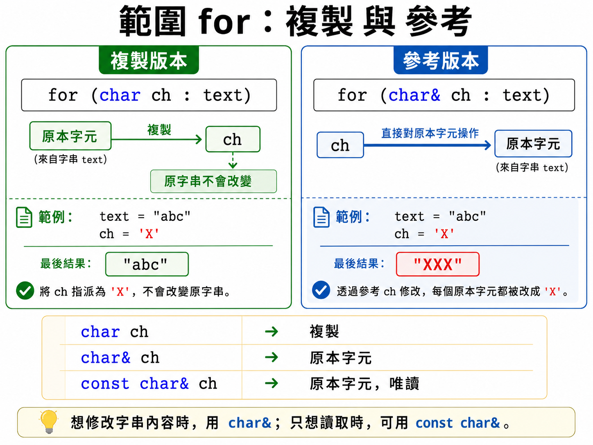


# Part F：使用 `cin >>` 讀取單字

## Section XXXI. 遇到空白停止

```cpp
string word;
cin >> word;
```

輸入：

```text
Hello world
```

`word` 只得到：

```text
Hello
```

---

## Section XXXII. 適合情況

`cin >> word` 適合：

- 單一名稱
- 單字
- 不包含空格的代碼
- 不包含空白的密碼
- 命令選項

---

## Section XXXIII. 完整單字輸入

```cpp
// VALIDATE
#include <iostream>
#include <string>
using namespace std;

int main() {
    string word;

    cout << "Enter one word: ";
    cin >> word;

    cout << "You entered: "
         << word
         << '\n';

    return 0;
}
```

---

# Part G：使用 `getline()` 讀取整行

## Section XXXIV. 基本語法

```cpp
getline(cin, text);
```

會讀到換行為止，不把換行放入字串。

---

## Section XXXV. 行內空白會保留

輸入：

```text
Hello world from C++
```

字串會保存整行。

---

## Section XXXVI. 完整整行輸入

```cpp
// VALIDATE
#include <iostream>
#include <string>
using namespace std;

int main() {
    string sentence;

    cout << "Enter a sentence: ";
    getline(cin, sentence);

    cout << "Length: "
         << sentence.size()
         << '\n';

    cout << sentence
         << '\n';

    return 0;
}
```

---


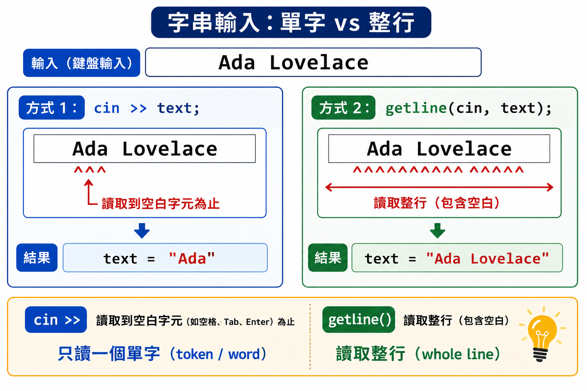


# Part H：混用 `cin >>` 與 `getline()`

## Section XXXVII. 常見問題

```cpp
int age;
string name;

cin >> age;
getline(cin, name);
```

輸入年齡後按 Enter，換行仍留在輸入緩衝區。

`getline()` 立即讀到這個換行，得到空字串。

---

## Section XXXVIII. 使用 `std::ws`

```cpp
getline(
    cin >> ws,
    name
);
```

`ws` 會跳過前導空白，包括換行。

---

## Section XXXIX. 完整混合輸入範例

```cpp
// VALIDATE
#include <iostream>
#include <string>
using namespace std;

int main() {
    int age;
    string fullName;

    cout << "Age: ";
    cin >> age;

    cout << "Full name: ";
    getline(
        cin >> ws,
        fullName
    );

    cout << fullName
         << " is "
         << age
         << " years old.\n";

    return 0;
}
```

---


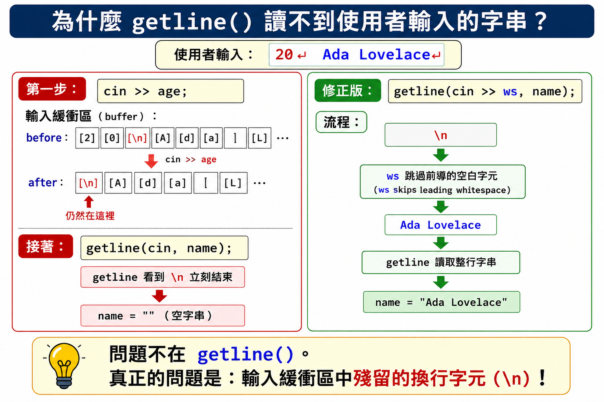


## Section XL. `ws` 的注意事項

`ws` 會跳過所有前導空白。

若行首空白本身有意義，就不應使用它。

此時可精確使用：

```cpp
cin.ignore(...)
```

只清除特定殘留內容。

---

## Section XLI. 使用 `ignore()`

常見寫法：

```cpp
cin.ignore(
    numeric_limits<streamsize>::max(),
    '\n'
);
```

需要：

```cpp
#include <limits>
```

它清除到本行換行為止。

---

# Part I：字串串接

## Section XLII. 使用 `+`

```cpp
string fullName =
    firstName +
    " " +
    lastName;
```

---

## Section XLIII. 使用 `+=`

```cpp
text += " world";
```

修改原字串。

---

## Section XLIV. `.append()`

```cpp
text.append(
    " world"
);
```

也會附加內容。

---

## Section XLV. 完整串接範例

```cpp
// VALIDATE
#include <iostream>
#include <string>
using namespace std;

int main() {
    string firstName =
        "Ada";

    string lastName =
        "Lovelace";

    string fullName =
        firstName +
        " " +
        lastName;

    fullName +=
        " - Programmer";

    cout << fullName
         << '\n';

    return 0;
}
```

---


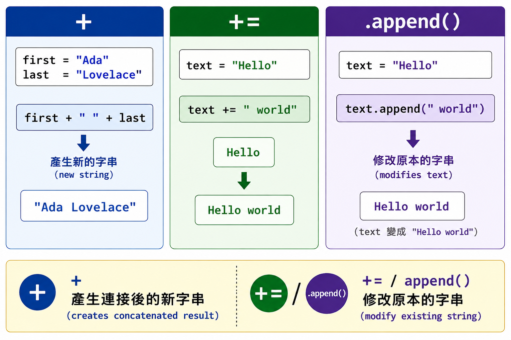


## Section XLVI. 字串字面常數相加注意

不安全概念：

```cpp
/* string text =
    "Hello" + "World";
*/
```

兩邊都是字串字面常數，不是 `std::string`。

可寫：

```cpp
string text =
    string("Hello") +
    "World";
```

或先建立 `string` 變數。

---

# Part J：單一字元操作

## Section XLVII. `.push_back()`

```cpp
text.push_back('!');
```

將一個字元加入尾端。

---

## Section XLVIII. `.pop_back()`

```cpp
text.pop_back();
```

移除最後一個字元。

---

## Section XLIX. 空字串檢查

在 `.pop_back()` 前：

```cpp
if (!text.empty()) {
    text.pop_back();
}
```

---

## Section L. 完整尾端操作

```cpp
// VALIDATE
#include <iostream>
#include <string>
using namespace std;

int main() {
    string text =
        "Hello";

    text.push_back('!');
    cout << text
         << '\n';

    if (!text.empty()) {
        text.pop_back();
    }

    cout << text
         << '\n';

    return 0;
}
```

---

# Part K：擷取子字串

## Section LI. `.substr()`

```cpp
text.substr(
    position,
    count
)
```

從 `position` 開始，最多取得 `count` 個字元。

---

## Section LII. 範例

```cpp
string text =
    "Programming";
```

```cpp
text.substr(0, 7)
```

結果：

```text
Program
```

---

## Section LIII. 只提供起點

```cpp
text.substr(7)
```

從索引 `7` 取得到結尾。

---

## Section LIV. 完整子字串範例

```cpp
// VALIDATE
#include <iostream>
#include <string>
using namespace std;

int main() {
    string text =
        "Programming";

    string firstPart =
        text.substr(0, 7);

    string secondPart =
        text.substr(7);

    cout << firstPart
         << '\n';

    cout << secondPart
         << '\n';

    return 0;
}
```

---


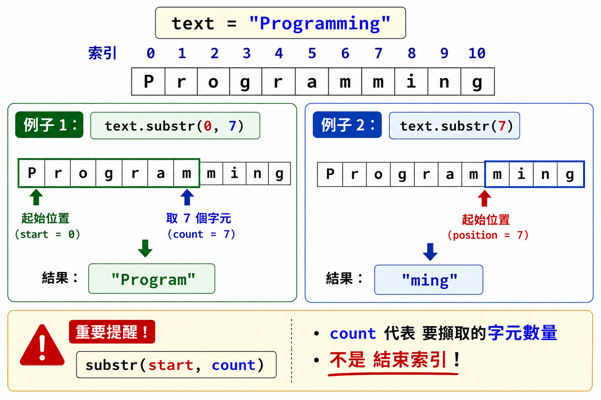


## Section LV. 起點越界

若：

```cpp
position > text.size()
```

`.substr()` 會丟出：

```cpp
out_of_range
```

若 `position == text.size()`，會得到空字串。

---

# Part L：搜尋文字

## Section LVI. `.find()`

```cpp
string::size_type position =
    text.find(target);
```

---

## Section LVII. 找不到

若找不到，結果為：

```cpp
string::npos
```

不要假設它是 `-1` 並存入 `int`。

---


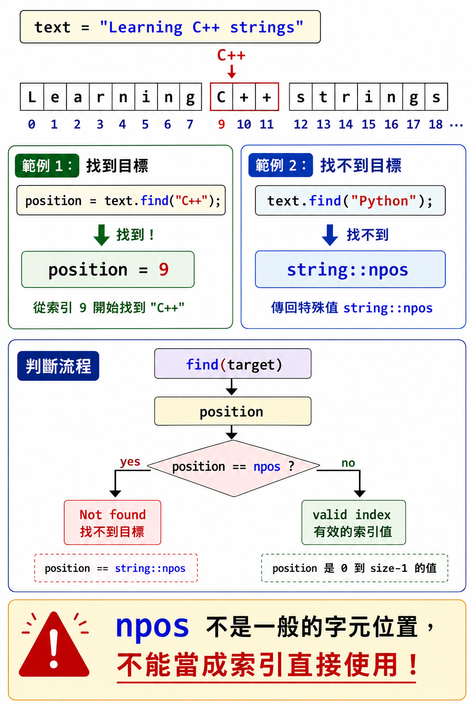


## Section LVIII. 完整搜尋範例

```cpp
// VALIDATE
#include <iostream>
#include <string>
using namespace std;

int main() {
    string text =
        "Learning C++ strings";

    string target =
        "C++";

    string::size_type position =
        text.find(target);

    if (
        position ==
        string::npos
    ) {
        cout << "Not found\n";
    } else {
        cout << "Found at index "
             << position
             << '\n';
    }

    return 0;
}
```

---

## Section LIX. 指定搜尋起點

```cpp
text.find(
    target,
    startPosition
);
```

從指定索引開始找。

---

## Section LX. 搜尋字元

```cpp
text.find('a');
```

也可以搜尋單一字元。

---

# Part M：從後方搜尋

## Section LXI. `.rfind()`

```cpp
text.rfind(target);
```

找出最後一次出現的位置。

---

## Section LXII. 完整最後位置範例

```cpp
// VALIDATE
#include <iostream>
#include <string>
using namespace std;

int main() {
    string text =
        "one two one";

    string::size_type position =
        text.rfind("one");

    if (
        position !=
        string::npos
    ) {
        cout << position
             << '\n';
    }

    return 0;
}
```

輸出：

```text
8
```

---

# Part N：計算子字串出現次數

## Section LXIII. 基本流程

1. 從位置 `0` 搜尋。
2. 找到後增加計數器。
3. 將下一次起點移到目前結果之後。
4. 繼續搜尋直到 `npos`。

---

## Section LXIV. 非重疊計數

```cpp
position +=
    target.size();
```

表示找到後跳過整個目標字串。

---

## Section LXV. 完整非重疊計數

```cpp
// VALIDATE
#include <iostream>
#include <string>
using namespace std;

int main() {
    string text;
    string target;

    getline(cin, text);
    getline(cin, target);

    if (target.empty()) {
        cout << "Target cannot be empty.\n";
        return 0;
    }

    int count = 0;

    string::size_type position = 0;

    while (
        (
            position =
                text.find(
                    target,
                    position
                )
        ) != string::npos
    ) {
        ++count;

        position +=
            target.size();
    }

    cout << count
         << '\n';

    return 0;
}
```

---

## Section LXVI. 重疊出現

例如：

```text
text = "aaaa"
target = "aa"
```

若每次只移動一格：

```cpp
++position;
```

可以計算重疊結果：

```text
索引 0、1、2
```

共 `3` 次。

---


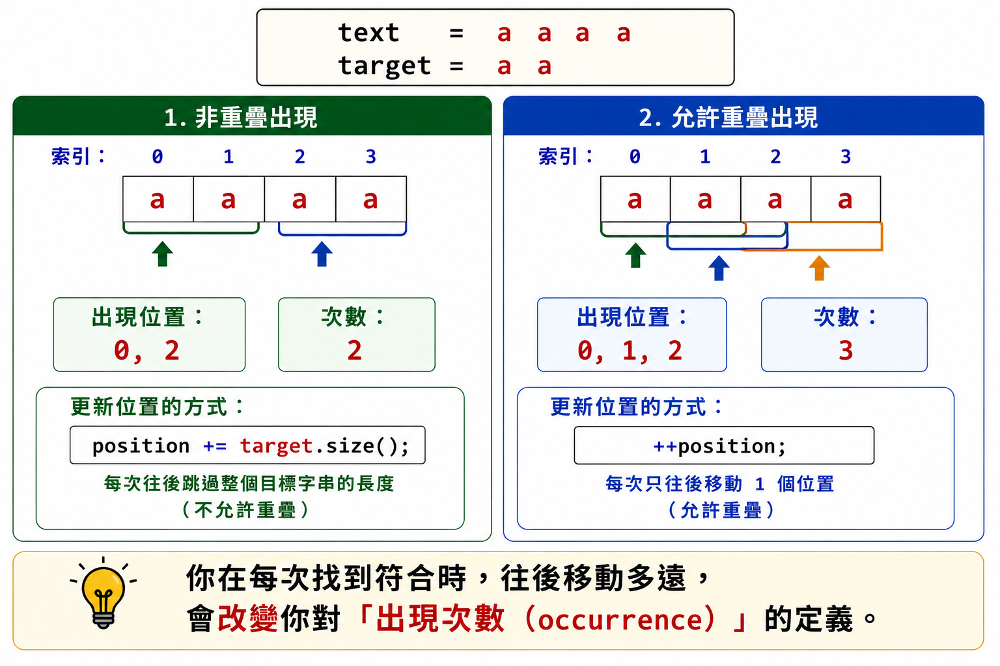


# Part O：比較字串

## Section LXVII. 相等

```cpp
first == second
```

逐字元比較內容。

---

## Section LXVIII. 不相等

```cpp
first != second
```

---

## Section LXIX. 字典順序

```cpp
first < second
```

依字元編碼順序逐字元比較。

通常：

```text
"Apple" < "Banana"
```

---

## Section LXX. 大小寫差異

一般編碼中，大寫與小寫值不同。

因此：

```text
"Apple"
"apple"
```

不相等，排序結果也不同。

---

## Section LXXI. 完整比較範例

```cpp
// VALIDATE
#include <iostream>
#include <string>
using namespace std;

int main() {
    string first;
    string second;

    getline(cin, first);
    getline(cin, second);

    if (first == second) {
        cout << "Equal\n";
    } else if (first < second) {
        cout << "First comes earlier\n";
    } else {
        cout << "Second comes earlier\n";
    }

    return 0;
}
```

---

## Section LXXII. `.compare()`

```cpp
int result =
    first.compare(second);
```

通常：

- 小於 `0`：`first` 較前。
- 等於 `0`：相等。
- 大於 `0`：`first` 較後。

不要依賴一定只回傳 `-1`、`0`、`1`。

---

# Part P：前綴與後綴

## Section LXXIII. C++17 前綴判斷

```cpp
bool startsWith(
    const string& text,
    const string& prefix
) {
    return
        text.size() >= prefix.size() &&
        text.compare(
            0,
            prefix.size(),
            prefix
        ) == 0;
}
```

---

## Section LXXIV. C++17 後綴判斷

```cpp
bool endsWith(
    const string& text,
    const string& suffix
) {
    return
        text.size() >= suffix.size() &&
        text.compare(
            text.size() - suffix.size(),
            suffix.size(),
            suffix
        ) == 0;
}
```

---

## Section LXXV. 完整前後綴範例

```cpp
// VALIDATE
#include <iostream>
#include <string>
using namespace std;

bool startsWith(
    const string& text,
    const string& prefix
) {
    return
        text.size() >= prefix.size() &&
        text.compare(
            0,
            prefix.size(),
            prefix
        ) == 0;
}

bool endsWith(
    const string& text,
    const string& suffix
) {
    return
        text.size() >= suffix.size() &&
        text.compare(
            text.size() - suffix.size(),
            suffix.size(),
            suffix
        ) == 0;
}

int main() {
    string filename =
        "lesson.md";

    cout << boolalpha
         << startsWith(
                filename,
                "lesson"
            )
         << '\n';

    cout << endsWith(
                filename,
                ".md"
            )
         << '\n';

    return 0;
}
```

---

# Part Q：插入、刪除與取代

## Section LXXVI. `.insert()`

```cpp
text.insert(
    position,
    value
);
```

---

## Section LXXVII. `.erase()`

```cpp
text.erase(
    position,
    count
);
```

---

## Section LXXVIII. `.replace()`

```cpp
text.replace(
    position,
    count,
    replacement
);
```

---

## Section LXXIX. 完整修改範例

```cpp
// VALIDATE
#include <iostream>
#include <string>
using namespace std;

int main() {
    string text =
        "I C++";

    text.insert(
        2,
        "love "
    );

    cout << text
         << '\n';

    text.replace(
        2,
        4,
        "study"
    );

    cout << text
         << '\n';

    text.erase(
        1,
        1
    );

    cout << text
         << '\n';

    return 0;
}
```

---


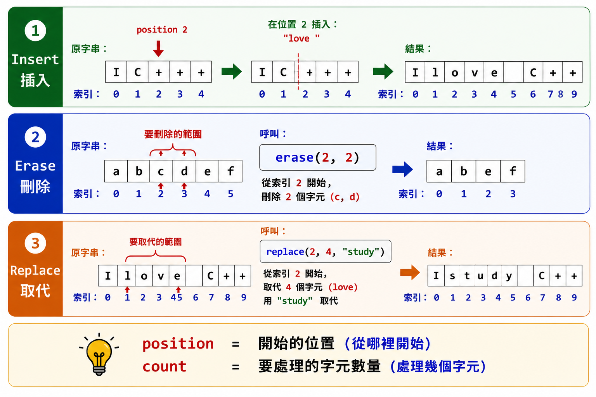


## Section LXXX. 位置與長度

這些函式通常都使用：

```text
起始索引
處理字元數量
```

若起點越界，可能丟出 `out_of_range`。

---

# Part R：調整長度與容量

## Section LXXXI. `.resize()`

縮短：

```cpp
text.resize(5);
```

保留前五個字元。

---

## Section LXXXII. 加長

```cpp
text.resize(
    10,
    '.'
);
```

若原長度小於 `10`，尾端補上 `.`。

---

## Section LXXXIII. 完整 `.resize()` 範例

```cpp
// VALIDATE
#include <iostream>
#include <string>
using namespace std;

int main() {
    string text =
        "Programming";

    text.resize(7);

    cout << text
         << '\n';

    text.resize(
        10,
        '.'
    );

    cout << text
         << '\n';

    return 0;
}
```

輸出：

```text
Program
Program...
```

---

## Section LXXXIV. `.capacity()`

```cpp
text.capacity()
```

表示目前配置可容納的字元數量概念。

它不等於實際字串長度。

---

## Section LXXXV. `.reserve()`

```cpp
text.reserve(100);
```

預留至少足夠空間，減少成長時重新配置的機會。

不會將 `.size()` 改成 `100`。

---

## Section LXXXVI. 完整容量範例

```cpp
// VALIDATE
#include <iostream>
#include <string>
using namespace std;

int main() {
    string text;

    text.reserve(100);

    text +=
        "Hello";

    cout << "Size: "
         << text.size()
         << '\n';

    cout << "Capacity at least size: "
         << boolalpha
         << (
                text.capacity() >=
                text.size()
            )
         << '\n';

    return 0;
}
```

不要依賴 `capacity()` 的精確數值，實作可能不同。

---


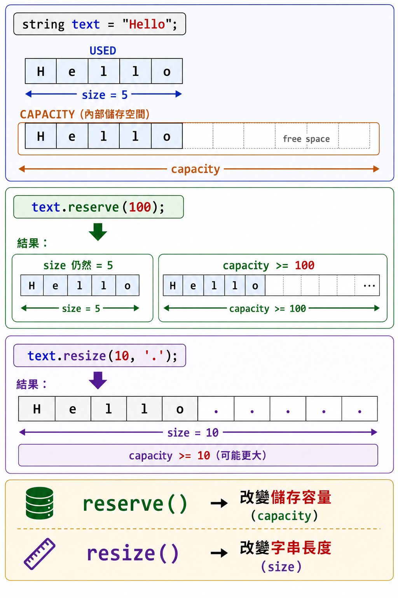


# Part S：使用 `<cctype>` 分析字元

## Section LXXXVII. 標頭

```cpp
#include <cctype>
```

常用函式：

```cpp
isdigit
isalpha
isspace
islower
isupper
tolower
toupper
```

---

## Section LXXXVIII. 安全轉型

應寫：

```cpp
unsigned char safeChar =
    static_cast<unsigned char>(ch);
```

再傳入：

```cpp
isalpha(safeChar)
```

---


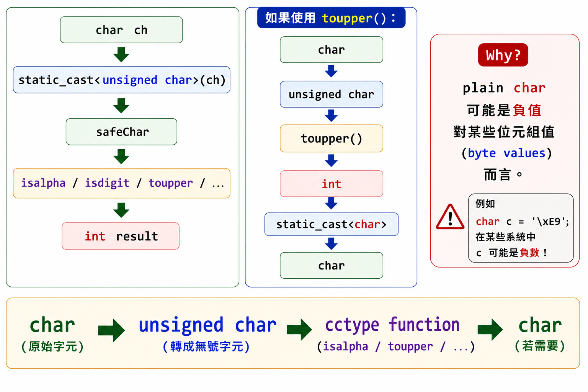


## Section LXXXIX. 為什麼？

若 `char` 是有號型別，某些非 ASCII 字元可能成為負值。

除 `EOF` 外，將負值直接傳給 `<cctype>` 函式可能造成未定義行為。

---

## Section XC. 完整字元分類

```cpp
// VALIDATE
#include <cctype>
#include <iostream>
#include <string>
using namespace std;

int main() {
    string text;
    getline(cin, text);

    int letterCount = 0;
    int digitCount = 0;
    int spaceCount = 0;

    for (char ch : text) {
        unsigned char safeChar =
            static_cast<unsigned char>(
                ch
            );

        if (isalpha(safeChar) != 0) {
            ++letterCount;
        }

        if (isdigit(safeChar) != 0) {
            ++digitCount;
        }

        if (isspace(safeChar) != 0) {
            ++spaceCount;
        }
    }

    cout << "Letters: "
         << letterCount
         << '\n';

    cout << "Digits: "
         << digitCount
         << '\n';

    cout << "Spaces: "
         << spaceCount
         << '\n';

    return 0;
}
```

---

# Part T：大小寫轉換

## Section XCI. 轉成大寫

```cpp
ch =
    static_cast<char>(
        toupper(
            static_cast<unsigned char>(
                ch
            )
        )
    );
```

---

## Section XCII. 完整大寫函式

```cpp
// VALIDATE
#include <cctype>
#include <iostream>
#include <string>
using namespace std;

void toUpperCase(
    string& text
) {
    for (char& ch : text) {
        ch =
            static_cast<char>(
                toupper(
                    static_cast<unsigned char>(
                        ch
                    )
                )
            );
    }
}

int main() {
    string text;
    getline(cin, text);

    toUpperCase(text);

    cout << text
         << '\n';

    return 0;
}
```

---

## Section XCIII. 轉成小寫

使用：

```cpp
tolower(...)
```

同樣要先轉成 `unsigned char`。

---

## Section XCIV. 切換大小寫

- 小寫 → 大寫
- 大寫 → 小寫
- 其他字元保持不變

---

## Section XCV. 完整切換大小寫

```cpp
// VALIDATE
#include <cctype>
#include <iostream>
#include <string>
using namespace std;

void toggleCase(
    string& text
) {
    for (char& ch : text) {
        unsigned char safeChar =
            static_cast<unsigned char>(
                ch
            );

        if (islower(safeChar) != 0) {
            ch =
                static_cast<char>(
                    toupper(safeChar)
                );
        } else if (
            isupper(safeChar) != 0
        ) {
            ch =
                static_cast<char>(
                    tolower(safeChar)
                );
        }
    }
}

int main() {
    string text;
    getline(cin, text);

    toggleCase(text);

    cout << text
         << '\n';

    return 0;
}
```

---

# Part U：移除與壓縮字元

## Section XCVI. 移除指定字元

可使用「讀取位置」與「寫入位置」：

```text
逐一讀取
保留的字元寫到前方
最後縮短字串
```

---

## Section XCVII. 完整移除指定字元

```cpp
// VALIDATE
#include <iostream>
#include <string>
using namespace std;

void removeCharacter(
    string& text,
    char target
) {
    string::size_type writeIndex = 0;

    for (
        string::size_type readIndex = 0;
        readIndex < text.size();
        ++readIndex
    ) {
        if (
            text[readIndex] !=
            target
        ) {
            text[writeIndex] =
                text[readIndex];

            ++writeIndex;
        }
    }

    text.resize(writeIndex);
}

int main() {
    string text;
    getline(cin, text);

    char target;
    cin >> target;

    removeCharacter(
        text,
        target
    );

    cout << text
         << '\n';

    return 0;
}
```

---


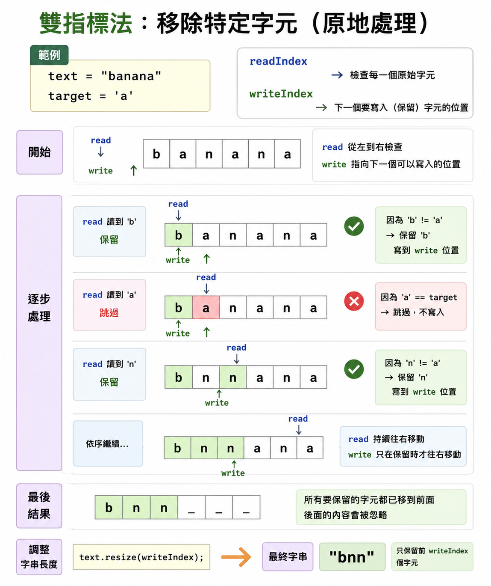


## Section XCVIII. 壓縮連續空白

目標：

```text
"Hello     world"
```

變成：

```text
"Hello world"
```

需要記錄：

```text
上一個輸出是否為空白
```

---

## Section XCIX. 完整壓縮空白

```cpp
// VALIDATE
#include <cctype>
#include <iostream>
#include <string>
using namespace std;

string compressSpaces(
    const string& text
) {
    string result;

    bool previousWasSpace = false;

    for (char ch : text) {
        bool isSpace =
            isspace(
                static_cast<unsigned char>(
                    ch
                )
            ) != 0;

        if (isSpace) {
            if (!previousWasSpace) {
                result.push_back(' ');
            }
        } else {
            result.push_back(ch);
        }

        previousWasSpace =
            isSpace;
    }

    return result;
}

int main() {
    string text;
    getline(cin, text);

    cout << compressSpaces(text)
         << '\n';

    return 0;
}
```

---

# Part V：反轉字串

## Section C. 雙索引交換

- 左索引從 `0` 開始。
- 右索引從 `size - 1` 開始。
- 交換後向中間移動。
- 左索引不小於右索引時停止。

---

## Section CI. 空字串處理

若字串為空：

```cpp
text.size() - 1
```

會造成無號下溢。

應先檢查：

```cpp
if (text.empty()) {
    return;
}
```

---

## Section CII. 完整反轉函式

```cpp
// VALIDATE
#include <iostream>
#include <string>
using namespace std;

void reverseText(
    string& text
) {
    if (text.empty()) {
        return;
    }

    string::size_type left = 0;
    string::size_type right =
        text.size() - 1;

    while (left < right) {
        char temporary =
            text[left];

        text[left] =
            text[right];

        text[right] =
            temporary;

        ++left;
        --right;
    }
}

int main() {
    string text;
    getline(cin, text);

    reverseText(text);

    cout << text
         << '\n';

    return 0;
}
```

---


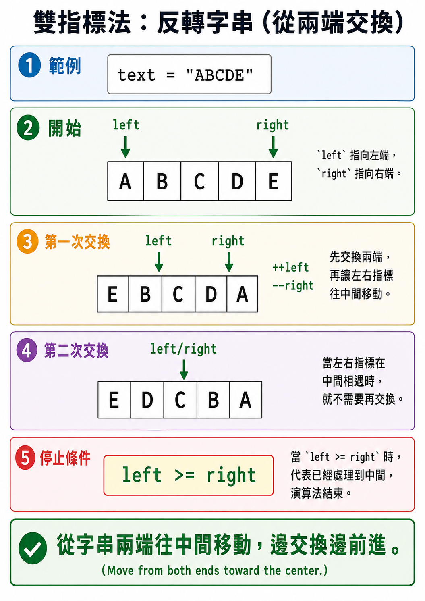


# Part W：回文字串

## Section CIII. 基本回文

正著與反著讀相同：

```text
level
radar
A
```

---

## Section CIV. 使用雙索引

比較：

```cpp
text[left]
text[right]
```

只要有一組不同，就不是回文。

---

## Section CV. 完整基本回文

```cpp
// VALIDATE
#include <iostream>
#include <string>
using namespace std;

bool isPalindrome(
    const string& text
) {
    if (text.empty()) {
        return true;
    }

    string::size_type left = 0;
    string::size_type right =
        text.size() - 1;

    while (left < right) {
        if (
            text[left] !=
            text[right]
        ) {
            return false;
        }

        ++left;
        --right;
    }

    return true;
}

int main() {
    string text;
    getline(cin, text);

    cout << boolalpha
         << isPalindrome(text)
         << '\n';

    return 0;
}
```

---

## Section CVI. 忽略大小寫與符號

例如：

```text
A man, a plan, a canal: Panama
```

要忽略：

- 大小寫
- 空白
- 標點

做法：

1. 左右索引跳過非字母數字。
2. 將兩側轉成相同大小寫。
3. 比較。
4. 向中間移動。

---

## Section CVII. 完整進階回文

```cpp
// VALIDATE
#include <cctype>
#include <iostream>
#include <string>
using namespace std;

bool isNormalizedPalindrome(
    const string& text
) {
    if (text.empty()) {
        return true;
    }

    string::size_type left = 0;
    string::size_type right =
        text.size() - 1;

    while (left < right) {
        while (
            left < right &&
            isalnum(
                static_cast<unsigned char>(
                    text[left]
                )
            ) == 0
        ) {
            ++left;
        }

        while (
            left < right &&
            isalnum(
                static_cast<unsigned char>(
                    text[right]
                )
            ) == 0
        ) {
            --right;
        }

        char leftCharacter =
            static_cast<char>(
                tolower(
                    static_cast<unsigned char>(
                        text[left]
                    )
                )
            );

        char rightCharacter =
            static_cast<char>(
                tolower(
                    static_cast<unsigned char>(
                        text[right]
                    )
                )
            );

        if (
            leftCharacter !=
            rightCharacter
        ) {
            return false;
        }

        ++left;
        --right;
    }

    return true;
}

int main() {
    string text;
    getline(cin, text);

    cout << boolalpha
         << isNormalizedPalindrome(
                text
            )
         << '\n';

    return 0;
}
```

---

# Part X：函式參數與回傳值

## Section CVIII. 唯讀字串參數

```cpp
void show(
    const string& text
)
```

優點：

- 不複製整個字串。
- 函式不能透過參數修改。
- 可接收一般字串、`const` 字串與暫時字串。

---

## Section CIX. 修改原字串

```cpp
void normalize(
    string& text
)
```

呼叫者應知道原字串會被修改。

---

## Section CX. 回傳新字串

```cpp
string makeTitle(
    const string& text
)
```

可以在函式內建立區域字串，再安全以值回傳。

---

## Section CXI. 完整回傳字串

```cpp
// VALIDATE
#include <cctype>
#include <iostream>
#include <string>
using namespace std;

string capitalizeFirst(
    string text
) {
    if (!text.empty()) {
        text.front() =
            static_cast<char>(
                toupper(
                    static_cast<unsigned char>(
                        text.front()
                    )
                )
            );
    }

    return text;
}

int main() {
    string word;
    cin >> word;

    cout << capitalizeFirst(
                word
            )
         << '\n';

    return 0;
}
```

本例刻意以值接收，因為函式需要自己的可修改副本並回傳新字串。

---

## Section CXII. 不要回傳區域字串參考

危險：

```cpp
/* 不要使用：

const string& makeText() {
    string text = "Hello";
    return text;
}

*/
```

函式結束後區域字串被銷毀，參考懸空。

---

# Part Y：數值轉字串

## Section CXIII. `to_string()`

```cpp
string text =
    to_string(value);
```

支援常見數值型別。

---

## Section CXIV. 完整數值轉字串

```cpp
// VALIDATE
#include <iostream>
#include <string>
using namespace std;

int main() {
    int score = 95;
    double average = 87.5;

    string message =
        "Score: " +
        to_string(score) +
        ", Average: " +
        to_string(average);

    cout << message
         << '\n';

    return 0;
}
```

`to_string(double)` 通常會產生固定格式的多個小數位，不適合所有顯示需求。

---

# Part Z：字串轉整數

## Section CXV. `stoi()`

```cpp
int value =
    stoi(text);
```

可能丟出：

- `invalid_argument`
- `out_of_range`

---

## Section CXVI. 完整整數轉換

```cpp
// VALIDATE
#include <iostream>
#include <stdexcept>
#include <string>
using namespace std;

int main() {
    string text;
    getline(cin, text);

    try {
        int value =
            stoi(text);

        cout << value
             << '\n';
    } catch (
        const invalid_argument&
    ) {
        cout << "Not a valid integer\n";
    } catch (
        const out_of_range&
    ) {
        cout << "Integer out of range\n";
    }

    return 0;
}
```

---

## Section CXVII. 部分轉換

```cpp
stoi("123abc")
```

可能成功讀取：

```text
123
```

並在 `a` 前停止。

若要驗證整個字串，需取得停止位置。

---

## Section CXVIII. 使用 `position`

```cpp
size_t position = 0;

int value =
    stoi(
        text,
        &position
    );
```

轉換後：

```cpp
position
```

表示已處理到哪個索引。

---

## Section CXIX. 完整嚴格整數轉換

```cpp
// VALIDATE
#include <cctype>
#include <iostream>
#include <stdexcept>
#include <string>
using namespace std;

bool containsOnlyTrailingSpaces(
    const string& text,
    string::size_type position
) {
    while (
        position <
        text.size()
    ) {
        if (
            isspace(
                static_cast<unsigned char>(
                    text[position]
                )
            ) == 0
        ) {
            return false;
        }

        ++position;
    }

    return true;
}

int main() {
    string text;
    getline(cin, text);

    try {
        string::size_type position = 0;

        int value =
            stoi(
                text,
                &position
            );

        if (
            !containsOnlyTrailingSpaces(
                text,
                position
            )
        ) {
            cout << "Extra invalid characters\n";
            return 0;
        }

        cout << value
             << '\n';
    } catch (
        const invalid_argument&
    ) {
        cout << "Not an integer\n";
    } catch (
        const out_of_range&
    ) {
        cout << "Out of range\n";
    }

    return 0;
}
```

---


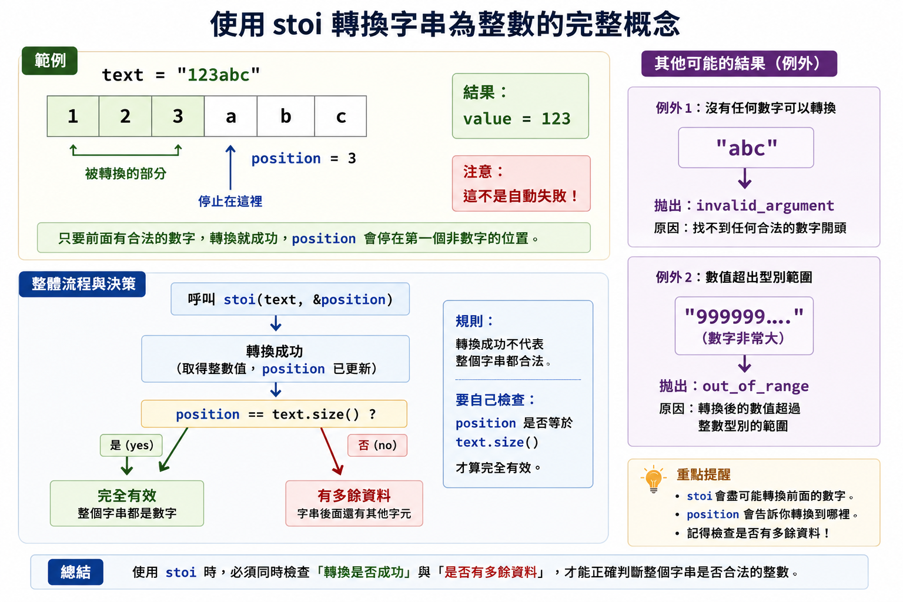


# Part AA：字串轉浮點數

## Section CXX. `stod()`

```cpp
double value =
    stod(text);
```

---

## Section CXXI. 完整浮點轉換

```cpp
// VALIDATE
#include <iostream>
#include <stdexcept>
#include <string>
using namespace std;

int main() {
    string text;
    getline(cin, text);

    try {
        string::size_type position = 0;

        double value =
            stod(
                text,
                &position
            );

        if (
            position !=
            text.size()
        ) {
            cout << "Only part was converted\n";
        } else {
            cout << value
                 << '\n';
        }
    } catch (
        const invalid_argument&
    ) {
        cout << "Not a number\n";
    } catch (
        const out_of_range&
    ) {
        cout << "Number out of range\n";
    }

    return 0;
}
```

若允許尾端空白，需要像前一節一樣另外驗證剩餘字元。

---

# Part AB：Trim 前後空白

## Section CXXII. 目標

```text
"   Hello world   "
```

變成：

```text
"Hello world"
```

---

## Section CXXIII. 找第一個非空白

從左向右移動：

```cpp
start
```

直到遇到非空白。

---

## Section CXXIV. 找最後一個非空白後方位置

從字串尾端向左移動：

```cpp
end
```

---

## Section CXXV. 完整 trim 函式

```cpp
// VALIDATE
#include <cctype>
#include <iostream>
#include <string>
using namespace std;

string trim(
    const string& text
) {
    string::size_type start = 0;

    while (
        start < text.size() &&
        isspace(
            static_cast<unsigned char>(
                text[start]
            )
        ) != 0
    ) {
        ++start;
    }

    string::size_type end =
        text.size();

    while (
        end > start &&
        isspace(
            static_cast<unsigned char>(
                text[end - 1]
            )
        ) != 0
    ) {
        --end;
    }

    return text.substr(
        start,
        end - start
    );
}

int main() {
    string text;
    getline(cin, text);

    cout << "["
         << trim(text)
         << "]\n";

    return 0;
}
```

---

# Part AC：簡單文字分析

## Section CXXVI. 統計項目

可以統計：

- 字元總數
- 字母
- 數字
- 空白
- 其他符號
- 母音
- 大寫
- 小寫

---

## Section CXXVII. 完整文字分析

```cpp
// VALIDATE
#include <cctype>
#include <iostream>
#include <string>
using namespace std;

bool isVowel(char ch) {
    char lower =
        static_cast<char>(
            tolower(
                static_cast<unsigned char>(
                    ch
                )
            )
        );

    return
        lower == 'a' ||
        lower == 'e' ||
        lower == 'i' ||
        lower == 'o' ||
        lower == 'u';
}

int main() {
    string text;
    getline(cin, text);

    int letterCount = 0;
    int digitCount = 0;
    int spaceCount = 0;
    int otherCount = 0;
    int vowelCount = 0;

    for (char ch : text) {
        unsigned char safeChar =
            static_cast<unsigned char>(
                ch
            );

        if (isalpha(safeChar) != 0) {
            ++letterCount;

            if (isVowel(ch)) {
                ++vowelCount;
            }
        } else if (
            isdigit(safeChar) != 0
        ) {
            ++digitCount;
        } else if (
            isspace(safeChar) != 0
        ) {
            ++spaceCount;
        } else {
            ++otherCount;
        }
    }

    cout << "Characters: "
         << text.size()
         << '\n';

    cout << "Letters: "
         << letterCount
         << '\n';

    cout << "Vowels: "
         << vowelCount
         << '\n';

    cout << "Digits: "
         << digitCount
         << '\n';

    cout << "Spaces: "
         << spaceCount
         << '\n';

    cout << "Other: "
         << otherCount
         << '\n';

    return 0;
}
```

---

# Part AD：名稱格式化

## Section CXXVIII. 目標

輸入：

```text
aDA loVELace
```

輸出：

```text
Ada Lovelace
```

---

## Section CXXIX. 規則

- 每個單字第一個字母大寫。
- 其餘字母小寫。
- 空白後下一個字母視為新單字。
- 連續空白可先壓縮。

---

## Section CXXX. 完整名稱格式化

```cpp
// VALIDATE
#include <cctype>
#include <iostream>
#include <string>
using namespace std;

string formatName(
    const string& text
) {
    string result;

    bool startOfWord = true;

    for (char ch : text) {
        unsigned char safeChar =
            static_cast<unsigned char>(
                ch
            );

        if (isspace(safeChar) != 0) {
            if (
                !result.empty() &&
                result.back() != ' '
            ) {
                result.push_back(' ');
            }

            startOfWord = true;
        } else {
            if (startOfWord) {
                result.push_back(
                    static_cast<char>(
                        toupper(safeChar)
                    )
                );
            } else {
                result.push_back(
                    static_cast<char>(
                        tolower(safeChar)
                    )
                );
            }

            startOfWord = false;
        }
    }

    if (
        !result.empty() &&
        result.back() == ' '
    ) {
        result.pop_back();
    }

    return result;
}

int main() {
    string name;
    getline(cin, name);

    cout << formatName(name)
         << '\n';

    return 0;
}
```

---

# Part AE：`std::string` 與字元陣列比較

## Section CXXXI. `std::string`

提供：

- 自動管理長度
- 串接
- 比較
- 搜尋
- 插入
- 刪除
- 取代
- 複製
- 回傳值
- Range-based `for`

---

## Section CXXXII. 傳統字元陣列

```cpp
char text[20];
```

需要自行注意：

- 容量
- 結尾空字元
- 緩衝區界線
- 複製函式
- 比較函式
- 輸入安全

完整內容會在 C-style 字串章節介紹。

---

## Section CXXXIII. 初學建議

一般文字處理優先使用：

```cpp
std::string
```

只有在：

- 與 C API 互動
- 維護底層程式
- 學習記憶體配置
- 特定效能與介面需求

時再直接使用字元陣列。

---

# Part AF：`c_str()` 與 `.data()` 概念

## Section CXXXIV. `c_str()`

```cpp
text.c_str()
```

提供以空字元結尾的唯讀 C-style 字串指標。

常用於需要：

```cpp
const char*
```

的舊式介面。

---

## Section CXXXV. `.data()`

```cpp
text.data()
```

提供底層連續字元資料。

C++17 中，非 `const string` 的 `.data()` 可回傳可修改指標。

但直接以指標修改需要更完整的界線與生命週期知識。

---

## Section CXXXVI. 本章原則

- 不保存 `.c_str()` 或 `.data()` 結果超過字串有效期。
- 字串修改後，先前取得的指標可能失效。
- 本章不使用指標修改字串。
- 後續指標章節再深入。

---

# Part AG：`std::string_view` 預告

## Section CXXXVII. 概念

`std::string_view` 是：

```text
一段既有字元資料的唯讀視圖
```

通常不擁有資料。

---

## Section CXXXVIII. 優點

- 不需要複製文字。
- 可接受不同字串來源。
- 適合唯讀參數。

---

## Section CXXXIX. 風險

因為不擁有資料：

```text
原字串先銷毀
→ string_view 可能懸空
```

完整使用方式留到進階函式介面章節。

---

# Part AH：快速概念檢查

## Section CXL. 選擇題與簡答

### Q1. `std::string` 需要哪個標頭？

<details><summary>查看答案</summary>

```cpp
#include <string>
```

</details>

### Q2. 空字串的 `.size()` 是多少？

<details><summary>查看答案</summary>

```text
0
```

</details>

### Q3. `.size()` 與 `.length()` 有差異嗎？

<details><summary>查看答案</summary>

對 `std::string` 而言，它們回傳相同長度。

</details>

### Q4. 長度為 4 的字串最後合法索引是多少？

<details><summary>查看答案</summary>

```text
3
```

</details>

### Q5. `[]` 與 `.at()` 的主要差異是什麼？

<details><summary>查看答案</summary>

`.at()` 會檢查界線；`[]` 通常不會。

</details>

### Q6. 對空字串可以呼叫 `.back()` 嗎？

<details><summary>查看答案</summary>

不可以，必須先確認字串非空。

</details>

### Q7. `cin >> text` 會讀取整行嗎？

<details><summary>查看答案</summary>

不會，遇到空白就停止。

</details>

### Q8. 如何讀取包含空白的整行？

<details><summary>查看答案</summary>

```cpp
getline(cin, text);
```

</details>

### Q9. 為什麼 `cin >>` 後的 `getline()` 可能讀到空字串？

<details><summary>查看答案</summary>

因為前一次輸入留下的換行仍在輸入緩衝區。

</details>

### Q10. 如何判斷 `.find()` 是否找到？

<details><summary>查看答案</summary>

檢查結果是否不等於：

```cpp
string::npos
```

</details>

### Q11. `.substr(3)` 代表什麼？

<details><summary>查看答案</summary>

從索引 3 取得到字串結尾。

</details>

### Q12. `.push_back()` 接受什麼？

<details><summary>查看答案</summary>

一個字元。

</details>

### Q13. `.pop_back()` 使用前要檢查什麼？

<details><summary>查看答案</summary>

字串不是空的。

</details>

### Q14. 如何修改 range-based `for` 中的原字元？

<details><summary>查看答案</summary>

使用：

```cpp
char& ch
```

</details>

### Q15. `<cctype>` 函式為什麼先轉成 `unsigned char`？

<details><summary>查看答案</summary>

避免將負值 `char` 傳入而造成未定義行為。

</details>

### Q16. 回傳區域 `string` 的值安全嗎？

<details><summary>查看答案</summary>

安全，呼叫者取得結果字串。

</details>

### Q17. 回傳區域 `string` 的參考安全嗎？

<details><summary>查看答案</summary>

不安全，函式結束後區域字串被銷毀。

</details>

### Q18. `stoi("123abc")` 一定失敗嗎？

<details><summary>查看答案</summary>

不一定，它可能轉換前面的 `123`。需要位置參數才能檢查是否完整轉換。

</details>

### Q19. `.reserve(100)` 會讓 `.size()` 變成 100 嗎？

<details><summary>查看答案</summary>

不會，它只預留容量。

</details>

### Q20. 一般 C++ 文字處理應優先使用什麼？

<details><summary>查看答案</summary>

```cpp
std::string
```

</details>

---

# Part AI：程式閱讀練習

## Section CXLI. 預測結果與錯誤

### 題目 1

```cpp
string text = "Code";

cout << text[1];
```

<details><summary>查看答案</summary>

```text
o
```

</details>

### 題目 2

```cpp
string text = "abc";

text[0] = 'A';

cout << text;
```

<details><summary>查看答案</summary>

```text
Abc
```

</details>

### 題目 3

```cpp
string text = "Hello";

cout << text.size()
     << text.length();
```

<details><summary>查看答案</summary>

```text
55
```

沒有空格。

</details>

### 題目 4

```cpp
string text;

cout << boolalpha
     << text.empty();
```

<details><summary>查看答案</summary>

```text
true
```

</details>

### 題目 5

```cpp
string text = "abc";

for (char ch : text) {
    ch = 'X';
}

cout << text;
```

<details><summary>查看答案</summary>

```text
abc
```

`ch` 是副本。

</details>

### 題目 6

```cpp
string text = "abc";

for (char& ch : text) {
    ch = 'X';
}

cout << text;
```

<details><summary>查看答案</summary>

```text
XXX
```

</details>

### 題目 7

```cpp
string text =
    "one two one";

cout << text.find("one")
     << " "
     << text.rfind("one");
```

<details><summary>查看答案</summary>

```text
0 8
```

</details>

### 題目 8

```cpp
string text =
    "Programming";

cout << text.substr(3, 4);
```

<details><summary>查看答案</summary>

索引 3 起四個字元：

```text
gram
```

</details>

### 題目 9

```cpp
string text = "Hello";

text.push_back('!');
text.pop_back();

cout << text;
```

<details><summary>查看答案</summary>

```text
Hello
```

</details>

### 題目 10

```cpp
string first = "Apple";
string second = "apple";

cout << boolalpha
     << (first == second);
```

<details><summary>查看答案</summary>

```text
false
```

比較區分大小寫。

</details>

### 題目 11

```cpp
string text = "123abc";

size_t position = 0;
int value =
    stoi(text, &position);

cout << value
     << " "
     << position;
```

<details><summary>查看答案</summary>

```text
123 3
```

</details>

### 題目 12

```cpp
string text = "abcdef";

text.erase(2, 2);

cout << text;
```

<details><summary>查看答案</summary>

刪除索引 2 起兩個字元 `c`、`d`：

```text
abef
```

</details>

---

# Part AJ：實作練習

## Section CXLII. 實作檢測題

### TODO 1：基本字串

讀取一個單字，輸出長度、第一個字元與最後一個字元。

### TODO 2：整行文字

使用 `getline()` 讀取一句話，輸出完整內容與長度。

### TODO 3：混合輸入

先讀取年齡，再讀取完整姓名，正確處理殘留換行。

### TODO 4：大小寫轉換

建立：

```cpp
void toLowerCase(string& text)
```

### TODO 5：字元統計

統計字母、數字、空白與其他符號數量。

### TODO 6：搜尋子字串

輸入文字與目標，輸出第一次出現索引或 `Not found`。

### TODO 7：計算出現次數

計算目標子字串的非重疊出現次數。

### TODO 8：前綴判斷

建立 C++17 相容的：

```cpp
bool startsWith(
    const string& text,
    const string& prefix
)
```

### TODO 9：後綴判斷

建立：

```cpp
bool endsWith(
    const string& text,
    const string& suffix
)
```

### TODO 10：Trim

移除字串前後空白。

### TODO 11：壓縮空白

將連續空白壓縮成一個普通空格。

### TODO 12：回文字串

建立區分大小寫的回文判斷。

### TODO 13：忽略格式回文

忽略大小寫與非字母數字。

### TODO 14：嚴格整數轉換

使用 `stoi()`、位置參數與例外處理，確認整行是合法整數。

### TODO 15：名稱格式化

將每個單字首字母大寫，其餘字母小寫。

---

# Part AK：課後小練習

## Section CXLIII. 延伸練習

### 練習 1：單字數量

計算一句話中的單字數量，將連續空白視為一個分隔區。

### 練習 2：最長單字

找出一句話中最長的單字；先假設只以空白分隔。

### 練習 3：檔名分解

將：

```text
report.final.pdf
```

分成檔名主體與副檔名。

### 練習 4：簡易密碼檢查

檢查是否同時包含大寫、小寫、數字，且長度至少 8。

### 練習 5：搜尋並全部取代

建立函式，將文字中所有非重疊目標字串取代成新字串。

---

# Part AL：常見錯誤提醒

## Section CXLIV. 常見錯誤

1. 忘記包含 `<string>`。
2. 將字串長度和最後索引混淆。
3. 使用 `text[text.size()]` 讀取一般字元。
4. 對空字串使用 `.front()`。
5. 對空字串使用 `.back()`。
6. 對空字串使用 `.pop_back()`。
7. 以為 `[]` 會檢查界線。
8. 沒有處理 `.at()` 的 `out_of_range`。
9. 使用 `cin >>` 期待讀取整行。
10. 混用 `cin >>` 與 `getline()` 時漏處理換行。
11. 使用 `ws` 時意外移除有意義的前導空白。
12. 將兩個字串字面常數直接使用 `+`。
13. Range-based `for` 使用副本卻期待修改原字串。
14. 搜尋結果存入 `int`。
15. 將 `npos` 當成一般合法索引。
16. `.find()` 找不到時仍使用結果做索引。
17. `.substr()` 起點超過字串長度。
18. 搜尋空目標字串時造成無窮迴圈。
19. 取代或刪除時混淆起點與長度。
20. 以為字串比較不區分大小寫。
21. 依賴字典順序符合自然語言排序。
22. 直接將可能為負的 `char` 傳入 `<cctype>`。
23. 忘記 `toupper()` 與 `tolower()` 回傳 `int`。
24. `.reserve()` 被誤認為改變長度。
25. 依賴 `.capacity()` 的精確值。
26. 保存 `.c_str()` 指標後修改原字串。
27. 回傳區域字串參考。
28. `stoi()` 後未檢查剩餘字元。
29. 未處理數值轉換例外。
30. 應使用 `std::string` 時過早改用字元陣列與手動記憶體。

---

# Part AM：Mermaid 流程圖

## Section CXLV. `std::string` 流程圖

### 1. 安全索引

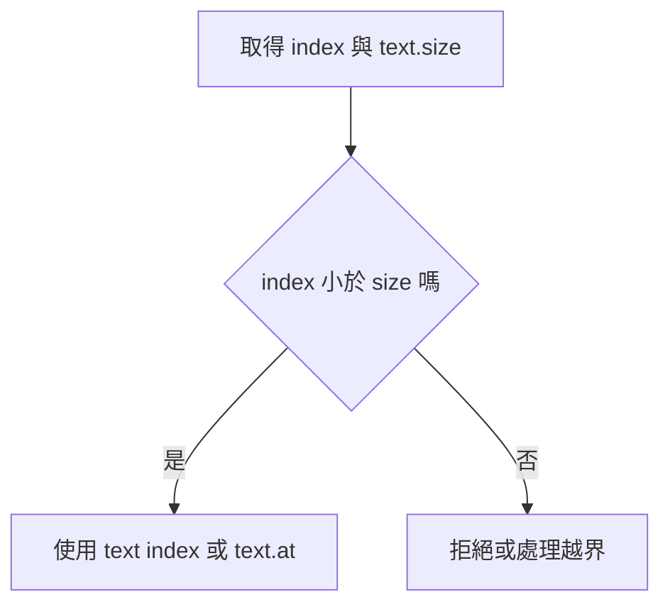
```mermaid
flowchart TD
    A[取得 index 與 text.size] --> B{index 小於 size 嗎}
    B -- 是 --> C[使用 text index 或 text.at]
    B -- 否 --> D[拒絕或處理越界]
```

### 2. `getline()` 混合輸入

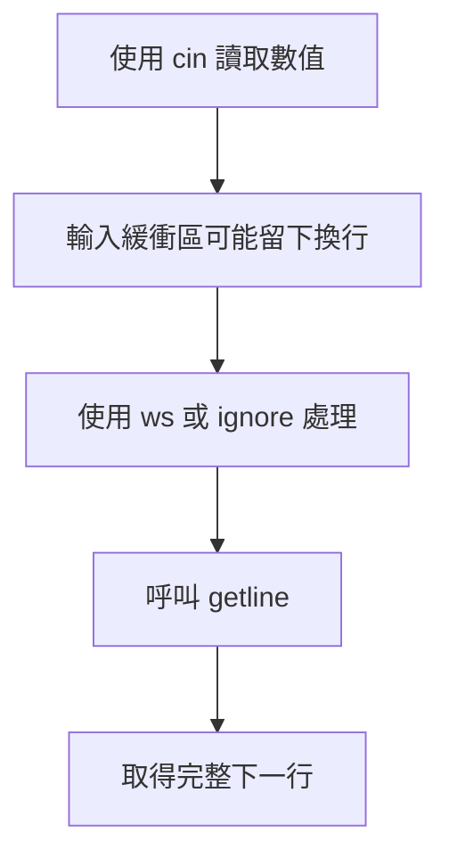
```mermaid
flowchart TD
    A[使用 cin 讀取數值] --> B[輸入緩衝區可能留下換行]
    B --> C[使用 ws 或 ignore 處理]
    C --> D[呼叫 getline]
    D --> E[取得完整下一行]
```

### 3. 搜尋子字串

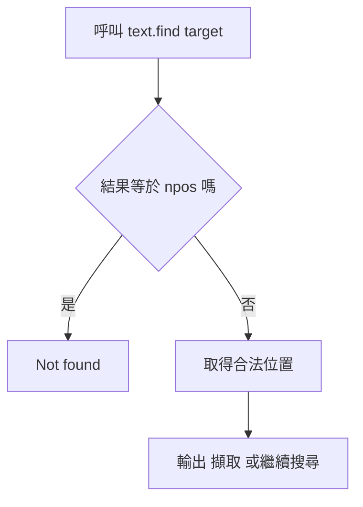
```mermaid
flowchart TD
    A[呼叫 text.find target] --> B{結果等於 npos 嗎}
    B -- 是 --> C[Not found]
    B -- 否 --> D[取得合法位置]
    D --> E[輸出 擷取 或繼續搜尋]
```

### 4. 大小寫轉換

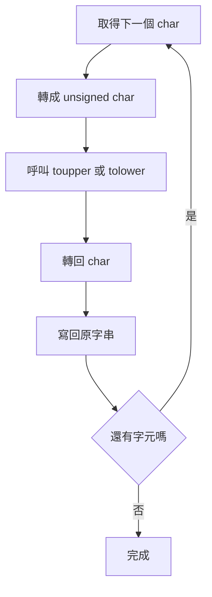
```mermaid
flowchart TD
    A[取得下一個 char] --> B[轉成 unsigned char]
    B --> C[呼叫 toupper 或 tolower]
    C --> D[轉回 char]
    D --> E[寫回原字串]
    E --> F{還有字元嗎}
    F -- 是 --> A
    F -- 否 --> G[完成]
```

### 5. 回文判斷

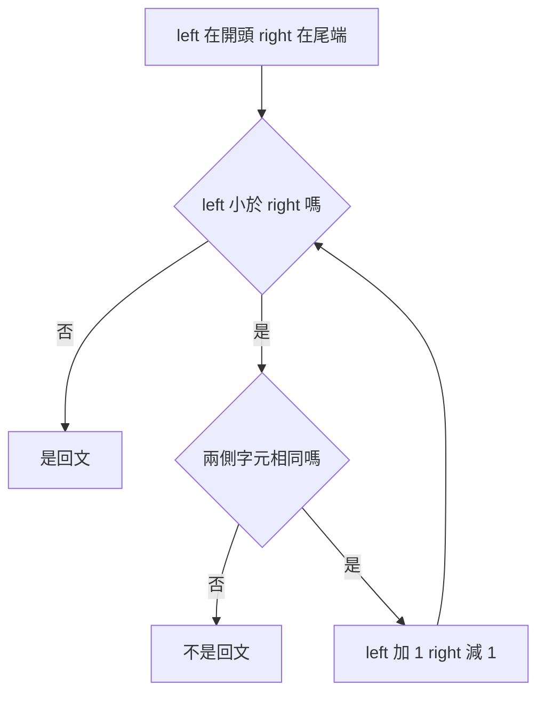
```mermaid
flowchart TD
    A[left 在開頭 right 在尾端] --> B{left 小於 right 嗎}
    B -- 否 --> C[是回文]
    B -- 是 --> D{兩側字元相同嗎}
    D -- 否 --> E[不是回文]
    D -- 是 --> F[left 加 1 right 減 1]
    F --> B
```

### 6. Trim

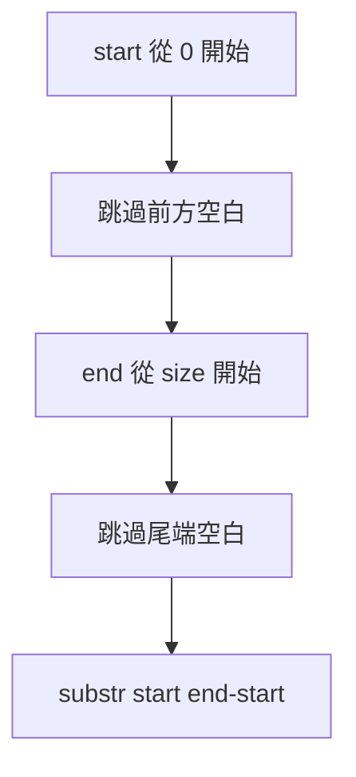
```mermaid
flowchart TD
    A[start 從 0 開始] --> B[跳過前方空白]
    B --> C[end 從 size 開始]
    C --> D[跳過尾端空白]
    D --> E[substr start end-start]
```

### 7. 數字轉換

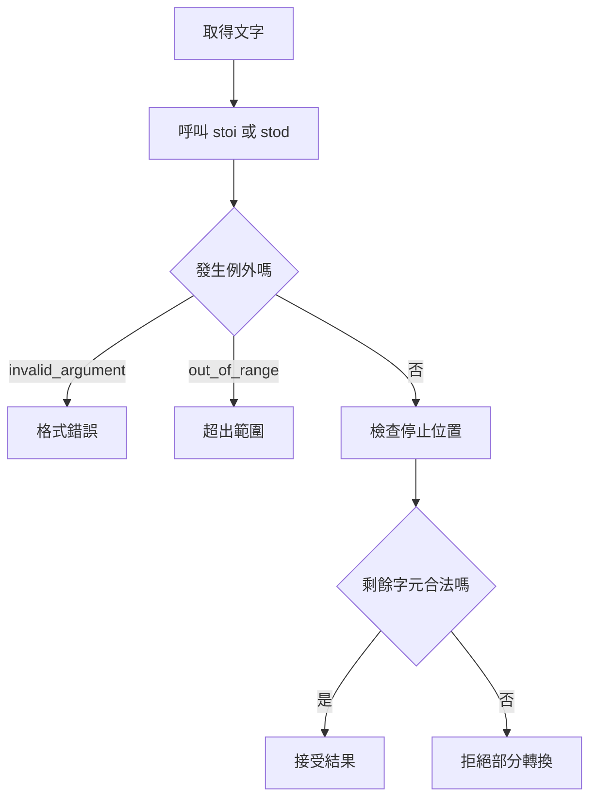
```mermaid
flowchart TD
    A[取得文字] --> B[呼叫 stoi 或 stod]
    B --> C{發生例外嗎}
    C -- invalid_argument --> D[格式錯誤]
    C -- out_of_range --> E[超出範圍]
    C -- 否 --> F[檢查停止位置]
    F --> G{剩餘字元合法嗎}
    G -- 是 --> H[接受結果]
    G -- 否 --> I[拒絕部分轉換]
```

### 8. 選擇輸入方式

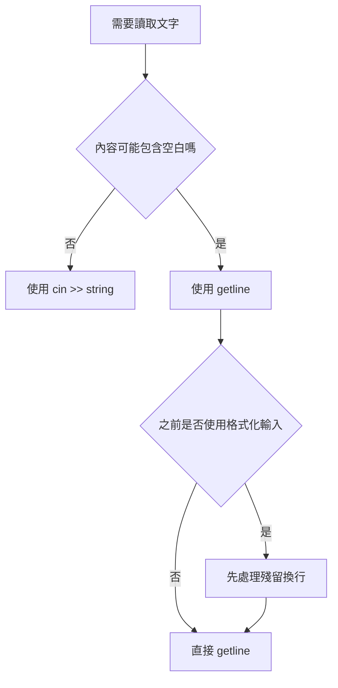
```mermaid
flowchart TD
    A[需要讀取文字] --> B{內容可能包含空白嗎}
    B -- 否 --> C[使用 cin >> string]
    B -- 是 --> D[使用 getline]
    D --> E{之前是否使用格式化輸入}
    E -- 是 --> F[先處理殘留換行]
    E -- 否 --> G[直接 getline]
    F --> G
```

---

# 本章完成標準

完成本章後，你應該能做到：

1. 宣告與初始化 `std::string`。
2. 建立空字串與重複字元字串。
3. 使用 `.size()` 與 `.length()`。
4. 使用 `.empty()` 與 `.clear()`。
5. 使用從 0 開始的字元索引。
6. 使用 `[]` 與 `.at()`。
7. 安全使用 `.front()` 與 `.back()`。
8. 修改字串中的字元。
9. 使用索引與 range-based `for` 走訪字串。
10. 分辨字元副本與參考。
11. 使用 `cin >>` 讀取單字。
12. 使用 `getline()` 讀取整行。
13. 正確混用格式化輸入與 `getline()`。
14. 使用 `+`、`+=` 與 `.append()` 串接文字。
15. 使用 `.push_back()` 與 `.pop_back()`。
16. 使用 `.substr()`。
17. 使用 `.find()` 與 `.rfind()`。
18. 正確檢查 `string::npos`。
19. 計算子字串出現次數。
20. 比較字串相等與字典順序。
21. 使用 `.compare()`。
22. 實作 C++17 前綴與後綴判斷。
23. 使用 `.insert()`、`.erase()` 與 `.replace()`。
24. 使用 `.resize()`。
25. 分辨 `.size()` 與 `.capacity()`。
26. 使用 `.reserve()`。
27. 使用 `<cctype>` 分析字元。
28. 正確轉型為 `unsigned char`。
29. 將字串轉大寫、小寫與切換大小寫。
30. 移除指定字元。
31. 壓縮連續空白。
32. 反轉字串。
33. 判斷基本與格式忽略型回文。
34. 將字串以 `const` 參考傳入函式。
35. 將字串以一般參考傳入函式。
36. 安全回傳字串值。
37. 使用 `to_string()`。
38. 使用 `stoi()` 與 `stod()`。
39. 處理數值轉換例外與部分轉換。
40. 找出常見 `std::string` 錯誤。

---

# 隱藏答案區

> Answer hidden — try it first.

<details><summary>TODO 1 答案</summary>

```cpp
string word;
cin >> word;

cout << word.size()
     << '\n';

if (!word.empty()) {
    cout << word.front()
         << '\n';

    cout << word.back()
         << '\n';
}
```

</details>

<details><summary>TODO 2 答案</summary>

```cpp
string sentence;
getline(cin, sentence);

cout << sentence
     << '\n';

cout << sentence.size()
     << '\n';
```

</details>

<details><summary>TODO 3 答案</summary>

```cpp
int age;
string fullName;

cin >> age;

getline(
    cin >> ws,
    fullName
);
```

</details>

<details><summary>TODO 4 答案</summary>

```cpp
void toLowerCase(
    string& text
) {
    for (char& ch : text) {
        ch =
            static_cast<char>(
                tolower(
                    static_cast<unsigned char>(
                        ch
                    )
                )
            );
    }
}
```

</details>

<details><summary>TODO 5 答案</summary>

```cpp
int letters = 0;
int digits = 0;
int spaces = 0;
int others = 0;

for (char ch : text) {
    unsigned char safeChar =
        static_cast<unsigned char>(
            ch
        );

    if (isalpha(safeChar) != 0) {
        ++letters;
    } else if (
        isdigit(safeChar) != 0
    ) {
        ++digits;
    } else if (
        isspace(safeChar) != 0
    ) {
        ++spaces;
    } else {
        ++others;
    }
}
```

</details>

<details><summary>TODO 6 答案</summary>

```cpp
string::size_type position =
    text.find(target);

if (
    position ==
    string::npos
) {
    cout << "Not found\n";
} else {
    cout << position
         << '\n';
}
```

</details>

<details><summary>TODO 7 答案</summary>

```cpp
int count = 0;
string::size_type position = 0;

while (
    (
        position =
            text.find(
                target,
                position
            )
    ) != string::npos
) {
    ++count;

    position +=
        target.size();
}
```

目標字串不可為空。

</details>

<details><summary>TODO 8 答案</summary>

```cpp
bool startsWith(
    const string& text,
    const string& prefix
) {
    return
        text.size() >= prefix.size() &&
        text.compare(
            0,
            prefix.size(),
            prefix
        ) == 0;
}
```

</details>

<details><summary>TODO 9 答案</summary>

```cpp
bool endsWith(
    const string& text,
    const string& suffix
) {
    return
        text.size() >= suffix.size() &&
        text.compare(
            text.size() - suffix.size(),
            suffix.size(),
            suffix
        ) == 0;
}
```

</details>

<details><summary>TODO 10 答案</summary>

```cpp
string trim(
    const string& text
) {
    string::size_type start = 0;

    while (
        start < text.size() &&
        isspace(
            static_cast<unsigned char>(
                text[start]
            )
        ) != 0
    ) {
        ++start;
    }

    string::size_type end =
        text.size();

    while (
        end > start &&
        isspace(
            static_cast<unsigned char>(
                text[end - 1]
            )
        ) != 0
    ) {
        --end;
    }

    return text.substr(
        start,
        end - start
    );
}
```

</details>

<details><summary>TODO 11 答案</summary>

```cpp
string result;
bool previousWasSpace = false;

for (char ch : text) {
    bool isSpace =
        isspace(
            static_cast<unsigned char>(
                ch
            )
        ) != 0;

    if (isSpace) {
        if (!previousWasSpace) {
            result.push_back(' ');
        }
    } else {
        result.push_back(ch);
    }

    previousWasSpace =
        isSpace;
}
```

</details>

<details><summary>TODO 12 答案</summary>

```cpp
bool isPalindrome(
    const string& text
) {
    if (text.empty()) {
        return true;
    }

    string::size_type left = 0;
    string::size_type right =
        text.size() - 1;

    while (left < right) {
        if (
            text[left] !=
            text[right]
        ) {
            return false;
        }

        ++left;
        --right;
    }

    return true;
}
```

</details>

<details><summary>TODO 13 答案</summary>

使用兩個索引，跳過非字母數字，並以 `tolower()` 將兩側轉為相同大小寫後比較。請參考本章「完整進階回文」範例。

</details>

<details><summary>TODO 14 答案</summary>

```cpp
try {
    string::size_type position = 0;

    int value =
        stoi(
            text,
            &position
        );

    if (
        position !=
        text.size()
    ) {
        cout << "Invalid trailing characters\n";
    } else {
        cout << value << '\n';
    }
} catch (
    const invalid_argument&
) {
    cout << "Invalid integer\n";
} catch (
    const out_of_range&
) {
    cout << "Out of range\n";
}
```

若允許尾端空白，需另外檢查剩餘字元是否全為空白。

</details>

<details><summary>TODO 15 答案</summary>

```cpp
string result;
bool startOfWord = true;

for (char ch : text) {
    unsigned char safeChar =
        static_cast<unsigned char>(
            ch
        );

    if (isspace(safeChar) != 0) {
        if (
            !result.empty() &&
            result.back() != ' '
        ) {
            result.push_back(' ');
        }

        startOfWord = true;
    } else {
        result.push_back(
            static_cast<char>(
                startOfWord
                    ? toupper(safeChar)
                    : tolower(safeChar)
            )
        );

        startOfWord = false;
    }
}

if (
    !result.empty() &&
    result.back() == ' '
) {
    result.pop_back();
}
```

</details>
