# Lesson 18：`std::vector` Dynamic Arrays `std::vector` 動態陣列

> 這堂課的重點：使用 `std::vector` 管理執行期間才知道數量、而且長度可能改變的同型別資料。你會學習建立向量、加入與移除元素、索引與走訪、大小與容量、插入與刪除、搜尋與統計、函式參數，以及修改容器後參考、指標與迭代器可能失效的問題。

> 第 16 章的傳統陣列與 `std::array` 都是固定大小。本章的 `std::vector` 可以在執行期間增加或減少元素，並自動管理底層儲存空間。手動使用 `new[]`、`delete[]` 與自行擴充動態陣列會留到後續動態記憶體章節。

---

## Section I. 今天要做什麼？

1. 認識 `std::vector`。
2. 理解 vector 保存多個相同型別元素。
3. 理解 vector 的元素數量可在執行期間改變。
4. 加入 `<vector>` 標頭。
5. 建立空 vector。
6. 指定初始元素數量。
7. 指定初始元素數量與初始值。
8. 使用初始化列表。
9. 從另一個 vector 複製。
10. 使用 `.size()` 取得元素數量。
11. 使用 `.empty()` 判斷是否為空。
12. 使用 `.clear()` 移除所有元素。
13. 理解 `.clear()` 不保證釋放容量。
14. 使用 `[]` 存取元素。
15. 使用 `.at()` 進行界線檢查。
16. 使用 `.front()` 取得第一個元素。
17. 使用 `.back()` 取得最後一個元素。
18. 避免對空 vector 使用 `.front()` 與 `.back()`。
19. 修改指定索引的元素。
20. 理解合法索引為 `0` 到 `size() - 1`。
21. 使用索引式 `for`。
22. 使用 `std::vector<T>::size_type`。
23. 使用 `std::size_t`。
24. 避免有號與無號型別比較警告。
25. 使用 range-based `for`。
26. 分辨值、參考與 `const` 參考走訪。
27. 使用 `auto&` 修改元素。
28. 使用 `const auto&` 唯讀走訪。
29. 使用 `.push_back()` 加入元素。
30. 使用 `.emplace_back()` 在尾端建立元素。
31. 理解基本型別中 `.push_back()` 與 `.emplace_back()` 差異不大。
32. 使用 `.pop_back()` 移除最後元素。
33. 避免對空 vector 使用 `.pop_back()`。
34. 使用 `.resize()` 改變元素數量。
35. 理解縮小 `.resize()` 會刪除尾端元素。
36. 理解放大 `.resize()` 會建立新元素。
37. 指定放大時的新元素值。
38. 使用 `.assign()` 重新指定內容。
39. 使用 `.swap()` 交換內容。
40. 使用直接複製與賦值。
41. 使用 `==` 比較內容。
42. 使用字典順序比較。
43. 理解 `.size()` 與 `.capacity()` 的差異。
44. 使用 `.capacity()` 觀察容量。
45. 使用 `.reserve()` 預留容量。
46. 理解 `.reserve()` 不改變元素數量。
47. 理解 `.resize()` 會改變元素數量。
48. 理解容量至少不小於大小。
49. 認識重新配置 reallocation。
50. 理解容量不足時加入元素可能重新配置。
51. 理解重新配置會搬移全部元素。
52. 理解重新配置可能使參考失效。
53. 理解重新配置可能使指標失效。
54. 理解重新配置可能使迭代器失效。
55. 避免保存元素參考後再任意加入元素。
56. 使用 `.shrink_to_fit()` 的概念。
57. 理解 `.shrink_to_fit()` 是非強制請求。
58. 不依賴容量精確變化規則。
59. 認識 iterator 迭代器。
60. 使用 `.begin()`。
61. 使用 `.end()`。
62. 理解 `.end()` 指向最後元素之後。
63. 不可解參考 `.end()`。
64. 使用迭代器迴圈。
65. 使用 `const_iterator`。
66. 使用 `.cbegin()` 與 `.cend()`。
67. 使用 `.insert()` 插入元素。
68. 在開頭插入元素。
69. 在中間插入元素。
70. 在尾端插入元素。
71. 使用 `.erase()` 刪除一個元素。
72. 使用 `.erase()` 刪除一段範圍。
73. 理解刪除後後方元素會向前移動。
74. 理解插入或刪除可能使迭代器失效。
75. 使用迭代器位置進行插入與刪除。
76. 將索引轉為迭代器位置。
77. 檢查索引後再插入或刪除。
78. 使用迴圈輸入固定筆數元素。
79. 使用 `.push_back()` 輸入不定筆數元素。
80. 使用哨兵值停止輸入。
81. 避免將哨兵值加入 vector。
82. 使用輸入失敗作為停止條件。
83. 計算 vector 總和。
84. 計算平均值。
85. 處理空 vector 的平均值。
86. 找出最大值。
87. 找出最小值。
88. 使用第一個元素初始化最大最小值。
89. 統計符合條件的元素。
90. 搜尋第一個符合條件的位置。
91. 使用 `vector::size_type` 表示索引。
92. 使用 `string::npos` 以外的找不到設計。
93. 使用 `bool` 與輸出參考回傳位置。
94. 使用 vector 大小作為找不到位置的約定。
95. 計算指定值出現次數。
96. 移除指定值。
97. 使用手動讀寫索引移除元素。
98. 使用 erase-remove idiom 的概念預告。
99. 不在本章深入 `<algorithm>` 的 `remove()` 原理。
100. 移除重複的相鄰元素。
101. 反轉 vector。
102. 判斷 vector 是否遞增。
103. 合併兩個 vector。
104. 將一個 vector 附加到另一個。
105. 將 vector 以 `const` 參考傳入函式。
106. 將 vector 以一般參考傳入函式。
107. 將 vector 以值傳入函式。
108. 理解以值傳入會複製全部元素。
109. 以值回傳 vector。
110. 理解回傳區域 vector 的值是安全的。
111. 避免回傳區域 vector 的參考。
112. 建立產生數列的函式。
113. 建立過濾元素的函式。
114. 建立轉換元素的函式。
115. 比較 `std::array` 與 `std::vector`。
116. 判斷固定大小與動態大小需求。
117. 認識 vector 的連續儲存。
118. 使用 `.data()` 的基本概念。
119. 理解 vector 修改後 `.data()` 指標可能失效。
120. 認識 `vector<bool>` 的特殊性。
121. 理解 `vector<bool>` 不是一般 `bool` 物件陣列。
122. 初學時避免將 `vector<bool>` 元素當成 `bool&`。
123. 使用 `vector<char>` 或其他型別視需求替代。
124. 認識巢狀 vector。
125. 建立 `vector<vector<int>>`。
126. 理解每一列可以有不同長度。
127. 分辨矩形資料與不規則資料。
128. 不在本章深入二維 vector 演算法。
129. 認識 vector 例外。
130. `.at()` 可能丟出 `out_of_range`。
131. 記憶體配置失敗可能丟出例外。
132. 不在本章自行捕捉所有配置例外。
133. 使用概念檢查、程式閱讀與實作題整合本章。

---

## Section II. 今天的學習方式

1. 每個 vector 先標出：
   ```text
   元素型別
   size
   capacity
   合法索引
   ```
2. 合法索引永遠是：
   ```text
   0 到 size() - 1
   ```
3. 使用 `.front()`、`.back()`、`.pop_back()` 前先確認：
   ```cpp
   !values.empty()
   ```
4. `.reserve()` 與 `.resize()` 題分別問：
   ```text
   元素數量有沒有改變？
   容量是否可能改變？
   ```
5. 保存元素參考、指標或迭代器後，要檢查後續操作是否可能重新配置。
6. 使用 `.insert()` 或 `.erase()` 後，不要繼續使用可能失效的舊迭代器。
7. 需要修改原 vector 時使用：
   ```cpp
   vector<T>&
   ```
8. 只讀大型 vector 時使用：
   ```cpp
   const vector<T>&
   ```
9. 需要獨立副本時才使用傳值。
10. 空 vector 的最大值、最小值與平均值必須特別處理。
11. 所有合法完整程式使用嚴格 C++17 選項檢查。
12. 會產生未定義行為的失效參考範例只供分析，不執行。

---

## Section III. 核心語法對照

| 語法 | 用途 |
| --- | --- |
| `std::vector<int> values;` | 建立空 vector |
| `std::vector<int> values(5);` | 建立 5 個值初始化整數 |
| `std::vector<int> values(5, 7);` | 建立 5 個值為 7 的元素 |
| `std::vector<int> values{1, 2, 3};` | 初始化列表 |
| `values.size()` | 取得元素數量 |
| `values.empty()` | 判斷是否為空 |
| `values.clear()` | 移除所有元素 |
| `values[index]` | 不檢查界線的存取 |
| `values.at(index)` | 有界線檢查的存取 |
| `values.front()` | 第一個元素 |
| `values.back()` | 最後一個元素 |
| `values.push_back(value)` | 在尾端加入元素 |
| `values.emplace_back(value)` | 在尾端建立元素 |
| `values.pop_back()` | 移除最後元素 |
| `values.resize(count)` | 改變元素數量 |
| `values.reserve(count)` | 預留容量 |
| `values.capacity()` | 取得目前容量 |
| `values.begin()` | 第一個元素位置 |
| `values.end()` | 最後元素之後的位置 |
| `values.insert(position, value)` | 插入元素 |
| `values.erase(position)` | 刪除一個元素 |
| `values.erase(first, last)` | 刪除範圍 `[first, last)` |
| `values.assign(count, value)` | 重新指定內容 |
| `values.swap(other)` | 交換兩個 vector |
| `const std::vector<int>& values` | 唯讀函式參數 |
| `std::vector<int>& values` | 可修改函式參數 |

---


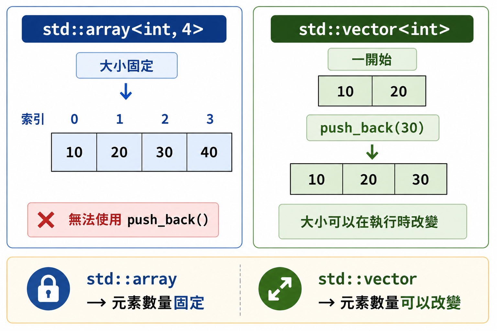


# Part A：第一個 `std::vector`

## Section IV. 加入標頭

```cpp
#include <vector>
```

完整型別：

```cpp
std::vector<int>
```

---

## Section V. 建立空 vector

```cpp
vector<int> values;
```

初始：

```text
size = 0
empty = true
```

---

## Section VI. 完整基本範例

```cpp
// VALIDATE
#include <iostream>
#include <vector>
using namespace std;

int main() {
    vector<int> values;

    cout << values.size()
         << '\n';

    cout << boolalpha
         << values.empty()
         << '\n';

    return 0;
}
```

---

## Section VII. 使用初始化列表

```cpp
vector<int> values{
    10,
    20,
    30
};
```

大小為 `3`。

---

## Section VIII. 完整初始化列表範例

```cpp
// VALIDATE
#include <iostream>
#include <vector>
using namespace std;

int main() {
    vector<int> values{
        10,
        20,
        30
    };

    for (int value : values) {
        cout << value
             << " ";
    }

    cout << '\n';

    return 0;
}
```

---

# Part B：指定大小與初始值

## Section IX. 只指定元素數量

```cpp
vector<int> values(5);
```

建立五個值初始化的 `int`，每個為：

```text
0
```

---

## Section X. 指定數量與值

```cpp
vector<int> values(
    5,
    7
);
```

內容：

```text
7 7 7 7 7
```

---

## Section XI. 圓括號與大括號不同

```cpp
vector<int> first(5, 7);
```

表示五個 `7`。

```cpp
vector<int> second{5, 7};
```

表示兩個元素：

```text
5 7
```

---

## Section XII. 完整比較

```cpp
// VALIDATE
#include <iostream>
#include <vector>
using namespace std;

int main() {
    vector<int> repeated(
        5,
        7
    );

    vector<int> listed{
        5,
        7
    };

    cout << repeated.size()
         << '\n';

    cout << listed.size()
         << '\n';

    return 0;
}
```

輸出：

```text
5
2
```

---


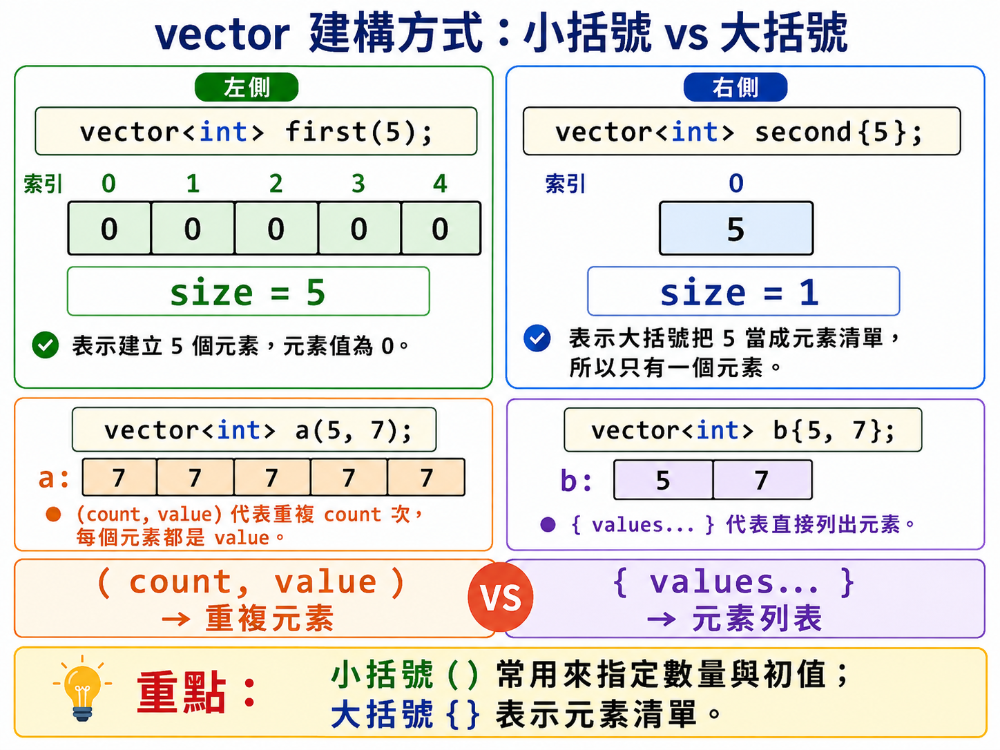


# Part C：大小與空狀態

## Section XIII. `.size()`

```cpp
values.size()
```

回傳目前元素數量。

---


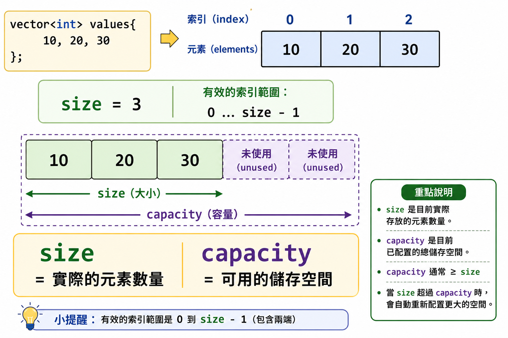


## Section XIV. `.empty()`

```cpp
values.empty()
```

等價概念：

```cpp
values.size() == 0
```

但 `.empty()` 更直接。

---

## Section XV. `.clear()`

```cpp
values.clear();
```

移除所有元素。

之後：

```text
size = 0
```

但容量可能仍然保留。

---

## Section XVI. 完整清空範例

```cpp
// VALIDATE
#include <iostream>
#include <vector>
using namespace std;

int main() {
    vector<int> values{
        1,
        2,
        3
    };

    cout << values.size()
         << '\n';

    values.clear();

    cout << values.size()
         << '\n';

    cout << boolalpha
         << values.empty()
         << '\n';

    return 0;
}
```

---


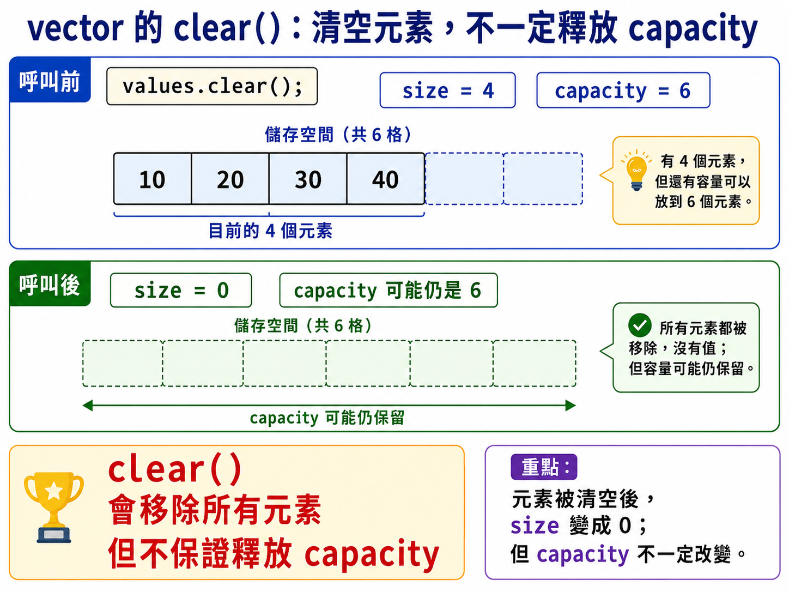


# Part D：索引存取

## Section XVII. 使用 `[]`

```cpp
values[0]
```

取得第一個元素。

---

## Section XVIII. 修改元素

```cpp
values[1] = 99;
```

修改第二個元素。

---

## Section XIX. 完整索引範例

```cpp
// VALIDATE
#include <iostream>
#include <vector>
using namespace std;

int main() {
    vector<int> values{
        5,
        10,
        15
    };

    values[1] = 99;

    cout << values[0]
         << " "
         << values[1]
         << " "
         << values[2]
         << '\n';

    return 0;
}
```

---

## Section XX. 越界風險

若：

```cpp
vector<int> values{
    1,
    2,
    3
};
```

合法索引：

```text
0、1、2
```

使用：

```cpp
/* values[3] */
```

是未定義行為。

---

# Part E：`.at()`、`.front()` 與 `.back()`

## Section XXI. `.at()`

```cpp
values.at(index)
```

會檢查界線。

越界時丟出：

```cpp
out_of_range
```

---

## Section XXII. 完整 `.at()` 範例

```cpp
// VALIDATE
#include <iostream>
#include <stdexcept>
#include <vector>
using namespace std;

int main() {
    vector<int> values{
        10,
        20,
        30
    };

    vector<int>::size_type index;
    cin >> index;

    try {
        cout << values.at(index)
             << '\n';
    } catch (
        const out_of_range&
    ) {
        cout << "Index out of range\n";
    }

    return 0;
}
```

---

## Section XXIII. `.front()`

```cpp
values.front()
```

取得第一個元素。

---

## Section XXIV. `.back()`

```cpp
values.back()
```

取得最後一個元素。

---

## Section XXV. 空 vector 檢查

不可對空 vector 使用：

```cpp
front()
back()
pop_back()
```

安全模式：

```cpp
if (!values.empty()) {
    // ...
}
```

---

## Section XXVI. 完整首尾元素範例

```cpp
// VALIDATE
#include <iostream>
#include <vector>
using namespace std;

int main() {
    vector<int> values{
        4,
        8,
        12
    };

    if (!values.empty()) {
        cout << values.front()
             << '\n';

        cout << values.back()
             << '\n';

        values.front() = 100;
        values.back() = 200;
    }

    for (int value : values) {
        cout << value
             << " ";
    }

    cout << '\n';

    return 0;
}
```

---

# Part F：索引式走訪

## Section XXVII. 使用 `size_type`

```cpp
for (
    vector<int>::size_type index = 0;
    index < values.size();
    ++index
) {
    cout << values[index];
}
```

---

## Section XXVIII. 為什麼不用 `int`？

`.size()` 回傳無號大小型別。

使用 `int` 與其比較可能產生：

```text
signed/unsigned comparison
```

警告。

---

## Section XXIX. 完整索引走訪

```cpp
// VALIDATE
#include <iostream>
#include <vector>
using namespace std;

int main() {
    vector<int> values{
        3,
        6,
        9,
        12
    };

    for (
        vector<int>::size_type index = 0;
        index < values.size();
        ++index
    ) {
        cout << "Index "
             << index
             << ": "
             << values[index]
             << '\n';
    }

    return 0;
}
```

---

# Part G：Range-Based `for`

## Section XXX. 以值走訪

```cpp
for (int value : values) {
    value *= 10;
}
```

修改副本，不修改原元素。

---

## Section XXXI. 以參考走訪

```cpp
for (int& value : values) {
    value *= 10;
}
```

修改原元素。

---

## Section XXXII. 唯讀參考

```cpp
for (const int& value : values) {
    cout << value;
}
```

---

## Section XXXIII. 完整比較

```cpp
// VALIDATE
#include <iostream>
#include <vector>
using namespace std;

int main() {
    vector<int> values{
        1,
        2,
        3
    };

    for (int value : values) {
        value *= 10;

        cout << "Copy: "
             << value
             << '\n';
    }

    for (int& value : values) {
        value *= 2;
    }

    for (const int& value : values) {
        cout << value
             << " ";
    }

    cout << '\n';

    return 0;
}
```

最後：

```text
2 4 6
```

---


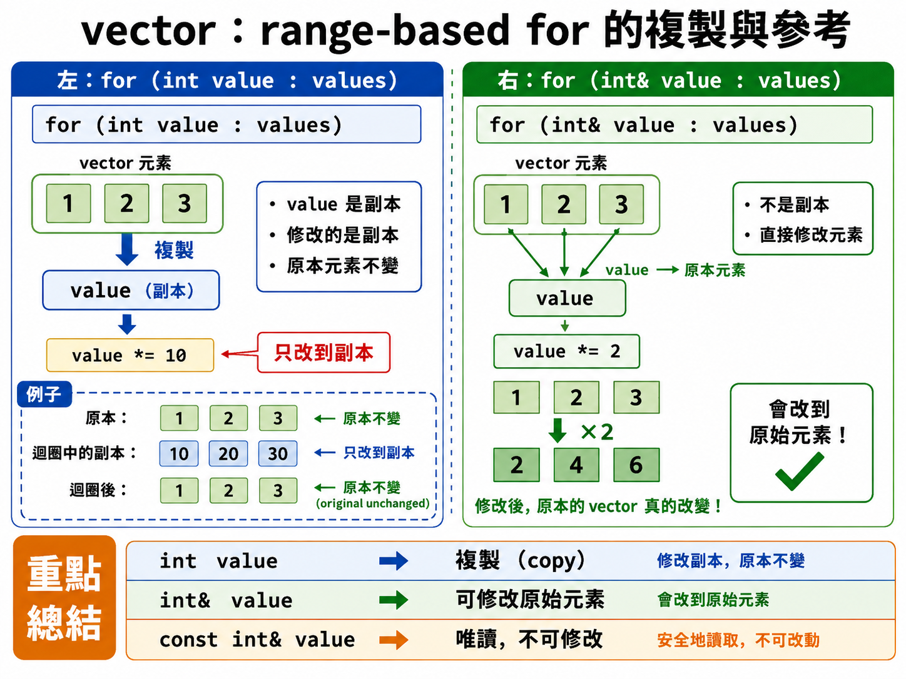


# Part H：加入元素

## Section XXXIV. `.push_back()`

```cpp
values.push_back(10);
```

在尾端加入一個元素。

---

## Section XXXV. 空 vector 逐步成長

```cpp
vector<int> values;

values.push_back(10);
values.push_back(20);
values.push_back(30);
```

大小依序：

```text
0 → 1 → 2 → 3
```

---


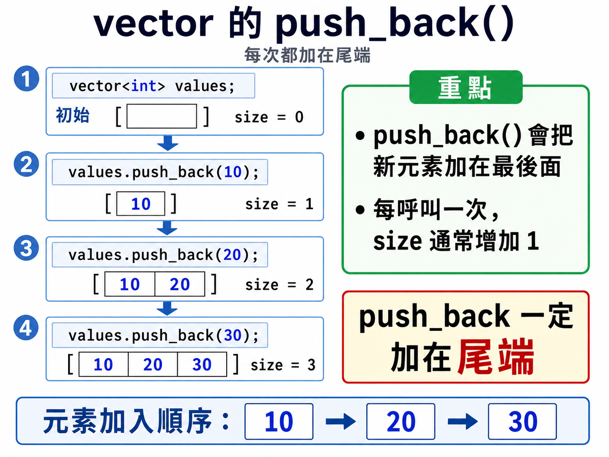


## Section XXXVI. 完整加入元素範例

```cpp
// VALIDATE
#include <iostream>
#include <vector>
using namespace std;

int main() {
    vector<int> values;

    values.push_back(10);
    values.push_back(20);
    values.push_back(30);

    cout << "Size: "
         << values.size()
         << '\n';

    for (int value : values) {
        cout << value
             << " ";
    }

    cout << '\n';

    return 0;
}
```

---

## Section XXXVII. `.emplace_back()`

```cpp
values.emplace_back(40);
```

在尾端直接建立元素。

對 `int`：

```cpp
push_back(40)
emplace_back(40)
```

差異通常不重要。

對未來自訂類別，`emplace_back()` 可能直接使用建構參數建立物件。

---

# Part I：移除尾端元素

## Section XXXVIII. `.pop_back()`

```cpp
values.pop_back();
```

移除最後元素。

不回傳被移除的值。

---

## Section XXXIX. 先保存再移除

```cpp
int lastValue =
    values.back();

values.pop_back();
```

前提：

```cpp
!values.empty()
```

---

## Section XL. 完整移除尾端範例

```cpp
// VALIDATE
#include <iostream>
#include <vector>
using namespace std;

int main() {
    vector<int> values{
        10,
        20,
        30
    };

    if (!values.empty()) {
        int removedValue =
            values.back();

        values.pop_back();

        cout << "Removed: "
             << removedValue
             << '\n';
    }

    cout << "Size: "
         << values.size()
         << '\n';

    return 0;
}
```

---


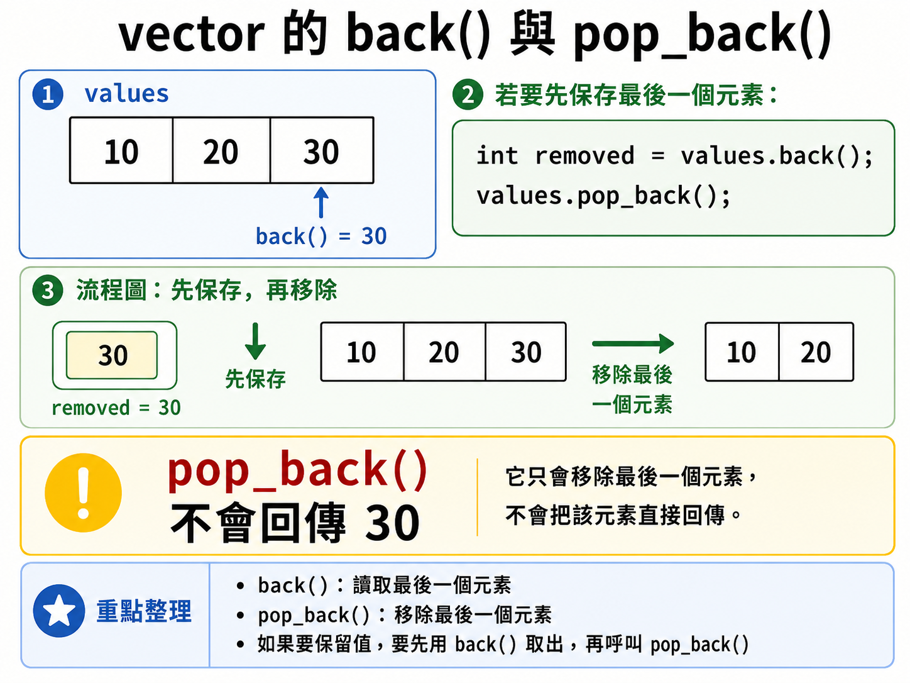


# Part J：固定筆數輸入

## Section XLI. 先建立指定大小

```cpp
vector<int> values(count);
```

再使用索引讀入：

```cpp
cin >> values[index];
```

---

## Section XLII. 完整固定筆數輸入

```cpp
// VALIDATE
#include <iostream>
#include <vector>
using namespace std;

int main() {
    vector<int>::size_type count;
    cin >> count;

    vector<int> values(count);

    for (
        vector<int>::size_type index = 0;
        index < values.size();
        ++index
    ) {
        cin >> values[index];
    }

    for (int value : values) {
        cout << value
             << " ";
    }

    cout << '\n';

    return 0;
}
```

---

# Part K：不定筆數輸入

## Section XLIII. 哨兵值

例如：

```text
持續輸入整數
輸入 -1 結束
```

---

## Section XLIV. 不加入哨兵值

```cpp
while (cin >> value && value != -1) {
    values.push_back(value);
}
```

---

## Section XLV. 完整不定筆數輸入

```cpp
// VALIDATE
#include <iostream>
#include <vector>
using namespace std;

int main() {
    vector<int> values;

    int value;

    while (
        cin >> value &&
        value != -1
    ) {
        values.push_back(value);
    }

    cout << "Count: "
         << values.size()
         << '\n';

    for (int storedValue : values) {
        cout << storedValue
             << " ";
    }

    cout << '\n';

    return 0;
}
```

本例假設 `-1` 不是合法資料。

---

## Section XLVI. 以輸入失敗停止

若所有整數都可能是合法資料，可使用：

```cpp
while (cin >> value) {
    values.push_back(value);
}
```

直到 EOF 或輸入格式錯誤。

---

# Part L：`.resize()`

## Section XLVII. 放大

```cpp
values.resize(5);
```

若原本只有三個 `int`，新增兩個值初始化元素：

```text
0 0
```

---

## Section XLVIII. 指定新元素值

```cpp
values.resize(
    5,
    -1
);
```

新增元素使用 `-1`。

---

## Section XLIX. 縮小

```cpp
values.resize(2);
```

刪除索引 `2` 之後的尾端元素。

---

## Section L. 完整 `.resize()` 範例

```cpp
// VALIDATE
#include <iostream>
#include <vector>
using namespace std;

int main() {
    vector<int> values{
        1,
        2,
        3
    };

    values.resize(
        5,
        9
    );

    for (int value : values) {
        cout << value
             << " ";
    }

    cout << '\n';

    values.resize(2);

    for (int value : values) {
        cout << value
             << " ";
    }

    cout << '\n';

    return 0;
}
```

輸出：

```text
1 2 3 9 9
1 2
```

---


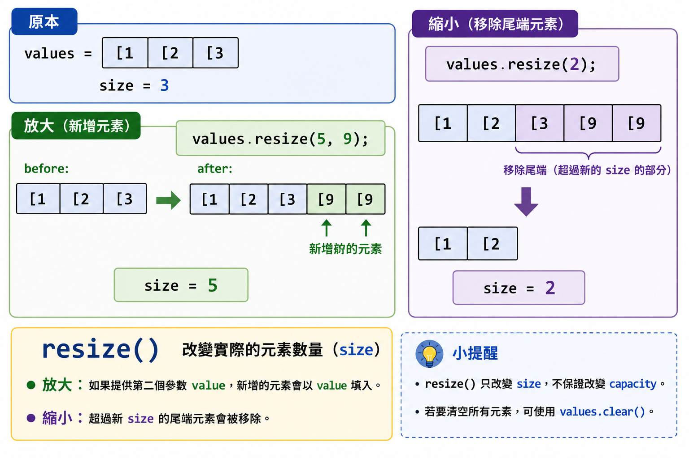


# Part M：`.assign()`、複製與交換

## Section LI. `.assign()`

```cpp
values.assign(
    5,
    7
);
```

用五個 `7` 取代原內容。

---

## Section LII. 直接複製

```cpp
vector<int> second =
    first;
```

兩個 vector 為獨立物件。

---

## Section LIII. 直接賦值

```cpp
second = first;
```

複製內容。

---

## Section LIV. `.swap()`

```cpp
first.swap(second);
```

交換兩個 vector 的內容。

---

## Section LV. 完整整體操作

```cpp
// VALIDATE
#include <iostream>
#include <vector>
using namespace std;

int main() {
    vector<int> first{
        1,
        2,
        3
    };

    vector<int> second{
        7,
        8
    };

    vector<int> copy =
        first;

    copy[0] = 100;

    first.swap(second);

    cout << "First size: "
         << first.size()
         << '\n';

    cout << "Second size: "
         << second.size()
         << '\n';

    cout << "Copy first element: "
         << copy[0]
         << '\n';

    return 0;
}
```

---

# Part N：大小與容量

## Section LVI. `.size()`

目前實際存在的元素數量。

---

## Section LVII. `.capacity()`

目前已配置空間可容納的元素數量。

永遠應滿足：

```text
capacity >= size
```

---

## Section LVIII. 為什麼容量可能大於大小？

vector 成長時通常不會每加入一個元素就重新配置一次。

它可能一次準備較多空間，讓後續加入更有效率。

---

## Section LIX. 完整容量觀察

```cpp
// VALIDATE
#include <iostream>
#include <vector>
using namespace std;

int main() {
    vector<int> values;

    for (int value = 1; value <= 10; ++value) {
        values.push_back(value);

        cout << "Size: "
             << values.size()
             << ", capacity >= size: "
             << boolalpha
             << (
                    values.capacity() >=
                    values.size()
                )
             << '\n';
    }

    return 0;
}
```

不要依賴容量每次具體增加多少，這是實作細節。

---

# Part O：`.reserve()`

## Section LX. 預留空間

```cpp
values.reserve(100);
```

表示：

```text
希望容量至少能容納 100 個元素
```

---

## Section LXI. 不會建立元素

執行：

```cpp
values.reserve(100);
```

之後：

```text
size 仍然可能是 0
```

因此不能直接使用：

```cpp
/* values[0] = 10; */
```

因為沒有實際元素。

---

## Section LXII. 完整 `.reserve()` 範例

```cpp
// VALIDATE
#include <iostream>
#include <vector>
using namespace std;

int main() {
    vector<int> values;

    values.reserve(100);

    cout << "Size: "
         << values.size()
         << '\n';

    cout << "Capacity at least 100: "
         << boolalpha
         << (
                values.capacity() >=
                100
            )
         << '\n';

    values.push_back(10);

    cout << values[0]
         << '\n';

    return 0;
}
```

---

## Section LXIII. `.reserve()` 與 `.resize()` 比較

| 操作 | 改變 size | 建立或刪除元素 | 可能改變 capacity |
| --- | --- | --- | --- |
| `reserve(n)` | 否 | 否 | 是 |
| `resize(n)` | 是 | 是 | 可能 |
| `push_back(x)` | 是 | 建立一個 | 可能 |
| `pop_back()` | 是 | 刪除一個 | 通常不縮小 |
| `clear()` | 變成 0 | 刪除全部 | 通常不縮小 |

---


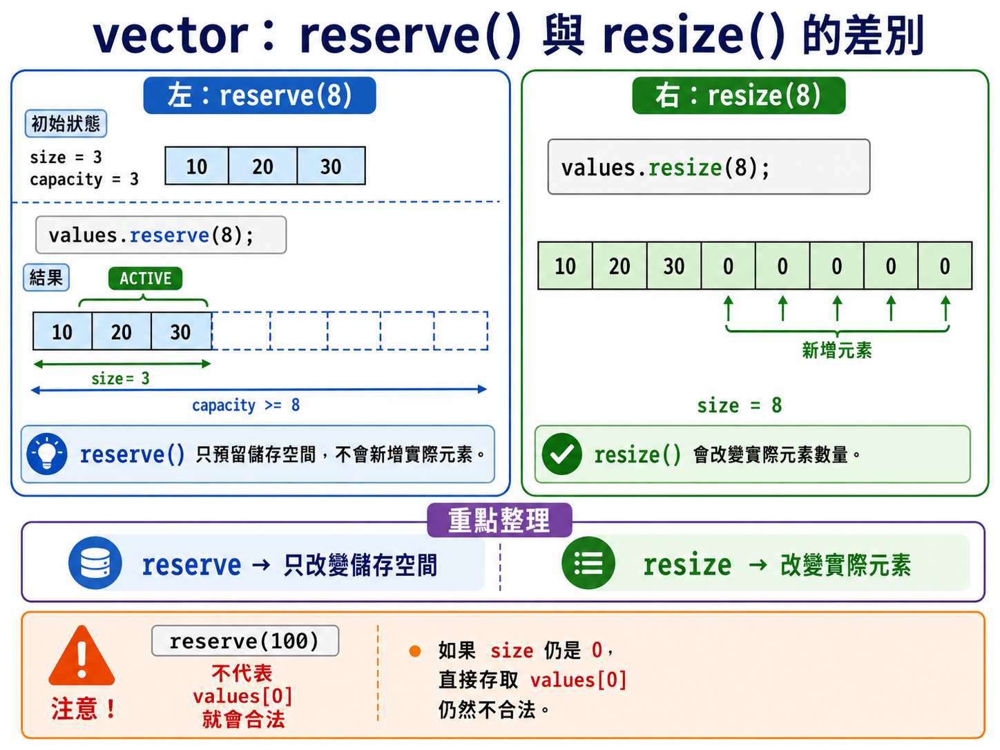


# Part P：重新配置與失效

## Section LXIV. 什麼是重新配置？

容量不足時加入新元素，vector 可能：

1. 配置一塊更大的新空間。
2. 搬移或複製所有元素。
3. 銷毀舊位置元素。
4. 釋放舊空間。

---


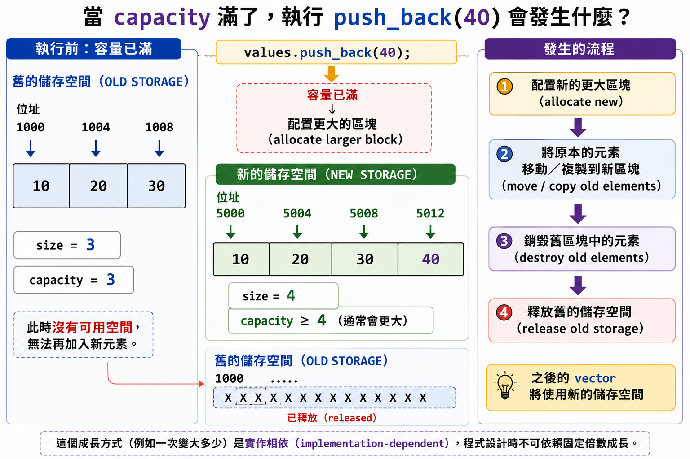


## Section LXV. 參考可能失效

```cpp
vector<int> values{
    1,
    2,
    3
};

int& first =
    values[0];

values.push_back(4);
```

若 `push_back()` 造成重新配置：

```text
first 不再指向有效元素
```

後續使用是危險的。

---

## Section LXVI. 指標與迭代器也可能失效

可能失效：

- `T&`
- `T*`
- iterator
- `.data()` 結果

---


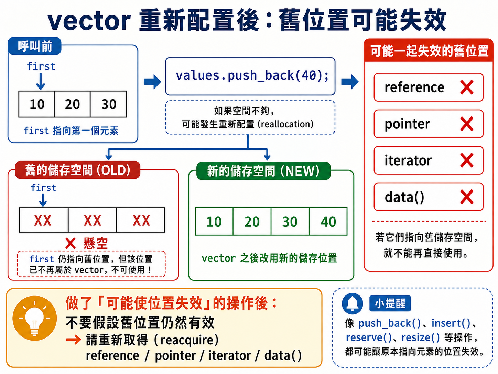


## Section LXVII. 安全原則

修改 vector 大小前：

```text
不要依賴先前保存的元素參考、指標或迭代器
```

修改後重新取得：

```cpp
int& first =
    values[0];
```

---

## Section LXVIII. `.reserve()` 可降低重新配置

若預先知道大約會加入多少元素：

```cpp
values.reserve(expectedCount);
```

在不超過該容量前，尾端加入通常不需要重新配置。

但插入與刪除仍可能讓迭代器或參考因元素移動而失效。

---


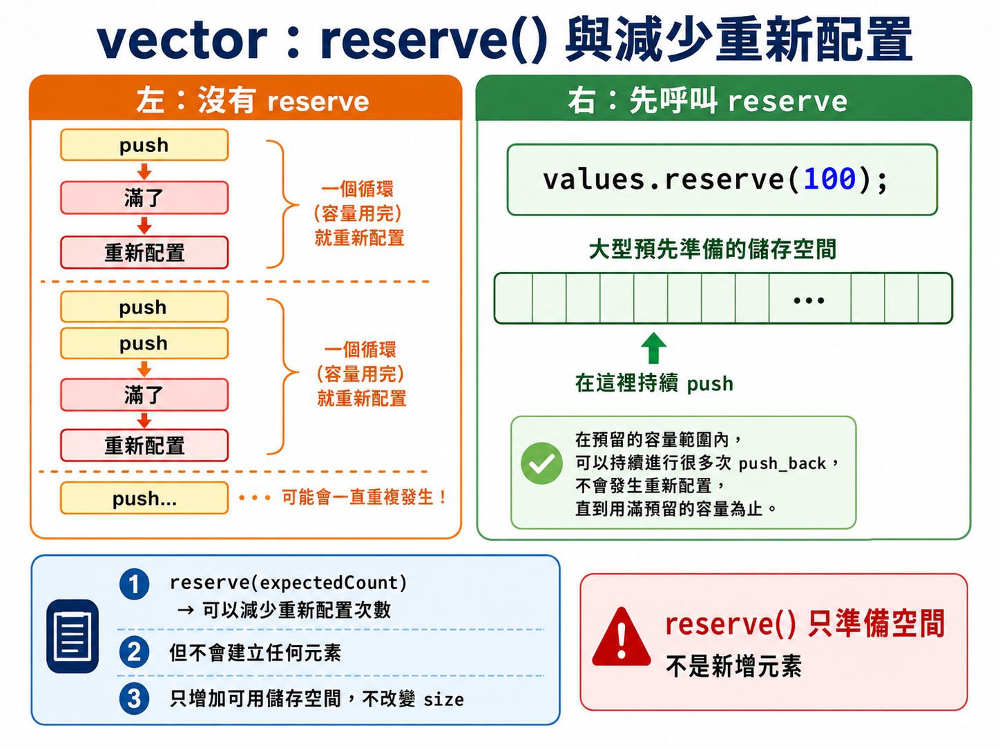


# Part Q：迭代器基本概念

## Section LXIX. `.begin()`

```cpp
values.begin()
```

指向第一個元素。

---

## Section LXX. `.end()`

```cpp
values.end()
```

指向最後元素之後。

不是有效元素位置，不可：

```cpp
/* *values.end() */
```

---


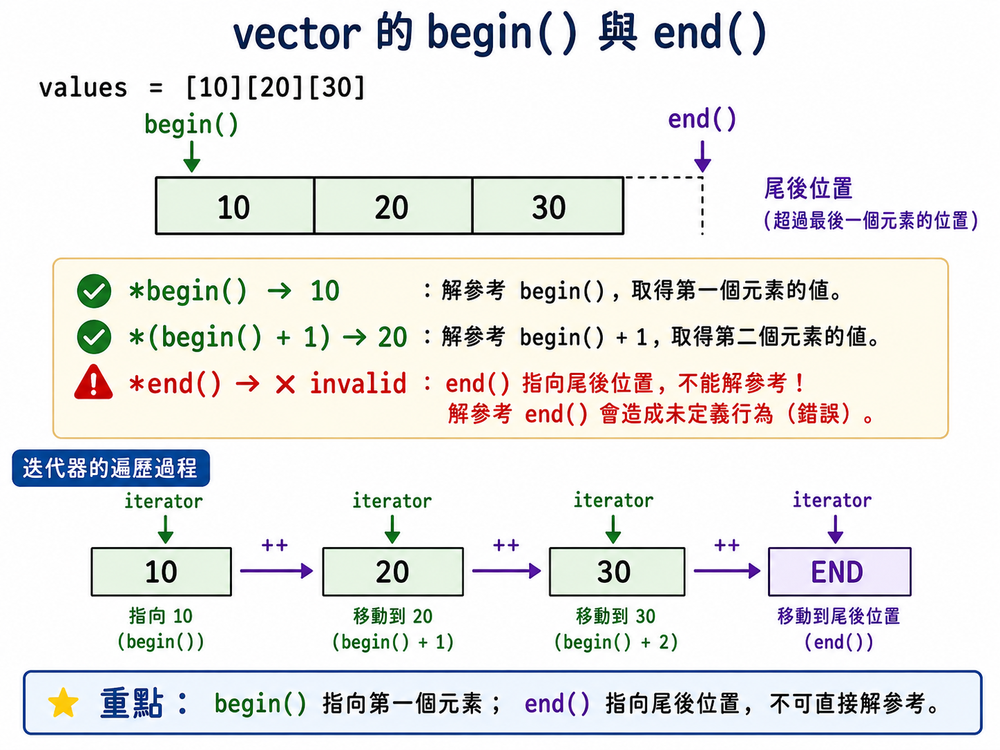


## Section LXXI. 基本迭代器迴圈

```cpp
for (
    auto iterator = values.begin();
    iterator != values.end();
    ++iterator
) {
    cout << *iterator;
}
```

---

## Section LXXII. 完整迭代器走訪

```cpp
// VALIDATE
#include <iostream>
#include <vector>
using namespace std;

int main() {
    vector<int> values{
        2,
        4,
        6
    };

    for (
        auto iterator =
            values.begin();
        iterator !=
            values.end();
        ++iterator
    ) {
        *iterator *= 3;
    }

    for (
        auto iterator =
            values.cbegin();
        iterator !=
            values.cend();
        ++iterator
    ) {
        cout << *iterator
             << " ";
    }

    cout << '\n';

    return 0;
}
```

---

# Part R：插入元素

## Section LXXIII. 在指定位置插入

```cpp
values.insert(
    values.begin() + 1,
    99
);
```

在索引 `1` 前插入 `99`。

---

## Section LXXIV. 索引轉迭代器

若索引型別是：

```cpp
vector<int>::size_type
```

需要轉成 vector 的差值型別：

```cpp
static_cast<vector<int>::difference_type>(
    index
)
```

再與 `.begin()` 相加。

---

## Section LXXV. 完整插入範例

```cpp
// VALIDATE
#include <iostream>
#include <vector>
using namespace std;

int main() {
    vector<int> values{
        10,
        30
    };

    vector<int>::size_type index = 1;

    if (index <= values.size()) {
        auto position =
            values.begin() +
            static_cast<
                vector<int>::difference_type
            >(index);

        values.insert(
            position,
            20
        );
    }

    for (int value : values) {
        cout << value
             << " ";
    }

    cout << '\n';

    return 0;
}
```

輸出：

```text
10 20 30
```

---


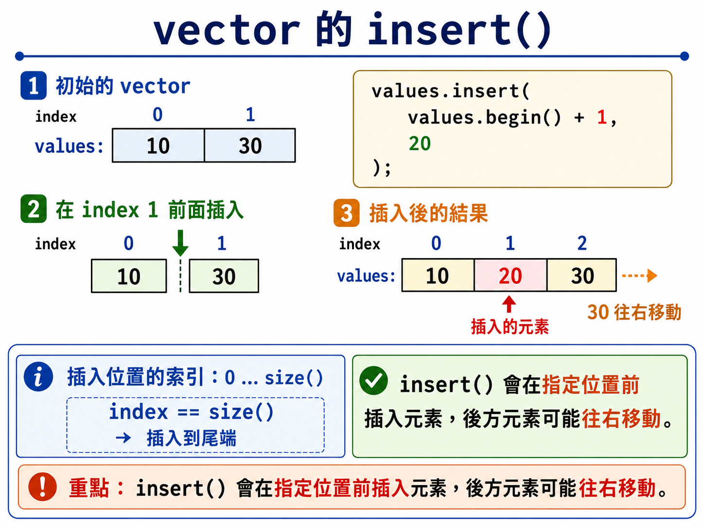


## Section LXXVI. 插入合法位置

插入位置索引可為：

```text
0 到 size()
```

索引 `size()` 表示在尾端插入。

---

# Part S：刪除元素

## Section LXXVII. 刪除一個位置

```cpp
values.erase(
    values.begin() + offset
);
```

---

## Section LXXVIII. 刪除範圍

```cpp
values.erase(
    first,
    last
);
```

刪除：

```text
[first, last)
```

包含 `first`，不包含 `last`。

---


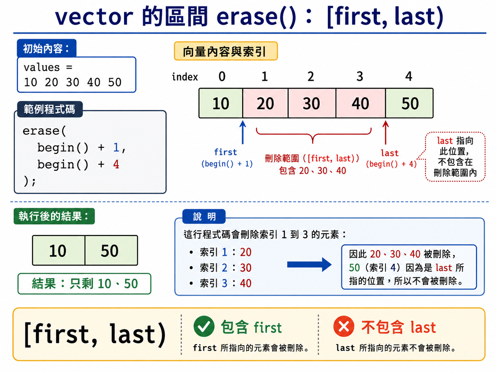


## Section LXXIX. 完整刪除範例

```cpp
// VALIDATE
#include <iostream>
#include <vector>
using namespace std;

int main() {
    vector<int> values{
        10,
        20,
        30,
        40,
        50
    };

    vector<int>::size_type index = 2;

    if (index < values.size()) {
        auto position =
            values.begin() +
            static_cast<
                vector<int>::difference_type
            >(index);

        values.erase(position);
    }

    for (int value : values) {
        cout << value
             << " ";
    }

    cout << '\n';

    return 0;
}
```

輸出：

```text
10 20 40 50
```

---

## Section LXXX. 刪除後元素移動

刪除中間元素後，後方元素向前移動。

因此舊索引、參考或迭代器可能不再代表原本元素。

---


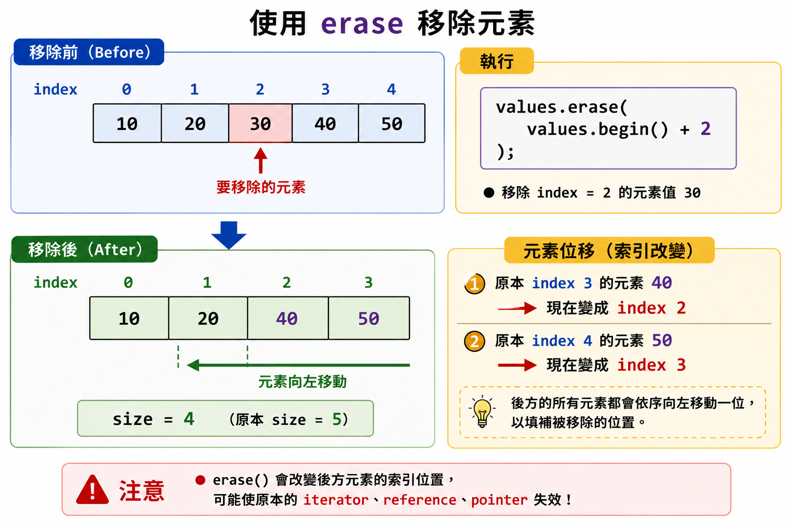


# Part T：統計與平均

## Section LXXXI. 總和

```cpp
long long total = 0;

for (int value : values) {
    total += value;
}
```

---

## Section LXXXII. 平均值

先確認：

```cpp
!values.empty()
```

再計算：

```cpp
static_cast<double>(total) /
static_cast<double>(values.size())
```

---

## Section LXXXIII. 完整統計函式

```cpp
// VALIDATE
#include <iostream>
#include <vector>
using namespace std;

long long sum(
    const vector<int>& values
) {
    long long total = 0;

    for (int value : values) {
        total += value;
    }

    return total;
}

bool average(
    const vector<int>& values,
    double& result
) {
    if (values.empty()) {
        return false;
    }

    result =
        static_cast<double>(
            sum(values)
        ) /
        static_cast<double>(
            values.size()
        );

    return true;
}

int main() {
    vector<int> values{
        5,
        10,
        15
    };

    double result = 0.0;

    if (average(values, result)) {
        cout << result
             << '\n';
    }

    return 0;
}
```

---

# Part U：最大值與最小值

## Section LXXXIV. 空 vector 問題

空 vector 沒有：

```text
第一個元素
最大值
最小值
```

函式應：

- 回傳 `bool`
- 使用輸出參數
- 或採用後續會學的 optional

---

## Section LXXXV. 完整最大最小值函式

```cpp
// VALIDATE
#include <iostream>
#include <vector>
using namespace std;

bool findMinimumMaximum(
    const vector<int>& values,
    int& minimum,
    int& maximum
) {
    if (values.empty()) {
        return false;
    }

    minimum = values.front();
    maximum = values.front();

    for (int value : values) {
        if (value < minimum) {
            minimum = value;
        }

        if (value > maximum) {
            maximum = value;
        }
    }

    return true;
}

int main() {
    vector<int> values{
        -5,
        10,
        3,
        -8
    };

    int minimum = 0;
    int maximum = 0;

    if (
        findMinimumMaximum(
            values,
            minimum,
            maximum
        )
    ) {
        cout << minimum
             << " "
             << maximum
             << '\n';
    }

    return 0;
}
```

---

# Part V：搜尋元素

## Section LXXXVI. 找第一個位置

可逐項檢查：

```cpp
if (values[index] == target)
```

---

## Section LXXXVII. 使用 `bool` 與輸出索引

```cpp
bool findIndex(
    const vector<int>& values,
    int target,
    vector<int>::size_type& index
)
```

---

## Section LXXXVIII. 完整搜尋函式

```cpp
// VALIDATE
#include <iostream>
#include <vector>
using namespace std;

bool findIndex(
    const vector<int>& values,
    int target,
    vector<int>::size_type& resultIndex
) {
    for (
        vector<int>::size_type index = 0;
        index < values.size();
        ++index
    ) {
        if (
            values[index] ==
            target
        ) {
            resultIndex = index;
            return true;
        }
    }

    return false;
}

int main() {
    vector<int> values{
        5,
        8,
        13,
        8
    };

    int target;
    cin >> target;

    vector<int>::size_type index = 0;

    if (
        findIndex(
            values,
            target,
            index
        )
    ) {
        cout << index
             << '\n';
    } else {
        cout << "Not found\n";
    }

    return 0;
}
```

---

## Section LXXXIX. 計算出現次數

```cpp
int count = 0;

for (int value : values) {
    if (value == target) {
        ++count;
    }
}
```

---

# Part W：移除指定值

## Section XC. 手動讀寫索引法

目標：

```text
保留不等於 target 的元素
```

使用：

- `readIndex`
- `writeIndex`

---

## Section XCI. 流程

```text
逐一讀取
若保留，寫到前方
最後 resize 到 writeIndex
```

---

## Section XCII. 完整移除指定值

```cpp
// VALIDATE
#include <iostream>
#include <vector>
using namespace std;

void removeValue(
    vector<int>& values,
    int target
) {
    vector<int>::size_type writeIndex = 0;

    for (
        vector<int>::size_type readIndex = 0;
        readIndex < values.size();
        ++readIndex
    ) {
        if (
            values[readIndex] !=
            target
        ) {
            values[writeIndex] =
                values[readIndex];

            ++writeIndex;
        }
    }

    values.resize(writeIndex);
}

int main() {
    vector<int> values{
        1,
        2,
        1,
        3,
        1,
        4
    };

    removeValue(
        values,
        1
    );

    for (int value : values) {
        cout << value
             << " ";
    }

    cout << '\n';

    return 0;
}
```

輸出：

```text
2 3 4
```

---


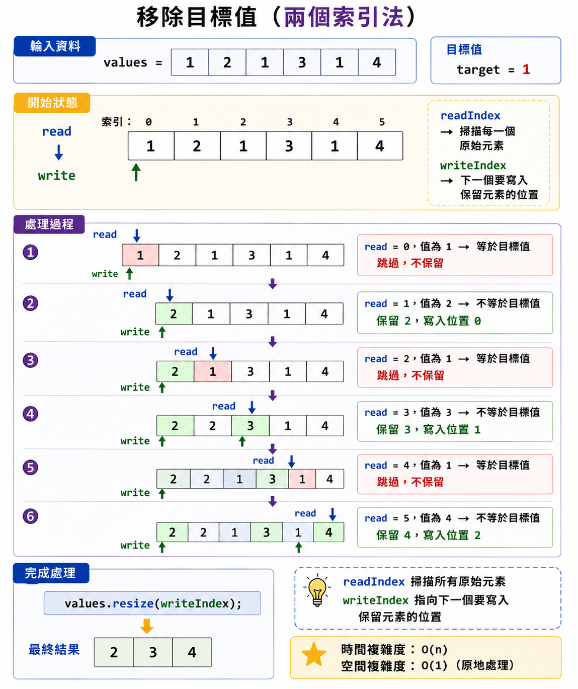


## Section XCIII. Erase-Remove Idiom 預告

標準 C++ 常使用：

```cpp
values.erase(
    remove(
        values.begin(),
        values.end(),
        target
    ),
    values.end()
);
```

需要 `<algorithm>`。

完整演算法與迭代器關係會在標準演算法章節介紹。

---

# Part X：反轉 vector

## Section XCIV. 雙索引交換

空 vector 要先處理，避免：

```cpp
size() - 1
```

無號下溢。

---

## Section XCV. 完整反轉函式

```cpp
// VALIDATE
#include <iostream>
#include <vector>
using namespace std;

void reverseValues(
    vector<int>& values
) {
    if (values.empty()) {
        return;
    }

    vector<int>::size_type left = 0;
    vector<int>::size_type right =
        values.size() - 1;

    while (left < right) {
        int temporary =
            values[left];

        values[left] =
            values[right];

        values[right] =
            temporary;

        ++left;
        --right;
    }
}

int main() {
    vector<int> values{
        1,
        2,
        3,
        4
    };

    reverseValues(values);

    for (int value : values) {
        cout << value
             << " ";
    }

    cout << '\n';

    return 0;
}
```

---

# Part Y：判斷遞增

## Section XCVI. 嚴格遞增

每一項必須：

```text
values[index] >
values[index - 1]
```

---

## Section XCVII. 完整遞增判斷

```cpp
// VALIDATE
#include <iostream>
#include <vector>
using namespace std;

bool isStrictlyIncreasing(
    const vector<int>& values
) {
    for (
        vector<int>::size_type index = 1;
        index < values.size();
        ++index
    ) {
        if (
            values[index] <=
            values[index - 1]
        ) {
            return false;
        }
    }

    return true;
}

int main() {
    vector<int> values{
        1,
        3,
        5,
        8
    };

    cout << boolalpha
         << isStrictlyIncreasing(
                values
            )
         << '\n';

    return 0;
}
```

空 vector 與單一元素 vector 通常視為符合此條件。

---

# Part Z：合併兩個 vector

## Section XCVIII. 逐一附加

```cpp
for (int value : second) {
    first.push_back(value);
}
```

---

## Section XCIX. 使用 `.insert()`

```cpp
first.insert(
    first.end(),
    second.begin(),
    second.end()
);
```

將 `[second.begin(), second.end())` 插入到 `first` 尾端。

---

## Section C. 完整合併函式

```cpp
// VALIDATE
#include <iostream>
#include <vector>
using namespace std;

vector<int> concatenate(
    const vector<int>& first,
    const vector<int>& second
) {
    vector<int> result;

    result.reserve(
        first.size() +
        second.size()
    );

    result.insert(
        result.end(),
        first.begin(),
        first.end()
    );

    result.insert(
        result.end(),
        second.begin(),
        second.end()
    );

    return result;
}

int main() {
    vector<int> first{
        1,
        2
    };

    vector<int> second{
        3,
        4
    };

    vector<int> result =
        concatenate(
            first,
            second
        );

    for (int value : result) {
        cout << value
             << " ";
    }

    cout << '\n';

    return 0;
}
```

---

# Part AA：函式參數

## Section CI. 唯讀參數

```cpp
void show(
    const vector<int>& values
)
```

不複製，且不能修改原內容。

---

## Section CII. 可修改參數

```cpp
void doubleValues(
    vector<int>& values
)
```

直接修改呼叫者容器。

---

## Section CIII. 傳值參數

```cpp
void process(
    vector<int> values
)
```

建立整個 vector 的副本。

只在確實需要獨立副本時使用。

---

## Section CIV. 完整參數比較

```cpp
// VALIDATE
#include <iostream>
#include <vector>
using namespace std;

void addOne(
    vector<int>& values
) {
    for (int& value : values) {
        ++value;
    }
}

void show(
    const vector<int>& values
) {
    for (int value : values) {
        cout << value
             << " ";
    }

    cout << '\n';
}

int main() {
    vector<int> values{
        1,
        2,
        3
    };

    addOne(values);
    show(values);

    return 0;
}
```

---

# Part AB：回傳 vector

## Section CV. 安全回傳值

```cpp
vector<int> makeSequence(
    int start,
    int end
)
```

函式內建立區域 vector，再以值回傳是安全的。

---

## Section CVI. 完整數列產生函式

```cpp
// VALIDATE
#include <iostream>
#include <vector>
using namespace std;

vector<int> makeSequence(
    int start,
    int end
) {
    vector<int> result;

    if (start > end) {
        return result;
    }

    result.reserve(
        static_cast<vector<int>::size_type>(
            end - start + 1
        )
    );

    for (
        int value = start;
        value <= end;
        ++value
    ) {
        result.push_back(value);
    }

    return result;
}

int main() {
    vector<int> values =
        makeSequence(
            3,
            7
        );

    for (int value : values) {
        cout << value
             << " ";
    }

    cout << '\n';

    return 0;
}
```

---

## Section CVII. 避免回傳區域參考

危險：

```cpp
/* 不要使用：

const vector<int>& makeValues() {
    vector<int> values{1, 2, 3};
    return values;
}

*/
```

函式結束後區域 vector 被銷毀，參考懸空。

---

# Part AC：過濾元素

## Section CVIII. 建立新 vector

例如保留偶數：

```cpp
if (value % 2 == 0) {
    result.push_back(value);
}
```

---

## Section CIX. 完整過濾函式

```cpp
// VALIDATE
#include <iostream>
#include <vector>
using namespace std;

vector<int> keepEven(
    const vector<int>& values
) {
    vector<int> result;

    result.reserve(
        values.size()
    );

    for (int value : values) {
        if (value % 2 == 0) {
            result.push_back(value);
        }
    }

    return result;
}

int main() {
    vector<int> values{
        1,
        2,
        3,
        4,
        5,
        6
    };

    vector<int> evenValues =
        keepEven(values);

    for (int value : evenValues) {
        cout << value
             << " ";
    }

    cout << '\n';

    return 0;
}
```

---

# Part AD：轉換元素

## Section CX. 修改原 vector

```cpp
for (int& value : values) {
    value *= 2;
}
```

---

## Section CXI. 建立新 vector

若要保留原資料：

```cpp
vector<int> result =
    values;
```

再修改 `result`。

---

## Section CXII. 完整平方轉換

```cpp
// VALIDATE
#include <iostream>
#include <vector>
using namespace std;

vector<int> squared(
    const vector<int>& values
) {
    vector<int> result;

    result.reserve(
        values.size()
    );

    for (int value : values) {
        result.push_back(
            value * value
        );
    }

    return result;
}

int main() {
    vector<int> values{
        2,
        3,
        4
    };

    vector<int> result =
        squared(values);

    for (int value : result) {
        cout << value
             << " ";
    }

    cout << '\n';

    return 0;
}
```

---

# Part AE：比較 `std::array` 與 `std::vector`

## Section CXIII. 比較表

| 功能 | `std::array` | `std::vector` |
| --- | --- | --- |
| 大小 | 編譯時固定 | 執行期間可變 |
| 儲存 | 連續 | 連續 |
| `.size()` | 支援 | 支援 |
| `.at()` | 支援 | 支援 |
| `.push_back()` | 不支援 | 支援 |
| `.pop_back()` | 不支援 | 支援 |
| `.resize()` | 不支援 | 支援 |
| `.reserve()` | 不支援 | 支援 |
| 直接複製 | 支援 | 支援 |
| 直接比較 | 支援 | 支援 |
| 大小是否為型別一部分 | 是 | 否 |
| 可能重新配置 | 否 | 是 |
| 參考／迭代器失效風險 | 較少 | 修改大小時需注意 |

---

## Section CXIV. 何時使用 `std::array`？

- 大小固定且編譯時已知。
- 不需要加入或刪除元素。
- 希望資料直接包含在物件中。
- 小型固定表格。

---

## Section CXV. 何時使用 `std::vector`？

- 數量由使用者輸入決定。
- 元素會增加或減少。
- 需要動態收集資料。
- 無法在編譯時確定大小。

---

# Part AF：連續儲存與 `.data()`

## Section CXVI. 連續儲存

vector 元素依序存放於連續記憶體。

因此可與要求連續資料的介面互動。

---

## Section CXVII. `.data()`

```cpp
values.data()
```

回傳指向第一個元素儲存位置的指標。

空 vector 時，不應解參考結果。

---

## Section CXVIII. 修改後可能失效

若 vector 重新配置：

```text
先前的 data() 指標失效
```

指標完整使用方式會在指標章節介紹。

---

# Part AG：`vector<bool>` 特殊性

## Section CXIX. 壓縮表示

標準函式庫可能將：

```cpp
vector<bool>
```

以位元壓縮方式實作。

因此元素存取結果可能不是普通：

```cpp
bool&
```

---

## Section CXX. 初學注意

以下模式可能和其他 vector 不完全相同：

```cpp
for (bool& value : flags)
```

初學時可：

- 使用索引讀寫。
- 使用 `auto` 或 `auto&&` 的進階寫法。
- 視需求使用 `vector<char>`。

本章不深入其代理參考 proxy reference。

---

# Part AH：巢狀 vector 預告

## Section CXXI. Vector 中的 vector

```cpp
vector<vector<int>> grid;
```

每個元素本身是一個 `vector<int>`。

---

## Section CXXII. 每列可不同長度

```cpp
vector<vector<int>> rows{
    {1, 2},
    {3, 4, 5},
    {6}
};
```

這是不規則資料。

---

## Section CXXIII. 矩形資料

```cpp
vector<vector<int>> grid(
    rowCount,
    vector<int>(
        columnCount,
        0
    )
);
```

建立每列相同長度的矩形結構。

完整二維 vector 會在後續章節介紹。

---

# Part AI：快速概念檢查

## Section CXXIV. 選擇題與簡答

### Q1. `std::vector` 需要哪個標頭？

<details><summary>查看答案</summary>

```cpp
#include <vector>
```

</details>

### Q2. 空 vector 的 `.size()` 是多少？

<details><summary>查看答案</summary>

```text
0
```

</details>

### Q3. `vector<int> values(5);` 有幾個元素？

<details><summary>查看答案</summary>

5 個，值初始化為 0。

</details>

### Q4. `vector<int> values{5};` 有幾個元素？

<details><summary>查看答案</summary>

1 個，內容為 5。

</details>

### Q5. `.push_back()` 做什麼？

<details><summary>查看答案</summary>

在尾端加入一個元素，大小增加 1。

</details>

### Q6. `.pop_back()` 會回傳被移除元素嗎？

<details><summary>查看答案</summary>

不會。

</details>

### Q7. 對空 vector 可使用 `.back()` 嗎？

<details><summary>查看答案</summary>

不可以。

</details>

### Q8. `.reserve(100)` 會建立 100 個元素嗎？

<details><summary>查看答案</summary>

不會，只預留容量。

</details>

### Q9. `.resize(100)` 會改變元素數量嗎？

<details><summary>查看答案</summary>

會，大小會變成 100。

</details>

### Q10. `capacity()` 一定等於 `size()` 嗎？

<details><summary>查看答案</summary>

不一定，但容量至少不小於大小。

</details>

### Q11. 什麼情況可能發生重新配置？

<details><summary>查看答案</summary>

需要增加元素但現有容量不足時。

</details>

### Q12. 重新配置可能使什麼失效？

<details><summary>查看答案</summary>

指向元素的參考、指標與迭代器。

</details>

### Q13. `.end()` 指向最後元素嗎？

<details><summary>查看答案</summary>

不是，它指向最後元素之後。

</details>

### Q14. `.insert()` 的位置索引可以等於 `.size()` 嗎？

<details><summary>查看答案</summary>

可以，表示在尾端插入。

</details>

### Q15. `.erase(first, last)` 是否刪除 `last`？

<details><summary>查看答案</summary>

不刪除，範圍是 `[first, last)`。

</details>

### Q16. 唯讀 vector 函式參數通常如何宣告？

<details><summary>查看答案</summary>

```cpp
const vector<T>&
```

</details>

### Q17. 回傳區域 vector 的值安全嗎？

<details><summary>查看答案</summary>

安全。

</details>

### Q18. 回傳區域 vector 的參考安全嗎？

<details><summary>查看答案</summary>

不安全，會形成懸空參考。

</details>

### Q19. 固定大小資料通常使用什麼？

<details><summary>查看答案</summary>

```cpp
std::array
```

</details>

### Q20. 大小會在執行期間改變時通常使用什麼？

<details><summary>查看答案</summary>

```cpp
std::vector
```

</details>

---

# Part AJ：程式閱讀練習

## Section CXXV. 預測結果與錯誤

### 題目 1

```cpp
vector<int> values;

cout << values.size();
```

<details><summary>查看答案</summary>

```text
0
```

</details>

### 題目 2

```cpp
vector<int> values(3);

cout << values[0]
     << values[2];
```

<details><summary>查看答案</summary>

```text
00
```

</details>

### 題目 3

```cpp
vector<int> values{
    3,
    7
};

cout << values.size();
```

<details><summary>查看答案</summary>

```text
2
```

</details>

### 題目 4

```cpp
vector<int> values;

values.reserve(10);

cout << values.size();
```

<details><summary>查看答案</summary>

```text
0
```

</details>

### 題目 5

```cpp
vector<int> values{
    1,
    2
};

values.push_back(3);
values.pop_back();

cout << values.size();
```

<details><summary>查看答案</summary>

```text
2
```

</details>

### 題目 6

```cpp
vector<int> values{
    1,
    2,
    3
};

for (int value : values) {
    value *= 10;
}

cout << values[0];
```

<details><summary>查看答案</summary>

```text
1
```

</details>

### 題目 7

```cpp
vector<int> values{
    1,
    2,
    3
};

for (int& value : values) {
    value *= 10;
}

cout << values[0];
```

<details><summary>查看答案</summary>

```text
10
```

</details>

### 題目 8

```cpp
vector<int> values{
    1,
    2,
    3
};

values.resize(
    5,
    9
);

cout << values[3]
     << values[4];
```

<details><summary>查看答案</summary>

```text
99
```

</details>

### 題目 9

```cpp
vector<int> values{
    10,
    20,
    30
};

values.insert(
    values.begin() + 1,
    15
);

cout << values[1];
```

<details><summary>查看答案</summary>

```text
15
```

</details>

### 題目 10

```cpp
vector<int> values{
    10,
    20,
    30
};

values.erase(
    values.begin() + 1
);

cout << values[1];
```

<details><summary>查看答案</summary>

```text
30
```

</details>

### 題目 11

```cpp
vector<int> first{
    1,
    2
};

vector<int> second =
    first;

second[0] = 9;

cout << first[0]
     << second[0];
```

<details><summary>查看答案</summary>

```text
19
```

</details>

### 題目 12

```cpp
vector<int> values{
    1,
    2,
    3
};

auto iterator =
    values.end();

/* cout << *iterator; */
```

<details><summary>查看答案</summary>

`.end()` 指向最後元素之後，不可解參考。

</details>

---

# Part AK：實作練習

## Section CXXVI. 實作檢測題

### TODO 1：建立與輸出

建立包含五個整數的 vector，使用 range-based `for` 輸出。

### TODO 2：固定筆數輸入

先輸入元素數量，再建立相同大小的 vector 並讀入資料。

### TODO 3：不定筆數輸入

持續輸入整數，輸入 `-1` 結束，不將 `-1` 存入。

### TODO 4：總和與平均

計算總和；空 vector 時不計算平均值。

### TODO 5：最大最小值

建立回傳 `bool` 的函式，使用參考輸出最大值與最小值。

### TODO 6：搜尋索引

建立：

```cpp
bool findIndex(
    const vector<int>& values,
    int target,
    vector<int>::size_type& index
)
```

### TODO 7：加入與移除尾端

依序加入三個元素，保存最後元素後使用 `.pop_back()`。

### TODO 8：`.reserve()` 與 `.resize()`

分別操作兩個 vector，輸出它們的 size 與 capacity 關係。

### TODO 9：指定位置插入

輸入索引與數值，檢查 `index <= size()` 後插入。

### TODO 10：指定位置刪除

輸入索引，檢查 `index < size()` 後刪除。

### TODO 11：移除指定值

使用讀寫索引法移除所有等於目標值的元素。

### TODO 12：反轉 vector

不使用 `<algorithm>`，以雙索引交換。

### TODO 13：判斷嚴格遞增

建立：

```cpp
bool isStrictlyIncreasing(
    const vector<int>& values
)
```

### TODO 14：合併 vector

建立新 vector，依序包含兩個來源 vector 的全部元素。

### TODO 15：過濾偶數

建立：

```cpp
vector<int> keepEven(
    const vector<int>& values
)
```

---

# Part AL：課後小練習

## Section CXXVII. 延伸練習

### 練習 1：移除重複相鄰元素

將：

```text
1 1 2 2 2 3 1 1
```

變成：

```text
1 2 3 1
```

### 練習 2：循環右移

將 vector 所有元素向右移一格，最後元素移到第一個位置。

### 練習 3：交集

輸入兩個 vector，輸出同時存在於兩者的值；先假設每個 vector 內沒有重複值。

### 練習 4：第二大不同值

找出第二大的不同數值；資料不足時輸出錯誤訊息。

### 練習 5：學生分數管理

支援加入分數、刪除指定索引、修改分數、輸出平均與最高分的簡易選單。

---

# Part AM：常見錯誤提醒

## Section CXXVIII. 常見錯誤

1. 忘記包含 `<vector>`。
2. 將 `vector<int> values(5)` 誤認為內容只有一個 5。
3. 將 `vector<int> values{5}` 誤認為有五個元素。
4. 使用 `size()` 作為最後合法索引。
5. 對空 vector 使用 `.front()`。
6. 對空 vector 使用 `.back()`。
7. 對空 vector 使用 `.pop_back()`。
8. 使用 `[]` 越界。
9. 以為 `[]` 會自動檢查範圍。
10. 沒有處理 `.at()` 的例外。
11. 使用值型 range-based `for` 卻期待修改原元素。
12. 將 `.reserve()` 誤認為建立元素。
13. `reserve()` 後直接寫入 `values[0]`。
14. 將 `.resize()` 誤認為只改容量。
15. 依賴 capacity 的特定成長倍率。
16. 保存元素參考後再 `push_back()`。
17. 保存 `.data()` 指標後修改 vector 大小。
18. 在插入或刪除後繼續使用舊迭代器。
19. 解參考 `.end()`。
20. 插入索引條件錯寫成 `index < size()`，因而不能在尾端插入。
21. 刪除索引條件錯寫成 `index <= size()`。
22. 混淆 `.erase(first, last)` 的半開區間。
23. 刪除元素後忘記後方索引已改變。
24. 只讀大型 vector 以值傳入函式。
25. 需要修改原 vector 卻忘記 `&`。
26. 回傳區域 vector 參考。
27. 空 vector 時直接計算平均或最大值。
28. 不定筆數輸入時把哨兵值加入 vector。
29. 將 `vector<bool>` 元素當成普通 `bool&`。
30. 固定大小資料仍不加判斷地使用 vector。

---

# Part AN：Mermaid 流程圖

## Section CXXIX. `std::vector` 流程圖

### 1. 加入元素

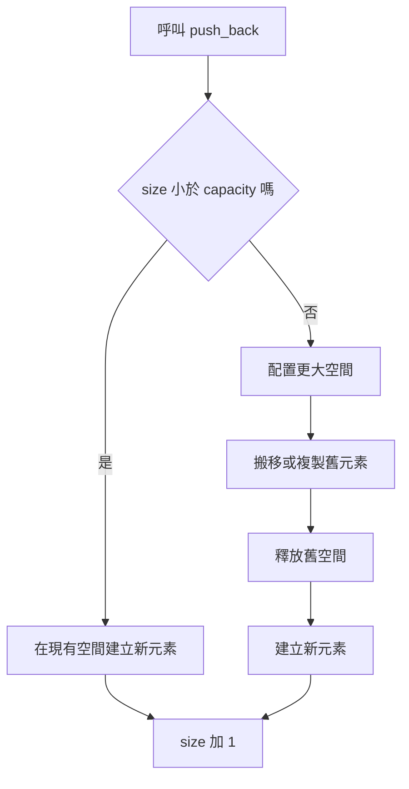
```mermaid
flowchart TD
    A[呼叫 push_back] --> B{size 小於 capacity 嗎}
    B -- 是 --> C[在現有空間建立新元素]
    B -- 否 --> D[配置更大空間]
    D --> E[搬移或複製舊元素]
    E --> F[釋放舊空間]
    F --> G[建立新元素]
    C --> H[size 加 1]
    G --> H
```

### 2. `reserve` 與 `resize`

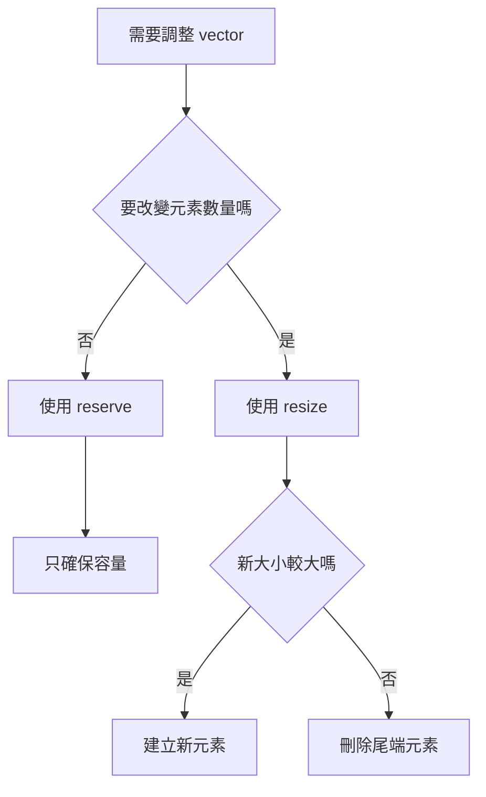
```mermaid
flowchart TD
    A[需要調整 vector] --> B{要改變元素數量嗎}
    B -- 否 --> C[使用 reserve]
    C --> D[只確保容量]
    B -- 是 --> E[使用 resize]
    E --> F{新大小較大嗎}
    F -- 是 --> G[建立新元素]
    F -- 否 --> H[刪除尾端元素]
```

### 3. 安全索引

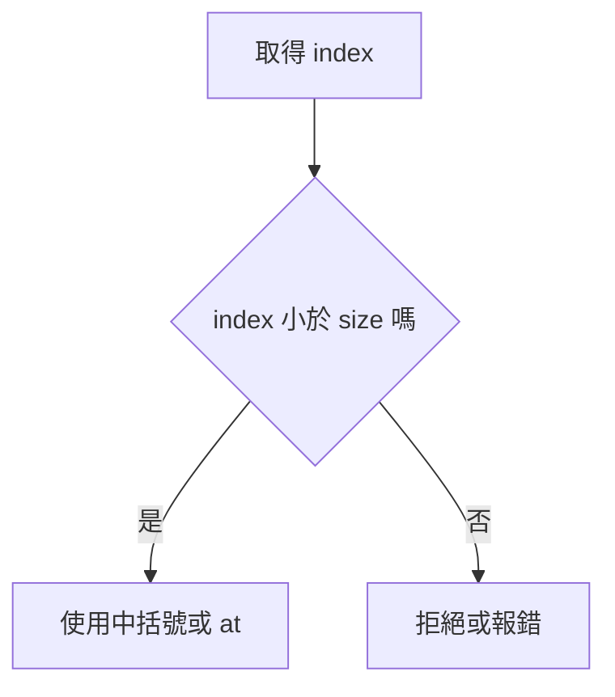
```mermaid
flowchart TD
    A[取得 index] --> B{index 小於 size 嗎}
    B -- 是 --> C[使用中括號或 at]
    B -- 否 --> D[拒絕或報錯]
```

### 4. 插入元素

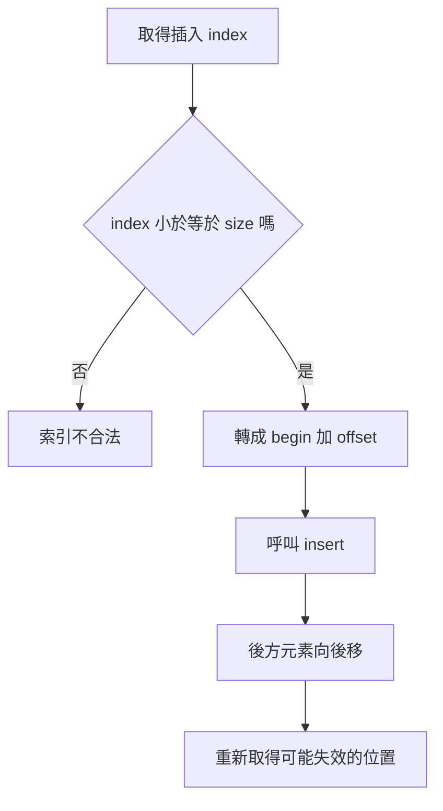
```mermaid
flowchart TD
    A[取得插入 index] --> B{index 小於等於 size 嗎}
    B -- 否 --> C[索引不合法]
    B -- 是 --> D[轉成 begin 加 offset]
    D --> E[呼叫 insert]
    E --> F[後方元素向後移]
    F --> G[重新取得可能失效的位置]
```

### 5. 刪除元素

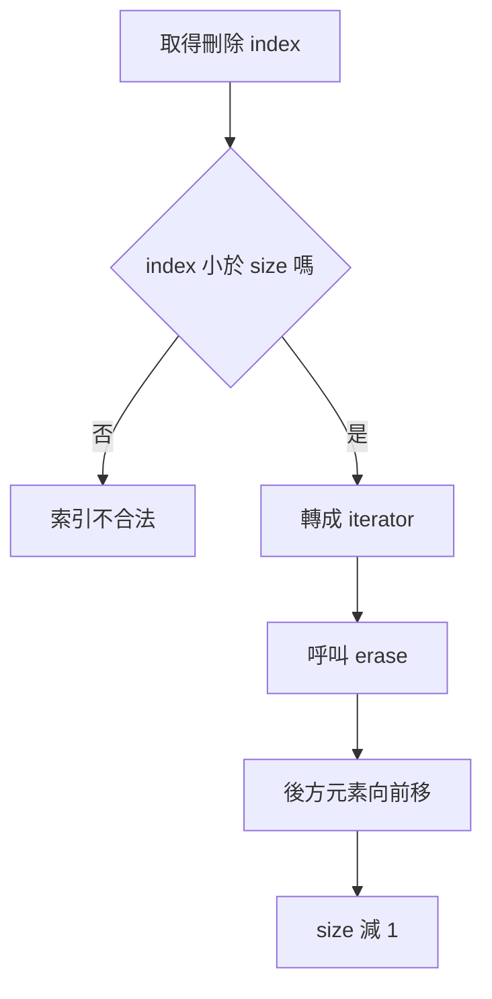
```mermaid
flowchart TD
    A[取得刪除 index] --> B{index 小於 size 嗎}
    B -- 否 --> C[索引不合法]
    B -- 是 --> D[轉成 iterator]
    D --> E[呼叫 erase]
    E --> F[後方元素向前移]
    F --> G[size 減 1]
```

### 6. 參數方式

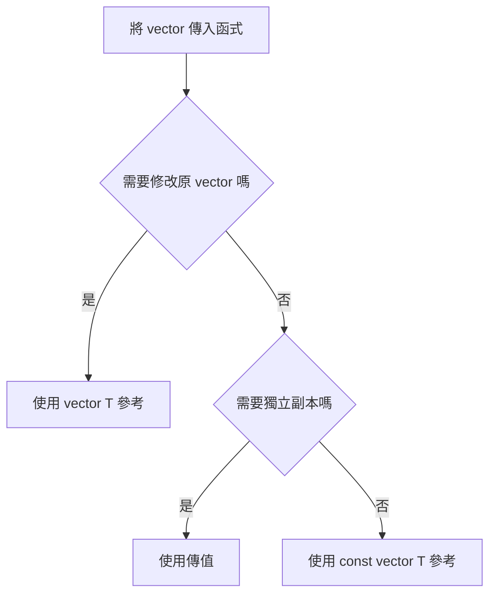
```mermaid
flowchart TD
    A[將 vector 傳入函式] --> B{需要修改原 vector 嗎}
    B -- 是 --> C[使用 vector T 參考]
    B -- 否 --> D{需要獨立副本嗎}
    D -- 是 --> E[使用傳值]
    D -- 否 --> F[使用 const vector T 參考]
```

### 7. 失效檢查

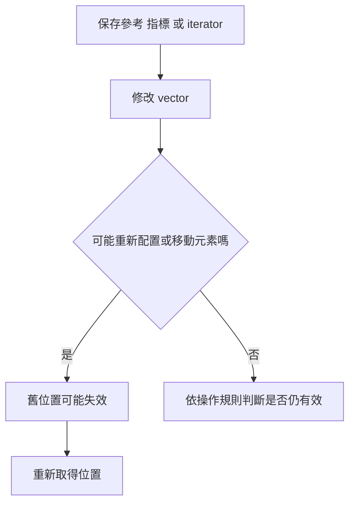
```mermaid
flowchart TD
    A[保存參考 指標 或 iterator] --> B[修改 vector]
    B --> C{可能重新配置或移動元素嗎}
    C -- 是 --> D[舊位置可能失效]
    D --> E[重新取得位置]
    C -- 否 --> F[依操作規則判斷是否仍有效]
```

### 8. 容器選擇

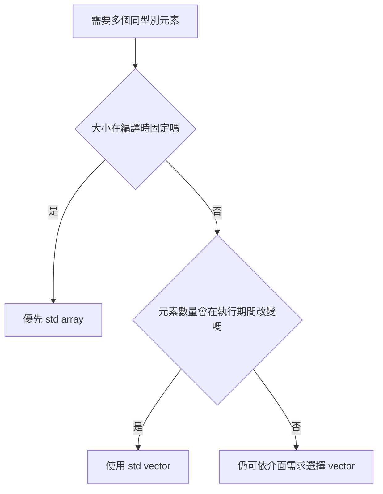
```mermaid
flowchart TD
    A[需要多個同型別元素] --> B{大小在編譯時固定嗎}
    B -- 是 --> C[優先 std array]
    B -- 否 --> D{元素數量會在執行期間改變嗎}
    D -- 是 --> E[使用 std vector]
    D -- 否 --> F[仍可依介面需求選擇 vector]
```

---

# 本章完成標準

完成本章後，你應該能做到：

1. 宣告空 `std::vector`。
2. 使用初始化列表。
3. 指定初始大小。
4. 指定初始大小與值。
5. 分辨圓括號與大括號初始化。
6. 使用 `.size()` 與 `.empty()`。
7. 使用 `.clear()`。
8. 使用 `[]` 與 `.at()`。
9. 安全使用 `.front()` 與 `.back()`。
10. 使用索引迴圈。
11. 使用 range-based `for`。
12. 分辨值、參考與 `const` 參考走訪。
13. 使用 `.push_back()`。
14. 使用 `.emplace_back()` 的基本語法。
15. 安全使用 `.pop_back()`。
16. 輸入固定筆數資料。
17. 輸入不定筆數資料。
18. 使用 `.resize()`。
19. 使用 `.assign()`。
20. 複製、賦值與交換 vector。
21. 分辨 `.size()` 與 `.capacity()`。
22. 使用 `.reserve()`。
23. 說明重新配置。
24. 說明參考、指標與迭代器失效。
25. 使用 `.begin()` 與 `.end()`。
26. 使用 `.cbegin()` 與 `.cend()`。
27. 使用 `.insert()`。
28. 使用 `.erase()`。
29. 正確處理插入與刪除索引。
30. 計算總和與平均值。
31. 處理空 vector 的統計。
32. 找出最大值與最小值。
33. 搜尋元素索引。
34. 移除指定值。
35. 反轉 vector。
36. 判斷嚴格遞增。
37. 合併兩個 vector。
38. 將 vector 以正確參數方式傳入函式。
39. 安全回傳 vector 值。
40. 比較 `std::array` 與 `std::vector`。

---

# 隱藏答案區

> Answer hidden — try it first.

<details><summary>TODO 1 答案</summary>

```cpp
vector<int> values{
    1,
    2,
    3,
    4,
    5
};

for (int value : values) {
    cout << value
         << '\n';
}
```

</details>

<details><summary>TODO 2 答案</summary>

```cpp
vector<int>::size_type count;
cin >> count;

vector<int> values(count);

for (
    vector<int>::size_type index = 0;
    index < values.size();
    ++index
) {
    cin >> values[index];
}
```

</details>

<details><summary>TODO 3 答案</summary>

```cpp
vector<int> values;
int value;

while (
    cin >> value &&
    value != -1
) {
    values.push_back(value);
}
```

</details>

<details><summary>TODO 4 答案</summary>

```cpp
long long total = 0;

for (int value : values) {
    total += value;
}

if (!values.empty()) {
    double average =
        static_cast<double>(
            total
        ) /
        static_cast<double>(
            values.size()
        );
}
```

</details>

<details><summary>TODO 5 答案</summary>

```cpp
bool findMinimumMaximum(
    const vector<int>& values,
    int& minimum,
    int& maximum
) {
    if (values.empty()) {
        return false;
    }

    minimum = values.front();
    maximum = values.front();

    for (int value : values) {
        if (value < minimum) {
            minimum = value;
        }

        if (value > maximum) {
            maximum = value;
        }
    }

    return true;
}
```

</details>

<details><summary>TODO 6 答案</summary>

```cpp
bool findIndex(
    const vector<int>& values,
    int target,
    vector<int>::size_type& index
) {
    for (
        vector<int>::size_type current = 0;
        current < values.size();
        ++current
    ) {
        if (
            values[current] ==
            target
        ) {
            index = current;
            return true;
        }
    }

    return false;
}
```

</details>

<details><summary>TODO 7 答案</summary>

```cpp
values.push_back(10);
values.push_back(20);
values.push_back(30);

if (!values.empty()) {
    int removed =
        values.back();

    values.pop_back();

    cout << removed
         << '\n';
}
```

</details>

<details><summary>TODO 8 答案</summary>

```cpp
vector<int> reserved;
reserved.reserve(10);

vector<int> resized;
resized.resize(10);

cout << reserved.size()
     << '\n';

cout << resized.size()
     << '\n';
```

</details>

<details><summary>TODO 9 答案</summary>

```cpp
if (index <= values.size()) {
    auto position =
        values.begin() +
        static_cast<
            vector<int>::difference_type
        >(index);

    values.insert(
        position,
        value
    );
}
```

</details>

<details><summary>TODO 10 答案</summary>

```cpp
if (index < values.size()) {
    auto position =
        values.begin() +
        static_cast<
            vector<int>::difference_type
        >(index);

    values.erase(position);
}
```

</details>

<details><summary>TODO 11 答案</summary>

```cpp
vector<int>::size_type writeIndex = 0;

for (
    vector<int>::size_type readIndex = 0;
    readIndex < values.size();
    ++readIndex
) {
    if (
        values[readIndex] !=
        target
    ) {
        values[writeIndex] =
            values[readIndex];

        ++writeIndex;
    }
}

values.resize(writeIndex);
```

</details>

<details><summary>TODO 12 答案</summary>

```cpp
if (!values.empty()) {
    vector<int>::size_type left = 0;
    vector<int>::size_type right =
        values.size() - 1;

    while (left < right) {
        int temporary =
            values[left];

        values[left] =
            values[right];

        values[right] =
            temporary;

        ++left;
        --right;
    }
}
```

</details>

<details><summary>TODO 13 答案</summary>

```cpp
bool isStrictlyIncreasing(
    const vector<int>& values
) {
    for (
        vector<int>::size_type index = 1;
        index < values.size();
        ++index
    ) {
        if (
            values[index] <=
            values[index - 1]
        ) {
            return false;
        }
    }

    return true;
}
```

</details>

<details><summary>TODO 14 答案</summary>

```cpp
vector<int> result;

result.reserve(
    first.size() +
    second.size()
);

result.insert(
    result.end(),
    first.begin(),
    first.end()
);

result.insert(
    result.end(),
    second.begin(),
    second.end()
);
```

</details>

<details><summary>TODO 15 答案</summary>

```cpp
vector<int> keepEven(
    const vector<int>& values
) {
    vector<int> result;

    result.reserve(
        values.size()
    );

    for (int value : values) {
        if (value % 2 == 0) {
            result.push_back(value);
        }
    }

    return result;
}
```

</details>
