# Lesson 19：Searching, Sorting, and `<algorithm>` 搜尋、排序與 `<algorithm>`

> 這堂課的重點：使用 C++ 標準函式庫 `<algorithm>` 處理容器中的資料。你會學習搜尋、計數、條件判斷、最小最大值、排序、二分搜尋、移除、去重、反轉、旋轉、複製與轉換，並理解演算法通常透過「迭代器範圍」工作。

> 第 18 章已介紹 `std::vector`、迭代器、插入與刪除。本章會把這些概念和標準演算法連結起來。所有主要範例保持 C++17 相容；ranges 演算法與 C++20 projections 不在本章範圍內。

---

## Section I. 今天要做什麼？

1. 認識標準演算法函式庫。
2. 加入 `<algorithm>`。
3. 理解演算法與容器分離。
4. 理解演算法通常接收迭代器範圍。
5. 認識半開區間 `[first, last)`。
6. 理解包含 `first`、不包含 `last`。
7. 理解 `.begin()` 與 `.end()`。
8. 理解 `.end()` 不能解參考。
9. 使用傳統陣列搭配標準演算法。
10. 使用 `std::array` 搭配標準演算法。
11. 使用 `std::vector` 搭配標準演算法。
12. 使用 `std::string` 搭配標準演算法。
13. 複習手動線性搜尋。
14. 使用 `std::find()`。
15. 判斷是否找到元素。
16. 使用 `std::distance()` 計算索引。
17. 避免在找不到時解參考 `.end()`。
18. 使用 `std::find_if()`。
19. 使用具名判斷函式 predicate。
20. 使用 lambda expression。
21. 認識 lambda 的基本語法。
22. 使用空 capture `[]`。
23. 使用值 capture `[value]`。
24. 使用參考 capture `[&value]`。
25. 避免不必要的參考 capture。
26. 使用 `std::count()`。
27. 使用 `std::count_if()`。
28. 統計偶數。
29. 統計範圍內元素。
30. 使用 `std::any_of()`。
31. 使用 `std::all_of()`。
32. 使用 `std::none_of()`。
33. 判斷是否存在負數。
34. 判斷是否全部及格。
35. 判斷是否沒有零。
36. 使用 `std::min_element()`。
37. 使用 `std::max_element()`。
38. 使用 `std::minmax_element()`。
39. 處理空範圍。
40. 取得最小值索引。
41. 取得最大值索引。
42. 理解回傳的是迭代器。
43. 使用 `std::sort()`。
44. 進行遞增排序。
45. 使用 `std::greater<>` 遞減排序。
46. 加入 `<functional>`。
47. 使用自訂比較函式。
48. 使用 lambda 比較器。
49. 理解比較器回傳「第一個是否應排在第二個前面」。
50. 理解 strict weak ordering。
51. 避免使用 `<=` 作為排序比較器。
52. 依絕對值排序。
53. 依字串長度排序。
54. 使用第二條件處理同長度字串。
55. 認識 `std::stable_sort()`。
56. 理解穩定排序保留相等元素原順序。
57. 比較 `sort()` 與 `stable_sort()`。
58. 認識排序前後迭代器與參考語意。
59. 理解排序會重新排列元素。
60. 使用 `std::is_sorted()`。
61. 使用 `std::is_sorted_until()`。
62. 找出第一個破壞排序的位置。
63. 認識二分搜尋。
64. 理解二分搜尋需要已排序範圍。
65. 使用 `std::binary_search()`。
66. 使用 `std::lower_bound()`。
67. 使用 `std::upper_bound()`。
68. 使用 `std::equal_range()`。
69. 理解 lower bound 是第一個不小於目標的位置。
70. 理解 upper bound 是第一個大於目標的位置。
71. 計算已排序資料中的出現次數。
72. 找出插入位置。
73. 在保持排序的 vector 中插入元素。
74. 比較線性搜尋與二分搜尋。
75. 理解線性搜尋時間複雜度 `O(n)`。
76. 理解二分搜尋時間複雜度 `O(log n)`。
77. 理解排序通常約為 `O(n log n)`。
78. 不要求手算嚴格複雜度證明。
79. 使用 `std::reverse()`。
80. 使用 `std::rotate()`。
81. 將前方元素移到尾端。
82. 將指定位置旋轉到開頭。
83. 使用 `std::swap_ranges()`。
84. 使用 `std::copy()`。
85. 使用 `std::copy_if()`。
86. 使用 `std::back_inserter()`。
87. 加入 `<iterator>`。
88. 避免將資料複製到容量不足的目的位置。
89. 使用 `std::transform()`。
90. 將所有元素平方。
91. 將字串轉換成大寫。
92. 使用 unary transform。
93. 使用 binary transform。
94. 將兩個 vector 對應元素相加。
95. 使用 `std::for_each()`。
96. 理解 range-based `for` 常常更直接。
97. 使用 `std::fill()`。
98. 使用 `std::fill_n()`。
99. 比較容器 `.fill()` 與 `std::fill()`。
100. 使用 `std::replace()`。
101. 使用 `std::replace_if()`。
102. 認識 `std::remove()`。
103. 理解 `remove()` 不會縮小 vector。
104. 理解移除演算法會把保留元素搬到前方。
105. 理解回傳的新 logical end。
106. 使用 erase-remove idiom。
107. 使用 `std::remove_if()`。
108. 移除所有負數。
109. 使用 `std::unique()`。
110. 理解 `unique()` 只移除相鄰重複。
111. 排序後再去除所有重複值。
112. 使用 erase-unique idiom。
113. 保留原順序去除相鄰重複。
114. 使用 `std::adjacent_find()`。
115. 尋找第一組相鄰相等元素。
116. 使用 `std::mismatch()`。
117. 找出兩個範圍第一個不同位置。
118. 使用 `std::equal()`。
119. 比較兩段範圍是否相等。
120. 使用 `std::lexicographical_compare()`。
121. 理解字典順序比較。
122. 使用 `std::partition()`。
123. 將符合條件元素放在前方。
124. 理解 partition 不保證各組內原順序。
125. 使用 `std::stable_partition()`。
126. 使用 `std::partition_point()`。
127. 認識 `std::nth_element()`。
128. 找出中位位置元素。
129. 理解 `nth_element()` 不會完全排序。
130. 使用 `std::partial_sort()`。
131. 找出最小的前 k 個元素。
132. 理解 partial sort 只保證前段排序。
133. 比較完整排序與部分排序。
134. 使用 named comparator 改善可讀性。
135. 使用 lambda 處理簡短局部規則。
136. 避免 comparator 修改元素。
137. 避免 comparator 依賴會改變的外部狀態。
138. 避免在演算法執行中修改容器大小。
139. 理解修改容器大小可能讓迭代器失效。
140. 避免在 `for_each()` 中 `push_back()` 到同一 vector。
141. 使用 `const` 迭代器範圍進行唯讀演算法。
142. 理解演算法是否修改元素。
143. 分辨查詢型演算法與修改型演算法。
144. 使用概念檢查、程式閱讀與實作題整合本章。

---

## Section II. 今天的學習方式

1. 每個演算法先標出：
   ```text
   輸入範圍
   是否修改元素
   回傳值型別
   找不到時的結果
   ```
2. 看到：
   ```cpp
   algorithm(first, last, ...)
   ```
   先讀成：
   ```text
   處理 [first, last)
   ```
3. 搜尋演算法回傳迭代器時，先比較：
   ```cpp
   iterator != container.end()
   ```
4. 排序與二分搜尋題先確認：
   ```text
   範圍目前是否已依同一比較規則排序？
   ```
5. 比較器要讀成：
   ```text
   first 是否應排在 second 前面？
   ```
6. 使用 `remove()` 或 `unique()` 後，不要誤以為容器已縮小。
7. Vector 真正縮小需要：
   ```cpp
   values.erase(newEnd, values.end());
   ```
8. 使用 `copy()` 時先確保目的範圍有足夠元素，或使用：
   ```cpp
   back_inserter(destination)
   ```
9. 演算法執行期間不要修改同一容器大小。
10. 需要索引時使用 `distance(begin, iterator)`。
11. 所有合法完整程式使用嚴格 C++17 選項檢查。
12. 會造成未定義行為或錯誤比較器的範例只供分析，不執行。

---

## Section III. 核心語法對照

| 語法 | 用途 |
| --- | --- |
| `find(first, last, value)` | 搜尋指定值 |
| `find_if(first, last, predicate)` | 搜尋第一個符合條件元素 |
| `count(first, last, value)` | 計算指定值數量 |
| `count_if(first, last, predicate)` | 計算符合條件數量 |
| `any_of(first, last, predicate)` | 是否至少一個符合 |
| `all_of(first, last, predicate)` | 是否全部符合 |
| `none_of(first, last, predicate)` | 是否沒有任何元素符合 |
| `min_element(first, last)` | 找最小元素位置 |
| `max_element(first, last)` | 找最大元素位置 |
| `minmax_element(first, last)` | 同時找最小與最大位置 |
| `sort(first, last)` | 遞增排序 |
| `sort(first, last, comparator)` | 自訂排序 |
| `stable_sort(first, last, comparator)` | 穩定排序 |
| `is_sorted(first, last)` | 判斷是否已排序 |
| `binary_search(first, last, value)` | 二分搜尋是否存在 |
| `lower_bound(first, last, value)` | 第一個不小於目標位置 |
| `upper_bound(first, last, value)` | 第一個大於目標位置 |
| `equal_range(first, last, value)` | 取得等值區間 |
| `reverse(first, last)` | 反轉範圍 |
| `rotate(first, middle, last)` | 將 middle 旋轉到開頭 |
| `copy(first, last, output)` | 複製範圍 |
| `copy_if(first, last, output, predicate)` | 複製符合條件元素 |
| `transform(first, last, output, operation)` | 轉換元素 |
| `remove(first, last, value)` | 將不等於 value 的元素移到前方 |
| `unique(first, last)` | 壓縮相鄰重複元素 |
| `partition(first, last, predicate)` | 將符合條件元素放前方 |
| `nth_element(first, nth, last)` | 將 nth 放到排序後應在的位置 |
| `partial_sort(first, middle, last)` | 排序前段最小元素 |

---

# Part A：演算法與半開區間

## Section IV. `<algorithm>`

加入：

```cpp
#include <algorithm>
```

標準演算法不綁定某一種容器。

只要容器提供合適的迭代器，就可以使用。

---


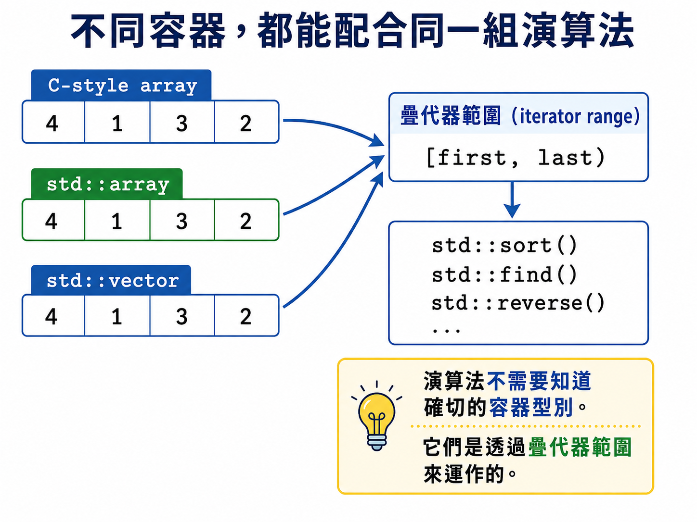


## Section V. 半開區間

```cpp
[first, last)
```

表示：

- 包含 `first` 指向的元素。
- 不包含 `last` 指向的位置。

---

## Section VI. 為什麼使用半開區間？

好處：

- 空範圍可表示成 `first == last`。
- 元素數量可用 `distance(first, last)`。
- 相鄰區間容易拼接。
- `.end()` 自然代表最後元素之後。

---


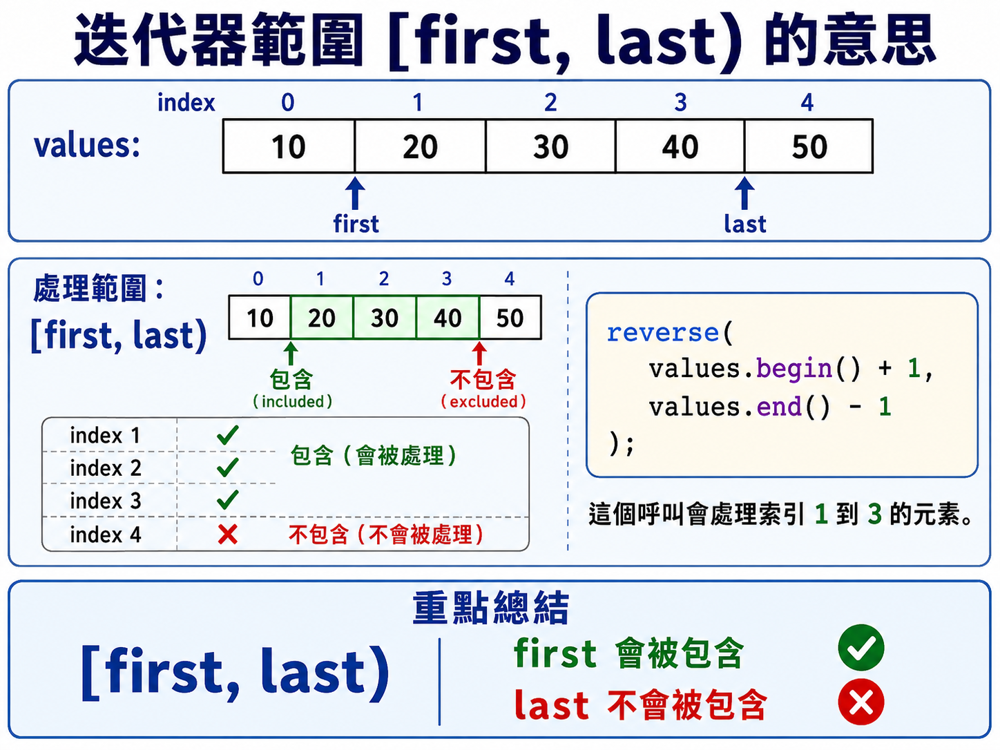


## Section VII. 完整範圍範例

```cpp
// VALIDATE
#include <algorithm>
#include <iostream>
#include <vector>
using namespace std;

int main() {
    vector<int> values{
        1,
        2,
        3,
        4,
        5
    };

    reverse(
        values.begin() + 1,
        values.end() - 1
    );

    for (int value : values) {
        cout << value
             << " ";
    }

    cout << '\n';

    return 0;
}
```

處理範圍：

```text
索引 1 到索引 3
```

輸出：

```text
1 4 3 2 5
```

---

# Part B：手動線性搜尋

## Section VIII. 基本流程

1. 從第一個元素開始。
2. 逐一比較目標值。
3. 找到時停止。
4. 走完整個範圍仍找不到，回報失敗。

---

## Section IX. 完整手動搜尋

```cpp
// VALIDATE
#include <iostream>
#include <vector>
using namespace std;

bool findIndexManual(
    const vector<int>& values,
    int target,
    vector<int>::size_type& resultIndex
) {
    for (
        vector<int>::size_type index = 0;
        index < values.size();
        ++index
    ) {
        if (
            values[index] ==
            target
        ) {
            resultIndex = index;
            return true;
        }
    }

    return false;
}

int main() {
    vector<int> values{
        4,
        8,
        15,
        16,
        23,
        42
    };

    int target;
    cin >> target;

    vector<int>::size_type index = 0;

    if (
        findIndexManual(
            values,
            target,
            index
        )
    ) {
        cout << index
             << '\n';
    } else {
        cout << "Not found\n";
    }

    return 0;
}
```

---

# Part C：`std::find()`

## Section X. 基本語法

```cpp
auto iterator =
    find(
        values.begin(),
        values.end(),
        target
    );
```

---

## Section XI. 找到與找不到

找到：

```cpp
iterator != values.end()
```

找不到：

```cpp
iterator == values.end()
```

---


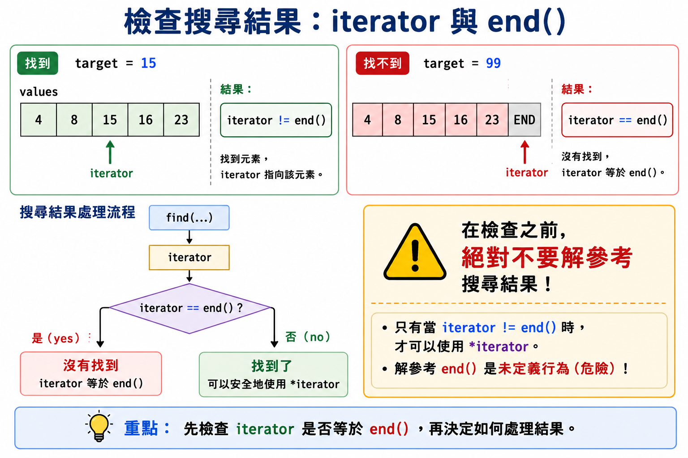


## Section XII. 完整 `find()` 範例

```cpp
// VALIDATE
#include <algorithm>
#include <iostream>
#include <iterator>
#include <vector>
using namespace std;

int main() {
    vector<int> values{
        4,
        8,
        15,
        16,
        23,
        42
    };

    int target;
    cin >> target;

    auto iterator =
        find(
            values.cbegin(),
            values.cend(),
            target
        );

    if (
        iterator ==
        values.cend()
    ) {
        cout << "Not found\n";
    } else {
        auto index =
            distance(
                values.cbegin(),
                iterator
            );

        cout << "Found at index "
             << index
             << '\n';
    }

    return 0;
}
```

---

## Section XIII. 不可直接解參考 `.end()`

危險：

```cpp
auto iterator =
    find(...);

/* cout << *iterator; */
```

必須先確認不是 `.end()`。

---

# Part D：`find_if()` 與 Predicate

## Section XIV. Predicate

Predicate 是：

```text
接收元素
回傳 bool
```

例如：

```cpp
bool isEven(int value) {
    return value % 2 == 0;
}
```

---


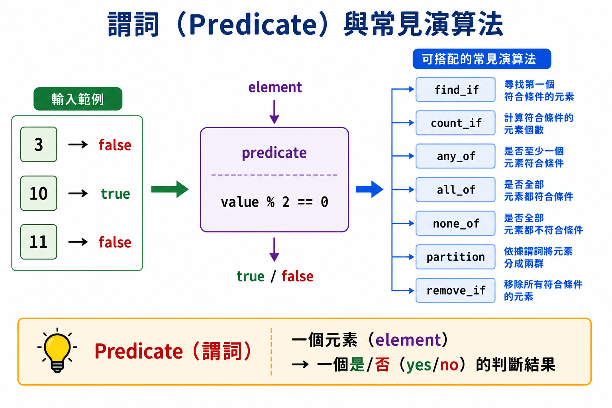


## Section XV. 使用具名函式

```cpp
find_if(
    values.begin(),
    values.end(),
    isEven
);
```

---

## Section XVI. 完整具名 predicate 範例

```cpp
// VALIDATE
#include <algorithm>
#include <iostream>
#include <vector>
using namespace std;

bool isEven(int value) {
    return
        value % 2 == 0;
}

int main() {
    vector<int> values{
        3,
        7,
        10,
        11
    };

    auto iterator =
        find_if(
            values.cbegin(),
            values.cend(),
            isEven
        );

    if (
        iterator !=
        values.cend()
    ) {
        cout << *iterator
             << '\n';
    }

    return 0;
}
```

---

# Part E：Lambda 基本語法

## Section XVII. 基本形式

```cpp
[](int value) {
    return value % 2 == 0;
}
```

組成：

```text
[]          capture
(int value) 參數
{ ... }     函式主體
```

---


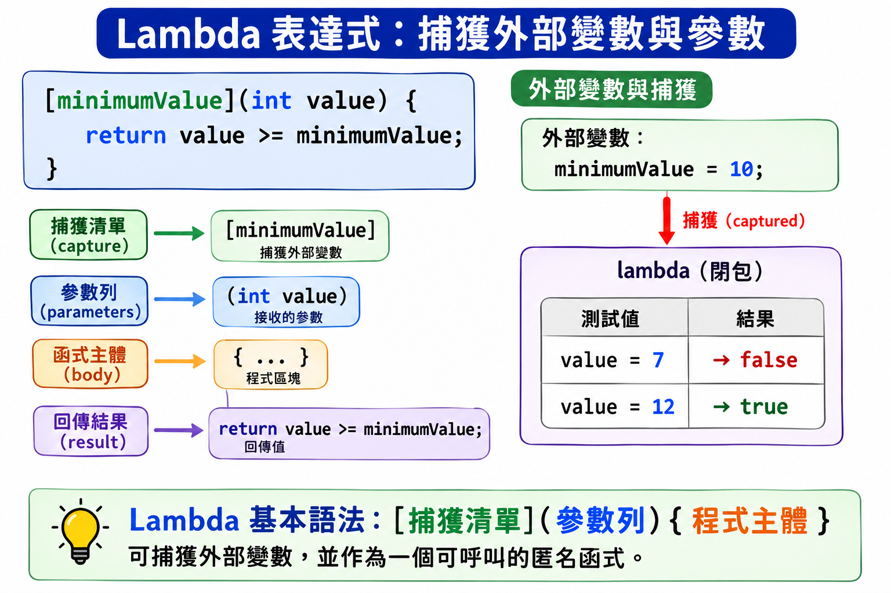


## Section XVIII. 空 capture

```cpp
[]
```

表示不使用外部區域變數。

---

## Section XIX. 值 capture

```cpp
[target]
```

Lambda 保存 `target` 的副本。

---

## Section XX. 參考 capture

```cpp
[&target]
```

Lambda 使用原本的 `target`。

若 lambda 活得比原變數久，可能形成懸空參考。

本章 lambda 只在演算法呼叫期間立即使用。

---

## Section XXI. 完整 `find_if()` lambda

```cpp
// VALIDATE
#include <algorithm>
#include <iostream>
#include <vector>
using namespace std;

int main() {
    vector<int> values{
        3,
        7,
        10,
        11
    };

    int minimumValue;
    cin >> minimumValue;

    auto iterator =
        find_if(
            values.cbegin(),
            values.cend(),
            [minimumValue](
                int value
            ) {
                return
                    value >=
                    minimumValue;
            }
        );

    if (
        iterator !=
        values.cend()
    ) {
        cout << *iterator
             << '\n';
    } else {
        cout << "Not found\n";
    }

    return 0;
}
```

---

# Part F：計數

## Section XXII. `count()`

```cpp
auto result =
    count(
        values.begin(),
        values.end(),
        target
    );
```

計算等於目標值的元素數量。

---

## Section XXIII. 完整 `count()` 範例

```cpp
// VALIDATE
#include <algorithm>
#include <iostream>
#include <vector>
using namespace std;

int main() {
    vector<int> values{
        1,
        2,
        1,
        3,
        1,
        4
    };

    cout << count(
                values.cbegin(),
                values.cend(),
                1
            )
         << '\n';

    return 0;
}
```

---

## Section XXIV. `count_if()`

```cpp
count_if(
    first,
    last,
    predicate
);
```

---


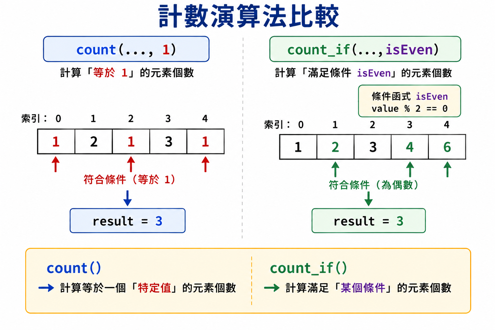


## Section XXV. 完整條件計數

```cpp
// VALIDATE
#include <algorithm>
#include <iostream>
#include <vector>
using namespace std;

int main() {
    vector<int> values{
        -3,
        0,
        4,
        8,
        9,
        12
    };

    auto evenCount =
        count_if(
            values.cbegin(),
            values.cend(),
            [](int value) {
                return
                    value % 2 == 0;
            }
        );

    auto positiveCount =
        count_if(
            values.cbegin(),
            values.cend(),
            [](int value) {
                return value > 0;
            }
        );

    cout << "Even: "
         << evenCount
         << '\n';

    cout << "Positive: "
         << positiveCount
         << '\n';

    return 0;
}
```

---

# Part G：`any_of()`、`all_of()`、`none_of()`

## Section XXVI. `any_of()`

是否至少一個元素符合條件。

---

## Section XXVII. `all_of()`

是否全部元素符合條件。

對空範圍會回傳 `true`。

---

## Section XXVIII. `none_of()`

是否沒有任何元素符合條件。

對空範圍也會回傳 `true`。

---

## Section XXIX. 完整條件判斷範例

```cpp
// VALIDATE
#include <algorithm>
#include <iostream>
#include <vector>
using namespace std;

int main() {
    vector<int> scores{
        65,
        72,
        90,
        58
    };

    bool hasFailure =
        any_of(
            scores.cbegin(),
            scores.cend(),
            [](int score) {
                return score < 60;
            }
        );

    bool allValid =
        all_of(
            scores.cbegin(),
            scores.cend(),
            [](int score) {
                return
                    score >= 0 &&
                    score <= 100;
            }
        );

    bool noPerfectScore =
        none_of(
            scores.cbegin(),
            scores.cend(),
            [](int score) {
                return score == 100;
            }
        );

    cout << boolalpha
         << hasFailure
         << " "
         << allValid
         << " "
         << noPerfectScore
         << '\n';

    return 0;
}
```

---


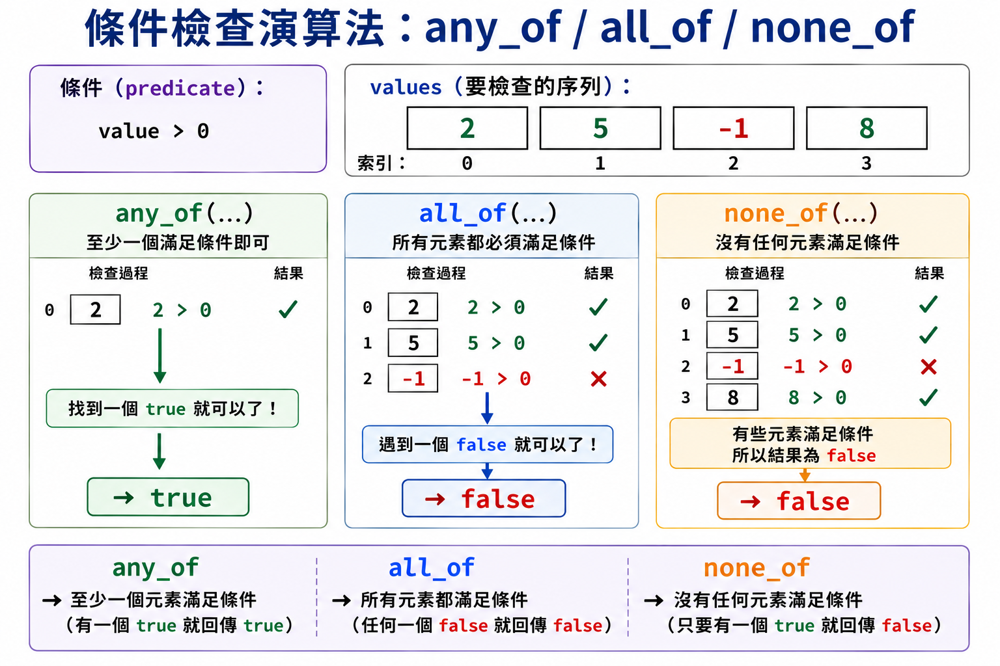


# Part H：最小值與最大值

## Section XXX. `min_element()`

回傳最小元素的迭代器。

---

## Section XXXI. `max_element()`

回傳最大元素的迭代器。

---

## Section XXXII. 空範圍

若範圍為空：

```cpp
min_element(first, last)
```

回傳 `last`。

---

## Section XXXIII. 完整最小最大值

```cpp
// VALIDATE
#include <algorithm>
#include <iostream>
#include <iterator>
#include <vector>
using namespace std;

int main() {
    vector<int> values{
        8,
        -3,
        15,
        4
    };

    if (values.empty()) {
        cout << "No data\n";
        return 0;
    }

    auto minimumIterator =
        min_element(
            values.cbegin(),
            values.cend()
        );

    auto maximumIterator =
        max_element(
            values.cbegin(),
            values.cend()
        );

    cout << "Minimum: "
         << *minimumIterator
         << " at "
         << distance(
                values.cbegin(),
                minimumIterator
            )
         << '\n';

    cout << "Maximum: "
         << *maximumIterator
         << " at "
         << distance(
                values.cbegin(),
                maximumIterator
            )
         << '\n';

    return 0;
}
```

---


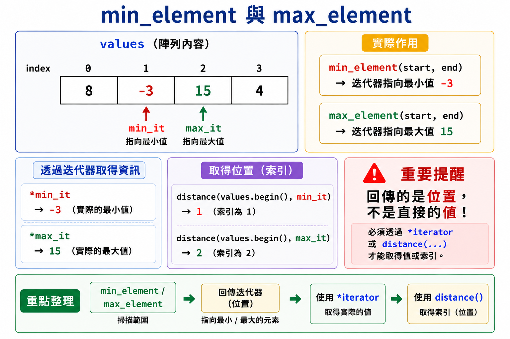


## Section XXXIV. `minmax_element()`

一次取得最小與最大元素位置：

```cpp
auto result =
    minmax_element(
        first,
        last
    );
```

結果：

```cpp
result.first
result.second
```

---

# Part I：基本排序

## Section XXXV. 遞增排序

```cpp
sort(
    values.begin(),
    values.end()
);
```

---

## Section XXXVI. 完整遞增排序

```cpp
// VALIDATE
#include <algorithm>
#include <iostream>
#include <vector>
using namespace std;

int main() {
    vector<int> values{
        8,
        3,
        10,
        1,
        5
    };

    sort(
        values.begin(),
        values.end()
    );

    for (int value : values) {
        cout << value
             << " ";
    }

    cout << '\n';

    return 0;
}
```

輸出：

```text
1 3 5 8 10
```

---


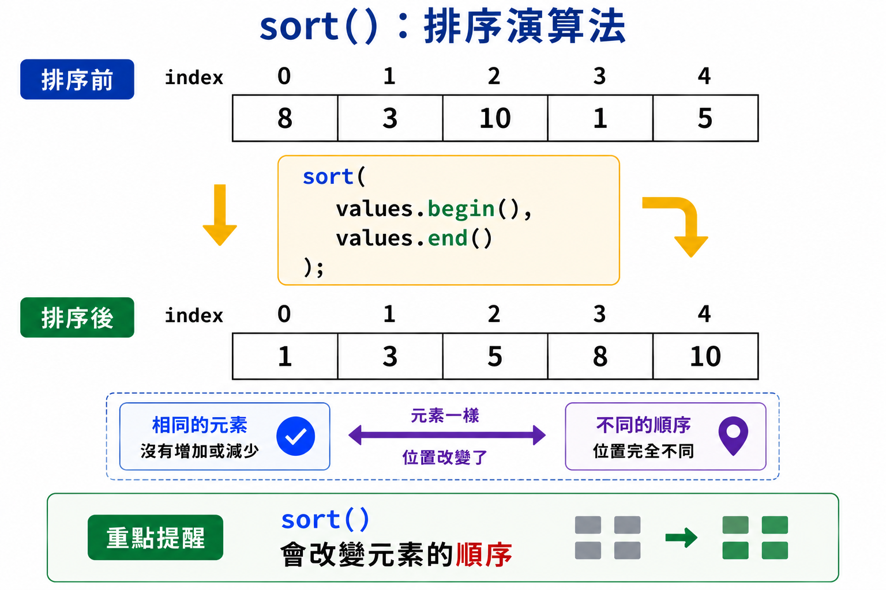


## Section XXXVII. 遞減排序

```cpp
sort(
    values.begin(),
    values.end(),
    greater<int>()
);
```

也可使用：

```cpp
greater<>()
```

需要：

```cpp
#include <functional>
```

---

## Section XXXVIII. 完整遞減排序

```cpp
// VALIDATE
#include <algorithm>
#include <functional>
#include <iostream>
#include <vector>
using namespace std;

int main() {
    vector<int> values{
        8,
        3,
        10,
        1,
        5
    };

    sort(
        values.begin(),
        values.end(),
        greater<>()
    );

    for (int value : values) {
        cout << value
             << " ";
    }

    cout << '\n';

    return 0;
}
```

---

# Part J：自訂比較器

## Section XXXIX. 比較器的意義

```cpp
comparator(first, second)
```

回傳 `true` 表示：

```text
first 應排在 second 前面
```

---

## Section XL. 嚴格比較

正確：

```cpp
return first < second;
```

錯誤概念：

```cpp
/* return first <= second; */
```

相同元素彼此比較時必須回傳 `false`。

---


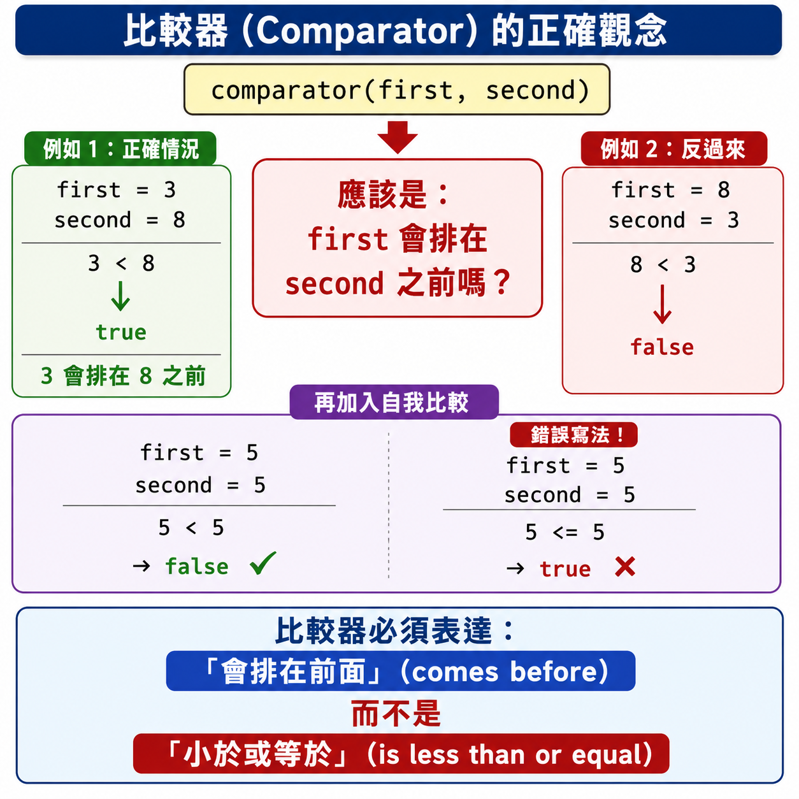


## Section XLI. 依絕對值排序

規則：

1. 絕對值較小者在前。
2. 絕對值相同時，實際值較小者在前。

---

## Section XLII. 完整絕對值排序

```cpp
// VALIDATE
#include <algorithm>
#include <cstdlib>
#include <iostream>
#include <vector>
using namespace std;

int main() {
    vector<int> values{
        -10,
        3,
        -2,
        8,
        2
    };

    sort(
        values.begin(),
        values.end(),
        [](int first, int second) {
            int firstAbsolute =
                abs(first);

            int secondAbsolute =
                abs(second);

            if (
                firstAbsolute !=
                secondAbsolute
            ) {
                return
                    firstAbsolute <
                    secondAbsolute;
            }

            return first < second;
        }
    );

    for (int value : values) {
        cout << value
             << " ";
    }

    cout << '\n';

    return 0;
}
```

---

# Part K：字串排序

## Section XLIII. 預設排序

```cpp
sort(
    words.begin(),
    words.end()
);
```

使用字典順序。

---

## Section XLIV. 依長度排序

比較器：

```cpp
first.size() < second.size()
```

若長度相同，可再比較字典順序。

---

## Section XLV. 完整字串長度排序

```cpp
// VALIDATE
#include <algorithm>
#include <iostream>
#include <string>
#include <vector>
using namespace std;

int main() {
    vector<string> words{
        "banana",
        "fig",
        "apple",
        "kiwi",
        "pear"
    };

    sort(
        words.begin(),
        words.end(),
        [](
            const string& first,
            const string& second
        ) {
            if (
                first.size() !=
                second.size()
            ) {
                return
                    first.size() <
                    second.size();
            }

            return first < second;
        }
    );

    for (
        const string& word :
        words
    ) {
        cout << word
             << '\n';
    }

    return 0;
}
```

---

# Part L：穩定排序

## Section XLVI. 什麼是穩定？

若兩個元素在比較規則下視為相等，穩定排序會保留它們原本的相對順序。

---

## Section XLVII. `stable_sort()`

```cpp
stable_sort(
    first,
    last,
    comparator
);
```

---


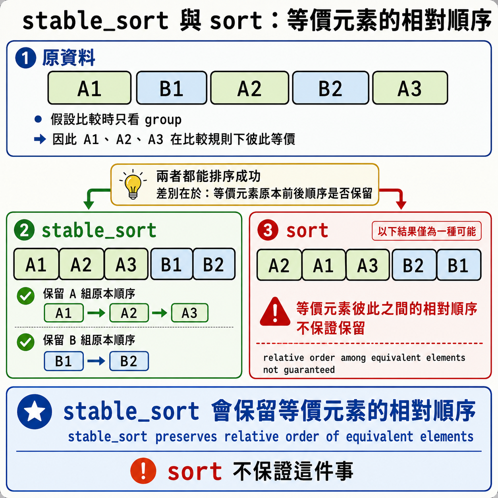


## Section XLVIII. 範例概念

原資料：

```text
pear
kiwi
plum
```

若只依長度排序，三者長度都相同。

穩定排序會保留：

```text
pear
kiwi
plum
```

原順序。

---

## Section XLIX. 完整穩定排序範例

```cpp
// VALIDATE
#include <algorithm>
#include <iostream>
#include <string>
#include <vector>
using namespace std;

int main() {
    vector<string> words{
        "pear",
        "banana",
        "kiwi",
        "fig",
        "plum"
    };

    stable_sort(
        words.begin(),
        words.end(),
        [](
            const string& first,
            const string& second
        ) {
            return
                first.size() <
                second.size();
        }
    );

    for (
        const string& word :
        words
    ) {
        cout << word
             << " ";
    }

    cout << '\n';

    return 0;
}
```

---

# Part M：判斷是否已排序

## Section L. `is_sorted()`

```cpp
is_sorted(
    first,
    last
);
```

---

## Section LI. `is_sorted_until()`

回傳第一個使範圍不再保持排序的位置。

---

## Section LII. 完整排序檢查

```cpp
// VALIDATE
#include <algorithm>
#include <iostream>
#include <iterator>
#include <vector>
using namespace std;

int main() {
    vector<int> values{
        1,
        3,
        5,
        4,
        8
    };

    cout << boolalpha
         << is_sorted(
                values.cbegin(),
                values.cend()
            )
         << '\n';

    auto iterator =
        is_sorted_until(
            values.cbegin(),
            values.cend()
        );

    if (
        iterator !=
        values.cend()
    ) {
        cout << "First unsorted position: "
             << distance(
                    values.cbegin(),
                    iterator
                )
             << '\n';
    }

    return 0;
}
```

---

# Part N：二分搜尋

## Section LIII. 必要條件

範圍必須先依相同規則排序。

錯誤：

```cpp
binary_search(
    unsorted.begin(),
    unsorted.end(),
    target
);
```

結果沒有可靠意義。

---


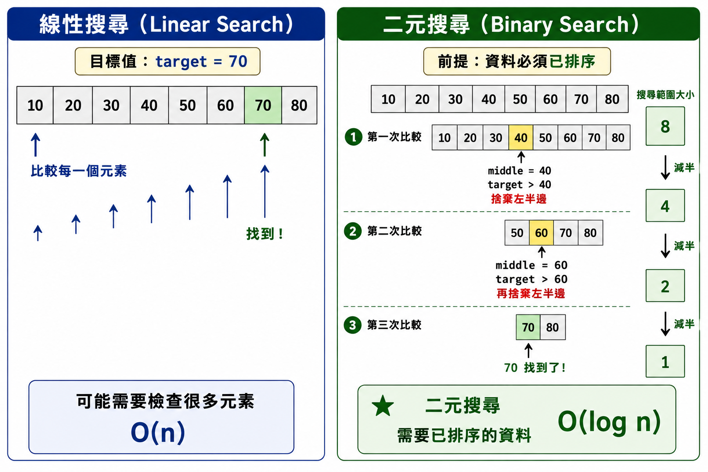


## Section LIV. `binary_search()`

只回答：

```text
存在？
不存在？
```

不回傳位置。

---

## Section LV. 完整二分搜尋

```cpp
// VALIDATE
#include <algorithm>
#include <iostream>
#include <vector>
using namespace std;

int main() {
    vector<int> values{
        8,
        3,
        10,
        1,
        5
    };

    sort(
        values.begin(),
        values.end()
    );

    int target;
    cin >> target;

    cout << boolalpha
         << binary_search(
                values.cbegin(),
                values.cend(),
                target
            )
         << '\n';

    return 0;
}
```

---

# Part O：Lower Bound 與 Upper Bound

## Section LVI. `lower_bound()`

回傳第一個：

```text
不小於 target
```

的位置。

---

## Section LVII. `upper_bound()`

回傳第一個：

```text
大於 target
```

的位置。

---

## Section LVIII. 已排序重複資料

```text
1 2 2 2 4 5
```

對目標 `2`：

- lower bound 指向第一個 `2`。
- upper bound 指向 `4`。
- 兩者距離為出現次數 `3`。

---


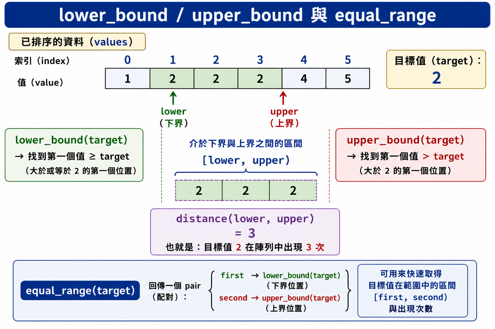


## Section LIX. 完整上下界範例

```cpp
// VALIDATE
#include <algorithm>
#include <iostream>
#include <iterator>
#include <vector>
using namespace std;

int main() {
    vector<int> values{
        1,
        2,
        2,
        2,
        4,
        5
    };

    int target;
    cin >> target;

    auto lower =
        lower_bound(
            values.cbegin(),
            values.cend(),
            target
        );

    auto upper =
        upper_bound(
            values.cbegin(),
            values.cend(),
            target
        );

    cout << "First possible index: "
         << distance(
                values.cbegin(),
                lower
            )
         << '\n';

    cout << "Count: "
         << distance(
                lower,
                upper
            )
         << '\n';

    return 0;
}
```

---

## Section LX. 保持排序插入

```cpp
auto position =
    lower_bound(
        values.begin(),
        values.end(),
        newValue
    );

values.insert(
    position,
    newValue
);
```

插入後仍保持排序。

---

## Section LXI. 完整排序插入

```cpp
// VALIDATE
#include <algorithm>
#include <iostream>
#include <vector>
using namespace std;

int main() {
    vector<int> values{
        1,
        3,
        5,
        7
    };

    int newValue;
    cin >> newValue;

    auto position =
        lower_bound(
            values.begin(),
            values.end(),
            newValue
        );

    values.insert(
        position,
        newValue
    );

    for (int value : values) {
        cout << value
             << " ";
    }

    cout << '\n';

    return 0;
}
```

---

# Part P：`equal_range()`

## Section LXII. 一次取得相等範圍

```cpp
auto range =
    equal_range(
        first,
        last,
        target
    );
```

結果：

```cpp
range.first
range.second
```

分別等同 lower bound 與 upper bound。

---

## Section LXIII. 使用情況

- 計算重複數量。
- 取得所有相同值的區間。
- 在排序資料中批次處理相同值。

---

# Part Q：反轉與旋轉

## Section LXIV. `reverse()`

```cpp
reverse(
    values.begin(),
    values.end()
);
```

直接修改原範圍。

---

## Section LXV. `rotate()`

```cpp
rotate(
    first,
    middle,
    last
);
```

將 `middle` 指向的元素旋轉到開頭。

---

## Section LXVI. 完整反轉與旋轉

```cpp
// VALIDATE
#include <algorithm>
#include <iostream>
#include <vector>
using namespace std;

int main() {
    vector<int> values{
        1,
        2,
        3,
        4,
        5
    };

    reverse(
        values.begin(),
        values.end()
    );

    for (int value : values) {
        cout << value
             << " ";
    }

    cout << '\n';

    rotate(
        values.begin(),
        values.begin() + 2,
        values.end()
    );

    for (int value : values) {
        cout << value
             << " ";
    }

    cout << '\n';

    return 0;
}
```

---


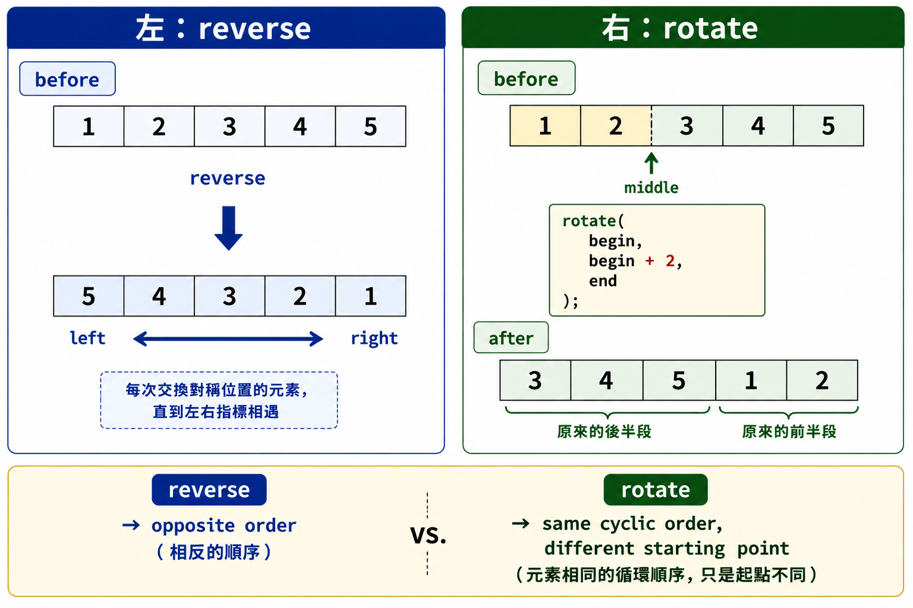


# Part R：複製演算法

## Section LXVII. `copy()`

若目的 vector 已有相同大小：

```cpp
copy(
    source.begin(),
    source.end(),
    destination.begin()
);
```

---

## Section LXVIII. 目的空間不足

若 `destination` 是空 vector，不能直接寫入：

```cpp
/* copy(
    source.begin(),
    source.end(),
    destination.begin()
); */
```

---


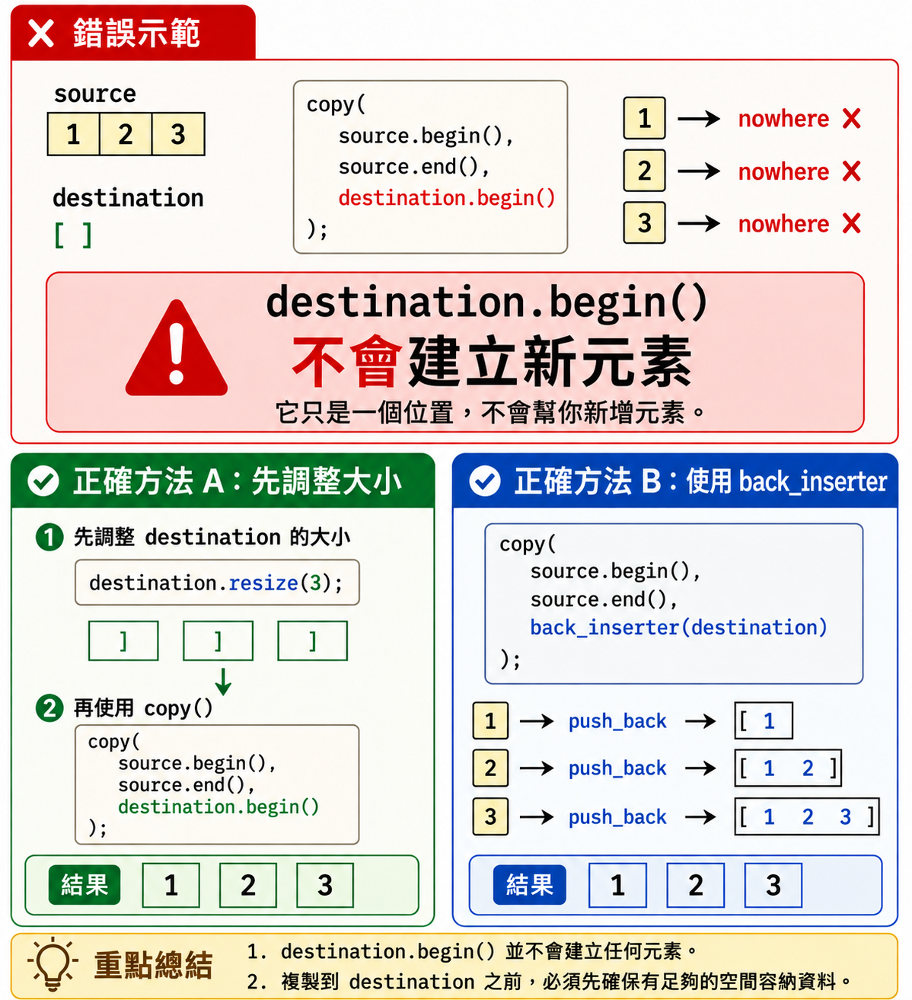


## Section LXIX. `back_inserter()`

```cpp
copy(
    source.begin(),
    source.end(),
    back_inserter(destination)
);
```

會使用 `push_back()` 加入元素。

---


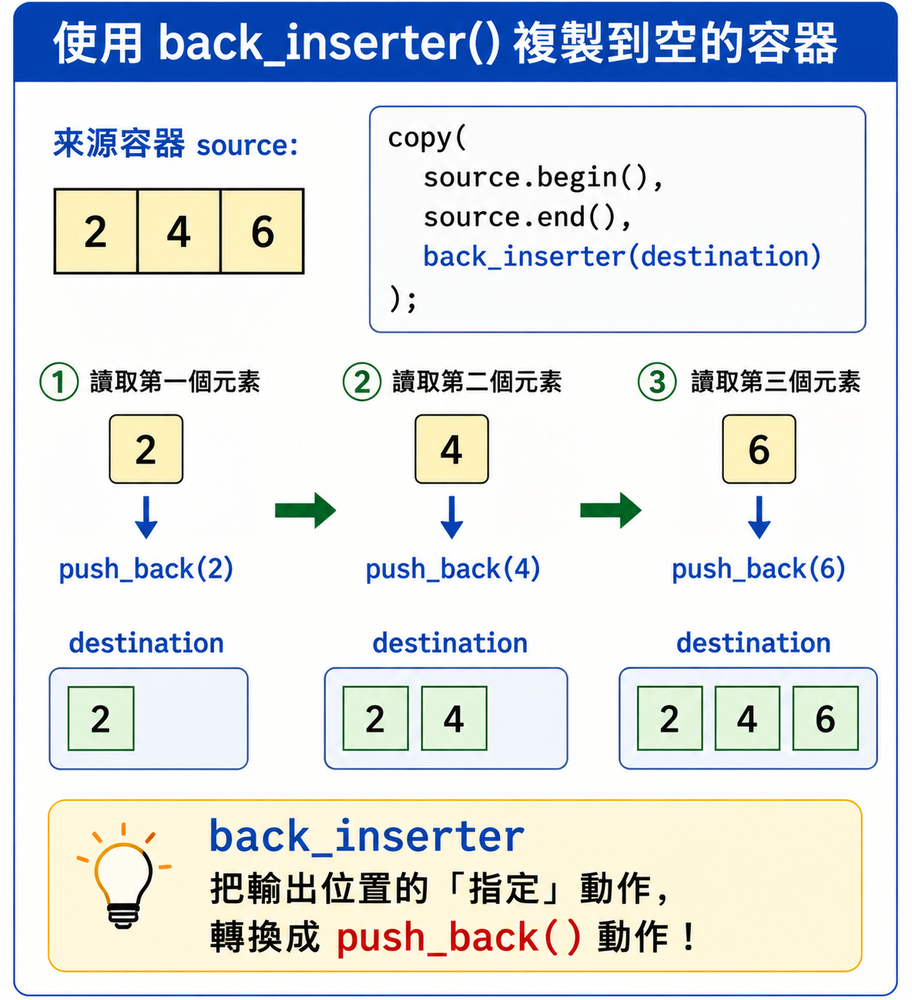


## Section LXX. 完整 `copy_if()` 範例

```cpp
// VALIDATE
#include <algorithm>
#include <iostream>
#include <iterator>
#include <vector>
using namespace std;

int main() {
    vector<int> source{
        1,
        2,
        3,
        4,
        5,
        6
    };

    vector<int> evenValues;

    evenValues.reserve(
        source.size()
    );

    copy_if(
        source.cbegin(),
        source.cend(),
        back_inserter(
            evenValues
        ),
        [](int value) {
            return
                value % 2 == 0;
        }
    );

    for (int value : evenValues) {
        cout << value
             << " ";
    }

    cout << '\n';

    return 0;
}
```

---

# Part S：`transform()`

## Section LXXI. Unary Transform

一個輸入元素產生一個輸出元素：

```cpp
transform(
    first,
    last,
    output,
    operation
);
```

---

## Section LXXII. 原地轉換

輸出位置可和輸入開頭相同：

```cpp
transform(
    values.begin(),
    values.end(),
    values.begin(),
    operation
);
```

---

## Section LXXIII. 完整平方轉換

```cpp
// VALIDATE
#include <algorithm>
#include <iostream>
#include <vector>
using namespace std;

int main() {
    vector<int> values{
        2,
        3,
        4
    };

    transform(
        values.begin(),
        values.end(),
        values.begin(),
        [](int value) {
            return
                value * value;
        }
    );

    for (int value : values) {
        cout << value
             << " ";
    }

    cout << '\n';

    return 0;
}
```

---

## Section LXXIV. 兩個範圍的 transform

```cpp
transform(
    first1,
    last1,
    first2,
    output,
    operation
);
```

第二個範圍必須至少有足夠元素。

---

## Section LXXV. 完整對應相加

```cpp
// VALIDATE
#include <algorithm>
#include <iostream>
#include <vector>
using namespace std;

int main() {
    vector<int> first{
        1,
        2,
        3
    };

    vector<int> second{
        10,
        20,
        30
    };

    vector<int> result(
        first.size()
    );

    transform(
        first.cbegin(),
        first.cend(),
        second.cbegin(),
        result.begin(),
        [](int left, int right) {
            return left + right;
        }
    );

    for (int value : result) {
        cout << value
             << " ";
    }

    cout << '\n';

    return 0;
}
```

---

# Part T：字串大小寫轉換

## Section LXXVI. `transform()` 與 `<cctype>`

可將字串每個字元轉成大寫。

仍需先轉成：

```cpp
unsigned char
```

---

## Section LXXVII. 完整字串大寫

```cpp
// VALIDATE
#include <algorithm>
#include <cctype>
#include <iostream>
#include <string>
using namespace std;

int main() {
    string text;
    getline(cin, text);

    transform(
        text.begin(),
        text.end(),
        text.begin(),
        [](char ch) {
            return
                static_cast<char>(
                    toupper(
                        static_cast<unsigned char>(
                            ch
                        )
                    )
                );
        }
    );

    cout << text
         << '\n';

    return 0;
}
```

---

# Part U：`fill()` 與 `replace()`

## Section LXXVIII. `fill()`

```cpp
fill(
    values.begin(),
    values.end(),
    0
);
```

將整個範圍設為相同值。

---

## Section LXXIX. `replace()`

```cpp
replace(
    first,
    last,
    oldValue,
    newValue
);
```

---

## Section LXXX. `replace_if()`

```cpp
replace_if(
    first,
    last,
    predicate,
    newValue
);
```

---

## Section LXXXI. 完整填入與取代

```cpp
// VALIDATE
#include <algorithm>
#include <iostream>
#include <vector>
using namespace std;

int main() {
    vector<int> values{
        -3,
        2,
        -1,
        5
    };

    replace_if(
        values.begin(),
        values.end(),
        [](int value) {
            return value < 0;
        },
        0
    );

    for (int value : values) {
        cout << value
             << " ";
    }

    cout << '\n';

    fill(
        values.begin(),
        values.end(),
        7
    );

    for (int value : values) {
        cout << value
             << " ";
    }

    cout << '\n';

    return 0;
}
```

---

# Part V：`remove()` 不會縮小 Vector

## Section LXXXII. 演算法名稱容易誤解

```cpp
auto newEnd =
    remove(
        values.begin(),
        values.end(),
        target
    );
```

它會：

- 將保留元素移到前方。
- 回傳新的 logical end。
- 不會改變 vector 的 `.size()`。

---


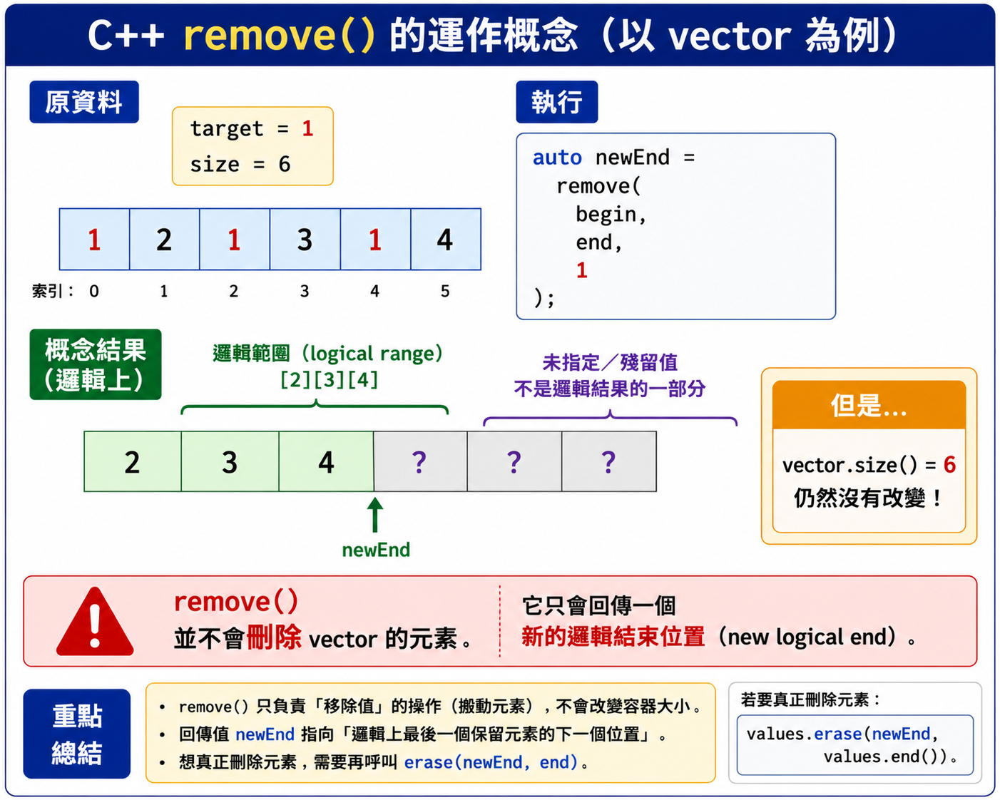


## Section LXXXIII. Erase-Remove Idiom

```cpp
values.erase(
    remove(
        values.begin(),
        values.end(),
        target
    ),
    values.end()
);
```

---

## Section LXXXIV. 完整移除指定值

```cpp
// VALIDATE
#include <algorithm>
#include <iostream>
#include <vector>
using namespace std;

int main() {
    vector<int> values{
        1,
        2,
        1,
        3,
        1,
        4
    };

    int target = 1;

    values.erase(
        remove(
            values.begin(),
            values.end(),
            target
        ),
        values.end()
    );

    for (int value : values) {
        cout << value
             << " ";
    }

    cout << '\n';

    return 0;
}
```

---

## Section LXXXV. `remove_if()`

```cpp
values.erase(
    remove_if(
        values.begin(),
        values.end(),
        predicate
    ),
    values.end()
);
```

---

## Section LXXXVI. 完整移除負數

```cpp
// VALIDATE
#include <algorithm>
#include <iostream>
#include <vector>
using namespace std;

int main() {
    vector<int> values{
        -3,
        2,
        -1,
        5,
        0
    };

    values.erase(
        remove_if(
            values.begin(),
            values.end(),
            [](int value) {
                return value < 0;
            }
        ),
        values.end()
    );

    for (int value : values) {
        cout << value
             << " ";
    }

    cout << '\n';

    return 0;
}
```

---

# Part W：`unique()` 與去重

## Section LXXXVII. 只處理相鄰重複

```cpp
unique(
    first,
    last
);
```

只壓縮相鄰的相等元素。

---


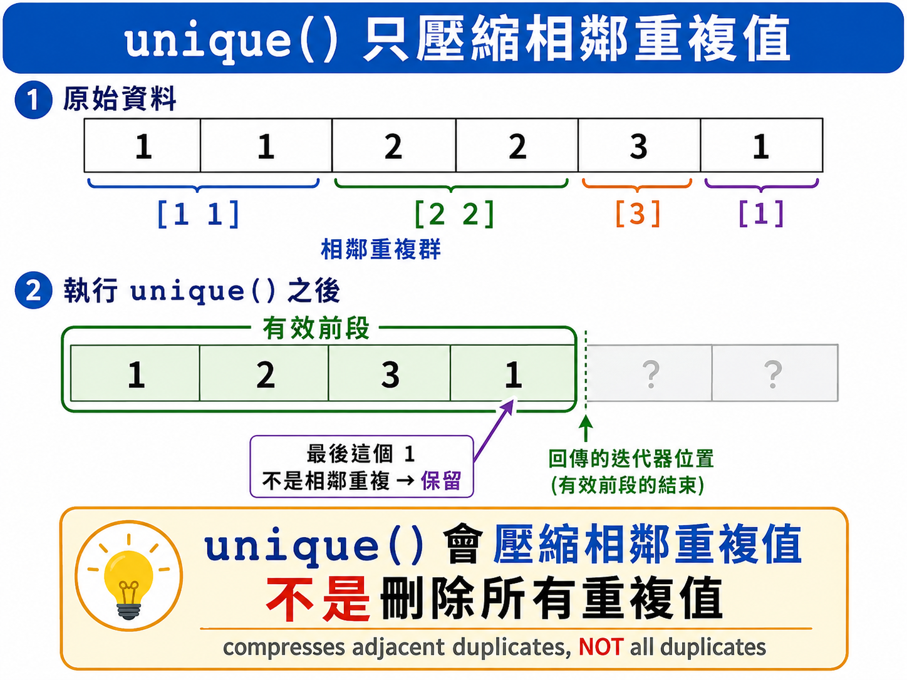


## Section LXXXVIII. 範例

原資料：

```text
1 1 2 2 3 1
```

`unique()` 處理後的有效前段：

```text
1 2 3 1
```

最後的 `1` 不和前一個有效元素相鄰，因此保留。

---

## Section LXXXIX. 去除所有重複值

若不需要保留原順序：

1. `sort()`
2. `unique()`
3. `erase()`

---

## Section XC. 完整排序去重

```cpp
// VALIDATE
#include <algorithm>
#include <iostream>
#include <vector>
using namespace std;

int main() {
    vector<int> values{
        4,
        2,
        4,
        1,
        2,
        3
    };

    sort(
        values.begin(),
        values.end()
    );

    values.erase(
        unique(
            values.begin(),
            values.end()
        ),
        values.end()
    );

    for (int value : values) {
        cout << value
             << " ";
    }

    cout << '\n';

    return 0;
}
```

輸出：

```text
1 2 3 4
```

---

# Part X：相鄰與範圍比較

## Section XCI. `adjacent_find()`

尋找第一組相鄰相等元素。

---

## Section XCII. 完整相鄰重複搜尋

```cpp
// VALIDATE
#include <algorithm>
#include <iostream>
#include <iterator>
#include <vector>
using namespace std;

int main() {
    vector<int> values{
        1,
        2,
        2,
        3
    };

    auto iterator =
        adjacent_find(
            values.cbegin(),
            values.cend()
        );

    if (
        iterator !=
        values.cend()
    ) {
        cout << "Duplicate starts at "
             << distance(
                    values.cbegin(),
                    iterator
                )
             << '\n';
    }

    return 0;
}
```

---

## Section XCIII. `equal()`

比較兩段元素是否相等。

使用前要確保範圍大小設計正確。

C++14 之後可使用四迭代器版本：

```cpp
equal(
    first1,
    last1,
    first2,
    last2
);
```

---

## Section XCIV. `mismatch()`

找出第一組不同元素位置。

回傳一對迭代器。

---

# Part Y：Partition

## Section XCV. `partition()`

將符合 predicate 的元素移到前方。

不保證兩組內部原順序。

---

## Section XCVI. `stable_partition()`

保留兩組內原本相對順序。

---


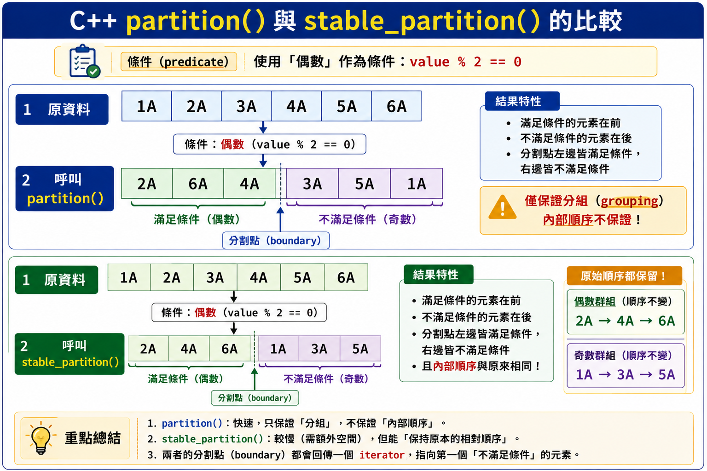


## Section XCVII. 完整奇偶分組

```cpp
// VALIDATE
#include <algorithm>
#include <iostream>
#include <vector>
using namespace std;

int main() {
    vector<int> values{
        1,
        2,
        3,
        4,
        5,
        6
    };

    auto partitionPoint =
        stable_partition(
            values.begin(),
            values.end(),
            [](int value) {
                return
                    value % 2 == 0;
            }
        );

    cout << "Even group: ";

    for (
        auto iterator =
            values.cbegin();
        iterator !=
            partitionPoint;
        ++iterator
    ) {
        cout << *iterator
             << " ";
    }

    cout << "\nOdd group: ";

    for (
        auto iterator =
            partitionPoint;
        iterator !=
            values.cend();
        ++iterator
    ) {
        cout << *iterator
             << " ";
    }

    cout << '\n';

    return 0;
}
```

---

# Part Z：`nth_element()`

## Section XCVIII. 目的

```cpp
nth_element(
    first,
    nth,
    last
);
```

執行後：

- `nth` 位置元素等於完整排序後該位置元素。
- 前方元素不大於該元素。
- 後方元素不小於該元素。
- 整個範圍不一定排序。

---


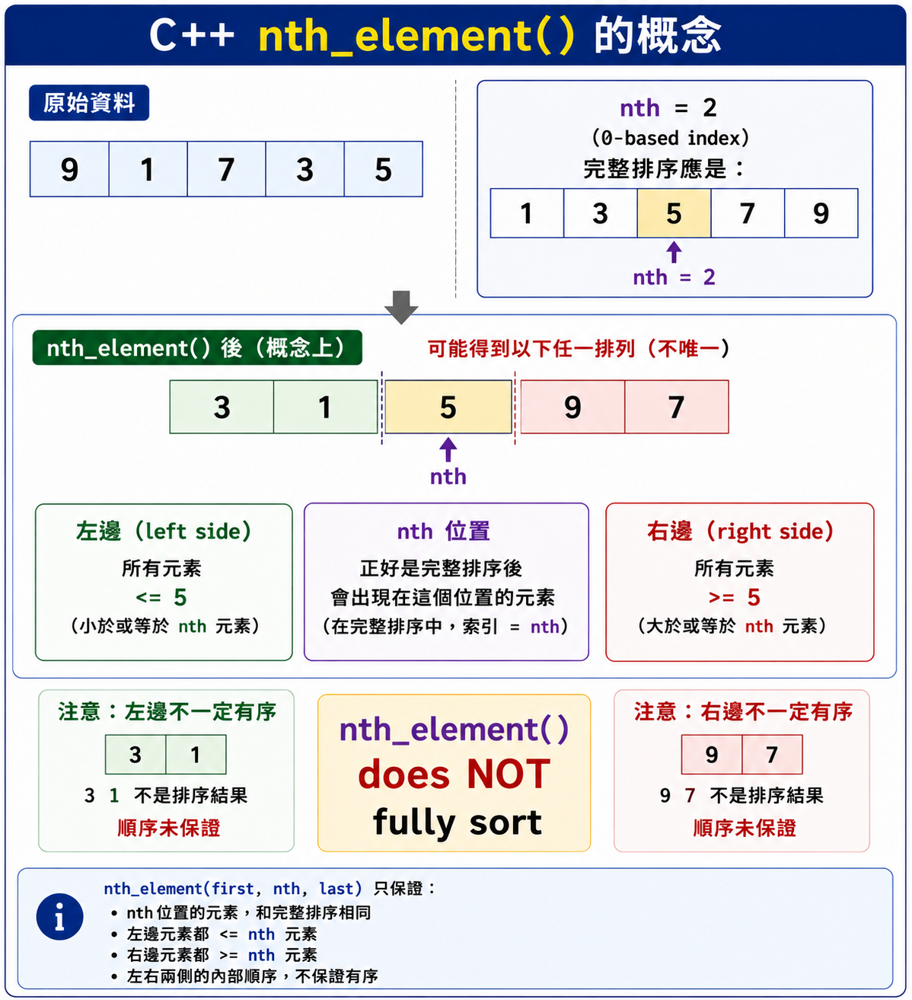


## Section XCIX. 中位數位置

奇數個元素：

```cpp
middle =
    values.begin() +
    values.size() / 2;
```

---

## Section C. 完整中位元素範例

```cpp
// VALIDATE
#include <algorithm>
#include <iostream>
#include <vector>
using namespace std;

int main() {
    vector<int> values{
        9,
        1,
        7,
        3,
        5
    };

    auto middle =
        values.begin() +
        static_cast<
            vector<int>::difference_type
        >(
            values.size() / 2
        );

    nth_element(
        values.begin(),
        middle,
        values.end()
    );

    cout << "Median element: "
         << *middle
         << '\n';

    return 0;
}
```

---

# Part AA：`partial_sort()`

## Section CI. 前 k 小元素

```cpp
partial_sort(
    first,
    middle,
    last
);
```

結果：

- `[first, middle)` 包含最小的前 k 個元素。
- 該前段已排序。
- 後段不保證排序。

---

## Section CII. 完整前三小範例

```cpp
// VALIDATE
#include <algorithm>
#include <iostream>
#include <vector>
using namespace std;

int main() {
    vector<int> values{
        9,
        2,
        7,
        1,
        5,
        3
    };

    constexpr vector<int>::size_type count = 3;

    if (count <= values.size()) {
        auto middle =
            values.begin() +
            static_cast<
                vector<int>::difference_type
            >(count);

        partial_sort(
            values.begin(),
            middle,
            values.end()
        );

        for (
            auto iterator =
                values.cbegin();
            iterator !=
                values.cbegin() +
                static_cast<
                    vector<int>::difference_type
                >(count);
            ++iterator
        ) {
            cout << *iterator
                 << " ";
        }

        cout << '\n';
    }

    return 0;
}
```

---

# Part AB：時間複雜度概念

## Section CIII. 線性搜尋

最壞情況檢查每個元素：

```text
O(n)
```

---

## Section CIV. 二分搜尋

每一步排除約一半範圍：

```text
O(log n)
```

但需要資料已排序。

---

## Section CV. 排序

`std::sort()` 的複雜度通常表示為：

```text
O(n log n)
```

---

## Section CVI. 是否一定要先排序？

只搜尋一次：

```text
直接 find
```

可能比：

```text
先 sort 再 binary_search
```

更合理。

若要對同一資料執行大量搜尋，排序成本可能值得。

---

## Section CVII. 實務判斷

| 情況 | 常見選擇 |
| --- | --- |
| 未排序資料搜尋一次 | `find()` |
| 已排序資料搜尋 | `binary_search()` / bounds |
| 多次搜尋且可改變順序 | 先排序再二分搜尋 |
| 必須保留原順序 | 使用線性搜尋或複製後排序 |
| 只要最小前 k 項 | `partial_sort()` |
| 只要第 k 項 | `nth_element()` |

---

# Part AC：演算法與失效

## Section CVIII. 查詢型演算法

通常不改變元素：

- `find`
- `count`
- `any_of`
- `min_element`
- `binary_search`

使用 `cbegin()`、`cend()` 可強調唯讀。

---

## Section CIX. 修改型演算法

會修改元素或順序：

- `sort`
- `reverse`
- `transform`
- `replace`
- `remove`
- `unique`
- `partition`

---

## Section CX. 不要在演算法內改變容器大小

危險概念：

```cpp
/* for_each(
    values.begin(),
    values.end(),
    [&values](int value) {
        values.push_back(value);
    }
); */
```

`push_back()` 可能重新配置，使演算法正在使用的迭代器失效。

---

## Section CXI. 安全方法

建立另一個目的容器：

```cpp
vector<int> result;

transform(
    values.begin(),
    values.end(),
    back_inserter(result),
    operation
);
```

或先確定演算法只修改現有元素，不改變容器大小。

---

# Part AD：傳統陣列與 `std::array`

## Section CXII. 傳統陣列

```cpp
int values[] = {
    4,
    1,
    3,
    2
};

sort(
    begin(values),
    end(values)
);
```

需要 `<iterator>` 取得通用 `begin()` 與 `end()`。

---

## Section CXIII. `std::array`

```cpp
array<int, 4> values{
    4,
    1,
    3,
    2
};

sort(
    values.begin(),
    values.end()
);
```

---

## Section CXIV. 完整傳統陣列排序

```cpp
// VALIDATE
#include <algorithm>
#include <iostream>
#include <iterator>
using namespace std;

int main() {
    int values[] = {
        4,
        1,
        3,
        2
    };

    sort(
        begin(values),
        end(values)
    );

    for (int value : values) {
        cout << value
             << " ";
    }

    cout << '\n';

    return 0;
}
```

---

# Part AE：快速概念檢查

## Section CXV. 選擇題與簡答

### Q1. 標準演算法主要需要哪個標頭？

<details><summary>查看答案</summary>

```cpp
#include <algorithm>
```

</details>

### Q2. `[first, last)` 是否包含 `last`？

<details><summary>查看答案</summary>

不包含。

</details>

### Q3. `find()` 找不到時回傳什麼？

<details><summary>查看答案</summary>

回傳提供範圍的 `last` 迭代器，通常是容器的 `.end()`。

</details>

### Q4. 找不到時可以解參考 `.end()` 嗎？

<details><summary>查看答案</summary>

不可以。

</details>

### Q5. `count_if()` 需要什麼？

<details><summary>查看答案</summary>

一個回傳 `bool` 的 predicate。

</details>

### Q6. `all_of()` 對空範圍回傳什麼？

<details><summary>查看答案</summary>

`true`。

</details>

### Q7. `min_element()` 回傳數值還是迭代器？

<details><summary>查看答案</summary>

迭代器。

</details>

### Q8. `sort()` 預設順序是什麼？

<details><summary>查看答案</summary>

遞增順序。

</details>

### Q9. 排序比較器可以使用 `<=` 嗎？

<details><summary>查看答案</summary>

不應使用。比較器必須提供嚴格排序，元素和自己比較應回傳 `false`。

</details>

### Q10. `stable_sort()` 的特點是什麼？

<details><summary>查看答案</summary>

比較規則視為相等的元素會保留原本相對順序。

</details>

### Q11. `binary_search()` 前需要什麼條件？

<details><summary>查看答案</summary>

範圍必須依相同比較規則排序。

</details>

### Q12. `lower_bound()` 回傳什麼位置？

<details><summary>查看答案</summary>

第一個不小於目標的位置。

</details>

### Q13. `upper_bound()` 回傳什麼位置？

<details><summary>查看答案</summary>

第一個大於目標的位置。

</details>

### Q14. `remove()` 會直接縮小 vector 嗎？

<details><summary>查看答案</summary>

不會。

</details>

### Q15. 真正移除元素通常使用什麼？

<details><summary>查看答案</summary>

Erase-remove idiom。

</details>

### Q16. `unique()` 會移除所有不相鄰重複嗎？

<details><summary>查看答案</summary>

不會，只壓縮相鄰重複。若要移除所有重複，通常先排序。

</details>

### Q17. `nth_element()` 會完全排序嗎？

<details><summary>查看答案</summary>

不會，只保證指定位置與前後分區關係。

</details>

### Q18. `partial_sort()` 適合什麼？

<details><summary>查看答案</summary>

只需要最小或最大的前 k 個已排序元素時。

</details>

### Q19. `back_inserter()` 有什麼用途？

<details><summary>查看答案</summary>

讓複製或轉換演算法透過 `push_back()` 將結果加入目的容器。

</details>

### Q20. 演算法中可以對同一 vector `push_back()` 嗎？

<details><summary>查看答案</summary>

通常不應這樣做，可能造成重新配置與迭代器失效。

</details>

---

# Part AF：程式閱讀練習

## Section CXVI. 預測結果與錯誤

### 題目 1

```cpp
vector<int> values{
    3,
    1,
    2
};

sort(
    values.begin(),
    values.end()
);

cout << values[0];
```

<details><summary>查看答案</summary>

```text
1
```

</details>

### 題目 2

```cpp
vector<int> values{
    1,
    2,
    3
};

auto iterator =
    find(
        values.begin(),
        values.end(),
        4
    );

cout << boolalpha
     << (
            iterator ==
            values.end()
        );
```

<details><summary>查看答案</summary>

```text
true
```

</details>

### 題目 3

```cpp
vector<int> values{
    1,
    2,
    2,
    3
};

cout << count(
            values.begin(),
            values.end(),
            2
        );
```

<details><summary>查看答案</summary>

```text
2
```

</details>

### 題目 4

```cpp
vector<int> values{
    1,
    2,
    3
};

cout << boolalpha
     << all_of(
            values.begin(),
            values.end(),
            [](int value) {
                return value > 0;
            }
        );
```

<details><summary>查看答案</summary>

```text
true
```

</details>

### 題目 5

```cpp
vector<int> values{
    1,
    2,
    2,
    2,
    4
};

auto lower =
    lower_bound(
        values.begin(),
        values.end(),
        2
    );

auto upper =
    upper_bound(
        values.begin(),
        values.end(),
        2
    );

cout << distance(
            lower,
            upper
        );
```

<details><summary>查看答案</summary>

```text
3
```

</details>

### 題目 6

```cpp
vector<int> values{
    1,
    2,
    1,
    3
};

auto newEnd =
    remove(
        values.begin(),
        values.end(),
        1
    );

cout << values.size();
```

<details><summary>查看答案</summary>

仍然輸出：

```text
4
```

`remove()` 沒有縮小 vector。

</details>

### 題目 7

```cpp
vector<int> values{
    1,
    1,
    2,
    2
};

values.erase(
    unique(
        values.begin(),
        values.end()
    ),
    values.end()
);

cout << values.size();
```

<details><summary>查看答案</summary>

```text
2
```

</details>

### 題目 8

```cpp
vector<int> values{
    1,
    2,
    3,
    4
};

rotate(
    values.begin(),
    values.begin() + 1,
    values.end()
);

cout << values[0]
     << values[3];
```

<details><summary>查看答案</summary>

旋轉後：

```text
2 3 4 1
```

輸出：

```text
21
```

</details>

### 題目 9

```cpp
vector<int> values{
    1,
    2,
    3
};

transform(
    values.begin(),
    values.end(),
    values.begin(),
    [](int value) {
        return value + 10;
    }
);

cout << values[1];
```

<details><summary>查看答案</summary>

```text
12
```

</details>

### 題目 10

```cpp
vector<int> values{
    1,
    2,
    3
};

auto iterator =
    values.end();

/* cout << *iterator; */
```

<details><summary>查看答案</summary>

`.end()` 不指向有效元素，不可解參考。

</details>

### 題目 11

```cpp
vector<int> values{
    5,
    1,
    3,
    2,
    4
};

auto middle =
    values.begin() + 2;

nth_element(
    values.begin(),
    middle,
    values.end()
);

cout << *middle;
```

<details><summary>查看答案</summary>

```text
3
```

索引 2 是完整排序後第三個元素，但整個 vector 不一定已排序。

</details>

### 題目 12

```cpp
vector<int> values{
    3,
    1,
    2
};

/* cout << binary_search(
    values.begin(),
    values.end(),
    2
); */
```

<details><summary>查看答案</summary>

呼叫語法可編譯，但前置條件未滿足，因為範圍未排序；結果不應依賴。

</details>

---

# Part AG：實作練習

## Section CXVII. 實作檢測題

### TODO 1：使用 `find()`

輸入目標值，輸出第一個出現索引或 `Not found`。

### TODO 2：使用 `find_if()`

找出第一個大於使用者指定門檻的元素。

### TODO 3：條件計數

使用 `count_if()` 計算正數、負數與零的數量。

### TODO 4：範圍判斷

使用 `all_of()` 判斷所有分數是否位於 `0–100`。

### TODO 5：最小最大值

使用 `minmax_element()` 輸出最小值、最大值及其索引。

### TODO 6：遞減排序

使用 `sort()` 與 `greater<>`。

### TODO 7：字串長度排序

長度較短在前；同長度時使用字典順序。

### TODO 8：排序後二分搜尋

先排序資料，再使用 `binary_search()`。

### TODO 9：重複數量

使用 `lower_bound()` 與 `upper_bound()` 計算目標值出現次數。

### TODO 10：保持排序插入

使用 `lower_bound()` 找位置並插入新值。

### TODO 11：移除負數

使用 erase-remove_if idiom。

### TODO 12：去除重複

排序後使用 erase-unique idiom。

### TODO 13：過濾偶數

使用 `copy_if()` 與 `back_inserter()` 建立新 vector。

### TODO 14：平方轉換

使用 `transform()` 建立每個元素平方的新 vector。

### TODO 15：前 k 小元素

使用 `partial_sort()` 輸出最小的前 `k` 個元素。

---

# Part AH：課後小練習

## Section CXVIII. 延伸練習

### 練習 1：忽略大小寫排序

對英文字串進行不區分大小寫排序；相同時以原字串字典順序決定。

### 練習 2：第二小不同值

排序並去重後找出第二小值；資料不足時回報錯誤。

### 練習 3：中位數

使用 `nth_element()` 求奇數筆整數資料的中位數。

### 練習 4：前 3 高分

使用自訂比較器與 `partial_sort()` 找出最高的三個分數。

### 練習 5：完整資料清理

依序完成 trim、轉小寫、排序、去重與輸出。

---

# Part AI：常見錯誤提醒

## Section CXIX. 常見錯誤

1. 忘記包含 `<algorithm>`。
2. 將半開區間誤認為包含 `last`。
3. 解參考 `.end()`。
4. `find()` 後沒有檢查是否找到。
5. 使用錯誤容器的 `.end()` 比較迭代器。
6. 將迭代器直接當成整數索引。
7. `distance()` 的起點與迭代器不屬於同一範圍。
8. Predicate 沒有回傳 `bool` 意義。
9. Lambda capture 引用已銷毀變數。
10. `all_of()` 對空範圍的結果理解錯誤。
11. `min_element()` 對空範圍結果被解參考。
12. 排序比較器使用 `<=`。
13. Comparator 對相同元素回傳 `true`。
14. Comparator 在比較時修改元素。
15. Comparator 依賴會改變的外部狀態。
16. 以為 `stable_sort()` 一定比 `sort()` 更適合。
17. 對未排序資料使用二分搜尋。
18. 排序使用一種比較器，bounds 使用另一種規則。
19. 將 `lower_bound()` 誤認為只會找到相等元素。
20. 使用 `remove()` 後以為 vector 已縮小。
21. 使用 `unique()` 後以為 vector 已縮小。
22. 未排序就用 `unique()` 期待移除所有重複值。
23. `copy()` 的目的範圍空間不足。
24. 忘記包含 `<iterator>` 使用 `back_inserter()`。
25. Binary transform 的第二範圍太短。
26. 演算法執行中對同一 vector `push_back()`。
27. 插入、刪除或重新配置後使用舊迭代器。
28. 以為 `nth_element()` 會完全排序。
29. 以為 `partial_sort()` 會排序整個範圍。
30. 只為一次搜尋先排序，卻沒有考慮排序成本與原順序需求。

---

# Part AJ：Mermaid 流程圖

## Section CXX. 搜尋與排序流程圖

### 1. `find()`

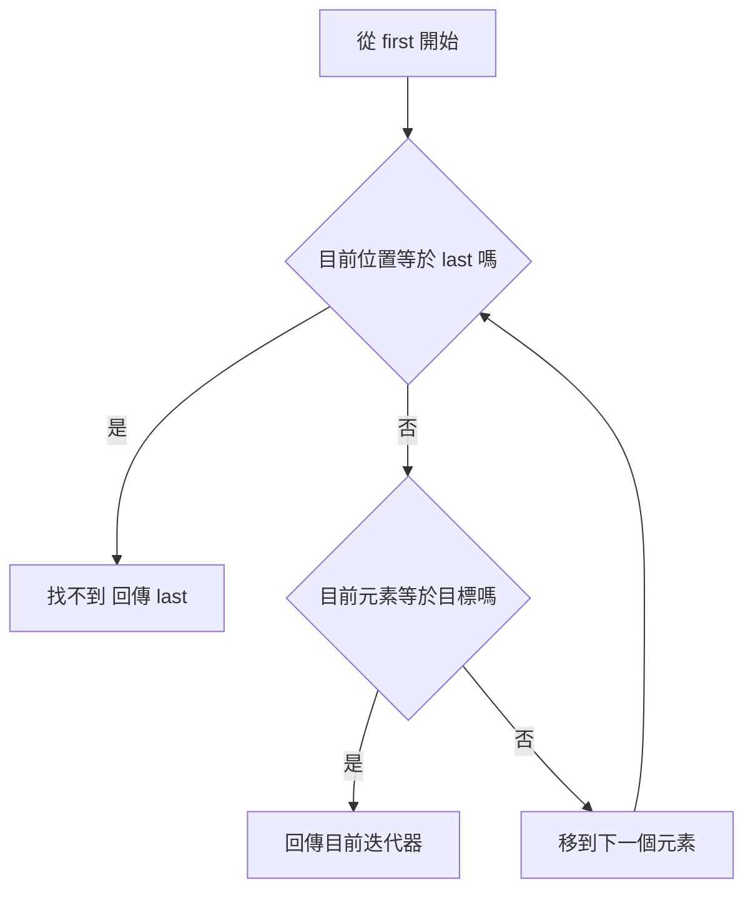
```mermaid
flowchart TD
    A[從 first 開始] --> B{目前位置等於 last 嗎}
    B -- 是 --> C[找不到 回傳 last]
    B -- 否 --> D{目前元素等於目標嗎}
    D -- 是 --> E[回傳目前迭代器]
    D -- 否 --> F[移到下一個元素]
    F --> B
```

### 2. 選擇搜尋方式

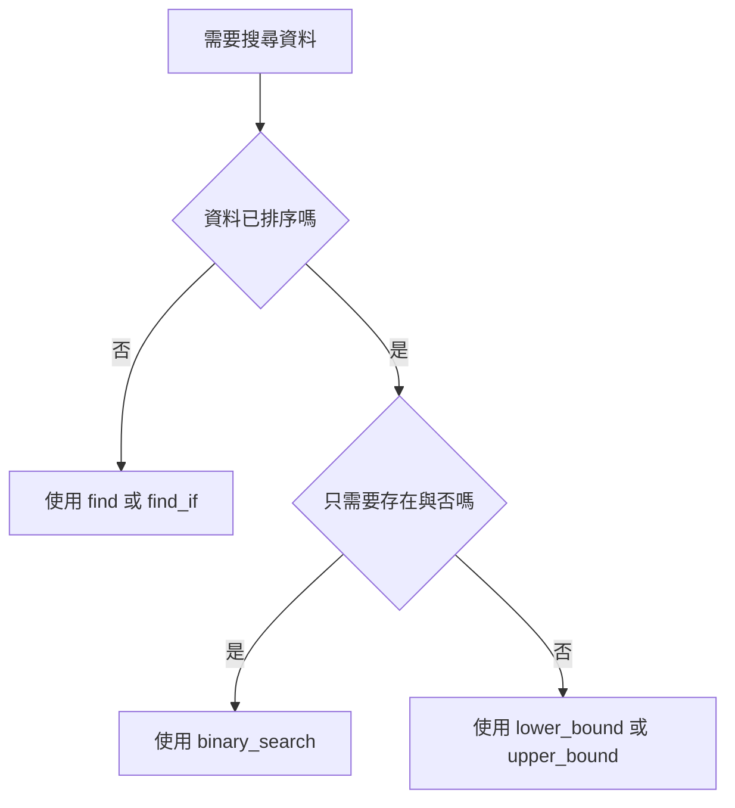
```mermaid
flowchart TD
    A[需要搜尋資料] --> B{資料已排序嗎}
    B -- 否 --> C[使用 find 或 find_if]
    B -- 是 --> D{只需要存在與否嗎}
    D -- 是 --> E[使用 binary_search]
    D -- 否 --> F[使用 lower_bound 或 upper_bound]
```

### 3. 排序比較器

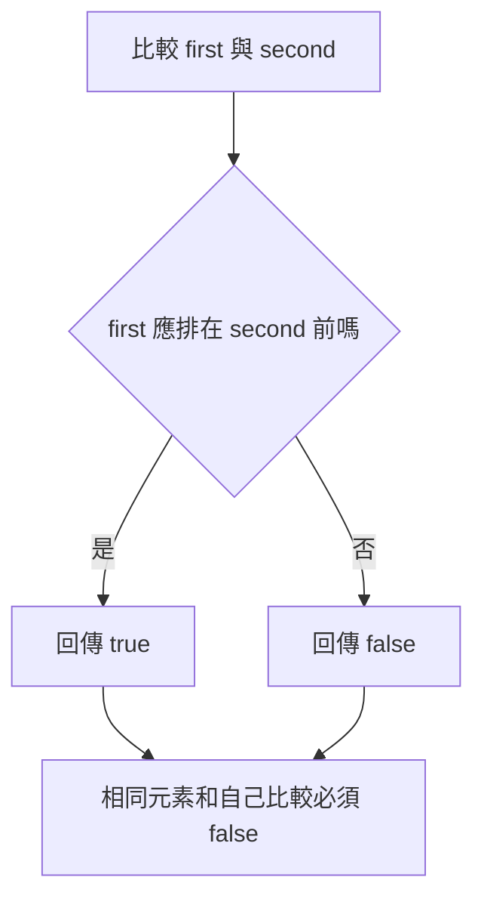
```mermaid
flowchart TD
    A[比較 first 與 second] --> B{first 應排在 second 前嗎}
    B -- 是 --> C[回傳 true]
    B -- 否 --> D[回傳 false]
    C --> E[相同元素和自己比較必須 false]
    D --> E
```

### 4. Erase-Remove

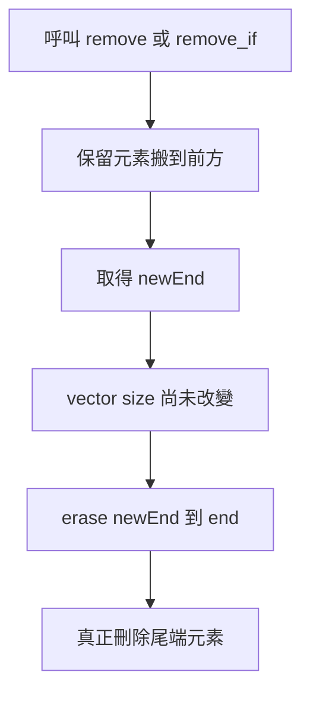
```mermaid
flowchart TD
    A[呼叫 remove 或 remove_if] --> B[保留元素搬到前方]
    B --> C[取得 newEnd]
    C --> D[vector size 尚未改變]
    D --> E[erase newEnd 到 end]
    E --> F[真正刪除尾端元素]
```

### 5. Sort-Unique-Erase

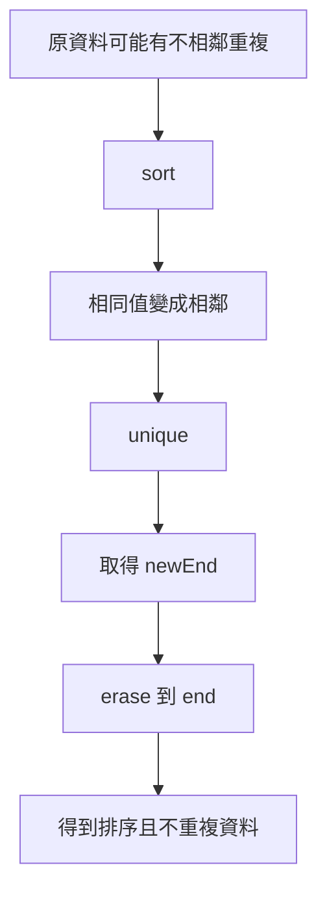
```mermaid
flowchart TD
    A[原資料可能有不相鄰重複] --> B[sort]
    B --> C[相同值變成相鄰]
    C --> D[unique]
    D --> E[取得 newEnd]
    E --> F[erase 到 end]
    F --> G[得到排序且不重複資料]
```

### 6. Bounds

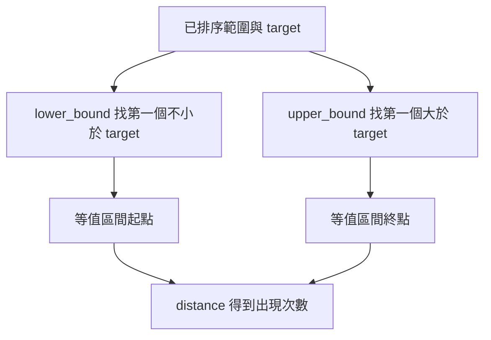
```mermaid
flowchart TD
    A[已排序範圍與 target] --> B[lower_bound 找第一個不小於 target]
    A --> C[upper_bound 找第一個大於 target]
    B --> D[等值區間起點]
    C --> E[等值區間終點]
    D --> F[distance 得到出現次數]
    E --> F
```

### 7. `nth_element()`

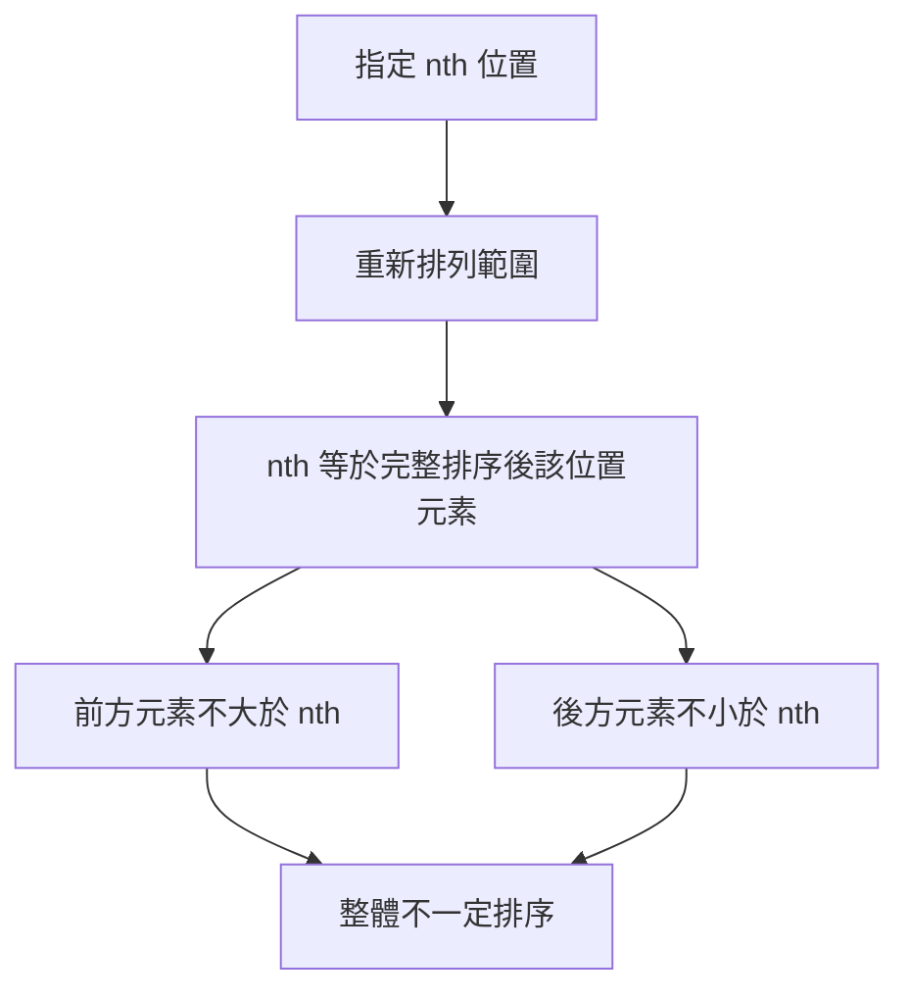
```mermaid
flowchart TD
    A[指定 nth 位置] --> B[重新排列範圍]
    B --> C[nth 等於完整排序後該位置元素]
    C --> D[前方元素不大於 nth]
    C --> E[後方元素不小於 nth]
    D --> F[整體不一定排序]
    E --> F
```

### 8. 演算法安全檢查

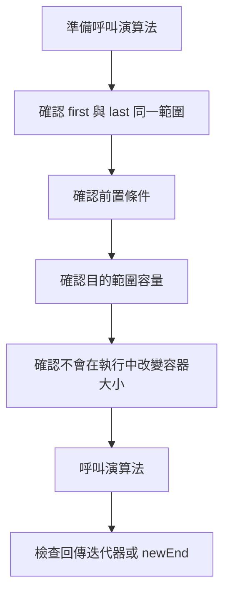
```mermaid
flowchart TD
    A[準備呼叫演算法] --> B[確認 first 與 last 同一範圍]
    B --> C[確認前置條件]
    C --> D[確認目的範圍容量]
    D --> E[確認不會在執行中改變容器大小]
    E --> F[呼叫演算法]
    F --> G[檢查回傳迭代器或 newEnd]
```

---

# 本章完成標準

完成本章後，你應該能做到：

1. 加入並使用 `<algorithm>`。
2. 解釋半開區間 `[first, last)`。
3. 使用 `find()`。
4. 安全檢查搜尋結果。
5. 使用 `distance()` 取得索引。
6. 使用 `find_if()`。
7. 撰寫基本 lambda。
8. 使用值與參考 capture。
9. 使用 `count()` 與 `count_if()`。
10. 使用 `any_of()`、`all_of()` 與 `none_of()`。
11. 使用 `min_element()`、`max_element()` 與 `minmax_element()`。
12. 處理空範圍。
13. 使用 `sort()` 遞增排序。
14. 使用 `greater<>` 遞減排序。
15. 撰寫正確自訂比較器。
16. 避免非嚴格比較器。
17. 使用 `stable_sort()`。
18. 使用 `is_sorted()` 與 `is_sorted_until()`。
19. 使用 `binary_search()`。
20. 使用 `lower_bound()` 與 `upper_bound()`。
21. 使用 `equal_range()`。
22. 在保持排序時插入元素。
23. 使用 `reverse()` 與 `rotate()`。
24. 使用 `copy()` 與 `copy_if()`。
25. 使用 `back_inserter()`。
26. 使用 unary 與 binary `transform()`。
27. 使用 `fill()`、`replace()` 與 `replace_if()`。
28. 正確使用 erase-remove idiom。
29. 正確使用 erase-unique idiom。
30. 使用 `adjacent_find()`。
31. 使用 `partition()` 或 `stable_partition()`。
32. 使用 `nth_element()`。
33. 使用 `partial_sort()`。
34. 比較線性搜尋與二分搜尋。
35. 說明常見時間複雜度。
36. 分辨查詢型與修改型演算法。
37. 避免演算法執行中修改容器大小。
38. 處理迭代器失效。
39. 將演算法用於 vector、array 與傳統陣列。
40. 找出常見搜尋、排序與演算法錯誤。

---

# 隱藏答案區

> Answer hidden — try it first.

<details><summary>TODO 1 答案</summary>

```cpp
auto iterator =
    find(
        values.cbegin(),
        values.cend(),
        target
    );

if (
    iterator ==
    values.cend()
) {
    cout << "Not found\n";
} else {
    cout << distance(
                values.cbegin(),
                iterator
            )
         << '\n';
}
```

</details>

<details><summary>TODO 2 答案</summary>

```cpp
auto iterator =
    find_if(
        values.cbegin(),
        values.cend(),
        [threshold](int value) {
            return
                value >
                threshold;
        }
    );
```

</details>

<details><summary>TODO 3 答案</summary>

```cpp
auto positiveCount =
    count_if(
        values.cbegin(),
        values.cend(),
        [](int value) {
            return value > 0;
        }
    );

auto negativeCount =
    count_if(
        values.cbegin(),
        values.cend(),
        [](int value) {
            return value < 0;
        }
    );

auto zeroCount =
    count(
        values.cbegin(),
        values.cend(),
        0
    );
```

</details>

<details><summary>TODO 4 答案</summary>

```cpp
bool allValid =
    all_of(
        scores.cbegin(),
        scores.cend(),
        [](int score) {
            return
                score >= 0 &&
                score <= 100;
        }
    );
```

</details>

<details><summary>TODO 5 答案</summary>

```cpp
if (!values.empty()) {
    auto result =
        minmax_element(
            values.cbegin(),
            values.cend()
        );

    cout << *result.first
         << " "
         << distance(
                values.cbegin(),
                result.first
            )
         << '\n';

    cout << *result.second
         << " "
         << distance(
                values.cbegin(),
                result.second
            )
         << '\n';
}
```

</details>

<details><summary>TODO 6 答案</summary>

```cpp
sort(
    values.begin(),
    values.end(),
    greater<>()
);
```

需要：

```cpp
#include <functional>
```

</details>

<details><summary>TODO 7 答案</summary>

```cpp
sort(
    words.begin(),
    words.end(),
    [](
        const string& first,
        const string& second
    ) {
        if (
            first.size() !=
            second.size()
        ) {
            return
                first.size() <
                second.size();
        }

        return first < second;
    }
);
```

</details>

<details><summary>TODO 8 答案</summary>

```cpp
sort(
    values.begin(),
    values.end()
);

bool exists =
    binary_search(
        values.cbegin(),
        values.cend(),
        target
    );
```

</details>

<details><summary>TODO 9 答案</summary>

```cpp
auto lower =
    lower_bound(
        values.cbegin(),
        values.cend(),
        target
    );

auto upper =
    upper_bound(
        values.cbegin(),
        values.cend(),
        target
    );

cout << distance(
            lower,
            upper
        )
     << '\n';
```

範圍必須已排序。

</details>

<details><summary>TODO 10 答案</summary>

```cpp
auto position =
    lower_bound(
        values.begin(),
        values.end(),
        newValue
    );

values.insert(
    position,
    newValue
);
```

</details>

<details><summary>TODO 11 答案</summary>

```cpp
values.erase(
    remove_if(
        values.begin(),
        values.end(),
        [](int value) {
            return value < 0;
        }
    ),
    values.end()
);
```

</details>

<details><summary>TODO 12 答案</summary>

```cpp
sort(
    values.begin(),
    values.end()
);

values.erase(
    unique(
        values.begin(),
        values.end()
    ),
    values.end()
);
```

</details>

<details><summary>TODO 13 答案</summary>

```cpp
vector<int> result;

copy_if(
    values.cbegin(),
    values.cend(),
    back_inserter(result),
    [](int value) {
        return
            value % 2 == 0;
    }
);
```

</details>

<details><summary>TODO 14 答案</summary>

```cpp
vector<int> result;

result.reserve(
    values.size()
);

transform(
    values.cbegin(),
    values.cend(),
    back_inserter(result),
    [](int value) {
        return
            value * value;
    }
);
```

</details>

<details><summary>TODO 15 答案</summary>

```cpp
if (k <= values.size()) {
    auto middle =
        values.begin() +
        static_cast<
            vector<int>::difference_type
        >(k);

    partial_sort(
        values.begin(),
        middle,
        values.end()
    );

    for (
        auto iterator =
            values.cbegin();
        iterator !=
            values.cbegin() +
            static_cast<
                vector<int>::difference_type
            >(k);
        ++iterator
    ) {
        cout << *iterator
             << '\n';
    }
}
```

</details>
