# Lesson 20：Structures, Enumerations, and Data Modeling 結構、列舉與資料建模

> 這堂課的重點：把彼此相關的資料整理成一個清楚的模型。你會使用 `struct` 表示一筆完整資料，使用 `enum` 與 `enum class` 表示有限狀態，並學習如何將資料驗證、函式介面、容器與演算法整合成可讀且可維護的程式。

> 本章仍以「公開資料成員」為主，不深入 `class`、private 成員、建構函式、多型與繼承。這些會在後續物件導向程式設計章節介紹。

---

## Section I. 今天要做什麼？

1. 認識資料建模 data modeling。
2. 理解一個模型描述一類事物。
3. 分辨零散變數與完整資料紀錄。
4. 認識 `struct`。
5. 宣告結構型別。
6. 建立結構物件。
7. 使用成員存取運算子 `.`。
8. 讀取結構成員。
9. 修改結構成員。
10. 使用 aggregate initialization。
11. 使用大括號初始化結構。
12. 理解初始化順序依成員宣告順序。
13. 避免依錯誤順序提供初始化值。
14. 使用預設成員初始化值。
15. 建立值初始化結構物件。
16. 理解未初始化基本型別成員的風險。
17. 使用 `std::string` 作為成員。
18. 使用 `std::array` 作為成員。
19. 使用 `std::vector` 作為成員。
20. 使用另一個 `struct` 作為成員。
21. 認識 composition 組合。
22. 建立巢狀資料模型。
23. 使用 `object.member.submember`。
24. 宣告結構陣列。
25. 建立 `std::array<Struct, N>`。
26. 建立 `std::vector<Struct>`。
27. 使用 range-based `for` 走訪結構集合。
28. 使用 `const auto&` 唯讀走訪。
29. 使用 `auto&` 修改結構元素。
30. 將結構以值傳入函式。
31. 將結構以 `const` 參考傳入函式。
32. 將結構以一般參考傳入函式。
33. 以值回傳結構。
34. 理解回傳區域結構值是安全的。
35. 建立工廠函式 factory function。
36. 建立顯示結構內容的函式。
37. 建立驗證結構資料的函式。
38. 建立更新結構資料的函式。
39. 將計算結果存成另一個結構。
40. 認識 derived data 衍生資料。
41. 避免在模型中重複儲存可重新計算的資料。
42. 認識資料 invariant。
43. 建立有效值規則。
44. 使用函式維持資料規則。
45. 避免任意修改造成無效狀態。
46. 認識列舉 enumeration。
47. 使用傳統 `enum`。
48. 使用 scoped enumeration `enum class`。
49. 理解 `enum class` 名稱需要作用域限定。
50. 使用 `Status::active`。
51. 比較傳統 `enum` 與 `enum class`。
52. 避免列舉名稱污染外部作用域。
53. 理解 `enum class` 不會自動轉為整數。
54. 使用 `static_cast` 轉換底層值。
55. 指定列舉底層型別。
56. 使用 `enum class State : unsigned char`。
57. 理解列舉適合表示有限選項。
58. 避免用任意整數表示狀態。
59. 使用 `switch` 處理列舉。
60. 為每個列舉值建立 case。
61. 理解 `default` 的使用考量。
62. 將列舉轉成字串。
63. 將輸入文字轉成列舉。
64. 處理無效輸入。
65. 使用 `bool` 加輸出參數表示轉換成功。
66. 使用結構結合列舉狀態。
67. 建立學生紀錄模型。
68. 建立商品紀錄模型。
69. 建立任務紀錄模型。
70. 建立訂單狀態模型。
71. 建立座標點模型。
72. 建立矩形模型。
73. 建立日期模型。
74. 建立時間模型。
75. 建立地址模型。
76. 建立聯絡人模型。
77. 使用巢狀結構表示地址與聯絡人。
78. 使用 vector 保存多筆紀錄。
79. 搜尋指定 ID 的紀錄。
80. 使用 `std::find_if()` 搜尋結構。
81. 使用 lambda 存取結構成員。
82. 使用 `std::sort()` 依成員排序。
83. 依數值成員排序。
84. 依字串成員排序。
85. 使用第二排序條件。
86. 避免比較器使用 `<=`。
87. 使用 `std::count_if()` 統計狀態。
88. 使用 `std::any_of()` 判斷是否存在特定狀態。
89. 使用 `std::transform()` 產生新資料。
90. 使用 `std::remove_if()` 移除紀錄。
91. 使用 erase-remove idiom 移除結構元素。
92. 直接比較結構的限制。
93. 理解 C++17 不會自動產生所有結構比較運算。
94. 撰寫比較函式。
95. 撰寫相等判斷函式。
96. 認識 operator overloading 的概念預告。
97. 不在本章深入自訂運算子。
98. 使用結構表示函式多個回傳值。
99. 比較結構回傳與多個輸出參數。
100. 建立統計摘要結構。
101. 建立查詢結果結構。
102. 認識 optional value 的概念。
103. 不在本章深入 `std::optional`。
104. 使用 `bool` 與結果結構處理可能失敗的查詢。
105. 理解資料模型不等於畫面輸出格式。
106. 將顯示邏輯放入獨立函式。
107. 將輸入邏輯放入獨立函式。
108. 將驗證邏輯放入獨立函式。
109. 將演算法邏輯放入獨立函式。
110. 避免「上帝結構」保存所有資料。
111. 避免欄位名稱模糊。
112. 使用單位清楚的欄位名稱。
113. 使用 `ageYears` 而不是 `value1`。
114. 使用 `scorePercent` 而不是 `score`，若單位需要明確。
115. 避免重複語意欄位。
116. 避免以字串表示所有資料。
117. 正確選擇數值、字串、布林與列舉型別。
118. 避免以 `bool` 表示三種以上狀態。
119. 使用 enum 表示多狀態。
120. 理解兩個 bool 可能形成無效組合。
121. 使用單一 enum class 取代互斥 bool。
122. 建立狀態轉換函式。
123. 驗證狀態轉換是否合法。
124. 認識 state machine 狀態機概念。
125. 不在本章深入大型狀態機架構。
126. 使用 constexpr 常數定義規則。
127. 使用命名空間整理模型。
128. 將模型型別放入專屬命名空間。
129. 認識標頭檔中放置結構宣告的概念。
130. 分辨型別宣告與函式實作。
131. 不在本章深入多檔案專案。
132. 使用概念檢查、程式閱讀與實作題整合本章。

---

## Section II. 今天的學習方式

1. 每個資料模型先回答：
   ```text
   這個模型代表什麼？
   它有哪些必要欄位？
   每個欄位型別是什麼？
   有哪些有效值規則？
   ```
2. 看到多個總是一起出現的變數時，思考是否應建立 `struct`。
3. 看到有限狀態時，優先考慮 `enum class`。
4. 每個結構成員名稱要能直接說明資料用途。
5. 初始化列表必須依成員宣告順序閱讀。
6. 唯讀函式參數通常使用：
   ```cpp
   const Struct&
   ```
7. 需要修改原物件時使用：
   ```cpp
   Struct&
   ```
8. 需要建立新結果時直接回傳：
   ```cpp
   Struct
   ```
9. 搜尋結構集合時，lambda 直接比較目標成員。
10. 排序比較器要回答：
   ```text
   first 是否應排在 second 前？
   ```
11. enum 轉字串函式應處理所有列舉值。
12. 所有合法完整程式使用嚴格 C++17 選項檢查。

---

## Section III. 核心語法對照

| 語法 | 用途 |
| --- | --- |
| `struct Student { ... };` | 宣告結構型別 |
| `Student student;` | 建立結構物件 |
| `student.name` | 存取成員 |
| `Student{"Amy", 90}` | Aggregate initialization |
| `int score = 0;` | 預設成員初始化 |
| `const Student& student` | 唯讀參數 |
| `Student& student` | 可修改參數 |
| `Student makeStudent(...)` | 回傳結構值 |
| `vector<Student> students;` | 動態紀錄集合 |
| `enum class Status { ... };` | Scoped enumeration |
| `Status::active` | 使用列舉值 |
| `switch (status)` | 依列舉狀態分支 |
| `static_cast<int>(status)` | 轉換列舉底層值 |
| `struct Address { ... };` | 子模型 |
| `Address address;` | 組合成員 |
| `contact.address.city` | 存取巢狀成員 |
| `find_if(...)` | 依成員搜尋 |
| `sort(...)` | 依成員排序 |
| `count_if(...)` | 依條件統計紀錄 |
| `remove_if(...)` | 依條件移除紀錄 |

---

# Part A：為什麼需要 `struct`？

## Section IV. 零散變數

```cpp
string studentName;
int studentAge;
double studentScore;
bool studentActive;
```

如果有多位學生，變數會迅速增加。

---

## Section V. 將相關資料組合

```cpp
struct Student {
    string name;
    int age;
    double score;
    bool active;
};
```

這個型別代表：

```text
一筆學生紀錄
```

---

## Section VI. 好處

- 資料關係清楚。
- 可以建立多個同型別物件。
- 可以放入 vector。
- 可以整筆傳入函式。
- 可以整筆回傳。
- 可以依成員搜尋與排序。
- 欄位型別集中定義。

---


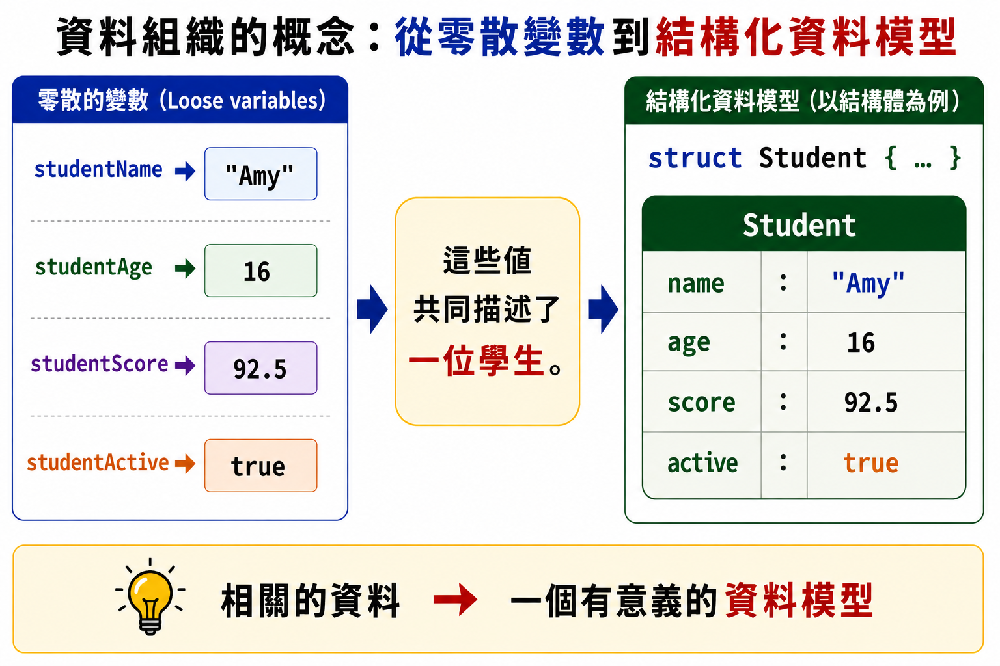


# Part B：第一個結構

## Section VII. 宣告型別

```cpp
struct Point {
    int x;
    int y;
};
```

結尾必須有：

```cpp
;
```

---

## Section VIII. 建立物件

```cpp
Point point;
```

---


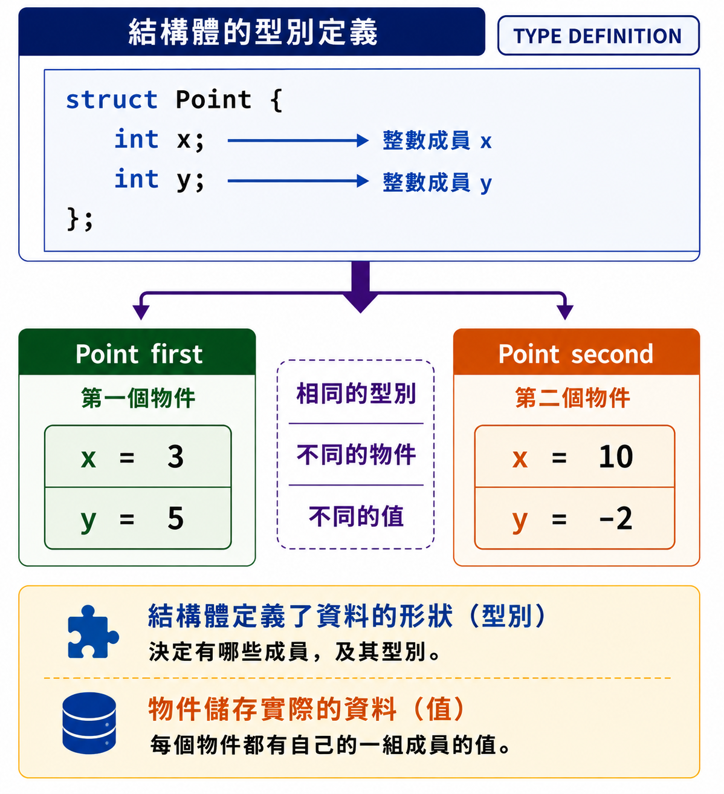


## Section IX. 存取成員

```cpp
point.x = 3;
point.y = 5;
```

讀取：

```cpp
cout << point.x;
```

---


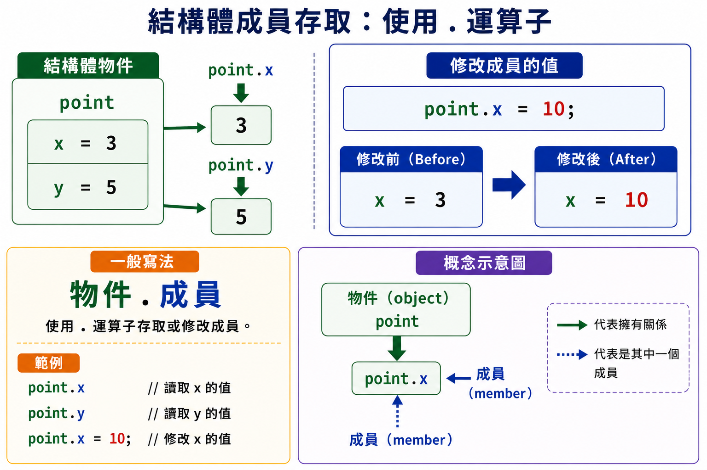


## Section X. 完整 Point 範例

```cpp
// VALIDATE
#include <iostream>
using namespace std;

struct Point {
    int x;
    int y;
};

int main() {
    Point point{};

    point.x = 3;
    point.y = 5;

    cout << "("
         << point.x
         << ", "
         << point.y
         << ")\n";

    return 0;
}
```

---

# Part C：Aggregate Initialization

## Section XI. 大括號初始化

```cpp
Point point{
    3,
    5
};
```

依成員宣告順序：

```text
x = 3
y = 5
```

---

## Section XII. 初始化順序

```cpp
struct Student {
    string name;
    int age;
    double score;
};
```

正確順序：

```cpp
Student student{
    "Amy",
    16,
    92.5
};
```

---

## Section XIII. 完整學生初始化

```cpp
// VALIDATE
#include <iostream>
#include <string>
using namespace std;

struct Student {
    string name;
    int age;
    double score;
};

int main() {
    Student student{
        "Amy",
        16,
        92.5
    };

    cout << student.name
         << " "
         << student.age
         << " "
         << student.score
         << '\n';

    return 0;
}
```

---

## Section XIV. 初始化順序不是看欄位名稱

C++17 aggregate initialization 使用位置順序。

以下會錯誤或語意不符：

```cpp
/* Student student{
    92.5,
    "Amy",
    16
}; */
```

---


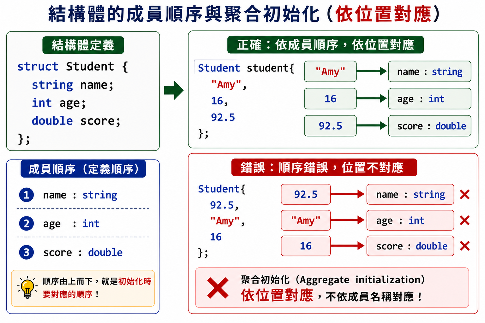


# Part D：預設成員初始化

## Section XV. 基本語法

```cpp
struct Student {
    string name = "Unknown";
    int age = 0;
    double score = 0.0;
    bool active = true;
};
```

---

## Section XVI. 建立值初始化物件

```cpp
Student student{};
```

會使用預設成員初始值。

---

## Section XVII. 完整預設值範例

```cpp
// VALIDATE
#include <iostream>
#include <string>
using namespace std;

struct Student {
    string name = "Unknown";
    int age = 0;
    double score = 0.0;
    bool active = true;
};

int main() {
    Student student{};

    cout << boolalpha
         << student.name
         << " "
         << student.age
         << " "
         << student.score
         << " "
         << student.active
         << '\n';

    return 0;
}
```

---

## Section XVIII. 避免未初始化成員

危險：

```cpp
struct Point {
    int x;
    int y;
};

Point point;
```

`x` 與 `y` 可能未初始化。

較安全：

```cpp
Point point{};
```

或為成員提供預設值。

---


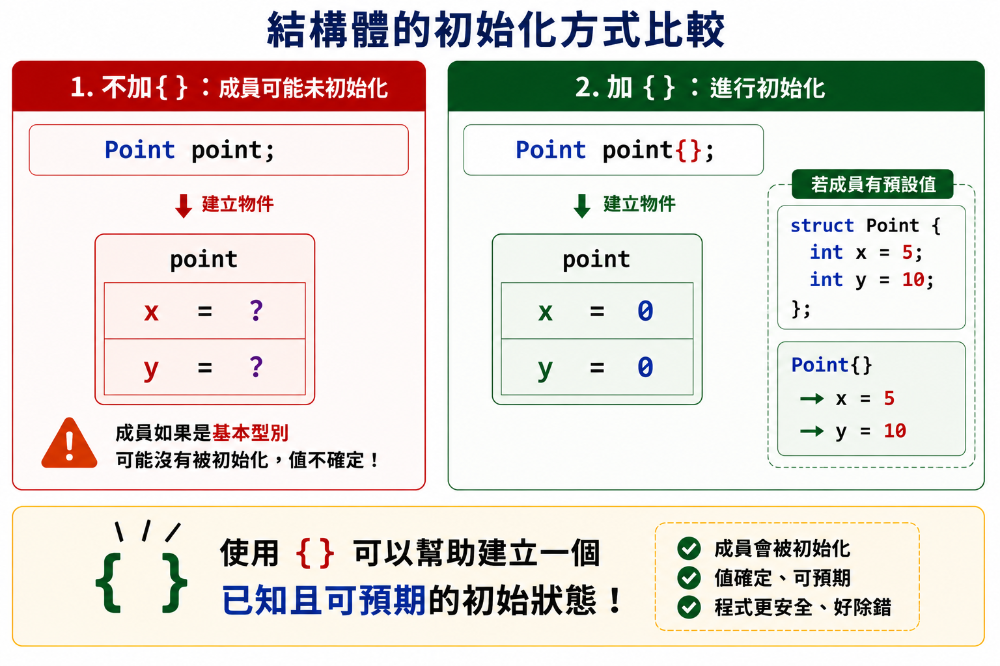


# Part E：修改與整筆賦值

## Section XIX. 修改單一成員

```cpp
student.score = 95.0;
```

---

## Section XX. 整筆複製

```cpp
Student second =
    first;
```

成員會逐一複製。

---

## Section XXI. 整筆賦值

```cpp
second = first;
```

結構支援預設賦值，只要所有成員都可賦值。

---

## Section XXII. 完整複製範例

```cpp
// VALIDATE
#include <iostream>
#include <string>
using namespace std;

struct Student {
    string name;
    int age;
    double score;
};

int main() {
    Student first{
        "Amy",
        16,
        90.0
    };

    Student second =
        first;

    second.name =
        "Brian";

    second.score =
        85.0;

    cout << first.name
         << " "
         << first.score
         << '\n';

    cout << second.name
         << " "
         << second.score
         << '\n';

    return 0;
}
```

兩個物件彼此獨立。

---


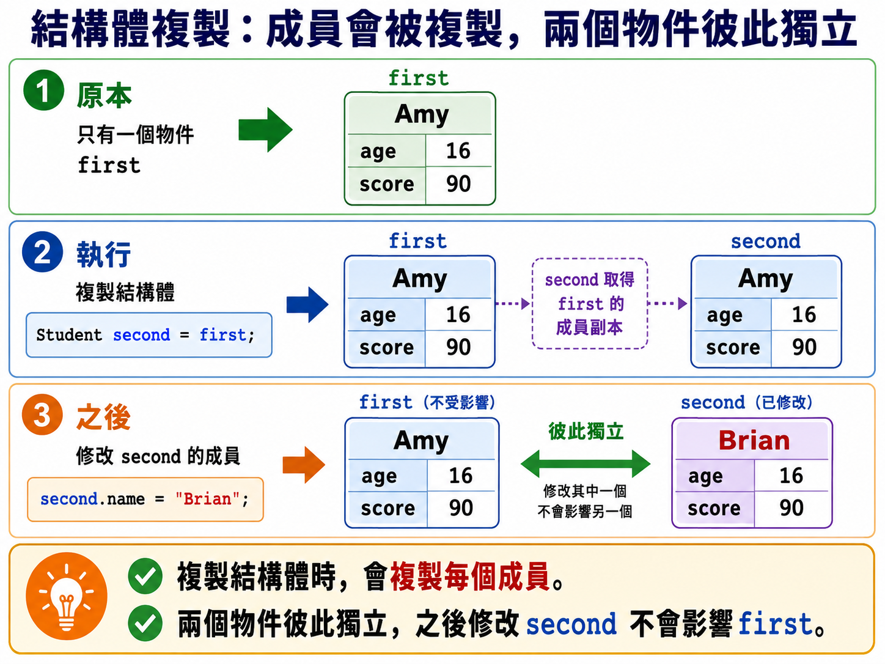


# Part F：將結構傳入函式

## Section XXIII. 傳值

```cpp
void showStudent(
    Student student
)
```

會複製整個結構。

---

## Section XXIV. 唯讀參考

```cpp
void showStudent(
    const Student& student
)
```

不複製，且不能修改原物件。

---

## Section XXV. 可修改參考

```cpp
void updateScore(
    Student& student,
    double score
)
```

可修改呼叫者物件。

---

## Section XXVI. 完整參數範例

```cpp
// VALIDATE
#include <iostream>
#include <string>
using namespace std;

struct Student {
    string name;
    int age;
    double score;
};

void showStudent(
    const Student& student
) {
    cout << student.name
         << " "
         << student.age
         << " "
         << student.score
         << '\n';
}

bool updateScore(
    Student& student,
    double newScore
) {
    if (
        newScore < 0.0 ||
        newScore > 100.0
    ) {
        return false;
    }

    student.score =
        newScore;

    return true;
}

int main() {
    Student student{
        "Amy",
        16,
        90.0
    };

    updateScore(
        student,
        95.0
    );

    showStudent(student);

    return 0;
}
```

---


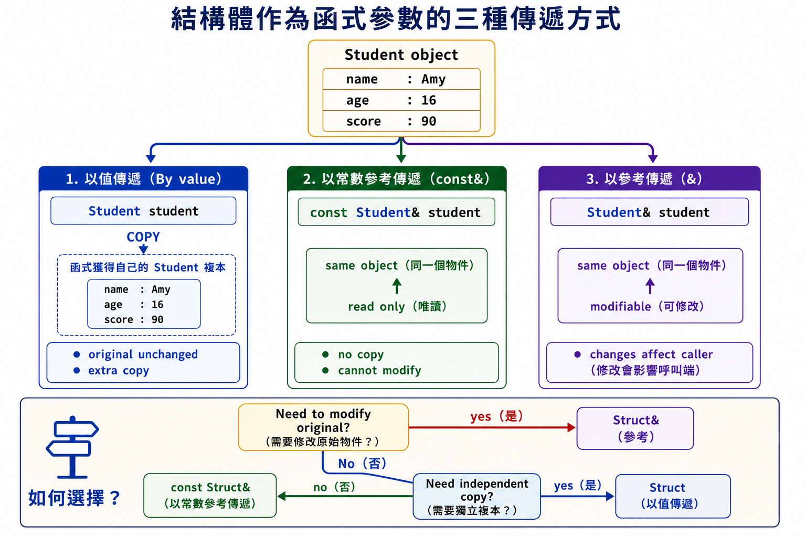


# Part G：以值回傳結構

## Section XXVII. 工廠函式

```cpp
Student makeStudent(
    const string& name,
    int age,
    double score
)
```

在函式內建立物件，再回傳。

---

## Section XXVIII. 完整工廠函式

```cpp
// VALIDATE
#include <iostream>
#include <string>
using namespace std;

struct Student {
    string name;
    int age;
    double score;
};

Student makeStudent(
    const string& name,
    int age,
    double score
) {
    Student result{
        name,
        age,
        score
    };

    return result;
}

int main() {
    Student student =
        makeStudent(
            "Amy",
            16,
            92.5
        );

    cout << student.name
         << '\n';

    return 0;
}
```

回傳區域結構的值是安全的。

---


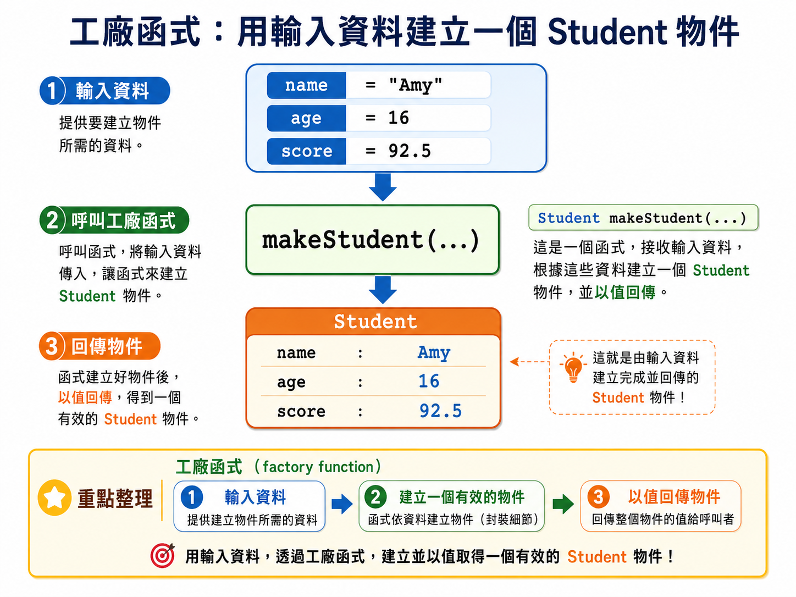


# Part H：結構表示多個回傳值

## Section XXIX. 多個輸出參數

可以寫：

```cpp
bool calculate(
    int input,
    int& minimum,
    int& maximum,
    double& average
);
```

但參數較多。

---

## Section XXX. 使用結果結構

```cpp
struct Statistics {
    int minimum;
    int maximum;
    double average;
};
```

函式可回傳一個清楚結果。

---

## Section XXXI. 完整統計結構

```cpp
// VALIDATE
#include <iostream>
#include <vector>
using namespace std;

struct Statistics {
    int minimum;
    int maximum;
    double average;
};

bool calculateStatistics(
    const vector<int>& values,
    Statistics& result
) {
    if (values.empty()) {
        return false;
    }

    result.minimum =
        values.front();

    result.maximum =
        values.front();

    long long total = 0;

    for (int value : values) {
        if (
            value <
            result.minimum
        ) {
            result.minimum =
                value;
        }

        if (
            value >
            result.maximum
        ) {
            result.maximum =
                value;
        }

        total += value;
    }

    result.average =
        static_cast<double>(
            total
        ) /
        static_cast<double>(
            values.size()
        );

    return true;
}

int main() {
    vector<int> values{
        5,
        10,
        15
    };

    Statistics statistics{};

    if (
        calculateStatistics(
            values,
            statistics
        )
    ) {
        cout << statistics.minimum
             << " "
             << statistics.maximum
             << " "
             << statistics.average
             << '\n';
    }

    return 0;
}
```

---


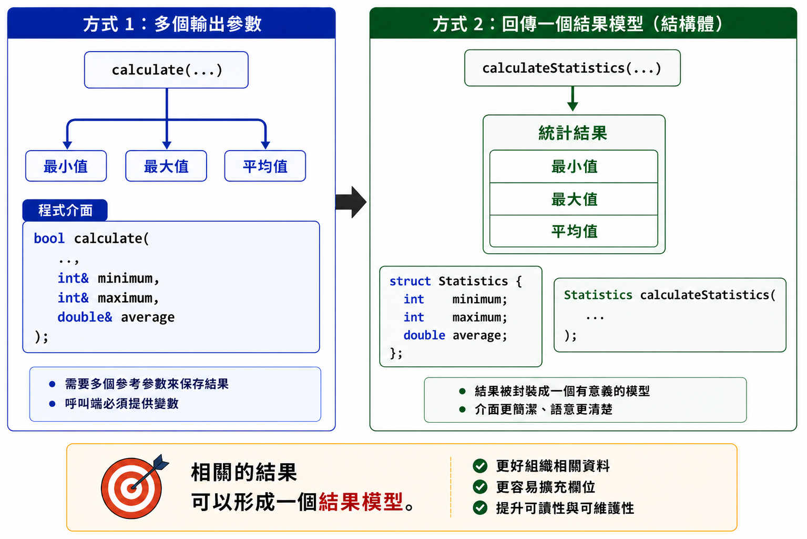


# Part I：組合 Composition

## Section XXXII. 小模型組成大模型

```cpp
struct Address {
    string city;
    string street;
};

struct Contact {
    string name;
    string phone;
    Address address;
};
```

---

## Section XXXIII. 存取巢狀成員

```cpp
contact.address.city
```

---

## Section XXXIV. 完整組合範例

```cpp
// VALIDATE
#include <iostream>
#include <string>
using namespace std;

struct Address {
    string city;
    string street;
};

struct Contact {
    string name;
    string phone;
    Address address;
};

int main() {
    Contact contact{
        "Amy",
        "555-0100",
        {
            "Taipei",
            "Main Street"
        }
    };

    cout << contact.name
         << '\n';

    cout << contact.address.city
         << ", "
         << contact.address.street
         << '\n';

    return 0;
}
```

---


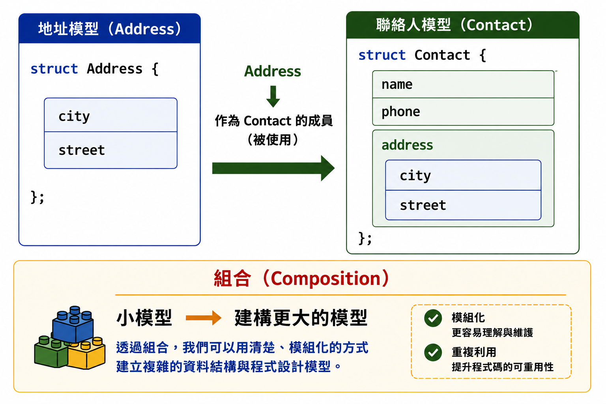


## Section XXXV. 為什麼使用組合？

比以下欄位更清楚：

```cpp
string contactCity;
string contactStreet;
```

因為 `Address` 本身是一個可重用模型。

---

# Part J：`std::array` 與 `std::vector` 成員

## Section XXXVI. 固定數量成員

```cpp
struct Triangle {
    array<Point, 3> vertices;
};
```

---

## Section XXXVII. 動態數量成員

```cpp
struct Course {
    string name;
    vector<double> scores;
};
```

---

## Section XXXVIII. 完整 vector 成員範例

```cpp
// VALIDATE
#include <iostream>
#include <string>
#include <vector>
using namespace std;

struct Course {
    string name;
    vector<double> scores;
};

double calculateAverage(
    const Course& course
) {
    if (
        course.scores.empty()
    ) {
        return 0.0;
    }

    double total = 0.0;

    for (
        double score :
        course.scores
    ) {
        total += score;
    }

    return
        total /
        static_cast<double>(
            course.scores.size()
        );
}

int main() {
    Course course{
        "C++",
        {
            80.0,
            90.0,
            100.0
        }
    };

    cout << course.name
         << " "
         << calculateAverage(
                course
            )
         << '\n';

    return 0;
}
```

---

# Part K：結構集合

## Section XXXIX. Vector of Structs

```cpp
vector<Student> students;
```

加入：

```cpp
students.push_back(
    Student{
        "Amy",
        16,
        90.0
    }
);
```

---

## Section XL. 完整紀錄集合

```cpp
// VALIDATE
#include <iostream>
#include <string>
#include <vector>
using namespace std;

struct Student {
    int id;
    string name;
    double score;
};

int main() {
    vector<Student> students{
        {
            1,
            "Amy",
            90.0
        },
        {
            2,
            "Brian",
            85.0
        },
        {
            3,
            "Cindy",
            95.0
        }
    };

    for (
        const Student& student :
        students
    ) {
        cout << student.id
             << " "
             << student.name
             << " "
             << student.score
             << '\n';
    }

    return 0;
}
```

---


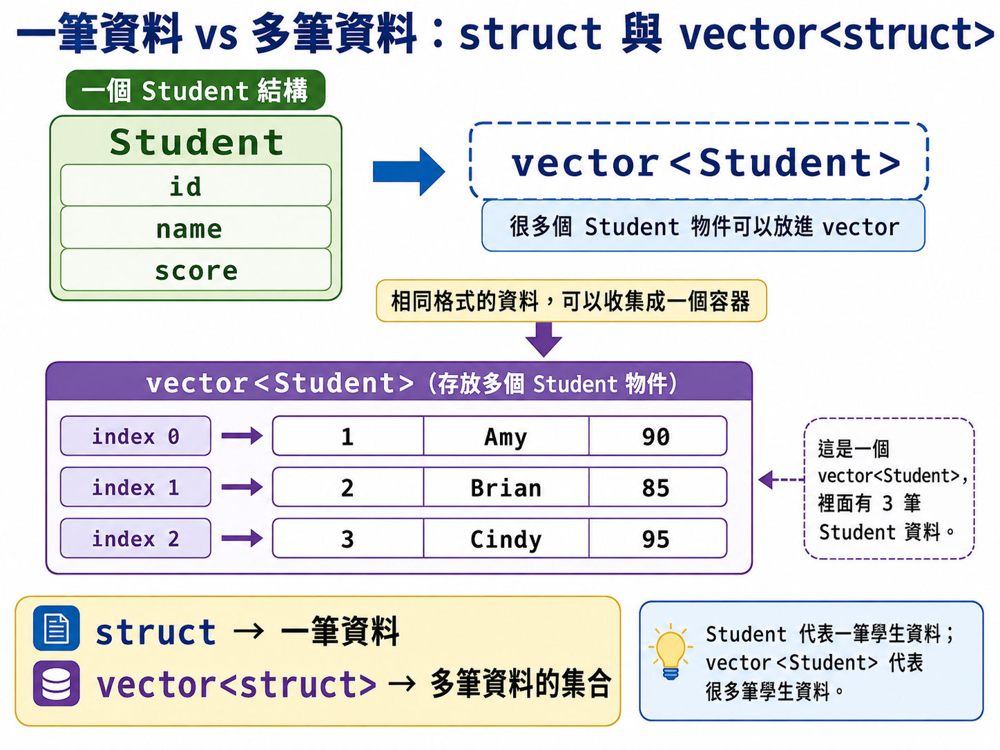


# Part L：搜尋結構紀錄

## Section XLI. 依 ID 搜尋

```cpp
find_if(
    students.begin(),
    students.end(),
    [targetId](
        const Student& student
    ) {
        return
            student.id ==
            targetId;
    }
);
```

---

## Section XLII. 完整搜尋範例

```cpp
// VALIDATE
#include <algorithm>
#include <iostream>
#include <string>
#include <vector>
using namespace std;

struct Student {
    int id;
    string name;
    double score;
};

int main() {
    vector<Student> students{
        {
            1,
            "Amy",
            90.0
        },
        {
            2,
            "Brian",
            85.0
        }
    };

    int targetId;
    cin >> targetId;

    auto iterator =
        find_if(
            students.cbegin(),
            students.cend(),
            [targetId](
                const Student& student
            ) {
                return
                    student.id ==
                    targetId;
            }
        );

    if (
        iterator ==
        students.cend()
    ) {
        cout << "Not found\n";
    } else {
        cout << iterator->name
             << " "
             << iterator->score
             << '\n';
    }

    return 0;
}
```

---


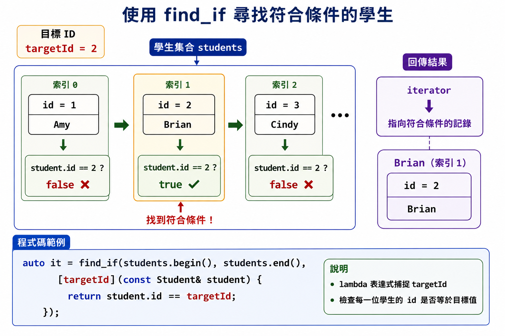


## Section XLIII. `->` 預告

迭代器指向結構時：

```cpp
iterator->name
```

等同概念：

```cpp
(*iterator).name
```

指標與 `->` 的完整說明會在指標章節介紹。

---

# Part M：排序結構紀錄

## Section XLIV. 依分數排序

```cpp
sort(
    students.begin(),
    students.end(),
    [](const Student& first,
       const Student& second) {
        return
            first.score >
            second.score;
    }
);
```

---

## Section XLV. 第二排序條件

若分數相同，可使用姓名：

```cpp
if (
    first.score !=
    second.score
) {
    return
        first.score >
        second.score;
}

return
    first.name <
    second.name;
```

---

## Section XLVI. 完整排序範例

```cpp
// VALIDATE
#include <algorithm>
#include <iostream>
#include <string>
#include <vector>
using namespace std;

struct Student {
    int id;
    string name;
    double score;
};

int main() {
    vector<Student> students{
        {
            1,
            "Cindy",
            90.0
        },
        {
            2,
            "Amy",
            95.0
        },
        {
            3,
            "Brian",
            90.0
        }
    };

    sort(
        students.begin(),
        students.end(),
        [](
            const Student& first,
            const Student& second
        ) {
            if (
                first.score !=
                second.score
            ) {
                return
                    first.score >
                    second.score;
            }

            return
                first.name <
                second.name;
        }
    );

    for (
        const Student& student :
        students
    ) {
        cout << student.name
             << " "
             << student.score
             << '\n';
    }

    return 0;
}
```

---


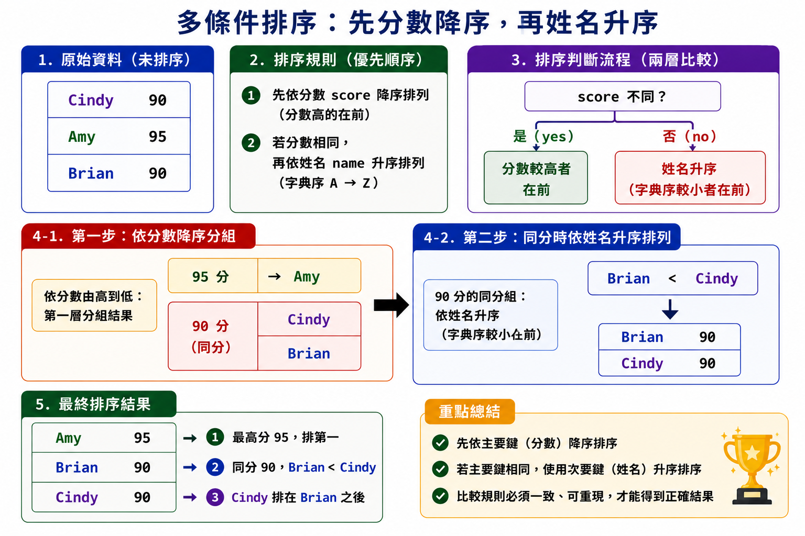


# Part N：傳統 `enum`

## Section XLVII. 基本宣告

```cpp
enum Status {
    pending,
    active,
    completed
};
```

使用：

```cpp
Status status =
    active;
```

---

## Section XLVIII. 名稱污染

列舉值：

```cpp
pending
active
completed
```

直接進入周圍作用域。

不同 enum 若使用相同名稱可能衝突。

---

## Section XLIX. 隱性整數轉換

傳統 enum 通常可隱性轉成整數。

這可能降低型別安全。

---

# Part O：`enum class`

## Section L. Scoped Enumeration

```cpp
enum class Status {
    pending,
    active,
    completed
};
```

使用：

```cpp
Status status =
    Status::active;
```

---

## Section LI. 優點

- 列舉值保留在型別作用域中。
- 名稱衝突較少。
- 不會自動轉成整數。
- 不同 enum class 不會互相混用。
- 介面意圖更清楚。

---


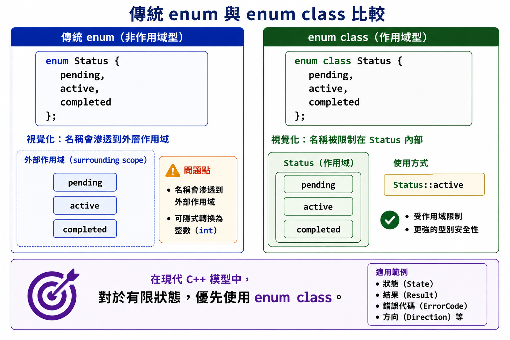


## Section LII. 完整 `enum class` 範例

```cpp
// VALIDATE
#include <iostream>
#include <string>
using namespace std;

enum class Status {
    pending,
    active,
    completed
};

string statusToString(
    Status status
) {
    switch (status) {
        case Status::pending:
            return "Pending";

        case Status::active:
            return "Active";

        case Status::completed:
            return "Completed";
    }

    return "Unknown";
}

int main() {
    Status status =
        Status::active;

    cout << statusToString(
                status
            )
         << '\n';

    return 0;
}
```

---

# Part P：列舉底層值

## Section LIII. 轉成整數

```cpp
int value =
    static_cast<int>(
        status
    );
```

---


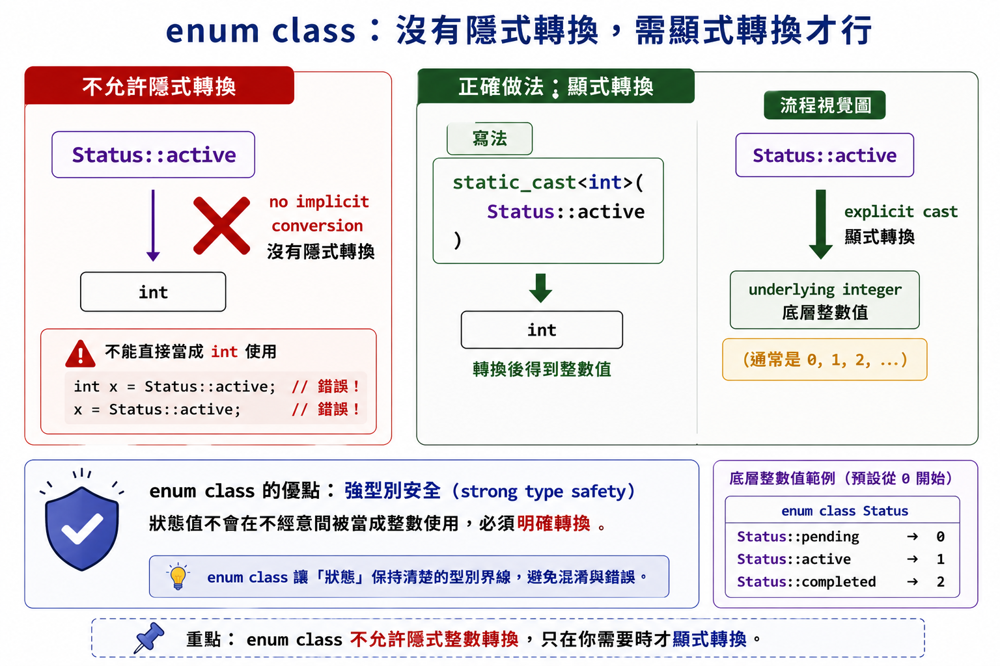


## Section LIV. 指定底層型別

```cpp
enum class Priority : unsigned char {
    low,
    medium,
    high
};
```

---

## Section LV. 指定列舉值

```cpp
enum class ErrorCode : int {
    none = 0,
    invalidInput = 10,
    notFound = 20
};
```

---

## Section LVI. 完整底層值範例

```cpp
// VALIDATE
#include <iostream>
using namespace std;

enum class ErrorCode : int {
    none = 0,
    invalidInput = 10,
    notFound = 20
};

int main() {
    ErrorCode code =
        ErrorCode::notFound;

    cout << static_cast<int>(
                code
            )
         << '\n';

    return 0;
}
```

---

# Part Q：列舉與 `switch`

## Section LVII. 每個狀態一個 case

```cpp
switch (status) {
    case Status::pending:
        break;

    case Status::active:
        break;

    case Status::completed:
        break;
}
```

---

## Section LVIII. 要不要寫 `default`？

若列舉值應全部列出，有時不寫 `default` 可讓編譯器在新增列舉值時提供警告。

但函式仍需有完整回傳路徑。

本教材常在 switch 後提供：

```cpp
return "Unknown";
```

---

## Section LIX. 狀態與行為

列舉適合控制：

- 顯示文字
- 是否允許操作
- 狀態轉換
- 選單分支
- 統計分類

---


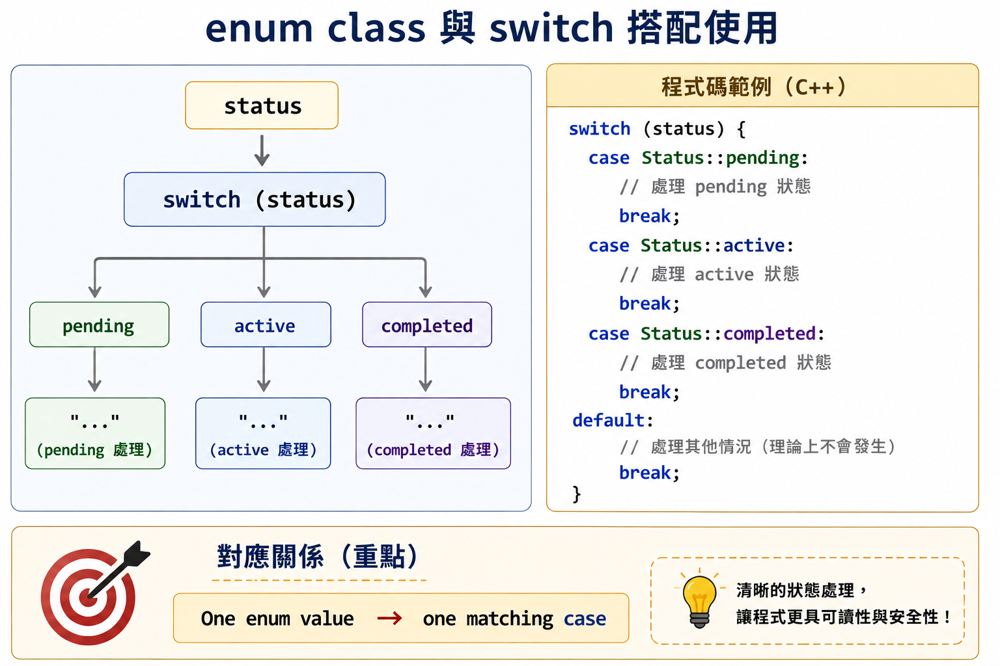


# Part R：文字轉列舉

## Section LX. 可能失敗

輸入：

```text
active
```

可轉成：

```cpp
Status::active
```

但任意文字可能無效。

---

## Section LXI. 使用 `bool` 與輸出參數

```cpp
bool parseStatus(
    const string& text,
    Status& result
)
```

---

## Section LXII. 完整文字轉列舉

```cpp
// VALIDATE
#include <iostream>
#include <string>
using namespace std;

enum class Status {
    pending,
    active,
    completed
};

bool parseStatus(
    const string& text,
    Status& result
) {
    if (text == "pending") {
        result =
            Status::pending;

        return true;
    }

    if (text == "active") {
        result =
            Status::active;

        return true;
    }

    if (text == "completed") {
        result =
            Status::completed;

        return true;
    }

    return false;
}

int main() {
    string text;
    cin >> text;

    Status status =
        Status::pending;

    if (
        parseStatus(
            text,
            status
        )
    ) {
        cout << "Valid status\n";
    } else {
        cout << "Invalid status\n";
    }

    return 0;
}
```

---


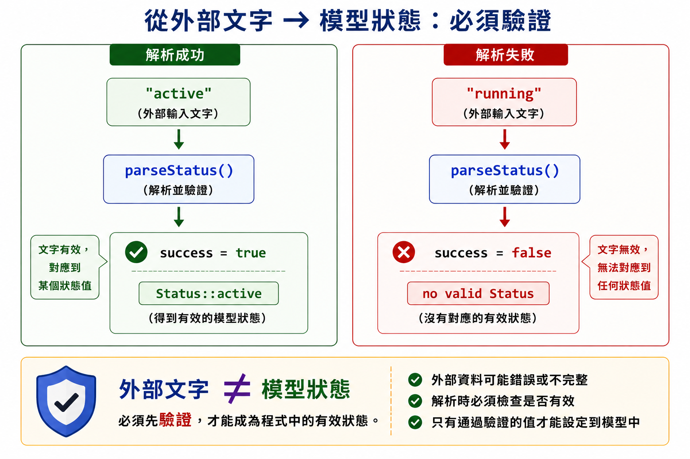


# Part S：結構與列舉結合

## Section LXIII. 任務模型

```cpp
enum class TaskStatus {
    todo,
    doing,
    done
};

struct Task {
    int id;
    string title;
    TaskStatus status;
};
```

---

## Section LXIV. 完整任務模型

```cpp
// VALIDATE
#include <iostream>
#include <string>
using namespace std;

enum class TaskStatus {
    todo,
    doing,
    done
};

struct Task {
    int id;
    string title;
    TaskStatus status =
        TaskStatus::todo;
};

string taskStatusToString(
    TaskStatus status
) {
    switch (status) {
        case TaskStatus::todo:
            return "Todo";

        case TaskStatus::doing:
            return "Doing";

        case TaskStatus::done:
            return "Done";
    }

    return "Unknown";
}

void showTask(
    const Task& task
) {
    cout << task.id
         << " "
         << task.title
         << " ["
         << taskStatusToString(
                task.status
            )
         << "]\n";
}

int main() {
    Task task{
        1,
        "Study C++",
        TaskStatus::doing
    };

    showTask(task);

    return 0;
}
```

---


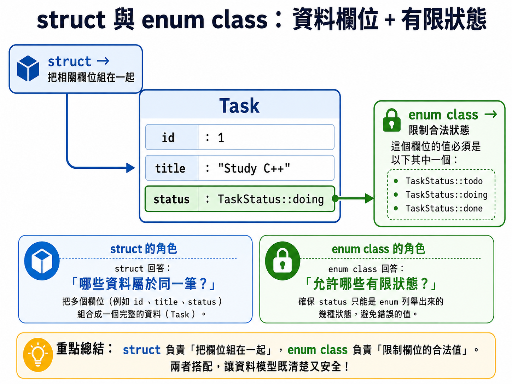


# Part T：避免多個互斥 `bool`

## Section LXV. 問題設計

```cpp
struct Task {
    bool todo;
    bool doing;
    bool done;
};
```

可能出現：

```text
todo = true
doing = true
done = true
```

無效組合。

---

## Section LXVI. 使用單一 enum

```cpp
TaskStatus status;
```

同一時間只能有一個狀態值。

---


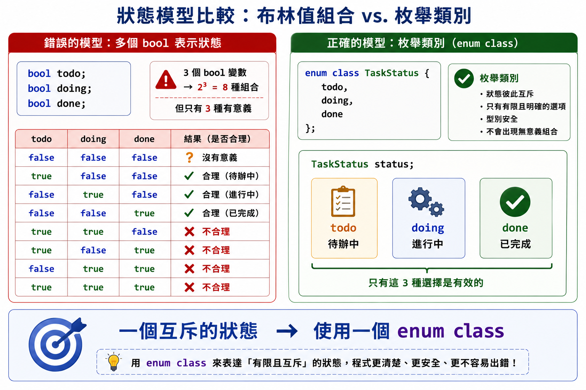


## Section LXVII. 何時使用 `bool`？

適合真正只有兩種情況：

- enabled / disabled
- visible / hidden
- paid / unpaid

若有三種以上互斥狀態，通常使用 `enum class`。

---

# Part U：狀態轉換

## Section LXVIII. 任務狀態規則

例如：

```text
todo → doing
doing → done
done → 不可回到 doing
```

---

## Section LXIX. 狀態轉換函式

```cpp
bool advanceTask(
    Task& task
)
```

---

## Section LXX. 完整狀態轉換

```cpp
// VALIDATE
#include <iostream>
#include <string>
using namespace std;

enum class TaskStatus {
    todo,
    doing,
    done
};

struct Task {
    string title;
    TaskStatus status;
};

bool advanceTask(
    Task& task
) {
    switch (task.status) {
        case TaskStatus::todo:
            task.status =
                TaskStatus::doing;

            return true;

        case TaskStatus::doing:
            task.status =
                TaskStatus::done;

            return true;

        case TaskStatus::done:
            return false;
    }

    return false;
}

int main() {
    Task task{
        "Study",
        TaskStatus::todo
    };

    cout << boolalpha
         << advanceTask(task)
         << '\n';

    cout << advanceTask(task)
         << '\n';

    cout << advanceTask(task)
         << '\n';

    return 0;
}
```

---


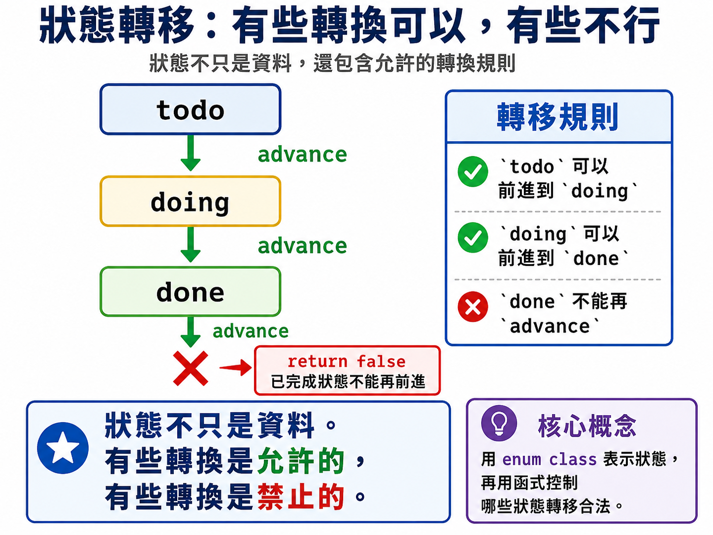


# Part V：資料驗證與 Invariant

## Section LXXI. 什麼是 invariant？

物件只要被視為有效，就應一直成立的規則。

學生模型可能要求：

```text
age >= 0
score between 0 and 100
name not empty
```

---

## Section LXXII. 驗證函式

```cpp
bool isValid(
    const Student& student
)
```

---

## Section LXXIII. 完整驗證範例

```cpp
// VALIDATE
#include <iostream>
#include <string>
using namespace std;

struct Student {
    string name;
    int age;
    double score;
};

bool isValid(
    const Student& student
) {
    return
        !student.name.empty() &&
        student.age >= 0 &&
        student.score >= 0.0 &&
        student.score <= 100.0;
}

int main() {
    Student student{
        "Amy",
        16,
        95.0
    };

    cout << boolalpha
         << isValid(student)
         << '\n';

    return 0;
}
```

---


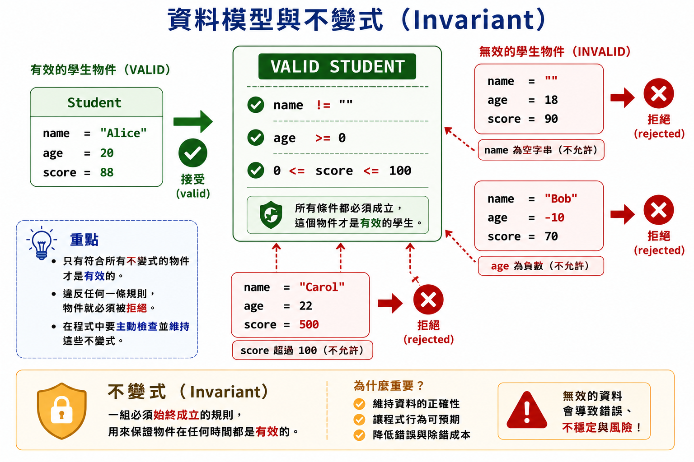


## Section LXXIV. 公開成員的限制

`struct` 公開成員可被任何程式碼直接修改：

```cpp
student.score = -500.0;
```

本章使用驗證與更新函式維持規則。

後續 `class` 與 private 成員可從型別內部強制保護 invariant。

---

# Part W：避免重複儲存衍生資料

## Section LXXV. 問題

```cpp
struct Rectangle {
    double width;
    double height;
    double area;
};
```

若 width 或 height 改變，area 可能變成過期值。

---

## Section LXXVI. 較好模型

```cpp
struct Rectangle {
    double width;
    double height;
};

double calculateArea(
    const Rectangle& rectangle
);
```

---

## Section LXXVII. 完整矩形模型

```cpp
// VALIDATE
#include <iostream>
using namespace std;

struct Rectangle {
    double width;
    double height;
};

bool isValid(
    const Rectangle& rectangle
) {
    return
        rectangle.width >= 0.0 &&
        rectangle.height >= 0.0;
}

double calculateArea(
    const Rectangle& rectangle
) {
    return
        rectangle.width *
        rectangle.height;
}

int main() {
    Rectangle rectangle{
        5.0,
        3.0
    };

    if (isValid(rectangle)) {
        cout << calculateArea(
                    rectangle
                )
             << '\n';
    }

    return 0;
}
```

---


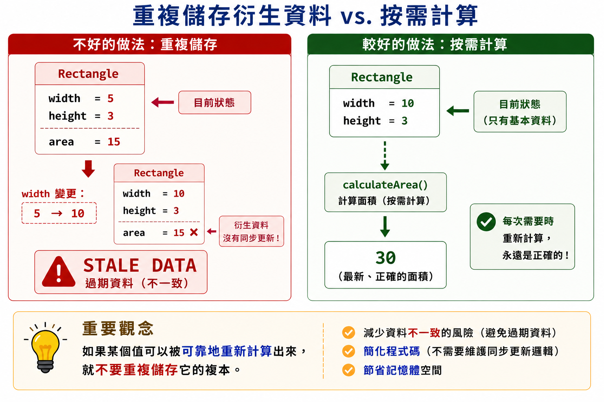


# Part X：統計結構狀態

## Section LXXVIII. `count_if()`

可依 enum 成員統計：

```cpp
count_if(
    tasks.begin(),
    tasks.end(),
    [](const Task& task) {
        return
            task.status ==
            TaskStatus::done;
    }
);
```

---

## Section LXXIX. 完整狀態統計

```cpp
// VALIDATE
#include <algorithm>
#include <iostream>
#include <string>
#include <vector>
using namespace std;

enum class TaskStatus {
    todo,
    doing,
    done
};

struct Task {
    string title;
    TaskStatus status;
};

int main() {
    vector<Task> tasks{
        {
            "Read",
            TaskStatus::done
        },
        {
            "Practice",
            TaskStatus::doing
        },
        {
            "Review",
            TaskStatus::done
        }
    };

    auto completedCount =
        count_if(
            tasks.cbegin(),
            tasks.cend(),
            [](const Task& task) {
                return
                    task.status ==
                    TaskStatus::done;
            }
        );

    cout << completedCount
         << '\n';

    return 0;
}
```

---

# Part Y：移除結構紀錄

## Section LXXX. 依狀態移除

```cpp
tasks.erase(
    remove_if(
        tasks.begin(),
        tasks.end(),
        predicate
    ),
    tasks.end()
);
```

---

## Section LXXXI. 完整移除已完成任務

```cpp
// VALIDATE
#include <algorithm>
#include <iostream>
#include <string>
#include <vector>
using namespace std;

enum class TaskStatus {
    todo,
    doing,
    done
};

struct Task {
    string title;
    TaskStatus status;
};

int main() {
    vector<Task> tasks{
        {
            "Read",
            TaskStatus::done
        },
        {
            "Practice",
            TaskStatus::doing
        },
        {
            "Review",
            TaskStatus::done
        }
    };

    tasks.erase(
        remove_if(
            tasks.begin(),
            tasks.end(),
            [](const Task& task) {
                return
                    task.status ==
                    TaskStatus::done;
            }
        ),
        tasks.end()
    );

    for (
        const Task& task :
        tasks
    ) {
        cout << task.title
             << '\n';
    }

    return 0;
}
```

---

# Part Z：直接比較結構

## Section LXXXII. C++17 限制

若只宣告：

```cpp
struct Point {
    int x;
    int y;
};
```

在 C++17 中不能直接寫：

```cpp
/* first == second */
```

除非自行定義比較運算子。

---

## Section LXXXIII. 使用具名函式

```cpp
bool areEqual(
    const Point& first,
    const Point& second
)
```

---

## Section LXXXIV. 完整相等函式

```cpp
// VALIDATE
#include <iostream>
using namespace std;

struct Point {
    int x;
    int y;
};

bool areEqual(
    const Point& first,
    const Point& second
) {
    return
        first.x == second.x &&
        first.y == second.y;
}

int main() {
    Point first{
        3,
        5
    };

    Point second{
        3,
        5
    };

    cout << boolalpha
         << areEqual(
                first,
                second
            )
         << '\n';

    return 0;
}
```

---

# Part AA：依結構產生新資料

## Section LXXXV. `transform()`

可將：

```text
vector<Student>
```

轉成：

```text
vector<string>
```

只保留名稱。

---

## Section LXXXVI. 完整轉換範例

```cpp
// VALIDATE
#include <algorithm>
#include <iostream>
#include <iterator>
#include <string>
#include <vector>
using namespace std;

struct Student {
    int id;
    string name;
    double score;
};

int main() {
    vector<Student> students{
        {
            1,
            "Amy",
            90.0
        },
        {
            2,
            "Brian",
            85.0
        }
    };

    vector<string> names;

    names.reserve(
        students.size()
    );

    transform(
        students.cbegin(),
        students.cend(),
        back_inserter(names),
        [](const Student& student) {
            return student.name;
        }
    );

    for (
        const string& name :
        names
    ) {
        cout << name
             << '\n';
    }

    return 0;
}
```

---

# Part AB：命名空間中的模型

## Section LXXXVII. 組織型別

```cpp
namespace School {
    struct Student {
        // ...
    };

    enum class Status {
        // ...
    };
}
```

使用：

```cpp
School::Student
School::Status
```

---

## Section LXXXVIII. 完整命名空間模型

```cpp
// VALIDATE
#include <iostream>
#include <string>
using namespace std;

namespace School {
    enum class EnrollmentStatus {
        active,
        graduated
    };

    struct Student {
        string name;
        EnrollmentStatus status;
    };
}

int main() {
    School::Student student{
        "Amy",
        School::EnrollmentStatus::active
    };

    cout << student.name
         << '\n';

    return 0;
}
```

---

# Part AC：資料建模原則

## Section LXXXIX. 一個模型只負責一個概念

較好：

```text
Address
Contact
Course
Student
Task
```

不建議建立一個包含所有欄位的：

```text
EverythingData
```

---

## Section XC. 欄位名稱要清楚

不清楚：

```cpp
int value1;
double value2;
```

較清楚：

```cpp
int ageYears;
double scorePercent;
```

---

## Section XCI. 型別要符合資料

| 資料 | 常見型別 |
| --- | --- |
| 名稱 | `string` |
| 年齡 | `int` |
| 分數 | `double` |
| 是否啟用 | `bool` |
| 有限狀態 | `enum class` |
| 固定三個座標 | `array` |
| 動態多筆紀錄 | `vector` |

---

## Section XCII. 不要全部使用字串

不建議：

```cpp
struct Student {
    string age;
    string score;
    string active;
};
```

否則：

- 數值計算困難。
- 驗證更多。
- 排序可能錯誤。
- 狀態容易拼錯。

---

## Section XCIII. 區分模型與顯示

模型：

```cpp
struct Student {
    string name;
    double score;
};
```

顯示格式：

```text
Amy: 90.0
```

應由顯示函式決定，不需要將完整顯示文字存入模型。

---

# Part AD：日期模型

## Section XCIV. 基本結構

```cpp
struct Date {
    int year;
    int month;
    int day;
};
```

---

## Section XCV. 基本驗證

本章可先檢查：

```text
month 1–12
day 1–31
```

完整月份天數與閏年規則可作延伸練習。

---

## Section XCVI. 完整日期範例

```cpp
// VALIDATE
#include <iostream>
using namespace std;

struct Date {
    int year;
    int month;
    int day;
};

bool isBasicValid(
    const Date& date
) {
    return
        date.year >= 1 &&
        date.month >= 1 &&
        date.month <= 12 &&
        date.day >= 1 &&
        date.day <= 31;
}

void showDate(
    const Date& date
) {
    cout << date.year
         << "-"
         << date.month
         << "-"
         << date.day
         << '\n';
}

int main() {
    Date date{
        2026,
        7,
        27
    };

    if (isBasicValid(date)) {
        showDate(date);
    }

    return 0;
}
```

---

# Part AE：查詢結果模型

## Section XCVII. 將成功狀態與資料組合

```cpp
struct StudentSearchResult {
    bool found;
    Student student;
};
```

---

## Section XCVIII. 限制

找不到時：

```cpp
student
```

仍然存在，但內容可能只是預設值。

因此呼叫者必須先檢查：

```cpp
found
```

---

## Section XCIX. 完整查詢結果

```cpp
// VALIDATE
#include <iostream>
#include <string>
#include <vector>
using namespace std;

struct Student {
    int id = 0;
    string name;
    double score = 0.0;
};

struct StudentSearchResult {
    bool found = false;
    Student student{};
};

StudentSearchResult findStudent(
    const vector<Student>& students,
    int targetId
) {
    for (
        const Student& student :
        students
    ) {
        if (
            student.id ==
            targetId
        ) {
            return {
                true,
                student
            };
        }
    }

    return {};
}

int main() {
    vector<Student> students{
        {
            1,
            "Amy",
            90.0
        }
    };

    StudentSearchResult result =
        findStudent(
            students,
            1
        );

    if (result.found) {
        cout << result.student.name
             << '\n';
    }

    return 0;
}
```

後續可使用 `std::optional<Student>` 更直接表示「可能有值」。

---

# Part AF：快速概念檢查

## Section C. 選擇題與簡答

### Q1. `struct` 的主要用途是什麼？

<details><summary>查看答案</summary>

將彼此相關、可能具有不同型別的資料成員組合成一個新型別。

</details>

### Q2. 結構宣告結尾需要什麼？

<details><summary>查看答案</summary>

分號：

```cpp
;
```

</details>

### Q3. 如何存取結構物件成員？

<details><summary>查看答案</summary>

使用成員存取運算子：

```cpp
object.member
```

</details>

### Q4. Aggregate initialization 依什麼順序？

<details><summary>查看答案</summary>

依成員宣告順序。

</details>

### Q5. `Struct object{};` 有什麼好處？

<details><summary>查看答案</summary>

會進行值初始化並使用預設成員初始化值，避免部分基本型別成員未初始化。

</details>

### Q6. 唯讀結構參數通常如何傳遞？

<details><summary>查看答案</summary>

```cpp
const Struct&
```

</details>

### Q7. 需要修改呼叫者結構時如何傳遞？

<details><summary>查看答案</summary>

```cpp
Struct&
```

</details>

### Q8. 回傳區域結構的值安全嗎？

<details><summary>查看答案</summary>

安全。

</details>

### Q9. 什麼是 composition？

<details><summary>查看答案</summary>

讓一個結構以另一個結構作為成員，使用小模型組成較大的模型。

</details>

### Q10. `enum class` 的主要優點是什麼？

<details><summary>查看答案</summary>

列舉值具有自己的作用域、型別安全較高，而且不會自動轉成整數。

</details>

### Q11. 如何使用 `enum class` 的值？

<details><summary>查看答案</summary>

```cpp
Status::active
```

</details>

### Q12. `enum class` 可以直接輸出成整數嗎？

<details><summary>查看答案</summary>

不會自動轉換，需要明確 `static_cast`。

</details>

### Q13. 有三種互斥狀態時應使用多個 bool 嗎？

<details><summary>查看答案</summary>

通常不應，應使用單一 `enum class`。

</details>

### Q14. 為什麼不應在 Rectangle 同時儲存 width、height 和 area？

<details><summary>查看答案</summary>

`area` 可由 width 與 height 計算，重複儲存可能與來源欄位不一致。

</details>

### Q15. Vector of structs 如何宣告？

<details><summary>查看答案</summary>

```cpp
vector<Student> students;
```

</details>

### Q16. 如何依結構成員搜尋？

<details><summary>查看答案</summary>

使用 `find_if()` 和比較指定成員的 predicate 或 lambda。

</details>

### Q17. 如何依結構成員排序？

<details><summary>查看答案</summary>

使用 `sort()` 並提供讀取成員的比較器。

</details>

### Q18. C++17 會自動讓所有 struct 支援 `==` 嗎？

<details><summary>查看答案</summary>

不會，需要自行撰寫比較函式或運算子。

</details>

### Q19. 什麼是 invariant？

<details><summary>查看答案</summary>

只要物件被視為有效就應一直成立的資料規則。

</details>

### Q20. 為什麼不應把所有欄位都存成 string？

<details><summary>查看答案</summary>

會失去正確型別帶來的計算、驗證、排序與狀態安全。

</details>

---

# Part AG：程式閱讀練習

## Section CI. 預測結果與合法性

### 題目 1

```cpp
struct Point {
    int x;
    int y;
};

Point point{
    3,
    5
};

cout << point.y;
```

<details><summary>查看答案</summary>

```text
5
```

</details>

### 題目 2

```cpp
struct Data {
    int first = 10;
    int second = 20;
};

Data data{};

cout << data.first
     << data.second;
```

<details><summary>查看答案</summary>

```text
1020
```

</details>

### 題目 3

```cpp
struct Student {
    string name;
    int age;
};

Student first{
    "Amy",
    16
};

Student second =
    first;

second.name =
    "Brian";

cout << first.name;
```

<details><summary>查看答案</summary>

```text
Amy
```

</details>

### 題目 4

```cpp
enum class Status {
    pending,
    active
};

Status status =
    Status::active;

/* cout << status; */
```

<details><summary>查看答案</summary>

不能直接使用一般整數輸出方式輸出 `enum class`；應轉成文字或明確轉型到底層值。

</details>

### 題目 5

```cpp
enum class Status {
    pending = 5,
    active = 10
};

cout << static_cast<int>(
            Status::active
        );
```

<details><summary>查看答案</summary>

```text
10
```

</details>

### 題目 6

```cpp
struct Address {
    string city;
};

struct Contact {
    string name;
    Address address;
};

Contact contact{
    "Amy",
    {
        "Taipei"
    }
};

cout << contact.address.city;
```

<details><summary>查看答案</summary>

```text
Taipei
```

</details>

### 題目 7

```cpp
struct Student {
    string name;
    double score;
};

vector<Student> students{
    {
        "Amy",
        90.0
    },
    {
        "Brian",
        80.0
    }
};

students[0].score =
    95.0;

cout << students[0].score;
```

<details><summary>查看答案</summary>

```text
95
```

實際格式由輸出串流設定決定。

</details>

### 題目 8

```cpp
enum class State {
    off,
    on
};

State state =
    State::off;

switch (state) {
    case State::off:
        cout << "A";
        break;

    case State::on:
        cout << "B";
        break;
}
```

<details><summary>查看答案</summary>

```text
A
```

</details>

### 題目 9

```cpp
struct Rectangle {
    double width;
    double height;
};

Rectangle rectangle{
    5.0,
    3.0
};

cout <<
    rectangle.width *
    rectangle.height;
```

<details><summary>查看答案</summary>

```text
15
```

</details>

### 題目 10

```cpp
struct Point {
    int x;
    int y;
};

Point first{
    1,
    2
};

Point second{
    1,
    2
};

/* cout << boolalpha
        << (first == second); */
```

<details><summary>查看答案</summary>

在 C++17 中，單純宣告 struct 不會自動建立 `operator==`，因此這段不能直接比較。

</details>

### 題目 11

```cpp
enum class TaskStatus {
    todo,
    done
};

struct Task {
    string title;
    TaskStatus status;
};

Task task{
    "Study",
    TaskStatus::todo
};

task.status =
    TaskStatus::done;

cout << boolalpha
     << (
            task.status ==
            TaskStatus::done
        );
```

<details><summary>查看答案</summary>

```text
true
```

</details>

### 題目 12

```cpp
struct Result {
    bool success = false;
    int value = 0;
};

Result makeResult() {
    return {
        true,
        42
    };
}

cout << makeResult().value;
```

<details><summary>查看答案</summary>

```text
42
```

</details>

---

# Part AH：實作練習

## Section CII. 實作檢測題

### TODO 1：Point 結構

建立 `Point`，輸入 `x`、`y`，輸出 `(x, y)`。

### TODO 2：學生紀錄

建立包含 ID、姓名、年齡與分數的 `Student`。

### TODO 3：顯示函式

建立：

```cpp
void showStudent(
    const Student& student
)
```

### TODO 4：更新分數

建立驗證 `0–100` 的：

```cpp
bool updateScore(
    Student& student,
    double score
)
```

### TODO 5：工廠函式

建立：

```cpp
Student makeStudent(...)
```

### TODO 6：Address 與 Contact

使用 composition 建立聯絡人資料。

### TODO 7：Vector of Students

建立多筆學生資料並以 range-based `for` 輸出。

### TODO 8：搜尋學生

使用 `find_if()` 依 ID 搜尋。

### TODO 9：學生排序

依分數遞減；同分時姓名遞增。

### TODO 10：enum class 狀態

建立 `EnrollmentStatus`，包含 active、suspended、graduated。

### TODO 11：列舉轉文字

建立：

```cpp
string statusToString(
    EnrollmentStatus status
)
```

### TODO 12：文字轉列舉

建立可回報失敗的 parse 函式。

### TODO 13：任務狀態統計

使用 `count_if()` 統計 done 任務數。

### TODO 14：移除已完成任務

使用 erase-remove_if idiom。

### TODO 15：統計結果結構

使用 `Statistics` 回傳最小值、最大值與平均值。

---

# Part AI：課後小練習

## Section CIII. 延伸練習

### 練習 1：完整日期驗證

處理不同月份天數與閏年規則。

### 練習 2：課程成績模型

Course 包含課程名稱與多筆成績，提供平均、最高與及格率。

### 練習 3：商品庫存模型

Product 包含 ID、名稱、庫存數量與狀態，支援搜尋、補貨與扣庫存。

### 練習 4：任務狀態機

限制合法狀態轉換，並列出每個狀態可執行的操作。

### 練習 5：資料模型重構

將一段使用十多個零散變數的程式改寫為多個小 struct 與 enum class。

---

# Part AJ：常見錯誤提醒

## Section CIV. 常見錯誤

1. 忘記 `struct` 宣告結尾分號。
2. 建立結構物件後讀取未初始化基本型別成員。
3. Aggregate initialization 順序與成員宣告順序不同。
4. 修改了錯誤結構物件的成員。
5. 唯讀函式參數使用傳值造成不必要複製。
6. 需要修改原物件卻忘記參考 `&`。
7. 回傳區域結構參考。
8. 將所有欄位都設成 public 後完全不做驗證。
9. 重複儲存可重新計算的衍生資料。
10. 欄位名稱使用 `value1`、`data2` 等模糊名稱。
11. 用字串保存應為數值的資料。
12. 用字串保存有限狀態並造成拼字錯誤。
13. 使用多個互斥 bool 表示單一狀態。
14. 傳統 enum 的列舉值名稱和其他名稱衝突。
15. 忘記 `enum class` 需要 `Type::value`。
16. 期待 `enum class` 自動轉成 int。
17. 使用 `static_cast` 後依賴不穩定底層編號。
18. `switch` 漏掉新增的列舉值。
19. 列舉轉字串函式沒有完整回傳路徑。
20. 文字轉列舉時未處理無效輸入。
21. Vector of structs 搜尋後沒有檢查 `.end()`。
22. 排序比較器使用 `<=`。
23. 排序比較器修改結構內容。
24. 在迭代器失效後繼續使用 `iterator->member`。
25. C++17 中直接比較沒有定義運算子的 struct。
26. 將顯示格式文字重複存入模型。
27. 建立一個包含所有概念的巨大 struct。
28. 巢狀結構層級過深且名稱不清楚。
29. 狀態轉換函式允許不合法轉換。
30. 沒有明確定義模型的有效值規則。

---

# Part AK：Mermaid 流程圖

## Section CV. 結構、列舉與資料建模流程圖

### 1. 建立資料模型

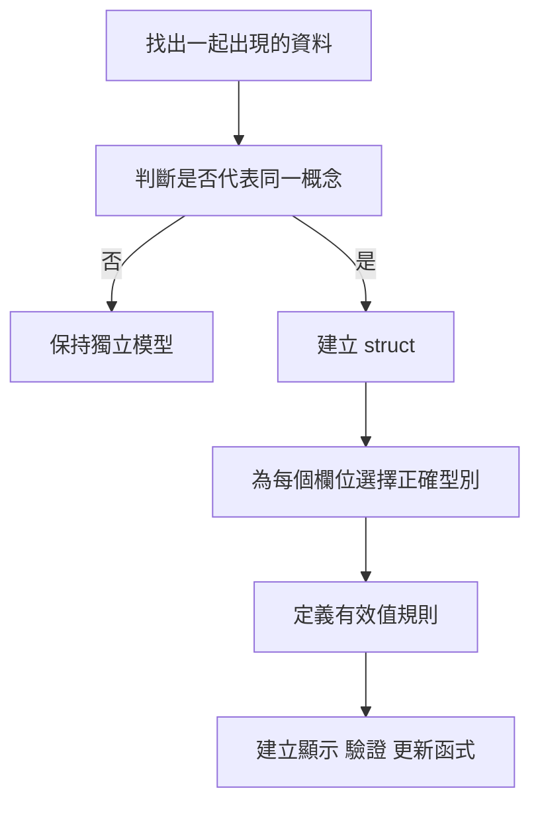
```mermaid
flowchart TD
    A[找出一起出現的資料] --> B[判斷是否代表同一概念]
    B -- 否 --> C[保持獨立模型]
    B -- 是 --> D[建立 struct]
    D --> E[為每個欄位選擇正確型別]
    E --> F[定義有效值規則]
    F --> G[建立顯示 驗證 更新函式]
```

### 2. 選擇 bool 或 enum

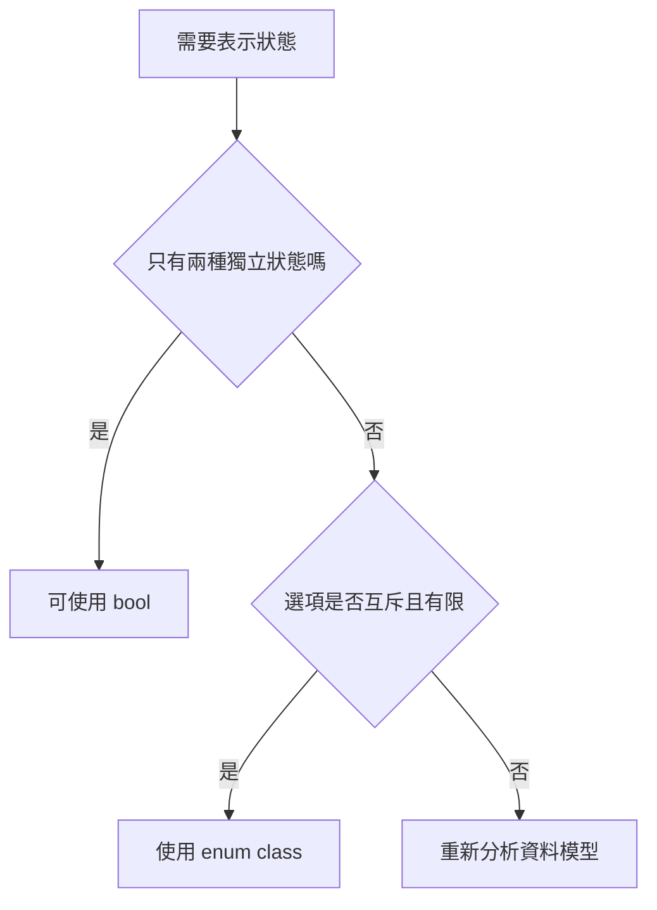
```mermaid
flowchart TD
    A[需要表示狀態] --> B{只有兩種獨立狀態嗎}
    B -- 是 --> C[可使用 bool]
    B -- 否 --> D{選項是否互斥且有限}
    D -- 是 --> E[使用 enum class]
    D -- 否 --> F[重新分析資料模型]
```

### 3. 結構參數方式

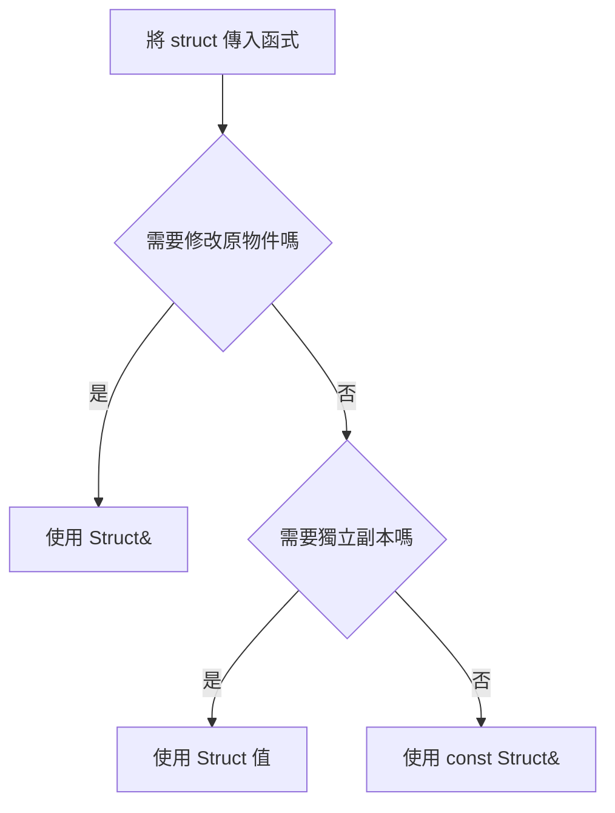
```mermaid
flowchart TD
    A[將 struct 傳入函式] --> B{需要修改原物件嗎}
    B -- 是 --> C[使用 Struct&]
    B -- 否 --> D{需要獨立副本嗎}
    D -- 是 --> E[使用 Struct 值]
    D -- 否 --> F[使用 const Struct&]
```

### 4. 搜尋結構紀錄

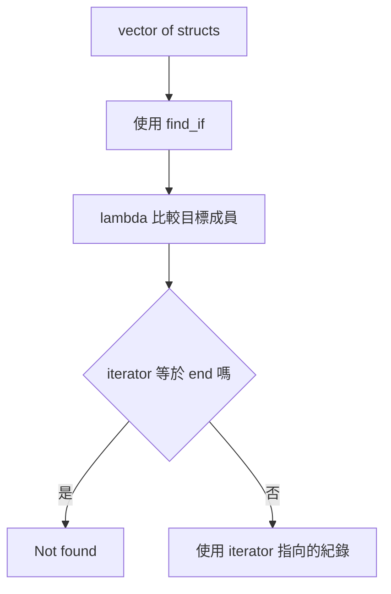
```mermaid
flowchart TD
    A[vector of structs] --> B[使用 find_if]
    B --> C[lambda 比較目標成員]
    C --> D{iterator 等於 end 嗎}
    D -- 是 --> E[Not found]
    D -- 否 --> F[使用 iterator 指向的紀錄]
```

### 5. 結構排序

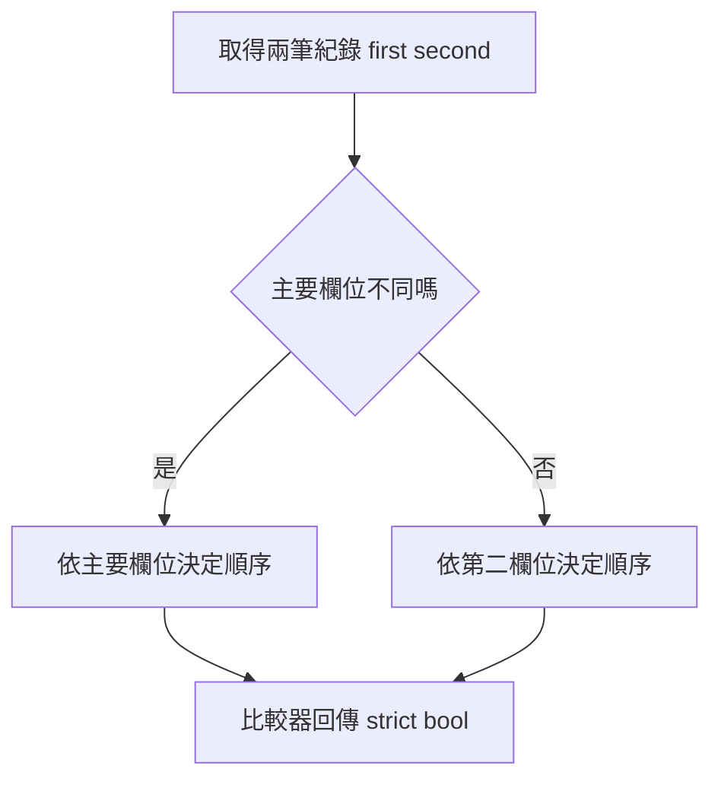
```mermaid
flowchart TD
    A[取得兩筆紀錄 first second] --> B{主要欄位不同嗎}
    B -- 是 --> C[依主要欄位決定順序]
    B -- 否 --> D[依第二欄位決定順序]
    C --> E[比較器回傳 strict bool]
    D --> E
```

### 6. 狀態轉換

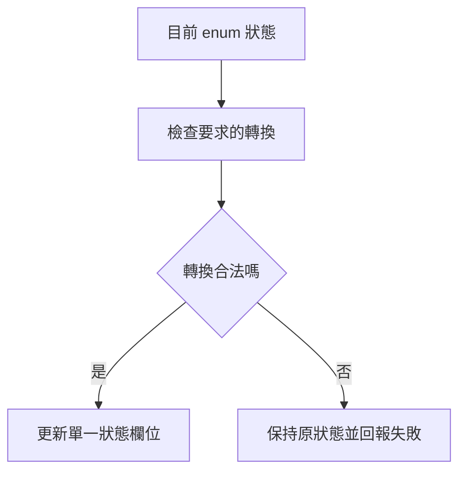
```mermaid
flowchart TD
    A[目前 enum 狀態] --> B[檢查要求的轉換]
    B --> C{轉換合法嗎}
    C -- 是 --> D[更新單一狀態欄位]
    C -- 否 --> E[保持原狀態並回報失敗]
```

### 7. 驗證模型

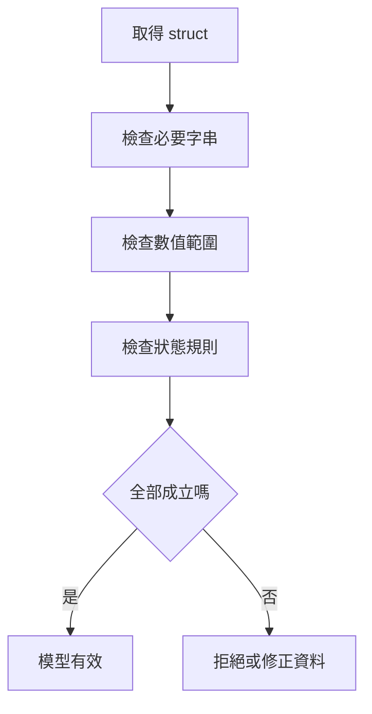
```mermaid
flowchart TD
    A[取得 struct] --> B[檢查必要字串]
    B --> C[檢查數值範圍]
    C --> D[檢查狀態規則]
    D --> E{全部成立嗎}
    E -- 是 --> F[模型有效]
    E -- 否 --> G[拒絕或修正資料]
```

### 8. 避免重複資料

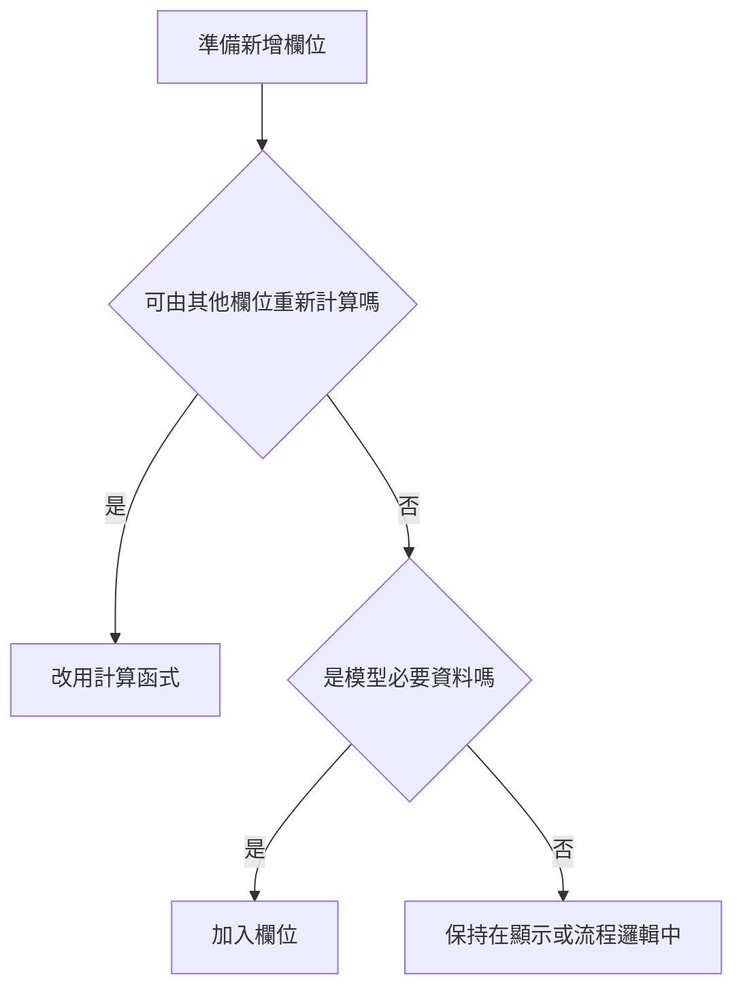
```mermaid
flowchart TD
    A[準備新增欄位] --> B{可由其他欄位重新計算嗎}
    B -- 是 --> C[改用計算函式]
    B -- 否 --> D{是模型必要資料嗎}
    D -- 是 --> E[加入欄位]
    D -- 否 --> F[保持在顯示或流程邏輯中]
```

---

# 本章完成標準

完成本章後，你應該能做到：

1. 說明資料建模的用途。
2. 使用 `struct` 宣告新型別。
3. 建立結構物件。
4. 使用 `.` 存取成員。
5. 使用 aggregate initialization。
6. 依成員宣告順序初始化。
7. 使用預設成員初始化值。
8. 避免未初始化成員。
9. 複製與賦值結構。
10. 將結構以值傳入函式。
11. 將結構以 `const` 參考傳入函式。
12. 將結構以一般參考傳入函式。
13. 以值回傳結構。
14. 建立工廠函式。
15. 使用結構表示多個回傳值。
16. 使用 composition。
17. 建立巢狀結構。
18. 使用 array 或 vector 作為成員。
19. 建立 vector of structs。
20. 使用 range-based `for` 走訪紀錄。
21. 使用 `find_if()` 搜尋結構。
22. 使用 `sort()` 依成員排序。
23. 使用第二排序條件。
24. 使用 `enum class`。
25. 使用 `Type::value`。
26. 比較傳統 enum 與 enum class。
27. 使用 `switch` 處理列舉。
28. 將列舉轉成字串。
29. 將文字轉成列舉。
30. 處理無效列舉輸入。
31. 將 enum 成員放入 struct。
32. 使用單一 enum 取代互斥 bool。
33. 建立狀態轉換函式。
34. 定義並驗證 invariant。
35. 避免重複儲存衍生資料。
36. 使用 `count_if()` 統計結構狀態。
37. 使用 erase-remove_if 移除紀錄。
38. 撰寫結構相等判斷函式。
39. 使用清楚欄位名稱與正確型別。
40. 找出常見結構、列舉與資料建模錯誤。

---

# 隱藏答案區

> Answer hidden — try it first.

<details><summary>TODO 1 答案</summary>

```cpp
struct Point {
    int x = 0;
    int y = 0;
};

Point point{};

cin >> point.x
    >> point.y;

cout << "("
     << point.x
     << ", "
     << point.y
     << ")\n";
```

</details>

<details><summary>TODO 2 答案</summary>

```cpp
struct Student {
    int id = 0;
    string name;
    int age = 0;
    double score = 0.0;
};
```

</details>

<details><summary>TODO 3 答案</summary>

```cpp
void showStudent(
    const Student& student
) {
    cout << student.id
         << " "
         << student.name
         << " "
         << student.age
         << " "
         << student.score
         << '\n';
}
```

</details>

<details><summary>TODO 4 答案</summary>

```cpp
bool updateScore(
    Student& student,
    double score
) {
    if (
        score < 0.0 ||
        score > 100.0
    ) {
        return false;
    }

    student.score = score;

    return true;
}
```

</details>

<details><summary>TODO 5 答案</summary>

```cpp
Student makeStudent(
    int id,
    const string& name,
    int age,
    double score
) {
    return {
        id,
        name,
        age,
        score
    };
}
```

</details>

<details><summary>TODO 6 答案</summary>

```cpp
struct Address {
    string city;
    string street;
};

struct Contact {
    string name;
    string phone;
    Address address;
};
```

</details>

<details><summary>TODO 7 答案</summary>

```cpp
vector<Student> students{
    {
        1,
        "Amy",
        16,
        90.0
    },
    {
        2,
        "Brian",
        17,
        85.0
    }
};

for (
    const Student& student :
    students
) {
    showStudent(student);
}
```

</details>

<details><summary>TODO 8 答案</summary>

```cpp
auto iterator =
    find_if(
        students.cbegin(),
        students.cend(),
        [targetId](
            const Student& student
        ) {
            return
                student.id ==
                targetId;
        }
    );
```

</details>

<details><summary>TODO 9 答案</summary>

```cpp
sort(
    students.begin(),
    students.end(),
    [](
        const Student& first,
        const Student& second
    ) {
        if (
            first.score !=
            second.score
        ) {
            return
                first.score >
                second.score;
        }

        return
            first.name <
            second.name;
    }
);
```

</details>

<details><summary>TODO 10 答案</summary>

```cpp
enum class EnrollmentStatus {
    active,
    suspended,
    graduated
};
```

</details>

<details><summary>TODO 11 答案</summary>

```cpp
string statusToString(
    EnrollmentStatus status
) {
    switch (status) {
        case EnrollmentStatus::active:
            return "Active";

        case EnrollmentStatus::suspended:
            return "Suspended";

        case EnrollmentStatus::graduated:
            return "Graduated";
    }

    return "Unknown";
}
```

</details>

<details><summary>TODO 12 答案</summary>

```cpp
bool parseStatus(
    const string& text,
    EnrollmentStatus& result
) {
    if (text == "active") {
        result =
            EnrollmentStatus::active;

        return true;
    }

    if (text == "suspended") {
        result =
            EnrollmentStatus::suspended;

        return true;
    }

    if (text == "graduated") {
        result =
            EnrollmentStatus::graduated;

        return true;
    }

    return false;
}
```

</details>

<details><summary>TODO 13 答案</summary>

```cpp
auto completedCount =
    count_if(
        tasks.cbegin(),
        tasks.cend(),
        [](const Task& task) {
            return
                task.status ==
                TaskStatus::done;
        }
    );
```

</details>

<details><summary>TODO 14 答案</summary>

```cpp
tasks.erase(
    remove_if(
        tasks.begin(),
        tasks.end(),
        [](const Task& task) {
            return
                task.status ==
                TaskStatus::done;
        }
    ),
    tasks.end()
);
```

</details>

<details><summary>TODO 15 答案</summary>

```cpp
struct Statistics {
    int minimum = 0;
    int maximum = 0;
    double average = 0.0;
};
```

函式應先檢查輸入集合是否為空，再填入三個欄位並回報是否成功。

</details>
