# Lesson 21：Classes and Objects 類別與物件

> 這堂課的重點：把「資料」與「操作這些資料的行為」整理成同一個自訂型態。你會學習 `class`、object、data member、member function、`public`、`.` 成員存取運算子、建立多個物件、物件狀態、類別內外的成員函式定義，以及如何把物件放進函式、陣列與 `vector` 中使用。

> 本章專注在「類別是什麼、物件怎麼使用」。建構子 constructor、解構子 destructor、完整封裝 encapsulation、getter/setter、`this`、繼承與多型會在後續章節再完整介紹。本章的完整程式使用 C++17。

---

## Section I. 今天要做什麼？

1. 認識類別 class。
2. 認識物件 object。
3. 理解類別是一種自訂型態 user-defined type。
4. 理解「類別像藍圖，物件像依照藍圖建立的實例」。
5. 分辨 class definition 與 object declaration。
6. 使用 `class` 定義自己的型態。
7. 認識 data member 成員資料。
8. 認識 member function 成員函式。
9. 認識 member 成員的統稱。
10. 使用 `public:`。
11. 理解 `class` 預設成員是 `private`。
12. 使用 `.` 存取物件成員。
13. 建立一個物件。
14. 建立多個相同類別的物件。
15. 理解不同物件具有各自的狀態 state。
16. 修改單一物件的成員資料。
17. 呼叫物件的成員函式。
18. 在成員函式中讀取自己的成員資料。
19. 在成員函式中修改自己的成員資料。
20. 建立有參數的成員函式。
21. 建立有回傳值的成員函式。
22. 建立 `bool` 成員函式。
23. 建立 `void` 成員函式。
24. 使用物件表示學生資料。
25. 使用物件表示長方形。
26. 使用物件表示計數器。
27. 使用物件表示遊戲角色。
28. 將資料與相關行為放在同一個類別。
29. 分辨 `class` 與 `struct` 的基本差異。
30. 理解 `struct` 預設是 `public`。
31. 理解 `class` 預設是 `private`。
32. 認識 C++ 中 `class` 與 `struct` 都可以有成員函式。
33. 認識類別內直接定義成員函式。
34. 認識類別外定義成員函式。
35. 使用 scope resolution operator `::`。
36. 理解 `ClassName::functionName()` 的意思。
37. 將物件作為函式引數。
38. 理解物件傳值會建立副本的概念。
39. 從一般函式回傳物件。
40. 使用函式建立並回傳完整物件。
41. 建立物件陣列。
42. 使用 `vector<ClassName>` 儲存多個物件。
43. 使用迴圈巡覽多個物件。
44. 搜尋符合條件的物件。
45. 計算符合條件的物件數量。
46. 修改 `vector` 中指定物件的狀態。
47. 將先前學過的 `enum class` 放入類別。
48. 讓物件狀態使用列舉表示。
49. 認識 object composition：物件可以包含另一個物件。
50. 將小型資料模型組合成較大的資料模型。
51. 思考一個類別應該負責什麼。
52. 避免把所有資料與所有工作都塞進單一類別。
53. 避免把不相關的成員放在同一類別。
54. 使用清楚的類別名稱與成員名稱。
55. 分辨一般函式與成員函式的使用情境。
56. 理解 `main()` 可以建立並協調多個物件。
57. 閱讀具有多個物件的程式流程。
58. 預測成員函式執行後物件狀態。
59. 找出常見 class / object 錯誤。
60. 使用實作題建立自己的簡單類別。

---

## Section II. 今天的學習方式

1. 看到一個類別時，先標出：
   ```text
   類別名稱
   成員資料
   成員函式
   public 區域
   ```
2. 看到一個物件時，先問：
   ```text
   這個物件是哪一個類別的實例？
   ```
3. 看到：
   ```cpp
   student.score
   ```
   要讀成：
   ```text
   student 這個物件的 score 成員
   ```
4. 看到：
   ```cpp
   student.printInfo()
   ```
   要讀成：
   ```text
   呼叫 student 這個物件的 printInfo 成員函式
   ```
5. 每建立一個新物件，都先想：
   ```text
   它有自己獨立的一份成員資料
   ```
6. 類別設計先從一句話開始：
   ```text
   這個類別代表什麼？
   ```
7. 接著列出：
   ```text
   它需要保存哪些資料？
   它需要做哪些事情？
   ```
8. 本章為了專注 class / object 基礎，許多資料成員會先放在 `public:`。
9. 不要把本章的 `public` 資料成員當成大型專案的最終設計方式；完整封裝會在下一章整理。
10. 遇到成員函式時，確認它正在操作「哪一個物件」的資料。
11. 使用 `vector<物件>` 時，要同時追蹤迴圈位置與目前物件。
12. 完整合法範例使用嚴格 C++17 選項檢查。

---

## Section III. 核心語法對照

| 語法 | 用途 |
| --- | --- |
| `class Student { ... };` | 定義 `Student` 類別 |
| `Student student;` | 建立一個 `Student` 物件 |
| `public:` | 後方成員可以從類別外直接存取 |
| `int score;` | 成員資料 data member |
| `void printInfo() { ... }` | 成員函式 member function |
| `student.score` | 存取物件的資料成員 |
| `student.printInfo()` | 呼叫物件的成員函式 |
| `student.score = 90;` | 修改物件狀態 |
| `className::functionName` | 類別外指定某個類別的成員函式 |
| `void Student::printInfo()` | 在類別外定義成員函式 |
| `vector<Student>` | 儲存多個 `Student` 物件 |
| `Player makePlayer()` | 一般函式回傳物件 |
| `void printStudent(Student student)` | 將物件以傳值方式傳入函式 |

---

# Part A：什麼是類別與物件？

## Section IV. 類別是一種自訂型態

<p align="center">
  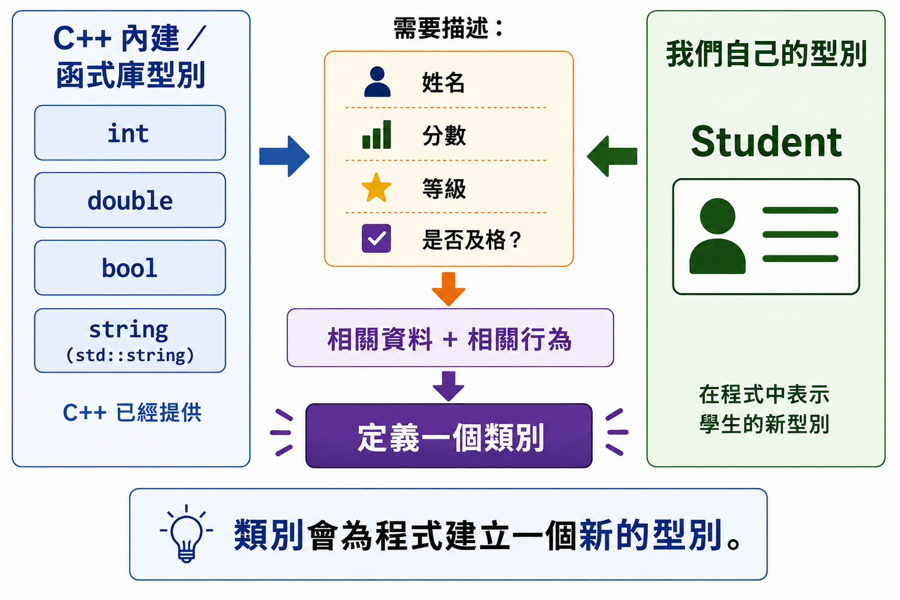
</p>

C++ 已經提供很多型態：

```cpp
int
double
char
bool
string
```

但真實問題常需要更完整的資料模型。

例如一位學生可能同時具有：

```text
姓名
分數
年級
是否通過
```

我們可以建立自己的型態：

```cpp
class Student {
    // ...
};
```

此時 `Student` 就像：

```text
int
string
Student
```

一樣，可以拿來宣告變數。

---

## Section V. 類別是藍圖，物件是實例

<p align="center">
  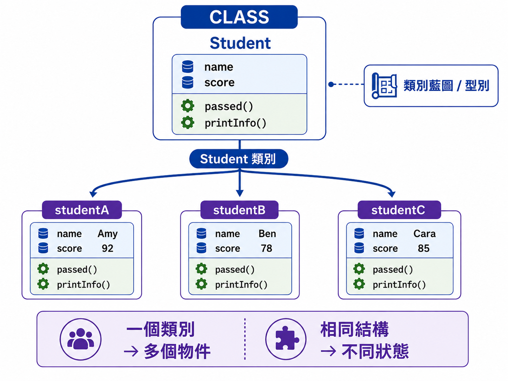
</p>

可以先用這個比喻：

```text
class = 藍圖
object = 依照藍圖建立出來的實際東西
```

例如：

```text
Student 類別
├── studentA 物件
├── studentB 物件
└── studentC 物件
```

三個物件都是：

```text
Student
```

但是可以保存不同資料。

---

## Section VI. 第一個類別

<p align="center">
  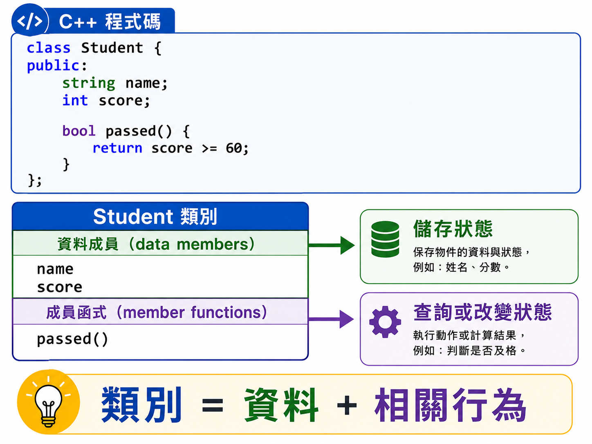
</p>

```cpp
class Student {
public:
    string name;
    int score;
};
```

這個類別定義了：

```text
每一個 Student 物件
都有 name
都有 score
```

注意類別定義最後需要：

```cpp
;
```

也就是：

```cpp
};
```

---

## Section VII. 第一個物件

```cpp
Student student;
```

這一行表示：

```text
建立一個型態為 Student 的物件
物件名稱叫 student
```

接著可以使用：

```cpp
student.name = "Amy";
student.score = 92;
```

---

# Part B：建立與使用物件

## Section VIII. 完整基本範例

```cpp
// VALIDATE
#include <iostream>
#include <string>
using namespace std;

class Student {
public:
    string name;
    int score;
};

int main() {
    Student student;

    student.name = "Amy";
    student.score = 92;

    cout << student.name << '\n';
    cout << student.score << '\n';

    return 0;
}
```

輸出：

```text
Amy
92
```

---

## Section IX. `.` 成員存取運算子

<p align="center">
  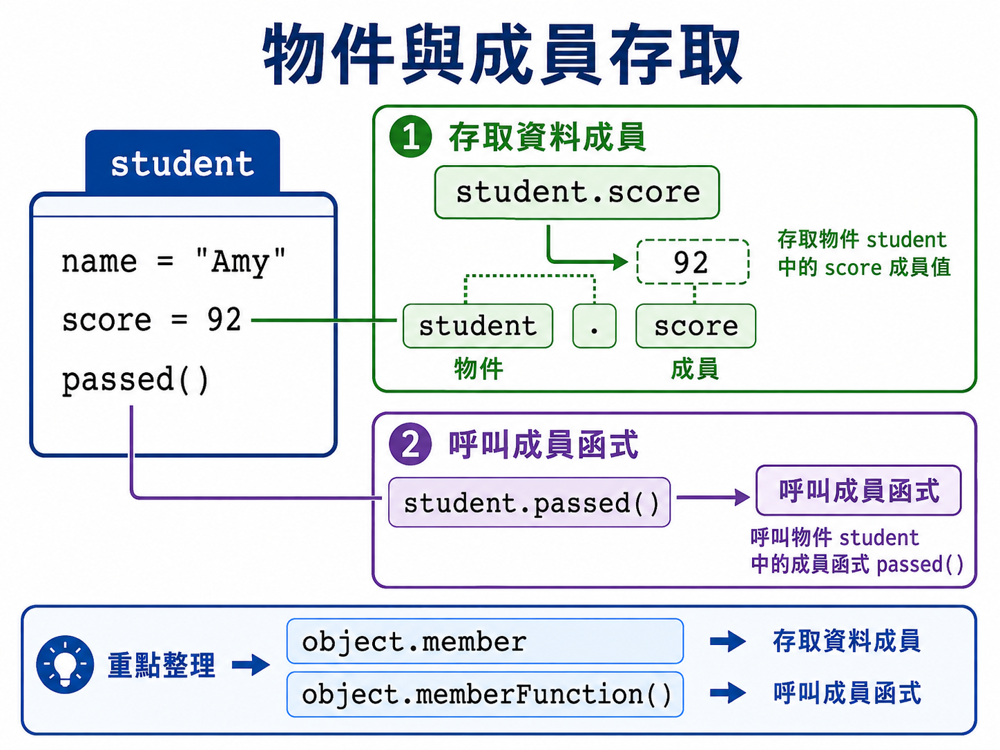
</p>

```cpp
student.name
```

可以讀成：

```text
student 的 name
```

```cpp
student.score
```

可以讀成：

```text
student 的 score
```

`.` 左邊通常是：

```text
物件
```

`.` 右邊是：

```text
該物件的成員
```

---

## Section X. `public:`

<p align="center">
  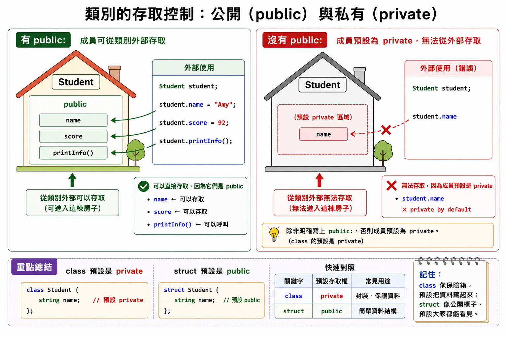
</p>

本章會先寫：

```cpp
class Student {
public:
    string name;
    int score;
};
```

`public:` 表示後面的成員可以從類別外直接使用。

所以：

```cpp
student.name = "Amy";
```

可以合法編譯。

如果沒有寫 `public:`，`class` 的成員預設是 `private`，類別外不能直接存取。

完整的 `private` 與封裝設計會在下一章整理。

---

## Section XI. 類別定義本身不是物件

<p align="center">
  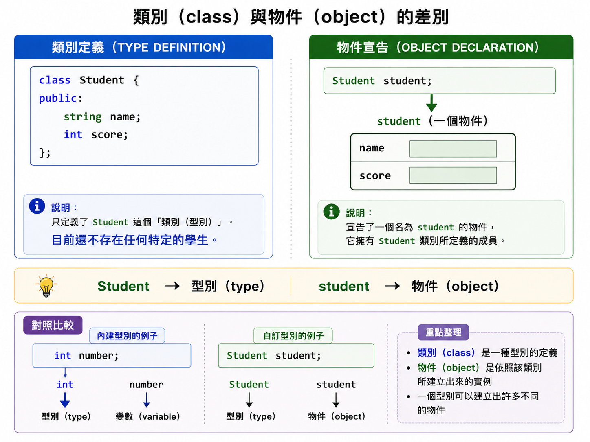
</p>

```cpp
class Student {
public:
    string name;
    int score;
};
```

只是定義：

```text
Student 這種型態長什麼樣子
```

真正建立物件的是：

```cpp
Student student;
```

類似：

```cpp
int number;
```

其中：

```text
int     → 型態
number  → 變數
Student → 型態
student → 物件
```

---

# Part C：一個類別可以建立很多物件

## Section XII. 建立兩個學生

<p align="center">
  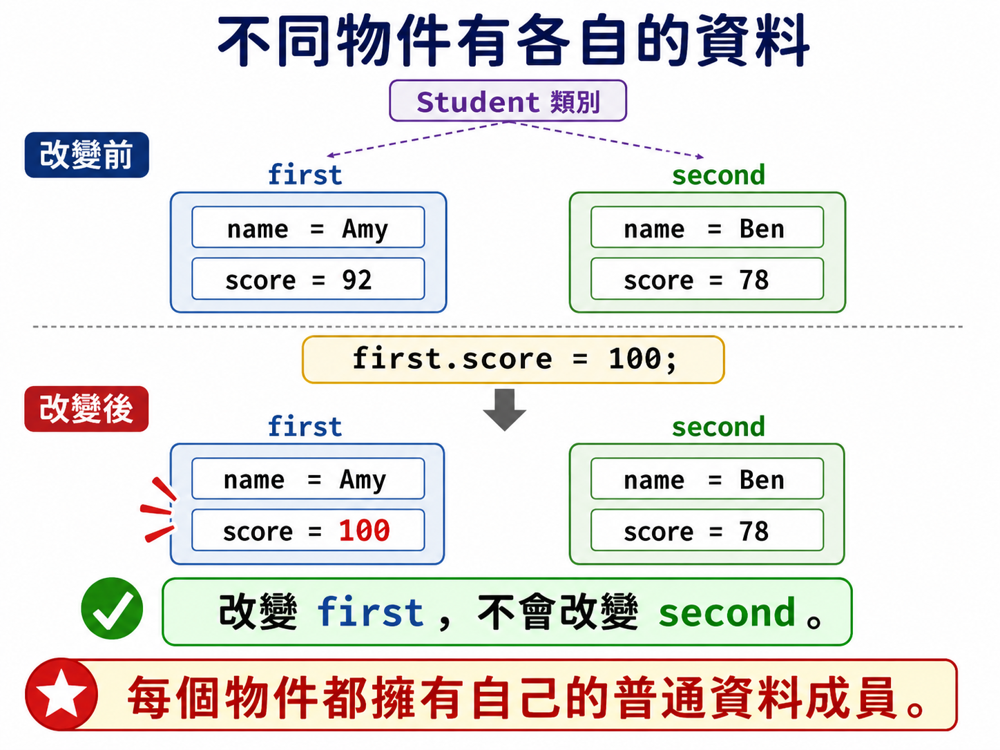
</p>

```cpp
// VALIDATE
#include <iostream>
#include <string>
using namespace std;

class Student {
public:
    string name;
    int score;
};

int main() {
    Student first;
    Student second;

    first.name = "Amy";
    first.score = 92;

    second.name = "Ben";
    second.score = 78;

    cout << first.name << " " << first.score << '\n';
    cout << second.name << " " << second.score << '\n';

    return 0;
}
```

---

## Section XIII. 每個物件有自己的狀態

可以想成：

```text
first
├── name = Amy
└── score = 92

second
├── name = Ben
└── score = 78
```

修改：

```cpp
first.score = 100;
```

不會自動讓：

```cpp
second.score
```

也變成 `100`。

---

## Section XIV. Object state 物件狀態

<p align="center">
  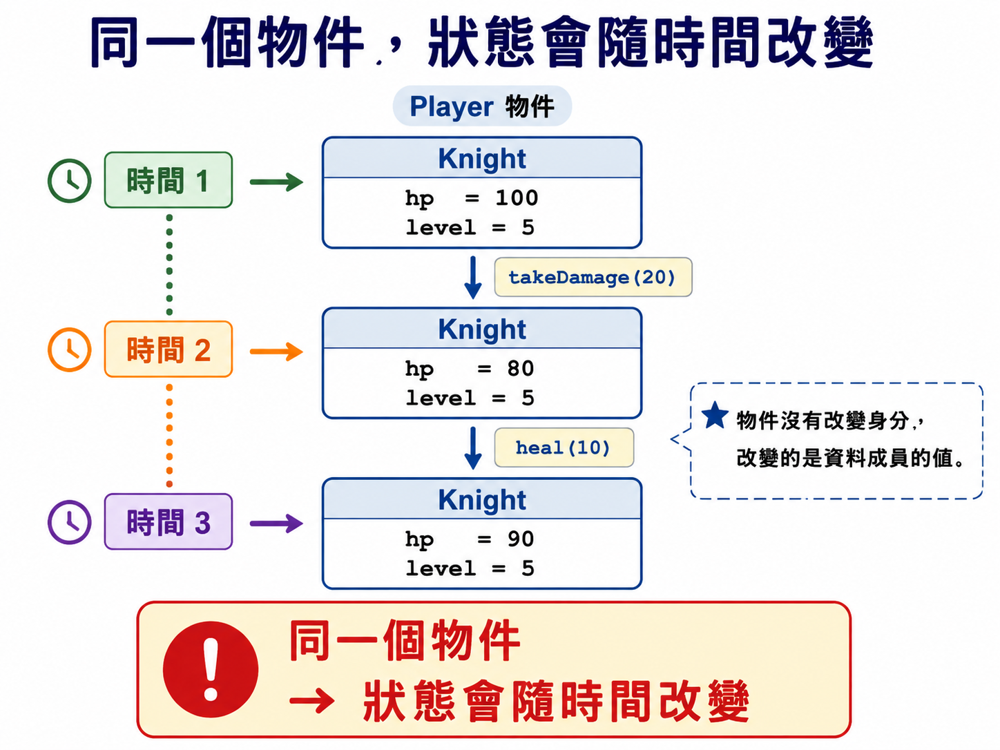
</p>

一個物件目前保存的成員資料，可以理解成它目前的：

```text
state
```

例如遊戲角色：

```text
name = Knight
hp = 80
level = 5
```

受到傷害後：

```text
name = Knight
hp = 50
level = 5
```

物件仍然是同一個物件，但是狀態改變了。

---

## Section XV. 修改其中一個物件

```cpp
// VALIDATE
#include <iostream>
using namespace std;

class Counter {
public:
    int value;
};

int main() {
    Counter first;
    Counter second;

    first.value = 0;
    second.value = 0;

    first.value += 5;

    cout << first.value << '\n';
    cout << second.value << '\n';

    return 0;
}
```

輸出：

```text
5
0
```

---

# Part D：成員函式 Member Functions

## Section XVI. 把行為放進類別

只有資料：

```cpp
class Counter {
public:
    int value;
};
```

如果 `Counter` 應該可以自己增加數值，可以加入：

```cpp
void increment() {
    ++value;
}
```

變成：

```cpp
class Counter {
public:
    int value;

    void increment() {
        ++value;
    }
};
```

---

## Section XVII. 呼叫成員函式

```cpp
counter.increment();
```

和一般函式：

```cpp
increment();
```

不同。

前者明確表示：

```text
讓 counter 這個物件執行 increment()
```

---

## Section XVIII. 成員函式可以存取自己的資料

```cpp
// VALIDATE
#include <iostream>
using namespace std;

class Counter {
public:
    int value;

    void increment() {
        ++value;
    }

    void print() {
        cout << value << '\n';
    }
};

int main() {
    Counter counter;
    counter.value = 10;

    counter.increment();
    counter.increment();
    counter.print();

    return 0;
}
```

輸出：

```text
12
```

在：

```cpp
void increment() {
    ++value;
}
```

裡面的 `value` 指的是：

```text
目前呼叫這個成員函式的物件自己的 value
```

---

## Section XIX. 不同物件呼叫同一個成員函式

<p align="center">
  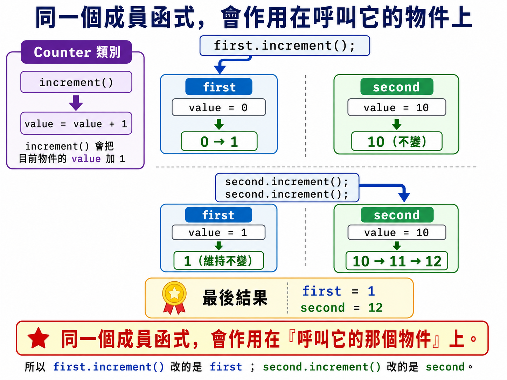
</p>

```cpp
// VALIDATE
#include <iostream>
using namespace std;

class Counter {
public:
    int value;

    void increment() {
        ++value;
    }
};

int main() {
    Counter first;
    Counter second;

    first.value = 0;
    second.value = 10;

    first.increment();
    second.increment();
    second.increment();

    cout << first.value << '\n';
    cout << second.value << '\n';

    return 0;
}
```

輸出：

```text
1
12
```

同一個：

```cpp
increment()
```

會作用在呼叫它的那個物件上。

---

## Section XX. 有參數的成員函式

成員函式與一般函式一樣，也可以有參數：

```cpp
void increaseBy(int amount) {
    value += amount;
}
```

呼叫：

```cpp
counter.increaseBy(5);
```

---

## Section XXI. 完整 Counter 範例

```cpp
// VALIDATE
#include <iostream>
using namespace std;

class Counter {
public:
    int value;

    void reset() {
        value = 0;
    }

    void increment() {
        ++value;
    }

    void increaseBy(int amount) {
        value += amount;
    }

    int getValue() {
        return value;
    }
};

int main() {
    Counter counter;
    counter.value = 7;

    counter.increment();
    counter.increaseBy(4);

    cout << counter.getValue() << '\n';

    counter.reset();
    cout << counter.getValue() << '\n';

    return 0;
}
```

輸出：

```text
12
0
```

> 本章的 `getValue()` 只是示範「成員函式可以回傳值」。下一章才會正式從封裝角度整理 getter / setter。

---

# Part E：成員函式也可以回傳結果

## Section XXII. `int` 成員函式

```cpp
class Rectangle {
public:
    int width;
    int height;

    int area() {
        return width * height;
    }
};
```

呼叫：

```cpp
rectangle.area()
```

會得到一個 `int`。

---

## Section XXIII. Rectangle 完整範例

```cpp
// VALIDATE
#include <iostream>
using namespace std;

class Rectangle {
public:
    int width;
    int height;

    int area() {
        return width * height;
    }

    int perimeter() {
        return 2 * (width + height);
    }
};

int main() {
    Rectangle rectangle;

    rectangle.width = 8;
    rectangle.height = 5;

    cout << "Area: " << rectangle.area() << '\n';
    cout << "Perimeter: " << rectangle.perimeter() << '\n';

    return 0;
}
```

---

## Section XXIV. `bool` 成員函式

```cpp
bool isSquare() {
    return width == height;
}
```

可以直接放進：

```cpp
if (rectangle.isSquare()) {
    // ...
}
```

---

## Section XXV. 使用物件自己回答問題

<p align="center">
  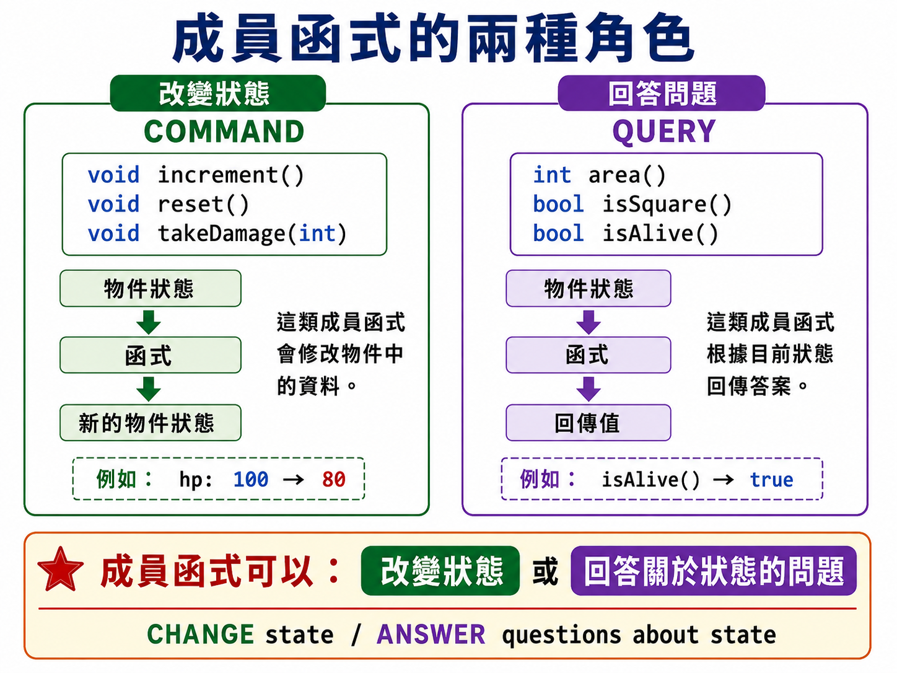
</p>

```cpp
// VALIDATE
#include <iostream>
using namespace std;

class Rectangle {
public:
    int width;
    int height;

    bool isSquare() {
        return width == height;
    }
};

int main() {
    Rectangle first;
    first.width = 5;
    first.height = 5;

    Rectangle second;
    second.width = 8;
    second.height = 3;

    cout << first.isSquare() << '\n';
    cout << second.isSquare() << '\n';

    return 0;
}
```

輸出：

```text
1
0
```

---

# Part F：讓物件改變自己的狀態

## Section XXVI. 遊戲角色

```cpp
class Player {
public:
    string name;
    int hp;

    void takeDamage(int damage) {
        hp -= damage;
    }
};
```

如果：

```text
hp = 100
```

呼叫：

```cpp
player.takeDamage(30);
```

之後：

```text
hp = 70
```

---

## Section XXVII. 加入最低值限制

如果不希望生命值小於 `0`：

```cpp
void takeDamage(int damage) {
    hp -= damage;

    if (hp < 0) {
        hp = 0;
    }
}
```

這樣「受到傷害後如何更新 hp」的規則就放在 `Player` 裡。

---

## Section XXVIII. 完整 Player 範例

<p align="center">
  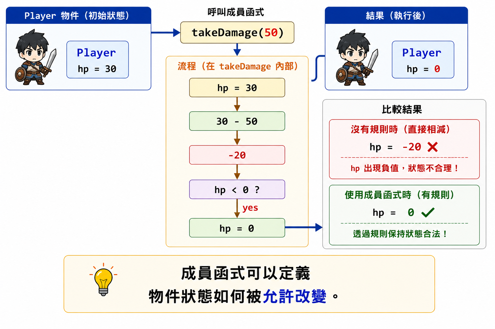
</p>

```cpp
// VALIDATE
#include <iostream>
#include <string>
using namespace std;

class Player {
public:
    string name;
    int hp;

    void takeDamage(int damage) {
        if (damage < 0) {
            return;
        }

        hp -= damage;

        if (hp < 0) {
            hp = 0;
        }
    }

    void heal(int amount) {
        if (amount > 0) {
            hp += amount;
        }
    }

    bool isAlive() {
        return hp > 0;
    }
};

int main() {
    Player player;

    player.name = "Knight";
    player.hp = 100;

    player.takeDamage(35);
    cout << player.hp << '\n';

    player.heal(10);
    cout << player.hp << '\n';

    player.takeDamage(100);
    cout << player.hp << '\n';
    cout << player.isAlive() << '\n';

    return 0;
}
```

---

# Part G：`class` 與 `struct`

<p align="center">
  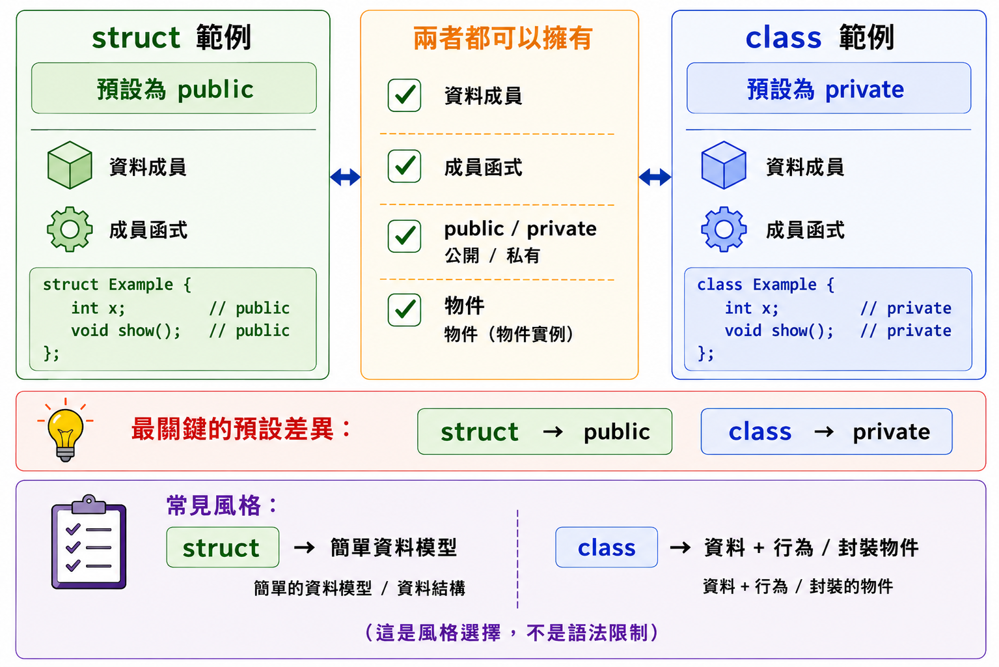
</p>

## Section XXIX. 先回顧 `struct`

前面的資料建模可以寫：

```cpp
struct Student {
    string name;
    int score;
};
```

在 C++ 中，`struct` 也可以有成員函式：

```cpp
struct Student {
    string name;
    int score;

    bool passed() {
        return score >= 60;
    }
};
```

---

## Section XXX. 最重要的基本差異

若沒有自己寫 access specifier：

```cpp
struct Example {
    int value;
};
```

`value` 預設是：

```text
public
```

但：

```cpp
class Example {
    int value;
};
```

`value` 預設是：

```text
private
```

---

## Section XXXI. 本章為什麼一直寫 `public:`？

因為：

```cpp
class Student {
public:
    string name;
};
```

才能在類別外直接：

```cpp
student.name = "Amy";
```

如果寫成：

```cpp
class Student {
    string name;
};
```

外部直接存取 `name` 會失敗。

---

## Section XXXII. `class` 和 `struct` 不只是「有沒有函式」

錯誤觀念：

```text
struct 只能放資料
class 才能放函式
```

這在 C++ 中不正確。

兩者都可以有：

```text
成員資料
成員函式
```

本階段可以先使用以下習慣：

```text
struct → 偏向單純資料集合
class  → 偏向資料 + 行為的物件模型
```

這是設計習慣，不是「struct 不能有函式」的語法限制。

---

# Part H：類別外定義成員函式

<p align="center">
  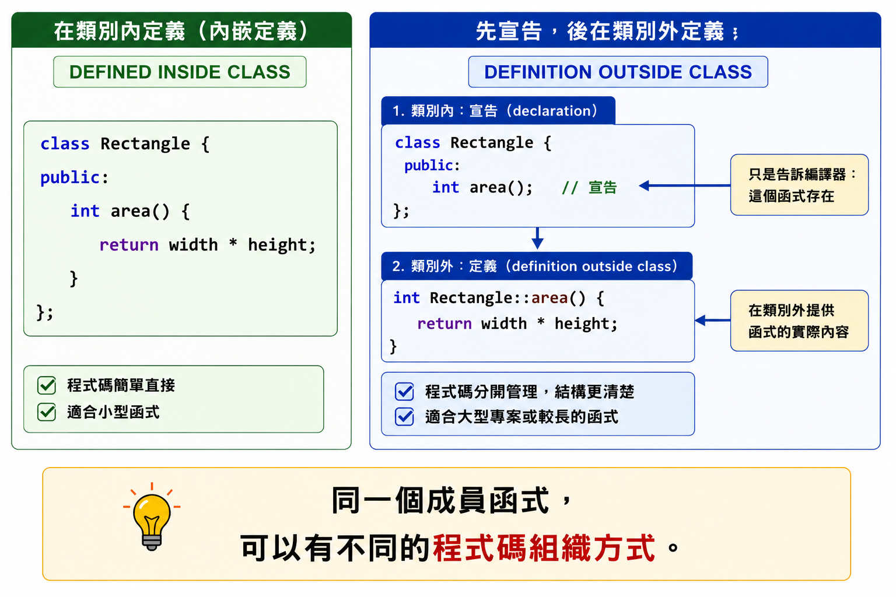
</p>

## Section XXXIII. 類別內直接定義

前面一直使用：

```cpp
class Rectangle {
public:
    int width;
    int height;

    int area() {
        return width * height;
    }
};
```

這是直接把成員函式的完整內容寫在類別內。

---

## Section XXXIV. 只在類別內宣告

也可以先寫：

```cpp
class Rectangle {
public:
    int width;
    int height;

    int area();
};
```

這裡：

```cpp
int area();
```

只是宣告。

---

## Section XXXV. `::` scope resolution operator

<p align="center">
  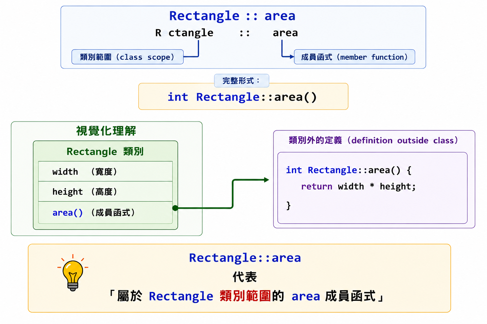
</p>

類別外定義：

```cpp
int Rectangle::area() {
    return width * height;
}
```

其中：

```cpp
Rectangle::area
```

表示：

```text
Rectangle 類別裡的 area 成員函式
```

---

## Section XXXVI. 完整類別外定義範例

```cpp
// VALIDATE
#include <iostream>
using namespace std;

class Rectangle {
public:
    int width;
    int height;

    int area();
    int perimeter();
};

int Rectangle::area() {
    return width * height;
}

int Rectangle::perimeter() {
    return 2 * (width + height);
}

int main() {
    Rectangle rectangle;
    rectangle.width = 6;
    rectangle.height = 4;

    cout << rectangle.area() << '\n';
    cout << rectangle.perimeter() << '\n';

    return 0;
}
```

---

## Section XXXVII. 為什麼要學類別外定義？

類別較小時：

```text
全部寫在 class 裡
```

很方便。

類別變大時，常會希望：

```text
類別定義較容易閱讀
函式內容分開整理
```

例如：

```cpp
class Player {
public:
    void attack();
    void heal(int amount);
    bool isAlive();
};
```

再在後方分別定義。

更完整的 `.h` / `.cpp` 專案拆分會在後續專案組織章節處理。

---

# Part I：物件與一般函式

## Section XXXVIII. 把物件傳入函式

類別是一種型態，所以也可以成為函式參數：

```cpp
void printStudent(Student student)
```

和：

```cpp
void printNumber(int number)
```

概念相同。

---

## Section XXXIX. 傳值會複製物件

<p align="center">
  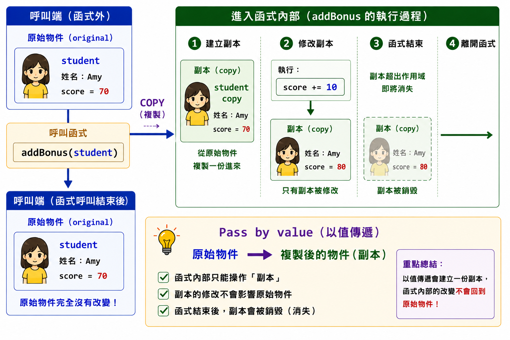
</p>

```cpp
void addBonus(Student student) {
    student.score += 10;
}
```

如果使用傳值：

```text
函式中的 student
是呼叫端物件的一份副本
```

所以修改副本不會修改原物件。

這和前面函式章節的 pass by value 相同。

---

## Section XL. 完整傳值範例

```cpp
// VALIDATE
#include <iostream>
#include <string>
using namespace std;

class Student {
public:
    string name;
    int score;
};

void addBonus(Student student) {
    student.score += 10;
    cout << "Inside: " << student.score << '\n';
}

int main() {
    Student student;
    student.name = "Amy";
    student.score = 70;

    addBonus(student);

    cout << "Outside: " << student.score << '\n';

    return 0;
}
```

輸出：

```text
Inside: 80
Outside: 70
```

---

## Section XLI. 函式也可以回傳物件

```cpp
Student makeStudent() {
    Student result;
    result.name = "Amy";
    result.score = 95;

    return result;
}
```

呼叫：

```cpp
Student student = makeStudent();
```

---

## Section XLII. 完整回傳物件範例

```cpp
// VALIDATE
#include <iostream>
#include <string>
using namespace std;

class Player {
public:
    string name;
    int hp;
    int level;
};

Player makePlayer(string name, int hp, int level) {
    Player player;

    player.name = name;
    player.hp = hp;
    player.level = level;

    return player;
}

int main() {
    Player player = makePlayer("Mage", 80, 4);

    cout << player.name << '\n';
    cout << player.hp << '\n';
    cout << player.level << '\n';

    return 0;
}
```

---

# Part J：物件陣列與 `vector<物件>`

## Section XLIII. 物件也可以放進陣列

如果：

```cpp
class Student {
public:
    string name;
    int score;
};
```

那麼：

```cpp
Student students[3];
```

表示建立三個 `Student` 物件。

---

## Section XLIV. 使用索引存取物件

```cpp
students[0].name = "Amy";
students[0].score = 90;
```

可以拆成：

```text
students[0]       → 第 0 個 Student 物件
students[0].score → 第 0 個 Student 的 score
```

---

## Section XLV. 完整陣列範例

```cpp
// VALIDATE
#include <iostream>
#include <string>
using namespace std;

class Student {
public:
    string name;
    int score;
};

int main() {
    Student students[3];

    students[0].name = "Amy";
    students[0].score = 91;

    students[1].name = "Ben";
    students[1].score = 76;

    students[2].name = "Cara";
    students[2].score = 88;

    for (int index = 0; index < 3; ++index) {
        cout << students[index].name
             << " "
             << students[index].score
             << '\n';
    }

    return 0;
}
```

---

## Section XLVI. `vector<Student>`

<p align="center">
  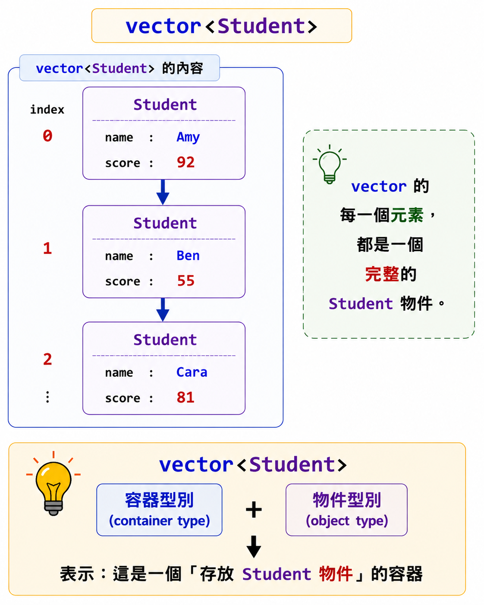：Container of Objects"
    width="700">
</p>

如果數量需要動態改變：

```cpp
vector<Student> students;
```

即可儲存很多：

```text
Student 物件
```

---

## Section XLVII. 加入物件到 vector

可以先建立物件：

```cpp
Student student;
student.name = "Amy";
student.score = 90;
```

再：

```cpp
students.push_back(student);
```

---

## Section XLVIII. 完整 vector 範例

```cpp
// VALIDATE
#include <iostream>
#include <string>
#include <vector>
using namespace std;

class Student {
public:
    string name;
    int score;

    bool passed() {
        return score >= 60;
    }
};

int main() {
    vector<Student> students;

    Student first;
    first.name = "Amy";
    first.score = 92;
    students.push_back(first);

    Student second;
    second.name = "Ben";
    second.score = 55;
    students.push_back(second);

    Student third;
    third.name = "Cara";
    third.score = 81;
    students.push_back(third);

    for (Student student : students) {
        cout << student.name
             << " "
             << student.score
             << " "
             << student.passed()
             << '\n';
    }

    return 0;
}
```

---

## Section XLIX. 搜尋物件

例如找名字：

```cpp
for (Student student : students) {
    if (student.name == targetName) {
        cout << student.score << '\n';
    }
}
```

流程：

```text
逐一取得物件
↓
檢查物件的 name
↓
符合就處理
```

---

## Section L. 計算通過人數

```cpp
int passedCount = 0;

for (Student student : students) {
    if (student.passed()) {
        ++passedCount;
    }
}
```

這裡把：

```text
每位學生是否通過
```

交給物件自己的：

```cpp
passed()
```

判斷。

---

## Section LI. 修改 vector 中的物件

<p align="center">
  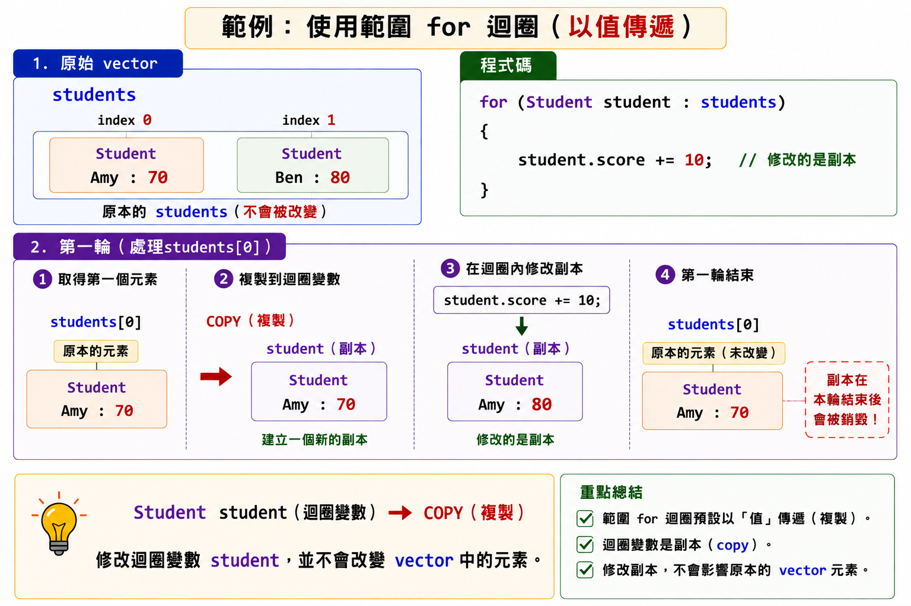
</p>

如果使用：

```cpp
for (Student student : students)
```

`student` 是副本。

因此若本章只使用目前學過的語法，要修改原本 `vector` 中的物件，可以使用索引：

```cpp
for (int index = 0; index < static_cast<int>(students.size()); ++index) {
    if (students[index].name == targetName) {
        students[index].score += 5;
    }
}
```

參考變數的 range-based for 寫法會在適當章節再整理。

---

## Section LII. 完整搜尋與修改範例

```cpp
// VALIDATE
#include <iostream>
#include <string>
#include <vector>
using namespace std;

class Student {
public:
    string name;
    int score;
};

int main() {
    vector<Student> students;

    Student first;
    first.name = "Amy";
    first.score = 70;
    students.push_back(first);

    Student second;
    second.name = "Ben";
    second.score = 80;
    students.push_back(second);

    string targetName = "Amy";

    for (int index = 0; index < static_cast<int>(students.size()); ++index) {
        if (students[index].name == targetName) {
            students[index].score += 10;
        }
    }

    for (Student student : students) {
        cout << student.name
             << " "
             << student.score
             << '\n';
    }

    return 0;
}
```

---

# Part K：類別搭配 `enum class`

<p align="center">
  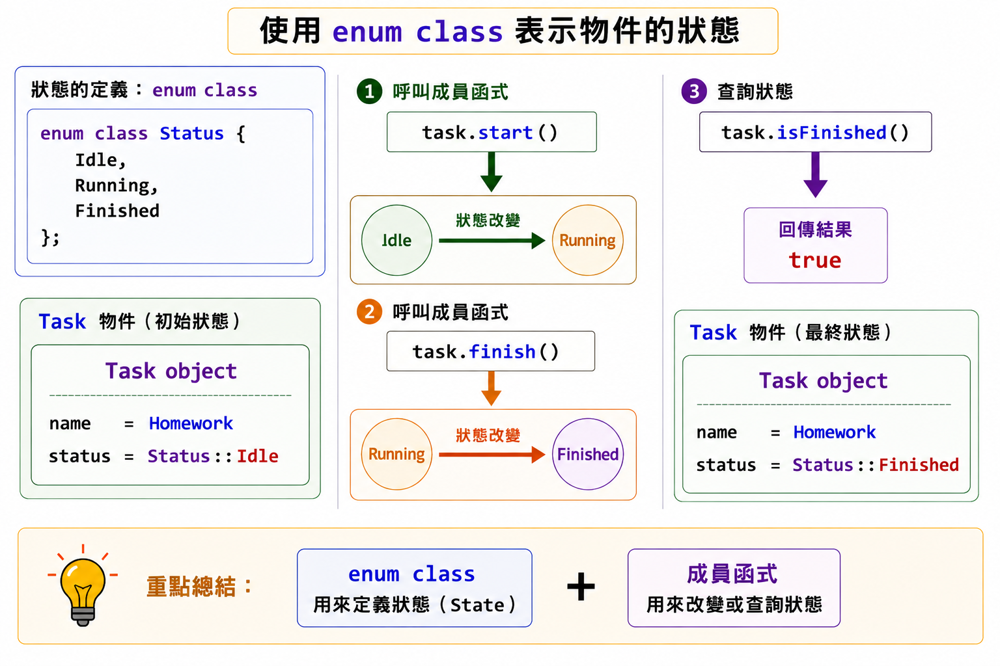
</p>

## Section LIII. 讓狀態有明確型態

前面若已經學過：

```cpp
enum class Status {
    Idle,
    Running,
    Finished
};
```

就可以把它放入類別：

```cpp
class Task {
public:
    string name;
    Status status;
};
```

---

## Section LIV. 成員函式改變列舉狀態

```cpp
void start() {
    status = Status::Running;
}

void finish() {
    status = Status::Finished;
}
```

這比用：

```text
0
1
2
```

表示狀態更清楚。

---

## Section LV. 完整 Task 範例

```cpp
// VALIDATE
#include <iostream>
#include <string>
using namespace std;

enum class Status {
    Idle,
    Running,
    Finished
};

class Task {
public:
    string name;
    Status status;

    void start() {
        status = Status::Running;
    }

    void finish() {
        status = Status::Finished;
    }

    bool isFinished() {
        return status == Status::Finished;
    }
};

int main() {
    Task task;
    task.name = "Homework";
    task.status = Status::Idle;

    task.start();
    cout << task.isFinished() << '\n';

    task.finish();
    cout << task.isFinished() << '\n';

    return 0;
}
```

---

# Part L：Object Composition 物件組合

## Section LVI. 一個物件可以包含另一個物件

<p align="center">
  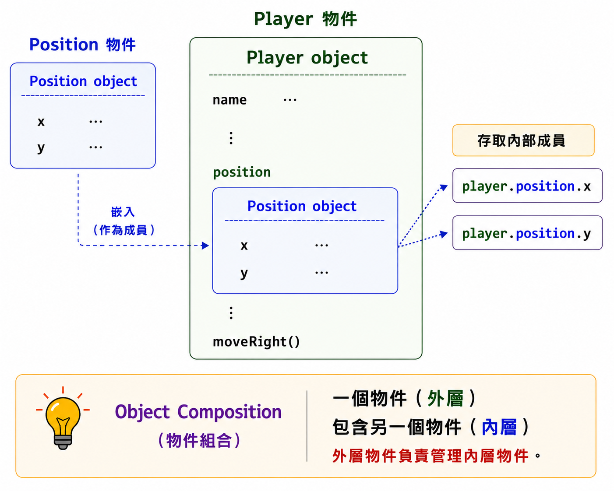
</p>

先有：

```cpp
class Position {
public:
    int x;
    int y;
};
```

再建立：

```cpp
class Player {
public:
    string name;
    Position position;
};
```

此時：

```text
Player 物件
包含一個 Position 物件
```

---

## Section LVII. 多層成員存取

```cpp
player.position.x
```

可以拆成：

```text
player
↓
player.position
↓
player.position.x
```

---

## Section LVIII. 完整物件組合範例

```cpp
// VALIDATE
#include <iostream>
#include <string>
using namespace std;

class Position {
public:
    int x;
    int y;
};

class Player {
public:
    string name;
    Position position;

    void moveRight() {
        ++position.x;
    }
};

int main() {
    Player player;

    player.name = "Hero";
    player.position.x = 3;
    player.position.y = 5;

    player.moveRight();

    cout << player.position.x
         << " "
         << player.position.y
         << '\n';

    return 0;
}
```

---

# Part M：如何設計一個簡單類別？

## Section LIX. 第一步：這個類別代表什麼？

<p align="center">
  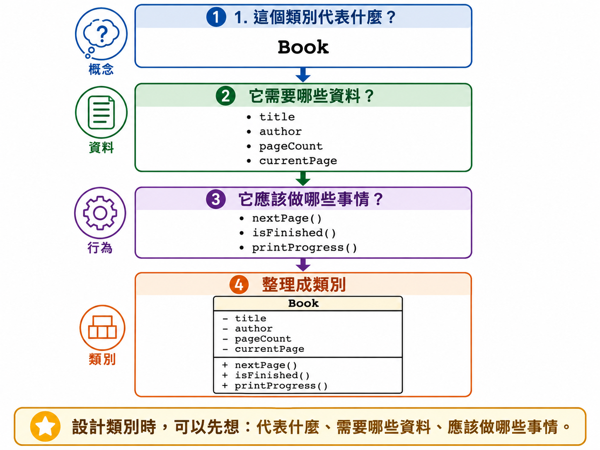
</p>

例如：

```text
類別：Book
代表：一本書
```

不要一開始就先想語法。

先確認模型本身。

---

## Section LX. 第二步：需要保存哪些資料？

一本書可能需要：

```text
title
author
pageCount
currentPage
```

可以先得到：

```cpp
class Book {
public:
    string title;
    string author;
    int pageCount;
    int currentPage;
};
```

---

## Section LXI. 第三步：這個物件需要做什麼？

例如：

```text
前往下一頁
檢查是否讀完
顯示目前頁數
```

可以轉成：

```cpp
void nextPage();
bool isFinished();
void printProgress();
```

---

## Section LXII. 資料與行為要有關係

好的簡單模型：

```text
Rectangle
資料：width, height
行為：area(), perimeter(), isSquare()
```

較奇怪的設計：

```text
Rectangle
資料：width, height
行為：printStudentGrade()
```

因為：

```text
學生成績
```

和長方形沒有直接關係。

---

## Section LXIII. 不要做 God Class

如果一個類別同時負責：

```text
學生資料
成績計算
檔案讀取
遊戲角色
銀行帳戶
圖形繪製
網路連線
```

通常代表責任太多。

初學時可以問：

```text
這些資料和函式是否真的都描述同一種東西？
```

---

## Section LXIV. 一般函式還是成員函式？

如果工作明顯是某個物件自己的行為：

```text
rectangle.area()
player.takeDamage()
student.passed()
```

成員函式通常很自然。

如果工作不屬於某個特定物件：

```text
顯示程式主選單
讀取整個檔案
比較兩種完全不同的資料
```

一般函式可能更清楚。

本章先建立直覺，不要求正式物件導向設計原則。

---

# Part N：作用域與名稱判讀

## Section LXV. 成員資料存在於物件中

```cpp
class Counter {
public:
    int value;
};
```

建立：

```cpp
Counter first;
Counter second;
```

會有：

```text
first.value
second.value
```

不是所有 `Counter` 共用同一個 `value`。

---

## Section LXVI. 成員函式中的名稱

```cpp
class Rectangle {
public:
    int width;
    int height;

    int area() {
        return width * height;
    }
};
```

在 `area()` 中：

```cpp
width
height
```

指目前物件的成員資料。

---

## Section LXVII. 避免初學時使用容易混淆的同名名稱

例如：

```cpp
class Counter {
public:
    int value;

    void setValue(int value) {
        // 兩個 value 容易混淆
    }
};
```

後續學到 `this` 與封裝後，可以正式處理這種寫法。

本章先使用：

```cpp
void setValue(int newValue) {
    value = newValue;
}
```

讓資料流更容易閱讀。

---

# Part O：快速概念檢查

## Section LXVIII. 選擇題與簡答

### Q1. `class` 的主要用途是什麼？

<details><summary>查看答案</summary>

建立自己的型態，將相關資料與行為整理在一起。

</details>

### Q2. 類別與物件的基本差異是什麼？

<details><summary>查看答案</summary>

類別是型態／藍圖；物件是依照該類別建立的實例。

</details>

### Q3. `Student student;` 中哪一個是類別名稱？

<details><summary>查看答案</summary>

`Student`。

</details>

### Q4. `Student student;` 中哪一個是物件名稱？

<details><summary>查看答案</summary>

`student`。

</details>

### Q5. 類別定義最後通常需要什麼符號？

<details><summary>查看答案</summary>

分號 `;`，因此結尾通常是 `};`。

</details>

### Q6. `student.score` 中的 `.` 做什麼？

<details><summary>查看答案</summary>

存取 `student` 物件的成員 `score`。

</details>

### Q7. data member 是什麼？

<details><summary>查看答案</summary>

類別中用來保存物件資料／狀態的成員。

</details>

### Q8. member function 是什麼？

<details><summary>查看答案</summary>

定義在類別中的函式，通常用來操作或查詢該物件的資料。

</details>

### Q9. `class` 成員預設是 `public` 還是 `private`？

<details><summary>查看答案</summary>

`private`。

</details>

### Q10. `struct` 成員預設是 `public` 還是 `private`？

<details><summary>查看答案</summary>

`public`。

</details>

### Q11. C++ 的 `struct` 可以有成員函式嗎？

<details><summary>查看答案</summary>

可以。

</details>

### Q12. 建立兩個 `Student` 物件，它們會共用同一個 `score` 嗎？

<details><summary>查看答案</summary>

不會。一般成員資料屬於各自的物件。

</details>

### Q13. `counter.increment()` 會修改哪一個物件？

<details><summary>查看答案</summary>

呼叫 `increment()` 的 `counter` 物件。

</details>

### Q14. 成員函式可以有參數嗎？

<details><summary>查看答案</summary>

可以。

</details>

### Q15. 成員函式可以回傳值嗎？

<details><summary>查看答案</summary>

可以，例如回傳 `int`、`bool` 等。

</details>

### Q16. `Rectangle::area()` 中 `::` 的用途是什麼？

<details><summary>查看答案</summary>

指出 `area()` 是 `Rectangle` 類別範圍中的成員函式。

</details>

### Q17. 物件可以當作函式參數嗎？

<details><summary>查看答案</summary>

可以，因為類別是一種型態。

</details>

### Q18. 傳值傳入物件時，函式內修改副本會直接修改原物件嗎？

<details><summary>查看答案</summary>

不會。

</details>

### Q19. `vector<Student>` 裡面存的是什麼？

<details><summary>查看答案</summary>

多個 `Student` 物件。

</details>

### Q20. 一個物件可以包含另一個物件嗎？

<details><summary>查看答案</summary>

可以，這是 object composition 的基本概念。

</details>

---

# Part P：程式閱讀練習

## Section LXIX. 預測輸出與找錯

### 題目 1

```cpp
class Box {
public:
    int value;
};

Box first;
first.value = 5;
cout << first.value;
```

<details><summary>查看答案</summary>

```text
5
```

</details>

### 題目 2

```cpp
class Box {
public:
    int value;
};

Box first;
Box second;

first.value = 3;
second.value = 8;

first.value += 2;

cout << first.value << " " << second.value;
```

<details><summary>查看答案</summary>

```text
5 8
```

</details>

### 題目 3

```cpp
class Counter {
public:
    int value;

    void increment() {
        ++value;
    }
};

Counter counter;
counter.value = 4;
counter.increment();
counter.increment();
cout << counter.value;
```

<details><summary>查看答案</summary>

```text
6
```

</details>

### 題目 4

```cpp
class Number {
public:
    int value;

    bool isPositive() {
        return value > 0;
    }
};

Number number;
number.value = -2;
cout << number.isPositive();
```

<details><summary>查看答案</summary>

```text
0
```

</details>

### 題目 5

```cpp
class Rectangle {
public:
    int width;
    int height;

    int area() {
        return width * height;
    }
};

Rectangle rectangle;
rectangle.width = 4;
rectangle.height = 7;
cout << rectangle.area();
```

<details><summary>查看答案</summary>

```text
28
```

</details>

### 題目 6

```cpp
class Counter {
public:
    int value;

    void add(int amount) {
        value += amount;
    }
};

Counter a;
Counter b;

a.value = 1;
b.value = 10;

a.add(4);
b.add(2);

cout << a.value << " " << b.value;
```

<details><summary>查看答案</summary>

```text
5 12
```

</details>

### 題目 7

```cpp
class Student {
public:
    int score;
};

void change(Student student) {
    student.score = 100;
}

Student student;
student.score = 60;
change(student);
cout << student.score;
```

<details><summary>查看答案</summary>

```text
60
```

因為 `student` 以傳值方式傳入，函式修改的是副本。

</details>

### 題目 8

```cpp
class Point {
public:
    int x;
    int y;
};

class Player {
public:
    Point position;
};

Player player;
player.position.x = 2;
player.position.y = 5;
cout << player.position.x + player.position.y;
```

<details><summary>查看答案</summary>

```text
7
```

</details>

### 題目 9

```cpp
class Test {
    int value;
};

int main() {
    Test test;
    test.value = 3;
}
```

<details><summary>查看答案</summary>

這段不能正常編譯，因為 `class` 中沒有 `public:` 時，`value` 預設是 `private`，類別外不能直接使用 `test.value`。

</details>

### 題目 10

```cpp
class Test {
public:
    int value
};
```

<details><summary>查看答案</summary>

`int value` 後面缺少分號：

```cpp
int value;
```

</details>

### 題目 11

```cpp
class Test {
public:
    int value;
}

int main() {
}
```

<details><summary>查看答案</summary>

類別定義結尾缺少分號，應為：

```cpp
};
```

</details>

### 題目 12

```cpp
class Counter {
public:
    int value;
    void increment();
};

void increment() {
    ++value;
}
```

<details><summary>查看答案</summary>

類別外定義成員函式時缺少類別名稱與 `::`。應寫：

```cpp
void Counter::increment() {
    ++value;
}
```

</details>

---

# Part Q：實作練習

## Section LXX. 實作檢測題

### TODO 1：`Book` 類別

建立：

```cpp
class Book
```

包含：

```text
title
author
pageCount
```

在 `main()` 建立一本書並輸出所有資料。

### TODO 2：`Rectangle` 面積

建立 `Rectangle` 類別，包含：

```text
width
height
area()
```

輸入寬與高後輸出面積。

### TODO 3：是否為正方形

在 `Rectangle` 加入：

```cpp
bool isSquare()
```

判斷寬與高是否相同。

### TODO 4：`Counter`

建立 `Counter`，包含：

```text
value
increment()
reset()
```

依序測試增加三次、輸出、重設、再次輸出。

### TODO 5：指定增加量

替 `Counter` 加入：

```cpp
void increaseBy(int amount)
```

### TODO 6：`Student`

建立：

```text
name
score
passed()
```

其中 `passed()` 判斷分數是否至少 `60`。

### TODO 7：兩個學生

建立兩個 `Student` 物件，分別保存不同姓名與分數，輸出兩人的資料與是否通過。

### TODO 8：`Player`

建立：

```text
name
hp
takeDamage(int damage)
isAlive()
```

生命值不可低於 `0`。

### TODO 9：類別外定義

建立 `Circle` 類別：

```text
radius
diameter()
```

只在類別內宣告 `diameter()`，並在類別外使用 `Circle::diameter()` 定義。

### TODO 10：回傳物件

建立：

```cpp
Student makeStudent(string name, int score)
```

回傳一個設定好資料的 `Student` 物件。

### TODO 11：學生陣列

建立三個 `Student` 的陣列，使用迴圈輸出所有姓名與分數。

### TODO 12：`vector<Student>`

把至少三名學生放入 `vector<Student>`，計算通過人數。

### TODO 13：搜尋學生

輸入姓名，在 `vector<Student>` 中搜尋；找到後輸出分數，否則輸出：

```text
Not found
```

### TODO 14：`Task` 狀態

使用：

```cpp
enum class Status {
    Pending,
    Done
};
```

建立 `Task` 類別，加入：

```text
name
status
finish()
isDone()
```

### TODO 15：物件組合

建立：

```text
Position
Player
```

讓 `Player` 包含一個 `Position`，並實作：

```cpp
void moveRight()
void moveUp()
```

---

# Part R：課後小練習

## Section LXXI. 延伸練習

### 練習 1：BankAccount 簡化版

建立：

```text
owner
balance
deposit(double amount)
withdraw(double amount)
```

規則：

```text
存款必須 > 0
提款必須 > 0
提款不可超過餘額
```

> 本題先練習物件狀態與成員函式；真正的 private 封裝版本留到下一章。

### 練習 2：Temperature

建立：

```text
celsius
getFahrenheit()
isFreezing()
```

### 練習 3：GameCharacter

包含：

```text
name
hp
attackPower
```

並建立：

```text
takeDamage()
heal()
isAlive()
```

### 練習 4：Product 清單

建立 `vector<Product>`，每個物件包含：

```text
name
price
stock
```

找出價格最高的商品。

### 練習 5：成績系統

建立 `vector<Student>`，完成：

```text
平均分數
最高分學生
最低分學生
通過人數
依姓名搜尋
```

---

# Part S：常見錯誤提醒

## Section LXXII. 常見錯誤

1. 把 `class` 名稱與物件名稱混在一起。
2. 定義類別後忘記真正建立物件。
3. 類別定義最後忘記分號。
4. 成員資料宣告後忘記分號。
5. 使用物件成員時忘記 `.`。
6. 把 `student.score` 寫成 `student score`。
7. 把 `student.print()` 寫成 `Student.print()`，但 `print()` 是一般非 static 成員函式。
8. `class` 中忘記 `public:`，卻從外部直接存取成員。
9. 誤以為 `class` 預設成員是 `public`。
10. 誤以為 `struct` 不能有成員函式。
11. 誤以為兩個相同類別的物件會共用一般成員資料。
12. 修改 `first.score` 卻以為 `second.score` 也會一起改變。
13. 呼叫成員函式時忘記 `()`。
14. 成員函式宣告有參數，但呼叫時漏掉引數。
15. 成員函式回傳 `bool`，卻沒有在所有必要路徑提供正確結果。
16. 類別外定義成員函式時忘記 `ClassName::`。
17. 類別外定義的函式名稱與類別內宣告不一致。
18. 類別內宣告參數型態與類別外定義不同。
19. 物件傳值進函式後，期待修改副本會改到原物件。
20. `vector<Student>` 中把 `students[index]` 誤以為是 `int` 索引本身，而不是一個 `Student` 物件。
21. range-based for 使用傳值副本修改資料，卻期待原 `vector` 改變。
22. 多層成員存取時漏掉其中一個 `.`，例如把 `player.position.x` 寫錯。
23. 類別包含太多互不相關的資料與函式。
24. 成員名稱太模糊，例如大量使用 `a`、`b`、`x1`，使物件意義不清楚。
25. 為了「物件導向」而把所有一般函式強行塞進類別。
26. 在尚未設定成員資料前就使用其值。
27. 忘記驗證會改變物件狀態的輸入，例如負數傷害或負數存款。
28. 把類別定義寫在 `main()` 中後又想在其他函式使用該型態，造成作用域問題。
29. 把「類別」想成已經存在的一筆資料；其實還需要建立物件。
30. 還沒學封裝前就急著混入 constructor、destructor、inheritance 等太多新概念。

---

# Part T：Mermaid 流程圖

## Section LXXIII. 類別與物件流程圖

### 1. 從類別到物件

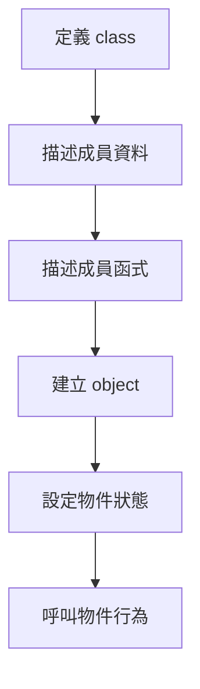
```mermaid
flowchart TD
    A[定義 class] --> B[描述成員資料]
    B --> C[描述成員函式]
    C --> D[建立 object]
    D --> E[設定物件狀態]
    E --> F[呼叫物件行為]
```

### 2. 成員存取

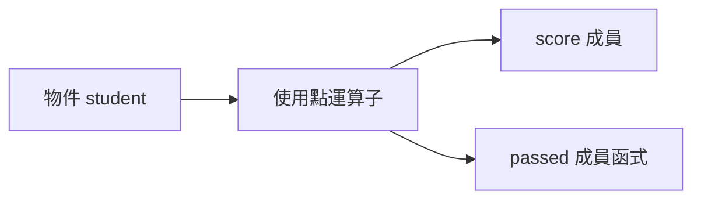
```mermaid
flowchart LR
    A[物件 student] --> B[使用點運算子]
    B --> C[score 成員]
    B --> D[passed 成員函式]
```

### 3. 多個物件

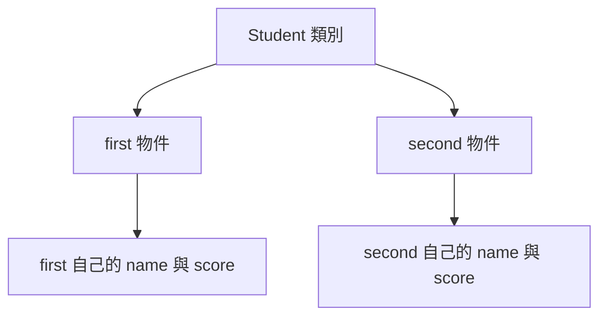
```mermaid
flowchart TD
    A[Student 類別] --> B[first 物件]
    A --> C[second 物件]
    B --> D[first 自己的 name 與 score]
    C --> E[second 自己的 name 與 score]
```

### 4. 呼叫成員函式

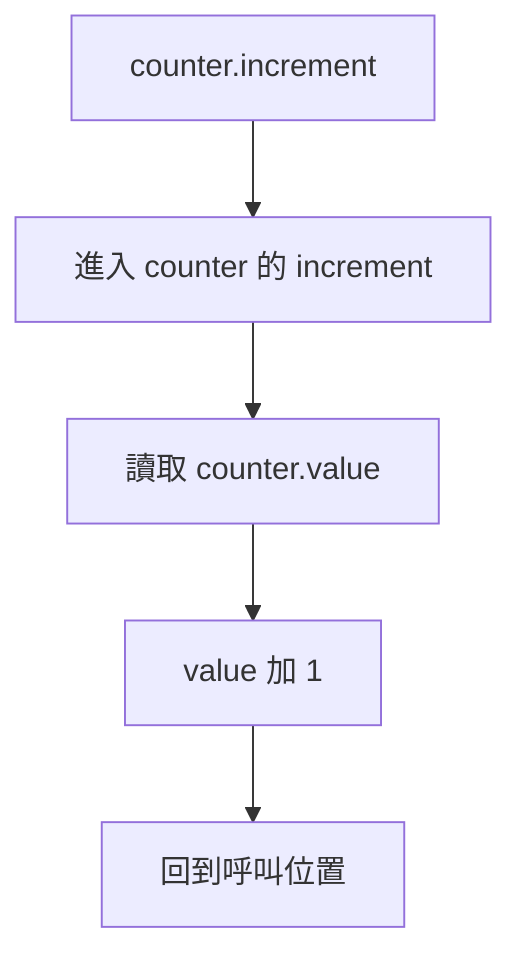
```mermaid
flowchart TD
    A[counter.increment] --> B[進入 counter 的 increment]
    B --> C[讀取 counter.value]
    C --> D[value 加 1]
    D --> E[回到呼叫位置]
```

### 5. 修改物件狀態

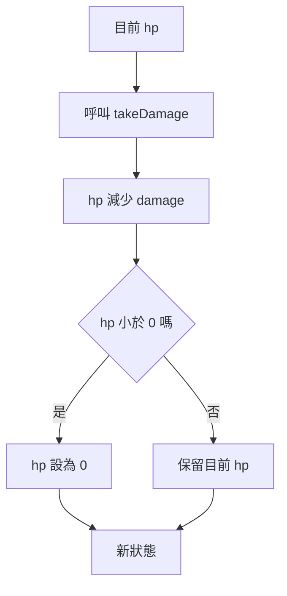
```mermaid
flowchart TD
    A[目前 hp] --> B[呼叫 takeDamage]
    B --> C[hp 減少 damage]
    C --> D{hp 小於 0 嗎}
    D -- 是 --> E[hp 設為 0]
    D -- 否 --> F[保留目前 hp]
    E --> G[新狀態]
    F --> G
```

### 6. vector 中搜尋物件

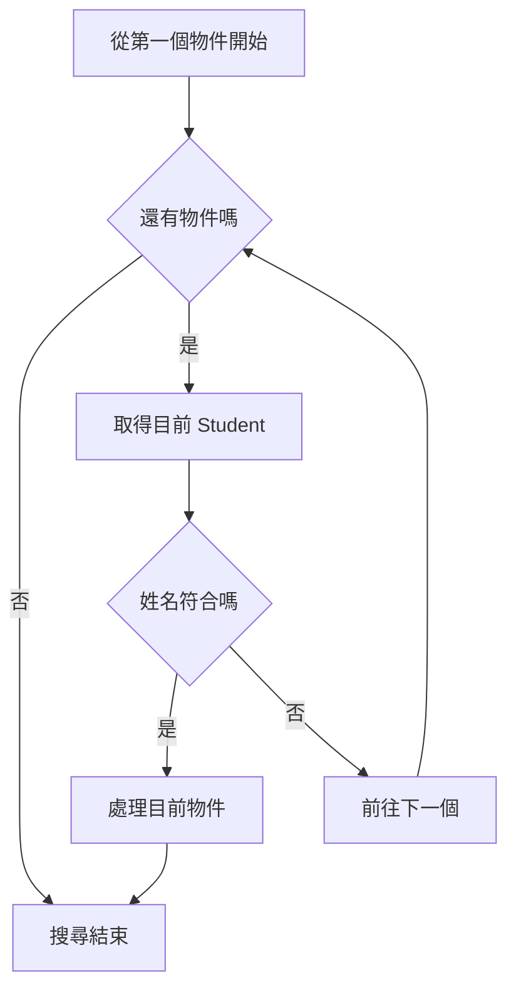
```mermaid
flowchart TD
    A[從第一個物件開始] --> B{還有物件嗎}
    B -- 否 --> G[搜尋結束]
    B -- 是 --> C[取得目前 Student]
    C --> D{姓名符合嗎}
    D -- 是 --> E[處理目前物件]
    D -- 否 --> F[前往下一個]
    E --> G
    F --> B
```

### 7. 物件組合

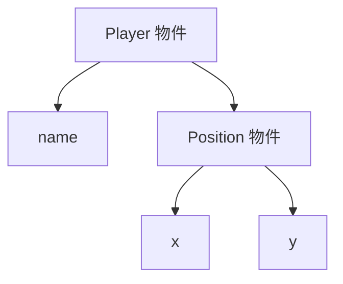
```mermaid
flowchart TD
    A[Player 物件] --> B[name]
    A --> C[Position 物件]
    C --> D[x]
    C --> E[y]
```

### 8. 類別設計思考

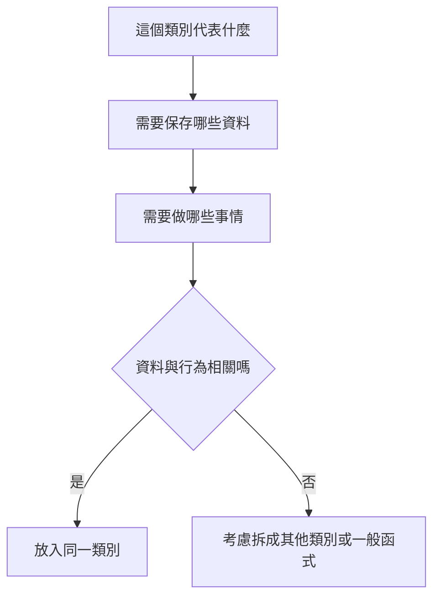
```mermaid
flowchart TD
    A[這個類別代表什麼] --> B[需要保存哪些資料]
    B --> C[需要做哪些事情]
    C --> D{資料與行為相關嗎}
    D -- 是 --> E[放入同一類別]
    D -- 否 --> F[考慮拆成其他類別或一般函式]
```

---

# 本章完成標準

完成本章後，你應該能做到：

1. 說明 class 與 object 的差異。
2. 說明類別是一種自訂型態。
3. 使用 `class` 建立簡單類別。
4. 在類別中建立成員資料。
5. 使用 `public:` 讓本章範例可以從外部操作成員。
6. 建立一個物件。
7. 建立多個相同類別的物件。
8. 使用 `.` 存取成員。
9. 理解每個物件有自己的狀態。
10. 修改單一物件的資料。
11. 建立 `void` 成員函式。
12. 建立有參數的成員函式。
13. 建立有回傳值的成員函式。
14. 建立 `bool` 查詢函式。
15. 讓成員函式讀取自己的成員資料。
16. 讓成員函式修改自己的狀態。
17. 使用 `Counter` 類別管理數值。
18. 使用 `Rectangle` 類別計算面積與周長。
19. 使用 `Player` 類別管理生命值。
20. 說明 `class` 預設是 `private`。
21. 說明 `struct` 預設是 `public`。
22. 說明 C++ 的 `struct` 也能有成員函式。
23. 在類別內宣告成員函式。
24. 使用 `ClassName::functionName()` 在類別外定義函式。
25. 將物件以傳值方式傳入一般函式。
26. 說明傳值物件是副本。
27. 從一般函式回傳物件。
28. 建立物件陣列。
29. 使用 `vector<ClassName>`。
30. 使用迴圈巡覽多個物件。
31. 搜尋符合條件的物件。
32. 計算符合條件的物件數量。
33. 使用索引修改 `vector` 中的指定物件。
34. 將 `enum class` 當作物件狀態。
35. 建立一個包含另一個物件的類別。
36. 使用多層 `.` 存取組合物件。
37. 分辨資料與行為是否適合同一類別。
38. 分辨一般函式與成員函式的基本使用情境。
39. 找出常見類別與物件語法錯誤。
40. 為 Lesson 22 的 constructor、destructor 與 encapsulation 做好準備。

---

# 隱藏答案區

> Answer hidden — try it first.

<details><summary>TODO 1 答案</summary>

```cpp
#include <iostream>
#include <string>
using namespace std;

class Book {
public:
    string title;
    string author;
    int pageCount;
};

int main() {
    Book book;
    book.title = "C++ Basics";
    book.author = "Alex";
    book.pageCount = 320;

    cout << book.title << '\n';
    cout << book.author << '\n';
    cout << book.pageCount << '\n';

    return 0;
}
```

</details>

<details><summary>TODO 2 答案</summary>

```cpp
class Rectangle {
public:
    int width;
    int height;

    int area() {
        return width * height;
    }
};
```

</details>

<details><summary>TODO 3 答案</summary>

```cpp
bool isSquare() {
    return width == height;
}
```

</details>

<details><summary>TODO 4 答案</summary>

```cpp
class Counter {
public:
    int value;

    void increment() {
        ++value;
    }

    void reset() {
        value = 0;
    }
};
```

</details>

<details><summary>TODO 5 答案</summary>

```cpp
void increaseBy(int amount) {
    value += amount;
}
```

</details>

<details><summary>TODO 6 答案</summary>

```cpp
class Student {
public:
    string name;
    int score;

    bool passed() {
        return score >= 60;
    }
};
```

</details>

<details><summary>TODO 7 答案</summary>

```cpp
Student first;
first.name = "Amy";
first.score = 90;

Student second;
second.name = "Ben";
second.score = 55;

cout << first.name << " " << first.score << " " << first.passed() << '\n';
cout << second.name << " " << second.score << " " << second.passed() << '\n';
```

</details>

<details><summary>TODO 8 答案</summary>

```cpp
class Player {
public:
    string name;
    int hp;

    void takeDamage(int damage) {
        if (damage <= 0) {
            return;
        }

        hp -= damage;

        if (hp < 0) {
            hp = 0;
        }
    }

    bool isAlive() {
        return hp > 0;
    }
};
```

</details>

<details><summary>TODO 9 答案</summary>

```cpp
class Circle {
public:
    double radius;

    double diameter();
};

double Circle::diameter() {
    return radius * 2.0;
}
```

</details>

<details><summary>TODO 10 答案</summary>

```cpp
Student makeStudent(string name, int score) {
    Student student;
    student.name = name;
    student.score = score;

    return student;
}
```

</details>

<details><summary>TODO 11 答案</summary>

```cpp
Student students[3];

students[0].name = "Amy";
students[0].score = 90;

students[1].name = "Ben";
students[1].score = 80;

students[2].name = "Cara";
students[2].score = 70;

for (int index = 0; index < 3; ++index) {
    cout << students[index].name
         << " "
         << students[index].score
         << '\n';
}
```

</details>

<details><summary>TODO 12 答案</summary>

```cpp
int passedCount = 0;

for (Student student : students) {
    if (student.passed()) {
        ++passedCount;
    }
}

cout << passedCount << '\n';
```

</details>

<details><summary>TODO 13 答案</summary>

```cpp
bool found = false;

for (Student student : students) {
    if (student.name == targetName) {
        cout << student.score << '\n';
        found = true;
        break;
    }
}

if (!found) {
    cout << "Not found\n";
}
```

</details>

<details><summary>TODO 14 答案</summary>

```cpp
enum class Status {
    Pending,
    Done
};

class Task {
public:
    string name;
    Status status;

    void finish() {
        status = Status::Done;
    }

    bool isDone() {
        return status == Status::Done;
    }
};
```

</details>

<details><summary>TODO 15 答案</summary>

```cpp
class Position {
public:
    int x;
    int y;
};

class Player {
public:
    Position position;

    void moveRight() {
        ++position.x;
    }

    void moveUp() {
        ++position.y;
    }
};
```

</details>
