# Lesson 22：Constructors, Destructors, and Encapsulation 建構子、解構子與封裝

<p align="center">
  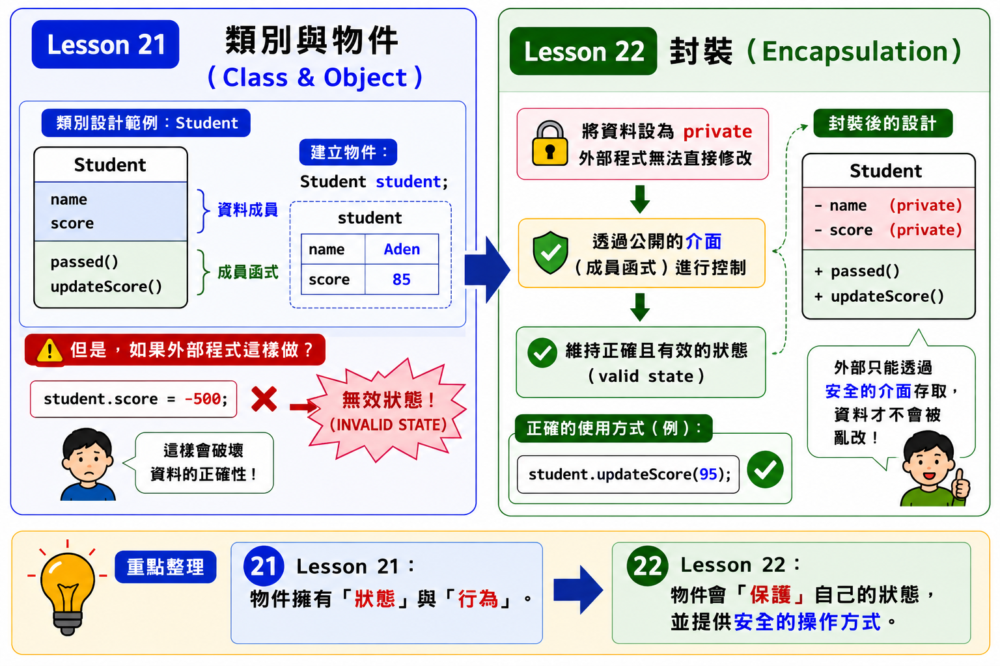
</p>

> 這堂課的重點：讓自訂型別自己負責建立有效物件、保護內部資料，並在物件生命週期結束時完成清理。你會學習 `class`、`public`、`private`、建構子、成員初始化列表、建構子多載、委派建構子、`explicit`、解構子、`const` 成員函式，以及如何用封裝維持資料不變條件。

> 本章接續 `struct` 與資料建模。手動 `new`／`delete`、複製建構子、移動建構子與完整 Rule of Five 只做概念預告，完整內容留到後續資源管理章節。

---

## Section I. 今天要做什麼？

1. 比較 `struct` 與 `class`。
2. 理解 `struct` 預設為 `public`。
3. 理解 `class` 預設為 `private`。
4. 使用 `public:` 與 `private:`。
5. 認識封裝 encapsulation。
6. 將內部資料隱藏。
7. 透過公開介面操作物件。
8. 認識 invariant 資料不變條件。
9. 讓建構子建立有效狀態。
10. 讓成員函式維持有效狀態。
11. 認識建構子 constructor。
12. 理解建構子名稱與類別相同。
13. 理解建構子沒有回傳型別。
14. 使用預設建構子。
15. 使用參數化建構子。
16. 使用建構子多載。
17. 使用預設成員初始化值。
18. 使用 `= default`。
19. 使用 `= delete`。
20. 使用成員初始化列表。
21. 理解初始化與賦值的差異。
22. 理解 `const` 成員必須在初始化列表初始化。
23. 理解參考成員必須在初始化列表初始化。
24. 理解成員依宣告順序初始化。
25. 避免初始化順序依賴錯誤。
26. 使用委派建構子。
27. 減少重複初始化邏輯。
28. 認識單一參數建構子。
29. 使用 `explicit`。
30. 避免意外隱式轉換。
31. 認識解構子 destructor。
32. 理解解構子名稱前有 `~`。
33. 理解解構子沒有參數與回傳型別。
34. 理解每個類別只有一個解構子。
35. 理解物件離開作用域時自動解構。
36. 觀察同區塊物件反序解構。
37. 觀察成員反序解構。
38. 認識 RAII。
39. 認識 Rule of Zero。
40. 優先使用 `string`、`vector` 等標準型別管理資源。
41. 認識 getter。
42. 建立回傳值 getter。
43. 建立回傳 `const` 參考 getter。
44. 避免回傳可修改參考破壞封裝。
45. 認識 setter。
46. 建立驗證 setter。
47. 優先建立表達行為的成員函式。
48. 使用 `deposit()` 取代任意 `setBalance()`。
49. 使用 `complete()` 取代任意 `setStatus()`。
50. 認識 `const` 成員函式。
51. 理解 const 物件只能呼叫 const 成員函式。
52. 為 getter 與查詢函式加上 `const`。
53. 認識 `this` 指標。
54. 使用 `return *this`。
55. 建立可串接操作。
56. 在類別內宣告成員函式。
57. 在類別外定義成員函式。
58. 使用 `ClassName::`。
59. 建立 `BankAccount` 類別。
60. 建立 `Rectangle` 類別。
61. 建立 `Student` 類別。
62. 建立 `Task` 類別。
63. 建立 `Product` 類別。
64. 使用 `enum class` 作為私有狀態。
65. 使用 vector 保存類別物件。
66. 使用 `emplace_back()` 直接建構物件。
67. 使用 getter 搜尋物件。
68. 使用 getter 排序物件。
69. 認識複製建構子概念。
70. 認識移動建構子概念。
71. 認識 Rule of Three、Five、Zero。
72. 避免在本章手動管理裸指標資源。
73. 使用概念檢查、程式閱讀與實作題整合本章。

---

## Section II. 今天的學習方式

1. 每個類別先回答：
   ```text
   物件代表什麼？
   哪些資料必須被保護？
   建立時哪些規則必須成立？
   外部真正需要哪些操作？
   ```
2. 建構子先確保物件一建立就是有效狀態。
3. 成員初始化列表依成員宣告順序分析。
4. 只讀成員函式應加：
   ```cpp
   const
   ```
5. Getter 回傳大型字串時可使用：
   ```cpp
   const std::string&
   ```
6. 不要回傳 private 成員的非 `const` 參考。
7. 優先設計表達行為的函式：
   ```text
   deposit
   withdraw
   complete
   rename
   restock
   ```
8. 解構順序由最後完成建立的物件開始追蹤。
9. Vector of objects 題要分辨：
   ```text
   push_back 既有物件
   emplace_back 直接呼叫建構子
   ```
10. 本章資源管理交給標準型別。
11. 所有合法完整程式使用嚴格 C++17 選項檢查。

---

## Section III. 核心語法對照

| 語法 | 用途 |
| --- | --- |
| `class Account { ... };` | 宣告類別 |
| `public:` | 公開介面 |
| `private:` | 內部資料與實作 |
| `Account();` | 預設建構子 |
| `Account(double value);` | 參數化建構子 |
| `Account() = default;` | 產生預設版本 |
| `Account() = delete;` | 禁止此建立方式 |
| `Account(...) : member(value) {}` | 成員初始化列表 |
| `explicit Account(int value);` | 禁止隱式單參數轉換 |
| `~Account();` | 解構子 |
| `double balance() const;` | const 成員函式 |
| `const string& name() const;` | 唯讀參考 getter |
| `ClassName::function()` | 類別外定義成員函式 |
| `return *this;` | 回傳目前物件參考 |
| `vector<Account>` | 保存多個物件 |
| `emplace_back(args...)` | 直接在容器內建構物件 |

---

# Part A：`struct` 與 `class`

## Section IV. 共同能力

兩者都可以包含：

- 資料成員
- 成員函式
- 建構子
- 解構子
- 存取修飾詞

主要預設差異：

```text
struct → public
class  → private
```

---

## Section V. 教材慣例

常見設計：

- `struct`：簡單資料紀錄。
- `class`：需要保護規則與提供操作介面。

這是慣例，不是語言限制。

---

# Part B：第一個 Class

## Section VI. Counter 類別

```cpp
// VALIDATE
#include <iostream>
using namespace std;

class Counter {
public:
    void increment() {
        ++valueCount;
    }

    int value() const {
        return valueCount;
    }

private:
    int valueCount = 0;
};

int main() {
    Counter counter;

    counter.increment();
    counter.increment();

    cout << counter.value()
         << '\n';

    return 0;
}
```

外部不能直接：

```cpp
/* counter.valueCount = 100; */
```

---

# Part C：封裝與 Invariant

<p align="center">
  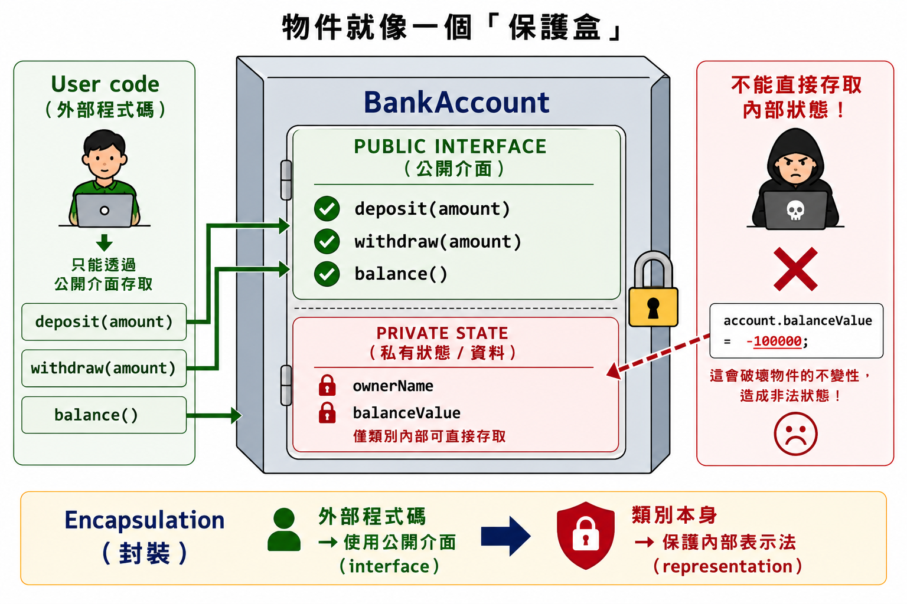
</p>

## Section VII. 封裝包含什麼？

<p align="center">
  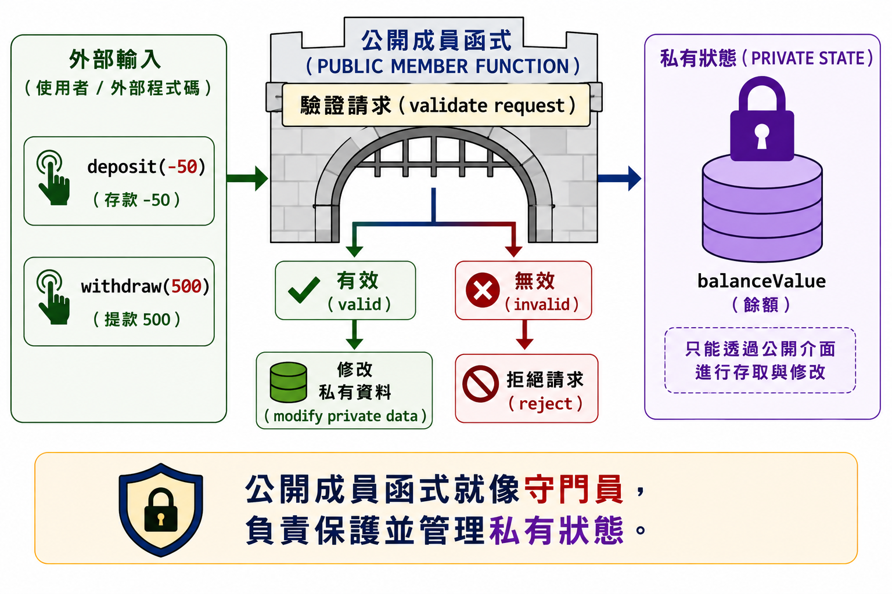
</p>

1. 隱藏內部資料。
2. 只公開必要操作。
3. 驗證輸入。
4. 維持物件規則。
5. 讓外部依賴介面，而不是內部表示方式。

---

## Section VIII. 行為介面

<p align="center">
  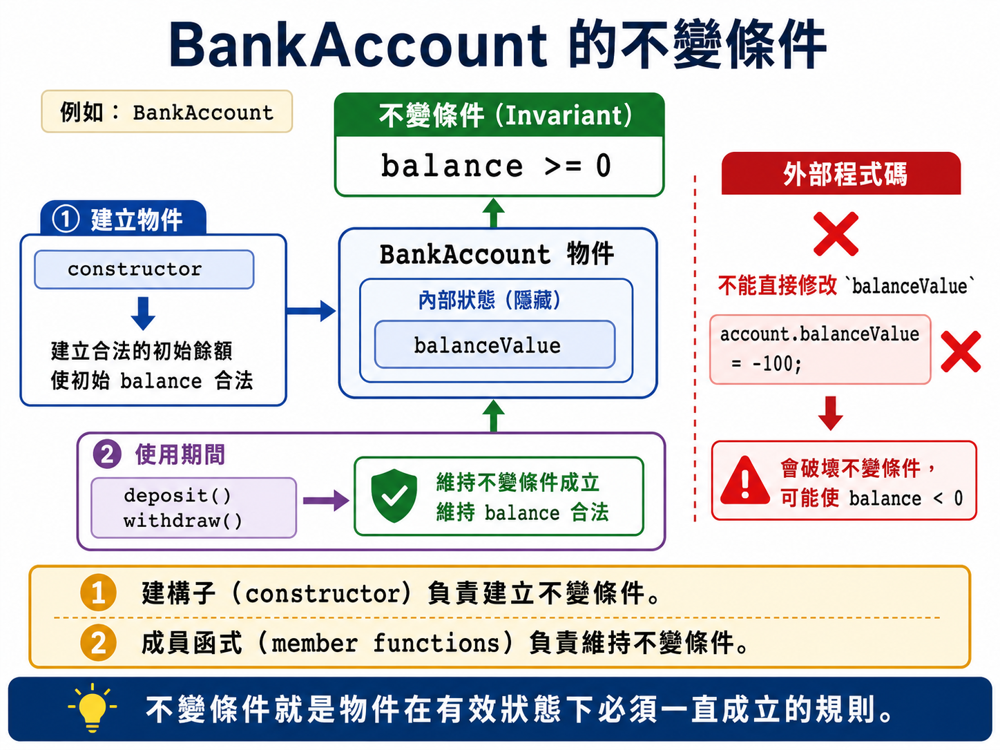
</p>

較弱：

```cpp
setBalance(newValue);
```

較清楚：

```cpp
deposit(amount);
withdraw(amount);
```

後者能集中控制合法金額與餘額規則。

---

# Part D：第一個建構子

## Section IX. Point 類別

<p align="center">
  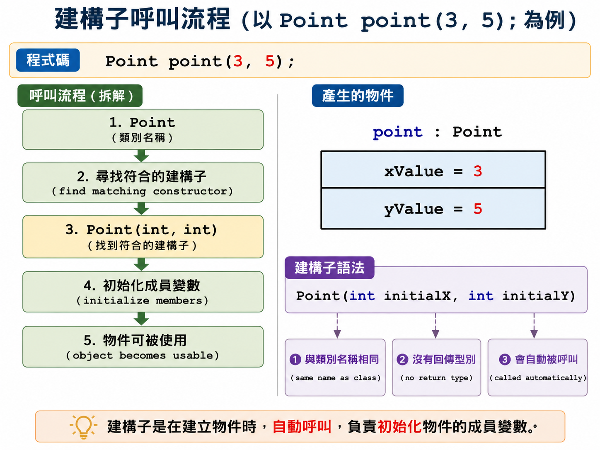
</p>

```cpp
// VALIDATE
#include <iostream>
using namespace std;

class Point {
public:
    Point(
        int initialX,
        int initialY
    )
        : xValue(initialX),
          yValue(initialY) {
    }

    int x() const {
        return xValue;
    }

    int y() const {
        return yValue;
    }

private:
    int xValue;
    int yValue;
};

int main() {
    Point point(
        3,
        5
    );

    cout << point.x()
         << " "
         << point.y()
         << '\n';

    return 0;
}
```

建構子：

- 名稱和類別相同。
- 沒有回傳型別。
- 建立物件時自動呼叫。

---

# Part E：成員初始化列表

## Section X. 基本形式

<p align="center">
  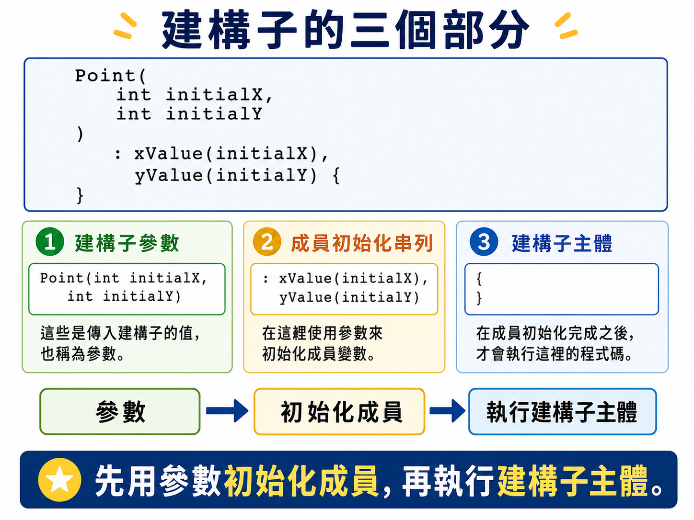
</p>

```cpp
Point(
    int initialX,
    int initialY
)
    : xValue(initialX),
      yValue(initialY) {
}
```

這是直接初始化成員。

---

## Section XI. 為什麼優先使用？

<p align="center">
  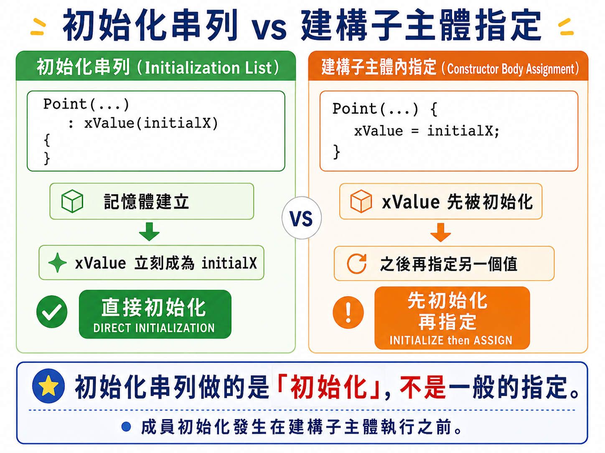
</p>

- 直接初始化。
- `const` 成員必須使用。
- 參考成員必須使用。
- 類別型別成員可能避免額外賦值。
- 清楚表達初始狀態。

---

## Section XII. 初始化順序

<p align="center">
  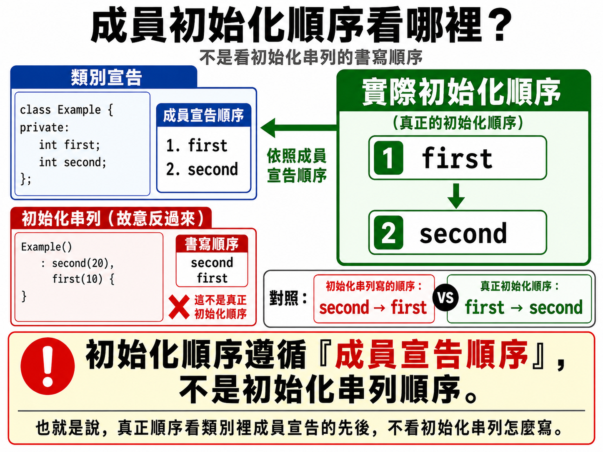
</p>

真正順序依類別內成員宣告順序，不依初始化列表書寫順序。

建議兩者保持一致。

---

# Part F：預設建構子

## Section XIII. `= default`

<p align="center">
  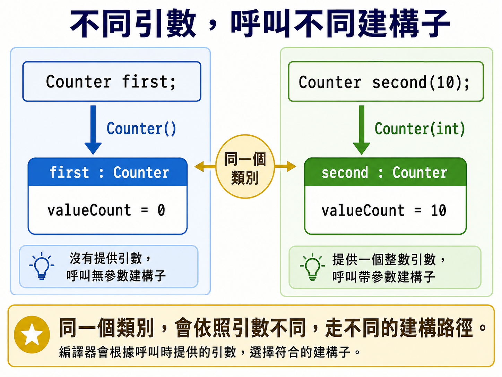
</p>

```cpp
// VALIDATE
#include <iostream>
using namespace std;

class Counter {
public:
    Counter() = default;

    explicit Counter(
        int initialValue
    )
        : valueCount(initialValue) {
    }

    int value() const {
        return valueCount;
    }

private:
    int valueCount = 0;
};

int main() {
    Counter first;
    Counter second(10);

    cout << first.value()
         << " "
         << second.value()
         << '\n';

    return 0;
}
```

宣告其他建構子後，若仍需要無參數建立，可明確加入：

```cpp
Counter() = default;
```

---

# Part G：建構子多載

## Section XIV. 多種建立方式

<p align="center">
  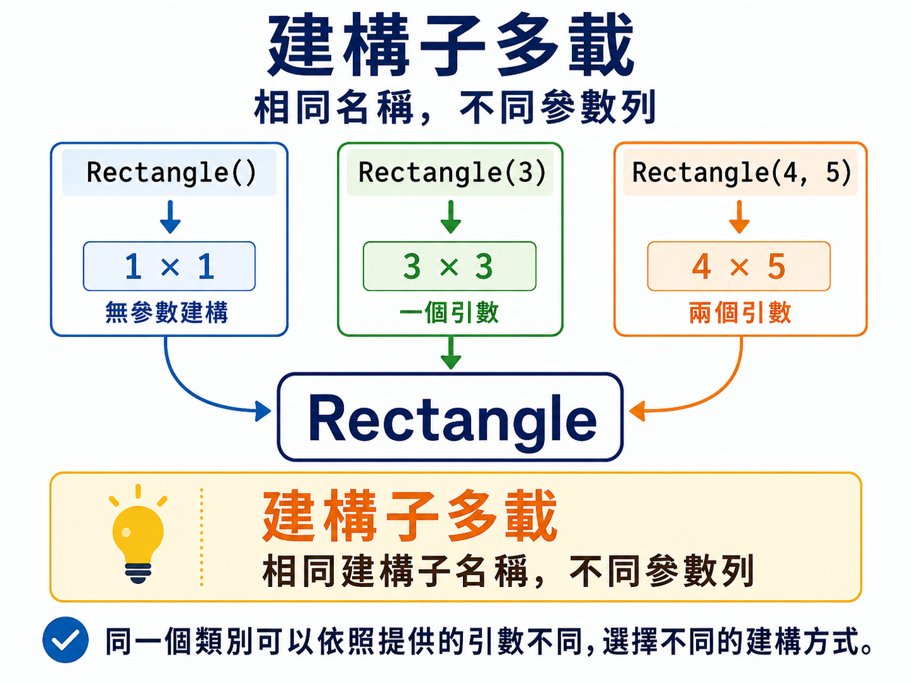
</p>

```cpp
// VALIDATE
#include <iostream>
using namespace std;

class Rectangle {
public:
    Rectangle()
        : widthValue(1.0),
          heightValue(1.0) {
    }

    explicit Rectangle(
        double size
    )
        : widthValue(size),
          heightValue(size) {
    }

    Rectangle(
        double initialWidth,
        double initialHeight
    )
        : widthValue(initialWidth),
          heightValue(initialHeight) {
    }

    double area() const {
        return
            widthValue *
            heightValue;
    }

private:
    double widthValue;
    double heightValue;
};

int main() {
    Rectangle first;
    Rectangle second(3.0);
    Rectangle third(
        4.0,
        5.0
    );

    cout << first.area()
         << " "
         << second.area()
         << " "
         << third.area()
         << '\n';

    return 0;
}
```

---

# Part H：委派建構子

## Section XV. 減少重複初始化

<p align="center">
  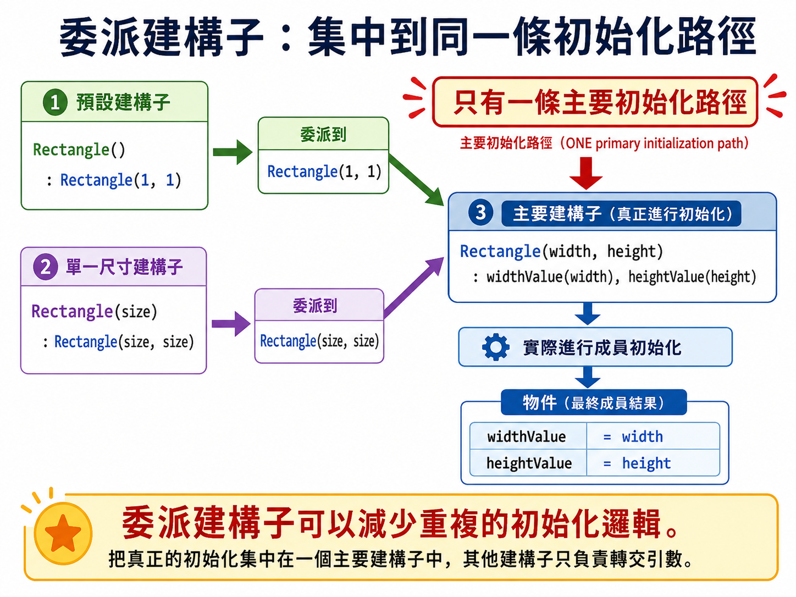
</p>

```cpp
// VALIDATE
#include <iostream>
using namespace std;

class Rectangle {
public:
    Rectangle()
        : Rectangle(
              1.0,
              1.0
          ) {
    }

    explicit Rectangle(
        double size
    )
        : Rectangle(
              size,
              size
          ) {
    }

    Rectangle(
        double initialWidth,
        double initialHeight
    )
        : widthValue(initialWidth),
          heightValue(initialHeight) {
    }

    double area() const {
        return
            widthValue *
            heightValue;
    }

private:
    double widthValue;
    double heightValue;
};

int main() {
    Rectangle rectangle(4.0);

    cout << rectangle.area()
         << '\n';

    return 0;
}
```

一個建構子可委派給同類別另一個建構子。

---

# Part I：`explicit`

## Section XVI. 防止意外轉換

<p align="center">
  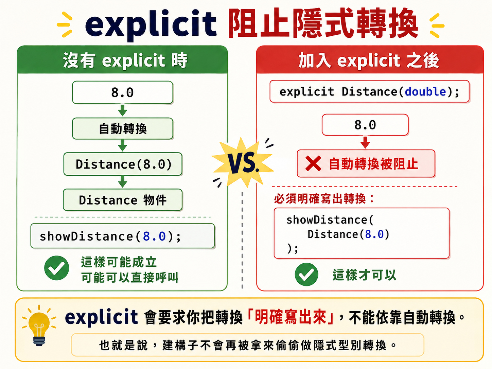
</p>

```cpp
// VALIDATE
#include <iostream>
using namespace std;

class Distance {
public:
    explicit Distance(
        double initialMeters
    )
        : metersValue(
              initialMeters
          ) {
    }

    double meters() const {
        return metersValue;
    }

private:
    double metersValue;
};

void showDistance(
    const Distance& distance
) {
    cout << distance.meters()
         << " m\n";
}

int main() {
    Distance distance(5.0);

    showDistance(distance);
    showDistance(
        Distance(8.0)
    );

    return 0;
}
```

因為有 `explicit`，不允許：

```cpp
/* showDistance(8.0); */
```

---

# Part J：`= delete`

## Section XVII. 禁止無參數建立

```cpp
// VALIDATE
#include <iostream>
using namespace std;

class StudentId {
public:
    StudentId() = delete;

    explicit StudentId(
        int initialNumber
    )
        : numberValue(
              initialNumber
          ) {
    }

    int number() const {
        return numberValue;
    }

private:
    int numberValue;
};

int main() {
    StudentId id(1001);

    cout << id.number()
         << '\n';

    return 0;
}
```

不允許：

```cpp
/* StudentId id; */
```

---

# Part K：Getter 與 Setter

## Section XVIII. Getter

<p align="center">
  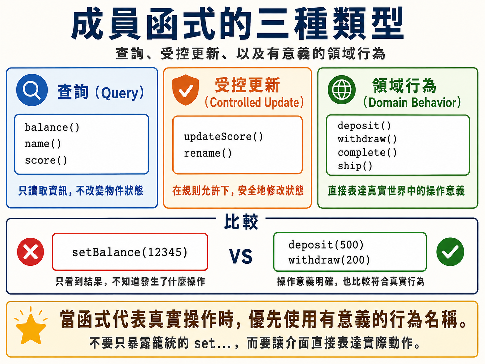
</p>

小型型別通常回傳值：

```cpp
int id() const;
double score() const;
```

大型字串可回傳唯讀參考：

```cpp
const string& name() const;
```

---

## Section XIX. 不要回傳可修改參考

危險介面：

```cpp
/* string& name(); */
```

它讓外部直接修改 private 成員，繞過驗證。

---

## Section XX. Student 範例

```cpp
// VALIDATE
#include <iostream>
#include <string>
using namespace std;

class Student {
public:
    Student(
        int initialId,
        const string& initialName,
        double initialScore
    )
        : idValue(initialId),
          nameValue(
              initialName.empty()
                  ? "Unknown"
                  : initialName
          ),
          scoreValue(
              normalizeScore(
                  initialScore
              )
          ) {
    }

    int id() const {
        return idValue;
    }

    const string& name() const {
        return nameValue;
    }

    double score() const {
        return scoreValue;
    }

    bool rename(
        const string& newName
    ) {
        if (newName.empty()) {
            return false;
        }

        nameValue = newName;
        return true;
    }

    bool updateScore(
        double newScore
    ) {
        if (
            newScore < 0.0 ||
            newScore > 100.0
        ) {
            return false;
        }

        scoreValue = newScore;
        return true;
    }

private:
    static double normalizeScore(
        double score
    ) {
        if (score < 0.0) {
            return 0.0;
        }

        if (score > 100.0) {
            return 100.0;
        }

        return score;
    }

    int idValue;
    string nameValue;
    double scoreValue;
};

int main() {
    Student student(
        1,
        "Amy",
        92.5
    );

    student.updateScore(95.0);

    cout << student.id()
         << " "
         << student.name()
         << " "
         << student.score()
         << '\n';

    return 0;
}
```

---

# Part L：BankAccount 行為介面

## Section XXI. 完整帳戶類別

```cpp
// VALIDATE
#include <iostream>
#include <string>
using namespace std;

class BankAccount {
public:
    BankAccount(
        const string& initialOwner,
        double initialBalance
    )
        : ownerName(initialOwner),
          balanceValue(
              initialBalance >= 0.0
                  ? initialBalance
                  : 0.0
          ) {
    }

    const string& owner() const {
        return ownerName;
    }

    double balance() const {
        return balanceValue;
    }

    bool deposit(double amount) {
        if (amount <= 0.0) {
            return false;
        }

        balanceValue += amount;
        return true;
    }

    bool withdraw(double amount) {
        if (
            amount <= 0.0 ||
            amount > balanceValue
        ) {
            return false;
        }

        balanceValue -= amount;
        return true;
    }

private:
    string ownerName;
    double balanceValue;
};

int main() {
    BankAccount account(
        "Amy",
        100.0
    );

    account.deposit(50.0);
    account.withdraw(30.0);

    cout << account.owner()
         << " "
         << account.balance()
         << '\n';

    return 0;
}
```

---

# Part M：`const` 成員函式

## Section XXII. 語法

<p align="center">
  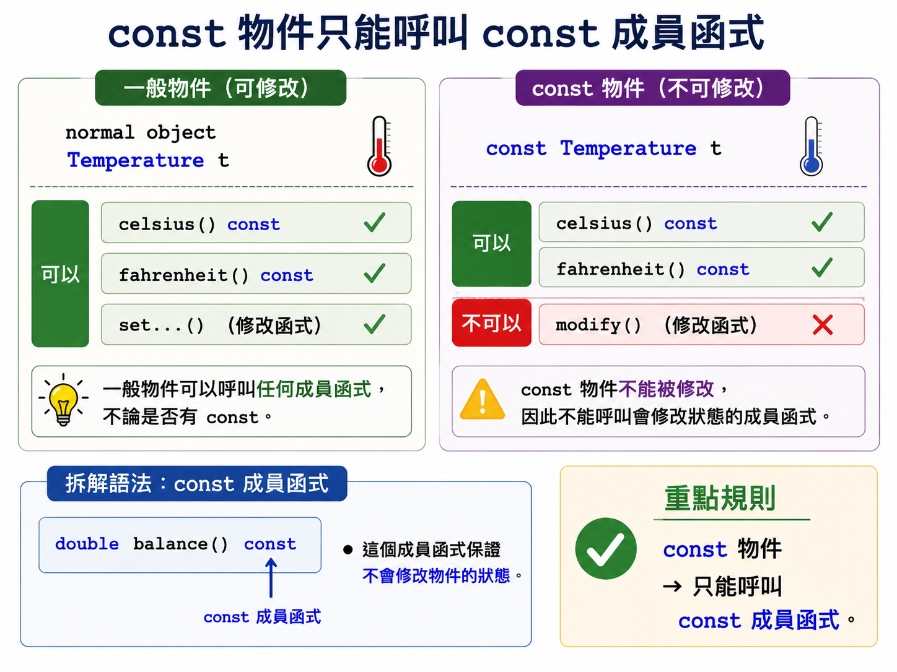
</p>

```cpp
double balance() const {
    return balanceValue;
}
```

`const` 放在參數列表後。

---

## Section XXIII. Const 物件

Const 物件只能呼叫 const 成員函式。

```cpp
// VALIDATE
#include <iostream>
using namespace std;

class Temperature {
public:
    explicit Temperature(
        double initialCelsius
    )
        : celsiusValue(
              initialCelsius
          ) {
    }

    double celsius() const {
        return celsiusValue;
    }

    double fahrenheit() const {
        return
            celsiusValue *
            9.0 /
            5.0 +
            32.0;
    }

private:
    double celsiusValue;
};

int main() {
    const Temperature temperature(
        25.0
    );

    cout << temperature.celsius()
         << " "
         << temperature.fahrenheit()
         << '\n';

    return 0;
}
```

---

# Part N：`this` 與串接操作

## Section XXIV. 回傳目前物件

<p align="center">
  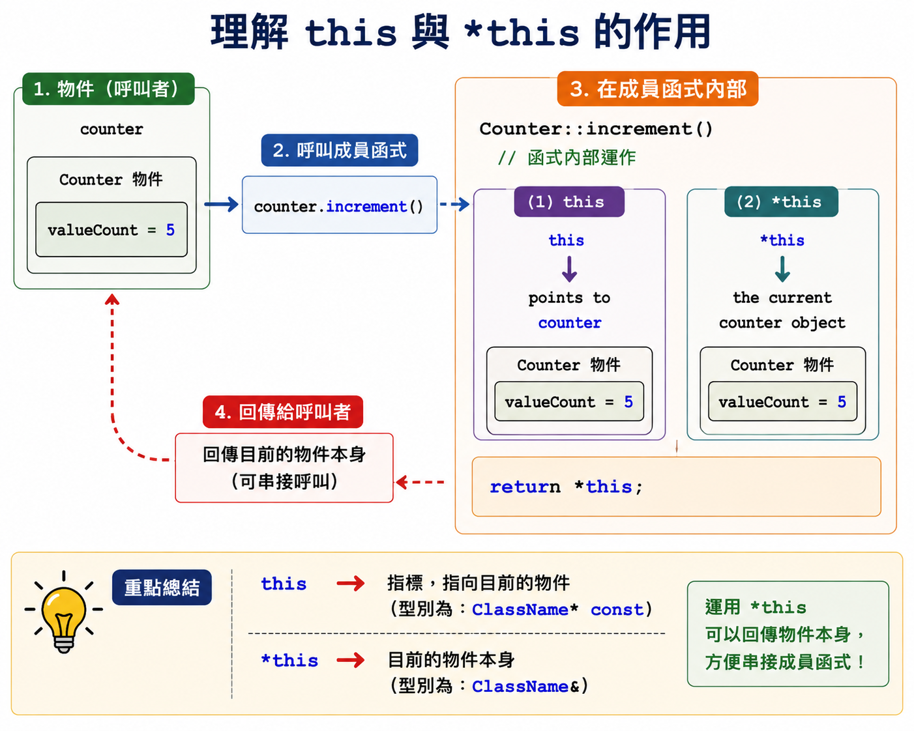
</p>

```cpp
// VALIDATE
#include <iostream>
using namespace std;

class Counter {
public:
    Counter& increment() {
        ++valueCount;
        return *this;
    }

    Counter& add(int amount) {
        valueCount += amount;
        return *this;
    }

    int value() const {
        return valueCount;
    }

private:
    int valueCount = 0;
};

int main() {
    Counter counter;

    counter.increment()
           .add(5)
           .increment();

    cout << counter.value()
         << '\n';

    return 0;
}
```

`*this` 代表目前物件。

---

# Part O：類別外定義

## Section XXV. 使用 `ClassName::`

```cpp
// VALIDATE
#include <iostream>
using namespace std;

class Rectangle {
public:
    Rectangle(
        double initialWidth,
        double initialHeight
    );

    double area() const;

private:
    double widthValue;
    double heightValue;
};

Rectangle::Rectangle(
    double initialWidth,
    double initialHeight
)
    : widthValue(initialWidth),
      heightValue(initialHeight) {
}

double Rectangle::area() const {
    return
        widthValue *
        heightValue;
}

int main() {
    Rectangle rectangle(
        4.0,
        3.0
    );

    cout << rectangle.area()
         << '\n';

    return 0;
}
```

大型專案常在標頭檔宣告、來源檔實作。

---

# Part P：解構子

## Section XXVI. 基本語法

<p align="center">
  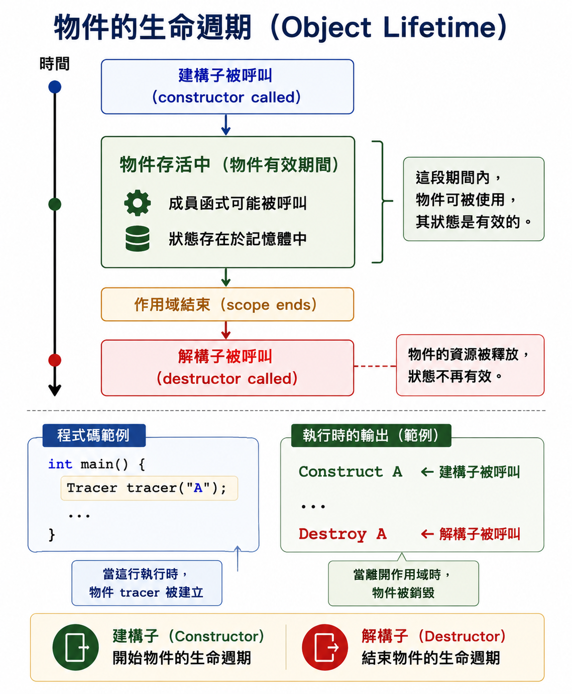
</p>

```cpp
~ClassName() {
    // 清理
}
```

特點：

- 沒有參數。
- 沒有回傳型別。
- 不能多載。
- 物件生命週期結束時自動呼叫。

---

## Section XXVII. Tracer 範例

```cpp
// VALIDATE
#include <iostream>
#include <string>
using namespace std;

class Tracer {
public:
    explicit Tracer(
        const string& initialName
    )
        : nameValue(initialName) {
        cout << "Construct "
             << nameValue
             << '\n';
    }

    ~Tracer() {
        cout << "Destroy "
             << nameValue
             << '\n';
    }

private:
    string nameValue;
};

int main() {
    Tracer first("first");
    Tracer second("second");

    return 0;
}
```

通常輸出：

```text
Construct first
Construct second
Destroy second
Destroy first
```

這種輸出解構子只適合教學追蹤。

---

# Part Q：區塊與成員解構順序

## Section XXVIII. 內層區塊

<p align="center">
  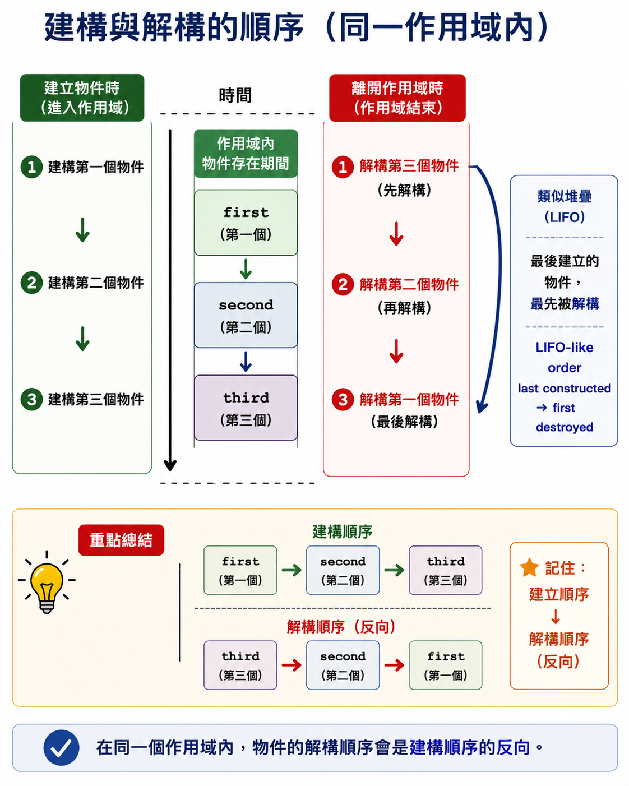
</p>

```cpp
// VALIDATE
#include <iostream>
#include <string>
using namespace std;

class Tracer {
public:
    explicit Tracer(
        const string& initialName
    )
        : nameValue(initialName) {
        cout << "Construct "
             << nameValue
             << '\n';
    }

    ~Tracer() {
        cout << "Destroy "
             << nameValue
             << '\n';
    }

private:
    string nameValue;
};

int main() {
    Tracer outer("outer");

    {
        Tracer inner("inner");
    }

    cout << "After block\n";

    return 0;
}
```

`inner` 在離開內層區塊時立即解構。

---

## Section XXIX. 成員順序

建立外層物件時：

1. 成員依宣告順序建立。
2. 執行外層建構子主體。

銷毀時：

1. 執行外層解構子主體。
2. 成員依宣告反序銷毀。

---

# Part R：RAII 與 Rule of Zero

## Section XXX. RAII

<p align="center">
  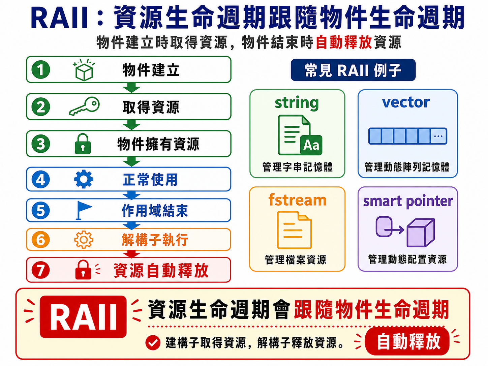
</p>

RAII 可理解為：

```text
資源取得綁定物件建立
資源釋放綁定物件解構
```

標準型別如：

- `std::string`
- `std::vector`
- `std::fstream`
- 智慧指標

會自動管理其資源。

---

## Section XXXI. Rule of Zero

<p align="center">
  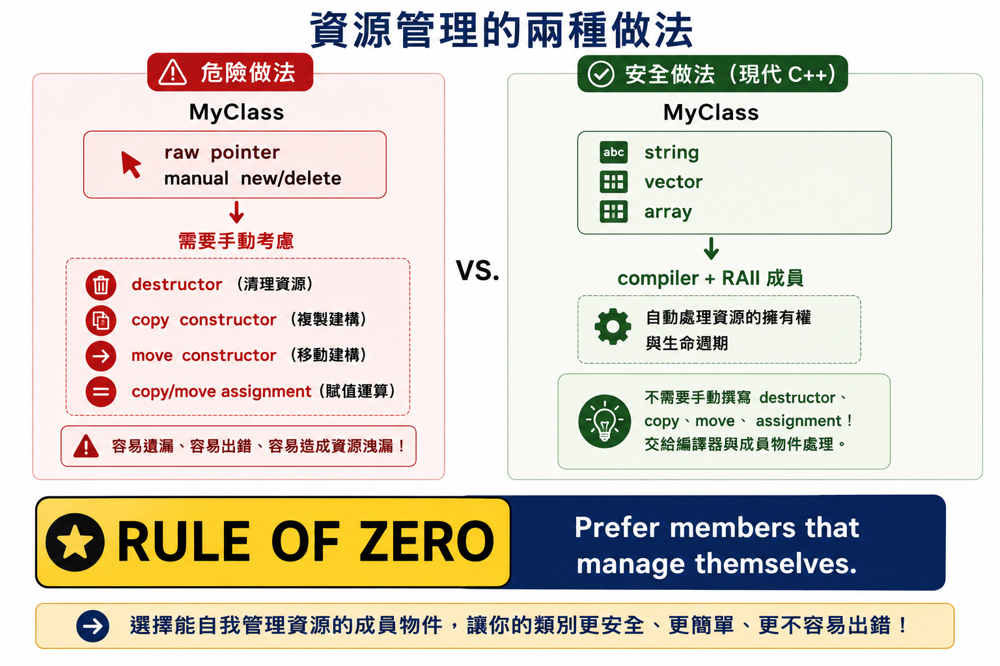
</p>

若類別只使用能自行管理資源的成員，通常不需要自訂：

- 解構子
- 複製建構子
- 複製賦值
- 移動建構子
- 移動賦值

---

## Section XXXII. Course 範例

```cpp
// VALIDATE
#include <iostream>
#include <string>
#include <vector>
using namespace std;

class Course {
public:
    explicit Course(
        const string& initialName
    )
        : nameValue(initialName) {
    }

    bool addScore(double score) {
        if (
            score < 0.0 ||
            score > 100.0
        ) {
            return false;
        }

        scores.push_back(score);
        return true;
    }

    const string& name() const {
        return nameValue;
    }

    vector<double>::size_type
    scoreCount() const {
        return scores.size();
    }

private:
    string nameValue;
    vector<double> scores;
};

int main() {
    Course course("C++");

    course.addScore(90.0);
    course.addScore(85.0);

    cout << course.name()
         << " "
         << course.scoreCount()
         << '\n';

    return 0;
}
```

不需要自訂解構子。

---

# Part S：Vector of Objects

## Section XXXIII. `emplace_back()`

<p align="center">
  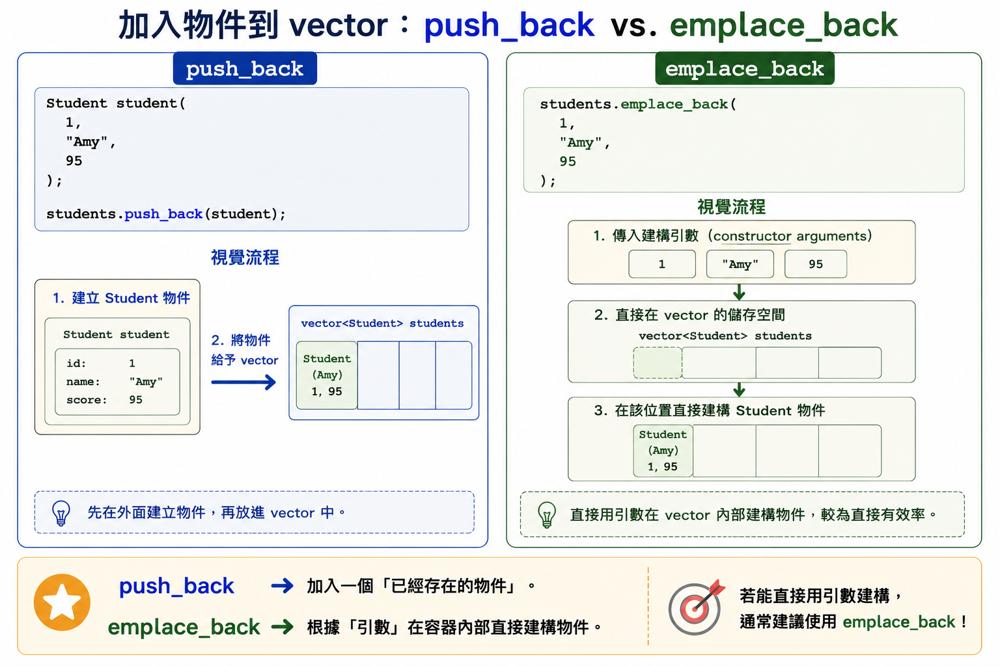
</p>

```cpp
students.emplace_back(
    1,
    "Amy",
    95.0
);
```

直接使用參數呼叫 `Student` 建構子。

---

## Section XXXIV. 完整物件集合

```cpp
// VALIDATE
#include <iostream>
#include <string>
#include <vector>
using namespace std;

class Student {
public:
    Student(
        int initialId,
        const string& initialName,
        double initialScore
    )
        : idValue(initialId),
          nameValue(initialName),
          scoreValue(initialScore) {
    }

    int id() const {
        return idValue;
    }

    const string& name() const {
        return nameValue;
    }

    double score() const {
        return scoreValue;
    }

private:
    int idValue;
    string nameValue;
    double scoreValue;
};

int main() {
    vector<Student> students;

    students.emplace_back(
        1,
        "Amy",
        95.0
    );

    students.emplace_back(
        2,
        "Brian",
        85.0
    );

    for (
        const Student& student :
        students
    ) {
        cout << student.id()
             << " "
             << student.name()
             << " "
             << student.score()
             << '\n';
    }

    return 0;
}
```

---

# Part T：搜尋與排序物件

## Section XXXV. 使用 Getter 搜尋

```cpp
// VALIDATE
#include <algorithm>
#include <iostream>
#include <string>
#include <vector>
using namespace std;

class Student {
public:
    Student(
        int initialId,
        const string& initialName
    )
        : idValue(initialId),
          nameValue(initialName) {
    }

    int id() const {
        return idValue;
    }

    const string& name() const {
        return nameValue;
    }

private:
    int idValue;
    string nameValue;
};

int main() {
    vector<Student> students;

    students.emplace_back(
        1,
        "Amy"
    );

    students.emplace_back(
        2,
        "Brian"
    );

    int targetId;
    cin >> targetId;

    auto iterator =
        find_if(
            students.cbegin(),
            students.cend(),
            [targetId](
                const Student& student
            ) {
                return
                    student.id() ==
                    targetId;
            }
        );

    if (
        iterator !=
        students.cend()
    ) {
        cout << iterator->name()
             << '\n';
    } else {
        cout << "Not found\n";
    }

    return 0;
}
```

---

## Section XXXVI. 使用 Getter 排序

```cpp
// VALIDATE
#include <algorithm>
#include <iostream>
#include <string>
#include <vector>
using namespace std;

class Student {
public:
    Student(
        const string& initialName,
        double initialScore
    )
        : nameValue(initialName),
          scoreValue(initialScore) {
    }

    const string& name() const {
        return nameValue;
    }

    double score() const {
        return scoreValue;
    }

private:
    string nameValue;
    double scoreValue;
};

int main() {
    vector<Student> students;

    students.emplace_back(
        "Cindy",
        90.0
    );

    students.emplace_back(
        "Amy",
        95.0
    );

    students.emplace_back(
        "Brian",
        90.0
    );

    sort(
        students.begin(),
        students.end(),
        [](
            const Student& first,
            const Student& second
        ) {
            if (
                first.score() !=
                second.score()
            ) {
                return
                    first.score() >
                    second.score();
            }

            return
                first.name() <
                second.name();
        }
    );

    for (
        const Student& student :
        students
    ) {
        cout << student.name()
             << " "
             << student.score()
             << '\n';
    }

    return 0;
}
```

---

# Part U：封裝 Enum 狀態

## Section XXXVII. Task 類別

```cpp
// VALIDATE
#include <iostream>
#include <string>
using namespace std;

enum class TaskStatus {
    todo,
    doing,
    done
};

class Task {
public:
    explicit Task(
        const string& initialTitle
    )
        : titleValue(initialTitle),
          statusValue(
              TaskStatus::todo
          ) {
    }

    const string& title() const {
        return titleValue;
    }

    TaskStatus status() const {
        return statusValue;
    }

    bool start() {
        if (
            statusValue !=
            TaskStatus::todo
        ) {
            return false;
        }

        statusValue =
            TaskStatus::doing;

        return true;
    }

    bool complete() {
        if (
            statusValue !=
            TaskStatus::doing
        ) {
            return false;
        }

        statusValue =
            TaskStatus::done;

        return true;
    }

private:
    string titleValue;
    TaskStatus statusValue;
};

int main() {
    Task task("Study C++");

    cout << boolalpha
         << task.start()
         << '\n';

    cout << task.complete()
         << '\n';

    return 0;
}
```

外部不能任意把已完成任務改回待辦。

---

# Part V：Const 與參考成員

## Section XXXVIII. Const 成員

```cpp
class Record {
private:
    const int idValue;
};
```

必須在初始化列表初始化。

```cpp
// VALIDATE
#include <iostream>
#include <string>
using namespace std;

class Record {
public:
    Record(
        int initialId,
        const string& initialName
    )
        : idValue(initialId),
          nameValue(initialName) {
    }

    int id() const {
        return idValue;
    }

    const string& name() const {
        return nameValue;
    }

private:
    const int idValue;
    string nameValue;
};

int main() {
    Record record(
        1001,
        "Amy"
    );

    cout << record.id()
         << " "
         << record.name()
         << '\n';

    return 0;
}
```

---

## Section XXXIX. 參考成員

參考成員也必須在初始化列表綁定。

它不擁有原物件，原物件必須比包含參考的物件活得更久。

---

# Part W：完整 Product 類別

## Section XL. 規則

- ID 建立後不改變。
- 名稱不可為空。
- 價格不可為負。
- 庫存不可為負。
- 補貨量必須為正。
- 出貨不可超過庫存。

```cpp
// VALIDATE
#include <iostream>
#include <string>
using namespace std;

class Product {
public:
    Product(
        int initialId,
        const string& initialName,
        double initialPrice,
        int initialStock
    )
        : idValue(initialId),
          nameValue(
              initialName.empty()
                  ? "Unnamed"
                  : initialName
          ),
          priceValue(
              initialPrice >= 0.0
                  ? initialPrice
                  : 0.0
          ),
          stockValue(
              initialStock >= 0
                  ? initialStock
                  : 0
          ) {
    }

    int id() const {
        return idValue;
    }

    const string& name() const {
        return nameValue;
    }

    double price() const {
        return priceValue;
    }

    int stock() const {
        return stockValue;
    }

    bool rename(
        const string& newName
    ) {
        if (newName.empty()) {
            return false;
        }

        nameValue = newName;
        return true;
    }

    bool changePrice(
        double newPrice
    ) {
        if (newPrice < 0.0) {
            return false;
        }

        priceValue = newPrice;
        return true;
    }

    bool restock(int amount) {
        if (amount <= 0) {
            return false;
        }

        stockValue += amount;
        return true;
    }

    bool ship(int amount) {
        if (
            amount <= 0 ||
            amount > stockValue
        ) {
            return false;
        }

        stockValue -= amount;
        return true;
    }

private:
    const int idValue;
    string nameValue;
    double priceValue;
    int stockValue;
};

int main() {
    Product product(
        101,
        "Keyboard",
        50.0,
        10
    );

    product.restock(5);
    product.ship(3);

    cout << product.id()
         << " "
         << product.name()
         << " "
         << product.price()
         << " "
         << product.stock()
         << '\n';

    return 0;
}
```

---

# Part X：複製、移動與特殊成員預告

## Section XLI. 複製建構

```cpp
Student second =
    first;
```

可能呼叫 copy constructor。

---

## Section XLII. 複製賦值

```cpp
second = first;
```

可能呼叫 copy assignment operator。

---

## Section XLIII. 移動

暫時物件與可移動資源可能使用：

- move constructor
- move assignment operator

本章不深入其語法。

---

## Section XLIV. Rule of Zero 優先

類別成員若都是：

```text
int
double
string
vector
array
其他正常 RAII 類別
```

通常讓編譯器自動處理複製、移動與解構。

---

# Part Y：快速概念檢查

## Section XLV. 選擇題與簡答

### Q1. `struct` 與 `class` 的預設存取差異？

<details><summary>查看答案</summary>

`struct` 預設 `public`，`class` 預設 `private`。

</details>

### Q2. 什麼是封裝？

<details><summary>查看答案</summary>

隱藏內部資料，透過受控制的公開介面維持物件規則。

</details>

### Q3. 建構子有回傳型別嗎？

<details><summary>查看答案</summary>

沒有，連 `void` 也不能寫。

</details>

### Q4. 成員初始化列表有什麼用途？

<details><summary>查看答案</summary>

直接初始化成員，並支援 `const` 成員、參考成員與類別型別成員。

</details>

### Q5. 成員實際初始化順序由什麼決定？

<details><summary>查看答案</summary>

由類別內成員宣告順序決定。

</details>

### Q6. `= default` 的用途？

<details><summary>查看答案</summary>

明確要求編譯器產生預設版本。

</details>

### Q7. `= delete` 的用途？

<details><summary>查看答案</summary>

禁止某個函式或建立方式被使用。

</details>

### Q8. 為什麼單一參數建構子常加 `explicit`？

<details><summary>查看答案</summary>

避免其他型別意外隱式轉換成此類別。

</details>

### Q9. 解構子有參數嗎？

<details><summary>查看答案</summary>

沒有。

</details>

### Q10. 同一類別可以有多個解構子嗎？

<details><summary>查看答案</summary>

不可以。

</details>

### Q11. 同區塊物件通常依什麼順序解構？

<details><summary>查看答案</summary>

依建立順序的反序。

</details>

### Q12. 什麼是 RAII？

<details><summary>查看答案</summary>

將資源取得綁定物件建立，將資源釋放綁定物件解構。

</details>

### Q13. 什麼是 Rule of Zero？

<details><summary>查看答案</summary>

讓標準 RAII 成員管理資源，使類別不必自行定義特殊成員函式。

</details>

### Q14. `const` 成員函式的 `const` 寫在哪裡？

<details><summary>查看答案</summary>

參數列表後：

```cpp
double value() const;
```

</details>

### Q15. Const 物件可呼叫非 const 成員函式嗎？

<details><summary>查看答案</summary>

不可以。

</details>

### Q16. Getter 應回傳 private 字串的非 const 參考嗎？

<details><summary>查看答案</summary>

通常不應，否則外部可以繞過驗證修改資料。

</details>

### Q17. `emplace_back()` 的用途？

<details><summary>查看答案</summary>

直接在 vector 尾端使用參數呼叫物件建構子。

</details>

### Q18. `deposit()` 為什麼通常比 `setBalance()` 好？

<details><summary>查看答案</summary>

它表達領域行為，並集中驗證金額與餘額規則。

</details>

### Q19. 為什麼不應無理由自訂空解構子？

<details><summary>查看答案</summary>

會增加維護負擔，並可能影響自動移動操作。

</details>

### Q20. 私有 enum 狀態有什麼好處？

<details><summary>查看答案</summary>

外部不能任意設定狀態，只能透過合法狀態轉換函式修改。

</details>

---

# Part Z：程式閱讀練習

## Section XLVI. 預測結果與合法性

### 題目 1

```cpp
class Counter {
public:
    int value() const {
        return count;
    }

private:
    int count = 0;
};

Counter counter;
cout << counter.value();
```

<details><summary>查看答案</summary>

```text
0
```

</details>

### 題目 2

```cpp
class Point {
public:
    explicit Point(int initialX)
        : x(initialX) {
    }

private:
    int x;
};

/* Point point; */
```

<details><summary>查看答案</summary>

不合法，沒有可用的無參數建構子。

</details>

### 題目 3

```cpp
class Value {
public:
    Value() = default;

    int get() const {
        return number;
    }

private:
    int number = 5;
};

Value value;
cout << value.get();
```

<details><summary>查看答案</summary>

```text
5
```

</details>

### 題目 4

```cpp
class Distance {
public:
    explicit Distance(double initial)
        : value(initial) {
    }

private:
    double value;
};

/* Distance distance = 5.0; */
```

<details><summary>查看答案</summary>

不合法，`explicit` 禁止此隱式轉換。

</details>

### 題目 5

```cpp
class Counter {
public:
    Counter& increment() {
        ++valueCount;
        return *this;
    }

    int value() const {
        return valueCount;
    }

private:
    int valueCount = 0;
};

Counter counter;
counter.increment().increment();

cout << counter.value();
```

<details><summary>查看答案</summary>

```text
2
```

</details>

### 題目 6

```cpp
class Data {
public:
    int value() const {
        return number;
    }

private:
    int number = 10;
};

const Data data;
cout << data.value();
```

<details><summary>查看答案</summary>

```text
10
```

</details>

### 題目 7

```cpp
class Data {
public:
    void change() {
        number = 20;
    }

private:
    int number = 10;
};

const Data data;
/* data.change(); */
```

<details><summary>查看答案</summary>

不合法，Const 物件不能呼叫非 const 成員函式。

</details>

### 題目 8

```cpp
class Number {
public:
    Number() = delete;

    explicit Number(int initial)
        : value(initial) {
    }

private:
    int value;
};

/* Number number; */
```

<details><summary>查看答案</summary>

不合法，預設建構子被刪除。

</details>

### 題目 9

```cpp
class Record {
public:
    explicit Record(int initialId)
        : idValue(initialId) {
    }

private:
    const int idValue;
};
```

<details><summary>查看答案</summary>

合法，`const` 成員在初始化列表初始化。

</details>

### 題目 10

```cpp
class Product {
public:
    const string& name() const {
        return nameValue;
    }

private:
    string nameValue = "Book";
};

Product product;
/* product.name() = "Pen"; */
```

<details><summary>查看答案</summary>

不合法，回傳型別是 `const string&`。

</details>

### 題目 11

```cpp
class Box {
public:
    Box()
        : Box(1) {
    }

    explicit Box(int initial)
        : size(initial) {
    }

private:
    int size;
};

Box box;
```

<details><summary>查看答案</summary>

合法，無參數建構子委派給接受 `int` 的建構子。

</details>

### 題目 12

```cpp
class Tracer {
public:
    explicit Tracer(int value)
        : number(value) {
        cout << "C" << number;
    }

    ~Tracer() {
        cout << "D" << number;
    }

private:
    int number;
};

Tracer first(1);
Tracer second(2);
```

<details><summary>查看答案</summary>

若位於同一區塊，概念輸出：

```text
C1C2D2D1
```

</details>

---

# Part AA：實作練習

## Section XLVII. 實作檢測題

### TODO 1：Counter 類別

建立 private 計數值、`increment()`、`decrement()` 與 `value() const`。

### TODO 2：Point 建構子

建立需要 `x`、`y` 的參數化建構子與兩個 getter。

### TODO 3：Rectangle 多載建構子

提供預設矩形、正方形與一般矩形三種建立方式。

### TODO 4：委派建構子

將 Rectangle 的無參數與正方形建構子委派給雙參數建構子。

### TODO 5：Explicit Distance

建立禁止隱式數值轉換的 `Distance`。

### TODO 6：刪除預設建構子

建立沒有 ID 就不能建立的 `StudentId`。

### TODO 7：BankAccount

建立 `deposit()`、`withdraw()` 與 `balance() const`。

### TODO 8：Const Getter

建立 `Student`，讓 `name()` 回傳 `const string&`。

### TODO 9：類別外實作

將 Rectangle 建構子與 `area()` 放在類別外定義。

### TODO 10：Tracer

觀察巢狀區塊的建構與解構順序。

### TODO 11：Task 封裝

使用 private `TaskStatus`，只允許 `start()` 與 `complete()` 修改狀態。

### TODO 12：Vector of Objects

使用 `emplace_back()` 建立多個 Student。

### TODO 13：搜尋物件

使用 `find_if()` 和公開 getter 依 ID 搜尋。

### TODO 14：排序物件

使用 getter 依分數遞減、姓名遞增排序。

### TODO 15：Product 類別

建立名稱、價格、庫存驗證，以及 `restock()`、`ship()`。

---

# Part AB：課後小練習

## Section XLVIII. 延伸練習

### 練習 1：Temperature 類別

內部固定使用攝氏，提供華氏與開氏 getter，不允許低於絕對零度。

### 練習 2：Timer 類別

保存總秒數，提供 hours、minutes、seconds 查詢與安全增加時間。

### 練習 3：Course 類別

保存名稱與 private scores vector，提供加入分數、平均、最高與筆數查詢。

### 練習 4：ShoppingCart 類別

使用 vector 保存商品項目，提供加入、移除、總價與清空操作。

### 練習 5：介面重構

將具有大量 setter 的類別改成較少但能表達領域行為的公開函式。

---

# Part AC：常見錯誤提醒

## Section XLIX. 常見錯誤

1. 忘記類別宣告結尾分號。
2. 將建構子寫上回傳型別。
3. 建構子名稱與類別名稱不同。
4. 宣告參數化建構子後仍期待自動預設建構子。
5. `= delete` 後仍使用被禁止的建立方式。
6. 在建構子主體內賦值代替必要初始化。
7. `const` 成員未在初始化列表初始化。
8. 參考成員未在初始化列表綁定。
9. 誤以為初始化列表書寫順序決定實際順序。
10. 成員依賴尚未初始化的另一成員。
11. 委派建構子形成循環。
12. 單一參數建構子忘記 `explicit`。
13. 解構子寫參數。
14. 解構子寫回傳型別。
15. 嘗試多載解構子。
16. 無理由自訂空解構子。
17. Getter 回傳 private 成員的非 const 參考。
18. 為每個欄位機械式建立 setter。
19. Setter 未驗證資料。
20. Const 查詢函式忘記加 `const`。
21. Const 物件呼叫修改型函式。
22. 在 const 成員函式修改一般成員。
23. 回傳區域物件參考。
24. 參考成員指向生命週期較短的物件。
25. `emplace_back()` 參數與建構子不匹配。
26. 演算法直接存取 private 成員。
27. 用公開 setter 允許非法狀態轉換。
28. 自行管理裸資源卻沒有正確複製與解構設計。
29. 把所有成員都設為 public 而沒有封裝。
30. 類別公開介面沒有表達實際行為。

---

# Part AD：Mermaid 流程圖

## Section L. 建構、解構與封裝流程圖

### 1. 物件建立

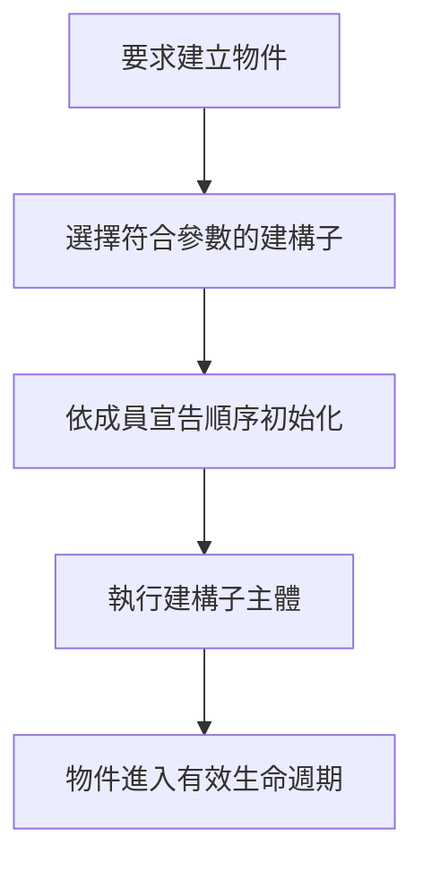
```mermaid
flowchart TD
    A[要求建立物件] --> B[選擇符合參數的建構子]
    B --> C[依成員宣告順序初始化]
    C --> D[執行建構子主體]
    D --> E[物件進入有效生命週期]
```

### 2. 物件銷毀

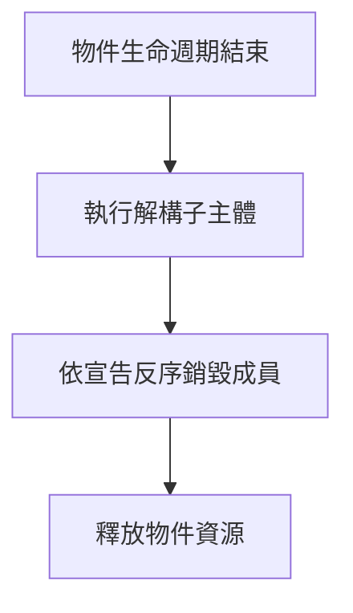
```mermaid
flowchart TD
    A[物件生命週期結束] --> B[執行解構子主體]
    B --> C[依宣告反序銷毀成員]
    C --> D[釋放物件資源]
```

### 3. 封裝設計

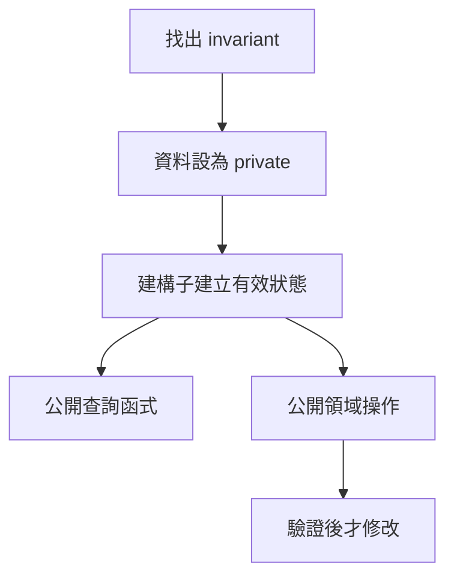
```mermaid
flowchart TD
    A[找出 invariant] --> B[資料設為 private]
    B --> C[建構子建立有效狀態]
    C --> D[公開查詢函式]
    C --> E[公開領域操作]
    E --> F[驗證後才修改]
```

### 4. 建構子選擇

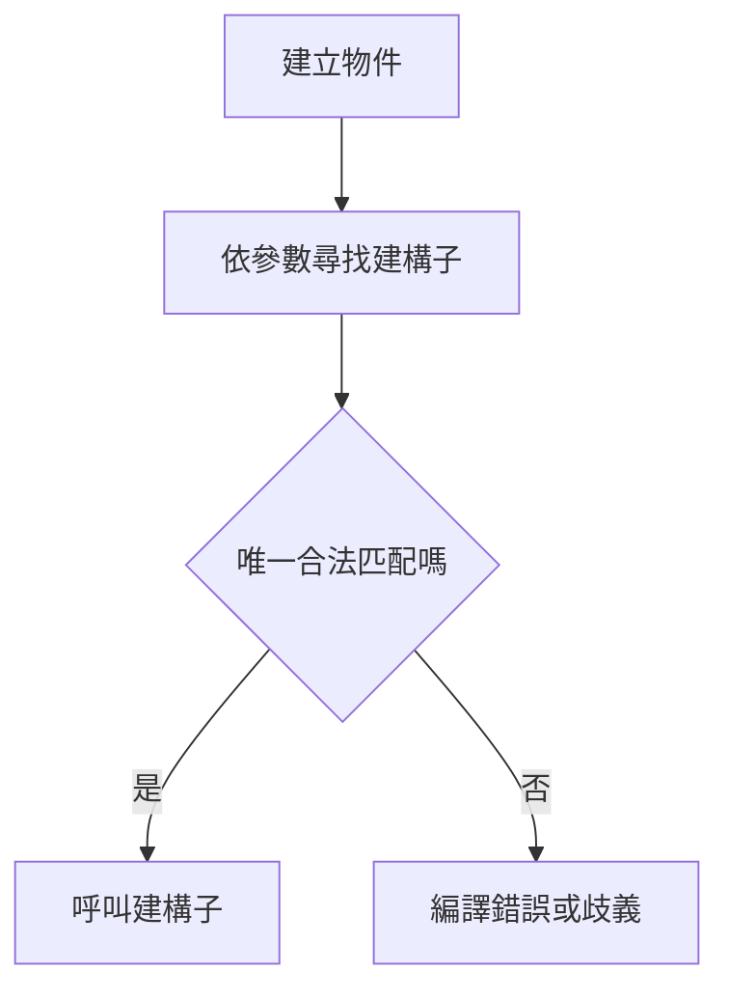
```mermaid
flowchart TD
    A[建立物件] --> B[依參數尋找建構子]
    B --> C{唯一合法匹配嗎}
    C -- 是 --> D[呼叫建構子]
    C -- 否 --> E[編譯錯誤或歧義]
```

### 5. Const 成員函式

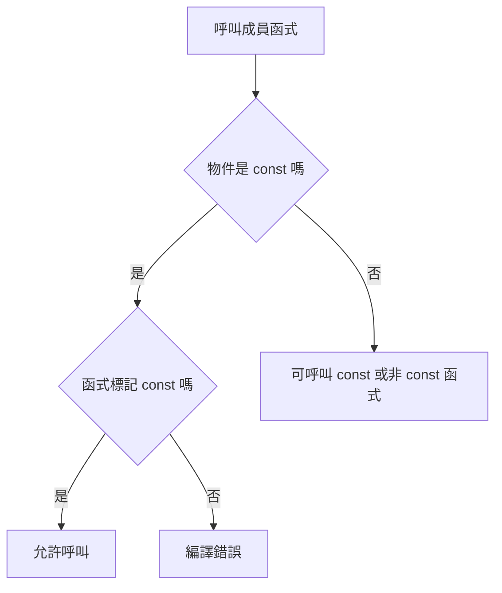
```mermaid
flowchart TD
    A[呼叫成員函式] --> B{物件是 const 嗎}
    B -- 是 --> C{函式標記 const 嗎}
    C -- 是 --> D[允許呼叫]
    C -- 否 --> E[編譯錯誤]
    B -- 否 --> F[可呼叫 const 或非 const 函式]
```

### 6. RAII

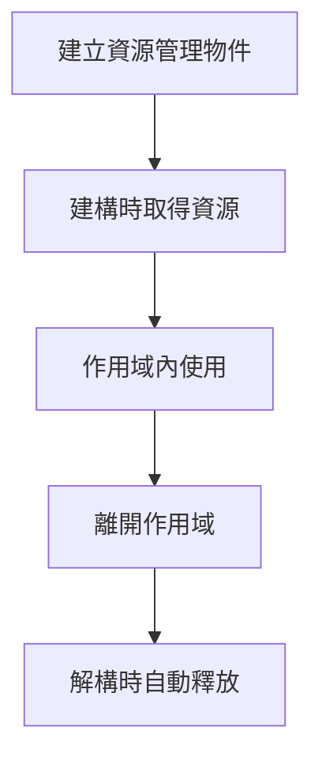
```mermaid
flowchart TD
    A[建立資源管理物件] --> B[建構時取得資源]
    B --> C[作用域內使用]
    C --> D[離開作用域]
    D --> E[解構時自動釋放]
```

### 7. 行為介面

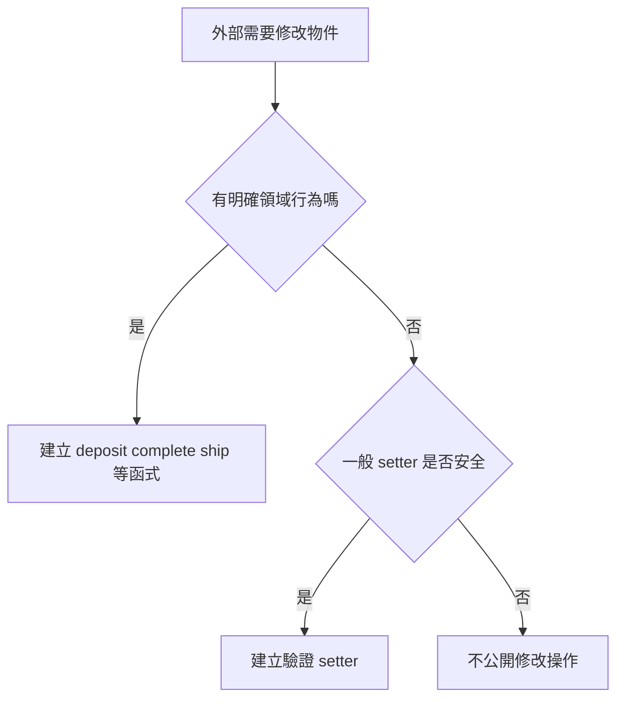
```mermaid
flowchart TD
    A[外部需要修改物件] --> B{有明確領域行為嗎}
    B -- 是 --> C[建立 deposit complete ship 等函式]
    B -- 否 --> D{一般 setter 是否安全}
    D -- 是 --> E[建立驗證 setter]
    D -- 否 --> F[不公開修改操作]
```

### 8. Vector of Objects

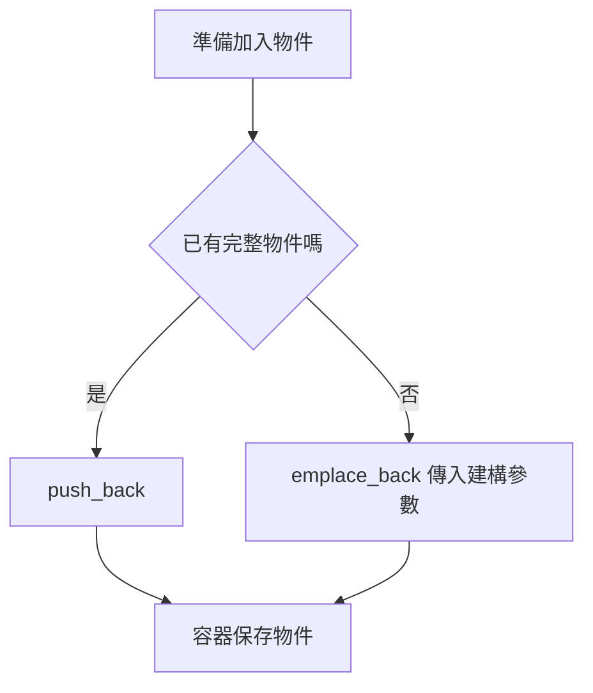
```mermaid
flowchart TD
    A[準備加入物件] --> B{已有完整物件嗎}
    B -- 是 --> C[push_back]
    B -- 否 --> D[emplace_back 傳入建構參數]
    C --> E[容器保存物件]
    D --> E
```

---

# 本章完成標準

完成本章後，你應該能做到：

1. 比較 `struct` 與 `class`。
2. 使用 `public` 與 `private`。
3. 說明封裝的用途。
4. 定義資料 invariant。
5. 使用建構子建立有效物件。
6. 撰寫預設建構子。
7. 撰寫參數化建構子。
8. 使用建構子多載。
9. 使用成員初始化列表。
10. 說明成員實際初始化順序。
11. 使用 `= default`。
12. 使用 `= delete`。
13. 使用委派建構子。
14. 使用 `explicit`。
15. 說明解構子語法。
16. 說明解構子自動呼叫時機。
17. 追蹤區域物件解構順序。
18. 追蹤成員建構與解構順序。
19. 說明 RAII。
20. 說明 Rule of Zero。
21. 使用 getter。
22. 安全回傳 `const` 參考 getter。
23. 建立驗證 setter。
24. 建立表達領域行為的公開函式。
25. 撰寫 `const` 成員函式。
26. 使用 const 物件。
27. 理解 `this` 指標。
28. 使用 `return *this` 建立串接操作。
29. 在類別外定義成員函式。
30. 使用 `ClassName::`。
31. 使用 `string` 與 `vector` 成員。
32. 建立 vector of objects。
33. 使用 `emplace_back()`。
34. 使用 getter 搜尋物件。
35. 使用 getter 排序物件。
36. 封裝 enum class 狀態。
37. 使用成員函式限制狀態轉換。
38. 說明複製與移動概念。
39. 避免不必要的裸資源管理。
40. 找出常見建構子、解構子與封裝錯誤。

---

# 隱藏答案區

> Answer hidden — try it first.

<details><summary>TODO 1 答案</summary>

```cpp
class Counter {
public:
    void increment() {
        ++valueCount;
    }

    void decrement() {
        --valueCount;
    }

    int value() const {
        return valueCount;
    }

private:
    int valueCount = 0;
};
```

</details>

<details><summary>TODO 2 答案</summary>

```cpp
class Point {
public:
    Point(
        int initialX,
        int initialY
    )
        : xValue(initialX),
          yValue(initialY) {
    }

    int x() const {
        return xValue;
    }

    int y() const {
        return yValue;
    }

private:
    int xValue;
    int yValue;
};
```

</details>

<details><summary>TODO 3 答案</summary>

```cpp
class Rectangle {
public:
    Rectangle()
        : widthValue(1.0),
          heightValue(1.0) {
    }

    explicit Rectangle(
        double size
    )
        : widthValue(size),
          heightValue(size) {
    }

    Rectangle(
        double initialWidth,
        double initialHeight
    )
        : widthValue(initialWidth),
          heightValue(initialHeight) {
    }

private:
    double widthValue;
    double heightValue;
};
```

</details>

<details><summary>TODO 4 答案</summary>

```cpp
Rectangle()
    : Rectangle(
          1.0,
          1.0
      ) {
}

explicit Rectangle(
    double size
)
    : Rectangle(
          size,
          size
      ) {
}
```

</details>

<details><summary>TODO 5 答案</summary>

```cpp
class Distance {
public:
    explicit Distance(
        double initialMeters
    )
        : metersValue(
              initialMeters
          ) {
    }

private:
    double metersValue;
};
```

</details>

<details><summary>TODO 6 答案</summary>

```cpp
class StudentId {
public:
    StudentId() = delete;

    explicit StudentId(
        int initialNumber
    )
        : numberValue(
              initialNumber
          ) {
    }

private:
    int numberValue;
};
```

</details>

<details><summary>TODO 7 答案</summary>

```cpp
class BankAccount {
public:
    explicit BankAccount(
        double initialBalance
    )
        : balanceValue(
              initialBalance >= 0.0
                  ? initialBalance
                  : 0.0
          ) {
    }

    bool deposit(double amount) {
        if (amount <= 0.0) {
            return false;
        }

        balanceValue += amount;
        return true;
    }

    bool withdraw(double amount) {
        if (
            amount <= 0.0 ||
            amount > balanceValue
        ) {
            return false;
        }

        balanceValue -= amount;
        return true;
    }

    double balance() const {
        return balanceValue;
    }

private:
    double balanceValue;
};
```

</details>

<details><summary>TODO 8 答案</summary>

```cpp
const string& name() const {
    return nameValue;
}
```

</details>

<details><summary>TODO 9 答案</summary>

```cpp
Rectangle::Rectangle(
    double initialWidth,
    double initialHeight
)
    : widthValue(initialWidth),
      heightValue(initialHeight) {
}

double Rectangle::area() const {
    return
        widthValue *
        heightValue;
}
```

</details>

<details><summary>TODO 10 答案</summary>

```cpp
class Tracer {
public:
    explicit Tracer(
        const string& initialName
    )
        : nameValue(initialName) {
        cout << "Construct "
             << nameValue
             << '\n';
    }

    ~Tracer() {
        cout << "Destroy "
             << nameValue
             << '\n';
    }

private:
    string nameValue;
};
```

</details>

<details><summary>TODO 11 答案</summary>

使用 private `TaskStatus statusValue`，並在 `start()` 與 `complete()` 中檢查目前狀態後才更新。

</details>

<details><summary>TODO 12 答案</summary>

```cpp
vector<Student> students;

students.emplace_back(
    1,
    "Amy",
    95.0
);

students.emplace_back(
    2,
    "Brian",
    85.0
);
```

</details>

<details><summary>TODO 13 答案</summary>

```cpp
auto iterator =
    find_if(
        students.cbegin(),
        students.cend(),
        [targetId](
            const Student& student
        ) {
            return
                student.id() ==
                targetId;
        }
    );
```

</details>

<details><summary>TODO 14 答案</summary>

```cpp
sort(
    students.begin(),
    students.end(),
    [](
        const Student& first,
        const Student& second
    ) {
        if (
            first.score() !=
            second.score()
        ) {
            return
                first.score() >
                second.score();
        }

        return
            first.name() <
            second.name();
    }
);
```

</details>

<details><summary>TODO 15 答案</summary>

建立 private `nameValue`、`priceValue`、`stockValue`，並讓建構子、`restock()` 與 `ship()` 驗證所有輸入。

</details>
