# Lesson 23：Inheritance and Polymorphism 繼承與多型

<p align="center">
  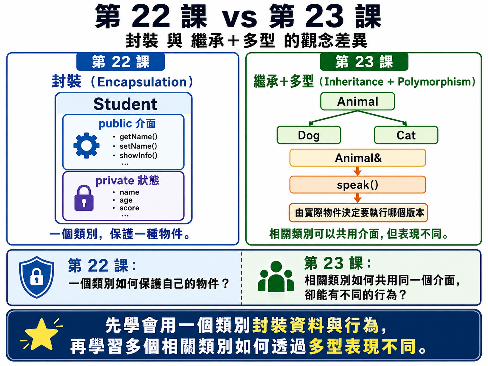
</p>

> 這堂課的重點：建立具有共同介面的型別階層。你會學習基底類別、衍生類別、繼承存取方式、建構與解構順序、函式覆寫、虛擬函式、抽象類別、動態繫結、基底參考與指標，以及如何避免物件切割與缺少虛擬解構子所造成的問題。

> 本章接續 `class`、建構子、解構子與封裝。繼承應用在真正的「is-a」關係，不應只為了重用程式碼而使用。多重繼承、智慧指標、完整 RTTI 與大型架構模式會留到進階章節。

---

## Section I. 今天要做什麼？

1. 認識繼承 inheritance。
2. 認識基底類別 base class。
3. 認識衍生類別 derived class。
4. 理解 is-a 關係。
5. 比較 is-a 與 has-a。
6. 使用 `class Derived : public Base`。
7. 理解 public inheritance。
8. 認識 protected inheritance。
9. 認識 private inheritance。
10. 初學時優先使用 public inheritance。
11. 理解基底類別 public 成員。
12. 理解基底類別 protected 成員。
13. 理解基底類別 private 成員。
14. 衍生類別不可直接存取 base private 成員。
15. 使用 protected getter 取代暴露資料。
16. 避免大量使用 protected 資料成員。
17. 理解衍生物件包含基底部分。
18. 理解基底建構子先執行。
19. 理解衍生建構子後執行。
20. 使用衍生建構子初始化列表呼叫基底建構子。
21. 理解基底解構子後執行。
22. 理解衍生解構子先執行。
23. 認識 member construction order。
24. 比較 base subobject 與 member object。
25. 認識函式遮蔽 name hiding。
26. 認識函式覆寫 overriding。
27. 區分 overloading 與 overriding。
28. 使用 `virtual`。
29. 使用 `override`。
30. 讓編譯器檢查覆寫是否正確。
31. 避免漏掉 `const` 造成未覆寫。
32. 避免參數型別不同造成未覆寫。
33. 使用 `final` 禁止繼續覆寫。
34. 使用 `final` 禁止繼承類別。
35. 認識 static binding。
36. 認識 dynamic binding。
37. 使用基底參考呼叫虛擬函式。
38. 使用基底指標呼叫虛擬函式。
39. 理解非虛擬函式依靜態型別決定。
40. 理解虛擬函式依實際物件型別決定。
41. 認識 polymorphism 多型。
42. 讓不同衍生類別共享同一介面。
43. 使用 `Shape&` 處理 Circle 與 Rectangle。
44. 使用 `Animal&` 處理 Dog 與 Cat。
45. 認識純虛擬函式。
46. 使用 `= 0`。
47. 認識抽象類別 abstract class。
48. 理解抽象類別不能直接建立物件。
49. 抽象類別可有資料成員。
50. 抽象類別可有普通成員函式。
51. 抽象類別可有建構子。
52. 衍生類別必須實作所有純虛擬函式才可具體化。
53. 建立 interface-like base class。
54. 認識純虛擬解構子概念。
55. 使用虛擬解構子。
56. 理解透過基底指標刪除衍生物件的需求。
57. 多型基底類別通常需要 virtual destructor。
58. 使用 `virtual ~Base() = default;`。
59. 認識 object slicing。
60. 理解將衍生物件按值複製成基底物件會切掉衍生部分。
61. 避免以值傳遞多型物件。
62. 使用 `const Base&` 保留多型。
63. 使用 `Base*` 保留多型。
64. 避免 `vector<Base>` 保存不同衍生物件。
65. 認識 polymorphic collection。
66. 使用非擁有型基底指標集合概念。
67. 認識 `unique_ptr<Base>` 的正確所有權概念。
68. 本章只做智慧指標預告。
69. 認識 upcasting。
70. 將 Derived 參考轉為 Base 參考。
71. 將 Derived 指標轉為 Base 指標。
72. 理解 upcasting 通常安全且隱式。
73. 認識 downcasting。
74. 理解 downcasting 可能失敗。
75. 使用 `dynamic_cast`。
76. 了解 dynamic_cast 需要 polymorphic base。
77. 優先使用虛擬函式，避免依賴 downcasting。
78. 認識 RTTI。
79. 認識 `typeid` 概念預告。
80. 不以型別檢查取代良好多型設計。
81. 使用基底類別 public getter。
82. 使用 protected helper。
83. 避免 protected 資料暴露。
84. 認識 virtual function call in constructor。
85. 理解建構子期間不會呼叫尚未建立完成的衍生覆寫。
86. 認識 virtual function call in destructor。
87. 理理解構期間衍生部分已開始銷毀。
88. 避免在建構子與解構子依賴多型呼叫。
89. 認識 constructor inheritance。
90. 使用 `using Base::Base;`。
91. 理解繼承建構子不等於複製所有建構行為。
92. 認識 defaulted copy operations in hierarchy。
93. 認識 protected constructor。
94. 建立只能由衍生類別呼叫的基底建構子。
95. 認識 virtual table 概念。
96. 不依賴 vtable 具體實作細節。
97. 理解 virtual 可能增加少量物件與呼叫成本。
98. 不因微小成本拒絕正確抽象。
99. 認識 Liskov Substitution Principle。
100. 衍生物件應能合理替代基底物件。
101. 避免衍生類別破壞基底契約。
102. 避免 Square 繼承可獨立改寬高的 Rectangle。
103. 比較 inheritance 與 composition。
104. 若只是擁有另一物件，使用 composition。
105. 若不是完整 is-a 關係，不使用 public inheritance。
106. 使用 strategy composition 取代不必要繼承。
107. 認識 interface segregation 概念。
108. 基底介面保持精簡。
109. 避免巨大基底類別。
110. 避免 deep inheritance hierarchy。
111. 優先淺層型別階層。
112. 認識 protected virtual hook。
113. 認識 template method 概念預告。
114. 不在本章深入設計模式。
115. 使用 vector 走訪同類衍生物件。
116. 使用函式接收 `const Base&`。
117. 使用 lambda 呼叫虛擬 getter。
118. 使用 sort 排序衍生物件集合。
119. 理解多型集合排序需要間接存取。
120. 使用 `std::reference_wrapper` 概念預告。
121. 不保存短生命週期物件參考。
122. 認識 multiple inheritance。
123. 認識 diamond problem。
124. 認識 virtual inheritance 概念預告。
125. 初學階段避免複雜多重繼承。
126. 使用純介面多重繼承的概念。
127. 認識 override covariant return 概念預告。
128. 不在本章深入 covariant return。
129. 認識 virtual clone pattern 概念預告。
130. 不在本章深入多型複製。
131. 使用概念檢查、程式閱讀與實作題整合本章。

---

## Section II. 今天的學習方式

1. 每次看到繼承，先問：
   ```text
   Derived 真的是一種 Base 嗎？
   ```
2. 只為了重用程式碼時，先考慮 composition。
3. 覆寫函式一律加：
   ```cpp
   override
   ```
4. 多型基底類別通常加入：
   ```cpp
   virtual ~Base() = default;
   ```
5. 需要多型時使用：
   ```cpp
   Base&
   Base*
   ```
6. 避免：
   ```cpp
   Base object = derived;
   ```
7. 抽象基底介面應小而清楚。
8. 建構順序：
   ```text
   base → members → derived body
   ```
9. 解構順序：
   ```text
   derived body → members reverse → base
   ```
10. Downcast 前先思考是否能改用虛擬函式。
11. 本章所有合法完整程式使用嚴格 C++17 選項檢查。

---

## Section III. 核心語法對照

| 語法 | 用途 |
| --- | --- |
| `class Dog : public Animal` | Public inheritance |
| `protected:` | 基底與衍生類別可存取 |
| `Derived(...) : Base(...) {}` | 呼叫基底建構子 |
| `virtual void speak() const;` | 虛擬函式 |
| `void speak() const override;` | 覆寫並要求編譯器檢查 |
| `void function() final;` | 禁止繼續覆寫 |
| `class Type final` | 禁止繼承 |
| `virtual double area() const = 0;` | 純虛擬函式 |
| `virtual ~Base() = default;` | 虛擬解構子 |
| `const Base& reference = derived;` | Upcasting reference |
| `Base* pointer = &derived;` | Upcasting pointer |
| `dynamic_cast<Derived*>(basePointer)` | 安全 downcast |
| `using Base::Base;` | 繼承基底建構子 |
| `Base& parameter` | 保留動態多型 |
| `Base parameter` | 可能造成 object slicing |

---

# Part A：第一個繼承

## Section IV. 基底與衍生類別

<p align="center">
  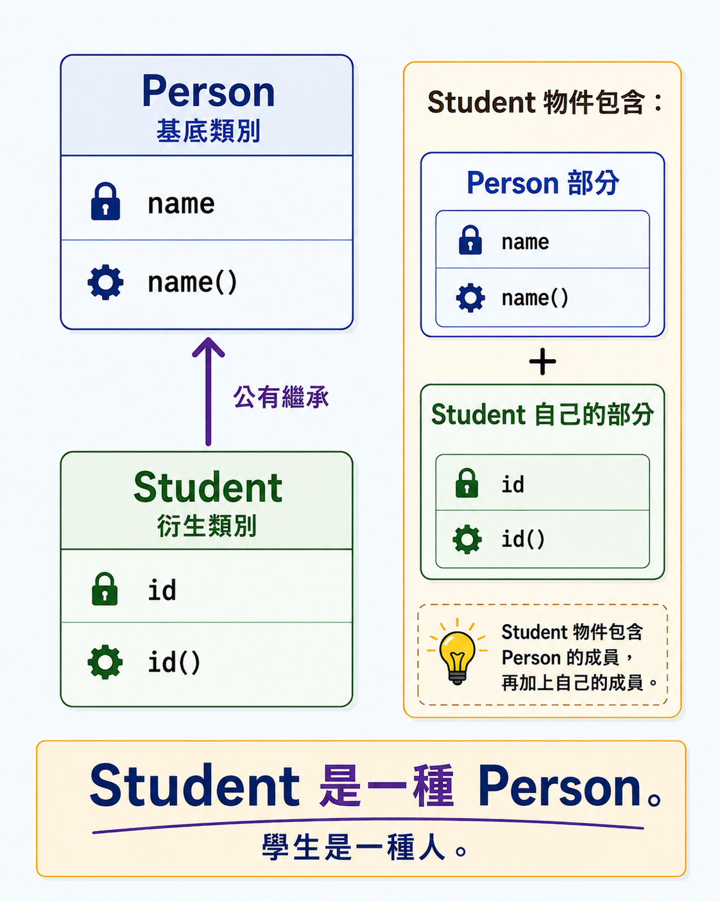
</p>

```cpp
// VALIDATE
#include <iostream>
#include <string>
using namespace std;

class Person {
public:
    explicit Person(
        const string& initialName
    )
        : nameValue(initialName) {
    }

    const string& name() const {
        return nameValue;
    }

private:
    string nameValue;
};

class Student : public Person {
public:
    Student(
        const string& initialName,
        int initialId
    )
        : Person(initialName),
          idValue(initialId) {
    }

    int id() const {
        return idValue;
    }

private:
    int idValue;
};

int main() {
    Student student(
        "Amy",
        1001
    );

    cout << student.name()
         << " "
         << student.id()
         << '\n';

    return 0;
}
```

`Student` 是一種 `Person`。

---

# Part B：Public Inheritance

## Section V. Public inheritance 的存取結果

<p align="center">
  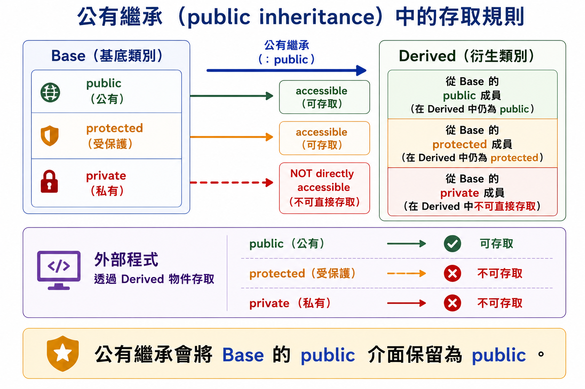
</p>

| Base 成員 | Derived 中 | 外部透過 Derived |
| --- | --- | --- |
| `public` | 可存取 | 保持 public |
| `protected` | 可存取 | 不可直接存取 |
| `private` | 不可直接存取 | 不可直接存取 |

---

## Section VI. 初學原則

一般表達 is-a 關係時使用：

```cpp
public inheritance
```

`protected` 與 `private` inheritance 主要用於較特殊的實作關係，本章只做概念介紹。

---

# Part C：Protected

## Section VII. Protected 成員

```cpp
class Base {
protected:
    int value;
};
```

衍生類別可直接使用，但外部不行。

---

## Section VIII. 為什麼不建議大量 protected data？

因為所有衍生類別都可任意修改，基底類別較難維持 invariant。

通常較好：

- private data
- protected helper function
- public 或 protected getter

---

## Section IX. 完整 Protected Helper

```cpp
// VALIDATE
#include <iostream>
using namespace std;

class Counter {
public:
    int value() const {
        return valueCount;
    }

protected:
    void changeBy(int amount) {
        valueCount += amount;
    }

private:
    int valueCount = 0;
};

class StepCounter : public Counter {
public:
    explicit StepCounter(
        int initialStep
    )
        : stepValue(initialStep) {
    }

    void increment() {
        changeBy(stepValue);
    }

private:
    int stepValue;
};

int main() {
    StepCounter counter(5);

    counter.increment();
    counter.increment();

    cout << counter.value()
         << '\n';

    return 0;
}
```

---

# Part D：建構順序

## Section X. Base 先建立

<p align="center">
  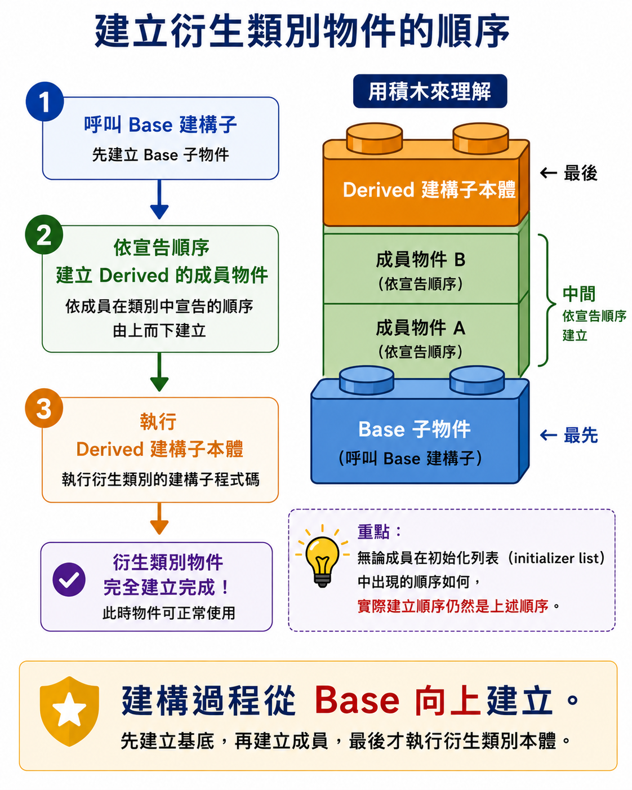
</p>

建立衍生物件時：

1. 基底部分建立。
2. 衍生成員依宣告順序建立。
3. 執行衍生建構子主體。

---

## Section XI. 呼叫基底建構子

```cpp
Derived(...)
    : Base(...),
      member(...) {
}
```

若基底沒有預設建構子，衍生建構子必須明確呼叫合適的基底建構子。

---

## Section XII. 完整順序追蹤

<p align="center">
  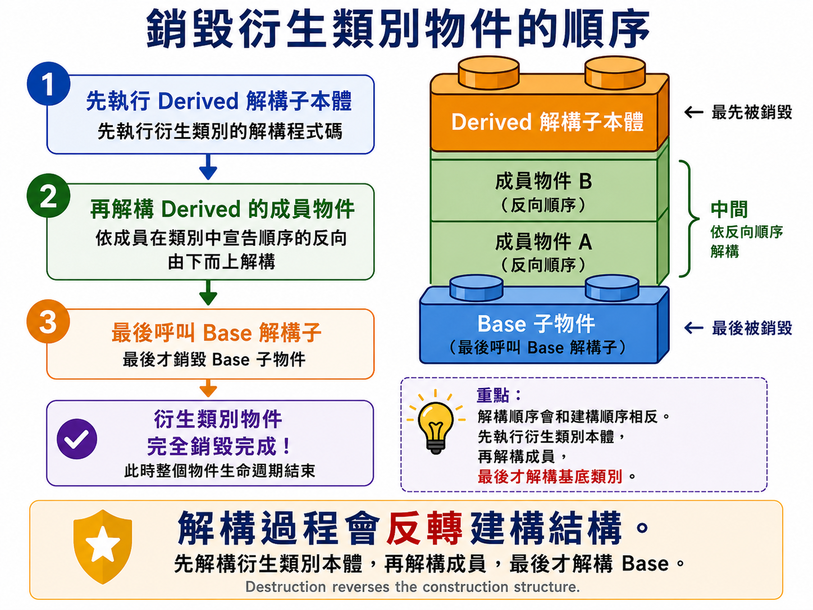
</p>

```cpp
// VALIDATE
#include <iostream>
using namespace std;

class Base {
public:
    Base() {
        cout << "Base constructor\n";
    }

    virtual ~Base() {
        cout << "Base destructor\n";
    }
};

class Derived : public Base {
public:
    Derived() {
        cout << "Derived constructor\n";
    }

    ~Derived() override {
        cout << "Derived destructor\n";
    }
};

int main() {
    Derived object;

    return 0;
}
```

順序：

```text
Base constructor
Derived constructor
Derived destructor
Base destructor
```

---

# Part E：函式遮蔽與覆寫

## Section XIII. Name Hiding

若衍生類別宣告同名函式，可能遮蔽基底類別其他同名多載。

這不一定是虛擬覆寫。

---

## Section XIV. Overriding

要真正覆寫：

- 基底函式必須為 `virtual`。
- 參數列表要匹配。
- `const` 限定要匹配。
- 回傳型別要符合規則。
- 衍生函式加 `override`。

---

## Section XV. Overloading vs Overriding

<p align="center">
  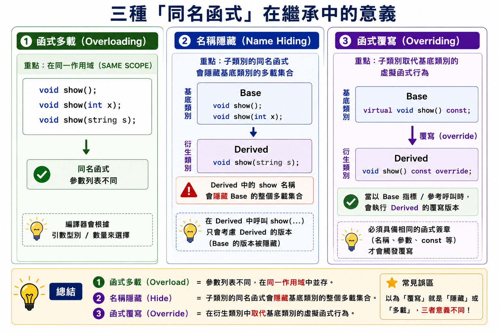
</p>

| 概念 | 發生位置 | 判斷方式 |
| --- | --- | --- |
| Overloading | 同一作用域 | 參數列表不同 |
| Overriding | 基底與衍生 | 同一虛擬介面 |

---

# Part F：第一個虛擬函式

## Section XVI. Animal 範例

<p align="center">
  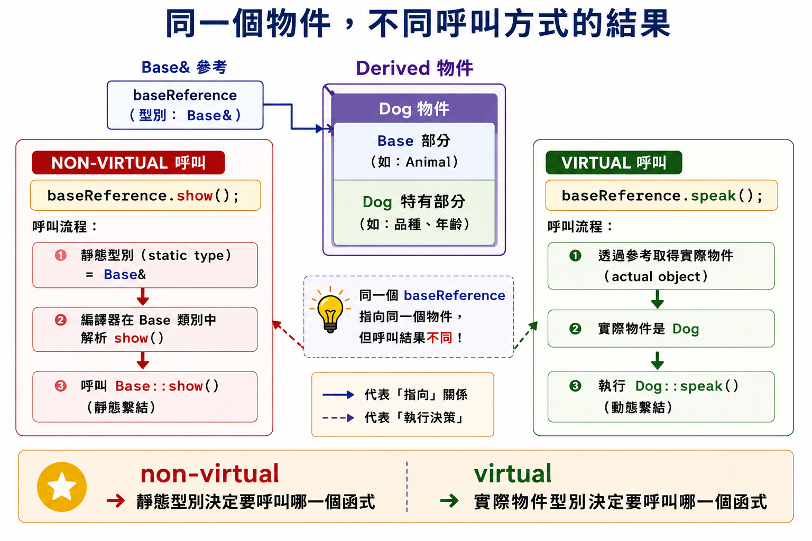
</p>

```cpp
// VALIDATE
#include <iostream>
#include <string>
using namespace std;

class Animal {
public:
    explicit Animal(
        const string& initialName
    )
        : nameValue(initialName) {
    }

    virtual ~Animal() = default;

    virtual void speak() const {
        cout << nameValue
             << " makes a sound.\n";
    }

protected:
    const string& name() const {
        return nameValue;
    }

private:
    string nameValue;
};

class Dog : public Animal {
public:
    explicit Dog(
        const string& initialName
    )
        : Animal(initialName) {
    }

    void speak() const override {
        cout << name()
             << " says woof.\n";
    }
};

int main() {
    Dog dog("Buddy");

    dog.speak();

    return 0;
}
```

---

# Part G：Dynamic Binding

## Section XVII. 基底參考

<p align="center">
  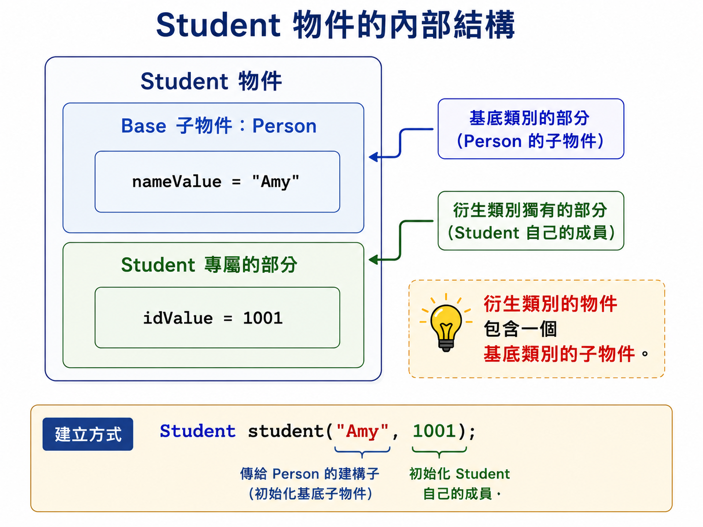
</p>

```cpp
const Animal& animal =
    dog;
```

呼叫：

```cpp
animal.speak();
```

因為 `speak()` 是 virtual，會執行 Dog 版本。

---

## Section XVIII. 完整基底參考範例

<p align="center">
  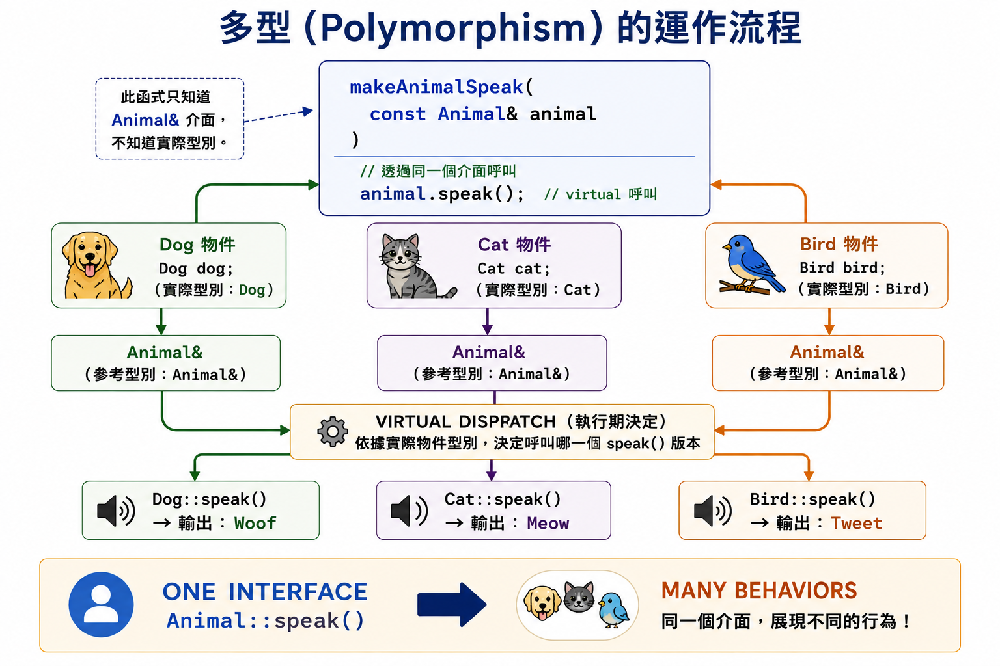
</p>

```cpp
// VALIDATE
#include <iostream>
using namespace std;

class Animal {
public:
    virtual ~Animal() = default;

    virtual void speak() const {
        cout << "Animal sound\n";
    }
};

class Dog : public Animal {
public:
    void speak() const override {
        cout << "Woof\n";
    }
};

class Cat : public Animal {
public:
    void speak() const override {
        cout << "Meow\n";
    }
};

void makeAnimalSpeak(
    const Animal& animal
) {
    animal.speak();
}

int main() {
    Dog dog;
    Cat cat;

    makeAnimalSpeak(dog);
    makeAnimalSpeak(cat);

    return 0;
}
```

同一函式可處理不同衍生型別。

---

# Part H：非虛擬函式

## Section XIX. Static Binding

非虛擬函式依表達式的靜態型別決定。

```cpp
// VALIDATE
#include <iostream>
using namespace std;

class Base {
public:
    void show() const {
        cout << "Base\n";
    }
};

class Derived : public Base {
public:
    void show() const {
        cout << "Derived\n";
    }
};

int main() {
    Derived derived;
    const Base& baseReference =
        derived;

    derived.show();
    baseReference.show();

    return 0;
}
```

輸出：

```text
Derived
Base
```

這是遮蔽，不是動態多型。

---

# Part I：`override`

## Section XX. 為什麼一定要加？

<p align="center">
  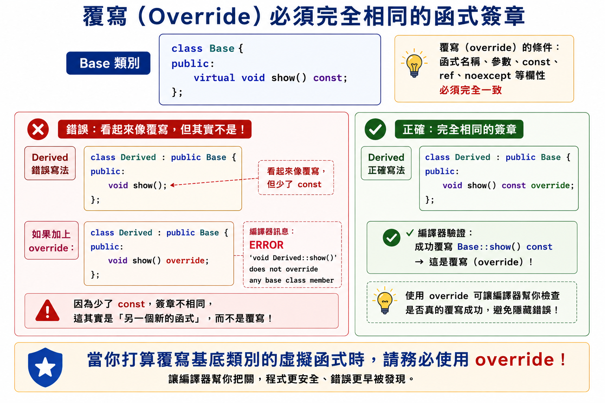
</p>

假設基底：

```cpp
virtual void show() const;
```

衍生誤寫：

```cpp
/* void show(); */
```

沒有 `const`，其實沒有覆寫。

加 `override` 後，編譯器會報錯。

---

## Section XXI. 正確做法

```cpp
void show() const override;
```

`override` 不改變執行語意，但大幅提高正確性。

---

# Part J：`final`

## Section XXII. 禁止繼續覆寫

```cpp
void speak() const final;
```

下一層衍生類別不能再覆寫。

---

## Section XXIII. 禁止繼承類別

```cpp
class FinalType final {
};
```

---

## Section XXIV. 完整 Final 函式

```cpp
// VALIDATE
#include <iostream>
using namespace std;

class Device {
public:
    virtual ~Device() = default;

    virtual void reset() {
        cout << "Device reset\n";
    }
};

class FixedDevice : public Device {
public:
    void reset() final {
        cout << "Fixed reset\n";
    }
};

int main() {
    FixedDevice device;

    Device& base =
        device;

    base.reset();

    return 0;
}
```

---

# Part K：純虛擬函式

## Section XXV. 語法

<p align="center">
  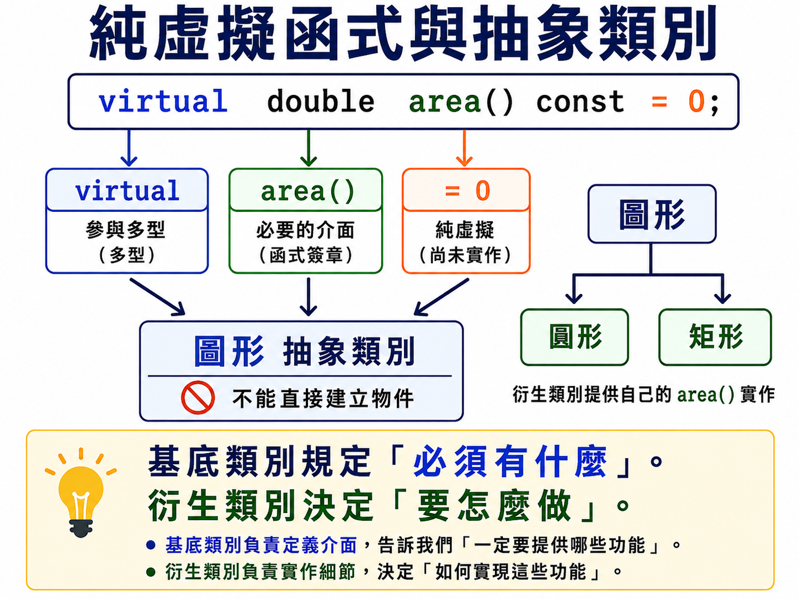
</p>

```cpp
virtual double area() const = 0;
```

包含純虛擬函式的類別為抽象類別。

---

## Section XXVI. 抽象類別不能直接建立

<p align="center">
  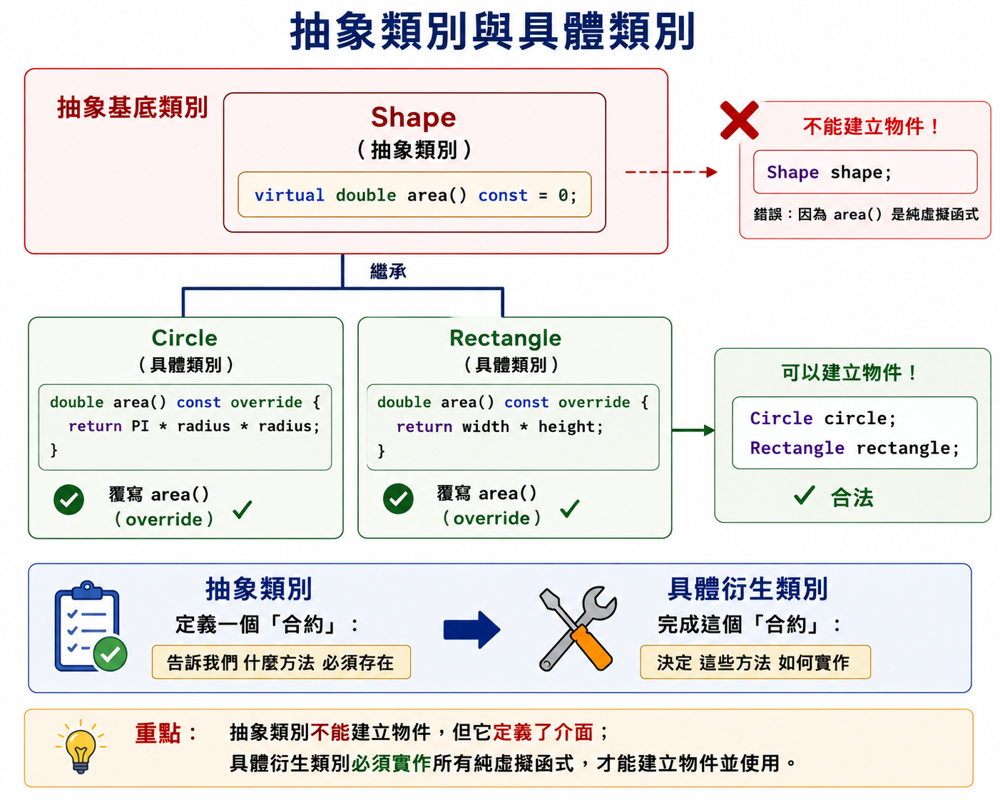
</p>

```cpp
/* Shape shape; */
```

但可以建立：

```cpp
Shape&
Shape*
```

指向或參考具體衍生物件。

---

## Section XXVII. 完整 Shape 階層

```cpp
// VALIDATE
#include <iostream>
using namespace std;

class Shape {
public:
    virtual ~Shape() = default;

    virtual double area() const = 0;
};

class Circle : public Shape {
public:
    explicit Circle(
        double initialRadius
    )
        : radiusValue(initialRadius) {
    }

    double area() const override {
        constexpr double pi =
            3.14159265358979323846;

        return
            pi *
            radiusValue *
            radiusValue;
    }

private:
    double radiusValue;
};

class Rectangle : public Shape {
public:
    Rectangle(
        double initialWidth,
        double initialHeight
    )
        : widthValue(initialWidth),
          heightValue(initialHeight) {
    }

    double area() const override {
        return
            widthValue *
            heightValue;
    }

private:
    double widthValue;
    double heightValue;
};

void showArea(
    const Shape& shape
) {
    cout << shape.area()
         << '\n';
}

int main() {
    Circle circle(2.0);
    Rectangle rectangle(
        4.0,
        3.0
    );

    showArea(circle);
    showArea(rectangle);

    return 0;
}
```

---

# Part L：抽象類別也可有實作

## Section XXVIII. 共同資料與函式

抽象類別可包含：

- 建構子
- private 資料
- public getter
- 普通成員函式
- 純虛擬函式

---

## Section XXIX. 完整 NamedShape

```cpp
// VALIDATE
#include <iostream>
#include <string>
using namespace std;

class NamedShape {
public:
    explicit NamedShape(
        const string& initialName
    )
        : nameValue(initialName) {
    }

    virtual ~NamedShape() = default;

    const string& name() const {
        return nameValue;
    }

    virtual double area() const = 0;

private:
    string nameValue;
};

class Square : public NamedShape {
public:
    Square(
        const string& initialName,
        double initialSide
    )
        : NamedShape(initialName),
          sideValue(initialSide) {
    }

    double area() const override {
        return
            sideValue *
            sideValue;
    }

private:
    double sideValue;
};

int main() {
    Square square(
        "Board",
        5.0
    );

    cout << square.name()
         << " "
         << square.area()
         << '\n';

    return 0;
}
```

---

# Part M：虛擬解構子

## Section XXX. 為什麼重要？

<p align="center">
  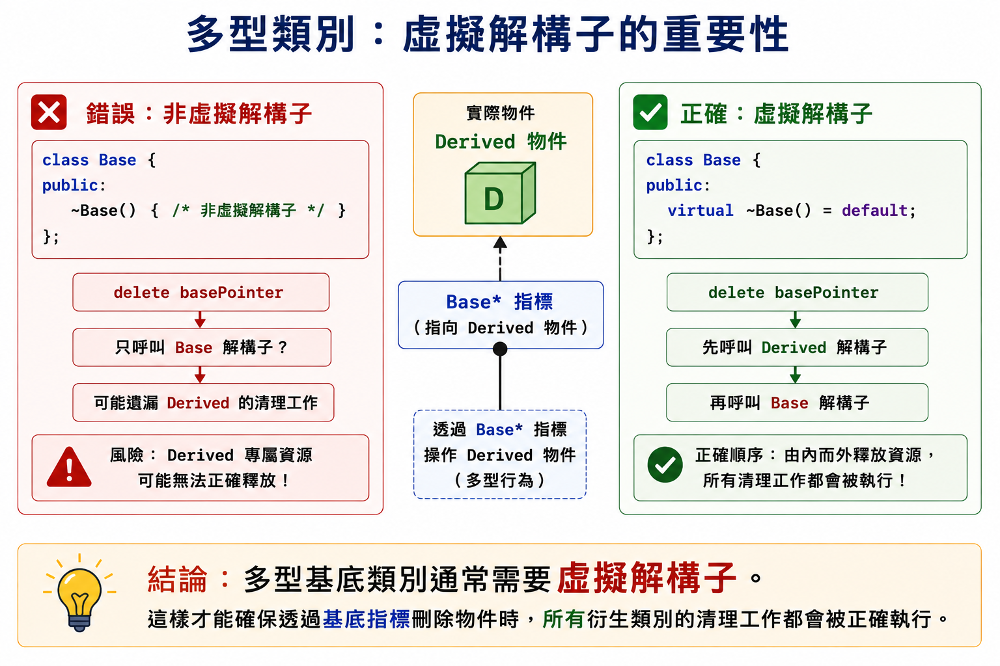
</p>

若使用：

```cpp
Base* pointer =
    new Derived;
```

再：

```cpp
delete pointer;
```

基底解構子必須是 virtual，才能正確呼叫衍生解構子。

---

## Section XXXI. 建議形式

```cpp
virtual ~Base() = default;
```

只要類別具有其他 virtual 函式，通常就應檢查是否需要虛擬解構子。

---

## Section XXXII. 本章原則

本章完整程式不使用手動 `new`／`delete` 管理多型物件，但所有多型基底仍提供 virtual destructor。

---

# Part N：Object Slicing

## Section XXXIII. 什麼是切割？

<p align="center">
  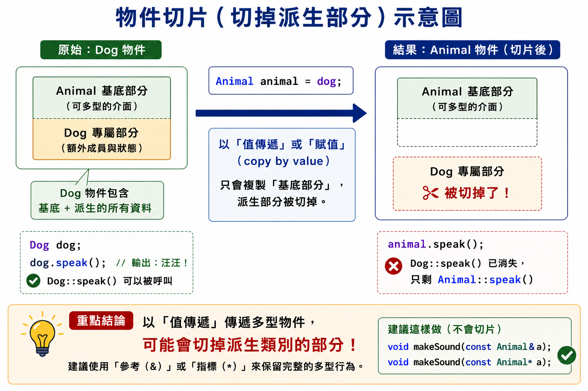
</p>

```cpp
Derived derived;
Base base =
    derived;
```

只複製 Base 部分，Derived 額外資料被切掉。

---

## Section XXXIV. 完整切割範例

<p align="center">
  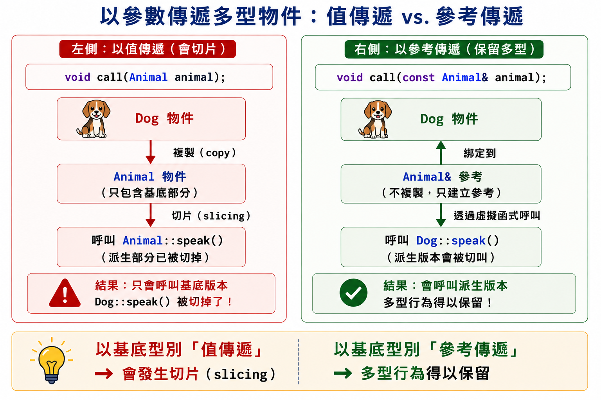
</p>

```cpp
// VALIDATE
#include <iostream>
using namespace std;

class Animal {
public:
    virtual ~Animal() = default;

    virtual void speak() const {
        cout << "Animal\n";
    }
};

class Dog : public Animal {
public:
    void speak() const override {
        cout << "Dog\n";
    }
};

void speakByValue(
    Animal animal
) {
    animal.speak();
}

void speakByReference(
    const Animal& animal
) {
    animal.speak();
}

int main() {
    Dog dog;

    speakByValue(dog);
    speakByReference(dog);

    return 0;
}
```

輸出：

```text
Animal
Dog
```

按值傳入時發生切割。

---

# Part O：Upcasting

## Section XXXV. 安全向上轉型

<p align="center">
  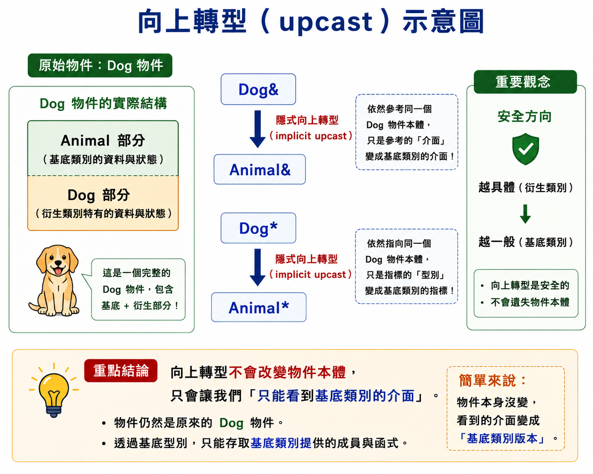
</p>

```cpp
Dog dog;

Animal& reference =
    dog;

Animal* pointer =
    &dog;
```

衍生物件本身包含完整基底部分，因此 upcast 通常安全且隱式。

---

## Section XXXVI. 可見介面

透過 `Animal&` 只能直接使用 Animal 公開介面。

Dog 專屬函式不會直接出現在基底介面中。

---

# Part P：Downcasting

## Section XXXVII. 為什麼危險？

一個 `Animal*` 可能實際指向：

- Dog
- Cat
- 其他 Animal
- `nullptr`

不能直接假設它一定是 Dog。

---

## Section XXXVIII. `dynamic_cast`

<p align="center">
  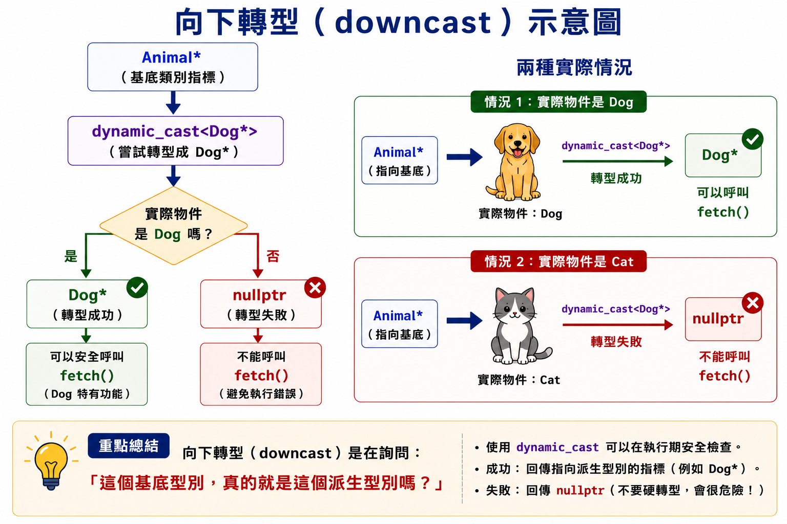
</p>

```cpp
Dog* dogPointer =
    dynamic_cast<Dog*>(
        animalPointer
    );
```

成功時取得 Dog 指標，失敗時得到 `nullptr`。

---

## Section XXXIX. 完整 Downcast 範例

```cpp
// VALIDATE
#include <iostream>
using namespace std;

class Animal {
public:
    virtual ~Animal() = default;
};

class Dog : public Animal {
public:
    void fetch() const {
        cout << "Dog fetches.\n";
    }
};

class Cat : public Animal {
};

void tryFetch(
    Animal* animal
) {
    Dog* dog =
        dynamic_cast<Dog*>(
            animal
        );

    if (dog == nullptr) {
        cout << "Not a dog\n";
        return;
    }

    dog->fetch();
}

int main() {
    Dog dog;
    Cat cat;

    tryFetch(&dog);
    tryFetch(&cat);

    return 0;
}
```

---

## Section XL. 優先多型，不優先 downcast

<p align="center">
  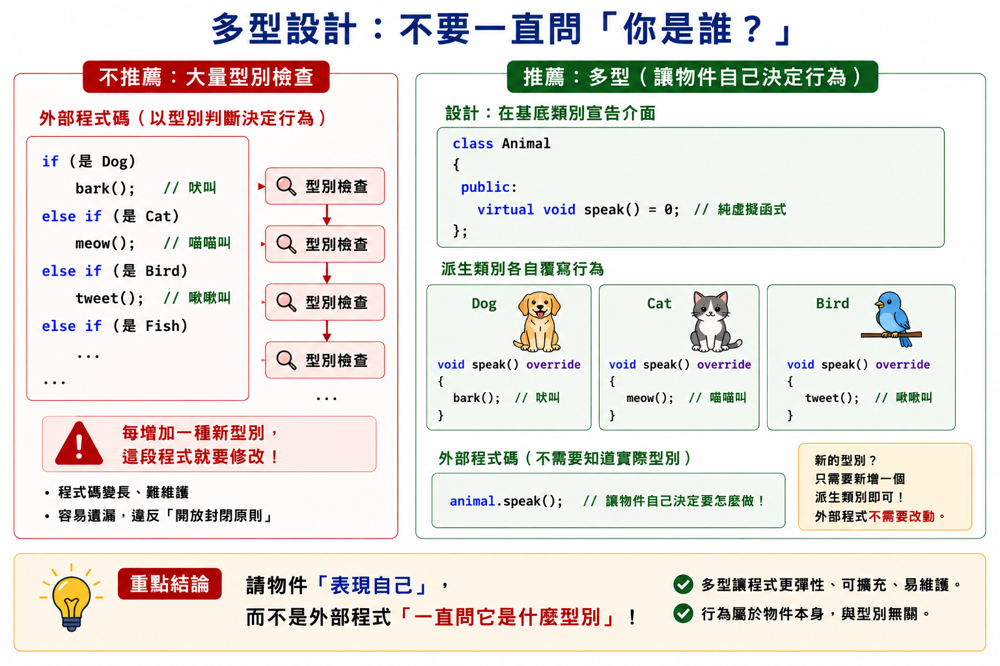
</p>

若程式一直問：

```text
你是不是 Dog？
你是不是 Cat？
```

通常表示基底介面可能缺少應有的虛擬操作。

---

# Part Q：建構子中的 Virtual 呼叫

## Section XLI. 重要規則

<p align="center">
  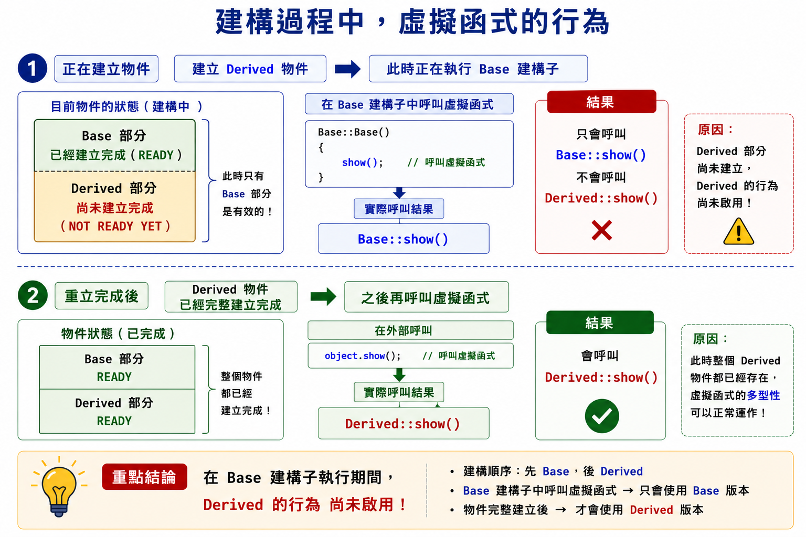
</p>

在基底建構子執行時，衍生部分尚未完成建立。

因此基底建構子呼叫虛擬函式時，不會動態呼叫尚未完成的衍生覆寫。

---

## Section XLII. 解構時也類似

衍生解構完成後，基底解構期間衍生部分已不再完整存在。

不要在建構子或解構子依賴完整動態多型行為。

---

## Section XLIII. 完整示範

```cpp
// VALIDATE
#include <iostream>
using namespace std;

class Base {
public:
    Base() {
        show();
    }

    virtual ~Base() = default;

    virtual void show() const {
        cout << "Base\n";
    }
};

class Derived : public Base {
public:
    void show() const override {
        cout << "Derived\n";
    }
};

int main() {
    Derived object;

    object.show();

    return 0;
}
```

一般輸出：

```text
Base
Derived
```

---

# Part R：繼承建構子

## Section XLIV. `using Base::Base`

```cpp
class Derived : public Base {
public:
    using Base::Base;
};
```

將基底建構子引入衍生類別。

---

## Section XLV. 完整繼承建構子

```cpp
// VALIDATE
#include <iostream>
#include <string>
using namespace std;

class NamedObject {
public:
    explicit NamedObject(
        const string& initialName
    )
        : nameValue(initialName) {
    }

    const string& name() const {
        return nameValue;
    }

private:
    string nameValue;
};

class Label : public NamedObject {
public:
    using NamedObject::NamedObject;
};

int main() {
    Label label("Important");

    cout << label.name()
         << '\n';

    return 0;
}
```

---

# Part S：Composition vs Inheritance

<p align="center">
  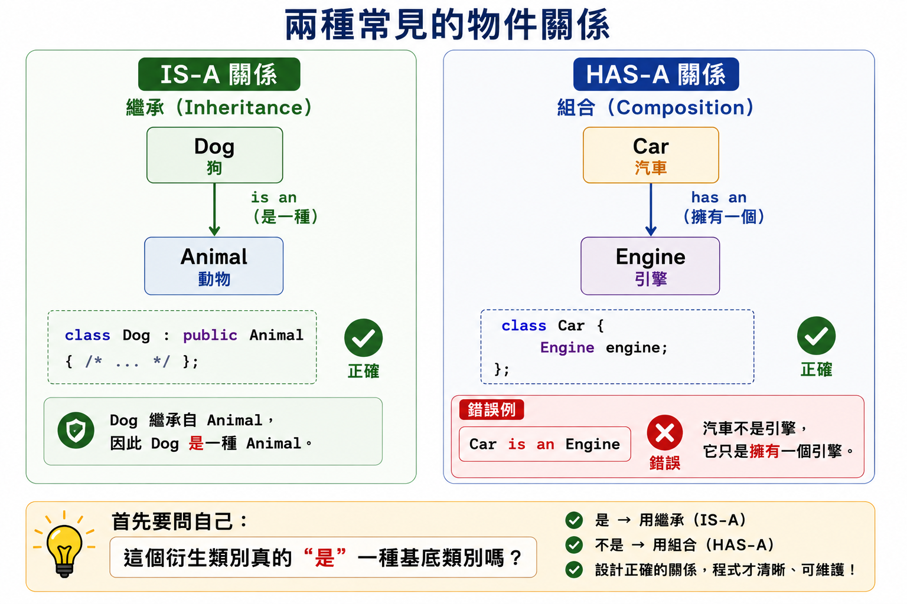
</p>

## Section XLVI. Is-a

適合 public inheritance：

```text
Dog is an Animal
Circle is a Shape
SavingsAccount is a BankAccount
```

---

## Section XLVII. Has-a

適合 composition：

```text
Car has an Engine
Course has Students
Window has a Button
```

---

## Section XLVIII. 不要只為重用而繼承

若只想重用某個工具函式或資料結構，composition 通常更彈性。

---

## Section XLIX. 完整 Composition 範例

```cpp
// VALIDATE
#include <iostream>
using namespace std;

class Engine {
public:
    void start() const {
        cout << "Engine starts\n";
    }
};

class Car {
public:
    void start() const {
        engine.start();
        cout << "Car is ready\n";
    }

private:
    Engine engine;
};

int main() {
    Car car;

    car.start();

    return 0;
}
```

Car 不是 Engine；Car 擁有 Engine。

---

# Part T：Liskov Substitution Principle

## Section L. 基本想法

<p align="center">
  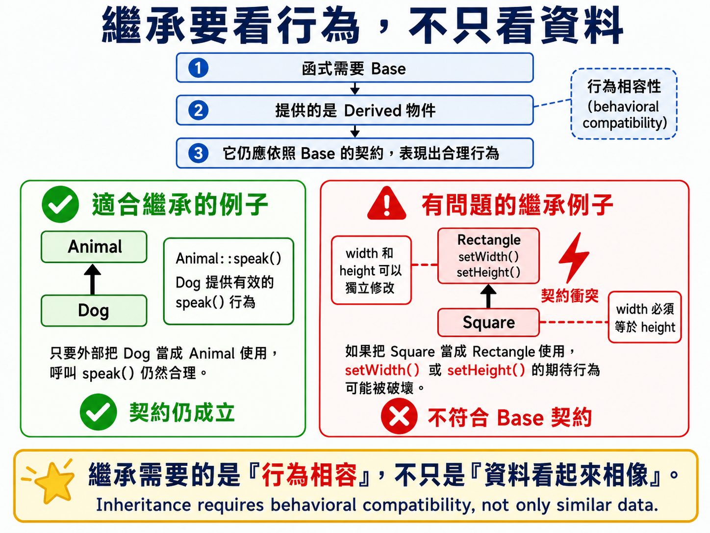
</p>

如果 `Derived` public 繼承 `Base`：

```text
使用 Base 的地方
應能合理使用 Derived
```

衍生類別不應破壞基底類別承諾。

---

## Section LI. 常見問題

若 Rectangle 介面允許獨立設定寬和高：

```cpp
setWidth()
setHeight()
```

Square 若繼承 Rectangle，修改寬時還要同步修改高，可能破壞呼叫者對 Rectangle 的預期。

這類情況可能更適合：

- 共同抽象 Shape
- Rectangle 與 Square 分別繼承 Shape
- 使用 composition

---

# Part U：多型集合概念

## Section LII. 為什麼不能用 `vector<Base>`？

<p align="center">
  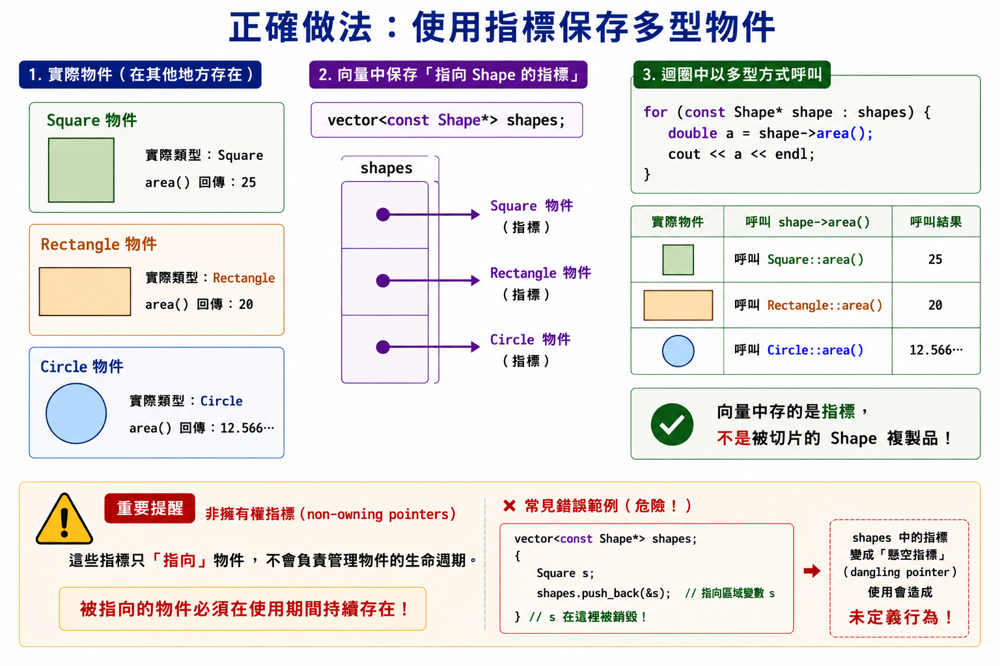
</p>

放入 Derived 時會切割成 Base。

---

## Section LIII. 正確方向

多型集合通常保存：

- `unique_ptr<Base>`
- `shared_ptr<Base>`
- 非擁有型 `Base*`
- `reference_wrapper<Base>`

所有權與智慧指標會在後續章節完整介紹。

---

## Section LIV. 本章安全非擁有示範

```cpp
// VALIDATE
#include <iostream>
#include <vector>
using namespace std;

class Shape {
public:
    virtual ~Shape() = default;

    virtual double area() const = 0;
};

class Square : public Shape {
public:
    explicit Square(
        double initialSide
    )
        : sideValue(initialSide) {
    }

    double area() const override {
        return
            sideValue *
            sideValue;
    }

private:
    double sideValue;
};

class Rectangle : public Shape {
public:
    Rectangle(
        double initialWidth,
        double initialHeight
    )
        : widthValue(initialWidth),
          heightValue(initialHeight) {
    }

    double area() const override {
        return
            widthValue *
            heightValue;
    }

private:
    double widthValue;
    double heightValue;
};

int main() {
    Square square(3.0);
    Rectangle rectangle(
        4.0,
        5.0
    );

    vector<const Shape*> shapes{
        &square,
        &rectangle
    };

    for (
        const Shape* shape :
        shapes
    ) {
        cout << shape->area()
             << '\n';
    }

    return 0;
}
```

這些指標不擁有物件；`square` 與 `rectangle` 必須比 vector 活得久。

---

# Part V：Interface-Like Base Class

## Section LV. 精簡介面

```cpp
class Printable {
public:
    virtual ~Printable() = default;
    virtual void print() const = 0;
};
```

只描述必要能力。

---

## Section LVI. 完整介面範例

```cpp
// VALIDATE
#include <iostream>
#include <string>
using namespace std;

class Printable {
public:
    virtual ~Printable() = default;

    virtual void print() const = 0;
};

class Message : public Printable {
public:
    explicit Message(
        const string& initialText
    )
        : textValue(initialText) {
    }

    void print() const override {
        cout << textValue
             << '\n';
    }

private:
    string textValue;
};

void printItem(
    const Printable& item
) {
    item.print();
}

int main() {
    Message message(
        "Hello"
    );

    printItem(message);

    return 0;
}
```

---

# Part W：多重繼承預告

## Section LVII. 基本概念

```cpp
class Derived :
    public FirstBase,
    public SecondBase {
};
```

一個類別可繼承多個基底。

---

## Section LVIII. 風險

- 名稱衝突
- 重複基底子物件
- Diamond problem
- 建構與解構順序更複雜
- 所有權與介面不清楚

初學時避免複雜多重繼承。

---

## Section LIX. 較合理情況

多個小型純介面：

```text
Printable
Serializable
Comparable
```

仍需保持介面精簡。

---

# Part X：快速概念檢查

## Section LX. 選擇題與簡答

### Q1. 什麼是基底類別？

<details><summary>查看答案</summary>

提供共同資料或介面的上層類別。

</details>

### Q2. 什麼是衍生類別？

<details><summary>查看答案</summary>

從基底類別繼承並增加或覆寫行為的類別。

</details>

### Q3. Public inheritance 表達什麼關係？

<details><summary>查看答案</summary>

`Derived is-a Base`。

</details>

### Q4. 衍生類別可直接存取 base private 成員嗎？

<details><summary>查看答案</summary>

不可以。

</details>

### Q5. Base 與 Derived 建構順序？

<details><summary>查看答案</summary>

先 Base，再 Derived。

</details>

### Q6. 解構順序？

<details><summary>查看答案</summary>

先 Derived，再 Base。

</details>

### Q7. 覆寫函式為什麼加 `override`？

<details><summary>查看答案</summary>

讓編譯器檢查它確實覆寫某個基底虛擬函式。

</details>

### Q8. `virtual` 的用途？

<details><summary>查看答案</summary>

讓基底參考或指標呼叫時依實際物件型別選擇覆寫版本。

</details>

### Q9. 純虛擬函式語法？

<details><summary>查看答案</summary>

```cpp
virtual void function() = 0;
```

</details>

### Q10. 抽象類別可直接建立物件嗎？

<details><summary>查看答案</summary>

不可以。

</details>

### Q11. 多型基底類別為什麼需要 virtual destructor？

<details><summary>查看答案</summary>

確保透過基底指標銷毀衍生物件時，衍生解構子會正確執行。

</details>

### Q12. 什麼是 object slicing？

<details><summary>查看答案</summary>

將衍生物件按值轉成基底物件時，衍生部分被切除。

</details>

### Q13. 如何避免 slicing？

<details><summary>查看答案</summary>

使用基底參考、基底指標或合適的智慧指標。

</details>

### Q14. Upcasting 通常安全嗎？

<details><summary>查看答案</summary>

通常安全，因為衍生物件包含基底部分。

</details>

### Q15. `dynamic_cast<Derived*>(base)` 失敗時得到什麼？

<details><summary>查看答案</summary>

`nullptr`。

</details>

### Q16. 建構子中虛擬函式會呼叫最終衍生覆寫嗎？

<details><summary>查看答案</summary>

不會，尚未完成建立的衍生部分不參與該多型呼叫。

</details>

### Q17. 什麼是 composition？

<details><summary>查看答案</summary>

一個類別將另一個物件作為成員，表達 has-a 關係。

</details>

### Q18. Car 應繼承 Engine 嗎？

<details><summary>查看答案</summary>

通常不應。Car has an Engine，應使用 composition。

</details>

### Q19. `final` 可用在哪裡？

<details><summary>查看答案</summary>

可用在覆寫函式或類別，禁止進一步覆寫或繼承。

</details>

### Q20. 多型集合為什麼不能直接使用 `vector<Base>`？

<details><summary>查看答案</summary>

加入衍生物件時會發生 object slicing。

</details>

---

# Part Y：程式閱讀練習

## Section LXI. 預測結果與合法性

### 題目 1

```cpp
class Base {
public:
    void show() const {
        cout << "Base";
    }
};

class Derived : public Base {
};

Derived object;
object.show();
```

<details><summary>查看答案</summary>

```text
Base
```

Derived 繼承了 public `show()`。

</details>

### 題目 2

```cpp
class Base {
private:
    int value = 10;
};

class Derived : public Base {
public:
    int get() const {
        /* return value; */
        return 0;
    }
};
```

<details><summary>查看答案</summary>

Derived 不能直接存取 Base private 成員。

</details>

### 題目 3

```cpp
class Base {
public:
    virtual void show() const {
        cout << "B";
    }

    virtual ~Base() = default;
};

class Derived : public Base {
public:
    void show() const override {
        cout << "D";
    }
};

Derived derived;
Base& base = derived;

base.show();
```

<details><summary>查看答案</summary>

```text
D
```

</details>

### 題目 4

```cpp
class Base {
public:
    void show() const {
        cout << "B";
    }
};

class Derived : public Base {
public:
    void show() const {
        cout << "D";
    }
};

Derived derived;
Base& base = derived;

base.show();
```

<details><summary>查看答案</summary>

```text
B
```

Base `show()` 不是 virtual。

</details>

### 題目 5

```cpp
class Base {
public:
    virtual void show() const {
    }

    virtual ~Base() = default;
};

class Derived : public Base {
public:
    /* void show() override {
    } */
};
```

<details><summary>查看答案</summary>

不合法。缺少 `const`，因此不能覆寫 `void show() const`。

</details>

### 題目 6

```cpp
class Shape {
public:
    virtual ~Shape() = default;
    virtual double area() const = 0;
};

/* Shape shape; */
```

<details><summary>查看答案</summary>

不合法，Shape 是抽象類別。

</details>

### 題目 7

```cpp
class Animal {
public:
    virtual ~Animal() = default;

    virtual void speak() const {
        cout << "A";
    }
};

class Dog : public Animal {
public:
    void speak() const override {
        cout << "D";
    }
};

void call(Animal animal) {
    animal.speak();
}

Dog dog;
call(dog);
```

<details><summary>查看答案</summary>

```text
A
```

按值傳入造成 object slicing。

</details>

### 題目 8

```cpp
class Base {
public:
    virtual ~Base() = default;
};

class Derived : public Base {
};

Derived object;
Base* pointer = &object;

cout << boolalpha
     << (
            dynamic_cast<Derived*>(
                pointer
            ) != nullptr
        );
```

<details><summary>查看答案</summary>

```text
true
```

</details>

### 題目 9

```cpp
class Base {
public:
    Base() {
        show();
    }

    virtual ~Base() = default;

    virtual void show() const {
        cout << "B";
    }
};

class Derived : public Base {
public:
    void show() const override {
        cout << "D";
    }
};

Derived object;
```

<details><summary>查看答案</summary>

建構 Base 部分時輸出：

```text
B
```

</details>

### 題目 10

```cpp
class Base {
public:
    virtual void run() {
    }

    virtual ~Base() = default;
};

class Derived : public Base {
public:
    void run() final {
    }
};

/* class MoreDerived : public Derived {
public:
    void run() override {
    }
}; */
```

<details><summary>查看答案</summary>

不合法，Derived 的 `run()` 已標記 `final`。

</details>

### 題目 11

```cpp
class Engine {
};

class Car : public Engine {
};
```

<details><summary>查看答案</summary>

語法可能合法，但模型通常不合理。Car 不是 Engine，應優先使用 composition。

</details>

### 題目 12

```cpp
class Base {
public:
    virtual ~Base() = default;
    virtual void show() const = 0;
};

class Derived : public Base {
};
```

<details><summary>查看答案</summary>

Derived 沒有實作 `show()`，因此 Derived 仍是抽象類別。

</details>

---

# Part Z：實作練習

## Section LXII. 實作檢測題

### TODO 1：Person 與 Student

建立 Person 基底類別與 Student 衍生類別，Student 增加 ID。

### TODO 2：建構順序

使用輸出訊息追蹤 Base 與 Derived 建構、解構順序。

### TODO 3：Animal 多型

建立 Animal、Dog、Cat，覆寫 `speak()`。

### TODO 4：基底參考函式

建立：

```cpp
void makeSound(
    const Animal& animal
)
```

### TODO 5：Shape 抽象類別

建立純虛擬 `area()`，並實作 Circle 與 Rectangle。

### TODO 6：Override 檢查

刻意漏掉 `const`，觀察 `override` 產生的編譯錯誤後修正。

### TODO 7：Final

建立不可再覆寫的成員函式。

### TODO 8：Object Slicing

分別使用按值與參考參數，觀察呼叫結果。

### TODO 9：虛擬解構子

建立具有 virtual destructor 的多型基底。

### TODO 10：Dynamic Cast

建立 Animal 指標，嘗試轉成 Dog 指標並檢查 `nullptr`。

### TODO 11：Task Interface

建立抽象 `Task`，不同衍生類別實作 `execute()`。

### TODO 12：Composition

使用 Engine 成員建立 Car，而不是繼承 Engine。

### TODO 13：繼承建構子

使用 `using Base::Base;` 建立簡單衍生類別。

### TODO 14：多型集合

建立多個區域 Shape，使用 `vector<const Shape*>` 走訪面積。

### TODO 15：LSP 分析

說明為什麼 Square 不一定適合繼承具有獨立 `setWidth()`、`setHeight()` 的 Rectangle。

---

# Part AA：課後小練習

## Section LXIII. 延伸練習

### 練習 1：Payment Method

建立抽象 PaymentMethod，衍生 CashPayment、CardPayment，實作 `pay()`。

### 練習 2：Employee Payroll

建立 Employee 基底與 HourlyEmployee、SalariedEmployee，實作 `calculatePay()`。

### 練習 3：Game Character

建立 Character 基底與 Warrior、Mage，實作 `attack()`，避免在外部使用型別判斷。

### 練習 4：Notification

建立抽象 Notification，實作 EmailNotification 與 SmsNotification。

### 練習 5：重構條件分支

將大量依 type 字串執行不同操作的程式重構為虛擬函式階層。

---

# Part AB：常見錯誤提醒

## Section LXIV. 常見錯誤

1. 只為重用程式碼而濫用繼承。
2. Derived 並不是真正的 Base。
3. 忘記使用 public inheritance。
4. 誤以為衍生類別可存取 base private 成員。
5. 將大量資料設為 protected。
6. 忘記在衍生建構子呼叫必要的基底建構子。
7. 誤判建構與解構順序。
8. 將 name hiding 誤認為 overriding。
9. 基底函式忘記 `virtual`。
10. 覆寫函式忘記 `override`。
11. 覆寫時漏掉 `const`。
12. 覆寫參數型別不同。
13. 比較器或函式名稱相同就誤以為是覆寫。
14. 抽象類別仍嘗試直接建立物件。
15. 衍生類別未實作全部純虛擬函式。
16. 多型基底缺少 virtual destructor。
17. 按值傳遞多型物件造成 slicing。
18. 使用 `vector<Base>` 保存衍生物件。
19. Downcast 未檢查失敗。
20. 過度依賴 `dynamic_cast`。
21. 在建構子依賴衍生虛擬覆寫。
22. 在解構子依賴衍生虛擬覆寫。
23. 對非 polymorphic base 使用 `dynamic_cast`。
24. 忘記 `final` 禁止後續覆寫。
25. 使用 inheritance 表達 has-a。
26. 衍生類別破壞基底契約。
27. 建立過深繼承階層。
28. 建立過大的抽象基底介面。
29. 非擁有型基底指標指向已銷毀物件。
30. 使用裸擁有指標卻沒有清楚所有權設計。

---

# Part AC：Mermaid 流程圖

## Section LXV. 繼承與多型流程圖

### 1. 判斷是否使用繼承

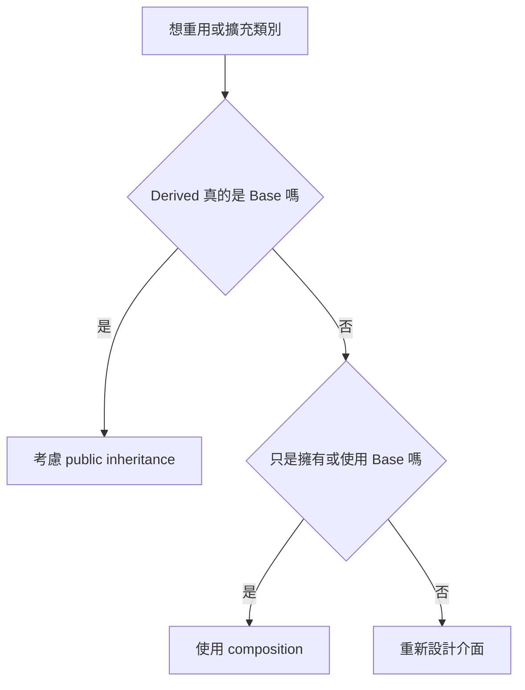
```mermaid
flowchart TD
    A[想重用或擴充類別] --> B{Derived 真的是 Base 嗎}
    B -- 是 --> C[考慮 public inheritance]
    B -- 否 --> D{只是擁有或使用 Base 嗎}
    D -- 是 --> E[使用 composition]
    D -- 否 --> F[重新設計介面]
```

### 2. 建構與解構順序

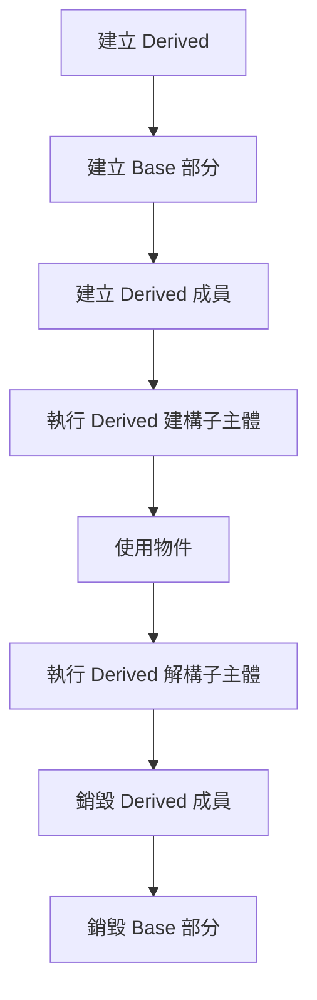
```mermaid
flowchart TD
    A[建立 Derived] --> B[建立 Base 部分]
    B --> C[建立 Derived 成員]
    C --> D[執行 Derived 建構子主體]
    D --> E[使用物件]
    E --> F[執行 Derived 解構子主體]
    F --> G[銷毀 Derived 成員]
    G --> H[銷毀 Base 部分]
```

### 3. 虛擬函式呼叫

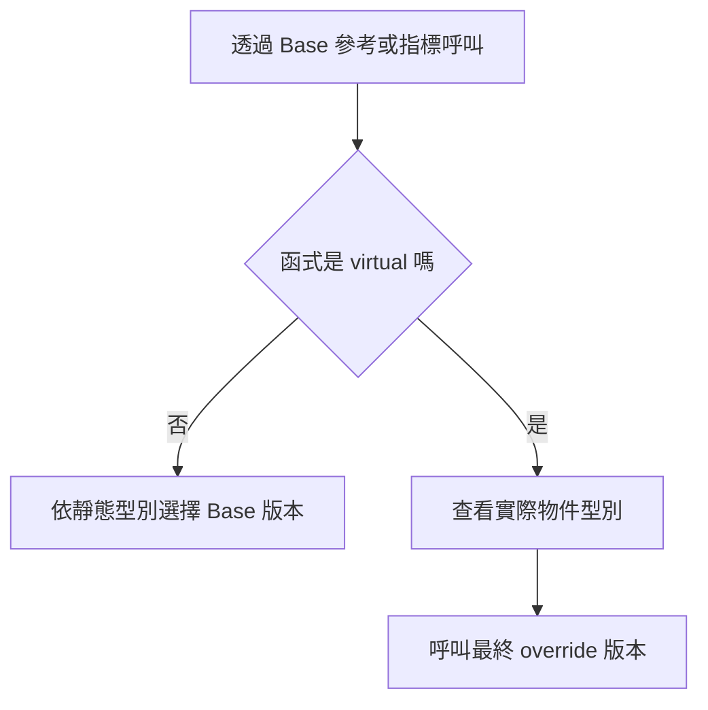
```mermaid
flowchart TD
    A[透過 Base 參考或指標呼叫] --> B{函式是 virtual 嗎}
    B -- 否 --> C[依靜態型別選擇 Base 版本]
    B -- 是 --> D[查看實際物件型別]
    D --> E[呼叫最終 override 版本]
```

### 4. 抽象類別

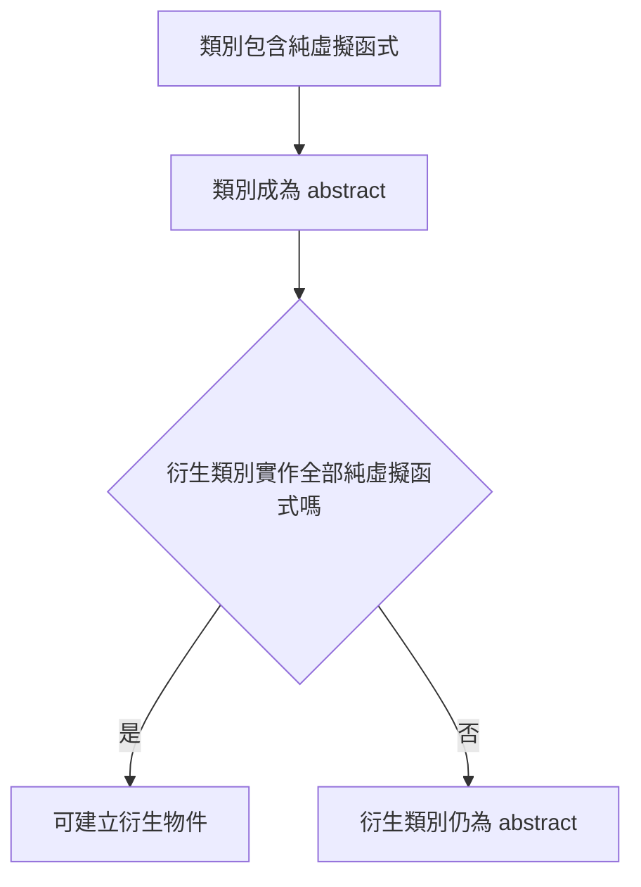
```mermaid
flowchart TD
    A[類別包含純虛擬函式] --> B[類別成為 abstract]
    B --> C{衍生類別實作全部純虛擬函式嗎}
    C -- 是 --> D[可建立衍生物件]
    C -- 否 --> E[衍生類別仍為 abstract]
```

### 5. Object Slicing

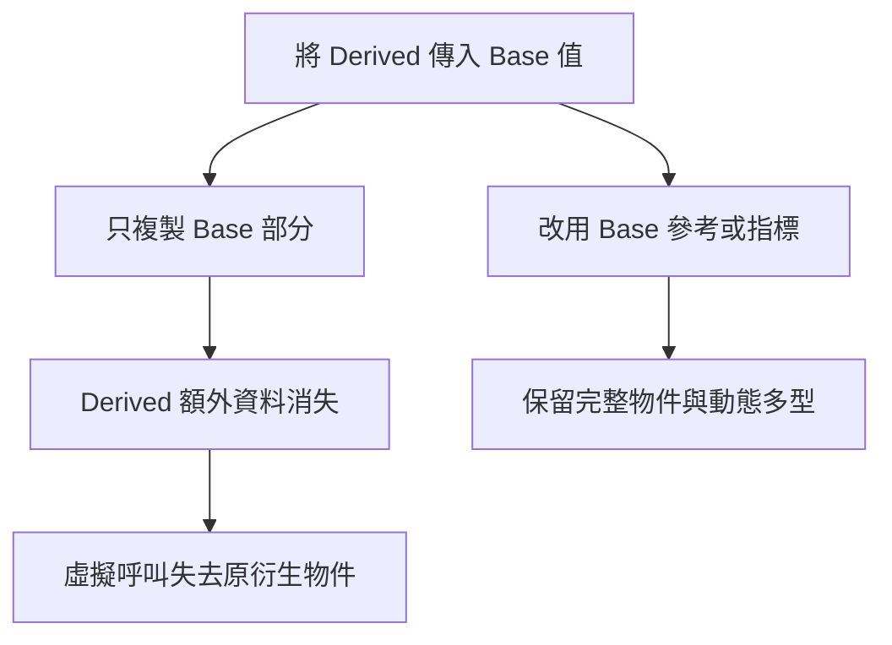
```mermaid
flowchart TD
    A[將 Derived 傳入 Base 值] --> B[只複製 Base 部分]
    B --> C[Derived 額外資料消失]
    C --> D[虛擬呼叫失去原衍生物件]
    A --> E[改用 Base 參考或指標]
    E --> F[保留完整物件與動態多型]
```

### 6. Downcast

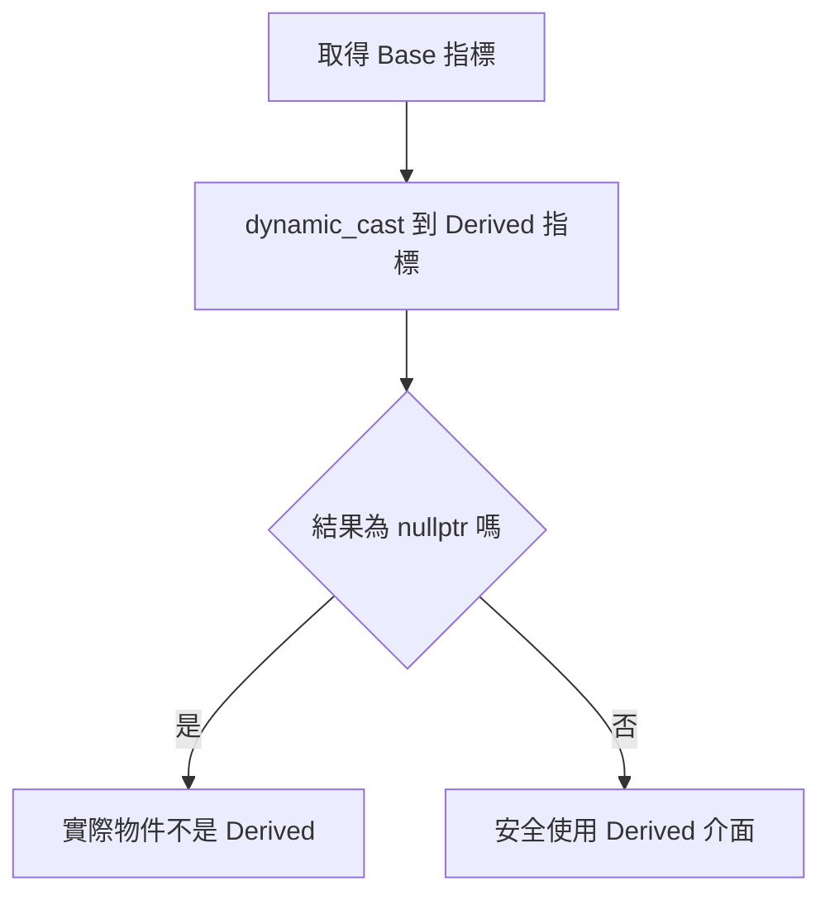
```mermaid
flowchart TD
    A[取得 Base 指標] --> B[dynamic_cast 到 Derived 指標]
    B --> C{結果為 nullptr 嗎}
    C -- 是 --> D[實際物件不是 Derived]
    C -- 否 --> E[安全使用 Derived 介面]
```

### 7. 虛擬解構子

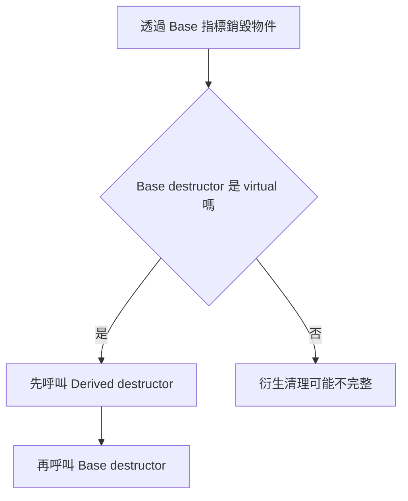
```mermaid
flowchart TD
    A[透過 Base 指標銷毀物件] --> B{Base destructor 是 virtual 嗎}
    B -- 是 --> C[先呼叫 Derived destructor]
    C --> D[再呼叫 Base destructor]
    B -- 否 --> E[衍生清理可能不完整]
```

### 8. 多型介面設計

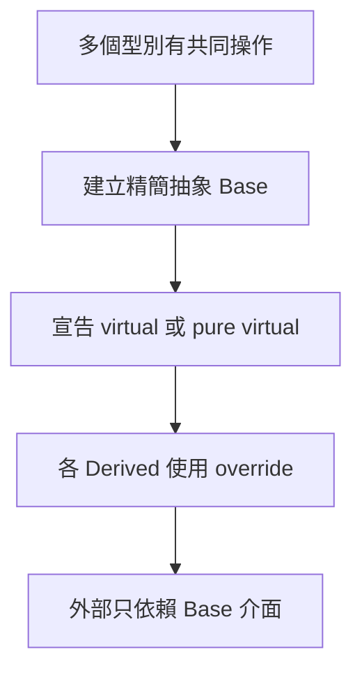
```mermaid
flowchart TD
    A[多個型別有共同操作] --> B[建立精簡抽象 Base]
    B --> C[宣告 virtual 或 pure virtual]
    C --> D[各 Derived 使用 override]
    D --> E[外部只依賴 Base 介面]
```

---

# 本章完成標準

完成本章後，你應該能做到：

1. 說明基底與衍生類別。
2. 使用 public inheritance。
3. 解釋 is-a 關係。
4. 比較 inheritance 與 composition。
5. 說明 public、protected、private 成員存取。
6. 避免直接暴露 protected 資料。
7. 呼叫基底建構子。
8. 追蹤建構順序。
9. 追蹤解構順序。
10. 區分 overloading、hiding、overriding。
11. 使用 `virtual`。
12. 使用 `override`。
13. 使用 `final`。
14. 解釋 static binding。
15. 解釋 dynamic binding。
16. 使用基底參考實現多型。
17. 使用基底指標實現多型。
18. 建立純虛擬函式。
19. 建立抽象類別。
20. 實作具體衍生類別。
21. 為多型基底加入 virtual destructor。
22. 解釋 object slicing。
23. 避免按值傳遞多型物件。
24. 解釋 upcasting。
25. 使用 `dynamic_cast` 進行安全 downcast。
26. 優先以虛擬函式取代型別檢查。
27. 說明建構子中的 virtual 呼叫限制。
28. 說明解構子中的 virtual 呼叫限制。
29. 使用 `using Base::Base`。
30. 解釋 Liskov Substitution Principle。
31. 使用 composition 表達 has-a。
32. 建立精簡 interface-like base。
33. 避免過深繼承階層。
34. 說明多型集合需要間接存取。
35. 使用非擁有型基底指標集合。
36. 說明智慧指標多型集合方向。
37. 認識多重繼承風險。
38. 使用 getter 維持基底封裝。
39. 分析錯誤的繼承模型。
40. 找出常見繼承與多型錯誤。

---

# 隱藏答案區

> Answer hidden — try it first.

<details><summary>TODO 1 答案</summary>

```cpp
class Person {
public:
    explicit Person(
        const string& initialName
    )
        : nameValue(initialName) {
    }

    const string& name() const {
        return nameValue;
    }

private:
    string nameValue;
};

class Student : public Person {
public:
    Student(
        const string& initialName,
        int initialId
    )
        : Person(initialName),
          idValue(initialId) {
    }

    int id() const {
        return idValue;
    }

private:
    int idValue;
};
```

</details>

<details><summary>TODO 2 答案</summary>

在 Base 與 Derived 的建構子、解構子中分別輸出訊息。預期順序：

```text
Base constructor
Derived constructor
Derived destructor
Base destructor
```

</details>

<details><summary>TODO 3 答案</summary>

```cpp
class Animal {
public:
    virtual ~Animal() = default;
    virtual void speak() const = 0;
};

class Dog : public Animal {
public:
    void speak() const override {
        cout << "Woof\n";
    }
};

class Cat : public Animal {
public:
    void speak() const override {
        cout << "Meow\n";
    }
};
```

</details>

<details><summary>TODO 4 答案</summary>

```cpp
void makeSound(
    const Animal& animal
) {
    animal.speak();
}
```

</details>

<details><summary>TODO 5 答案</summary>

```cpp
class Shape {
public:
    virtual ~Shape() = default;
    virtual double area() const = 0;
};
```

Circle 與 Rectangle 分別以 `override` 實作 `area()`。

</details>

<details><summary>TODO 6 答案</summary>

基底若為：

```cpp
virtual void show() const;
```

衍生必須寫：

```cpp
void show() const override;
```

</details>

<details><summary>TODO 7 答案</summary>

```cpp
void run() final {
    // ...
}
```

或：

```cpp
class FinalType final {
};
```

</details>

<details><summary>TODO 8 答案</summary>

按值：

```cpp
void call(Base object);
```

可能 slicing。

按參考：

```cpp
void call(const Base& object);
```

保留多型。

</details>

<details><summary>TODO 9 答案</summary>

```cpp
class Base {
public:
    virtual ~Base() = default;
};
```

</details>

<details><summary>TODO 10 答案</summary>

```cpp
Dog* dog =
    dynamic_cast<Dog*>(
        animalPointer
    );

if (dog != nullptr) {
    dog->fetch();
}
```

</details>

<details><summary>TODO 11 答案</summary>

```cpp
class Task {
public:
    virtual ~Task() = default;
    virtual void execute() = 0;
};
```

各衍生類別使用 `override` 實作。

</details>

<details><summary>TODO 12 答案</summary>

```cpp
class Car {
public:
    void start() {
        engine.start();
    }

private:
    Engine engine;
};
```

</details>

<details><summary>TODO 13 答案</summary>

```cpp
class Derived : public Base {
public:
    using Base::Base;
};
```

</details>

<details><summary>TODO 14 答案</summary>

```cpp
vector<const Shape*> shapes{
    &circle,
    &rectangle
};

for (
    const Shape* shape :
    shapes
) {
    cout << shape->area()
         << '\n';
}
```

所有被指向物件必須在 vector 使用期間保持有效。

</details>

<details><summary>TODO 15 答案</summary>

若 Rectangle 允許獨立修改寬與高，Square 無法同時遵守「寬高可獨立變更」與「寬高永遠相等」兩個契約。較好的設計是讓 Rectangle 與 Square 分別繼承共同 Shape。

</details>
