# Lesson 24：Template Basics 模板基礎

<p align="center">
  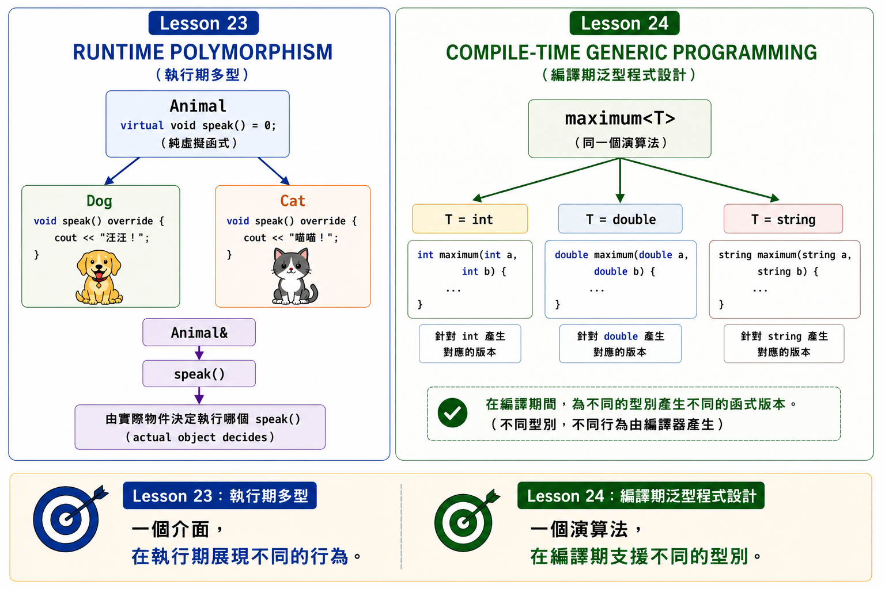
</p>

> 這堂課的重點：使用模板撰寫可重複套用到不同型別的程式。你會學習函式模板、類別模板、型別模板參數、非型別模板參數、型別推導、顯式模板參數、模板多載、模板與容器、模板特化概念，以及如何避免過度泛化與難以理解的模板設計。

> 本章以 C++17 為基準。C++20 concepts、requires expression、進階 SFINAE、template metaprogramming 與完整可變參數模板會留到後續進階章節。

---

## Section I. 今天要做什麼？

1. 認識 generic programming 泛型程式設計。
2. 理解模板 template。
3. 理解模板不是直接可執行的函式或類別。
4. 理解模板會依實際參數產生具體版本。
5. 認識 instantiation 實例化。
6. 認識函式模板。
7. 使用 `template <typename T>`。
8. 使用 `template <class T>`。
9. 理解 `typename` 與 `class` 在型別模板參數中的等價性。
10. 撰寫泛型最大值函式。
11. 撰寫泛型最小值函式。
12. 撰寫泛型交換函式。
13. 使用型別推導。
14. 顯式指定模板型別。
15. 理解模板參數推導。
16. 理解不同實際參數型別可能導致推導失敗。
17. 使用兩個型別模板參數。
18. 使用回傳型別推導。
19. 使用 `auto` 作為模板函式回傳型別。
20. 使用 trailing return type 概念預告。
21. 認識函式模板多載。
22. 理解一般函式與函式模板可同名。
23. 理解編譯器的多載解析。
24. 避免模糊模板多載。
25. 認識模板參數名稱。
26. 使用清楚的模板參數名稱。
27. 使用 `T`、`U`、`Container`、`ValueType`。
28. 認識模板限制 requirement。
29. 理解模板參數必須支援所使用的操作。
30. 泛型最大值需要 `operator<`。
31. 泛型輸出需要 `operator<<`。
32. 泛型相加需要 `operator+`。
33. 理解模板錯誤可能在實例化時才出現。
34. 認識模板錯誤訊息較長。
35. 使用小型測試縮小錯誤範圍。
36. 認識類別模板。
37. 建立 `Box<T>`。
38. 建立 `Pair<T, U>`。
39. 類別模板建立物件時指定型別。
40. 使用 `Box<int>`。
41. 使用 `Box<string>`。
42. 使用成員函式。
43. 使用建構子。
44. 使用 getter。
45. 使用 `const` 成員函式。
46. 在類別外定義模板成員函式。
47. 理解類別外定義仍需要 template 宣告。
48. 使用 `ClassName<T>::function()`。
49. 使用 `typename` 處理相依型別。
50. 理解 dependent name 相依名稱。
51. 使用 `typename Container::value_type`。
52. 認識 nested type。
53. 建立模板別名。
54. 使用 `using`.
55. 建立 `StringBox` 別名。
56. 建立 `IntPair` 別名。
57. 認識非型別模板參數。
58. 使用 `template <typename T, size_t N>`。
59. 建立固定大小 Buffer。
60. 理解 N 是編譯期常數。
61. 使用 `std::array<T, N>`。
62. 建立泛型固定大小容器。
63. 取得非型別模板參數。
64. 使用 `constexpr` 成員函式。
65. 認識模板與 `std::array`。
66. 認識模板與 `std::vector`。
67. 建立泛型總和函式。
68. 建立泛型平均值函式。
69. 理解整數平均的型別問題。
70. 建立泛型搜尋函式。
71. 建立泛型計數函式。
72. 建立泛型列印函式。
73. 建立泛型反轉函式。
74. 使用迭代器模板。
75. 建立 `printRange(first, last)`。
76. 建立 `sumRange(first, last)`。
77. 認識 iterator_traits 概念預告。
78. 不在本章深入 iterator category。
79. 認識模板與 lambda 的關係。
80. 泛型 lambda 概念預告。
81. 使用 C++14 泛型 lambda `auto` 參數。
82. 比較函式模板與泛型 lambda。
83. 認識模板預設參數。
84. 使用 `template <typename T = int>`。
85. 使用類別模板預設型別。
86. 避免過多預設參數造成介面不清楚。
87. 認識模板特化 specialization。
88. 認識 full specialization。
89. 理解函式模板特化限制。
90. 類別模板較適合特化。
91. 建立 `Printer<bool>` 特化。
92. 認識 partial specialization。
93. 不在本章深入偏特化。
94. 認識模板與繼承。
95. 建立模板基底類別概念。
96. 不在本章深入 CRTP。
97. 認識模板與多型差異。
98. 模板通常是編譯期多型。
99. virtual 通常是執行期多型。
100. 比較 static polymorphism 與 dynamic polymorphism。
101. 理解模板可能增加編譯時間。
102. 理解不同型別可能產生不同機器碼。
103. 認識 code bloat 概念。
104. 不因可能膨脹而拒絕合理模板。
105. 認識 header-only template。
106. 理解模板定義通常需在使用處可見。
107. 理解只在 `.cpp` 放模板定義可能導致連結錯誤。
108. 將模板宣告與定義放在 header。
109. 認識 `.tpp` 或 `.ipp` 檔案慣例。
110. 不在本章深入顯式實例化。
111. 認識 explicit instantiation 概念。
112. 使用 `template class Box<int>;` 概念預告。
113. 認識 type deduction edge cases。
114. 陣列傳入模板可能保留大小。
115. 字串字面常數推導成字元陣列參考的概念。
116. 使用 `const T&` 避免複製。
117. 使用 `T&` 修改原值。
118. 使用 `T` 建立獨立副本。
119. 認識 forwarding reference 概念預告。
120. 不在本章深入完美轉發。
121. 認識 `std::move` 與模板關係預告。
122. 認識 `std::decay` 概念預告。
123. 不在本章深入 type traits。
124. 認識 `std::is_same` 概念。
125. 使用 `static_assert` 概念預告。
126. 建立模板使用條件的編譯期檢查概念。
127. 認識 SFINAE。
128. 不在本章深入 enable_if。
129. 認識 C++20 concepts。
130. 理解 concepts 可改善模板限制與錯誤訊息。
131. 不在本章使用 requires。
132. 避免模板過度泛化。
133. 只在多種型別真的共享相同行為時使用模板。
134. 若只有兩個具體型別，不一定需要模板。
135. 保持模板介面小而清楚。
136. 使用清楚命名與文件說明需求。
137. 測試多種型別。
138. 測試自訂型別。
139. 測試 const 物件。
140. 測試空容器。
141. 使用概念檢查、程式閱讀與實作題整合本章。

---

## Section II. 今天的學習方式

1. 每個模板先問：
   ```text
   哪個部分會隨型別改變？
   哪些操作必須被型別支援？
   ```
2. 模板函式若只讀參數，通常使用：
   ```cpp
   const T&
   ```
3. 需要修改原物件時使用：
   ```cpp
   T&
   ```
4. 需要獨立副本時才使用：
   ```cpp
   T
   ```
5. 遇到錯誤時先檢查：
   ```text
   實際型別是否支援模板內使用的操作？
   ```
6. 類別模板在類別外定義成員時，必須再次寫：
   ```cpp
   template <typename T>
   ```
7. 使用相依型別時檢查是否需要：
   ```cpp
   typename
   ```
8. 非型別模板參數必須是編譯期可用值。
9. 模板定義通常放在 header。
10. 所有合法完整程式使用嚴格 C++17 選項檢查。

---

## Section III. 核心語法對照

| 語法 | 用途 |
| --- | --- |
| `template <typename T>` | 宣告型別模板參數 |
| `template <class T>` | 與 `typename T` 等價 |
| `T maximum(T first, T second)` | 函式模板 |
| `maximum<int>(3, 5)` | 顯式指定模板型別 |
| `template <typename T, typename U>` | 多個型別參數 |
| `template <typename T, size_t N>` | 型別與非型別參數 |
| `class Box<T>` | 類別模板實例 |
| `Box<int>` | `T = int` |
| `typename Container::value_type` | 相依型別 |
| `using StringBox = Box<string>;` | 模板別名 |
| `template <typename T = int>` | 預設模板參數 |
| `template <> class Printer<bool>` | 完整特化 |
| `const T& value` | 唯讀泛型參數 |
| `T& value` | 可修改泛型參數 |
| `auto` | 依運算式推導回傳型別 |
| `static_assert(...)` | 編譯期條件檢查 |

---

# Part A：什麼是模板？

## Section IV. 重複函式問題

<p align="center">
  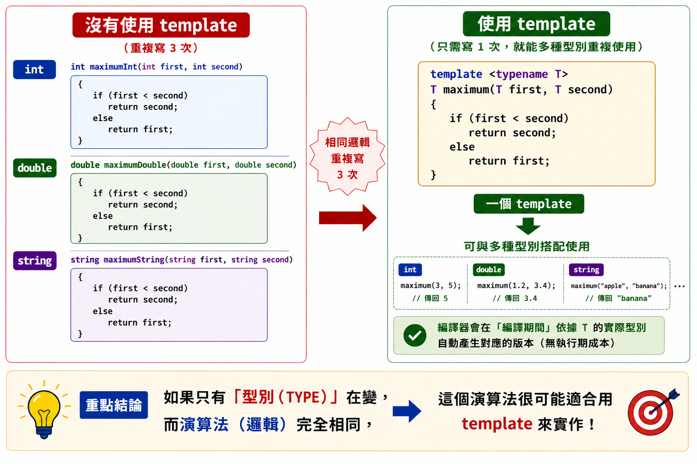
</p>

沒有模板時：

```cpp
int maximumInt(
    int first,
    int second
);

double maximumDouble(
    double first,
    double second
);
```

程式邏輯完全相同，只是型別不同。

---

## Section V. 使用模板

<p align="center">
  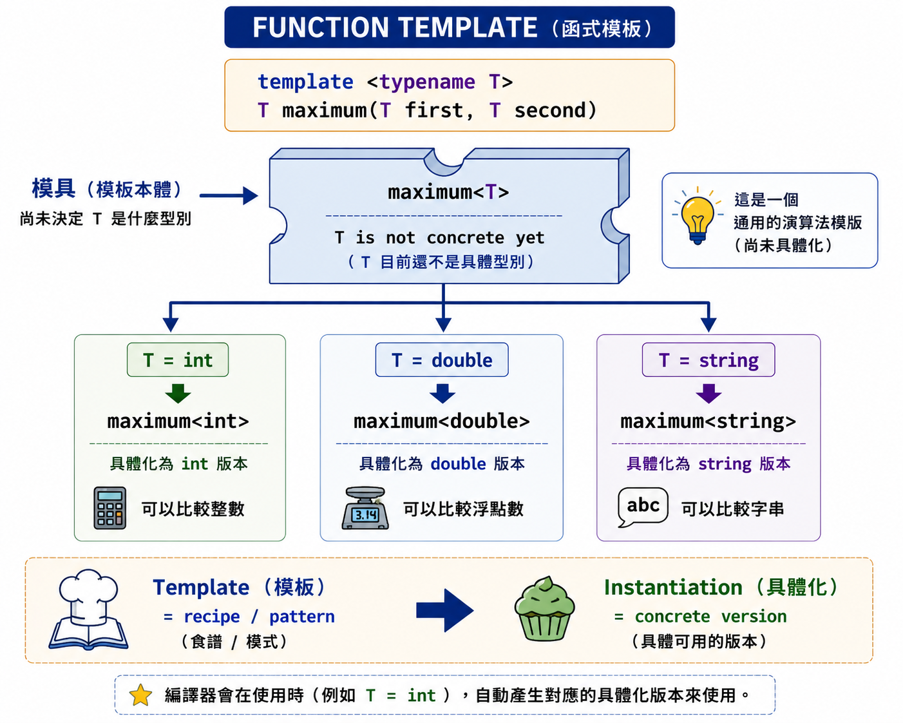
</p>

```cpp
template <typename T>
T maximum(
    T first,
    T second
) {
    if (first < second) {
        return second;
    }

    return first;
}
```

編譯器可依需求產生：

```text
maximum<int>
maximum<double>
maximum<string>
```

前提是型別支援模板使用的操作。

---

# Part B：第一個函式模板

## Section VI. 泛型最大值

<p align="center">
  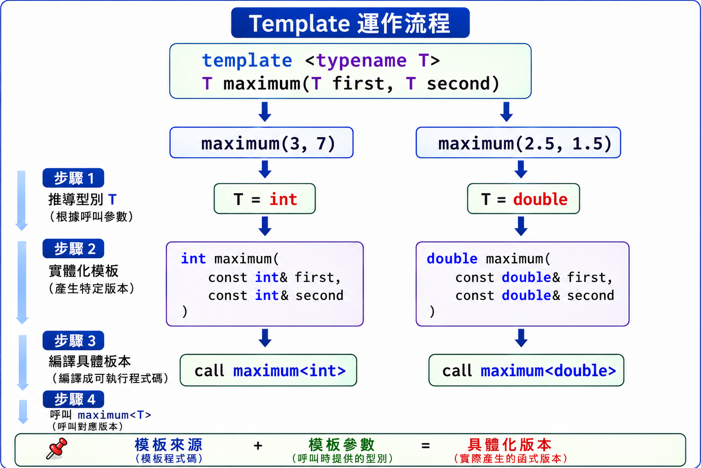
</p>

```cpp
// VALIDATE
#include <iostream>
#include <string>
using namespace std;

template <typename T>
T maximum(
    const T& first,
    const T& second
) {
    if (first < second) {
        return second;
    }

    return first;
}

int main() {
    cout << maximum(
                3,
                7
            )
         << '\n';

    cout << maximum(
                2.5,
                1.5
            )
         << '\n';

    cout << maximum(
                string("apple"),
                string("banana")
            )
         << '\n';

    return 0;
}
```

---

## Section VII. 模板需求

<p align="center">
  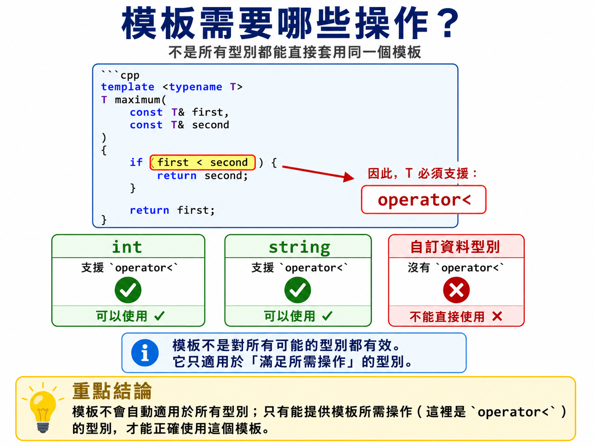
</p>

這個 `maximum()` 需要 `T` 支援：

```cpp
first < second
```

而且回傳值要能從 `first` 或 `second` 複製或移動建立。

---

# Part C：`typename` 與 `class`

## Section VIII. 兩種寫法

<p align="center">
  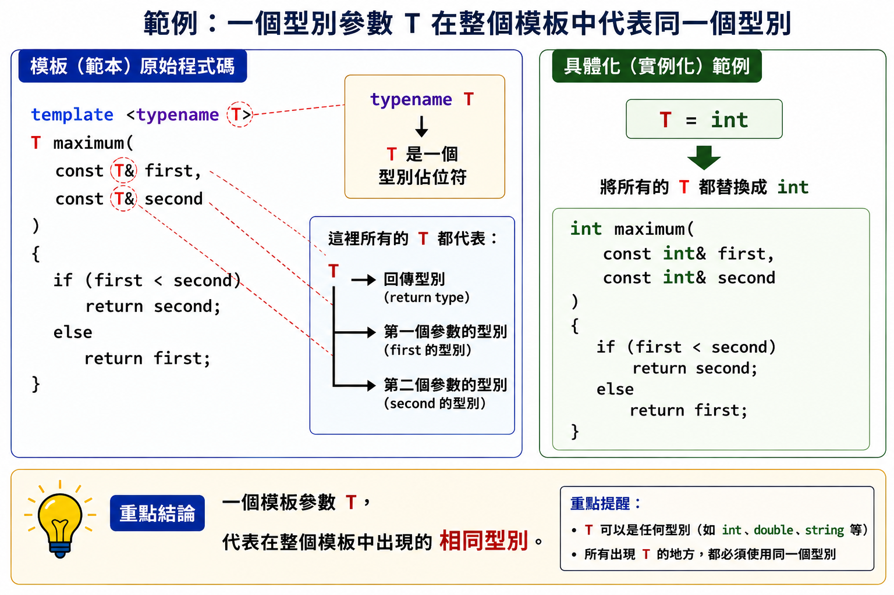
</p>

```cpp
template <typename T>
```

```cpp
template <class T>
```

在型別模板參數位置，兩者意義相同。

---

## Section IX. 建議

現代教材常使用：

```cpp
typename
```

因為它更直接表示：

```text
T 是一個型別
```

---

# Part D：型別推導

## Section X. 自動推導

<p align="center">
  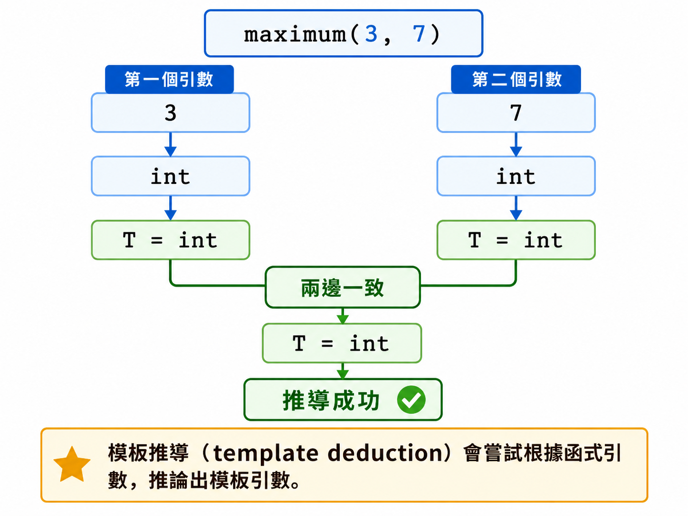
</p>

```cpp
maximum(
    3,
    7
)
```

推導：

```text
T = int
```

---

## Section XI. 顯式指定

```cpp
maximum<double>(
    3,
    7.5
)
```

強制：

```text
T = double
```

整數 `3` 會轉成 `double`。

---

## Section XII. 完整顯式模板參數

```cpp
// VALIDATE
#include <iostream>
using namespace std;

template <typename T>
T add(
    T first,
    T second
) {
    return first + second;
}

int main() {
    cout << add(
                3,
                5
            )
         << '\n';

    cout << add<double>(
                3,
                5.5
            )
         << '\n';

    return 0;
}
```

---

# Part E：推導失敗

## Section XIII. 不同型別

<p align="center">
  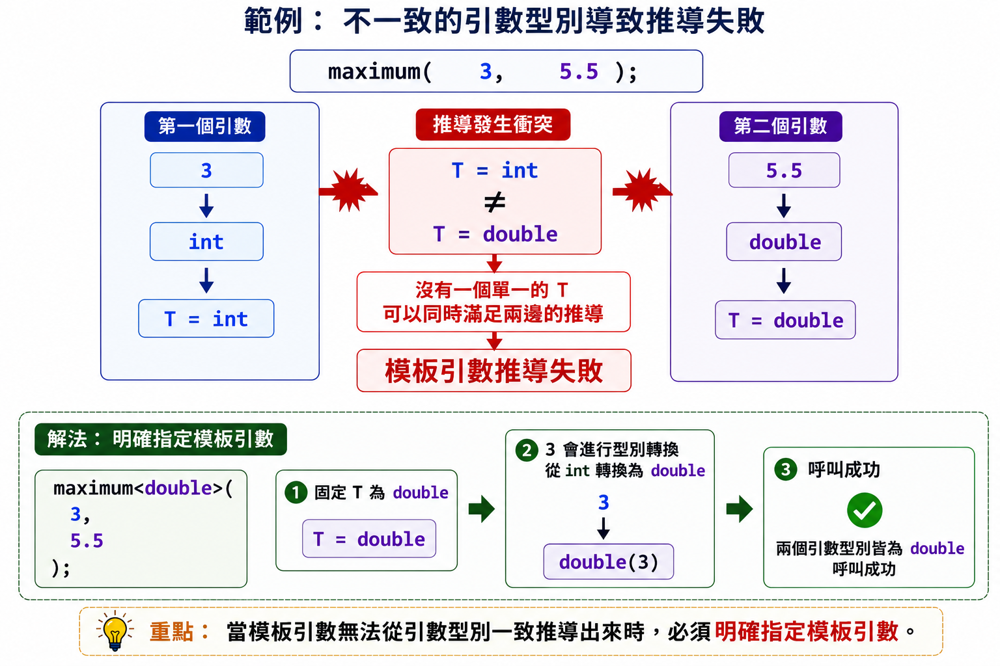
</p>

```cpp
/* maximum(
    3,
    5.5
); */
```

第一個參數推導 `T = int`，第二個推導 `T = double`，可能無法得到唯一 `T`。

---

## Section XIV. 解決方式

1. 顯式指定：
   ```cpp
   maximum<double>(
       3,
       5.5
   );
   ```
2. 改成兩個模板型別參數。
3. 先明確轉型。
4. 重新設計介面。

---

# Part F：兩個型別模板參數

## Section XV. 基本語法

<p align="center">
  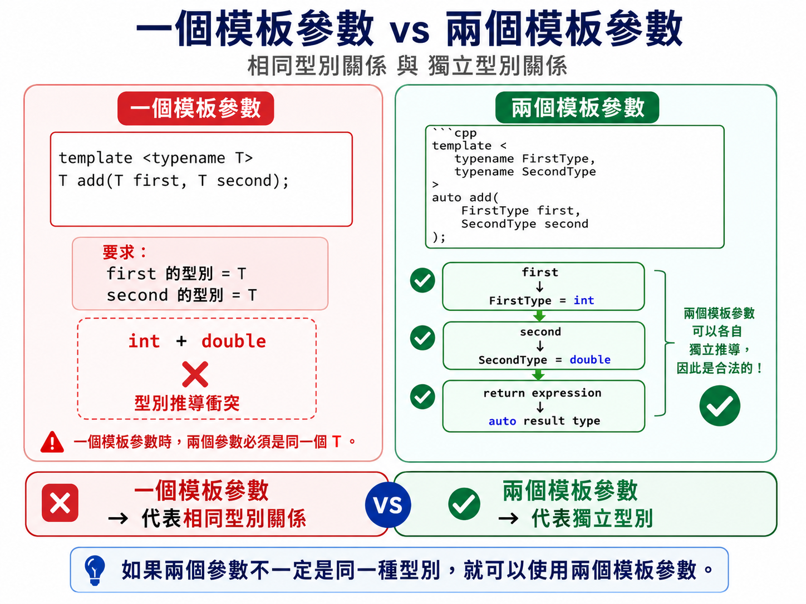
</p>

```cpp
template <
    typename FirstType,
    typename SecondType
>
auto add(
    const FirstType& first,
    const SecondType& second
) {
    return first + second;
}
```

---

## Section XVI. 完整兩型別相加

```cpp
// VALIDATE
#include <iostream>
using namespace std;

template <
    typename FirstType,
    typename SecondType
>
auto add(
    const FirstType& first,
    const SecondType& second
) {
    return first + second;
}

int main() {
    cout << add(
                3,
                5.5
            )
         << '\n';

    cout << add(
                2.5,
                4
            )
         << '\n';

    return 0;
}
```

C++14 起可讓 `auto` 依 return expression 推導回傳型別。

---

# Part G：泛型交換

## Section XVII. 修改原參數

<p align="center">
  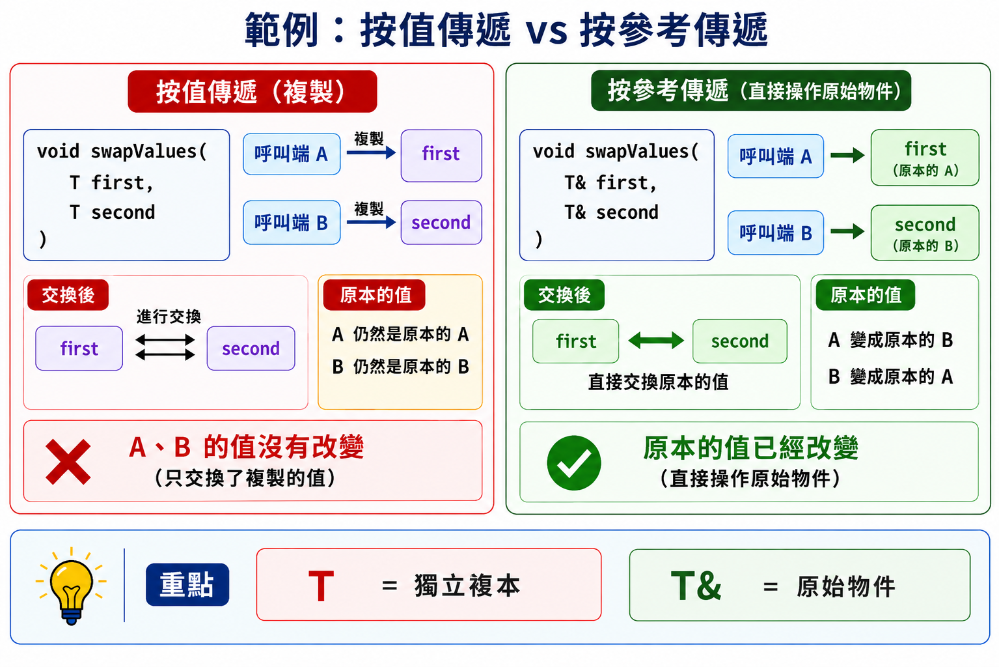
</p>

```cpp
template <typename T>
void swapValues(
    T& first,
    T& second
)
```

必須使用參考。

---

## Section XVIII. 完整交換模板

```cpp
// VALIDATE
#include <iostream>
#include <string>
using namespace std;

template <typename T>
void swapValues(
    T& first,
    T& second
) {
    T temporary =
        first;

    first =
        second;

    second =
        temporary;
}

int main() {
    int firstNumber = 10;
    int secondNumber = 20;

    swapValues(
        firstNumber,
        secondNumber
    );

    cout << firstNumber
         << " "
         << secondNumber
         << '\n';

    string firstText =
        "left";

    string secondText =
        "right";

    swapValues(
        firstText,
        secondText
    );

    cout << firstText
         << " "
         << secondText
         << '\n';

    return 0;
}
```

實務通常使用標準函式：

```cpp
std::swap
```

此範例用來理解函式模板。

---

# Part H：函式模板多載

## Section XIX. 不同參數數量

```cpp
template <typename T>
void printValue(
    const T& value
);

template <typename T>
void printValue(
    const T& value,
    int repeatCount
);
```

---

## Section XX. 完整模板多載

```cpp
// VALIDATE
#include <iostream>
#include <string>
using namespace std;

template <typename T>
void printValue(
    const T& value
) {
    cout << value
         << '\n';
}

template <typename T>
void printValue(
    const T& value,
    int repeatCount
) {
    for (
        int count = 0;
        count < repeatCount;
        ++count
    ) {
        cout << value
             << '\n';
    }
}

int main() {
    printValue(42);

    printValue(
        string("Hello"),
        2
    );

    return 0;
}
```

---

# Part I：一般函式與模板

## Section XXI. 一般函式可能更精確

```cpp
void show(int value);
```

與：

```cpp
template <typename T>
void show(const T& value);
```

同時存在時，編譯器依多載解析選擇最佳匹配。

---

## Section XXII. 完整選擇示範

```cpp
// VALIDATE
#include <iostream>
using namespace std;

void show(int value) {
    cout << "int: "
         << value
         << '\n';
}

template <typename T>
void show(
    const T& value
) {
    cout << "template: "
         << value
         << '\n';
}

int main() {
    show(10);
    show(3.5);

    return 0;
}
```

通常：

```text
int: 10
template: 3.5
```

---

# Part J：第一個類別模板

## Section XXIII. Box

<p align="center">
  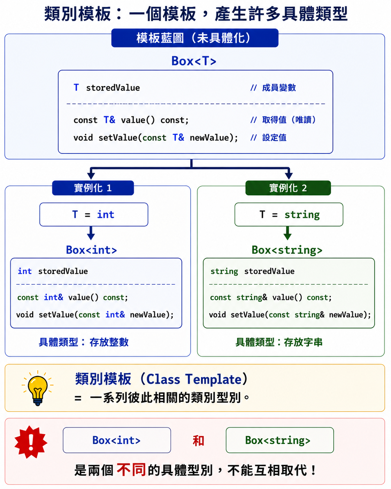"
    width="700">
</p>

```cpp
template <typename T>
class Box {
public:
    explicit Box(
        const T& initialValue
    )
        : storedValue(
              initialValue
          ) {
    }

    const T& value() const {
        return storedValue;
    }

private:
    T storedValue;
};
```

---

## Section XXIV. 完整 Box 範例

```cpp
// VALIDATE
#include <iostream>
#include <string>
using namespace std;

template <typename T>
class Box {
public:
    explicit Box(
        const T& initialValue
    )
        : storedValue(
              initialValue
          ) {
    }

    const T& value() const {
        return storedValue;
    }

    void setValue(
        const T& newValue
    ) {
        storedValue =
            newValue;
    }

private:
    T storedValue;
};

int main() {
    Box<int> numberBox(42);
    Box<string> textBox(
        string("Hello")
    );

    cout << numberBox.value()
         << '\n';

    cout << textBox.value()
         << '\n';

    return 0;
}
```

---

# Part K：多個類別模板參數

## Section XXV. Pair 類別

```cpp
template <
    typename FirstType,
    typename SecondType
>
class Pair {
    // ...
};
```

---

## Section XXVI. 完整 Pair

```cpp
// VALIDATE
#include <iostream>
#include <string>
using namespace std;

template <
    typename FirstType,
    typename SecondType
>
class Pair {
public:
    Pair(
        const FirstType& initialFirst,
        const SecondType& initialSecond
    )
        : firstValue(
              initialFirst
          ),
          secondValue(
              initialSecond
          ) {
    }

    const FirstType&
    first() const {
        return firstValue;
    }

    const SecondType&
    second() const {
        return secondValue;
    }

private:
    FirstType firstValue;
    SecondType secondValue;
};

int main() {
    Pair<string, int> student(
        "Amy",
        95
    );

    cout << student.first()
         << " "
         << student.second()
         << '\n';

    return 0;
}
```

標準函式庫已有：

```cpp
std::pair
```

本例用來理解類別模板。

---

# Part L：類別外定義模板成員

## Section XXVII. 宣告

```cpp
template <typename T>
class Box {
public:
    explicit Box(
        const T& initialValue
    );

    const T& value() const;

private:
    T storedValue;
};
```

---

## Section XXVIII. 類別外實作

<p align="center">
  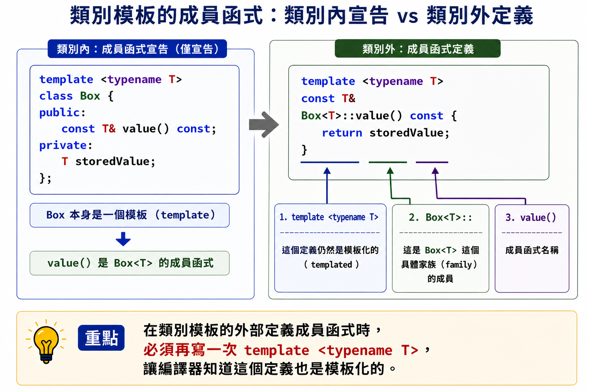
</p>

```cpp
template <typename T>
Box<T>::Box(
    const T& initialValue
)
    : storedValue(
          initialValue
      ) {
}
```

---

## Section XXIX. 完整類別外定義

```cpp
// VALIDATE
#include <iostream>
using namespace std;

template <typename T>
class Box {
public:
    explicit Box(
        const T& initialValue
    );

    const T& value() const;

private:
    T storedValue;
};

template <typename T>
Box<T>::Box(
    const T& initialValue
)
    : storedValue(
          initialValue
      ) {
}

template <typename T>
const T& Box<T>::value() const {
    return storedValue;
}

int main() {
    Box<int> box(100);

    cout << box.value()
         << '\n';

    return 0;
}
```

---

# Part M：模板別名

## Section XXX. `using`

```cpp
using StringBox =
    Box<string>;
```

之後：

```cpp
StringBox box(...);
```

---

## Section XXXI. 完整模板別名

```cpp
// VALIDATE
#include <iostream>
#include <string>
using namespace std;

template <typename T>
class Box {
public:
    explicit Box(
        const T& initialValue
    )
        : storedValue(
              initialValue
          ) {
    }

    const T& value() const {
        return storedValue;
    }

private:
    T storedValue;
};

using StringBox =
    Box<string>;

using IntBox =
    Box<int>;

int main() {
    StringBox text(
        string("Hello")
    );

    IntBox number(42);

    cout << text.value()
         << " "
         << number.value()
         << '\n';

    return 0;
}
```

---

# Part N：非型別模板參數

## Section XXXII. 編譯期值

<p align="center">
  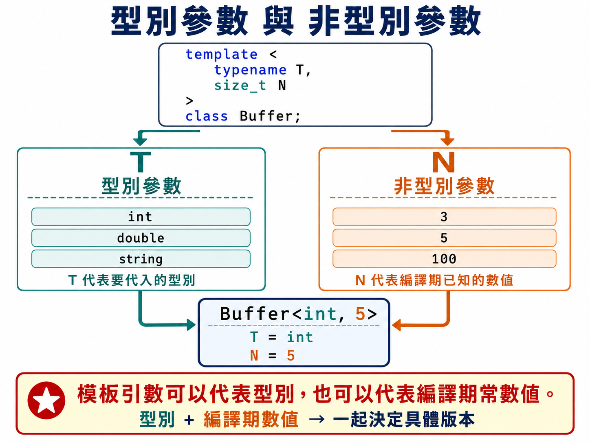
</p>

```cpp
template <
    typename T,
    size_t N
>
class Buffer {
    // ...
};
```

`N` 是編譯期常數。

---

## Section XXXIII. 完整固定大小 Buffer

<p align="center">
  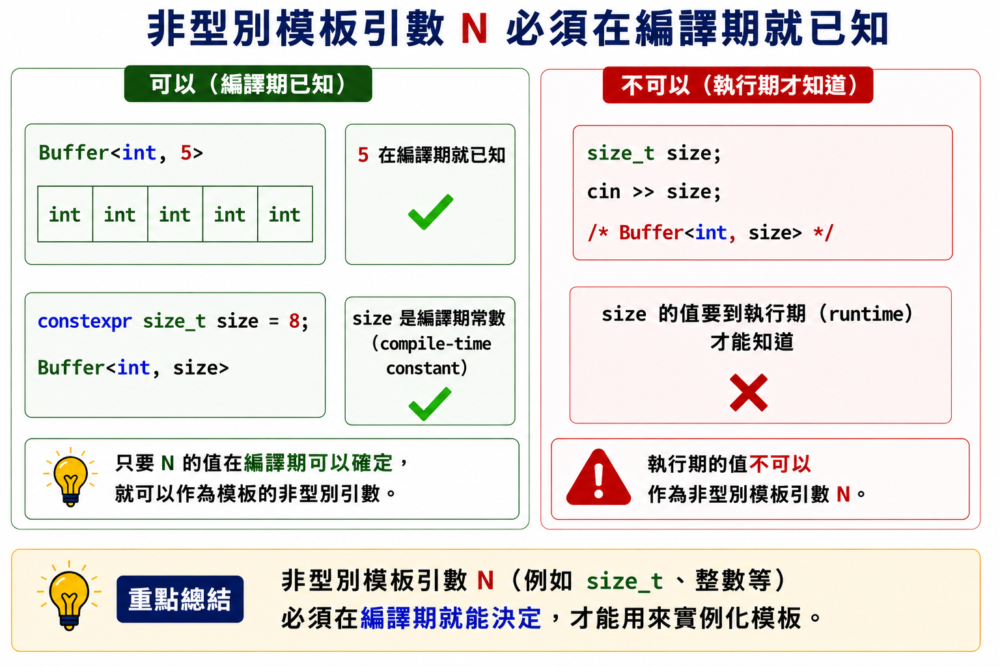
</p>

```cpp
// VALIDATE
#include <array>
#include <cstddef>
#include <iostream>
using namespace std;

template <
    typename T,
    size_t N
>
class Buffer {
public:
    constexpr size_t size() const {
        return N;
    }

    T& at(size_t index) {
        return values.at(index);
    }

    const T& at(
        size_t index
    ) const {
        return values.at(index);
    }

private:
    array<T, N> values{};
};

int main() {
    Buffer<int, 5> buffer;

    buffer.at(0) = 10;
    buffer.at(1) = 20;

    cout << buffer.size()
         << " "
         << buffer.at(0)
         << " "
         << buffer.at(1)
         << '\n';

    return 0;
}
```

---

# Part O：模板預設參數

## Section XXXIV. 類別模板預設型別

```cpp
template <typename T = int>
class Holder {
    // ...
};
```

使用：

```cpp
Holder<> first;
Holder<double> second;
```

---

## Section XXXV. 完整預設模板參數

```cpp
// VALIDATE
#include <iostream>
using namespace std;

template <typename T = int>
class Holder {
public:
    Holder() = default;

    explicit Holder(
        const T& initialValue
    )
        : storedValue(
              initialValue
          ) {
    }

    const T& value() const {
        return storedValue;
    }

private:
    T storedValue{};
};

int main() {
    Holder<> first(10);
    Holder<double> second(2.5);

    cout << first.value()
         << " "
         << second.value()
         << '\n';

    return 0;
}
```

---

# Part P：模板與 Vector

## Section XXXVI. 泛型列印容器

```cpp
template <typename T>
void printVector(
    const vector<T>& values
)
```

---

## Section XXXVII. 完整 Vector 列印

```cpp
// VALIDATE
#include <iostream>
#include <string>
#include <vector>
using namespace std;

template <typename T>
void printVector(
    const vector<T>& values
) {
    for (
        const T& value :
        values
    ) {
        cout << value
             << " ";
    }

    cout << '\n';
}

int main() {
    vector<int> numbers{
        1,
        2,
        3
    };

    vector<string> words{
        "one",
        "two",
        "three"
    };

    printVector(numbers);
    printVector(words);

    return 0;
}
```

此模板需要 `T` 支援：

```cpp
operator<<
```

---

# Part Q：泛型總和

## Section XXXVIII. Vector Sum

```cpp
template <typename T>
T sumVector(
    const vector<T>& values
)
```

---

## Section XXXIX. 完整 Sum

```cpp
// VALIDATE
#include <iostream>
#include <vector>
using namespace std;

template <typename T>
T sumVector(
    const vector<T>& values
) {
    T total{};

    for (
        const T& value :
        values
    ) {
        total += value;
    }

    return total;
}

int main() {
    vector<int> integers{
        1,
        2,
        3,
        4
    };

    vector<double> decimals{
        1.5,
        2.5,
        3.0
    };

    cout << sumVector(
                integers
            )
         << '\n';

    cout << sumVector(
                decimals
            )
         << '\n';

    return 0;
}
```

需求：

- `T{}` 產生適合作為起點的值。
- `T` 支援 `+=`。

並非所有型別都符合。

---

# Part R：泛型搜尋

## Section XL. 找第一個索引

```cpp
template <typename T>
bool findIndex(
    const vector<T>& values,
    const T& target,
    typename vector<T>::size_type&
        resultIndex
)
```

---

## Section XLI. `typename` 的必要性

<p align="center">
  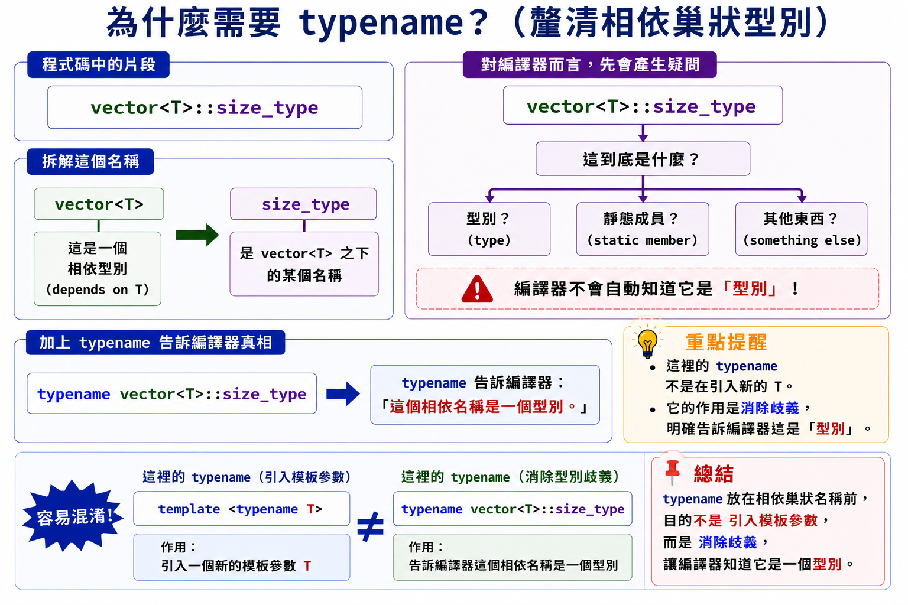
</p>

```cpp
vector<T>::size_type
```

依賴 `T`，編譯器不知道它是型別還是其他名稱。

因此要寫：

```cpp
typename vector<T>::size_type
```

---

## Section XLII. 完整泛型搜尋

```cpp
// VALIDATE
#include <iostream>
#include <string>
#include <vector>
using namespace std;

template <typename T>
bool findIndex(
    const vector<T>& values,
    const T& target,
    typename vector<T>::size_type&
        resultIndex
) {
    for (
        typename vector<T>::size_type
            index = 0;
        index < values.size();
        ++index
    ) {
        if (
            values[index] ==
            target
        ) {
            resultIndex =
                index;

            return true;
        }
    }

    return false;
}

int main() {
    vector<string> words{
        "apple",
        "banana",
        "orange"
    };

    vector<string>::size_type
        index = 0;

    if (
        findIndex(
            words,
            string("banana"),
            index
        )
    ) {
        cout << index
             << '\n';
    }

    return 0;
}
```

---

# Part S：Iterator Template

## Section XLIII. 不綁定容器型別

<p align="center">
  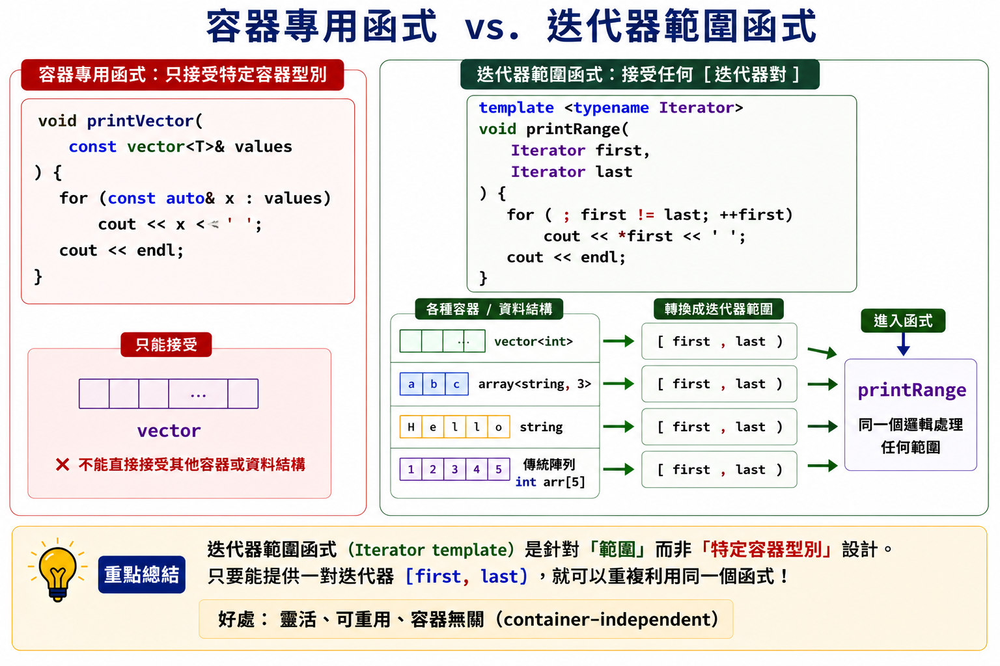
</p>

```cpp
template <typename Iterator>
void printRange(
    Iterator first,
    Iterator last
)
```

可處理：

- vector
- array
- 傳統陣列
- string
- 其他支援迭代器的容器

---

## Section XLIV. 完整 Range Printer

```cpp
// VALIDATE
#include <array>
#include <iostream>
#include <string>
#include <vector>
using namespace std;

template <typename Iterator>
void printRange(
    Iterator first,
    Iterator last
) {
    while (
        first !=
        last
    ) {
        cout << *first
             << " ";

        ++first;
    }

    cout << '\n';
}

int main() {
    vector<int> numbers{
        1,
        2,
        3
    };

    array<string, 3> words{
        "one",
        "two",
        "three"
    };

    printRange(
        numbers.cbegin(),
        numbers.cend()
    );

    printRange(
        words.cbegin(),
        words.cend()
    );

    return 0;
}
```

---

# Part T：泛型 Lambda

## Section XLV. C++14 起

<p align="center">
  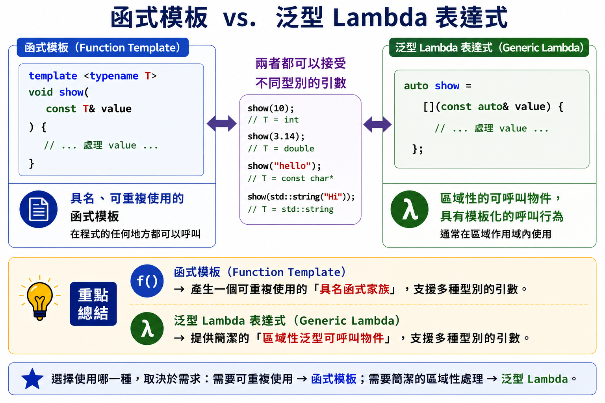
</p>

```cpp
auto show =
    [](const auto& value) {
        cout << value;
    };
```

這是泛型 lambda。

---

## Section XLVI. 完整泛型 Lambda

```cpp
// VALIDATE
#include <iostream>
#include <string>
using namespace std;

int main() {
    auto show =
        [](const auto& value) {
            cout << value
                 << '\n';
        };

    show(42);
    show(3.5);
    show(
        string("Hello")
    );

    return 0;
}
```

泛型 lambda 的呼叫運算子本質上具有模板行為。

---

# Part U：完整特化

## Section XLVII. 一般模板

<p align="center">
  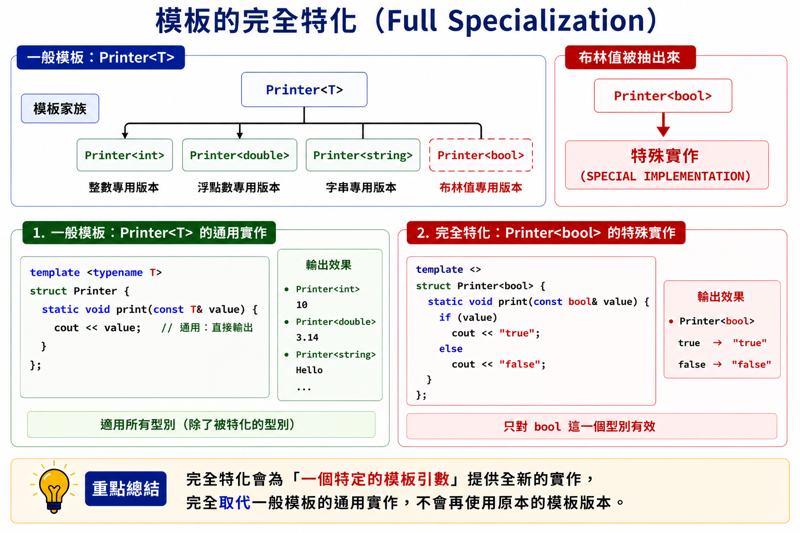
</p>

```cpp
template <typename T>
class Printer {
    // ...
};
```

---

## Section XLVIII. 對 bool 使用不同表示

```cpp
template <>
class Printer<bool> {
    // ...
};
```

---

## Section XLIX. 完整特化範例

```cpp
// VALIDATE
#include <iostream>
using namespace std;

template <typename T>
class Printer {
public:
    static void print(
        const T& value
    ) {
        cout << value
             << '\n';
    }
};

template <>
class Printer<bool> {
public:
    static void print(
        bool value
    ) {
        cout << (
                    value
                        ? "true"
                        : "false"
                )
             << '\n';
    }
};

int main() {
    Printer<int>::print(42);
    Printer<bool>::print(true);

    return 0;
}
```

---

## Section L. 使用特化的注意

特化會增加：

- 程式複雜度
- 維護成本
- 行為差異

只有當某型別真的需要不同實作時使用。

---

# Part V：編譯期多型與執行期多型

## Section LI. 模板

<p align="center">
  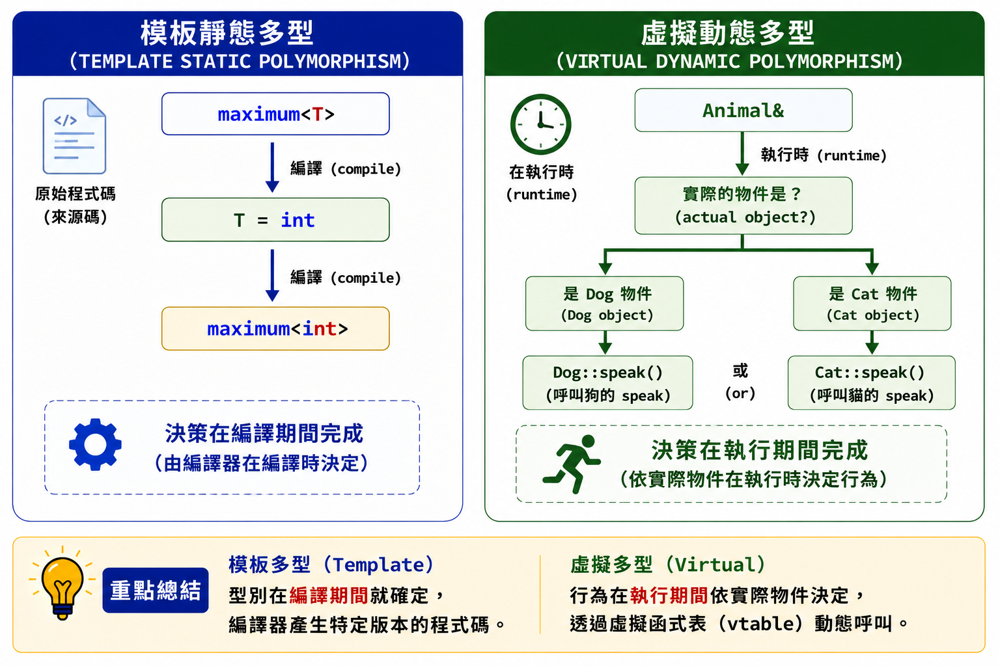
</p>

模板通常在編譯期選擇具體型別：

```text
static polymorphism
```

優點：

- 可內聯。
- 不需要 virtual dispatch。
- 型別資訊完整。

---

## Section LII. Virtual

繼承與 virtual 通常在執行期依實際物件型別選擇：

```text
dynamic polymorphism
```

---

## Section LIII. 比較表

| 特性 | Template | Virtual |
| --- | --- | --- |
| 選擇時間 | 編譯期 | 執行期 |
| 型別關係 | 不一定有共同基底 | 需要共同基底介面 |
| 容器混合不同型別 | 較不直接 | 容易透過基底指標 |
| 錯誤時間 | 編譯期 | 多數編譯期，呼叫目標執行期 |
| 彈性 | 對型別操作泛化 | 對物件行為動態替換 |

---

# Part W：模板放在哪裡？

## Section LIV. 定義必須可見

<p align="center">
  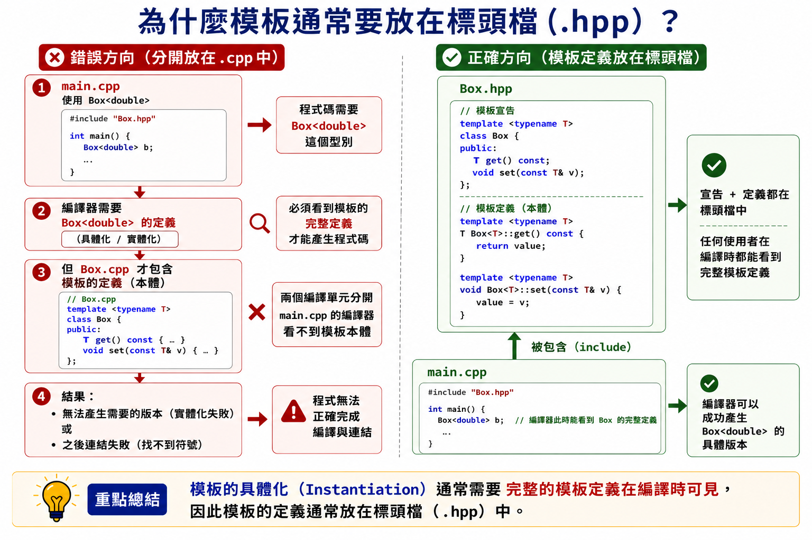
</p>

一般函式可：

```text
header 宣告
cpp 定義
```

模板通常需要在實例化位置看到完整定義。

---

## Section LV. 常見做法

1. 宣告與定義都放在 `.hpp`。
2. `.hpp` 最後包含 `.tpp`。
3. 使用顯式實例化管理特定型別。

初學時最簡單：

```text
模板完整定義放在 header
```

---

## Section LVI. 常見連結錯誤

若只在 `.cpp` 定義模板，而其他檔案嘗試使用未顯式實例化的型別，可能出現 undefined reference。

---

# Part X：模板需求不是自動限制

## Section LVII. 範例

```cpp
template <typename T>
T add(
    const T& first,
    const T& second
) {
    return first + second;
}
```

若 `T` 不支援 `operator+`，只有在該型別實例化時才報錯。

---

## Section LVIII. C++17 的限制表達

本章主要靠：

- 文件
- 清楚命名
- `static_assert`
- type traits 概念
- 測試

C++20 concepts 可更直接表達模板需求。

---

# Part Y：`static_assert` 預告

## Section LIX. 編譯期檢查

<p align="center">
  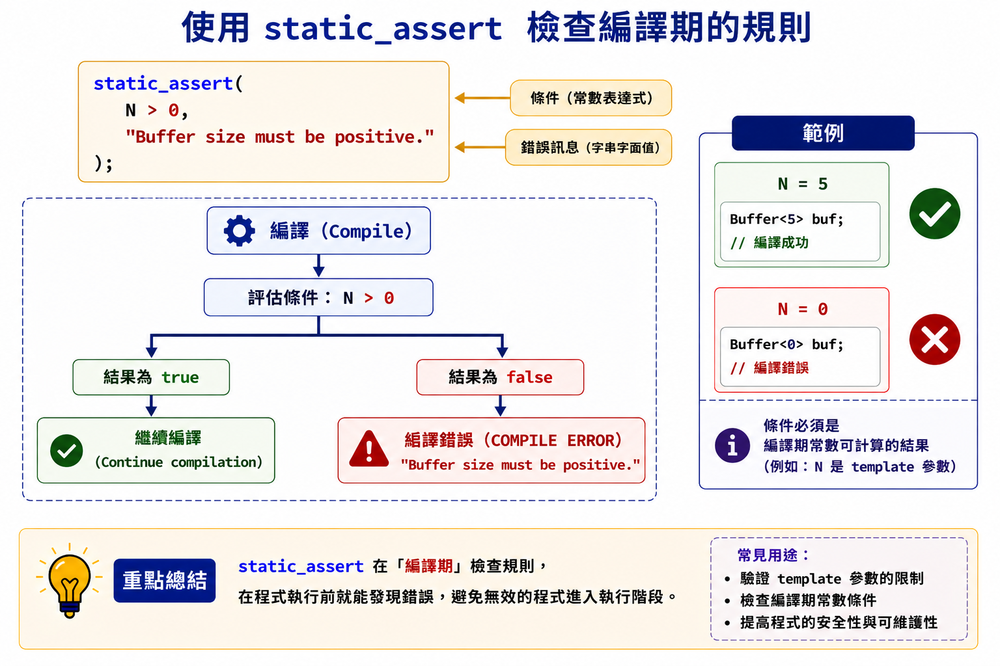
</p>

```cpp
static_assert(
    condition,
    "message"
);
```

若條件為 false，編譯失敗。

---

## Section LX. 完整基本範例

```cpp
// VALIDATE
#include <cstddef>
#include <iostream>
using namespace std;

template <
    typename T,
    size_t N
>
class FixedBuffer {
public:
    static_assert(
        N > 0,
        "Buffer size must be positive."
    );

    constexpr size_t size() const {
        return N;
    }

private:
    T values[N]{};
};

int main() {
    FixedBuffer<int, 5> buffer;

    cout << buffer.size()
         << '\n';

    return 0;
}
```

---

# Part Z：自訂型別與模板

## Section LXI. 自訂型別要支援需求操作

```cpp
maximum(
    firstPoint,
    secondPoint
)
```

若模板使用 `<`，Point 必須提供比較方式。

---

## Section LXII. 以普通函式提供比較

本章不深入運算子多載，因此可改寫模板接受 comparator，或先建立可比較的自訂型別。

---

## Section LXIII. Comparator Template

<p align="center">
  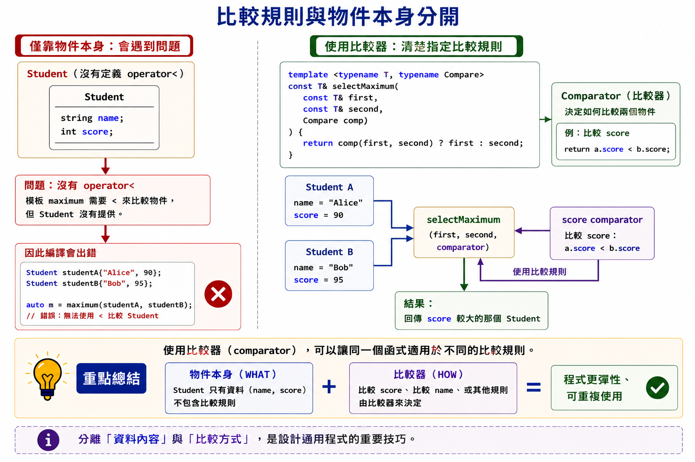
</p>

```cpp
template <
    typename T,
    typename Compare
>
const T& selectMaximum(
    const T& first,
    const T& second,
    Compare compare
)
```

---

## Section LXIV. 完整 Comparator 版本

```cpp
// VALIDATE
#include <iostream>
#include <string>
using namespace std;

struct Student {
    string name;
    double score;
};

template <
    typename T,
    typename Compare
>
const T& selectMaximum(
    const T& first,
    const T& second,
    Compare lessThan
) {
    if (
        lessThan(
            first,
            second
        )
    ) {
        return second;
    }

    return first;
}

int main() {
    Student first{
        "Amy",
        90.0
    };

    Student second{
        "Brian",
        95.0
    };

    const Student& result =
        selectMaximum(
            first,
            second,
            [](
                const Student& left,
                const Student& right
            ) {
                return
                    left.score <
                    right.score;
            }
        );

    cout << result.name
         << '\n';

    return 0;
}
```

---

# Part AA：避免過度泛化

## Section LXV. 不一定都要模板

若函式只有一種合理型別：

```cpp
double calculateTax(
    double income
);
```

不一定需要模板。

---

## Section LXVI. 適合模板的情況

- 演算法邏輯相同。
- 多種型別共享必要操作。
- 型別差異不影響核心規則。
- 呼叫者能理解型別要求。

---

## Section LXVII. 不適合模板的情況

- 不同型別行為實際不同。
- 模板需要大量特殊判斷。
- 只有一個實際使用型別。
- 錯誤訊息與複雜度超過收益。
- 執行期需要混合不同型別物件。

---

# Part AB：快速概念檢查

## Section LXVIII. 選擇題與簡答

### Q1. 什麼是函式模板？

<details><summary>查看答案</summary>

描述一組可依不同型別實例化的函式規則。

</details>

### Q2. `typename T` 代表什麼？

<details><summary>查看答案</summary>

`T` 是一個型別模板參數。

</details>

### Q3. `class T` 與 `typename T` 在模板參數列表有差別嗎？

<details><summary>查看答案</summary>

在型別模板參數位置沒有差別。

</details>

### Q4. 什麼是模板實例化？

<details><summary>查看答案</summary>

編譯器依實際模板參數產生具體函式或類別版本。

</details>

### Q5. 為什麼 `maximum(3, 5.5)` 可能推導失敗？

<details><summary>查看答案</summary>

同一個 `T` 被第一個參數推導為 `int`，第二個參數推導為 `double`。

</details>

### Q6. 如何顯式指定模板參數？

<details><summary>查看答案</summary>

```cpp
maximum<double>(
    3,
    5.5
);
```

</details>

### Q7. 類別模板建立物件時如何指定型別？

<details><summary>查看答案</summary>

```cpp
Box<int> box;
```

</details>

### Q8. 什麼是非型別模板參數？

<details><summary>查看答案</summary>

在編譯期提供的值，例如固定大小 `N`。

</details>

### Q9. 為什麼 `typename vector<T>::size_type` 需要 `typename`？

<details><summary>查看答案</summary>

因為它是依賴模板參數的名稱，編譯器需要明確知道它代表型別。

</details>

### Q10. 模板定義為什麼通常放在 header？

<details><summary>查看答案</summary>

編譯器在實例化模板時通常必須看到完整定義。

</details>

### Q11. 函式模板可多載嗎？

<details><summary>查看答案</summary>

可以。

</details>

### Q12. 一般函式可與模板函式同名嗎？

<details><summary>查看答案</summary>

可以，編譯器透過多載解析選擇最佳匹配。

</details>

### Q13. 泛型總和模板對 T 有什麼需求？

<details><summary>查看答案</summary>

通常需要可預設初始化，且支援 `+=`。

</details>

### Q14. 什麼是完整特化？

<details><summary>查看答案</summary>

針對某個特定模板參數組合提供完全不同實作。

</details>

### Q15. 模板通常屬於哪種多型？

<details><summary>查看答案</summary>

編譯期多型。

</details>

### Q16. Virtual 通常屬於哪種多型？

<details><summary>查看答案</summary>

執行期多型。

</details>

### Q17. 什麼是 code bloat？

<details><summary>查看答案</summary>

模板對多個型別產生多份機器碼，造成程式大小增加的可能性。

</details>

### Q18. `static_assert` 在何時檢查？

<details><summary>查看答案</summary>

編譯期。

</details>

### Q19. 泛型 lambda 用什麼作為參數型別？

<details><summary>查看答案</summary>

可使用 `auto`。

</details>

### Q20. 什麼時候不應使用模板？

<details><summary>查看答案</summary>

當型別行為其實不同、只有單一合理型別，或模板複雜度大於重用收益時。

</details>

---

# Part AC：程式閱讀練習

## Section LXIX. 預測結果與合法性

### 題目 1

```cpp
template <typename T>
T doubleValue(T value) {
    return value + value;
}

cout << doubleValue(5);
```

<details><summary>查看答案</summary>

```text
10
```

`T = int`。

</details>

### 題目 2

```cpp
template <typename T>
T maximum(T first, T second) {
    return
        first < second
            ? second
            : first;
}

cout << maximum(
            2.5,
            4.0
        );
```

<details><summary>查看答案</summary>

```text
4
```

實際顯示格式由串流設定決定。

</details>

### 題目 3

```cpp
template <typename T>
void change(T value) {
    value = T{};
}

int number = 10;
change(number);

cout << number;
```

<details><summary>查看答案</summary>

```text
10
```

參數按值傳入。

</details>

### 題目 4

```cpp
template <typename T>
void change(T& value) {
    value = T{};
}

int number = 10;
change(number);

cout << number;
```

<details><summary>查看答案</summary>

```text
0
```

參數按參考傳入。

</details>

### 題目 5

```cpp
template <typename T>
class Box {
public:
    explicit Box(T value)
        : stored(value) {
    }

    T get() const {
        return stored;
    }

private:
    T stored;
};

Box<int> box(42);
cout << box.get();
```

<details><summary>查看答案</summary>

```text
42
```

</details>

### 題目 6

```cpp
template <
    typename T,
    size_t N
>
class Data {
public:
    size_t size() const {
        return N;
    }
};

Data<int, 5> data;
cout << data.size();
```

<details><summary>查看答案</summary>

```text
5
```

</details>

### 題目 7

```cpp
template <typename T>
T add(T first, T second) {
    return first + second;
}

/* cout << add(
    3,
    4.5
); */
```

<details><summary>查看答案</summary>

可能無法推導唯一 `T`。可使用：

```cpp
add<double>(
    3,
    4.5
);
```

</details>

### 題目 8

```cpp
template <typename T>
class Holder {
public:
    typename vector<T>::size_type
    count() const {
        return values.size();
    }

private:
    vector<T> values;
};
```

<details><summary>查看答案</summary>

`typename` 必須存在，因為 `vector<T>::size_type` 是相依型別。

</details>

### 題目 9

```cpp
auto show =
    [](const auto& value) {
        cout << value;
    };

show(10);
show(string("Hi"));
```

<details><summary>查看答案</summary>

輸出：

```text
10Hi
```

沒有額外空格或換行。

</details>

### 題目 10

```cpp
template <typename T>
class Printer {
public:
    static void print(T value) {
        cout << "general";
    }
};

template <>
class Printer<bool> {
public:
    static void print(bool value) {
        cout << "bool";
    }
};

Printer<bool>::print(true);
```

<details><summary>查看答案</summary>

```text
bool
```

使用 `Printer<bool>` 完整特化。

</details>

### 題目 11

```cpp
template <typename T = int>
class Box {
};

Box<> first;
Box<double> second;
```

<details><summary>查看答案</summary>

合法。`first` 使用 `int`，`second` 使用 `double`。

</details>

### 題目 12

```cpp
template <typename T>
T maximum(
    const T& first,
    const T& second
) {
    return
        first < second
            ? second
            : first;
}

struct Data {
    int value;
};

Data first{1};
Data second{2};

/* maximum(
    first,
    second
); */
```

<details><summary>查看答案</summary>

`Data` 沒有提供可用的 `<`，因此實例化此模板時會失敗。

</details>

---

# Part AD：實作練習

## Section LXX. 實作檢測題

### TODO 1：Generic Minimum

建立：

```cpp
template <typename T>
T minimum(
    const T& first,
    const T& second
)
```

### TODO 2：Generic Clamp

建立將數值限制於 `[lower, upper]` 的模板函式。

### TODO 3：Generic Swap

使用參考交換兩個相同型別物件。

### TODO 4：Two-Type Add

建立接受兩種型別並使用 `auto` 回傳的相加模板。

### TODO 5：Box

建立具有 getter 與 setter 的 `Box<T>`。

### TODO 6：Pair

建立可保存兩種不同型別的 `Pair<First, Second>`。

### TODO 7：模板別名

建立：

```cpp
using StringBox =
    Box<string>;
```

### TODO 8：Fixed Buffer

使用 `template <typename T, size_t N>` 與 `std::array`。

### TODO 9：Print Vector

建立可列印 `vector<T>` 的模板函式。

### TODO 10：Sum Vector

建立可計算 `vector<T>` 總和的模板函式。

### TODO 11：Find Index

建立泛型 vector 搜尋函式，正確使用 `typename`。

### TODO 12：Print Range

建立接受兩個迭代器的列印函式。

### TODO 13：Generic Lambda

使用 `auto` 參數建立可輸出不同型別的 lambda。

### TODO 14：Full Specialization

為 `Printer<bool>` 建立輸出 `true`／`false` 的完整特化。

### TODO 15：Comparator Template

建立接受 comparator 的 `selectMaximum()`。

---

# Part AE：課後小練習

## Section LXXI. 延伸練習

### 練習 1：Generic Average

建立泛型平均函式，並思考整數輸入時回傳型別。

### 練習 2：Matrix Template

建立 `Matrix<T, Rows, Columns>`，使用 `std::array` 保存資料。

### 練習 3：Stack Template

使用 `std::vector<T>` 建立簡易 Stack 類別模板。

### 練習 4：Generic Filter

建立接受容器與 predicate 的過濾函式，回傳新 vector。

### 練習 5：Header Split

將 `Box<T>` 拆成 `.hpp` 與 `.tpp`，確認不同型別仍可成功編譯。

---

# Part AF：常見錯誤提醒

## Section LXXII. 常見錯誤

1. 忘記在函式前寫 `template <typename T>`。
2. 將 `typename` 拼錯。
3. 誤以為模板本身就是單一具體函式。
4. 期待不同參數型別自動推導成同一 T。
5. 沒有顯式指定型別解決推導衝突。
6. 使用模板型別不支援的運算子。
7. 泛型函式按值傳入大型物件造成不必要複製。
8. 需要修改原物件卻忘記 `&`。
9. 回傳參考指向區域物件。
10. 類別模板建立物件時忘記模板參數。
11. 類別外定義成員時忘記 template 宣告。
12. 類別外定義時漏寫 `ClassName<T>::`。
13. 相依型別前漏寫 `typename`。
14. 非型別模板參數使用執行期變數。
15. `std::array<T, N>` 的 N 不是編譯期常數。
16. 模板預設參數造成介面難懂。
17. 過度使用完整特化。
18. 期待函式模板可以像類別模板一樣任意偏特化。
19. 模板定義只放 `.cpp` 導致連結錯誤。
20. 模板錯誤訊息很長時沒有先縮小測試案例。
21. 泛型總和錯誤假設 `T{}` 一定是正確零值。
22. 泛型列印錯誤假設所有型別都支援 `operator<<`。
23. 泛型比較錯誤假設所有型別都支援 `<`。
24. 模板參數名稱過於模糊。
25. 模板介面沒有說明型別需求。
26. 只使用一種型別卻建立複雜模板。
27. 使用模板取代更合適的 virtual 介面。
28. 忽略模板可能增加編譯時間。
29. 使用特化造成不同型別行為不一致。
30. 在尚未理解基礎模板前直接使用複雜 SFINAE。

---

# Part AG：Mermaid 流程圖

## Section LXXIII. 模板基礎流程圖

### 1. 函式模板實例化

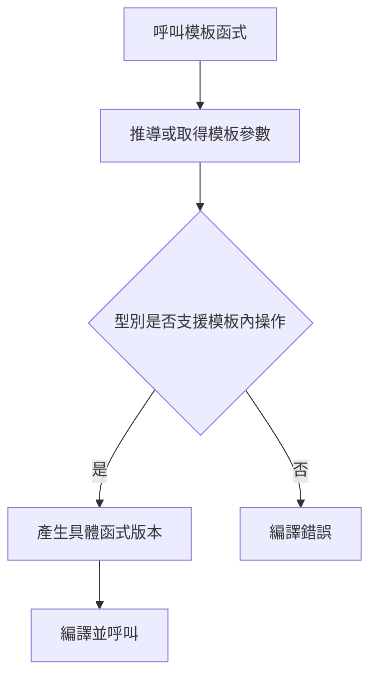
```mermaid
flowchart TD
    A[呼叫模板函式] --> B[推導或取得模板參數]
    B --> C{型別是否支援模板內操作}
    C -- 是 --> D[產生具體函式版本]
    D --> E[編譯並呼叫]
    C -- 否 --> F[編譯錯誤]
```

### 2. 型別推導

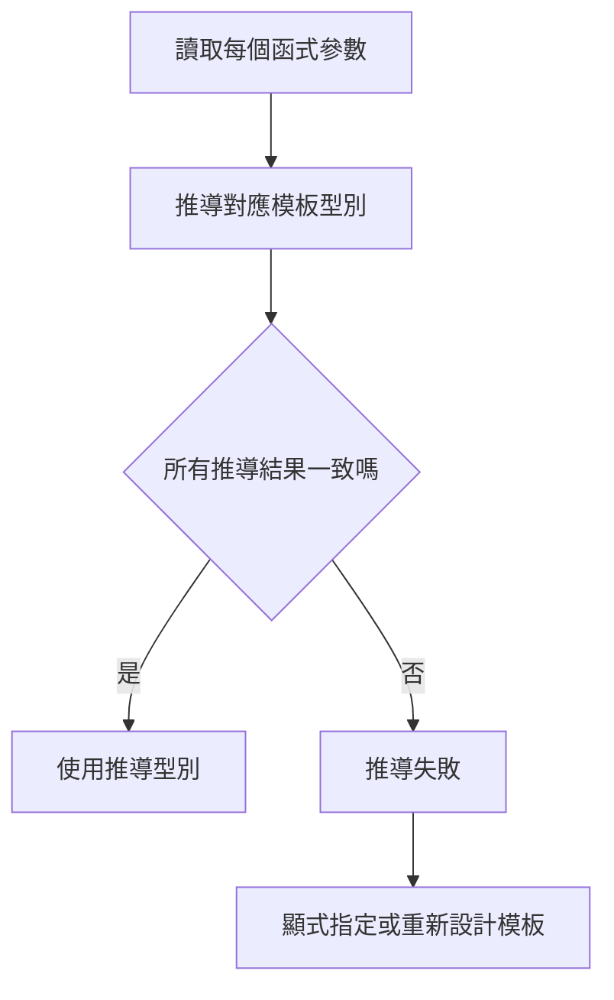
```mermaid
flowchart TD
    A[讀取每個函式參數] --> B[推導對應模板型別]
    B --> C{所有推導結果一致嗎}
    C -- 是 --> D[使用推導型別]
    C -- 否 --> E[推導失敗]
    E --> F[顯式指定或重新設計模板]
```

### 3. 類別模板

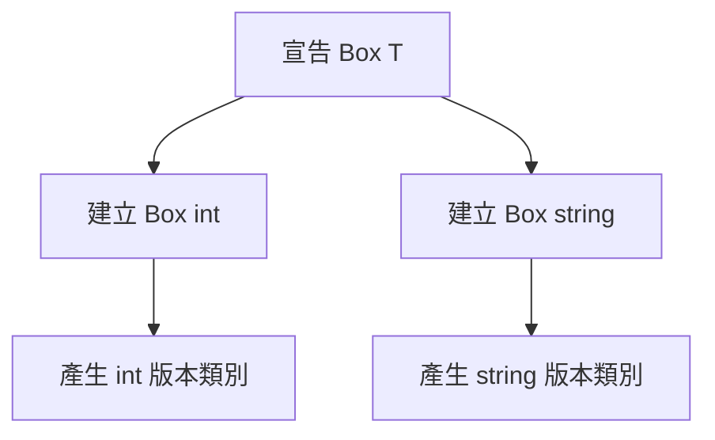
```mermaid
flowchart TD
    A[宣告 Box T] --> B[建立 Box int]
    A --> C[建立 Box string]
    B --> D[產生 int 版本類別]
    C --> E[產生 string 版本類別]
```

### 4. 相依型別

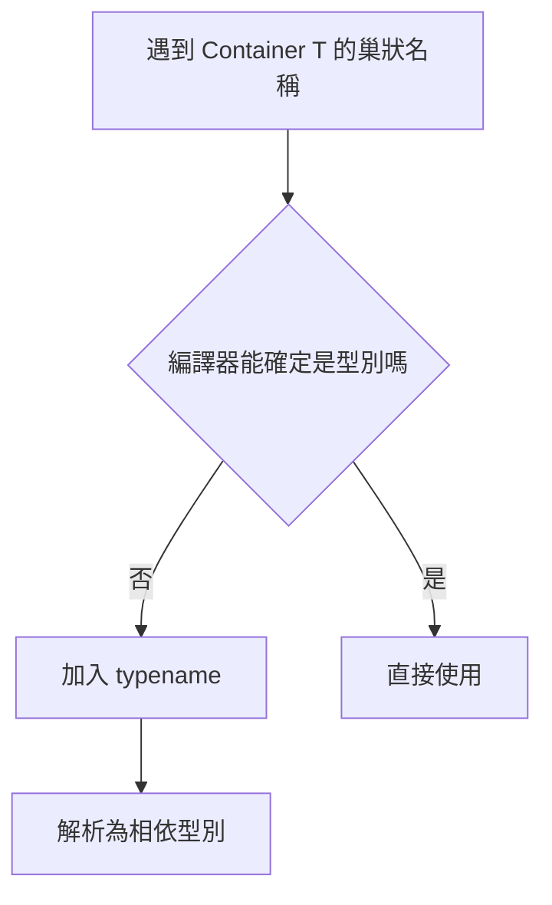
```mermaid
flowchart TD
    A[遇到 Container T 的巢狀名稱] --> B{編譯器能確定是型別嗎}
    B -- 否 --> C[加入 typename]
    B -- 是 --> D[直接使用]
    C --> E[解析為相依型別]
```

### 5. 非型別模板參數

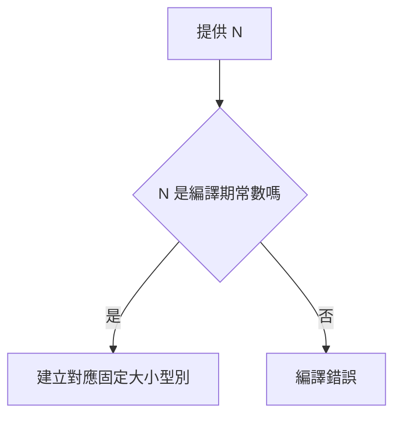
```mermaid
flowchart TD
    A[提供 N] --> B{N 是編譯期常數嗎}
    B -- 是 --> C[建立對應固定大小型別]
    B -- 否 --> D[編譯錯誤]
```

### 6. 模板與 Virtual 選擇

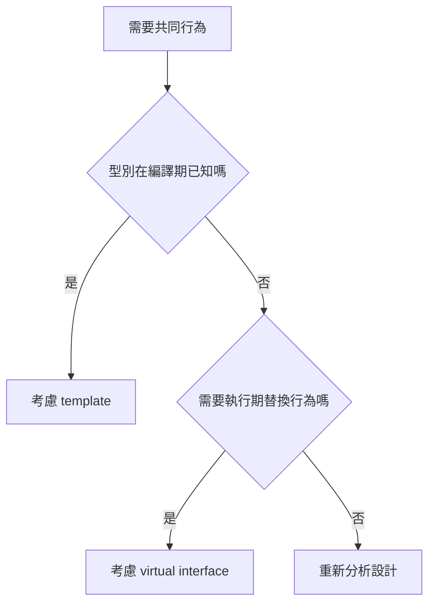
```mermaid
flowchart TD
    A[需要共同行為] --> B{型別在編譯期已知嗎}
    B -- 是 --> C[考慮 template]
    B -- 否 --> D{需要執行期替換行為嗎}
    D -- 是 --> E[考慮 virtual interface]
    D -- 否 --> F[重新分析設計]
```

### 7. 模板檔案配置

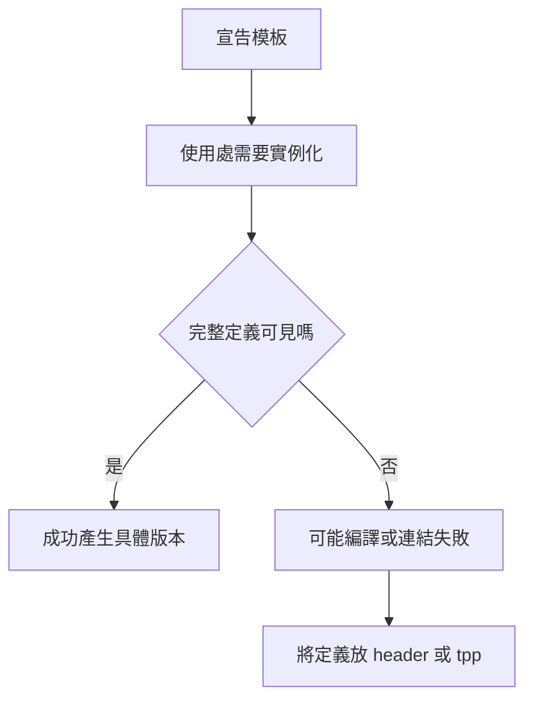
```mermaid
flowchart TD
    A[宣告模板] --> B[使用處需要實例化]
    B --> C{完整定義可見嗎}
    C -- 是 --> D[成功產生具體版本]
    C -- 否 --> E[可能編譯或連結失敗]
    E --> F[將定義放 header 或 tpp]
```

### 8. 是否使用模板

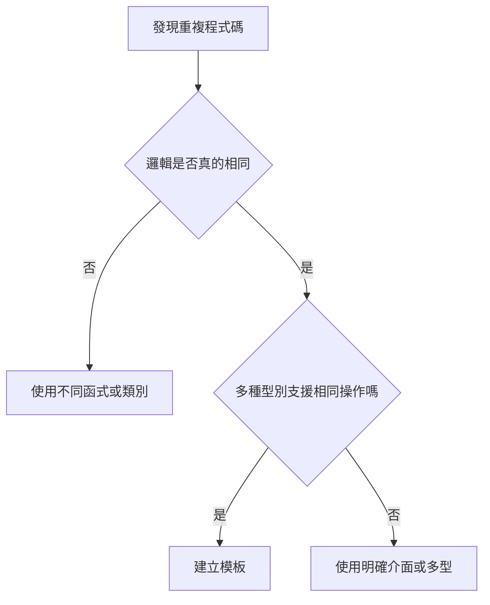
```mermaid
flowchart TD
    A[發現重複程式碼] --> B{邏輯是否真的相同}
    B -- 否 --> C[使用不同函式或類別]
    B -- 是 --> D{多種型別支援相同操作嗎}
    D -- 是 --> E[建立模板]
    D -- 否 --> F[使用明確介面或多型]
```

---

# 本章完成標準

完成本章後，你應該能做到：

1. 說明 generic programming。
2. 說明模板與實例化。
3. 撰寫函式模板。
4. 使用 `typename T`。
5. 使用型別推導。
6. 顯式指定模板參數。
7. 處理模板推導衝突。
8. 使用多個型別模板參數。
9. 使用 `auto` 回傳型別。
10. 撰寫泛型交換函式。
11. 使用函式模板多載。
12. 比較一般函式與模板函式。
13. 撰寫類別模板。
14. 建立 `Box<int>` 與 `Box<string>`。
15. 使用多個類別模板參數。
16. 在類別外定義模板成員。
17. 使用模板別名。
18. 使用非型別模板參數。
19. 結合 `std::array<T, N>`。
20. 使用模板預設參數。
21. 建立泛型 vector 函式。
22. 建立泛型總和函式。
23. 建立泛型搜尋函式。
24. 使用相依型別與 `typename`。
25. 建立 iterator-based 模板。
26. 使用泛型 lambda。
27. 說明完整特化。
28. 為特定型別建立完整特化。
29. 比較編譯期與執行期多型。
30. 說明模板定義為何通常放 header。
31. 說明模板型別需求。
32. 使用 `static_assert`。
33. 認識 SFINAE。
34. 認識 C++20 concepts。
35. 避免模板過度泛化。
36. 使用 comparator 擴充泛型函式。
37. 測試內建型別。
38. 測試字串與容器。
39. 測試自訂型別。
40. 找出常見模板錯誤。

---

# 隱藏答案區

> Answer hidden — try it first.

<details><summary>TODO 1 答案</summary>

```cpp
template <typename T>
T minimum(
    const T& first,
    const T& second
) {
    if (second < first) {
        return second;
    }

    return first;
}
```

</details>

<details><summary>TODO 2 答案</summary>

```cpp
template <typename T>
T clampValue(
    const T& value,
    const T& lower,
    const T& upper
) {
    if (value < lower) {
        return lower;
    }

    if (upper < value) {
        return upper;
    }

    return value;
}
```

</details>

<details><summary>TODO 3 答案</summary>

```cpp
template <typename T>
void swapValues(
    T& first,
    T& second
) {
    T temporary =
        first;

    first =
        second;

    second =
        temporary;
}
```

</details>

<details><summary>TODO 4 答案</summary>

```cpp
template <
    typename FirstType,
    typename SecondType
>
auto add(
    const FirstType& first,
    const SecondType& second
) {
    return first + second;
}
```

</details>

<details><summary>TODO 5 答案</summary>

```cpp
template <typename T>
class Box {
public:
    explicit Box(
        const T& initialValue
    )
        : storedValue(
              initialValue
          ) {
    }

    const T& value() const {
        return storedValue;
    }

    void setValue(
        const T& newValue
    ) {
        storedValue =
            newValue;
    }

private:
    T storedValue;
};
```

</details>

<details><summary>TODO 6 答案</summary>

```cpp
template <
    typename FirstType,
    typename SecondType
>
class Pair {
public:
    Pair(
        const FirstType& first,
        const SecondType& second
    )
        : firstValue(first),
          secondValue(second) {
    }

private:
    FirstType firstValue;
    SecondType secondValue;
};
```

</details>

<details><summary>TODO 7 答案</summary>

```cpp
using StringBox =
    Box<string>;
```

</details>

<details><summary>TODO 8 答案</summary>

```cpp
template <
    typename T,
    size_t N
>
class Buffer {
private:
    array<T, N> values{};
};
```

</details>

<details><summary>TODO 9 答案</summary>

```cpp
template <typename T>
void printVector(
    const vector<T>& values
) {
    for (
        const T& value :
        values
    ) {
        cout << value
             << " ";
    }

    cout << '\n';
}
```

</details>

<details><summary>TODO 10 答案</summary>

```cpp
template <typename T>
T sumVector(
    const vector<T>& values
) {
    T total{};

    for (
        const T& value :
        values
    ) {
        total += value;
    }

    return total;
}
```

</details>

<details><summary>TODO 11 答案</summary>

```cpp
template <typename T>
bool findIndex(
    const vector<T>& values,
    const T& target,
    typename vector<T>::size_type&
        resultIndex
) {
    for (
        typename vector<T>::size_type
            index = 0;
        index < values.size();
        ++index
    ) {
        if (
            values[index] ==
            target
        ) {
            resultIndex =
                index;

            return true;
        }
    }

    return false;
}
```

</details>

<details><summary>TODO 12 答案</summary>

```cpp
template <typename Iterator>
void printRange(
    Iterator first,
    Iterator last
) {
    while (
        first !=
        last
    ) {
        cout << *first
             << " ";

        ++first;
    }

    cout << '\n';
}
```

</details>

<details><summary>TODO 13 答案</summary>

```cpp
auto show =
    [](const auto& value) {
        cout << value
             << '\n';
    };
```

</details>

<details><summary>TODO 14 答案</summary>

```cpp
template <>
class Printer<bool> {
public:
    static void print(
        bool value
    ) {
        cout << (
                    value
                        ? "true"
                        : "false"
                )
             << '\n';
    }
};
```

</details>

<details><summary>TODO 15 答案</summary>

```cpp
template <
    typename T,
    typename Compare
>
const T& selectMaximum(
    const T& first,
    const T& second,
    Compare lessThan
) {
    if (
        lessThan(
            first,
            second
        )
    ) {
        return second;
    }

    return first;
}
```

</details>
