# Lesson 25：STL Containers STL 容器

<p align="center">
  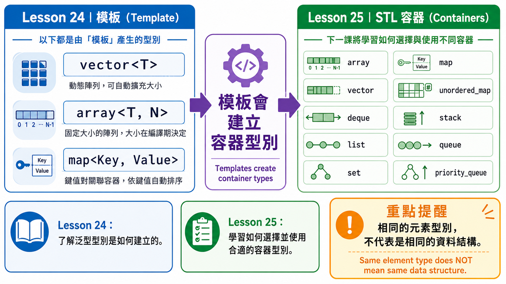
</p>

> 這堂課的重點：認識 C++ 標準模板函式庫中的主要容器，理解每種容器的資料結構特性、常用操作、時間複雜度、迭代器能力與失效規則，並根據實際需求選擇合適容器。

> 本章延續 `std::array`、`std::vector`、模板與 `<algorithm>`。STL 容器不是「越進階越好」，而是每種容器都針對不同操作做取捨。選擇容器時，應先分析資料是否需要排序、是否允許重複、是否依鍵查詢、是否頻繁在中間插入，以及是否需要連續記憶體。

---

## Section I. 今天要做什麼？

<p align="center">
  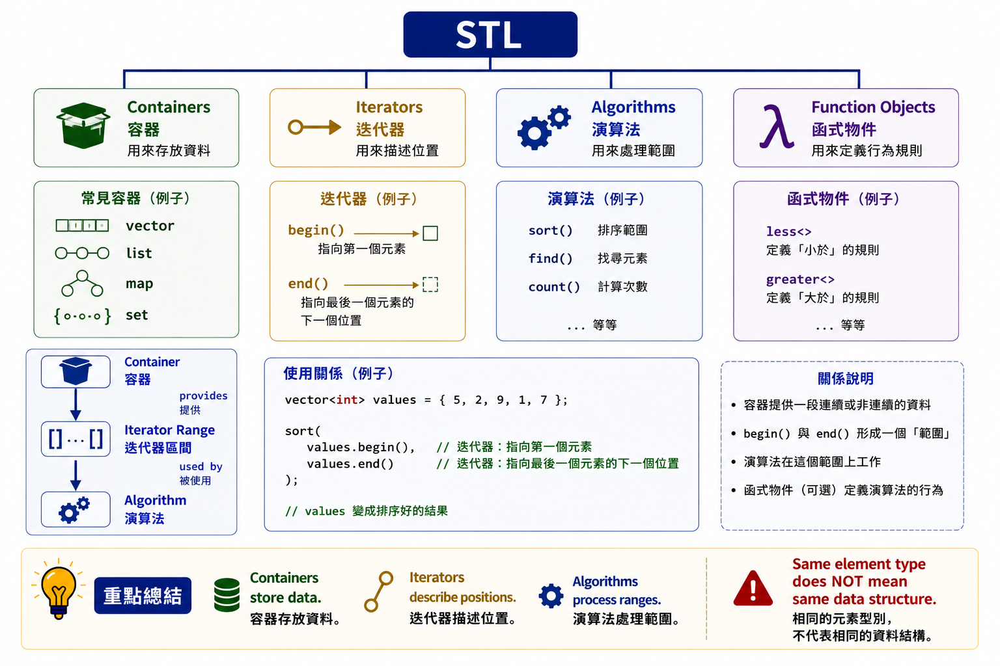
</p>

1. 認識 STL。
2. 理解 STL 的主要組成。
3. 認識 container。
4. 認識 iterator。
5. 認識 algorithm。
6. 認識 function object。
7. 理解容器保存同型別元素。
8. 理解不同容器有不同資料結構。
9. 比較 sequence container。
10. 比較 associative container。
11. 比較 unordered associative container。
12. 認識 container adaptor。
13. 複習 `std::array`。
14. 複習 `std::vector`。
15. 認識 `std::deque`。
16. 認識 `std::list`。
17. 認識 `std::forward_list`。
18. 認識 `std::set`。
19. 認識 `std::multiset`。
20. 認識 `std::map`。
21. 認識 `std::multimap`。
22. 認識 `std::unordered_set`。
23. 認識 `std::unordered_multiset`。
24. 認識 `std::unordered_map`。
25. 認識 `std::unordered_multimap`。
26. 認識 `std::stack`。
27. 認識 `std::queue`。
28. 認識 `std::priority_queue`。
29. 理解固定大小與動態大小。
30. 理解連續儲存。
31. 理解節點式儲存。
32. 理解排序式儲存。
33. 理解雜湊式儲存。
34. 理解唯一鍵 unique key。
35. 理解重複鍵 duplicate key。
36. 理解 key-value pair。
37. 使用 `std::pair`。
38. 使用 `.first` 與 `.second`。
39. 使用 structured binding。
40. 使用 `auto [key, value]`。
41. 理解 map element 是 pair。
42. 理解 map key 通常不可修改。
43. 使用 `.size()`。
44. 使用 `.empty()`。
45. 使用 `.clear()`。
46. 使用 `.insert()`。
47. 使用 `.emplace()`。
48. 使用 `.erase()`。
49. 使用 `.find()`。
50. 使用 `.count()`。
51. 使用 `.contains()` 概念預告。
52. 理解 C++20 才有 `contains()`。
53. 使用 `.lower_bound()`。
54. 使用 `.upper_bound()`。
55. 使用 `.equal_range()`。
56. 比較容器成員 `find()` 與 `std::find()`。
57. 理解 associative container 應優先用成員 `find()`。
58. 理解 unordered container 應優先用成員 `find()`。
59. 使用 map `operator[]`。
60. 理解 `operator[]` 找不到鍵時會插入預設值。
61. 使用 `.at()`。
62. 理解 `.at()` 找不到鍵時丟出例外。
63. 使用 `.insert_or_assign()`。
64. 使用 `.try_emplace()`。
65. 避免不必要的預設建構。
66. 理解 set 不允許重複值。
67. 理解 multiset 允許重複值。
68. 理解 map 不允許重複鍵。
69. 理解 multimap 允許重複鍵。
70. 理解 unordered 容器沒有排序保證。
71. 理解 unordered 容器輸出順序不穩定。
72. 認識 hash function。
73. 認識 bucket。
74. 認識 load factor。
75. 使用 `.load_factor()`。
76. 使用 `.max_load_factor()` 概念。
77. 使用 `.reserve()` 預留 bucket。
78. 理解 rehash。
79. 理解 rehash 可能使迭代器失效。
80. 認識 iterator invalidation。
81. 比較 vector 失效規則。
82. 比較 deque 失效規則。
83. 比較 list 失效規則。
84. 比較 associative container 失效規則。
85. 比較 unordered container 失效規則。
86. 理解 erase 只使被刪元素失效的常見情況。
87. 理解 vector reallocation 使全部元素位置失效。
88. 理解 list 節點穩定性。
89. 理解 deque 中間插入可能使大量位置失效。
90. 認識 iterator category。
91. 認識 random access iterator。
92. 認識 bidirectional iterator。
93. 認識 forward iterator。
94. 理解 vector、deque 支援 random access。
95. 理解 list 支援 bidirectional。
96. 理解 forward_list 只支援 forward。
97. 理解 ordered associative container 支援 bidirectional。
98. 理解 unordered container 支援 forward。
99. 認識容器操作複雜度。
100. 理解 `O(1)`。
101. 理解 `O(log n)`。
102. 理解平均 `O(1)`。
103. 理解最壞 `O(n)`。
104. 理解攤銷 `O(1)`。
105. 比較尾端插入。
106. 比較前端插入。
107. 比較中間插入。
108. 比較依索引存取。
109. 比較依鍵查詢。
110. 比較排序維持成本。
111. 比較記憶體額外成本。
112. 使用 `std::array` 固定大小。
113. 使用 `std::vector` 動態連續資料。
114. 使用 `std::deque` 雙端快速插入。
115. 使用 `std::list` 穩定節點與中間操作。
116. 使用 `std::forward_list` 單向節點。
117. 使用 `std::set` 保存排序唯一值。
118. 使用 `std::multiset` 保存排序重複值。
119. 使用 `std::map` 保存排序 key-value。
120. 使用 `std::multimap` 保存排序重複鍵。
121. 使用 `std::unordered_set` 快速唯一查詢。
122. 使用 `std::unordered_map` 快速 key-value 查詢。
123. 使用 `std::stack` LIFO。
124. 使用 `std::queue` FIFO。
125. 使用 `std::priority_queue` 最高優先權先出。
126. 理解 adaptor 不直接提供 iterator。
127. 理解 stack 底層預設使用 deque。
128. 理解 queue 底層預設使用 deque。
129. 理解 priority_queue 底層預設使用 vector。
130. 使用自訂 comparator 建立 min-heap。
131. 使用 `greater<>` 建立最小優先佇列。
132. 加入 `<functional>`。
133. 使用 `.top()`。
134. 使用 `.front()`。
135. 使用 `.back()`。
136. 使用 `.push()`。
137. 使用 `.emplace()`。
138. 使用 `.pop()`。
139. 理解 pop 不回傳被移除值。
140. 先讀取再 pop。
141. 避免對空 adaptor 使用 top/front/back/pop。
142. 使用 list `.remove()`。
143. 使用 list `.remove_if()`。
144. 使用 list `.sort()`。
145. 使用 list `.unique()`。
146. 使用 list `.merge()`。
147. 使用 list `.splice()`。
148. 理解 list 不支援 `std::sort()`。
149. 理解 list iterator 不是 random access。
150. 使用 list 成員 `sort()`。
151. 使用 forward_list `.before_begin()`。
152. 使用 forward_list `.insert_after()`。
153. 使用 forward_list `.erase_after()`。
154. 理解 forward_list 沒有 `.size()` 的歷史設計考量。
155. 理解 C++17 `forward_list` 沒有 `.size()`。
156. 使用 `std::distance()` 計算元素數量。
157. 使用 deque `push_front()`。
158. 使用 deque `push_back()`。
159. 使用 deque `pop_front()`。
160. 使用 deque `pop_back()`。
161. 理解 deque 不保證整體連續記憶體。
162. 避免將 deque `.data()` 當作可用介面。
163. 比較 vector 與 deque。
164. 比較 set 與 unordered_set。
165. 比較 map 與 unordered_map。
166. 比較 vector 搜尋與 set 搜尋。
167. 理解小資料量時 vector 可能更快。
168. 理解 cache locality。
169. 不只依 Big-O 選容器。
170. 使用 `<algorithm>` 與 sequence containers。
171. 理解 `std::sort()` 需要 random access iterator。
172. 理解 list 不支援 `std::sort()`。
173. 使用 `std::find()` 搜尋 vector。
174. 使用 `.find()` 搜尋 map。
175. 使用 range-based `for`。
176. 使用 `const auto&`。
177. 使用 structured binding 走訪 map。
178. 使用 `auto& [key, value]` 修改 mapped value。
179. 理解 map key 為 const。
180. 使用 `const auto& [key, value]` 唯讀走訪。
181. 使用 erase while iterating。
182. 正確接收 erase 回傳迭代器。
183. 避免刪除後再遞增失效迭代器。
184. 使用 C++17 associative erase pattern。
185. 使用 unordered erase pattern。
186. 認識 erase_if C++20 概念預告。
187. 使用自訂型別作為 set key。
188. 提供 comparator。
189. 使用 lambda comparator 型別。
190. 認識 `decltype(comparator)`。
191. 使用自訂型別作為 unordered key。
192. 需要 hash function。
193. 需要 equality comparison。
194. 不在本章深入自訂 hash。
195. 認識 allocator。
196. 不在本章深入 allocator。
197. 認識 node handle C++17。
198. 不在本章深入 extract/merge。
199. 使用容器巢狀組合。
200. 建立 `map<string, vector<int>>`。
201. 建立 adjacency list。
202. 建立 frequency table。
203. 建立 inverted index。
204. 建立 leaderboard。
205. 建立 task queue。
206. 建立 undo stack。
207. 建立 event priority queue。
208. 避免使用容器保存懸空指標。
209. 避免修改 set key。
210. 避免依賴 unordered 順序。
211. 避免 map `operator[]` 做唯讀查詢。
212. 避免把所有資料都放 map。
213. 避免不必要的 list。
214. 避免只因中間插入就選 list。
215. 先分析是否已知插入位置。
216. 先分析是否需要隨機存取。
217. 先分析是否需要排序。
218. 先分析是否允許重複。
219. 先分析鍵和值的關係。
220. 使用概念檢查、程式閱讀與實作題整合本章。

---

## Section II. 今天的學習方式

1. 選容器前先回答：
   ```text
   需要固定大小嗎？
   需要依索引存取嗎？
   需要排序嗎？
   允許重複嗎？
   是保存值還是 key-value？
   需要在哪裡插入與刪除？
   ```
2. 依鍵查詢時優先使用容器成員：
   ```cpp
   container.find(key)
   ```
3. 只在容器支援 random access iterator 時使用：
   ```cpp
   std::sort()
   ```
4. 遍歷 map 時優先使用 structured binding：
   ```cpp
   for (const auto& [key, value] : data)
   ```
5. 刪除迭代器指向元素時使用：
   ```cpp
   iterator = container.erase(iterator);
   ```
6. 使用 map `operator[]` 前先問：
   ```text
   找不到時是否真的要插入？
   ```
7. 對 unordered 容器不要依賴輸出順序。
8. 對 stack、queue、priority_queue 操作前先檢查：
   ```cpp
   !container.empty()
   ```
9. Big-O 不是唯一考量，也要考慮記憶體配置與 cache locality。
10. 所有合法完整程式使用嚴格 C++17 選項檢查。

---

## Section III. STL 容器分類

<p align="center">
  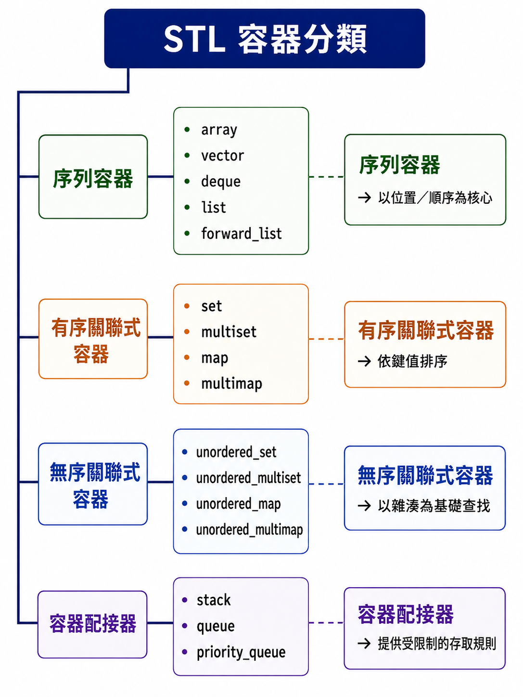
</p>

| 類別 | 容器 |
| --- | --- |
| Fixed sequence | `array` |
| Dynamic sequence | `vector`, `deque`, `list`, `forward_list` |
| Ordered associative | `set`, `multiset`, `map`, `multimap` |
| Unordered associative | `unordered_set`, `unordered_multiset`, `unordered_map`, `unordered_multimap` |
| Adaptors | `stack`, `queue`, `priority_queue` |

---

## Section IV. 核心選擇表

<p align="center">
  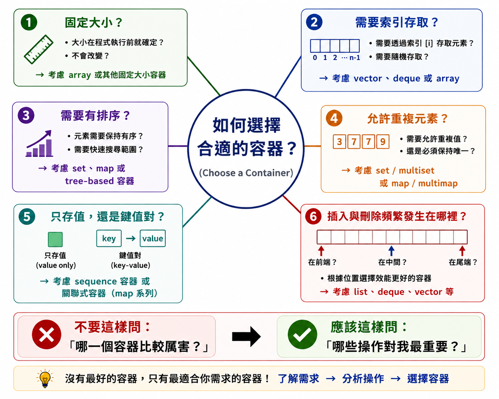
</p>

| 需求 | 常見選擇 |
| --- | --- |
| 固定大小、連續記憶體 | `array` |
| 動態大小、連續記憶體、快速尾端操作 | `vector` |
| 前後端都常插入刪除 | `deque` |
| 已知位置的中間插入刪除、節點穩定 | `list` |
| 單向節點、最低節點介面 | `forward_list` |
| 排序且唯一值 | `set` |
| 排序且允許重複值 | `multiset` |
| 排序 key-value | `map` |
| 排序且重複 key-value | `multimap` |
| 平均快速唯一值查詢 | `unordered_set` |
| 平均快速 key-value 查詢 | `unordered_map` |
| LIFO | `stack` |
| FIFO | `queue` |
| 最高或最低優先權先出 | `priority_queue` |

---

# Part A：`std::array`

<p align="center">
  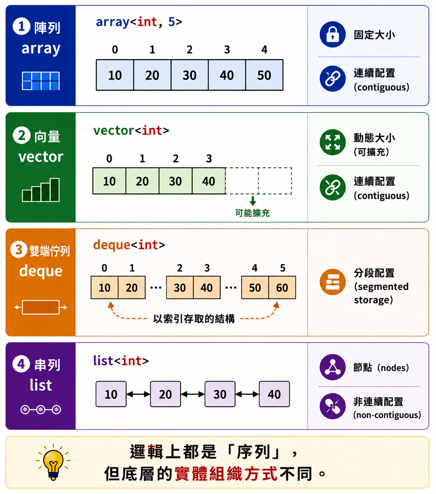
</p>

## Section V. 固定大小容器

```cpp
array<int, 5> values{};
```

特點：

- 大小是型別的一部分。
- 連續記憶體。
- 支援 random access。
- 不支援 `push_back()`。
- 可直接複製與比較。

---

## Section VI. 完整 Array 範例

```cpp
// VALIDATE
#include <array>
#include <iostream>
using namespace std;

int main() {
    array<int, 5> values{
        10,
        20,
        30,
        40,
        50
    };

    cout << values.front()
         << " "
         << values.back()
         << " "
         << values.at(2)
         << '\n';

    return 0;
}
```

---

# Part B：`std::vector`

## Section VII. 動態連續容器

<p align="center">
  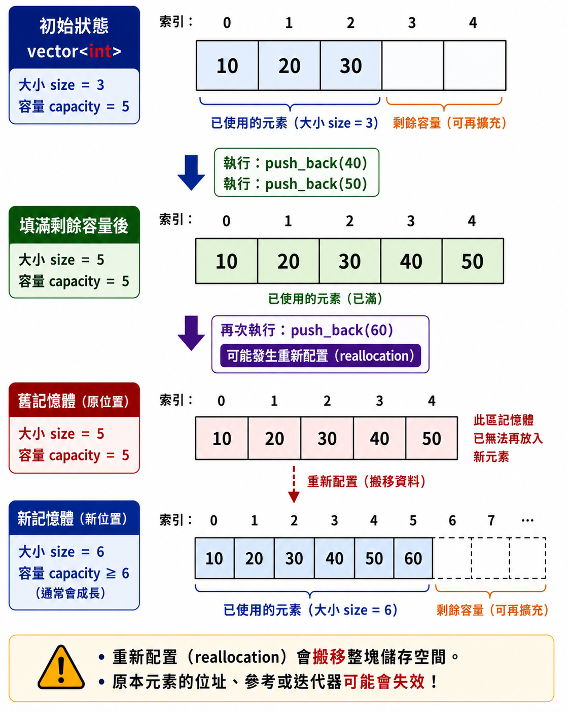
</p>

適合：

- 動態元素數量。
- 快速索引存取。
- 快速尾端加入。
- 與 C API 或連續資料互動。
- 大多數一般用途。

---

## Section VIII. 重要複雜度

| 操作 | 常見複雜度 |
| --- | --- |
| `operator[]` | `O(1)` |
| `push_back()` | 攤銷 `O(1)` |
| 尾端 `pop_back()` | `O(1)` |
| 中間 insert/erase | `O(n)` |
| 線性搜尋 | `O(n)` |

---

# Part C：`std::deque`

## Section IX. Double-Ended Queue

`deque` 支援：

- 前端快速加入與移除。
- 後端快速加入與移除。
- Random access。
- 動態大小。

---

## Section X. 不保證整體連續

雖然：

```cpp
values[index]
```

是 `O(1)`，但整體資料通常分段儲存。

不能假設：

```text
&values[0] + index
```

跨越整個 deque 永遠安全。

---

## Section XI. 完整 Deque 範例

```cpp
// VALIDATE
#include <deque>
#include <iostream>
using namespace std;

int main() {
    deque<int> values;

    values.push_back(20);
    values.push_front(10);
    values.push_back(30);

    cout << values.front()
         << " "
         << values[1]
         << " "
         << values.back()
         << '\n';

    values.pop_front();
    values.pop_back();

    cout << values.front()
         << '\n';

    return 0;
}
```

---

## Section XII. Vector vs Deque

<p align="center">
  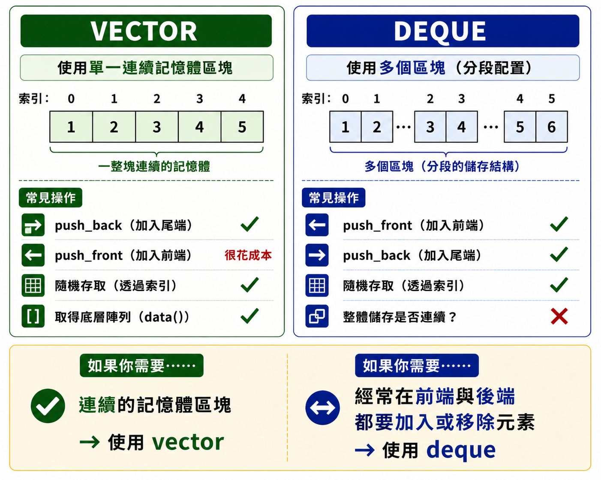
</p>

| 特性 | `vector` | `deque` |
| --- | --- | --- |
| 連續記憶體 | 是 | 不保證 |
| 前端插入 | `O(n)` | `O(1)` |
| 後端插入 | 攤銷 `O(1)` | `O(1)` |
| Random access | 是 | 是 |
| `.data()` | 有 | 沒有 |
| Cache locality | 通常較好 | 通常稍差 |

---

# Part D：`std::list`

## Section XIII. Doubly Linked List

<p align="center">
  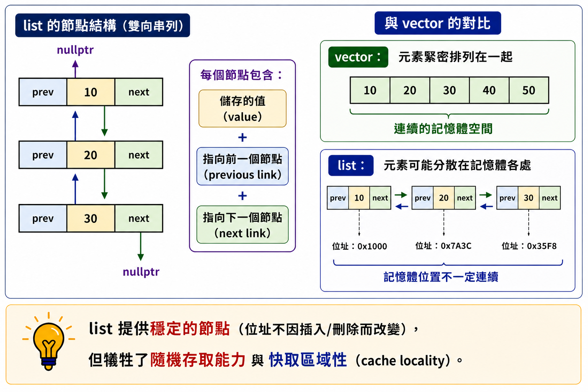
</p>

每個元素存在獨立節點，節點包含：

- 元素
- 前一節點連結
- 下一節點連結

---

## Section XIV. 優點與限制

<p align="center">
  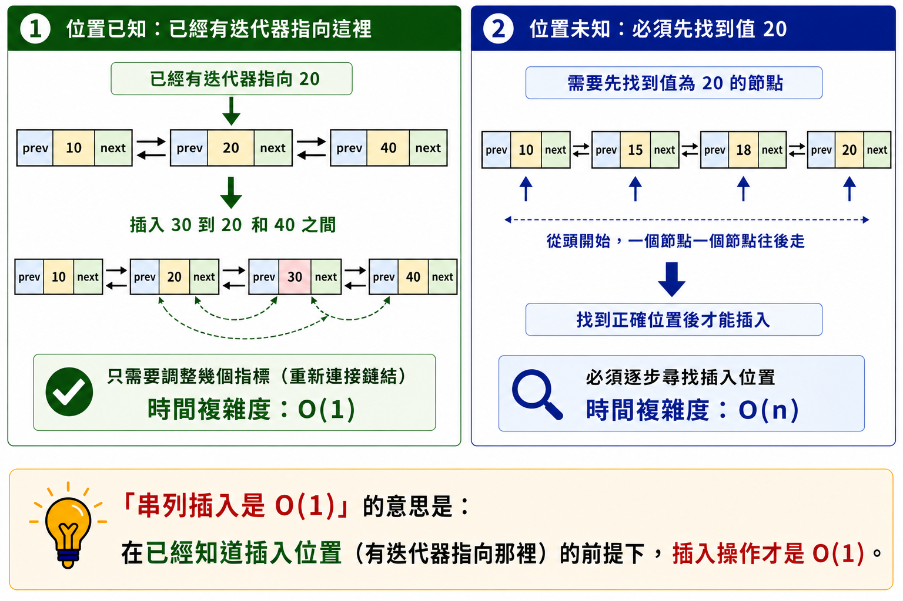
</p>

優點：

- 已知迭代器位置時，插入與刪除通常 `O(1)`。
- 其他節點的參考與迭代器通常保持有效。
- 支援 `splice()`。

限制：

- 不支援 `operator[]`。
- 不支援 random access。
- 每個元素有額外指標成本。
- Cache locality 較差。
- 找到位置本身仍可能需要 `O(n)`。

---

## Section XV. 完整 List 範例

```cpp
// VALIDATE
#include <iostream>
#include <list>
using namespace std;

int main() {
    list<int> values{
        30,
        10,
        20,
        20
    };

    values.sort();
    values.unique();

    for (int value : values) {
        cout << value
             << " ";
    }

    cout << '\n';

    return 0;
}
```

---

## Section XVI. 為什麼不能 `std::sort(list)`？

<p align="center">
  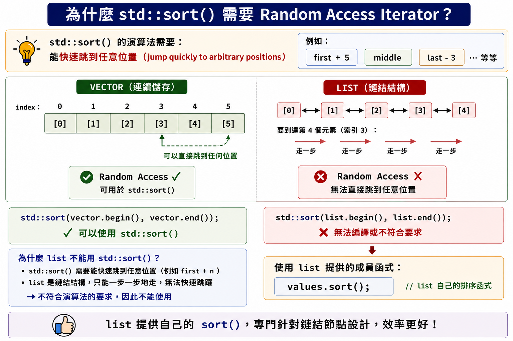
</p>

`std::sort()` 需要 random access iterator。

`list` 只有 bidirectional iterator。

應使用：

```cpp
values.sort();
```

---

# Part E：`std::forward_list`

## Section XVII. Singly Linked List

每個節點只保存下一節點連結。

特點：

- 介面較小。
- 只支援向前走訪。
- 不支援 `--iterator`。
- 不支援 random access。
- C++17 沒有 `.size()`。

---

## Section XVIII. Before Position

<p align="center">
  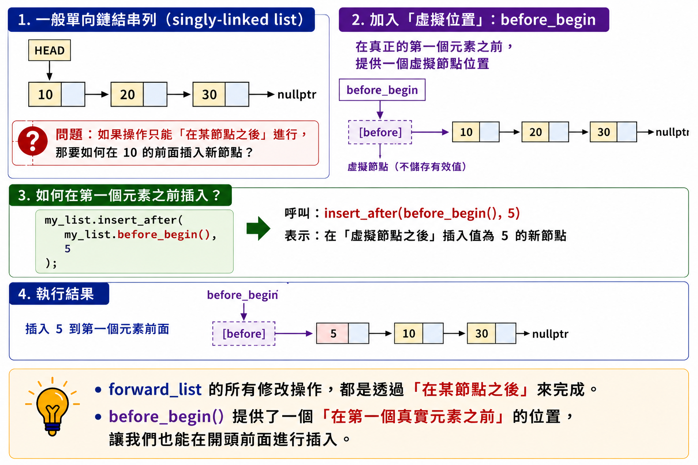
</p>

因為單向串列無法直接取得前一節點，所以操作常使用：

```cpp
before_begin()
insert_after()
erase_after()
```

---

## Section XIX. 完整 Forward List 範例

```cpp
// VALIDATE
#include <forward_list>
#include <iostream>
#include <iterator>
using namespace std;

int main() {
    forward_list<int> values{
        20,
        30
    };

    values.insert_after(
        values.before_begin(),
        10
    );

    auto count =
        distance(
            values.cbegin(),
            values.cend()
        );

    cout << count
         << '\n';

    for (int value : values) {
        cout << value
             << " ";
    }

    cout << '\n';

    return 0;
}
```

---

# Part F：`std::set`

## Section XX. 排序唯一值

<p align="center">
  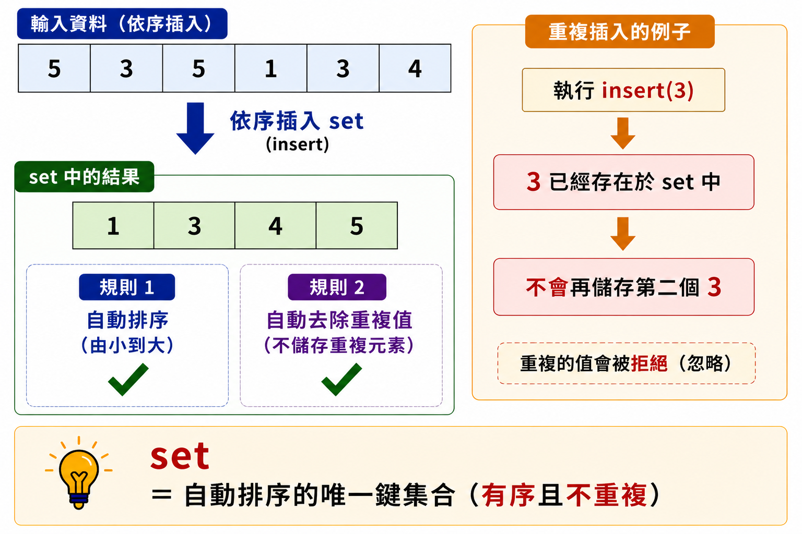
</p>

```cpp
set<int> values;
```

特點：

- 自動排序。
- 不允許重複值。
- 查詢、插入、刪除通常 `O(log n)`。
- 元素作為 key，不可直接修改。

---

## Section XXI. 完整 Set 範例

```cpp
// VALIDATE
#include <iostream>
#include <set>
using namespace std;

int main() {
    set<int> values{
        5,
        3,
        5,
        1,
        3
    };

    values.insert(4);

    for (int value : values) {
        cout << value
             << " ";
    }

    cout << '\n';

    cout << boolalpha
         << (
                values.find(3) !=
                values.end()
            )
         << '\n';

    return 0;
}
```

輸出排序後唯一值：

```text
1 3 4 5
```

---

## Section XXII. Insert 回傳值

對 unique-key container：

```cpp
auto result =
    values.insert(10);
```

`result` 是：

```cpp
pair<iterator, bool>
```

- `.first`：元素位置。
- `.second`：是否真的插入。

---

## Section XXIII. Structured Binding

```cpp
auto [iterator, inserted] =
    values.insert(10);
```

---

## Section XXIV. 完整 Insert 結果

```cpp
// VALIDATE
#include <iostream>
#include <set>
using namespace std;

int main() {
    set<int> values{
        1,
        2,
        3
    };

    auto [iterator, inserted] =
        values.insert(2);

    cout << *iterator
         << " "
         << boolalpha
         << inserted
         << '\n';

    return 0;
}
```

---

# Part G：`std::multiset`

## Section XXV. 排序且允許重複

```cpp
multiset<int> values;
```

適合：

- 排序分數。
- 重複事件時間。
- 重複權重。
- 需要快速取得最小或最大值。

---

## Section XXVI. 完整 Multiset 範例

```cpp
// VALIDATE
#include <iostream>
#include <set>
using namespace std;

int main() {
    multiset<int> scores{
        90,
        80,
        90,
        70,
        90
    };

    cout << scores.count(90)
         << '\n';

    auto range =
        scores.equal_range(90);

    for (
        auto iterator =
            range.first;
        iterator !=
            range.second;
        ++iterator
    ) {
        cout << *iterator
             << " ";
    }

    cout << '\n';

    return 0;
}
```

---

# Part H：`std::map`

## Section XXVII. 排序 Key-Value

<p align="center">
  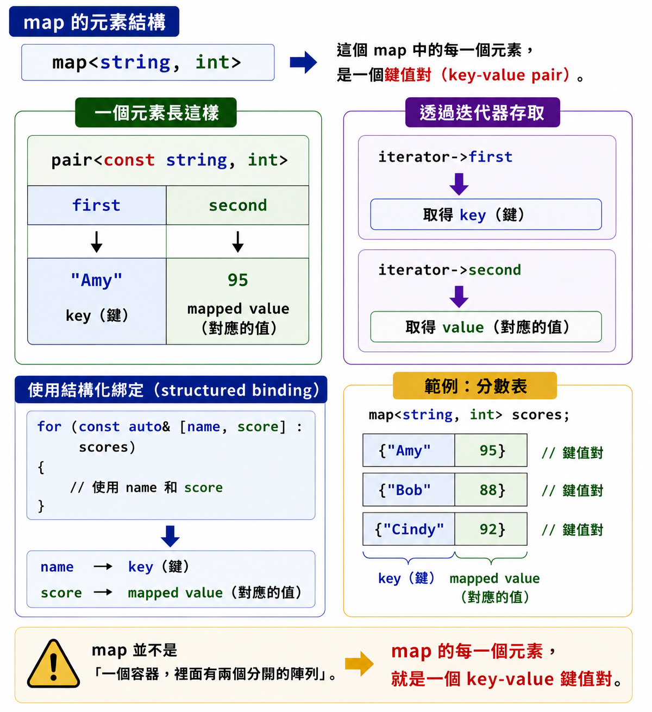
</p>

```cpp
map<string, int> scores;
```

每個元素概念上：

```cpp
pair<const string, int>
```

`.first` 是 key，`.second` 是 mapped value。

---

## Section XXVIII. `operator[]`

```cpp
scores["Amy"] = 95;
```

若 `"Amy"` 不存在，會先插入：

```text
Amy → 0
```

再賦值。

因此 `operator[]` 不只是查詢。

---

## Section XXIX. 完整 Map 範例

```cpp
// VALIDATE
#include <iostream>
#include <map>
#include <string>
using namespace std;

int main() {
    map<string, int> scores;

    scores["Amy"] = 95;
    scores["Brian"] = 85;
    scores["Cindy"] = 90;

    for (
        const auto& [name, score] :
        scores
    ) {
        cout << name
             << " "
             << score
             << '\n';
    }

    return 0;
}
```

Map 依 key 排序。

---

# Part I：Map 查詢方式

## Section XXX. `.find()`

<p align="center">
  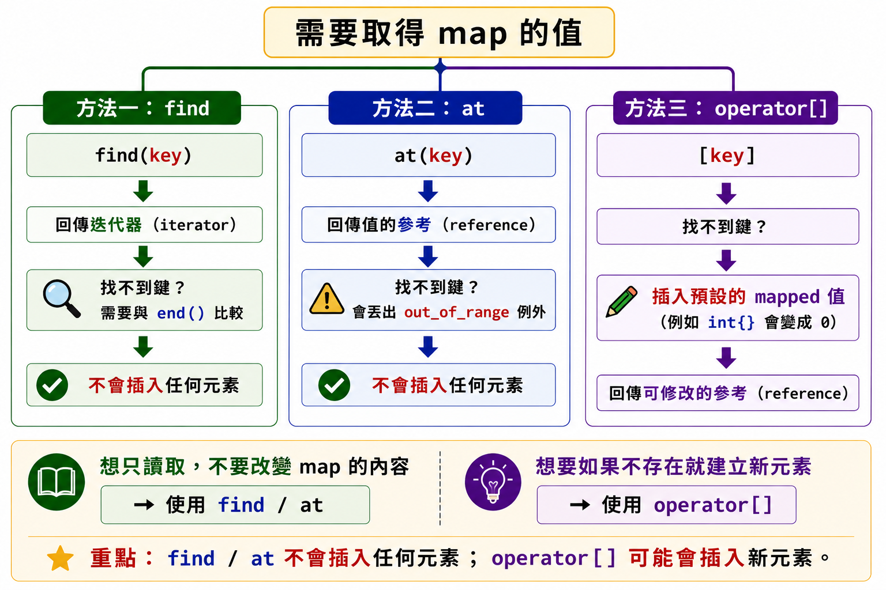
</p>

不插入元素：

```cpp
auto iterator =
    scores.find(name);
```

---

## Section XXXI. `.at()`

```cpp
scores.at(name)
```

找不到時丟出：

```cpp
out_of_range
```

---

## Section XXXII. `operator[]` 的副作用

<p align="center">
  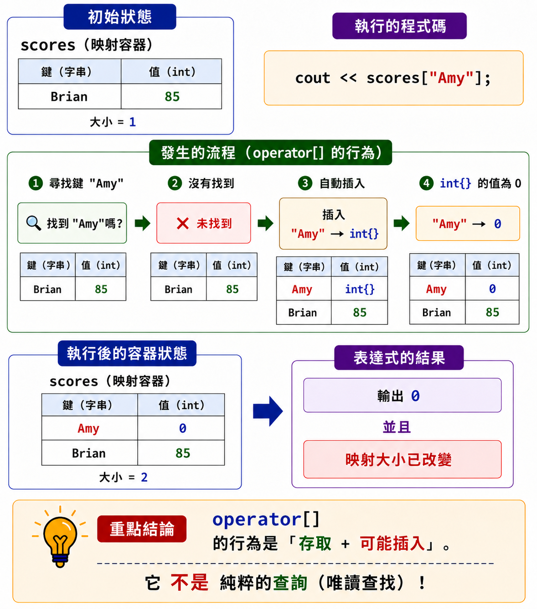
</p>

唯讀查詢不建議：

```cpp
scores[name]
```

因為找不到會插入。

---

## Section XXXIII. 完整安全查詢

```cpp
// VALIDATE
#include <iostream>
#include <map>
#include <string>
using namespace std;

int main() {
    map<string, int> scores{
        {
            "Amy",
            95
        },
        {
            "Brian",
            85
        }
    };

    string name;
    cin >> name;

    auto iterator =
        scores.find(name);

    if (
        iterator ==
        scores.end()
    ) {
        cout << "Not found\n";
    } else {
        cout << iterator->second
             << '\n';
    }

    return 0;
}
```

---

# Part J：Map 更新操作

## Section XXXIV. `insert()`

只在 key 不存在時插入：

```cpp
scores.insert(
    {"Amy", 95}
);
```

---

## Section XXXV. `insert_or_assign()`

C++17：

```cpp
scores.insert_or_assign(
    "Amy",
    100
);
```

存在就更新，不存在就插入。

---

## Section XXXVI. `try_emplace()`

```cpp
scores.try_emplace(
    "Amy",
    95
);
```

只有 key 不存在時才建立 mapped value。

---

## Section XXXVII. 完整更新範例

```cpp
// VALIDATE
#include <iostream>
#include <map>
#include <string>
using namespace std;

int main() {
    map<string, int> scores;

    auto first =
        scores.try_emplace(
            "Amy",
            90
        );

    auto second =
        scores.try_emplace(
            "Amy",
            100
        );

    scores.insert_or_assign(
        "Brian",
        85
    );

    cout << boolalpha
         << first.second
         << " "
         << second.second
         << '\n';

    cout << scores.at("Amy")
         << " "
         << scores.at("Brian")
         << '\n';

    return 0;
}
```

---

# Part K：`std::multimap`

## Section XXXVIII. 重複 Key

```cpp
multimap<string, int> scores;
```

同一 key 可有多個 value。

不提供：

```cpp
operator[]
```

因為同一 key 可能對應多筆資料。

---

## Section XXXIX. 完整 Multimap 範例

```cpp
// VALIDATE
#include <iostream>
#include <map>
#include <string>
using namespace std;

int main() {
    multimap<string, int> scores{
        {
            "Amy",
            80
        },
        {
            "Amy",
            90
        },
        {
            "Brian",
            85
        }
    };

    auto range =
        scores.equal_range(
            "Amy"
        );

    for (
        auto iterator =
            range.first;
        iterator !=
            range.second;
        ++iterator
    ) {
        cout << iterator->second
             << " ";
    }

    cout << '\n';

    return 0;
}
```

---

# Part L：Unordered Containers

## Section XL. 雜湊容器

<p align="center">
  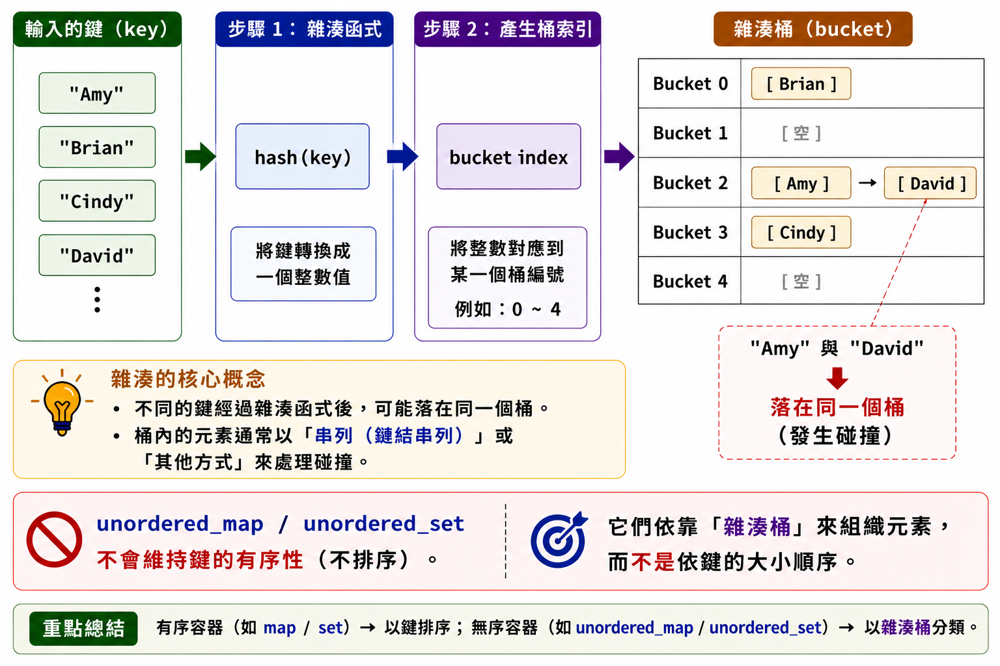
</p>

主要：

- `unordered_set`
- `unordered_multiset`
- `unordered_map`
- `unordered_multimap`

特點：

- 不維持排序。
- 平均查詢、插入、刪除為 `O(1)`。
- 最壞可能 `O(n)`。
- 需要 hash 與 equality。

---

## Section XLI. 不依賴輸出順序

不同：

- 編譯器
- 標準函式庫版本
- bucket 數量
- 插入順序
- rehash

都可能改變走訪順序。

---

# Part M：`std::unordered_set`

## Section XLII. 完整範例

```cpp
// VALIDATE
#include <iostream>
#include <unordered_set>
using namespace std;

int main() {
    unordered_set<int> values{
        5,
        3,
        5,
        1
    };

    values.insert(10);

    cout << values.size()
         << '\n';

    cout << boolalpha
         << (
                values.find(3) !=
                values.end()
            )
         << '\n';

    return 0;
}
```

不應對輸出順序做任何假設。

---

# Part N：`std::unordered_map`

## Section XLIII. Frequency Table

計算字詞出現次數：

```cpp
++frequency[word];
```

此時 `operator[]` 的插入行為正好有用。

---

## Section XLIV. 完整頻率統計

```cpp
// VALIDATE
#include <iostream>
#include <string>
#include <unordered_map>
#include <vector>
using namespace std;

int main() {
    vector<string> words{
        "apple",
        "banana",
        "apple",
        "orange",
        "banana",
        "apple"
    };

    unordered_map<string, int>
        frequency;

    for (
        const string& word :
        words
    ) {
        ++frequency[word];
    }

    cout << frequency.at(
                "apple"
            )
         << " "
         << frequency.at(
                "banana"
            )
         << '\n';

    return 0;
}
```

---

# Part O：Bucket 與 Load Factor

## Section XLV. Bucket

雜湊值會決定元素放入哪個 bucket。

不同 key 可能進入同一 bucket，稱為 collision。

---

## Section XLVI. Load Factor

```cpp
container.load_factor()
```

概念：

```text
元素數量 / bucket 數量
```

---

## Section XLVII. Reserve

<p align="center">
  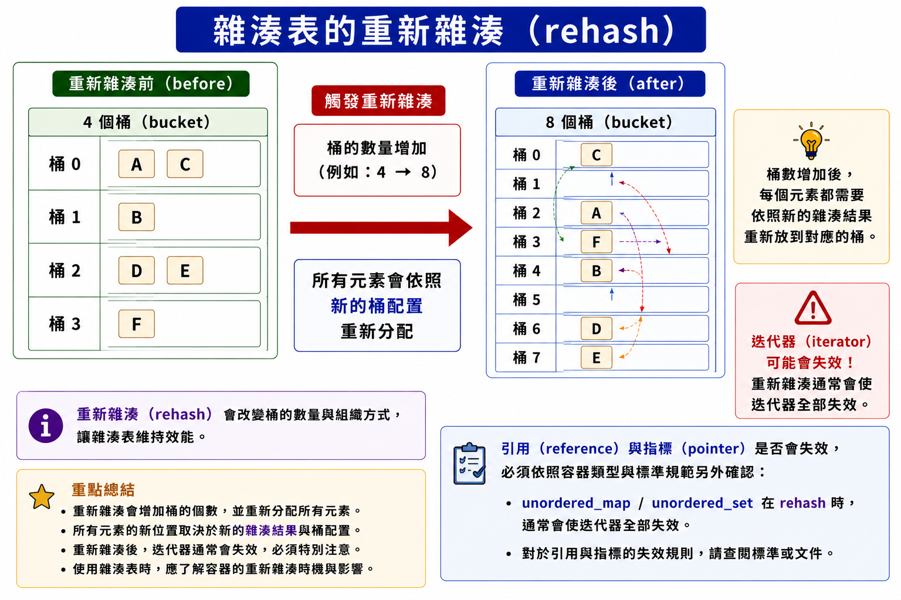
</p>

若預先知道元素數量：

```cpp
frequency.reserve(
    expectedCount
);
```

可降低 rehash 次數。

---

## Section XLVIII. 完整 Reserve 範例

```cpp
// VALIDATE
#include <iostream>
#include <unordered_map>
using namespace std;

int main() {
    unordered_map<int, int> values;

    values.reserve(100);

    for (
        int number = 0;
        number < 100;
        ++number
    ) {
        values.emplace(
            number,
            number * number
        );
    }

    cout << values.size()
         << '\n';

    cout << boolalpha
         << (
                values.bucket_count() >
                0
            )
         << '\n';

    return 0;
}
```

---

# Part P：Set vs Unordered Set

## Section XLIX. 比較表

<p align="center">
  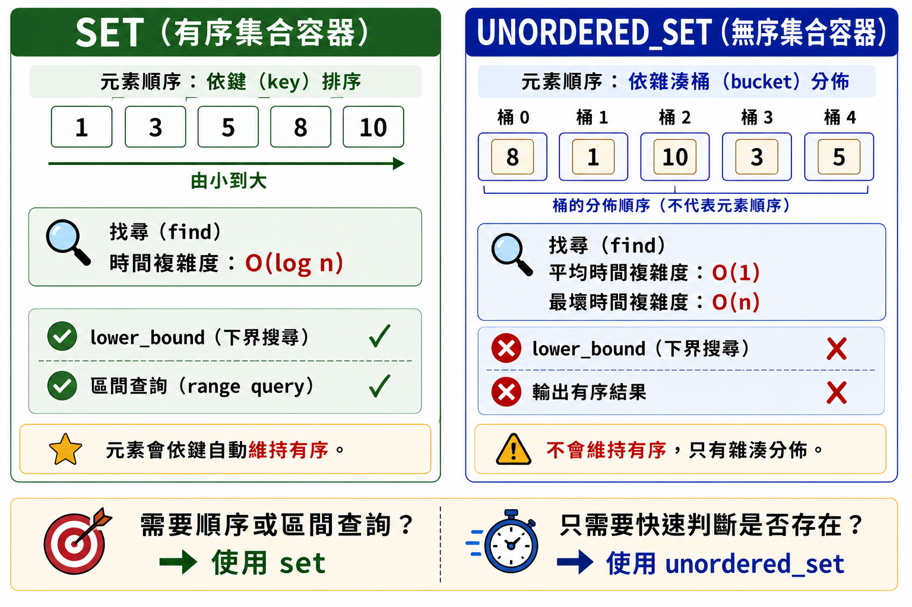
</p>

| 特性 | `set` | `unordered_set` |
| --- | --- | --- |
| 順序 | 排序 | 無排序保證 |
| 查詢 | `O(log n)` | 平均 `O(1)` |
| 最壞查詢 | `O(log n)` | `O(n)` |
| Range query | 容易 | 不適合 |
| `lower_bound()` | 支援 | 不支援 |
| 自訂需求 | comparator | hash + equality |
| 記憶體 | 樹節點 | buckets + nodes |

---

## Section L. 如何選？

選 `set`：

- 需要排序輸出。
- 需要範圍查詢。
- 需要 `lower_bound()`。
- 需要較穩定的最壞複雜度。

選 `unordered_set`：

- 只需要存在性查詢。
- 不在意順序。
- 希望平均快速查詢。
- Key 有良好 hash。

---

# Part Q：Map vs Unordered Map

## Section LI. 比較表

| 特性 | `map` | `unordered_map` |
| --- | --- | --- |
| Key 順序 | 排序 | 無順序保證 |
| 查詢 | `O(log n)` | 平均 `O(1)` |
| 範圍查詢 | 支援 | 不適合 |
| 最小／最大 key | 容易 | 無直接順序 |
| 自訂型別需求 | comparator | hash + equality |
| 迭代器 | bidirectional | forward |

---

# Part R：Erase While Iterating

## Section LII. 錯誤模式

<p align="center">
  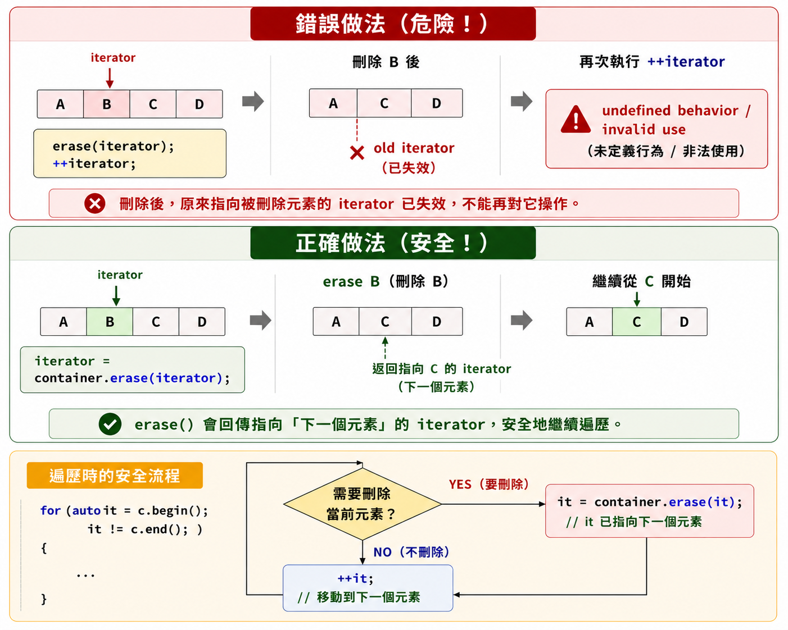
</p>

```cpp
/* for (
    auto iterator = values.begin();
    iterator != values.end();
    ++iterator
) {
    if (condition) {
        values.erase(iterator);
    }
} */
```

Erase 後 iterator 失效，接著 `++iterator` 危險。

---

## Section LIII. 正確模式

```cpp
if (condition) {
    iterator =
        values.erase(iterator);
} else {
    ++iterator;
}
```

---

## Section LIV. 完整 Map 刪除

```cpp
// VALIDATE
#include <iostream>
#include <map>
#include <string>
using namespace std;

int main() {
    map<string, int> scores{
        {
            "Amy",
            95
        },
        {
            "Brian",
            50
        },
        {
            "Cindy",
            80
        }
    };

    auto iterator =
        scores.begin();

    while (
        iterator !=
        scores.end()
    ) {
        if (
            iterator->second <
            60
        ) {
            iterator =
                scores.erase(
                    iterator
                );
        } else {
            ++iterator;
        }
    }

    for (
        const auto& [name, score] :
        scores
    ) {
        cout << name
             << " "
             << score
             << '\n';
    }

    return 0;
}
```

---

# Part S：Iterator Invalidation

## Section LV. Vector

<p align="center">
  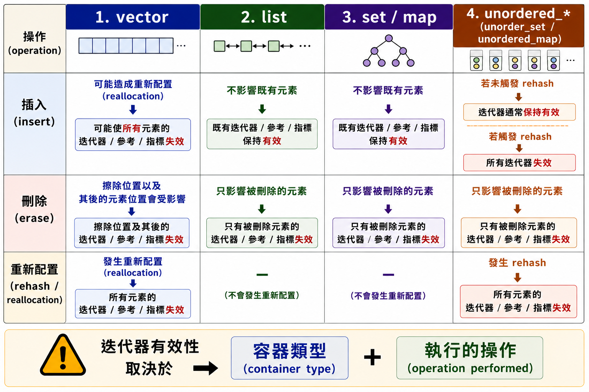
</p>

可能失效：

- Reallocation：所有 iterator、pointer、reference 失效。
- 中間 insert：插入位置之後通常失效。
- erase：被刪位置及其後通常失效。

---

## Section LVI. Deque

中間插入與刪除可能使大量 iterator 失效。

前後端操作的規則比 vector 複雜，不應以簡化直覺取代標準規則。

---

## Section LVII. List

插入通常不使既有 iterator 失效。

刪除只使被刪元素位置失效。

---

## Section LVIII. Ordered Associative Containers

Insert 通常不使既有 iterator 失效。

Erase 只使被刪元素 iterator 失效。

---

## Section LIX. Unordered Containers

Insert 若觸發 rehash，iterator 可能全部失效。

Reference 與 pointer 的規則通常比 iterator 穩定，但仍要依具體操作判斷。

---

# Part T：`std::stack`

## Section LX. LIFO

<p align="center">
  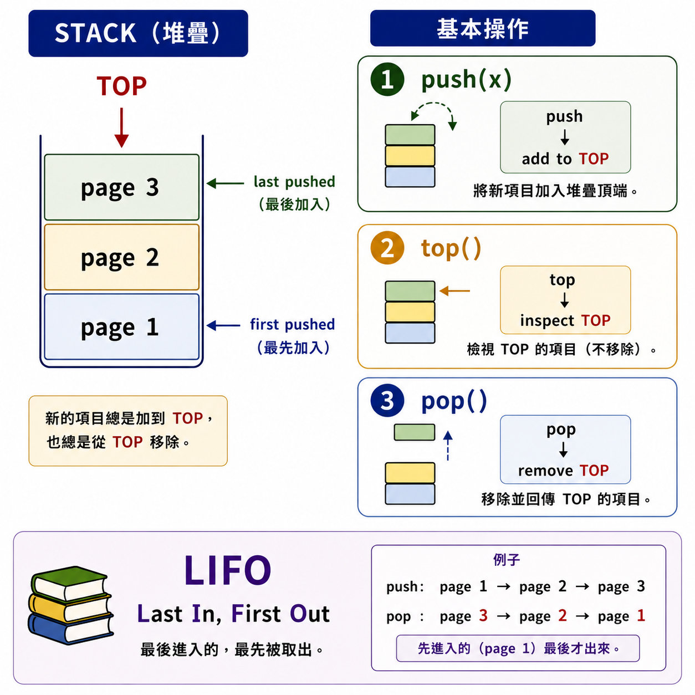
</p>

Last In, First Out：

```text
最後放入，最先取出
```

常見用途：

- Undo。
- 括號配對。
- DFS。
- 函式呼叫概念。
- 表達式處理。

---

## Section LXI. 常用操作

```cpp
push()
emplace()
top()
pop()
empty()
size()
```

---

## Section LXII. 完整 Stack 範例

```cpp
// VALIDATE
#include <iostream>
#include <stack>
#include <string>
using namespace std;

int main() {
    stack<string> history;

    history.push("page 1");
    history.push("page 2");
    history.push("page 3");

    while (!history.empty()) {
        cout << history.top()
             << '\n';

        history.pop();
    }

    return 0;
}
```

---

# Part U：`std::queue`

## Section LXIII. FIFO

<p align="center">
  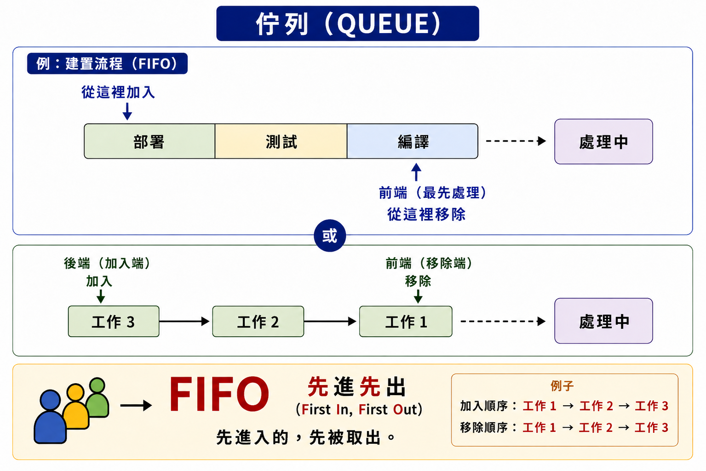
</p>

First In, First Out：

```text
最先放入，最先取出
```

用途：

- 工作排程。
- BFS。
- 訊息處理。
- 排隊系統。

---

## Section LXIV. 常用操作

```cpp
push()
emplace()
front()
back()
pop()
empty()
size()
```

---

## Section LXV. 完整 Queue 範例

```cpp
// VALIDATE
#include <iostream>
#include <queue>
#include <string>
using namespace std;

int main() {
    queue<string> jobs;

    jobs.push("compile");
    jobs.push("test");
    jobs.push("deploy");

    while (!jobs.empty()) {
        cout << jobs.front()
             << '\n';

        jobs.pop();
    }

    return 0;
}
```

---

# Part V：`std::priority_queue`

## Section LXVI. 預設最大值優先

<p align="center">
  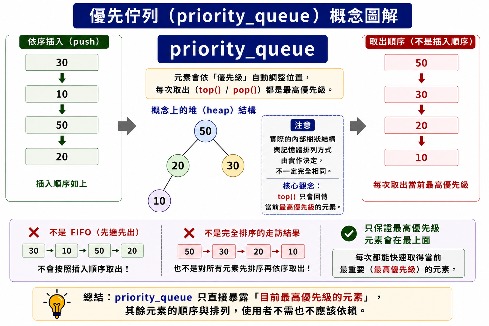
</p>

```cpp
priority_queue<int> values;
```

`.top()` 取得目前最大值。

---

## Section LXVII. 完整 Max Heap

```cpp
// VALIDATE
#include <iostream>
#include <queue>
#include <vector>
using namespace std;

int main() {
    priority_queue<int> values;

    values.push(30);
    values.push(10);
    values.push(50);
    values.push(20);

    while (!values.empty()) {
        cout << values.top()
             << " ";

        values.pop();
    }

    cout << '\n';

    return 0;
}
```

輸出：

```text
50 30 20 10
```

---

## Section LXVIII. Min Heap

```cpp
priority_queue<
    int,
    vector<int>,
    greater<int>
> values;
```

---

## Section LXIX. 完整 Min Heap

```cpp
// VALIDATE
#include <functional>
#include <iostream>
#include <queue>
#include <vector>
using namespace std;

int main() {
    priority_queue<
        int,
        vector<int>,
        greater<int>
    > values;

    values.push(30);
    values.push(10);
    values.push(50);
    values.push(20);

    while (!values.empty()) {
        cout << values.top()
             << " ";

        values.pop();
    }

    cout << '\n';

    return 0;
}
```

輸出：

```text
10 20 30 50
```

---

# Part W：Adaptor 的限制

## Section LXX. 不提供 iterator

Stack、queue、priority_queue 不公開一般走訪介面。

這是刻意限制，讓使用者只透過指定存取規則操作。

---

## Section LXXI. Pop 不回傳值

正確：

```cpp
int value =
    values.top();

values.pop();
```

不是：

```cpp
/* int value =
    values.pop(); */
```

---

# Part X：List 特殊操作

## Section LXXII. `splice()`

可將節點從一個 list 移動到另一個 list，而不逐個複製元素。

---

## Section LXXIII. `merge()`

兩個已排序 list 可合併成排序 list。

---

## Section LXXIV. 完整 Merge 範例

```cpp
// VALIDATE
#include <iostream>
#include <list>
using namespace std;

int main() {
    list<int> first{
        1,
        3,
        5
    };

    list<int> second{
        2,
        4,
        6
    };

    first.merge(second);

    for (int value : first) {
        cout << value
             << " ";
    }

    cout << '\n';

    cout << boolalpha
         << second.empty()
         << '\n';

    return 0;
}
```

`merge()` 前兩個 list 必須已依相同規則排序。

---

# Part Y：Structured Binding with Map

## Section LXXV. 唯讀走訪

```cpp
for (
    const auto& [key, value] :
    data
) {
    // ...
}
```

---

## Section LXXVI. 修改 mapped value

```cpp
for (
    auto& [key, value] :
    data
) {
    value += 1;
}
```

Key 為 `const`，不能修改。

---

## Section LXXVII. 完整修改值

```cpp
// VALIDATE
#include <iostream>
#include <map>
#include <string>
using namespace std;

int main() {
    map<string, int> scores{
        {
            "Amy",
            80
        },
        {
            "Brian",
            90
        }
    };

    for (
        auto& [name, score] :
        scores
    ) {
        score += 5;

        cout << name
             << " "
             << score
             << '\n';
    }

    return 0;
}
```

---

# Part Z：自訂型別作為 Set Key

## Section LXXVIII. Comparator

Set 需要排序規則。

可使用 lambda comparator：

```cpp
auto compare =
    [](const Student& first,
       const Student& second) {
        return first.id < second.id;
    };
```

---

## Section LXXIX. 完整自訂 Set

```cpp
// VALIDATE
#include <iostream>
#include <set>
#include <string>
using namespace std;

struct Student {
    int id;
    string name;
};

int main() {
    auto compare =
        [](
            const Student& first,
            const Student& second
        ) {
            return
                first.id <
                second.id;
        };

    set<
        Student,
        decltype(compare)
    > students(compare);

    students.insert(
        {
            2,
            "Brian"
        }
    );

    students.insert(
        {
            1,
            "Amy"
        }
    );

    for (
        const Student& student :
        students
    ) {
        cout << student.id
             << " "
             << student.name
             << '\n';
    }

    return 0;
}
```

ID 相同時 comparator 會視為同一 key。

---

# Part AA：巢狀容器

## Section LXXX. Map of Vectors

```cpp
map<string, vector<int>>
```

可表示：

- 每位學生的多筆分數。
- 每個類別的商品 ID。
- 每個單字的出現位置。
- Graph adjacency list。

---

## Section LXXXI. 完整 Map of Vectors

```cpp
// VALIDATE
#include <iostream>
#include <map>
#include <string>
#include <vector>
using namespace std;

int main() {
    map<string, vector<int>>
        scores;

    scores["Amy"].push_back(90);
    scores["Amy"].push_back(95);
    scores["Brian"].push_back(85);

    for (
        const auto& [
            name,
            studentScores
        ] : scores
    ) {
        cout << name
             << ":";

        for (
            int score :
            studentScores
        ) {
            cout << " "
                 << score;
        }

        cout << '\n';
    }

    return 0;
}
```

---

# Part AB：容器與 Algorithm

## Section LXXXII. 可直接使用 `std::sort()`

<p align="center">
  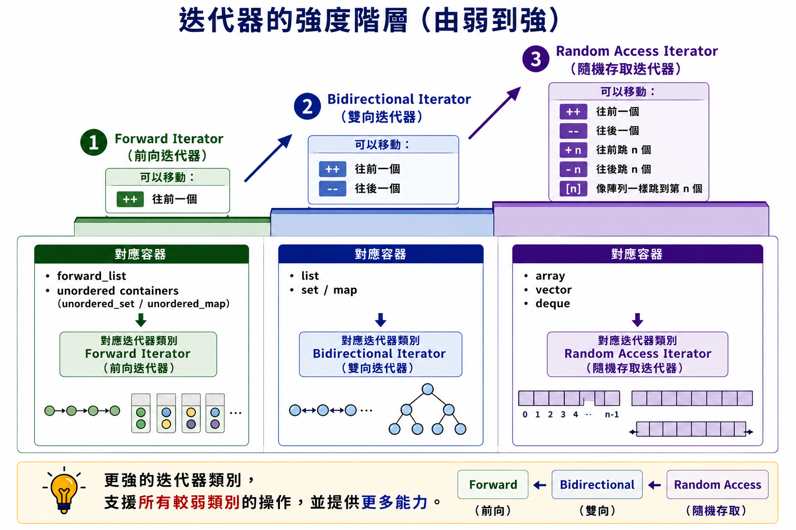
</p>

- `vector`
- `deque`
- `array`
- 傳統陣列

因為支援 random access iterator。

---

## Section LXXXIII. 不可直接使用 `std::sort()`

- `list`
- `forward_list`
- `set`
- `map`
- unordered containers

原因不同：

- list iterator 不夠強。
- associative containers 已自行維持結構。
- key 不可任意重排。

---

## Section LXXXIV. 成員 Find vs `std::find()`

Map 使用：

```cpp
data.find(key)
```

通常 `O(log n)`。

若使用：

```cpp
std::find(
    data.begin(),
    data.end(),
    ...
)
```

會線性走訪，通常 `O(n)`，而且比較 pair 更不方便。

---

# Part AC：複雜度總表

## Section LXXXV. 常見操作

| 容器 | Index | Front insert | Back insert | Search by value/key | Middle erase |
| --- | --- | --- | --- | --- | --- |
| `array` | `O(1)` | 不支援 | 不支援 | `O(n)` | 不支援 |
| `vector` | `O(1)` | `O(n)` | 攤銷 `O(1)` | `O(n)` | `O(n)` |
| `deque` | `O(1)` | `O(1)` | `O(1)` | `O(n)` | `O(n)` |
| `list` | 不支援 | `O(1)` | `O(1)` | `O(n)` | 已知位置 `O(1)` |
| `forward_list` | 不支援 | `O(1)` | 無直接 push_back | `O(n)` | 已知前一位置 `O(1)` |
| `set` | 不支援 | 不適用 | 不適用 | `O(log n)` | `O(log n)` |
| `unordered_set` | 不支援 | 不適用 | 不適用 | 平均 `O(1)` | 平均 `O(1)` |
| `map` | 依 key | 不適用 | 不適用 | `O(log n)` | `O(log n)` |
| `unordered_map` | 依 key | 不適用 | 不適用 | 平均 `O(1)` | 平均 `O(1)` |

---

## Section LXXXVI. Big-O 不是全部

<p align="center">
  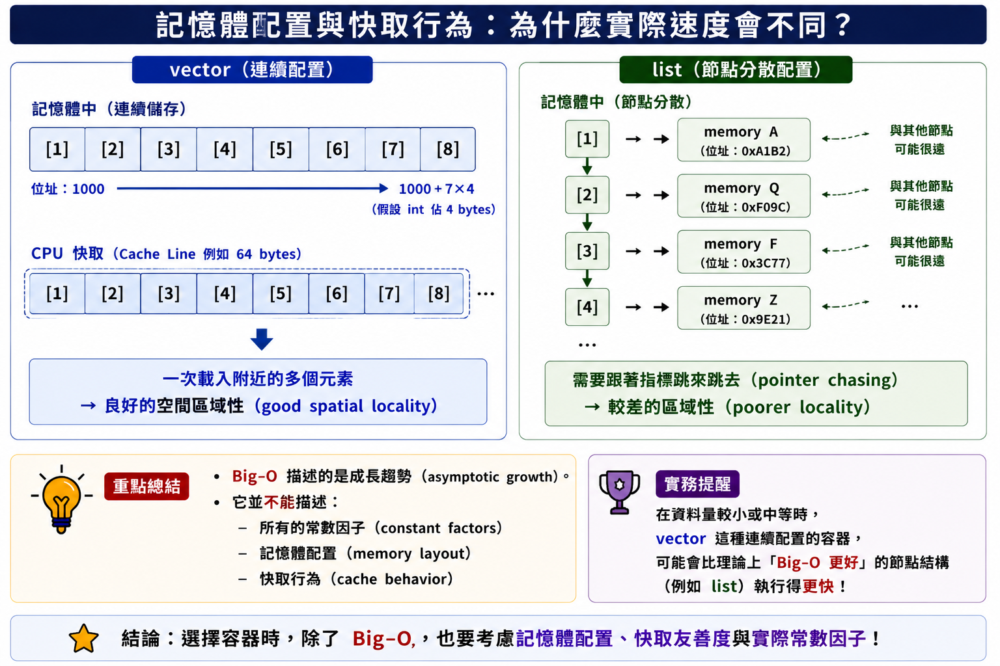
</p>

還要考慮：

- 元素數量。
- Cache locality。
- 配置次數。
- 元素大小。
- 是否需要排序輸出。
- 是否需要穩定 iterator。
- 實際操作比例。

小型資料中，vector 的簡單連續儲存可能比複雜節點容器更快。

---

# Part AD：快速概念檢查

## Section LXXXVII. 選擇題與簡答

### Q1. 哪個容器固定大小且連續儲存？

<details><summary>查看答案</summary>

```cpp
std::array
```

</details>

### Q2. 哪個容器通常是一般動態序列的第一選擇？

<details><summary>查看答案</summary>

```cpp
std::vector
```

</details>

### Q3. 哪個容器支援前後端快速插入？

<details><summary>查看答案</summary>

```cpp
std::deque
```

</details>

### Q4. `list` 支援 `operator[]` 嗎？

<details><summary>查看答案</summary>

不支援。

</details>

### Q5. 為什麼 list 不可使用 `std::sort()`？

<details><summary>查看答案</summary>

`std::sort()` 需要 random access iterator，而 list 只有 bidirectional iterator。

</details>

### Q6. 哪個容器保存排序且唯一的值？

<details><summary>查看答案</summary>

```cpp
std::set
```

</details>

### Q7. 哪個容器保存排序且允許重複的值？

<details><summary>查看答案</summary>

```cpp
std::multiset
```

</details>

### Q8. Map 的元素型別概念上是什麼？

<details><summary>查看答案</summary>

```cpp
pair<const Key, Value>
```

</details>

### Q9. Map `operator[]` 找不到 key 時做什麼？

<details><summary>查看答案</summary>

插入該 key 與預設建立的 mapped value。

</details>

### Q10. 唯讀查詢 map 應優先使用什麼？

<details><summary>查看答案</summary>

`.find()` 或 `.at()`，依錯誤處理需求選擇。

</details>

### Q11. Unordered map 保持 key 排序嗎？

<details><summary>查看答案</summary>

不保持。

</details>

### Q12. Unordered container 平均查詢複雜度？

<details><summary>查看答案</summary>

平均 `O(1)`。

</details>

### Q13. Unordered container 最壞查詢複雜度？

<details><summary>查看答案</summary>

可能為 `O(n)`。

</details>

### Q14. Stack 採用什麼順序？

<details><summary>查看答案</summary>

LIFO。

</details>

### Q15. Queue 採用什麼順序？

<details><summary>查看答案</summary>

FIFO。

</details>

### Q16. Priority queue 預設 top 是最大還是最小？

<details><summary>查看答案</summary>

最大值。

</details>

### Q17. `pop()` 會回傳被移除值嗎？

<details><summary>查看答案</summary>

不會，需先用 `top()` 或 `front()` 取得。

</details>

### Q18. Vector reallocation 會造成什麼？

<details><summary>查看答案</summary>

指向元素的 iterator、pointer、reference 可能全部失效。

</details>

### Q19. Set 元素可以直接修改嗎？

<details><summary>查看答案</summary>

不能直接修改 key，否則會破壞排序結構。

</details>

### Q20. Car 和 Engine 通常使用繼承還是 composition？

<details><summary>查看答案</summary>

Composition，因為 Car has an Engine。

</details>

---

# Part AE：程式閱讀練習

## Section LXXXVIII. 預測結果與合法性

### 題目 1

```cpp
set<int> values{
    3,
    1,
    3,
    2
};

cout << values.size();
```

<details><summary>查看答案</summary>

```text
3
```

重複值不會保存。

</details>

### 題目 2

```cpp
multiset<int> values{
    3,
    1,
    3,
    2
};

cout << values.count(3);
```

<details><summary>查看答案</summary>

```text
2
```

</details>

### 題目 3

```cpp
map<string, int> scores;

cout << scores["Amy"];
cout << scores.size();
```

<details><summary>查看答案</summary>

先輸出預設值：

```text
0
```

之後 size 為：

```text
1
```

因為 `operator[]` 插入了 `"Amy"`。

</details>

### 題目 4

```cpp
unordered_set<int> values{
    1,
    2,
    3
};

for (int value : values) {
    cout << value;
}
```

<details><summary>查看答案</summary>

不能可靠預測順序。

</details>

### 題目 5

```cpp
deque<int> values;

values.push_front(2);
values.push_front(1);
values.push_back(3);

cout << values[1];
```

<details><summary>查看答案</summary>

內容：

```text
1 2 3
```

輸出：

```text
2
```

</details>

### 題目 6

```cpp
stack<int> values;

values.push(1);
values.push(2);
values.push(3);

cout << values.top();
```

<details><summary>查看答案</summary>

```text
3
```

</details>

### 題目 7

```cpp
queue<int> values;

values.push(1);
values.push(2);
values.push(3);

cout << values.front();
```

<details><summary>查看答案</summary>

```text
1
```

</details>

### 題目 8

```cpp
priority_queue<int> values;

values.push(10);
values.push(30);
values.push(20);

cout << values.top();
```

<details><summary>查看答案</summary>

```text
30
```

</details>

### 題目 9

```cpp
list<int> values{
    3,
    1,
    2
};

/* sort(
    values.begin(),
    values.end()
); */
```

<details><summary>查看答案</summary>

不能使用 `std::sort()`，應使用：

```cpp
values.sort();
```

</details>

### 題目 10

```cpp
map<string, int> values{
    {
        "A",
        1
    }
};

for (
    auto& [key, value] :
    values
) {
    value = 10;
    /* key = "B"; */
}
```

<details><summary>查看答案</summary>

Mapped value 可以修改，key 不可修改。

</details>

### 題目 11

```cpp
forward_list<int> values{
    1,
    2,
    3
};

/* cout << values.size(); */
```

<details><summary>查看答案</summary>

C++17 `forward_list` 沒有 `.size()`，可使用 `distance()` 計算。

</details>

### 題目 12

```cpp
map<string, int> values;

auto first =
    values.try_emplace(
        "A",
        1
    );

auto second =
    values.try_emplace(
        "A",
        2
    );

cout << boolalpha
     << first.second
     << second.second;
```

<details><summary>查看答案</summary>

```text
truefalse
```

第二次 key 已存在，因此不插入。

</details>

---

# Part AF：實作練習

## Section LXXXIX. 實作檢測題

### TODO 1：Vector 與 Deque 比較

分別在前端與後端加入資料，觀察 API 差異。

### TODO 2：List 排序去重

使用 `list.sort()` 與 `list.unique()`。

### TODO 3：Forward List

使用 `before_begin()` 與 `insert_after()` 在開頭插入。

### TODO 4：Set Unique Values

輸入多筆整數，輸出排序且不重複結果。

### TODO 5：Multiset Frequency

計算指定值在 multiset 中的數量。

### TODO 6：Map Score Table

建立姓名到分數的 map，支援新增、更新與安全查詢。

### TODO 7：Multimap

保存同一學生多次測驗分數。

### TODO 8：Unordered Frequency Table

計算文字中每個單字的出現次數。

### TODO 9：Erase While Iterating

刪除 map 中所有低於 60 的分數。

### TODO 10：Stack Undo

模擬最近操作撤銷。

### TODO 11：Queue Jobs

依加入順序處理工作。

### TODO 12：Priority Queue

建立最高分先處理與最低分先處理兩種佇列。

### TODO 13：Custom Set Comparator

依 Student ID 排序且去除重複 ID。

### TODO 14：Map of Vectors

保存每位學生的多筆分數。

### TODO 15：Container Selection

針對五種情境選擇容器並說明理由。

---

# Part AG：課後小練習

## Section XC. 延伸練習

### 練習 1：Leaderboard

使用 multiset 或 priority_queue 維護分數排行榜，分析兩種選擇差異。

### 練習 2：Word Index

建立 `map<string, vector<int>>`，保存每個單字出現的行號。

### 練習 3：Graph Adjacency List

使用 `unordered_map<int, vector<int>>` 表示圖。

### 練習 4：Task Scheduler

使用 priority_queue 依優先權與建立時間處理任務。

### 練習 5：Cache Simulation

使用 list 與 unordered_map 設計簡化 LRU cache，先只畫出資料結構關係。

---

# Part AH：常見錯誤提醒

## Section XCI. 常見錯誤

1. 不分析需求就一律使用 vector。
2. 只看 Big-O，不考慮 cache locality。
3. 只因中間插入就選 list，卻忽略找到位置成本。
4. 對 list 使用 `operator[]`。
5. 對 list 使用 `std::sort()`。
6. 對 forward_list 使用 `.size()`。
7. 誤以為 deque 整體連續。
8. 依賴 unordered 容器輸出順序。
9. 使用 `std::find()` 取代 map 成員 `.find()`。
10. 使用 map `operator[]` 做唯讀查詢。
11. 忘記 `operator[]` 會插入預設值。
12. 對 multimap 使用 `operator[]`。
13. 嘗試修改 set 元素。
14. 嘗試修改 map key。
15. 誤以為 unordered 查詢最壞也是 `O(1)`。
16. 忽略 rehash 造成 iterator 失效。
17. Vector reallocation 後使用舊參考。
18. Erase 後繼續遞增失效 iterator。
19. 對空 stack 使用 `top()`。
20. 對空 queue 使用 `front()`。
21. 對空 priority_queue 使用 `top()`。
22. 期待 `pop()` 回傳元素。
23. Priority queue comparator 方向理解錯誤。
24. List merge 前沒有先排序。
25. Structured binding 使用值複製卻期待修改原 map。
26. 自訂 set comparator 使用 `<=`。
27. 自訂 comparator 沒有嚴格排序。
28. 自訂 unordered key 沒有 hash 或 equality。
29. 保存指向短生命週期物件的裸指標。
30. 巢狀容器過深且沒有建立清楚型別別名。

---

# Part AI：Mermaid 流程圖

## Section XCII. STL 容器流程圖

### 1. 選擇序列容器

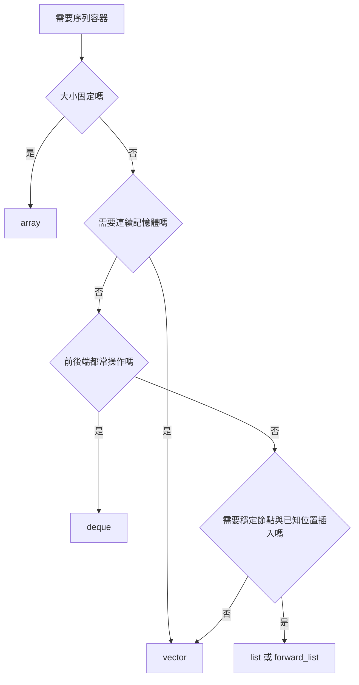
```mermaid
flowchart TD
    A[需要序列容器] --> B{大小固定嗎}
    B -- 是 --> C[array]
    B -- 否 --> D{需要連續記憶體嗎}
    D -- 是 --> E[vector]
    D -- 否 --> F{前後端都常操作嗎}
    F -- 是 --> G[deque]
    F -- 否 --> H{需要穩定節點與已知位置插入嗎}
    H -- 是 --> I[list 或 forward_list]
    H -- 否 --> E
```

### 2. 選擇關聯容器

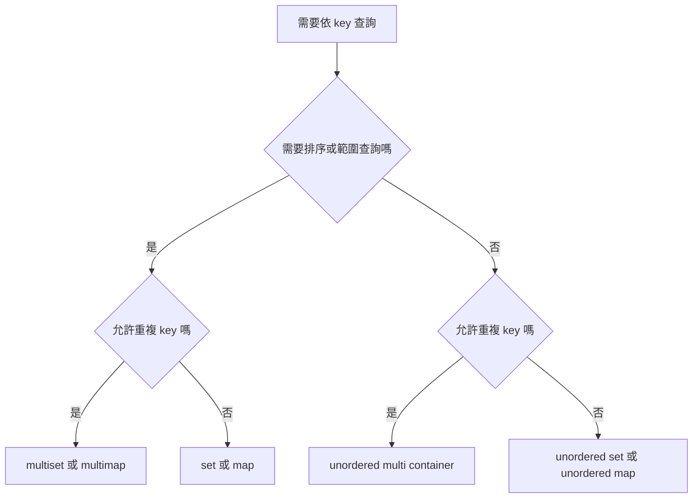
```mermaid
flowchart TD
    A[需要依 key 查詢] --> B{需要排序或範圍查詢嗎}
    B -- 是 --> C{允許重複 key 嗎}
    C -- 是 --> D[multiset 或 multimap]
    C -- 否 --> E[set 或 map]
    B -- 否 --> F{允許重複 key 嗎}
    F -- 是 --> G[unordered multi container]
    F -- 否 --> H[unordered set 或 unordered map]
```

### 3. Map 查詢

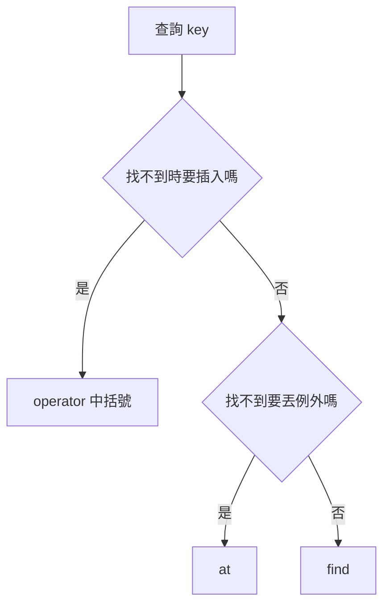
```mermaid
flowchart TD
    A[查詢 key] --> B{找不到時要插入嗎}
    B -- 是 --> C[operator 中括號]
    B -- 否 --> D{找不到要丟例外嗎}
    D -- 是 --> E[at]
    D -- 否 --> F[find]
```

### 4. Erase While Iterating

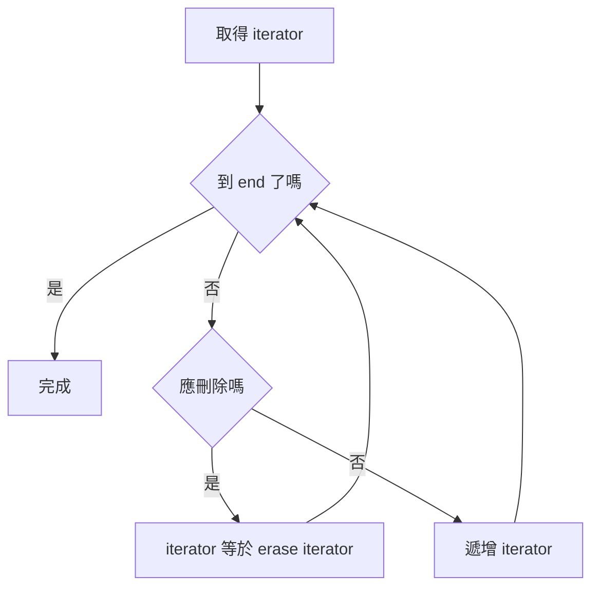
```mermaid
flowchart TD
    A[取得 iterator] --> B{到 end 了嗎}
    B -- 是 --> C[完成]
    B -- 否 --> D{應刪除嗎}
    D -- 是 --> E[iterator 等於 erase iterator]
    D -- 否 --> F[遞增 iterator]
    E --> B
    F --> B
```

### 5. Unordered Insert

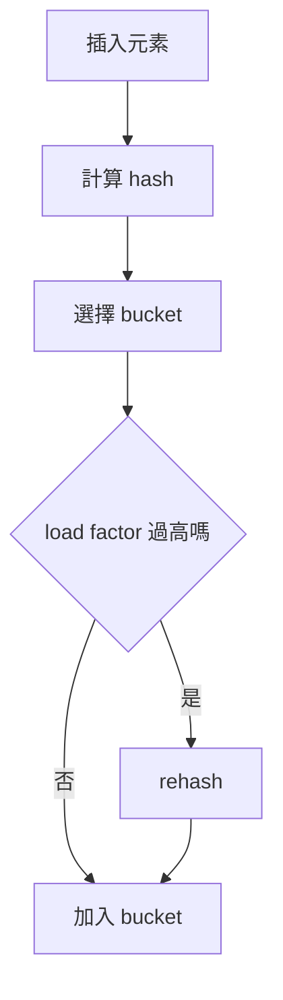
```mermaid
flowchart TD
    A[插入元素] --> B[計算 hash]
    B --> C[選擇 bucket]
    C --> D{load factor 過高嗎}
    D -- 是 --> E[rehash]
    D -- 否 --> F[加入 bucket]
    E --> F
```

### 6. Adaptor 選擇

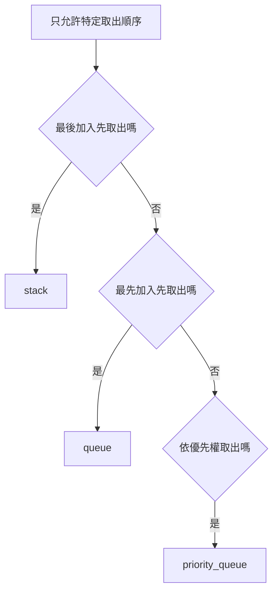
```mermaid
flowchart TD
    A[只允許特定取出順序] --> B{最後加入先取出嗎}
    B -- 是 --> C[stack]
    B -- 否 --> D{最先加入先取出嗎}
    D -- 是 --> E[queue]
    D -- 否 --> F{依優先權取出嗎}
    F -- 是 --> G[priority_queue]
```

### 7. Iterator 能力

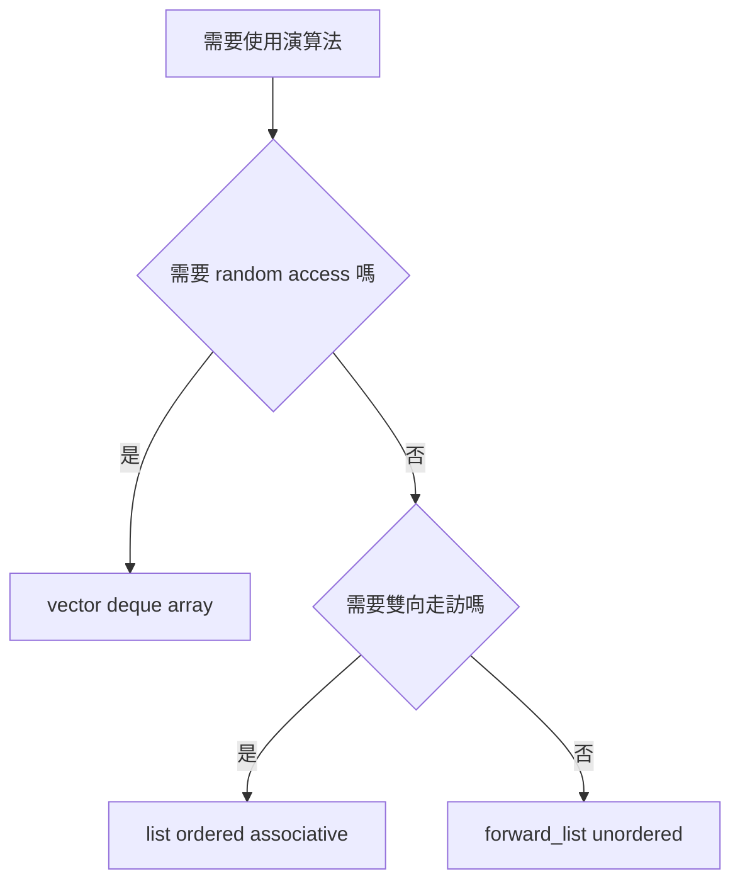
```mermaid
flowchart TD
    A[需要使用演算法] --> B{需要 random access 嗎}
    B -- 是 --> C[vector deque array]
    B -- 否 --> D{需要雙向走訪嗎}
    D -- 是 --> E[list ordered associative]
    D -- 否 --> F[forward_list unordered]
```

### 8. 容器選擇檢查

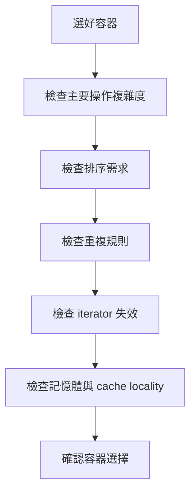
```mermaid
flowchart TD
    A[選好容器] --> B[檢查主要操作複雜度]
    B --> C[檢查排序需求]
    C --> D[檢查重複規則]
    D --> E[檢查 iterator 失效]
    E --> F[檢查記憶體與 cache locality]
    F --> G[確認容器選擇]
```

---


<p align="center">
  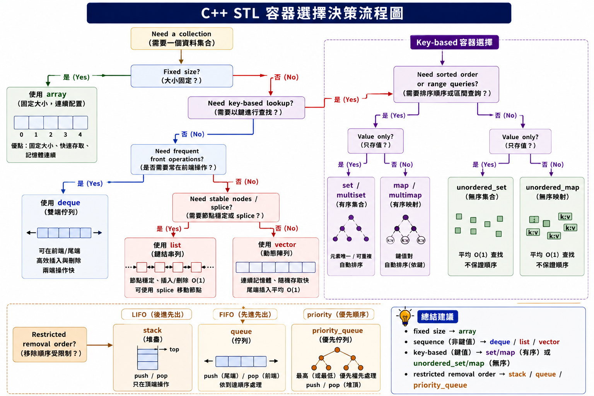
</p>
# 本章完成標準

完成本章後，你應該能做到：

1. 說明 STL 的主要組成。
2. 分類 sequence、associative、unordered 與 adaptor。
3. 使用 `std::array`。
4. 使用 `std::vector`。
5. 使用 `std::deque`。
6. 使用 `std::list`。
7. 使用 `std::forward_list`。
8. 使用 `std::set`。
9. 使用 `std::multiset`。
10. 使用 `std::map`。
11. 使用 `std::multimap`。
12. 使用 `std::unordered_set`。
13. 使用 `std::unordered_map`。
14. 使用 `std::stack`。
15. 使用 `std::queue`。
16. 使用 `std::priority_queue`。
17. 使用 min-heap comparator。
18. 使用 structured binding。
19. 使用 map `.find()`。
20. 正確選擇 `operator[]`、`.at()` 與 `.find()`。
21. 使用 `insert_or_assign()`。
22. 使用 `try_emplace()`。
23. 使用 `equal_range()`。
24. 使用 list 成員 `sort()`。
25. 使用 list `merge()`。
26. 使用 forward_list after 操作。
27. 正確 erase while iterating。
28. 說明 vector iterator invalidation。
29. 說明 list iterator stability。
30. 說明 unordered rehash。
31. 比較 set 與 unordered_set。
32. 比較 map 與 unordered_map。
33. 比較 vector 與 deque。
34. 解釋 random access、bidirectional 與 forward iterator。
35. 說明常見複雜度。
36. 使用自訂 comparator。
37. 使用巢狀容器。
38. 將容器與演算法整合。
39. 根據需求選擇容器。
40. 找出常見 STL 容器錯誤。

---

# 隱藏答案區

> Answer hidden — try it first.

<details><summary>TODO 1 答案</summary>

```cpp
vector<int> vectorValues;
deque<int> dequeValues;

vectorValues.push_back(1);

dequeValues.push_front(1);
dequeValues.push_back(2);
```

Vector 沒有 `push_front()`。

</details>

<details><summary>TODO 2 答案</summary>

```cpp
list<int> values{
    3,
    1,
    2,
    2,
    1
};

values.sort();
values.unique();
```

</details>

<details><summary>TODO 3 答案</summary>

```cpp
forward_list<int> values{
    20,
    30
};

values.insert_after(
    values.before_begin(),
    10
);
```

</details>

<details><summary>TODO 4 答案</summary>

```cpp
set<int> values;

int value;

while (cin >> value) {
    values.insert(value);
}

for (int storedValue : values) {
    cout << storedValue
         << '\n';
}
```

</details>

<details><summary>TODO 5 答案</summary>

```cpp
cout << values.count(
            target
        )
     << '\n';
```

</details>

<details><summary>TODO 6 答案</summary>

```cpp
map<string, int> scores;

scores.insert_or_assign(
    name,
    score
);

auto iterator =
    scores.find(name);

if (
    iterator !=
    scores.end()
) {
    cout << iterator->second;
}
```

</details>

<details><summary>TODO 7 答案</summary>

```cpp
multimap<string, int> scores;

scores.emplace(
    "Amy",
    80
);

scores.emplace(
    "Amy",
    90
);
```

</details>

<details><summary>TODO 8 答案</summary>

```cpp
unordered_map<string, int>
    frequency;

for (
    const string& word :
    words
) {
    ++frequency[word];
}
```

</details>

<details><summary>TODO 9 答案</summary>

```cpp
auto iterator =
    scores.begin();

while (
    iterator !=
    scores.end()
) {
    if (
        iterator->second <
        60
    ) {
        iterator =
            scores.erase(
                iterator
            );
    } else {
        ++iterator;
    }
}
```

</details>

<details><summary>TODO 10 答案</summary>

```cpp
stack<string> undoHistory;

undoHistory.push(
    "insert text"
);

if (!undoHistory.empty()) {
    cout << undoHistory.top();
    undoHistory.pop();
}
```

</details>

<details><summary>TODO 11 答案</summary>

```cpp
queue<string> jobs;

jobs.push("compile");
jobs.push("test");

while (!jobs.empty()) {
    cout << jobs.front()
         << '\n';

    jobs.pop();
}
```

</details>

<details><summary>TODO 12 答案</summary>

最大值優先：

```cpp
priority_queue<int> maximumQueue;
```

最小值優先：

```cpp
priority_queue<
    int,
    vector<int>,
    greater<int>
> minimumQueue;
```

</details>

<details><summary>TODO 13 答案</summary>

```cpp
auto compare =
    [](
        const Student& first,
        const Student& second
    ) {
        return
            first.id <
            second.id;
    };

set<
    Student,
    decltype(compare)
> students(compare);
```

</details>

<details><summary>TODO 14 答案</summary>

```cpp
map<string, vector<int>>
    scores;

scores["Amy"].push_back(90);
scores["Amy"].push_back(95);
```

</details>

<details><summary>TODO 15 答案</summary>

範例：

```text
固定五個值 → array
動態連續資料 → vector
FIFO 工作 → queue
排序唯一名稱 → set
平均快速姓名查分數 → unordered_map
```

每個選擇都應說明排序、重複、存取方式與主要操作。

</details>
