# Lesson 26：Iterators and Algorithms 迭代器與演算法

<!-- Images inserted from C++_26.txt insertion plan. -->

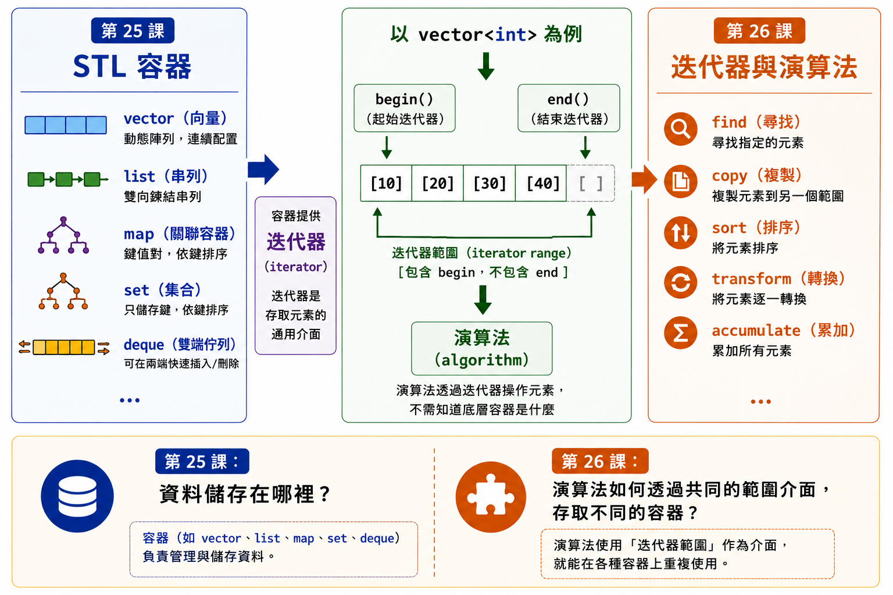
> 這堂課的重點：理解 STL 演算法如何透過 iterator 範圍操作不同容器。你會學習 iterator 的基本語意、半開區間、iterator category、唯讀與反向 iterator、位置移動工具、輸出 iterator、插入 iterator、stream iterator、失效規則，以及如何把多個演算法組合成清楚的資料處理流程。

> 第 19 章已介紹搜尋、排序與 `<algorithm>`，第 25 章已介紹 STL 容器。本章會把兩者連結起來，重點不再是記住單一函式，而是理解「容器提供 iterator，演算法處理 iterator 範圍」這個 STL 核心設計。

---

## Section I. 今天要做什麼？

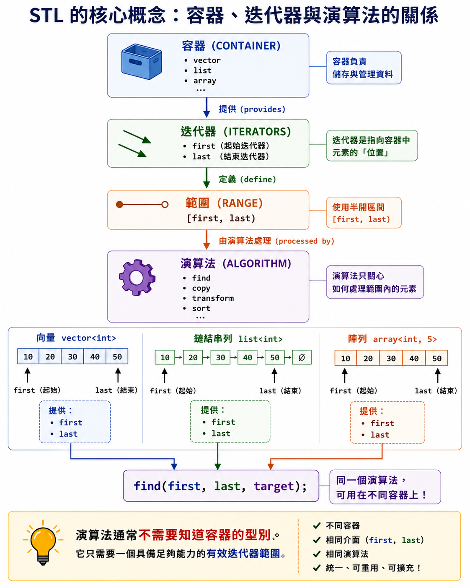
1. 複習 STL 容器與演算法。
2. 認識 iterator。
3. 理解 iterator 類似泛化指標。
4. 理解 iterator 不一定是真正裸指標。
5. 使用 `begin()`。
6. 使用 `end()`。
7. 理解半開區間 `[first, last)`。
8. 理解 `end()` 指向最後元素之後。
9. 避免解參考 `end()`。
10. 使用 `*iterator`。
11. 使用 `++iterator`。
12. 使用 `iterator->member`。
13. 比較 iterator 與 index。
14. 理解不同容器沒有共同 index 介面。
15. 理解 iterator 讓演算法不依賴容器型別。
16. 使用容器成員 `.begin()`。
17. 使用通用 `std::begin()`。
18. 使用通用 `std::end()`。
19. 使用傳統陣列搭配 `std::begin()`。
20. 使用 `cbegin()`。
21. 使用 `cend()`。
22. 使用 `std::cbegin()`。
23. 使用 `std::cend()`。
24. 理解 const iterator。
25. 理解 iterator to const。
26. 區分 `const_iterator` 與 `const iterator object`。
27. 使用 `rbegin()`。
28. 使用 `rend()`。
29. 使用 `crbegin()`。
30. 使用 `crend()`。
31. 理解 reverse iterator。
32. 使用 `base()` 取得對應正向位置。
33. 認識 iterator category。
34. 認識 input iterator。
35. 認識 output iterator。
36. 認識 forward iterator。
37. 認識 bidirectional iterator。
38. 認識 random access iterator。
39. 認識 contiguous iterator 概念預告。
40. 理解 C++17 iterator category。
41. 比較 vector iterator。
42. 比較 deque iterator。
43. 比較 list iterator。
44. 比較 forward_list iterator。
45. 比較 set iterator。
46. 比較 unordered container iterator。
47. 理解演算法的 iterator 要求。
48. 理解 `std::sort()` 需要 random access。
49. 理解 `std::reverse()` 需要 bidirectional。
50. 理解 `std::find()` 只需要 input iterator。
51. 理解 `std::copy()` 使用 input 與 output iterator。
52. 使用 `std::distance()`。
53. 使用 `std::advance()`。
54. 使用 `std::next()`。
55. 使用 `std::prev()`。
56. 理解 `advance()` 修改 iterator。
57. 理解 `next()` 回傳新 iterator。
58. 理解 `prev()` 回傳新 iterator。
59. 比較 random access 與 list 移動成本。
60. 避免對 list iterator 使用 `+`。
61. 使用 iterator range 表示子範圍。
62. 使用 `begin() + offset` 處理 vector。
63. 使用 `next(begin, offset)` 處理一般 iterator。
64. 使用 iterator pair 傳遞範圍。
65. 建立泛型 `printRange()`。
66. 建立泛型 `sumRange()`。
67. 使用 `iterator_traits`。
68. 使用 `iterator_traits<Iterator>::value_type`。
69. 使用 `typename` 處理相依型別。
70. 認識 difference type。
71. 使用 `iterator_traits<Iterator>::difference_type`。
72. 避免假設距離一定是 `int`。
73. 認識 input iterator 單次通過語意。
74. 認識 multi-pass guarantee。
75. 理解 forward iterator 支援多次通過。
76. 認識 output iterator 只能輸出。
77. 使用 `back_insert_iterator`。
78. 使用 `back_inserter()`。
79. 使用 `front_insert_iterator`。
80. 使用 `front_inserter()`。
81. 使用 `insert_iterator`。
82. 使用 `inserter()`。
83. 理解三種 insert iterator 的差異。
84. 使用 `std::copy()` 配合 `back_inserter()`。
85. 使用 `std::transform()` 配合 `back_inserter()`。
86. 使用 `std::copy_if()`。
87. 使用 `std::remove_copy_if()`。
88. 使用 `std::unique_copy()`。
89. 使用 `std::merge()`。
90. 使用 `std::set_union()`。
91. 使用 `std::set_intersection()`。
92. 理解集合演算法要求已排序範圍。
93. 使用 `std::includes()`。
94. 使用 `std::mismatch()`。
95. 使用 `std::equal()`。
96. 使用 `std::lexicographical_compare()`。
97. 使用 `std::search()`。
98. 使用 `std::search_n()`。
99. 使用 `std::find_end()`。
100. 使用 `std::find_first_of()`。
101. 使用 `std::adjacent_find()`。
102. 使用 `std::partition()`。
103. 使用 `std::partition_point()`。
104. 使用 `std::is_partitioned()`。
105. 使用 `std::stable_partition()`。
106. 使用 `std::rotate()`。
107. 使用 `std::rotate_copy()`。
108. 使用 `std::reverse_copy()`。
109. 使用 `std::copy_backward()`。
110. 使用 `std::move()` 演算法概念。
111. 區分 `<utility>` 的單值 `std::move` 與 `<algorithm>` 的範圍 `std::move`。
112. 不在本章深入移動語意。
113. 使用 `<numeric>`。
114. 使用 `std::accumulate()`。
115. 使用自訂累加操作。
116. 使用 `std::inner_product()`。
117. 使用 `std::partial_sum()`。
118. 使用 `std::adjacent_difference()`。
119. 使用 `std::iota()`。
120. 理解 iota 填入連續值。
121. 使用 `std::for_each()`。
122. 比較 `for_each()` 與 range-based for。
123. 使用 lambda 保存外部狀態。
124. 避免 lambda 中修改容器大小。
125. 使用 predicate。
126. 使用 comparator。
127. 使用 binary operation。
128. 使用 unary operation。
129. 理解演算法不會自動縮小容器。
130. 複習 erase-remove idiom。
131. 複習 erase-unique idiom。
132. 使用 output iterator 避免預先配置目的大小。
133. 理解目的範圍空間需求。
134. 避免 copy 到空 vector 的 `.begin()`。
135. 使用 `ostream_iterator`。
136. 使用 `istream_iterator`。
137. 使用 `istream_iterator<T>` 從輸入流讀取。
138. 使用預設建立的 `istream_iterator<T>` 表示輸入結束。
139. 使用 `ostream_iterator<T>` 輸出分隔符。
140. 結合 stream iterator 與 `std::copy()`。
141. 結合 stream iterator 與 `std::accumulate()`。
142. 認識 iterator invalidation。
143. 複習 vector reallocation。
144. 複習 vector erase。
145. 複習 deque 失效規則。
146. 複習 list 節點穩定性。
147. 複習 set 與 map insert。
148. 複習 unordered rehash。
149. 避免保存長期 iterator 指向可能改變的容器。
150. 正確使用 erase 回傳 iterator。
151. 避免 erase 後解參考舊 iterator。
152. 避免演算法執行中修改同一容器結構。
153. 理解 const-correctness。
154. 查詢演算法使用 `cbegin()` 與 `cend()`。
155. 修改演算法使用 `begin()` 與 `end()`。
156. 理解 set iterator 即使非 const 也不能修改 key。
157. 理解 map iterator 可修改 mapped value。
158. 理解 map key 是 const。
159. 使用 structured binding 與 iterator。
160. 使用 `auto` 簡化 iterator 型別。
161. 避免完全不知道型別語意地濫用 `auto`。
162. 建立 iterator type alias。
163. 使用 `using Iterator = ...`。
164. 認識 sentinel 概念預告。
165. 理解 C++17 通常要求 first 與 last 同型別。
166. 認識 C++20 ranges。
167. 認識 `std::ranges::sort`。
168. 認識 view。
169. 認識 lazy evaluation。
170. 不在本章深入 ranges。
171. 認識自訂 iterator。
172. 理解自訂 iterator 需要運算子與 traits。
173. 不在本章完整實作自訂 iterator。
174. 使用 span 概念預告。
175. 理解 C++20 `std::span` 表示非擁有連續範圍。
176. C++17 可使用 iterator pair 表示範圍。
177. 建立演算法 pipeline。
178. 讀取資料。
179. 過濾資料。
180. 轉換資料。
181. 排序資料。
182. 去除重複。
183. 累加與輸出。
184. 保持每一步資料流清楚。
185. 避免單一巨大 lambda。
186. 使用具名函式改善可讀性。
187. 使用標準演算法取代手寫迴圈的適當情況。
188. 不為使用演算法而強迫改寫清楚迴圈。
189. 優先選擇最能表達意圖的寫法。
190. 測試空範圍。
191. 測試單一元素範圍。
192. 測試找不到結果。
193. 測試重複值。
194. 測試 iterator 到達 end。
195. 使用概念檢查、程式閱讀與實作題整合本章。

---

## Section II. 今天的學習方式

1. 看到演算法時先標示：
   ```text
   輸入 iterator 類別
   是否修改元素
   輸出位置
   回傳值
   ```
2. 看到範圍時讀成：
   ```text
   [first, last)
   ```
3. 任何解參考前先確認：
   ```cpp
   iterator != last
   ```
4. 需要跨容器泛化時使用 iterator，不依賴 index。
5. 對 list 等非 random access iterator 使用：
   ```cpp
   next()
   advance()
   distance()
   ```
6. 複製到空 vector 時使用：
   ```cpp
   back_inserter(destination)
   ```
7. 查詢操作優先使用 const iterator。
8. 修改容器結構後重新檢查 iterator 是否仍有效。
9. 集合演算法前先確認輸入已排序。
10. 所有合法完整程式使用嚴格 C++17 選項檢查。

---

## Section III. 核心語法對照

| 語法 | 用途 |
| --- | --- |
| `container.begin()` | 第一個元素位置 |
| `container.end()` | 最後元素之後 |
| `container.cbegin()` | 唯讀第一個位置 |
| `container.cend()` | 唯讀結束位置 |
| `container.rbegin()` | 反向第一個位置 |
| `container.rend()` | 反向結束位置 |
| `*iterator` | 讀取或修改元素 |
| `iterator->member` | 存取物件成員 |
| `++iterator` | 移到下一位置 |
| `distance(first, last)` | 計算距離 |
| `advance(iterator, n)` | 原地移動 iterator |
| `next(iterator, n)` | 回傳向後移動的新 iterator |
| `prev(iterator, n)` | 回傳向前移動的新 iterator |
| `back_inserter(container)` | 透過 `push_back()` 輸出 |
| `front_inserter(container)` | 透過 `push_front()` 輸出 |
| `inserter(container, position)` | 在指定位置輸出 |
| `istream_iterator<T>` | 從輸入流讀取 |
| `ostream_iterator<T>` | 寫入輸出流 |
| `iterator_traits<It>::value_type` | Iterator 元素型別 |
| `iterator_traits<It>::difference_type` | Iterator 距離型別 |

---

# Part A：Iterator 的角色

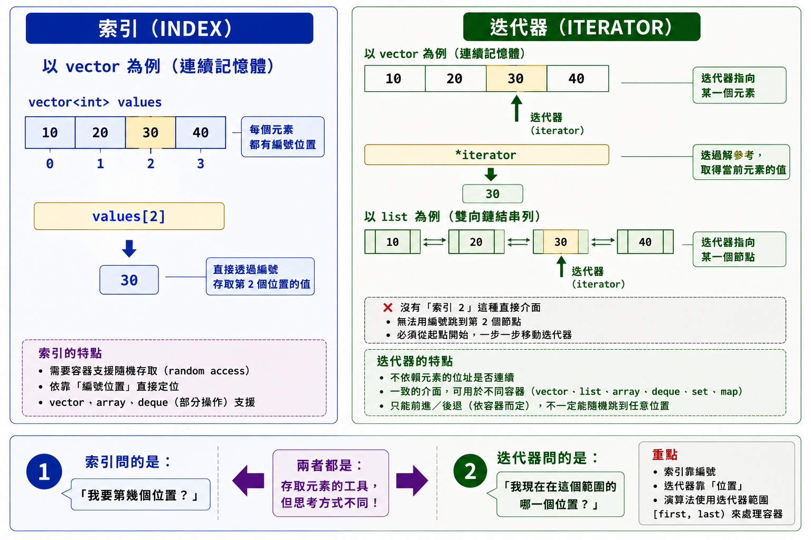

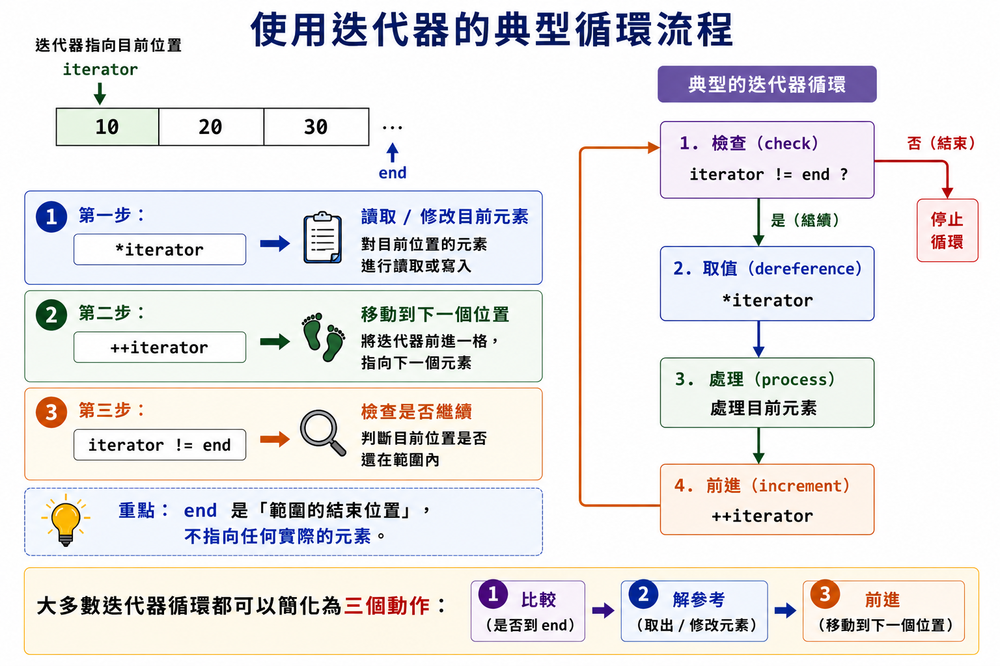
## Section IV. 泛化位置

Iterator 表示：

```text
容器中的某個位置
```

它通常支援：

```cpp
*iterator
++iterator
iterator != end
```

不同 iterator 能力不同。

---

## Section V. Iterator 不一定是指標

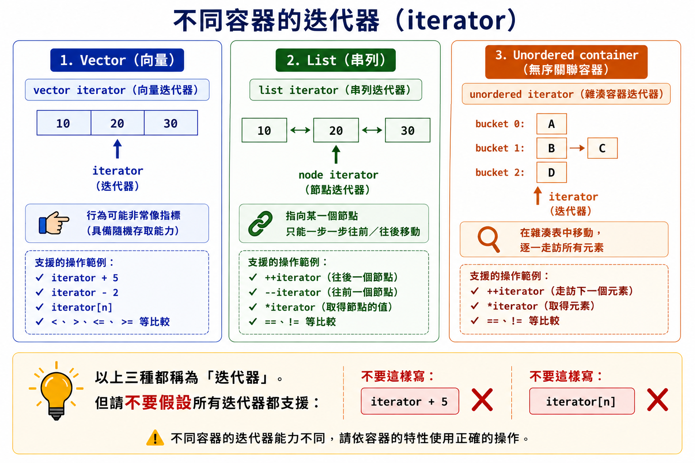
Vector iterator 可能很像指標。

List iterator 通常包裝節點位置。

Unordered iterator 通常在 bucket 與節點間移動。

因此不要假設所有 iterator 都可：

```cpp
iterator + 5
iterator[3]
```

---

## Section VI. 完整基本走訪

```cpp
// VALIDATE
#include <iostream>
#include <vector>
using namespace std;

int main() {
    vector<int> values{
        10,
        20,
        30
    };

    for (
        auto iterator =
            values.cbegin();
        iterator !=
            values.cend();
        ++iterator
    ) {
        cout << *iterator
             << " ";
    }

    cout << '\n';

    return 0;
}
```

---

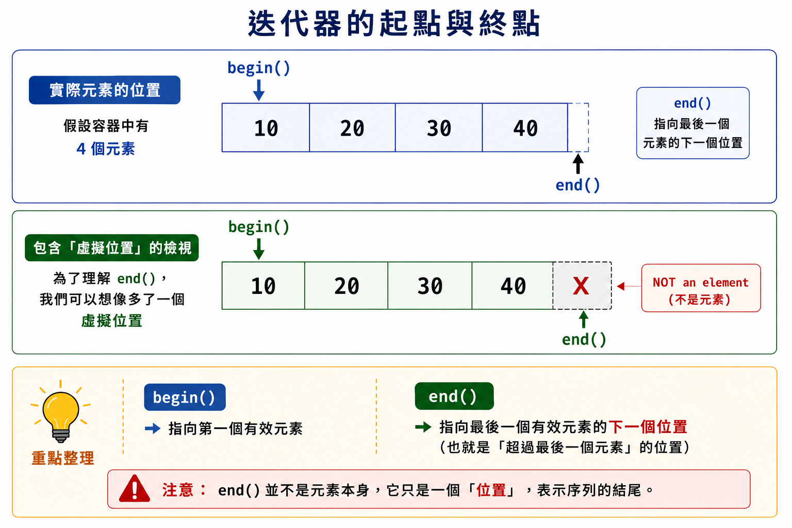
# Part B：半開區間

## Section VII. `[first, last)`

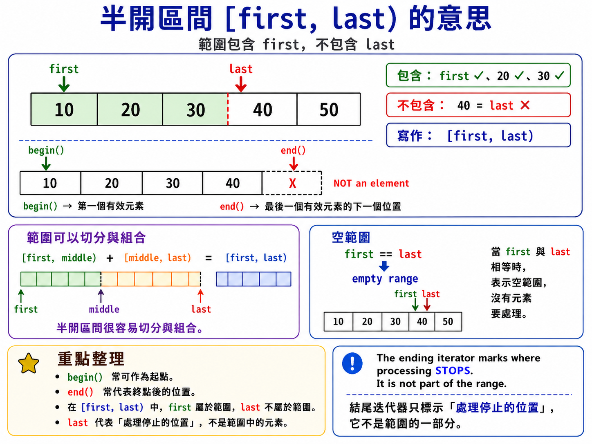
包含：

```text
first
```

不包含：

```text
last
```

---

## Section VIII. 好處

- 空範圍：`first == last`
- 元素數：`distance(first, last)`
- 子範圍容易切割
- 相鄰區間容易拼接
- `end()` 自然代表結束

---

## Section IX. 不可解參考 End

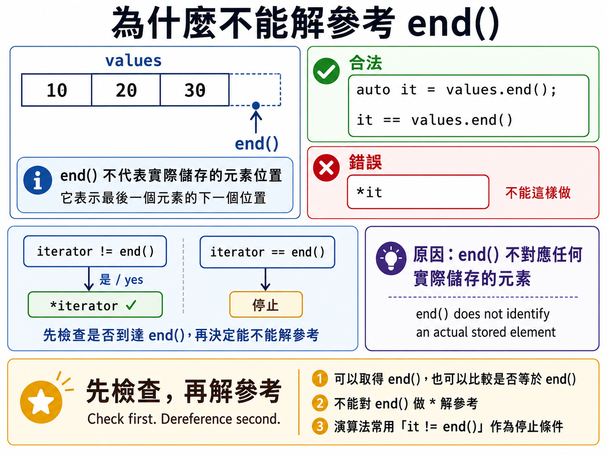
危險：

```cpp
auto iterator =
    values.end();

/* cout << *iterator; */
```

`end()` 不指向有效元素。

---

# Part C：通用 `begin()` 與 `end()`

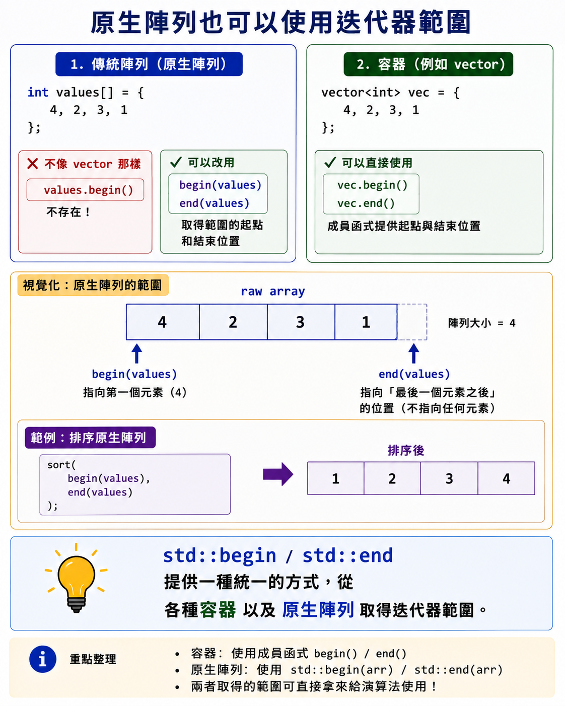
## Section X. 傳統陣列

```cpp
int values[] = {
    1,
    2,
    3
};
```

可使用：

```cpp
begin(values)
end(values)
```

---

## Section XI. 完整通用 Begin/End

```cpp
// VALIDATE
#include <algorithm>
#include <iostream>
#include <iterator>
using namespace std;

int main() {
    int values[] = {
        4,
        2,
        3,
        1
    };

    sort(
        begin(values),
        end(values)
    );

    for (
        auto iterator =
            cbegin(values);
        iterator !=
            cend(values);
        ++iterator
    ) {
        cout << *iterator
             << " ";
    }

    cout << '\n';

    return 0;
}
```

---

# Part D：Const Iterator

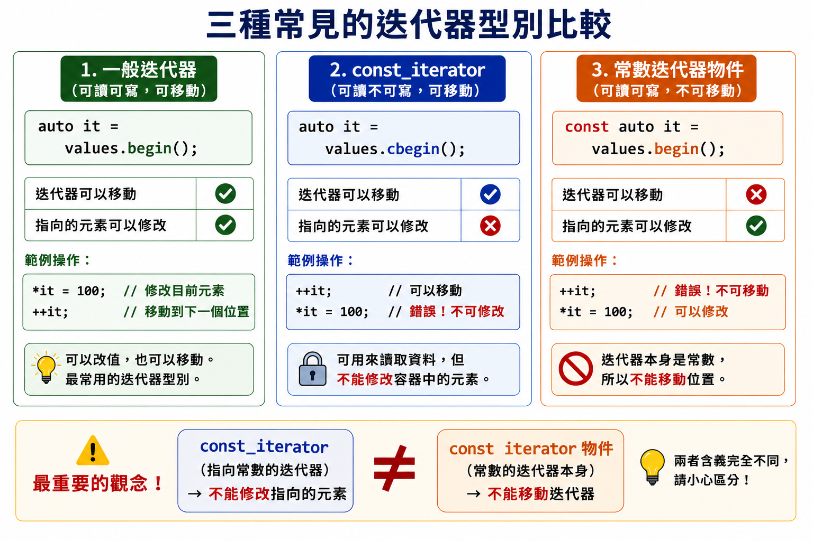
## Section XII. `const_iterator`

```cpp
vector<int>::const_iterator
```

不能透過 iterator 修改元素。

---

## Section XIII. Const Iterator Object

以下不同：

```cpp
const auto iterator =
    values.begin();
```

Iterator 物件本身不能重新指向其他位置，但若它指向可修改元素，仍可能透過它修改元素。

因此「iterator 本身 const」不等於「指向 const 元素」。

---

## Section XIV. 實務建議

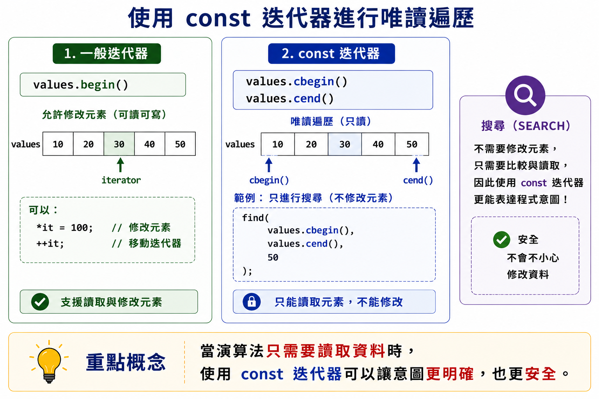
唯讀走訪使用：

```cpp
cbegin()
cend()
```

這直接表達意圖。

---

# Part E：Reverse Iterator

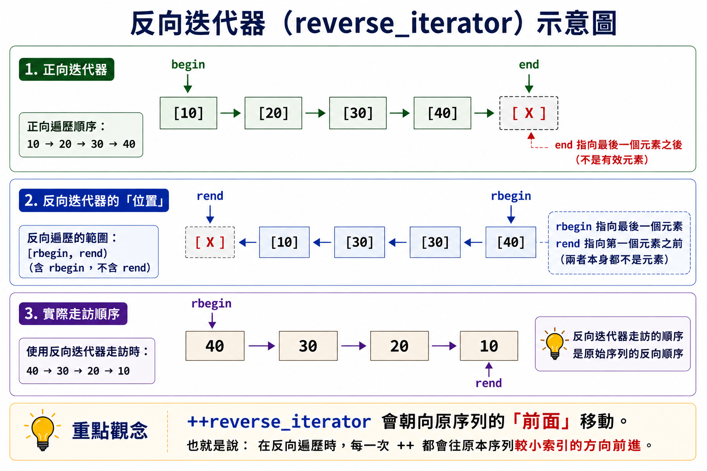
## Section XV. 反向走訪

```cpp
rbegin()
rend()
```

`rbegin()` 指向最後一個元素。

`rend()` 代表第一個元素之前的反向結束位置。

---

## Section XVI. 完整反向走訪

```cpp
// VALIDATE
#include <iostream>
#include <vector>
using namespace std;

int main() {
    vector<int> values{
        10,
        20,
        30,
        40
    };

    for (
        auto iterator =
            values.crbegin();
        iterator !=
            values.crend();
        ++iterator
    ) {
        cout << *iterator
             << " ";
    }

    cout << '\n';

    return 0;
}
```

輸出：

```text
40 30 20 10
```

---

## Section XVII. `base()`

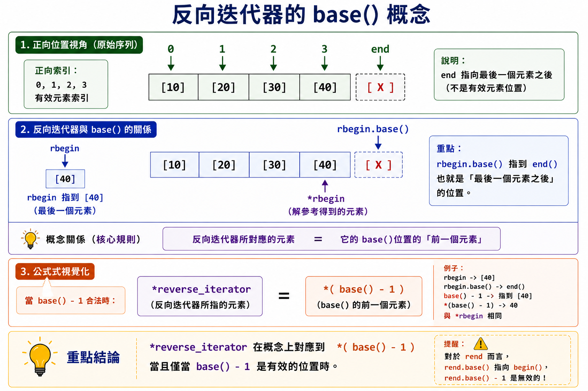
Reverse iterator 的 `.base()` 回傳對應正向 iterator。

要注意：

```text
reverse iterator 指向的元素
通常位於 base() 的前一個位置
```

---

# Part F：Iterator Category

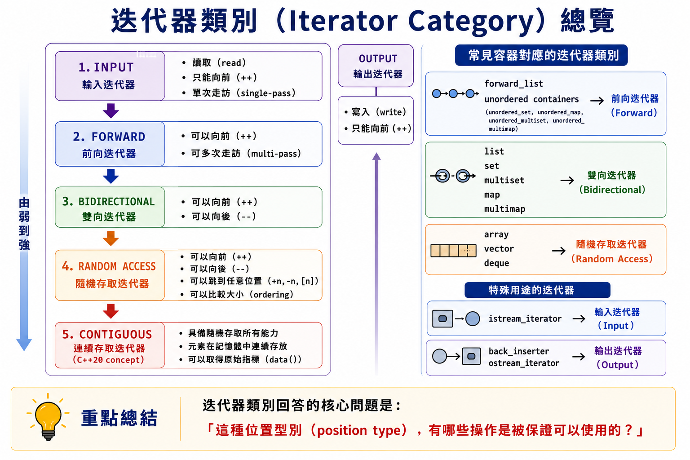
## Section XVIII. Input Iterator

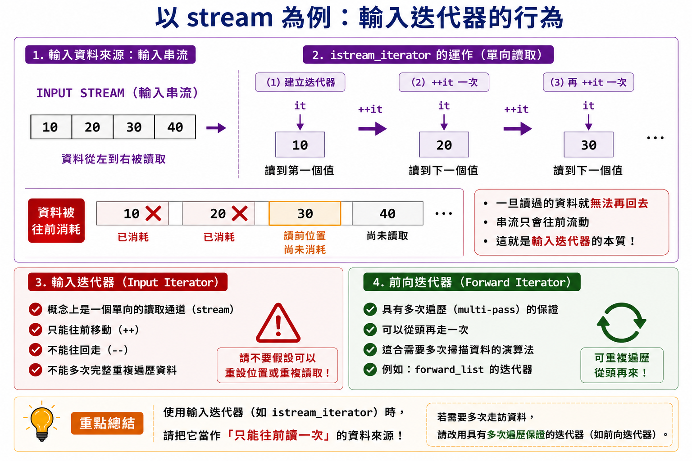
支援：

- 讀取
- 前進
- 比較
- 單次通過語意

例：

```cpp
istream_iterator
```

---

## Section XIX. Output Iterator

支援：

- 寫入
- 前進

例：

```cpp
back_insert_iterator
ostream_iterator
```

---

## Section XX. Forward Iterator

具備 input iterator 能力，並支援多次通過。

例：

```cpp
forward_list iterator
unordered container iterator
```

---

## Section XXI. Bidirectional Iterator

可：

```cpp
++iterator
--iterator
```

例：

```cpp
list
set
map
```

---

## Section XXII. Random Access Iterator

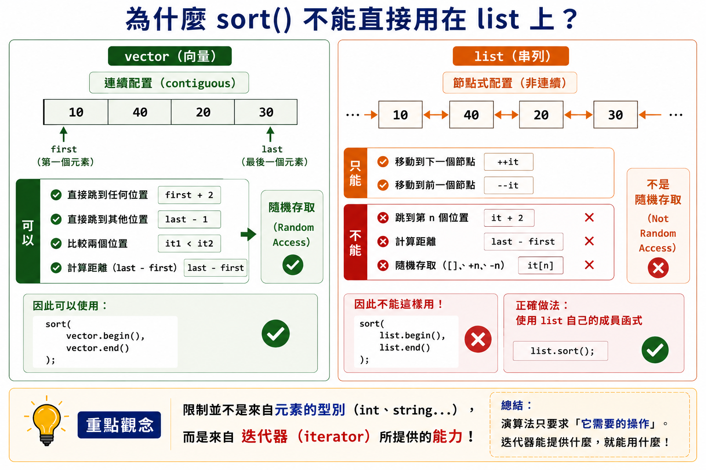
可：

```cpp
iterator + n
iterator - n
iterator[n]
iterator < other
```

例：

```cpp
vector
deque
array
```

---

## Section XXIII. 演算法要求

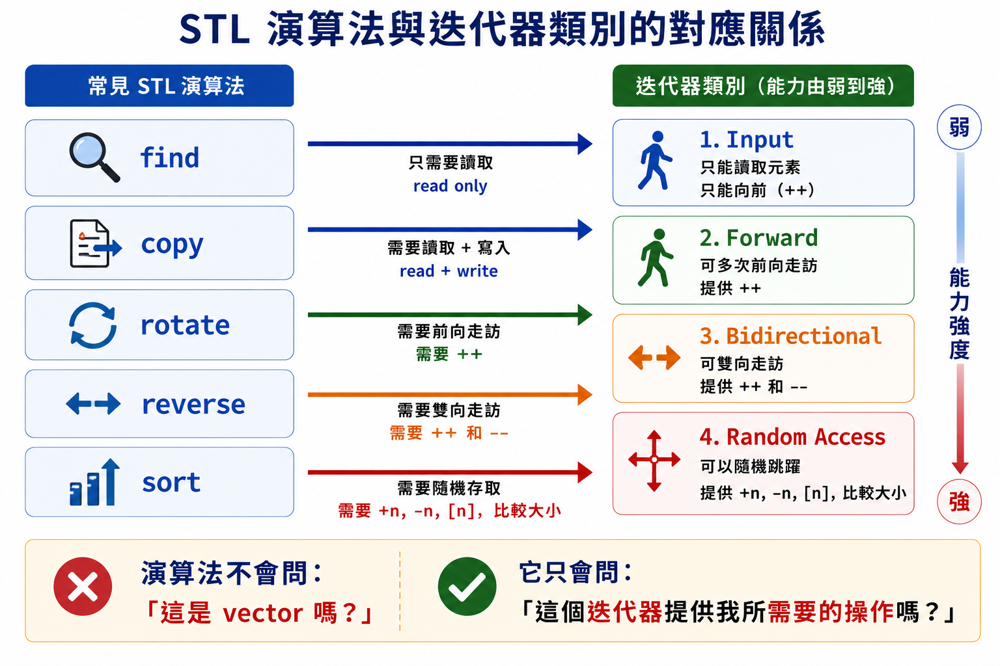
| 演算法 | 最低常見要求 |
| --- | --- |
| `find()` | Input iterator |
| `copy()` | Input + Output iterator |
| `reverse()` | Bidirectional iterator |
| `rotate()` | Forward iterator |
| `sort()` | Random access iterator |
| `lower_bound()` | Forward iterator，但 random access 更快 |

---

# Part G：Distance、Advance、Next、Prev

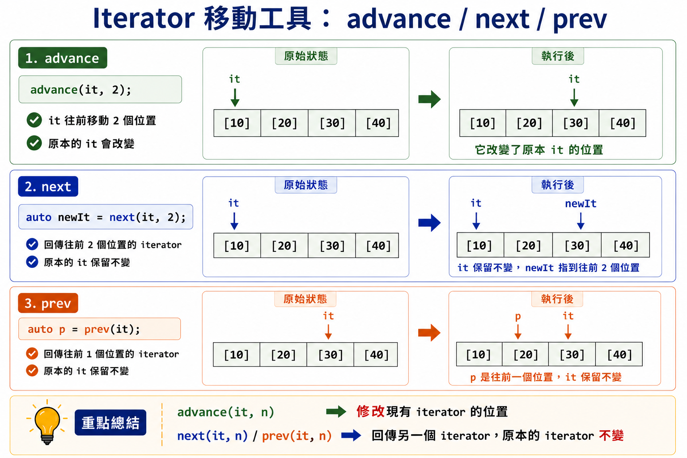
## Section XXIV. `distance()`

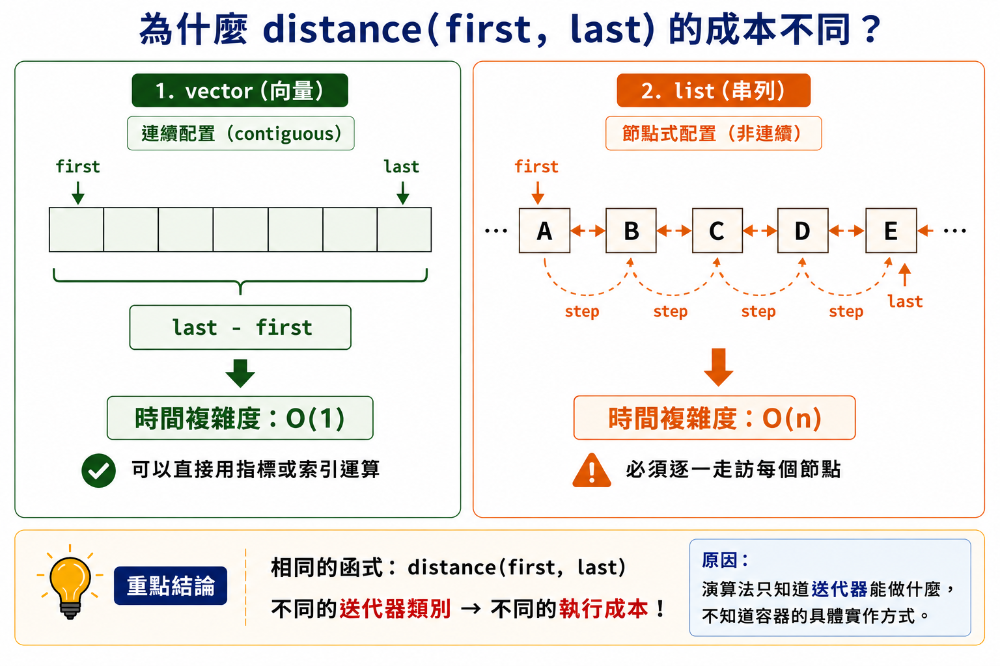
```cpp
auto count =
    distance(
        first,
        last
    );
```

Vector 通常可在 `O(1)` 計算。

List 通常需要走訪，為 `O(n)`。

---

## Section XXV. `advance()`

```cpp
advance(
    iterator,
    offset
);
```

直接修改原 iterator。

---

## Section XXVI. `next()`

```cpp
auto newIterator =
    next(
        iterator,
        offset
    );
```

原 iterator 不變。

---

## Section XXVII. `prev()`

```cpp
auto previous =
    prev(iterator);
```

需要 bidirectional iterator。

---

## Section XXVIII. 完整 List 移動

```cpp
// VALIDATE
#include <iostream>
#include <iterator>
#include <list>
using namespace std;

int main() {
    list<int> values{
        10,
        20,
        30,
        40,
        50
    };

    auto iterator =
        values.begin();

    advance(
        iterator,
        2
    );

    cout << *iterator
         << '\n';

    auto nextIterator =
        next(iterator);

    cout << *nextIterator
         << '\n';

    auto previousIterator =
        prev(iterator);

    cout << *previousIterator
         << '\n';

    return 0;
}
```

---

# Part H：子範圍

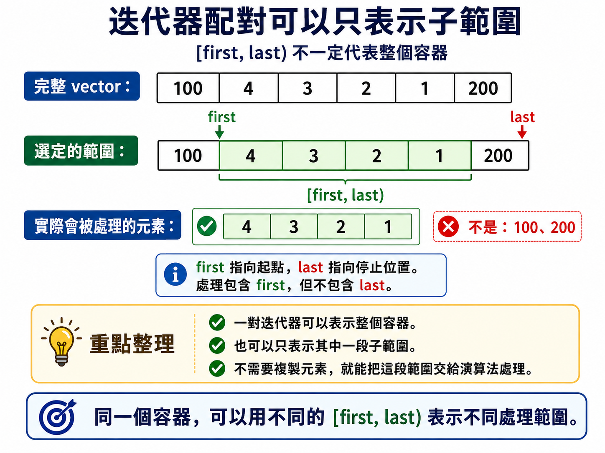
## Section XXIX. Vector 子範圍

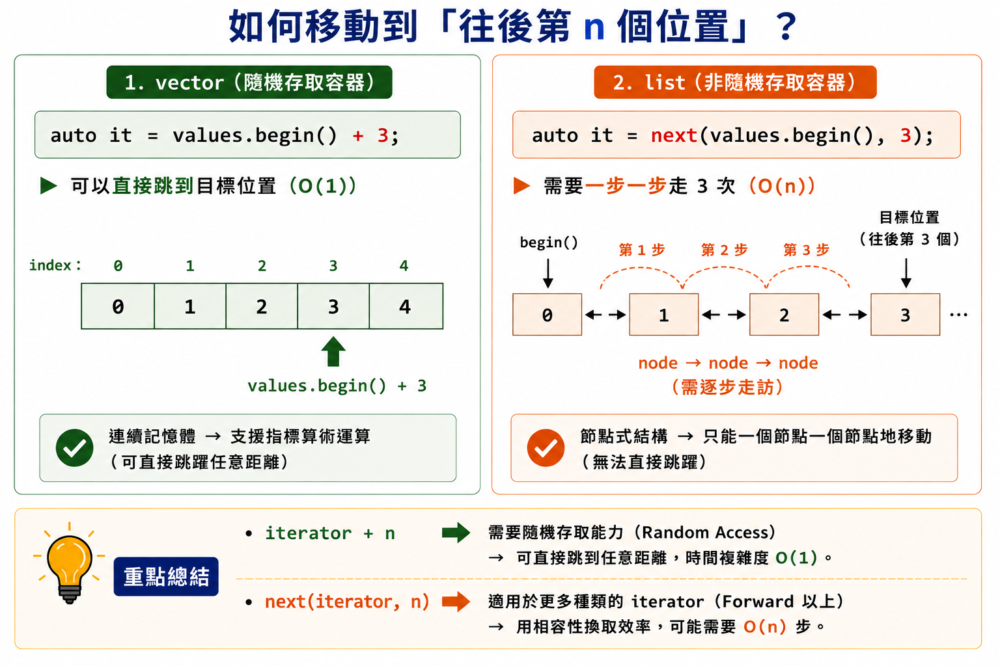
```cpp
sort(
    values.begin() + 1,
    values.end() - 1
);
```

只適用於 random access iterator。

---

## Section XXX. 通用子範圍

```cpp
auto first =
    next(
        values.begin(),
        1
    );

auto last =
    next(
        values.begin(),
        4
    );
```

適用範圍更廣。

---

## Section XXXI. 完整子範圍處理

```cpp
// VALIDATE
#include <algorithm>
#include <iostream>
#include <iterator>
#include <list>
using namespace std;

int main() {
    list<int> values{
        100,
        4,
        3,
        2,
        1,
        200
    };

    auto first =
        next(
            values.begin()
        );

    auto last =
        prev(
            values.end()
        );

    reverse(
        first,
        last
    );

    for (int value : values) {
        cout << value
             << " ";
    }

    cout << '\n';

    return 0;
}
```

處理索引概念上的 `1` 到 `4`，不包含 `last` 指向的 `200`。

---

# Part I：泛型 Iterator Range

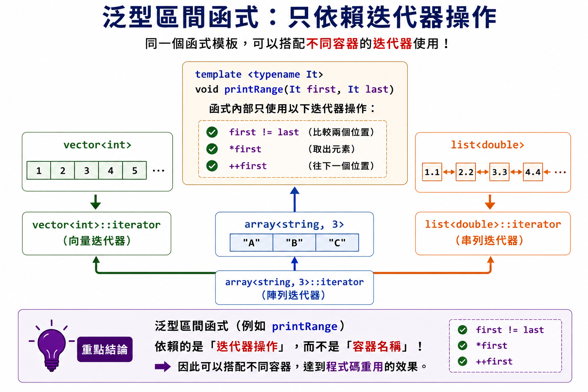
## Section XXXII. `printRange()`

```cpp
template <typename Iterator>
void printRange(
    Iterator first,
    Iterator last
)
```

---

## Section XXXIII. 完整泛型範圍

```cpp
// VALIDATE
#include <array>
#include <iostream>
#include <string>
#include <vector>
using namespace std;

template <typename Iterator>
void printRange(
    Iterator first,
    Iterator last
) {
    while (
        first !=
        last
    ) {
        cout << *first
             << " ";

        ++first;
    }

    cout << '\n';
}

int main() {
    vector<int> numbers{
        1,
        2,
        3
    };

    array<string, 3> words{
        "one",
        "two",
        "three"
    };

    printRange(
        numbers.cbegin(),
        numbers.cend()
    );

    printRange(
        words.cbegin(),
        words.cend()
    );

    return 0;
}
```

---

# Part J：Iterator Traits

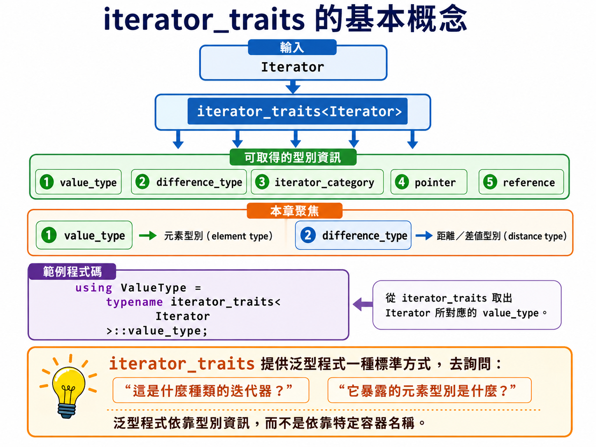
## Section XXXIV. 取得元素型別

```cpp
typename iterator_traits<
    Iterator
>::value_type
```

---

## Section XXXV. 取得距離型別

```cpp
typename iterator_traits<
    Iterator
>::difference_type
```

---

## Section XXXVI. 完整 Sum Range

```cpp
// VALIDATE
#include <iostream>
#include <iterator>
#include <list>
#include <vector>
using namespace std;

template <typename Iterator>
auto sumRange(
    Iterator first,
    Iterator last
) {
    using ValueType =
        typename iterator_traits<
            Iterator
        >::value_type;

    ValueType total{};

    while (
        first !=
        last
    ) {
        total += *first;
        ++first;
    }

    return total;
}

int main() {
    vector<int> integers{
        1,
        2,
        3
    };

    list<double> decimals{
        1.5,
        2.5,
        3.0
    };

    cout << sumRange(
                integers.cbegin(),
                integers.cend()
            )
         << '\n';

    cout << sumRange(
                decimals.cbegin(),
                decimals.cend()
            )
         << '\n';

    return 0;
}
```

---

# Part K：Output Iterator

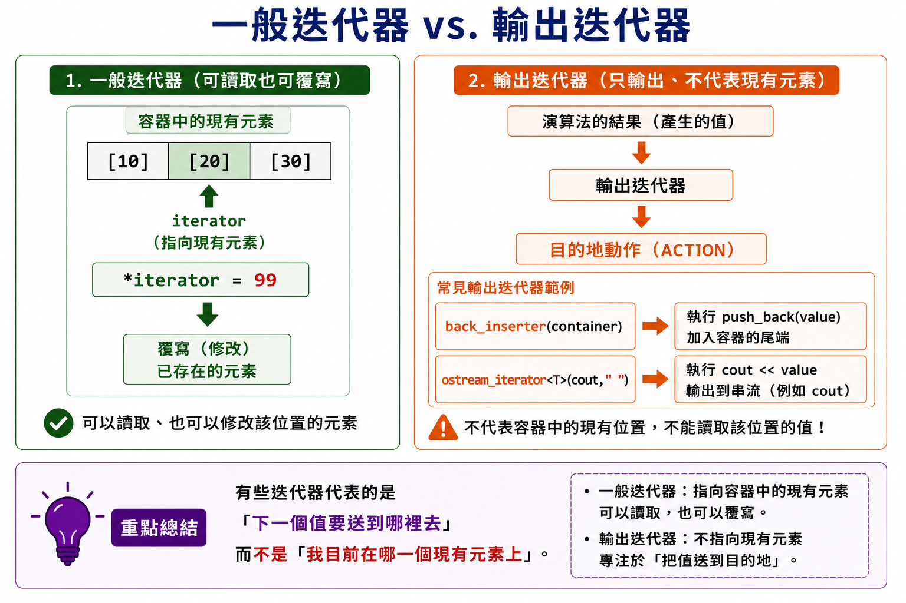
## Section XXXVII. 輸出目的地

有些 iterator 不是指向既有元素，而是表示：

```text
把值寫到某個目的地
```

例如：

- `back_inserter`
- `front_inserter`
- `inserter`
- `ostream_iterator`

---

# Part L：`back_inserter()`

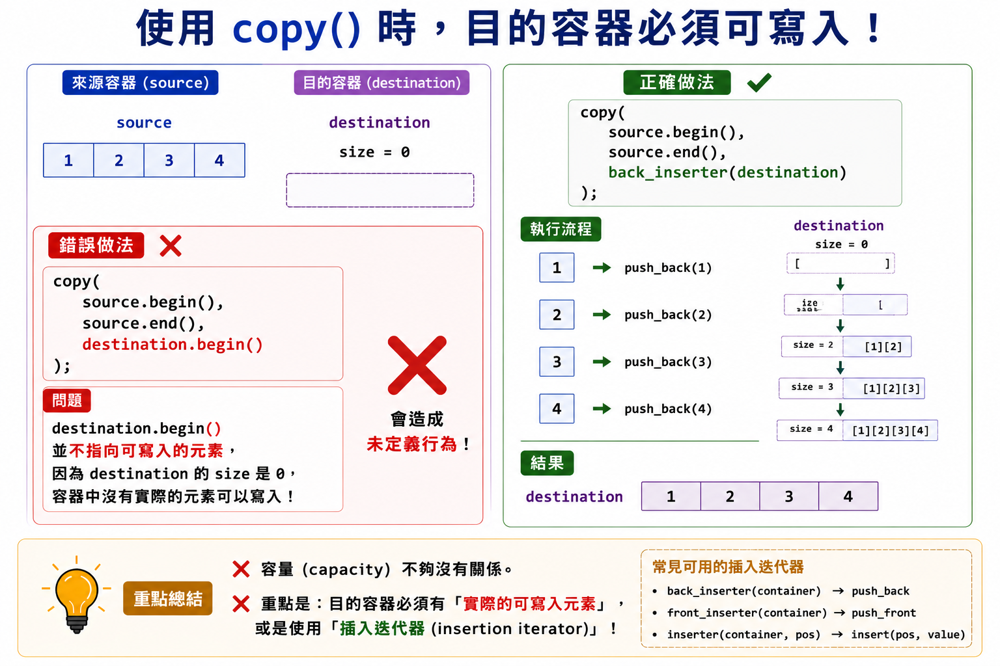
## Section XXXVIII. 空 Vector 的安全複製

錯誤：

```cpp
vector<int> destination;

/* copy(
    source.begin(),
    source.end(),
    destination.begin()
); */
```

Destination 沒有可寫元素。

---

## Section XXXIX. 正確方式

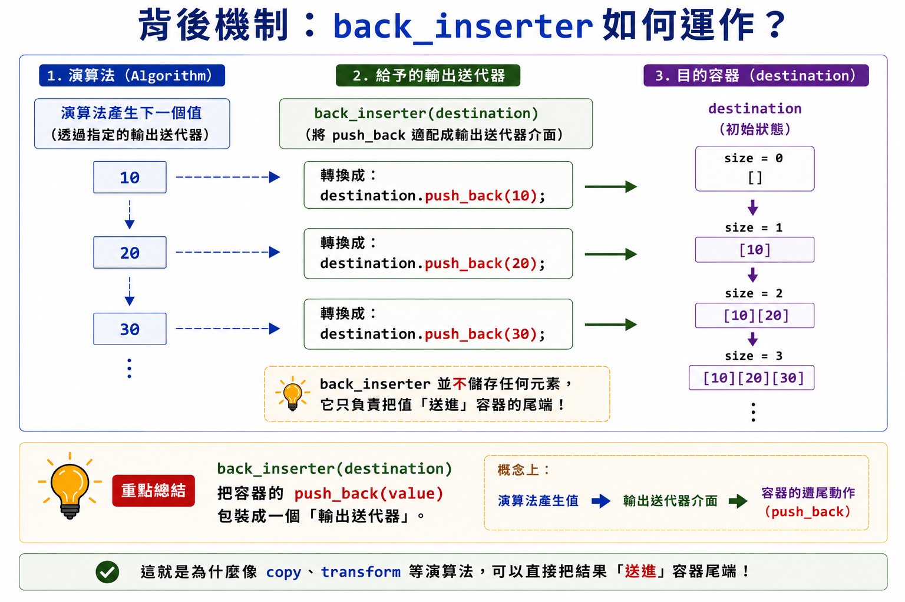
```cpp
copy(
    source.begin(),
    source.end(),
    back_inserter(destination)
);
```

---

## Section XL. 完整 Back Inserter

```cpp
// VALIDATE
#include <algorithm>
#include <iostream>
#include <iterator>
#include <vector>
using namespace std;

int main() {
    vector<int> source{
        1,
        2,
        3,
        4
    };

    vector<int> destination;

    destination.reserve(
        source.size()
    );

    copy(
        source.cbegin(),
        source.cend(),
        back_inserter(
            destination
        )
    );

    for (
        int value :
        destination
    ) {
        cout << value
             << " ";
    }

    cout << '\n';

    return 0;
}
```

---

# Part M：Front Inserter 與 Inserter

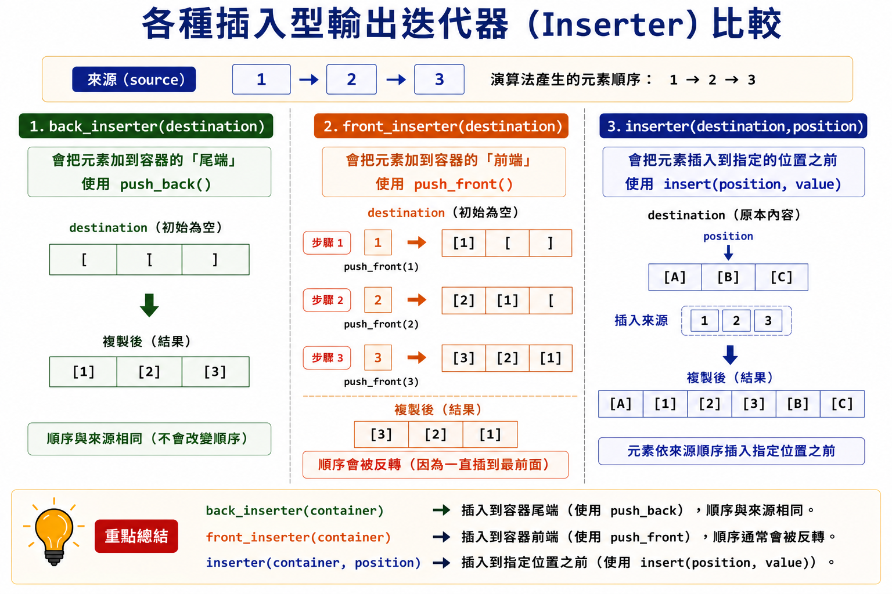
## Section XLI. `front_inserter()`

需要容器支援：

```cpp
push_front()
```

例如：

- deque
- list

由於每次插入前端，複製順序可能反轉。

---

## Section XLII. `inserter()`

```cpp
inserter(
    container,
    position
)
```

使用容器的 `insert()`。

適合：

- set
- map
- 在指定位置插入的 sequence container

---

## Section XLIII. 完整 Inserter 比較

```cpp
// VALIDATE
#include <algorithm>
#include <deque>
#include <iostream>
#include <iterator>
#include <set>
#include <vector>
using namespace std;

int main() {
    vector<int> source{
        1,
        2,
        3
    };

    deque<int> reversed;

    copy(
        source.cbegin(),
        source.cend(),
        front_inserter(
            reversed
        )
    );

    set<int> uniqueValues;

    copy(
        source.cbegin(),
        source.cend(),
        inserter(
            uniqueValues,
            uniqueValues.end()
        )
    );

    for (int value : reversed) {
        cout << value
             << " ";
    }

    cout << '\n';

    for (int value : uniqueValues) {
        cout << value
             << " ";
    }

    cout << '\n';

    return 0;
}
```

---

# Part N：Copy、Transform、Filter Pipeline

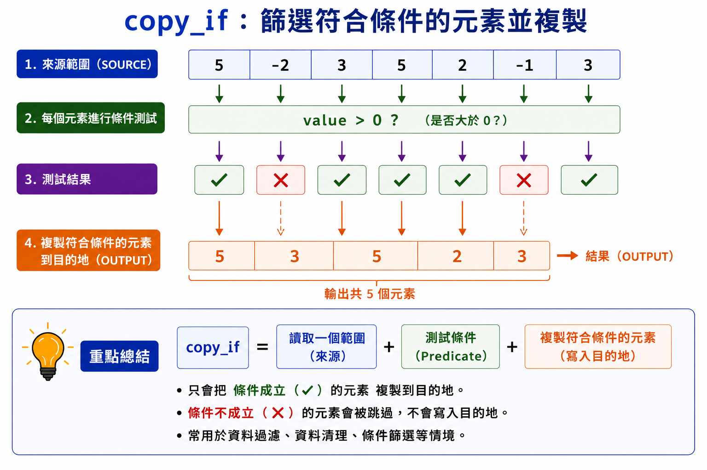

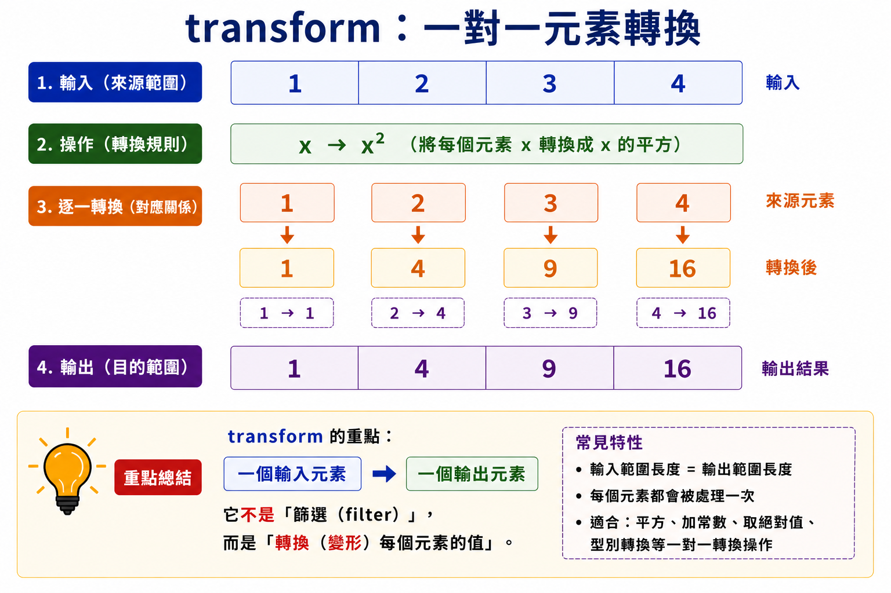

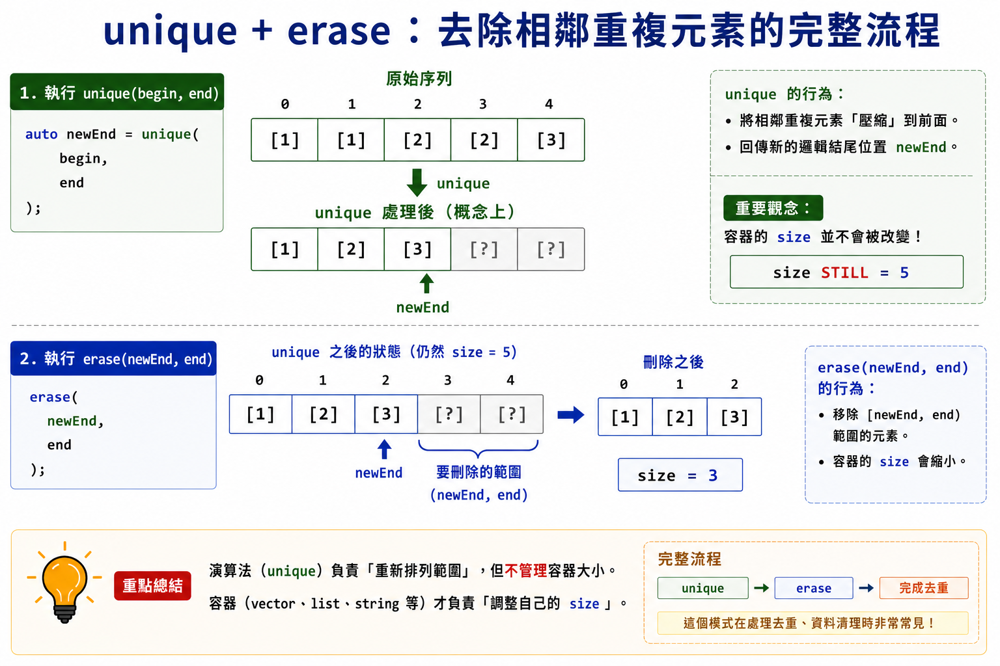

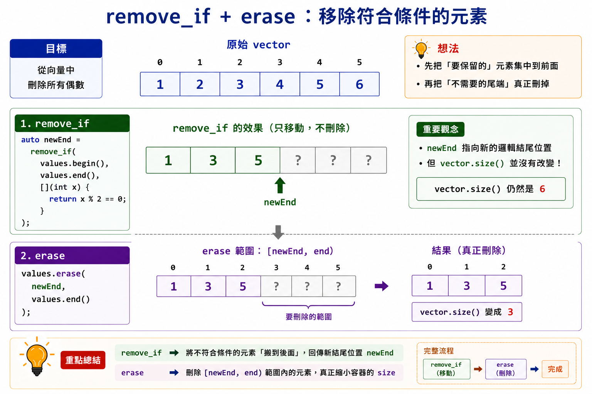
## Section XLIV. 常見流程

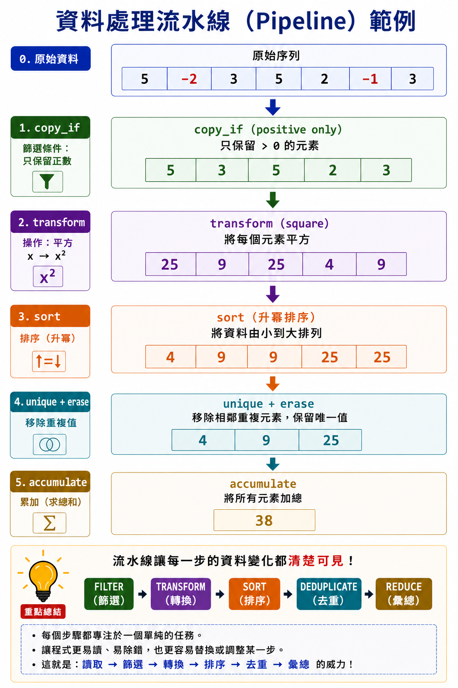
```text
原資料
→ 過濾
→ 轉換
→ 排序
→ 去重
→ 輸出
```

---

## Section XLV. 完整 Pipeline

```cpp
// VALIDATE
#include <algorithm>
#include <iostream>
#include <iterator>
#include <vector>
using namespace std;

int main() {
    vector<int> source{
        5,
        -2,
        3,
        5,
        2,
        -1,
        3
    };

    vector<int> positiveValues;

    copy_if(
        source.cbegin(),
        source.cend(),
        back_inserter(
            positiveValues
        ),
        [](int value) {
            return value > 0;
        }
    );

    vector<int> squaredValues;

    transform(
        positiveValues.cbegin(),
        positiveValues.cend(),
        back_inserter(
            squaredValues
        ),
        [](int value) {
            return
                value * value;
        }
    );

    sort(
        squaredValues.begin(),
        squaredValues.end()
    );

    squaredValues.erase(
        unique(
            squaredValues.begin(),
            squaredValues.end()
        ),
        squaredValues.end()
    );

    for (int value : squaredValues) {
        cout << value
             << " ";
    }

    cout << '\n';

    return 0;
}
```

---

# Part O：搜尋子序列

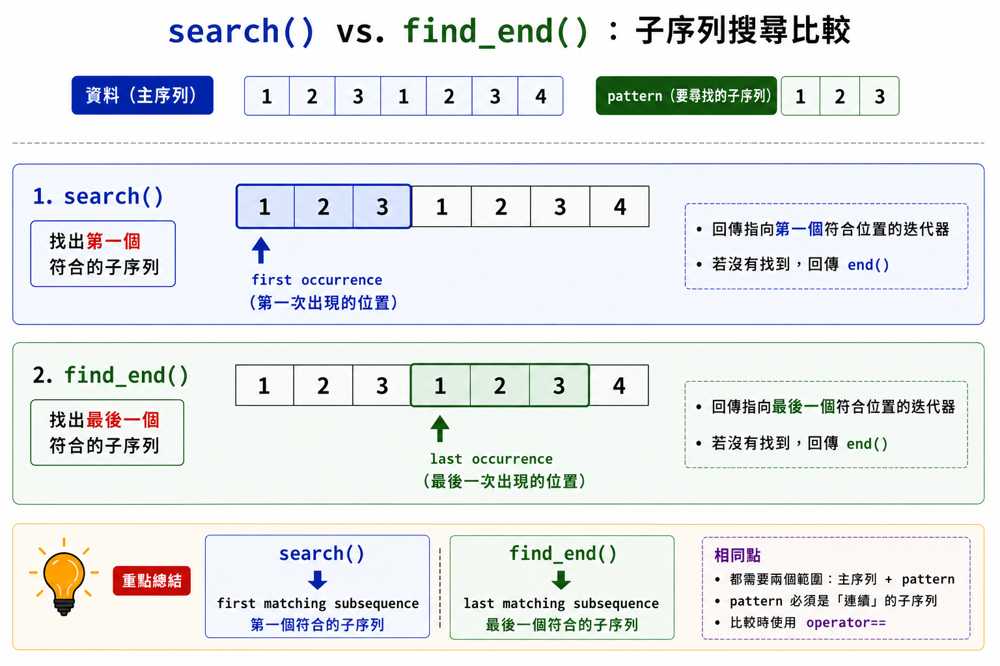

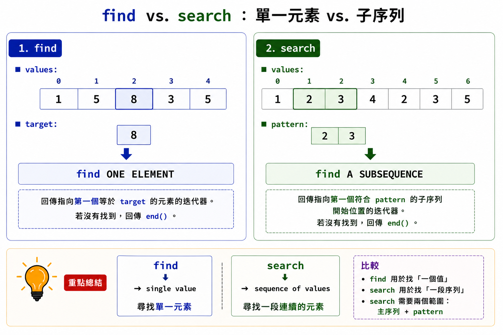
## Section XLVI. `search()`

尋找完整子序列第一次出現位置。

---

## Section XLVII. `find_end()`

尋找完整子序列最後一次出現位置。

---

## Section XLVIII. 完整子序列搜尋

```cpp
// VALIDATE
#include <algorithm>
#include <iostream>
#include <iterator>
#include <vector>
using namespace std;

int main() {
    vector<int> values{
        1,
        2,
        3,
        1,
        2,
        3,
        4
    };

    vector<int> pattern{
        1,
        2,
        3
    };

    auto firstMatch =
        search(
            values.cbegin(),
            values.cend(),
            pattern.cbegin(),
            pattern.cend()
        );

    auto lastMatch =
        find_end(
            values.cbegin(),
            values.cend(),
            pattern.cbegin(),
            pattern.cend()
        );

    cout << distance(
                values.cbegin(),
                firstMatch
            )
         << " "
         << distance(
                values.cbegin(),
                lastMatch
            )
         << '\n';

    return 0;
}
```

---

# Part P：Partition

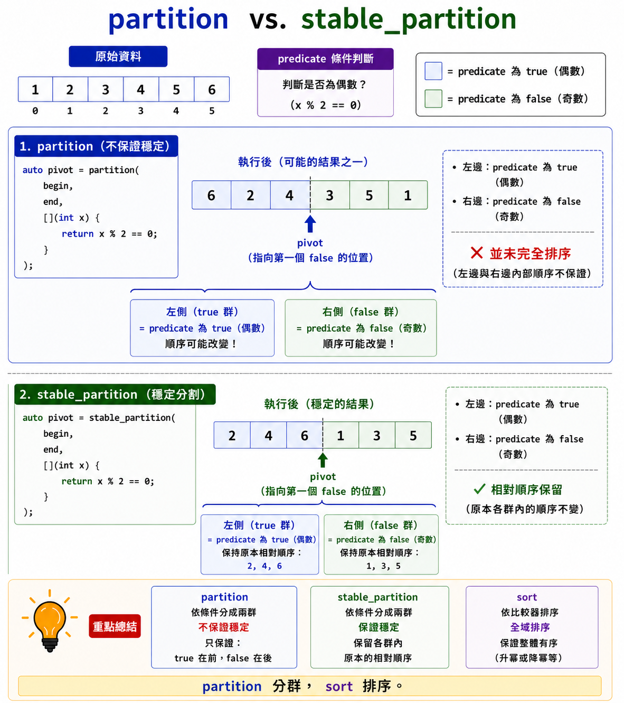
## Section XLIX. 分組而不完全排序

```cpp
partition(
    first,
    last,
    predicate
);
```

將符合條件元素放前方。

---

## Section L. `partition_point()`

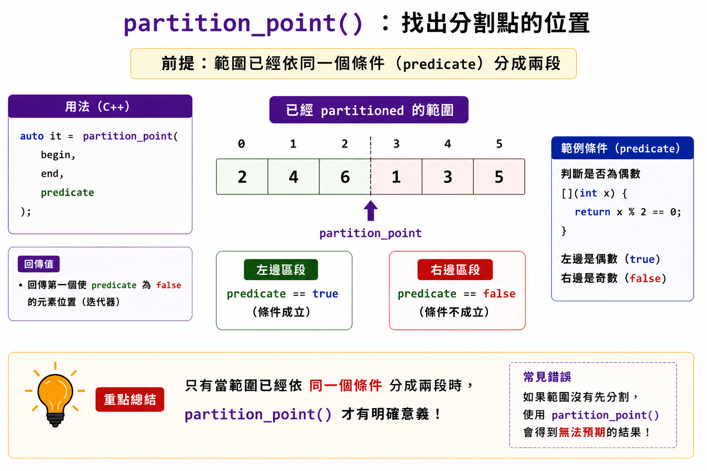
若範圍已 partitioned，可取得第一個不符合條件的位置。

---

## Section LI. 完整奇偶分組

```cpp
// VALIDATE
#include <algorithm>
#include <iostream>
#include <vector>
using namespace std;

int main() {
    vector<int> values{
        1,
        2,
        3,
        4,
        5,
        6
    };

    auto boundary =
        stable_partition(
            values.begin(),
            values.end(),
            [](int value) {
                return
                    value % 2 == 0;
            }
        );

    cout << "Even: ";

    for (
        auto iterator =
            values.cbegin();
        iterator !=
            boundary;
        ++iterator
    ) {
        cout << *iterator
             << " ";
    }

    cout << "\nOdd: ";

    for (
        auto iterator =
            boundary;
        iterator !=
            values.cend();
        ++iterator
    ) {
        cout << *iterator
             << " ";
    }

    cout << '\n';

    return 0;
}
```

---

# Part Q：集合演算法

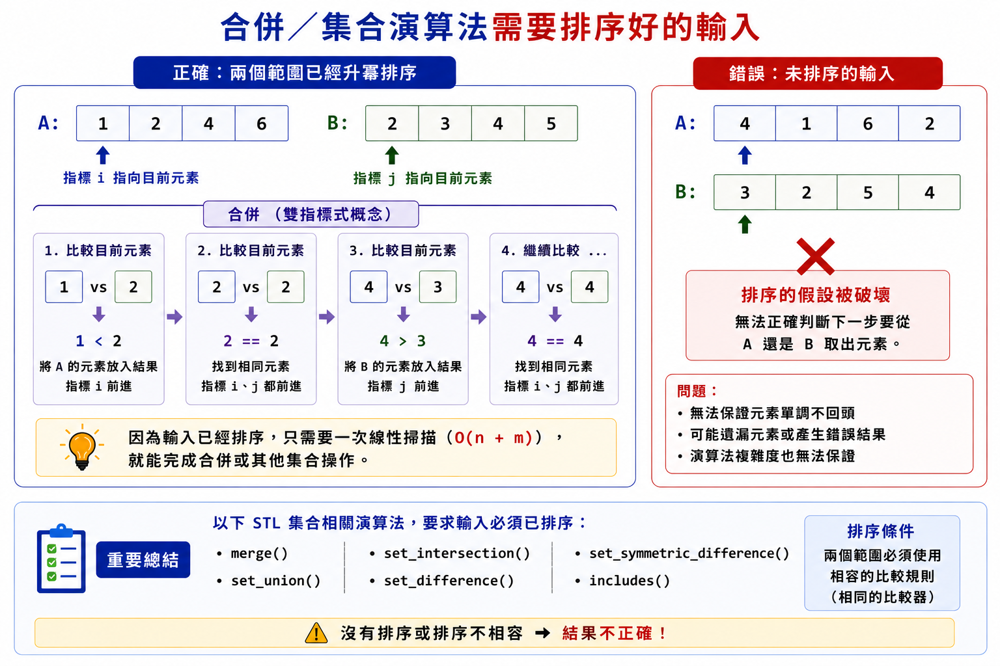
## Section LII. 必要條件

下列演算法通常要求兩個輸入範圍都已排序：

- `merge`
- `set_union`
- `set_intersection`
- `set_difference`
- `set_symmetric_difference`
- `includes`

---

## Section LIII. 完整聯集與交集

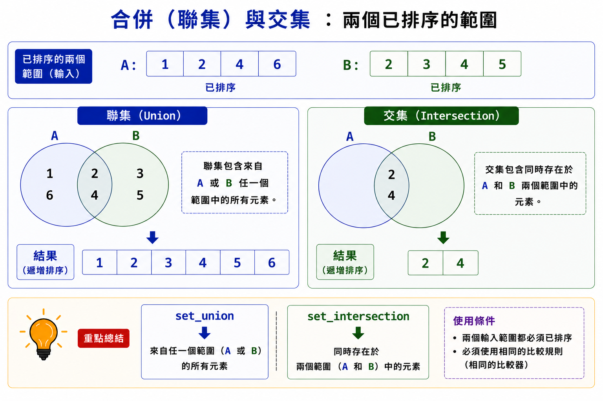
```cpp
// VALIDATE
#include <algorithm>
#include <iostream>
#include <iterator>
#include <vector>
using namespace std;

int main() {
    vector<int> first{
        1,
        2,
        4,
        6
    };

    vector<int> second{
        2,
        3,
        4,
        5
    };

    vector<int> unionValues;
    vector<int> intersectionValues;

    set_union(
        first.cbegin(),
        first.cend(),
        second.cbegin(),
        second.cend(),
        back_inserter(
            unionValues
        )
    );

    set_intersection(
        first.cbegin(),
        first.cend(),
        second.cbegin(),
        second.cend(),
        back_inserter(
            intersectionValues
        )
    );

    for (int value : unionValues) {
        cout << value
             << " ";
    }

    cout << '\n';

    for (
        int value :
        intersectionValues
    ) {
        cout << value
             << " ";
    }

    cout << '\n';

    return 0;
}
```

---

# Part R：`<numeric>`

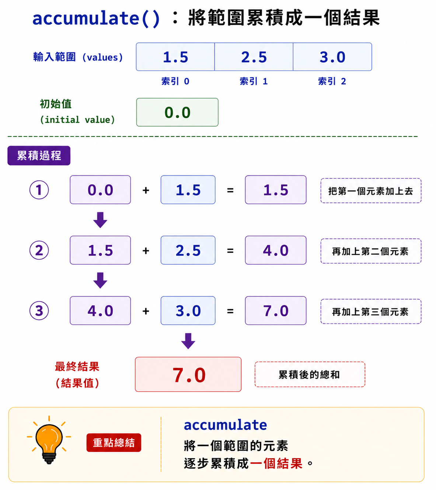
## Section LIV. 數值演算法

需要：

```cpp
#include <numeric>
```

主要包括：

- `accumulate`
- `inner_product`
- `partial_sum`
- `adjacent_difference`
- `iota`

---

## Section LV. `accumulate()`

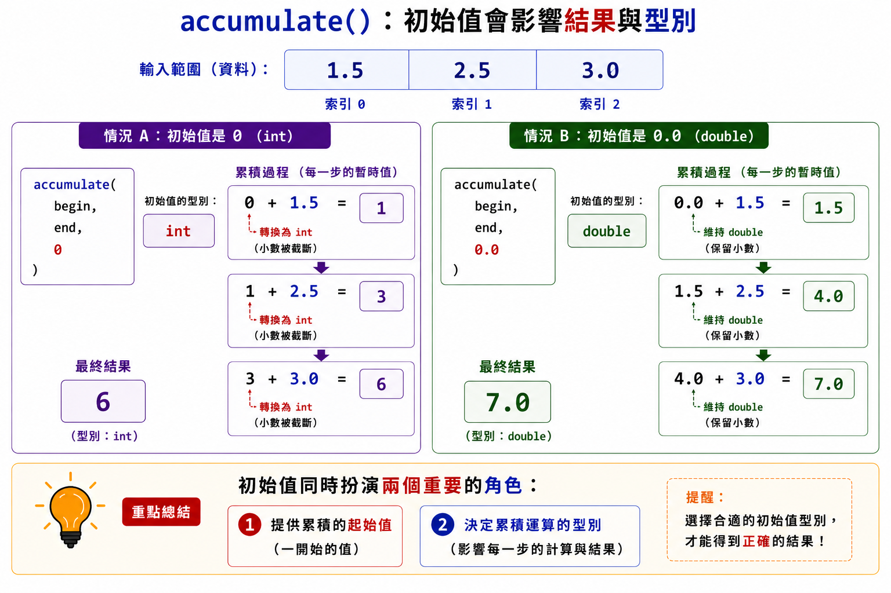
```cpp
auto total =
    accumulate(
        first,
        last,
        initialValue
    );
```

回傳型別與累加行為深受 `initialValue` 型別影響。

---

## Section LVI. 完整 Accumulate

```cpp
// VALIDATE
#include <iostream>
#include <numeric>
#include <vector>
using namespace std;

int main() {
    vector<double> values{
        1.5,
        2.5,
        3.0
    };

    double total =
        accumulate(
            values.cbegin(),
            values.cend(),
            0.0
        );

    cout << total
         << '\n';

    return 0;
}
```

若初始值寫成 `0`，累加型別可能變成 `int`，造成小數被截斷。

---

# Part S：`iota()` 與 Partial Sum

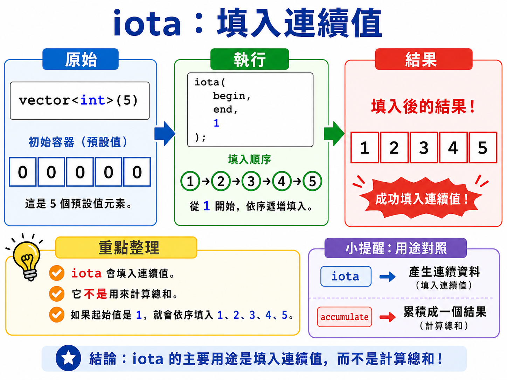
## Section LVII. 連續值

```cpp
iota(
    values.begin(),
    values.end(),
    start
);
```

---

## Section LVIII. 前綴和

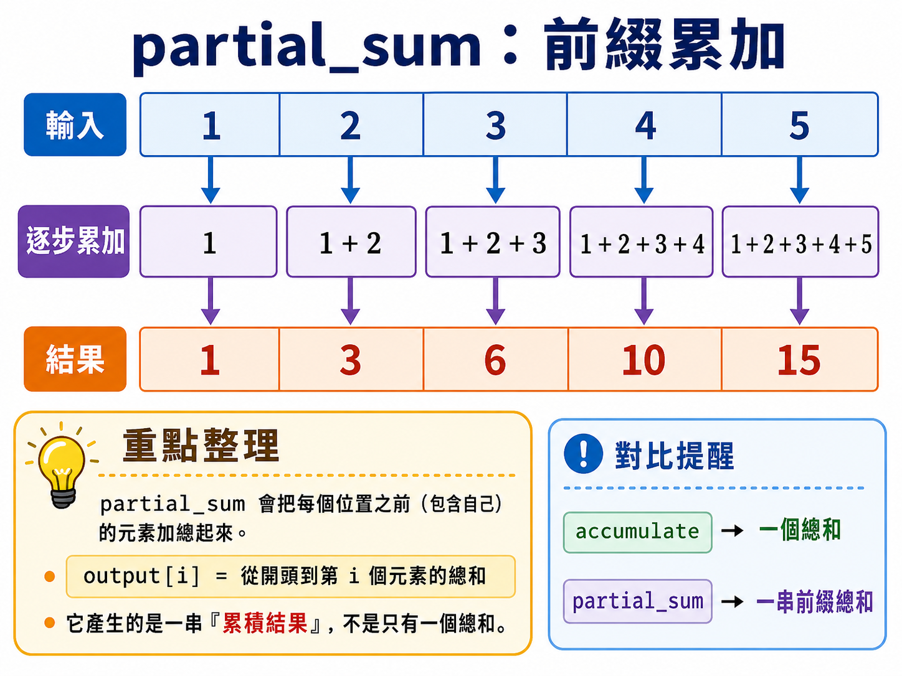
```cpp
partial_sum(
    first,
    last,
    output
);
```

---

## Section LIX. 完整 Iota 與 Partial Sum

```cpp
// VALIDATE
#include <iostream>
#include <numeric>
#include <vector>
using namespace std;

int main() {
    vector<int> values(5);

    iota(
        values.begin(),
        values.end(),
        1
    );

    vector<int> prefixSums(
        values.size()
    );

    partial_sum(
        values.cbegin(),
        values.cend(),
        prefixSums.begin()
    );

    for (int value : prefixSums) {
        cout << value
             << " ";
    }

    cout << '\n';

    return 0;
}
```

輸出：

```text
1 3 6 10 15
```

---

# Part T：Inner Product

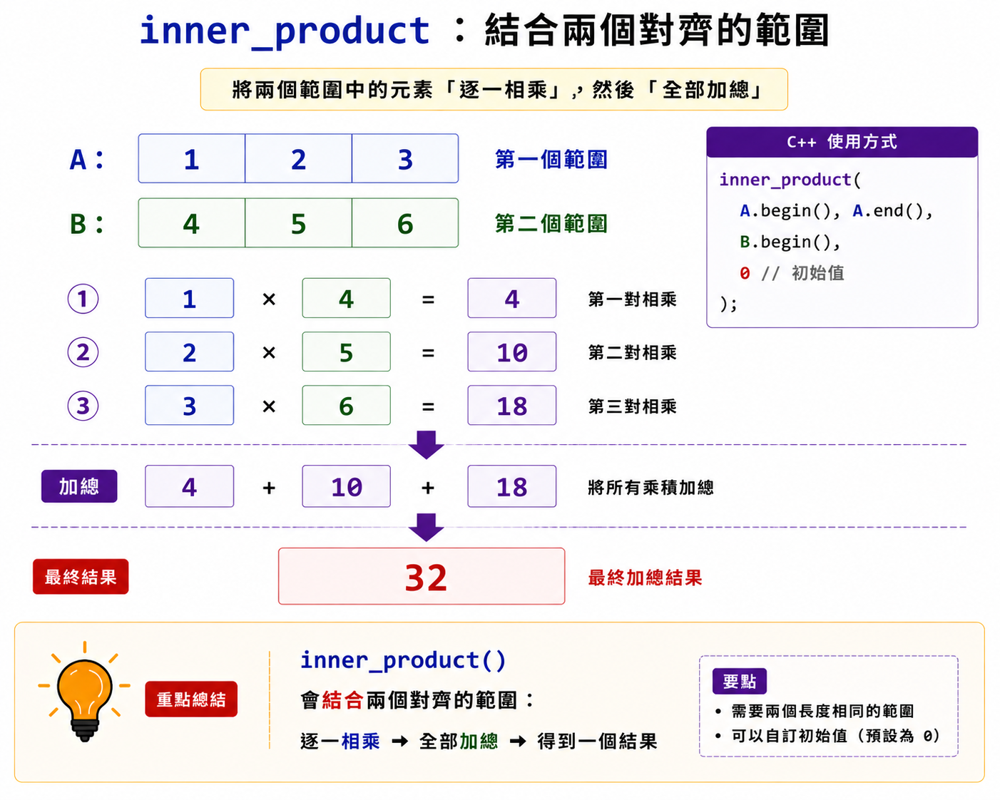
## Section LX. 對應元素相乘再相加

```cpp
inner_product(
    first1,
    last1,
    first2,
    initialValue
);
```

---

## Section LXI. 完整點積

```cpp
// VALIDATE
#include <iostream>
#include <numeric>
#include <vector>
using namespace std;

int main() {
    vector<int> first{
        1,
        2,
        3
    };

    vector<int> second{
        4,
        5,
        6
    };

    int result =
        inner_product(
            first.cbegin(),
            first.cend(),
            second.cbegin(),
            0
        );

    cout << result
         << '\n';

    return 0;
}
```

計算：

```text
1×4 + 2×5 + 3×6 = 32
```

---

# Part U：Stream Iterator

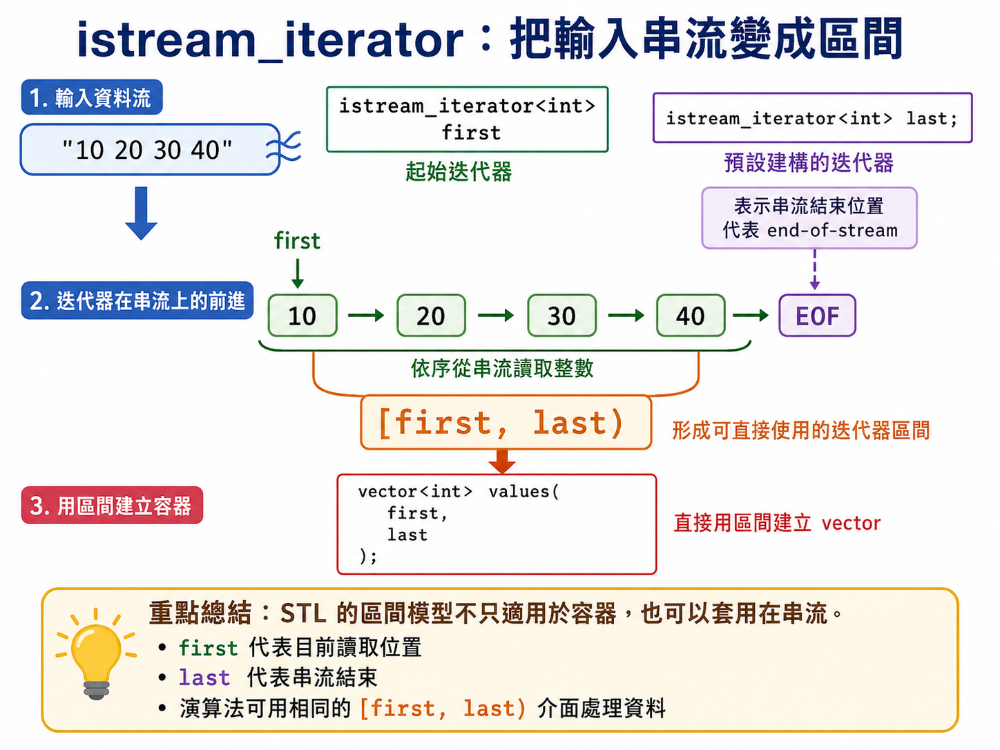

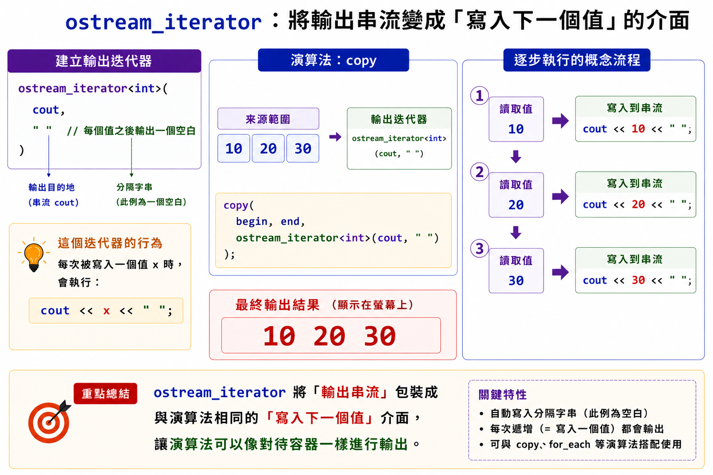
## Section LXII. `istream_iterator`

```cpp
istream_iterator<int>
```

每次前進會從輸入流讀取下一筆資料。

預設建立的 iterator 表示：

```text
輸入結束
```

---

## Section LXIII. `ostream_iterator`

```cpp
ostream_iterator<int>(
    cout,
    " "
)
```

每次賦值會輸出資料與分隔字串。

---

## Section LXIV. 完整 Stream Iterator

```cpp
// VALIDATE
#include <algorithm>
#include <iostream>
#include <iterator>
#include <sstream>
#include <vector>
using namespace std;

int main() {
    istringstream input(
        "10 20 30 40"
    );

    istream_iterator<int>
        first(input);

    istream_iterator<int>
        last;

    vector<int> values(
        first,
        last
    );

    copy(
        values.cbegin(),
        values.cend(),
        ostream_iterator<int>(
            cout,
            " "
        )
    );

    cout << '\n';

    return 0;
}
```

---

# Part V：Iterator Invalidation

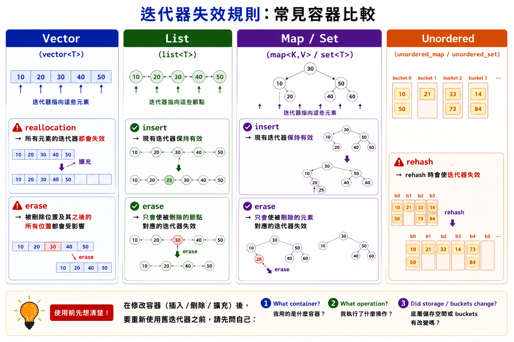
## Section LXV. Vector

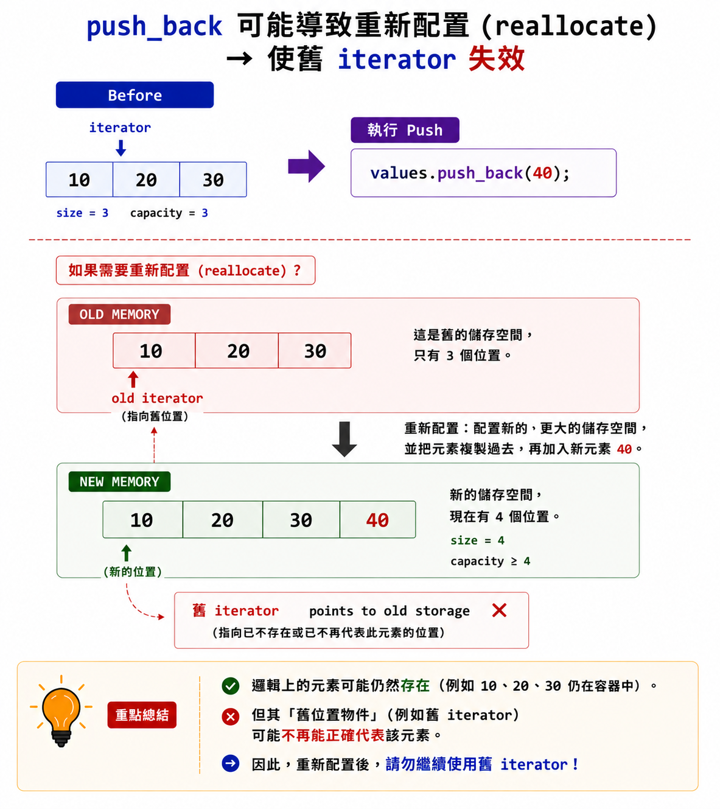
Reallocation 後：

```text
所有指向元素的 iterator、pointer、reference 可能失效
```

Erase 後：

```text
被刪位置及其後的位置通常失效
```

---

## Section LXVI. List

Insert 通常不使其他 iterator 失效。

Erase 只使被刪節點 iterator 失效。

---

## Section LXVII. Ordered Associative Container

Insert 通常不使既有 iterator 失效。

Erase 只使被刪元素 iterator 失效。

---

## Section LXVIII. Unordered Container

Insert 若觸發 rehash：

```text
iterator 可能全部失效
```

---

## Section LXIX. 正確 Erase Loop

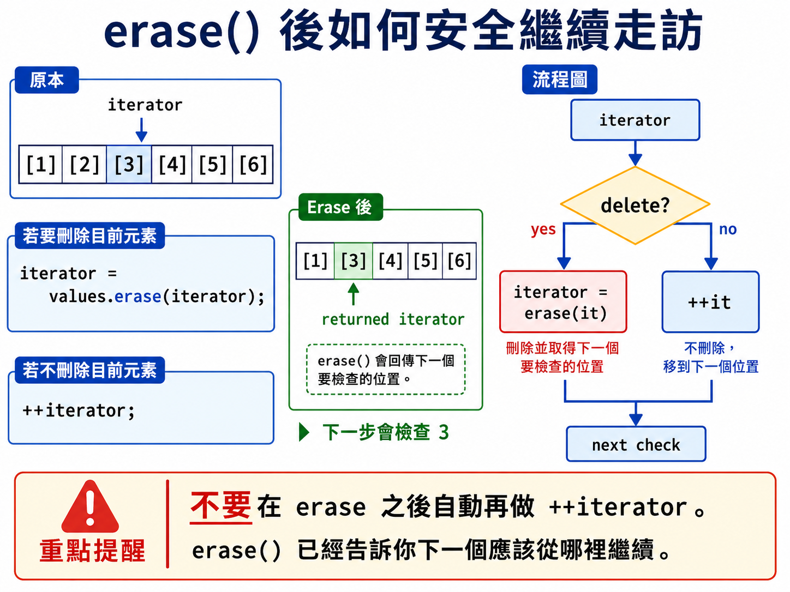
```cpp
iterator =
    container.erase(iterator);
```

Erase 回傳下一個有效位置。

---

## Section LXX. 完整 Erase Loop

```cpp
// VALIDATE
#include <iostream>
#include <vector>
using namespace std;

int main() {
    vector<int> values{
        1,
        2,
        3,
        4,
        5,
        6
    };

    auto iterator =
        values.begin();

    while (
        iterator !=
        values.end()
    ) {
        if (
            *iterator %
                2 ==
            0
        ) {
            iterator =
                values.erase(
                    iterator
                );
        } else {
            ++iterator;
        }
    }

    for (int value : values) {
        cout << value
             << " ";
    }

    cout << '\n';

    return 0;
}
```

---

# Part W：Map Iterator

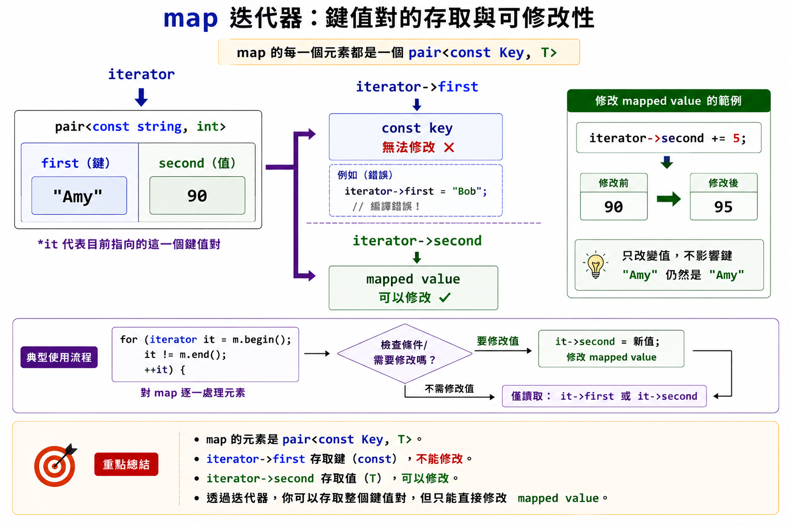
## Section LXXI. Pair Element

Map iterator 解參考後得到：

```cpp
pair<const Key, Value>
```

可使用：

```cpp
iterator->first
iterator->second
```

---

## Section LXXII. Structured Binding

```cpp
for (
    auto& [key, value] :
    data
)
```

Value 可修改，key 不可修改。

---

## Section LXXIII. 完整 Map Iterator

```cpp
// VALIDATE
#include <iostream>
#include <map>
#include <string>
using namespace std;

int main() {
    map<string, int> scores{
        {
            "Amy",
            80
        },
        {
            "Brian",
            90
        }
    };

    for (
        auto iterator =
            scores.begin();
        iterator !=
            scores.end();
        ++iterator
    ) {
        iterator->second += 5;
    }

    for (
        const auto& [name, score] :
        scores
    ) {
        cout << name
             << " "
             << score
             << '\n';
    }

    return 0;
}
```

---

# Part X：演算法選擇

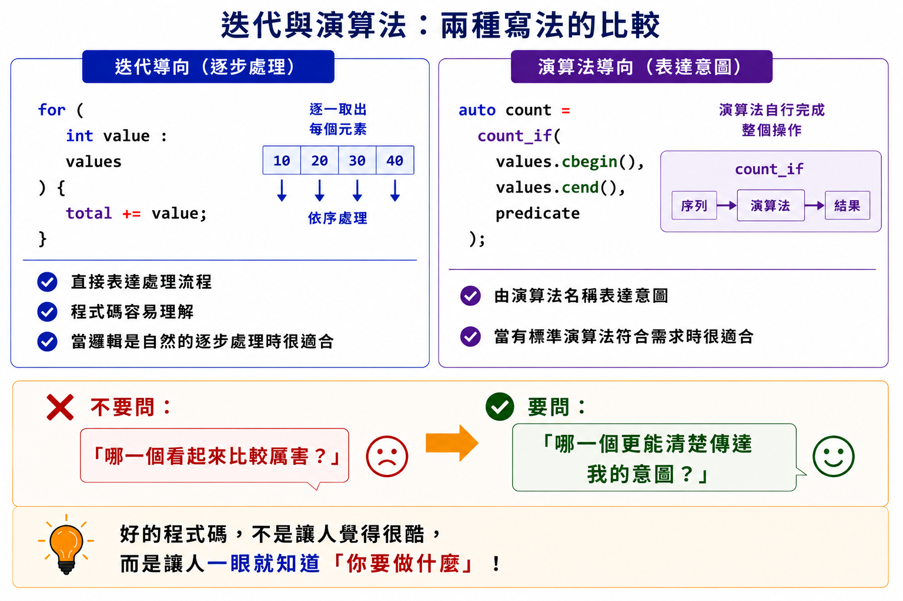
## Section LXXIV. 手寫迴圈仍然合理

Range-based for 常更清楚：

```cpp
for (int value : values) {
    total += value;
}
```

不需要為了使用演算法而強迫改寫。

---

## Section LXXV. 演算法更清楚的情況

```cpp
find_if
count_if
all_of
sort
transform
copy_if
accumulate
```

這些名稱直接表達意圖。

---

## Section LXXVI. 選擇原則

優先選擇：

```text
最容易讓讀者理解程式目的的寫法
```

不是：

```text
看起來最進階的寫法
```

---

# Part Y：C++20 Ranges 預告

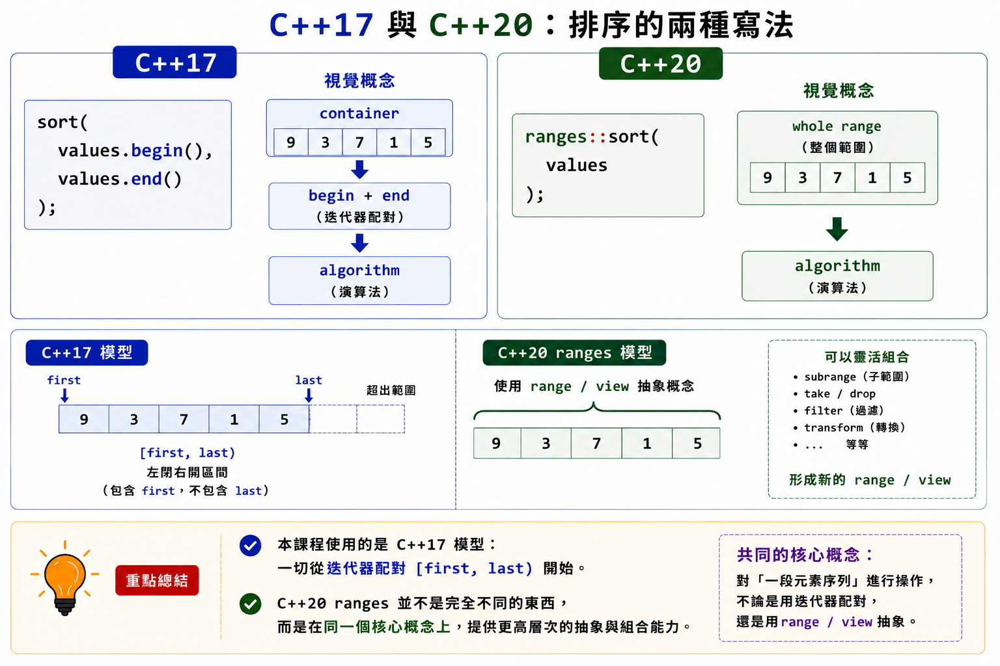
## Section LXXVII. 傳統寫法

```cpp
sort(
    values.begin(),
    values.end()
);
```

---

## Section LXXVIII. Ranges 寫法

C++20：

```cpp
std::ranges::sort(values);
```

Ranges 可減少重複 begin/end，並搭配 views 建立延遲資料流程。

---

## Section LXXIX. 本章範圍

本教材目前維持 C++17，因此：

- 使用 iterator pair。
- 不使用 ranges。
- 不使用 views。
- 不使用 projections。

---

# Part Z：快速概念檢查

## Section LXXX. 選擇題與簡答

### Q1. Iterator 的主要作用是什麼？

<details><summary>查看答案</summary>

表示容器或範圍中的位置，讓演算法以統一方式讀取或修改元素。

</details>

### Q2. `[first, last)` 是否包含 last？

<details><summary>查看答案</summary>

不包含。

</details>

### Q3. 可以解參考 `end()` 嗎？

<details><summary>查看答案</summary>

不可以。

</details>

### Q4. `cbegin()` 有什麼用途？

<details><summary>查看答案</summary>

取得不能修改元素的 const iterator。

</details>

### Q5. 哪些容器 iterator 支援 random access？

<details><summary>查看答案</summary>

常見有 vector、deque、array。

</details>

### Q6. List iterator 可以使用 `iterator + 3` 嗎？

<details><summary>查看答案</summary>

不可以，應使用 `next()` 或 `advance()`。

</details>

### Q7. `advance()` 與 `next()` 的差異？

<details><summary>查看答案</summary>

`advance()` 修改原 iterator；`next()` 回傳移動後的新 iterator。

</details>

### Q8. `prev()` 需要什麼 iterator 能力？

<details><summary>查看答案</summary>

至少 bidirectional iterator。

</details>

### Q9. Copy 到空 vector 應使用什麼？

<details><summary>查看答案</summary>

`back_inserter(destination)`。

</details>

### Q10. `front_inserter()` 可能造成什麼順序效果？

<details><summary>查看答案</summary>

因為每次插入前端，輸入順序可能反轉。

</details>

### Q11. `std::sort()` 需要哪種 iterator？

<details><summary>查看答案</summary>

Random access iterator。

</details>

### Q12. 集合演算法的輸入通常需要什麼條件？

<details><summary>查看答案</summary>

依相同規則排序。

</details>

### Q13. `accumulate()` 的初始值型別重要嗎？

<details><summary>查看答案</summary>

重要，它會影響累加型別與結果。

</details>

### Q14. `istream_iterator` 的預設建立物件代表什麼？

<details><summary>查看答案</summary>

輸入結束 iterator。

</details>

### Q15. Vector reallocation 後 iterator 會怎樣？

<details><summary>查看答案</summary>

指向元素的 iterator、pointer、reference 可能全部失效。

</details>

### Q16. List insert 會讓其他 iterator 失效嗎？

<details><summary>查看答案</summary>

通常不會。

</details>

### Q17. Map iterator 的 key 可以修改嗎？

<details><summary>查看答案</summary>

不可以，key 為 const。

</details>

### Q18. `iterator_traits` 有什麼用途？

<details><summary>查看答案</summary>

取得 iterator 的元素型別、距離型別與 category 等資訊。

</details>

### Q19. Template range function 為什麼比 vector-only function 更泛用？

<details><summary>查看答案</summary>

它只依賴 iterator 操作，可處理多種容器與子範圍。

</details>

### Q20. 何時不必強迫使用演算法？

<details><summary>查看答案</summary>

當一般迴圈更直接、更易讀，或操作無法自然對應標準演算法時。

</details>

---

# Part AA：程式閱讀練習

## Section LXXXI. 預測結果與合法性

### 題目 1

```cpp
vector<int> values{
    1,
    2,
    3
};

auto iterator =
    values.begin();

cout << *iterator;
```

<details><summary>查看答案</summary>

```text
1
```

</details>

### 題目 2

```cpp
vector<int> values{
    1,
    2,
    3
};

auto iterator =
    values.end();

/* cout << *iterator; */
```

<details><summary>查看答案</summary>

不合法的使用方式，`end()` 不指向有效元素。

</details>

### 題目 3

```cpp
list<int> values{
    10,
    20,
    30
};

auto iterator =
    next(
        values.begin(),
        2
    );

cout << *iterator;
```

<details><summary>查看答案</summary>

```text
30
```

</details>

### 題目 4

```cpp
vector<int> values{
    1,
    2,
    3
};

vector<int> result;

copy(
    values.begin(),
    values.end(),
    back_inserter(result)
);

cout << result.size();
```

<details><summary>查看答案</summary>

```text
3
```

</details>

### 題目 5

```cpp
deque<int> result;

vector<int> source{
    1,
    2,
    3
};

copy(
    source.begin(),
    source.end(),
    front_inserter(result)
);

cout << result.front()
     << result.back();
```

<details><summary>查看答案</summary>

Result 為：

```text
3 2 1
```

輸出：

```text
31
```

</details>

### 題目 6

```cpp
vector<int> values{
    1,
    2,
    3
};

cout << distance(
            values.begin(),
            values.end()
        );
```

<details><summary>查看答案</summary>

```text
3
```

</details>

### 題目 7

```cpp
vector<int> values{
    1,
    2,
    3
};

auto iterator =
    values.begin();

advance(
    iterator,
    2
);

cout << *iterator;
```

<details><summary>查看答案</summary>

```text
3
```

</details>

### 題目 8

```cpp
vector<int> values{
    1,
    2,
    3
};

auto iterator =
    values.rbegin();

cout << *iterator;
```

<details><summary>查看答案</summary>

```text
3
```

</details>

### 題目 9

```cpp
vector<double> values{
    1.5,
    2.5
};

cout << accumulate(
            values.begin(),
            values.end(),
            0
        );
```

<details><summary>查看答案</summary>

初始值是 `int`，累加可能以整數進行，結果可能為：

```text
3
```

小數部分在每一步轉成整數。應使用 `0.0`。

</details>

### 題目 10

```cpp
vector<int> values{
    1,
    2,
    3
};

auto iterator =
    values.begin();

values.push_back(4);

/* cout << *iterator; */
```

<details><summary>查看答案</summary>

若 `push_back()` 觸發 reallocation，舊 iterator 失效，不能依賴。

</details>

### 題目 11

```cpp
map<string, int> scores{
    {
        "Amy",
        90
    }
};

auto iterator =
    scores.begin();

iterator->second = 95;

/* iterator->first = "Brian"; */
```

<details><summary>查看答案</summary>

Value 可修改，key 不可修改。

</details>

### 題目 12

```cpp
list<int> values{
    3,
    1,
    2
};

/* sort(
    values.begin(),
    values.end()
); */
```

<details><summary>查看答案</summary>

不合法，list iterator 不是 random access。應使用：

```cpp
values.sort();
```

</details>

---

# Part AB：實作練習

## Section LXXXII. 實作檢測題

### TODO 1：Iterator Walk

使用 iterator 輸出 vector，不使用 range-based for。

### TODO 2：Const Iterator

使用 `cbegin()` 與 `cend()` 唯讀輸出字串。

### TODO 3：Reverse Iterator

使用 `crbegin()` 與 `crend()` 反向輸出。

### TODO 4：List Position

使用 `next()` 取得 list 第四個元素。

### TODO 5：Generic Print Range

建立接受兩個 iterator 的 `printRange()`。

### TODO 6：Generic Sum Range

使用 `iterator_traits` 建立 `sumRange()`。

### TODO 7：Back Inserter Copy

將一個 vector 複製到空 vector。

### TODO 8：Front Inserter

將 vector 複製到 deque 前端並觀察順序。

### TODO 9：Filter and Transform

使用 `copy_if()` 與 `transform()` 建立新資料。

### TODO 10：Subsequence Search

使用 `search()` 尋找 pattern。

### TODO 11：Set Intersection

對兩個排序 vector 求交集。

### TODO 12：Accumulate Average

正確選擇初始值型別計算平均。

### TODO 13：Stream Iterator

從 `istringstream` 讀取所有整數到 vector。

### TODO 14：Safe Erase Loop

刪除 vector 中所有負數。

### TODO 15：Algorithm Pipeline

完成「過濾正數 → 平方 → 排序 → 去重 → 累加」流程。

---

# Part AC：課後小練習

## Section LXXXIII. 延伸練習

### 練習 1：Range Statistics

建立 iterator-based 函式，回傳最小值、最大值、總和與筆數。

### 練習 2：Text Token Pipeline

使用 `istream_iterator<string>` 讀取單字，轉小寫、排序、去重並輸出。

### 練習 3：Sorted Set Operations

輸入兩組整數，輸出聯集、交集、差集與對稱差集。

### 練習 4：Iterator Invalidation Lab

分別測試 vector、list、map 插入與刪除後哪些 iterator 仍可使用。

### 練習 5：C++20 Ranges 對照

在另一份 C++20 範例中，將傳統 iterator pair 寫法改成 ranges 寫法並比較可讀性。

---

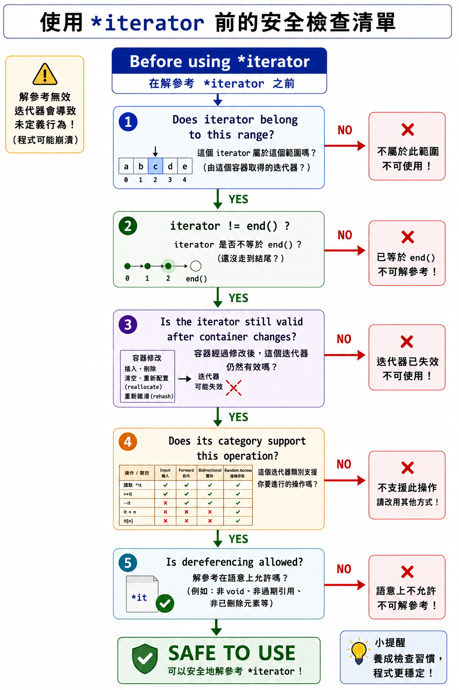
# Part AD：常見錯誤提醒

## Section LXXXIV. 常見錯誤

1. 解參考 `end()`。
2. Iterator 到達 end 後仍遞增。
3. 使用錯誤容器的 end 比較 iterator。
4. 將 iterator 當成整數索引。
5. 對 list iterator 使用 `+`。
6. 對 forward iterator 使用 `--`。
7. 對非 random access iterator 使用 `std::sort()`。
8. `advance()` 超出有效範圍。
9. `next()` 超出有效範圍。
10. `prev()` 用於不支援後退的 iterator。
11. 誤以為 `distance()` 對所有容器都是 `O(1)`。
12. Copy 到空 vector 的 `.begin()`。
13. 忘記加入 `<iterator>`。
14. `front_inserter()` 導致順序反轉卻未注意。
15. 集合演算法輸入未排序。
16. `accumulate()` 初始值型別錯誤。
17. Binary transform 第二範圍太短。
18. 演算法執行中修改來源容器大小。
19. Vector reallocation 後使用舊 iterator。
20. Erase 後使用舊 iterator。
21. Unordered rehash 後使用舊 iterator。
22. 將 const iterator 與 const iterator object 混淆。
23. 嘗試修改 set key。
24. 嘗試修改 map key。
25. Reverse iterator 的 `base()` 位置理解錯誤。
26. Stream iterator 讀取失敗後仍期待有效值。
27. Iterator-based 函式沒有處理空範圍。
28. 模板中假設所有 iterator 都是 random access。
29. 為了使用演算法而寫出更難讀的程式。
30. 忘記演算法只處理範圍，不負責管理容器生命週期。

---

# Part AE：Mermaid 流程圖

## Section LXXXV. 迭代器與演算法流程圖

### 1. Iterator 走訪

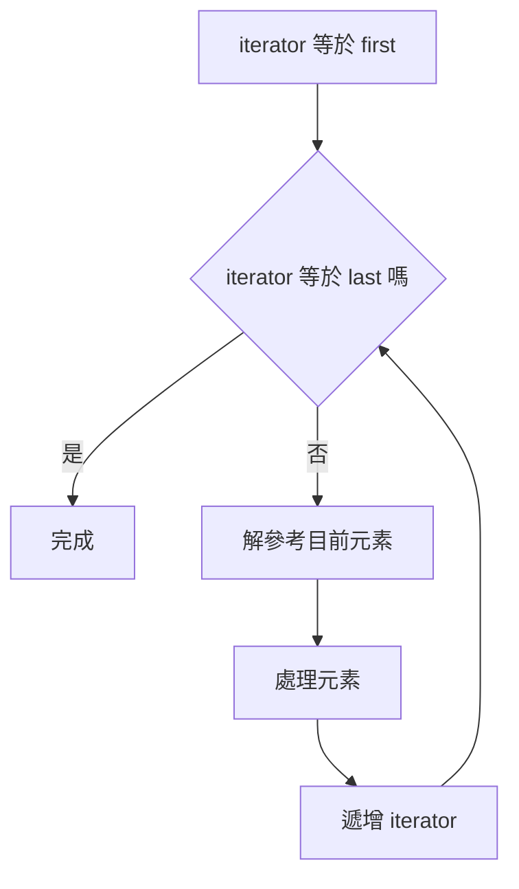
```mermaid
flowchart TD
    A[iterator 等於 first] --> B{iterator 等於 last 嗎}
    B -- 是 --> C[完成]
    B -- 否 --> D[解參考目前元素]
    D --> E[處理元素]
    E --> F[遞增 iterator]
    F --> B
```

### 2. 選擇 Iterator 移動方式

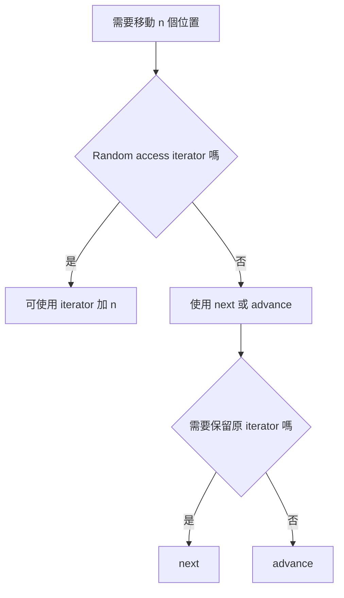
```mermaid
flowchart TD
    A[需要移動 n 個位置] --> B{Random access iterator 嗎}
    B -- 是 --> C[可使用 iterator 加 n]
    B -- 否 --> D[使用 next 或 advance]
    D --> E{需要保留原 iterator 嗎}
    E -- 是 --> F[next]
    E -- 否 --> G[advance]
```

### 3. Output Iterator

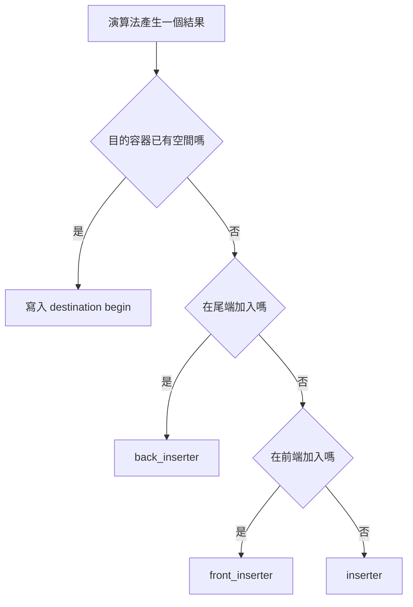
```mermaid
flowchart TD
    A[演算法產生一個結果] --> B{目的容器已有空間嗎}
    B -- 是 --> C[寫入 destination begin]
    B -- 否 --> D{在尾端加入嗎}
    D -- 是 --> E[back_inserter]
    D -- 否 --> F{在前端加入嗎}
    F -- 是 --> G[front_inserter]
    F -- 否 --> H[inserter]
```

### 4. Algorithm Pipeline

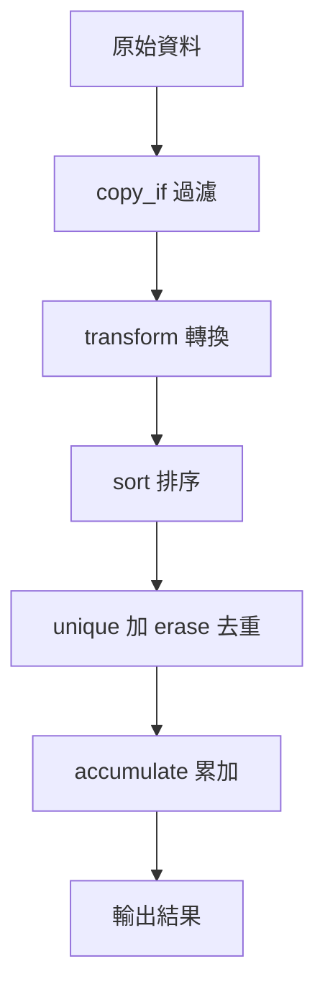
```mermaid
flowchart TD
    A[原始資料] --> B[copy_if 過濾]
    B --> C[transform 轉換]
    C --> D[sort 排序]
    D --> E[unique 加 erase 去重]
    E --> F[accumulate 累加]
    F --> G[輸出結果]
```

### 5. Safe Erase Loop

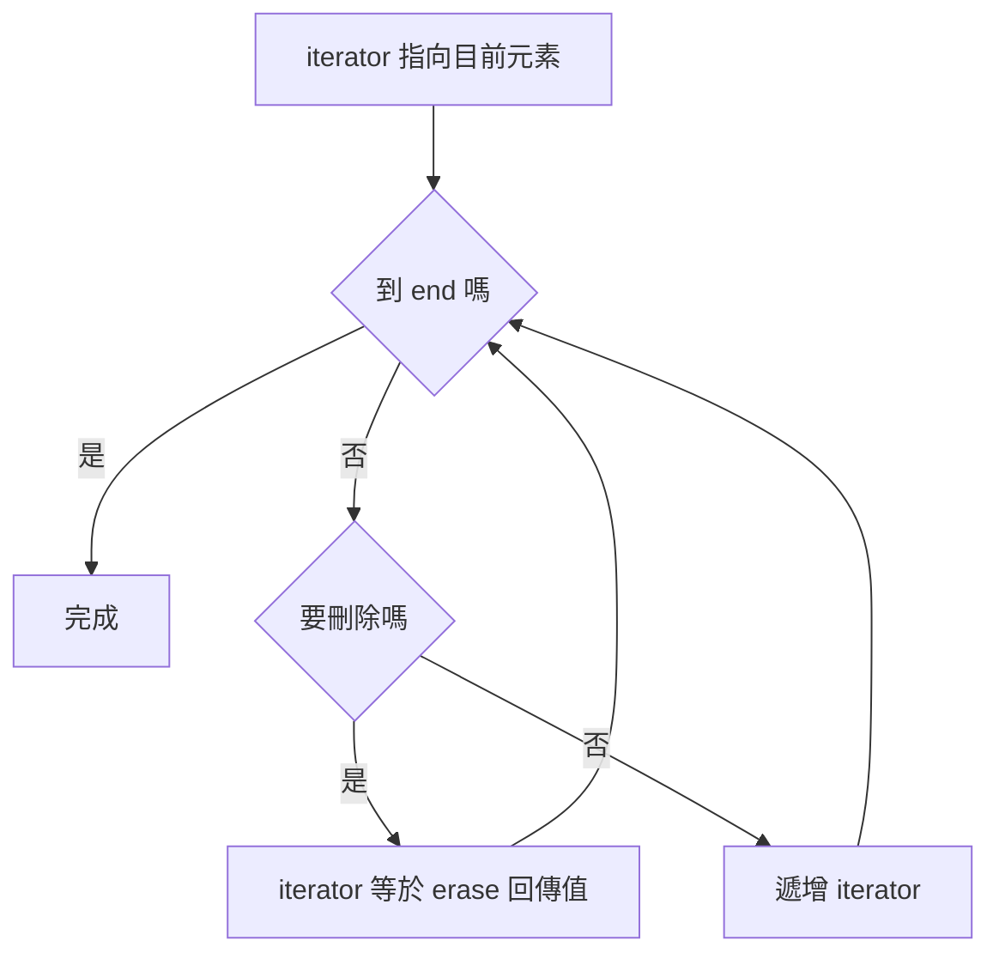
```mermaid
flowchart TD
    A[iterator 指向目前元素] --> B{到 end 嗎}
    B -- 是 --> C[完成]
    B -- 否 --> D{要刪除嗎}
    D -- 是 --> E[iterator 等於 erase 回傳值]
    D -- 否 --> F[遞增 iterator]
    E --> B
    F --> B
```

### 6. Iterator Category

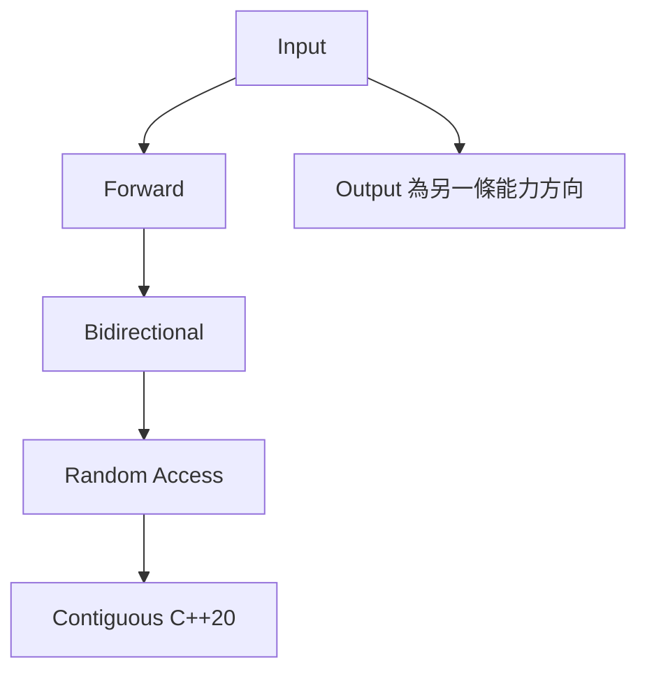
```mermaid
flowchart TD
    A[Input] --> B[Forward]
    B --> C[Bidirectional]
    C --> D[Random Access]
    D --> E[Contiguous C++20]
    A --> F[Output 為另一條能力方向]
```

### 7. 集合演算法

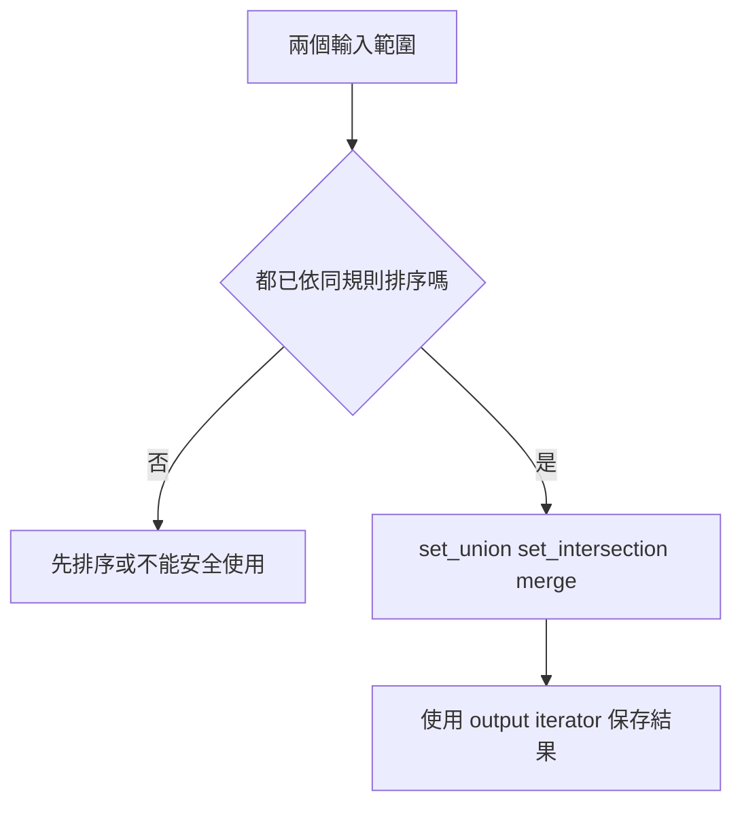
```mermaid
flowchart TD
    A[兩個輸入範圍] --> B{都已依同規則排序嗎}
    B -- 否 --> C[先排序或不能安全使用]
    B -- 是 --> D[set_union set_intersection merge]
    D --> E[使用 output iterator 保存結果]
```

### 8. Iterator Safety

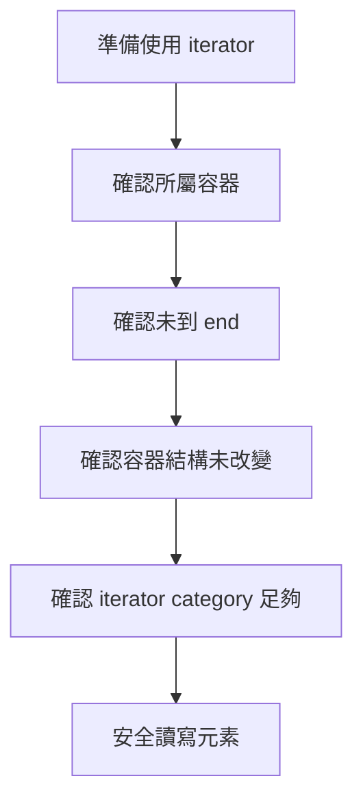
```mermaid
flowchart TD
    A[準備使用 iterator] --> B[確認所屬容器]
    B --> C[確認未到 end]
    C --> D[確認容器結構未改變]
    D --> E[確認 iterator category 足夠]
    E --> F[安全讀寫元素]
```

---

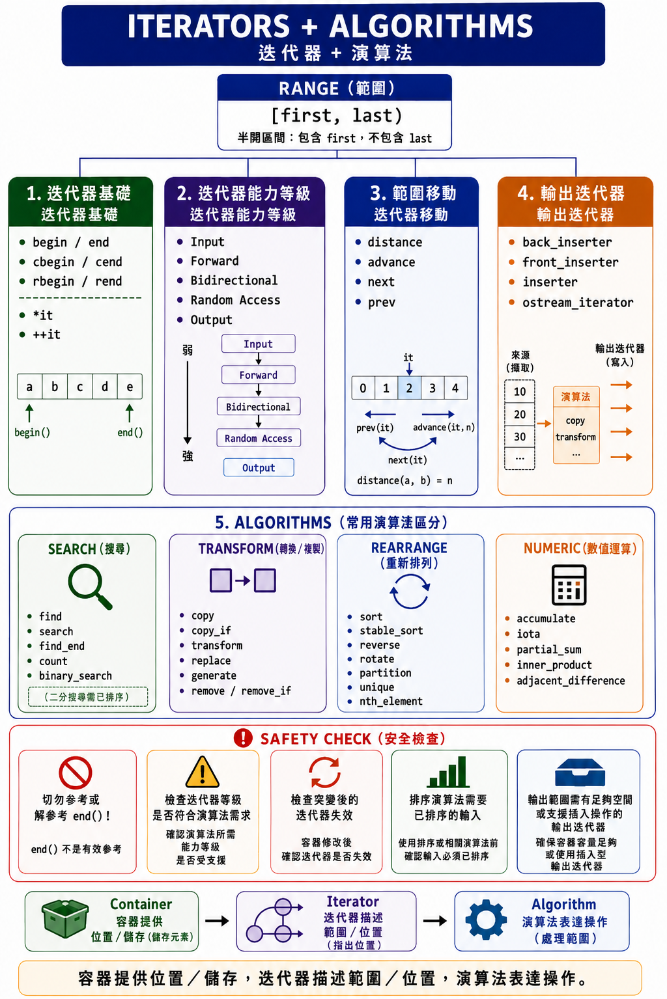
# 本章完成標準

完成本章後，你應該能做到：

1. 說明 iterator 的用途。
2. 解釋半開區間。
3. 使用 begin 與 end。
4. 使用 cbegin 與 cend。
5. 使用 reverse iterator。
6. 避免解參考 end。
7. 區分 iterator 與 index。
8. 說明 input iterator。
9. 說明 output iterator。
10. 說明 forward iterator。
11. 說明 bidirectional iterator。
12. 說明 random access iterator。
13. 根據演算法判斷 iterator 要求。
14. 使用 distance。
15. 使用 advance。
16. 使用 next。
17. 使用 prev。
18. 建立子範圍。
19. 建立 iterator-based 模板。
20. 使用 iterator_traits。
21. 使用 back_inserter。
22. 使用 front_inserter。
23. 使用 inserter。
24. 使用 stream iterator。
25. 使用 copy_if 與 transform。
26. 使用 search 與 find_end。
27. 使用 partition。
28. 使用集合演算法。
29. 使用 accumulate。
30. 使用 iota。
31. 使用 partial_sum。
32. 使用 inner_product。
33. 正確選擇 accumulate 初始值型別。
34. 正確 erase while iterating。
35. 說明 vector iterator invalidation。
36. 說明 list iterator stability。
37. 說明 unordered rehash。
38. 使用 map iterator。
39. 建立清楚的演算法 pipeline。
40. 找出常見 iterator 與演算法錯誤。

---

# 隱藏答案區

> Answer hidden — try it first.

<details><summary>TODO 1 答案</summary>

```cpp
for (
    auto iterator =
        values.cbegin();
    iterator !=
        values.cend();
    ++iterator
) {
    cout << *iterator
         << '\n';
}
```

</details>

<details><summary>TODO 2 答案</summary>

```cpp
for (
    auto iterator =
        text.cbegin();
    iterator !=
        text.cend();
    ++iterator
) {
    cout << *iterator;
}
```

</details>

<details><summary>TODO 3 答案</summary>

```cpp
for (
    auto iterator =
        values.crbegin();
    iterator !=
        values.crend();
    ++iterator
) {
    cout << *iterator
         << " ";
}
```

</details>

<details><summary>TODO 4 答案</summary>

```cpp
auto iterator =
    next(
        values.begin(),
        3
    );
```

Offset 3 代表第四個元素。

</details>

<details><summary>TODO 5 答案</summary>

```cpp
template <typename Iterator>
void printRange(
    Iterator first,
    Iterator last
) {
    while (
        first !=
        last
    ) {
        cout << *first
             << " ";

        ++first;
    }
}
```

</details>

<details><summary>TODO 6 答案</summary>

```cpp
template <typename Iterator>
auto sumRange(
    Iterator first,
    Iterator last
) {
    using ValueType =
        typename iterator_traits<
            Iterator
        >::value_type;

    ValueType total{};

    while (
        first !=
        last
    ) {
        total += *first;
        ++first;
    }

    return total;
}
```

</details>

<details><summary>TODO 7 答案</summary>

```cpp
copy(
    source.cbegin(),
    source.cend(),
    back_inserter(
        destination
    )
);
```

</details>

<details><summary>TODO 8 答案</summary>

```cpp
copy(
    source.cbegin(),
    source.cend(),
    front_inserter(
        destination
    )
);
```

輸入順序通常會反轉。

</details>

<details><summary>TODO 9 答案</summary>

```cpp
copy_if(
    source.cbegin(),
    source.cend(),
    back_inserter(filtered),
    predicate
);

transform(
    filtered.cbegin(),
    filtered.cend(),
    back_inserter(result),
    operation
);
```

</details>

<details><summary>TODO 10 答案</summary>

```cpp
auto iterator =
    search(
        values.cbegin(),
        values.cend(),
        pattern.cbegin(),
        pattern.cend()
    );
```

先檢查是否等於 `values.cend()`。

</details>

<details><summary>TODO 11 答案</summary>

```cpp
set_intersection(
    first.cbegin(),
    first.cend(),
    second.cbegin(),
    second.cend(),
    back_inserter(result)
);
```

兩個輸入必須已排序。

</details>

<details><summary>TODO 12 答案</summary>

```cpp
double total =
    accumulate(
        values.cbegin(),
        values.cend(),
        0.0
    );

double average =
    total /
    static_cast<double>(
        values.size()
    );
```

先檢查 vector 不為空。

</details>

<details><summary>TODO 13 答案</summary>

```cpp
istream_iterator<int>
    first(input);

istream_iterator<int>
    last;

vector<int> values(
    first,
    last
);
```

</details>

<details><summary>TODO 14 答案</summary>

```cpp
auto iterator =
    values.begin();

while (
    iterator !=
    values.end()
) {
    if (*iterator < 0) {
        iterator =
            values.erase(
                iterator
            );
    } else {
        ++iterator;
    }
}
```

</details>

<details><summary>TODO 15 答案</summary>

```cpp
copy_if(
    source.cbegin(),
    source.cend(),
    back_inserter(positive),
    [](int value) {
        return value > 0;
    }
);

transform(
    positive.cbegin(),
    positive.cend(),
    positive.begin(),
    [](int value) {
        return
            value * value;
    }
);

sort(
    positive.begin(),
    positive.end()
);

positive.erase(
    unique(
        positive.begin(),
        positive.end()
    ),
    positive.end()
);

int total =
    accumulate(
        positive.cbegin(),
        positive.cend(),
        0
    );
```

</details>
