# Lesson 27：Lambda Expressions Lambda 表示式

<!-- Images inserted from C++_27.txt insertion plan. -->

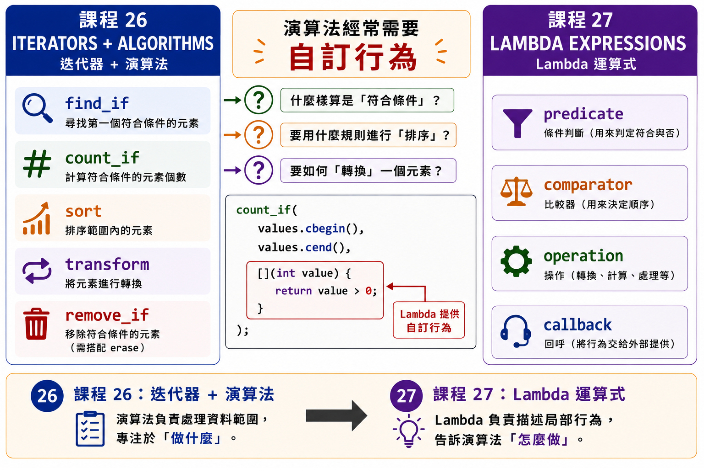
> 這堂課的重點：使用 Lambda 在需要函式行為的位置直接建立短小、局部且可捕捉外部狀態的 callable object。你會學習 Lambda 的完整語法、參數、回傳型別、值捕捉、參考捕捉、初始化捕捉、`mutable`、泛型 Lambda、立即呼叫、狀態保存，以及如何將 Lambda 與 STL 演算法、容器、成員函式和 `std::function` 整合。

> 本章以 C++17 為基準。Lambda 很適合表示短小的 predicate、comparator、轉換規則與回呼行為，但不應把大型商業邏輯全部塞入單一 Lambda。C++20 template Lambda、concepts 與進階完美轉發會留到後續章節。

---

## Section I. 今天要做什麼？

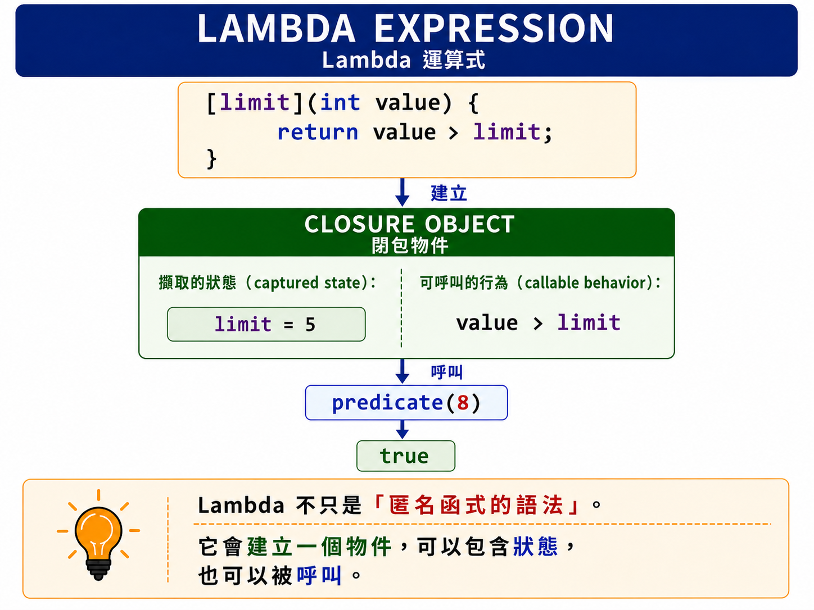
1. 認識 callable 可呼叫物件。
2. 複習一般函式。
3. 認識函式物件 function object。
4. 認識 Lambda expression。
5. 理解 Lambda 會建立匿名函式物件。
6. 認識 closure type。
7. 認識 closure object。
8. 使用最基本 Lambda。
9. 理解 capture list。
10. 理解 parameter list。
11. 理解函式主體。
12. 理解回傳型別推導。
13. 認識完整 Lambda 語法。
14. 使用空捕捉 `[]`。
15. 使用值捕捉 `[value]`。
16. 使用參考捕捉 `[&value]`。
17. 使用預設值捕捉 `[=]`。
18. 使用預設參考捕捉 `[&]`。
19. 使用混合捕捉 `[=, &result]`。
20. 使用混合捕捉 `[&, limit]`。
21. 理解不能重複捕捉同一名稱。
22. 理解值捕捉發生在 Lambda 物件建立時。
23. 理解參考捕捉使用原物件。
24. 修改參考捕捉變數。
25. 理解值捕捉預設為唯讀。
26. 使用 `mutable` 修改 Lambda 內部副本。
27. 理解 `mutable` 不會修改原變數。
28. 理解每個 Lambda 物件有自己的捕捉狀態。
29. 複製 Lambda 物件。
30. 觀察複製後狀態彼此獨立。
31. 使用初始化捕捉 init-capture。
32. 使用 `[value = expression]`。
33. 重新命名捕捉變數。
34. 使用運算結果初始化捕捉。
35. 使用移動捕捉概念。
36. 認識 C++14 generalized lambda capture。
37. 使用參數列表。
38. 使用多個參數。
39. 使用參考參數。
40. 使用 `const` 參考參數。
41. 使用泛型 Lambda。
42. 使用 `auto` 參數。
43. 理解泛型 Lambda 的呼叫運算子具有模板性質。
44. 使用兩個不同型別的 `auto` 參數。
45. 使用 trailing return type。
46. 使用 `-> ReturnType`。
47. 理解何時需要明確回傳型別。
48. 理解多個 return expression 必須能推導一致型別。
49. 使用 `noexcept` 概念。
50. 認識 Lambda specifier 的位置。
51. 使用立即呼叫 Lambda。
52. 認識 IIFE。
53. 使用 Lambda 建立複雜初始值。
54. 使用 Lambda 限制暫存變數作用域。
55. 使用 Lambda 作為 predicate。
56. 使用 Lambda 作為 comparator。
57. 使用 Lambda 作為 unary operation。
58. 使用 Lambda 作為 binary operation。
59. 使用 Lambda 作為 callback。
60. 使用 `find_if()`。
61. 使用 `count_if()`。
62. 使用 `all_of()`。
63. 使用 `any_of()`。
64. 使用 `none_of()`。
65. 使用 `sort()`。
66. 使用 `stable_sort()`。
67. 使用 `partition()`。
68. 使用 `remove_if()`。
69. 使用 `transform()`。
70. 使用 `for_each()`。
71. 使用 `accumulate()` 自訂累加。
72. 使用 `lower_bound()` comparator。
73. 使用結構成員作為排序條件。
74. 使用第二排序條件。
75. 避免 comparator 使用 `<=`。
76. 理解 strict weak ordering。
77. 捕捉搜尋目標。
78. 捕捉門檻值。
79. 捕捉計數器參考。
80. 捕捉輸出容器參考。
81. 避免在演算法中修改來源容器大小。
82. 避免 comparator 修改比較物件。
83. 認識 stateful Lambda。
84. 建立計數器 Lambda。
85. 使用 `mutable` 保存內部狀態。
86. 理解不同呼叫共享同一 closure object 狀態。
87. 理解複製 closure object 會複製狀態。
88. 使用 Lambda factory。
89. 從函式回傳 Lambda。
90. 使用 `auto` 接收回傳 Lambda。
91. 捕捉函式參數值。
92. 避免回傳捕捉區域變數參考的 Lambda。
93. 理解 dangling reference。
94. 理解 Lambda 生命週期與捕捉物件生命週期。
95. 使用值捕捉避免部分懸空問題。
96. 理解值捕捉指標仍可能懸空。
97. 認識 `this` 捕捉。
98. 使用 `[this]`。
99. 理解 `[=]` 在成員函式中可能隱式捕捉 `this`。
100. 使用 `[*this]`。
101. 理解 C++17 `*this` 值捕捉。
102. 比較 `[this]` 與 `[*this]`。
103. 理解物件生命週期風險。
104. 避免回呼保存已銷毀物件的 `this`。
105. 使用成員函式建立 Lambda。
106. 使用 Lambda 讀取 private 成員。
107. 使用 Lambda 修改 private 成員。
108. 認識 captureless Lambda。
109. 理解無捕捉 Lambda 可轉換為相容函式指標。
110. 使用函式指標接收 captureless Lambda。
111. 理解有捕捉 Lambda 不能轉成一般函式指標。
112. 認識 `std::function`。
113. 使用 `std::function<Return(Args...)>`。
114. 保存一般函式。
115. 保存 Lambda。
116. 保存函式物件。
117. 比較 `auto` 與 `std::function`。
118. 理解 `auto` 保留具體 closure type。
119. 理解 `std::function` 提供 type erasure。
120. 理解 `std::function` 可能有額外成本。
121. 優先使用 `auto` 保存單一已知 Lambda。
122. 需要統一儲存不同 callable 時考慮 `std::function`。
123. 建立 callback list。
124. 使用 `vector<std::function<void()>>`。
125. 執行多個 callback。
126. 認識遞迴 Lambda。
127. 使用 `std::function` 建立遞迴 Lambda。
128. 理解 Lambda 變數在初始化完成前不能直接以名稱呼叫自己。
129. 使用 self-parameter 泛型遞迴概念預告。
130. 不在本章深入 Y combinator。
131. 認識 static local variable 與 Lambda。
132. 理解沒有捕捉也能存取 static storage 變數。
133. 理解 global variable 不需捕捉。
134. 避免不必要依賴 global state。
135. 認識 capture default 的可讀性問題。
136. 短 Lambda 可使用明確捕捉。
137. 大型 Lambda 避免 `[&]`。
138. 大型 Lambda 避免 `[=]` 隱藏依賴。
139. 使用最小捕捉原則。
140. 捕捉名稱要與意圖清楚。
141. 使用具名 Lambda 取代重複匿名表達式。
142. 使用一般函式取代過長 Lambda。
143. 使用函式物件保存複雜狀態。
144. 比較 Lambda 與 function object。
145. 比較 Lambda 與一般函式。
146. 比較 Lambda 與 virtual callback。
147. 理解 Lambda 通常可內聯。
148. 不依賴編譯器一定內聯。
149. 理解捕捉增加 closure object 大小。
150. 使用 `sizeof(lambda)` 觀察概念。
151. 不依賴 closure type 的名稱。
152. 理解每個 Lambda expression 有獨特型別。
153. 即使語法相同，不同位置的 Lambda 型別仍不同。
154. 使用 `decltype(lambda)`。
155. 使用 Lambda 作為 set comparator。
156. 使用 `decltype(comparator)`。
157. 使用 Lambda 作為 priority queue comparator。
158. 理解 priority queue comparator 方向。
159. 使用 Lambda 處理 map value。
160. 使用 Lambda 組合資料 pipeline。
161. 過濾。
162. 轉換。
163. 排序。
164. 聚合。
165. 輸出。
166. 避免單一巨大 pipeline Lambda。
167. 使用具名 predicate 改善可讀性。
168. 測試空容器。
169. 測試捕捉值建立後原變數改變。
170. 測試參考捕捉。
171. 測試 mutable 狀態。
172. 測試複製 Lambda。
173. 測試捕捉物件生命週期。
174. 認識 C++20 explicit template parameter list。
175. 認識 `[&]<typename T>(T value)` 概念。
176. 不在本章使用 C++20 template Lambda。
177. 認識 constexpr Lambda。
178. 理解 C++17 Lambda 可能在常數運算式中使用。
179. 不在本章深入 constexpr 規則。
180. 認識 Lambda 與 concepts 的結合。
181. 不在本章深入 requires。
182. 使用概念檢查、程式閱讀與實作題整合本章。

---

## Section II. 今天的學習方式

1. 每個 Lambda 先拆成：
   ```text
   [capture](parameters) specifiers -> return_type {
       body
   }
   ```
2. 捕捉前先問：
   ```text
   要副本還是原物件？
   Lambda 會活多久？
   原物件會不會先銷毀？
   ```
3. 只讀外部值時優先考慮明確值捕捉。
4. 需要修改原物件時才使用參考捕捉。
5. 大型 Lambda 不使用過度寬鬆的 `[=]` 或 `[&]`。
6. Comparator 要回答：
   ```text
   first 是否應排在 second 前？
   ```
7. 回傳 Lambda 時避免捕捉區域變數參考。
8. 保存單一 Lambda 時優先使用：
   ```cpp
   auto
   ```
9. 需要統一保存不同 callable 時使用：
   ```cpp
   std::function
   ```
10. 所有合法完整程式使用嚴格 C++17 選項檢查。

---

## Section III. Lambda 完整語法

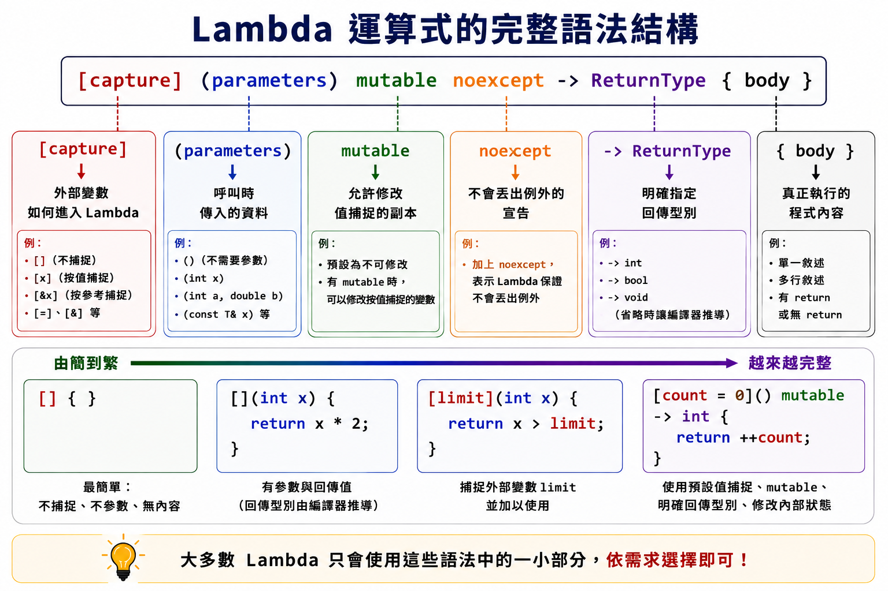
```cpp
[capture](
    parameters
) mutable noexcept
    -> ReturnType {
    body
}
```

常見部分：

| 部分 | 用途 |
| --- | --- |
| `[capture]` | 指定外部名稱如何進入 Lambda |
| `(parameters)` | 呼叫 Lambda 時傳入的參數 |
| `mutable` | 允許修改值捕捉的內部副本 |
| `noexcept` | 宣告不丟出例外 |
| `-> ReturnType` | 明確回傳型別 |
| `{ body }` | 執行內容 |

大多數 Lambda 不需要寫出所有部分。

---

# Part A：第一個 Lambda

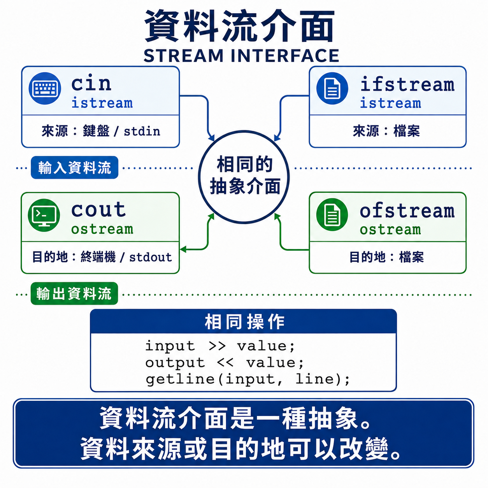
## Section IV. 最小形式

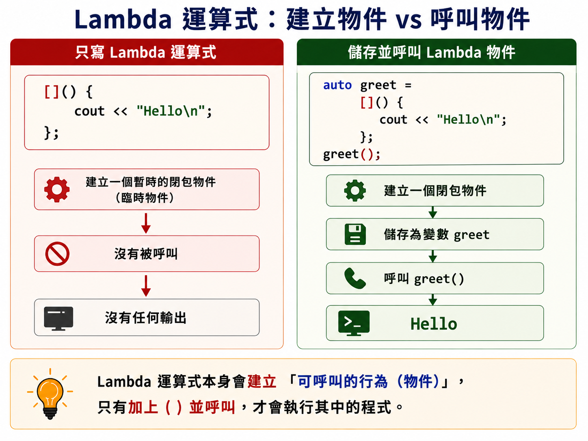
```cpp
[]() {
    cout << "Hello\n";
}
```

這是一個 Lambda expression，但若不保存或呼叫，它不會執行。

---

## Section V. 保存並呼叫

```cpp
auto greet =
    []() {
        cout << "Hello\n";
    };

greet();
```

---

## Section VI. 完整第一個 Lambda

```cpp
// VALIDATE
#include <iostream>
using namespace std;

int main() {
    auto greet =
        []() {
            cout << "Hello Lambda\n";
        };

    greet();
    greet();

    return 0;
}
```

`greet` 是一個 closure object。

---

# Part B：參數與回傳值

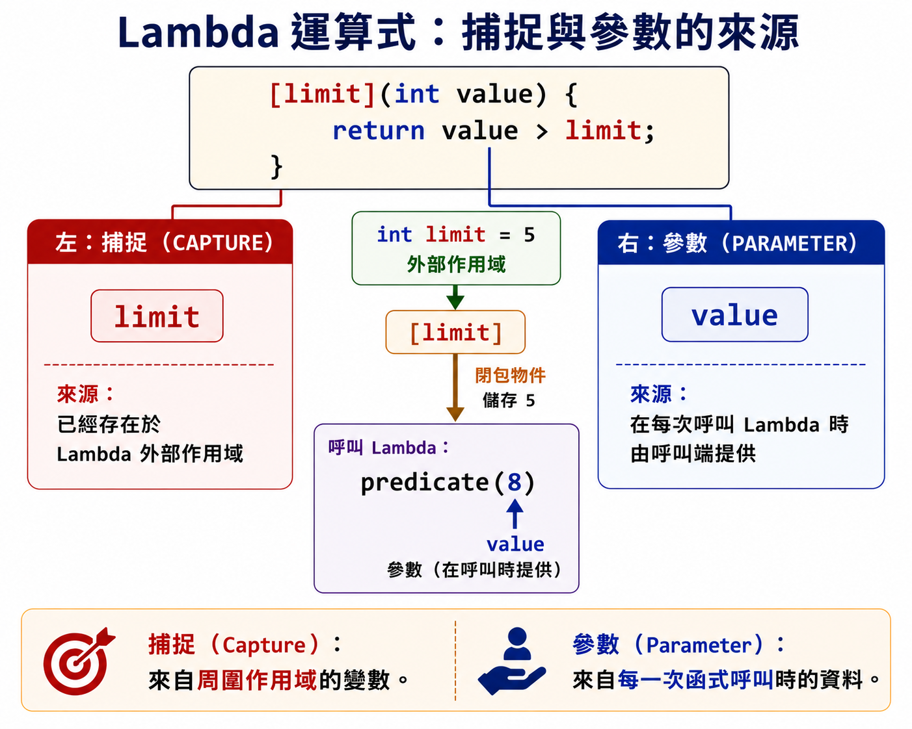
## Section VII. Lambda 參數

```cpp
[](int first, int second) {
    return first + second;
}
```

---

## Section VIII. 回傳型別推導

編譯器可從：

```cpp
return first + second;
```

推導回傳型別。

---

## Section IX. 完整參數範例

```cpp
// VALIDATE
#include <iostream>
using namespace std;

int main() {
    auto add =
        [](
            int first,
            int second
        ) {
            return
                first +
                second;
        };

    cout << add(
                3,
                5
            )
         << '\n';

    return 0;
}
```

---

# Part C：值捕捉

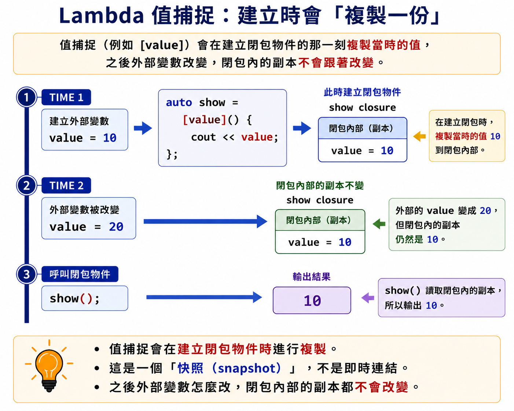
## Section X. `[value]`

```cpp
int value = 10;

auto show =
    [value]() {
        cout << value;
    };
```

Lambda 物件建立時複製 `value`。

---

## Section XI. 建立後原變數改變

```cpp
int value = 10;

auto show =
    [value]() {
        cout << value;
    };

value = 20;
show();
```

輸出仍是：

```text
10
```

---

## Section XII. 完整值捕捉

```cpp
// VALIDATE
#include <iostream>
using namespace std;

int main() {
    int value = 10;

    auto show =
        [value]() {
            cout << value
                 << '\n';
        };

    value = 20;

    show();

    cout << value
         << '\n';

    return 0;
}
```

---

# Part D：參考捕捉

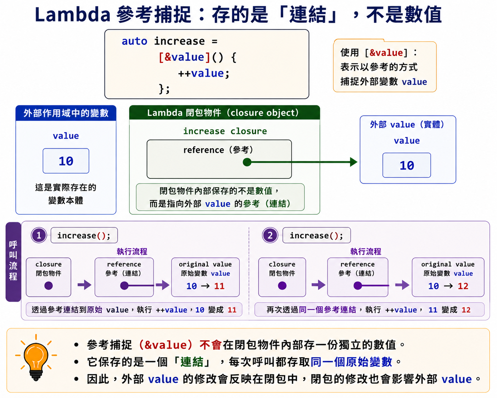
## Section XIII. `[&value]`

Lambda 保存對原變數的參考。

```cpp
auto increase =
    [&value]() {
        ++value;
    };
```

---

## Section XIV. 完整參考捕捉

```cpp
// VALIDATE
#include <iostream>
using namespace std;

int main() {
    int value = 10;

    auto increase =
        [&value]() {
            ++value;
        };

    increase();
    increase();

    cout << value
         << '\n';

    return 0;
}
```

輸出：

```text
12
```

---

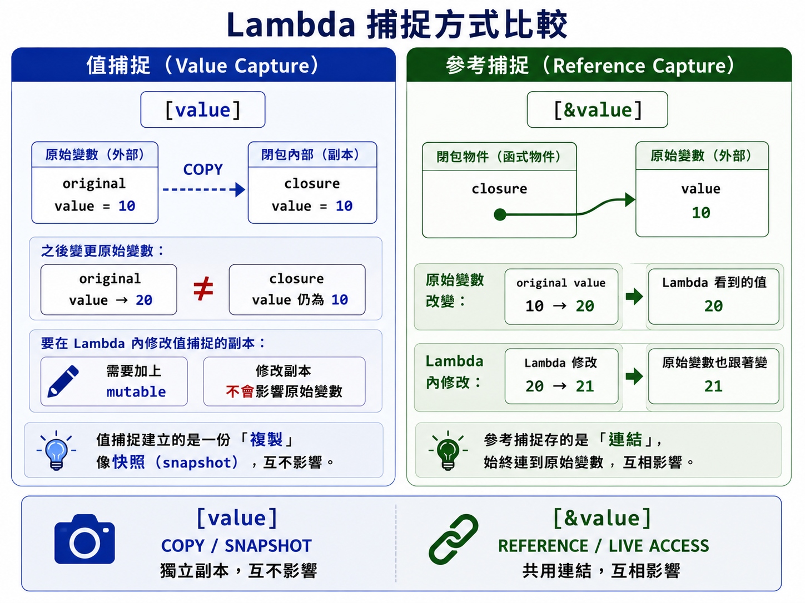
# Part E：預設捕捉

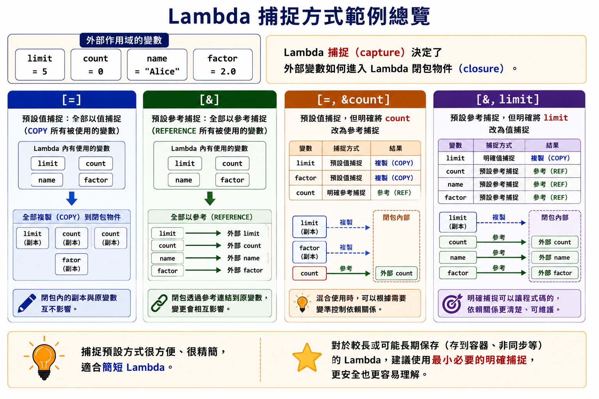
## Section XV. `[=]`

自動以值捕捉 Lambda 主體中使用的區域變數。

---

## Section XVI. `[&]`

自動以參考捕捉 Lambda 主體中使用的區域變數。

---

## Section XVII. 風險

雖然簡短，但依賴不明顯：

```cpp
[=]
[&]
```

Lambda 變長後，讀者較難判斷：

- 捕捉了什麼。
- 哪些值可被修改。
- 生命週期是否安全。

---

# Part F：混合捕捉

## Section XVIII. 預設值，指定參考

```cpp
[=, &result]
```

其他使用到的區域變數按值捕捉，`result` 按參考捕捉。

---

## Section XIX. 預設參考，指定值

```cpp
[&, limit]
```

其他變數按參考捕捉，`limit` 按值捕捉。

---

## Section XX. 完整混合捕捉

```cpp
// VALIDATE
#include <iostream>
#include <vector>
using namespace std;

int main() {
    vector<int> values{
        1,
        5,
        8,
        3,
        10
    };

    int limit = 5;
    int count = 0;

    auto countLargeValues =
        [limit, &count](
            const vector<int>& data
        ) {
            for (int value : data) {
                if (value > limit) {
                    ++count;
                }
            }
        };

    countLargeValues(values);

    cout << count
         << '\n';

    return 0;
}
```

---

# Part G：`mutable`

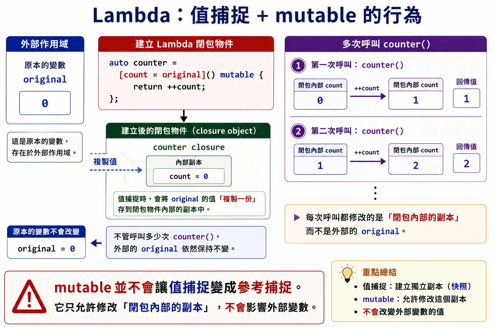
## Section XXI. 值捕捉預設唯讀

以下不能修改副本：

```cpp
int count = 0;

/* auto counter =
    [count]() {
        ++count;
    }; */
```

---

## Section XXII. 使用 `mutable`

```cpp
auto counter =
    [count]() mutable {
        ++count;
    };
```

修改的是 closure object 內部副本。

---

## Section XXIII. 完整 Mutable 狀態

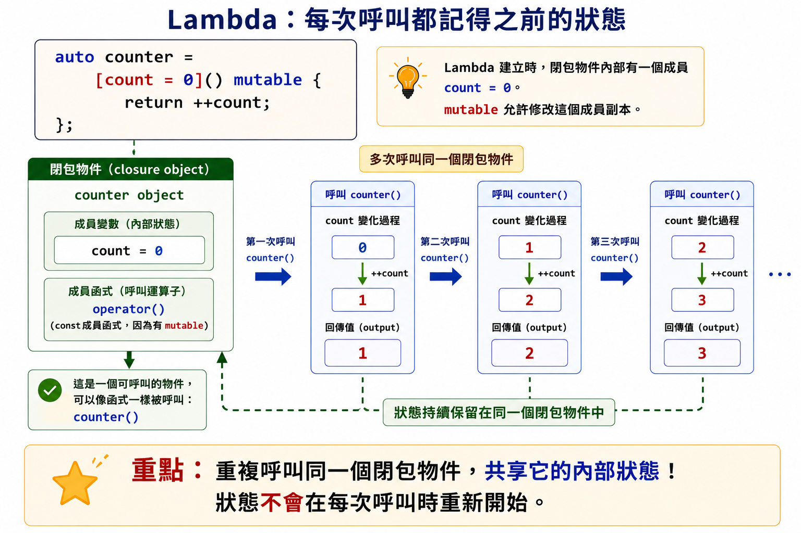
```cpp
// VALIDATE
#include <iostream>
using namespace std;

int main() {
    int original = 0;

    auto counter =
        [count = original]() mutable {
            ++count;
            return count;
        };

    cout << counter()
         << " "
         << counter()
         << " "
         << original
         << '\n';

    return 0;
}
```

輸出：

```text
1 2 0
```

---

# Part H：複製 Lambda 狀態

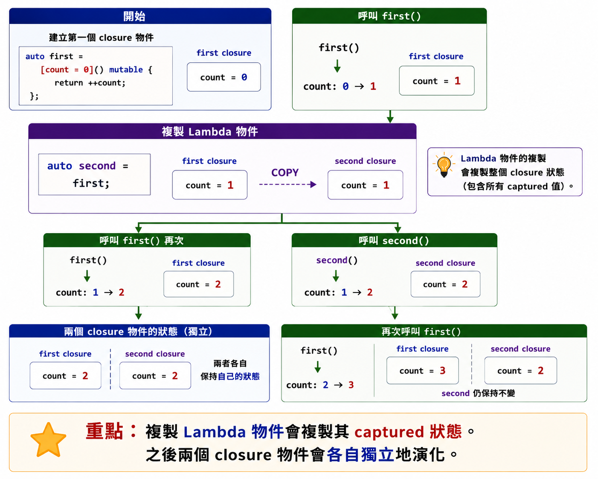
## Section XXIV. Closure Object 可複製

```cpp
auto first =
    [count = 0]() mutable {
        return ++count;
    };

auto second =
    first;
```

`second` 取得當時狀態的副本。

---

## Section XXV. 完整狀態複製

```cpp
// VALIDATE
#include <iostream>
using namespace std;

int main() {
    auto first =
        [count = 0]() mutable {
            ++count;
            return count;
        };

    cout << first()
         << '\n';

    auto second =
        first;

    cout << first()
         << " "
         << second()
         << '\n';

    return 0;
}
```

`second` 從複製時的狀態開始，但之後兩者獨立。

---

# Part I：初始化捕捉

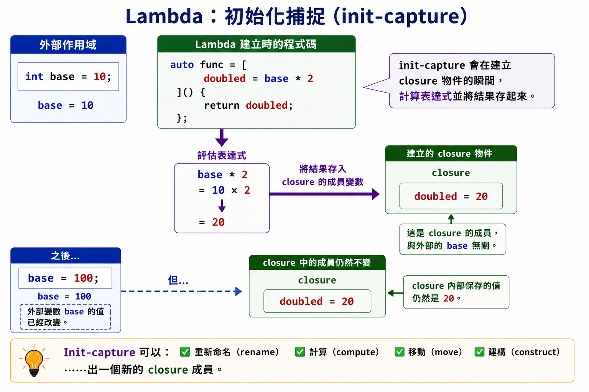
## Section XXVI. 基本語法

```cpp
[value = expression]
```

可以：

- 重新命名。
- 捕捉運算結果。
- 捕捉沒有原名稱的暫時值。
- 搭配 move。

---

## Section XXVII. 完整初始化捕捉

```cpp
// VALIDATE
#include <iostream>
using namespace std;

int main() {
    int base = 10;

    auto calculate =
        [
            doubled =
                base * 2
        ](
            int value
        ) {
            return
                doubled +
                value;
        };

    base = 100;

    cout << calculate(5)
         << '\n';

    return 0;
}
```

`doubled` 在 Lambda 建立時為 `20`。

---

# Part J：泛型 Lambda

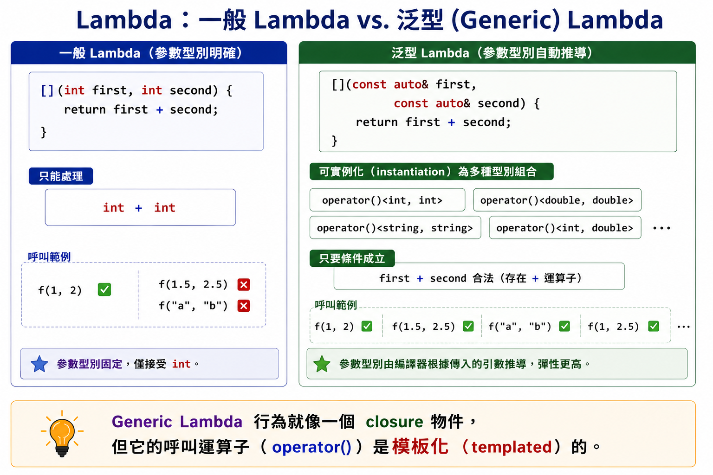
## Section XXVIII. `auto` 參數

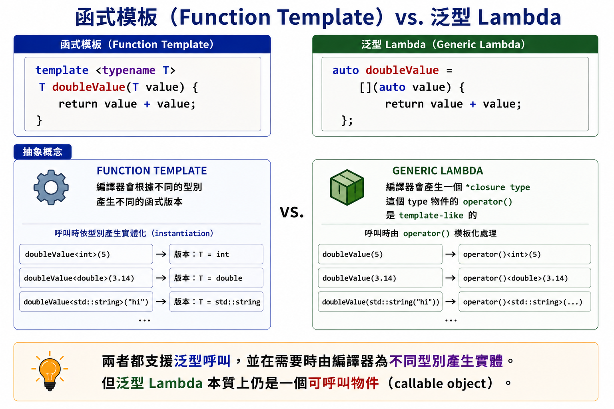
```cpp
auto add =
    [](const auto& first,
       const auto& second) {
        return first + second;
    };
```

---

## Section XXIX. 不同呼叫可使用不同型別

同一 closure object 可呼叫：

```cpp
add(3, 5)
add(2.5, 4.0)
add(string("A"), string("B"))
```

只要對應運算合法。

---

## Section XXX. 完整泛型 Lambda

```cpp
// VALIDATE
#include <iostream>
#include <string>
using namespace std;

int main() {
    auto add =
        [](
            const auto& first,
            const auto& second
        ) {
            return
                first +
                second;
        };

    cout << add(
                3,
                5
            )
         << '\n';

    cout << add(
                2.5,
                4.0
            )
         << '\n';

    cout << add(
                string("Hello "),
                string("Lambda")
            )
         << '\n';

    return 0;
}
```

---

# Part K：明確回傳型別

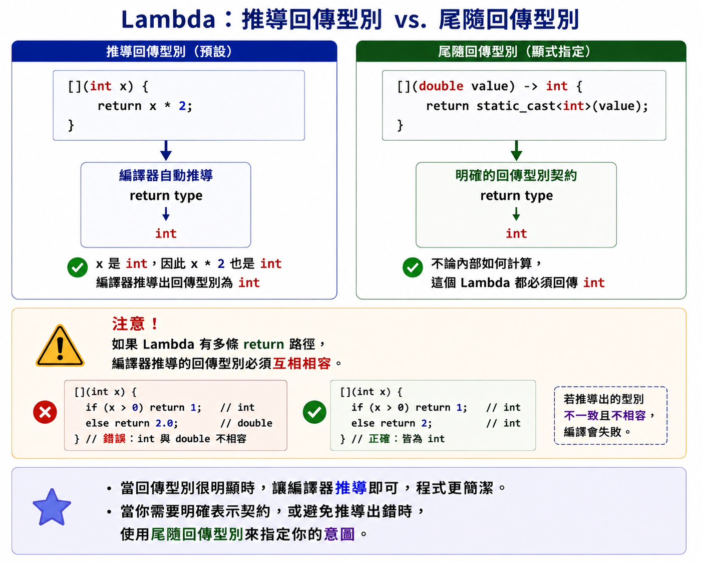
## Section XXXI. Trailing Return Type

```cpp
[](double value)
    -> int {
    return
        static_cast<int>(
            value
        );
}
```

---

## Section XXXII. 何時使用？

- 多個 return expression 不容易推導一致型別。
- API 需要明確回傳型別。
- 希望刻意轉換結果。
- 複雜泛型回傳型別。

---

## Section XXXIII. 完整回傳型別

```cpp
// VALIDATE
#include <iostream>
using namespace std;

int main() {
    auto truncate =
        [](double value)
            -> int {
            return
                static_cast<int>(
                    value
                );
        };

    cout << truncate(3.9)
         << '\n';

    return 0;
}
```

---

# Part L：立即呼叫 Lambda

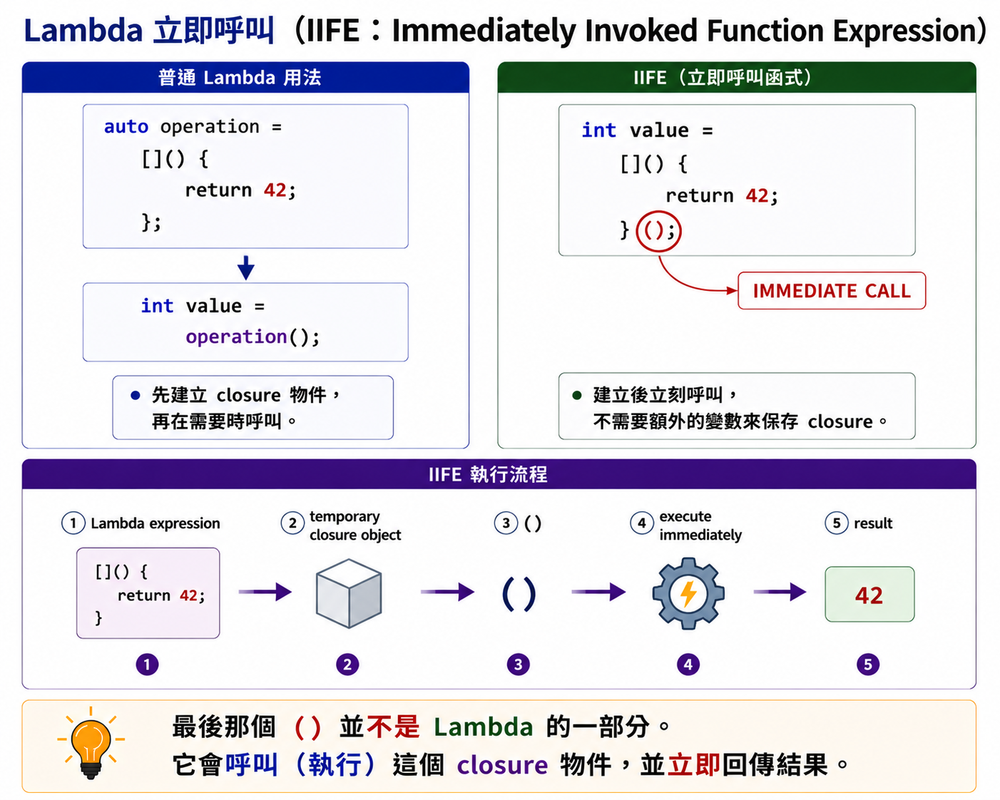
## Section XXXIV. IIFE

```cpp
auto value =
    []() {
        return 42;
    }();
```

最後的 `()` 立即呼叫 Lambda。

---

## Section XXXV. 使用情境

- 建立複雜 `const` 初始值。
- 限制暫存變數作用域。
- 將初始化邏輯集中。
- 避免先宣告再多次賦值。

---

## Section XXXVI. 完整 IIFE

```cpp
// VALIDATE
#include <iostream>
using namespace std;

int main() {
    int score = 85;

    const char grade =
        [score]() {
            if (score >= 90) {
                return 'A';
            }

            if (score >= 80) {
                return 'B';
            }

            if (score >= 70) {
                return 'C';
            }

            return 'F';
        }();

    cout << grade
         << '\n';

    return 0;
}
```

---

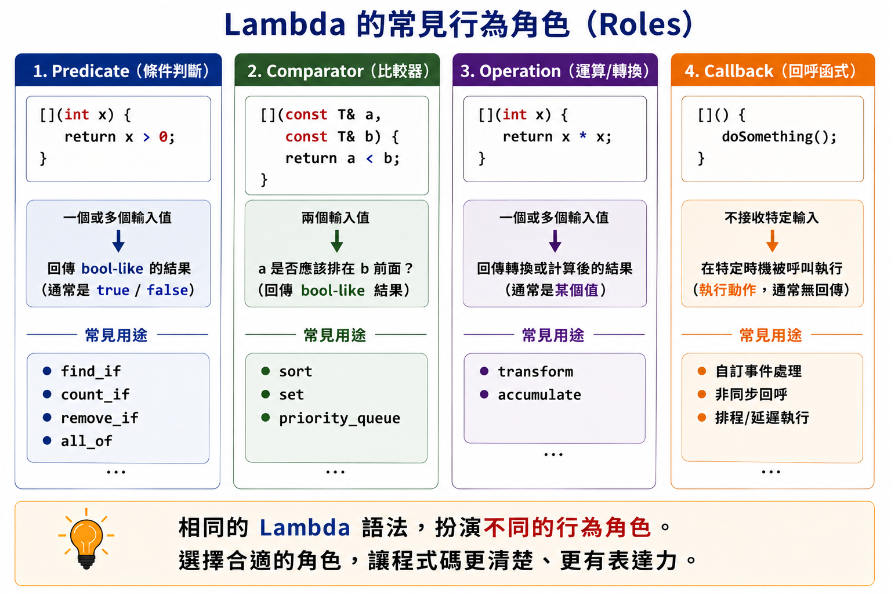
# Part M：Predicate

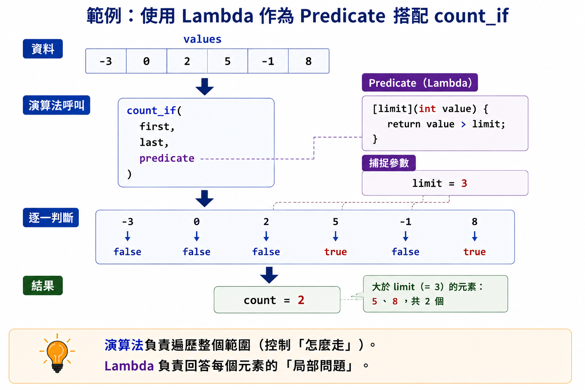
## Section XXXVII. 什麼是 Predicate？

回傳可轉成 `bool` 的 callable。

例如：

```cpp
[](int value) {
    return value > 0;
}
```

---

## Section XXXVIII. `count_if()`

```cpp
count_if(
    first,
    last,
    predicate
)
```

---

## Section XXXIX. 完整 Predicate

```cpp
// VALIDATE
#include <algorithm>
#include <iostream>
#include <vector>
using namespace std;

int main() {
    vector<int> values{
        -3,
        0,
        2,
        5,
        -1,
        8
    };

    int limit = 3;

    auto count =
        count_if(
            values.cbegin(),
            values.cend(),
            [limit](int value) {
                return
                    value >
                    limit;
            }
        );

    cout << count
         << '\n';

    return 0;
}
```

---

# Part N：Comparator


## Section XL. 排序比較器

Comparator 回答：

```text
first 是否應排在 second 前？
```

---

## Section XLI. 不可使用 `<=`

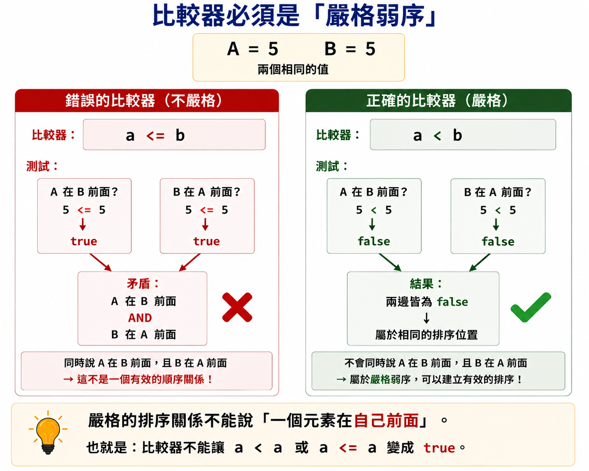
錯誤概念：

```cpp
/* return first <= second; */
```

相同元素時會同時認為彼此應排在對方前面，破壞 strict weak ordering。

---

## Section XLII. 完整學生排序

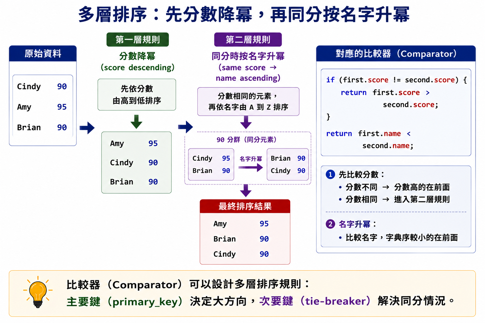
```cpp
// VALIDATE
#include <algorithm>
#include <iostream>
#include <string>
#include <vector>
using namespace std;

struct Student {
    string name;
    double score;
};

int main() {
    vector<Student> students{
        {
            "Cindy",
            90.0
        },
        {
            "Amy",
            95.0
        },
        {
            "Brian",
            90.0
        }
    };

    sort(
        students.begin(),
        students.end(),
        [](
            const Student& first,
            const Student& second
        ) {
            if (
                first.score !=
                second.score
            ) {
                return
                    first.score >
                    second.score;
            }

            return
                first.name <
                second.name;
        }
    );

    for (
        const Student& student :
        students
    ) {
        cout << student.name
             << " "
             << student.score
             << '\n';
    }

    return 0;
}
```

---

# Part O：`find_if()` 與捕捉

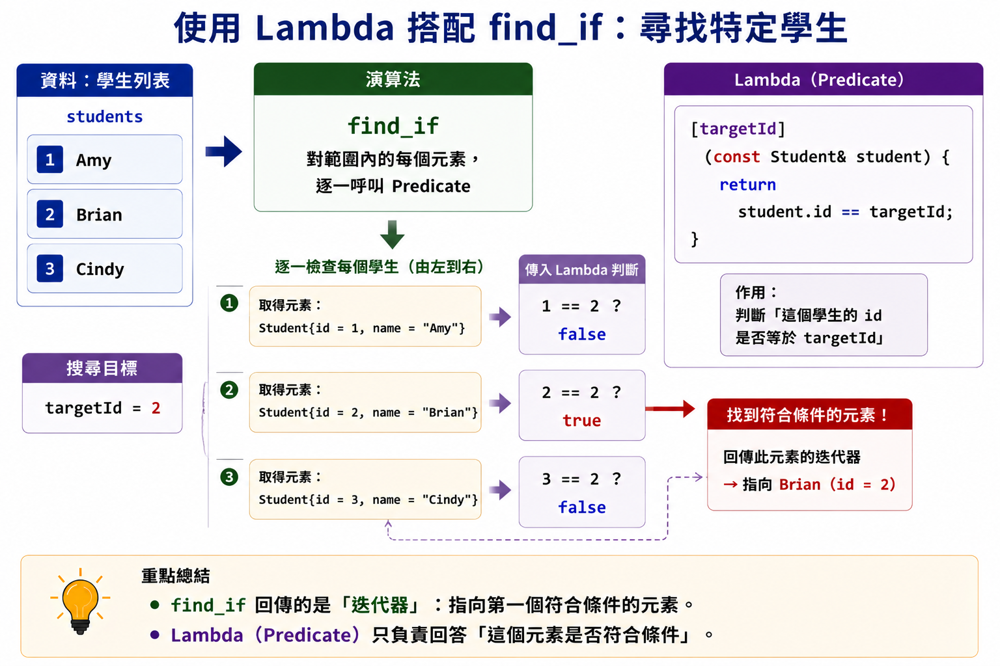
## Section XLIII. 捕捉搜尋條件

```cpp
[targetId](
    const Student& student
) {
    return
        student.id ==
        targetId;
}
```

---

## Section XLIV. 完整搜尋

```cpp
// VALIDATE
#include <algorithm>
#include <iostream>
#include <string>
#include <vector>
using namespace std;

struct Student {
    int id;
    string name;
};

int main() {
    vector<Student> students{
        {
            1,
            "Amy"
        },
        {
            2,
            "Brian"
        }
    };

    int targetId = 2;

    auto iterator =
        find_if(
            students.cbegin(),
            students.cend(),
            [targetId](
                const Student& student
            ) {
                return
                    student.id ==
                    targetId;
            }
        );

    if (
        iterator !=
        students.cend()
    ) {
        cout << iterator->name
             << '\n';
    }

    return 0;
}
```

---

# Part P：`transform()`

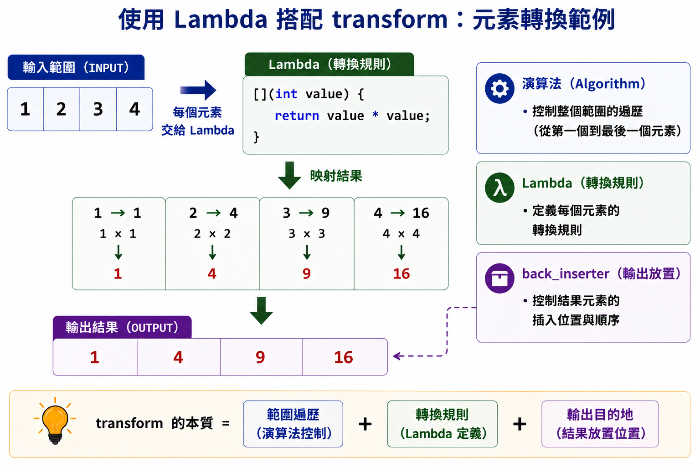
## Section XLV. Unary Operation

```cpp
transform(
    first,
    last,
    output,
    operation
)
```

Lambda 將每個輸入元素轉成一個輸出元素。

---

## Section XLVI. 完整平方轉換

```cpp
// VALIDATE
#include <algorithm>
#include <iostream>
#include <iterator>
#include <vector>
using namespace std;

int main() {
    vector<int> values{
        1,
        2,
        3,
        4
    };

    vector<int> squared;

    squared.reserve(
        values.size()
    );

    transform(
        values.cbegin(),
        values.cend(),
        back_inserter(
            squared
        ),
        [](int value) {
            return
                value * value;
        }
    );

    for (int value : squared) {
        cout << value
             << " ";
    }

    cout << '\n';

    return 0;
}
```

---

# Part Q：Erase-Remove with Lambda

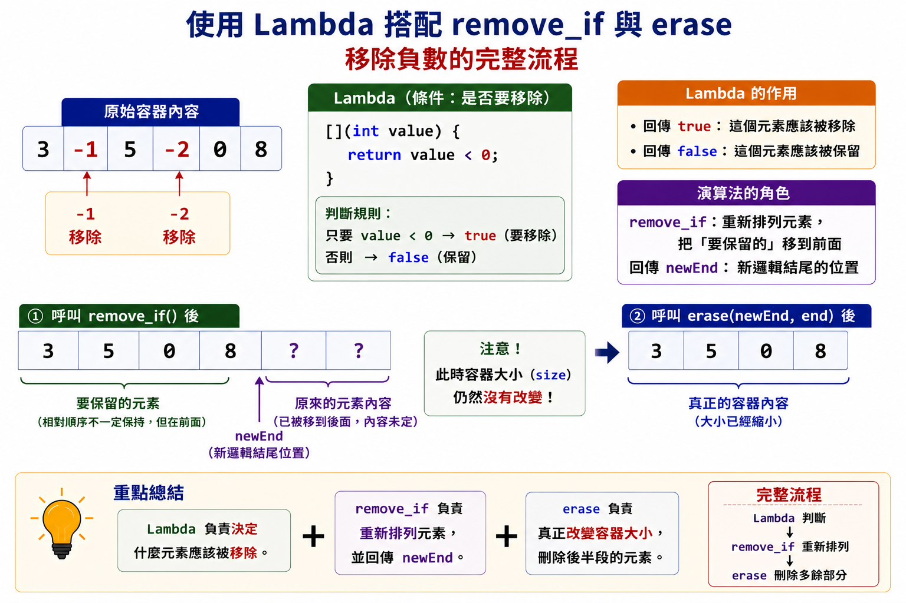
## Section XLVII. `remove_if()`

只把要保留的元素移到前方，不會縮小 vector。

---

## Section XLVIII. 完整移除負數

```cpp
// VALIDATE
#include <algorithm>
#include <iostream>
#include <vector>
using namespace std;

int main() {
    vector<int> values{
        3,
        -1,
        5,
        -2,
        0,
        8
    };

    values.erase(
        remove_if(
            values.begin(),
            values.end(),
            [](int value) {
                return
                    value < 0;
            }
        ),
        values.end()
    );

    for (int value : values) {
        cout << value
             << " ";
    }

    cout << '\n';

    return 0;
}
```

---

# Part R：Lambda 保存外部結果

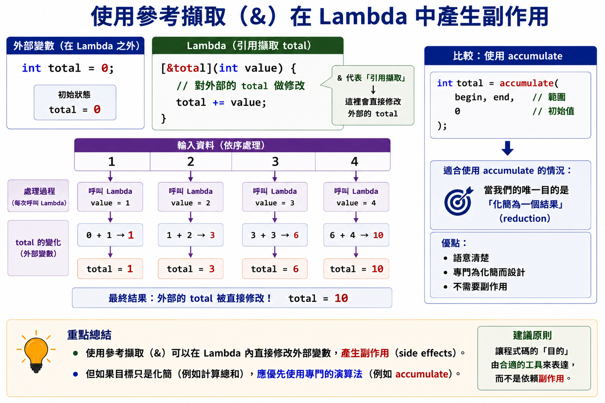
## Section XLIX. 參考捕捉累加

```cpp
int total = 0;

for_each(
    values.begin(),
    values.end(),
    [&total](int value) {
        total += value;
    }
);
```

---

## Section L. 與 `accumulate()` 比較

若目的只是加總：

```cpp
accumulate()
```

通常更直接。

參考捕捉適合需要多個結果或較特殊副作用的情況。

---

# Part S：Stateful Lambda Factory

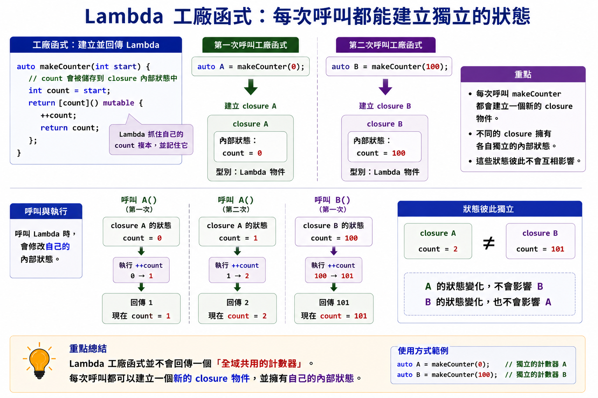
## Section LI. 回傳 Lambda

```cpp
auto makeCounter(
    int start
) {
    return
        [count = start]() mutable {
            return ++count;
        };
}
```

---

## Section LII. 完整 Factory

```cpp
// VALIDATE
#include <iostream>
using namespace std;

auto makeCounter(
    int start
) {
    return
        [count = start]() mutable {
            ++count;
            return count;
        };
}

int main() {
    auto first =
        makeCounter(0);

    auto second =
        makeCounter(100);

    cout << first()
         << " "
         << first()
         << '\n';

    cout << second()
         << '\n';

    return 0;
}
```

每個回傳 Lambda 都保存自己的狀態。

---

# Part T：Dangling Reference

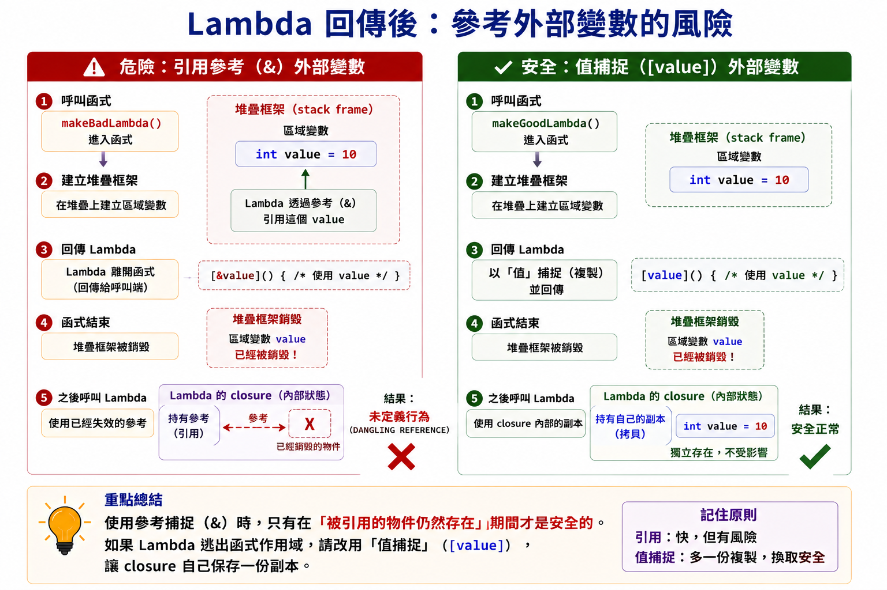
## Section LIII. 危險回傳

```cpp
/* auto makeBadLambda() {
    int value = 10;

    return [&value]() {
        return value;
    };
} */
```

函式結束後 `value` 已銷毀。

回傳 Lambda 的參考捕捉懸空。

---

## Section LIV. 安全值捕捉

```cpp
auto makeLambda() {
    int value = 10;

    return [value]() {
        return value;
    };
}
```

---

## Section LV. 仍需注意間接生命週期

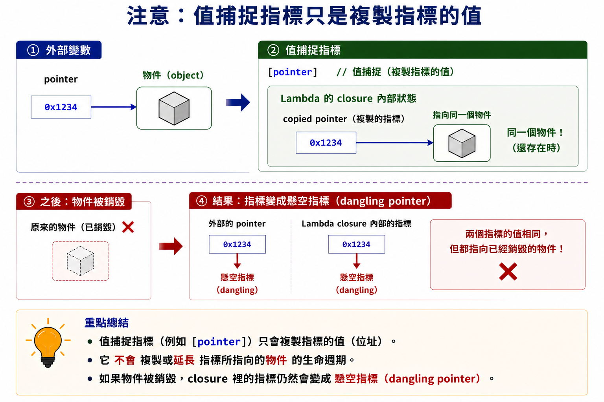
即使值捕捉：

```cpp
[pointer]
```

只是複製指標，不會延長指標所指物件生命週期。

---

# Part U：`this` 捕捉

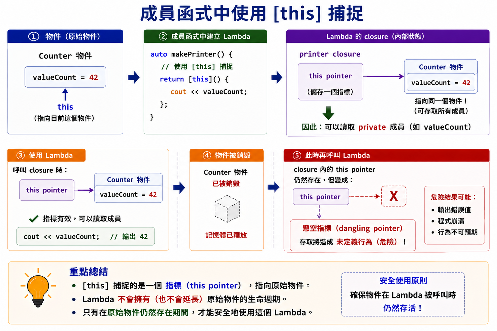

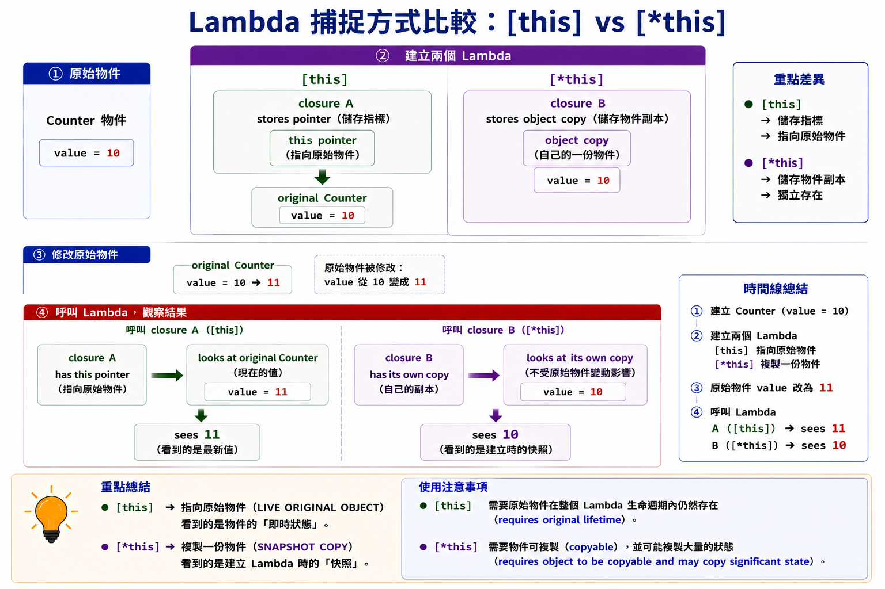
## Section LVI. `[this]`

在成員函式中捕捉目前物件指標。

Lambda 可存取 private 成員。

---

## Section LVII. 生命週期風險

如果 Lambda 比物件活得久：

```text
this 可能懸空
```

因此保存成員 Lambda callback 時必須清楚管理物件生命週期。

---

## Section LVIII. 完整 `[this]`

```cpp
// VALIDATE
#include <iostream>
using namespace std;

class Counter {
public:
    explicit Counter(
        int initialValue
    )
        : valueCount(
              initialValue
          ) {
    }

    auto makePrinter() const {
        return
            [this]() {
                cout << valueCount
                     << '\n';
            };
    }

private:
    int valueCount;
};

int main() {
    Counter counter(42);

    auto printer =
        counter.makePrinter();

    printer();

    return 0;
}
```

`counter` 必須在 `printer()` 呼叫時仍存在。

---

# Part V：`*this` 值捕捉

## Section LIX. C++17 語法

```cpp
[*this]
```

將目前物件複製進 closure object。

---

## Section LX. 與 `[this]` 比較

| 捕捉 | 保存內容 | 原物件修改後 | 生命週期 |
| --- | --- | --- | --- |
| `[this]` | 指標 | 看到原物件最新內容 | 原物件必須仍存在 |
| `[*this]` | 物件副本 | 使用建立時副本 | 不依賴原物件仍存在 |

---

## Section LXI. 完整 `*this`

```cpp
// VALIDATE
#include <iostream>
using namespace std;

class Counter {
public:
    explicit Counter(
        int initialValue
    )
        : valueCount(
              initialValue
          ) {
    }

    auto makeSnapshotPrinter() const {
        return
            [*this]() {
                cout << valueCount
                     << '\n';
            };
    }

    void increment() {
        ++valueCount;
    }

private:
    int valueCount;
};

int main() {
    Counter counter(10);

    auto snapshot =
        counter.makeSnapshotPrinter();

    counter.increment();

    snapshot();

    return 0;
}
```

輸出：

```text
10
```

---

# Part W：Captureless Lambda 與函式指標

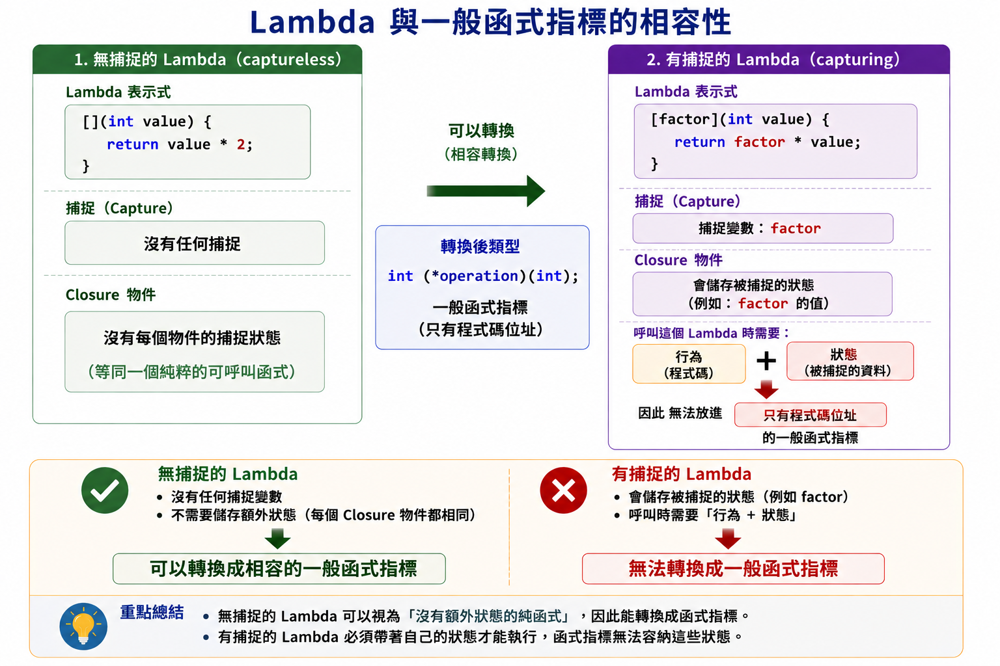
## Section LXII. 無捕捉 Lambda

```cpp
[](int value) {
    return value * 2;
}
```

可轉換為相容函式指標。

---

## Section LXIII. 完整函式指標轉換

```cpp
// VALIDATE
#include <iostream>
using namespace std;

int main() {
    int (*operation)(int) =
        [](int value) {
            return
                value * 2;
        };

    cout << operation(5)
         << '\n';

    return 0;
}
```

有捕捉 Lambda 不能轉成一般函式指標，因為它需要額外狀態。

---

# Part X：`std::function`

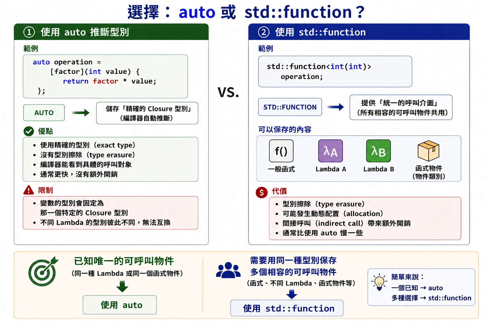
## Section LXIV. Type Erasure

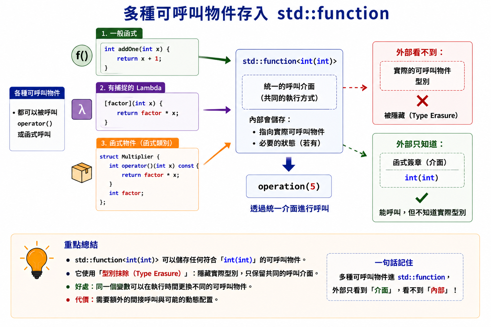
```cpp
function<int(int, int)>
```

可保存任何相容 callable：

- 一般函式
- Lambda
- 函式物件

---

## Section LXV. 完整 `std::function`

```cpp
// VALIDATE
#include <functional>
#include <iostream>
using namespace std;

int add(
    int first,
    int second
) {
    return
        first +
        second;
}

int main() {
    function<
        int(int, int)
    > operation =
        add;

    cout << operation(
                3,
                5
            )
         << '\n';

    int factor = 2;

    operation =
        [factor](
            int first,
            int second
        ) {
            return
                factor *
                (
                    first +
                    second
                );
        };

    cout << operation(
                3,
                5
            )
         << '\n';

    return 0;
}
```

---

## Section LXVI. `auto` vs `std::function`

選 `auto`：

- 只保存一個已知 Lambda。
- 希望保留具體型別。
- 希望避免 type erasure 成本。

選 `std::function`：

- 需要統一保存不同 callable。
- 需要作為穩定介面型別。
- 需要 callback 容器。
- 需要可重新指定不同 callable。

---

# Part Y：Callback List

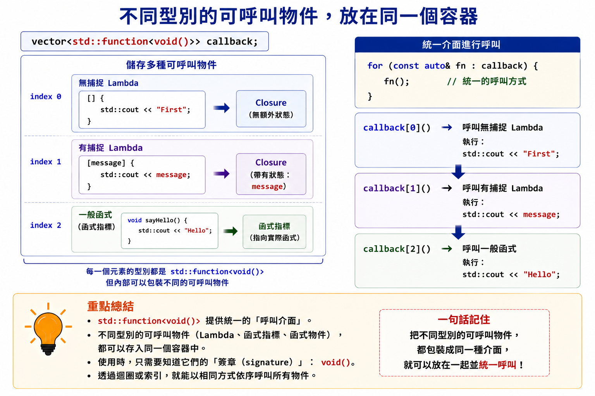
## Section LXVII. 多個 Callback

```cpp
vector<
    function<void()>
> callbacks;
```

---

## Section LXVIII. 完整 Callback List

```cpp
// VALIDATE
#include <functional>
#include <iostream>
#include <string>
#include <vector>
using namespace std;

int main() {
    vector<
        function<void()>
    > callbacks;

    callbacks.push_back(
        []() {
            cout << "First\n";
        }
    );

    string message =
        "Second";

    callbacks.push_back(
        [message]() {
            cout << message
                 << '\n';
        }
    );

    for (
        const auto& callback :
        callbacks
    ) {
        callback();
    }

    return 0;
}
```

---

# Part Z：遞迴 Lambda

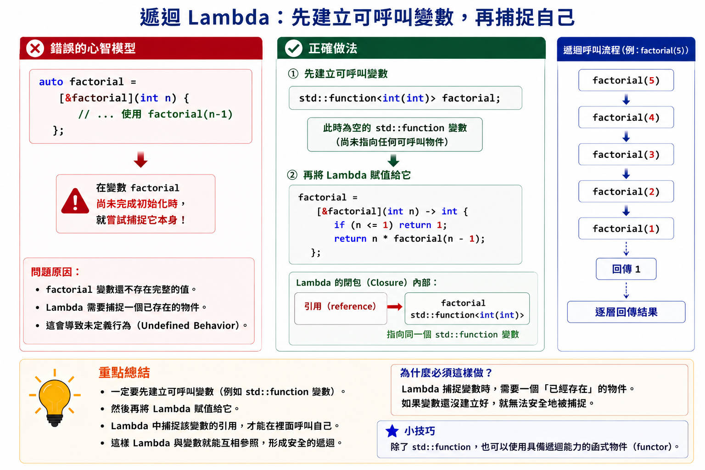
## Section LXIX. 問題

Lambda 變數初始化尚未完成前，不能直接安全地在主體中以自身變數名稱建立一般遞迴。

---

## Section LXX. 使用 `std::function`

```cpp
function<int(int)> factorial;

factorial =
    [&factorial](int value) {
        // ...
    };
```

---

## Section LXXI. 完整遞迴 Lambda

```cpp
// VALIDATE
#include <functional>
#include <iostream>
using namespace std;

int main() {
    function<int(int)>
        factorial;

    factorial =
        [&factorial](
            int value
        ) {
            if (value <= 1) {
                return 1;
            }

            return
                value *
                factorial(
                    value - 1
                );
        };

    cout << factorial(5)
         << '\n';

    return 0;
}
```

輸出：

```text
120
```

---

# Part AA：Lambda 作為 Set Comparator

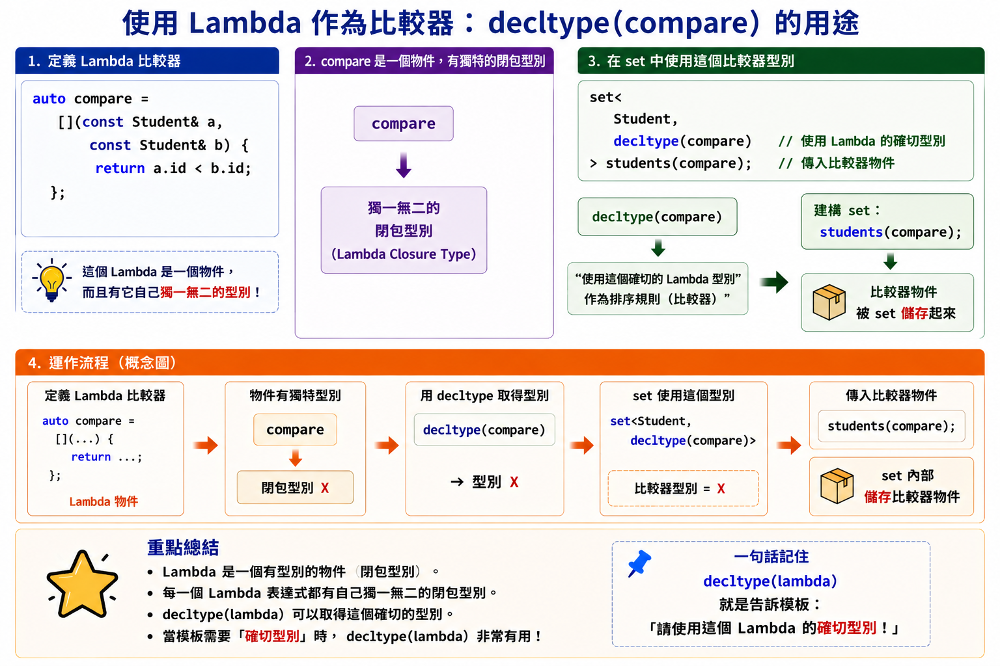
## Section LXXII. 每個 Lambda 有獨特型別

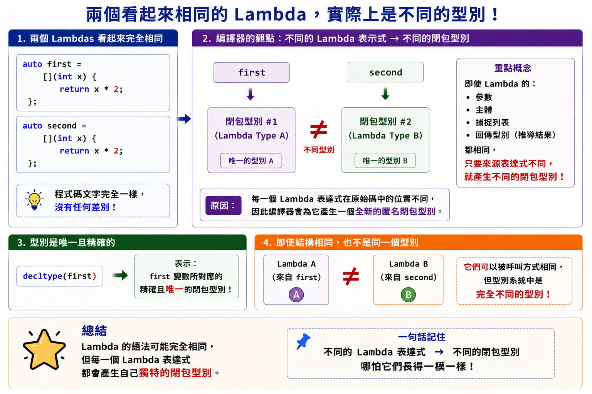
需使用：

```cpp
decltype(comparator)
```

作為 set comparator 型別。

---

## Section LXXIII. 完整 Set Comparator

```cpp
// VALIDATE
#include <iostream>
#include <set>
#include <string>
using namespace std;

struct Student {
    int id;
    string name;
};

int main() {
    auto compare =
        [](
            const Student& first,
            const Student& second
        ) {
            return
                first.id <
                second.id;
        };

    set<
        Student,
        decltype(compare)
    > students(compare);

    students.insert(
        {
            2,
            "Brian"
        }
    );

    students.insert(
        {
            1,
            "Amy"
        }
    );

    for (
        const Student& student :
        students
    ) {
        cout << student.id
             << " "
             << student.name
             << '\n';
    }

    return 0;
}
```

---

# Part AB：Priority Queue Comparator

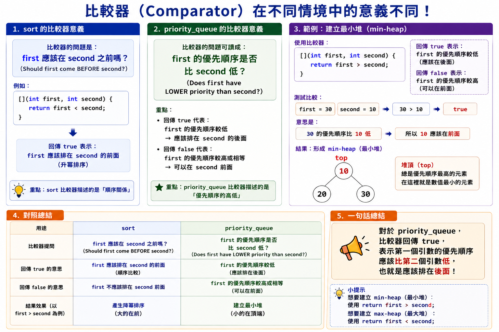
## Section LXXIV. Comparator 方向

`priority_queue` 的 comparator 表示：

```text
first 的優先權是否低於 second
```

這個方向常讓初學者困惑。

---

## Section LXXV. 完整最低值優先

```cpp
// VALIDATE
#include <iostream>
#include <queue>
#include <vector>
using namespace std;

int main() {
    auto lowerPriority =
        [](int first, int second) {
            return
                first >
                second;
        };

    priority_queue<
        int,
        vector<int>,
        decltype(lowerPriority)
    > values(
        lowerPriority
    );

    values.push(30);
    values.push(10);
    values.push(20);

    while (!values.empty()) {
        cout << values.top()
             << " ";

        values.pop();
    }

    cout << '\n';

    return 0;
}
```

輸出：

```text
10 20 30
```

---

# Part AC：Lambda Pipeline

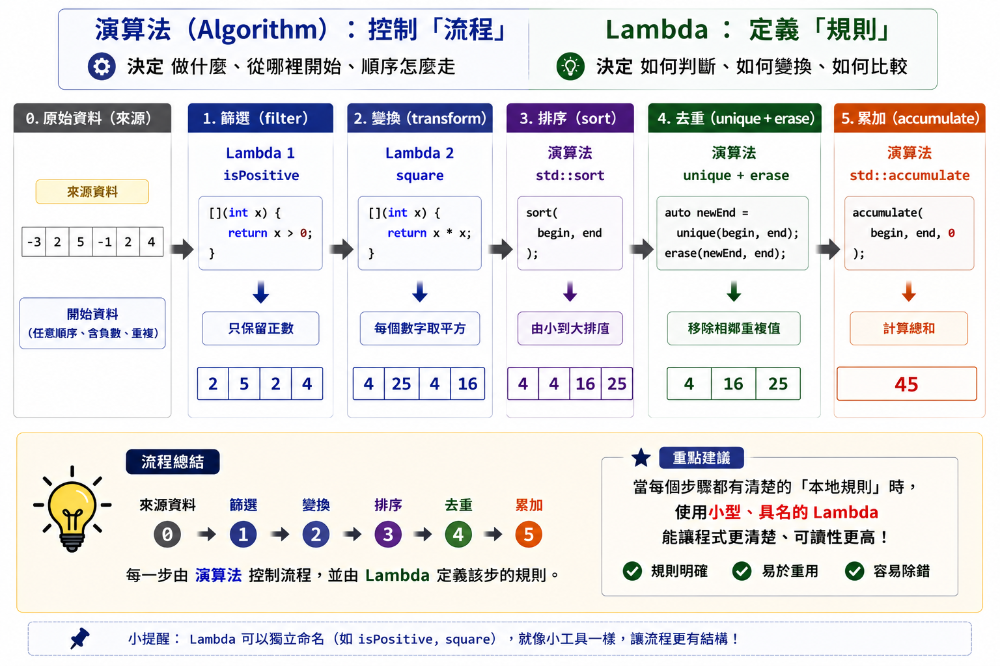
## Section LXXVI. 具名規則

過長 pipeline 中，可先建立具名 Lambda：

```cpp
auto isPositive = ...;
auto square = ...;
auto ascending = ...;
```

比在每個演算法中塞入長 Lambda 更容易閱讀與測試。

---

## Section LXXVII. 完整資料流程

```cpp
// VALIDATE
#include <algorithm>
#include <iostream>
#include <iterator>
#include <numeric>
#include <vector>
using namespace std;

int main() {
    vector<int> source{
        -3,
        2,
        5,
        -1,
        2,
        4
    };

    auto isPositive =
        [](int value) {
            return value > 0;
        };

    auto square =
        [](int value) {
            return
                value * value;
        };

    vector<int> result;

    copy_if(
        source.cbegin(),
        source.cend(),
        back_inserter(result),
        isPositive
    );

    transform(
        result.cbegin(),
        result.cend(),
        result.begin(),
        square
    );

    sort(
        result.begin(),
        result.end()
    );

    result.erase(
        unique(
            result.begin(),
            result.end()
        ),
        result.end()
    );

    int total =
        accumulate(
            result.cbegin(),
            result.cend(),
            0
        );

    for (int value : result) {
        cout << value
             << " ";
    }

    cout << "\n"
         << total
         << '\n';

    return 0;
}
```

---

# Part AD：Lambda 與一般函式的選擇

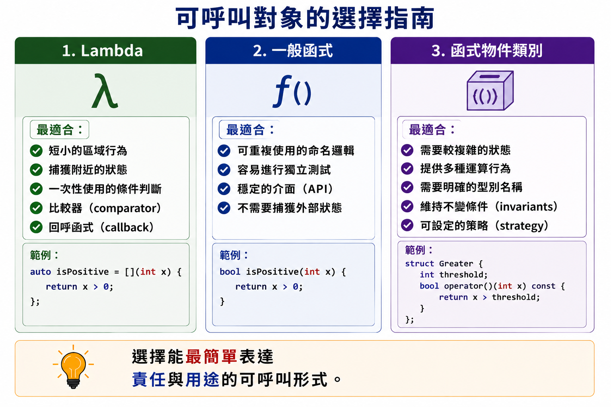

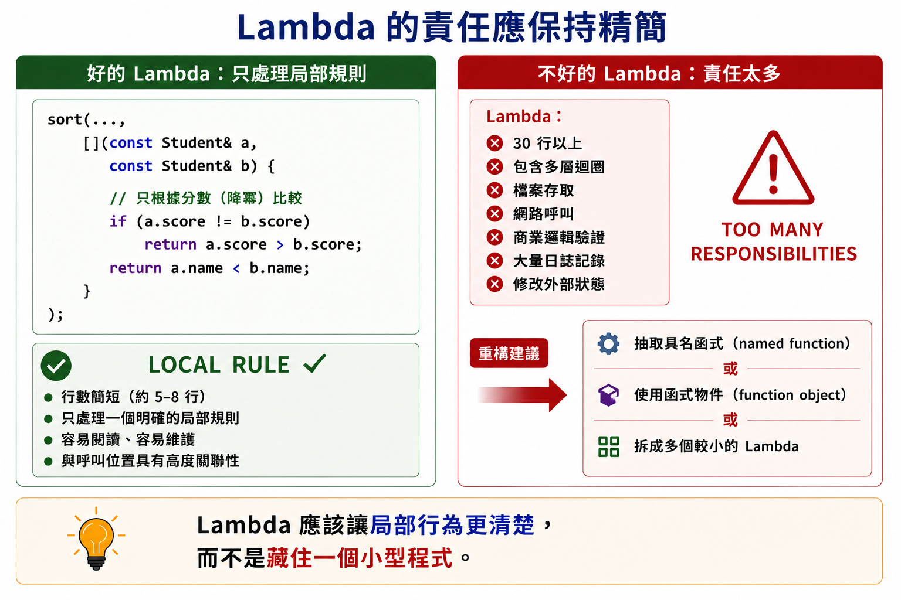
## Section LXXVIII. 適合 Lambda

- 使用位置附近的短小規則。
- 需要捕捉區域狀態。
- 一次性 predicate。
- 一次性 comparator。
- 簡短 callback。
- 局部資料轉換。

---

## Section LXXIX. 適合一般函式

- 多處重用。
- 需要獨立測試。
- 邏輯較長。
- 有清楚領域名稱。
- 不需要捕捉狀態。
- 需要穩定公開介面。

---

## Section LXXX. 適合函式物件類別

- 狀態複雜。
- 需要多個成員函式。
- 需要明確型別名稱。
- 需要封裝 invariant。
- 需要大型可設定策略。

---

# Part AE：捕捉設計原則

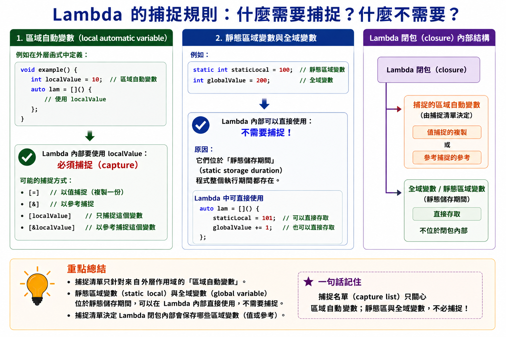

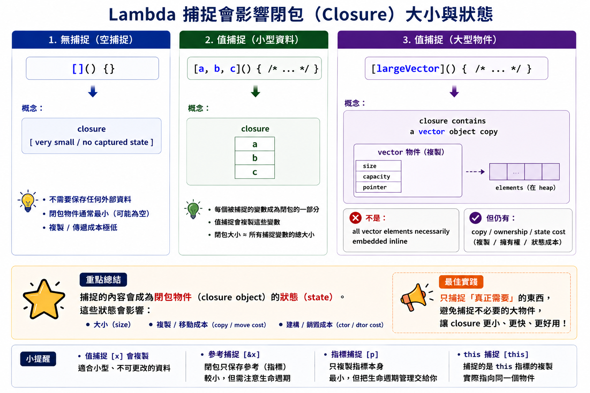

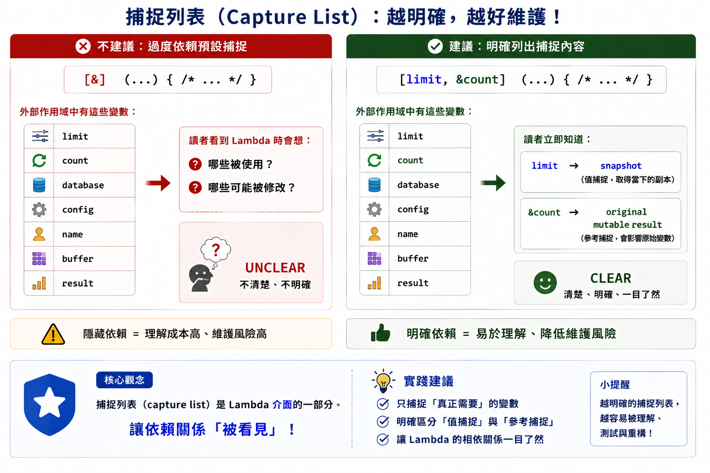

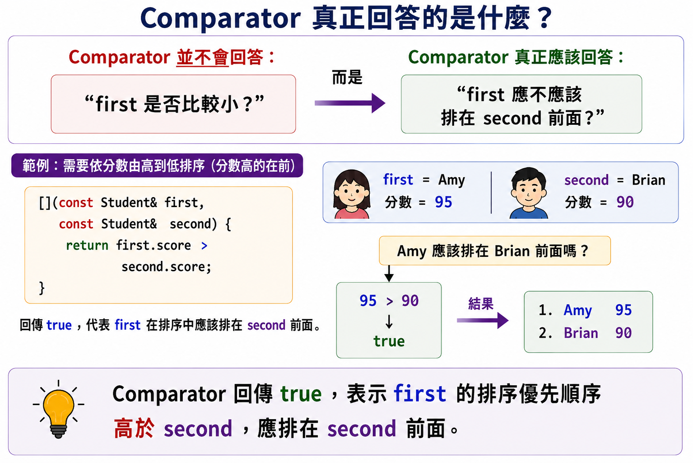
## Section LXXXI. 最小捕捉原則

較清楚：

```cpp
[limit, &count]
```

較不清楚：

```cpp
[&]
```

尤其 Lambda 很長或會被保存時。

---

## Section LXXXII. 值捕捉不一定完全安全

若捕捉：

```cpp
[pointer]
```

只是複製位址。

所指物件仍可能先銷毀。

---

## Section LXXXIII. 參考捕捉的條件

只有在能保證：

```text
被參考物件比 Lambda 活得久
```

時才安全保存參考捕捉 Lambda。

---

# Part AF：快速概念檢查

## Section LXXXIV. 選擇題與簡答

### Q1. Lambda expression 會建立什麼？

<details><summary>查看答案</summary>

一個匿名 closure type 的物件。

</details>

### Q2. `[]` 代表什麼？

<details><summary>查看答案</summary>

空捕捉列表，不捕捉區域變數。

</details>

### Q3. `[value]` 如何捕捉？

<details><summary>查看答案</summary>

在 Lambda 物件建立時複製 `value`。

</details>

### Q4. `[&value]` 如何捕捉？

<details><summary>查看答案</summary>

保存對原變數的參考。

</details>

### Q5. `[=]` 代表什麼？

<details><summary>查看答案</summary>

使用到的區域變數預設按值捕捉。

</details>

### Q6. `[&]` 代表什麼？

<details><summary>查看答案</summary>

使用到的區域變數預設按參考捕捉。

</details>

### Q7. `mutable` 有什麼用途？

<details><summary>查看答案</summary>

允許非 const 呼叫運算子，讓 Lambda 修改按值捕捉的內部副本。

</details>

### Q8. `mutable` 會修改原外部變數嗎？

<details><summary>查看答案</summary>

不會，除非該變數以參考捕捉。

</details>

### Q9. 什麼是初始化捕捉？

<details><summary>查看答案</summary>

在捕捉列表中使用新名稱與運算式建立 closure 成員，例如 `[value = expression]`。

</details>

### Q10. 泛型 Lambda 使用什麼參數型別？

<details><summary>查看答案</summary>

`auto`。

</details>

### Q11. Comparator 可以使用 `<=` 嗎？

<details><summary>查看答案</summary>

不應，排序 comparator 通常必須滿足 strict weak ordering。

</details>

### Q12. 回傳捕捉區域變數參考的 Lambda 安全嗎？

<details><summary>查看答案</summary>

通常不安全，區域變數在函式結束後會銷毀。

</details>

### Q13. `[this]` 捕捉什麼？

<details><summary>查看答案</summary>

目前物件指標。

</details>

### Q14. `[*this]` 捕捉什麼？

<details><summary>查看答案</summary>

目前物件的副本。

</details>

### Q15. 無捕捉 Lambda 可以轉換成什麼？

<details><summary>查看答案</summary>

相容的一般函式指標。

</details>

### Q16. 有捕捉 Lambda 可以轉成一般函式指標嗎？

<details><summary>查看答案</summary>

不可以。

</details>

### Q17. `std::function` 的用途？

<details><summary>查看答案</summary>

以統一型別保存不同但呼叫介面相容的 callable。

</details>

### Q18. 保存單一已知 Lambda 通常使用 `auto` 還是 `std::function`？

<details><summary>查看答案</summary>

通常使用 `auto`。

</details>

### Q19. 每個 Lambda expression 的型別相同嗎？

<details><summary>查看答案</summary>

不同位置的每個 Lambda expression 都有獨特型別。

</details>

### Q20. 何時應將 Lambda 改成一般函式？

<details><summary>查看答案</summary>

當邏輯過長、多處重用、需要獨立測試或有清楚領域名稱時。

</details>

---

# Part AG：程式閱讀練習

## Section LXXXV. 預測結果與合法性

### 題目 1

```cpp
int value = 10;

auto show =
    [value]() {
        cout << value;
    };

value = 20;
show();
```

<details><summary>查看答案</summary>

```text
10
```

值在 Lambda 建立時被複製。

</details>

### 題目 2

```cpp
int value = 10;

auto change =
    [&value]() {
        value = 20;
    };

change();
cout << value;
```

<details><summary>查看答案</summary>

```text
20
```

</details>

### 題目 3

```cpp
int value = 10;

/* auto change =
    [value]() {
        value = 20;
    }; */
```

<details><summary>查看答案</summary>

不合法。值捕捉副本預設不可修改；可加入 `mutable`。

</details>

### 題目 4

```cpp
int value = 10;

auto change =
    [value]() mutable {
        value = 20;
        return value;
    };

cout << change()
     << " "
     << value;
```

<details><summary>查看答案</summary>

```text
20 10
```

</details>

### 題目 5

```cpp
auto add =
    [](const auto& first,
       const auto& second) {
        return first + second;
    };

cout << add(3, 4.5);
```

<details><summary>查看答案</summary>

```text
7.5
```

實際輸出格式由串流設定決定。

</details>

### 題目 6

```cpp
int factor = 3;

auto multiply =
    [factor](int value) {
        return
            factor *
            value;
    };

cout << multiply(4);
```

<details><summary>查看答案</summary>

```text
12
```

</details>

### 題目 7

```cpp
auto counter =
    [count = 0]() mutable {
        return ++count;
    };

cout << counter()
     << counter();
```

<details><summary>查看答案</summary>

```text
12
```

</details>

### 題目 8

```cpp
auto first =
    [count = 0]() mutable {
        return ++count;
    };

first();

auto second =
    first;

cout << first()
     << second();
```

<details><summary>查看答案</summary>

複製時 `count` 已為 1。之後兩者各自遞增為 2：

```text
22
```

</details>

### 題目 9

```cpp
int (*operation)(int) =
    [](int value) {
        return value + 1;
    };

cout << operation(5);
```

<details><summary>查看答案</summary>

```text
6
```

</details>

### 題目 10

```cpp
int amount = 5;

/* int (*operation)(int) =
    [amount](int value) {
        return
            value +
            amount;
    }; */
```

<details><summary>查看答案</summary>

不合法。有捕捉 Lambda 不能轉成一般函式指標。

</details>

### 題目 11

```cpp
int value = 10;

const int result =
    [value]() {
        return value * 2;
    }();

cout << result;
```

<details><summary>查看答案</summary>

```text
20
```

Lambda 被立即呼叫。

</details>

### 題目 12

```cpp
vector<int> values{
    3,
    -1,
    4,
    -2
};

values.erase(
    remove_if(
        values.begin(),
        values.end(),
        [](int value) {
            return value < 0;
        }
    ),
    values.end()
);

cout << values.size();
```

<details><summary>查看答案</summary>

```text
2
```

</details>

---

# Part AH：實作練習

## Section LXXXVI. 實作檢測題

### TODO 1：Simple Lambda

建立無捕捉 Lambda，輸出 `"Hello"`。

### TODO 2：Add Lambda

建立接受兩個 `int` 並回傳總和的 Lambda。

### TODO 3：Value Capture

捕捉倍率值，建立乘法 Lambda。

### TODO 4：Reference Capture

捕捉計數器參考，每次呼叫增加一次。

### TODO 5：Mutable Counter

建立保存內部狀態的計數器 Lambda。

### TODO 6：Init Capture

捕捉一個運算結果而不是原變數。

### TODO 7：Generic Maximum

建立接受不同可比較型別的泛型 Lambda。

### TODO 8：Count If

使用 Lambda 統計大於指定門檻的元素。

### TODO 9：Student Sort

依分數遞減、姓名遞增排序。

### TODO 10：Transform

使用 Lambda 將所有字串轉成長度。

### TODO 11：Remove If

刪除所有空字串。

### TODO 12：Lambda Factory

建立 `makeMultiplier(factor)` 回傳乘法 Lambda。

### TODO 13：Callback Vector

使用 `vector<function<void()>>` 保存多個 Lambda。

### TODO 14：Recursive Lambda

使用 `std::function` 建立費氏數列或階乘 Lambda。

### TODO 15：Pipeline

完成「過濾偶數 → 平方 → 排序 → 加總」流程。

---

# Part AI：課後小練習

## Section LXXXVII. 延伸練習

### 練習 1：Configurable Validator

建立回傳 Lambda 的函式，可檢查數值是否位於指定範圍。

### 練習 2：Event System

建立簡單 callback 註冊與執行系統。

### 練習 3：Member Callback

建立類別回傳 `[this]` 與 `[*this]` Lambda，比較原物件修改後的結果。

### 練習 4：Custom Priority Queue

以結構與 Lambda comparator 建立工作優先佇列。

### 練習 5：Lambda Refactoring

將一個超過 30 行的 Lambda 重構成具名函式、小型 Lambda 與資料結構。

---

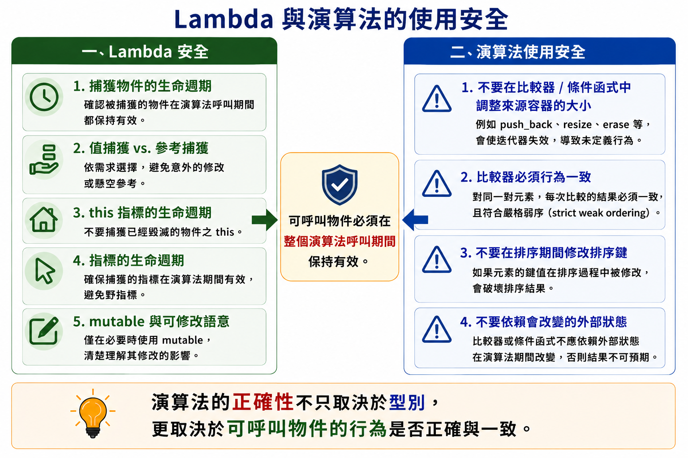
# Part AJ：常見錯誤提醒

## Section LXXXVIII. 常見錯誤

1. 建立 Lambda 後忘記呼叫。
2. 捕捉列表括號或方括號位置錯誤。
3. 值捕捉後期待看到原變數最新值。
4. 值捕捉中修改副本卻忘記 `mutable`。
5. 誤以為 `mutable` 會修改原變數。
6. 參考捕捉區域變數後讓 Lambda 活得更久。
7. 值捕捉裸指標後忽略指向物件生命週期。
8. 大型 Lambda 使用 `[&]` 隱藏所有依賴。
9. 大型 Lambda 使用 `[=]` 隱藏所有副本。
10. 重複捕捉同一名稱。
11. 混合捕捉語法順序錯誤。
12. Comparator 使用 `<=`。
13. Comparator 修改比較元素。
14. Sort comparator 依賴會變動的外部狀態。
15. 演算法執行中修改來源容器大小。
16. 泛型 Lambda 使用不被實際型別支援的操作。
17. 多個 return expression 推導出不一致型別。
18. 回傳捕捉區域參考的 Lambda。
19. `[this]` Lambda 在物件銷毀後被呼叫。
20. 誤以為 `[*this]` 會看到原物件後續修改。
21. 有捕捉 Lambda 嘗試轉成函式指標。
22. 不需要 type erasure 卻一律使用 `std::function`。
23. 使用 `std::function` 遞迴卻忘記先宣告。
24. 遞迴 Lambda 沒有終止條件。
25. Lambda 過長卻不重構。
26. 同一長 Lambda 在多處複製貼上。
27. Capture default 造成不必要大型物件複製。
28. 使用 `auto` 後完全忽略 callable 的參數與回傳介面。
29. 將副作用 Lambda 用在需要純 comparator 的位置。
30. 為了使用 Lambda 而讓一般函式變得更難閱讀。

---

# Part AK：Mermaid 流程圖

## Section LXXXIX. Lambda 表示式流程圖

### 1. Lambda 結構

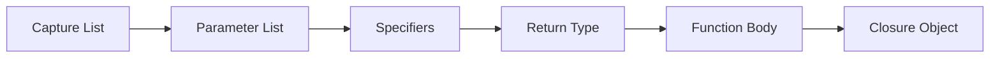
```mermaid
flowchart LR
    A[Capture List] --> B[Parameter List]
    B --> C[Specifiers]
    C --> D[Return Type]
    D --> E[Function Body]
    E --> F[Closure Object]
```

### 2. 捕捉方式選擇

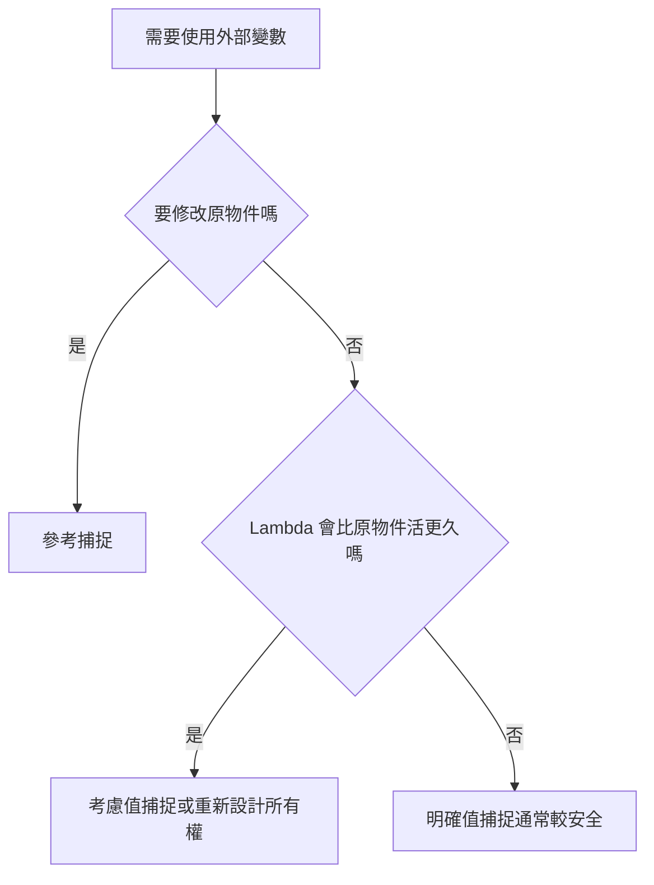
```mermaid
flowchart TD
    A[需要使用外部變數] --> B{要修改原物件嗎}
    B -- 是 --> C[參考捕捉]
    B -- 否 --> D{Lambda 會比原物件活更久嗎}
    D -- 是 --> E[考慮值捕捉或重新設計所有權]
    D -- 否 --> F[明確值捕捉通常較安全]
```

### 3. Mutable 值捕捉

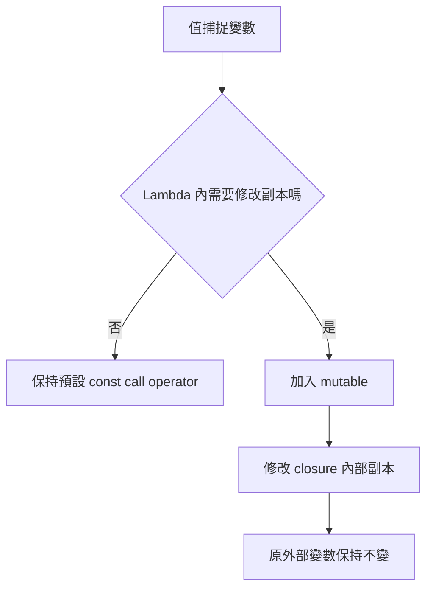
```mermaid
flowchart TD
    A[值捕捉變數] --> B{Lambda 內需要修改副本嗎}
    B -- 否 --> C[保持預設 const call operator]
    B -- 是 --> D[加入 mutable]
    D --> E[修改 closure 內部副本]
    E --> F[原外部變數保持不變]
```

### 4. Lambda 與演算法

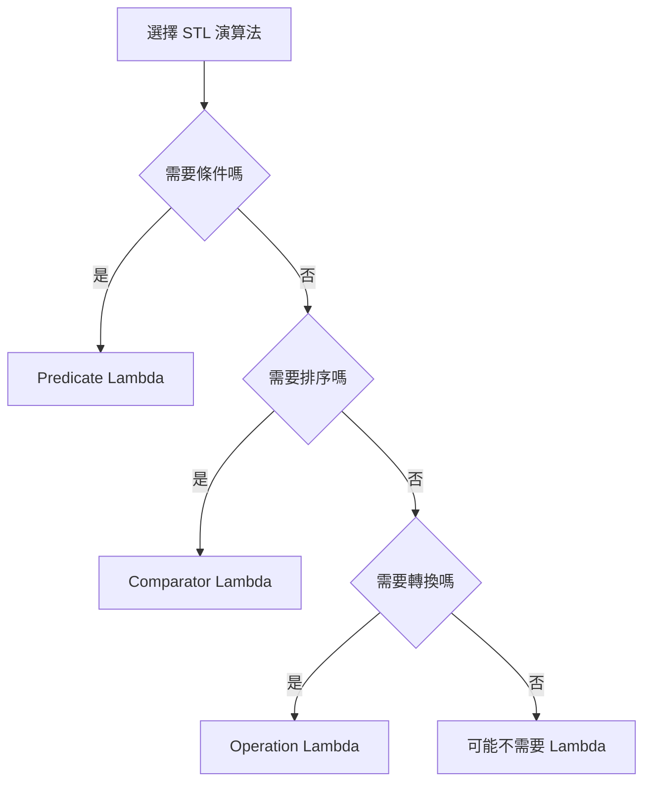
```mermaid
flowchart TD
    A[選擇 STL 演算法] --> B{需要條件嗎}
    B -- 是 --> C[Predicate Lambda]
    B -- 否 --> D{需要排序嗎}
    D -- 是 --> E[Comparator Lambda]
    D -- 否 --> F{需要轉換嗎}
    F -- 是 --> G[Operation Lambda]
    F -- 否 --> H[可能不需要 Lambda]
```

### 5. 回傳 Lambda 安全性

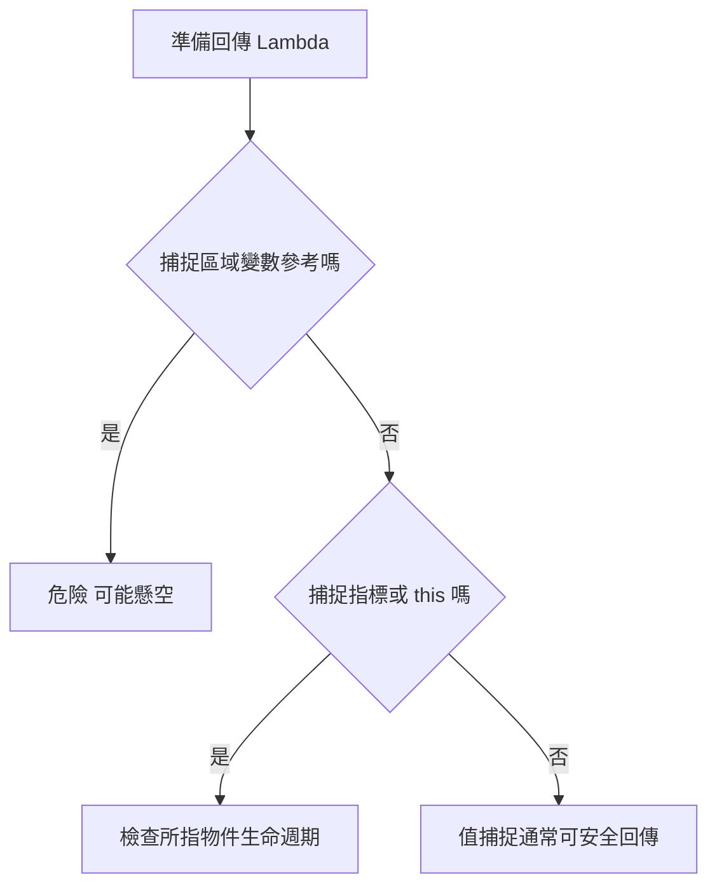
```mermaid
flowchart TD
    A[準備回傳 Lambda] --> B{捕捉區域變數參考嗎}
    B -- 是 --> C[危險 可能懸空]
    B -- 否 --> D{捕捉指標或 this 嗎}
    D -- 是 --> E[檢查所指物件生命週期]
    D -- 否 --> F[值捕捉通常可安全回傳]
```

### 6. Callable 儲存方式

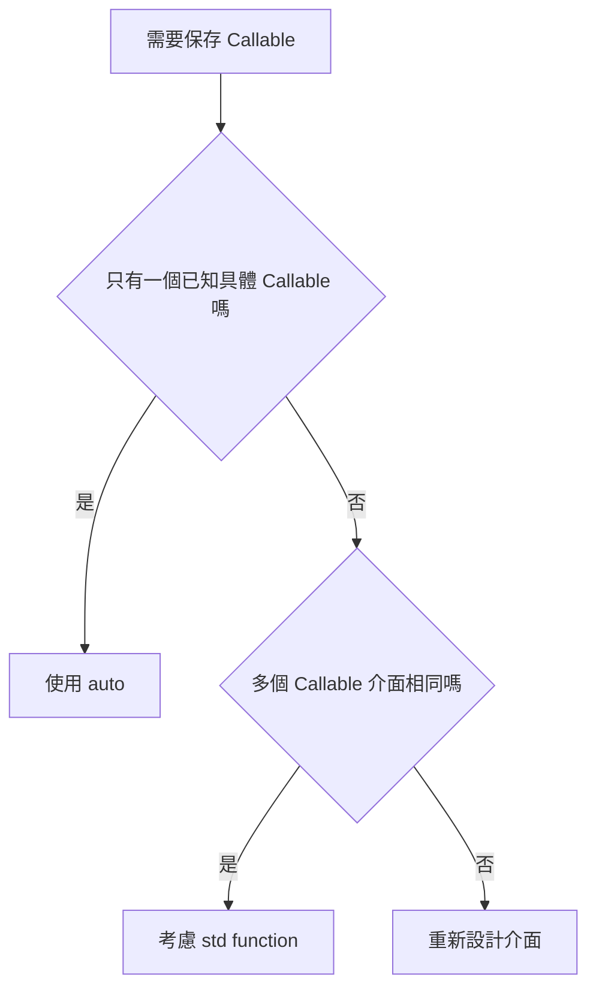
```mermaid
flowchart TD
    A[需要保存 Callable] --> B{只有一個已知具體 Callable 嗎}
    B -- 是 --> C[使用 auto]
    B -- 否 --> D{多個 Callable 介面相同嗎}
    D -- 是 --> E[考慮 std function]
    D -- 否 --> F[重新設計介面]
```

### 7. `this` 與 `*this`

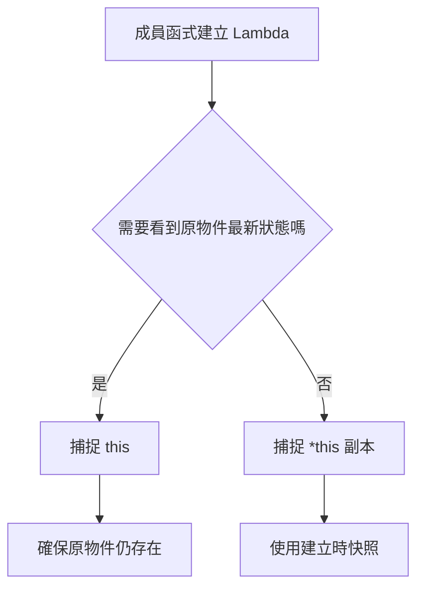
```mermaid
flowchart TD
    A[成員函式建立 Lambda] --> B{需要看到原物件最新狀態嗎}
    B -- 是 --> C[捕捉 this]
    C --> D[確保原物件仍存在]
    B -- 否 --> E[捕捉 *this 副本]
    E --> F[使用建立時快照]
```

### 8. Lambda 重構判斷

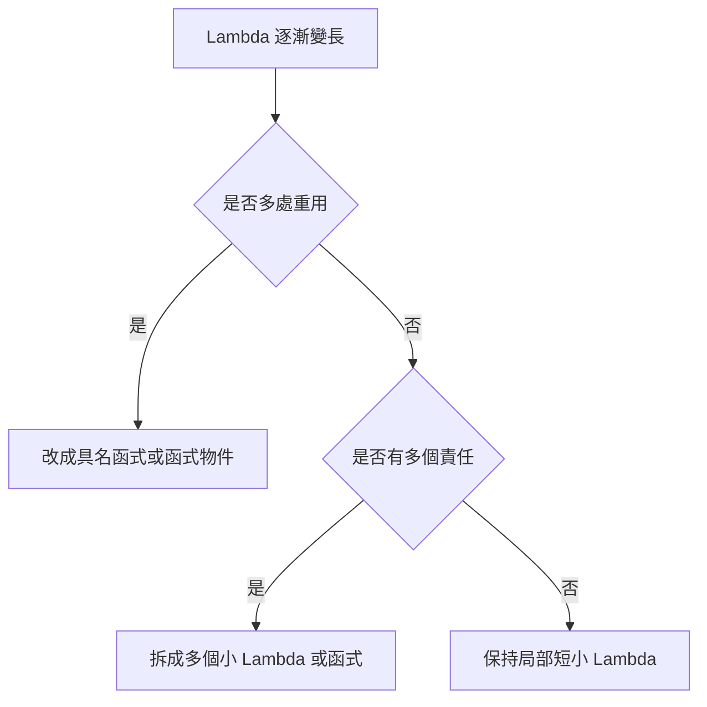
```mermaid
flowchart TD
    A[Lambda 逐漸變長] --> B{是否多處重用}
    B -- 是 --> C[改成具名函式或函式物件]
    B -- 否 --> D{是否有多個責任}
    D -- 是 --> E[拆成多個小 Lambda 或函式]
    D -- 否 --> F[保持局部短小 Lambda]
```

---

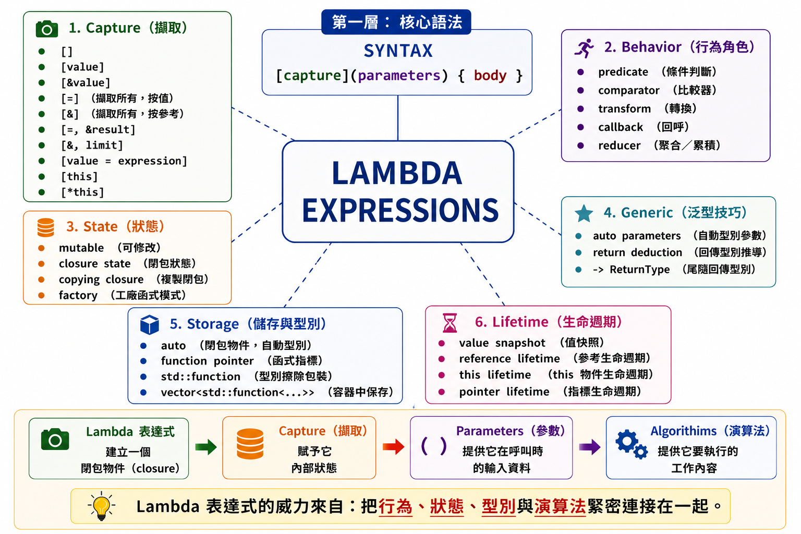
# 本章完成標準

完成本章後，你應該能做到：

1. 說明 Lambda expression。
2. 說明 closure type 與 closure object。
3. 撰寫空捕捉 Lambda。
4. 撰寫具有參數的 Lambda。
5. 使用回傳型別推導。
6. 使用明確 trailing return type。
7. 使用值捕捉。
8. 使用參考捕捉。
9. 使用預設捕捉。
10. 使用混合捕捉。
11. 解釋捕捉發生時間。
12. 使用 `mutable`。
13. 解釋 mutable 副本狀態。
14. 複製 stateful Lambda。
15. 使用初始化捕捉。
16. 使用泛型 Lambda。
17. 使用立即呼叫 Lambda。
18. 建立 predicate。
19. 建立 comparator。
20. 維持 strict weak ordering。
21. 使用 Lambda 搜尋。
22. 使用 Lambda 排序。
23. 使用 Lambda 轉換。
24. 使用 Lambda 移除元素。
25. 建立 Lambda factory。
26. 安全回傳值捕捉 Lambda。
27. 避免懸空參考捕捉。
28. 使用 `[this]`。
29. 使用 `[*this]`。
30. 比較 `this` 與 `*this`。
31. 將 captureless Lambda 轉成函式指標。
32. 使用 `std::function`。
33. 比較 `auto` 與 `std::function`。
34. 建立 callback list。
35. 建立遞迴 Lambda。
36. 使用 Lambda 作為 set comparator。
37. 使用 Lambda 作為 priority queue comparator。
38. 建立具名 Lambda pipeline。
39. 判斷何時應改用一般函式。
40. 找出常見 Lambda 錯誤。

---

# 隱藏答案區

> Answer hidden — try it first.

<details><summary>TODO 1 答案</summary>

```cpp
auto greet =
    []() {
        cout << "Hello\n";
    };

greet();
```

</details>

<details><summary>TODO 2 答案</summary>

```cpp
auto add =
    [](int first, int second) {
        return
            first +
            second;
    };
```

</details>

<details><summary>TODO 3 答案</summary>

```cpp
int factor = 3;

auto multiply =
    [factor](int value) {
        return
            factor *
            value;
    };
```

</details>

<details><summary>TODO 4 答案</summary>

```cpp
int count = 0;

auto increase =
    [&count]() {
        ++count;
    };
```

</details>

<details><summary>TODO 5 答案</summary>

```cpp
auto counter =
    [count = 0]() mutable {
        return ++count;
    };
```

</details>

<details><summary>TODO 6 答案</summary>

```cpp
int base = 10;

auto operation =
    [
        doubled =
            base * 2
    ]() {
        return doubled;
    };
```

</details>

<details><summary>TODO 7 答案</summary>

```cpp
auto maximum =
    [](
        const auto& first,
        const auto& second
    ) {
        if (first < second) {
            return second;
        }

        return first;
    };
```

兩個 return expression 必須推導為相容型別。

</details>

<details><summary>TODO 8 答案</summary>

```cpp
int limit = 10;

auto count =
    count_if(
        values.cbegin(),
        values.cend(),
        [limit](int value) {
            return
                value >
                limit;
        }
    );
```

</details>

<details><summary>TODO 9 答案</summary>

```cpp
sort(
    students.begin(),
    students.end(),
    [](
        const Student& first,
        const Student& second
    ) {
        if (
            first.score !=
            second.score
        ) {
            return
                first.score >
                second.score;
        }

        return
            first.name <
            second.name;
    }
);
```

</details>

<details><summary>TODO 10 答案</summary>

```cpp
vector<string::size_type>
    lengths;

transform(
    words.cbegin(),
    words.cend(),
    back_inserter(lengths),
    [](const string& word) {
        return word.size();
    }
);
```

</details>

<details><summary>TODO 11 答案</summary>

```cpp
words.erase(
    remove_if(
        words.begin(),
        words.end(),
        [](const string& word) {
            return word.empty();
        }
    ),
    words.end()
);
```

</details>

<details><summary>TODO 12 答案</summary>

```cpp
auto makeMultiplier(
    int factor
) {
    return
        [factor](int value) {
            return
                factor *
                value;
        };
}
```

</details>

<details><summary>TODO 13 答案</summary>

```cpp
vector<
    function<void()>
> callbacks;

callbacks.push_back(
    []() {
        cout << "First\n";
    }
);

for (
    const auto& callback :
    callbacks
) {
    callback();
}
```

</details>

<details><summary>TODO 14 答案</summary>

```cpp
function<int(int)>
    factorial;

factorial =
    [&factorial](int value) {
        if (value <= 1) {
            return 1;
        }

        return
            value *
            factorial(
                value - 1
            );
    };
```

</details>

<details><summary>TODO 15 答案</summary>

```cpp
copy_if(
    source.cbegin(),
    source.cend(),
    back_inserter(evenValues),
    [](int value) {
        return
            value % 2 == 0;
    }
);

transform(
    evenValues.cbegin(),
    evenValues.cend(),
    evenValues.begin(),
    [](int value) {
        return
            value * value;
    }
);

sort(
    evenValues.begin(),
    evenValues.end()
);

int total =
    accumulate(
        evenValues.cbegin(),
        evenValues.cend(),
        0
    );
```

</details>
