# Lesson 28：Exception Handling 例外處理

<!-- Images inserted from C++_28.txt insertion plan. -->

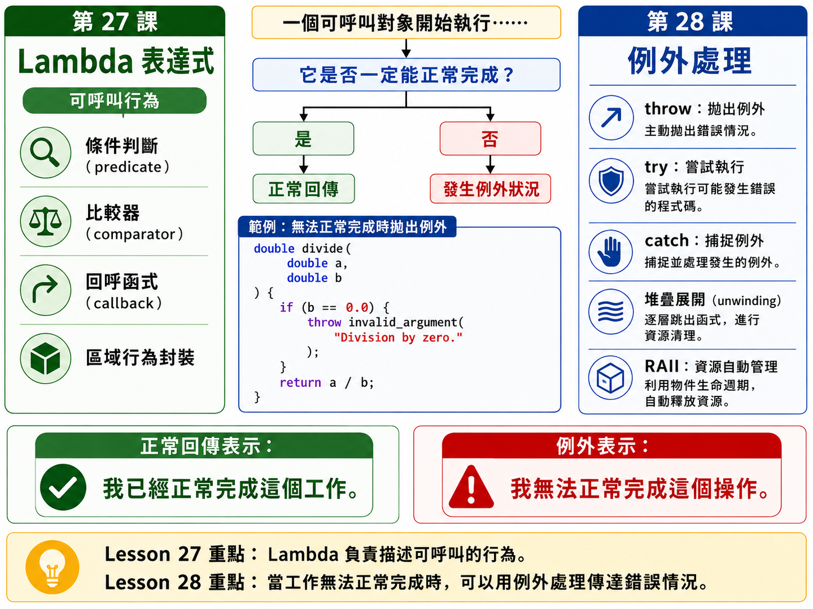
> 這堂課的重點：使用 C++ 例外處理機制表示「函式無法正常完成工作」的情況。你會學習 `try`、`catch`、`throw`、標準例外類別、自訂例外、堆疊展開、RAII、建構子失敗、重新拋出、`noexcept` 與例外安全保證。

> 例外不是一般流程控制工具。它適合處理目前函式無法正常完成、而呼叫端可能有能力處理的異常狀況。一般輸入判斷、搜尋不到、布林條件與可預期分支，不一定要使用例外。

---

## Section I. 今天要做什麼？

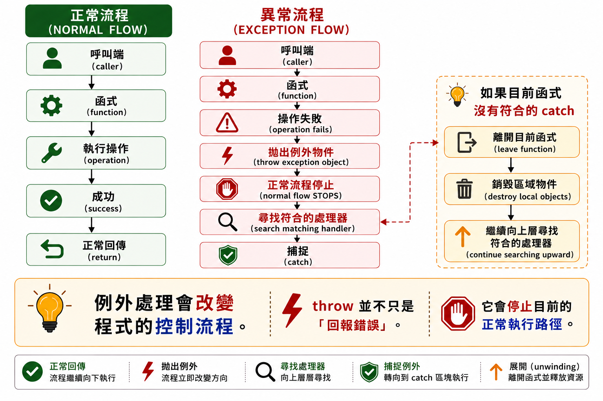
1. 區分編譯錯誤、邏輯錯誤與執行期錯誤。
2. 認識 exceptional condition。
3. 使用 `try`、`catch` 與 `throw`。
4. 理解例外物件與 handler matching。
5. 使用 `std::exception::what()`。
6. 使用 `std::invalid_argument`。
7. 使用 `std::out_of_range`。
8. 使用 `std::runtime_error`。
9. 認識 `std::logic_error` 與 `std::runtime_error` 階層。
10. 依 `const` 參考捕捉例外。
11. 避免 catch by value 造成 slicing。
12. 正確安排多個 catch 的順序。
13. 使用 `catch (...)`。
14. 避免無聲吞掉例外。
15. 使用 `throw;` 重新拋出。
16. 區分 `throw;` 與 `throw error;`。
17. 理解 stack unwinding。
18. 理解區域物件會自動解構。
19. 使用 RAII 避免資源洩漏。
20. 在建構子中拋出例外。
21. 理解未完成建構的物件不會呼叫完整解構子。
22. 理解已完成建構的成員仍會被解構。
23. 建立自訂例外類別。
24. 從標準例外類別繼承。
25. 保存額外錯誤上下文。
26. 進行 exception translation。
27. 使用 `vector::at()`。
28. 比較 `.at()` 與 `operator[]`。
29. 使用 `stoi()` 並處理解析錯誤。
30. 認識 `std::bad_alloc`、`std::bad_cast`。
31. 使用 `noexcept`。
32. 使用 `noexcept(expression)`。
33. 理解 noexcept 違反會呼叫 `std::terminate()`。
34. 認識條件式 noexcept。
35. 理解移動操作為何常標記 noexcept。
36. 避免解構子向外拋出例外。
37. 使用明確 `close()` 處理可能失敗的清理。
38. 比較 exception、error code、`bool` 與 `optional`。
39. 比較 exception 與 `assert()`。
40. 認識 C++23 `std::expected` 概念。
41. 認識 no-throw guarantee。
42. 認識 strong guarantee。
43. 認識 basic guarantee。
44. 使用先計算後提交維持 strong guarantee。
45. 使用局部暫存物件。
46. 建立 top-level exception boundary。
47. 控制 try block 的大小。
48. 在真正能恢復的位置 catch。
49. 建立 exception-neutral template。
50. 測試正常與例外路徑。

---

## Section II. 今天的學習方式

1. 每次遇到失敗先問：
   ```text
   這是正常可預期結果，還是函式無法履行主要工作？
   ```
2. 丟出具有意義的標準例外類型。
3. 捕捉標準例外時優先使用：
   ```cpp
   catch (const std::exception& error)
   ```
4. Catch 順序：具體型別在前，基底型別在後。
5. 只有在能處理、轉換或記錄時才 catch。
6. 需要重新拋出原例外時使用 `throw;`。
7. 資源清理交給 RAII 物件。
8. 解構子不應讓例外向外傳出。
9. Try block 只包住使用同一錯誤處理策略的操作。
10. 所有合法完整程式使用嚴格 C++17 選項檢查。

---

## Section III. 核心語法對照

| 語法 | 用途 |
| --- | --- |
| `throw exceptionObject;` | 拋出例外 |
| `try { ... }` | 包住可能拋出例外的操作 |
| `catch (const exception& error)` | 捕捉標準例外 |
| `catch (...)` | 捕捉任何例外 |
| `throw;` | 重新拋出目前例外 |
| `error.what()` | 取得錯誤訊息 |
| `runtime_error("message")` | 執行期失敗 |
| `invalid_argument("message")` | 參數不合法 |
| `out_of_range("message")` | 範圍或索引錯誤 |
| `void function() noexcept` | 宣告函式不讓例外離開 |
| `noexcept(expression)` | 編譯期查詢運算式是否不拋出 |
| `assert(condition)` | 偵錯期檢查內部假設 |
| `vector.at(index)` | 有界限檢查的容器存取 |
| `stoi(text)` | 字串轉整數，可能拋出例外 |

---

# Part A：第一個例外

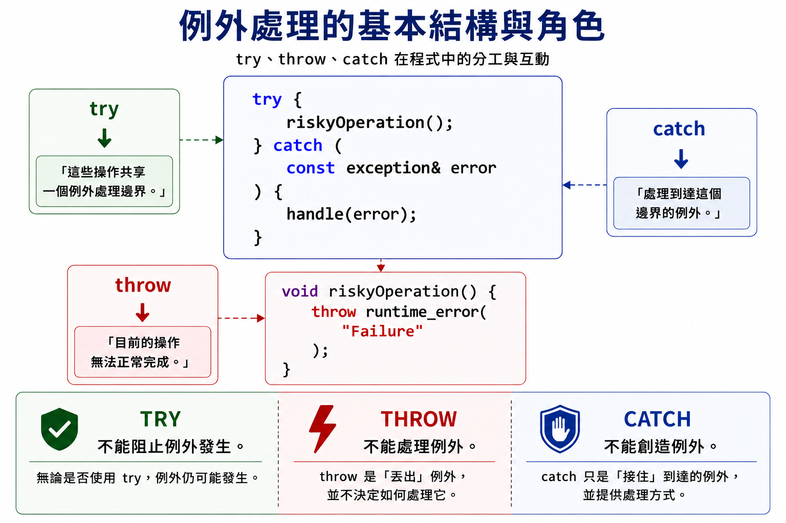
## Section IV. Throw

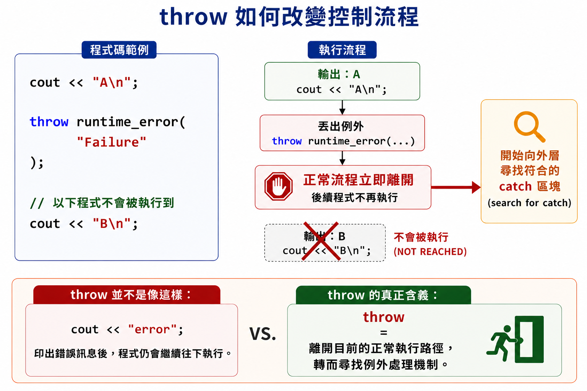
```cpp
throw std::runtime_error(
    "Unable to complete operation."
);
```

Throw 後目前正常流程停止，控制權開始尋找相符的 catch handler。

## Section V. 完整第一個範例

```cpp
// VALIDATE
#include <iostream>
#include <stdexcept>
using namespace std;

double divide(
    double numerator,
    double denominator
) {
    if (denominator == 0.0) {
        throw invalid_argument(
            "Denominator cannot be zero."
        );
    }

    return numerator / denominator;
}

int main() {
    try {
        cout << divide(10.0, 0.0)
             << '\n';
    } catch (
        const invalid_argument& error
    ) {
        cout << "Input error: "
             << error.what()
             << '\n';
    }

    return 0;
}
```

---

# Part B：控制流程與 Handler 搜尋

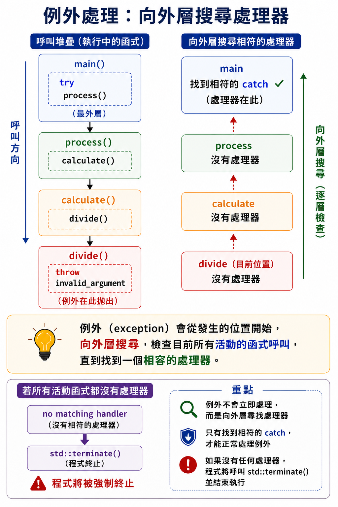
## Section VI. 呼叫鏈

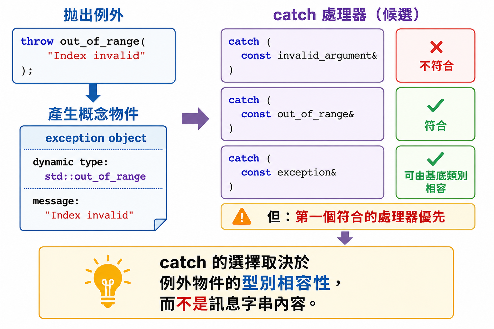
```text
main
→ process
→ calculate
→ divide
```

如果 `divide()` 拋出例外：

1. `divide()` 停止。
2. 搜尋 `divide()` 內相符 handler。
3. 找不到就離開函式並清理區域物件。
4. 到上一層繼續搜尋。
5. 找到 handler 後執行 catch。
6. 若一直找不到，呼叫 `std::terminate()`。

## Section VII. Throw 後不繼續

```cpp
throw runtime_error("Failure");

/* cout << "This path is not reached"; */
```

---

# Part C：標準例外階層

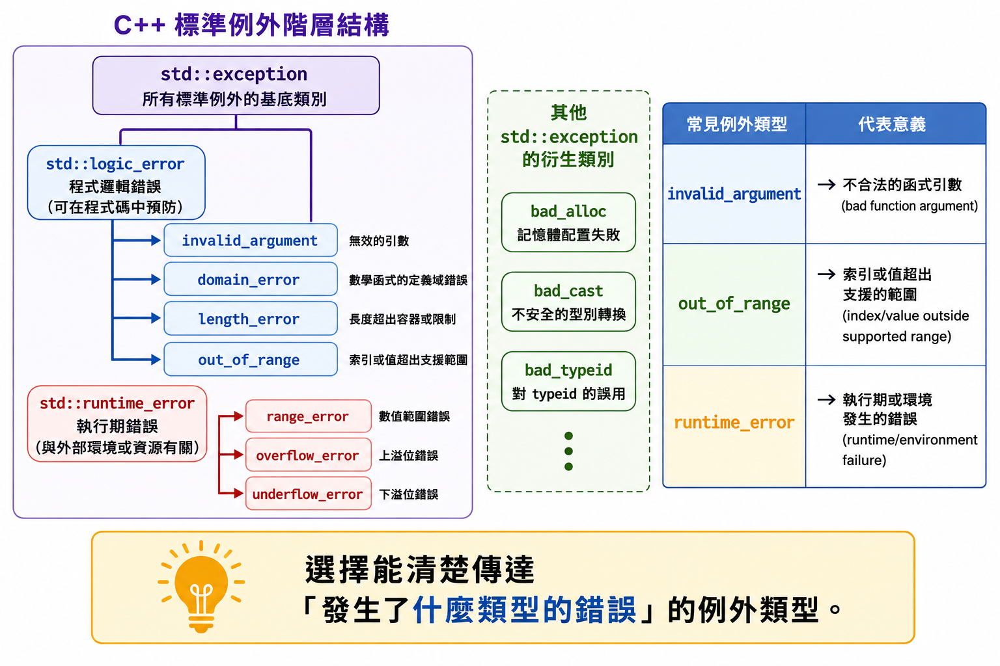
## Section VIII. 常見階層

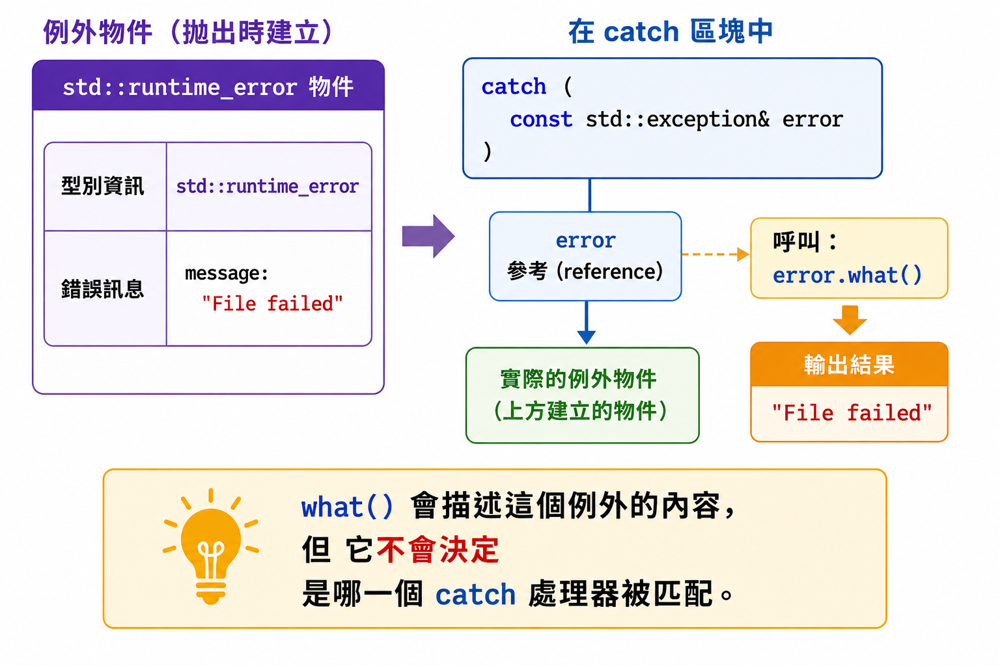
```text
std::exception
├── std::logic_error
│   ├── invalid_argument
│   ├── domain_error
│   ├── length_error
│   └── out_of_range
└── std::runtime_error
    ├── range_error
    ├── overflow_error
    └── underflow_error
```

其他常見例外：

- `std::bad_alloc`
- `std::bad_cast`
- `std::bad_typeid`

## Section IX. 類型選擇

| 錯誤 | 常見例外 |
| --- | --- |
| 參數不合法 | `invalid_argument` |
| 索引或值超出支援範圍 | `out_of_range` |
| 數學定義域錯誤 | `domain_error` |
| 外部資源或執行環境失敗 | `runtime_error` |
| 記憶體配置失敗 | `bad_alloc` |

---

# Part D：Catch by Const Reference

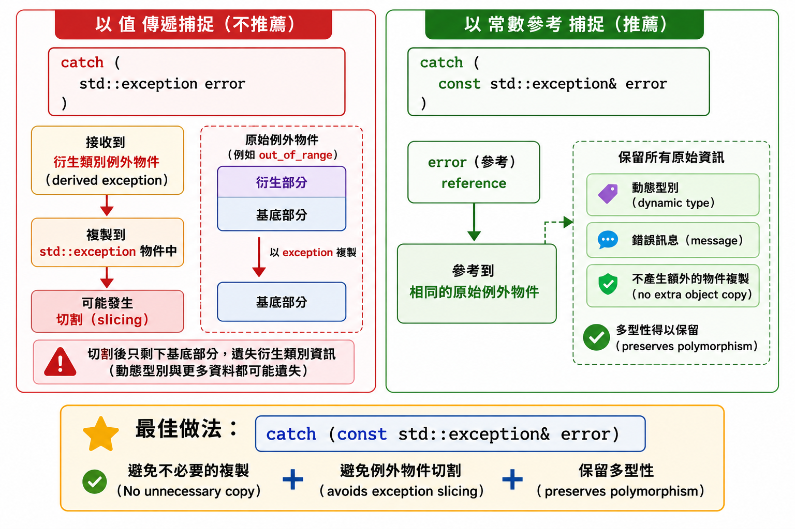
## Section X. 建議形式

```cpp
catch (
    const exception& error
)
```

優點：

- 避免不必要複製。
- 避免例外 slicing。
- 保留動態型別。
- 可以安全呼叫 `what()`。

## Section XI. 完整基底捕捉

```cpp
// VALIDATE
#include <iostream>
#include <stdexcept>
using namespace std;

void validateAge(int age) {
    if (age < 0) {
        throw invalid_argument(
            "Age cannot be negative."
        );
    }

    if (age > 150) {
        throw out_of_range(
            "Age is outside the supported range."
        );
    }
}

int main() {
    try {
        validateAge(200);
    } catch (
        const exception& error
    ) {
        cout << error.what()
             << '\n';
    }

    return 0;
}
```

---

# Part E：Multiple Catch

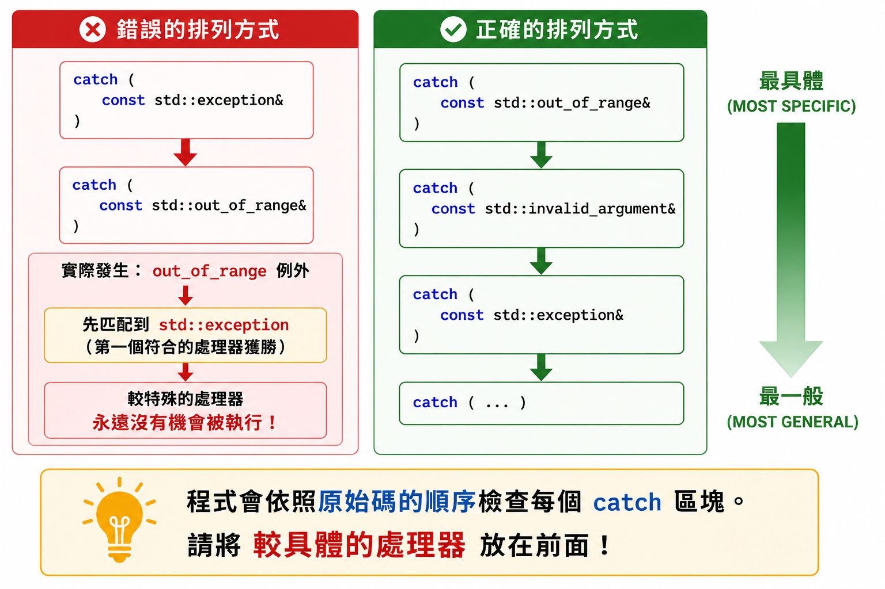
## Section XII. Catch 順序

較具體類型應放前面：

```cpp
catch (const out_of_range& error)
catch (const invalid_argument& error)
catch (const exception& error)
catch (...)
```

## Section XIII. 完整多重 Catch

```cpp
// VALIDATE
#include <iostream>
#include <stdexcept>
using namespace std;

void validateScore(int score) {
    if (score < 0) {
        throw invalid_argument(
            "Score cannot be negative."
        );
    }

    if (score > 100) {
        throw out_of_range(
            "Score cannot exceed 100."
        );
    }
}

int main() {
    try {
        validateScore(120);
    } catch (
        const out_of_range& error
    ) {
        cout << "Range: "
             << error.what()
             << '\n';
    } catch (
        const invalid_argument& error
    ) {
        cout << "Argument: "
             << error.what()
             << '\n';
    } catch (
        const exception& error
    ) {
        cout << "Other: "
             << error.what()
             << '\n';
    }

    return 0;
}
```

---

# Part F：Catch-All 與重新拋出

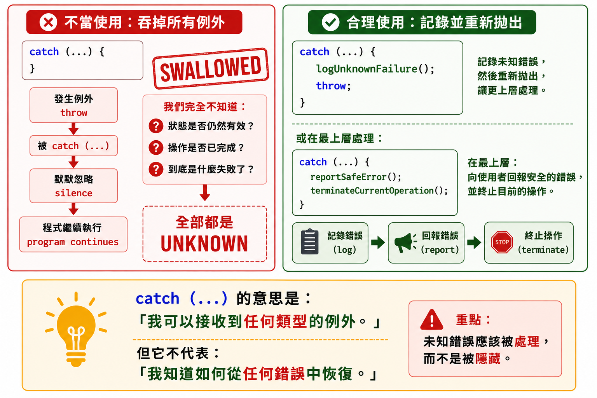
## Section XIV. `catch (...)`

```cpp
catch (...) {
    // 捕捉任何例外
}
```

Catch-all 無法直接取得例外型別與 `what()`，不應無聲吞掉錯誤。

## Section XV. `throw;`

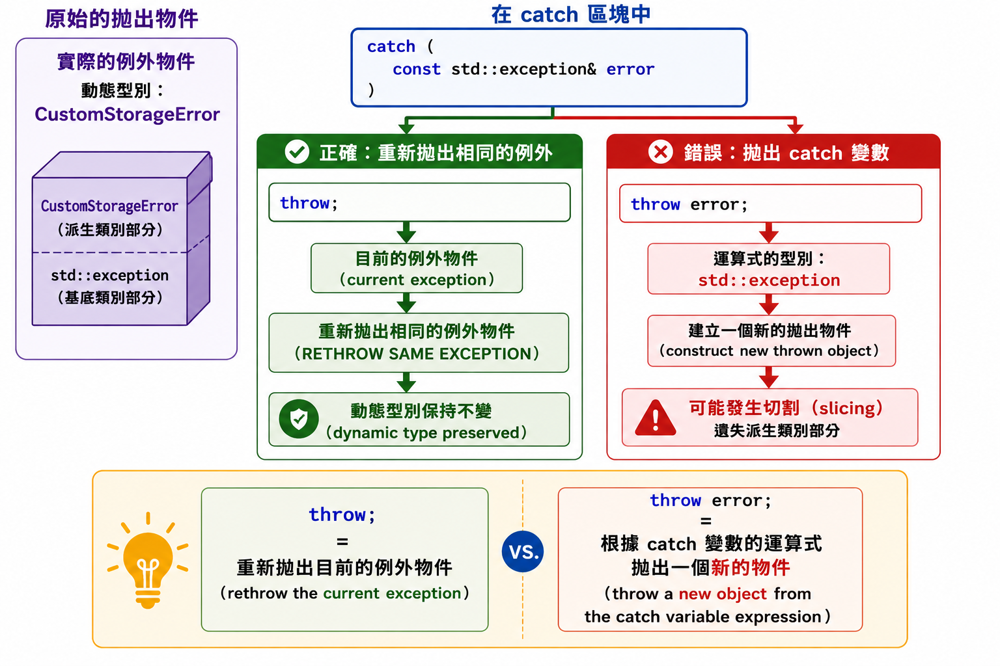
在 catch 中使用：

```cpp
throw;
```

會重新拋出目前正在處理的原例外。

## Section XVI. 完整重新拋出

```cpp
// VALIDATE
#include <iostream>
#include <stdexcept>
using namespace std;

void lowLevelOperation() {
    throw runtime_error(
        "Storage service unavailable."
    );
}

void middleLevelOperation() {
    try {
        lowLevelOperation();
    } catch (
        const exception& error
    ) {
        cout << "Middle layer log: "
             << error.what()
             << '\n';

        throw;
    }
}

int main() {
    try {
        middleLevelOperation();
    } catch (
        const exception& error
    ) {
        cout << "Top layer: "
             << error.what()
             << '\n';
    }

    return 0;
}
```

`throw error;` 可能依 catch 變數靜態型別重新建立例外；重新拋出原例外應使用 `throw;`。

---

# Part G：Stack Unwinding

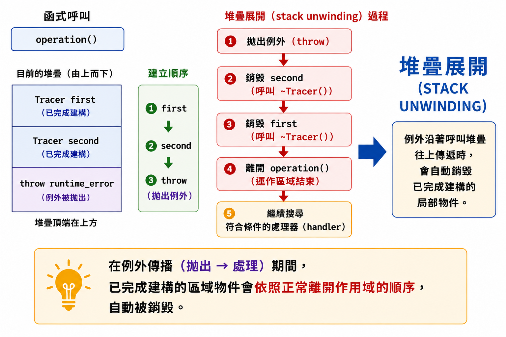
## Section XVII. 自動解構

例外向上傳遞時，已完整建立的區域物件會依反序解構，這稱為 stack unwinding。

## Section XVIII. 完整追蹤範例

```cpp
// VALIDATE
#include <iostream>
#include <stdexcept>
#include <string>
using namespace std;

class Tracer {
public:
    explicit Tracer(
        const string& initialName
    )
        : nameValue(initialName) {
        cout << "Construct "
             << nameValue
             << '\n';
    }

    ~Tracer() {
        cout << "Destroy "
             << nameValue
             << '\n';
    }

private:
    string nameValue;
};

void operation() {
    Tracer first("first");
    Tracer second("second");

    throw runtime_error(
        "Operation failed."
    );
}

int main() {
    try {
        operation();
    } catch (
        const exception& error
    ) {
        cout << "Caught: "
             << error.what()
             << '\n';
    }

    return 0;
}
```

---

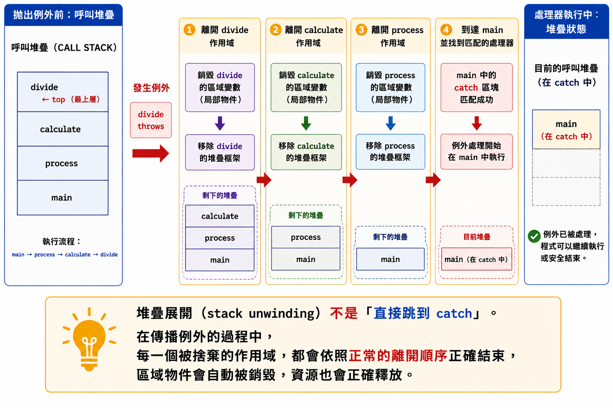
# Part H：RAII 與例外安全

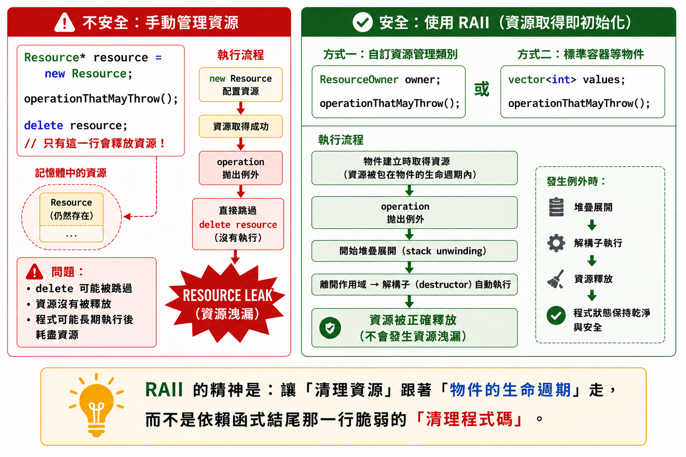

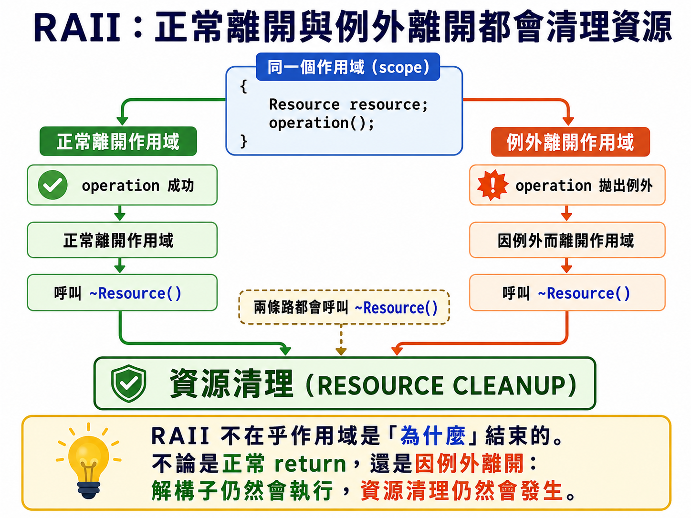
## Section XIX. 手動資源風險

```cpp
/* Resource* resource = new Resource;
operationThatMayThrow();
delete resource; */
```

若中間拋出例外，`delete` 不會執行。

## Section XX. 使用 RAII

優先使用：

- `std::vector`
- `std::string`
- `std::fstream`
- 智慧指標
- 自訂資源管理類別

## Section XXI. 完整 Vector RAII

```cpp
// VALIDATE
#include <iostream>
#include <stdexcept>
#include <vector>
using namespace std;

void processData() {
    vector<int> values{
        1,
        2,
        3,
        4
    };

    if (values.size() > 3) {
        throw runtime_error(
            "Too many values."
        );
    }
}

int main() {
    try {
        processData();
    } catch (
        const exception& error
    ) {
        cout << error.what()
             << '\n';
    }

    return 0;
}
```

---

# Part I：建構子拋出例外

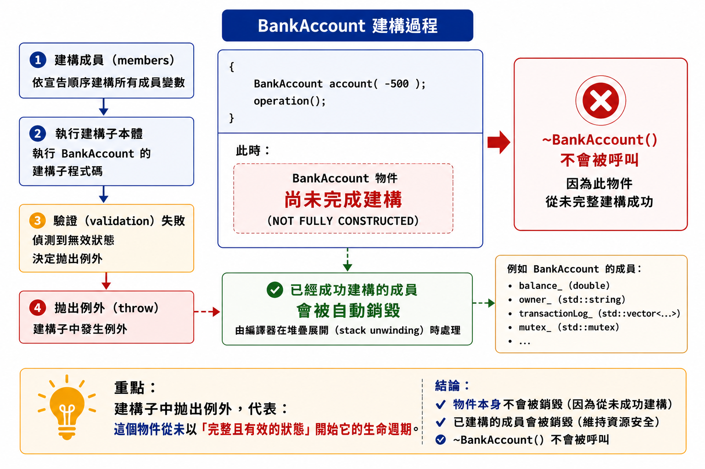

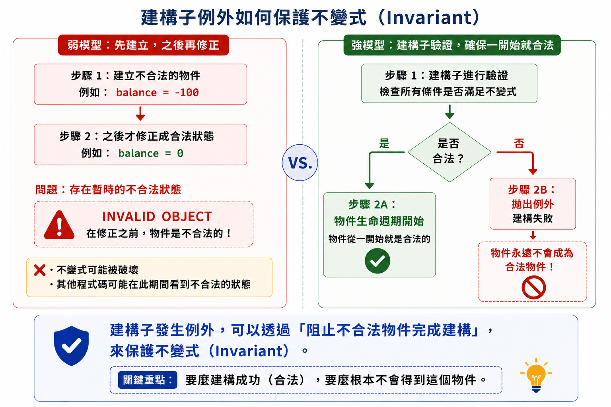
## Section XXII. 阻止無效物件建立

建構參數無法形成有效物件時，建構子可以拋出例外。

## Section XXIII. 完整建構子驗證

```cpp
// VALIDATE
#include <iostream>
#include <stdexcept>
#include <string>
using namespace std;

class BankAccount {
public:
    BankAccount(
        const string& initialOwner,
        double initialBalance
    )
        : ownerName(initialOwner),
          balanceValue(
              validateBalance(
                  initialBalance
              )
          ) {
        if (ownerName.empty()) {
            throw invalid_argument(
                "Owner name cannot be empty."
            );
        }
    }

    const string& owner() const {
        return ownerName;
    }

    double balance() const {
        return balanceValue;
    }

private:
    static double validateBalance(
        double balance
    ) {
        if (balance < 0.0) {
            throw invalid_argument(
                "Initial balance cannot be negative."
            );
        }

        return balance;
    }

    string ownerName;
    double balanceValue;
};

int main() {
    try {
        BankAccount account(
            "Amy",
            -100.0
        );

        cout << account.owner()
             << '\n';
    } catch (
        const exception& error
    ) {
        cout << error.what()
             << '\n';
    }

    return 0;
}
```

該物件沒有完成建立，因此不會執行完整物件解構子；已完成建立的成員仍會被清理。

---

# Part J：部分建構與成員清理

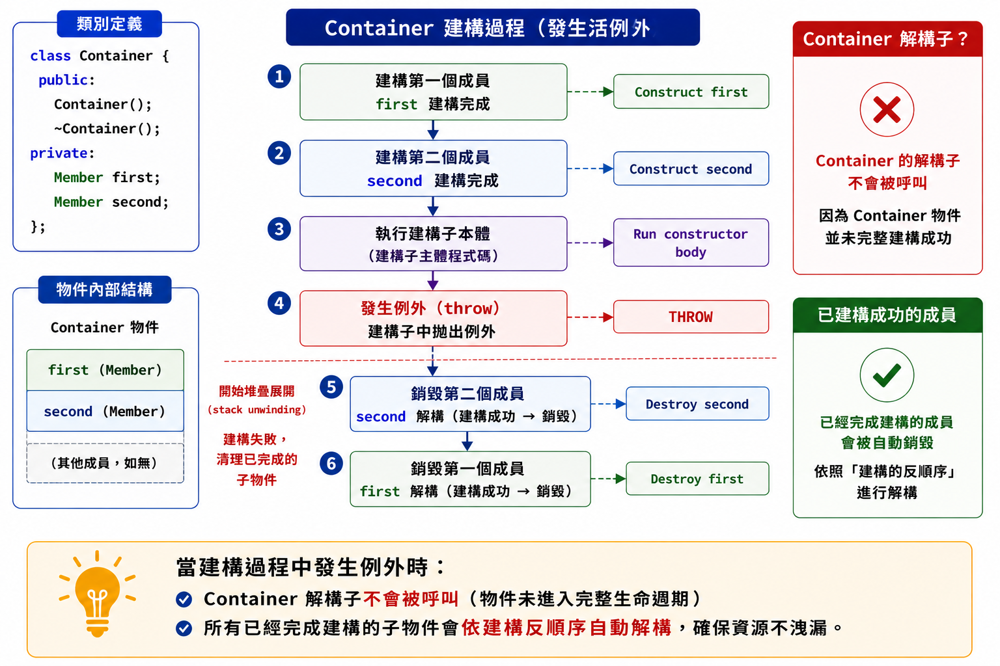
## Section XXIV. 完整成員追蹤

```cpp
// VALIDATE
#include <iostream>
#include <stdexcept>
#include <string>
using namespace std;

class Member {
public:
    explicit Member(
        const string& initialName
    )
        : nameValue(initialName) {
        cout << "Construct "
             << nameValue
             << '\n';
    }

    ~Member() {
        cout << "Destroy "
             << nameValue
             << '\n';
    }

private:
    string nameValue;
};

class Container {
public:
    Container()
        : first("first"),
          second("second") {
        throw runtime_error(
            "Container construction failed."
        );
    }

private:
    Member first;
    Member second;
};

int main() {
    try {
        Container object;
    } catch (
        const exception& error
    ) {
        cout << error.what()
             << '\n';
    }

    return 0;
}
```

---

# Part K：自訂例外

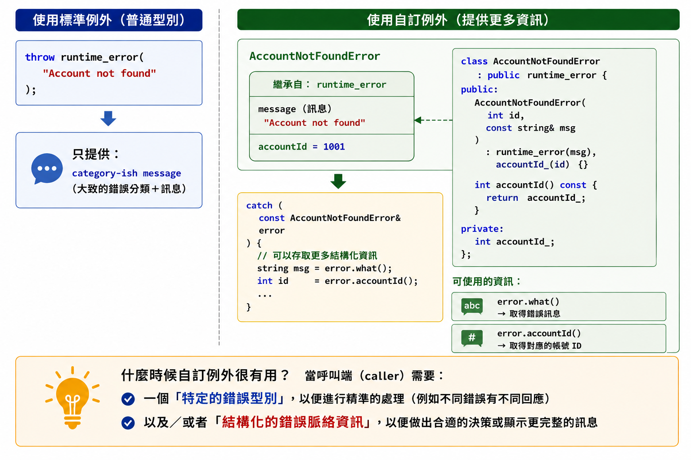
## Section XXV. 繼承標準例外

自訂領域例外通常從 `runtime_error` 或 `logic_error` 繼承。

## Section XXVI. 完整自訂例外

```cpp
// VALIDATE
#include <iostream>
#include <stdexcept>
using namespace std;

class AccountNotFoundError :
    public runtime_error {
public:
    explicit AccountNotFoundError(
        int missingId
    )
        : runtime_error(
              "Account was not found."
          ),
          accountIdValue(missingId) {
    }

    int accountId() const noexcept {
        return accountIdValue;
    }

private:
    int accountIdValue;
};

void findAccount(int id) {
    throw AccountNotFoundError(id);
}

int main() {
    try {
        findAccount(1001);
    } catch (
        const AccountNotFoundError& error
    ) {
        cout << error.what()
             << " ID: "
             << error.accountId()
             << '\n';
    }

    return 0;
}
```

---

# Part L：Exception Translation

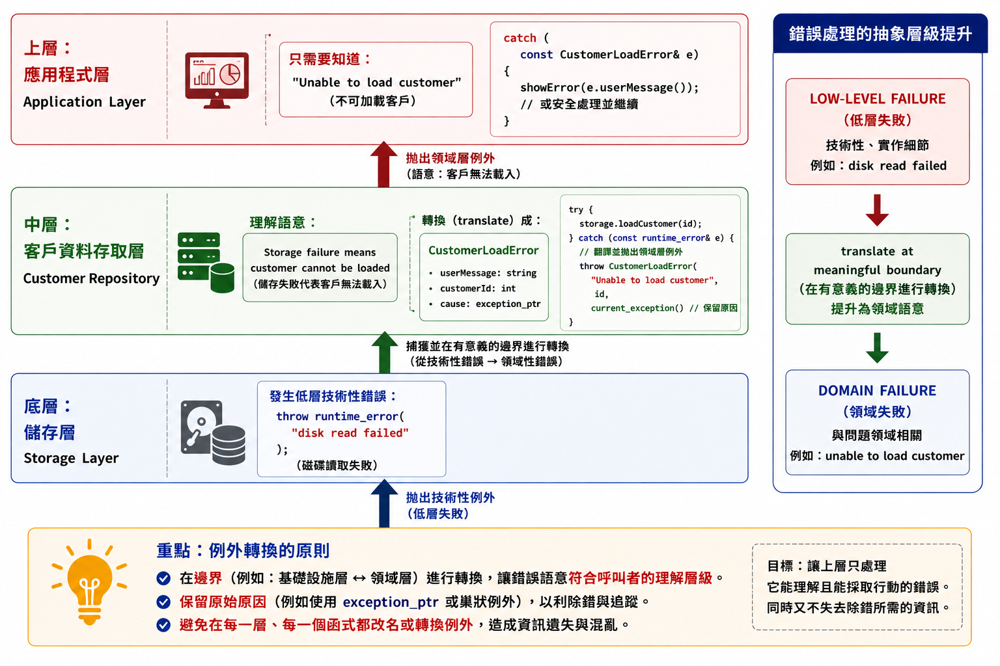
## Section XXVII. 低階錯誤轉成領域錯誤

底層錯誤不一定適合直接暴露給上層。可在理解其意義的邊界轉成領域例外。

## Section XXVIII. 完整轉換範例

```cpp
// VALIDATE
#include <iostream>
#include <stdexcept>
using namespace std;

class CustomerLoadError :
    public runtime_error {
public:
    CustomerLoadError()
        : runtime_error(
              "Unable to load customer."
          ) {
    }
};

void readStorage() {
    throw runtime_error(
        "Low-level storage failure."
    );
}

void loadCustomer() {
    try {
        readStorage();
    } catch (
        const runtime_error&
    ) {
        throw CustomerLoadError();
    }
}

int main() {
    try {
        loadCustomer();
    } catch (
        const CustomerLoadError& error
    ) {
        cout << error.what()
             << '\n';
    }

    return 0;
}
```

進階可使用 nested exception 保留原始原因。

---

# Part M：`vector::at()`

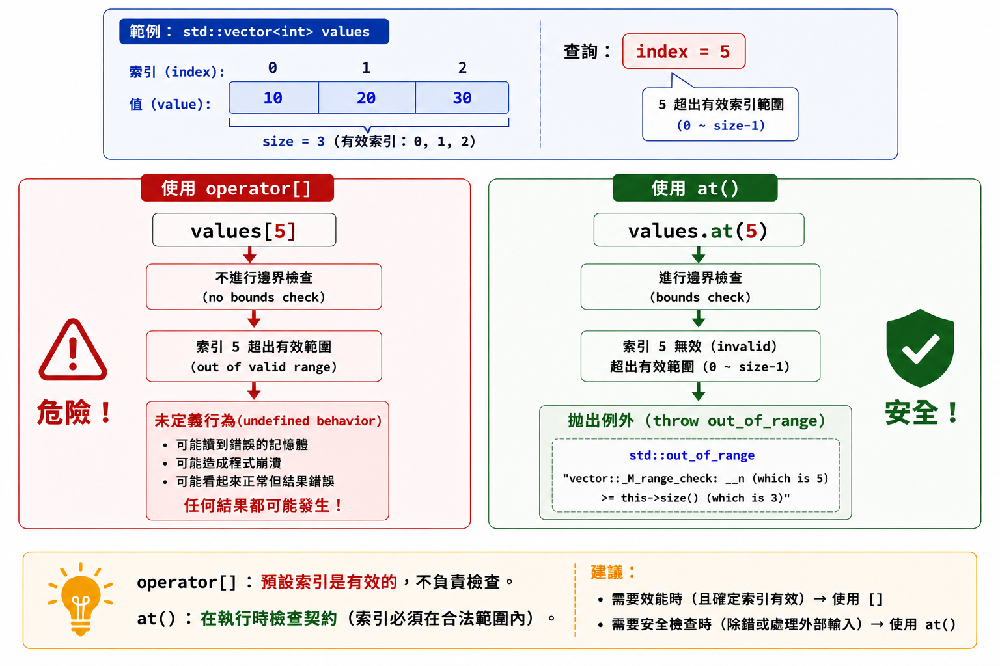
## Section XXIX. 有界限檢查

```cpp
values.at(index)
```

索引不合法時丟出 `out_of_range`。

`operator[]` 不做界限檢查，超出範圍屬於未定義行為。

## Section XXX. 完整 At 範例

```cpp
// VALIDATE
#include <iostream>
#include <stdexcept>
#include <vector>
using namespace std;

int main() {
    vector<int> values{
        10,
        20,
        30
    };

    try {
        cout << values.at(5)
             << '\n';
    } catch (
        const out_of_range& error
    ) {
        cout << "Index error: "
             << error.what()
             << '\n';
    }

    return 0;
}
```

---

# Part N：`stoi()`

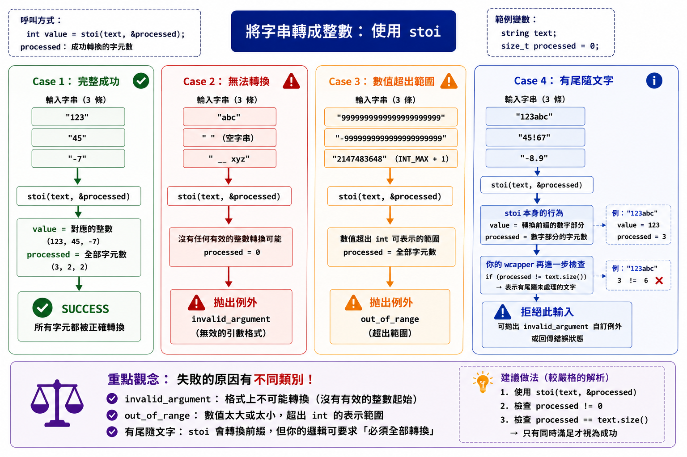
## Section XXXI. 可能例外

`stoi()` 可能丟出：

- `invalid_argument`
- `out_of_range`

## Section XXXII. 完整解析範例

```cpp
// VALIDATE
#include <iostream>
#include <stdexcept>
#include <string>
using namespace std;

int parseInteger(
    const string& text
) {
    size_t processed = 0;

    int value = stoi(
        text,
        &processed
    );

    if (processed != text.size()) {
        throw invalid_argument(
            "The entire string is not an integer."
        );
    }

    return value;
}

int main() {
    try {
        cout << parseInteger(
                    "123abc"
                )
             << '\n';
    } catch (
        const invalid_argument& error
    ) {
        cout << "Invalid: "
             << error.what()
             << '\n';
    } catch (
        const out_of_range& error
    ) {
        cout << "Range: "
             << error.what()
             << '\n';
    }

    return 0;
}
```

---

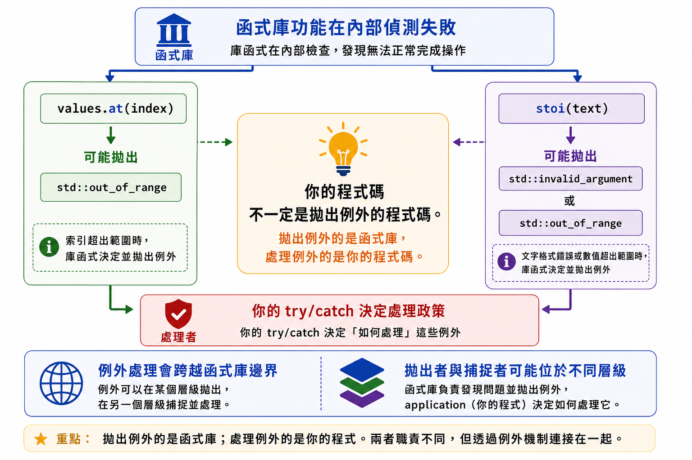
# Part O：`noexcept`

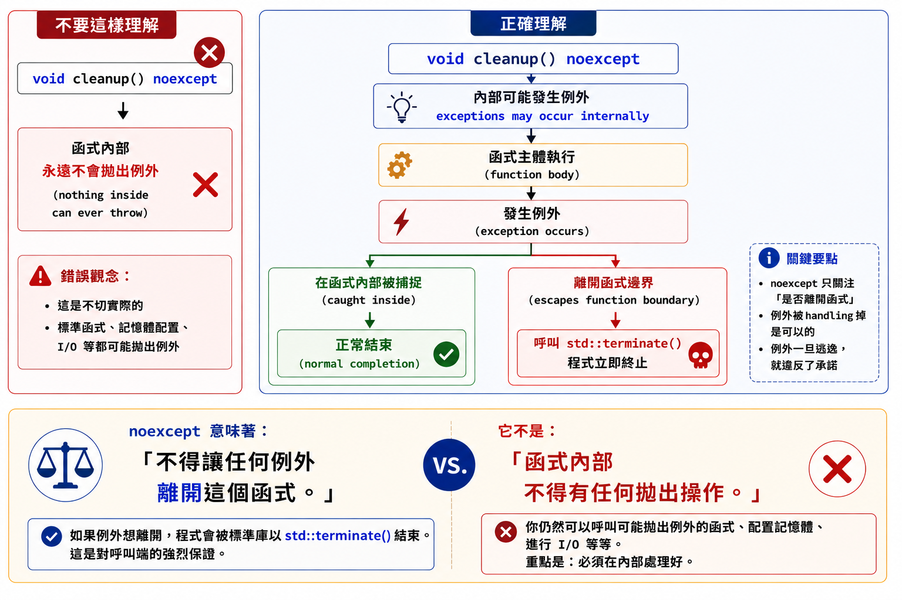
## Section XXXIII. 基本形式

```cpp
void cleanup() noexcept {
}
```

表示函式承諾不讓例外離開。若仍有例外離開，會呼叫 `std::terminate()`。

## Section XXXIV. 完整 Noexcept 查詢

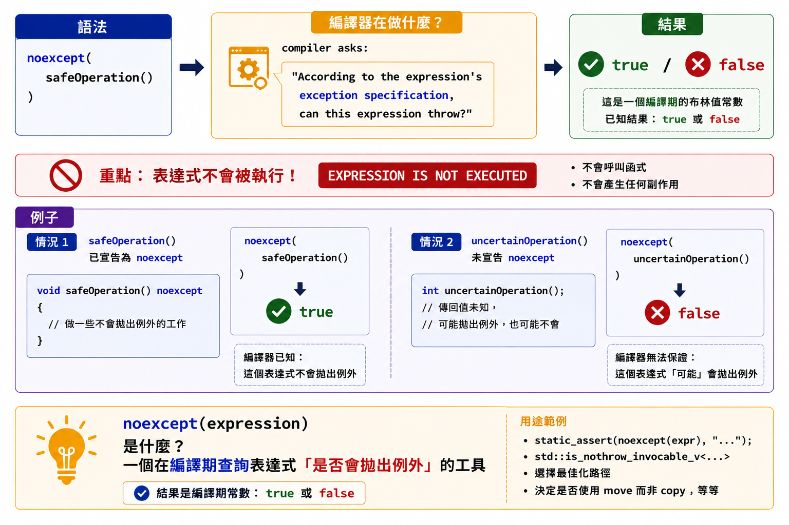
```cpp
// VALIDATE
#include <iostream>
using namespace std;

void safeOperation() noexcept {
}

void uncertainOperation() {
}

int main() {
    cout << boolalpha
         << noexcept(
                safeOperation()
            )
         << " "
         << noexcept(
                uncertainOperation()
            )
         << '\n';

    return 0;
}
```

---

# Part P：條件式 `noexcept`

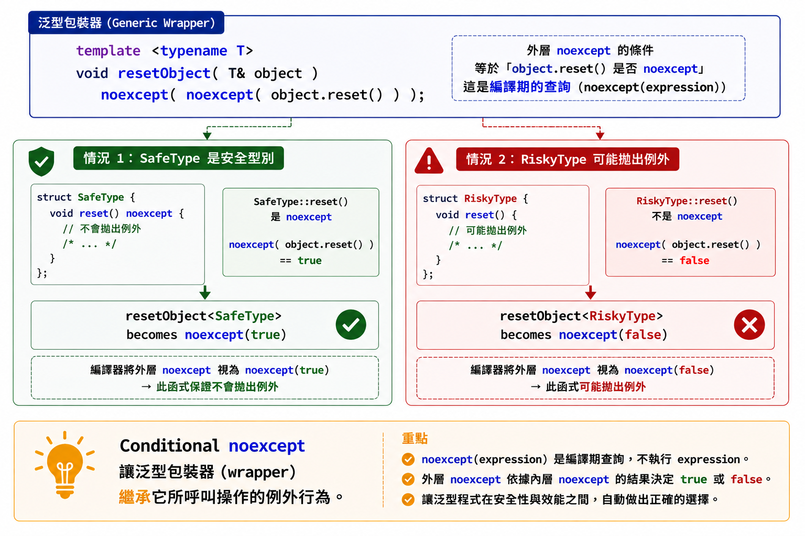
## Section XXXV. 根據內部操作決定

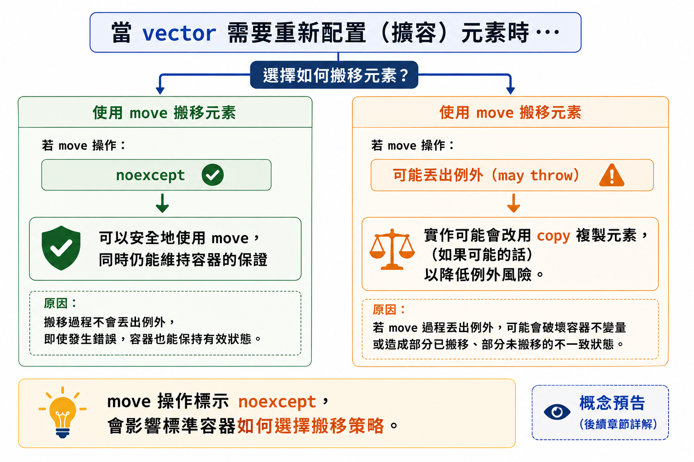
```cpp
noexcept(
    noexcept(expression)
)
```

## Section XXXVI. 完整條件式範例

```cpp
// VALIDATE
#include <iostream>
using namespace std;

class SafeType {
public:
    void reset() noexcept {
    }
};

class RiskyType {
public:
    void reset() {
    }
};

template <typename T>
void resetObject(
    T& object
) noexcept(
    noexcept(
        object.reset()
    )
) {
    object.reset();
}

int main() {
    SafeType safeObject;
    RiskyType riskyObject;

    cout << boolalpha
         << noexcept(
                resetObject(
                    safeObject
                )
            )
         << " "
         << noexcept(
                resetObject(
                    riskyObject
                )
            )
         << '\n';

    return 0;
}
```

---

# Part Q：解構子與例外

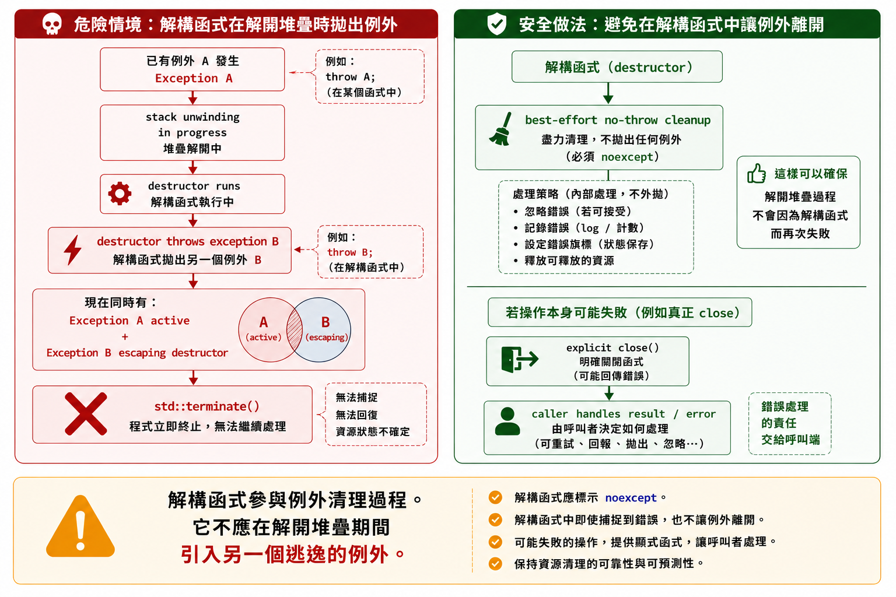
## Section XXXVII. 解構子不應拋出

如果 stack unwinding 期間解構子再拋出第二個例外，程式通常會終止。

清理可能失敗時，常見設計：

1. 提供明確 `close()`。
2. 呼叫者在正常流程處理 close 錯誤。
3. 解構子只做不拋出的最後清理。

## Section XXXVIII. 完整安全清理概念

```cpp
// VALIDATE
#include <iostream>
using namespace std;

class Connection {
public:
    bool close() {
        if (!openValue) {
            return true;
        }

        openValue = false;
        return true;
    }

    ~Connection() noexcept {
        if (openValue) {
            openValue = false;
        }
    }

private:
    bool openValue = true;
};

int main() {
    Connection connection;

    cout << boolalpha
         << connection.close()
         << '\n';

    return 0;
}
```

---

# Part R：Assertion vs Exception

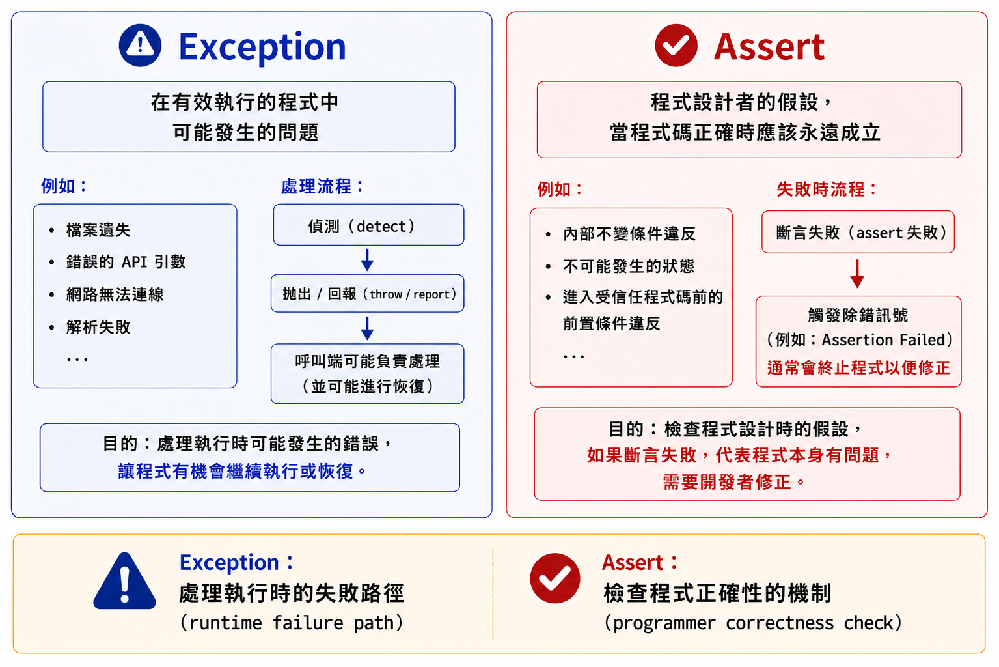
## Section XXXIX. `assert()`

適合檢查：

```text
如果程式本身正確，這個條件一定成立
```

不適合驗證：

- 使用者輸入。
- 檔案是否存在。
- 網路是否成功。
- 正常可預期失敗。

## Section XL. 完整 Assert 範例

```cpp
// VALIDATE
#include <cassert>
#include <iostream>
#include <vector>
using namespace std;

int sumFirstTwo(
    const vector<int>& values
) {
    assert(values.size() >= 2);

    return values[0] + values[1];
}

int main() {
    vector<int> values{
        10,
        20
    };

    cout << sumFirstTwo(values)
         << '\n';

    return 0;
}
```

---

# Part S：例外、錯誤碼與 Optional

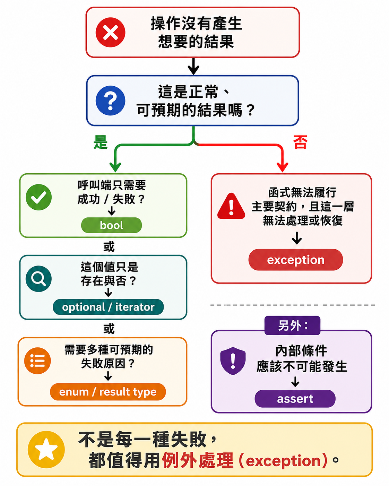
## Section XLI. 選擇比較

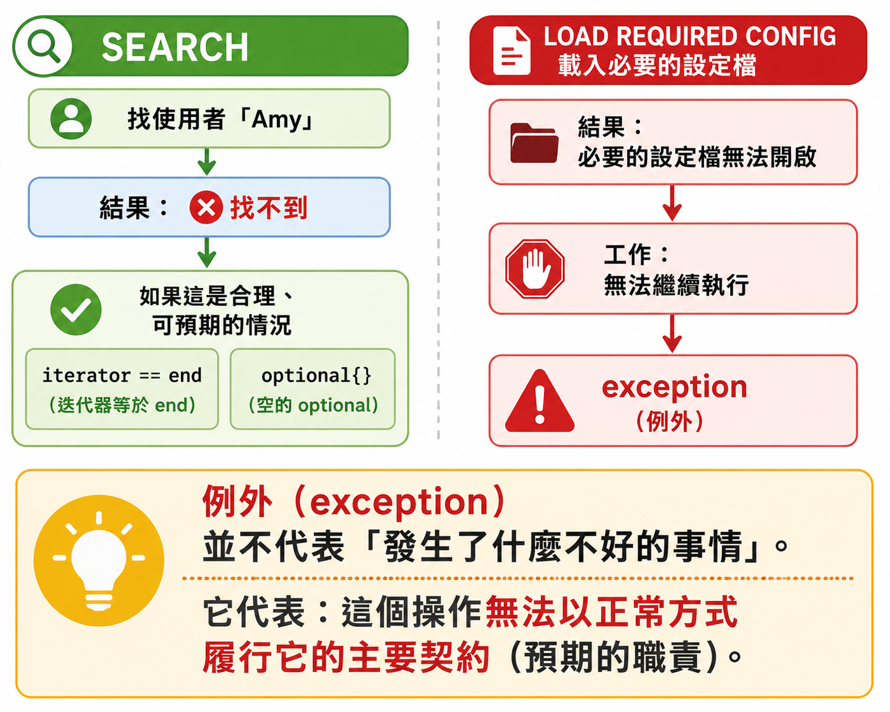
| 情況 | 常見選擇 |
| --- | --- |
| 搜尋不到資料 | iterator、`optional`、空結果 |
| 超額提款 | `bool` 或領域結果型別 |
| 使用者輸入格式錯誤 | 驗證結果或 API 例外 |
| 必要設定檔無法讀取 | 例外 |
| 程式內 invariant 被破壞 | `assert` 或內部錯誤 |
| 多種可恢復錯誤 | enum error、expected 概念 |

## Section XLII. 原則

失敗若是常見正常結果，不一定使用例外。

函式無法履行主要契約，而且目前層無法處理時，例外較合理。

---

# Part T：Exception Safety Guarantees

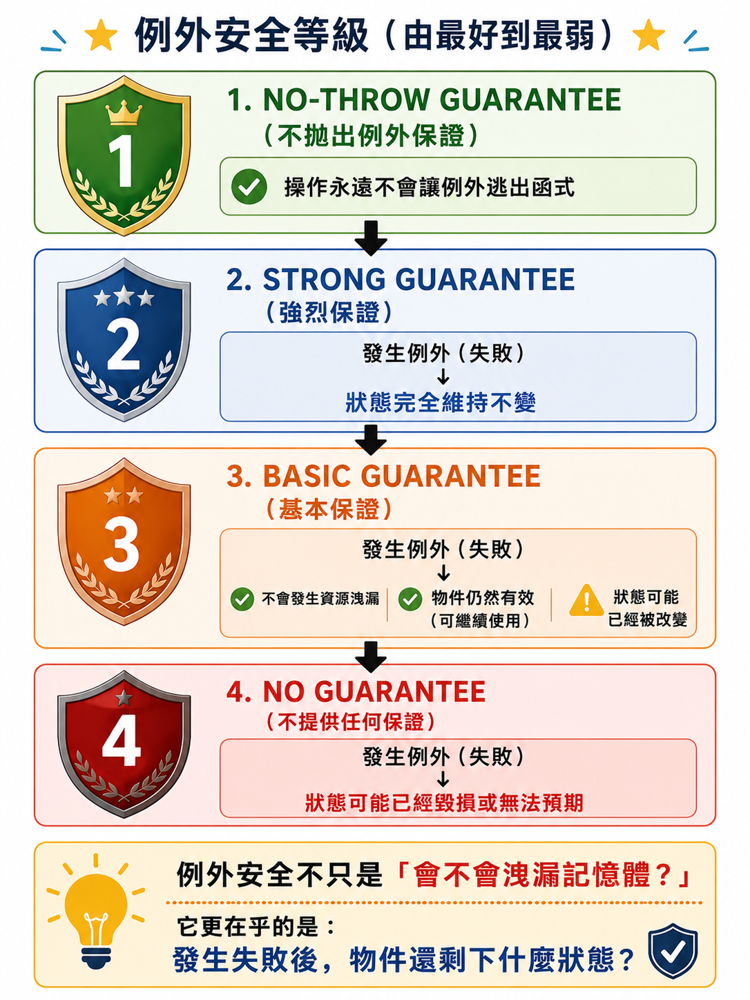

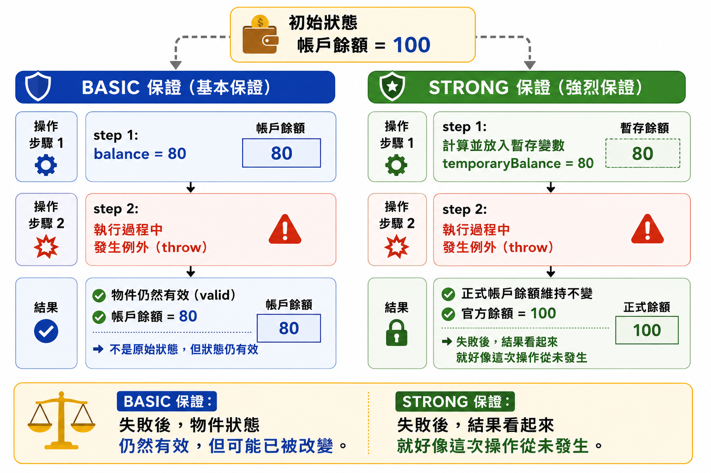
## Section XLIII. 四種保證

### No-Throw Guarantee

操作保證不拋出。

### Strong Guarantee

操作失敗時，物件狀態保持和操作前相同。

### Basic Guarantee

操作失敗時不洩漏資源，物件仍有效，但內容可能改變。

### No Guarantee

失敗後狀態可能損壞，應避免。

---

# Part U：先計算後提交

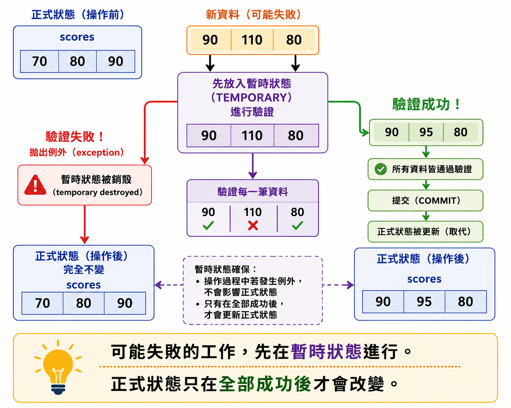
## Section XLIV. Strong Guarantee 策略

1. 在局部暫存物件完成可能失敗的工作。
2. 全部成功後才提交正式狀態。

## Section XLV. 完整先計算後提交

```cpp
// VALIDATE
#include <iostream>
#include <stdexcept>
#include <vector>
using namespace std;

class ScoreCollection {
public:
    void replaceScores(
        const vector<int>& newScores
    ) {
        vector<int> validated;

        validated.reserve(
            newScores.size()
        );

        for (int score : newScores) {
            if (
                score < 0 ||
                score > 100
            ) {
                throw invalid_argument(
                    "Score must be between 0 and 100."
                );
            }

            validated.push_back(score);
        }

        scores = validated;
    }

    vector<int>::size_type
    size() const noexcept {
        return scores.size();
    }

private:
    vector<int> scores;
};

int main() {
    ScoreCollection collection;

    try {
        collection.replaceScores(
            {
                90,
                110,
                80
            }
        );
    } catch (
        const exception& error
    ) {
        cout << error.what()
             << '\n';
    }

    cout << collection.size()
         << '\n';

    return 0;
}
```

---

# Part V：Top-Level Exception Boundary

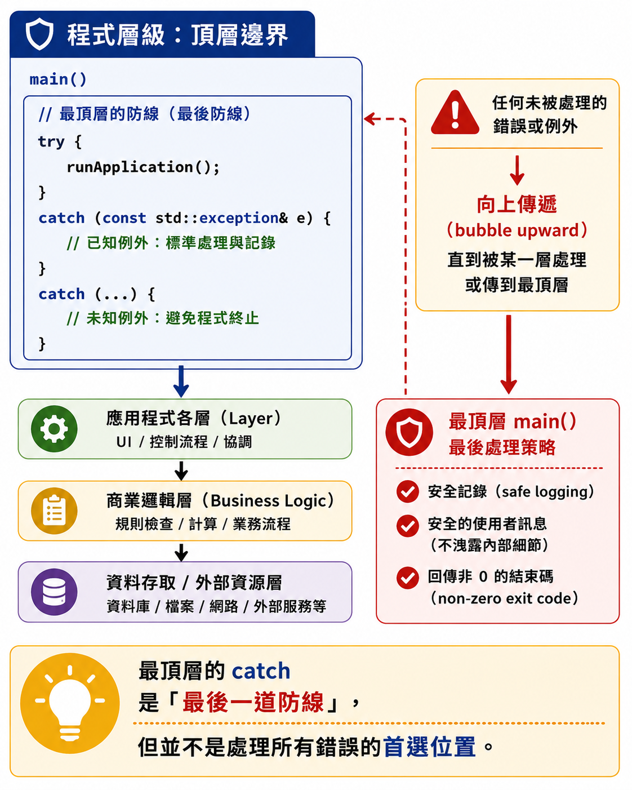

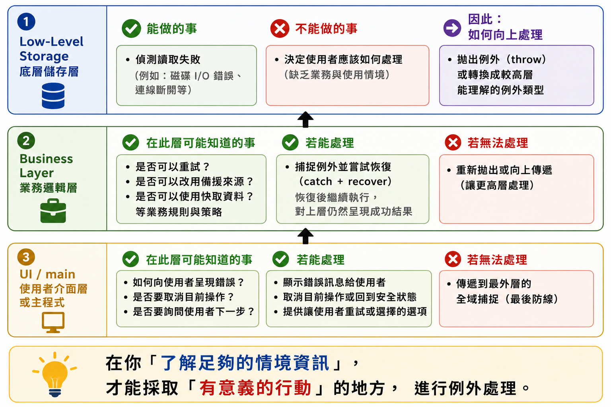
## Section XLVI. Main 最後防線

Top-level catch 可處理仍未被其他層處理的例外，但不代表所有例外都只在 main 處理。

## Section XLVII. 完整邊界範例

```cpp
// VALIDATE
#include <iostream>
#include <stdexcept>
using namespace std;

int runApplication() {
    throw runtime_error(
        "Application configuration is missing."
    );
}

int main() {
    try {
        return runApplication();
    } catch (
        const exception& error
    ) {
        cerr << "Application failed: "
             << error.what()
             << '\n';

        return 1;
    } catch (...) {
        cerr << "Application failed with an unknown error.\n";

        return 1;
    }
}
```

---

# Part W：Try Block 大小與責任

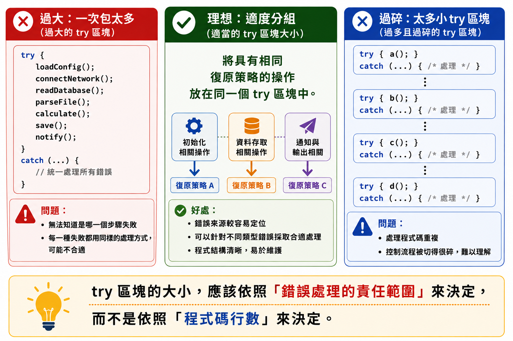
## Section XLVIII. 過大 Try

- 不容易知道哪一步失敗。
- 多種錯誤被迫使用同一策略。
- Catch 離真正恢復位置太遠。

## Section XLIX. 過小 Try

- 程式破碎。
- 大量重複處理。
- 容易吞掉例外。

## Section L. 原則

將需要同一錯誤處理策略的操作放在同一 try block。

---

# Part X：Exception-Neutral Template

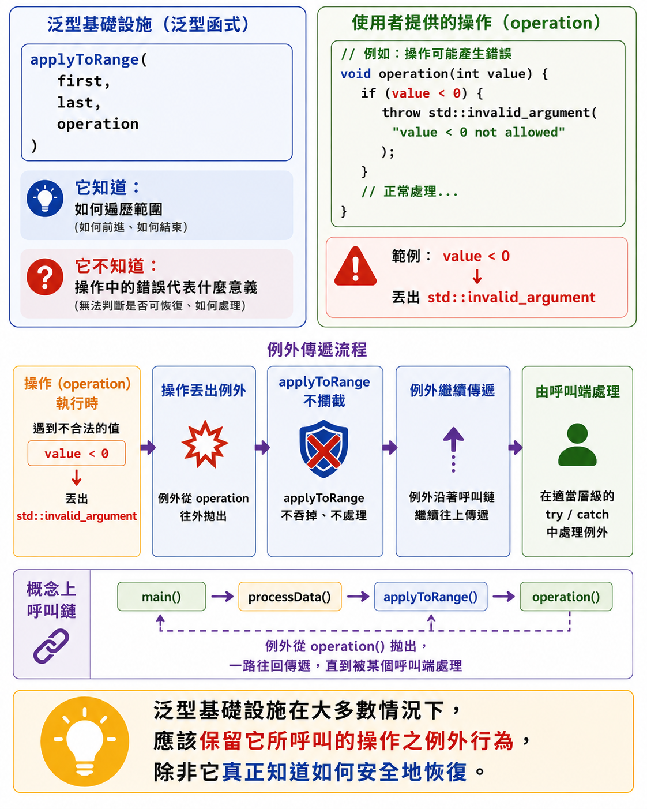
## Section LI. 不理解就向上傳遞

Template 或一般基礎元件通常不應任意捕捉並吞掉 callable 的例外。

## Section LII. 完整例外中立範例

```cpp
// VALIDATE
#include <iostream>
#include <stdexcept>
#include <vector>
using namespace std;

template <
    typename Iterator,
    typename Operation
>
void applyToRange(
    Iterator first,
    Iterator last,
    Operation operation
) {
    while (first != last) {
        operation(*first);
        ++first;
    }
}

int main() {
    vector<int> values{
        1,
        2,
        -1,
        3
    };

    try {
        applyToRange(
            values.cbegin(),
            values.cend(),
            [](int value) {
                if (value < 0) {
                    throw invalid_argument(
                        "Negative value is not allowed."
                    );
                }

                cout << value
                     << '\n';
            }
        );
    } catch (
        const exception& error
    ) {
        cout << error.what()
             << '\n';
    }

    return 0;
}
```

---

# Part Y：常見反模式

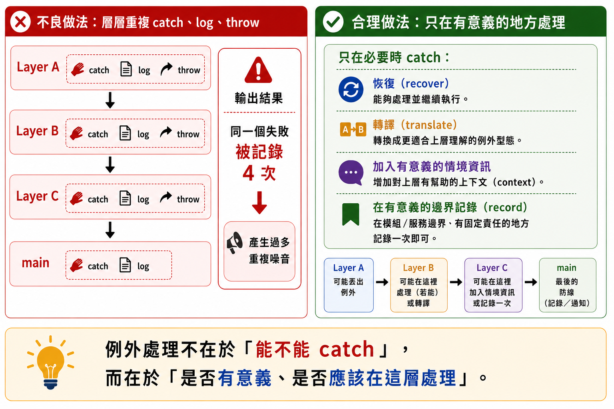

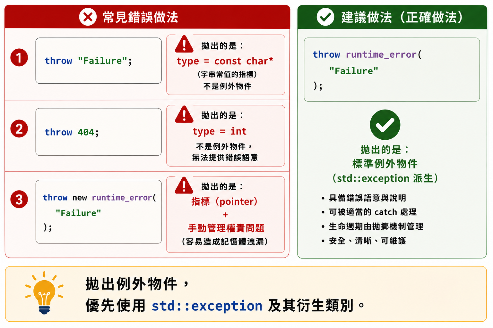

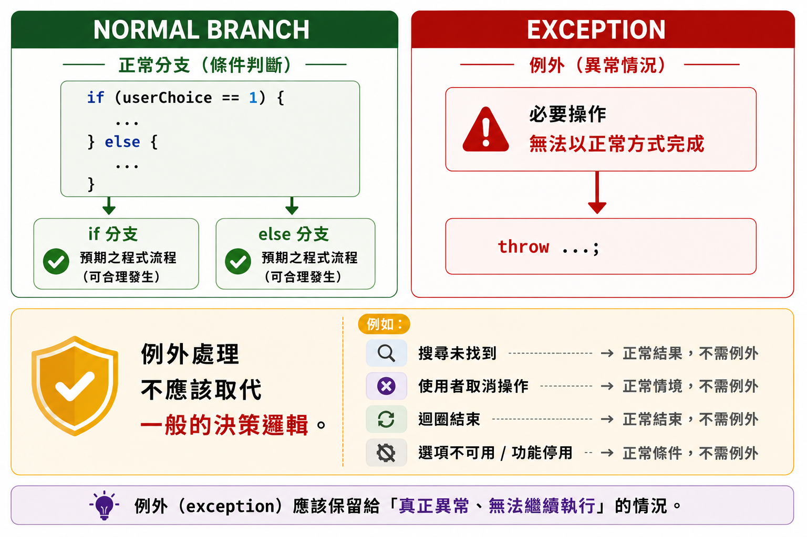
## Section LIII. 不建議的 Throw

```cpp
/* throw "Failure"; */
```

```cpp
/* throw 404; */
```

```cpp
/* throw new runtime_error(
    "Failure"
); */
```

優先丟出標準或自訂例外物件。

## Section LIV. 不用例外表示一般控制流程

正常迴圈結束、搜尋不到、使用者選擇取消等情況，通常可使用條件、回傳值、iterator 或 optional。

---

# Part Z：快速概念檢查

## Section LV. 選擇題與簡答

### Q1. `throw` 有什麼作用？

<details><summary>查看答案</summary>

建立並拋出例外物件，中斷目前正常流程並尋找相符 handler。

</details>

### Q2. `try` 區塊有什麼用途？

<details><summary>查看答案</summary>

包住可能拋出、並準備由後續 catch 處理的操作。

</details>

### Q3. 標準例外通常如何捕捉？

<details><summary>查看答案</summary>

```cpp
catch (
    const exception& error
)
```

</details>

### Q4. 為什麼不建議按值捕捉？

<details><summary>查看答案</summary>

可能造成不必要複製與衍生例外 slicing。

</details>

### Q5. `what()` 回傳什麼？

<details><summary>查看答案</summary>

描述錯誤的 C 字串。

</details>

### Q6. Catch 順序如何安排？

<details><summary>查看答案</summary>

具體例外在前，較一般基底例外在後，最後才是 catch-all。

</details>

### Q7. `throw;` 有什麼用途？

<details><summary>查看答案</summary>

重新拋出目前正在處理的原例外。

</details>

### Q8. 什麼是 stack unwinding？

<details><summary>查看答案</summary>

例外向上傳遞時，離開作用域會自動解構已完成建立的區域物件。

</details>

### Q9. 為什麼 RAII 對例外安全重要？

<details><summary>查看答案</summary>

即使控制流程因例外中斷，資源仍會隨物件解構自動釋放。

</details>

### Q10. 建構子可以拋例外嗎？

<details><summary>查看答案</summary>

可以，常用於阻止無效物件完成建立。

</details>

### Q11. 建構子拋出後完整物件解構子會執行嗎？

<details><summary>查看答案</summary>

不會；但已完成建立的基底與成員會被解構。

</details>

### Q12. `noexcept` 函式讓例外離開會怎樣？

<details><summary>查看答案</summary>

呼叫 `std::terminate()`。

</details>

### Q13. 解構子應向外拋出例外嗎？

<details><summary>查看答案</summary>

通常不應。

</details>

### Q14. `assert` 適合處理使用者輸入錯誤嗎？

<details><summary>查看答案</summary>

不適合，assert 用於程式內部應永遠成立的假設。

</details>

### Q15. 搜尋不到一定要拋例外嗎？

<details><summary>查看答案</summary>

不一定，常可使用 iterator、optional 或空結果。

</details>

### Q16. `.at()` 與 `operator[]` 的差異？

<details><summary>查看答案</summary>

`.at()` 檢查範圍並在錯誤時拋出 `out_of_range`；`operator[]` 不檢查。

</details>

### Q17. Strong guarantee 是什麼？

<details><summary>查看答案</summary>

操作失敗時，物件狀態保持和操作前相同。

</details>

### Q18. Basic guarantee 是什麼？

<details><summary>查看答案</summary>

失敗後不洩漏資源，物件仍有效，但內容可能改變。

</details>

### Q19. 何時建立自訂例外？

<details><summary>查看答案</summary>

呼叫者需要依領域錯誤型別或額外資料採取不同處理時。

</details>

### Q20. 為什麼不應無聲 `catch (...)`？

<details><summary>查看答案</summary>

會隱藏錯誤，使程式看似成功但實際狀態可能錯誤。

</details>

---

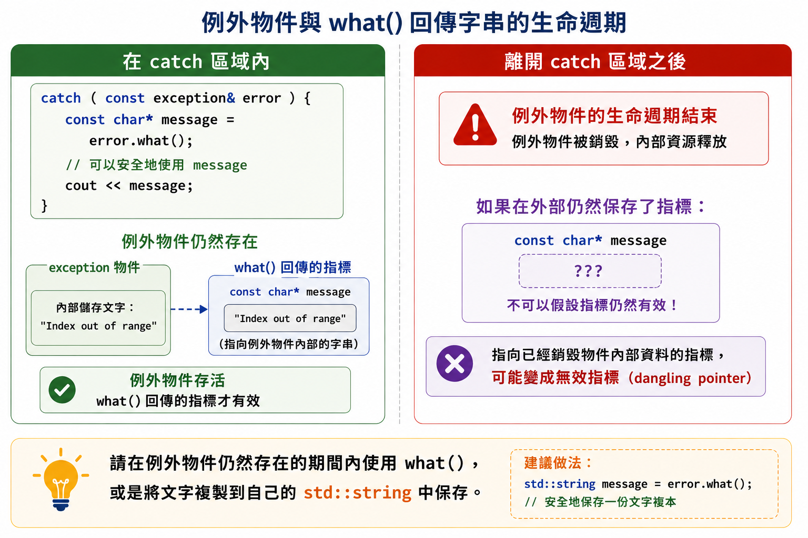
# Part AA：程式閱讀練習

## Section LVI. 預測結果與合法性

### 題目 1

```cpp
try {
    throw runtime_error("Failure");
} catch (const exception& error) {
    cout << error.what();
}
```

<details><summary>查看答案</summary>

```text
Failure
```

</details>

### 題目 2

```cpp
try {
    throw out_of_range("Index");
} catch (const out_of_range&) {
    cout << "A";
} catch (const exception&) {
    cout << "B";
}
```

<details><summary>查看答案</summary>

```text
A
```

</details>

### 題目 3

```cpp
try {
    throw invalid_argument("Bad");
} catch (const exception&) {
    cout << "Base";
}
```

<details><summary>查看答案</summary>

```text
Base
```

基底 handler 可捕捉衍生例外。

</details>

### 題目 4

```cpp
try {
    throw runtime_error("Original");
} catch (const exception&) {
    throw;
}
```

<details><summary>查看答案</summary>

例外繼續向外傳遞；若沒有外層 handler，程式終止。

</details>

### 題目 5

```cpp
vector<int> values{1, 2, 3};

try {
    cout << values.at(5);
} catch (const out_of_range&) {
    cout << "Range";
}
```

<details><summary>查看答案</summary>

```text
Range
```

</details>

### 題目 6

```cpp
try {
    int value = stoi("abc");
    cout << value;
} catch (const invalid_argument&) {
    cout << "Invalid";
}
```

<details><summary>查看答案</summary>

```text
Invalid
```

</details>

### 題目 7

```cpp
void function() noexcept {
    throw runtime_error("Failure");
}
```

<details><summary>查看答案</summary>

若執行並讓例外離開函式，會呼叫 `std::terminate()`。

</details>

### 題目 8

```cpp
class Resource {
public:
    ~Resource() {
        cout << "D";
    }
};

try {
    Resource resource;
    throw runtime_error("X");
} catch (const exception&) {
    cout << "C";
}
```

<details><summary>查看答案</summary>

```text
DC
```

</details>

### 題目 9

```cpp
try {
    throw 10;
} catch (const exception&) {
    cout << "Exception";
} catch (...) {
    cout << "Other";
}
```

<details><summary>查看答案</summary>

```text
Other
```

</details>

### 題目 10

```cpp
int value = 0;

try {
    value = 1;
    throw runtime_error("X");
    value = 2;
} catch (const exception&) {
    value = 3;
}

cout << value;
```

<details><summary>查看答案</summary>

```text
3
```

</details>

### 題目 11

```cpp
try {
    throw invalid_argument("Bad");
} catch (const exception& error) {
    const char* message = error.what();
    cout << message;
}
```

<details><summary>查看答案</summary>

Catch 內輸出：

```text
Bad
```

不要把 `what()` 指標保存到例外物件生命週期之外。

</details>

### 題目 12

```cpp
bool result = noexcept(
    vector<int>{}
);
```

<details><summary>查看答案</summary>

`noexcept(expression)` 由編譯器依該完整運算式的例外規格計算，不應只靠直覺猜測。

</details>

---

# Part AB：實作練習

## Section LVII. 實作檢測題

### TODO 1：Safe Divide

建立除法函式，分母為零時拋出 `invalid_argument`。

### TODO 2：Score Validation

分數小於 0 時拋出 `invalid_argument`，大於 100 時拋出 `out_of_range`。

### TODO 3：Catch Order

使用多個 catch 分別處理兩種分數錯誤。

### TODO 4：Parse Integer

使用 `stoi()`，確認整個字串都被解析。

### TODO 5：Vector At

安全讀取指定索引並處理 `out_of_range`。

### TODO 6：Rethrow

中層記錄例外訊息後使用 `throw;` 重新拋出。

### TODO 7：Tracer Unwinding

建立 Tracer 觀察例外發生時的反序解構。

### TODO 8：Constructor Validation

建立 `Product`，名稱空白或價格為負時拒絕完成建構。

### TODO 9：Custom Exception

建立包含記錄 ID 的 `RecordNotFoundError`。

### TODO 10：Exception Translation

將低階 `runtime_error` 轉成領域自訂例外。

### TODO 11：Noexcept Query

建立安全與不確定函式，使用 `noexcept(...)` 查詢。

### TODO 12：Strong Guarantee

先驗證新資料到暫存容器，成功後才替換成員。

### TODO 13：Top-Level Boundary

在 `main()` 最外層捕捉 `std::exception` 與未知例外。

### TODO 14：Exception-Neutral Template

建立接受 callable 的泛型範圍函式，不吞掉 callable 例外。

### TODO 15：Error Strategy

針對五種失敗情境，選擇 bool、optional、exception 或 assert。

---

# Part AC：課後小練習

## Section LVIII. 延伸練習

### 練習 1：Configuration Loader

讀取必要設定值；缺少檔案、格式錯誤、欄位缺失使用不同例外類型。

### 練習 2：Transaction Simulation

模擬帳戶轉帳，實作 strong guarantee：失敗時兩個帳戶餘額都保持原狀。

### 練習 3：Exception Hierarchy

建立簡單 `ApplicationError`、`DataError`、`NetworkError` 階層，分析每一層是否真的必要。

### 練習 4：Resource Class

建立模擬資源類別，提供可能失敗的 `close()` 與不拋出的解構子。

### 練習 5：Expected Design

不用實作 C++23 `std::expected`，先設計一個回傳「結果或錯誤資訊」的資料模型。

---

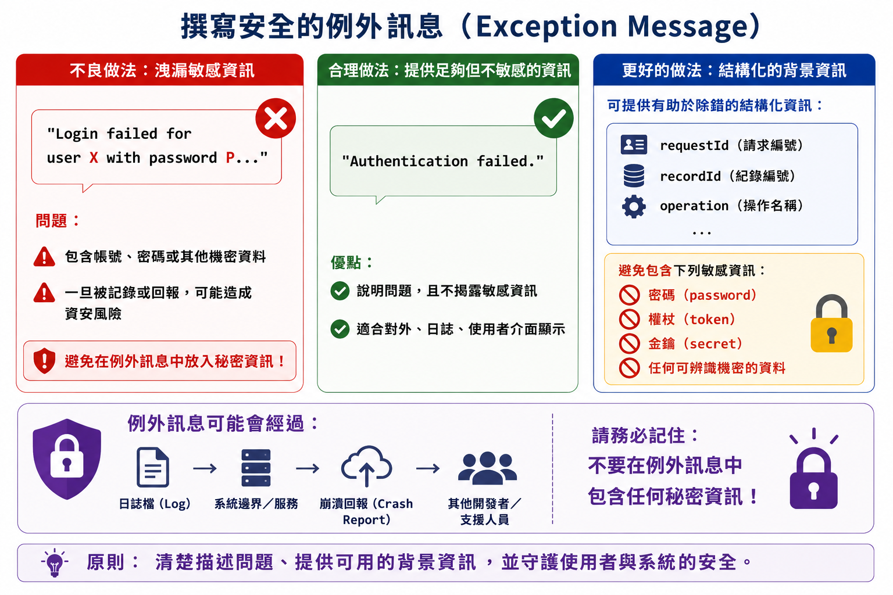
# Part AD：常見錯誤提醒

## Section LIX. 常見錯誤

1. 使用例外處理所有一般條件分支。
2. 丟出裸字串。
3. 丟出整數。
4. 丟出動態配置的例外指標。
5. 按值捕捉 `std::exception`。
6. Catch 基底型別放在衍生型別前面。
7. 使用 `throw error;` 代替 `throw;`。
8. Catch 後無聲忽略錯誤。
9. 每層函式都 catch 再立即 throw。
10. Catch-all 後不記錄也不處理。
11. Throw 後期待後續程式執行。
12. 手動資源在 throw 路徑洩漏。
13. 建構子失敗時假設完整解構子會執行。
14. 解構子向外拋出例外。
15. Noexcept 函式讓例外離開。
16. 誤以為 `noexcept` 會自動捕捉例外。
17. 使用 assert 驗證使用者輸入。
18. 使用 exception 表示正常搜尋不到。
19. 使用 vector `operator[]` 期待範圍檢查。
20. `stoi()` 只捕捉一種可能例外。
21. 保存 `what()` 指標超過例外物件生命週期。
22. 自訂例外沒有繼承標準例外。
23. 自訂例外階層過深。
24. 例外訊息包含敏感資料。
25. Try block 過大而無法辨識失敗位置。
26. Try-catch 過度碎片化。
27. 修改物件一半後才執行可能失敗的操作。
28. Template 吞掉未知 callable 例外。
29. 只測試正常路徑。
30. 沒有驗證例外發生後資源與物件狀態。

---

# Part AE：Mermaid 流程圖

## Section LX. 例外處理流程圖

### 1. Throw 與 Handler 搜尋

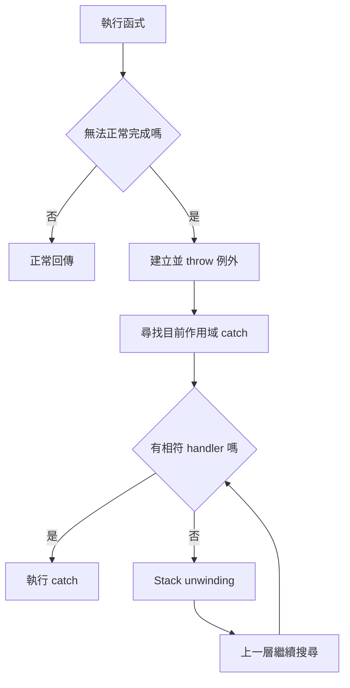
```mermaid
flowchart TD
    A[執行函式] --> B{無法正常完成嗎}
    B -- 否 --> C[正常回傳]
    B -- 是 --> D[建立並 throw 例外]
    D --> E[尋找目前作用域 catch]
    E --> F{有相符 handler 嗎}
    F -- 是 --> G[執行 catch]
    F -- 否 --> H[Stack unwinding]
    H --> I[上一層繼續搜尋]
    I --> F
```

### 2. Catch 順序

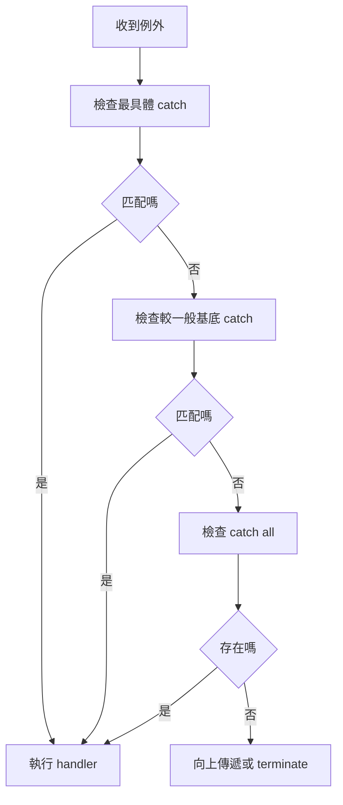
```mermaid
flowchart TD
    A[收到例外] --> B[檢查最具體 catch]
    B --> C{匹配嗎}
    C -- 是 --> D[執行 handler]
    C -- 否 --> E[檢查較一般基底 catch]
    E --> F{匹配嗎}
    F -- 是 --> D
    F -- 否 --> G[檢查 catch all]
    G --> H{存在嗎}
    H -- 是 --> D
    H -- 否 --> I[向上傳遞或 terminate]
```

### 3. Stack Unwinding

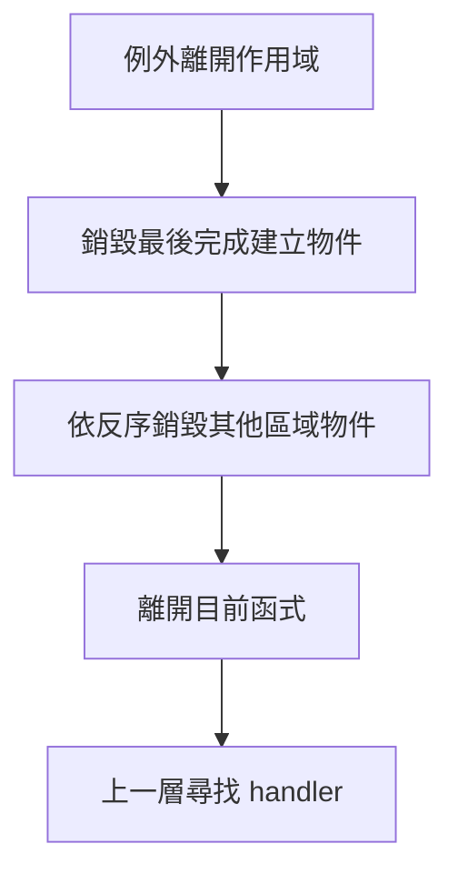
```mermaid
flowchart TD
    A[例外離開作用域] --> B[銷毀最後完成建立物件]
    B --> C[依反序銷毀其他區域物件]
    C --> D[離開目前函式]
    D --> E[上一層尋找 handler]
```

### 4. 錯誤策略選擇

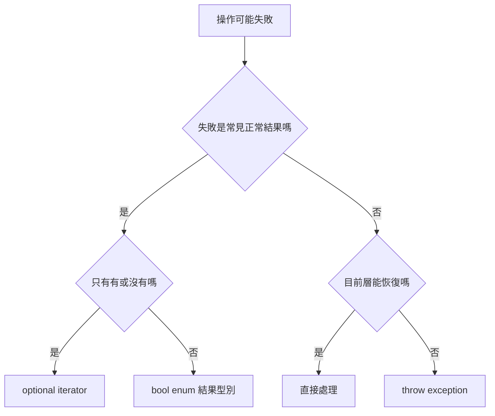
```mermaid
flowchart TD
    A[操作可能失敗] --> B{失敗是常見正常結果嗎}
    B -- 是 --> C{只有有或沒有嗎}
    C -- 是 --> D[optional iterator]
    C -- 否 --> E[bool enum 結果型別]
    B -- 否 --> F{目前層能恢復嗎}
    F -- 是 --> G[直接處理]
    F -- 否 --> H[throw exception]
```

### 5. Strong Guarantee

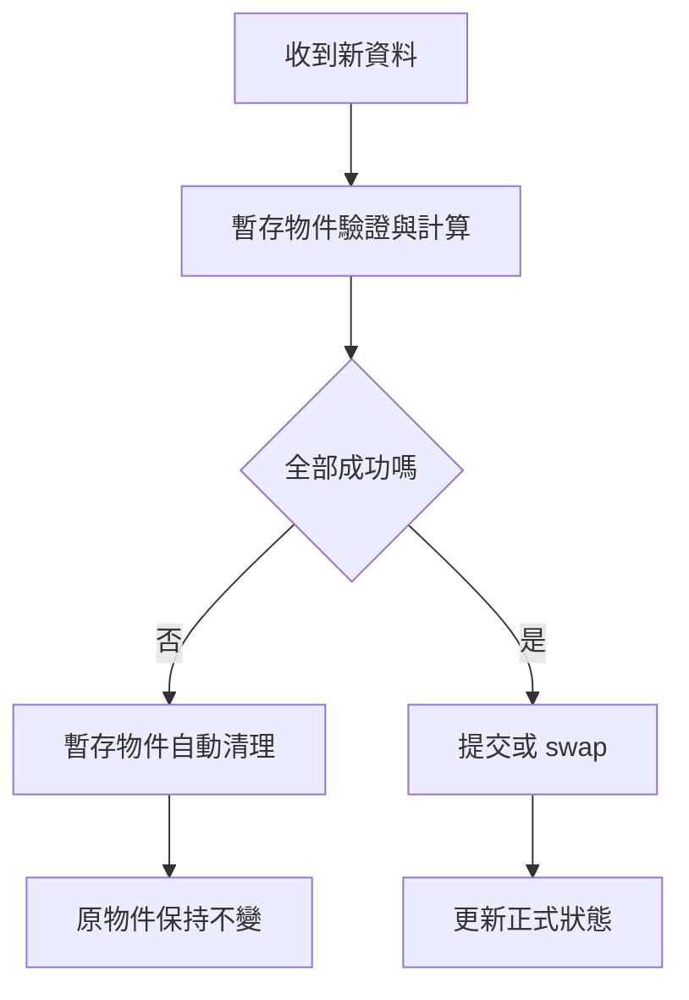
```mermaid
flowchart TD
    A[收到新資料] --> B[暫存物件驗證與計算]
    B --> C{全部成功嗎}
    C -- 否 --> D[暫存物件自動清理]
    D --> E[原物件保持不變]
    C -- 是 --> F[提交或 swap]
    F --> G[更新正式狀態]
```

### 6. Noexcept

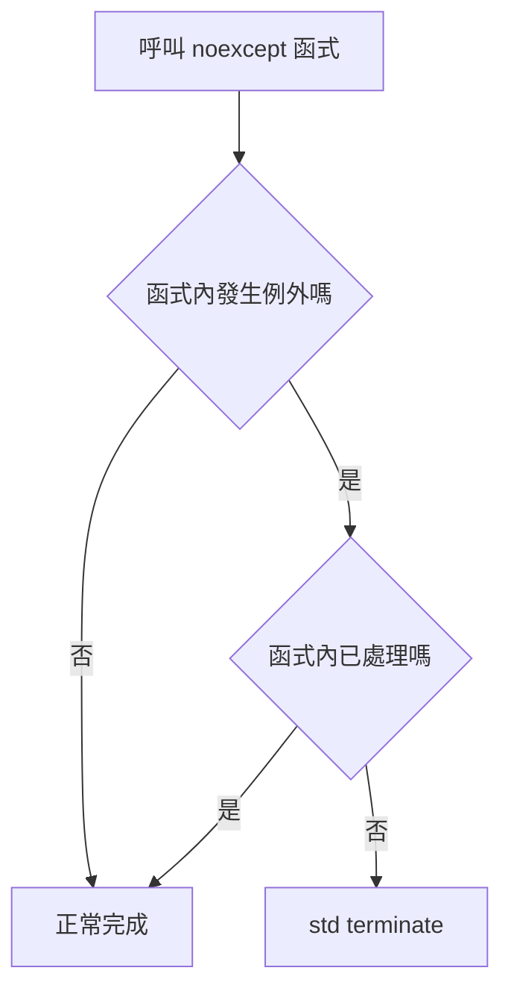
```mermaid
flowchart TD
    A[呼叫 noexcept 函式] --> B{函式內發生例外嗎}
    B -- 否 --> C[正常完成]
    B -- 是 --> D{函式內已處理嗎}
    D -- 是 --> C
    D -- 否 --> E[std terminate]
```

### 7. 自訂例外

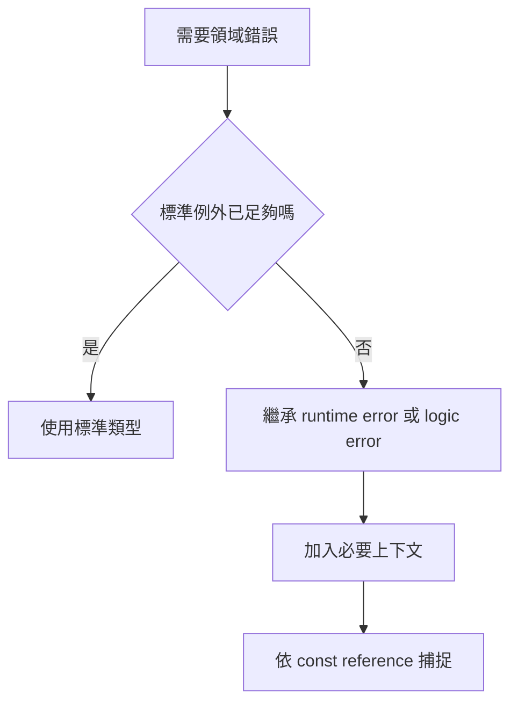
```mermaid
flowchart TD
    A[需要領域錯誤] --> B{標準例外已足夠嗎}
    B -- 是 --> C[使用標準類型]
    B -- 否 --> D[繼承 runtime error 或 logic error]
    D --> E[加入必要上下文]
    E --> F[依 const reference 捕捉]
```

### 8. 例外邊界

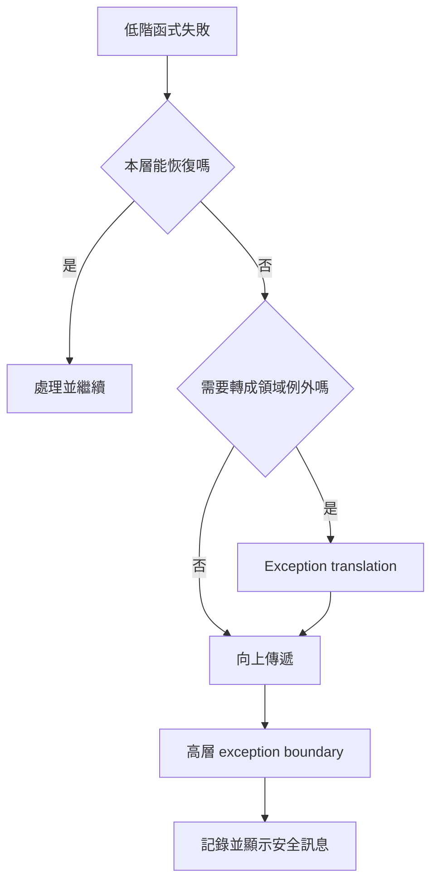
```mermaid
flowchart TD
    A[低階函式失敗] --> B{本層能恢復嗎}
    B -- 是 --> C[處理並繼續]
    B -- 否 --> D{需要轉成領域例外嗎}
    D -- 是 --> E[Exception translation]
    D -- 否 --> F[向上傳遞]
    E --> F
    F --> G[高層 exception boundary]
    G --> H[記錄並顯示安全訊息]
```

---

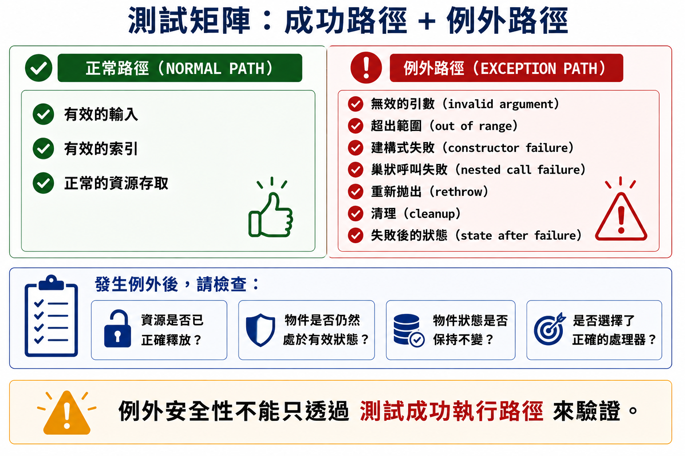

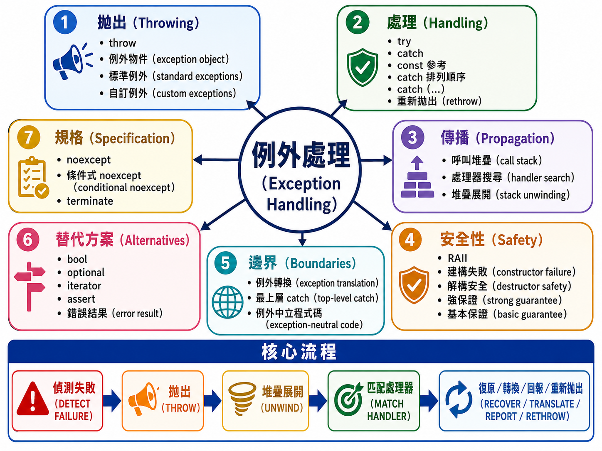
# 本章完成標準

完成本章後，你應該能做到：

1. 區分一般錯誤與 exceptional condition。
2. 使用 `throw`。
3. 使用 `try`。
4. 使用 `catch`。
5. 捕捉標準例外。
6. 使用 `what()`。
7. 使用 `invalid_argument`。
8. 使用 `out_of_range`。
9. 使用 `runtime_error`。
10. 正確安排 catch 順序。
11. 使用 `catch (...)`。
12. 避免無聲吞掉例外。
13. 使用 `throw;` 重新拋出。
14. 解釋 stack unwinding。
15. 使用 RAII 防止資源洩漏。
16. 在建構子中拒絕無效物件。
17. 解釋部分建構清理。
18. 建立自訂例外。
19. 進行 exception translation。
20. 使用 `vector::at()`。
21. 處理 `stoi()` 例外。
22. 使用 `noexcept`。
23. 使用 `noexcept(expression)`。
24. 解釋 noexcept 違反結果。
25. 避免解構子拋例外。
26. 比較 exception 與 assert。
27. 比較 exception 與 bool。
28. 比較 exception 與 optional。
29. 說明 no-throw guarantee。
30. 說明 strong guarantee。
31. 說明 basic guarantee。
32. 使用先計算後提交。
33. 建立 top-level exception boundary。
34. 控制 try block 大小。
35. 建立 exception-neutral template。
36. 避免丟出指標。
37. 避免 catch by value。
38. 測試例外路徑。
39. 測試資源清理。
40. 找出常見例外處理錯誤。

---

# 隱藏答案區

> Answer hidden — try it first.

<details><summary>TODO 1 答案</summary>

```cpp
double divide(
    double numerator,
    double denominator
) {
    if (denominator == 0.0) {
        throw invalid_argument(
            "Denominator cannot be zero."
        );
    }

    return numerator / denominator;
}
```

</details>

<details><summary>TODO 2 答案</summary>

```cpp
void validateScore(int score) {
    if (score < 0) {
        throw invalid_argument(
            "Score cannot be negative."
        );
    }

    if (score > 100) {
        throw out_of_range(
            "Score cannot exceed 100."
        );
    }
}
```

</details>

<details><summary>TODO 3 答案</summary>

```cpp
try {
    validateScore(score);
} catch (
    const invalid_argument& error
) {
    cout << error.what();
} catch (
    const out_of_range& error
) {
    cout << error.what();
}
```

</details>

<details><summary>TODO 4 答案</summary>

```cpp
int parseInteger(
    const string& text
) {
    size_t processed = 0;
    int value = stoi(text, &processed);

    if (processed != text.size()) {
        throw invalid_argument(
            "Invalid trailing characters."
        );
    }

    return value;
}
```

</details>

<details><summary>TODO 5 答案</summary>

```cpp
try {
    cout << values.at(index);
} catch (
    const out_of_range& error
) {
    cout << error.what();
}
```

</details>

<details><summary>TODO 6 答案</summary>

```cpp
try {
    lowLevelOperation();
} catch (
    const exception& error
) {
    log(error.what());
    throw;
}
```

</details>

<details><summary>TODO 7 答案</summary>

在 Tracer 建構子與解構子輸出名稱，函式內建立多個 Tracer 後 throw，觀察已建立物件依反序解構。

</details>

<details><summary>TODO 8 答案</summary>

```cpp
Product(
    const string& initialName,
    double initialPrice
)
    : nameValue(initialName),
      priceValue(initialPrice) {
    if (nameValue.empty()) {
        throw invalid_argument(
            "Name cannot be empty."
        );
    }

    if (priceValue < 0.0) {
        throw invalid_argument(
            "Price cannot be negative."
        );
    }
}
```

</details>

<details><summary>TODO 9 答案</summary>

```cpp
class RecordNotFoundError :
    public runtime_error {
public:
    explicit RecordNotFoundError(
        int missingId
    )
        : runtime_error(
              "Record was not found."
          ),
          idValue(missingId) {
    }

    int id() const noexcept {
        return idValue;
    }

private:
    int idValue;
};
```

</details>

<details><summary>TODO 10 答案</summary>

```cpp
try {
    readStorage();
} catch (
    const runtime_error&
) {
    throw CustomerLoadError();
}
```

</details>

<details><summary>TODO 11 答案</summary>

```cpp
cout << boolalpha
     << noexcept(safeOperation())
     << " "
     << noexcept(uncertainOperation());
```

</details>

<details><summary>TODO 12 答案</summary>

```cpp
vector<int> validated;

for (int value : newValues) {
    validate(value);
    validated.push_back(value);
}

storedValues = validated;
```

</details>

<details><summary>TODO 13 答案</summary>

```cpp
int main() {
    try {
        return runApplication();
    } catch (
        const exception& error
    ) {
        cerr << error.what()
             << '\n';
        return 1;
    } catch (...) {
        cerr << "Unknown error\n";
        return 1;
    }
}
```

</details>

<details><summary>TODO 14 答案</summary>

```cpp
template <
    typename Iterator,
    typename Operation
>
void applyToRange(
    Iterator first,
    Iterator last,
    Operation operation
) {
    while (first != last) {
        operation(*first);
        ++first;
    }
}
```

不要加入無法真正處理錯誤的 catch。

</details>

<details><summary>TODO 15 答案</summary>

```text
搜尋不到使用者 → optional 或 iterator
提款超過餘額 → bool 或領域結果
必要設定檔讀取失敗 → exception
程式內 invariant 被破壞 → assert
使用者輸入格式錯誤 → 驗證結果，或 API 中使用 invalid_argument
```

</details>
