# Lesson 29：File Input and Output 檔案輸入輸出

<!-- Images inserted from C++_29.txt insertion plan. -->

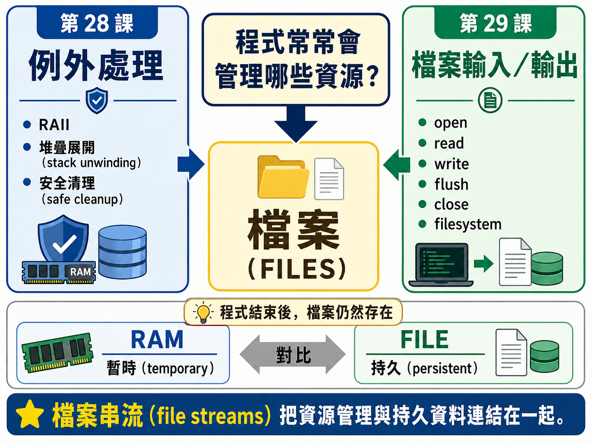
> 這堂課的重點：讓程式把資料寫入檔案，並在之後重新讀取。你會學習 `ifstream`、`ofstream`、`fstream`、文字與二進位檔案、開啟模式、格式化讀取、逐行讀取、串流狀態、檔案位置、RAII、自動關閉、`std::filesystem`，以及如何安全處理檔案錯誤。

> 本章以 C++17 為基準。檔案輸入輸出的核心仍是 stream：`cin` 從標準輸入讀取，`cout` 寫到標準輸出；檔案串流則把同樣的操作連接到檔案。JSON、XML、SQLite、壓縮檔、網路串流與完整序列化框架會留到其他專題。

---

## Section I. 今天要做什麼？

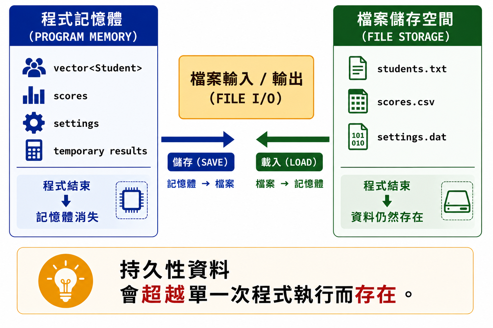

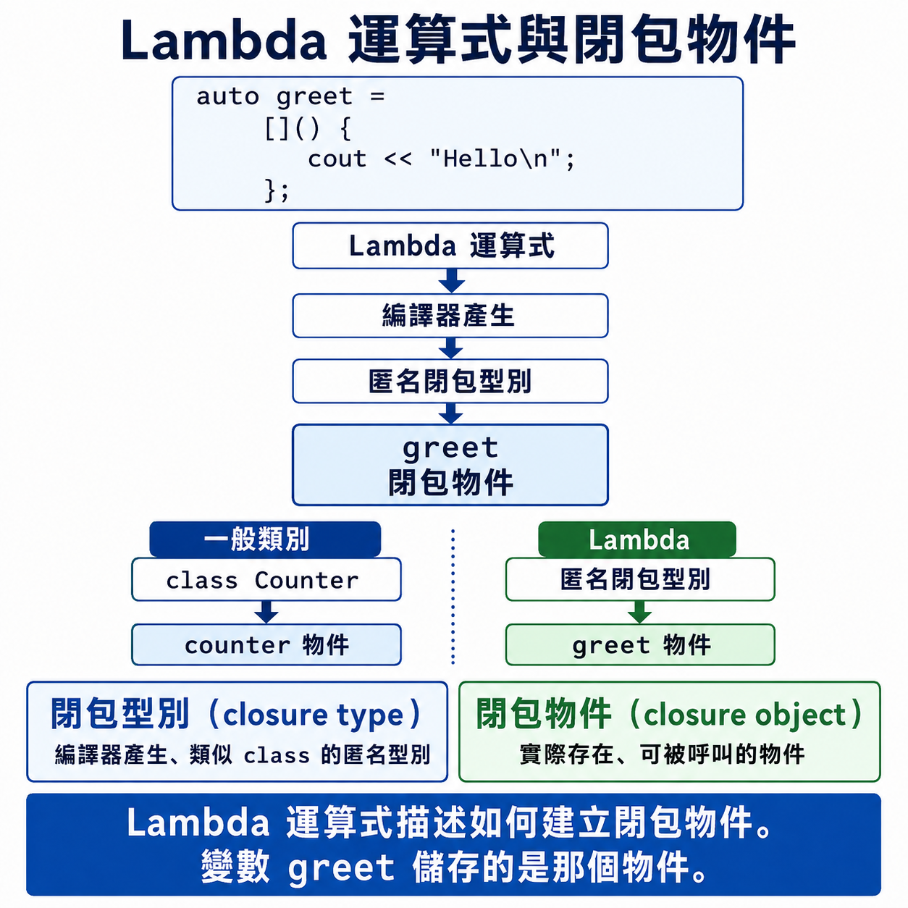
1. 認識 persistent data 持久化資料。
2. 比較記憶體資料與檔案資料。
3. 認識 file stream。
4. 使用 `<fstream>`。
5. 認識 `ifstream`。
6. 認識 `ofstream`。
7. 認識 `fstream`。
8. 使用建構子開啟檔案。
9. 使用 `.open()`。
10. 使用 `.close()`。
11. 理解 RAII 自動關閉。
12. 優先讓串流物件自行管理生命週期。
13. 使用 `is_open()`。
14. 使用串流布林狀態。
15. 使用 `if (!file)`。
16. 理解檔案開啟可能失敗。
17. 處理不存在的檔案。
18. 處理沒有權限的路徑。
19. 處理錯誤目錄。
20. 處理磁碟或裝置錯誤概念。
21. 認識文字檔。
22. 認識二進位檔。
23. 比較文字與二進位格式。
24. 使用 `operator<<` 寫入文字。
25. 使用 `operator>>` 讀取格式化資料。
26. 使用 `getline()` 讀取整行。
27. 使用 `get()` 讀取單一字元。
28. 使用 `put()` 寫入單一字元。
29. 使用 `read()` 讀取位元組。
30. 使用 `write()` 寫入位元組。
31. 使用 `flush()`。
32. 理解緩衝 buffering。
33. 理解 `endl` 會換行並 flush。
34. 一般換行優先使用 `'\n'`。
35. 認識 open mode。
36. 使用 `ios::in`。
37. 使用 `ios::out`。
38. 使用 `ios::app`。
39. 使用 `ios::ate`。
40. 使用 `ios::trunc`。
41. 使用 `ios::binary`。
42. 使用位元 OR 組合模式。
43. 理解 `ofstream` 預設可能截斷檔案。
44. 使用 append 保留舊內容。
45. 區分 `app` 與 `ate`。
46. 理解 `app` 每次寫入都在尾端。
47. 理解 `ate` 開啟後先定位尾端，但仍可重新定位。
48. 認識 formatted input。
49. 認識 unformatted input。
50. 理解 `operator>>` 跳過前導空白。
51. 理解 `getline()` 保留行內空白。
52. 處理 `>>` 後接 `getline()`。
53. 使用 `ignore()`。
54. 使用 `ws`。
55. 使用 `getline(file >> ws, line)`。
56. 了解 `ws` 會跳過所有前導空白。
57. 不需要保留空白行時可使用 `ws`。
58. 需要保留空白行時謹慎使用 `ws`。
59. 使用 while extraction loop。
60. 使用 `while (file >> value)`。
61. 使用 `while (getline(file, line))`。
62. 避免 `while (!file.eof())`。
63. 理解 eof 只在讀取失敗後設定。
64. 認識 `goodbit`。
65. 認識 `eofbit`。
66. 認識 `failbit`。
67. 認識 `badbit`。
68. 使用 `.good()`。
69. 使用 `.eof()`。
70. 使用 `.fail()`。
71. 使用 `.bad()`。
72. 使用 `.clear()`。
73. 清除狀態後重新使用 stream。
74. 使用 `.exceptions()` 概念。
75. 讓 stream 在指定狀態丟出 `ios_base::failure`。
76. 比較狀態檢查與例外。
77. 建立文字設定檔。
78. 建立簡單紀錄檔。
79. 建立分數檔。
80. 建立多行文字檔。
81. 建立鍵值格式。
82. 建立簡單 CSV。
83. 理解 CSV 不只是用逗號切割。
84. 認識引號欄位。
85. 認識逗號內嵌。
86. 認識換行內嵌。
87. 本章只處理簡化 CSV。
88. 使用 `stringstream` 解析一行。
89. 使用 `istringstream`。
90. 使用 `ostringstream`。
91. 組合檔案 stream 與字串 stream。
92. 驗證每一列欄位。
93. 處理空行。
94. 處理格式錯誤。
95. 記錄行號。
96. 提供清楚錯誤訊息。
97. 認識 file position。
98. 使用 `tellg()`。
99. 使用 `tellp()`。
100. 使用 `seekg()`。
101. 使用 `seekp()`。
102. 使用 `ios::beg`。
103. 使用 `ios::cur`。
104. 使用 `ios::end`。
105. 理解 get pointer。
106. 理解 put pointer。
107. 重新定位前清除失敗狀態。
108. 使用 binary mode。
109. 避免文字模式行尾轉換影響位元組位置。
110. 認識 binary serialization。
111. 寫入 `int32_t`。
112. 讀取 `int32_t`。
113. 使用 `reinterpret_cast<char*>`。
114. 理解二進位格式的 endianness。
115. 理解整數大小。
116. 理解 padding。
117. 避免直接寫入含 `string` 的 struct 記憶體。
118. 避免直接寫入指標。
119. 避免假設 struct layout 可攜。
120. 建立明確二進位格式。
121. 儲存欄位長度。
122. 儲存版本號。
123. 驗證檔案標頭。
124. 認識 magic number。
125. 認識 file format versioning。
126. 不在本章深入跨平台序列化。
127. 認識 `std::filesystem`。
128. 使用 `<filesystem>`。
129. 使用 `filesystem::path`。
130. 使用 `/` 組合路徑。
131. 避免手動拼接路徑分隔符。
132. 使用 `exists()`。
133. 使用 `is_regular_file()`。
134. 使用 `is_directory()`。
135. 使用 `file_size()`。
136. 使用 `create_directory()`。
137. 使用 `create_directories()`。
138. 使用 `remove()`。
139. 使用 `rename()`。
140. 使用 `copy_file()`。
141. 使用 `directory_iterator`。
142. 使用 `recursive_directory_iterator` 概念。
143. 避免依賴目錄走訪順序。
144. 使用 `error_code` overload 概念。
145. 比較 filesystem exception 與 error code。
146. 使用目前工作目錄概念。
147. 理解相對路徑。
148. 理解絕對路徑。
149. 使用 `current_path()`。
150. 理解程式啟動位置影響相對路徑。
151. 避免假設 IDE 與終端工作目錄相同。
152. 使用命令列顯示實際路徑。
153. 認識 canonical path。
154. 使用 `absolute()`。
155. 使用 `weakly_canonical()` 概念。
156. 防止 path traversal 概念。
157. 不信任使用者提供路徑。
158. 驗證允許的根目錄。
159. 避免把密碼寫入純文字檔。
160. 避免記錄敏感資料。
161. 認識檔案權限。
162. 不在本章深入 POSIX permission API。
163. 認識 atomic save 概念。
164. 先寫入暫存檔。
165. 成功後 rename。
166. 避免直接覆寫造成損壞。
167. 認識 backup file。
168. 建立 `.bak` 備份概念。
169. 使用 trunc 前確認意圖。
170. 寫入後檢查 stream 狀態。
171. 關閉後檢查錯誤概念。
172. 理解解構關閉時不易回報錯誤。
173. 重要檔案可明確 `flush()` 與 `close()`。
174. 認識 concurrent access。
175. 多個程序同時寫檔可能衝突。
176. 不在本章深入 file locking。
177. 認識 log append。
178. 使用 timestamp 概念。
179. 不在本章深入 chrono 格式化。
180. 建立簡單 append log。
181. 認識 temporary file。
182. 使用 filesystem temp directory concept。
183. 不在本章深入安全臨時檔 API。
184. 使用 exceptions 與 RAII。
185. 讓 ifstream 離開作用域自動關閉。
186. 不把 stream 複製。
187. 理解 stream 通常不可複製。
188. 可移動 stream 概念。
189. 傳遞 stream by reference。
190. 建立接受 `istream&` 的 parser。
191. 建立接受 `ostream&` 的 writer。
192. 讓同一函式可處理檔案與 stringstream。
193. 使用 dependency injection 概念。
194. 測試 parser 時使用 istringstream。
195. 測試 writer 時使用 ostringstream。
196. 認識 standard input/output redirection。
197. 程式可從 stdin 讀取並由 shell 重導向檔案。
198. 程式可寫 stdout 並重導向檔案。
199. 比較直接 fstream 與 shell redirection。
200. 使用概念檢查、程式閱讀與實作題整合本章。

---

## Section II. 今天的學習方式

1. 每個檔案操作先回答：
   ```text
   讀還是寫？
   文字還是二進位？
   覆寫還是附加？
   檔案不存在時怎麼辦？
   格式錯誤時怎麼辦？
   ```
2. 讀取迴圈優先：
   ```cpp
   while (file >> value)
   ```
   或：
   ```cpp
   while (getline(file, line))
   ```
3. 不使用：
   ```cpp
   while (!file.eof())
   ```
4. 檔案開啟後立即檢查狀態。
5. 重要寫入完成後再次檢查 stream。
6. 路徑使用：
   ```cpp
   filesystem::path
   ```
7. Parser 接收：
   ```cpp
   istream&
   ```
8. Writer 接收：
   ```cpp
   ostream&
   ```
9. 二進位格式要明確定義，不直接傾倒複雜物件記憶體。
10. 所有合法完整程式使用嚴格 C++17 選項檢查。

---

## Section III. 核心語法對照

| 語法 | 用途 |
| --- | --- |
| `ifstream file(path);` | 開啟文字輸入檔 |
| `ofstream file(path);` | 開啟文字輸出檔 |
| `fstream file(path, mode);` | 同時讀寫 |
| `file.is_open()` | 是否成功開啟 |
| `file << value` | 格式化寫入 |
| `file >> value` | 格式化讀取 |
| `getline(file, line)` | 讀取整行 |
| `file.get(character)` | 讀一個字元 |
| `file.put(character)` | 寫一個字元 |
| `file.read(buffer, count)` | 讀取位元組 |
| `file.write(buffer, count)` | 寫入位元組 |
| `ios::app` | 每次寫到尾端 |
| `ios::trunc` | 開啟時清空 |
| `ios::binary` | 二進位模式 |
| `file.tellg()` | 取得讀取位置 |
| `file.seekg(...)` | 移動讀取位置 |
| `file.tellp()` | 取得寫入位置 |
| `file.seekp(...)` | 移動寫入位置 |
| `file.clear()` | 清除 stream 狀態 |
| `filesystem::path` | 平台相容路徑 |
| `filesystem::exists(path)` | 檢查路徑存在 |
| `filesystem::file_size(path)` | 取得檔案大小 |

---

# Part A：第一個文字輸出檔

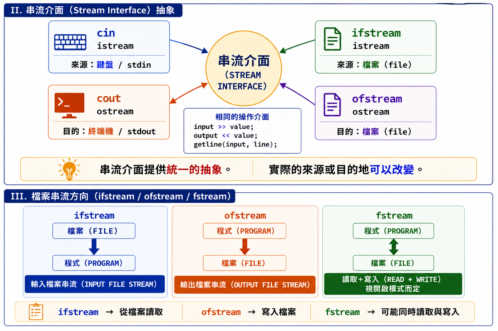

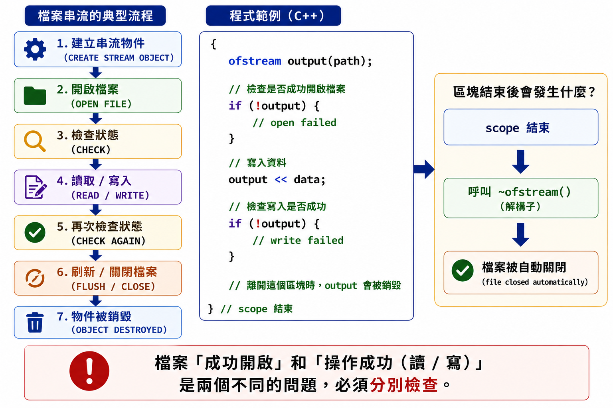

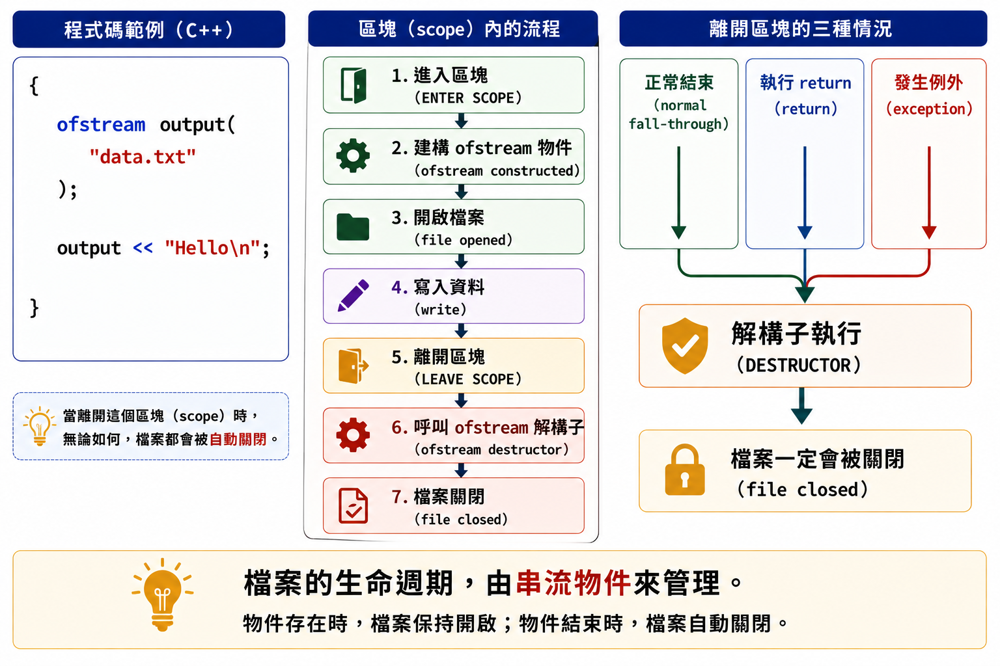

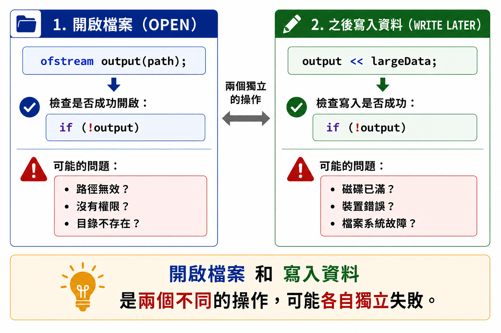

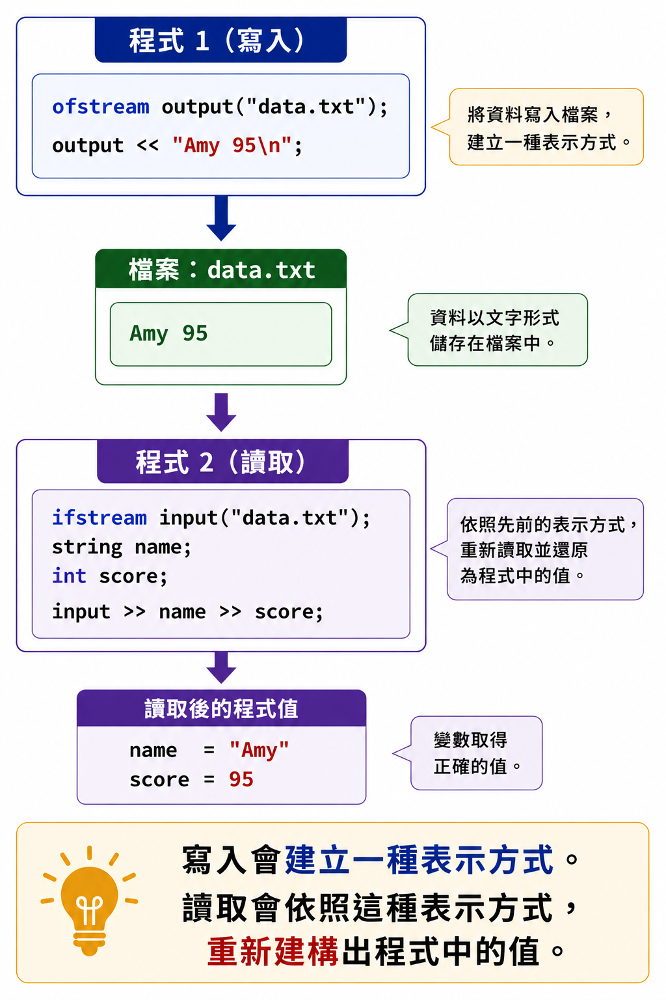

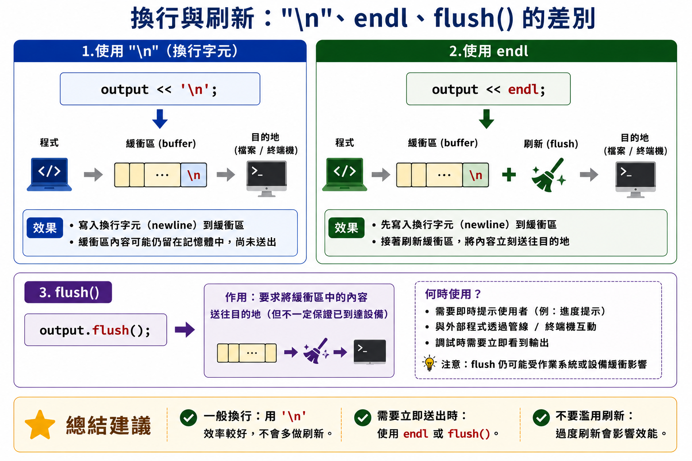

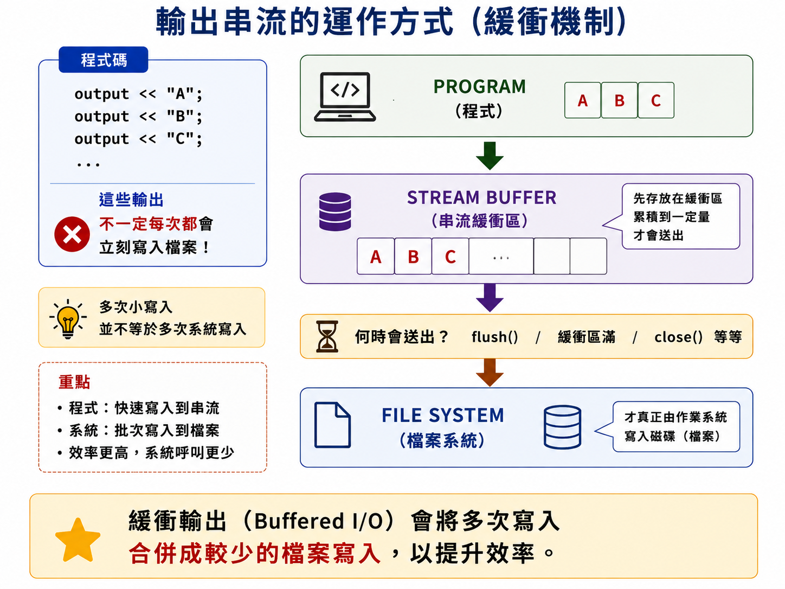
## Section IV. `ofstream`

```cpp
ofstream output(
    "message.txt"
);
```

若沒有指定其他模式，通常會建立或截斷檔案。

---

## Section V. 檢查開啟

```cpp
if (!output) {
    // 開啟失敗
}
```

Stream 可轉成布林值表示目前是否可正常操作。

---

## Section VI. 完整寫入範例

```cpp
// VALIDATE
#include <fstream>
#include <iostream>
#include <string>
using namespace std;

int main() {
    const string path =
        "lesson29_message.txt";

    ofstream output(path);

    if (!output) {
        cerr << "Unable to open output file.\n";
        return 1;
    }

    output << "Hello file!\n";
    output << 42
           << '\n';

    if (!output) {
        cerr << "Unable to write output file.\n";
        return 1;
    }

    return 0;
}
```

離開 `main()` 時 `output` 自動關閉。

---

# Part B：第一個文字輸入檔


## Section VII. `ifstream`

```cpp
ifstream input(
    "message.txt"
);
```

檔案不存在或不能讀取時，stream 進入失敗狀態。

---

## Section VIII. 完整讀取單字與數字

```cpp
// VALIDATE
#include <fstream>
#include <iostream>
#include <string>
using namespace std;

int main() {
    const string path =
        "lesson29_values.txt";

    {
        ofstream output(path);

        if (!output) {
            return 1;
        }

        output << "Amy 95\n";
    }

    ifstream input(path);

    if (!input) {
        cerr << "Unable to open input file.\n";
        return 1;
    }

    string name;
    int score = 0;

    if (input >> name >> score) {
        cout << name
             << " "
             << score
             << '\n';
    } else {
        cerr << "Invalid file format.\n";
        return 1;
    }

    return 0;
}
```

---

# Part C：逐行讀取

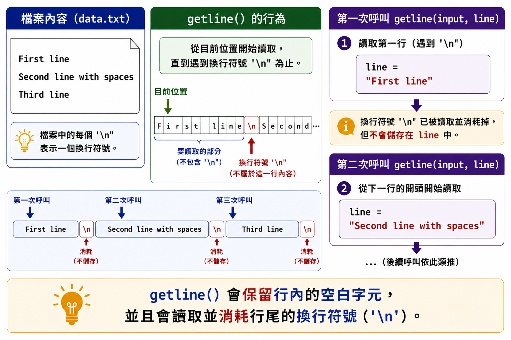

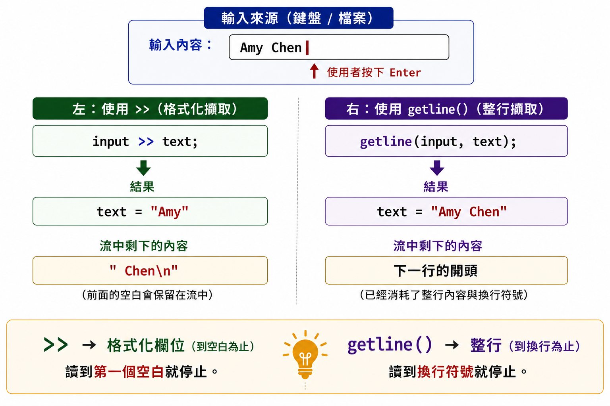
## Section IX. `getline()`

```cpp
string line;

while (
    getline(
        input,
        line
    )
) {
    // 處理 line
}
```

保留行內空格，不包含行尾換行字元。

---

## Section X. 完整逐行讀取

```cpp
// VALIDATE
#include <fstream>
#include <iostream>
#include <string>
using namespace std;

int main() {
    const string path =
        "lesson29_lines.txt";

    {
        ofstream output(path);

        if (!output) {
            return 1;
        }

        output << "First line\n";
        output << "Second line with spaces\n";
        output << "Third line\n";
    }

    ifstream input(path);

    if (!input) {
        return 1;
    }

    string line;
    int lineNumber = 1;

    while (
        getline(
            input,
            line
        )
    ) {
        cout << lineNumber
             << ": "
             << line
             << '\n';

        ++lineNumber;
    }

    return 0;
}
```

---

# Part D：不要使用 `while (!eof())`

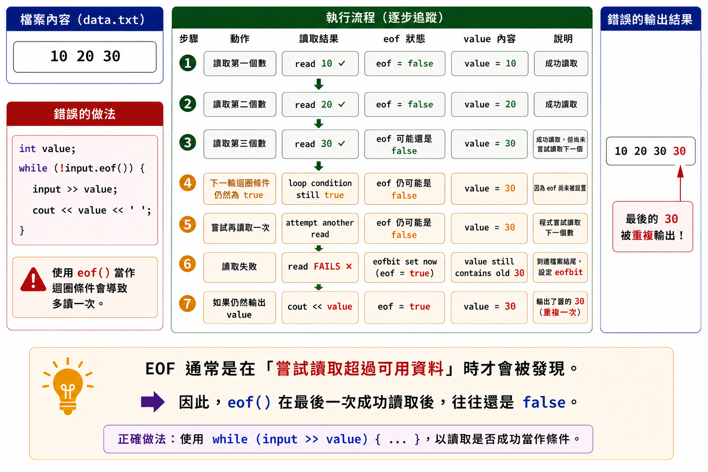

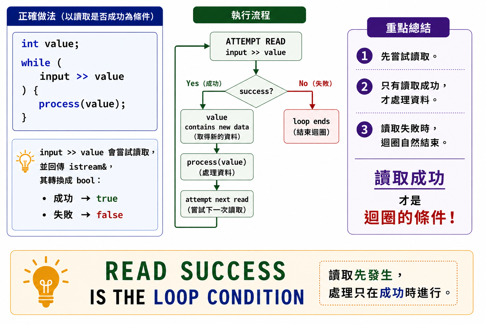

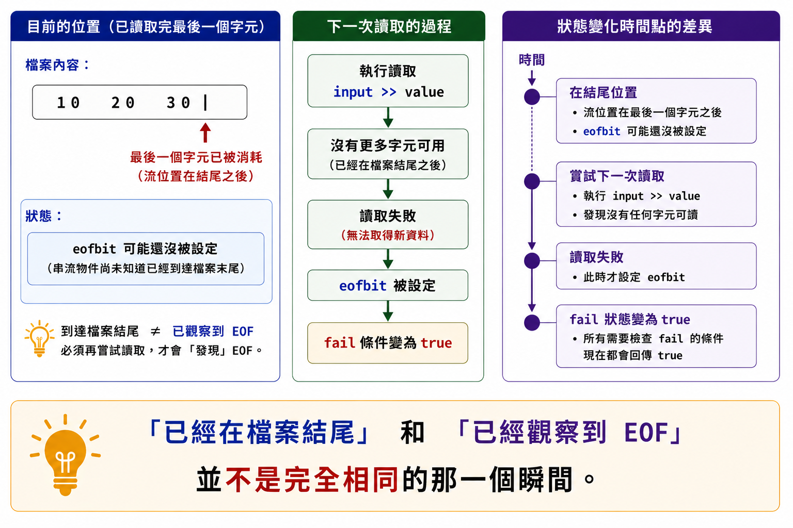
## Section XI. 錯誤模式

```cpp
/* while (!input.eof()) {
    input >> value;
    cout << value;
} */
```

`eofbit` 通常在讀取嘗試失敗後才設定。

可能重複處理最後一筆舊資料。

---

## Section XII. 正確模式

```cpp
while (
    input >> value
) {
    // 只有成功讀取才處理
}
```

---

## Section XIII. 完整數字迴圈

```cpp
// VALIDATE
#include <fstream>
#include <iostream>
#include <string>
using namespace std;

int main() {
    const string path =
        "lesson29_numbers.txt";

    {
        ofstream output(path);

        if (!output) {
            return 1;
        }

        output << "10 20 30 40\n";
    }

    ifstream input(path);

    if (!input) {
        return 1;
    }

    int value = 0;
    int total = 0;

    while (
        input >> value
    ) {
        total += value;
    }

    cout << total
         << '\n';

    return 0;
}
```

---

# Part E：`>>` 與 `getline()` 混用

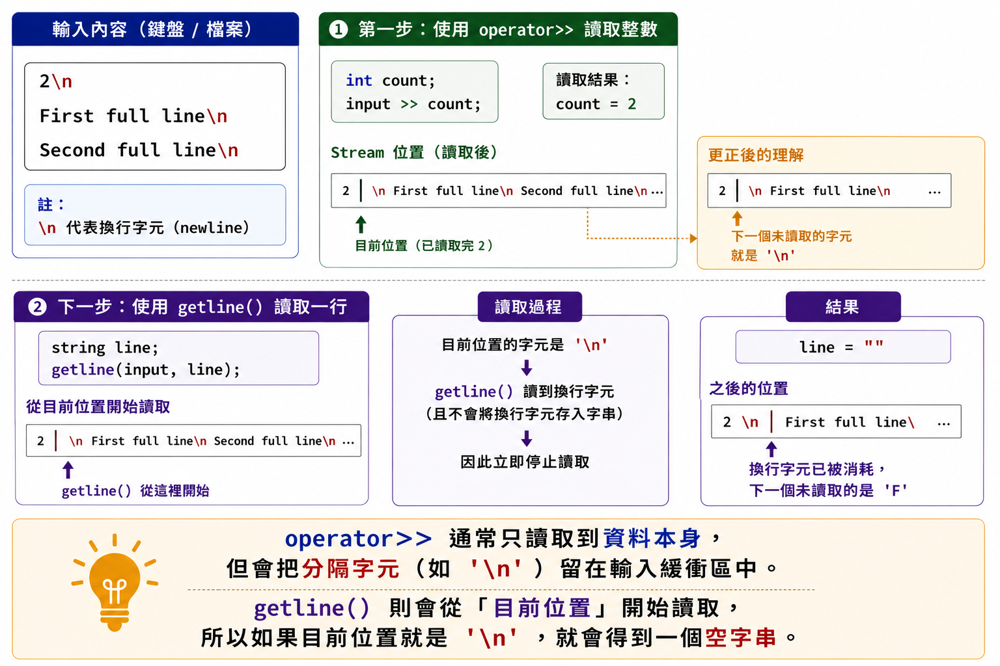

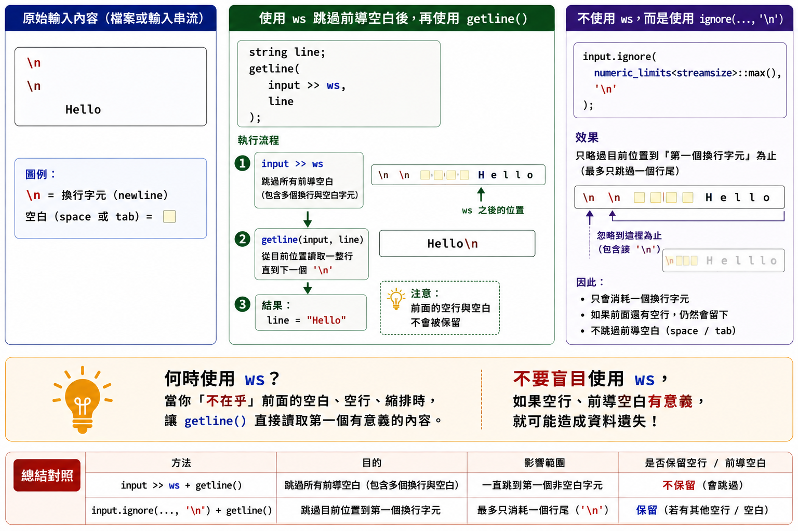
## Section XIV. 常見問題

```cpp
input >> number;
getline(input, line);
```

`>>` 通常留下換行字元，下一個 `getline()` 可能立即讀到空字串。

---

## Section XV. 使用 `ignore()`

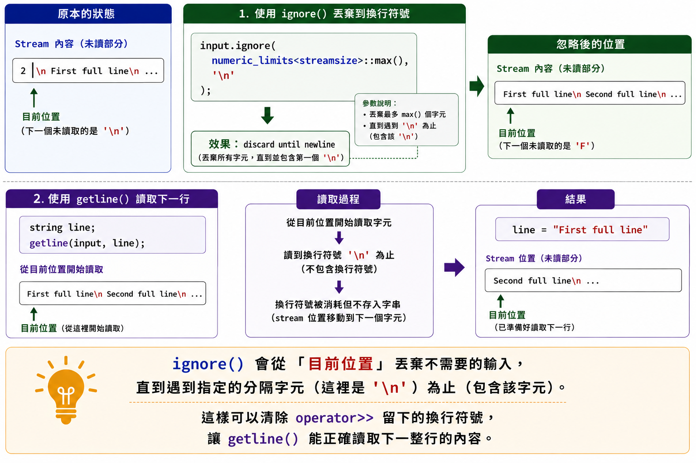
```cpp
input.ignore(
    numeric_limits<
        streamsize
    >::max(),
    '\n'
);
```

丟棄到下一個換行。

---

## Section XVI. 完整混用範例

```cpp
// VALIDATE
#include <fstream>
#include <iostream>
#include <limits>
#include <string>
using namespace std;

int main() {
    const string path =
        "lesson29_mixed.txt";

    {
        ofstream output(path);

        if (!output) {
            return 1;
        }

        output << "2\n";
        output << "First full line\n";
        output << "Second full line\n";
    }

    ifstream input(path);

    if (!input) {
        return 1;
    }

    int count = 0;

    if (!(input >> count)) {
        return 1;
    }

    input.ignore(
        numeric_limits<
            streamsize
        >::max(),
        '\n'
    );

    for (
        int index = 0;
        index < count;
        ++index
    ) {
        string line;

        if (!getline(input, line)) {
            cerr << "Missing line.\n";
            return 1;
        }

        cout << line
             << '\n';
    }

    return 0;
}
```

---

# Part F：Open Modes

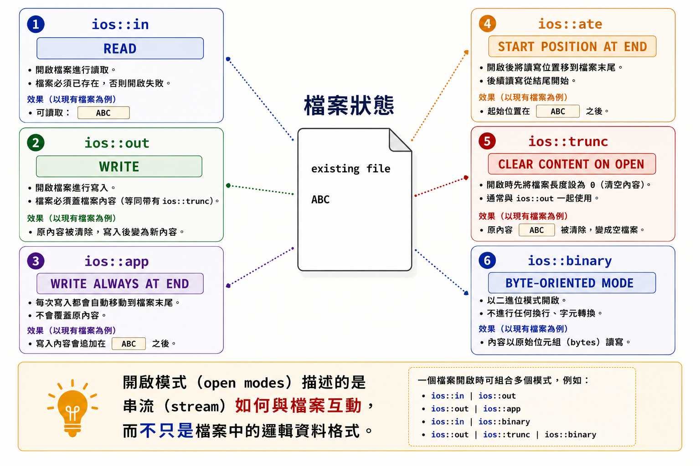

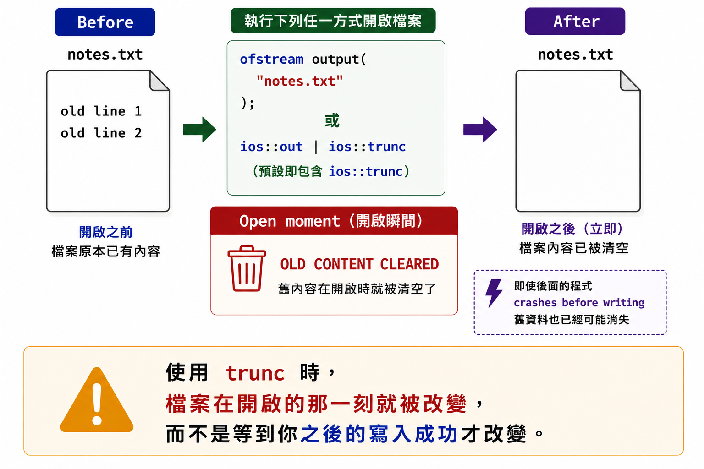

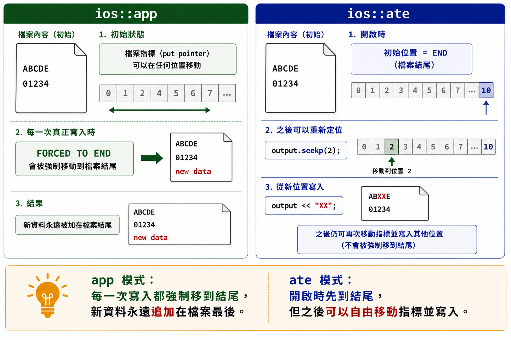
## Section XVII. 常見模式

| 模式 | 意義 |
| --- | --- |
| `ios::in` | 讀取 |
| `ios::out` | 寫入 |
| `ios::app` | 每次寫入都到尾端 |
| `ios::ate` | 開啟後先定位尾端 |
| `ios::trunc` | 開啟時清空 |
| `ios::binary` | 二進位模式 |

---

## Section XVIII. 組合模式

```cpp
ios::out |
ios::app
```

使用位元 OR。

---

## Section XIX. 完整 Append 範例

```cpp
// VALIDATE
#include <fstream>
#include <iostream>
#include <string>
using namespace std;

int main() {
    const string path =
        "lesson29_log.txt";

    {
        ofstream output(
            path,
            ios::out |
                ios::trunc
        );

        if (!output) {
            return 1;
        }

        output << "Program started\n";
    }

    {
        ofstream output(
            path,
            ios::out |
                ios::app
        );

        if (!output) {
            return 1;
        }

        output << "Program finished\n";
    }

    ifstream input(path);

    string line;

    while (
        getline(
            input,
            line
        )
    ) {
        cout << line
             << '\n';
    }

    return 0;
}
```

---

# Part G：`fstream` 同時讀寫

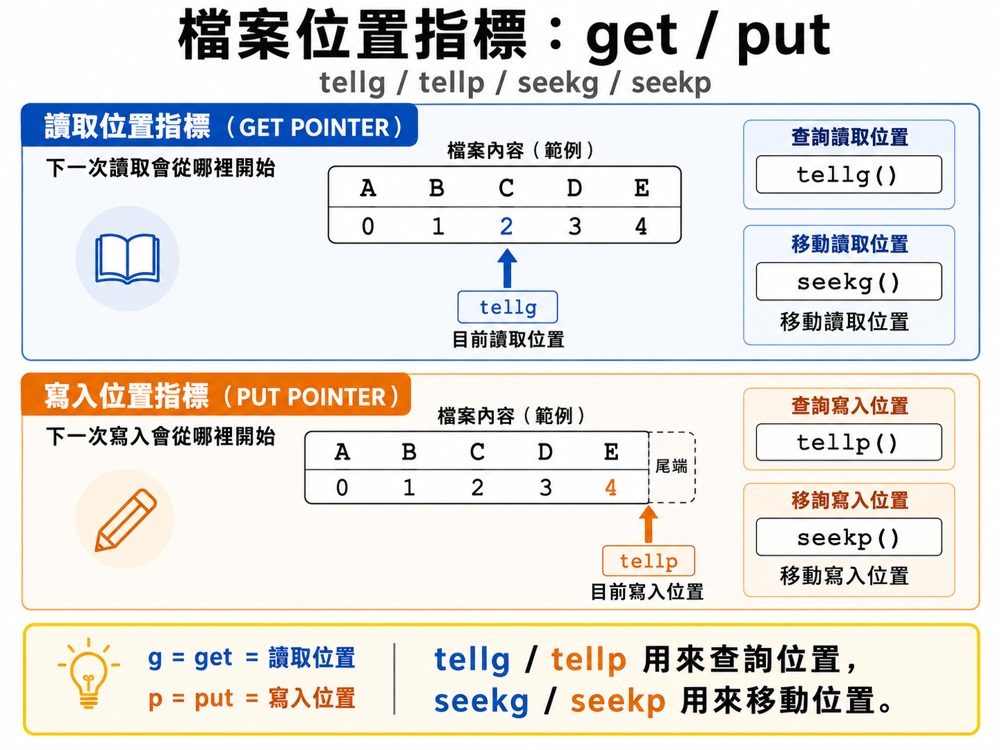
## Section XX. 基本形式

```cpp
fstream file(
    path,
    ios::in |
        ios::out
);
```

若檔案不存在，實際建立行為取決於模式組合。

需要清楚設計檔案是否應預先存在。

---

## Section XXI. Get Pointer 與 Put Pointer

- Get pointer：下一次讀取位置。
- Put pointer：下一次寫入位置。

可分別使用：

```cpp
seekg()
seekp()
```

---

## Section XXII. 完整讀寫範例

```cpp
// VALIDATE
#include <fstream>
#include <iostream>
#include <string>
using namespace std;

int main() {
    const string path =
        "lesson29_read_write.txt";

    {
        ofstream createFile(path);

        if (!createFile) {
            return 1;
        }

        createFile << "ABCDE";
    }

    fstream file(
        path,
        ios::in |
            ios::out
    );

    if (!file) {
        return 1;
    }

    file.seekp(
        2,
        ios::beg
    );

    file.put('X');

    file.flush();

    file.seekg(
        0,
        ios::beg
    );

    string content;

    getline(
        file,
        content
    );

    cout << content
         << '\n';

    return 0;
}
```

輸出：

```text
ABXDE
```

---

# Part H：Stream 狀態

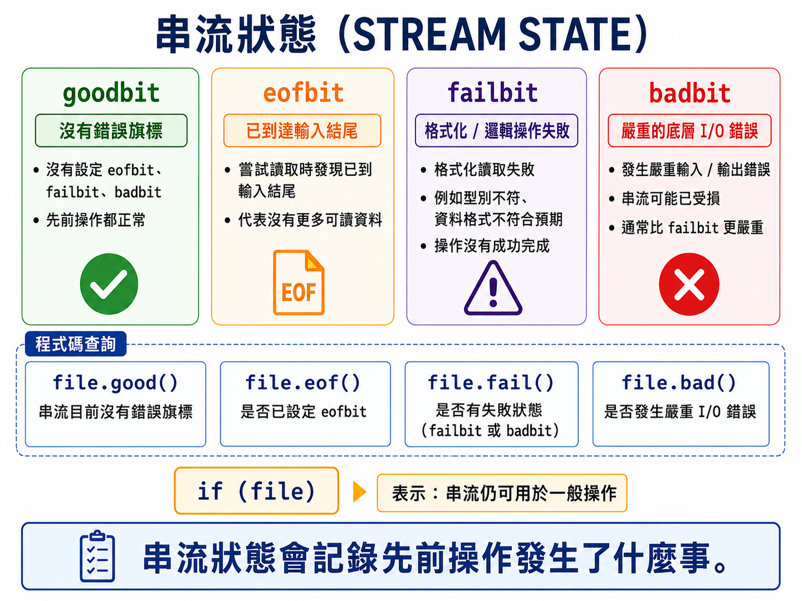

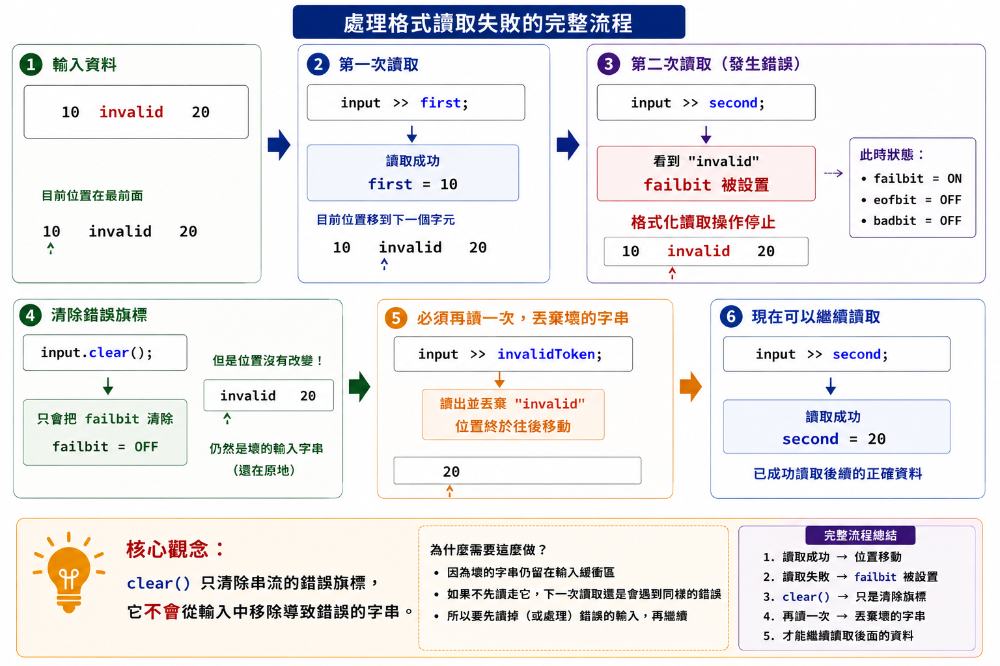
## Section XXIII. 四種狀態旗標

- `goodbit`：沒有錯誤。
- `eofbit`：到達輸入結尾。
- `failbit`：格式化讀取或操作失敗。
- `badbit`：嚴重底層錯誤。

---

## Section XXIV. 常見查詢

```cpp
file.good()
file.eof()
file.fail()
file.bad()
```

一般成功判斷常直接使用：

```cpp
if (file)
```

---

## Section XXV. 清除狀態

```cpp
file.clear();
```

只清除狀態旗標，不會自動移動檔案位置，也不會修正外部檔案內容。

---

## Section XXVI. 完整恢復讀取

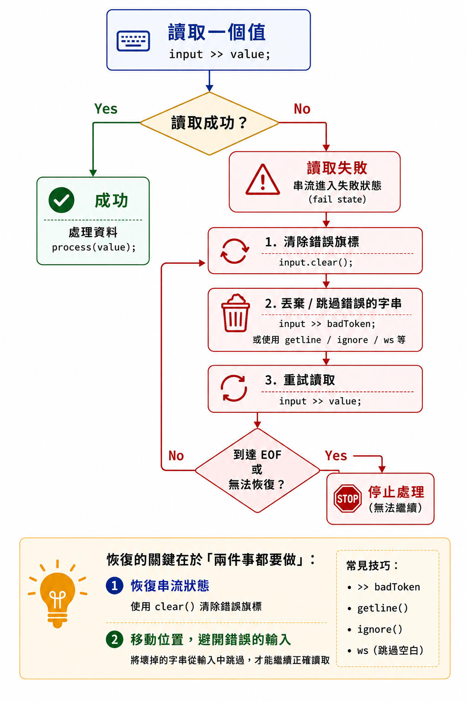
```cpp
// VALIDATE
#include <fstream>
#include <iostream>
#include <string>
using namespace std;

int main() {
    const string path =
        "lesson29_recover.txt";

    {
        ofstream output(path);

        if (!output) {
            return 1;
        }

        output << "10 invalid 20\n";
    }

    ifstream input(path);

    if (!input) {
        return 1;
    }

    int first = 0;
    int second = 0;

    input >> first;

    if (!(input >> second)) {
        input.clear();

        string invalidToken;
        input >> invalidToken;

        input >> second;
    }

    cout << first
         << " "
         << second
         << '\n';

    return 0;
}
```

---

# Part I：Stream Exceptions

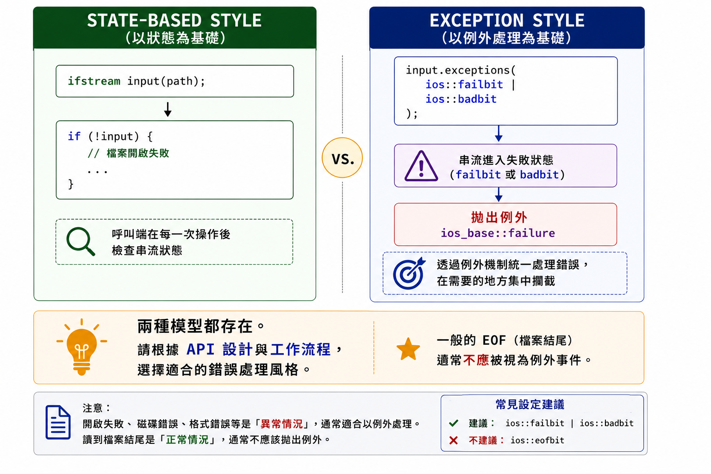


## Section XXVII. 啟用例外

```cpp
file.exceptions(
    ios::failbit |
    ios::badbit
);
```

指定狀態發生時會丟出：

```cpp
ios_base::failure
```

---

## Section XXVIII. 使用時機

適合：

- 無法繼續時。
- 希望集中錯誤處理。
- API 已採用例外設計。

不適合：

- EOF 是正常流程。
- 每次解析失敗都要自行恢復。
- 呼叫端預期用狀態處理。

---

## Section XXIX. 完整 Exception Mask

```cpp
// VALIDATE
#include <fstream>
#include <iostream>
#include <ios>
#include <string>
using namespace std;

int main() {
    const string path =
        "lesson29_exception_mask.txt";

    {
        ofstream output(path);

        if (!output) {
            return 1;
        }

        output << "42\n";
    }

    try {
        ifstream input;

        input.exceptions(
            ios::failbit |
            ios::badbit
        );

        input.open(path);

        int value = 0;
        input >> value;

        cout << value
             << '\n';
    } catch (
        const ios_base::failure& error
    ) {
        cerr << error.what()
             << '\n';

        return 1;
    }

    return 0;
}
```

---

# Part J：Parser 接收 `istream&`

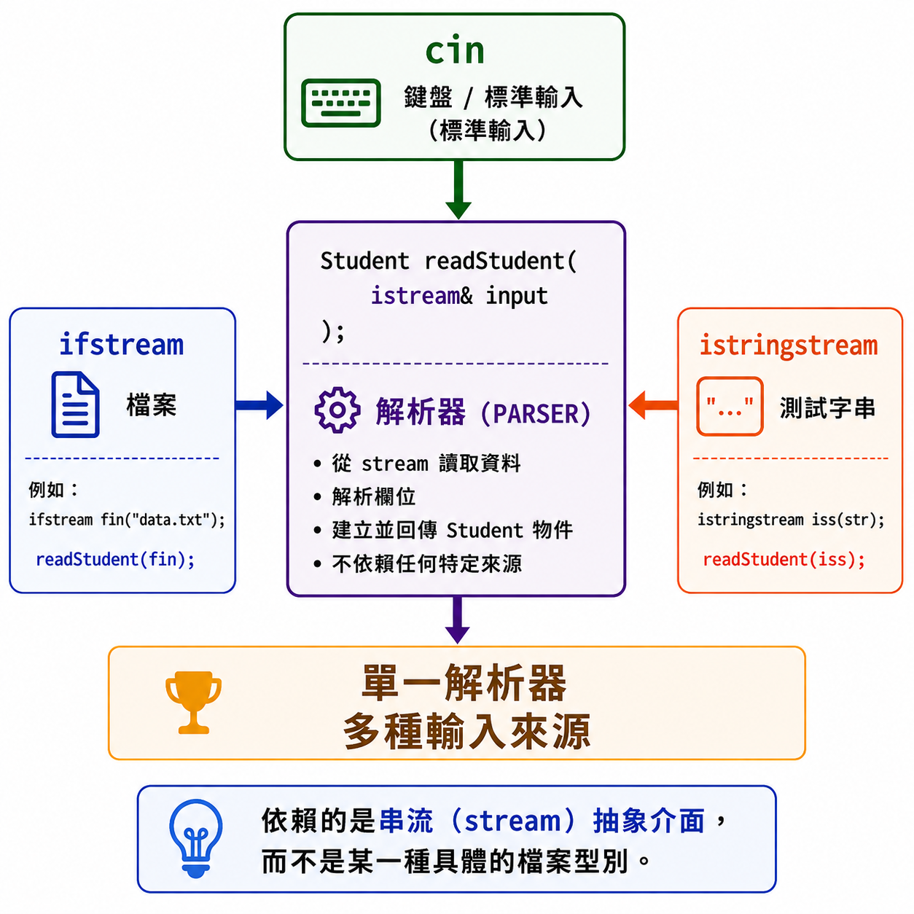
## Section XXX. 不綁定檔案

```cpp
Student readStudent(
    istream& input
);
```

可傳入：

- `ifstream`
- `istringstream`
- `cin`

---

## Section XXXI. 完整可測試 Parser

```cpp
// VALIDATE
#include <iostream>
#include <sstream>
#include <stdexcept>
#include <string>
using namespace std;

struct Student {
    string name;
    int score;
};

Student readStudent(
    istream& input
) {
    Student student;

    if (
        !(input >>
          student.name >>
          student.score)
    ) {
        throw runtime_error(
            "Invalid student record."
        );
    }

    return student;
}

int main() {
    istringstream input(
        "Amy 95"
    );

    try {
        Student student =
            readStudent(input);

        cout << student.name
             << " "
             << student.score
             << '\n';
    } catch (
        const exception& error
    ) {
        cerr << error.what()
             << '\n';

        return 1;
    }

    return 0;
}
```

---

# Part K：Writer 接收 `ostream&`

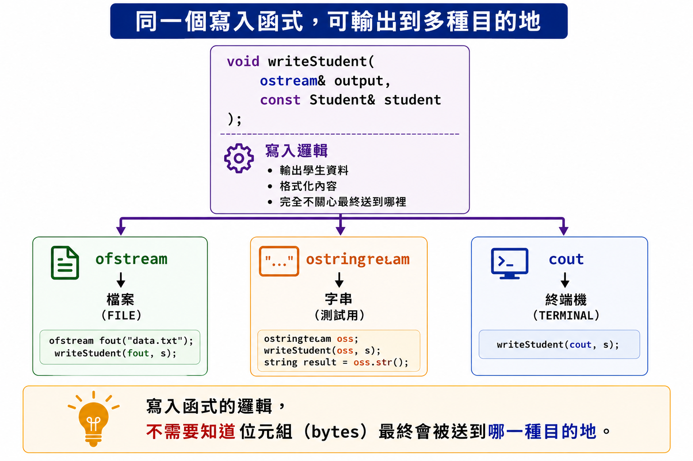
## Section XXXII. 可重用輸出

```cpp
void writeStudent(
    ostream& output,
    const Student& student
);
```

可寫到：

- `ofstream`
- `ostringstream`
- `cout`

---

## Section XXXIII. 完整 Writer

```cpp
// VALIDATE
#include <iostream>
#include <sstream>
#include <string>
using namespace std;

struct Student {
    string name;
    int score;
};

void writeStudent(
    ostream& output,
    const Student& student
) {
    output << student.name
           << ","
           << student.score
           << '\n';
}

int main() {
    Student student{
        "Amy",
        95
    };

    ostringstream output;

    writeStudent(
        output,
        student
    );

    cout << output.str();

    return 0;
}
```

---

# Part L：簡化 CSV

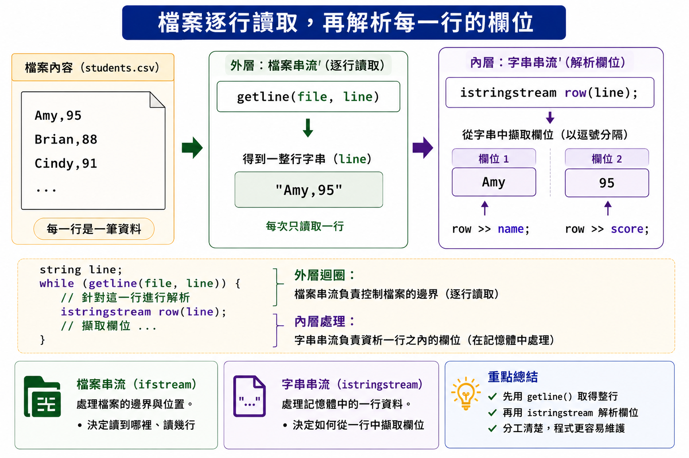

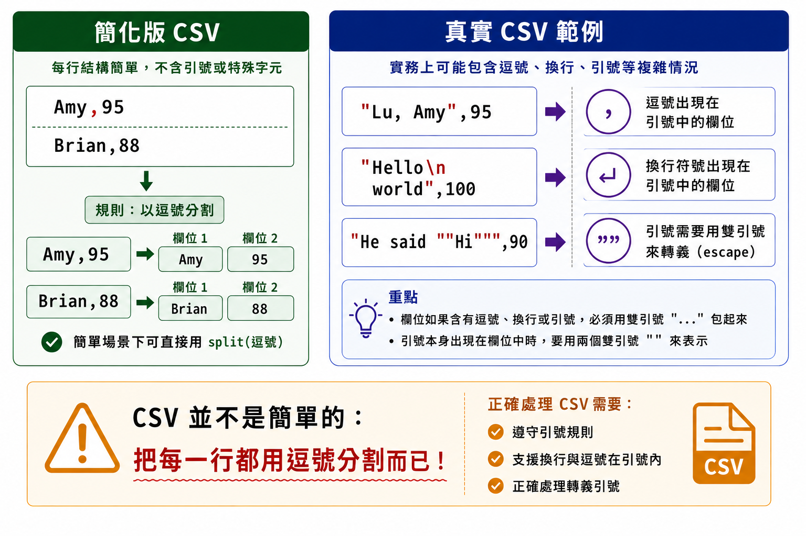
## Section XXXIV. 簡化假設

本章範例假設：

- 欄位內不含逗號。
- 欄位內不含換行。
- 不處理雙引號跳脫。
- 每列欄位數固定。

真正 CSV 需要更完整 parser 或函式庫。

---

## Section XXXV. 使用 `getline()` 指定分隔符

```cpp
getline(
    stream,
    field,
    ','
);
```

---

## Section XXXVI. 完整簡化 CSV 解析

```cpp
// VALIDATE
#include <iostream>
#include <sstream>
#include <stdexcept>
#include <string>
using namespace std;

struct Student {
    string name;
    int score;
};

Student parseStudentCsv(
    const string& line
) {
    istringstream input(line);

    Student student;
    string scoreText;

    if (
        !getline(
            input,
            student.name,
            ','
        ) ||
        !getline(
            input,
            scoreText
        )
    ) {
        throw runtime_error(
            "Invalid CSV row."
        );
    }

    size_t processed = 0;

    student.score =
        stoi(
            scoreText,
            &processed
        );

    if (
        processed !=
        scoreText.size()
    ) {
        throw runtime_error(
            "Invalid score field."
        );
    }

    return student;
}

int main() {
    try {
        Student student =
            parseStudentCsv(
                "Amy,95"
            );

        cout << student.name
             << " "
             << student.score
             << '\n';
    } catch (
        const exception& error
    ) {
        cerr << error.what()
             << '\n';

        return 1;
    }

    return 0;
}
```

---

# Part M：逐行解析與行號

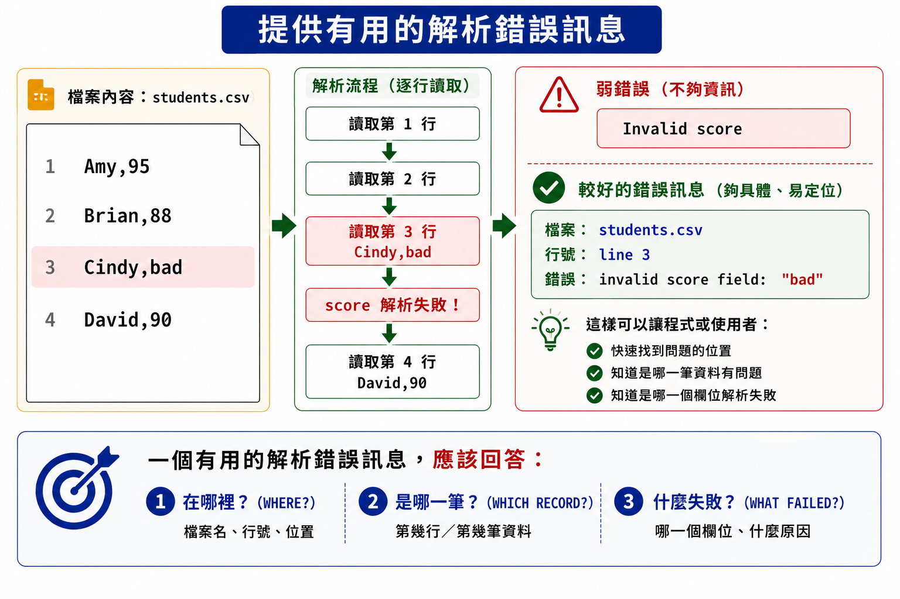
## Section XXXVII. 錯誤上下文

解析整份檔案時應記錄：

- 路徑。
- 行號。
- 原始欄位。
- 錯誤類別。

---

## Section XXXVIII. 空行策略

可選擇：

- 忽略空行。
- 視為錯誤。
- 保留為空紀錄。

必須明確一致。

---

# Part N：檔案位置

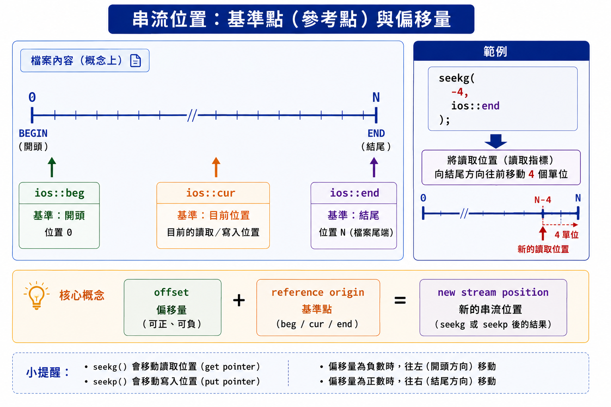
## Section XXXIX. `tellg()` 與 `tellp()`

```cpp
auto readPosition =
    input.tellg();

auto writePosition =
    output.tellp();
```

回傳 stream position type，不一定是一般 `int`。

---

## Section XL. `seekg()` 與 `seekp()`

```cpp
file.seekg(
    offset,
    ios::beg
);

file.seekp(
    offset,
    ios::end
);
```

---

## Section XLI. 完整檔案大小概念

```cpp
// VALIDATE
#include <fstream>
#include <iostream>
#include <string>
using namespace std;

int main() {
    const string path =
        "lesson29_size.txt";

    {
        ofstream output(
            path,
            ios::binary
        );

        if (!output) {
            return 1;
        }

        output << "1234567890";
    }

    ifstream input(
        path,
        ios::binary
    );

    if (!input) {
        return 1;
    }

    input.seekg(
        0,
        ios::end
    );

    const streampos size =
        input.tellg();

    cout << size
         << '\n';

    return 0;
}
```

---

# Part O：二進位檔案

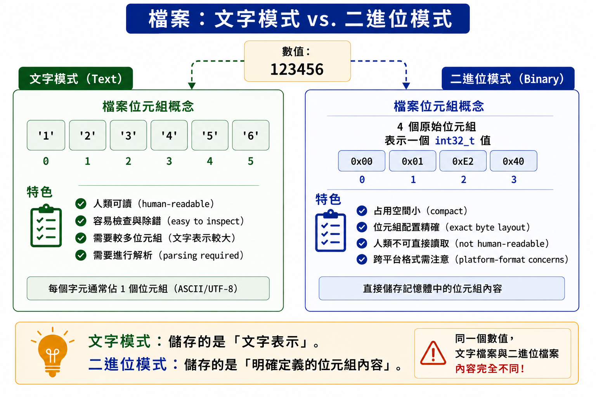

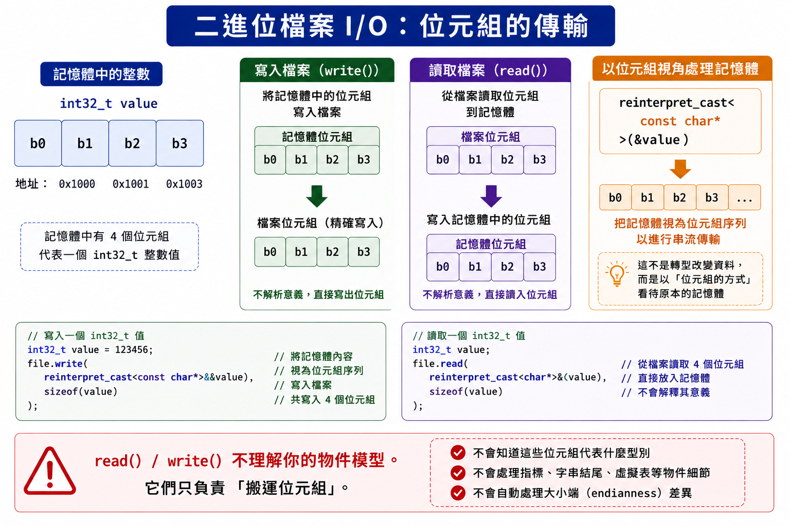

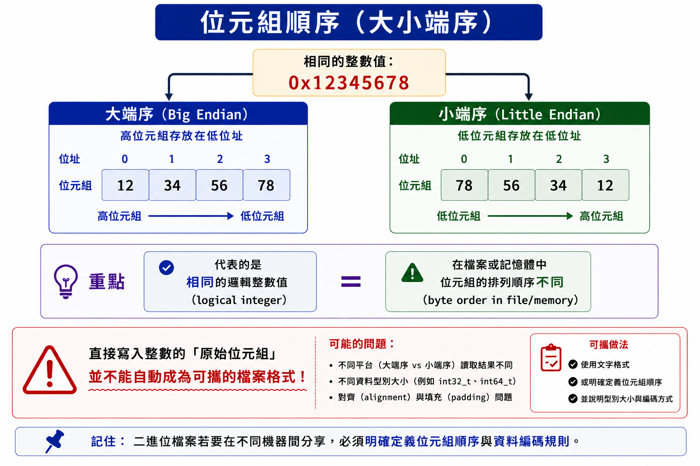
## Section XLII. Binary Mode

```cpp
ofstream output(
    path,
    ios::binary
);
```

避免文字模式可能進行的行尾或特殊字元轉換。

---

## Section XLIII. `write()`

```cpp
output.write(
    reinterpret_cast<
        const char*
    >(&value),
    static_cast<
        streamsize
    >(sizeof(value))
);
```

---

## Section XLIV. `read()`

```cpp
input.read(
    reinterpret_cast<
        char*
    >(&value),
    static_cast<
        streamsize
    >(sizeof(value))
);
```

---

## Section XLV. 完整固定寬度整數

```cpp
// VALIDATE
#include <cstdint>
#include <fstream>
#include <iostream>
#include <string>
using namespace std;

int main() {
    const string path =
        "lesson29_integer.bin";

    const int32_t originalValue =
        123456;

    {
        ofstream output(
            path,
            ios::binary |
                ios::trunc
        );

        if (!output) {
            return 1;
        }

        output.write(
            reinterpret_cast<
                const char*
            >(&originalValue),
            static_cast<
                streamsize
            >(
                sizeof(
                    originalValue
                )
            )
        );

        if (!output) {
            return 1;
        }
    }

    int32_t loadedValue = 0;

    {
        ifstream input(
            path,
            ios::binary
        );

        if (!input) {
            return 1;
        }

        input.read(
            reinterpret_cast<
                char*
            >(&loadedValue),
            static_cast<
                streamsize
            >(
                sizeof(
                    loadedValue
                )
            )
        );

        if (!input) {
            return 1;
        }
    }

    cout << loadedValue
         << '\n';

    return 0;
}
```

此格式仍受 endianness 影響，不是完整跨平台格式。

---

# Part P：不要直接傾倒複雜 Struct

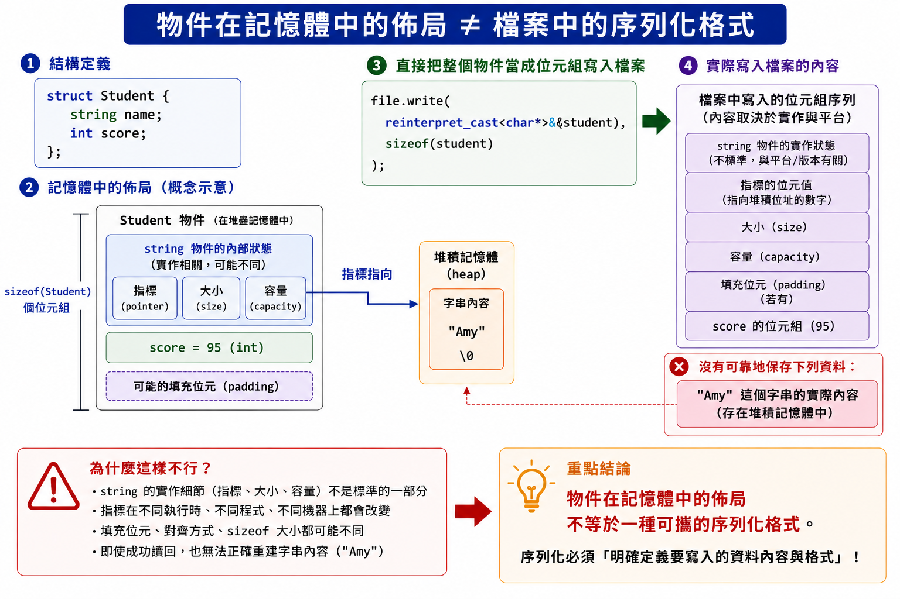

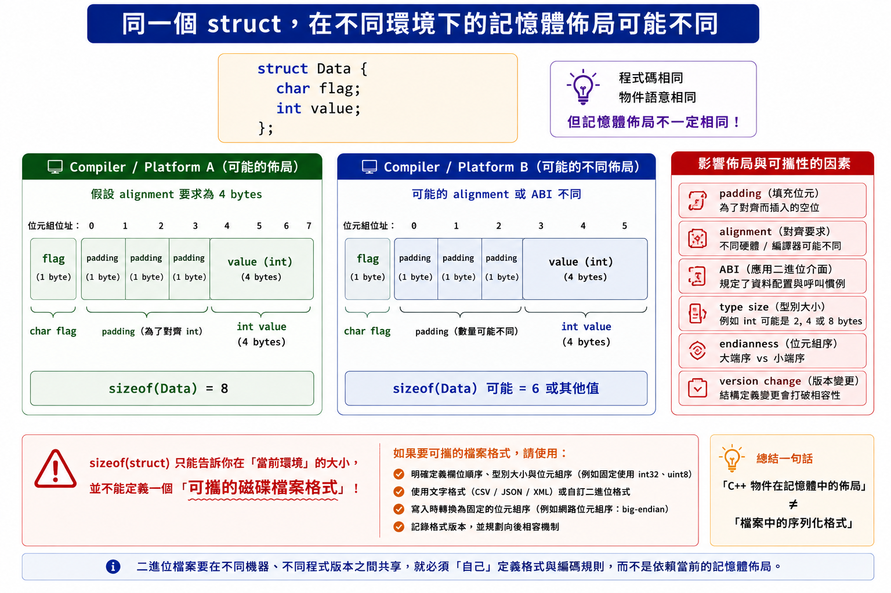
## Section XLVI. 危險範例

```cpp
struct Student {
    string name;
    int score;
};

/* output.write(
    reinterpret_cast<
        const char*
    >(&student),
    sizeof(student)
); */
```

`string` 內含內部指標與管理狀態。

寫出的只是實作細節，不是字串內容。

---

## Section XLVII. 其他問題

直接寫 struct 還可能受到：

- Padding。
- Alignment。
- Compiler ABI。
- Endianness。
- 型別大小。
- 版本變更。

應逐欄位定義格式。

---

# Part Q：長度前綴字串

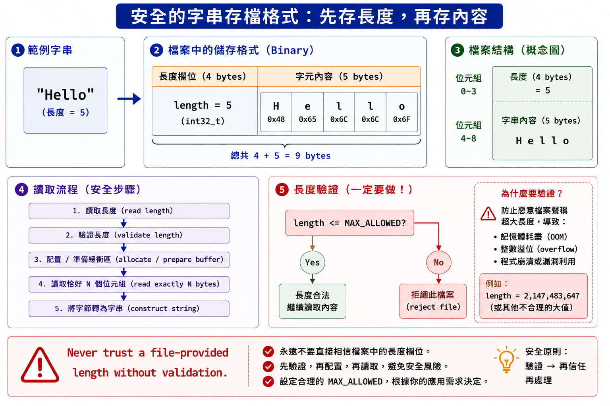

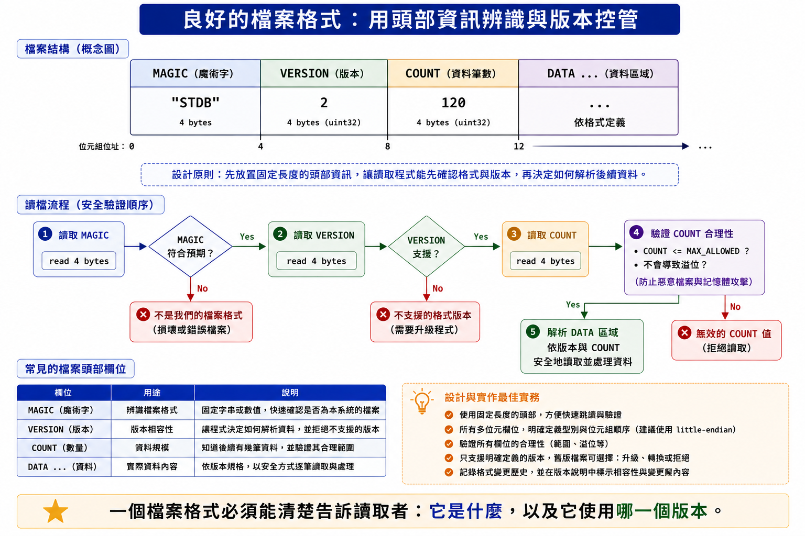
## Section XLVIII. 格式概念

```text
4-byte length
N bytes string data
```

讀取時先驗證長度，避免不合理配置。

---

## Section XLIX. 安全限制

必須設定最大允許長度：

```text
例如不得超過 1 MB
```

不要完全信任檔案中的長度欄位。

---

# Part R：`std::filesystem::path`

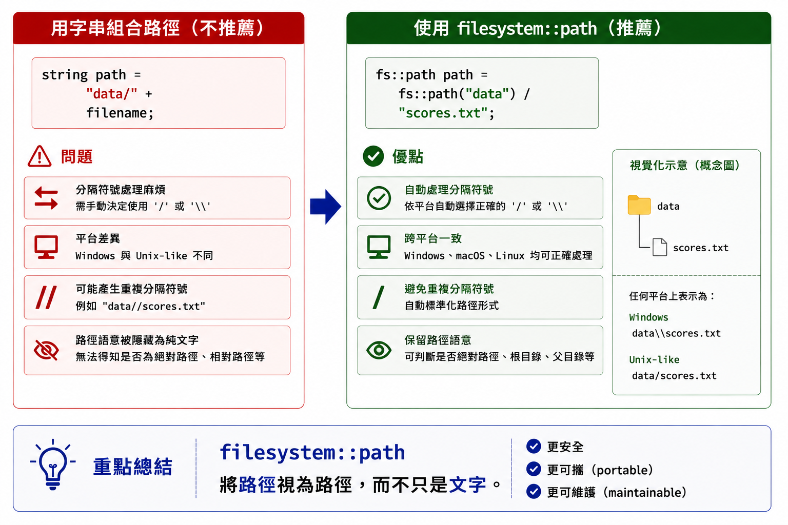
## Section L. 平台相容路徑

```cpp
filesystem::path path =
    "data";

path /=
    "scores.txt";
```

更常使用：

```cpp
filesystem::path path =
    filesystem::path("data") /
    "scores.txt";
```

---

## Section LI. 完整路徑組合

```cpp
// VALIDATE
#include <filesystem>
#include <fstream>
#include <iostream>
namespace fs = std::filesystem;
using namespace std;

int main() {
    const fs::path directory =
        "lesson29_data";

    const fs::path filePath =
        directory /
        "scores.txt";

    fs::create_directories(
        directory
    );

    ofstream output(filePath);

    if (!output) {
        return 1;
    }

    output << "Amy 95\n";
    output.close();

    cout << boolalpha
         << fs::exists(filePath)
         << " "
         << fs::is_regular_file(
                filePath
            )
         << '\n';

    return 0;
}
```

---

# Part S：相對與絕對路徑

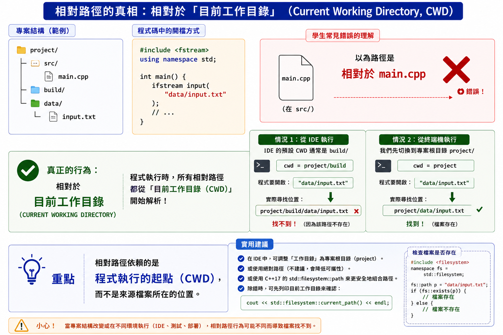

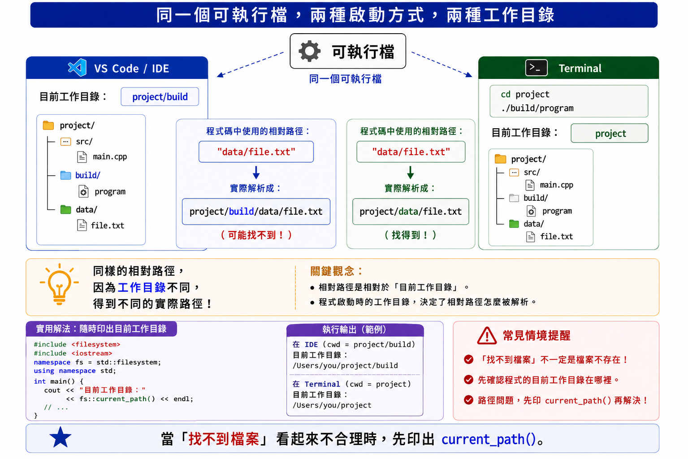
## Section LII. 相對路徑

```cpp
"data/scores.txt"
```

相對於程式執行時的 current working directory，不一定是來源碼所在目錄。

---

## Section LIII. 查看目前工作目錄

```cpp
filesystem::current_path()
```

---

## Section LIV. 完整路徑資訊

```cpp
// VALIDATE
#include <filesystem>
#include <iostream>
namespace fs = std::filesystem;
using namespace std;

int main() {
    const fs::path relativePath =
        "lesson29_example.txt";

    cout << fs::current_path()
         << '\n';

    cout << fs::absolute(
                relativePath
            )
         << '\n';

    return 0;
}
```

---

# Part T：檔案與目錄資訊

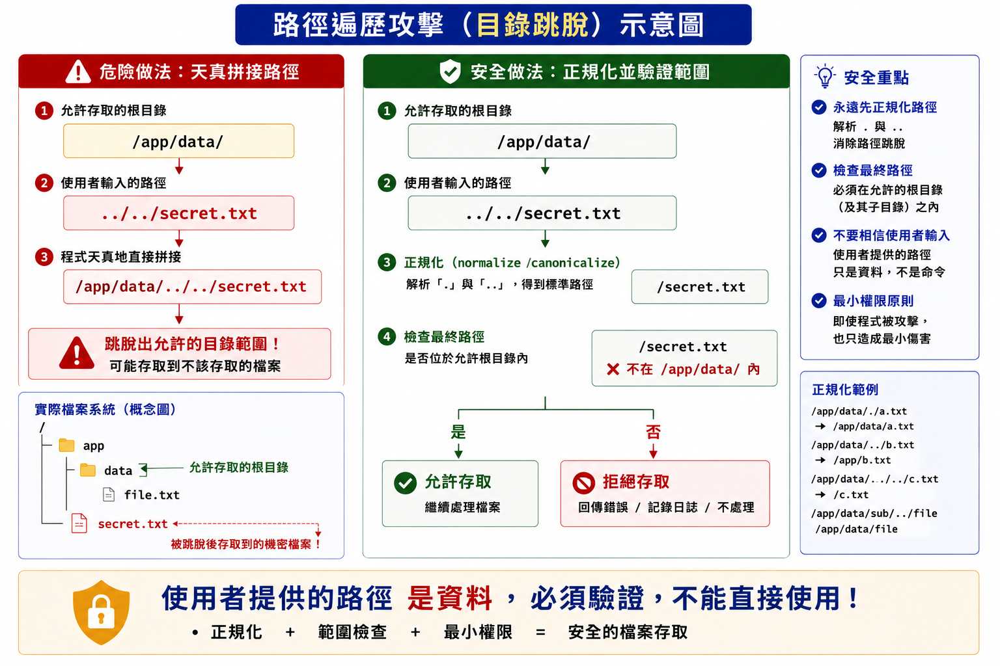
## Section LV. 常用操作

```cpp
exists(path)
is_regular_file(path)
is_directory(path)
file_size(path)
```

Filesystem 函式可能拋出：

```cpp
filesystem_error
```

也常提供 `error_code` overload。

---

## Section LVI. 完整檔案大小

```cpp
// VALIDATE
#include <filesystem>
#include <fstream>
#include <iostream>
namespace fs = std::filesystem;
using namespace std;

int main() {
    const fs::path path =
        "lesson29_file_size.txt";

    {
        ofstream output(
            path,
            ios::binary
        );

        if (!output) {
            return 1;
        }

        output << "12345";
    }

    if (
        fs::exists(path) &&
        fs::is_regular_file(path)
    ) {
        cout << fs::file_size(
                    path
                )
             << '\n';
    }

    return 0;
}
```

---

# Part U：目錄走訪

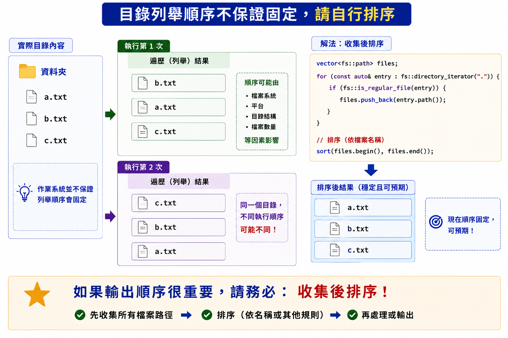
## Section LVII. `directory_iterator`

```cpp
for (
    const auto& entry :
    filesystem::directory_iterator(
        directory
    )
)
```

走訪順序沒有保證。

---

## Section LVIII. 完整目錄走訪

```cpp
// VALIDATE
#include <filesystem>
#include <fstream>
#include <iostream>
namespace fs = std::filesystem;
using namespace std;

int main() {
    const fs::path directory =
        "lesson29_directory";

    fs::create_directories(
        directory
    );

    {
        ofstream first(
            directory /
            "a.txt"
        );

        ofstream second(
            directory /
            "b.txt"
        );

        if (!first || !second) {
            return 1;
        }

        first << "A";
        second << "B";
    }

    int regularFileCount = 0;

    for (
        const fs::directory_entry& entry :
        fs::directory_iterator(
            directory
        )
    ) {
        if (
            entry.is_regular_file()
        ) {
            ++regularFileCount;
        }
    }

    cout << regularFileCount
         << '\n';

    return 0;
}
```

---

# Part V：安全覆寫概念

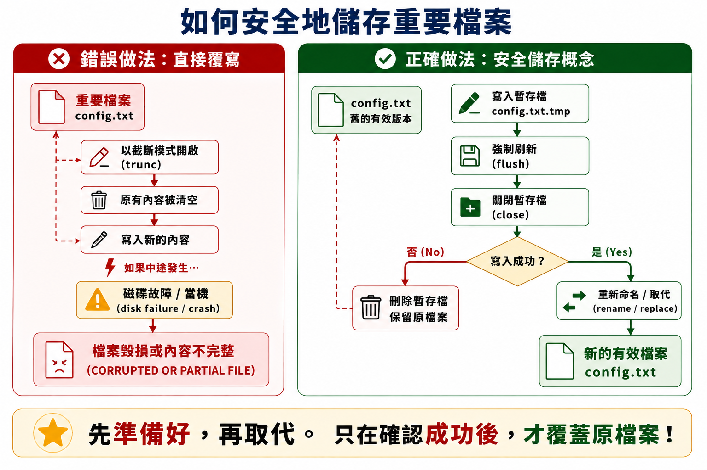

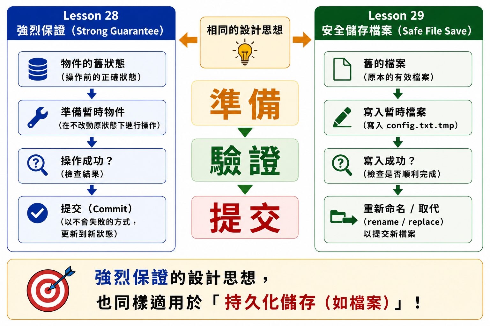

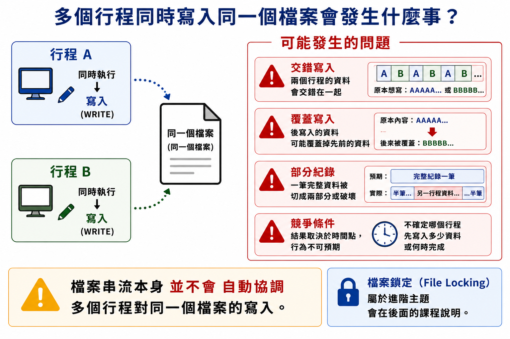
## Section LIX. 直接覆寫風險

```cpp
ofstream output(
    path,
    ios::trunc
);
```

開啟成功時舊內容就可能被清除。

若後續寫入中途失敗，檔案可能只剩部分內容。

---

## Section LX. 暫存檔策略

1. 寫入同目錄的暫存檔。
2. 檢查所有寫入。
3. Flush 與 close。
4. 必要時建立備份。
5. Rename 暫存檔成正式檔。

真正原子性與跨平台行為需依作業系統與檔案系統驗證。

---

## Section LXI. 完整簡化安全儲存

```cpp
// VALIDATE
#include <filesystem>
#include <fstream>
#include <iostream>
#include <string>
namespace fs = std::filesystem;
using namespace std;

bool saveTextSafely(
    const fs::path& target,
    const string& content
) {
    const fs::path temporary =
        target.string() +
        ".tmp";

    {
        ofstream output(
            temporary,
            ios::out |
                ios::trunc
        );

        if (!output) {
            return false;
        }

        output << content;
        output.flush();

        if (!output) {
            return false;
        }
    }

    error_code error;

    fs::remove(
        target,
        error
    );

    error.clear();

    fs::rename(
        temporary,
        target,
        error
    );

    if (error) {
        fs::remove(
            temporary,
            error
        );

        return false;
    }

    return true;
}

int main() {
    const fs::path path =
        "lesson29_safe_save.txt";

    cout << boolalpha
         << saveTextSafely(
                path,
                "Important content\n"
            )
         << '\n';

    return 0;
}
```

這是教學用簡化版本；生產環境還需考慮備份、權限與原子替換語意。

---

# Part W：Append Log

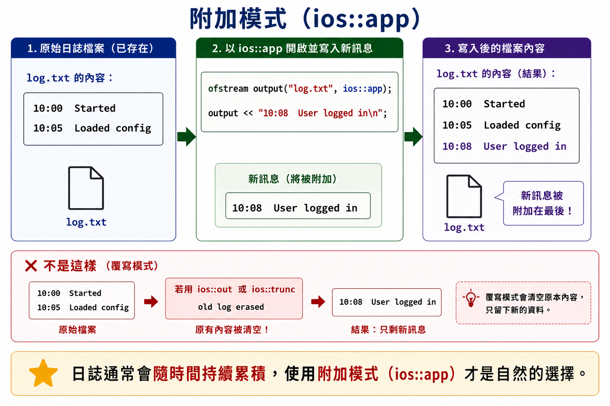

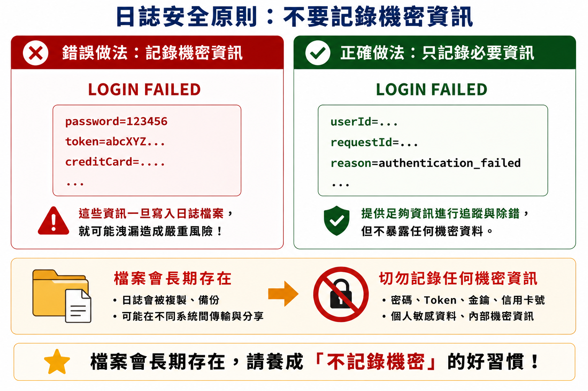
## Section LXII. 日誌通常附加

```cpp
ofstream log(
    path,
    ios::app
);
```

不要每次開啟都 trunc。

---

## Section LXIII. 敏感資料

日誌不要記錄：

- 密碼。
- Token。
- 完整身分證件資訊。
- 不必要的私人內容。
- 未遮罩付款資料。

---

## Section LXIV. 完整簡單 Log

```cpp
// VALIDATE
#include <fstream>
#include <iostream>
#include <string>
using namespace std;

bool appendLog(
    const string& path,
    const string& message
) {
    ofstream output(
        path,
        ios::out |
            ios::app
    );

    if (!output) {
        return false;
    }

    output << message
           << '\n';

    return
        static_cast<bool>(
            output
        );
}

int main() {
    const string path =
        "lesson29_application.log";

    if (
        !appendLog(
            path,
            "Application started"
        )
    ) {
        cerr << "Unable to write log.\n";
        return 1;
    }

    cout << "Log written\n";

    return 0;
}
```

---

# Part X：檔案複製

## Section LXV. `filesystem::copy_file()`

```cpp
filesystem::copy_file(
    source,
    destination,
    copy_options::overwrite_existing
);
```

---

## Section LXVI. Error Code 版本

```cpp
error_code error;

copy_file(
    source,
    destination,
    options,
    error
);
```

適合不希望使用例外的流程。

---

# Part Y：Stream 不可複製

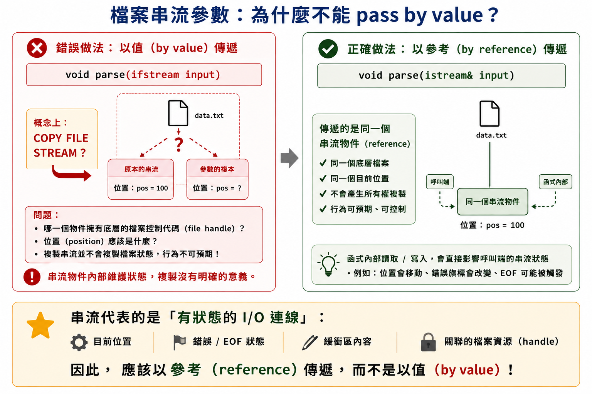
## Section LXVII. 不可按值傳遞

不應：

```cpp
/* void process(
    ifstream input
); */
```

Stream 通常不可複製。

---

## Section LXVIII. 使用參考

```cpp
void process(
    istream& input
);
```

也能提高可測試性。

---

# Part Z：Shell Redirection

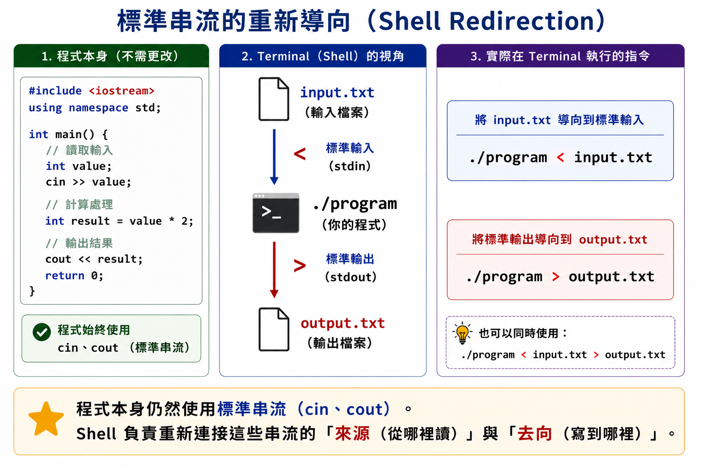
## Section LXIX. 標準輸入重導向

程式使用：

```cpp
cin
```

終端可：

```text
./program < input.txt
```

---

## Section LXX. 標準輸出重導向

程式使用：

```cpp
cout
```

終端可：

```text
./program > output.txt
```

---

## Section LXXI. 與直接 Fstream 的差異

Shell redirection：

- 程式不需知道檔名。
- 容易組合工具。
- 適合競程與命令列工具。

Fstream：

- 程式自行管理特定路徑。
- 可開啟多個檔案。
- 可控制模式與位置。
- 可讀寫應用程式資料。

---

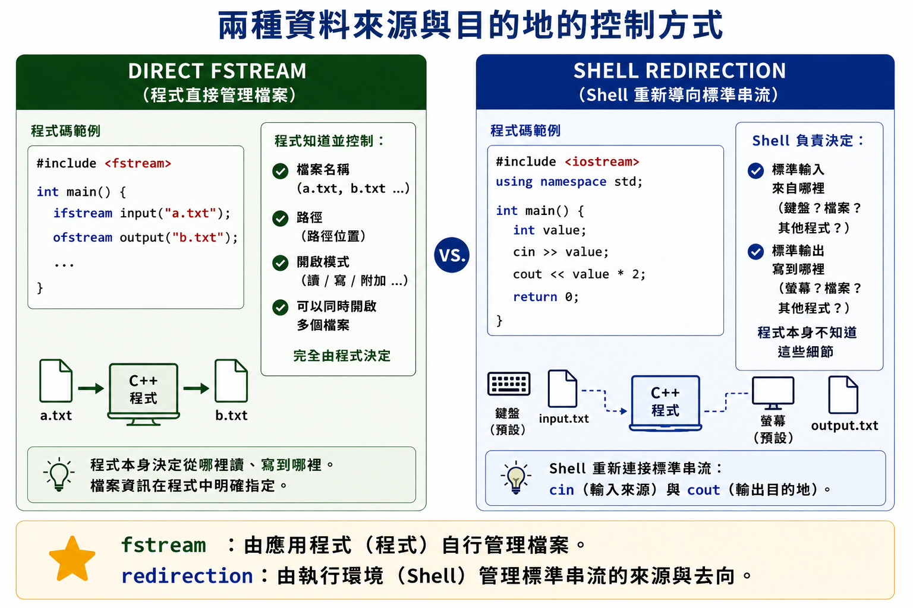
# Part AA：快速概念檢查

## Section LXXII. 選擇題與簡答

### Q1. `ifstream` 用來做什麼？

<details><summary>查看答案</summary>

從檔案讀取資料。

</details>

### Q2. `ofstream` 用來做什麼？

<details><summary>查看答案</summary>

把資料寫入檔案。

</details>

### Q3. `fstream` 有什麼用途？

<details><summary>查看答案</summary>

可依開啟模式同時支援檔案讀取與寫入。

</details>

### Q4. 檔案串流一定要手動 `close()` 嗎？

<details><summary>查看答案</summary>

一般不一定需要；物件解構時會自動關閉。若需要立即檢查關閉結果、重新開啟或確定寫入完成，可明確關閉。

</details>

### Q5. 為什麼不應使用 `while (!file.eof())`？

<details><summary>查看答案</summary>

EOF 通常在一次讀取失敗後才設定，可能多處理一筆舊資料。應直接以讀取操作作為迴圈條件。

</details>

### Q6. `ios::app` 有什麼作用？

<details><summary>查看答案</summary>

讓每次寫入都發生在檔案尾端。

</details>

### Q7. `ios::trunc` 有什麼作用？

<details><summary>查看答案</summary>

開啟檔案時清除原內容。

</details>

### Q8. `getline()` 與 `operator>>` 的主要差異？

<details><summary>查看答案</summary>

`getline()` 讀取整行並保留行內空格；`operator>>` 進行格式化讀取，通常跳過前導空白並在空白處停止字串讀取。

</details>

### Q9. `>>` 後接 `getline()` 常見問題如何處理？

<details><summary>查看答案</summary>

使用 `ignore()` 丟棄剩餘換行，或在適合忽略前導空白的情境使用 `ws`。

</details>

### Q10. `failbit` 代表什麼？

<details><summary>查看答案</summary>

格式化讀取或一般操作失敗，但不一定是嚴重底層錯誤。

</details>

### Q11. `badbit` 代表什麼？

<details><summary>查看答案</summary>

較嚴重的底層輸入輸出錯誤。

</details>

### Q12. `clear()` 會修復檔案內容嗎？

<details><summary>查看答案</summary>

不會，只清除 stream 狀態旗標。

</details>

### Q13. `tellg()` 取得什麼？

<details><summary>查看答案</summary>

目前讀取位置。

</details>

### Q14. `seekp()` 操作什麼？

<details><summary>查看答案</summary>

寫入位置。

</details>

### Q15. 為什麼二進位模式不能直接寫入含 `string` 的 struct？

<details><summary>查看答案</summary>

`string` 內含實作狀態與指標，直接寫入物件記憶體不會保存真正字串內容，也不具可攜性。

</details>

### Q16. `filesystem::path` 的優點？

<details><summary>查看答案</summary>

提供較平台相容的路徑表示與組合操作。

</details>

### Q17. 相對路徑以什麼為基準？

<details><summary>查看答案</summary>

程式執行時的 current working directory。

</details>

### Q18. 為什麼 parser 適合接收 `istream&`？

<details><summary>查看答案</summary>

同一 parser 可處理檔案、字串 stream 與標準輸入，也更容易測試。

</details>

### Q19. 安全覆寫的基本策略？

<details><summary>查看答案</summary>

先完整寫入暫存檔，確認成功後再替換正式檔案。

</details>

### Q20. Unordered 或 directory iteration 順序可依賴嗎？

<details><summary>查看答案</summary>

目錄走訪順序不應依賴；需要固定順序時應收集後自行排序。

</details>

---

# Part AB：程式閱讀練習

## Section LXXIII. 預測結果與合法性

### 題目 1

```cpp
ofstream output(
    "data.txt"
);

output << "A";
```

<details><summary>查看答案</summary>

通常建立或截斷 `data.txt`，然後寫入 `A`。實際是否成功仍需檢查 stream。

</details>

### 題目 2

```cpp
ofstream output(
    "data.txt",
    ios::app
);

output << "B";
```

<details><summary>查看答案</summary>

將 `B` 附加到檔案尾端，不清除舊內容。

</details>

### 題目 3

```cpp
istringstream input(
    "10 20 bad 30"
);

int value = 0;
int count = 0;

while (input >> value) {
    ++count;
}

cout << count;
```

<details><summary>查看答案</summary>

```text
2
```

讀到 `bad` 時格式化整數讀取失敗。

</details>

### 題目 4

```cpp
istringstream input(
    "10\nHello world\n"
);

int number = 0;
string line;

input >> number;
getline(input, line);

cout << line.size();
```

<details><summary>查看答案</summary>

通常輸出：

```text
0
```

因為 `getline()` 讀取前一個 `>>` 留下的換行。

</details>

### 題目 5

```cpp
istringstream input(
    "1 2 3"
);

int value = 0;

while (!input.eof()) {
    input >> value;
    cout << value;
}
```

<details><summary>查看答案</summary>

這是錯誤模式，最後一次讀取失敗後仍可能輸出舊值，結果可能出現重複的 `3`。不應依賴。

</details>

### 題目 6

```cpp
istringstream input(
    "abc"
);

int value = 0;

input >> value;

cout << boolalpha
     << input.fail();
```

<details><summary>查看答案</summary>

```text
true
```

</details>

### 題目 7

```cpp
istringstream input(
    "abc 42"
);

int value = 0;

input >> value;
input.clear();

string token;
input >> token;
input >> value;

cout << value;
```

<details><summary>查看答案</summary>

```text
42
```

清除 fail 狀態後讀掉 `abc`，再讀取 42。

</details>

### 題目 8

```cpp
ostringstream output;

output << "Amy"
       << ","
       << 95;

cout << output.str();
```

<details><summary>查看答案</summary>

```text
Amy,95
```

</details>

### 題目 9

```cpp
filesystem::path path =
    filesystem::path(
        "data"
    ) /
    "scores.txt";

cout << path.filename();
```

<details><summary>查看答案</summary>

輸出檔名部分，通常為：

```text
"scores.txt"
```

Stream 顯示 filesystem path 時可能包含引號，依標準函式庫格式而定。

</details>

### 題目 10

```cpp
ifstream input(
    "missing.txt"
);

cout << boolalpha
     << static_cast<bool>(
            input
        );
```

<details><summary>查看答案</summary>

若檔案不存在且無法開啟，輸出：

```text
false
```

</details>

### 題目 11

```cpp
fstream file(
    "data.txt",
    ios::in |
        ios::out
);

file.seekp(
    0,
    ios::end
);
```

<details><summary>查看答案</summary>

將寫入位置移到檔案尾端。前提是檔案成功開啟。

</details>

### 題目 12

```cpp
struct Data {
    string text;
};

/* output.write(
    reinterpret_cast<
        const char*
    >(&data),
    sizeof(data)
); */
```

<details><summary>查看答案</summary>

語法可能編譯，但檔案不是有效、可攜的 `string` 序列化格式，不能用同樣方式安全還原。

</details>

---

# Part AC：實作練習

## Section LXXIV. 實作檢測題

### TODO 1：Write Text File

建立文字檔並寫入三行內容。

### TODO 2：Read Lines

逐行讀取檔案，輸出行號與內容。

### TODO 3：Sum Numbers

使用 `while (input >> value)` 計算檔案內所有整數總和。

### TODO 4：Mixed Input

先讀取整數筆數，再正確讀取多行完整文字。

### TODO 5：Append Log

以 `ios::app` 附加一筆日誌。

### TODO 6：Stream State Recovery

讀到錯誤 token 時清除狀態、略過 token 並繼續讀取。

### TODO 7：Reusable Parser

建立接受 `istream&` 的學生資料 parser。

### TODO 8：Reusable Writer

建立接受 `ostream&` 的學生資料 writer。

### TODO 9：Simple CSV

解析不含引號與內嵌逗號的 `name,score`。

### TODO 10：File Position

使用 `seekg()` 與 `tellg()` 取得二進位檔大小。

### TODO 11：Binary Integer

寫入並讀回一個 `int32_t`。

### TODO 12：Filesystem Path

建立目錄並使用 `/` 組合檔案路徑。

### TODO 13：Directory Listing

列出目錄中的 regular files，不依賴原始順序。

### TODO 14：Safe Save

先寫 `.tmp`，成功後再 rename 成正式檔。

### TODO 15：File Strategy

針對五種需求選擇文字／二進位、覆寫／附加、狀態檢查／例外。

---

# Part AD：課後小練習

## Section LXXV. 延伸練習

### 練習 1：Student Database File

使用文字格式保存多筆學生資料，載入時檢查行號、欄位與分數範圍。

### 練習 2：Versioned Binary Format

設計包含 magic number、版本號、筆數與固定寬度欄位的二進位格式。

### 練習 3：Word Frequency Report

讀取文字檔，統計單字頻率並將排序結果寫入另一檔案。

### 練習 4：Backup Save

覆寫正式檔前建立 `.bak`，失敗時保留原檔。

### 練習 5：Command-Line Filter

只使用 `cin` 與 `cout` 建立文字過濾器，再用 shell redirection 測試檔案輸入輸出。

---

# Part AE：常見錯誤提醒

## Section LXXVI. 常見錯誤

1. 開啟檔案後不檢查狀態。
2. 寫入完成後不檢查狀態。
3. 使用 `while (!eof())`。
4. `>>` 後直接 `getline()` 而未處理換行。
5. 不理解 `ws` 會跳過所有前導空白。
6. 無意間使用 `ios::trunc` 清除檔案。
7. 需要附加卻使用預設 `ofstream`。
8. 混淆 `ios::app` 與 `ios::ate`。
9. 假設相對路徑以來源碼目錄為基準。
10. 假設 IDE 與終端工作目錄相同。
11. 手動拼接 `/` 或 `\` 而不用 `filesystem::path`。
12. 對不存在目錄直接開啟內部檔案。
13. Stream fail 後不 `clear()` 就繼續讀取。
14. Clear 狀態後沒有略過造成錯誤的 token。
15. 解參考或使用失敗讀取後的舊資料。
16. 把簡化逗號切割誤當完整 CSV parser。
17. 沒有驗證每列欄位數。
18. 錯誤訊息沒有行號。
19. 直接寫入含 `string` 的 struct 記憶體。
20. 直接寫入指標值。
21. 忽略二進位格式 endianness。
22. 忽略 struct padding 與版本變更。
23. 使用 `sizeof` 建立不具可攜性的檔案協定。
24. 讀取檔案提供的長度後無上限配置記憶體。
25. 依賴 directory iterator 原始順序。
26. 直接覆寫重要檔案且沒有暫存檔策略。
27. 日誌中寫入密碼或 token。
28. 多個程序同時寫檔卻沒有同步設計。
29. 按值傳遞不可複製的 stream。
30. Parser 直接綁定 `ifstream`，導致難以測試與重用。

---

# Part AF：Mermaid 流程圖

## Section LXXVII. 檔案輸入輸出流程圖

### 1. 讀取文字檔

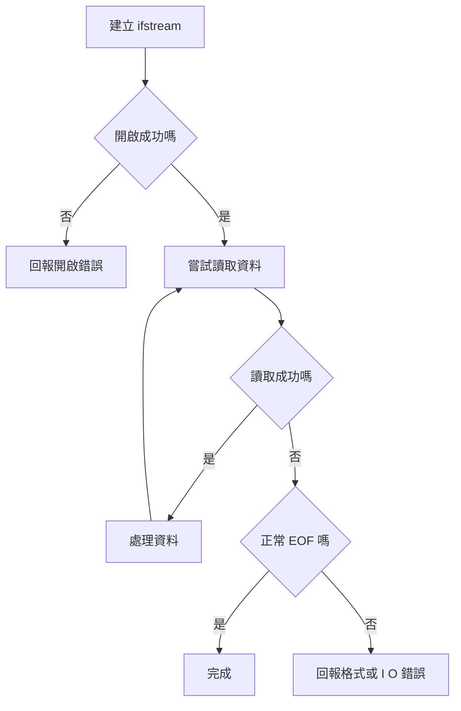
```mermaid
flowchart TD
    A[建立 ifstream] --> B{開啟成功嗎}
    B -- 否 --> C[回報開啟錯誤]
    B -- 是 --> D[嘗試讀取資料]
    D --> E{讀取成功嗎}
    E -- 是 --> F[處理資料]
    F --> D
    E -- 否 --> G{正常 EOF 嗎}
    G -- 是 --> H[完成]
    G -- 否 --> I[回報格式或 I O 錯誤]
```

### 2. 寫入文字檔

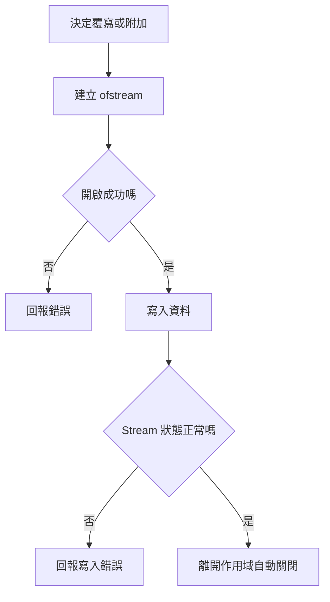
```mermaid
flowchart TD
    A[決定覆寫或附加] --> B[建立 ofstream]
    B --> C{開啟成功嗎}
    C -- 否 --> D[回報錯誤]
    C -- 是 --> E[寫入資料]
    E --> F{Stream 狀態正常嗎}
    F -- 否 --> G[回報寫入錯誤]
    F -- 是 --> H[離開作用域自動關閉]
```

### 3. 選擇讀取方式

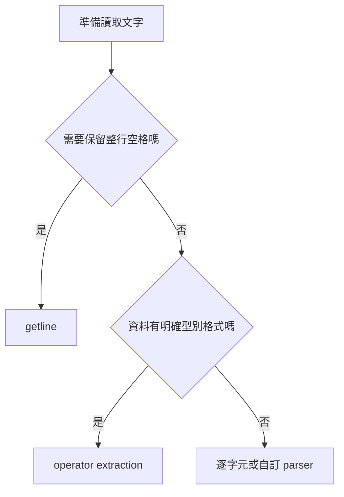
```mermaid
flowchart TD
    A[準備讀取文字] --> B{需要保留整行空格嗎}
    B -- 是 --> C[getline]
    B -- 否 --> D{資料有明確型別格式嗎}
    D -- 是 --> E[operator extraction]
    D -- 否 --> F[逐字元或自訂 parser]
```

### 4. Stream 失敗恢復

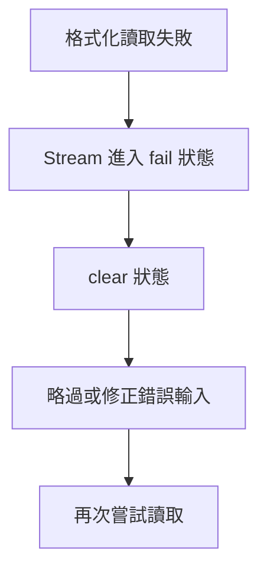
```mermaid
flowchart TD
    A[格式化讀取失敗] --> B[Stream 進入 fail 狀態]
    B --> C[clear 狀態]
    C --> D[略過或修正錯誤輸入]
    D --> E[再次嘗試讀取]
```

### 5. 安全覆寫

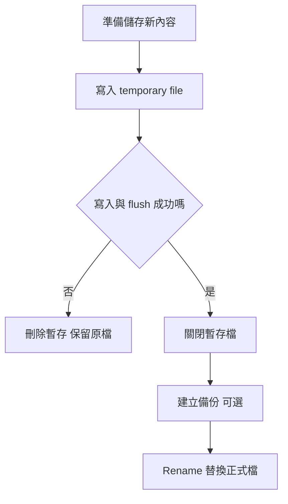
```mermaid
flowchart TD
    A[準備儲存新內容] --> B[寫入 temporary file]
    B --> C{寫入與 flush 成功嗎}
    C -- 否 --> D[刪除暫存 保留原檔]
    C -- 是 --> E[關閉暫存檔]
    E --> F[建立備份 可選]
    F --> G[Rename 替換正式檔]
```

### 6. 文字或二進位

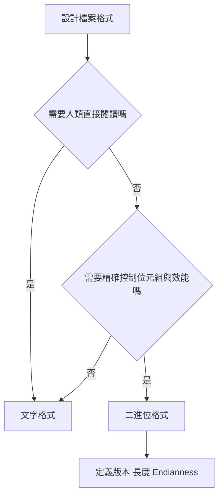
```mermaid
flowchart TD
    A[設計檔案格式] --> B{需要人類直接閱讀嗎}
    B -- 是 --> C[文字格式]
    B -- 否 --> D{需要精確控制位元組與效能嗎}
    D -- 是 --> E[二進位格式]
    D -- 否 --> C
    E --> F[定義版本 長度 Endianness]
```

### 7. 路徑處理

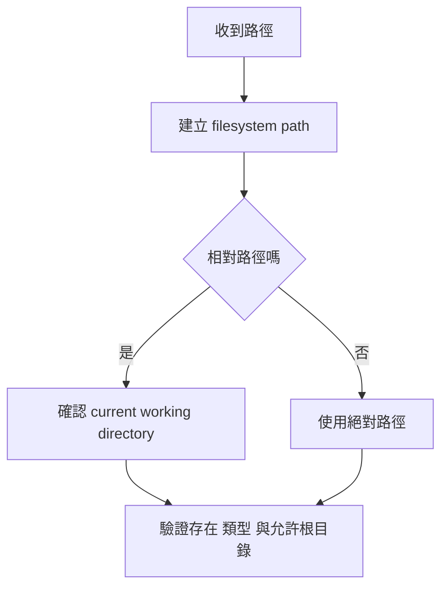
```mermaid
flowchart TD
    A[收到路徑] --> B[建立 filesystem path]
    B --> C{相對路徑嗎}
    C -- 是 --> D[確認 current working directory]
    C -- 否 --> E[使用絕對路徑]
    D --> F[驗證存在 類型 與允許根目錄]
    E --> F
```

### 8. Parser 可測試設計

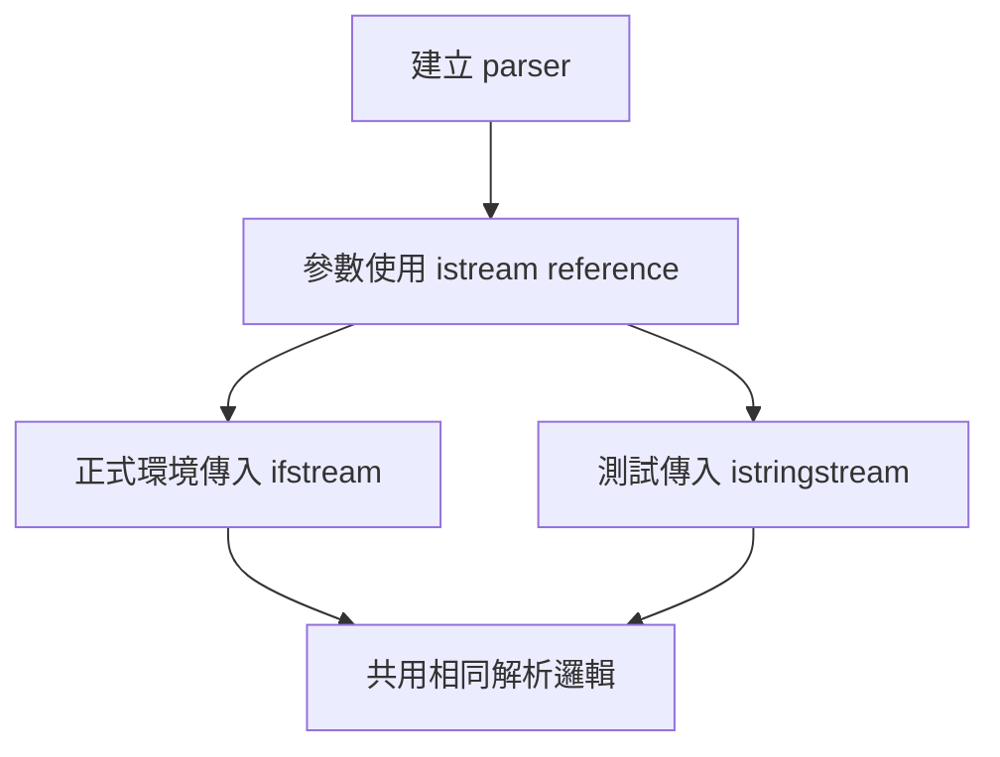
```mermaid
flowchart TD
    A[建立 parser] --> B[參數使用 istream reference]
    B --> C[正式環境傳入 ifstream]
    B --> D[測試傳入 istringstream]
    C --> E[共用相同解析邏輯]
    D --> E
```

---


# 本章完成標準

完成本章後，你應該能做到：

1. 說明檔案持久化。
2. 使用 `ifstream`。
3. 使用 `ofstream`。
4. 使用 `fstream`。
5. 檢查檔案開啟狀態。
6. 寫入文字資料。
7. 讀取格式化資料。
8. 使用 `getline()`。
9. 正確建立讀取迴圈。
10. 避免 `while (!eof())`。
11. 處理 `>>` 與 `getline()` 混用。
12. 使用 `ignore()`。
13. 使用 open mode。
14. 區分 append 與 truncate。
15. 區分 app 與 ate。
16. 使用 stream 狀態函式。
17. 使用 `clear()` 恢復 stream。
18. 使用 stream exception mask。
19. 建立接受 `istream&` 的 parser。
20. 建立接受 `ostream&` 的 writer。
21. 使用 stringstream 測試。
22. 解析簡化 CSV。
23. 使用行號回報錯誤。
24. 使用 `tellg()` 與 `tellp()`。
25. 使用 `seekg()` 與 `seekp()`。
26. 使用 binary mode。
27. 使用 `read()` 與 `write()`。
28. 解釋二進位格式可攜性問題。
29. 避免直接序列化複雜 struct。
30. 使用 `filesystem::path`。
31. 建立目錄。
32. 檢查路徑存在與類型。
33. 取得檔案大小。
34. 走訪目錄。
35. 理解相對路徑與工作目錄。
36. 建立 append log。
37. 設計簡化安全覆寫。
38. 保護敏感資料。
39. 使用 shell redirection。
40. 找出常見檔案輸入輸出錯誤。

---

# 隱藏答案區

> Answer hidden — try it first.

<details><summary>TODO 1 答案</summary>

```cpp
ofstream output(
    "output.txt"
);

if (!output) {
    cerr << "Open failed\n";
    return;
}

output << "First\n";
output << "Second\n";
output << "Third\n";
```

</details>

<details><summary>TODO 2 答案</summary>

```cpp
string line;
int lineNumber = 1;

while (
    getline(
        input,
        line
    )
) {
    cout << lineNumber
         << ": "
         << line
         << '\n';

    ++lineNumber;
}
```

</details>

<details><summary>TODO 3 答案</summary>

```cpp
int value = 0;
int total = 0;

while (
    input >> value
) {
    total += value;
}
```

</details>

<details><summary>TODO 4 答案</summary>

```cpp
int count = 0;

input >> count;

input.ignore(
    numeric_limits<
        streamsize
    >::max(),
    '\n'
);

for (
    int index = 0;
    index < count;
    ++index
) {
    string line;
    getline(
        input,
        line
    );
}
```

</details>

<details><summary>TODO 5 答案</summary>

```cpp
ofstream output(
    "application.log",
    ios::out |
        ios::app
);

if (output) {
    output << message
           << '\n';
}
```

</details>

<details><summary>TODO 6 答案</summary>

```cpp
if (!(input >> value)) {
    input.clear();

    string invalidToken;
    input >> invalidToken;
}
```

</details>

<details><summary>TODO 7 答案</summary>

```cpp
Student readStudent(
    istream& input
) {
    Student student;

    if (
        !(input >>
          student.name >>
          student.score)
    ) {
        throw runtime_error(
            "Invalid student."
        );
    }

    return student;
}
```

</details>

<details><summary>TODO 8 答案</summary>

```cpp
void writeStudent(
    ostream& output,
    const Student& student
) {
    output << student.name
           << ","
           << student.score
           << '\n';
}
```

</details>

<details><summary>TODO 9 答案</summary>

```cpp
istringstream input(line);

getline(
    input,
    name,
    ','
);

getline(
    input,
    scoreText
);

int score =
    stoi(scoreText);
```

真正 CSV 還需處理引號與內嵌逗號。

</details>

<details><summary>TODO 10 答案</summary>

```cpp
input.seekg(
    0,
    ios::end
);

streampos size =
    input.tellg();
```

以 binary mode 開啟可避免文字轉換影響。

</details>

<details><summary>TODO 11 答案</summary>

```cpp
int32_t value = 123;

output.write(
    reinterpret_cast<
        const char*
    >(&value),
    static_cast<
        streamsize
    >(sizeof(value))
);
```

讀取時使用相同欄位定義，並注意 endianness。

</details>

<details><summary>TODO 12 答案</summary>

```cpp
filesystem::path directory =
    "data";

filesystem::create_directories(
    directory
);

filesystem::path filePath =
    directory /
    "scores.txt";
```

</details>

<details><summary>TODO 13 答案</summary>

```cpp
vector<
    filesystem::path
> files;

for (
    const auto& entry :
    filesystem::directory_iterator(
        directory
    )
) {
    if (
        entry.is_regular_file()
    ) {
        files.push_back(
            entry.path()
        );
    }
}

sort(
    files.begin(),
    files.end()
);
```

</details>

<details><summary>TODO 14 答案</summary>

```cpp
filesystem::path temporary =
    target.string() +
    ".tmp";

{
    ofstream output(
        temporary
    );

    output << content;

    if (!output) {
        return false;
    }
}

filesystem::rename(
    temporary,
    target
);
```

實務還需處理既有目標、備份與平台原子性。

</details>

<details><summary>TODO 15 答案</summary>

範例：

```text
人類可編輯設定 → 文字、覆寫、明確格式驗證
應用程式日誌 → 文字、附加、寫入狀態檢查
大量固定寬度數值 → 二進位、版本化格式
必要設定檔不存在 → 例外或啟動失敗
可選快取不存在 → 正常空結果並重新建立
```

</details>
