# Lesson 30：RAII and Smart Pointers RAII 與智慧指標

<!-- Images inserted from C++_30.txt insertion plan. -->

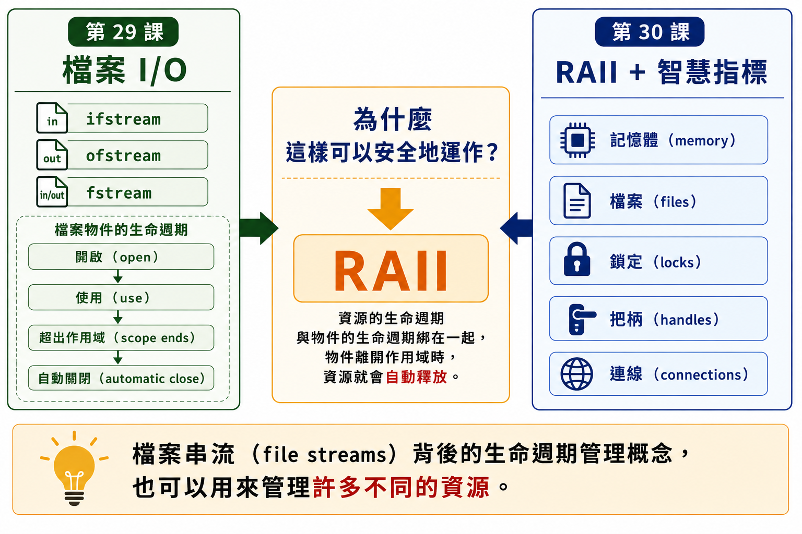
> 這堂課的重點：學會用物件生命週期管理資源，並使用智慧指標清楚表達所有權。你會學習 RAII、`unique_ptr`、`shared_ptr`、`weak_ptr`、`make_unique`、`make_shared`、移動語意、循環參考、custom deleter、Rule of Zero、Rule of Five，以及如何避免記憶體洩漏、重複釋放與懸空指標。

> 本章接續建構子、解構子、繼承、多型、例外處理與檔案輸入輸出。現代 C++ 的核心原則不是「記得在最後 delete」，而是「讓資源一開始就交給會自動釋放它的物件」。

---

## Section I. 今天要做什麼？

1. 複習物件生命週期。
2. 複習建構子。
3. 複習解構子。
4. 認識 resource 資源。
5. 理解資源不只包含記憶體。
6. 認識 dynamic memory。
7. 認識 file handle。
8. 認識 socket handle 概念。
9. 認識 mutex lock。
10. 認識 database connection 概念。
11. 認識 RAII。
12. 理解 Resource Acquisition Is Initialization。
13. 理解資源取得綁定建構。
14. 理解資源釋放綁定解構。
15. 理解 scope exit。
16. 理解 normal return。
17. 理解 exception path。
18. 理解 early return。
19. 認識 ownership 所有權。
20. 區分 owning pointer。
21. 區分 non-owning pointer。
22. 區分 observer。
23. 區分 borrower。
24. 認識 lifetime。
25. 認識 dangling pointer。
26. 認識 memory leak。
27. 認識 double delete。
28. 認識 use-after-free。
29. 認識 invalid delete。
30. 認識 array delete mismatch。
31. 使用 `new` 概念。
32. 使用 `delete` 概念。
33. 使用 `new[]` 概念。
34. 使用 `delete[]` 概念。
35. 理解手動管理容易失敗。
36. 不建議直接持有裸 `new` 結果。
37. 優先使用標準容器。
38. 優先使用 `string`。
39. 優先使用 `vector`。
40. 優先使用智慧指標。
41. 認識 `unique_ptr`。
42. 理解 exclusive ownership。
43. 一個物件只有一個主要擁有者。
44. 使用 `make_unique()`。
45. 使用 `unique_ptr<T>`。
46. 使用 `unique_ptr<T[]>`。
47. 使用 `operator*`。
48. 使用 `operator->`。
49. 使用 `.get()`。
50. 使用 `.release()`。
51. 使用 `.reset()`。
52. 使用 `.swap()`。
53. 理解 `.get()` 不轉移所有權。
54. 理解 `.release()` 轉移責任給呼叫者。
55. 避免不必要使用 `.release()`。
56. 理解 `.reset()` 會釋放舊物件。
57. `unique_ptr` 不可複製。
58. `unique_ptr` 可移動。
59. 使用 `std::move()`。
60. 理解 moved-from unique_ptr 為空。
61. 將 `unique_ptr` 傳入函式。
62. 按值傳入表示轉移所有權。
63. 以 `const unique_ptr<T>&` 讀取擁有者物件。
64. 更常直接傳入 `T&` 或 `const T&`。
65. 回傳 `unique_ptr`。
66. 使用 factory function。
67. 理解 return value optimization 與 move。
68. 建立 polymorphic ownership。
69. 使用 `unique_ptr<Base>` 指向 Derived。
70. 基底類別需要 virtual destructor。
71. 使用 `vector<unique_ptr<Base>>`。
72. 使用 `make_unique<Derived>()`。
73. 認識 custom deleter。
74. 使用函式物件 deleter。
75. 使用 Lambda deleter。
76. 管理 `FILE*`。
77. 管理 C API resource。
78. 理解 deleter 是 unique_ptr 型別的一部分。
79. 認識 `shared_ptr`。
80. 理解 shared ownership。
81. 使用 reference count。
82. 使用 `make_shared()`。
83. 複製 `shared_ptr`。
84. 理解複製增加 use count。
85. 使用 `.use_count()` 只做觀察。
86. 不依賴 `.use_count()` 做同步邏輯。
87. 使用 `.unique()` 歷史概念。
88. C++17 可查詢是否唯一。
89. 使用 `.reset()`。
90. 使用 `.get()`。
91. 使用 `operator*`。
92. 使用 `operator->`。
93. 共享物件生命週期。
94. 最後一個擁有者消失才解構物件。
95. 理解 control block。
96. Control block 保存 reference count。
97. Control block 保存 weak count。
98. Control block 保存 deleter。
99. 理解 `make_shared` 通常一次配置。
100. 比較 `shared_ptr<T>(new T)`。
101. 優先使用 `make_shared`。
102. 需要 custom deleter 時可能直接建構 shared_ptr。
103. 認識 aliasing constructor 概念。
104. 不在本章深入 aliasing constructor。
105. 認識 `weak_ptr`。
106. 理解 weak observation。
107. `weak_ptr` 不增加 strong count。
108. 使用 `.lock()`。
109. 使用 `.expired()`。
110. 使用 `.reset()`。
111. 使用 `.use_count()`。
112. `.lock()` 成功回傳 shared_ptr。
113. `.lock()` 失敗回傳空 shared_ptr。
114. 避免先 `expired()` 再 `lock()` 的競爭條件概念。
115. 優先直接 `lock()`。
116. 解決 shared_ptr cycle。
117. 認識循環參考。
118. Parent 擁有 Child。
119. Child 觀察 Parent。
120. 使用 weak_ptr 打破循環。
121. 理解雙向 shared_ptr 造成洩漏。
122. 認識 ownership graph。
123. 決定哪條邊是擁有關係。
124. 決定哪條邊是觀察關係。
125. 認識 observer raw pointer。
126. 裸指標可表示非擁有。
127. 裸參考可表示非擁有且不可為空。
128. 使用 `T*` 表示可為空 observer。
129. 使用 `T&` 表示必要 observer。
130. 不用裸指標表示模糊所有權。
131. 不從 `.get()` 建立第二個 smart pointer。
132. 避免兩個 shared_ptr 分別接收同一裸指標。
133. 避免 double control block。
134. 避免 `shared_ptr<T>(pointer.get())`。
135. 認識 `enable_shared_from_this`。
136. 使用 `shared_from_this()` 概念。
137. 不在本章深入錯誤使用情況。
138. 理解物件必須已由 shared_ptr 管理。
139. 認識 `bad_weak_ptr`。
140. 認識 unique_ptr 與 shared_ptr 轉換。
141. `unique_ptr` 可移動成 `shared_ptr`。
142. `shared_ptr` 不能安全轉回 unique_ptr。
143. 理解 ownership 變寬通常可行。
144. 理解 ownership 變窄需要唯一性證明。
145. 認識 `static_pointer_cast`。
146. 認識 `dynamic_pointer_cast`。
147. 認識 `const_pointer_cast`。
148. 認識 `reinterpret_pointer_cast` C++17 概念。
149. 優先透過虛擬介面避免 cast。
150. 使用 `dynamic_pointer_cast` 時檢查空值。
151. 認識 custom RAII class。
152. 封裝裸資源。
153. 建構子取得資源。
154. 解構子釋放資源。
155. 禁止複製或實作深複製。
156. 實作 move constructor。
157. 實作 move assignment。
158. 認識 Rule of Three。
159. 認識 Rule of Five。
160. 認識 Rule of Zero。
161. 優先 Rule of Zero。
162. 使用 smart pointer 成員。
163. 使用 vector 成員。
164. 使用 string 成員。
165. 讓編譯器產生特殊成員。
166. 只有直接管理資源時才考慮 Rule of Five。
167. 認識 copy constructor。
168. 認識 copy assignment。
169. 認識 move constructor。
170. 認識 move assignment。
171. 認識 destructor。
172. 使用 `= delete` 禁止複製。
173. 使用 `= default` 產生 move。
174. 理解自訂解構子可能抑制隱式 move。
175. 不在本章深入所有特殊成員規則。
176. 認識 strong exception safety。
177. Smart pointer 建立後自動清理。
178. `make_unique` 避免中間裸指標。
179. `make_shared` 避免分離 ownership setup。
180. 理解多參數函式求值順序歷史風險。
181. C++17 改善部分求值順序。
182. 仍優先 factory function。
183. 認識 array ownership。
184. 使用 `unique_ptr<T[]>`。
185. 使用 `operator[]`。
186. 不提供 `.size()`。
187. 多數情況優先 `vector<T>`。
188. 只有特定 C API 需求才考慮動態陣列指標。
189. 認識 incomplete type。
190. unique_ptr 可搭配 incomplete type 的設計概念。
191. PImpl idiom 概念預告。
192. 不在本章深入 PImpl。
193. 認識 thread safety。
194. shared_ptr control block reference count 是 thread-safe 概念。
195. 被管理物件本身不會自動 thread-safe。
196. 多執行緒修改同一物件仍需同步。
197. 不在本章深入 atomic shared_ptr。
198. 認識 performance cost。
199. unique_ptr 通常接近裸指標成本。
200. shared_ptr 有 reference counting 成本。
201. weak_ptr 有 control block 成本。
202. 不因微小成本而使用錯誤所有權模型。
203. 先正確表達 ownership。
204. 避免所有物件都使用 shared_ptr。
205. shared_ptr 不是預設選擇。
206. unique_ptr 通常是動態所有權預設選擇。
207. 值語意通常比指標所有權更簡單。
208. 可直接成員就不要動態配置。
209. 可直接 vector 保存物件就不必 vector<unique_ptr<T>>。
210. 需要多型或不可移動物件時再使用指標容器。
211. 認識 dependency injection。
212. 建構子接收 `unique_ptr` 表示接管。
213. 建構子接收 `shared_ptr` 表示共享。
214. 建構子接收 `T&` 表示借用。
215. 建構子接收 `T*` 表示可空借用。
216. API 透過參數型別表達 ownership。
217. 使用 `const T&` 讀取。
218. 使用 `T&` 修改借用物件。
219. 使用 `unique_ptr<T>` 轉移。
220. 使用 `shared_ptr<T>` 共享。
221. 使用 `weak_ptr<T>` 觀察共享資源。
222. 認識 factory ownership。
223. Factory 回傳 unique_ptr。
224. 呼叫者可選擇保持唯一或轉成共享。
225. 使用 `std::move` 明確轉移。
226. 避免對 const unique_ptr 使用 move。
227. const unique_ptr 不能轉移所有權。
228. 理解 move 不一定移動物件本身。
229. move 是轉型，允許資源被轉移。
230. 認識 moved-from state。
231. moved-from smart pointer 可安全解構。
232. moved-from smart pointer 通常為空。
233. 使用前檢查。
234. 認識 null smart pointer。
235. 使用 `if (pointer)`。
236. 使用 `pointer == nullptr`。
237. 避免解參考空 smart pointer。
238. 使用 `.reset()` 釋放。
239. 使用空 smart pointer 表示沒有擁有物件。
240. 認識 ownership documentation。
241. 類別註解所有權方向。
242. 避免隱藏 global shared ownership。
243. 避免單例濫用。
244. 測試正常解構。
245. 測試 early return。
246. 測試 exception path。
247. 測試 move。
248. 測試空 pointer。
249. 測試 weak expiration。
250. 測試 cycle 是否被打破。
251. 使用概念檢查、程式閱讀與實作題整合本章。

---

## Section II. 今天的學習方式

1. 每看到指標先問：
   ```text
   誰擁有這個物件？
   誰負責釋放？
   物件可以有幾個擁有者？
   觀察者能否為空？
   ```
2. 可直接使用值時，優先使用值。
3. 單一動態擁有者時使用：
   ```cpp
   unique_ptr<T>
   ```
4. 真正需要共同延長生命週期時使用：
   ```cpp
   shared_ptr<T>
   ```
5. 只觀察 shared 物件但不延長生命週期時使用：
   ```cpp
   weak_ptr<T>
   ```
6. 借用且必須存在時使用：
   ```cpp
   T&
   ```
7. 借用且可以不存在時使用：
   ```cpp
   T*
   ```
8. 建立智慧指標優先使用：
   ```cpp
   make_unique()
   make_shared()
   ```
9. 不從 `.get()` 再建立另一個擁有型智慧指標。
10. 所有合法完整程式使用嚴格 C++17 選項檢查。

---

## Section III. 所有權選擇表

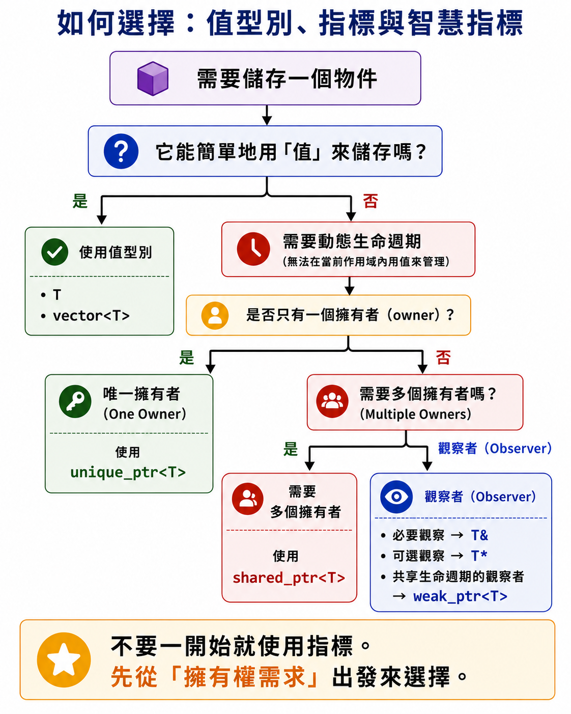
| 情況 | 建議表示 |
| --- | --- |
| 物件可直接作為成員 | `T` |
| 多個同型別值 | `vector<T>` |
| 唯一動態擁有者 | `unique_ptr<T>` |
| 多個共同擁有者 | `shared_ptr<T>` |
| 不延長 shared 生命週期的觀察者 | `weak_ptr<T>` |
| 必須存在的非擁有參考 | `T&` |
| 可為空的非擁有觀察 | `T*` |

---

## Section IV. 核心語法對照

| 語法 | 用途 |
| --- | --- |
| `make_unique<T>(args...)` | 建立唯一擁有物件 |
| `unique_ptr<T>` | 唯一所有權 |
| `std::move(pointer)` | 轉移所有權 |
| `pointer.get()` | 取得非擁有裸指標 |
| `pointer.release()` | 放棄所有權且不刪除 |
| `pointer.reset()` | 釋放或改指向新物件 |
| `make_shared<T>(args...)` | 建立共享擁有物件 |
| `shared_ptr<T>` | 共享所有權 |
| `pointer.use_count()` | 觀察 strong count |
| `weak_ptr<T>` | 不擁有的共享觀察 |
| `weak.lock()` | 嘗試取得 shared_ptr |
| `weak.expired()` | 是否已無 strong owner |
| `unique_ptr<T[]>` | 唯一擁有動態陣列 |
| `virtual ~Base() = default;` | 多型基底安全解構 |
| `= delete` | 禁止複製 |
| `= default` | 使用編譯器預設特殊成員 |

---

# Part A：什麼是 RAII？

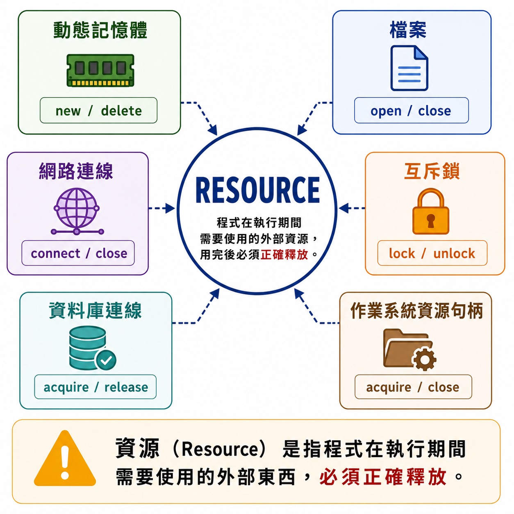

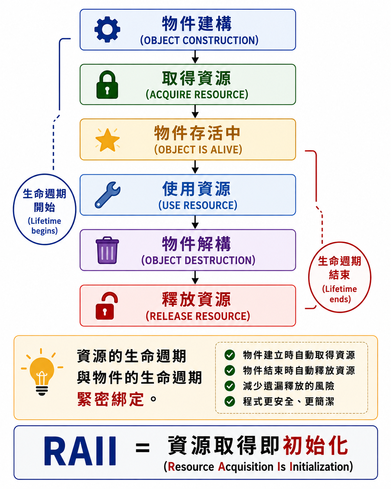
## Section V. 核心概念

RAII：

```text
Resource Acquisition Is Initialization
```

意思不是「初始化就是資源」，而是：

```text
資源取得和物件建立綁定
資源釋放和物件解構綁定
```

---

## Section VI. 為什麼有效？

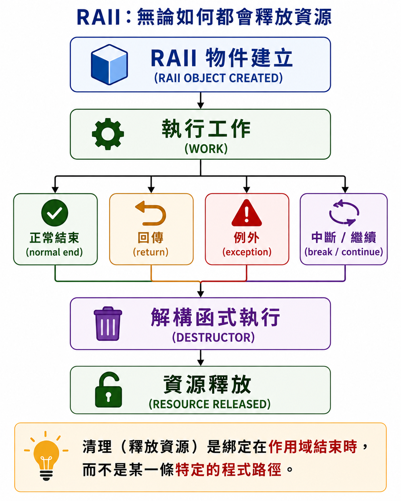
物件解構會發生在：

- 正常離開作用域。
- 提早 `return`。
- `break` 或 `continue` 離開區塊。
- 例外造成 stack unwinding。

因此資源清理不依賴每條流程都手動呼叫釋放函式。

---

## Section VII. 完整 RAII 追蹤

```cpp
// VALIDATE
#include <iostream>
#include <string>
using namespace std;

class Resource {
public:
    explicit Resource(
        const string& initialName
    )
        : nameValue(initialName) {
        cout << "Acquire "
             << nameValue
             << '\n';
    }

    ~Resource() {
        cout << "Release "
             << nameValue
             << '\n';
    }

private:
    string nameValue;
};

void operation(bool leaveEarly) {
    Resource resource(
        "temporary"
    );

    if (leaveEarly) {
        return;
    }

    cout << "Work\n";
}

int main() {
    operation(true);

    return 0;
}
```

即使提早 `return`，解構子仍會執行。

---

# Part B：手動 `new`／`delete` 的風險

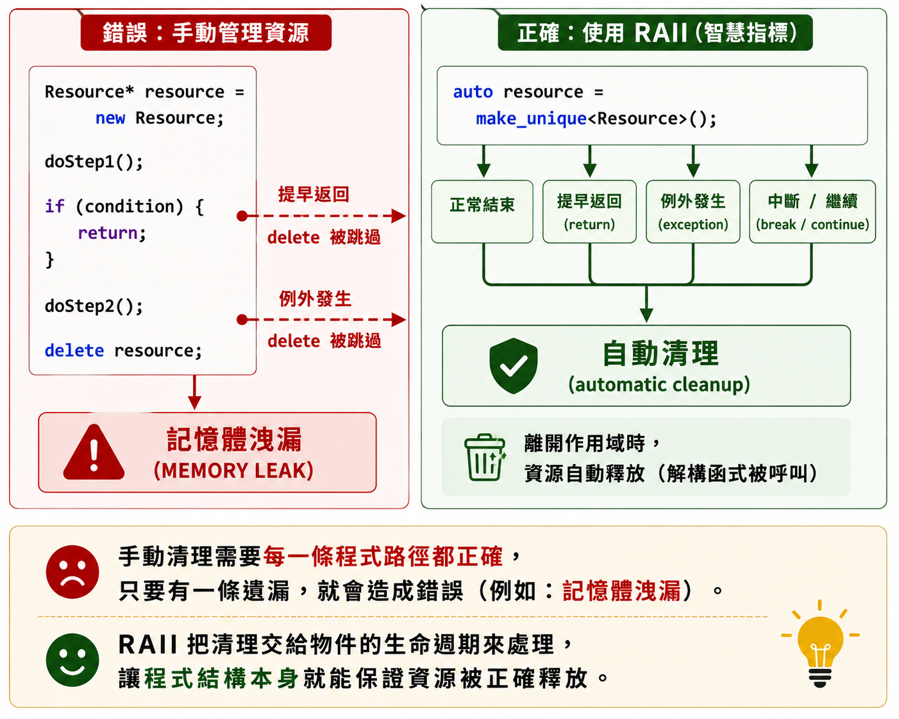

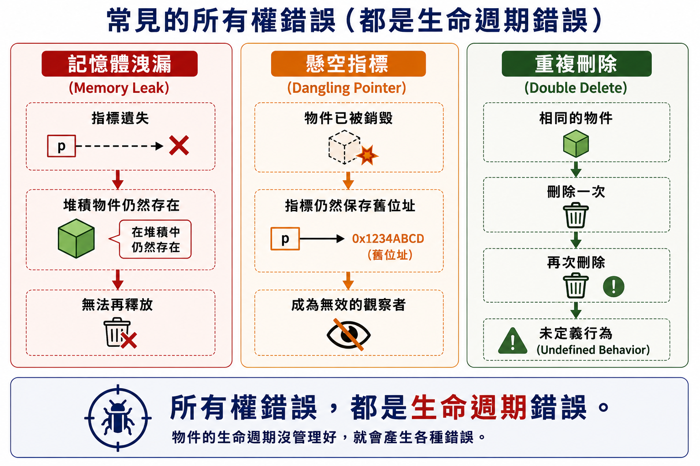
## Section VIII. 記憶體洩漏

```cpp
/* int* value =
    new int(42);

if (condition) {
    return;
}

delete value; */
```

提早 return 時沒有 delete。

---

## Section IX. 例外路徑

```cpp
/* Widget* widget =
    new Widget;

operationThatMayThrow();

delete widget; */
```

中間拋例外時 delete 不會執行。

---

## Section X. 現代替代

```cpp
auto widget =
    make_unique<Widget>();
```

---

# Part C：第一個 `unique_ptr`

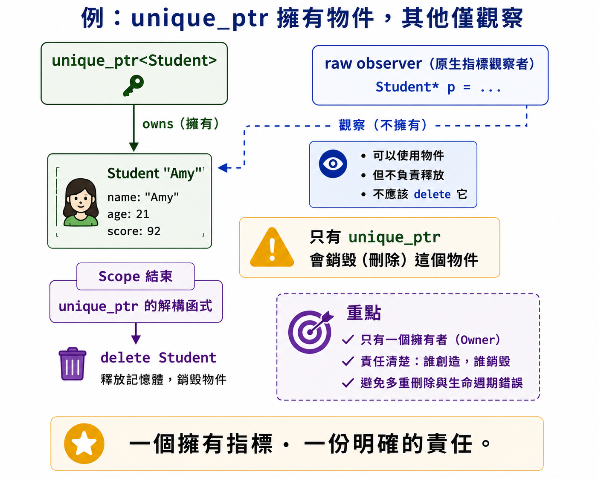

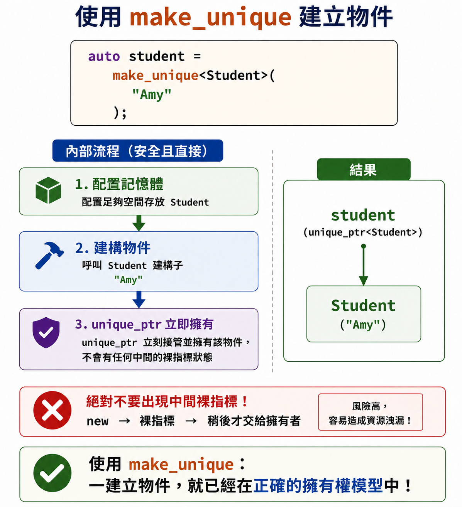
## Section XI. 唯一所有權

`unique_ptr<T>` 表示：

```text
目前只有這個智慧指標負責銷毀 T
```

---

## Section XII. 完整基本範例

```cpp
// VALIDATE
#include <iostream>
#include <memory>
#include <string>
using namespace std;

class Student {
public:
    explicit Student(
        const string& initialName
    )
        : nameValue(initialName) {
        cout << "Construct "
             << nameValue
             << '\n';
    }

    ~Student() {
        cout << "Destroy "
             << nameValue
             << '\n';
    }

    const string& name() const {
        return nameValue;
    }

private:
    string nameValue;
};

int main() {
    auto student =
        make_unique<Student>(
            "Amy"
        );

    cout << student->name()
         << '\n';

    return 0;
}
```

離開 `main()` 時自動 delete。

---

# Part D：`operator*` 與 `operator->`

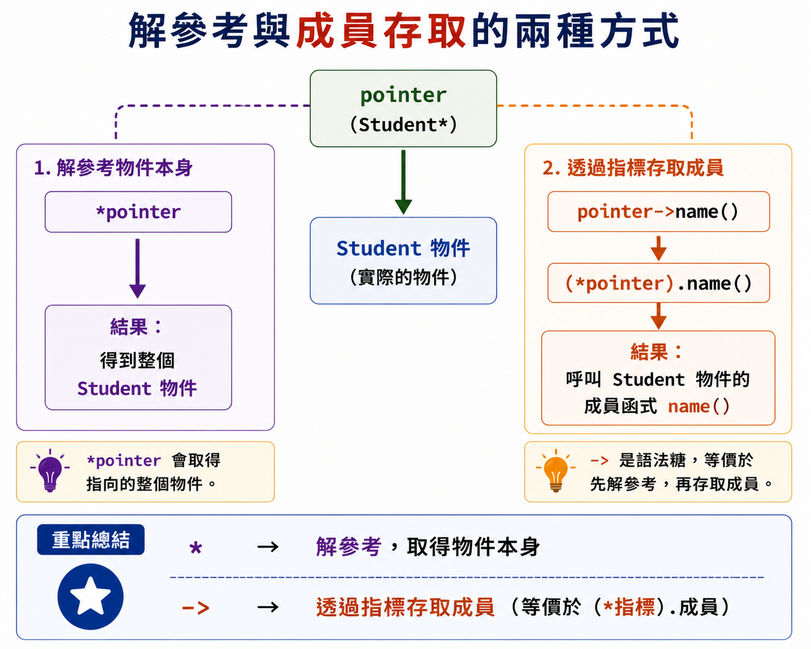
## Section XIII. 解參考

```cpp
*pointer
```

取得被管理物件。

---

## Section XIV. 成員存取

```cpp
pointer->function()
```

等價概念：

```cpp
(*pointer).function()
```

---

## Section XV. 空指標檢查

```cpp
if (pointer) {
    // 可安全解參考
}
```

---

# Part E：Unique Pointer 不可複製

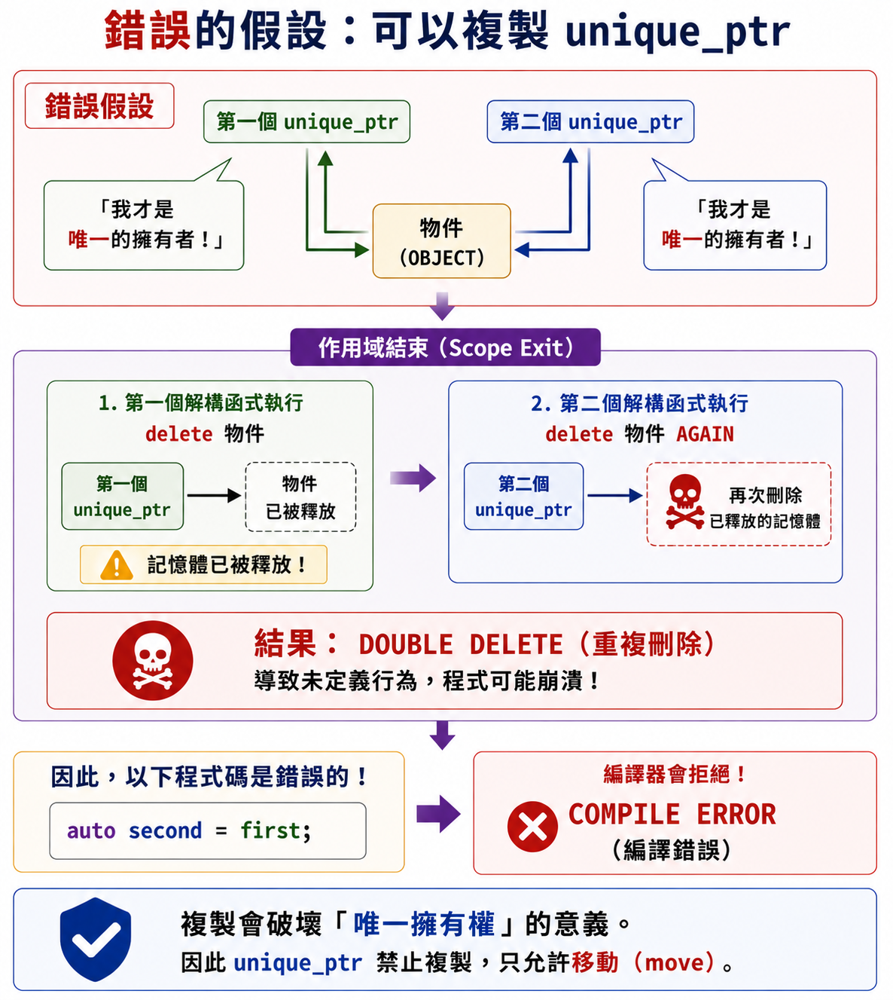

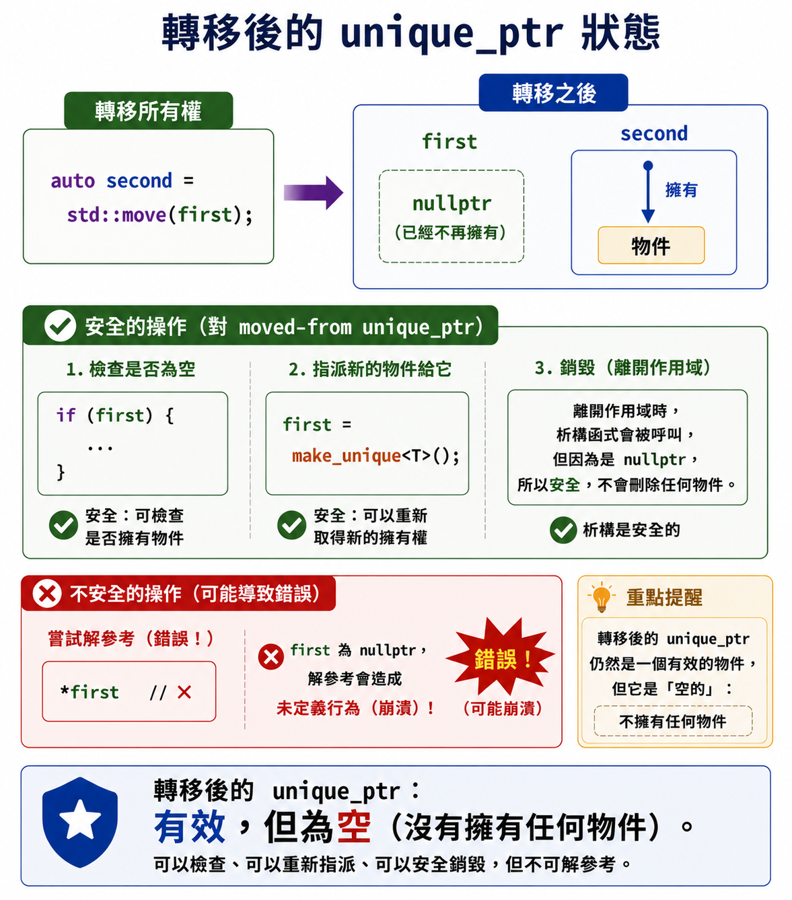
## Section XVI. 為什麼？

若能複製：

```text
兩個 unique_ptr 都認為自己是唯一擁有者
```

離開作用域時可能 double delete。

---

## Section XVII. 不合法複製

```cpp
/* auto second =
    first; */
```

---

## Section XVIII. 可移動

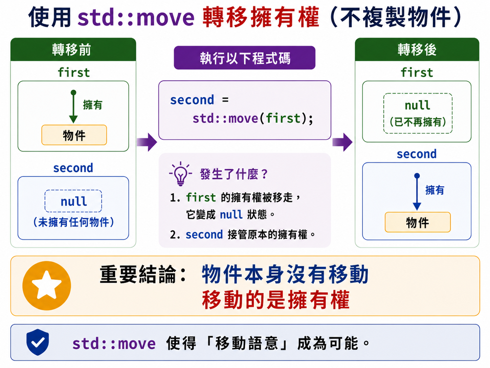
```cpp
auto second =
    std::move(first);
```

所有權從 `first` 轉到 `second`。

---

## Section XIX. 完整移動範例

```cpp
// VALIDATE
#include <iostream>
#include <memory>
using namespace std;

int main() {
    auto first =
        make_unique<int>(42);

    auto second =
        std::move(first);

    cout << boolalpha
         << (
                first ==
                nullptr
            )
         << " "
         << *second
         << '\n';

    return 0;
}
```

---

# Part F：傳遞所有權

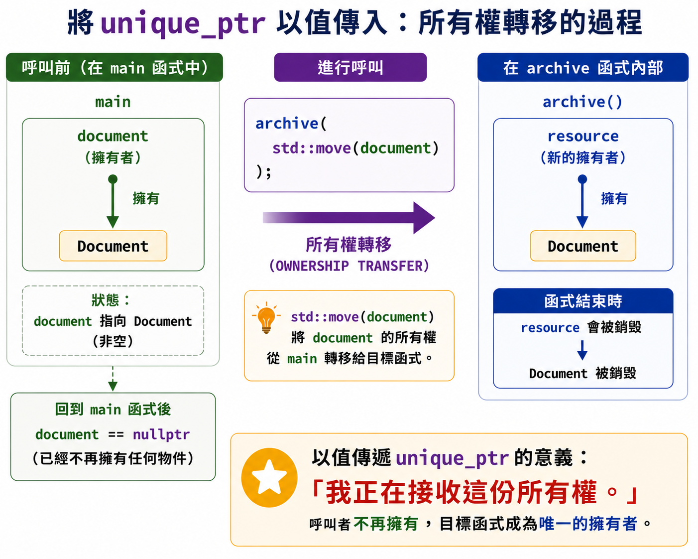
## Section XX. 按值接收 `unique_ptr`

```cpp
void consume(
    unique_ptr<Resource> resource
);
```

呼叫者必須：

```cpp
consume(
    std::move(resource)
);
```

這清楚表示所有權被接管。

---

## Section XXI. 完整所有權轉移

```cpp
// VALIDATE
#include <iostream>
#include <memory>
#include <string>
using namespace std;

class Document {
public:
    explicit Document(
        const string& initialName
    )
        : nameValue(initialName) {
    }

    const string& name() const {
        return nameValue;
    }

private:
    string nameValue;
};

void archive(
    unique_ptr<Document> document
) {
    cout << "Archive "
         << document->name()
         << '\n';
}

int main() {
    auto document =
        make_unique<Document>(
            "report.txt"
        );

    archive(
        std::move(document)
    );

    cout << boolalpha
         << (
                document ==
                nullptr
            )
         << '\n';

    return 0;
}
```

---

# Part G：只借用物件

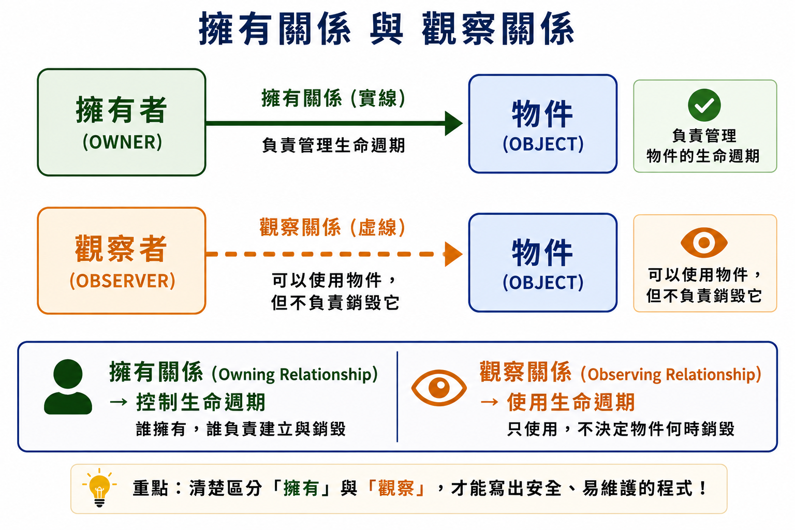

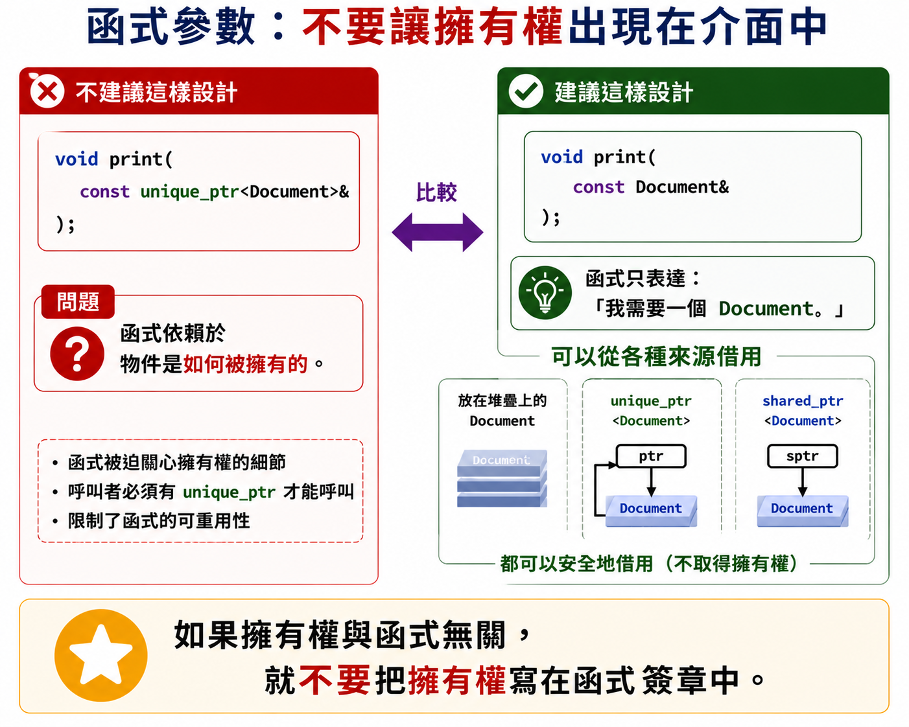

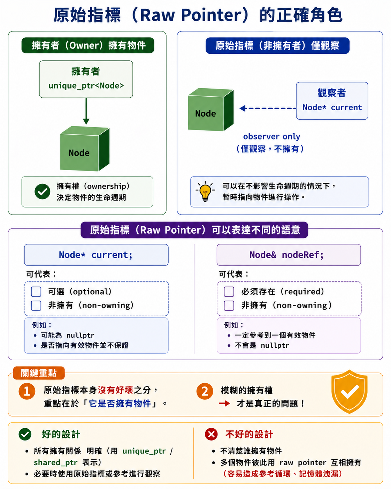
## Section XXII. 不需要傳 `unique_ptr&`

若函式只使用物件：

```cpp
void print(
    const Document& document
);
```

呼叫：

```cpp
print(*document);
```

這比接受 `const unique_ptr<Document>&` 更通用。

---

## Section XXIII. API 語意

```cpp
void takeOwnership(
    unique_ptr<T> value
);
```

表示接管。

```cpp
void observe(
    const T& value
);
```

表示借用且必須存在。

```cpp
void observeOptional(
    const T* value
);
```

表示借用且可為空。

---

# Part H：回傳 `unique_ptr`

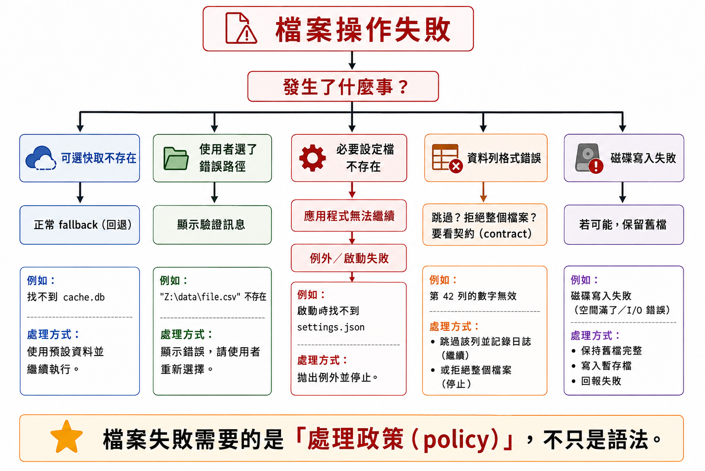
## Section XXIV. Factory Function

```cpp
unique_ptr<Shape>
makeShape(...);
```

回傳唯一擁有權給呼叫者。

---

## Section XXV. 完整 Factory

```cpp
// VALIDATE
#include <iostream>
#include <memory>
#include <string>
using namespace std;

class Message {
public:
    explicit Message(
        const string& initialText
    )
        : textValue(initialText) {
    }

    const string& text() const {
        return textValue;
    }

private:
    string textValue;
};

unique_ptr<Message>
makeMessage(
    const string& text
) {
    return
        make_unique<Message>(
            text
        );
}

int main() {
    auto message =
        makeMessage(
            "Hello"
        );

    cout << message->text()
         << '\n';

    return 0;
}
```

---

# Part I：`get()`、`release()`、`reset()`

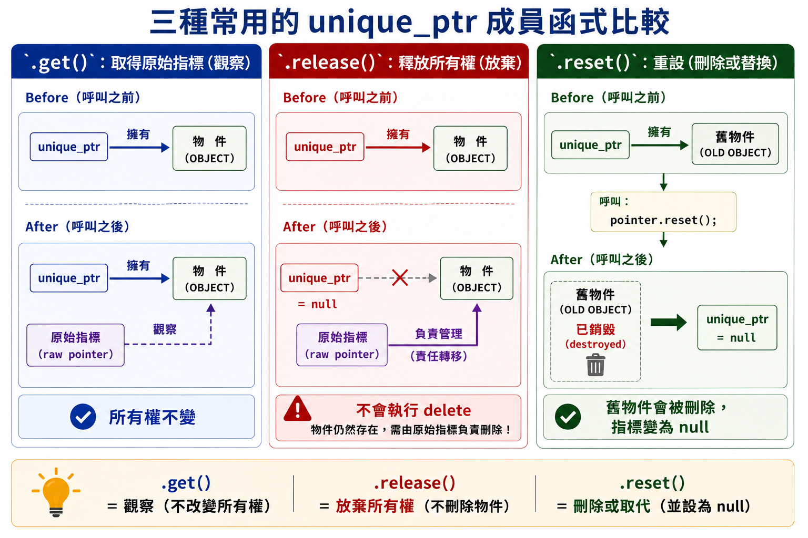
## Section XXVI. `.get()`

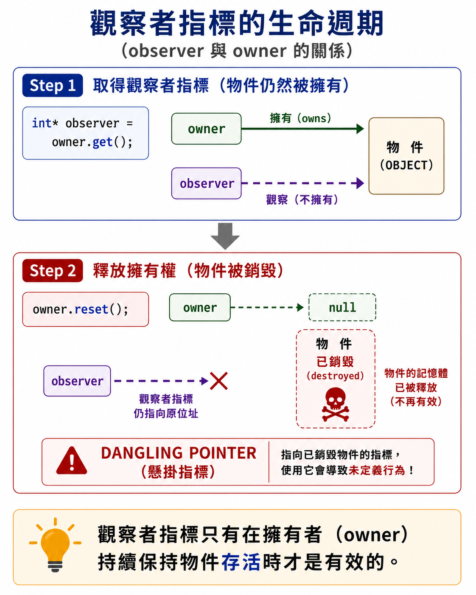
```cpp
T* observer =
    pointer.get();
```

只取得裸指標，不轉移所有權。

不能 delete observer。

---

## Section XXVII. `.release()`

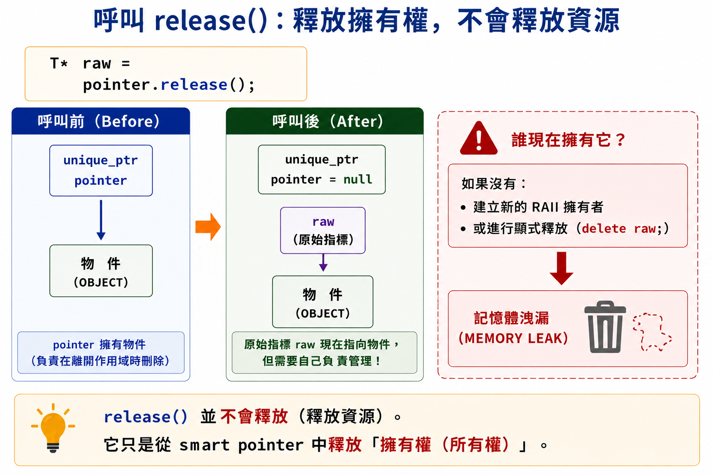
```cpp
T* raw =
    pointer.release();
```

`pointer` 放棄所有權，不會 delete。

此後必須由其他 RAII owner 接手，否則會洩漏。

---

## Section XXVIII. `.reset()`

```cpp
pointer.reset();
```

釋放目前物件並變空。

也可：

```cpp
pointer.reset(
    new T(...)
);
```

但通常優先重新指定 `make_unique()` 結果。

---

## Section XXIX. 完整 Reset

```cpp
// VALIDATE
#include <iostream>
#include <memory>
using namespace std;

int main() {
    auto value =
        make_unique<int>(10);

    cout << *value
         << '\n';

    value =
        make_unique<int>(20);

    cout << *value
         << '\n';

    value.reset();

    cout << boolalpha
         << (
                value ==
                nullptr
            )
         << '\n';

    return 0;
}
```

---

# Part J：動態陣列

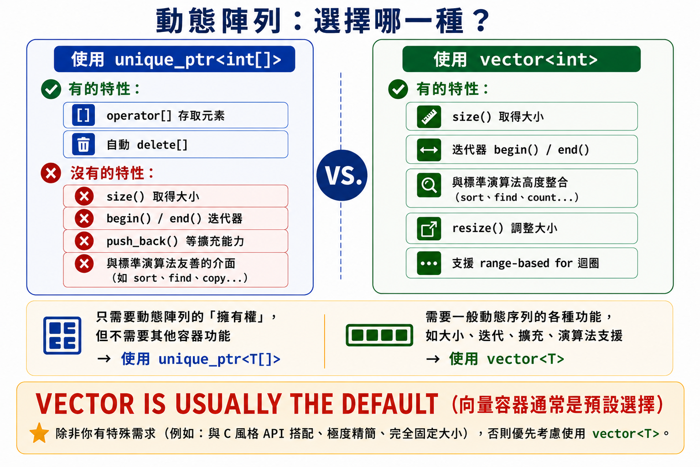
## Section XXX. `unique_ptr<T[]>`

```cpp
auto values =
    make_unique<int[]>(
        count
    );
```

可使用：

```cpp
values[index]
```

---

## Section XXXI. 限制

`unique_ptr<T[]>` 不知道邏輯長度介面：

- 沒有 `.size()`。
- 沒有 iterator。
- 不直接支援 range-based for。

大多數情況使用：

```cpp
vector<T>
```

更好。

---

## Section XXXII. 完整 Array 版本

```cpp
// VALIDATE
#include <cstddef>
#include <iostream>
#include <memory>
using namespace std;

int main() {
    constexpr size_t count = 5;

    auto values =
        make_unique<int[]>(
            count
        );

    for (
        size_t index = 0;
        index < count;
        ++index
    ) {
        values[index] =
            static_cast<int>(
                index * index
            );
    }

    for (
        size_t index = 0;
        index < count;
        ++index
    ) {
        cout << values[index]
             << " ";
    }

    cout << '\n';

    return 0;
}
```

---

# Part K：多型與 `unique_ptr`

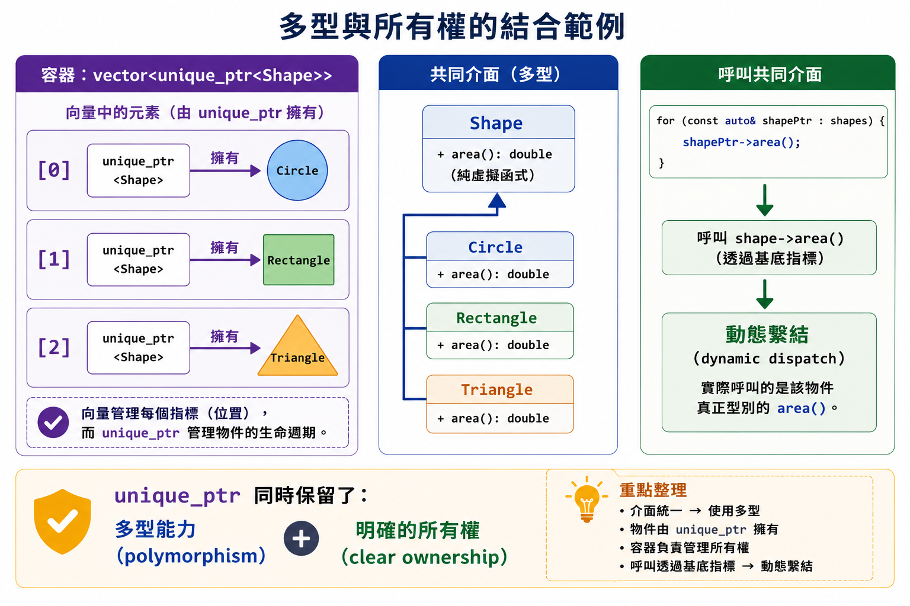

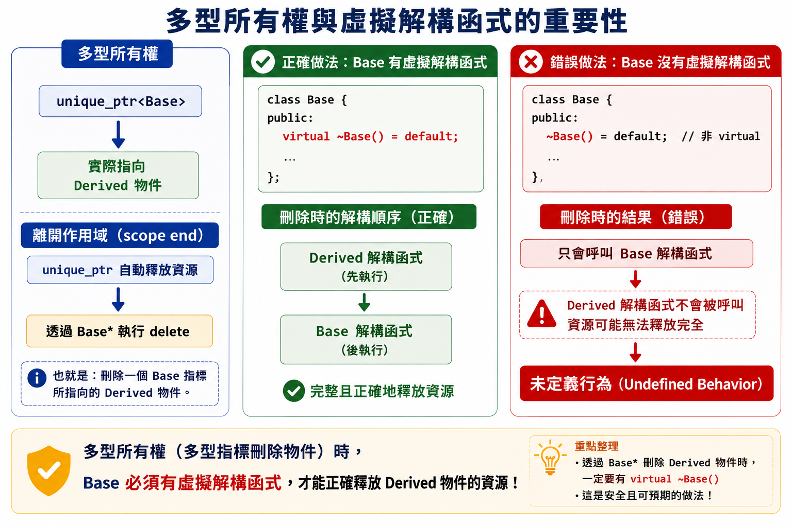
## Section XXXIII. 基底指標擁有衍生物件

```cpp
unique_ptr<Base> pointer =
    make_unique<Derived>();
```

基底類別必須有 virtual destructor。

---

## Section XXXIV. 完整多型集合

```cpp
// VALIDATE
#include <iostream>
#include <memory>
#include <vector>
using namespace std;

class Shape {
public:
    virtual ~Shape() = default;

    virtual double area() const = 0;
};

class Circle : public Shape {
public:
    explicit Circle(
        double initialRadius
    )
        : radiusValue(
              initialRadius
          ) {
    }

    double area() const override {
        constexpr double pi =
            3.14159265358979323846;

        return
            pi *
            radiusValue *
            radiusValue;
    }

private:
    double radiusValue;
};

class Rectangle : public Shape {
public:
    Rectangle(
        double initialWidth,
        double initialHeight
    )
        : widthValue(
              initialWidth
          ),
          heightValue(
              initialHeight
          ) {
    }

    double area() const override {
        return
            widthValue *
            heightValue;
    }

private:
    double widthValue;
    double heightValue;
};

int main() {
    vector<
        unique_ptr<Shape>
    > shapes;

    shapes.push_back(
        make_unique<Circle>(
            2.0
        )
    );

    shapes.push_back(
        make_unique<Rectangle>(
            4.0,
            3.0
        )
    );

    for (
        const auto& shape :
        shapes
    ) {
        cout << shape->area()
             << '\n';
    }

    return 0;
}
```

---

# Part L：Custom Deleter

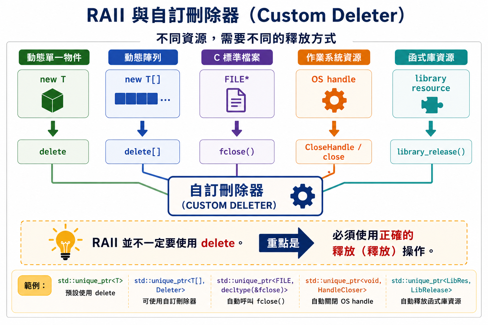
## Section XXXV. 非 `delete` 資源

有些 C API 需要：

```cpp
fclose(file)
```

而不是：

```cpp
delete file
```

---

## Section XXXVI. Deleter 類別

```cpp
struct FileCloser {
    void operator()(
        FILE* file
    ) const noexcept {
        if (file != nullptr) {
            fclose(file);
        }
    }
};
```

---

## Section XXXVII. 完整 `FILE*` RAII

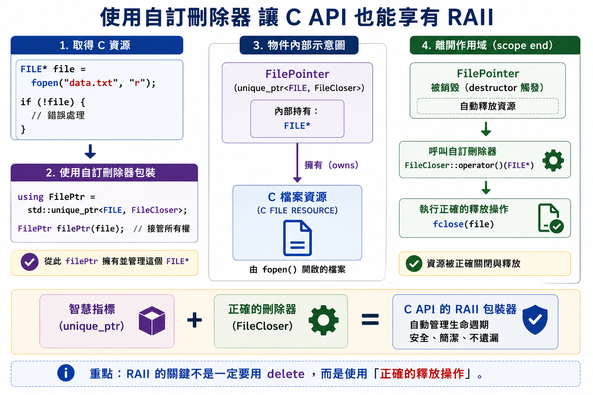
```cpp
// VALIDATE
#include <cstdio>
#include <iostream>
#include <memory>
using namespace std;

struct FileCloser {
    void operator()(
        FILE* file
    ) const noexcept {
        if (file != nullptr) {
            fclose(file);
        }
    }
};

int main() {
    using FilePointer =
        unique_ptr<
            FILE,
            FileCloser
        >;

    FilePointer file(
        fopen(
            "lesson30_file.txt",
            "w"
        )
    );

    if (!file) {
        cerr << "Unable to open file.\n";
        return 1;
    }

    const int result =
        fputs(
            "Managed by unique_ptr\n",
            file.get()
        );

    if (result == EOF) {
        return 1;
    }

    return 0;
}
```

---

# Part M：第一個 `shared_ptr`

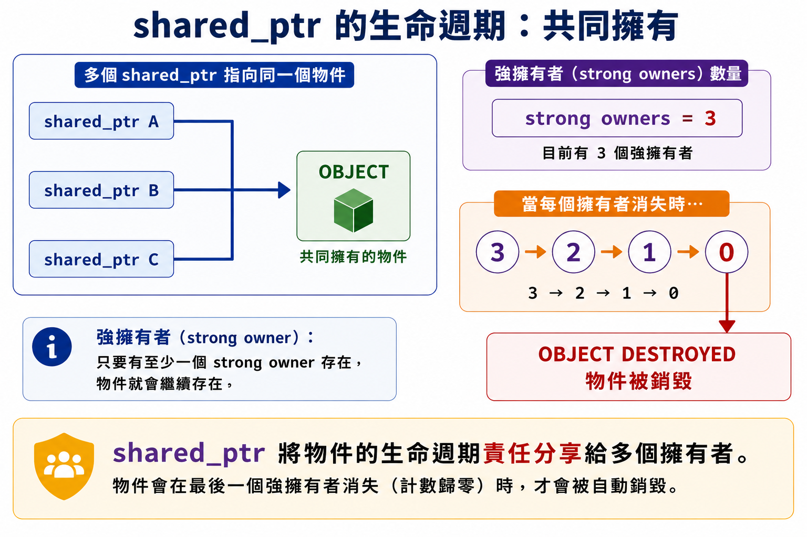

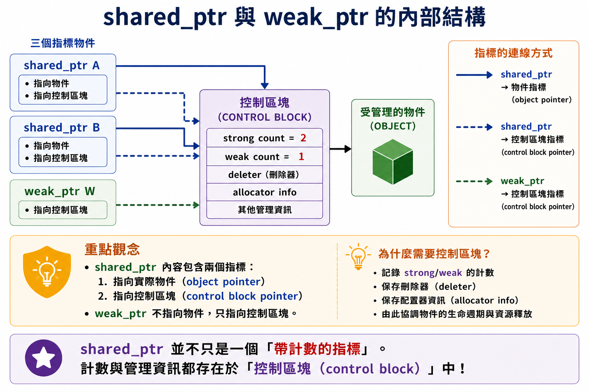

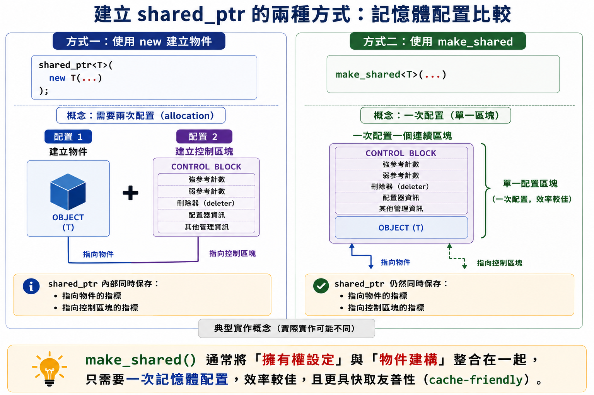

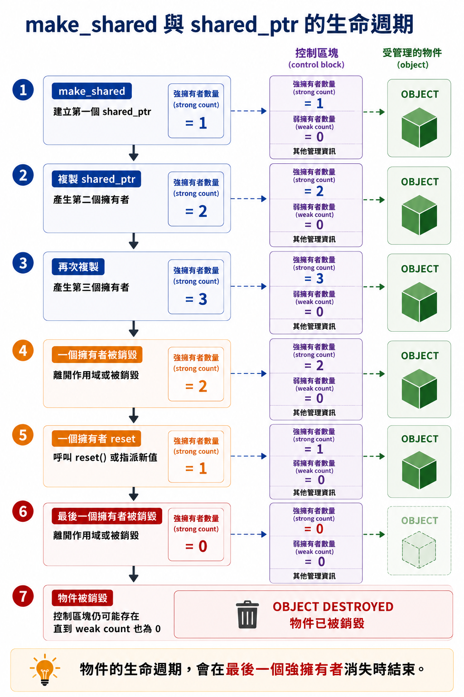

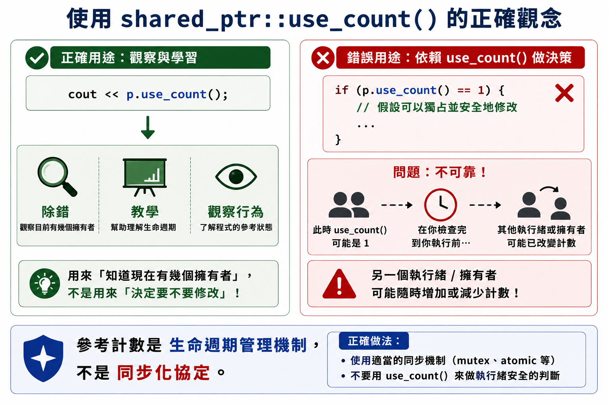
## Section XXXVIII. 共享所有權

多個 `shared_ptr` 可共同擁有同一物件。

物件在最後一個 strong owner 消失時解構。

---

## Section XXXIX. 完整基本範例

```cpp
// VALIDATE
#include <iostream>
#include <memory>
#include <string>
using namespace std;

class Session {
public:
    explicit Session(
        const string& initialName
    )
        : nameValue(initialName) {
        cout << "Open "
             << nameValue
             << '\n';
    }

    ~Session() {
        cout << "Close "
             << nameValue
             << '\n';
    }

private:
    string nameValue;
};

int main() {
    auto first =
        make_shared<Session>(
            "main"
        );

    cout << first.use_count()
         << '\n';

    {
        auto second =
            first;

        cout << first.use_count()
             << '\n';
    }

    cout << first.use_count()
         << '\n';

    return 0;
}
```

`use_count()` 適合教學觀察，不適合作為同步決策。

---

# Part N：Shared Pointer 作為參數

## Section XL. 傳入 `shared_ptr` 的語意

```cpp
void store(
    shared_ptr<T> value
);
```

表示函式或物件可能保存一份共享所有權。

---

## Section XLI. 只讀取物件

若不保存 ownership，優先：

```cpp
void print(
    const T& value
);
```

不要只是為了呼叫成員函式就傳 `shared_ptr`。

---

# Part O：`weak_ptr`

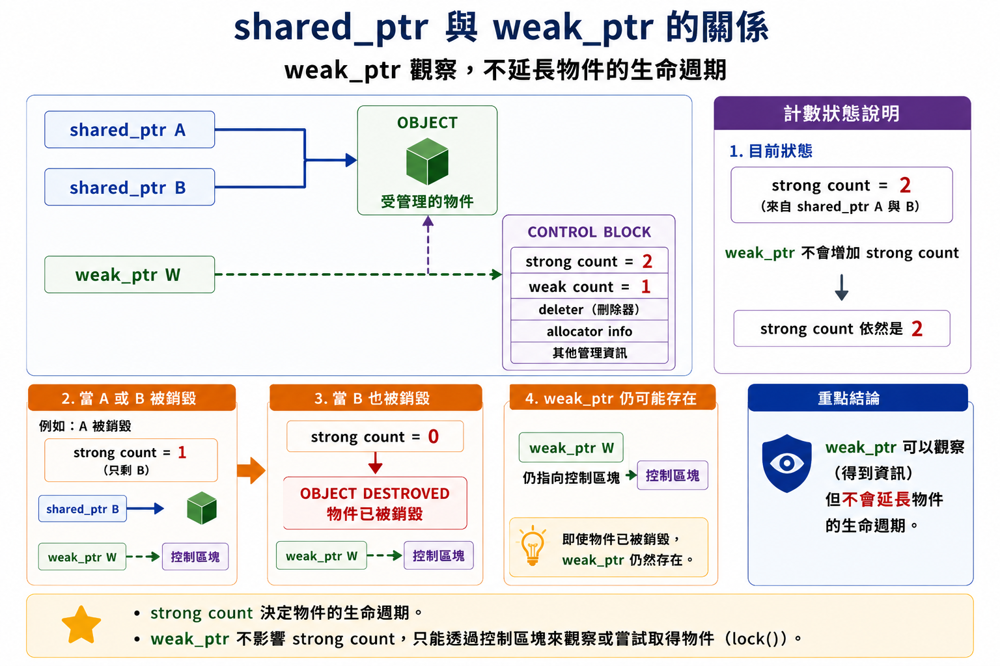

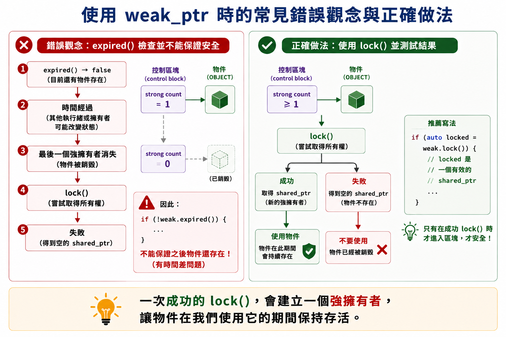
## Section XLII. 不擁有的 Shared 觀察者

`weak_ptr<T>`：

- 指向 shared control block。
- 不增加 strong count。
- 不保證物件仍存在。
- 使用前需要 `lock()`。

---

## Section XLIII. 完整 Weak Pointer

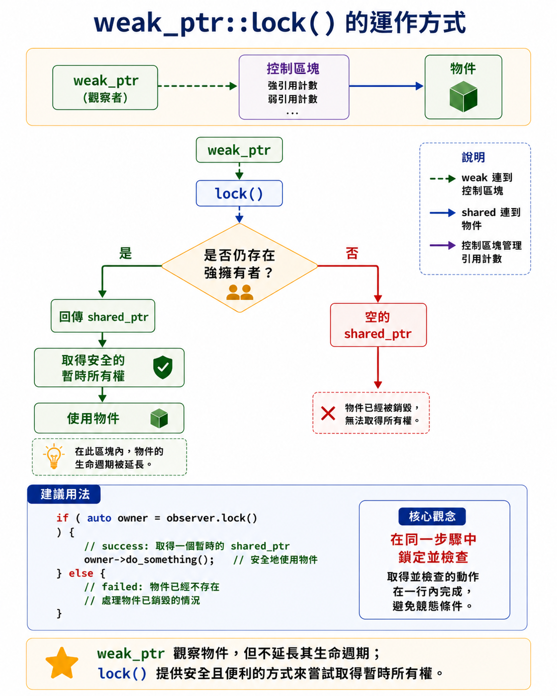
```cpp
// VALIDATE
#include <iostream>
#include <memory>
using namespace std;

int main() {
    weak_ptr<int> observer;

    {
        auto owner =
            make_shared<int>(42);

        observer =
            owner;

        if (
            auto locked =
                observer.lock()
        ) {
            cout << *locked
                 << '\n';
        }
    }

    if (
        auto locked =
            observer.lock()
    ) {
        cout << *locked
             << '\n';
    } else {
        cout << "Expired\n";
    }

    return 0;
}
```

---

# Part P：循環參考

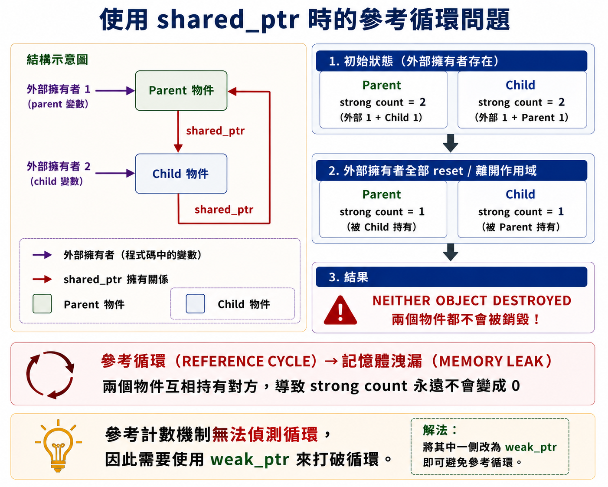
## Section XLIV. 兩個 Shared Owner

若：

```text
Parent shared-owns Child
Child shared-owns Parent
```

即使外部 owner 消失，兩者仍互相保持 strong count。

結果：

```text
物件不會解構
```

---

## Section XLV. 解法

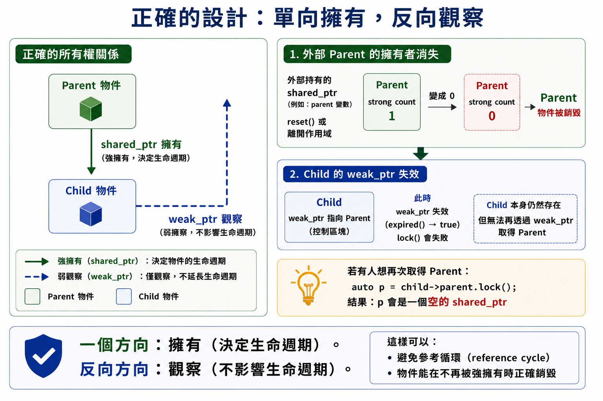
決定 ownership 方向：

```text
Parent owns Child
Child observes Parent
```

Child 使用：

```cpp
weak_ptr<Parent>
```

---

## Section XLVI. 完整 Parent-Child

```cpp
// VALIDATE
#include <iostream>
#include <memory>
#include <string>
#include <vector>
using namespace std;

class Parent;

class Child {
public:
    explicit Child(
        const string& initialName
    )
        : nameValue(initialName) {
    }

    void setParent(
        const shared_ptr<Parent>& parent
    ) {
        parentObserver =
            parent;
    }

    bool hasParent() const {
        return
            !parentObserver.expired();
    }

private:
    string nameValue;
    weak_ptr<Parent>
        parentObserver;
};

class Parent {
public:
    void addChild(
        const shared_ptr<Child>& child
    ) {
        children.push_back(
            child
        );
    }

private:
    vector<
        shared_ptr<Child>
    > children;
};

int main() {
    auto parent =
        make_shared<Parent>();

    auto child =
        make_shared<Child>(
            "Amy"
        );

    parent->addChild(child);
    child->setParent(parent);

    cout << boolalpha
         << child->hasParent()
         << '\n';

    parent.reset();

    cout << child->hasParent()
         << '\n';

    return 0;
}
```

---

# Part Q：不要建立第二個 Control Block

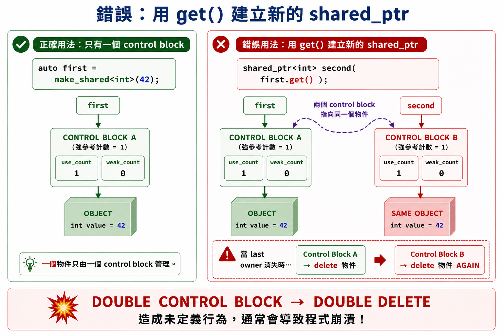

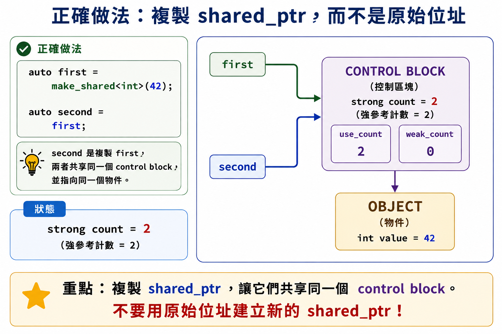
## Section XLVII. 危險做法

```cpp
/* int* raw =
    new int(42);

shared_ptr<int> first(raw);
shared_ptr<int> second(raw); */
```

`first` 與 `second` 各自建立 control block。

兩者都會 delete 同一位址。

---

## Section XLVIII. 正確做法

```cpp
auto first =
    make_shared<int>(42);

auto second =
    first;
```

---

## Section XLIX. `.get()` 也不能重新擁有

```cpp
/* shared_ptr<int> second(
    first.get()
); */
```

這同樣建立第二個 control block。

---

# Part R：Unique 轉 Shared

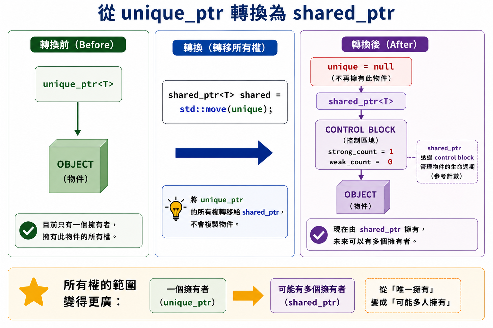

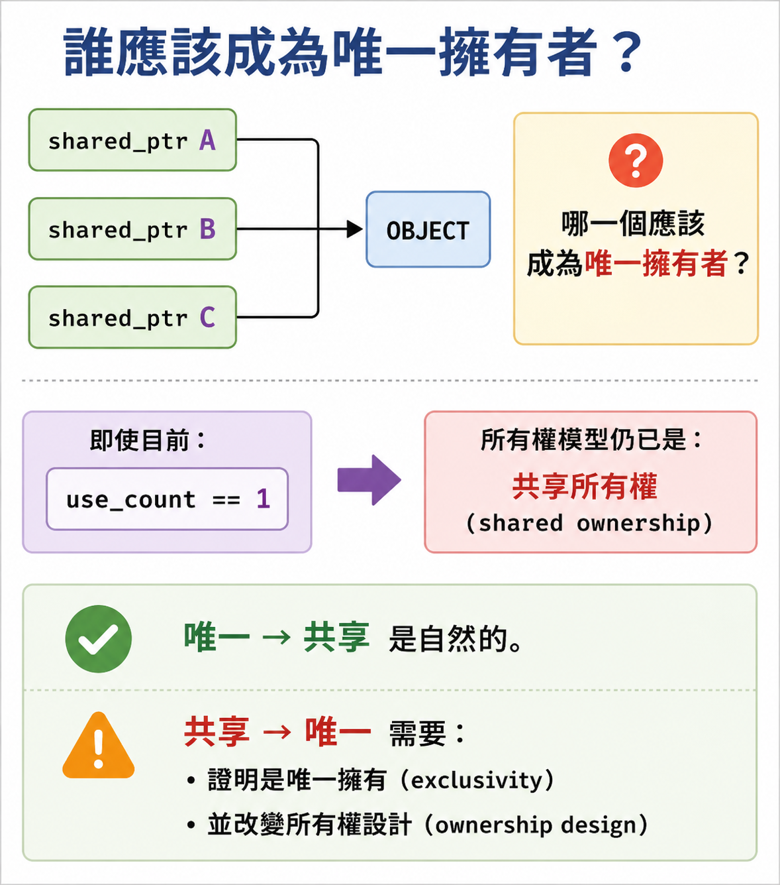
## Section L. 轉換方向

```cpp
unique_ptr<T>
→ shared_ptr<T>
```

可透過 move 完成。

---

## Section LI. 完整轉換

```cpp
// VALIDATE
#include <iostream>
#include <memory>
using namespace std;

int main() {
    auto uniqueValue =
        make_unique<int>(42);

    shared_ptr<int> sharedValue =
        std::move(uniqueValue);

    cout << boolalpha
         << (
                uniqueValue ==
                nullptr
            )
         << " "
         << *sharedValue
         << '\n';

    return 0;
}
```

Shared ownership 不能一般地安全轉回 unique ownership。

---

# Part S：Pointer Cast

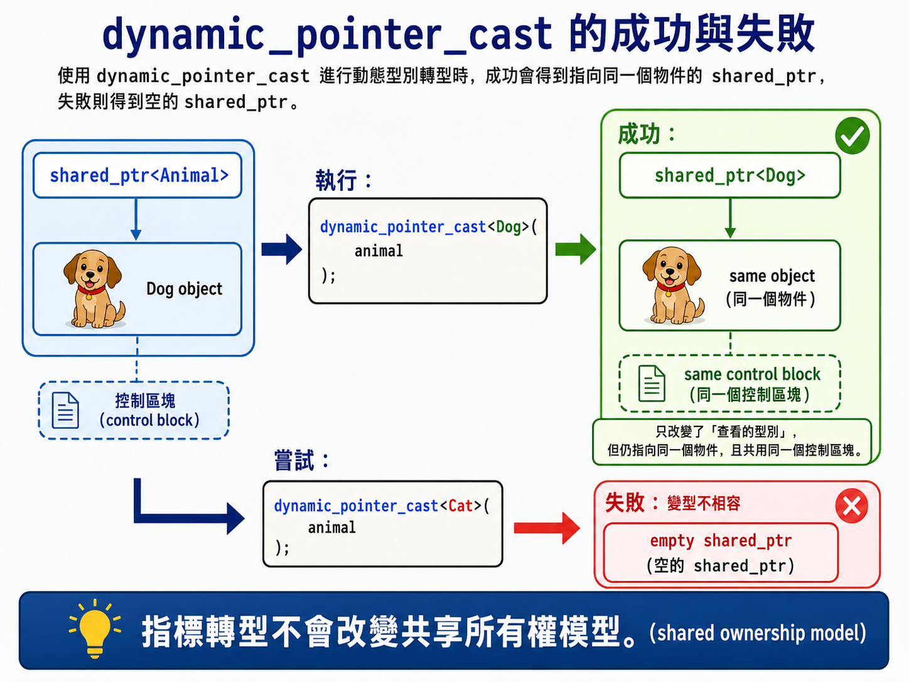
## Section LII. `dynamic_pointer_cast`

適用於：

```cpp
shared_ptr<Base>
```

需要安全嘗試取得：

```cpp
shared_ptr<Derived>
```

---

## Section LIII. 完整 Dynamic Cast

```cpp
// VALIDATE
#include <iostream>
#include <memory>
using namespace std;

class Animal {
public:
    virtual ~Animal() = default;
};

class Dog : public Animal {
public:
    void fetch() const {
        cout << "Fetch\n";
    }
};

class Cat : public Animal {
};

int main() {
    shared_ptr<Animal> animal =
        make_shared<Dog>();

    auto dog =
        dynamic_pointer_cast<Dog>(
            animal
        );

    if (dog) {
        dog->fetch();
    }

    auto cat =
        dynamic_pointer_cast<Cat>(
            animal
        );

    cout << boolalpha
         << (
                cat ==
                nullptr
            )
         << '\n';

    return 0;
}
```

仍應優先使用虛擬函式，而不是大量 cast。

---

# Part T：Rule of Zero

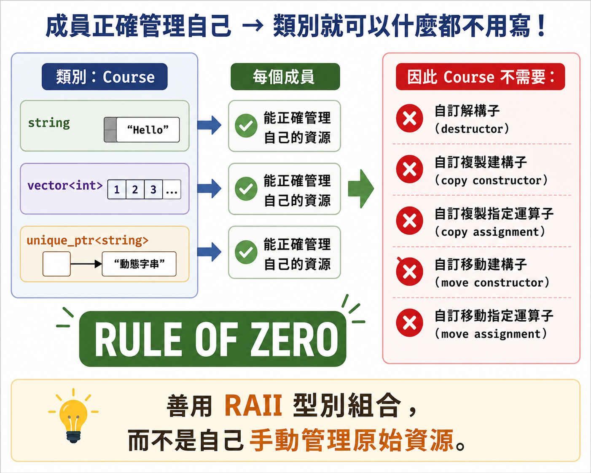
## Section LIV. 不直接管理資源

如果類別成員都是：

- `string`
- `vector`
- `unique_ptr`
- `shared_ptr`
- 其他 RAII 類別

通常不需自行寫：

- 解構子。
- 複製建構子。
- 複製賦值。
- 移動建構子。
- 移動賦值。

---

## Section LV. 完整 Rule of Zero

```cpp
// VALIDATE
#include <iostream>
#include <memory>
#include <string>
#include <vector>
using namespace std;

class Course {
public:
    Course(
        const string& initialName,
        vector<int> initialScores
    )
        : nameValue(initialName),
          scores(
              std::move(
                  initialScores
              )
          ),
          notes(
              make_unique<string>(
                  "No notes"
              )
          ) {
    }

    const string& name() const {
        return nameValue;
    }

    vector<int>::size_type
    scoreCount() const {
        return scores.size();
    }

private:
    string nameValue;
    vector<int> scores;
    unique_ptr<string> notes;
};

int main() {
    Course course(
        "C++",
        {
            90,
            95
        }
    );

    cout << course.name()
         << " "
         << course.scoreCount()
         << '\n';

    return 0;
}
```

因為包含 `unique_ptr`，Course 自動不可複製，但可移動。

---

# Part U：Rule of Five

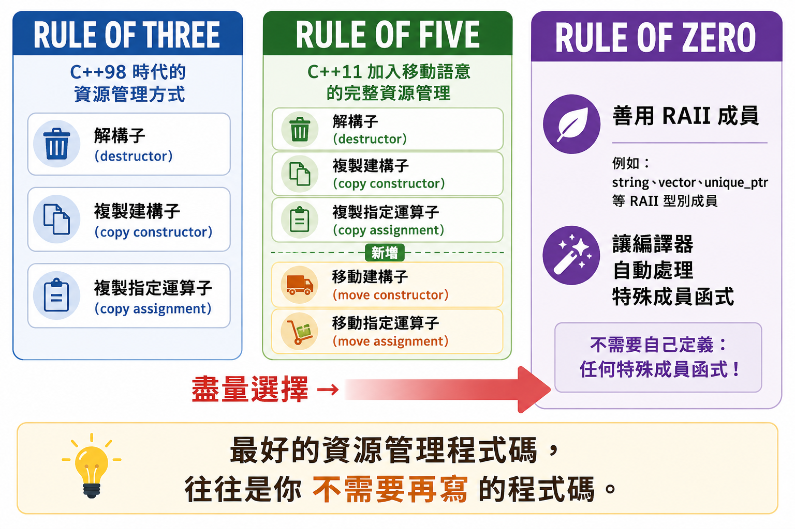
## Section LVI. 何時需要？

當類別直接管理裸資源時，可能需要自行定義：

1. Destructor
2. Copy constructor
3. Copy assignment
4. Move constructor
5. Move assignment

---

## Section LVII. 更好的問題

在實作 Rule of Five 前先問：

```text
能否把資源交給 unique_ptr 或其他 RAII 類別？
```

若可以，通常回到 Rule of Zero。

---

# Part V：禁止複製的 RAII 類別

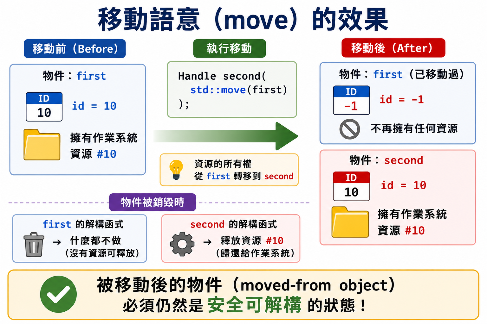

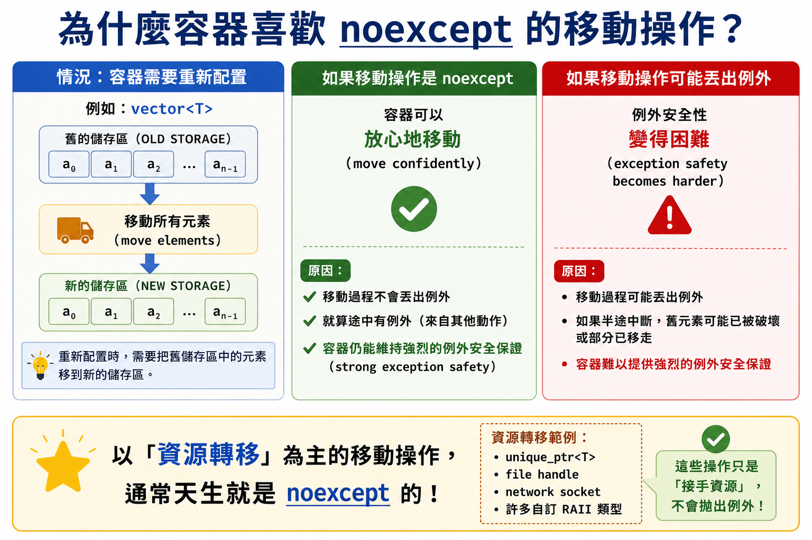
## Section LVIII. Exclusive Resource

例如 mutex lock、socket、file handle，通常不能複製。

可使用：

```cpp
Type(
    const Type&
) = delete;

Type& operator=(
    const Type&
) = delete;
```

---

## Section LIX. 完整 Move-Only Handle

```cpp
// VALIDATE
#include <iostream>
#include <utility>
using namespace std;

class Handle {
public:
    explicit Handle(int initialId)
        : idValue(initialId) {
    }

    ~Handle() {
        release();
    }

    Handle(
        const Handle&
    ) = delete;

    Handle& operator=(
        const Handle&
    ) = delete;

    Handle(
        Handle&& other
    ) noexcept
        : idValue(
              other.idValue
          ) {
        other.idValue = -1;
    }

    Handle& operator=(
        Handle&& other
    ) noexcept {
        if (
            this !=
            &other
        ) {
            release();

            idValue =
                other.idValue;

            other.idValue = -1;
        }

        return *this;
    }

    int id() const noexcept {
        return idValue;
    }

private:
    void release() noexcept {
        if (idValue != -1) {
            idValue = -1;
        }
    }

    int idValue;
};

int main() {
    Handle first(10);
    Handle second(
        std::move(first)
    );

    cout << first.id()
         << " "
         << second.id()
         << '\n';

    return 0;
}
```

這是教學用簡化資源 handle。

---

# Part W：Smart Pointer 與例外安全

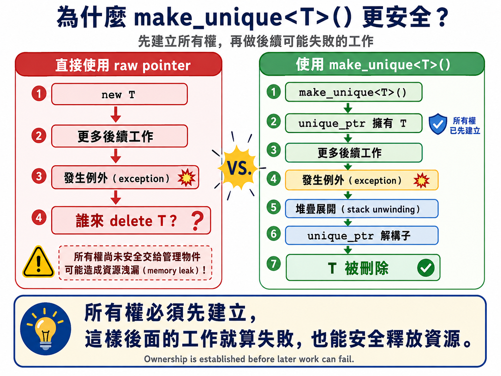
## Section LX. `make_unique()`

```cpp
auto value =
    make_unique<T>(args...);
```

物件成功建立後立即由 unique_ptr 管理。

若建構子拋出例外，配置的記憶體會被正確清理。

---

## Section LXI. `make_shared()`

通常：

- 同時配置物件與 control block。
- 程式較短。
- 例外安全較清楚。
- 可能有較好的配置效率。

---

## Section LXII. 仍需注意

`make_shared` 的 object storage 可能在所有 weak_ptr 消失前不完全釋放。

對非常大型物件且 weak_ptr 長期存在時，直接 shared_ptr 配置可能有不同取捨。

初學時仍優先 `make_shared()`。

---

# Part X：Value、Unique、Shared 的選擇

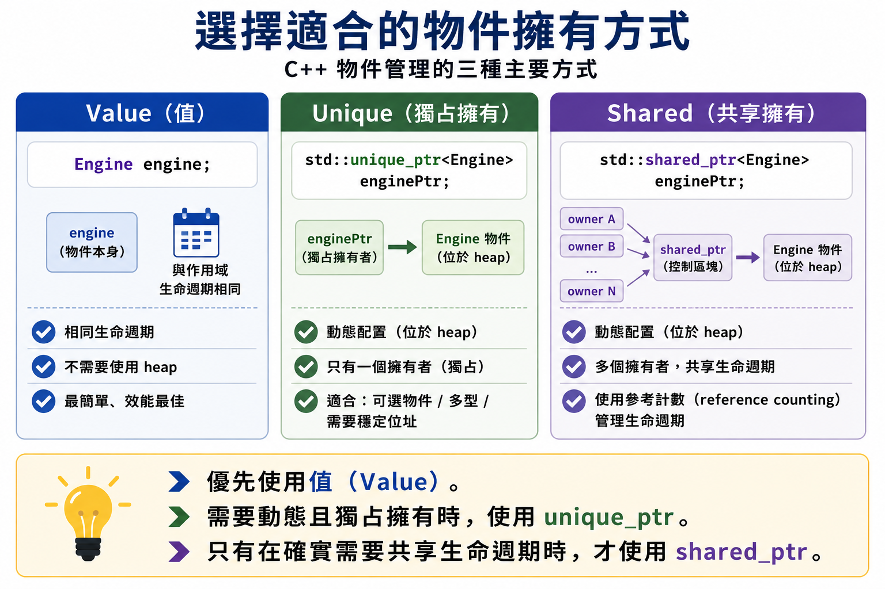

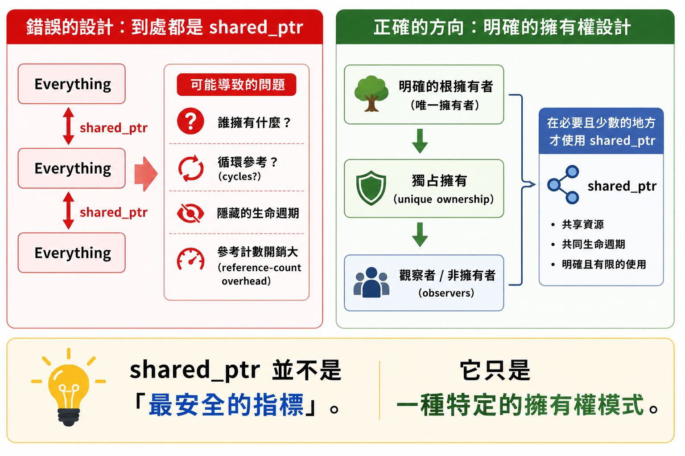
## Section LXIII. 優先值語意

```cpp
class Car {
private:
    Engine engine;
};
```

若 Engine 必然存在且生命週期和 Car 相同，不需動態配置。

---

## Section LXIV. 使用 Unique

```cpp
class Car {
private:
    unique_ptr<Engine>
        engine;
};
```

適合：

- Engine 型別隱藏。
- Engine 可選。
- Engine 很大且要穩定位址。
- 多型實作。
- PImpl。

---

## Section LXV. 使用 Shared

只有當：

```text
多個物件真的共同決定資源生命週期
```

才使用。

不要只是因為不知道誰擁有，就全部改 shared_ptr。

---

# Part Y：依參數表達 Ownership

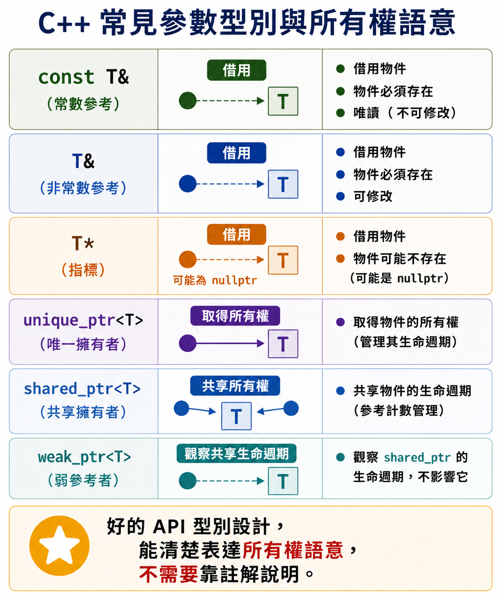

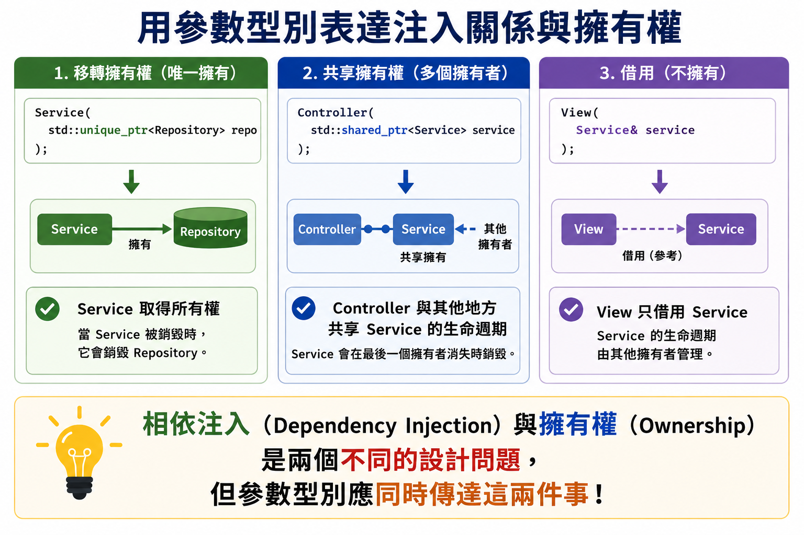
## Section LXVI. 接管所有權

```cpp
class Service {
public:
    explicit Service(
        unique_ptr<Repository>
            repository
    );
};
```

呼叫者必須 move。

---

## Section LXVII. 共享所有權

```cpp
class Controller {
public:
    explicit Controller(
        shared_ptr<Service>
            service
    );
};
```

Controller 保存 shared owner。

---

## Section LXVIII. 借用

```cpp
void render(
    const Service& service
);
```

函式不保存 ownership。

---

## Section LXIX. 完整注入範例

```cpp
// VALIDATE
#include <iostream>
#include <memory>
#include <string>
using namespace std;

class Repository {
public:
    string loadName() const {
        return "Amy";
    }
};

class Service {
public:
    explicit Service(
        unique_ptr<Repository>
            initialRepository
    )
        : repository(
              std::move(
                  initialRepository
              )
          ) {
    }

    string loadName() const {
        return
            repository->loadName();
    }

private:
    unique_ptr<Repository>
        repository;
};

int main() {
    Service service(
        make_unique<Repository>()
    );

    cout << service.loadName()
         << '\n';

    return 0;
}
```

---

# Part Z：Thread Safety 概念

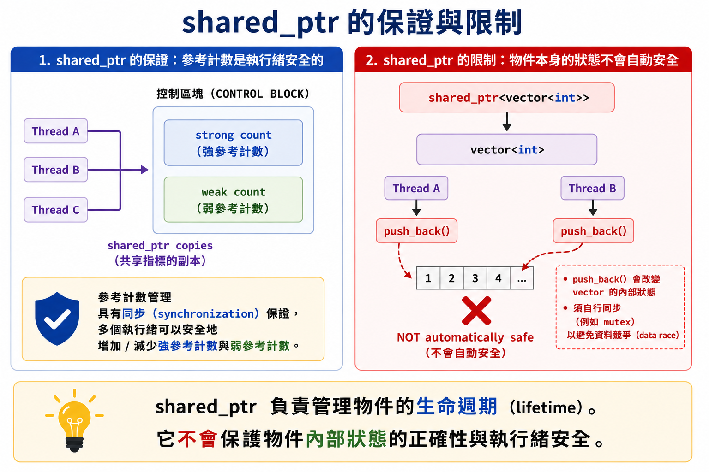
## Section LXX. Control Block

不同 shared_ptr 副本在不同執行緒增加或減少 reference count，control block 操作有必要的同步保障概念。

---

## Section LXXI. 被管理物件

以下仍不自動安全：

```cpp
shared_ptr<vector<int>>
```

多執行緒同時修改 vector 仍需要 mutex。

Shared_ptr 只管理生命週期，不保證物件內容 thread-safe。

---

# Part AA：`enable_shared_from_this` 預告

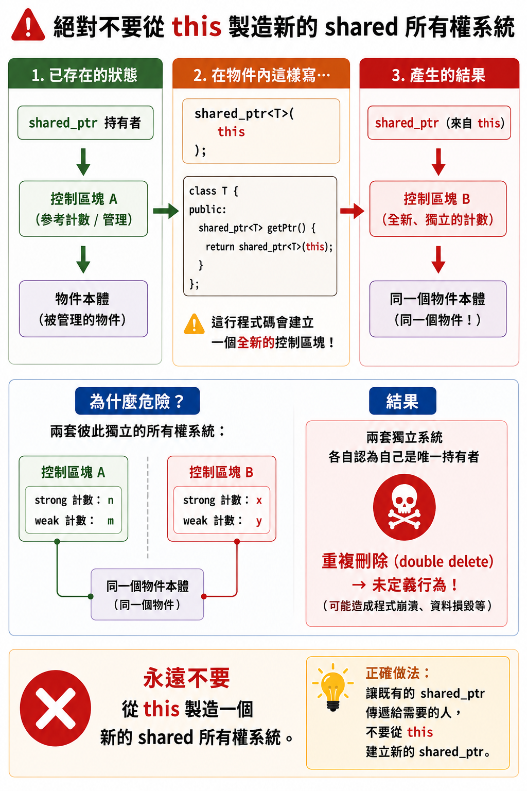
## Section LXXII. 問題

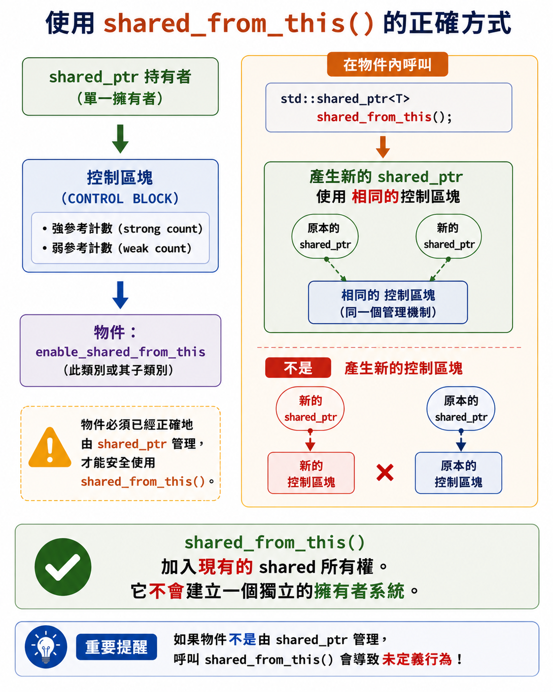
成員函式中若直接：

```cpp
/* shared_ptr<T>(
    this
); */
```

會建立第二個 control block，造成 double delete。

---

## Section LXXIII. 解法方向

類別可繼承：

```cpp
enable_shared_from_this<T>
```

再使用：

```cpp
shared_from_this()
```

前提是物件已經由 shared_ptr 正確管理。

本章不深入完整生命週期與建構限制。

---

# Part AB：常見所有權圖

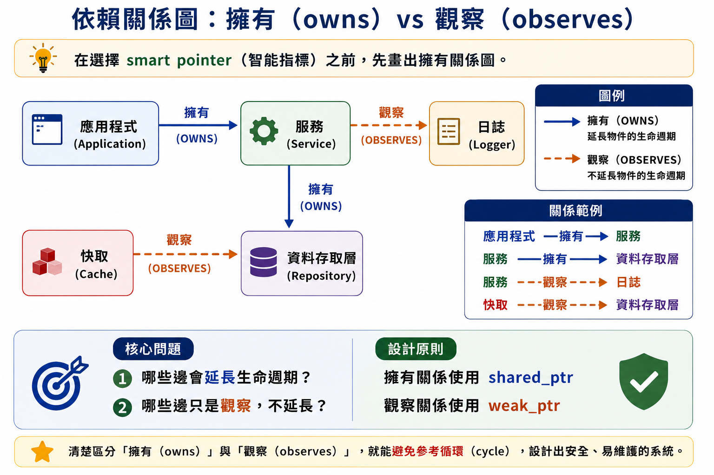

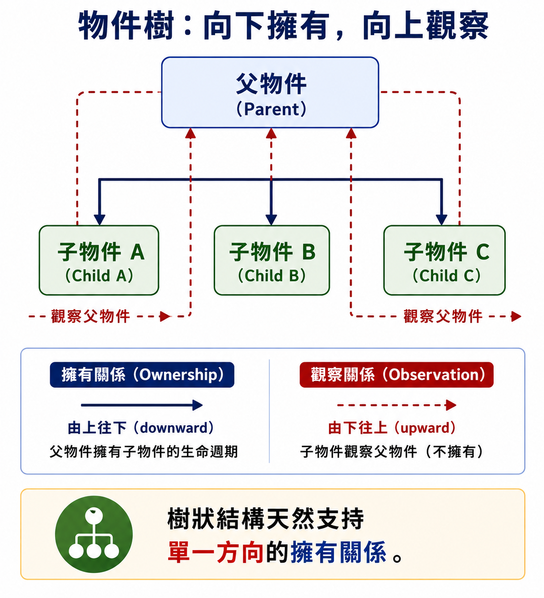
## Section LXXIV. Tree

```text
Parent unique/shared owns Children
Children observe Parent
```

---

## Section LXXV. Graph

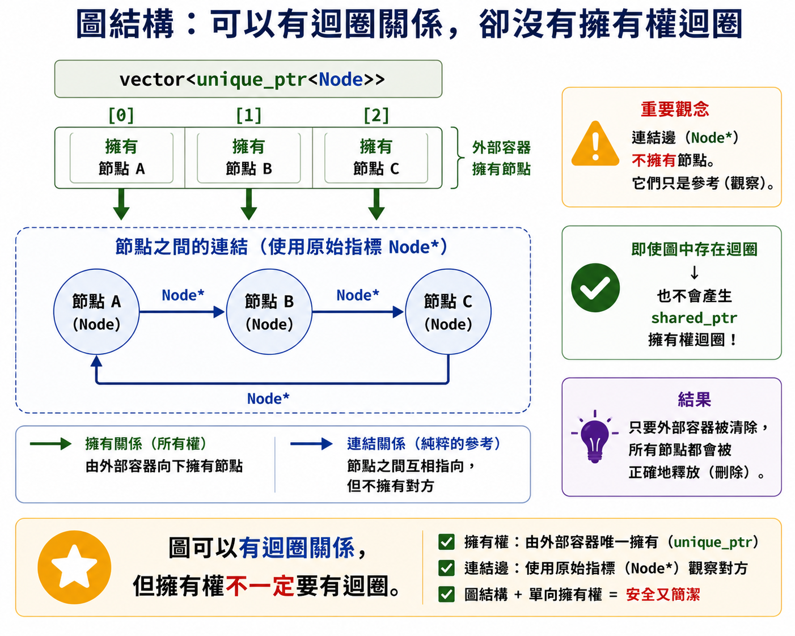
一般圖節點可由外部容器統一擁有：

```text
vector<unique_ptr<Node>>
```

節點間邊使用：

```text
Node*
```

作為 non-owning observer。

這常比每條邊都 shared_ptr 更清楚。

---

# Part AC：快速概念檢查

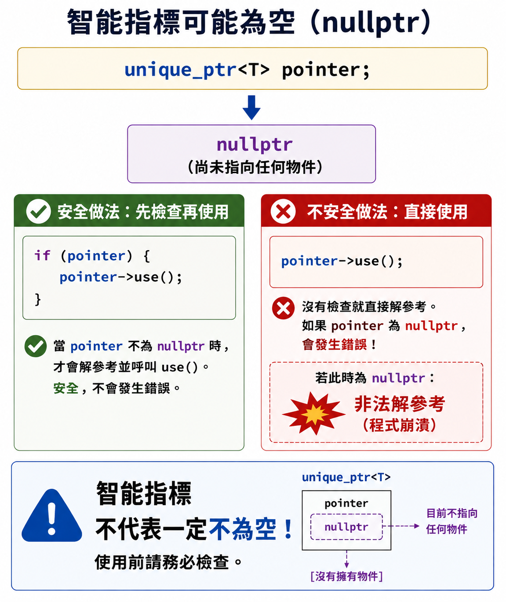
## Section LXXVI. 選擇題與簡答

### Q1. RAII 的核心是什麼？

<details><summary>查看答案</summary>

把資源取得綁定物件建立，把資源釋放綁定物件解構。

</details>

### Q2. `unique_ptr` 表達什麼？

<details><summary>查看答案</summary>

單一、排他的動態所有權。

</details>

### Q3. 為什麼 `unique_ptr` 不可複製？

<details><summary>查看答案</summary>

複製會產生兩個自稱唯一的擁有者，可能造成重複釋放。

</details>

### Q4. 如何轉移 `unique_ptr`？

<details><summary>查看答案</summary>

使用 `std::move()`。

</details>

### Q5. Move 後原 unique_ptr 通常是什麼狀態？

<details><summary>查看答案</summary>

空指標狀態，可安全解構與重新指定。

</details>

### Q6. `.get()` 會轉移所有權嗎？

<details><summary>查看答案</summary>

不會，只取得非擁有裸指標。

</details>

### Q7. `.release()` 有什麼作用？

<details><summary>查看答案</summary>

讓 unique_ptr 放棄所有權但不刪除物件，呼叫者必須接管釋放責任。

</details>

### Q8. 多型 unique_ptr 的基底類別需要什麼？

<details><summary>查看答案</summary>

Virtual destructor。

</details>

### Q9. `shared_ptr` 何時銷毀物件？

<details><summary>查看答案</summary>

最後一個 strong owner 消失時。

</details>

### Q10. `weak_ptr` 是否增加 strong reference count？

<details><summary>查看答案</summary>

不增加。

</details>

### Q11. 使用 weak_ptr 前應做什麼？

<details><summary>查看答案</summary>

呼叫 `lock()` 取得可能為空的 shared_ptr。

</details>

### Q12. 為什麼雙向 shared_ptr 可能洩漏？

<details><summary>查看答案</summary>

兩個物件互相維持 strong count，即使外部 owner 消失也不會降到零。

</details>

### Q13. 如何打破 cycle？

<details><summary>查看答案</summary>

將非擁有方向改成 weak_ptr。

</details>

### Q14. 為什麼不能用 `shared_ptr<T>(first.get())`？

<details><summary>查看答案</summary>

會建立第二個 control block，兩邊可能重複 delete 同一物件。

</details>

### Q15. Dynamic ownership 的預設智慧指標通常是哪一個？

<details><summary>查看答案</summary>

`unique_ptr`。

</details>

### Q16. 為什麼不應所有地方都使用 shared_ptr？

<details><summary>查看答案</summary>

它隱藏所有權責任、增加 reference counting 成本，也容易形成循環。

</details>

### Q17. Rule of Zero 是什麼？

<details><summary>查看答案</summary>

使用 RAII 成員管理資源，讓類別不需自行定義特殊成員函式。

</details>

### Q18. `unique_ptr<T[]>` 與 vector 相比缺少什麼？

<details><summary>查看答案</summary>

沒有 size、iterator 與多數容器操作。

</details>

### Q19. Shared_ptr 是否讓被管理物件自動 thread-safe？

<details><summary>查看答案</summary>

不會，只管理共享生命週期；物件內容仍需自行同步。

</details>

### Q20. 只借用且不可為空的參數通常使用什麼？

<details><summary>查看答案</summary>

`T&` 或 `const T&`。

</details>

---

# Part AD：程式閱讀練習

## Section LXXVII. 預測結果與合法性

### 題目 1

```cpp
auto first =
    make_unique<int>(10);

/* auto second =
    first; */
```

<details><summary>查看答案</summary>

不合法，unique_ptr 不可複製。

</details>

### 題目 2

```cpp
auto first =
    make_unique<int>(10);

auto second =
    std::move(first);

cout << boolalpha
     << (
            first ==
            nullptr
        );
```

<details><summary>查看答案</summary>

```text
true
```

</details>

### 題目 3

```cpp
auto value =
    make_unique<int>(42);

int* observer =
    value.get();

cout << *observer;
```

<details><summary>查看答案</summary>

```text
42
```

只要 `value` 仍存在且未 reset，observer 有效。

</details>

### 題目 4

```cpp
auto value =
    make_unique<int>(42);

int* observer =
    value.get();

value.reset();

/* cout << *observer; */
```

<details><summary>查看答案</summary>

Observer 已懸空，不能解參考。

</details>

### 題目 5

```cpp
auto first =
    make_shared<int>(10);

auto second =
    first;

cout << first.use_count();
```

<details><summary>查看答案</summary>

```text
2
```

此時有兩個 strong owner。

</details>

### 題目 6

```cpp
weak_ptr<int> observer;

{
    auto owner =
        make_shared<int>(10);

    observer =
        owner;
}

cout << boolalpha
     << observer.expired();
```

<details><summary>查看答案</summary>

```text
true
```

</details>

### 題目 7

```cpp
weak_ptr<int> observer;

if (
    auto owner =
        observer.lock()
) {
    cout << *owner;
} else {
    cout << "empty";
}
```

<details><summary>查看答案</summary>

```text
empty
```

預設 weak_ptr 沒有有效物件。

</details>

### 題目 8

```cpp
auto uniqueValue =
    make_unique<int>(5);

shared_ptr<int> sharedValue =
    std::move(uniqueValue);

cout << *sharedValue;
```

<details><summary>查看答案</summary>

```text
5
```

</details>

### 題目 9

```cpp
class Base {
public:
    ~Base() {
    }
};

class Derived :
    public Base {
};

/* unique_ptr<Base> value =
    make_unique<Derived>(); */
```

<details><summary>查看答案</summary>

語法可編譯，但透過 Base 指標解構 Derived 時基底解構子不是 virtual，設計不安全。多型基底應使用 virtual destructor。

</details>

### 題目 10

```cpp
auto value =
    make_shared<int>(10);

/* shared_ptr<int> other(
    value.get()
); */
```

<details><summary>查看答案</summary>

危險，會建立第二個 control block，最後可能 double delete。

</details>

### 題目 11

```cpp
auto value =
    make_unique<int>(10);

int* raw =
    value.release();

cout << *raw;

delete raw;
```

<details><summary>查看答案</summary>

輸出：

```text
10
```

Release 後呼叫者負責 delete；若忘記會洩漏。

</details>

### 題目 12

```cpp
unique_ptr<int[]> values =
    make_unique<int[]>(
        3
    );

values[0] = 10;

/* cout << values.size(); */
```

<details><summary>查看答案</summary>

可使用 `operator[]`，但 unique_ptr array 沒有 `.size()`。

</details>

---

# Part AE：實作練習

## Section LXXVIII. 實作檢測題

### TODO 1：Basic Unique Pointer

使用 `make_unique<int>()` 建立整數並輸出。

### TODO 2：Move Ownership

將 unique_ptr 從一個變數移動到另一個變數。

### TODO 3：Consume Ownership

建立接受 `unique_ptr<T>` 的函式，呼叫時明確 move。

### TODO 4：Factory

建立回傳 `unique_ptr<Message>` 的 factory function。

### TODO 5：Observer Function

建立接受 `const Message&` 的唯讀函式。

### TODO 6：Unique Array

使用 `unique_ptr<int[]>` 保存固定筆數動態資料，再比較 vector。

### TODO 7：Polymorphic Collection

使用 `vector<unique_ptr<Base>>` 保存多種 Derived。

### TODO 8：Custom Deleter

用 unique_ptr 管理 `FILE*`。

### TODO 9：Shared Ownership

建立兩個 shared_ptr 共享同一物件並觀察 use count。

### TODO 10：Weak Observer

使用 weak_ptr 觀察 shared object，物件銷毀後正確處理 lock 失敗。

### TODO 11：Break Cycle

建立 Parent-Child 關係，其中 Child 使用 weak_ptr 指向 Parent。

### TODO 12：Unique to Shared

將 unique_ptr 移動成 shared_ptr。

### TODO 13：Dynamic Pointer Cast

從 `shared_ptr<Base>` 嘗試取得 `shared_ptr<Derived>`。

### TODO 14：Move-Only Handle

建立禁止複製但支援移動的簡化資源類別。

### TODO 15：Ownership Design

針對五種 API 情境選擇值、參考、裸觀察指標、unique_ptr、shared_ptr 或 weak_ptr。

---

# Part AF：課後小練習

## Section LXXIX. 延伸練習

### 練習 1：Shape Factory

依文字指令建立 `unique_ptr<Shape>`，並保存到多型集合。

### 練習 2：Scene Graph

設計 Parent 擁有 Child、Child weak-observes Parent 的場景樹。

### 練習 3：Resource Pool

分析資源池應使用 shared ownership、unique ownership 還是外部統一 ownership。

### 練習 4：PImpl 設計

先畫出以 `unique_ptr<Impl>` 隱藏實作的類別結構，不必完成跨檔案程式。

### 練習 5：Ownership Audit

檢查一段使用裸指標的程式，為每個指標標示 owner、observer、可能懸空位置與改寫策略。

---

# Part AG：常見錯誤提醒

## Section LXXX. 常見錯誤

1. 直接持有 `new` 結果。
2. 忘記 delete。
3. Double delete。
4. `new[]` 搭配 `delete`。
5. `new` 搭配 `delete[]`。
6. Delete 非 heap 物件。
7. 解參考空智慧指標。
8. Move 後仍解參考原 unique_ptr。
9. 嘗試複製 unique_ptr。
10. 對 const unique_ptr 使用 move 期待轉移。
11. `.get()` 後自行 delete。
12. `.get()` 後建立第二個 smart pointer。
13. `.release()` 後忘記接管。
14. `.reset(raw)` 時 raw 已由其他 owner 管理。
15. 多型基底缺少 virtual destructor。
16. 所有物件都使用 shared_ptr。
17. 只因傳參方便就複製 shared_ptr。
18. 使用 use_count 做執行緒同步。
19. 以雙向 shared_ptr 建立 cycle。
20. Weak_ptr 使用前不 lock。
21. 先 expired 再假設 lock 一定成功。
22. Shared_ptr 轉 unique_ptr 時假設安全。
23. 兩個 shared_ptr 分別接管同一裸位址。
24. `shared_ptr(this)` 建立第二個 control block。
25. 認為 shared_ptr 讓物件內容自動 thread-safe。
26. 直接實作 Rule of Five，而未先考慮 Rule of Zero。
27. 自訂 move assignment 忘記處理 self-move。
28. Custom deleter 使用錯誤釋放函式。
29. 用 unique_ptr array 取代更適合的 vector。
30. API 參數型別沒有清楚表達 ownership。

---

# Part AH：Mermaid 流程圖

## Section LXXXI. RAII 與智慧指標流程圖

### 1. 選擇所有權表示

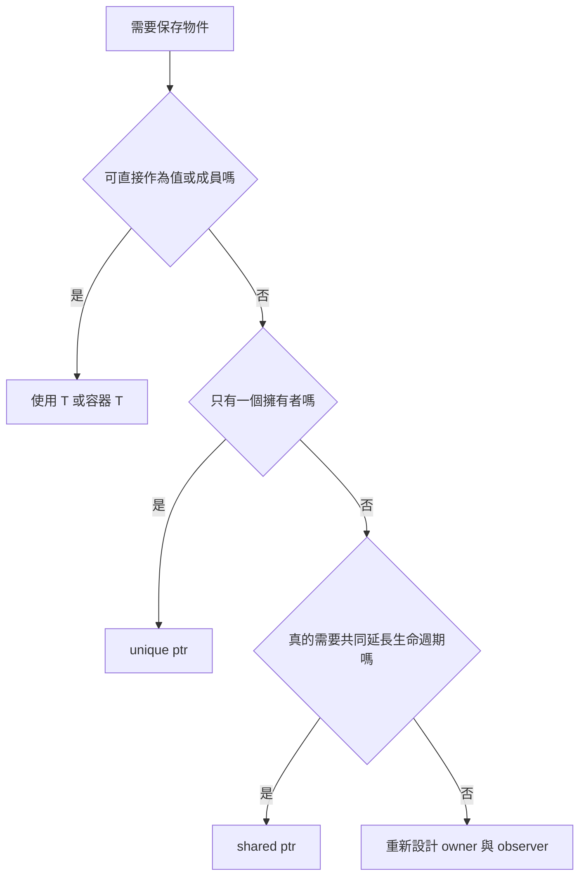
```mermaid
flowchart TD
    A[需要保存物件] --> B{可直接作為值或成員嗎}
    B -- 是 --> C[使用 T 或容器 T]
    B -- 否 --> D{只有一個擁有者嗎}
    D -- 是 --> E[unique ptr]
    D -- 否 --> F{真的需要共同延長生命週期嗎}
    F -- 是 --> G[shared ptr]
    F -- 否 --> H[重新設計 owner 與 observer]
```

### 2. Unique Ownership Transfer

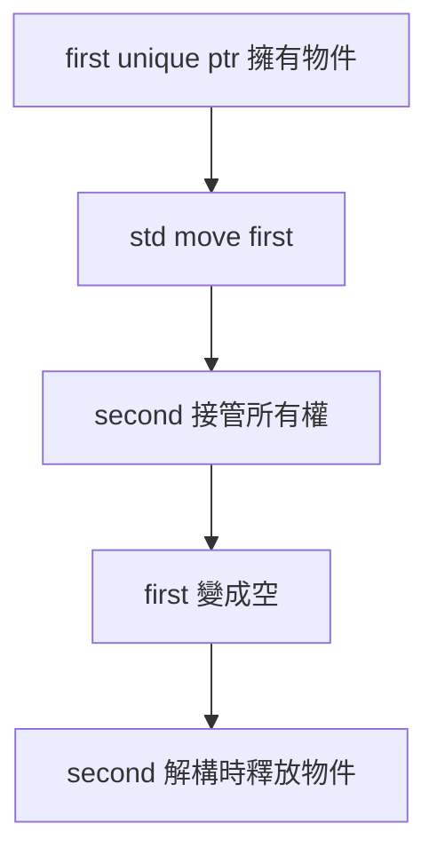
```mermaid
flowchart TD
    A[first unique ptr 擁有物件] --> B[std move first]
    B --> C[second 接管所有權]
    C --> D[first 變成空]
    D --> E[second 解構時釋放物件]
```

### 3. Shared Reference Count

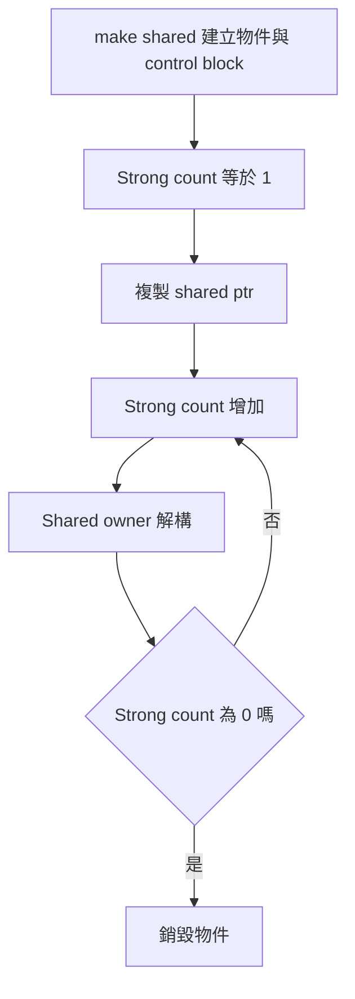
```mermaid
flowchart TD
    A[make shared 建立物件與 control block] --> B[Strong count 等於 1]
    B --> C[複製 shared ptr]
    C --> D[Strong count 增加]
    D --> E[Shared owner 解構]
    E --> F{Strong count 為 0 嗎}
    F -- 否 --> D
    F -- 是 --> G[銷毀物件]
```

### 4. Weak Lock

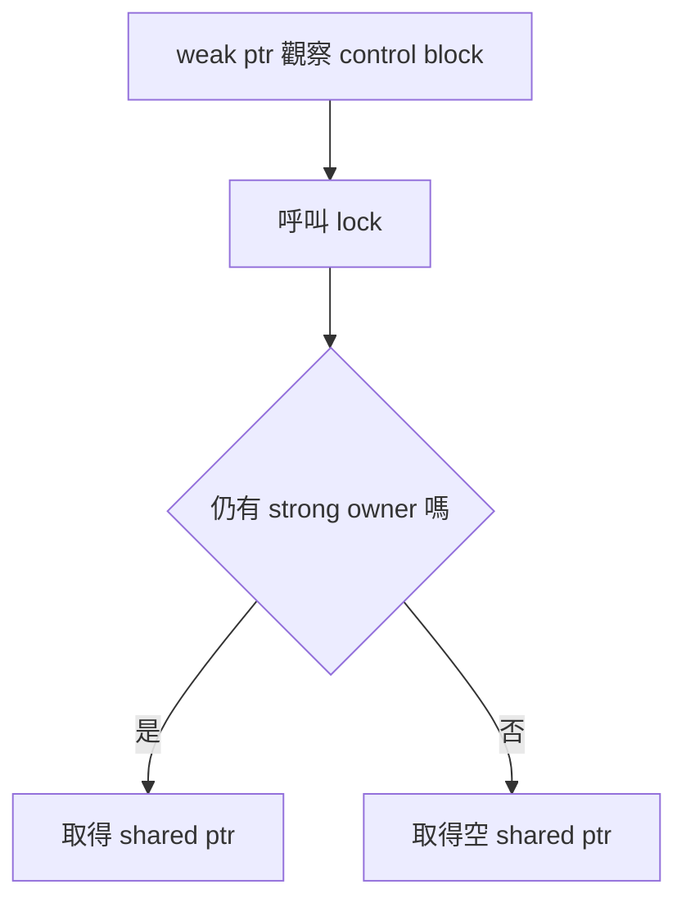
```mermaid
flowchart TD
    A[weak ptr 觀察 control block] --> B[呼叫 lock]
    B --> C{仍有 strong owner 嗎}
    C -- 是 --> D[取得 shared ptr]
    C -- 否 --> E[取得空 shared ptr]
```

### 5. 打破循環

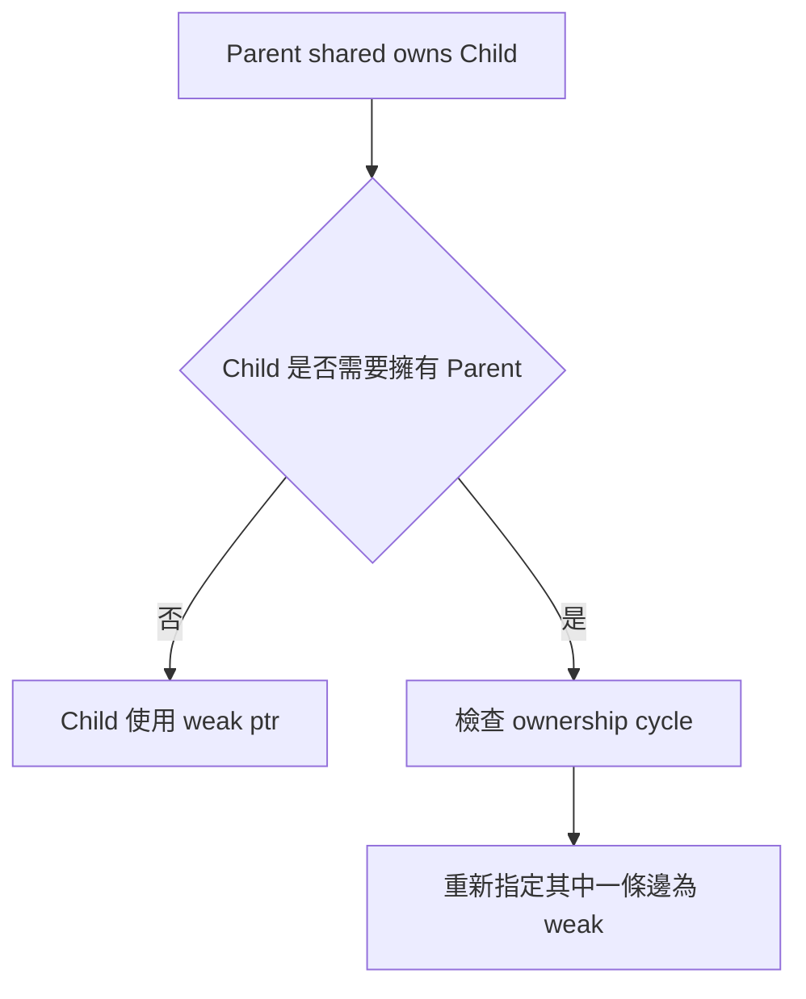
```mermaid
flowchart TD
    A[Parent shared owns Child] --> B{Child 是否需要擁有 Parent}
    B -- 否 --> C[Child 使用 weak ptr]
    B -- 是 --> D[檢查 ownership cycle]
    D --> E[重新指定其中一條邊為 weak]
```

### 6. RAII 例外安全

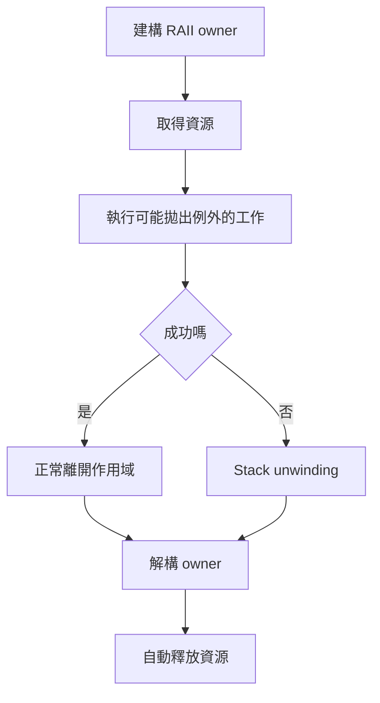
```mermaid
flowchart TD
    A[建構 RAII owner] --> B[取得資源]
    B --> C[執行可能拋出例外的工作]
    C --> D{成功嗎}
    D -- 是 --> E[正常離開作用域]
    D -- 否 --> F[Stack unwinding]
    E --> G[解構 owner]
    F --> G
    G --> H[自動釋放資源]
```

### 7. API Ownership

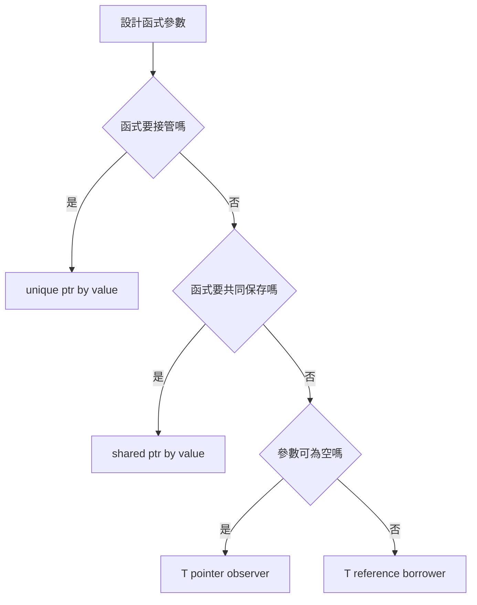
```mermaid
flowchart TD
    A[設計函式參數] --> B{函式要接管嗎}
    B -- 是 --> C[unique ptr by value]
    B -- 否 --> D{函式要共同保存嗎}
    D -- 是 --> E[shared ptr by value]
    D -- 否 --> F{參數可為空嗎}
    F -- 是 --> G[T pointer observer]
    F -- 否 --> H[T reference borrower]
```

### 8. Rule of Zero 檢查

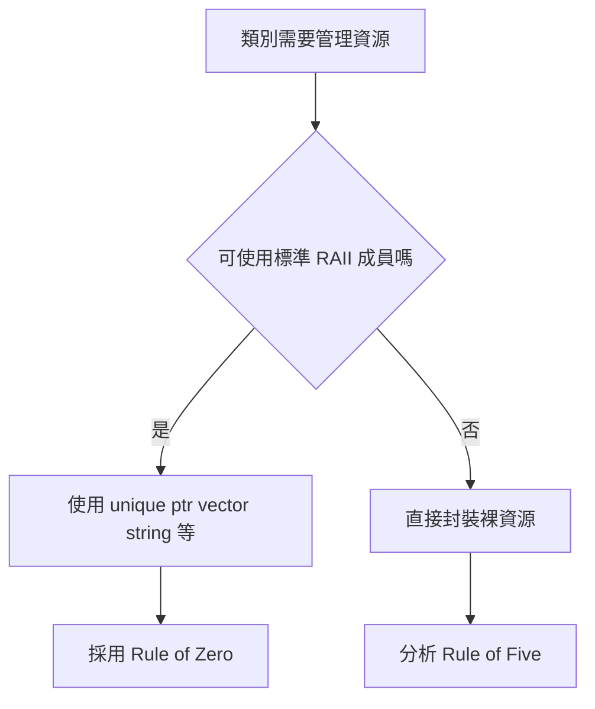
```mermaid
flowchart TD
    A[類別需要管理資源] --> B{可使用標準 RAII 成員嗎}
    B -- 是 --> C[使用 unique ptr vector string 等]
    C --> D[採用 Rule of Zero]
    B -- 否 --> E[直接封裝裸資源]
    E --> F[分析 Rule of Five]
```

---

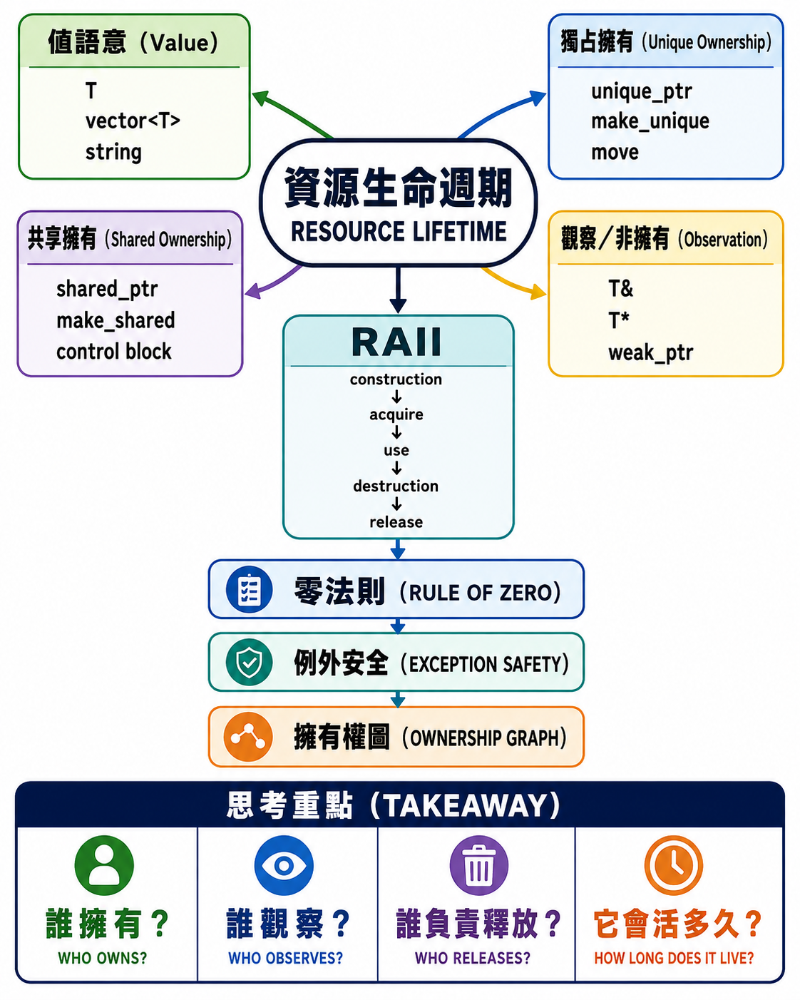
# 本章完成標準

完成本章後，你應該能做到：

1. 解釋 RAII。
2. 列出資源種類。
3. 解釋 ownership。
4. 區分 owner 與 observer。
5. 說明 memory leak。
6. 說明 dangling pointer。
7. 使用 `unique_ptr`。
8. 使用 `make_unique()`。
9. 使用 `operator*` 與 `operator->`。
10. 檢查空智慧指標。
11. 移動 unique_ptr。
12. 傳遞 unique ownership。
13. 回傳 unique_ptr。
14. 使用 `.get()`。
15. 理解 `.release()`。
16. 使用 `.reset()`。
17. 使用 `unique_ptr<T[]>`。
18. 比較 unique array 與 vector。
19. 建立多型 unique_ptr 集合。
20. 使用 custom deleter。
21. 使用 `shared_ptr`。
22. 使用 `make_shared()`。
23. 解釋 reference count。
24. 使用 `weak_ptr`。
25. 使用 `.lock()`。
26. 解釋循環參考。
27. 使用 weak_ptr 打破 cycle。
28. 避免 double control block。
29. 將 unique_ptr 轉成 shared_ptr。
30. 使用 `dynamic_pointer_cast()`。
31. 解釋 Rule of Zero。
32. 解釋 Rule of Five。
33. 建立 move-only RAII 類別。
34. 說明智慧指標的例外安全。
35. 比較值、unique 與 shared。
36. 以參數型別表達 ownership。
37. 解釋 shared_ptr 的 thread-safety 範圍。
38. 認識 `enable_shared_from_this`。
39. 分析 ownership graph。
40. 找出常見智慧指標錯誤。

---

# 隱藏答案區

> Answer hidden — try it first.

<details><summary>TODO 1 答案</summary>

```cpp
auto value =
    make_unique<int>(42);

cout << *value
     << '\n';
```

</details>

<details><summary>TODO 2 答案</summary>

```cpp
auto first =
    make_unique<int>(10);

auto second =
    std::move(first);
```

</details>

<details><summary>TODO 3 答案</summary>

```cpp
void consume(
    unique_ptr<Resource>
        resource
) {
    resource->use();
}

consume(
    std::move(resource)
);
```

</details>

<details><summary>TODO 4 答案</summary>

```cpp
unique_ptr<Message>
makeMessage(
    const string& text
) {
    return
        make_unique<Message>(
            text
        );
}
```

</details>

<details><summary>TODO 5 答案</summary>

```cpp
void printMessage(
    const Message& message
) {
    cout << message.text();
}

printMessage(*pointer);
```

</details>

<details><summary>TODO 6 答案</summary>

```cpp
auto values =
    make_unique<int[]>(
        count
    );
```

若需要 size、iterator 與演算法整合，通常改用 `vector<int>`。

</details>

<details><summary>TODO 7 答案</summary>

```cpp
vector<
    unique_ptr<Base>
> objects;

objects.push_back(
    make_unique<Derived>()
);
```

Base 必須有 virtual destructor。

</details>

<details><summary>TODO 8 答案</summary>

```cpp
struct FileCloser {
    void operator()(
        FILE* file
    ) const noexcept {
        if (file != nullptr) {
            fclose(file);
        }
    }
};

using FilePointer =
    unique_ptr<
        FILE,
        FileCloser
    >;
```

</details>

<details><summary>TODO 9 答案</summary>

```cpp
auto first =
    make_shared<Resource>();

auto second =
    first;

cout << first.use_count();
```

</details>

<details><summary>TODO 10 答案</summary>

```cpp
weak_ptr<Resource>
    observer =
        owner;

if (
    auto locked =
        observer.lock()
) {
    locked->use();
}
```

</details>

<details><summary>TODO 11 答案</summary>

Parent 保存：

```cpp
vector<
    shared_ptr<Child>
> children;
```

Child 保存：

```cpp
weak_ptr<Parent>
    parent;
```

</details>

<details><summary>TODO 12 答案</summary>

```cpp
auto uniqueValue =
    make_unique<Resource>();

shared_ptr<Resource>
    sharedValue =
        std::move(uniqueValue);
```

</details>

<details><summary>TODO 13 答案</summary>

```cpp
auto derived =
    dynamic_pointer_cast<
        Derived
    >(base);

if (derived) {
    derived->specificOperation();
}
```

</details>

<details><summary>TODO 14 答案</summary>

```cpp
class Handle {
public:
    Handle(
        const Handle&
    ) = delete;

    Handle& operator=(
        const Handle&
    ) = delete;

    Handle(
        Handle&& other
    ) noexcept;

    Handle& operator=(
        Handle&& other
    ) noexcept;

    ~Handle();
};
```

需讓 moved-from 物件保持可安全解構狀態。

</details>

<details><summary>TODO 15 答案</summary>

範例：

```text
函式只讀必要物件 → const T&
函式可接受沒有物件 → const T*
函式接管唯一所有權 → unique_ptr<T>
多個元件共同保存生命週期 → shared_ptr<T>
只觀察 shared 物件 → weak_ptr<T>
```

</details>
