# Lesson 31：Copy, Move, and the Rule of Zero 複製、移動與 Rule of Zero

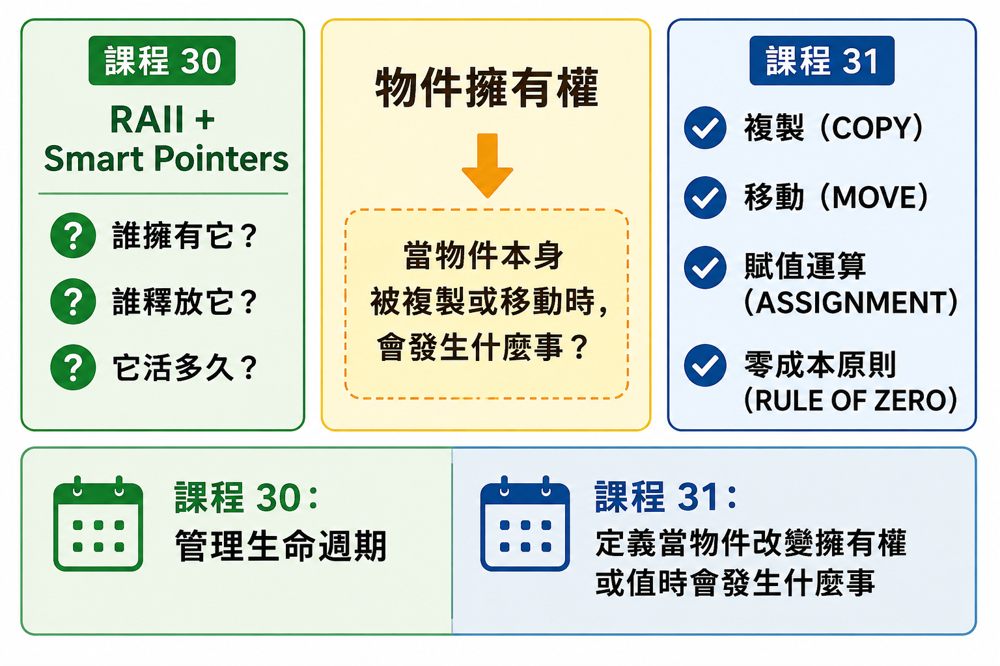


> 這堂課的重點：理解 C++ 物件如何被複製、移動、賦值與銷毀，並學會判斷什麼時候需要手動撰寫特殊成員函式，什麼時候應該讓 `std::string`、`std::vector`、`std::unique_ptr` 等 RAII 成員自動完成工作。

> 本章延續第 30 章的 RAII 與智慧指標。核心原則不是「每個類別都要寫 Rule of Five」，而是「優先設計成 Rule of Zero；只有直接管理資源時才考慮 Rule of Three 或 Rule of Five」。

---

## Section I. 今天要做什麼？

1. 認識 special member functions。
2. 認識 default constructor。
3. 認識 destructor。
4. 認識 copy constructor。
5. 認識 copy assignment operator。
6. 認識 move constructor。
7. 認識 move assignment operator。
8. 理解 compiler-generated special members。
9. 理解 copy。
10. 理解 move。
11. 理解 value semantics。
12. 理解 identity。
13. 理解 ownership。
14. 認識 shallow copy。
15. 認識 deep copy。
16. 認識 double delete。
17. 認識 shared state。
18. 認識 self-assignment。
19. 認識 self-move assignment。
20. 使用 `= default`。
21. 使用 `= delete`。
22. 理解 copy constructor 語法。
23. 理解 copy assignment 語法。
24. 理解 move constructor 語法。
25. 理解 move assignment 語法。
26. 理解 `const T&`。
27. 理解 `T&&`。
28. 認識 rvalue reference。
29. 認識 lvalue。
30. 認識 rvalue。
31. 認識 xvalue。
32. 不在本章深入 value category 完整分類。
33. 使用 `std::move()`。
34. 理解 `std::move()` 不搬運任何資料。
35. 理解 `std::move()` 是轉型。
36. 理解移動工作由 move constructor 或 move assignment 完成。
37. 理解 moved-from state。
38. Moved-from 物件必須可安全解構。
39. Moved-from 物件通常可重新賦值。
40. 不應假設 moved-from 物件保留原值。
41. 認識 valid but unspecified state。
42. 對標準型別使用 moved-from 規則。
43. 使用 `std::exchange()` 概念。
44. 認識 copy initialization。
45. 認識 direct initialization。
46. 認識 copy assignment。
47. 區分 initialization 與 assignment。
48. 理解 `T second = first;` 可能呼叫 copy constructor。
49. 理解 `second = first;` 呼叫 copy assignment。
50. 理解 `T second = std::move(first);` 可能呼叫 move constructor。
51. 理解 `second = std::move(first);` 呼叫 move assignment。
52. 認識 implicit copy constructor。
53. 認識 implicit copy assignment。
54. 認識 implicit move constructor。
55. 認識 implicit move assignment。
56. 理解自訂 destructor 可能影響隱式 move。
57. 理解自訂 copy operation 可能影響隱式 move。
58. 不在本章背誦所有生成規則。
59. 使用 type traits 概念預告。
60. 認識 `is_copy_constructible`。
61. 認識 `is_move_constructible`。
62. 認識 `is_nothrow_move_constructible`。
63. 不在本章深入 `<type_traits>`。
64. 認識 Rule of Three。
65. Destructor。
66. Copy constructor。
67. Copy assignment operator。
68. 理解 Rule of Three 的歷史背景。
69. 認識 Rule of Five。
70. 加入 move constructor。
71. 加入 move assignment operator。
72. 認識 Rule of Zero。
73. 使用 RAII 成員。
74. 讓編譯器產生特殊成員。
75. 優先 Rule of Zero。
76. 使用 `std::string`。
77. 使用 `std::vector`。
78. 使用 `std::unique_ptr`。
79. 使用 `std::shared_ptr`。
80. 理解 Rule of Zero 不代表類別沒有特殊成員。
81. 而是不用手動寫它們。
82. 認識 copyable type。
83. 認識 movable-only type。
84. 認識 immovable type。
85. 使用 `= delete` 禁止複製。
86. 使用 `= delete` 禁止移動。
87. 使用 `= default` 明確要求預設行為。
88. 理解 `unique_ptr` 使類別不可複製。
89. 理解含 `unique_ptr` 類別通常可移動。
90. 實作 clone。
91. 使用 virtual clone。
92. 建立 polymorphic deep copy。
93. 認識 object slicing。
94. 避免按值複製多型基底。
95. 使用 `unique_ptr<Base>` 回傳 clone。
96. 認識 copy-and-swap idiom。
97. 理解 strong exception guarantee。
98. 使用按值參數交換。
99. 認識 `swap()`。
100. 使用 member swap。
101. 使用 free `swap()`。
102. 使用 `noexcept`。
103. 理解 ADL 概念預告。
104. 使用 `using std::swap;` 概念。
105. 認識 self-assignment。
106. `object = object;`
107. Copy assignment 必須安全處理 self-assignment。
108. Copy-and-swap 自然處理 self-assignment。
109. 直接 self-check 概念。
110. `if (this == &other)`。
111. 理解 self-check 不是永遠必要。
112. 認識 self-move。
113. `object = std::move(object);`
114. 保持 self-move 不崩潰。
115. 不必保證保留原內容。
116. Move assignment 需先釋放舊資源。
117. 再接管新資源。
118. 將來源設為安全空狀態。
119. 使用 `std::exchange()` 簡化。
120. 認識 `noexcept` move。
121. 容器 reallocation。
122. Vector 可能選擇 copy 或 move。
123. Move constructor 若為 noexcept 更有利。
124. 理解 `std::move_if_noexcept()`。
125. 不在本章深入實作。
126. 認識 exception safety。
127. Copy constructor 失敗時原物件不變。
128. Copy assignment 需避免半更新。
129. Move operation 應保持雙方可安全解構。
130. 認識 resource handle。
131. 直接管理裸指標。
132. 直接管理檔案 handle。
133. 直接管理 socket handle 概念。
134. 直接管理 mutex handle 概念。
135. 只有直接管理資源時才手寫特殊成員。
136. 使用 `unique_ptr` 取代裸指標。
137. 使用 `vector` 取代裸陣列。
138. 使用 `string` 取代手動 char buffer。
139. 建立 deep-copy buffer。
140. 建立 move-only handle。
141. 比較兩種設計。
142. 認識 PImpl。
143. 使用 `unique_ptr<Impl>`。
144. 理解 PImpl 類別通常不可複製或需自訂 copy。
145. 不在本章深入跨檔案 PImpl。
146. 認識 copy elision。
147. Return value optimization。
148. Named return value optimization。
149. C++17 guaranteed copy elision。
150. 理解某些情況完全不呼叫 copy/move。
151. 不要為了「幫助」return 而寫 `std::move(local)`。
152. 理解 `return std::move(local);` 可能阻止 NRVO。
153. 一般回傳區域物件直接 `return local;`。
154. 認識 temporary materialization。
155. 不在本章深入標準細節。
156. 認識 pass by value。
157. 認識 pass by const reference。
158. 認識 pass by rvalue reference。
159. 使用 sink parameter。
160. `void setName(string name)`。
161. 內部 `member = std::move(name)`。
162. 理解 copy one, move one 模式。
163. 比較 overload `const string&` 與 `string&&`。
164. 避免過早建立過多 overload。
165. 使用按值接收可簡化 API。
166. 依效能與介面需求決定。
167. 認識 forwarding reference。
168. 不在本章深入 perfect forwarding。
169. 認識 `std::forward()`。
170. 只做概念預告。
171. 認識 immutable object。
172. Const 成員與 move。
173. 不能真正從 const 物件移動資源。
174. `std::move(constObject)` 產生 const rvalue。
175. 多數 move constructor 接受非 const `T&&`。
176. 結果可能改用 copy。
177. 避免把要移動的物件宣告 const。
178. 認識 container element requirements。
179. Vector 元素需要可移動或可複製。
180. Map key 的 const 性質。
181. Pair 的 copy/move。
182. Optional 的 copy/move 概念。
183. Variant 的 copy/move 概念。
184. 不在本章深入 sum type。
185. 認識 defaulted destructor。
186. Virtual destructor。
187. Pure virtual destructor 概念。
188. 多型基底 copy 的設計。
189. 基底類別可 protected copy。
190. 避免公開按值複製抽象基底。
191. 認識 clone pattern。
192. 使用 covariance 概念預告。
193. 不在本章深入 covariant smart pointer。
194. 認識 shared_ptr copy。
195. Shared_ptr copy 是共享 ownership。
196. 不等於被管理物件 deep copy。
197. 認識 unique_ptr move。
198. Unique_ptr move 是 ownership transfer。
199. 認識 vector copy。
200. Vector copy 是元素 deep copy 語意。
201. 認識 string copy。
202. String copy 產生獨立字串值。
203. 認識 shared state。
204. Copy 後修改是否互相影響。
205. 依成員型別而定。
206. 使用 shared_ptr 成員時 copy 共享狀態。
207. 使用 value 成員時 copy 獨立狀態。
208. API 文件要說明 copy semantics。
209. 認識 snapshot copy。
210. 認識 shared copy。
211. 認識 disabled copy。
212. 選擇一致語意。
213. 測試 copy constructor。
214. 測試 copy assignment。
215. 測試 move constructor。
216. 測試 move assignment。
217. 測試 self-assignment。
218. 測試 self-move。
219. 測試 exception path。
220. 測試 vector reallocation。
221. 測試 moved-from object。
222. 測試 clone。
223. 使用概念檢查、程式閱讀與實作題整合本章。

---

## Section II. 今天的學習方式

1. 看到類別時先問：
   ```text
   它是否直接管理資源？
   它的成員是否已經是 RAII 型別？
   Copy 應該獨立還是共享？
   Move 後來源應該變成什麼狀態？
   ```
2. 可使用 RAII 成員時，優先 Rule of Zero。
3. 直接管理資源時才考慮 Rule of Five。
4. Copy constructor 應產生邏輯上正確的副本。
5. Copy assignment 要處理舊資源與 self-assignment。
6. Move constructor 接管資源並清空來源。
7. Move operation 儘量標記：
   ```cpp
   noexcept
   ```
8. 回傳區域物件時通常直接：
   ```cpp
   return object;
   ```
9. 不要在不理解時濫用 `std::move()`。
10. 所有合法完整程式使用嚴格 C++17 選項檢查。

---

## Section III. 六個常見特殊成員函式

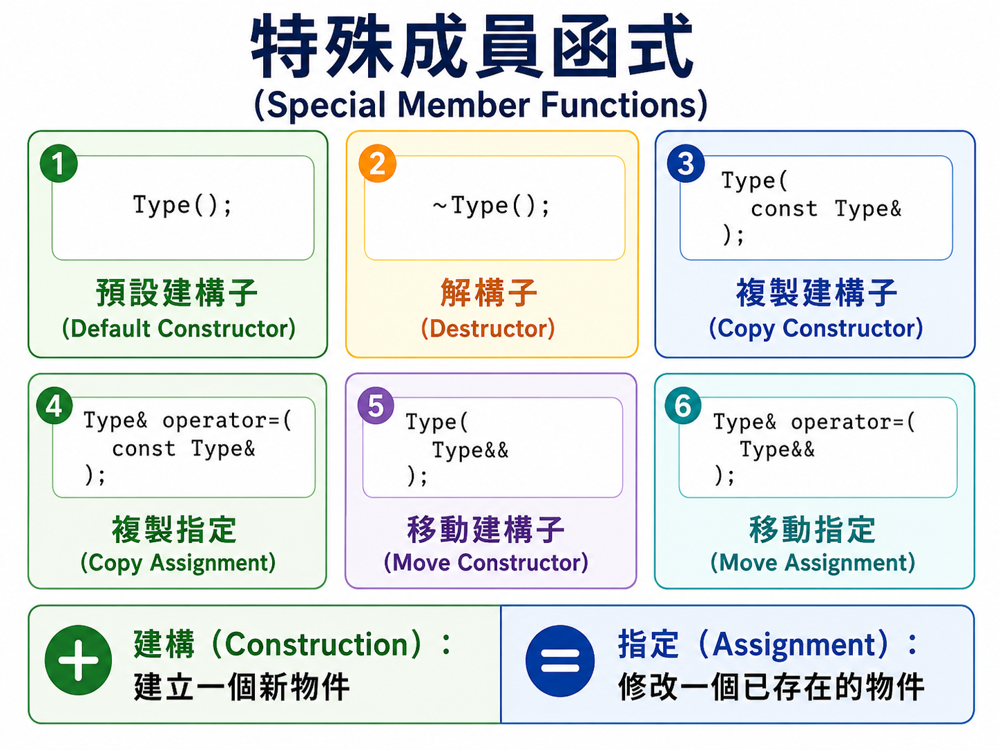


| 函式 | 典型形式 |
| --- | --- |
| Default constructor | `Type();` |
| Destructor | `~Type();` |
| Copy constructor | `Type(const Type& other);` |
| Copy assignment | `Type& operator=(const Type& other);` |
| Move constructor | `Type(Type&& other) noexcept;` |
| Move assignment | `Type& operator=(Type&& other) noexcept;` |

---

# Part A：Initialization 與 Assignment

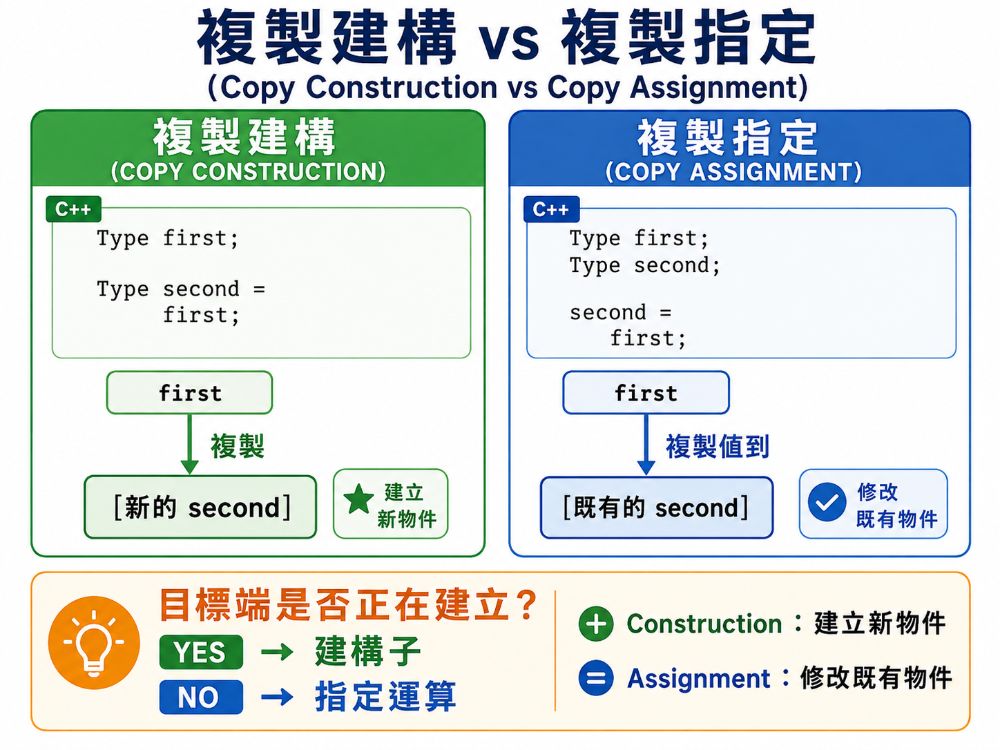

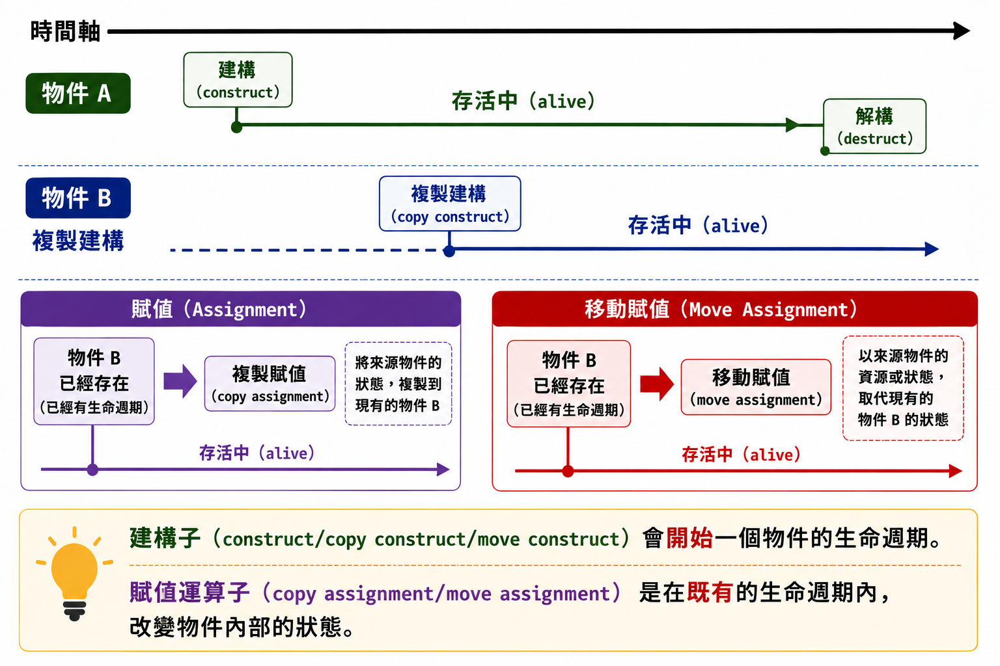


## Section IV. Copy Construction

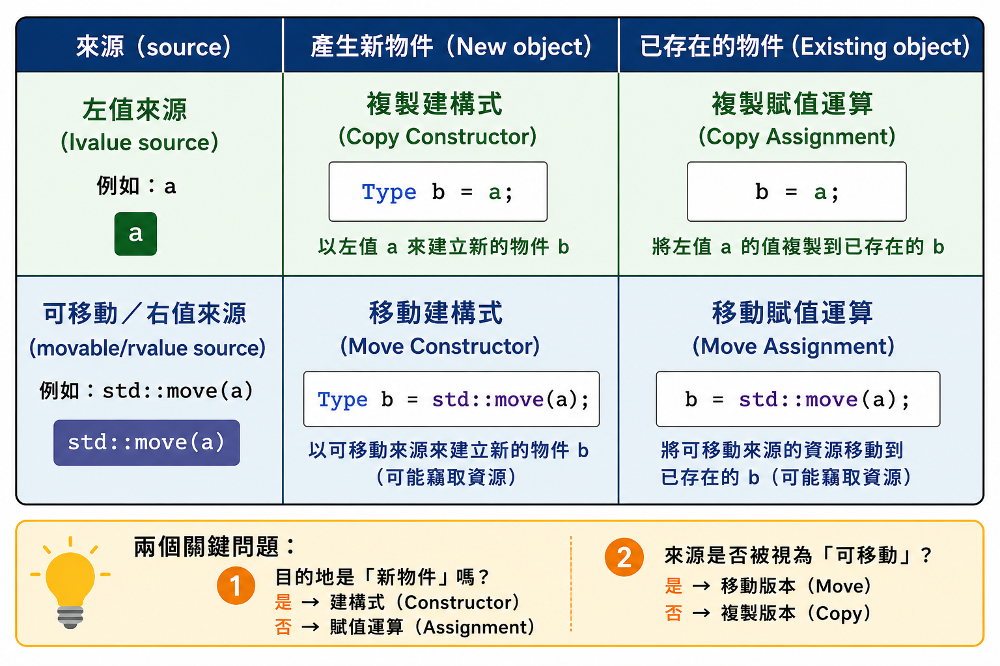


```cpp
Type first;
Type second =
    first;
```

`second` 正在建立，因此是 copy construction。

---

## Section V. Copy Assignment

```cpp
Type first;
Type second;

second =
    first;
```

`second` 已經存在，因此是 copy assignment。

---

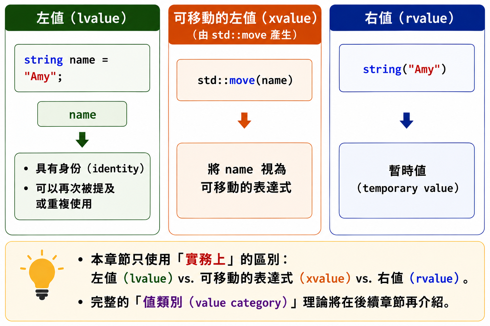

## Section VI. Move Construction

```cpp
Type second =
    std::move(first);
```

若有可用 move constructor，通常呼叫它。

---

## Section VII. Move Assignment

```cpp
second =
    std::move(first);
```

若有可用 move assignment，通常呼叫它。

---

# Part B：Compiler-Generated Copy

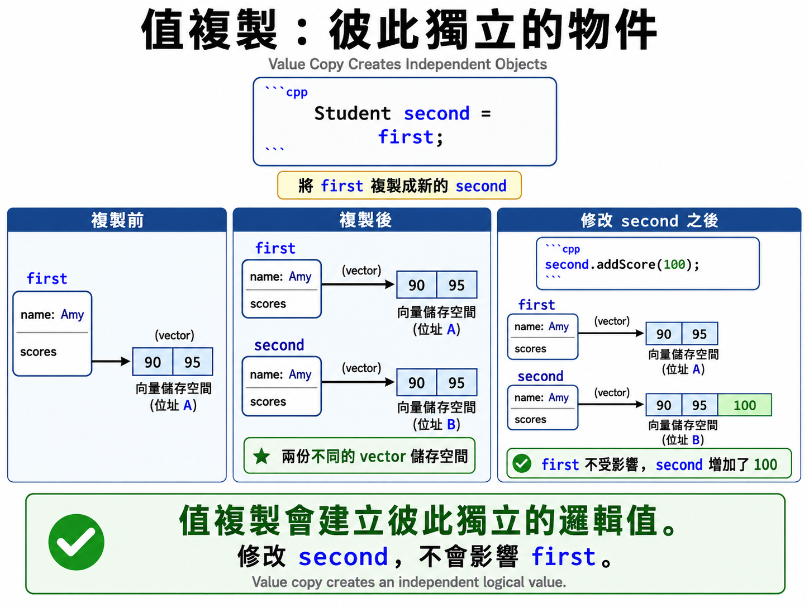


## Section VIII. 值型成員

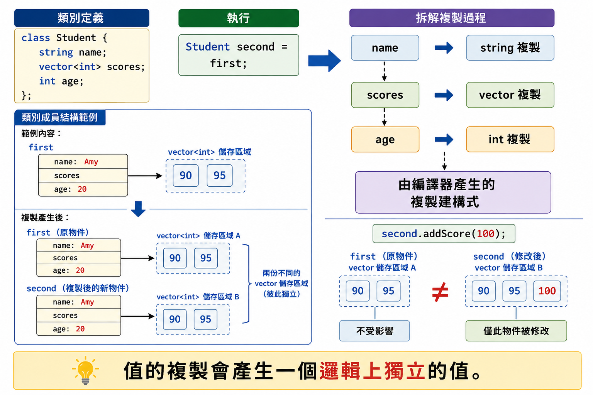


若類別只有：

```cpp
string
vector
int
double
```

編譯器產生的 copy 通常會逐成員複製，得到合理的值語意。

---

## Section IX. 完整 Rule of Zero Copy

```cpp
// VALIDATE
#include <iostream>
#include <string>
#include <vector>
using namespace std;

class Student {
public:
    Student(
        string initialName,
        vector<int> initialScores
    )
        : nameValue(
              std::move(
                  initialName
              )
          ),
          scores(
              std::move(
                  initialScores
              )
          ) {
    }

    void addScore(int score) {
        scores.push_back(score);
    }

    vector<int>::size_type
    scoreCount() const {
        return scores.size();
    }

private:
    string nameValue;
    vector<int> scores;
};

int main() {
    Student first(
        "Amy",
        {
            90,
            95
        }
    );

    Student second =
        first;

    second.addScore(100);

    cout << first.scoreCount()
         << " "
         << second.scoreCount()
         << '\n';

    return 0;
}
```

Vector copy 會複製元素，兩個物件的 `scores` 獨立。

---

# Part C：Shallow Copy 問題

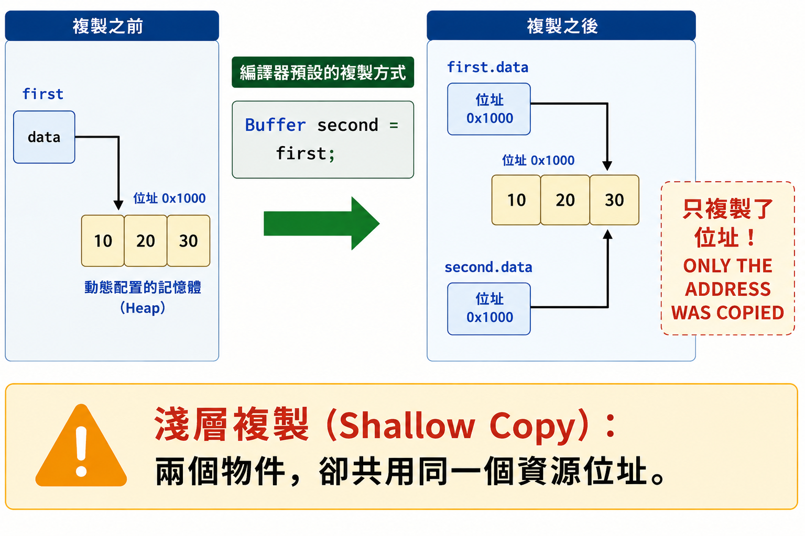


## Section X. 裸指標成員

```cpp
class Buffer {
private:
    int* data;
};
```

編譯器預設 copy 只複製位址。

結果：

```text
first.data 與 second.data 指向同一陣列
```

---

## Section XI. 風險

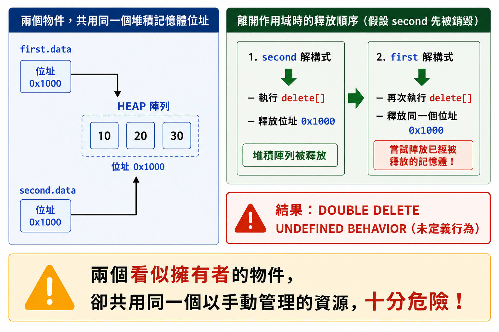

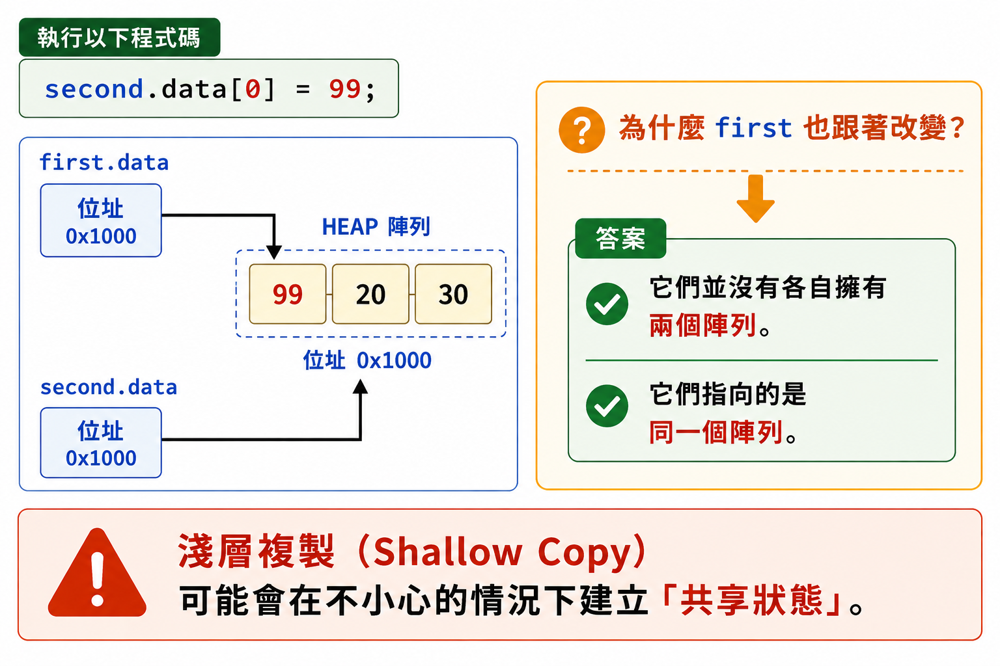


- 兩個物件互相修改。
- 兩個解構子都 delete 同一位址。
- Double delete。
- Use-after-free。
- 所有權不清楚。

---

# Part D：Deep Copy

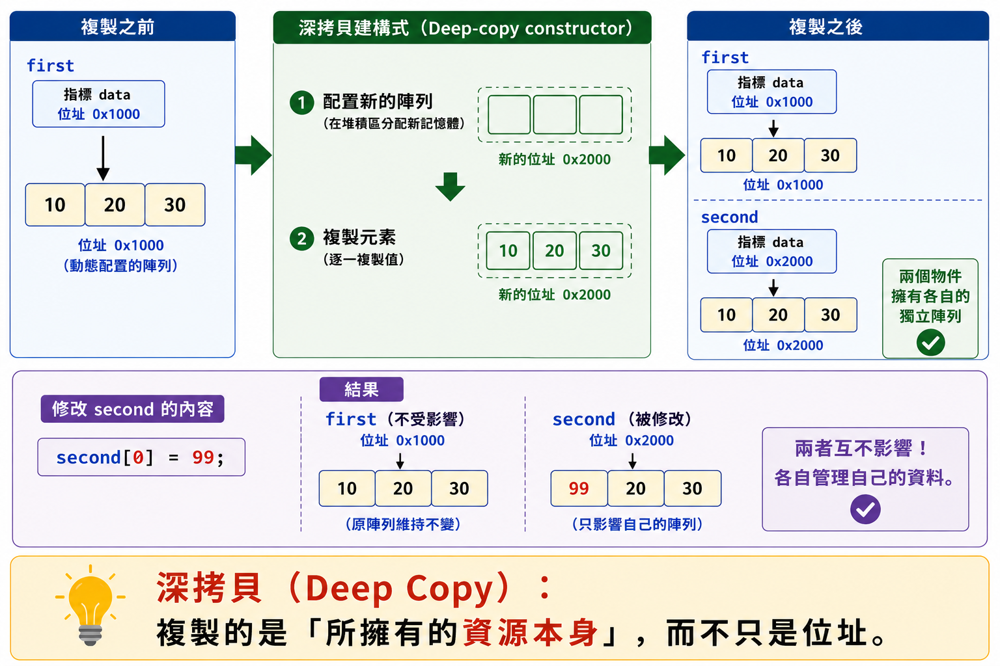


## Section XII. Copy Constructor

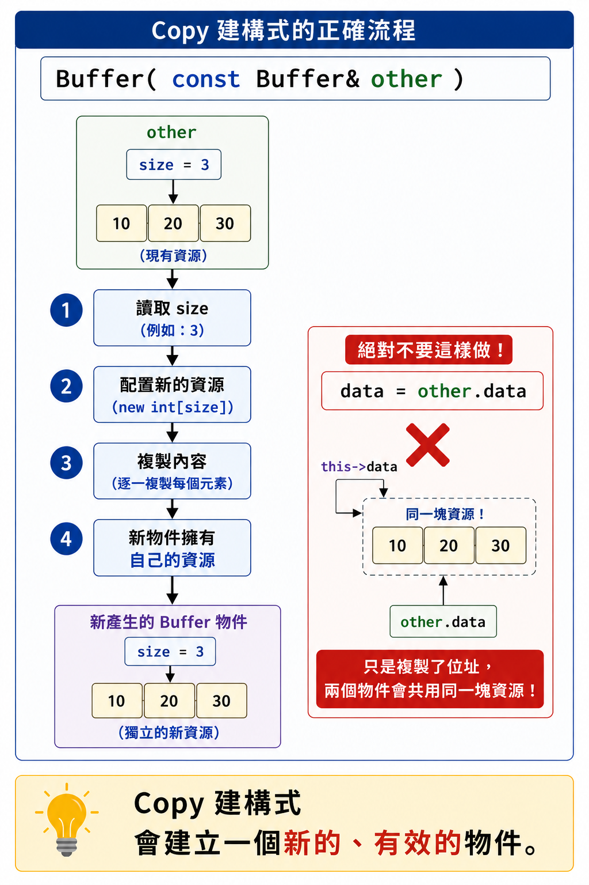


```cpp
Buffer(
    const Buffer& other
);
```

需要：

1. 配置自己的資源。
2. 複製 other 的內容。
3. 不共享裸資源位址。

---

## Section XIII. Copy Assignment

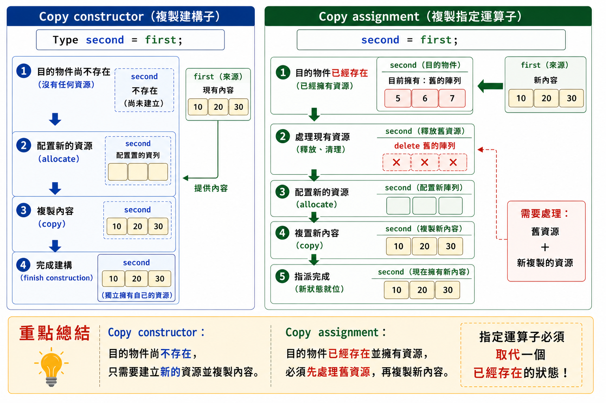

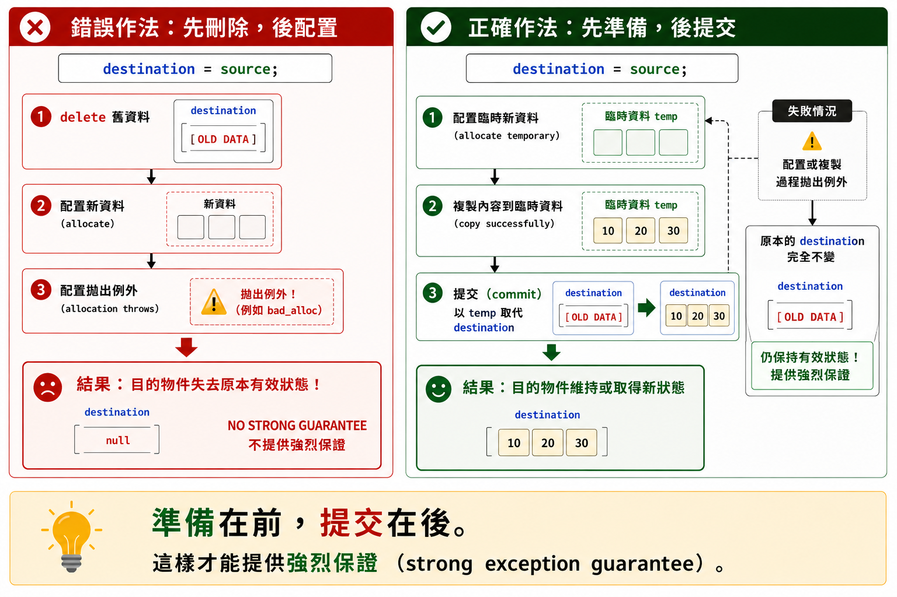

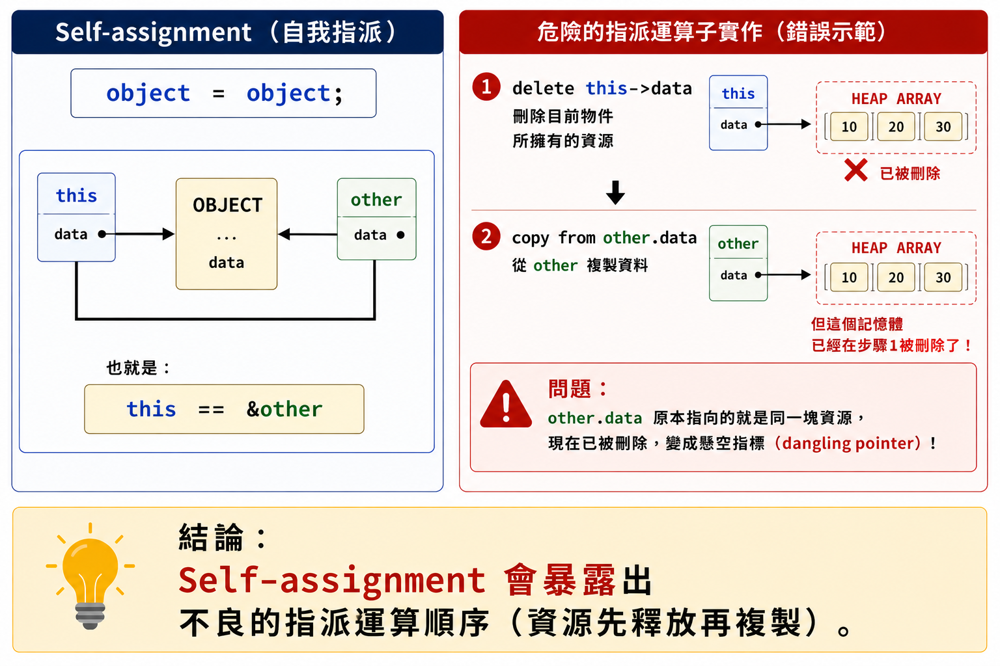


需要：

1. 保護 self-assignment。
2. 處理舊資源。
3. 建立新副本。
4. 保持例外安全。

---

## Section XIV. 完整 Deep Copy Buffer

```cpp
// VALIDATE
#include <algorithm>
#include <cstddef>
#include <iostream>
#include <memory>
using namespace std;

class Buffer {
public:
    explicit Buffer(
        size_t initialSize
    )
        : sizeValue(
              initialSize
          ),
          data(
              make_unique<int[]>(
                  initialSize
              )
          ) {
    }

    Buffer(
        const Buffer& other
    )
        : sizeValue(
              other.sizeValue
          ),
          data(
              make_unique<int[]>(
                  other.sizeValue
              )
          ) {
        copy(
            other.data.get(),
            other.data.get() +
                other.sizeValue,
            data.get()
        );
    }

    Buffer& operator=(
        const Buffer& other
    ) {
        if (
            this ==
            &other
        ) {
            return *this;
        }

        auto newData =
            make_unique<int[]>(
                other.sizeValue
            );

        copy(
            other.data.get(),
            other.data.get() +
                other.sizeValue,
            newData.get()
        );

        data =
            std::move(
                newData
            );

        sizeValue =
            other.sizeValue;

        return *this;
    }

    int& operator[](
        size_t index
    ) {
        return data[index];
    }

    const int& operator[](
        size_t index
    ) const {
        return data[index];
    }

    size_t size() const noexcept {
        return sizeValue;
    }

private:
    size_t sizeValue;
    unique_ptr<int[]>
        data;
};

int main() {
    Buffer first(3);

    first[0] = 10;
    first[1] = 20;
    first[2] = 30;

    Buffer second =
        first;

    second[0] = 99;

    cout << first[0]
         << " "
         << second[0]
         << '\n';

    return 0;
}
```

雖然使用 `unique_ptr` 管理記憶體，仍需要自訂 copy，因為 `unique_ptr` 本身不可複製。

---

# Part E：Rule of Three

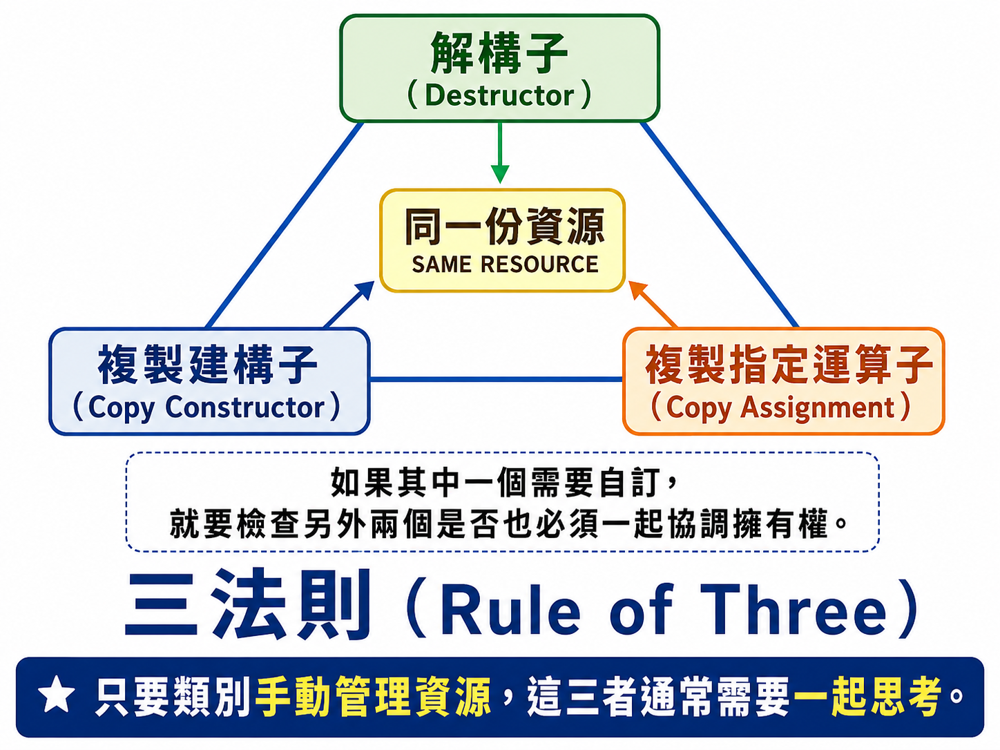


## Section XV. 定義

如果類別需要自行定義其中之一：

- Destructor
- Copy constructor
- Copy assignment

通常也要檢查另外兩個是否需要自行定義。

---

## Section XVI. 原因

它們通常一起處理同一份資源：

```text
取得
複製
取代
釋放
```

---

# Part F：Rule of Five

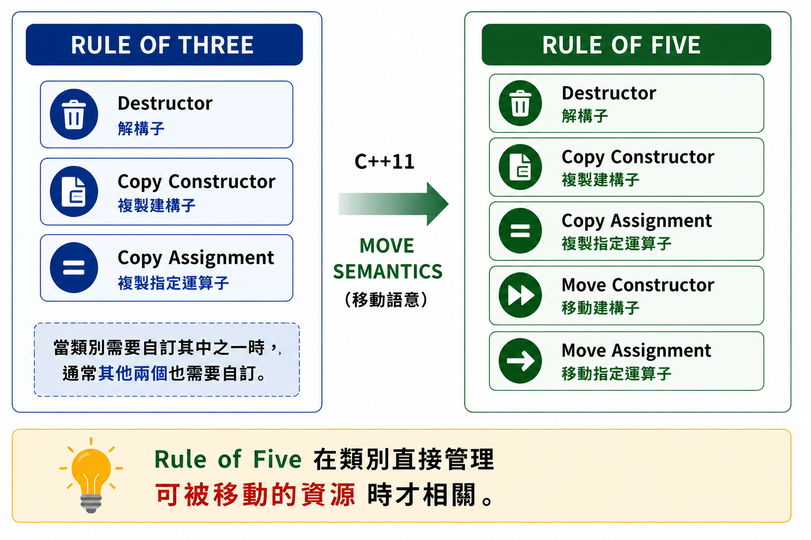


## Section XVII. C++11 之後

除了 Rule of Three，再加入：

- Move constructor
- Move assignment

---

## Section XVIII. 不是每個類別都要寫五個

只有在類別直接管理資源、而且需要自訂 ownership 語意時才考慮。

大多數現代類別應該追求 Rule of Zero。

---

# Part G：第一個 Move Constructor

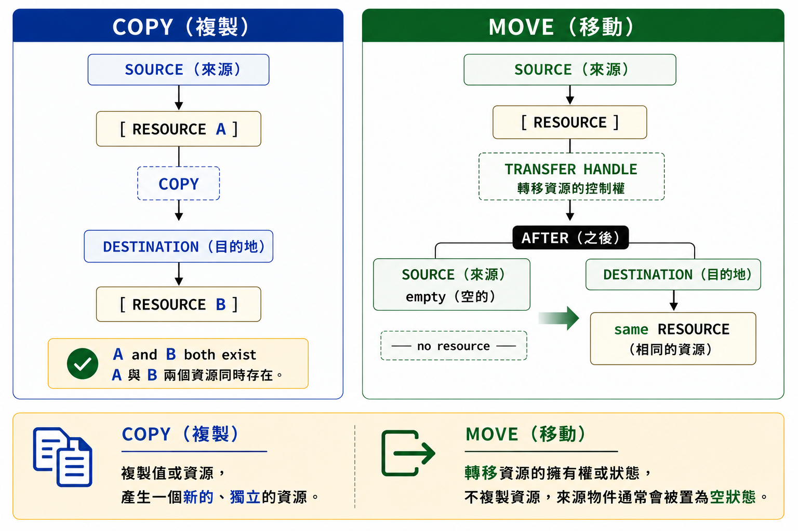


## Section XIX. 接管資源

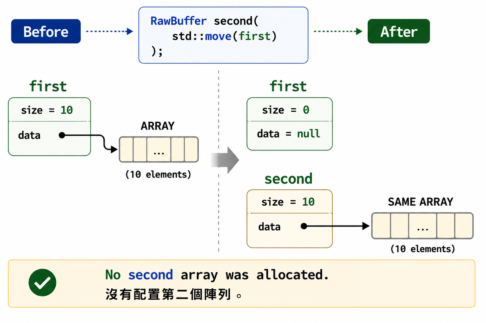


```cpp
Type(
    Type&& other
) noexcept
```

通常：

1. 接管 other 資源。
2. 將 other 設為安全空狀態。
3. 不配置新資源。
4. 不深度複製內容。

---

## Section XX. 完整 Move-Only Buffer

```cpp
// VALIDATE
#include <cstddef>
#include <iostream>
#include <utility>
using namespace std;

class RawBuffer {
public:
    explicit RawBuffer(
        size_t initialSize
    )
        : sizeValue(
              initialSize
          ),
          data(
              new int[
                  initialSize
              ]{}
          ) {
    }

    ~RawBuffer() {
        delete[] data;
    }

    RawBuffer(
        const RawBuffer&
    ) = delete;

    RawBuffer& operator=(
        const RawBuffer&
    ) = delete;

    RawBuffer(
        RawBuffer&& other
    ) noexcept
        : sizeValue(
              other.sizeValue
          ),
          data(
              other.data
          ) {
        other.sizeValue = 0;
        other.data = nullptr;
    }

    RawBuffer& operator=(
        RawBuffer&& other
    ) noexcept {
        if (
            this !=
            &other
        ) {
            delete[] data;

            sizeValue =
                other.sizeValue;

            data =
                other.data;

            other.sizeValue = 0;
            other.data = nullptr;
        }

        return *this;
    }

    size_t size() const noexcept {
        return sizeValue;
    }

private:
    size_t sizeValue;
    int* data;
};

int main() {
    RawBuffer first(10);

    RawBuffer second(
        std::move(
            first
        )
    );

    cout << first.size()
         << " "
         << second.size()
         << '\n';

    return 0;
}
```

這是教學用裸資源範例；實務通常使用 `unique_ptr<int[]>` 或 `vector<int>`。

---

# Part H：`std::move()` 是什麼？


## Section XXI. 它不會自行移動

```cpp
std::move(object)
```

只是把 expression 轉成可被移動操作接受的形式。

真正搬移資源的是：

```cpp
Type(Type&&)
```

或：

```cpp
Type& operator=(Type&&)
```

---

## Section XXII. 沒有 Move 時


如果型別沒有可用 move constructor，但有 copy constructor：

```cpp
Type second =
    std::move(first);
```

仍可能呼叫 copy constructor。

---

# Part I：Moved-From State

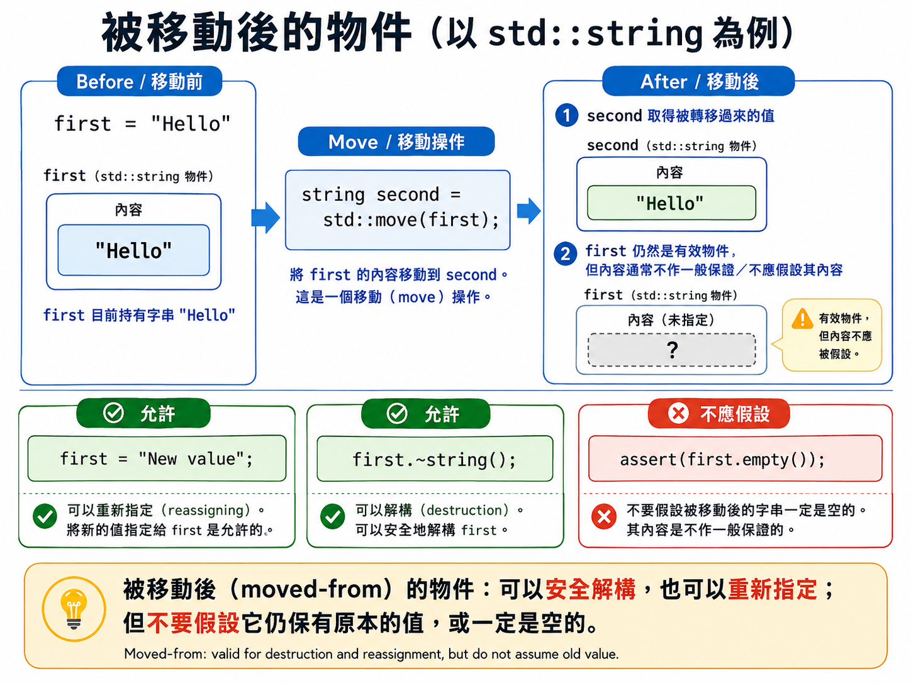


## Section XXIII. 基本保證

Moved-from 物件必須：

- 可安全解構。
- 可安全重新賦值。
- 滿足該型別文件提供的其他保證。

---

## Section XXIV. 不應假設內容


對標準 `string`：

```cpp
string second =
    std::move(first);
```

不能要求 `first` 一定為空，雖然很多實作中常為空。

---

## Section XXV. 完整重新賦值

```cpp
// VALIDATE
#include <iostream>
#include <string>
using namespace std;

int main() {
    string first =
        "Hello";

    string second =
        std::move(
            first
        );

    first =
        "New value";

    cout << first
         << " "
         << second
         << '\n';

    return 0;
}
```

Moved-from `first` 被重新賦值後可正常使用。

---

# Part J：Move Assignment

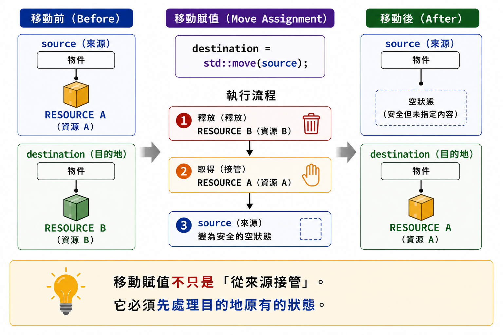


## Section XXVI. 必須處理舊資源

目的物件已存在，所以 move assignment 要：

1. 釋放自己的舊資源。
2. 接管來源資源。
3. 清空來源。
4. 回傳 `*this`。

---

## Section XXVII. Self-Move

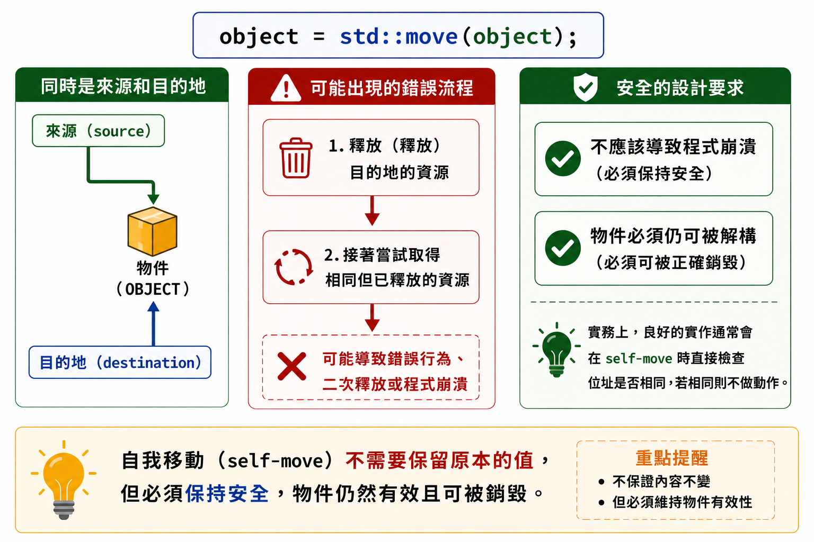


```cpp
object =
    std::move(
        object
    );
```

雖然不常見，但 move assignment 不應因此造成崩潰或 double delete。

---

# Part K：`std::exchange()`


## Section XXVIII. 簡化接管與清空

```cpp
data =
    std::exchange(
        other.data,
        nullptr
    );
```

同時：

1. 取得 `other.data` 舊值。
2. 將 `other.data` 設為 `nullptr`。

---

## Section XXIX. 完整 Exchange 範例

```cpp
// VALIDATE
#include <cstddef>
#include <iostream>
#include <utility>
using namespace std;

class Handle {
public:
    explicit Handle(int initialId)
        : idValue(initialId) {
    }

    Handle(
        const Handle&
    ) = delete;

    Handle& operator=(
        const Handle&
    ) = delete;

    Handle(
        Handle&& other
    ) noexcept
        : idValue(
              exchange(
                  other.idValue,
                  -1
              )
          ) {
    }

    Handle& operator=(
        Handle&& other
    ) noexcept {
        if (
            this !=
            &other
        ) {
            idValue =
                exchange(
                    other.idValue,
                    -1
                );
        }

        return *this;
    }

    int id() const noexcept {
        return idValue;
    }

private:
    int idValue;
};

int main() {
    Handle first(100);

    Handle second(
        std::move(
            first
        )
    );

    cout << first.id()
         << " "
         << second.id()
         << '\n';

    return 0;
}
```

---

# Part L：`noexcept` 與 Move


## Section XXX. 為什麼重要？

Vector reallocation 時，標準函式庫希望：

```text
移動元素
```

但若 move constructor 可能拋例外，為了 strong guarantee，vector 可能改用 copy。

---

## Section XXXI. 建議

若 move operation 真的不會拋出：

```cpp
Type(
    Type&& other
) noexcept;
```

```cpp
Type& operator=(
    Type&& other
) noexcept;
```

不要為了效能虛假標記 noexcept。

---

# Part M：Rule of Zero

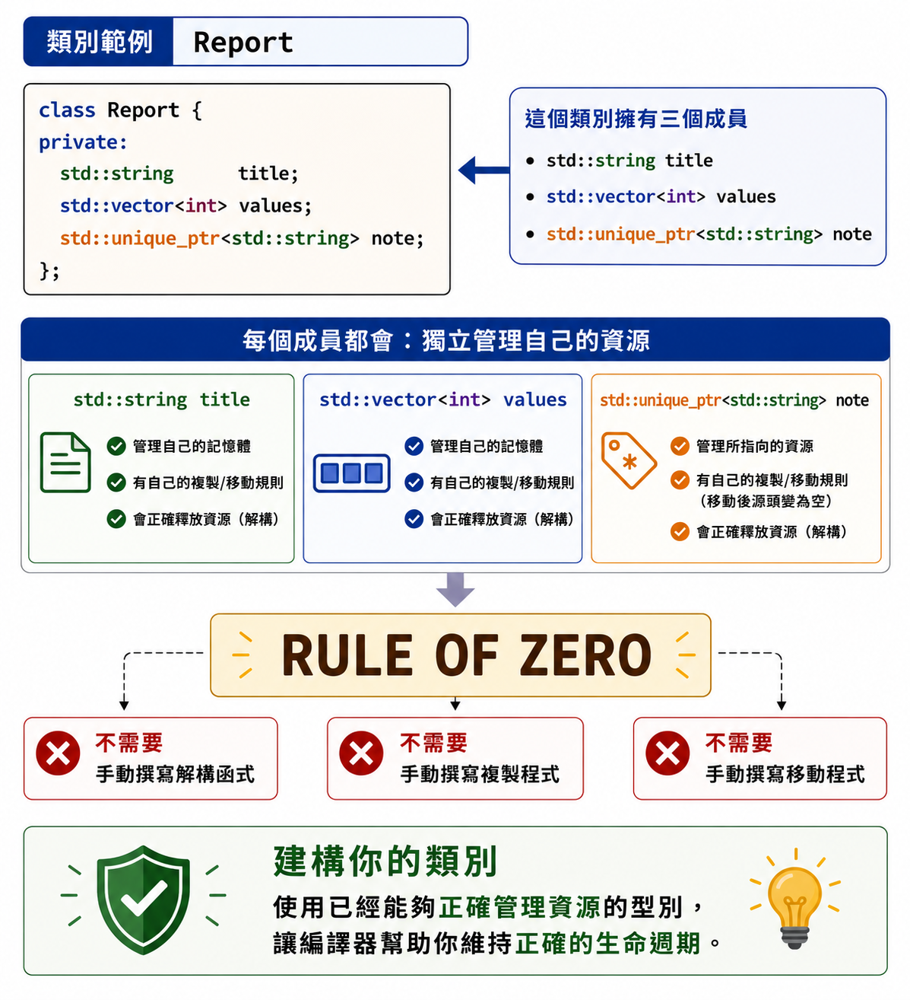


## Section XXXII. 最佳情況

```cpp
class Report {
private:
    string title;
    vector<int> values;
    unique_ptr<Metadata>
        metadata;
};
```

若語意接受：

- 不可複製。
- 可移動。

通常不需要手寫任何特殊成員。

---

## Section XXXIII. 完整 Rule of Zero

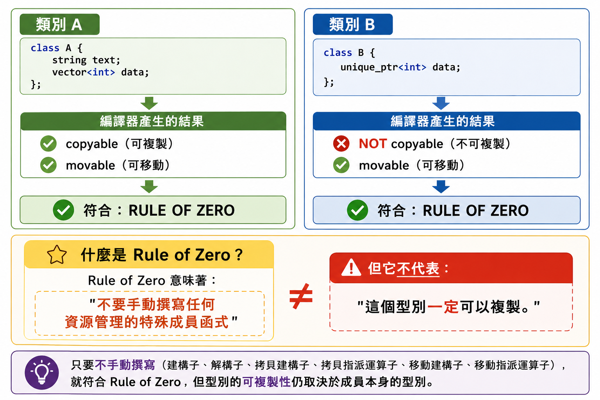

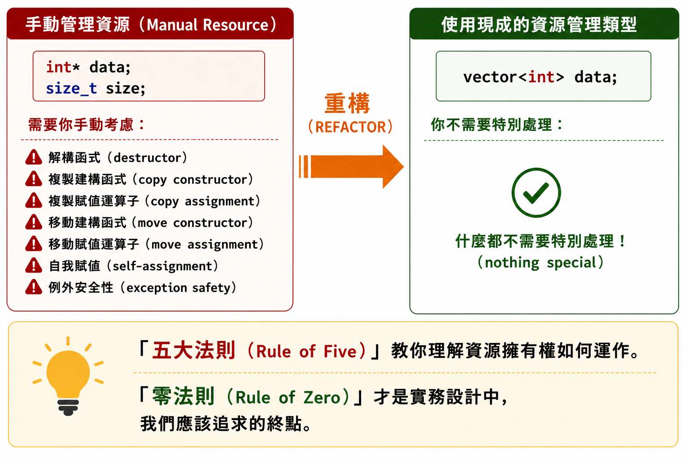


```cpp
// VALIDATE
#include <iostream>
#include <memory>
#include <string>
#include <vector>
using namespace std;

class Report {
public:
    Report(
        string initialTitle,
        vector<int> initialValues
    )
        : title(
              std::move(
                  initialTitle
              )
          ),
          values(
              std::move(
                  initialValues
              )
          ),
          note(
              make_unique<string>(
                  "Ready"
              )
          ) {
    }

    const string& getTitle() const {
        return title;
    }

    vector<int>::size_type
    valueCount() const {
        return values.size();
    }

private:
    string title;
    vector<int> values;
    unique_ptr<string> note;
};

int main() {
    Report first(
        "Results",
        {
            10,
            20,
            30
        }
    );

    Report second =
        std::move(
            first
        );

    cout << second.getTitle()
         << " "
         << second.valueCount()
         << '\n';

    return 0;
}
```

---

# Part N：`= default`

## Section XXXIV. 明確要求預設行為

```cpp
Type(
    const Type&
) = default;
```

```cpp
Type(
    Type&&
) noexcept = default;
```

---

## Section XXXV. 使用情境

- 想明確表達型別可複製或可移動。
- 其他特殊成員已自訂，仍想要求某個預設版本。
- 程式碼審查時提升可讀性。

---

# Part O：`= delete`


## Section XXXVI. 禁止複製

```cpp
Type(
    const Type&
) = delete;

Type& operator=(
    const Type&
) = delete;
```

---

## Section XXXVII. 完整不可複製類別

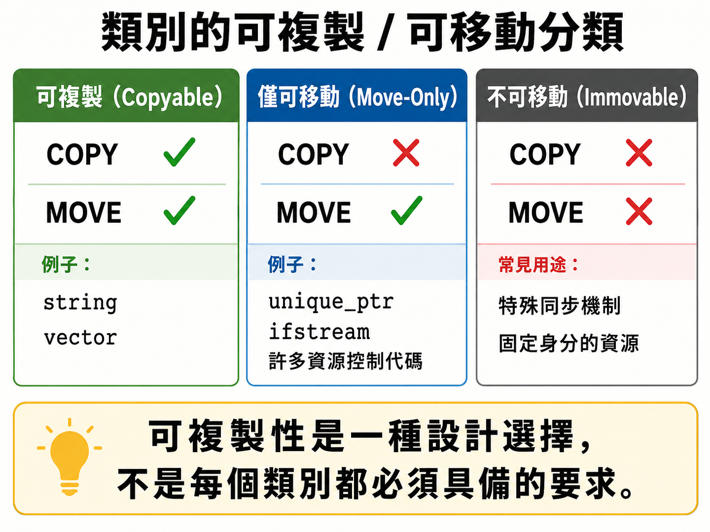


```cpp
// VALIDATE
#include <iostream>
using namespace std;

class UniqueToken {
public:
    explicit UniqueToken(
        int initialValue
    )
        : value(
              initialValue
          ) {
    }

    UniqueToken(
        const UniqueToken&
    ) = delete;

    UniqueToken& operator=(
        const UniqueToken&
    ) = delete;

    UniqueToken(
        UniqueToken&&
    ) noexcept = default;

    UniqueToken& operator=(
        UniqueToken&&
    ) noexcept = default;

    int get() const noexcept {
        return value;
    }

private:
    int value;
};

int main() {
    UniqueToken first(42);

    UniqueToken second =
        std::move(
            first
        );

    cout << second.get()
         << '\n';

    return 0;
}
```

---

# Part P：Copy-and-Swap

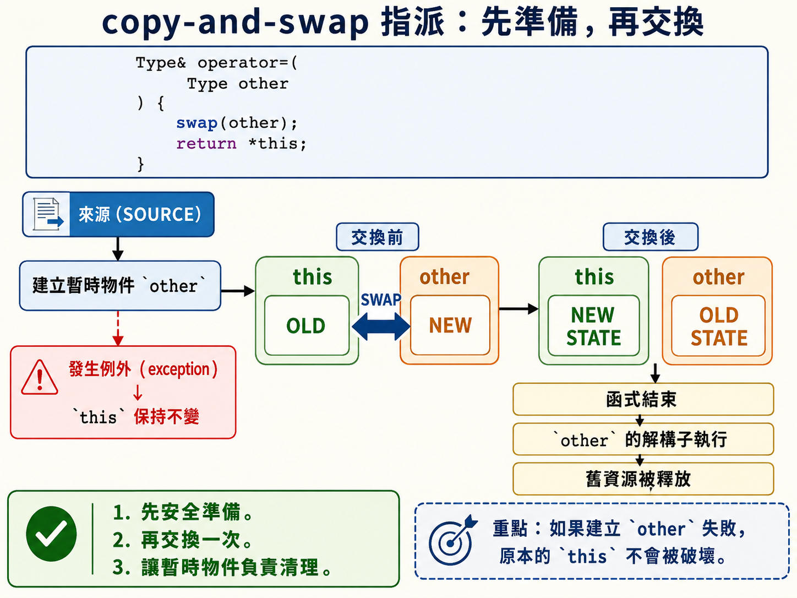


## Section XXXVIII. 核心形式

```cpp
Type& operator=(
    Type other
) {
    swap(other);
    return *this;
}
```

參數按值：

- Lvalue 呼叫時複製。
- Rvalue 呼叫時移動。
- 成功建立 `other` 後再交換。
- 失敗時原物件不變。

---

## Section XXXIX. 優點

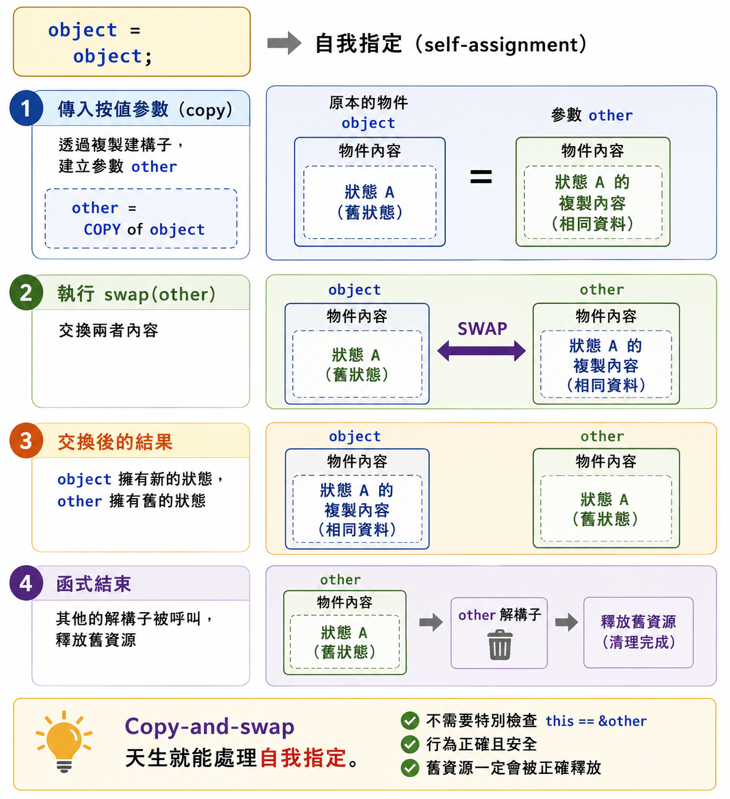


- Strong exception guarantee。
- 自然處理 self-assignment。
- 一份 assignment 邏輯。
- 程式較簡潔。

---

## Section XL. 代價

- 可能有額外暫存物件。
- 不一定是最佳效能。
- 需要正確 swap。
- 對超大型資源可能需評估。

---

## Section XLI. 完整 Copy-and-Swap

```cpp
// VALIDATE
#include <algorithm>
#include <cstddef>
#include <iostream>
#include <memory>
#include <utility>
using namespace std;

class Buffer {
public:
    explicit Buffer(
        size_t initialSize
    )
        : sizeValue(
              initialSize
          ),
          data(
              make_unique<int[]>(
                  initialSize
              )
          ) {
    }

    Buffer(
        const Buffer& other
    )
        : Buffer(
              other.sizeValue
          ) {
        copy(
            other.data.get(),
            other.data.get() +
                other.sizeValue,
            data.get()
        );
    }

    Buffer(
        Buffer&&
    ) noexcept = default;

    Buffer& operator=(
        Buffer other
    ) noexcept {
        swap(other);

        return *this;
    }

    void swap(
        Buffer& other
    ) noexcept {
        using std::swap;

        swap(
            sizeValue,
            other.sizeValue
        );

        swap(
            data,
            other.data
        );
    }

    size_t size() const noexcept {
        return sizeValue;
    }

private:
    size_t sizeValue;
    unique_ptr<int[]>
        data;
};

int main() {
    Buffer first(3);
    Buffer second(5);

    second =
        first;

    cout << second.size()
         << '\n';

    second =
        Buffer(8);

    cout << second.size()
         << '\n';

    return 0;
}
```

---

# Part Q：Pass by Value and Move

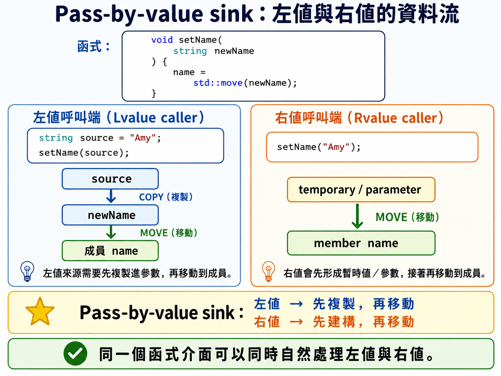


## Section XLII. Sink Parameter

```cpp
void setName(
    string newName
) {
    name =
        std::move(
            newName
        );
}
```

---

## Section XLIII. 呼叫行為

Lvalue：

```cpp
string name = "Amy";
object.setName(name);
```

會先 copy 進參數，再 move 進成員。

Rvalue：

```cpp
object.setName("Amy");
```

可直接建立參數，再 move 進成員。

---

## Section XLIV. 完整 Setter

```cpp
// VALIDATE
#include <iostream>
#include <string>
using namespace std;

class Student {
public:
    void setName(
        string newName
    ) {
        name =
            std::move(
                newName
            );
    }

    const string& getName() const {
        return name;
    }

private:
    string name;
};

int main() {
    Student student;

    string name =
        "Amy";

    student.setName(name);

    cout << student.getName()
         << '\n';

    student.setName(
        "Brian"
    );

    cout << student.getName()
         << '\n';

    return 0;
}
```

---

# Part R：Const 與 Move


## Section XLV. Const 物件不能被接管

```cpp
const string text =
    "Hello";

string other =
    std::move(
        text
    );
```

`std::move(text)` 產生 `const string&&`。

一般 move constructor 接受：

```cpp
string&&
```

不能修改 const 來源，因此通常改用 copy。

---

## Section XLVI. 原則

不要把準備移動資源的物件宣告為 const。

---

# Part S：Return Value Optimization

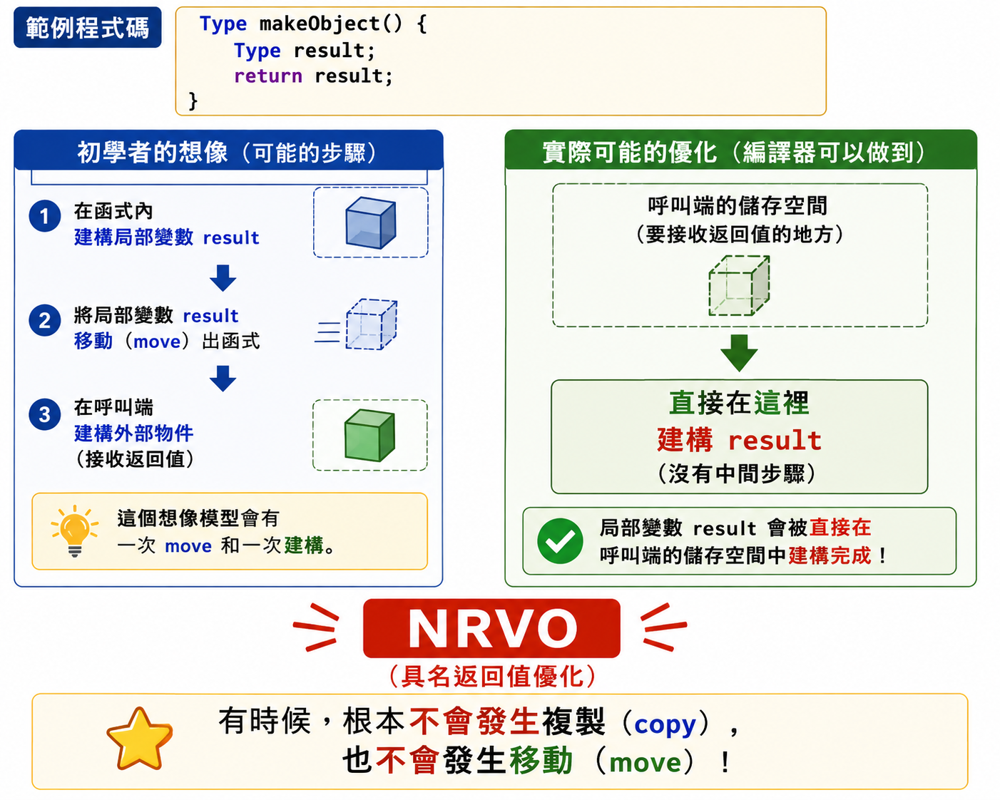


## Section XLVII. 直接回傳區域物件

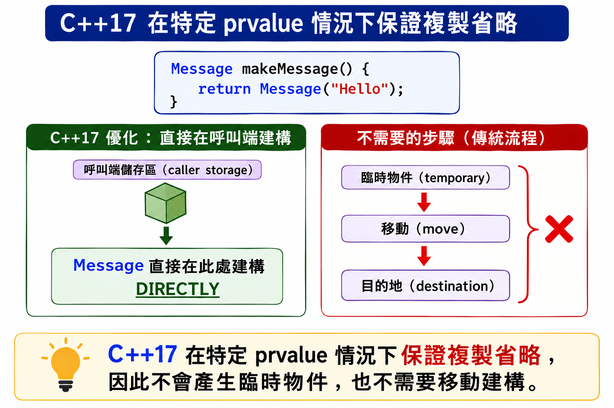


```cpp
Type makeObject() {
    Type object;
    return object;
}
```

編譯器可能直接在呼叫端位置建立物件。

---

## Section XLVIII. 不要強迫 Move


通常不要：

```cpp
/* return
    std::move(
        object
    ); */
```

這可能阻止 NRVO。

---

## Section XLIX. 完整回傳物件

```cpp
// VALIDATE
#include <iostream>
#include <string>
using namespace std;

class Message {
public:
    explicit Message(
        string initialText
    )
        : text(
              std::move(
                  initialText
              )
          ) {
    }

    const string& getText() const {
        return text;
    }

private:
    string text;
};

Message makeMessage() {
    Message result(
        "Hello"
    );

    return result;
}

int main() {
    Message message =
        makeMessage();

    cout << message.getText()
         << '\n';

    return 0;
}
```

---

# Part T：Shared Pointer 的 Copy 語意


## Section L. Copy Shared Pointer

```cpp
auto second =
    first;
```

複製的是：

```text
shared ownership handle
```

不是被管理物件本身。

---

## Section LI. 完整共享狀態

```cpp
// VALIDATE
#include <iostream>
#include <memory>
using namespace std;

class Counter {
public:
    void increment() {
        ++value;
    }

    int get() const {
        return value;
    }

private:
    int value = 0;
};

int main() {
    auto first =
        make_shared<Counter>();

    auto second =
        first;

    second->increment();

    cout << first->get()
         << " "
         << second->get()
         << '\n';

    return 0;
}
```

兩個 shared_ptr 指向同一 Counter。

---

# Part U：Polymorphic Clone

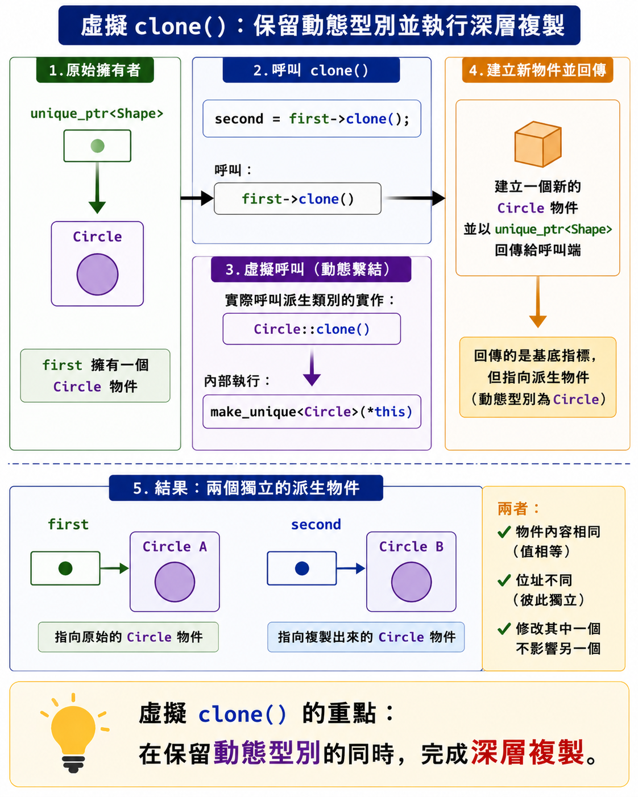


## Section LII. 為什麼需要 Clone？

抽象基底不能直接按值複製。

若要 deep-copy 多型物件，可提供：

```cpp
virtual unique_ptr<Base>
clone() const = 0;
```

---

## Section LIII. 完整 Clone Pattern

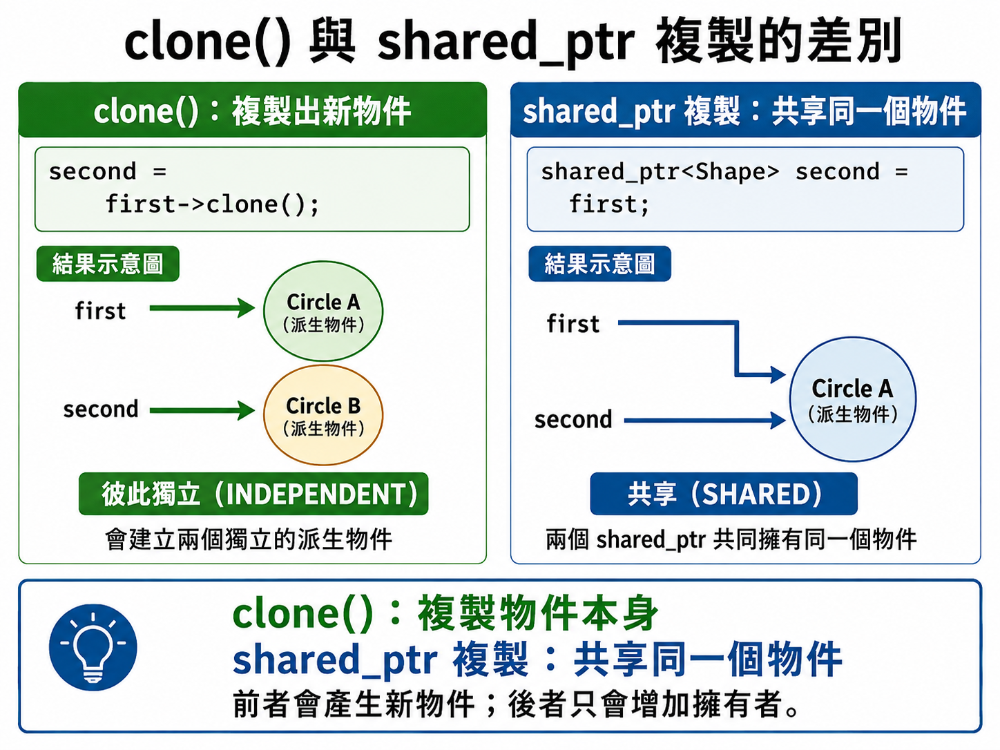


```cpp
// VALIDATE
#include <iostream>
#include <memory>
#include <string>
using namespace std;

class Shape {
public:
    virtual ~Shape() = default;

    virtual unique_ptr<Shape>
    clone() const = 0;

    virtual string name() const = 0;
};

class Circle : public Shape {
public:
    explicit Circle(
        double initialRadius
    )
        : radius(
              initialRadius
          ) {
    }

    unique_ptr<Shape>
    clone() const override {
        return
            make_unique<Circle>(
                *this
            );
    }

    string name() const override {
        return
            "Circle radius=" +
            to_string(radius);
    }

private:
    double radius;
};

int main() {
    unique_ptr<Shape> first =
        make_unique<Circle>(
            2.0
        );

    unique_ptr<Shape> second =
        first->clone();

    cout << first->name()
         << " "
         << second->name()
         << '\n';

    return 0;
}
```

---

# Part V：Object Slicing

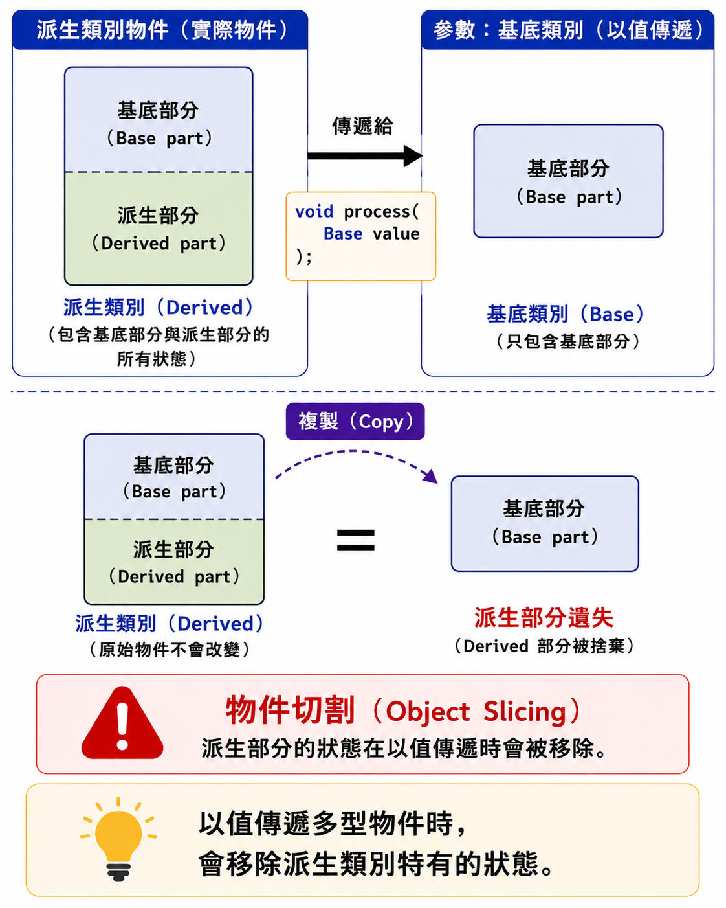


## Section LIV. 按值接收基底

```cpp
void process(
    Base value
);
```

傳入 Derived 時只複製 Base 部分。

Derived 部分被切掉。

---

## Section LV. 解法

- 使用 `const Base&`。
- 使用 `Base&`。
- 使用 `unique_ptr<Base>`。
- 使用 `shared_ptr<Base>`。
- 需要複製多型物件時使用 clone。

---

# Part W：Vector Reallocation

## Section LVI. 容器重新配置

Vector 容量不足時會建立新記憶體並搬移元素。

若元素 move constructor：

```cpp
noexcept
```

通常更有利於 vector 使用 move。

---

## Section LVII. 完整觀察範例

```cpp
// VALIDATE
#include <iostream>
#include <string>
#include <vector>
using namespace std;

class Item {
public:
    explicit Item(
        string initialName
    )
        : name(
              std::move(
                  initialName
              )
          ) {
    }

    Item(
        const Item& other
    )
        : name(
              other.name
          ) {
        cout << "Copy\n";
    }

    Item(
        Item&& other
    ) noexcept
        : name(
              std::move(
                  other.name
              )
          ) {
        cout << "Move\n";
    }

private:
    string name;
};

int main() {
    vector<Item> values;

    values.reserve(1);

    values.emplace_back(
        "A"
    );

    values.emplace_back(
        "B"
    );

    return 0;
}
```

第二次加入可能觸發 reallocation，舊元素通常透過 noexcept move 搬移。

---

# Part X：Copy Semantics Design

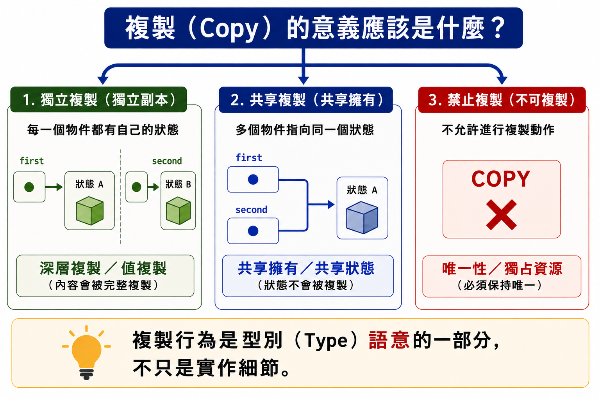


## Section LVIII. Copy 後獨立

適合：

- `string`
- `vector`
- 數值物件
- 設定資料
- 文件快照

---

## Section LIX. Copy 後共享

適合：

- 共同 session。
- 共享服務。
- 共享不可變資料。
- 共享 cache。

通常使用：

```cpp
shared_ptr<T>
```

並清楚說明共享語意。

---

## Section LX. 禁止 Copy

適合：

- Mutex。
- 唯一檔案 handle。
- 唯一 token。
- Socket ownership。
- Unique resource。

使用：

```cpp
= delete
```

---

# Part Y：常見設計判斷

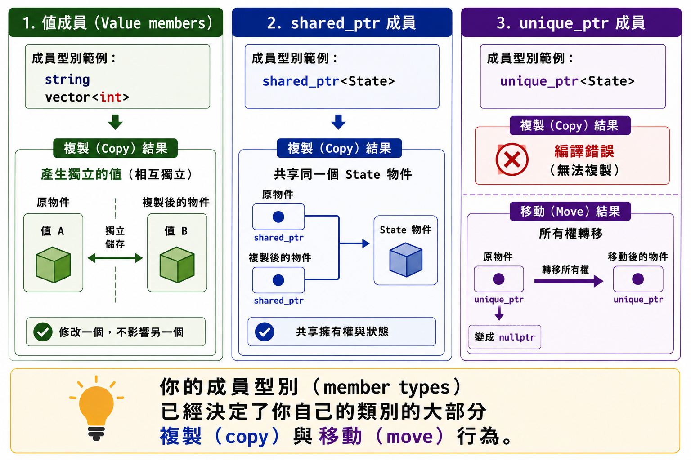


## Section LXI. 若成員有 `unique_ptr`

類別預設：

- 不可複製。
- 可移動。

若需要 copy，必須定義：

- Deep copy。
- Clone。
- 或改成 shared ownership。

---

## Section LXII. 若成員有 `shared_ptr`

類別 copy 會：

```text
共享同一被管理物件
```

確認這是否符合領域語意。

---

## Section LXIII. 若成員都是值

通常 compiler-generated copy/move 已足夠。

---

# Part Z：快速概念檢查

## Section LXIV. 選擇題與簡答

### Q1. Copy constructor 的典型形式？

<details><summary>查看答案</summary>

```cpp
Type(
    const Type& other
);
```

</details>

### Q2. Copy assignment 的典型形式？

<details><summary>查看答案</summary>

```cpp
Type& operator=(
    const Type& other
);
```

</details>

### Q3. Move constructor 的典型形式？

<details><summary>查看答案</summary>

```cpp
Type(
    Type&& other
) noexcept;
```

</details>

### Q4. Move assignment 的典型形式？

<details><summary>查看答案</summary>

```cpp
Type& operator=(
    Type&& other
) noexcept;
```

</details>

### Q5. `std::move()` 是否真的搬資料？

<details><summary>查看答案</summary>

不會，它只是把 expression 轉成可被 move operation 接受的 value category。

</details>

### Q6. Moved-from 物件是否可以解構？

<details><summary>查看答案</summary>

可以，必須保持可安全解構狀態。

</details>

### Q7. Moved-from 物件是否一定為空？

<details><summary>查看答案</summary>

不一定，除非該型別明確保證。

</details>

### Q8. Rule of Three 包含哪些函式？

<details><summary>查看答案</summary>

Destructor、copy constructor、copy assignment。

</details>

### Q9. Rule of Five 多了什麼？

<details><summary>查看答案</summary>

Move constructor 與 move assignment。

</details>

### Q10. Rule of Zero 的核心？

<details><summary>查看答案</summary>

使用 RAII 成員管理資源，避免手寫特殊成員函式。

</details>

### Q11. 為什麼 shallow copy 裸指標危險？

<details><summary>查看答案</summary>

多個物件會指向同一資源，可能造成共享修改、double delete 與懸空指標。

</details>

### Q12. Self-assignment 是什麼？

<details><summary>查看答案</summary>

```cpp
object =
    object;
```

</details>

### Q13. Copy-and-swap 的優點？

<details><summary>查看答案</summary>

可提供 strong exception guarantee、自然處理 self-assignment，並統一 copy/move assignment 邏輯。

</details>

### Q14. 為什麼 move 常標記 noexcept？

<details><summary>查看答案</summary>

標準容器在重新配置時更容易安全選擇 move，而不是 copy。

</details>

### Q15. `return std::move(local);` 通常推薦嗎？

<details><summary>查看答案</summary>

通常不推薦，可能阻止 NRVO。直接 `return local;`。

</details>

### Q16. Const 物件可正常被移動資源嗎？

<details><summary>查看答案</summary>

通常不能，因為移動需要修改來源，`std::move(constObject)` 常退回 copy。

</details>

### Q17. Shared_ptr copy 是 deep copy 嗎？

<details><summary>查看答案</summary>

不是，只是共享同一被管理物件。

</details>

### Q18. 含 unique_ptr 成員的類別預設可複製嗎？

<details><summary>查看答案</summary>

不可複製，但通常可移動。

</details>

### Q19. 多型物件如何進行 deep copy？

<details><summary>查看答案</summary>

常用 virtual `clone()` 回傳 `unique_ptr<Base>`。

</details>

### Q20. 何時最應優先 Rule of Zero？

<details><summary>查看答案</summary>

當所有資源都可交由標準 RAII 型別或其他 RAII 成員管理時。

</details>

---

# Part AA：程式閱讀練習

## Section LXV. 預測結果與合法性

### 題目 1

```cpp
string first =
    "Hello";

string second =
    first;

second[0] = 'Y';

cout << first
     << " "
     << second;
```

<details><summary>查看答案</summary>

```text
Hello Yello
```

String copy 具有獨立值語意。

</details>

### 題目 2

```cpp
auto first =
    make_unique<int>(10);

/* auto second =
    first; */
```

<details><summary>查看答案</summary>

不合法，unique_ptr 不可複製。

</details>

### 題目 3

```cpp
auto first =
    make_unique<int>(10);

auto second =
    std::move(
        first
    );

cout << boolalpha
     << (
            first ==
            nullptr
        );
```

<details><summary>查看答案</summary>

```text
true
```

</details>

### 題目 4

```cpp
const string first =
    "Hello";

string second =
    std::move(
        first
    );

cout << second;
```

<details><summary>查看答案</summary>

通常呼叫 copy constructor，輸出：

```text
Hello
```

因為來源是 const。

</details>

### 題目 5

```cpp
vector<int> first{
    1,
    2,
    3
};

vector<int> second =
    first;

second.push_back(4);

cout << first.size()
     << second.size();
```

<details><summary>查看答案</summary>

```text
34
```

</details>

### 題目 6

```cpp
auto first =
    make_shared<int>(10);

auto second =
    first;

*second = 20;

cout << *first;
```

<details><summary>查看答案</summary>

```text
20
```

兩者共享同一 int。

</details>

### 題目 7

```cpp
class Type {
public:
    Type(
        const Type&
    ) = delete;
};

Type first;

/* Type second =
    first; */
```

<details><summary>查看答案</summary>

不合法，copy constructor 被刪除。

</details>

### 題目 8

```cpp
class Type {
public:
    Type() = default;

    Type(
        Type&&
    ) noexcept = default;
};

Type first;
Type second =
    std::move(
        first
    );
```

<details><summary>查看答案</summary>

合法，使用預設 move constructor。

</details>

### 題目 9

```cpp
string makeText() {
    string value =
        "Hello";

    return value;
}
```

<details><summary>查看答案</summary>

合法，通常可使用 NRVO 或 move，不需要手動 `std::move()`。

</details>

### 題目 10

```cpp
string makeText() {
    string value =
        "Hello";

    return
        std::move(
            value
        );
}
```

<details><summary>查看答案</summary>

語法合法，但通常不建議，可能阻止 NRVO。

</details>

### 題目 11

```cpp
auto first =
    make_unique<int>(10);

auto second =
    std::move(
        first
    );

first =
    make_unique<int>(20);

cout << *first
     << " "
     << *second;
```

<details><summary>查看答案</summary>

```text
20 10
```

Moved-from unique_ptr 可重新賦值。

</details>

### 題目 12

```cpp
class Base {
public:
    virtual ~Base() = default;
};

class Derived :
    public Base {
};

void process(
    Base value
);

Derived object;

/* process(object); */
```

<details><summary>查看答案</summary>

語法可能合法，但會 object slicing，只保留 Base 部分。應改用參考或指標。

</details>

---

# Part AB：實作練習

## Section LXVI. 實作檢測題

### TODO 1：Copy Construction Trace

建立類別，在 copy constructor 輸出 `"Copy"`。

### TODO 2：Move Construction Trace

建立類別，在 move constructor 輸出 `"Move"`。

### TODO 3：Deep Copy Buffer

建立管理動態整數陣列的類別，實作 deep-copy constructor。

### TODO 4：Copy Assignment

實作安全的 deep-copy assignment。

### TODO 5：Move Constructor

實作接管裸資源的 move constructor。

### TODO 6：Move Assignment

實作先釋放舊資源再接管新資源的 move assignment。

### TODO 7：Rule of Zero

將手動字元陣列類別改寫成使用 `string`。

### TODO 8：Delete Copy

建立不可複製但可移動的 Token 類別。

### TODO 9：Copy-and-Swap

使用按值參數與 member swap 實作 assignment。

### TODO 10：Pass-by-Value Setter

建立 `setName(string name)` 並 move 進成員。

### TODO 11：Return Object

建立 factory，直接 return 區域物件，不使用 `std::move()`。

### TODO 12：Shared Copy Semantics

建立含 shared_ptr 成員的類別，觀察 copy 後共享狀態。

### TODO 13：Clone Pattern

建立抽象基底與兩個 Derived，實作 virtual clone。

### TODO 14：Noexcept Move

建立會被 vector 保存的型別，move constructor 標記 noexcept。

### TODO 15：Copy Semantics Design

針對五個類別判斷應 deep copy、shared copy、禁止 copy 或使用 Rule of Zero。

---

# Part AC：課後小練習

## Section LXVII. 延伸練習

### 練習 1：Dynamic Matrix

建立管理動態二維資料的 Matrix，先用 Rule of Five，再改寫成 Rule of Zero。

### 練習 2：Cloneable Document

建立多型文件階層，支援 deep-copy clone 與 `vector<unique_ptr<Document>>`。

### 練習 3：Copy-and-Swap Audit

比較傳統 copy assignment 與 copy-and-swap 的例外安全與效能。

### 練習 4：Move Benchmark

在大量 vector reallocation 中比較 noexcept move 與 copy 的呼叫次數。

### 練習 5：API Ownership Review

檢查一個類別 API，判斷哪些參數應按值、const reference、rvalue reference 或 unique_ptr 接收。

---

# Part AD：常見錯誤提醒

## Section LXVIII. 常見錯誤

1. 將 initialization 與 assignment 混淆。
2. 裸指標成員使用 compiler-generated shallow copy。
3. Copy constructor 直接複製裸位址。
4. Copy assignment 先 delete 再配置，造成例外後物件損壞。
5. 忽略 self-assignment。
6. Move constructor 忘記清空來源。
7. Move assignment 忘記釋放目的舊資源。
8. Move assignment self-move 後 double delete。
9. Moved-from 物件仍當作保留原值。
10. 認為 `std::move()` 本身搬運資料。
11. 對 const 物件使用 move 卻期待資源轉移。
12. 所有函式都濫用 `std::move()`。
13. Return 區域物件時寫 `std::move()` 阻止 NRVO。
14. Move operation 會拋出卻錯誤標記 noexcept。
15. Move operation 不會拋出卻漏寫 noexcept，影響容器選擇。
16. 含 unique_ptr 成員卻期待預設 copy。
17. Shared_ptr copy 後誤以為物件獨立。
18. Deep copy 與 shared copy 語意未文件化。
19. 自訂 destructor 後沒檢查 move 是否仍自動產生。
20. 為每個類別都手寫 Rule of Five。
21. 可以 Rule of Zero 卻直接管理裸資源。
22. Copy-and-swap 的 swap 可能拋出。
23. Copy-and-swap assignment 忘記回傳 `*this`。
24. Member swap 忘記交換所有狀態。
25. Clone 回傳裸指標造成 ownership 不清。
26. 多型基底按值複製造成 slicing。
27. Copy constructor 中呼叫 virtual function。
28. Defaulted move 對成員語意不符合需求卻未檢查。
29. Moved-from 物件未保持可安全解構。
30. 只測試正常 copy，未測試 self-assignment、move 與例外路徑。

---

# Part AE：Mermaid 流程圖

## Section LXIX. 複製、移動與 Rule of Zero 流程圖

### 1. Initialization or Assignment

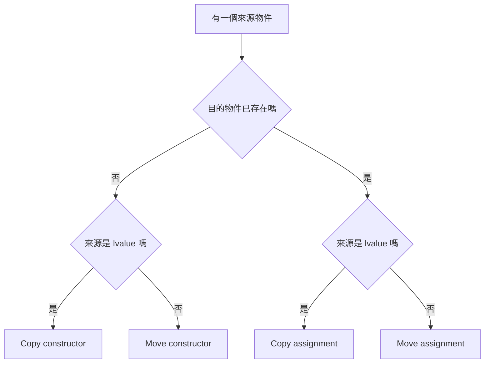
```mermaid
flowchart TD
    A[有一個來源物件] --> B{目的物件已存在嗎}
    B -- 否 --> C{來源是 lvalue 嗎}
    C -- 是 --> D[Copy constructor]
    C -- 否 --> E[Move constructor]
    B -- 是 --> F{來源是 lvalue 嗎}
    F -- 是 --> G[Copy assignment]
    F -- 否 --> H[Move assignment]
```

### 2. Deep Copy

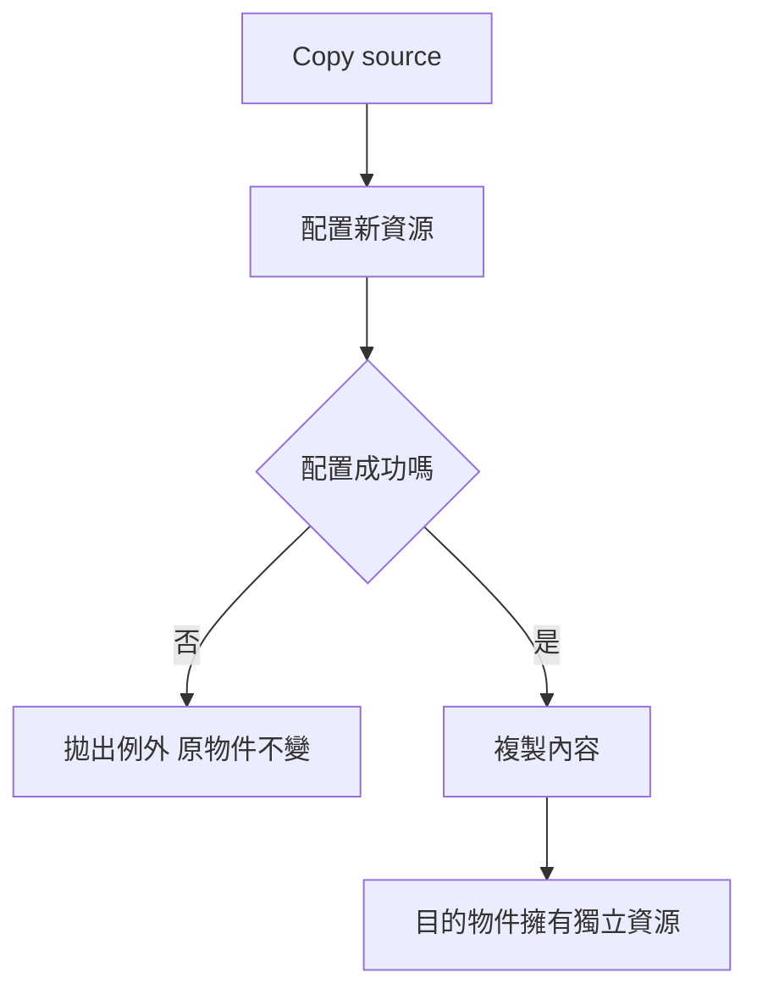
```mermaid
flowchart TD
    A[Copy source] --> B[配置新資源]
    B --> C{配置成功嗎}
    C -- 否 --> D[拋出例外 原物件不變]
    C -- 是 --> E[複製內容]
    E --> F[目的物件擁有獨立資源]
```

### 3. Move Ownership

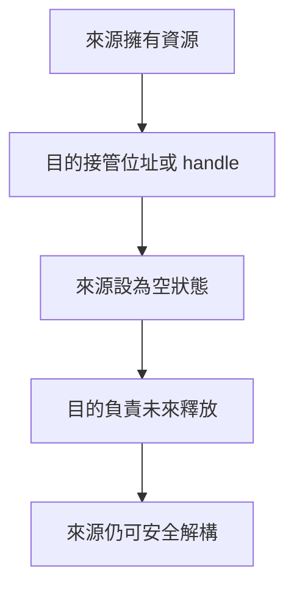
```mermaid
flowchart TD
    A[來源擁有資源] --> B[目的接管位址或 handle]
    B --> C[來源設為空狀態]
    C --> D[目的負責未來釋放]
    D --> E[來源仍可安全解構]
```

### 4. Rule Selection

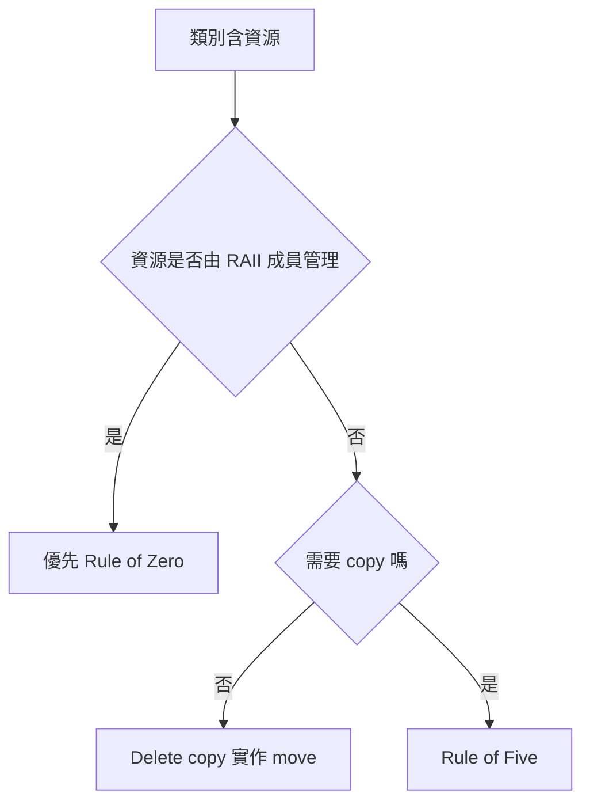
```mermaid
flowchart TD
    A[類別含資源] --> B{資源是否由 RAII 成員管理}
    B -- 是 --> C[優先 Rule of Zero]
    B -- 否 --> D{需要 copy 嗎}
    D -- 否 --> E[Delete copy 實作 move]
    D -- 是 --> F[Rule of Five]
```

### 5. Copy Assignment Safety

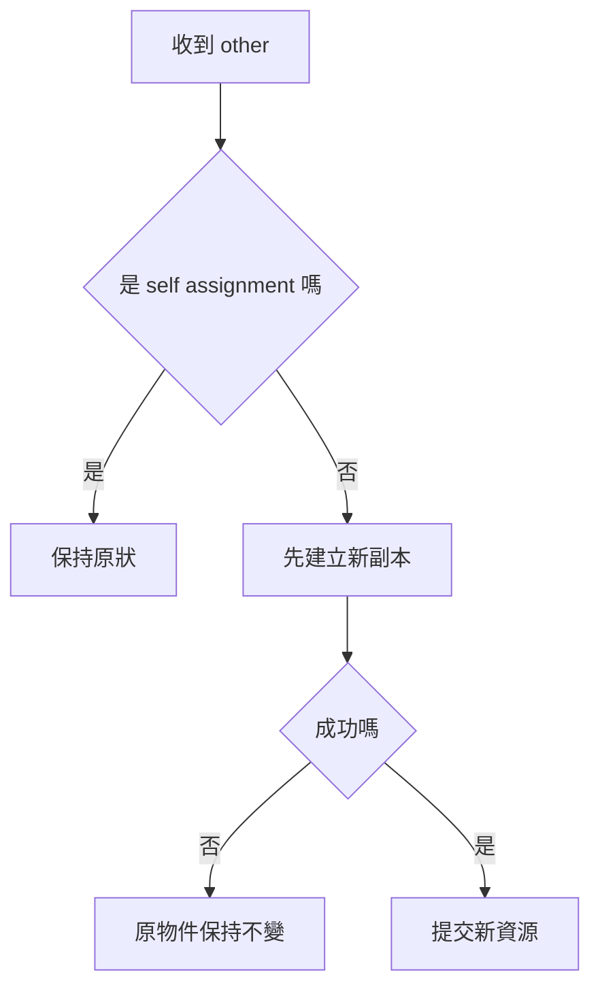
```mermaid
flowchart TD
    A[收到 other] --> B{是 self assignment 嗎}
    B -- 是 --> C[保持原狀]
    B -- 否 --> D[先建立新副本]
    D --> E{成功嗎}
    E -- 否 --> F[原物件保持不變]
    E -- 是 --> G[提交新資源]
```

### 6. Copy-and-Swap

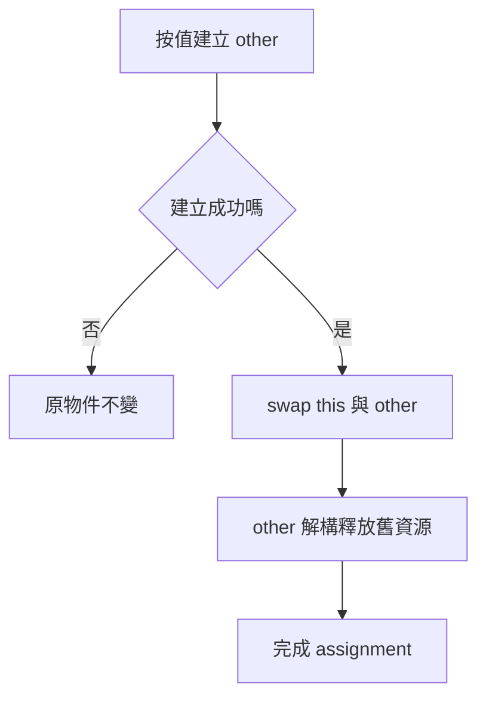
```mermaid
flowchart TD
    A[按值建立 other] --> B{建立成功嗎}
    B -- 否 --> C[原物件不變]
    B -- 是 --> D[swap this 與 other]
    D --> E[other 解構釋放舊資源]
    E --> F[完成 assignment]
```

### 7. Return Object

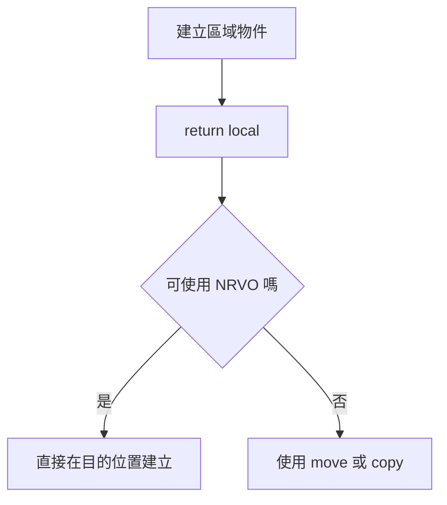
```mermaid
flowchart TD
    A[建立區域物件] --> B[return local]
    B --> C{可使用 NRVO 嗎}
    C -- 是 --> D[直接在目的位置建立]
    C -- 否 --> E[使用 move 或 copy]
```

### 8. Copy Semantics Design

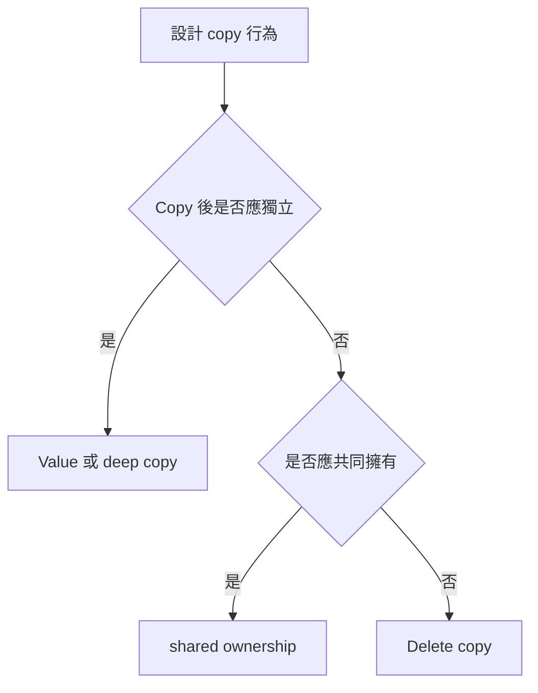
```mermaid
flowchart TD
    A[設計 copy 行為] --> B{Copy 後是否應獨立}
    B -- 是 --> C[Value 或 deep copy]
    B -- 否 --> D{是否應共同擁有}
    D -- 是 --> E[shared ownership]
    D -- 否 --> F[Delete copy]
```

---

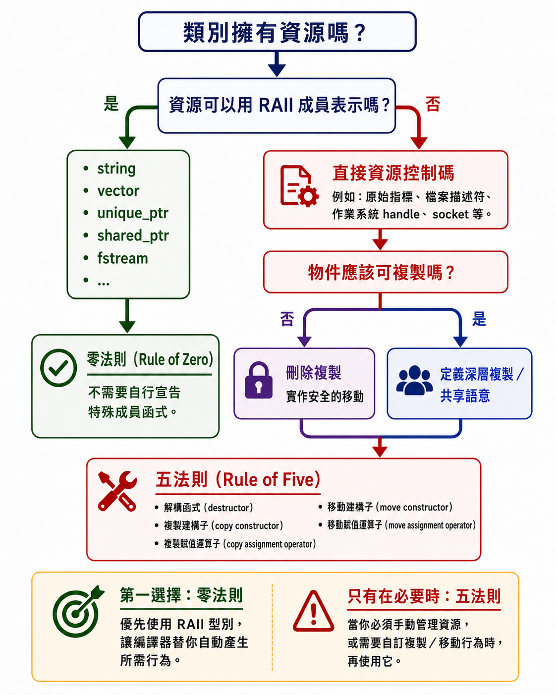

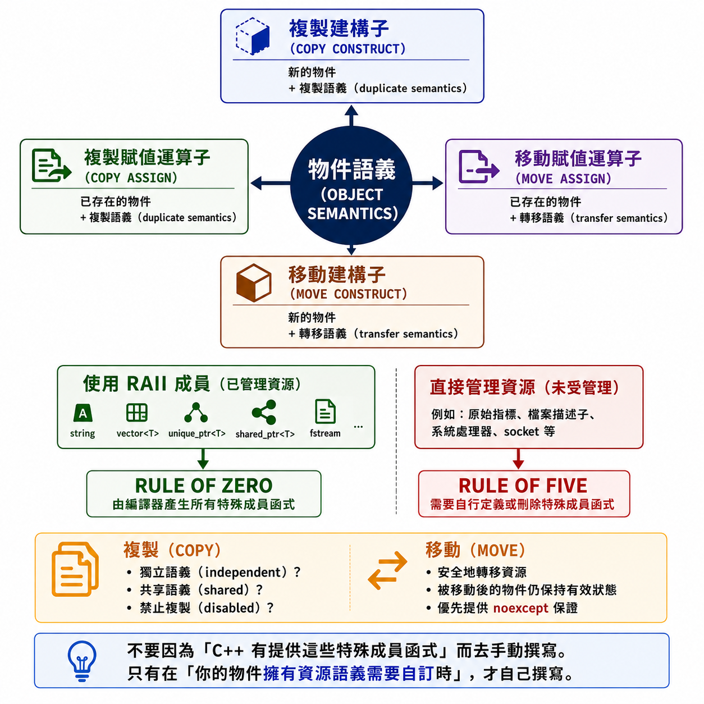

# 本章完成標準

完成本章後，你應該能做到：

1. 區分 initialization 與 assignment。
2. 辨認 copy constructor。
3. 辨認 copy assignment。
4. 辨認 move constructor。
5. 辨認 move assignment。
6. 說明 compiler-generated copy。
7. 說明 shallow copy。
8. 說明 deep copy。
9. 找出 double delete 風險。
10. 實作 deep-copy constructor。
11. 實作 copy assignment。
12. 處理 self-assignment。
13. 實作 move constructor。
14. 實作 move assignment。
15. 處理 moved-from state。
16. 解釋 `std::move()`。
17. 使用 `std::exchange()`。
18. 說明 Rule of Three。
19. 說明 Rule of Five。
20. 說明 Rule of Zero。
21. 使用 `= default`。
22. 使用 `= delete`。
23. 建立 move-only type。
24. 使用 noexcept move。
25. 解釋 vector 為何偏好 noexcept move。
26. 使用 copy-and-swap。
27. 提供 strong exception guarantee。
28. 使用 pass-by-value setter。
29. 避免對 const 物件期待 move。
30. 避免 `return std::move(local)`。
31. 解釋 RVO 與 NRVO。
32. 說明 shared_ptr copy 語意。
33. 說明 unique_ptr move 語意。
34. 建立 virtual clone。
35. 避免 object slicing。
36. 判斷類別 copy semantics。
37. 使用 RAII 成員重構 Rule of Five。
38. 測試 self-move。
39. 測試例外路徑。
40. 找出常見 copy 與 move 錯誤。

---

# 隱藏答案區

> Answer hidden — try it first.

<details><summary>TODO 1 答案</summary>

```cpp
class Trace {
public:
    Trace() = default;

    Trace(
        const Trace&
    ) {
        cout << "Copy\n";
    }
};
```

</details>

<details><summary>TODO 2 答案</summary>

```cpp
class Trace {
public:
    Trace() = default;

    Trace(
        Trace&&
    ) noexcept {
        cout << "Move\n";
    }
};
```

</details>

<details><summary>TODO 3 答案</summary>

```cpp
Buffer(
    const Buffer& other
)
    : sizeValue(
          other.sizeValue
      ),
      data(
          make_unique<int[]>(
              other.sizeValue
          )
      ) {
    copy(
        other.data.get(),
        other.data.get() +
            other.sizeValue,
        data.get()
    );
}
```

</details>

<details><summary>TODO 4 答案</summary>

```cpp
Buffer& operator=(
    const Buffer& other
) {
    if (
        this ==
        &other
    ) {
        return *this;
    }

    auto newData =
        make_unique<int[]>(
            other.sizeValue
        );

    copy(
        other.data.get(),
        other.data.get() +
            other.sizeValue,
        newData.get()
    );

    data =
        std::move(
            newData
        );

    sizeValue =
        other.sizeValue;

    return *this;
}
```

</details>

<details><summary>TODO 5 答案</summary>

```cpp
Type(
    Type&& other
) noexcept
    : resource(
          other.resource
      ) {
    other.resource =
        nullptr;
}
```

</details>

<details><summary>TODO 6 答案</summary>

```cpp
Type& operator=(
    Type&& other
) noexcept {
    if (
        this !=
        &other
    ) {
        releaseCurrent();

        resource =
            other.resource;

        other.resource =
            nullptr;
    }

    return *this;
}
```

</details>

<details><summary>TODO 7 答案</summary>

將：

```cpp
char* text;
```

改成：

```cpp
string text;
```

通常即可使用 Rule of Zero。

</details>

<details><summary>TODO 8 答案</summary>

```cpp
Token(
    const Token&
) = delete;

Token& operator=(
    const Token&
) = delete;

Token(
    Token&&
) noexcept = default;

Token& operator=(
    Token&&
) noexcept = default;
```

</details>

<details><summary>TODO 9 答案</summary>

```cpp
Type& operator=(
    Type other
) noexcept {
    swap(other);
    return *this;
}
```

</details>

<details><summary>TODO 10 答案</summary>

```cpp
void setName(
    string value
) {
    name =
        std::move(
            value
        );
}
```

</details>

<details><summary>TODO 11 答案</summary>

```cpp
Type makeType() {
    Type result;

    return result;
}
```

不要寫 `return std::move(result);`。

</details>

<details><summary>TODO 12 答案</summary>

```cpp
class SharedState {
public:
    SharedState()
        : value(
              make_shared<int>(
                  0
              )
          ) {
    }

private:
    shared_ptr<int> value;
};
```

Copy 後兩個物件共享同一 int。

</details>

<details><summary>TODO 13 答案</summary>

```cpp
class Base {
public:
    virtual ~Base() = default;

    virtual unique_ptr<Base>
    clone() const = 0;
};

class Derived : public Base {
public:
    unique_ptr<Base>
    clone() const override {
        return
            make_unique<Derived>(
                *this
            );
    }
};
```

</details>

<details><summary>TODO 14 答案</summary>

```cpp
Item(
    Item&& other
) noexcept
    : resource(
          std::move(
              other.resource
          )
      ) {
}
```

</details>

<details><summary>TODO 15 答案</summary>

範例：

```text
設定資料物件 → Rule of Zero 與 value copy
唯一檔案 handle → 禁止 copy、允許 move
共享 session handle → shared copy
多型圖形 → clone deep copy
大型 buffer → deep copy 或 move-only，依需求決定
```

</details>
