# Lesson 32：Project Organization, Compilation, and Testing 專案組織、編譯與測試

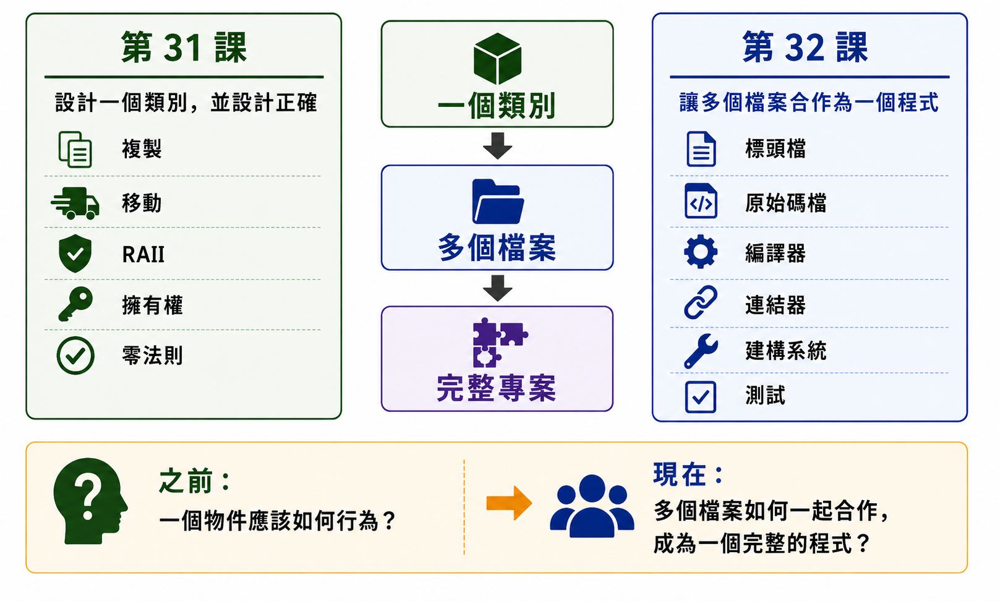


> 這堂課的重點：把單一 `.cpp` 程式整理成可維護的多檔案 C++ 專案，理解 preprocessor、compiler、assembler、linker 的工作，正確分離宣告與定義，並建立可以重複執行的建置與測試流程。

> 本章以 C++17、Clang/GCC、Make 與 CMake 為主要工具。Visual Studio、Ninja、Meson、Bazel、套件管理器、GitHub Actions 與大型測試框架只做概念延伸。你不需要一開始就使用最複雜的工具，但專案必須能夠「乾淨建置、清楚分層、容易測試、容易找錯」。

---

## Section I. 今天要做什麼？

1. 區分單一檔案程式與多檔案專案。
2. 認識 source file。
3. 認識 header file。
4. 認識 implementation file。
5. 認識 translation unit。
6. 理解 declaration。
7. 理解 definition。
8. 理解 one definition rule。
9. 認識 ODR。
10. 理解 function declaration。
11. 理解 function definition。
12. 理解 class declaration。
13. 理解 class definition。
14. 理解 variable declaration。
15. 理解 variable definition。
16. 使用 `extern`。
17. 避免在 header 定義一般 global variable。
18. 使用 `inline` variable 概念。
19. C++17 支援 inline variable。
20. 使用 `constexpr`。
21. 理解 header 中可安全定義的內容。
22. 使用 include guard。
23. 使用 `#ifndef`。
24. 使用 `#define`。
25. 使用 `#endif`。
26. 使用 `#pragma once` 概念。
27. 比較 include guard 與 pragma once。
28. 理解 repeated inclusion。
29. 理解 circular include。
30. 使用 forward declaration。
31. 理解 incomplete type。
32. 知道何時可使用 incomplete type。
33. 知道何時必須完整型別。
34. 使用 pointer 或 reference forward declaration。
35. 避免 header 互相 include。
36. 最小化 header dependency。
37. 理解 transitive include。
38. 不依賴間接 include。
39. 每個 source 自己 include 所需 header。
40. Header 優先 include 自己。
41. 建立 include self-sufficiency。
42. 使用 namespace。
43. 避免在 header 中 `using namespace std;`。
44. 避免污染全域 namespace。
45. 使用專案 namespace。
46. 使用巢狀 namespace。
47. 認識 unnamed namespace。
48. 使用 internal linkage。
49. 認識 `static` file scope。
50. 比較 unnamed namespace 與 static。
51. 理解 external linkage。
52. 理解 internal linkage。
53. 理解 no linkage。
54. 認識 build。
55. 認識 compile。
56. 認識 link。
57. 認識 preprocessing。
58. 認識 assembly。
59. 理解編譯流程。
60. 使用 `-E`。
61. 使用 `-S`。
62. 使用 `-c`。
63. 產生 object file。
64. 認識 `.o`。
65. 連結 object files。
66. 產生 executable。
67. 理解 linker symbol。
68. 認識 undefined reference。
69. 認識 multiple definition。
70. 認識 duplicate symbol。
71. 區分 compile error。
72. 區分 linker error。
73. 區分 runtime error。
74. 區分 test failure。
75. 讀懂 compiler diagnostic。
76. 讀懂 linker diagnostic。
77. 先處理第一個錯誤。
78. 使用 warning。
79. 使用 `-Wall`。
80. 使用 `-Wextra`。
81. 使用 `-Werror`。
82. 使用 `-Wconversion`。
83. 使用 `-Wsign-conversion`。
84. 使用 `-Wshadow`。
85. 理解 warning policy。
86. 不一定所有第三方程式都可使用 Werror。
87. 自己的程式可採嚴格警告。
88. 認識 debug build。
89. 使用 `-g`。
90. 使用 `-O0`。
91. 認識 release build。
92. 使用 `-O2`。
93. 使用 `-DNDEBUG`。
94. 理解 assert 在 release 可能停用。
95. 不把 correctness 依賴 assert。
96. 認識 optimization。
97. Debug 與 release 行為應一致。
98. 不依賴未定義行為。
99. 認識 sanitizer。
100. 使用 AddressSanitizer。
101. 使用 UndefinedBehaviorSanitizer。
102. 使用 `-fsanitize=address`。
103. 使用 `-fsanitize=undefined`。
104. 使用 `-fno-omit-frame-pointer`。
105. 認識 leak detection。
106. 認識 ThreadSanitizer 概念。
107. 不同 sanitizer 可能需要分開執行。
108. 使用 compiler standard flag。
109. 使用 `-std=c++17`。
110. 避免依賴非標準 extension。
111. 使用 `-pedantic` 概念。
112. 認識 command-line build。
113. 建立 compile command。
114. 建立 link command。
115. 重複建置時避免全部重編。
116. 認識 incremental build。
117. 認識 dependency graph。
118. 認識 timestamp。
119. 使用 Makefile。
120. 理解 target。
121. 理解 prerequisite。
122. 理解 recipe。
123. 理解 tab requirement。
124. 使用 variable。
125. 使用 automatic variable。
126. 使用 `$@`。
127. 使用 `$<`。
128. 使用 `$^`。
129. 使用 pattern rule。
130. 使用 `.PHONY`。
131. 建立 `all` target。
132. 建立 `clean` target。
133. 建立 `test` target。
134. 建立 `run` target。
135. 建立 dependency file。
136. 使用 `-MMD`。
137. 使用 `-MP`。
138. Include `.d` files。
139. 避免 header 修改後未重編。
140. 認識 out-of-source build。
141. 分離 source 與 build。
142. 使用 `build/`。
143. 不提交 object files。
144. 不提交 executable。
145. 設定 `.gitignore`。
146. 認識 CMake。
147. 使用 `cmake_minimum_required()`。
148. 使用 `project()`。
149. 設定 C++ standard。
150. 使用 `add_executable()`。
151. 使用 `add_library()`。
152. 使用 `target_include_directories()`。
153. 使用 `target_link_libraries()`。
154. 使用 target-based design。
155. 避免全域 `include_directories()`。
156. 避免全域 `link_libraries()`。
157. 使用 `PRIVATE`。
158. 使用 `PUBLIC`。
159. 使用 `INTERFACE`。
160. 理解 usage requirements。
161. 認識 static library。
162. 認識 shared library。
163. 認識 header-only library。
164. 本章主要使用 static library。
165. 建立 library target。
166. 建立 application target。
167. 建立 test target。
168. 使用 `enable_testing()`。
169. 使用 `add_test()`。
170. 使用 CTest。
171. 使用 `cmake -S . -B build`。
172. 使用 `cmake --build build`。
173. 使用 `ctest --test-dir build`。
174. 使用 `--output-on-failure`。
175. 認識 build configuration。
176. 單一設定 generator。
177. 多設定 generator 概念。
178. 認識 Debug 與 Release。
179. 使用 `CMAKE_BUILD_TYPE`。
180. 不硬編碼 compiler-specific flags 到所有平台。
181. 使用 `target_compile_options()`。
182. 使用 compiler ID generator expression 概念。
183. 不在本章深入 generator expression。
184. 認識 unit test。
185. 認識 integration test。
186. 認識 system test。
187. 認識 regression test。
188. 認識 smoke test。
189. 認識 test case。
190. 認識 test fixture。
191. 認識 assertion。
192. 建立簡易 test harness。
193. 使用 Arrange-Act-Assert。
194. 一個測試只驗證一個核心行為。
195. 測試正常輸入。
196. 測試邊界值。
197. 測試錯誤輸入。
198. 測試例外。
199. 測試空容器。
200. 測試單一元素。
201. 測試重複資料。
202. 測試 moved-from state。
203. 測試檔案錯誤。
204. 使用 deterministic test。
205. 避免測試依賴目前時間。
206. 避免測試依賴網路。
207. 避免測試依賴執行順序。
208. 使用 temporary directory。
209. 清理測試檔案。
210. 使用 dependency injection。
211. 對 `istream&` 測試 parser。
212. 對 `ostream&` 測試 writer。
213. 使用 `istringstream`。
214. 使用 `ostringstream`。
215. 測試 private 實作還是 public behavior。
216. 優先測試 public behavior。
217. 避免為測試破壞封裝。
218. 認識 fake。
219. 認識 stub。
220. 認識 mock。
221. 不在本章深入 mocking framework。
222. 認識 code coverage。
223. Coverage 不等於測試品質。
224. 認識 line coverage。
225. 認識 branch coverage。
226. 認識 test naming。
227. 使用描述性測試名稱。
228. 測試失敗訊息要清楚。
229. 對浮點數使用 tolerance。
230. 不直接比較浮點數完全相等。
231. 測試例外型別。
232. 測試例外訊息時避免過度脆弱。
233. 認識 continuous integration。
234. 每次 push 自動 build。
235. 每次 push 自動 test。
236. 自動執行 sanitizer。
237. 自動檢查格式概念。
238. 自動檢查多平台概念。
239. 認識 reproducible build。
240. 固定 compiler 與 dependency 版本概念。
241. 建立 README build instructions。
242. 說明 prerequisites。
243. 說明 build commands。
244. 說明 test commands。
245. 說明 project layout。
246. 說明 supported standard。
247. 使用 `compile_commands.json`。
248. 認識 language server。
249. 使用 `CMAKE_EXPORT_COMPILE_COMMANDS`。
250. 認識 clangd。
251. 認識 formatter。
252. 使用 clang-format 概念。
253. 認識 static analysis。
254. 使用 clang-tidy 概念。
255. 不在本章深入工具設定。
256. 建立小型完整專案。
257. 分離 domain library。
258. 分離 CLI。
259. 分離 tests。
260. 使用概念檢查、程式閱讀與實作題整合本章。

---

## Section II. 今天的學習方式

1. 每個 `.cpp` 應該能說明：
   ```text
   我實作哪個模組？
   我 include 哪個自己的 header？
   我需要哪些標準函式庫？
   ```
2. Header 放公開宣告，source 放一般實作。
3. 不依賴其他 header 幫你間接 include。
4. 每次建置先分辨錯誤階段：
   ```text
   Preprocess → Compile → Link → Run → Test
   ```
5. 自己的程式使用嚴格 warnings。
6. Debug build 開啟 `-g` 與 sanitizer。
7. Release build 不代表可以忽略測試。
8. 每個 bug 修正最好加入 regression test。
9. Build 與 test 命令必須可重複執行。
10. 所有完整 C++ 範例使用 C++17 嚴格選項檢查。

---

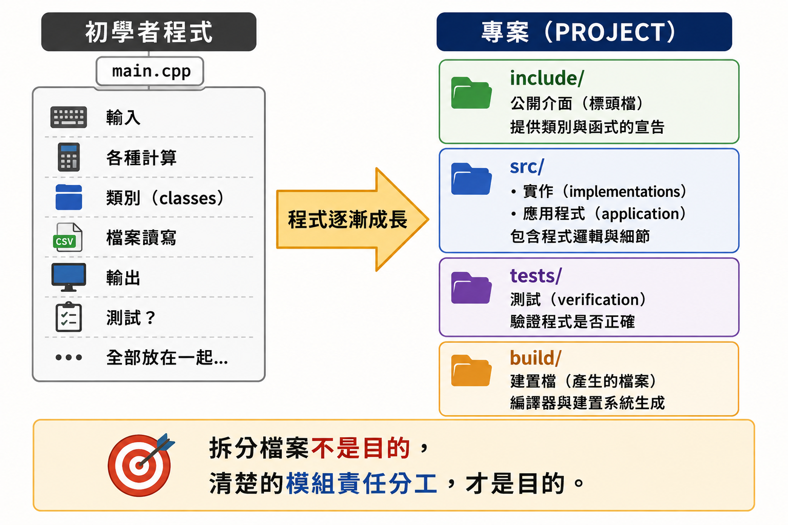

## Section III. 建議專案結構

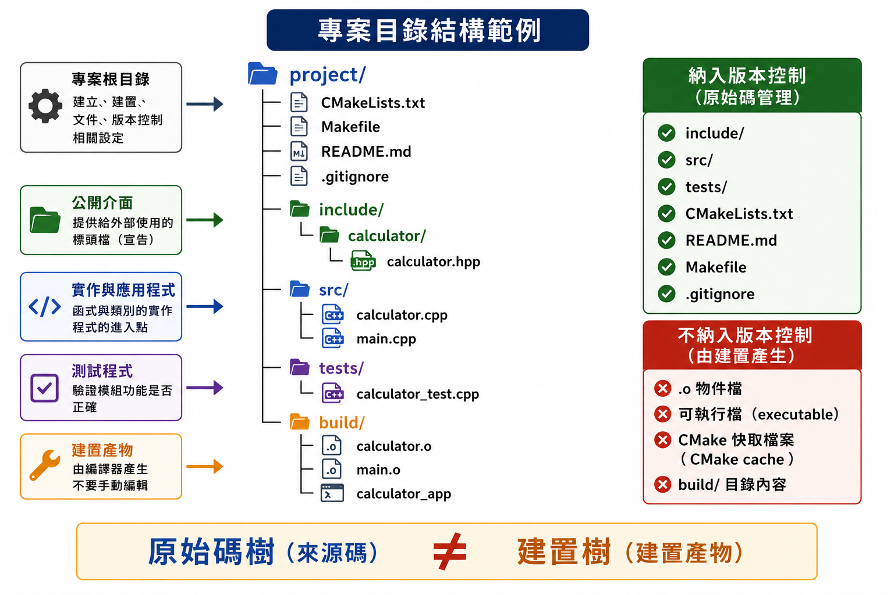


```text
project/
├── CMakeLists.txt
├── Makefile
├── README.md
├── .gitignore
├── include/
│   └── calculator/
│       └── calculator.hpp
├── src/
│   ├── calculator.cpp
│   └── main.cpp
├── tests/
│   └── calculator_test.cpp
└── build/
```

---

## Section IV. 各目錄責任

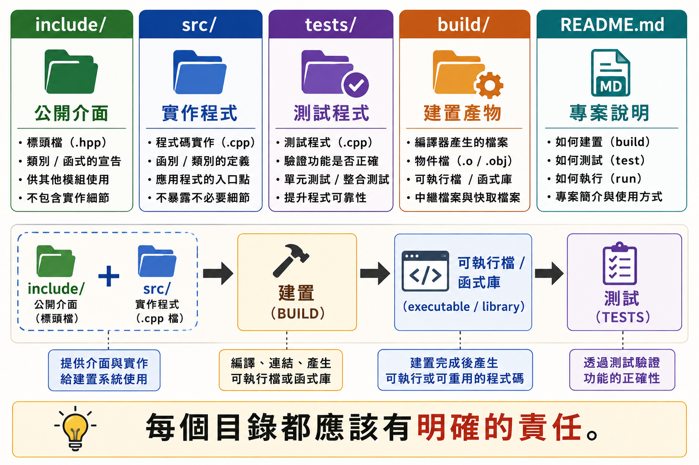


| 路徑 | 用途 |
| --- | --- |
| `include/` | 對其他模組公開的 header |
| `src/` | 實作與應用程式 source |
| `tests/` | 測試程式 |
| `build/` | Object files、executables、CMake 中間檔 |
| `README.md` | 建置、測試與使用說明 |
| `CMakeLists.txt` | CMake build 定義 |
| `Makefile` | 簡單或教學用建置規則 |

---

# Part A：Declaration 與 Definition

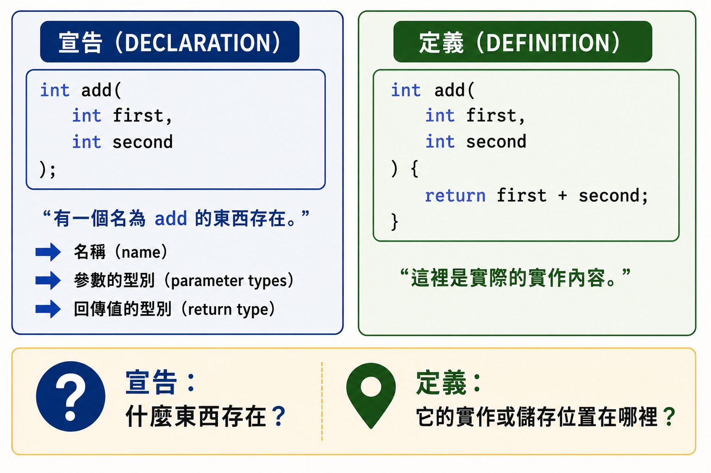


## Section V. 函式宣告

```cpp
int add(
    int first,
    int second
);
```

告訴編譯器：

- 函式名稱。
- 參數型別。
- 回傳型別。

---

## Section VI. 函式定義

```cpp
int add(
    int first,
    int second
) {
    return
        first +
        second;
}
```

提供真正的函式主體。

---

## Section VII. 為什麼要分開？

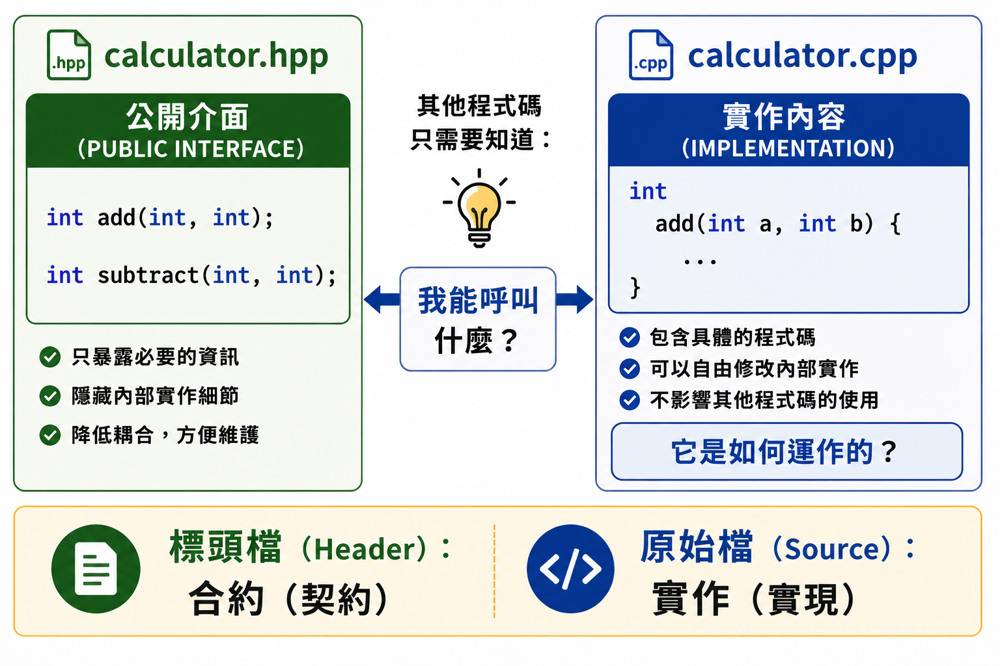


Header 提供模組介面：

```text
其他檔案可以使用什麼？
```

Source 提供模組實作：

```text
功能如何完成？
```

---

# Part B：第一個多檔案專案

## Section VIII. `calculator.hpp`

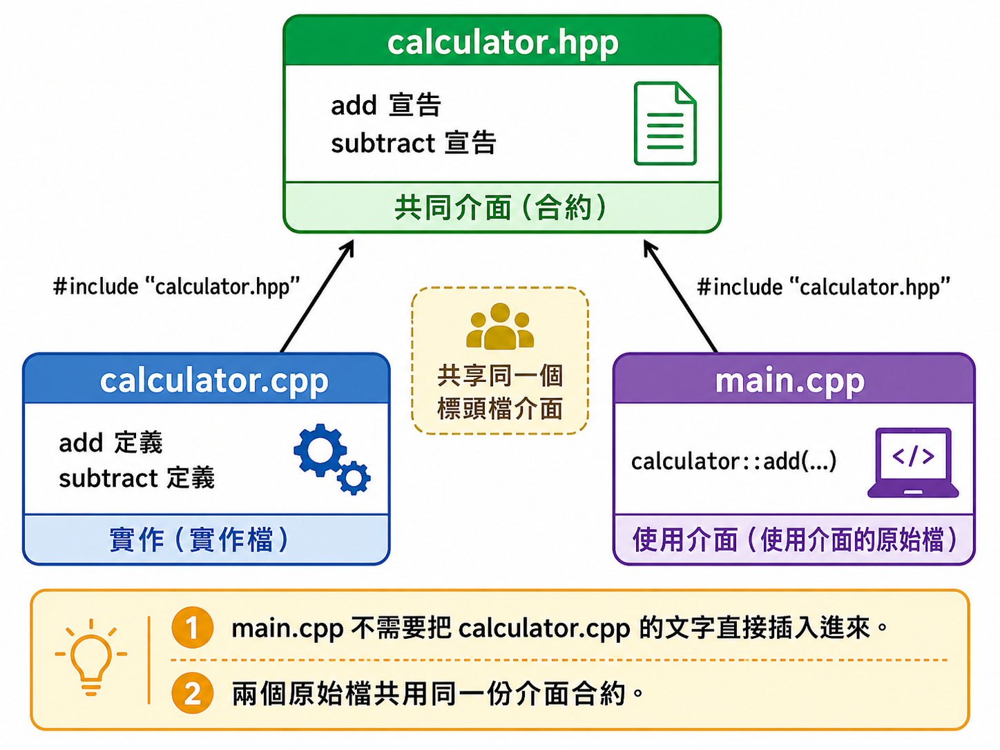


```cpp
#ifndef CALCULATOR_CALCULATOR_HPP
#define CALCULATOR_CALCULATOR_HPP

namespace calculator {

int add(
    int first,
    int second
);

int subtract(
    int first,
    int second
);

}  // namespace calculator

#endif
```

---

## Section IX. `calculator.cpp`

```cpp
#include "calculator/calculator.hpp"

namespace calculator {

int add(
    int first,
    int second
) {
    return
        first +
        second;
}

int subtract(
    int first,
    int second
) {
    return
        first -
        second;
}

}  // namespace calculator
```

---

## Section X. `main.cpp`

```cpp
#include "calculator/calculator.hpp"

#include <iostream>

int main() {
    std::cout
        << calculator::add(
               10,
               20
           )
        << '\n';

    return 0;
}
```

---

## Section XI. 手動編譯

```bash
clang++ -std=c++17 -Wall -Wextra -Werror \
  -Iinclude \
  -c src/calculator.cpp \
  -o build/calculator.o

clang++ -std=c++17 -Wall -Wextra -Werror \
  -Iinclude \
  -c src/main.cpp \
  -o build/main.o

clang++ \
  build/calculator.o \
  build/main.o \
  -o build/calculator_app
```

---

# Part C：Translation Unit

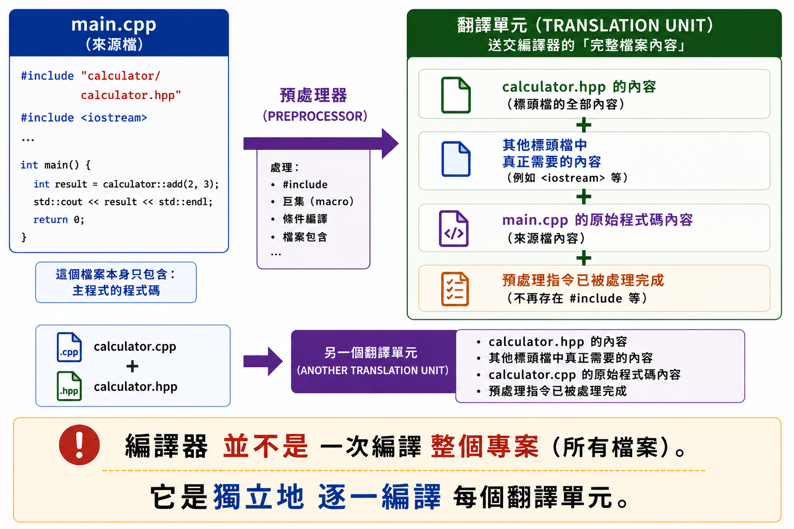


## Section XII. 什麼是 Translation Unit？

每個 `.cpp` 經過 preprocessor 展開後，形成一個 translation unit。

```text
main.cpp + 它 include 的 header
```

是一個 translation unit。

```text
calculator.cpp + 它 include 的 header
```

是另一個 translation unit。

---

## Section XIII. Header 不會單獨連結

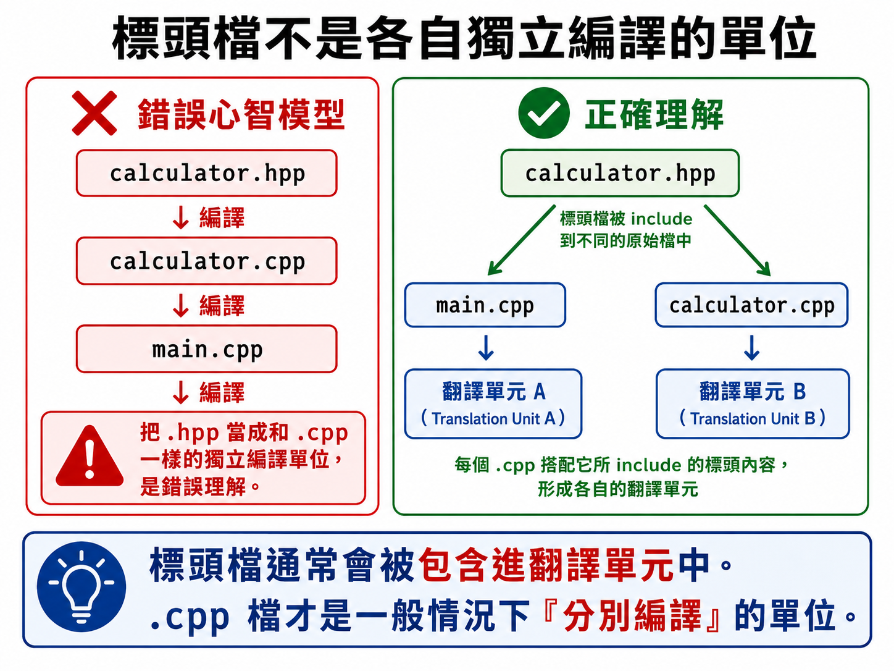


Header 通常被 include 到 source 中。

真正分別編譯的是：

```text
每個 translation unit
```

---

# Part D：編譯流程

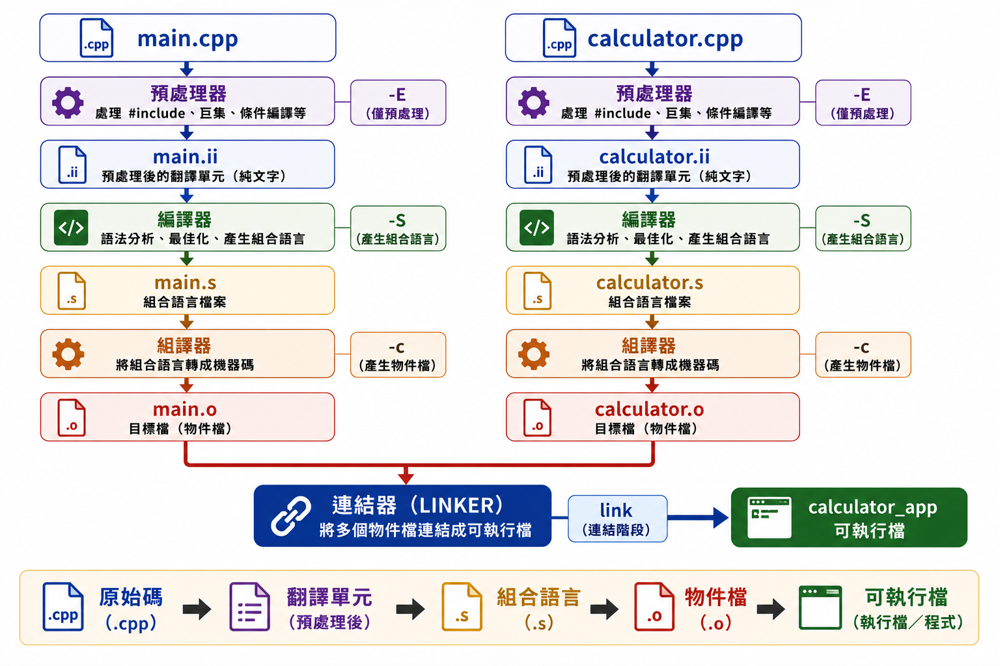


## Section XIV. 四個主要階段

```text
Source
  ↓ Preprocessor
Preprocessed source
  ↓ Compiler
Assembly
  ↓ Assembler
Object file
  ↓ Linker
Executable
```

---

## Section XV. Preprocessor


處理：

- `#include`
- `#define`
- `#if`
- Include guard

查看結果：

```bash
clang++ -std=c++17 -E src/main.cpp
```

---

## Section XVI. Compile to Assembly

```bash
clang++ -std=c++17 -S src/main.cpp
```

產生 assembly source。

---

## Section XVII. Compile Only

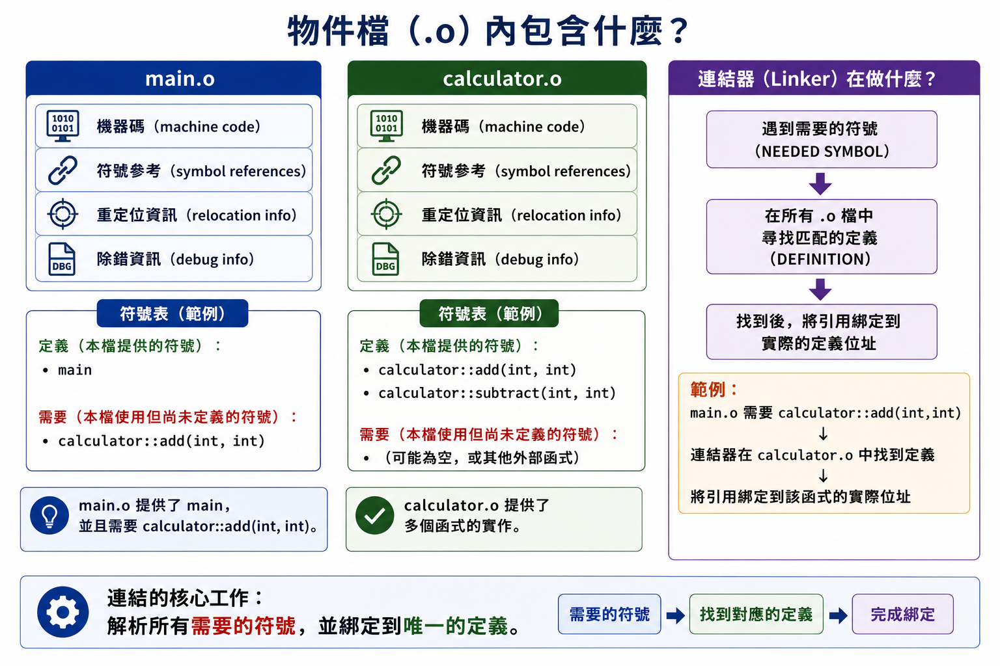


```bash
clang++ -std=c++17 -c src/main.cpp
```

產生 object file，不連結。

---

## Section XVIII. Link

```bash
clang++ main.o calculator.o -o app
```

Linker 將 symbol reference 與 definition 配對。

---

# Part E：Compile Error vs Linker Error

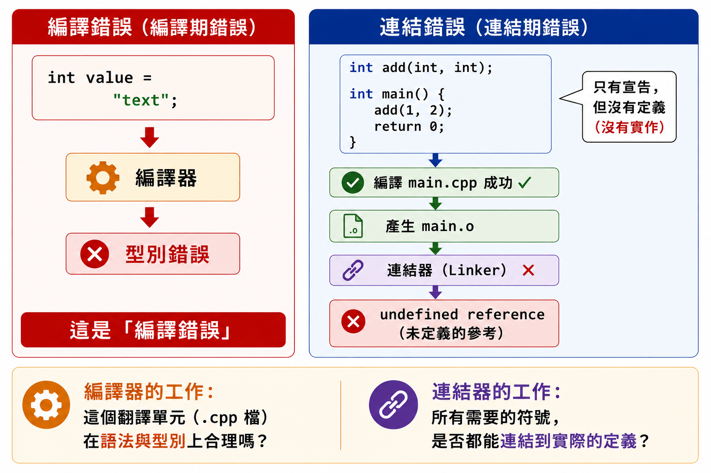


## Section XIX. Compile Error

例如：

```cpp
int value =
    "text";
```

單一 translation unit 無法通過語法或型別檢查。

---

## Section XX. Undefined Reference

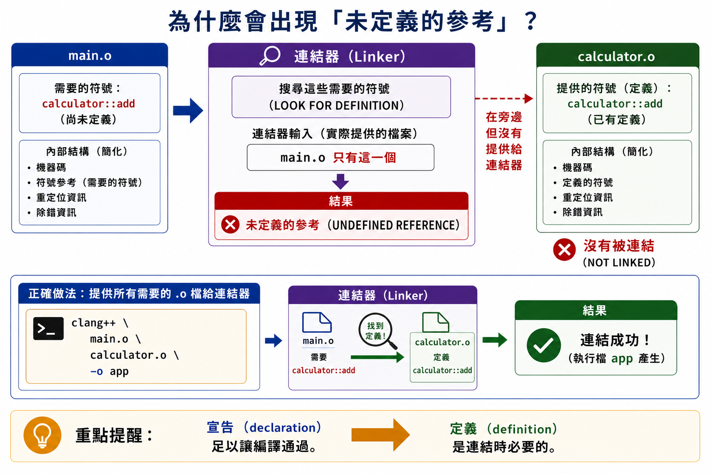


Header 有宣告：

```cpp
int add(int, int);
```

Main 呼叫 `add()`，但沒有把提供定義的 object file 加入 linker。

常見訊息：

```text
undefined reference to ...
```

或：

```text
Undefined symbols for architecture ...
```

---

## Section XXI. Multiple Definition

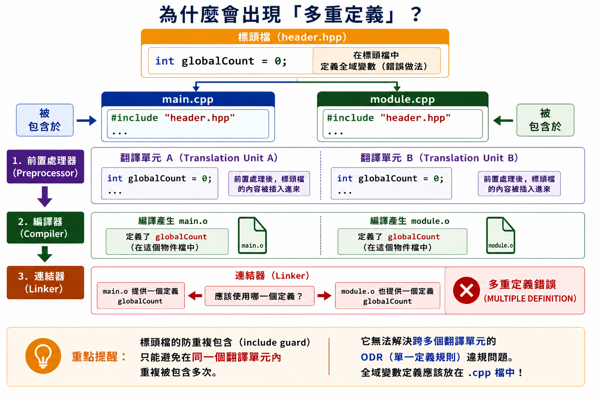


同一 external symbol 在多個 translation unit 有一般定義。

例如把以下放在 header：

```cpp
/* int globalCount = 0; */
```

每個 include 它的 `.cpp` 都產生一個定義。

---

# Part F：Include Guard

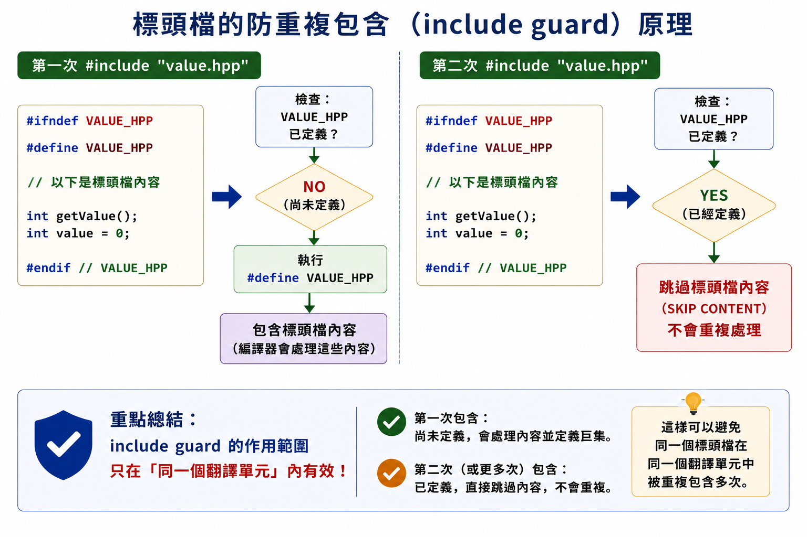


## Section XXII. 標準形式

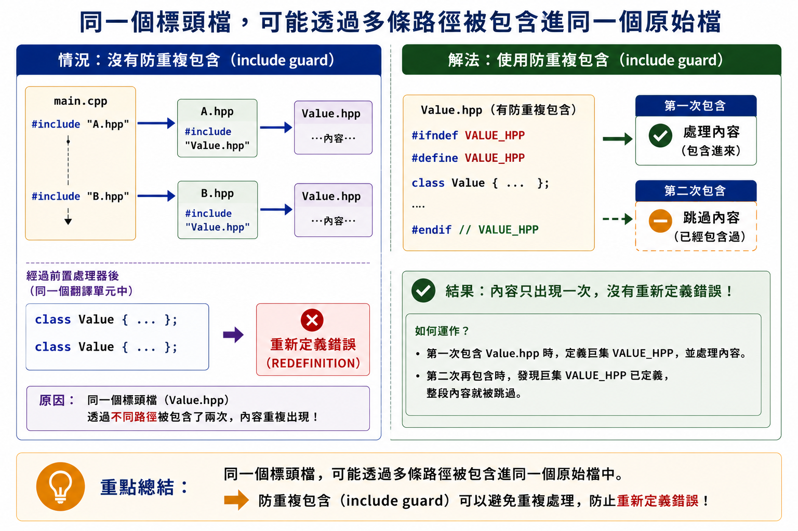


```cpp
#ifndef PROJECT_MODULE_TYPE_HPP
#define PROJECT_MODULE_TYPE_HPP

// Header content

#endif
```

---

## Section XXIII. 命名

Guard 名稱應：

- 專案唯一。
- 模組唯一。
- 全大寫。
- 使用底線。
- 包含路徑資訊。

例如：

```text
TEACH_CODE_MATH_VECTOR_UTILS_HPP
```

---

## Section XXIV. `#pragma once`


```cpp
#pragma once
```

簡潔且常見，但不是 ISO C++ 標準正式語法。

實務主流編譯器普遍支援。

---

# Part G：Header 應該放什麼？

## Section XXV. 常見可放內容

- Function declarations。
- Class definitions。
- Enum definitions。
- Template definitions。
- `inline` functions。
- `constexpr` functions。
- C++17 inline variables。
- Type aliases。

---

## Section XXVI. 一般不要放

- 一般非 inline function definition。
- 一般 external global variable definition。
- 大型 implementation detail。
- `using namespace std;`。
- 不必要 header。

---

# Part H：Header Self-Sufficiency

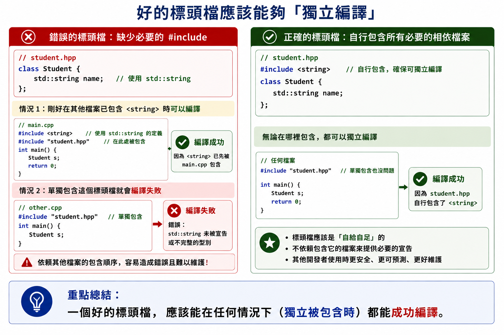

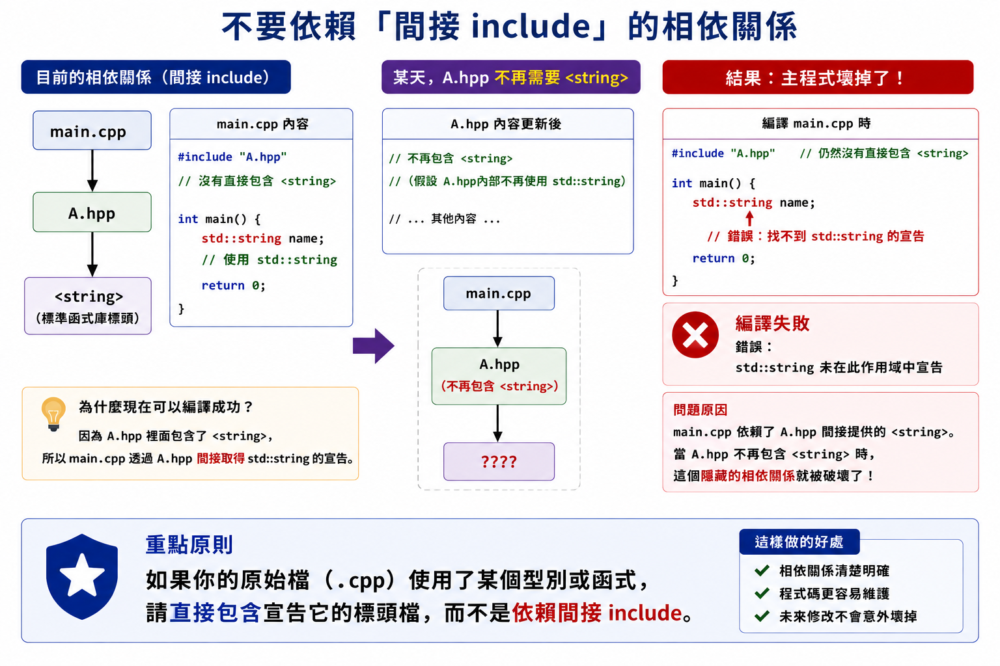


## Section XXVII. Header 自己 include 需要的型別

若 header 使用：

```cpp
std::string
```

它自己應：

```cpp
#include <string>
```

不要期待其他檔案先 include `<string>`。

---

## Section XXVIII. Source 先 Include 自己的 Header


```cpp
#include "student/student.hpp"

#include <utility>
```

若 `student.hpp` 缺少必要 include，這樣更容易立即發現。

---

# Part I：Forward Declaration

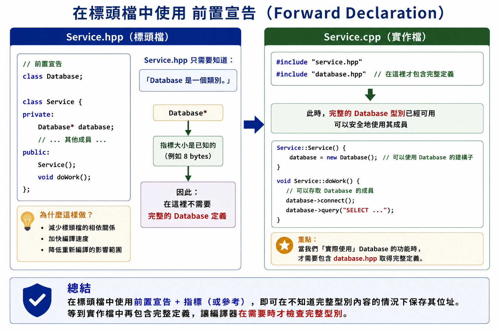

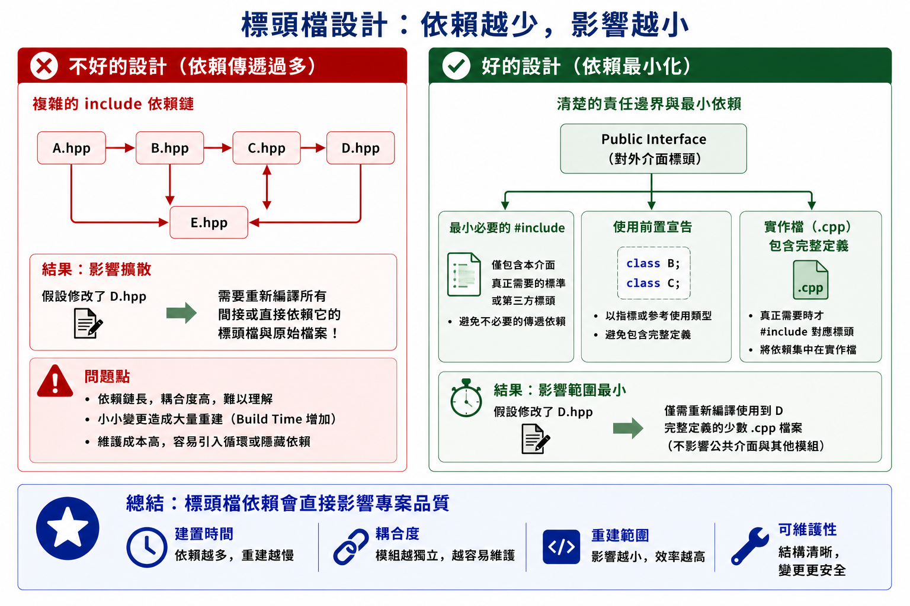


## Section XXIX. 降低 Header Dependency

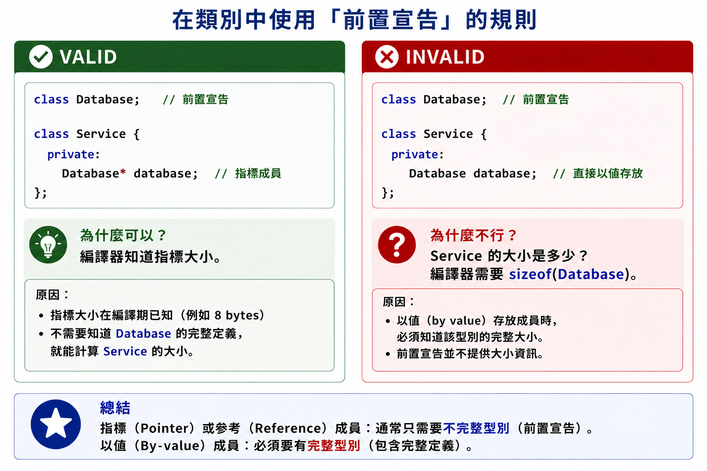


```cpp
class Database;
```

可在 header 中宣告：

```cpp
class Service {
public:
    explicit Service(
        Database& database
    );

private:
    Database& database;
};
```

只使用 reference，不需要完整 Database 定義。

---

## Section XXX. 需要完整型別的情況

若成員是：

```cpp
Database database;
```

編譯器必須知道 Database 大小，因此需要 include 完整定義。

---

## Section XXXI. 完整 Forward Declaration 範例

```cpp
// VALIDATE
#include <iostream>
#include <string>
using namespace std;

class Database;

class Service {
public:
    explicit Service(
        Database& initialDatabase
    )
        : database(
              initialDatabase
          ) {
    }

    string load() const;

private:
    Database& database;
};

class Database {
public:
    string query() const {
        return "data";
    }
};

string Service::load() const {
    return database.query();
}

int main() {
    Database database;
    Service service(database);

    cout << service.load()
         << '\n';

    return 0;
}
```

---

# Part J：Circular Include

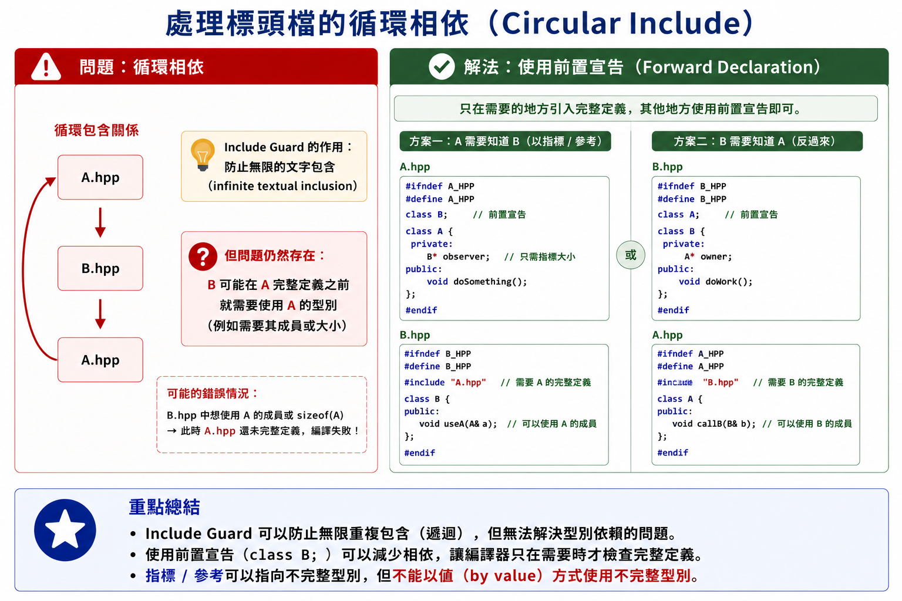


## Section XXXII. 問題

```text
A.hpp includes B.hpp
B.hpp includes A.hpp
```

Include guard 能防止無限展開，但不一定解決型別尚未完成的問題。

---

## Section XXXIII. 解法方向

- 使用 forward declaration。
- 一個方向擁有，另一方向只觀察。
- 將共用型別抽到第三個 header。
- 降低模組耦合。

---

# Part K：Namespace

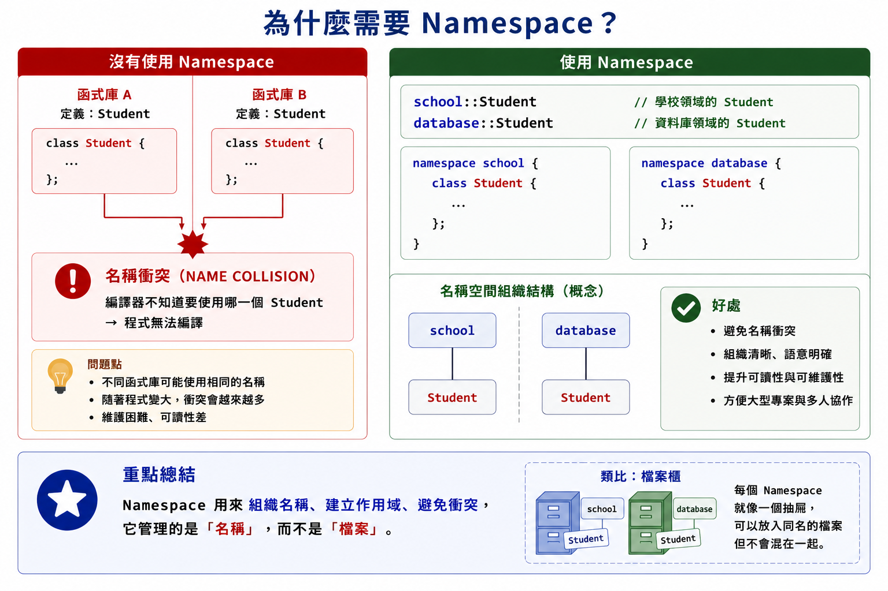


## Section XXXIV. 專案 Namespace

```cpp
namespace school {

class Student {
};

}
```

避免和其他函式庫同名。

---

## Section XXXV. Header 中不要


```cpp
/* using namespace std; */
```

它會污染所有 include 該 header 的 translation unit。

---

## Section XXXVI. Unnamed Namespace

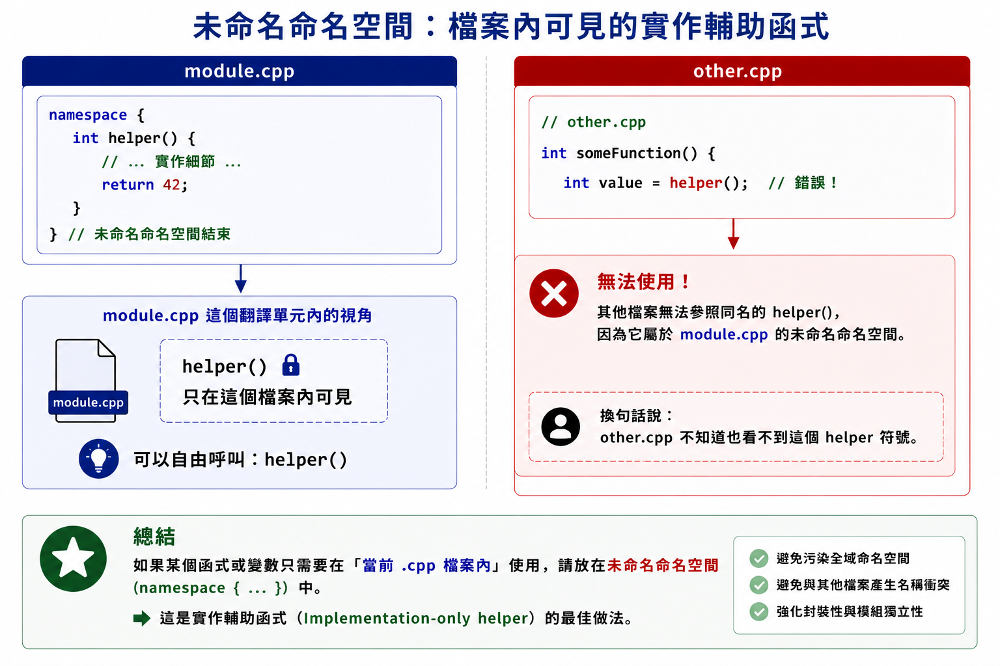


在 `.cpp` 中：

```cpp
namespace {

int helper() {
    return 42;
}

}
```

讓 helper 只在目前 translation unit 可見。

---

## Section XXXVII. 完整 Internal Helper

```cpp
// VALIDATE
#include <iostream>
using namespace std;

namespace {

int square(int value) {
    return
        value *
        value;
}

}  // namespace

int main() {
    cout << square(5)
         << '\n';

    return 0;
}
```

---

# Part L：Global Variable


## Section XXXVIII. Header 宣告

```cpp
extern int globalCount;
```

---

## Section XXXIX. 一個 Source 定義

```cpp
int globalCount = 0;
```

只有一個 translation unit 提供定義。

---

## Section XL. 更好的選擇

通常優先：

- 函式參數。
- 類別成員。
- Dependency injection。
- `constexpr` constant。
- Module-owned state。

Global mutable state 會增加測試與耦合困難。

---

# Part M：Compiler Warnings

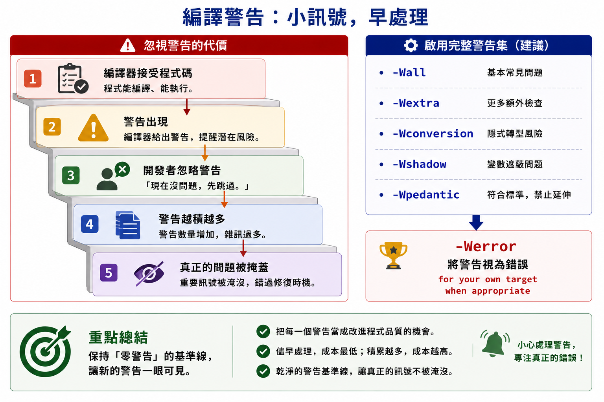


## Section XLI. 建議教學選項

```bash
-std=c++17
-Wall
-Wextra
-Werror
-Wconversion
-Wsign-conversion
-Wshadow
-Wpedantic
```

---

## Section XLII. `-Werror`

把 warning 視為 error。

優點：

- 警告不會被長期忽略。
- 維持乾淨 build。

注意：

- Compiler 更新可能加入新 warning。
- 第三方 code 不一定符合相同 policy。
- 可只對自己的 target 使用。

---

# Part N：Debug 與 Release

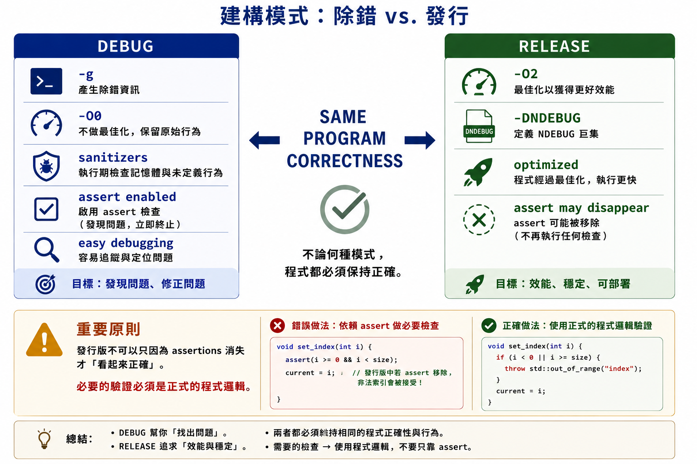


## Section XLIII. Debug

```bash
-g
-O0
```

常搭配：

```bash
-fsanitize=address,undefined
-fno-omit-frame-pointer
```

---

## Section XLIV. Release

```bash
-O2
-DNDEBUG
```

Release 仍應：

- 通過所有測試。
- 不含 undefined behavior。
- 不依賴 assert 執行必要邏輯。
- 保留必要 runtime validation。

---

# Part O：Sanitizer

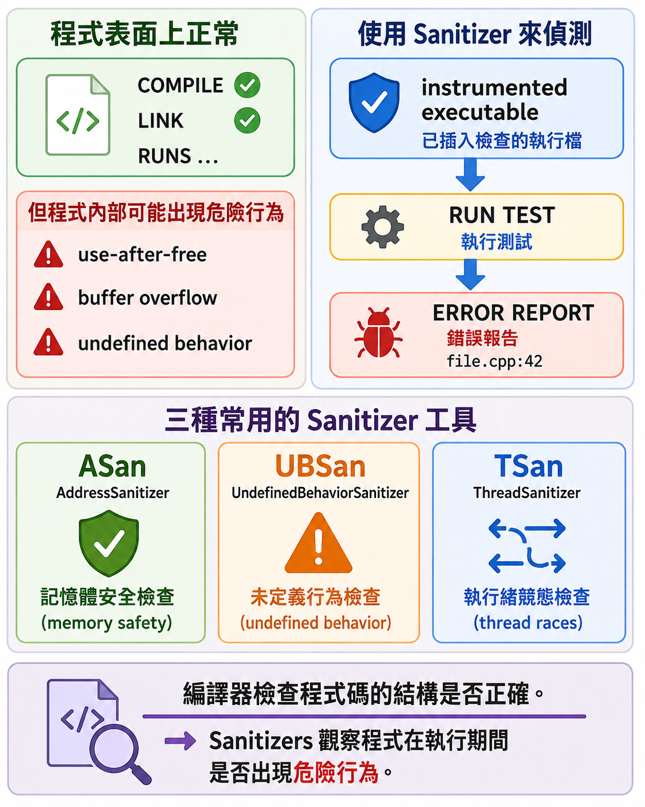


## Section XLV. AddressSanitizer

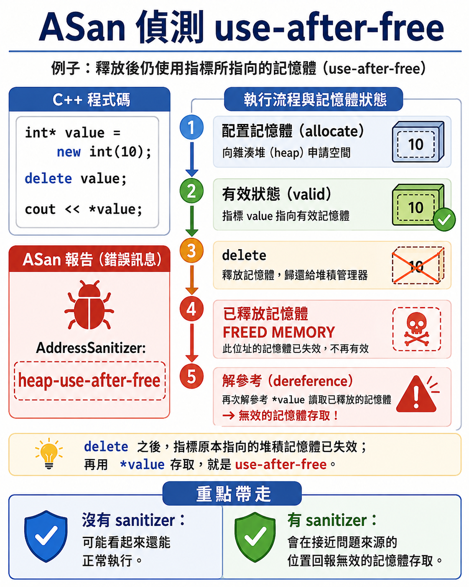


可協助找出：

- Heap buffer overflow。
- Stack buffer overflow。
- Use-after-free。
- Double free。
- 部分 leak。

---

## Section XLVI. UndefinedBehaviorSanitizer

可協助找出：

- Signed integer overflow。
- Invalid shift。
- Misaligned access。
- Null dereference。
- 某些無效轉型。

---

## Section XLVII. 建置命令

```bash
clang++ -std=c++17 \
  -Wall -Wextra -Werror \
  -fsanitize=address,undefined \
  -fno-omit-frame-pointer \
  -g -O0 \
  src/main.cpp \
  -o build/app
```

---

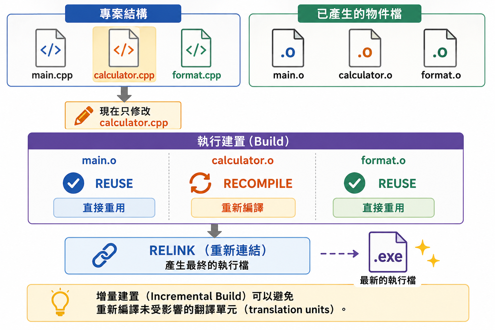

# Part P：簡單 Makefile

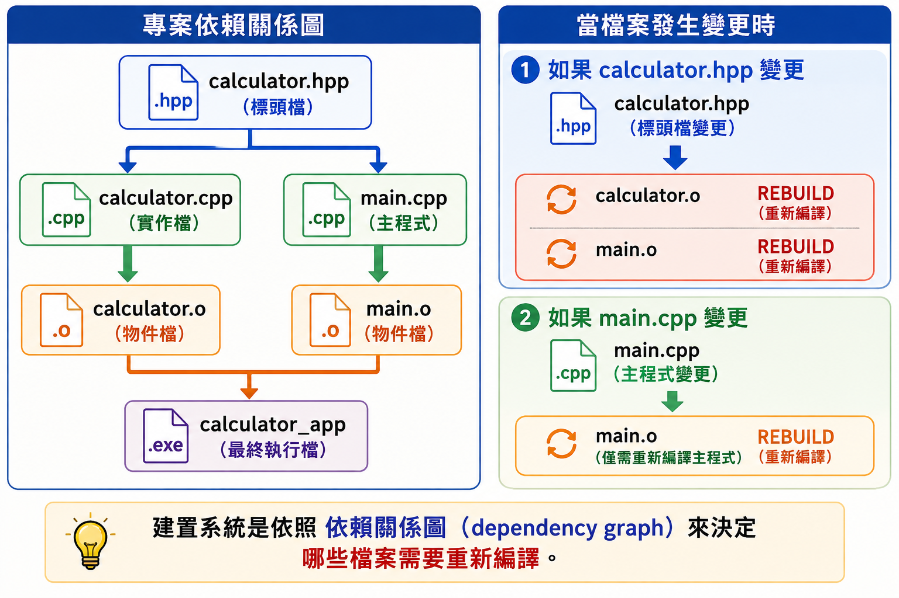

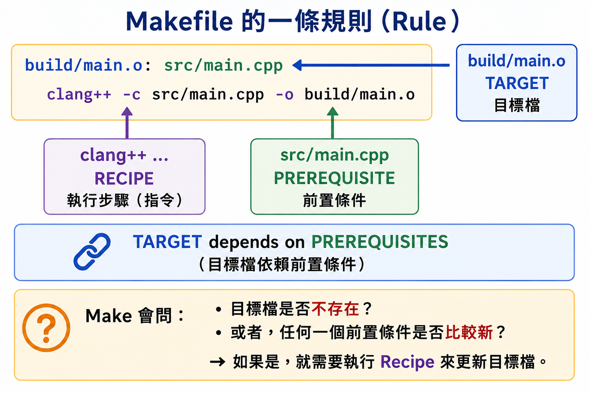

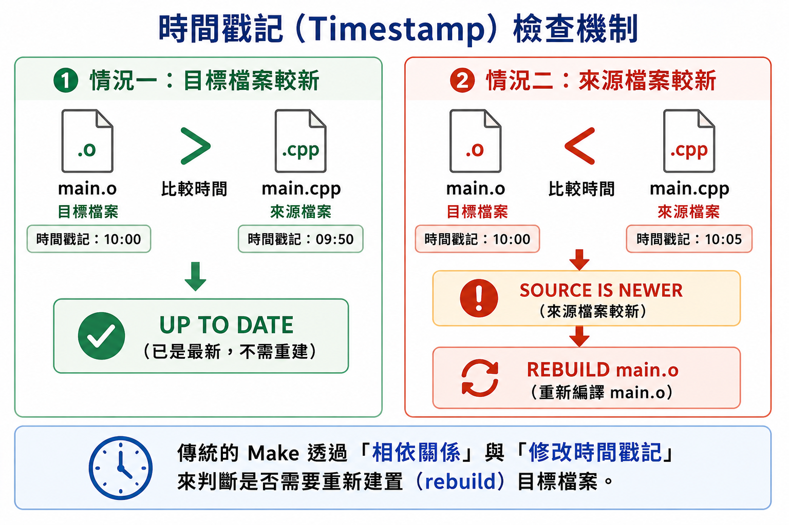


## Section XLVIII. 基本版本

```make
CXX := clang++
CXXFLAGS := -std=c++17 -Wall -Wextra -Werror
CPPFLAGS := -Iinclude

SOURCES := src/main.cpp src/calculator.cpp
OBJECTS := build/main.o build/calculator.o
TARGET := build/calculator_app

.PHONY: all clean run

all: $(TARGET)

$(TARGET): $(OBJECTS)
	$(CXX) $(OBJECTS) -o $@

build/%.o: src/%.cpp
	mkdir -p build
	$(CXX) $(CPPFLAGS) $(CXXFLAGS) -c $< -o $@

run: $(TARGET)
	./$(TARGET)

clean:
	rm -rf build
```

Recipe 行前必須是真正的 tab。

---

# Part Q：Make Dependency Files


## Section XLIX. Header 修改也要重編

只依賴 `.cpp` timestamp 不夠。

加入：

```make
-MMD -MP
```

Compiler 會產生 `.d` dependency files。

---

## Section L. 改良 Makefile

```make
CXX := clang++
CPPFLAGS := -Iinclude
CXXFLAGS := -std=c++17 -Wall -Wextra -Werror -MMD -MP

SOURCES := src/main.cpp src/calculator.cpp
OBJECTS := $(SOURCES:src/%.cpp=build/%.o)
DEPS := $(OBJECTS:.o=.d)
TARGET := build/calculator_app

.PHONY: all clean test

all: $(TARGET)

$(TARGET): $(OBJECTS)
	$(CXX) $^ -o $@

build/%.o: src/%.cpp
	mkdir -p $(dir $@)
	$(CXX) $(CPPFLAGS) $(CXXFLAGS) -c $< -o $@

clean:
	rm -rf build

-include $(DEPS)
```

---

# Part R：CMake 基礎

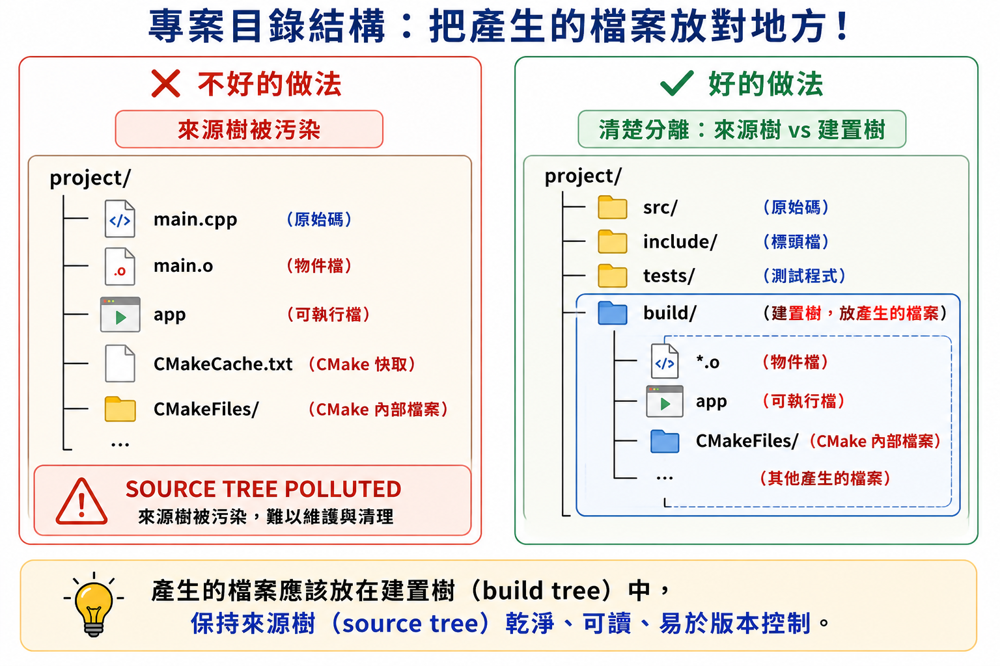

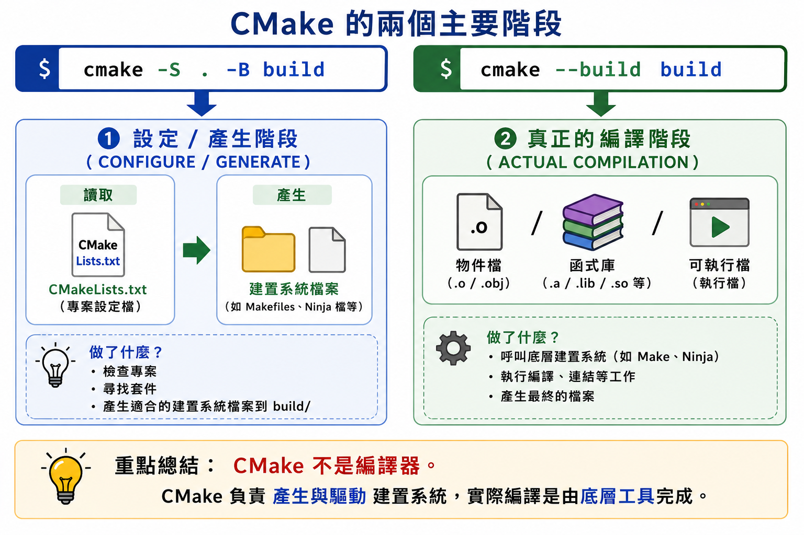


## Section LI. 最小 `CMakeLists.txt`

```cmake
cmake_minimum_required(VERSION 3.16)

project(
    CalculatorProject
    VERSION 1.0
    LANGUAGES CXX
)

set(
    CMAKE_CXX_STANDARD 17
)

set(
    CMAKE_CXX_STANDARD_REQUIRED ON
)

set(
    CMAKE_CXX_EXTENSIONS OFF
)

add_executable(
    calculator_app
    src/main.cpp
    src/calculator.cpp
)

target_include_directories(
    calculator_app
    PRIVATE
        include
)
```

---

## Section LII. 建置

```bash
cmake -S . -B build
cmake --build build
```

---

## Section LIII. 執行

常見單一設定 generator：

```bash
./build/calculator_app
```

實際位置依 generator 與平台而異。

---

# Part S：Library Target

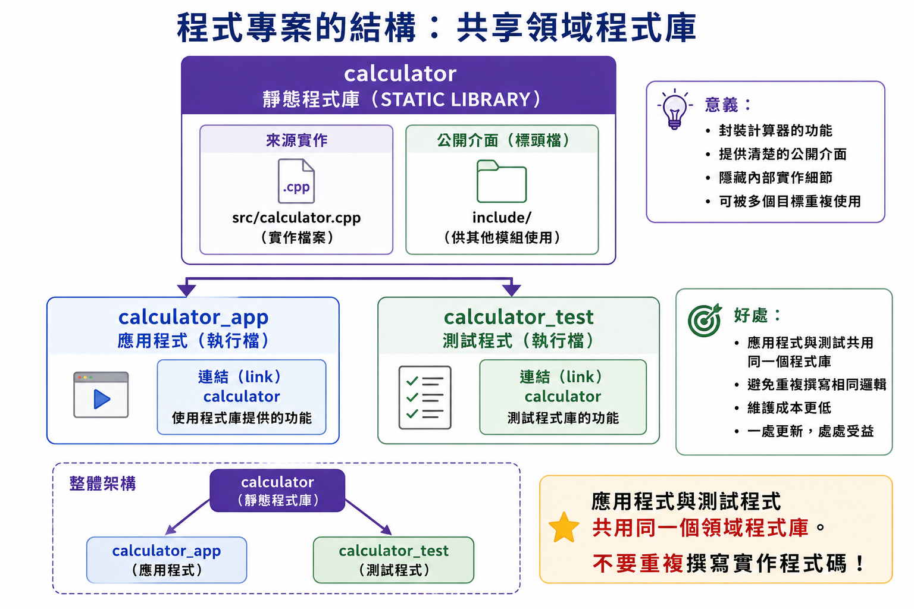


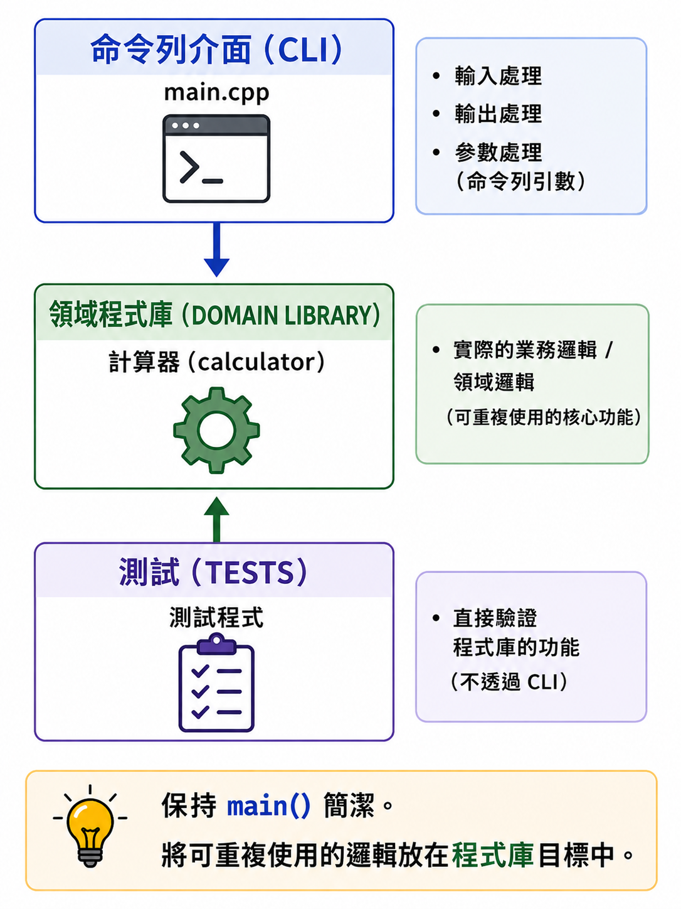

## Section LIV. 分離 Domain Library

```cmake
add_library(
    calculator
    src/calculator.cpp
)

target_include_directories(
    calculator
    PUBLIC
        include
)

add_executable(
    calculator_app
    src/main.cpp
)

target_link_libraries(
    calculator_app
    PRIVATE
        calculator
)
```

---

## Section LV. `PUBLIC` 的意義


Calculator library 自己需要 `include/`，而使用 calculator 的 target 也需要。

因此：

```cmake
PUBLIC
```

---

## Section LVI. `PRIVATE`

只有目前 target 自己需要。

---

## Section LVII. `INTERFACE`

目前 target 自己不編譯使用，但使用它的 target 需要。

常見於 header-only library。

---

# Part T：第一個簡易測試

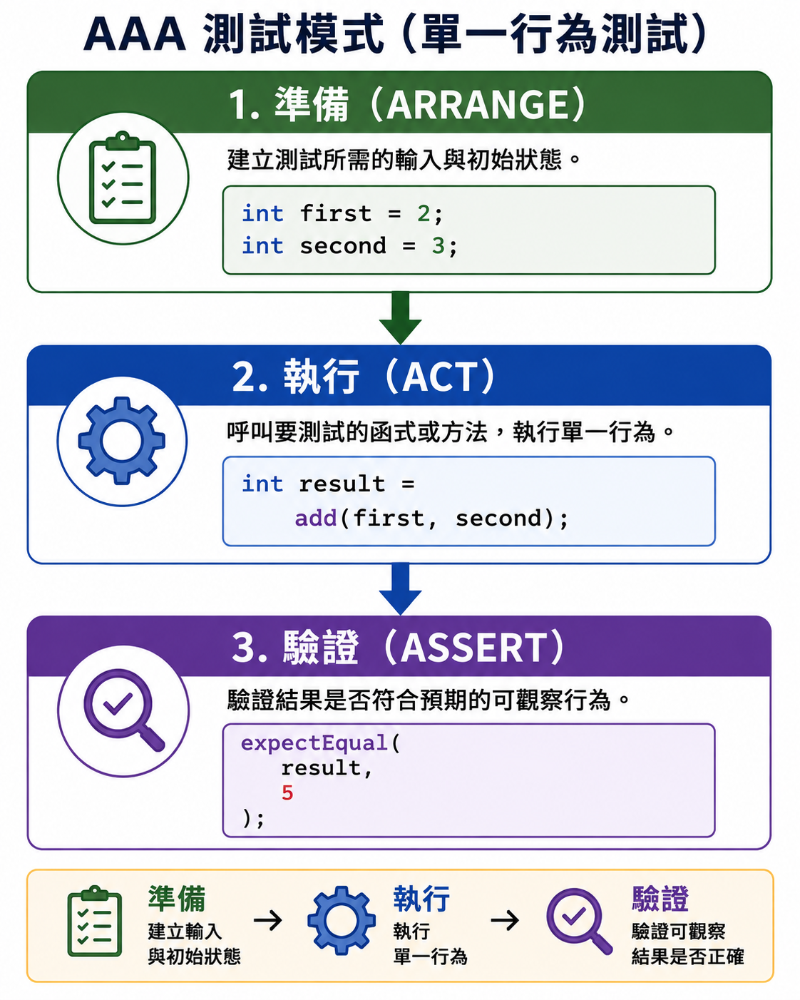


## Section LVIII. 測試目標

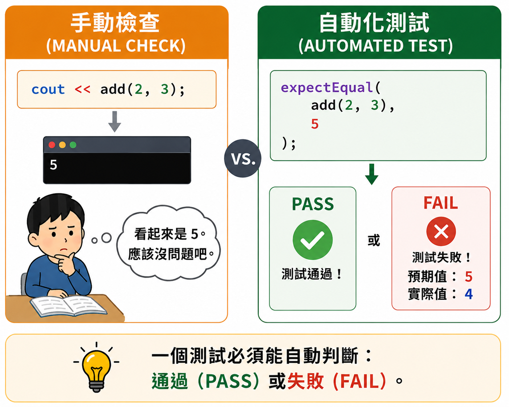


測試不是：

```text
執行看看好像沒問題
```

而是：

```text
給定輸入
執行行為
驗證結果
失敗時回報
```

---

## Section LIX. Arrange-Act-Assert

```text
Arrange：準備資料
Act：執行功能
Assert：驗證結果
```

---

## Section LX. 完整簡易測試

```cpp
// VALIDATE
#include <cstdlib>
#include <iostream>
using namespace std;

int add(
    int first,
    int second
) {
    return
        first +
        second;
}

void expectEqual(
    int actual,
    int expected,
    const char* testName
) {
    if (
        actual !=
        expected
    ) {
        cerr << "FAILED: "
             << testName
             << " expected "
             << expected
             << " but got "
             << actual
             << '\n';

        exit(1);
    }
}

int main() {
    expectEqual(
        add(
            2,
            3
        ),
        5,
        "add positive numbers"
    );

    expectEqual(
        add(
            -2,
            3
        ),
        1,
        "add mixed signs"
    );

    cout << "All tests passed\n";

    return 0;
}
```

---

# Part U：多測試不立即結束

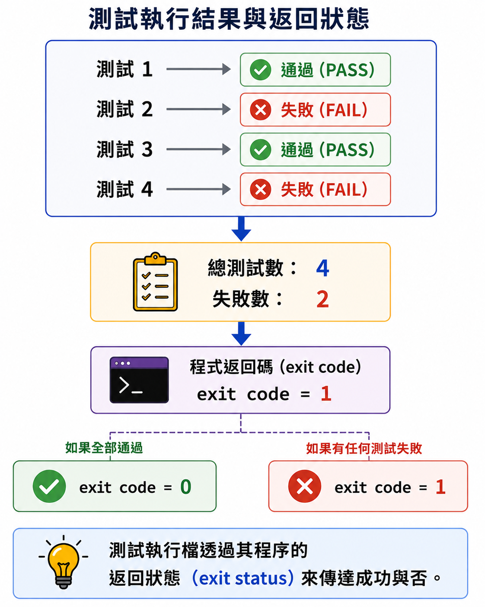


## Section LXI. 收集失敗數量

立即 `exit(1)` 只看到第一個失敗。

可累積：

```text
passed
failed
```

最後再回傳非零 exit code。

---

## Section LXII. 完整 Test Runner

```cpp
// VALIDATE
#include <iostream>
#include <string>
using namespace std;

class TestRunner {
public:
    void expectEqual(
        int actual,
        int expected,
        const string& name
    ) {
        ++totalCount;

        if (
            actual ==
            expected
        ) {
            cout << "PASS: "
                 << name
                 << '\n';

            return;
        }

        ++failedCount;

        cerr << "FAIL: "
             << name
             << " expected "
             << expected
             << " but got "
             << actual
             << '\n';
    }

    int result() const {
        cout << totalCount
             << " tests, "
             << failedCount
             << " failures\n";

        if (
            failedCount ==
            0
        ) {
            return 0;
        }

        return 1;
    }

private:
    int totalCount = 0;
    int failedCount = 0;
};

int multiply(
    int first,
    int second
) {
    return
        first *
        second;
}

int main() {
    TestRunner tests;

    tests.expectEqual(
        multiply(
            3,
            4
        ),
        12,
        "multiply positive"
    );

    tests.expectEqual(
        multiply(
            0,
            999
        ),
        0,
        "multiply by zero"
    );

    return tests.result();
}
```

---

# Part V：測試例外

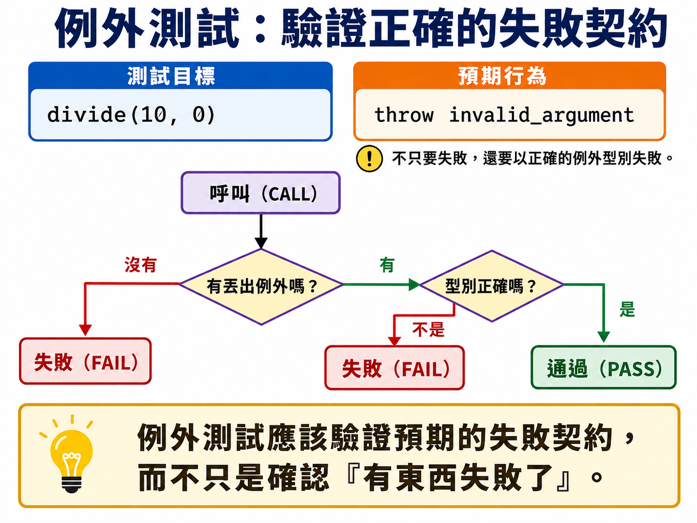


## Section LXIII. 驗證例外型別

```cpp
try {
    operation();
    fail();
} catch (
    const invalid_argument&
) {
    pass();
}
```

---

## Section LXIV. 完整例外測試

```cpp
// VALIDATE
#include <iostream>
#include <stdexcept>
using namespace std;

int divide(
    int numerator,
    int denominator
) {
    if (denominator == 0) {
        throw invalid_argument(
            "zero denominator"
        );
    }

    return
        numerator /
        denominator;
}

int main() {
    bool caughtExpected =
        false;

    try {
        static_cast<void>(
            divide(
                10,
                0
            )
        );
    } catch (
        const invalid_argument&
    ) {
        caughtExpected =
            true;
    } catch (...) {
        cerr << "Wrong exception type\n";
        return 1;
    }

    if (!caughtExpected) {
        cerr << "Expected exception was not thrown\n";
        return 1;
    }

    cout << "Test passed\n";

    return 0;
}
```

---

# Part W：浮點數測試

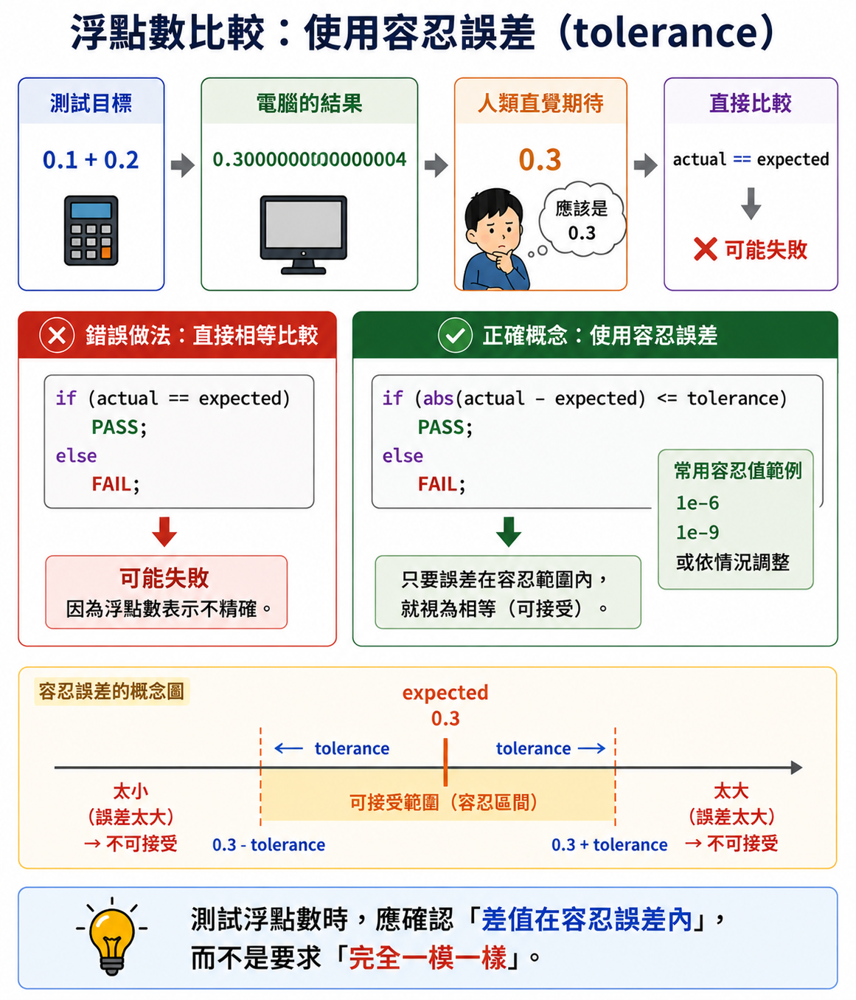


## Section LXV. 不直接比較

```cpp
/* actual == expected */
```

浮點數可能因表示與運算誤差不完全相等。

---

## Section LXVI. 使用 Tolerance

```cpp
abs(
    actual -
    expected
) <= tolerance
```

---

## Section LXVII. 完整浮點測試

```cpp
// VALIDATE
#include <cmath>
#include <iostream>
using namespace std;

bool approximatelyEqual(
    double actual,
    double expected,
    double tolerance
) {
    return
        abs(
            actual -
            expected
        ) <=
        tolerance;
}

int main() {
    const double actual =
        0.1 +
        0.2;

    if (
        !approximatelyEqual(
            actual,
            0.3,
            1e-12
        )
    ) {
        cerr << "Floating-point test failed\n";
        return 1;
    }

    cout << "Test passed\n";

    return 0;
}
```

---

# Part X：測試 Parser

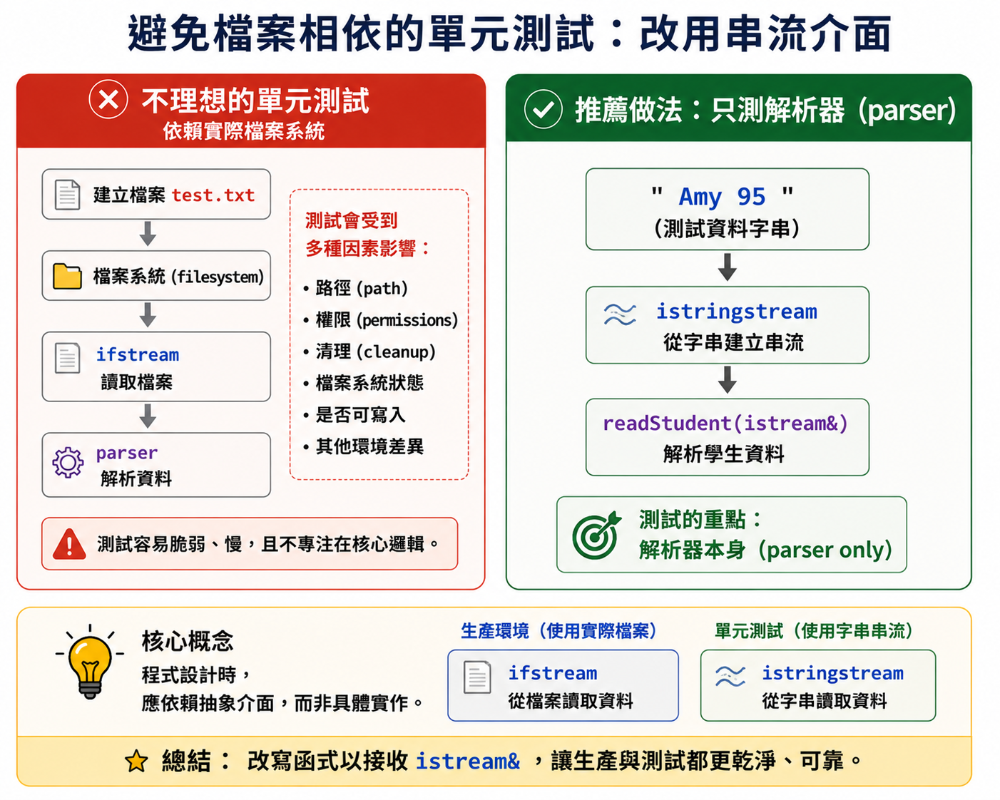


## Section LXVIII. 不必建立真實檔案

若 parser 接受：

```cpp
istream&
```

測試可使用：

```cpp
istringstream
```

---

## Section LXIX. 完整 Parser Test

```cpp
// VALIDATE
#include <iostream>
#include <sstream>
#include <stdexcept>
#include <string>
using namespace std;

struct Student {
    string name;
    int score;
};

Student readStudent(
    istream& input
) {
    Student student;

    if (
        !(input >>
          student.name >>
          student.score)
    ) {
        throw runtime_error(
            "invalid student"
        );
    }

    return student;
}

int main() {
    istringstream input(
        "Amy 95"
    );

    const Student student =
        readStudent(input);

    if (
        student.name !=
            "Amy" ||
        student.score !=
            95
    ) {
        cerr << "Parser test failed\n";
        return 1;
    }

    cout << "Test passed\n";

    return 0;
}
```

---

# Part Y：CTest

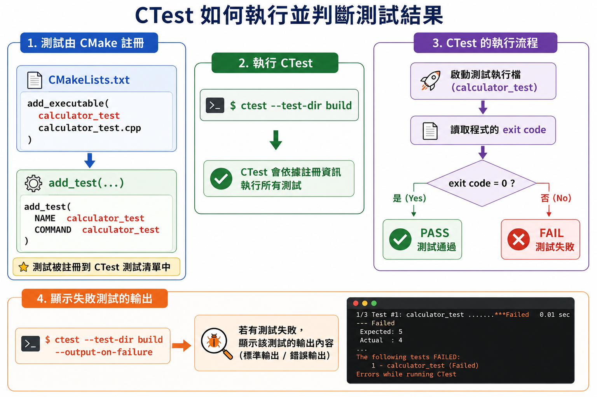


## Section LXX. 加入測試 Target

```cmake
enable_testing()

add_executable(
    calculator_test
    tests/calculator_test.cpp
)

target_link_libraries(
    calculator_test
    PRIVATE
        calculator
)

add_test(
    NAME calculator_test
    COMMAND calculator_test
)
```

---

## Section LXXI. 執行

```bash
cmake -S . -B build
cmake --build build
ctest --test-dir build --output-on-failure
```

CTest 依 test executable 的 exit code 判斷成功或失敗。

---

# Part Z：完整 CMake 專案

## Section LXXII. `CMakeLists.txt`

```cmake
cmake_minimum_required(VERSION 3.16)

project(
    CalculatorProject
    VERSION 1.0
    LANGUAGES CXX
)

set(
    CMAKE_CXX_STANDARD 17
)

set(
    CMAKE_CXX_STANDARD_REQUIRED ON
)

set(
    CMAKE_CXX_EXTENSIONS OFF
)

add_library(
    calculator
    src/calculator.cpp
)

target_include_directories(
    calculator
    PUBLIC
        include
)

target_compile_options(
    calculator
    PRIVATE
        -Wall
        -Wextra
        -Werror
)

add_executable(
    calculator_app
    src/main.cpp
)

target_link_libraries(
    calculator_app
    PRIVATE
        calculator
)

enable_testing()

add_executable(
    calculator_test
    tests/calculator_test.cpp
)

target_link_libraries(
    calculator_test
    PRIVATE
        calculator
)

add_test(
    NAME calculator_test
    COMMAND calculator_test
)
```

Compiler-specific options在跨平台專案中應配合 compiler ID 處理，本章先使用 Clang/GCC 教學環境。

---

# Part AA：測試分類

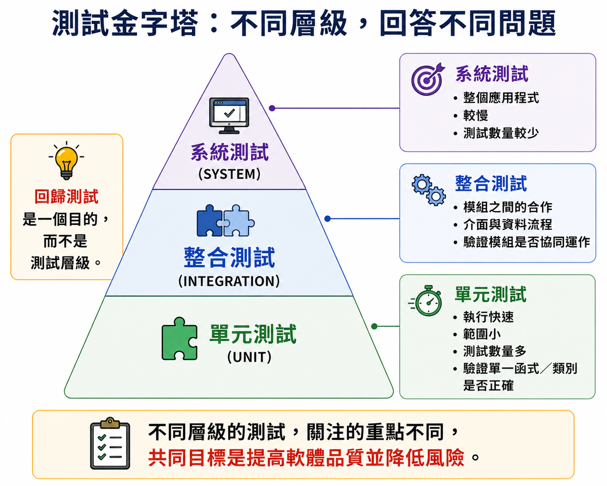


## Section LXXIII. Unit Test

測試小型單位：

- 一個函式。
- 一個類別。
- 一個 module。

盡量不依賴網路、資料庫、真實檔案系統。

---

## Section LXXIV. Integration Test

測試多個 module 的合作：

- Parser + validator。
- Service + repository。
- Library + filesystem。
- 多個 class 的互動。

---

## Section LXXV. System Test

從外部執行完整應用程式：

- 提供 command-line input。
- 驗證 exit code。
- 驗證 stdout。
- 驗證 output files。

---

## Section LXXVI. Regression Test

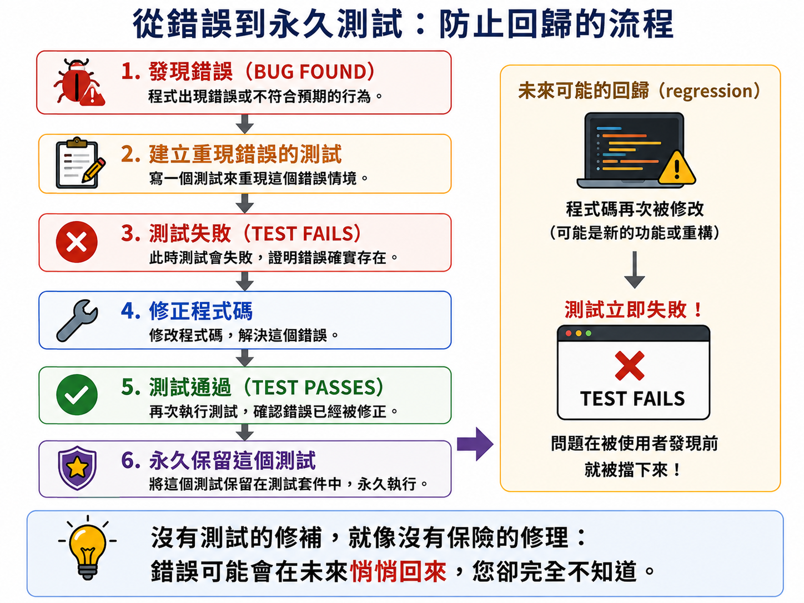


Bug 修正後加入測試，確保未來不再出現同一問題。

---

# Part AB：Deterministic Test

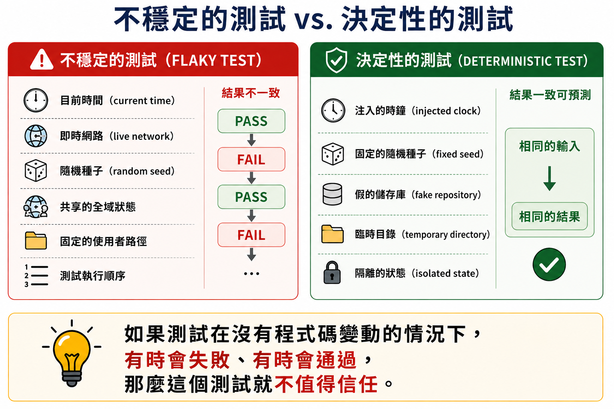


## Section LXXVII. 不穩定測試

容易不穩定的來源：

- 真實時間。
- Random seed。
- 網路。
- 執行順序。
- 共用 global state。
- 固定使用者路徑。
- 平行測試競爭。

---

## Section LXXVIII. 改善方式

- 注入 clock。
- 固定 random seed。
- 使用 fake repository。
- 使用 temporary directory。
- 每個測試獨立資料。
- 不依賴其他測試先執行。

---

# Part AC：Test Naming

## Section LXXIX. 不清楚

```text
test1
testAdd
works
```

---

## Section LXXX. 清楚

```text
add_returns_sum_for_two_positive_numbers
divide_throws_for_zero_denominator
parser_rejects_missing_score
```

測試名稱應說明：

```text
被測行為 + 情境 + 預期結果
```

---

# Part AD：測試 Public Behavior

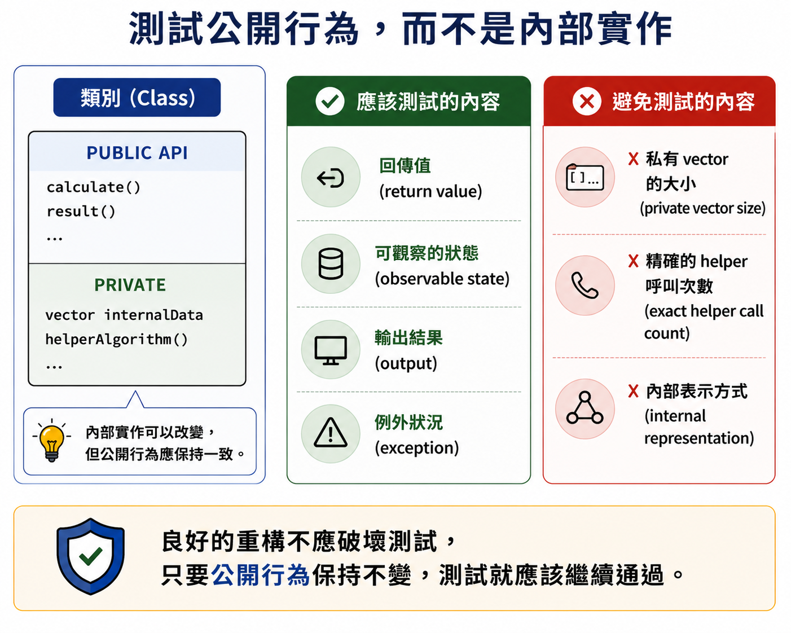


## Section LXXXI. 不要綁死實作

若測試直接檢查 private 資料結構，重構時容易大量失敗。

優先測試：

- Public return value。
- Public state。
- Observable output。
- Thrown exception。
- Required side effect。

---

## Section LXXXII. 例外

某些低階演算法或效能 contract 需要更細測試，但仍應有清楚理由。

---

# Part AE：README 建置說明

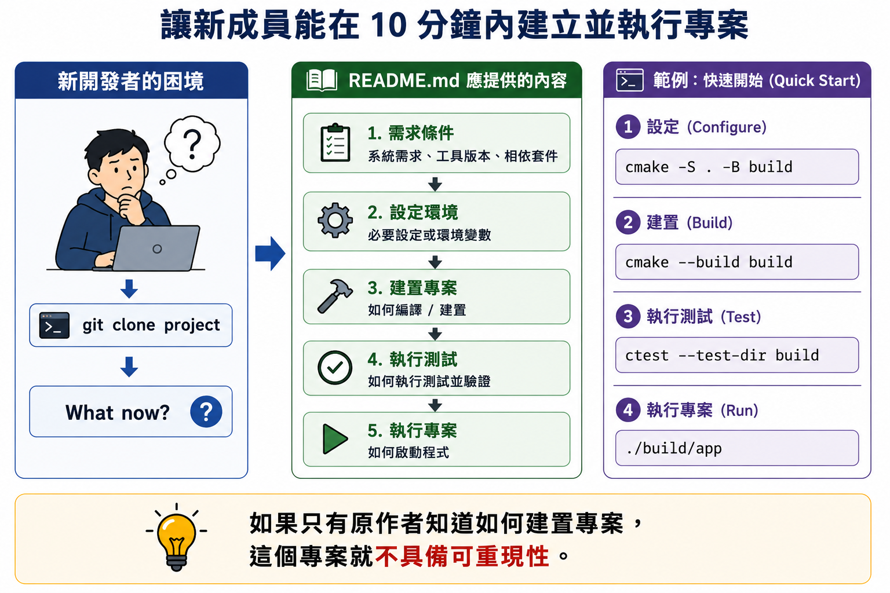


## Section LXXXIII. 最少內容

```markdown
## Requirements

- CMake 3.16+
- Clang or GCC
- C++17

## Build

cmake -S . -B build
cmake --build build

## Test

ctest --test-dir build --output-on-failure

## Run

./build/calculator_app
```

---

# Part AF：`.gitignore`


## Section LXXXIV. 常見內容

```gitignore
build/
*.o
*.obj
*.exe
*.out
*.dSYM/
CMakeFiles/
CMakeCache.txt
compile_commands.json
.DS_Store
```

若 `compile_commands.json` 需要分享給工具，也可依團隊規則決定是否提交。

---

# Part AG：`compile_commands.json`


## Section LXXXV. 產生

```bash
cmake \
  -S . \
  -B build \
  -DCMAKE_EXPORT_COMPILE_COMMANDS=ON
```

---

## Section LXXXVI. 用途

讓以下工具知道每個 source 的真正編譯選項：

- clangd。
- clang-tidy。
- IDE。
- Static analysis。
- Refactoring tools。

---

# Part AH：常見錯誤診斷

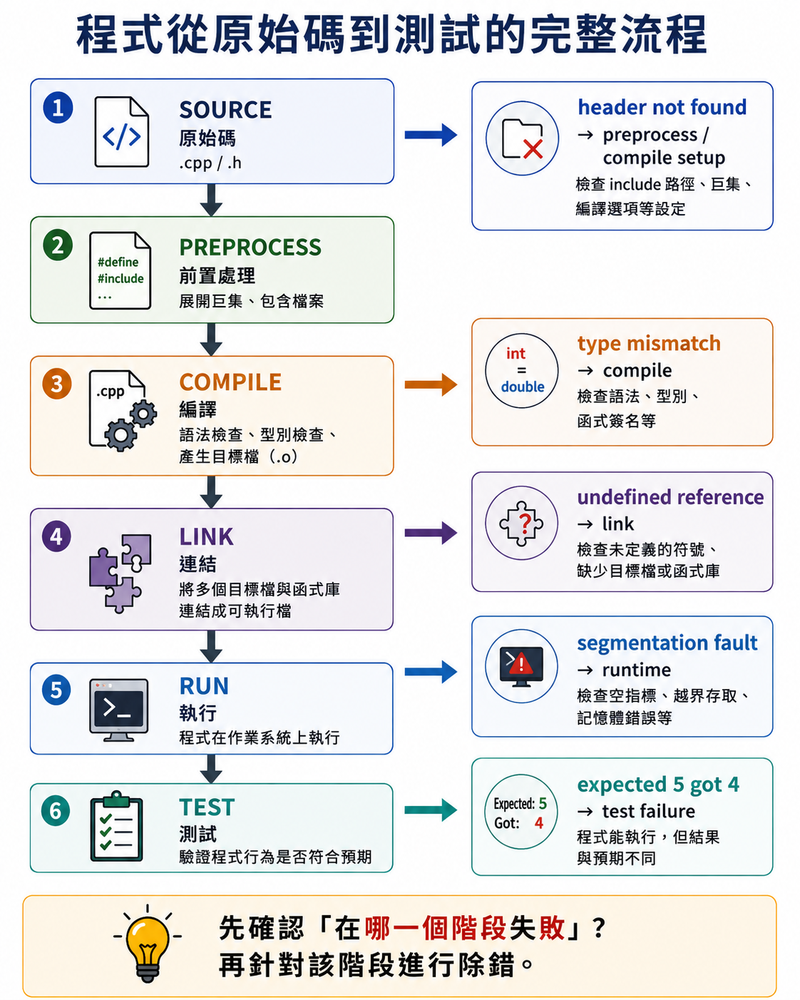


## Section LXXXVII. `file not found`


可能原因：

- Include path 錯誤。
- `-Iinclude` 缺少。
- Header 名稱大小寫錯。
- 工作目錄錯誤。
- Header 不在預期目錄。

---

## Section LXXXVIII. `undefined reference`

可能原因：

- Source 沒有加入 target。
- Object file 沒有 link。
- 宣告與定義 signature 不一致。
- Namespace 不一致。
- Library link order 問題概念。

---

## Section LXXXIX. `multiple definition`

可能原因：

- Header 定義一般 global variable。
- Header 定義非 inline function。
- 同一 `.cpp` 被重複加入 target。
- 直接 `#include "implementation.cpp"`。

---

## Section XC. 不要 Include `.cpp`


```cpp
/* #include "calculator.cpp" */
```

應 include header，並將 `.cpp` 分別編譯後連結。

---

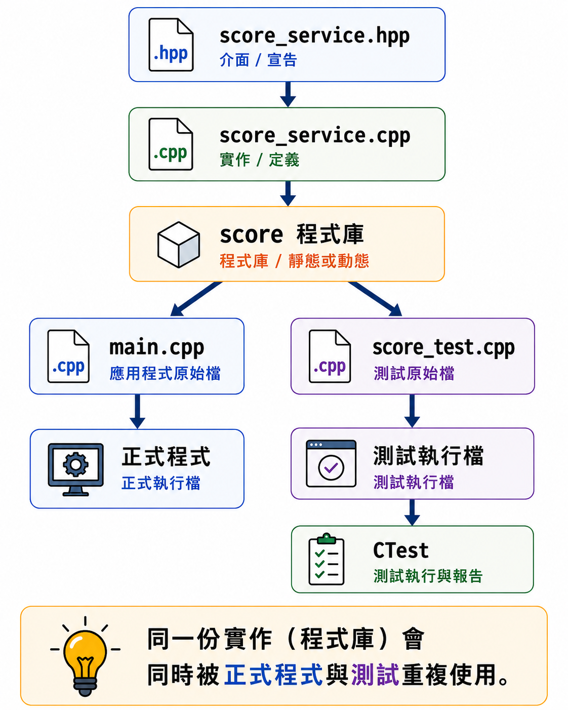

# Part AI：完整可編譯模組範例

## Section XCI. Header

```cpp
#ifndef SCORE_SCORE_SERVICE_HPP
#define SCORE_SCORE_SERVICE_HPP

#include <vector>

namespace score {

double average(
    const std::vector<int>& values
);

}  // namespace score

#endif
```

---

## Section XCII. Source

```cpp
#include "score/score_service.hpp"

#include <numeric>
#include <stdexcept>

namespace score {

double average(
    const std::vector<int>& values
) {
    if (values.empty()) {
        throw std::invalid_argument(
            "values cannot be empty"
        );
    }

    const int total =
        std::accumulate(
            values.cbegin(),
            values.cend(),
            0
        );

    return
        static_cast<double>(
            total
        ) /
        static_cast<double>(
            values.size()
        );
}

}  // namespace score
```

---

## Section XCIII. Test


```cpp
#include "score/score_service.hpp"

#include <cmath>
#include <iostream>
#include <stdexcept>
#include <vector>

int main() {
    const double result =
        score::average(
            std::vector<int>{
                80,
                90,
                100
            }
        );

    if (
        std::abs(
            result -
            90.0
        ) >
        1e-12
    ) {
        std::cerr
            << "average test failed\n";

        return 1;
    }

    bool caught =
        false;

    try {
        static_cast<void>(
            score::average({})
        );
    } catch (
        const std::invalid_argument&
    ) {
        caught = true;
    }

    if (!caught) {
        std::cerr
            << "empty input test failed\n";

        return 1;
    }

    std::cout
        << "All tests passed\n";

    return 0;
}
```

---

# Part AJ：CI 概念

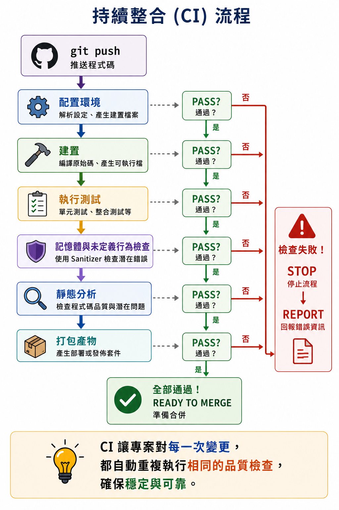


## Section XCIV. 每次變更自動執行

典型流程：

```text
Checkout
→ Configure
→ Build
→ Unit tests
→ Sanitizer tests
→ Static analysis
→ Package
```

---

## Section XCV. CI 不能取代本地測試

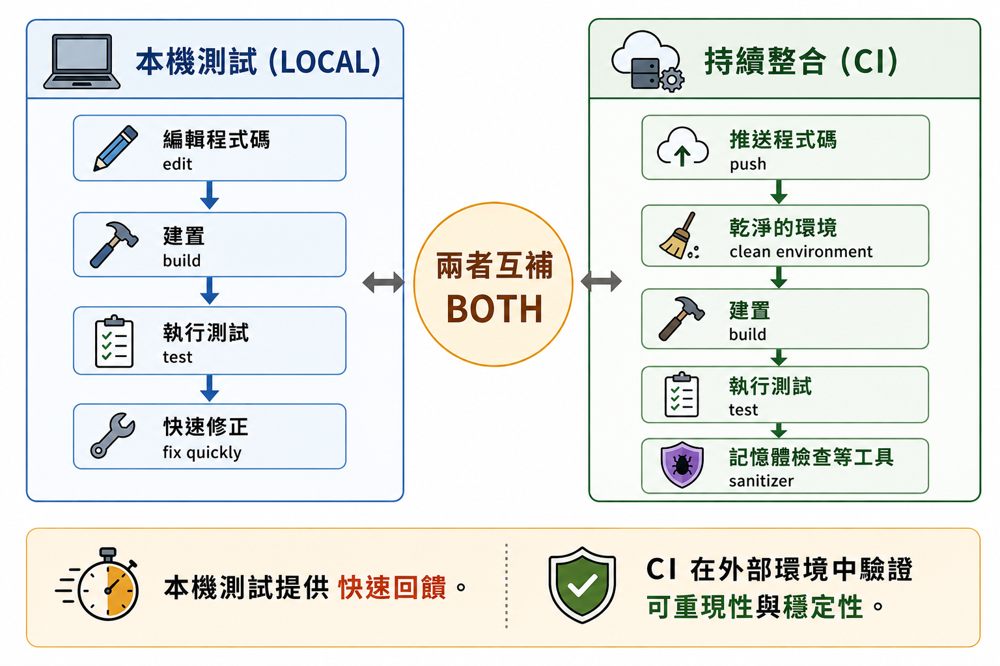


提交前仍應本地執行：

```bash
cmake --build build
ctest --test-dir build --output-on-failure
```

---

# Part AK：快速概念檢查

## Section XCVI. 選擇題與簡答

### Q1. Header 主要放什麼？

<details><summary>查看答案</summary>

公開宣告、類別定義、模板定義、inline／constexpr 等可安全放入多個 translation unit 的內容。

</details>

### Q2. Source 主要放什麼？

<details><summary>查看答案</summary>

一般函式與類別成員的實作，以及只屬於該 translation unit 的 helper。

</details>

### Q3. Translation unit 是什麼？

<details><summary>查看答案</summary>

一個 source file 經 preprocessor 展開所有 include 後，交給 compiler 的完整單位。

</details>

### Q4. `-c` 有什麼作用？

<details><summary>查看答案</summary>

編譯成 object file，但不進行最後連結。

</details>

### Q5. Undefined reference 屬於哪個階段？

<details><summary>查看答案</summary>

通常是 linker 階段。

</details>

### Q6. Include guard 解決什麼？

<details><summary>查看答案</summary>

避免同一 header 在同一 translation unit 被重複展開。

</details>

### Q7. Header 中可以寫 `using namespace std;` 嗎？

<details><summary>查看答案</summary>

不建議，會污染所有 include 該 header 的程式。

</details>

### Q8. 為什麼 source 先 include 自己的 header？

<details><summary>查看答案</summary>

可及早確認 header 自己包含了所有必要依賴，並確保宣告與實作一致。

</details>

### Q9. Forward declaration 適合什麼情況？

<details><summary>查看答案</summary>

Header 只需要某型別的 pointer 或 reference，而不需要知道完整大小與成員時。

</details>

### Q10. Makefile 的 target、prerequisite、recipe 分別是什麼？

<details><summary>查看答案</summary>

Target 是要建立的結果，prerequisite 是依賴，recipe 是建立命令。

</details>

### Q11. `-MMD -MP` 有什麼用途？

<details><summary>查看答案</summary>

產生 header dependency files，讓 header 修改時相關 object file 重新編譯。

</details>

### Q12. CMake 的 `PUBLIC` include directory 代表什麼？

<details><summary>查看答案</summary>

目前 target 與連結它的使用者 target 都需要該 include path。

</details>

### Q13. Unit test 與 integration test 差異？

<details><summary>查看答案</summary>

Unit test 測試小型單位，integration test 測試多個模組的合作。

</details>

### Q14. 測試程式成功應回傳什麼？

<details><summary>查看答案</summary>

通常回傳 0；失敗回傳非 0。

</details>

### Q15. 為什麼浮點數不直接比較相等？

<details><summary>查看答案</summary>

二進位浮點表示與運算可能產生微小誤差，應使用 tolerance。

</details>

### Q16. Coverage 高是否代表測試品質一定高？

<details><summary>查看答案</summary>

不代表。Coverage 只表示程式被執行的範圍，不保證 assertion 正確或情境完整。

</details>

### Q17. Sanitizer 用途？

<details><summary>查看答案</summary>

在執行測試時協助發現記憶體錯誤與未定義行為。

</details>

### Q18. 為什麼不要 include `.cpp`？

<details><summary>查看答案</summary>

會破壞獨立編譯並容易造成重複定義；應 include header，再分別編譯與連結 source。

</details>

### Q19. Out-of-source build 是什麼？

<details><summary>查看答案</summary>

將建置產物放在獨立 `build/`，不污染 source tree。

</details>

### Q20. Regression test 是什麼？

<details><summary>查看答案</summary>

針對已修正 bug 加入測試，防止未來再次出現。

</details>

---

# Part AL：程式閱讀練習

## Section XCVII. 預測錯誤階段與結果

### 題目 1

```cpp
int add(
    int first,
    int second
);

int main() {
    return
        add(
            1,
            2
        );
}
```

沒有任何 source 提供 `add()` 定義。

<details><summary>查看答案</summary>

編譯通常成功，linker 產生 undefined reference／undefined symbol。

</details>

### 題目 2

Header：

```cpp
int count = 0;
```

被兩個 `.cpp` include。

<details><summary>查看答案</summary>

通常 linker 發生 multiple definition／duplicate symbol。

</details>

### 題目 3

```cpp
#ifndef VALUE_HPP
#define VALUE_HPP

class Value {
};

#endif
```

被同一 source 間接 include 兩次。

<details><summary>查看答案</summary>

Include guard 讓 class definition 只展開一次，合法。

</details>

### 題目 4

```cpp
class Database;

class Service {
private:
    Database database;
};
```

<details><summary>查看答案</summary>

不合法。By-value member 需要完整 Database 型別。

</details>

### 題目 5

```cpp
class Database;

class Service {
private:
    Database* database;
};
```

<details><summary>查看答案</summary>

宣告本身合法，pointer 大小已知；使用與生命週期仍需正確設計。

</details>

### 題目 6

```cpp
namespace {
int helper() {
    return 1;
}
}
```

放在 `.cpp`。

<details><summary>查看答案</summary>

Helper 具有 translation-unit-local internal linkage。

</details>

### 題目 7

```bash
clang++ -c main.cpp -o main.o
```

<details><summary>查看答案</summary>

只建立 object file，不產生可直接執行的 final executable。

</details>

### 題目 8

測試程式：

```cpp
int main() {
    return 1;
}
```

<details><summary>查看答案</summary>

CTest 或 shell 通常視為失敗。

</details>

### 題目 9

```cpp
assert(
    userInput > 0
);
```

用來驗證使用者輸入。

<details><summary>查看答案</summary>

設計不當。Release build 可能停用 assert；使用者輸入應使用正常 validation。

</details>

### 題目 10

```cpp
double actual =
    0.1 +
    0.2;

if (
    actual ==
    0.3
) {
    // pass
}
```

<details><summary>查看答案</summary>

測試可能不穩定或失敗，應使用 tolerance。

</details>

### 題目 11

CMake：

```cmake
target_include_directories(
    library
    PRIVATE
        include
)
```

Application include library 的 public header。

<details><summary>查看答案</summary>

Application 不會自動取得 include path。若公開 header 需要該 path，通常應使用 `PUBLIC`。

</details>

### 題目 12

Makefile recipe 用空格而非 tab。

<details><summary>查看答案</summary>

傳統 Make 可能報 `missing separator`。Recipe 行需 tab。

</details>

---

# Part AM：實作練習

## Section XCVIII. 實作檢測題

### TODO 1：Header and Source

將一個 100 行單檔程式拆成 `.hpp`、`.cpp` 與 `main.cpp`。

### TODO 2：Include Guard

為自己的 header 建立專案唯一 include guard。

### TODO 3：Forward Declaration

將互相 include 的兩個 header 改成單向 include 加 forward declaration。

### TODO 4：Manual Compile

分別產生兩個 `.o`，再連結成 executable。

### TODO 5：Diagnose Link Error

故意移除一個 object file，辨認 undefined reference。

### TODO 6：Strict Warnings

建立包含嚴格 warning flags 的編譯命令，修正所有 warning。

### TODO 7：Sanitizer Build

建立 AddressSanitizer 與 UndefinedBehaviorSanitizer debug build。

### TODO 8：Makefile

建立支援 `all`、`run`、`test`、`clean` 的 Makefile。

### TODO 9：Dependency Files

在 Makefile 加入 `-MMD -MP` 與 `.d` include。

### TODO 10：CMake Library

建立 library target 與 application target。

### TODO 11：CTest

建立 test executable，使用 `add_test()` 註冊。

### TODO 12：Test Runner

建立可累積多個失敗的簡易 test runner。

### TODO 13：Exception Test

驗證特定輸入會丟出預期例外型別。

### TODO 14：Parser Test

使用 `istringstream` 測試 parser，不讀真實檔案。

### TODO 15：Project README

撰寫 requirements、build、test、run 與目錄說明。

---

# Part AN：課後小練習

## Section XCIX. 延伸練習

### 練習 1：Library Refactor

把前面章節的一個大型程式重構成 library、CLI 與 tests 三部分。

### 練習 2：Debug and Release Profiles

建立 Debug、Release、Sanitizer 三種 CMake preset 或建置命令。

### 練習 3：Regression Test

找一個以前修正過的 bug，建立可以重現舊錯誤的測試。

### 練習 4：Static Analysis

產生 `compile_commands.json`，使用 clang-tidy 概念檢查 source。

### 練習 5：CI Design

設計一份 CI 流程圖，包含 configure、build、test、sanitizer 與 artifact。

---

# Part AO：常見錯誤提醒

## Section C. 常見錯誤

1. 所有程式永遠放在單一 `.cpp`。
2. Header 與 source 宣告不一致。
3. Header 缺少 include guard。
4. Header 中使用 `using namespace std;`。
5. Header 依賴其他檔案間接 include。
6. Source 沒有先 include 自己的 header。
7. Header 放一般 global variable definition。
8. Header 放非 inline function definition。
9. 直接 include `.cpp`。
10. Circular include 未使用 forward declaration。
11. By-value incomplete type。
12. Function declaration namespace 與 definition namespace 不同。
13. Object file 沒有加入 link。
14. 同一 source 被加入 target 兩次。
15. 看到 linker error 卻只修改語法。
16. 忽略第一個 compiler diagnostic。
17. 關閉 warnings 代替修正程式。
18. 對第三方 code 全域使用 Werror。
19. Debug 與 release 使用不同必要邏輯。
20. 必要 validation 只寫在 assert。
21. Sanitizer build 使用過高 optimization 而難以追蹤。
22. Makefile recipe 使用空格代替 tab。
23. Makefile 沒追蹤 header dependency。
24. 將 build artifacts 提交到 Git。
25. CMake 使用全域設定污染所有 target。
26. 測試只有 `cout`，沒有 assertion 與 exit code。
27. 測試依賴其他測試先執行。
28. 浮點數直接比較完全相等。
29. 測試使用真實網路與固定使用者路徑。
30. Bug 修正後沒有 regression test。

---

# Part AP：Mermaid 流程圖

## Section CI. 專案組織、編譯與測試流程圖

### 1. C++ Build Pipeline

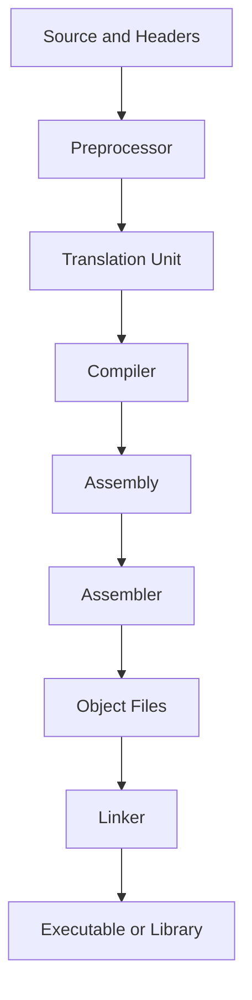
```mermaid
flowchart TD
    A[Source and Headers] --> B[Preprocessor]
    B --> C[Translation Unit]
    C --> D[Compiler]
    D --> E[Assembly]
    E --> F[Assembler]
    F --> G[Object Files]
    G --> H[Linker]
    H --> I[Executable or Library]
```

### 2. Error Stage

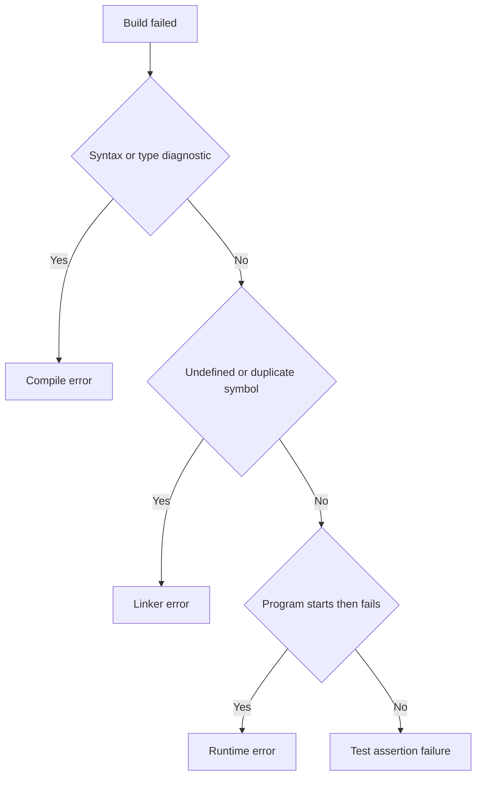
```mermaid
flowchart TD
    A[Build failed] --> B{Syntax or type diagnostic}
    B -- Yes --> C[Compile error]
    B -- No --> D{Undefined or duplicate symbol}
    D -- Yes --> E[Linker error]
    D -- No --> F{Program starts then fails}
    F -- Yes --> G[Runtime error]
    F -- No --> H[Test assertion failure]
```

### 3. Header Dependency

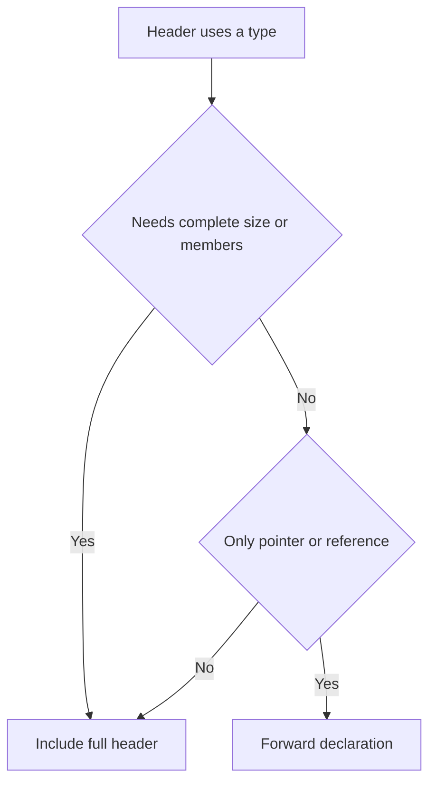
```mermaid
flowchart TD
    A[Header uses a type] --> B{Needs complete size or members}
    B -- Yes --> C[Include full header]
    B -- No --> D{Only pointer or reference}
    D -- Yes --> E[Forward declaration]
    D -- No --> C
```

### 4. Incremental Build

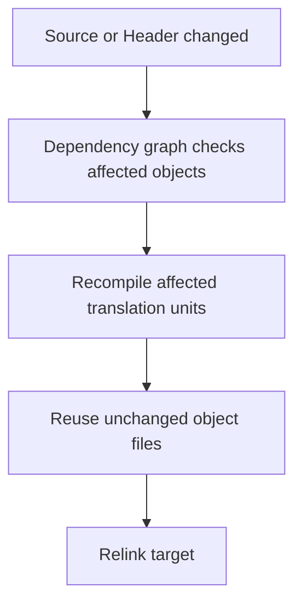
```mermaid
flowchart TD
    A[Source or Header changed] --> B[Dependency graph checks affected objects]
    B --> C[Recompile affected translation units]
    C --> D[Reuse unchanged object files]
    D --> E[Relink target]
```

### 5. Test Workflow

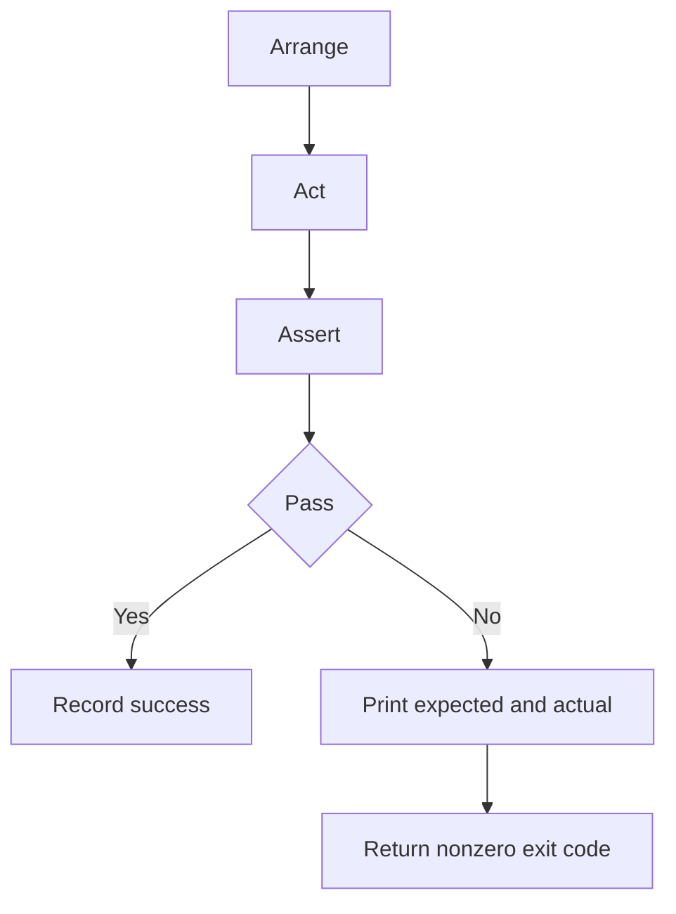
```mermaid
flowchart TD
    A[Arrange] --> B[Act]
    B --> C[Assert]
    C --> D{Pass}
    D -- Yes --> E[Record success]
    D -- No --> F[Print expected and actual]
    F --> G[Return nonzero exit code]
```

### 6. CMake Target Design

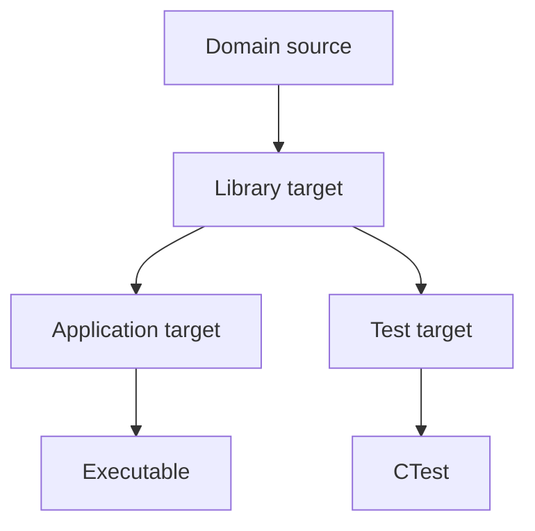
```mermaid
flowchart TD
    A[Domain source] --> B[Library target]
    B --> C[Application target]
    B --> D[Test target]
    C --> E[Executable]
    D --> F[CTest]
```

### 7. Bug Fix Workflow

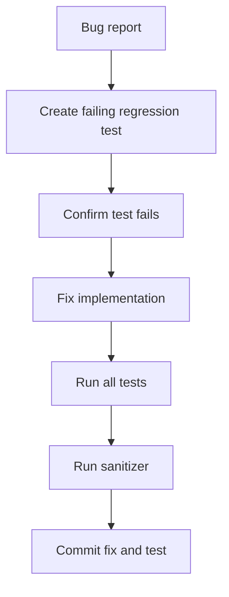
```mermaid
flowchart TD
    A[Bug report] --> B[Create failing regression test]
    B --> C[Confirm test fails]
    C --> D[Fix implementation]
    D --> E[Run all tests]
    E --> F[Run sanitizer]
    F --> G[Commit fix and test]
```

### 8. CI Pipeline

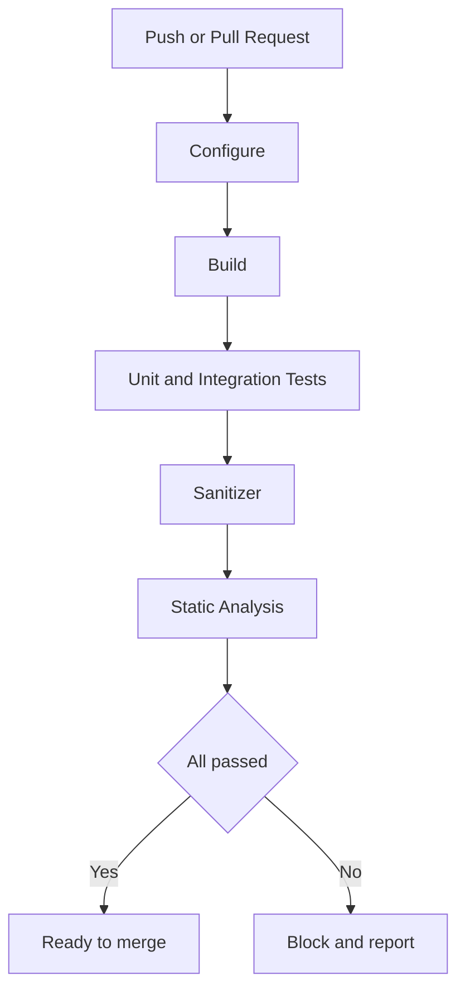
```mermaid
flowchart TD
    A[Push or Pull Request] --> B[Configure]
    B --> C[Build]
    C --> D[Unit and Integration Tests]
    D --> E[Sanitizer]
    E --> F[Static Analysis]
    F --> G{All passed}
    G -- Yes --> H[Ready to merge]
    G -- No --> I[Block and report]
```

---

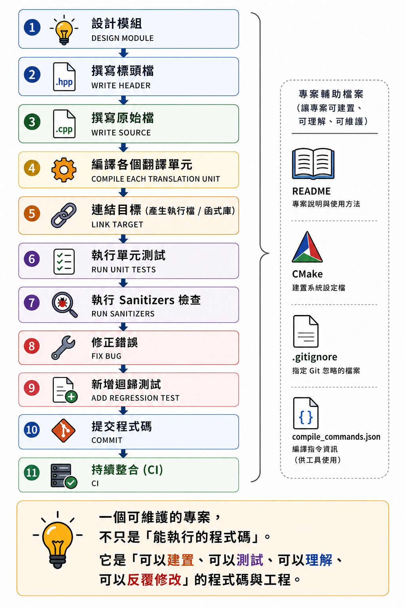

# 本章完成標準

完成本章後，你應該能做到：

1. 分離 header 與 source。
2. 區分 declaration 與 definition。
3. 解釋 translation unit。
4. 解釋 preprocessing、compilation 與 linking。
5. 產生 object file。
6. 手動連結多個 object files。
7. 區分 compile error 與 linker error。
8. 診斷 undefined reference。
9. 診斷 multiple definition。
10. 使用 include guard。
11. 建立 self-contained header。
12. 使用 forward declaration。
13. 避免 circular include。
14. 使用 project namespace。
15. 使用 unnamed namespace。
16. 避免 header namespace pollution。
17. 使用嚴格 warning flags。
18. 建立 Debug build。
19. 建立 Release build。
20. 使用 AddressSanitizer。
21. 使用 UndefinedBehaviorSanitizer。
22. 建立基本 Makefile。
23. 使用 automatic variables。
24. 追蹤 header dependencies。
25. 使用 out-of-source build。
26. 建立基本 CMake 專案。
27. 建立 library target。
28. 建立 application target。
29. 使用 PUBLIC／PRIVATE include requirements。
30. 建立 test target。
31. 使用 CTest。
32. 建立簡易 test runner。
33. 使用 Arrange-Act-Assert。
34. 測試例外。
35. 測試浮點結果。
36. 使用 stringstream 測試 parser。
37. 撰寫 regression test。
38. 建立 README build instructions。
39. 產生 compile commands。
40. 找出常見專案與測試錯誤。

---

# 隱藏答案區

> Answer hidden — try it first.

<details><summary>TODO 1 答案</summary>

```text
include/project/module.hpp
src/module.cpp
src/main.cpp
```

Header 放宣告，module source 放實作，main 只負責組合與輸入輸出。

</details>

<details><summary>TODO 2 答案</summary>

```cpp
#ifndef MY_PROJECT_MODULE_HPP
#define MY_PROJECT_MODULE_HPP

// content

#endif
```

</details>

<details><summary>TODO 3 答案</summary>

在只需要 pointer／reference 的 header：

```cpp
class OtherType;
```

把真正 `#include "other_type.hpp"` 放到 `.cpp`。

</details>

<details><summary>TODO 4 答案</summary>

```bash
clang++ -std=c++17 -Iinclude \
  -c src/module.cpp \
  -o build/module.o

clang++ -std=c++17 -Iinclude \
  -c src/main.cpp \
  -o build/main.o

clang++ build/module.o build/main.o \
  -o build/app
```

</details>

<details><summary>TODO 5 答案</summary>

Link 時故意只使用：

```bash
clang++ build/main.o -o build/app
```

若 main 呼叫 module function，會得到 undefined reference／undefined symbol。

</details>

<details><summary>TODO 6 答案</summary>

```bash
clang++ -std=c++17 \
  -Wall -Wextra -Werror \
  -Wconversion -Wsign-conversion \
  -Wshadow -Wpedantic \
  source.cpp
```

</details>

<details><summary>TODO 7 答案</summary>

```bash
clang++ -std=c++17 \
  -Wall -Wextra -Werror \
  -g -O0 \
  -fsanitize=address,undefined \
  -fno-omit-frame-pointer \
  source.cpp \
  -o build/app
```

</details>

<details><summary>TODO 8 答案</summary>

Makefile 至少包含：

```text
all
run
test
clean
object pattern rule
link target
```

</details>

<details><summary>TODO 9 答案</summary>

Compiler flags：

```make
-MMD -MP
```

Dependency list：

```make
DEPS := $(OBJECTS:.o=.d)

-include $(DEPS)
```

</details>

<details><summary>TODO 10 答案</summary>

```cmake
add_library(
    domain
    src/domain.cpp
)

target_include_directories(
    domain
    PUBLIC
        include
)

add_executable(
    app
    src/main.cpp
)

target_link_libraries(
    app
    PRIVATE
        domain
)
```

</details>

<details><summary>TODO 11 答案</summary>

```cmake
enable_testing()

add_executable(
    domain_test
    tests/domain_test.cpp
)

target_link_libraries(
    domain_test
    PRIVATE
        domain
)

add_test(
    NAME domain_test
    COMMAND domain_test
)
```

</details>

<details><summary>TODO 12 答案</summary>

建立計數器：

```cpp
int total = 0;
int failed = 0;
```

每個 assertion 累積結果，最後：

```cpp
return
    failed == 0
        ? 0
        : 1;
```

</details>

<details><summary>TODO 13 答案</summary>

```cpp
bool caught = false;

try {
    operation();
} catch (
    const invalid_argument&
) {
    caught = true;
}

if (!caught) {
    return 1;
}
```

</details>

<details><summary>TODO 14 答案</summary>

```cpp
istringstream input(
    "Amy 95"
);

Student student =
    readStudent(input);
```

不需要建立真實檔案。

</details>

<details><summary>TODO 15 答案</summary>

README 至少說明：

```text
需要的 compiler 與 CMake 版本
支援 C++17
Configure command
Build command
Test command
Run command
Project layout
```

</details>
