# Lesson 34：Data Structure Implementation 資料結構實作


> 這堂課的重點：不只會使用 `vector`、`queue`、`stack`、`map` 等 STL 容器，而是親自實作常見資料結構，理解資料如何排列、操作如何改變結構，以及時間複雜度為什麼會不同。

> 本章以教學與理解為目的。正式專案中通常應優先使用 STL；自己實作主要用於學習、特定效能需求、特殊記憶體模型，或標準容器無法滿足的情況。

---

## Section I. 今天要做什麼？

1. 複習抽象資料型別 ADT。
2. 區分介面與實作。
3. 認識資料結構 invariant。
4. 分析時間複雜度。
5. 分析空間複雜度。
6. 認識 worst case。
7. 認識 average case。
8. 認識 amortized analysis。
9. 使用 Big-O。
10. 區分 O(1)、O(log n)、O(n)、O(n log n)、O(n²)。
11. 實作 Stack。
12. 使用 array-based stack。
13. 使用 vector-based stack。
14. 定義 push。
15. 定義 pop。
16. 定義 top。
17. 定義 empty。
18. 定義 size。
19. 處理 underflow。
20. 認識 LIFO。
21. 實作 Queue。
22. 認識 FIFO。
23. 使用 linear array queue。
24. 理解 front 與 rear。
25. 理解線性 queue 空間浪費。
26. 實作 Circular Queue。
27. 使用 modulo。
28. 區分 full 與 empty。
29. 使用 count。
30. 使用 one-empty-slot strategy 概念。
31. 實作 Deque 概念。
32. 認識雙端操作。
33. 實作 Singly Linked List。
34. 認識 Node。
35. 認識 head。
36. 認識 next pointer。
37. 在前端插入。
38. 在尾端插入。
39. 搜尋。
40. 刪除第一個符合節點。
41. 反轉串列。
42. 計算長度。
43. 處理空串列。
44. 使用 `unique_ptr` 管理節點。
45. 避免手動 delete。
46. 實作 Doubly Linked List。
47. 認識 previous pointer。
48. 認識 next pointer。
49. 認識 head 與 tail。
50. 在兩端插入。
51. 在兩端刪除。
52. 雙向走訪。
53. 維護 pointer invariant。
54. 實作 Binary Search Tree。
55. 認識 root。
56. 認識 left child。
57. 認識 right child。
58. 定義 BST ordering invariant。
59. 插入。
60. 搜尋。
61. Inorder traversal。
62. Preorder traversal。
63. Postorder traversal。
64. 計算高度。
65. 尋找最小值。
66. 尋找最大值。
67. 刪除 leaf。
68. 刪除只有一個 child 的 node。
69. 刪除有兩個 child 的 node。
70. 使用 inorder successor。
71. 理解退化 BST。
72. 比較 balanced 與 unbalanced tree。
73. 認識 AVL／Red-Black Tree 概念。
74. 不在本章實作平衡樹。
75. 實作 Binary Heap。
76. 認識 complete binary tree。
77. 使用 array representation。
78. 計算 parent index。
79. 計算 left child index。
80. 計算 right child index。
81. 實作 Min Heap。
82. 實作 push。
83. 實作 top。
84. 實作 pop。
85. 使用 sift up。
86. 使用 sift down。
87. 實作 heapify。
88. 分析 heap operation complexity。
89. 比較 heap 與 sorted vector。
90. 實作 Hash Table。
91. 認識 hash function。
92. 認識 bucket。
93. 認識 collision。
94. 使用 separate chaining。
95. 使用 linear probing 概念。
96. 插入 key-value。
97. 搜尋 key。
98. 更新 value。
99. 刪除 key。
100. 使用 load factor。
101. 認識 rehash。
102. 理解 hash table average O(1)。
103. 理解 worst-case O(n)。
104. 避免不良 hash distribution。
105. 實作 Graph。
106. 認識 vertex。
107. 認識 edge。
108. 認識 directed graph。
109. 認識 undirected graph。
110. 認識 weighted graph。
111. 使用 adjacency matrix。
112. 使用 adjacency list。
113. 比較兩種表示法。
114. 實作 add edge。
115. 實作 BFS。
116. 使用 queue。
117. 使用 visited。
118. 計算 unweighted shortest path。
119. 實作 DFS。
120. 使用 recursion。
121. 使用 explicit stack。
122. 偵測 connected component。
123. 認識 topological sort 概念。
124. 認識 cycle detection 概念。
125. 實作 Dijkstra 入門。
126. 使用 priority queue。
127. 使用 distance array。
128. 使用 stale entry check。
129. 限制為 non-negative edge weights。
130. 認識 overflow 風險。
131. 認識 Union-Find 概念。
132. 不在本章完整實作。
133. 使用 RAII。
134. 使用 `unique_ptr`。
135. 使用 `vector`。
136. 使用 `optional`。
137. 使用 exception。
138. 建立 public invariant。
139. 建立 private helper。
140. 測試空結構。
141. 測試單一元素。
142. 測試重複元素。
143. 測試邊界容量。
144. 測試大量操作。
145. 測試刪除 head。
146. 測試刪除 tail。
147. 測試刪除 root。
148. 測試碰撞。
149. 測試 disconnected graph。
150. 測試不存在的 key。
151. 比較自己實作與 STL。
152. 理解何時不該自己實作。
153. 使用概念檢查、程式閱讀與實作題整合本章。

---

## Section II. 學習方式

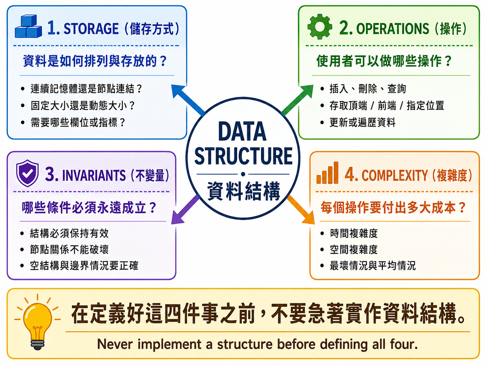


1. 每個資料結構先定義：
   ```text
   儲存什麼？
   提供哪些操作？
   必須維持哪些 invariant？
   每個操作的複雜度是多少？
   ```
2. 先寫介面，再寫實作。
3. 每完成一個操作就加入測試。
4. 所有 pointer 操作先畫圖。
5. 修改結構前先保存必要 pointer。
6. 空結構、單一元素與邊界容量必須測試。
7. 只有需要 ownership 時才使用 owning pointer。
8. 節點 ownership 優先使用 `unique_ptr`。
9. 不用 undefined behavior 換取速度。
10. 所有合法完整程式使用嚴格 C++17 選項檢查。

---

## Section III. 複雜度速查表

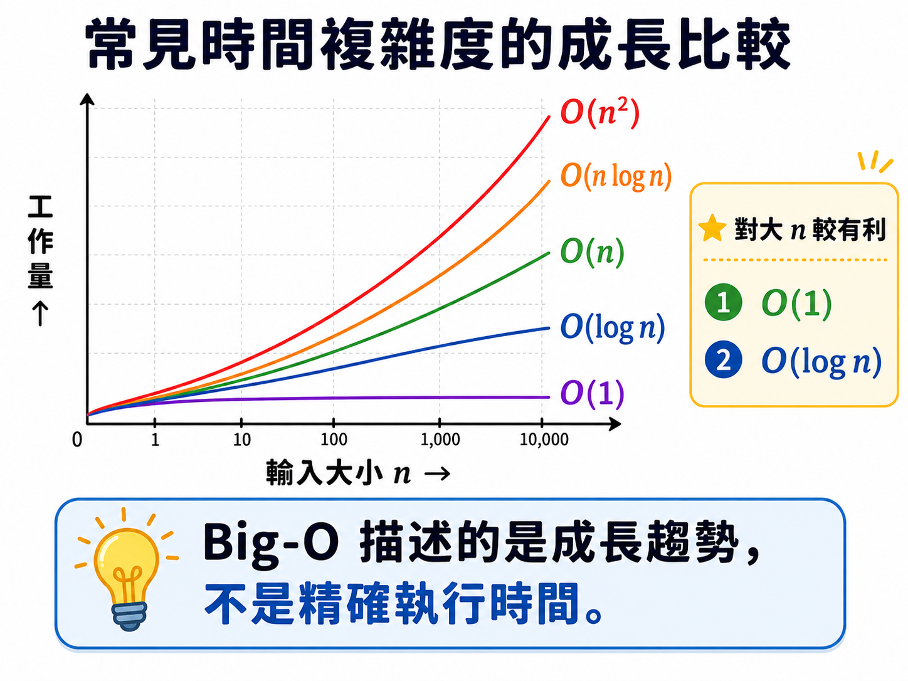

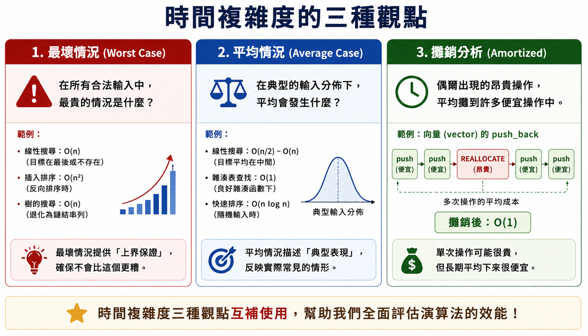


| 結構 | 操作 | 典型複雜度 |
| --- | --- | --- |
| Stack | push／pop／top | O(1) |
| Circular Queue | enqueue／dequeue／front | O(1) |
| Singly Linked List | push front | O(1) |
| Singly Linked List | search | O(n) |
| BST | search／insert／delete | 平均 O(log n)，最差 O(n) |
| Binary Heap | push／pop | O(log n) |
| Binary Heap | top | O(1) |
| Hash Table | insert／find／erase | 平均 O(1)，最差 O(n) |
| BFS／DFS | traversal | O(V + E) |
| Dijkstra + Heap | shortest paths | O((V + E) log V) |

---

# Part A：抽象資料型別與 Invariant

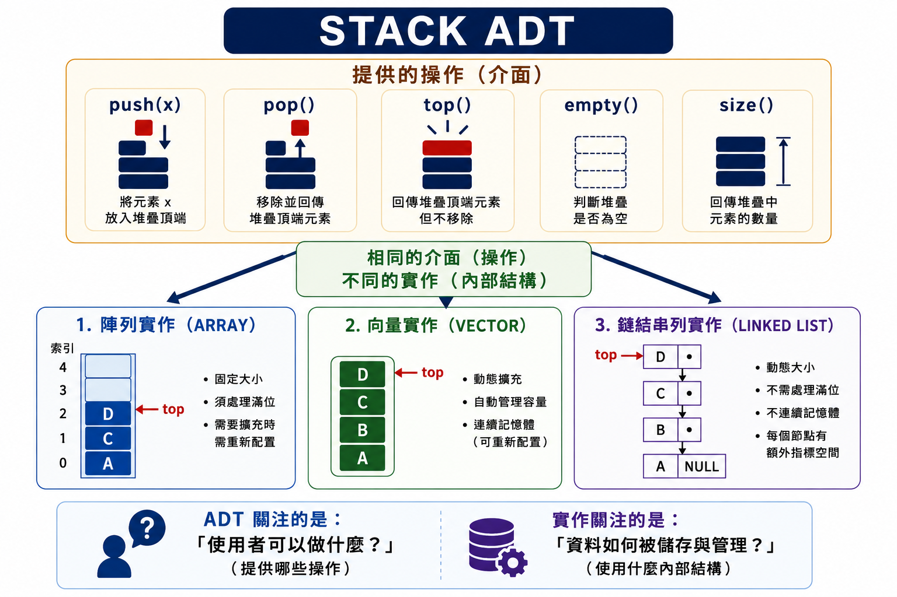


## Section IV. ADT

抽象資料型別描述：

```text
資料能做什麼
```

而不是：

```text
底層怎麼存
```

例如 Stack ADT 提供：

- `push`
- `pop`
- `top`
- `empty`
- `size`

它可以用：

- Array
- Vector
- Linked list

實作。

---

## Section V. Invariant

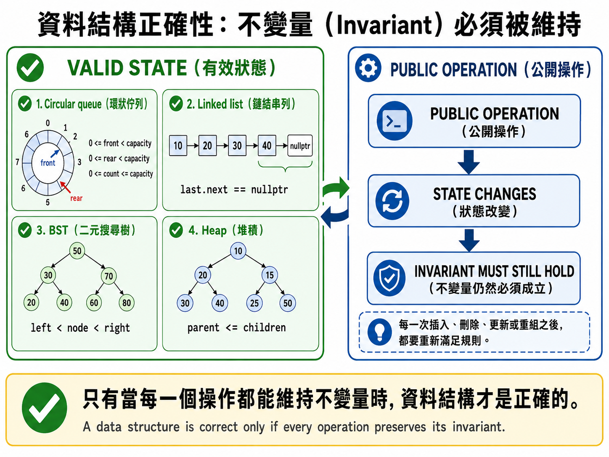


Invariant 是資料結構在每個 public operation 前後都必須成立的條件。

例如 circular queue：

```text
0 <= front < capacity
0 <= rear < capacity
0 <= count <= capacity
```

Linked list：

```text
head 為空代表 size == 0
每個 node 的 next 形成有限鏈
最後一個 node 的 next == nullptr
```

---

# Part B：Stack

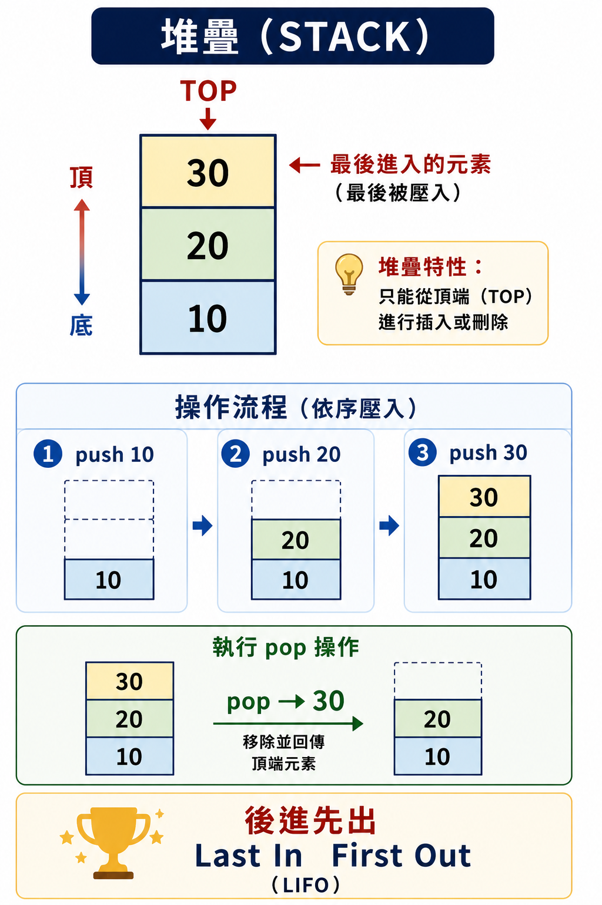


## Section VI. LIFO

Stack：

```text
Last In, First Out
```

例如：

```text
Push 10
Push 20
Push 30
Pop → 30
Pop → 20
```

---

## Section VII. Vector-Based Stack

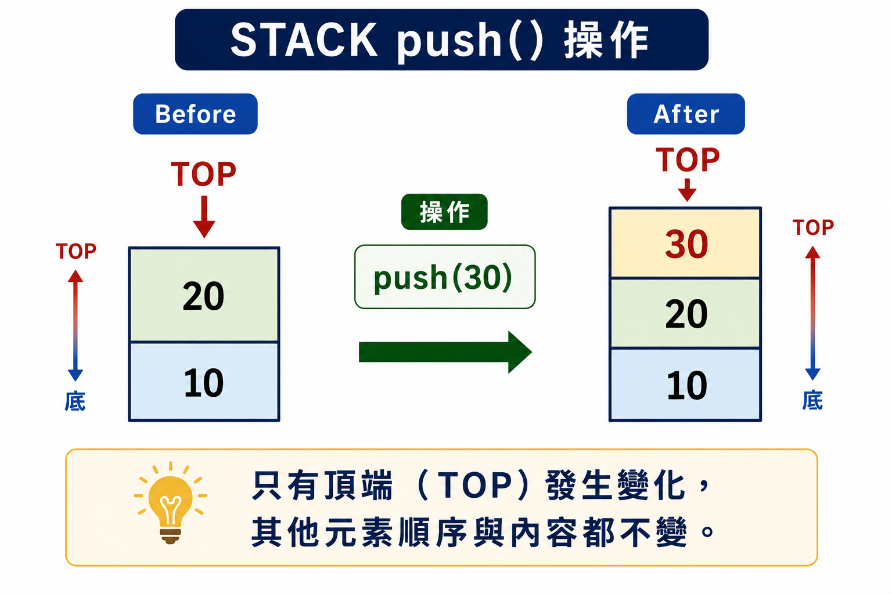


```cpp
template <typename T>
class Stack {
public:
    void push(const T& value);
    void push(T&& value);
    void pop();
    T& top();
    const T& top() const;
    bool empty() const noexcept;
    size_t size() const noexcept;
};
```

---

## Section VIII. 完整 Stack

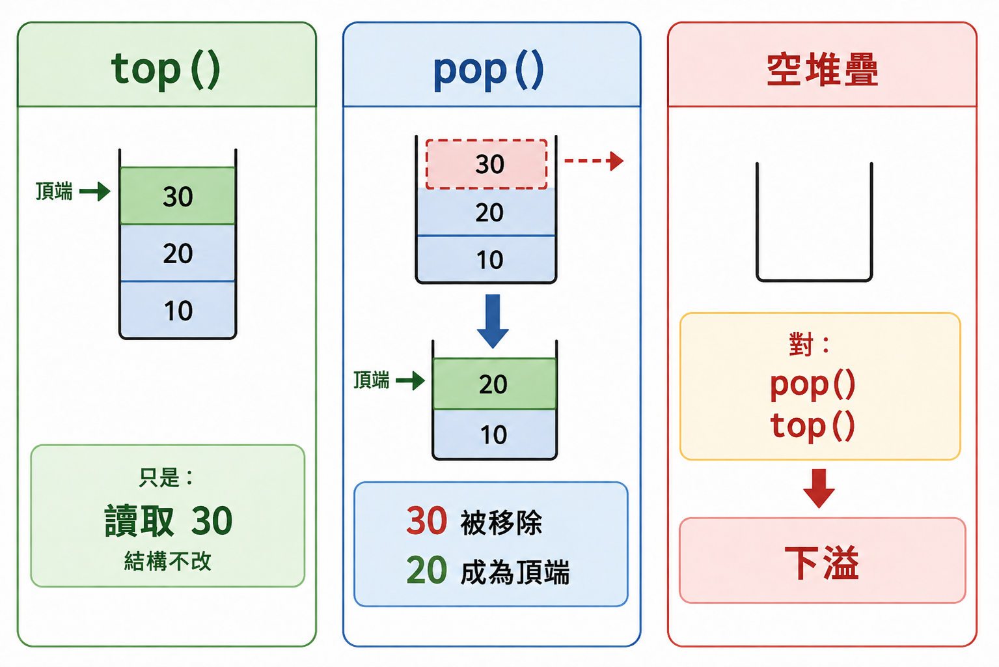


```cpp
// VALIDATE
#include <cstddef>
#include <iostream>
#include <stdexcept>
#include <utility>
#include <vector>
using namespace std;

template <typename T>
class Stack {
public:
    void push(
        const T& value
    ) {
        values.push_back(value);
    }

    void push(
        T&& value
    ) {
        values.push_back(
            std::move(value)
        );
    }

    void pop() {
        if (values.empty()) {
            throw underflow_error(
                "cannot pop an empty stack"
            );
        }

        values.pop_back();
    }

    T& top() {
        if (values.empty()) {
            throw underflow_error(
                "cannot read an empty stack"
            );
        }

        return values.back();
    }

    const T& top() const {
        if (values.empty()) {
            throw underflow_error(
                "cannot read an empty stack"
            );
        }

        return values.back();
    }

    bool empty() const noexcept {
        return values.empty();
    }

    size_t size() const noexcept {
        return values.size();
    }

private:
    vector<T> values;
};

int main() {
    Stack<int> stack;

    stack.push(10);
    stack.push(20);
    stack.push(30);

    cout << stack.top()
         << '\n';

    stack.pop();

    cout << stack.top()
         << " "
         << stack.size()
         << '\n';

    return 0;
}
```

---

## Section IX. Stack 使用情境

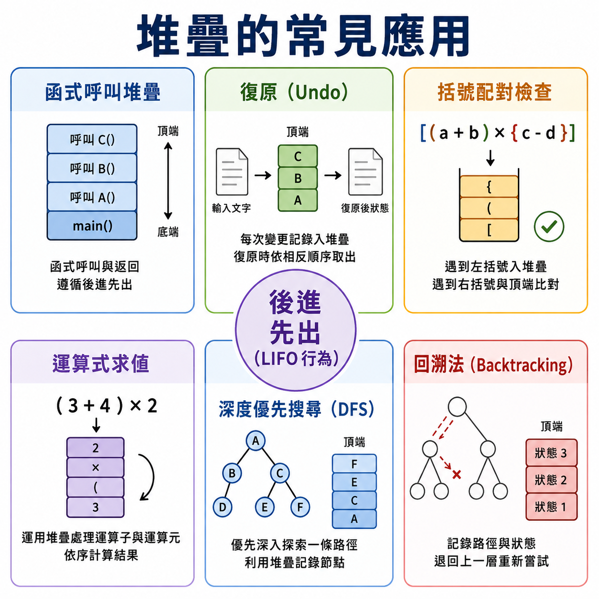


- Function call stack
- Undo
- Expression evaluation
- Parentheses matching
- DFS
- Backtracking
- Browser history 概念

---

# Part C：Queue

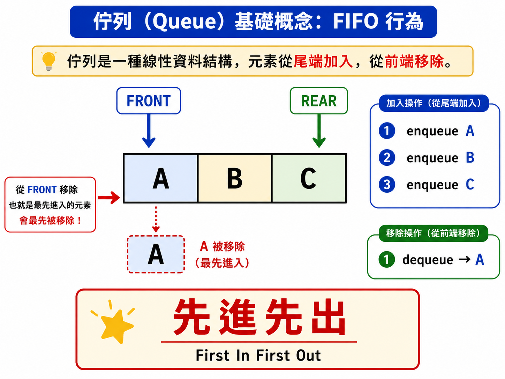


## Section X. FIFO

Queue：

```text
First In, First Out
```

例如：

```text
Enqueue A
Enqueue B
Enqueue C
Dequeue → A
Dequeue → B
```

---

## Section XI. Linear Array Queue 問題

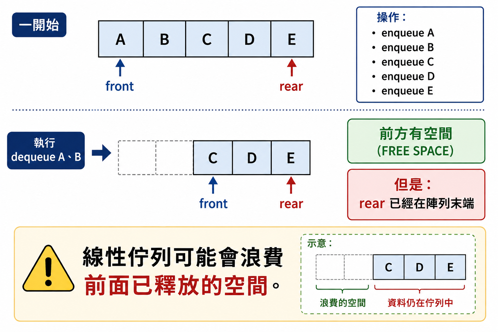


若只讓 rear 往右移：

```text
[empty][empty][C][D][E]
              front   rear
```

前面雖然有空間，但 rear 已到陣列尾端，空間不能重用。

解法：

```text
Circular Queue
```

---

# Part D：Circular Queue

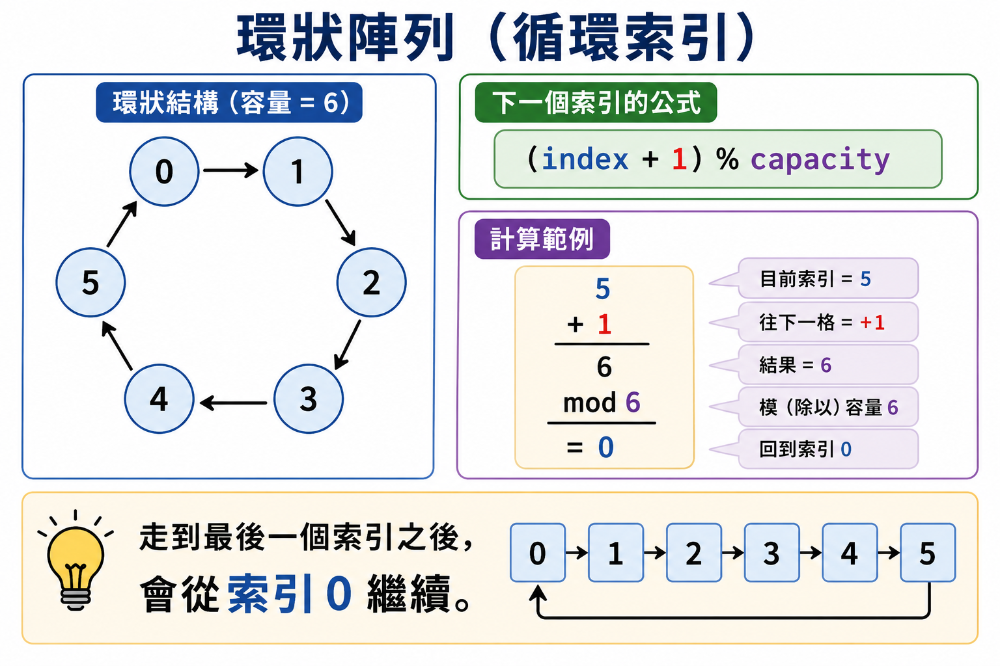


## Section XII. 索引更新

```cpp
index =
    (
        index +
        1
    ) %
    capacity;
```

Front 與 rear 到尾端後繞回開頭。

---

## Section XIII. 使用 Count 區分 Full 與 Empty

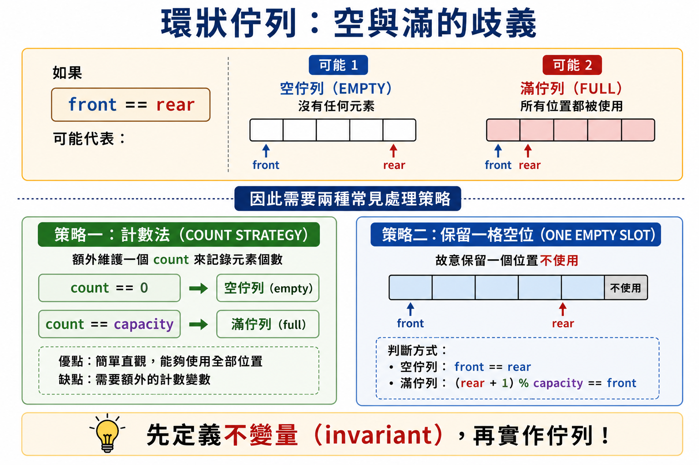


```text
count == 0        → empty
count == capacity → full
```

---

## Section XIV. 完整 Circular Queue

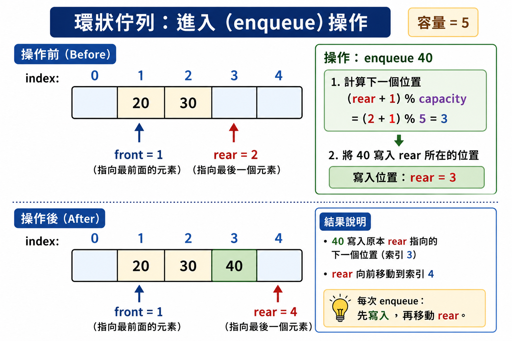

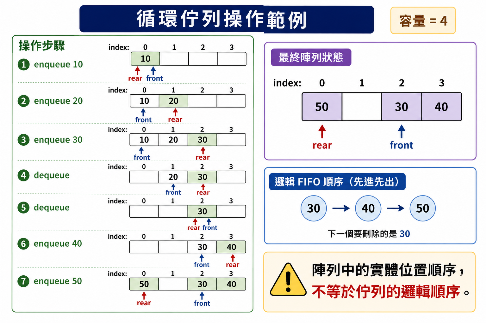


```cpp
// VALIDATE
#include <cstddef>
#include <iostream>
#include <stdexcept>
#include <vector>
using namespace std;

template <typename T>
class CircularQueue {
public:
    explicit CircularQueue(
        size_t capacity
    )
        : values(capacity),
          capacityValue(capacity) {
        if (capacity == 0) {
            throw invalid_argument(
                "capacity must be positive"
            );
        }
    }

    void enqueue(
        const T& value
    ) {
        if (full()) {
            throw overflow_error(
                "queue is full"
            );
        }

        values[rearIndex] =
            value;

        rearIndex =
            (
                rearIndex +
                1
            ) %
            capacityValue;

        ++countValue;
    }

    void dequeue() {
        if (empty()) {
            throw underflow_error(
                "queue is empty"
            );
        }

        frontIndex =
            (
                frontIndex +
                1
            ) %
            capacityValue;

        --countValue;
    }

    const T& front() const {
        if (empty()) {
            throw underflow_error(
                "queue is empty"
            );
        }

        return values[frontIndex];
    }

    bool empty() const noexcept {
        return countValue == 0;
    }

    bool full() const noexcept {
        return
            countValue ==
            capacityValue;
    }

    size_t size() const noexcept {
        return countValue;
    }

private:
    vector<T> values;
    size_t capacityValue;
    size_t frontIndex = 0;
    size_t rearIndex = 0;
    size_t countValue = 0;
};

int main() {
    CircularQueue<int> queue(3);

    queue.enqueue(10);
    queue.enqueue(20);
    queue.enqueue(30);

    cout << queue.front()
         << '\n';

    queue.dequeue();
    queue.enqueue(40);

    while (!queue.empty()) {
        cout << queue.front()
             << " ";

        queue.dequeue();
    }

    cout << '\n';

    return 0;
}
```

---

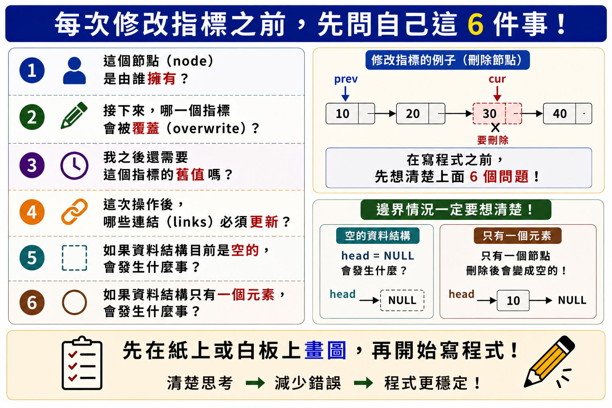

# Part E：Singly Linked List

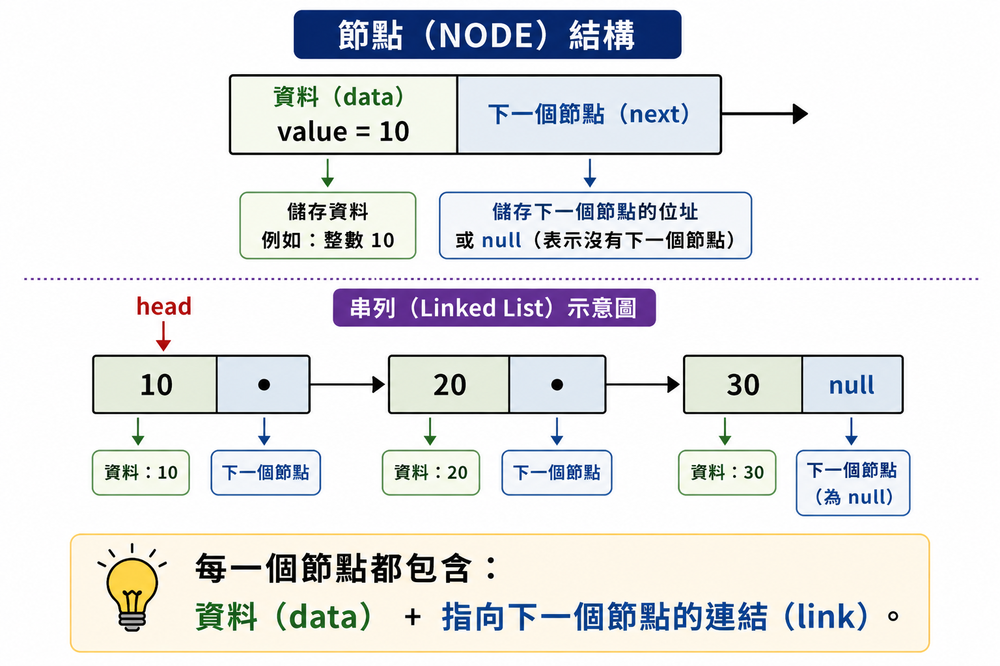


## Section XV. Node


```cpp
struct Node {
    int value;
    unique_ptr<Node> next;
};
```

`unique_ptr` 表示：

```text
每個節點唯一擁有下一個節點
```

Head 唯一擁有第一個節點。

---

## Section XVI. 插入前端

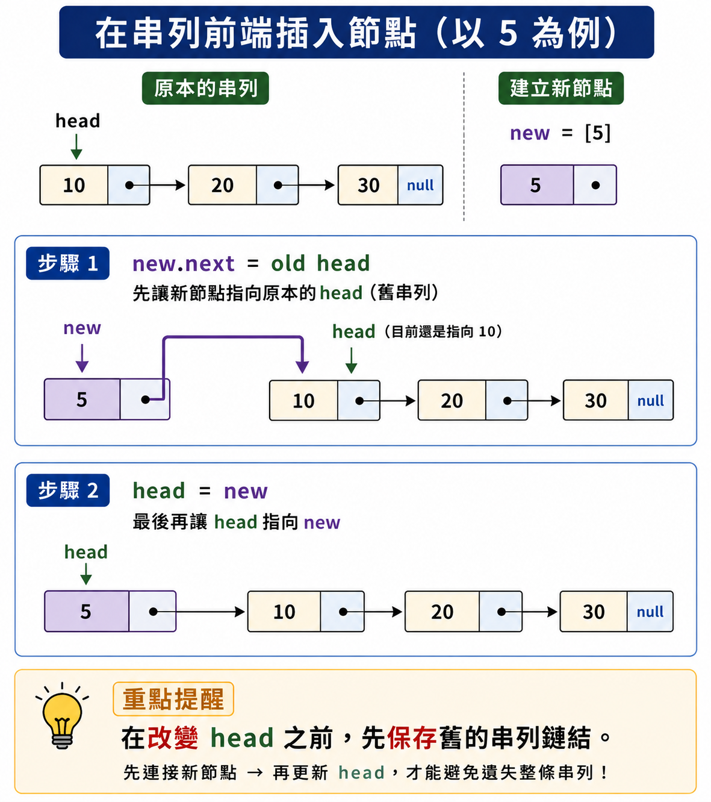

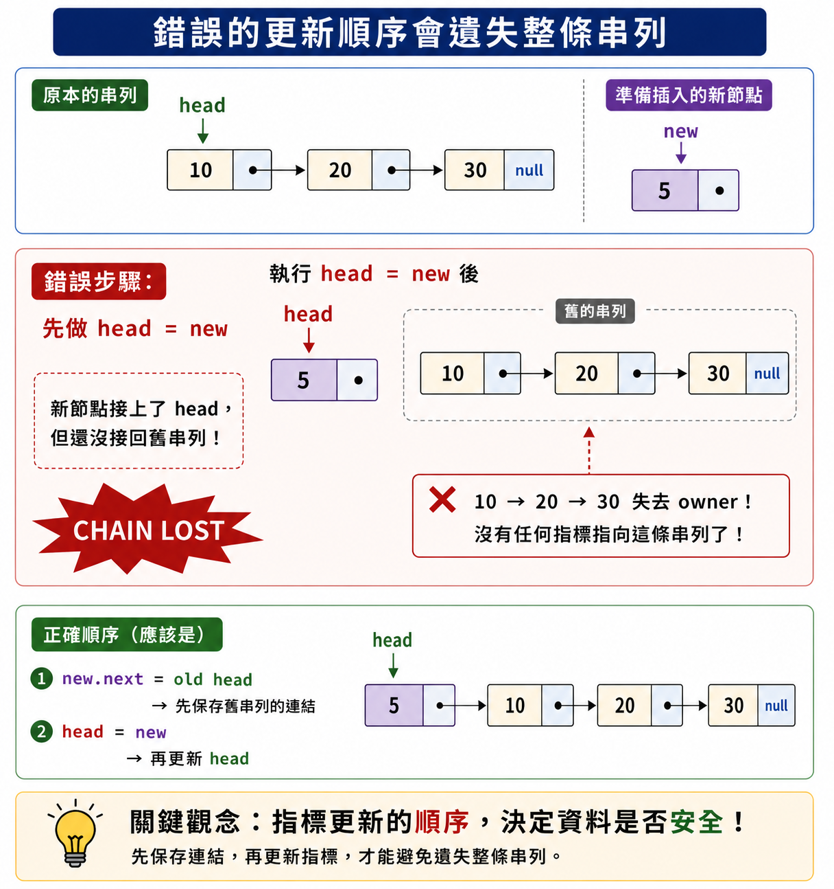


```text
newNode.next = head
head = newNode
```

必須先讓新節點指向舊 head，再更新 head。

---

## Section XVII. 刪除第一個節點

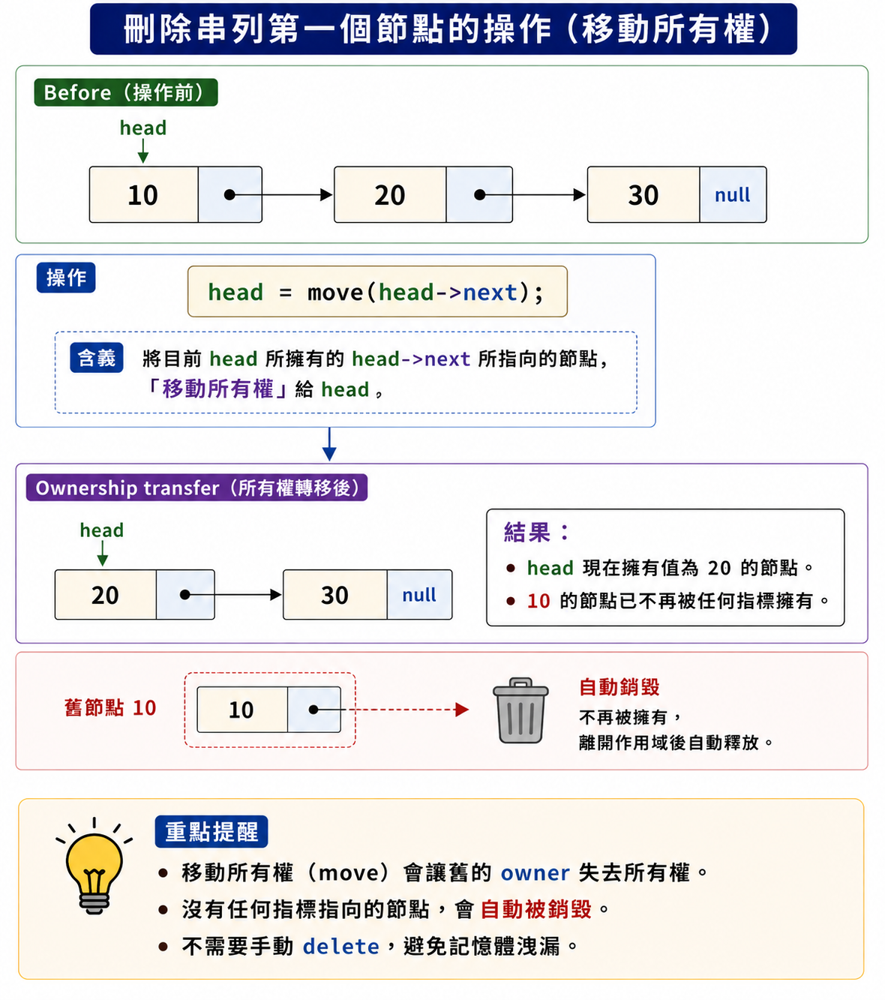


```text
head = move(head.next)
```

舊 head 自動解構。

---

## Section XVIII. 完整 Singly Linked List


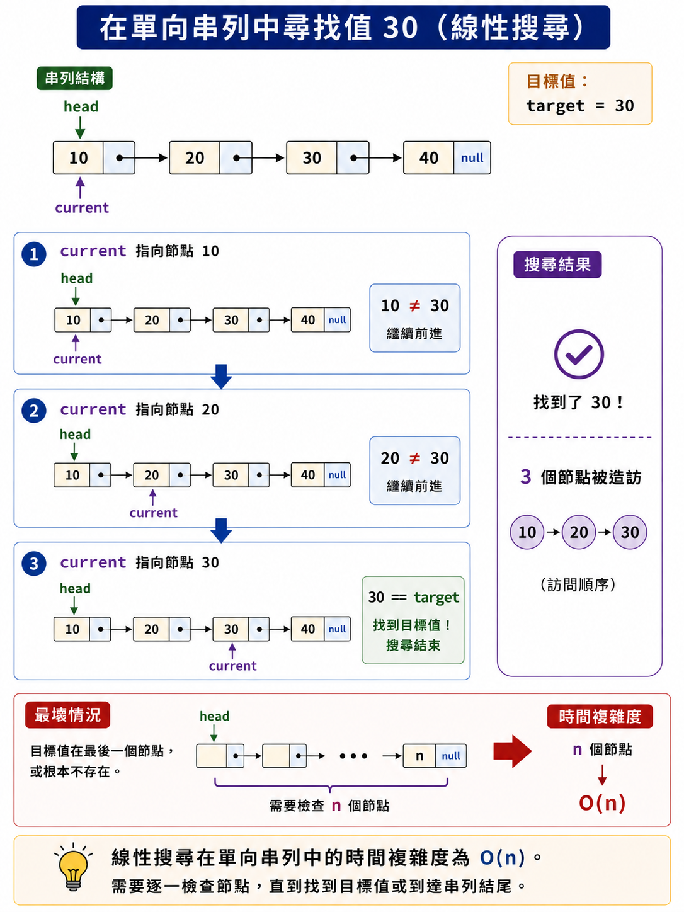

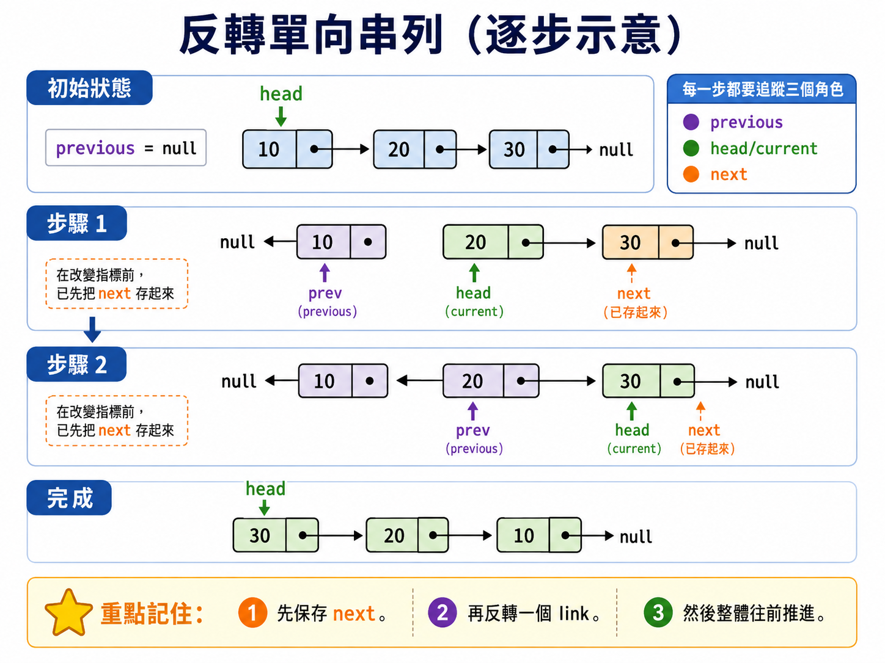


```cpp
// VALIDATE
#include <cstddef>
#include <iostream>
#include <memory>
#include <utility>
using namespace std;

class SinglyLinkedList {
private:
    struct Node {
        explicit Node(int initialValue)
            : value(initialValue) {
        }

        int value;
        unique_ptr<Node> next;
    };

public:
    void pushFront(int value) {
        auto node =
            make_unique<Node>(
                value
            );

        node->next =
            std::move(head);

        head =
            std::move(node);

        ++sizeValue;
    }

    void pushBack(int value) {
        auto node =
            make_unique<Node>(
                value
            );

        if (!head) {
            head =
                std::move(node);

            ++sizeValue;
            return;
        }

        Node* current =
            head.get();

        while (current->next) {
            current =
                current->next.get();
        }

        current->next =
            std::move(node);

        ++sizeValue;
    }

    bool contains(int value) const {
        const Node* current =
            head.get();

        while (current != nullptr) {
            if (
                current->value ==
                value
            ) {
                return true;
            }

            current =
                current->next.get();
        }

        return false;
    }

    bool eraseFirst(int value) {
        unique_ptr<Node>* link =
            &head;

        while (*link) {
            if (
                (*link)->value ==
                value
            ) {
                *link =
                    std::move(
                        (*link)->next
                    );

                --sizeValue;
                return true;
            }

            link =
                &(
                    (*link)->next
                );
        }

        return false;
    }

    void reverse() noexcept {
        unique_ptr<Node> previous;

        while (head) {
            unique_ptr<Node> next =
                std::move(
                    head->next
                );

            head->next =
                std::move(
                    previous
                );

            previous =
                std::move(
                    head
                );

            head =
                std::move(
                    next
                );
        }

        head =
            std::move(
                previous
            );
    }

    size_t size() const noexcept {
        return sizeValue;
    }

    void print() const {
        const Node* current =
            head.get();

        while (current != nullptr) {
            cout << current->value
                 << " ";

            current =
                current->next.get();
        }

        cout << '\n';
    }

private:
    unique_ptr<Node> head;
    size_t sizeValue = 0;
};

int main() {
    SinglyLinkedList list;

    list.pushBack(10);
    list.pushBack(20);
    list.pushFront(5);

    list.print();

    list.eraseFirst(10);
    list.reverse();
    list.print();

    cout << boolalpha
         << list.contains(20)
         << " "
         << list.size()
         << '\n';

    return 0;
}
```

---

# Part F：Singly Linked List 複雜度

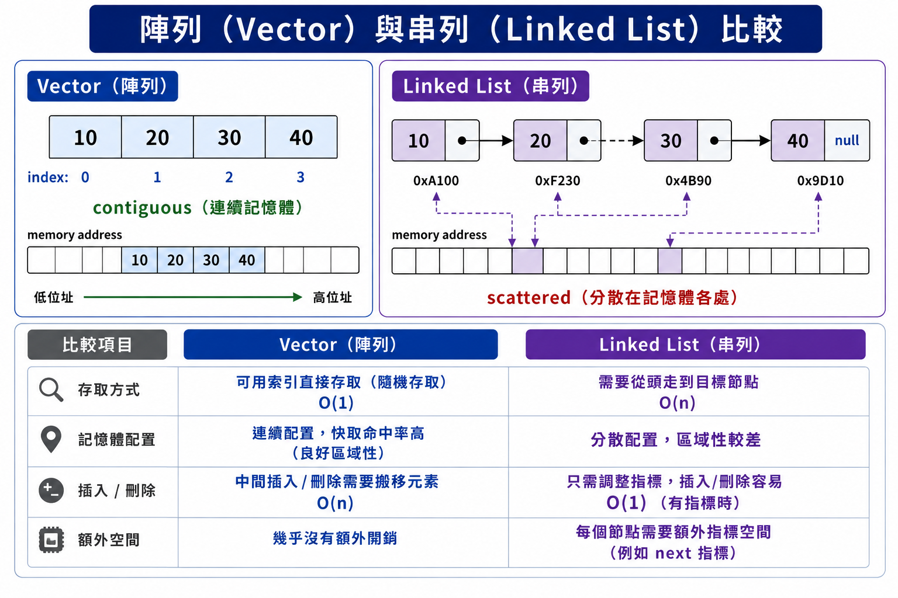


## Section XIX. 操作分析

| 操作 | 複雜度 |
| --- | --- |
| push front | O(1) |
| push back，無 tail | O(n) |
| search | O(n) |
| erase by value | O(n) |
| reverse | O(n) |
| access by index | O(n) |

若保存 tail pointer，push back 可降為 O(1)，但 invariant 會更複雜。

---

# Part G：Doubly Linked List

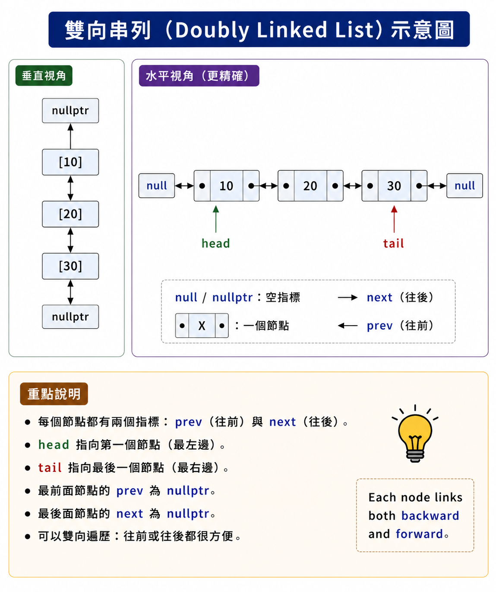


## Section XX. 結構

每個 node 有：

```text
previous ← node → next
```

優點：

- 可雙向走訪。
- 已知 node 時較容易刪除。
- 可 O(1) 操作兩端，前提是保存 head 與 tail。

代價：

- 每個 node 多一個 pointer。
- Pointer invariant 更複雜。

---

## Section XXI. Invariant

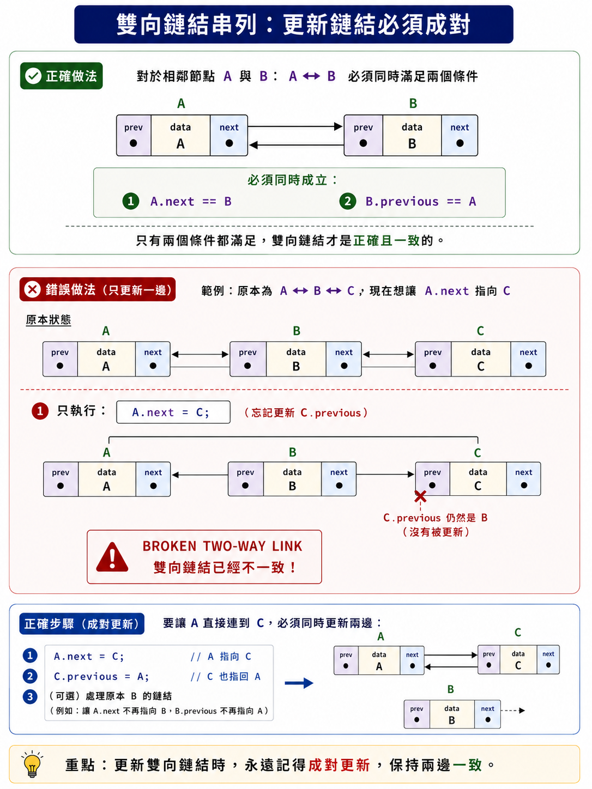


空串列：

```text
head == nullptr
tail == nullptr
size == 0
```

非空串列：

```text
head->previous == nullptr
tail->next == nullptr
```

每對相鄰節點：

```text
node->next->previous == node
```

---

# Part H：Binary Search Tree

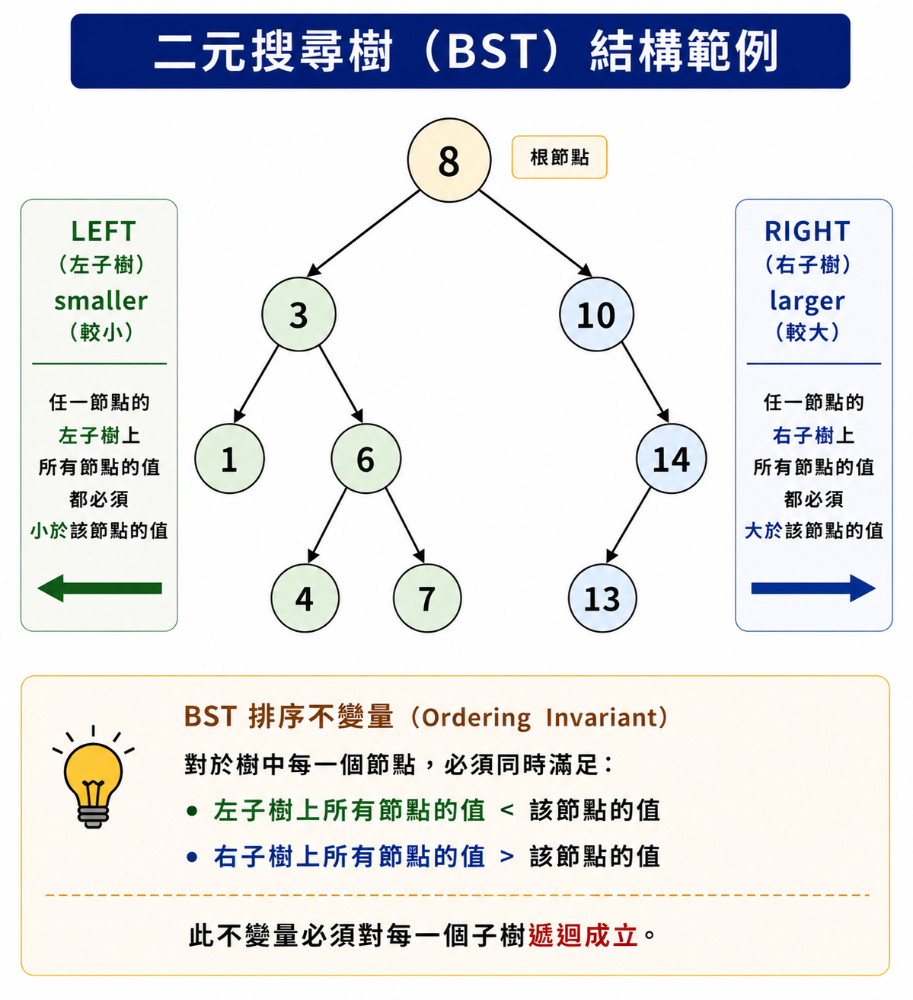


## Section XXII. Ordering Invariant

本章採用：

```text
left subtree keys < node key
right subtree keys > node key
```

重複 key 不插入。

---

## Section XXIII. Traversal

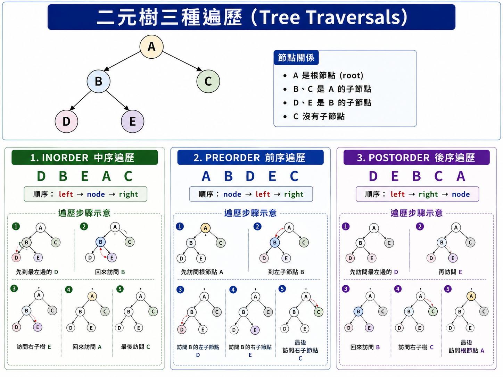

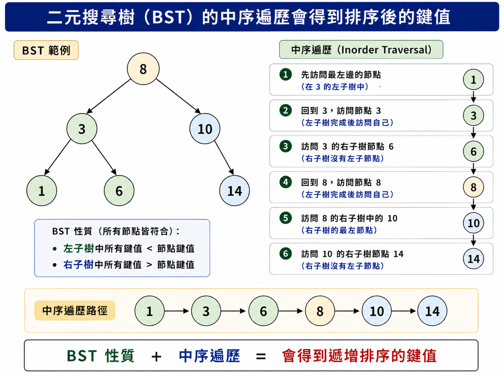


Inorder：

```text
left → node → right
```

對 BST 會得到排序結果。

Preorder：

```text
node → left → right
```

Postorder：

```text
left → right → node
```

---

## Section XXIV. 完整 BST

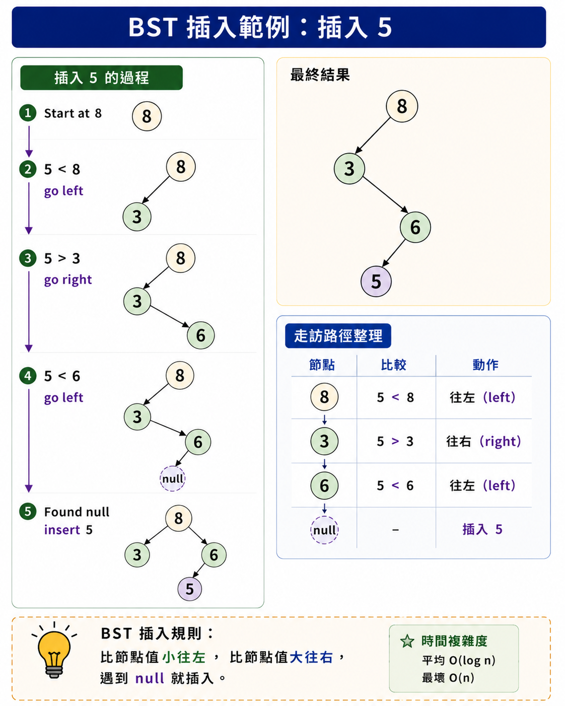

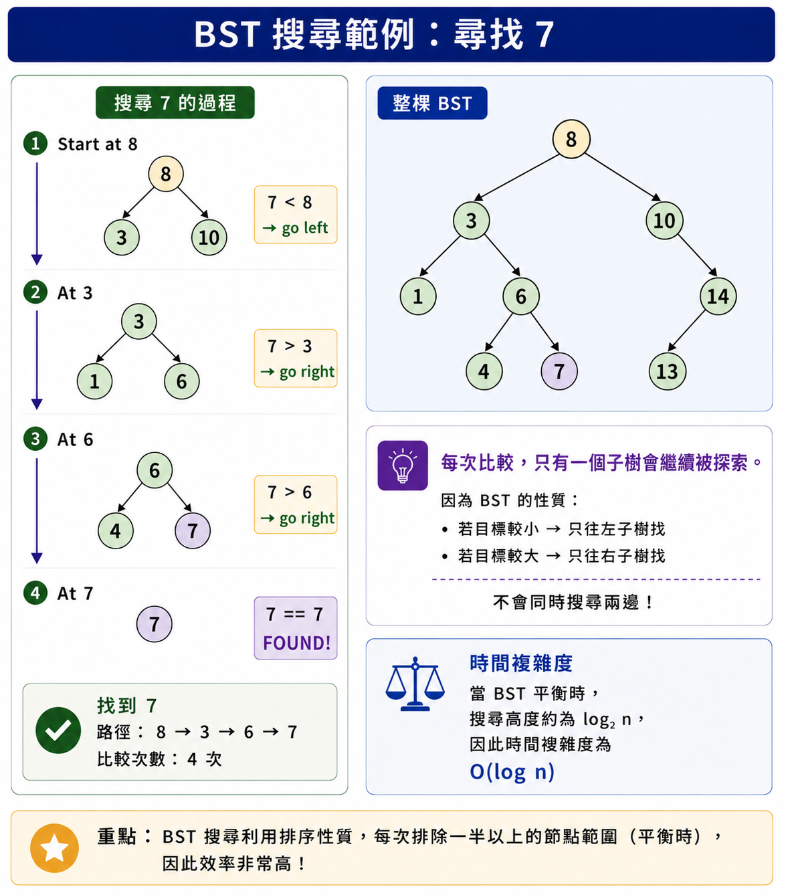


```cpp
// VALIDATE
#include <algorithm>
#include <iostream>
#include <memory>
#include <utility>
using namespace std;

class BinarySearchTree {
private:
    struct Node {
        explicit Node(int initialKey)
            : key(initialKey) {
        }

        int key;
        unique_ptr<Node> left;
        unique_ptr<Node> right;
    };

public:
    bool insert(int key) {
        return insertNode(
            root,
            key
        );
    }

    bool contains(int key) const {
        const Node* current =
            root.get();

        while (current != nullptr) {
            if (key == current->key) {
                return true;
            }

            if (key < current->key) {
                current =
                    current->left.get();
            } else {
                current =
                    current->right.get();
            }
        }

        return false;
    }

    bool erase(int key) {
        return eraseNode(
            root,
            key
        );
    }

    int height() const noexcept {
        return heightOf(
            root.get()
        );
    }

    void printInorder() const {
        printInorderNode(
            root.get()
        );

        cout << '\n';
    }

private:
    static bool insertNode(
        unique_ptr<Node>& node,
        int key
    ) {
        if (!node) {
            node =
                make_unique<Node>(
                    key
                );

            return true;
        }

        if (key < node->key) {
            return insertNode(
                node->left,
                key
            );
        }

        if (key > node->key) {
            return insertNode(
                node->right,
                key
            );
        }

        return false;
    }

    static bool eraseNode(
        unique_ptr<Node>& node,
        int key
    ) {
        if (!node) {
            return false;
        }

        if (key < node->key) {
            return eraseNode(
                node->left,
                key
            );
        }

        if (key > node->key) {
            return eraseNode(
                node->right,
                key
            );
        }

        if (!node->left) {
            node =
                std::move(
                    node->right
                );

            return true;
        }

        if (!node->right) {
            node =
                std::move(
                    node->left
                );

            return true;
        }

        Node* successor =
            node->right.get();

        while (successor->left) {
            successor =
                successor->left.get();
        }

        node->key =
            successor->key;

        return eraseNode(
            node->right,
            successor->key
        );
    }

    static int heightOf(
        const Node* node
    ) noexcept {
        if (node == nullptr) {
            return 0;
        }

        return
            1 +
            max(
                heightOf(
                    node->left.get()
                ),
                heightOf(
                    node->right.get()
                )
            );
    }

    static void printInorderNode(
        const Node* node
    ) {
        if (node == nullptr) {
            return;
        }

        printInorderNode(
            node->left.get()
        );

        cout << node->key
             << " ";

        printInorderNode(
            node->right.get()
        );
    }

    unique_ptr<Node> root;
};

int main() {
    BinarySearchTree tree;

    for (
        int key :
        {
            8,
            3,
            10,
            1,
            6,
            14,
            4,
            7,
            13
        }
    ) {
        tree.insert(key);
    }

    tree.printInorder();

    tree.erase(3);
    tree.printInorder();

    cout << boolalpha
         << tree.contains(7)
         << " "
         << tree.height()
         << '\n';

    return 0;
}
```

---

## Section XXV. BST 刪除三種情況

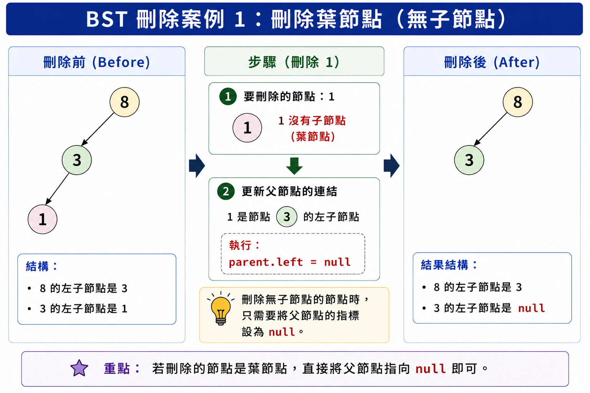

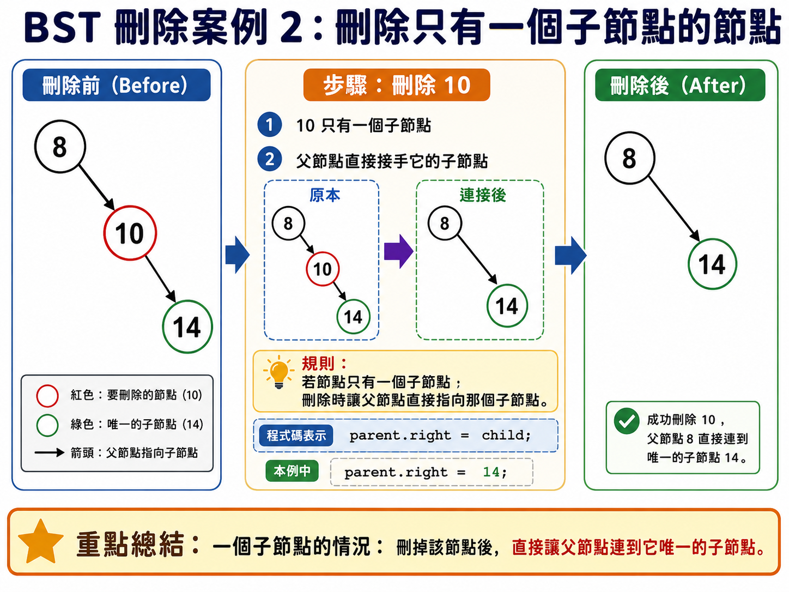

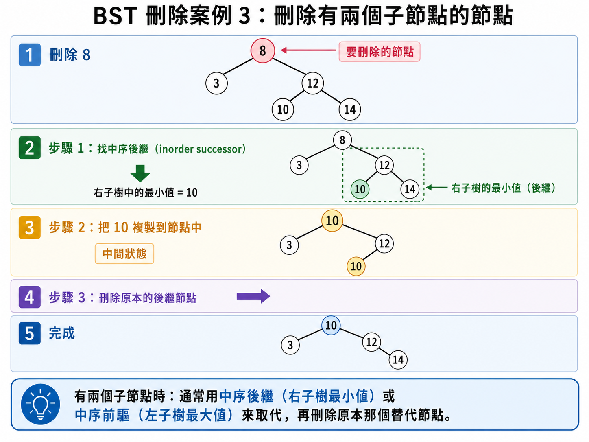


1. Leaf：
   ```text
   直接設為 null
   ```
2. 一個 child：
   ```text
   讓 parent 直接擁有 child
   ```
3. 兩個 children：
   ```text
   找 inorder successor
   複製 successor key
   再刪除 successor
   ```

---

## Section XXVI. 退化 BST

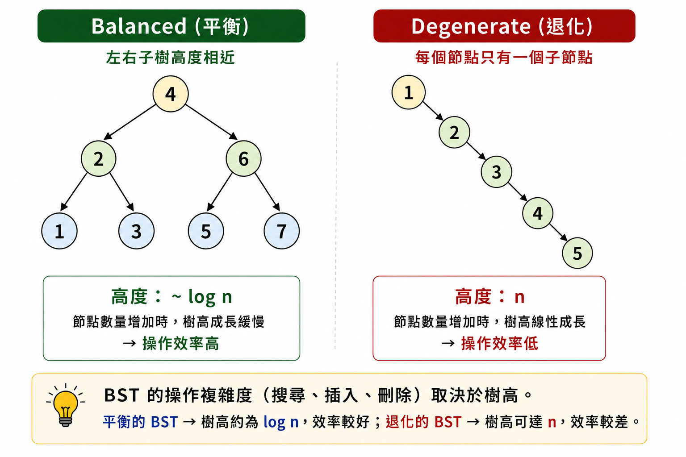


依序插入：

```text
1, 2, 3, 4, 5
```

可能形成：

```text
1
 \
  2
   \
    3
     \
      4
       \
        5
```

高度變成 O(n)，search／insert／erase 最差也是 O(n)。

---

# Part I：Binary Heap

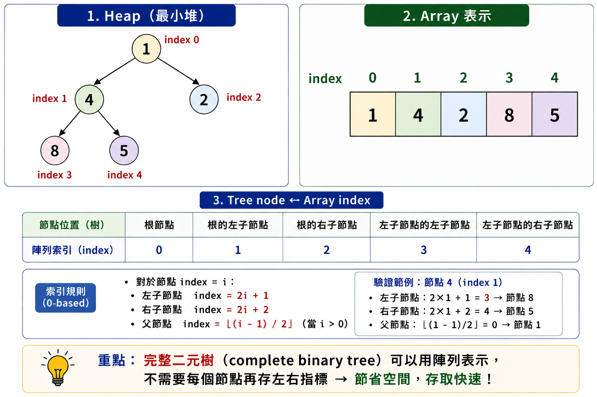


## Section XXVII. Array Representation

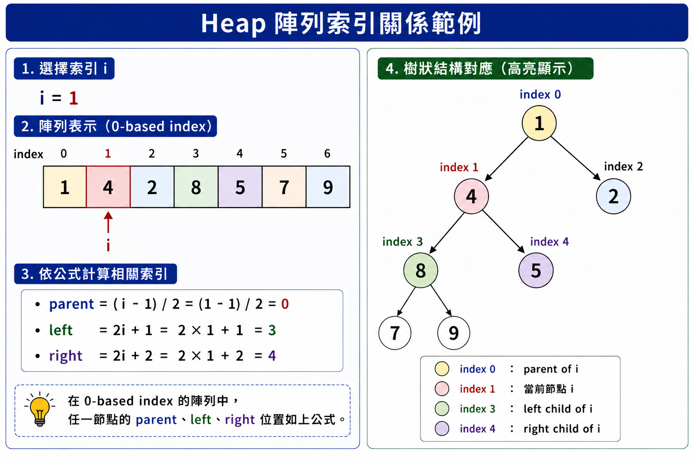


對 index `i`：

```text
parent      = (i - 1) / 2
left child  = 2i + 1
right child = 2i + 2
```

只適用於零基索引。

---

## Section XXVIII. Min-Heap Invariant

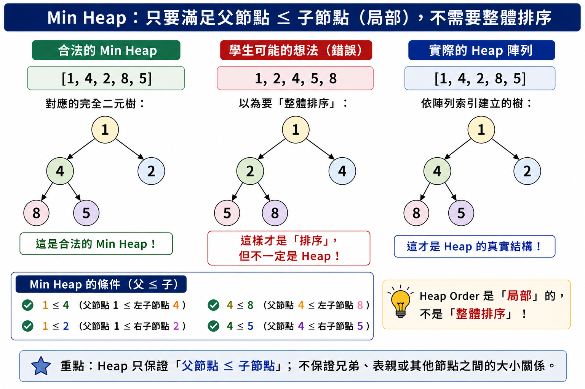


```text
每個 parent <= children
```

Root 是最小值。

Heap 不保證整個陣列完全排序。

---

## Section XXIX. Sift Up

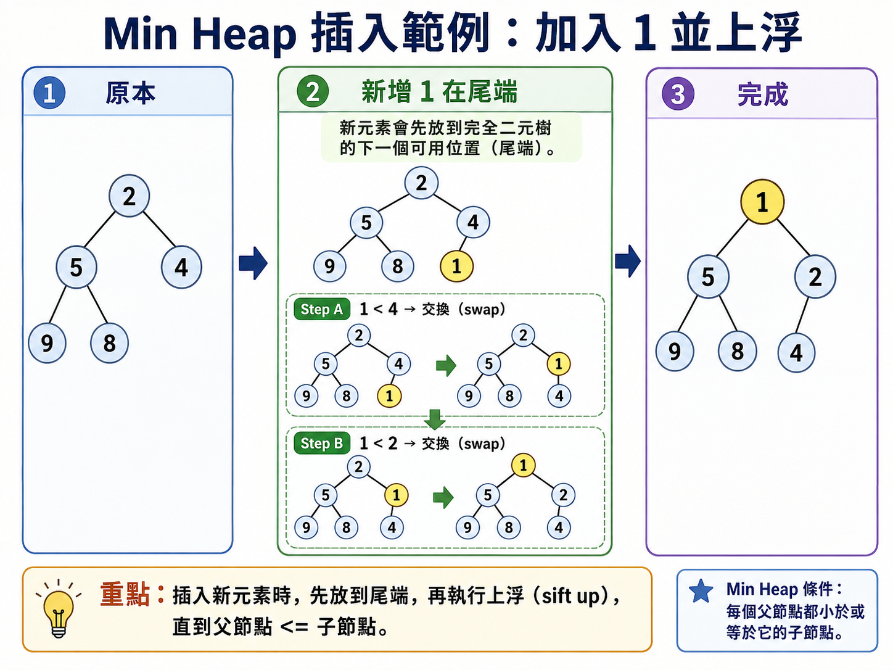


新元素先加入尾端，再和 parent 比較並向上交換，直到 invariant 恢復。

---

## Section XXX. Sift Down

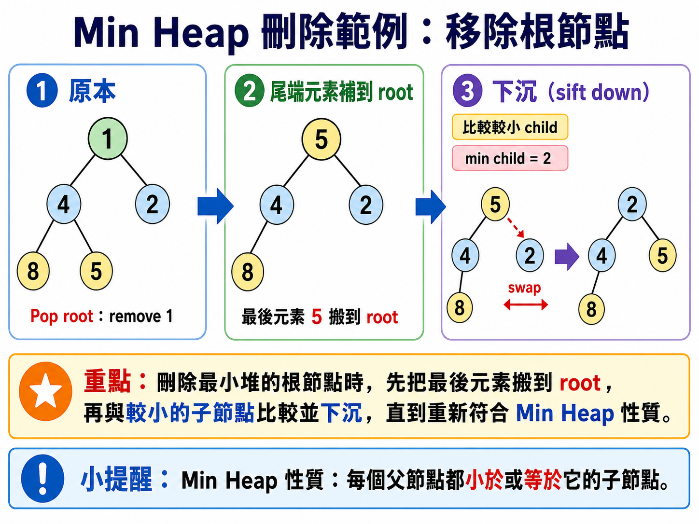


移除 root 後，將最後元素移到 root，再和較小 child 比較並向下交換。

---

## Section XXXI. 完整 Min Heap

```cpp
// VALIDATE
#include <cstddef>
#include <iostream>
#include <stdexcept>
#include <utility>
#include <vector>
using namespace std;

class MinHeap {
public:
    void push(int value) {
        values.push_back(value);

        siftUp(
            values.size() -
            1
        );
    }

    int top() const {
        if (values.empty()) {
            throw underflow_error(
                "heap is empty"
            );
        }

        return values.front();
    }

    void pop() {
        if (values.empty()) {
            throw underflow_error(
                "heap is empty"
            );
        }

        values.front() =
            values.back();

        values.pop_back();

        if (!values.empty()) {
            siftDown(0);
        }
    }

    bool empty() const noexcept {
        return values.empty();
    }

    size_t size() const noexcept {
        return values.size();
    }

private:
    void siftUp(size_t index) {
        while (index > 0) {
            const size_t parent =
                (
                    index -
                    1
                ) /
                2;

            if (
                values[parent] <=
                values[index]
            ) {
                return;
            }

            swap(
                values[parent],
                values[index]
            );

            index =
                parent;
        }
    }

    void siftDown(size_t index) {
        while (true) {
            const size_t left =
                index *
                    2 +
                1;

            const size_t right =
                index *
                    2 +
                2;

            size_t smallest =
                index;

            if (
                left <
                    values.size() &&
                values[left] <
                    values[smallest]
            ) {
                smallest =
                    left;
            }

            if (
                right <
                    values.size() &&
                values[right] <
                    values[smallest]
            ) {
                smallest =
                    right;
            }

            if (
                smallest ==
                index
            ) {
                return;
            }

            swap(
                values[index],
                values[smallest]
            );

            index =
                smallest;
        }
    }

    vector<int> values;
};

int main() {
    MinHeap heap;

    for (
        int value :
        {
            7,
            2,
            9,
            1,
            5
        }
    ) {
        heap.push(value);
    }

    while (!heap.empty()) {
        cout << heap.top()
             << " ";

        heap.pop();
    }

    cout << '\n';

    return 0;
}
```

---

## Section XXXII. Heap 複雜度

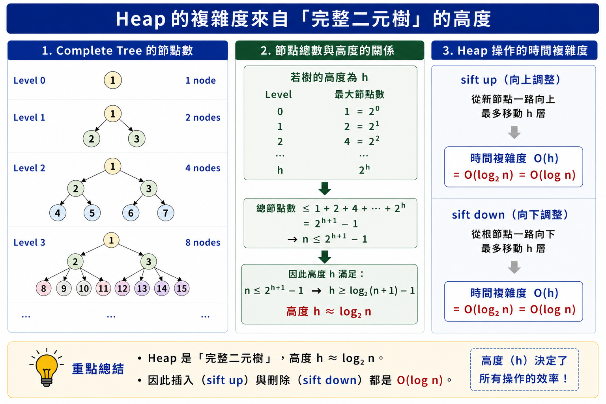


| 操作 | 複雜度 |
| --- | --- |
| top | O(1) |
| push | O(log n) |
| pop | O(log n) |
| search arbitrary value | O(n) |
| heapify n elements | O(n) |

---

# Part J：Hash Table

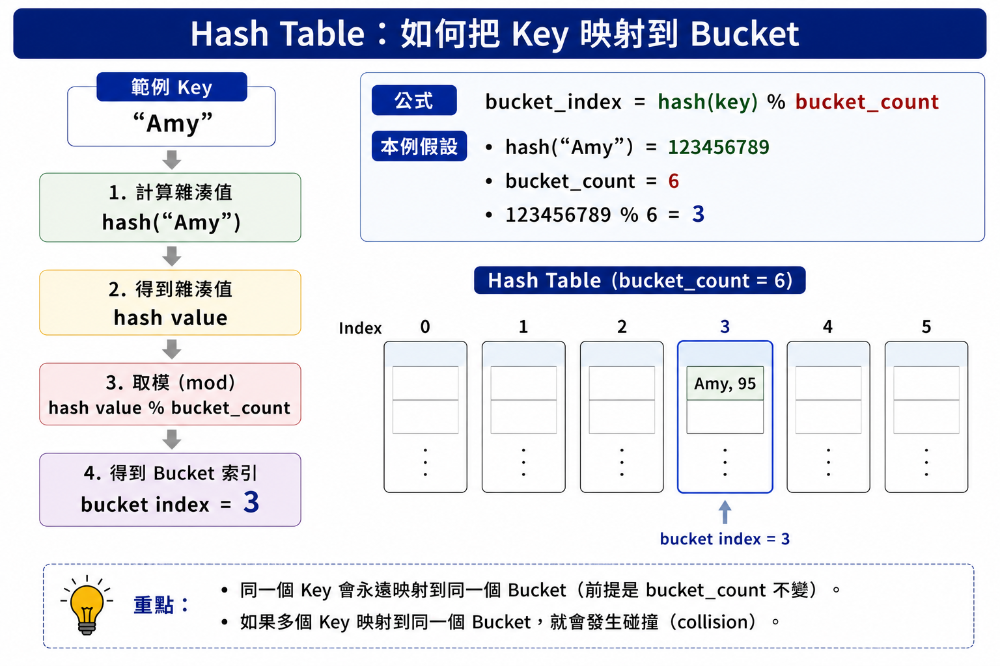


## Section XXXIII. Collision

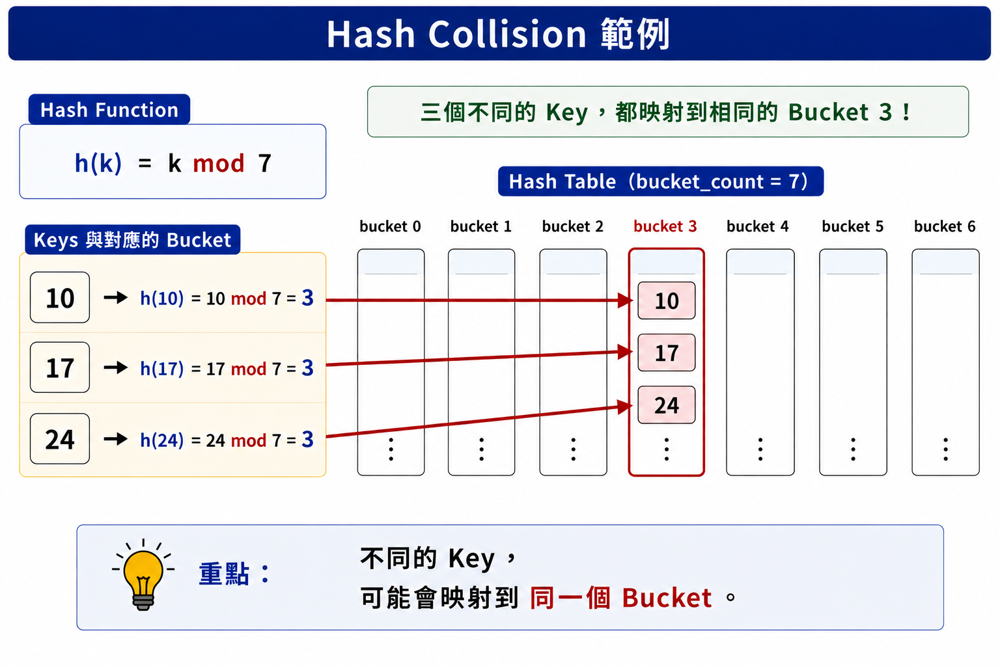


不同 key 可能得到相同 bucket index。

例如：

```text
h(k) = k mod 7
```

```text
10 mod 7 = 3
17 mod 7 = 3
24 mod 7 = 3
```

必須處理 collision。

---

## Section XXXIV. Separate Chaining

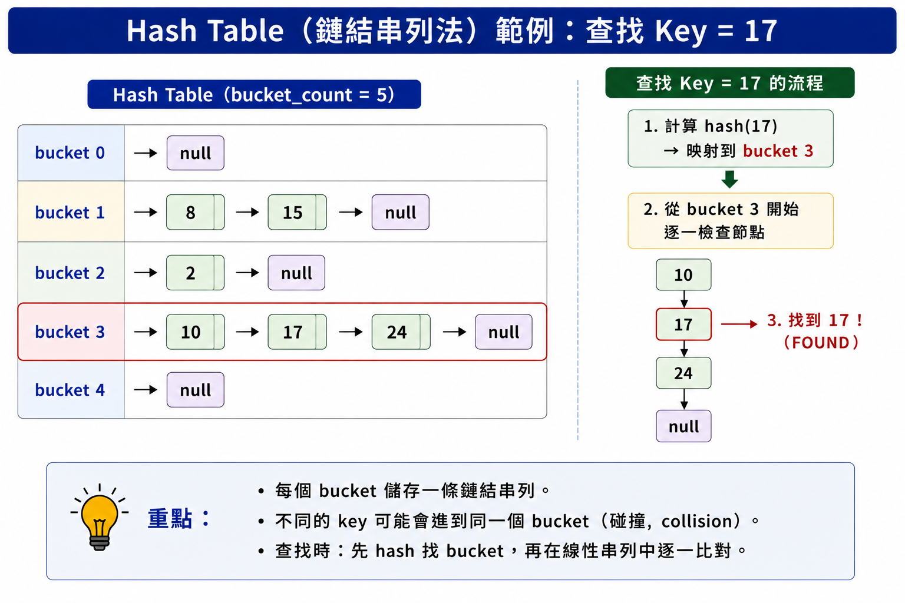


每個 bucket 保存一個小型串列或 vector。

```text
bucket 3 → [10] → [17] → [24]
```

---

## Section XXXV. Load Factor

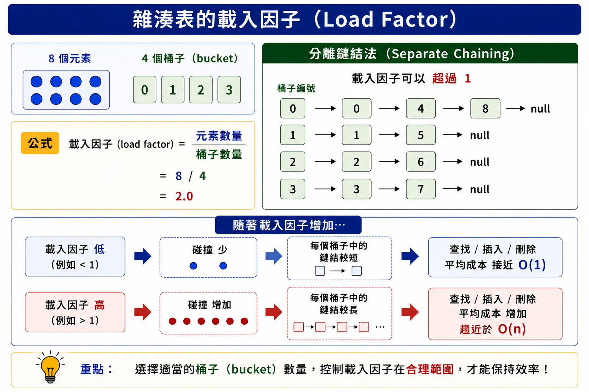


```text
load factor = number of elements / number of buckets
```

Load factor 太高時：

- Collision 增加。
- Search 變慢。
- 應 rehash 到更多 buckets。

---

## Section XXXVI. 完整 Chained Hash Table

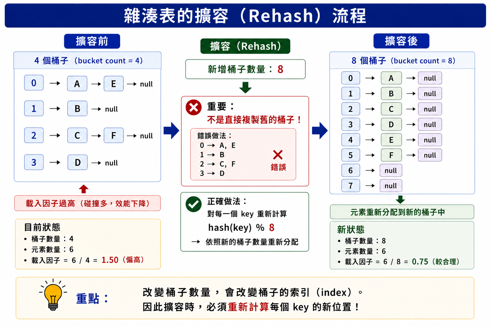


```cpp
// VALIDATE
#include <cstddef>
#include <functional>
#include <iostream>
#include <list>
#include <optional>
#include <stdexcept>
#include <string>
#include <utility>
#include <vector>
using namespace std;

template <
    typename Key,
    typename Value
>
class ChainedHashTable {
private:
    using Entry =
        pair<Key, Value>;

public:
    explicit ChainedHashTable(
        size_t bucketCount = 8
    )
        : buckets(bucketCount) {
        if (bucketCount == 0) {
            throw invalid_argument(
                "bucket count must be positive"
            );
        }
    }

    void insertOrAssign(
        const Key& key,
        const Value& value
    ) {
        maybeRehash();

        auto& bucket =
            buckets[
                indexFor(key)
            ];

        for (auto& entry : bucket) {
            if (entry.first == key) {
                entry.second =
                    value;

                return;
            }
        }

        bucket.emplace_back(
            key,
            value
        );

        ++sizeValue;
    }

    optional<Value> find(
        const Key& key
    ) const {
        const auto& bucket =
            buckets[
                indexFor(key)
            ];

        for (
            const auto& entry :
            bucket
        ) {
            if (entry.first == key) {
                return entry.second;
            }
        }

        return nullopt;
    }

    bool erase(
        const Key& key
    ) {
        auto& bucket =
            buckets[
                indexFor(key)
            ];

        for (
            auto iterator =
                bucket.begin();
            iterator !=
                bucket.end();
            ++iterator
        ) {
            if (
                iterator->first ==
                key
            ) {
                bucket.erase(
                    iterator
                );

                --sizeValue;
                return true;
            }
        }

        return false;
    }

    size_t size() const noexcept {
        return sizeValue;
    }

    double loadFactor() const {
        return
            static_cast<double>(
                sizeValue
            ) /
            static_cast<double>(
                buckets.size()
            );
    }

private:
    size_t indexFor(
        const Key& key
    ) const {
        return
            hash<Key>{}(key) %
            buckets.size();
    }

    void maybeRehash() {
        if (
            loadFactor() <
            0.75
        ) {
            return;
        }

        vector<
            list<Entry>
        > newBuckets(
            buckets.size() *
            2
        );

        for (
            const auto& bucket :
            buckets
        ) {
            for (
                const auto& entry :
                bucket
            ) {
                const size_t index =
                    hash<Key>{}(
                        entry.first
                    ) %
                    newBuckets.size();

                newBuckets[index]
                    .push_back(entry);
            }
        }

        buckets =
            std::move(
                newBuckets
            );
    }

    vector<
        list<Entry>
    > buckets;

    size_t sizeValue = 0;
};

int main() {
    ChainedHashTable<
        string,
        int
    > table(2);

    table.insertOrAssign(
        "Amy",
        95
    );

    table.insertOrAssign(
        "Brian",
        88
    );

    table.insertOrAssign(
        "Amy",
        100
    );

    const optional<int> score =
        table.find("Amy");

    if (score) {
        cout << *score
             << '\n';
    }

    table.erase("Brian");

    cout << table.size()
         << " "
         << table.loadFactor()
         << '\n';

    return 0;
}
```

---

# Part K：Hash Table 複雜度

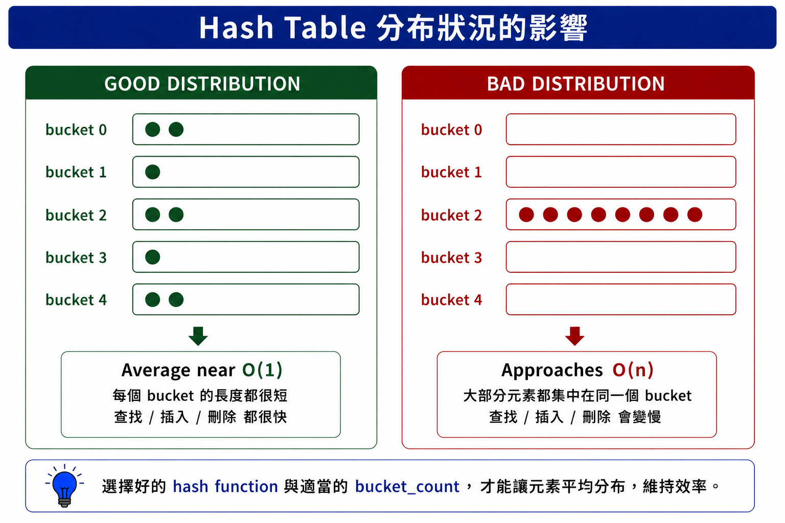


## Section XXXVII. 平均與最差

理想分布：

```text
insert／find／erase 平均 O(1)
```

若所有 key 都落到同一 bucket：

```text
最差 O(n)
```

效能取決於：

- Hash function
- Bucket count
- Load factor
- Collision strategy
- Key equality cost

---

# Part L：Graph

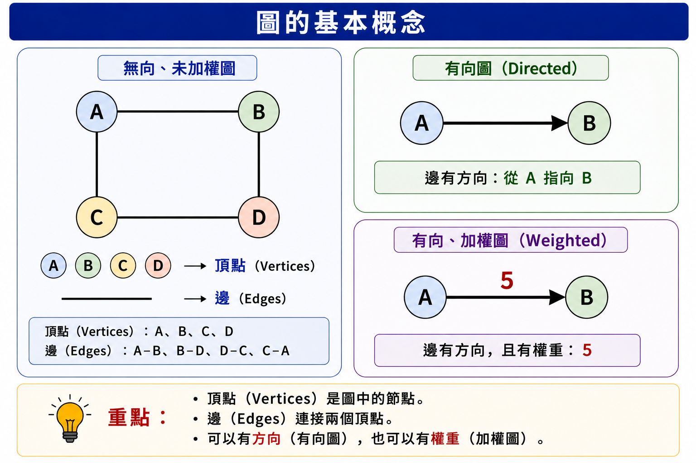

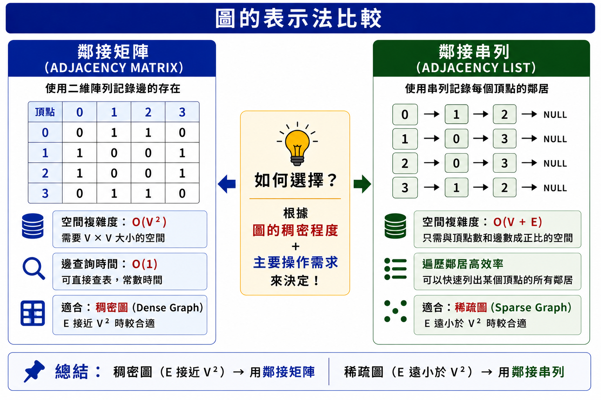


## Section XXXVIII. 基本概念

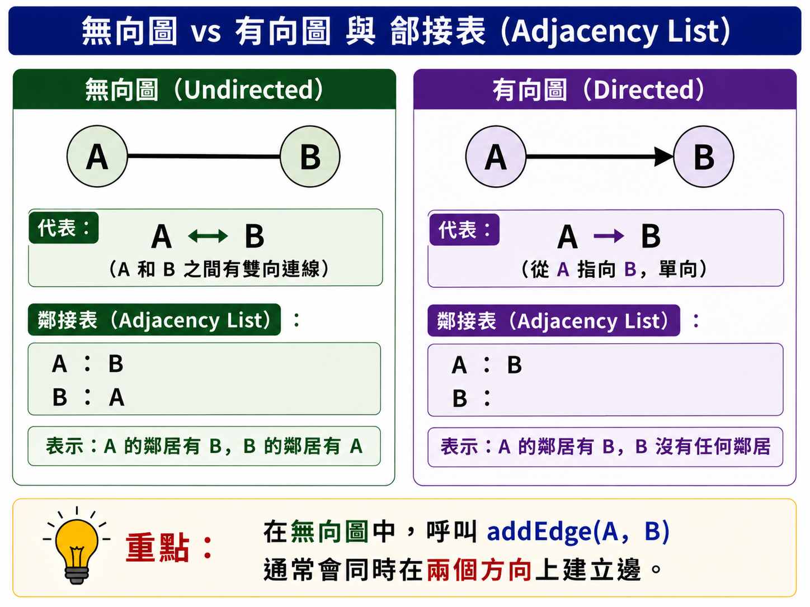


Vertex：

```text
節點
```

Edge：

```text
節點之間的連線
```

Graph 可以是：

- Directed
- Undirected
- Weighted
- Unweighted

---

## Section XXXIX. Adjacency Matrix

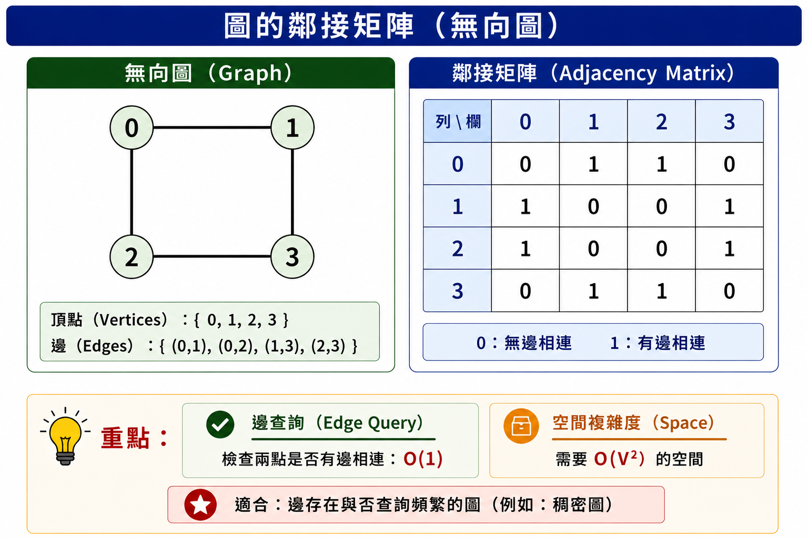


使用 `V × V` matrix。

優點：

- 查詢 edge O(1)。
- 實作簡單。

缺點：

- 空間 O(V²)。
- Sparse graph 浪費空間。

---

## Section XL. Adjacency List

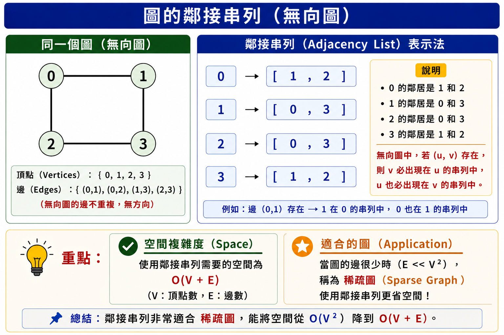


每個 vertex 保存鄰居清單。

空間：

```text
O(V + E)
```

適合 sparse graph。

---

# Part M：BFS

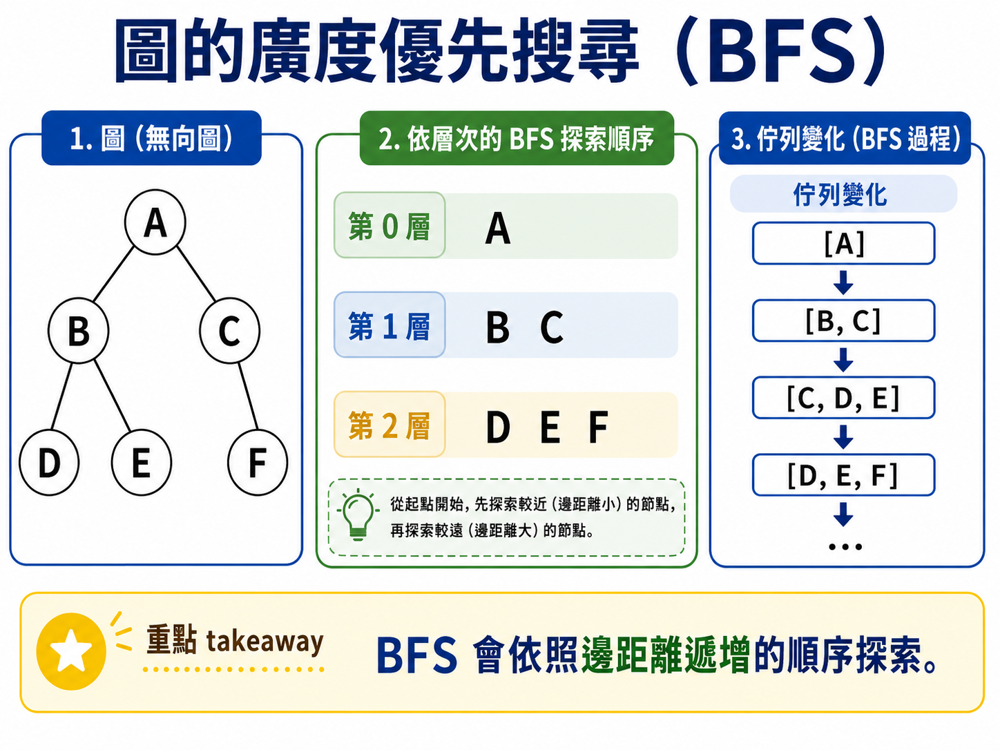

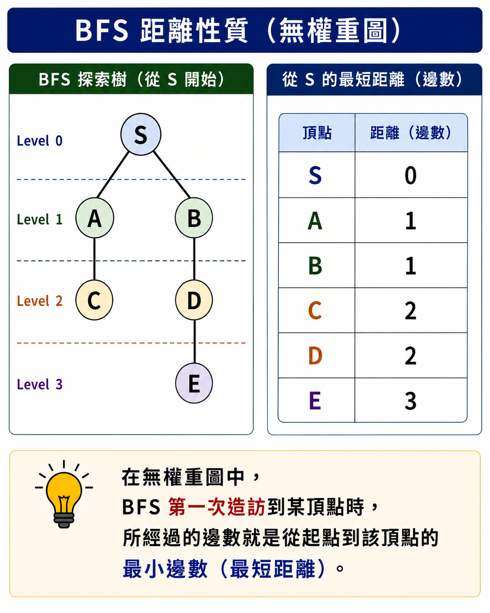


## Section XLI. Breadth-First Search

BFS 逐層走訪：

```text
起點
→ 距離 1 的節點
→ 距離 2 的節點
→ ...
```

使用 Queue。

在 unweighted graph 中可求最短 edge count。

---

## Section XLII. 完整 BFS

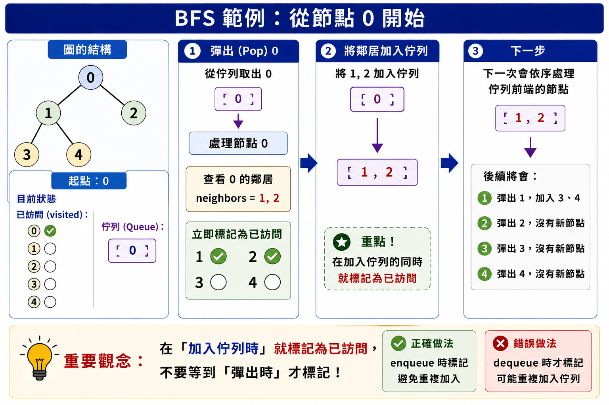

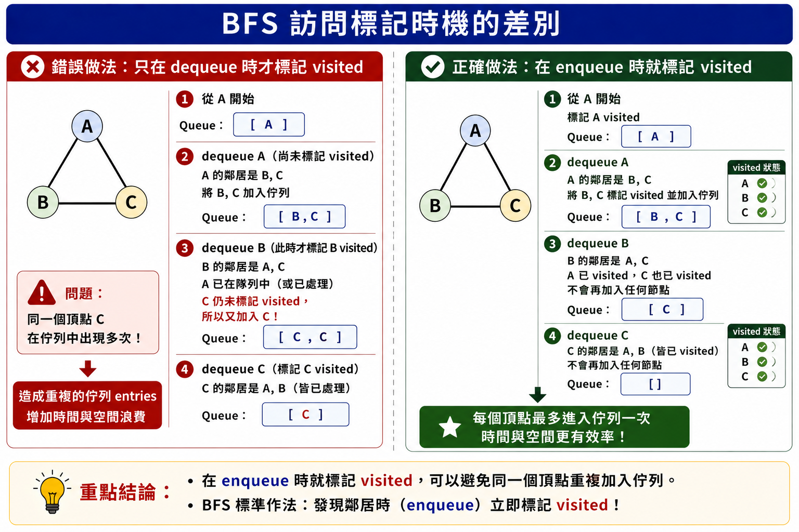


```cpp
// VALIDATE
#include <cstddef>
#include <iostream>
#include <queue>
#include <stdexcept>
#include <vector>
using namespace std;

class Graph {
public:
    explicit Graph(
        size_t vertexCount
    )
        : adjacency(
              vertexCount
          ) {
    }

    void addUndirectedEdge(
        size_t first,
        size_t second
    ) {
        validateVertex(first);
        validateVertex(second);

        adjacency[first]
            .push_back(second);

        adjacency[second]
            .push_back(first);
    }

    vector<int> distancesFrom(
        size_t start
    ) const {
        validateVertex(start);

        vector<int> distance(
            adjacency.size(),
            -1
        );

        queue<size_t> pending;

        distance[start] = 0;
        pending.push(start);

        while (!pending.empty()) {
            const size_t current =
                pending.front();

            pending.pop();

            for (
                size_t neighbor :
                adjacency[current]
            ) {
                if (
                    distance[neighbor] !=
                    -1
                ) {
                    continue;
                }

                distance[neighbor] =
                    distance[current] +
                    1;

                pending.push(
                    neighbor
                );
            }
        }

        return distance;
    }

private:
    void validateVertex(
        size_t vertex
    ) const {
        if (
            vertex >=
            adjacency.size()
        ) {
            throw out_of_range(
                "invalid vertex"
            );
        }
    }

    vector<
        vector<size_t>
    > adjacency;
};

int main() {
    Graph graph(6);

    graph.addUndirectedEdge(0, 1);
    graph.addUndirectedEdge(0, 2);
    graph.addUndirectedEdge(1, 3);
    graph.addUndirectedEdge(2, 4);

    const vector<int> distance =
        graph.distancesFrom(0);

    for (int value : distance) {
        cout << value
             << " ";
    }

    cout << '\n';

    return 0;
}
```

Vertex 5 不可達，因此距離保持 `-1`。

---

# Part N：DFS

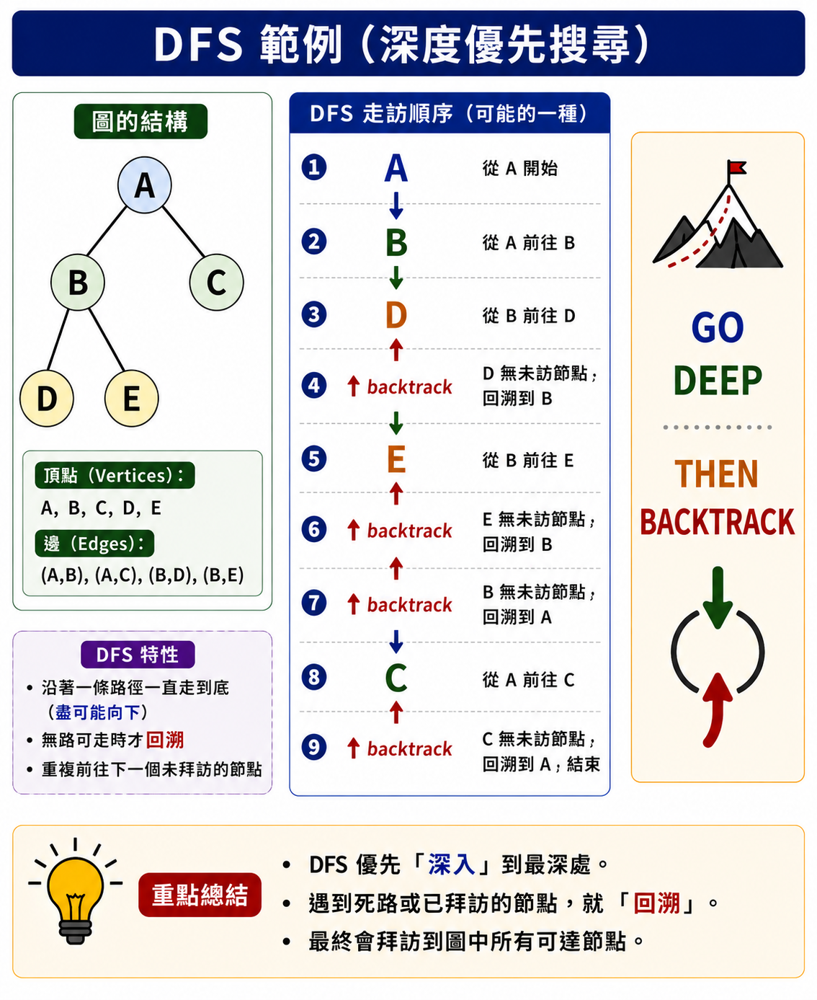


## Section XLIII. Depth-First Search

DFS 優先沿一條路徑深入，再回溯。

可使用：

- Recursion
- Explicit stack

常見用途：

- Connected component
- Cycle detection
- Topological sort
- Maze
- Backtracking
- Tree traversal

---

## Section XLIV. 完整 Iterative DFS

```cpp
// VALIDATE
#include <cstddef>
#include <iostream>
#include <stack>
#include <stdexcept>
#include <vector>
using namespace std;

vector<size_t> depthFirstOrder(
    const vector<
        vector<size_t>
    >& adjacency,
    size_t start
) {
    if (
        start >=
        adjacency.size()
    ) {
        throw out_of_range(
            "invalid start vertex"
        );
    }

    vector<bool> visited(
        adjacency.size(),
        false
    );

    vector<size_t> order;
    stack<size_t> pending;

    pending.push(start);

    while (!pending.empty()) {
        const size_t current =
            pending.top();

        pending.pop();

        if (visited[current]) {
            continue;
        }

        visited[current] =
            true;

        order.push_back(
            current
        );

        const auto& neighbors =
            adjacency[current];

        for (
            auto iterator =
                neighbors.rbegin();
            iterator !=
                neighbors.rend();
            ++iterator
        ) {
            if (!visited[*iterator]) {
                pending.push(
                    *iterator
                );
            }
        }
    }

    return order;
}

int main() {
    const vector<
        vector<size_t>
    > graph{
        {1, 2},
        {3},
        {4},
        {},
        {}
    };

    const vector<size_t> order =
        depthFirstOrder(
            graph,
            0
        );

    for (size_t vertex : order) {
        cout << vertex
             << " ";
    }

    cout << '\n';

    return 0;
}
```

---

# Part O：BFS vs DFS

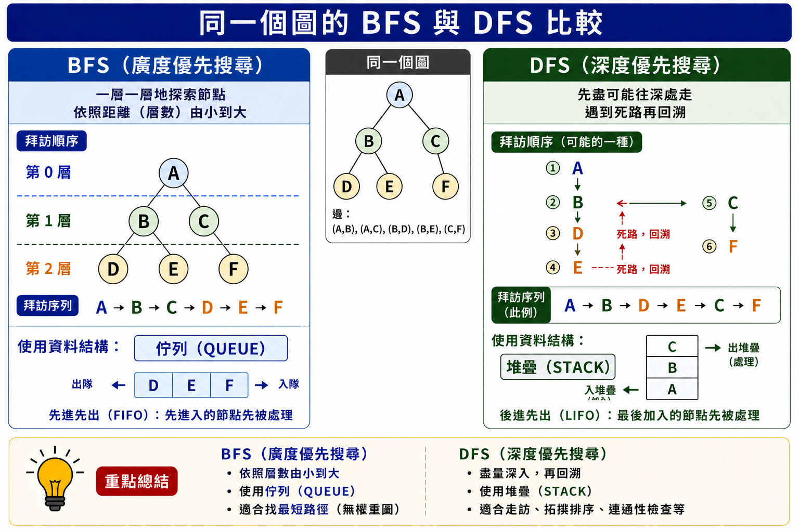


## Section XLV. 比較

| 問題 | BFS | DFS |
| --- | --- | --- |
| Unweighted shortest path | 適合 | 不保證 |
| Level order | 適合 | 不適合 |
| Deep exploration | 可，但不是主要特性 | 適合 |
| Memory | 可能保存整層 | 可能保存深路徑 |
| Implementation | Queue | Stack／recursion |
| Connected component | 可以 | 可以 |

---

# Part P：Dijkstra 入門

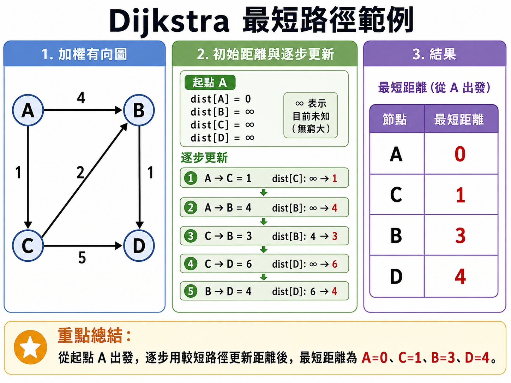


## Section XLVI. 限制

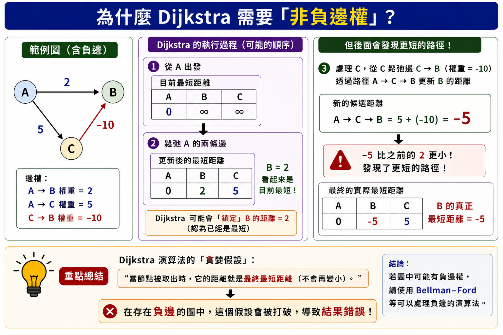


Dijkstra 適用：

```text
所有 edge weight >= 0
```

有負權重時不能直接使用。

---

## Section XLVII. 核心思路

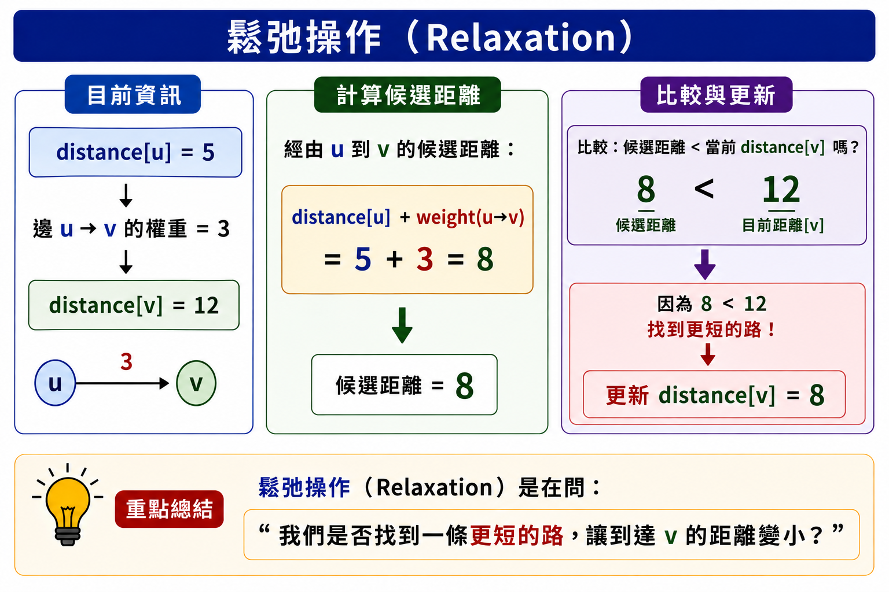


1. `distance[start] = 0`
2. 其他距離為 infinity
3. Priority queue 取目前最小距離 vertex
4. Relax outgoing edges
5. 新距離更小就更新並 push
6. 跳過 stale priority queue entry

---

## Section XLVIII. 完整 Dijkstra

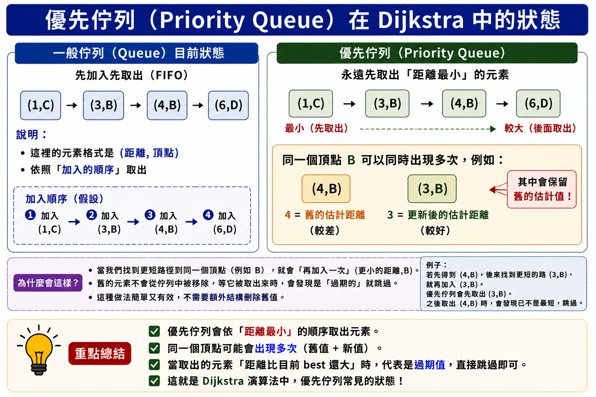

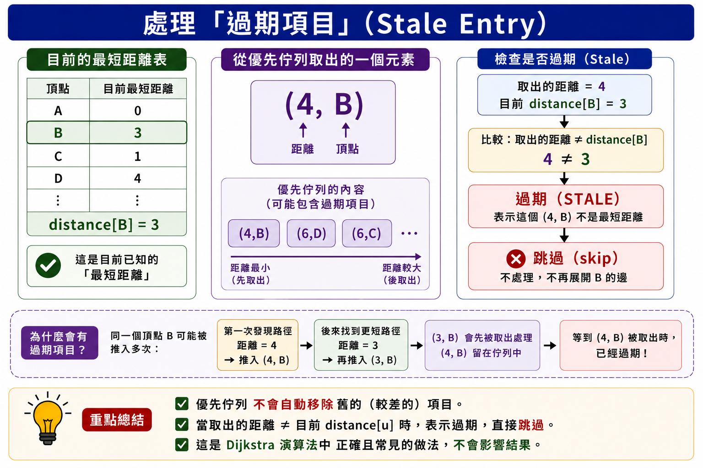


```cpp
// VALIDATE
#include <cstddef>
#include <functional>
#include <iostream>
#include <limits>
#include <queue>
#include <stdexcept>
#include <utility>
#include <vector>
using namespace std;

struct WeightedEdge {
    size_t to;
    int weight;
};

vector<long long> dijkstra(
    const vector<
        vector<WeightedEdge>
    >& graph,
    size_t start
) {
    if (
        start >=
        graph.size()
    ) {
        throw out_of_range(
            "invalid start vertex"
        );
    }

    for (
        const auto& edges :
        graph
    ) {
        for (
            const WeightedEdge& edge :
            edges
        ) {
            if (edge.weight < 0) {
                throw invalid_argument(
                    "negative edge weight"
                );
            }

            if (
                edge.to >=
                graph.size()
            ) {
                throw out_of_range(
                    "invalid edge endpoint"
                );
            }
        }
    }

    const long long infinity =
        numeric_limits<
            long long
        >::max();

    vector<long long> distance(
        graph.size(),
        infinity
    );

    using State =
        pair<
            long long,
            size_t
        >;

    priority_queue<
        State,
        vector<State>,
        greater<State>
    > pending;

    distance[start] = 0;
    pending.push(
        {
            0,
            start
        }
    );

    while (!pending.empty()) {
        const auto [
            currentDistance,
            current
        ] =
            pending.top();

        pending.pop();

        if (
            currentDistance !=
            distance[current]
        ) {
            continue;
        }

        for (
            const WeightedEdge& edge :
            graph[current]
        ) {
            const long long candidate =
                currentDistance +
                static_cast<long long>(
                    edge.weight
                );

            if (
                candidate <
                distance[edge.to]
            ) {
                distance[edge.to] =
                    candidate;

                pending.push(
                    {
                        candidate,
                        edge.to
                    }
                );
            }
        }
    }

    return distance;
}

int main() {
    const vector<
        vector<WeightedEdge>
    > graph{
        {
            {1, 4},
            {2, 1}
        },
        {
            {3, 1}
        },
        {
            {1, 2},
            {3, 5}
        },
        {}
    };

    const vector<long long> distance =
        dijkstra(
            graph,
            0
        );

    for (long long value : distance) {
        cout << value
             << " ";
    }

    cout << '\n';

    return 0;
}
```

---

# Part Q：自己實作 vs STL

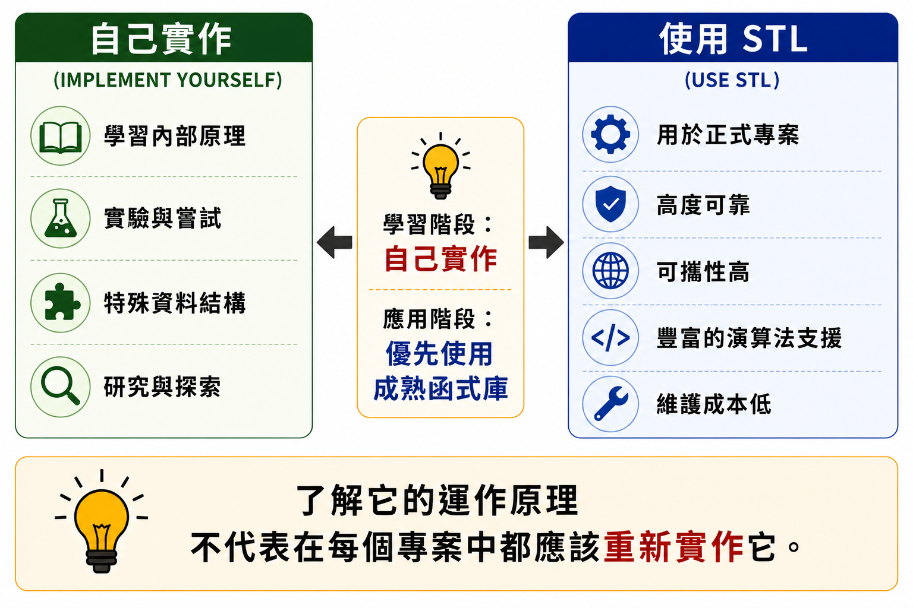


## Section XLIX. 正式專案優先 STL

| 自己實作 | STL |
| --- | --- |
| 幫助理解原理 | 經過大量測試 |
| 可控制特殊行為 | 效能與可攜性成熟 |
| 容易產生 pointer bug | API 一致 |
| 維護成本高 | 可搭配 algorithm |
| 適合教材與研究 | 適合一般專案 |

常見對應：

```text
Stack          → std::stack
Queue          → std::queue
Deque          → std::deque
Linked list    → std::forward_list／std::list
Heap           → std::priority_queue／heap algorithms
Hash table     → std::unordered_map
Tree map       → std::map
Graph          → 無單一標準容器，通常自訂表示
```


---

# Part R：測試資料結構

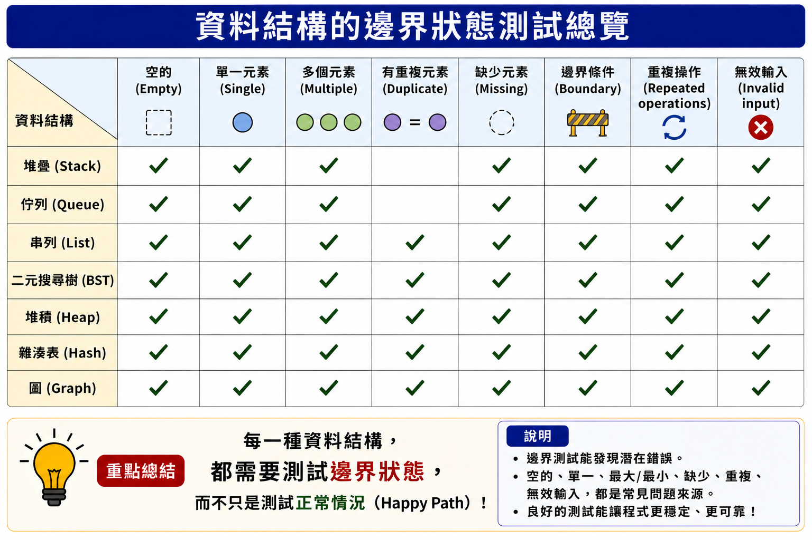

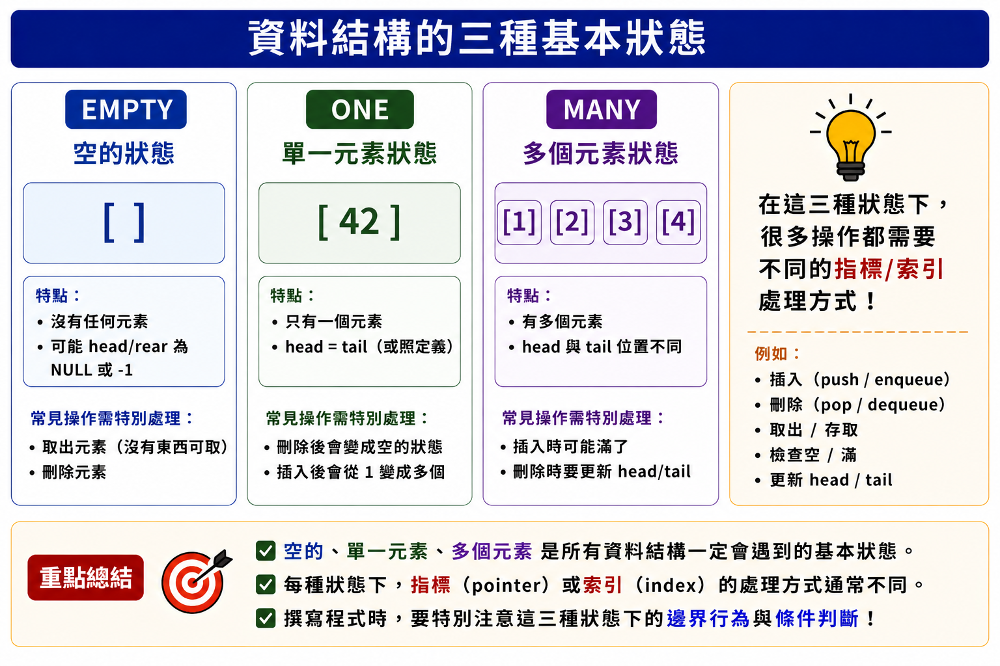


## Section L. 測試分類

每個資料結構至少測試：

1. Empty structure
2. Single element
3. Multiple elements
4. Duplicate values
5. Missing value
6. Boundary capacity
7. Repeated insertion and deletion
8. Copy／move policy
9. Exception path
10. Invariant after every operation

---

## Section LI. Stack 測試案例

```text
new stack is empty
push changes top
push increases size
pop reveals previous top
pop last element makes stack empty
pop empty throws
top empty throws
```

---

## Section LII. Queue 測試案例

```text
FIFO order
wraparound
full queue rejects enqueue
empty queue rejects dequeue
enqueue after dequeue reuses space
size remains correct
```

---

## Section LIII. Linked List 測試案例

```text
erase empty
erase head
erase middle
erase tail
erase missing
reverse empty
reverse one element
reverse multiple elements
```

---

## Section LIV. Tree 測試案例

```text
insert root
insert left and right
reject duplicate
search missing
delete leaf
delete one-child node
delete two-child node
delete root
inorder remains sorted
```

---

## Section LV. Hash Table 測試案例

```text
insert
find
update
erase
missing key
collision
rehash
all entries remain after rehash
```

---

## Section LVI. Graph 測試案例

```text
isolated vertex
connected graph
disconnected graph
self-loop policy
duplicate edge policy
invalid vertex
BFS distances
DFS reachability
Dijkstra unreachable vertex
negative weight rejection
```

---

# Part S：Invariant 驗證

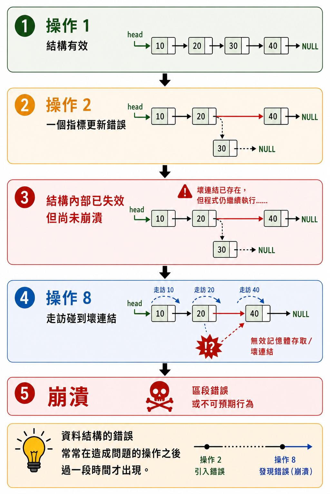

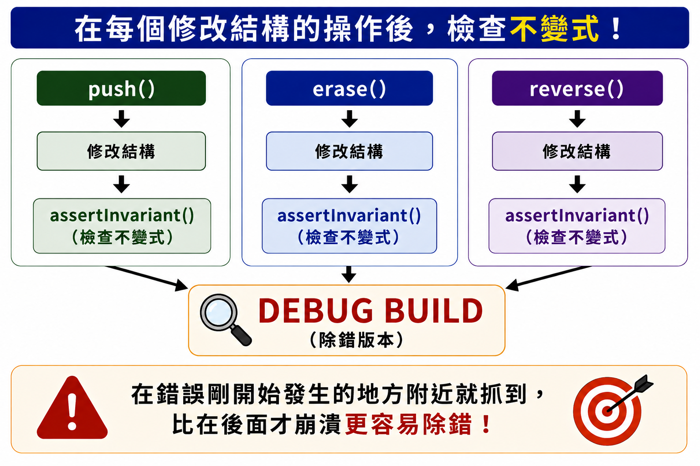


## Section LVII. 為什麼需要 Invariant Check？

資料結構 bug 常不是立刻 crash，而是先破壞內部狀態，幾次操作後才出錯。

可在 Debug build 建立：

```cpp
void assertInvariant() const;
```

並在 public operation 前後呼叫。

---

## Section LVIII. Circular Queue Invariant

```cpp
void assertInvariant() const {
    assert(
        capacityValue >
        0
    );

    assert(
        frontIndex <
        capacityValue
    );

    assert(
        rearIndex <
        capacityValue
    );

    assert(
        countValue <=
        capacityValue
    );
}
```

---

## Section LIX. Linked List Invariant

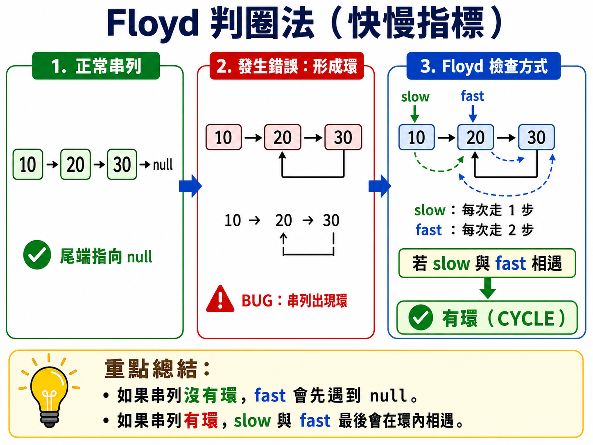


可驗證：

- 實際 node 數量等於 `sizeValue`
- 最後節點 next 為 null
- 不存在 cycle
- 若保存 tail，tail 指向最後節點

Cycle detection 可使用 Floyd's tortoise and hare 概念。

---

# Part T：Doubly Linked List 實作策略

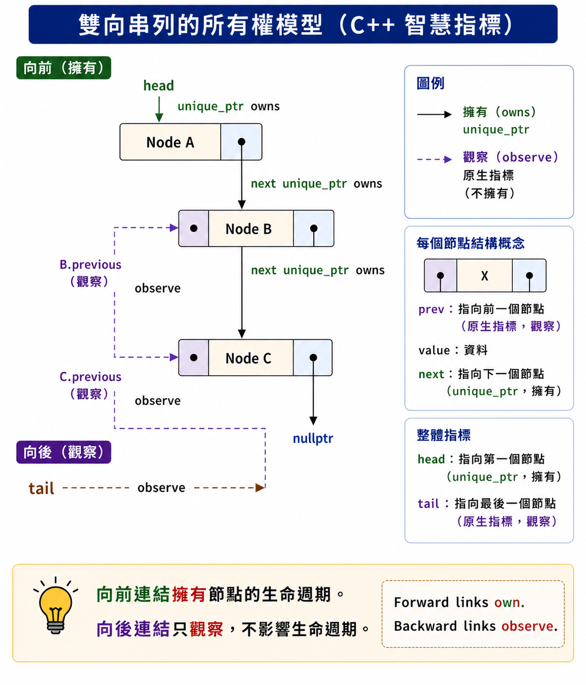


## Section LX. Ownership 設計

一種常見設計：

```text
unique_ptr<Node> next
Node* previous
```

原因：

- Next 表示 owning chain。
- Previous 只是 non-owning observer。
- 避免雙向 `unique_ptr`。
- 避免 shared_ptr cycle。

---

## Section LXI. 節點概念

```cpp
struct Node {
    int value;
    Node* previous = nullptr;
    unique_ptr<Node> next;
};
```

List 保存：

```cpp
unique_ptr<Node> head;
Node* tail = nullptr;
```

---

## Section LXII. Push Back 步驟

空串列：

```text
head owns new node
tail observes head
```

非空串列：

```text
new.previous = tail
tail.next owns new
tail = tail.next
```

---

## Section LXIII. Pop Back 難點

因為 ownership 由前一節點的 `next` 持有，刪除 tail 時要：

1. 找到 `tail->previous`
2. 將 previous 的 `next.reset()`
3. 更新 tail
4. 若刪除最後一個節點，head 與 tail 都清空

---

# Part U：Heapify

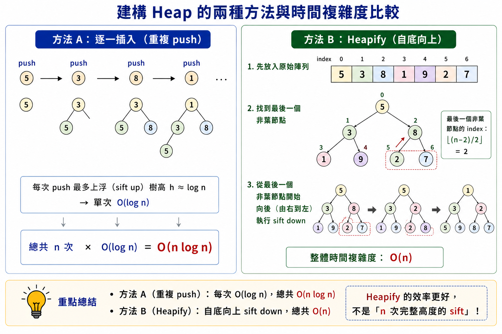


## Section LXIV. 逐一 Push

將 n 個元素逐一 push：

```text
O(n log n)
```

---

## Section LXV. Bottom-Up Heapify

從最後一個 non-leaf node 開始向前 sift down：

```text
O(n)
```

雖然每個 sift down 最差 O(log n)，但大多數節點靠近葉節點，總成本是 O(n)。

---

# Part V：Linear Probing 概念

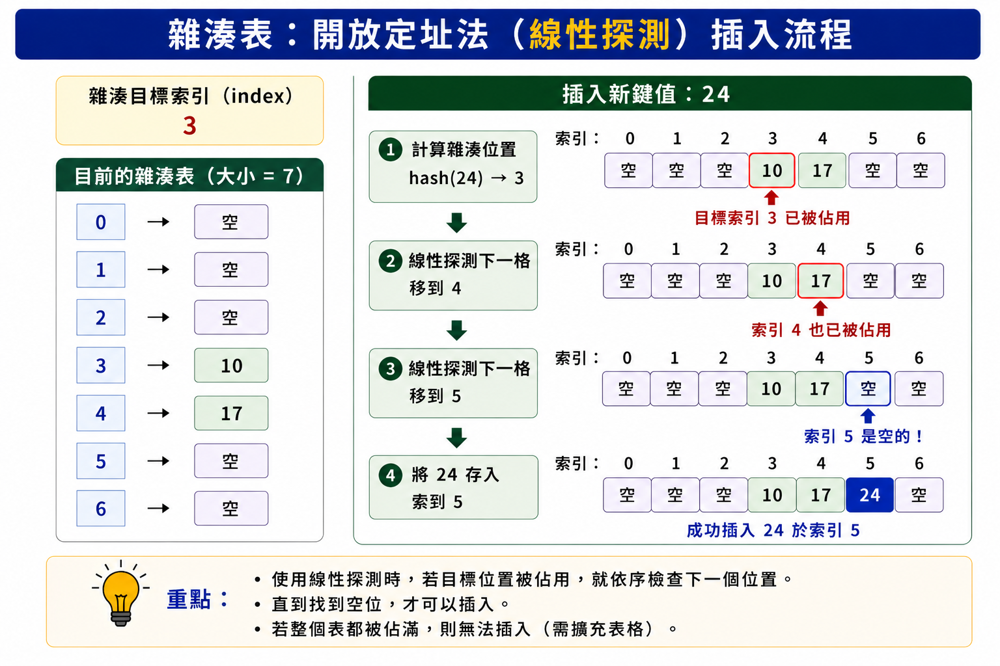


## Section LXVI. Collision Resolution

若 bucket 被占用：

```text
index
index + 1
index + 2
...
```

到尾端後 wraparound。

---

## Section LXVII. 刪除問題

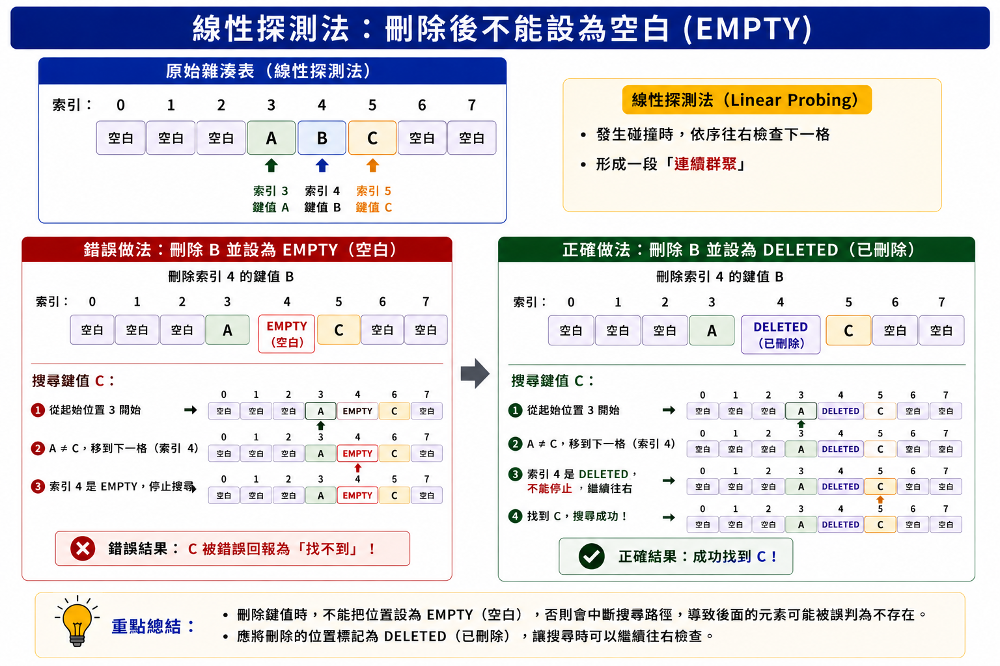


不能直接將 bucket 改成 empty，否則 lookup 可能提早停止。

需要三種狀態：

```text
Empty
Occupied
Deleted
```

Deleted 又稱 tombstone。

---

## Section LXVIII. Clustering

Linear probing 容易形成 primary clustering：

```text
一長段連續 occupied buckets
```

Load factor 太高時效能快速下降。

---

# Part W：Graph Edge Policy

## Section LXIX. 必須明確決定

- 是否允許 self-loop？
- 是否允許 duplicate edge？
- Directed 或 undirected？
- Weight 是否可為負？
- Vertex 是否可動態增加？
- Edge 是否需要 ID？
- 是否需要刪除 edge？

不同 policy 會影響 API 與測試。

---

# Part X：Recursive DFS 與 Stack Overflow

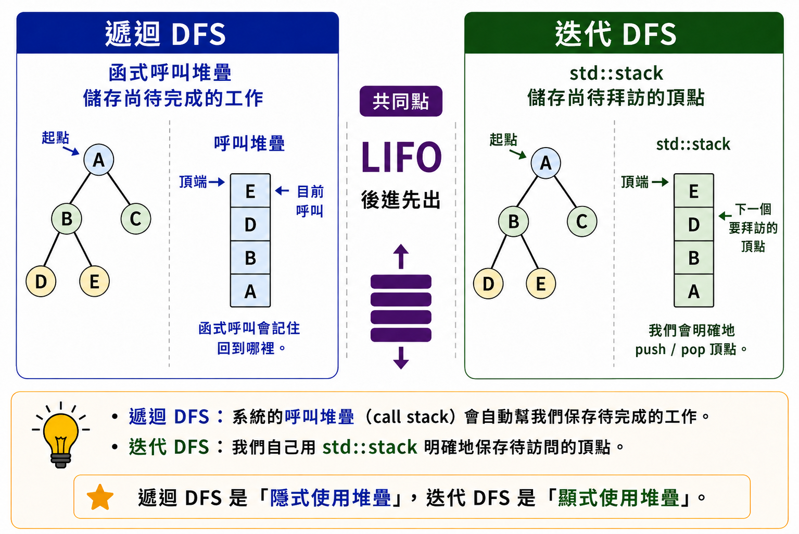


## Section LXX. 遞迴版本

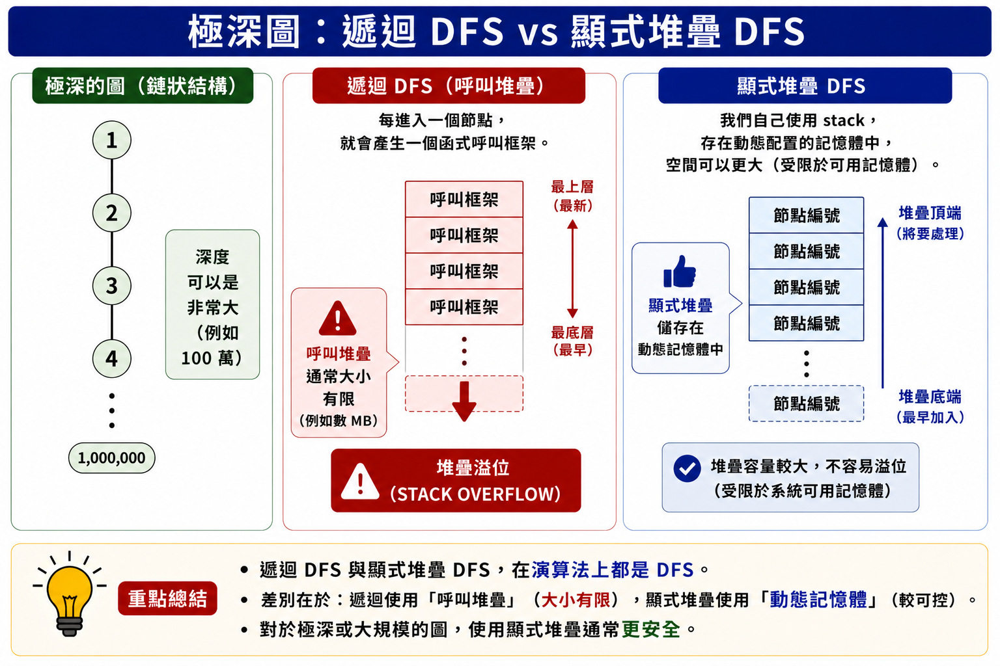


Recursive DFS 很簡潔，但非常深的 graph 可能造成 stack overflow。

---

## Section LXXI. Iterative Version

使用 explicit `stack`：

- 可控制記憶體。
- 適合深 graph。
- 更容易記錄 traversal state。
- 但程式碼較長。

---

# Part Y：時間複雜度推理

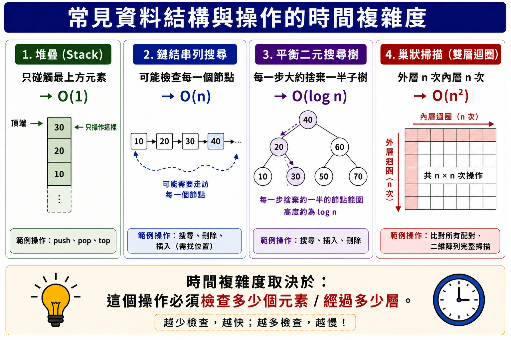


## Section LXXII. 不只背答案

分析步驟：

1. 找出輸入大小 n。
2. 找出基本操作。
3. 計算操作次數。
4. 忽略常數與低階項。
5. 分辨 worst／average／amortized。
6. 同時考慮空間。

---

## Section LXXIII. 範例

```cpp
for (
    size_t index = 0;
    index < values.size();
    ++index
) {
    cout << values[index];
}
```

迴圈 n 次：

```text
O(n)
```

---

## Section LXXIV. 巢狀迴圈

```cpp
for (size_t row = 0; row < n; ++row) {
    for (size_t column = 0; column < n; ++column) {
        operation();
    }
}
```

基本操作約 n² 次：

```text
O(n²)
```

---

## Section LXXV. 每次除二

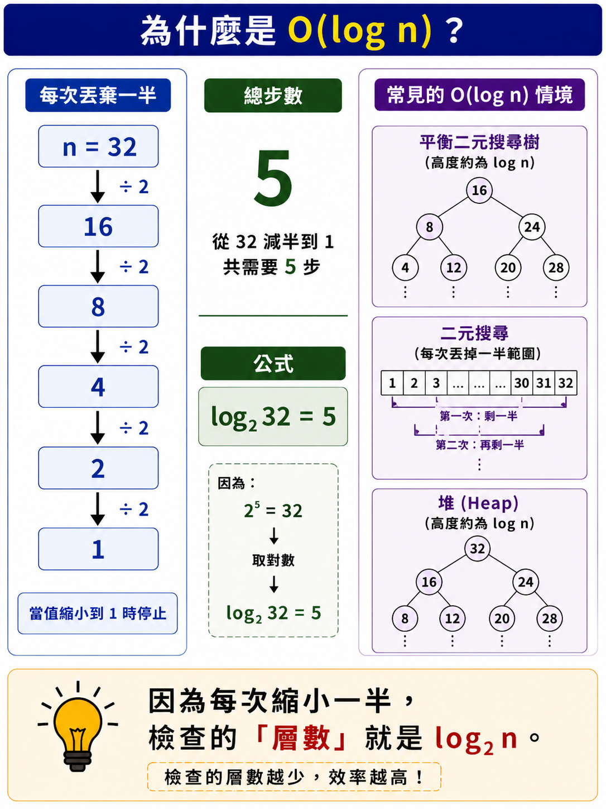


```cpp
while (value > 1) {
    value /= 2;
}
```

次數約：

```text
log₂(value)
```

因此：

```text
O(log n)
```

---

# Part Z：資料結構選擇

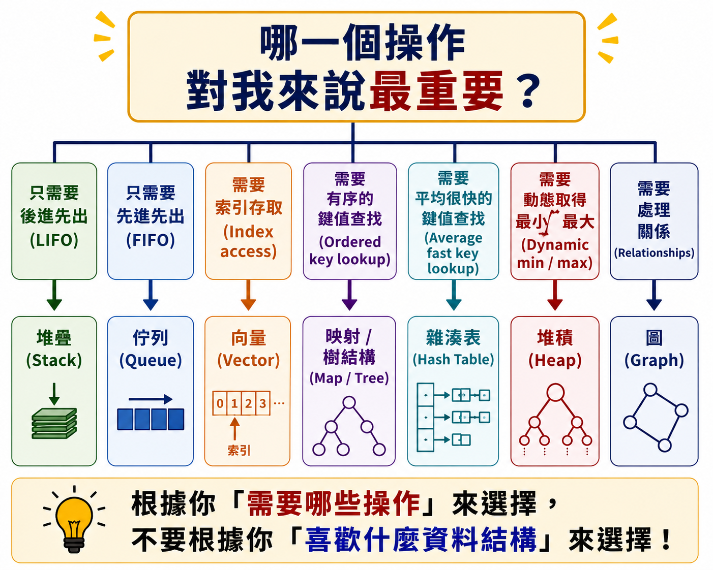


## Section LXXVI. 問題導向

不要先決定：

```text
我要用 linked list
```

先問：

```text
最常做的操作是什麼？
需要保持順序嗎？
需要 index access 嗎？
需要快速 search 嗎？
資料大小是否固定？
需要 stable address 嗎？
```

---

## Section LXXVII. 選擇表

| 需求 | 常見選擇 |
| --- | --- |
| 尾端新增、index access | `vector` |
| 兩端新增刪除 | `deque` |
| LIFO | `stack` |
| FIFO | `queue` |
| 有序 key lookup | `map` |
| 平均快速 key lookup | `unordered_map` |
| 動態最高／最低優先 | `priority_queue` |
| Sparse graph | adjacency list |
| Dense graph、快速 edge query | adjacency matrix |

---

# Part AA：快速概念檢查

## Section LXXVIII. 選擇題與簡答

### Q1. ADT 與 implementation 有何差異？

<details><summary>查看答案</summary>

ADT 描述可用操作與行為；implementation 描述資料實際如何排列與完成操作。

</details>

### Q2. Stack 的順序原則？

<details><summary>查看答案</summary>

LIFO，最後加入的元素最先移除。

</details>

### Q3. Queue 的順序原則？

<details><summary>查看答案</summary>

FIFO，最先加入的元素最先移除。

</details>

### Q4. Circular queue 為什麼使用 modulo？

<details><summary>查看答案</summary>

讓 front 與 rear 到達陣列尾端後繞回開頭，重用已釋放空間。

</details>

### Q5. Singly linked list 的 push front 複雜度？

<details><summary>查看答案</summary>

O(1)。

</details>

### Q6. 沒有 tail pointer 的 push back 複雜度？

<details><summary>查看答案</summary>

O(n)，因為必須走到最後節點。

</details>

### Q7. BST inorder traversal 的結果？

<details><summary>查看答案</summary>

在 ordering invariant 成立時，得到遞增排序的 keys。

</details>

### Q8. BST 最差 search 複雜度？

<details><summary>查看答案</summary>

O(n)，例如樹退化成鏈。

</details>

### Q9. Min heap root 保存什麼？

<details><summary>查看答案</summary>

目前最小元素。

</details>

### Q10. Heap 是否完全排序？

<details><summary>查看答案</summary>

不是，只保證每個 parent 與 children 的 heap ordering。

</details>

### Q11. Heap push 複雜度？

<details><summary>查看答案</summary>

O(log n)。

</details>

### Q12. Hash collision 是什麼？

<details><summary>查看答案</summary>

不同 key 被 hash 到相同 bucket index。

</details>

### Q13. Hash table 為什麼不是保證 O(1)？

<details><summary>查看答案</summary>

碰撞嚴重時可能需要線性搜尋，最差可達 O(n)。

</details>

### Q14. Load factor 是什麼？

<details><summary>查看答案</summary>

元素數量除以 bucket 數量。

</details>

### Q15. BFS 使用哪種資料結構？

<details><summary>查看答案</summary>

Queue。

</details>

### Q16. DFS 可使用什麼？

<details><summary>查看答案</summary>

Recursion 或 explicit stack。

</details>

### Q17. Unweighted shortest path 適合 BFS 還是 DFS？

<details><summary>查看答案</summary>

BFS。

</details>

### Q18. Dijkstra 可以處理負權重嗎？

<details><summary>查看答案</summary>

不能直接處理；本章版本要求所有 edge weight 非負。

</details>

### Q19. Adjacency list 的空間複雜度？

<details><summary>查看答案</summary>

O(V + E)。

</details>

### Q20. 正式專案通常為什麼優先 STL？

<details><summary>查看答案</summary>

標準容器經過大量測試，效能、可攜性與 API 都較成熟，可降低自行維護風險。

</details>

---

# Part AB：程式閱讀練習

## Section LXXIX. 預測結果與找出錯誤

### 題目 1

```cpp
stack.push(10);
stack.push(20);
stack.pop();

cout << stack.top();
```

<details><summary>查看答案</summary>

輸出 `10`。

</details>

### 題目 2

Circular queue 容量為 3：

```text
enqueue 1
enqueue 2
dequeue
enqueue 3
enqueue 4
```

<details><summary>查看答案</summary>

Queue 內容依 FIFO 為 `2, 3, 4`，wraparound 讓尾端空間被重用。

</details>

### 題目 3

```cpp
node->next =
    std::move(head);

head =
    std::move(node);
```

<details><summary>查看答案</summary>

在 singly linked list 前端插入，新的 node 成為 head。

</details>

### 題目 4

```cpp
head =
    std::move(
        head->next
    );
```

<details><summary>查看答案</summary>

刪除目前 head；舊 head 在 ownership 轉移後自動解構。

</details>

### 題目 5

BST 依序插入：

```text
5, 3, 7, 4
```

Inorder？

<details><summary>查看答案</summary>

```text
3, 4, 5, 7
```

</details>

### 題目 6

Min heap array：

```text
[1, 4, 2, 8, 5]
```

是否合法？

<details><summary>查看答案</summary>

合法。1 ≤ 4、2；4 ≤ 8、5。

</details>

### 題目 7

Min heap：

```text
[1, 3, 2]
```

是否表示完全排序？

<details><summary>查看答案</summary>

不是，`3` 可以在 `2` 前面；heap 只保證 parent 不大於 children。

</details>

### 題目 8

Hash table 有 4 buckets、8 elements。

Load factor？

<details><summary>查看答案</summary>

```text
8 / 4 = 2.0
```

Separate chaining 可以超過 1；open addressing 通常不能。

</details>

### 題目 9

BFS distance 初始值全部為 `-1`，起點設為 0。

`-1` 表示什麼？

<details><summary>查看答案</summary>

尚未拜訪或從起點不可達。

</details>

### 題目 10

Dijkstra priority queue 中同一 vertex 出現多筆距離。

為什麼？

<details><summary>查看答案</summary>

找到更短路徑時會 push 新 entry，舊 entry 留在 queue；取出時用 stale-entry check 跳過。

</details>

### 題目 11

```cpp
values.erase(iterator);
++iterator;
```

<details><summary>查看答案</summary>

可能使用已失效 iterator。應使用 `iterator = values.erase(iterator);`。

</details>

### 題目 12

BST 依序插入已排序的 1 到 n。

<details><summary>查看答案</summary>

樹可能退化成單鏈，高度 O(n)，search／insert 最差 O(n)。

</details>

---

# Part AC：實作練習

## Section LXXX. 實作檢測題

### TODO 1：Fixed-Capacity Stack

不使用 `std::stack`，以固定容量陣列實作 Stack。

### TODO 2：Circular Queue

實作 enqueue、dequeue、front、empty、full 與 size。

### TODO 3：Queue Wraparound Test

設計測試證明 dequeue 後的空間可被重新使用。

### TODO 4：Singly Linked List

實作 push front、push back、contains 與 erase first。

### TODO 5：Reverse List

以 iterative pointer manipulation 反轉 singly linked list。

### TODO 6：Doubly Linked List

實作 push front、push back、pop front 與 pop back。

### TODO 7：BST Insert and Search

實作不接受重複 key 的 insert 與 contains。

### TODO 8：BST Delete

完成 leaf、one-child 與 two-child deletion。

### TODO 9：Min Heap

實作 push、top、pop、sift up 與 sift down。

### TODO 10：Heapify

以 bottom-up 方法將 vector 轉成 min heap。

### TODO 11：Chained Hash Table

實作 insert／assign、find、erase 與 rehash。

### TODO 12：BFS Distances

以 adjacency list 計算 unweighted distance。

### TODO 13：Iterative DFS

使用 explicit stack 回傳 traversal order。

### TODO 14：Dijkstra

實作 non-negative weighted graph shortest paths。

### TODO 15：Complexity Report

為本章每個資料結構整理操作與複雜度表。

---

# Part AD：課後小練習

## Section LXXXI. 延伸練習

### 練習 1：Expression Evaluator

使用 Stack 完成括號檢查與 postfix expression evaluation。

### 練習 2：Task Scheduler

使用 Queue 與 Priority Queue 模擬一般任務及高優先任務。

### 練習 3：Contact Index

使用 BST 與 Hash Table 分別建立聯絡人查詢，測量不同資料量。

### 練習 4：Maze Solver

以 adjacency list 表示迷宮，使用 BFS 找最短路、DFS 找任一路徑。

### 練習 5：Transit Graph

以 weighted graph 與 Dijkstra 計算車站間最短時間。

---

# Part AE：常見錯誤提醒

## Section LXXXII. 常見錯誤

1. 沒有先定義 invariant。
2. Stack 空時仍呼叫 top。
3. Queue 空時仍 dequeue。
4. Circular queue 無法區分 full 與 empty。
5. Modulo 使用錯誤 capacity。
6. Rear 更新順序錯誤。
7. Linked list 插入時先覆寫 next，造成後半段遺失。
8. 刪除 node 後仍使用其 pointer。
9. 忘記更新 head。
10. 保存 tail 時忘記更新 tail。
11. Doubly linked list 只更新 next，忘記 previous。
12. 空串列時 head／tail 狀態不一致。
13. BST duplicate policy 不清楚。
14. BST 刪除 two-child node 時 successor 處理錯誤。
15. BST 高度定義不一致。
16. 把 heap 當成完全排序陣列。
17. Heap parent／child index off-by-one。
18. Pop heap 後沒有 sift down。
19. Hash table 忽略 collision。
20. Rehash 後忘記重新計算 bucket index。
21. Linear probing 刪除時直接設 empty。
22. Load factor 使用整數除法。
23. Graph edge endpoint 未驗證。
24. Undirected edge 只加入一個方向。
25. BFS 沒在 enqueue 時標記 visited，造成重複加入。
26. DFS recursion 太深造成 stack overflow。
27. Dijkstra 用於負權重。
28. Dijkstra 沒跳過 stale entry。
29. 距離加法 overflow。
30. 只測一般情況，未測空結構與邊界。

---

# Part AF：Mermaid 流程圖

## Section LXXXIII. 資料結構流程圖

### 1. 選擇資料結構

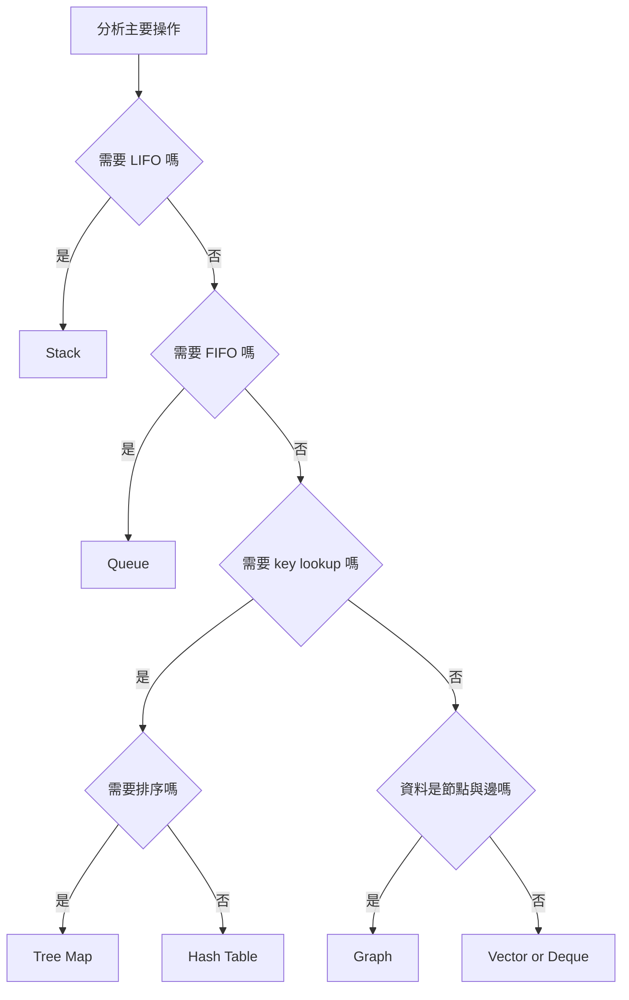
```mermaid
flowchart TD
    A[分析主要操作] --> B{需要 LIFO 嗎}
    B -- 是 --> C[Stack]
    B -- 否 --> D{需要 FIFO 嗎}
    D -- 是 --> E[Queue]
    D -- 否 --> F{需要 key lookup 嗎}
    F -- 是 --> G{需要排序嗎}
    G -- 是 --> H[Tree Map]
    G -- 否 --> I[Hash Table]
    F -- 否 --> J{資料是節點與邊嗎}
    J -- 是 --> K[Graph]
    J -- 否 --> L[Vector or Deque]
```

### 2. Circular Queue Enqueue

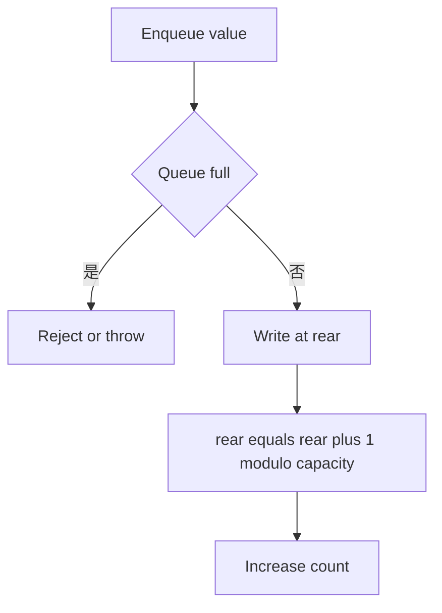
```mermaid
flowchart TD
    A[Enqueue value] --> B{Queue full}
    B -- 是 --> C[Reject or throw]
    B -- 否 --> D[Write at rear]
    D --> E[rear equals rear plus 1 modulo capacity]
    E --> F[Increase count]
```

### 3. Singly Linked List Insert Front

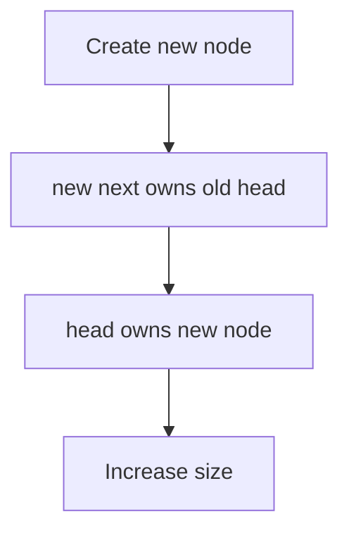
```mermaid
flowchart TD
    A[Create new node] --> B[new next owns old head]
    B --> C[head owns new node]
    C --> D[Increase size]
```

### 4. BST Insert

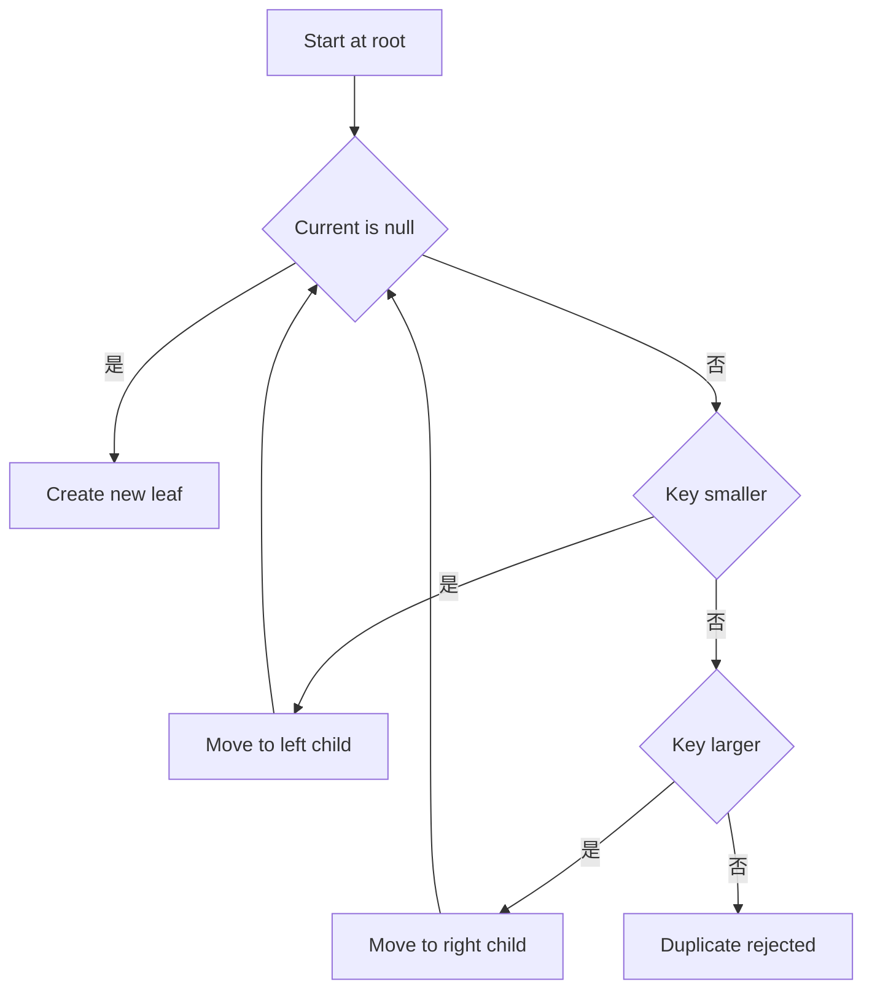
```mermaid
flowchart TD
    A[Start at root] --> B{Current is null}
    B -- 是 --> C[Create new leaf]
    B -- 否 --> D{Key smaller}
    D -- 是 --> E[Move to left child]
    D -- 否 --> F{Key larger}
    F -- 是 --> G[Move to right child]
    F -- 否 --> H[Duplicate rejected]
    E --> B
    G --> B
```

### 5. Heap Push

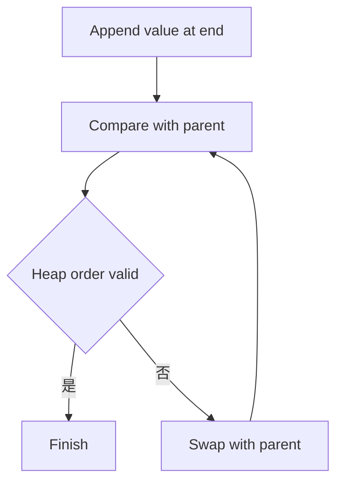
```mermaid
flowchart TD
    A[Append value at end] --> B[Compare with parent]
    B --> C{Heap order valid}
    C -- 是 --> D[Finish]
    C -- 否 --> E[Swap with parent]
    E --> B
```

### 6. Hash Table Lookup

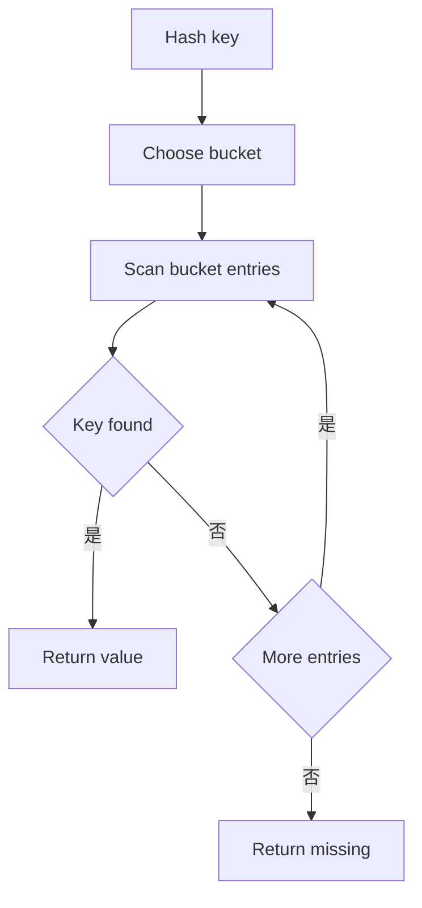
```mermaid
flowchart TD
    A[Hash key] --> B[Choose bucket]
    B --> C[Scan bucket entries]
    C --> D{Key found}
    D -- 是 --> E[Return value]
    D -- 否 --> F{More entries}
    F -- 是 --> C
    F -- 否 --> G[Return missing]
```

### 7. BFS

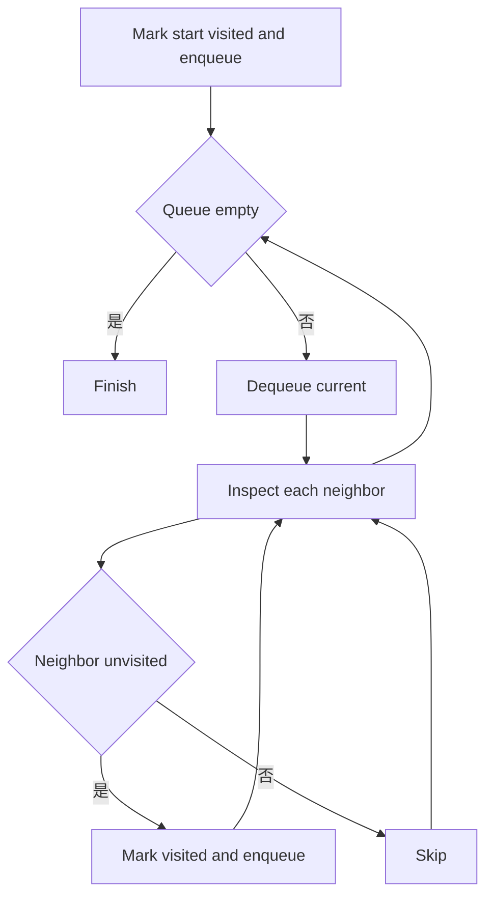
```mermaid
flowchart TD
    A[Mark start visited and enqueue] --> B{Queue empty}
    B -- 是 --> C[Finish]
    B -- 否 --> D[Dequeue current]
    D --> E[Inspect each neighbor]
    E --> F{Neighbor unvisited}
    F -- 是 --> G[Mark visited and enqueue]
    F -- 否 --> H[Skip]
    G --> E
    H --> E
    E --> B
```

### 8. Dijkstra

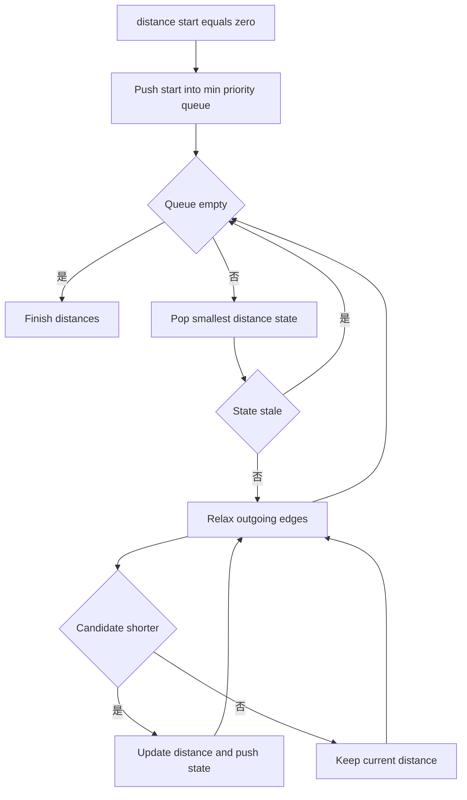
```mermaid
flowchart TD
    A[distance start equals zero] --> B[Push start into min priority queue]
    B --> C{Queue empty}
    C -- 是 --> D[Finish distances]
    C -- 否 --> E[Pop smallest distance state]
    E --> F{State stale}
    F -- 是 --> C
    F -- 否 --> G[Relax outgoing edges]
    G --> H{Candidate shorter}
    H -- 是 --> I[Update distance and push state]
    H -- 否 --> J[Keep current distance]
    I --> G
    J --> G
    G --> C
```

---

# 本章完成標準

完成本章後，你應該能做到：

1. 區分 ADT 與實作。
2. 定義資料結構 invariant。
3. 分析基本時間複雜度。
4. 實作 Stack。
5. 處理 stack underflow。
6. 解釋 FIFO 與 LIFO。
7. 實作 Circular Queue。
8. 解釋 front、rear 與 count。
9. 測試 queue wraparound。
10. 實作 Singly Linked List。
11. 使用 `unique_ptr` 管理 node。
12. 插入與刪除 linked-list node。
13. 反轉 singly linked list。
14. 說明 doubly linked list ownership。
15. 維護 previous／next invariant。
16. 實作 BST insert。
17. 實作 BST search。
18. 實作 BST traversal。
19. 實作 BST delete。
20. 解釋退化 BST。
21. 使用 array 表示 binary heap。
22. 實作 sift up。
23. 實作 sift down。
24. 實作 min heap。
25. 解釋 heapify。
26. 解釋 hash collision。
27. 實作 separate chaining。
28. 計算 load factor。
29. 實作 rehash。
30. 比較 adjacency matrix 與 list。
31. 實作 BFS。
32. 實作 DFS。
33. 計算 unweighted shortest path。
34. 實作 Dijkstra 入門。
35. 拒絕負權重。
36. 分析 graph traversal 複雜度。
37. 設計 edge policy。
38. 建立邊界與 invariant tests。
39. 比較自己實作與 STL。
40. 找出常見資料結構錯誤。

---

# 隱藏答案區

> Answer hidden — try it first.

<details><summary>TODO 1 答案</summary>

使用固定大小 `array<T, Capacity>` 與 `sizeValue`：

```cpp
void push(
    const T& value
) {
    if (
        sizeValue ==
        Capacity
    ) {
        throw overflow_error(
            "stack full"
        );
    }

    values[sizeValue] =
        value;

    ++sizeValue;
}
```

</details>

<details><summary>TODO 2 答案</summary>

保存：

```text
vector storage
capacity
front index
rear index
count
```

索引更新：

```cpp
index =
    (
        index +
        1
    ) %
    capacity;
```

</details>

<details><summary>TODO 3 答案</summary>

容量 3：

```text
enqueue 1, 2, 3
dequeue 1
enqueue 4
expect order 2, 3, 4
```

</details>

<details><summary>TODO 4 答案</summary>

Node：

```cpp
struct Node {
    int value;
    unique_ptr<Node> next;
};
```

Head 使用 `unique_ptr<Node>`，走訪時使用 non-owning `Node*`。

</details>

<details><summary>TODO 5 答案</summary>

每次保存 next，反轉目前 node 的 next，再推進：

```cpp
unique_ptr<Node> previous;

while (head) {
    auto next =
        std::move(
            head->next
        );

    head->next =
        std::move(
            previous
        );

    previous =
        std::move(
            head
        );

    head =
        std::move(
            next
        );
}

head =
    std::move(
        previous
    );
```

</details>

<details><summary>TODO 6 答案</summary>

可使用：

```text
unique_ptr<Node> next
Node* previous
unique_ptr<Node> head
Node* tail
```

Next 建立 ownership chain，previous 只觀察。

</details>

<details><summary>TODO 7 答案</summary>

由 root 開始：

```text
key smaller → left
key larger → right
key equal → reject or follow duplicate policy
null → insert leaf
```

</details>

<details><summary>TODO 8 答案</summary>

刪除三種情況：

```text
no child → null
one child → parent takes child
two children → copy inorder successor key, then erase successor
```

</details>

<details><summary>TODO 9 答案</summary>

Push：

```text
append
sift up
```

Pop：

```text
replace root with last
remove last
sift down
```

</details>

<details><summary>TODO 10 答案</summary>

從最後一個 non-leaf index：

```cpp
size / 2
```

之前的位置反向執行 sift down，整體 O(n)。

</details>

<details><summary>TODO 11 答案</summary>

每個 bucket 保存 entry list。Find 掃描對應 bucket；load factor 超過 threshold 時建立更大 bucket array 並重新插入全部 entries。

</details>

<details><summary>TODO 12 答案</summary>

使用 queue，起點距離 0，未拜訪距離 -1；第一次拜訪 neighbor 時：

```cpp
distance[neighbor] =
    distance[current] +
    1;
```

</details>

<details><summary>TODO 13 答案</summary>

使用 `stack<size_t>`。Pop 後若未拜訪，標記 visited，加入 order，再 push neighbors。

</details>

<details><summary>TODO 14 答案</summary>

使用 min-priority queue 保存：

```text
distance, vertex
```

取出時跳過 stale entry，對每條 non-negative edge 執行 relaxation。

</details>

<details><summary>TODO 15 答案</summary>

至少列出：

```text
Stack push/pop O(1)
Queue enqueue/dequeue O(1)
List search O(n)
BST average O(log n), worst O(n)
Heap push/pop O(log n)
Hash average O(1), worst O(n)
BFS/DFS O(V + E)
Dijkstra O((V + E) log V)
```

</details>
