# Lesson 35：C++ Capstone Projects C++ 綜合專案

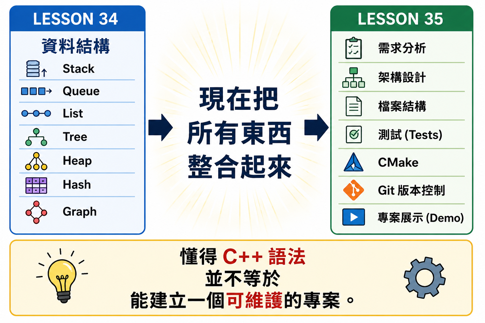


> 這堂課的重點：把前面章節學過的語法、STL、物件導向、檔案輸入輸出、例外處理、RAII、智慧指標、測試、CMake 與 Git 整合成真正可以執行、維護與展示的專案。

> 綜合專案不是把所有語法塞進同一個程式，而是根據需求選擇合適工具，建立清楚模組、穩定資料流程、可測試邏輯與可重複建置的專案。

---

## Section I. 今天要做什麼？

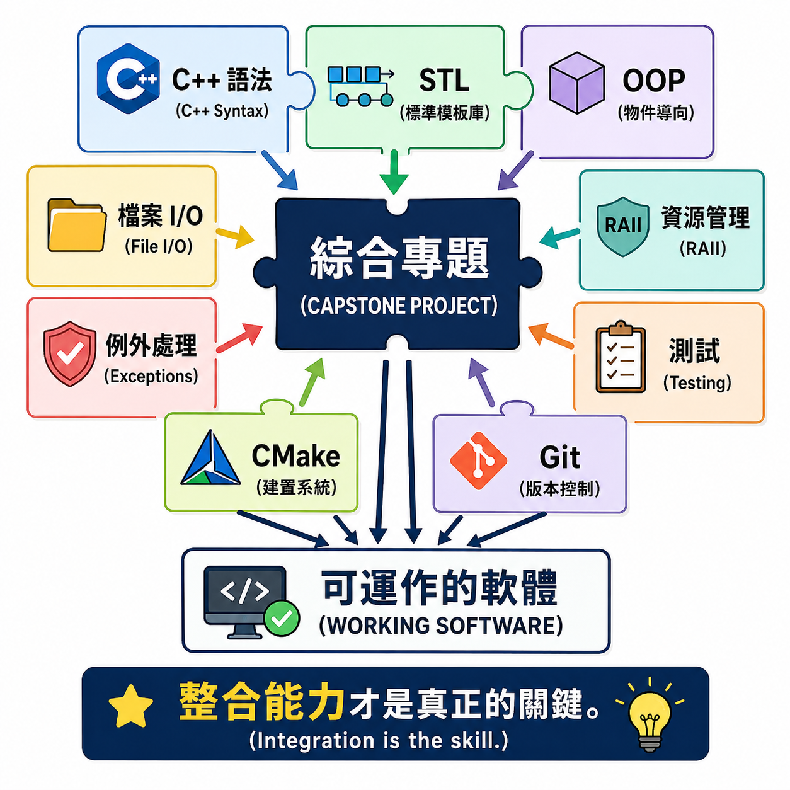


1. 認識 capstone project。
2. 從需求開始，而不是從 class 開始。
3. 建立 problem statement。
4. 定義使用者。
5. 定義核心情境。
6. 定義 input。
7. 定義 output。
8. 定義成功條件。
9. 定義限制。
10. 區分 functional requirements。
11. 區分 non-functional requirements。
12. 建立 MVP。
13. 避免一開始加入所有功能。
14. 建立 user story。
15. 建立 acceptance criteria。
16. 建立 use case。
17. 畫資料流程。
18. 畫狀態流程。
19. 建立 domain model。
20. 找出 entity。
21. 找出 value object 概念。
22. 找出 service。
23. 找出 repository。
24. 找出 application layer。
25. 找出 presentation layer。
26. 區分 UI 與 domain logic。
27. 建立 CLI。
28. 解析 command。
29. 驗證輸入。
30. 回報錯誤。
31. 建立 menu loop。
32. 避免巨大 `main()`。
33. 使用 function 分解。
34. 使用 class 分解。
35. 使用 namespace。
36. 使用 header／source 分離。
37. 建立 `include/`。
38. 建立 `src/`。
39. 建立 `tests/`。
40. 建立 `data/`。
41. 建立 `docs/` 概念。
42. 建立 `build/`。
43. 使用 CMake。
44. 建立 library target。
45. 建立 application target。
46. 建立 test target。
47. 使用 CTest。
48. 使用 strict warnings。
49. 使用 sanitizer。
50. 建立 Debug build。
51. 建立 Release build。
52. 使用 Git。
53. 建立小型 commit。
54. 撰寫 commit message。
55. 使用 branch。
56. 建立 release tag 概念。
57. 撰寫 README。
58. 撰寫 build instructions。
59. 撰寫 run instructions。
60. 撰寫 test instructions。
61. 建立 sample input。
62. 建立 sample output。
63. 建立 project screenshots 概念。
64. 建立 architecture diagram。
65. 建立 data format。
66. 使用 text file。
67. 使用 CSV。
68. 使用 binary file 概念。
69. 使用 versioned format。
70. 使用 safe save。
71. 使用 temporary file。
72. 建立 backup。
73. 處理 missing file。
74. 處理 invalid file。
75. 處理 partial record。
76. 處理 duplicate ID。
77. 使用 exception。
78. 使用 error result。
79. 使用 logging。
80. 不記錄敏感資料。
81. 使用 `vector`。
82. 使用 `map`。
83. 使用 `unordered_map`。
84. 使用 `set`。
85. 使用 `optional`。
86. 使用 `variant` 概念。
87. 使用 `algorithm`。
88. 使用 lambda。
89. 使用 iterator。
90. 使用 range-based for。
91. 使用 `string`。
92. 使用 `filesystem`。
93. 使用 `chrono`。
94. 使用 `random`。
95. 使用 `unique_ptr`。
96. 使用 `shared_ptr`，只在真正共享時。
97. 使用 RAII。
98. 使用 Rule of Zero。
99. 使用 polymorphism，只有在有需要時。
100. 使用 virtual destructor。
101. 使用 interface class。
102. 避免 overengineering。
103. 避免神物件 God Object。
104. 避免 global mutable state。
105. 避免巨型 switch。
106. 避免重複程式碼。
107. 使用 single responsibility。
108. 使用 dependency injection。
109. 對 parser 接收 `istream&`。
110. 對 writer 接收 `ostream&`。
111. 建立 unit test。
112. 建立 integration test。
113. 建立 system test。
114. 建立 regression test。
115. 測試 normal case。
116. 測試 empty case。
117. 測試 boundary case。
118. 測試 invalid input。
119. 測試 duplicate data。
120. 測試 file failure。
121. 測試 sorting。
122. 測試 search。
123. 測試 update。
124. 測試 delete。
125. 測試 save／load round trip。
126. 測試 exception。
127. 使用 deterministic test。
128. 固定 random seed。
129. 使用 temporary directory。
130. 清理測試資料。
131. 建立 milestone。
132. 建立 backlog。
133. 建立 definition of done。
134. 先完成 vertical slice。
135. 再增加功能。
136. 避免最後一天才整合。
137. 每個 milestone 都要可執行。
138. 每個 milestone 都要可測試。
139. 建立 demo script。
140. 建立 project checklist。
141. 建立 rubric。
142. 評估 correctness。
143. 評估 code quality。
144. 評估 architecture。
145. 評估 testing。
146. 評估 documentation。
147. 評估 Git history。
148. 評估 presentation。
149. 建立 Level 1 專案。
150. 建立 Level 2 專案。
151. 建立 Level 3 專案。
152. 建立 Level 4 專案。
153. 建立 Level 5 專案。
154. 建立 Level 6 專案。
155. 使用概念檢查、程式閱讀與實作題整合本章。

---

## Section II. 綜合專案的學習方式

1. 先寫需求，再寫 code。
2. 先完成最小可用版本 MVP。
3. 每個功能必須有清楚輸入與輸出。
4. Domain logic 不直接依賴 `cin`／`cout`。
5. Parser 接收 `istream&`。
6. Writer 接收 `ostream&`。
7. File I/O 放在獨立 repository。
8. `main()` 只負責組合與啟動。
9. 每完成一個功能就加入測試。
10. 每天結束前專案都應能 build。
11. 所有 warnings 必須處理。
12. Debug build 使用 sanitizer。
13. Commit 保持小型、可讀、可回復。
14. README 必須讓另一個人成功 build。
15. Demo 前重新 clone 並從零建置一次。

---

## Section III. 建議專案結構

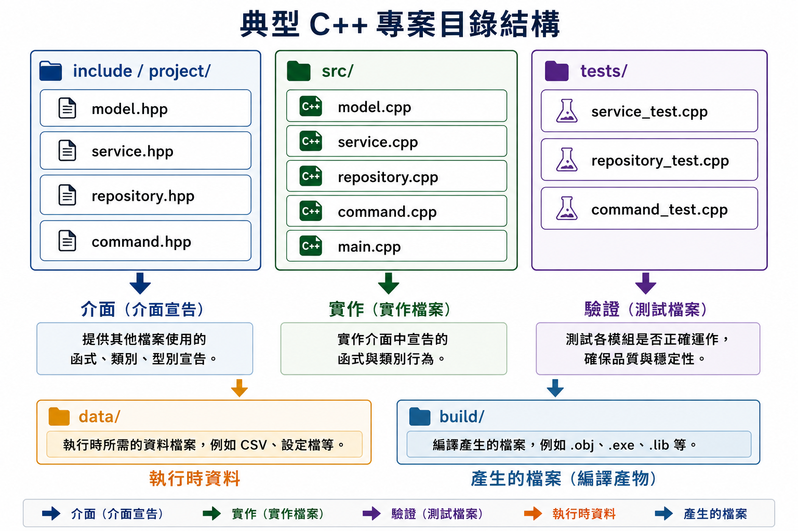


```text
project/
├── CMakeLists.txt
├── README.md
├── .gitignore
├── include/
│   └── project/
│       ├── model.hpp
│       ├── service.hpp
│       ├── repository.hpp
│       └── command.hpp
├── src/
│   ├── model.cpp
│   ├── service.cpp
│   ├── repository.cpp
│   ├── command.cpp
│   └── main.cpp
├── tests/
│   ├── service_test.cpp
│   ├── repository_test.cpp
│   └── command_test.cpp
├── data/
│   └── sample_data.csv
└── build/
```

---

## Section IV. 各層責任

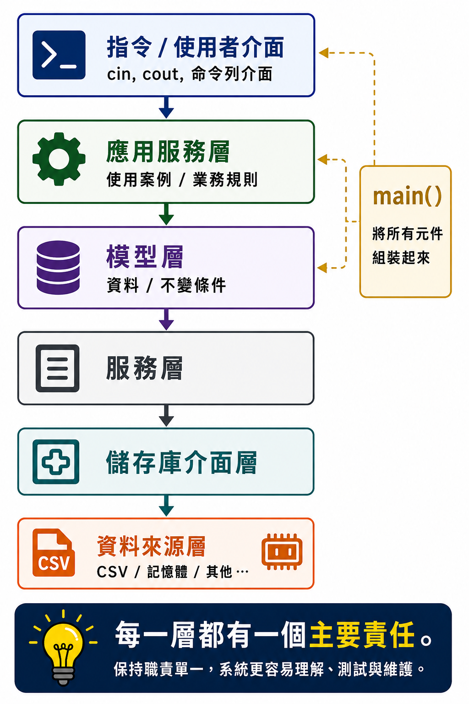

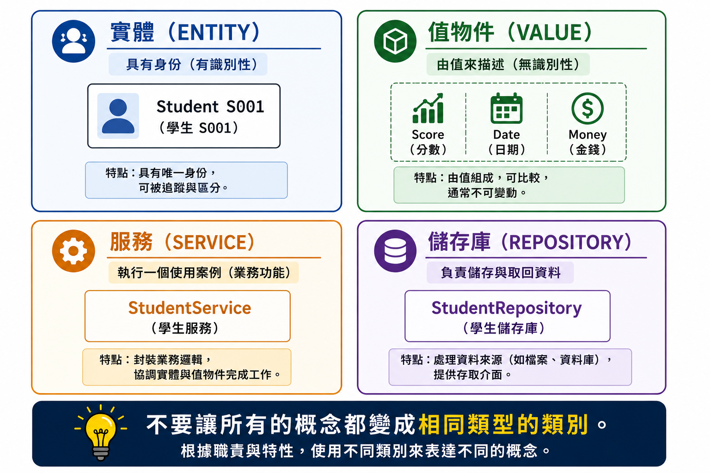

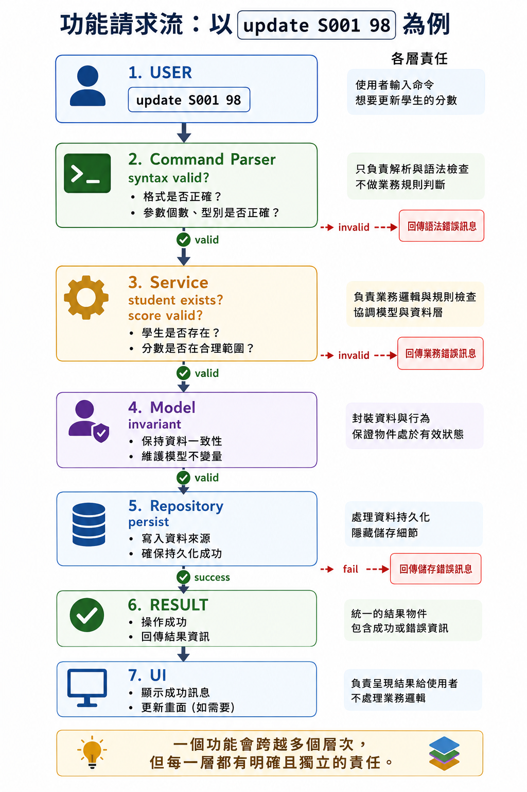


| 層 | 責任 |
| --- | --- |
| Model | 保存 domain data 與基本 invariant |
| Service | 完成 use case 與 business rules |
| Repository | Save／load 與資料來源 |
| Command／UI | 解析使用者命令並顯示結果 |
| Main | 建立物件、注入依賴、啟動應用程式 |
| Tests | 驗證 model、service、repository 與整合流程 |

---

# Part A：從需求開始

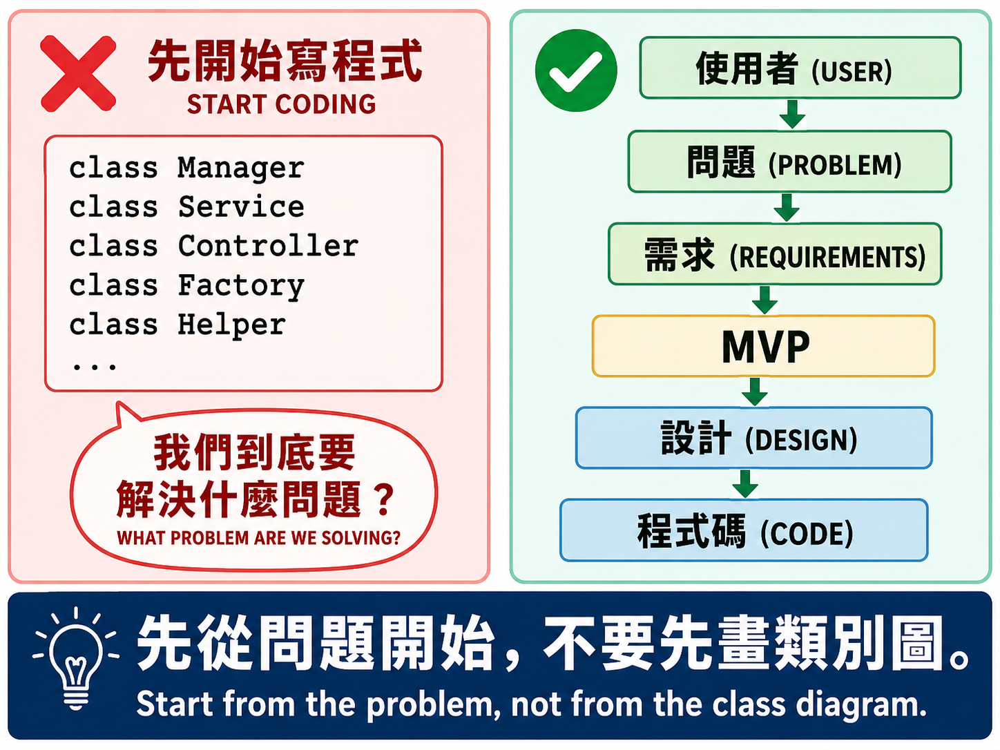


## Section V. Problem Statement

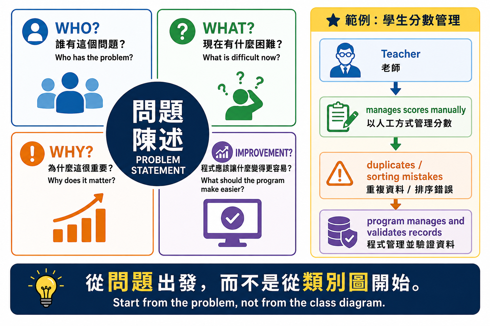


一個好的問題敘述應回答：

```text
誰遇到什麼問題？
目前為什麼不方便？
程式要改善什麼？
```

範例：

```text
教師需要管理學生分數，但手動試算表容易出現重複資料、
排序錯誤與統計不一致。程式應提供新增、修改、搜尋、
排序、統計與檔案儲存功能。
```

---

## Section VI. Functional Requirements

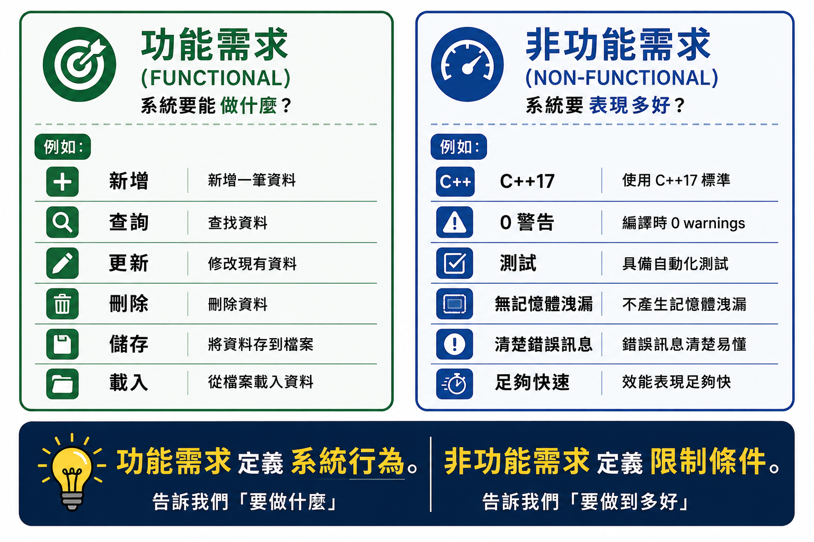


描述系統能做什麼：

- 新增學生。
- 修改分數。
- 刪除學生。
- 依 ID 搜尋。
- 依分數排序。
- 計算平均。
- Save。
- Load。

---

## Section VII. Non-Functional Requirements

描述品質：

- C++17。
- 不能有 compiler warning。
- 必須使用 CMake。
- 必須有 tests。
- 不能 memory leak。
- 必須在 invalid file 時顯示清楚錯誤。
- 1000 筆資料內操作應即時完成。

---

# Part B：MVP

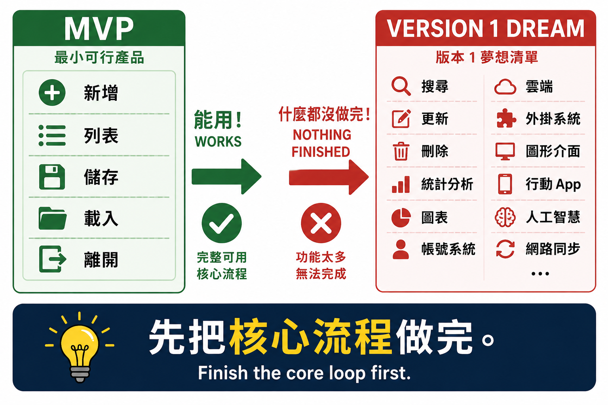


## Section VIII. 最小可用版本

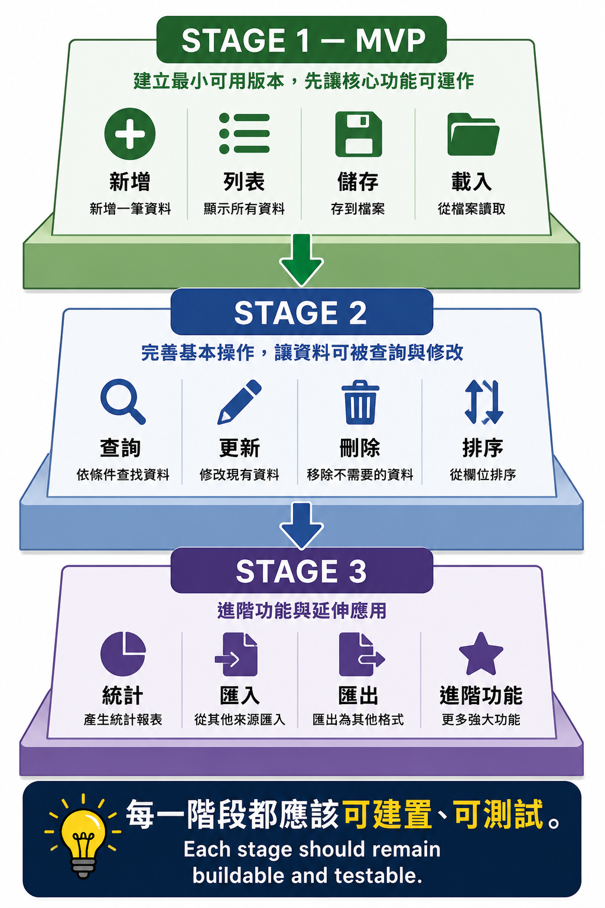


MVP 只包含完成核心價值所需功能。

學生分數系統 MVP：

```text
Add
List
Save
Load
Quit
```

第二階段才增加：

```text
Update
Delete
Search
Sort
Statistics
Import
Export
```

---

## Section IX. Vertical Slice

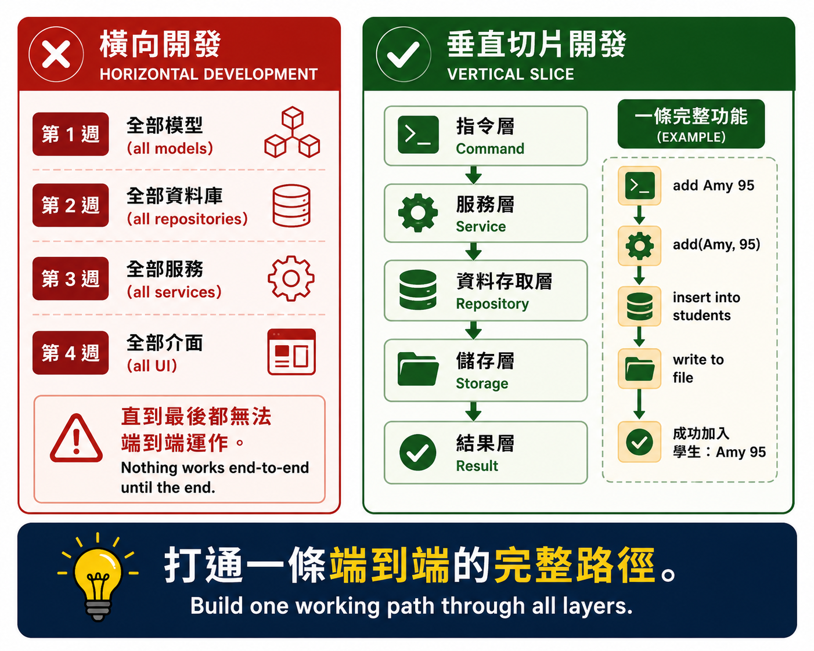

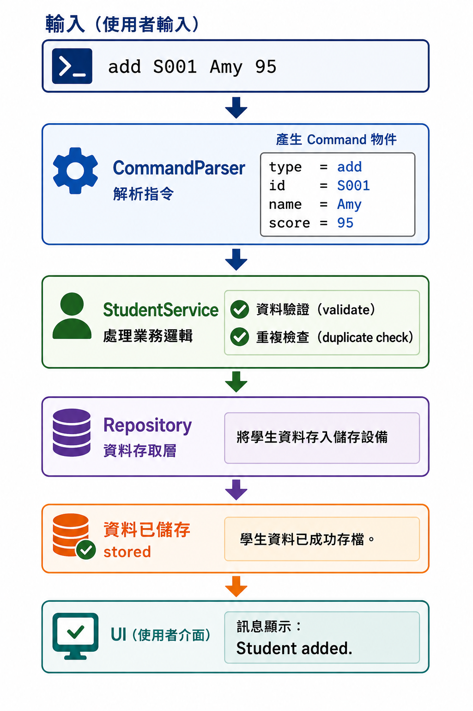


Vertical slice 是一條完整功能路徑：

```text
CLI command
→ service
→ repository
→ file
→ result
```

例如先完成：

```text
add Amy 95
→ StudentService::addStudent()
→ memory repository
→ list 顯示 Amy 95
```

比先寫二十個空 class 更有價值。

---

# Part C：User Story

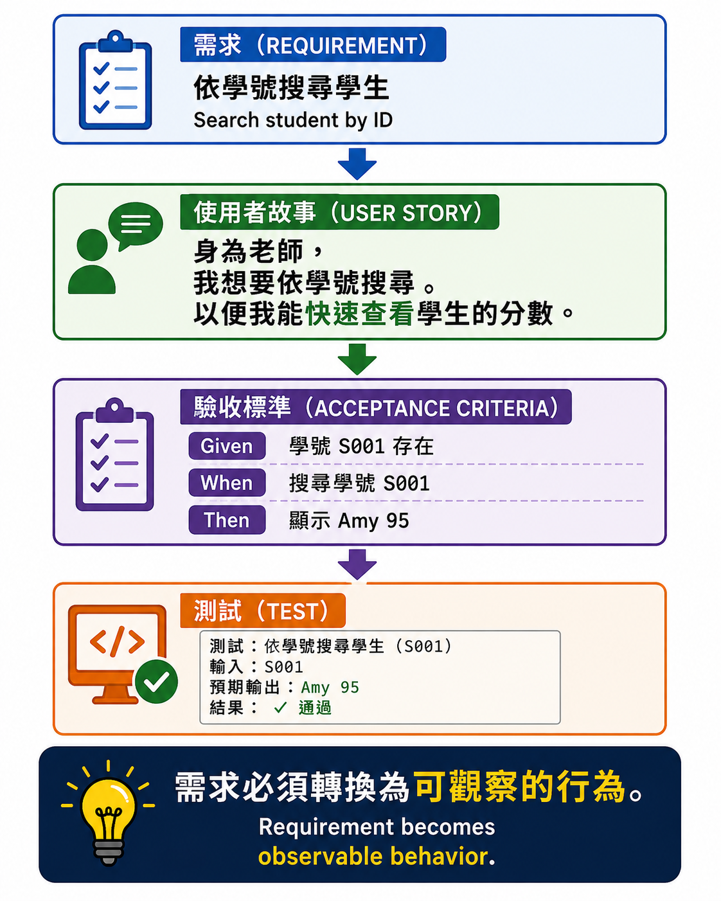


## Section X. 格式

```text
As a ...
I want ...
So that ...
```

範例：

```text
As a teacher,
I want to search a student by ID,
so that I can quickly check the current score.
```

---

## Section XI. Acceptance Criteria

```text
Given 學生 S001 已存在
When 輸入 find S001
Then 顯示姓名與分數

Given S999 不存在
When 輸入 find S999
Then 顯示 not found，程式不 crash
```

---

# Part D：資料模型

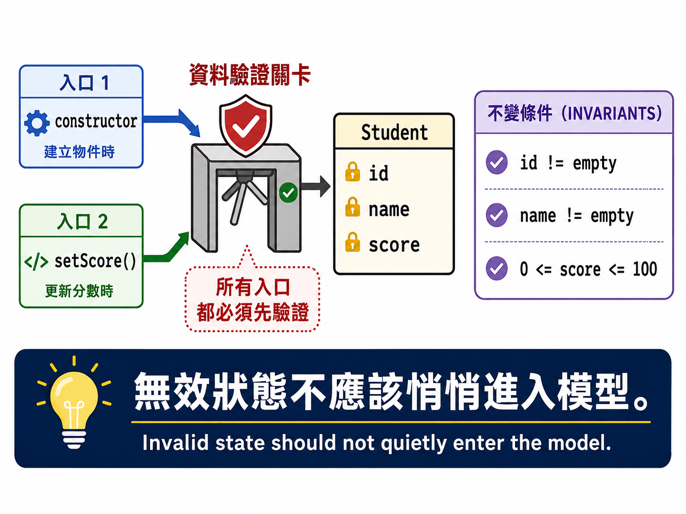


## Section XII. Student Model

```cpp
struct Student {
    string id;
    string name;
    int score;
};
```

需要 invariant：

```text
id 不可空
name 不可空
0 <= score <= 100
```

---

## Section XIII. 完整 Model Validation

```cpp
// VALIDATE
#include <iostream>
#include <stdexcept>
#include <string>
#include <utility>
using namespace std;

class Student {
public:
    Student(
        string initialId,
        string initialName,
        int initialScore
    )
        : idValue(
              std::move(
                  initialId
              )
          ),
          nameValue(
              std::move(
                  initialName
              )
          ),
          scoreValue(
              initialScore
          ) {
        validate();
    }

    const string& id() const noexcept {
        return idValue;
    }

    const string& name() const noexcept {
        return nameValue;
    }

    int score() const noexcept {
        return scoreValue;
    }

    void setScore(int newScore) {
        scoreValue =
            newScore;

        validate();
    }

private:
    void validate() const {
        if (idValue.empty()) {
            throw invalid_argument(
                "student id cannot be empty"
            );
        }

        if (nameValue.empty()) {
            throw invalid_argument(
                "student name cannot be empty"
            );
        }

        if (
            scoreValue < 0 ||
            scoreValue > 100
        ) {
            throw out_of_range(
                "student score must be 0 to 100"
            );
        }
    }

    string idValue;
    string nameValue;
    int scoreValue;
};

int main() {
    try {
        Student student(
            "S001",
            "Amy",
            95
        );

        cout << student.id()
             << " "
             << student.name()
             << " "
             << student.score()
             << '\n';
    } catch (
        const exception& error
    ) {
        cerr << error.what()
             << '\n';

        return 1;
    }

    return 0;
}
```

---

# Part E：Repository Interface

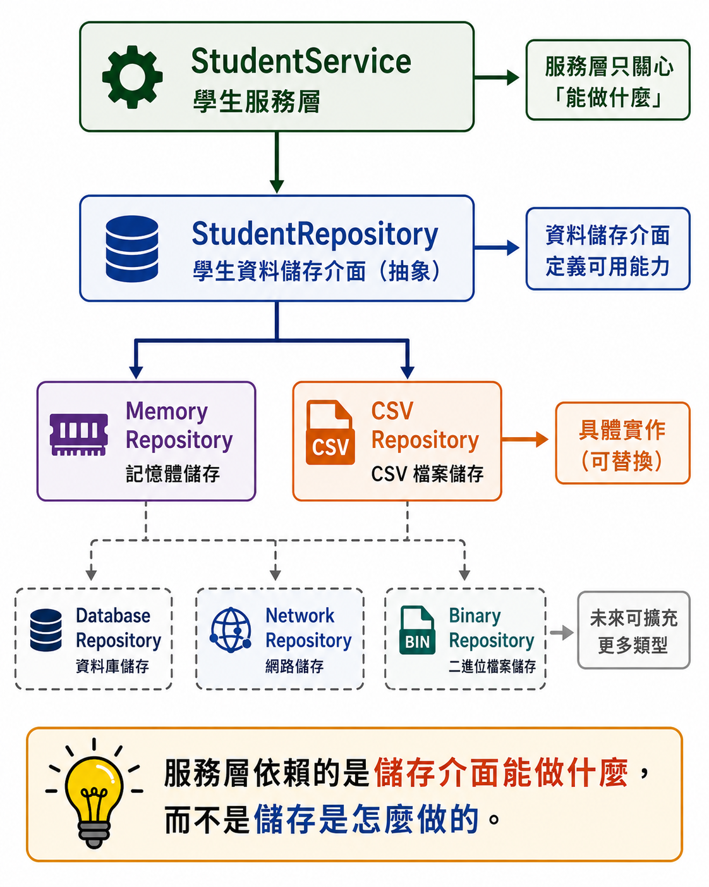


## Section XIV. 為什麼需要 Repository？

Service 不應知道資料來自：

- Memory。
- CSV。
- Binary file。
- Database。
- Network。

Repository 提供抽象操作。

---

## Section XV. Interface 概念

```cpp
class StudentRepository {
public:
    virtual ~StudentRepository() = default;

    virtual void save(
        const vector<Student>& students
    ) = 0;

    virtual vector<Student>
    load() const = 0;
};
```

---

## Section XVI. Memory Repository

測試時可使用 memory repository，避免每個 service test 都操作真實檔案。

---

# Part F：Service

## Section XVII. Service 責任

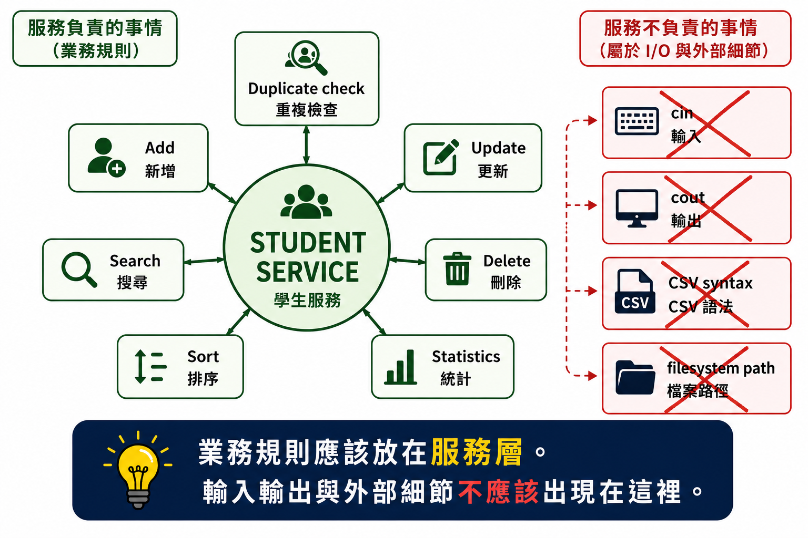


StudentService 可以負責：

- Duplicate ID check。
- Add。
- Update。
- Delete。
- Search。
- Sort。
- Statistics。
- 呼叫 repository save／load。

---

## Section XVIII. 不要讓 Service 直接印出

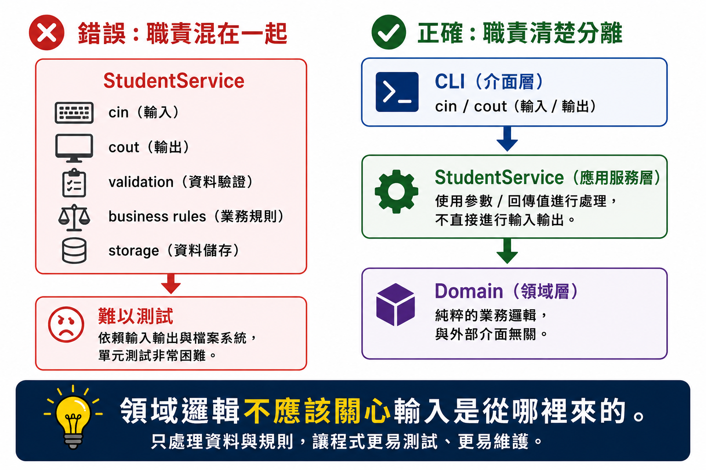


不建議：

```cpp
/* void addStudent() {
    cin >> ...;
    cout << ...;
} */
```

更好的設計：

```cpp
void addStudent(
    Student student
);
```

UI 負責輸入與顯示，service 負責規則。

---

## Section XIX. 完整 Student Service

```cpp
// VALIDATE
#include <algorithm>
#include <iostream>
#include <optional>
#include <stdexcept>
#include <string>
#include <utility>
#include <vector>
using namespace std;

struct Student {
    string id;
    string name;
    int score;
};

class StudentService {
public:
    void add(Student student) {
        if (
            findById(
                student.id
            )
        ) {
            throw invalid_argument(
                "duplicate student id"
            );
        }

        if (
            student.id.empty() ||
            student.name.empty()
        ) {
            throw invalid_argument(
                "id and name are required"
            );
        }

        if (
            student.score < 0 ||
            student.score > 100
        ) {
            throw out_of_range(
                "score must be 0 to 100"
            );
        }

        students.push_back(
            std::move(
                student
            )
        );
    }

    optional<Student> findById(
        const string& id
    ) const {
        const auto iterator =
            find_if(
                students.cbegin(),
                students.cend(),
                [&id](
                    const Student& student
                ) {
                    return
                        student.id ==
                        id;
                }
            );

        if (
            iterator ==
            students.cend()
        ) {
            return nullopt;
        }

        return *iterator;
    }

    bool updateScore(
        const string& id,
        int newScore
    ) {
        if (
            newScore < 0 ||
            newScore > 100
        ) {
            throw out_of_range(
                "score must be 0 to 100"
            );
        }

        const auto iterator =
            find_if(
                students.begin(),
                students.end(),
                [&id](
                    const Student& student
                ) {
                    return
                        student.id ==
                        id;
                }
            );

        if (
            iterator ==
            students.end()
        ) {
            return false;
        }

        iterator->score =
            newScore;

        return true;
    }

    bool erase(
        const string& id
    ) {
        const auto oldSize =
            students.size();

        students.erase(
            remove_if(
                students.begin(),
                students.end(),
                [&id](
                    const Student& student
                ) {
                    return
                        student.id ==
                        id;
                }
            ),
            students.end()
        );

        return
            students.size() !=
            oldSize;
    }

    vector<Student>
    sortedByScoreDescending() const {
        vector<Student> result =
            students;

        sort(
            result.begin(),
            result.end(),
            [](
                const Student& first,
                const Student& second
            ) {
                if (
                    first.score !=
                    second.score
                ) {
                    return
                        first.score >
                        second.score;
                }

                return
                    first.id <
                    second.id;
            }
        );

        return result;
    }

    double averageScore() const {
        if (students.empty()) {
            return 0.0;
        }

        long long total = 0;

        for (
            const Student& student :
            students
        ) {
            total +=
                student.score;
        }

        return
            static_cast<double>(
                total
            ) /
            static_cast<double>(
                students.size()
            );
    }

    const vector<Student>&
    all() const noexcept {
        return students;
    }

private:
    vector<Student> students;
};

int main() {
    StudentService service;

    service.add(
        {
            "S001",
            "Amy",
            95
        }
    );

    service.add(
        {
            "S002",
            "Brian",
            88
        }
    );

    service.updateScore(
        "S002",
        91
    );

    const auto result =
        service.sortedByScoreDescending();

    for (
        const Student& student :
        result
    ) {
        cout << student.id
             << " "
             << student.score
             << '\n';
    }

    cout << service.averageScore()
         << '\n';

    return 0;
}
```

---

# Part G：CSV Repository

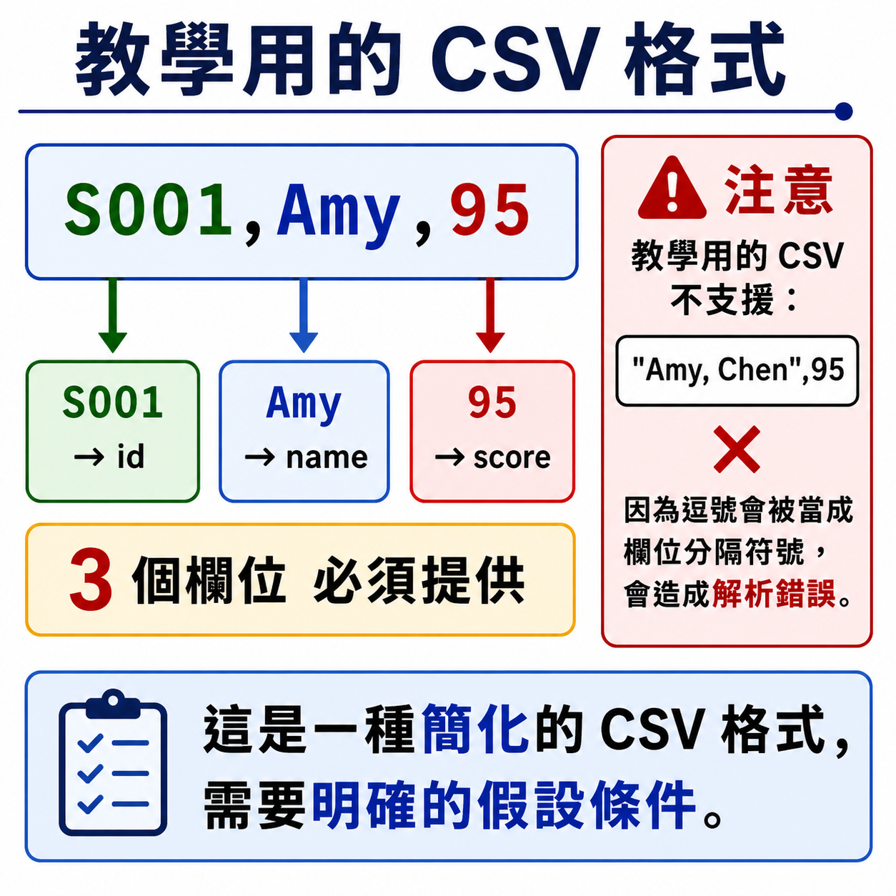

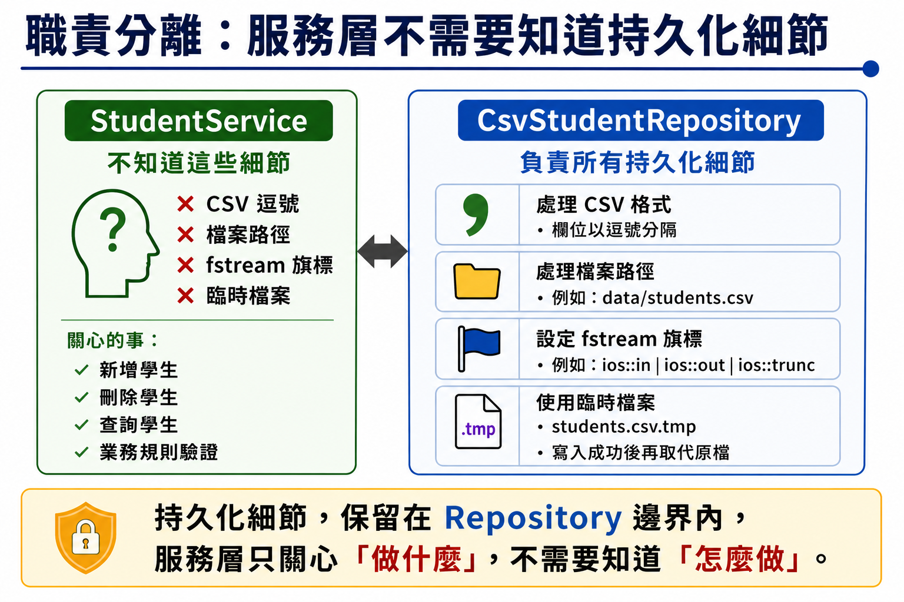


## Section XX. 簡化 CSV 格式

```text
S001,Amy,95
S002,Brian,88
```

本章簡化版本假設：

- Name 不含逗號。
- 不處理 quoted field。
- 每列固定三欄。
- Score 為整數。

真正 CSV 應使用完整 parser。

---

## Section XXI. Parser 與 Writer 分離


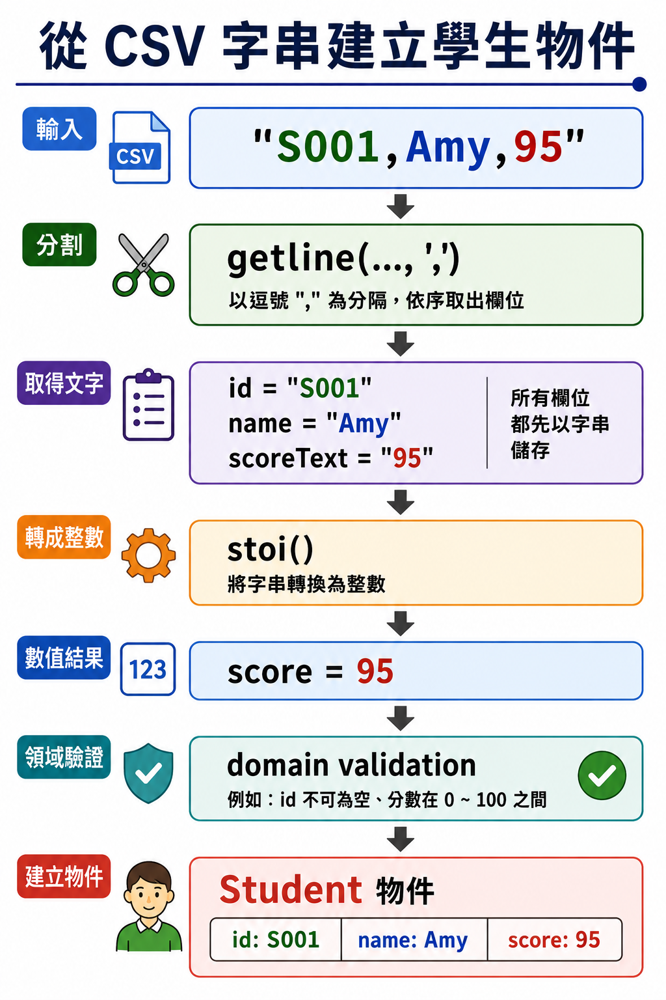


```cpp
Student parseStudentLine(
    const string& line
);
```

```cpp
void writeStudent(
    ostream& output,
    const Student& student
);
```

可直接使用 `istringstream`／`ostringstream` 測試。

---

## Section XXII. 完整 CSV Round Trip

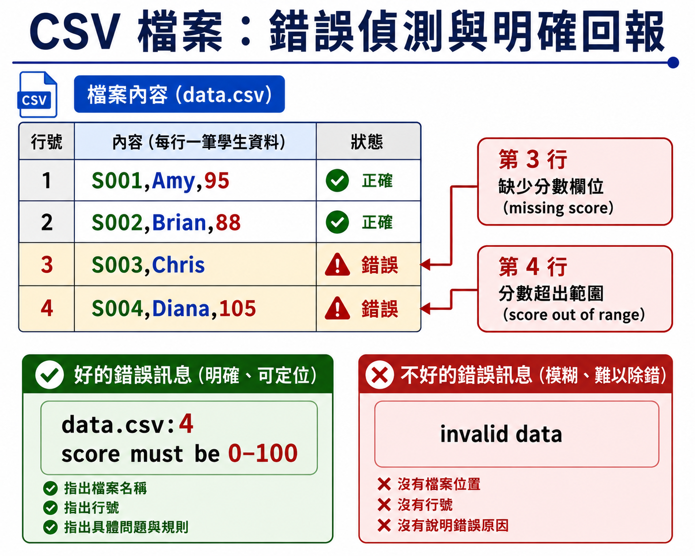


```cpp
// VALIDATE
#include <iostream>
#include <sstream>
#include <stdexcept>
#include <string>
using namespace std;

struct Student {
    string id;
    string name;
    int score;
};

Student parseStudentLine(
    const string& line
) {
    istringstream input(line);

    Student student;
    string scoreText;

    if (
        !getline(
            input,
            student.id,
            ','
        ) ||
        !getline(
            input,
            student.name,
            ','
        ) ||
        !getline(
            input,
            scoreText
        )
    ) {
        throw runtime_error(
            "invalid student row"
        );
    }

    size_t processed = 0;

    student.score =
        stoi(
            scoreText,
            &processed
        );

    if (
        processed !=
        scoreText.size()
    ) {
        throw runtime_error(
            "invalid score field"
        );
    }

    if (
        student.id.empty() ||
        student.name.empty() ||
        student.score < 0 ||
        student.score > 100
    ) {
        throw runtime_error(
            "invalid student values"
        );
    }

    return student;
}

void writeStudent(
    ostream& output,
    const Student& student
) {
    output << student.id
           << ","
           << student.name
           << ","
           << student.score
           << '\n';
}

int main() {
    const Student original{
        "S001",
        "Amy",
        95
    };

    ostringstream output;

    writeStudent(
        output,
        original
    );

    const Student loaded =
        parseStudentLine(
            output.str()
        );

    cout << loaded.id
         << " "
         << loaded.name
         << " "
         << loaded.score
         << '\n';

    return 0;
}
```

---

# Part H：安全儲存

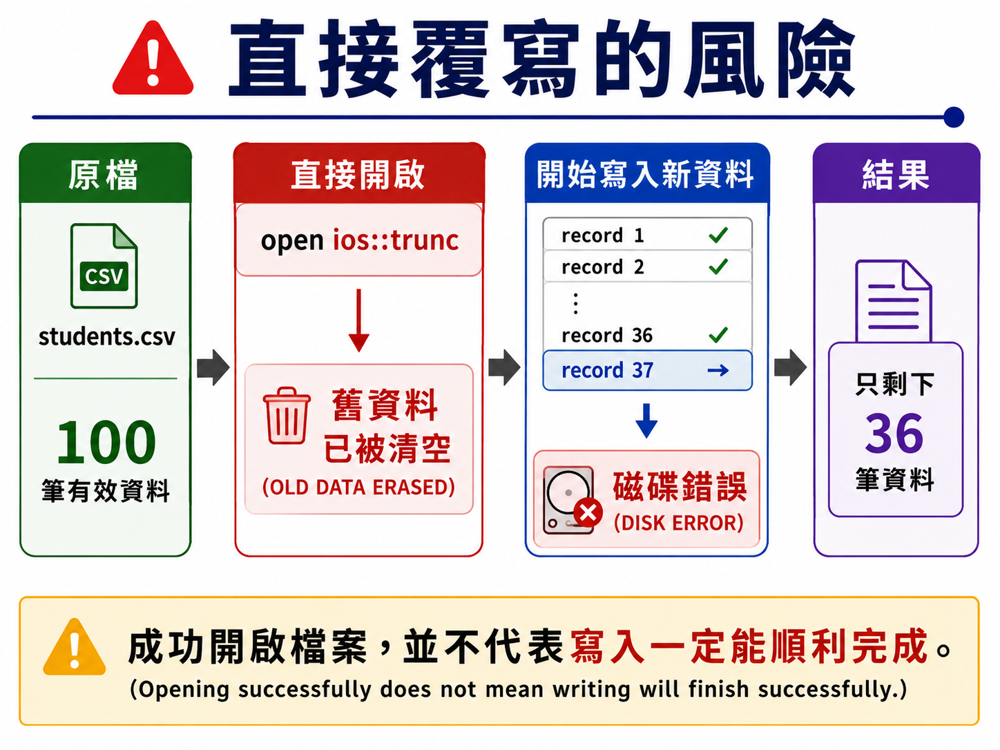


## Section XXIII. 直接覆寫風險

```cpp
ofstream output(
    path,
    ios::trunc
);
```

如果寫到一半失敗，原資料可能已被清除。

---

## Section XXIV. Safe Save

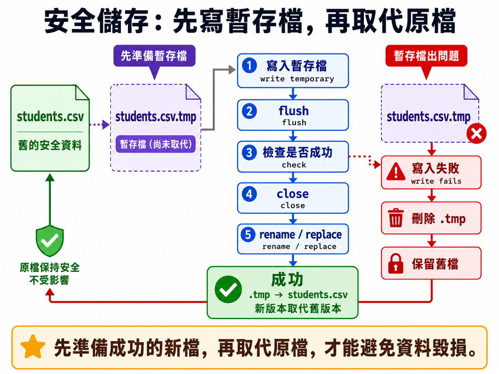

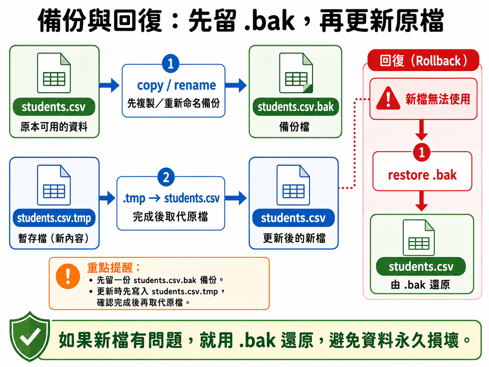


```text
寫 temporary file
→ flush
→ close
→ 建立 backup，optional
→ rename 成正式檔
```

---

## Section XXV. 版本欄位

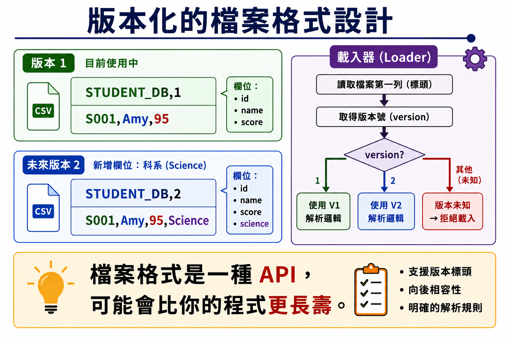


檔案開頭可加入：

```text
STUDENT_DB,1
```

未來格式改變時可辨認版本。

---

# Part I：Command Parser


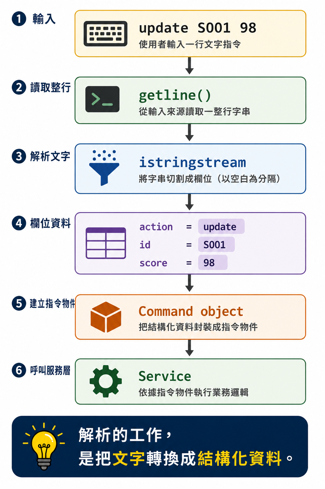


## Section XXVI. CLI Command

範例：

```text
add S001 Amy 95
find S001
update S001 98
delete S001
list
save
load
quit
```

---

## Section XXVII. Command Object

```cpp
enum class CommandType {
    add,
    find,
    update,
    erase,
    list,
    save,
    load,
    quit,
    invalid
};
```

也可以建立不同 command struct，但初學專案不必過度抽象。

---

## Section XXVIII. 完整簡易 Command Parser

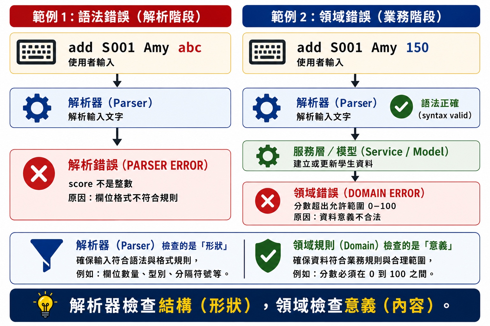


```cpp
// VALIDATE
#include <iostream>
#include <sstream>
#include <string>
using namespace std;

enum class CommandType {
    add,
    list,
    quit,
    invalid
};

struct Command {
    CommandType type =
        CommandType::invalid;

    string id;
    string name;
    int score = 0;
};

Command parseCommand(
    const string& line
) {
    istringstream input(line);

    string action;
    input >> action;

    if (action == "list") {
        return {
            CommandType::list,
            "",
            "",
            0
        };
    }

    if (action == "quit") {
        return {
            CommandType::quit,
            "",
            "",
            0
        };
    }

    if (action == "add") {
        Command command;
        command.type =
            CommandType::add;

        if (
            !(input >>
              command.id >>
              command.name >>
              command.score)
        ) {
            command.type =
                CommandType::invalid;
        }

        return command;
    }

    return {};
}

int main() {
    const Command command =
        parseCommand(
            "add S001 Amy 95"
        );

    if (
        command.type ==
        CommandType::add
    ) {
        cout << command.id
             << " "
             << command.name
             << " "
             << command.score
             << '\n';
    }

    return 0;
}
```

---

# Part J：Menu Loop


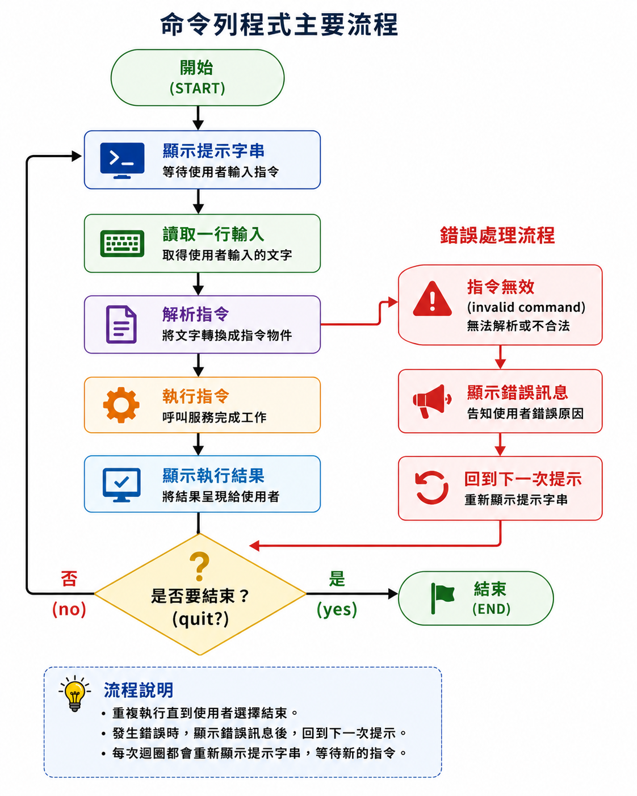


## Section XXIX. Main Loop

```text
read line
→ parse command
→ call service
→ display result
→ repeat
```

---

## Section XXX. 錯誤邊界

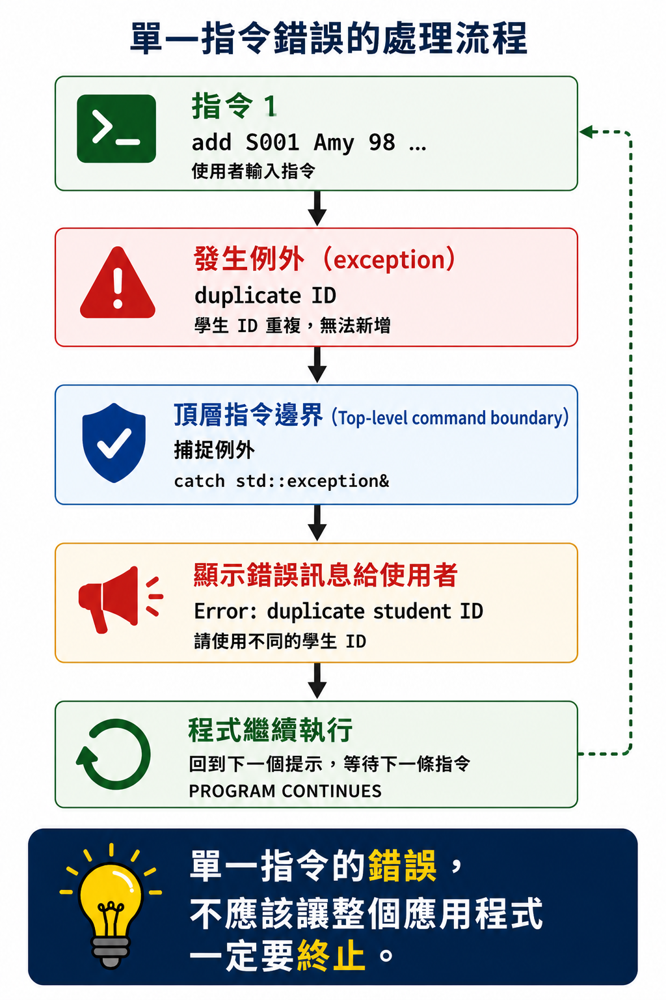


最外層 command loop 可捕捉：

```cpp
catch (
    const exception& error
)
```

顯示錯誤後繼續下一個 command。

不要讓單一 invalid input 結束整個應用程式。

---

# Part K：依賴注入

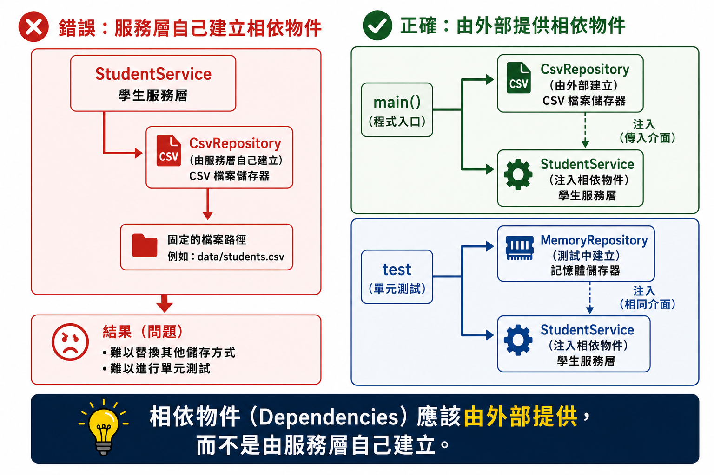


## Section XXXI. 不在 Service 內建立 Repository

不建議：

```cpp
/* class Service {
    CsvRepository repository{
        "data.csv"
    };
}; */
```

這會讓測試綁定真實檔案。

---

## Section XXXII. 注入 Repository

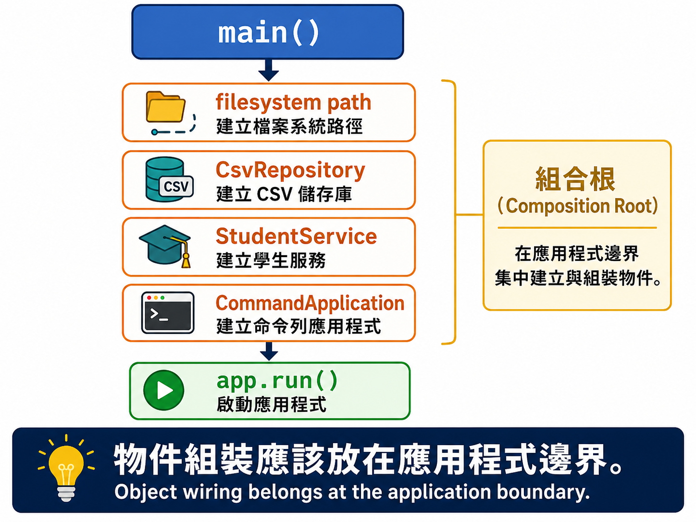


```cpp
class Service {
public:
    explicit Service(
        StudentRepository& repository
    );
};
```

正式環境注入 CSV repository，測試注入 memory repository。

---

# Part L：完整小型應用程式範例

## Section XXXIII. Todo Service

```cpp
// VALIDATE
#include <algorithm>
#include <iostream>
#include <optional>
#include <stdexcept>
#include <string>
#include <utility>
#include <vector>
using namespace std;

struct Task {
    int id;
    string title;
    bool completed;
};

class TodoService {
public:
    int addTask(
        string title
    ) {
        if (title.empty()) {
            throw invalid_argument(
                "task title cannot be empty"
            );
        }

        const int id =
            nextId;

        ++nextId;

        tasks.push_back(
            {
                id,
                std::move(
                    title
                ),
                false
            }
        );

        return id;
    }

    bool completeTask(int id) {
        const auto iterator =
            find_if(
                tasks.begin(),
                tasks.end(),
                [id](
                    const Task& task
                ) {
                    return
                        task.id ==
                        id;
                }
            );

        if (
            iterator ==
            tasks.end()
        ) {
            return false;
        }

        iterator->completed =
            true;

        return true;
    }

    bool removeTask(int id) {
        const auto oldSize =
            tasks.size();

        tasks.erase(
            remove_if(
                tasks.begin(),
                tasks.end(),
                [id](
                    const Task& task
                ) {
                    return
                        task.id ==
                        id;
                }
            ),
            tasks.end()
        );

        return
            tasks.size() !=
            oldSize;
    }

    optional<Task> findTask(
        int id
    ) const {
        const auto iterator =
            find_if(
                tasks.cbegin(),
                tasks.cend(),
                [id](
                    const Task& task
                ) {
                    return
                        task.id ==
                        id;
                }
            );

        if (
            iterator ==
            tasks.cend()
        ) {
            return nullopt;
        }

        return *iterator;
    }

    vector<Task>
    activeTasks() const {
        vector<Task> result;

        copy_if(
            tasks.cbegin(),
            tasks.cend(),
            back_inserter(
                result
            ),
            [](
                const Task& task
            ) {
                return
                    !task.completed;
            }
        );

        return result;
    }

private:
    vector<Task> tasks;
    int nextId = 1;
};

int main() {
    TodoService service;

    const int firstId =
        service.addTask(
            "Write tests"
        );

    service.addTask(
        "Update README"
    );

    service.completeTask(
        firstId
    );

    for (
        const Task& task :
        service.activeTasks()
    ) {
        cout << task.id
             << " "
             << task.title
             << '\n';
    }

    return 0;
}
```

---

# Part M：測試策略

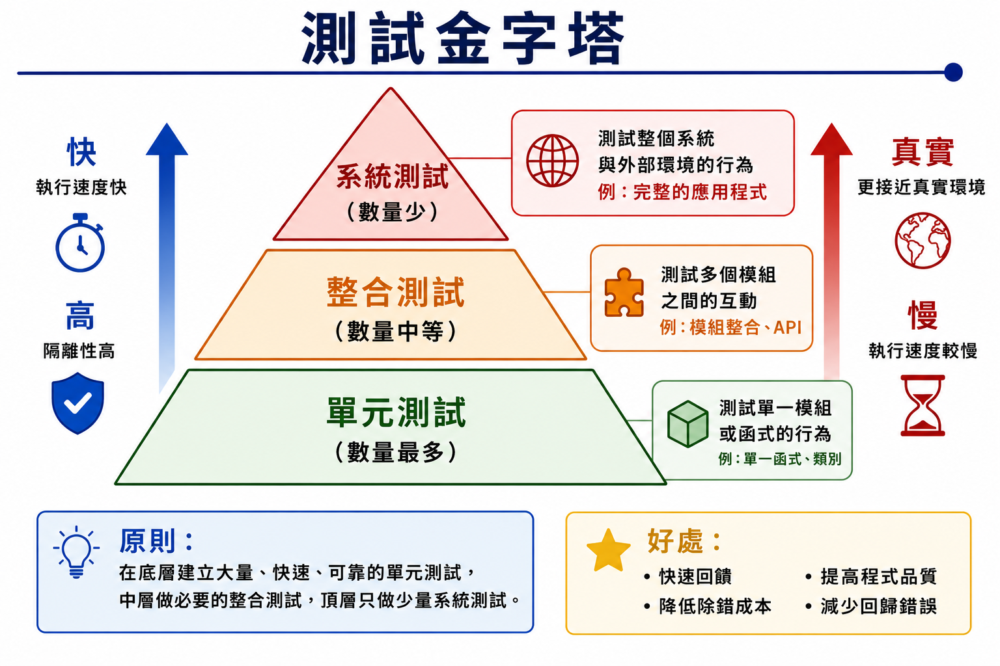

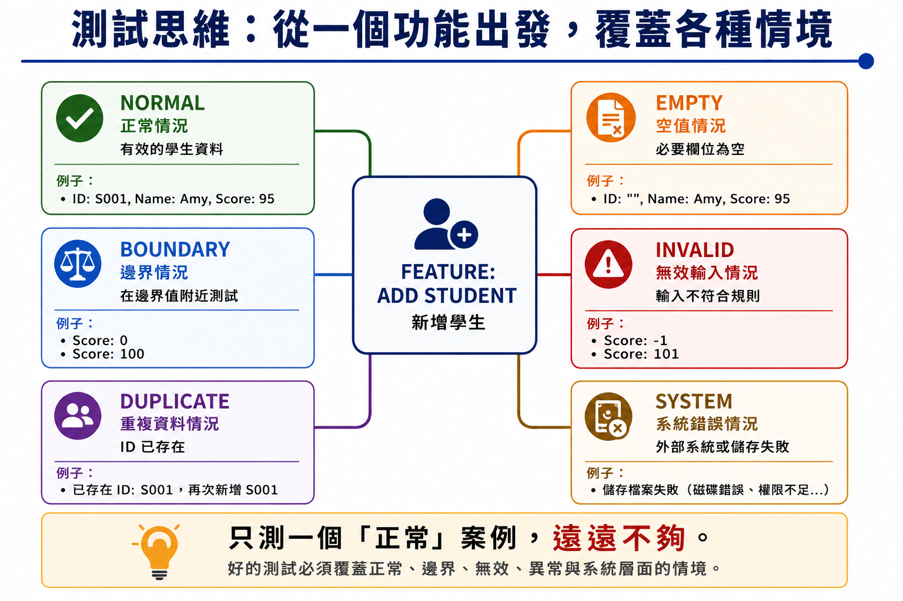

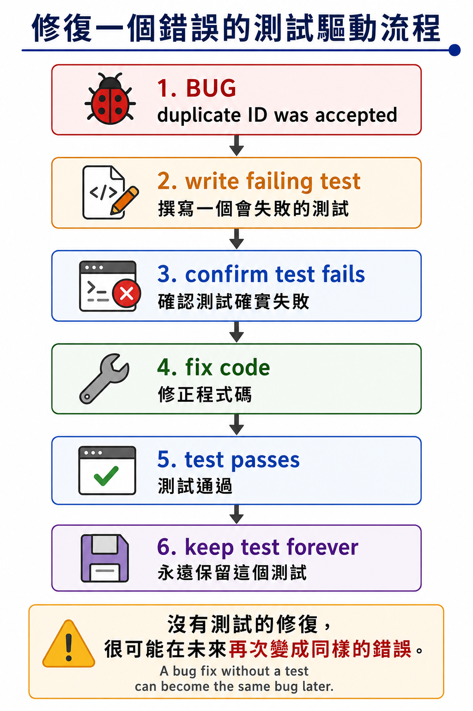


## Section XXXIV. 測試金字塔

```text
少量 system tests
中量 integration tests
大量 unit tests
```

---

## Section XXXV. Unit Tests

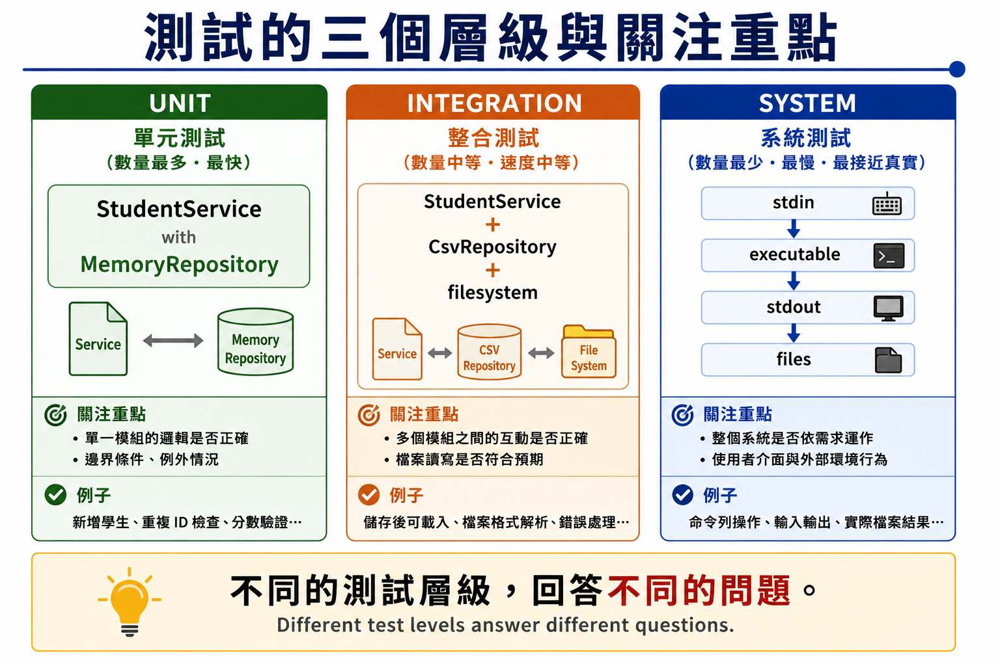

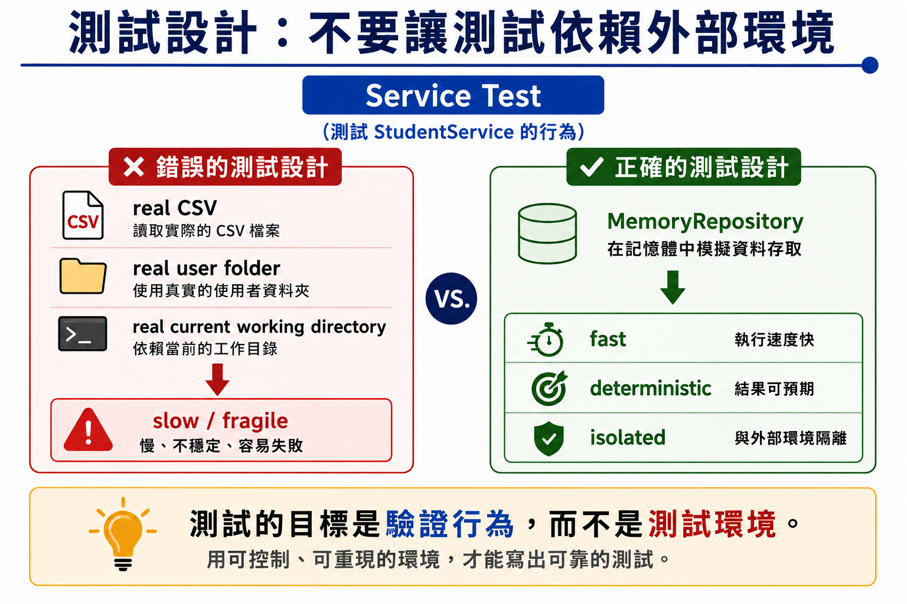


適合測試：

- Validation。
- Search。
- Sort。
- Statistics。
- Duplicate detection。
- Command parsing。
- CSV row parsing。

---

## Section XXXVI. Integration Tests

適合測試：

- Service + repository。
- Save + load round trip。
- CLI command + service。
- File failure。

---

## Section XXXVII. System Tests

從外部執行 executable：

```text
提供 stdin
→ 驗證 stdout
→ 驗證 exit code
→ 驗證 output file
```

---

## Section XXXVIII. 完整 Service Test

```cpp
// VALIDATE
#include <iostream>
#include <stdexcept>
#include <string>
#include <vector>
using namespace std;

struct Student {
    string id;
    int score;
};

class StudentCollection {
public:
    void add(
        const Student& student
    ) {
        for (
            const Student& current :
            students
        ) {
            if (
                current.id ==
                student.id
            ) {
                throw invalid_argument(
                    "duplicate id"
                );
            }
        }

        students.push_back(
            student
        );
    }

    size_t size() const noexcept {
        return students.size();
    }

private:
    vector<Student> students;
};

int main() {
    StudentCollection collection;

    collection.add(
        {
            "S001",
            95
        }
    );

    bool duplicateRejected =
        false;

    try {
        collection.add(
            {
                "S001",
                88
            }
        );
    } catch (
        const invalid_argument&
    ) {
        duplicateRejected =
            true;
    }

    if (
        !duplicateRejected ||
        collection.size() !=
            1
    ) {
        cerr << "duplicate test failed\n";
        return 1;
    }

    cout << "All tests passed\n";

    return 0;
}
```

---

# Part N：Save／Load Round Trip

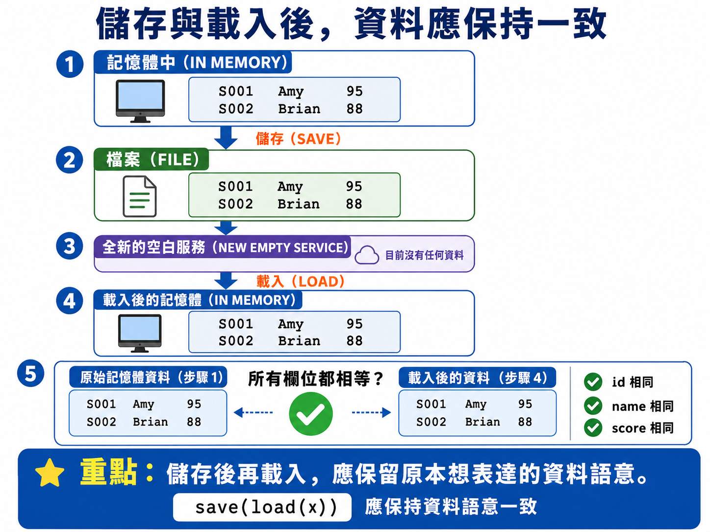


## Section XXXIX. Round Trip Test

```text
建立資料
→ save
→ 建立新的 service
→ load
→ 比較所有欄位
```

可發現：

- 欄位遺失。
- 順序錯誤。
- Parsing 不一致。
- Encoding 問題。
- Duplicate handling 問題。

---

# Part O：Temporary Directory

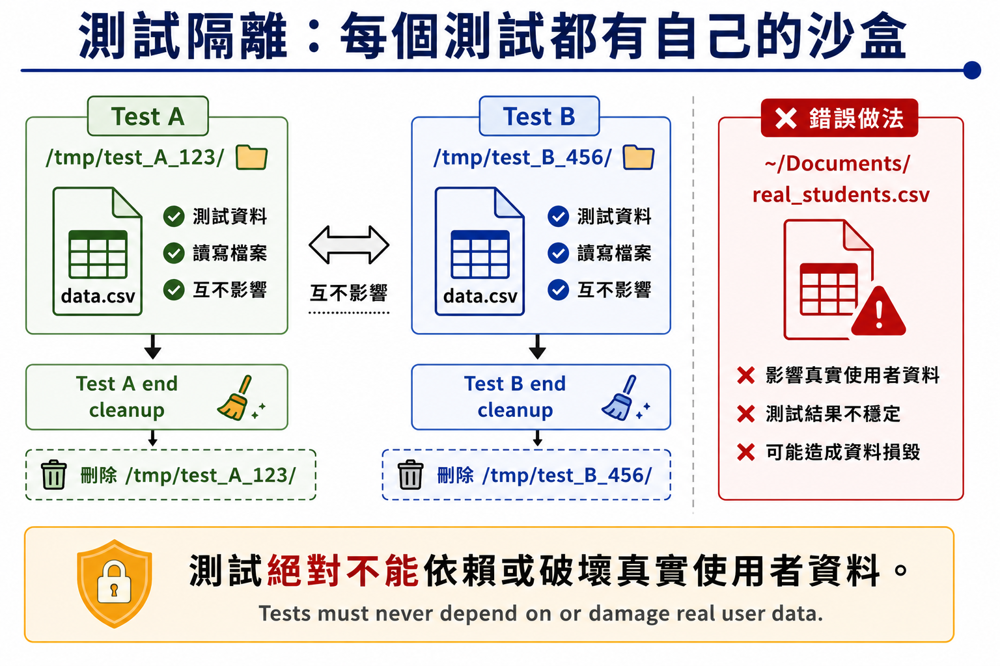


## Section XL. 測試檔案不應污染正式資料

測試時：

- 使用唯一暫存目錄。
- 使用測試專用檔名。
- 測試後清理。
- 不讀取使用者真實資料。
- 不依賴固定 absolute path。

---

# Part P：CMake

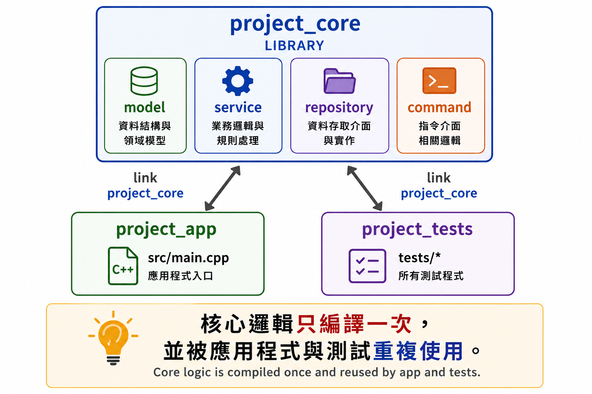

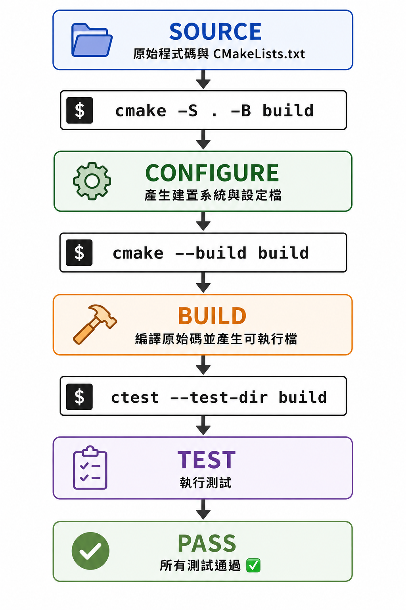

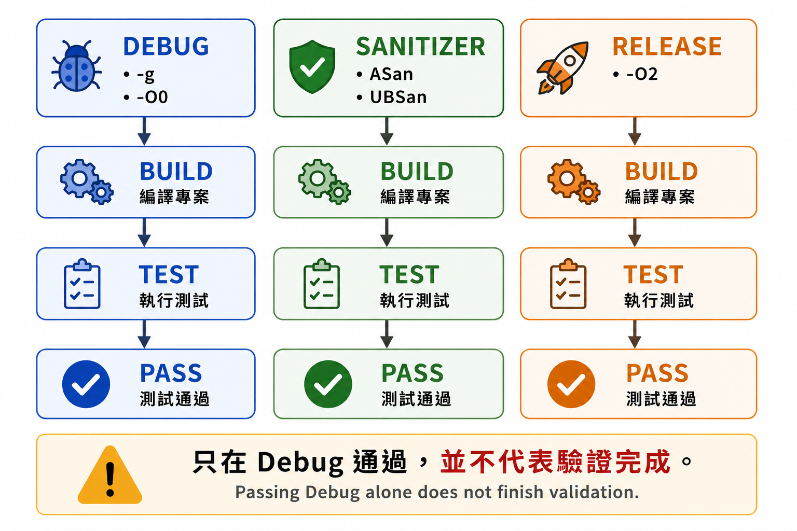


## Section XLI. 建議 `CMakeLists.txt`

```cmake
cmake_minimum_required(VERSION 3.16)

project(
    CapstoneProject
    VERSION 1.0
    LANGUAGES CXX
)

set(
    CMAKE_CXX_STANDARD 17
)

set(
    CMAKE_CXX_STANDARD_REQUIRED ON
)

set(
    CMAKE_CXX_EXTENSIONS OFF
)

add_library(
    project_core
    src/model.cpp
    src/service.cpp
    src/repository.cpp
    src/command.cpp
)

target_include_directories(
    project_core
    PUBLIC
        include
)

target_compile_options(
    project_core
    PRIVATE
        -Wall
        -Wextra
        -Werror
)

add_executable(
    project_app
    src/main.cpp
)

target_link_libraries(
    project_app
    PRIVATE
        project_core
)

enable_testing()

add_executable(
    project_tests
    tests/project_test.cpp
)

target_link_libraries(
    project_tests
    PRIVATE
        project_core
)

add_test(
    NAME project_tests
    COMMAND project_tests
)
```

跨平台正式版本應依 compiler ID 設定 warnings。

---

# Part Q：Git Workflow

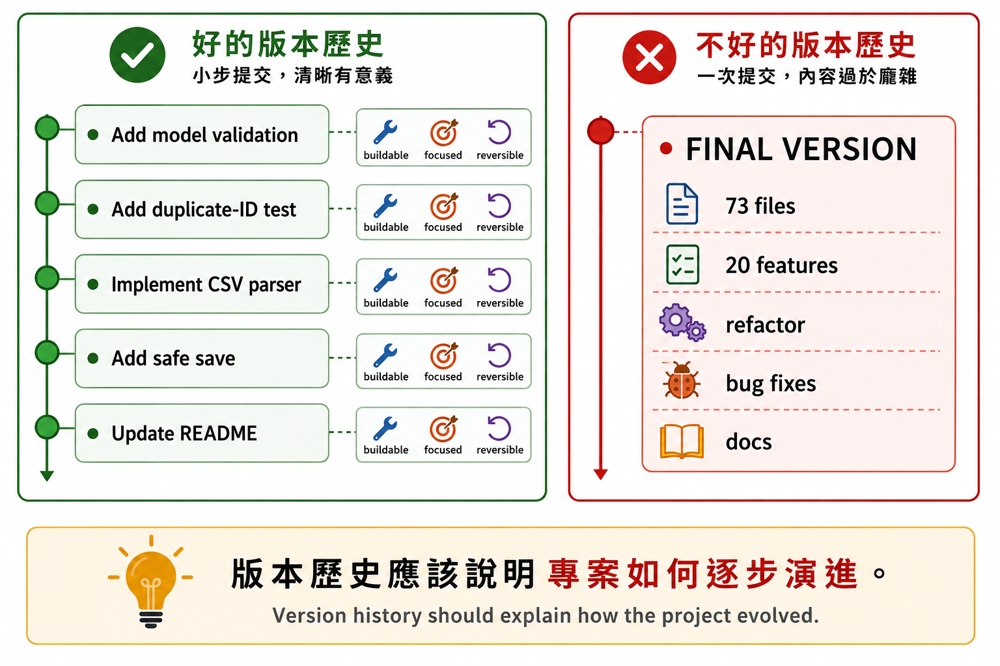

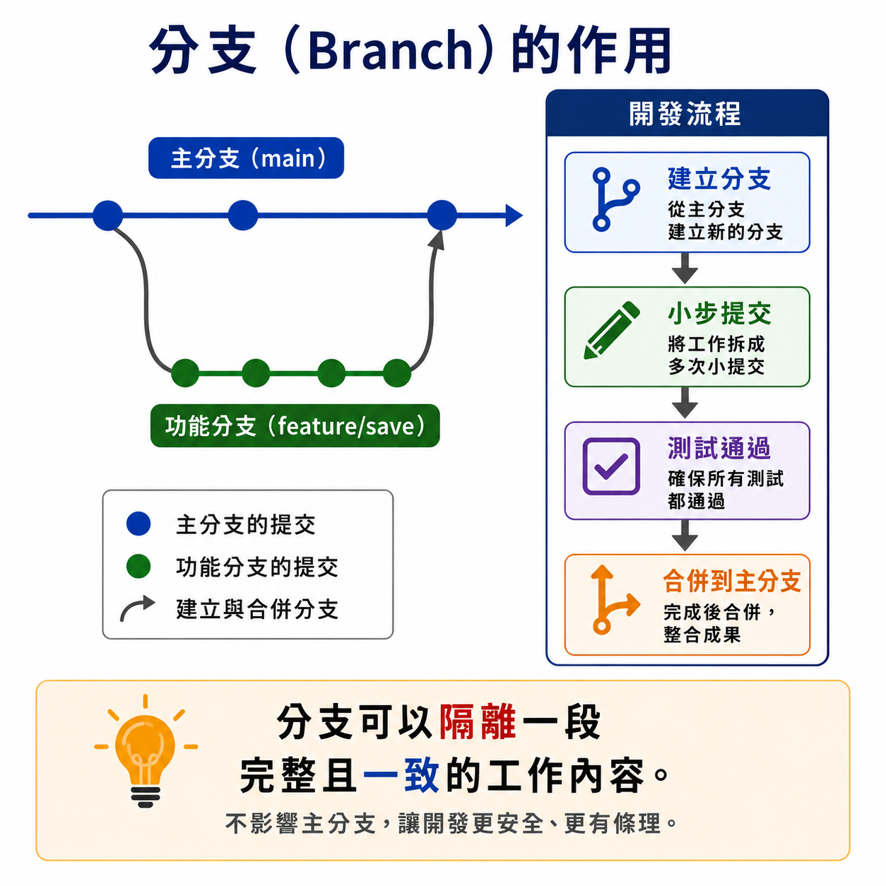


## Section XLII. 小型 Commit

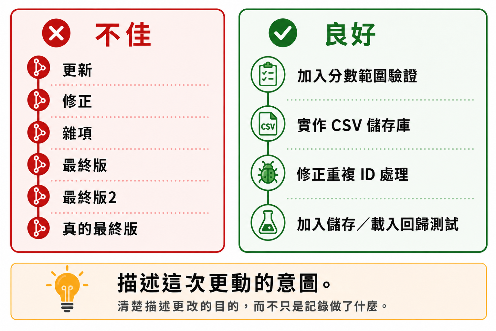


好：

```text
Add student score validation
Implement CSV row parser
Add duplicate ID regression test
Separate command parser from main
```

不好：

```text
update
fix
final
everything
```

---

## Section XLIII. Commit 原則

每個 commit：

- 能 build。
- 最好能 test。
- 只做一個清楚目的。
- Message 描述意圖。
- 不包含 build artifacts。
- 不包含密碼或 token。

---

## Section XLIV. 建議順序

```text
1. Initialize project structure
2. Add model and validation
3. Add in-memory service
4. Add unit tests
5. Add command parser
6. Add CSV repository
7. Add round-trip tests
8. Add CMake and CTest
9. Add documentation
10. Add optional features
```

---

# Part R：README

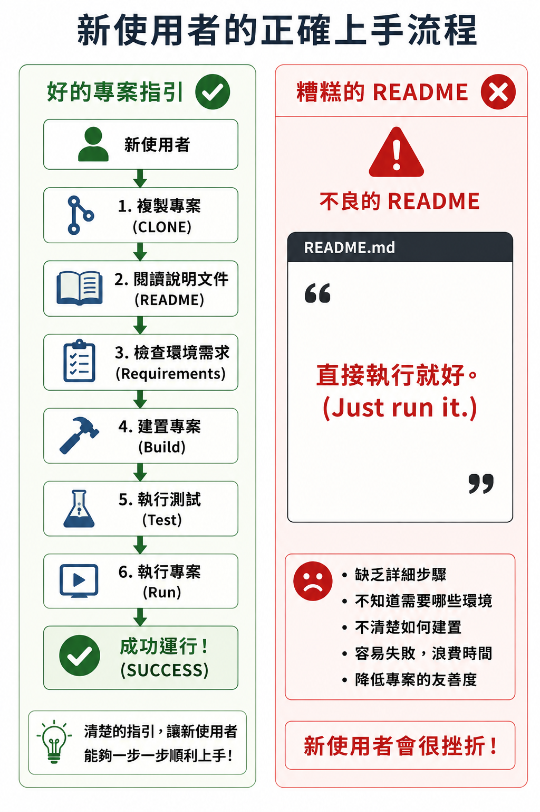

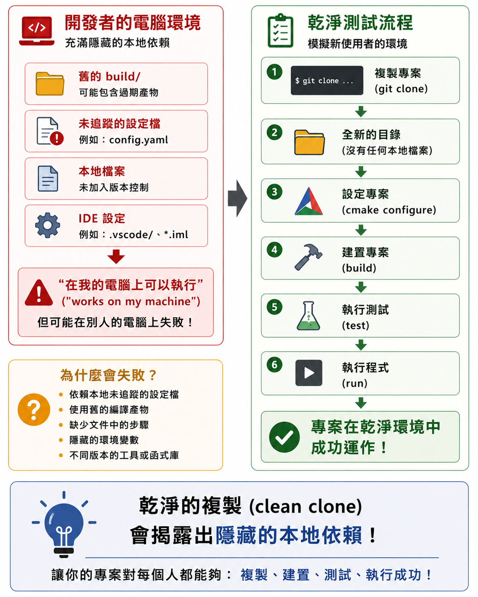


## Section XLV. README 最少內容

```markdown
# Project Name

## Purpose

## Features

## Requirements

## Build

## Test

## Run

## Command Reference

## Data Format

## Project Structure

## Design Decisions

## Limitations

## Future Improvements
```

---

## Section XLVI. Build Instructions

```bash
cmake -S . -B build
cmake --build build
ctest --test-dir build --output-on-failure
./build/project_app
```

---

# Part S：Definition of Done

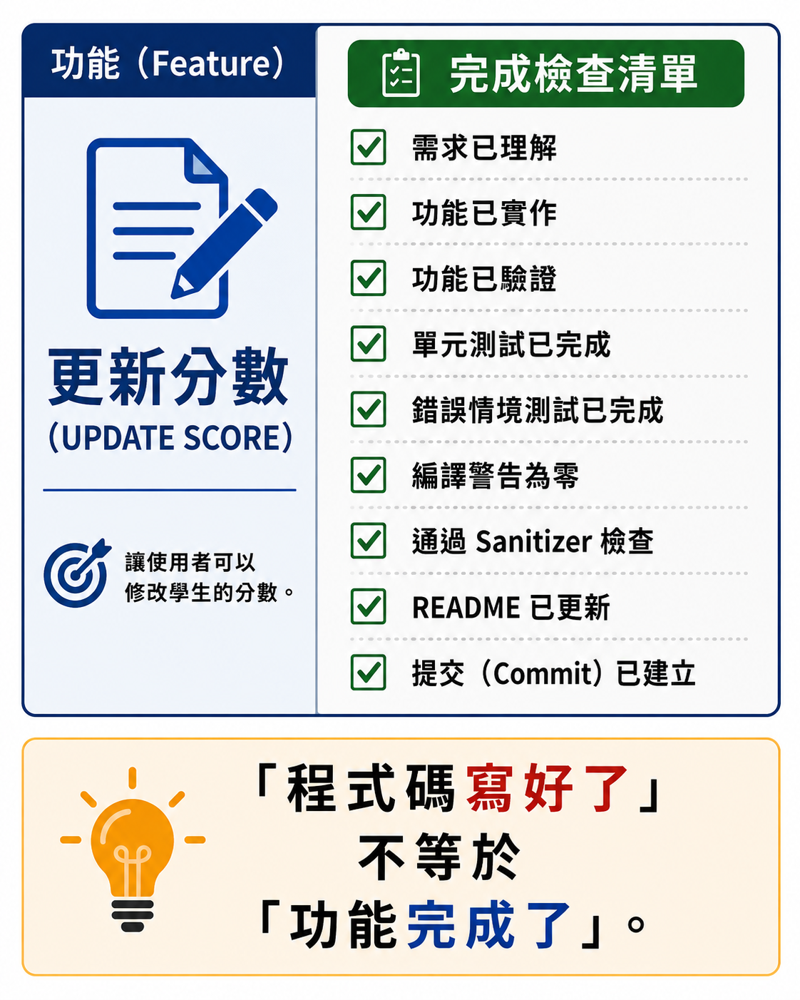


## Section XLVII. 一個功能完成代表

- Requirement 清楚。
- Implementation 完成。
- Input validation 完成。
- Error path 完成。
- Unit test 完成。
- Integration test 必要時完成。
- Warnings 為零。
- Sanitizer 通過。
- README 更新。
- Git commit 完成。

---

# Part T：Milestones

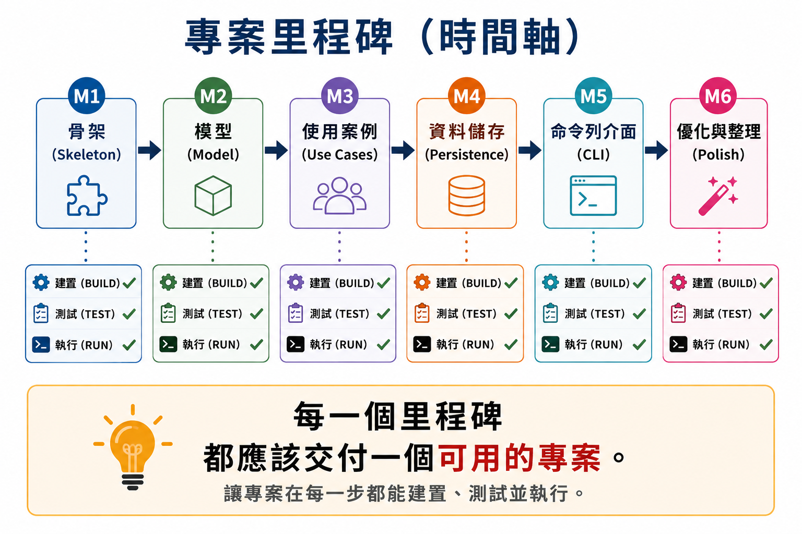

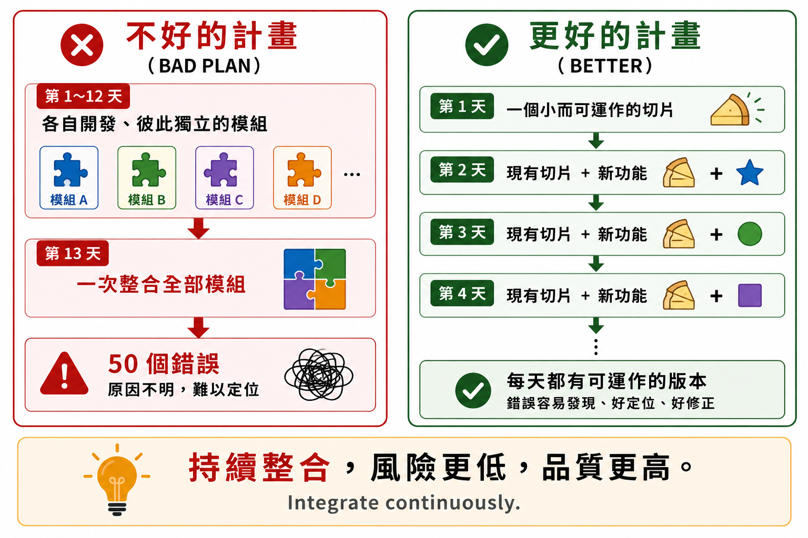


## Section XLVIII. Milestone 1：Project Skeleton

完成：

```text
CMake
include／src／tests
main executable
test executable
README
.gitignore
```

---

## Section XLIX. Milestone 2：Core Model

完成：

```text
Entity
Validation
Invariants
Basic unit tests
```

---

## Section L. Milestone 3：Core Use Cases

完成：

```text
Add
List
Find
Update
Delete
Tests
```

---

## Section LI. Milestone 4：Persistence

完成：

```text
Save
Load
Invalid-file handling
Round-trip test
Safe save
```

---

## Section LII. Milestone 5：CLI

完成：

```text
Command parser
Help
Error messages
Main loop
System test
```

---

## Section LIII. Milestone 6：Polish

完成：

```text
Sorting
Statistics
Logging
Sanitizer
README
Demo script
Release build
```

---


# Part U：Project Level 1


## Section LIV. 學生分數管理系統

### 核心功能

- Add student。
- List students。
- Find by ID。
- Update score。
- Delete student。
- Average。
- Sort by score。
- Save／load CSV。

### 必用內容

- `vector`
- `algorithm`
- Class／struct
- File I/O
- Exception
- Tests
- CMake

### 延伸

- Grade distribution。
- Import multiple files。
- Search by partial name。
- Ranking。
- Histogram。

---

# Part V：Project Level 2


## Section LV. Command-Line Todo List

### 核心功能

- Add task。
- Complete task。
- Delete task。
- List active／completed。
- Priority。
- Due date 概念。
- Save／load。

### 必用內容

- Class design
- `vector`
- `optional`
- `chrono` 概念
- Command parser
- Repository
- Tests

### 延伸

- Tags。
- Filter。
- Recurring task。
- Export Markdown。
- Undo。

---

# Part W：Project Level 3


## Section LVI. 圖書館管理系統

### Entity

- Book
- Member
- Loan

### 核心規則

- Book ID 唯一。
- Member ID 唯一。
- 已借出的書不能再次借出。
- Return 後狀態更新。
- 可查詢逾期項目概念。

### 必用內容

- 多個 model
- Service
- `unordered_map`
- File persistence
- Validation
- Integration tests

### 延伸

- Reservation。
- Fine calculation。
- Search index。
- Multiple copies。
- Report。

---

# Part X：Project Level 4


## Section LVII. CSV 資料分析工具

### 核心功能

- Load dataset。
- Validate column count。
- Select numeric column。
- Min／max／mean。
- Sort。
- Filter。
- Frequency table。
- Export result。

### 必用內容

- Parser
- `vector`
- `map`
- `algorithm`
- Lambda
- Exception
- File I/O
- Tests

### 延伸

- Median。
- Standard deviation。
- Missing value policy。
- Multiple data types。
- ASCII chart。

---

# Part Y：Project Level 5


## Section LVIII. 文字 RPG

### Model

- Player
- Enemy
- Item
- Skill
- Room
- Battle state

### 核心功能

- Move between rooms。
- Battle。
- Inventory。
- Save／load。
- Random events。
- Command parser。

### 必用內容

- OOP
- Polymorphism，視設計需要
- `unique_ptr`
- State machine
- Random
- File persistence
- Tests for battle logic

### 延伸

- Multiple character classes。
- Equipment。
- Status effects。
- Map graph。
- Scripted events。

---

# Part Z：Project Level 6


## Section LIX. 迷你檔案資料庫

### 核心功能

- Schema。
- Insert record。
- Find by key。
- Update。
- Delete。
- Index。
- Save／load。
- Versioned file format。
- Recovery。

### 必用內容

- Data structures
- Hash table or tree index
- Binary／text persistence
- Safe save
- RAII
- Exception safety
- Extensive tests
- Benchmark

### 延伸

- Append-only log。
- Compaction。
- Secondary index。
- Transaction concept。
- Checksum concept。

---

# Part AA：架構選擇


## Section LX. 何時使用 Class？

適合：

- 有 invariant。
- 有狀態。
- 有明確責任。
- 需要封裝。
- 有多個相關操作。

不必為每個 function 建立 class。

---

## Section LXI. 何時使用 Polymorphism？


適合：

- 多種實作共用 interface。
- 呼叫端不應知道實際型別。
- 需要 runtime replacement。

例如：

```text
StudentRepository
├── MemoryStudentRepository
└── CsvStudentRepository
```

若只有一種實作，不一定需要抽象基底。

---

## Section LXII. 何時使用 Template？

適合：

- 同一演算法支援多種型別。
- Compile-time polymorphism。
- Container／utility。

綜合專案不必刻意加入 template。

---

# Part AB：避免 Overengineering


## Section LXIII. 常見過度設計

- 每個 function 一個 class。
- 三層 factory 建立一個簡單物件。
- 所有 model 都繼承 base entity。
- 不需要共享卻全部 shared_ptr。
- 只有一個 repository 卻建立五層 abstraction。
- MVP 尚未完成就加入 plugin system。
- 先設計網路版、GUI 版與 mobile 版。

---

## Section LXIV. YAGNI


```text
You Aren't Gonna Need It
```

目前沒有明確需求，就不要先實作。

---

# Part AC：錯誤處理策略


## Section LXV. 使用者錯誤

例如：

- Invalid command。
- Missing argument。
- Score out of range。
- Unknown ID。

應顯示清楚訊息並繼續執行。

---

## Section LXVI. 系統錯誤

例如：

- File cannot open。
- Disk write failure。
- Corrupted data。
- Permission denied。

應：

- 不破壞舊資料。
- 顯示上下文。
- 必要時停止操作。
- 記錄非敏感 log。

---

# Part AD：Demo


## Section LXVII. Demo Script

預先準備：

```text
1. 啟動程式
2. 顯示 help
3. 新增兩筆資料
4. 搜尋
5. 更新
6. 排序
7. Save
8. 重新啟動
9. Load
10. 顯示測試結果
```

---

## Section LXVIII. Demo 準備


- 清空 demo data。
- 使用固定 sample data。
- 測試所有 command。
- 確認 terminal font。
- 確認工作目錄。
- 確認 build command。
- 準備失敗時備用 screenshot 概念。
- 不在 demo 當天才改架構。

---

# Part AE：評分規準


## Section LXIX. 100 分 Rubric

| 項目 | 分數 |
| --- | ---: |
| 核心功能正確 | 25 |
| 資料模型與 validation | 10 |
| 專案組織與架構 | 15 |
| STL 與現代 C++ 使用 | 10 |
| File persistence | 10 |
| Tests | 15 |
| CMake、warnings、sanitizer | 5 |
| README 與文件 | 5 |
| Git history | 3 |
| Demo 與說明 | 2 |

---

## Section LXX. 核心功能 25 分

- 所有 required use cases 可完成。
- Invalid input 不 crash。
- 資料操作結果正確。
- Save／load 正確。
- Boundary case 有處理。

---

## Section LXXI. Testing 15 分

- Unit tests。
- Edge cases。
- Error paths。
- Round-trip test。
- Regression test。
- CTest 可重複執行。

---

# Part AF：快速概念檢查

## Section LXXII. 選擇題與簡答

### Q1. 綜合專案第一步是什麼？

<details><summary>查看答案</summary>

先定義問題、使用者、需求與成功條件，不是先建立 class。

</details>

### Q2. MVP 是什麼？

<details><summary>查看答案</summary>

能提供核心價值的最小可用版本。

</details>

### Q3. Vertical slice 是什麼？

<details><summary>查看答案</summary>

從 UI 到 domain、repository 與 output 的一條完整可執行功能路徑。

</details>

### Q4. Domain logic 應直接使用 `cin`／`cout` 嗎？

<details><summary>查看答案</summary>

通常不應。輸入輸出應由 UI 層負責，domain logic 接收參數並回傳結果。

</details>

### Q5. Repository 的用途？

<details><summary>查看答案</summary>

抽象資料存取，讓 service 不必綁定特定檔案或資料來源。

</details>

### Q6. 為什麼 parser 接收 `istream&`？

<details><summary>查看答案</summary>

可同時處理檔案、標準輸入與 stringstream，也更容易測試。

</details>

### Q7. 為什麼 writer 接收 `ostream&`？

<details><summary>查看答案</summary>

可寫入檔案、cout 或 ostringstream，增加重用與可測試性。

</details>

### Q8. Save／load round-trip test 驗證什麼？

<details><summary>查看答案</summary>

資料儲存再載入後所有欄位與語意保持一致。

</details>

### Q9. 為什麼要使用 temporary file 安全儲存？

<details><summary>查看答案</summary>

避免直接覆寫時中途失敗，造成原資料損壞。

</details>

### Q10. Definition of Done 包含什麼？

<details><summary>查看答案</summary>

Implementation、validation、tests、warnings、sanitizer、documentation 與 commit 都完成。

</details>

### Q11. Unit test 與 integration test 差異？

<details><summary>查看答案</summary>

Unit test 測單一邏輯單位；integration test 測多個模組合作。

</details>

### Q12. 為什麼不應全部使用 shared_ptr？

<details><summary>查看答案</summary>

會隱藏 ownership、增加成本並可能形成 cycle；應先使用值或 unique ownership。

</details>

### Q13. God Object 是什麼？

<details><summary>查看答案</summary>

一個 class 負責過多功能、依賴大量模組且難以測試與修改。

</details>

### Q14. 為什麼要有小型 commit？

<details><summary>查看答案</summary>

容易 review、回復、找 bug，也能清楚表示每次修改意圖。

</details>

### Q15. README 最重要的功能？

<details><summary>查看答案</summary>

讓另一個人理解專案目的，並能成功 build、test 與 run。

</details>

### Q16. Demo 前為什麼要重新 clone？

<details><summary>查看答案</summary>

驗證專案不依賴本機未提交檔案、舊 build artifacts 或特殊環境。

</details>

### Q17. 何時需要 polymorphism？

<details><summary>查看答案</summary>

當多種實作需要共用 interface，而且呼叫端不應綁定實際型別時。

</details>

### Q18. 為什麼先完成 MVP 再擴充？

<details><summary>查看答案</summary>

降低整合風險，確保核心功能先可執行與可測試。

</details>

### Q19. Non-functional requirement 範例？

<details><summary>查看答案</summary>

C++17、零 warnings、有 tests、無 memory leak、效能與文件要求。

</details>

### Q20. 專案完成後還要做什麼？

<details><summary>查看答案</summary>

執行完整 tests、sanitizer、Release build、README 檢查與 demo rehearsal。

</details>

---

# Part AG：程式閱讀練習

## Section LXXIII. 判斷設計問題

### 題目 1

```cpp
void addStudent() {
    string id;
    cin >> id;

    students.push_back(...);

    cout << "done";
}
```

<details><summary>查看答案</summary>

UI、domain logic 與 storage 混在同一函式，難以測試。應把輸入解析與 service 操作分開。

</details>

### 題目 2

```cpp
class StudentService {
private:
    CsvRepository repository{
        "/Users/name/data.csv"
    };
};
```

<details><summary>查看答案</summary>

硬編碼 absolute path 且 service 綁定實作，難以測試與部署。應注入 repository 與 path。

</details>

### 題目 3

```cpp
ofstream output(
    path,
    ios::trunc
);
```

立刻覆寫正式資料。

<details><summary>查看答案</summary>

若中途失敗可能破壞原資料。重要資料應先寫 temporary file，再安全替換。

</details>

### 題目 4

```cpp
shared_ptr<Student> student =
    make_shared<Student>();
```

但只有一個 service 擁有 student。

<details><summary>查看答案</summary>

Shared ownership 可能不必要；可直接存值或使用 unique_ptr。

</details>

### 題目 5

```cpp
vector<Student> sorted =
    students;

sort(
    students.begin(),
    students.end(),
    ...
);
```

<details><summary>查看答案</summary>

建立 `sorted` 卻排序 `students`，可能是 logic bug。應確認是否要保留原順序並排序副本。

</details>

### 題目 6

```cpp
catch (...) {
}
```

<details><summary>查看答案</summary>

完全吞掉錯誤，使用者與 log 都看不到原因。應至少在適當邊界回報，並只捕捉能處理的錯誤。

</details>

### 題目 7

```cpp
bool save() {
    output << data;
    return true;
}
```

<details><summary>查看答案</summary>

沒有檢查開啟與寫入狀態，可能錯誤回報成功。

</details>

### 題目 8

```cpp
int main() {
    // 900 lines
}
```

<details><summary>查看答案</summary>

Main 承擔過多責任。應分離 parser、service、repository 與 UI functions。

</details>

### 題目 9

所有 tests 都使用同一個：

```text
data.csv
```

<details><summary>查看答案</summary>

測試可能互相污染並依賴執行順序。應使用獨立 temporary files。

</details>

### 題目 10

README 只有：

```text
run main.cpp
```

<details><summary>查看答案</summary>

缺少 compiler、CMake、build、test、run、commands 與資料格式說明。

</details>

### 題目 11

Commit：

```text
final version
```

包含 50 個功能。

<details><summary>查看答案</summary>

難以 review、回復與找 bug。應拆成小型、單一目的 commits。

</details>

### 題目 12

專案有 30 個 class，但 MVP 尚不能執行。

<details><summary>查看答案</summary>

可能過度設計。應先完成一條可運作 vertical slice。

</details>

---

# Part AH：實作練習

## Section LXXIV. 實作檢測題

### TODO 1：Problem Statement

為選定專案撰寫問題、使用者、核心需求與成功條件。

### TODO 2：MVP

將需求分成 MVP、第二階段與延伸功能。

### TODO 3：Project Structure

建立 `include/`、`src/`、`tests/`、`data/`、`build/`。

### TODO 4：Domain Model

建立至少一個有 invariant 的 model。

### TODO 5：Service

建立不依賴 `cin`／`cout` 的核心 service。

### TODO 6：Repository

建立 memory repository 與 file repository。

### TODO 7：Command Parser

從整行文字解析 command 與 arguments。

### TODO 8：Validation

處理 empty、out-of-range、duplicate 與 unknown ID。

### TODO 9：Safe Save

先寫 temporary file，再替換正式檔。

### TODO 10：Round Trip Test

Save 後 load，驗證所有資料一致。

### TODO 11：CMake Targets

建立 core library、app 與 tests targets。

### TODO 12：CTest

所有 tests 可用單一命令執行。

### TODO 13：Sanitizer Build

建立 ASan／UBSan Debug build。

### TODO 14：README

撰寫 purpose、features、build、test、run、commands 與 limitations。

### TODO 15：Demo Script

準備固定資料與 5–10 分鐘展示流程。

---

# Part AI：課後專案任務

## Section LXXV. 任務 1：Level 1

完成學生分數管理系統 MVP，至少 15 個 tests。

## Section LXXVI. 任務 2：Level 2

完成 Todo List，加入 command parser 與 safe save。

## Section LXXVII. 任務 3：Level 3

完成圖書館管理系統，至少三個 entity 與 integration tests。

## Section LXXVIII. 任務 4：Level 4

完成 CSV 分析工具，支援 filter、sort 與 statistics。

## Section LXXIX. 任務 5：Level 5 或 6

完成文字 RPG 或迷你資料庫，加入 benchmark、versioned format 與完整 README。

---

# Part AJ：常見錯誤提醒

## Section LXXX. 常見錯誤

1. 沒有需求文件就開始寫 code。
2. MVP 尚未完成就增加大量功能。
3. `main()` 太大。
4. UI、domain 與 file I/O 混在一起。
5. Model 沒有 validation。
6. Duplicate ID policy 不清楚。
7. 使用 absolute path。
8. Parser 直接綁定檔案。
9. Repository 直接綁在 service 內。
10. 為簡單專案建立過多 abstraction。
11. 所有物件都使用 shared_ptr。
12. 用 inheritance 取代簡單 composition。
13. Catch all 後完全忽略錯誤。
14. Save 不檢查 stream state。
15. 直接 trunc 正式資料。
16. Load 遇到錯誤列仍靜默接受。
17. CSV parser 不驗證欄位數。
18. File format 沒有版本策略。
19. Tests 共用同一資料檔。
20. Tests 依賴執行順序。
21. 只有 happy-path tests。
22. 沒有 round-trip test。
23. 沒有 regression test。
24. Compiler warnings 未處理。
25. 沒有 sanitizer build。
26. README 無法讓別人成功建置。
27. Commit 太大且訊息不清楚。
28. Build artifacts 被提交。
29. Demo 前未重新 clone 測試。
30. 專案完成後仍無法說明設計決策。

---

# Part AK：Mermaid 流程圖

## Section LXXXI. 綜合專案流程圖

### 1. 專案生命週期


```mermaid
flowchart TD
    A[Problem and Users] --> B[Requirements]
    B --> C[MVP]
    C --> D[Architecture and Data Model]
    D --> E[Vertical Slice]
    E --> F[Tests]
    F --> G[Persistence]
    G --> H[CLI Integration]
    H --> I[Documentation]
    I --> J[Demo and Release]
```

### 2. Command Flow


```mermaid
flowchart TD
    A[User enters command] --> B[Command parser]
    B --> C{Valid syntax}
    C -- No --> D[Display usage error]
    C -- Yes --> E[Application service]
    E --> F[Domain validation]
    F --> G[Repository if needed]
    G --> H[Return result]
    H --> I[UI displays result]
```

### 3. Save Flow


```mermaid
flowchart TD
    A[Service requests save] --> B[Write temporary file]
    B --> C{Write and flush success}
    C -- No --> D[Keep original and report error]
    C -- Yes --> E[Close temporary file]
    E --> F[Create backup optional]
    F --> G[Rename temporary to target]
    G --> H[Report success]
```

### 4. Test Pyramid


```mermaid
flowchart TD
    A[Many unit tests] --> B[Service and parser confidence]
    B --> C[Fewer integration tests]
    C --> D[Repository and module cooperation]
    D --> E[Small number of system tests]
    E --> F[Complete user workflows]
```

### 5. Dependency Injection


```mermaid
flowchart TD
    A[Student Service] --> B[Repository interface]
    B --> C[Memory repository for tests]
    B --> D[CSV repository for application]
    C --> E[Fast deterministic unit tests]
    D --> F[Real persistence]
```

### 6. Milestone Strategy


```mermaid
flowchart TD
    A[Project skeleton] --> B[Model]
    B --> C[Core use cases]
    C --> D[Tests]
    D --> E[Persistence]
    E --> F[CLI]
    F --> G[Polish and demo]
```

### 7. Feature Definition of Done


```mermaid
flowchart TD
    A[Feature implemented] --> B[Validation complete]
    B --> C[Tests complete]
    C --> D[Warnings zero]
    D --> E[Sanitizer pass]
    E --> F[README updated]
    F --> G[Commit created]
```

### 8. Project Selection


```mermaid
flowchart TD
    A[Choose project] --> B{Beginner}
    B -- Yes --> C[Student manager or Todo]
    B -- No --> D{Comfortable with multiple models}
    D -- No --> E[CSV analyzer]
    D -- Yes --> F{Want OOP and state}
    F -- Yes --> G[Library or Text RPG]
    F -- No --> H[Mini database]
```

---


# 本章完成標準

完成本章後，你應該能做到：

1. 撰寫 problem statement。
2. 定義 functional requirements。
3. 定義 non-functional requirements。
4. 建立 MVP。
5. 建立 user stories。
6. 建立 acceptance criteria。
7. 設計 vertical slice。
8. 建立 domain model。
9. 定義 model invariant。
10. 分離 UI 與 domain logic。
11. 建立 service。
12. 建立 repository interface。
13. 建立 memory repository。
14. 建立 file repository。
15. 使用 dependency injection。
16. 建立 command parser。
17. 驗證 command arguments。
18. 建立 menu loop。
19. 處理使用者錯誤。
20. 處理系統錯誤。
21. 使用 safe save。
22. 建立 versioned data format。
23. 建立 unit tests。
24. 建立 integration tests。
25. 建立 system tests。
26. 建立 round-trip test。
27. 使用 temporary test files。
28. 建立 CMake library target。
29. 建立 app target。
30. 建立 test target。
31. 使用 CTest。
32. 建立 sanitizer build。
33. 使用小型 Git commits。
34. 撰寫清楚 commit messages。
35. 撰寫完整 README。
36. 建立 milestones。
37. 使用 definition of done。
38. 準備 demo script。
39. 使用 rubric 自我評估。
40. 完成至少一個綜合專案。

---

# 隱藏答案區

> Answer hidden — try it first.

<details><summary>TODO 1 答案</summary>

至少回答：

```text
目標使用者
目前問題
程式提供的改善
核心輸入
核心輸出
成功條件
```

</details>

<details><summary>TODO 2 答案</summary>

範例：

```text
MVP：add、list、save、load
第二階段：find、update、delete
延伸：sort、statistics、import、export
```

</details>

<details><summary>TODO 3 答案</summary>

```text
include/project/
src/
tests/
data/
build/
CMakeLists.txt
README.md
.gitignore
```

</details>

<details><summary>TODO 4 答案</summary>

Model 應在建構與修改時檢查 invariant，例如：

```text
ID 不可空
分數 0 到 100
名稱不可空
```

</details>

<details><summary>TODO 5 答案</summary>

Service 接收參數並回傳結果，不直接讀取 `cin` 或輸出到 `cout`。

</details>

<details><summary>TODO 6 答案</summary>

建立共同 interface，測試注入 memory repository，正式程式注入 CSV repository。

</details>

<details><summary>TODO 7 答案</summary>

使用 `getline()` 取得整行，再用 `istringstream` 解析 action 與 arguments。

</details>

<details><summary>TODO 8 答案</summary>

至少驗證：

```text
required field
range
duplicate ID
unknown ID
invalid command
extra argument policy
```

</details>

<details><summary>TODO 9 答案</summary>

```text
write target.tmp
flush and close
optional backup
rename target.tmp to target
failure keeps original
```

</details>

<details><summary>TODO 10 答案</summary>

建立資料後 save，再建立新 repository／service load，逐欄位比較所有 records。

</details>

<details><summary>TODO 11 答案</summary>

CMake 至少建立：

```text
project_core library
project_app executable
project_tests executable
```

</details>

<details><summary>TODO 12 答案</summary>

```cmake
enable_testing()

add_test(
    NAME project_tests
    COMMAND project_tests
)
```

執行：

```bash
ctest --test-dir build --output-on-failure
```

</details>

<details><summary>TODO 13 答案</summary>

Debug flags：

```text
-g
-O0
-fsanitize=address,undefined
-fno-omit-frame-pointer
```

</details>

<details><summary>TODO 14 答案</summary>

README 至少包含：

```text
Purpose
Features
Requirements
Build
Test
Run
Commands
Data format
Structure
Limitations
```

</details>

<details><summary>TODO 15 答案</summary>

Demo 應固定輸入並依序展示：

```text
help
add
find
update
sort
save
restart
load
tests
```

</details>
