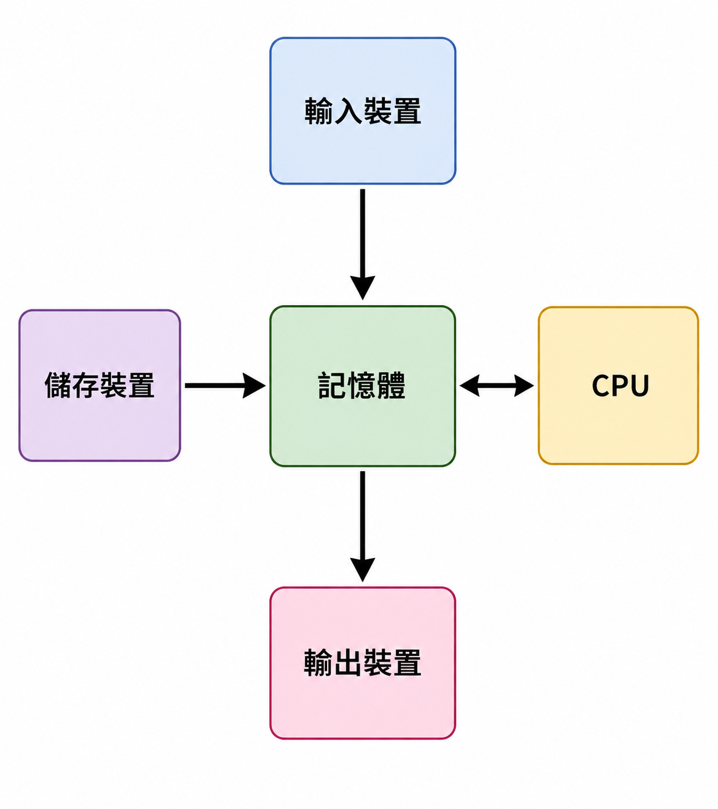
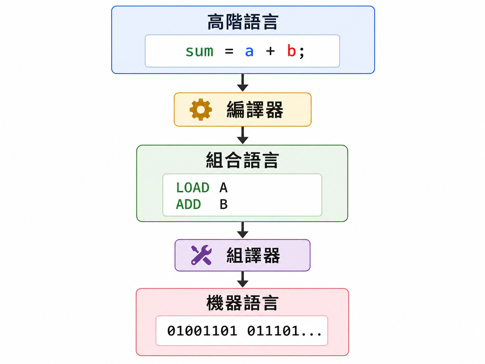
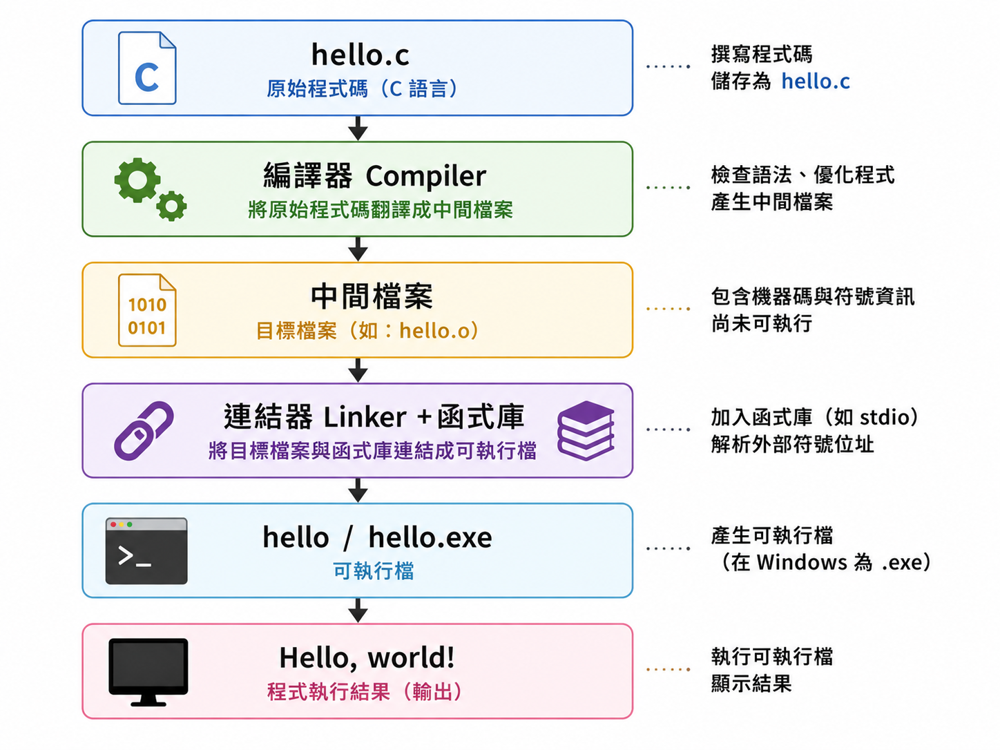
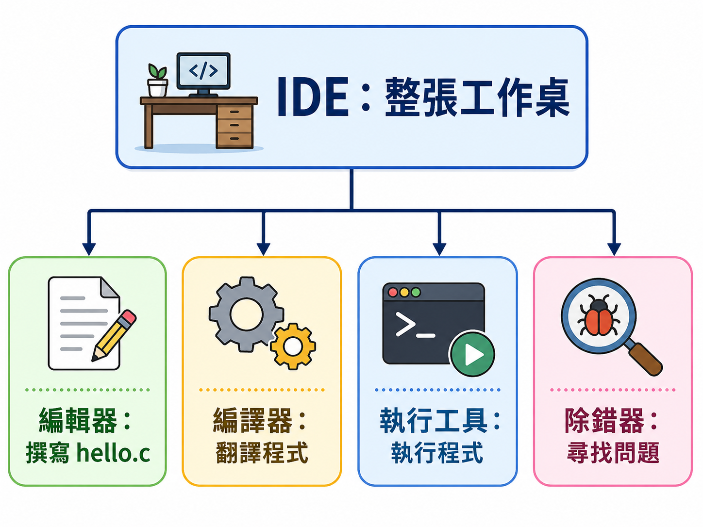
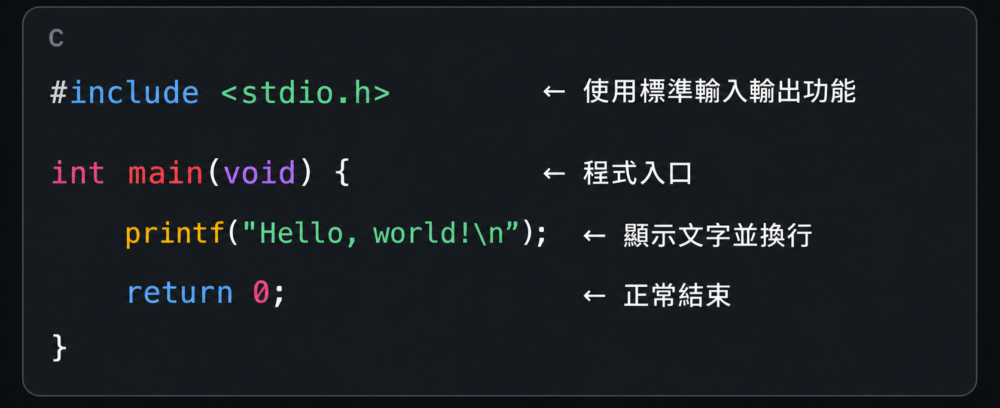
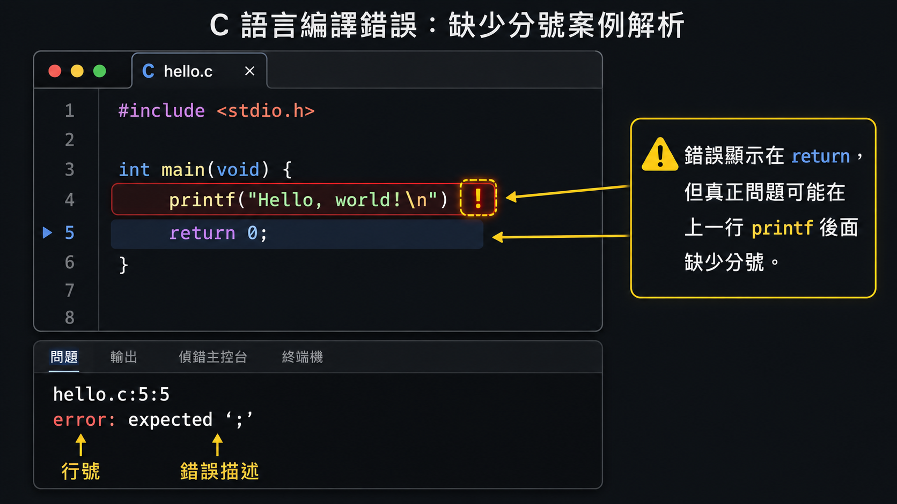
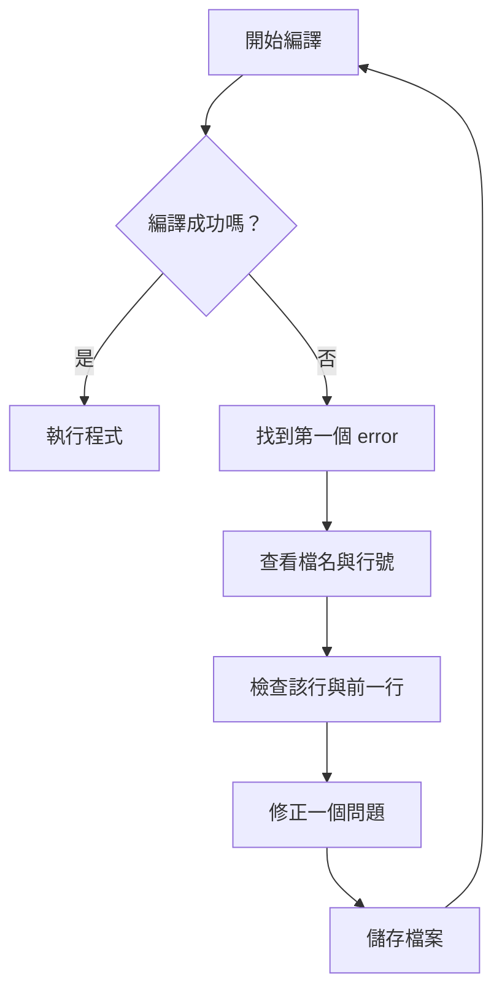
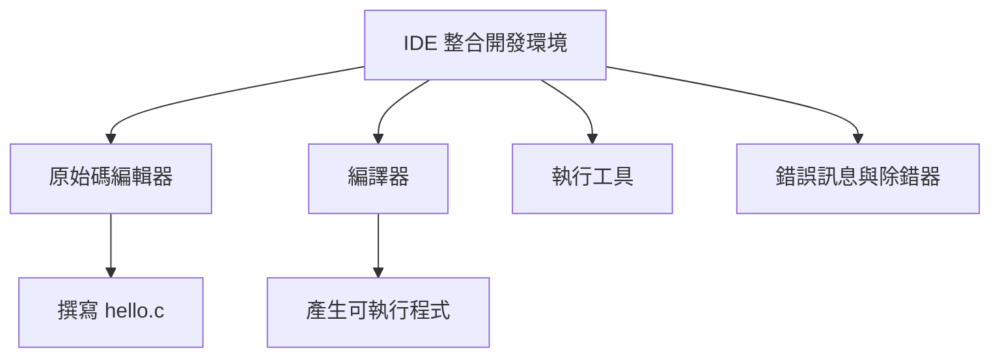

# Lesson 1：Prerequisites & Development Environment 預備知識與開發環境

> 這堂課的重點：了解程式、C 語言、原始碼、編譯器與 IDE 的關係，並完成第一個可以成功編譯及執行的 C 程式。

---

## Section I. 今天要做什麼？

1. 認識什麼是程式與程式語言。
2. 簡單了解電腦如何執行程式。
3. 分辨機器語言、組合語言與高階語言。
4. 認識 C 語言的特色與常見標準。
5. 分辨文字編輯器、編譯器與 IDE。
6. 了解 C 原始碼如何變成可執行程式。
7. 檢查自己的 C 語言開發環境。
8. 建立並執行第一個 `Hello, world!` 程式。
9. 學會閱讀最基本的編譯錯誤訊息。

---

## Section II. 今天的學習方式

1. 先理解每個工具負責什麼工作，不急著背名稱。
2. 看到新的名詞時，先把它放進整個程式開發流程中。
3. 跟著步驟建立、儲存、編譯及執行程式。
4. 出錯時先閱讀第一個錯誤訊息，再修改程式。
5. 每完成一個步驟，就確認畫面上的結果是否符合預期。
6. 練習用自己的話說明「原始碼如何變成程式」。

---

## Section III. 今天會學到的內容

| 主題 | 你需要知道的事 |
| --- | --- |
| 程式 Program | 一組要求電腦完成工作的指令 |
| 程式語言 | 人類用來撰寫電腦指令的語言 |
| C 語言 | 一種常見、高效率、可攜性高的程式語言 |
| 原始碼 Source Code | 程式設計者撰寫的文字內容 |
| `.c` 檔案 | 儲存 C 原始碼的常見檔案 |
| 編譯器 Compiler | 檢查並翻譯 C 原始碼的工具 |
| 連結器 Linker | 將程式與需要的函式庫組合起來 |
| 可執行檔 Executable | 可以交給作業系統執行的程式 |
| IDE | 整合編輯、編譯、執行與除錯功能的工具 |
| `main()` | C 程式通常開始執行的位置 |
| `printf()` | 在畫面上顯示文字的標準函式 |
| 編譯錯誤 | 程式不符合語法規則時出現的訊息 |

---

## Section IV. 開始寫程式前的提醒

### 1. 程式檔案要使用純文字

C 原始碼應該使用純文字編輯器或程式編輯器撰寫。

可以使用：

- Code::Blocks
- Visual Studio Code
- Visual Studio
- Xcode
- Vim
- 其他程式碼編輯器

不建議使用 Word 撰寫 C 程式，因為 Word 會加入額外的排版資訊。

---

### 2. 注意檔案副檔名

C 原始碼常見的副檔名是 `.c`。

正確例子：

```text
hello.c
lesson01.c
practice.c
```

容易出錯的例子：

```text
hello.c.txt
hello.docx
hello
```

有些作業系統會隱藏副檔名，因此儲存後要再次確認。

---

### 3. 使用半形英文符號

C 語言的符號通常要使用英文半形符號。

| 正確 | 容易誤用 |
| --- | --- |
| `"Hello"` | `“Hello”` |
| `;` | `；` |
| `()` | `（）` |
| `{}` | `｛｝` |
| `#` | `＃` |

中文全形符號看起來很像，但編譯器通常不會把它們當成 C 語法。

---

### 4. C 語言區分大小寫

以下名稱並不相同：

```c
printf
Printf
PRINTf
```

標準輸出函式的正確名稱是：

```c
printf
```

---

### 5. 修改程式後先儲存

如果修改程式後沒有儲存，編譯器可能仍然編譯舊版本。

建議流程：

```text
修改 → 儲存 → 編譯 → 執行 → 查看結果
```

---

### 6. 出錯是正常的

寫程式時看到錯誤訊息，不代表你不適合學程式。

錯誤訊息的作用是告訴你：

- 哪個檔案可能有問題。
- 問題可能出現在哪一行。
- 編譯器原本預期看到什麼。

最重要的做法：

```text
先看第一個 error，再檢查那一行和前一行。
```

---

## Section V. 核心概念說明

### 1. 什麼是程式？

程式是一組讓電腦按照指定步驟完成工作的指令。

例如，一個計算總價的程式可能需要：

```text
讀取商品價格
讀取購買數量
計算價格 × 數量
顯示總價
```

電腦不會自己猜測我們的意思，因此每一個步驟都要寫清楚。

---

### 2. 什麼是程式語言？

人類使用自然語言溝通，程式設計者使用程式語言描述電腦要做的工作。

程式語言可以用來：

- 儲存資料。
- 進行計算。
- 判斷不同情況。
- 重複執行工作。
- 控制軟體或硬體。
- 顯示結果。

例如：

```c
result = price * quantity;
```

這行程式表示：把 `price` 和 `quantity` 相乘，將結果放進 `result`。

---

### 3. 電腦主要包含哪些部分？

初學階段先認識以下部分：

| 電腦單元 | 主要工作 | 例子 |
| --- | --- | --- |
| CPU | 執行指令與進行運算 | 加法、比較、控制流程 |
| 記憶體 Memory | 暫時保存執行中的資料 | 變數、計算結果 |
| 儲存裝置 | 長期保存檔案 | SSD、硬碟、隨身碟 |
| 輸入裝置 | 將資料送入電腦 | 鍵盤、滑鼠 |
| 輸出裝置 | 顯示或播放結果 | 螢幕、喇叭 |

<p align="center">
  
</p>

程式通常先保存在儲存裝置中。

執行程式時，作業系統會把需要的內容載入記憶體，再由 CPU 執行指令。

---

### 4. 為什麼不能直接用一般中文命令電腦？

電腦底層處理的是二進位資料，也就是由 `0` 和 `1` 組成的內容。

例如：

```text
01001101 01111101 00010100
```

人類很難直接使用大量二進位指令撰寫程式，因此需要程式語言和翻譯工具。

---

### 5. 機器語言 Machine Language

機器語言是 CPU 可以直接執行的指令。

特點：

- 非常接近硬體。
- 不容易閱讀。
- 不同 CPU 可能使用不同指令。
- 很難用來撰寫大型程式。

---

### 6. 組合語言 Assembly Language

組合語言使用較容易閱讀的文字代替部分機器指令。

概念例子：

```asm
LOAD A
ADD B
STORE SUM
```

組合語言通常要透過組譯器轉換成機器碼。

---

### 7. 高階語言 High-level Language

高階語言使用比較接近人類思考方式的語法。

例如：

```c
sum = a + b;
```

C、C++、Java 和 Python 都屬於常見的高階程式語言。

高階語言仍然不能直接交給 CPU 執行，需要先經過翻譯。

<p align="center">
  
</p>

---

### 8. 為什麼學習 C 語言？

C 語言常被用來建立程式設計基礎。

學習 C 語言時，會逐步接觸：

- 資料型別
- 運算子
- 條件判斷
- 迴圈
- 函式
- 陣列
- 字串
- 指標
- 記憶體配置

這些概念也能幫助你理解其他程式語言、作業系統和嵌入式系統。

---

### 9. C 語言的特色

#### 特色一：執行效率高

C 程式通常可以編譯成有效率的機器指令。

#### 特色二：可攜性高

遵循標準撰寫的 C 原始碼，通常可以在不同平台重新編譯。

注意：

```text
可攜性高 ≠ 同一個執行檔可以在所有系統直接執行
```

比較正確的理解是：

```text
同一份原始碼可以在不同平台重新編譯。
```

#### 特色三：可以接近電腦底層

C 語言可以直接處理記憶體位址、位元和硬體相關資料。

#### 特色四：應用範圍廣

C 語言常見於：

- 作業系統
- 編譯器
- 嵌入式系統
- 裝置驅動程式
- 高效率函式庫
- 系統工具

---

### 10. 什麼是 C 語言標準？

你可能會看到：

```text
K&R C、C89、C90、C99、C11、C17、C23
```

這些名稱代表不同時期的 C 語言規格。

標準主要規定：

- 哪些語法屬於 C 語言。
- 標準函式庫提供哪些功能。
- 某些程式應該如何運作。

使用共同標準，可以讓程式比較容易在不同編譯器和平台上使用。

---

### 11. 什麼是原始碼？

程式設計者撰寫的 C 程式內容稱為原始碼。

例如，建立檔案：

```text
hello.c
```

檔案內容：

```c
#include <stdio.h>

int main(void) {
    printf("Hello, world!\n");
    return 0;
}
```

這份 `.c` 檔案是原始碼，還不是 CPU 可以直接執行的程式。

---

### 12. 什麼是編譯器？

編譯器負責檢查和翻譯 C 原始碼。

常見 C 編譯器：

| 編譯器 | 常見環境 |
| --- | --- |
| GCC | Linux、Windows、macOS |
| Clang | macOS、Linux、Windows |
| MSVC | Windows |

編譯器會處理：

- 語法是否正確。
- 名稱是否能找到。
- 型別使用是否合理。
- 如何把程式轉換成較低階的指令。

---

### 13. 什麼是連結器？

程式可能會使用其他函式庫中的功能，例如 `printf()`。

連結器會把：

```text
你的程式 + 需要的函式庫
```

組合成可以執行的程式。

如果函式找不到，可能會出現連結錯誤。

---

### 14. 原始碼如何變成可執行程式？

初學階段可以先記住：

```text
撰寫原始碼 → 編譯 → 連結 → 產生可執行檔 → 執行
```

<p align="center">
  
</p>

| 階段 | 工作 | 常見結果 |
| --- | --- | --- |
| Edit | 撰寫程式 | `hello.c` |
| Compile | 檢查及翻譯原始碼 | 中間檔案 |
| Link | 組合程式和函式庫 | `hello` 或 `hello.exe` |
| Run | 執行程式 | 顯示 `Hello, world!` |

更完整的流程是：

```text
預處理 → 編譯 → 組譯 → 連結
```

本課先使用簡化流程即可。

---

### 15. 文字編輯器、編譯器與 IDE 的差別

| 工具 | 主要工作 | 例子 |
| --- | --- | --- |
| 文字編輯器 | 撰寫原始碼 | Visual Studio Code、Vim |
| 編譯器 | 檢查及翻譯原始碼 | GCC、Clang、MSVC |
| IDE | 整合編輯、編譯、執行及除錯 | Code::Blocks、Visual Studio、Xcode |

記法：

```text
編輯器：負責寫。
編譯器：負責翻譯。
IDE：把很多工具放在一起。
```

<p align="center">
  
</p>

---

### 16. 什麼是 IDE？

IDE 的完整名稱是：

```text
Integrated Development Environment
整合開發環境
```

IDE 常見功能：

- 編輯程式碼
- 管理檔案與專案
- 編譯程式
- 執行程式
- 顯示錯誤訊息
- 除錯 Debug
- 程式碼提示

IDE 本身不是 C 語言。

IDE 也不一定自己包含編譯器，因此安裝時要確認編譯器是否一起安裝。

---

### 17. 開發環境方案 A：Code::Blocks

Code::Blocks 是常見的圖形化 C/C++ IDE。

Windows 使用者安裝時要確認：

- 安裝版本包含 MinGW GCC，或電腦已經安裝其他編譯器。
- Code::Blocks 可以找到編譯器。
- 建立檔案時使用 `.c` 副檔名。

常見操作：

```text
新增檔案：File > New > Empty file
儲存檔案：File > Save file
開啟檔案：File > Open
建置並執行：Build > Build and run
```

不同版本的選單名稱可能略有不同。

---

### 18. 開發環境方案 B：macOS + Clang

先在終端機輸入：

```bash
clang --version
```

如果可以看到版本資訊，代表 Clang 通常已經可以使用。

如果尚未安裝命令列工具，可以執行：

```bash
xcode-select --install
```

編譯程式：

```bash
clang hello.c -o hello
```

執行程式：

```bash
./hello
```

---

### 19. 開發環境方案 C：Ubuntu 或 WSL + GCC

先檢查 GCC：

```bash
gcc --version
```

如果尚未安裝，可以執行：

```bash
sudo apt update
sudo apt install build-essential
```

編譯程式：

```bash
gcc hello.c -o hello
```

執行程式：

```bash
./hello
```

---

### 20. 建立第一個 C 程式

建立檔案：

```text
hello.c
```

輸入：

```c
#include <stdio.h>

int main(void) {
    printf("Hello, world!\n");
    return 0;
}
```

編譯並執行成功後，應看到：

```text
Hello, world!
```

---

### 21. 第一個程式逐行說明

<p align="center">
  
</p>

#### `#include <stdio.h>`

```c
#include <stdio.h>
```

這行讓程式可以使用標準輸入輸出功能，例如 `printf()`。

---

#### `int main(void)`

```c
int main(void)
```

`main()` 是一般 C 程式開始執行的位置。

可以先把它想成：

```text
程式的大門
```

---

#### 大括號 `{ }`

```c
{
    /* 程式內容 */
}
```

大括號用來包住一個程式區塊。

`main()` 要執行的內容會放在這對大括號中。

---

#### `printf()`

```c
printf("Hello, world!\n");
```

`printf()` 用來把文字顯示在畫面上。

其中：

```text
\n
```

表示換行。

---

#### 分號 `;`

```c
printf("Hello, world!\n");
```

分號通常表示一個 C 述句結束。

漏掉分號是常見的初學者錯誤。

---

#### `return 0;`

```c
return 0;
```

這行表示 `main()` 結束，並回傳 `0`。

初學階段可以先把 `0` 理解成：

```text
程式正常完成
```

---

### 22. 使用 GCC 編譯

編譯命令：

```bash
gcc hello.c -o hello
```

拆開來看：

| 部分 | 意思 |
| --- | --- |
| `gcc` | 使用 GCC 編譯器 |
| `hello.c` | 要編譯的原始碼 |
| `-o` | 指定輸出名稱 |
| `hello` | 產生的程式名稱 |

執行：

```bash
./hello
```

Result:

```text
Hello, world!
```

---

### 23. 使用 Clang 編譯

編譯命令：

```bash
clang hello.c -o hello
```

執行：

```bash
./hello
```

Result:

```text
Hello, world!
```

---

### 24. Windows 執行方式

如果產生的程式名稱是 `hello.exe`，PowerShell 中可以執行：

```powershell
.\hello.exe
```

Result:

```text
Hello, world!
```

---

### 25. 什麼是編譯錯誤？

如果程式不符合 C 語法，編譯器會停止並顯示錯誤訊息。

錯誤程式：

```c
#include <stdio.h>

int main(void) {
    printf("Hello, world!\n")
    return 0;
}
```

`printf()` 後面少了分號。

可能出現類似訊息：

```text
error: expected ';' before 'return'
```

<p align="center">
  
</p>

編譯器在看到 `return` 時，才確定上一行不完整。

因此：

```text
錯誤訊息指向的行，不一定是錯誤真正開始的行。
```

---

### 26. 常見錯誤類型

| 錯誤類型 | 說明 | 例子 |
| --- | --- | --- |
| Compile Error | 程式不符合語法或型別規則 | 漏掉分號 |
| Linker Error | 找不到需要的函式或程式內容 | 函式只有宣告沒有實作 |
| Runtime Error | 程式執行時發生問題 | 不合法的記憶體操作 |
| Logic Error | 程式能執行，但答案錯誤 | 計算公式寫錯 |

---

### 27. 閱讀錯誤訊息的順序

遇到錯誤時：

```text
1. 找到第一個 error。
2. 查看檔名和行號。
3. 檢查那一行。
4. 再檢查前一行。
5. 檢查分號、括號、引號和大小寫。
6. 修改一小部分。
7. 儲存後重新編譯。
```

不要一開始就同時修改很多地方，否則會很難知道是哪一個修改解決問題。

---

## Section V-A. 容易搞混的重點：編輯器、編譯器與 IDE

這一節要特別記住三個口訣：

```text
編輯器負責寫。
編譯器負責翻譯。
IDE 負責整合。
```

---

### 1. 編輯器不能代替編譯器

你可以在文字編輯器中寫出：

```c
printf("Hello");
```

但是只有文字編輯器時，這段程式還不能變成可執行檔。

還需要編譯器。

---

### 2. IDE 不等於編譯器

Code::Blocks 是 IDE。

GCC 是編譯器。

Code::Blocks 可以呼叫 GCC 幫你編譯，但兩者不是同一個工具。

可以想成：

```text
Code::Blocks 是工作桌。
GCC 是桌上的翻譯工具。
```

---

### 3. 原始碼不等於可執行檔

原始碼：

```text
hello.c
```

可執行檔：

```text
hello
hello.exe
```

原始碼是給人閱讀和修改的內容。

可執行檔是給作業系統載入和執行的內容。

---

### 4. 可攜性不代表執行檔通用

同一份 `hello.c` 可以在 macOS、Linux 或 Windows 上重新編譯。

但是：

```text
在 macOS 產生的 hello，通常不能直接放到 Windows 執行。
```

所以「C 語言具有可攜性」主要是指原始碼容易移植。

---

### 5. 工具對照表

| 名稱 | 類型 | 主要工作 |
| --- | --- | --- |
| Visual Studio Code | 編輯器 | 撰寫及管理程式碼 |
| GCC | 編譯器 | 編譯 C 程式 |
| Clang | 編譯器 | 編譯 C 程式 |
| Code::Blocks | IDE | 整合編輯、編譯和執行 |
| Visual Studio | IDE | 整合編輯、編譯和除錯 |
| Xcode | IDE | macOS 開發環境 |

---

## Section VI. 快速概念檢查

請先不要急著查看答案，先自己想一次。

### Q1. 哪一個是 C 原始碼檔？

```text
A. hello.c
B. hello.exe
C. hello.docx
```

Answer:

```text
A. hello.c
```

Explanation:

`.c` 是 C 原始碼常用的副檔名。

---

### Q2. 哪一個工具主要負責翻譯 C 原始碼？

```text
A. 編輯器
B. 編譯器
C. 螢幕
```

Answer:

```text
B. 編譯器
```

Explanation:

編輯器負責撰寫程式，編譯器負責檢查和翻譯程式。

---

### Q3. Code::Blocks 是什麼？

```text
A. 程式語言
B. IDE
C. CPU
```

Answer:

```text
B. IDE
```

Explanation:

Code::Blocks 是整合開發環境，可以整合編輯器、編譯器和執行功能。

---

### Q4. 哪一個是常見的 C 編譯器？

```text
A. GCC
B. Word
C. Chrome
```

Answer:

```text
A. GCC
```

Explanation:

GCC 可以用來編譯 C 程式。

---

### Q5. 這個程式會顯示什麼？

```c
#include <stdio.h>

int main(void) {
    printf("Hi!\n");
    return 0;
}
```

Answer:

```text
Hi!
```

Explanation:

`printf()` 會顯示字串中的內容，`\n` 代表換行。

---

### Q6. 哪一行是程式通常開始執行的位置？

```text
A. printf()
B. main()
C. include
```

Answer:

```text
B. main()
```

Explanation:

一般 C 程式會從 `main()` 函式開始執行。

---

### Q7. 以下程式少了什麼？

```c
printf("Hello\n")
```

Answer:

```text
分號 ;
```

正確寫法：

```c
printf("Hello\n");
```

---

### Q8. 以下敘述是否正確？

```text
同一個 Windows 執行檔可以直接在所有 macOS 和 Linux 電腦執行。
```

Answer:

```text
不正確
```

Explanation:

C 原始碼通常可以移植並重新編譯，但不同系統產生的執行檔通常不能直接互換。

---

## Section VII. 程式閱讀練習

### 題目 1：閱讀第一個程式

```c
#include <stdio.h>

int main(void) {
    printf("Hello, C!\n");
    return 0;
}
```

思考方式：

```text
程式包含 stdio.h。
程式從 main() 開始。
printf() 顯示 Hello, C!。
\n 讓游標移到下一行。
return 0 表示程式正常結束。
```

所以輸出是：

```text
Hello, C!
```

---

### 題目 2：兩個 `printf()`

```c
#include <stdio.h>

int main(void) {
    printf("Hello, ");
    printf("world!\n");
    return 0;
}
```

思考方式：

```text
第一個 printf() 沒有換行。
第二個 printf() 接著顯示 world!。
第二個字串最後有 \n。
```

所以輸出是：

```text
Hello, world!
```

---

### 題目 3：兩行輸出

```c
#include <stdio.h>

int main(void) {
    printf("Line 1\n");
    printf("Line 2\n");
    return 0;
}
```

思考方式：

```text
第一個字串最後有 \n，所以換行。
第二個字串會顯示在下一行。
```

所以輸出是：

```text
Line 1
Line 2
```

---

### 題目 4：找出錯誤

```c
#include <stdio.h>

int main(void) {
    Printf("Hello\n");
    return 0;
}
```

思考方式：

```text
C 語言區分大小寫。
標準函式名稱是 printf，不是 Printf。
```

正確寫法：

```c
printf("Hello\n");
```

---

### 題目 5：閱讀編譯命令

```bash
gcc practice.c -o practice
```

思考方式：

```text
gcc：使用 GCC 編譯器。
practice.c：要編譯的原始碼。
-o practice：輸出名稱叫 practice。
```

所以這個命令的作用是：

```text
把 practice.c 編譯成名為 practice 的程式。
```

---

## Section VIII. 實作練習 / 實作檢測題

### Q1. 建立第一個程式

建立 `hello.c`，完成程式：

```c
#include <stdio.h>

int main(void) {
    // TODO:
    // 顯示 Hello, world!

    return 0;
}
```

Example Output:

```text
Hello, world!
```

---

### Q2. 顯示自己的名字

完成程式：

```c
#include <stdio.h>

int main(void) {
    // TODO:
    // 顯示 My name is Ying.

    return 0;
}
```

Example Output:

```text
My name is Ying.
```

你可以把 `Ying` 改成自己的名字。

---

### Q3. 顯示兩行文字

完成程式：

```c
#include <stdio.h>

int main(void) {
    // TODO:
    // 第一行顯示 I am learning C.
    // 第二行顯示 This is Lesson 1.

    return 0;
}
```

Example Output:

```text
I am learning C.
This is Lesson 1.
```

---

### Q4. 使用兩個 `printf()` 組成一句話

完成程式：

```c
#include <stdio.h>

int main(void) {
    // TODO:
    // 第一個 printf 顯示 Hello,
    // 第二個 printf 顯示 C!
    // 最後輸出要在同一行

    return 0;
}
```

Example Output:

```text
Hello, C!
```

---

### Q5. 修正分號錯誤

修正程式：

```c
#include <stdio.h>

int main(void) {
    printf("C compiler\n")
    return 0;
}
```

Example Output:

```text
C compiler
```

---

### Q6. 修正大小寫錯誤

修正程式：

```c
#include <stdio.h>

int main(void) {
    Printf("Case sensitive\n");
    return 0;
}
```

Example Output:

```text
Case sensitive
```

---

### Q7. 修正引號錯誤

修正程式：

```c
#include <stdio.h>

int main(void) {
    printf("Hello\n);
    return 0;
}
```

Example Output:

```text
Hello
```

---

### Q8. 工具分類

將以下工具放進正確分類：

```text
GCC
Clang
Code::Blocks
Visual Studio Code
Visual Studio
Xcode
```

分類：

```text
文字編輯器：
編譯器：
IDE：
```

---

### Q9. 排列開發流程

將以下步驟排成正確順序：

```text
執行程式
編譯程式
撰寫原始碼
產生可執行檔
```

---

### Q10. 完成環境檢查

完成以下清單：

```text
[ ] 可以建立 .c 檔案
[ ] 可以儲存檔案
[ ] 可以執行 gcc --version 或 clang --version
[ ] 可以成功編譯 hello.c
[ ] 可以執行產生的程式
[ ] 可以看到 Hello, world!
[ ] 可以看懂第一個 error 的行號
```

---

## Section IX. 做題時可以使用的提示

### 1. 基本 C 程式架構

```c
#include <stdio.h>

int main(void) {
    // 程式內容

    return 0;
}
```

---

### 2. 顯示一行文字

```c
printf("文字內容\n");
```

---

### 3. 顯示文字但不立即換行

```c
printf("文字內容");
```

---

### 4. GCC 編譯命令

```bash
gcc 檔名.c -o 程式名稱
```

Example:

```bash
gcc hello.c -o hello
```

---

### 5. Clang 編譯命令

```bash
clang 檔名.c -o 程式名稱
```

Example:

```bash
clang hello.c -o hello
```

---

### 6. macOS、Linux 或 WSL 執行程式

```bash
./程式名稱
```

Example:

```bash
./hello
```

---

### 7. Windows PowerShell 執行程式

```powershell
.\程式名稱.exe
```

Example:

```powershell
.\hello.exe
```

---

### 8. 發生錯誤時先檢查

```text
分號 ;
英文雙引號 " "
小括號 ( )
大括號 { }
函式名稱大小寫
檔案是否已儲存
```

---

## Section X. 課後小練習

### 練習 1：自我介紹

建立一個 C 程式，輸出三行資料：

```text
My name is Ying.
I am learning C.
This is my first program.
```

---

### 練習 2：ASCII 文字圖形

使用多個 `printf()`，顯示：

```text
*****
* C *
*****
```

---

### 練習 3：故意製造錯誤

從正確的 `hello.c` 開始，依序測試：

1. 刪除一個分號。
2. 把 `printf` 改成 `Printf`。
3. 刪除右邊的雙引號。
4. 刪除最後一個右大括號。

每次只製造一種錯誤，記錄第一個錯誤訊息，再把程式修好。

---

### 練習 4：用自己的話解釋

請不用查資料，用自己的話回答：

1. 原始碼是什麼？
2. 編譯器做什麼？
3. IDE 和編譯器有什麼差別？
4. 為什麼 `.c` 檔案不能直接交給 CPU 執行？

---

## Section XI. 重點複習

| 重點 | 說明 |
| --- | --- |
| 程式 | 一組要求電腦完成工作的指令 |
| 程式語言 | 用來撰寫程式的語言 |
| C 語言 | 高效率、可攜性高、接近底層的語言 |
| 原始碼 | 程式設計者撰寫的文字內容 |
| `.c` | C 原始碼常見的副檔名 |
| 編輯器 | 用來撰寫和修改程式 |
| 編譯器 | 檢查並翻譯原始碼 |
| 連結器 | 組合程式和需要的函式庫 |
| IDE | 整合編輯、編譯、執行和除錯功能 |
| `main()` | 程式通常開始執行的位置 |
| `printf()` | 顯示文字 |
| `\n` | 換行 |
| `;` | 常用來表示述句結束 |
| `return 0;` | 程式正常結束 |

最重要的口訣：

```text
編輯器負責寫。
編譯器負責翻譯。
IDE 負責整合。

修改後先儲存。
出錯先看第一個 error。
```

---

## Section XII. 常見錯誤提醒

### 1. 檔案存成 `.txt`

錯誤檔名：

```text
hello.c.txt
```

正確檔名：

```text
hello.c
```

---

### 2. 使用中文全形引號

錯誤寫法：

```c
printf(“Hello”);
```

正確寫法：

```c
printf("Hello");
```

---

### 3. 漏掉分號

錯誤寫法：

```c
printf("Hello\n")
```

正確寫法：

```c
printf("Hello\n");
```

---

### 4. 函式名稱大小寫錯誤

錯誤寫法：

```c
Printf("Hello\n");
```

正確寫法：

```c
printf("Hello\n");
```

---

### 5. 忘記包含 `stdio.h`

錯誤或不完整寫法：

```c
int main(void) {
    printf("Hello\n");
    return 0;
}
```

本課建議寫法：

```c
#include <stdio.h>

int main(void) {
    printf("Hello\n");
    return 0;
}
```

---

### 6. 括號沒有成對

錯誤寫法：

```c
printf("Hello\n";
```

正確寫法：

```c
printf("Hello\n");
```

---

### 7. 修改後沒有儲存

可能發生：

```text
畫面上的程式已經修改，
但是編譯器仍然使用上一次儲存的內容。
```

處理方式：

```text
先儲存，再重新編譯。
```

---

### 8. 只有安裝 IDE，沒有安裝編譯器

可能出現：

```text
compiler not found
cannot find gcc
no compiler configured
```

處理方式：

- 確認 GCC、Clang 或 MSVC 已安裝。
- 確認 IDE 的 compiler settings 指向正確位置。
- Windows 使用 Code::Blocks 時，確認安裝包是否包含 MinGW。

---

### 9. 把原始碼當成執行檔

錯誤想法：

```text
直接執行 hello.c
```

正確流程：

```text
先編譯 hello.c
再執行產生的 hello 或 hello.exe
```

---

### 10. 一次處理所有錯誤訊息

編譯器可能顯示很多錯誤，但後面的錯誤有時是第一個錯誤造成的。

建議：

```text
先修正第一個 error，再重新編譯。
```

---

## Section XIII. Mermaid 流程圖

### 1. C 程式開發流程


---

### 2. 編譯失敗時怎麼做？



---

### 3. 編輯器、編譯器與 IDE


