# Lesson 2：Your First C Program 第一個 C 程式

> 這堂課的重點：看懂第一個完整的 C 程式，學會使用 `printf()` 顯示文字，並利用跳脫序列控制換行、雙引號、反斜線與簡單的文字圖形。

---

## Section I. 今天要做什麼？

1. 看懂第一個完整的 C 程式。
2. 認識 `#include <stdio.h>`、`main()`、`printf()` 和 `return 0;`。
3. 學會使用 `printf()` 顯示固定文字。
4. 理解程式碼中的雙引號、括號與分號。
5. 學會使用 `\n` 控制輸出換行。
6. 認識常見的跳脫序列。
7. 使用文字與空白排列簡單圖形。
8. 練習閱讀程式並預測輸出結果。
9. 建立整齊、容易閱讀的程式寫作習慣。
10. 完成幾題固定文字輸出的實作練習。

---

## Section II. 今天的學習方式

1. 先照著完整範例輸入一次，不要只複製貼上。
2. 每次只修改一個地方，再重新編譯及執行。
3. 執行前先用眼睛預測畫面會顯示什麼。
4. 出錯時先比較符號、大小寫、分號和雙引號。
5. 練習把同一個輸出結果改用不同的 `printf()` 寫法完成。
6. 一開始不急著挑戰新題型，先把已經學過的寫法練熟。

---

## Section III. 今天會學到的內容

| 主題 | 你需要知道的事 |
| --- | --- |
| `#include <stdio.h>` | 讓程式可以使用標準輸入輸出工具，例如 `printf()` |
| `main()` | 程式開始執行的位置 |
| `{` 和 `}` | 標示一個程式區塊的開始與結束 |
| `printf()` | 把文字顯示在畫面上 |
| 字串 String | 放在雙引號 `" "` 中的一串文字 |
| `;` | 表示一個敘述結束 |
| `return 0;` | 結束 `main()`，並回報程式正常完成 |
| `\n` | 在輸出結果中換行 |
| 跳脫序列 | 用反斜線開頭，表示特殊字元或控制效果 |
| 程式寫作風格 | 讓程式碼整齊、清楚並容易閱讀 |
| 註解 Comment | 寫給人閱讀、編譯器不會執行的說明文字 |

---

## Section IV. 寫題目前的提醒

### 1. C 語言區分大小寫

以下三個名稱不一樣：

```c
printf
Printf
PRINTF
```

本章使用的標準輸出函式是：

```c
printf
```

---

### 2. 使用英文半形符號

正確寫法：

```c
printf("Hello\n");
```

常見的錯誤來源：

```text
中文引號：“Hello”
中文分號：；
中文括號：（ ）
```

C 程式中的引號、括號、分號與反斜線都應使用英文半形符號。

---

### 3. 每個符號都有工作

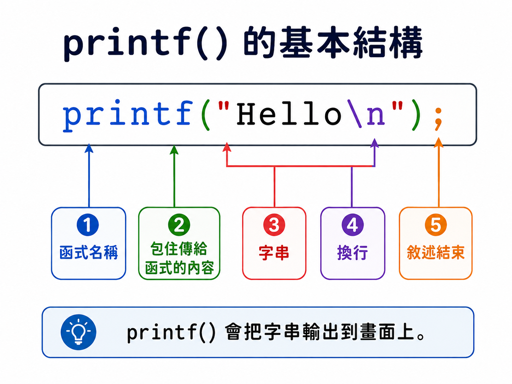

觀察下面這行：

```c
printf("Hello\n");
```

| 部分 | 作用 |
| --- | --- |
| `printf` | 要使用的函式名稱 |
| `(` `)` | 包住交給函式的內容 |
| `"Hello\n"` | 要顯示的字串 |
| `;` | 表示這個敘述結束 |

初學時不要只記整行的外觀，也要知道每個符號負責什麼。

---

### 4. 程式碼中的換行不一定等於輸出換行

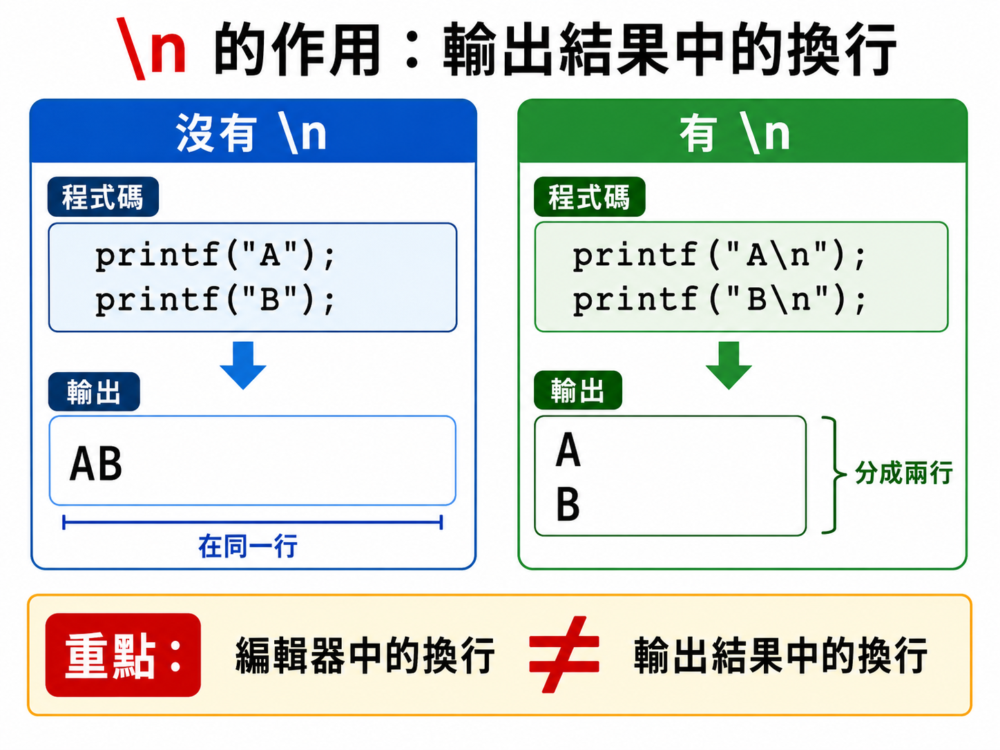

下面有兩行 `printf()`：

```c
printf("Hello ");
printf("world!");
```

程式碼雖然寫成兩行，但輸出仍然是：

```text
Hello world!
```

原因是字串中沒有要求電腦換行。

要讓輸出換行，必須加入 `\n`：

```c
printf("Hello\n");
printf("world!\n");
```

---

### 5. 修改後要重新儲存、編譯及執行

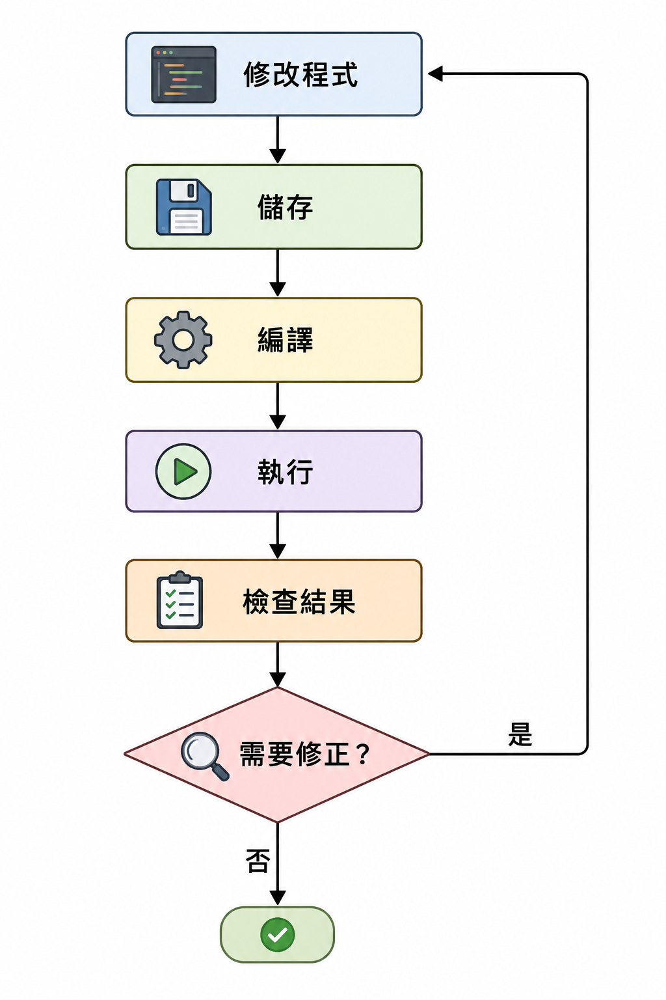

建議固定使用這個流程：

```text
修改程式 → 儲存 → 編譯 → 執行 → 檢查結果
```

只修改程式但沒有重新編譯，畫面可能仍然顯示舊結果。

---

## Section V. 核心概念說明

### 1. 第一個完整的 C 程式

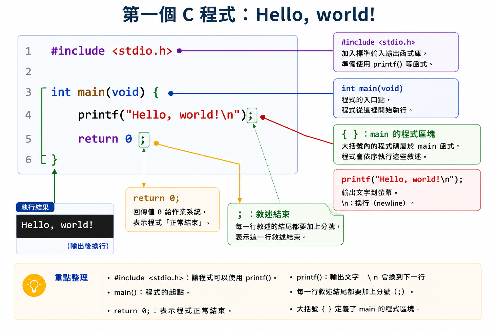

```c
#include <stdio.h>

int main(void) {
    printf("Hello, world!\n");
    return 0;
}
```

Result:

```text
Hello, world!
```

這個程式的執行順序可以先簡化成：

```text
準備 printf() → 進入 main() → 顯示文字 → 結束程式
```

---

### 2. `#include <stdio.h>` 是什麼？

```c
#include <stdio.h>
```

這行讓程式知道標準輸入輸出函式的相關資訊。

本章會使用：

```c
printf()
```

因此需要加入：

```c
#include <stdio.h>
```

可以先把它理解成：

```text
我要使用標準輸入輸出工具，請先把需要的說明準備好。
```

注意：

- `#include` 前面有 `#`。
- `stdio.h` 放在 `< >` 中。
- 這一行後面不加分號。

---

### 3. `main()` 是程式開始的位置

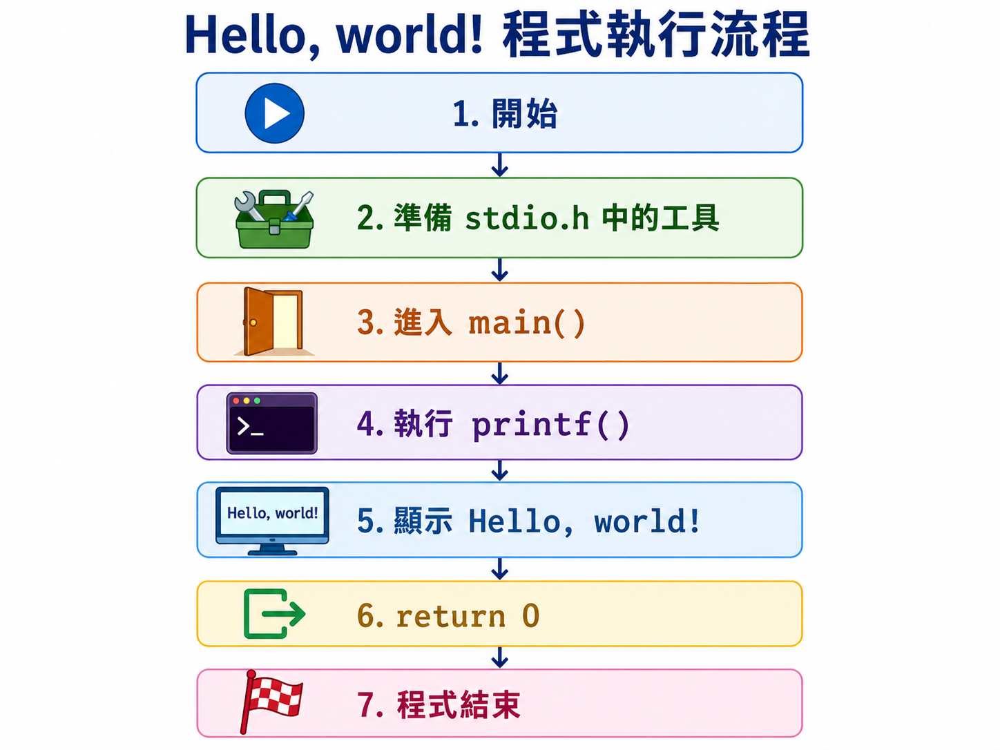

```c
int main(void) {
    // 程式主要內容
}
```

執行 C 程式時，程式會從 `main()` 開始。

本章使用：

```c
int main(void)
```

其中 `void` 表示這個 `main()` 不接收本章要處理的輸入參數。

初學時先記住：

```text
main 是程式的入口。
```

---

### 4. 大括號 `{ }` 表示程式區塊

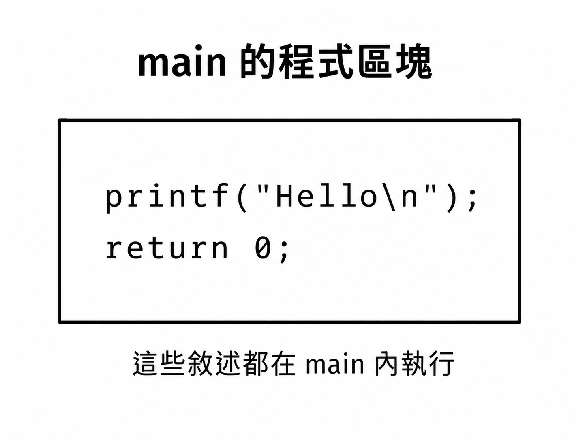

```c
int main(void) {
    printf("Hello\n");
    return 0;
}
```

左大括號 `{` 表示區塊開始，右大括號 `}` 表示區塊結束。

在這個例子中，以下兩個敘述都屬於 `main()`：

```c
printf("Hello\n");
return 0;
```

可以把大括號想成一個盒子：

```text
main 的盒子
├── printf(...);
└── return 0;
```

---

### 5. 使用 `printf()` 顯示文字

```c
printf("I am learning C.\n");
```

Result:

```text
I am learning C.
```

`printf()` 會把雙引號中的內容顯示在畫面上。

再看一個例子：

```c
#include <stdio.h>

int main(void) {
    printf("C is interesting!\n");
    return 0;
}
```

Result:

```text
C is interesting!
```

---

### 6. 雙引號中的內容是字串

```c
printf("Hello, C!\n");
```

這裡的：

```c
"Hello, C!\n"
```

是一個字串。

字串中的一般文字會被顯示出來，但像 `\n` 這樣的跳脫序列會產生特殊效果。

錯誤寫法：

```c
printf(Hello, C!);
```

因為要輸出的文字沒有放在雙引號中。

---

### 7. 分號 `;` 表示敘述結束

```c
printf("Hello\n");
return 0;
```

這兩行後面都有分號。

可以先把分號想成程式敘述的句點。

錯誤寫法：

```c
printf("Hello\n")
```

正確寫法：

```c
printf("Hello\n");
```

---

### 8. `return 0;` 表示正常結束

```c
return 0;
```

這行會結束 `main()`，並把 `0` 回報給執行環境。

初學階段可以先記成：

```text
return 0; 代表程式正常完成。
```

---

### 9. 使用 `\n` 換行

先看沒有 `\n` 的程式：

```c
#include <stdio.h>

int main(void) {
    printf("Hello ");
    printf("world!");
    return 0;
}
```

Result:

```text
Hello world!
```

兩次輸出會接在同一行。

加入 `\n`：

```c
#include <stdio.h>

int main(void) {
    printf("Hello\n");
    printf("world!\n");
    return 0;
}
```

Result:

```text
Hello
world!
```

記法：

```text
\n：new line，換到下一行。
```

---

### 10. 什麼是跳脫序列？

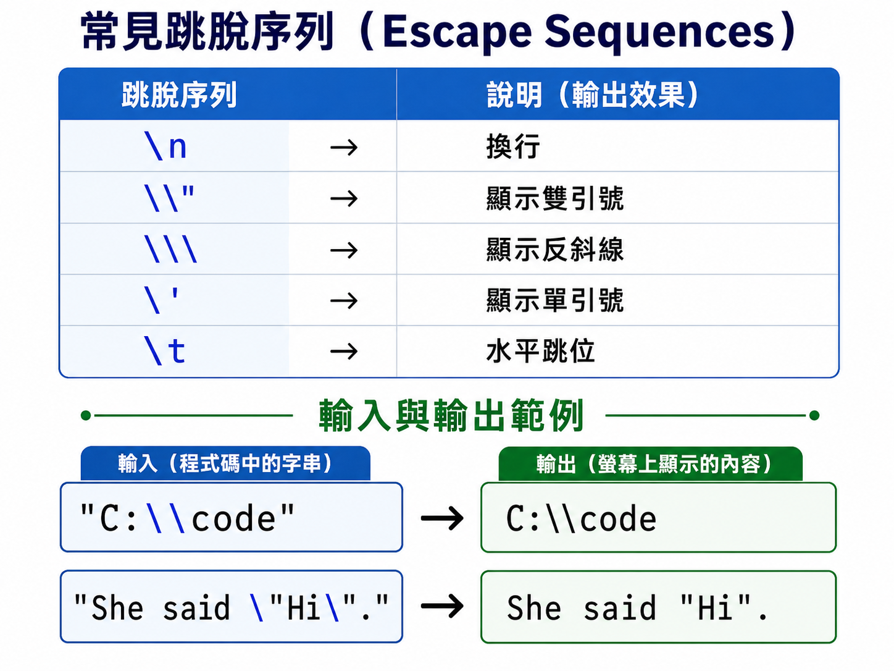

跳脫序列通常由反斜線 `\` 開頭，後面再接另一個字元。

例如：

```c
\n
```

雖然它看起來由反斜線與英文字母 `n` 組成，但放在 C 字串中時，會被解讀成一個換行效果。

常見的跳脫序列：

| 跳脫序列 | 代表的內容 |
| --- | --- |
| `\n` | 換行 |
| `\"` | 雙引號 |
| `\\` | 反斜線 |
| `\'` | 單引號 |
| `\t` | 水平跳位（Tab） |

---

### 11. 在字串中顯示雙引號

思考：如果雙引號本身用來包住字串，要怎麼把雙引號顯示出來？

使用：

```c
\"
```

Example:

```c
#include <stdio.h>

int main(void) {
    printf("Hello \"C\" world!\n");
    return 0;
}
```

Result:

```text
Hello "C" world!
```

---

### 12. 在字串中顯示反斜線

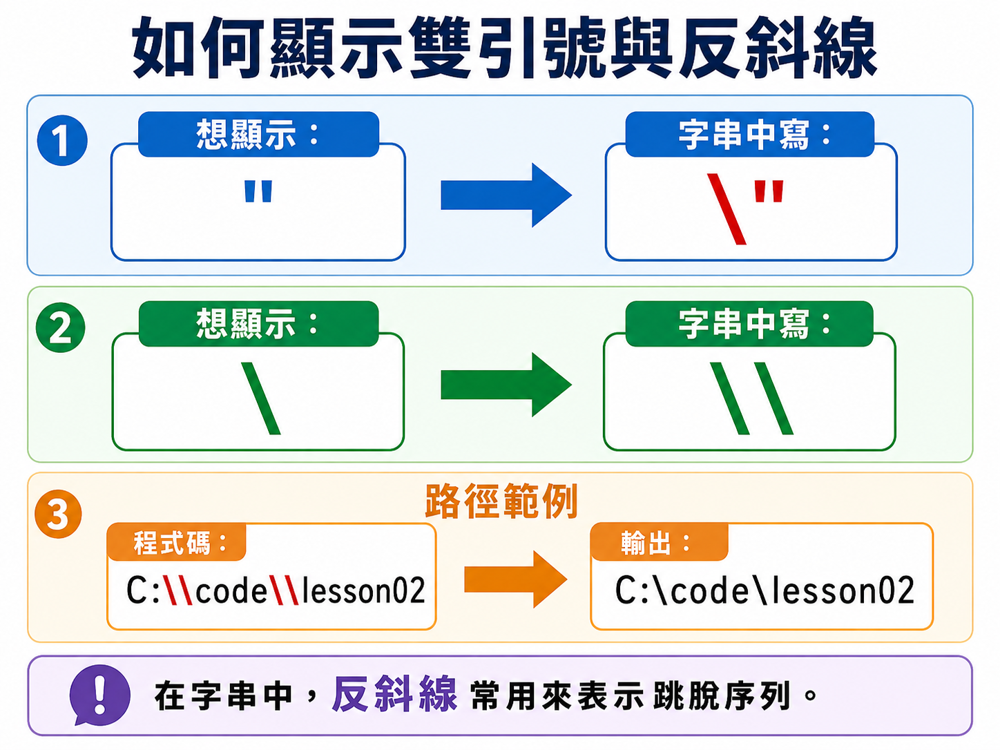

要顯示一個反斜線，字串中需要寫兩個反斜線：

```c
\\
```

Example:

```c
#include <stdio.h>

int main(void) {
    printf("C:\\code\\lesson02\n");
    return 0;
}
```

Result:

```text
C:\code\lesson02
```

記法：

```text
字串中的 \\ 會顯示成一個 \。
```

---

### 13. 使用 `\t` 做簡單的欄位間隔

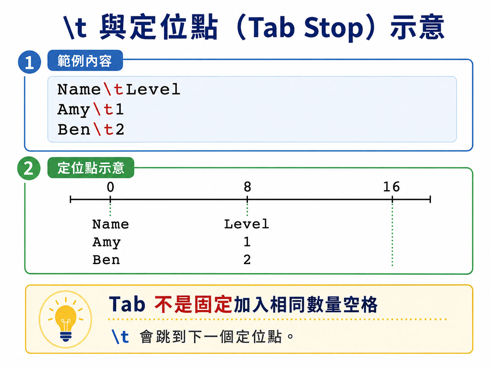

```c
#include <stdio.h>

int main(void) {
    printf("Name\tLevel\n");
    printf("Amy\t1\n");
    printf("Ben\t2\n");
    return 0;
}
```

可能的輸出：

```text
Name    Level
Amy     1
Ben     2
```

`\t` 會移動到下一個跳位位置。

注意：不同文字長度或不同終端機設定，欄位不一定會完全對齊。因此本章只把它當成基本練習。

---

### 14. 一次 `printf()` 也可以輸出多行

寫法一：使用多個 `printf()`。

```c
printf("Line 1\n");
printf("Line 2\n");
printf("Line 3\n");
```

寫法二：使用一個 `printf()` 和多個 `\n`。

```c
printf("Line 1\nLine 2\nLine 3\n");
```

兩種寫法都可以得到：

```text
Line 1
Line 2
Line 3
```

初學時可以先選自己最容易閱讀的寫法。

---

### 15. 使用固定文字畫出簡單圖形

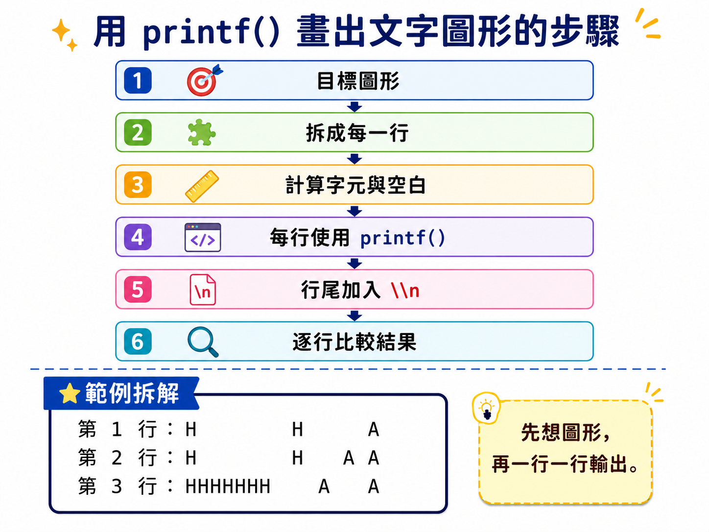

下面的程式使用字母與空白排出 `H` 和 `A`：

```c
#include <stdio.h>

int main(void) {
    printf("H     H    A\n");
    printf("H     H   A A\n");
    printf("HHHHHHH  A   A\n");
    printf("H     H  AAAAA\n");
    printf("H     H A     A\n");
    return 0;
}
```

Result:

```text
H     H    A
H     H   A A
HHHHHHH  A   A
H     H  AAAAA
H     H A     A
```

這類題目的重點不是新的語法，而是仔細控制：

- 每一行的字元。
- 每一行的空白數量。
- `\n` 出現的位置。
- 實際結果與目標圖形的差別。

---

### 16. 註解是寫給人看的說明

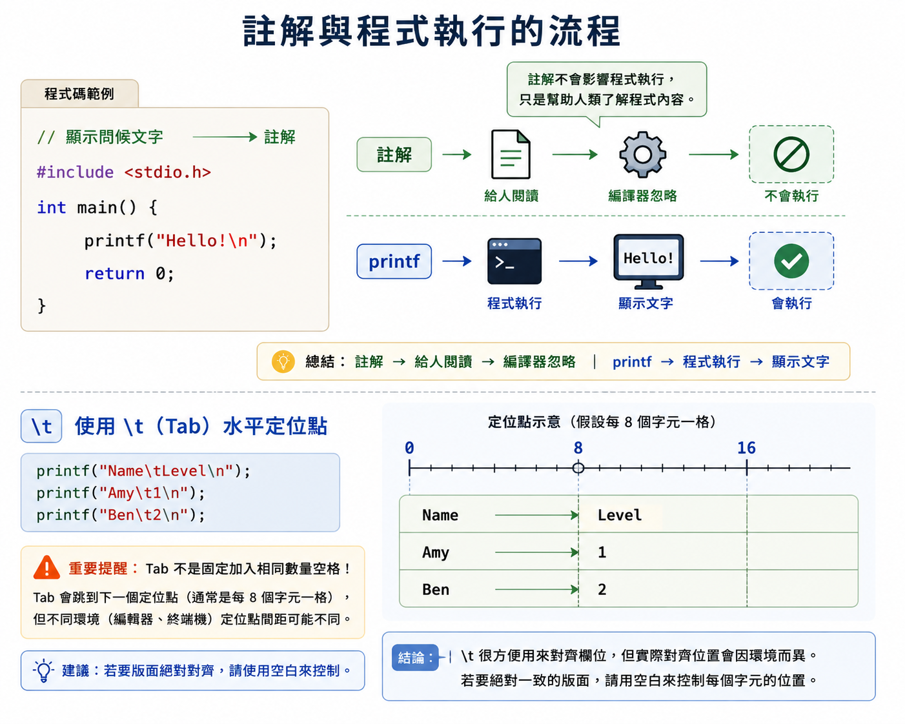

單行註解使用 `//`：

```c
// 顯示問候文字
printf("Hello!\n");
```

多行註解可以使用 `/*` 和 `*/`：

```c
/*
這個程式會顯示兩行文字。
這些說明不會被執行。
*/
```

完整例子：

```c
#include <stdio.h>

int main(void) {
    // 第一行輸出
    printf("Hello!\n");

    // 第二行輸出
    printf("Welcome to C.\n");
    return 0;
}
```

Result:

```text
Hello!
Welcome to C.
```

註解應該幫助讀者理解，不需要把每一個明顯的符號都重新描述一次。

---

### 17. 程式寫作風格 Coding Style

程式不只要能執行，也要讓別人和未來的自己容易閱讀。

本課統一使用以下規則：

1. 每一個敘述盡量單獨寫一行。
2. 分號 `;` 後換行。
3. 區塊開始後，內容向右縮排。
4. 本教材範例統一使用 4 個空白縮排。
5. 左右大括號的位置保持一致。
6. 不要加入太多沒有用途的空白行。
7. 同一份程式使用一致的格式。

推薦寫法：

```c
#include <stdio.h>

int main(void) {
    printf("Hello\n");
    printf("world!\n");
    return 0;
}
```

不推薦把所有內容擠在同一行：

```c
#include <stdio.h>
int main(void) { printf("Hello\n"); printf("world!\n"); return 0; }
```

第二種寫法可能仍可編譯，但不容易閱讀和找錯。

---

## Section V-A. 容易搞混的重點：程式碼換行與輸出換行

這一節要特別記住：

```text
編輯器中的換行：讓程式碼比較容易閱讀。
字串中的 \n：要求輸出結果換到下一行。
```

---

### 1. 程式碼分成兩行，不代表輸出分成兩行

```c
printf("A");
printf("B");
```

Result:

```text
AB
```

---

### 2. 一行程式也可以輸出多行

```c
printf("A\nB\n");
```

Result:

```text
A
B
```

---

### 3. 對照整理

| 程式 | 輸出 |
| --- | --- |
| `printf("A"); printf("B");` | `AB` |
| `printf("A\n"); printf("B\n");` | 兩行：`A`、`B` |
| `printf("A\nB\n");` | 兩行：`A`、`B` |
| `printf("A B\n");` | 同一行：`A B` |

口訣：

```text
想控制輸出去哪一行，要看字串裡有沒有 \n。
```

---

## Section VI. 快速概念檢查

請先不要急著執行，先用眼睛閱讀並預測答案。

### Q1. 基本輸出

```c
printf("Hello!\n");
```

Question:

你覺得結果會是什麼？

Answer:

```text
Hello!
```

Explanation:

雙引號中的一般文字會被顯示，`\n` 讓游標移到下一行。

---

### Q2. 兩次輸出沒有換行

```c
printf("A");
printf("B");
```

Question:

你覺得結果會是什麼？

Answer:

```text
AB
```

Explanation:

程式碼雖然有兩個敘述，但字串中沒有 `\n`。

---

### Q3. `\n` 的位置

```c
printf("A\nB");
```

Question:

你覺得結果會是什麼？

Answer:

```text
A
B
```

Explanation:

程式先顯示 `A`，遇到 `\n` 後換行，再顯示 `B`。

---

### Q4. 顯示雙引號

```c
printf("She said \"Hi\".\n");
```

Question:

你覺得結果會是什麼？

Answer:

```text
She said "Hi".
```

Explanation:

`\"` 代表要顯示雙引號，而不是在這裡結束字串。

---

### Q5. 顯示反斜線

```c
printf("A\\B\n");
```

Question:

你覺得結果會是什麼？

Answer:

```text
A\B
```

Explanation:

字串中的 `\\` 會顯示成一個反斜線。

---

### Q6. 多個 `\n`

```c
printf("1\n\n2\n");
```

Question:

`1` 和 `2` 中間會有幾行空白？

Answer:

```text
1

2
```

Explanation:

第一個 `\n` 結束 `1` 所在的行；第二個 `\n` 再產生一個沒有文字的行。

---

### Q7. 哪一行不需要分號？

觀察下面的程式：

```c
#include <stdio.h>

int main(void) {
    printf("Hello\n");
    return 0;
}
```

Answer:

```text
#include <stdio.h>
```

Explanation:

`#include` 是前置處理指令，本章範例中它的結尾不加分號。

---

## Section VII. 程式閱讀練習

### 題目 1：閱讀完整程式

```c
#include <stdio.h>

int main(void) {
    printf("First\n");
    printf("Second\n");
    return 0;
}
```

思考方式：

```text
進入 main()
第一個 printf() 顯示 First，然後換行
第二個 printf() 顯示 Second，然後換行
return 0; 結束程式
```

所以答案是：

```text
First
Second
```

---

### 題目 2：同一行輸出

```c
#include <stdio.h>

int main(void) {
    printf("C ");
    printf("language\n");
    return 0;
}
```

思考方式：

```text
第一個 printf() 顯示 C 和一個空白，但不換行
第二個 printf() 接著顯示 language，再換行
```

所以答案是：

```text
C language
```

---

### 題目 3：跳脫雙引號

```c
#include <stdio.h>

int main(void) {
    printf("Learn \"C\" today.\n");
    return 0;
}
```

思考方式：

```text
Learn 後面有一個空白
\" 顯示雙引號
C 被兩個雙引號包住
最後的 \n 換行
```

所以答案是：

```text
Learn "C" today.
```

---

### 題目 4：空白行

```c
#include <stdio.h>

int main(void) {
    printf("Top\n\nBottom\n");
    return 0;
}
```

思考方式：

```text
顯示 Top 後換行
第二個 \n 再換一次，因此產生空白行
顯示 Bottom 後換行
```

所以答案是：

```text
Top

Bottom
```

---

### 題目 5：反斜線與換行

```c
#include <stdio.h>

int main(void) {
    printf("Folder: C:\\code\nFile: main.c\n");
    return 0;
}
```

思考方式：

```text
\\ 顯示一個反斜線
第一個 \n 在路徑後換行
第二行顯示 File: main.c
最後再換行
```

所以答案是：

```text
Folder: C:\code
File: main.c
```

---

## Section VIII. 實作練習 / 實作檢測題

以下題目只需要使用本課學過的固定文字輸出，不需要變數或 `scanf()`。

---

### Q1. 顯示自己的學習訊息

完成程式：

```c
#include <stdio.h>

int main(void) {
    // TODO: 顯示 I am learning C.
    // TODO: 輸出後要換行

    return 0;
}
```

Example Output:

```text
I am learning C.
```

---

### Q2. 顯示兩行文字

完成程式：

```c
#include <stdio.h>

int main(void) {
    // TODO: 第一行顯示 Hello
    // TODO: 第二行顯示 world!

    return 0;
}
```

Example Output:

```text
Hello
world!
```

---

### Q3. 使用一個 `printf()` 顯示三行

完成程式：

```c
#include <stdio.h>

int main(void) {
    // TODO: 只呼叫一次 printf()
    // TODO: 依序顯示 Red、Green、Blue，每個文字各占一行

    return 0;
}
```

Example Output:

```text
Red
Green
Blue
```

---

### Q4. 顯示雙引號

完成程式：

```c
#include <stdio.h>

int main(void) {
    // TODO: 顯示 She said "Hello".

    return 0;
}
```

Example Output:

```text
She said "Hello".
```

---

### Q5. 顯示檔案路徑

完成程式：

```c
#include <stdio.h>

int main(void) {
    // TODO: 顯示 C:\practice\main.c

    return 0;
}
```

Example Output:

```text
C:\practice\main.c
```

---

### Q6. 顯示簡單表格

完成程式：

```c
#include <stdio.h>

int main(void) {
    // TODO: 使用 \t 和 \n 完成輸出

    return 0;
}
```

Example Output:

```text
Item    Price
Book    100
Pen     20
```

---

### Q7. 製作文字名片

完成程式：

```c
#include <stdio.h>

int main(void) {
    // TODO: 完成下面的文字名片

    return 0;
}
```

Example Output:

```text
+----------------+
| Name: Amy      |
| Course: C      |
+----------------+
```

---

### Q8. 製作階梯

完成程式：

```c
#include <stdio.h>

int main(void) {
    // TODO: 使用固定文字輸出完成四層階梯

    return 0;
}
```

Example Output:

```text
*
**
***
****
```

---

### Q9. 製作空心方框

完成程式：

```c
#include <stdio.h>

int main(void) {
    // TODO: 完成 5 × 4 的空心方框

    return 0;
}
```

Example Output:

```text
*****
*   *
*   *
*****
```

---

### Q10. 完成 `C` 字母圖形

完成程式：

```c
#include <stdio.h>

int main(void) {
    // TODO: 使用多個 printf() 或一個 printf() 完成圖形

    return 0;
}
```

Example Output:

```text
 CCCC
C
C
C
 CCCC
```

---

## Section IX. 做題時可以使用的提示

### 1. 最基本的完整程式

```c
#include <stdio.h>

int main(void) {
    printf("要顯示的文字\n");
    return 0;
}
```

---

### 2. 輸出兩行

```c
printf("第一行\n");
printf("第二行\n");
```

或：

```c
printf("第一行\n第二行\n");
```

---

### 3. 顯示特殊字元

| 想顯示或控制的內容 | 字串中要寫 |
| --- | --- |
| 換行 | `\n` |
| 雙引號 | `\"` |
| 反斜線 | `\\` |
| 單引號 | `\'` |
| 水平跳位 | `\t` |

---

### 4. 文字圖形的檢查方式

逐行比較：

```text
目標第 1 行 ↔ 程式輸出第 1 行
目標第 2 行 ↔ 程式輸出第 2 行
目標第 3 行 ↔ 程式輸出第 3 行
```

再檢查：

- 字元數量是否相同？
- 空白數量是否相同？
- 是否少了 `\n`？
- 是否多印了一個空白或符號？

---

### 5. 編譯失敗時先檢查

```text
1. 雙引號是否成對？
2. 括號是否成對？
3. 大括號是否成對？
4. printf 後面是否有分號？
5. printf 是否全部小寫？
6. 是否誤用中文全形符號？
```

---

## Section X. 課後小練習

### 練習 1：每日練習訊息

請寫一個程式，輸出：

```text
Practice every day.
Do not fear errors.
```

要求：

- 使用兩個 `printf()`。
- 每行結束後換行。

---

### 練習 2：改成一個 `printf()`

將練習 1 改成只呼叫一次 `printf()`，輸出結果必須完全相同。

---

### 練習 3：顯示引號與路徑

請輸出：

```text
Language: "C"
File: C:\lesson\main.c
```

---

### 練習 4：製作箭頭

請使用固定文字輸出：

```text
    *
   ***
  *****
    *
    *
```

---

### 練習 5：製作自己的文字圖形

選擇一個英文字母，使用該字母本身或 `*` 排出至少 5 行的文字圖形。

完成後再做兩個版本：

1. 多個 `printf()` 版本。
2. 一個 `printf()` 版本。

---

### 練習 6：隔天重新默寫

隔一至兩天後，不看範例，重新寫出：

```c
#include <stdio.h>

int main(void) {
    printf("Hello, world!\n");
    return 0;
}
```

完成後檢查：

- 是否可以一次編譯成功？
- 如果失敗，能否從第一個錯誤訊息找到問題？
- 寫出的縮排與換行是否一致？

---

## Section XI. 重點複習

| 重點 | 說明 |
| --- | --- |
| `#include <stdio.h>` | 準備標準輸入輸出工具的宣告 |
| `main()` | C 程式開始執行的位置 |
| `{ }` | 標示程式區塊 |
| `printf()` | 顯示固定文字 |
| `"文字"` | 字串要放在雙引號中 |
| `;` | 表示敘述結束 |
| `\n` | 輸出換行 |
| `\"` | 顯示雙引號 |
| `\\` | 顯示反斜線 |
| `\t` | 水平跳位 |
| `return 0;` | 正常結束 `main()` |
| 縮排 | 顯示程式區塊的層次，使程式更容易閱讀 |

最重要的記法：

```text
程式碼分行是寫作風格。
輸出要換行，要在字串中放 \n。
```

以及：

```text
先照著寫熟，再不看範例重寫，最後才改變題目。
```

---

## Section XII. 常見錯誤提醒

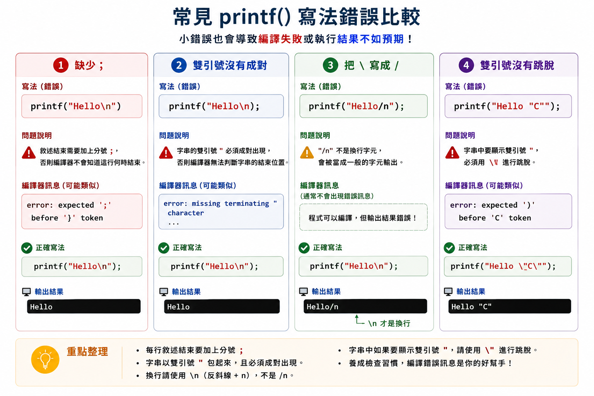

### 1. 忘記分號

錯誤寫法：

```c
printf("Hello\n")
```

正確寫法：

```c
printf("Hello\n");
```

---

### 2. 雙引號沒有成對

錯誤寫法：

```c
printf("Hello\n);
```

正確寫法：

```c
printf("Hello\n");
```

---

### 3. 把 `\` 寫成 `/`

錯誤寫法：

```c
printf("Hello/n");
```

這會顯示普通的 `/n`，不會換行。

正確寫法：

```c
printf("Hello\n");
```

---

### 4. 直接在字串中放未跳脫的雙引號

錯誤寫法：

```c
printf("Hello "C" world!\n");
```

正確寫法：

```c
printf("Hello \"C\" world!\n");
```

---

### 5. 只寫一個反斜線來表示路徑

錯誤寫法：

```c
printf("C:\code\new\n");
```

這些反斜線可能和後面的字元組成跳脫序列。

正確寫法：

```c
printf("C:\\code\\new\n");
```

---

### 6. 忘記 `#include <stdio.h>`

錯誤寫法：

```c
int main(void) {
    printf("Hello\n");
    return 0;
}
```

在嚴格的現代 C 編譯設定下，使用 `printf()` 前應包含它的宣告。

正確寫法：

```c
#include <stdio.h>

int main(void) {
    printf("Hello\n");
    return 0;
}
```

---

### 7. 大括號沒有成對

錯誤寫法：

```c
int main(void) {
    printf("Hello\n");
    return 0;
```

正確寫法：

```c
int main(void) {
    printf("Hello\n");
    return 0;
}
```

---

### 8. 把所有程式擠在一起

不推薦：

```c
#include <stdio.h>
int main(void){printf("Hello\n");printf("world!\n");return 0;}
```

推薦：

```c
#include <stdio.h>

int main(void) {
    printf("Hello\n");
    printf("world!\n");
    return 0;
}
```

即使兩種寫法可能得到相同結果，整齊的格式更容易閱讀、修改和除錯。

---

### 9. 使用 `\t` 後期待所有欄位一定整齊

`\t` 會跳到下一個定位點，不代表固定加入相同數量的空白。

文字長度不同時，欄位可能看起來不完全對齊。

本章練習可以使用 `\t`，但之後若要精準排版，會再學習更完整的輸出格式控制。

---

## Section XIII. Mermaid 流程圖

### 1. 第一個 C 程式的執行流程

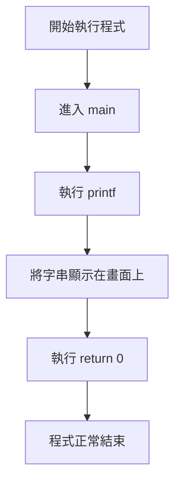

---

### 2. 初學者的練習流程

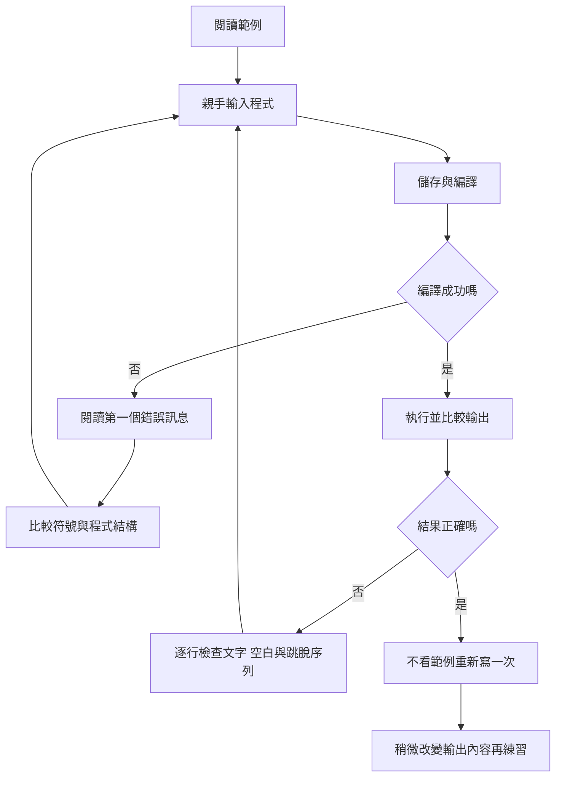

---

### 3. 檢查文字圖形的方法

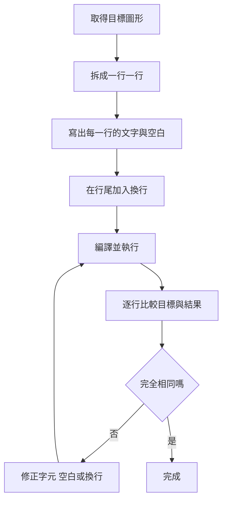
