# Lesson 3：Variables, Input and Output 變數與輸入輸出

> 這堂課的重點：使用變數保存整數，利用 `printf()` 顯示變數內容，再透過 `scanf()` 接收鍵盤輸入，完成「輸入 → 處理 → 輸出」的第一批互動式 C 程式。

---

## Section I. 今天要做什麼？

1. 理解變數可以暫時保存資料。
2. 學會宣告 `int` 整數變數。
3. 分辨宣告、初始化、賦值與重新賦值。
4. 使用 `%d` 輸出整數變數。
5. 使用 `scanf()` 從鍵盤讀取整數。
6. 理解 `scanf()` 中 `&變數名稱` 的基本用途。
7. 完成兩個整數相加的程式。
8. 將程式改成輸入三個整數並計算總和。
9. 追蹤每一行敘述執行後，變數內容如何改變。
10. 使用暫存變數交換兩個整數。
11. 認識正確性、可讀性、效率與擴充性等基本程式設計考量。
12. 練習閱讀、修改及獨立完成互動式程式。

---

## Section II. 今天的學習方式

1. 每一個範例都先預測變數內容，再執行程式。
2. 輸入資料後，確認資料被存入哪一個變數。
3. 遇到賦值敘述時，固定由右往左閱讀。
4. 使用表格記錄每一行執行後的變數內容。
5. 練習時先完成正確版本，再進行簡化或改寫。
6. 修改程式時一次只改一小部分，重新編譯並比較結果。
7. 不只確認程式能執行，也要確認輸出內容符合題目要求。
8. 本章先專注整數；其他資料型態會在下一章完整學習。

---

## Section III. 今天會學到的內容

| 主題 | 你需要知道的事 |
| --- | --- |
| 變數 Variable | 有名稱、可以保存資料的儲存位置 |
| `int` | 本章用來保存整數的資料型態 |
| 宣告 Declaration | 告訴程式要建立什麼型態、什麼名稱的變數 |
| 初始化 Initialization | 宣告變數時，同時放入第一個值 |
| 賦值 Assignment | 使用 `=` 將右邊的值存入左邊變數 |
| 重新賦值 | 用新值覆蓋變數原本保存的內容 |
| `%d` | `printf()` 與 `scanf()` 中代表十進位整數的位置 |
| `printf()` | 顯示提示文字、固定文字及變數內容 |
| `scanf()` | 從鍵盤讀取資料並存入變數 |
| `&變數名稱` | 告訴 `scanf()` 要把資料存到哪一個變數的位置 |
| 輸入—處理—輸出 | 互動式程式最基本的工作流程 |
| 暫存變數 | 交換數值時，暫時保存其中一個值的變數 |

---

## Section IV. 寫題目前的提醒

### 1. 本章只正式使用整數

本章主要使用：

```c
int number;
```

先把 `int` 理解成：

```text
這個變數準備用來保存整數。
```

`float`、`double`、`char` 以及不同型態的範圍與差異，會留到 `04_資料型態.md`。

---

### 2. 變數要先宣告，才能使用

錯誤概念：

```c
number = 10;
```

如果前面從未宣告 `number`，編譯器不知道它是什麼。

本章的正確寫法：

```c
int number;
number = 10;
```

也可以在宣告時直接放入第一個值：

```c
int number = 10;
```

---

### 3. 賦值不是數學等式

觀察：

```c
number = 10;
```

這不是在問「`number` 是否等於 `10`」，而是在執行：

```text
把右邊的 10 存入左邊的 number。
```

固定閱讀方向：

```text
右邊先算好 → 存入左邊變數
```

---

### 4. `scanf()` 中不要忘記 `&`

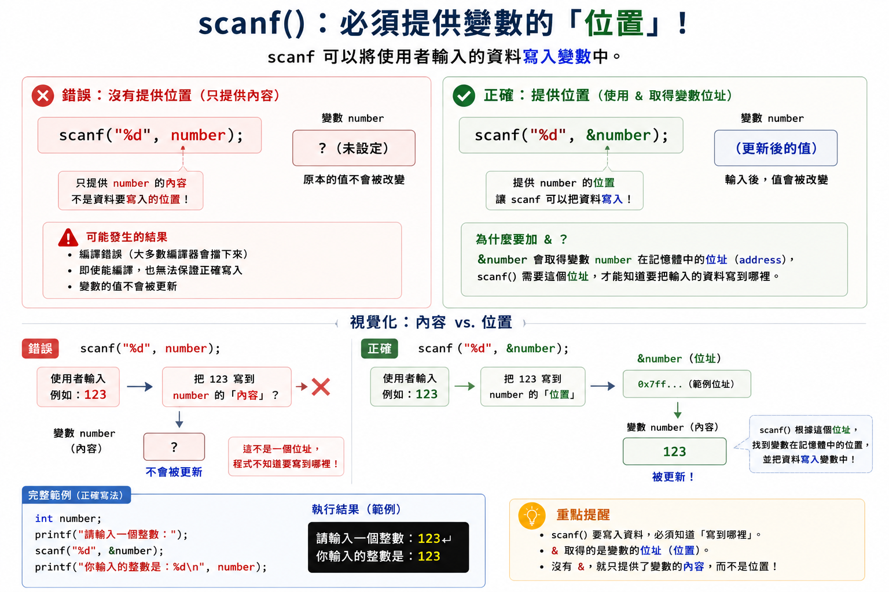

讀取整數時，本章會使用：

```c
scanf("%d", &number);
```

初學階段可以先把 `&number` 理解成：

```text
number 這個變數所在的位置
```

`scanf()` 必須知道資料要存到哪裡，所以需要 `&number`。

更完整的位址與指標概念會在後面的指標章節學習。

---

### 5. `%d` 與變數要互相對應

```c
printf("Number: %d\n", number);
```

這裡的 `%d` 會由後面的 `number` 內容取代。

```c
scanf("%d", &number);
```

這裡的 `%d` 表示程式準備讀取一個整數。

本章請記住：

```text
%d ↔ int 整數
```

其他資料型態使用的格式代碼會在下一章整理。

---

### 6. 顯示提示後，程式可能正在等待輸入

```c
printf("Please enter an integer: ");
scanf("%d", &number);
```

畫面顯示提示後若沒有繼續，不一定是程式壞掉了。

它可能正在等待你：

1. 輸入一個整數。
2. 按下 Enter。

---

### 7. 本章先假設輸入內容正確

本章練習時，看到：

```text
Please enter an integer:
```

請輸入像下面這樣的整數：

```text
3
-8
120
```

暫時不要輸入小數或文字。如何檢查錯誤輸入，會在學到條件判斷後再處理。

---

## Section V. 核心概念說明

### 1. 什麼是變數？

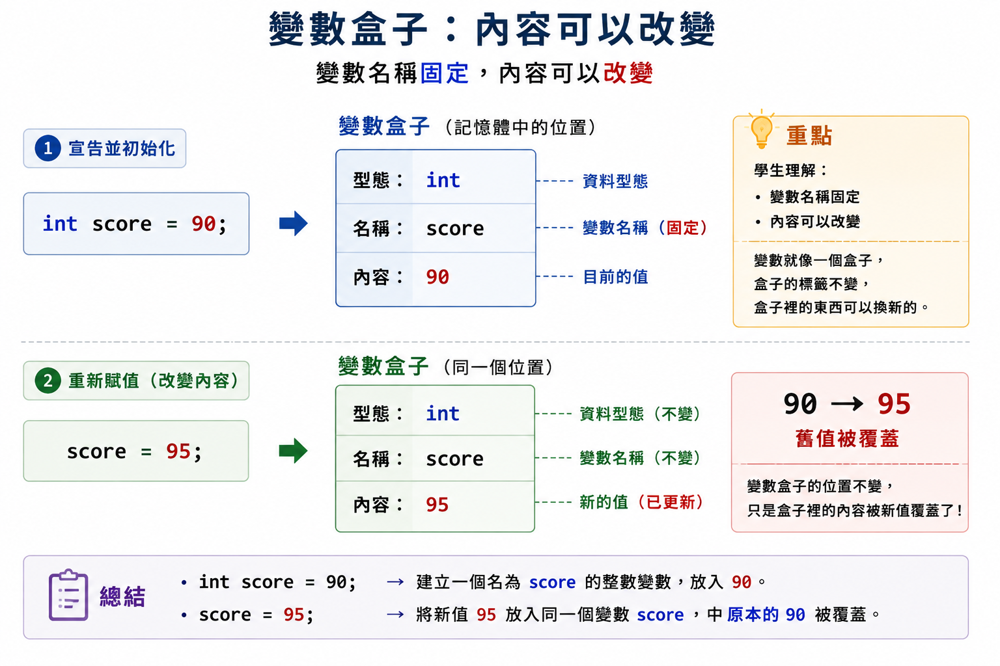

可以把變數想成一個有標籤的盒子。

```text
變數名稱：score
資料型態：int
目前內容：90
```

概念圖：

```text
┌──────────────┐
│ score        │  ← 變數名稱
│ int          │  ← 可以保存整數
│ 90           │  ← 目前保存的值
└──────────────┘
```

變數的名稱通常保持不變，但裡面的值可以被更新。

```c
int score = 90;
score = 95;
```

執行完第二行後，`score` 保存的是 `95`，原本的 `90` 被覆蓋。

---

### 2. 宣告一個整數變數

```c
int number;
```

這一行包含兩個重要部分：

| 部分 | 作用 |
| --- | --- |
| `int` | 變數準備保存整數 |
| `number` | 變數名稱 |

最後的分號表示宣告敘述結束。

此時我們只建立了變數，但還沒有主動放入一個確定的值。

因此，不要在尚未給值前直接輸出它。

---

### 3. 一次宣告多個同型態變數

分開宣告：

```c
int first;
int second;
int sum;
```

也可以寫成：

```c
int first, second, sum;
```

兩種寫法都會建立三個 `int` 變數。

初學時可依照可讀性選擇：

- 變數較少、用途清楚時，可以寫在同一行。
- 變數較多或需要註解時，可以分開宣告。

---

### 4. 宣告、初始化與賦值

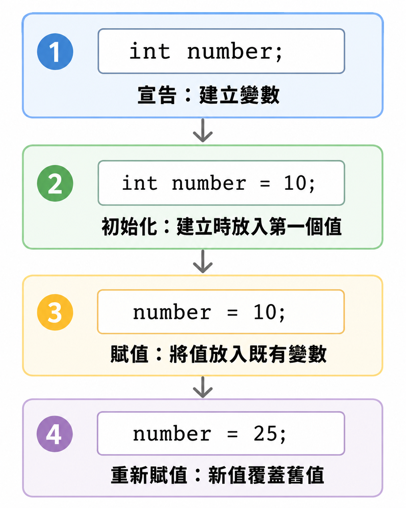

#### 只有宣告

```c
int number;
```

建立變數，但沒有主動指定第一個值。

#### 宣告後賦值

```c
int number;
number = 10;
```

先建立變數，再把 `10` 存入 `number`。

#### 宣告時初始化

```c
int number = 10;
```

建立變數時，同時放入第一個值。

#### 重新賦值

```c
number = 25;
```

新的 `25` 會覆蓋原本保存的內容。

---

### 5. 賦值敘述要由右往左理解

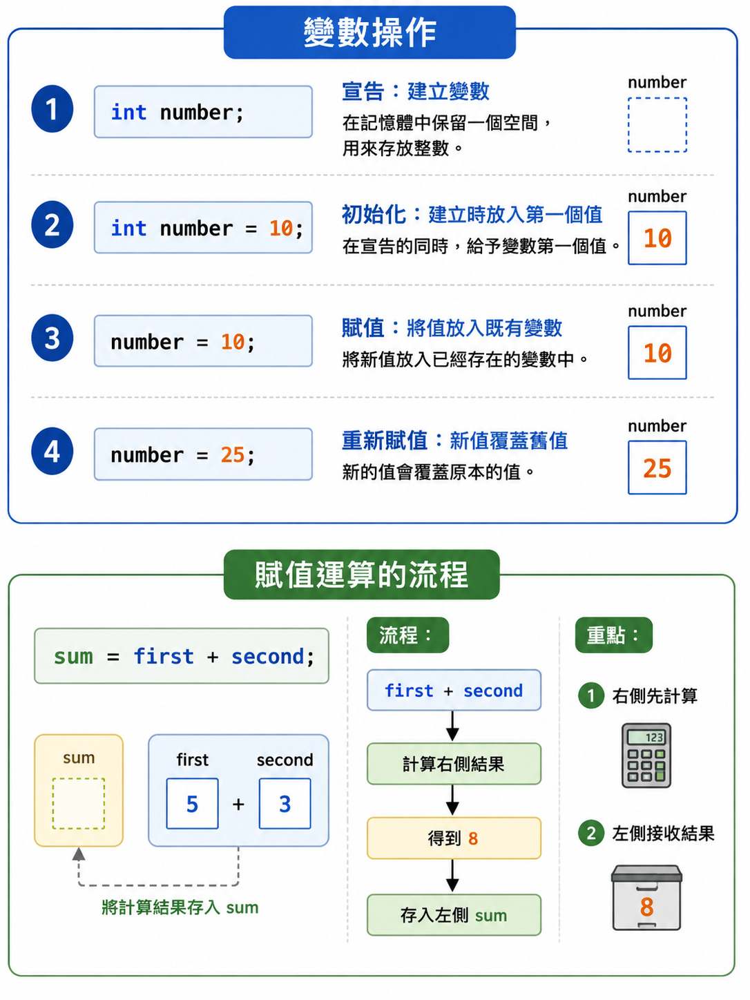

```c
sum = first + second;
```

正確的理解順序：

1. 取得 `first` 的值。
2. 取得 `second` 的值。
3. 計算兩個值的和。
4. 將結果存入 `sum`。

假設：

```text
first = 3
second = 5
```

則執行：

```c
sum = first + second;
```

之後：

```text
sum = 8
```

`first` 和 `second` 不會因為這行而改變。

---

### 6. 使用 `printf()` 輸出整數變數

完整例子：

```c
#include <stdio.h>

int main(void) {
    int number = 25;
    printf("Number: %d\n", number);
    return 0;
}
```

Result:

```text
Number: 25
```

觀察：

```c
printf("Number: %d\n", number);
```

| 部分 | 作用 |
| --- | --- |
| `"Number: %d\n"` | 輸出格式字串 |
| `%d` | 預留一個整數位置 |
| `number` | 提供要放入 `%d` 的值 |
| `\n` | 輸出後換行 |

---

### 7. 一個 `printf()` 可以輸出多個整數

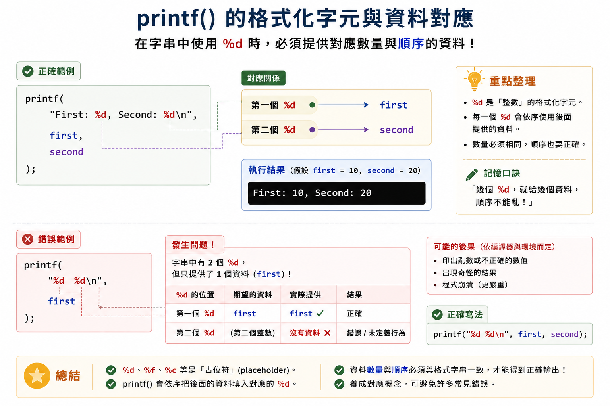

```c
#include <stdio.h>

int main(void) {
    int first = 3;
    int second = 5;

    printf("First: %d, Second: %d\n", first, second);
    return 0;
}
```

Result:

```text
First: 3, Second: 5
```

對應順序：

```text
第一個 %d ← first
第二個 %d ← second
```

格式代碼與後面的資料必須按照順序配對。

---

### 8. 使用 `scanf()` 輸入整數

```c
#include <stdio.h>

int main(void) {
    int number;

    printf("Please enter an integer: ");
    scanf("%d", &number);

    printf("You entered %d.\n", number);
    return 0;
}
```

Example run:

```text
Please enter an integer: 12
You entered 12.
```

執行流程：

```text
建立 number
→ 顯示輸入提示
→ 等待使用者輸入
→ 將整數存入 number
→ 輸出 number 的內容
```

---

### 9. `scanf("%d", &number);` 每一部分的工作

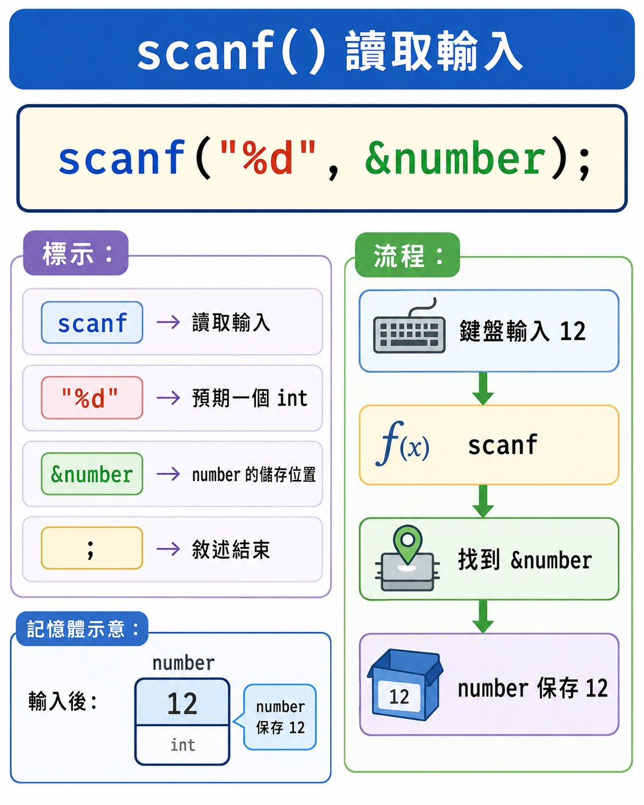

```c
scanf("%d", &number);
```

| 部分 | 作用 |
| --- | --- |
| `scanf` | 從標準輸入讀取資料的函式 |
| `"%d"` | 準備讀取一個整數 |
| `&number` | 指定資料要存入 `number` 的位置 |
| `;` | 敘述結束 |

本章的記憶方式：

```text
scanf 讀整數：scanf("%d", &變數名稱);
```

---

### 10. 輸入兩個整數

```c
#include <stdio.h>

int main(void) {
    int first;
    int second;

    printf("Please enter the first integer: ");
    scanf("%d", &first);

    printf("Please enter the second integer: ");
    scanf("%d", &second);

    printf("First: %d\n", first);
    printf("Second: %d\n", second);
    return 0;
}
```

Example run:

```text
Please enter the first integer: 3
Please enter the second integer: 5
First: 3
Second: 5
```

每一個 `scanf()` 都要對應正確的變數：

```text
第一個輸入 → first
第二個輸入 → second
```

---

### 11. 輸入、處理、輸出

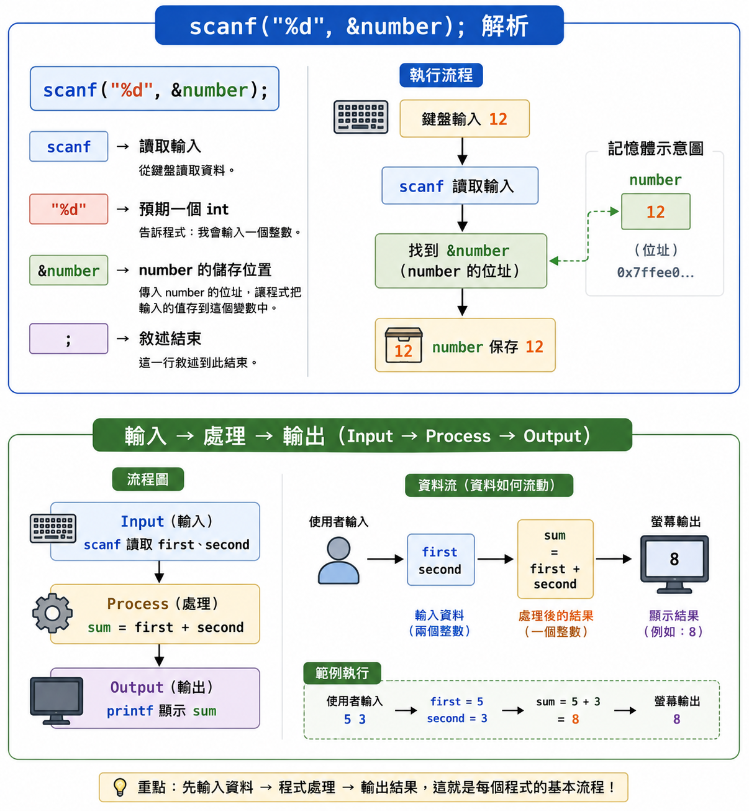

許多初學程式都可以拆成三個步驟：

| 步驟 | 本例工作 |
| --- | --- |
| Input 輸入 | 讀取 `first` 和 `second` |
| Process 處理 | 計算 `first + second` |
| Output 輸出 | 顯示 `sum` |

簡化流程：

```text
使用者輸入 → 變數保存資料 → 程式計算 → 顯示結果
```

---

### 12. 求兩個整數的和

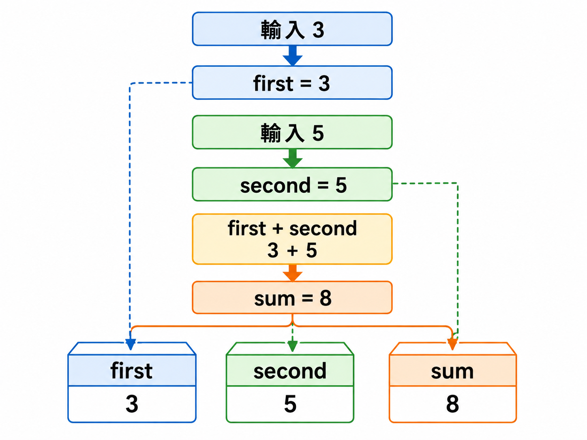

```c
#include <stdio.h>

int main(void) {
    int first;
    int second;
    int sum;

    printf("Please enter the first integer: ");
    scanf("%d", &first);

    printf("Please enter the second integer: ");
    scanf("%d", &second);

    sum = first + second;
    printf("Sum is %d.\n", sum);
    return 0;
}
```

Example run:

```text
Please enter the first integer: 3
Please enter the second integer: 5
Sum is 8.
```

變數內容追蹤：

| 執行位置 | `first` | `second` | `sum` |
| --- | ---: | ---: | ---: |
| 輸入前 | 尚未由本程式指定 | 尚未由本程式指定 | 尚未由本程式指定 |
| 第一個 `scanf()` 後 | 3 | — | — |
| 第二個 `scanf()` 後 | 3 | 5 | — |
| `sum = first + second;` 後 | 3 | 5 | 8 |

---

### 13. 為什麼不是 `printf("Sum is sum.\n");`？

下面只會輸出固定文字：

```c
printf("Sum is sum.\n");
```

Result:

```text
Sum is sum.
```

因為雙引號中的一般文字會照原樣顯示。

要輸出變數內容，必須使用格式代碼：

```c
printf("Sum is %d.\n", sum);
```

如果 `sum` 保存 `8`，結果才會是：

```text
Sum is 8.
```

---

### 14. 改成求三個整數的和

最直接的做法是增加第三個輸入變數：

```c
#include <stdio.h>

int main(void) {
    int first, second, third, sum;

    printf("Please enter the first integer: ");
    scanf("%d", &first);

    printf("Please enter the second integer: ");
    scanf("%d", &second);

    printf("Please enter the third integer: ");
    scanf("%d", &third);

    sum = first + second + third;
    printf("Sum is %d.\n", sum);
    return 0;
}
```

Example run:

```text
Please enter the first integer: 3
Please enter the second integer: 5
Please enter the third integer: 9
Sum is 17.
```

這個版本的優點是：

- 每一個輸入都有自己的變數。
- 執行後仍可分別使用三個原始輸入。
- 程式容易閱讀與追蹤。

---

### 15. 另一種累加寫法

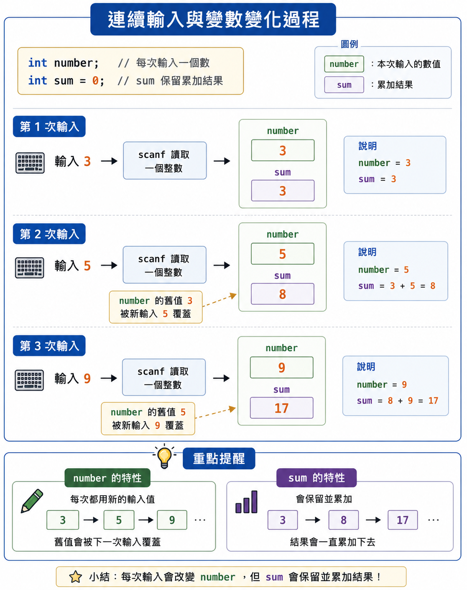

也可以重複使用同一個輸入變數：

```c
#include <stdio.h>

int main(void) {
    int number;
    int sum;

    printf("Please enter the first integer: ");
    scanf("%d", &number);
    sum = number;

    printf("Please enter the second integer: ");
    scanf("%d", &number);
    sum = sum + number;

    printf("Please enter the third integer: ");
    scanf("%d", &number);
    sum = sum + number;

    printf("Sum is %d.\n", sum);
    return 0;
}
```

假設依序輸入 `3`、`5`、`9`：

| 步驟 | `number` | `sum` |
| --- | ---: | ---: |
| 第一次輸入後 | 3 | 尚未指定 |
| `sum = number;` 後 | 3 | 3 |
| 第二次輸入後 | 5 | 3 |
| `sum = sum + number;` 後 | 5 | 8 |
| 第三次輸入後 | 9 | 8 |
| 再次累加後 | 9 | 17 |

這種寫法使用較少變數，但不再保留前面每一筆輸入的個別內容。

---

### 16. 撰寫程式時要考慮什麼？

同一題可能有多種寫法。選擇寫法時，可以開始思考：

| 考量 | 問自己的問題 |
| --- | --- |
| 正確性 | 所有合法測試資料都能得到正確結果嗎？ |
| 可讀性 | 自己與別人能快速理解每一個變數的用途嗎？ |
| 維護性 | 日後修改時，是否容易找到需要改動的位置？ |
| 效率 | 是否使用不必要的處理或大量額外記憶體？ |
| 擴充性 | 從三個輸入改成更多輸入時，是否容易調整？ |

初學階段的優先順序建議是：

```text
先正確 → 再清楚 → 最後才考慮簡化與效率
```

不要為了少寫一個變數，而讓程式變得難懂或容易出錯。

---

### 17. 變數的值是被複製，不是被連接

觀察：

```c
int first = 3;
int second = 5;
first = second;
```

執行後：

```text
first = 5
second = 5
```

`first = second;` 的意思是：

```text
把 second 目前保存的值複製到 first。
```

它不會讓兩個變數永遠連在一起。

之後若再寫：

```c
second = 9;
```

結果會是：

```text
first = 5
second = 9
```

---

### 18. 為什麼直接交換會失敗？

錯誤寫法：

```c
first = second;
second = first;
```

假設原本：

```text
first = 3
second = 5
```

逐行追蹤：

| 步驟 | `first` | `second` |
| --- | ---: | ---: |
| 開始 | 3 | 5 |
| `first = second;` 後 | 5 | 5 |
| `second = first;` 後 | 5 | 5 |

第一行執行時，原本的 `first = 3` 已經被覆蓋。

第二行已經找不到原本的 `3`，所以不能完成交換。

---

### 19. 使用暫存變數交換數值

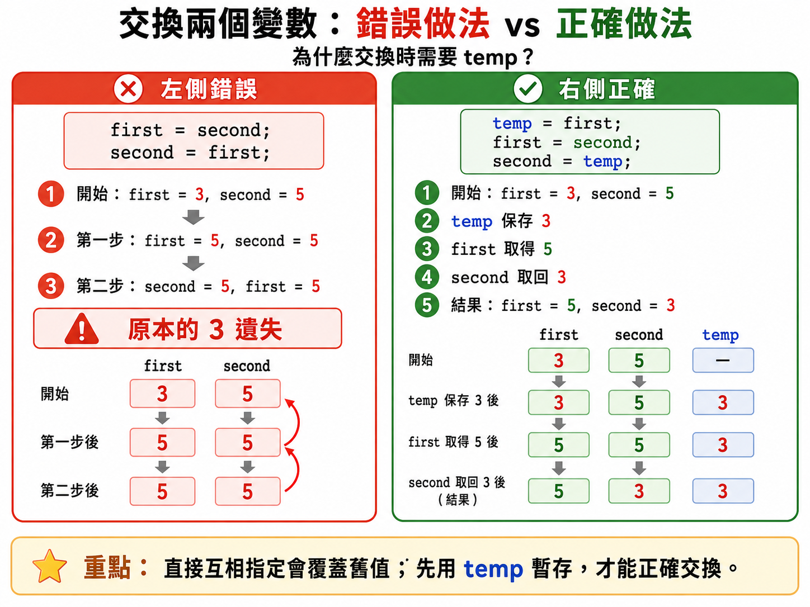

交換兩個杯子的飲料時，需要第三個空杯暫時保存其中一杯。

程式也可以使用第三個變數：

```c
#include <stdio.h>

int main(void) {
    int first;
    int second;
    int temp;

    printf("Please enter the first integer: ");
    scanf("%d", &first);

    printf("Please enter the second integer: ");
    scanf("%d", &second);

    temp = first;
    first = second;
    second = temp;

    printf("First: %d\n", first);
    printf("Second: %d\n", second);
    return 0;
}
```

Example run:

```text
Please enter the first integer: 3
Please enter the second integer: 5
First: 5
Second: 3
```

變數追蹤：

| 步驟 | `temp` | `first` | `second` |
| --- | ---: | ---: | ---: |
| 開始 | — | 3 | 5 |
| `temp = first;` | 3 | 3 | 5 |
| `first = second;` | 3 | 5 | 5 |
| `second = temp;` | 3 | 5 | 3 |

---

### 20. C 語言不能直接使用這種交換寫法

有些語言可能提供多重指定，但本章的 C 程式不能寫成：

```c
(first, second) = (second, first);
```

這不是本章可用的 C 語法。

交換數值時，請先使用最清楚可靠的暫存變數寫法：

```c
int temp = first;
first = second;
second = temp;
```

---

### 21. 其他交換方法先知道即可

參考資料也展示了：

- 使用加法和減法交換。
- 使用 XOR 位元運算交換。

但這些方法會引入本章尚未完整學習的運算規則，而且通常比暫存變數更不容易閱讀。

目前請優先使用：

```c
int temp = first;
first = second;
second = temp;
```

加減法、位元運算與整數溢位會在後續章節再討論。

---

## Section V-A. 容易搞混的重點：`=` 的執行方向

這一節要特別記住：

```text
C 語言的賦值敘述，先處理右邊，再把結果存入左邊。
```

---

### 1. `left = right;` 不會改變右邊

```c
int left = 2;
int right = 7;
left = right;
```

Resulting values:

```text
left = 7
right = 7
```

`right` 只是提供目前保存的值，本身沒有被改變。

---

### 2. 左邊原本的值會被覆蓋

```c
int number = 10;
number = 30;
```

最後：

```text
number = 30
```

原本的 `10` 不會自動保存到其他地方。

---

### 3. 右邊可以使用左邊目前的舊值

```c
int sum = 8;
sum = sum + 5;
```

執行順序：

```text
讀取舊的 sum：8
計算 8 + 5：13
把 13 存回 sum
```

最後：

```text
sum = 13
```

這不是數學方程式，而是更新變數內容的指令。

---

### 4. 對照整理

| 敘述 | 執行效果 |
| --- | --- |
| `a = 5;` | 將 `5` 存入 `a` |
| `a = b;` | 將 `b` 目前的值複製到 `a` |
| `a = a + 1;` | 取得 `a` 舊值，加 `1` 後存回 `a` |
| `a = b + c;` | 計算 `b + c`，結果存入 `a` |

口訣：

```text
先看右邊算什麼，再看結果要放到左邊哪裡。
```

---

## Section VI. 快速概念檢查

請先不要執行，先閱讀並預測答案。

### Q1. 宣告與初始化

```c
int score = 80;
```

Question:

這一行同時完成哪兩件事？

Answer:

```text
建立一個名為 score 的 int 變數，並把 80 作為它的第一個值。
```

---

### Q2. 重新賦值

```c
int number = 4;
number = 9;
```

Question:

最後 `number` 是多少？

Answer:

```text
9
```

Explanation:

第二行的新值覆蓋了原本的 `4`。

---

### Q3. 輸出變數

```c
int age = 15;
printf("Age: %d\n", age);
```

Answer:

```text
Age: 15
```

---

### Q4. 格式代碼的順序

```c
int first = 2;
int second = 8;
printf("%d %d\n", second, first);
```

Answer:

```text
8 2
```

Explanation:

第一個 `%d` 對應 `second`，第二個 `%d` 對應 `first`。

---

### Q5. `scanf()` 的目的

```c
scanf("%d", &number);
```

Question:

這行要完成什麼？

Answer:

```text
從鍵盤讀取一個整數，並把它存入 number。
```

---

### Q6. 賦值方向

```c
int first = 3;
int second = 5;
first = second;
```

Answer:

```text
first = 5
second = 5
```

---

### Q7. 更新變數

```c
int total = 10;
total = total + 4;
```

Answer:

```text
total = 14
```

---

### Q8. 錯誤交換

```c
int first = 3;
int second = 5;
first = second;
second = first;
```

Answer:

```text
first = 5
second = 5
```

Explanation:

原本的 `first = 3` 在第一個賦值敘述後已經遺失。

---

## Section VII. 程式閱讀練習

### 題目 1：輸入後立即輸出

```c
#include <stdio.h>

int main(void) {
    int number;

    printf("Input: ");
    scanf("%d", &number);
    printf("Output: %d\n", number);
    return 0;
}
```

若使用者輸入：

```text
27
```

答案：

```text
Input: 27
Output: 27
```

---

### 題目 2：追蹤重新賦值

```c
#include <stdio.h>

int main(void) {
    int number = 6;

    printf("A: %d\n", number);
    number = 11;
    printf("B: %d\n", number);
    return 0;
}
```

答案：

```text
A: 6
B: 11
```

---

### 題目 3：兩個整數的和

```c
#include <stdio.h>

int main(void) {
    int first = 7;
    int second = 4;
    int sum;

    sum = first + second;
    printf("%d + %d = %d\n", first, second, sum);
    return 0;
}
```

答案：

```text
7 + 4 = 11
```

---

### 題目 4：累加兩次

```c
#include <stdio.h>

int main(void) {
    int total = 5;

    total = total + 2;
    total = total + 3;
    printf("Total: %d\n", total);
    return 0;
}
```

變數追蹤：

```text
開始：total = 5
第一個更新後：total = 7
第二個更新後：total = 10
```

答案：

```text
Total: 10
```

---

### 題目 5：正確交換

```c
#include <stdio.h>

int main(void) {
    int first = 12;
    int second = 20;
    int temp;

    temp = first;
    first = second;
    second = temp;

    printf("%d %d\n", first, second);
    return 0;
}
```

答案：

```text
20 12
```

---

## Section VIII. 實作練習 / 實作檢測題

### Q1. 輸入並回報整數

完成程式，讓使用者輸入一個整數，然後顯示：

```text
You entered 25.
```

Starter code:

```c
#include <stdio.h>

int main(void) {
    int number;

    printf("Please enter an integer: ");
    // TODO: read number

    // TODO: print number
    return 0;
}
```

---

### Q2. 輸入兩個整數並分行顯示

輸入：

```text
3
9
```

目標結果：

```text
First: 3
Second: 9
```

---

### Q3. 求兩個整數的和

完成：

```text
輸入 first
輸入 second
計算 sum
輸出 sum
```

Starter code:

```c
#include <stdio.h>

int main(void) {
    int first, second, sum;

    // TODO: input first
    // TODO: input second
    // TODO: calculate sum
    // TODO: output sum

    return 0;
}
```

---

### Q4. 顯示完整算式

若輸入 `6` 和 `8`，顯示：

```text
6 + 8 = 14
```

要求：

- 使用三個 `%d`。
- 三個 `%d` 的順序要正確。

---

### Q5. 求三個整數的和

若輸入：

```text
3
5
9
```

顯示：

```text
Sum is 17.
```

要求使用四個變數：

```c
int first, second, third, sum;
```

---

### Q6. 使用同一個輸入變數累加三次

只使用：

```c
int number;
int sum;
```

依序讀取三個整數並計算總和。

每次輸入後，都要思考 `number` 和 `sum` 的目前內容。

---

### Q7. 修正錯誤的輸出

原始程式：

```c
int sum = 18;
printf("Sum is sum.\n");
```

請修正，使結果變成：

```text
Sum is 18.
```

---

### Q8. 修正錯誤的 `scanf()`

原始程式：

```c
int number;
scanf("%d", number);
```

請找出缺少的符號並修正。

---

### Q9. 交換兩個整數

輸入：

```text
first = 4
second = 11
```

交換後顯示：

```text
First: 11
Second: 4
```

要求：

- 使用 `temp`。
- 不使用加減法或 XOR。
- 寫出三行交換敘述。

---

### Q10. 變數追蹤表

不要先執行程式。完成下表：

```c
int first = 2;
int second = 7;
int temp;

temp = first;
first = second;
second = temp;
```

| 執行後 | `temp` | `first` | `second` |
| --- | ---: | ---: | ---: |
| 初始狀態 | ？ | 2 | 7 |
| `temp = first;` | ？ | ？ | ？ |
| `first = second;` | ？ | ？ | ？ |
| `second = temp;` | ？ | ？ | ？ |

---

## Section IX. 做題時可以使用的提示

### 1. 輸入一個整數的基本模板

```c
int number;
printf("Input: ");
scanf("%d", &number);
```

---

### 2. 輸出一個整數變數

```c
printf("Number: %d\n", number);
```

---

### 3. 輸入兩個整數

```c
scanf("%d", &first);
scanf("%d", &second);
```

每一個 `scanf()` 要存入不同變數時，請確認名稱沒有寫錯。

---

### 4. 計算後存入結果變數

```c
sum = first + second;
```

閱讀：

```text
先算 first + second，再把結果存入 sum。
```

---

### 5. 交換數值的固定三步驟

```c
temp = first;
first = second;
second = temp;
```

記憶方式：

```text
先保存 → 再覆蓋 → 最後取回
```

---

### 6. 結果不對時的檢查順序

1. 變數是否先宣告？
2. `scanf()` 是否有 `&`？
3. `%d` 的數量是否正確？
4. `%d` 與後面變數的順序是否正確？
5. 賦值方向是否寫反？
6. 是否在需要保存舊值前，就把它覆蓋？
7. 修改後是否重新編譯與執行？

---

## Section X. 課後小練習

### 練習 1：身分資料輸出

輸入兩個整數：

```text
student_id
class_number
```

顯示：

```text
Student ID: 12345
Class: 8
```

---

### 練習 2：兩次輸入的總和

輸入兩個整數，顯示完整算式：

```text
15 + 27 = 42
```

---

### 練習 3：三個分數的總分

輸入三個整數分數，顯示：

```text
Total score: 240
```

本題只計算總分，不計算平均。

---

### 練習 4：交換座位號碼

輸入兩位學生的座位號碼，使用 `temp` 交換後輸出。

執行前先畫出三個盒子：

```text
first seat
second seat
temp
```

---

### 練習 5：比較兩種三數總和寫法

各寫一次：

1. 使用 `first`、`second`、`third`、`sum`。
2. 只使用 `number`、`sum`。

回答：

- 哪一個版本較容易看到每一筆原始輸入？
- 哪一個版本使用較少變數？
- 你認為哪個版本較適合初學者閱讀？

---

### 練習 6：隔天重新默寫

不看教材，重新寫出：

1. 輸入兩個整數。
2. 計算總和。
3. 顯示完整算式。
4. 交換兩個變數。

完成後再與教材比較。

---

## Section XI. 重點複習

1. 變數是有名稱、可以保存資料的儲存位置。
2. `int number;` 宣告一個整數變數。
3. `int number = 10;` 在宣告時初始化變數。
4. `number = 20;` 會以新值覆蓋舊值。
5. 賦值敘述先處理右邊，再存入左邊。
6. `%d` 在本章代表十進位整數。
7. `printf("%d", number);` 可以輸出整數變數內容。
8. `scanf("%d", &number);` 可以讀取整數並存入變數。
9. `scanf()` 中不要忘記 `&`。
10. 互動式程式可以拆成輸入、處理與輸出。
11. `sum = first + second;` 將計算結果存入 `sum`。
12. 雙引號中的 `sum` 只是固定文字；要輸出變數需使用 `%d`。
13. `first = second;` 會複製值，不會交換兩個變數。
14. 交換數值前要先用 `temp` 保存其中一個舊值。
15. 初學時先追求正確與清楚，再考慮簡化、效率與其他技巧。

---

## Section XII. 常見錯誤提醒

### 1. 使用尚未宣告的變數

錯誤：

```c
number = 10;
```

前面沒有：

```c
int number;
```

修正：

```c
int number;
number = 10;
```

---

### 2. 輸出尚未指定內容的變數

不推薦：

```c
int number;
printf("%d\n", number);
```

本章應先讓變數取得確定內容：

```c
int number = 10;
printf("%d\n", number);
```

或先使用 `scanf()` 輸入。

---

### 3. `scanf()` 忘記 `&`

錯誤：

```c
scanf("%d", number);
```

本章正確寫法：

```c
scanf("%d", &number);
```

---

### 4. 把 `%d` 寫在字串外面

錯誤：

```c
printf("Number: " %d, number);
```

正確：

```c
printf("Number: %d\n", number);
```

---

### 5. `%d` 的數量與資料數量不同

錯誤概念：

```c
printf("%d %d\n", first);
```

格式字串需要兩個整數，但後面只提供一個。

正確：

```c
printf("%d %d\n", first, second);
```

---

### 6. 格式代碼與變數順序錯誤

```c
printf("First: %d, Second: %d\n", second, first);
```

這行可以執行，但標籤與值對調。

應仔細檢查：

```c
printf("First: %d, Second: %d\n", first, second);
```

---

### 7. 把變數名稱放在雙引號內

錯誤概念：

```c
printf("Sum is sum.\n");
```

這只會顯示文字 `sum`。

正確：

```c
printf("Sum is %d.\n", sum);
```

---

### 8. 把賦值方向寫反

想把計算結果放入 `sum`，應寫：

```c
sum = first + second;
```

不能寫：

```c
first + second = sum;
```

左邊必須是可以接收新值的變數。

---

### 9. 使用兩行賦值直接交換

錯誤：

```c
first = second;
second = first;
```

第一行會先破壞 `first` 原本的值。

正確：

```c
temp = first;
first = second;
second = temp;
```

---

### 10. 認為 `a = a + 1;` 是錯誤數學式

在數學等式中，`a = a + 1` 不成立。

但在 C 的賦值敘述中，它表示：

```text
取得 a 舊值，加 1，再存回 a。
```

---

### 11. 輸入提示不清楚

不清楚：

```c
scanf("%d", &number);
```

使用者不知道現在要輸入什麼。

較清楚：

```c
printf("Please enter an integer: ");
scanf("%d", &number);
```

---

### 12. 為了省一個變數使用難懂技巧

加減法或 XOR 交換雖然可能做到交換，但會增加閱讀與除錯難度。

目前推薦：

```c
int temp = first;
first = second;
second = temp;
```

程式碼的清楚與可靠通常比少用一個變數更重要。

---

## Section XIII. Mermaid 流程圖

### 1. 輸入、處理、輸出流程

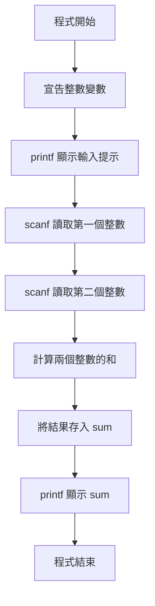

---

### 2. 變數重新賦值流程

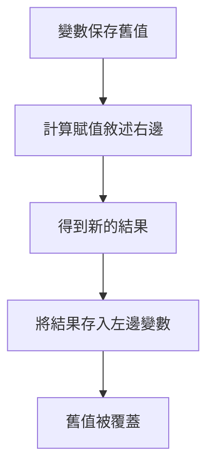

---

### 3. 使用暫存變數交換數值

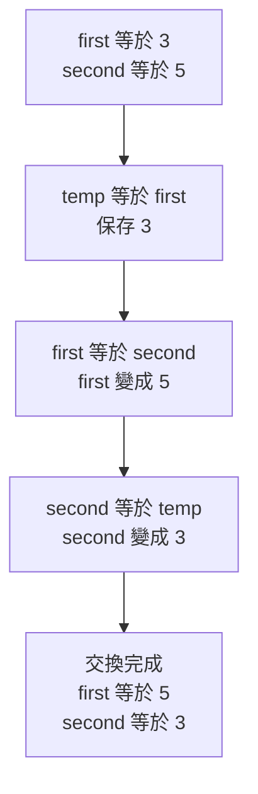
