# Lesson 4：Data Types 資料型態

> 這堂課的重點：理解不同資料需要使用不同的資料型態，認識整數、浮點數與字元在記憶體中的表示方式，並正確搭配 `printf()`、`scanf()`、字面常數及型態轉換。

---

## Section I. 今天要做什麼？

1. 理解資料型態會影響資料的儲存方式、可表示範圍與運算結果。
2. 認識位元 bit、位元組 byte 與記憶體空間的基本概念。
3. 使用 `sizeof` 查看型態或變數占用的空間。
4. 認識常見整數型態：`short`、`int`、`long`、`long long`。
5. 理解 `signed` 與 `unsigned` 的基本差異。
6. 認識整數範圍與溢位問題。
7. 認識 `float`、`double` 與浮點數的近似表示。
8. 理解有效數字、精確度與科學記號的概念。
9. 正確搭配 `printf()` 與 `scanf()` 的格式指定符。
10. 分辨整數、浮點數與字元字面常數。
11. 理解不同資料型態混合運算時可能發生的轉換。
12. 使用強制型態轉換控制運算結果。
13. 認識 `char`、字元編碼與 ASCII 的基本概念。
14. 使用字元的編碼值完成簡單的字元運算。
15. 根據資料用途選擇適合的資料型態。

---

## Section II. 今天的學習方式

1. 先觀察資料的用途，再決定適合的型態。
2. 不背固定的記憶體大小，先使用 `sizeof` 實際確認。
3. 每看到一個格式指定符，都確認它與變數型態是否相符。
4. 遇到除法時，先判斷左右兩邊是整數還是浮點數。
5. 遇到型態轉換時，先預測哪些資訊可能被保留或遺失。
6. 練習把同一個值分別用整數、浮點數及字元角度觀察。
7. 執行程式前先預測輸出，再與實際結果比較。
8. 本章專注資料的表示；完整的運算子規則會在下一章整理。

---

## Section III. 今天會學到的內容

| 主題 | 你需要知道的事 |
| --- | --- |
| 資料型態 Data type | 告訴程式資料要如何儲存、解讀及運算 |
| bit | 能表示 `0` 或 `1` 的基本單位 |
| byte | C 語言中可用來計算物件大小的基本單位 |
| `sizeof` | 查看型態或變數占用多少 byte |
| 整數型態 | 保存沒有小數部分的整數 |
| `signed` | 可以表示負數、零與正數 |
| `unsigned` | 只表示零與正數，將可用範圍留給非負數 |
| 溢位 Overflow | 數值超過型態可表示的範圍 |
| `float` | 單精度浮點型態 |
| `double` | 通常比 `float` 提供較高精確度的浮點型態 |
| 浮點誤差 | 某些小數無法被二進位浮點數精確保存 |
| 格式指定符 | 告訴 `printf()` 或 `scanf()` 如何解讀資料 |
| 字面常數 Literal | 直接寫在程式碼中的固定值，例如 `10`、`3.14`、`'A'` |
| 隱性轉換 | 編譯器在運算或賦值時自動進行的型態轉換 |
| 強制型態轉換 Cast | 程式設計者明確指定的型態轉換 |
| `char` | 用來保存一個小型整數編碼，常用來表示單一字元 |
| 字元編碼 Encoding | 字元與數字編碼之間的對應規則 |
| ASCII | 常見的英文字元編碼標準 |

---

## Section IV. 寫題目前的提醒

### 1. 資料型態不是裝飾

下面兩個變數雖然都能保存數字，但用途不同：

```c
int student_count = 30;
double temperature = 26.5;
```

- `student_count` 表示人數，不需要小數。
- `temperature` 可能包含小數部分。

型態會影響：

```text
可以保存什麼資料
可以表示多大的範圍
運算時如何處理
printf() 與 scanf() 要使用什麼格式
```

---

### 2. 不要假設所有電腦的型態大小完全相同

常見電腦上，`int` 經常占用 4 bytes，但 C 語言不要求所有環境都使用完全相同的大小。

請使用：

```c
sizeof(int)
```

實際確認目前環境的結果。

---

### 3. `sizeof` 的結果使用 `%zu` 輸出

```c
printf("%zu\n", sizeof(int));
```

`sizeof` 的結果型態是 `size_t`，適合使用 `%zu`。

---

### 4. 格式指定符必須與資料型態相符

例如：

```c
int count = 10;
double price = 25.5;
char grade = 'A';
```

對應輸出：

```c
printf("%d\n", count);
printf("%f\n", price);
printf("%c\n", grade);
```

使用錯誤的格式指定符，可能得到錯誤結果，甚至造成未定義行為。

---

### 5. `printf()` 與 `scanf()` 的浮點格式不完全一樣

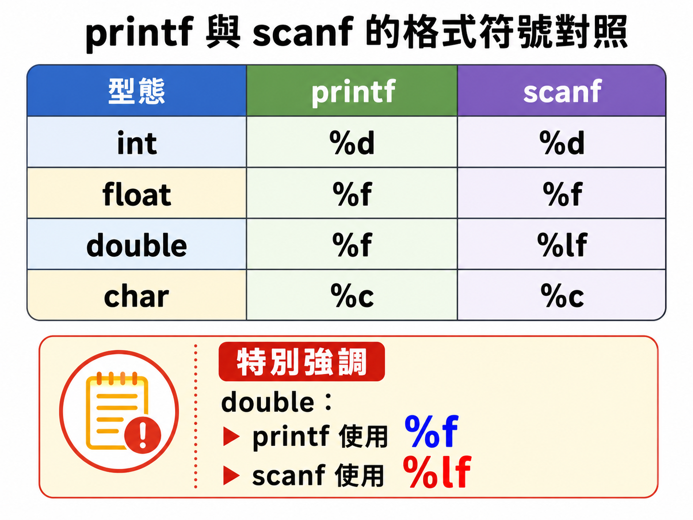

輸出時：

```c
float f = 1.5f;
double d = 2.5;

printf("%f\n", f);
printf("%f\n", d);
```

輸入時：

```c
scanf("%f", &f);   // float
scanf("%lf", &d);  // double
```

本章最重要的對照：

| 型態 | `printf()` | `scanf()` |
| --- | --- | --- |
| `int` | `%d` | `%d` |
| `float` | `%f` | `%f` |
| `double` | `%f` | `%lf` |
| `char` | `%c` | `%c` |

---

### 6. 單引號與雙引號不一樣

單一字元使用單引號：

```c
char letter = 'A';
```

字串使用雙引號：

```c
printf("A\n");
```

請分辨：

```text
'A'  → 一個字元常數
"A"  → 一個字串
```

---

### 7. 整數除法會捨去小數部分

```c
int result = 5 / 2;
```

`result` 會得到：

```text
2
```

不是 `2.5`，因為左右兩邊都是整數。

---

### 8. 浮點數不一定能精確保存每一個小數

```c
double value = 0.1;
```

電腦通常會保存一個非常接近 `0.1` 的值，但不一定是數學上完全精確的 `0.1`。

因此，不要因為浮點計算出現很小的誤差，就立刻認為程式一定寫錯。

---

### 9. 超過型態範圍不是安全的做法

若數值可能很大，就要選擇能容納它的型態。

例如計算大型人口數、檔案大小或長時間累積結果時，可能需要：

```c
long long total;
```

不要依賴有號整數超過範圍後會產生某個固定結果。

---

## Section V. 核心概念說明

### 1. 什麼是資料型態？

資料型態可以理解成資料的「使用說明」。

例如：

```c
int age = 18;
double height = 172.5;
char grade = 'A';
```

程式看到不同型態後，會知道：

```text
age    要當成整數處理
height 要當成浮點數處理
grade  要當成一個字元編碼處理
```

同一組位元若使用不同方式解讀，可能代表完全不同的資料。

---

### 2. bit 與 byte

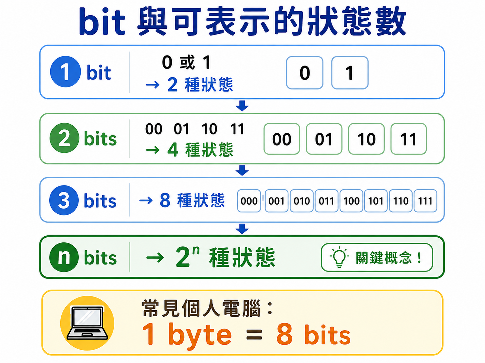

一個 bit 可以表示：

```text
0 或 1
```

多個 bit 組合後，可以表示更多狀態。

例如兩個 bit：

```text
00
01
10
11
```

共有四種組合。

一般關係：

```text
n 個 bit 可以形成 2^n 種組合
```

C 語言使用 byte 作為計算物件大小的單位。

在目前常見的個人電腦上：

```text
1 byte 通常是 8 bits
```

---

### 3. 使用 `sizeof` 查看占用空間

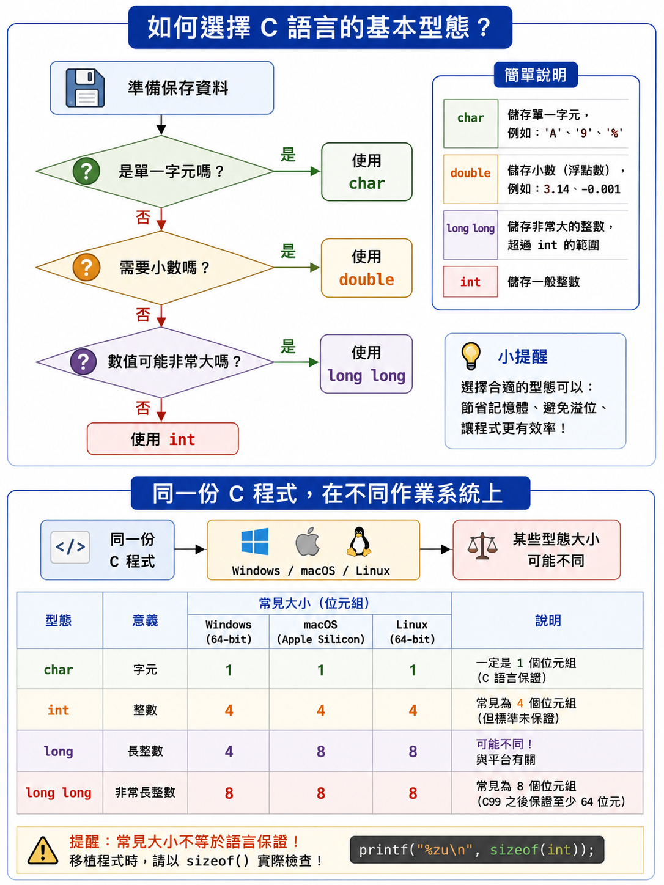

```c
#include <stdio.h>

int main(void) {
    printf("short: %zu byte(s)\n", sizeof(short));
    printf("int: %zu byte(s)\n", sizeof(int));
    printf("long: %zu byte(s)\n", sizeof(long));
    printf("long long: %zu byte(s)\n", sizeof(long long));
    printf("float: %zu byte(s)\n", sizeof(float));
    printf("double: %zu byte(s)\n", sizeof(double));
    printf("char: %zu byte(s)\n", sizeof(char));
    return 0;
}
```

不同電腦或編譯器的結果可能不同。

一定可以知道的是：

```c
sizeof(char)
```

結果必定是 `1`，因為 C 語言把一個 `char` 的大小定義為一個 byte。

---

### 4. 常見的內建資料型態

| 類別 | 常見型態 | 主要用途 |
| --- | --- | --- |
| 整數 | `short`、`int`、`long`、`long long` | 保存沒有小數部分的數值 |
| 無號整數 | `unsigned short`、`unsigned int` 等 | 保存零與正整數 |
| 浮點數 | `float`、`double`、`long double` | 保存帶有小數部分或很大、很小的數值 |
| 字元 | `char` | 保存一個小型整數編碼，常用來表示字元 |
| 無值 | `void` | 表示沒有資料值，之後學習函式時會使用 |

本章以這三種最常用型態為主：

```c
int
double
char
```

---

### 5. 整數型態

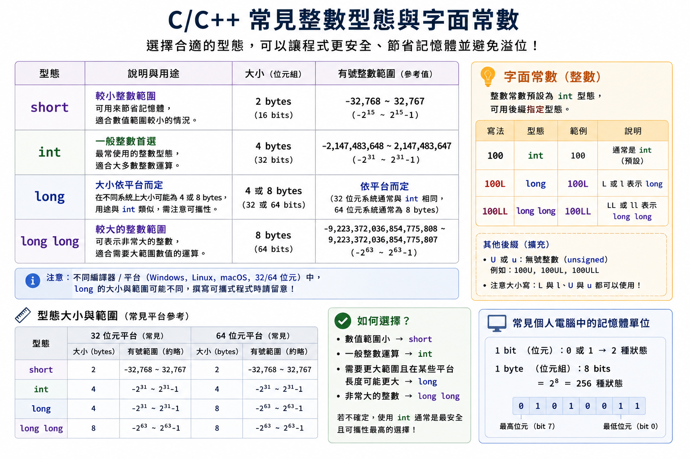

整數型態用來保存：

```text
-10
0
25
1000
```

不能保存小數部分。

最常用的整數型態：

```c
int number = 100;
```

其他整數型態：

```c
short small_number = 100;
long large_number = 100000L;
long long very_large_number = 10000000000LL;
```

不同型態提供不同的最低可表示範圍，實際大小仍要以目前環境為準。

---

### 6. `signed` 與 `unsigned`

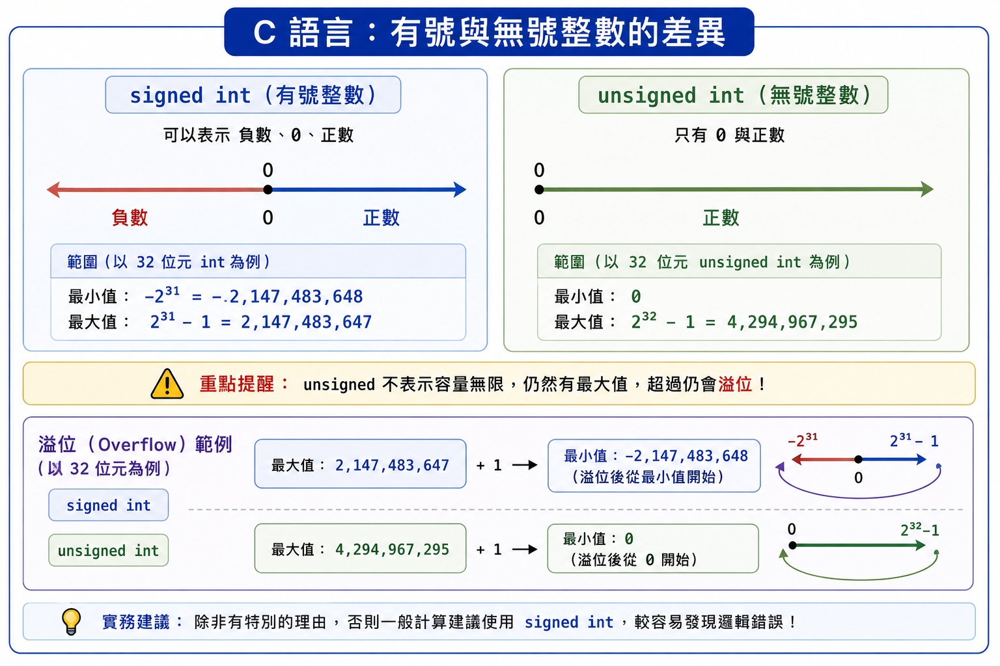

一般的：

```c
int number;
```

通常等同於：

```c
signed int number;
```

可以表示：

```text
負數、零、正數
```

無號整數：

```c
unsigned int count;
```

只表示：

```text
零、正數
```

無號整數不需要保留負數範圍，因此能把可用組合用在較大的非負數上。

---

### 7. 輸出不同整數型態

```c
#include <stdio.h>

int main(void) {
    int a = -20;
    unsigned int b = 300U;
    long c = 100000L;
    long long d = 9000000000LL;

    printf("int: %d\n", a);
    printf("unsigned int: %u\n", b);
    printf("long: %ld\n", c);
    printf("long long: %lld\n", d);
    return 0;
}
```

常見對照：

| 型態 | `printf()` 格式 |
| --- | --- |
| `int` | `%d` |
| `unsigned int` | `%u` |
| `long` | `%ld` |
| `unsigned long` | `%lu` |
| `long long` | `%lld` |
| `unsigned long long` | `%llu` |

---

### 8. 整數範圍與溢位

每個整數型態只能表示有限範圍。

可以把它想成一個有容量限制的盒子：

```text
盒子容量足夠 → 可以正確保存
超過盒子容量 → 發生溢位問題
```

有號整數超過範圍時，不應依賴它產生特定結果。

避免方式：

1. 先估計可能的最大值與最小值。
2. 選擇更大的整數型態。
3. 計算前思考中間結果是否也可能超過範圍。

---

### 9. 浮點數型態

浮點數用來近似表示實數，例如：

```text
3.14
-0.25
10000000000.0
0.000001
```

常見型態：

```c
float
double
long double
```

一般入門程式若需要小數，優先考慮：

```c
double value;
```

因為 `double` 通常比 `float` 提供較高精確度。

---

### 10. 有效數字與精確度

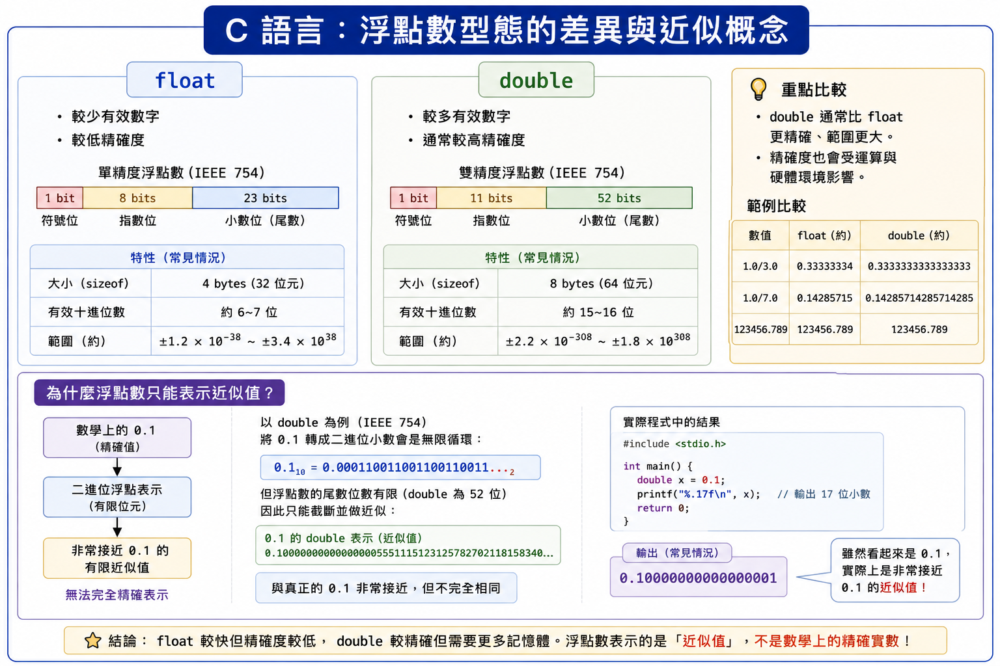

觀察圓周率：

```text
3.141592653589793...
```

若只保留四個有效數字：

```text
3.142
```

若保留更多有效數字：

```text
3.14159265
```

浮點型態能保存的有效數字有限。

通常：

```text
float  的精確度較低
double 的精確度較高
```

這不代表 `double` 能精確保存所有小數，只代表它通常能保留更多有效資訊。

---

### 11. 科學記號與浮點表示

大型數字：

```text
12345000000
```

可以寫成：

```text
1.2345 × 10^10
```

小型數字：

```text
0.0078901
```

可以寫成：

```text
7.8901 × 10^-3
```

C 程式中的科學記號：

```c
double large = 1.2345e10;
double small = 7.8901e-3;
```

其中 `e10` 表示乘以 `10^10`，`e-3` 表示乘以 `10^-3`。

---

### 12. 輸出浮點數

```c
#include <stdio.h>

int main(void) {
    float temperature = 23.45f;
    double pi = 3.141592653589793;

    printf("temperature: %f\n", temperature);
    printf("pi: %f\n", pi);
    printf("pi to 3 decimal places: %.3f\n", pi);
    printf("scientific notation: %e\n", pi);
    return 0;
}
```

格式：

| 格式 | 用途 |
| --- | --- |
| `%f` | 一般小數形式 |
| `%.2f` | 顯示到小數點後 2 位 |
| `%e` | 科學記號形式 |
| `%g` | 依數值選擇較精簡的形式 |

注意：

```text
顯示到小數點後幾位，不等於變數只保存那些位數。
```

`printf()` 的顯示格式只控制畫面呈現方式。

---

### 13. 輸入不同型態的資料

```c
#include <stdio.h>

int main(void) {
    int age;
    float temperature;
    double height;
    char grade;

    printf("Age: ");
    scanf("%d", &age);

    printf("Temperature: ");
    scanf("%f", &temperature);

    printf("Height: ");
    scanf("%lf", &height);

    printf("Grade: ");
    scanf(" %c", &grade);

    printf("age = %d\n", age);
    printf("temperature = %.1f\n", temperature);
    printf("height = %.1f\n", height);
    printf("grade = %c\n", grade);
    return 0;
}
```

注意字元輸入使用：

```c
scanf(" %c", &grade);
```

`%c` 前面的空白可以略過前一次輸入留下的空白字元或換行字元。

---

### 14. 字面常數是什麼？

直接寫在程式中的固定值稱為字面常數。

```c
int count = 10;
double price = 29.5;
char level = 'B';
```

其中：

```text
10    是整數字面常數
29.5  是浮點字面常數
'B'   是字元常數
```

---

### 15. 整數字面常數的後綴

```c
10       // 通常是 int
10U      // unsigned int
10L      // long
10UL     // unsigned long
10LL     // long long
10ULL    // unsigned long long
```

後綴可使用大寫或小寫，但大寫通常較容易閱讀。

例如小寫 `l` 容易與數字 `1` 混淆，因此：

```c
1000L
```

通常比：

```c
1000l
```

更清楚。

---

### 16. 浮點字面常數的後綴

沒有後綴的小數字面常數通常是 `double`：

```c
double a = 3.14;
```

加入 `f` 或 `F` 表示 `float`：

```c
float b = 3.14f;
```

加入 `L` 表示 `long double`：

```c
long double c = 3.14L;
```

---

### 17. 整數除法與浮點除法

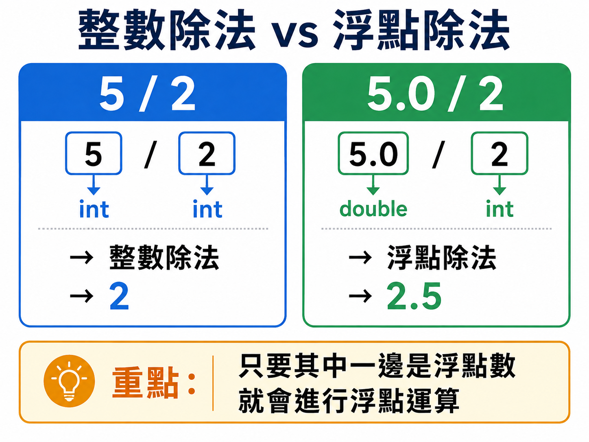

```c
#include <stdio.h>

int main(void) {
    printf("5 / 2 = %d\n", 5 / 2);
    printf("5.0 / 2 = %f\n", 5.0 / 2);
    printf("5 / 2.0 = %f\n", 5 / 2.0);
    return 0;
}
```

Result:

```text
5 / 2 = 2
5.0 / 2 = 2.500000
5 / 2.0 = 2.500000
```

規則先簡化成：

```text
整數 ÷ 整數 → 整數除法
只要其中一邊是浮點數 → 浮點運算
```

---

### 18. 隱性型態轉換

```c
int count = 3;
double average = count / 2.0;
```

運算時，`count` 會被轉換成適合與 `2.0` 一起運算的浮點形式。

結果：

```text
1.5
```

這種由編譯器自動完成的轉換稱為隱性型態轉換。

---

### 19. 賦值時的型態轉換

```c
double price = 19.95;
int whole = price;
```

將 `double` 指派給 `int` 時，小數部分會被捨去：

```text
whole 取得 19
```

這不是四捨五入。

反方向：

```c
int score = 90;
double value = score;
```

`value` 會得到浮點形式的 `90.0`。

---

### 20. 強制型態轉換

語法：

```c
(目標型態)值或運算式
```

例如：

```c
int total = 5;
int count = 2;
double average = (double)total / count;
```

`total` 先轉成 `double`，因此執行浮點除法。

結果：

```text
2.5
```

完整程式：

```c
#include <stdio.h>

int main(void) {
    int total = 5;
    int count = 2;
    double average = (double)total / count;

    printf("average = %.2f\n", average);
    return 0;
}
```

---

### 21. 強制轉換的位置很重要

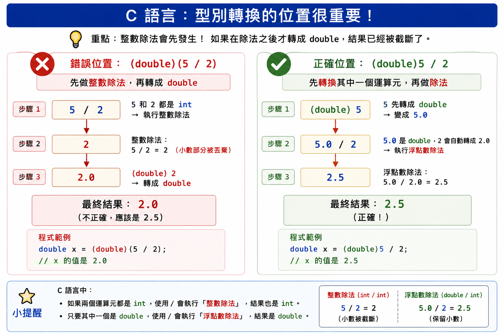

錯誤目標：想得到 `2.5`。

```c
double result = (double)(5 / 2);
```

執行順序：

```text
5 / 2 先做整數除法得到 2
再把 2 轉成 double
```

結果仍然是：

```text
2.0
```

正確寫法：

```c
double result = (double)5 / 2;
```

先將其中一個運算元轉成浮點數，再執行除法。

---

### 22. `char` 字元型態

```c
char letter = 'A';
```

`char` 主要保存一個小型整數值，常用來表示一個字元的編碼。

可以把它理解成兩個角度：

```text
畫面角度：字元 A
儲存角度：A 對應的數字編碼
```

C 語言不會直接把字元形狀存入變數，而是保存對應的數字編碼。

---

### 23. 字元編碼

字元編碼建立以下對應：

```text
字元 ↔ 數字
```

在常見 ASCII 編碼中：

```text
'A' 對應 65
'B' 對應 66
'a' 對應 97
'0' 對應 48
```

ASCII 包含：

- 英文字母。
- 數字字元。
- 常用符號。
- 控制字元。

本章的字元運算以 ASCII 或相容編碼的常見環境為基礎。

---

### 24. 使用 `%c` 與 `%d` 觀察同一個 `char`

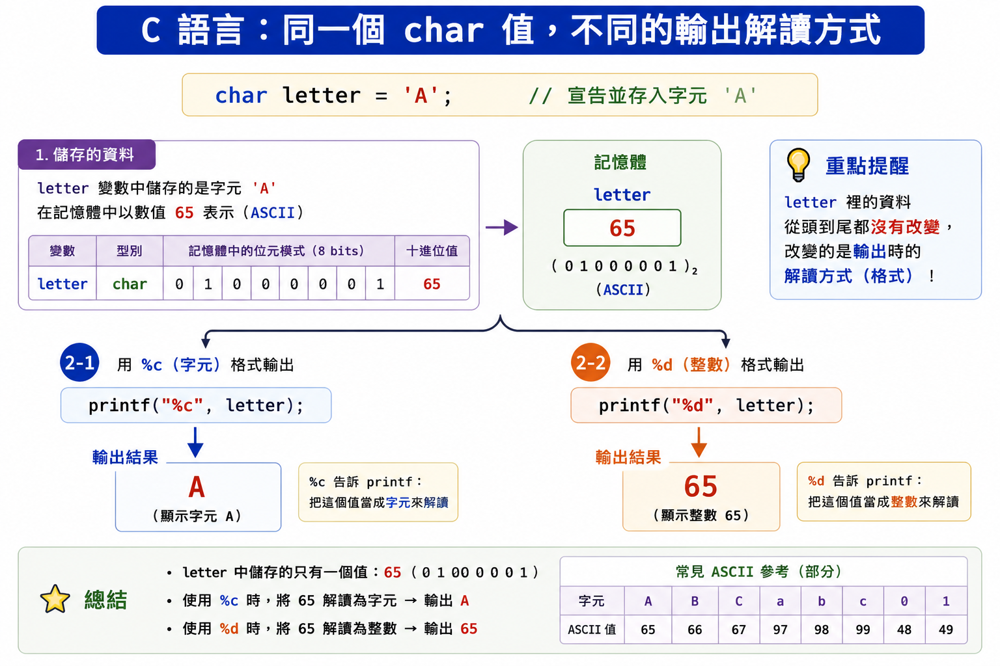

```c
#include <stdio.h>

int main(void) {
    char letter = 'A';

    printf("as a character: %c\n", letter);
    printf("as a number: %d\n", letter);
    return 0;
}
```

可能輸出：

```text
as a character: A
as a number: 65
```

同一份資料可以用不同格式解讀：

```text
%c → 顯示成字元
%d → 顯示它的整數編碼
```

---

### 25. 輸入一個字元

```c
#include <stdio.h>

int main(void) {
    char input;

    printf("Enter one character: ");
    scanf(" %c", &input);

    printf("You entered: %c\n", input);
    printf("Code: %d\n", input);
    return 0;
}
```

`scanf()` 中的空白：

```c
scanf(" %c", &input);
```

用來忽略輸入前尚未處理的空白字元。

---

### 26. `char` 可以參與算術運算

```c
#include <stdio.h>

int main(void) {
    char letter = 'A';
    char next = letter + 1;

    printf("%c\n", next);
    return 0;
}
```

在 ASCII 相容環境中：

```text
'A' 的編碼是 65
65 + 1 = 66
66 對應 'B'
```

因此輸出：

```text
B
```

---

### 27. 大寫轉小寫練習

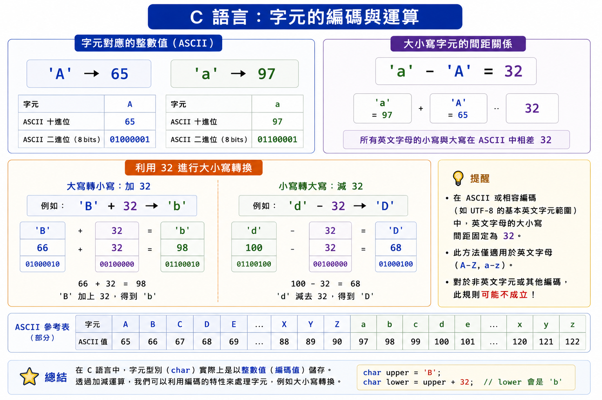

在 ASCII 相容環境中，大寫字母與對應小寫字母之間有固定距離：

```c
'a' - 'A'
```

因此可以寫：

```c
#include <stdio.h>

int main(void) {
    char input;
    char output;

    printf("Enter an uppercase letter: ");
    scanf(" %c", &input);

    output = input + ('a' - 'A');

    printf("Lowercase: %c\n", output);
    return 0;
}
```

本練習先假設使用者輸入：

```text
A 到 Z 的大寫英文字母
```

輸入 `A` 時，輸出 `a`；輸入 `B` 時，輸出 `b`。

之後學到條件判斷，才能先檢查輸入是否真的在 `A` 到 `Z` 之間。

---

### 28. 如何選擇資料型態？

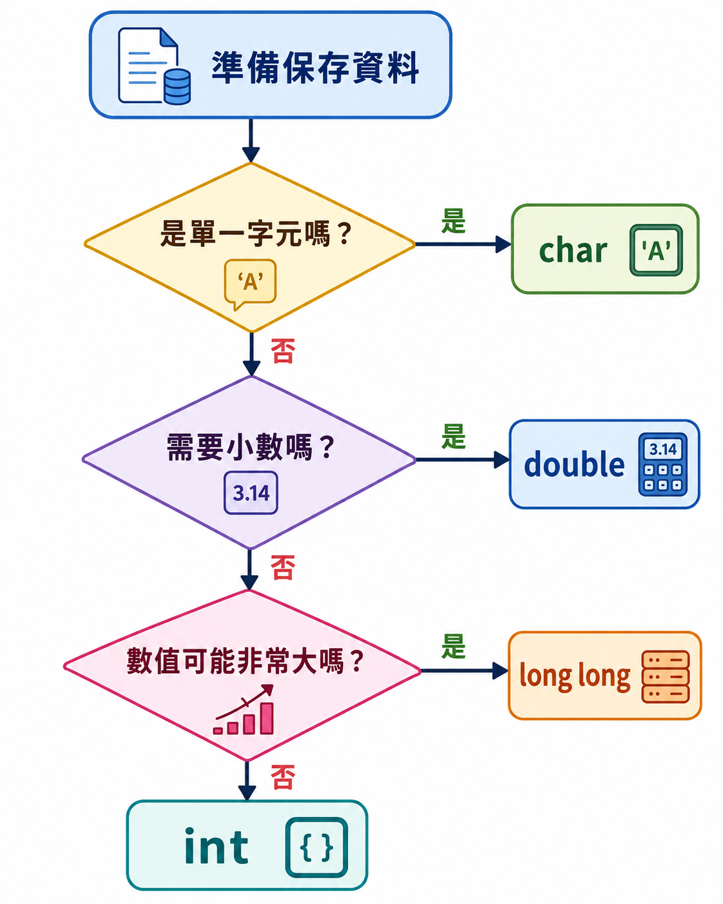

| 資料用途 | 建議型態 | 原因 | `printf()` | `scanf()` |
| --- | --- | --- | --- | --- |
| 一般整數 | `int` | 不需要小數部分 | `%d` | `%d` |
| 非常大的整數 | `long long` | 通常提供較大的整數範圍 | `%lld` | `%lld` |
| 一般小數 | `double` | 通常比 `float` 有更高精確度 | `%f` | `%lf` |
| 單一英文字元 | `char` | 保存一個字元編碼 | `%c` | `%c` |

選擇時依序思考：

```text
資料有沒有小數？
是否需要負數？
可能有多大或多小？
需要多少精確度？
是數值還是單一字元？
```

---

## Section V-A. 容易搞混的重點

### 1. 型態大小、數值範圍與精確度不是同一件事

| 概念 | 問題 |
| --- | --- |
| 大小 | 占用多少 byte？ |
| 範圍 | 最小與最大可以表示多少？ |
| 精確度 | 能保留多少有效資訊？ |

`sizeof` 只能直接回答大小，不能單獨告訴你完整的範圍與精確度。

---

### 2. `printf()` 的 `%f` 與 `scanf()` 的 `%f` 不要混淆

```c
float f;
double d;
```

輸出：

```c
printf("%f", f);
printf("%f", d);
```

輸入：

```c
scanf("%f", &f);
scanf("%lf", &d);
```

記憶方式：

```text
scanf 需要精確知道要寫入 float 還是 double
```

---

### 3. `'A'`、`"A"` 與 `65` 是不同寫法

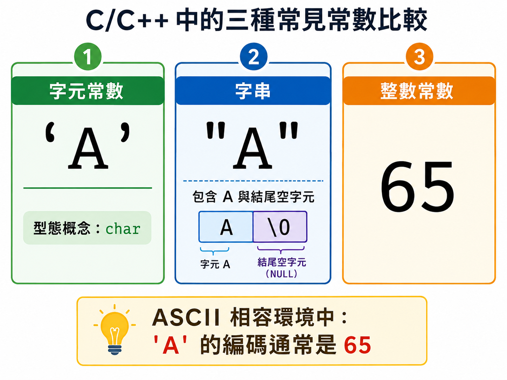

```text
'A'  → 字元常數
"A"  → 字串
65   → 整數常數
```

在 ASCII 環境中，`'A'` 的編碼值通常是 `65`，但寫程式時應依用途選擇最清楚的表示方式。

例如要表示字母 A：

```c
char letter = 'A';
```

比下面更容易理解：

```c
char letter = 65;
```

---

### 4. `5 / 2` 與 `5.0 / 2` 不同

```c
5 / 2
```

兩邊都是整數，得到：

```text
2
```

```c
5.0 / 2
```

至少一邊是浮點數，得到：

```text
2.5
```

---

### 5. 先除法再轉型，無法找回已經消失的小數

```c
(double)(5 / 2)
```

得到 `2.0`，因為小數在整數除法時已經消失。

要改成：

```c
(double)5 / 2
```

---

### 6. `%c` 與 `%d` 可以用不同方式顯示同一個 `char`

```c
char value = 'A';
```

```c
printf("%c\n", value);  // A
printf("%d\n", value);  // 常見 ASCII 環境為 65
```

資料沒有改變，改變的是輸出時的解讀方式。

---

## Section VI. 快速概念檢查

### Q1. 哪一個型態適合保存學生人數？

```text
A. int
B. double
C. char
```

<details>
<summary>查看答案</summary>

答案：`A`。

學生人數一般使用整數，不需要小數部分。

</details>

---

### Q2. 哪一個型態適合保存溫度 `26.5`？

```text
A. int
B. double
C. char
```

<details>
<summary>查看答案</summary>

答案：`B`。

溫度可能包含小數部分。

</details>

---

### Q3. `sizeof(char)` 的結果是多少？

<details>
<summary>查看答案</summary>

答案：`1`。

C 語言把一個 `char` 的大小定義為一個 byte。

</details>

---

### Q4. 下列程式的結果是什麼？

```c
printf("%d\n", 7 / 2);
```

<details>
<summary>查看答案</summary>

```text
3
```

因為 `7` 與 `2` 都是整數，使用整數除法。

</details>

---

### Q5. 下列程式的結果是什麼？

```c
printf("%.1f\n", 7.0 / 2);
```

<details>
<summary>查看答案</summary>

```text
3.5
```

其中一個運算元是浮點數，因此使用浮點運算。

</details>

---

### Q6. 輸入 `double` 應使用哪一個格式？

```text
A. scanf("%f", &value);
B. scanf("%lf", &value);
C. scanf("%d", &value);
```

<details>
<summary>查看答案</summary>

答案：`B`。

`scanf()` 讀取 `double` 使用 `%lf`。

</details>

---

### Q7. 哪一個是單一字元？

```text
A. 'A'
B. "A"
```

<details>
<summary>查看答案</summary>

答案：`A`。

`'A'` 是字元常數，`"A"` 是字串。

</details>

---

### Q8. 下列轉型能否得到 `2.5`？

```c
(double)(5 / 2)
```

<details>
<summary>查看答案</summary>

不能。

`5 / 2` 先得到整數 `2`，之後才轉成 `2.0`。

</details>

---

### Q9. `char letter = 'A';` 後執行 `letter + 1`，在 ASCII 相容環境中代表什麼？

<details>
<summary>查看答案</summary>

代表下一個編碼值，通常對應字元 `B`。

</details>

---

### Q10. `double` 是否能精確表示所有小數？

<details>
<summary>查看答案</summary>

不能。

許多十進位小數無法使用有限的二進位位元精確表示。

</details>

---

## Section VII. 程式閱讀練習

### 題目 1：型態與格式

```c
#include <stdio.h>

int main(void) {
    int count = 12;
    double price = 8.5;
    char level = 'B';

    printf("%d %.1f %c\n", count, price, level);
    return 0;
}
```

執行前回答：

1. 第一個格式指定符對應哪一個變數？
2. `%.1f` 會顯示幾位小數？
3. 最後會顯示哪一個字元？

<details>
<summary>查看答案</summary>

```text
12 8.5 B
```

</details>

---

### 題目 2：整數除法

```c
#include <stdio.h>

int main(void) {
    int total = 10;
    int people = 4;
    double average = total / people;

    printf("%.2f\n", average);
    return 0;
}
```

問題：輸出是 `2.50` 還是 `2.00`？

<details>
<summary>查看答案</summary>

```text
2.00
```

`total / people` 先執行整數除法，得到 `2`，再存入 `double`。

</details>

---

### 題目 3：修正平均數

將上一題改成：

```c
double average = (double)total / people;
```

<details>
<summary>查看答案</summary>

輸出：

```text
2.50
```

</details>

---

### 題目 4：小數存入整數

```c
#include <stdio.h>

int main(void) {
    double value = 9.8;
    int number = value;

    printf("%d\n", number);
    return 0;
}
```

<details>
<summary>查看答案</summary>

```text
9
```

轉成整數時，小數部分被捨去，不是四捨五入。

</details>

---

### 題目 5：字元編碼

```c
#include <stdio.h>

int main(void) {
    char ch = 'C';

    printf("%c\n", ch);
    printf("%d\n", ch);
    printf("%c\n", ch + 1);
    return 0;
}
```

在 ASCII 相容環境中，三行輸出分別代表什麼？

<details>
<summary>查看答案</summary>

```text
C
67
D
```

</details>

---

### 題目 6：輸入格式

```c
float f;
double d;
char c;
```

請補上三行 `scanf()`。

<details>
<summary>查看答案</summary>

```c
scanf("%f", &f);
scanf("%lf", &d);
scanf(" %c", &c);
```

</details>

---

## Section VIII. 實作練習 / 實作檢測題

### Q1. 查看型態大小

完成程式，顯示下列型態的 `sizeof`：

```text
char
short
int
long
long long
float
double
```

```c
#include <stdio.h>

int main(void) {
    // TODO: 使用 %zu 與 sizeof 完成輸出

    return 0;
}
```

---

### Q2. 個人資料輸出

建立三個變數：

```text
age：int
height：double
grade：char
```

再將三個變數整齊輸出。

```c
#include <stdio.h>

int main(void) {
    // TODO: 宣告並初始化三個不同型態的變數
    // TODO: 使用正確格式輸出

    return 0;
}
```

---

### Q3. 輸入整數、小數與字元

依序輸入：

```text
一個整數
一個 double
一個字元
```

再分行輸出。

```c
#include <stdio.h>

int main(void) {
    // TODO: 宣告變數
    // TODO: 使用 scanf() 讀取資料
    // TODO: 顯示結果

    return 0;
}
```

---

### Q4. 顯示不同小數位數

給定：

```c
double pi = 3.141592653589793;
```

分別顯示：

```text
小數點後 2 位
小數點後 4 位
小數點後 8 位
科學記號
```

---

### Q5. 修正平均數程式

下面程式無法得到正確小數平均：

```c
#include <stdio.h>

int main(void) {
    int first = 5;
    int second = 8;
    int third = 10;
    double average = (first + second + third) / 3;

    printf("%.2f\n", average);
    return 0;
}
```

請只修改平均數那一行，使結果保留小數。

---

### Q6. 秒數轉分鐘

輸入一個整數秒數，例如：

```text
150
```

使用 `double` 計算分鐘：

```text
2.50 minutes
```

注意避免整數除法。

---

### Q7. 觀察字元編碼

輸入一個英文字元，輸出：

```text
字元本身
整數編碼
下一個編碼對應的字元
```

---

### Q8. 大寫轉小寫

輸入一個 `A` 到 `Z` 的大寫英文字母，使用：

```c
'a' - 'A'
```

轉成對應小寫字母。

本題先假設輸入一定正確。

---

### Q9. 選擇型態

為下列資料各建立一個變數，並選擇適合型態：

```text
班級人數
商品價格
英文成績等第
大型累積點數
```

在註解中說明選擇原因。

---

### Q10. 修正所有格式錯誤

下面程式包含多個格式錯誤：

```c
#include <stdio.h>

int main(void) {
    int count;
    double price;
    char grade;

    scanf("%f", &count);
    scanf("%f", &price);
    scanf("%d", &grade);

    printf("%f\n", count);
    printf("%d\n", price);
    printf("%s\n", grade);
    return 0;
}
```

請修正所有 `scanf()` 與 `printf()` 的格式指定符。

---

### Q11. 預測轉換結果

不要先執行。先寫出每一個變數最後的值：

```c
int a = 7 / 2;
double b = 7 / 2;
double c = 7.0 / 2;
double d = (double)7 / 2;
int e = 7.9;
```

再建立完整程式驗證答案。

---

### Q12. 自製型態選擇表

製作一個 Markdown 表格，至少包含：

```text
用途
型態
範例值
printf 格式
scanf 格式
注意事項
```

至少整理 `int`、`double` 與 `char`。

---

## Section IX. 做題時可以使用的提示

### 1. 查看型態大小

```c
printf("%zu\n", sizeof(int));
```

---

### 2. 輸入與輸出 `int`

```c
int value;
scanf("%d", &value);
printf("%d\n", value);
```

---

### 3. 輸入與輸出 `float`

```c
float value;
scanf("%f", &value);
printf("%f\n", value);
```

---

### 4. 輸入與輸出 `double`

```c
double value;
scanf("%lf", &value);
printf("%f\n", value);
```

---

### 5. 輸入與輸出 `char`

```c
char value;
scanf(" %c", &value);
printf("%c\n", value);
```

---

### 6. 避免整數除法

```c
double result = (double)first / second;
```

或使用浮點字面常數：

```c
double result = first / 2.0;
```

---

### 7. 控制小數位數

```c
printf("%.2f\n", value);
```

---

### 8. 觀察字元與編碼

```c
printf("character: %c\n", value);
printf("code: %d\n", value);
```

---

### 9. 型態選擇順序

```text
是否需要小數？
是否需要負數？
可能的數值範圍？
需要多少精確度？
是不是單一字元？
```

---

### 10. 結果不對時的檢查順序

```text
1. 變數型態是否適合？
2. printf / scanf 格式是否相符？
3. scanf 是否有 &？
4. double 輸入是否使用 %lf？
5. 除法是否意外使用整數除法？
6. 型態轉換是否放在正確位置？
7. 字元是否使用單引號？
8. 數值是否可能超出型態範圍？
```

---

## Section X. 課後小練習

### 練習 1：重新默寫格式對照

不看教材，寫出：

| 型態 | `printf()` | `scanf()` |
| --- | --- | --- |
| `int` |  |  |
| `float` |  |  |
| `double` |  |  |
| `char` |  |  |

完成後回來核對。

---

### 練習 2：BMI 輸入與輸出準備

只練習輸入與顯示，不必計算 BMI。

輸入：

```text
身高：double
體重：double
```

再使用兩位小數顯示。

---

### 練習 3：三次測驗平均

輸入三個整數分數，使用 `double` 計算平均。

測試資料：

```text
80
81
82
```

正確平均應是：

```text
81.00
```

再測試：

```text
80
80
81
```

確認程式沒有因整數除法失去小數。

---

### 練習 4：字元鄰居

輸入一個英文字母，顯示：

```text
前一個編碼字元
目前字元
下一個編碼字元
```

例如輸入 `C`，在 ASCII 相容環境中顯示：

```text
B C D
```

---

### 練習 5：尋找型態錯誤

回顧自己之前寫過的 C 程式，檢查：

- 所有格式指定符是否與型態相符。
- `double` 輸入是否使用 `%lf`。
- 是否有不必要的 `float`。
- 是否有可能發生整數除法的平均數計算。

---

### 練習 6：隔天重新完成

隔天不看範例，重新完成：

1. 顯示各型態的 `sizeof`。
2. 輸入 `int`、`double`、`char`。
3. 計算兩個整數的浮點平均。
4. 顯示一個字元及其編碼。

---

## Section XI. 重點複習

| 概念 | 重點 |
| --- | --- |
| 資料型態 | 決定資料如何儲存、解讀與運算 |
| bit | 可以表示 `0` 或 `1` |
| byte | `sizeof` 使用的大小單位 |
| `sizeof` | 查看型態或變數占用的 byte 數 |
| `int` | 一般整數 |
| `unsigned` | 只表示非負整數 |
| 溢位 | 數值超過型態可表示範圍 |
| `float` | 單精度浮點數 |
| `double` | 一般小數計算常用，通常比 `float` 精確 |
| 浮點誤差 | 浮點數通常是實數的有限近似 |
| `%d` | `int` 的十進位格式 |
| `%f` | 浮點輸出；也用於 `scanf()` 的 `float` |
| `%lf` | `scanf()` 讀取 `double` |
| `%c` | 字元輸入輸出 |
| 整數除法 | 整數除以整數會捨去小數部分 |
| 隱性轉換 | 編譯器自動調整型態 |
| 強制轉換 | 使用 `(型態)` 明確指定轉換 |
| `char` | 保存一個小型整數編碼，常用來代表字元 |
| ASCII | 常見英文字元與數字編碼對照 |
| `'A'` | 字元常數 |
| `"A"` | 字串 |

---

## Section XII. 常見錯誤提醒

### 1. 假設 `int` 在所有環境都固定為 4 bytes

改用：

```c
sizeof(int)
```

實際檢查。

---

### 2. 使用 `%d` 輸出 `double`

錯誤：

```c
double value = 3.5;
printf("%d\n", value);
```

正確：

```c
printf("%f\n", value);
```

---

### 3. 使用 `%f` 讀取 `double`

錯誤：

```c
double value;
scanf("%f", &value);
```

正確：

```c
scanf("%lf", &value);
```

---

### 4. 使用 `%lf` 讀取 `float`

錯誤：

```c
float value;
scanf("%lf", &value);
```

正確：

```c
scanf("%f", &value);
```

---

### 5. 字元使用雙引號

錯誤：

```c
char grade = "A";
```

正確：

```c
char grade = 'A';
```

---

### 6. 忘記字元輸入前的空白

容易受到前一個換行影響：

```c
scanf("%c", &grade);
```

本章建議：

```c
scanf(" %c", &grade);
```

---

### 7. 平均數使用整數除法

問題：

```c
double average = total / count;
```

若 `total` 與 `count` 都是 `int`，小數可能先被捨去。

修正：

```c
double average = (double)total / count;
```

---

### 8. 轉型放得太晚

錯誤目標：想得到 `2.5`。

```c
double result = (double)(5 / 2);
```

正確：

```c
double result = (double)5 / 2;
```

---

### 9. 認為小數轉整數會四捨五入

```c
int value = 3.9;
```

結果通常是：

```text
3
```

小數部分被捨去。

---

### 10. 使用 `float` 卻期待非常高的精確度

若需要一般較高精確度的小數計算，優先考慮：

```c
double
```

---

### 11. 直接比較或顯示浮點數後，誤以為所有位數都應完全準確

浮點數是有限近似，某些小數會出現極小誤差。

---

### 12. 讓整數結果超過可表示範圍

計算大型結果前，先評估型態容量，必要時使用：

```c
long long
```

---

### 13. 用數字編碼代替清楚的字元常數

較難閱讀：

```c
char letter = 65;
```

較清楚：

```c
char letter = 'A';
```

---

### 14. 認為 `char` 只能當文字，不能參與運算

`char` 保存的是小型整數值，因此能參與整數運算。

但運算結果是否對應想要的字元，仍取決於字元編碼與輸入範圍。

---

### 15. 只因為型態更大，就認為它一定更適合

選擇型態應考慮：

```text
用途
範圍
精確度
可讀性
輸入輸出格式
```

不是永遠選最大的型態。

---

## Section XIII. Mermaid 流程圖

### 1. 選擇基本資料型態

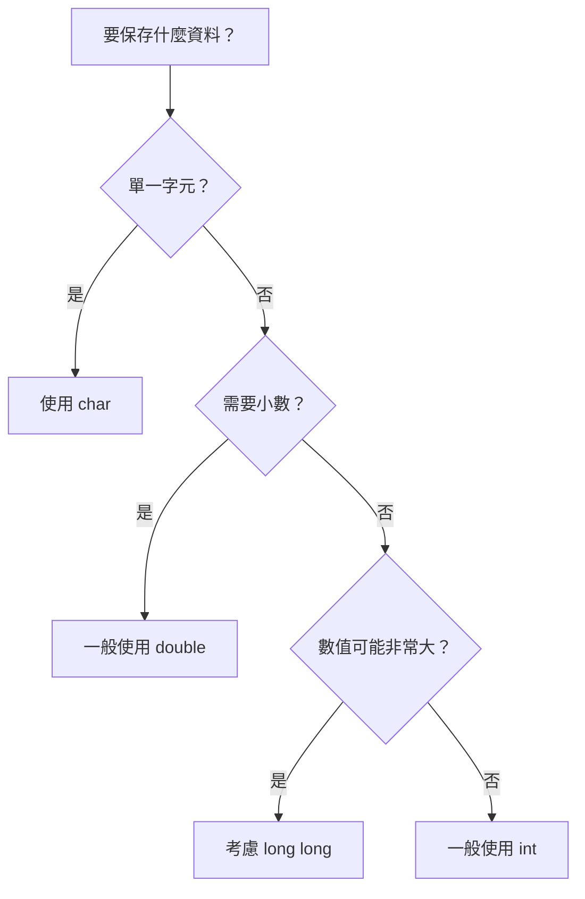
```mermaid
flowchart TD
    A[要保存什麼資料？] --> B{單一字元？}
    B -- 是 --> C[使用 char]
    B -- 否 --> D{需要小數？}
    D -- 是 --> E[一般使用 double]
    D -- 否 --> F{數值可能非常大？}
    F -- 是 --> G[考慮 long long]
    F -- 否 --> H[一般使用 int]
```

---

### 2. 平均數運算判斷

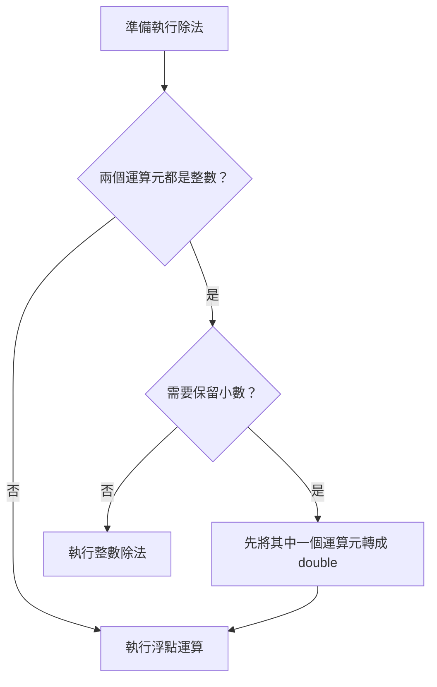
```mermaid
flowchart TD
    A[準備執行除法] --> B{兩個運算元都是整數？}
    B -- 否 --> C[執行浮點運算]
    B -- 是 --> D{需要保留小數？}
    D -- 否 --> E[執行整數除法]
    D -- 是 --> F[先將其中一個運算元轉成 double]
    F --> C
```

---

### 3. `scanf()` 格式選擇

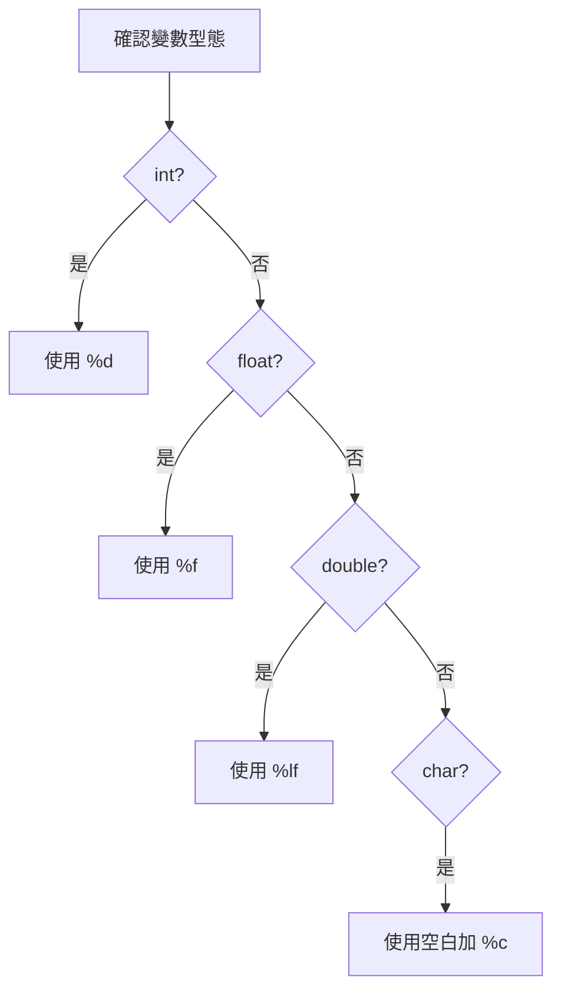
```mermaid
flowchart TD
    A[確認變數型態] --> B{int?}
    B -- 是 --> C[使用 %d]
    B -- 否 --> D{float?}
    D -- 是 --> E[使用 %f]
    D -- 否 --> F{double?}
    F -- 是 --> G[使用 %lf]
    F -- 否 --> H{char?}
    H -- 是 --> I[使用空白加 %c]
```

---

### 4. 字元的兩種觀察方式

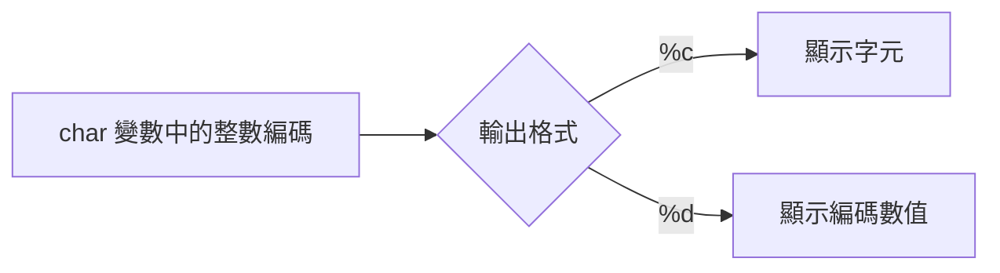
```mermaid
flowchart LR
    A[char 變數中的整數編碼] --> B{輸出格式}
    B -- %c --> C[顯示字元]
    B -- %d --> D[顯示編碼數值]
```
