# Lesson 5：Operators and Expressions 運算子與表示式

> 這堂課的重點：理解運算元、運算子與表示式之間的關係，正確使用算術、賦值、關係與邏輯運算子，並能依照優先順序與結合方向預測表示式的結果。

---

## Section I. 今天要做什麼？

1. 分辨運算元 operand、運算子 operator 與表示式 expression。
2. 理解表示式會經過運算，最後產生一個結果值。
3. 分辨一元運算子與二元運算子。
4. 使用 `+`、`-`、`*`、`/`、`%` 完成算術運算。
5. 比較整數運算與浮點數運算的差異。
6. 理解整數除法會捨去小數部分。
7. 理解 `%` 只能用於整數型態的餘數運算。
8. 理解賦值運算子 `=` 的作用與方向。
9. 使用複合賦值運算子簡化更新變數的程式碼。
10. 使用 `++` 與 `--` 讓整數增加或減少 `1`。
11. 分辨前置遞增與後置遞增的差異。
12. 理解 C 語言如何表示「真」與「假」。
13. 使用關係運算子比較兩個值。
14. 分辨賦值 `=` 與相等比較 `==`。
15. 使用 `&&`、`||`、`!` 組合或反轉條件。
16. 理解邏輯運算中的短路求值。
17. 依照運算子的優先順序判讀表示式。
18. 理解左結合與右結合的基本差異。
19. 使用括號讓運算順序更清楚。
20. 避免在同一個表示式中寫入過多副作用。

---

## Section II. 今天的學習方式

1. 先找出表示式中的運算元與運算子。
2. 每次只處理目前優先順序最高的部分。
3. 遇到變數時，先把變數換成目前保存的值。
4. 遇到 `/` 時，先判斷左右兩邊是整數還是浮點數。
5. 遇到 `=` 時，先算右邊，再把結果存到左邊。
6. 遇到關係或邏輯表示式時，先預測結果是 `0` 還是 `1`。
7. 遇到 `++` 或 `--` 時，確認程式使用的是前置還是後置形式。
8. 複雜表示式先用括號拆成數個小步驟。
9. 執行程式前先預測輸出，再與實際結果比較。
10. 本章先學會產生條件結果；下一章才正式使用 `if` 控制程式流程。

---

## Section III. 今天會學到的內容

| 主題 | 你需要知道的事 |
| --- | --- |
| 運算元 Operand | 被運算的資料，例如常數、變數或另一個表示式 |
| 運算子 Operator | 指定要進行何種運算的符號 |
| 表示式 Expression | 由運算元與運算子組成，計算後會得到一個值 |
| 一元運算子 | 只需要一個運算元，例如 `-a`、`!a`、`++a` |
| 二元運算子 | 需要左右兩個運算元，例如 `a + b` |
| 算術運算子 | `+`、`-`、`*`、`/`、`%` |
| 賦值運算子 | 將右側結果存入左側可修改物件，例如 `a = 10` |
| 副作用 Side effect | 表示式除了產生值，也修改了程式狀態，例如改變變數內容 |
| 複合賦值 | `+=`、`-=`、`*=`、`/=`、`%=` |
| 遞增與遞減 | `++` 讓值增加 `1`，`--` 讓值減少 `1` |
| 真與假 | `0` 視為假；非零值視為真 |
| 關係運算子 | `<`、`<=`、`>`、`>=`、`==`、`!=` |
| 邏輯運算子 | `&&`、`||`、`!` |
| 短路求值 | 已能決定結果時，可能不再計算後面的運算元 |
| 優先順序 | 不同運算子在沒有括號時的先後順序 |
| 結合方向 | 優先順序相同時，運算由左至右或由右至左組合 |

---

## Section IV. 寫題目前的提醒

### 1. `=` 不是數學中的等號

在 C 語言中：

```c
score = 80;
```

意思是：

```text
計算右邊的 80
↓
把 80 存進左邊的 score
```

它不是在問 `score` 是否等於 `80`。

比較是否相等要使用：

```c
score == 80
```

---

### 2. 整數除法與浮點數除法不同

```c
7 / 2
```

結果是：

```text
3
```

因為左右兩邊都是整數。

```c
7.0 / 2
```

結果是：

```text
3.5
```

因為其中一個運算元是浮點數。

---

### 3. `%` 是餘數，不是百分比

```c
17 % 5
```

結果是：

```text
2
```

因為：

```text
17 = 5 × 3 + 2
```

`%` 主要用於整數運算，例如判斷奇偶數或取得循環位置。

---

### 4. 關係運算的結果是整數 `0` 或 `1`

```c
3 < 5
```

結果是：

```text
1
```

```c
3 > 5
```

結果是：

```text
0
```

在 C 語言中，`1` 常用來表示真，`0` 表示假。

---

### 5. 非零值都視為真

下面這些值放在需要判斷真假的位置時，都視為真：

```text
1
-1
25
'A'
0.5
```

只有數值 `0` 視為假。

邏輯運算子產生的標準結果仍然是：

```text
真 → 1
假 → 0
```

---

### 6. `&&` 與 `||` 不是 `&` 與 `|`

本章使用邏輯運算：

```c
&&
||
```

不要少打一個符號：

```c
&
|
```

單一的 `&` 與 `|` 是不同種類的位元運算子，不在本章範圍內。

---

### 7. `++` 與 `--` 每次只改變 `1`

```c
count++;
```

等同於讓 `count` 增加 `1`。

它不是讓變數加倍，也不能寫成：

```c
count++++;
```

---

### 8. 前置與後置形式的副作用相同，但表示式值可能不同

單獨使用時：

```c
count++;
++count;
```

都會使 `count` 增加 `1`。

但是放在較大的表示式中時，兩者取得值的時間不同：

```c
result = count++;
result = ++count;
```

因此初學階段應先把遞增或遞減獨立寫成一行。

---

### 9. 不確定優先順序時，使用括號

```c
average = total / count + bonus;
```

如果真正意思是先把 `count + bonus` 算出來，應寫成：

```c
average = total / (count + bonus);
```

括號不只控制運算順序，也能提高可讀性。

---

### 10. 不要在同一個表示式中多次修改同一個變數

請避免這類難以閱讀、甚至可能產生未定義行為的寫法：

```c
value = value++ + ++value;
```

更好的做法是拆成清楚的小步驟：

```c
value++;
value++;
result = value;
```

---

## Section V. 核心概念說明

### 1. 資料的儲存與處理

程式主要會反覆進行兩件事：

```text
將資料存入記憶體
↓
取出資料進行運算
↓
把結果再次存入記憶體或輸出
```

例如：

```c
int price = 50;
int quantity = 3;
int total = price * quantity;
```

其中：

- `price` 與 `quantity` 保存資料。
- `price * quantity` 處理資料。
- `total` 保存運算結果。

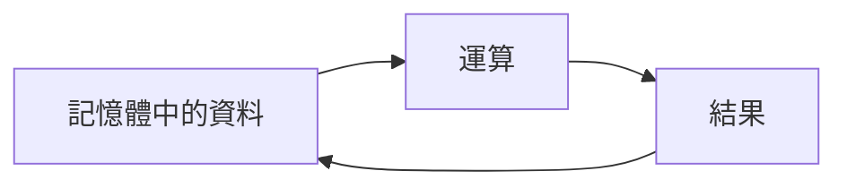
```mermaid
flowchart LR
    A[記憶體中的資料] --> B[運算]
    B --> C[結果]
    C --> A
```

---

### 2. 什麼是運算元？

運算元是被運算的資料。

例如：

```c
3 + 5
```

其中：

```text
3 → 運算元
5 → 運算元
```

運算元可以是：

```text
常數
變數
函式呼叫的結果
另一個表示式
```

例如：

```c
price * quantity
```

`price` 與 `quantity` 是變數運算元。

```c
3 + 5 * 2
```

`5 * 2` 也可以先形成一個較小的表示式，再成為加法運算的一部分。

---

### 3. 什麼是運算子？

運算子告訴程式要執行哪一種運算。

```c
3 + 5
```

其中：

```text
+ → 加法運算子
```

常見運算子：

```text
+   加法
-   減法或負號
*   乘法
/   除法
%   餘數
=   賦值
<   小於
&&  邏輯 AND
```

---

### 4. 什麼是表示式？

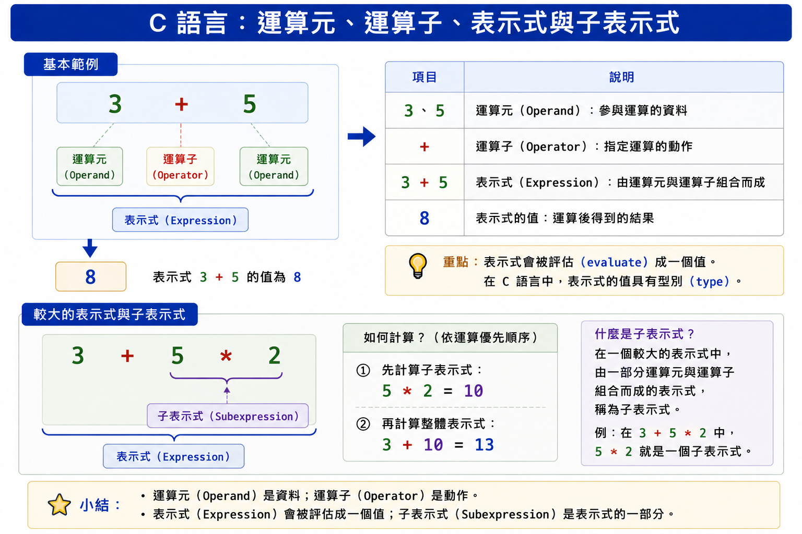

表示式是一段可以被計算並產生一個值的程式碼。

```c
3 + 5 * 2
```

這是一個表示式。

依照乘法優先於加法：

```text
3 + 5 * 2
3 + 10
13
```

因此整個表示式的值是 `13`。

可以把已算完的部分想成被結果取代：

```text
3 + [5 * 2]
3 + [10]
[13]
```

---

### 5. 變數加入表示式

```c
int a = 5;
int b = 2;
int result = 3 + a * b;
```

計算時可以先把變數換成目前的值：

```text
3 + a * b
3 + 5 * 2
3 + 10
13
```

因此 `result` 保存 `13`。

若不知道變數目前的值，就無法確定表示式的最終結果。

---

### 6. 一元與二元運算子

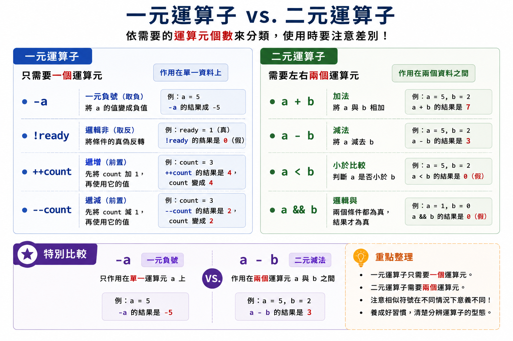

#### 二元運算子

需要左右兩個運算元：

```c
a + b
```

```text
a → 左運算元
+ → 二元運算子
b → 右運算元
```

常見二元運算子：

```text
+ - * / %
< <= > >= == !=
&& ||
=
```

#### 一元運算子

只需要一個運算元：

```c
-a
!ready
++count
```

在 `-a` 中，`-` 表示負號，不是二元減法。

---

### 7. 加法與減法

```c
int a = 12;
int b = 5;

printf("%d\n", a + b);
printf("%d\n", a - b);
```

輸出：

```text
17
7
```

`+` 與 `-` 可用於整數及浮點數。

```c
double x = 2.5;
double y = 1.2;

printf("%.1f\n", x + y);
printf("%.1f\n", x - y);
```

輸出：

```text
3.7
1.3
```

---

### 8. 一元正號與負號

`+` 與 `-` 也可以是一元運算子：

```c
int value = 5;
int positive = +value;
int negative = -value;
```

結果：

```text
positive → 5
negative → -5
```

請分辨：

```c
a - b   // 二元減法
-b      // 一元負號
```

---

### 9. 乘法

C 語言使用 `*` 表示乘法：

```c
int width = 8;
int height = 5;
int area = width * height;
```

`area` 的值是：

```text
40
```

不能省略乘號：

```c
2 * value   // 正確
2value      // 錯誤
```

---

### 10. 除法

```c
int a = 7;
int b = 2;
int result = a / b;
```

結果是：

```text
3
```

整數除法只保留整數部分。

如果希望得到小數：

```c
double result = 7.0 / 2;
```

結果是：

```text
3.5
```

也可以轉型：

```c
int a = 7;
int b = 2;
double result = (double)a / b;
```

---

### 11. 混合型態的算術運算

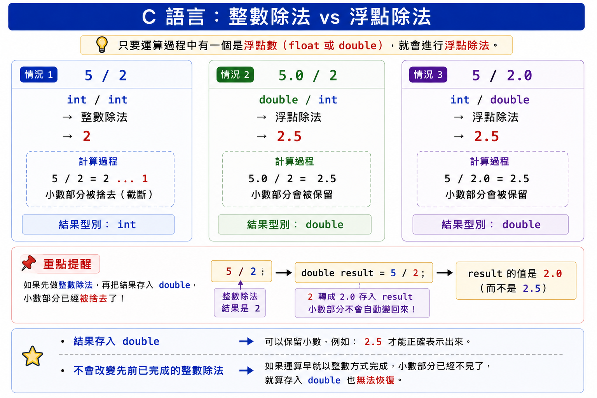

```c
5 / 2
```

兩邊都是整數，結果是整數 `2`。

```c
5.0 / 2
```

其中一邊是浮點數，另一邊會參與浮點運算，結果是 `2.5`。

```c
5 / 2.0
```

結果同樣是 `2.5`。

請先判斷運算本身的型態，再判斷結果要存入哪種變數。

```c
double result = 5 / 2;
```

這裡仍然先做整數除法，得到 `2`，最後才存成 `2.0`。

---

### 12. 餘數運算子 `%`

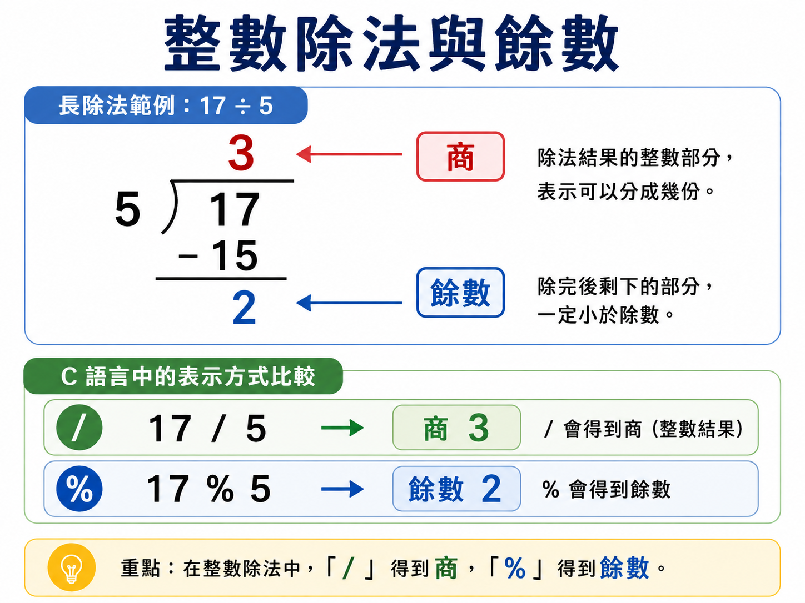

```c
int remainder = 17 % 5;
```

結果是：

```text
2
```

常見用途：

#### 判斷奇偶

```c
number % 2
```

```text
結果為 0 → 偶數
結果不為 0 → 奇數
```

#### 取得個位數

```c
number % 10
```

例如：

```text
347 % 10 → 7
```

#### 建立循環值

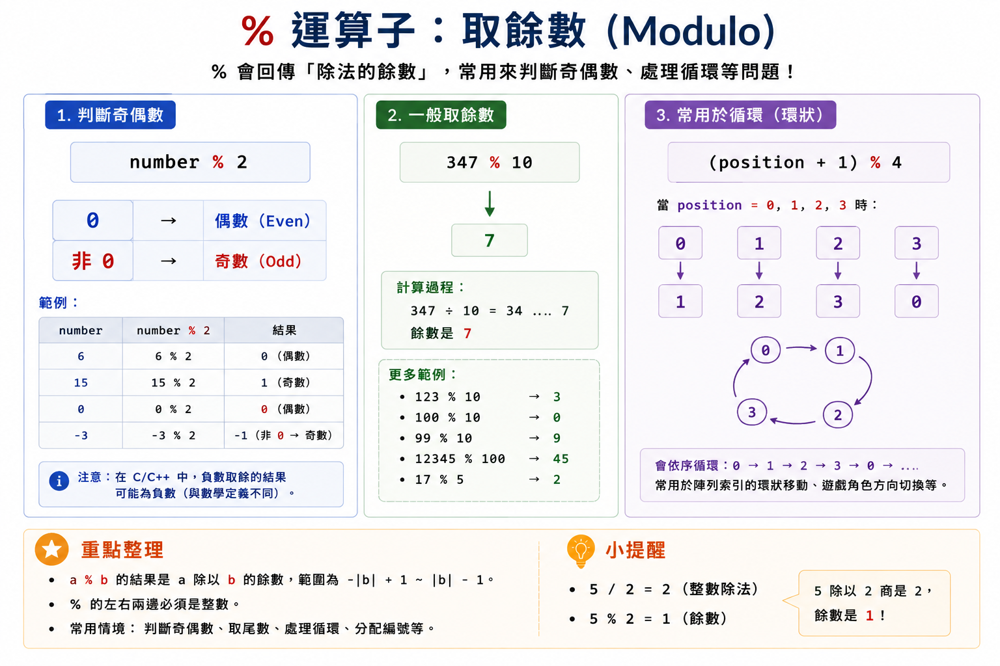

```c
position = (position + 1) % 4;
```

結果會在 `0`、`1`、`2`、`3` 之間循環。

> `%` 的兩個運算元必須是整數型態。不能把它直接用在 `double` 上。

---

### 13. 賦值運算子 `=`

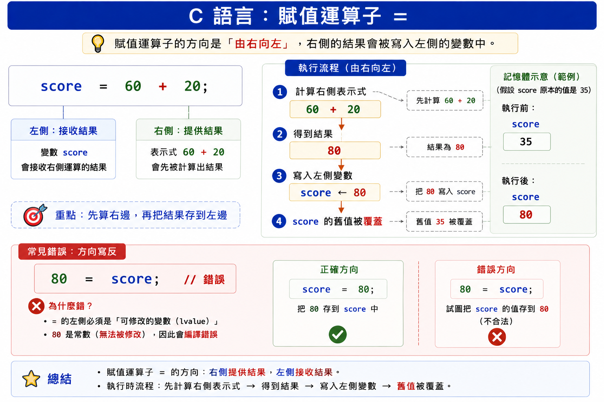

```c
int score;
score = 80;
```

賦值運算會完成兩件事：

1. 計算右側表示式。
2. 把結果存入左側變數。

```text
score = 60 + 20
        ↓
score = 80
        ↓
score 現在保存 80
```

左側必須是可以被修改的儲存位置，例如變數。

```c
score = 80;   // 正確
80 = score;   // 錯誤
```

---

### 14. 賦值運算的副作用

表示式通常會產生一個值。

賦值表示式除了產生值之外，也會修改左側變數，因此具有副作用。

```c
int a = 0;
a = 5;
```

副作用是：

```text
a 的內容從 0 變成 5
```

賦值表示式本身也有值，其值是賦值後左側的結果。

因此 C 語言允許：

```c
int a;
int b;

a = b = 10;
```

執行順序：

```text
b = 10
↓
a = 10
```

最後 `a` 與 `b` 都是 `10`。

雖然連鎖賦值合法，但初學時應只在意思非常清楚時使用。

---

### 15. 賦值由右向左結合

```c
a = b = c = 5;
```

不是從左邊開始，而是：

```text
c = 5
b = c 的結果
 a = b 的結果
```

可加括號理解：

```c
a = (b = (c = 5));
```

這就是賦值運算子的右結合。

---

### 16. 使用原值更新變數

```c
int score = 10;
score = score + 5;
```

計算順序：

```text
右邊的 score 先取出舊值 10
10 + 5 得到 15
把 15 存回左邊的 score
```

最後：

```text
score → 15
```

這種寫法在數學等式中可能不合理，但在程式中代表「更新變數」。

---

### 17. 複合賦值運算子

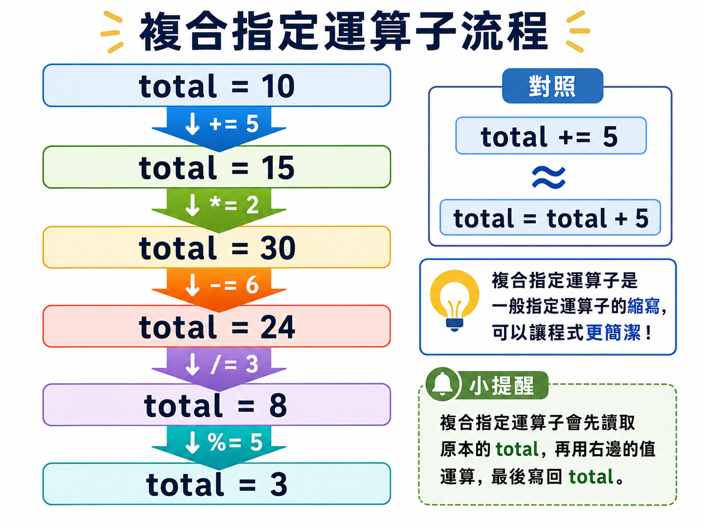

下面兩種寫法表示相同的更新目的：

```c
score = score + 5;
score += 5;
```

常見複合賦值：

| 寫法 | 意義 |
| --- | --- |
| `a += b` | `a = a + b` |
| `a -= b` | `a = a - b` |
| `a *= b` | `a = a * b` |
| `a /= b` | `a = a / b` |
| `a %= b` | `a = a % b` |

範例：

```c
int total = 10;

total += 5;  // 15
total *= 2;  // 30
total -= 6;  // 24
total /= 3;  // 8
total %= 5;  // 3
```

---

### 18. 複合賦值不只是少打幾個字

```c
long_variable_name = long_variable_name + 1;
```

可以改成：

```c
long_variable_name += 1;
```

它能清楚表達：

```text
使用原值
進行運算
存回同一個變數
```

但仍需注意型態及運算規則，例如：

```c
int value = 5;
value /= 2;
```

`value` 最後是 `2`，因為它是整數除法。

---

### 19. 遞增與遞減運算子

```c
count++;
```

使 `count` 增加 `1`。

```c
count--;
```

使 `count` 減少 `1`。

獨立成一行時，下列寫法的最終副作用相同：

```c
count = count + 1;
count += 1;
count++;
++count;
```

都會讓 `count` 增加 `1`。

---

### 20. 前置與後置遞增

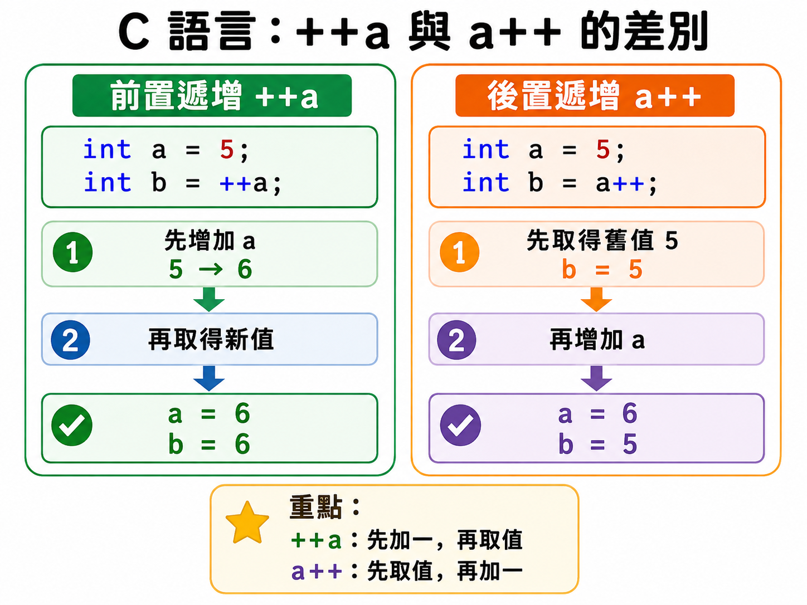

#### 前置遞增

```c
++a
```

概念上：

```text
先讓 a 增加 1
再取得新的值
```

#### 後置遞增

```c
a++
```

概念上：

```text
先取得原本的值
再讓 a 增加 1
```

範例：

```c
int a = 5;
int b = a++;
```

結果：

```text
b → 5
a → 6
```

另一個範例：

```c
int a = 5;
int b = ++a;
```

結果：

```text
a → 6
b → 6
```

---

### 21. 前置與後置遞減

```c
int a = 5;
int b = a--;
```

結果：

```text
b → 5
a → 4
```

```c
int a = 5;
int b = --a;
```

結果：

```text
a → 4
b → 4
```

初學階段建議：

```c
a--;
b = a;
```

比把多個動作塞入同一行更容易追蹤。

---

### 22. 為什麼需要表示真與假？

程式常需要回答問題：

```text
分數是否及格？
溫度是否超過上限？
使用者輸入是否正確？
兩個數字是否相等？
```

這些問題的答案只有兩類：

```text
成立
不成立
```

C 語言可用整數值表示：

```text
0     → 假
非零  → 真
```

之後的 `if`、`while` 與 `for` 都會使用這個概念。

---

### 23. 真值的基本規則

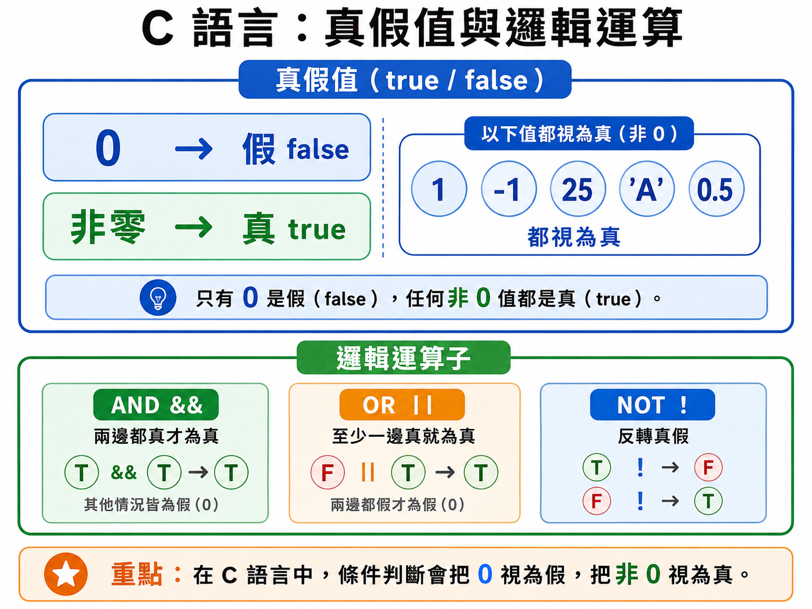

```c
printf("%d\n", 0 != 0);
printf("%d\n", 5 != 0);
printf("%d\n", -3 != 0);
```

輸出：

```text
0
1
1
```

因為：

```text
0 是假
5 是非零，視為真
-3 是非零，視為真
```

關係與邏輯運算子的結果會標準化為 `0` 或 `1`。

---

### 24. 關係運算子

| 運算子 | 意義 | 範例 |
| --- | --- | --- |
| `<` | 小於 | `a < b` |
| `<=` | 小於或等於 | `a <= b` |
| `>` | 大於 | `a > b` |
| `>=` | 大於或等於 | `a >= b` |
| `==` | 等於 | `a == b` |
| `!=` | 不等於 | `a != b` |

範例：

```c
printf("%d\n", 3 < 5);
printf("%d\n", 3 > 5);
printf("%d\n", 3 == 3);
printf("%d\n", 3 != 3);
```

輸出：

```text
1
0
1
0
```

---

### 25. `=` 與 `==` 的差異

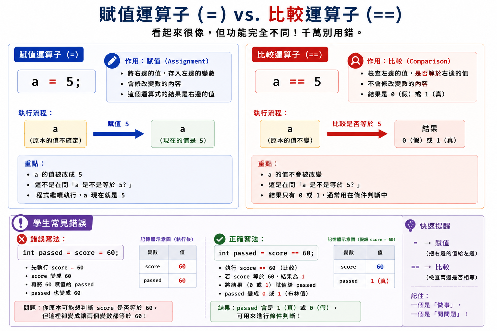

```c
a = 5;
```

表示把 `5` 存入 `a`。

```c
a == 5
```

表示比較 `a` 與 `5` 是否相等。

| 符號 | 名稱 | 是否修改變數 | 結果 |
| --- | --- | --- | --- |
| `=` | 賦值運算子 | 會 | 賦值後的值 |
| `==` | 相等運算子 | 不會 | `0` 或 `1` |

請特別留意：

```c
printf("%d\n", a = 5);   // 會修改 a
printf("%d\n", a == 5);  // 只比較
```

雖然第一行在語法上可能成立，但容易造成誤解。賦值最好獨立寫成一行。

---

### 26. 比較運算可以保存到變數

```c
int age = 20;
int is_adult = age >= 18;
```

若 `age` 是 `20`：

```text
age >= 18 → 1
is_adult   → 1
```

如果 `age` 是 `15`：

```text
age >= 18 → 0
is_adult   → 0
```

這能讓較長的條件具有清楚的名稱。

---

### 27. 邏輯 AND：`&&`

`&&` 表示左右兩個條件都必須為真。

| 左邊 | 右邊 | `左 && 右` |
| --- | --- | --- |
| 假 | 假 | 假 |
| 假 | 真 | 假 |
| 真 | 假 | 假 |
| 真 | 真 | 真 |

範例：

```c
int age = 20;
int has_ticket = 1;
int can_enter = age >= 18 && has_ticket;
```

```text
age >= 18 → 1
has_ticket → 1
1 && 1    → 1
```

因此 `can_enter` 是 `1`。

---

### 28. 邏輯 OR：`||`

`||` 表示至少一邊為真即可。

| 左邊 | 右邊 | `左 || 右` |
| --- | --- | --- |
| 假 | 假 | 假 |
| 假 | 真 | 真 |
| 真 | 假 | 真 |
| 真 | 真 | 真 |

範例：

```c
int is_weekend = 0;
int is_holiday = 1;
int can_rest = is_weekend || is_holiday;
```

結果：

```text
0 || 1 → 1
```

---

### 29. 邏輯 NOT：`!`

`!` 會反轉真值：

| 原本 | `!原本` |
| --- | --- |
| 假 | 真 |
| 真 | 假 |

範例：

```c
printf("%d\n", !0);
printf("%d\n", !1);
printf("%d\n", !25);
```

輸出：

```text
1
0
0
```

`25` 是非零，本來視為真，反轉後為假。

---

### 30. 組合多個條件

```c
int score = 75;
int attendance = 90;
int passed = score >= 60 && attendance >= 80;
```

計算：

```text
score >= 60      → 1
attendance >= 80 → 1
1 && 1           → 1
```

再例如：

```c
int temperature = 38;
int warning = temperature < 0 || temperature > 35;
```

只要溫度低於 `0` 或高於 `35`，`warning` 就是 `1`。

---

### 31. 短路求值

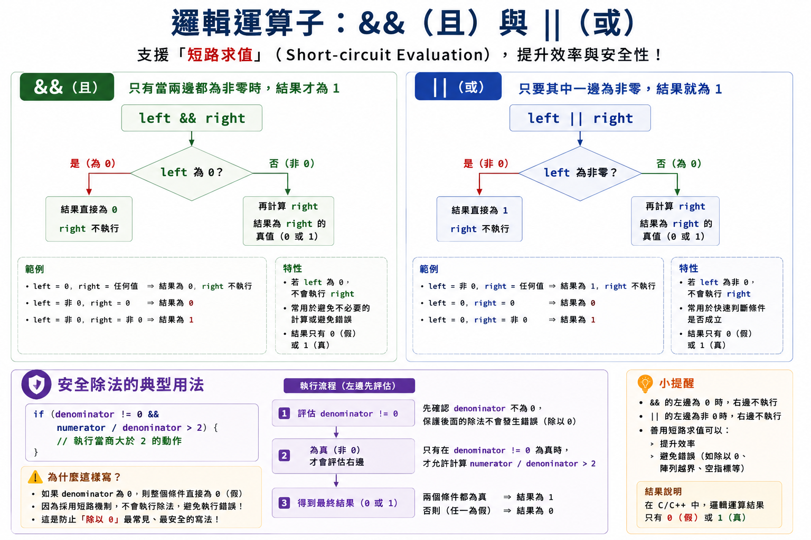

邏輯運算子可能不計算右側運算元。

#### `&&` 的短路

```c
left && right
```

如果 `left` 已經是假，整個結果一定是假，因此不需要計算 `right`。

#### `||` 的短路

```c
left || right
```

如果 `left` 已經是真，整個結果一定是真，因此不需要計算 `right`。

範例：

```c
int numerator = 20;
int denominator = 0;
int valid = denominator != 0 && numerator / denominator > 2;
```

計算：

```text
denominator != 0 → 0
```

因為 `&&` 左側已是假，右側的除法不會執行，避免除以零。

> 不要把短路求值當成隱藏大量副作用的技巧。它最適合用來保護後續需要前置條件的運算。

---

### 32. 邏輯運算的替代拼法

部分 C 環境可透過：

```c
#include <iso646.h>
```

使用替代拼法：

| 符號 | 替代拼法 |
| --- | --- |
| `&&` | `and` |
| `||` | `or` |
| `!` | `not` |

例如：

```c
int allowed = age >= 18 and has_ticket;
```

一般 C 程式仍較常使用 `&&`、`||`、`!`。閱讀他人程式時知道替代拼法即可。

---

### 33. 什麼是運算子的優先順序？

```c
3 + 5 * 2
```

乘法的優先順序高於加法，所以：

```text
5 * 2 → 10
3 + 10 → 13
```

不是：

```text
3 + 5 → 8
8 * 2 → 16
```

若希望先加法，使用括號：

```c
(3 + 5) * 2
```

結果是 `16`。

---

### 34. 本章常用運算子的優先順序

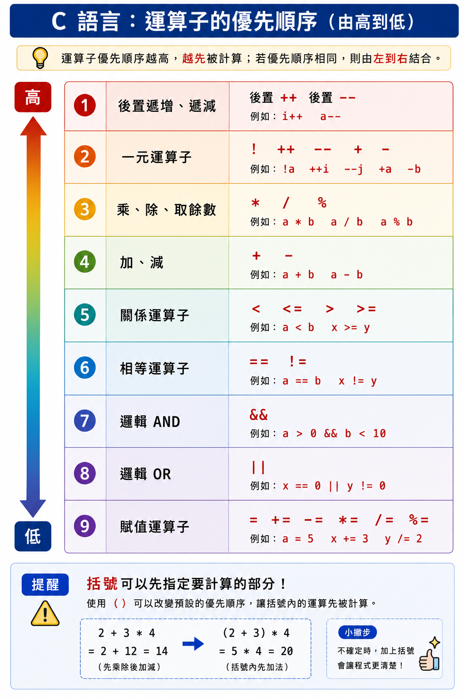

由高至低：

| 順序 | 運算子 | 類型 | 結合方向 |
| --- | --- | --- | --- |
| 1 | 後置 `x++`、`x--` | 後置遞增遞減 | 由左至右 |
| 2 | `!`、前置 `++x`、`--x`、一元 `+`、一元 `-` | 一元運算 | 由右至左 |
| 3 | `*`、`/`、`%` | 乘除與餘數 | 由左至右 |
| 4 | `+`、`-` | 加減 | 由左至右 |
| 5 | `<`、`<=`、`>`、`>=` | 關係運算 | 由左至右 |
| 6 | `==`、`!=` | 相等運算 | 由左至右 |
| 7 | `&&` | 邏輯 AND | 由左至右 |
| 8 | `||` | 邏輯 OR | 由左至右 |
| 9 | `=`、`+=`、`-=`、`*=`、`/=`、`%=` | 賦值 | 由右至左 |

括號 `()` 可明確指定要先計算的部分。

---

### 35. 相同優先順序時的結合方向

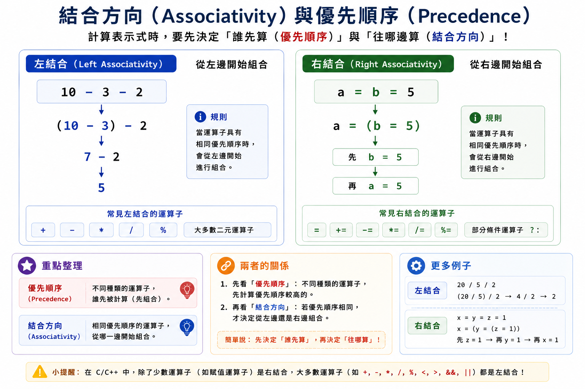

#### 由左至右

```c
20 / 5 * 2
```

`/` 與 `*` 優先順序相同，並且由左至右：

```text
20 / 5 → 4
4 * 2  → 8
```

```c
10 - 3 - 2
```

由左至右：

```text
10 - 3 → 7
7 - 2  → 5
```

不是 `10 - (3 - 2)`。

#### 由右至左

賦值運算由右至左：

```c
a = b = 5;
```

相當於：

```c
a = (b = 5);
```

---

### 36. 關係與邏輯運算的順序

```c
a > b && b > c
```

關係運算優先於 `&&`：

```text
(a > b) && (b > c)
```

```c
a == b || c != d
```

相等運算優先於 `||`：

```text
(a == b) || (c != d)
```

即使不加括號也能依規則計算，但加入括號更容易閱讀。

---

### 37. 不要依賴記憶完成所有複雜表示式

下面的寫法雖然可依優先順序判讀：

```c
result = a + b * c > d && e != 0 || f;
```

但可讀性不佳。

較清楚的寫法：

```c
int arithmetic_result = a + b * c;
int first_condition = arithmetic_result > d;
int second_condition = e != 0;
int result = (first_condition && second_condition) || f;
```

或至少加入括號：

```c
result = ((a + b * c) > d && e != 0) || f;
```

程式不只是要讓編譯器看懂，也要讓人看懂。

---

## Section V-A. 容易搞混的重點

### 1. 運算子與表示式不是同一件事

```c
+
```

是運算子。

```c
3 + 5
```

是表示式。

```text
3、5 → 運算元
+    → 運算子
3+5  → 表示式
8    → 表示式的值
```

---

### 2. 一元負號與二元減法

```c
-a
```

`-` 只有一個運算元，是一元負號。

```c
a - b
```

`-` 有兩個運算元，是二元減法。

---

### 3. `5 / 2` 與 `5.0 / 2`

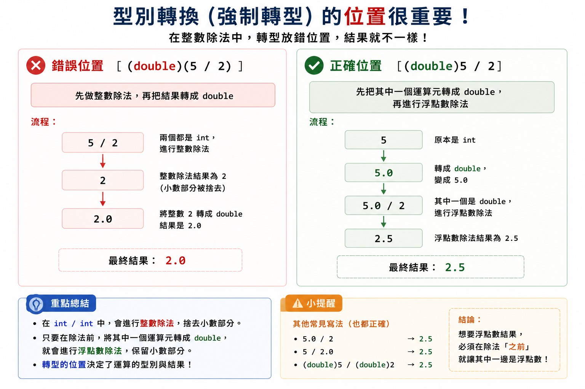

```text
5 / 2   → 2
5.0 / 2 → 2.5
```

把結果存入 `double` 不會自動找回整數除法已經捨去的小數。

---

### 4. `%` 與 `/`

```text
17 / 5 → 商 3
17 % 5 → 餘數 2
```

兩者回答不同問題。

---

### 5. `a = a + 1` 不是相等比較

它表示：

```text
取出 a 的舊值
加 1
把結果存回 a
```

可簡寫為：

```c
a += 1;
```

或：

```c
a++;
```

---

### 6. `a++` 與 `++a`

獨立成一行時：

```c
a++;
++a;
```

最終都增加 `1`。

放進較大的表示式時，取得的是舊值或新值，結果才會不同。

---

### 7. `=` 與 `==`

```text
=   修改左側變數
==  比較兩個值
```

這是 C 初學者最常見的符號錯誤之一。

---

### 8. 真不一定只寫成 `1`

在判斷真假時：

```text
0    → 假
非零 → 真
```

但是關係與邏輯運算子的輸出結果會是 `0` 或 `1`。

---

### 9. `!value` 不是「value 不等於某個數」

```c
!value
```

代表反轉 `value` 的真值。

```text
value = 0    → !value 是 1
value = 10   → !value 是 0
```

比較不等於要寫：

```c
value != 10
```

---

### 10. `&&` 與 `||` 的右側不一定執行

```c
left && right
```

左側為假時，右側不執行。

```c
left || right
```

左側為真時，右側不執行。

因此不要把必要的變數更新偷偷放在右側。

---

### 11. 優先順序與結合方向不同

優先順序回答：

```text
不同種類的運算子，哪一種先組合？
```

結合方向回答：

```text
同一優先等級的運算子，從哪一側組合？
```

例如：

```c
10 - 3 - 2
```

兩個 `-` 優先順序相同，依左結合得到 `5`。

---

## Section VI. 快速概念檢查

### Q1. 下列程式中，哪一個是表示式？

```text
A. +
B. 3 + 5
C. ;
```

<details>
<summary>查看答案</summary>

答案：`B`。

`3 + 5` 可以被計算並產生值 `8`。

</details>

---

### Q2. `7 / 2` 的結果是多少？

<details>
<summary>查看答案</summary>

```text
3
```

兩個運算元都是整數，因此使用整數除法。

</details>

---

### Q3. `7.0 / 2` 的結果是多少？

<details>
<summary>查看答案</summary>

```text
3.5
```

至少一個運算元是浮點數。

</details>

---

### Q4. `23 % 10` 的結果是多少？

<details>
<summary>查看答案</summary>

```text
3
```

`23` 除以 `10` 的餘數是 `3`。

</details>

---

### Q5. 執行後 `value` 是多少？

```c
int value = 10;
value += 4;
value *= 2;
```

<details>
<summary>查看答案</summary>

```text
28
```

```text
10 + 4 → 14
14 × 2 → 28
```

</details>

---

### Q6. 執行後 `a` 與 `b` 是多少？

```c
int a = 5;
int b = a++;
```

<details>
<summary>查看答案</summary>

```text
a = 6
b = 5
```

後置遞增先提供舊值，再增加 `a`。

</details>

---

### Q7. 執行後 `a` 與 `b` 是多少？

```c
int a = 5;
int b = ++a;
```

<details>
<summary>查看答案</summary>

```text
a = 6
b = 6
```

前置遞增先增加 `a`，再提供新值。

</details>

---

### Q8. 下列表示式的結果是多少？

```c
3 < 5
```

<details>
<summary>查看答案</summary>

```text
1
```

`3` 小於 `5`，條件成立。

</details>

---

### Q9. 下列表示式的結果是多少？

```c
5 && 0
```

<details>
<summary>查看答案</summary>

```text
0
```

`5` 視為真，`0` 視為假；AND 需要兩邊都為真。

</details>

---

### Q10. 下列表示式的結果是多少？

```c
!(-3)
```

<details>
<summary>查看答案</summary>

```text
0
```

`-3` 是非零，視為真；反轉後是假。

</details>

---

### Q11. 下列表示式的結果是多少？

```c
2 + 3 * 4
```

<details>
<summary>查看答案</summary>

```text
14
```

乘法先算：`3 * 4 = 12`，再加 `2`。

</details>

---

### Q12. 下列表示式的結果是多少？

```c
(2 + 3) * 4
```

<details>
<summary>查看答案</summary>

```text
20
```

括號先算。

</details>

---

### Q13. 下列程式中，哪一個是相等比較？

```text
A. value = 10
B. value == 10
```

<details>
<summary>查看答案</summary>

答案：`B`。

`=` 是賦值，`==` 才是比較。

</details>

---

### Q14. `0 || -7` 的結果是多少？

<details>
<summary>查看答案</summary>

```text
1
```

`-7` 是非零，視為真；OR 只需要一邊為真。

</details>

---

## Section VII. 程式閱讀練習

### 題目 1：算術優先順序

```c
#include <stdio.h>

int main(void) {
    int result = 5 + 2 * 6;
    printf("%d\n", result);
    return 0;
}
```

請回答：

1. 先計算哪一個運算？
2. 最後輸出什麼？
3. 如何修改成先計算 `5 + 2`？

<details>
<summary>查看答案</summary>

1. 先計算 `2 * 6`。
2. 輸出 `17`。
3. 改成：

```c
int result = (5 + 2) * 6;
```

</details>

---

### 題目 2：整數除法

```c
#include <stdio.h>

int main(void) {
    int total = 17;
    int count = 4;
    double average = total / count;
    printf("%.2f\n", average);
    return 0;
}
```

請回答：

1. 輸出是 `4.25` 嗎？
2. 錯誤發生在哪裡？
3. 應如何修正？

<details>
<summary>查看答案</summary>

不是。`total / count` 先做整數除法，得到 `4`，再存成 `4.0`。

可改成：

```c
double average = (double)total / count;
```

</details>

---

### 題目 3：複合賦值追蹤

```c
#include <stdio.h>

int main(void) {
    int value = 12;
    value -= 2;
    value *= 3;
    value /= 5;
    printf("%d\n", value);
    return 0;
}
```

<details>
<summary>查看答案</summary>

```text
12 - 2 → 10
10 * 3 → 30
30 / 5 → 6
```

輸出：

```text
6
```

</details>

---

### 題目 4：前置與後置

```c
#include <stdio.h>

int main(void) {
    int a = 3;
    int b = a++;
    int c = ++a;

    printf("a = %d\n", a);
    printf("b = %d\n", b);
    printf("c = %d\n", c);
    return 0;
}
```

<details>
<summary>查看答案</summary>

```text
開始：a = 3
b = a++：b = 3，a 變成 4
c = ++a：a 先變成 5，c = 5
```

輸出：

```text
a = 5
b = 3
c = 5
```

</details>

---

### 題目 5：關係與邏輯運算

```c
#include <stdio.h>

int main(void) {
    int score = 75;
    int attendance = 70;

    int result = score >= 60 && attendance >= 80;
    printf("%d\n", result);
    return 0;
}
```

<details>
<summary>查看答案</summary>

```text
score >= 60      → 1
attendance >= 80 → 0
1 && 0           → 0
```

輸出 `0`。

</details>

---

### 題目 6：短路求值

```c
#include <stdio.h>

int main(void) {
    int numerator = 10;
    int denominator = 0;

    int result = denominator != 0 && numerator / denominator > 1;
    printf("%d\n", result);
    return 0;
}
```

請說明為什麼程式不會執行除以零。

<details>
<summary>查看答案</summary>

`denominator != 0` 的結果是 `0`。

`&&` 的左側已經是假，整個 AND 表示式一定是假，因此右側不再計算。

</details>

---

### 題目 7：找出符號錯誤

```c
int score = 80;
int passed = score = 60;
```

如果原意是判斷 `score` 是否等於 `60`，哪裡錯了？

<details>
<summary>查看答案</summary>

第二行使用了賦值運算子，會把 `60` 存入 `score`。

應改成：

```c
int passed = score == 60;
```

</details>

---

### 題目 8：結合方向

```c
int a;
int b;
int c;

a = b = c = 7;
```

<details>
<summary>查看答案</summary>

賦值由右至左：

```text
c = 7
b = 7
a = 7
```

三個變數最後都是 `7`。

</details>

---

## Section VIII. 實作練習 / 實作檢測題

### Q1. 五種算術運算

讀入兩個整數，輸出：

```text
和
差
積
商
餘數
```

假設第二個數不為 `0`。

程式骨架：

```c
#include <stdio.h>

int main(void) {
    int a;
    int b;

    printf("請輸入兩個整數：");
    scanf("%d %d", &a, &b);

    // TODO：輸出五種運算結果

    return 0;
}
```

---

### Q2. 修正平均數

讀入三個整數分數，正確輸出小數平均。

要求：

```text
不能只得到整數部分
輸出到小數點後兩位
```

---

### Q3. 分鐘與秒數

讀入總秒數，使用 `/` 與 `%` 輸出：

```text
幾分鐘
剩下幾秒
```

例如：

```text
輸入：135
輸出：2 分 15 秒
```

---

### Q4. 取得數字的個位數

讀入一個非負整數，輸出它的個位數。

提示：

```c
number % 10
```

---

### Q5. 追蹤複合賦值

建立變數：

```c
int value = 20;
```

依序使用：

```text
+= 5
*= 3
-= 10
/= 5
%= 4
```

每一步都輸出目前的 `value`。

---

### Q6. 前置與後置比較

建立兩組初始值相同的變數，分別執行：

```c
b = a++;
```

與：

```c
b = ++a;
```

輸出兩組的 `a` 與 `b`，比較結果。

---

### Q7. 六種關係運算

讀入兩個整數 `a`、`b`，分別輸出：

```c
a < b
a <= b
a > b
a >= b
a == b
a != b
```

觀察每個結果是 `0` 或 `1`。

---

### Q8. 範圍判斷表示式

讀入一個整數 `number`，建立表示式判斷它是否位於 `1` 到 `100` 之間，包含邊界。

本題只需輸出 `0` 或 `1`，不要使用 `if`。

提示：

```c
number >= 1 && number <= 100
```

---

### Q9. 區間外判斷

讀入溫度，判斷它是否低於 `0` 或高於 `35`。

本題只需輸出關係與邏輯表示式的結果。

---

### Q10. 安全除法條件

讀入 `numerator` 與 `denominator`，建立一個表示式判斷：

```text
denominator 不為 0
而且
numerator / denominator 大於 2
```

使用短路求值保護除法。

---

### Q11. 加入括號

請分別寫出能得到下列兩種計算順序的 C 表示式：

```text
先算 a + b，再乘 c
先算 b * c，再加 a
```

---

### Q12. 運算子分類表

把下面的運算子分類：

```text
+  -  *  /  %
=  +=  -=
<  <=  >  >=  ==  !=
&&  ||  !
++  --
```

分類為：

```text
算術
賦值
關係
邏輯
遞增遞減
```

---

### Q13. 找出並修正錯誤

```c
#include <stdio.h>

int main(void) {
    int a = 5;
    int b = 2;
    double result = a / b;
    int same = a = b;

    printf("result = %.1f\n", result);
    printf("same = %d\n", same);
    return 0;
}
```

目標：

```text
result 應為 2.5
same 應表示 a 與 b 是否相等
```

---

### Q14. 設計條件結果輸出器

讀入：

```text
年齡 age
是否持有票券 has_ticket（0 或 1）
```

輸出下列三個結果：

```text
age >= 18
has_ticket
age >= 18 && has_ticket
```

不要使用 `if`。

---

## Section IX. 做題時可以使用的提示

### 1. 算術運算

```c
sum = a + b;
difference = a - b;
product = a * b;
quotient = a / b;
remainder = a % b;
```

---

### 2. 避免整數除法

```c
double result = (double)a / b;
```

先把其中一個運算元轉成 `double`。

---

### 3. 取得商與餘數

```c
minutes = seconds / 60;
remaining_seconds = seconds % 60;
```

---

### 4. 更新同一個變數

```c
value += amount;
value -= amount;
value *= factor;
```

---

### 5. 增加或減少 `1`

```c
count++;
count--;
```

初學時獨立寫成一行最清楚。

---

### 6. 比較兩個值

```c
a < b
a <= b
a == b
a != b
```

結果可直接使用 `%d` 輸出。

---

### 7. 判斷數字是否在範圍內

```c
number >= lower && number <= upper
```

---

### 8. 判斷數字是否在範圍外

```c
number < lower || number > upper
```

---

### 9. 反轉真值

```c
!value
```

---

### 10. 安全使用除法

```c
denominator != 0 && numerator / denominator > limit
```

左側先保證分母不為零。

---

### 11. 表示式太長時

把它拆成有名稱的中間結果：

```c
int old_enough = age >= 18;
int has_permission = parent_permission != 0;
int allowed = old_enough || has_permission;
```

---

### 12. 結果不對時的檢查順序

```text
1. 每個變數目前保存什麼值？
2. 運算元是整數還是浮點數？
3. 是否把 = 與 == 寫反？
4. 是否少打一個 & 或 |？
5. 哪一個運算子優先？
6. 同級運算子從哪一邊結合？
7. 是否需要加括號？
8. ++ 或 -- 使用的是前置還是後置？
9. 是否在同一個表示式多次修改同一個變數？
```

---

## Section X. 課後小練習

### 練習 1：默寫運算子分類

不看教材，寫出：

```text
五個算術運算子
六個關係運算子
三個邏輯運算子
五個複合賦值運算子
兩個遞增遞減運算子
```

---

### 練習 2：每天追蹤五個表示式

挑選五個表示式，依照下列格式手算：

```text
原表示式
替換變數值
先算哪一部分
中間結果
最終結果
```

---

### 練習 3：整數除法實驗

比較：

```c
5 / 2
5.0 / 2
5 / 2.0
(double)5 / 2
(double)(5 / 2)
```

解釋每一個結果。

---

### 練習 4：真值實驗

輸出下列表示式：

```c
!0
!1
!-1
!!0
!!25
```

觀察 `!!value` 如何把任意真值轉成標準的 `0` 或 `1`。

---

### 練習 5：重寫難讀表示式

把下面的表示式拆成至少三個有名稱的中間變數：

```c
result = a + b * c > d && e != 0 || f;
```

---

### 練習 6：隔天重新完成

隔天不看答案，重新完成：

```text
平均數修正
秒數轉分鐘與秒
六種關係比較
範圍判斷
前置與後置遞增比較
```

---

## Section XI. 重點複習

完成本章後，你應該能回答：

1. 運算元、運算子與表示式有什麼不同？
2. 一元運算子與二元運算子有什麼不同？
3. 為什麼 `5 / 2` 是 `2`？
4. 如何讓整數除法得到浮點數結果？
5. `%` 運算子會得到什麼？
6. `=` 的左右兩側分別扮演什麼角色？
7. 什麼是賦值運算的副作用？
8. `a += 5` 與哪一個完整寫法相近？
9. `a++` 與 `++a` 在哪種情況下有差異？
10. C 語言如何把數值解讀為真或假？
11. 關係運算子會產生什麼結果？
12. `=` 與 `==` 有什麼不同？
13. `&&`、`||`、`!` 分別表示什麼？
14. 什麼是短路求值？
15. 為什麼 `denominator != 0 && numerator / denominator > 2` 可以保護除法？
16. `3 + 5 * 2` 為什麼是 `13`？
17. 優先順序與結合方向有什麼差異？
18. 為什麼複雜表示式應使用括號或中間變數？

---

## Section XII. 常見錯誤提醒

### 1. 把 `=` 當成相等比較

錯誤目的：

```c
same = a = b;
```

若要比較：

```c
same = a == b;
```

---

### 2. 認為把整數除法存入 `double` 就會出現小數

```c
double result = 5 / 2;
```

結果仍是 `2.0`。

正確：

```c
double result = 5.0 / 2;
```

---

### 3. 把 `%` 當成百分比符號

```c
20 % 3
```

表示餘數，不是 `20%`。

---

### 4. 對浮點數使用 `%`

錯誤：

```c
double result = 5.5 % 2.0;
```

`%` 用於整數運算元。

---

### 5. 除數為零

```c
result = a / 0;
```

整數除以零是錯誤的運算。

若除數來自輸入，後續流程控制章節會學習如何處理。

---

### 6. 少打一個 `&` 或 `|`

錯誤：

```c
condition1 & condition2
condition1 | condition2
```

本章邏輯運算應寫：

```c
condition1 && condition2
condition1 || condition2
```

---

### 7. 把 `!` 與 `!=` 混淆

```c
!value       // 反轉 value 的真值
value != 10  // 比較 value 是否不等於 10
```

---

### 8. 認為真一定等於原始數值 `1`

非零值都視為真，但：

```c
25 && 7
```

結果是標準真值 `1`，不是 `25` 或 `7`。

---

### 9. 誤解 `a++` 與 `++a`

獨立成一行時，兩者都增加 `1`。

差異在於較大表示式中使用舊值或新值。

---

### 10. 在同一行多次修改同一變數

避免：

```c
printf("%d %d\n", value++, value++);
```

應拆成不同敘述，讓執行順序明確。

---

### 11. 認為同級運算永遠可以任意交換

```c
10 - 3 - 2
```

由左至右得到 `5`。

減法與除法不具交換性，也不能任意改變括號位置。

---

### 12. 忘記關係運算優先於邏輯運算

```c
a > b && b > c
```

相當於：

```c
(a > b) && (b > c)
```

但加入括號能讓意圖更清楚。

---

### 13. 認為優先順序等同實際求值順序

優先順序決定表示式如何分組，但不代表所有子表示式都一定依照你從左到右看到的時間順序執行。

有副作用時不要只依賴優先順序推測，應拆開寫。

---

### 14. 過度使用連鎖賦值

```c
a = b = c = input = 0;
```

雖然可能合法，但變數過多時不易閱讀。

可改成數行清楚的賦值。

---

### 15. 把太多概念塞進一個表示式

難讀：

```c
result = a++ + --b * c > d && e++;
```

更好的做法是：

```text
先更新需要更新的變數
再完成算術運算
再完成比較
最後完成邏輯組合
```

---

## Section XIII. Mermaid 流程圖

### 1. 表示式的計算方式

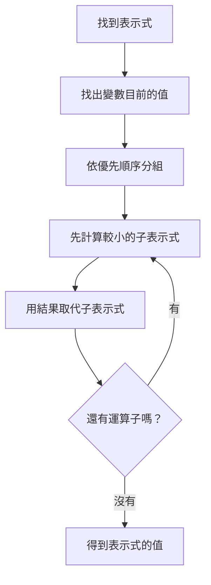
```mermaid
flowchart TD
    A[找到表示式] --> B[找出變數目前的值]
    B --> C[依優先順序分組]
    C --> D[先計算較小的子表示式]
    D --> E[用結果取代子表示式]
    E --> F{還有運算子嗎？}
    F -- 有 --> D
    F -- 沒有 --> G[得到表示式的值]
```

---

### 2. 判斷除法結果型態

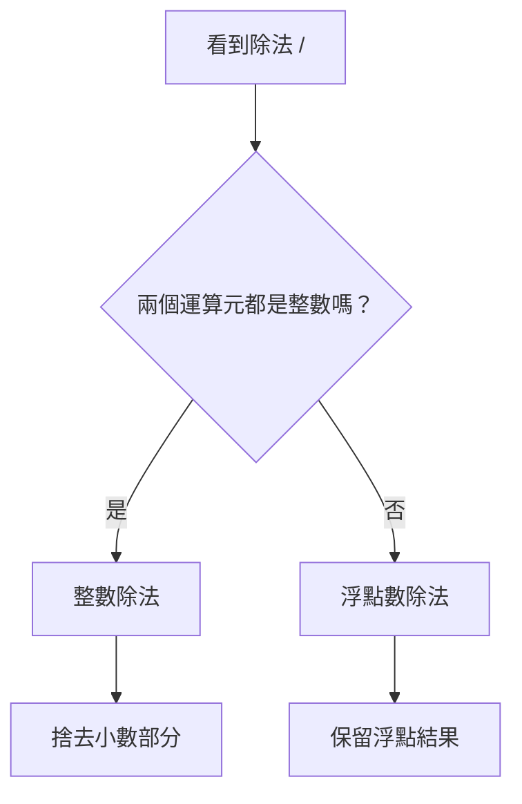
```mermaid
flowchart TD
    A[看到除法 /] --> B{兩個運算元都是整數嗎？}
    B -- 是 --> C[整數除法]
    C --> D[捨去小數部分]
    B -- 否 --> E[浮點數除法]
    E --> F[保留浮點結果]
```

---

### 3. 賦值運算

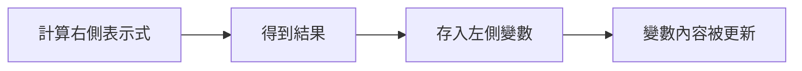
```mermaid
flowchart LR
    A[計算右側表示式] --> B[得到結果]
    B --> C[存入左側變數]
    C --> D[變數內容被更新]
```

---

### 4. `&&` 的短路求值

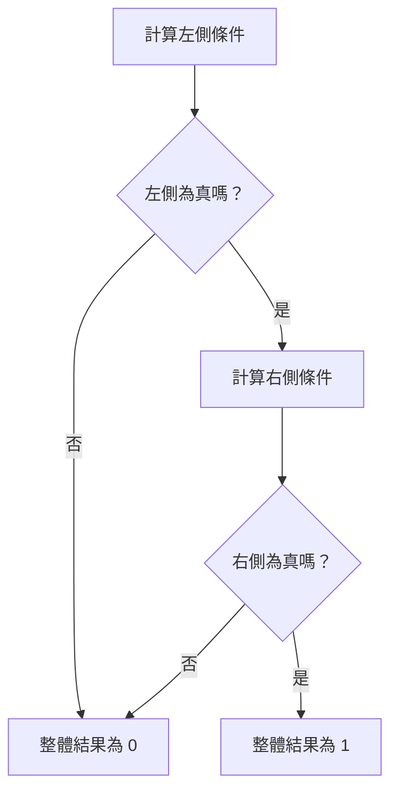
```mermaid
flowchart TD
    A[計算左側條件] --> B{左側為真嗎？}
    B -- 否 --> C[整體結果為 0]
    B -- 是 --> D[計算右側條件]
    D --> E{右側為真嗎？}
    E -- 是 --> F[整體結果為 1]
    E -- 否 --> C
```

---

### 5. `||` 的短路求值


```mermaid
flowchart TD
    A[計算左側條件] --> B{左側為真嗎？}
    B -- 是 --> C[整體結果為 1]
    B -- 否 --> D[計算右側條件]
    D --> E{右側為真嗎？}
    E -- 是 --> C
    E -- 否 --> F[整體結果為 0]
```

---

### 6. 前置與後置遞增

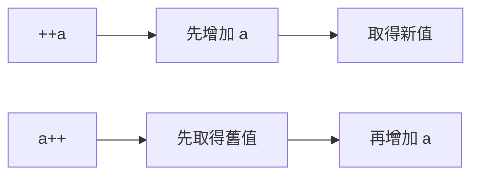
```mermaid
flowchart LR
    A[++a] --> B[先增加 a]
    B --> C[取得新值]

    D[a++] --> E[先取得舊值]
    E --> F[再增加 a]
```

---

### 7. 複雜表示式的處理策略

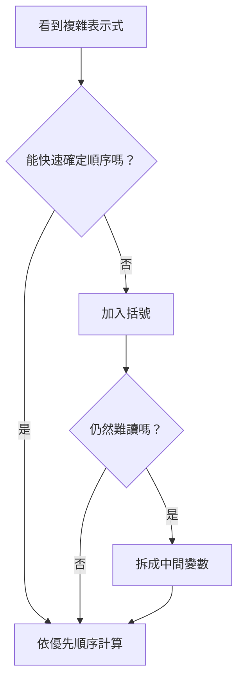
```mermaid
flowchart TD
    A[看到複雜表示式] --> B{能快速確定順序嗎？}
    B -- 是 --> C[依優先順序計算]
    B -- 否 --> D[加入括號]
    D --> E{仍然難讀嗎？}
    E -- 是 --> F[拆成中間變數]
    E -- 否 --> C
    F --> C
```
