# Lesson 6：if Conditional Statements if 條件判斷

> 這堂課的重點：使用 `if` 讓程式只在條件成立時執行指定程式碼，並透過猜數字、折扣、三角形判斷、最大值、最小值、中位數與排序練習，學會把問題轉換成可以判斷的條件。

---

## Section I. 今天要做什麼？

1. 理解程式流程控制的基本概念。
2. 分辨無條件執行與有條件執行。
3. 認識 `if` 述句的基本語法。
4. 理解條件成立與不成立時，程式會發生什麼事。
5. 使用大括號控制 `if` 的程式區塊。
6. 使用縮排提高程式的可讀性。
7. 使用多個彼此獨立的 `if` 判斷不同情況。
8. 用 `if` 完成猜數字練習。
9. 用 `if` 完成滿額折扣計算。
10. 使用 `&&`、`||` 組合多個判斷條件。
11. 判斷正三角形、等腰三角形與直角三角形。
12. 理解同一組資料可能同時符合多個獨立條件。
13. 簡化重複或冗長的判斷式。
14. 使用 `if` 找出兩個、三個或更多數字中的最大值。
15. 使用暫存變數與 `if` 找出最小值。
16. 使用條件判斷找出三個數字的中位數。
17. 使用條件式交換，將兩個數字依大小排列。
18. 使用多次條件式交換，將三個數字排序。
19. 先排序資料，再簡化後續判斷。
20. 透過追蹤表理解每一個 `if` 對變數造成的改變。

---

## Section II. 今天的學習方式

1. 先用一句中文說明「什麼情況下要執行」。
2. 把中文條件改寫成會得到真或假的 C 表示式。
3. 先判斷條件的結果是 `0` 還是非零值。
4. 條件成立時，才追蹤大括號中的程式碼。
5. 遇到多個獨立 `if` 時，每一個都要重新判斷，不能只看第一個。
6. 遇到複合條件時，先把每個小條件分開判斷。
7. 遇到最大值或最小值問題時，先決定要採用「逐一候選」還是「目前最佳值」策略。
8. 遇到排序問題時，把一次交換想成「修正一對順序錯誤的資料」。
9. 執行程式前先預測輸出，再與實際結果比較。
10. 本章只使用 `if`；`else` 與 `switch` 會放在下一章。

---

## Section III. 今天會學到的內容

| 主題 | 你需要知道的事 |
| --- | --- |
| 流程控制 | 決定程式碼是否執行、何時執行，以及執行幾次 |
| 一般述句 | 程式執行到該行時，通常會直接執行一次 |
| `if` 述句 | 只有條件成立時，才執行指定的程式碼 |
| 條件 Condition | 計算後會得到真或假的表示式 |
| 真與假 | `0` 是假；非零值是真 |
| 程式區塊 Block | 由 `{` 與 `}` 包住的一組述句 |
| 獨立 `if` | 每個 `if` 都會各自判斷，可能執行零個、一個或多個區塊 |
| 複合條件 | 使用 `&&`、`||`、`!` 組合條件 |
| 候選值策略 | 分別判斷每個值是否符合「最大、最小或中位數」條件 |
| 目前最佳值策略 | 先選一個初始值，再逐一比較並更新 |
| 條件式交換 | 當兩個變數順序錯誤時才交換 |
| 排序 | 把資料依照指定順序重新排列 |
| 條件簡化 | 利用已知關係或排序結果，減少重複判斷 |

---

## Section IV. 寫題目前的提醒

### 1. `if` 後面的條件要放在小括號中

正確：

```c
if (score >= 60) {
    printf("Passed\n");
}
```

錯誤：

```c
if score >= 60 {
    printf("Passed\n");
}
```

---

### 2. `if` 條件後面不要隨便加分號

<!-- lesson-image: C_Lesson_06_img05_if_semicolon_error.png -->
<p align="center">
  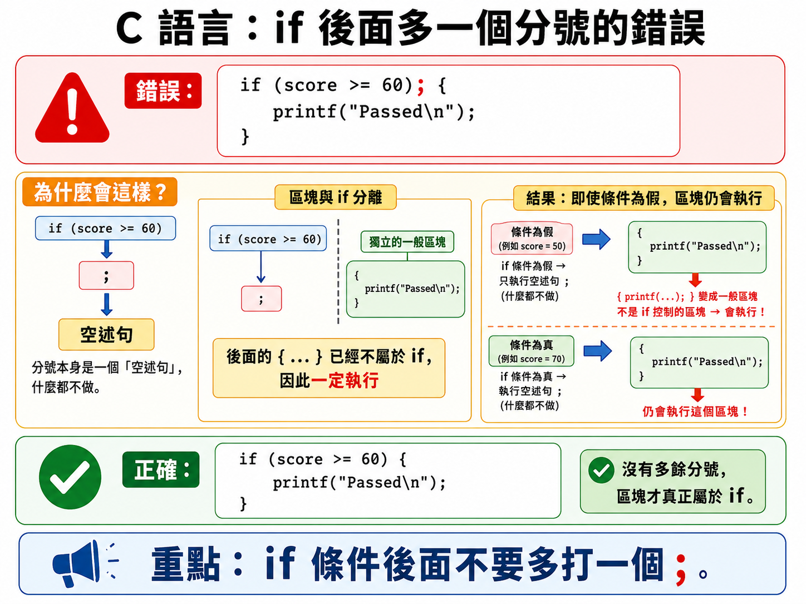
</p>

下面的程式有一個容易忽略的錯誤：

```c
if (score >= 60); {
    printf("Passed\n");
}
```

`if (...)` 後面的分號代表一個空述句，因此後面的區塊不再受到 `if` 控制。

應改成：

```c
if (score >= 60) {
    printf("Passed\n");
}
```

---

### 3. `=` 與 `==` 不同

```c
number = 5;
```

是把 `5` 存進 `number`。

```c
number == 5
```

才是在比較 `number` 是否等於 `5`。

---

### 4. 多個 `if` 會分別判斷

```c
if (number > 10) {
    printf("Large\n");
}

if (number % 2 == 0) {
    printf("Even\n");
}
```

如果 `number` 是 `12`，兩個條件都成立，因此兩段文字都會輸出。

---

### 5. 沒有大括號時，`if` 只控制下一個述句

```c
if (score >= 60)
    printf("Passed\n");
printf("Finished\n");
```

只有第一個 `printf()` 受到 `if` 控制。

即使區塊裡暫時只有一行，本教材仍建議寫大括號：

```c
if (score >= 60) {
    printf("Passed\n");
}
```

---

### 6. 相同不一定代表只能符合一種類別

本章的三角形練習使用多個獨立 `if`。

三邊都是 `3` 時：

- 三邊相同，因此符合正三角形條件。
- 至少有兩邊相同，因此也符合等腰三角形條件。

因此程式可能同時輸出兩個分類。

---

### 7. 直角三角形判斷要考慮哪一邊是斜邊

如果尚未排序三個邊長，就需要考慮三種可能：

```c
side1 * side1 + side2 * side2 == side3 * side3
side1 * side1 + side3 * side3 == side2 * side2
side2 * side2 + side3 * side3 == side1 * side1
```

先排序後，若保證：

```text
side1 <= side2 <= side3
```

就只需要判斷：

```c
side1 * side1 + side2 * side2 == side3 * side3
```

---

### 8. 找最大值時，初始值不能隨便設成 `0`

下面的寫法在所有輸入都是負數時會出錯：

```c
int maximum = 0;
```

較安全的方式是先使用第一個輸入：

```c
int maximum = first;
```

---

### 9. 交換數值需要暫存變數

錯誤：

```c
a = b;
b = a;
```

第一行已經覆蓋原本的 `a`，所以無法完成交換。

正確：

```c
int temporary = a;
a = b;
b = temporary;
```

---

### 10. 排序是多次局部修正

三個數字由小到大排序時，可以依序比較：

```text
a 與 b
b 與 c
a 與 b
```

每當左邊大於右邊，就交換兩者。

---

## Section V. 核心概念說明

### 1. 什麼是程式流程控制？

<!-- lesson-image: C_Lesson_06_img01_sequential_vs_conditional.png -->
<p align="center">
  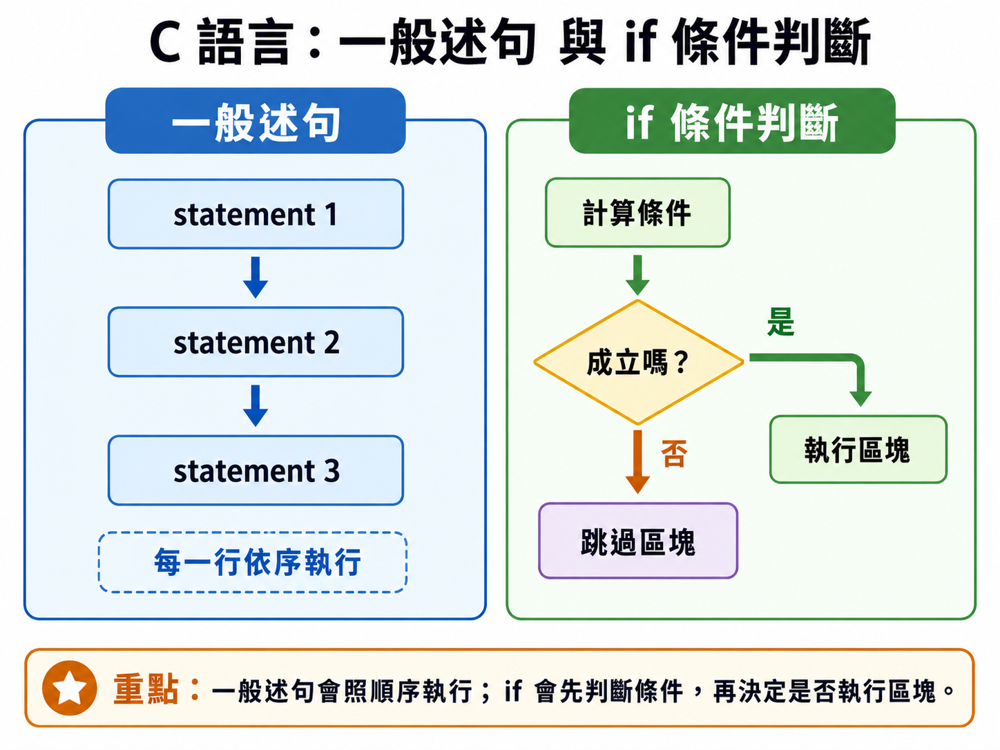
</p>

程式不一定只是從第一行一路執行到最後一行。

流程控制可以決定：

- 某段程式是否執行。
- 某段程式執行一次或多次。
- 程式接下來要走哪一條路。

本系列後續會看到：

| 類型 | 範例 |
| --- | --- |
| 無條件執行一次 | 一般述句 |
| 有條件執行一次 | `if` |
| 無條件重複執行 | 無窮迴圈 |
| 有條件重複執行 | `while` |
| 計次型重複執行 | `for` |

本章先專注於「有條件地執行一次」。

---

### 2. 一般述句會依序執行

```c
#include <stdio.h>

int main(void) {
    printf("First\n");
    printf("Second\n");
    printf("Third\n");
    return 0;
}
```

輸出：

```text
First
Second
Third
```

程式由上往下依序執行。

---

### 3. `if` 的基本語法

<!-- lesson-image: C_Lesson_06_img02_if_syntax_anatomy.png -->
<p align="center">
  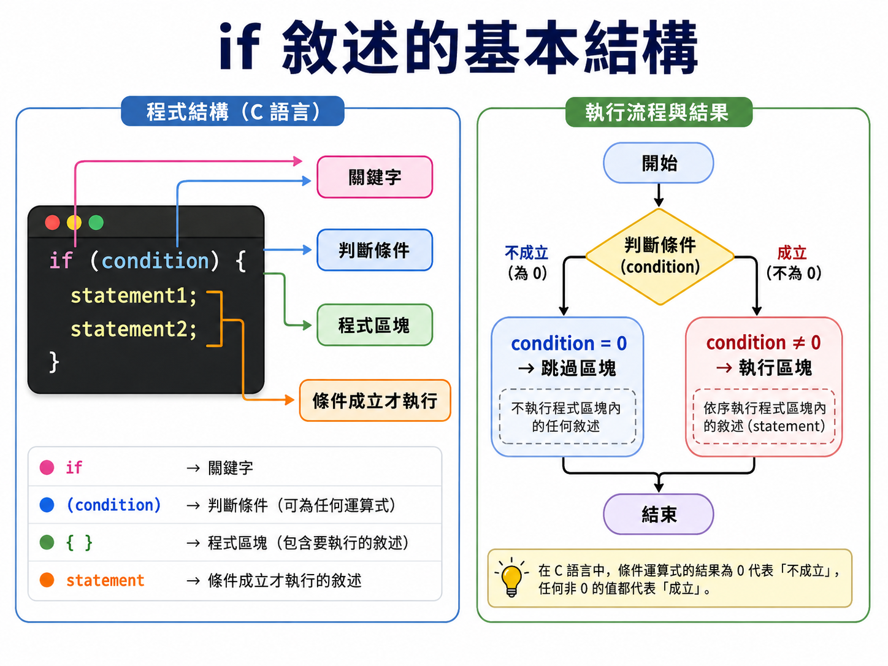
</p>

<!-- lesson-image: C_Lesson_06_img03_if_execution_flow.png -->
<p align="center">
  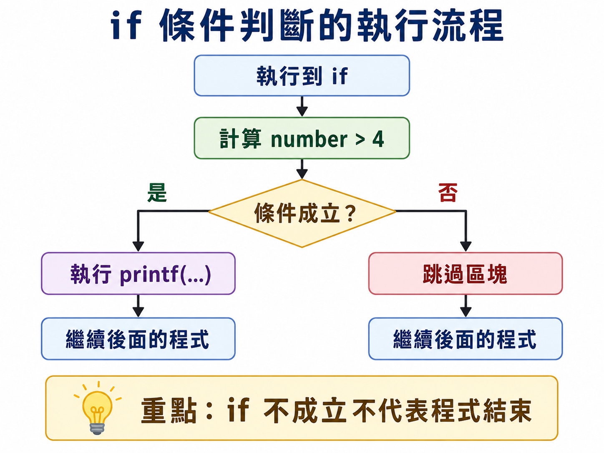
</p>

```c
if (condition) {
    statement1;
    statement2;
}
```

執行步驟：

```text
計算 condition
        ↓
條件成立嗎？
   ├─ 是 → 執行區塊
   └─ 否 → 跳過區塊
```

---

### 4. 第一個 `if` 程式

```c
#include <stdio.h>

int main(void) {
    int number = 5;

    if (number > 4) {
        printf("number is larger than 4.\n");
    }

    return 0;
}
```

因為：

```c
number > 4
```

是成立的，所以程式會輸出：

```text
number is larger than 4.
```

---

### 5. 條件不成立時會跳過區塊

```c
#include <stdio.h>

int main(void) {
    int number = 3;

    if (number > 4) {
        printf("number is larger than 4.\n");
    }

    printf("Program finished.\n");
    return 0;
}
```

輸出：

```text
Program finished.
```

`if` 區塊沒有執行，但程式會繼續執行區塊後面的述句。

---

### 6. C 語言怎麼判斷條件成立？

在 C 語言中：

```text
0      → 假
非 0   → 真
```

因此下面的區塊會執行：

```c
if (7) {
    printf("True\n");
}
```

下面的區塊不會執行：

```c
if (0) {
    printf("This will not run.\n");
}
```

實際寫程式時，通常會使用較清楚的比較表示式：

```c
if (age >= 18) {
    printf("Adult\n");
}
```

---

### 7. 程式區塊與大括號

<!-- lesson-image: C_Lesson_06_img04_block_scope_braces.png -->
<p align="center">
  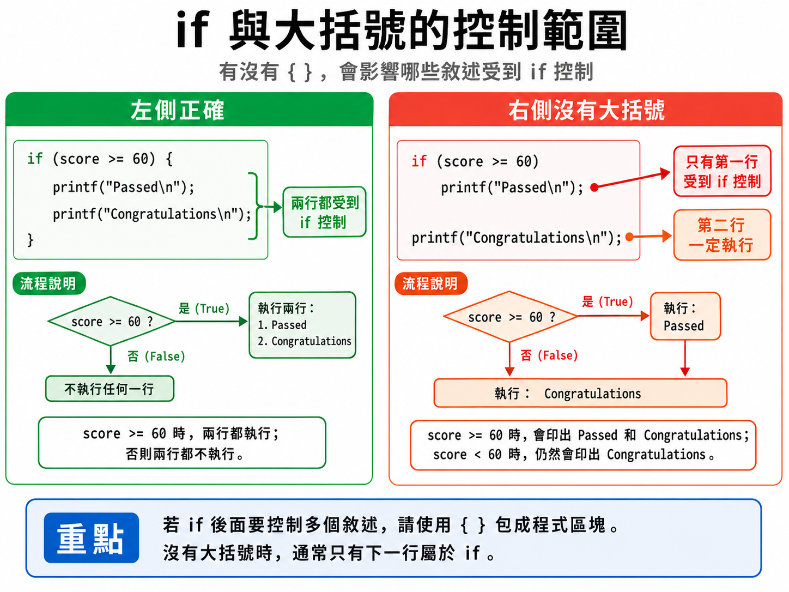
</p>

```c
if (temperature < 10) {
    printf("It is cold.\n");
    printf("Wear a jacket.\n");
}
```

兩個 `printf()` 都屬於同一個 `if` 區塊。

當條件不成立時，兩行都會跳過。

---

### 8. 縮排不改變語法，但會影響可讀性

不建議：

```c
if (temperature < 10) {
printf("It is cold.\n");
printf("Wear a jacket.\n");
}
```

建議：

```c
if (temperature < 10) {
    printf("It is cold.\n");
    printf("Wear a jacket.\n");
}
```

縮排讓讀者可以快速看出哪些述句受到 `if` 控制。

---

### 9. 使用輸入資料作為條件

```c
#include <stdio.h>

int main(void) {
    int number;

    printf("Please enter an integer: ");
    scanf("%d", &number);

    if (number > 0) {
        printf("Positive number\n");
    }

    return 0;
}
```

輸入不同，條件結果也可能不同。

---

### 10. 多個獨立的 `if`

<!-- lesson-image: C_Lesson_06_img06_independent_if_statements.png -->
<p align="center">
  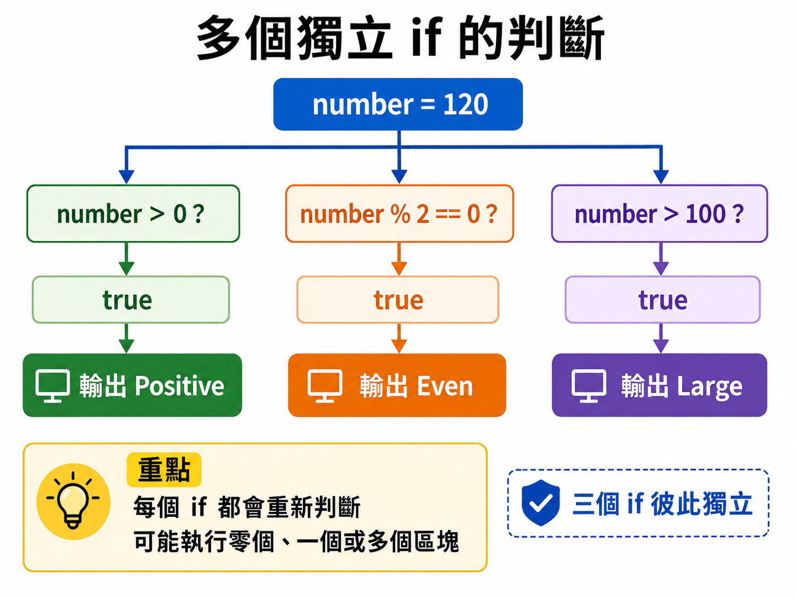
</p>

```c
#include <stdio.h>

int main(void) {
    int number;

    printf("Please enter an integer: ");
    scanf("%d", &number);

    if (number > 0) {
        printf("Positive\n");
    }

    if (number % 2 == 0) {
        printf("Even\n");
    }

    if (number > 100) {
        printf("Large\n");
    }

    return 0;
}
```

每一個 `if` 都會獨立判斷。

例如輸入 `120`，三個條件都成立，所以三段文字都會輸出。

---

### 11. 猜數字：大於、小於與等於

<!-- lesson-image: C_Lesson_06_img07_guess_number_conditions.png -->
<p align="center">
  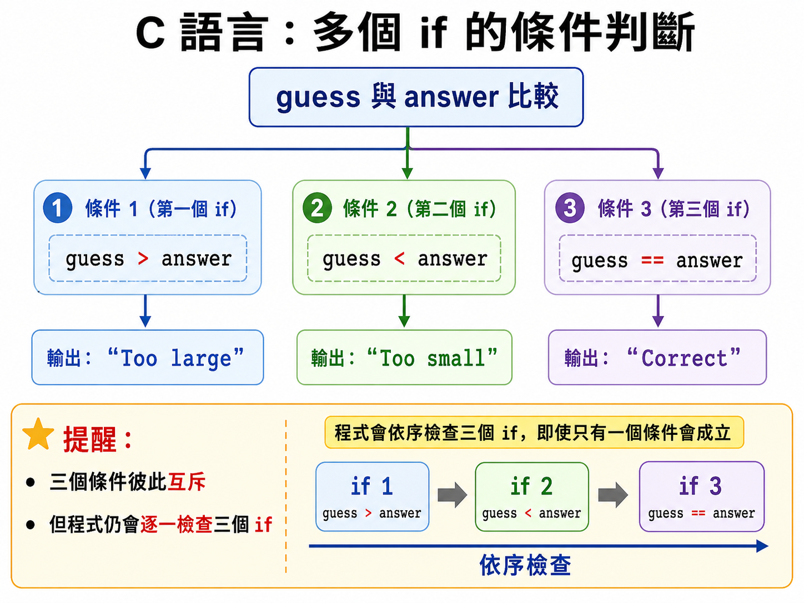
</p>

```c
#include <stdio.h>

int main(void) {
    int answer = 4;
    int guess;

    printf("Guess the number: ");
    scanf("%d", &guess);

    if (guess > answer) {
        printf("Too large.\n");
    }

    if (guess < answer) {
        printf("Too small.\n");
    }

    if (guess == answer) {
        printf("Correct.\n");
    }

    return 0;
}
```

這三個條件彼此互斥，因此一次只會有一個成立。

但它們仍然是三個獨立的 `if`，每一個都會被檢查。

---

### 12. 滿額折扣：先計算，再決定是否修改

<!-- lesson-image: C_Lesson_06_img08_discount_update_flow.png -->
<p align="center">
  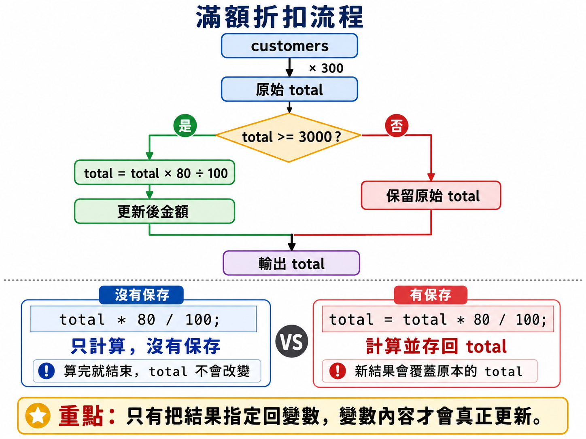
</p>

假設每位顧客消費 `300` 元，總額滿 `3000` 元打八折：

```c
#include <stdio.h>

int main(void) {
    int customers;
    int total;

    printf("Please enter the number of customers: ");
    scanf("%d", &customers);

    total = customers * 300;

    if (total >= 3000) {
        total = total * 80 / 100;
    }

    printf("Total: %d\n", total);
    return 0;
}
```

程式流程：

```text
輸入人數
  ↓
計算原始總額
  ↓
總額是否滿 3000？
  ├─ 是 → 將總額改成八折
  └─ 否 → 保留原始總額
  ↓
輸出總額
```

---

### 13. 為什麼折扣後要把結果存回變數？

```c
total * 80 / 100;
```

這個表示式雖然會算出結果，但沒有保存結果。

應寫成：

```c
total = total * 80 / 100;
```

或在上一章已學過的複合賦值概念下寫成：

```c
total = total * 8 / 10;
```

本例使用整數金額，因此結果仍是整數。

---

### 14. 使用 `&&` 表示「而且」

<!-- lesson-image: C_Lesson_06_img09_triangle_and_or_conditions.png -->
<p align="center">
  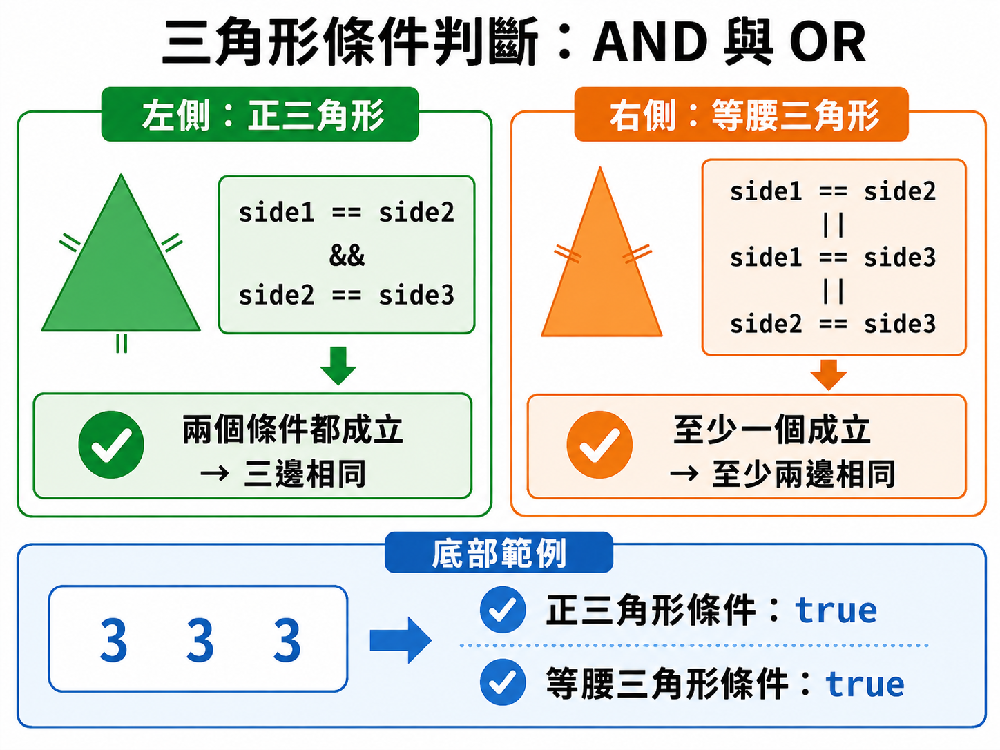
</p>

正三角形要求三邊都相同：

```c
side1 == side2 && side2 == side3
```

完整範例：

```c
#include <stdio.h>

int main(void) {
    int side1, side2, side3;

    printf("Please enter three side lengths: ");
    scanf("%d%d%d", &side1, &side2, &side3);

    if (side1 == side2 && side2 == side3) {
        printf("Regular triangle\n");
    }

    return 0;
}
```

只需要比較：

```text
side1 與 side2 相同
而且
side2 與 side3 相同
```

就可以推得三邊都相同。

---

### 15. 使用 `||` 表示「至少一種情況成立」

等腰三角形至少有兩邊相同：

```c
side1 == side2 || side1 == side3 || side2 == side3
```

完整範例：

```c
#include <stdio.h>

int main(void) {
    int side1, side2, side3;

    printf("Please enter three side lengths: ");
    scanf("%d%d%d", &side1, &side2, &side3);

    if (side1 == side2 || side1 == side3 || side2 == side3) {
        printf("Isosceles triangle\n");
    }

    return 0;
}
```

---

### 16. 正三角形也符合本章的等腰條件

輸入：

```text
3 3 3
```

下列兩個條件都成立：

```c
if (side1 == side2 && side2 == side3) {
    printf("Regular triangle\n");
}

if (side1 == side2 || side1 == side3 || side2 == side3) {
    printf("Isosceles triangle\n");
}
```

輸出：

```text
Regular triangle
Isosceles triangle
```

這正好展示了多個獨立 `if` 的特性。

---

### 17. 判斷直角三角形

<!-- lesson-image: C_Lesson_06_img10_right_triangle_before_after_sort.png -->
<p align="center">
  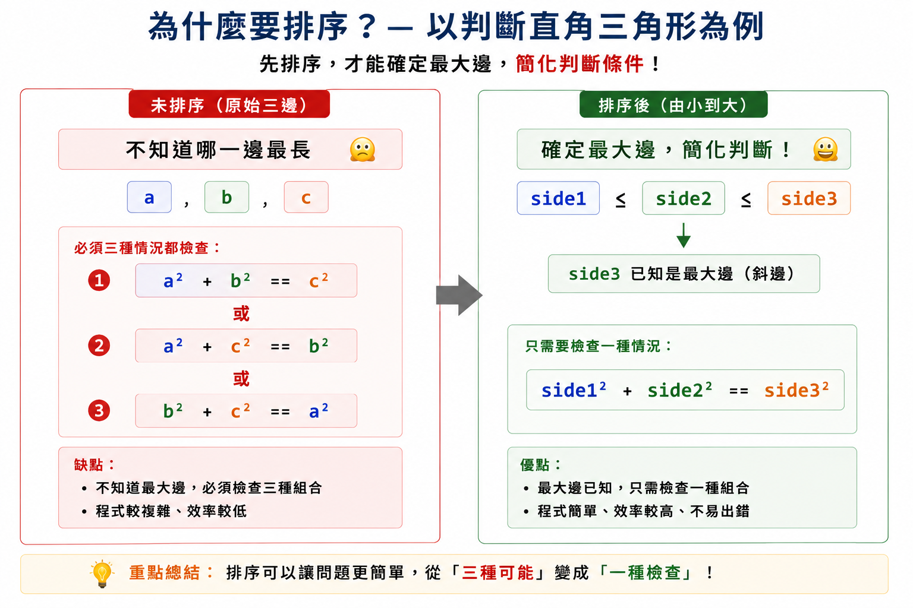
</p>

如果不知道哪一邊最長，就檢查三種可能：

```c
#include <stdio.h>

int main(void) {
    int side1, side2, side3;

    printf("Please enter three side lengths: ");
    scanf("%d%d%d", &side1, &side2, &side3);

    if (side1 * side1 + side2 * side2 == side3 * side3 ||
        side1 * side1 + side3 * side3 == side2 * side2 ||
        side2 * side2 + side3 * side3 == side1 * side1) {
        printf("Rectangular triangle\n");
    }

    return 0;
}
```

輸入：

```text
3 4 5
```

因為：

```text
3² + 4² = 5²
```

所以條件成立。

---

### 18. 一次判斷多種三角形

```c
#include <stdio.h>

int main(void) {
    int side1, side2, side3;

    printf("Please enter three side lengths: ");
    scanf("%d%d%d", &side1, &side2, &side3);

    if (side1 == side2 && side2 == side3) {
        printf("Regular triangle\n");
    }

    if (side1 == side2 || side1 == side3 || side2 == side3) {
        printf("Isosceles triangle\n");
    }

    if (side1 * side1 + side2 * side2 == side3 * side3 ||
        side1 * side1 + side3 * side3 == side2 * side2 ||
        side2 * side2 + side3 * side3 == side1 * side1) {
        printf("Rectangular triangle\n");
    }

    return 0;
}
```

由於使用的是三個獨立 `if`，同一組邊長可能輸出多個分類。

本練習依來源題意，預設輸入的是某個三角形的三邊長；本章不另外展開三角形成立條件。

---

### 19. 條件簡化的第一步：找出重複關係

正三角形原本可以寫成：

```c
side1 == side2 && side1 == side3 && side2 == side3
```

但第三個比較是多餘的。

因為如果：

```text
side1 == side2
side2 == side3
```

就已經可以知道：

```text
side1 == side3
```

所以可簡化成：

```c
side1 == side2 && side2 == side3
```

---

### 20. 找兩個數字的最大值：候選值策略

```c
#include <stdio.h>

int main(void) {
    int first, second;
    int maximum;

    printf("Please enter two integers: ");
    scanf("%d%d", &first, &second);

    if (first >= second) {
        maximum = first;
    }

    if (second >= first) {
        maximum = second;
    }

    printf("The maximum is %d.\n", maximum);
    return 0;
}
```

每個 `if` 都在問：

```text
這個數是否不小於另一個數？
```

當兩個數相同時，兩個條件都成立，但存入的值相同，因此結果仍正確。

---

### 21. 找三個數字的最大值：逐一檢查候選人

```c
#include <stdio.h>

int main(void) {
    int a, b, c;
    int maximum;

    printf("Please enter three integers: ");
    scanf("%d%d%d", &a, &b, &c);

    if (a >= b && a >= c) {
        maximum = a;
    }

    if (b >= a && b >= c) {
        maximum = b;
    }

    if (c >= a && c >= b) {
        maximum = c;
    }

    printf("The maximum is %d.\n", maximum);
    return 0;
}
```

每個候選值都必須不小於另外兩個值。

---

### 22. 另一種最大值策略：目前最大值

<!-- lesson-image: C_Lesson_06_img11_running_maximum_minimum.png -->
<p align="center">
  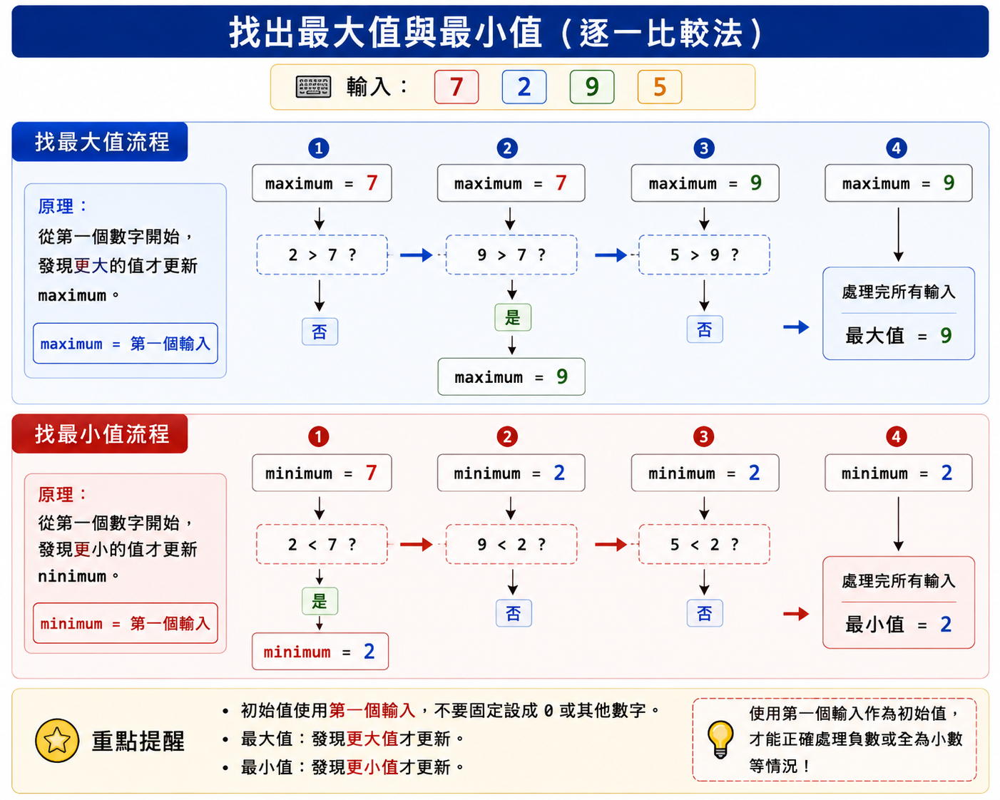
</p>

<!-- lesson-image: C_Lesson_06_img15_maximum_strategy_comparison.png -->
<p align="center">
  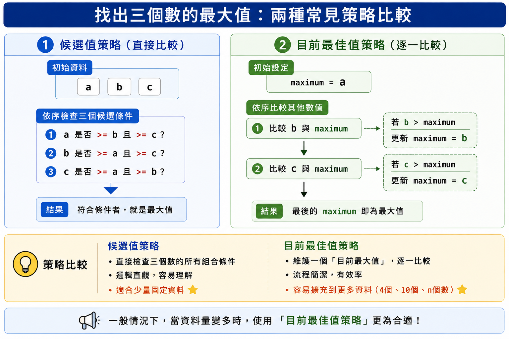
</p>

```c
#include <stdio.h>

int main(void) {
    int a, b, c, d;
    int maximum;

    printf("Please enter four integers: ");
    scanf("%d%d%d%d", &a, &b, &c, &d);

    maximum = a;

    if (b > maximum) {
        maximum = b;
    }

    if (c > maximum) {
        maximum = c;
    }

    if (d > maximum) {
        maximum = d;
    }

    printf("The maximum is %d.\n", maximum);
    return 0;
}
```

追蹤方式：

```text
先假設 a 最大
比較 b，必要時更新
比較 c，必要時更新
比較 d，必要時更新
```

這個策略較容易擴充到更多數字。

---

### 23. 找最小值：目前最小值策略

```c
#include <stdio.h>

int main(void) {
    int a, b, c;
    int minimum;

    printf("Please enter three integers: ");
    scanf("%d%d%d", &a, &b, &c);

    minimum = a;

    if (b < minimum) {
        minimum = b;
    }

    if (c < minimum) {
        minimum = c;
    }

    printf("The minimum is %d.\n", minimum);
    return 0;
}
```

只要發現更小的值，就更新 `minimum`。

---

### 24. 使用追蹤表理解目前最佳值

假設輸入：

```text
7 2 5 1
```

找最小值的過程：

| 步驟 | 比較前的 `minimum` | 新值 | 條件 | 比較後的 `minimum` |
| --- | ---: | ---: | --- | ---: |
| 初始化 | — | `7` | `minimum = 7` | `7` |
| 比較 `2` | `7` | `2` | `2 < 7` 成立 | `2` |
| 比較 `5` | `2` | `5` | `5 < 2` 不成立 | `2` |
| 比較 `1` | `2` | `1` | `1 < 2` 成立 | `1` |

---

### 25. 找三個數字的中位數

<!-- lesson-image: C_Lesson_06_img12_median_candidate_condition.png -->
<p align="center">
  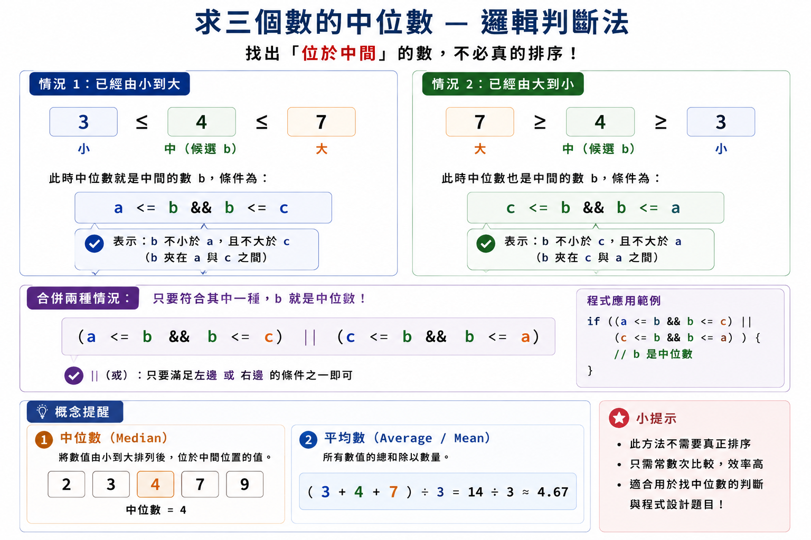
</p>

中位數不是最大值，也不是最小值。

候選值 `a` 是中位數的情況：

```c
(b <= a && a <= c) || (c <= a && a <= b)
```

完整範例：

```c
#include <stdio.h>

int main(void) {
    int a, b, c;
    int median;

    printf("Please enter three integers: ");
    scanf("%d%d%d", &a, &b, &c);

    if ((b <= a && a <= c) || (c <= a && a <= b)) {
        median = a;
    }

    if ((a <= b && b <= c) || (c <= b && b <= a)) {
        median = b;
    }

    if ((a <= c && c <= b) || (b <= c && c <= a)) {
        median = c;
    }

    printf("The median is %d.\n", median);
    return 0;
}
```

每個候選值都要位於另外兩個值之間。

---

### 26. 排序的概念

排序是把資料依照某種順序重新排列，例如：

```text
由小到大
由大到小
```

原本：

```text
4 5 3
```

由小到大排序後：

```text
3 4 5
```

排序不只是找出最大值；它需要安排每一個位置。

---

### 27. 對兩個變數由小到大排序

<!-- lesson-image: C_Lesson_06_img13_conditional_swap.png -->
<p align="center">
  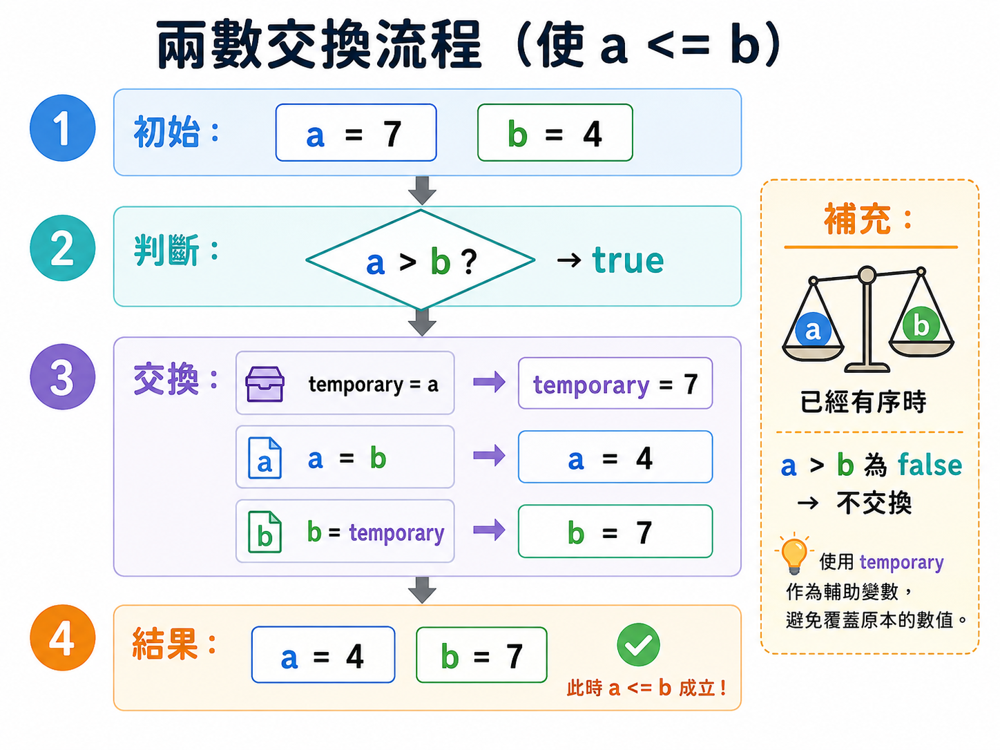
</p>

目標：

```text
a <= b
```

如果目前：

```text
a > b
```

就交換兩者：

```c
#include <stdio.h>

int main(void) {
    int a, b;
    int temporary;

    printf("Please enter two integers: ");
    scanf("%d%d", &a, &b);

    if (a > b) {
        temporary = a;
        a = b;
        b = temporary;
    }

    printf("%d %d\n", a, b);
    return 0;
}
```

如果原本已經有序，`if` 區塊不需要執行。

---

### 28. 條件式交換的追蹤

輸入：

```text
7 4
```

初始狀態：

| 變數 | 值 |
| --- | ---: |
| `a` | `7` |
| `b` | `4` |

因為：

```c
a > b
```

成立，所以交換：

| 步驟 | `temporary` | `a` | `b` |
| --- | ---: | ---: | ---: |
| 初始 | 未指定 | `7` | `4` |
| `temporary = a` | `7` | `7` | `4` |
| `a = b` | `7` | `4` | `4` |
| `b = temporary` | `7` | `4` | `7` |

---

### 29. 三個變數的循環交換

將：

```text
A B C
```

變成：

```text
C A B
```

需要暫存原本的 `a`：

```c
#include <stdio.h>

int main(void) {
    int a = 2;
    int b = 7;
    int c = 9;
    int temporary;

    temporary = a;
    a = c;
    c = b;
    b = temporary;

    printf("%d %d %d\n", a, b, c);
    return 0;
}
```

輸出：

```text
9 2 7
```

賦值的順序非常重要。

---

### 30. 對三個數字由小到大排序

<!-- lesson-image: C_Lesson_06_img14_three_number_sort.png -->
<p align="center">
  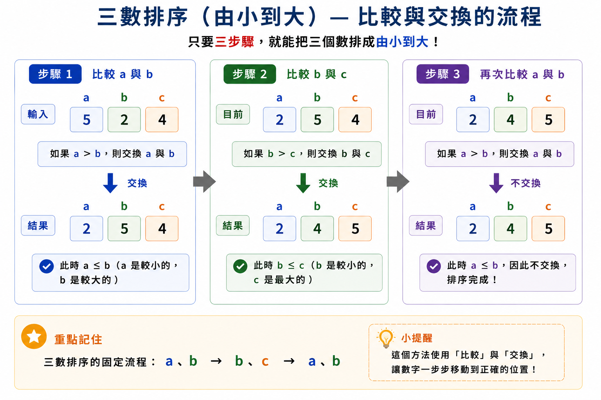
</p>

可以使用三次條件式交換：

```c
#include <stdio.h>

int main(void) {
    int a, b, c;
    int temporary;

    printf("Please enter three integers: ");
    scanf("%d%d%d", &a, &b, &c);

    if (a > b) {
        temporary = a;
        a = b;
        b = temporary;
    }

    if (b > c) {
        temporary = b;
        b = c;
        c = temporary;
    }

    if (a > b) {
        temporary = a;
        a = b;
        b = temporary;
    }

    printf("%d %d %d\n", a, b, c);
    return 0;
}
```

三次比較的目的：

1. 修正 `a` 與 `b`。
2. 修正 `b` 與 `c`，讓最大值到達 `c`。
3. 再修正一次 `a` 與 `b`。

---

### 31. 三個數字排序追蹤

輸入：

```text
5 2 4
```

| 步驟 | `a` | `b` | `c` | 動作 |
| --- | ---: | ---: | ---: | --- |
| 初始 | `5` | `2` | `4` | — |
| 比較 `a > b` | `2` | `5` | `4` | 交換 `a`、`b` |
| 比較 `b > c` | `2` | `4` | `5` | 交換 `b`、`c` |
| 再比較 `a > b` | `2` | `4` | `5` | 不交換 |

最後得到：

```text
2 4 5
```

---

### 32. 先排序，再簡化三角形判斷

<!-- lesson-image: C_Lesson_06_img16_sort_then_simplify.png -->
<p align="center">
  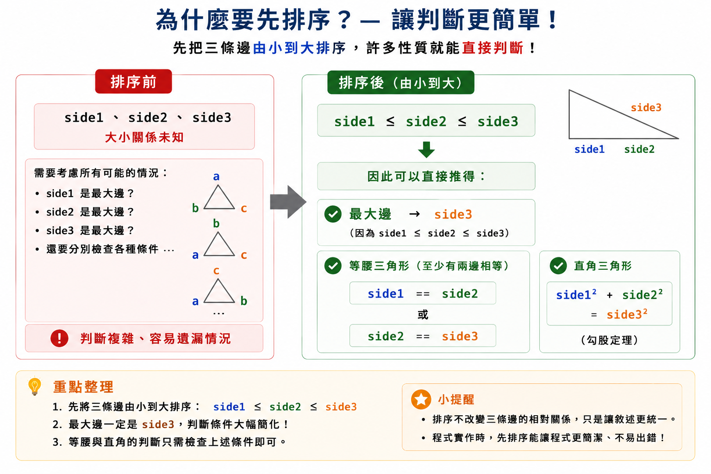
</p>

假設排序後保證：

```text
side1 <= side2 <= side3
```

正三角形仍可判斷：

```c
side1 == side2 && side2 == side3
```

等腰三角形只需要檢查相鄰邊：

```c
side1 == side2 || side2 == side3
```

直角三角形只需要檢查最大邊 `side3`：

```c
side1 * side1 + side2 * side2 == side3 * side3
```

排序讓程式得到額外資訊，因此後續條件可以變短。

---

### 33. 完整範例：先排序，再判斷三角形種類

```c
#include <stdio.h>

int main(void) {
    int side1, side2, side3;
    int temporary;

    printf("Please enter three side lengths: ");
    scanf("%d%d%d", &side1, &side2, &side3);

    if (side1 > side2) {
        temporary = side1;
        side1 = side2;
        side2 = temporary;
    }

    if (side2 > side3) {
        temporary = side2;
        side2 = side3;
        side3 = temporary;
    }

    if (side1 > side2) {
        temporary = side1;
        side1 = side2;
        side2 = temporary;
    }

    if (side1 == side2 && side2 == side3) {
        printf("Regular triangle\n");
    }

    if (side1 == side2 || side2 == side3) {
        printf("Isosceles triangle\n");
    }

    if (side1 * side1 + side2 * side2 == side3 * side3) {
        printf("Rectangular triangle\n");
    }

    return 0;
}
```

---

## Section V-A. 容易搞混的重點

### 1. `if` 不是迴圈

`if` 只決定區塊是否執行一次。

它不會自動重複檢查，也不會讓猜數字程式一直猜到正確。

重複執行會在後面的 `while` 與 `for` 章節學習。

---

### 2. 多個 `if` 不是二選一

```c
if (condition1) {
    /* ... */
}

if (condition2) {
    /* ... */
}
```

兩個條件都可能成立。

真正的二選一結構會在下一章介紹 `if-else`。

---

### 3. 縮排與大括號不是同一件事

縮排是提供給人閱讀的格式。

真正決定區塊範圍的是：

```c
{
    /* statements */
}
```

---

### 4. `if (a = 5)` 可以編譯，但通常不是你的目的

```c
if (a = 5) {
    printf("Runs\n");
}
```

這會先把 `5` 存入 `a`，再把非零值 `5` 視為真。

比較是否相等應寫：

```c
if (a == 5) {
    printf("Equal\n");
}
```

---

### 5. `a < b < c` 不是 C 語言的區間寫法

不要寫：

```c
if (a < b < c) {
    /* ... */
}
```

應寫成：

```c
if (a < b && b < c) {
    /* ... */
}
```

---

### 6. 找最大值與排序不同

找最大值只需要知道哪個值最大。

排序需要安排每一個位置。

```text
找最大值：9
排序：2 5 9
```

---

### 7. 中位數不是平均數

輸入：

```text
2 9 5
```

中位數是排序後位於中間的：

```text
5
```

平均數則是：

```text
(2 + 9 + 5) / 3
```

兩者是不同概念。

---

### 8. 三角形分類可能重疊

在本章的定義下：

```text
正三角形 → 三邊相同
等腰三角形 → 至少兩邊相同
```

因此正三角形同時符合等腰條件。

若題目要求只輸出一種類別，就需要設計不同的分支優先順序；那會在下一章處理。

---

### 9. 條件簡化要建立在已知資訊上

沒有排序時，直角三角形要考慮三個可能的斜邊。

排序後知道 `side3` 最大，才能只檢查：

```c
side1 * side1 + side2 * side2 == side3 * side3
```

不能在未排序時直接假設第三個輸入一定最大。

---

### 10. 交換順序錯誤會遺失資料

錯誤：

```c
a = b;
b = a;
```

正確：

```c
temporary = a;
a = b;
b = temporary;
```

---

## Section VI. 快速概念檢查

### Q1. `if` 的用途是什麼？

<details>
<summary>答案</summary>

只有在條件成立時，執行指定的程式區塊。

</details>

---

### Q2. 在 C 語言中，哪一個值代表假？

<details>
<summary>答案</summary>

數值 `0`。

</details>

---

### Q3. 下列程式會輸出什麼？

```c
int number = 8;

if (number > 5) {
    printf("A\n");
}

if (number % 2 == 0) {
    printf("B\n");
}
```

<details>
<summary>答案</summary>

```text
A
B
```

兩個獨立條件都成立。

</details>

---

### Q4. 下列程式有什麼問題？

```c
if (score >= 60); {
    printf("Passed\n");
}
```

<details>
<summary>答案</summary>

`if` 條件後多了一個分號。後面的區塊會不受條件控制而執行。

</details>

---

### Q5. 比較 `number` 是否等於 `10` 應使用哪個運算子？

<details>
<summary>答案</summary>

```c
number == 10
```

</details>

---

### Q6. `3 3 3` 會符合哪些本章三角形條件？

<details>
<summary>答案</summary>

符合正三角形，也符合「至少兩邊相同」的等腰三角形條件。

</details>

---

### Q7. 未排序邊長時，為什麼直角三角形要檢查三種平方關係？

<details>
<summary>答案</summary>

因為不知道哪一個變數保存的是最長邊，也就是可能的斜邊。

</details>

---

### Q8. 找最大值時，為什麼不應把初始最大值固定設為 `0`？

<details>
<summary>答案</summary>

如果所有輸入都是負數，`0` 不是任何一個輸入，結果會錯誤。應使用第一個輸入作為初始值。

</details>

---

### Q9. 執行後 `a` 與 `b` 是多少？

```c
int a = 7;
int b = 4;
int temporary;

if (a > b) {
    temporary = a;
    a = b;
    b = temporary;
}
```

<details>
<summary>答案</summary>

```text
a = 4
b = 7
```

</details>

---

### Q10. 排序三個數字時，為什麼要再次比較 `a` 與 `b`？

<details>
<summary>答案</summary>

第二次比較 `b` 與 `c` 可能把較小的值移到 `b`，因此 `a` 與 `b` 的順序可能需要再次修正。

</details>

---

### Q11. 下列區間條件的正確 C 寫法是什麼？

```text
0 <= score <= 100
```

<details>
<summary>答案</summary>

```c
score >= 0 && score <= 100
```

</details>

---

### Q12. 中位數和平均數是否相同？

<details>
<summary>答案</summary>

不一定。中位數是排序後位於中間的值；平均數是總和除以資料數量。

</details>

---

## Section VII. 程式閱讀練習

### 題目 1：條件成立嗎？

```c
int value = -3;

if (value) {
    printf("Run\n");
}
```

請回答：

1. 條件是真還是假？
2. 是否會輸出 `Run`？

<details>
<summary>答案</summary>

`-3` 是非零值，因此視為真，會輸出 `Run`。

</details>

---

### 題目 2：多個獨立判斷

```c
int number = 12;

if (number > 10) {
    printf("A");
}

if (number < 20) {
    printf("B");
}

if (number == 12) {
    printf("C");
}
```

<details>
<summary>答案</summary>

輸出：

```text
ABC
```

三個條件都成立。

</details>

---

### 題目 3：折扣追蹤

```c
int customers = 12;
int total = customers * 300;

if (total >= 3000) {
    total = total * 80 / 100;
}
```

<details>
<summary>答案</summary>

原始總額：

```text
12 × 300 = 3600
```

符合折扣條件：

```text
3600 × 80 / 100 = 2880
```

最後 `total` 是 `2880`。

</details>

---

### 題目 4：三角形分類

輸入：

```text
5 5 8
```

判斷以下條件：

```c
side1 == side2 && side2 == side3
```

```c
side1 == side2 || side1 == side3 || side2 == side3
```

<details>
<summary>答案</summary>

正三角形條件不成立；等腰三角形條件成立。

</details>

---

### 題目 5：找最大值

```c
int a = -7;
int b = -2;
int c = -9;
int maximum = a;

if (b > maximum) {
    maximum = b;
}

if (c > maximum) {
    maximum = c;
}
```

<details>
<summary>答案</summary>

1. 初始 `maximum = -7`
2. `-2 > -7`，更新為 `-2`
3. `-9 > -2` 不成立

最後 `maximum = -2`。

</details>

---

### 題目 6：找最小值

```c
int a = 4;
int b = 1;
int c = 7;
int minimum = a;

if (b < minimum) {
    minimum = b;
}

if (c < minimum) {
    minimum = c;
}
```

<details>
<summary>答案</summary>

最後 `minimum = 1`。

</details>

---

### 題目 7：中位數條件

```c
int a = 7;
int b = 4;
int c = 3;
```

哪一個值位於另外兩個值之間？

<details>
<summary>答案</summary>

`b` 的值 `4`，因為：

```text
3 <= 4 <= 7
```

</details>

---

### 題目 8：排序追蹤

```c
int a = 6;
int b = 2;
int c = 4;
```

依序執行三次條件式交換：

```text
比較 a 與 b
比較 b 與 c
比較 a 與 b
```

<details>
<summary>答案</summary>

```text
6 2 4
↓
2 6 4
↓
2 4 6
↓
2 4 6
```

</details>

---

## Section VIII. 實作練習 / 實作檢測題

### TODO 1：正數提示

讀入一個整數。若它大於 `0`，輸出：

```text
Positive
```

```c
#include <stdio.h>

int main(void) {
    int number;

    scanf("%d", &number);

    /* TODO: number 大於 0 時輸出 Positive */

    return 0;
}
```

---

### TODO 2：偶數提示

讀入一個整數。若它是偶數，輸出：

```text
Even
```

提示：

```c
number % 2 == 0
```

---

### TODO 3：猜數字

答案固定為 `7`。讀入使用者猜測，使用三個獨立 `if` 輸出：

```text
Too large
Too small
Correct
```

---

### TODO 4：滿額折扣

一件商品單價為 `250` 元。輸入購買數量：

- 原始總額滿 `2000` 元時打九折。
- 輸出最後應付金額。

---

### TODO 5：正三角形

輸入三個整數邊長。若三邊相同，輸出：

```text
Regular triangle
```

---

### TODO 6：等腰三角形

輸入三個整數邊長。若至少兩邊相同，輸出：

```text
Isosceles triangle
```

---

### TODO 7：直角三角形

輸入三個整數邊長。輸入順序不固定，若符合任一平方關係，輸出：

```text
Rectangular triangle
```

---

### TODO 8：找三個數字的最大值

使用三個候選條件：

```c
if (a >= b && a >= c) {
    /* ... */
}
```

完成其餘兩個候選值的判斷。

---

### TODO 9：找四個數字的最小值

使用目前最小值策略：

```c
minimum = a;
```

再逐一比較 `b`、`c`、`d`。

---

### TODO 10：找三個數字的中位數

不得先使用陣列或函式庫排序。

使用三組候選條件判斷哪個值位於另外兩個值之間。

---

### TODO 11：兩數由小到大排序

輸入 `a` 與 `b`。若 `a > b`，使用暫存變數交換。

輸出排序後的兩個值。

---

### TODO 12：三數由小到大排序

依序完成：

```text
比較 a 與 b
比較 b 與 c
再次比較 a 與 b
```

每次順序錯誤時進行交換。

---

### TODO 13：先排序再判斷直角三角形

先將三個邊長由小到大排序，再只使用一個平方關係判斷直角三角形。

---

### TODO 14：成績標記

輸入一個成績，使用多個獨立 `if`：

- 大於等於 `60` 時輸出 `Passed`
- 大於等於 `90` 時再輸出 `Excellent`
- 小於 `0` 或大於 `100` 時輸出 `Invalid score`

思考：輸入 `95` 時會輸出幾行？

---

### TODO 15：同時判斷整除條件

輸入一個整數：

- 可以被 `2` 整除時輸出 `Divisible by 2`
- 可以被 `3` 整除時輸出 `Divisible by 3`
- 同時可以被 `2` 與 `3` 整除時輸出 `Divisible by 6`

使用獨立 `if`，觀察輸入 `12` 時的輸出。

---

## Section IX. 做題時可以使用的提示

### 1. 把中文條件拆成小問題

例如：

```text
三邊都相同
```

可以拆成：

```text
第一邊等於第二邊
而且
第二邊等於第三邊
```

再寫成：

```c
side1 == side2 && side2 == side3
```

---

### 2. 「至少一個成立」通常使用 `||`

```text
第一邊等於第二邊
或
第一邊等於第三邊
或
第二邊等於第三邊
```

```c
side1 == side2 || side1 == side3 || side2 == side3
```

---

### 3. 找最大值與最小值可先使用第一個輸入初始化

```c
maximum = first;
minimum = first;
```

這樣可以正確處理負數。

---

### 4. 排序題先畫變數盒子

例如：

```text
a: 5
b: 2
c: 4
```

每次交換後重新寫出三個值，可以避免漏掉變數狀態的改變。

---

### 5. 一次只確認一個區塊

閱讀多個 `if` 時，可以在每個條件旁標記：

```text
T：成立
F：不成立
```

然後只執行標記為 `T` 的區塊。

---

### 6. 複雜條件使用括號增加可讀性

```c
if ((a <= b && b <= c) ||
    (c <= b && b <= a)) {
    /* b is the median */
}
```

---

## Section X. 課後小練習

### 練習 1：溫度警告

輸入溫度：

- 小於 `10` 時輸出 `Cold`
- 大於 `30` 時輸出 `Hot`
- 恰好等於 `25` 時輸出 `Comfortable`

使用三個獨立 `if`。

---

### 練習 2：兩個數字的最大值與最小值

輸入兩個整數，同時輸出最大值與最小值。

不得使用 `else`。

---

### 練習 3：五個數字的最大值

使用「目前最大值」策略，依序比較五個輸入。

---

### 練習 4：五個數字的最小值

使用「目前最小值」策略。

---

### 練習 5：三個數字由大到小排序

修改本章的三數排序條件，讓結果滿足：

```text
a >= b >= c
```

---

### 練習 6：三角形綜合判斷

輸入三邊長，使用獨立 `if` 輸出符合的類別：

```text
Regular triangle
Isosceles triangle
Rectangular triangle
```

---

### 練習 7：排序後的中位數

先將三個數字由小到大排序，再直接輸出中間變數。

比較這種方法與直接寫三組中位數條件的差異。

---

### 練習 8：找出程式錯誤

```c
if (number = 10); {
    printf("number is 10\n");
}
```

找出兩個錯誤並修正。

---

## Section XI. 重點複習

1. `if` 用來讓程式碼在條件成立時才執行。
2. `if` 的條件要放在小括號中。
3. 建議所有 `if` 區塊都使用大括號。
4. `0` 是假，非零值是真。
5. `=` 是賦值，`==` 是相等比較。
6. 多個獨立的 `if` 會各自判斷。
7. 多個 `if` 可能同時執行多個區塊。
8. `&&` 表示所有小條件都成立。
9. `||` 表示至少一個小條件成立。
10. 正三角形可以用兩個相等關係判斷三邊相同。
11. 等腰三角形需要檢查三組可能的相等邊。
12. 未排序時，直角三角形需要考慮三個可能的斜邊。
13. 排序後可以利用最大邊簡化直角條件。
14. 找最大值可使用候選值策略或目前最大值策略。
15. 找最小值時，可先把第一個輸入設為目前最小值。
16. 中位數是位於另外兩個值之間的值。
17. 條件式交換只在順序錯誤時執行。
18. 交換兩個變數時需要暫存值。
19. 三個數字排序可以用三次相鄰比較與交換完成。
20. 排序可以提供額外關係，讓後續判斷更簡單。

---

## Section XII. 常見錯誤提醒

### 錯誤 1：`if` 後多打一個分號

```c
if (number > 0); {
    printf("Positive\n");
}
```

修正：

```c
if (number > 0) {
    printf("Positive\n");
}
```

---

### 錯誤 2：把比較寫成賦值

```c
if (number = 5) {
    printf("Equal\n");
}
```

修正：

```c
if (number == 5) {
    printf("Equal\n");
}
```

---

### 錯誤 3：漏掉大括號造成控制範圍錯誤

```c
if (score >= 60)
    printf("Passed\n");
    printf("Congratulations\n");
```

第二個 `printf()` 不受 `if` 控制。

修正：

```c
if (score >= 60) {
    printf("Passed\n");
    printf("Congratulations\n");
}
```

---

### 錯誤 4：誤以為第二個 `if` 不會執行

```c
if (number > 0) {
    printf("Positive\n");
}

if (number > 100) {
    printf("Large\n");
}
```

輸入 `150` 時，兩個區塊都會執行。

---

### 錯誤 5：使用數學式的連續比較

```c
if (0 <= score <= 100) {
    printf("Valid\n");
}
```

修正：

```c
if (score >= 0 && score <= 100) {
    printf("Valid\n");
}
```

---

### 錯誤 6：忘記保存折扣結果

```c
total * 80 / 100;
```

修正：

```c
total = total * 80 / 100;
```

---

### 錯誤 7：最大值初始值不屬於輸入

```c
int maximum = 0;
```

若所有輸入都是負數，結果可能錯誤。

修正：

```c
int maximum = first;
```

---

### 錯誤 8：交換時覆蓋原始資料

```c
a = b;
b = a;
```

修正：

```c
temporary = a;
a = b;
b = temporary;
```

---

### 錯誤 9：未排序就假設第三邊最大

```c
if (side1 * side1 + side2 * side2 == side3 * side3) {
    printf("Rectangular triangle\n");
}
```

只有在已知 `side3` 是最大邊時，這個單一條件才足夠。

---

### 錯誤 10：只比較兩次就認為三個數字一定排序完成

三個數字由小到大排序通常需要：

```text
比較 a、b
比較 b、c
再次比較 a、b
```

第二次交換可能改變中間位置，因此需要最後一次確認。

---

## Section XIII. Mermaid 流程圖

### 1. `if` 的基本流程

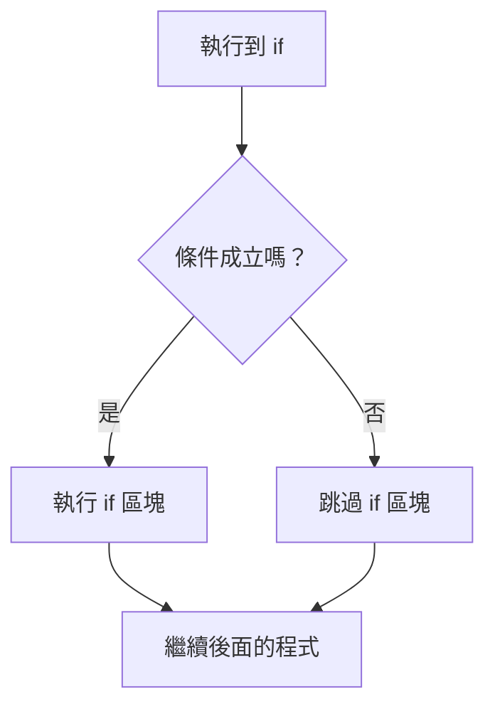
```mermaid
flowchart TD
    A[執行到 if] --> B{條件成立嗎？}
    B -- 是 --> C[執行 if 區塊]
    B -- 否 --> D[跳過 if 區塊]
    C --> E[繼續後面的程式]
    D --> E
```

---

### 2. 猜數字的三個獨立判斷

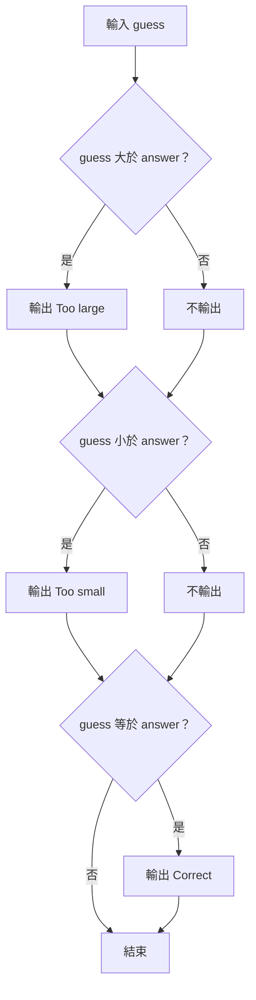
```mermaid
flowchart TD
    A[輸入 guess] --> B{guess 大於 answer？}
    B -- 是 --> C[輸出 Too large]
    B -- 否 --> D[不輸出]
    C --> E{guess 小於 answer？}
    D --> E
    E -- 是 --> F[輸出 Too small]
    E -- 否 --> G[不輸出]
    F --> H{guess 等於 answer？}
    G --> H
    H -- 是 --> I[輸出 Correct]
    H -- 否 --> J[結束]
    I --> J
```

---

### 3. 滿額折扣

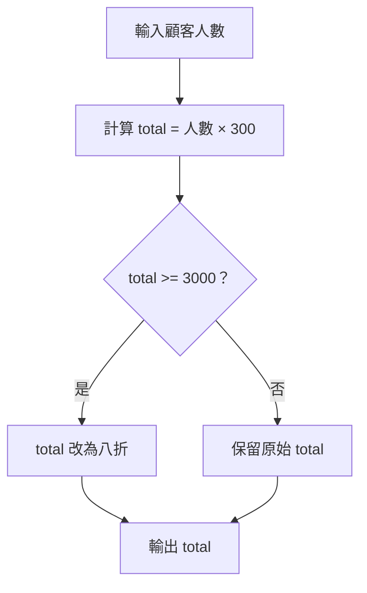
```mermaid
flowchart TD
    A[輸入顧客人數] --> B[計算 total = 人數 × 300]
    B --> C{total >= 3000？}
    C -- 是 --> D[total 改為八折]
    C -- 否 --> E[保留原始 total]
    D --> F[輸出 total]
    E --> F
```

---

### 4. 目前最大值策略

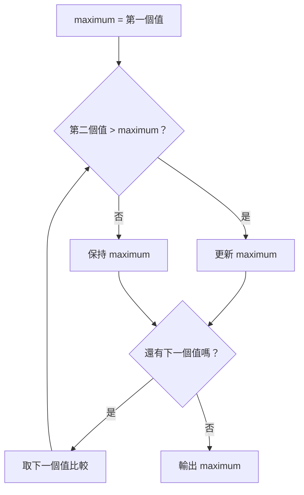
```mermaid
flowchart TD
    A[maximum = 第一個值] --> B{第二個值 > maximum？}
    B -- 是 --> C[更新 maximum]
    B -- 否 --> D[保持 maximum]
    C --> E{還有下一個值嗎？}
    D --> E
    E -- 是 --> F[取下一個值比較]
    F --> B
    E -- 否 --> G[輸出 maximum]
```

---

### 5. 兩數排序

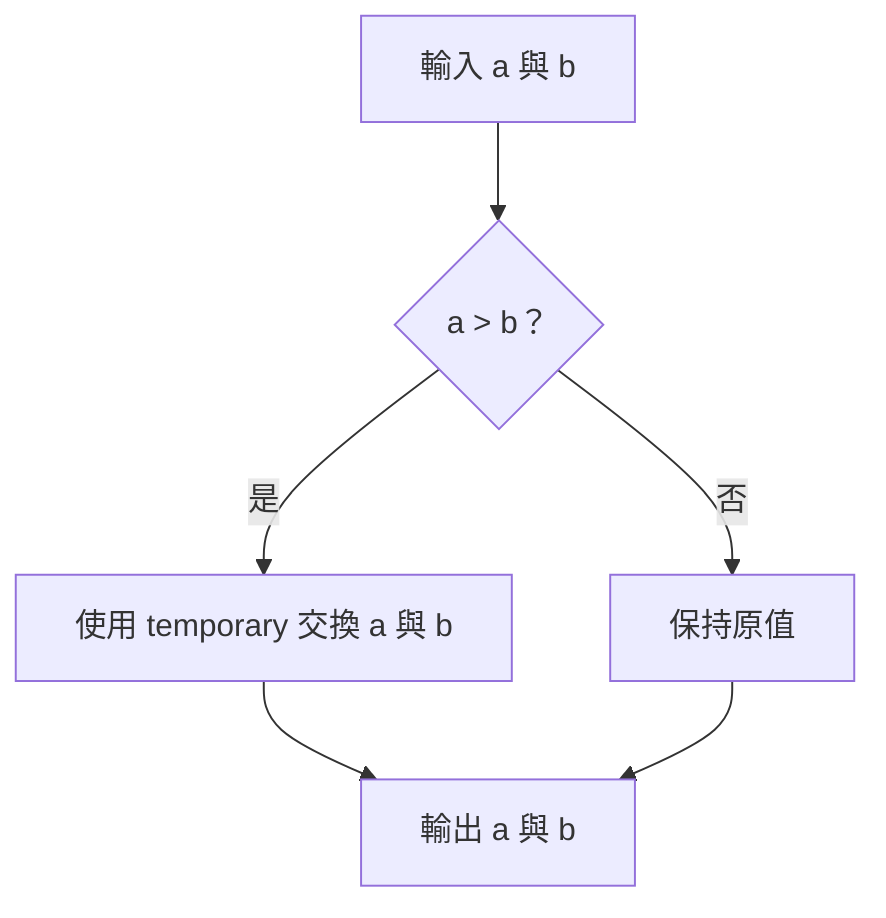
```mermaid
flowchart TD
    A[輸入 a 與 b] --> B{a > b？}
    B -- 是 --> C[使用 temporary 交換 a 與 b]
    B -- 否 --> D[保持原值]
    C --> E[輸出 a 與 b]
    D --> E
```

---

### 6. 三數由小到大排序

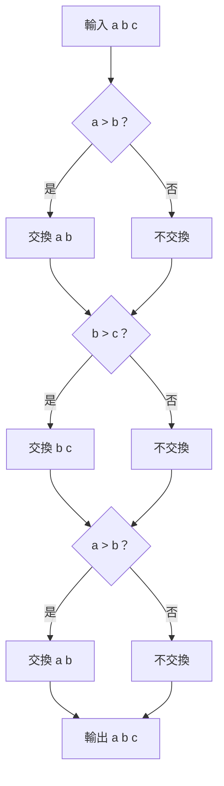
```mermaid
flowchart TD
    A[輸入 a b c] --> B{a > b？}
    B -- 是 --> C[交換 a b]
    B -- 否 --> D[不交換]
    C --> E{b > c？}
    D --> E
    E -- 是 --> F[交換 b c]
    E -- 否 --> G[不交換]
    F --> H{a > b？}
    G --> H
    H -- 是 --> I[交換 a b]
    H -- 否 --> J[不交換]
    I --> K[輸出 a b c]
    J --> K
```

---

## 本章完成標準

完成本章後，你應該能做到：

- 看懂並寫出基本 `if` 述句。
- 正確判斷大括號控制的程式範圍。
- 預測多個獨立 `if` 的輸出。
- 把中文條件改寫成關係與邏輯表示式。
- 使用 `if` 完成猜數字與折扣問題。
- 判斷正三角形、等腰三角形與直角三角形。
- 使用兩種策略找最大值或最小值。
- 使用條件找出三個數字的中位數。
- 使用暫存變數完成條件式交換。
- 使用多次交換將三個數字排序。
- 利用排序結果簡化後續條件。
