# Lesson 7：if-else and switch if-else 與 switch

<!-- lesson-image: C_Lesson_07_img16_if_else_vs_switch.png -->
<p align="center">
  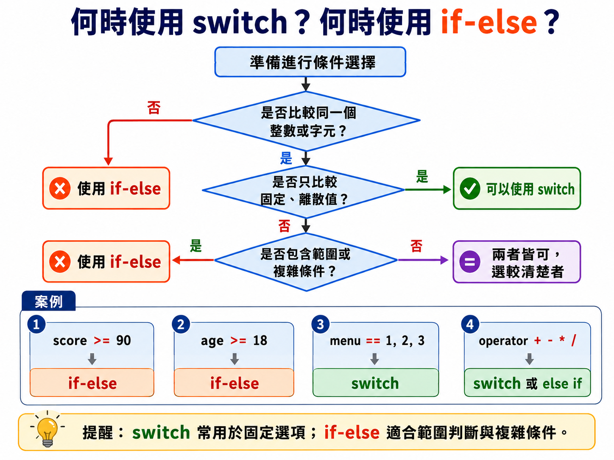
</p>

> 這堂課的重點：使用 `if-else` 在兩個結果中選擇一個，使用 `else if` 處理多個互斥條件，並使用 `switch` 根據固定的整數或字元選項執行對應程式碼。

---

## Section I. 今天要做什麼？

1. 理解為什麼只有 `if` 有時不夠方便。
2. 認識 `if-else` 的基本語法。
3. 理解 `if-else` 一次只會執行其中一個分支。
4. 分辨多個獨立 `if` 與一組 `if-else`。

<!-- lesson-image: C_Lesson_07_img01_if_vs_if_else.png -->
<p align="center">
  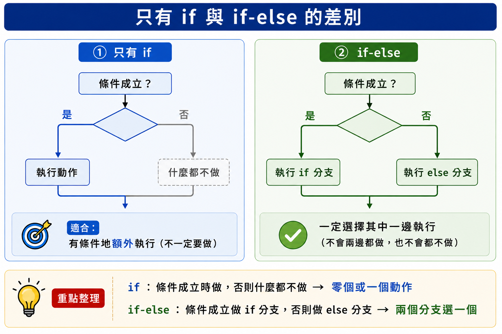
</p>
5. 使用 `if-else` 判斷 PASS 或 FAIL。
6. 比較兩個數字的大、小與相等。
7. 使用巢狀 `if-else` 處理第三種結果。
8. 使用 `else if` 建立多選一的條件鏈。
9. 完成「太大、太小、猜對」的猜數字程式。
10. 使用字元選擇簡易四則運算。
11. 在除法前檢查除數是否為 `0`。
12. 使用 `if-else` 找出兩個或三個數字的最大值。
13. 認識 `switch`、`case`、`break` 與 `default`。
14. 理解 `switch` 適合處理固定、離散的選項。
15. 使用 `switch` 完成 ID 查詢。
16. 使用多個 `case` 共用同一段程式碼。
17. 理解漏寫 `break` 所造成的 case 穿透。
18. 將簡易四則運算從 `else if` 改寫成 `switch`。
19. 比較 `if-else` 與 `switch` 的適用情境。
20. 閱讀使用 `switch` 累加消費金額的延伸程式。

---

## Section II. 今天的學習方式

1. 先判斷問題是「可同時成立」還是「只能選一個」。
2. 只有一個條件與其相反結果時，優先考慮 `if-else`。
3. 有多個互斥條件時，考慮 `else if`。
4. 根據同一個整數或字元的固定值選擇時，考慮 `switch`。
5. 閱讀條件鏈時，由上往下依序判斷。
6. 第一個成立的分支執行後，就離開整組 `if-else`。

<!-- lesson-image: C_Lesson_07_img08_else_if_first_match.png -->
<p align="center">
  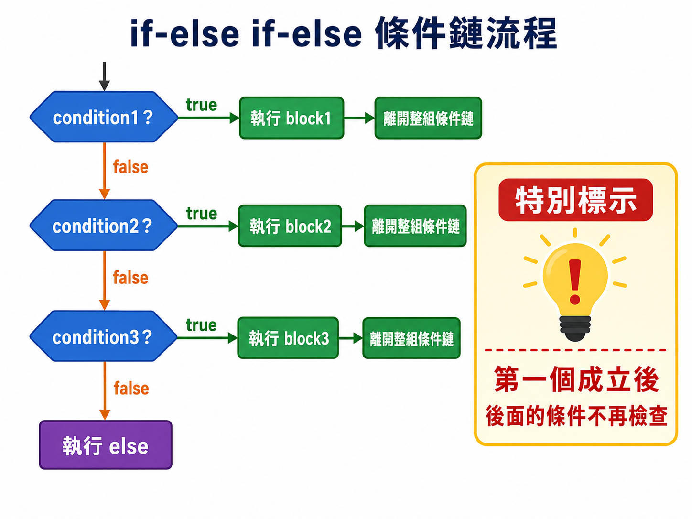
</p>
7. 閱讀 `switch` 時，先找符合的 `case`，再追蹤到 `break`。
8. 每次寫完分支後，都測試邊界值與未預期輸入。
9. 使用追蹤表確認「哪個條件被測試」及「哪個區塊被執行」。
10. 本章聚焦選擇結構；重複執行會在下一章正式學習。

---

## Section III. 今天會學到的內容

| 主題 | 你需要知道的事 |
| --- | --- |
| `if-else` | 條件成立執行 `if`；不成立執行 `else` |
| 二選一 | 一組 `if-else` 只會執行其中一個分支 |
| 獨立 `if` | 每個 `if` 都會各自判斷，可能執行多個區塊 |
| 巢狀條件 | 在一個分支內再放入另一個 `if-else` |
| `else if` | 由上往下檢查多個互斥條件 |
| 條件鏈 | 第一個成立的分支執行後，後面不再檢查 |
| `switch` | 根據同一個表示式的值選擇對應 case |
| `case` | 列出一個固定的候選值 |
| `break` | 結束目前的 `switch` |
| `default` | 所有 `case` 都不符合時執行 |
| case 穿透 | 沒有 `break` 時會繼續執行下一個 case |
| 共用 case | 多個 `case` 可以導向同一組述句 |
| 固定選項 | ID、選單代號、星期、運算符號等離散值 |
| 範圍條件 | 分數區間、年齡區間等通常適合 `if-else` |
| 防呆檢查 | 除以零、無效選項、找不到 ID 等情況 |

---

## Section IV. 寫題目前的提醒

### 1. `else` 不需要條件

正確：

```c
if (score >= 60) {
    printf("PASS\n");
} else {
    printf("FAIL\n");
}
```

錯誤：

```c
if (score >= 60) {
    printf("PASS\n");
} else (score < 60) {
    printf("FAIL\n");
}
```

`else` 代表前面條件不成立時的其餘情況，因此後面不再放條件。

---

### 2. `else` 必須接在對應的 `if` 後面

```c
if (score >= 60) {
    printf("PASS\n");
}

printf("Finished\n");

/* 錯誤：else 已經無法接回前面的 if */
else {
    printf("FAIL\n");
}
```

`if` 區塊結束後，`else` 必須立刻出現。

---

### 3. 一組 `if-else` 只會選一邊

```c
if (number >= 0) {
    printf("Non-negative\n");
} else {
    printf("Negative\n");
}
```

不論輸入什麼數字，都不會同時輸出兩個結果。

---

### 4. 多個獨立 `if` 不等於 `if-else`

<!-- lesson-image: C_Lesson_07_img04_independent_if_vs_if_else.png -->
<p align="center">
  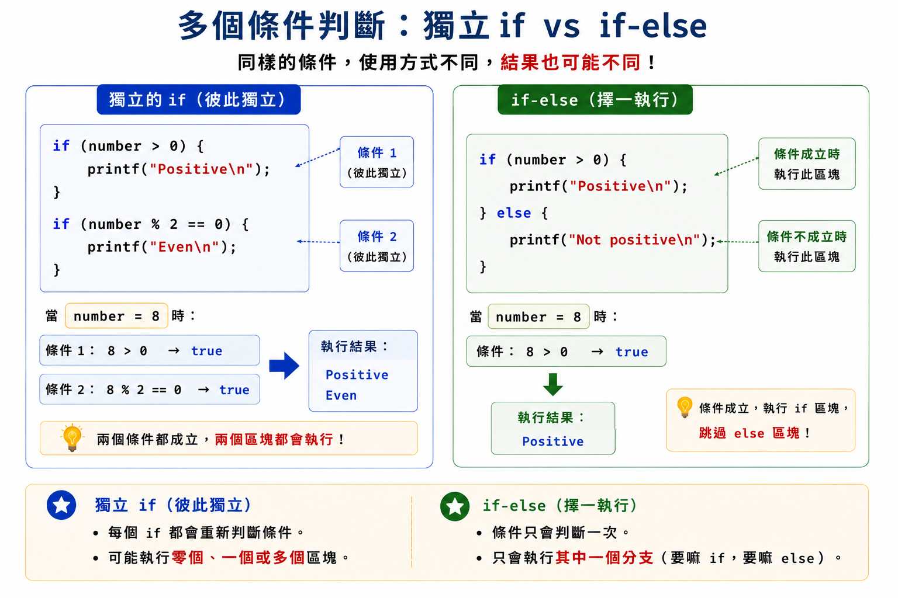
</p>

```c
if (number > 0) {
    printf("Positive\n");
}

if (number % 2 == 0) {
    printf("Even\n");
}
```

`number` 是 `8` 時，兩個區塊都會執行。

但下面的程式只會執行其中一邊：

```c
if (number > 0) {
    printf("Positive\n");
} else {
    printf("Not positive\n");
}
```

---

### 5. `else` 會配對最近、尚未配對的 `if`

<!-- lesson-image: C_Lesson_07_img05_dangling_else.png -->
<p align="center">
  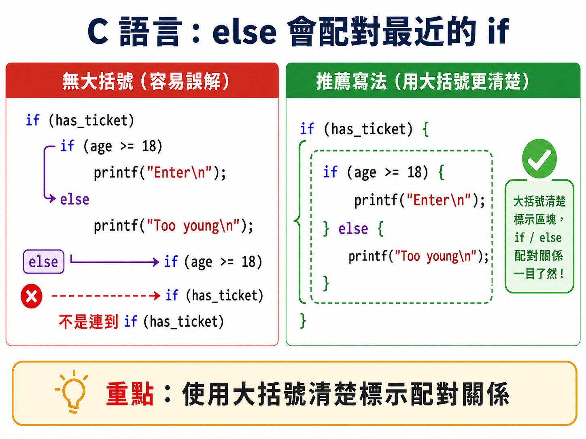
</p>

容易誤讀的寫法：

```c
if (has_ticket)
    if (age >= 18)
        printf("Enter\n");
    else
        printf("Too young\n");
```

`else` 會和 `if (age >= 18)` 配對。

本教材建議永遠使用大括號：

```c
if (has_ticket) {
    if (age >= 18) {
        printf("Enter\n");
    } else {
        printf("Too young\n");
    }
}
```

---

### 6. `else if` 的順序很重要

```c
if (score >= 60) {
    printf("Pass\n");
} else if (score >= 80) {
    printf("Excellent\n");
}
```

`score` 是 `90` 時，第一個條件已經成立，所以不會執行第二個分支。

應該先檢查較嚴格的條件：

```c
if (score >= 80) {
    printf("Excellent\n");
} else if (score >= 60) {
    printf("Pass\n");
}
```

---

### 7. 比較兩個數字時要處理相等

只判斷：

```c
if (a > b) {
    printf("a is larger\n");
} else {
    printf("b is larger\n");
}
```

當 `a == b` 時會錯誤地說 `b` 較大。

較完整的寫法是：

```c
if (a > b) {
    printf("a is larger\n");
} else if (a < b) {
    printf("b is larger\n");
} else {
    printf("a and b are equal\n");
}
```

---

### 8. 做除法前要先檢查除數

```c
if (operator == '/') {
    if (number2 != 0) {
        answer = (double)number1 / number2;
    } else {
        printf("Cannot divide by zero.\n");
    }
}
```

除數為 `0` 時不能進行一般整數或浮點數除法。

---

### 9. `switch` 比較的是固定值，不是範圍

適合：

```c
switch (menu) {
    case 1:
        printf("New game\n");
        break;
    case 2:
        printf("Load game\n");
        break;
}
```

不可以寫：

```c
case score >= 60:
```

分數區間應使用 `if-else`。

---

### 10. `case` 後面使用冒號

```c
case 1:
```

不是：

```c
case 1;
```

---

### 11. 多數 case 結尾需要 `break`

```c
case 1:
    printf("One\n");
    break;
```

如果漏掉 `break`，程式可能繼續執行下一個 case。

---

### 12. `default` 處理沒有列出的值

```c
default:
    printf("Invalid option\n");
    break;
```

`default` 類似 `if-else` 鏈最後的 `else`。

---

### 13. `switch` 的 case 值不能重複

錯誤：

```c
switch (choice) {
    case 1:
        printf("A\n");
        break;
    case 1:
        printf("B\n");
        break;
}
```

同一個 `switch` 中，每個 case 常數必須是唯一的。

---

### 14. 字元常數要使用單引號

```c
case '+':
```

不是：

```c
case "+":
```

`'+'` 是一個字元；`"+"` 是字串。

---

### 15. 輸入運算符號時，格式字串前可加空白

```c
scanf(" %c", &operator);
```

`%c` 前面的空白會略過先前輸入留下的換行或空白字元。

---

## Section V. 核心概念說明

### 1. 為什麼需要 `else`？

上一章的 `if` 適合表達：

> 如果條件成立，就做一件事；否則什麼也不做。

例如：

```c
if (temperature < 10) {
    printf("Cold warning\n");
}
```

但有些問題要求無論條件成立與否，都必須輸出一個結果：

> 如果成績及格，顯示 PASS；否則顯示 FAIL。

<!-- lesson-image: C_Lesson_07_img03_pass_fail_flow.png -->
<p align="center">
  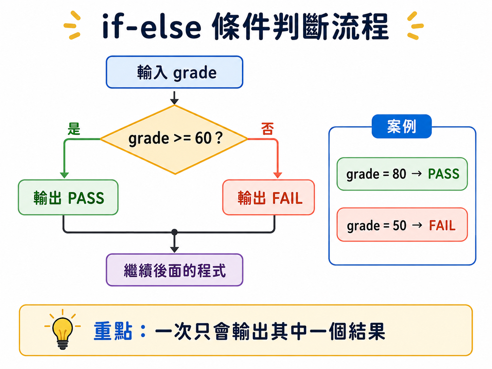
</p>

這時可以使用 `if-else`。

---

### 2. `if-else` 的基本語法

<!-- lesson-image: C_Lesson_07_img02_if_else_syntax.png -->
<p align="center">
  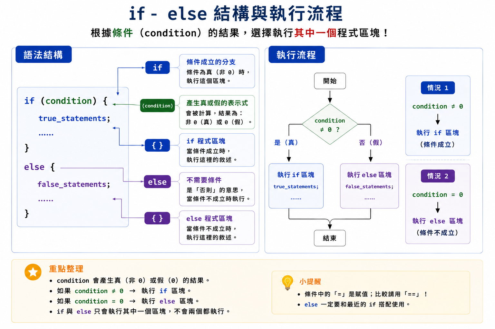
</p>

```c
if (條件) {
    條件成立時執行的程式碼;
} else {
    條件不成立時執行的程式碼;
}
```

流程如下：

1. 計算 `if` 後面的條件。
2. 條件為真，執行第一個區塊。
3. 條件為假，執行 `else` 區塊。
4. 執行完其中一個區塊後，繼續往下執行。

---

### 3. 第一個 `if-else`：PASS 或 FAIL

```c
#include <stdio.h>

int main(void) {
    int grade;

    printf("Please enter the grade: ");
    scanf("%d", &grade);

    if (grade >= 60) {
        printf("PASS\n");
    } else {
        printf("FAIL\n");
    }

    return 0;
}
```

如果輸入：

```text
80
```

條件：

```c
grade >= 60
```

成立，因此輸出：

```text
PASS
```

如果輸入 `50`，條件不成立，因此執行 `else`：

```text
FAIL
```

---

### 4. 為什麼不需要再寫 `grade < 60`？

如果：

```c
grade >= 60
```

不成立，就代表 `grade` 小於 `60`。

因此：

```c
if (grade >= 60) {
    printf("PASS\n");
} else {
    printf("FAIL\n");
}
```

比下面兩個獨立條件更能直接表達二選一：

```c
if (grade >= 60) {
    printf("PASS\n");
}

if (grade < 60) {
    printf("FAIL\n");
}
```

兩種寫法在這個例子都能得到結果，但 `if-else` 更清楚地表示兩個分支互斥。

---

### 5. `if-else` 的執行追蹤

假設：

```c
int grade = 75;
```

| 步驟 | 內容 | 結果 |
| --- | --- | --- |
| 1 | 計算 `grade >= 60` | `75 >= 60`，真 |
| 2 | 執行 `if` 區塊 | 輸出 `PASS` |
| 3 | `else` 區塊 | 跳過 |
| 4 | 離開條件結構 | 繼續下一行 |

若 `grade = 40`：

| 步驟 | 內容 | 結果 |
| --- | --- | --- |
| 1 | 計算 `grade >= 60` | 假 |
| 2 | `if` 區塊 | 跳過 |
| 3 | 執行 `else` 區塊 | 輸出 `FAIL` |
| 4 | 離開條件結構 | 繼續下一行 |

---

### 6. 比較兩個變數

題目要求輸入兩個整數，輸出哪個比較大，或兩者相等。

```c
#include <stdio.h>

int main(void) {
    int a;
    int b;

    printf("Please enter two integers: ");
    scanf("%d%d", &a, &b);

    if (a > b) {
        printf("%d is larger.\n", a);
    } else if (a < b) {
        printf("%d is larger.\n", b);
    } else {
        printf("The two integers are equal.\n");
    }

    return 0;
}
```

這個問題有三種互斥結果：

1. `a > b`
2. `a < b`
3. 前兩者都不成立，也就是 `a == b`

---

### 7. 巢狀 `if-else`

<!-- lesson-image: C_Lesson_07_img07_nested_if_vs_else_if.png -->
<p align="center">
  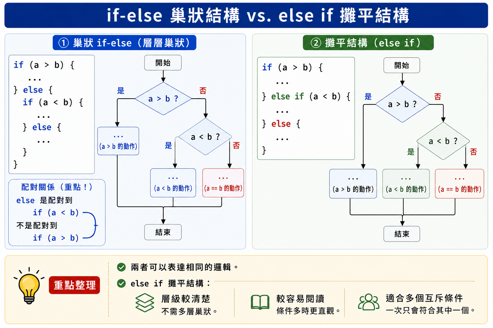
</p>

三種結果也可以使用巢狀寫法：

```c
if (a > b) {
    printf("%d is larger.\n", a);
} else {
    if (a < b) {
        printf("%d is larger.\n", b);
    } else {
        printf("The two integers are equal.\n");
    }
}
```

外層先判斷 `a > b`。

只有當外層條件不成立時，才進入 `else`，再判斷 `a < b`。

---

### 8. `else if` 是巢狀寫法的簡潔形式

前面的程式通常會寫成：

```c
if (a > b) {
    printf("%d is larger.\n", a);
} else if (a < b) {
    printf("%d is larger.\n", b);
} else {
    printf("The two integers are equal.\n");
}
```

`else if` 能讓多層判斷排列在同一層，通常較容易閱讀。

---

### 9. `else if` 條件鏈如何執行？

```c
if (condition1) {
    block1;
} else if (condition2) {
    block2;
} else if (condition3) {
    block3;
} else {
    default_block;
}
```

程式會：

1. 檢查 `condition1`。
2. 如果成立，執行 `block1`，後面全部跳過。
3. 如果不成立，才檢查 `condition2`。
4. 第一個成立的分支執行後，離開整組條件鏈。
5. 所有條件都不成立時，執行最後的 `else`。

---

### 10. 猜數字：太大、太小或正確

<!-- lesson-image: C_Lesson_07_img10_guess_number_chain.png -->
<p align="center">
  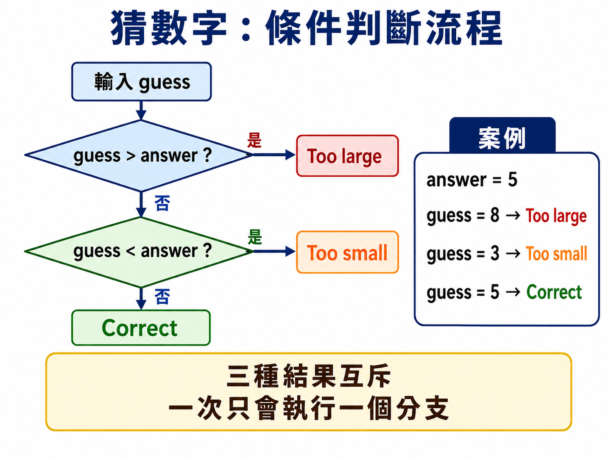
</p>

```c
#include <stdio.h>

int main(void) {
    const int answer = 5;
    int guess;

    printf("Please enter your guess: ");
    scanf("%d", &guess);

    if (guess > answer) {
        printf("Too large!\n");
    } else if (guess < answer) {
        printf("Too small!\n");
    } else {
        printf("Correct!\n");
    }

    return 0;
}
```

三種情況互斥，因此適合使用一組 `if-else if-else`。

注意：這個程式目前只猜一次。讓使用者一直猜到正確，需要迴圈，將在下一章學習。

---

### 11. 猜數字的條件順序

<!-- lesson-image: C_Lesson_07_img09_condition_order.png -->
<p align="center">
  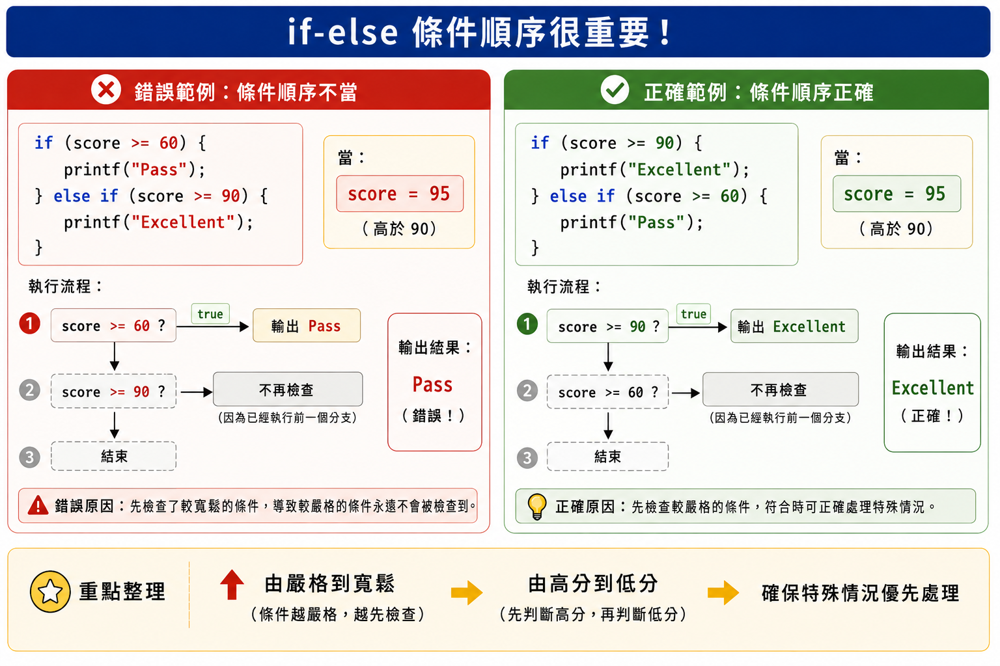
</p>

也可以先判斷是否正確：

```c
if (guess == answer) {
    printf("Correct!\n");
} else if (guess > answer) {
    printf("Too large!\n");
} else {
    printf("Too small!\n");
}
```

兩種順序都可以，只要：

- 所有可能情況都有處理。
- 每個分支的意思清楚。
- 最後的 `else` 確實代表剩餘情況。

---

### 12. 簡易四則運算的輸入

<!-- lesson-image: C_Lesson_07_img11_calculator_else_if.png -->
<p align="center">
  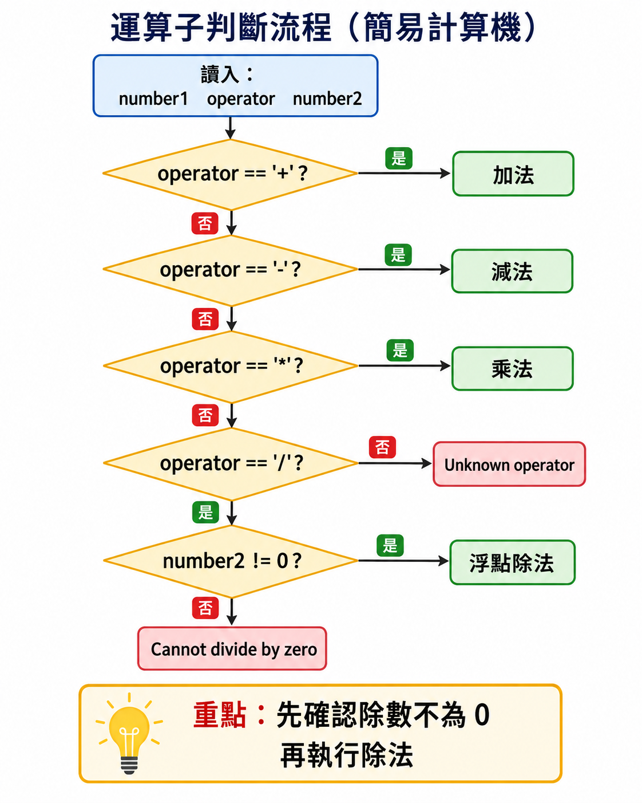
</p>

可以讓使用者輸入：

```text
8 * 3
```

程式需要讀入：

- 第一個數字
- 運算符號
- 第二個數字

```c
int number1;
int number2;
char operator;

scanf("%d %c %d", &number1, &operator, &number2);
```

---

### 13. 使用 `else if` 選擇運算

```c
#include <stdio.h>

int main(void) {
    int number1;
    int number2;
    char operator;
    double answer;

    printf("Enter an expression, such as 8 * 3: ");
    scanf("%d %c %d", &number1, &operator, &number2);

    if (operator == '+') {
        answer = number1 + number2;
        printf("Answer: %.2f\n", answer);
    } else if (operator == '-') {
        answer = number1 - number2;
        printf("Answer: %.2f\n", answer);
    } else if (operator == '*') {
        answer = number1 * number2;
        printf("Answer: %.2f\n", answer);
    } else if (operator == '/') {
        if (number2 != 0) {
            answer = (double)number1 / number2;
            printf("Answer: %.2f\n", answer);
        } else {
            printf("Cannot divide by zero.\n");
        }
    } else {
        printf("Unknown operator.\n");
    }

    return 0;
}
```

---

### 14. 為什麼答案使用 `double`？

加法、減法與乘法的整數結果也能放入 `double`。

除法則可能產生小數：

```c
(double)number1 / number2
```

例如：

```text
3 / 5
```

結果應為：

```text
0.60
```

如果直接進行整數除法：

```c
number1 / number2
```

則 `3 / 5` 會先得到整數 `0`，再存入 `double`。

---

### 15. 找兩個數字的最大值

```c
#include <stdio.h>

int main(void) {
    int a;
    int b;
    int maximum;

    printf("Please enter two integers: ");
    scanf("%d%d", &a, &b);

    if (a >= b) {
        maximum = a;
    } else {
        maximum = b;
    }

    printf("The maximum is %d.\n", maximum);

    return 0;
}
```

這裡使用：

```c
a >= b
```

所以兩者相等時會選擇 `a`，但最大值仍然正確。

---

### 16. 找兩個數字：直接輸出或先儲存？

直接輸出：

```c
if (a >= b) {
    printf("The maximum is %d.\n", a);
} else {
    printf("The maximum is %d.\n", b);
}
```

先儲存：

```c
if (a >= b) {
    maximum = a;
} else {
    maximum = b;
}

printf("The maximum is %d.\n", maximum);
```

如果後面還要繼續使用最大值，先存入 `maximum` 通常更方便。

---

### 17. 找三個數字的最大值：條件鏈

```c
#include <stdio.h>

int main(void) {
    int a;
    int b;
    int c;
    int maximum;

    printf("Please enter three integers: ");
    scanf("%d%d%d", &a, &b, &c);

    if (a >= b && a >= c) {
        maximum = a;
    } else if (b >= a && b >= c) {
        maximum = b;
    } else {
        maximum = c;
    }

    printf("The maximum is %d.\n", maximum);

    return 0;
}
```

每個候選值都要不小於另外兩個值，才能成為最大值。

---

### 18. 找三個數字的最大值：逐步更新

另一種方法是先找出 `a` 與 `b` 的最大值，再和 `c` 比較：

```c
if (a >= b) {
    maximum = a;
} else {
    maximum = b;
}

if (c > maximum) {
    maximum = c;
}
```

第二個 `if` 是獨立判斷，不需要 `else`。

這個例子也顯示：同一個程式可以同時使用 `if-else` 與獨立 `if`。

---

### 19. `switch` 適合什麼問題？

假設 ID 表如下：

| ID | 人名 |
| ---: | --- |
| `2` | John |
| `13` | Mary |
| `16` | Amy |

使用者輸入 ID 後，程式要輸出對應人名。

這個問題的特點：

- 所有選項都在比較同一個變數 `id`。
- 每個選項是固定整數。
- 每個固定值對應一個結果。

這種問題很適合 `switch`。

---

### 20. `switch` 的基本語法

<!-- lesson-image: C_Lesson_07_img12_switch_syntax.png -->
<p align="center">
  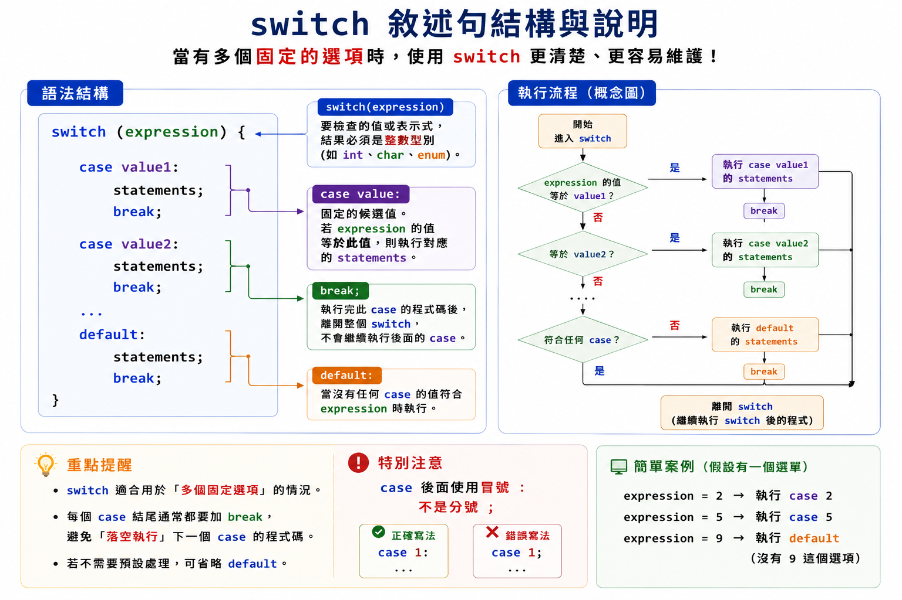
</p>

```c
switch (表示式) {
    case 常數1:
        程式碼1;
        break;

    case 常數2:
        程式碼2;
        break;

    default:
        預設程式碼;
        break;
}
```

執行步驟：

1. 計算 `switch` 小括號中的表示式。
2. 找到值相同的 `case`。
3. 從該 case 開始執行。
4. 遇到 `break` 時離開 `switch`。
5. 沒有 case 符合時，執行 `default`。

---

### 21. ID 查詢：使用 `switch`

```c
#include <stdio.h>

int main(void) {
    int id;

    printf("ID: ");
    scanf("%d", &id);

    switch (id) {
        case 2:
            printf("John\n");
            break;

        case 13:
            printf("Mary\n");
            break;

        case 16:
            printf("Amy\n");
            break;

        default:
            printf("Not found\n");
            break;
    }

    return 0;
}
```

---

### 22. `break` 的作用

假設輸入 `13`：

```c
case 13:
    printf("Mary\n");
    break;
```

程式輸出 `Mary`，接著 `break` 讓控制流程離開整個 `switch`。

如果漏掉 `break`：

```c
case 13:
    printf("Mary\n");

case 16:
    printf("Amy\n");
    break;
```

輸入 `13` 時，程式可能依序輸出：

```text
Mary
Amy
```

這就是 case 穿透。

---

### 23. case 穿透有時可以刻意使用

多個 ID 可以對應同一個人：

```c
switch (id) {
    case 2:
    case 3:
    case 4:
        printf("John\n");
        break;

    case 13:
    case 14:
        printf("Mary\n");
        break;

    case 16:
        printf("Amy\n");
        break;

    default:
        printf("Not found\n");
        break;
}
```

`case 2`、`case 3` 與 `case 4` 之間沒有述句與 `break`，所以三個值都會到達同一個 `printf()`。

這是有目的的共用 case，不是疏忽。

---

### 24. `default` 是否一定要放最後？

語法上，`default` 不一定要放在最後。

但為了讓程式容易閱讀，本教材建議：

```c
default:
    ...
    break;
```

放在所有 case 後面。

---

### 25. 使用 `switch` 完成四則運算

```c
#include <stdio.h>

int main(void) {
    int number1;
    int number2;
    char operator;
    double answer;

    printf("Enter an expression, such as 8 * 3: ");
    scanf("%d %c %d", &number1, &operator, &number2);

    switch (operator) {
        case '+':
            answer = number1 + number2;
            printf("Answer: %.2f\n", answer);
            break;

        case '-':
            answer = number1 - number2;
            printf("Answer: %.2f\n", answer);
            break;

        case '*':
            answer = number1 * number2;
            printf("Answer: %.2f\n", answer);
            break;

        case '/':
            if (number2 != 0) {
                answer = (double)number1 / number2;
                printf("Answer: %.2f\n", answer);
            } else {
                printf("Cannot divide by zero.\n");
            }
            break;

        default:
            printf("Unknown operator.\n");
            break;
    }

    return 0;
}
```

---

### 26. `if-else` 與 `switch` 的比較

| 問題 | 適合使用 |
| --- | --- |
| 分數是否及格 | `if-else` |
| 成績等第區間 | `else if` |
| 年齡是否在某範圍 | `if-else` |
| 兩個數字比大小 | `if-else` |
| 固定 ID 查詢 | `switch` |
| 選單選項 `1`、`2`、`3` | `switch` |
| 字元運算符號 `+ - * /` | 兩者皆可，`switch` 通常較整齊 |
| 多個複雜邏輯條件 | `if-else` |

選擇原則不是「哪個比較高級」，而是哪個更能清楚表達問題。

---

### 27. 消費金額計算：固定商品代號

<!-- lesson-image: C_Lesson_07_img18_product_id_mapping.png -->
<p align="center">
  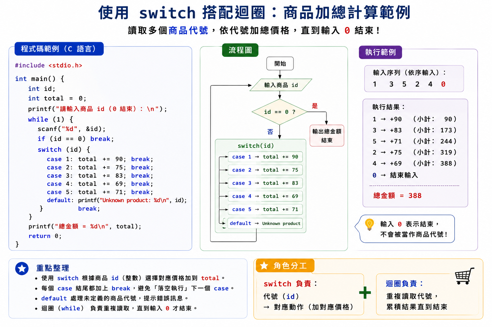
</p>

參考商品表：

| 編號 | 價格 |
| ---: | ---: |
| `1` | `90` |
| `2` | `75` |
| `3` | `83` |
| `4` | `69` |
| `5` | `71` |

根據單一商品代號增加總金額，可以寫成：

```c
switch (id) {
    case 1:
        total += 90;
        break;
    case 2:
        total += 75;
        break;
    case 3:
        total += 83;
        break;
    case 4:
        total += 69;
        break;
    case 5:
        total += 71;
        break;
    default:
        printf("Unknown product.\n");
        break;
}
```

---

### 28. 消費金額延伸：重複輸入的預覽

來源練習會持續輸入商品編號，輸入 `0` 時結束，最後輸出總金額。

完整結構會使用 `do-while`：

```c
#include <stdio.h>

int main(void) {
    int id;
    int total = 0;

    do {
        scanf("%d", &id);

        switch (id) {
            case 1:
                total += 90;
                break;
            case 2:
                total += 75;
                break;
            case 3:
                total += 83;
                break;
            case 4:
                total += 69;
                break;
            case 5:
                total += 71;
                break;
            case 0:
                break;
            default:
                printf("Unknown product.\n");
                break;
        }
    } while (id != 0);

    printf("Total: %d\n", total);

    return 0;
}
```

本章現在只需要讀懂其中的 `switch`：

- 商品編號決定增加哪個價格。
- `0` 不增加金額。
- 其他編號交給 `default`。

`do-while` 的重複機制會在下一章正式說明。

---

## Section V-A. 容易搞混的重點

### 1. `if-else` 不是執行兩個區塊

```c
if (condition) {
    block_a;
} else {
    block_b;
}
```

只會執行 `block_a` 或 `block_b`，不會兩個都執行。

---

### 2. `else if` 不是新的獨立判斷

```c
if (a) {
    ...
} else if (b) {
    ...
}
```

只有第一個條件不成立時，才會檢查第二個條件。

---

### 3. 多個獨立 `if` 可能得到多個結果

```c
if (number > 0) {
    printf("Positive\n");
}

if (number % 2 == 0) {
    printf("Even\n");
}
```

和下面的條件鏈不同：

```c
if (number > 0) {
    printf("Positive\n");
} else if (number % 2 == 0) {
    printf("Even\n");
}
```

第二段程式在 `number` 為正偶數時只會輸出 `Positive`。

---

### 4. 最後的 `else` 代表「剩餘所有情況」

```c
if (guess > answer) {
    ...
} else if (guess < answer) {
    ...
} else {
    ...
}
```

最後的 `else` 代表：

```c
guess == answer
```

前提是前面兩個條件已經完整排除大於與小於。

---

### 5. `switch` 不是比較大小的工具

不應使用 `switch` 表達：

```text
score >= 90
score >= 80
score >= 70
```

這些是範圍條件，應使用 `else if`。

---

### 6. `break` 結束的是 `switch`

本章的：

```c
break;
```

會離開目前的 `switch`。

之後學習迴圈時，`break` 也可以離開迴圈；作用取決於它所在的結構。

---

### 7. 漏寫 `break` 不一定是語法錯誤

程式通常仍能編譯，但結果可能多執行後面的 case。

因此這是一種流程邏輯錯誤，而不是必然的編譯錯誤。

---

### 8. 共用 case 與忘記 `break` 外觀相似

<!-- lesson-image: C_Lesson_07_img14_break_vs_fallthrough.png -->
<p align="center">
  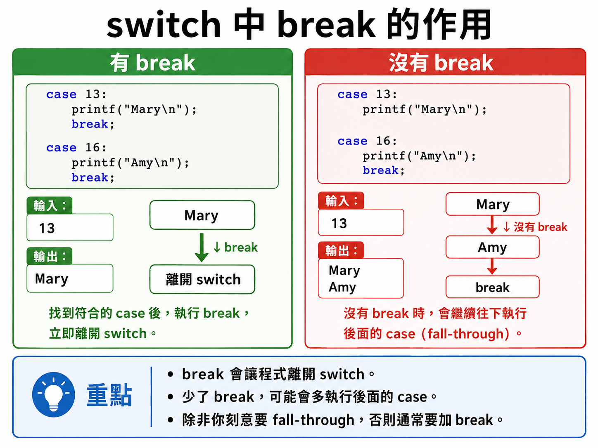
</p>

<!-- lesson-image: C_Lesson_07_img15_shared_cases.png -->
<p align="center">
  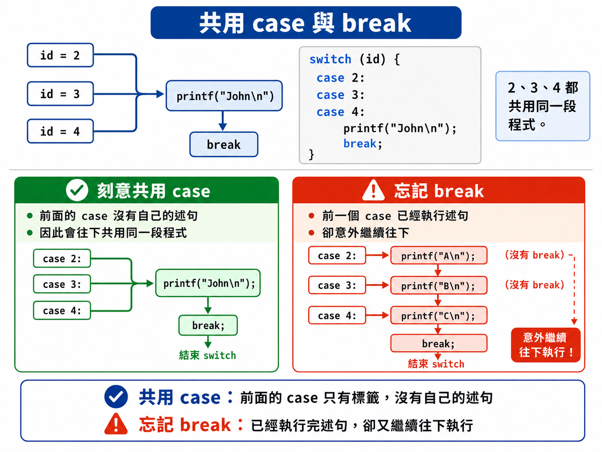
</p>

刻意共用：

```c
case 2:
case 3:
case 4:
    printf("John\n");
    break;
```

可能出錯：

```c
case 2:
    printf("John\n");
/* 忘了 break */
case 13:
    printf("Mary\n");
    break;
```

判斷重點是：前一個 case 是否有自己的述句，而且是否應該停止。

---

### 9. `default` 類似 `else`，但不完全相同

兩者都能處理其餘情況。

但：

- `else` 屬於 `if` 條件鏈。
- `default` 屬於 `switch`。
- `default` 不寫條件。
- `default` 通常放在最後。

---

### 10. 判斷運算符號時使用字元

```c
operator == '+'
```

不是：

```c
operator == "+"
```

同樣地，`switch` 中寫：

```c
case '+':
```

---

### 11. 三元運算子不是本章重點

有些程式可以寫成：

```c
maximum = a >= b ? a : b;
```

但本章的目標是理解完整的 `if-else` 流程，因此練習題先使用區塊寫法。

---

### 12. 消費金額範例包含下一章內容

來源中的完整消費程式需要重複讀取商品編號。

本章只要求理解：

- `switch` 如何將商品編號映射到價格。

<!-- lesson-image: C_Lesson_07_img13_switch_case_matching.png -->
<p align="center">
  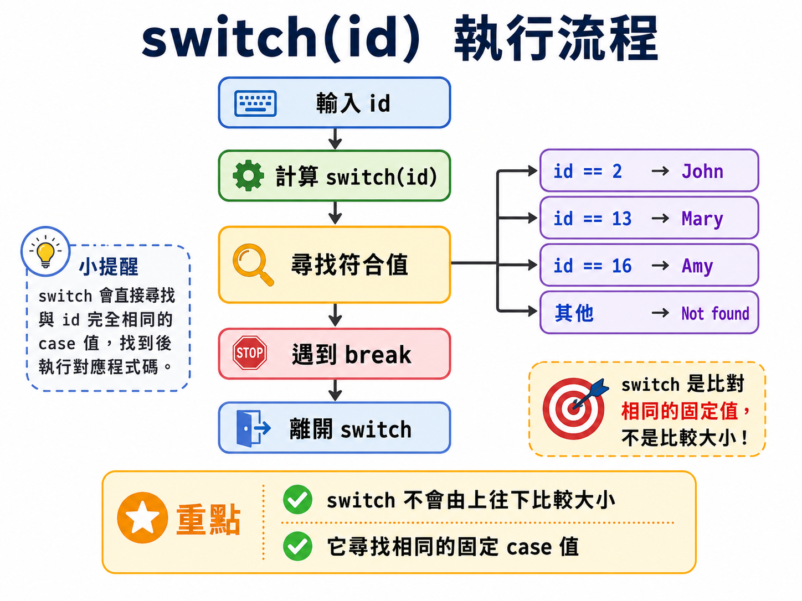
</p>
- `total += price` 如何累加。
- `case 0` 如何表示結束代號。

重複執行的原理留到下一章。

---

## Section VI. 快速概念檢查

### Q1. `if-else` 最主要的用途是什麼？

<details>
<summary>查看答案</summary>

在條件成立與不成立兩種互斥結果中選擇一個分支執行。

</details>

---

### Q2. 一組 `if-else` 最多會執行幾個分支？

<details>
<summary>查看答案</summary>

一個。`if` 與 `else` 只會選擇其中一邊。

</details>

---

### Q3. 下面程式在 `score = 90` 時輸出什麼？

```c
if (score >= 60) {
    printf("PASS\n");
} else {
    printf("FAIL\n");
}
```

<details>
<summary>查看答案</summary>

```text
PASS
```

</details>

---

### Q4. 為什麼比較兩個數字時需要考慮 `a == b`？

<details>
<summary>查看答案</summary>

因為只處理 `a > b` 與其 `else`，可能把相等誤認成 `b` 較大。

</details>

---

### Q5. `else if` 條件鏈會執行幾個成立分支？

<details>
<summary>查看答案</summary>

只執行第一個成立的分支，然後離開整組條件鏈。

</details>

---

### Q6. 猜數字程式中，前面已排除 `guess > answer` 與 `guess < answer`，最後的 `else` 代表什麼？

<details>
<summary>查看答案</summary>

代表 `guess == answer`。

</details>

---

### Q7. `switch` 最適合哪一種條件？

<details>
<summary>查看答案</summary>

根據同一個整數或字元表示式的固定值，選擇對應程式碼。

</details>

---

### Q8. `case` 後面使用分號還是冒號？

<details>
<summary>查看答案</summary>

冒號：

```c
case 1:
```

</details>

---

### Q9. `break` 在 `switch` 中的作用是什麼？

<details>
<summary>查看答案</summary>

停止繼續執行後面的 case，並離開 `switch`。

</details>

---

### Q10. `default` 什麼時候執行？

<details>
<summary>查看答案</summary>

當 `switch` 表示式的值不符合任何一個 `case` 時。

</details>

---

### Q11. 為什麼下面三個 case 可以共用一段程式碼？

```c
case 2:
case 3:
case 4:
    printf("John\n");
    break;
```

<details>
<summary>查看答案</summary>

`case 2` 與 `case 3` 後面沒有述句及 `break`，所以執行會繼續到共同的 `printf()`。

</details>

---

### Q12. 分數區間應使用 `switch` 還是 `if-else`？

<details>
<summary>查看答案</summary>

通常使用 `if-else`，因為分數等第是範圍條件，不是固定單一值。

</details>

---

## Section VII. 程式閱讀練習

### 題目 1：PASS 或 FAIL

```c
int score = 60;

if (score >= 60) {
    printf("PASS\n");
} else {
    printf("FAIL\n");
}
```

請回答：

1. 條件成立嗎？
2. 輸出什麼？
3. `else` 區塊會執行嗎？

<details>
<summary>查看答案</summary>

1. 成立。
2. 輸出 `PASS`。
3. 不會。

</details>

---

### 題目 2：獨立 `if` 與 `else if`

程式 A：

```c
int number = 8;

if (number > 0) {
    printf("Positive\n");
}

if (number % 2 == 0) {
    printf("Even\n");
}
```

程式 B：

```c
int number = 8;

if (number > 0) {
    printf("Positive\n");
} else if (number % 2 == 0) {
    printf("Even\n");
}
```

<details>
<summary>查看答案</summary>

程式 A：

```text
Positive
Even
```

程式 B：

```text
Positive
```

程式 B 的第一個條件成立後，不再檢查 `else if`。

</details>

---

### 題目 3：比較兩個數字

```c
int a = 7;
int b = 7;

if (a > b) {
    printf("A\n");
} else if (a < b) {
    printf("B\n");
} else {
    printf("Equal\n");
}
```

<details>
<summary>查看答案</summary>

```text
Equal
```

</details>

---

### 題目 4：條件順序

```c
int score = 95;

if (score >= 60) {
    printf("Pass\n");
} else if (score >= 90) {
    printf("Excellent\n");
}
```

<details>
<summary>查看答案</summary>

輸出：

```text
Pass
```

雖然 `score >= 90` 也成立，但第一個條件已成立，後面不再判斷。

若要先顯示最高等級，應把 `score >= 90` 放前面。

</details>

---

### 題目 5：除以零

```c
int a = 10;
int b = 0;
char operator = '/';

if (operator == '/') {
    if (b != 0) {
        printf("%.2f\n", (double)a / b);
    } else {
        printf("Cannot divide by zero.\n");
    }
}
```

<details>
<summary>查看答案</summary>

```text
Cannot divide by zero.
```

實際除法不會執行。

</details>

---

### 題目 6：switch 與 break

```c
int id = 13;

switch (id) {
    case 2:
        printf("John\n");
        break;
    case 13:
        printf("Mary\n");
        break;
    case 16:
        printf("Amy\n");
        break;
    default:
        printf("Not found\n");
        break;
}
```

<details>
<summary>查看答案</summary>

```text
Mary
```

遇到 `break` 後離開 `switch`。

</details>

---

### 題目 7：漏寫 break

```c
int choice = 1;

switch (choice) {
    case 1:
        printf("A\n");
    case 2:
        printf("B\n");
        break;
    default:
        printf("C\n");
        break;
}
```

<details>
<summary>查看答案</summary>

```text
A
B
```

`case 1` 沒有 `break`，所以繼續執行 `case 2` 的述句。

</details>

---

### 題目 8：共用 case

```c
int id = 3;

switch (id) {
    case 2:
    case 3:
    case 4:
        printf("John\n");
        break;
    default:
        printf("Not found\n");
        break;
}
```

<details>
<summary>查看答案</summary>

```text
John
```

</details>

---

## Section VIII. 實作練習 / 實作檢測題

### TODO 1：奇數或偶數

輸入一個整數，使用 `if-else` 輸出：

```text
EVEN
```

或：

```text
ODD
```

---

### TODO 2：成人票或兒童票

輸入年齡：

- `18` 歲以上輸出 `Adult ticket`
- 其他輸出 `Child ticket`

---

### TODO 3：兩個數字比大小

輸入兩個整數，輸出：

- 第一個較大
- 第二個較大
- 兩者相等

三種結果之一。

---

### TODO 4：正數、負數或零

使用 `if-else if-else` 將整數分成：

```text
Positive
Negative
Zero
```

---

### TODO 5：成績等第

輸入 `0` 到 `100` 的成績：

| 範圍 | 等第 |
| --- | --- |
| `90–100` | `A` |
| `80–89` | `B` |
| `70–79` | `C` |
| `60–69` | `D` |
| `0–59` | `F` |

先檢查輸入是否在合法範圍。

---

### TODO 6：猜數字一次

答案固定為 `37`。

輸入一個猜測，輸出：

```text
Too large
Too small
Correct
```

三者之一。

---

### TODO 7：簡易四則運算——`else if`

輸入：

```text
number1 operator number2
```

支援：

```text
+ - * /
```

除法要處理除數為 `0`。

---

### TODO 8：兩個數字的最大值與最小值

輸入兩個整數，使用一組 `if-else` 同時計算：

```text
Maximum: ...
Minimum: ...
```

---

### TODO 9：三個數字的最大值

使用 `if-else if-else` 找出三個整數中的最大值。

測試：

- 三個都不同
- 前兩個相同且最大
- 後兩個相同且最大
- 三個全部相同
- 全部是負數

---

### TODO 10：星期查詢

輸入 `1` 到 `7`，使用 `switch` 輸出星期名稱。

其他值輸出：

```text
Invalid day
```

---

### TODO 11：ID 查詢

依照下表使用 `switch`：

| ID | 人名 |
| ---: | --- |
| `2` | John |
| `13` | Mary |
| `16` | Amy |

沒有對應值時輸出 `Not found`。

---

### TODO 12：共用 ID

修改 ID 查詢：

- `2`、`3`、`4` 都輸出 `John`
- `13`、`14` 都輸出 `Mary`
- `16` 輸出 `Amy`

---

### TODO 13：簡易四則運算——`switch`

把 TODO 7 改成使用 `switch`。

---

### TODO 14：飲料選單

| 選項 | 飲料 | 價格 |
| ---: | --- | ---: |
| `1` | Tea | `30` |
| `2` | Coffee | `45` |
| `3` | Juice | `50` |

輸入選項後，使用 `switch` 輸出飲料名稱與價格。

---

### TODO 15：單一商品金額

使用來源商品表：

| 編號 | 價格 |
| ---: | ---: |
| `1` | `90` |
| `2` | `75` |
| `3` | `83` |
| `4` | `69` |
| `5` | `71` |

輸入一個商品編號，使用 `switch` 輸出價格；無效編號輸出 `Unknown product`。

---

## Section IX. 做題時可以使用的提示

### 1. 先判斷結果是否互斥

如果只有一個結果能成立，例如：

- PASS 或 FAIL
- 正數、負數或零
- 太大、太小或正確

就適合使用一組條件鏈。

---

### 2. 最後一種情況可交給 `else`

例如：

```c
if (a > b) {
    ...
} else if (a < b) {
    ...
} else {
    /* 只剩 a == b */
}
```

---

### 3. 範圍條件由嚴格到寬鬆排列

```c
if (score >= 90) {
    ...
} else if (score >= 80) {
    ...
} else if (score >= 70) {
    ...
}
```

因為到達第二個條件時，已經知道 `score < 90`。

---

### 4. 固定代號先畫查詢表

例如：

| 代號 | 結果 |
| ---: | --- |
| `1` | New game |
| `2` | Load game |
| `3` | Exit |

再把每一列轉成一個 `case`。

---

### 5. 每寫一個 case 就確認是否需要 `break`

除非刻意讓多個 case 共用程式碼，否則通常要寫：

```c
break;
```

---

### 6. 測試 `default`

不要只測合法選項，也要輸入一個不存在的值，確認預設處理是否正確。

---

### 7. 計算器至少測試六種情況

1. 加法
2. 減法
3. 乘法
4. 可正常計算的除法
5. 除以零
6. 無效運算符號

---

## Section X. 課後小練習

### 練習 1：BMI 分類

輸入 BMI，使用 `else if` 分類：

- 小於 `18.5`
- `18.5` 到小於 `24`
- `24` 到小於 `27`
- `27` 以上

---

### 練習 2：閏年基本判斷

輸入年份，依序判斷：

- 可被 `400` 整除：閏年
- 否則可被 `100` 整除：平年
- 否則可被 `4` 整除：閏年
- 其他：平年

---

### 練習 3：三數最小值

使用 `if-else if-else` 找出三個整數中的最小值。

---

### 練習 4：月份天數

輸入月份，使用 `switch` 輸出一般年份中的天數。

可使用共用 case：

```c
case 1:
case 3:
case 5:
...
```

---

### 練習 5：交通號誌

輸入字元：

- `'R'`：Stop
- `'Y'`：Wait
- `'G'`：Go

使用 `switch`，其他字元輸出 `Invalid signal`。

---

### 練習 6：找出穿透錯誤

修正下面程式：

```c
switch (choice) {
    case 1:
        printf("One\n");
    case 2:
        printf("Two\n");
    case 3:
        printf("Three\n");
    default:
        printf("Invalid\n");
}
```

---

### 練習 7：兩種寫法比較

分別使用：

1. `else if`
2. `switch`

完成同一個四則運算程式，並比較哪一版較容易閱讀。

---

### 練習 8：購物累加設計

先不寫迴圈，只完成下列部分：

```c
switch (id) {
    /* 根據商品編號更新 total */
}
```

下一章再把它放進重複輸入的結構。

---

## Section XI. 重點複習

1. `if-else` 表示二選一。
2. 條件成立執行 `if`，不成立執行 `else`。
3. 一組 `if-else` 只會執行一個分支。
4. 多個獨立 `if` 可能執行多個區塊。
5. `else if` 適合多個互斥條件。
6. 條件鏈由上往下檢查。
7. 第一個成立分支執行後，其餘分支會跳過。
8. 條件順序會影響結果。
9. 最後的 `else` 處理剩餘情況。
10. 比大小時不要忘記相等。
11. 除法前要檢查除數是否為 `0`。
12. `switch` 根據同一個表示式的固定值選擇分支。
13. 每個 `case` 後面使用冒號。
14. `break` 通常用來結束一個 case。
15. 漏寫 `break` 可能造成 case 穿透。
16. 多個 case 可以刻意共用同一段程式碼。
17. `default` 處理沒有符合任何 case 的值。
18. `switch` 適合 ID、選單與字元運算符號。
19. 範圍及複雜條件通常使用 `if-else`。
20. 選擇語法時，應以清楚表達問題為優先。

---

## Section XII. 常見錯誤提醒

### 錯誤 1：在 `else` 後面加條件

錯誤：

```c
else (score < 60) {
    printf("FAIL\n");
}
```

正確：

```c
else {
    printf("FAIL\n");
}
```

---

### 錯誤 2：`else` 與 `if` 中間插入述句

錯誤：

```c
if (condition) {
    ...
}

printf("Middle\n");

else {
    ...
}
```

`else` 必須緊接在對應 `if` 後面。

---

### 錯誤 3：條件順序由寬到嚴

錯誤：

```c
if (score >= 60) {
    printf("D\n");
} else if (score >= 90) {
    printf("A\n");
}
```

`90` 分會先進入第一個分支。

---

### 錯誤 4：沒有處理相等

錯誤：

```c
if (a > b) {
    printf("a is larger\n");
} else {
    printf("b is larger\n");
}
```

`a == b` 時會得到錯誤描述。

---

### 錯誤 5：把兩個獨立條件誤寫成條件鏈

需求：同時輸出正數與偶數特徵。

錯誤：

```c
if (number > 0) {
    printf("Positive\n");
} else if (number % 2 == 0) {
    printf("Even\n");
}
```

應使用兩個獨立 `if`。

---

### 錯誤 6：整數除法後才轉型

錯誤：

```c
answer = (double)(number1 / number2);
```

正確：

```c
answer = (double)number1 / number2;
```

---

### 錯誤 7：除數為零仍執行除法

應先判斷：

```c
if (number2 != 0) {
    ...
} else {
    ...
}
```

---

### 錯誤 8：`case` 後使用分號

錯誤：

```c
case 1;
```

正確：

```c
case 1:
```

---

### 錯誤 9：忘記 `break`

```c
case 1:
    printf("One\n");
/* 可能繼續執行 case 2 */
```

---

### 錯誤 10：case 值重複

同一個 `switch` 中不能出現兩個相同的 case 常數。

---

### 錯誤 11：使用字串作為字元 case

<!-- lesson-image: C_Lesson_07_img17_char_case_quotes.png -->
<p align="center">
  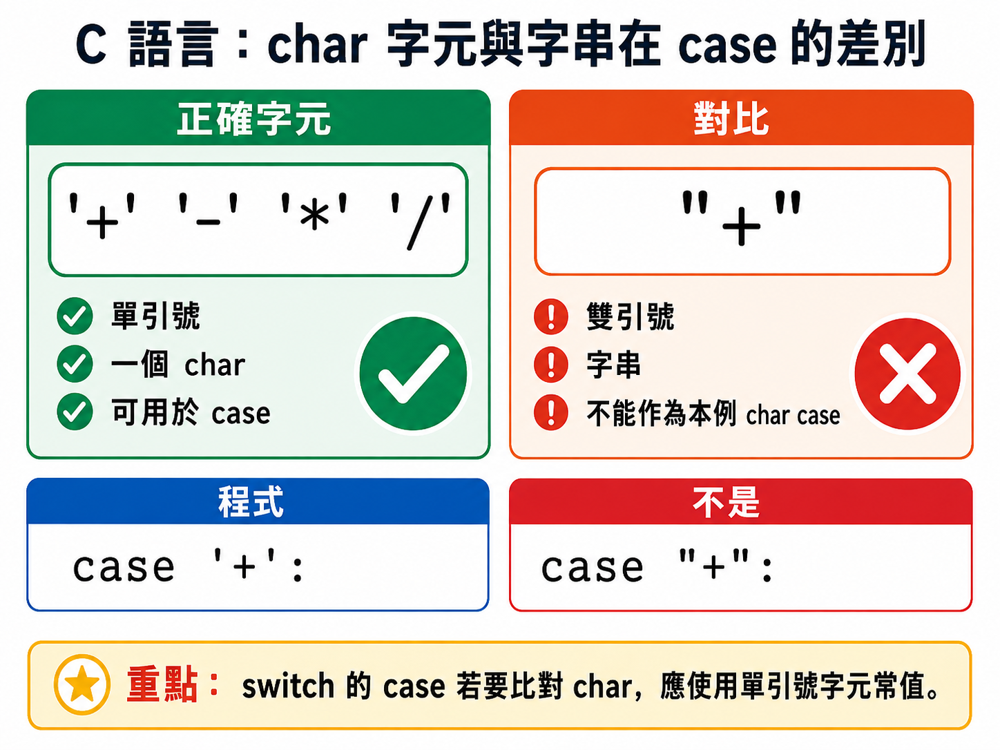
</p>

錯誤：

```c
case "+":
```

正確：

```c
case '+':
```

---

### 錯誤 12：嘗試用 `switch` 判斷範圍

錯誤概念：

```c
case score >= 60:
```

應改用：

```c
if (score >= 60) {
    ...
}
```

---

### 錯誤 13：`scanf("%c", ...)` 讀到換行

較安全的寫法：

```c
scanf(" %c", &operator);
```

格式字串中的前導空白可略過空白字元。

---

### 錯誤 14：把刻意共用 case 當成每個 case 都要加 break

下面的結構是正確的：

```c
case 2:
case 3:
case 4:
    printf("John\n");
    break;
```

如果在 `case 2` 後立刻加 `break`，`2` 就無法到達共同程式碼。

---

## Section XIII. Mermaid 流程圖

### 1. `if-else` 的基本流程

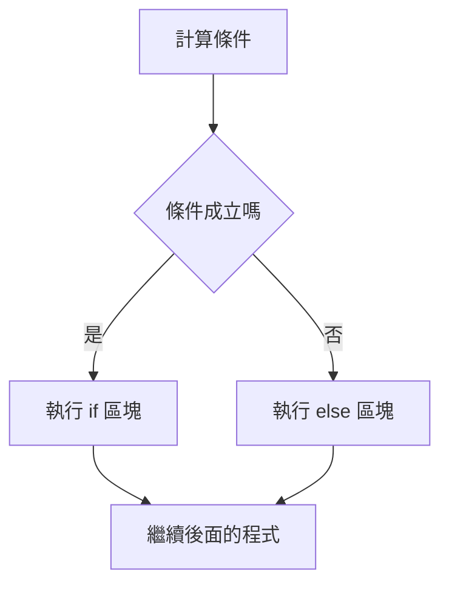
```mermaid
flowchart TD
    A[計算條件] --> B{條件成立嗎}
    B -- 是 --> C[執行 if 區塊]
    B -- 否 --> D[執行 else 區塊]
    C --> E[繼續後面的程式]
    D --> E
```

---

### 2. 猜數字的三種結果

<!-- lesson-image: C_Lesson_07_img06_compare_three_outcomes.png -->
<p align="center">
  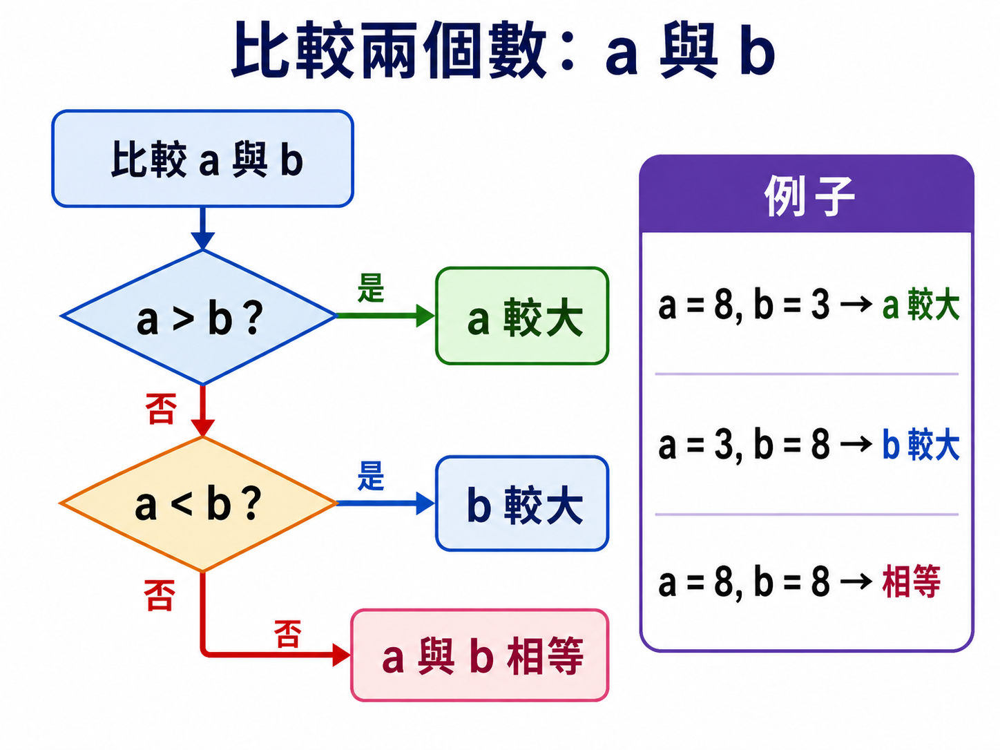
</p>

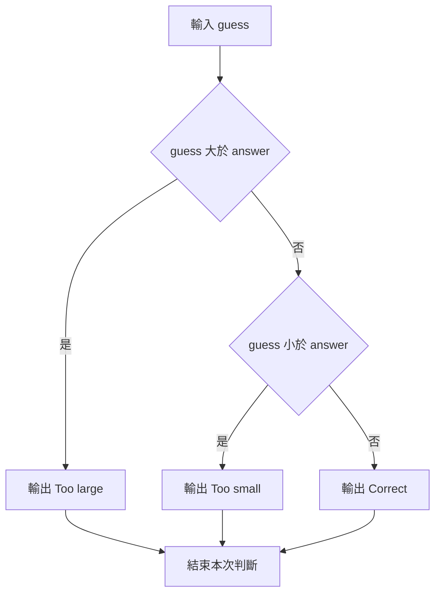
```mermaid
flowchart TD
    A[輸入 guess] --> B{guess 大於 answer}
    B -- 是 --> C[輸出 Too large]
    B -- 否 --> D{guess 小於 answer}
    D -- 是 --> E[輸出 Too small]
    D -- 否 --> F[輸出 Correct]
    C --> G[結束本次判斷]
    E --> G
    F --> G
```

---

### 3. 四則運算的 `else if` 條件鏈

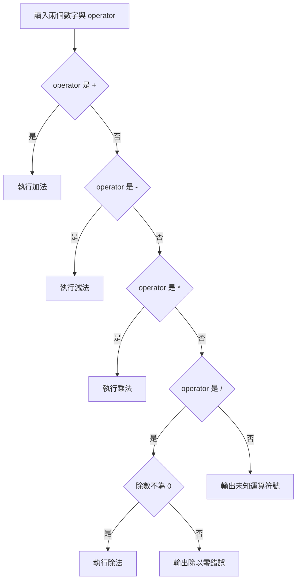
```mermaid
flowchart TD
    A[讀入兩個數字與 operator] --> B{operator 是 +}
    B -- 是 --> C[執行加法]
    B -- 否 --> D{operator 是 -}
    D -- 是 --> E[執行減法]
    D -- 否 --> F{operator 是 *}
    F -- 是 --> G[執行乘法]
    F -- 否 --> H{operator 是 /}
    H -- 是 --> I{除數不為 0}
    I -- 是 --> J[執行除法]
    I -- 否 --> K[輸出除以零錯誤]
    H -- 否 --> L[輸出未知運算符號]
```

---

### 4. `switch` 的基本流程

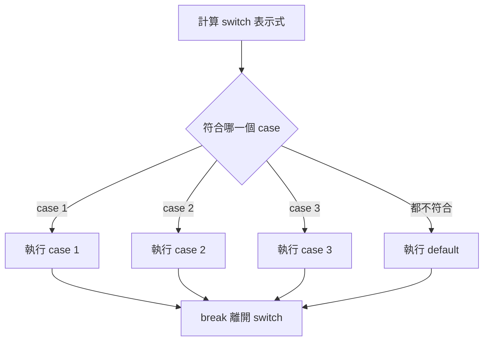
```mermaid
flowchart TD
    A[計算 switch 表示式] --> B{符合哪一個 case}
    B -- case 1 --> C[執行 case 1]
    B -- case 2 --> D[執行 case 2]
    B -- case 3 --> E[執行 case 3]
    B -- 都不符合 --> F[執行 default]
    C --> G[break 離開 switch]
    D --> G
    E --> G
    F --> G
```

---

### 5. ID 查詢

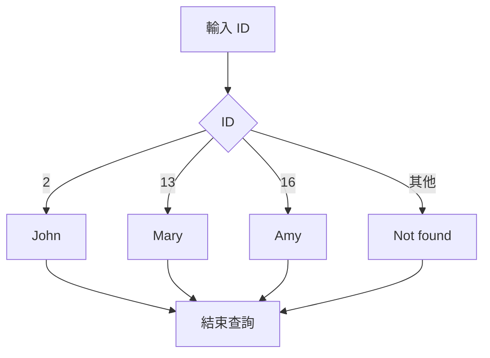
```mermaid
flowchart TD
    A[輸入 ID] --> B{ID}
    B -- 2 --> C[John]
    B -- 13 --> D[Mary]
    B -- 16 --> E[Amy]
    B -- 其他 --> F[Not found]
    C --> G[結束查詢]
    D --> G
    E --> G
    F --> G
```

---

### 6. 商品代號與價格

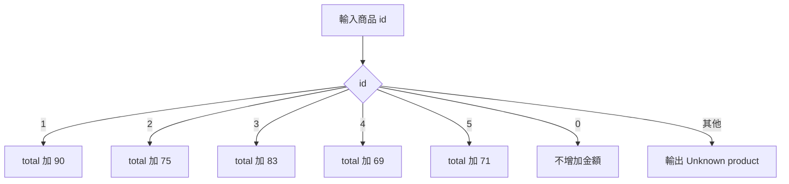
```mermaid
flowchart TD
    A[輸入商品 id] --> B{id}
    B -- 1 --> C[total 加 90]
    B -- 2 --> D[total 加 75]
    B -- 3 --> E[total 加 83]
    B -- 4 --> F[total 加 69]
    B -- 5 --> G[total 加 71]
    B -- 0 --> H[不增加金額]
    B -- 其他 --> I[輸出 Unknown product]
```

---

## 本章完成標準

完成本章後，你應該能做到：

1. 正確寫出 `if-else`。
2. 說明為什麼一組 `if-else` 只會執行一個分支。
3. 分辨多個獨立 `if` 與 `else if` 條件鏈。
4. 使用巢狀條件或 `else if` 處理三種以上結果。
5. 安排條件順序，避免較寬鬆條件先攔截資料。
6. 完成 PASS／FAIL、比大小與猜數字程式。
7. 完成有除以零檢查的簡易計算器。
8. 使用 `if-else` 找出兩個或三個數字的最大值。
9. 正確寫出 `switch`、`case`、`break` 與 `default`。
10. 說明漏寫 `break` 會發生什麼事。
11. 使用多個 case 共用同一段程式碼。
12. 使用 `switch` 完成 ID、選單與商品代號查詢。
13. 判斷一個問題較適合 `if-else` 還是 `switch`。
14. 閱讀含有 `switch` 的消費金額累加程式。
15. 能用不同輸入測試每一個分支與錯誤處理。
