# Lesson 8：while and do-while Loops while 與 do-while 迴圈

<!-- lesson-image: C_Lesson_08_img17_while_vs_do_while.png -->
<p align="center">
  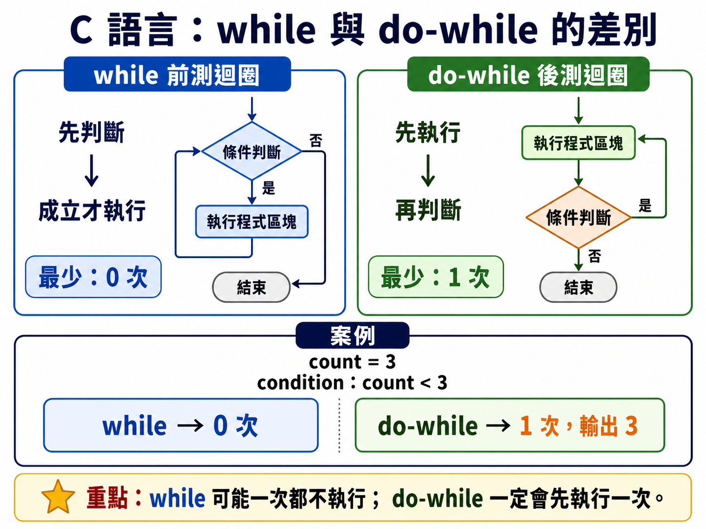
</p>

> 這堂課的重點：讓程式在條件成立時重複執行工作，並學會使用計數器、累加器與結束值，處理「次數未知」或「至少要做一次」的問題。

---

## Section I. 今天要做什麼？

1. 理解為什麼只使用 `if` 無法完成重複工作。
2. 從「猜一次」改成「猜到正確為止」。
3. 認識 `while` 的基本語法。
4. 理解 `while` 會先判斷條件，再決定是否執行。
5. 比較 `if` 與 `while` 的差異。
6. 認識迴圈中的初始化、條件與更新。

<!-- lesson-image: C_Lesson_08_img03_loop_three_parts.png -->
<p align="center">
  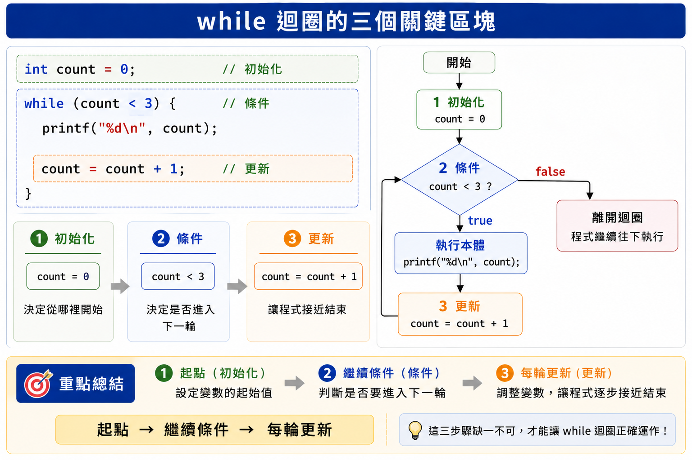
</p>
7. 理解缺少更新可能造成無窮迴圈。
8. 使用 `while` 印出連續整數。
9. 將固定終點改成使用者輸入的 `N`。
10. 將固定起點與終點改成使用者輸入的 `M` 與 `N`。
11. 使用 `while` 讓猜數字程式重複讀取輸入。
12. 使用計數器記錄總共猜了幾次。
13. 理解計數器應該在哪個位置增加。
14. 使用特殊結束值控制不定次數的輸入。

<!-- lesson-image: C_Lesson_08_img12_sentinel_input_pattern.png -->
<p align="center">
  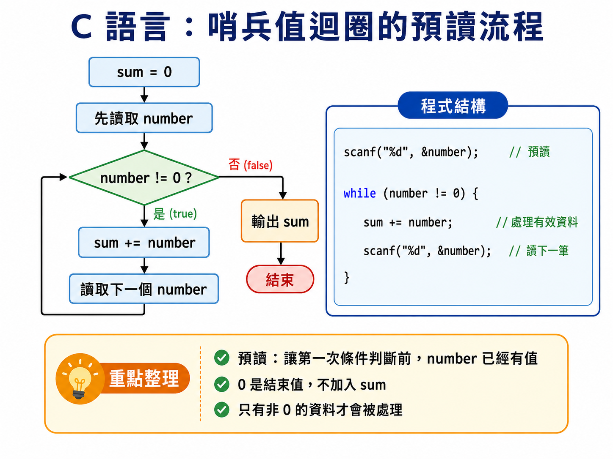
</p>
15. 使用累加器計算不定個數正整數的總和。
16. 同時使用累加器與計數器計算平均。
17. 理解結束值不應加入總和或筆數。
18. 認識 `do-while` 的基本語法。
19. 理解 `do-while` 至少會執行一次。
20. 比較 `while` 與 `do-while` 的適用情境。
21. 使用 `do-while` 改寫猜數字程式。
22. 使用追蹤表找出 off-by-one 錯誤。

<!-- lesson-image: C_Lesson_08_img20_off_by_one_checklist.png -->
<p align="center">
  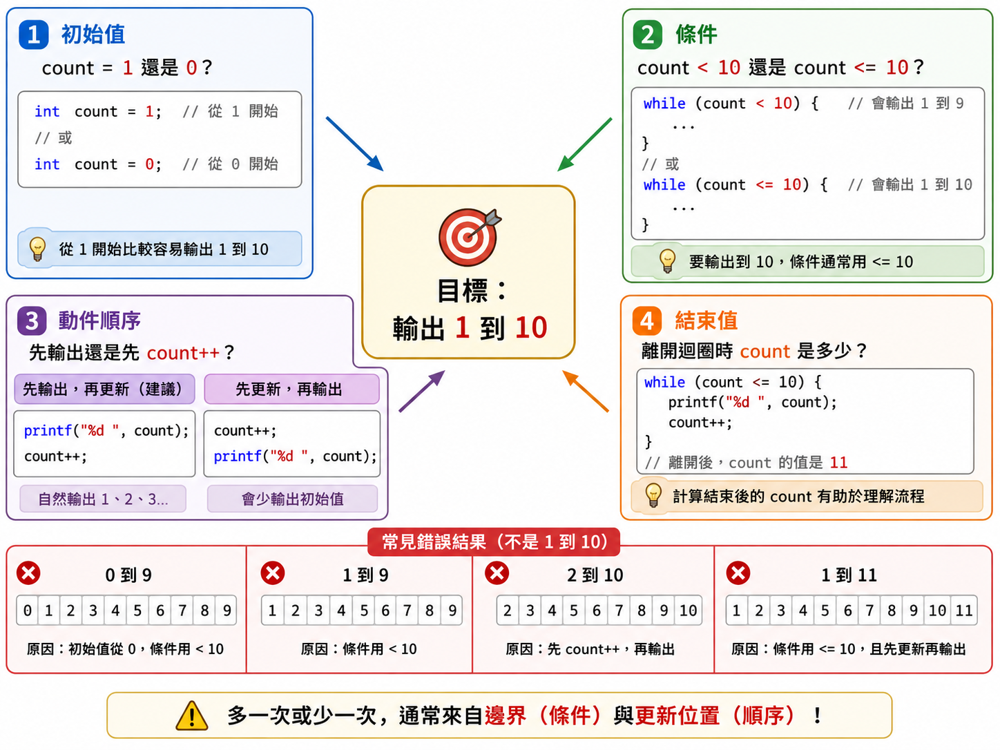
</p>
23. 能測試第一次就猜對、輸入結束值及零筆資料等邊界情況。
24. 為下一章的 `for` 迴圈建立「起點、終點、更新」概念。

---

## Section II. 今天的學習方式

1. 先找出「哪一段工作需要重複」。
2. 再決定「什麼條件成立時要繼續」。
3. 確認條件中使用的變數在第一次判斷前已有值。
4. 在迴圈內安排能改變條件的更新。
5. 每次追蹤一輪：判斷、執行、更新、回到條件。
6. 遇到計數問題時，先寫出第一個值與最後一個值。
7. 遇到不定次數輸入時，先決定結束值。
8. 遇到總和問題時，準備從 `0` 開始的累加器。
9. 遇到平均問題時，同時記錄總和與有效資料筆數。
10. 寫完後測試零次、一次、多次及剛好在邊界的情況。
11. 本章先使用 `while` 與 `do-while`；`for` 會在下一章正式學習。
12. 本章不正式教授 `break` 與 `continue`，避免和後面的迴圈控制內容重複。

---

## Section III. 今天會學到的內容

| 主題 | 你需要知道的事 |
| --- | --- |
| 重複執行 | 同一段程式碼可能需要執行多次 |
| `while` | 先判斷條件，成立才執行迴圈本體 |
| 前測迴圈 | 條件一開始不成立時，可能一次也不執行 |
| `do-while` | 先執行本體，再判斷是否重複 |
| 後測迴圈 | 不論初始條件如何，至少執行一次 |
| 初始化 | 在第一次判斷前設定控制變數 |
| 條件 | 決定是否繼續下一輪 |
| 更新 | 改變控制變數，使迴圈有機會結束 |
| 無窮迴圈 | 條件一直成立，程式無法正常離開 |
| 計數器 | 記錄次數或產生連續數字 |
| 累加器 | 將每次輸入或計算結果加到目前總和 |
| 結束值 | 只用來通知程式停止，不屬於有效資料 |
| 預讀 | 進入 `while` 前先讀取第一筆資料 |
| 重複讀取 | 在迴圈尾端讀取下一筆資料 |
| 平均 | 總和除以有效資料筆數 |
| 型態轉換 | 避免整數除法截去小數 |
| 邊界值 | `<`、`<=` 會決定最後一個值是否包含 |
| off-by-one | 多做一次或少做一次的常見錯誤 |

---

## Section IV. 寫題目前的提醒

### 1. `while` 不是只判斷一次

```c
while (condition) {
    statements;
}
```

只要 `condition` 仍然成立，程式就會再次執行 `statements`。

---

### 2. `while` 可能一次也不執行

```c
int count = 10;

while (count < 3) {
    printf("%d\n", count);
}
```

第一次判斷時：

```c
10 < 3
```

已經是假，因此迴圈本體執行 `0` 次。

---

### 3. 條件中使用的變數要先有值

危險寫法：

```c
int guess;

while (guess != answer) {
    scanf("%d", &guess);
}
```

第一次檢查 `guess != answer` 時，`guess` 尚未取得輸入值。

可以先讀取一次：

```c
scanf("%d", &guess);

while (guess != answer) {
    ...
    scanf("%d", &guess);
}
```

也可以改用本章後半的 `do-while`。

---

### 4. 迴圈內通常需要更新

```c
int count = 0;

while (count < 3) {
    printf("%d\n", count);
}
```

`count` 一直都是 `0`，所以條件永遠成立。

應加入更新：

```c
count = count + 1;
```

---

### 5. 不要在 `while` 條件後面誤加分號

錯誤：

```c
while (count <= 10);
{
    printf("%d\n", count);
    count++;
}
```

分號形成一個空的迴圈本體。真正的大括號區塊不再由 `while` 控制。

正確：

```c
while (count <= 10) {
    printf("%d\n", count);
    count++;
}
```

---

### 6. `<` 與 `<=` 會改變是否包含終點

<!-- lesson-image: C_Lesson_08_img06_less_than_vs_less_equal.png -->
<p align="center">
  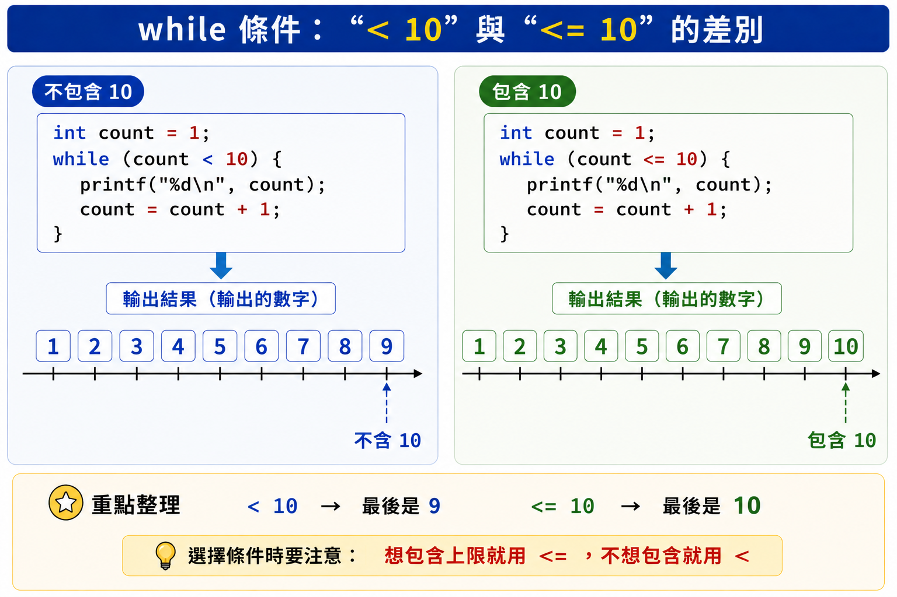
</p>

```c
while (count < 10)
```

若從 `1` 開始，最後印出 `9`。

```c
while (count <= 10)
```

若從 `1` 開始，最後印出 `10`。

---

### 7. 更新放在輸出前或輸出後，結果不同

先輸出，再更新：

<!-- lesson-image: C_Lesson_08_img07_print_before_vs_after_update.png -->
<p align="center">
  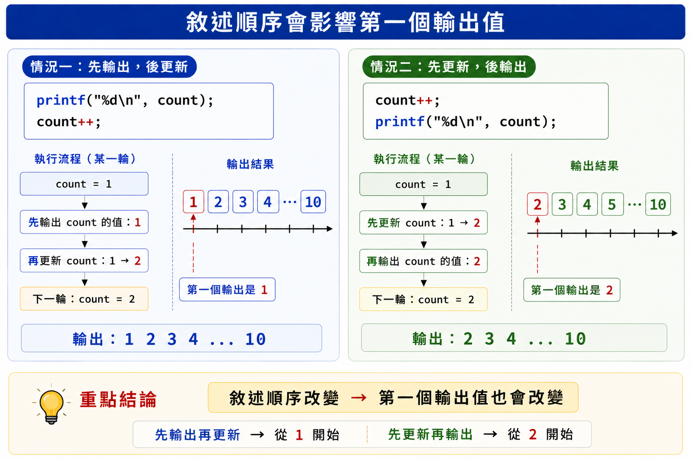
</p>

```c
printf("%d\n", count);
count++;
```

先更新，再輸出：

```c
count++;
printf("%d\n", count);
```

兩者的第一個輸出值不同。

---

### 8. 猜數字時，每一輪都要讀到新的猜測

如果輸入只寫在迴圈外：

```c
scanf("%d", &guess);

while (guess != answer) {
    printf("Try again\n");
}
```

`guess` 不會改變，猜錯後就可能一直重複。

---

### 9. 計數器增加的位置要和「一次」的定義一致

如果「每輸入一個猜測」算一次，則每次 `scanf()` 成功取得猜測後，都應增加：

```c
count++;
```

包括第一次輸入及最後猜對的那一次。

---

### 10. 累加器要先初始化為 `0`

<!-- lesson-image: C_Lesson_08_img13_accumulator_process.png -->
<p align="center">
  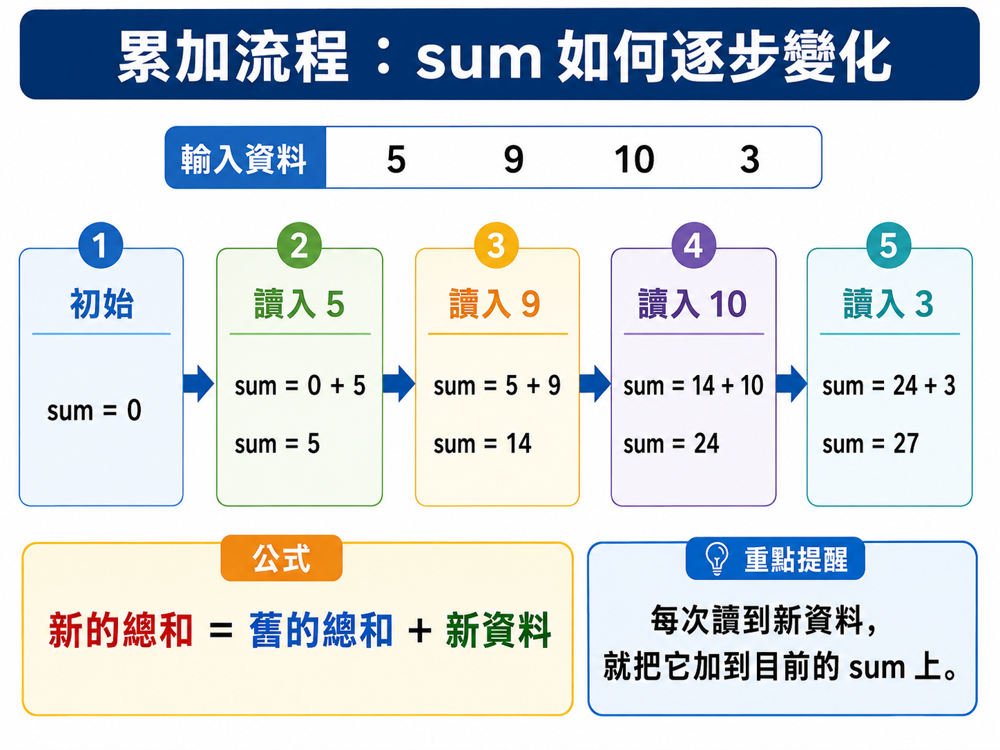
</p>

```c
int sum = 0;
```

如果沒有初始化，`sum` 的起始內容不確定，累加結果也不可靠。

---

### 11. 結束值不應加入總和

題目規定輸入 `0` 結束時：

```c
while (number != 0) {
    sum += number;
    scanf("%d", &number);
}
```

只有非零資料會被加入總和。

---

### 12. 平均需要總和與筆數

<!-- lesson-image: C_Lesson_08_img15_average_sum_count.png -->
<p align="center">
  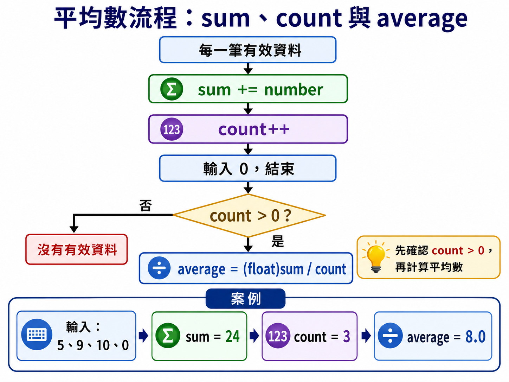
</p>

```c
average = (float)sum / count;
```

只知道總和，還不能計算平均；還要知道有效輸入有幾筆。

---

### 13. 平均要避免整數除法

錯誤：

```c
average = sum / count;
```

如果 `sum` 和 `count` 都是 `int`，會先做整數除法。

正確：

```c
average = (float)sum / count;
```

---

### 14. 零筆資料時不能直接計算平均

<!-- lesson-image: C_Lesson_08_img16_zero_data_average_guard.png -->
<p align="center">
  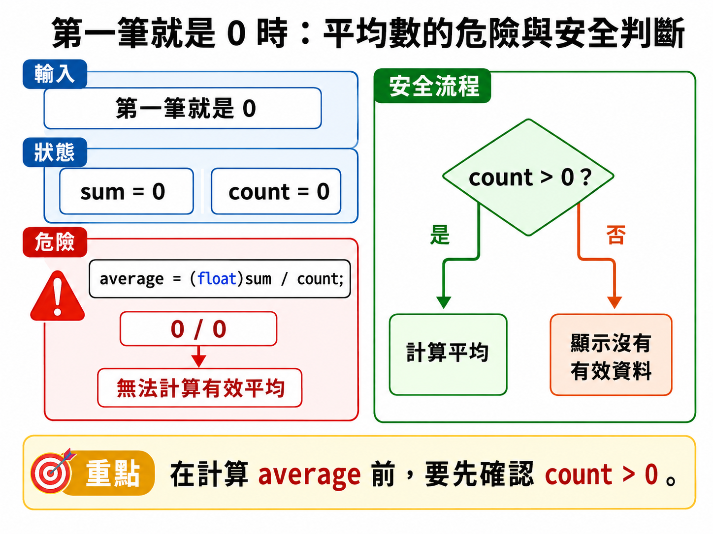
</p>

來源範例顯示：如果使用者一開始就輸入 `0`，畫面可能出現 `N/A`，因為沒有有效資料可以相除。

較安全的教材寫法：

```c
if (count > 0) {
    average = (float)sum / count;
    printf("The average is %f\n", average);
} else {
    printf("No positive integers were entered.\n");
}
```

---

### 15. `do-while` 最後有分號

```c
do {
    statements;
} while (condition);
```

這個分號是 `do-while` 語法的一部分。

---

### 16. `do-while` 一定會先做一次

```c
int count = 3;

do {
    printf("%d\n", count);
    count++;
} while (count < 3);
```

雖然第一次檢查時條件會是假，但檢查發生在本體執行之後，因此仍會輸出一次 `3`。

---

### 17. `while` 條件通常描述「繼續的條件」

猜數字時：

```c
while (guess != answer)
```

表示：

> 只要還沒有猜對，就繼續。

不是：

> 猜對時繼續。

---

### 18. 本章不要依賴 `break` 提前離開

來源下一個主題才會介紹 `break` 與 `continue`。

因此本章練習應優先讓迴圈條件本身清楚表達停止規則。

---

## Section V. 核心概念說明

### 1. 為什麼需要迴圈？

上一章的猜數字程式只能猜一次：

```c
printf("Please enter your guess: ");
scanf("%d", &guess);

if (guess > answer) {
    printf("Too large!\n");
} else if (guess < answer) {
    printf("Too small!\n");
} else {
    printf("Correct!\n");
}
```

如果猜錯，程式便結束。

需求改成：

> 讓使用者一直猜，直到猜對為止。

就需要重複執行「輸入、比較、提示」這一段工作。

---

### 2. 為什麼不能一直複製程式碼？

可以複製兩次：

```c
/* 猜第一次 */
...

/* 猜第二次 */
...
```

也可以再複製第三次，但仍有問題：

1. 不知道使用者會猜幾次。
2. 程式碼大量重複。
3. 修改規則時，每一份都要修改。
4. 即使複製很多次，也可能仍然猜不到。

迴圈讓同一段程式碼依條件重複，不需要事先知道確切次數。

---

### 3. `if` 與 `while` 的差異

<!-- lesson-image: C_Lesson_08_img01_if_vs_while.png -->
<p align="center">
  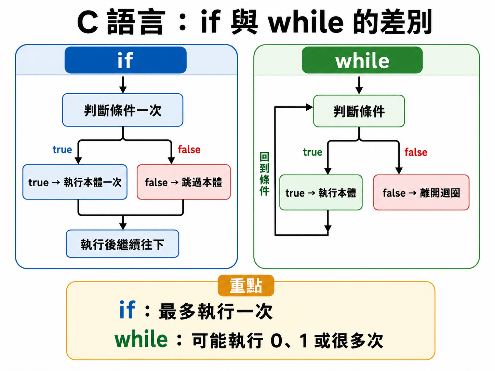
</p>

`if`：

```c
if (condition) {
    statements;
}
```

流程：

1. 判斷一次。
2. 成立時執行一次。
3. 然後繼續往下。

`while`：

```c
while (condition) {
    statements;
}
```

流程：

1. 判斷條件。
2. 成立時執行本體。
3. 回到條件再次判斷。
4. 直到條件不成立才離開。

---

### 4. `while` 的基本語法

<!-- lesson-image: C_Lesson_08_img02_while_syntax_cycle.png -->
<p align="center">
  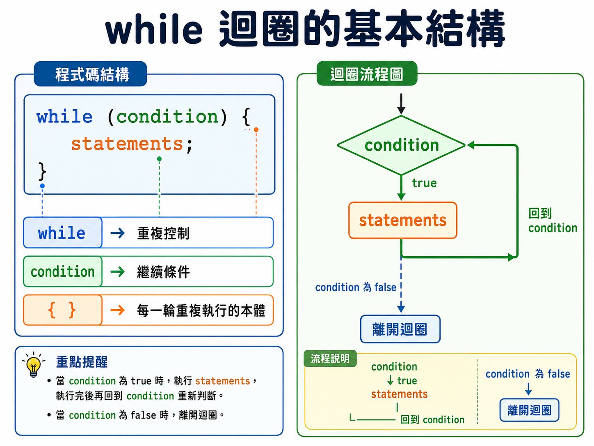
</p>

```c
while (表示式) {
    程式片段;
}
```

當表示式為真時，執行程式片段。

執行完後，不是直接離開，而是回到 `while` 條件重新判斷。

---

### 5. `while` 的執行流程

```text
判斷條件
   ↓
成立嗎？
 ├─ 否 → 離開迴圈
 └─ 是 → 執行本體
             ↓
          回到條件
```

因此條件可能被檢查很多次。

---

### 6. 第一個 `while`：印出 0、1、2

```c
#include <stdio.h>

int main(void) {
    int count = 0;

    while (count < 3) {
        printf("%d\n", count);
        count = count + 1;
    }

    return 0;
}
```

執行追蹤：

| 輪次 | 判斷前 `count` | `count < 3` | 輸出 | 更新後 |
| ---: | ---: | --- | ---: | ---: |
| 1 | 0 | 真 | 0 | 1 |
| 2 | 1 | 真 | 1 | 2 |
| 3 | 2 | 真 | 2 | 3 |
| 結束檢查 | 3 | 假 | 不執行 | 3 |

迴圈結束後，`count` 是 `3`。

---

### 7. 迴圈的三個重要部分

以印出 `0` 到 `2` 為例：

```c
int count = 0;          /* 初始化 */

while (count < 3) {     /* 條件 */
    printf("%d\n", count);
    count = count + 1;  /* 更新 */
}
```

| 部分 | 作用 |
| --- | --- |
| 初始化 | 決定從哪裡開始 |
| 條件 | 決定何時繼續 |
| 更新 | 讓狀態逐步接近結束 |

---

### 8. 缺少更新會發生什麼？

```c
int count = 0;

while (count < 3) {
    printf("%d\n", count);
}
```

每一輪：

- `count` 都是 `0`
- `count < 3` 都成立
- 不斷輸出 `0`

這是無窮迴圈。

程式沒有當機，它只是一直按照目前規則執行。

---

### 9. 印出 1 到 10

```c
#include <stdio.h>

int main(void) {
    int count = 1;

    while (count <= 10) {
        printf("%d\n", count);
        count = count + 1;
    }

    return 0;
}
```

三個部分：

| 部分 | 內容 |
| --- | --- |
| 起點 | `count = 1` |
| 繼續條件 | `count <= 10` |
| 每輪更新 | `count = count + 1` |

---

### 10. 為什麼條件是 `<= 10`？

題目要求包括 `10`。

當 `count == 10` 時：

```c
count <= 10
```

仍然成立，因此會輸出 `10`。

更新成 `11` 後：

```c
11 <= 10
```

不成立，離開迴圈。

---

### 11. 印出 1 到 100

只需要把終點改成 `100`：

```c
int count = 1;

while (count <= 100) {
    printf("%d\n", count);
    count++;
}
```

這顯示迴圈的好處：重複次數增加時，程式碼不需要跟著增加很多行。

---

### 12. 印出 1 到 N

```c
#include <stdio.h>

int main(void) {
    int n;
    int count = 1;

    printf("Please enter the number: ");
    scanf("%d", &n);

    while (count <= n) {
        printf("%d\n", count);
        count++;
    }

    return 0;
}
```

輸入 `5`：

```text
1
2
3
4
5
```

---

### 13. 印出 M 到 N

```c
#include <stdio.h>

int main(void) {
    int m;
    int n;
    int count;

    printf("Please enter the number M: ");
    scanf("%d", &m);

    printf("Please enter the number N: ");
    scanf("%d", &n);

    count = m;

    while (count <= n) {
        printf("%d\n", count);
        count++;
    }

    return 0;
}
```

題目假設：

```text
M <= N
```

起點由固定的 `1` 改為 `m`，終點由固定數字改為 `n`。

---

### 14. 更新與輸出的順序

程式 A：

```c
int count = 1;

while (count <= 10) {
    printf("%d\n", count);
    count++;
}
```

輸出：

```text
1 到 10
```

程式 B：

```c
int count = 1;

while (count < 10) {
    count++;
    printf("%d\n", count);
}
```

輸出：

```text
2 到 10
```

條件看起來相似，但更新位置改變了第一個輸出值。

---

### 15. 猜數字：先讀取第一個猜測

```c
#include <stdio.h>

int main(void) {
    int answer = 4;
    int guess;

    printf("Please enter your guess: ");
    scanf("%d", &guess);

    while (guess != answer) {
        if (guess > answer) {
            printf("Too large!\n");
        } else {
            printf("Too small!\n");
        }

        printf("Please enter your guess: ");
        scanf("%d", &guess);
    }

    printf("Correct!\n");

    return 0;
}
```

這種寫法稱為「預讀」：

1. 進入迴圈前先讀一次。

<!-- lesson-image: C_Lesson_08_img08_priming_read_while.png -->
<p align="center">
  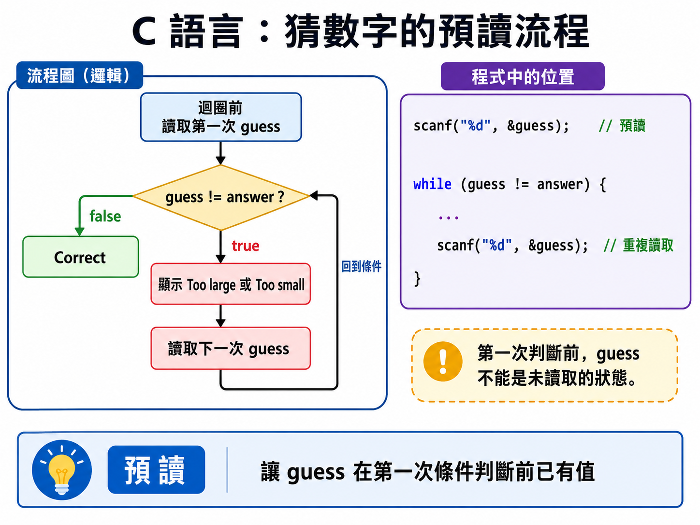
</p>
2. 條件可以安全使用 `guess`。
3. 每輪尾端再讀取下一筆。
4. 猜對後條件為假，離開迴圈。
5. 離開後輸出 `Correct!`。

---

### 16. 為什麼迴圈內不用再判斷相等？

迴圈條件是：

```c
while (guess != answer)
```

能進入迴圈就表示：

```c
guess != answer
```

因此迴圈內只需要分成：

- `guess > answer`
- 其餘就是 `guess < answer`

猜對時不進入本體，而是直接離開。

---

### 17. 猜數字的執行追蹤

<!-- lesson-image: C_Lesson_08_img04_while_trace_0_to_2.png -->
<p align="center">
  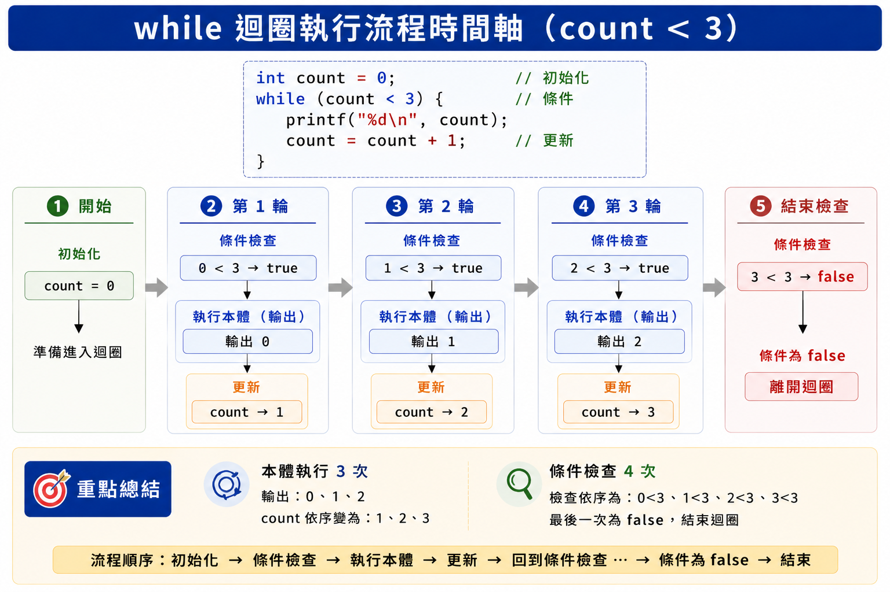
</p>

答案為 `4`，輸入依序是 `5`、`3`、`4`：

| 輸入 | 條件 `guess != answer` | 本體結果 |
| ---: | --- | --- |
| 5 | 真 | `Too large!`，再讀一次 |
| 3 | 真 | `Too small!`，再讀一次 |
| 4 | 假 | 離開迴圈 |
| 離開後 | - | 輸出 `Correct!` |

---

### 18. 加入猜測次數

```c
#include <stdio.h>

int main(void) {
    int answer = 4;
    int guess;
    int count = 0;

    printf("Please enter your guess: ");
    scanf("%d", &guess);
    count = count + 1;

    while (guess != answer) {
        if (guess > answer) {
            printf("Too large!\n");
        } else {
            printf("Too small!\n");
        }

        printf("Please enter your guess: ");
        scanf("%d", &guess);
        count = count + 1;
    }

    printf("Correct! (%d)\n", count);

    return 0;
}
```

每完成一次猜測輸入，`count` 就增加一次。

---

### 19. 為什麼第一次輸入後也要增加？

如果只在迴圈內增加：

```c
while (guess != answer) {
    ...
    scanf("%d", &guess);
    count++;
}
```

第一次輸入沒有被計算。

如果第一次就猜對，迴圈完全不執行，次數可能錯誤地顯示為 `0`。

---

### 20. 另一種第一次執行策略

來源也展示了利用短路求值，讓第一次尚未有 `guess` 時仍能進入本體：

```c
int count = 0;

while (count == 0 || guess != answer) {
    scanf("%d", &guess);
    count++;

    if (guess > answer) {
        printf("Too large!\n");
    } else if (guess < answer) {
        printf("Too small!\n");
    }
}
```

第一次檢查時：

```c
count == 0
```

成立，因此 `||` 右邊不需要計算。

這個寫法能運作，但對初學者而言，`do-while` 通常更直接地表達「至少先猜一次」。

---

### 21. 不定個數輸入與結束值

題目：

> 使用者連續輸入正整數，輸入 `0` 時停止。

程式事先不知道會輸入幾個數字，因此不能使用固定次數。

`0` 稱為結束值或哨兵值：

<!-- lesson-image: C_Lesson_08_img11_sentinel_value.png -->
<p align="center">
  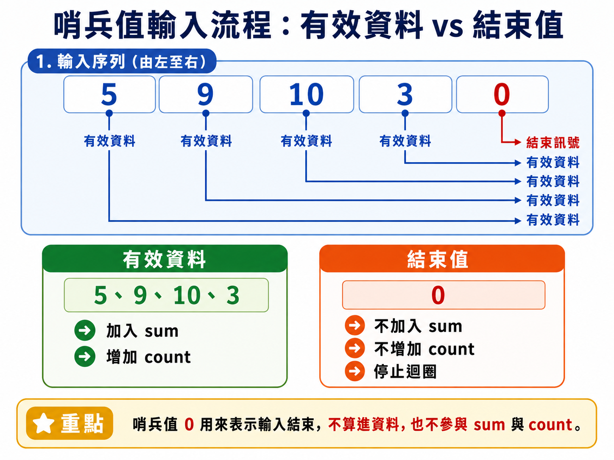
</p>

- 它通知程式停止。
- 它不是有效資料。
- 它不應加入總和。
- 它不應增加有效資料筆數。

---

### 22. 求不定個數正整數的總和

```c
#include <stdio.h>

int main(void) {
    int number;
    int sum = 0;

    printf("Please enter the numbers (0: quit):\n");
    scanf("%d", &number);

    while (number != 0) {
        sum = sum + number;
        scanf("%d", &number);
    }

    printf("The sum is %d.\n", sum);

    return 0;
}
```

輸入：

```text
5
9
10
3
7
2
0
```

總和：

```text
36
```

---

### 23. 總和程式的追蹤

| 輸入 `number` | 是否進入迴圈 | 更新後 `sum` |
| ---: | --- | ---: |
| 5 | 是 | 5 |
| 9 | 是 | 14 |
| 10 | 是 | 24 |
| 3 | 是 | 27 |
| 7 | 是 | 34 |
| 2 | 是 | 36 |
| 0 | 否 | 36 |

`0` 只負責結束，不會加入總和。

---

### 24. 累加器是什麼？

累加器保存「目前累積到的結果」。

```c
sum = sum + number;
```

可以理解成：

> 新的總和 = 舊的總和 + 新輸入的數字

累加器通常從加法的單位元素 `0` 開始：

```c
int sum = 0;
```

---

### 25. 求不定個數正整數的平均

平均需要：

```text
平均 = 總和 ÷ 筆數
```

因此除了 `sum`，還需要 `count`。

```c
#include <stdio.h>

int main(void) {
    int number;
    int sum = 0;
    int count = 0;
    float average;

    printf("Please enter the numbers (0: quit):\n");
    scanf("%d", &number);

    while (number != 0) {
        sum = sum + number;
        count = count + 1;
        scanf("%d", &number);
    }

    if (count > 0) {
        average = (float)sum / count;
        printf("The average is %f\n", average);
    } else {
        printf("No positive integers were entered.\n");
    }

    return 0;
}
```

---

### 26. 為什麼要做型態轉換？

如果：

```c
sum = 36;
count = 6;
```

平均剛好是整數 `6`。

但若：

```c
sum = 10;
count = 4;
```

真正平均是 `2.5`。

使用：

```c
(float)sum / count
```

可以保留小數部分。

---

### 27. 來源中的零筆資料結果

來源範例直接計算：

```c
average = (float)sum / count;
```

並展示使用者一開始輸入 `0` 時，畫面可能出現：

```text
The average is N/A
```

這表示沒有有效資料可計算平均。

本教材在完整範例中加入：

```c
if (count > 0)
```

讓程式明確處理零筆資料。

---

### 28. 計數器與累加器的差異

<!-- lesson-image: C_Lesson_08_img14_counter_vs_accumulator.png -->
<p align="center">
  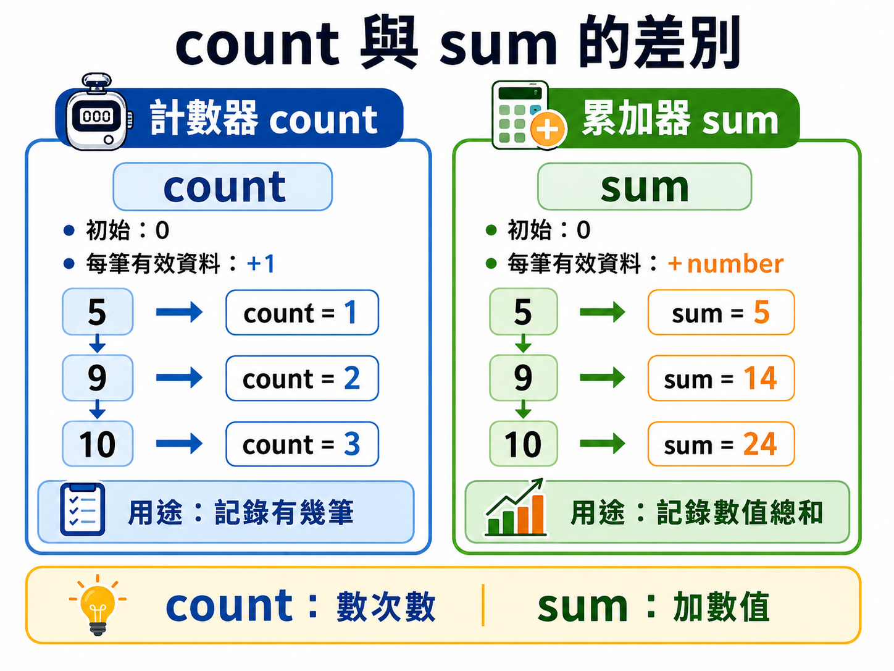
</p>

| 變數 | 初始值 | 每筆資料的更新 | 用途 |
| --- | ---: | --- | --- |
| `count` | 0 | `count = count + 1` | 記錄有效筆數 |
| `sum` | 0 | `sum = sum + number` | 記錄數值總和 |

兩者都會逐輪更新，但保存的資訊不同。

---

### 29. `do-while` 的基本語法

<!-- lesson-image: C_Lesson_08_img18_do_while_syntax.png -->
<p align="center">
  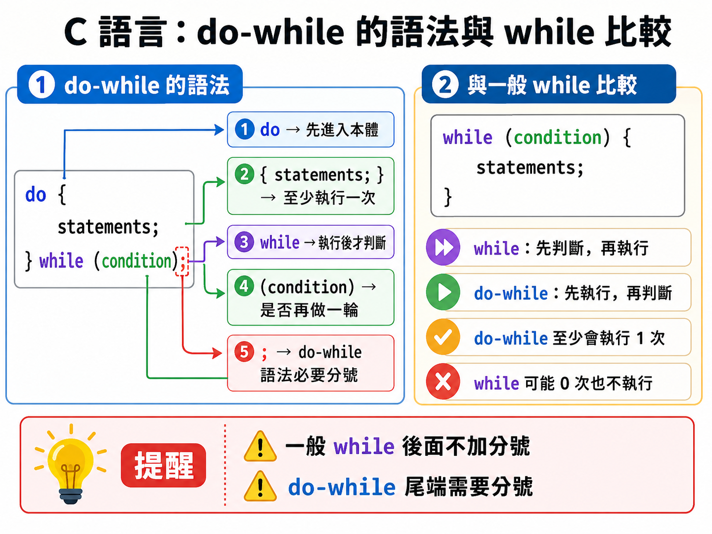
</p>

```c
do {
    程式片段;
} while (表示式);
```

執行順序：

1. 先執行程式片段。
2. 再計算表示式。
3. 成立時回到 `do` 再執行一次。
4. 不成立時離開。

---

### 30. `while` 與 `do-while` 的關鍵差異

`while`：

```c
while (condition) {
    body;
}
```

先檢查，因此可能執行 `0` 次。

`do-while`：

```c
do {
    body;
} while (condition);
```

先執行，因此至少執行 `1` 次。

---

### 31. 相同條件，不同結果

`while`：

```c
int count = 3;

while (count < 3) {
    printf("%d\n", count);
    count++;
}
```

輸出：

```text
沒有輸出
```

`do-while`：

```c
int count = 3;

do {
    printf("%d\n", count);
    count++;
} while (count < 3);
```

輸出：

```text
3
```

---

### 32. 使用 `do-while` 完成猜數字

<!-- lesson-image: C_Lesson_08_img19_do_while_guessing.png -->
<p align="center">
  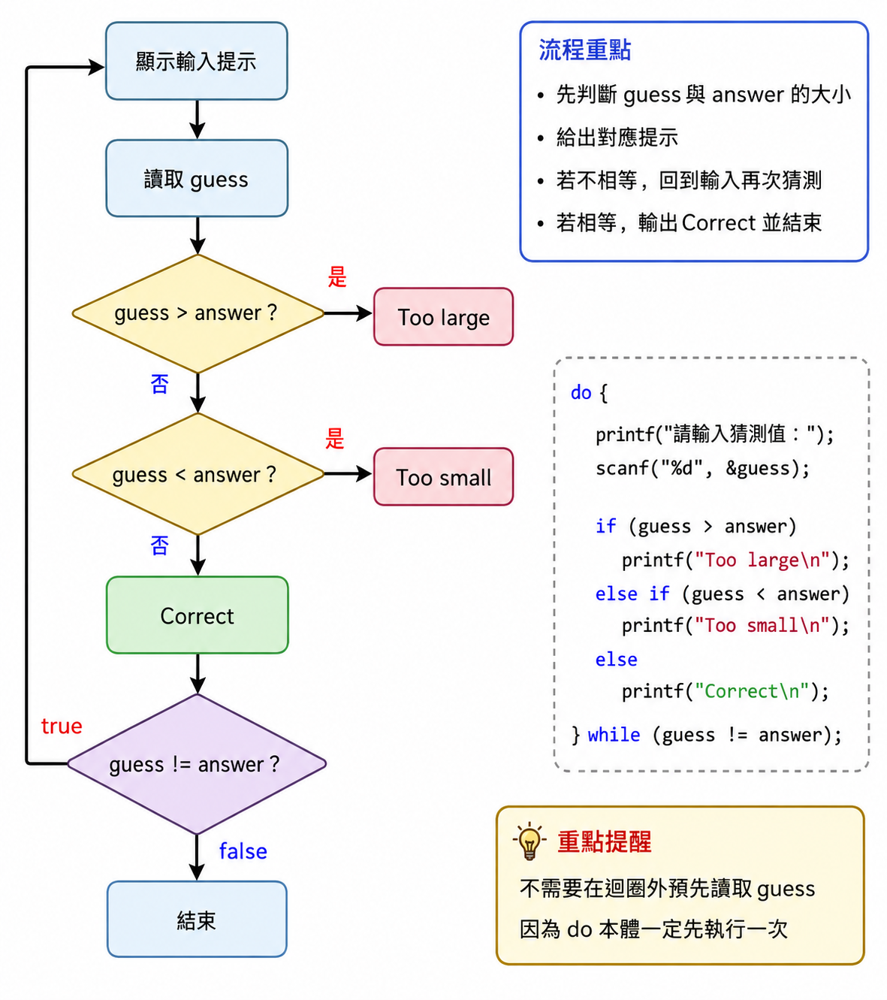
</p>

```c
#include <stdio.h>

int main(void) {
    int answer = 4;
    int guess;

    do {
        printf("Please enter your guess: ");
        scanf("%d", &guess);

        if (guess > answer) {
            printf("Too large!\n");
        } else if (guess < answer) {
            printf("Too small!\n");
        } else {
            printf("Correct!\n");
        }
    } while (guess != answer);

    return 0;
}
```

這個問題至少需要輸入一次，因此 `do-while` 很自然。

---

### 33. `do-while` 猜數字的流程

1. 顯示提示。
2. 讀取猜測。
3. 顯示太大、太小或正確。
4. 檢查 `guess != answer`。
5. 還沒猜對就再做一輪。
6. 猜對時條件為假，離開迴圈。

---

### 34. `while` 與 `do-while` 的選擇

| 情境 | 較自然的寫法 |
| --- | --- |
| 資料可能一筆也沒有 | `while` |
| 先判斷檔案或輸入狀態 | `while` |
| 一定要先顯示一次選單 | `do-while` |
| 一定要先輸入一次猜測 | `do-while` |
| 已經在迴圈前取得第一筆資料 | `while` |
| 使用結束值讀取後續資料 | `while` 或 `do-while`，視結構而定 |

---

## Section V-A. 容易搞混的重點

### 1. `while` 不是 `if`

`if` 最多執行本體一次。

`while` 可能執行零次、一次或很多次。

---

### 2. 條件成立代表繼續，不一定代表成功

```c
while (guess != answer)
```

條件成立表示「尚未成功，所以繼續」。

---

### 3. 迴圈本體執行次數不等於條件檢查次數

印出 `0`、`1`、`2` 時，本體執行三次。

但條件還會在 `count == 3` 時多檢查一次，確認應該離開。

---

### 4. 迴圈結束時，控制變數通常已超過邊界

```c
int count = 1;

while (count <= 10) {
    count++;
}
```

結束時 `count` 是 `11`，不是 `10`。

---

### 5. `count++` 放錯位置會改變輸出

在輸出後增加，第一個值是初始值。

在輸出前增加，第一個值是初始值加一。

---

### 6. 忘記更新不一定造成編譯錯誤

程式可能成功編譯，但執行後一直重複。

這是流程邏輯錯誤。

---

### 7. 預讀不是多算一筆

預讀只是先取得第一筆資料。

是否計入總和或筆數，仍由後面的條件與更新決定。

---

### 8. 結束值是控制資料，不是一般資料

輸入 `0` 表示停止時：

- 不加到 `sum`
- 不增加 `count`
- 不參與平均

---

### 9. 「輸入次數」與「猜錯次數」不同

若猜三次才答對：

- 輸入次數是 3
- 猜錯次數是 2

題目要先說清楚要計算哪一種。

---

### 10. 平均的 `count` 只計算有效資料

結束值不算。

無效輸入若題目沒有規定，也不應默默算入。

---

### 11. `do-while` 最後的分號不能漏掉

```c
} while (condition);
```

這裡和一般 `while` 不同。

---

### 12. `do-while` 不是永遠只做一次

它至少做一次，之後只要條件成立，仍會繼續重複。

---

### 13. `do-while` 的條件在本體之後判斷

因此本體內產生的 `guess`、`choice` 等值，可以直接供尾端條件使用。

---

### 14. 用 `||` 強迫第一次執行要小心可讀性

```c
while (count == 0 || guess != answer)
```

這個技巧依賴短路求值。

在「至少做一次」的情境下，`do-while` 往往更容易理解。

---

### 15. `for` 不是本章內容

印出連續數字時，`for` 會更精簡。

但本章先用 `while` 分開觀察初始化、條件與更新，下一章再將它們整合。

---

## Section VI. 快速概念檢查

### Q1. `while` 在什麼時候檢查條件？

<details>
<summary>查看答案</summary>

每一輪本體執行之前，包括第一次執行之前。

</details>

---

### Q2. `while` 最少可能執行幾次？

<details>
<summary>查看答案</summary>

`0` 次。

</details>

---

### Q3. `do-while` 最少會執行幾次？

<details>
<summary>查看答案</summary>

`1` 次。

</details>

---

### Q4. 下列程式會輸出幾次？

```c
int count = 0;

while (count < 3) {
    printf("Hi\n");
    count++;
}
```

<details>
<summary>查看答案</summary>

3 次，分別對應 `count` 為 `0`、`1`、`2`。

</details>

---

### Q5. 上一題迴圈結束後，`count` 是多少？

<details>
<summary>查看答案</summary>

`3`。

</details>

---

### Q6. 為什麼下面程式可能無法停止？

```c
int count = 1;

while (count <= 10) {
    printf("%d\n", count);
}
```

<details>
<summary>查看答案</summary>

因為 `count` 沒有更新，永遠保持 `1`，條件一直成立。

</details>

---

### Q7. 要印出 1 到 10，條件應使用 `< 10` 還是 `<= 10`？

<details>
<summary>查看答案</summary>

`<= 10`，因為題目要包含 `10`。

</details>

---

### Q8. 輸入 `0` 結束時，`0` 應該加入總和嗎？

<details>
<summary>查看答案</summary>

不應該。它是結束值，不是有效資料。

</details>

---

### Q9. 計算平均需要哪兩項資訊？

<details>
<summary>查看答案</summary>

有效資料的總和與有效資料筆數。

</details>

---

### Q10. 為什麼平均常寫成 `(float)sum / count`？

<details>
<summary>查看答案</summary>

避免 `sum / count` 先進行整數除法而失去小數部分。

</details>

---

### Q11. 使用者一開始就輸入 `0`，計算平均前要檢查什麼？

<details>
<summary>查看答案</summary>

檢查 `count > 0`，避免用 `0` 當除數。

</details>

---

### Q12. `do-while` 的尾端為什麼有分號？

<details>
<summary>查看答案</summary>

因為 `} while (condition);` 是完整的 `do-while` 語法。

</details>

---

## Section VII. 程式閱讀練習

### 題目 1：執行零次

```c
int count = 5;

while (count < 3) {
    printf("%d\n", count);
    count++;
}
```

請回答：

1. 本體執行幾次？
2. 有沒有輸出？
3. 結束後 `count` 是多少？

<details>
<summary>查看答案</summary>

1. 0 次。
2. 沒有輸出。
3. `count` 仍為 5。

</details>

---

### 題目 2：印出哪些數字？

```c
int count = 1;

while (count < 5) {
    printf("%d\n", count);
    count++;
}
```

<details>
<summary>查看答案</summary>

```text
1
2
3
4
```

結束時 `count` 是 `5`。

</details>

---

### 題目 3：更新順序

```c
int count = 1;

while (count < 5) {
    count++;
    printf("%d\n", count);
}
```

<details>
<summary>查看答案</summary>

```text
2
3
4
5
```

先增加，再輸出。

</details>

---

### 題目 4：猜測次數

答案為 `4`，輸入依序是：

```text
5
3
4
```

程式每讀取一次猜測就執行：

```c
count++;
```

<details>
<summary>查看答案</summary>

總猜測次數是 `3`。

猜錯次數是 `2`。

</details>

---

### 題目 5：結束值與總和

輸入：

```text
8
2
5
0
```

程式：

```c
int sum = 0;

while (number != 0) {
    sum += number;
    scanf("%d", &number);
}
```

<details>
<summary>查看答案</summary>

最後 `sum` 是 `15`。

`0` 不會加入總和。

</details>

---

### 題目 6：平均追蹤

輸入：

```text
5
9
10
0
```

<details>
<summary>查看答案</summary>

- `sum = 24`
- `count = 3`
- `average = 8.0`

</details>

---

### 題目 7：`while` 與 `do-while`

```c
int count = 3;
```

條件都是：

```c
count < 3
```

<details>
<summary>查看答案</summary>

- `while` 本體執行 0 次。
- `do-while` 本體執行 1 次。

</details>

---

### 題目 8：找出無窮迴圈原因

<!-- lesson-image: C_Lesson_08_img05_infinite_loop_missing_update.png -->
<p align="center">
  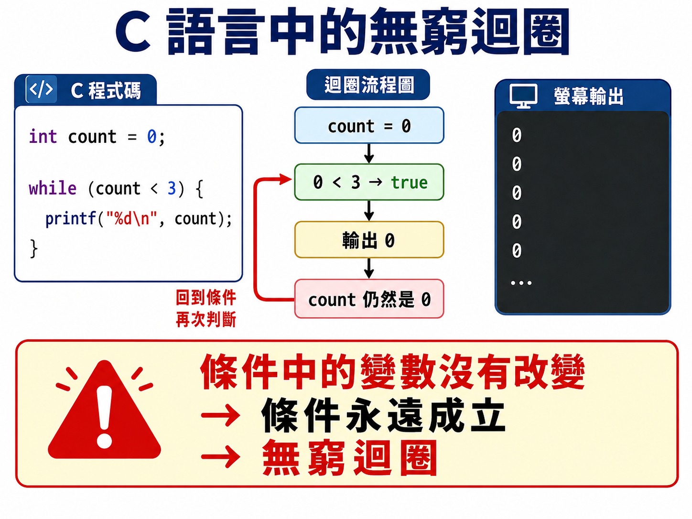
</p>

```c
int number = 1;

while (number != 0) {
    printf("%d\n", number);
}
```

<details>
<summary>查看答案</summary>

`number` 在迴圈內沒有被更新或重新輸入，因此一直是 `1`。

</details>

---

## Section VIII. 實作練習 / 實作檢測題

### TODO 1：印出 1 到 10

使用 `while`，每個數字一行。

---

### TODO 2：倒數 10 到 1

起點為 `10`，每輪減少 `1`。

---

### TODO 3：印出 1 到 N

輸入正整數 `N`，印出：

```text
1
2
...
N
```

---

### TODO 4：印出 M 到 N

輸入 `M` 與 `N`，假設 `M <= N`，印出所有連續整數。

---

### TODO 5：印出 N 到 1

輸入正整數 `N`，反向輸出到 `1`。

---

### TODO 6：印出 1 到 N 的偶數

使用 `while`。

思考兩種策略：

1. 從 `2` 開始，每次加 `2`。
2. 每個數字都檢查是否為偶數。

---

### TODO 7：猜數字直到正確

答案固定為 `37`。

每次輸出：

```text
Too large
Too small
Correct
```

直到猜對為止。

先使用預讀式 `while`。

---

### TODO 8：計算猜測次數

修改 TODO 7，最後輸出總共輸入了幾次猜測。

第一次就答對時，答案應為 `1`。

---

### TODO 9：求不定個數正整數和

連續讀取正整數，輸入 `0` 結束。

`0` 不加入總和。

---

### TODO 10：求不定個數正整數平均

在 TODO 9 的基礎上增加有效資料筆數。

零筆資料時要顯示提示，不要直接除以 `0`。

---

### TODO 11：同時輸出總和與筆數

輸入 `0` 結束後，顯示：

```text
Count: ...
Sum: ...
```

---

### TODO 12：使用 `do-while` 猜數字

把 TODO 7 改寫成 `do-while`，不要在迴圈外先讀取第一個猜測。

---

### TODO 13：密碼輸入

正確密碼固定為 `2468`。

使用 `do-while` 至少讀取一次，直到輸入正確。

---

### TODO 14：範圍內總和

輸入 `M` 與 `N`，假設 `M <= N`，計算：

```text
M + (M + 1) + ... + N
```

---

### TODO 15：預測輸出

先不要執行，手算下列程式的輸出與最終 `count`：

```c
int count = 0;

while (count < 5) {
    count++;
    printf("%d\n", count);
}
```

再實際執行確認。

---

## Section IX. 做題時可以使用的提示

### 1. 先寫三行規格

```text
起點：
繼續條件：
每輪更新：
```

例如印出 1 到 10：

```text
起點：1
繼續條件：count <= 10
每輪更新：count++
```

---

### 2. 用中文讀出條件

```c
while (guess != answer)
```

讀成：

> 當猜測不等於答案時，繼續。

若中文意思不符合題目，條件可能寫反。

---

### 3. 用表格追蹤一輪

| 判斷前 | 條件 | 本體做什麼 | 更新後 |
| --- | --- | --- | --- |
| `count = 1` | `1 <= 3` | 輸出 1 | `count = 2` |

連續寫三輪，通常就能看出規律。

---

### 4. 結束值先在迴圈外讀一次

典型結構：

```c
scanf("%d", &number);

while (number != sentinel) {
    process(number);
    scanf("%d", &number);
}
```

這裡的 `process(number)` 代表你要進行的累加或其他操作。

---

### 5. 平均題先完成總和，再加入筆數

開發順序：

1. 先確認能正確求和。
2. 再增加 `count`。
3. 最後才計算平均。
4. 測試一開始就輸入 `0`。

---

### 6. 猜數字至少測試四種情況

1. 第一次就答對。
2. 先猜太大。
3. 先猜太小。
4. 太大、太小交替後才答對。

---

### 7. 懷疑無窮迴圈時檢查三件事

1. 條件中的變數是否會改變？
2. 更新是否真的執行得到？
3. 更新方向是否朝向條件不成立？

---

### 8. 懷疑多一次或少一次時檢查四個位置

1. 初始值。
2. `<` 或 `<=`。
3. 先輸出還是先更新。
4. 結束後的控制變數值。

---

## Section X. 課後小練習

### 練習 1：印出 5 的倍數

印出 `5` 到 `100` 的所有 5 的倍數。

---

### 練習 2：計算 1 到 N 的總和

輸入 `N`，使用 `while` 計算：

```text
1 + 2 + ... + N
```

---

### 練習 3：計算輸入中的奇數總和

連續輸入整數，以 `0` 結束，只累加奇數。

---

### 練習 4：計算正數筆數

連續輸入整數，以 `0` 結束，顯示輸入了幾個正整數。

---

### 練習 5：求輸入中的最大值

連續輸入正整數，以 `0` 結束。

假設至少輸入一個有效值，找出最大值。

---

### 練習 6：輸入驗證

使用 `do-while` 要求使用者輸入 `1` 到 `10`。

超出範圍就重新輸入。

---

### 練習 7：猜數字次數限制

<!-- lesson-image: C_Lesson_08_img10_guess_counter_position.png -->
<p align="center">
  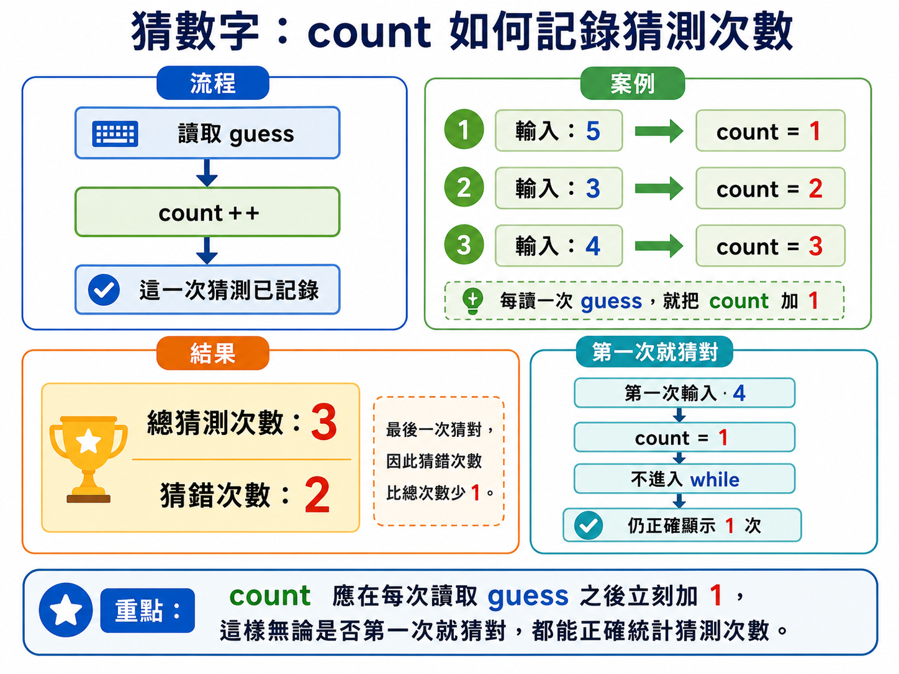
</p>

先不使用 `break`。

設定條件讓程式在：

- 尚未猜對
- 而且猜測次數小於 5

兩者都成立時才繼續。

---

### 練習 8：比較兩種猜數字寫法

各寫一版：

1. 預讀式 `while`
2. `do-while`

比較哪一版重複的輸入程式碼較少。

---

## Section XI. 重點複習

1. 迴圈用來重複執行同一段工作。
2. `while` 在本體執行前檢查條件。
3. `while` 可能執行零次。
4. `do-while` 在本體執行後檢查條件。
5. `do-while` 至少執行一次。
6. 迴圈通常需要初始化、條件與更新。
7. 更新應讓程式逐步接近停止條件。
8. 缺少更新可能造成無窮迴圈。
9. `<` 與 `<=` 會影響終點是否包含。
10. 更新與輸出的順序會影響第一個及最後一個輸出。
11. 條件中使用的變數必須先取得有效值。
12. 預讀式 `while` 會在迴圈前先讀取第一筆資料。
13. 猜數字時，每次輸入都應計入猜測次數。
14. 計數器記錄次數。
15. 累加器記錄目前總和。
16. 結束值只負責停止，不屬於有效資料。
17. 平均需要總和與有效資料筆數。
18. 浮點平均要避免整數除法。
19. 零筆資料時要避免除以零。
20. `do-while` 尾端的分號不能省略。
21. 本章先用 `while` 拆開理解起點、條件與更新。
22. 下一章會使用 `for` 更集中地表示計次型重複。

---

## Section XII. 常見錯誤提醒

### 錯誤 1：條件變數未初始化

<!-- lesson-image: C_Lesson_08_img09_uninitialized_condition_variable.png -->
<p align="center">
  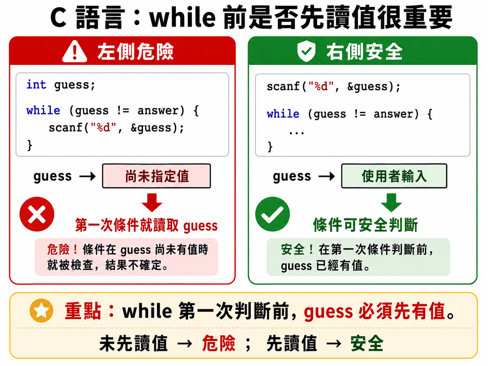
</p>

錯誤：

```c
int guess;

while (guess != answer) {
    ...
}
```

應先取得 `guess`，或改用 `do-while`。

---

### 錯誤 2：忘記更新

錯誤：

```c
while (count <= 10) {
    printf("%d\n", count);
}
```

修正：

```c
count++;
```

---

### 錯誤 3：更新方向相反

```c
int count = 1;

while (count <= 10) {
    count--;
}
```

`count` 越來越小，條件可能一直成立。

---

### 錯誤 4：`while` 後面多一個分號

錯誤：

```c
while (count <= 10);
```

---

### 錯誤 5：使用 `<` 導致漏掉終點

題目要印出 `10`，卻寫：

```c
while (count < 10)
```

---

### 錯誤 6：先更新造成漏掉起點

```c
int count = 1;

while (count <= 10) {
    count++;
    printf("%d\n", count);
}
```

第一個輸出是 `2`，而且可能輸出到 `11`。

---

### 錯誤 7：只讀取一次輸入

```c
scanf("%d", &guess);

while (guess != answer) {
    printf("Try again\n");
}
```

迴圈內沒有新的 `scanf()`。

---

### 錯誤 8：第一次輸入沒有計入次數

若第一次輸入發生在迴圈外，第一次 `scanf()` 後也要更新 `count`。

---

### 錯誤 9：把結束值加入總和

錯誤結構：

```c
sum += number;
scanf("%d", &number);

while (number != 0) {
    ...
}
```

要追蹤實際執行順序，確認 `0` 沒有被當成有效資料。

---

### 錯誤 10：累加器未初始化

錯誤：

```c
int sum;
sum = sum + number;
```

正確：

```c
int sum = 0;
```

---

### 錯誤 11：筆數包含結束值

`count++` 應放在確認 `number != 0` 之後的本體中。

---

### 錯誤 12：平均使用整數除法

錯誤：

```c
average = sum / count;
```

正確：

```c
average = (float)sum / count;
```

---

### 錯誤 13：零筆資料仍直接相除

使用者第一個輸入就是 `0` 時，`count` 是 `0`。

先檢查：

```c
if (count > 0)
```

---

### 錯誤 14：漏掉 `do-while` 尾端分號

錯誤：

```c
} while (guess != answer)
```

正確：

```c
} while (guess != answer);
```

---

### 錯誤 15：把一般 `while` 寫成尾端有分號

一般 `while`：

```c
while (condition) {
    ...
}
```

只有 `do-while` 的尾端需要：

```c
while (condition);
```

---

### 錯誤 16：誤以為 `do-while` 只執行一次

它是「至少一次」，不是「只能一次」。

條件成立時仍會繼續。

---

## Section XIII. Mermaid 流程圖

### 1. `while` 的基本流程

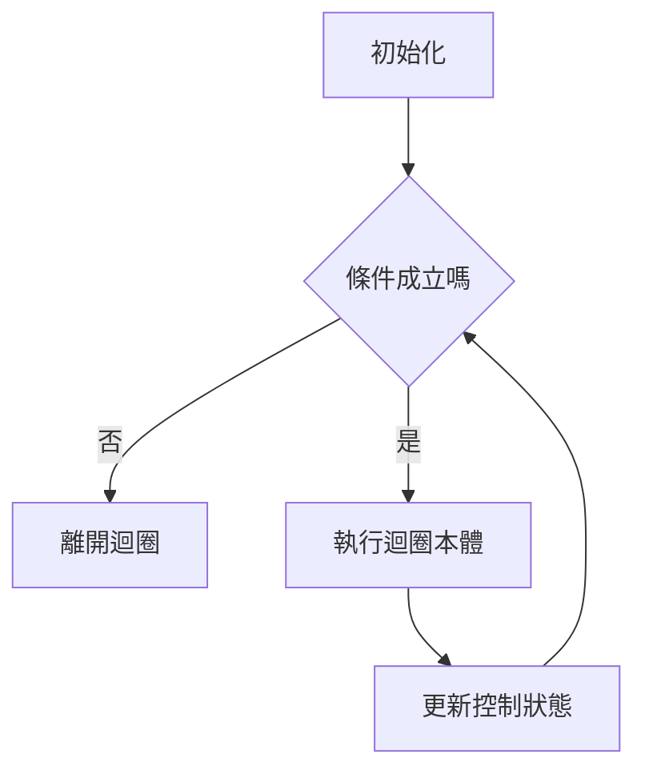
```mermaid
flowchart TD
    A[初始化] --> B{條件成立嗎}
    B -- 否 --> E[離開迴圈]
    B -- 是 --> C[執行迴圈本體]
    C --> D[更新控制狀態]
    D --> B
```

---

### 2. 印出 1 到 10

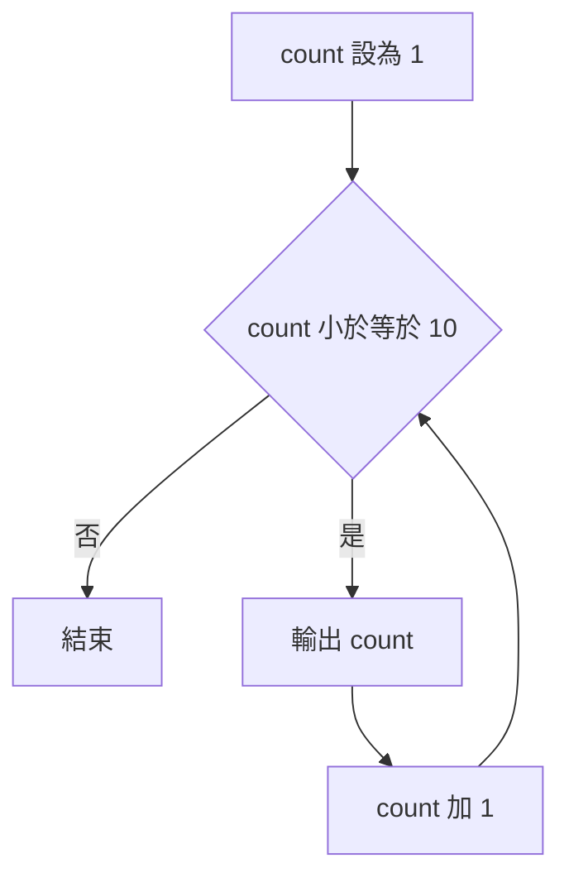
```mermaid
flowchart TD
    A[count 設為 1] --> B{count 小於等於 10}
    B -- 否 --> E[結束]
    B -- 是 --> C[輸出 count]
    C --> D[count 加 1]
    D --> B
```

---

### 3. 預讀式猜數字

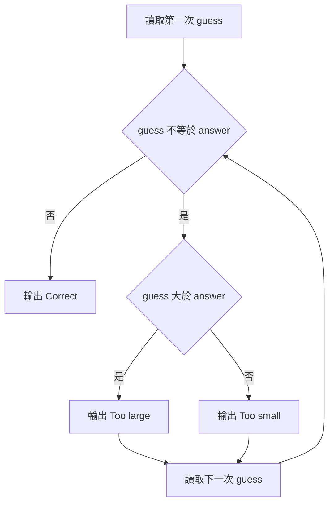
```mermaid
flowchart TD
    A[讀取第一次 guess] --> B{guess 不等於 answer}
    B -- 否 --> F[輸出 Correct]
    B -- 是 --> C{guess 大於 answer}
    C -- 是 --> D[輸出 Too large]
    C -- 否 --> E[輸出 Too small]
    D --> G[讀取下一次 guess]
    E --> G
    G --> B
```

---

### 4. 使用結束值求總和

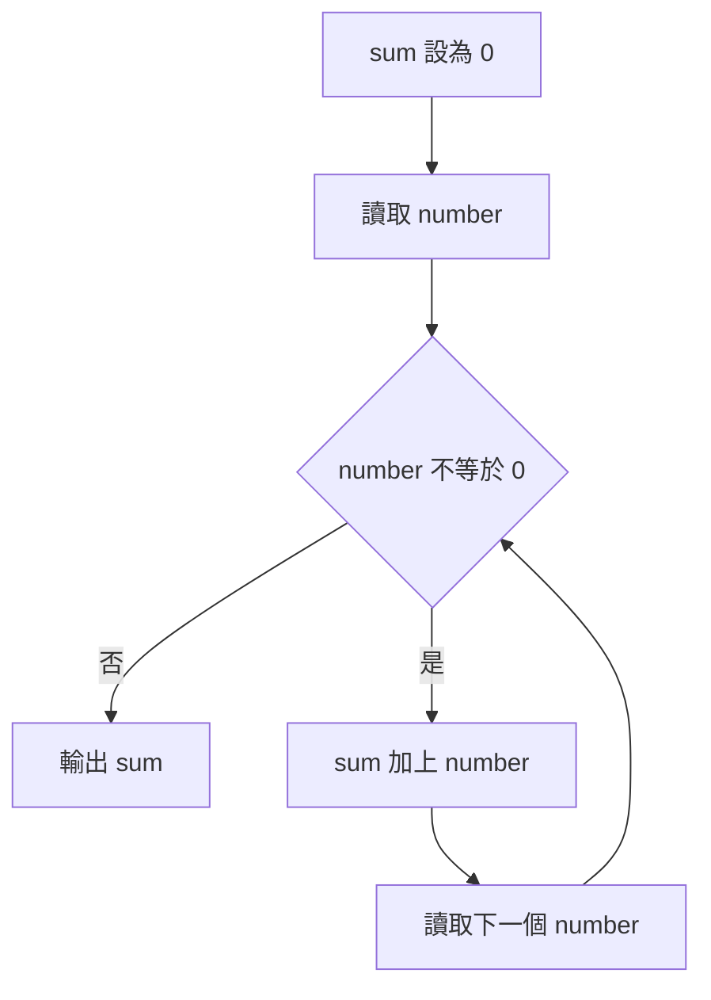
```mermaid
flowchart TD
    A[sum 設為 0] --> B[讀取 number]
    B --> C{number 不等於 0}
    C -- 否 --> F[輸出 sum]
    C -- 是 --> D[sum 加上 number]
    D --> E[讀取下一個 number]
    E --> C
```

---

### 5. 求平均

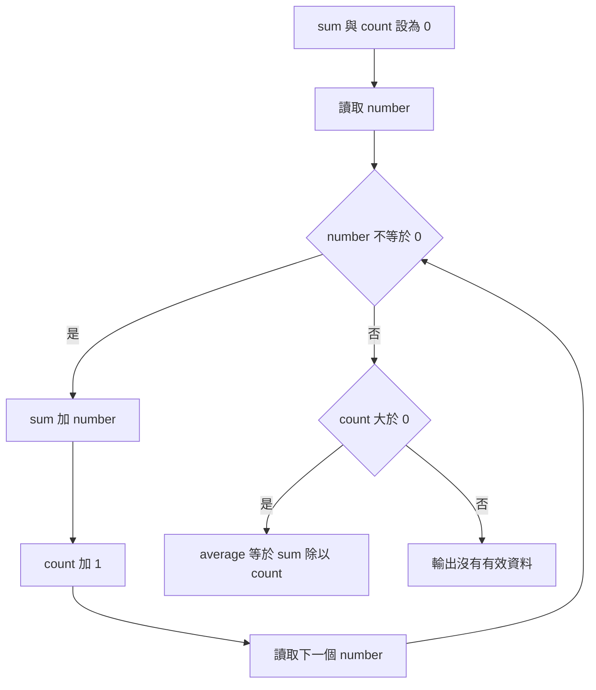
```mermaid
flowchart TD
    A[sum 與 count 設為 0] --> B[讀取 number]
    B --> C{number 不等於 0}
    C -- 是 --> D[sum 加 number]
    D --> E[count 加 1]
    E --> F[讀取下一個 number]
    F --> C
    C -- 否 --> G{count 大於 0}
    G -- 是 --> H[average 等於 sum 除以 count]
    G -- 否 --> I[輸出沒有有效資料]
```

---

### 6. `do-while` 的基本流程

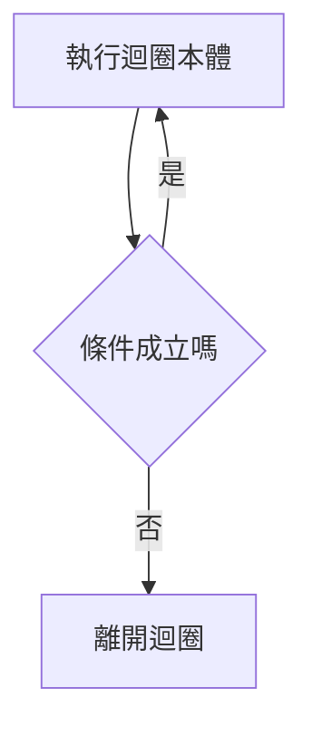
```mermaid
flowchart TD
    A[執行迴圈本體] --> B{條件成立嗎}
    B -- 是 --> A
    B -- 否 --> C[離開迴圈]
```

---

### 7. `do-while` 猜數字

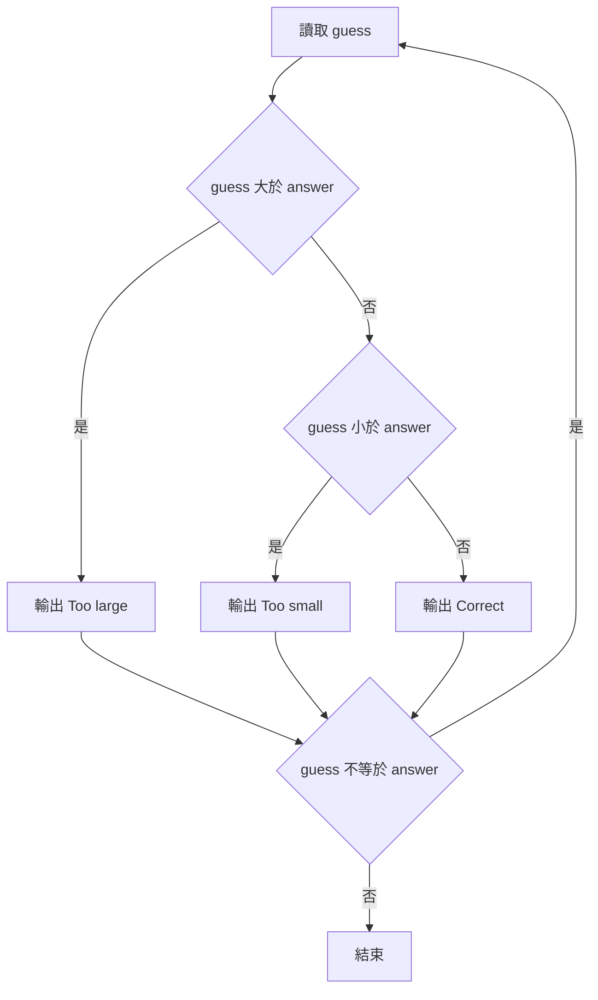
```mermaid
flowchart TD
    A[讀取 guess] --> B{guess 大於 answer}
    B -- 是 --> C[輸出 Too large]
    B -- 否 --> D{guess 小於 answer}
    D -- 是 --> E[輸出 Too small]
    D -- 否 --> F[輸出 Correct]
    C --> G{guess 不等於 answer}
    E --> G
    F --> G
    G -- 是 --> A
    G -- 否 --> H[結束]
```

---

## 本章完成標準

完成本章後，你應該能做到：

1. 正確寫出 `while` 的語法。
2. 說明 `while` 為什麼可能執行零次。
3. 說明初始化、條件與更新的作用。
4. 找出缺少更新所造成的無窮迴圈。
5. 使用 `while` 印出指定範圍的連續整數。
6. 判斷 `<` 與 `<=` 對輸出的影響。
7. 使用追蹤表分析控制變數的變化。
8. 使用預讀式 `while` 重複讀取資料。
9. 完成猜到正確為止的程式。
10. 正確記錄猜測總次數。
11. 使用 `0` 作為結束值讀取不定個數資料。
12. 使用累加器計算總和。
13. 使用計數器與累加器計算平均。
14. 避免結束值被計入有效資料。
15. 避免整數除法及零筆資料除以零。
16. 正確寫出 `do-while` 的語法及尾端分號。
17. 說明 `do-while` 為什麼至少執行一次。
18. 使用 `do-while` 改寫猜數字程式。
19. 根據問題選擇 `while` 或 `do-while`。
20. 能用零次、一次、多次與邊界輸入測試迴圈。
