# Lesson 9：for Loops for 迴圈

> 這堂課的重點：把「初始值、繼續條件、每輪更新」集中寫在 `for` 述句中，完成計次型重複執行、等差數列、條件篩選、連續整數和、文字橫線，以及 `break` 與 `continue` 的流程控制。

---

## Section I. 今天要做什麼？

1. 理解什麼是計次型的重複執行。
2. 比較 `while` 與 `for` 的結構。
3. 認識 `for` 的基本語法。
4. 分辨初始式、條件式與迴圈式。
5. 理解 `for` 的完整執行順序。
6. 使用 `for` 印出 `1` 到 `10`。
7. 將固定終點改成使用者輸入的 `N`。
8. 將固定範圍改成使用者輸入的 `M` 到 `N`。
9. 使用遞減更新印出 `10` 到 `1`。
10. 用「索引轉換」產生反向數列。
11. 使用不同的更新量產生等差數列。
12. 使用三種方法印出奇數。
13. 使用三種方法印出偶數。
14. 分辨「直接產生」與「逐一檢查」兩種策略。
15. 印出同時符合多個條件的數列。
16. 使用累加器求 `1` 到 `100` 的整數和。
17. 將總和題改成 `1` 到 `N`。
18. 比較迴圈累加與數學公式。
19. 使用 `for` 重複輸出字元，畫出指定長度的橫線。
20. 理解換行位置如何影響輸出形狀。
21. 使用 `break` 提前中止目前的迴圈。
22. 使用 `continue` 跳過目前這一輪剩餘的程式碼。
23. 比較 `break` 與 `continue` 的差異。
24. 使用 `break` 簡化搜尋問題。
25. 使用追蹤表分析 off-by-one 錯誤。
26. 為下一章的巢狀迴圈建立穩固基礎。

---

## Section II. 今天的學習方式

1. 先把問題寫成「從哪裡開始、做到哪裡、每次改多少」。
2. 將這三項依序放入 `for` 的初始式、條件式與迴圈式。
3. 先手算前三輪，再預測最後一輪。
4. 確認條件使用 `<` 還是 `<=`。
5. 若要反向計數，確認條件與更新方向一致。
6. 遇到奇數、偶數或倍數時，思考能否直接產生所需數列。
7. 若不能直接產生，再使用 `if` 篩選。
8. 遇到總和問題時，先初始化累加器。
9. 遇到固定次數的輸出時，把重複的 `printf()` 放入迴圈。
10. 遇到搜尋問題時，先決定找到答案後是否仍需要繼續。
11. `break` 表示整個迴圈結束；`continue` 表示只跳過目前這一輪。
12. 寫完後測試零次、一次、正常多次及邊界輸入。
13. 本章只使用單層迴圈；巢狀迴圈留到下一章。
14. 本章的韓信點兵只用來理解搜尋與 `break`，完整解題策略會在後面的迴圈解題章節深化。

---

## Section III. 今天會學到的內容

| 主題 | 你需要知道的事 |
| --- | --- |
| 計次型重複 | 起點、終點與每輪變化通常很清楚 |
| `for` | 將迴圈控制集中在同一行 |
| 初始式 | 進入迴圈前執行一次 |
| 條件式 | 每一輪開始前判斷是否繼續 |
| 迴圈式 | 每一輪本體結束後執行 |
| 迴圈本體 | 條件成立時重複執行的程式片段 |
| 遞增 | 例如 `count++` 或 `count += 2` |
| 遞減 | 例如 `count--` |
| 等差數列 | 相鄰兩項之間具有固定差值 |
| 索引轉換 | 使用計數變數計算真正要輸出的值 |
| 直接產生 | 讓控制變數只走過需要的數字 |
| 條件篩選 | 走過完整範圍，再用 `if` 選出需要的數字 |
| 累加器 | 保存目前累積的總和 |
| `break` | 立即中止目前所屬的迴圈 |
| `continue` | 跳過目前這一輪後面的程式碼 |
| 提前搜尋 | 找到所需答案後不再浪費後續迭代 |
| off-by-one | 多執行或少執行一輪的常見錯誤 |
| 水平輸出 | 重複字元不換行，最後再統一換行 |

---

## Section IV. 寫題目前的提醒

### 1. `for` 小括號內有兩個分號

基本形式：

```c
for (初始式; 條件式; 迴圈式) {
    程式片段;
}
```

三個部分使用兩個分號分開。

---

### 2. 初始式只執行一次

```c
for (count = 1; count <= 10; count++) {
    printf("%d\n", count);
}
```

`count = 1` 只會在進入迴圈前執行一次，不會每輪重新設為 `1`。

---

### 3. 條件式在每一輪之前檢查

如果第一次檢查就不成立：

```c
for (count = 10; count < 3; count++) {
    printf("%d\n", count);
}
```

迴圈本體執行 `0` 次。

---

### 4. 迴圈式在本體之後執行

<!-- lesson-image: C_Lesson_09_img04_body_before_iteration.png -->
<p align="center">
  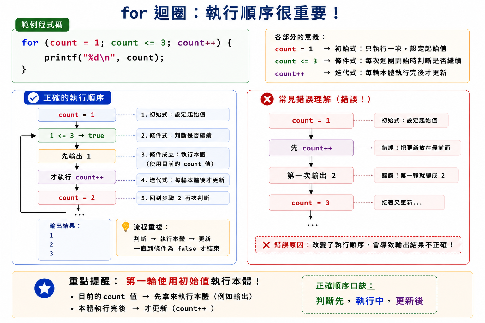
</p>

```c
for (count = 1; count <= 3; count++) {
    printf("%d\n", count);
}
```

順序不是先 `count++`。

第一輪會先輸出 `1`，然後才把 `count` 增加成 `2`。

---

### 5. 不要在 `for` 後面誤加分號

錯誤：

```c
for (count = 1; count <= 10; count++);
{
    printf("%d\n", count);
}
```

分號形成空迴圈，大括號區塊不再屬於 `for`。

正確：

```c
for (count = 1; count <= 10; count++) {
    printf("%d\n", count);
}
```

---

### 6. `<` 與 `<=` 會決定是否包含終點

<!-- lesson-image: C_Lesson_09_img06_less_than_vs_less_equal.png -->
<p align="center">
  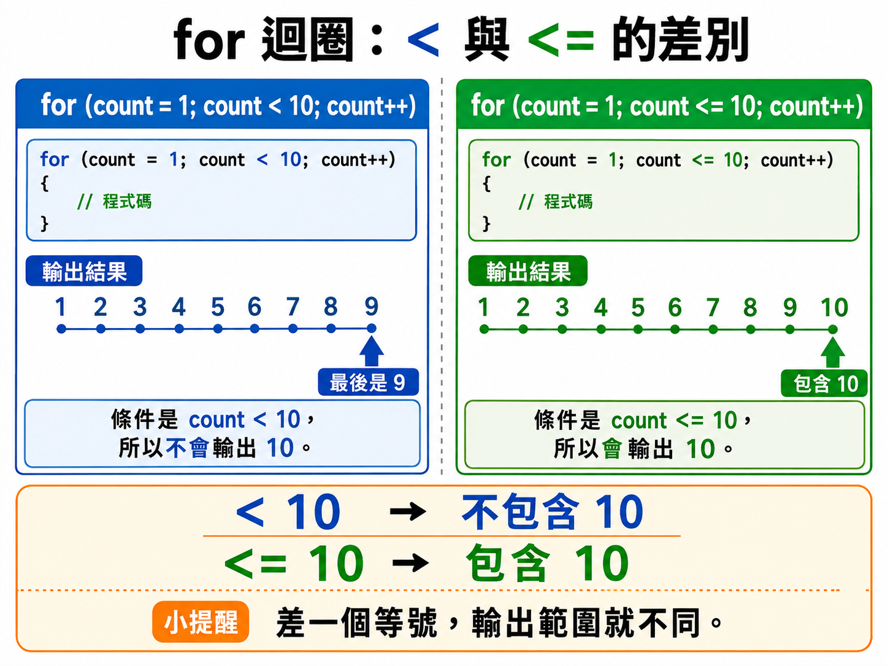
</p>

```c
for (count = 1; count < 10; count++)
```

輸出到 `9`。

```c
for (count = 1; count <= 10; count++)
```

輸出到 `10`。

---

### 7. 反向計數時，條件與更新方向要配合

<!-- lesson-image: C_Lesson_09_img08_wrong_reverse_update.png -->
<p align="center">
  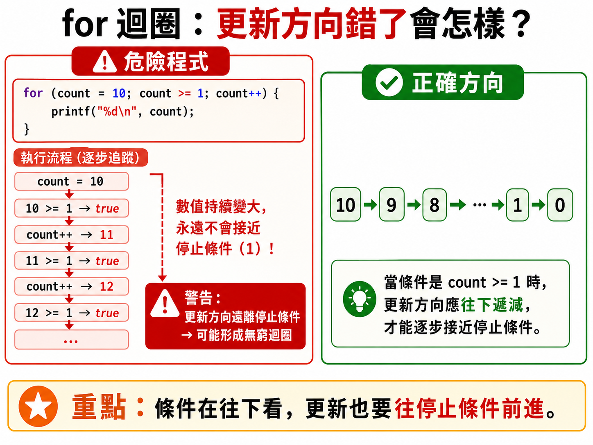
</p>

正確：

```c
for (count = 10; count >= 1; count--) {
    printf("%d\n", count);
}
```

錯誤方向：

```c
for (count = 10; count >= 1; count++) {
    ...
}
```

`count` 越來越大，條件可能永遠成立。

---

### 8. 更新量不一定是 `1`

```c
count += 2;
```

可以每次增加 `2`。

```c
count -= 3;
```

可以每次減少 `3`。

---

### 9. 直接產生數列時要選對起點

印出奇數：

```c
for (count = 1; count <= 9; count += 2)
```

印出偶數：

```c
for (count = 2; count <= 10; count += 2)
```

如果起點選錯，即使更新量是 `2`，奇偶性也會錯。

---

### 10. 使用公式轉換時，要分清楚「索引」與「輸出值」

```c
for (count = 1; count <= 5; count++) {
    int number = 2 * count - 1;
    printf("%d\n", number);
}
```

`count` 是第幾項，`number` 才是實際輸出的奇數。

---

### 11. 使用 `%` 篩選時，迴圈仍會檢查完整範圍

```c
for (count = 1; count <= 10; count++) {
    if (count % 2 == 0) {
        printf("%d\n", count);
    }
}
```

迴圈仍然走過 `1` 到 `10`，只是奇數沒有被輸出。

---

### 12. 累加器要先初始化

```c
int sum = 0;
```

若沒有初始化，總和結果不可靠。

來源例題也示範從 `sum = 1`、`i = 2` 開始；兩種方法都必須確保每個數字只加入一次。

---

### 13. 累加動作要放在迴圈內

```c
for (i = 1; i <= n; i++) {
    sum = sum + i;
}
```

如果放在迴圈外，只會加到一個值。

---

### 14. 畫水平線時，迴圈內不要換行

正確：

```c
printf("*");
```

如果寫成：

```c
printf("*\n");
```

會變成垂直排列。

---

### 15. 水平線的換行放在迴圈後

```c
for (count = 1; count <= n; count++) {
    printf("*");
}

printf("\n");
```

---

### 16. `break` 會結束整個目前迴圈

```c
for (number = 1; number <= 10; number++) {
    if (number == 5) {
        break;
    }

    printf("%d\n", number);
}
```

輸出：

```text
1
2
3
4
```

`number == 5` 時直接離開迴圈。

---

### 17. `continue` 只跳過目前這一輪

```c
for (number = 1; number <= 10; number++) {
    if (number == 5) {
        continue;
    }

    printf("%d\n", number);
}
```

輸出 `1` 到 `10`，但不輸出 `5`。

---

### 18. `continue` 後面的程式碼不會在該輪執行

<!-- lesson-image: C_Lesson_09_img22_continue_code_position.png -->
<p align="center">
  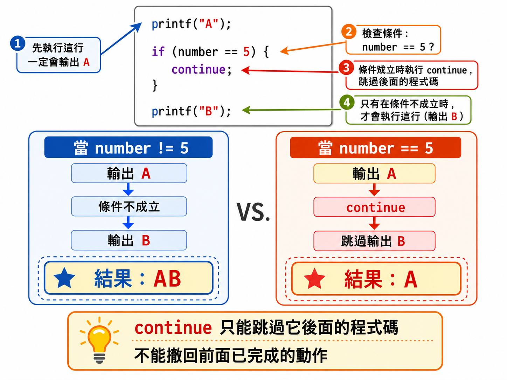
</p>

```c
if (number == 5) {
    continue;
}

printf("%d\n", number);
```

當 `number == 5` 時，`printf()` 被跳過。

---

### 19. `for` 中的 `continue` 仍會執行迴圈式

在：

```c
for (number = 1; number <= 10; number++)
```

遇到 `continue` 後，程式會先執行 `number++`，再回到條件式。

因此不會永遠卡在 `5`。

---

### 20. `break` 與 `switch` 中的作用概念相似

上一章的 `break` 用來離開 `switch`。

本章的 `break` 放在迴圈內時，用來離開目前迴圈。

它不是結束整個程式；迴圈後面的程式仍會繼續。

---

## Section V. 核心概念說明

### 1. 什麼是計次型重複執行？

上一章使用 `while` 印出 `1` 到 `10`：

```c
int count = 1;

while (count <= 10) {
    printf("%d\n", count);
    count = count + 1;
}
```

這個問題有三個明確資訊：

| 問題 | 答案 |
| --- | --- |
| 從哪裡開始？ | `1` |
| 什麼時候繼續？ | `count <= 10` |
| 每輪如何改變？ | `count++` |

這種起點、終點與更新方式都很清楚的重複工作，適合使用 `for`。

---

### 2. `for` 的基本語法

<!-- lesson-image: C_Lesson_09_img02_for_syntax_parts.png -->
<p align="center">
  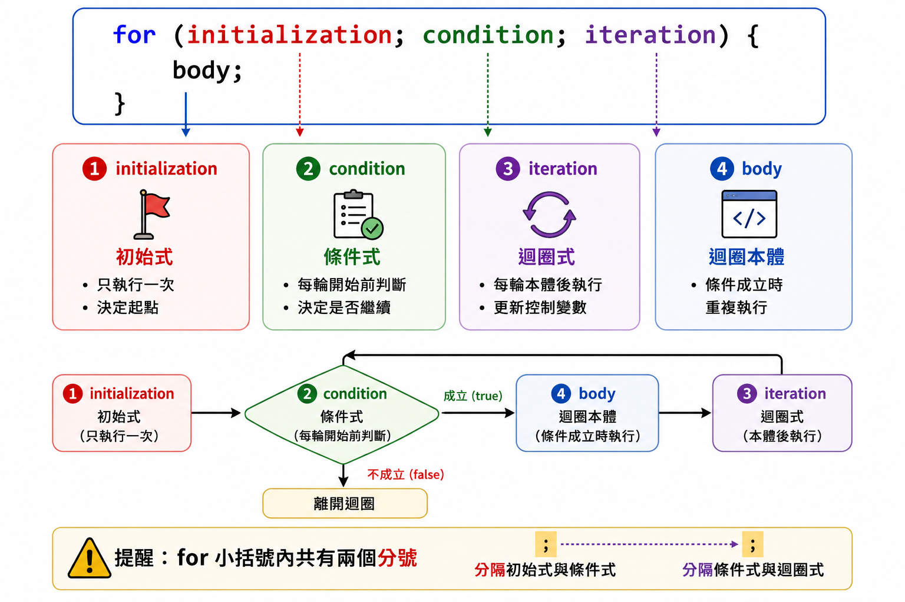
</p>

```c
for (初始式; 條件式; 迴圈式) {
    程式片段;
}
```

以印出 `1` 到 `10` 為例：

```c
for (count = 1; count <= 10; count++) {
    printf("%d\n", count);
}
```

| 部分 | 程式碼 | 作用 |
| --- | --- | --- |
| 初始式 | `count = 1` | 決定起點 |
| 條件式 | `count <= 10` | 決定是否繼續 |
| 迴圈式 | `count++` | 每輪結束後更新 |
| 本體 | `printf(...)` | 每輪要做的工作 |

---

### 3. `for` 的完整執行順序

<!-- lesson-image: C_Lesson_09_img03_for_execution_order.png -->
<p align="center">
  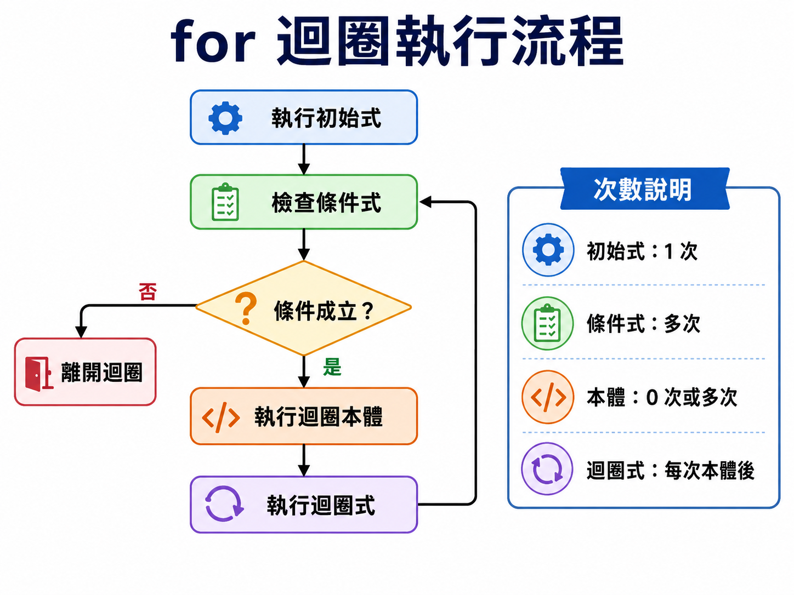
</p>

```text
1. 執行初始式
2. 檢查條件式
3. 條件為真：執行迴圈本體
4. 執行迴圈式
5. 回到條件式
6. 條件為假：離開迴圈
```

注意：

- 初始式只執行一次。
- 條件式會檢查多次。
- 迴圈式在每一輪本體之後執行。
- 最後還會再檢查一次條件，確認應該停止。

---

### 4. `for` 與 `while` 的對應

<!-- lesson-image: C_Lesson_09_img01_while_vs_for.png -->
<p align="center">
  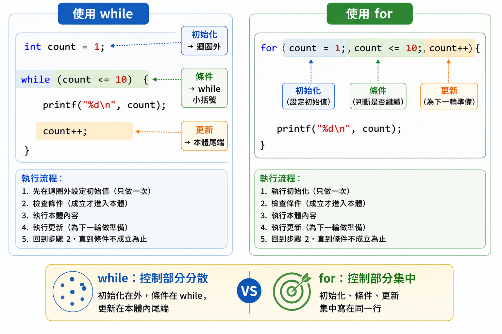
</p>

`for`：

```c
for (initialization; condition; iteration) {
    body;
}
```

大致相當於：

```c
initialization;

while (condition) {
    body;
    iteration;
}
```

因此 `for` 並不是完全不同的重複機制，而是把常見的三個控制部分集中在同一行。

---

### 5. 第一個完整程式：印出 1 到 10

```c
#include <stdio.h>

int main(void) {
    int count;

    for (count = 1; count <= 10; count++) {
        printf("%d\n", count);
    }

    return 0;
}
```

輸出：

```text
1
2
3
4
5
6
7
8
9
10
```

---

### 6. 執行追蹤

<!-- lesson-image: C_Lesson_09_img05_for_trace_1_to_3.png -->
<p align="center">
  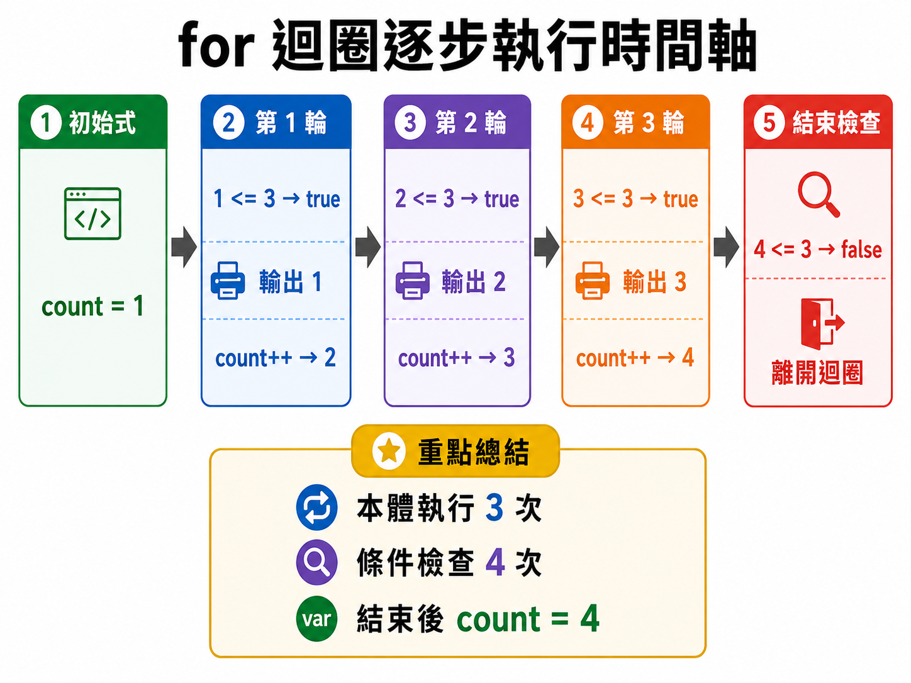
</p>

```c
for (count = 1; count <= 3; count++) {
    printf("%d\n", count);
}
```

| 階段 | `count` | 條件 `count <= 3` | 動作 |
| --- | ---: | --- | --- |
| 初始式 | 1 | - | 設定起點 |
| 第 1 次檢查 | 1 | 真 | 輸出 1 |
| 迴圈式 | 2 | - | `count++` |
| 第 2 次檢查 | 2 | 真 | 輸出 2 |
| 迴圈式 | 3 | - | `count++` |
| 第 3 次檢查 | 3 | 真 | 輸出 3 |
| 迴圈式 | 4 | - | `count++` |
| 結束檢查 | 4 | 假 | 離開迴圈 |

---

### 7. 印出 1 到 100

```c
for (count = 1; count <= 100; count++) {
    printf("%d\n", count);
}
```

只需要改變條件中的終點，不需要增加更多 `printf()`。

---

### 8. 印出 1 到 N

```c
#include <stdio.h>

int main(void) {
    int n;
    int count;

    printf("Please enter the number: ");
    scanf("%d", &n);

    for (count = 1; count <= n; count++) {
        printf("%d\n", count);
    }

    return 0;
}
```

輸入 `5` 時輸出 `1` 到 `5`。

---

### 9. 印出 10 到 20

```c
for (count = 10; count <= 20; count++) {
    printf("%d\n", count);
}
```

改變初始式，就能改變起點。

---

### 10. 印出 M 到 N

題目假設：

```text
M <= N
```

```c
#include <stdio.h>

int main(void) {
    int m;
    int n;
    int count;

    printf("Please enter the number M: ");
    scanf("%d", &m);

    printf("Please enter the number N: ");
    scanf("%d", &n);

    for (count = m; count <= n; count++) {
        printf("%d\n", count);
    }

    return 0;
}
```

---

### 11. 印出 10 到 1：直接遞減

<!-- lesson-image: C_Lesson_09_img07_forward_vs_reverse_loop.png -->
<p align="center">
  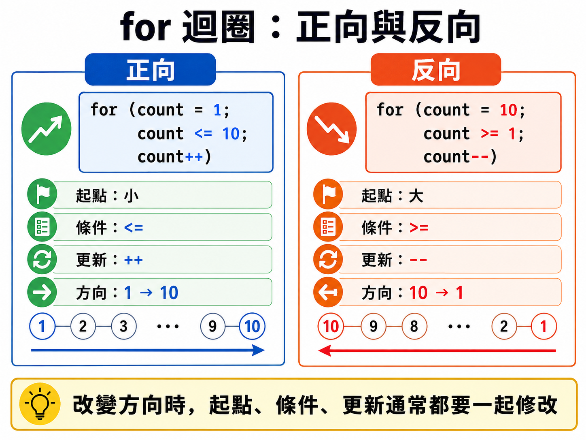
</p>

```c
#include <stdio.h>

int main(void) {
    int count;

    for (count = 10; count >= 1; count--) {
        printf("%d\n", count);
    }

    return 0;
}
```

三個控制部分：

| 部分 | 內容 |
| --- | --- |
| 起點 | `10` |
| 條件 | `count >= 1` |
| 更新 | `count--` |

---

### 12. 印出 10 到 1：使用索引轉換

<!-- lesson-image: C_Lesson_09_img09_direct_countdown_vs_index_transform.png -->
<p align="center">
  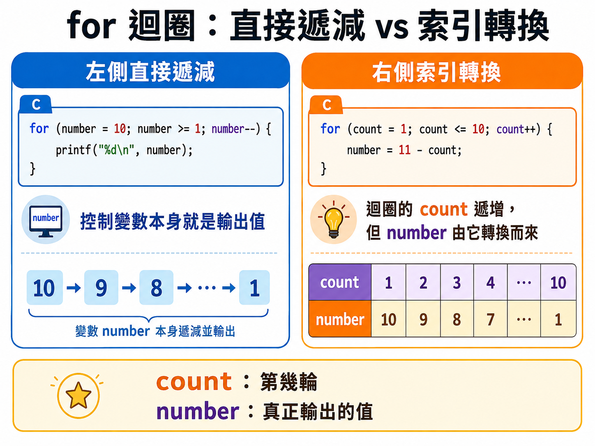
</p>

來源也示範讓 `count` 仍由 `1` 增加到 `10`，再計算真正要輸出的值：

```c
#include <stdio.h>

int main(void) {
    int count;
    int number;

    for (count = 1; count <= 10; count++) {
        number = 11 - count;
        printf("%d\n", number);
    }

    return 0;
}
```

追蹤：

| `count` | `number = 11 - count` |
| ---: | ---: |
| 1 | 10 |
| 2 | 9 |
| 3 | 8 |
| ... | ... |
| 10 | 1 |

這種方法把「第幾輪」與「要輸出的數值」分開。

---

### 13. 什麼是等差數列？

<!-- lesson-image: C_Lesson_09_img10_iteration_step_sequences.png -->
<p align="center">
  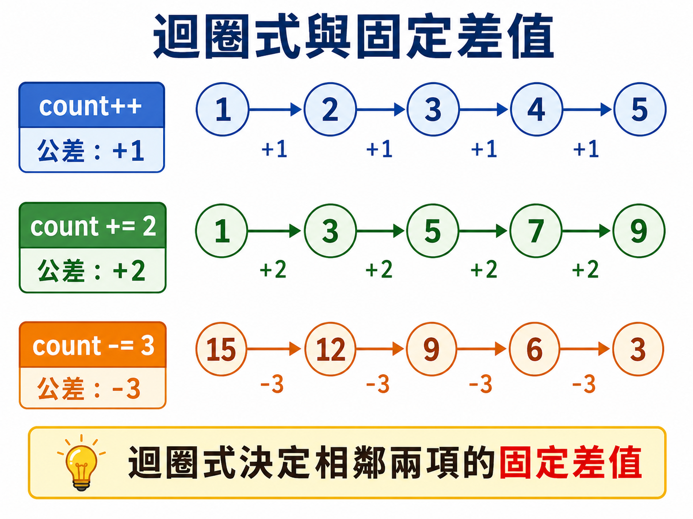
</p>

如果相鄰兩項的差固定，就形成等差數列。

例如：

```text
1, 3, 5, 7, 9
```

每一項比前一項多 `2`。

```text
10, 9, 8, ..., 1
```

每一項比前一項少 `1`。

`for` 的迴圈式很適合表達固定的增量或減量。

---

### 14. 印出 1 到 10 之間的奇數：直接產生

```c
#include <stdio.h>

int main(void) {
    int number;

    for (number = 1; number <= 9; number += 2) {
        printf("%d\n", number);
    }

    return 0;
}
```

輸出：

```text
1
3
5
7
9
```

只走過需要的奇數。

---

### 15. 印出奇數：使用項次公式

<!-- lesson-image: C_Lesson_09_img13_index_to_odd_number.png -->
<p align="center">
  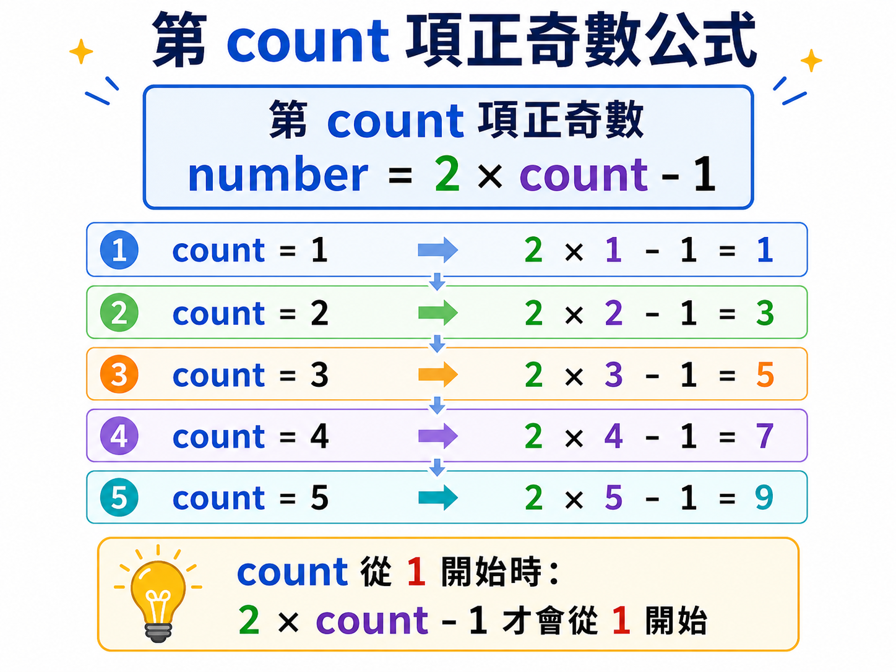
</p>

第 `count` 個正奇數可以寫成：

```text
2 × count - 1
```

```c
#include <stdio.h>

int main(void) {
    int count;
    int number;

    for (count = 1; count <= 5; count++) {
        number = 2 * count - 1;
        printf("%d\n", number);
    }

    return 0;
}
```

| `count` | `2 * count - 1` |
| ---: | ---: |
| 1 | 1 |
| 2 | 3 |
| 3 | 5 |
| 4 | 7 |
| 5 | 9 |

---

### 16. 印出奇數：逐一篩選

```c
for (number = 1; number <= 10; number++) {
    if (number % 2 != 0) {
        printf("%d\n", number);
    }
}
```

這個方法走過 `1` 到 `10` 的每個整數，再用餘數判斷奇數。

---

### 17. 印出 1 到 10 之間的偶數：直接產生

```c
#include <stdio.h>

int main(void) {
    int number;

    for (number = 2; number <= 10; number += 2) {
        printf("%d\n", number);
    }

    return 0;
}
```

輸出：

```text
2
4
6
8
10
```

---

### 18. 印出偶數：使用項次公式

第 `count` 個正偶數可以寫成：

```text
2 × count
```

```c
for (count = 1; count <= 5; count++) {
    number = 2 * count;
    printf("%d\n", number);
}
```

---

### 19. 印出偶數：逐一篩選

```c
for (number = 1; number <= 10; number++) {
    if (number % 2 == 0) {
        printf("%d\n", number);
    }
}
```

---

### 20. 三種數列策略的比較

<!-- lesson-image: C_Lesson_09_img11_three_ways_generate_odds.png -->
<p align="center">
  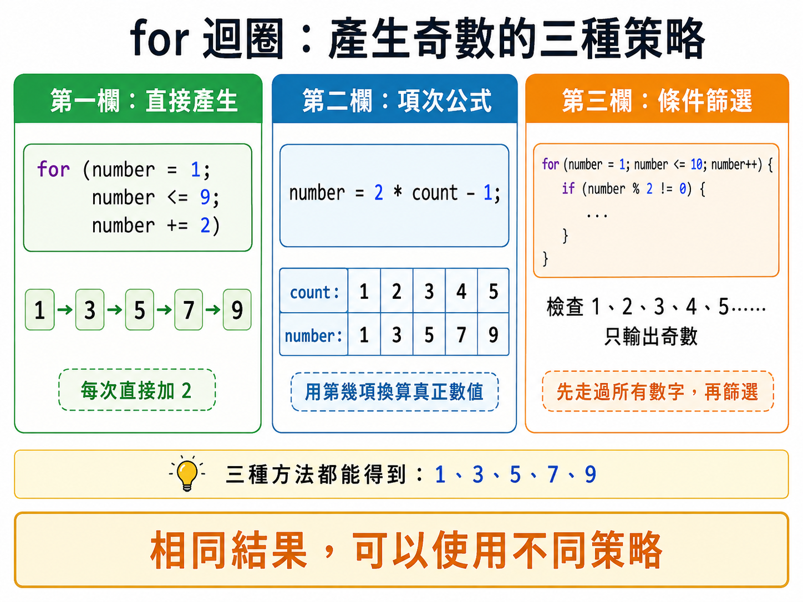
</p>

| 策略 | 奇數例子 | 特點 |
| --- | --- | --- |
| 直接產生 | `number = 1; number += 2` | 只走過需要的值 |
| 項次轉換 | `number = 2 * count - 1` | 分開「第幾項」與「數值」 |
| 條件篩選 | `number % 2 != 0` | 適合條件較複雜的情況 |

不是所有題目都只有一種正確寫法。

---

### 21. 印出特定條件的整數

題目：

> 印出 `1` 到 `10` 之間，是偶數而且不是 `3` 的倍數的整數。

結果：

```text
2
4
8
10
```

條件可以寫成：

```c
number % 2 == 0 && number % 3 != 0
```

---

### 22. 方法一：走過完整範圍再篩選

```c
#include <stdio.h>

int main(void) {
    int number;

    for (number = 1; number <= 10; number++) {
        if (number % 2 == 0 && number % 3 != 0) {
            printf("%d\n", number);
        }
    }

    return 0;
}
```

這個方法最直接地翻譯題目中的兩個條件。

---

### 23. 方法二：先直接產生偶數，再篩選

```c
for (number = 2; number <= 10; number += 2) {
    if (number % 3 != 0) {
        printf("%d\n", number);
    }
}
```

因為迴圈本身已經保證 `number` 是偶數，所以 `if` 只需要檢查是否不是 `3` 的倍數。

---

### 24. 方法三：使用項次公式，再篩選

```c
for (count = 1; count <= 5; count++) {
    number = 2 * count;

    if (number % 3 != 0) {
        printf("%d\n", number);
    }
}
```

先由項次產生偶數，再檢查第二個條件。

---

### 25. 求 1 到 100 的整數和

題目：

```text
1 + 2 + 3 + ... + 100
```

不能只把答案 `5050` 寫進程式，也不應手動寫出一百個加數。

應讓迴圈逐一把每個整數加入累加器。

---

### 26. 使用 `for` 累加 1 到 100

```c
#include <stdio.h>

int main(void) {
    int sum = 1;
    int i;

    for (i = 2; i <= 100; i++) {
        sum = sum + i;
    }

    printf("%d\n", sum);

    return 0;
}
```

來源例題從：

```c
sum = 1;
i = 2;
```

開始，因此 `1` 已經在累加器中，迴圈從 `2` 加到 `100`。

也可以改成：

```c
int sum = 0;

for (i = 1; i <= 100; i++) {
    sum += i;
}
```

兩種寫法的目標相同。

---

### 27. 累加器追蹤

<!-- lesson-image: C_Lesson_09_img14_for_accumulator_trace.png -->
<p align="center">
  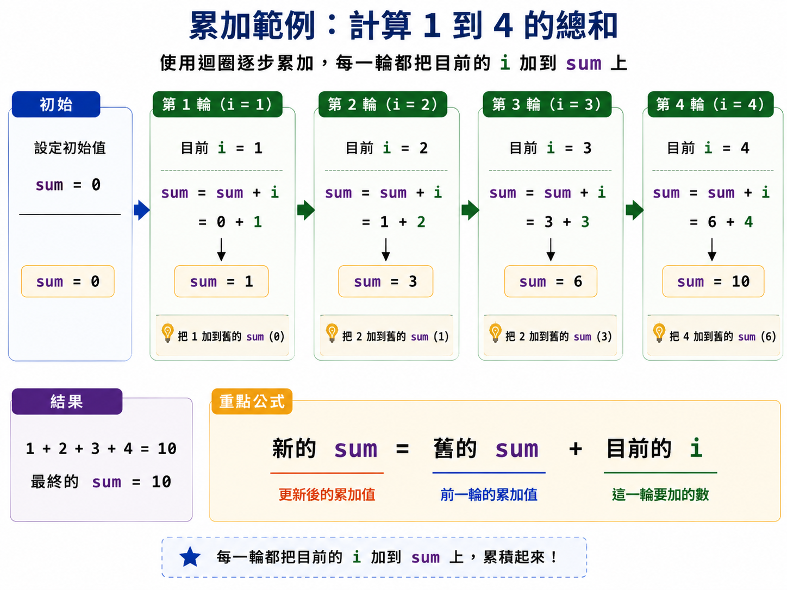
</p>

以 `1` 到 `4` 為例：

```c
int sum = 0;

for (i = 1; i <= 4; i++) {
    sum += i;
}
```

| `i` | 更新前 `sum` | 更新後 `sum` |
| ---: | ---: | ---: |
| 1 | 0 | 1 |
| 2 | 1 | 3 |
| 3 | 3 | 6 |
| 4 | 6 | 10 |

---

### 28. 求 1 到 N 的整數和

```c
#include <stdio.h>

int main(void) {
    int n;
    int sum = 1;
    int i;

    printf("N = ");
    scanf("%d", &n);

    for (i = 2; i <= n; i++) {
        sum = sum + i;
    }

    printf("%d\n", sum);

    return 0;
}
```

題目假設使用者輸入正整數 `N`。

輸入 `10`，結果為 `55`。

輸入 `100`，結果為 `5050`。

---

### 29. 數學公式也是一種方法

<!-- lesson-image: C_Lesson_09_img16_loop_sum_vs_formula.png -->
<p align="center">
  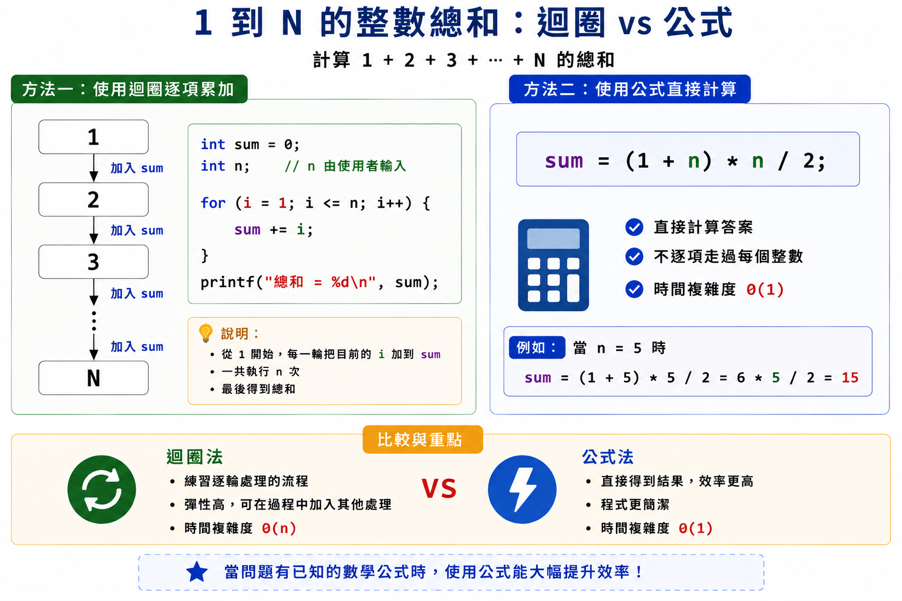
</p>

來源最後也比較了數學公式：

```c
sum = (1 + n) * n / 2;
```

完整程式：

```c
#include <stdio.h>

int main(void) {
    int n;
    int sum;

    printf("N = ");
    scanf("%d", &n);

    sum = (1 + n) * n / 2;

    printf("%d\n", sum);

    return 0;
}
```

公式能直接得到答案，但本章使用迴圈的主要目的，是練習逐輪累加與控制流程。

---

### 30. 用文字畫指定長度的橫線

題目：

> 使用者輸入正整數 `N`，輸出 `N` 個星號。

輸入：

```text
5
```

輸出：

```text
*****
```

---

### 31. 橫線程式

```c
#include <stdio.h>

int main(void) {
    int n;
    int count;

    printf("N = ");
    scanf("%d", &n);

    for (count = 1; count <= n; count++) {
        printf("*");
    }

    printf("\n");

    return 0;
}
```

迴圈本體每輪只輸出一個星號，不換行。

迴圈完成後才輸出換行。

---

### 32. 為什麼不是在迴圈內寫 `\n`？

<!-- lesson-image: C_Lesson_09_img17_horizontal_vs_vertical_output.png -->
<p align="center">
  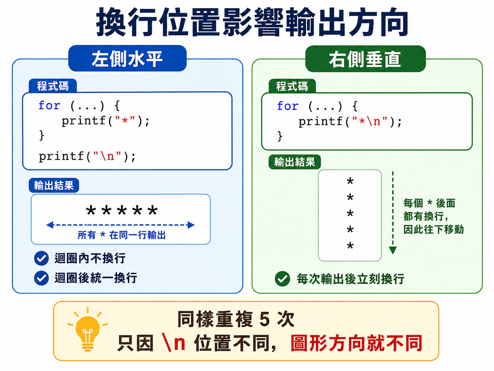
</p>

下面的程式：

```c
for (count = 1; count <= n; count++) {
    printf("*\n");
}
```

輸入 `5` 時會得到：

```text
*
*
*
*
*
```

這是垂直線，不是水平線。

---

### 33. 為什麼需要 `break`？

有些搜尋問題在找到答案後，就不需要繼續檢查剩餘數字。

例如由小到大尋找第一個符合條件的數字，或由大到小尋找最大的符合值。

若繼續迴圈：

- 浪費不必要的檢查。
- 可能需要額外旗標防止答案被覆蓋。
- 程式意圖較不直接。

`break` 可以在找到答案時立即離開迴圈。

---

### 34. `break` 的基本例子

<!-- lesson-image: C_Lesson_09_img18_break_flow.png -->
<p align="center">
  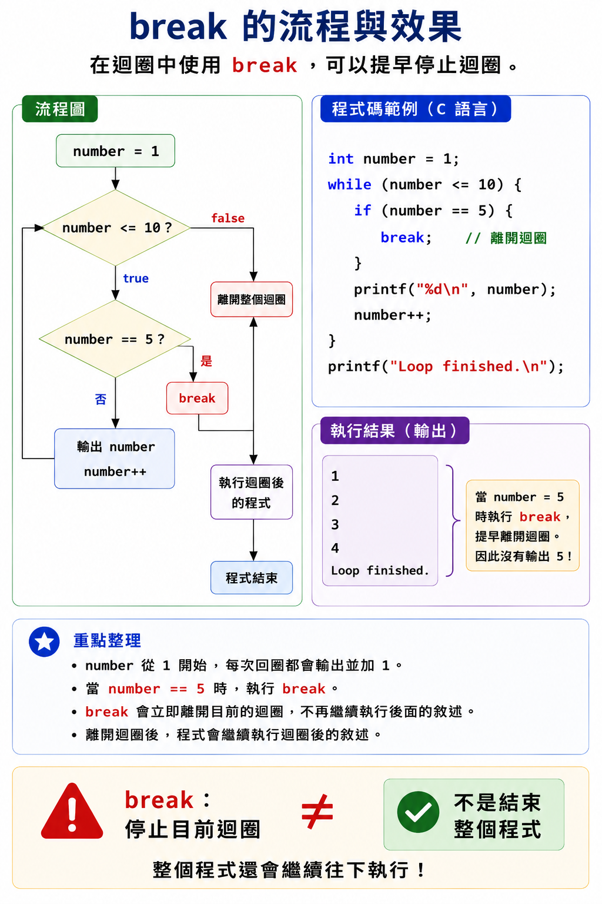
</p>

```c
#include <stdio.h>

int main(void) {
    int number;

    for (number = 1; number <= 10; number++) {
        if (number == 5) {
            break;
        }

        printf("%d\n", number);
    }

    printf("Loop finished.\n");

    return 0;
}
```

輸出：

```text
1
2
3
4
Loop finished.
```

`break` 離開迴圈，但沒有結束整個 `main()`。

---

### 35. 韓信點兵最大值問題

來源練習要求：

> 使用者輸入搜尋上限，找出上限內符合下列條件的最大整數。

條件：

```c
number % 3 == 2
number % 5 == 3
number % 7 == 2
```

因為要求最大值，可以從上限往下搜尋。

---

### 36. 使用條件旗標控制搜尋

```c
int answer = 0;

for (number = maximum;
     number >= 1 && answer == 0;
     number--) {
    if (number % 3 == 2 &&
        number % 5 == 3 &&
        number % 7 == 2) {
        answer = number;
    }
}
```

找到答案後，`answer == 0` 不再成立，下一次條件檢查時結束迴圈。

---

### 37. 使用 `break` 簡化搜尋

<!-- lesson-image: C_Lesson_09_img21_reverse_search_with_break.png -->
<p align="center">
  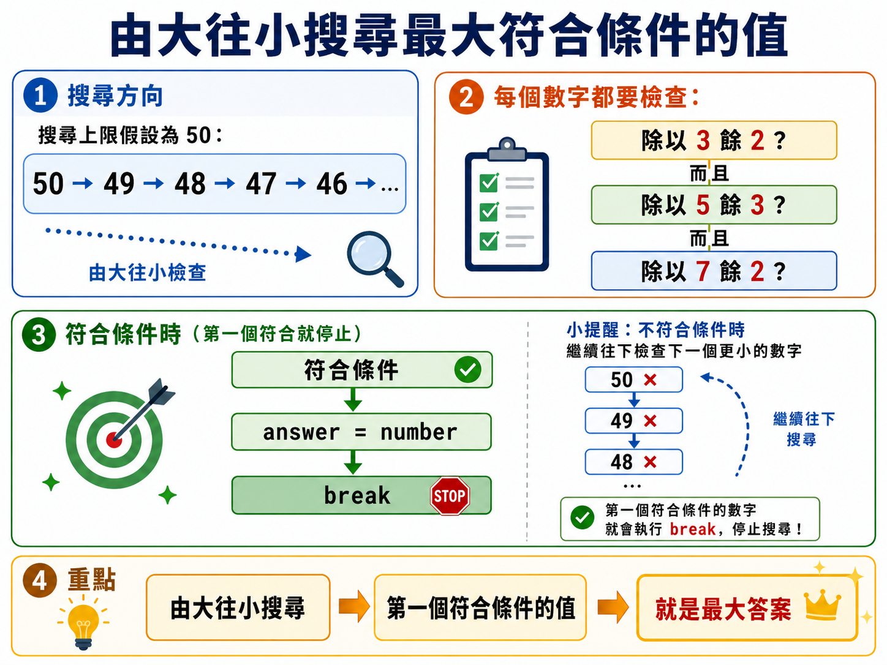
</p>

```c
#include <stdio.h>

int main(void) {
    int maximum;
    int number;
    int answer = 0;

    printf("MAX = ");
    scanf("%d", &maximum);

    for (number = maximum; number >= 1; number--) {
        if (number % 3 == 2 &&
            number % 5 == 3 &&
            number % 7 == 2) {
            answer = number;
            break;
        }
    }

    if (answer != 0) {
        printf("%d\n", answer);
    } else {
        printf("Not found\n");
    }

    return 0;
}
```

由大往小搜尋，因此第一個符合條件的數字就是最大答案。

---

### 38. `continue` 的基本例子

<!-- lesson-image: C_Lesson_09_img19_continue_flow.png -->
<p align="center">
  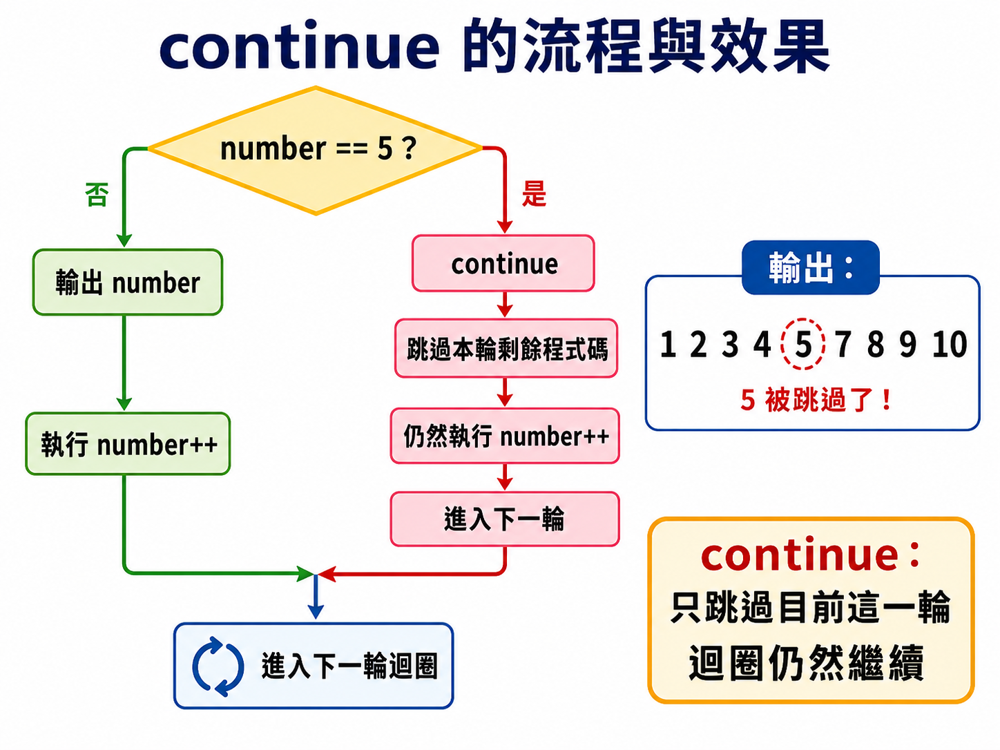
</p>

```c
#include <stdio.h>

int main(void) {
    int number;

    for (number = 1; number <= 10; number++) {
        if (number == 5) {
            continue;
        }

        printf("%d\n", number);
    }

    return 0;
}
```

輸出：

```text
1
2
3
4
6
7
8
9
10
```

`5` 那一輪的 `printf()` 被跳過，但迴圈仍繼續。

---

### 39. `break` 與 `continue` 的比較

<!-- lesson-image: C_Lesson_09_img20_break_vs_continue.png -->
<p align="center">
  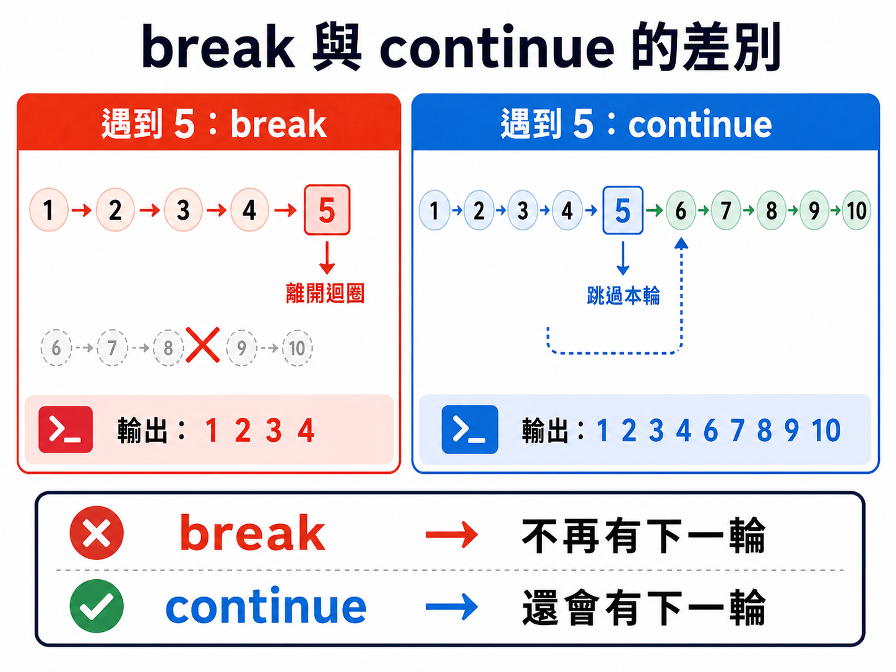
</p>

| 項目 | `break` | `continue` |
| --- | --- | --- |
| 影響範圍 | 結束目前迴圈 | 只結束目前這一輪 |
| 後續迭代 | 不再執行 | 仍會繼續 |
| 常見用途 | 找到答案後停止搜尋 | 略過不需要處理的資料 |
| 範例遇到 5 | 只輸出 1 到 4 | 輸出 1 到 10，但沒有 5 |

---

## Section V-A. 容易搞混的重點

### 1. 初始式不是每輪都執行

```c
for (count = 1; count <= 10; count++)
```

`count = 1` 只執行一次。

---

### 2. 迴圈式不是在本體之前執行

第一輪先使用初始值執行本體，之後才執行 `count++`。

---

### 3. 迴圈結束時，控制變數通常已超過邊界

```c
for (count = 1; count <= 10; count++)
```

離開迴圈時，`count` 通常是 `11`。

---

### 4. `<` 與 `<=` 不是排版差異

它們會直接決定終點是否被處理。

---

### 5. 遞減迴圈要同時修改三個部分

從正向：

```c
count = 1;
count <= 10;
count++;
```

改成反向時通常是：

```c
count = 10;
count >= 1;
count--;
```

只改其中一個部分通常會錯。

---

### 6. 奇數不一定要用 `if`

```c
for (number = 1; number <= 9; number += 2)
```

可以直接走過奇數，不一定要逐一檢查。

---

### 7. 直接產生與條件篩選都可能正確

<!-- lesson-image: C_Lesson_09_img12_generation_vs_filtering.png -->
<p align="center">
  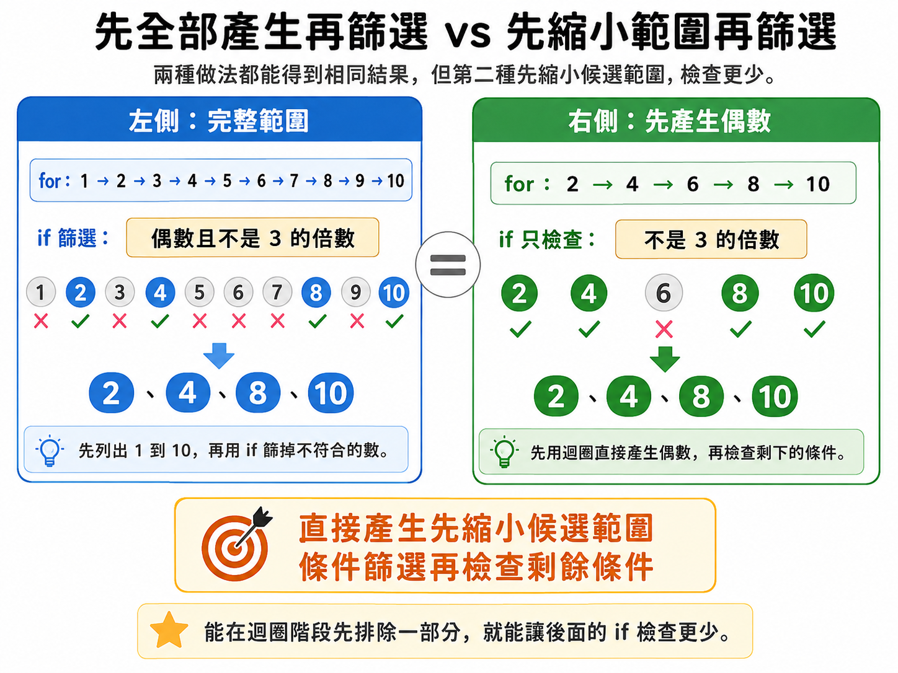
</p>

直接產生通常少檢查一些值。

條件篩選通常更接近題目的文字條件，也容易擴充成複雜條件。

---

### 8. `count` 不一定就是輸出的數字

使用：

```c
number = 2 * count - 1;
```

時，`count` 是項次，`number` 是數列值。

---

### 9. 累加器與控制變數不是同一用途

<!-- lesson-image: C_Lesson_09_img15_control_variable_vs_accumulator.png -->
<p align="center">
  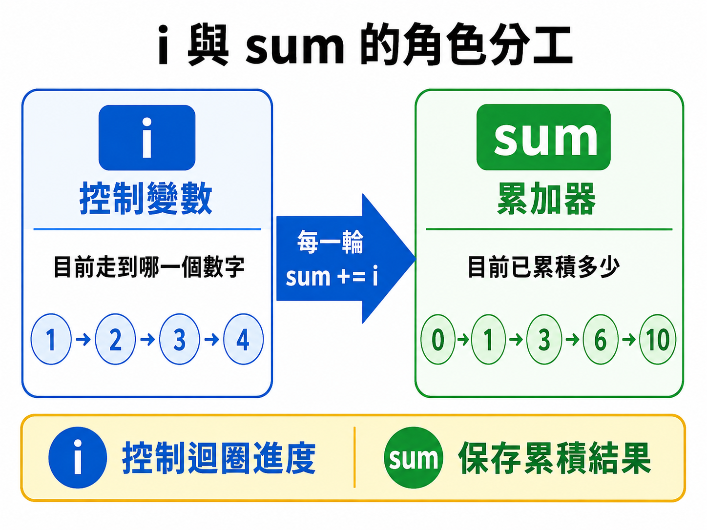
</p>

```c
i
```

控制目前走到哪個數字。

```c
sum
```

保存到目前為止的總和。

---

### 10. 公式得到答案，不等於練習了迴圈

```c
sum = (1 + n) * n / 2;
```

是有效方法，但不會經過逐項累加。

本章應理解兩種方法的差異。

---

### 11. 水平線與垂直線只差換行位置

```c
printf("*");
```

不換行。

```c
printf("*\n");
```

每次輸出後換行。

---

### 12. `break` 不是跳過一次

`break` 會離開整個目前迴圈。

只想跳過一輪應使用 `continue`。

---

### 13. `continue` 不是離開迴圈

它只跳過本輪剩餘程式碼，之後仍會進入下一輪。

---

### 14. `break` 後的迴圈外程式仍會執行

```c
break;
```

不等於：

```c
return 0;
```

---

### 15. `continue` 前面的程式碼仍已執行

```c
printf("Checking\n");

if (condition) {
    continue;
}
```

`Checking` 已經輸出，只有 `continue` 後面的部分被跳過。

---

### 16. 本章的 `break` 只中止目前所屬迴圈

之後學習巢狀迴圈時，這一點會更重要。

`break` 不會自動離開所有外層迴圈。

---

## Section VI. 快速概念檢查

### Q1. `for` 小括號中的三個部分是什麼？

<details>
<summary>查看答案</summary>

初始式、條件式、迴圈式。

</details>

---

### Q2. 初始式會執行幾次？

<details>
<summary>查看答案</summary>

一次，在第一次檢查條件之前執行。

</details>

---

### Q3. 迴圈式在什麼時候執行？

<details>
<summary>查看答案</summary>

每一輪迴圈本體執行完成之後。

</details>

---

### Q4. 下列程式會輸出哪些數字？

```c
for (count = 1; count < 5; count++) {
    printf("%d\n", count);
}
```

<details>
<summary>查看答案</summary>

```text
1
2
3
4
```

</details>

---

### Q5. 要輸出 `10` 到 `1`，更新應使用 `count++` 還是 `count--`？

<details>
<summary>查看答案</summary>

`count--`。

</details>

---

### Q6. `number += 2` 代表什麼？

<details>
<summary>查看答案</summary>

每一輪將 `number` 增加 `2`。

</details>

---

### Q7. 判斷偶數的條件是什麼？

<details>
<summary>查看答案</summary>

```c
number % 2 == 0
```

</details>

---

### Q8. 求總和時，`sum` 通常要先設定成多少？

<details>
<summary>查看答案</summary>

通常設定成 `0`。來源其中一種寫法先把 `1` 放入 `sum`，再從 `2` 開始累加，也能得到正確結果。

</details>

---

### Q9. 畫水平線時，換行應放在迴圈內還是迴圈後？

<details>
<summary>查看答案</summary>

放在迴圈後。迴圈內只重複輸出字元。

</details>

---

### Q10. `break` 執行後會發生什麼？

<details>
<summary>查看答案</summary>

立即離開目前所屬的迴圈，繼續執行迴圈後的程式。

</details>

---

### Q11. `continue` 執行後會發生什麼？

<details>
<summary>查看答案</summary>

跳過目前這一輪後面的程式碼，接著準備下一輪。

</details>

---

### Q12. 哪一個會完全停止迴圈：`break` 還是 `continue`？

<details>
<summary>查看答案</summary>

`break`。

</details>

---

## Section VII. 程式閱讀練習

### 題目 1：基本追蹤

```c
int count;

for (count = 2; count <= 6; count++) {
    printf("%d\n", count);
}
```

請回答：

1. 第一次輸出什麼？
2. 最後一次輸出什麼？
3. 本體執行幾次？
4. 結束後 `count` 是多少？

<details>
<summary>查看答案</summary>

1. `2`
2. `6`
3. 5 次
4. `7`

</details>

---

### 題目 2：少一個終點

```c
for (count = 1; count < 10; count++) {
    printf("%d\n", count);
}
```

<details>
<summary>查看答案</summary>

輸出 `1` 到 `9`，不包含 `10`。

</details>

---

### 題目 3：反向輸出

```c
for (count = 5; count >= 1; count--) {
    printf("%d\n", count);
}
```

<details>
<summary>查看答案</summary>

```text
5
4
3
2
1
```

結束後 `count` 是 `0`。

</details>

---

### 題目 4：等差數列

```c
for (number = 3; number <= 15; number += 3) {
    printf("%d\n", number);
}
```

<details>
<summary>查看答案</summary>

```text
3
6
9
12
15
```

</details>

---

### 題目 5：條件篩選

```c
for (number = 1; number <= 10; number++) {
    if (number % 2 == 0 && number % 3 != 0) {
        printf("%d\n", number);
    }
}
```

<details>
<summary>查看答案</summary>

```text
2
4
8
10
```

</details>

---

### 題目 6：累加器

```c
int sum = 0;

for (i = 1; i <= 4; i++) {
    sum += i;
}
```

<details>
<summary>查看答案</summary>

最後 `sum` 是：

```text
10
```

</details>

---

### 題目 7：`break`

```c
for (number = 1; number <= 8; number++) {
    if (number == 4) {
        break;
    }

    printf("%d\n", number);
}
```

<details>
<summary>查看答案</summary>

```text
1
2
3
```

`number == 4` 時離開迴圈。

</details>

---

### 題目 8：`continue`

```c
for (number = 1; number <= 8; number++) {
    if (number == 4) {
        continue;
    }

    printf("%d\n", number);
}
```

<details>
<summary>查看答案</summary>

```text
1
2
3
5
6
7
8
```

只跳過 `4`。

</details>

---

## Section VIII. 實作練習 / 實作檢測題

### TODO 1：印出 1 到 10

使用 `for`，每個數字一行。

---

### TODO 2：印出 1 到 N

輸入正整數 `N`，印出 `1` 到 `N`。

---

### TODO 3：印出 M 到 N

輸入整數 `M` 與 `N`，假設 `M <= N`。

---

### TODO 4：印出 10 到 1

使用遞減的 `for`。

---

### TODO 5：印出 N 到 1

輸入正整數 `N`，反向輸出到 `1`。

---

### TODO 6：印出 1 到 100 的奇數

先使用直接產生的方法：

```c
number += 2
```

再改用 `%` 篩選，確認結果相同。

---

### TODO 7：印出 1 到 N 的偶數

輸入正整數 `N`。

若 `N` 是奇數，只輸出不大於 `N` 的偶數。

---

### TODO 8：等差數列

輸入：

```text
start
end
difference
```

假設 `difference > 0` 且 `start <= end`，輸出：

```text
start, start + difference, ...
```

直到不超過 `end`。

---

### TODO 9：偶數且不是 3 的倍數

輸出 `1` 到 `100` 之間：

- 是偶數
- 不是 `3` 的倍數

的所有整數。

---

### TODO 10：求 1 到 N 的總和

使用累加器與 `for`。

---

### TODO 11：求 M 到 N 的總和

輸入 `M` 與 `N`，假設 `M <= N`。

---

### TODO 12：文字橫線

輸入正整數 `N`，輸出 `N` 個：

```text
-
```

最後再換行。

---

### TODO 13：遇到 5 就停止

使用 `for` 印出 `1` 到 `10`，遇到 `5` 時使用 `break`。

預期只印出：

```text
1
2
3
4
```

---

### TODO 14：跳過 5

使用 `for` 印出 `1` 到 `10`，使用 `continue` 跳過 `5`。

---

### TODO 15：韓信點兵最大值

輸入搜尋上限 `MAX`，由大往小搜尋第一個同時符合：

```c
number % 3 == 2
number % 5 == 3
number % 7 == 2
```

的整數。

找到後使用 `break`。

---

## Section IX. 做題時可以使用的提示

### 1. 先填寫三格

```text
初始式：
條件式：
迴圈式：
```

印出 1 到 10：

```text
初始式：count = 1
條件式：count <= 10
迴圈式：count++
```

---

### 2. 反向迴圈檢查三件事

1. 初始值是否在較大的一端？
2. 條件是否使用 `>=`？
3. 更新是否使用遞減？

---

### 3. 數列先觀察相鄰差值

```text
2, 5, 8, 11, ...
```

每次增加 `3`，因此迴圈式可以考慮：

```c
number += 3
```

---

### 4. 先決定是「產生」還是「篩選」

題目只要偶數：

- 可直接從 `2` 開始，每次加 `2`。
- 也可走過所有整數，再檢查 `% 2 == 0`。

題目條件複雜時，兩者也可以混合。

---

### 5. 累加題先寫追蹤表

| `i` | `sum` 更新前 | `sum` 更新後 |
| ---: | ---: | ---: |
| 1 | 0 | 1 |
| 2 | 1 | 3 |
| 3 | 3 | 6 |

---

### 6. 搜尋最大值時考慮反向搜尋

從上限往下找，第一個符合條件的值就是最大值，可以立即 `break`。

---

### 7. 懷疑 off-by-one 時檢查四處

<!-- lesson-image: C_Lesson_09_img23_off_by_one_checklist.png -->
<p align="center">
  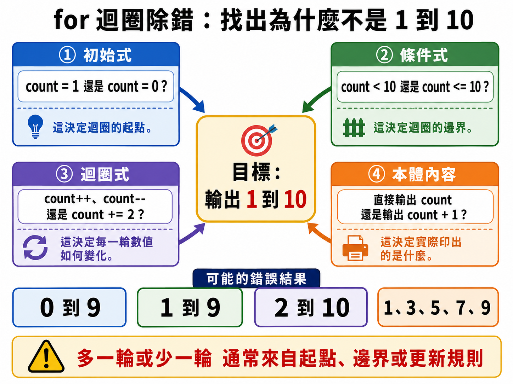
</p>

1. 初始值。
2. `<` 或 `<=`。
3. `++` 或 `--`。
4. 輸出發生在更新前還是更新後。

---

### 8. 橫線題只讓迴圈控制字元數量

```c
printf("*");
```

最後統一：

```c
printf("\n");
```

---

## Section X. 課後小練習

### 練習 1：印出 5 的倍數

印出 `5` 到 `100` 的所有 5 的倍數。

---

### 練習 2：反向偶數

印出：

```text
20
18
16
...
2
```

---

### 練習 3：項次轉換

使用：

```c
number = 3 * count + 1;
```

觀察 `count` 從 `0` 到 `5` 時產生的數列。

---

### 練習 4：條件數列

印出 `1` 到 `100` 之間：

- 可被 `4` 整除
- 但不可被 `6` 整除

的整數。

---

### 練習 5：偶數總和

計算 `2 + 4 + 6 + ... + 100`。

---

### 練習 6：指定字元橫線

輸入：

- 一個字元
- 正整數 `N`

輸出該字元 `N` 次。

---

### 練習 7：找到第一個倍數

從 `1` 開始搜尋第一個同時是 `7` 與 `11` 的倍數，找到後使用 `break`。

---

### 練習 8：跳過倍數

印出 `1` 到 `30`，使用 `continue` 跳過所有 `3` 的倍數。

---

## Section XI. 重點複習

1. `for` 適合起點、終點及更新規則明確的迴圈。
2. 基本語法包含初始式、條件式與迴圈式。
3. 初始式只執行一次。
4. 條件式在每輪本體前檢查。
5. 迴圈式在每輪本體後執行。
6. `for` 可以改寫成相對應的 `while`。
7. `<` 與 `<=` 決定是否包含終點。
8. 反向計數要使用適合的起點、條件及遞減更新。
9. 更新量可以是 `1`、`2`、`3` 或其他固定值。
10. 等差數列可直接由迴圈式表達。
11. 奇數與偶數可以直接產生、公式轉換或條件篩選。
12. 複雜條件可以把產生與篩選結合。
13. 累加器用來保存目前總和。
14. 累加器必須先初始化。
15. `1` 到 `N` 的總和可以使用迴圈，也可以使用公式。
16. 畫水平線時，重複字元的輸出不要在迴圈內換行。
17. `break` 會立即離開目前迴圈。
18. `continue` 只跳過目前一輪剩餘的程式碼。
19. `break` 適合找到答案後停止搜尋。
20. `continue` 適合略過不需要處理的值。
21. `break` 不會結束整個程式。
22. `continue` 不會結束整個迴圈。
23. 寫迴圈後要測試第一項、最後一項及結束後的控制變數。
24. 下一章會把 `for` 放入另一個 `for`，建立巢狀迴圈。

---

## Section XII. 常見錯誤提醒

### 錯誤 1：漏掉分號分隔

錯誤：

```c
for (count = 1 count <= 10 count++)
```

正確：

```c
for (count = 1; count <= 10; count++)
```

---

### 錯誤 2：`for` 後面多一個分號

錯誤：

```c
for (count = 1; count <= 10; count++);
```

---

### 錯誤 3：終點條件寫錯

題目要求包含 `10`，卻寫：

```c
count < 10
```

---

### 錯誤 4：更新方向錯誤

```c
for (count = 10; count >= 1; count++)
```

應使用：

```c
count--
```

---

### 錯誤 5：起點與更新量不匹配

要印偶數卻寫：

```c
for (number = 1; number <= 10; number += 2)
```

這會印出奇數。

---

### 錯誤 6：公式轉換的常數錯誤

第 `count` 個正奇數是：

```c
2 * count - 1
```

不是：

```c
2 * count + 1
```

當 `count` 從 `1` 開始時，後者會從 `3` 開始。

---

### 錯誤 7：累加器未初始化

錯誤：

```c
int sum;

for (...) {
    sum += i;
}
```

---

### 錯誤 8：把 `sum` 每輪重設

錯誤：

```c
for (i = 1; i <= n; i++) {
    sum = 0;
    sum += i;
}
```

每輪都清零，無法保留先前結果。

---

### 錯誤 9：橫線每個字元都換行

錯誤：

```c
printf("*\n");
```

---

### 錯誤 10：把 `break` 當成跳過一次

```c
if (number == 5) {
    break;
}
```

會完全離開迴圈，不會繼續到 `6`。

---

### 錯誤 11：把 `continue` 當成停止迴圈

```c
if (number == 5) {
    continue;
}
```

只跳過 `5` 那一輪。

---

### 錯誤 12：把輸出放在 `continue` 前面

```c
printf("%d\n", number);

if (number == 5) {
    continue;
}
```

`5` 已經輸出，`continue` 無法撤回前面的動作。

---

### 錯誤 13：找到答案後沒有保存

```c
if (符合條件) {
    break;
}
```

離開前應先把答案存入變數，或在離開前直接輸出。

---

### 錯誤 14：反向搜尋卻使用錯誤邊界

```c
for (number = maximum; number <= 1; number--)
```

初始值通常大於 `1`，第一次條件就不成立。

應使用：

```c
number >= 1
```

---

## Section XIII. Mermaid 流程圖

### 1. `for` 的基本流程

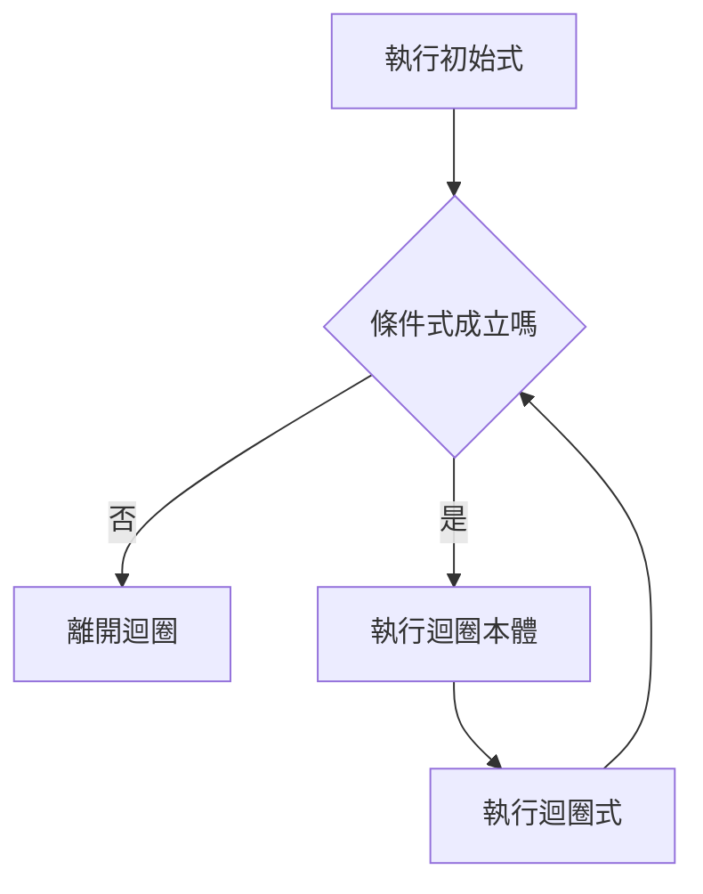
```mermaid
flowchart TD
    A[執行初始式] --> B{條件式成立嗎}
    B -- 否 --> F[離開迴圈]
    B -- 是 --> C[執行迴圈本體]
    C --> D[執行迴圈式]
    D --> B
```

---

### 2. `for` 與 `while` 的對應

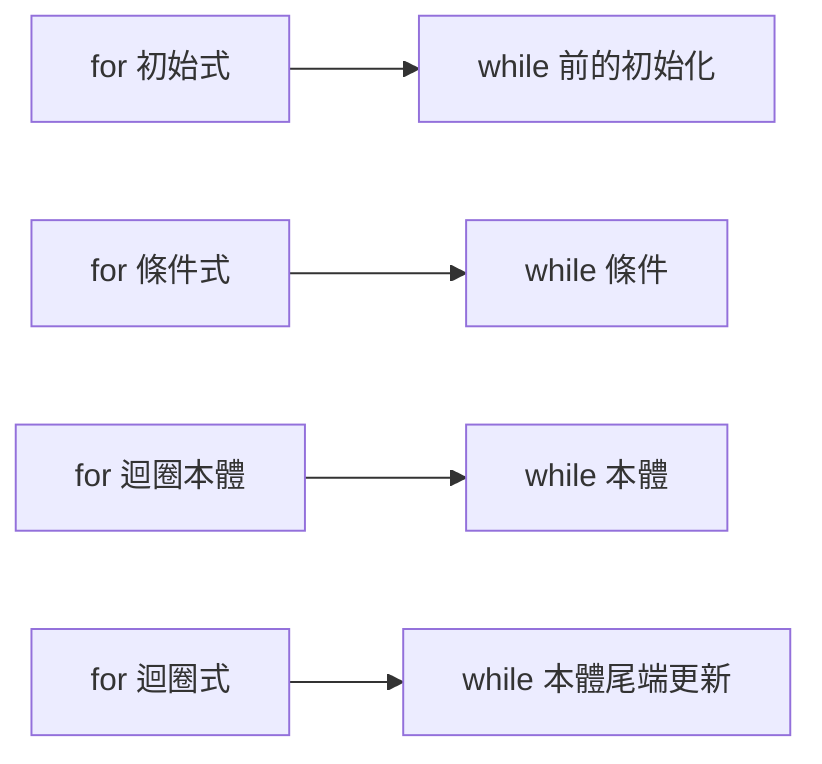
```mermaid
flowchart LR
    A[for 初始式] --> B[while 前的初始化]
    C[for 條件式] --> D[while 條件]
    E[for 迴圈本體] --> F[while 本體]
    G[for 迴圈式] --> H[while 本體尾端更新]
```

---

### 3. 直接產生偶數

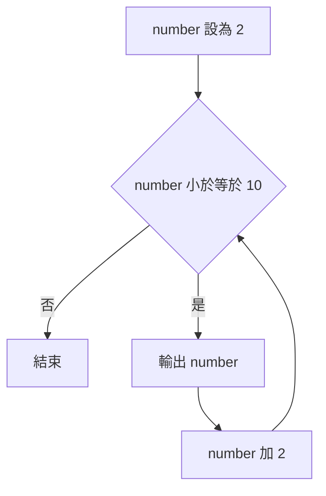
```mermaid
flowchart TD
    A[number 設為 2] --> B{number 小於等於 10}
    B -- 否 --> E[結束]
    B -- 是 --> C[輸出 number]
    C --> D[number 加 2]
    D --> B
```

---

### 4. 條件篩選

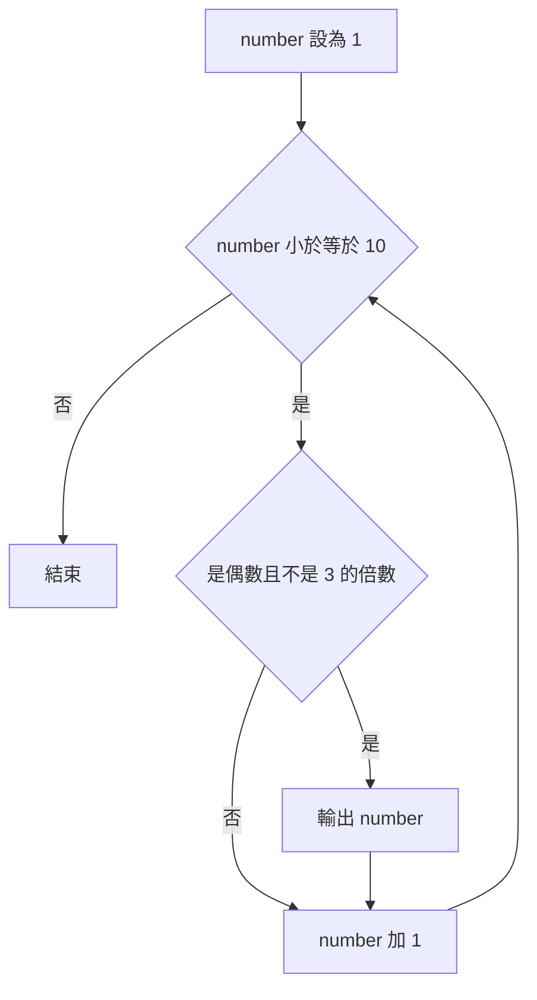
```mermaid
flowchart TD
    A[number 設為 1] --> B{number 小於等於 10}
    B -- 否 --> F[結束]
    B -- 是 --> C{是偶數且不是 3 的倍數}
    C -- 是 --> D[輸出 number]
    C -- 否 --> E[number 加 1]
    D --> E
    E --> B
```

---

### 5. 連續整數和

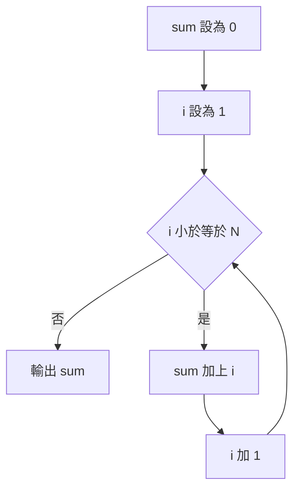
```mermaid
flowchart TD
    A[sum 設為 0] --> B[i 設為 1]
    B --> C{i 小於等於 N}
    C -- 否 --> F[輸出 sum]
    C -- 是 --> D[sum 加上 i]
    D --> E[i 加 1]
    E --> C
```

---

### 6. `break` 搜尋

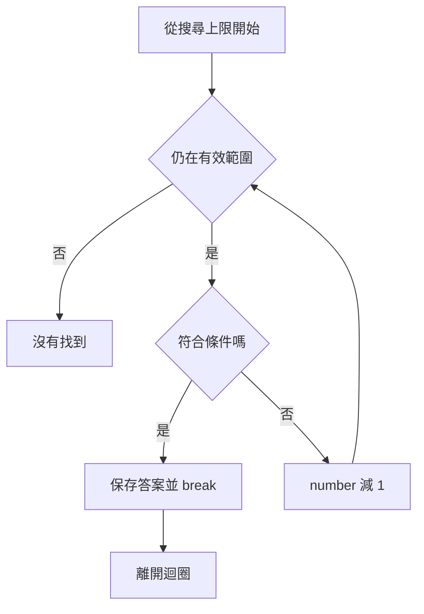
```mermaid
flowchart TD
    A[從搜尋上限開始] --> B{仍在有效範圍}
    B -- 否 --> F[沒有找到]
    B -- 是 --> C{符合條件嗎}
    C -- 是 --> D[保存答案並 break]
    D --> G[離開迴圈]
    C -- 否 --> E[number 減 1]
    E --> B
```

---

### 7. `continue` 跳過 5

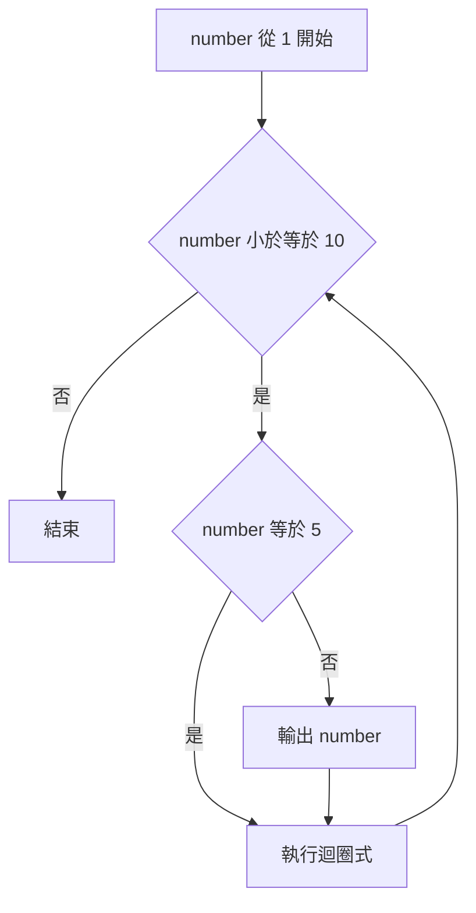
```mermaid
flowchart TD
    A[number 從 1 開始] --> B{number 小於等於 10}
    B -- 否 --> F[結束]
    B -- 是 --> C{number 等於 5}
    C -- 是 --> E[執行迴圈式]
    C -- 否 --> D[輸出 number]
    D --> E
    E --> B
```

---

## 本章完成標準

完成本章後，你應該能做到：

1. 正確寫出 `for` 的基本語法。
2. 說明初始式、條件式及迴圈式的作用。
3. 按正確順序追蹤 `for` 的執行流程。
4. 將簡單 `while` 改寫成 `for`。
5. 使用 `for` 印出固定或輸入指定的整數範圍。
6. 正確處理遞增與遞減計數。
7. 使用不同更新量產生等差數列。
8. 使用直接產生、項次公式及條件篩選處理奇偶數。
9. 結合迴圈更新與 `if` 處理多重條件數列。
10. 使用累加器求連續整數和。
11. 比較迴圈累加與數學公式的差異。
12. 使用 `for` 繪製指定長度的文字橫線。
13. 正確安排換行位置。
14. 使用 `break` 提前中止搜尋。
15. 使用 `continue` 跳過目前一輪。
16. 說明 `break` 與 `continue` 的差異。
17. 找出條件、邊界與更新方向造成的錯誤。
18. 使用追蹤表分析第一輪、最後一輪及離開後狀態。
19. 完成韓信點兵最大值的 `break` 搜尋。
20. 準備在下一章使用巢狀 `for` 製作表格與圖形。
