# Lesson 10：Nested Loops 巢狀迴圈

> 這堂課的重點：把一個迴圈放進另一個迴圈，使用外層控制「第幾列／第幾組」，內層控制「該列／該組中的每一項」，完成九九乘法表、文字圖形、座標判斷與整數解搜尋。

---

## Section I. 今天要做什麼？

1. 理解什麼是巢狀迴圈。
2. 分辨外層迴圈與內層迴圈的責任。
3. 理解外層每執行一輪，內層會完整執行一次。
4. 使用追蹤表計算內層本體總共執行幾次。
5. 從重複撰寫多個 `for`，整理成雙層 `for`。
6. 使用巢狀迴圈印出九九乘法表。
7. 分辨乘法表中的被乘數與乘數。
8. 使用單一計數變數將二維組合展開成一維序列。
9. 使用外層控制列、內層控制欄。
10. 繪製 `N × N` 的實心正方形。
11. 將正方形延伸成可指定高度與寬度的長方形。
12. 繪製空心正方形。
13. 使用「上邊、下邊、左邊、右邊」判斷邊界。
14. 比較分段繪圖與座標判斷兩種方法。
15. 繪製左下角實心直角三角形。
16. 理解第 `i` 列為什麼要輸出 `i` 個星號。
17. 繪製左下角空心直角三角形。
18. 使用座標 `(i, j)` 描述每個輸出位置。
19. 使用 `i == j` 畫出主對角線。
20. 使用 `i >= j` 畫出實心三角形。
21. 使用多個邊界條件畫出空心三角形。
22. 使用 `i + j` 關係畫出靠右的三角形。
23. 理解不同座標條件如何改變圖形方向。
24. 使用雙層迴圈枚舉兩個整數的所有可能組合。
25. 找出「和為 30、積為 221」的正整數解。
26. 理解為什麼 `(13, 17)` 與 `(17, 13)` 會重複出現。
27. 使用條件與數學關係縮小搜尋範圍。
28. 將雙層搜尋簡化成單層搜尋。
29. 分析巢狀迴圈的執行次數。
30. 為下一章的因數、質數與韓信點兵解題建立基礎。

---

## Section II. 今天的學習方式

1. 先決定輸出有幾列。
2. 再決定每一列有幾個位置。
3. 讓外層迴圈控制列或第一個變數。
4. 讓內層迴圈控制欄或第二個變數。
5. 每完成一列後，再輸出一次換行。
6. 先用固定的 `N = 3` 或 `N = 5` 觀察規律。
7. 將每個位置標上 `(列, 欄)` 座標。
8. 先說出「什麼位置要印星號」，再翻譯成條件。
9. 實心圖形通常判斷區域；空心圖形通常判斷邊界。
10. 複雜圖形先畫座標表，不要直接猜條件。
11. 搜尋兩個未知數時，先列出所有合法範圍。
12. 找到答案後，再思考能否去除重複組合。
13. 再利用已知方程式減少一層迴圈。
14. 每個範例都測試最小合理輸入、一般輸入與邊界輸入。
15. 本章先專注雙層迴圈；更多數學解題會放在下一章。

---

## Section III. 今天會學到的內容

| 主題 | 你需要知道的事 |
| --- | --- |
| 巢狀迴圈 | 一個迴圈本體中包含另一個迴圈 |
| 外層迴圈 | 控制列、組別或第一個未知數 |
| 內層迴圈 | 控制欄、組內項目或第二個未知數 |
| 完整執行 | 外層每一輪，內層通常從頭到尾跑一次 |
| 二維組合 | 每個 `i` 都會配上每個合法的 `j` |
| 列與欄 | `i` 常代表列，`j` 常代表欄 |
| 換行 | 通常放在內層迴圈之後、外層迴圈之內 |
| 乘法表 | 外層選被乘數，內層列出乘數 |
| 實心圖形 | 每個位置都印出圖形字元 |
| 空心圖形 | 只在邊界位置印出圖形字元 |
| 座標法 | 逐一判斷每個 `(i, j)` 應印什麼 |
| 主對角線 | `i == j` |
| 左下三角區域 | `i >= j` |
| 右上／靠右區域 | 常使用 `i + j` 與 `N + 1` 的關係 |
| 邊界聯集 | 使用 `||` 組合多條邊 |
| 枚舉 | 把有限範圍內的所有可能逐一測試 |
| 搜尋空間 | 迴圈實際檢查的候選組合數量 |
| 去除重複 | 例如限制 `i <= j` |
| 降維 | 用一個方程式算出另一個未知數 |
| 執行次數 | 固定 `N × N` 通常會處理 `N²` 個位置 |

---

## Section IV. 寫題目前的提醒

### 1. 巢狀迴圈不是兩個連續迴圈

<!-- lesson-image: C_Lesson_10_img01_sequential_vs_nested_loops.png -->
<p align="center">
  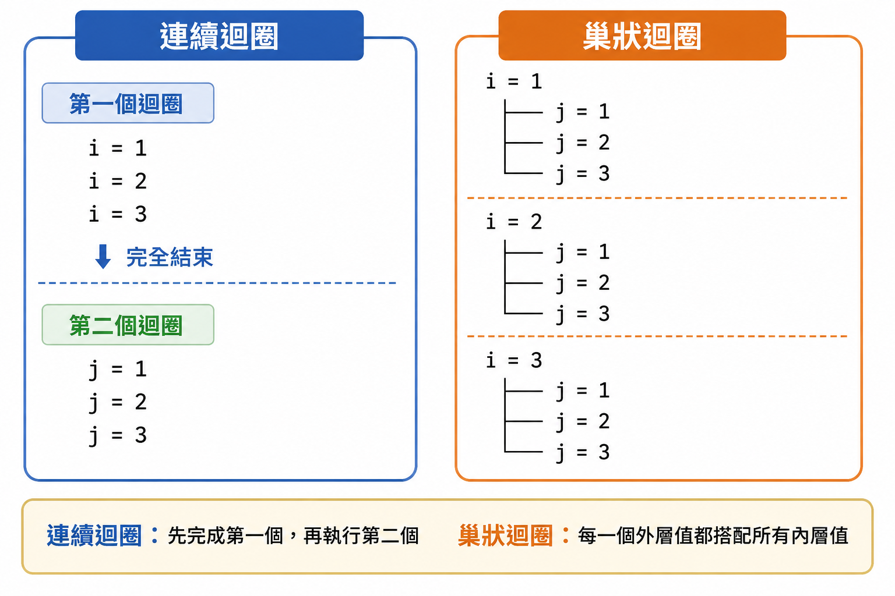
</p>

兩個連續迴圈：

```c
for (i = 1; i <= 3; i++) {
    printf("A\n");
}

for (j = 1; j <= 3; j++) {
    printf("B\n");
}
```

第一個完整結束後，第二個才開始。

巢狀迴圈：

```c
for (i = 1; i <= 3; i++) {
    for (j = 1; j <= 3; j++) {
        printf("(%d, %d)\n", i, j);
    }
}
```

每一個 `i` 都會搭配 `j = 1, 2, 3`。

---

### 2. 內層變數每次都會重新初始化

<!-- lesson-image: C_Lesson_10_img04_inner_variable_reset.png -->
<p align="center">
  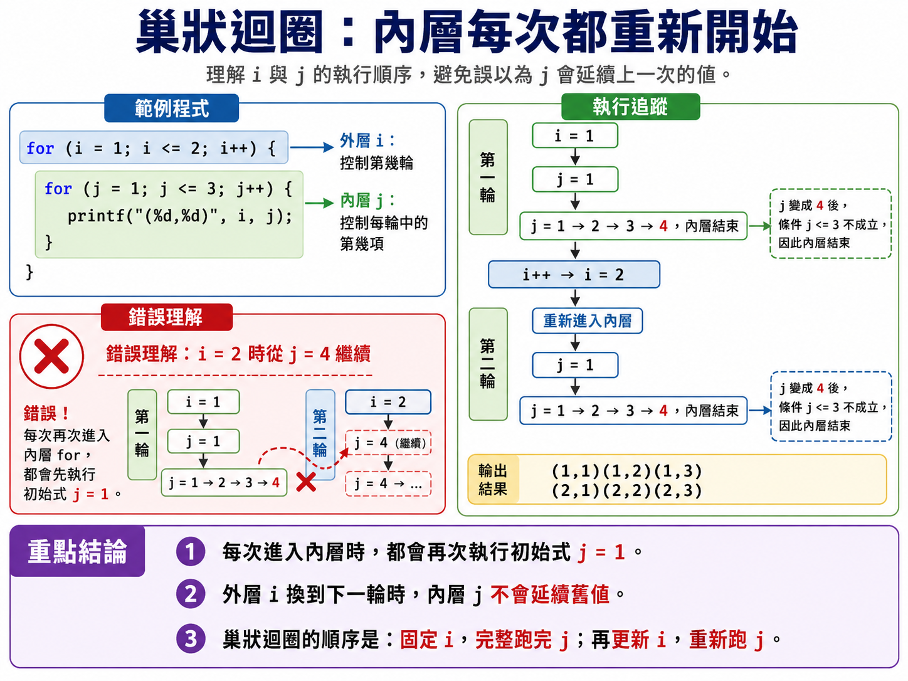
</p>

```c
for (i = 1; i <= 3; i++) {
    for (j = 1; j <= 3; j++) {
        printf("(%d, %d)\n", i, j);
    }
}
```

當 `i` 從 `1` 變成 `2` 時，內層會再次執行：

```c
j = 1
```

不是從上一次結束後的 `j = 4` 繼續。

---

### 3. 換行通常放在內層迴圈之後

正確的正方形：

```c
for (i = 1; i <= n; i++) {
    for (j = 1; j <= n; j++) {
        printf("*");
    }

    printf("\n");
}
```

如果把換行放進內層：

```c
printf("*\n");
```

每一個星號都會單獨一行。

---

### 4. 外層與內層不要誤用同一個控制變數

錯誤：

```c
for (i = 1; i <= n; i++) {
    for (i = 1; i <= n; i++) {
        printf("*");
    }
}
```

內層會修改外層的 `i`，流程失去控制。

應使用不同變數：

```c
i
j
```

---

### 5. 內層條件可以依賴外層變數

三角形：

```c
for (i = 1; i <= n; i++) {
    for (j = 1; j <= i; j++) {
        printf("*");
    }

    printf("\n");
}
```

第 `i` 列執行 `i` 次，所以星號數量逐列增加。

---

### 6. 空白也是圖形的一部分

座標法通常需要：

```c
printf(" ");
```

不能只在星號位置輸出內容，否則靠右對齊與空心區域可能塌縮。

---

### 7. 實心區域與空心邊界的條件不同

實心左下三角形：

```c
i >= j
```

空心左下三角形：

```c
j == 1 || i == n || i == j
```

空心圖形只保留三條邊。

---

### 8. 使用 `||` 表示「位於任一條邊」

空心正方形：

```c
i == 1 || i == n || j == 1 || j == n
```

只要其中一個條件成立，就在邊界上。

---

### 9. `&&` 與 `||` 不可混淆

空心正方形邊界應使用 `||`。

若寫成：

```c
i == 1 && i == n && j == 1 && j == n
```

除非 `n == 1`，否則不可能同時位於所有邊。

---

### 10. 星號與空白最好維持相同顯示寬度

使用：

```c
printf("*");
printf(" ");
```

兩者各占一個字元位置。

若使用：

```c
printf("* ");
```

星號占兩個位置，相關座標與寬度也要一起調整。

---

### 11. 乘法表中的兩個變數角色不同

```c
printf("%d x %d = %d\n", i, j, i * j);
```

通常：

- `i`：目前第幾組乘法
- `j`：這一組中的乘數

---

### 12. 雙層迴圈的總次數不是相加

<!-- lesson-image: C_Lesson_10_img06_nested_iteration_count.png -->
<p align="center">
  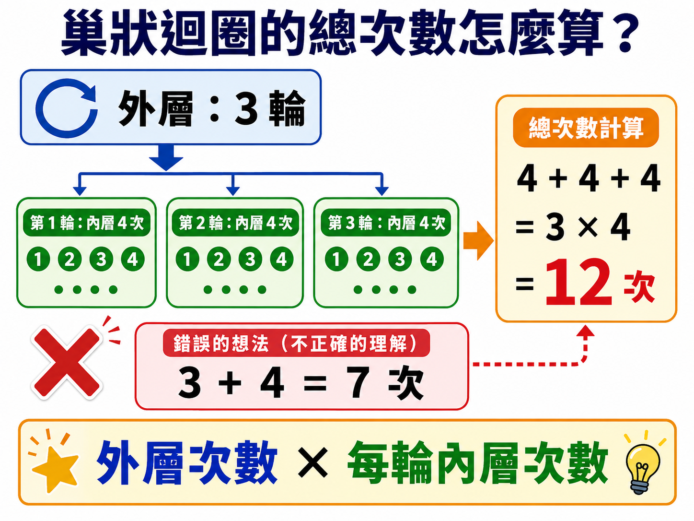
</p>

```c
for (i = 1; i <= 9; i++) {
    for (j = 1; j <= 9; j++) {
        ...
    }
}
```

內層本體執行：

```text
9 × 9 = 81 次
```

不是 `9 + 9 = 18` 次。

若外層從 `2` 到 `9`，則是：

```text
8 × 9 = 72 次
```

---

### 13. 枚舉解時要避免超出題目範圍

題目說「正整數」，因此起點應為：

```c
1
```

不是 `0`，也不是負數。

---

### 14. 對稱解可能會輸出兩次

若檢查所有 `(i, j)`：

```text
(13, 17)
(17, 13)
```

兩者都符合和與積的條件。

如果題目把兩個數視為無順序的一組，可以限制：

```c
i <= j
```

或縮小 `i` 的範圍。

---

### 15. 先使用方程式再搜尋，通常比較有效率

已知：

```text
i + j = 30
```

可以得到：

```c
j = 30 - i;
```

此時不需要再用第二個迴圈猜 `j`。

---

### 16. `break` 只會離開目前那一層迴圈

<!-- lesson-image: C_Lesson_10_img29_break_only_inner_loop.png -->
<p align="center">
  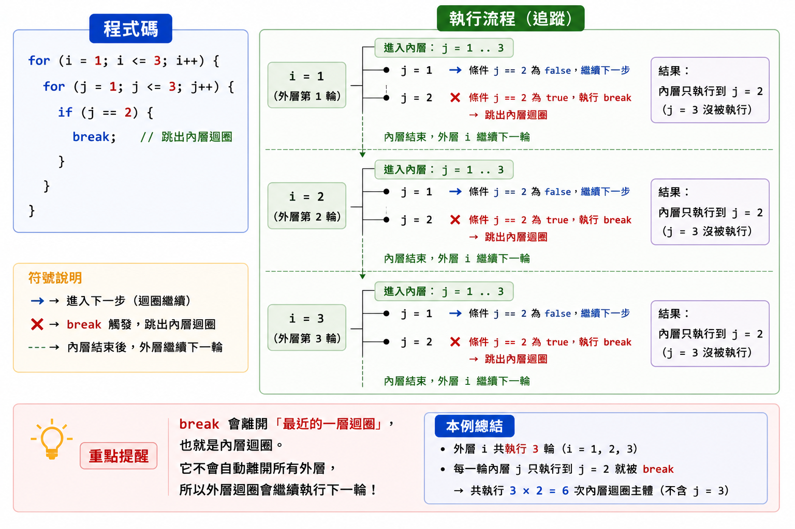
</p>

若 `break` 寫在內層，只離開內層，不會自動結束外層。

本章的完整搜尋範例不依賴雙層 `break`，避免造成誤解。

---

### 17. `N = 1` 是重要邊界測試

對空心正方形或空心三角形而言，`N = 1` 時同一位置同時屬於多條邊。

使用座標條件通常仍能自然輸出一個星號。

---

## Section V. 核心概念說明

### 1. 什麼是巢狀迴圈？

<!-- lesson-image: C_Lesson_10_img02_outer_vs_inner_roles.png -->
<p align="center">
  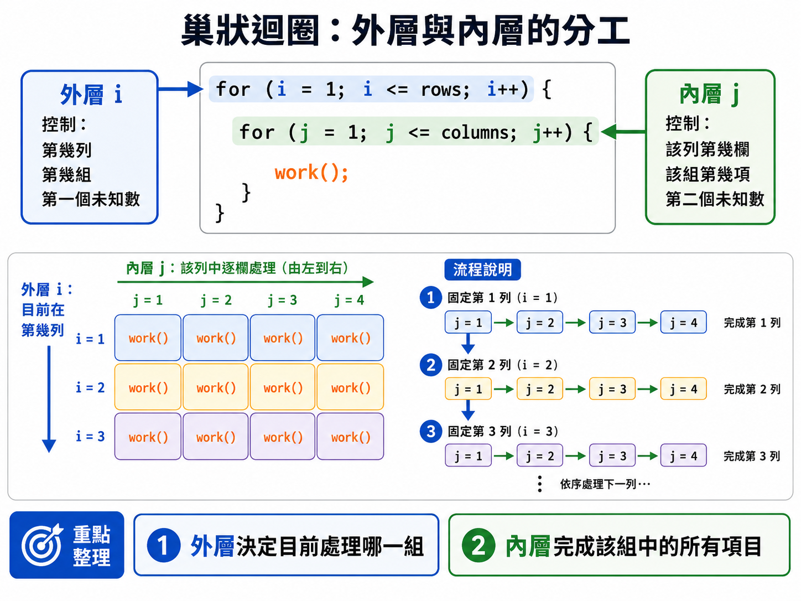
</p>

巢狀迴圈是：

> 在一個迴圈的本體中，再放入另一個迴圈。

```c
for (i = 1; i <= outer_limit; i++) {
    for (j = 1; j <= inner_limit; j++) {
        /* 重複工作 */
    }
}
```

外層執行一輪時，內層會完整跑完。

---

### 2. 巢狀迴圈的執行順序

<!-- lesson-image: C_Lesson_10_img03_nested_loop_execution_flow.png -->
<p align="center">
  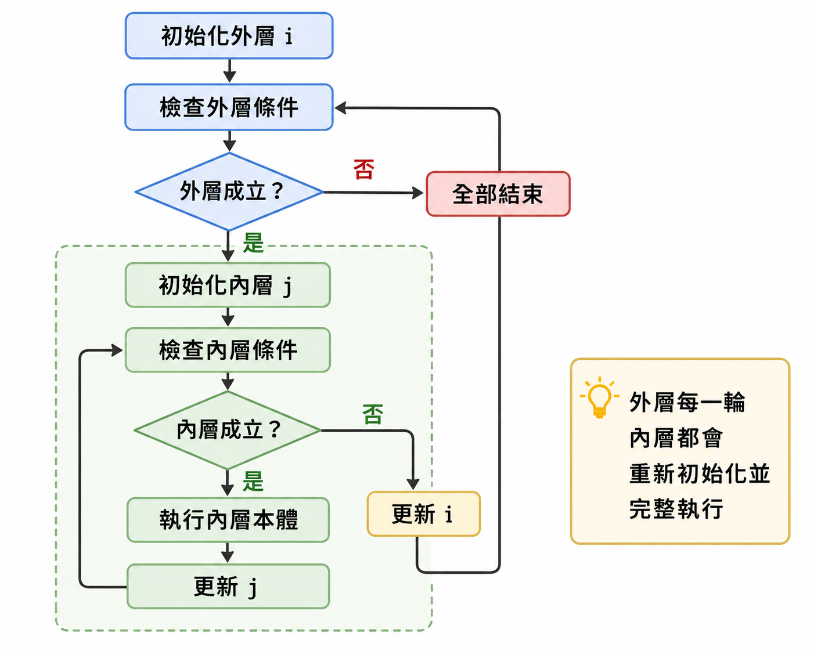
</p>

```c
for (i = 1; i <= 2; i++) {
    for (j = 1; j <= 3; j++) {
        printf("(%d,%d)\n", i, j);
    }
}
```

輸出：

```text
(1,1)
(1,2)
(1,3)
(2,1)
(2,2)
(2,3)
```

流程如下：

1. `i = 1`
2. `j = 1, 2, 3`
3. 內層結束
4. `i = 2`
5. `j` 重新從 `1` 開始
6. `j = 1, 2, 3`
7. 全部結束

---

### 3. 使用追蹤表理解組合

<!-- lesson-image: C_Lesson_10_img05_coordinate_combination_order.png -->
<p align="center">
  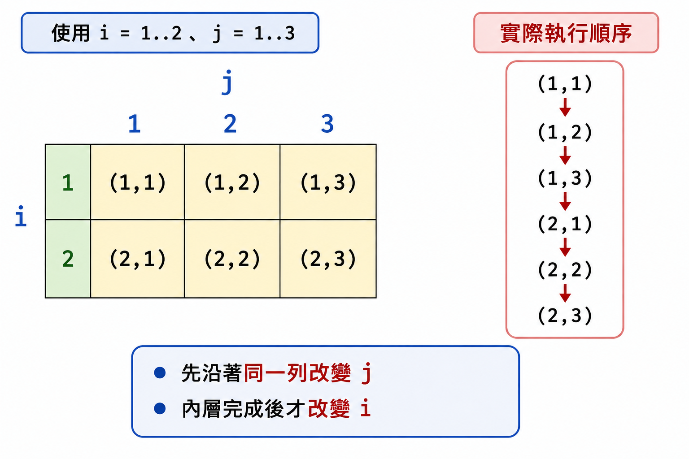
</p>

| 外層 `i` | 內層依序出現的 `j` | 產生的組合 |
| ---: | --- | --- |
| 1 | 1, 2, 3 | `(1,1) (1,2) (1,3)` |
| 2 | 1, 2, 3 | `(2,1) (2,2) (2,3)` |

內層本體總共執行：

```text
2 × 3 = 6 次
```

---

## Section V-A. 九九乘法表

### 4. 先印出 2 的乘法表

```c
#include <stdio.h>

int main(void) {
    int j;

    for (j = 1; j <= 9; j++) {
        printf("2 x %d = %d\n", j, 2 * j);
    }

    return 0;
}
```

這一個迴圈只能完成：

```text
2 x 1
...
2 x 9
```

---

### 5. 重複撰寫多個 `for` 的問題

若要接著印 `3`、`4`、`5` 的乘法表，可以複製：

```c
for (j = 1; j <= 9; j++) {
    printf("3 x %d = %d\n", j, 3 * j);
}
```

但這會產生大量重複程式碼。

真正改變的只有被乘數：

```text
2, 3, 4, ..., 9
```

因此可以再使用一個迴圈控制它。

---

### 6. 使用雙層迴圈印出九九乘法表

<!-- lesson-image: C_Lesson_10_img07_multiplication_table_roles.png -->
<p align="center">
  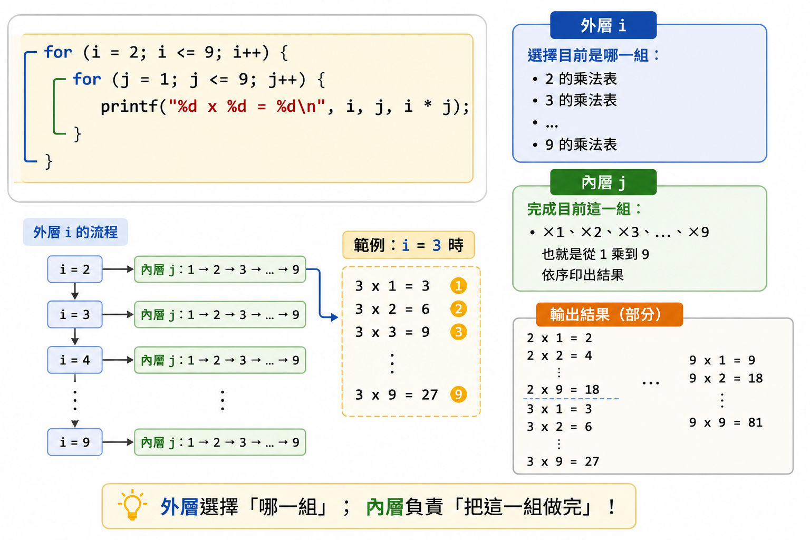
</p>

```c
#include <stdio.h>

int main(void) {
    int i;
    int j;

    for (i = 2; i <= 9; i++) {
        for (j = 1; j <= 9; j++) {
            printf("%d x %d = %d\n", i, j, i * j);
        }
    }

    return 0;
}
```

外層：

```c
i = 2, 3, ..., 9
```

內層：

```c
j = 1, 2, ..., 9
```

---

### 7. 九九乘法表的執行次數

<!-- lesson-image: C_Lesson_10_img08_multiplication_table_grid.png -->
<p align="center">
  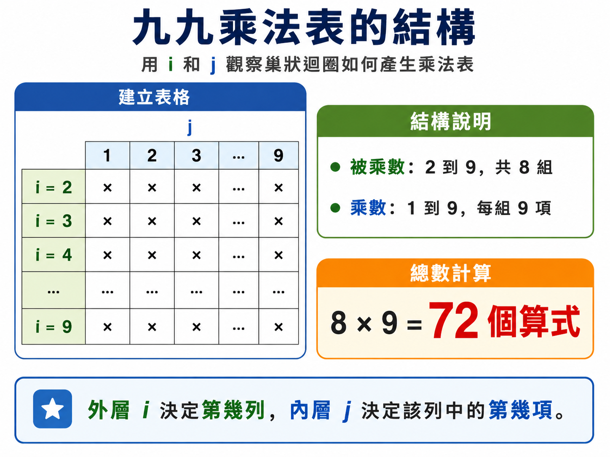
</p>

外層有：

```text
8 個值：2 到 9
```

內層每次有：

```text
9 個值：1 到 9
```

因此 `printf()` 執行：

```text
8 × 9 = 72 次
```

---

### 8. 延伸：使用單一迴圈展開 72 筆

<!-- lesson-image: C_Lesson_10_img09_one_dimensional_to_2d_index.png -->
<p align="center">
  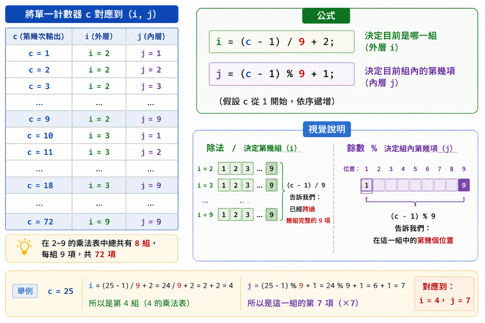
</p>

來源也展示把 72 個乘法組合排成一維序列。

令：

```c
c = 1, 2, ..., 72
```

可以將 `c` 轉回：

```c
i = (c - 1) / 9 + 2;
j = (c - 1) % 9 + 1;
```

完整範例：

```c
#include <stdio.h>

int main(void) {
    int c;

    for (c = 1; c <= 72; c++) {
        int i = (c - 1) / 9 + 2;
        int j = (c - 1) % 9 + 1;

        printf("%d x %d = %d\n", i, j, i * j);
    }

    return 0;
}
```

這不是取代巢狀迴圈的必要寫法，而是展示：

> 一維索引也能映射到二維座標。

---

## Section V-B. 實心正方形與長方形

### 9. 一列星號

輸入 `N`，印出 `N` 個星號：

```c
for (j = 1; j <= n; j++) {
    printf("*");
}

printf("\n");
```

這只能畫出一列。

---

### 10. 重複列形成 `N × N` 正方形

<!-- lesson-image: C_Lesson_10_img10_rows_and_columns.png -->
<p align="center">
  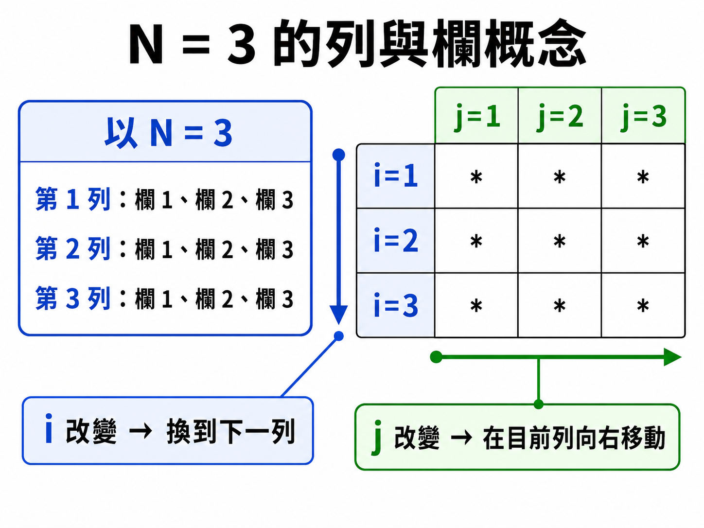
</p>

每一列要印 `N` 個星號，一共要印 `N` 列。

因此：

- 外層控制第幾列
- 內層控制該列第幾個星號

```c
#include <stdio.h>

int main(void) {
    int n;
    int i;
    int j;

    printf("N = ");
    scanf("%d", &n);

    for (i = 1; i <= n; i++) {
        for (j = 1; j <= n; j++) {
            printf("*");
        }

        printf("\n");
    }

    return 0;
}
```

輸入 `3`：

```text
***
***
***
```

---

### 11. 為什麼換行屬於外層？

<!-- lesson-image: C_Lesson_10_img11_newline_position.png -->
<p align="center">
  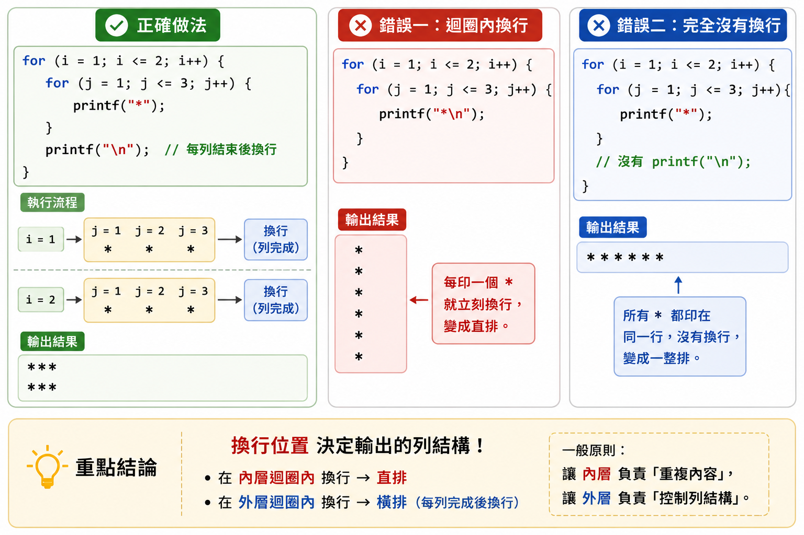
</p>

內層完成後，表示：

> 目前這一列的所有欄位都已經輸出。

此時才換行，接著讓外層進入下一列。

```c
for (i = 1; i <= n; i++) {
    for (j = 1; j <= n; j++) {
        printf("*");
    }

    printf("\n");
}
```

---

### 12. 從正方形延伸成長方形

<!-- lesson-image: C_Lesson_10_img12_square_vs_rectangle.png -->
<p align="center">
  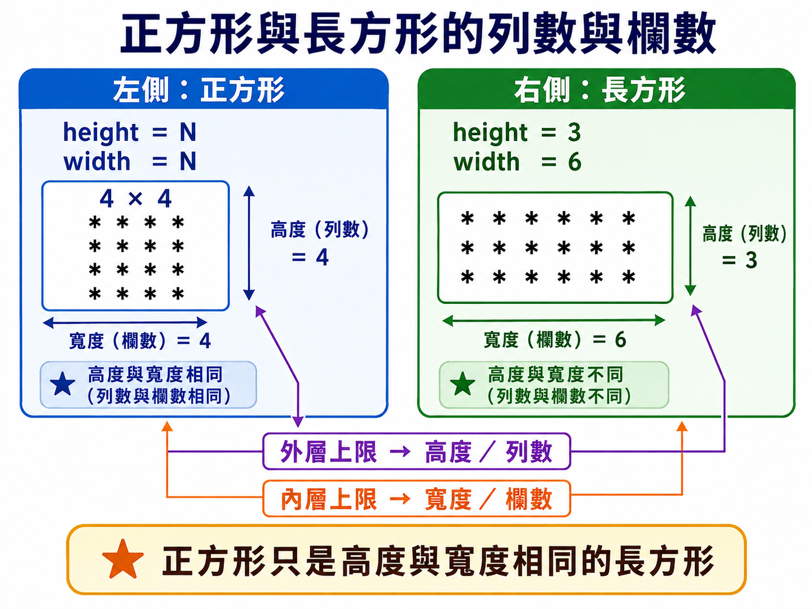
</p>

正方形的列數與欄數相同，都是 `N`。

長方形可分開輸入：

```text
height
width
```

```c
#include <stdio.h>

int main(void) {
    int height;
    int width;
    int row;
    int column;

    printf("Height: ");
    scanf("%d", &height);

    printf("Width: ");
    scanf("%d", &width);

    for (row = 1; row <= height; row++) {
        for (column = 1; column <= width; column++) {
            printf("*");
        }

        printf("\n");
    }

    return 0;
}
```

---

## Section V-C. 空心正方形

### 13. 方法一：分成上、中、下三部分

空心 `N × N` 正方形可以拆成：

1. 第一列：`N` 個星號
2. 中間 `N - 2` 列：星號、空白、星號
3. 最後一列：`N` 個星號

例如 `N = 5`：

```text
*****
*   *
*   *
*   *
*****
```

---

### 14. 分段繪製的程式

```c
#include <stdio.h>

int main(void) {
    int n;
    int i;
    int j;

    printf("N = ");
    scanf("%d", &n);

    for (j = 1; j <= n; j++) {
        printf("*");
    }
    printf("\n");

    for (i = 1; i <= n - 2; i++) {
        printf("*");

        for (j = 1; j <= n - 2; j++) {
            printf(" ");
        }

        printf("*\n");
    }

    for (j = 1; j <= n; j++) {
        printf("*");
    }
    printf("\n");

    return 0;
}
```

這個寫法清楚呈現圖形的三個部分。

---

### 15. 方法二：逐一判斷每個座標是否在邊界

<!-- lesson-image: C_Lesson_10_img13_hollow_square_boundaries.png -->
<p align="center">
  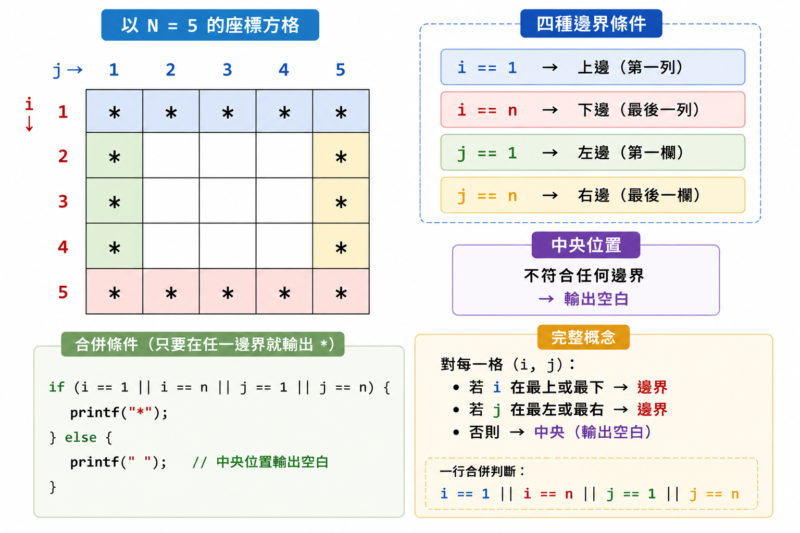
</p>

每個位置使用 `(i, j)` 表示。

邊界條件：

```c
i == 1        /* 上邊 */
i == n        /* 下邊 */
j == 1        /* 左邊 */
j == n        /* 右邊 */
```

只要符合其中一項，就印星號。

---

### 16. 座標法畫空心正方形

```c
#include <stdio.h>

int main(void) {
    int n;
    int i;
    int j;

    printf("N = ");
    scanf("%d", &n);

    for (i = 1; i <= n; i++) {
        for (j = 1; j <= n; j++) {
            if (i == 1 || i == n || j == 1 || j == n) {
                printf("*");
            } else {
                printf(" ");
            }
        }

        printf("\n");
    }

    return 0;
}
```

---

### 17. 分段法與座標法比較

<!-- lesson-image: C_Lesson_10_img14_segmented_vs_coordinate_drawing.png -->
<p align="center">
  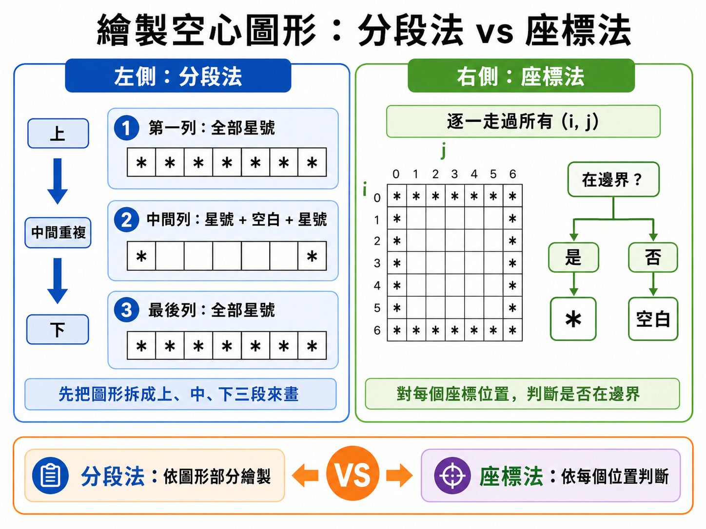
</p>

| 方法 | 優點 | 注意事項 |
| --- | --- | --- |
| 分段法 | 容易看到上、中、下結構 | 小尺寸時要注意 `N - 2` |
| 座標法 | 規則集中、容易延伸 | 要能正確寫出邊界條件 |

---

## Section V-D. 實心三角形

### 18. 第 `i` 列要印幾個星號？

<!-- lesson-image: C_Lesson_10_img15_row_number_controls_stars.png -->
<p align="center">
  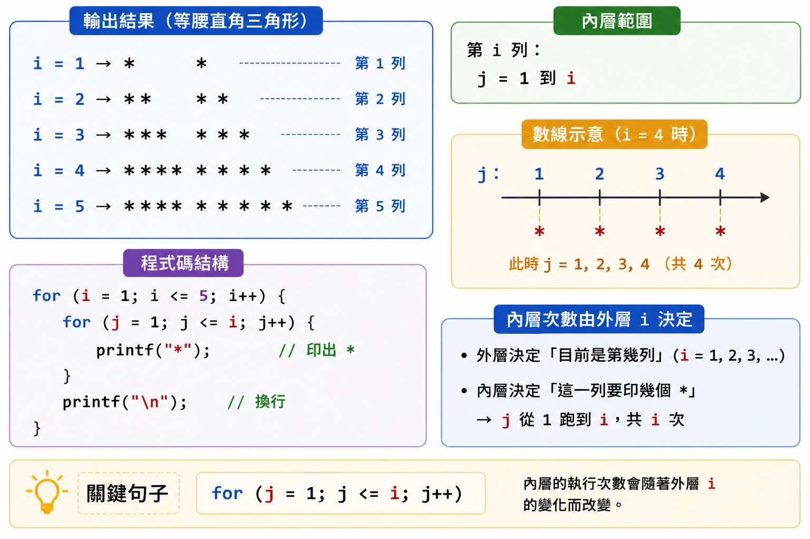
</p>

左下角實心三角形：

```text
*
**
***
****
*****
```

規律：

| 列 `i` | 星號數 |
| ---: | ---: |
| 1 | 1 |
| 2 | 2 |
| 3 | 3 |
| 4 | 4 |
| 5 | 5 |

所以內層條件可以寫：

```c
j <= i
```

---

### 19. 使用可變長度的內層迴圈

```c
#include <stdio.h>

int main(void) {
    int n;
    int i;
    int j;

    printf("N = ");
    scanf("%d", &n);

    for (i = 1; i <= n; i++) {
        for (j = 1; j <= i; j++) {
            printf("*");
        }

        printf("\n");
    }

    return 0;
}
```

這裡內層每一輪的次數不同：

```text
1 + 2 + 3 + ... + N
```

---

### 20. 使用座標法畫同一個實心三角形

<!-- lesson-image: C_Lesson_10_img17_i_greater_equal_j_region.png -->
<p align="center">
  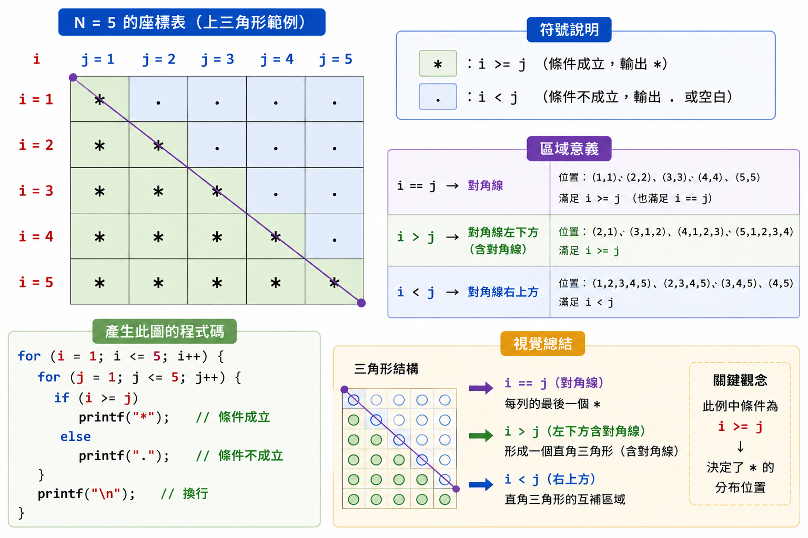
</p>

先讓雙層迴圈走過完整 `N × N` 座標。

當：

```c
i >= j
```

時印星號，否則印空白。

```c
for (i = 1; i <= n; i++) {
    for (j = 1; j <= n; j++) {
        if (i >= j) {
            printf("*");
        } else {
            printf(" ");
        }
    }

    printf("\n");
}
```

---

### 21. 兩種實心三角形方法比較

<!-- lesson-image: C_Lesson_10_img16_variable_vs_full_inner_range.png -->
<p align="center">
  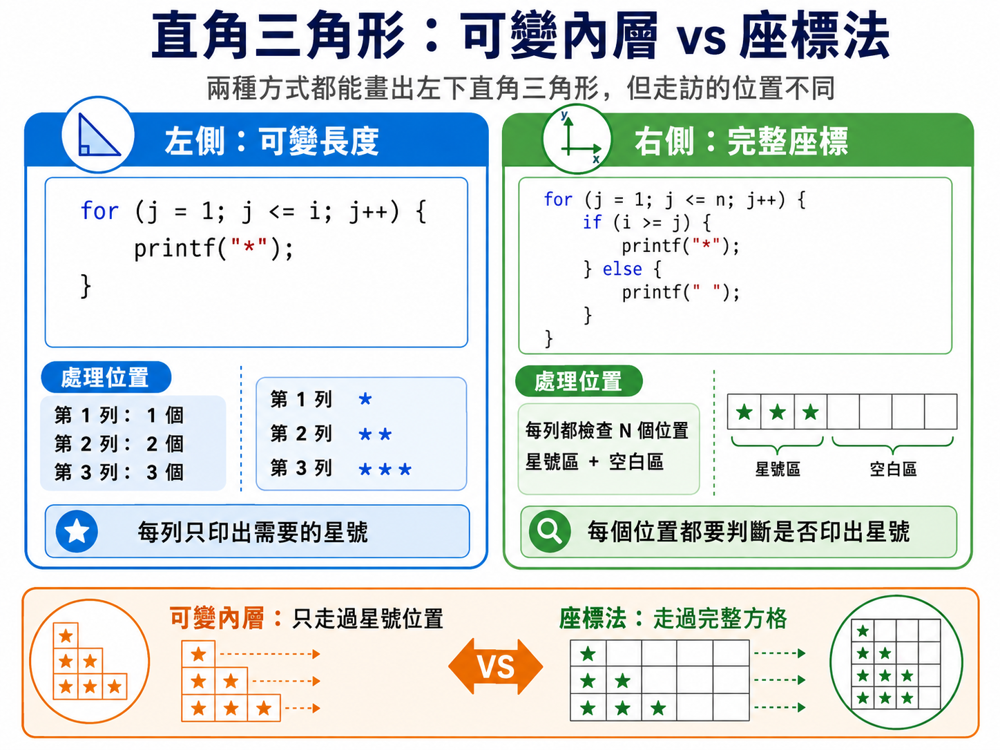
</p>

可變長度內層：

```c
for (j = 1; j <= i; j++)
```

只處理需要輸出的星號。

座標法：

```c
for (j = 1; j <= n; j++)
```

每個位置都處理，再決定印星號或空白。

前者較精簡；後者較容易改成其他方向或空心圖形。

---

## Section V-E. 空心三角形

### 22. 左下角空心三角形的三條邊

<!-- lesson-image: C_Lesson_10_img18_hollow_left_triangle_boundaries.png -->
<p align="center">
  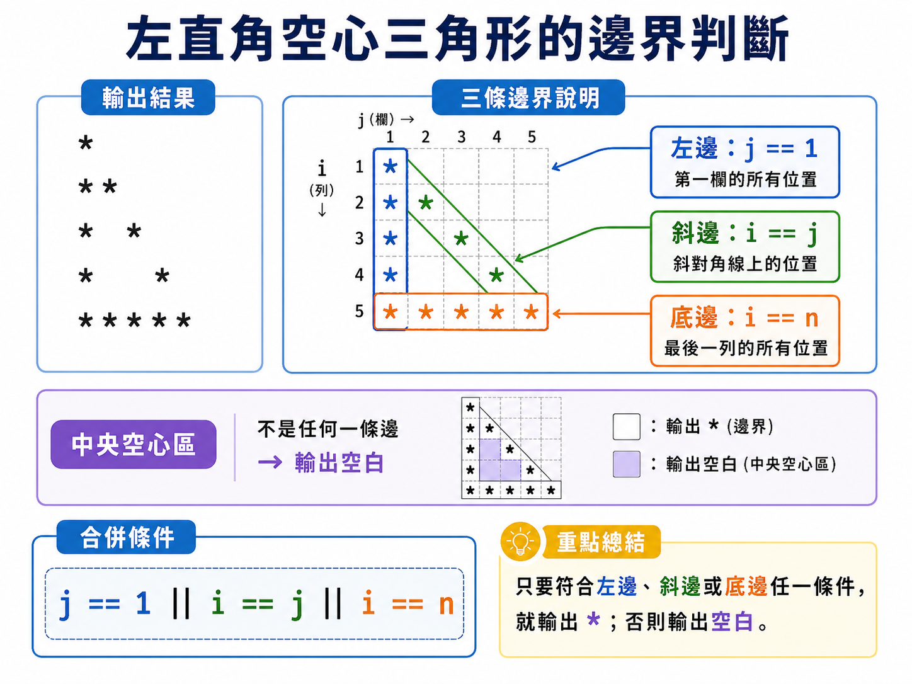
</p>

以 `N = 5` 為例：

```text
*
**
* *
*  *
*****
```

邊界為：

1. 左邊：`j == 1`
2. 斜邊：`i == j`
3. 底邊：`i == n`

因此條件：

```c
j == 1 || i == j || i == n
```

---

### 23. 座標法畫空心三角形

```c
#include <stdio.h>

int main(void) {
    int n;
    int i;
    int j;

    printf("N = ");
    scanf("%d", &n);

    for (i = 1; i <= n; i++) {
        for (j = 1; j <= n; j++) {
            if (j == 1 || i == j || i == n) {
                printf("*");
            } else {
                printf(" ");
            }
        }

        printf("\n");
    }

    return 0;
}
```

---

### 24. 限制內層範圍，避免多餘右側空白

因為左下三角形只需要處理：

```c
j <= i
```

可以改成：

```c
for (i = 1; i <= n; i++) {
    for (j = 1; j <= i; j++) {
        if (j == 1 || i == j || i == n) {
            printf("*");
        } else {
            printf(" ");
        }
    }

    printf("\n");
}
```

兩種寫法圖形相同，但處理的座標數量不同。

---

## Section V-F. 座標法

### 25. 先把每個位置印成座標

<!-- lesson-image: C_Lesson_10_img19_coordinate_grid.png -->
<p align="center">
  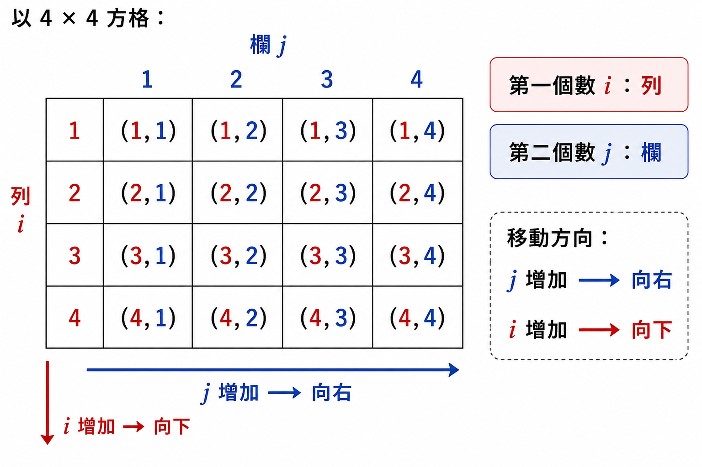
</p>

```c
#include <stdio.h>

int main(void) {
    int i;
    int j;

    for (i = 1; i <= 5; i++) {
        for (j = 1; j <= 5; j++) {
            printf("(%d,%d)", i, j);
        }

        printf("\n");
    }

    return 0;
}
```

每一列的第一個數相同：

```text
(1,1) (1,2) ... (1,5)
(2,1) (2,2) ... (2,5)
...
```

這能幫助我們把圖形轉成座標條件。

---

### 26. 使用 `i == j` 畫主對角線

<!-- lesson-image: C_Lesson_10_img20_main_vs_secondary_diagonal.png -->
<p align="center">
  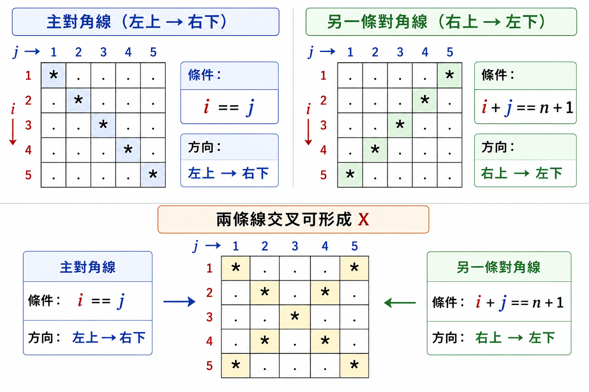
</p>

```c
for (i = 1; i <= 5; i++) {
    for (j = 1; j <= 5; j++) {
        if (i == j) {
            printf("*");
        } else {
            printf(" ");
        }
    }

    printf("\n");
}
```

輸出：

```text
*
 *
  *
   *
    *
```

---

### 27. 使用 `i >= j` 取得對角線下方區域

```c
if (i >= j)
```

包含：

- `i == j` 的對角線
- `i > j` 的左下區域

因此形成左下角實心三角形。

---

### 28. 使用 `i + j` 判斷靠右三角形

<!-- lesson-image: C_Lesson_10_img21_right_aligned_triangle_condition.png -->
<p align="center">
  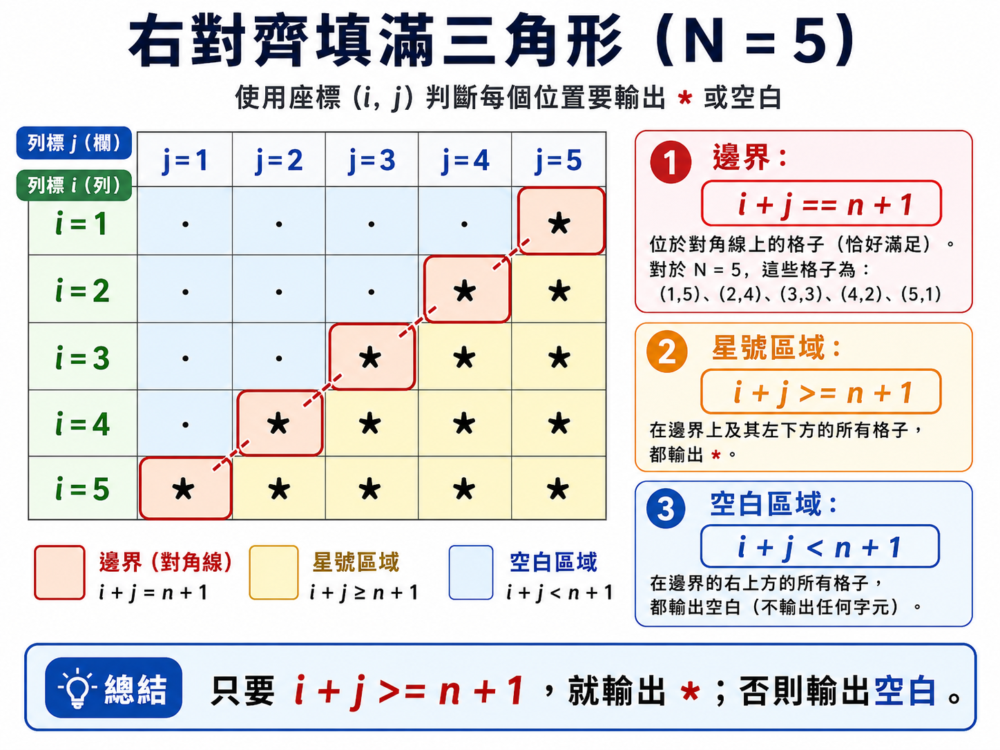
</p>

在 `N × N` 座標中，另一條斜線可以用：

```c
i + j == n + 1
```

表示。

若要畫靠右的實心三角形，可使用：

```c
i + j >= n + 1
```

```c
for (i = 1; i <= n; i++) {
    for (j = 1; j <= n; j++) {
        if (i + j >= n + 1) {
            printf("*");
        } else {
            printf(" ");
        }
    }

    printf("\n");
}
```

`N = 5`：

```text
    *
   **
  ***
 ****
*****
```

---

### 29. 靠右空心三角形

<!-- lesson-image: C_Lesson_10_img22_hollow_right_triangle_boundaries.png -->
<p align="center">
  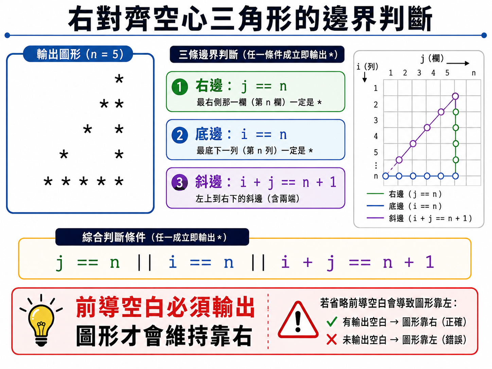
</p>

三條邊可以是：

1. 右邊：`j == n`
2. 底邊：`i == n`
3. 斜邊：`i + j == n + 1`

```c
if (j == n || i == n || i + j == n + 1)
```

```c
for (i = 1; i <= n; i++) {
    for (j = 1; j <= n; j++) {
        if (j == n || i == n || i + j == n + 1) {
            printf("*");
        } else {
            printf(" ");
        }
    }

    printf("\n");
}
```

---

### 30. 倒置空心三角形的座標條件

另一個方向可由：

```c
i == 1 || j == n || i == j
```

組成：

- 上邊
- 右邊
- 主對角線

這顯示圖形問題的核心不是背程式，而是找出邊界的座標關係。

---

## Section V-G. 雙層迴圈枚舉整數解

### 31. 題目

已知兩個正整數：

```text
i + j = 30
i × j = 221
```

找出這兩個正整數。

---

### 32. 最直接的方法：列出所有可能組合

<!-- lesson-image: C_Lesson_10_img24_double_loop_search_space.png -->
<p align="center">
  
</p>

因為兩個數都是正整數，而且和為 `30`，可以先讓：

```c
i = 1 到 30
j = 1 到 30
```

再檢查條件。

```c
#include <stdio.h>

int main(void) {
    int i;
    int j;

    for (i = 1; i <= 30; i++) {
        for (j = 1; j <= 30; j++) {
            if (i + j == 30 && i * j == 221) {
                printf("%d, %d\n", i, j);
            }
        }
    }

    return 0;
}
```

輸出：

```text
13, 17
17, 13
```

---

### 33. 為什麼會有兩行答案？

<!-- lesson-image: C_Lesson_10_img25_symmetric_duplicate_solutions.png -->
<p align="center">
  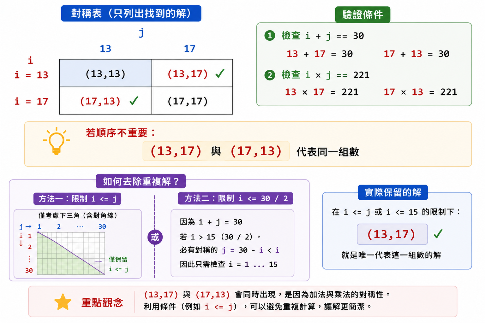
</p>

因為雙層迴圈把順序不同的組合都視為不同座標：

```text
(i, j) = (13, 17)
(i, j) = (17, 13)
```

但題目問的是「兩個數」，通常只需要其中一組。

---

### 34. 方法一：限制 `i` 不超過總和的一半

若只保留較小的數作為 `i`：

```c
for (i = 1; i <= 30 / 2; i++) {
    for (j = 1; j <= 30; j++) {
        if (i + j == 30 && i * j == 221) {
            printf("%d, %d\n", i, j);
        }
    }
}
```

只會輸出：

```text
13, 17
```

---

### 35. 方法二：縮小 `j` 的起點

較小值放在 `i`，較大值放在 `j`：

```c
for (i = 1; i <= 30 / 2; i++) {
    for (j = 30 / 2; j <= 30; j++) {
        if (i + j == 30 && i * j == 221) {
            printf("%d, %d\n", i, j);
        }
    }
}
```

候選組合數量比完整 `30 × 30` 更少。

---

### 36. 方法三：用和的方程式算出 `j`

<!-- lesson-image: C_Lesson_10_img27_double_to_single_loop_search.png -->
<p align="center">
  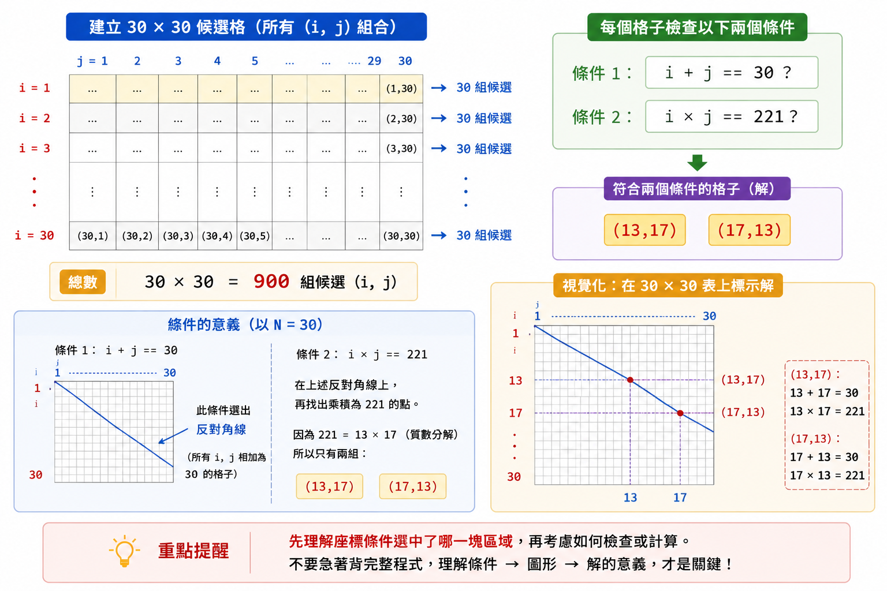
</p>

已知：

```text
i + j = 30
```

因此：

```c
j = 30 - i;
```

只需要搜尋 `i`：

```c
#include <stdio.h>

int main(void) {
    int i;

    for (i = 1; i <= 30 / 2; i++) {
        int j = 30 - i;

        if (i * j == 221) {
            printf("%d, %d\n", i, j);
        }
    }

    return 0;
}
```

輸出：

```text
13, 17
```

這是從雙層搜尋簡化成單層搜尋。

---

### 37. 三種搜尋方式比較

<!-- lesson-image: C_Lesson_10_img26_search_space_reduction.png -->
<p align="center">
  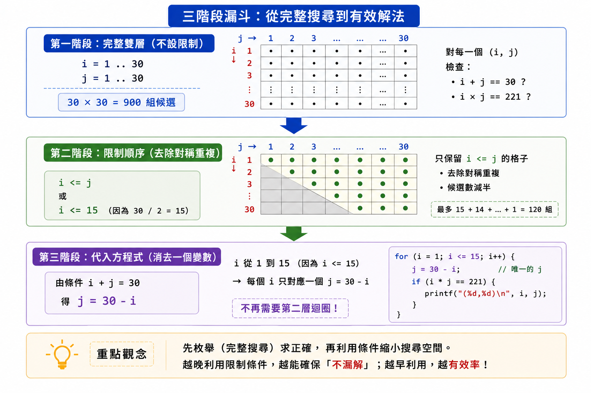
</p>

| 方法 | 候選概念 | 特點 |
| --- | --- | --- |
| 完整雙層 | 所有 `(i, j)` | 最直觀，但有重複與多餘檢查 |
| 限制範圍 | 只找較小 `i`、較大 `j` | 減少重複與候選 |
| 代入方程式 | `j = 30 - i` | 直接移除一層迴圈 |

先寫出正確的枚舉，再逐步縮小搜尋空間，是很重要的解題方法。

---

## Section V-H. 執行次數分析

### 38. 固定大小的雙層迴圈

```c
for (i = 1; i <= n; i++) {
    for (j = 1; j <= n; j++) {
        work();
    }
}
```

`work()` 執行：

```text
n × n = n² 次
```

例如 `n = 5`：

```text
25 次
```

---

### 39. 三角形的執行次數

<!-- lesson-image: C_Lesson_10_img28_square_vs_triangular_iteration_count.png -->
<p align="center">
  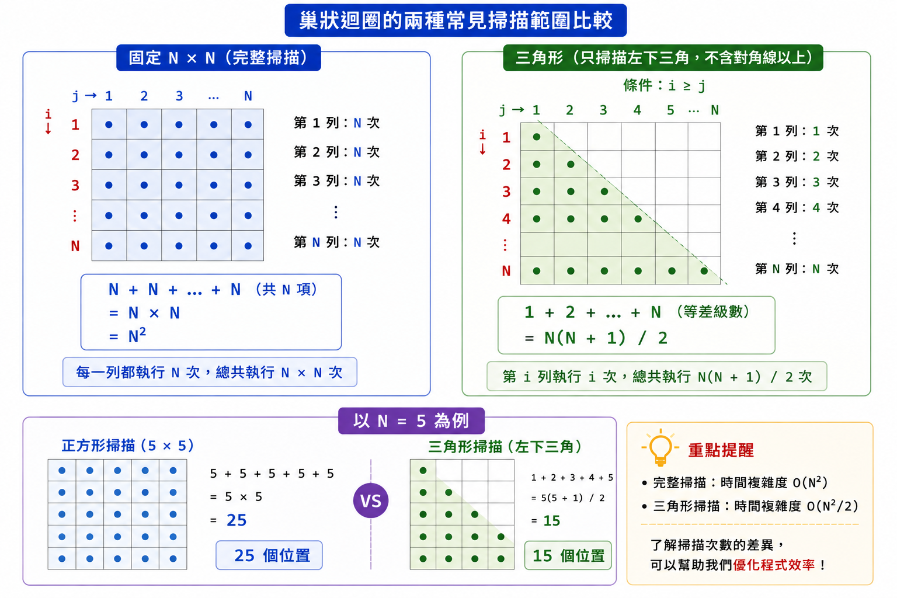
</p>

```c
for (i = 1; i <= n; i++) {
    for (j = 1; j <= i; j++) {
        work();
    }
}
```

執行：

```text
1 + 2 + 3 + ... + n
```

也就是：

```text
n(n + 1) / 2
```

不需要現在背複雜度術語，但要知道：

> 內層範圍依外層改變時，不能直接用固定的 `n × n` 計算。

---

## Section V-I. 容易搞混的重點

### 1. 外層不是永遠代表列

在圖形中，外層通常代表列。

在整數解搜尋中，外層可能代表第一個未知數。

變數角色由問題決定。

---

### 2. 內層完成後才回到外層

外層的 `i` 不會在內層每一輪都增加。

只有內層完整結束後，外層才執行自己的迴圈式。

---

### 3. `j` 的最後值不會直接帶進下一列

因為內層初始式：

```c
j = 1
```

每次進入內層都會重新執行。

---

### 4. 圖形的「空白」不是沒有工作

靠右圖形需要輸出前導空白。

空心圖形需要輸出內部空白。

不輸出空白會改變位置。

---

### 5. `i >= j` 與 `i <= j` 會產生不同區域

<!-- lesson-image: C_Lesson_10_img23_coordinate_conditions_and_shapes.png -->
<p align="center">
  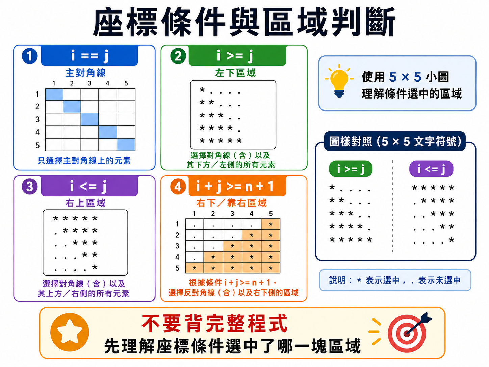
</p>

- `i >= j`：主對角線及左下方
- `i <= j`：主對角線及右上方

寫條件前應先在座標表上標記。

---

### 6. `i + j == n + 1` 是另一條斜線

`i == j` 是左上到右下。

`i + j == n + 1` 是右上到左下。

---

### 7. 空心圖形不是把實心圖形中的星號隨機刪掉

要保留的通常是明確邊界：

```text
第一列
最後一列
第一欄
最後一欄
斜邊
```

---

### 8. 分段繪圖與座標法都可能正確

分段法重視圖形結構。

座標法重視每個位置的判斷。

應選擇較容易描述及維護的方法。

---

### 9. 雙層枚舉能找到答案，不代表搜尋範圍最佳

先求正確，再使用已知條件減少候選，是更完整的解題過程。

---

### 10. 去除對稱重複前，要先確認順序是否重要

若 `(a, b)` 與 `(b, a)` 代表不同情況，就不能任意刪除。

本章的「兩個正整數」通常不重視順序。

---

## Section VI. 快速概念檢查

### Q1. 外層迴圈執行 3 次，內層每次執行 4 次，內層本體總共執行幾次？

<details>
<summary>查看答案</summary>

```text
3 × 4 = 12 次
```

</details>

---

### Q2. 正方形圖形中，外層通常控制什麼？

<details>
<summary>查看答案</summary>

控制列數，也就是目前正在輸出第幾列。

</details>

---

### Q3. 內層迴圈完成後，通常要做什麼才能開始下一列？

<details>
<summary>查看答案</summary>

輸出換行：

```c
printf("\n");
```

</details>

---

### Q4. 第 `i` 列輸出 `i` 個星號，內層條件可以怎麼寫？

<details>
<summary>查看答案</summary>

```c
j <= i
```

</details>

---

### Q5. 空心正方形的邊界條件是什麼？

<details>
<summary>查看答案</summary>

```c
i == 1 || i == n || j == 1 || j == n
```

</details>

---

### Q6. `i == j` 會畫出什麼？

<details>
<summary>查看答案</summary>

主對角線，從左上往右下。

</details>

---

### Q7. `i >= j` 會形成哪一側的三角區域？

<details>
<summary>查看答案</summary>

主對角線及其左下方，形成左下角實心三角形。

</details>

---

### Q8. 靠右三角形常使用哪一種關係？

<details>
<summary>查看答案</summary>

使用 `i + j` 與 `n + 1` 的關係，例如：

```c
i + j >= n + 1
```

</details>

---

### Q9. 完整檢查 `i = 1..30`、`j = 1..30`，最多有多少組候選？

<details>
<summary>查看答案</summary>

```text
30 × 30 = 900 組
```

</details>

---

### Q10. 已知 `i + j = 30`，如何由 `i` 算出 `j`？

<details>
<summary>查看答案</summary>

```c
j = 30 - i;
```

</details>

---

### Q11. 為什麼完整搜尋會同時得到 `(13, 17)` 與 `(17, 13)`？

<details>
<summary>查看答案</summary>

因為雙層迴圈會把順序不同的兩個座標組合都檢查一次。

</details>

---

### Q12. `break` 寫在內層迴圈中，會自動離開外層嗎？

<details>
<summary>查看答案</summary>

不會。它只離開目前所屬的內層迴圈。

</details>

---

## Section VII. 程式閱讀練習

### 題目 1：列出所有組合

```c
for (i = 1; i <= 2; i++) {
    for (j = 1; j <= 2; j++) {
        printf("%d%d ", i, j);
    }
}
```

<details>
<summary>查看答案</summary>

```text
11 12 21 22
```

</details>

---

### 題目 2：計算執行次數

```c
for (i = 1; i <= 4; i++) {
    for (j = 1; j <= 3; j++) {
        printf("*");
    }
}
```

<details>
<summary>查看答案</summary>

`printf("*")` 執行：

```text
4 × 3 = 12 次
```

因為沒有換行，輸出會連在同一列。

</details>

---

### 題目 3：判斷圖形

```c
for (i = 1; i <= 3; i++) {
    for (j = 1; j <= i; j++) {
        printf("*");
    }

    printf("\n");
}
```

<details>
<summary>查看答案</summary>

```text
*
**
***
```

</details>

---

### 題目 4：換行放錯位置

```c
for (i = 1; i <= 2; i++) {
    for (j = 1; j <= 3; j++) {
        printf("*\n");
    }
}
```

<details>
<summary>查看答案</summary>

會輸出 6 行，每一行只有一個星號，而不是 2 列、每列 3 個星號。

</details>

---

### 題目 5：座標條件

```c
for (i = 1; i <= 4; i++) {
    for (j = 1; j <= 4; j++) {
        if (i == j) {
            printf("*");
        } else {
            printf(".");
        }
    }

    printf("\n");
}
```

<details>
<summary>查看答案</summary>

```text
*...
.*..
..*.
...*
```

</details>

---

### 題目 6：空心正方形

`n = 4` 時，條件：

```c
i == 1 || i == n || j == 1 || j == n
```

<details>
<summary>查看答案</summary>

```text
****
*  *
*  *
****
```

</details>

---

### 題目 7：整數解搜尋

```c
for (i = 1; i <= 30; i++) {
    int j = 30 - i;

    if (i * j == 221) {
        printf("%d %d\n", i, j);
    }
}
```

<details>
<summary>查看答案</summary>

若沒有限制 `i <= 15`，會輸出：

```text
13 17
17 13
```

限制 `i <= 15` 後只留下 `13 17`。

</details>

---

### 題目 8：找出錯誤

```c
for (i = 1; i <= n; i++) {
    for (j = 1; j <= n; i++) {
        printf("*");
    }

    printf("\n");
}
```

<details>
<summary>查看答案</summary>

內層迴圈式錯誤地增加 `i`：

```c
i++
```

應該是：

```c
j++
```

否則 `j` 不改變，外層變數卻被內層修改。

</details>

---

## Section VIII. 實作練習 / 實作檢測題

### TODO 1：座標表

輸出 `1` 到 `N` 的所有座標：

```text
(1,1) (1,2) ...
(2,1) (2,2) ...
```

---

### TODO 2：完整九九乘法表

使用：

```c
i = 2..9
j = 1..9
```

依序輸出 72 個乘法算式。

---

### TODO 3：`N × N` 實心正方形

輸入正整數 `N`，輸出：

```text
****
****
****
****
```

星號總數應為：

```text
N × N
```

---

### TODO 4：指定高度與寬度的實心長方形

輸入：

```text
height
width
```

輸出指定尺寸。

---

### TODO 5：空心正方形

使用座標條件：

```c
i == 1 || i == n || j == 1 || j == n
```

---

### TODO 6：空心長方形

輸入：

```text
height
width
```

邊界改成：

```c
row == 1
row == height
column == 1
column == width
```

---

### TODO 7：左下角實心三角形

輸入 `N`：

```text
*
**
***
...
```

先使用可變長度的內層迴圈。

---

### TODO 8：左下角實心三角形——座標版

走過完整 `N × N` 座標，使用：

```c
i >= j
```

---

### TODO 9：左下角空心三角形

使用：

```c
j == 1 || i == j || i == n
```

---

### TODO 10：靠右實心三角形

使用：

```c
i + j >= n + 1
```

---

### TODO 11：靠右空心三角形

使用：

```c
j == n || i == n || i + j == n + 1
```

---

### TODO 12：主對角線與副對角線

在 `N × N` 方格中：

- 主對角線：`i == j`
- 另一條對角線：`i + j == n + 1`

在任一條線上就印 `*`，其他位置印空白。

---

### TODO 13：雙層枚舉方程式

找出正整數 `i`、`j`：

```text
i + j = 30
i × j = 221
```

先輸出所有有順序的解。

---

### TODO 14：去除重複解

修改 TODO 13，只輸出：

```text
13, 17
```

不得同時輸出：

```text
17, 13
```

---

### TODO 15：將雙層搜尋改成單層搜尋

使用：

```c
j = 30 - i;
```

只使用一個 `for`。

---

## Section IX. 做題時可以使用的提示

### 1. 圖形題先填寫兩個問題

```text
總共有幾列？
每一列有幾個位置？
```

這通常直接對應外層與內層。

---

### 2. 先用小尺寸手畫

推薦：

```text
N = 3
N = 5
```

小尺寸容易看出第一列、中間列、最後一列與斜邊。

---

### 3. 把每個位置改印座標

還不知道條件時，先輸出：

```c
printf("(%d,%d)", i, j);
```

再在紙上圈出應該是星號的位置。

---

### 4. 邊界條件分開寫，再用 `||` 合併

例如空心三角形：

```text
左邊：j == 1
斜邊：i == j
底邊：i == n
```

最後合併：

```c
j == 1 || i == j || i == n
```

---

### 5. 實心圖形找「區域不等式」

例如：

```text
左下區域：i >= j
靠右區域：i + j >= n + 1
```

---

### 6. 搜尋題先寫最直觀版本

先完整枚舉，確認答案正確。

接著再問：

1. 有沒有對稱重複？
2. 哪些範圍不可能？
3. 能否由一條方程式算出另一個變數？

---

### 7. 檢查迴圈式是否更新正確變數

外層：

```c
i++
```

內層：

```c
j++
```

是最常見的結構。

---

### 8. 懷疑輸出形狀錯誤時，檢查換行

換行通常應：

```c
在內層結束後
在外層本體內
```

---

## Section X. 課後小練習

### 練習 1：乘法表方陣

將九九乘法表改成每列橫向排列，例如：

```text
2x1=2 2x2=4 ...
```

每完成一個被乘數後換行。

---

### 練習 2：數字正方形

輸入 `N = 4`，輸出：

```text
1111
2222
3333
4444
```

外層列數同時也是要輸出的數字。

---

### 練習 3：欄編號正方形

輸入 `N = 4`，輸出：

```text
1234
1234
1234
1234
```

內層欄號就是輸出的數字。

---

### 練習 4：棋盤圖案

輸入 `N`，若：

```c
(i + j) % 2 == 0
```

印 `*`，否則印 `.`。

---

### 練習 5：X 形

在：

```c
i == j
```

或：

```c
i + j == n + 1
```

時印星號。

---

### 練習 6：倒置實心三角形

輸入 `N = 5`：

```text
*****
****
***
**
*
```

---

### 練習 7：倒置空心三角形

保留第一列、右邊與斜邊。

---

### 練習 8：一般化整數解

輸入：

```text
sum_target
product_target
```

找出所有正整數 `(i, j)`：

```text
i + j == sum_target
i * j == product_target
```

---

## Section XI. 重點複習

1. 巢狀迴圈是一個迴圈包含另一個迴圈。
2. 外層每執行一輪，內層通常完整執行一次。
3. 外層常控制列，內層常控制欄。
4. 每個外層值會與所有合法內層值形成組合。
5. 固定 `a` 次外層與 `b` 次內層，內層本體通常執行 `a × b` 次。
6. 內層初始式會在每次重新進入時再次執行。
7. 換行通常放在內層結束後。
8. 九九乘法表可用外層控制被乘數、內層控制乘數。
9. `N × N` 正方形會處理 `N²` 個位置。
10. 長方形的列數與欄數可以分開控制。
11. 空心圖形只輸出邊界。
12. 空心正方形邊界是第一／最後列與第一／最後欄。
13. 第 `i` 列印 `i` 個星號可形成左下實心三角形。
14. `i == j` 表示主對角線。
15. `i >= j` 表示主對角線及左下區域。
16. `i + j == n + 1` 表示另一條對角線。
17. `i + j >= n + 1` 可形成靠右實心三角形。
18. 多條邊界使用 `||` 合併。
19. 座標法會逐一判斷每個 `(i, j)`。
20. 雙層枚舉可以搜尋兩個未知數的所有組合。
21. 對稱問題可能產生順序相反的重複答案。
22. 限制範圍可以去除重複並減少檢查。
23. 已知一個方程式時，可以用它算出另一個未知數。
24. 將雙層搜尋化成單層搜尋，是重要的優化思考。
25. 下一章會把迴圈應用到因數、質數與其他數學問題。

---

## Section XII. 常見錯誤提醒

<!-- lesson-image: C_Lesson_10_img30_common_nested_loop_errors.png -->
<p align="center">
  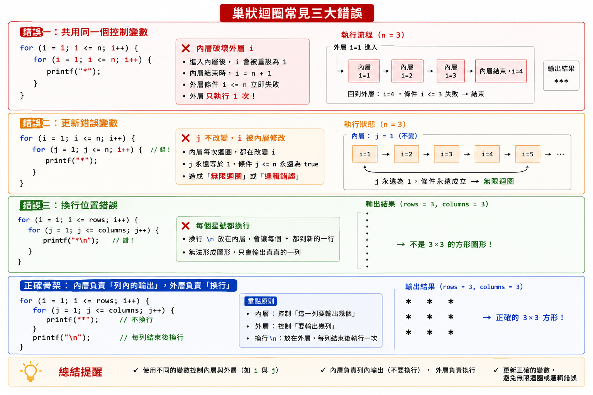
</p>

### 錯誤 1：外層與內層使用相同變數

錯誤：

```c
for (i = 1; i <= n; i++) {
    for (i = 1; i <= n; i++) {
        ...
    }
}
```

---

### 錯誤 2：內層更新外層變數

錯誤：

```c
for (j = 1; j <= n; i++)
```

應為：

```c
j++
```

---

### 錯誤 3：換行放進內層

錯誤：

```c
printf("*\n");
```

正方形會變成每個星號一列。

---

### 錯誤 4：忘記每列換行

若完全沒有：

```c
printf("\n");
```

所有列會連成一條長線。

---

### 錯誤 5：三角形內層永遠跑到 `N`

若只輸出星號而不輸出空白：

```c
for (j = 1; j <= n; j++) {
    printf("*");
}
```

每一列都會一樣長，形成正方形。

---

### 錯誤 6：空心圖形內部仍印星號

空心圖形的非邊界位置應輸出空白：

```c
else {
    printf(" ");
}
```

---

### 錯誤 7：空心正方形使用 `&&`

錯誤：

```c
i == 1 && i == n && j == 1 && j == n
```

應使用 `||` 連接各條邊。

---

### 錯誤 8：斜線條件寫反

主對角線：

```c
i == j
```

另一條對角線：

```c
i + j == n + 1
```

兩者不能互換。

---

### 錯誤 9：靠右圖形沒有輸出前導空白

若只輸出星號，不處理空白，圖形會靠左。

---

### 錯誤 10：完整枚舉的範圍從 `0` 開始

題目要求正整數時，`0` 不屬於候選。

---

### 錯誤 11：把對稱答案誤認成兩組不同數字

```text
13, 17
17, 13
```

若順序不重要，它們代表同一組數。

---

### 錯誤 12：推導出 `j = 30 - i` 後仍使用第二層迴圈

既然 `j` 已由 `i` 決定，就不需要再枚舉所有 `j`。

---

### 錯誤 13：用 `break` 只離開內層，卻以為全部結束

巢狀結構中的 `break` 只影響最近的一層迴圈。

---

### 錯誤 14：只測試 `N = 5`

應至少再測：

```text
N = 1
N = 2
N = 3
```

小尺寸能暴露空心圖形與 `N - 2` 的邊界問題。

---

## Section XIII. Mermaid 流程圖

### 1. 巢狀迴圈的基本流程

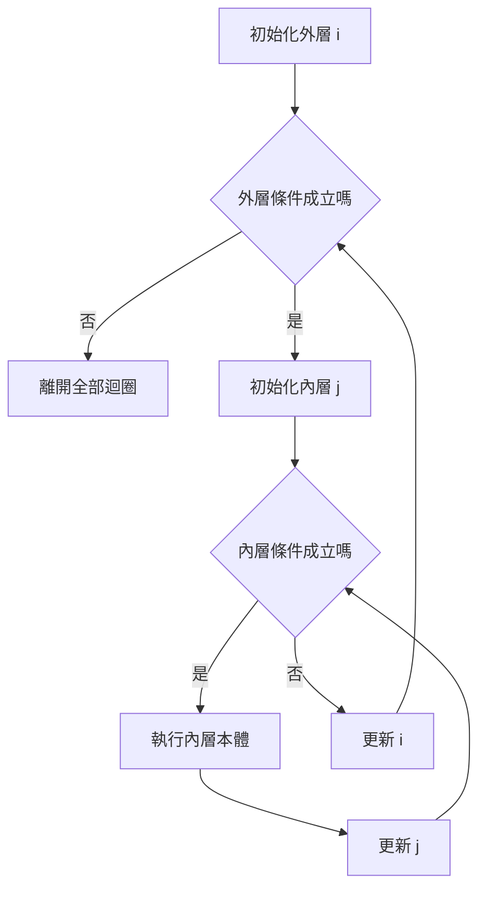
```mermaid
flowchart TD
    A[初始化外層 i] --> B{外層條件成立嗎}
    B -- 否 --> H[離開全部迴圈]
    B -- 是 --> C[初始化內層 j]
    C --> D{內層條件成立嗎}
    D -- 是 --> E[執行內層本體]
    E --> F[更新 j]
    F --> D
    D -- 否 --> G[更新 i]
    G --> B
```

---

### 2. 正方形輸出

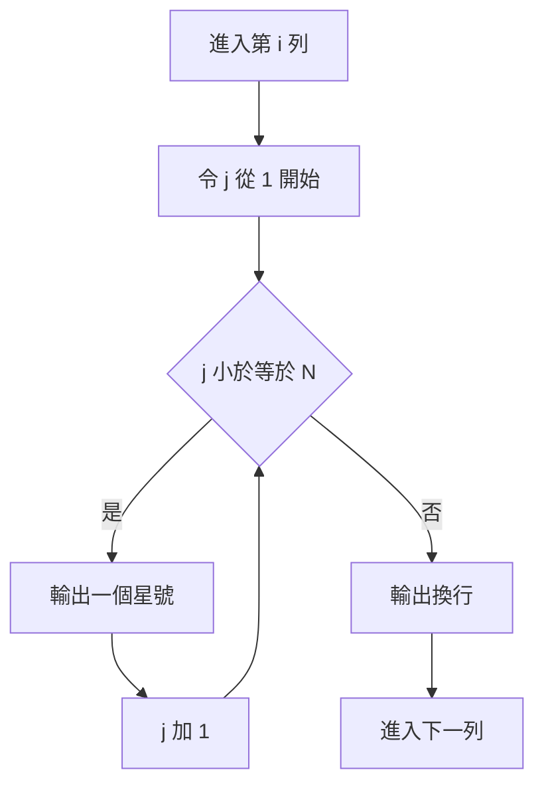
```mermaid
flowchart TD
    A[進入第 i 列] --> B[令 j 從 1 開始]
    B --> C{j 小於等於 N}
    C -- 是 --> D[輸出一個星號]
    D --> E[j 加 1]
    E --> C
    C -- 否 --> F[輸出換行]
    F --> G[進入下一列]
```

---

### 3. 空心正方形座標判斷

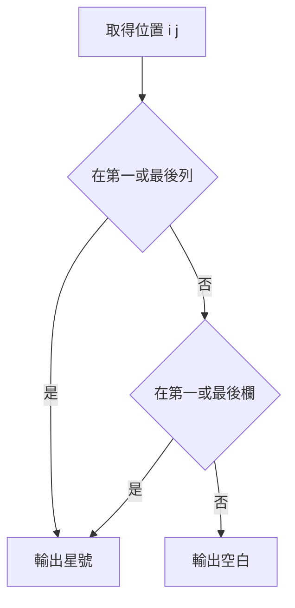
```mermaid
flowchart TD
    A[取得位置 i j] --> B{在第一或最後列}
    B -- 是 --> C[輸出星號]
    B -- 否 --> D{在第一或最後欄}
    D -- 是 --> C
    D -- 否 --> E[輸出空白]
```

---

### 4. 左下實心三角形

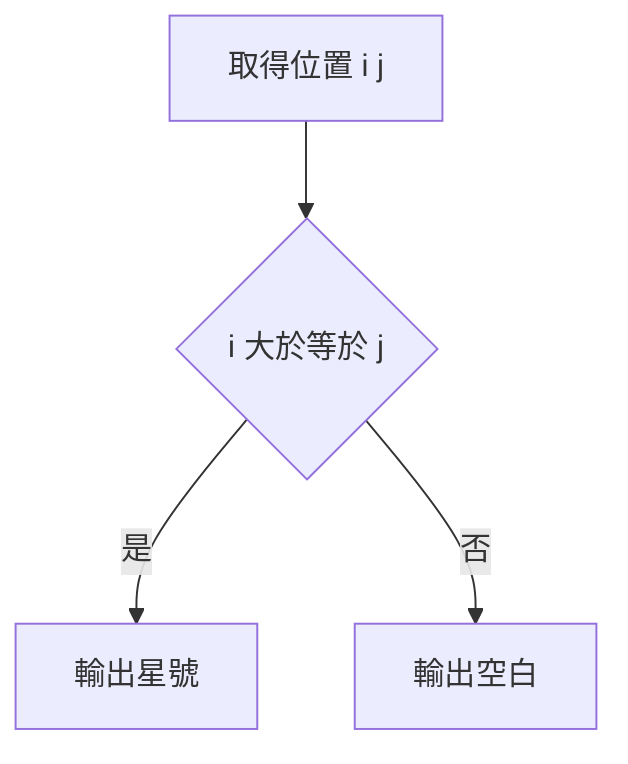
```mermaid
flowchart TD
    A[取得位置 i j] --> B{i 大於等於 j}
    B -- 是 --> C[輸出星號]
    B -- 否 --> D[輸出空白]
```

---

### 5. 空心三角形

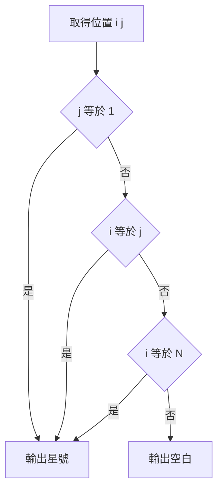
```mermaid
flowchart TD
    A[取得位置 i j] --> B{j 等於 1}
    B -- 是 --> F[輸出星號]
    B -- 否 --> C{i 等於 j}
    C -- 是 --> F
    C -- 否 --> D{i 等於 N}
    D -- 是 --> F
    D -- 否 --> E[輸出空白]
```

---

### 6. 雙層枚舉整數解

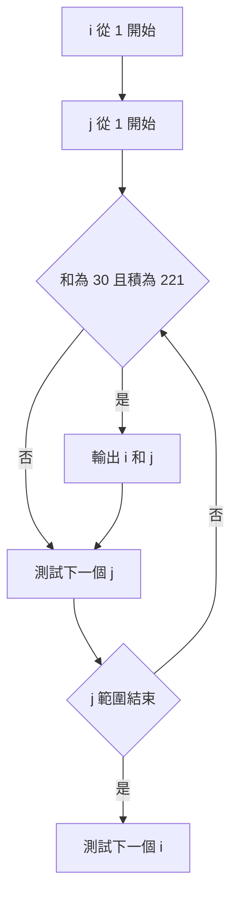
```mermaid
flowchart TD
    A[i 從 1 開始] --> B[j 從 1 開始]
    B --> C{和為 30 且積為 221}
    C -- 是 --> D[輸出 i 和 j]
    C -- 否 --> E[測試下一個 j]
    D --> E
    E --> F{j 範圍結束}
    F -- 否 --> C
    F -- 是 --> G[測試下一個 i]
```

---

### 7. 單層化搜尋

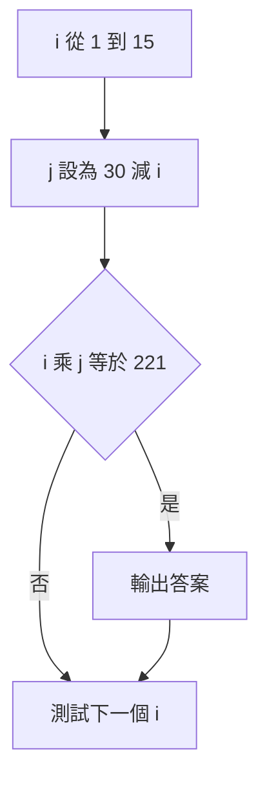
```mermaid
flowchart TD
    A[i 從 1 到 15] --> B[j 設為 30 減 i]
    B --> C{i 乘 j 等於 221}
    C -- 是 --> D[輸出答案]
    C -- 否 --> E[測試下一個 i]
    D --> E
```

---

## 本章完成標準

完成本章後，你應該能做到：

1. 正確寫出雙層 `for`。
2. 說明外層與內層的執行順序。
3. 計算固定範圍巢狀迴圈的本體執行次數。
4. 輸出所有 `(i, j)` 組合。
5. 使用雙層迴圈印出九九乘法表。
6. 使用外層控制列、內層控制欄。
7. 繪製指定大小的實心正方形與長方形。
8. 正確安排每列完成後的換行。
9. 使用分段法繪製空心正方形。
10. 使用座標邊界條件繪製空心正方形。
11. 使用 `j <= i` 繪製實心三角形。
12. 使用 `i == j`、`i >= j` 判斷對角線與三角區域。
13. 使用多條邊界條件繪製空心三角形。
14. 使用 `i + j` 關係繪製靠右圖形。
15. 根據座標條件改變三角形方向。
16. 使用雙層迴圈枚舉兩個未知數。
17. 找出和為 `30`、積為 `221` 的正整數解。
18. 解釋對稱答案為什麼會重複。
19. 使用範圍限制去除重複候選。
20. 使用 `j = 30 - i` 將雙層搜尋簡化成單層搜尋。
21. 找出換行、控制變數與邊界條件的常見錯誤。
22. 準備進入下一章的迴圈數學解題。
