# Lesson 11：Loop Problem-Solving Practice 迴圈解題練習

> 這堂課的重點：將 `for`、`while`、條件判斷、餘數、計數器與狀態變數組合起來，完成正因數、韓信點兵與質數判斷等數學搜尋問題。

---

## Section I. 今天要做什麼？

1. 把數學條件翻譯成 C 語言條件。
2. 理解「候選值、檢查條件、處理答案」的搜尋架構。
3. 使用 `%` 判斷一個整數是否能整除另一個整數。
4. 找出正整數 `N` 的所有正因數。
5. 說明為什麼候選正因數不會大於 `N`。
6. 使用 `for` 逐一測試 `1` 到 `N`。
7. 從因數的數量觀察質數的特徵。
8. 將韓信點兵的文字條件轉換成三個餘數條件。
9. 理解沒有搜尋上限時，答案可能不只一個。
10. 使用 `while` 找出第一個韓信點兵答案。
11. 使用搜尋上限列出範圍內所有答案。
12. 使用上下限限制搜尋範圍。
13. 將搜尋方向由小到大改成由大到小。
14. 找出搜尋上限內最大的韓信點兵答案。
15. 處理搜尋範圍內沒有答案的情況。
16. 使用答案變數記錄目前找到的結果。
17. 將「是否已找到答案」加入迴圈條件。
18. 使用計數器找出最小的前三個答案。
19. 使用反向搜尋找出最大的前三個答案。
20. 使用計數器找出第三小的答案。
21. 理解質數的定義與為什麼 `1` 不是質數。
22. 使用候選因數 `2` 到 `N - 1` 判斷質數。
23. 使用因數數量判斷是否為質數。
24. 使用 `isPrime` 狀態變數記錄判斷結果。
25. 找到一個非平凡因數後停止不必要的檢查。
26. 不使用額外旗標，利用迴圈結束時的控制變數判斷結果。
27. 比較計數器、答案變數與布林狀態的不同用途。
28. 使用邊界值測試搜尋與數論程式。
29. 找出無窮迴圈、漏掉答案與多找答案的原因。
30. 建立可以重複套用到其他搜尋題的解題流程。

---

## Section II. 今天的學習方式

<p align="center">
  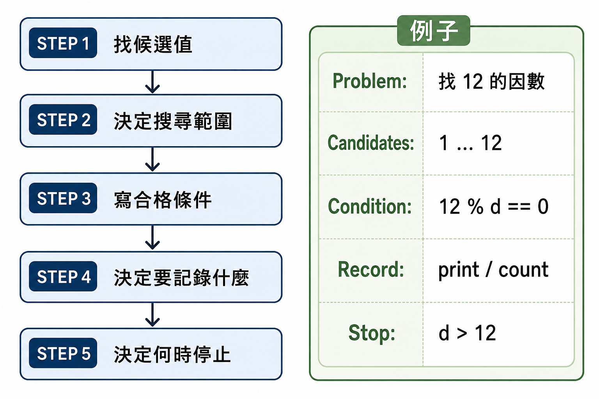
</p>


1. 先用中文寫出「什麼數字算答案」。
2. 將每個條件翻譯成關係或餘數表示式。
3. 決定候選值的最小值與最大值。
4. 決定搜尋方向是由小到大，還是由大到小。
5. 確認題目要找第一個、全部、最大、前三個或第幾個答案。
6. 選擇合適的輔助變數：
   - `count`：記錄找到幾個。
   - `answer`：保存答案。
   - `isPrime`：保存真假狀態。
7. 把停止條件寫進迴圈條件，避免做多餘工作。
8. 每次找到答案時，確認是立即輸出、保存，還是增加次數。
9. 測試沒有答案、只有一個答案及有多個答案的範圍。
10. 測試最小輸入，例如 `N = 1`、`N = 2`。
11. 先完成最直接、最容易驗證的版本，再改善搜尋方式。
12. 本章依照來源教材的方式，主要使用線性枚舉，不額外引入未在來源中正式教授的進階數論演算法。

---

## Section III. 今天會學到的內容

<p align="center">
  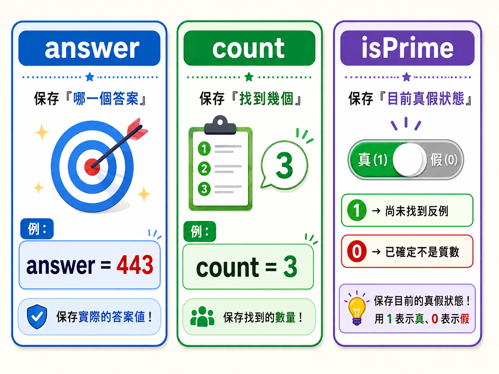
</p>


| 主題 | 你需要知道的事 |
| --- | --- |
| 候選值 | 搜尋過程中可能成為答案的數字 |
| 搜尋範圍 | 候選值的起點、終點與方向 |
| 合格條件 | 候選值必須同時滿足的規則 |
| `%` | 判斷餘數與整除關係 |
| 正因數 | 可以整除 `N` 的正整數 |
| 線性枚舉 | 依序檢查範圍中的每個候選值 |
| 第一個答案 | 由小到大搜尋時最先找到的合格值 |
| 最大答案 | 由大到小搜尋時最先找到的合格值 |
| 所有答案 | 搜尋完整範圍並輸出每個合格值 |
| 計數器 | 記錄已經找到多少個答案 |
| 答案變數 | 保存找到的數值，並可表示是否找到 |
| 狀態變數 | 保存某個判斷目前為真或假 |
| 提前停止 | 已取得足夠結果後不再繼續搜尋 |
| 韓信點兵 | 同時滿足三個餘數條件的整數 |
| 質數 | 除了 `1` 與本身外沒有其他正因數的正整數 |
| 非平凡因數 | 除了 `1` 與本身之外的因數 |
| 邊界情況 | 沒有答案、第一個就符合、最後一個才符合 |
| 無窮搜尋 | 沒有可達停止條件或更新方向錯誤 |
| 控制變數殘值 | 迴圈結束時可用來判斷停止原因 |

---

## Section IV. 寫題目前的提醒

### 1. 整除表示餘數為 `0`

<p align="center">
  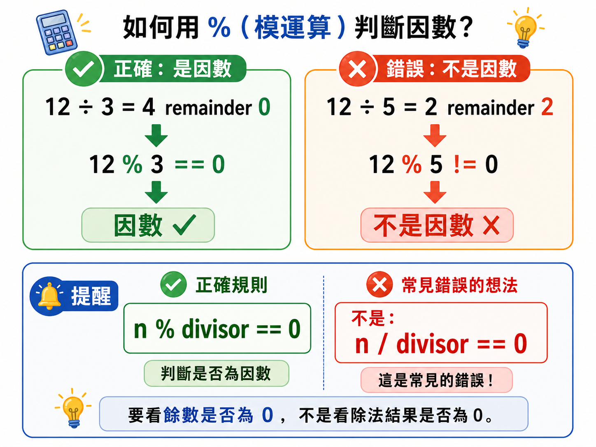
</p>


```c
n % divisor == 0
```

代表：

```text
divisor 可以整除 n
```

不是使用除法結果判斷：

```c
n / divisor == 0
```

---

### 2. 正因數候選從 `1` 開始

題目要求正因數，因此：

```c
for (number = 1; number <= n; number++)
```

不要從 `0` 開始，因為不能用 `0` 當除數。

---

### 3. `N` 本身永遠是 `N` 的正因數

```c
n % n == 0
```

因此搜尋到：

```c
number <= n
```

才能包含 `N` 本身。

---

### 4. 質數不包括 `1`

質數是：

> 除了 `1` 與本身以外，沒有其他正因數的正整數。

`1` 只有一個正因數，不符合質數定義。

---

### 5. 質數判斷不需要檢查 `1` 與 `N`

因為任何正整數都能被 `1` 與自己整除。

真正需要檢查的是：

```c
2
```

到：

```c
N - 1
```

是否存在因數。

---

### 6. 韓信點兵三個條件要同時成立

來源題目：

```text
三三數之賸二
五五數之賸三
七七數之賸二
```

翻譯成：

```c
number % 3 == 2 &&
number % 5 == 3 &&
number % 7 == 2
```

需要使用 `&&`，不是 `||`。

---

### 7. 沒有上限的韓信點兵答案不只一個

滿足條件的數字包括：

```text
23
128
233
338
443
...
```

如果題目只問「第一個」，由 `1` 向上搜尋即可。

如果題目要求「所有答案」，必須提供有限搜尋範圍。

---

### 8. 搜尋方向決定答案順序

<p align="center">
  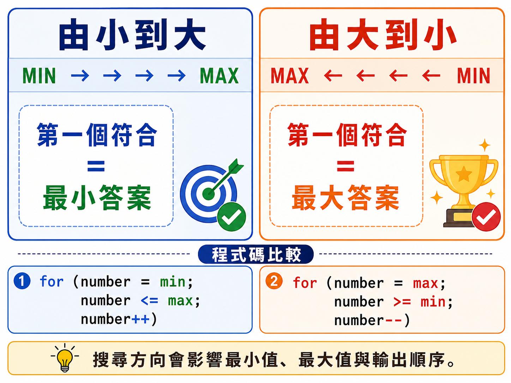
</p>


由小到大：

```c
for (number = min; number <= max; number++)
```

輸出由小到大。

由大到小：

```c
for (number = max; number >= min; number--)
```

輸出由大到小。

---

### 9. 最大值可以由大到小搜尋

由上限開始向下找時，第一個合格值就是最大答案。

但必須處理：

```text
範圍內可能沒有答案
```

否則程式可能一直往負數搜尋。

---

### 10. `answer = 0` 可以表示「尚未找到」

韓信點兵的正整數答案不會是 `0`，因此可以使用：

```c
int answer = 0;
```

找到時：

```c
answer = number;
```

離開後：

```c
if (answer != 0)
```

表示確實找到。

---

### 11. `count` 增加的位置要正確

只有候選值符合條件時才增加：

```c
if (qualified) {
    count++;
}
```

如果每一輪都增加，記錄的是檢查次數，不是答案數量。

---

### 12. 「找前三個」要在找到三個後停止

可將停止條件寫進 `for`：

```c
for (number = 1; number <= 1000 && count < 3; number++)
```

當 `count == 3` 時，不再檢查後面的候選值。

---

### 13. 「第三小」不能把前三個都輸出

找到答案時先增加：

```c
count++;
```

只有：

```c
count == 3
```

時才輸出。

---

### 14. `isPrime` 的初始假設通常是「先視為質數」

```c
int isPrime = 1;
```

如果找到非平凡因數：

```c
isPrime = 0;
```

---

### 15. 找到一個非平凡因數就足以判定不是質數

不需要繼續找出所有因數。

因此可把：

```c
isPrime
```

加入迴圈條件：

```c
for (number = 2; number < n && isPrime; number++)
```

---

### 16. 不使用旗標時，可以觀察迴圈控制變數

```c
for (number = 2;
     number < n && n % number != 0;
     number++) {
}
```

如果最後：

```c
number == n
```

表示從 `2` 到 `n - 1` 都沒有整除。

---

### 17. 空的 `for` 本體要特別小心分號

來源中有一種寫法：

```c
for (number = 2;
     number < n && n % number != 0;
     number++) {
}
```

也可以寫成空述句：

```c
for (...);
```

但初學階段使用大括號較清楚，不容易誤讀。

---

### 18. `N <= 1` 要直接判定不是質數

如果不特別處理，某些迴圈版本可能把 `1` 錯判成質數。

先檢查：

```c
if (n <= 1) {
    printf("No\n");
}
```

---

## Section V. 核心概念說明

## Section V-A. 找出所有正因數

### 1. 什麼是因數？

如果整數 `a` 能整除整數 `N`：

```text
N ÷ a 的餘數為 0
```

則 `a` 是 `N` 的因數。

C 語言：

```c
n % number == 0
```

---

### 2. 正因數的例子

`8` 的正因數：

```text
1, 2, 4, 8
```

`9` 的正因數：

```text
1, 3, 9
```

`10` 的正因數：

```text
1, 2, 5, 10
```

`11` 的正因數：

```text
1, 11
```

`11` 除了 `1` 與本身外沒有其他正因數，因此是質數。

---

### 3. 如何找出候選值？

`N` 的正因數必須：

1. 是正整數。
2. 不大於 `N`。
3. 能整除 `N`。

因此候選範圍是：

```text
1 到 N
```

---

### 4. 正因數程式

```c
#include <stdio.h>

int main(void) {
    int n;
    int number;

    printf("N = ");
    scanf("%d", &n);

    for (number = 1; number <= n; number++) {
        if (n % number == 0) {
            printf("%d ", number);
        }
    }

    printf("\n");

    return 0;
}
```

輸入：

```text
N = 21
```

輸出：

```text
1 3 7 21
```

---

### 5. 搜尋架構

<p align="center">
  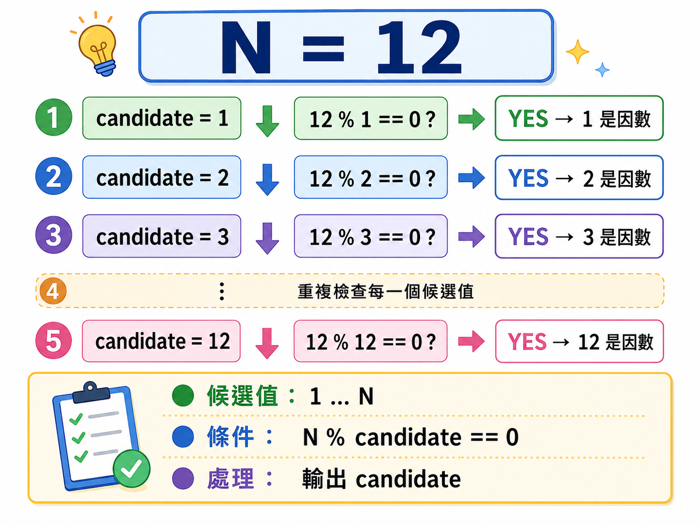
</p>


```c
for (候選值依序變化) {
    if (候選值符合條件) {
        處理答案;
    }
}
```

在因數問題中：

| 部分 | 內容 |
| --- | --- |
| 候選值 | `1` 到 `N` |
| 合格條件 | `N % number == 0` |
| 處理答案 | 輸出 `number` |

---

### 6. 追蹤 `N = 8`

| 候選 `number` | `8 % number` | 是因數嗎？ |
| ---: | ---: | --- |
| 1 | 0 | 是 |
| 2 | 0 | 是 |
| 3 | 2 | 否 |
| 4 | 0 | 是 |
| 5 | 3 | 否 |
| 6 | 2 | 否 |
| 7 | 1 | 否 |
| 8 | 0 | 是 |

結果：

```text
1 2 4 8
```

---

### 7. 延伸：計算正因數數量

```c
#include <stdio.h>

int main(void) {
    int n;
    int number;
    int count = 0;

    printf("N = ");
    scanf("%d", &n);

    for (number = 1; number <= n; number++) {
        if (n % number == 0) {
            count++;
        }
    }

    printf("Number of positive divisors: %d\n", count);

    return 0;
}
```

質數的正因數數量恰好是 `2`。

---

## Section V-B. 韓信點兵：沒有指定上限

### 8. 題目條件

<p align="center">
  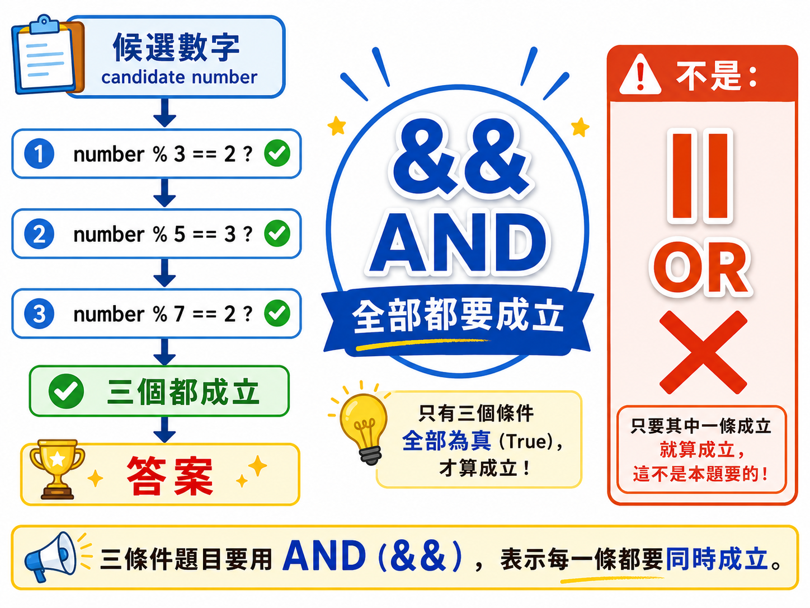
</p>


來源題目記載：

```text
三三數之賸二
五五數之賸三
七七數之賸二
```

候選數字 `number` 必須同時符合：

```c
number % 3 == 2
number % 5 == 3
number % 7 == 2
```

---

### 9. 合格條件

```c
number % 3 == 2 &&
number % 5 == 3 &&
number % 7 == 2
```

把它包在否定中：

```c
!(number % 3 == 2 &&
  number % 5 == 3 &&
  number % 7 == 2)
```

代表：

> 目前還不是答案。

---

### 10. 使用 `while` 找第一個答案

```c
#include <stdio.h>

int main(void) {
    int number = 1;

    while (!(number % 3 == 2 &&
             number % 5 == 3 &&
             number % 7 == 2)) {
        number++;
    }

    printf("%d\n", number);

    return 0;
}
```

輸出：

```text
23
```

---

### 11. 為什麼起點是 `1`？

題目詢問正整數數量，因此從最小正整數開始。

由小到大搜尋時，第一個符合條件的值就是最小正整數答案。

---

### 12. 為什麼這個題目需要小心？

沒有搜尋上限時：

- 程式假設一定找得到答案。
- 若條件根本沒有答案，迴圈可能永遠不停止。
- 即使有答案，也只能找到第一個。

後續來源教材因此加入搜尋範圍。

---

### 13. 韓信點兵答案不只一個

<p align="center">
  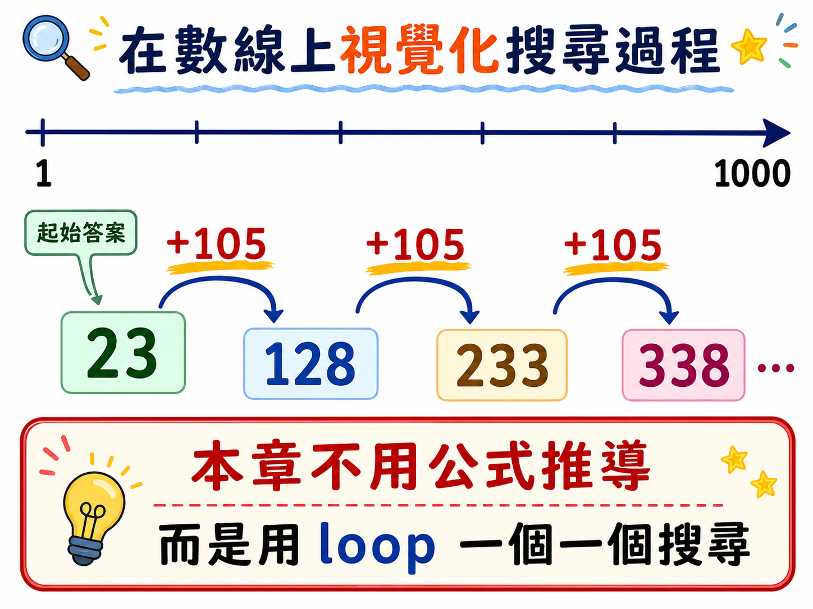
</p>


前幾個答案：

```text
23
128
233
338
443
548
653
758
863
968
```

相鄰答案相差：

```text
105
```

本章不要求推導公式，而是使用迴圈在指定範圍內搜尋。

---

## Section V-C. 有上限與有範圍的韓信點兵

### 14. 找出上限內所有答案

使用者輸入搜尋上限 `max`：

```c
#include <stdio.h>

int main(void) {
    int max;
    int number;

    printf("MAX = ");
    scanf("%d", &max);

    for (number = 1; number <= max; number++) {
        if (number % 3 == 2 &&
            number % 5 == 3 &&
            number % 7 == 2) {
            printf("%d ", number);
        }
    }

    printf("\n");

    return 0;
}
```

輸入：

```text
MAX = 100
```

輸出：

```text
23
```

輸入：

```text
MAX = 1000
```

輸出：

```text
23 128 233 338 443 548 653 758 863 968
```

---

### 15. 加入下限與上限

```c
#include <stdio.h>

int main(void) {
    int min;
    int max;
    int number;

    printf("MIN = ");
    scanf("%d", &min);

    printf("MAX = ");
    scanf("%d", &max);

    for (number = min; number <= max; number++) {
        if (number % 3 == 2 &&
            number % 5 == 3 &&
            number % 7 == 2) {
            printf("%d ", number);
        }
    }

    printf("\n");

    return 0;
}
```

輸入：

```text
MIN = 100
MAX = 500
```

輸出：

```text
128 233 338 443
```

---

### 16. 由大到小輸出

只需要改變：

- 起點：`max`
- 條件：`number >= min`
- 更新：`number--`

```c
for (number = max; number >= min; number--) {
    if (number % 3 == 2 &&
        number % 5 == 3 &&
        number % 7 == 2) {
        printf("%d ", number);
    }
}
```

輸入：

```text
MIN = 100
MAX = 500
```

輸出：

```text
443 338 233 128
```

---

## Section V-D. 找出最大答案

### 17. 由上限向下搜尋

因為題目只要最大值，可以從 `max` 開始向下檢查。

最直接的想法：

```c
int number = max;

while (!(number % 3 == 2 &&
         number % 5 == 3 &&
         number % 7 == 2)) {
    number--;
}

printf("%d\n", number);
```

如果上限內有答案，這能找到最大值。

---

### 18. 沒有答案時的危險

<p align="center">
  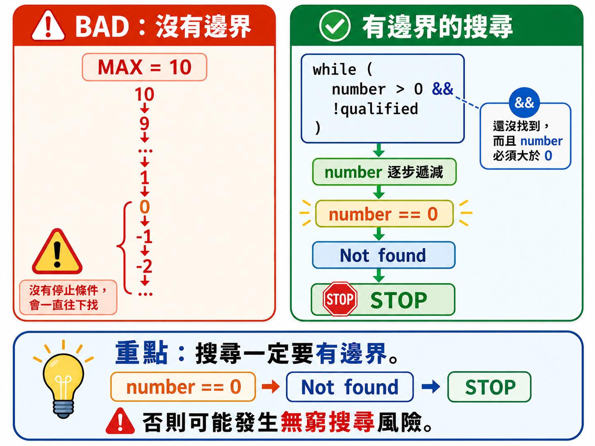
</p>


若上限小於第一個答案 `23`，例如：

```text
MAX = 10
```

前面的程式會繼續檢查：

```text
9, 8, ..., 0, -1, -2, ...
```

可能一直找不到適合的正整數，造成無窮搜尋。

因此要限制：

```c
number > 0
```

---

### 19. 安全的 `while` 版本

```c
#include <stdio.h>

int main(void) {
    int max;
    int number;

    printf("MAX = ");
    scanf("%d", &max);

    number = max;

    while (number > 0 &&
           !(number % 3 == 2 &&
             number % 5 == 3 &&
             number % 7 == 2)) {
        number--;
    }

    if (number > 0) {
        printf("%d\n", number);
    } else {
        printf("Not found\n");
    }

    return 0;
}
```

---

### 20. 使用 `answer` 保存最大值

另一種來源中的做法是由小到大走完整範圍，每次找到答案就覆蓋：

```c
#include <stdio.h>

int main(void) {
    int max;
    int number;
    int answer = 0;

    printf("MAX = ");
    scanf("%d", &max);

    for (number = 1; number <= max; number++) {
        if (number % 3 == 2 &&
            number % 5 == 3 &&
            number % 7 == 2) {
            answer = number;
        }
    }

    if (answer != 0) {
        printf("%d\n", answer);
    } else {
        printf("Not found\n");
    }

    return 0;
}
```

因為由小到大搜尋，最後一次保存的答案就是最大答案。

---

### 21. 由大到小，只保存第一個答案

```c
#include <stdio.h>

int main(void) {
    int max;
    int number;
    int answer = 0;

    printf("MAX = ");
    scanf("%d", &max);

    for (number = max;
         number >= 1 && answer == 0;
         number--) {
        if (number % 3 == 2 &&
            number % 5 == 3 &&
            number % 7 == 2) {
            answer = number;
        }
    }

    if (answer != 0) {
        printf("%d\n", answer);
    } else {
        printf("Not found\n");
    }

    return 0;
}
```

将：

```c
answer == 0
```

放進迴圈條件，找到答案後就停止。

---

## Section V-E. 找固定數量與指定順位的答案

### 22. 找出最小的前三個

搜尋範圍：

```text
1 到 1000
```

使用 `count` 記錄找到幾個：

```c
#include <stdio.h>

int main(void) {
    int count = 0;
    int number;

    for (number = 1;
         number <= 1000 && count < 3;
         number++) {
        if (number % 3 == 2 &&
            number % 5 == 3 &&
            number % 7 == 2) {
            count++;
            printf("%d ", number);
        }
    }

    printf("\n");

    return 0;
}
```

輸出：

```text
23 128 233
```

---

### 23. 為什麼 `count < 3` 放在迴圈條件中？

如果只在輸出前判斷：

```c
if (count <= 3) {
    printf(...);
}
```

迴圈仍會走到 `1000`，只是後面的答案不輸出。

將 `count < 3` 放在 `for` 條件，可以找到三個後立即停止。

---

### 24. 找出最大的前三個

把搜尋方向反過來：

```c
#include <stdio.h>

int main(void) {
    int count = 0;
    int number;

    for (number = 1000;
         number >= 1 && count < 3;
         number--) {
        if (number % 3 == 2 &&
            number % 5 == 3 &&
            number % 7 == 2) {
            count++;
            printf("%d ", number);
        }
    }

    printf("\n");

    return 0;
}
```

輸出：

```text
968 863 758
```

---

### 25. 找出第三小的答案

```c
#include <stdio.h>

int main(void) {
    int count = 0;
    int number;

    for (number = 1;
         number <= 1000 && count < 3;
         number++) {
        if (number % 3 == 2 &&
            number % 5 == 3 &&
            number % 7 == 2) {
            count++;

            if (count == 3) {
                printf("%d\n", number);
            }
        }
    }

    return 0;
}
```

輸出：

```text
233
```

---

### 26. 找第三小與找前三小的差異

<p align="center">
  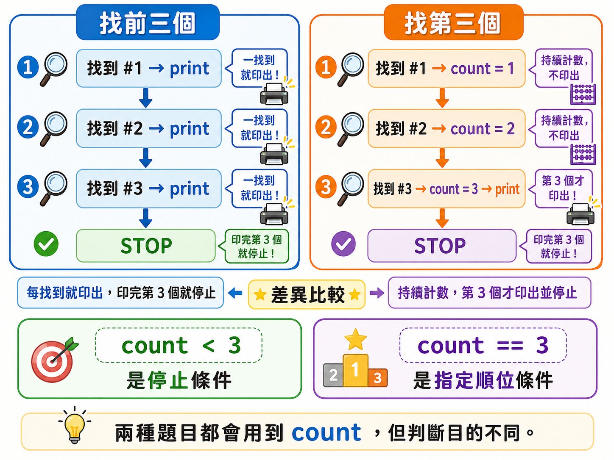
</p>


| 題目 | 找到合格值時 |
| --- | --- |
| 前三小 | 每次都輸出，直到三個 |
| 第三小 | 每次增加 `count`，只有 `count == 3` 時輸出 |

---

## Section V-F. 質數判斷

<p align="center">
  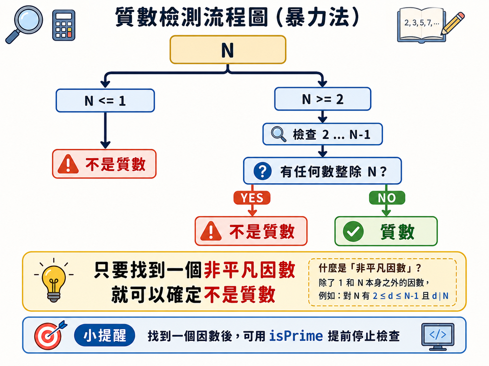
</p>


### 27. 什麼是質數？

質數是：

> 除了 `1` 與本身以外，沒有其他正因數的正整數。

例子：

```text
2, 3, 5, 7, 11, 13, 17, 19, 23, ...
```

不包括：

```text
1
```

質數有無窮多個，也是現代密碼系統的重要基礎之一。

---

### 28. 直接尋找非平凡因數

如果 `N` 是質數，則：

```text
2 到 N - 1
```

之間不會有任何數能整除 `N`。

```c
for (number = 2; number < n; number++) {
    if (n % number == 0) {
        /* 找到非平凡因數 */
    }
}
```

---

### 29. 方法一：計算非平凡因數數量

```c
#include <stdio.h>

int main(void) {
    int n;
    int number;
    int numberOfDivisors = 0;

    printf("N = ");
    scanf("%d", &n);

    if (n <= 1) {
        printf("No\n");
        return 0;
    }

    for (number = 2; number < n; number++) {
        if (n % number == 0) {
            numberOfDivisors++;
        }
    }

    if (numberOfDivisors == 0) {
        printf("Yes\n");
    } else {
        printf("No\n");
    }

    return 0;
}
```

若沒有任何非平凡因數，就是質數。

---

### 30. 方法二：使用 `isPrime`

<p align="center">
  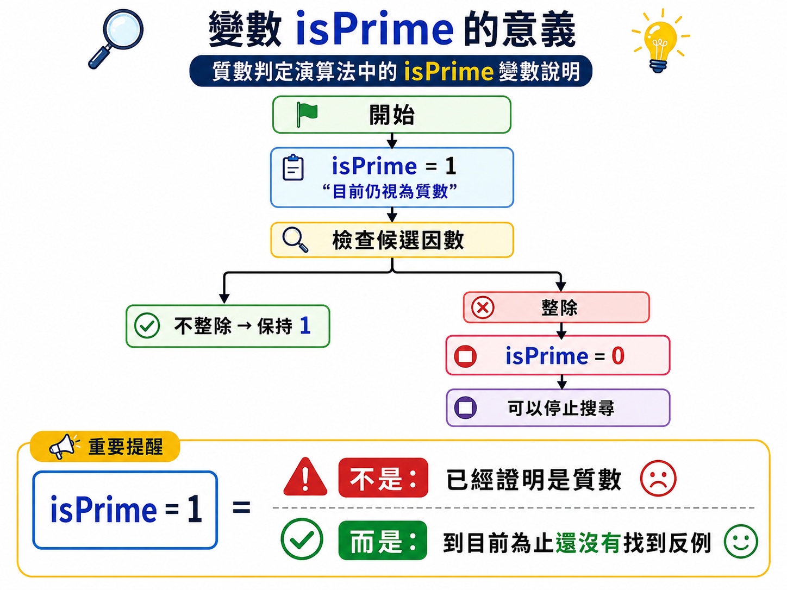
</p>


```c
#include <stdio.h>

int main(void) {
    int n;
    int number;
    int isPrime = 1;

    printf("N = ");
    scanf("%d", &n);

    if (n <= 1) {
        isPrime = 0;
    }

    for (number = 2; number < n; number++) {
        if (n % number == 0) {
            isPrime = 0;
        }
    }

    if (isPrime) {
        printf("Yes\n");
    } else {
        printf("No\n");
    }

    return 0;
}
```

`isPrime` 的意義：

| 值 | 意義 |
| ---: | --- |
| 1 | 目前仍視為質數 |
| 0 | 已確定不是質數 |

---

### 31. 找到因數後停止檢查

```c
for (number = 2;
     number < n && isPrime;
     number++) {
    if (n % number == 0) {
        isPrime = 0;
    }
}
```

只要 `isPrime` 變成 `0`，下一次條件檢查時就離開迴圈。

---

### 32. 方法三：利用控制變數判斷

不使用 `isPrime`：

```c
#include <stdio.h>

int main(void) {
    int n;
    int number;

    printf("N = ");
    scanf("%d", &n);

    if (n <= 1) {
        printf("No\n");
        return 0;
    }

    for (number = 2;
         number < n && n % number != 0;
         number++) {
    }

    if (number == n) {
        printf("Yes\n");
    } else {
        printf("No\n");
    }

    return 0;
}
```

---

### 33. 為什麼 `number == n` 代表質數？

如果每個：

```text
2, 3, ..., N - 1
```

都不能整除 `N`，迴圈會一直正常更新，最後 `number` 變成 `N`。

若中途找到因數，條件：

```c
n % number != 0
```

會變成假，迴圈提早結束，此時：

```c
number < n
```

---

### 34. 相同概念的 `while` 版本

```c
#include <stdio.h>

int main(void) {
    int n;
    int number = 2;

    printf("N = ");
    scanf("%d", &n);

    if (n <= 1) {
        printf("No\n");
        return 0;
    }

    while (number < n && n % number != 0) {
        number++;
    }

    if (number == n) {
        printf("Yes\n");
    } else {
        printf("No\n");
    }

    return 0;
}
```

這顯示同一個搜尋邏輯可以使用 `for` 或 `while` 表達。

---

## Section V-G. 容易搞混的重點

### 1. 因數與倍數方向相反

若：

```text
3 可以整除 12
```

則：

- `3` 是 `12` 的因數。
- `12` 是 `3` 的倍數。

---

### 2. `N % number == 0` 的被除數是 `N`

錯誤：

```c
number % n == 0
```

這是在檢查 `N` 是否為 `number` 的因數，方向不同。

---

### 3. 韓信點兵不是三個條件任選一個

必須同時符合，因此使用：

```c
&&
```

---

### 4. 無上限搜尋不適合「列出所有答案」

答案無窮多，不可能讓程式自然列完。

要列出所有答案，必須提供上限或範圍。

---

### 5. 最大值不一定要保存每個答案

若由大到小搜尋，第一個答案就是最大值。

由小到大搜尋時，則可以每次覆蓋 `answer`。

---

### 6. `answer == 0` 是狀態，也是數值

在本題中：

- `0` 不是合法正整數答案。
- 因此可安全用來代表「未找到」。

其他題目若 `0` 可能是答案，就要改用獨立狀態變數。

---

### 7. `count` 的用途不是保存答案

```c
count
```

表示找到幾個。

```c
number
```

才是目前找到的數值。

---

### 8. 「第三小」的 `count` 是順位

找到第一個時：

```text
count = 1
```

找到第三個時：

```text
count = 3
```

因此可在 `count == 3` 時輸出。

---

### 9. 質數判斷只需要找到一個反例

只要找到一個：

```c
n % number == 0
```

且 `number` 介於 `2` 與 `n - 1`，就已確定不是質數。

---

### 10. `isPrime = 1` 不是「已證明是質數」

它代表：

> 到目前為止，尚未找到能推翻質數假設的因數。

---

### 11. `number == n` 的方法依賴迴圈停止原因

必須同時理解：

- 正常走到 `n`
- 中途因整除而停止

不能只看到最後一行就死背。

---

### 12. `2` 是質數

檢查 `2` 時：

```c
number = 2
number < n
```

一開始就是假。

控制變數等於 `n`，因此判定為質數。

---

## Section VI. 快速概念檢查

### Q1. 判斷 `a` 是否為 `n` 的因數，條件怎麼寫？

<details>
<summary>查看答案</summary>

```c
n % a == 0
```

</details>

---

### Q2. `N` 的正因數候選範圍是什麼？

<details>
<summary>查看答案</summary>

正整數 `1` 到 `N`。

</details>

---

### Q3. 韓信點兵的三個餘數條件應使用 `&&` 還是 `||`？

<details>
<summary>查看答案</summary>

使用 `&&`，因為三個條件必須同時成立。

</details>

---

### Q4. 第一個韓信點兵正整數答案是多少？

<details>
<summary>查看答案</summary>

```text
23
```

</details>

---

### Q5. `MAX = 500` 時最大的韓信點兵答案是多少？

<details>
<summary>查看答案</summary>

```text
443
```

</details>

---

### Q6. 搜尋最小三個答案時，為什麼需要 `count < 3`？

<details>
<summary>查看答案</summary>

找到三個後停止搜尋，避免繼續檢查不需要的候選值。

</details>

---

### Q7. 前三個最小韓信點兵答案是什麼？

<details>
<summary>查看答案</summary>

```text
23 128 233
```

</details>

---

### Q8. 質數是否包括 `1`？

<details>
<summary>查看答案</summary>

不包括。

</details>

---

### Q9. 判斷 `N` 是否為質數時，需要尋找哪一類因數？

<details>
<summary>查看答案</summary>

尋找介於 `2` 與 `N - 1` 的非平凡正因數。

</details>

---

### Q10. `isPrime` 變成 `0` 表示什麼？

<details>
<summary>查看答案</summary>

已經找到一個非平凡因數，因此 `N` 不是質數。

</details>

---

### Q11. 控制變數版本中，為什麼 `number == n` 代表質數？

<details>
<summary>查看答案</summary>

因為所有 `2` 到 `n - 1` 都檢查完，沒有任何數能整除 `n`。

</details>

---

### Q12. `N = 2` 應判斷為質數嗎？

<details>
<summary>查看答案</summary>

是。`2` 除了 `1` 與自己以外沒有其他正因數。

</details>

---

## Section VII. 程式閱讀練習

### 題目 1：正因數

```c
int n = 12;

for (number = 1; number <= n; number++) {
    if (n % number == 0) {
        printf("%d ", number);
    }
}
```

<details>
<summary>查看答案</summary>

```text
1 2 3 4 6 12
```

</details>

---

### 題目 2：條件使用錯誤

```c
if (number % 3 == 2 ||
    number % 5 == 3 ||
    number % 7 == 2) {
    printf("%d\n", number);
}
```

<details>
<summary>查看答案</summary>

這會輸出只要符合其中一個條件的數字，並不是韓信點兵答案。

應將 `||` 改成 `&&`。

</details>

---

### 題目 3：搜尋方向

```c
for (number = 500; number >= 100; number--) {
    if (qualified) {
        printf("%d ", number);
    }
}
```

<details>
<summary>查看答案</summary>

合格答案會由大到小輸出。

對韓信點兵條件而言：

```text
443 338 233 128
```

</details>

---

### 題目 4：答案變數

```c
int answer = 0;

for (number = 1; number <= 500; number++) {
    if (qualified) {
        answer = number;
    }
}
```

<details>
<summary>查看答案</summary>

`answer` 最後保存不大於 `500` 的最大合格值，也就是 `443`。

</details>

---

### 題目 5：前三小

```c
int count = 0;

for (number = 1;
     number <= 1000 && count < 3;
     number++) {
    if (qualified) {
        count++;
        printf("%d ", number);
    }
}
```

<details>
<summary>查看答案</summary>

輸出：

```text
23 128 233
```

</details>

---

### 題目 6：第三小

```c
if (qualified) {
    count++;

    if (count == 3) {
        printf("%d\n", number);
    }
}
```

<details>
<summary>查看答案</summary>

只輸出第三個找到的合格值。

韓信點兵題中為：

```text
233
```

</details>

---

### 題目 7：質數旗標

```c
int n = 15;
int isPrime = 1;

for (number = 2; number < n && isPrime; number++) {
    if (n % number == 0) {
        isPrime = 0;
    }
}
```

<details>
<summary>查看答案</summary>

`number = 3` 時整除 `15`，因此 `isPrime` 變成 `0`。

`15` 不是質數。

</details>

---

### 題目 8：控制變數殘值

```c
int n = 13;

for (number = 2;
     number < n && n % number != 0;
     number++) {
}
```

<details>
<summary>查看答案</summary>

沒有 `2` 到 `12` 可以整除 `13`，因此最後 `number == 13`，可判斷 `13` 是質數。

</details>

---

## Section VIII. 實作練習 / 實作檢測題

### TODO 1：列出所有正因數

輸入正整數 `N`，由小到大輸出所有正因數。

---

### TODO 2：計算正因數數量

在 TODO 1 的基礎上，最後輸出正因數總數。

---

### TODO 3：正因數總和

輸入正整數 `N`，計算所有正因數的總和。

例如：

```text
N = 8
```

結果：

```text
1 + 2 + 4 + 8 = 15
```

---

### TODO 4：第一個韓信點兵答案

使用 `while`，由 `1` 開始搜尋，輸出第一個答案。

---

### TODO 5：上限內所有韓信點兵答案

輸入 `MAX`，由小到大輸出所有答案。

---

### TODO 6：指定範圍內所有答案

輸入 `MIN` 與 `MAX`，輸出範圍中的全部答案。

---

### TODO 7：由大到小輸出

修改 TODO 6，改成由大到小。

---

### TODO 8：上限內最大答案

輸入 `MAX`，使用由大到小搜尋。

範圍內沒有答案時輸出：

```text
Not found
```

---

### TODO 9：最小的前三個答案

在 `1` 到 `1000` 中找出最小三個答案。

---

### TODO 10：最大的前三個答案

在 `1` 到 `1000` 中找出最大三個答案。

---

### TODO 11：第三小答案

只輸出第三小答案。

---

### TODO 12：計數法判斷質數

計算 `2` 到 `N - 1` 之間有幾個因數。

---

### TODO 13：旗標法判斷質數

使用：

```c
int isPrime = 1;
```

找到因數時改成 `0`。

---

### TODO 14：提前停止質數檢查

將 `isPrime` 加入 `for` 條件，找到第一個因數後停止。

---

### TODO 15：不用旗標判斷質數

利用迴圈結束後的 `number` 判斷。

必須正確處理：

```text
N <= 1
N = 2
```

---

## Section IX. 做題時可以使用的提示

<p align="center">
  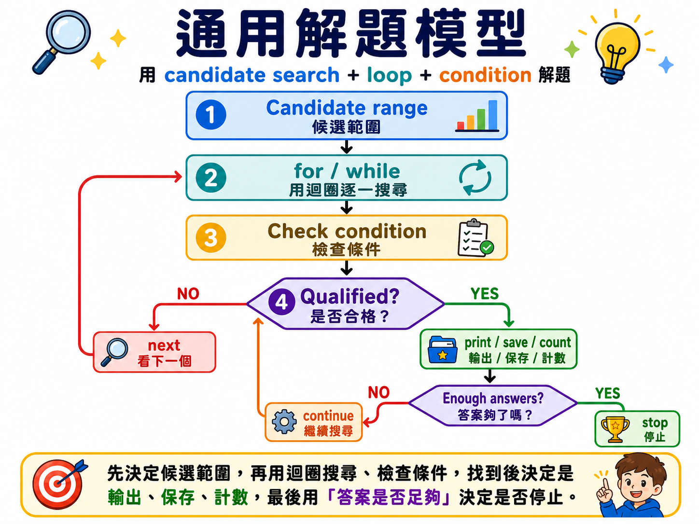
</p>


### 1. 先寫搜尋規格

```text
候選值從哪裡開始？
候選值到哪裡結束？
每次如何更新？
什麼條件才合格？
找到後要做什麼？
什麼時候停止？
```

---

### 2. 將自然語言逐條翻譯

韓信點兵：

```text
除以 3 餘 2
除以 5 餘 3
除以 7 餘 2
```

逐條變成 `%` 條件，再用 `&&` 合併。

---

### 3. 要找最小值就由小到大

第一個符合的候選值就是最小值。

要找最大值則可由大到小。

---

### 4. 要找固定數量時加入 `count`

```c
count++;
```

只在找到答案時執行。

將：

```c
count < target
```

加入迴圈條件。

---

### 5. 要找第 `K` 個時只在 `count == K` 輸出

不要在前 `K` 個都輸出。

---

### 6. 質數題先排除 `N <= 1`

再開始檢查非平凡因數。

---

### 7. 懷疑無窮迴圈時檢查

1. 控制變數是否更新？
2. 更新方向是否接近停止條件？
3. 若沒有答案，是否仍有範圍邊界？
4. 是否在負數區域仍繼續搜尋？

---

### 8. 測試資料建議

正因數：

```text
1, 2, 8, 9, 11, 12
```

韓信點兵最大值：

```text
MAX = 10
MAX = 23
MAX = 100
MAX = 500
```

質數：

```text
-3, 0, 1, 2, 3, 4, 13, 15
```

---

## Section X. 課後小練習

### 練習 1：完全數前置練習

輸入 `N`，計算除了 `N` 本身以外的所有正因數總和。

---

### 練習 2：找出範圍內有四個正因數的數字

輸入 `MAX`，輸出 `1` 到 `MAX` 中正因數數量等於 `4` 的整數。

---

### 練習 3：一般化餘數搜尋

輸入：

```text
divisor1 remainder1
divisor2 remainder2
MAX
```

找出範圍內同時符合兩個餘數條件的整數。

---

### 練習 4：第 `K` 個韓信點兵答案

輸入正整數 `K`，由小到大搜尋並輸出第 `K` 個答案。

---

### 練習 5：列出 `2` 到 `N` 的所有質數

外層枚舉每個候選數，內層判斷該候選是否為質數。

這會再次使用巢狀迴圈。

---

### 練習 6：找出範圍內最大的質數

輸入 `MAX`，由大到小搜尋第一個質數。

---

### 練習 7：比較三種質數判斷方式

分別完成：

1. 因數計數法
2. `isPrime` 旗標法
3. 控制變數殘值法

比較哪一種最容易閱讀。

---

### 練習 8：搜尋結果統計

輸入 `MIN` 與 `MAX`，輸出：

```text
韓信點兵答案數量
最小答案
最大答案
```

若沒有答案，要輸出清楚提示。

---

## Section XI. 重點複習

1. 搜尋題需要候選範圍、合格條件與答案處理。
2. `N % number == 0` 表示 `number` 是 `N` 的因數。
3. 正因數候選可以從 `1` 搜尋到 `N`。
4. 質數只有 `1` 與本身兩個正因數。
5. `1` 不是質數。
6. 韓信點兵需要三個餘數條件同時成立。
7. 無上限搜尋只能合理地找第一個答案，不能列完無窮多答案。
8. 加入上限後可以列出範圍內所有答案。
9. 加入下限後可以限制完整搜尋區間。
10. 搜尋方向決定輸出順序。
11. 由大到小搜尋時，第一個合格值就是最大值。
12. 沒有答案時要避免搜尋進入無限負數。
13. `answer = 0` 可在本題中表示尚未找到。
14. 由小到大每次覆蓋 `answer`，最後保存最大答案。
15. `count` 記錄找到幾個答案。
16. 找固定數量時，可將 `count < target` 加入迴圈條件。
17. 找第 `K` 個答案時，在 `count == K` 時輸出。
18. 質數判斷只需搜尋非平凡因數。
19. 找到一個非平凡因數即可確定不是質數。
20. `isPrime` 是狀態變數，不是因數數量。
21. 控制變數殘值可以反映迴圈停止原因。
22. `N <= 1` 必須判定為非質數。
23. `2` 是最小的質數。
24. 先完成正確的線性搜尋，再改善停止條件。
25. 同一個搜尋邏輯可以使用 `for` 或 `while` 表達。

---

## Section XII. 常見錯誤提醒

### 錯誤 1：因數條件方向顛倒

錯誤：

```c
number % n == 0
```

正確：

```c
n % number == 0
```

---

### 錯誤 2：從 `0` 開始測試因數

錯誤：

```c
for (number = 0; number <= n; number++)
```

執行：

```c
n % 0
```

是無效操作。

---

### 錯誤 3：漏掉 `N` 本身

錯誤：

```c
number < n
```

若題目要求所有正因數，應使用：

```c
number <= n
```

---

### 錯誤 4：韓信點兵使用 `||`

這會把符合任一條件的數字也視為答案。

---

### 錯誤 5：沒有範圍卻想輸出所有韓信點兵答案

答案無窮多，程式不會自然結束。

---

### 錯誤 6：最大值搜尋沒有下界

```c
while (!qualified) {
    number--;
}
```

若範圍內沒有答案，可能一直搜尋負數。

---

### 錯誤 7：沒有檢查 `answer`

若 `answer` 仍是 `0`，代表沒有找到，不應直接當成答案輸出。

---

### 錯誤 8：每輪都增加 `count`

錯誤：

```c
for (...) {
    count++;

    if (qualified) {
        ...
    }
}
```

這是在計算候選值數量。

---

### 錯誤 9：先判斷 `count == 3` 再增加

若順序錯誤，第三個答案可能在 `count == 2` 時出現，造成漏印。

---

### 錯誤 10：把 `1` 判斷為質數

必須特別處理：

```c
n <= 1
```

---

### 錯誤 11：質數檢查包含 `N` 本身

如果檢查：

```c
number <= n
```

則任何 `N` 都會被自己整除，全部被判定為非質數。

應使用：

```c
number < n
```

---

### 錯誤 12：找到因數後把 `isPrime` 設成 `1`

找到非平凡因數時應：

```c
isPrime = 0;
```

---

### 錯誤 13：控制變數版本沒有理解停止原因

中途找到因數時：

```c
number < n
```

不能只檢查 `number` 是否大於某個固定值。

---

### 錯誤 14：把空本體的分號放錯位置

若使用：

```c
for (...);
```

分號就是本體。

之後的大括號不會被迴圈控制。初學時建議使用明確的空大括號。

---

## Section XIII. Mermaid 流程圖

### 1. 通用線性搜尋

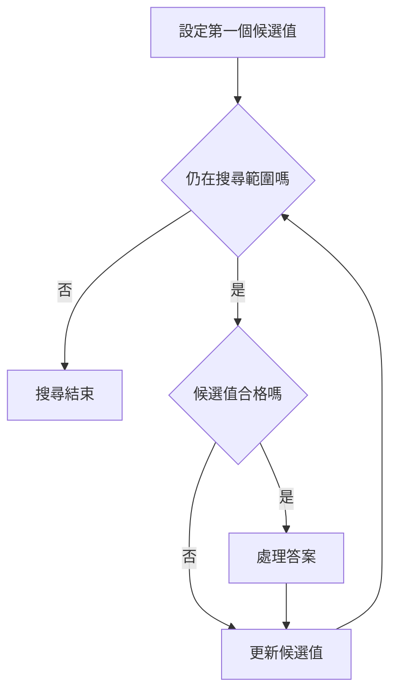
```mermaid
flowchart TD
    A[設定第一個候選值] --> B{仍在搜尋範圍嗎}
    B -- 否 --> F[搜尋結束]
    B -- 是 --> C{候選值合格嗎}
    C -- 是 --> D[處理答案]
    C -- 否 --> E[更新候選值]
    D --> E
    E --> B
```

---

### 2. 找出所有正因數

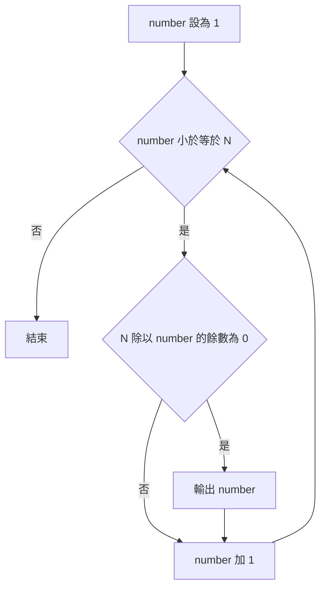
```mermaid
flowchart TD
    A[number 設為 1] --> B{number 小於等於 N}
    B -- 否 --> F[結束]
    B -- 是 --> C{N 除以 number 的餘數為 0}
    C -- 是 --> D[輸出 number]
    C -- 否 --> E[number 加 1]
    D --> E
    E --> B
```

---

### 3. 第一個韓信點兵答案

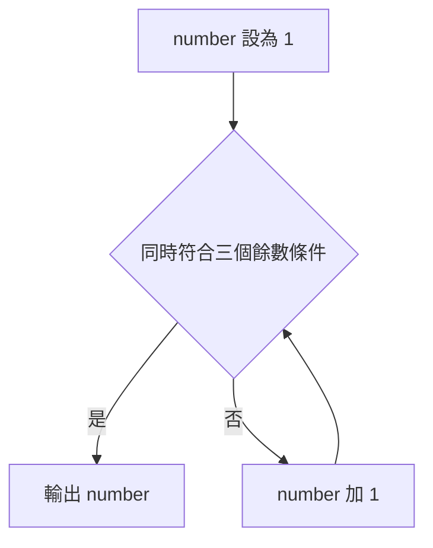
```mermaid
flowchart TD
    A[number 設為 1] --> B{同時符合三個餘數條件}
    B -- 是 --> D[輸出 number]
    B -- 否 --> C[number 加 1]
    C --> B
```

---

### 4. 有範圍的韓信點兵

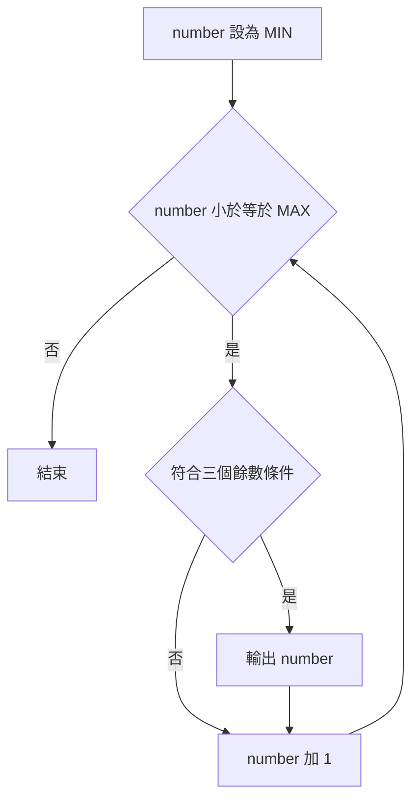
```mermaid
flowchart TD
    A[number 設為 MIN] --> B{number 小於等於 MAX}
    B -- 否 --> F[結束]
    B -- 是 --> C{符合三個餘數條件}
    C -- 是 --> D[輸出 number]
    C -- 否 --> E[number 加 1]
    D --> E
    E --> B
```

---

### 5. 最大答案

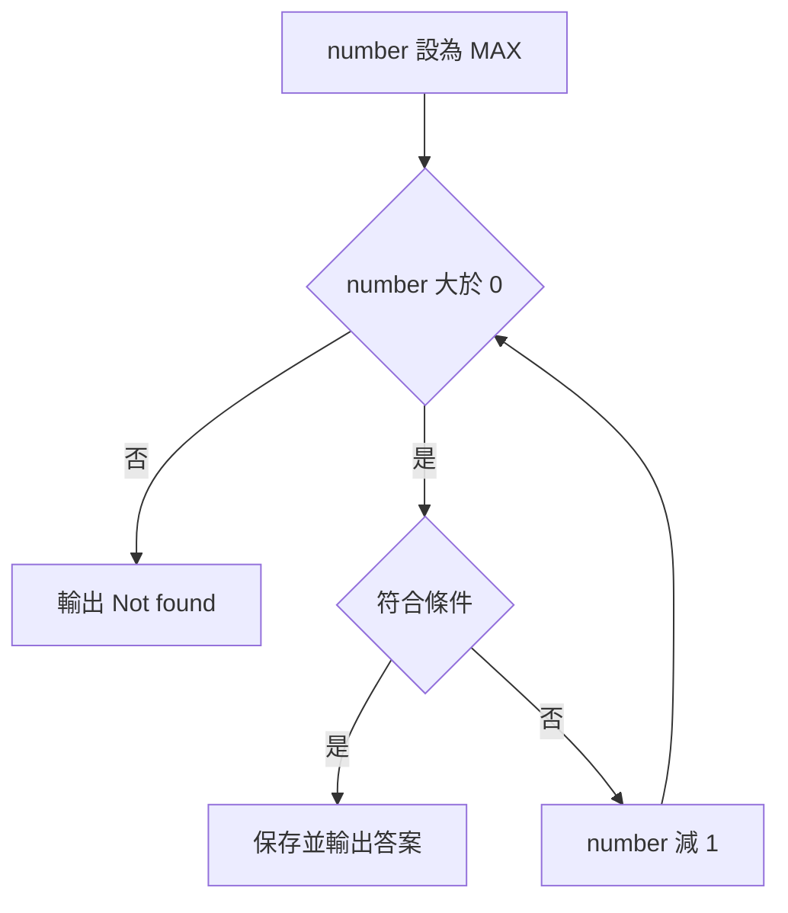
```mermaid
flowchart TD
    A[number 設為 MAX] --> B{number 大於 0}
    B -- 否 --> F[輸出 Not found]
    B -- 是 --> C{符合條件}
    C -- 是 --> D[保存並輸出答案]
    C -- 否 --> E[number 減 1]
    E --> B
```

---

### 6. 找前三小

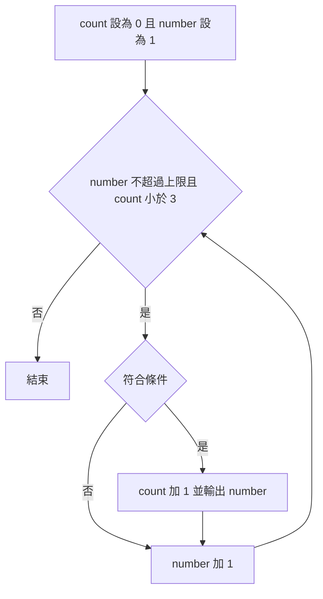
```mermaid
flowchart TD
    A[count 設為 0 且 number 設為 1] --> B{number 不超過上限且 count 小於 3}
    B -- 否 --> F[結束]
    B -- 是 --> C{符合條件}
    C -- 是 --> D[count 加 1 並輸出 number]
    C -- 否 --> E[number 加 1]
    D --> E
    E --> B
```

---

### 7. 旗標法判斷質數

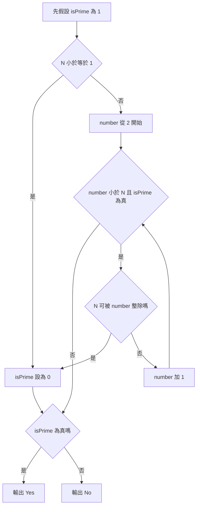
```mermaid
flowchart TD
    A[先假設 isPrime 為 1] --> B{N 小於等於 1}
    B -- 是 --> G[isPrime 設為 0]
    B -- 否 --> C[number 從 2 開始]
    C --> D{number 小於 N 且 isPrime 為真}
    D -- 否 --> H{isPrime 為真嗎}
    D -- 是 --> E{N 可被 number 整除嗎}
    E -- 是 --> G
    E -- 否 --> F[number 加 1]
    G --> H
    F --> D
    H -- 是 --> I[輸出 Yes]
    H -- 否 --> J[輸出 No]
```

---

### 8. 控制變數殘值法

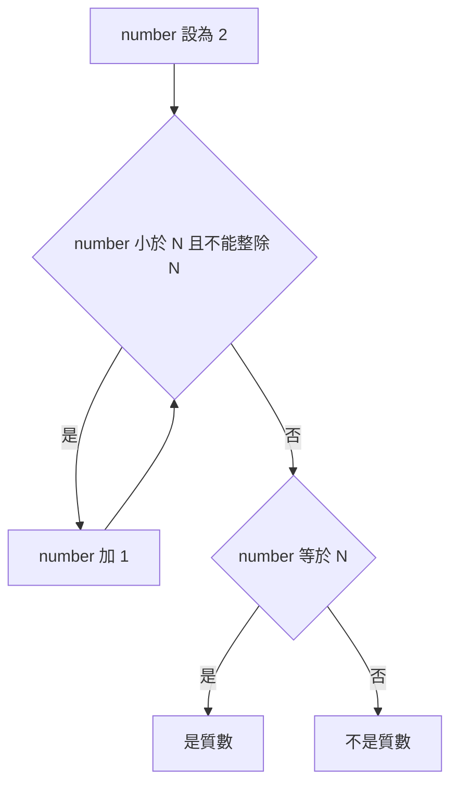
```mermaid
flowchart TD
    A[number 設為 2] --> B{number 小於 N 且不能整除 N}
    B -- 是 --> C[number 加 1]
    C --> B
    B -- 否 --> D{number 等於 N}
    D -- 是 --> E[是質數]
    D -- 否 --> F[不是質數]
```

---

## 本章完成標準

完成本章後，你應該能做到：

1. 將數學搜尋題拆成候選範圍、合格條件與答案處理。
2. 使用 `%` 正確判斷整除。
3. 列出正整數的所有正因數。
4. 使用計數器計算正因數數量。
5. 將韓信點兵文字條件翻譯成 C 條件。
6. 使用 `while` 找出第一個韓信點兵答案。
7. 使用上限與上下限列出範圍內全部答案。
8. 使用反向 `for` 由大到小輸出答案。
9. 找出上限內最大答案。
10. 正確處理範圍內沒有答案。
11. 使用 `answer` 保存搜尋結果。
12. 使用 `count` 找出前三小、前三大及第三小。
13. 說明質數與非平凡因數的關係。
14. 正確處理 `N <= 1` 與 `N = 2`。
15. 使用因數計數法判斷質數。
16. 使用 `isPrime` 狀態變數判斷質數。
17. 找到因數後提前停止搜尋。
18. 使用迴圈控制變數的最後值判斷結果。
19. 分辨計數器、答案變數與狀態變數的用途。
20. 找出無窮搜尋、範圍錯誤、條件錯誤及順位錯誤。
