# Lesson 12：Functions 函式

> 這堂課的重點：把具有明確功能的程式片段整理成可以重複呼叫的函式，理解函式定義、宣告、呼叫、參數、引數、回傳值、標頭檔與變數作用域，並用函式重新設計最大值與文字三角形程式。

---

## Section I. 今天要做什麼？

1. 理解程式中的函式與數學函數之間的基本類比。
2. 把函式想成「輸入資料 → 執行功能 → 產生結果」的程式模組。
3. 認識函式定義的基本結構。
4. 分辨回傳型態、函式名稱、參數列與函式本體。
5. 理解一個函式可以有多個參數，但一次呼叫只會回傳一個值。
6. 認識函式呼叫的基本語法。
7. 分辨參數 parameter 與引數 argument。
8. 理解引數可以是常數、變數或表示式。
9. 理解呼叫函式時，會先計算引數表示式。
10. 理解引數值會依參數型態進行必要的型態轉換。
11. 理解控制流程如何從呼叫端進入函式，再回到呼叫端。
12. 使用 `return` 將結果送回呼叫位置。
13. 認識沒有回傳值的 `void` 函式。
14. 理解 `void` 函式中的 `return;` 可以省略。
15. 認識函式宣告與函式原型。
16. 理解為什麼函式通常要在呼叫之前先宣告。
17. 分辨函式宣告與函式定義。
18. 認識 C 標準函式庫與標頭檔。
19. 使用 `#include` 取得標準函式的宣告。
20. 使用 `<math.h>` 中的 `sqrt()`。
21. 理解 `printf()` 本身也有回傳值。
22. 將兩數最大值程式整理成 `max2()` 函式。
23. 使用函式原型讓函式定義可以放在 `main()` 後面。
24. 理解函式參數名稱與呼叫端變數名稱不必相同。
25. 認識全域變數、區域變數與形式參數。
26. 理解名稱可視範圍 scope。
27. 理解內層區塊的同名變數會遮蔽外層同名變數。
28. 將三數最大值程式整理成 `max3()`。
29. 使用 `max2(max2(a, b), c)` 重複利用既有函式。
30. 將文字三角形拆成 `print_stars()` 與 `print_triangle()`。
31. 讓 `main()` 專注於輸入與整體流程。
32. 為下一章的遞迴函式建立基礎。

---

## Section II. 今天的學習方式

1. 先找出程式中具有明確名稱的工作。
2. 再判斷該工作需要哪些輸入資料。
3. 決定該工作是否需要產生一個回傳值。
4. 先寫函式介面，再完成函式本體。
5. 使用小型測試呼叫確認函式結果。
6. 追蹤呼叫前、函式內與回傳後的控制流程。
7. 將引數與參數分成兩欄，避免名稱混淆。
8. 使用函式原型讓編譯器先知道函式介面。
9. 先使用標準函式庫，不重複實作已有功能。
10. 將區域變數限制在真正需要的區塊中。
11. 避免依賴全域變數傳遞一般資料。
12. 先完成 `max2()`，再用它組合出 `max3()`。
13. 先抽出「印一列星號」，再抽出「印整個三角形」。
14. 每個函式盡量只負責一項清楚的工作。
15. 本章不正式教授遞迴、指標參數、陣列參數與函式指標。

---

## Section III. 今天會學到的內容

| 主題 | 你需要知道的事 |
| --- | --- |
| 函式 | 具有名稱、可被呼叫的程式模組 |
| 函式定義 | 說明函式介面及實際執行內容 |
| 回傳型態 | 函式送回結果的資料型態 |
| 函式名稱 | 呼叫該功能時使用的名稱 |
| 參數列 | 函式接收資料的介面 |
| 形式參數 | 函式定義中接收引數值的區域名稱 |
| 引數 | 呼叫函式時提供的實際資料 |
| 函式呼叫 | 使用函式名稱與引數執行函式 |
| `return` | 結束函式並送回一個值 |
| `void` | 表示函式不回傳值 |
| 函式宣告 | 先告訴編譯器函式的名稱與型態 |
| 函式原型 | 包含回傳型態、名稱及參數型態的宣告 |
| 標頭檔 | 保存函式宣告、型態與相關定義 |
| 標準函式庫 | C 規範提供的一組標準化功能 |
| `<stdio.h>` | 輸入與輸出函式 |
| `<math.h>` | 數學函式，如 `sqrt()` |
| 呼叫流程 | 計算引數、轉換型態、執行函式、取得回傳值 |
| 區域變數 | 宣告於函式或區塊內的變數 |
| 全域變數 | 宣告於所有函式之外的變數 |
| 作用域 | 某個名稱可以被使用的程式範圍 |
| 遮蔽 | 內層同名變數暫時蓋住外層名稱 |
| 函式組合 | 將一個函式的結果交給另一個函式 |
| 模組化 | 將大型問題拆成較小且可重複使用的功能 |

---

## Section IV. 寫題目前的提醒

### 1. 函式定義不能寫在另一個函式裡面

錯誤：

```c
int main(void) {
    int add3(int x) {
        return x + 3;
    }

    return 0;
}
```

標準 C 不允許在 `main()` 裡面再定義一般函式。

正確：

```c
int add3(int x) {
    return x + 3;
}

int main(void) {
    return 0;
}
```

---

### 2. 函式呼叫與函式定義外觀不同

定義：

```c
int add3(int x) {
    return x + 3;
}
```

呼叫：

```c
add3(4)
```

呼叫時不重複寫回傳型態與參數型態。

---

### 3. 參數與引數不是同一個概念

<p align="center">
  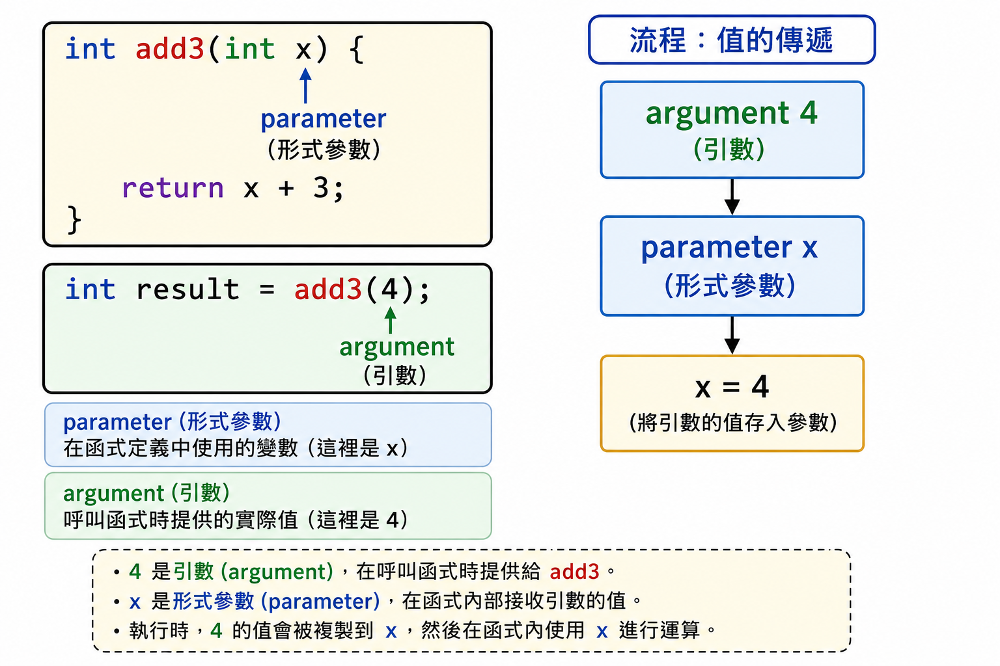
</p>


```c
int add3(int x) {
    return x + 3;
}

int result = add3(4);
```

- `x`：形式參數
- `4`：引數

呼叫時，`4` 的值會交給參數 `x`。

---

### 4. 引數可以是表示式

```c
int foo = 2;
double answer = half(foo * 2);
```

程式先計算：

```c
foo * 2
```

得到 `4`，再將 `4` 傳給 `half()`。

---

### 5. 引數數量要和參數數量相符

函式：

```c
int max2(int a, int b);
```

正確：

```c
max2(3, 5)
```

錯誤：

```c
max2(3)
max2(3, 5, 7)
```

---

### 6. 參數型態與引數型態應相容

```c
double half(double x);
```

呼叫：

```c
half(4)
```

整數 `4` 可以轉換成 `double` 的 `4.0`。

但型態轉換可能造成資訊改變，因此不能完全忽略型態。

---

### 7. 有回傳值的函式要提供合適的 `return`

```c
int max2(int a, int b) {
    if (a >= b) {
        return a;
    }

    return b;
}
```

每一條可能執行路徑都應回傳一個 `int`。

---

### 8. `return` 會立即結束目前函式

<p align="center">
  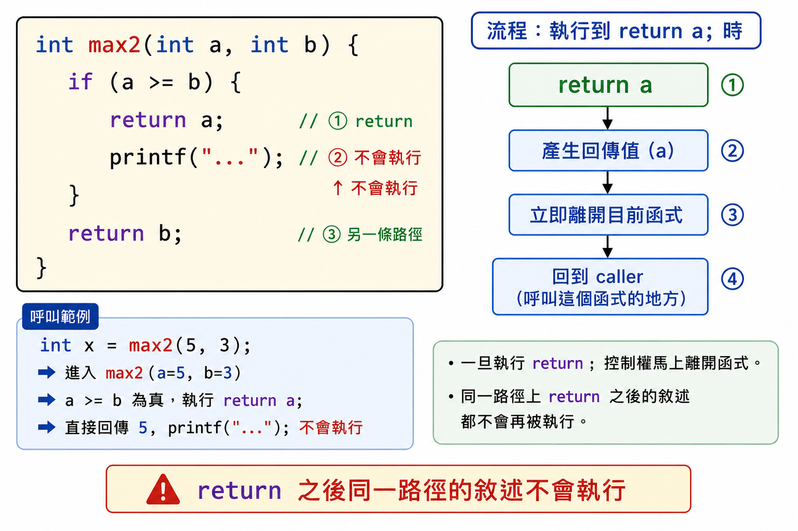
</p>


```c
int max2(int a, int b) {
    if (a >= b) {
        return a;
        printf("This line will not run.\n");
    }

    return b;
}
```

`return a;` 執行後，後面的 `printf()` 不會執行。

---

### 9. `void` 函式不能回傳一般數值

正確：

```c
void print_stars(int n) {
    ...
    return;
}
```

也可以省略最後的：

```c
return;
```

錯誤：

```c
void print_stars(int n) {
    return n;
}
```

---

### 10. 函式在呼叫前必須先讓編譯器知道

方法一：把完整定義放在 `main()` 前面。

```c
int max2(int a, int b) {
    ...
}

int main(void) {
    printf("%d\n", max2(3, 5));
}
```

方法二：先寫函式原型。

```c
int max2(int, int);

int main(void) {
    printf("%d\n", max2(3, 5));
}

int max2(int a, int b) {
    ...
}
```

---

### 11. 函式原型以分號結束

```c
int max2(int, int);
```

函式定義則有本體：

```c
int max2(int a, int b) {
    ...
}
```

---

### 12. 原型中的參數名稱可以省略

以下兩個宣告都表示相同介面：

```c
int max2(int a, int b);
```

```c
int max2(int, int);
```

在函式定義中則需要名稱，才能在本體內使用參數。

---

### 13. 原型、定義與呼叫的型態要一致

錯誤：

```c
double max2(int, int);

int max2(int a, int b) {
    ...
}
```

宣告說回傳 `double`，定義卻回傳 `int`，介面不一致。

---

### 14. `#include` 不是把整個函式實作貼進程式

```c
#include <math.h>
```

主要讓編譯器取得相關宣告與定義。

標準函式的實作通常由函式庫提供，最後由連結步驟組合進程式。

---

### 15. 使用 `sqrt()` 要包含 `<math.h>`

```c
#include <math.h>

double root = sqrt(9.0);
```

在部分系統使用 GCC 編譯時，連結數學函式庫可能需要：

```bash
gcc program.c -o program -lm
```

---

### 16. `sqrt()` 的回傳型態是 `double`

```c
double sqrt(double x);
```

因此應使用：

```c
double root;
```

並以：

```c
%f
```

輸出。

---

### 17. `printf()` 也有回傳值

`printf()` 成功時，會回傳實際輸出的字元數量。

```c
int count = printf("Hello world!\n");
printf("%d\n", count);
```

來源範例中，第一個 `printf()` 的回傳值會再被第二個 `printf()` 輸出。

---

### 18. 同一區塊不能重複宣告同名變數

錯誤：

```c
int main(void) {
    int i;
    int i;

    return 0;
}
```

---

### 19. 不同區塊可以出現同名變數

```c
int main(void) {
    int i = 2;

    {
        int i = 3;
        printf("%d\n", i);
    }

    printf("%d\n", i);

    return 0;
}
```

內層的 `i` 與外層的 `i` 是不同變數。

---

### 20. 內層名稱會優先於外層同名名稱

```c
int i = 1;

int main(void) {
    int i = 2;

    {
        int i = 3;
        printf("%d\n", i);
    }

    return 0;
}
```

最內層輸出的值是 `3`。

---

### 21. 區域變數不會自動修改呼叫端變數

<p align="center">
  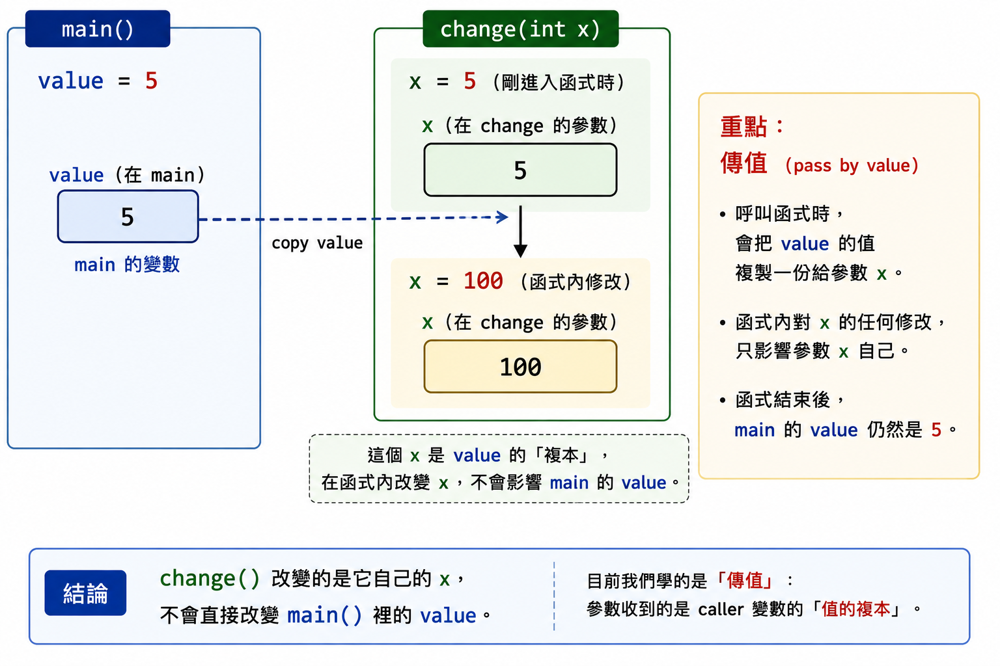
</p>


```c
int max2(int a, int b) {
    a = 100;

    if (a >= b) {
        return a;
    }

    return b;
}
```

函式內的 `a` 是形式參數的區域變數。

在目前學過的「傳值」呼叫中，修改它不會直接改變呼叫端原本的變數。

指標參數會在後面的章節再學習。

---

### 22. `main()` 不應知道函式內部所有細節

```c
printf("%d\n", max2(a, b));
```

呼叫端只需要知道：

- 函式名稱
- 需要哪些引數
- 會回傳什麼型態

不需要在每次呼叫時重寫比較邏輯。

---

## Section V. 核心概念說明

## Section V-A. 函式是什麼？

<p align="center">
  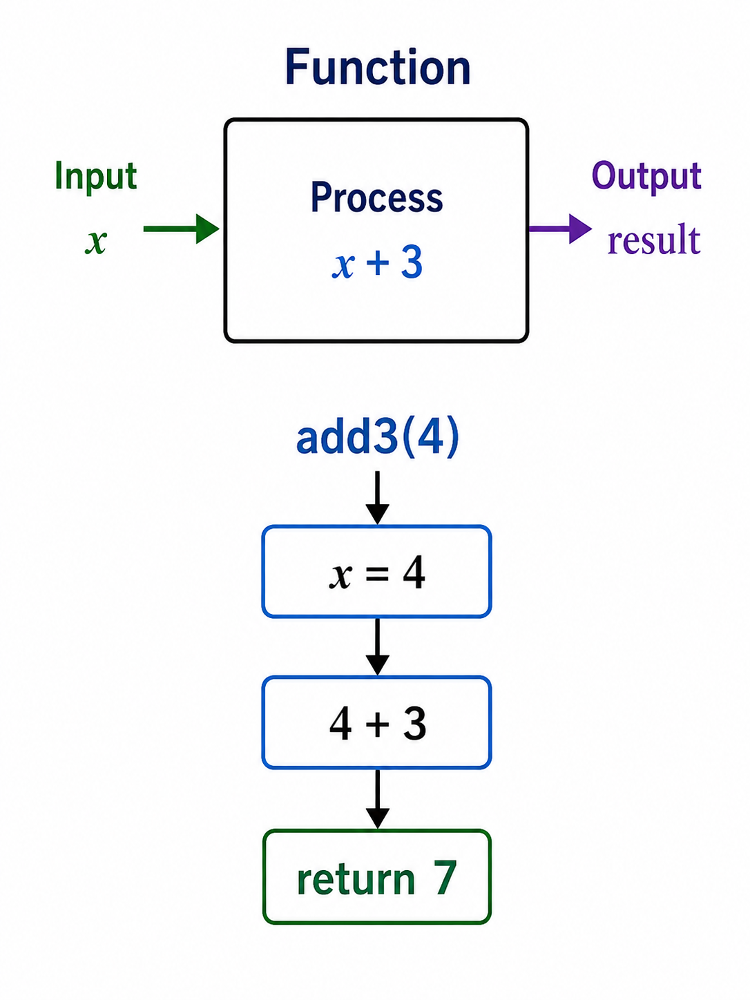
</p>


### 1. 從數學函數開始理解

數學中可以寫：

```text
f(x) = x + 3
```

例如：

```text
f(4) = 4 + 3 = 7
```

可以把它想成：

```text
輸入 x → 執行規則 → 產生結果
```

---

### 2. C 語言中的相似函式

```c
int add3(int x) {
    return x + 3;
}
```

對照：

| 數學概念 | C 函式 |
| --- | --- |
| 函數名稱 `f` | 函式名稱 `add3` |
| 輸入 `x` | 參數 `int x` |
| 規則 `x + 3` | 函式本體 |
| 函數值 | `return` 的結果 |

呼叫：

```c
add3(4)
```

結果為：

```text
7
```

---

### 3. 程式中的函式比數學函數更廣

程式函式除了計算並回傳數值，也可以：

- 顯示文字
- 讀取或輸出資料
- 修改函式內的區域狀態
- 呼叫其他函式
- 不回傳任何值

因此函式也可以被看成：

> 為特定工作整理的一組程式述句。

---

### 4. 為什麼需要函式？

沒有函式時，常見問題包括：

1. 同一段程式碼重複出現。
2. `main()` 過長，不容易閱讀。
3. 修改功能時要改很多地方。
4. 無法單獨測試某一項功能。
5. 程式意圖不清楚。

函式可以提供：

- 名稱
- 清楚介面
- 重複使用
- 問題拆分
- 局部測試

---

## Section V-B. 函式定義

### 5. 基本語法

```c
回傳型態 函式名稱(參數列) {
    函式本體;
    return 回傳值;
}
```

範例：

```c
int add3(int x) {
    return x + 3;
}
```

---

### 6. 定義的四個主要部分

<p align="center">
  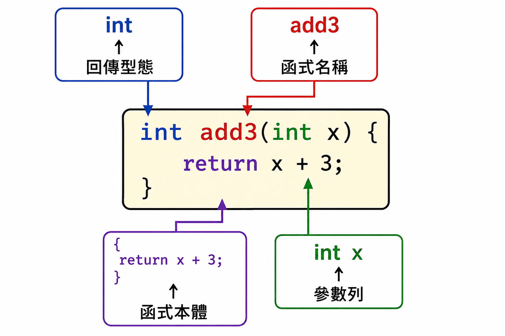
</p>


```c
int add3(int x) {
    return x + 3;
}
```

| 部分 | 內容 | 意義 |
| --- | --- | --- |
| 回傳型態 | `int` | 呼叫結果是一個整數 |
| 函式名稱 | `add3` | 呼叫時使用的名稱 |
| 參數列 | `int x` | 接收一個整數 |
| 函式本體 | `{ ... }` | 實際執行的程式碼 |

---

### 7. 多個參數

```c
int max2(int a, int b) {
    if (a >= b) {
        return a;
    }

    return b;
}
```

參數之間使用逗號：

```c
int a, int b
```

函式可以接收多個參數，但一次呼叫只有一個回傳值。

---

### 8. 沒有參數的函式

```c
void print_title(void) {
    printf("C Functions\n");
}
```

`void` 參數列明確表示：

> 這個函式不接收引數。

---

### 9. 沒有回傳值的函式

<p align="center">
  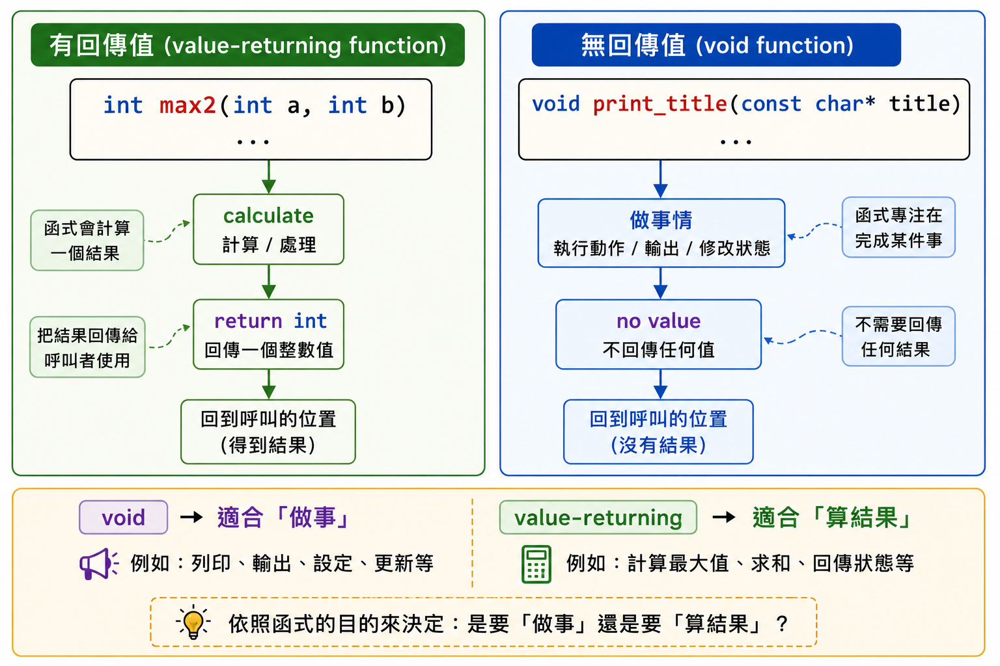
</p>


```c
void print_title(void) {
    printf("C Functions\n");
}
```

前面的 `void` 表示：

> 這個函式不產生可以放入表示式的回傳值。

可以直接呼叫：

```c
print_title();
```

不應寫：

```c
int value = print_title();
```

---

## Section V-C. 函式呼叫

### 10. 呼叫語法

```c
函式名稱(引數列)
```

例如：

```c
add3(4)
max2(a, b)
sqrt(9.0)
```

---

### 11. 完整的自訂函式程式

```c
#include <stdio.h>

int add3(int x) {
    return x + 3;
}

int main(void) {
    printf("%d\n", add3(4));

    return 0;
}
```

輸出：

```text
7
```

---

### 12. 呼叫流程

<p align="center">
  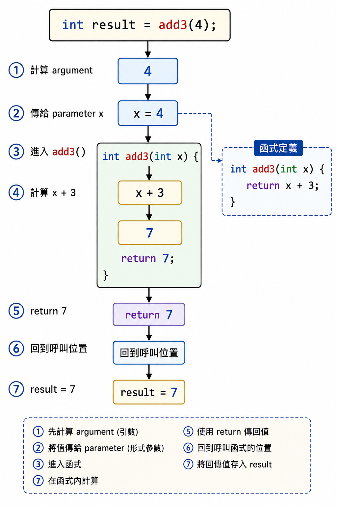
</p>


呼叫：

```c
int result = add3(4);
```

概念流程：

1. 計算引數 `4`。
2. 將引數值交給參數 `x`。
3. 進入 `add3()`。
4. 計算 `x + 3`。
5. 執行 `return 7;`。
6. 回到呼叫位置。
7. 將 `7` 存入 `result`。

---

### 13. 引數為表示式

```c
int foo = 2;
double answer = half(foo * 2);
```

假設：

```c
double half(double x) {
    return x / 2.0;
}
```

執行概念：

1. 讀取 `foo`，值為 `2`。
2. 計算 `foo * 2`，得到整數 `4`。
3. 將 `4` 轉換成參數需要的 `double 4.0`。
4. 執行 `half(4.0)`。
5. 回傳 `2.0`。
6. 存入 `answer`。

---

### 14. 函式呼叫可以放在表示式中

```c
int result = add3(4) * 2;
```

先得到：

```text
add3(4) → 7
```

再計算：

```text
7 * 2 → 14
```

---

### 15. 函式呼叫可以作為另一個函式的引數

```c
int answer = max2(max2(a, b), c);
```

執行概念：

1. 先計算內層 `max2(a, b)`。
2. 將內層結果作為外層第一個引數。
3. 再比較該結果與 `c`。
4. 回傳三者最大值。

---

## Section V-D. 函式宣告與原型

<p align="center">
  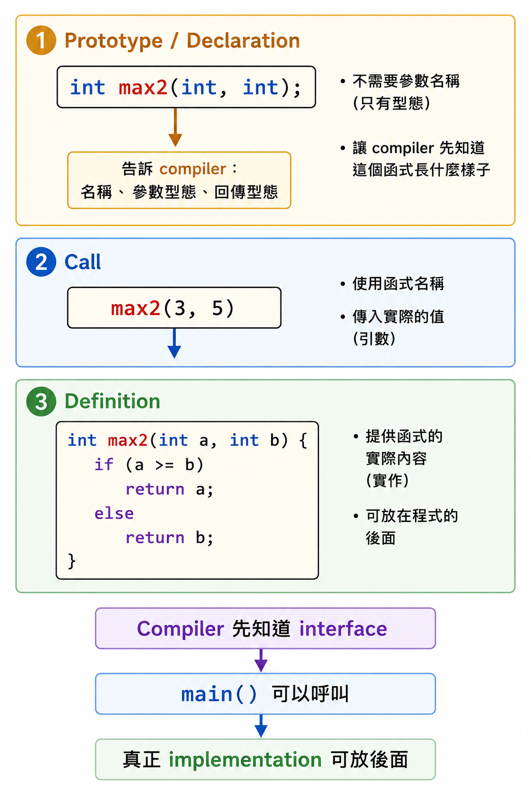
</p>


### 16. 為什麼需要函式宣告？

編譯器讀到：

```c
max2(a, b)
```

時，需要先知道：

- `max2` 是否存在
- 接收幾個參數
- 參數型態
- 回傳型態

如果完整定義在後面，可以先提供函式原型。

---

### 17. 原型範例

```c
int max2(int, int);
```

或：

```c
int max2(int a, int b);
```

兩者對呼叫端提供相同的型態資訊。

---

### 18. 定義放在 `main()` 後面

```c
#include <stdio.h>

int max2(int, int);

int main(void) {
    printf("%d\n", max2(3, 5));

    return 0;
}

int max2(int a, int b) {
    if (a >= b) {
        return a;
    }

    return b;
}
```

---

### 19. 宣告與定義的差異

宣告：

```c
int max2(int, int);
```

- 沒有函式本體
- 以分號結束
- 說明介面

定義：

```c
int max2(int a, int b) {
    ...
}
```

- 包含函式本體
- 實作真正功能

---

### 20. 定義本身也提供宣告資訊

如果定義放在呼叫之前：

```c
int max2(int a, int b) {
    ...
}

int main(void) {
    ...
}
```

就不一定需要另外再寫原型。

但較大型程式通常仍會將宣告整理在標頭檔中。

---

## Section V-E. C 標準函式庫與標頭檔

### 21. 什麼是 C 標準函式庫？

C 語言除了定義語法，也定義了一系列標準函式，提供常用功能，例如：

- 輸入與輸出
- 數學運算
- 字元處理
- 字串處理
- 記憶體管理
- 其他系統相關功能

不同編譯器通常會依 C 標準實作這些函式，但實際支援程度仍可能有差異。

---

### 22. 常見標頭檔

| 功能 | 標頭檔 | 範例 |
| --- | --- | --- |
| 輸入輸出 | `<stdio.h>` | `printf()`、`scanf()` |
| 數學 | `<math.h>` | `sqrt()`、`ceil()` |
| 一般工具 | `<stdlib.h>` | 轉換、記憶體與其他工具 |
| 字串 | `<string.h>` | 字串處理 |
| 字元分類 | `<ctype.h>` | 字元判斷與轉換 |

本章主要使用 `<stdio.h>` 與 `<math.h>`。

---

### 23. `#include` 的作用

<p align="center">
  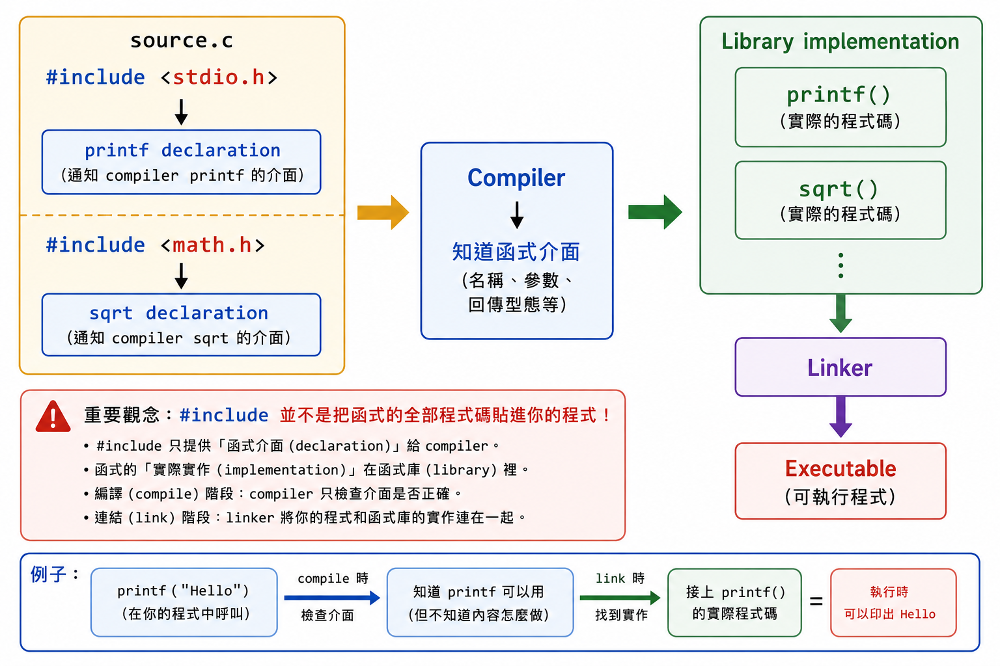
</p>


```c
#include <stdio.h>
#include <math.h>
```

它讓編譯器在目前程式中看見相關宣告。

例如 `<math.h>` 會提供類似：

```c
double sqrt(double x);
```

的介面資訊。

---

### 24. 自訂標頭檔的概念

較大型程式可以分成：

```text
sample.h
sample.c
main.c
```

`sample.h`：

```c
int add3(int);
```

`sample.c`：

```c
int add3(int x) {
    return x + 3;
}
```

`main.c`：

```c
#include <stdio.h>
#include "sample.h"

int main(void) {
    printf("%d\n", add3(4));

    return 0;
}
```

標頭檔放宣告，原始檔放定義。

本章只建立概念，不要求建立多檔專案。

---

### 25. `printf()` 的回傳值

```c
#include <stdio.h>

int main(void) {
    int count;

    count = printf("Hello world!\n");
    printf("%d\n", count);

    return 0;
}
```

第一個 `printf()` 完成輸出後，將輸出的字元數量回傳給 `count`。

這表示即使平常只把 `printf()` 當成輸出工具，它仍然是一個有回傳值的函式。

---

### 26. 使用 `sqrt()` 計算平方根

```c
#include <math.h>
#include <stdio.h>

int main(void) {
    int n;

    printf("N = ");
    scanf("%d", &n);

    printf("Root: %f\n", sqrt(n));

    return 0;
}
```

輸入：

```text
N = 5
```

結果約為：

```text
Root: 2.236068
```

---

### 27. `sqrt()` 的型態轉換

`sqrt()` 需要：

```c
double
```

若傳入 `int n`，呼叫時會轉換成 `double`。

回傳結果本身也是 `double`。

---

## Section V-F. 兩個整數的最大值函式

### 28. 原本全部寫在 `main()` 中

```c
#include <stdio.h>

int main(void) {
    int a;
    int b;
    int maximum;

    printf("Please enter the first integer: ");
    scanf("%d", &a);

    printf("Please enter the second integer: ");
    scanf("%d", &b);

    if (a >= b) {
        maximum = a;
    } else {
        maximum = b;
    }

    printf("The maximum is %d.\n", maximum);

    return 0;
}
```

比較邏輯可以整理成一個獨立功能。

---

### 29. 抽出 `max2()`

```c
int max2(int a, int b) {
    int maximum;

    if (a >= b) {
        maximum = a;
    } else {
        maximum = b;
    }

    return maximum;
}
```

---

### 30. 完整程式

```c
#include <stdio.h>

int max2(int, int);

int main(void) {
    int a;
    int b;

    printf("Please enter the first integer: ");
    scanf("%d", &a);

    printf("Please enter the second integer: ");
    scanf("%d", &b);

    printf("The maximum is %d.\n", max2(a, b));

    return 0;
}

int max2(int a, int b) {
    int maximum;

    if (a >= b) {
        maximum = a;
    } else {
        maximum = b;
    }

    return maximum;
}
```

---

### 31. 直接回傳可以更精簡

```c
int max2(int a, int b) {
    if (a >= b) {
        return a;
    }

    return b;
}
```

不需要額外的 `maximum`。

---

### 32. 參數名稱不必和呼叫端相同

呼叫端：

```c
int a;
int b;

max2(a, b);
```

定義可以寫：

```c
int max2(int x, int y) {
    if (x >= y) {
        return x;
    }

    return y;
}
```

甚至可以寫：

```c
int max2(int b, int a)
```

名稱只是函式內部使用的區域名稱。

真正重要的是：

- 引數順序
- 參數型態
- 函式內的邏輯

---

### 33. 使用固定測試呼叫

```c
printf("max2(3, 5) = %d\n", max2(3, 5));
printf("max2(5, 3) = %d\n", max2(5, 3));
printf("max2(4, 4) = %d\n", max2(4, 4));
printf("max2(-2, -7) = %d\n", max2(-2, -7));
```

這能獨立測試：

- 第一個較大
- 第二個較大
- 兩者相等
- 負數

---

## Section V-G. 名稱可視範圍 scope

### 34. 變數名稱依宣告位置分類

來源教材將名稱依宣告位置區分為：

1. 全域變數 global variable
2. 區域變數 local variable
3. 形式參數 formal parameter

---

### 35. 全域變數

```c
int i;

int main(void) {
    return 0;
}
```

`i` 宣告在所有函式之外。

全域名稱通常可以從宣告位置之後，被多個函式看見。

但全域變數容易造成：

- 名稱污染
- 不明確的資料依賴
- 不容易追蹤誰修改了資料

因此一般應避免不必要的全域變數。

---

### 36. 區域變數

```c
int main(void) {
    int i;

    return 0;
}
```

`i` 只屬於 `main()` 的區塊。

另一個函式不能直接使用這個 `i`。

---

### 37. 形式參數

```c
int add3(int x) {
    return x + 3;
}
```

`x` 是形式參數，也是一個屬於 `add3()` 的區域名稱。

函式外不能直接使用這個 `x`。

---

### 38. 區塊建立新的作用域

```c
int main(void) {
    int i = 2;

    {
        int j = 3;
        printf("%d\n", j);
    }

    return 0;
}
```

`j` 只在內層大括號中可見。

離開區塊後不能再使用 `j`。

---

### 39. 同一區塊不能有同名變數

```c
int main(void) {
    int i;
    int i;  /* 錯誤 */

    return 0;
}
```

同一個作用域內，一個名稱只能代表一個變數宣告。

---

### 40. 不同區塊可以同名

```c
int main(void) {
    int i = 2;

    {
        int i = 3;
        printf("%d\n", i);
    }

    printf("%d\n", i);

    return 0;
}
```

輸出：

```text
3
2
```

內層變數離開區塊後，外層 `i` 再次可見。

---

### 41. 作用域的優先順序

<p align="center">
  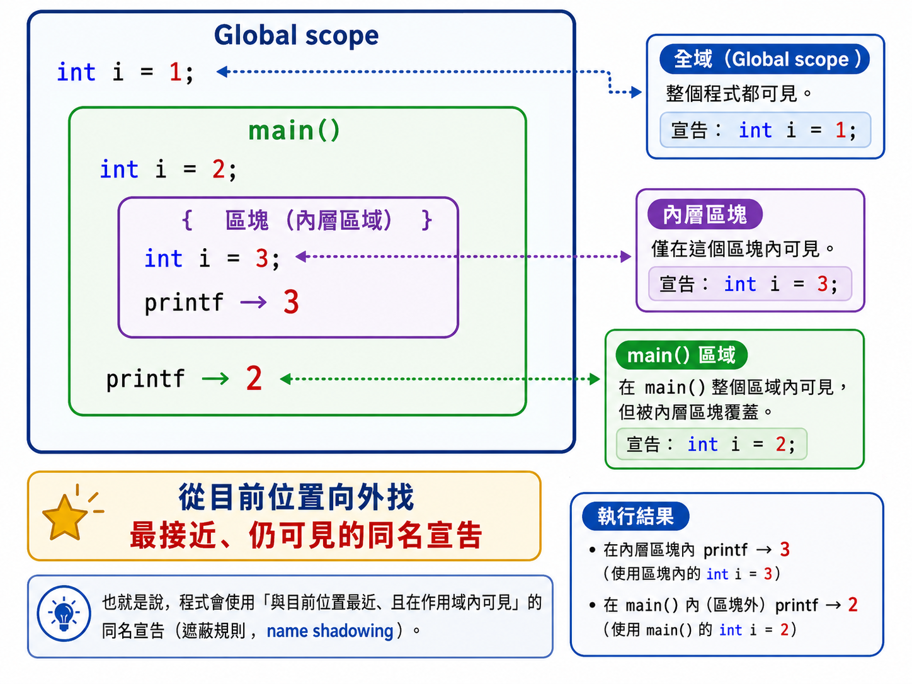
</p>


```c
#include <stdio.h>

int i = 1;

int main(void) {
    int i = 2;

    printf("%d\n", i);

    {
        int i = 3;
        printf("%d\n", i);
    }

    printf("%d\n", i);

    return 0;
}
```

輸出：

```text
2
3
2
```

在每個位置，程式使用最接近且仍可見的同名宣告。

---

### 42. 函式也有自己的區域

```c
int i = 5;

void change(void) {
    i = i + 1;
    printf("%d\n", i);
}

int main(void) {
    int i = 6;

    i = i + 1;
    change();
    printf("%d\n", i);

    return 0;
}
```

`main()` 的區域 `i` 會遮蔽全域 `i`。

`change()` 中沒有區域 `i`，因此會使用全域 `i`。

這種程式較難追蹤，也說明為什麼一般要小心全域變數。

---

## Section V-H. 三個整數的最大值函式

### 43. 直接寫 `max3()`

```c
int max3(int a, int b, int c) {
    int maximum = a;

    if (b > maximum) {
        maximum = b;
    }

    if (c > maximum) {
        maximum = c;
    }

    return maximum;
}
```

---

### 44. 完整程式

```c
#include <stdio.h>

int max3(int, int, int);

int main(void) {
    int a;
    int b;
    int c;

    printf("Please enter three integers: ");
    scanf("%d%d%d", &a, &b, &c);

    printf("The maximum is %d.\n", max3(a, b, c));

    return 0;
}

int max3(int a, int b, int c) {
    int maximum = a;

    if (b > maximum) {
        maximum = b;
    }

    if (c > maximum) {
        maximum = c;
    }

    return maximum;
}
```

---

### 45. 重複利用 `max2()`

已有：

```c
int max2(int a, int b) {
    if (a >= b) {
        return a;
    }

    return b;
}
```

三數最大值可以寫成：

```c
int max3(int a, int b, int c) {
    return max2(max2(a, b), c);
}
```

---

### 46. 組合呼叫的追蹤

<p align="center">
  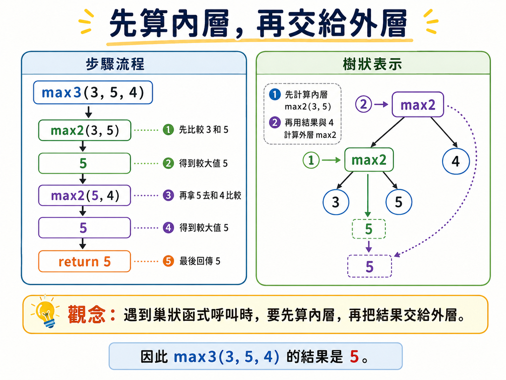
</p>


```c
max3(3, 5, 4)
```

函式本體：

```c
return max2(max2(3, 5), 4);
```

追蹤：

```text
max2(3, 5) → 5
max2(5, 4) → 5
max3(...)   → 5
```

---

### 47. 為什麼重複利用比較好？

使用 `max2()` 組合 `max3()`：

- 避免重複比較邏輯
- `max3()` 的意圖清楚
- `max2()` 已經測試過
- 修改兩數比較規則時，只改一個地方

---

## Section V-I. 使用函式繪製文字三角形

### 48. 原始三角形程式

```c
#include <stdio.h>

int main(void) {
    int n;
    int i;
    int j;

    printf("N = ");
    scanf("%d", &n);

    for (i = 1; i <= n; i++) {
        for (j = 1; j <= i; j++) {
            printf("*");
        }

        printf("\n");
    }

    return 0;
}
```

輸入 `5`：

```text
*
**
***
****
*****
```

---

### 49. 先抽出「印一列星號」

```c
void print_stars(int n) {
    int j;

    for (j = 1; j <= n; j++) {
        printf("*");
    }
}
```

這個函式：

- 接收星號數量
- 執行輸出
- 不需要回傳值

因此回傳型態是 `void`。

---

### 50. 在 `main()` 中使用 `print_stars()`

```c
#include <stdio.h>

void print_stars(int);

int main(void) {
    int n;
    int i;

    printf("N = ");
    scanf("%d", &n);

    for (i = 1; i <= n; i++) {
        print_stars(i);
        printf("\n");
    }

    return 0;
}

void print_stars(int n) {
    int j;

    for (j = 1; j <= n; j++) {
        printf("*");
    }
}
```

---

### 51. 再抽出整個三角形

```c
void print_triangle(int n) {
    int i;

    for (i = 1; i <= n; i++) {
        print_stars(i);
        printf("\n");
    }
}
```

---

### 52. 最後的模組化程式

```c
#include <stdio.h>

void print_stars(int);
void print_triangle(int);

int main(void) {
    int n;

    printf("N = ");
    scanf("%d", &n);

    print_triangle(n);

    return 0;
}

void print_triangle(int n) {
    int i;

    for (i = 1; i <= n; i++) {
        print_stars(i);
        printf("\n");
    }
}

void print_stars(int n) {
    int j;

    for (j = 1; j <= n; j++) {
        printf("*");
    }
}
```

現在 `main()` 只負責：

1. 讀取 `n`
2. 呼叫 `print_triangle(n)`

---

### 53. 函式拆分的層次

<p align="center">
  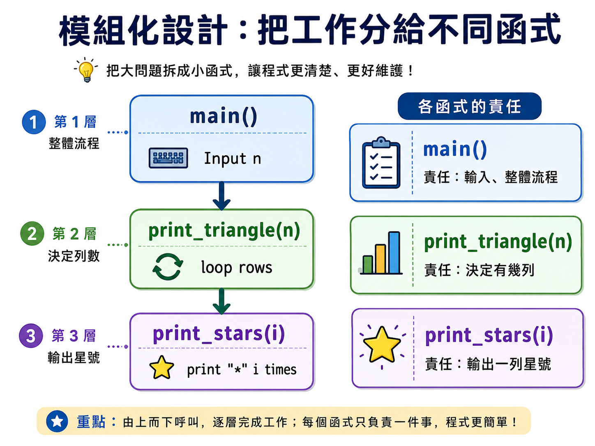
</p>


```text
main()
└── print_triangle(n)
    └── print_stars(i)
```

每一層都只處理自己的工作：

| 函式 | 責任 |
| --- | --- |
| `main()` | 輸入與整體流程 |
| `print_triangle()` | 決定總共有幾列 |
| `print_stars()` | 輸出一列中的星號 |

---

## Section V-J. 容易搞混的重點

### 54. 函式名稱後有括號不一定是定義

```c
max2(a, b)
```

是呼叫。

```c
int max2(int a, int b) {
    ...
}
```

才是定義。

---

### 55. 函式原型不是空函式

```c
int max2(int, int);
```

只是宣告介面，不代表函式沒有內容。

真正內容會出現在定義中。

---

### 56. `void` 有兩種常見位置

```c
void print_title(void)
```

第一個 `void`：

```text
不回傳值
```

小括號中的 `void`：

```text
不接收參數
```

---

### 57. 參數名稱只在函式內有意義

```c
int max2(int x, int y)
```

呼叫端不需要有 `x` 與 `y`。

---

### 58. 回傳值不一定要先存入變數

可以：

```c
int maximum = max2(a, b);
printf("%d\n", maximum);
```

也可以：

```c
printf("%d\n", max2(a, b));
```

---

### 59. 函式呼叫不是文字替換

呼叫時會建立參數、執行函式本體並取得回傳值。

不要把它只想成把程式碼複製到呼叫位置。

---

### 60. 作用域與變數生命週期不是完全相同概念

本章來源主要聚焦：

> 在哪個程式範圍可以使用某個名稱。

變數實際存在多久，會在後面的動態記憶體與生命週期內容再深化。

---

### 61. 全域變數方便，不代表應大量使用

全域變數能被多個函式看見，但也會讓函式依賴隱藏狀態。

能以參數傳入、以回傳值送回的資料，通常不必設為全域。

---

### 62. 函式拆得越多不一定越好

適合抽成函式的工作通常：

- 有明確名稱
- 可能重複使用
- 可以獨立測試
- 能讓主流程更清楚

只包含一個沒有意義、且不會重複的片段，不一定需要單獨成為函式。

---

## Section VI. 快速概念檢查

### Q1. 函式定義中的四個主要部分是什麼？

<details>
<summary>查看答案</summary>

回傳型態、函式名稱、參數列與函式本體。

</details>

---

### Q2. `int add3(int x)` 中，哪一個部分是回傳型態？

<details>
<summary>查看答案</summary>

```c
int
```

</details>

---

### Q3. 呼叫 `add3(4)` 時，`x` 與 `4` 分別是什麼？

<details>
<summary>查看答案</summary>

- `x` 是形式參數。
- `4` 是引數。

</details>

---

### Q4. 一個函式可以有多個參數嗎？

<details>
<summary>查看答案</summary>

可以。參數之間使用逗號分隔。

</details>

---

### Q5. 一次函式呼叫可以透過 `return` 回傳幾個值？

<details>
<summary>查看答案</summary>

本章所學的一般 `return` 一次回傳一個值。

</details>

---

### Q6. `void print_stars(int n)` 的 `void` 表示什麼？

<details>
<summary>查看答案</summary>

表示 `print_stars()` 不回傳值。

</details>

---

### Q7. 函式原型為什麼以分號結束？

<details>
<summary>查看答案</summary>

因為它只有宣告介面，沒有函式本體。

</details>

---

### Q8. 使用 `sqrt()` 應包含哪個標頭檔？

<details>
<summary>查看答案</summary>

```c
#include <math.h>
```

</details>

---

### Q9. `printf()` 成功時的回傳值代表什麼？

<details>
<summary>查看答案</summary>

代表實際輸出的字元數量。

</details>

---

### Q10. 內層區塊宣告與外層相同名稱時，使用哪一個？

<details>
<summary>查看答案</summary>

使用目前位置可見、且最接近的內層同名宣告。

</details>

---

### Q11. `max2(max2(3, 5), 4)` 的結果是多少？

<details>
<summary>查看答案</summary>

內層回傳 `5`，外層比較 `5` 與 `4`，結果是 `5`。

</details>

---

### Q12. `print_triangle()` 為什麼可以呼叫 `print_stars()`？

<details>
<summary>查看答案</summary>

因為 `print_stars()` 已先宣告，且它提供「輸出指定數量星號」的功能，可以被其他函式重複使用。

</details>

---

## Section VII. 程式閱讀練習

### 題目 1：基本函式呼叫

```c
int twice(int x) {
    return x * 2;
}

int main(void) {
    printf("%d\n", twice(4));

    return 0;
}
```

<details>
<summary>查看答案</summary>

```text
8
```

</details>

---

### 題目 2：引數表示式

```c
int add3(int x) {
    return x + 3;
}

int result = add3(2 * 4);
```

<details>
<summary>查看答案</summary>

先計算 `2 * 4` 得到 `8`，再呼叫 `add3(8)`，所以 `result` 是 `11`。

</details>

---

### 題目 3：提前回傳

```c
int sign(int x) {
    if (x > 0) {
        return 1;
    }

    if (x < 0) {
        return -1;
    }

    return 0;
}
```

<details>
<summary>查看答案</summary>

- 正數回傳 `1`
- 負數回傳 `-1`
- `0` 回傳 `0`

每次只會執行其中一個 `return`。

</details>

---

### 題目 4：作用域

```c
int main(void) {
    int value = 10;

    {
        int value = 20;
        printf("%d\n", value);
    }

    printf("%d\n", value);

    return 0;
}
```

<details>
<summary>查看答案</summary>

```text
20
10
```

</details>

---

### 題目 5：函式參數不改變呼叫端變數

```c
void change(int x) {
    x = 100;
}

int main(void) {
    int value = 5;

    change(value);
    printf("%d\n", value);

    return 0;
}
```

<details>
<summary>查看答案</summary>

輸出：

```text
5
```

函式取得的是 `value` 的值，修改區域參數 `x` 不會改變呼叫端的 `value`。

</details>

---

### 題目 6：組合函式

```c
int max2(int a, int b) {
    if (a >= b) {
        return a;
    }

    return b;
}

int max3(int a, int b, int c) {
    return max2(max2(a, b), c);
}
```

呼叫：

```c
max3(-2, -7, -4)
```

<details>
<summary>查看答案</summary>

內層 `max2(-2, -7)` 回傳 `-2`。

外層 `max2(-2, -4)` 回傳 `-2`。

</details>

---

### 題目 7：`void` 函式

```c
void print_twice(char c) {
    printf("%c%c", c, c);
}

int main(void) {
    print_twice('A');
    printf("\n");

    return 0;
}
```

<details>
<summary>查看答案</summary>

```text
AA
```

</details>

---

### 題目 8：找出宣告問題

```c
int main(void) {
    printf("%d\n", max2(3, 5));

    return 0;
}

int max2(int a, int b) {
    if (a >= b) {
        return a;
    }

    return b;
}
```

<details>
<summary>查看答案</summary>

`main()` 呼叫 `max2()` 前沒有看見函式宣告。

可在前面加入：

```c
int max2(int, int);
```

或把完整定義移到 `main()` 前面。

</details>

---

## Section VIII. 實作練習 / 實作檢測題

### TODO 1：加三函式

撰寫：

```c
int add3(int x);
```

回傳 `x + 3`。

測試：

```text
add3(4)  → 7
add3(-2) → 1
```

---

### TODO 2：平方函式

撰寫：

```c
int square(int x);
```

回傳 `x * x`。

---

### TODO 3：奇偶判斷函式

撰寫：

```c
int is_even(int n);
```

- 偶數回傳 `1`
- 奇數回傳 `0`

---

### TODO 4：兩數最小值

撰寫：

```c
int min2(int a, int b);
```

測試第一個較小、第二個較小及相等。

---

### TODO 5：兩數最大值

依照來源練習完成：

```c
int max2(int a, int b);
```

`main()` 只負責輸入、呼叫與輸出。

---

### TODO 6：三數最大值——直接版本

撰寫：

```c
int max3(int a, int b, int c);
```

在函式內使用 `maximum` 逐步比較。

---

### TODO 7：三數最大值——組合版本

使用：

```c
max2(max2(a, b), c)
```

完成 `max3()`。

---

### TODO 8：三數最小值

使用 `min2()` 組合出：

```c
int min3(int a, int b, int c);
```

---

### TODO 9：平方根程式

輸入正整數 `N`，使用：

```c
sqrt(N)
```

輸出平方根。

---

### TODO 10：測試 `printf()` 回傳值

輸出一行文字，保存 `printf()` 的回傳值，再輸出該數量。

比較：

```text
Hello
Hello\n
```

的字元數量。

---

### TODO 11：作用域追蹤

建立：

- 一個全域 `value = 1`
- `main()` 中的區域 `value = 2`
- 內層區塊的 `value = 3`

分別輸出並說明每個位置使用哪個變數。

---

### TODO 12：印出指定數量字元

撰寫：

```c
void print_chars(char c, int count);
```

呼叫：

```c
print_chars('#', 5);
```

輸出：

```text
#####
```

---

### TODO 13：實心三角形

撰寫：

```c
void print_stars(int n);
void print_triangle(int n);
```

輸入 `N` 後呼叫 `print_triangle(N)`。

---

### TODO 14：指定字元三角形

把三角形函式改成：

```c
void print_chars(char c, int count);
void print_triangle(char c, int n);
```

---

### TODO 15：選單式函式測試

輸入兩個整數與一個選項：

```text
1：最大值
2：最小值
3：總和
```

分別呼叫：

```c
max2()
min2()
sum2()
```

---

## Section IX. 做題時可以使用的提示

### 1. 先寫函式介面

```text
函式名稱：
輸入資料：
回傳型態：
功能：
```

例如：

```text
函式名稱：max2
輸入資料：兩個 int
回傳型態：int
功能：回傳兩者最大值
```

---

### 2. 先獨立測試函式

```c
printf("%d\n", max2(3, 5));
printf("%d\n", max2(5, 3));
printf("%d\n", max2(4, 4));
```

先確認函式本身，再加入 `scanf()`。

---

### 3. 編譯器說找不到函式時檢查

1. 函式名稱是否拼錯？
2. 是否在呼叫前宣告？
3. 原型與定義是否一致？
4. 是否漏掉必要標頭檔？
5. 使用數學函式時是否正確連結？

---

### 4. 看到重複程式碼時詢問

```text
這一段能不能用一個名稱表示？
需要哪些輸入？
需要回傳結果嗎？
```

---

### 5. `void` 函式適合「做事」

例如：

```text
印出星號
顯示標題
繪製圖形
```

有回傳值函式適合「計算結果」：

```text
最大值
最小值
平方
是否為偶數
```

---

### 6. 作用域錯誤時畫區塊框

把每組大括號畫成一個框，從目前位置向外找最近的同名宣告。

---

### 7. 組合函式時先算內層

```c
max2(max2(a, b), c)
```

先算：

```c
max2(a, b)
```

再把結果交給外層。

---

### 8. 圖形拆分先找重複動作

三角形的每一列都需要：

```text
印出若干星號
```

因此先抽出 `print_stars()`。

---

## Section X. 課後小練習

### 練習 1：絕對值函式

撰寫：

```c
int absolute(int n);
```

不要呼叫標準函式。

---

### 練習 2：夾在範圍內

撰寫：

```c
int clamp(int value, int minimum, int maximum);
```

- 小於下限時回傳下限
- 大於上限時回傳上限
- 其他回傳原值

---

### 練習 3：是否為質數函式

把上一章的質數判斷整理成：

```c
int is_prime(int n);
```

---

### 練習 4：正因數數量函式

撰寫：

```c
int count_divisors(int n);
```

---

### 練習 5：矩形函式

撰寫：

```c
void print_rectangle(char c, int height, int width);
```

---

### 練習 6：反向三角形

撰寫：

```c
void print_reverse_triangle(int n);
```

重複使用 `print_stars()`。

---

### 練習 7：標頭檔概念整理

將下列宣告整理成 `geometry.h` 的內容：

```c
int max2(int, int);
int max3(int, int, int);
void print_stars(int);
void print_triangle(int);
```

只需寫出標頭檔內容，不必建立多檔編譯流程。

---

### 練習 8：函式測試表

為 `max3()` 建立至少六組測試：

- 第一個最大
- 第二個最大
- 第三個最大
- 前兩個並列最大
- 三個相等
- 全部負數

---

## Section XI. 重點複習

1. 函式是具有名稱、可以被呼叫的程式模組。
2. 函式可以接收參數。
3. 一般 `return` 一次送回一個值。
4. 函式定義包含回傳型態、名稱、參數列及本體。
5. 呼叫函式時提供的是引數。
6. 函式定義中接收值的是形式參數。
7. 引數可以是常數、變數或表示式。
8. 呼叫時會先計算引數表示式。
9. 引數值會依參數型態進行必要轉換。
10. `return` 會結束目前函式並送回結果。
11. `void` 表示函式不回傳值。
12. 小括號中的 `void` 表示不接收參數。
13. 函式不能定義在另一個函式內。
14. 呼叫前必須先有可見的函式宣告。
15. 函式原型以分號結束。
16. 函式宣告與定義的介面必須一致。
17. 標頭檔保存函式宣告及相關定義。
18. C 標準函式庫提供常用功能。
19. `<stdio.h>` 提供輸入輸出相關宣告。
20. `<math.h>` 提供 `sqrt()` 等數學函式。
21. `printf()` 也有回傳值。
22. `max2()` 可以把比較邏輯從 `main()` 抽離。
23. 函式參數名稱不必和呼叫端變數名稱相同。
24. 全域變數宣告在函式外。
25. 區域變數宣告在函式或區塊內。
26. 形式參數屬於函式的區域名稱。
27. 同一作用域不能重複宣告同名變數。
28. 內層同名名稱會遮蔽外層名稱。
29. `max3()` 可以重複利用 `max2()`。
30. `print_triangle()` 可以重複利用 `print_stars()`。
31. 良好的函式拆分能讓 `main()` 更容易閱讀。
32. 下一章會學習函式呼叫自己，也就是遞迴。

---

## Section XII. 常見錯誤提醒

### 錯誤 1：在 `main()` 裡定義函式

標準 C 不允許一般巢狀函式定義。

---

### 錯誤 2：呼叫時寫出型態

錯誤：

```c
max2(int a, int b);
```

這是宣告形式，不是一般呼叫。

正確呼叫：

```c
max2(a, b);
```

---

### 錯誤 3：引數數量不符

函式接收兩個參數，呼叫時卻提供一個或三個引數。

---

### 錯誤 4：原型與定義型態不同

回傳型態、參數數量或參數型態不一致。

---

### 錯誤 5：忘記原型後的分號

錯誤：

```c
int max2(int, int)
```

正確：

```c
int max2(int, int);
```

---

### 錯誤 6：有回傳型態卻漏掉回傳值

```c
int f(int x) {
    printf("%d\n", x);
}
```

應在所有可能路徑提供適合的 `return`。

---

### 錯誤 7：`void` 函式回傳一般數值

```c
void f(void) {
    return 3;
}
```

---

### 錯誤 8：呼叫 `sqrt()` 卻沒有 `<math.h>`

```c
#include <math.h>
```

不可省略。

---

### 錯誤 9：以 `%d` 輸出 `sqrt()` 結果

`sqrt()` 回傳 `double`，應使用適合浮點數的格式。

---

### 錯誤 10：把宣告當成定義

```c
int max2(int, int);
```

沒有實際函式本體，程式仍需要某處提供定義。

---

### 錯誤 11：同一區塊重複宣告同名變數

```c
int i;
int i;
```

---

### 錯誤 12：以為內層修改的是外層同名變數

```c
int i = 2;

{
    int i = 3;
    i++;
}
```

內層只修改自己的 `i`。

---

### 錯誤 13：過度依賴全域變數

函式表面上沒有參數，卻偷偷讀寫全域狀態，會讓功能難以理解與測試。

---

### 錯誤 14：組合呼叫的括號錯誤

正確：

```c
max2(max2(a, b), c)
```

要確認內層呼叫的右括號位置。

---

### 錯誤 15：`print_stars()` 內每個星號都換行

錯誤：

```c
printf("*\n");
```

這會讓三角形變成垂直排列。

---

### 錯誤 16：`print_triangle()` 忘記每列換行

`print_stars(i)` 完成一列後仍要：

```c
printf("\n");
```

---

## Section XIII. Mermaid 流程圖

### 1. 函式呼叫流程

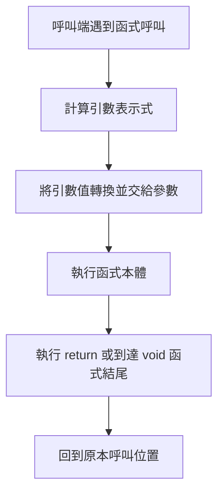
```mermaid
flowchart TD
    A[呼叫端遇到函式呼叫] --> B[計算引數表示式]
    B --> C[將引數值轉換並交給參數]
    C --> D[執行函式本體]
    D --> E[執行 return 或到達 void 函式結尾]
    E --> F[回到原本呼叫位置]
```

---

### 2. 函式定義的組成

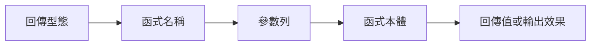
```mermaid
flowchart LR
    A[回傳型態] --> B[函式名稱]
    B --> C[參數列]
    C --> D[函式本體]
    D --> E[回傳值或輸出效果]
```

---

### 3. 函式原型與定義

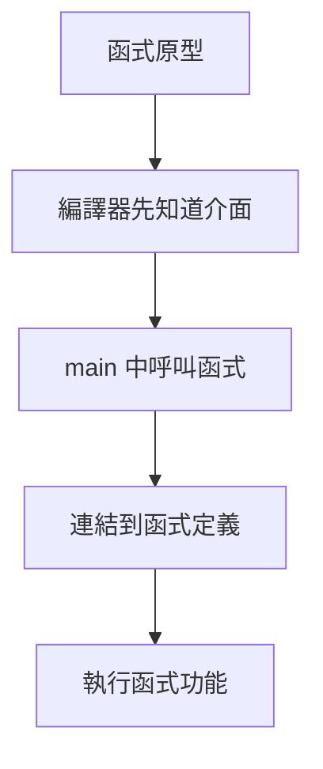
```mermaid
flowchart TD
    A[函式原型] --> B[編譯器先知道介面]
    B --> C[main 中呼叫函式]
    C --> D[連結到函式定義]
    D --> E[執行函式功能]
```

---

### 4. 標準函式庫使用流程

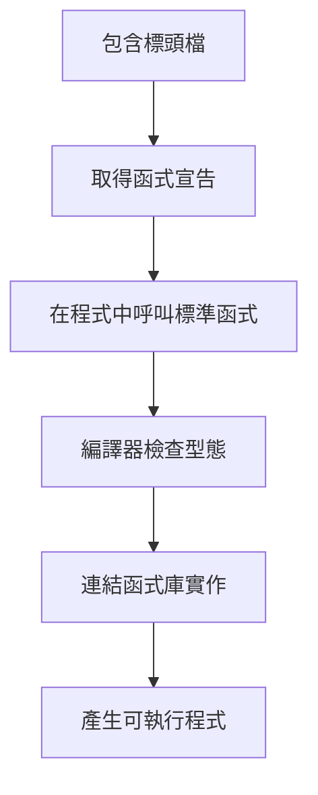
```mermaid
flowchart TD
    A[包含標頭檔] --> B[取得函式宣告]
    B --> C[在程式中呼叫標準函式]
    C --> D[編譯器檢查型態]
    D --> E[連結函式庫實作]
    E --> F[產生可執行程式]
```

---

### 5. `max2()` 流程

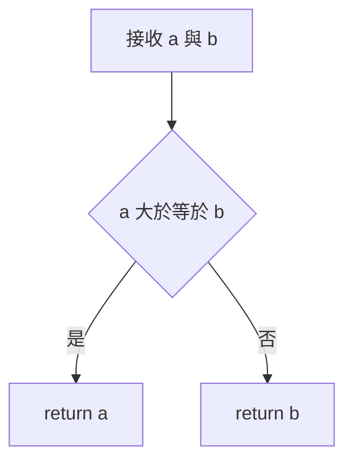
```mermaid
flowchart TD
    A[接收 a 與 b] --> B{a 大於等於 b}
    B -- 是 --> C[return a]
    B -- 否 --> D[return b]
```

---

### 6. `max3()` 的函式組合

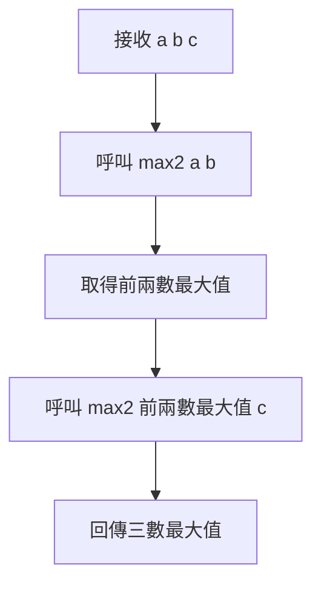
```mermaid
flowchart TD
    A[接收 a b c] --> B[呼叫 max2 a b]
    B --> C[取得前兩數最大值]
    C --> D[呼叫 max2 前兩數最大值 c]
    D --> E[回傳三數最大值]
```

---

### 7. 作用域查找

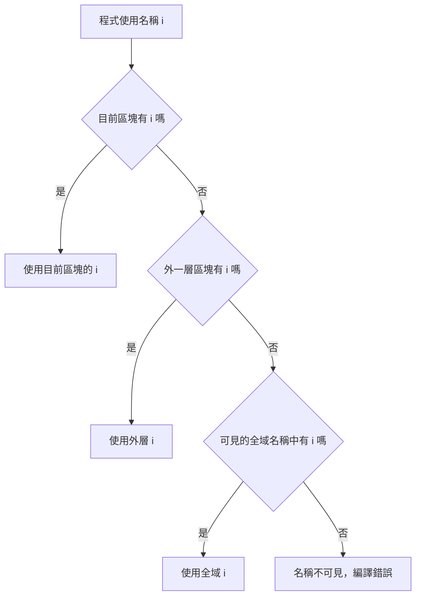
```mermaid
flowchart TD
    A[程式使用名稱 i] --> B{目前區塊有 i 嗎}
    B -- 是 --> C[使用目前區塊的 i]
    B -- 否 --> D{外一層區塊有 i 嗎}
    D -- 是 --> E[使用外層 i]
    D -- 否 --> F{可見的全域名稱中有 i 嗎}
    F -- 是 --> G[使用全域 i]
    F -- 否 --> H[名稱不可見，編譯錯誤]
```

---

### 8. 文字三角形的函式層次

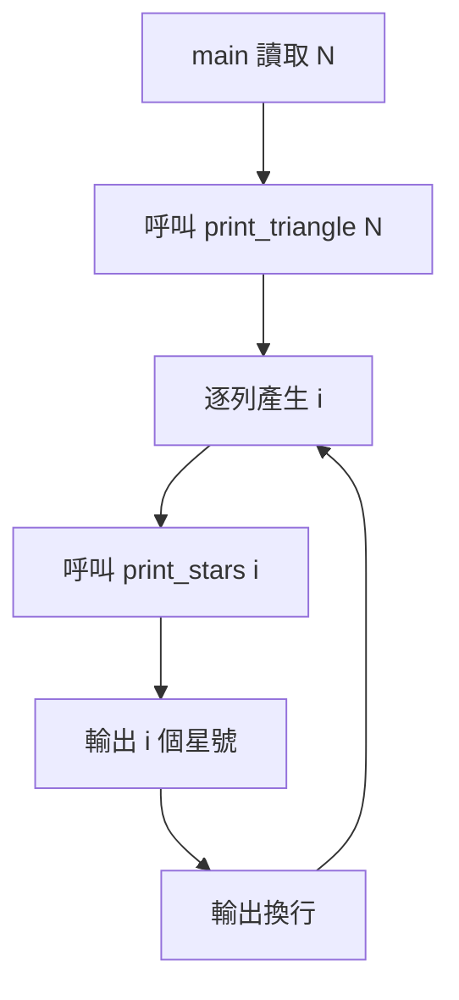
```mermaid
flowchart TD
    A[main 讀取 N] --> B[呼叫 print_triangle N]
    B --> C[逐列產生 i]
    C --> D[呼叫 print_stars i]
    D --> E[輸出 i 個星號]
    E --> F[輸出換行]
    F --> C
```

---

## 本章完成標準

完成本章後，你應該能做到：

1. 說明函式在程式中的用途。
2. 正確寫出函式定義。
3. 分辨回傳型態、名稱、參數與本體。
4. 正確呼叫有參數及有回傳值的函式。
5. 分辨形式參數與引數。
6. 追蹤引數表示式計算及型態轉換。
7. 說明函式呼叫與回傳的控制流程。
8. 正確使用 `return`。
9. 正確撰寫及呼叫 `void` 函式。
10. 使用函式原型讓定義可以放在 `main()` 後面。
11. 分辨函式宣告與函式定義。
12. 使用 `<stdio.h>` 與 `<math.h>`。
13. 使用 `sqrt()` 計算平方根。
14. 說明 `printf()` 回傳值的意義。
15. 將兩數最大值整理成 `max2()`。
16. 使用不同參數名稱而維持相同功能。
17. 分辨全域變數、區域變數與形式參數。
18. 根據區塊判斷名稱的可視範圍。
19. 解釋內層同名變數的遮蔽現象。
20. 將三數最大值整理成 `max3()`。
21. 使用 `max2()` 組合出 `max3()`。
22. 將三角形程式拆成 `print_stars()` 與 `print_triangle()`。
23. 讓 `main()` 保持簡短且聚焦整體流程。
24. 找出原型、回傳型態、作用域及函式呼叫的常見錯誤。
25. 準備進入下一章的遞迴函式。
