# Lesson 13：Recursion 遞迴

> 這堂課的重點：理解函式如何呼叫自己、為什麼遞迴一定要有停止條件，以及程式如何先逐層呼叫、再逐層返回。最後會使用遞迴完成數數字、連續整數和與上樓梯方法數。

---

## Section I. 今天要做什麼？

1. 理解什麼是函式遞迴。
2. 認識「函式在自己的定義中呼叫自己」的程式結構。
3. 觀察沒有停止條件的遞迴為什麼不會結束。
4. 理解每一次函式呼叫都是新的呼叫層次。
5. 認識遞迴問題中的停止條件。
6. 認識遞迴情況，也就是把問題交給較接近停止條件的下一層。
7. 使用參數記錄目前的遞迴狀態。
8. 追蹤 `f(0)`、`f(1)`、`f(2)` 的呼叫過程。
9. 理解 `return` 如何讓結果逐層返回。
10. 使用遞迴印出 `1` 到 `3`。
11. 將固定終點 `3` 推廣成使用者指定的 `N`。
12. 比較在遞迴呼叫之前輸出與之後輸出的差異。
13. 使用遞迴印出 `3` 到 `1`。
14. 理解呼叫展開階段與返回階段。
15. 使用函式封裝 `1` 到 `N` 的連續整數和。
16. 從數值表找出 `sum(N)` 與 `sum(N - 1)` 的關係。
17. 建立連續整數和的遞迴定義。
18. 使用停止條件 `N == 1`。
19. 追蹤 `sum(4)` 的展開與返回。
20. 比較迴圈版與遞迴版的連續整數和。
21. 理解上樓梯問題的規則：每次走一階或兩階。
22. 列出走到第 `1`、`2`、`3`、`4`、`5` 階的方法。
23. 從表格觀察方法數之間的關係。
24. 建立 `S(N) = S(N - 1) + S(N - 2)`。
25. 理解為什麼上樓梯遞迴需要兩個停止值。
26. 使用兩個遞迴呼叫計算上樓梯方法數。
27. 觀察分支遞迴中相同子問題可能被重複計算。
28. 分辨適合使用遞迴與適合使用迴圈的問題。
29. 找出無限遞迴、錯誤停止條件與錯誤更新方向。
30. 為下一章的一維陣列建立完整函式與控制流程基礎。

---

## Section II. 今天的學習方式

1. 先寫出最小、最容易直接回答的問題。
2. 將這個最小問題設為停止條件。
3. 再把一般問題改寫成規模較小的同類問題。
4. 確認每次遞迴呼叫都會更接近停止條件。
5. 用小數值手動展開，不直接猜執行結果。
6. 每一層分別記錄參數值。
7. 分開觀察：
   - 呼叫前執行的程式碼
   - 遞迴呼叫
   - 呼叫返回後執行的程式碼
8. 有回傳值時，先展開到停止條件，再由最內層開始計算。
9. 使用箭頭畫出呼叫方向與返回方向。
10. 對分支遞迴畫出簡單呼叫樹。
11. 來源範例的連續整數和與樓梯題都假設 `N >= 1`。
12. 教材完整程式會額外檢查不符合假設的輸入。
13. 先掌握來源中的直接遞迴，不把記憶化或動態規劃當成本章主題。
14. 每個遞迴程式都用小輸入測試，例如 `1`、`2`、`3`、`4`。

---

## Section III. 今天會學到的內容

| 主題 | 你需要知道的事 |
| --- | --- |
| 遞迴 | 函式直接或間接呼叫自己 |
| 遞迴呼叫 | 函式內再次呼叫同一函式 |
| 呼叫層次 | 每次呼叫都有自己的參數與區域狀態 |
| 停止條件 | 不再產生下一次遞迴呼叫的情況 |
| 遞迴情況 | 將一般問題轉換成較小的同類問題 |
| 接近停止 | 每次呼叫都應讓狀態往停止條件移動 |
| 無限遞迴 | 遞迴呼叫永遠無法到達停止條件 |
| 呼叫展開 | 逐層進入新的函式呼叫 |
| 逐層返回 | 最內層完成後，依相反順序回到外層 |
| 呼叫前輸出 | 在展開階段發生 |
| 呼叫後輸出 | 在返回階段發生 |
| 回傳值 | 由最內層開始逐層計算並送回 |
| 線性遞迴 | 每一層通常只呼叫一次自己 |
| 分支遞迴 | 每一層可能呼叫自己多次 |
| 遞迴定義 | 使用較小輸入的函式值定義目前函式值 |
| `sum(N)` | `1 + 2 + ... + N` |
| `S(N)` | 走到第 `N` 階的方法數 |
| 呼叫樹 | 表示多個遞迴分支之間的關係 |
| 重複子問題 | 相同輸入可能在不同分支中再次計算 |
| 輸入前提 | 來源題目通常明確假設 `N >= 1` |

---

## Section IV. 寫題目前的提醒

### 1. 函式可以在自己的定義中呼叫自己

```c
void f(void) {
    f();
}
```

這在語法上表達了遞迴。

但這個版本沒有停止條件，因此不能正常結束。

---

### 2. 只寫遞迴呼叫並不等於完整遞迴解法

危險：

```c
void f(void) {
    f();
}
```

完整遞迴通常至少需要：

```c
if (停止條件) {
    return;
}

f(較接近停止條件的狀態);
```

---

### 3. 停止條件必須真的可以到達

<p align="center">
  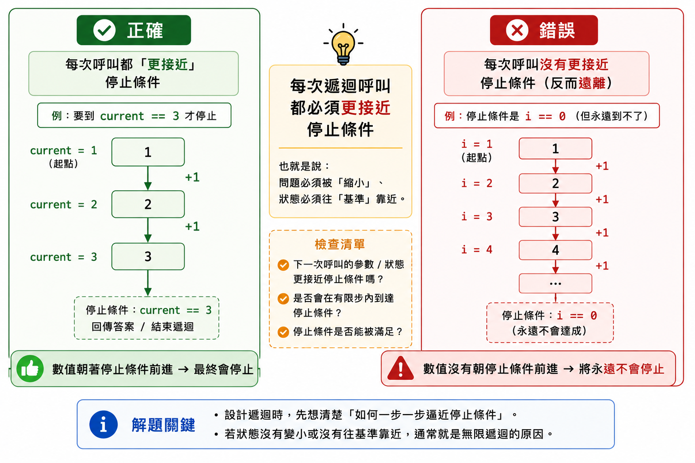
</p>


錯誤：

```c
void count_up(int i) {
    if (i == 0) {
        return;
    }

    count_up(i + 1);
}
```

若從 `1` 開始，`i` 會變成 `2`、`3`、`4`，越來越遠離 `0`。

---

### 4. 每次呼叫都要縮小或推進問題

例如從 `1` 數到 `N`：

```c
count_up(i + 1, n);
```

目前值逐步接近上限 `n`。

例如計算 `sum(n)`：

```c
sum(n - 1);
```

問題規模逐步接近 `1`。

---

### 5. `return` 會停止目前這一層函式

```c
if (i == 2) {
    return i;
}
```

這只完成目前呼叫層。

結果仍要依呼叫關係返回上一層。

---

### 6. 每一層參數是自己的區域值

```c
int f(int i) {
    if (i == 2) {
        return i;
    }

    return f(i + 1);
}
```

呼叫：

```text
f(0)
f(1)
f(2)
```

三個呼叫層次各有自己的 `i`：

```text
0
1
2
```

---

### 7. 遞迴呼叫前後的程式碼順序不同

呼叫前：

```c
printf("%d\n", i);
count_up(i + 1);
```

會在展開時輸出。

呼叫後：

```c
count_down(i + 1);
printf("%d\n", i);
```

會在返回時輸出。

---

### 8. 有回傳值的遞迴要把結果回傳出去

錯誤：

```c
int sum(int n) {
    if (n == 1) {
        return 1;
    }

    sum(n - 1) + n;
}
```

正確：

```c
return sum(n - 1) + n;
```

---

### 9. 停止條件的回傳值要符合數學定義

連續整數和：

```c
sum(1) = 1
```

因此：

```c
if (n == 1) {
    return 1;
}
```

---

### 10. 上樓梯問題需要兩個已知值

來源得到：

```text
S(1) = 1
S(2) = 2
```

因此程式可以寫：

```c
if (n <= 2) {
    return n;
}
```

這個寫法建立在題目假設：

```text
N >= 1
```

之上。

---

### 11. 分支遞迴會快速增加呼叫數量

```c
return stairs(n - 1) + stairs(n - 2);
```

每一層可能再分成兩個呼叫。

對較大的 `n`，直接版本會做很多重複工作。

本章先理解正確的遞迴關係，不正式展開效能改善方法。

---

### 12. 不要把來源題目的輸入前提忽略

來源的上樓梯題明確以：

```text
N >= 1
```

為前提。

完整程式可加入：

```c
if (n < 1) {
    printf("N must be at least 1.\n");
    return 0;
}
```

---

### 13. 投影片中的一處符號應以完整脈絡判讀

上樓梯教材其中一張早期投影片顯示了 `N <= 1`，但題目敘述、後續表格、遞迴公式與最終程式都一致使用 `N >= 1`，且停止條件為 `N <= 2`。

本章依照後續一致內容採用：

```text
N >= 1
```

---

### 14. 遞迴不一定比迴圈短或快

遞迴的優勢通常是：

- 接近問題的遞迴定義
- 能自然描述分解結構
- 呼叫前後可以表達不同階段

但簡單計數或累加，迴圈通常更直接。

---

## Section V. 核心概念說明

## Section V-A. 什麼是函式遞迴？

<p align="center">
  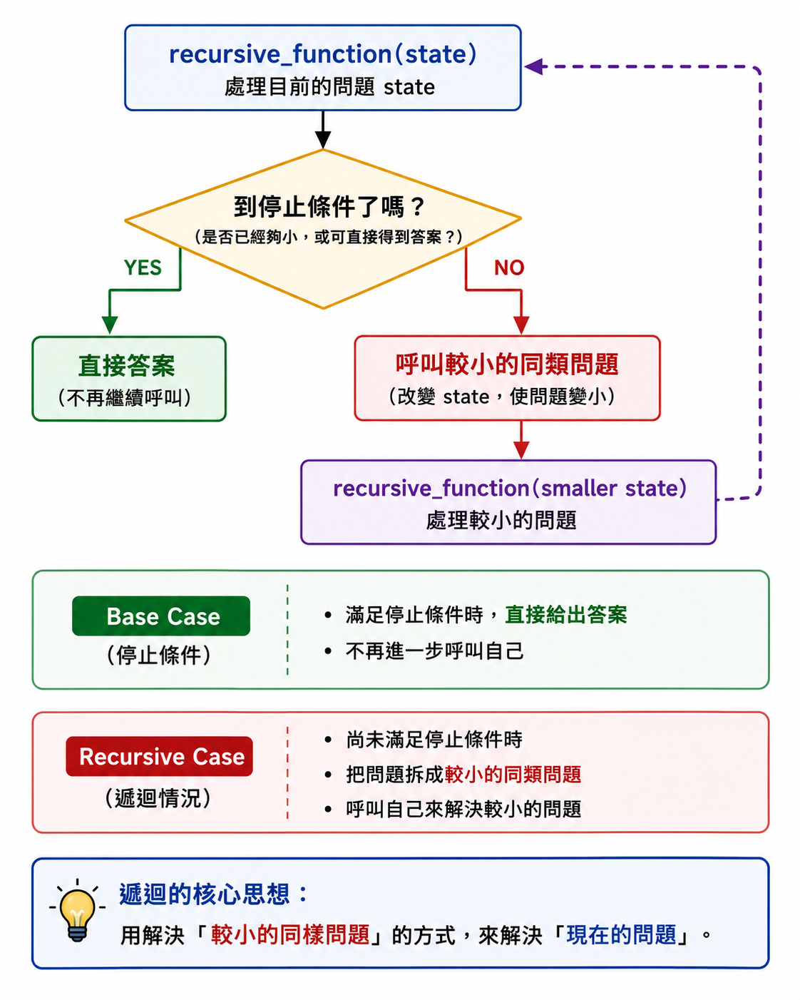
</p>


### 1. 最基本的自我呼叫

```c
void f(void);

int main(void) {
    f();

    return 0;
}

void f(void) {
    f();
}
```

`main()` 呼叫 `f()`。

進入 `f()` 後，`f()` 又呼叫新的 `f()`。

新的 `f()` 再呼叫下一個 `f()`，持續下去。

---

### 2. 呼叫展開

<p align="center">
  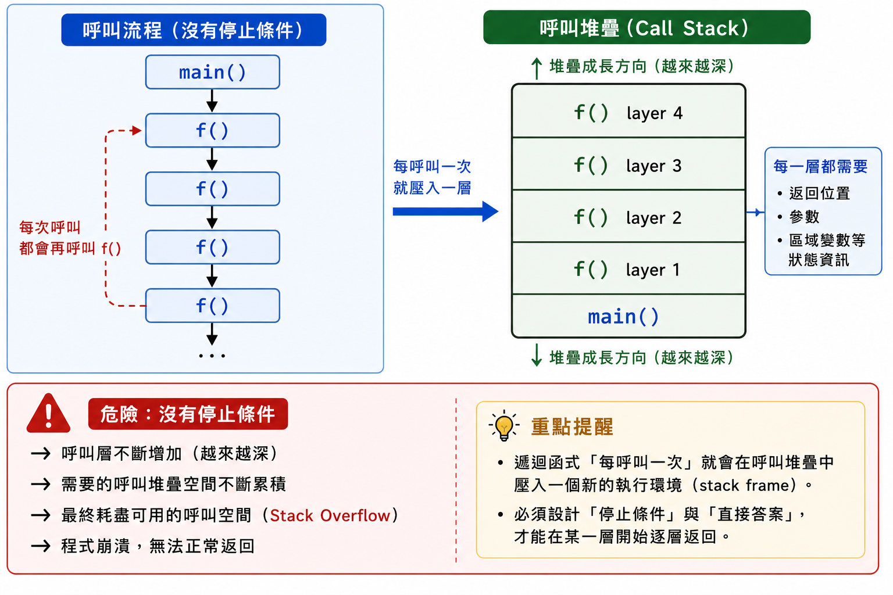
</p>


概念上可以表示為：

```text
main()
└── f()
    └── f()
        └── f()
            └── f()
                └── ...
```

每次呼叫尚未完成，就先進入下一次呼叫。

由於沒有停止條件，這個過程不會正常返回 `main()`。

---

### 3. 為什麼不能無限呼叫？

程式必須保存尚未完成的呼叫資訊，例如：

- 回到哪一行
- 目前參數值
- 目前區域狀態

呼叫層次持續增加時，可使用的呼叫空間最終會耗盡。

實際執行通常會以錯誤或異常終止，而不是永遠安全運行。

---

### 4. 加入參數觀察狀態

```c
int f(int i);

int main(void) {
    printf("%d\n", f(0));

    return 0;
}

int f(int i) {
    return f(i + 1);
}
```

呼叫順序：

```text
f(0)
f(1)
f(2)
f(3)
...
```

雖然 `i` 不斷改變，但仍然沒有停止條件。

---

### 5. 加入停止條件

來源示範的核心形式：

```c
int f(int i) {
    if (i == 2) {
        return i;
    }

    return f(i + 1);
}
```

完整程式：

```c
#include <stdio.h>

int f(int);

int main(void) {
    printf("%d\n", f(0));

    return 0;
}

int f(int i) {
    if (i == 2) {
        return i;
    }

    return f(i + 1);
}
```

輸出：

```text
2
```

---

### 6. `f(0)` 的展開

```text
f(0)
= f(1)
= f(2)
```

到達：

```c
i == 2
```

後：

```c
return 2;
```

不再呼叫 `f(3)`。

---

### 7. `f(0)` 的返回

<p align="center">
  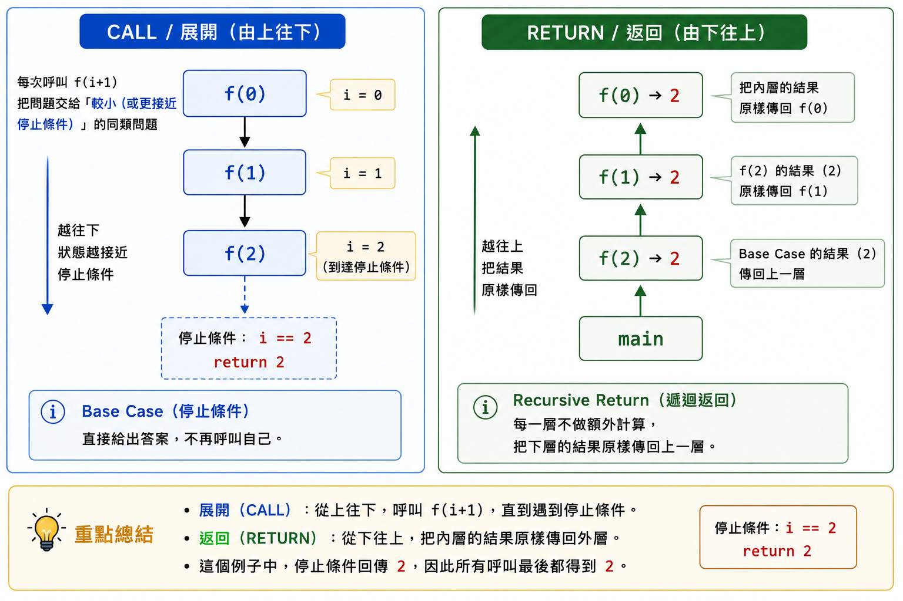
</p>


呼叫關係：

```text
f(0) 等待 f(1)
f(1) 等待 f(2)
f(2) 回傳 2
```

返回方向：

```text
f(2) → 2
f(1) → 2
f(0) → 2
main() 取得 2
```

因為外層只是：

```c
return f(i + 1);
```

所以每一層把內層結果原樣回傳。

---

### 8. 遞迴的兩個核心部分

```c
return_type recursive_function(state) {
    if (停止條件) {
        return 直接答案;
    }

    return recursive_function(更接近停止的狀態);
}
```

| 部分 | 作用 |
| --- | --- |
| 停止條件 | 阻止進一步遞迴 |
| 直接答案 | 最小問題的答案 |
| 遞迴情況 | 將問題交給較小或較接近停止的狀態 |

---

## Section V-B. 使用遞迴數數字

### 9. 先使用迴圈印出 1 到 3

```c
#include <stdio.h>

int main(void) {
    int i;

    for (i = 1; i <= 3; i++) {
        printf("%d\n", i);
    }

    return 0;
}
```

輸出：

```text
1
2
3
```

---

### 10. 遞迴版本：`count_to_3()`

```c
#include <stdio.h>

void count_to_3(int);

int main(void) {
    count_to_3(1);

    return 0;
}

void count_to_3(int i) {
    if (i <= 3) {
        printf("%d\n", i);
        count_to_3(i + 1);
    }
}
```

---

### 11. 為什麼從 `1` 呼叫？

```c
count_to_3(1);
```

表示目前要處理第一個數字。

每一層：

1. 輸出目前 `i`
2. 呼叫下一個 `i + 1`

---

### 12. 呼叫追蹤

```text
count_to_3(1)
├── 輸出 1
└── count_to_3(2)
    ├── 輸出 2
    └── count_to_3(3)
        ├── 輸出 3
        └── count_to_3(4)
            └── 條件不成立，返回
```

---

### 13. 停止條件寫在哪裡？

來源寫法：

```c
if (i <= 3) {
    printf("%d\n", i);
    count_to_3(i + 1);
}
```

當：

```text
i = 4
```

條件不成立，函式直接到達結尾並返回。

---

### 14. 更明確的提前返回寫法

同一邏輯也可以寫：

```c
void count_to_3(int i) {
    if (i > 3) {
        return;
    }

    printf("%d\n", i);
    count_to_3(i + 1);
}
```

兩個版本的停止位置不同，但輸出相同。

---

### 15. 推廣成印出 1 到 N

```c
#include <stdio.h>

void count_up(int, int);

int main(void) {
    int n;

    printf("N = ");
    scanf("%d", &n);

    if (n >= 1) {
        count_up(1, n);
    }

    return 0;
}

void count_up(int current, int n) {
    if (current > n) {
        return;
    }

    printf("%d\n", current);
    count_up(current + 1, n);
}
```

---

## Section V-C. 呼叫前輸出與呼叫後輸出

### 16. 印出 3 到 1 的迴圈版本

```c
for (i = 3; i >= 1; i--) {
    printf("%d\n", i);
}
```

---

### 17. 方法一：直接遞減參數

```c
void count_down(int i) {
    if (i < 1) {
        return;
    }

    printf("%d\n", i);
    count_down(i - 1);
}
```

呼叫：

```c
count_down(3);
```

輸出：

```text
3
2
1
```

---

### 18. 方法二：仍然由 1 向上呼叫，但返回時輸出

來源的重要示範：

```c
#include <stdio.h>

void count_to_1(int);

int main(void) {
    count_to_1(1);

    return 0;
}

void count_to_1(int i) {
    if (i <= 3) {
        count_to_1(i + 1);
        printf("%d\n", i);
    }
}
```

輸出：

```text
3
2
1
```

---

### 19. 為什麼最先輸出 3？

展開階段：

```text
count_to_1(1)
└── count_to_1(2)
    └── count_to_1(3)
        └── count_to_1(4)
```

到 `4` 時條件不成立，開始返回。

返回階段：

```text
回到 i = 3 → 輸出 3
回到 i = 2 → 輸出 2
回到 i = 1 → 輸出 1
```

---

### 20. 程式碼位置決定執行階段

<p align="center">
  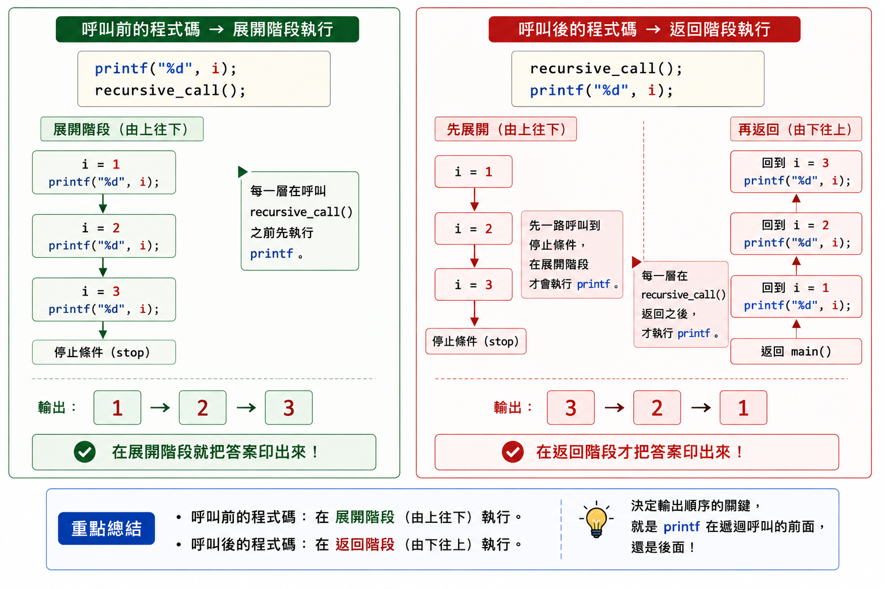
</p>


呼叫前：

```c
printf("%d\n", i);
recursive_call();
```

執行順序：

```text
外層 → 內層
```

呼叫後：

```c
recursive_call();
printf("%d\n", i);
```

執行順序：

```text
內層 → 外層
```

---

### 21. 同時在前後輸出

<p align="center">
  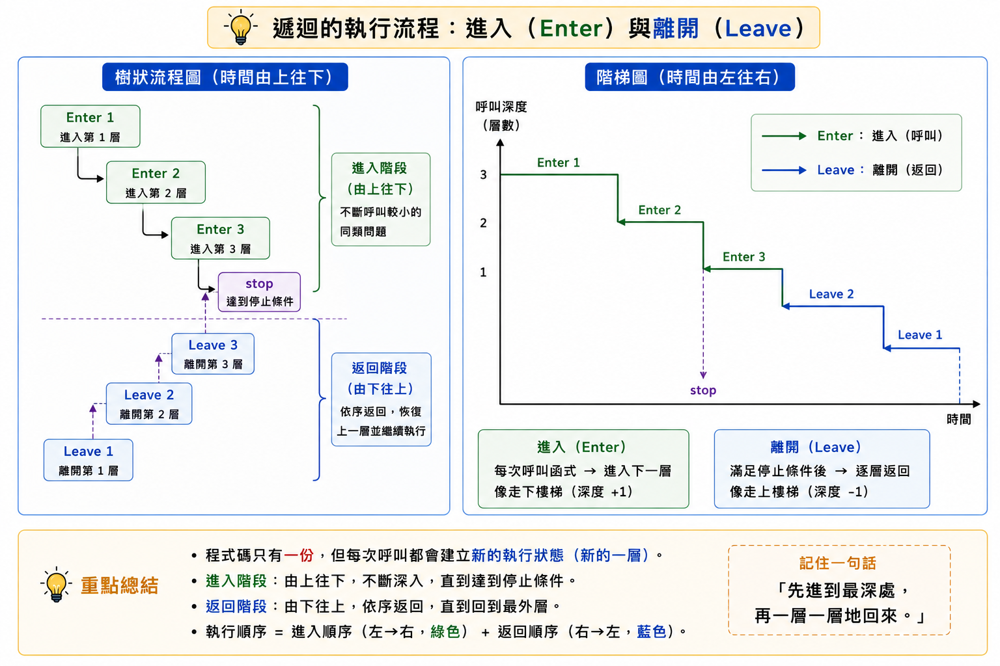
</p>


```c
void trace(int i) {
    if (i > 3) {
        return;
    }

    printf("Enter %d\n", i);
    trace(i + 1);
    printf("Leave %d\n", i);
}
```

呼叫 `trace(1)`：

```text
Enter 1
Enter 2
Enter 3
Leave 3
Leave 2
Leave 1
```

這能清楚顯示展開與返回順序。

---

## Section V-D. 求 1 到 N 的連續整數和

### 22. 題目

輸入正整數 `N`，計算：

```text
1 + 2 + 3 + ... + N
```

來源範例：

```text
N = 100  → 5050
N = 1000 → 500500
```

---

### 23. 先使用迴圈

```c
#include <stdio.h>

int main(void) {
    int n;
    int sum = 0;
    int i;

    printf("N = ");
    scanf("%d", &n);

    for (i = 1; i <= n; i++) {
        sum = sum + i;
    }

    printf("%d\n", sum);

    return 0;
}
```

---

### 24. 先將工作抽成一般函式

```c
int sum_to_n(int n) {
    int sum = 0;
    int i;

    for (i = 1; i <= n; i++) {
        sum += i;
    }

    return sum;
}
```

完整程式：

```c
#include <stdio.h>

int sum_to_n(int);

int main(void) {
    int n;

    printf("N = ");
    scanf("%d", &n);

    if (n < 1) {
        printf("N must be at least 1.\n");
        return 0;
    }

    printf("%d\n", sum_to_n(n));

    return 0;
}

int sum_to_n(int n) {
    int sum = 0;
    int i;

    for (i = 1; i <= n; i++) {
        sum += i;
    }

    return sum;
}
```

函式不一定要使用遞迴。

---

### 25. 從數值表觀察規律

```text
sum(1) = 1
sum(2) = 1 + 2
sum(3) = 1 + 2 + 3
sum(4) = 1 + 2 + 3 + 4
sum(5) = 1 + 2 + 3 + 4 + 5
```

把前面的部分視為較小問題：

```text
sum(2) = sum(1) + 2
sum(3) = sum(2) + 3
sum(4) = sum(3) + 4
sum(5) = sum(4) + 5
```

---

### 26. 一般遞迴關係

停止值：

```text
sum(1) = 1
```

一般值：

```text
sum(N) = sum(N - 1) + N，N > 1
```

---

### 27. 遞迴程式

```c
#include <stdio.h>

int sum_recursive(int);

int main(void) {
    int n;

    printf("N = ");
    scanf("%d", &n);

    if (n < 1) {
        printf("N must be at least 1.\n");
        return 0;
    }

    printf("%d\n", sum_recursive(n));

    return 0;
}

int sum_recursive(int n) {
    if (n == 1) {
        return 1;
    }

    return sum_recursive(n - 1) + n;
}
```

---

### 28. 展開 `sum_recursive(4)`

```text
sum_recursive(4)
= sum_recursive(3) + 4
= (sum_recursive(2) + 3) + 4
= ((sum_recursive(1) + 2) + 3) + 4
= ((1 + 2) + 3) + 4
```

---

### 29. 返回計算

```text
sum_recursive(1) = 1
sum_recursive(2) = 1 + 2 = 3
sum_recursive(3) = 3 + 3 = 6
sum_recursive(4) = 6 + 4 = 10
```

---

### 30. 呼叫與返回圖

<p align="center">
  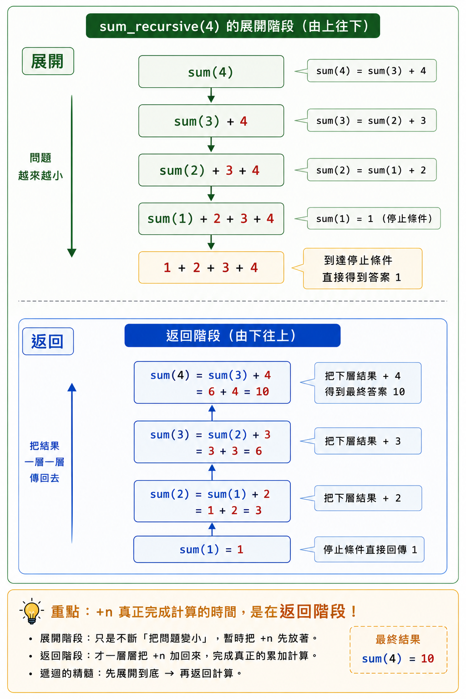
</p>


```text
呼叫方向：
sum(4) → sum(3) → sum(2) → sum(1)

返回方向：
sum(1)=1
   ↓
sum(2)=3
   ↓
sum(3)=6
   ↓
sum(4)=10
```

---

### 31. 為什麼 `+ n` 在遞迴呼叫之後計算？

表示式：

```c
return sum_recursive(n - 1) + n;
```

必須先取得：

```c
sum_recursive(n - 1)
```

的回傳值，才能完成加法。

因此真正加總發生在逐層返回時。

---

### 32. 迴圈與遞迴比較

<p align="center">
  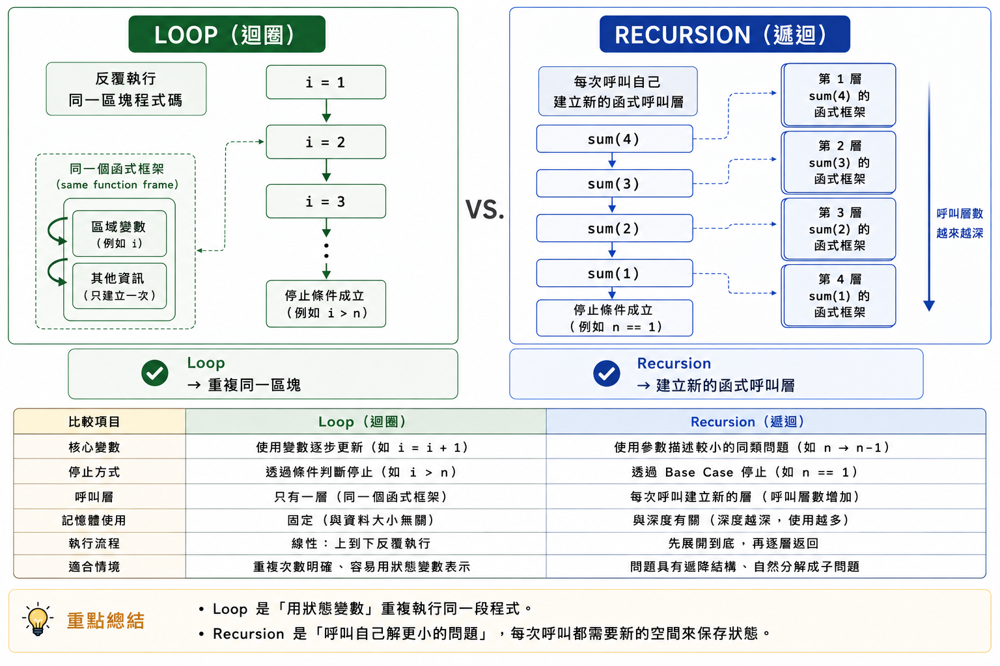
</p>


| 比較 | 迴圈版本 | 遞迴版本 |
| --- | --- | --- |
| 核心變數 | `sum`、`i` | 參數 `n` 與回傳值 |
| 重複方式 | `for` | 函式呼叫自己 |
| 停止方式 | `i > n` | `n == 1` |
| 額外呼叫層 | 沒有 | 每個 `n` 一層 |
| 接近數學定義 | 一般 | 很直接 |
| 大輸入實用性 | 通常較好 | 呼叫層數可能過多 |

---

## Section V-E. 求上樓梯的方法數

### 33. 題目規則

假設每次只能走：

```text
1 階
```

或：

```text
2 階
```

輸入 `N`，計算走到第 `N` 階的不同走法數量。

來源題目假設：

```text
N >= 1
```

---

### 34. 第 1 階

只有：

```text
1
```

因此：

```text
S(1) = 1
```

---

### 35. 第 2 階

不同走法：

```text
1, 1
2
```

因此：

```text
S(2) = 2
```

---

### 36. 第 3 階

不同走法：

```text
1, 1, 1
1, 2
2, 1
```

因此：

```text
S(3) = 3
```

---

### 37. 第 4 階

不同走法：

```text
1, 1, 1, 1
1, 1, 2
1, 2, 1
2, 1, 1
2, 2
```

因此：

```text
S(4) = 5
```

---

### 38. 第 5 階

共有：

```text
8
```

種走法。

來源表格得到：

| 階數 | 方法數 |
| ---: | ---: |
| 1 | 1 |
| 2 | 2 |
| 3 | 3 |
| 4 | 5 |
| 5 | 8 |

---

### 39. 從最後一步分類

<p align="center">
  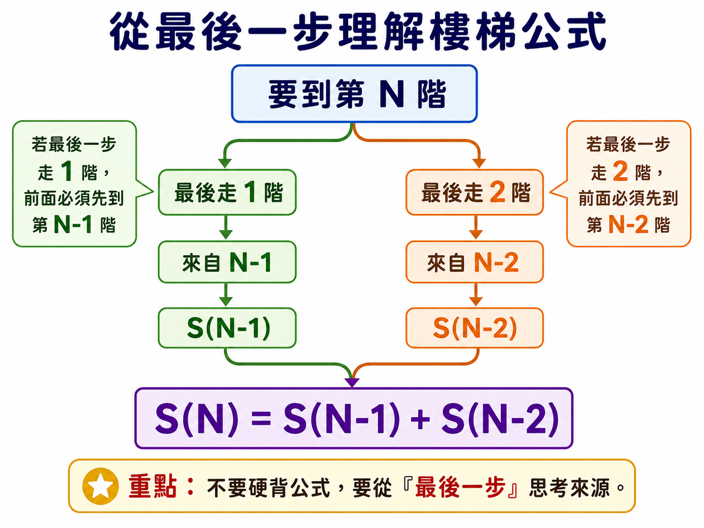
</p>


要到達第 `N` 階，最後一步只有兩種可能：

1. 最後走 `1` 階  
   在此之前必須位於第 `N - 1` 階。

2. 最後走 `2` 階  
   在此之前必須位於第 `N - 2` 階。

兩類走法互不重複，因此：

```text
S(N) = S(N - 1) + S(N - 2)
```

---

### 40. 遞迴定義

```text
S(1) = 1
S(2) = 2
S(N) = S(N - 1) + S(N - 2)，N > 2
```

也可以合併停止條件：

```text
S(N) = N，1 <= N <= 2
```

---

### 41. 遞迴程式

```c
#include <stdio.h>

int stairs(int);

int main(void) {
    int n;

    printf("N = ");
    scanf("%d", &n);

    if (n < 1) {
        printf("N must be at least 1.\n");
        return 0;
    }

    printf("%d\n", stairs(n));

    return 0;
}

int stairs(int n) {
    if (n <= 2) {
        return n;
    }

    return stairs(n - 1) + stairs(n - 2);
}
```

---

### 42. 追蹤 `stairs(4)`

```text
stairs(4)
= stairs(3) + stairs(2)
= [stairs(2) + stairs(1)] + stairs(2)
= [2 + 1] + 2
= 5
```

---

### 43. `stairs(5)` 的呼叫樹

```text
stairs(5)
├── stairs(4)
│   ├── stairs(3)
│   │   ├── stairs(2) → 2
│   │   └── stairs(1) → 1
│   └── stairs(2) → 2
└── stairs(3)
    ├── stairs(2) → 2
    └── stairs(1) → 1
```

結果：

```text
5 + 3 = 8
```

---

### 44. 觀察重複計算

<p align="center">
  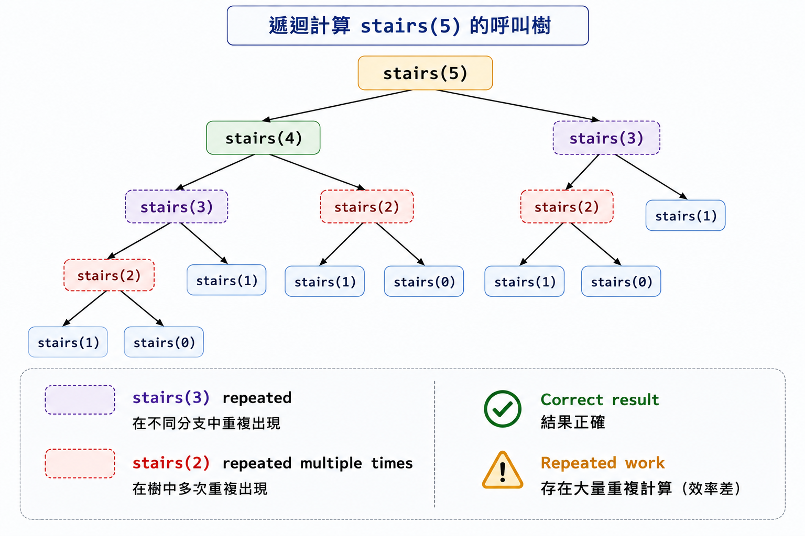
</p>


在 `stairs(5)` 中：

```text
stairs(3)
stairs(2)
```

會在不同分支重複出現。

直接遞迴仍能正確得到結果，但輸入變大時，重複呼叫會明顯增加。

這是分支遞迴的重要特徵。

---

### 45. 迴圈版作為比較

來源的主要目標是建立遞迴關係。依同一數列，也可以使用迴圈：

```c
int stairs_iterative(int n) {
    int previous = 1;
    int current = 2;
    int level;

    if (n == 1) {
        return 1;
    }

    for (level = 3; level <= n; level++) {
        int next = previous + current;
        previous = current;
        current = next;
    }

    return current;
}
```

這是由相同遞迴關係轉換而來的延伸比較，不是來源投影片的主要實作。

---

## Section V-F. 遞迴的通用設計方法

<p align="center">
  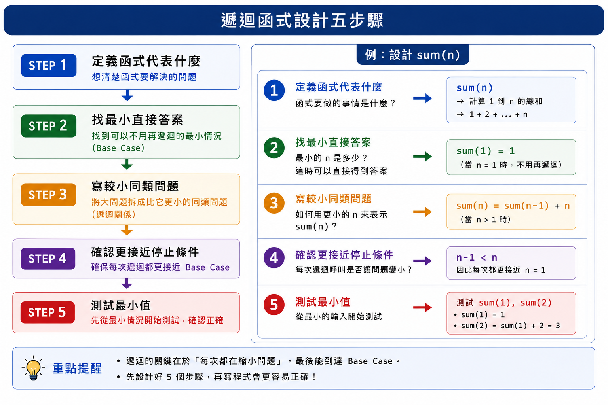
</p>


### 46. 第一步：定義函式代表什麼

例如：

```text
sum_recursive(n)
```

代表：

```text
1 到 n 的總和
```

```text
stairs(n)
```

代表：

```text
走到第 n 階的方法數
```

定義不清楚，就很難寫出正確遞迴式。

---

### 47. 第二步：找最小可直接回答的輸入

連續整數和：

```text
sum(1) = 1
```

上樓梯：

```text
stairs(1) = 1
stairs(2) = 2
```

---

### 48. 第三步：使用較小問題表達一般問題

```text
sum(n) = sum(n - 1) + n
```

```text
stairs(n) = stairs(n - 1) + stairs(n - 2)
```

---

### 49. 第四步：確認一定接近停止條件

```c
n - 1
n - 2
```

都比 `n` 小。

在 `n >= 1` 的前提下，最終會到達 `1` 或 `2`。

---

### 50. 第五步：測試最小值

先測：

```text
sum(1)
stairs(1)
stairs(2)
```

再測：

```text
sum(2)
stairs(3)
```

避免只測較大數字，掩蓋停止條件錯誤。

---

## Section V-G. 容易搞混的重點

### 51. 遞迴不是把函式定義複製到自己裡面

每次遞迴呼叫是新的函式呼叫層次。

程式碼只有一份，但執行狀態有多層。

---

### 52. 停止條件不一定使用 `return` 數值

`void` 函式：

```c
if (current > n) {
    return;
}
```

有回傳值函式：

```c
if (n == 1) {
    return 1;
}
```

---

### 53. 呼叫結束不代表整個程式結束

最內層返回後，仍要回到上一層尚未完成的位置。

---

### 54. `printf()` 放置位置會改變順序

```c
printf();
recursive_call();
```

與：

```c
recursive_call();
printf();
```

會得到相反方向的輸出。

---

### 55. `sum(n - 1) + n` 不是先立即得到左邊答案

程式必須進入下一層，直到停止值確定後，才能逐層完成加法。

---

### 56. 一個停止條件不一定足夠

上樓梯的遞迴同時依賴：

```text
n - 1
n - 2
```

因此需要已知：

```text
S(1)
S(2)
```

---

### 57. `n <= 2` 的寫法依賴合法輸入

```c
if (n <= 2) {
    return n;
}
```

若錯誤輸入 `0`，會回傳 `0`，但來源題目根本沒有定義第 `0` 階。

因此應在呼叫前檢查 `n >= 1`。

---

### 58. 遞迴函式可能正確但效率不佳

`stairs()` 的直接分支遞迴忠實表達來源公式。

「結果正確」與「適合大輸入」是兩個不同問題。

---

### 59. 遞迴與迴圈可以表示相同工作

數數字與連續整數和都有：

- 迴圈版本
- 遞迴版本

選擇應考慮可讀性、問題結構與輸入規模。

---

## Section VI. 快速概念檢查

### Q1. 什麼是函式遞迴？

<details>
<summary>查看答案</summary>

函式在自己的執行過程中直接或間接呼叫自己。

</details>

---

### Q2. 為什麼遞迴需要停止條件？

<details>
<summary>查看答案</summary>

停止條件讓某一層不再產生新的遞迴呼叫，使呼叫可以開始逐層返回。

</details>

---

### Q3. 下面程式有什麼問題？

```c
void f(void) {
    f();
}
```

<details>
<summary>查看答案</summary>

沒有停止條件，會持續建立新的函式呼叫，無法正常返回。

</details>

---

### Q4. `f(0)` 每次呼叫 `f(i + 1)`，且在 `i == 2` 回傳，會經過哪些參數值？

<details>
<summary>查看答案</summary>

```text
0 → 1 → 2
```

</details>

---

### Q5. 在遞迴呼叫之前輸出，通常會以什麼方向出現？

<details>
<summary>查看答案</summary>

以呼叫展開的方向，也就是由外層到內層。

</details>

---

### Q6. 在遞迴呼叫之後輸出，通常會以什麼方向出現？

<details>
<summary>查看答案</summary>

以逐層返回的方向，也就是由最內層到最外層。

</details>

---

### Q7. `sum(1)` 的停止值是多少？

<details>
<summary>查看答案</summary>

```text
1
```

</details>

---

### Q8. `sum(4)` 的結果是多少？

<details>
<summary>查看答案</summary>

```text
1 + 2 + 3 + 4 = 10
```

</details>

---

### Q9. 上樓梯題中，為什麼 `S(N)` 等於前兩項相加？

<details>
<summary>查看答案</summary>

最後一步不是走一階就是走兩階：

- 走一階前位於 `N - 1`
- 走兩階前位於 `N - 2`

兩類方法總數相加就是 `S(N)`。

</details>

---

### Q10. `S(1)` 與 `S(2)` 分別是多少？

<details>
<summary>查看答案</summary>

```text
S(1) = 1
S(2) = 2
```

</details>

---

### Q11. `stairs(5)` 的結果是多少？

<details>
<summary>查看答案</summary>

```text
8
```

</details>

---

### Q12. 直接分支遞迴的主要執行特徵是什麼？

<details>
<summary>查看答案</summary>

每一層可能產生多個遞迴呼叫，且相同子問題可能在不同分支中重複計算。

</details>

---

## Section VII. 程式閱讀練習

### 題目 1：停止條件

```c
int f(int i) {
    if (i == 3) {
        return i;
    }

    return f(i + 1);
}
```

呼叫：

```c
f(1)
```

<details>
<summary>查看答案</summary>

呼叫：

```text
f(1) → f(2) → f(3)
```

`f(3)` 回傳 `3`，所以最終結果是 `3`。

</details>

---

### 題目 2：方向錯誤

```c
void f(int i) {
    if (i == 0) {
        return;
    }

    f(i + 1);
}
```

呼叫：

```c
f(3)
```

<details>
<summary>查看答案</summary>

`i` 會變成 `4`、`5`、`6`，越來越遠離停止條件 `0`，因此無法正常停止。

</details>

---

### 題目 3：呼叫前輸出

```c
void show(int i) {
    if (i > 3) {
        return;
    }

    printf("%d ", i);
    show(i + 1);
}
```

呼叫 `show(1)`。

<details>
<summary>查看答案</summary>

```text
1 2 3
```

</details>

---

### 題目 4：呼叫後輸出

```c
void show(int i) {
    if (i > 3) {
        return;
    }

    show(i + 1);
    printf("%d ", i);
}
```

呼叫 `show(1)`。

<details>
<summary>查看答案</summary>

```text
3 2 1
```

</details>

---

### 題目 5：前後都輸出

```c
void show(int i) {
    if (i > 2) {
        return;
    }

    printf("A%d ", i);
    show(i + 1);
    printf("B%d ", i);
}
```

<details>
<summary>查看答案</summary>

```text
A1 A2 B2 B1
```

</details>

---

### 題目 6：遞迴總和

```c
int sum_recursive(int n) {
    if (n == 1) {
        return 1;
    }

    return sum_recursive(n - 1) + n;
}
```

呼叫 `sum_recursive(3)`。

<details>
<summary>查看答案</summary>

```text
sum(3)
= sum(2) + 3
= sum(1) + 2 + 3
= 1 + 2 + 3
= 6
```

</details>

---

### 題目 7：樓梯方法數

```c
int stairs(int n) {
    if (n <= 2) {
        return n;
    }

    return stairs(n - 1) + stairs(n - 2);
}
```

呼叫 `stairs(4)`。

<details>
<summary>查看答案</summary>

```text
stairs(4)
= stairs(3) + stairs(2)
= [stairs(2) + stairs(1)] + 2
= [2 + 1] + 2
= 5
```

</details>

---

### 題目 8：找出遺漏

```c
int sum_recursive(int n) {
    if (n == 1) {
        return 1;
    }

    sum_recursive(n - 1) + n;
}
```

<details>
<summary>查看答案</summary>

一般情況漏掉 `return`。

應寫：

```c
return sum_recursive(n - 1) + n;
```

</details>

---

## Section VIII. 實作練習 / 實作檢測題

### TODO 1：印出 1 到 5

使用遞迴，不使用任何迴圈。

---

### TODO 2：印出 5 到 1

先使用「參數每次減一」的方法。

---

### TODO 3：返回時倒序輸出

從 `1` 開始，每次呼叫 `i + 1`，但把 `printf()` 放在遞迴呼叫後，使輸出成為：

```text
5
4
3
2
1
```

---

### TODO 4：印出 1 到 N

撰寫：

```c
void count_up(int current, int n);
```

---

### TODO 5：印出 N 到 1

撰寫：

```c
void count_down(int n);
```

---

### TODO 6：同時顯示進入與離開

撰寫：

```c
void trace(int i, int n);
```

輸入 `N = 3` 時輸出：

```text
Enter 1
Enter 2
Enter 3
Leave 3
Leave 2
Leave 1
```

---

### TODO 7：連續整數和

撰寫：

```c
int sum_recursive(int n);
```

測試：

```text
sum_recursive(1) = 1
sum_recursive(4) = 10
sum_recursive(10) = 55
```

---

### TODO 8：遞迴階乘（延伸）

依本章模式建立：

```text
factorial(1) = 1
factorial(n) = n * factorial(n - 1)
```

撰寫：

```c
int factorial(int n);
```

這是由連續整數和模式推廣的延伸練習，不是來源投影片的主要例題。

---

### TODO 9：計算冪次（延伸）

假設指數 `exponent >= 0`：

```text
power(base, 0) = 1
power(base, exponent)
= base * power(base, exponent - 1)
```

---

### TODO 10：上樓梯方法數

撰寫：

```c
int stairs(int n);
```

測試：

```text
stairs(1) = 1
stairs(2) = 2
stairs(3) = 3
stairs(4) = 5
stairs(5) = 8
```

---

### TODO 11：列出前 N 個樓梯方法數

輸入 `N`，使用迴圈呼叫遞迴函式：

```text
S(1)
S(2)
...
S(N)
```

遞迴函式本身仍保持來源公式。

---

### TODO 12：計算呼叫次數

增加一個全域計數器，只用於觀察：

```c
call_count++;
```

比較：

```text
stairs(5)
stairs(10)
```

的函式呼叫次數。

這是觀察分支遞迴的延伸實驗。

---

### TODO 13：修正無限遞迴

修正：

```c
void count_down(int n) {
    printf("%d\n", n);
    count_down(n + 1);
}
```

使它從 `N` 印到 `1` 後正常停止。

---

### TODO 14：迴圈與遞迴比較

各寫一個版本計算：

```text
1 + 2 + ... + N
```

比較：

- 需要哪些變數
- 停止方式
- 執行流程
- 哪一版較容易理解

---

### TODO 15：手動畫呼叫樹

不要執行程式，手動畫出：

```c
stairs(5)
```

的完整呼叫樹，標示每個停止值與最後結果。

---

## Section IX. 做題時可以使用的提示

### 1. 先寫一句完整定義

```text
這個函式對輸入 n 代表什麼？
```

例如：

```text
sum_recursive(n) 代表 1 到 n 的總和。
```

---

### 2. 找出最小合法輸入

來源題目：

```text
sum：最小合法輸入是 1
stairs：最小合法輸入是 1
```

---

### 3. 寫出小型數值表

```text
sum(1), sum(2), sum(3), ...
S(1), S(2), S(3), ...
```

再找相鄰項的關係。

---

### 4. 檢查遞迴參數是否朝正確方向移動

```text
目前是 n
下一層是 n - 1
```

應比目前更接近停止值。

---

### 5. 輸出順序不對時檢查 `printf()` 位置

- 遞迴前：正向展開
- 遞迴後：反向返回

---

### 6. 回傳結果錯誤時從最內層算起

不要從外層直接猜答案。

先算停止條件，再逐層代回。

---

### 7. 樓梯題先按最後一步分類

```text
最後一步走 1 階
最後一步走 2 階
```

不要直接背公式而不知道來源。

---

### 8. 測試資料建議

數數字：

```text
N = 1
N = 3
N = 5
```

連續整數和：

```text
N = 1
N = 2
N = 10
```

上樓梯：

```text
N = 1
N = 2
N = 3
N = 5
```

無效輸入：

```text
N = 0
N = -1
```

---

## Section X. 課後小練習

### 練習 1：偶數倒數

使用遞迴輸出：

```text
10
8
6
4
2
```

---

### 練習 2：字元橫線

撰寫：

```c
void print_chars(char c, int n);
```

使用遞迴輸出字元 `n` 次。

---

### 練習 3：數字總和

輸入一個非負整數，例如：

```text
538
```

遞迴計算：

```text
5 + 3 + 8 = 16
```

提示：

```text
最後一位：n % 10
移除最後一位：n / 10
```

這是由「縮小問題」概念推廣的延伸。

---

### 練習 4：遞迴計算 2 的次方

```text
two_power(0) = 1
two_power(n) = 2 * two_power(n - 1)
```

---

### 練習 5：比較輸出位置

建立兩個函式：

```c
void forward(int n);
void backward(int n);
```

讓一個輸出 `1..N`，另一個輸出 `N..1`，並比較 `printf()` 的位置。

---

### 練習 6：樓梯表格

輸出：

```text
N    S(N)
1    1
2    2
3    3
4    5
5    8
```

---

### 練習 7：三階樓梯延伸

假設每次可以走：

```text
1、2 或 3 階
```

先手動列出小數值，再嘗試建立遞迴關係。

這是由來源的兩階版本推廣，不是來源投影片的原題。

---

### 練習 8：找出不適合直接遞迴的輸入

逐步增加 `sum_recursive(n)` 或 `stairs(n)` 的 `n`，觀察：

- 執行時間
- 呼叫層數
- 程式是否仍能正常完成

不要使用過大的數值造成環境長時間無回應。

---

## Section XI. 重點複習

1. 遞迴是函式呼叫自己。
2. 每次遞迴呼叫都是新的函式呼叫層次。
3. 沒有停止條件會造成無法正常結束的遞迴。
4. 停止條件提供最小問題的直接答案。
5. 遞迴情況將問題轉換成較小的同類問題。
6. 每次呼叫必須更接近停止條件。
7. 參數可以記錄目前遞迴狀態。
8. `f(0)` 可以經過 `f(1)` 到達 `f(2)`。
9. 最內層完成後，程式會依相反順序逐層返回。
10. 遞迴呼叫前的程式碼在展開階段執行。
11. 遞迴呼叫後的程式碼在返回階段執行。
12. 呼叫前輸出可產生正向順序。
13. 呼叫後輸出可產生反向順序。
14. `void` 遞迴可以使用 `return;` 停止。
15. 有回傳值遞迴要將下一層結果回傳。
16. `sum(1) = 1` 是連續整數和的停止值。
17. `sum(N) = sum(N - 1) + N`。
18. 遞迴總和在返回階段逐層完成加法。
19. 上樓梯題每次可以走一階或兩階。
20. `S(1) = 1`、`S(2) = 2`。
21. `S(N) = S(N - 1) + S(N - 2)`。
22. 上樓梯需要兩個停止值，因為遞迴使用前兩項。
23. 分支遞迴可能重複計算相同子問題。
24. 來源的連續整數和與樓梯題假設 `N >= 1`。
25. 完整程式應檢查不符合前提的輸入。
26. 簡單計數與累加通常也能使用迴圈完成。
27. 遞迴適合能自然拆成較小同類問題的工作。
28. 寫遞迴前應先定義函式意義與最小問題。
29. 小輸入追蹤是檢查遞迴最可靠的方法之一。
30. 下一章開始學習一維陣列。

---

## Section XII. 常見錯誤提醒

<p align="center">
  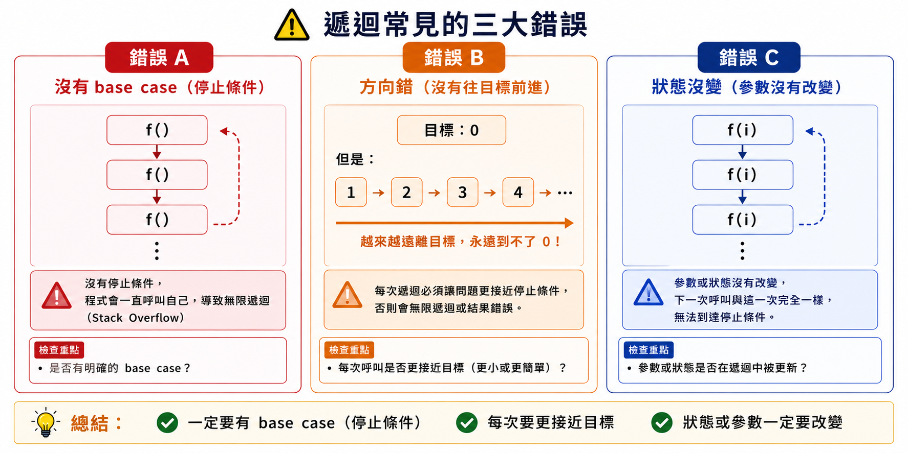
</p>


### 錯誤 1：完全沒有停止條件

```c
void f(void) {
    f();
}
```

---

### 錯誤 2：停止條件永遠到不了

```c
void f(int i) {
    if (i == 0) {
        return;
    }

    f(i + 1);
}
```

從正數開始會離 `0` 越來越遠。

---

### 錯誤 3：遞迴參數沒有改變

```c
void f(int i) {
    if (i == 10) {
        return;
    }

    f(i);
}
```

---

### 錯誤 4：停止條件差一個數字

題目要輸出 `1` 到 `3`，卻在：

```c
i >= 3
```

時立即返回，可能漏掉 `3`。

---

### 錯誤 5：把 `printf()` 放在錯誤位置

希望輸出 `3 2 1`，卻在遞迴前輸出：

```c
printf("%d\n", i);
recursive_call();
```

---

### 錯誤 6：有回傳值但漏寫 `return`

```c
sum(n - 1) + n;
```

不會自動成為目前函式的回傳值。

---

### 錯誤 7：停止值錯誤

連續整數和若寫：

```c
if (n == 1) {
    return 0;
}
```

則所有結果都會少 `1`。

---

### 錯誤 8：一般情況沒有縮小 `n`

錯誤：

```c
return sum_recursive(n) + n;
```

---

### 錯誤 9：樓梯題只提供一個停止值

若 `stairs(2)` 仍要計算：

```c
stairs(1) + stairs(0)
```

就必須另外定義 `stairs(0)`。

來源選擇直接提供：

```text
S(1) = 1
S(2) = 2
```

---

### 錯誤 10：忽略輸入前提

```c
if (n <= 2) {
    return n;
}
```

直接接受負數會得到沒有題目意義的結果。

---

### 錯誤 11：以為兩個遞迴呼叫會依公式同時計算

C 程式實際仍會依序評估函式呼叫。

概念公式可以看成兩個分支，但每一個分支都要真正完成。

---

### 錯誤 12：把重複計算誤認成錯誤答案

直接 `stairs()` 可能重複計算，但只要遞迴關係正確，結果仍然正確。

問題在效率，不一定在正確性。

---

### 錯誤 13：使用過大輸入測試線性遞迴

很深的呼叫層次可能超過可用呼叫空間。

先用小數值學習與測試。

---

### 錯誤 14：只看最終輸出，不追蹤呼叫層次

遞迴錯誤常藏在：

- 參數方向
- 停止時機
- 呼叫前後順序
- 回傳表示式

應畫出展開與返回。

---

## Section XIII. Mermaid 流程圖

### 1. 遞迴的一般流程

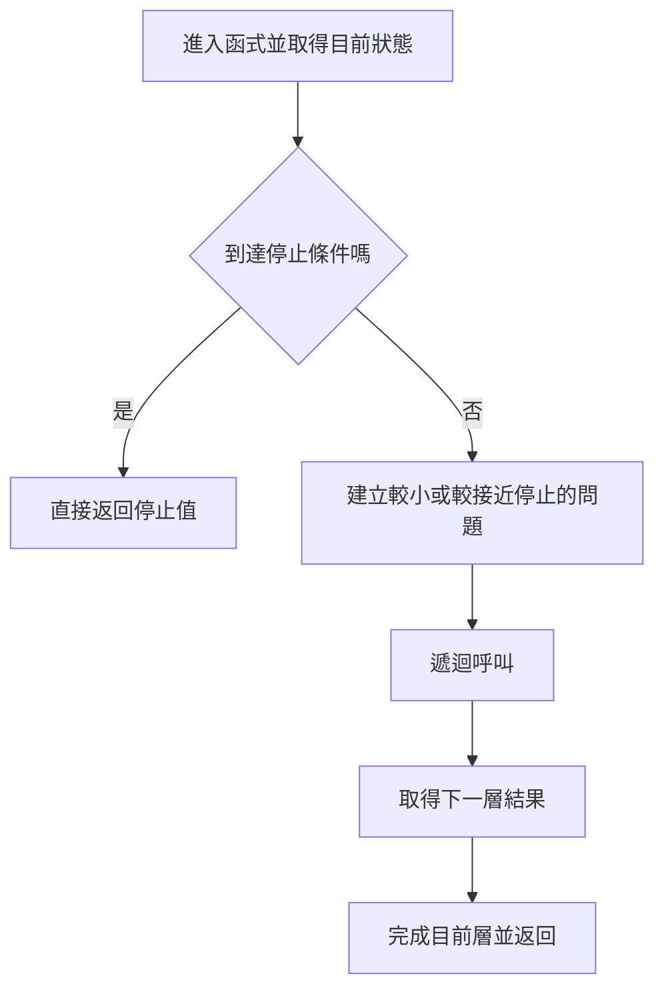
```mermaid
flowchart TD
    A[進入函式並取得目前狀態] --> B{到達停止條件嗎}
    B -- 是 --> C[直接返回停止值]
    B -- 否 --> D[建立較小或較接近停止的問題]
    D --> E[遞迴呼叫]
    E --> F[取得下一層結果]
    F --> G[完成目前層並返回]
```

---

### 2. 沒有停止條件的自我呼叫

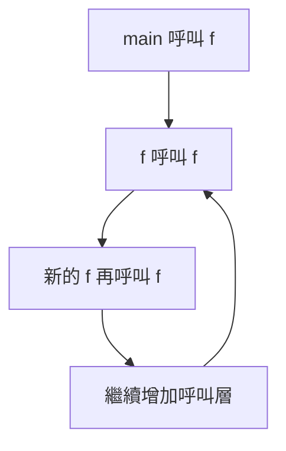
```mermaid
flowchart TD
    A[main 呼叫 f] --> B[f 呼叫 f]
    B --> C[新的 f 再呼叫 f]
    C --> D[繼續增加呼叫層]
    D --> B
```

---

### 3. `f(0)` 到 `f(2)`

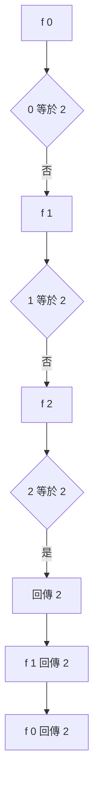
```mermaid
flowchart TD
    A[f 0] --> B{0 等於 2}
    B -- 否 --> C[f 1]
    C --> D{1 等於 2}
    D -- 否 --> E[f 2]
    E --> F{2 等於 2}
    F -- 是 --> G[回傳 2]
    G --> H[f 1 回傳 2]
    H --> I[f 0 回傳 2]
```

---

### 4. 正向數數字

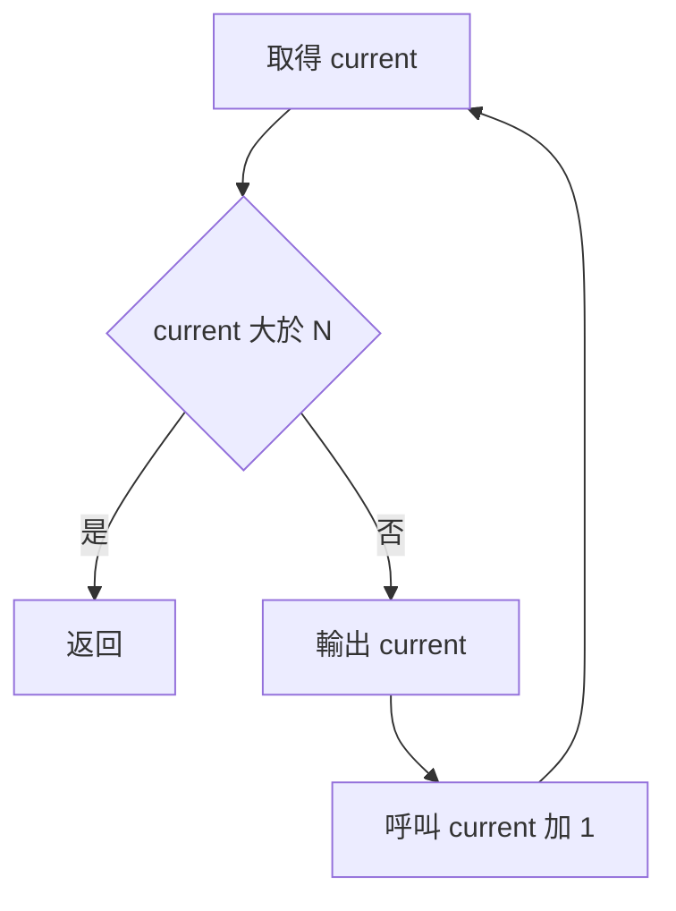
```mermaid
flowchart TD
    A[取得 current] --> B{current 大於 N}
    B -- 是 --> E[返回]
    B -- 否 --> C[輸出 current]
    C --> D[呼叫 current 加 1]
    D --> A
```

---

### 5. 返回時反向輸出

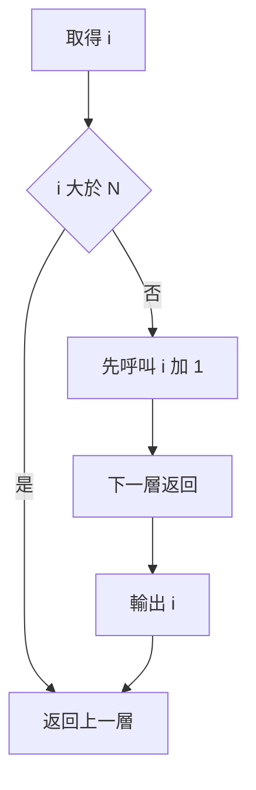
```mermaid
flowchart TD
    A[取得 i] --> B{i 大於 N}
    B -- 是 --> C[返回上一層]
    B -- 否 --> D[先呼叫 i 加 1]
    D --> E[下一層返回]
    E --> F[輸出 i]
    F --> C
```

---

### 6. 連續整數和

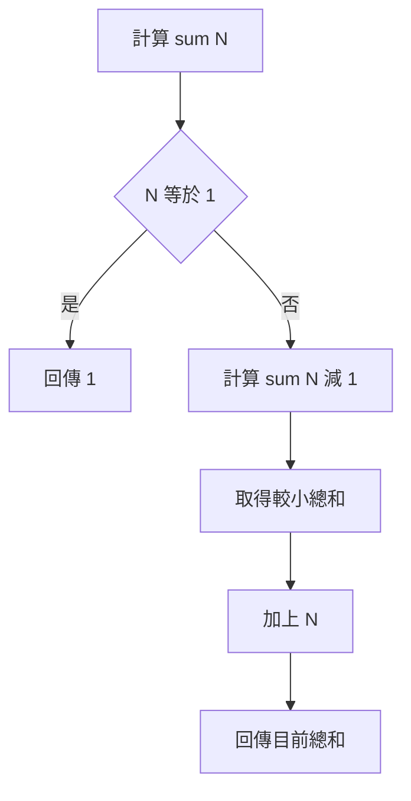
```mermaid
flowchart TD
    A[計算 sum N] --> B{N 等於 1}
    B -- 是 --> C[回傳 1]
    B -- 否 --> D[計算 sum N 減 1]
    D --> E[取得較小總和]
    E --> F[加上 N]
    F --> G[回傳目前總和]
```

---

### 7. `sum(4)` 展開與返回

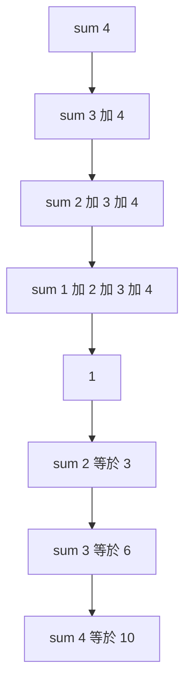
```mermaid
flowchart TD
    A[sum 4] --> B[sum 3 加 4]
    B --> C[sum 2 加 3 加 4]
    C --> D[sum 1 加 2 加 3 加 4]
    D --> E[1]
    E --> F[sum 2 等於 3]
    F --> G[sum 3 等於 6]
    G --> H[sum 4 等於 10]
```

---

### 8. 上樓梯遞迴

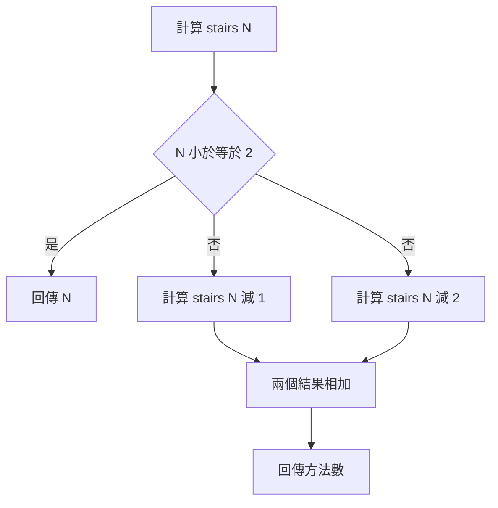
```mermaid
flowchart TD
    A[計算 stairs N] --> B{N 小於等於 2}
    B -- 是 --> C[回傳 N]
    B -- 否 --> D[計算 stairs N 減 1]
    B -- 否 --> E[計算 stairs N 減 2]
    D --> F[兩個結果相加]
    E --> F
    F --> G[回傳方法數]
```

---

### 9. `stairs(4)` 呼叫樹

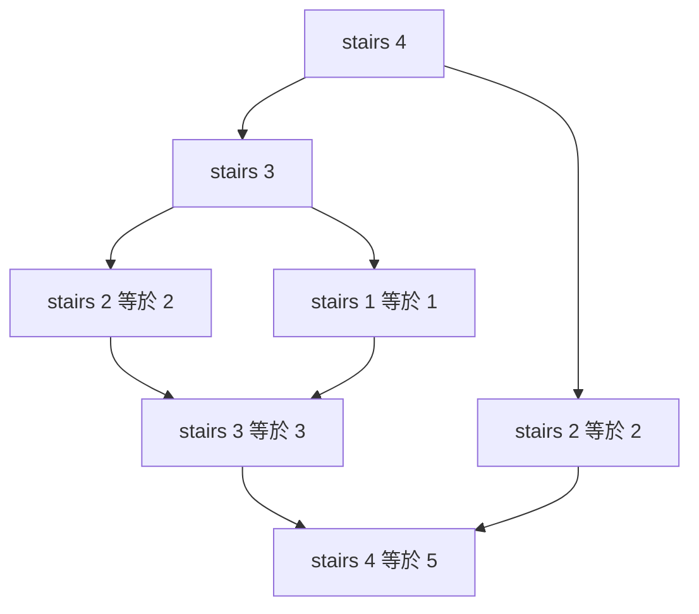
```mermaid
flowchart TD
    A[stairs 4] --> B[stairs 3]
    A --> C[stairs 2 等於 2]
    B --> D[stairs 2 等於 2]
    B --> E[stairs 1 等於 1]
    D --> F[stairs 3 等於 3]
    E --> F
    F --> G[stairs 4 等於 5]
    C --> G
```

---

## 本章完成標準

完成本章後，你應該能做到：

1. 說明函式遞迴的意思。
2. 辨認函式中的自我呼叫。
3. 說明沒有停止條件會發生什麼。
4. 找出遞迴函式的停止條件。
5. 找出遞迴函式的一般情況。
6. 確認每次呼叫是否接近停止條件。
7. 追蹤每一層不同的參數值。
8. 追蹤 `f(0)` 到 `f(2)` 的展開與返回。
9. 使用遞迴印出正向連續整數。
10. 使用遞迴印出反向連續整數。
11. 解釋呼叫前輸出與呼叫後輸出的差異。
12. 分辨展開階段與返回階段。
13. 將 `1` 到 `N` 的總和整理成函式。
14. 建立 `sum(N) = sum(N - 1) + N`。
15. 正確實作 `sum(1) = 1`。
16. 手動展開並計算 `sum(4)`。
17. 比較迴圈與遞迴總和版本。
18. 列出前幾階的樓梯走法。
19. 解釋最後走一階與最後走兩階的分類。
20. 建立 `S(N) = S(N - 1) + S(N - 2)`。
21. 正確實作 `S(1) = 1`、`S(2) = 2`。
22. 手動追蹤 `stairs(4)` 與 `stairs(5)`。
23. 辨認分支遞迴的重複子問題。
24. 處理來源題目要求的 `N >= 1`。
25. 找出無限遞迴、方向錯誤、停止值錯誤與漏寫 `return`。
26. 根據問題結構選擇遞迴或迴圈。
27. 準備進入下一章的一維陣列。
