# Lesson 14：One-Dimensional Arrays 一維陣列

> 這堂課的重點：使用一個陣列名稱管理多個相同資料型態的元素，透過索引讀取與修改個別元素，再結合迴圈完成循序存取、直接存取與次數統計。

---

## Section I. 今天要做什麼？

1. 理解為什麼程式需要陣列。
2. 認識陣列是一群具有相同資料型態的元素集合。
3. 知道同一個陣列的元素會使用一段連續的記憶體空間。
4. 分辨一般變數與陣列變數。
5. 正確宣告一維陣列。
6. 分辨元素資料型態、陣列名稱與元素個數。
7. 理解陣列索引從 `0` 開始。
8. 計算陣列的第一個索引與最後一個合法索引。
9. 使用 `array[index]` 存取單一元素。
10. 修改單一陣列元素的值。
11. 讓陣列元素參與指定、比較、累加與輸出。
12. 使用初始化串列設定陣列內容。
13. 理解部分初始化時，其餘元素會被設為 `0`。
14. 使用 `{0}` 將整個整數陣列初始化為 `0`。
15. 在提供初始化串列時省略元素個數。
16. 使用陣列取代多個用途相同的變數。
17. 使用 `for` 循序讀取陣列元素。
18. 使用 `for` 循序修改陣列元素。
19. 使用迴圈找出陣列中的最大值。
20. 將重複的輸出述句改寫成迴圈。
21. 理解循序存取與直接存取的差異。
22. 使用變數或表示式作為索引。
23. 將骰子點數 `1–6` 映射到索引 `0–5`。
24. 使用次數陣列統計一顆骰子的點數。
25. 將六個獨立計數器改寫成一個六元素陣列。
26. 將 `switch` 的六個分支簡化成一次陣列存取。
27. 使用商品編號直接取得價格。
28. 將商品編號 `1–5` 映射到價格索引 `0–4`。
29. 處理結束值 `0`，避免使用負索引。
30. 理解陣列越界的危險。
31. 認識兩顆骰子的點數和範圍是 `2–12`。
32. 將點數和 `2–12` 映射到索引 `0–10`。
33. 使用十一元素陣列統計兩顆骰子的點數和。
34. 使用總次數檢查統計結果是否合理。
35. 為下一章的陣列搜尋與統計建立基礎。

---

## Section II. 今天的學習方式

1. 先找出程式中用途相同、型態相同的一組變數。
2. 將這些變數整理成一個陣列。
3. 先畫出「索引」與「元素值」的對照表。
4. 每次使用索引前，先確認它落在合法範圍。
5. 固定從 `0` 開始循序處理陣列。
6. 迴圈條件優先寫成：

```c
index < length
```

7. 初始化計數陣列時，先將所有元素設為 `0`。
8. 遇到外部編號從 `1` 開始時，先找出它與索引的差值。
9. 使用小型資料手動追蹤，再執行大型統計。
10. 每完成一次統計後，檢查所有次數的總和。
11. 先保留來源教材中的逐步改寫過程，再整理成精簡版本。
12. 骰子範例中的 `rand()` 與 `srand()` 只作為既有工具使用；亂數原理會在後面的亂數章節正式學習。
13. 本章不正式教授陣列傳入函式、指標、陣列記憶體位址或排序演算法。

---

## Section III. 今天會學到的內容

| 主題 | 你需要知道的事 |
| --- | --- |
| 陣列 | 一群具有相同資料型態的元素集合 |
| 一維陣列 | 使用一個索引選取元素的陣列 |
| 元素資料型態 | 陣列中每個元素共同使用的型態 |
| 陣列名稱 | 代表整組元素的名稱 |
| 元素個數 | 宣告時保留多少個元素位置 |
| 索引 | 用來選取特定元素的整數編號 |
| 零起始索引 | 第一個元素的索引是 `0` |
| 合法索引 | 從 `0` 到 `length - 1` |
| 陣列元素 | 例如 `values[2]`，可以像一般變數使用 |
| 初始化串列 | 使用 `{...}` 提供元素初始值 |
| 部分初始化 | 未明確指定的剩餘元素會設為 `0` |
| 循序存取 | 依索引順序逐一處理元素 |
| 直接存取 | 根據已知索引直接取得某個元素 |
| 索引映射 | 將外部編號轉換成陣列合法索引 |
| 次數陣列 | 每個元素保存某一類結果的出現次數 |
| 累加 | 例如 `counter[index]++` |
| 越界 | 使用小於 `0` 或大於最後合法索引的位置 |
| 連續記憶體 | 同一陣列元素排列於一段連續的記憶體空間 |
| 驗證總數 | 所有分類次數相加應等於實驗總次數 |

---

## Section IV. 寫題目前的提醒

### 1. 陣列只能保存相同資料型態的元素

```c
int values[5];
```

這五個元素全部都是 `int`。

不能讓同一個 C 陣列中的部分元素是 `int`、另一部分是 `double`。

---

### 2. 宣告語法中的方括號表示元素個數

```c
int values[5];
```

代表建立五個整數元素，不是建立索引為 `5` 的單一元素。

---

### 3. 五個元素的索引是 `0–4`

```text
values[0]
values[1]
values[2]
values[3]
values[4]
```

沒有合法的：

```c
values[5]
```

---

### 4. 最後一個合法索引是元素個數減一

<p align="center">
  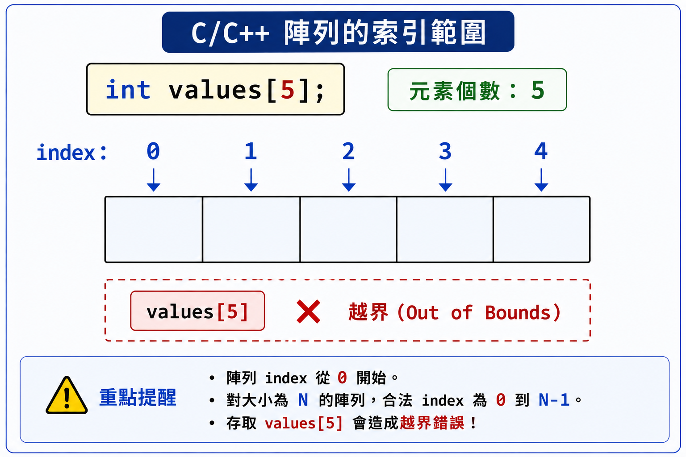
</p>


```text
最後索引 = length - 1
```

長度為 `6`：

```text
最後索引 = 5
```

---

### 5. 陣列元素可以像一般變數使用

```c
values[0] = 3;
values[1] = values[0] + 2;
printf("%d\n", values[1]);
```

`values[1]` 可以出現在指定的左邊，也可以出現在表示式中。

---

### 6. 未初始化的區域陣列內容不可靠

```c
int values[5];
```

若它是函式中的一般區域陣列，不能假設元素自動是 `0`。

使用前應明確設定或初始化。

---

### 7. 計數陣列一定要從 `0` 開始

```c
int counter[6] = {0};
```

每個元素代表目前出現次數。尚未開始統計時，全部應為 `0`。

---

### 8. 部分初始化會將剩餘元素設為 `0`

```c
int values[5] = {3, 5};
```

結果：

```text
values[0] = 3
values[1] = 5
values[2] = 0
values[3] = 0
values[4] = 0
```

---

### 9. `{0}` 不表示陣列只有一個元素

```c
int counter[6] = {0};
```

`6` 決定元素個數。

初始化串列只明確指定第一個元素為 `0`，其餘元素依初始化規則也會成為 `0`。

---

### 10. 有初始化串列時可以省略元素個數

```c
int prices[] = {90, 75, 83, 89, 71};
```

編譯器會依初始化值推得元素個數為 `5`。

下面則無法省略：

```c
int prices[];
```

因為編譯器不知道需要多少元素。

---

### 11. 循序存取通常從 `0` 開始

```c
for (i = 0; i < 5; i++) {
    printf("%d\n", values[i]);
}
```

不要習慣性從 `1` 開始，否則會漏掉第一個元素。

---

### 12. 陣列迴圈通常使用 `< length`

正確：

```c
for (i = 0; i < 5; i++)
```

錯誤：

```c
for (i = 0; i <= 5; i++)
```

後者會嘗試存取 `values[5]`。

---

### 13. 找最大值時，初始值應來自陣列

```c
int maximum = values[0];
```

不要固定寫：

```c
int maximum = 0;
```

如果陣列全部是負數，固定從 `0` 開始會得到錯誤結果。

---

### 14. 骰子點數與索引相差 `1`

骰子點數：

```text
1 2 3 4 5 6
```

陣列索引：

```text
0 1 2 3 4 5
```

轉換：

```c
index = dice - 1;
```

---

### 15. 輸出骰子次數時要做反向轉換

若索引是 `i`：

```c
printf("%d: %d\n", i + 1, counter[i]);
```

顯示給使用者的是骰子點數 `1–6`，不是內部索引 `0–5`。

---

### 16. 「隨機存取」不是「隨機產生索引」

隨機存取的重點是：

> 已知某個索引時，可以直接存取對應元素，不需要先讀過前面的元素。

例如：

```c
prices[id - 1]
```

商品編號決定要直接讀取哪個價格。

---

### 17. 直接使用索引前要確認編號合法

```c
if (id >= 1 && id <= 5) {
    total += prices[id - 1];
}
```

若 `id == 0` 時仍執行：

```c
total += prices[id - 1];
```

就會變成：

```c
prices[-1]
```

這是越界存取。

---

### 18. 結束值要在存取陣列之前處理

安全結構：

```c
while (1) {
    scanf("%d", &id);

    if (id == 0) {
        break;
    }

    if (id >= 1 && id <= 5) {
        total += prices[id - 1];
    }
}
```

---

### 19. 兩顆骰子的點數和不是 `1–12`

最小：

```text
1 + 1 = 2
```

最大：

```text
6 + 6 = 12
```

因此可能結果是：

```text
2, 3, 4, ..., 12
```

共有十一種。

---

### 20. 點數和與索引相差 `2`

點數和：

```text
2 3 4 ... 12
```

索引：

```text
0 1 2 ... 10
```

轉換：

```c
index = sum - 2;
```

---

## Section V. 核心概念說明

## Section V-A. 為什麼需要陣列？

### 1. 多個相同用途的變數

假設要保存三個整數：

```c
int a = 3;
int b = 5;
int c = 0;
```

這在數量很少時可以使用。

若要保存：

```text
100 個成績
6000 次骰子結果的分類
大量商品價格
```

就不適合建立：

```text
value1, value2, value3, ..., value100
```

---

### 2. 使用陣列整理同類資料

```c
int values[3];

values[0] = 3;
values[1] = 5;
values[2] = 0;
```

三個元素：

- 使用相同資料型態 `int`
- 使用相同陣列名稱 `values`
- 使用不同索引 `0`、`1`、`2`

---

### 3. 一般變數與陣列變數比較

<p align="center">
  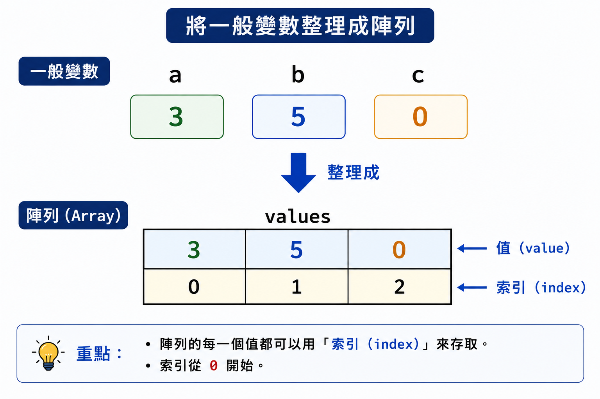
</p>


一般變數：

```c
int value;
```

只保存一個 `int`。

陣列變數：

```c
int values[3];
```

保存三個 `int` 元素。

---

### 4. 陣列元素使用連續的記憶體空間

<p align="center">
  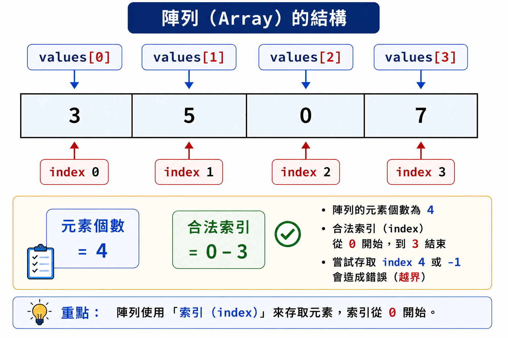
</p>


來源教材指出，同一個陣列會使用一段連續的記憶體空間保存元素。

概念圖：

```text
values[0]  values[1]  values[2]
+---------+---------+---------+
|    3    |    5    |    0    |
+---------+---------+---------+
```

目前只需要知道元素依順序排列；位址與指標會在後面的章節再深入。

---

## Section V-B. 一維陣列宣告與元素存取

### 5. 基本宣告語法

```c
元素資料型態 陣列變數名稱[元素個數];
```

範例：

```c
int values[3];
```

| 部分 | 內容 |
| --- | --- |
| 元素資料型態 | `int` |
| 陣列名稱 | `values` |
| 元素個數 | `3` |

---

### 6. 元素存取語法

```c
陣列變數名稱[元素索引];
```

範例：

```c
values[0] = 3;
values[1] = 5;
values[2] = 0;
```

---

### 7. 完整基本範例

```c
#include <stdio.h>

int main(void) {
    int values[3];

    values[0] = 3;
    values[1] = 5;
    values[2] = 0;

    printf("%d\n", values[0]);
    printf("%d\n", values[1]);
    printf("%d\n", values[2]);

    return 0;
}
```

輸出：

```text
3
5
0
```

---

### 8. 陣列元素參與運算

```c
#include <stdio.h>

int main(void) {
    int values[3] = {3, 5, 0};

    values[2] = values[0] + values[1];

    printf("%d\n", values[2]);

    return 0;
}
```

輸出：

```text
8
```

`values[2]` 與一般 `int` 變數一樣，可以被指定與輸出。

---

## Section V-C. 陣列初始化

### 9. 完整初始化

```c
int values[3] = {3, 5, 0};
```

對應：

```text
values[0] = 3
values[1] = 5
values[2] = 0
```

---

### 10. 部分初始化

```c
int values[5] = {3, 5};
```

結果：

```text
3, 5, 0, 0, 0
```

來源教材強調：初始化串列中沒有指定的剩餘元素會被設為 `0`。

---

### 11. 將全部元素初始化為零

<p align="center">
  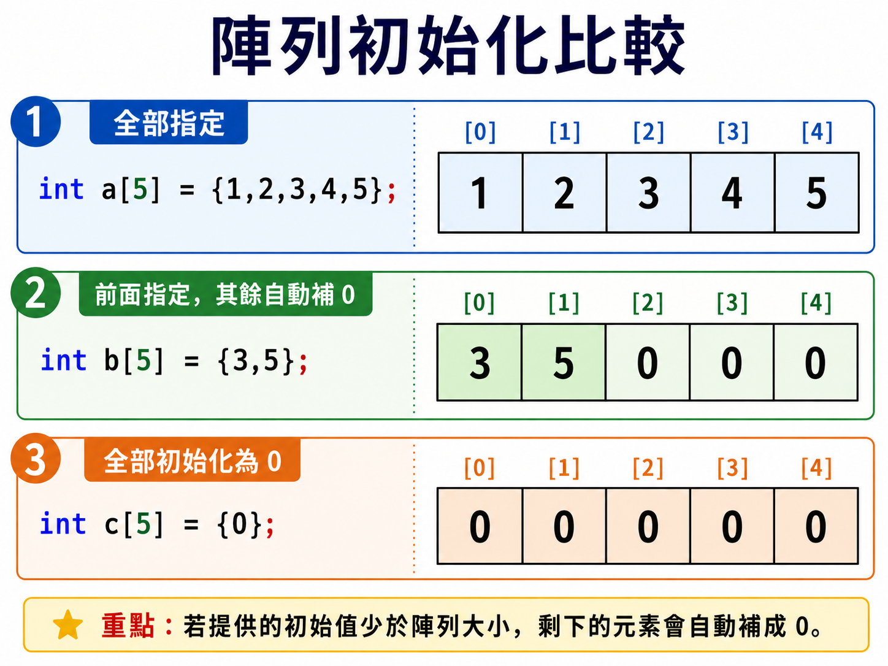
</p>


```c
int counter[6] = {0};
```

這是次數統計中非常常見的寫法。

對應：

```text
0, 0, 0, 0, 0, 0
```

---

### 12. 省略元素個數

```c
int prices[] = {90, 75, 83, 89, 71};
```

編譯器根據五個初始化值建立五元素陣列。

---

### 13. 修改初始化後的元素

```c
#include <stdio.h>

int main(void) {
    int values[4] = {3, 5, 0, 7};

    values[2] = 9;

    printf("%d %d %d %d\n",
           values[0], values[1], values[2], values[3]);

    return 0;
}
```

輸出：

```text
3 5 9 7
```

初始化只設定起始內容，之後仍可修改元素。

---

## Section V-D. 使用迴圈循序存取

### 14. 逐一輸出陣列

不使用迴圈：

```c
printf("%d\n", values[0]);
printf("%d\n", values[1]);
printf("%d\n", values[2]);
printf("%d\n", values[3]);
```

使用迴圈：

```c
for (i = 0; i < 4; i++) {
    printf("%d\n", values[i]);
}
```

---

### 15. 完整循序輸出程式

<p align="center">
  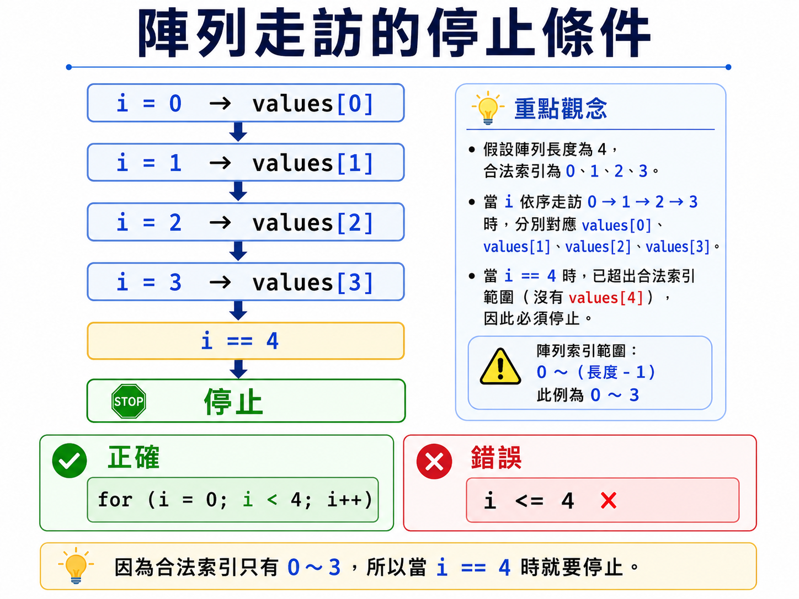
</p>


```c
#include <stdio.h>

int main(void) {
    int values[4] = {3, 5, 0, 7};
    int i;

    for (i = 0; i < 4; i++) {
        printf("values[%d] = %d\n", i, values[i]);
    }

    return 0;
}
```

---

### 16. 使用迴圈讀入元素

```c
#include <stdio.h>

int main(void) {
    int values[5];
    int i;

    for (i = 0; i < 5; i++) {
        printf("values[%d] = ", i);
        scanf("%d", &values[i]);
    }

    for (i = 0; i < 5; i++) {
        printf("%d ", values[i]);
    }

    printf("\n");

    return 0;
}
```

`scanf()` 仍需要 `&`：

```c
&values[i]
```

---

### 17. 使用迴圈修改全部元素

```c
#include <stdio.h>

int main(void) {
    int values[5] = {1, 2, 3, 4, 5};
    int i;

    for (i = 0; i < 5; i++) {
        values[i] = values[i] * 2;
    }

    for (i = 0; i < 5; i++) {
        printf("%d ", values[i]);
    }

    printf("\n");

    return 0;
}
```

輸出：

```text
2 4 6 8 10
```

---

### 18. 使用迴圈找最大值

來源教材先使用獨立變數比較，再改用陣列與迴圈。

```c
#include <stdio.h>

int main(void) {
    int values[4] = {3, 5, 0, 7};
    int maximum = values[0];
    int i;

    for (i = 1; i < 4; i++) {
        if (values[i] > maximum) {
            maximum = values[i];
        }
    }

    printf("Max: %d\n", maximum);

    return 0;
}
```

為什麼從 `i = 1` 開始？

因為：

```c
maximum = values[0];
```

第一個元素已經作為初始最大值，不必再與自己比較。

---

### 19. 追蹤最大值

<p align="center">
  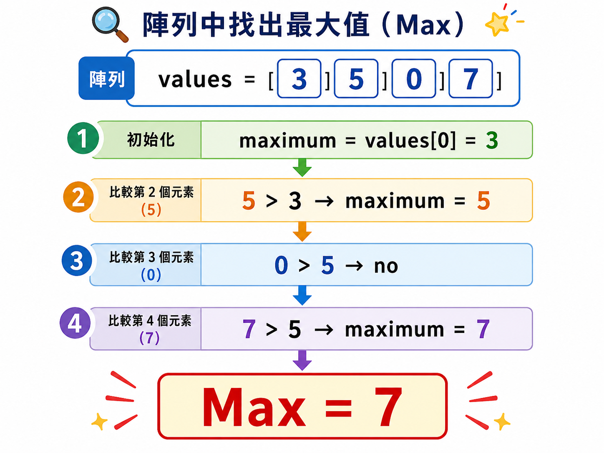
</p>


陣列：

```text
3, 5, 0, 7
```

| `i` | `values[i]` | 比較前 `maximum` | 比較後 `maximum` |
| ---: | ---: | ---: | ---: |
| 初始 | 3 | - | 3 |
| 1 | 5 | 3 | 5 |
| 2 | 0 | 5 | 5 |
| 3 | 7 | 5 | 7 |

---

## Section V-E. 一顆骰子的次數統計：沒有陣列

### 20. 題目

模擬擲六千次公正骰子，分別顯示點數 `1–6` 出現的次數。

最直接的版本建立六個計數器：

```c
int counter1 = 0;
int counter2 = 0;
int counter3 = 0;
int counter4 = 0;
int counter5 = 0;
int counter6 = 0;
```

每次擲骰子後使用 `switch` 增加對應變數。

---

### 21. 六個獨立變數版本

```c
#include <stdio.h>
#include <stdlib.h>
#include <time.h>

int main(void) {
    int counter1 = 0;
    int counter2 = 0;
    int counter3 = 0;
    int counter4 = 0;
    int counter5 = 0;
    int counter6 = 0;
    int i;

    srand((unsigned int)time(NULL));

    for (i = 1; i <= 6000; i++) {
        int dice = rand() % 6 + 1;

        switch (dice) {
            case 1: counter1++; break;
            case 2: counter2++; break;
            case 3: counter3++; break;
            case 4: counter4++; break;
            case 5: counter5++; break;
            case 6: counter6++; break;
        }
    }

    printf("1: %d\n", counter1);
    printf("2: %d\n", counter2);
    printf("3: %d\n", counter3);
    printf("4: %d\n", counter4);
    printf("5: %d\n", counter5);
    printf("6: %d\n", counter6);

    return 0;
}
```

這個版本能工作，但：

- 有六個用途相同的變數
- 有六個相似的 `case`
- 有六個相似的 `printf()`
- 若分類數量增加，程式會快速變長

---

## Section V-F. 使用陣列統計一顆骰子

<p align="center">
  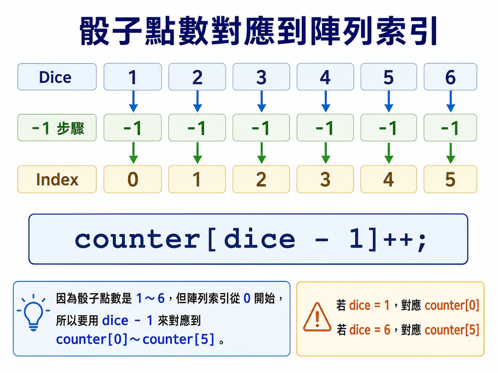
</p>


### 22. 將六個變數改成六元素陣列

```c
int counter[6] = {0};
```

對照：

| 骰子點數 | 陣列元素 |
| ---: | --- |
| 1 | `counter[0]` |
| 2 | `counter[1]` |
| 3 | `counter[2]` |
| 4 | `counter[3]` |
| 5 | `counter[4]` |
| 6 | `counter[5]` |

---

### 23. 先保留 `switch`，只替換計數器

```c
switch (dice) {
    case 1: counter[0]++; break;
    case 2: counter[1]++; break;
    case 3: counter[2]++; break;
    case 4: counter[3]++; break;
    case 5: counter[4]++; break;
    case 6: counter[5]++; break;
}
```

這一步先將資料整理成陣列，但仍保留原本的控制流程。

---

### 24. 使用規律消除 `switch`

觀察：

```text
點數 1 → 索引 0
點數 2 → 索引 1
...
點數 6 → 索引 5
```

因此：

```c
counter[dice - 1]++;
```

一行可以取代六個 `case`。

---

### 25. 使用迴圈輸出六個次數

```c
for (i = 0; i < 6; i++) {
    printf("%d: %d\n", i + 1, counter[i]);
}
```

一個迴圈取代六個 `printf()`。

---

### 26. 完整陣列版本

<p align="center">
  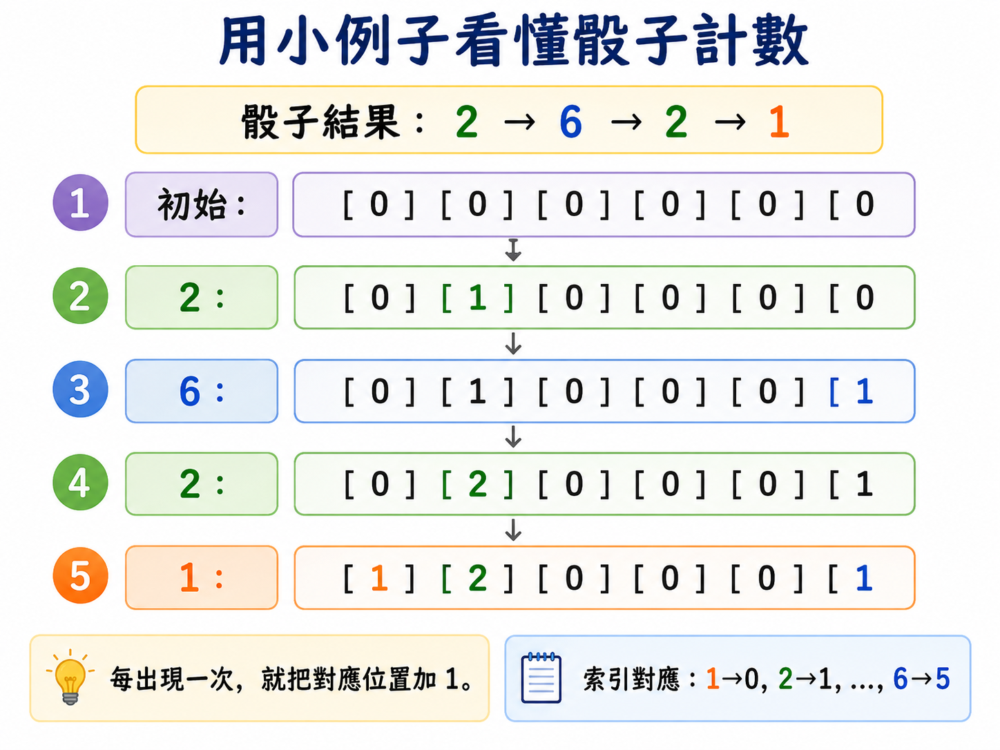
</p>


```c
#include <stdio.h>
#include <stdlib.h>
#include <time.h>

int main(void) {
    int counter[6] = {0};
    int i;

    srand((unsigned int)time(NULL));

    for (i = 0; i < 6000; i++) {
        int dice = rand() % 6 + 1;
        counter[dice - 1]++;
    }

    for (i = 0; i < 6; i++) {
        printf("%d: %d\n", i + 1, counter[i]);
    }

    return 0;
}
```

---

### 27. 驗證總次數

可以將所有次數相加：

```c
int total = 0;

for (i = 0; i < 6; i++) {
    total += counter[i];
}
```

結果應為：

```text
6000
```

若不是，代表某些結果可能沒有被正確統計。

---

## Section V-G. 循序存取與直接存取

<p align="center">
  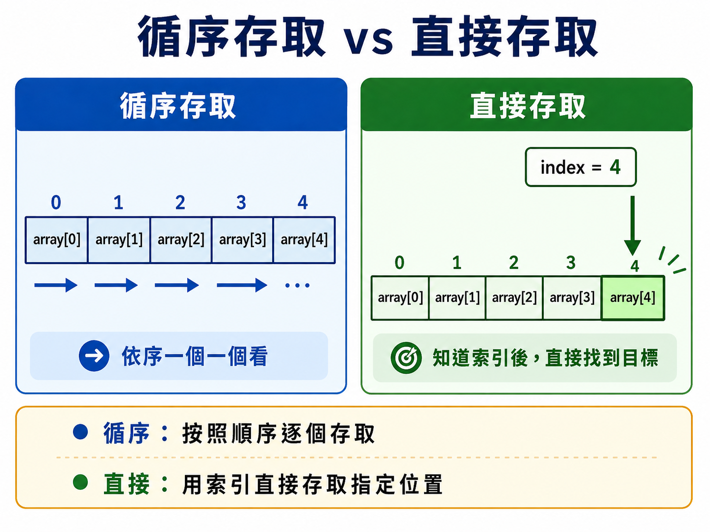
</p>


### 28. 循序存取

```c
for (i = 0; i < 6; i++) {
    printf("%d\n", counter[i]);
}
```

依序處理：

```text
counter[0], counter[1], ..., counter[5]
```

---

### 29. 直接存取

```c
printf("%d\n", counter[4]);
```

直接取得索引 `4` 的元素，不需要先存取 `counter[0]` 到 `counter[3]`。

索引也可以來自變數：

```c
int index = 4;
printf("%d\n", counter[index]);
```

或表示式：

```c
counter[dice - 1]++;
```

---

### 30. 直接存取的條件

使用直接存取前，要能回答：

1. 索引如何計算？
2. 最小可能索引是多少？
3. 最大可能索引是多少？
4. 陣列是否有足夠元素？

骰子：

```text
dice = 1..6
index = dice - 1
index = 0..5
counter 長度 = 6
```

因此合法。

---

## Section V-H. 商品編號與價格陣列

<p align="center">
  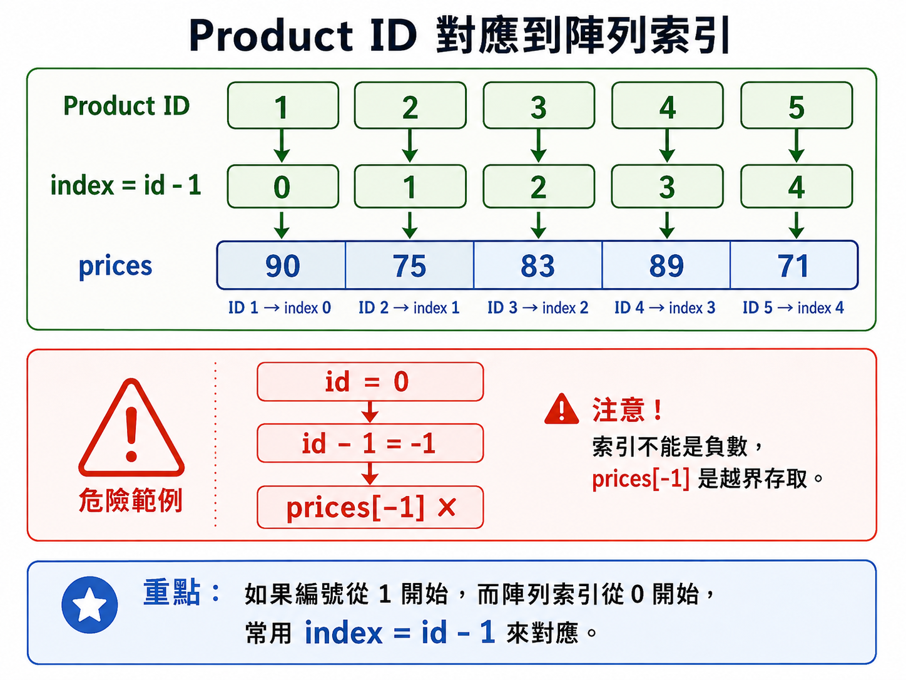
</p>


### 31. 題目

商品表：

| 編號 | 價格 |
| ---: | ---: |
| 1 | 90 |
| 2 | 75 |
| 3 | 83 |
| 4 | 89 |
| 5 | 71 |

使用者連續輸入商品編號，輸入 `0` 時結束，最後輸出總金額。

來源教材先使用 `switch`，再逐步改寫成價格陣列的直接存取。

---

### 32. 價格陣列

```c
int prices[5] = {90, 75, 83, 89, 71};
```

對照：

| 商品編號 | 索引 | 價格元素 |
| ---: | ---: | --- |
| 1 | 0 | `prices[0]` |
| 2 | 1 | `prices[1]` |
| 3 | 2 | `prices[2]` |
| 4 | 3 | `prices[3]` |
| 5 | 4 | `prices[4]` |

公式：

```c
index = id - 1;
```

---

### 33. 從 `switch` 到陣列

使用陣列但仍保留 `switch`：

```c
switch (id) {
    case 1: total += prices[0]; break;
    case 2: total += prices[1]; break;
    case 3: total += prices[2]; break;
    case 4: total += prices[3]; break;
    case 5: total += prices[4]; break;
}
```

進一步觀察規律：

```c
total += prices[id - 1];
```

---

### 34. 為什麼不能直接在 `do-while` 中無條件存取？

危險版本：

```c
scanf("%d", &id);
total += prices[id - 1];
```

當輸入結束值 `0`：

```text
id - 1 = -1
```

會存取陣列範圍外的位置。

---

### 35. 安全的商品總額程式

```c
#include <stdio.h>

int main(void) {
    int prices[] = {90, 75, 83, 89, 71};
    int total = 0;
    int id;

    while (1) {
        scanf("%d", &id);

        if (id == 0) {
            break;
        }

        if (id >= 1 && id <= 5) {
            total += prices[id - 1];
        } else {
            printf("Invalid product ID.\n");
        }
    }

    printf("Total: %d\n", total);

    return 0;
}
```

輸入：

```text
1
5
5
4
0
```

總金額：

```text
90 + 71 + 71 + 89 = 321
```

---

### 36. 陣列讓擴充更集中

加入第六個商品，價格 `42`：

```c
int prices[] = {90, 75, 83, 89, 71, 42};
```

接著將合法編號範圍改成 `1–6`。

若使用多個硬編碼 `case`，每增加商品就要再增加一個分支。

---

## Section V-I. 兩顆骰子的點數和統計

### 37. 題目

模擬擲十萬次公正骰子，每次擲兩顆，統計各種點數和出現的次數。

---

### 38. 可能的點數和

```text
2, 3, 4, 5, 6, 7, 8, 9, 10, 11, 12
```

共有：

```text
12 - 2 + 1 = 11 種
```

因此建立：

```c
int counter[11] = {0};
```

---

### 39. 點數和映射到索引

<p align="center">
  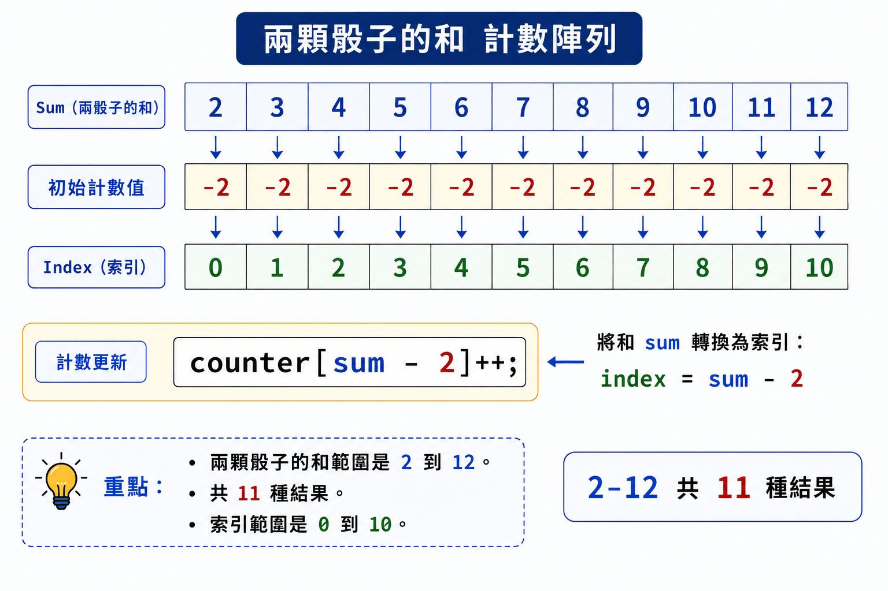
</p>


| 點數和 | 索引 |
| ---: | ---: |
| 2 | 0 |
| 3 | 1 |
| 4 | 2 |
| ... | ... |
| 12 | 10 |

公式：

```c
index = sum - 2;
```

統計：

```c
counter[sum - 2]++;
```

---

### 40. 完整程式

```c
#include <stdio.h>
#include <stdlib.h>
#include <time.h>

int main(void) {
    int counter[11] = {0};
    int i;

    srand((unsigned int)time(NULL));

    for (i = 0; i < 100000; i++) {
        int dice1 = rand() % 6 + 1;
        int dice2 = rand() % 6 + 1;
        int sum = dice1 + dice2;

        counter[sum - 2]++;
    }

    for (i = 0; i < 11; i++) {
        printf("%d: %d\n", i + 2, counter[i]);
    }

    return 0;
}
```

---

### 41. 驗證兩骰統計總數

```c
int total = 0;

for (i = 0; i < 11; i++) {
    total += counter[i];
}
```

結果應為：

```text
100000
```

---

### 42. 為什麼不同點數和的次數不相同？

來源的執行畫面顯示，靠近 `7` 的點數和通常出現較多次，`2` 與 `12` 通常較少。

可以從組合數理解：

```text
2  = 1 + 1
7  = 1 + 6, 2 + 5, 3 + 4, 4 + 3, 5 + 2, 6 + 1
12 = 6 + 6
```

本章的程式重點仍是：

- 選擇正確陣列長度
- 正確映射索引
- 正確累加與輸出

---

## Section V-J. 容易搞混的重點

### 43. 元素個數與最大索引不同

```c
int values[6];
```

- 元素個數：`6`
- 最大索引：`5`

---

### 44. 方括號中的數字在不同位置意義不同

宣告：

```c
int values[6];
```

`6` 表示元素個數。

存取：

```c
values[5]
```

`5` 表示索引。

---

### 45. `counter[dice]` 不符合六元素設計

骰子可能是 `6`：

```c
counter[6]
```

但六元素陣列最後索引是 `5`。

因此要使用：

```c
counter[dice - 1]
```

---

### 46. `counter[i - 1]` 需要配合 `i = 1..6`

來源教材有一種輸出寫法：

```c
for (i = 1; i <= 6; i++) {
    printf("%d: %d\n", i, counter[i - 1]);
}
```

也可以使用更典型的零起始版本：

```c
for (i = 0; i < 6; i++) {
    printf("%d: %d\n", i + 1, counter[i]);
}
```

兩者映射相同。

---

### 47. 循序存取不代表只能正向

可以正向：

```c
for (i = 0; i < length; i++)
```

也可以反向：

```c
for (i = length - 1; i >= 0; i--)
```

只要依某種順序逐一處理元素，都屬於循序處理。

---

### 48. 直接存取不等於不需要檢查

```c
prices[id - 1]
```

很精簡，但只有在 `id` 合法時才安全。

程式長度減少不能取代範圍驗證。

---

### 49. `0` 可以是合法元素值，也可以是控制值

計數陣列中的：

```text
0
```

表示目前次數為零。

商品輸入中的：

```text
0
```

表示結束輸入。

同一個數值的意義由使用情境决定。

---

### 50. 兩顆骰子需要十一元素，不是十二元素

點數和範圍為 `2–12`，包含十一種結果。

可以选擇：

```c
int counter[11];
counter[sum - 2]++;
```

來源使用的就是這種緊密映射設計。

---

## Section VI. 快速概念檢查

### Q1. 什麼是陣列？

<details>
<summary>查看答案</summary>

一群具有相同資料型態元素的集合的資料型態。

</details>

---

### Q2. `int values[5];` 有幾個元素？

<details>
<summary>查看答案</summary>

五個。

</details>

---

### Q3. `int values[5];` 的合法索引是什麼？

<details>
<summary>查看答案</summary>

```text
0, 1, 2, 3, 4
```

</details>

---

### Q4. 如何存取第三個元素？

<details>
<summary>查看答案</summary>

```c
values[2]
```

因為索引從 `0` 開始。

</details>

---

### Q5. `int values[4] = {7};` 的內容是什麼？

<details>
<summary>查看答案</summary>

```text
7, 0, 0, 0
```

</details>

---

### Q6. 為什麼計數陣列常寫成 `{0}`？

<details>
<summary>查看答案</summary>

統計尚未開始時，每一類結果的出現次數都應為 `0`。

</details>

---

### Q7. 遍歷五元素陣列的典型條件是什麼？

<details>
<summary>查看答案</summary>

```c
for (i = 0; i < 5; i++)
```

</details>

---

### Q8. 骰子點數 `4` 對應 `counter` 的哪個索引？

<details>
<summary>查看答案</summary>

```text
4 - 1 = 3
```

因此是：

```c
counter[3]
```

</details>

---

### Q9. 商品編號 `5` 對應哪個價格元素？

<details>
<summary>查看答案</summary>

```c
prices[4]
```

</details>

---

### Q10. 為什麼輸入商品編號 `0` 時不能存取 `prices[id - 1]`？

<details>
<summary>查看答案</summary>

因為會變成 `prices[-1]`，超出陣列合法索引範圍。

</details>

---

### Q11. 兩顆骰子的點數和有几種？

<details>
<summary>查看答案</summary>

從 `2` 到 `12`，共有十一種。

</details>

---

### Q12. 點數和 `10` 對應十一元素陣列的哪個索引？

<details>
<summary>查看答案</summary>

```text
10 - 2 = 8
```

因此是：

```c
counter[8]
```

</details>

---

## Section VII. 程式閱讀練習

### 題目 1：索引與元素

```c
int values[4] = {8, 3, 6, 1};

printf("%d\n", values[0]);
printf("%d\n", values[3]);
```

<details>
<summary>查看答案</summary>

```text
8
1
```

</details>

---

### 題目 2：修改元素

```c
int values[3] = {2, 4, 6};

values[1] = values[0] + values[2];
```

<details>
<summary>查看答案</summary>

最終內容：

```text
2, 8, 6
```

</details>

---

### 題目 3：部分初始化

```c
int values[5] = {9, 7};
```

<details>
<summary>查看答案</summary>

```text
9, 7, 0, 0, 0
```

</details>

---

### 題目 4：迴圈輸出

```c
int values[4] = {1, 3, 5, 7};
int i;

for (i = 0; i < 4; i++) {
    printf("%d ", values[i]);
}
```

<details>
<summary>查看答案</summary>

```text
1 3 5 7
```

</details>

---

### 題目 5：越界

```c
int values[4] = {1, 2, 3, 4};
printf("%d\n", values[4]);
```

<details>
<summary>查看答案</summary>

`values[4]` 超出合法範圍 `0–3`。程式行為不可靠，不能使用該元素。

</details>

---

### 題目 6：骰子映射

```c
int dice = 6;
int index = dice - 1;
```

<details>
<summary>查看答案</summary>

```text
index = 5
```

六元素陣列的索引 `5` 合法。

</details>

---

### 題目 7：統計追踪

初始：

```c
int counter[6] = {0};
```

骰子結果依序：

```text
2, 6, 2, 1
```

每次執行：

```c
counter[dice - 1]++;
```

<details>
<summary>查看答案</summary>

最終：

```text
counter[0] = 1
counter[1] = 2
counter[2] = 0
counter[3] = 0
counter[4] = 0
counter[5] = 1
```

</details>

---

### 題目 8：兩骰映射

兩顆骰子分別為：

```text
4 與 6
```

<details>
<summary>查看答案</summary>

點數和：

```text
10
```

索引：

```text
10 - 2 = 8
```

應增加：

```c
counter[8]++;
```

</details>

---

## Section VIII. 實作練習 / 實作检測題

### TODO 1：建立與輸出陣列

建立：

```c
int values[5] = {4, 8, 15, 16, 23};
```

逐一輸出索引與元素值。

---

### TODO 2：讀入五個整數

使用一個五元素陣列與兩個 `for`：

1. 第一個迴圈讀入。
2. 第二個迴圈輸出。

---

### TODO 3：所有元素加一

將：

```text
2, 4, 6, 8
```

改成：

```text
3, 5, 7, 9
```

---

### TODO 4：陣列總和

計算五元素整數陣列的總和。

---

### TODO 5：陣列平均

計算總和後，輸出浮點數平均。

注意避免整數除法。

---

### TODO 6：找最大值

使用：

```c
maximum = values[0];
```

再從索引 `1` 開始比較。

---

### TODO 7：找最小值

將最大值程式改寫成最小值程式。

---

### TODO 8：反向輸出

由最後一個合法索引開始，將陣列反向輸出。

---

### TODO 9：統計一颗骰子

模拟六千次骰子，使用：

```c
int counter[6] = {0};
```

與：

```c
counter[dice - 1]++;
```

---

### TODO 10：驗證骰子總次數

將六個次數相加，确認結果為 `6000`。

---

### TODO 11：商品總额

使用價格陣列：

```c
int prices[] = {90, 75, 83, 89, 71};
```

輸入商品編號，輸入 `0` 結束。

必须驗證編號範圍。

---

### TODO 12：擴充第六個商品

將第六個商品價格 `42` 加入陣列，並让編號 `6` 可以正常购买。

---

### TODO 13：兩顆骰子點數和

模拟十萬次，每次兩顆骰子，使用十一元素次數陣列。

---

### TODO 14：驗證兩骰總次數

將十一個次數加總，确認結果為 `100000`。

---

### TODO 15：手動分類統計

不使用乱數。連續輸入十個 `1–6` 的整數，把它们當成骰子結果，統計各點數次數。

輸入前要驗證範圍，避免非法索引。

---

## Section IX. 做題時可以使用的提示

### 1. 先画索引表

```text
索引： 0  1  2  3  4
元素： ?  ?  ?  ?  ?
```

每次執行後更新表格。

---

### 2. 外部編號從 1 開始時尋找差值

```text
編號：1 2 3 4 5
索引：0 1 2 3 4
```

差值固定為 `1`：

```c
index = id - 1;
```

---

### 3. 外部結果從 2 開始時尋找差值

```text
結果：2 3 4 ... 12
索引：0 1 2 ... 10
```

差值固定為 `2`：

```c
index = sum - 2;
```

---

### 4. 計算陣列長度時先數結果種類

包含上下界的整數數量：

```text
maximum - minimum + 1
```

點數和：

```text
12 - 2 + 1 = 11
```

---

### 5. 懷疑越界時寫出索引範圍

```text
陣列長度：5
合法索引：0..4
目前索引：id - 1
```

再代入 `id` 的最小值與最大值。

---

### 6. 次數統計後做總和檢查

```text
所有分類次數之和 = 輸入或模拟總次數
```

這是很有效的除錯方法。

---

### 7. 找最大或最小時不要固定用零初始化

```c
maximum = values[0];
minimum = values[0];
```

能正确處理全負數陣列。

---

### 8. 將重複程式改成索引规律

看到：

```c
counter[0]++;
counter[1]++;
counter[2]++;
```

先问：

```text
是哪一個數值决定索引？
它與索引相差多少？
```

---

## Section X. 課後小練習

### 練習 1：平方表

建立十元素陣列，使：

```text
values[0] = 1²
values[1] = 2²
...
values[9] = 10²
```

---

### 練習 2：偶數陣列

使用迴圈產生：

```text
2, 4, 6, ..., 20
```

---

### 練習 3：複制為兩倍

讀取五個整數，將每個元素乘以 `2` 後輸出。

---

### 練習 4：統計成績等級

輸入十個 `0–100` 的成績，使用五元素陣列統計：

```text
0–59
60–69
70–79
80–89
90–100
```

先設計成績到索引的映射與邊界判斷。

---

### 練習 5：商品銷售次數

商品編號為 `1–5`，輸入 `0` 結束。

除了總金额，再使用五元素陣列統計每種商品购买次數。

---

### 練習 6：兩骰和的最高次數

完成兩骰統計後，使用循序存取找出出現次數最多的點數和。

完整的眾數與統計分析會在下一章深化。

---

### 練習 7：檢查指定索引

輸入一個索引。若索引合法，輸出元素；否則顯示錯誤訊息。

---

### 練習 8：比較直接與循序存取

使用商品價格陣列完成兩種版本：

1. 由商品編號直接存取。
2. 使用迴圈尋找相同編號後存取。

比較程式結构。

---

## Section XI. 重點複習

1. 陣列保存多個相同資料型態的元素。
2. 同一陣列元素使用一段連續的記憶体空間。
3. 一維陣列使用一個索引选取元素。
4. 宣告语法包含元素型態、陣列名稱與元素個數。
5. 第一個元素索引是 `0`。
6. 長度為 `N` 的陣列最後索引是 `N - 1`。
7. 陣列元素可以像一般變數參與运算。
8. 初始化串列使用大括號。
9. 部分初始化時，其餘元素會成為 `0`。
10. `{0}` 常用於將計數陣列全部初始化為零。
11. 有初始化串列時，可以省略元素個數。
12. 循序存取使用迴圈逐一處理元素。
13. 典型範圍是 `i = 0; i < length; i++`。
14. 找最大值時可以從第一個元素開始初始化。
15. 陣列可以取代大量用途相同的獨立變數。
16. 骰子點數 `1–6` 映射到索引 `0–5`。
17. 轉換公式是 `dice - 1`。
18. `counter[dice - 1]++` 能直接增加對應次數。
19. 使用迴圈可以輸出全部次數。
20. 随機存取表示根據索引直接取得元素。
21. 商品編號 `1–5` 映射到 `prices[0–4]`。
22. 轉換公式是 `id - 1`。
23. 結束值 `0` 必须在陣列存取前處理。
24. 陣列越界可能造成不可预測結果。
25. 兩顆骰子的點數和範圍是 `2–12`。
26. 十一種點數和需要十一元素陣列。
27. 點數和映射公式是 `sum - 2`。
28. 所有統計次數相加應等於實驗總次數。
29. 直接索引虽精簡，仍必须驗證範圍。
30. 下一章會使用陣列完成更多查询、最大值、最接近值、長條圖與眾數问題。

---

## Section XII. 常見錯誤提醒

<p align="center">
  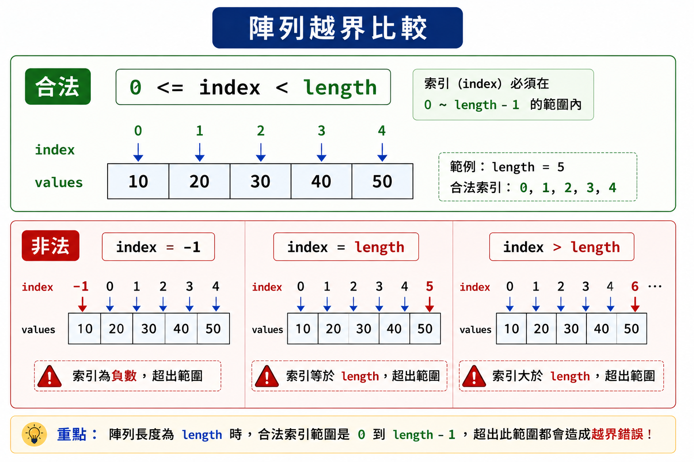
</p>


### 錯誤 1：把元素個數當成合法索引

```c
int values[5];
values[5] = 10;
```

合法最後索引是 `4`。

---

### 錯誤 2：迴圈條件使用 `<= length`

```c
for (i = 0; i <= 5; i++)
```

會多處理一次索引 `5`。

---

### 錯誤 3：從索引 `1` 開始遍歷

```c
for (i = 1; i < 5; i++)
```

會漏掉 `values[0]`。

---

### 錯誤 4：沒有初始化計數陣列

```c
int counter[6];
counter[dice - 1]++;
```

元素起始內容不可靠。

---

### 錯誤 5：骰子點數直接作為六元素索引

```c
counter[dice]++;
```

當 `dice == 6` 時越界。

---

### 錯誤 6：輸出標签與索引混淆

```c
printf("%d: %d\n", i, counter[i]);
```

若 `i` 從 `0` 開始，標签會顯示 `0–5`，不是點數 `1–6`。

應顯示：

```c
i + 1
```

---

### 錯誤 7：找最大值固定從 `0` 開始

全負數陣列會錯誤地保留 `0`。

---

### 錯誤 8：商品結束值被用於索引

```c
id = 0;
total += prices[id - 1];
```

會產生負索引。

---

### 錯誤 9：只檢查上限，沒有檢查下限

```c
if (id <= 5)
```

負數也可能通過。

應檢查：

```c
id >= 1 && id <= 5
```

---

### 錯誤 10：兩骰陣列使用十個元素

點數和有十一種，因此十元素陣列不足。

---

### 錯誤 11：兩骰映射減一

```c
counter[sum - 1]++;
```

點數和 `12` 會對應索引 `11`，超出十一元素陣列的 `0–10`。

正确：

```c
counter[sum - 2]++;
```

---

### 錯誤 12：輸入元素時漏掉 `&`

錯誤：

```c
scanf("%d", values[i]);
```

正确：

```c
scanf("%d", &values[i]);
```

---

### 錯誤 13：省略元素個數却沒有初始化串列

```c
int values[];
```

編譯器无法推得長度。

---

### 錯誤 14：認為直接存取一定比迴圈安全

直接存取減少程式码，但錯誤索引仍然會越界。

---

## Section XIII. Mermaid 流程圖

### 1. 陣列索引關系

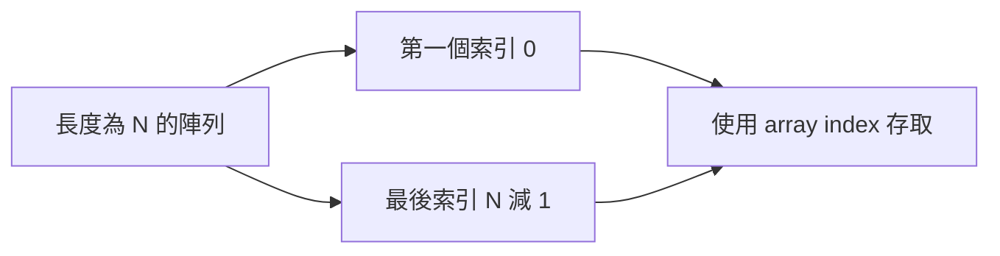
```mermaid
flowchart LR
    A[長度為 N 的陣列] --> B[第一個索引 0]
    A --> C[最後索引 N 減 1]
    B --> D[使用 array index 存取]
    C --> D
```

---

### 2. 循序存取陣列

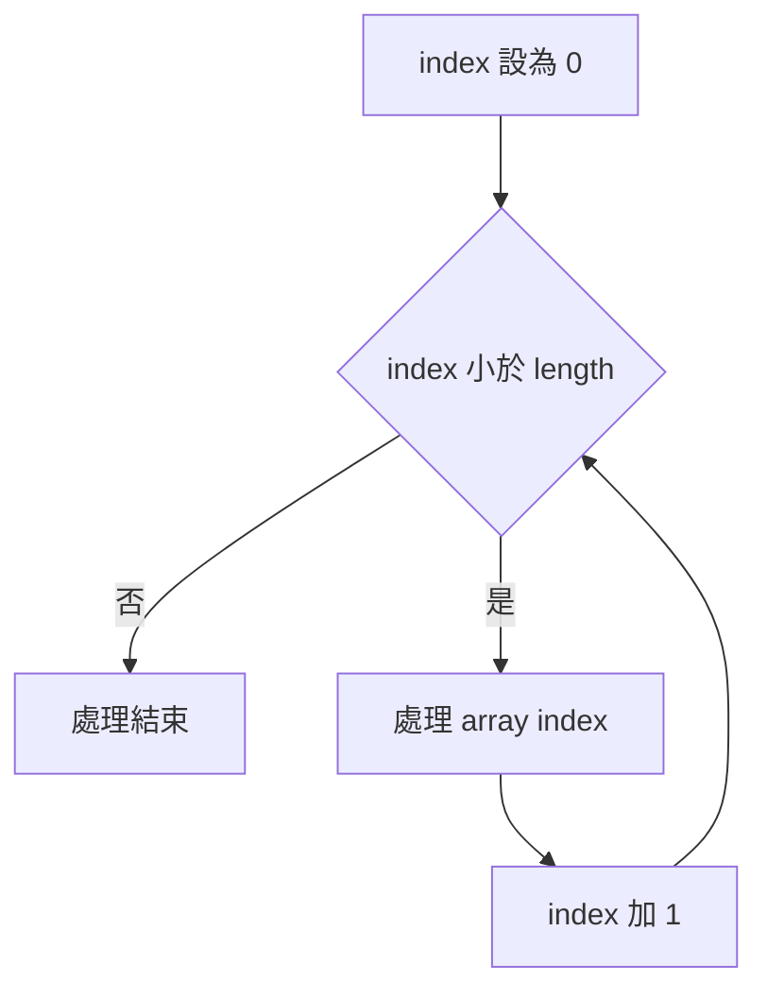
```mermaid
flowchart TD
    A[index 設為 0] --> B{index 小於 length}
    B -- 否 --> E[處理結束]
    B -- 是 --> C[處理 array index]
    C --> D[index 加 1]
    D --> B
```

---

### 3. 找陣列最大值

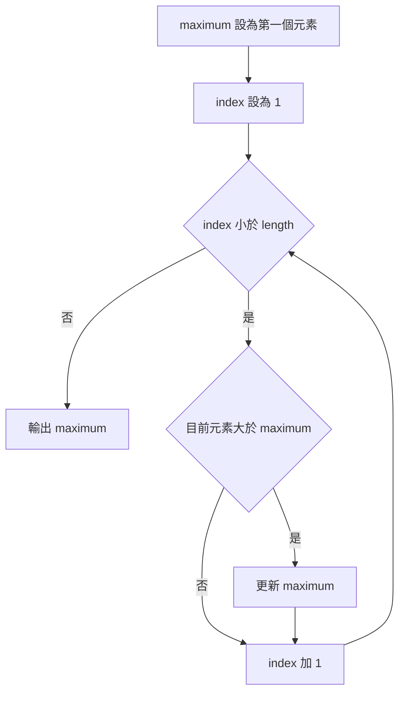
```mermaid
flowchart TD
    A[maximum 設為第一個元素] --> B[index 設為 1]
    B --> C{index 小於 length}
    C -- 否 --> G[輸出 maximum]
    C -- 是 --> D{目前元素大於 maximum}
    D -- 是 --> E[更新 maximum]
    D -- 否 --> F[index 加 1]
    E --> F
    F --> C
```

---

### 4. 一颗骰子的索引映射

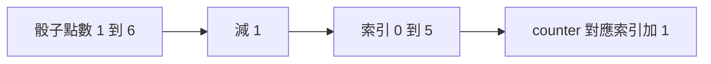
```mermaid
flowchart LR
    A[骰子點數 1 到 6] --> B[減 1]
    B --> C[索引 0 到 5]
    C --> D[counter 對應索引加 1]
```

---

### 5. 一颗骰子的次數統計

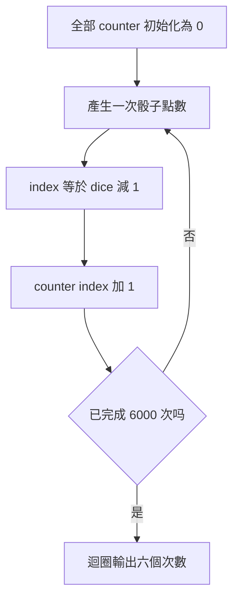
```mermaid
flowchart TD
    A[全部 counter 初始化為 0] --> B[產生一次骰子點數]
    B --> C[index 等於 dice 減 1]
    C --> D[counter index 加 1]
    D --> E{已完成 6000 次吗}
    E -- 否 --> B
    E -- 是 --> F[迴圈輸出六個次數]
```

---

### 6. 商品編號直接存取價格

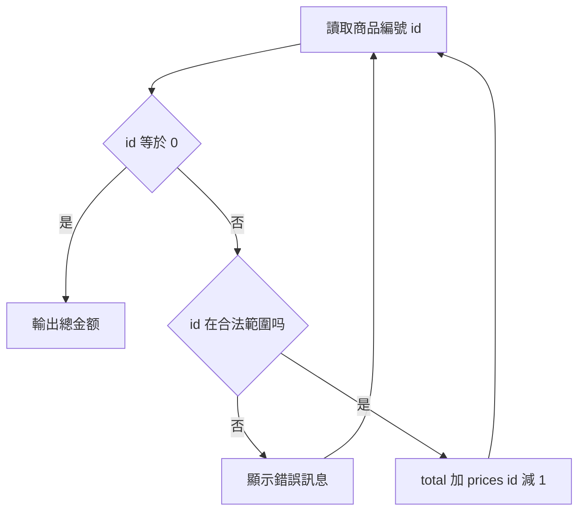
```mermaid
flowchart TD
    A[讀取商品編號 id] --> B{id 等於 0}
    B -- 是 --> F[輸出總金额]
    B -- 否 --> C{id 在合法範圍吗}
    C -- 否 --> D[顯示錯誤訊息]
    C -- 是 --> E[total 加 prices id 減 1]
    D --> A
    E --> A
```

---

### 7. 兩顆骰子的點數和統計

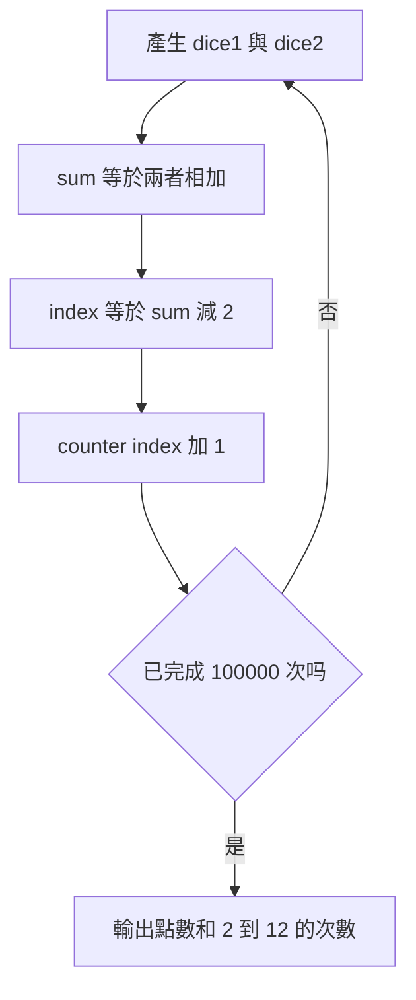
```mermaid
flowchart TD
    A[產生 dice1 與 dice2] --> B[sum 等於兩者相加]
    B --> C[index 等於 sum 減 2]
    C --> D[counter index 加 1]
    D --> E{已完成 100000 次吗}
    E -- 否 --> A
    E -- 是 --> F[輸出點數和 2 到 12 的次數]
```

---

### 8. 越界檢查

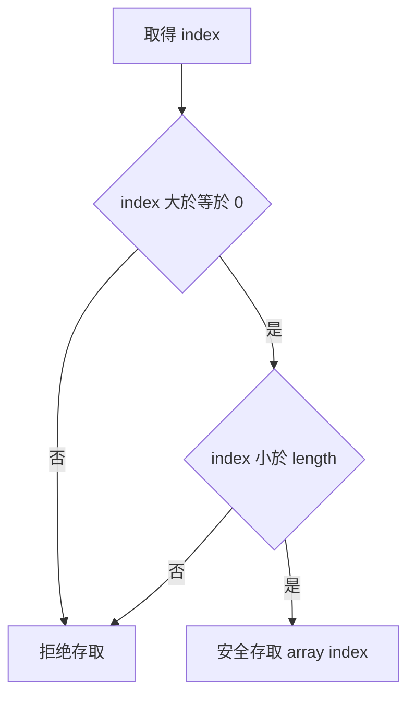
```mermaid
flowchart TD
    A[取得 index] --> B{index 大於等於 0}
    B -- 否 --> E[拒绝存取]
    B -- 是 --> C{index 小於 length}
    C -- 否 --> E
    C -- 是 --> D[安全存取 array index]
```

---

## 本章完成標准

完成本章後，你應該能做到：

1. 说明陣列為什麼适合保存多笔同類資料。
2. 说明陣列元素必须具有相同資料型態。
3. 正确宣告一維陣列。
4. 分辨元素個數與元素索引。
5. 说明為什麼索引從 `0` 開始。
6. 計算任意長度陣列的最後合法索引。
7. 使用 `array[index]` 讀寫元素。
8. 使用初始化串列設定陣列。
9. 使用部分初始化與 `{0}`。
10. 在初始化時省略可推得的元素個數。
11. 使用 `for` 循序輸入、輸出及修改元素。
12. 使用陣列與迴圈找最大值。
13. 找出 `<= length` 导致的越界錯誤。
14. 使用六元素陣列取代六個骰子計數器。
15. 將骰子點數映射到 `dice - 1`。
16. 使用 `counter[dice - 1]++` 統計次數。
17. 使用迴圈輸出點數 `1–6` 的統計結果。
18. 说明循序存取與直接存取的差异。
19. 使用商品編號直接存取價格。
20. 在存取價格前正确處理結束值與非法編號。
21. 说明兩顆骰子的點數和範圍為 `2–12`。
22. 為兩骰點數和建立十一元素陣列。
23. 使用 `sum - 2` 映射到索引。
24. 使用所有元素總和驗證統計次數。
25. 找出負索引、過大索引與未初始化陣列等常見錯誤。
26. 准备進入下一章的陣列查询與統計。
