# Lesson 15：Array Queries and Statistics 陣列搜尋與統計

> 這堂課的重點：在陣列中依序號直接查詢資料、逐一篩選符合範圍的元素、找出上限內最大值與最接近值，再使用次數陣列完成分組長條圖、眾數、最大值與平均值等統計工作。

---

## Section I. 今天要做什麼？

1. 複習陣列索引與輸入順序號碼之間的差異。
2. 使用使用者輸入的順序號碼直接查詢陣列元素。
3. 將第 `1–5` 筆資料映射到索引 `0–4`。
4. 使用 `0` 作為重複查詢的結束值。
5. 理解查詢前必須先檢查結束值。
6. 輸入十個整數後，重複查詢指定上下限。
7. 找出落在閉區間 `[L, R]` 內的所有陣列元素。
8. 使用 `&&` 合併下限與上限條件。
9. 使用 `0 0` 結束範圍查詢。
10. 理解「找出所有符合值」需要完整走訪陣列。
11. 輸入一個上限 `Q`，找出陣列中不大於 `Q` 的最大值。
12. 使用候選答案變數保存目前最佳結果。
13. 使用索引哨兵表示目前尚未找到答案。
14. 處理上限內沒有任何數字的情況。
15. 輸入查詢值 `Q`，找出陣列中距離 `Q` 最近的數字。
16. 使用 `abs()` 計算整數距離。
17. 使用第一個陣列元素初始化最近候選。
18. 當兩個以上的數字同樣接近時，選擇較小的數字。
19. 將重複查詢寫在 `while (1)` 中。
20. 使用次數陣列將 `1–100` 分成十個區間。
21. 將數值 `n` 映射到 `(n - 1) / 10`。
22. 使用巢狀迴圈輸出文字長條圖。
23. 理解標籤 `10、20、…、100` 所代表的區間。
24. 使用次數陣列統計 `0–9` 各數字的出現次數。
25. 找出出現次數最多的數字，也就是眾數。
26. 當多個數字出現次數相同時，輸出較大的數字。
27. 使用 `>=` 配合由小到大的掃描實作平手規則。
28. 輸入十個整數後計算最大值。
29. 使用累加器計算十個整數的總和。
30. 使用整數除法計算來源範例中的平均值。
31. 比較讀取資料時立即統計與先存入陣列後再統計。
32. 使用陣列將輸入、最大值與平均值拆成不同階段。
33. 認識來源教材最後將最大值與平均值整理成函式的做法。
34. 分辨資料值、陣列索引、次數與答案的不同角色。
35. 為下一章的陣列排序建立完整的走訪與比較基礎。

---

## Section II. 今天的學習方式

1. 先畫出陣列的索引與資料值。
2. 若外部編號從 `1` 開始，先寫出它與索引的轉換。
3. 查詢前先判斷是否輸入結束值。
4. 將查詢問題拆成：
   - 候選元素
   - 合格條件
   - 目前最佳答案
5. 要找全部結果時，不要在第一個結果後停止。
6. 要找最佳結果時，每看到一個更好的候選就更新答案。
7. 不要任意使用 `0` 當初始答案；先確認 `0` 是否可能是合法資料。
8. 最近值問題先計算距離，再比較距離。
9. 平手規則要寫進條件，不能依輸入順序碰運氣。
10. 小範圍整數統計優先考慮次數陣列。
11. 建立次數陣列前，先確定資料值如何映射到索引。
12. 畫長條圖時：
    - 外層處理每一組
    - 內層輸出該組對應數量的星號
13. 計算平均前先完成總和。
14. 明確分辨整數平均與浮點平均。
15. 先依來源教材完成逐步版本，再整理成較安全或較通用的版本。
16. 本章不進行排序；所有查詢都直接走訪原始輸入順序。
17. 陣列傳入函式只作為來源教材末段的預覽，正式原理留到後面的「陣列與函式」。

---

## Section III. 今天會學到的內容

| 主題 | 你需要知道的事 |
| --- | --- |
| 順序號碼查詢 | 依第幾筆輸入直接取得元素 |
| 編號映射 | 第 `k` 筆資料對應索引 `k - 1` |
| 直接存取 | 已知索引後直接使用 `array[index]` |
| 完整走訪 | 從索引 `0` 到 `length - 1` 逐一檢查 |
| 範圍查詢 | 找出所有落在 `[L, R]` 的元素 |
| 閉區間 | 同時包含下限與上限 |
| 候選答案 | 目前為止最符合要求的資料 |
| 上限內最大值 | 所有 `value <= Q` 中最大的值 |
| 尚未找到 | 使用狀態或特殊索引表示沒有候選 |
| 最近值 | 與查詢值絕對距離最小的資料 |
| 距離 | `abs(value - query)` |
| 平手規則 | 距離相同時選擇較小的數字 |
| 次數陣列 | 每個元素保存某個數值或區間的出現次數 |
| 分組統計 | 將一段數值範圍分成多個區間 |
| 長條圖 | 使用重複字元表示每組次數 |
| 眾數 | 出現次數最多的數字 |
| 眾數平手 | 來源題目要求選擇較大的數字 |
| 最大值 | 走訪過程中保存目前最大元素 |
| 累加器 | 保存目前總和 |
| 整數平均 | 整數總和除以整數筆數，捨去小數部分 |
| 分階段處理 | 先存資料，再用不同迴圈計算不同統計 |
| 函式整理 | 將最大值與平均值計算抽成獨立功能 |

---

## Section IV. 寫題目前的提醒

### 1. 順序號碼不是陣列索引

使用者輸入：

```text
1
```

代表第一筆資料。

C 陣列第一個元素是：

```c
numbers[0]
```

因此：

```text
索引 = 順序號碼 - 1
```

---

### 2. `0` 是結束值，不是合法順序號碼

來源第一個查詢題使用：

```text
Q: 0
```

結束。

如果直接執行：

```c
numbers[q - 1]
```

當 `q == 0` 時會變成：

```c
numbers[-1]
```

這是陣列越界。

必須先檢查：

```c
if (q == 0) {
    break;
}
```

---

### 3. 第 `1–5` 筆資料只能查詢 `1–5`

來源程式假設使用者輸入合法順序號碼。

完整教學版本可以額外檢查：

```c
if (q < 1 || q > 5)
```

避免存取陣列外部。

這是教材安全性補強，不是來源投影片的主要步驟。

---

### 4. 範圍查詢包含上下限

來源條件：

```c
numbers[i] >= lower && numbers[i] <= upper
```

代表：

```text
lower <= numbers[i] <= upper
```

下限與上限本身都會被輸出。

---

### 5. `0 0` 要在掃描陣列前判斷

```c
if (lower == 0 && upper == 0) {
    break;
}
```

若只檢查其中一個為 `0`，就會改變來源題目的結束規則。

---

### 6. 範圍查詢要保留原始輸入順序

來源範例輸入：

```text
13 23 78 77 37 30 40 50 83 99
```

查詢：

```text
1 100
```

會依原本陣列順序輸出，不會自動排序。

---

### 7. 上限內最大值不是一般最大值

候選元素必須先符合：

```c
numbers[i] <= query
```

再比較它是否比目前答案大。

---

### 8. 来源投影片有一處題目敘述誤植

`16-03` 的標題與程式都在處理：

```text
查詢上限內最大的數字
```

但部分投影片敘述誤寫成「最接近的一個」。

本章依標題、執行範例與完整程式，將它解讀為：

> 找出不大於查詢值的最大陣列元素。

---

### 9. `max = -1` 依賴資料範圍假設

來源逐步程式使用：

```c
int max = -1;
```

表示尚未找到候選值。

這在範例中的正整數資料可行。

若陣列可能包含比 `-1` 更小的整數，應改用：

```c
int max_index = -1;
```

以索引表示是否找到，避免把某個數值硬當成哨兵。

---

### 10. 每次重複查詢都要重新初始化答案

錯誤：

```c
int max = -1;

while (1) {
    ...
}
```

若 `max` 只初始化一次，前一次查詢結果可能影響下一次。

來源後續版本將它放入查詢迴圈：

```c
while (1) {
    int max = -1;
    ...
}
```

---

### 11. 最近值需要絕對距離

不能只比較：

```c
query - numbers[i]
```

因為位於查詢值右邊的數字會得到負數。

應使用：

```c
abs(query - numbers[i])
```

---

### 12. 使用 `abs()` 要包含 `<stdlib.h>`

```c
#include <stdlib.h>
```

`abs()` 接收與回傳 `int`。

---

### 13. 最近值應由實際陣列元素初始化

來源正確版本：

```c
int nearest_number = numbers[0];
int nearest_distance = abs(query - numbers[0]);
```

不要把 `nearest_number` 留成未初始化。

---

### 14. 最近值平手時選較小數字

更新條件：

```c
distance < nearest_distance ||
(distance == nearest_distance &&
 numbers[i] < nearest_number)
```

第一部分找到更近的數字。

第二部分處理同距離時選較小值。

---

### 15. 次數陣列要先清零

```c
int bins[10] = {0};
```

每個元素代表某個區間目前有幾筆資料。

---

### 16. `1–100` 的分組公式是 `(n - 1) / 10`

| 數值範圍 | `(n - 1) / 10` | 索引 |
| --- | ---: | ---: |
| 1–10 | 0–9 除以 10 | 0 |
| 11–20 | 10–19 除以 10 | 1 |
| 21–30 | 20–29 除以 10 | 2 |
| ... | ... | ... |
| 91–100 | 90–99 除以 10 | 9 |

若直接寫：

```c
n / 10
```

則 `10` 會被分到索引 `1`，不符合來源區間。

---

### 17. 分組資料必須符合 `1–100`

來源題目明確要求輸入：

```text
1 到 100
```

如果輸入 `0`：

```c
(0 - 1) / 10
```

不再符合預期映射。

如果輸入大於 `100`，也可能造成索引越界。

---

### 18. 長條圖需要巢狀迴圈

外層：

```c
for (i = 1; i <= 10; i++)
```

處理十個區間。

內層：

```c
for (j = 1; j <= bins[i - 1]; j++)
```

輸出該區間對應數量的星號。

---

### 19. 眾數的值與次數不能混淆

```c
answer
```

保存眾數的數值，例如 `3`。

```c
frequency[answer]
```

才是它出現的次數。

---

### 20. 来源眾數題的平手規則是選較大的數字

來源掃描：

```c
for (number = 1; number < 10; number++) {
    if (frequency[number] >= frequency[answer]) {
        answer = number;
    }
}
```

因為由小到大掃描，而且平手也更新，所以最後保留較大的數字。

---

### 21. 平手規則中的 `>=` 不能任意改成 `>`

使用：

```c
>
```

會保留較早看到的較小數字。

使用：

```c
>=
```

才會在相同次數時更新成較大的數字。

---

### 22. 来源數字統計的平均值是整數平均

```c
int average;
average = sum / 10;
```

如果真實平均為 `53.7`，整數除法結果是：

```text
53
```

來源輸出格式也是：

```c
printf("Avg: %d\n", average);
```

---

### 23. 最大值不能在未初始化時直接比較

錯誤：

```c
int maximum;

if (number > maximum) {
    maximum = number;
}
```

來源逐步修正包括：

```c
int maximum = 0;
```

以及更通用的：

```c
if (i == 1 || number > maximum) {
    maximum = number;
}
```

或在陣列版中：

```c
int maximum = numbers[0];
```

---

### 24. 第一筆初始化可以支援負數

```c
maximum = first_input;
sum = first_input;
```

再從第二筆資料開始處理。

這比假設：

```c
maximum = 0;
```

更通用。

---

### 25. 来源最後使用函式整理陣列統計

来源將：

```c
int max10(int numbers[10]);
int avg10(int numbers[10]);
```

作為函式介面。

本章只觀察它能讓 `main()` 更簡潔。

陣列傳入函式的實際原理會在後面的「陣列與函式」正式說明。

---

## Section V. 核心概念說明

## Section V-A. 依輸入順序號碼查詢

### 1. 題目

來源第一個練習要求：

> 讓使用者輸入 5 個整數後，可以依照輸入的順序號碼查詢所輸入的整數。查詢順序號碼為 `0` 時結束。

範例資料：

```text
1: 13
2: 9
3: 29
4: 33
5: 99
```

查詢：

```text
Q: 3
```

輸出：

```text
29
```

---

### 2. 儲存五筆資料

```c
#include <stdio.h>

int main(void) {
    int i;
    int numbers[5];

    for (i = 1; i <= 5; i++) {
        printf("%d: ", i);
        scanf("%d", &numbers[i - 1]);
    }

    return 0;
}
```

來源刻意讓畫面顯示的順序號碼從 `1` 開始：

```c
printf("%d: ", i);
```

但存入的索引是：

```c
numbers[i - 1]
```

---

### 3. 順序號碼與索引對照

<p align="center">
  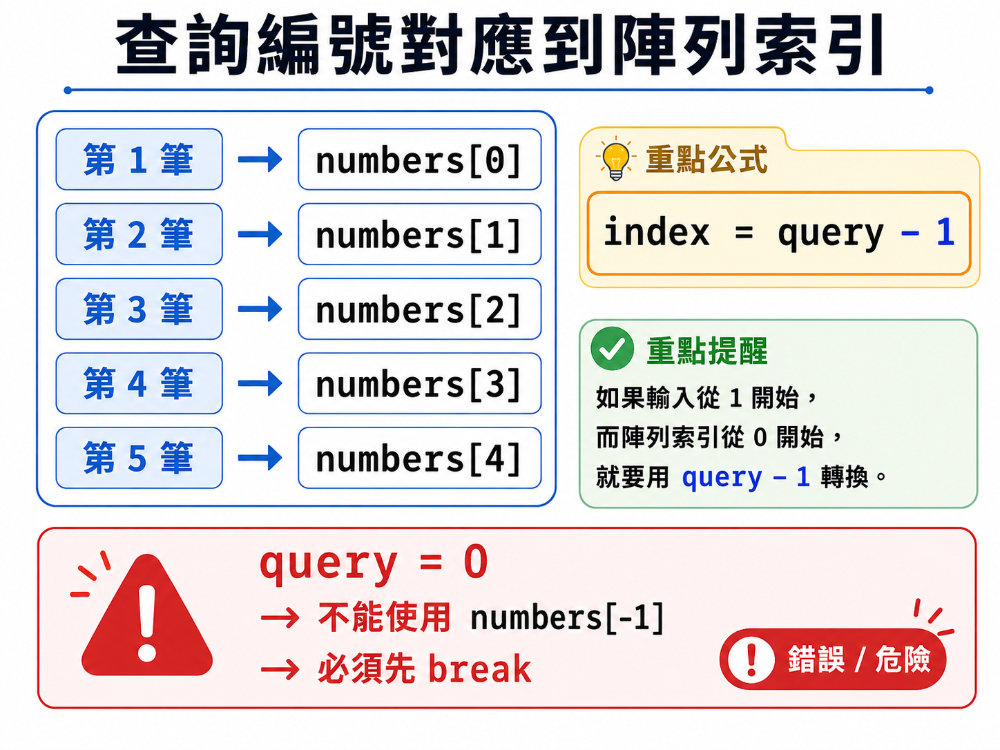
</p>


| 輸入順序號碼 | 陣列索引 |
| ---: | ---: |
| 1 | 0 |
| 2 | 1 |
| 3 | 2 |
| 4 | 3 |
| 5 | 4 |

---

### 4. 單次查詢

```c
int query;

printf("Q: ");
scanf("%d", &query);

printf("%d\n", numbers[query - 1]);
```

這是直接存取，不需要掃描整個陣列。

---

### 5. 重複查詢並以 `0` 結束

```c
#include <stdio.h>

int main(void) {
    int i;
    int numbers[5];

    for (i = 1; i <= 5; i++) {
        printf("%d: ", i);
        scanf("%d", &numbers[i - 1]);
    }

    while (1) {
        int query;

        printf("Q: ");
        scanf("%d", &query);

        if (query == 0) {
            break;
        }

        printf("%d\n", numbers[query - 1]);
    }

    return 0;
}
```

---

### 6. 加入索引安全檢查

下面是教材補強版：

```c
if (query < 1 || query > 5) {
    printf("Invalid query.\n");
} else {
    printf("%d\n", numbers[query - 1]);
}
```

這個檢查不改變來源的主要方法，只避免不合法順序號碼造成越界。

---

## Section V-B. 查詢範圍內的所有數字

### 7. 題目

來源第二個練習要求：

> 輸入 10 個整數，再輸入查詢的上下界，顯示所有被包含在上下限內的輸入整數。輸入 `0 0` 時結束。

範例資料：

```text
13 23 78 77 37 30 40 50 83 99
```

查詢：

```text
L R: 10 20
```

輸出：

```text
Ans: 13
```

---

### 8. 輸入十筆資料

```c
int numbers[10];

for (i = 1; i <= 10; i++) {
    scanf("%d", &numbers[i - 1]);
}
```

---

### 9. 掃描所有元素

```c
for (i = 0; i < 10; i++) {
    printf("%d ", numbers[i]);
}
```

範圍查詢的第一步，是先有能力完整走訪陣列。

---

### 10. 加入閉區間條件

<p align="center">
  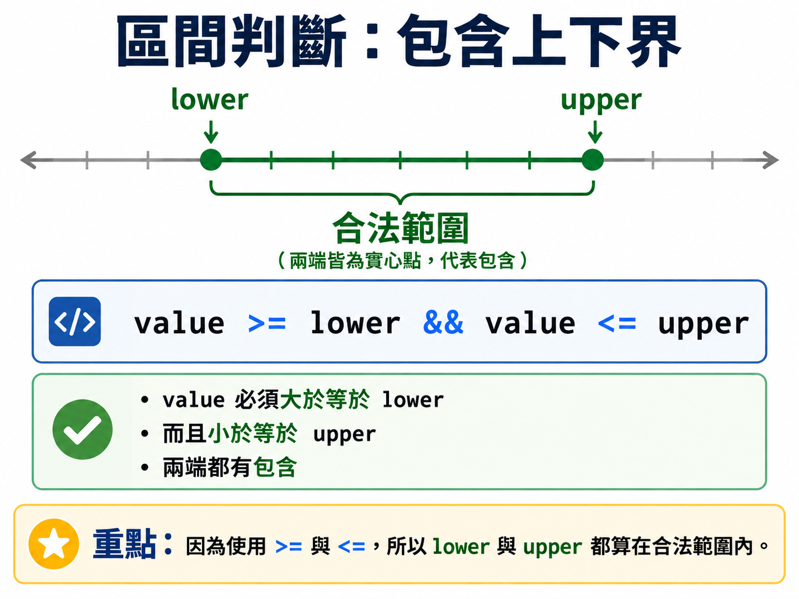
</p>


```c
for (i = 0; i < 10; i++) {
    if (numbers[i] >= lower &&
        numbers[i] <= upper) {
        printf("%d ", numbers[i]);
    }
}
```

---

### 11. 完整重複查詢

```c
#include <stdio.h>

int main(void) {
    int i;
    int numbers[10];

    for (i = 1; i <= 10; i++) {
        scanf("%d", &numbers[i - 1]);
    }

    while (1) {
        int lower;
        int upper;

        printf("L R: ");
        scanf("%d%d", &lower, &upper);

        if (lower == 0 && upper == 0) {
            break;
        }

        printf("Ans: ");

        for (i = 0; i < 10; i++) {
            if (numbers[i] >= lower &&
                numbers[i] <= upper) {
                printf("%d ", numbers[i]);
            }
        }

        printf("\n");
    }

    return 0;
}
```

---

### 12. 找不到結果時

來源程式仍然輸出：

```text
Ans:
```

但後面沒有數字。

若要給使用者更清楚的訊息，可以額外使用計數器；這是延伸，不是來源必要輸出。

---

## Section V-C. 查詢上限內最大的數字

### 13. 題目真正要求

給定查詢值 `Q`，從輸入的十個整數中找出：

```text
不大於 Q 的最大值
```

範例資料：

```text
13 23 78 77 37 30 40 50 83 99
```

查詢：

```text
Q: 25
```

輸出：

```text
23
```

查詢：

```text
Q: 33
```

輸出：

```text
30
```

因為資料中沒有 `33`，而不大於 `33` 的最大值是 `30`。

---

### 14. 使用數值哨兵的來源版本

```c
int maximum = -1;

for (i = 0; i < 10; i++) {
    if (numbers[i] <= query &&
        numbers[i] > maximum) {
        maximum = numbers[i];
    }
}

if (maximum != -1) {
    printf("%d\n", maximum);
}
```

---

### 15. 每個條件的作用

<p align="center">
  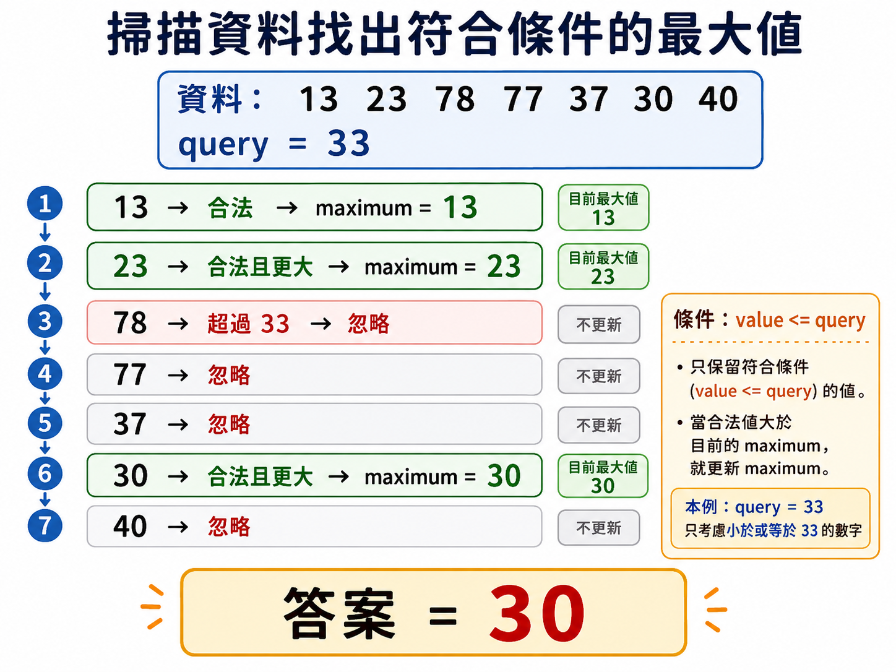
</p>


```c
numbers[i] <= query
```

確認候選值不超過上限。

```c
numbers[i] > maximum
```

確認候選值比目前答案更大。

兩者都成立才更新：

```c
maximum = numbers[i];
```

---

### 16. 更通用的索引哨兵版本

<p align="center">
  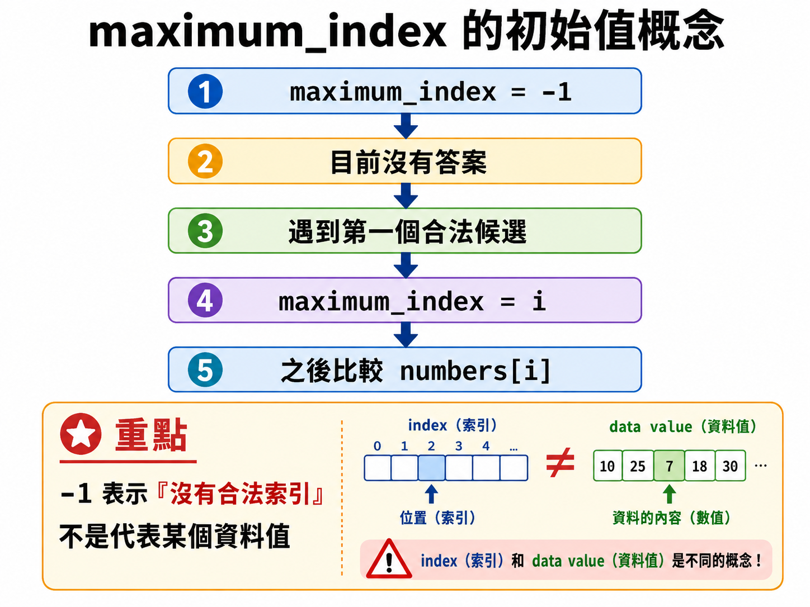
</p>


```c
int maximum_index = -1;

for (i = 0; i < 10; i++) {
    if (numbers[i] <= query &&
        (maximum_index == -1 ||
         numbers[i] > numbers[maximum_index])) {
        maximum_index = i;
    }
}

if (maximum_index != -1) {
    printf("%d\n", numbers[maximum_index]);
}
```

这里：

```text
-1
```

表示「目前沒有合法索引」，不假設陣列資料一定是正數。

---

### 17. 完整重複查詢

```c
#include <stdio.h>

int main(void) {
    int i;
    int numbers[10];

    for (i = 1; i <= 10; i++) {
        scanf("%d", &numbers[i - 1]);
    }

    while (1) {
        int query;
        int maximum_index = -1;

        printf("Q: ");
        scanf("%d", &query);

        if (query == 0) {
            break;
        }

        for (i = 0; i < 10; i++) {
            if (numbers[i] <= query &&
                (maximum_index == -1 ||
                 numbers[i] > numbers[maximum_index])) {
                maximum_index = i;
            }
        }

        if (maximum_index != -1) {
            printf("%d\n", numbers[maximum_index]);
        } else {
            printf("Not found\n");
        }
    }

    return 0;
}
```

`Not found` 是教材補強訊息；來源在沒有答案時不輸出數值。

---

## Section V-D. 查詢最接近的數字

### 18. 題目

來源要求：

> 輸入查詢數字後，顯示十個輸入整數中最接近的一個。當有兩個以上結果時，顯示比較小的那個。輸入 `0` 結束。

範例資料：

```text
13 23 78 77 37 30 40 50 83 99
```

查詢：

```text
Q: 25
```

輸出：

```text
23
```

查詢：

```text
Q: 34
```

`30` 與 `37` 的距離分別為 `4` 與 `3`，所以輸出：

```text
37
```

查詢：

```text
Q: 9
```

輸出：

```text
13
```

---

### 19. 距離的概念

<p align="center">
  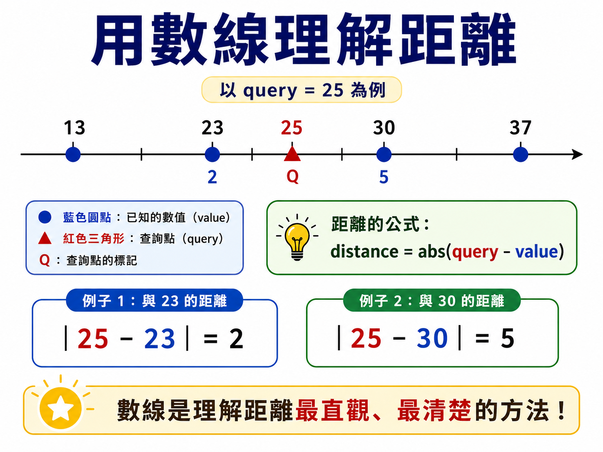
</p>


```c
abs(query - numbers[i])
```

例如查詢 `25`：

| 資料 | 距離 |
| ---: | ---: |
| 13 | 12 |
| 23 | 2 |
| 30 | 5 |
| 37 | 12 |

距離最小的是 `23`。

---

### 20. 先使用第一個元素初始化

```c
int nearest_number = numbers[0];
int nearest_distance = abs(query - numbers[0]);
```

再從第二個元素開始：

```c
for (i = 1; i < 10; i++)
```

---

### 21. 最近與平手條件

```c
int distance = abs(query - numbers[i]);

if (distance < nearest_distance ||
    (distance == nearest_distance &&
     numbers[i] < nearest_number)) {
    nearest_distance = distance;
    nearest_number = numbers[i];
}
```

---

### 22. 完整程式

```c
#include <stdio.h>
#include <stdlib.h>

int main(void) {
    int i;
    int numbers[10];

    for (i = 1; i <= 10; i++) {
        scanf("%d", &numbers[i - 1]);
    }

    while (1) {
        int query;
        int nearest_number;
        int nearest_distance;

        printf("Q: ");
        scanf("%d", &query);

        if (query == 0) {
            break;
        }

        nearest_number = numbers[0];
        nearest_distance = abs(query - numbers[0]);

        for (i = 1; i < 10; i++) {
            int distance = abs(query - numbers[i]);

            if (distance < nearest_distance ||
                (distance == nearest_distance &&
                 numbers[i] < nearest_number)) {
                nearest_distance = distance;
                nearest_number = numbers[i];
            }
        }

        printf("%d\n", nearest_number);
    }

    return 0;
}
```

---

### 23. 平手追蹤

<p align="center">
  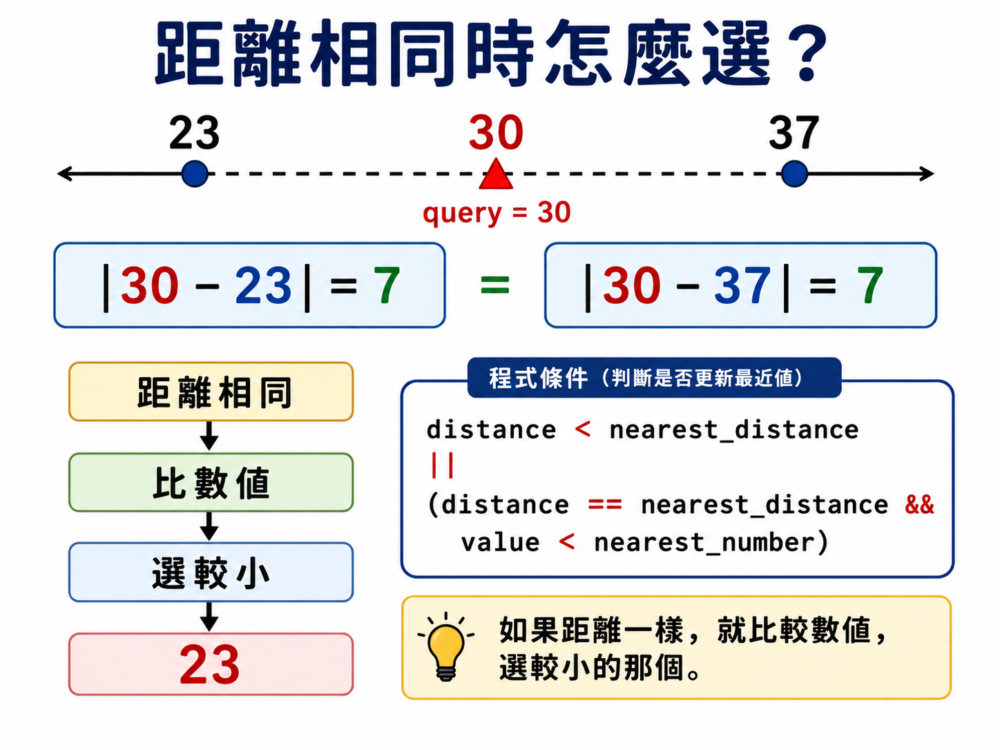
</p>


資料中有：

```text
23
37
```

查詢：

```text
30
```

距離：

```text
|30 - 23| = 7
|30 - 37| = 7
```

來源規則要求輸出較小值：

```text
23
```

---

## Section V-E. 畫數字統計長條圖

### 24. 題目

來源要求：

> 輸入 10 個 `1–100` 間的整數，畫出以 10 分為區間的長條圖。

區間：

```text
1–10
11–20
21–30
31–40
41–50
51–60
61–70
71–80
81–90
91–100
```

---

### 25. 區間索引映射

<p align="center">
  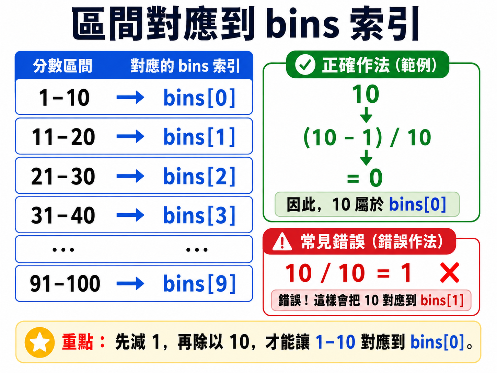
</p>


```c
bins[(number - 1) / 10]++;
```

例如：

| 數值 | `(number - 1) / 10` | 區間 |
| ---: | ---: | --- |
| 1 | 0 | 1–10 |
| 10 | 0 | 1–10 |
| 11 | 1 | 11–20 |
| 20 | 1 | 11–20 |
| 100 | 9 | 91–100 |

---

### 26. 統計十筆資料

```c
int bins[10] = {0};

for (i = 1; i <= 10; i++) {
    int number;

    scanf("%d", &number);
    bins[(number - 1) / 10]++;
}
```

---

### 27. 輸出區間標籤

來源使用：

```c
printf("%3d: ", i * 10);
```

因此顯示：

```text
 10:
 20:
 30:
 ...
100:
```

每個標籤代表「到這個十位上限為止」的區間。

---

### 28. 使用星號畫長條

```c
for (j = 1; j <= bins[i - 1]; j++) {
    printf("*");
}
```

---

### 29. 完整程式

```c
#include <stdio.h>

int main(void) {
    int i;
    int j;
    int bins[10] = {0};

    for (i = 1; i <= 10; i++) {
        int number;

        scanf("%d", &number);
        bins[(number - 1) / 10]++;
    }

    for (i = 1; i <= 10; i++) {
        printf("%3d: ", i * 10);

        for (j = 1; j <= bins[i - 1]; j++) {
            printf("*");
        }

        printf("\n");
    }

    return 0;
}
```

---

### 30. 範例追蹤

<p align="center">
  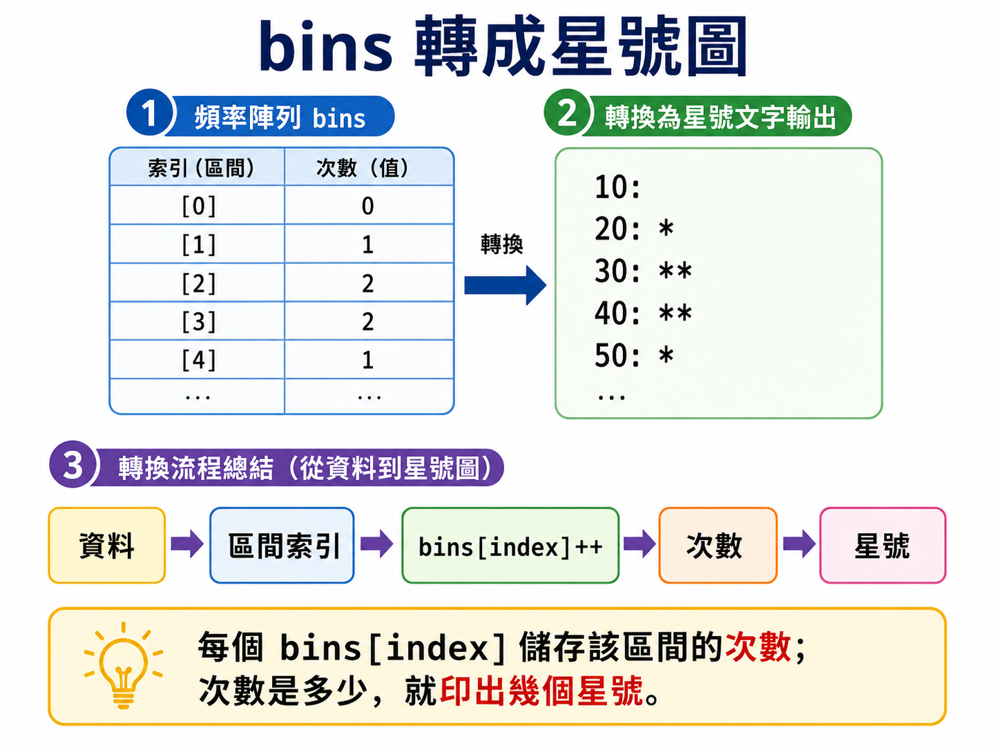
</p>


輸入：

```text
13 23 78 77 37 30 40 50 83 99
```

統計：

| 區間 | 次數 |
| --- | ---: |
| 1–10 | 0 |
| 11–20 | 1 |
| 21–30 | 2 |
| 31–40 | 2 |
| 41–50 | 1 |
| 51–60 | 0 |
| 61–70 | 0 |
| 71–80 | 2 |
| 81–90 | 1 |
| 91–100 | 1 |

---

## Section V-F. 求小範圍內的眾數

### 31. 題目

來源要求：

> 輸入 10 個 `0–9` 之間的整數後，輸出眾數。當有一樣多的數字有兩個以上時，輸出最大的。

範例：

```text
9 7 7 3 3 9 1 2 3 4
```

次數：

```text
3 出現 3 次
7 出現 2 次
9 出現 2 次
```

答案：

```text
3
```

---

### 32. 使用資料值作為索引

因為資料值已經是：

```text
0–9
```

可以直接：

```c
frequency[number]++;
```

---

### 33. 找出最高次數

```c
int answer = 0;

for (number = 1; number < 10; number++) {
    if (frequency[number] >= frequency[answer]) {
        answer = number;
    }
}
```

---

### 34. 為什麼從 `1` 開始？

答案一開始是：

```c
answer = 0;
```

所以索引 `0` 已經作為目前候選。

後面只需要比較 `1–9`。

---

### 35. 為什麼使用 `>=`？

<p align="center">
  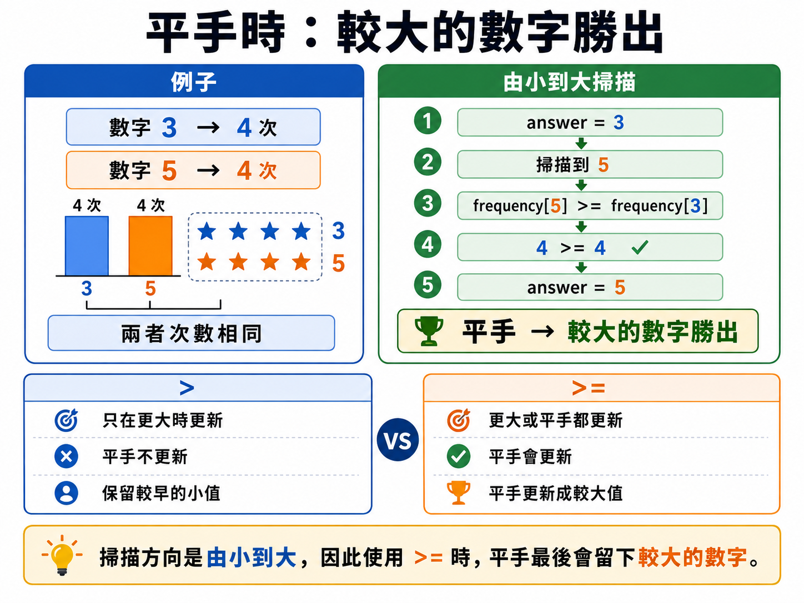
</p>


假設：

```text
3 與 5 都出現 4 次
```

掃描到 `3` 時答案成為 `3`。

掃描到 `5` 時：

```c
frequency[5] >= frequency[3]
```

成立，因此答案更新為 `5`。

這符合來源「平手選較大」的規則。

---

### 36. 完整程式

```c
#include <stdio.h>

int main(void) {
    int i;
    int number;
    int answer = 0;
    int frequency[10] = {0};

    for (i = 1; i <= 10; i++) {
        scanf("%d", &number);
        frequency[number]++;
    }

    for (number = 1; number < 10; number++) {
        if (frequency[number] >= frequency[answer]) {
            answer = number;
        }
    }

    printf("Ans: %d\n", answer);

    return 0;
}
```

---

## Section V-G. 最大值與平均值

### 37. 題目

來源要求：

> 讓使用者輸入 10 個整數後，輸出最大值與平均值。

範例：

```text
13 23 78 77 37 30 40 50 83 99
```

輸出：

```text
Max: 99
Avg: 53
```

---

### 38. 讀取時立即計算

不使用陣列也可以在輸入時立即更新：

```c
int maximum;
int sum = 0;

for (i = 1; i <= 10; i++) {
    int number;

    scanf("%d", &number);

    if (i == 1 || number > maximum) {
        maximum = number;
    }

    sum += number;
}
```

---

### 39. 計算整數平均

```c
int average = sum / 10;
```

來源使用整數型態，因此小數部分會被捨去。

---

### 40. 先存入陣列再分別統計

<p align="center">
  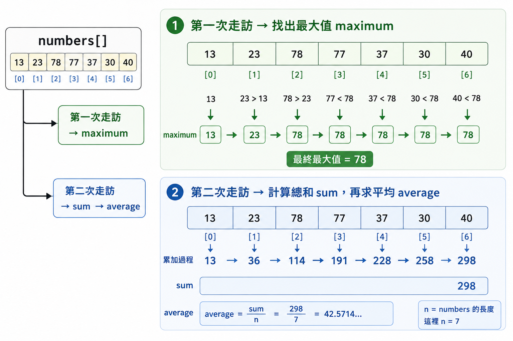
</p>


```c
int numbers[10];

for (i = 1; i <= 10; i++) {
    scanf("%d", &numbers[i - 1]);
}
```

最大值：

```c
int maximum = numbers[0];

for (i = 1; i < 10; i++) {
    if (numbers[i] > maximum) {
        maximum = numbers[i];
    }
}
```

總和：

```c
int sum = numbers[0];

for (i = 1; i < 10; i++) {
    sum += numbers[i];
}
```

---

### 41. 完整陣列版本

```c
#include <stdio.h>

int main(void) {
    int i;
    int numbers[10];
    int maximum;
    int sum;
    int average;

    for (i = 1; i <= 10; i++) {
        scanf("%d", &numbers[i - 1]);
    }

    maximum = numbers[0];

    for (i = 1; i < 10; i++) {
        if (numbers[i] > maximum) {
            maximum = numbers[i];
        }
    }

    sum = numbers[0];

    for (i = 1; i < 10; i++) {
        sum += numbers[i];
    }

    average = sum / 10;

    printf("Max: %d\n", maximum);
    printf("Avg: %d\n", average);

    return 0;
}
```

---

### 42. 来源的函式整理版本

來源最後將兩段統計整理成：

```c
int max10(int numbers[10]);
int avg10(int numbers[10]);
```

`main()` 可以寫成：

```c
printf("Max: %d\n", max10(numbers));
printf("Avg: %d\n", avg10(numbers));
```

---

### 43. 完整函式版預覽

```c
#include <stdio.h>

int max10(int numbers[10]);
int avg10(int numbers[10]);

int main(void) {
    int i;
    int numbers[10];

    for (i = 1; i <= 10; i++) {
        scanf("%d", &numbers[i - 1]);
    }

    printf("Max: %d\n", max10(numbers));
    printf("Avg: %d\n", avg10(numbers));

    return 0;
}

int max10(int numbers[10]) {
    int i;
    int maximum = numbers[0];

    for (i = 1; i < 10; i++) {
        if (numbers[i] > maximum) {
            maximum = numbers[i];
        }
    }

    return maximum;
}

int avg10(int numbers[10]) {
    int i;
    int sum = numbers[0];

    for (i = 1; i < 10; i++) {
        sum += numbers[i];
    }

    return sum / 10;
}
```

本章先把它理解成：

> 將同一陣列交給不同功能處理。

其記憶體與參數原理留待後續章節。

---

## Section V-H. 查詢與統計的通用模式

<p align="center">
  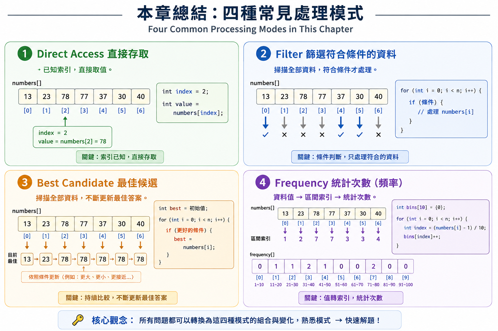
</p>


### 44. 找出所有合格元素

```c
for (i = 0; i < length; i++) {
    if (元素符合條件) {
        處理該元素;
    }
}
```

範圍查詢使用這個模式。

---

### 45. 找出最佳元素

```c
先設定第一個候選或「尚未找到」狀態;

for (i = 0; i < length; i++) {
    if (元素合法 && 元素比目前答案更好) {
        更新答案;
    }
}
```

上限內最大值與最近值都使用這個模式。

---

### 46. 建立頻率表

```c
int frequency[類別數量] = {0};

for (每一筆資料) {
    int index = 將資料映射成類別索引;
    frequency[index]++;
}
```

長條圖與眾數都先建立頻率表。

---

### 47. 使用頻率表產生結果

長條圖：

```text
次數 → 輸出相同數量的星號
```

眾數：

```text
次數 → 比較哪個類別最大
```

同一份頻率資料可以支援多種後續分析。

---

## Section V-I. 容易搞混的重點

### 48. 第一個來源練習不是搜尋資料值

使用者輸入：

```text
Q: 3
```

代表查詢第三筆輸入，不是搜尋陣列中是否存在數字 `3`。

---

### 49. 直接查詢與完整走訪不同

<p align="center">
  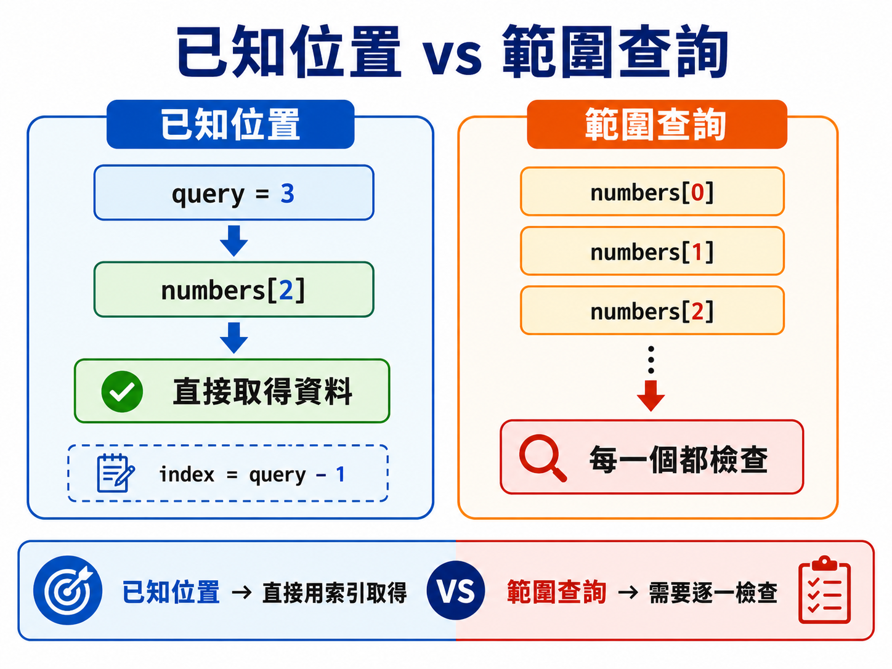
</p>


顺序号查询：

```c
numbers[query - 1]
```

只存取一個位置。

範圍查詢：

```c
for (...)
```

必須檢查全部元素。

---

### 50. 上限內最大值可能不是最接近值

資料：

```text
23 30
```

查詢：

```text
25
```

上限內最大值是：

```text
23
```

最近值也是 `23`。

但資料：

```text
23 26
```

查詢 `25`：

- 上限內最大值：`23`
- 最近值：`26`

兩個問題不能使用相同條件。

---

### 51. 最接近值不要求小於查詢值

最近候選可以位於查詢值左邊或右邊。

只比較：

```text
絕對距離
```

---

### 52. 區間索引不是區間標籤

```c
bins[0]
```

代表 `1–10`。

輸出標籤卻是：

```text
10
```

索引、區間與顯示標籤是三個不同概念。

---

### 53. 眾數不是最大數字

眾數是出現次數最多的數字。

只有在次數平手時，來源才選較大的數字。

---

### 54. 平均值來源使用整數，不保留小數

這是來源題目與程式的行為。

若要浮點平均，需要改變型態與輸出格式，但那是另一個版本。

---

### 55. 先存陣列與立即統計各有用途

立即統計：

- 不需要保留全部資料
- 單次統計較直接

先存陣列：

- 可以重複進行不同查詢
- 可以分開計算最大值、平均值與其他統計
- 後續可以排序或傳給函式

---

## Section VI. 快速概念檢查

### Q1. 第 4 筆輸入對應哪個陣列索引？

<details>
<summary>查看答案</summary>

```text
4 - 1 = 3
```

所以是：

```c
numbers[3]
```

</details>

---

### Q2. 為什麼不能在 `query == 0` 時使用 `numbers[query - 1]`？

<details>
<summary>查看答案</summary>

會變成：

```c
numbers[-1]
```

造成陣列越界。

</details>

---

### Q3. 判斷資料位於閉區間 `[lower, upper]` 的條件是什麼？

<details>
<summary>查看答案</summary>

```c
value >= lower && value <= upper
```

</details>

---

### Q4. 資料是 `13 23 30 40`，查詢上限 `25`，答案是什麼？

<details>
<summary>查看答案</summary>

```text
23
```

</details>

---

### Q5. 最近值問題為什麼使用 `abs()`？

<details>
<summary>查看答案</summary>

因為距離不分左右方向，必須使用差值的絕對值。

</details>

---

### Q6. 查詢值是 `30`，候選值是 `23` 與 `37`，來源規則選哪一個？

<details>
<summary>查看答案</summary>

兩者距離都是 `7`，來源要求平手時選較小值，所以選：

```text
23
```

</details>

---

### Q7. 數值 `100` 對應哪個十位區間索引？

<details>
<summary>查看答案</summary>

```text
(100 - 1) / 10 = 9
```

所以對應：

```c
bins[9]
```

</details>

---

### Q8. 為什麼次數陣列要初始化為 `0`？

<details>
<summary>查看答案</summary>

統計開始前每一類的出現次數都是零，未初始化內容不能作為可靠次數。

</details>

---

### Q9. 眾數平手時選較大值，條件應使用 `>` 還是 `>=`？

<details>
<summary>查看答案</summary>

來源的由小到大掃描使用：

```c
>=
```

平手時更新成較大的索引。

</details>

---

### Q10. 来源的 `Avg: 53` 是否一定代表真實平均剛好是 `53.0`？

<details>
<summary>查看答案</summary>

不一定。來源使用整數除法，小數部分會被捨去。

</details>

---

### Q11. 找最大值時，為什麼 `maximum = numbers[0]` 比 `maximum = 0` 更通用？

<details>
<summary>查看答案</summary>

如果所有資料都是負數，從 `0` 開始會得到不在陣列中的錯誤答案；使用第一個元素則一定從合法資料開始。

</details>

---

### Q12. 範圍查詢是否會改變資料順序？

<details>
<summary>查看答案</summary>

不會。程式依原始索引順序走訪並輸出符合值。

</details>

---

## Section VII. 程式閱讀練習

### 題目 1：順序號碼

```c
int numbers[5] = {13, 9, 29, 33, 99};
int query = 4;

printf("%d\n", numbers[query - 1]);
```

<details>
<summary>查看答案</summary>

```text
33
```

</details>

---

### 題目 2：範圍查詢

```c
int numbers[5] = {13, 9, 29, 33, 99};

for (i = 0; i < 5; i++) {
    if (numbers[i] >= 10 && numbers[i] <= 35) {
        printf("%d ", numbers[i]);
    }
}
```

<details>
<summary>查看答案</summary>

```text
13 29 33
```

</details>

---

### 題目 3：上限內最大值

```c
int numbers[5] = {13, 23, 78, 30, 40};
int query = 35;
int maximum = -1;

for (i = 0; i < 5; i++) {
    if (numbers[i] <= query &&
        numbers[i] > maximum) {
        maximum = numbers[i];
    }
}
```

<details>
<summary>查看答案</summary>

候選為 `13`、`23`、`30`，最後：

```text
maximum = 30
```

</details>

---

### 題目 4：最近值平手

```c
int numbers[2] = {23, 37};
int query = 30;
```

<details>
<summary>查看答案</summary>

兩者距離相同，來源規則選較小值：

```text
23
```

</details>

---

### 題目 5：區間映射

```c
int number = 40;
int index = (number - 1) / 10;
```

<details>
<summary>查看答案</summary>

```text
index = 3
```

代表區間：

```text
31–40
```

</details>

---

### 題目 6：眾數平手

```c
int frequency[4] = {0, 3, 1, 3};
int answer = 0;

for (number = 1; number < 4; number++) {
    if (frequency[number] >= frequency[answer]) {
        answer = number;
    }
}
```

<details>
<summary>查看答案</summary>

数字 `1` 與 `3` 都出現 `3` 次。

由於平手時更新到較大索引，答案是：

```text
3
```

</details>

---

### 題目 7：整數平均

```c
int sum = 537;
int average = sum / 10;
```

<details>
<summary>查看答案</summary>

```text
53
```

小數部分被捨去。

</details>

---

### 題目 8：找出初始化問題

```c
int maximum;

for (i = 0; i < 10; i++) {
    if (numbers[i] > maximum) {
        maximum = numbers[i];
    }
}
```

<details>
<summary>查看答案</summary>

`maximum` 未初始化。

可改成：

```c
int maximum = numbers[0];

for (i = 1; i < 10; i++) {
    ...
}
```

</details>

---

## Section VIII. 實作練習 / 實作檢測題

### TODO 1：順序號碼查詢

輸入 5 個整數，重複輸入 `1–5` 查詢對應資料，輸入 `0` 結束。

加入不合法順序號碼提示。

---

### TODO 2：指定範圍查詢

輸入 10 個整數，重複輸入 `lower upper`，依原始順序輸出閉區間內所有資料。

輸入 `0 0` 結束。

---

### TODO 3：統計範圍內數量

在 TODO 2 的基礎上，除了輸出資料，也顯示符合條件的筆數。

---

### TODO 4：上限內最大值

輸入 10 個整數，重複輸入上限 `Q`，輸出不大於 `Q` 的最大值。

使用索引哨兵處理任意整數資料。

---

### TODO 5：下限內最小值

改成找出：

```text
不小於 Q 的最小值
```

若沒有候選值，輸出 `Not found`。

---

### TODO 6：查詢最接近值

依來源規則：

- 距離最小
- 平手選較小
- 輸入 `0` 結束

---

### TODO 7：最近值改成平手選較大

修改平手條件，距離相同時保留較大的數字。

---

### TODO 8：十位區間長條圖

輸入 10 個 `1–100` 整數，輸出來源格式的十組星號長條圖。

---

### TODO 9：區間次數表

在 TODO 8 中，除了星號，也輸出每個區間的實際次數。

---

### TODO 10：`0–9` 眾數

輸入 10 個 `0–9` 整數，平手時輸出較大的眾數。

---

### TODO 11：眾數與出現次數

同時輸出：

```text
Mode: ...
Frequency: ...
```

---

### TODO 12：最大值與整數平均

輸入 10 個整數，使用陣列分別計算最大值、總和與整數平均。

---

### TODO 13：浮點平均延伸

在 TODO 12 的基礎上，使用 `double` 顯示保留小數的平均。

這是對來源整數平均的延伸版本。

---

### TODO 14：最小值、最大值與平均

使用三個獨立走訪或一個走訪，輸出：

```text
Min
Max
Avg
```

比較兩種寫法。

---

### TODO 15：函式整理預覽

依來源最後的做法撰寫：

```c
int max10(int numbers[10]);
int avg10(int numbers[10]);
```

先只理解介面與呼叫；陣列參數原理留待後續章節。

---

## Section IX. 做題時可以使用的提示

### 1. 先寫索引映射

```text
外部編號：
陣列索引：
轉換公式：
```

---

### 2. 最佳值問題先決定初始化方法

可選：

1. 使用第一個合法候選。
2. 使用 `found` 狀態。
3. 使用索引 `-1` 表示尚未找到。

不要直接選一個可能和資料衝突的數值。

---

### 3. 最近值先寫比較規則

```text
第一優先：距離較小
第二優先：數值較小
```

再翻譯成兩段條件。

---

### 4. 次數統計先畫映射表

長條圖：

```text
1–10   → 0
11–20  → 1
...
91–100 → 9
```

眾數：

```text
數字 0 → frequency[0]
...
數字 9 → frequency[9]
```

---

### 5. 懷疑越界時檢查

1. 最小可能索引。
2. 最大可能索引。
3. 結束值是否先被排除。
4. 輸入資料是否符合題目範圍。

---

### 6. 懷疑平手規則錯誤時檢查

1. 掃描方向。
2. 使用 `>` 還是 `>=`。
3. 是否加入數值大小的第二條件。

---

### 7. 建議測試資料

顺序查询：

```text
Q = 1
Q = 5
Q = 0
Q = 6
```

範圍查詢：

```text
10 20
1 100
58 59
0 0
```

上限最大值：

```text
25
33
9
0
```

最近值：

```text
25
34
30
9
0
```

眾數：

```text
唯一眾數
兩個眾數平手
0 是眾數
9 是眾數
```

---

## Section X. 課後小練習

### 練習 1：反向順序號碼

輸入 5 個整數，查詢 `1` 時顯示最後一筆，查詢 `5` 時顯示第一筆。

---

### 練習 2：範圍外的資料

輸入上下限，輸出所有不在閉區間內的元素。

---

### 練習 3：最接近的索引

除了最近數值，也輸出它最早出現的輸入順序號碼。

---

### 練習 4：每 20 分一組

輸入 `1–100` 的整數，改成五個區間：

```text
1–20
21–40
41–60
61–80
81–100
```

推導新的索引公式。

---

### 練習 5：全部眾數

不要只輸出一個。

先找最高次數，再輸出所有具有該次數的數字。

---

### 練習 6：成績分布

輸入十個 `0–100` 成績，分成：

```text
0–59
60–69
70–79
80–89
90–100
```

畫出文字長條圖。

---

### 練習 7：高於平均的資料

先求平均，再輸出所有大於平均值的元素。

---

### 練習 8：統計摘要

輸入十個整數，輸出：

```text
Min
Max
Sum
Integer average
```

---

## Section XI. 重點複習

1. 使用者的順序號碼通常從 `1` 開始。
2. C 陣列索引從 `0` 開始。
3. 第 `k` 筆資料通常對應索引 `k - 1`。
4. 查詢結束值要在陣列存取之前判斷。
5. 直接查詢已知位置不需要走訪整個陣列。
6. 範圍查詢需要逐一檢查所有元素。
7. 閉區間同時包含下限與上限。
8. 來源範圍查詢使用 `0 0` 結束。
9. 上限內最大值要求候選值不大於查詢值。
10. 最佳值問題需要保存目前答案。
11. 使用索引 `-1` 可以安全表示尚未找到候選。
12. 每次重複查詢都要重新初始化候選答案。
13. 最近值使用絕對距離。
14. `abs()` 需要 `<stdlib.h>`。
15. 最近值平手時，來源要求選較小數字。
16. `1–100` 分十組可使用 `(number - 1) / 10`。
17. 計數陣列必須先初始化為 `0`。
18. 文字長條圖使用次數決定星號數量。
19. `0–9` 可以直接用資料值作為索引。
20. 眾數是出現次數最多的數字。
21. 来源眾數平手時選較大數字。
22. 由小到大掃描配合 `>=` 可以保留較大平手值。
23. 最大值應從合法陣列元素初始化。
24. 總和使用累加器。
25. 来源平均值使用整數除法。
26. 先存入陣列可以讓相同資料接受多種查詢與統計。
27. 查詢、篩選、最佳值與頻率統計是四種不同的陣列處理模式。
28. 来源最後使用函式整理最大值與平均值。
29. 陣列傳入函式的原理會在後續章節正式學習。
30. 下一章會學習如何重新排列陣列元素。

---

## Section XII. 常見錯誤提醒

### 錯誤 1：直接使用順序號碼作索引

錯誤：

```c
numbers[query]
```

查詢第一筆時會取得第二個元素。

應使用：

```c
numbers[query - 1]
```

---

### 錯誤 2：先存取再檢查 `0`

錯誤：

```c
printf("%d\n", numbers[query - 1]);

if (query == 0) {
    break;
}
```

---

### 錯誤 3：範圍條件使用 `||`

錯誤：

```c
value >= lower || value <= upper
```

大多數數值都會符合至少一邊。

閉區間應使用 `&&`。

---

### 錯誤 4：只輸出第一個範圍內數字

來源要求顯示所有符合元素，不應在第一個答案後 `break`。

---

### 錯誤 5：上限內最大值只比較大小

錯誤：

```c
if (numbers[i] > maximum)
```

還要先確認：

```c
numbers[i] <= query
```

---

### 錯誤 6：重複查詢時沒有重設最大值

前一次查詢的答案可能使下一次較小上限永遠無法更新。

---

### 錯誤 7：最近值不使用絕對值

```c
query - numbers[i]
```

不能正確表示雙方向距離。

---

### 錯誤 8：最近值只用 `<`

只使用：

```c
distance < nearest_distance
```

不能實作平手時選較小數字。

---

### 錯誤 9：`abs()` 沒有包含標頭檔

應加入：

```c
#include <stdlib.h>
```

---

### 錯誤 10：十位分組直接使用 `number / 10`

`10` 會被分到第二組。

來源需要：

```c
(number - 1) / 10
```

---

### 錯誤 11：計數陣列未初始化

未初始化次數會造成錯誤長條與眾數。

---

### 錯誤 12：把 `100` 映射到索引 `10`

正確公式會得到：

```text
9
```

合法索引為 `0–9`。

---

### 錯誤 13：眾數比較的是數字大小

應比較：

```c
frequency[number]
```

不是直接比較 `number`。

---

### 錯誤 14：眾數平手時使用 `>`

來源要求較大數字，因此需使用 `>=` 配合升序掃描。

---

### 錯誤 15：最大值初始為 `0`，但資料可能全為負數

應使用第一筆資料或找到狀態初始化。

---

### 錯誤 16：以為來源平均會保留小數

来源宣告 `int average`，並以 `sum / 10` 計算整數平均。

---

### 錯誤 17：函式原型與定義不一致

```c
int max10(int numbers[10]);
```

宣告、定義與呼叫中的名稱可以不同，但回傳型態與參數型態必須相容。

---

## Section XIII. Mermaid 流程圖

### 1. 順序號碼直接查詢

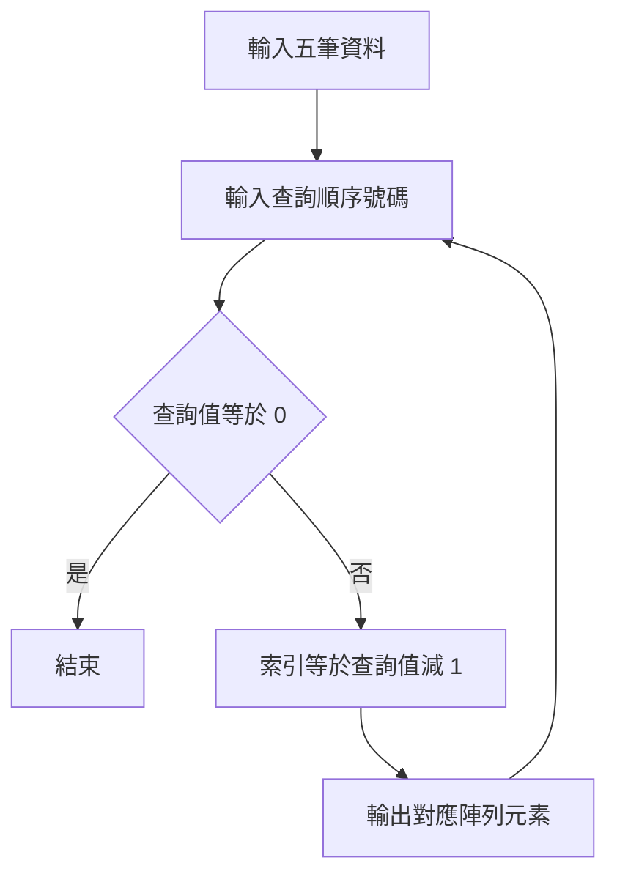
```mermaid
flowchart TD
    A[輸入五筆資料] --> B[輸入查詢順序號碼]
    B --> C{查詢值等於 0}
    C -- 是 --> F[結束]
    C -- 否 --> D[索引等於查詢值減 1]
    D --> E[輸出對應陣列元素]
    E --> B
```

---

### 2. 範圍查詢

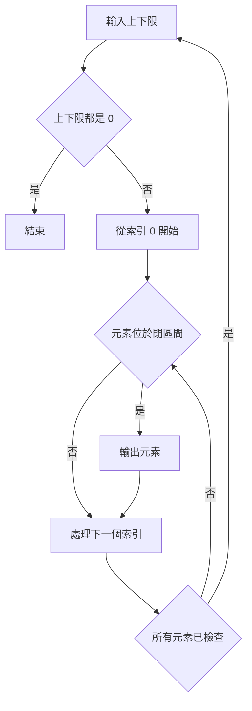
```mermaid
flowchart TD
    A[輸入上下限] --> B{上下限都是 0}
    B -- 是 --> G[結束]
    B -- 否 --> C[從索引 0 開始]
    C --> D{元素位於閉區間}
    D -- 是 --> E[輸出元素]
    D -- 否 --> F[處理下一個索引]
    E --> F
    F --> H{所有元素已檢查}
    H -- 否 --> D
    H -- 是 --> A
```

---

### 3. 上限內最大值

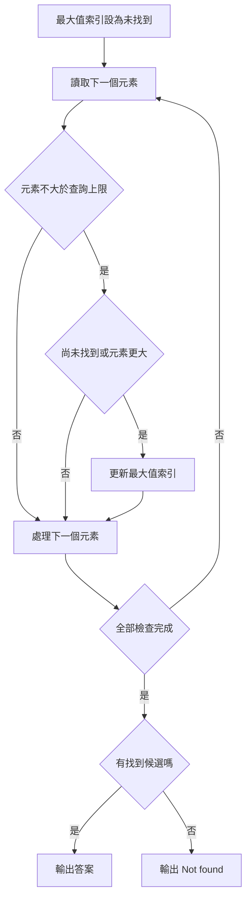
```mermaid
flowchart TD
    A[最大值索引設為未找到] --> B[讀取下一個元素]
    B --> C{元素不大於查詢上限}
    C -- 否 --> F[處理下一個元素]
    C -- 是 --> D{尚未找到或元素更大}
    D -- 是 --> E[更新最大值索引]
    D -- 否 --> F
    E --> F
    F --> G{全部檢查完成}
    G -- 否 --> B
    G -- 是 --> H{有找到候選嗎}
    H -- 是 --> I[輸出答案]
    H -- 否 --> J[輸出 Not found]
```

---

### 4. 最近值與平手規則

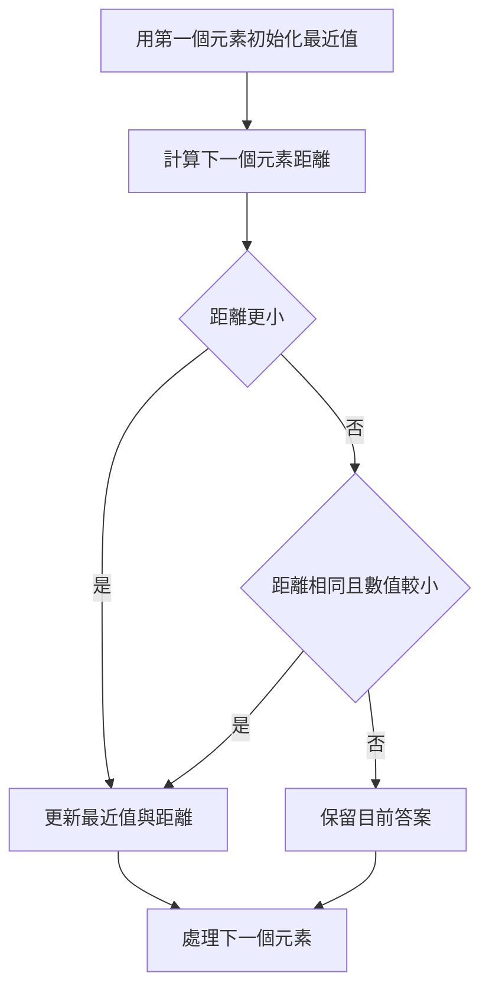
```mermaid
flowchart TD
    A[用第一個元素初始化最近值] --> B[計算下一個元素距離]
    B --> C{距離更小}
    C -- 是 --> E[更新最近值與距離]
    C -- 否 --> D{距離相同且數值較小}
    D -- 是 --> E
    D -- 否 --> F[保留目前答案]
    E --> G[處理下一個元素]
    F --> G
```

---

### 5. 十位區間統計

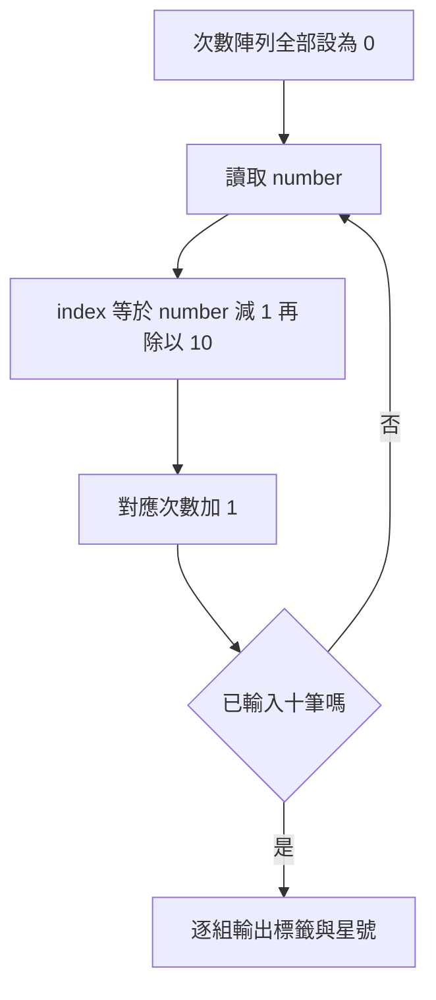
```mermaid
flowchart TD
    A[次數陣列全部設為 0] --> B[讀取 number]
    B --> C[index 等於 number 減 1 再除以 10]
    C --> D[對應次數加 1]
    D --> E{已輸入十筆嗎}
    E -- 否 --> B
    E -- 是 --> F[逐組輸出標籤與星號]
```

---

### 6. 眾數

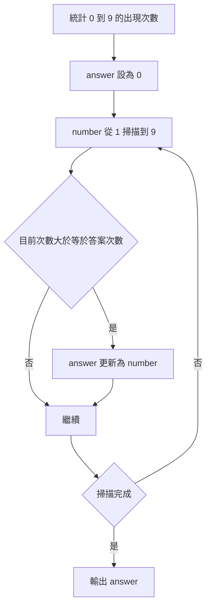
```mermaid
flowchart TD
    A[統計 0 到 9 的出現次數] --> B[answer 設為 0]
    B --> C[number 從 1 掃描到 9]
    C --> D{目前次數大於等於答案次數}
    D -- 是 --> E[answer 更新為 number]
    D -- 否 --> F[繼續]
    E --> F
    F --> G{掃描完成}
    G -- 否 --> C
    G -- 是 --> H[輸出 answer]
```

---

### 7. 最大值與平均值

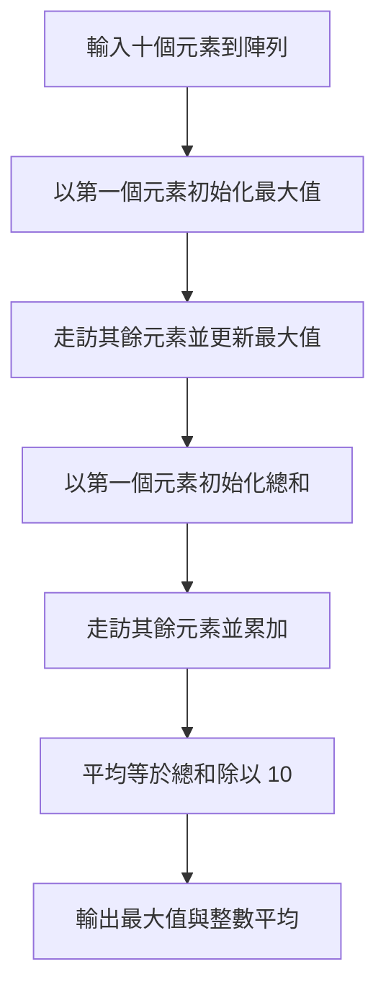
```mermaid
flowchart TD
    A[輸入十個元素到陣列] --> B[以第一個元素初始化最大值]
    B --> C[走訪其餘元素並更新最大值]
    C --> D[以第一個元素初始化總和]
    D --> E[走訪其餘元素並累加]
    E --> F[平均等於總和除以 10]
    F --> G[輸出最大值與整數平均]
```

---

## 本章完成標準

完成本章後，你應該能做到：

1. 將輸入順序號碼轉換成零起始索引。
2. 使用索引直接查詢指定陣列元素。
3. 在陣列存取前正確處理結束值。
4. 使用完整走訪找出範圍內所有元素。
5. 使用 `&&` 表示閉區間條件。
6. 使用 `0 0` 結束重複範圍查詢。
7. 找出不大於查詢值的最大陣列元素。
8. 使用索引 `-1` 表示尚未找到候選。
9. 正確處理沒有候選值的情況。
10. 使用 `abs()` 計算查詢值與陣列元素的距離。
11. 找出距離最小的元素。
12. 在距離平手時選擇較小數字。
13. 使用 `(number - 1) / 10` 將 `1–100` 分成十組。
14. 使用次數陣列保存每組出現次數。
15. 使用巢狀迴圈畫出文字長條圖。
16. 使用資料值 `0–9` 直接作為次數索引。
17. 找出小範圍資料的眾數。
18. 在眾數平手時輸出較大的數字。
19. 使用合法陣列元素初始化最大值。
20. 使用累加器計算十筆資料總和。
21. 說明來源整數平均會捨去小數。
22. 比較輸入時立即統計與先存陣列再統計。
23. 將最大值與平均值整理成獨立函式介面。
24. 分辨索引、資料、距離、次數與答案變數。
25. 找出結束值、越界、初始化、平手與整數除法的常見錯誤。
26. 準備進入下一章的陣列排序。
