# Lesson 16：Array Sorting 陣列排序

> 這堂課的重點：理解排序如何依照規則改變陣列元素的前後順序，並使用泡沫排序法反覆比較相鄰元素，將整數陣列由小排到大。

---

## Section I. 今天要做什麼？

1. 理解什麼是陣列排序。
2. 分辨原始輸入順序與排序後順序。
3. 將整數陣列由小排到大。
4. 理解排序不會刪除重複資料。
5. 認識排序後查詢最大值與最小值的便利性。
6. 理解排序後中間位置與中位數的關係。
7. 理解排序後相同數字會連續排列。
8. 認識排序能幫助後續搜尋。
9. 觀察泡沫排序如何比較相鄰元素。
10. 使用 `v[j]` 與 `v[j + 1]` 表示相鄰元素。
11. 在左邊元素較大時交換兩個元素。
12. 使用暫存變數完成交換。
13. 追蹤一次完整的相鄰比較。
14. 理解一輪泡沫排序會把目前最大值移到右端。
15. 理解為什麼只有一輪還不能完成全部排序。
16. 使用外層迴圈重複進行多輪比較。
17. 使用內層迴圈完成每輪的相鄰比較。
18. 理解每完成一輪後，右側已有一個元素確定就位。
19. 將下一輪的比較範圍縮短一格。
20. 解釋內層條件 `j < length - i - 1`。
21. 解釋為什麼不能存取 `v[length]`。
22. 完成五個整數的泡沫排序程式。
23. 輸出每一輪完成後的陣列內容。
24. 處理重複數字、負數、已排序及反向排序資料。
25. 將遞增排序修改成遞減排序。
26. 使用交換狀態提早停止已經排好的陣列。
27. 計算泡沫排序的比較次數。
28. 分辨排序、搜尋與統計是不同處理工作。
29. 找出索引越界、迴圈邊界及交換錯誤。
30. 為下一章的二維陣列建立更熟練的巢狀迴圈基礎。

---

## Section II. 今天的學習方式

1. 先用五個小數字手動模擬。
2. 每次只比較相鄰的兩個元素。
3. 如果左邊較大，就交換。
4. 每完成一次交換，立即寫出新的陣列。
5. 完成一整輪後，觀察哪一個元素已經移到正確位置。
6. 第二輪不要再比較已確定就位的最右端元素。
7. 使用 `i` 表示目前第幾輪。
8. 使用 `j` 表示目前比較的左側索引。
9. 每次存取 `v[j + 1]` 前，先確認它仍在合法範圍。
10. 先完成來源中的固定長度 `5` 版本。
11. 再把 `5` 改寫成較容易辨認的長度常數。
12. 使用追蹤輸出確認每一輪的變化。
13. 至少測試四類資料：
    - 已排序
    - 反向排序
    - 含重複值
    - 含負數
14. 本章主要教授來源中的泡沫排序，不加入選擇排序或插入排序作為主要演算法。
15. 先確保排序正確，再討論提前停止與比較次數。

---

## Section III. 今天會學到的內容

| 主題 | 你需要知道的事 |
| --- | --- |
| 排序 | 依照規則改變陣列元素的前後順序 |
| 遞增排序 | 數值由小到大排列 |
| 遞減排序 | 數值由大到小排列 |
| 原始順序 | 資料輸入時的排列方式 |
| 排序結果 | 元素相同，但位置重新安排 |
| 相鄰元素 | 索引相差 `1` 的兩個元素 |
| 比較條件 | 遞增排序時檢查左邊是否大於右邊 |
| 交換 | 對調兩個陣列元素的內容 |
| 暫存變數 | 交換時暫時保存其中一個值 |
| 一輪 pass | 從左到右完成一次相鄰比較 |
| 泡沫效果 | 較大的數字逐步向右移動 |
| 外層迴圈 | 控制排序輪數 |
| 內層迴圈 | 控制每輪相鄰比較的位置 |
| 已排序尾端 | 每輪結束後右側多一個確定位置 |
| 比較範圍 | `0` 到尚未排序區域的倒數第二個索引 |
| `j + 1` | 目前比較的右側相鄰元素 |
| 索引上限 | 最後合法索引為 `length - 1` |
| 交換狀態 | 記錄某輪是否曾發生交換 |
| 提前停止 | 某輪沒有交換時，陣列已排序 |
| 排序後最大值 | 遞增排序的最後一個元素 |
| 排序後最小值 | 遞增排序的第一個元素 |
| 中位數位置 | 排序後位於中央的一個或兩個元素 |
| 連續重複值 | 排序後相同值會排列在一起 |
| 中間搜尋 | 排序後可利用中間位置縮小搜尋範圍 |

---

## Section IV. 寫題目前的提醒

### 1. 排序會改變元素位置，不會改變元素集合

原始陣列：

```text
5 5 2 3 8 5 1 3
```

由小到大排序：

```text
1 2 3 3 5 5 5 8
```

排序前後：

- 元素數量相同。
- 每個值出現的次數相同。
- 只有前後位置改變。

---


<!-- AUTO-IMAGE: C_Lesson_16_img01_before_after_sort.png -->
<p align="center">
  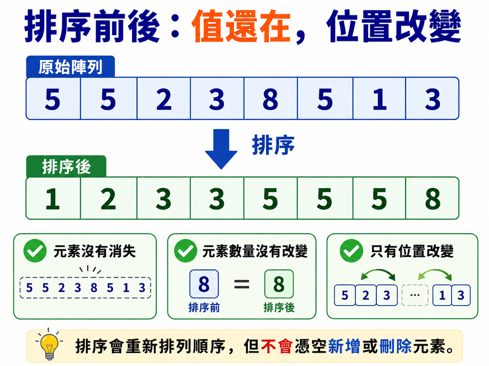
</p>
<!-- /AUTO-IMAGE: C_Lesson_16_img01_before_after_sort.png -->

### 2. 重複數字不會被刪除

原本有三個 `5`：

```text
5 5 2 3 8 5 1 3
```

排序後仍有三個 `5`：

```text
1 2 3 3 5 5 5 8
```

排序不是去除重複資料。

---

### 3. 遞增排序的相鄰比較條件

```c
if (v[j] > v[j + 1]) {
    /* 交換 */
}
```

左邊比右邊大，表示順序不符合由小到大，因此交換。

---

### 4. 相等元素不需要交換

```c
if (v[j] > v[j + 1])
```

當兩者相等時，條件不成立。

例如：

```text
5 5
```

不需要改變位置。

---

### 5. 交換不能只覆蓋其中一個值

錯誤：

```c
v[j] = v[j + 1];
v[j + 1] = v[j];
```

第一行已經把原本的 `v[j]` 覆蓋，原值遺失。

應先保存：

```c
int temporary = v[j];
v[j] = v[j + 1];
v[j + 1] = temporary;
```

---


<!-- AUTO-IMAGE: C_Lesson_16_img07_swap_with_temp.png -->
<p align="center">
  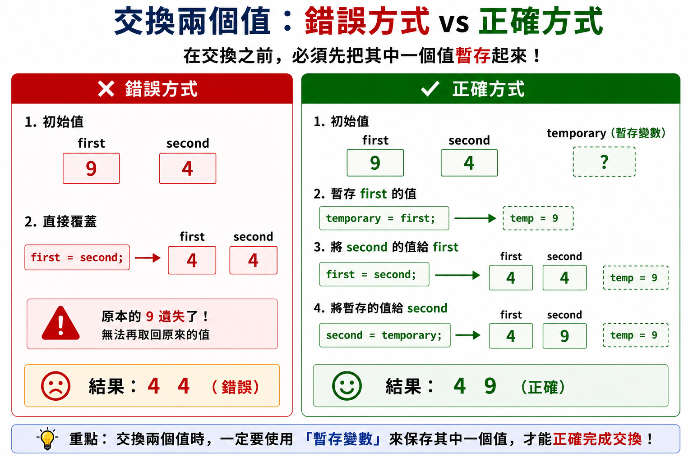
</p>
<!-- /AUTO-IMAGE: C_Lesson_16_img07_swap_with_temp.png -->

### 6. 內層只比較相鄰元素

```c
v[j]
v[j + 1]
```

不是：

```c
v[i]
v[j]
```

`i` 控制輪數，`j` 控制目前比較位置。

---

### 7. `j + 1` 必須是合法索引

長度為 `5` 時，合法索引：

```text
0 1 2 3 4
```

如果：

```text
j = 4
```

則：

```c
v[j + 1]
```

會變成：

```c
v[5]
```

超出陣列範圍。

因此第一輪最多只讓：

```text
j = 3
```

---

### 8. 第一輪的條件是 `j < 5 - 1`

```c
for (j = 0; j < 5 - 1; j++)
```

`j` 依序為：

```text
0 1 2 3
```

比較：

```text
v[0] 與 v[1]
v[1] 與 v[2]
v[2] 與 v[3]
v[3] 與 v[4]
```

---

### 9. 一輪排序只保證一個右端元素就位

一輪結束後，最大值會移到最後。

但前面的元素不一定已完全排序。

例如：

```text
9 4 6 2 1
```

一輪後：

```text
4 6 2 1 9
```

前四個元素仍不是由小到大。

---


<!-- AUTO-IMAGE: C_Lesson_16_img02_adjacent_compare_swap.png -->
<p align="center">
  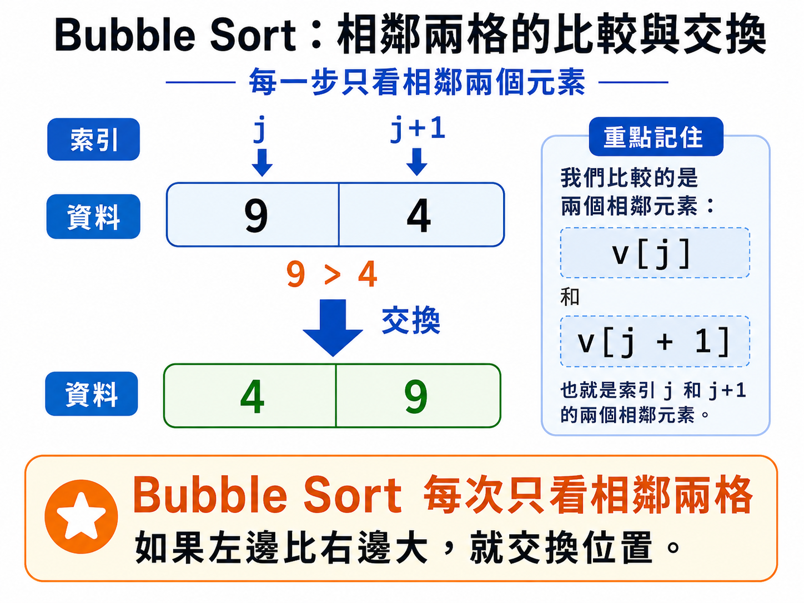
</p>
<!-- /AUTO-IMAGE: C_Lesson_16_img02_adjacent_compare_swap.png -->

### 10. 每輪可以少比較一個元素

第一輪後：

```text
最後一個元素已確定
```

第二輪不需要再比較它。

因此：

```c
j < 5 - i - 1
```

輪數 `i` 越大，內層比較範圍越短。

---

### 11. 來源完整程式使用 `i < 5`

來源程式：

```c
for (i = 0; i < 5; i++) {
    for (j = 0; j < 5 - i - 1; j++) {
        ...
    }
}
```

當：

```text
i = 4
```

內層條件一開始就是：

```text
j < 0
```

所以執行 `0` 次。

這個版本正確。

更直接的輪數也可以寫成：

```c
for (i = 0; i < 5 - 1; i++)
```

因為五個元素最多只需要四個有實際比較的輪次。

---

### 12. 遞減排序只需要改變比較方向

遞增：

```c
if (v[j] > v[j + 1])
```

遞減：

```c
if (v[j] < v[j + 1])
```

交換程式不變。

---

### 13. 已排序陣列仍會進行比較

基本泡沫排序不知道陣列是否已經排序。

即使輸入：

```text
1 2 3 4 5
```

仍會按照迴圈完成比較。

可以使用交換狀態作為延伸改善。

---

### 14. 中位數需要先排序，但偶數長度要特別說明

來源投影片以「取陣列中間的元素」說明排序後求中位數的便利性。

對奇數個元素，例如五筆：

```text
1 2 3 4 5
```

中位數是中央元素：

```text
3
```

對偶數個元素，例如八筆：

```text
1 2 3 3 5 5 5 8
```

中央有兩個元素：

```text
3 和 5
```

是否取平均，以及平均使用整數或浮點數，要依題目定義。本章不把「單一中間元素」套用到所有偶數長度資料。

---

### 15. 排序後能幫助找眾數，但仍要計數

來源投影片指出：

> 排序後可以觀察連續出現最多次的值。

例如：

```text
1 2 3 3 5 5 5 8
```

最長的連續區段是三個 `5`，所以眾數是 `5`。

但程式仍需要計算每段連續值的長度，不能只看一次相鄰比較。

---


<!-- AUTO-IMAGE: C_Lesson_16_img03_first_pass.png -->
<p align="center">
  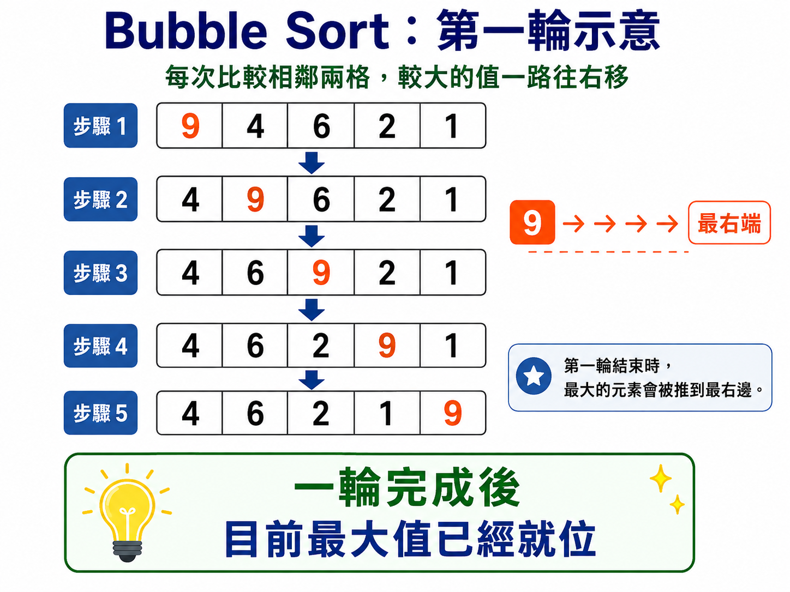
</p>
<!-- /AUTO-IMAGE: C_Lesson_16_img03_first_pass.png -->

### 16. 排序後能幫助搜尋，但不是直接取中間就一定找到

來源最後以中間位置提示：

> 排序後可以從陣列中間開始檢查某個值。

這是利用排序結果縮小搜尋範圍的概念。

完整的中間縮小搜尋方法會需要另外設計上下界；本章只建立這項好處，不正式展開完整搜尋演算法。

---

## Section V. 核心概念說明

## Section V-A. 什麼是排序？

### 1. 排序的基本定義

排序是：

> 將陣列內的元素依照一定規則改變前後順序。

常見規則：

```text
由小到大
由大到小
依文字字典順序
依日期先後
```

本章只處理整數的由小到大與由大到小。

---

### 2. 遞增排序

原始資料：

```text
5 5 2 3 8 5 1 3
```

排序後：

```text
1 2 3 3 5 5 5 8
```

左邊的數字不大於右邊的數字：

```text
v[0] <= v[1] <= v[2] <= ...
```

---

### 3. 遞減排序

同一組資料由大到小：

```text
8 5 5 5 3 3 2 1
```

關係為：

```text
v[0] >= v[1] >= v[2] >= ...
```

這是由來源的一般排序定義延伸出的另一種常見規則。

---

## Section V-B. 排序後的好處

### 4. 最大值位於最後

遞增排序後：

```text
1 2 3 3 5 5 5 8
```

最大值：

```c
v[length - 1]
```

來源投影片以：

```text
取最後一個元素
```

說明這項好處。

---

### 5. 最小值位於第一個位置

遞增排序後最小值：

```c
v[0]
```

來源投影片以：

```text
取第一個元素
```

說明這項好處。

---

### 6. 中位位置容易辨認

排序後資料的中央位置可以直接由索引計算。

奇數長度：

```c
middle = length / 2;
```

例如長度 `5`：

```text
索引 2
```

偶數長度則有兩個中央索引：

```text
length / 2 - 1
length / 2
```

---

### 7. 相同數字會連續出現

排序後：

```text
1 2 3 3 5 5 5 8
```

所有 `3` 聚在一起，所有 `5` 也聚在一起。

這使連續計數與眾數分析更容易。

---

### 8. 可以利用中間位置協助搜尋

未排序資料：

```text
5 5 2 3 8 5 1 3
```

某個值可能在任何位置。

排序資料：

```text
1 2 3 3 5 5 5 8
```

檢查中間值後，可以根據大小判斷目標應在左側還是右側。

---


<!-- AUTO-IMAGE: C_Lesson_16_img12_after_sort_benefits.png -->
<p align="center">
  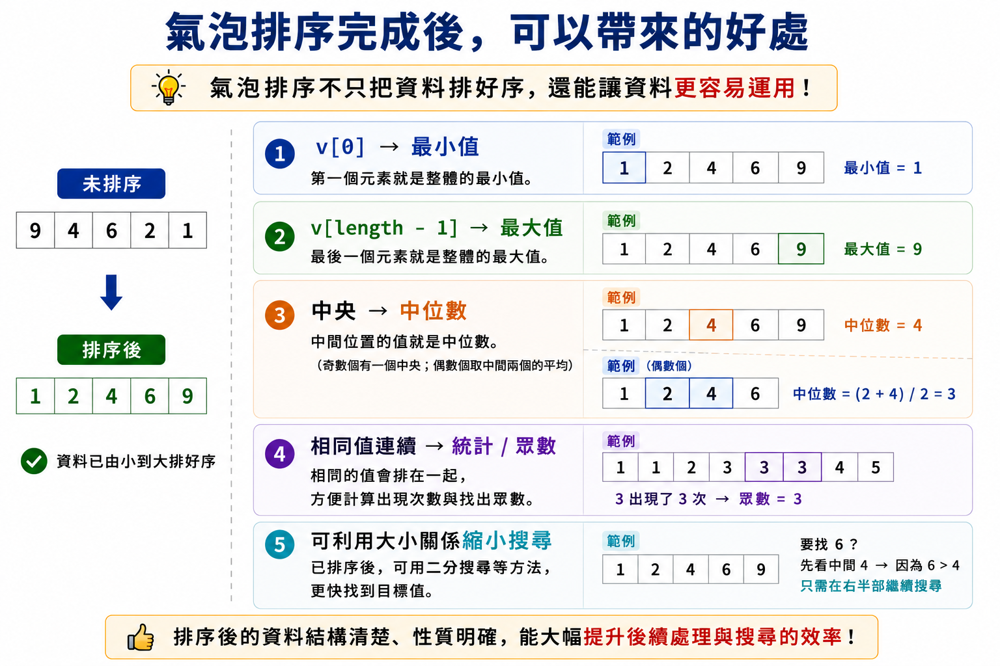
</p>
<!-- /AUTO-IMAGE: C_Lesson_16_img12_after_sort_benefits.png -->

## Section V-C. 泡沫排序法

### 9. 泡沫排序的核心規則

由小到大排序時：

1. 從左到右比較相鄰元素。
2. 如果左邊比右邊大，就交換。
3. 繼續比較下一對相鄰元素。
4. 一輪結束後，最大值會到最右端。
5. 對剩餘未排序區域重複相同步驟。

---

### 10. 來源範例陣列

```text
索引：0 1 2 3 4
資料：9 4 6 2 1
```

第一輪將依序比較：

```text
9 與 4
9 與 6
9 與 2
9 與 1
```

注意：數值 `9` 在交換後會改變索引，但仍繼續與右邊相鄰元素比較。

---

## Section V-D. 第一輪追蹤

### 11. 第一次比較：`9` 與 `4`

目前：

```text
9 4 6 2 1
```

因為：

```text
9 > 4
```

交換後：

```text
4 9 6 2 1
```

---

### 12. 第二次比較：`9` 與 `6`

目前：

```text
4 9 6 2 1
```

因為：

```text
9 > 6
```

交換後：

```text
4 6 9 2 1
```

---

### 13. 第三次比較：`9` 與 `2`

目前：

```text
4 6 9 2 1
```

交換後：

```text
4 6 2 9 1
```

---

### 14. 第四次比較：`9` 與 `1`

目前：

```text
4 6 2 9 1
```

交換後：

```text
4 6 2 1 9
```

---

### 15. 第一輪結果

```text
4 6 2 1 9
```

最大值 `9` 已經位於最後：

```c
v[4]
```

但左側：

```text
4 6 2 1
```

仍需要繼續排序。

---

## Section V-E. 第二輪追蹤

### 16. 第二輪不再比較最後一格

目前：

```text
4 6 2 1 | 9
```

`9` 已確定，因此第二輪只比較前四個元素。

---

### 17. 比較 `4` 與 `6`

```text
4 6 2 1 9
```

因為：

```text
4 <= 6
```

不交換。

---

### 18. 比較 `6` 與 `2`

交换後：

```text
4 2 6 1 9
```

---

### 19. 比較 `6` 與 `1`

交換後：

```text
4 2 1 6 9
```

第二輪完成後：

```text
6
```

已位於倒數第二格。

---

### 20. 後續輪次

第三輪處理：

```text
4 2 1 | 6 9
```

得到：

```text
2 1 4 6 9
```

第四輪處理：

```text
2 1 | 4 6 9
```

得到：

```text
1 2 4 6 9
```

排序完成。

---


<!-- AUTO-IMAGE: C_Lesson_16_img04_sorted_tail.png -->
<p align="center">
  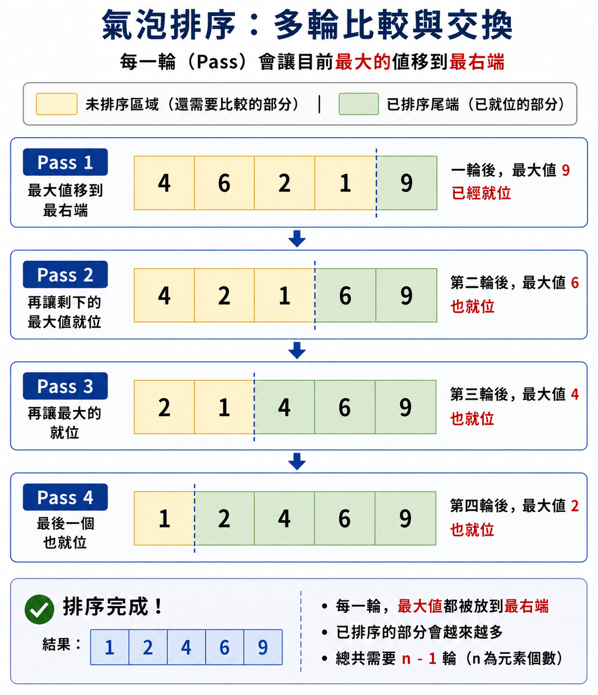
</p>
<!-- /AUTO-IMAGE: C_Lesson_16_img04_sorted_tail.png -->

## Section V-F. 寫成程式：輸入與輸出

### 21. 先輸入五個元素

```c
#include <stdio.h>

int main(void) {
    int v[5];
    int i;

    for (i = 0; i < 5; i++) {
        scanf("%d", &v[i]);
    }

    for (i = 0; i < 5; i++) {
        printf("%d ", v[i]);
    }

    printf("\n");

    return 0;
}
```

這個版本還沒有排序，只建立輸入與輸出骨架。

---

## Section V-G. 寫成程式：一輪泡沫比較

### 22. 一輪程式

```c
#include <stdio.h>

int main(void) {
    int v[5];
    int i;
    int j;

    for (i = 0; i < 5; i++) {
        scanf("%d", &v[i]);
    }

    for (j = 0; j < 5 - 1; j++) {
        if (v[j] > v[j + 1]) {
            int temporary = v[j];
            v[j] = v[j + 1];
            v[j + 1] = temporary;
        }
    }

    for (i = 0; i < 5; i++) {
        printf("%d ", v[i]);
    }

    printf("\n");

    return 0;
}
```

輸入：

```text
9 4 6 2 1
```

一輪後輸出：

```text
4 6 2 1 9
```

---

### 23. 為什麼條件是 `j < 5 - 1`？

最後一次合法比較：

```c
v[3] 與 v[4]
```

此時：

```text
j = 3
```

若 `j = 4`，就會存取：

```c
v[5]
```

因此：

```text
j 最大只能是 3
```

---


<!-- AUTO-IMAGE: C_Lesson_16_img05_index_boundary.png -->
<p align="center">
  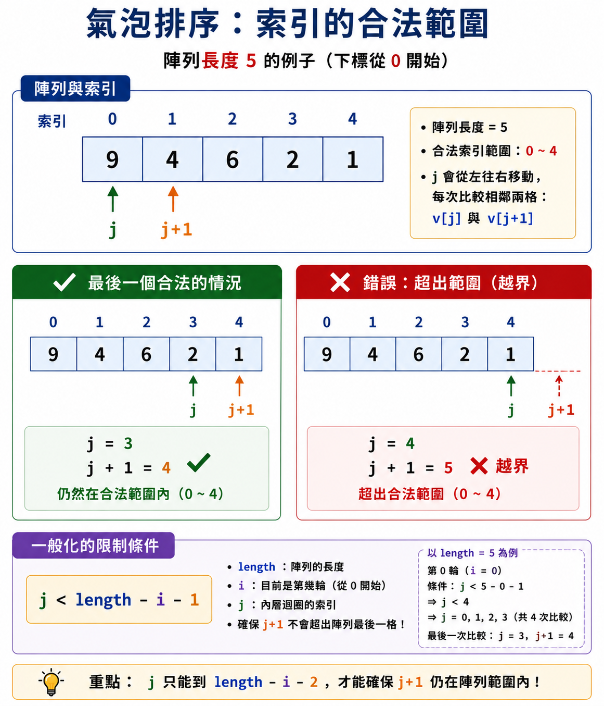
</p>
<!-- /AUTO-IMAGE: C_Lesson_16_img05_index_boundary.png -->

## Section V-H. 完整泡沫排序

### 24. 加入外層輪次

```c
for (i = 0; i < 5; i++) {
    for (j = 0; j < 5 - i - 1; j++) {
        if (v[j] > v[j + 1]) {
            int temporary = v[j];
            v[j] = v[j + 1];
            v[j + 1] = temporary;
        }
    }
}
```

---


<!-- AUTO-IMAGE: C_Lesson_16_img06_nested_loop_roles.png -->
<p align="center">
  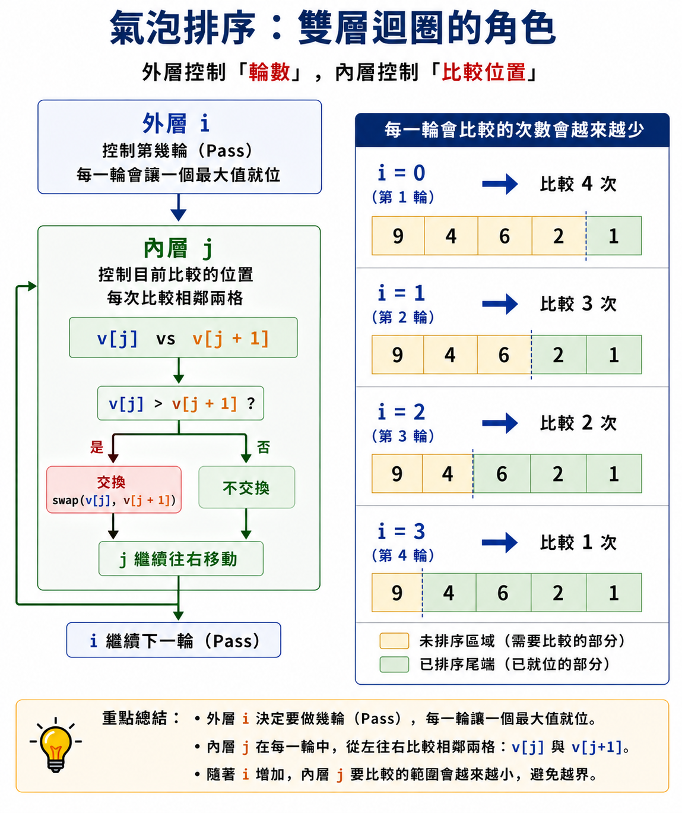
</p>
<!-- /AUTO-IMAGE: C_Lesson_16_img06_nested_loop_roles.png -->

### 25. 每一輪的比較次數

| `i` | 內層條件 | `j` 值 | 比較次數 |
| ---: | --- | --- | ---: |
| 0 | `j < 4` | 0, 1, 2, 3 | 4 |
| 1 | `j < 3` | 0, 1, 2 | 3 |
| 2 | `j < 2` | 0, 1 | 2 |
| 3 | `j < 1` | 0 | 1 |
| 4 | `j < 0` | 無 | 0 |

總比較次數：

```text
4 + 3 + 2 + 1 = 10
```

---

### 26. 完整來源式程式

```c
#include <stdio.h>

int main(void) {
    int v[5];
    int i;
    int j;

    for (i = 0; i < 5; i++) {
        scanf("%d", &v[i]);
    }

    for (i = 0; i < 5; i++) {
        for (j = 0; j < 5 - i - 1; j++) {
            if (v[j] > v[j + 1]) {
                int temporary = v[j];
                v[j] = v[j + 1];
                v[j + 1] = temporary;
            }
        }
    }

    for (i = 0; i < 5; i++) {
        printf("%d ", v[i]);
    }

    printf("\n");

    return 0;
}
```

輸入：

```text
9 4 6 2 1
```

輸出：

```text
1 2 4 6 9
```

---

### 27. 使用四個實際輪次

因為最後一輪不會進行任何比較，也可以寫：

```c
for (i = 0; i < 5 - 1; i++) {
    for (j = 0; j < 5 - i - 1; j++) {
        ...
    }
}
```

結果相同。

來源使用 `i < 5`；這裡只是把沒有工作的最後一輪省略。

---

## Section V-I. 顯示每一輪結果

### 28. 追蹤版本

```c
#include <stdio.h>

int main(void) {
    int v[5];
    int i;
    int j;
    int k;

    for (i = 0; i < 5; i++) {
        scanf("%d", &v[i]);
    }

    for (i = 0; i < 5 - 1; i++) {
        for (j = 0; j < 5 - i - 1; j++) {
            if (v[j] > v[j + 1]) {
                int temporary = v[j];
                v[j] = v[j + 1];
                v[j + 1] = temporary;
            }
        }

        printf("Pass %d: ", i + 1);

        for (k = 0; k < 5; k++) {
            printf("%d ", v[k]);
        }

        printf("\n");
    }

    return 0;
}
```

輸入：

```text
9 4 6 2 1
```

輸出：

```text
Pass 1: 4 6 2 1 9
Pass 2: 4 2 1 6 9
Pass 3: 2 1 4 6 9
Pass 4: 1 2 4 6 9
```

---

## Section V-J. 遞減排序

### 29. 比較方向相反

遞增排序：

```c
if (v[j] > v[j + 1])
```

遞減排序：

```c
if (v[j] < v[j + 1])
```

---

### 30. 完整遞減版本

```c
#include <stdio.h>

int main(void) {
    int v[5];
    int i;
    int j;

    for (i = 0; i < 5; i++) {
        scanf("%d", &v[i]);
    }

    for (i = 0; i < 5 - 1; i++) {
        for (j = 0; j < 5 - i - 1; j++) {
            if (v[j] < v[j + 1]) {
                int temporary = v[j];
                v[j] = v[j + 1];
                v[j + 1] = temporary;
            }
        }
    }

    for (i = 0; i < 5; i++) {
        printf("%d ", v[i]);
    }

    printf("\n");

    return 0;
}
```

輸入：

```text
9 4 6 2 1
```

輸出：

```text
9 6 4 2 1
```

這是依來源排序規則延伸出的反向版本。

---


<!-- AUTO-IMAGE: C_Lesson_16_img09_ascending_descending.png -->
<p align="center">
  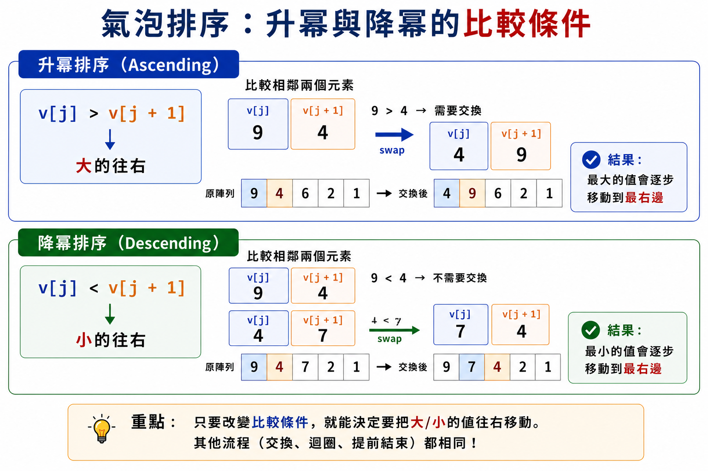
</p>
<!-- /AUTO-IMAGE: C_Lesson_16_img09_ascending_descending.png -->

## Section V-K. 某一輪沒有交換時提前停止

### 31. 為什麼可以提前停止？

若一整輪中沒有任何：

```c
v[j] > v[j + 1]
```

表示每一對相鄰元素都已符合由小到大。

此時整個陣列已排序，不需要繼續後面的輪次。

---

### 32. 使用交換狀態

```c
#include <stdio.h>

int main(void) {
    int v[5];
    int i;
    int j;

    for (i = 0; i < 5; i++) {
        scanf("%d", &v[i]);
    }

    for (i = 0; i < 5 - 1; i++) {
        int swapped = 0;

        for (j = 0; j < 5 - i - 1; j++) {
            if (v[j] > v[j + 1]) {
                int temporary = v[j];
                v[j] = v[j + 1];
                v[j + 1] = temporary;
                swapped = 1;
            }
        }

        if (!swapped) {
            break;
        }
    }

    for (i = 0; i < 5; i++) {
        printf("%d ", v[i]);
    }

    printf("\n");

    return 0;
}
```

这是在来源完整泡沫排序上的常见延伸改善。

---


<!-- AUTO-IMAGE: C_Lesson_16_img08_early_stop.png -->
<p align="center">
  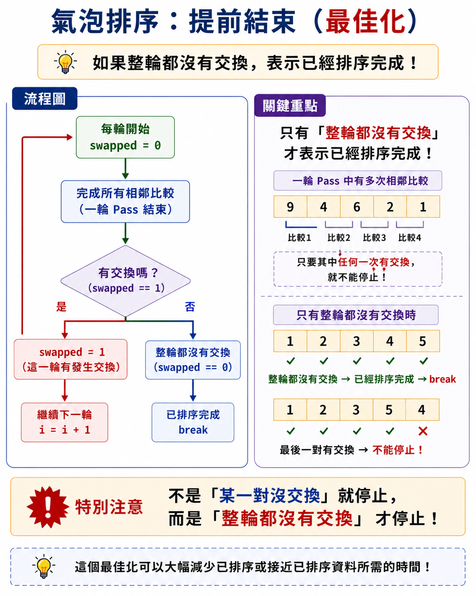
</p>
<!-- /AUTO-IMAGE: C_Lesson_16_img08_early_stop.png -->

## Section V-L. 泡沫排序的比較次數

### 33. 五個元素的基本版本

最多比較：

```text
4 + 3 + 2 + 1 = 10 次
```

---

### 34. 一般長度

長度為 `length`：

```text
(length - 1)
+ (length - 2)
+ ...
+ 1
```

總數：

```text
length × (length - 1) / 2
```

例如長度 `8`：

```text
8 × 7 / 2 = 28
```

這是沒有提前停止時的比較次數。

---

### 35. 比較不等於交換

每一對相鄰元素都會比較。

只有順序錯誤時才交換。

例如已排序陣列：

```text
1 2 3 4 5
```

基本版仍比較，但交換次數為 `0`。

---


<!-- AUTO-IMAGE: C_Lesson_16_img10_comparison_count.png -->
<p align="center">
  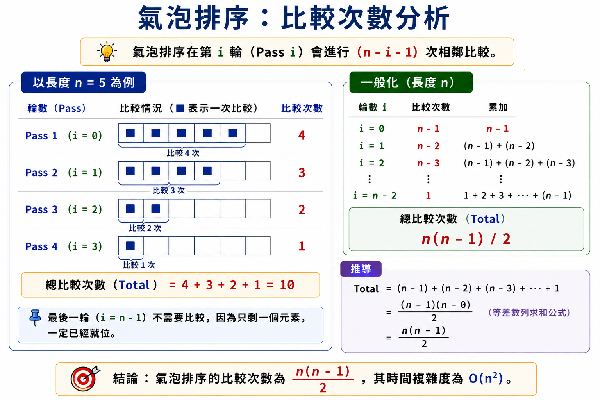
</p>
<!-- /AUTO-IMAGE: C_Lesson_16_img10_comparison_count.png -->

## Section V-M. 特殊資料測試

### 36. 已排序資料

輸入：

```text
1 2 3 4 5
```

輸出仍是：

```text
1 2 3 4 5
```

使用交换状态时，第一轮没有交换即可结束。

---

### 37. 反向排序資料

輸入：

```text
5 4 3 2 1
```

這類資料會發生很多交換。

結果：

```text
1 2 3 4 5
```

---

### 38. 重複資料

輸入：

```text
5 3 5 1 3
```

結果：

```text
1 3 3 5 5
```

重複值全部保留。

---

### 39. 負數資料

輸入：

```text
-2 5 -7 0 3
```

結果：

```text
-7 -2 0 3 5
```

比較運算子同樣適用於負整數。

---


<!-- AUTO-IMAGE: C_Lesson_16_img11_test_cases.png -->
<p align="center">
  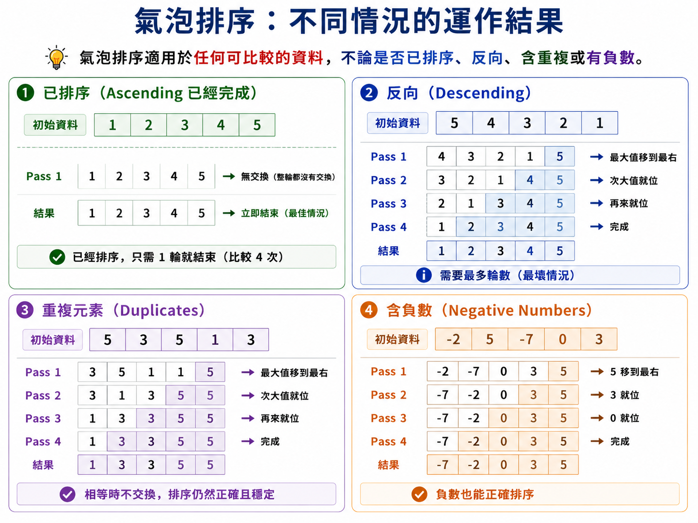
</p>
<!-- /AUTO-IMAGE: C_Lesson_16_img11_test_cases.png -->

## Section V-N. 容易搞混的重點

### 40. 排序後的最大值不等於原本最後一個元素

必須先完成排序，才能直接使用：

```c
v[length - 1]
```

未排序時，最後一格不一定最大。

---

### 41. 泡沫排序不是每輪直接尋找最大值索引

它是反覆比較相鄰元素。

最大值會因多次相鄰交換逐步移到右端。

---

### 42. 外層 `i` 不代表目前要比較的元素

`i` 代表完成了多少輪。

真正的相鄰比較索引是：

```c
j
j + 1
```

---

### 43. `5 - i - 1` 中的最後一個 `-1` 不能省略

若寫：

```c
j < 5 - i
```

第一輪可能讓 `j = 4`，導致：

```c
v[j + 1] == v[5]
```

越界。

---

### 44. 交換後仍要繼續向右比較

来源第一轮中，`9` 会依序和 `4、6、2、1` 比較。

不能交換一次後就直接開始下一輪。

---

### 45. 一輪後的左側不保證排序

```text
4 6 2 1 9
```

只有最右端 `9` 確定。

---

### 46. 提前停止版本仍要先完成一整輪

不能看到某一對沒有交換就立刻停止。

例如：

```text
1 3 2
```

第一對 `1、3` 不交換，但後面的 `3、2` 仍需要交換。

只有整輪都沒有交換才表示完成。

---

## Section VI. 快速概念檢查

### Q1. 排序會刪除重複值嗎？

<details>
<summary>查看答案</summary>

不會。排序只改變前後順序。

</details>

---

### Q2. 遞增排序後，最大值位於哪裡？

<details>
<summary>查看答案</summary>

最後一個元素：

```c
v[length - 1]
```

</details>

---

### Q3. 遞增排序後，最小值位於哪裡？

<details>
<summary>查看答案</summary>

第一個元素：

```c
v[0]
```

</details>

---

### Q4. 泡沫排序比較哪兩個元素？

<details>
<summary>查看答案</summary>

目前索引 `j` 與它右邊的相鄰索引：

```c
v[j]
v[j + 1]
```

</details>

---

### Q5. 遞增排序時，何時交換？

<details>
<summary>查看答案</summary>

當左邊大於右邊：

```c
v[j] > v[j + 1]
```

</details>

---

### Q6. 長度為 `5` 時，第一輪最後一次比較的 `j` 是多少？

<details>
<summary>查看答案</summary>

```text
3
```

比較：

```c
v[3] 與 v[4]
```

</details>

---

### Q7. 一輪泡沫排序後，哪一個元素確定到達正確位置？

<details>
<summary>查看答案</summary>

目前未排序區域中的最大值會到達最右端。

</details>

---

### Q8. 為什麼第二輪可以少比較一格？

<details>
<summary>查看答案</summary>

第一輪已經把最大值移到最後，該位置不需要再次參與比較。

</details>

---

### Q9. `9 4 6 2 1` 第一輪後是什麼？

<details>
<summary>查看答案</summary>

```text
4 6 2 1 9
```

</details>

---

### Q10. 交換需要暫存變數的原因是什麼？

<details>
<summary>查看答案</summary>

避免第一個值被覆蓋後遺失。

</details>

---

### Q11. 遞減排序應使用哪個比較條件？

<details>
<summary>查看答案</summary>

```c
v[j] < v[j + 1]
```

</details>

---

### Q12. 某一整輪沒有交換代表什麼？

<details>
<summary>查看答案</summary>

所有相鄰元素都已符合排序規則，陣列已排序完成。

</details>

---

## Section VII. 程式閱讀練習

### 題目 1：一次交換

```c
int v[3] = {7, 2, 5};
int j = 0;

if (v[j] > v[j + 1]) {
    int temporary = v[j];
    v[j] = v[j + 1];
    v[j + 1] = temporary;
}
```

<details>
<summary>查看答案</summary>

比較 `7` 與 `2`，交換後：

```text
2 7 5
```

</details>

---

### 題目 2：第一輪結果

```text
5 1 4 2
```

使用遞增泡沫排序完成一輪。

<details>
<summary>查看答案</summary>

```text
1 4 2 5
```

过程：

```text
5 1 4 2
1 5 4 2
1 4 5 2
1 4 2 5
```

</details>

---

### 題目 3：合法比較次數

```c
for (j = 0; j < 6 - 1; j++) {
    ...
}
```

<details>
<summary>查看答案</summary>

`j` 為 `0–4`，共比較 `5` 次。

最後比較：

```c
v[4] 與 v[5]
```

</details>

---

### 題目 4：找出越界錯誤

```c
for (j = 0; j < 5; j++) {
    if (v[j] > v[j + 1]) {
        ...
    }
}
```

<details>
<summary>查看答案</summary>

當 `j == 4` 時會存取：

```c
v[5]
```

應改成：

```c
j < 5 - 1
```

</details>

---

### 題目 5：第二輪範圍

長度 `5`，外層 `i == 1`：

```c
j < 5 - i - 1
```

<details>
<summary>查看答案</summary>

```text
j < 3
```

所以 `j` 為：

```text
0 1 2
```

共比較三次。

</details>

---

### 題目 6：遞減結果

```text
3 8 1 8 2
```

由大到小排序後：

<details>
<summary>查看答案</summary>

```text
8 8 3 2 1
```

</details>

---

### 題目 7：交換狀態

```c
int swapped = 0;

for (j = 0; j < 4; j++) {
    if (v[j] > v[j + 1]) {
        ...
        swapped = 1;
    }
}

if (!swapped) {
    break;
}
```

<details>
<summary>查看答案</summary>

若整輪沒有任何交換，`swapped` 保持 `0`，表示陣列已經排序，可停止外層迴圈。

</details>

---

### 題目 8：中位位置

排序後有五個元素：

```text
1 2 4 6 9
```

<details>
<summary>查看答案</summary>

中央索引：

```text
5 / 2 = 2
```

中位數：

```text
v[2] = 4
```

</details>

---

## Section VIII. 實作練習 / 實作檢測題

### TODO 1：完成一輪泡沫排序

輸入五個整數，只完成一輪相鄰比較並輸出結果。

測試：

```text
9 4 6 2 1
```

預期：

```text
4 6 2 1 9
```

---

### TODO 2：完整遞增排序

依來源程式，將五個整數由小排到大。

---

### TODO 3：輸出每輪結果

排序過程中輸出：

```text
Pass 1
Pass 2
Pass 3
Pass 4
```

的陣列內容。

---

### TODO 4：完整遞減排序

只修改比較方向，將五個整數由大排到小。

---

### TODO 5：排序十個整數

把陣列長度改成 `10`，調整所有相關迴圈邊界。

---

### TODO 6：已排序資料提前停止

加入 `swapped`，顯示實際完成了幾輪。

輸入：

```text
1 2 3 4 5
```

應在第一輪後停止。

---

### TODO 7：近乎排序資料

測試：

```text
1 2 3 5 4
```

記錄交換次數與完成輪數。

---

### TODO 8：反向排序資料

測試：

```text
5 4 3 2 1
```

記錄總比較次數與交換次數。

---

### TODO 9：排序後輸出最大值與最小值

完成遞增排序後：

```c
minimum = v[0];
maximum = v[length - 1];
```

---

### TODO 10：五筆資料的中位數

將五個整數排序後，輸出：

```c
v[2]
```

---

### TODO 11：六筆資料的中位數

排序六個整數。

中央元素位於索引：

```text
2 和 3
```

依題目要求使用 `double` 計算兩者平均。

這是對來源「取中間元素」概念的偶數長度補充。

---

### TODO 12：排序後統計連續重複值

輸入八個整數，排序後輸出每個不同數字及其連續出現次數。

例如：

```text
1: 1
2: 1
3: 2
5: 3
8: 1
```

---

### TODO 13：排序後求眾數

延續 TODO 12，找出最長的連續區段。

平手規則請先自行明確定義。

---

### TODO 14：交換函式預覽

撰寫：

```c
void swap_values(int *a, int *b);
```

這需要使用指標，屬於後續章節的預覽。尚未學習指標時，可以保留原本的三行交換程式。

---

### TODO 15：比較基本版與提前停止版

對以下資料各執行兩個版本：

```text
1 2 3 4 5
5 4 3 2 1
2 1 3 4 5
```

記錄：

- 比較次數
- 交換次數
- 完成輪數

---

## Section IX. 做題時可以使用的提示

### 1. 先固定目前比較的一對

```text
左側索引：j
右側索引：j + 1
```

不要同時想整個陣列。

---

### 2. 每次交換後重新寫出陣列

例如：

```text
9 4 6 2 1
4 9 6 2 1
4 6 9 2 1
...
```

這能避免在腦中遺失元素位置。

---

### 3. 寫內層條件前先回答

```text
最後一次合法比較是哪兩個索引？
```

長度 `5`：

```text
3 與 4
```

所以最後的左側索引是 `3`。

---

### 4. 外層每增加一輪，就畫出一個已排序尾端

```text
未排序區域 | 已排序尾端
```

例如第二輪前：

```text
4 6 2 1 | 9
```

---

### 5. 排序結果錯誤時檢查

1. 比較方向。
2. 交換三行的順序。
3. `j + 1` 是否正確。
4. 內層是否完整走到未排序區域右端。
5. 外層輪數是否足夠。

---

### 6. 越界時檢查

```c
j < length - i - 1
```

確保最大的 `j + 1` 不超過：

```text
length - 1
```

---

### 7. 建議測試資料

```text
9 4 6 2 1
1 2 3 4 5
5 4 3 2 1
3 3 3 3 3
5 3 5 1 3
-2 5 -7 0 3
```

---

## Section X. 課後小練習

### 練習 1：只找最大值位置

只做一輪泡沫排序，確認最大值移到最後。

---

### 練習 2：只完成兩輪

輸入五個整數，只進行兩輪，輸出目前結果。

指出哪兩個右端元素已經確定。

---

### 練習 3：字元排序概念

建立五個英文字元陣列，使用相同泡沫結構依字元編碼由小到大排序。

---

### 練習 4：同步排序兩個陣列

假設：

```text
scores[i]
student_ids[i]
```

交換成績時也同步交換學號，保持資料對應。

這是排序記錄資料前的重要概念。

---

### 練習 5：只輸出不同值

完成排序後，依序輸出不同數字，跳過連續重複值。

注意：這不是在排序過程中刪除資料，只是輸出時略過。

---

### 練習 6：第 K 小

排序後輸入 `K`，輸出：

```c
v[K - 1]
```

先檢查 `K` 是否位於合法範圍。

---

### 練習 7：第 K 大

遞增排序後輸出：

```c
v[length - K]
```

---

### 練習 8：排序驗證

撰寫一段程式檢查：

```c
v[i] <= v[i + 1]
```

是否對所有相鄰元素成立。

---

## Section XI. 重點複習

1. 排序會改變元素前後順序。
2. 排序不會刪除重複值。
3. 遞增排序代表由小到大。
4. 遞減排序代表由大到小。
5. 遞增排序後最大值位於最後。
6. 遞增排序後最小值位於第一個位置。
7. 排序後中央位置可協助求中位數。
8. 偶數長度有兩個中央元素。
9. 排序後相同值會連續排列。
10. 排序後可以從中間位置協助搜尋。
11. 泡沫排序反覆比較相鄰元素。
12. 遞增排序時左邊較大就交換。
13. 交換需要暫存變數。
14. 一輪會把未排序區域最大值移到最右端。
15. 一輪通常不能完成全部排序。
16. 外層迴圈控制輪數。
17. 內層迴圈控制相鄰比較位置。
18. 每完成一輪，右端多一個元素確定。
19. 內層範圍可使用 `length - i - 1`。
20. 最後合法索引是 `length - 1`。
21. `v[j + 1]` 不可超出陣列。
22. 来源五元素版本使用兩層 `for` 完成排序。
23. 外層寫到 `i < length` 時，最後一輪內層執行零次。
24. 外層也可只執行 `length - 1` 個實際輪次。
25. 遞減排序只需反轉比較方向。
26. 整輪沒有交換時，可以提前停止。
27. 比較次數與交換次數不是同一件事。
28. 五個元素最多比較十次。
29. 已排序、反向、重複與負數資料都應測試。
30. 下一章會開始學習二維陣列。

---

## Section XII. 常見錯誤提醒

### 錯誤 1：排序時遺失重複值

排序不應刪除或新增元素。

---

### 錯誤 2：交換時覆蓋原值

錯誤：

```c
v[j] = v[j + 1];
v[j + 1] = v[j];
```

---

### 錯誤 3：比較不相鄰元素

來源泡沫排序的核心是：

```c
v[j]
v[j + 1]
```

---

### 錯誤 4：內層走到 `j == length - 1`

這會存取：

```c
v[length]
```

---

### 錯誤 5：漏掉 `-1`

錯誤：

```c
j < length - i
```

正確：

```c
j < length - i - 1
```

---

### 錯誤 6：只做一輪就認為完成

一輪只確定目前最大值的位置。

---

### 錯誤 7：每一輪仍比較完整陣列

這通常仍可得到正確排序，但會重複比較已確定的右端元素。

来源使用縮短範圍：

```c
length - i - 1
```

---

### 錯誤 8：遞增排序的比較方向寫反

```c
v[j] < v[j + 1]
```

會得到由大到小。

---

### 錯誤 9：看到一對沒有交換就提前停止

必須整輪都沒有交換，才能確定已排序。

---

### 錯誤 10：用未排序陣列的第一個或最後一個值當最小最大值

只有完成遞增排序後，第一個與最後一個才具有此保證。

---

### 錯誤 11：偶數筆資料只任取一個中央值當中位數

需要依題目定義處理兩個中央元素。

---

### 錯誤 12：把排序後連續值直接視為眾數

仍要比較各連續區段的長度。

---

## Section XIII. Mermaid 流程圖

### 1. 泡沫排序的一輪

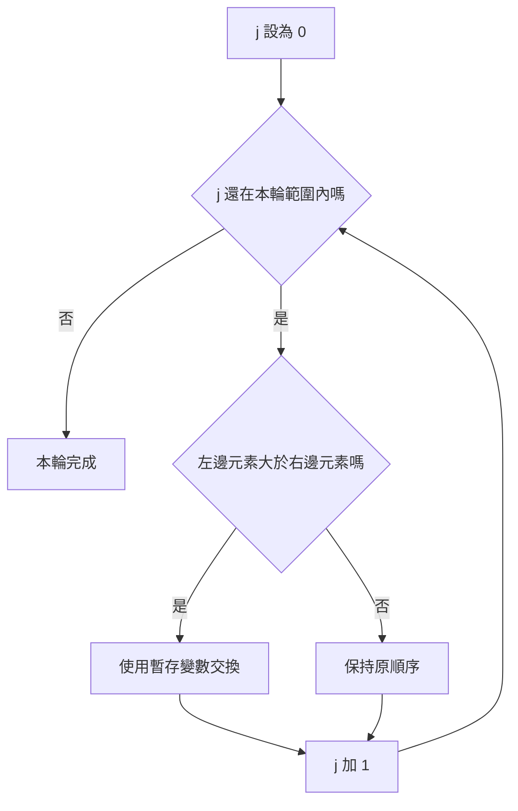
```mermaid
flowchart TD
    A[j 設為 0] --> B{j 還在本輪範圍內嗎}
    B -- 否 --> G[本輪完成]
    B -- 是 --> C{左邊元素大於右邊元素嗎}
    C -- 是 --> D[使用暫存變數交換]
    C -- 否 --> E[保持原順序]
    D --> F[j 加 1]
    E --> F
    F --> B
```

---

### 2. 完整泡沫排序

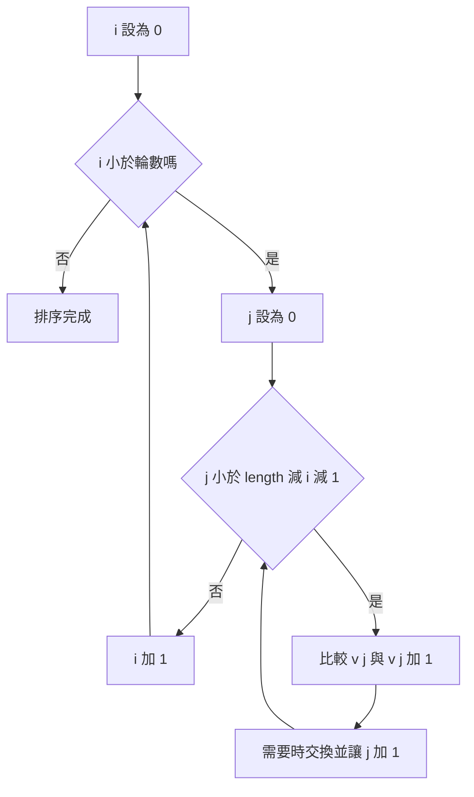
```mermaid
flowchart TD
    A[i 設為 0] --> B{i 小於輪數嗎}
    B -- 否 --> H[排序完成]
    B -- 是 --> C[j 設為 0]
    C --> D{j 小於 length 減 i 減 1}
    D -- 否 --> G[i 加 1]
    D -- 是 --> E[比較 v j 與 v j 加 1]
    E --> F[需要時交換並讓 j 加 1]
    F --> D
    G --> B
```

---

### 3. 一輪最大值向右移動

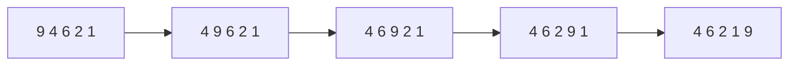
```mermaid
flowchart LR
    A[9 4 6 2 1] --> B[4 9 6 2 1]
    B --> C[4 6 9 2 1]
    C --> D[4 6 2 9 1]
    D --> E[4 6 2 1 9]
```

---

### 4. 已排序尾端逐輪增加

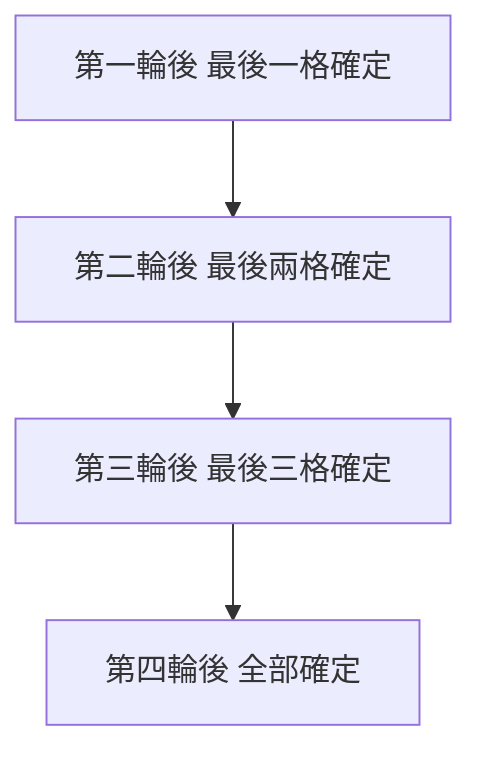
```mermaid
flowchart TD
    A[第一輪後 最後一格確定] --> B[第二輪後 最後兩格確定]
    B --> C[第三輪後 最後三格確定]
    C --> D[第四輪後 全部確定]
```

---

### 5. 交換流程

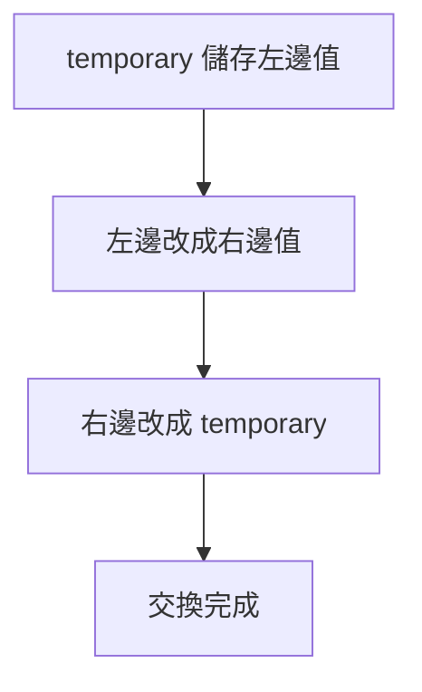
```mermaid
flowchart TD
    A[temporary 儲存左邊值] --> B[左邊改成右邊值]
    B --> C[右邊改成 temporary]
    C --> D[交換完成]
```

---

### 6. 提前停止版本

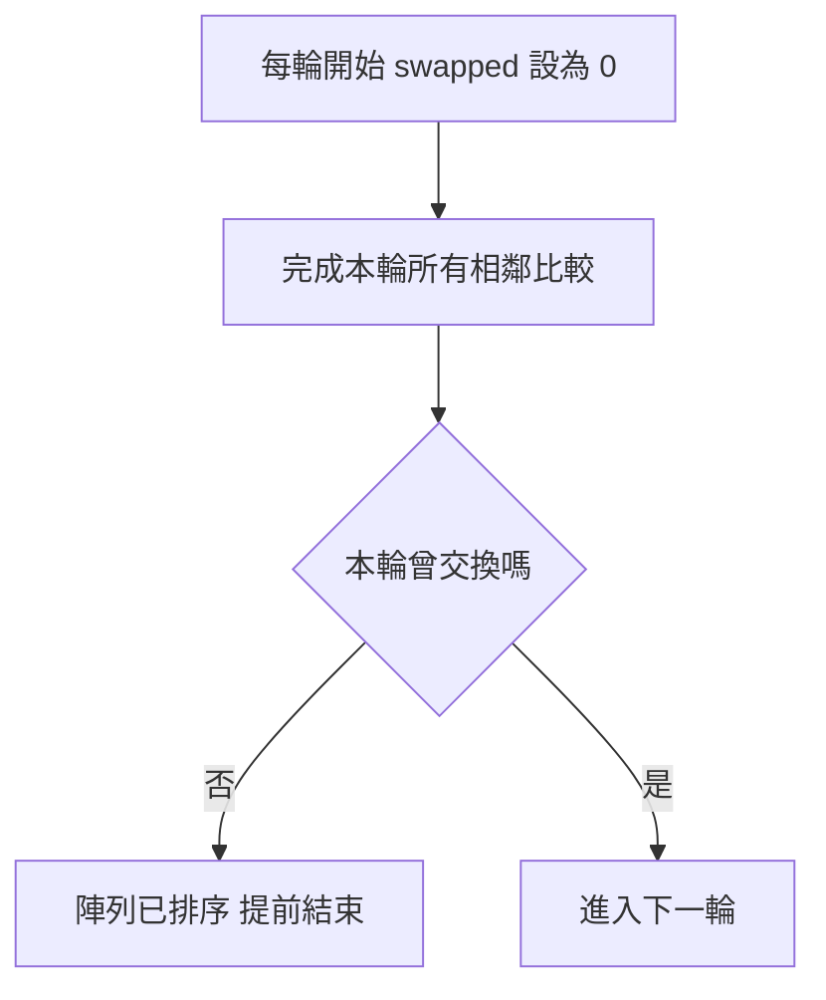
```mermaid
flowchart TD
    A[每輪開始 swapped 設為 0] --> B[完成本輪所有相鄰比較]
    B --> C{本輪曾交換嗎}
    C -- 否 --> D[陣列已排序 提前結束]
    C -- 是 --> E[進入下一輪]
```

---

## 本章完成標準

完成本章後，你應該能做到：

1. 說明陣列排序的意義。
2. 分辨遞增排序與遞減排序。
3. 說明排序不會刪除重複元素。
4. 說明排序後找最大值與最小值的方式。
5. 說明排序後中間位置與中位數的關係。
6. 說明排序後相同值會連續排列。
7. 認識排序後可利用中間位置協助搜尋。
8. 說明泡沫排序比較相鄰元素。
9. 正確使用 `v[j]` 與 `v[j + 1]`。
10. 使用比較條件判斷是否交換。
11. 使用暫存變數交換兩個元素。
12. 手動追蹤一輪泡沫排序。
13. 解釋一輪後最大值為何位於右端。
14. 解釋為什麼需要多輪。
15. 使用外層與內層迴圈完成泡沫排序。
16. 解釋 `j < length - i - 1`。
17. 避免存取 `v[length]`。
18. 完成五個整數的遞增排序。
19. 輸出每一輪的陣列狀態。
20. 修改成遞減排序。
21. 使用 `swapped` 在已排序時提前停止。
22. 計算五個元素的最大比較次數。
23. 正確處理已排序、反向、重複及負數資料。
24. 找出交換、比較方向與迴圈邊界錯誤。
25. 準備進入下一章的二維陣列。
